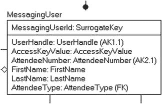
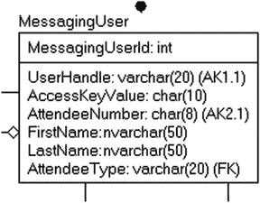
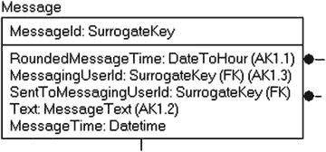
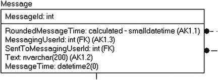
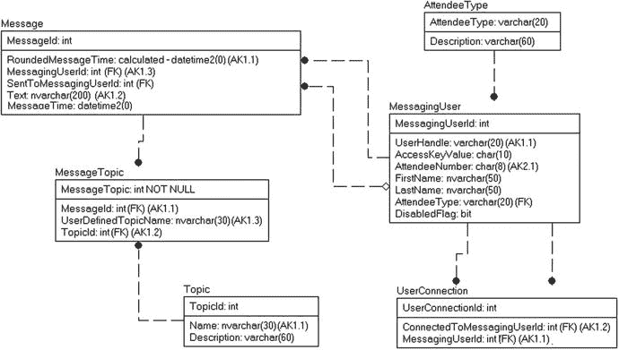
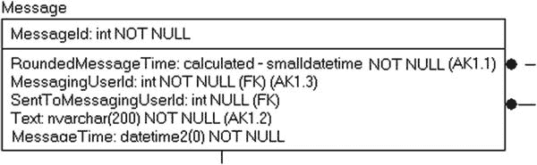
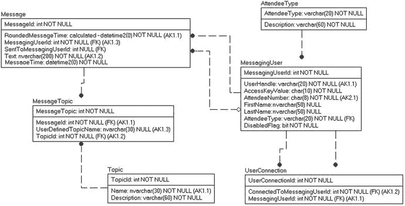
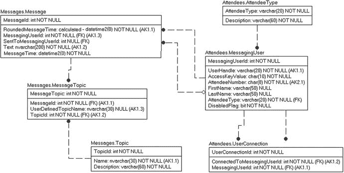
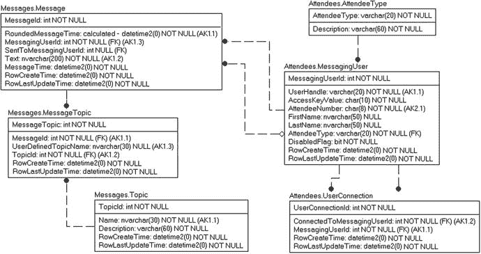

# 复杂 CLR 数据类型

在 SQL Server 2005 及更高版本中，我们可以使用 SQL CLR（公共语言运行时）构建自己的数据类型。不幸的是，它们相当繁琐，而且这些类型的实现方式使得它们的行为不像内置类型那样自然。使用 CLR 类型需要您在客户端安装该类型，才能享受到使用该类型带来的好处。

在大多数情况下，只有在存在非常强有力的理由时才应使用 CLR 类型。有几种不同的场景可以合理使用用户定义类型，通过添加额外的标量类型或现有数据类型的不同数据范围来扩展 SQL Server 类型系统。用户定义类型的一些潜在用途可能包括：

*   由特定格式的所有者提供的复杂类型，例如一种媒体格式，可用于将 `varbinary(max)` 值解释为电影或音频片段。这种类型必须加载到客户端才能从数据类型中获取任何值。
*   针对具有复杂需求的专门应用程序的复杂类型，当您确定您的应用程序将是唯一用户时。

尽管可能性几乎是无限的，但我建议仅在特定情况下考虑使用 CLR UDT，这些情况能使数据库设计变得极其健壮且易于使用。CLR UDT 是 DBA 和开发者工具箱中一个很好的补充，但应保留用于那些通过添加新的标量数据类型来解决复杂业务问题的场景。

Microsoft 已经提供了几种基于 CLR 的内置类型来实现层次结构和空间数据类型。我在此指出这一点是为了说明，如果 Microsoft 使用 CLR 来实现复杂类型（至少空间类型是相当复杂的），那么可能性是无限的。我应该指出，空间类型和 `hierarchyId` 类型已经达到了数据类型应有的极限，并且存储的一些数据（如多边形）或多或少是一个连接点的数组。

## 选择合适的数据类型

SQL Server 提供了广泛的数据类型，其中许多可以声明为各种尺寸。我总是对数据库中普遍存在的现象感到惊讶：几乎每个列要么是整数，要么是 `varchar(N)`（其中 `N` 对于所有字符串列都是相同的，有时是 8000 的范围）和 `varchar(max)`。我曾参与过的一个特定示例中，所有内容，包括基于 GUID 的主键，都存储在 `NVARCHAR(200)` 列中！将 GUID 存储在 `varchar` 列中本身就已经很糟糕了，因为它可以存储为 16 字节的二进制值，而如果使用 `varchar` 列，则需要 36 字节；但是，如果存储在 `nvarchar`（Unicode）列中，则需要 72 字节！这是多么可怕的空间浪费。更糟糕的是，有人可能在其中输入非 GUID 值，宽度可达 200 个字符。现在，使用这些数据的人会觉得他们需要在报告等中为数据预留 200 个字符的空间。时间被浪费，空间被浪费，金钱也被浪费。

再举一个例子，假设你想存储一个人的姓名和出生日期。你可以选择将姓名存储在 `varchar(max)` 列中，将出生日期存储在 `varchar(max)` 列中。在所有情况下，这些选择当然可以存储用户想要的数据，但它们绝不是好的选择。姓名应存储在类似 `nvarchar(50)` 的列中，出生日期则应存储在 `date` 列中。请注意，我为姓名使用了可变大小的类型。这是因为你不知道长度，而且并非所有姓名的大小都相同。因为大多数姓名远没有 50 字节长，所以使用可变大小类型将节省数据库空间。我使用了 Unicode 类型，因为人名确实需要允许非典型的拉丁字符。

当然，在现实中，很少有人会做出如此糟糕的数据类型选择，比如将日期值存储在 `varchar(max)` 列中。大多数选择都相当容易。然而，重要的是要记住，数据类型是域约束的第一层。回顾我们的 `UserHandle` 域，我们在表 6-6 中指定了数据类型定义和值限制。

表 6-6.

示例域：UserHandle

| 属性 | 设置 |
| --- | --- |
| 名称 | UserHandle |
| 可选 | `no` |
| 数据类型 | 基本字符集，最大 20 个字符 |
| 值限制 | 必须是 5-20 个简单的字母数字字符，并以字母开头 |
| 默认值 | `n/a` |

通过将列声明为 `varchar(20)`，你可以在数据库级别强制执行此域约束的第一部分。`varchar(20)` 类型的列甚至不允许输入 21 个字符或更长的值。仅使用数据类型无法强制执行大于或等于五个字符的规则。本章后面将更多地讨论如何强制执行简单的域要求，在第 7 章中，我将讨论更复杂的完整性强制模式。在这种情况下，我确实使用了简单的 ASCII 字符集，因为需求要求的是简单的字母数字数据。

最初，我们为 `MessagingUser` 表设计了如图 6-18 所示的模型。



图 6-18.

选择确切数据类型之前的 MessagingUser 表

选择类型时，我们将使用 `int` 作为代理键（在 DDL 部分，我们将设置域中其余可选性规则集的实现：“键不可选且自动生成，非键的可选性由使用情况决定”），但会将 `SurrogateKey` 域的项目替换为 `int` 类型。用户句柄在本节前面已经讨论过。在图 6-19 中，我为 `Name`、`AccessKeyValue` 和 `AttendeeType` 列选择了一些其他基本类型。




图 6-19.

选择数据类型后的 MessagingUser

有时，你可能没有任何真实的领域定义，而是会使用通用的尺寸。对于这些情况，我建议使用标准类型（如果你能找到的话，比如在互联网上），或者查看你系统中已有的数据。在系统投入生产之前，从数据库的角度来看，更改类型相当容易，但访问这些结构的代码越多，进行更改就越困难。

对于图 6-20 中的 `Message` 表，我们将选择数据类型。



图 6-20.

选择数据类型前的 Message 表

`text` 列的数据类型不是 `text`，而是消息的文本，限制为 200 个字符。对于时间列，在图 6-21 中，我为 `MessageTime` 选择了 `datetime2(0)`，因为需求指定时间精确到秒。对于 `RoundedMessageTime`，我们将四舍五入到小时，因此我也选择期望其为 `datetime2(0)`，尽管它将是基于 `MessageTime` 值的计算列。因此，`MessageTime` 和 `RoundedMessageTime` 是同一数据值的两种视图。



图 6-21.

选择数据类型后的 Message 表，标有计算列

因此，我将使用一个计算列，如图 6-21 所示。我会将 `RoundedMessageTime` 的类型指定为一个不存在的数据类型（所以如果我尝试创建表，它将会失败）。计算列是一种特殊类型的列，不能直接修改，因为它是基于表达式结果的。

本章稍后，我们将指定实际的实现，但现在，我们基本上只是设置了一个占位符。当然，在实际操作中，我会立即指定实现，但同样，为了这个初次的学习过程，我刻意以这种方式进行，以保持条理清晰。因此，在图 6-22 中，我有了设置好所有数据类型的模型。



图 6-22.

选择数据类型后的消息传递系统模型

### 设置可空性

流程的下一步是设置列的可空性。在我们的域中，我们指定了列是否可选，因此这通常是一项简单的任务。对于图 6-23 中的 `Message` 表，我为列选择了以下可空性设置。



图 6-23.

待审查的 Message 表

有趣的选择是针对两个 `MessagingUserId` 列。在图 6-24 中，你可以看到完整的模型，但请注意从 `MessagingUser` 到 `Message` 的关系。发送消息的用户的关系 (`MessagingUserId`) 是 `NOT NULL`，因为每条消息都是由一个用户发送的。然而，表示消息接收用户的关系是可空的，因为并非每条消息都需要发送给一个用户。



图 6-24.

选择了 NULL 值的 messaging system 模型

此时，我们的模型已接近完成，并且非常类似于一个可以在应用程序中构建和使用的数据库。只需要再补充一点信息就可以完成模型。

### 选择排序规则

字符串值的排序规则设置了字符串相互比较以及排序的方式。世界各地的许多不同文化使用了许多不同的字符集。虽然如果你需要存储几乎任何字符集的字符，可以选择 Unicode 数据类型，但仍然存在数据如何排序（是否区分大小写）和比较（是否区分重音）的问题。SQL Server 和 Windows 提供了大量可供选择的排序规则类型。排序规则在多个层级指定，从服务器开始。服务器排序规则决定了系统元数据的存储方式。然后是数据库的排序规则，最后，每个列可以有不同的排序规则。

对于普通数据库来说，更改默认排序规则的需求不太常见，默认排序规则通常选择为系统所有用户最典型的排序规则。这通常是一种不区分大小写的排序规则，它允许在进行比较和排序时，`'A' = 'a'`。我只在需要区分大小写的列上使用过几次替代排序规则（有一次是为了让客户端能够强制使用更多四字符代码，这是不区分大小写的排序规则所不允许的！）。

要查看服务器和数据库的当前排序规则类型，可以执行以下命令：

```sql
SELECT SERVERPROPERTY('collation');
SELECT DATABASEPROPERTYEX('DatabaseName','collation');
```

在大多数安装于英语国家/地区的系统上，默认排序规则类型是 `SQL_Latin1_General_CP1_CI_AS`，其中 `Latin1_General` 代表标准拉丁字母表，`CP1` 指代码页 1252（SQL Server 默认的 Latin 1 ANSI 字符集），最后部分分别代表不区分大小写和区分重音。你可以在 SQL Server 文档中找到所有排序规则类型的完整说明。然而，默认设置很少是期望使用的排序规则，设置为该较旧的排序规则是为了向后兼容。理想情况下，你将使用 Windows 排序规则，我将在示例代码中使用 `Latin1_General_100_CI_AS`，这是我安装服务器时使用的排序规则。`100` 表示这是一个支持较新 Unicode 字符的较新排序规则。

除了常规排序规则外，还有二进制排序规则，你可以使用它们基于数据的原始格式进行排序和比较。有两种类型的二进制排序规则：较旧的后缀为 `_bin`，较新的为 `_bin2`。`Bin2` 排序规则执行所谓的纯代码点排序，意味着它们仅根据二进制值比较数据（`bin` 排序规则将第一个字节作为 `WCHAR` 比较，这是一种 `OLEDB` 数据类型）。请注意，二进制排序顺序与区分大小写是有区别的，因此花些时间理解你最终使用的排序规则对你有好处。

要列出给定 SQL Server 实例中安装的所有排序顺序，可以执行以下语句：

```sql
SELECT *
FROM ::fn_helpcollations();
```

在我进行测试的计算机上，此查询返回了超过 3800 行，但通常你不需要更改数据库管理员最初选择的默认设置。在创建列时，要为 `char`、`varchar`、`text`、`nchar`、`nvarchar` 或 `ntext` 列设置排序序列，你可以使用列定义的 `COLLATE` 子句来指定，如下所示：

```sql
CREATE SCHEMA alt;
CREATE TABLE alt.OtherCollate
(
OtherCollateId int IDENTITY
CONSTRAINT PKAlt_OtherCollate PRIMARY KEY ,
Name nvarchar(30) NOT NULL,
FrenchName nvarchar(30) COLLATE French_CI_AS_WS NULL,
SpanishName nvarchar(30) COLLATE Modern_Spanish_CI_AS_WS NULL
);
```


## 排序规则、模式与实现列

现在，当你按 `FrenchName` 对输出排序时，它是大小写不敏感的，但会根据法语的顺序来排列行。对于西班牙语及 `SpanishName` 列也是如此。在本章中，我们几乎在所有情况下都会坚持使用默认设置，并且我建议如果你有存储多语言数据的需求，可以查阅在线文档。唯一可能偏离数据库默认排序规则的“常规”情况是，当你需要为一个列指定不同的大小写敏感性时，此时你可能会使用二进制排序规则或大小写敏感的排序规则。

有一个快速提示，你可以使用 `COLLATE` 关键字在 `WHERE` 子句中指定排序规则：

```sql
SELECT Name
FROM alt.OtherCollate
WHERE Name COLLATE Latin1_General_CS_AI
LIKE '[A-Z]%' collate Latin1_General_CS_AI;  --区分大小写且
--不区分重音
```

在选择与默认值不同的排序规则时必须格外小心，因为在服务器级别更改它极其困难，在数据库级别更改它也绝非易事。你可以使用 `ALTER` 命令更改列的排序规则，但前提是该列不能有约束或索引引用它，并且你可能需要重新编译所有引用该表的对象。

如果你发现自己身处一个拥有多种排序规则的服务器上，一个方便的排序规则设置是使用 `database_default`，它使用你当前执行查询所在的数据库的默认排序规则。

在设置服务器、数据库、表等时，明智地选择排序规则非常重要。更改数据库的排序规则可以通过一个简单的 `ALTER` 语句完成。然而，这不会更改数据库中的任何对象。你必须单独更改每个列的排序规则，虽然你可以使用简单的 `ALTER TABLE…ALTER COLUMN` 语句来更改排序规则，但你必须首先删除所有引用该列的索引、约束和模式绑定对象。这是一个相当痛苦的任务。

### 设置模式

模式（Schema）是一个命名空间：一个包含数据库对象的容器，所有这些对象都在一个数据库的范围内。我们将使用模式将表以及最终的视图、存储过程、函数等分组到功能组中。为模式命名与为表或列命名有点不同。模式名称应该听起来合适，所以有时用复数形式有意义，有时用单数形式。这取决于它们的使用方式。我发现我大多数时候使用复数名称，因为这样听起来更好，而且有时如果模式和表都用单数命名，你会遇到一个表与模式同名的情况。

在图 6-25 的模型中，我们将用于表示消息的表放在一个名为 `Messages` 的模式中，而将代表 `Attendees` 及其相互关系的表放在一个名为 `Attendees` 的模式中。



图 6-25. 分配了模式的消息模型

另请注意，我通常会在流程的后期设置模式，从模式开始可能看起来更正确。我发现，通常更容易发现实现的不同区域，而且模式并不一定容易从头开始定义，不同的区域会不断出现，直到我得到最终的解决方案。有时，这样做是必要的，因为你有多个同名的表，尽管这可能是设计不佳的标志。在这个虚构的解决方案中，我最后才做这一步，只是为了说明它可以放在最后进行。

模式如此好用的原因在于，你可以在模式级别处理权限，而不是逐个对象地处理。当你在列表（例如在 Management Studio 中）中查看对象时，模式还为你提供了对象的逻辑分组。

在本书的这一点上，我不会进一步探讨使用模式的安全方面，但要理解模式不仅仅是为了美观。在本书的所有示例中，我总会指出表所在的模式。在我设计的任何系统中，模式都将是其中的一部分，仅仅因为这样做是最佳实践。简要回到现实世界，我在本书的前几版中说过，在生产系统中开始使用模式将是一个缓慢的过程，在 11 多年后的今天，这对某些用户来说仍然可能感到突兀。第 9 章 将更详细地讨论使用模式实现安全。

### 添加实现列

最后，我将再为数据库添加一样东西：仅用于支持代码实现的列（而不是直接支持用户需求）。一个非常常见的用途是拥有指示行创建时间、更新时间以及可能由谁更新的列。在我们的模型中，我将坚持提到的时间点这个简单案例，并演示如何在数据库中实现这一点。许多实现者喜欢将这些值留给客户端处理，但我非常倾向于使用数据库代码，因为这样我就有了一个时钟来管理时间，而不是多个时钟。（我曾经管理过一个使用两个时钟来设置行时间的系统，偶尔会出现一行数据最后更新的时间比其创建时间还要早几年的情况！）

因此，在图 6-26 中，我为每个表添加了两个 `NOT NULL` 列，用于记录 `RowCreateTime` 和 `RowLastUpdateTime`，但我们指定为非用户可管理的 `AttendeeType` 表除外，因此我选择不为该表包含这些修改时间列。当然，你可能希望这样做以告知你的开发团队该行首次可用的时间。为了简单起见，我还省略了表示由谁更改该行的列。



图 6-26. 向表中添加 RowCreateTime 和 RowLastUpdateTime 后的消息模型

最后需要注意的是，通常最好只将这些实现列严格用于元数据目的。例如，考虑 `Messages.Message` 表。如果你需要知道消息是何时创建的，你应该使用 `MessageTime` 列，因为该值可能代表用户点击创建按钮的时间，是从不同的时钟源捕获的，即使实际存储数据花了五分钟。另外，如果你需要将数据加载到一个新表中，该行可能是在 2016 年创建的，但数据可能是 2000 年的，因此不将这些列用作用户数据意味着你可以真实地反映行的创建时间。

这就是为什么我为这些实现列使用如此笨拙的名称。许多表会包含创建时间，但该数据可能是可修改的。我不希望用户更改行的创建时间，因此该名称表明创建时间严格针对该行，并且我不允许任何人修改此列。

有时，我将在并发控制中使用这些列来指示行何时被更改，但当我能够控制设计时，如果客户端可以（并且会）利用它，我将使用 `rowversion` 类型。并发控制是一个非常重要的主题，我将在第 11 章用一整章的篇幅来讨论。


