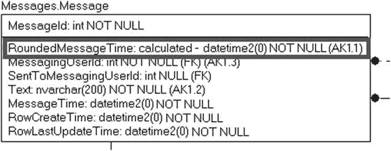
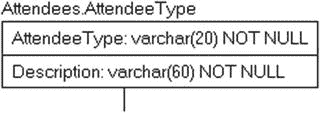
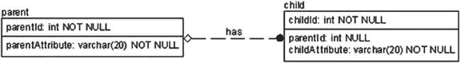
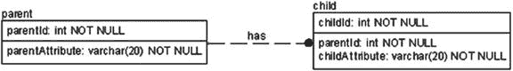
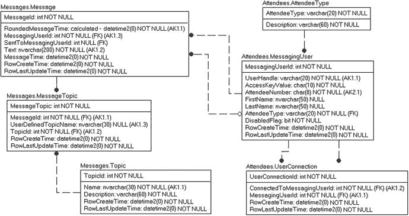
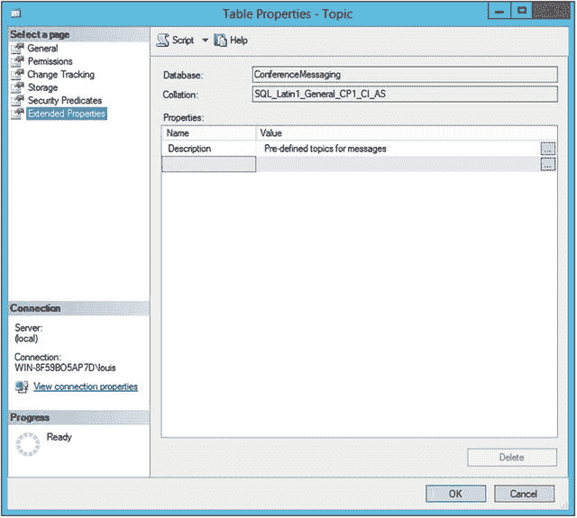

# 使用 DDL 创建数据库

到目前为止，我们一直在调整模型以满足实现的需求。我们添加了列、添加了表并指定了约束。现在，在本章的后半部分，我们将转向流程中的机械部分，因为剩下要做的就是实现我们花了大量时间设计的表。蓝图已经绘就，现在终于可以拿起锤子开始钉钉子了。

就像本书其他部分一样，我将手动使用 DDL 完成这项工作，因为这将帮助你理解工具为你构建了什么。对于任何数据库架构师或 DBA 来说，复习 SQL Server 语法也是一个很好的练习；我个人不建议在没有数据建模工具的情况下构建一个拥有 300 张表的数据库，但我确实认识一些这样做并且不考虑使用工具来创建其任何数据库对象的人。另一方面，那些可用于进行逻辑建模的相同数据建模工具通常可以创建表，并且常常还能创建一些相关代码，从而减轻你手指的额外磨损，同时给你更多时间去帮助马里奥拯救那位似乎总是被俘获的公主。无论你如何完成这项工作，都需要确保最终得到你或工具以某种方式用于在文件系统中创建对象的 DDL 脚本，因为它们对于 DBA 向生产、测试、开发、QA 或任何已建立的用于让开发人员、用户和 DBA 在整个过程中共存的环境应用变更来说，都是无价的工具。

还要确保你的脚本也置于源代码控制系统中，或者至少进行备份。在 SQL Server 中，我们有两个可以使用的工具：Management Studio 和 Visual Studio Data Tools。Data Tools 是面向开发的工具，允许开发人员以一种类似于 .NET 开发人员的方式工作。Management Studio 的工具集更偏向管理，但拥有直接查看和编辑对象的工具。

在本书中，我将坚持使用任何工具都会使用的 DDL 来构造对象，采用在线范式，即一次一个命令地直接创建数据库。此类脚本可以使用任何 SQL Server 工具执行，但我通常只使用 Management Studio 中的查询窗口，或者在执行多个脚本时有时使用 `SQLCMD.exe` 命令行工具。你可以从 Microsoft 网站免费下载 Management Studio 或 Data Tools，地址分别是 [`msdn.microsoft.com/library/mt238290.aspx`](https://msdn.microsoft.com/library/mt238290.aspx) 或 [`msdn.microsoft.com/en-us/library/mt204009.aspx`](https://msdn.microsoft.com/en-us/library/mt204009.aspx)，尽管这些位置在本书发布后的几年里肯定会发生变化。

在开始构建其他任何东西之前，你需要一个数据库。我将使用所有默认值创建此数据库，我的安装在我的笔记本电脑上的 Hyper-V 虚拟机中非常通用（几乎任何虚拟机技术都可以，或者你可以在大多数现代版本的 Windows 上安装；并且截至撰写本文时，一个运行在 Linux 上的 SQL Server 版本正在预览中，而且地球的地壳还没有冻结）。我使用的是开发人员版，并且在安装时使用了大多数默认设置（除了为安全设置混合模式以便以后进行一些安全测试，以及将排序规则设置为 `Latin1_General_100_CI_AS`，这对于真正为多用户设置服务器或如果你想测试 Always On、复制等功能来说不是最优的。对于我介绍的内容所使用的服务器，所有用户都可以仅通过 SQL Server 代码进行管理和创建。

如果你使用的是共享服务器，例如公司开发服务器，则需要使用具有创建数据库权限的帐户来完成此操作。如果你自己安装服务器，设置用户以便可以访问服务器是安装过程的一部分。

选择数据库名称的重要性与命名其他对象相同，我倾向于采取类似的命名立场。尽可能保持简单以区别于所有其他数据库，并遵循你组织中已有的命名标准。我会尽量注意尝试在 SQL Server 实例之间标准化名称，以允许数据库在服务器之间移动。在代码下载中，我将数据库命名为 `ConferenceMessaging`。

我将采取的步骤如下：

*   创建基本表结构：构建带有列的基础对象。
*   添加唯一性约束：使用主键和唯一约束来强制表中行之间的唯一性。
*   构建默认约束：在值不明显时帮助用户选择适当的值。
*   添加关系：定义表之间如何相互关联（外键）。
*   实现基本的检查约束：某些域需要比使用简单数据类型更严格地实施。
*   记录数据库：将文档直接包含在 SQL Server 对象中。
*   验证依赖关系信息：使用目录视图和动态管理视图，你可以验证你期望相互依赖的对象确实存在，从而使你的数据库更易于管理。

我将使用以下语句创建一个小型数据库：`CREATE DATABASE ConferenceMessaging;` 你可以通过运行以下语句查看数据库文件放置的位置（请注意，大小以 8KB 页为单位呈现——有关数据库存储内部结构的更多信息，请参见第 10 章）：

```sql
SELECT type_desc, size*8/1024 AS [size (MB)],physical_name
FROM   sys.master_files
WHERE  database_id = DB_ID('ConferenceMessaging');
```

这会返回

```
type_desc    size (MB)   physical_name
------------ ----------- ----------------------------------------------
ROWS         8           C:\Program Files\Microsoft...SQL\DATA\ConferenceMessaging.mdf
LOG          8           C:\Program Files\Microsoft...SQL\DATA\ConferenceMessaging_log.ldf
```

接下来，我们想处理数据库的所有者。数据库由创建该数据库的用户拥有，你可以从以下查询中看出：

```sql
USE ConferenceMessaging;
--确定与数据库中 dbo 用户关联的登录名
SELECT  SUSER_SNAME(sid) AS databaseOwner
FROM    sys.database_principals
WHERE   name = 'dbo';
```

在我的实例上，我使用名为 `louis` 的用户和名为 `WIN-8F59BO5AP7D` 的计算机创建了数据库：

```
databaseOwner

WIN-8F59BO5AP7D\louis
```

你可以使用以下查询查看实例上所有数据库的所有者：

```sql
--从所有数据库获取数据库所有者的登录名
SELECT SUSER_SNAME(owner_sid) AS databaseOwner, name
FROM   sys.databases;
```

在典型的企业生产服务器上，我几乎总是会将数据库的所有者设置为系统管理员帐户，以便所有数据库都由同一用户拥有。不这样做的唯一原因是你共享数据库，或者你实施了需要对多个数据库有所不同的跨数据库安全性（有关安全性的更多信息，请参见第 9 章）。你可以使用 `ALTER AUTHORIZATION` 语句更改数据库的所有者：

```sql
ALTER AUTHORIZATION ON DATABASE::ConferenceMessaging TO SA;
```

返回并使用代码查看数据库所有者，你会看到所有者现在是 `SA`。

> 提示
> 在每条 T-SQL 语句末尾放置分号正迅速成为一种标准，在未来版本的 SQL Server 中，这将被要求。


### 创建基本表结构

接下来是创建数据库的基本表。在本节中，我们将编写 `CREATE TABLE` 语句来创建表。以下是 `CREATE TABLE` 语句的基本语法：

```
CREATE TABLE [.][.]
(

);
```

如果您查阅 `Books Online`，会看到许多附加设置，允许您使用磁盘上或内存中的配置、将表放置在文件组上、将表分区到多个文件组上、控制最大/溢出数据的存放位置等等。其中部分内容将在关于表结构和索引的第 10 章中讨论。正如本书中大多数数据库示例将采用的典型规范一样，我们将主要使用磁盘上的表。

**提示**

请不要将此作为了解 SQL Server DDL 的唯一信息来源。`Books Online` 是另一个全面了解 `DDL` 的绝佳资源，其他类型的书籍也会非常详细地介绍表创建的物理方面。在本书中，我们主要关注数据库设计的关系方面，并辅以足够的物理实现指导，以助您走上正确的方向。本书剩余的章节将深入探讨更复杂的使用模式，但即便如此，我们也不会涵盖所有存在的、甚至是有用的设置。

基础 `CREATE` 子句很简单：

```
CREATE TABLE [.][.]
```

我将详细说明尖括号（`<` 和 `>`）之间的项目。方括号（`[` 和 `]`）中的任何内容都是可选的。

*   `<database>`：在 `CREATE TABLE` 语句中很少需要指定数据库。如果未指定，则默认为执行语句的当前数据库。指定数据库意味着该脚本将只能在单个数据库中创建对象，这阻碍了我们在同一服务器上使用未修改的脚本来构建名称不同的备用数据库（如果需要的话）。
*   `<schema>`：这是表所属的模式。我们在模型中指定了一个模式，并将作为本节的一部分来创建模式。默认情况下，模式将是 `dbo`（或者您可以按数据库主体设置默认模式……但始终指定模式要好得多）。
*   `<tablename>`：这是表的名称。

对于表名，如果第一个字符是单个 `#` 符号，则该表是临时表。如果表名的前两个字符是 `##`，则它是一个全局临时表。临时表与其说是数据库设计的一部分，不如说是一种在复杂查询中保存中间结果的机制，因此它们并不真正属于数据库设计范畴。您还可以通过在前面使用 `@` 来声明一个具有与变量相同作用域的局部变量表，可用于保存小型数据集。

`<schema>` 和 `<tablename>` 的组合在数据库中必须是唯一的，并且 `<tablename>` 必须与数据库中任何其他对象（包括表、视图、存储过程、约束、函数等）的名称不同。这就是为什么我建议对表以外的对象使用前缀或命名模式。一些看起来像对象的东西其实不是，比如索引。随着我们学习的深入，这些内容都会变得更加清晰。

#### 模式

正如前面定义数据库模式的部分所讨论的，模式是一个命名空间：一个用于包含数据库对象的容器，所有这些都在数据库的范围内。一个好处是，因为模式与用户没有紧密绑定，所以您可以在不更改对象公开名称的情况下删除用户。更改模式的所有者会更改该模式内对象的所有者。

在 SQL Server 2000 及更早版本中，表由用户所有，这使得使用模式变得困难。在不深入探讨安全性的情况下，由同一用户拥有的对象由于所有权链而更容易处理安全性。如果一个对象引用另一个对象，并且它们由同一用户拥有，则所有权链不会中断。因此，当时我们让所有对象都由同一用户拥有。

从 SQL Server 2005 开始，模式由用户所有，而表包含在模式中。您可以使用以下命名方法访问对象，就像使用 `CREATE TABLE` 语句时一样：

```
[.][.]objectName
```

`<databaseName>` 默认为当前数据库。`<schemaName>` 默认为用户的默认模式。

模式对于在数据库内隔离对象以提高使用的清晰度非常有用。在我们的数据库中，之前已经指定了两个模式：`Messages` 和 `Attendees`。基本语法很简单，就是 `CREATE SCHEMA <schemaName>`（它必须是批处理中的第一条语句）。因此，我将使用以下命令创建它们：

```
CREATE SCHEMA Messages; --与所发送消息相关的表
GO
CREATE SCHEMA Attendees; --与与会者及其发送消息方式相关的表
GO
```

`CREATE SCHEMA` 语句还有另一种变体，您可以在其中创建包含在其中的对象，但很少使用，如下例所示：

```
CREATE SCHEMA Example
CREATE TABLE ExampleTableName ... ; --对象上没有模式名称
```

模式以及您在脚本中包含的任何对象都将被创建，它们将成为该模式的成员。如果您需要删除模式（就像我为了尝试语法而创建了 `Example` 模式一样！），请使用 `DROP SCHEMA Example;`。

您可以使用 `sys.schemas` 目录视图查看已创建的模式：

```
SELECT name, USER_NAME(principal_id) AS principal
FROM   sys.schemas
WHERE  name <> USER_NAME(principal_id); --不列出用户模式
```

这将返回

```
name           principal
-------------- ----------------------
Messages       dbo
Attendees      dbo
```

有时，模式最终由 `dbo` 以外的用户拥有，例如当没有 `db_owner` 权限的开发人员创建模式时。或者有时用户会通过一些 SQL Server 工具获得一个与其用户名相同的模式（这是模式查询中 `WHERE name <> USER_NAME(principal_id)` 的目的）。您可以使用 `ALTER AUTHORIZATION` 语句来更改所有权，类似于对数据库的操作：

```
ALTER AUTHORIZATION ON SCHEMA::Messages TO DBO;
```

请注意，建议始终在代码中为对象指定双部分名称。这样更安全，因为您知道它使用的是哪个模式，并且不需要在每次执行时检查默认值。但是，对于临时访问，如果您通常使用某个特定模式，每次都键入模式名可能会很烦人。您可以在 `CREATE USER` 和 `ALTER USER` 语句中为用户设置默认模式，如下所示：

```
CREATE USER 
FOR LOGIN 
WITH DEFAULT SCHEMA = schemaname;
```

`ALTER USER` 命令允许更改现有用户的默认模式（在 SQL Server 2012 及更高版本中，它也适用于基于 Windows 组的用户；对于 2005-2008R2，它仅适用于标准用户）。


#### 列与基本数据类型

`CREATE TABLE`语句的下一部分用于列规格说明：

```
CREATE TABLE [schema].[table_name]
(
  <column_name> <data_type> [NULL | NOT NULL]
  [IDENTITY [(seed,increment)]
  --或
  AS <computed_column_expression> [PERSISTED]
);
```

`<columnName>`占位符用于指定列的名称。

列分为两种类型：
*   **已实现**：这是普通列，始终分配物理存储空间并为值存储数据。
*   **计算列（或虚拟列）**：这些列由表中任意物理列的计算结果派生而成。它们可以被存储，也可以仅在被访问时计算。

任何数据库中的大多数列都将是已实现列，但计算列有一些非常酷的用途，所以不要因为它们不常被提及就认为它们毫无用处。通过使用计算列，你可以避免大量基于代码的非规范化操作。在我们的示例表中，我们指定了一个计算列，如图 6-27 所示。


*图 6-27. 高亮显示计算列的 Message 表*

因此，基本列（计算列之外）相当简单，只需名称和数据类型：

```
MessageId             int,
SentToMessagingUserId int,
MessagingUserId       int,
Text                  nvarchar(200),
MessageTime           datetime2(0),
RowCreateTime         datetime2(0),
RowLastUpdateTime     datetime2(0)
```

需求规定用户在一小时内不能发送相同的消息超过一次。因此，我们构造一个表达式，它接收 `datetime2(0)` 数据类型的 `MessageTime`。该时间精度到秒级，而我们需要的是小时级别的数据。我首先声明一个与我们派生来源列相同类型的变量，然后为其赋值。我从一个 `datetime2(0)` 类型的变量开始，并用 `SYSDATETIME()` 的时间加载它：

```
declare @pointInTime datetime2(0);
set @pointInTime = SYSDATETIME();
```

接下来，我编写以下表达式：

```
DATEADD(HOUR, DATEPART(HOUR, @pointInTime), CAST(CAST(@PointInTime AS date) AS datetime2(0)))
```

这个表达式可以相对简单地分解，但基本上是获取自午夜以来的小时数，并通过将其转换为 `date` 再转换为 `datetime2`（这使得我们可以对其添加小时）来将其添加到仅日期部分的值上。一旦表达式测试通过，你就可以用 `MessageTime` 列替换变量，然后我们如下定义我们的计算列：

```
,RoundedMessageTime AS DATEADD(HOUR, DATEPART(HOUR, MessageTime), CAST(CAST(MessageTime AS date) AS datetime2(0))) PERSISTED
```

`PERSISTED` 规范表明该值将被计算并作为表定义和存储的一部分保存，就像一个完全实现的列一样，这意味着使用该列时不需要在运行时计算该值。为了能够持久化，表达式必须是确定性的，这基本上意味着对于相同的输入，你总是会得到相同的输出（很像我们在 第 5 章 中介绍的规范化概念）。你也可以将基于确定性表达式的计算列用作索引中的列（我们将在此表中将其用作唯一性约束的一部分）。因此，像 `GETDATE()` 这样的表达式可以在计算列中使用，但你无法持久化或索引它，因为其值在每次执行时都会改变。

#### 可空性

在列创建语句中，只需将物理模型中的 `<NULL specification>` 更改为 `NULL` 以允许 `NULL`，或更改为 `NOT NULL` 以不允许 `NULL`：

```
  <column_name> <data_type> [NULL | NOT NULL]
```

这里没什么特别令人惊讶的。对于图 6-27 中 `Messages.Message` 表的非计算列，我们将指定如下的可空性：

```
MessageId             int            NOT NULL,
SentToMessagingUserId int            NULL,
MessagingUserId       int            NOT NULL,
Text                  nvarchar(200)  NOT NULL,
MessageTime           datetime2(0)   NOT NULL,
RowCreateTime         datetime2(0)   NOT NULL,
RowLastUpdateTime     datetime2(0)   NOT NULL
```

> **注意**
> 完全省略 `NULL` 规范时，将使用 SQL Server 的默认值，该默认值由 `ANSI_NULL_DFLT_OFF` 和 `ANSI_NULL_DFLT_ON` 数据库属性控制（更多详情请参见 [`https://msdn.microsoft.com/en-us/library/ms187356.aspx`](https://msdn.microsoft.com/en-us/library/ms187356.aspx)）。始终指定列的可空性是一个非常重要的最佳实践，但我不会尝试演示这些设置如何工作，因为它们相当令人困惑。

### 管理非自然主键

最后，在过于兴奋地完成表创建脚本之前，还有一件事需要讨论。本章前面，我讨论了在表中使用代理键的基础知识。在本节中，我将介绍我通常使用的方法。我将代理键值分解为我所使用的类型：
*   **手动管理**：让客户端选择代理值，通常是客户端有意义的代码或短值。有时，如果代码的文本表示需要频繁更改，这可能是一个无意义的值，但通常它只是一个简单的代码值。例如，如果你有一个颜色表，你可以用 `'BL'` 表示蓝色，`'GR'` 表示绿色。
*   **自动生成**：使用 `IDENTITY` 属性或存储在 uniqueidentifier 类型列中的 GUID。
*   **自动生成**：但使用 `DEFAULT` 约束，允许你在需要时覆盖值。为此，你可以使用 `NEWID()` 或 `NEWSEQUENTIALID()` 函数生成 GUID，或者基于 `SEQUENCE` 对象的值生成值。

当然，如果你的表不使用任何类型的代理值，你可以直接进入下一节。

#### 手动管理

在示例模型中，我有一处这样的情况，我建立了一个域表，不允许用户向表中添加或删除行。对表中行的更改可能需要更改应用程序系统层和应用层的代码。因此，我们不是构建需要代码管理和用户界面的表，而是简单地为每个代理值选择一个永久值。这使你能控制键中的值，并允许在代码中直接使用该键（可能作为宿主语言中的常量构造）。它还允许用户界面缓存此表中的值，甚至将其作为常量实现，并确信在不通知使用它们的程序员的情况下它们不会改变（参见图 6-28）。


*图 6-28. 供参考的 AttendeeType 表*

请注意，通常预期是，一旦你为实现域而构建的表手动创建了一个值，该值的含义将永远不会改变。例如，你可能有一行 `('SPEAKER', '在会议上发表演讲并具有特殊权限的人员')`。在这种情况下，可以更改 `Description`，但不能更改 `AttendeeType` 的值。


##### 使用 IDENTITY 属性生成

大多数情况下，创建表是为了允许用户创建新行。在这些表上实现代理键可以使用（通常称为）`IDENTITY` 列来完成。对于任何精确数值数据类型，都有一个选项可以创建自动递增（或递减，具体取决于增量值）的列。标识值会自动递增，其操作作为一个独立于常规事务的自主事务，因此速度极快，并且除了生成新的顺序值外，不会锁定其他连接。实现此 `IDENTITY` 列的列也应定义为 `NOT NULL`。在我们关于列的初始章节中，我对列规范有如下描述：

```sql
  [] IDENTITY [(SEED,INCREMENT)]
```

`SEED` 部分指定列值开始的数字，`INCREMENT` 则是下一个值将增加的量。例如，以早前创建的 `Movie` 表为例，这次实现基于 `IDENTITY` 的代理键：

```sql
MessageId             int            NOT NULL IDENTITY(1,1) ,
SentToMessagingUserId int            NULL ,
MessagingUserId       int            NOT NULL ,
Text                  nvarchar(200)  NOT NULL ,
MessageTime           datetime2(0)   NOT NULL ,
RowCreateTime         datetime2(0)   NOT NULL ,
RowLastUpdateTime     datetime2(0)   NOT NULL
```

在我们前几节一直使用的 `Message` 表的 `MessageId` 列声明中，我为 `MovieId` 列添加了 `IDENTITY` 属性。种子值 `1` 表示值将从 1 开始，增量表示第二个值将增加 1，在本例中为 2，然后是 3，依此类推。你可以将种子和增量设置为该列数据类型允许的任何值。例如，你可以将列声明为 `IDENTITY(1000,-50)`，那么第一个值将是 1000，第二个是 950，第三个是 900，以此类推。

`IDENTITY` 属性对于创建又小又快的代理主键很有用。`int` 数据类型仅需 4 个字节，并且通常足够，因为大多数表的行数少于 20 亿。然而，关于 `IDENTITY` 值，你必须了解几个主要注意事项：

*   `IDENTITY` 值序列中容易出现空洞。如果在创建新行时发生错误，原本要使用的 `IDENTITY` 值将从标识序列中丢失。这是使它们在高并发需求下表现良好的原因之一。因为 `IDENTITY` 值不受事务影响，其他连接不必等待另一个事务完成。
*   如果删除了一行，被删除的值不会被重用，除非你手动插入一行。因此，如果你不能接受对表中值的这个约束，就不应使用 `IDENTITY` 列。
*   带有 `IDENTITY` 属性的列的值无法更新。你可以通过使用 `SET IDENTITY_INSERT <tablename> ON` 来插入自己的值，但大多数情况下，你应仅在使用来自另一张表的值初始化表时才使用此方法。
*   你无法通过修改列来启用 `IDENTITY` 属性，但可以向现有表添加一个 `IDENTITY` 列。

请记住一个事实（我希望我已经强调得足够多了）：代理键不应该是表上的唯一键，或者唯一的唯一性仅仅是一个或多或少随机的值！

##### 使用默认约束生成

使用标识值，你得到一个非常严格的键管理系统，必须使用特殊语法（`SET IDENTITY_INSERT`）才能向表中添加新行。除了像标识这样严格的键生成工具外，你还可以在 `DEFAULT` 约束中使用一些东西，在未提供值时设置值。

首先，如果使用 GUID 作为键，你可以简单地将列默认设置为 `NEWID()`，它将生成一个随机的 GUID 值。或者你可以使用 `NEWSEQUENTIALID()`，它每次调用时会生成一个值更大的 GUID。拥有单调递增的值序列对索引有益，我们将在第 10 章详细讨论。

另一种为代理键生成整数值的方法是使用 `SEQUENCE` 对象为你生成新值。像标识列一样，它不受主要事务的影响，所以速度非常快，但回滚不会恢复已使用的值，在错误/回滚时会留下空隙。

对于我们的数据库，我将使用带有默认约束的 `SEQUENCE` 对象，而不是标识列，作为 `Topic` 表的键生成器。用户可以添加新的通用主题，但特殊主题将使用特定值手动添加。使用基于 `SEQUENCE` 的代理键唯一需要真正担心的是，你不局限于使用 `SEQUENCE` 对象生成的值。因此，如果有人在没有从 `SEQUENCE` 对象获取的情况下在列中输入值 10，你可能会遇到键冲突。`SEQUENCE` 对象有技术可以让你分配（有时也称为“消耗”）一组数据（我将在后面几页介绍）。

我将用户生成的键值起始值设为 `10000`，因为不太可能需要 10,000 个特殊编码的主题：

```sql
CREATE SEQUENCE Messages.TopicIdGenerator
AS INT
MINVALUE 10000 --starting value
NO MAXVALUE --technically will max out at max int
START WITH 10000 --value where the sequence will start, differs from min based on
--cycle property
INCREMENT BY 1 --number that is added the previous value
NO CYCLE   --if setting is cycle, when it reaches max value it starts over
CACHE 100; --Use adjust number of values that SQL Server caches. Cached values would
--be lost if the server is restarted, but keeping them in RAM makes access faster;
```

你可以使用序列对象的 `NEXT VALUE` 语句获取前两个值：

```sql
SELECT NEXT VALUE FOR Messages.TopicIdGenerator AS TopicId;
SELECT NEXT VALUE FOR Messages.TopicIdGenerator AS TopicId;
```

这将返回

```text
TopicId
TopicId
```

注意

`SEQUENCE` 对象的默认数据类型是 `bigint`，默认起始点是 `SEQUENCE` 支持的最小数字。因此，如果你声明 `CREATE SEQUENCE dbo.test` 并获取第一个值，你将得到 `-9223372036854775808`，这对大多数用途来说是一个恼人的起点。就像你将在 T-SQL 中使用的几乎每个 DDL 一样，通常最好指定大多数设置，特别是那些控制对象运行方式的设置。

然后，你可以使用带有 `RESTART` 子句的 `ALTER SEQUENCE` 语句将序列重置为 `START WITH` 值：

```sql
--To start a certain number add WITH 
ALTER SEQUENCE Messages.TopicIdGenerator RESTART;
```

对于 `Topic` 表，我将使用以下列声明，在默认值中使用 `SEQUENCE` 对象。这是我第一次使用默认值，因此我要说明，我为默认对象起的名称以 `DFLT` 为前缀，后跟表名、下划线，然后是默认值所关联的列。这足以保持名称唯一，并在查询系统目录时识别对象。

```sql
TopicId int NOT NULL CONSTRAINT DFLTTopic_TopicId
DEFAULT(NEXT VALUE FOR  Messages.TopicIdGenerator),
```


在本章的最后部分，我将为表加载一些数据，以便让大家了解所有部分是如何协同工作的。`SEQUENCE`（序列）对象还有一个**特别棒**的特性：你可以预分配值以支持批量插入。因此，如果你想要加载 100 个主题行，可以先获取这些值来使用，构建你的数据集，然后再执行插入。分配操作是使用一个系统存储过程完成的：

```sql
DECLARE @range_first_value sql_variant, @range_last_value sql_variant,
@sequence_increment sql_variant;
EXEC sp_sequence_get_range @sequence_name = N'Messages.TopicIdGenerator'
, @range_size = 100
, @range_first_value = @range_first_value OUTPUT
, @range_last_value = @range_last_value OUTPUT
, @sequence_increment = @sequence_increment OUTPUT;
SELECT CAST(@range_first_value AS int) AS firstTopicId,
CAST(@range_last_value AS int) AS lastTopicId,
CAST(@sequence_increment AS int) AS increment;
```

由于我们的对象刚刚被重置，所以返回了前 100 个值以及增量（当你使用这些值并希望遵循对象规则时，你不应假设总是如此）：

```
firstTopicId lastTopicId increment
------------ ----------- -----------
10000        10099       1
```

如果你想获取数据库中关于 `SEQUENCE` 对象的元数据，可以使用 `sys.sequences` 目录视图：

```sql
SELECT start_value, increment, current_value
FROM sys.sequences
WHERE SCHEMA_NAME(schema_id) = 'Messages'
AND name = 'TopicIdGenerator';
```

对于我们设置的 `TopicGenerator` 对象，这将返回

```
start_value     increment      current_value
--------------- -------------- ---------------------
10000           1              10099
```

序列可以是对标识列（identity）的一个巨大改进，特别是当你有任何控制代理键值的需求时（例如在多个表中拥有唯一值）。它们比标识值需要多一点工作，但当你需要时，这种灵活性是值得的。我预计标识列仍将是大多数情况下创建代理键的标准方式，因为它们的**不可变性**提供了一定的保护，避免了管理代理键数据的麻烦，因为你必须特意使用 `SET IDENTITY_INSERT ON` 才能插入一个与下一个标识值不同的值。

### 用于构建表的实际 DDL

我们终于到了要创建我们所指定的基本表结构的阶段，包括生成主键和我们创建的计算列。请注意，我们在本章前面已经创建了 `SCHEMA` 和 `SEQUENCE` 对象。我将在脚本开头使用一条语句，以便在对象已存在时将其删除，因为这让你能够以测试的方式创建和试用代码。在本章末尾，我将讨论版本化代码、通过脚本保持数据库清洁的策略，无论是通过删除对象，还是通过删除并重建数据库。

```sql
--DROP TABLE IF EXISTS 是 SQL Server 2016 中的新功能。下载包中也将演示适用于旧版本
--SQL Server 的方法。表的顺序实际上是根据它们因后续外键约束顺序而需要被删除的顺序设置的
DROP TABLE IF EXISTS Attendees.UserConnection,
Messages.MessageTopic,
Messages.Topic,
Messages.Message,
Attendees.AttendeeType,
Attendees.MessagingUser
```

现在我们将创建所有对象：

```sql
CREATE TABLE Attendees.AttendeeType (
AttendeeType         varchar(20)  NOT NULL ,
Description          varchar(60)  NOT NULL
);
--由于这是一个不可编辑的表，我们在此加载初始数据
INSERT INTO Attendees.AttendeeType
VALUES ('Regular', 'Typical conference attendee'),
('Speaker', 'Person scheduled to speak'),
('Administrator','Manages System');

CREATE TABLE Attendees.MessagingUser (
MessagingUserId      int NOT NULL IDENTITY ( 1,1 ) ,
UserHandle           varchar(20)  NOT NULL ,
AccessKeyValue       char(10)  NOT NULL ,
AttendeeNumber       char(8)  NOT NULL ,
FirstName            nvarchar(50)  NULL ,
LastName             nvarchar(50)  NULL ,
AttendeeType         varchar(20)  NOT NULL ,
DisabledFlag         bit  NOT NULL ,
RowCreateTime        datetime2(0)  NOT NULL ,
RowLastUpdateTime    datetime2(0)  NOT NULL
);

CREATE TABLE Attendees.UserConnection
(
UserConnectionId     int NOT NULL IDENTITY ( 1,1 ) ,
ConnectedToMessagingUserId int  NOT NULL ,
MessagingUserId      int  NOT NULL ,
RowCreateTime        datetime2(0)  NOT NULL ,
RowLastUpdateTime    datetime2(0)  NOT NULL
);

CREATE TABLE Messages.Message (
MessageId            int NOT NULL IDENTITY ( 1,1 ) ,
RoundedMessageTime  as (DATEADD(hour,DATEPART(hour,MessageTime),
CAST(CAST(MessageTime AS date) AS datetime2(0)) ))
PERSISTED,
SentToMessagingUserId int  NULL ,
MessagingUserId      int  NOT NULL ,
Text                 nvarchar(200)  NOT NULL ,
MessageTime          datetime2(0)  NOT NULL ,
RowCreateTime        datetime2(0)  NOT NULL ,
RowLastUpdateTime    datetime2(0)  NOT NULL
);

CREATE TABLE Messages.MessageTopic (
MessageTopicId       int NOT NULL IDENTITY ( 1,1 ) ,
MessageId            int  NOT NULL ,
UserDefinedTopicName nvarchar(30)  NULL ,
TopicId              int  NOT NULL ,
RowCreateTime        datetime2(0)  NOT NULL ,
RowLastUpdateTime    datetime2(0)  NOT NULL
);

CREATE TABLE Messages.Topic (
TopicId int NOT NULL CONSTRAINT DFLTTopic_TopicId
DEFAULT(NEXT VALUE FOR  Messages.TopicIdGenerator),
Name                 nvarchar(30)  NOT NULL ,
Description          varchar(60)  NOT NULL ,
RowCreateTime        datetime2(0)  NOT NULL ,
RowLastUpdateTime    datetime2(0)  NOT NULL
);
```

运行此脚本后，你已经走了相当远的路，但在我们完成之前还有不少步骤。不过有时候，人们在构建一个“小型”系统时，就只会做到这一步。对于你创建的几乎每一个数据库，执行本章中的所有步骤以保持合理级别的数据完整性是非常重要的。

**注意**
如果你正尝试在 SQL Server 中创建一个表（或任何对象、设置、安全主体[用户或登录名]等），Management Studio 几乎总是有工具可以帮助你。例如，在 Management Studio 中右键单击 `数据库\ConferenceMessaging\` 下的 `表` 节点，会给你一个“新建表”菜单（以及一些我们将在本书后面查看的其他特定表类型）。如果你想查看构建现有表的脚本，请右键单击该表，选择“编写表脚本为”，然后选择 `CREATE 到`，并选择你希望的脚本输出方式。我非常频繁地使用这些选项来查看表的结构，我相信你也会这样做。


### 添加唯一性约束

正如我已经多次（或者说，也许太多了）提到的，确保每张表都至少有一个约束，以防止创建重复行，是至关重要的。在本节中，我将介绍以下任务，以及一个当我开始谈论用索引实现的键时，不可避免会想到的主题（索引）：

*   添加 `PRIMARY KEY`（主键）约束
*   添加替代（`UNIQUE`，唯一）键约束
*   查看唯一性约束
*   其他索引的适用场景

`PRIMARY KEY` 和 `UNIQUE` 约束都是在唯一索引之上实现的，以执行唯一性强制。可以想象，你可以使用唯一索引来替代约束，但我特意使用约束，是因为它们所暗示的含义：约束旨在从语义上表示和强制数据的某些限制，而索引（将在第 10 章中详细讨论）旨在加速数据访问。

实际上，唯一性是如何实现的并不重要，但必须要有唯一索引或 `UNIQUE` 约束存在。通常，索引对性能也有用，因为当你需要强制唯一性时，用户或进程通常也会在表中搜索相当少量的值。

#### 添加主键约束

我们将添加到表中的第一组约束是 `PRIMARY KEY` 约束。`PRIMARY KEY` 声明的语法很简单：

```
[CONSTRAINT constraintname] PRIMARY KEY [CLUSTERED | NONCLUSTERED]
```

与所有约束一样，约束名是可选的，但你绝不应将其视为可有可无。我会使用类似 `PK<tablename>` 的名称来命名 `PRIMARY KEY` 约束。通常，你会希望将主键设为表的聚集索引，因为通常主键的列将是最常用于访问行的列。这绝非总是如此，通常是在项目的测试阶段后期才会发现的情况。在第 10 章中，我将描述数据库的物理/内部结构，并提供更多关于何时可能偏离聚集主键路径的指示。

**提示**
表的主键和其他约束将是表架构的成员，因此你不需要为所有对象中的唯一性命名约束，只需为同一架构内的对象命名即可。

你可以在创建表时指定 `PRIMARY KEY` 约束，就像我们为 `SEQUENCE` 对象设置默认值一样。如果它是单列键，你可以像这样将其添加到语句中：

```
CREATE TABLE Messages.Topic (
TopicId int NOT NULL CONSTRAINT DFLTTopic_TopicId
DEFAULT(NEXT VALUE FOR  dbo.TopicIdGenerator)
CONSTRAINT PKTopic PRIMARY KEY,
Name                 nvarchar(30)  NOT NULL ,
Description          varchar(60)  NOT NULL ,
RowCreateTime        datetime2(0)  NOT NULL ,
RowLastUpdateTime    datetime2(0)  NOT NULL
);
```

或者，如果是多列键，你可以像下面的示例一样，在列旁边内联指定它：

```
CREATE TABLE Examples.ExampleKey
(
ExampleKeyColumn1 int NOT NULL,
ExampleKeyColumn2 int NOT NULL,
CONSTRAINT PKExampleKey
PRIMARY KEY (ExampleKeyColumn1, ExampleKeyColumn2)
)
```

另一个常见的方法是使用 `ALTER TABLE` 语句，简单地修改表以添加约束，如下所示，这是下载代码中将用于添加主键的代码（`CLUSTERED` 是可选的，但为了强调而包含在内）：

```
ALTER TABLE Attendees.AttendeeType
ADD CONSTRAINT PKAttendeeType PRIMARY KEY CLUSTERED (AttendeeType);
ALTER TABLE Attendees.MessagingUser
ADD CONSTRAINT PKMessagingUser PRIMARY KEY CLUSTERED (MessagingUserId);
ALTER TABLE Attendees.UserConnection
ADD CONSTRAINT PKUserConnection PRIMARY KEY CLUSTERED (UserConnectionId);
ALTER TABLE Messages.Message
ADD CONSTRAINT PKMessage PRIMARY KEY CLUSTERED (MessageId);
ALTER TABLE Messages.MessageTopic
ADD CONSTRAINT PKMessageTopic PRIMARY KEY CLUSTERED (MessageTopicId);
ALTER TABLE Messages.Topic
ADD CONSTRAINT PKTopic PRIMARY KEY CLUSTERED (TopicId);
```

**提示**
尽管任何约束声明中的 `CONSTRAINT <constraintName>` 部分是可选的，但使用某个名称始终为约束声明命名是一个非常好的主意。否则，SQL Server 将为你分配一个名称，它会很丑陋，并且每次执行语句时都会不同（而且在比较由同一脚本创建的多个数据库，如开发、测试和生产环境时，会困难得多）。例如，在 `tempdb` 中创建以下对象：

```
CREATE TABLE TestConstraintName (TestConstraintNameId int PRIMARY KEY);
```

使用此查询查看对象名称：

```
SELECT constraint_name
FROM information_schema.table_constraints
WHERE  table_schema = 'dbo'
AND  table_name = 'TestConstraintName';
```

你会看到选择的名称是类似 `PK__TestCons__BA850E1F645CD7F4` 这样难看的名字。

#### 添加替代键约束

替代键的创建是实现建模的一项重要任务。强制执行这些键可能比主键更重要，尤其是在使用代理键时。实现替代键时，最好使用 `UNIQUE` 约束。这些约束与 `PRIMARY KEY` 约束非常相似（除了它们可以包含可为空的列），甚至可以用作关系的目标（本章稍后将介绍关系）。

它们的创建语法如下：

```
[CONSTRAINT constraintname] UNIQUE [CLUSTERED | NONCLUSTERED] [(ColumnList)]
```

就像 `PRIMARY KEY` 一样，你可以在创建表时声明它，也可以使用 `ALTER` 语句。对于我管理的代码，我通常使用 `ALTER` 语句，因为单独创建表看起来更清晰，但只要约束得以实施，两种方式都可以。

```
ALTER TABLE Messages.Message
ADD CONSTRAINT AKMessage_TimeUserAndText UNIQUE
(RoundedMessageTime, MessagingUserId, Text);
ALTER TABLE Messages.Topic
ADD CONSTRAINT AKTopic_Name UNIQUE (Name);
ALTER TABLE Messages.MessageTopic
ADD CONSTRAINT AKMessageTopic_TopicAndMessage UNIQUE
(MessageId, TopicId, UserDefinedTopicName);
ALTER TABLE Attendees.MessagingUser
ADD CONSTRAINT AKMessagingUser_UserHandle UNIQUE (UserHandle);
ALTER TABLE Attendees.MessagingUser
ADD CONSTRAINT AKMessagingUser_AttendeeNumber UNIQUE
(AttendeeNumber);
ALTER TABLE Attendees.UserConnection
ADD CONSTRAINT AKUserConnection_Users UNIQUE
(MessagingUserId, ConnectedToMessagingUserId);
```

这里唯一真正有趣的小细节在 `Messages.Message` 的声明中。还记得在表声明中这是一个计算列吗？所以现在，通过添加这个约束，我们阻止了同一条消息在一小时内被输入超过一次。这应该向你展示，你可以使用我们迄今为止涵盖的基本构建块来实现一些相当复杂的约束。我再次说明，你指定的计算列必须基于确定性表达式才能用于索引。将列声明为 `PERSISTED` 是判断其是否具有确定性的好方法。

在接下来的几章中，我们将介绍许多不同的模式，以非常有趣的方式使用这些构建块。现在，我们已经涵盖了 `ConferenceMessaging` 数据库中所需的所有唯一性约束。


### 索引该如何考虑？

索引这个话题，通常在将第一行数据加载到第一个表之前就会开始讨论。除了唯一性约束之外，你添加到表中的索引，其职责通常就是单一地提升性能。与此同时，索引也需要维护，因此它们也会降低性能，不过希望其带来的性能提升远大于其造成的性能损耗。这个难题正是性能调优这门“科学”的基础。因此，最好等到数据加载到表中，并且执行了表明需要索引的查询之后，再来讨论添加索引的事宜。

在上一节中，我们创建了唯一性约束，其目的是以某种形式约束数据以确保完整性。我们刚刚创建的这些唯一性约束，实际上是使用唯一索引构建的，并且也会像任何索引一样带来一些性能损耗。要查看为你的约束创建了哪些索引，可以使用 `sys.indexes` 目录视图：

```sql
SELECT CONCAT(OBJECT_SCHEMA_NAME(object_id),'.',
OBJECT_NAME(object_id)) AS object_name,
name, is_primary_key, is_unique_constraint
FROM   sys.indexes
WHERE  OBJECT_SCHEMA_NAME(object_id)  'sys'
AND  (is_primary_key = 1
OR is_unique_constraint = 1)
ORDER BY object_name, is_primary_key DESC, name;
```

对于我们迄今创建的约束，该查询返回如下结果：

```text
object_name                 name                           primary_key  unique_constraint
--------------------------- ------------------------------ ------------ -------------------
Attendees.AttendeeType      PKAttendees_AttendeeType       1            0
Attendees.MessagingUser     PKAttendees_MessagingUser      1            0
Attendees.MessagingUser     AKAttendees_MessagingUser_A... 0            1
Attendees.MessagingUser     AKAttendees_MessagingUser_U... 0            1
Attendees.UserConnection    PKAttendees_UserConnection     1            0
Attendees.UserConnection    AKAttendees_UserConnection_... 0            1
Messages.Message            PKMessages_Message             1            0
Messages.Message            AKMessages_Message_TimeUser... 0            1
Messages.MessageTopic       PKMessages_MessageTopic        1            0
Messages.MessageTopic       AKMessages_MessageTopic_Top... 0            1
Messages.Topic              PKMessages_Topic               1            0
Messages.Topic              AKMessages_Topic_Name          0            1
```

当你开始进行索引调优时，主要任务之一是确定索引是否正在被使用，并移除那些从未（或极少）被使用的索引以优化查询。但是，你不会希望移除在前一个查询结果中出现的任何索引，因为它们的存在是为了保障数据完整性。

### 构建 DEFAULT 约束

如果用户不知道要向表中输入什么值，可以省略该值，而 `DEFAULT` 约束会将其设置为一个有效的预定义值。这有助于帮助用户避免在不知道要在列中放入什么值却又需要创建一行时，编造不合逻辑、不合适的值。然而，在大多数应用程序中，默认值的真正价值并未得到体现，因为用户界面必须支持这个默认值，并且在 `INSERT` 操作中不引用该列（或者为该列值使用 `DEFAULT` 关键字），`DEFAULT` 约束才会起作用。

我们之前使用了一个 `DEFAULT` 约束来实现主键生成，但在这里，我将花更多时间描述它的工作原理。默认约束的基本语法是：

```sql
[CONSTRAINT constraintname] DEFAULT ()
```

标量表达式必须是字面量或函数，甚至是访问表的用户定义函数。表 6-7 展示了一些可用作几种数据类型默认值的示例字面量值。

表 6-7. 默认值示例

| 数据类型 | 可能的默认值 |
| --- | --- |
| `Int` | `1` |
| `varchar(10)` | `'Value'` |
| `binary(2)` | `0x0000` |
| `Datetime` | `'20080101'` |

以我们的示例数据库为例，我们在 `Attendees.MessagingUser` 表中有 `DisabledFlag` 列。我将在此处将该列的默认值设置为 `0`：

```sql
ALTER TABLE Attendees.MessagingUser
ADD CONSTRAINT DFLTMessagingUser_DisabledFlag
DEFAULT (0) FOR DisabledFlag;
```

除了字面量，你还可以使用系统函数来实现 `DEFAULT` 约束。在我们的模型中，我们将在所有表的 `RowCreateTime` 和 `RowLastUpdateTime` 列上使用默认值。为了创建这些约束，我将演示 `DBA` 工具箱中最有用的工具之一：使用系统视图生成代码。由于我们需要反复执行相同的代码，因此我将查询 `INFORMATION_SCHEMA.COLUMN` 视图中的元数据，并组合一个查询来生成 `DEFAULT` 约束（你需要在 `SSMS` 中将输出设置为文本而非网格才能使用此代码）：

```sql
SELECT CONCAT('ALTER TABLE ',TABLE_SCHEMA,'.',TABLE_NAME,CHAR(13),CHAR(10),
'    ADD CONSTRAINT DFLT', TABLE_NAME, '_' ,
COLUMN_NAME, CHAR(13), CHAR(10),
'    DEFAULT (SYSDATETIME()) FOR ', COLUMN_NAME,';')
FROM   INFORMATION_SCHEMA.COLUMNS
WHERE  COLUMN_NAME in ('RowCreateTime', 'RowLastUpdateTime')
and  TABLE_SCHEMA in ('Messages','Attendees')
ORDER BY TABLE_SCHEMA, TABLE_NAME, COLUMN_NAME;
```

此代码将生成十个约束的代码：

```sql
ALTER TABLE Attendees.MessagingUser
ADD CONSTRAINT DFLTAttendees_MessagingUser_RowCreateTime
DEFAULT (SYSDATETIME()) FOR RowCreateTime;
ALTER TABLE Attendees.MessagingUser
ADD CONSTRAINT DFLTAttendees_MessagingUser_RowLastUpdateTime
DEFAULT (SYSDATETIME()) FOR RowLastUpdateTime;
ALTER TABLE Attendees.UserConnection
ADD CONSTRAINT DFLTAttendees_UserConnection_RowCreateTime
DEFAULT (SYSDATETIME()) FOR RowCreateTime;
ALTER TABLE Attendees.UserConnection
ADD CONSTRAINT DFLTAttendees_UserConnection_RowLastUpdateTime
DEFAULT (SYSDATETIME()) FOR RowLastUpdateTime;
ALTER TABLE Messages.Message
ADD CONSTRAINT DFLTMessages_Message_RowCreateTime
DEFAULT (SYSDATETIME()) FOR RowCreateTime;
ALTER TABLE Messages.Message
ADD CONSTRAINT DFLTMessages_Message_RowLastUpdateTime
DEFAULT (SYSDATETIME()) FOR RowLastUpdateTime;
ALTER TABLE Messages.MessageTopic
ADD CONSTRAINT DFLTMessages_MessageTopic_RowCreateTime
DEFAULT (SYSDATETIME()) FOR RowCreateTime;
ALTER TABLE Messages.MessageTopic
ADD CONSTRAINT DFLTMessages_MessageTopic_RowLastUpdateTime
DEFAULT (SYSDATETIME()) FOR RowLastUpdateTime;
ALTER TABLE Messages.Topic
ADD CONSTRAINT DFLTMessages_Topic_RowCreateTime
DEFAULT (SYSDATETIME()) FOR RowCreateTime;
ALTER TABLE Messages.Topic
ADD CONSTRAINT DFLTMessages_Topic_RowLastUpdateTime
DEFAULT (SYSDATETIME()) FOR RowLastUpdateTime;
```

显然这不是本节的重点，但利用系统元数据生成代码是一项非常有用的技能，特别是当你需要反复添加某种类型的代码时。


### 添加关系（外键）

添加关系可能是最棘手的约束，因为父表和子表都需要存在才能创建约束。因此，更常见的做法是使用 `ALTER TABLE` 语句来添加外键，但你也可以使用 `CREATE TABLE` 语句来实现。

典型的外键实现方式是将一个表的主键迁移到代表其来源实体的子表中。你也可以引用 `UNIQUE` 约束，但这是一种非常罕见的实现方式。例如，一个表包含一个标识键和一个文本代码。如果用户有需求，并且你未能成功说服大家不做这个可能在未来多年让所有人困惑的操作，那么你可以将文本代码迁移到另一个表中以使其更易于阅读。

添加 `FOREIGN KEY` 约束的语句语法非常简单：

```
ALTER TABLE TableName [WITH CHECK | WITH NOCHECK]
ADD [CONSTRAINT ConstraintName]
FOREIGN KEY (ColumnName [, ColumnName2 [, ...]])
REFERENCES ReferenceTable (ReferenceColumn [, ReferenceColumn2 [, ...]])
[ON DELETE {NO ACTION | CASCADE | SET NULL | SET DEFAULT}]
[ON UPDATE {NO ACTION | CASCADE | SET NULL | SET DEFAULT}];
```

该语法的组成部分如下：

*   `<referenceTable>`: 关系中的父表。
*   `<referenceColumns>`: 一个逗号分隔的列名列表，其顺序必须与父表主键中的列顺序相同。
*   `ON DELETE` 或 `ON UPDATE` 子句：指定当行被删除或更新时要执行的操作。选项有：
    *   `NO ACTION`: 如果在语句完成后，存在没有匹配父记录的子记录，则引发错误。
    *   `CASCADE`: 将对父表执行的操作应用到子表，要么将子表中迁移的键值更新为新的父键值，要么删除子表行。
    *   `SET NULL`: 如果你删除或更改了父表的值，子表的外键将被设置为 `NULL`。
    *   `SET DEFAULT`: 如果你删除或更改了父表的值，子表的外键将被设置为默认约束指定的默认值，如果不存在约束则设置为 `NULL`。

如果你使用代理键，你将很少需要 `ON UPDATE` 选项中的任何一个，因为代理键的值很少可编辑。对于删除操作，98.934% 的情况下你会使用 `NO ACTION`，因为大多数时候，你只是希望用户先删除子记录，以避免意外删除大量数据。大量的 `NO ACTION FOREIGN KEY` 约束会使得在 SSMS 中意外没有高亮选中 `WHERE` 子句时执行 `DELETE FROM <tableName>` 变得困难得多。最常用的操作是 `ON DELETE CASCADE`，这对于子表本质上只是父表一部分的表集非常有用。例如，`invoice` <-- `invoiceLineItem`。通常，如果你要删除发票，那是因为它有问题，你会希望相关的行项目也一并消失。另一方面，对于像 `Customer <-- Invoice` 这样的关系，你希望避免使用它。删除一个拥有发票的客户通常是不可取的。因此，在极少数需要删除客户的情况下，你会希望客户端代码在删除客户之前明确地删除发票。

还要注意可选的 [`WITH CHECK` | `WITH NOCHECK]` 规范。当你创建约束时，`WITH NOCHECK` 设置（默认值）让你有机会在不检查现有数据的情况下创建约束。使用 `NOCHECK` 并让值不被检查通常是一件坏事，因为如果你尝试重新保存行中已存在的完全相同的数据，可能会出错。此外，如果约束是使用 `WITH CHECK` 构建的，查询优化器在构建查询计划时可能会利用这一事实。

回想一下我们的建模，存在可选和必选关系，如图 6-29 所示。



图 6-29. 可选的父-子关系要求迁移的键上允许 `NULL`

`child.parentId` 列需要允许 `NULL`（这在模型中已体现）。对于必选关系，`child.parentId` 将不允许为 null，如图 6-30 所示。



图 6-30. 必选的父-子关系要求迁移的键上为 `NOT NULL`

这就是你需要做的全部，因为 SQL Server 知道当引用的键允许 `NULL` 时，关系值就是可选的。在我们的模型中，如图 6-31 所示，我们建模了七个关系。



图 6-31. 参考用消息模型

回忆图 6-9，我们为关系指定了一个动词短语，用于读取名称。例如，在 `User` 和 `Message` 之间的关系中，我们有两个关系。其中一个动词短语是 "`Is Sent`"，即 `User-Is Sent-Message`。为了有效利用这些动词短语，我将把它们作为约束名称的一部分，因此约束将被命名为：

```
FKMessagingUser$IsSent$Messages_Message
```

这样做极大地提高了约束名称的价值，特别是当两张表之间存在多个外键时。现在，让我们逐一分析这七个约束，并决定外键关系上要使用的选项类型。首先是 `AttendeeType` 和 `MessagingUser` 之间的关系。由于它使用自然键，因此是 `UPDATE CASCADE` 选项的目标。然而，请注意，如果你有大量的 `MessagingUser` 行，此操作可能非常耗时，因此应在非高峰时段执行。而且，如果发现它执行得非常频繁，则应重新考虑使用易变的自然键值的选择。我们将使用 `ON DELETE NO ACTION`，因为我们通常不希望从严格用于实现域的表级联删除。

```
ALTER TABLE Attendees.MessagingUser
ADD CONSTRAINT FKMessagingUser$IsSent$Messages_Message
FOREIGN KEY (AttendeeType) REFERENCES Attendees.AttendeeType(AttendeeType)
ON UPDATE CASCADE
ON DELETE NO ACTION;
```

接下来，让我们考虑 `MessagingUser` 表和 `UserConnection` 表之间的两个关系。由于我们将这两个关系都建模为必选的，如果一个用户被删除（而不是被禁用），那么我们将删除与 `MessagingUser` 表的所有连接。因此，你可能会考虑将这两个都实现为 `DELETE CASCADE`。然而，如果你执行以下语句：

```
ALTER TABLE Attendees.UserConnection
ADD CONSTRAINT
FKMessagingUser$ConnectsToUserVia$Attendees_UserConnection
FOREIGN KEY (MessagingUserId) REFERENCES Attendees.MessagingUser(MessagingUserId)
ON UPDATE NO ACTION
ON DELETE CASCADE;

ALTER TABLE Attendees.UserConnection
ADD CONSTRAINT
FKMessagingUser$IsConnectedToUserVia$Attendees_UserConnection
FOREIGN KEY  (ConnectedToMessagingUserId)
REFERENCES Attendees.MessagingUser(MessagingUserId)
ON UPDATE NO ACTION
ON DELETE CASCADE;
```

将会出现错误信息：

```
Introducing FOREIGN KEY constraint 'FKMessagingUser$IsConnectedToUserVia$Attendees_UserConnection' on table 'UserConnection' may cause cycles or multiple cascade paths. Specify ON DELETE NO ACTION or ON UPDATE NO ACTION, or modify other FOREIGN KEY constraints.
```

基本上，这条消息说明你不能在同一张表上执行两个 `CASCADE` 操作。这进一步限制了 `CASCADE` 操作的价值。因此，我们将对 `DELETE` 使用 `NO ACTION`，并不得不在客户端代码中或使用触发器来实现级联（我将作为一个示例来做）。


### 关于级联操作的限制与思考

在许多方面，对级联操作施加这些限制可能是件好事。太多自动执行的代码会让开发者对数据的处理过程感到不安。如果意外删除了一个用户，指定 `NO ACTION` 实际上可以防止犯下低级错误。

我将把约束改为 `NO ACTION` 并重新创建（先删除之前创建的约束）：

```sql
ALTER TABLE Attendees.UserConnection
DROP CONSTRAINT
FKMessagingUser$ConnectsToUserVia$Attendees_UserConnection;
GO
ALTER TABLE Attendees.UserConnection
ADD CONSTRAINT
FKMessagingUser$ConnectsToUserVia$Attendees_UserConnection
FOREIGN KEY (MessagingUserId) REFERENCES Attendees.MessagingUser(MessagingUserId)
ON UPDATE NO ACTION
ON DELETE NO ACTION;
ALTER TABLE Attendees.UserConnection
ADD CONSTRAINT
FKMessagingUser$IsConnectedToUserVia$Attendees_UserConnection
FOREIGN KEY  (ConnectedToMessagingUserId)
REFERENCES Attendees.MessagingUser(MessagingUserId)
ON UPDATE NO ACTION
ON DELETE NO ACTION;
GO
```

以下 `INSTEAD OF` 触发器会在用户尝试执行的实际操作之前先删除行：

```sql
CREATE TRIGGER MessagingUser$InsteadOfDeleteTrigger
ON Attendees.MessagingUser
INSTEAD OF DELETE AS
BEGIN
DECLARE @msg varchar(2000),    --used to hold the error message
--use inserted for insert or update trigger, deleted for update or delete trigger
--count instead of @@rowcount due to merge behavior that sets @@rowcount to a number
--that is equal to number of merged rows, not rows being checked in trigger
@rowsAffected int = (select count(*) from inserted);
@rowsAffected int = (select count(*) from deleted);
--no need to continue on if no rows affected
IF @rowsAffected = 0 RETURN;
SET NOCOUNT ON; --to avoid the rowcount messages
SET ROWCOUNT 0; --in case the client has modified the rowcount
BEGIN TRY
--[validation section]
--[modification section]
--implement multi-path cascade delete in trigger
DELETE FROM Attendees.UserConnection
WHERE  MessagingUserId IN (SELECT MessagingUserId FROM DELETED);
DELETE FROM Attendees.UserConnection
WHERE  ConnectedToMessagingUserId IN (SELECT MessagingUserId FROM DELETED);
--
DELETE FROM Attendees.MessagingUser
WHERE  MessagingUserId IN (SELECT MessagingUserId FROM DELETED);
END TRY
BEGIN CATCH
IF @@trancount > 0
ROLLBACK TRANSACTION;
THROW;
END CATCH;
END;
```

## 关于 `MessagingUser` 与 `Message` 的关系处理

对于 `MessagingUser` 和 `Message` 之间的两种关系，看似我们想使用级联操作，但在本例中，由于我们在 `MessagingUser` 表中实现了禁用指示符，我们可能不会使用级联操作。如果 `MessagingUser` 尚未创建消息行，则可以被删除，否则通常会被禁用（并且该行不会被删除，这将导致前面的触发器失败，并同时保留连接行）。

如果系统管理员想要完全删除用户，则可能会创建一个模块来管理此操作，因为这属于例外情况而非规则。因此，在本例中，我们将在 `DELETE` 上实现 `NO ACTION`：

```sql
ALTER TABLE Messages.Message
ADD CONSTRAINT FKMessagingUser$Sends$Messages_Message FOREIGN KEY
(MessagingUserId) REFERENCES Attendees.MessagingUser(MessagingUserId)
ON UPDATE NO ACTION
ON DELETE NO ACTION;
ALTER TABLE Messages.Message
ADD CONSTRAINT FKMessagingUser$IsSent$Messages FOREIGN KEY
(SentToMessagingUserId) REFERENCES Attendees.MessagingUser(MessagingUserId)
ON UPDATE NO ACTION
ON DELETE NO ACTION;
```

是否使用级联操作不应轻易考虑。`NO ACTION` 关系可以防止错误酿成灾难。`CASCADE` 操作（包括 `SET NULL` 和 `SET DEFAULT`，它们为您提供了控制级联操作的更多可能性）是简化编码的强大工具，但也可能瞬间清除大量数据。例如，如果从 `MessagingUser` 到 `Message` 和 `UserConnection` 设置了级联，然后执行 `DELETE MessagingUser`，数据可能很快就会消失。

## 关于 `Topic` 相关关系的处理

我们将要处理的下一个关系是 `Topic` 和 `MessageTopic` 之间的关系。我们不希望 `Topic` 在设置和使用后被删除，除非管理员将其作为特殊操作处理（需制定特殊要求且不作为常规操作）。因此，我们使用 `DELETE NO ACTION`：

```sql
ALTER TABLE Messages.MessageTopic
ADD CONSTRAINT
FKTopic$CategorizesMessagesVia$Messages_MessageTopic FOREIGN KEY
(TopicId) REFERENCES Messages.Topic(TopicId)
ON UPDATE NO ACTION
ON DELETE NO ACTION;
```

倒数第二个要实现的关系是 `MessageTopic` 到 `Message` 的关系。与 `Topic` 到 `MessageTopic` 的关系一样，如果主题被删除，也没有必要自动删除消息。

```sql
ALTER TABLE Messages.MessageTopic
ADD CONSTRAINT FKMessage$isCategorizedVia$MessageTopic FOREIGN KEY
(MessageId) REFERENCES Messages.Message(MessageId)
ON UPDATE NO ACTION
ON DELETE NO ACTION;
```

### 关于跨数据库关系的讨论

基于约束的外键的一个主要限制是，参与关系的表不能跨越不同的数据库（或不同的引擎模型，即内存优化表的外键不能引用磁盘表的约束）。当发生这种情况时，这些关系类型需要通过磁盘表的触发器来实现，或者对于内存表，则需要通过解释型 T-SQL 存储过程来实现。

虽然跨容器（内存优化和磁盘存储/事务引擎通常如此称呼）的关系有时可能有用（后续章节将详细讨论），但设计具有跨数据库关系的数据库绝对被认为是一个坏主意。数据库应被视为一组始终保持同步的相关表。在设计跨不同数据库甚至服务器的解决方案时，请仔细考虑在数据库范围之外散布数据引用将如何影响您的解决方案。您需要理解，SQL Server 无法保证值的存在，因为 SQL Server 使用数据库作为其“容器”，并且另一个用户可能使用不正确的值（甚至是空数据库）还原数据库，从而使跨数据库 RI 失效。当然，与任何非最佳实践的情况几乎总是如此，有时跨数据库关系是不可避免的，我将在下一章关于数据保护的内容中演示构建触发器来支持这种需求。

在安全章节（第 9 章），我们将进一步讨论如何保护跨数据库访问，但这通常被认为是一种不太理想的用法。在 SQL Server 2012 中，包含数据库的概念，甚至在 SQL Azure 中，跨越数据库边界的能力正在以通常有助于构建安全数据库（存在于同一服务器上）的方式发生变化。

### 添加基本 `CHECK` 约束

在我们的数据库中，我们指定了几个需要更严格实施的域。大多数情况下，我们可以使用简单的 `CHECK` 约束来实现验证例程。`CHECK` 约束是简单的、单行的谓词，可用于验证行中的数据。其基本语法是：

```sql
ALTER TABLE [WITH CHECK | WITH NOCHECK]
ADD [CONSTRAINT ]
CHECK 
```

关于 `CHECK` 约束的一个有趣之处在于 `<BooleanExpression>` 的评估方式。`<BooleanExpression>` 组件类似于典型 `SELECT` 语句的 `WHERE` 子句，但需要注意的是，它不允许使用子查询。（标准 SQL 中允许子查询，但 T-SQL 中不允许。在 T-SQL 中，你必须使用函数来访问其他表。）

`CHECK` 约束可以引用系统函数和用户定义函数，并使用表中任何列的名称。但是，它们不能访问任何其他表，并且除了通过函数（而且你将要检查的行值已经存在于表中）外，它们不能访问除正在修改的当前行之外的任何行。如果修改了多行，则会针对该表达式逐行检查。

这个表达式的一个有趣之处是，与 `WHERE` 子句不同，它检查的是条件是否为假，而不是是否为真。如果由于 `NULL` 比较导致比较结果为 `UNKNOWN`，该行将通过 `CHECK` 约束并被接受。即使这一点不是立即令人困惑的，在弄清楚为什么对某一行的操作是否按预期工作时，它也常常令人困惑。例如，考虑布尔表达式 `value <> 'fred'`。如果 `value` 是 `NULL`，则此约束会被接受，因为 `NULL <> 'fred'` 的计算结果为 `UNKNOWN`。如果值是 `'fred'`，则它会失败，因为 `'fred' <> 'fred'` 为 `False`。`CHECK` 约束处理布尔值的这种方式的原因在于，如果列定义为 `NULL`，则假定你希望允许该列值为 `NULL`。你可以通过显式使用 `IS NULL` 或 `IS NOT NULL` 来检查 `NULL` 值。这在你想确保一个技术上允许为空的列，在另一列具有给定值时不允许 `NULL` 的情况下很有用。例如，如果你有一个定义为 `name varchar(10) null` 的列，一个写着 `name = 'fred'` 的 `CHECK` 约束在技术上等同于 `name = 'fred' or name is null`。如果你想确保当列 `NameIsNotNullFlag = 1` 时它不为空，你会声明 `((NameIsNotNullFlag = 1 and Name is not null) or (NameIsNotNullFlag = 0))`。

请注意，`[WITH CHECK | WITH NOCHECK]` 规范的工作方式与 `FOREIGN KEY` 约束中的相同。

在我们的模型中，我们在文本中指定了两个域谓词，将在这里实现。第一个是 `TopicName` 域，它要求我们确保值不是空字符串或全是空格字符。我在表 6-8 中重复说明以供查阅。

表 6-8. 域：TopicName

| 属性 | 设置 |
| --- | --- |
| 名称 | `TopicName` |
| 可选 | `否` |
| 数据类型 | Unicode 文本，30 个字符 |
| 值限制 | 不能为空字符串或仅包含空格字符 |
| 默认值 | `n/a` |

30 个字符的最大长度已通过我们使用的 `nvarchar(30)` 数据类型处理，但现在将实现其余的值限制。我将使用的方法是对值进行 `LTRIM`，然后检查长度。如果长度为 0，则说明它全是空格或是空的。我们将 `TopicName` 域用于两个列：`Messages.Topic` 表中的 `Name` 列和 `Messages.MessageTopic` 表中的 `UserDefinedTopicName` 列：

```sql
ALTER TABLE Messages.Topic
ADD CONSTRAINT CHKTopic_Name_NotEmpty
CHECK (LEN(RTRIM(Name)) > 0);
ALTER TABLE Messages.MessageTopic
ADD CONSTRAINT CHKMessageTopic_UserDefinedTopicName_NotEmpty
CHECK (LEN(RTRIM(UserDefinedTopicName)) > 0);
```

我们特别提到的另一个域是 `UserHandle` 域，如表 6-9 所示。

表 6-9. 域：UserHandle

| 属性 | 设置 |
| --- | --- |
| 名称 | `UserHandle` |
| 可选 | `否` |
| 数据类型 | 基本字符集，最多 20 个字符 |
| 值限制 | 必须是 5-20 个简单的字母数字字符，并以字母开头 |
| 默认值 | n/a |

要实现这个域，情况变得有趣一些：

```sql
ALTER TABLE Attendees.MessagingUser
ADD CONSTRAINT CHKMessagingUser_UserHandle_LengthAndStart
CHECK (LEN(Rtrim(UserHandle)) >= 5
AND LTRIM(UserHandle) LIKE '[a-z]' +
REPLICATE('[a-z1-9]',LEN(RTRIM(UserHandle)) -1));
```

`CHECK` 约束布尔表达式的前半部分只是检查字符串是否大于五个字符。后半部分创建一个 LIKE 表达式，检查名称是否以字母开头，并且后续字符是否仅为字母数字。根据我们编写 `WHERE` 子句表达式的方式，它看起来可能很慢，但在这种情况下，你不是在搜索，而是在处理内存中已有的单行数据。

最后，我们还有一个需要实现的谓词。回顾需求，它指定在 `MessageTopic` 表中，我们需要确保除非选择的 `Topic` 是为 `UserDefined` 主题设置的，否则 `UserDefinedTopicName` 为 `NULL`。因此，我们将创建一个新行。由于 `MessageTopic` 的代理键是使用序列的默认约束，我们可以简单地插入一行，指定 `TopicId` 为 0：

```sql
INSERT INTO Messages.Topic(TopicId, Name, Description)
VALUES (0,'User Defined','User Enters Their Own User Defined Topic');
```

然后，我们添加约束，检查确保如果 `TopicId <> 0`，则 `UserDefinedTopicName` 为 `NULL`，反之亦然：

```sql
ALTER TABLE Messages.MessageTopic
ADD CONSTRAINT CHKMessageTopic_UserDefinedTopicName_NullUnlessUserDefined
CHECK ((UserDefinedTopicName is NULL and TopicId <> 0)
or (TopicId = 0 and UserDefinedTopicName is NOT NULL));
```

务必尽可能具体地编写你的谓词，因为这将使实施更安全。现在，我们已经为我们的演示数据库实施了所有将要实施的 `CHECK` 约束。在本章后面的测试部分，最重要的测试之一就是 `CHECK` 约束（如果你曾在触发器中做过任何高级数据完整性工作，我们将在后面的章节中讨论）。

### 维护自动值的触发器

对于我们所有的表，我们包含了两个列，它们将实现为自动维护的列。这些列就是本章前面添加的 `RowCreateTime` 和 `RowLastUpdateTime` 列（如图 6-27 所示）。这些列有助于我们了解行上发生的一些操作，而无需依赖变更追踪。自动生成的值并不局限于像这些以 `Row`% 为前缀的实现列，但大多数情况下，我们实现它们纯粹是为了软件的需要，因此我们将以客户端无法修改这些值的方式来实现。实现列与用户可见列之间的一个重大区别是，我们将对触发器进行编码，以确保列中的数据无法被覆盖，除非禁用该触发器。

我将使用“instead of”触发器来实现这一点，这在大多数情况下是管理基表上自动操作的非常顺畅的方式，但它也有一些缺点：

*   `SCOPE_IDENTITY()` 将不再返回行中设置的标识值，因为实际的插入操作将在触发器中完成，超出了代码的作用域。`@@IDENTITY` 可以工作，但它有自己的问题，特别是对于执行级联操作的触发器。
*   如果表上有触发器，修改 DML 语句中的 `OUTPUT` 子句将不起作用。

`SCOPE_IDENTITY()` 的问题可以通过为插入操作使用 `AFTER` 触发器来解决（我将在本节中包含一个示例）。我个人建议您考虑使用基于 `SEQUENCE` 的键，或者如果您插入的是单行，则使用已实现的自然键来获取插入的值。我只让一个表使用了 `SEQUENCE`，因为很多表会使用 `IDENTITY` 列作为代理键，因为它们易于实现。

触发器的一个缺点是性能，因此有时自动维护的值将由使用表的 SQL 代码简单地维护，或者这些列可能被直接移除。我更喜欢基于服务器的解决方案，因为即使是两个不同的服务器参与计时，时钟同步也可能是个问题。因此，如果一个操作在表中显示为在 12:00 AM 发生，您查看日志发现 12:00 AM 时一切正常，但在 11:50 PM 时出现了一些故障。它们有关联吗？您无法达到您所期望的那种了解程度。

由于这是我维护自动列的首选机制，我将为除 `Attendees.AttendeeType` 之外的表实现触发器，因为您应该记得，我们不会让最终用户更改数据，因此不需要跟踪变更。

为了构建触发器，我将使用附录 B 中包含的触发器模板作为基础。如果您想了解更多关于触发器基础知识以及这些模板如何构建的信息，请查看附录 B。触发器的基本工作原理应该是非常不言自明的。从附录的基触发器模板添加的代码将**以粗体突出显示**。

在下面的“instead of”插入触发器中，我们将复制表上的 `INSERT` 操作，传递用户插入操作的值，但用函数 `SYSDATETIME()` 替换 `RowCreateTime` 和 `RowLastUpdateTime`。关于触发器，有一个快速的话题我们应该简要提及，那就是多行操作。编写良好的触发器会考虑到任何 `INSERT`、`UPDATE` 或 `DELETE` 语句都可能在单次执行中影响多行。`inserted` 和 `deleted` 虚拟表保存了操作中插入或删除的行。（对于更新，可以认为行是被删除然后插入的，至少在逻辑上如此。）

```sql
CREATE TRIGGER MessageTopic$InsteadOfInsertTrigger
ON Messages.MessageTopic
INSTEAD OF INSERT AS
BEGIN
DECLARE @msg varchar(2000),    --used to hold the error message
--use inserted for insert or update trigger, deleted for update or delete trigger
--count instead of @@rowcount due to merge behavior that sets @@rowcount to a number
--that is equal to number of merged rows, not rows being checked in trigger
@rowsAffected int = (select count(*) from inserted)
@rowsAffected = (select count(*) from deleted)
--no need to continue on if no rows affected
IF @rowsAffected = 0 RETURN;
SET NOCOUNT ON; --to avoid the rowcount messages
SET ROWCOUNT 0; --in case the client has modified the rowcount
BEGIN TRY
--[validation section]
--[modification section]
--
INSERT INTO Messages.MessageTopic (MessageId, UserDefinedTopicName,
TopicId,RowCreateTime,RowLastUpdateTime)
SELECT MessageId, UserDefinedTopicName, TopicId, SYSDATETIME(), SYSDATETIME()
FROM   inserted ;
END TRY
BEGIN CATCH
IF @@trancount > 0
ROLLBACK TRANSACTION;
THROW; --will halt the batch or be caught by the caller's catch block
END CATCH
END
```

对于 `UPDATE` 操作，我们将做非常类似的事情，只是在复制 `UPDATE` 操作时，我们将确保 `RowCreateTime` 保持不变，无论用户在更新中发送什么，而 `RowLastUpdateTime` 将被 `GETDATE()` 替换：

```sql
CREATE TRIGGER Messages.MessageTopic$InsteadOfUpdateTrigger
ON Messages.MessageTopic
INSTEAD OF UPDATE AS
BEGIN
DECLARE @msg varchar(2000),    --used to hold the error message
--use inserted for insert or update trigger, deleted for update or delete trigger
--count instead of @@rowcount due to merge behavior that sets @@rowcount to a number
--that is equal to number of merged rows, not rows being checked in trigger
@rowsAffected int = (select count(*) from inserted)
--@rowsAffected = (select count(*) from deleted)
--no need to continue on if no rows affected
IF @rowsAffected = 0 RETURN;
SET NOCOUNT ON; --to avoid the rowcount messages
SET ROWCOUNT 0; --in case the client has modified the rowcount
BEGIN TRY
--[validation section]
--[modification section]
--
UPDATE MessageTopic
SET   MessageId = Inserted.MessageId,
UserDefinedTopicName = Inserted.UserDefinedTopicName,
TopicId = Inserted.TopicId,
RowCreateTime = MessageTopic.RowCreateTime, --no changes allowed
RowLastUpdateTime = SYSDATETIME()
FROM  inserted
JOIN Messages.MessageTopic
ON inserted.MessageTopicId = MessageTopic.MessageTopicId;
END TRY
BEGIN CATCH
IF @@TRANCOUNT > 0
ROLLBACK TRANSACTION;
THROW; --will halt the batch or be caught by the caller's catch block
END CATCH;
END;
```

如果您发现使用“instead of”插入触发器是一种侵入性太强的技术，特别是由于 `SCOPE_IDENTITY()` 的缺失，您可以改用 after 触发器。对于 after 触发器，您只需要更新重要的列。它会慢一点，因为它在行进入表之后才更新行，但它确实效果很好。不允许使用“instead of”触发器的另一个原因是如果您有级联操作。例如，考虑我们从 `MessgingUser` 到 `AttendeeType` 的关系：

```sql
ALTER TABLE Attendees.MessagingUser
ADD  CONSTRAINT FKMessagingUser$IsSent$Messages_Message
FOREIGN KEY(AttendeeType)
REFERENCES Attendees.AttendeeType (AttendeeType)
ON UPDATE CASCADE;
```

由于这是一个级联，我们将必须为 `UPDATE` 触发器使用 after 触发器，因为当基表中发生级联时，自动操作不会使用触发器，而只会使用基表操作。因此，我们将更新触发器实现为...


```
CREATE TRIGGER MessageTopic$UpdateRowControlsTrigger
ON Messages.MessageTopic
AFTER UPDATE AS
BEGIN
DECLARE @msg varchar(2000),    --用于保存错误信息
--对于 INSERT 或 UPDATE 触发器使用 inserted，对于 UPDATE 或 DELETE 触发器使用 deleted
--使用 count(*) 而非 @@rowcount，因为合并操作（merge）会将 @@rowcount 设置为
--被合并的行数，而不是触发器中检查的行数
@rowsAffected int = (select count(*) from inserted)
@rowsAffected = (select count(*) from deleted)
--如果没有受影响的行，则无需继续
IF @rowsAffected = 0 RETURN;
SET NOCOUNT ON; --为了避免返回受影响行数的消息
SET ROWCOUNT 0; --以防客户端修改了行数设置
BEGIN TRY
--[验证部分]
--[修改部分]
UPDATE MessageTopic
SET    RowCreateTime = SYSDATETIME(),
RowLastUpdateTime = SYSDATETIME()
FROM   inserted
JOIN Messages.MessageTopic
on inserted.MessageTopicId = MessageTopic.MessageTopicId;
END TRY
BEGIN CATCH
IF @@TRANCOUNT > 0
ROLLBACK TRANSACTION;
THROW; --将停止批处理或被调用方的 CATCH 块捕获
END CATCH;
END;
```

在本章的下载资料中，我将包含数据库中所有表的触发器。它们将遵循相同的基本模式，因此，我几乎总是会使用某种形式的代码生成工具来创建这些触发器。我们之前讨论过为这些相同列构建默认约束的代码生成，而对于触发器，你也可以做同样的事情。我通常使用第三方工具进行代码生成，但学习过程的关键在于，你需要亲手编写最初的几个触发器，以了解其工作原理。

## 编写数据库文档

在建模过程中，你创建了描述、注释和各种数据片段，这些对于帮助开发人员理解为何及如何使用你所创建的表极为有用。共享这些数据的一个绝佳方式是使用**扩展属性**，它允许你存储关于对象的特定信息。通过简单的 SQL 语句，它使你能够以应用程序可用的方式扩展表的元数据。

通过创建这些属性，你可以构建一个信息库，供应用程序开发人员用于：

*   理解列中数据的用途
*   存储供应用程序使用的信息，例如：
    *   在窗体上显示列时使用的标题
    *   违反约束时显示的错误消息
    *   用于显示或输入数据的格式规则
    *   域信息，例如设计时为列选择的域

为了维护扩展属性，系统提供了以下函数和存储过程：

*   `sys.sp_addextendedproperty`：用于添加新的扩展属性
*   `sys.sp_dropextendedproperty`：用于删除现有的扩展属性
*   `sys.sp_updateextendedproperty`：用于修改现有的扩展属性
*   `fn_listextendedproperty`：一个系统定义的函数，可用于列出扩展属性
*   `sys.extendedproperties`：可用于列出数据库中的所有扩展属性；不如 `fn_listextendedproperty` 友好

每个（除 `sys.extendedproperties` 外）都有以下参数：

*   `@name`：用户定义属性的名称。
*   `@value`：创建或修改属性时要设置的值。数据类型为 `sql_variant`，最大长度限制为 7500。
*   `@level0type`：顶级对象类型，通常是架构（schema），特别是对于大多数用户会使用的对象（表、过程等）。
*   `@level0name`：由 `@level0type` 参数标识的类型的对象名称。
*   `@level1type`：对象类型的名称，例如 `Table`、`View` 等。
*   `@level1name`：由 `@level1type` 参数标识的类型的对象名称。
*   `@level2type`：在 `@level1Type` 值下的二级分支上的对象类型名称。例如，如果 `@level1type` 是 `Table`，那么 `@level2type` 可能是 `Column`、`Index`、`Constraint` 或 `Trigger`。
*   `@level2name`：由 `@level2type` 参数标识的类型的对象名称。

对于我们的示例，让我们使用 `Messages.Topic` 表，它由以下 DDL 定义：

```
CREATE TABLE Messages.Topic (
TopicId int NOT NULL CONSTRAINT DFLTMessage_Topic_TopicId
DEFAULT(NEXT VALUE FOR  dbo.TopicIdGenerator),
Name                 nvarchar(30)  NOT NULL ,
Description          varchar(60)  NOT NULL ,
RowCreateTime        datetime2(0)  NULL ,
RowLastUpdateTime    datetime2(0)  NULL
);
```

为简单起见，我将只添加一个包含表描述的属性，但你可以添加任何你想要的信息来增强架构，无论是用于使用还是管理任务。例如，你可以添加一个扩展属性来告诉重新索引方案何时或如何重新索引表的索引。为了给这个表编写文档，让我们为表和列添加一个名为 `Description` 的属性。在创建表后，你需要执行以下脚本（请注意，我使用了本章开头概述的对象描述）：


### 扩展属性的使用与查看

```
--Messages 架构
EXEC sp_addextendedproperty @name = 'Description',
@value = 'Messaging objects',
@level0type = 'Schema', @level0name = 'Messages';
--Messages.Topic 表
EXEC sp_addextendedproperty @name = 'Description',
@value = ' Pre-defined topics for messages',
@level0type = 'Schema', @level0name = 'Messages',
@level1type = 'Table', @level1name = 'Topic';
--Messages.Topic.TopicId
EXEC sp_addextendedproperty @name = 'Description',
@value = 'Surrogate key representing a Topic',
@level0type = 'Schema', @level0name = 'Messages',
@level1type = 'Table', @level1name = 'Topic',
@level2type = 'Column', @level2name = 'TopicId';
--Messages.Topic.Name
EXEC sp_addextendedproperty @name = 'Description',
@value = 'The name of the topic',
@level0type = 'Schema', @level0name = 'Messages',
@level1type = 'Table', @level1name = 'Topic',
@level2type = 'Column', @level2name = 'Name';
--Messages.Topic.Description
EXEC sp_addextendedproperty @name = 'Description',
@value = 'Description of the purpose and utilization of the topics',
@level0type = 'Schema', @level0name = 'Messages',
@level1type = 'Table', @level1name = 'Topic',
@level2type = 'Column', @level2name = 'Description';
--Messages.Topic.RowCreateTime
EXEC sp_addextendedproperty @name = 'Description',
@value = 'Time when the row was created',
@level0type = 'Schema', @level0name = 'Messages',
@level1type = 'Table', @level1name = 'Topic',
@level2type = 'Column', @level2name = 'RowCreateTime';
--Messages.Topic.RowLastUpdateTime
EXEC sp_addextendedproperty @name = 'Description',
@value = 'Time when the row was last updated',
@level0type = 'Schema', @level0name = 'Messages',
@level1type = 'Table', @level1name = 'Topic',
@level2type = 'Column', @level2name = 'RowLastUpdateTime';
```

现在，当你进入 Management Studio，右键单击 `Messages.Topic` 表，然后选择“属性”。选择“扩展属性”，你就能看到你的描述，如图 6-32 所示。



图 6-32. Management Studio 中的描述（辛勤工作的回报）

`fn_listExtendedProperty` 对象是一个系统定义的函数，你可以使用它来获取扩展属性（参数如前所述——属性的名称，然后是层次结构的每一层）：

```
SELECT objname, value
FROM   fn_listExtendedProperty ( 'Description',
'Schema','Messages',
'Table','Topic',
'Column',null);
```

此代码返回以下结果：

```
objname              value
-------------------- ---------------------------------------------------------
TopicId              Surrogate key representing a Topic
Name                 The name of the topic
Description          Description of the purpose and utilization of the topics
RowCreateTime        Time when the row was created
RowLastUpdateTime    Time when the row was last updated
```

使用扩展属性有一些相当酷的价值，而不仅仅是为了文档。因为属性值是 `sql_variant` 类型，你几乎可以在其中放入任何内容（在 7,500 字节的限制内）。一个可能的用途是存储数据输入掩码和其他信息，客户端可以一次性读取这些信息，用于丰富客户端体验。在代码下载中，我包含了数据库中所有列的描述。

你并不局限于表、列和模式。约束、数据库和数据库中的许多其他对象都可以具有扩展属性。

注意

截至 SQL Server 2016，扩展属性在内存优化表上不可用。

### 查看基本系统元数据

在创建模型的过程中，知道在系统元数据中哪里可以找到有关模型的描述性信息是非常有用的。在 UI 中胡乱操作会让你头疼，并且肯定不是一次性查看所有对象的最简单方法，尤其是要确保一切看起来都合理。

有大量 `sys` 模式对象。然而，它们的使用可能有点混乱，并且并非基于通常应用于 SQL Server、Oracle 等的标准，因此它们很可能在 SQL Server 的未来版本中发生变化，就像这些视图在 2005 年之前的 SQL Server 版本中替换了系统表一样。当然，随着 2005 年的更改，使用 `sys` 模式对象（通常称为系统目录）获取元数据也变得容易得多。

首先，让我们获取数据库中模式的列表。要查看这些，请使用 `INFORMATION_SCHEMA.SCHEMATA` 视图：

```
SELECT SCHEMA_NAME, SCHEMA_OWNER
FROM   INFORMATION_SCHEMA.SCHEMATA
WHERE  SCHEMA_NAME  SCHEMA_OWNER;
```

注意，我将模式限制为那些与其所有者不匹配的模式。SQL Server 工具会自动为创建的每个用户创建一个模式。

```
SCHEMA_NAME     SCHEMA_OWNER
--------------- ----------------
Messages        dbo
Attendees       dbo
```

注意

如果你真的很用心，你可能在想“他之前不是用了 `sys.schema` 目录视图吗？”是的，确实如此。我倾向于使用 `INFORMATION_SCHEMA` 视图来报告我想查看的元数据，而在进行开发工作时使用目录视图，因为它们对眼睛更友好，因为这些视图包含数据库名称，通常作为第一列，长度为 128 个字符。然而，`INFORMATION_SCHEMA` 视图有很多有用的好处，例如返回我感兴趣的数据库结构所有层的可读名称，并且其模式基于标准，因此不太可能在不同版本之间发生变化。

对于表和列，我们可以使用 `INFORMATION_SCHEMA.COLUMNS`，经过一点调整，你可以看到表、列名和数据类型，格式易于使用：

```
SELECT table_schema + '.' + TABLE_NAME as TABLE_NAME, COLUMN_NAME,
--types that have a character or binary length
case WHEN DATA_TYPE IN ('varchar','char','nvarchar','nchar','varbinary')
then DATA_TYPE + CASE WHEN character_maximum_length = -1 then '(max)'
ELSE '(' + CAST(character_maximum_length as
varchar(4)) + ')' end
--types with a datetime precision
WHEN DATA_TYPE IN ('time','datetime2','datetimeoffset')
THEN DATA_TYPE + '(' + CAST(DATETIME_PRECISION as varchar(4)) + ')'
--types with a precision/scale
WHEN DATA_TYPE IN ('numeric','decimal')
THEN DATA_TYPE + '(' + CAST(NUMERIC_PRECISION as varchar(4)) + ',' +
CAST(NUMERIC_SCALE as varchar(4)) +  ')'
--timestamp should be reported as rowversion
WHEN DATA_TYPE = 'timestamp' THEN 'rowversion'
--and the rest. Note, float is declared with a bit length, but is
--represented as either float or real in types
else DATA_TYPE END AS DECLARED_DATA_TYPE,
COLUMN_DEFAULT
FROM   INFORMATION_SCHEMA.COLUMNS
ORDER BY TABLE_SCHEMA, TABLE_NAME,ORDINAL_POSITION;
```

在我们本章一直在处理的数据库中，前面的查询返回


## 查看数据库对象元数据

首先，以下是之前查询返回的一些基础表格信息：

```
TABLE_NAME                  DECLARED_DATA_TYPE  COLUMN_DEFAULT
--------------------------- ------------------- ----------------
Attendees.AttendeeType      varchar(20)         NULL
Attendees.AttendeeType      varchar(60)         NULL
Attendees.MessagingUser     int                 NULL
Attendees.MessagingUser     varchar(20)         NULL
Attendees.MessagingUser     char(10)            NULL
Attendees.MessagingUser     char(8)             NULL
Attendees.MessagingUser     varchar(50)         NULL
Attendees.MessagingUser     varchar(50)         NULL
Attendees.MessagingUser     varchar(20)         NULL
Attendees.MessagingUser     bit                 ((0))
Attendees.MessagingUser     datetime2(0)        (sysdatetime())
Attendees.MessagingUser     datetime2(0)        (sysdatetime())
Attendees.UserConnection    int                 NULL
Attendees.UserConnection    int                 NULL
Attendees.UserConnection    int                 NULL
Attendees.UserConnection    datetime2(0)        (sysdatetime())
Attendees.UserConnection    datetime2(0)        (sysdatetime())
Messages.Message            int                 NULL
Messages.Message            datetime2(0)        NULL
Messages.Message            int                 NULL
Messages.Message            int                 NULL
Messages.Message            nvarchar(200)       NULL
Messages.Message            datetime2(0)        NULL
Messages.Message            datetime2(0)        (sysdatetime())
Messages.Message            datetime2(0)        (sysdatetime())
Messages.MessageTopic       int                 NULL
Messages.MessageTopic       int                 NULL
Messages.MessageTopic       nvarchar(30)        NULL
Messages.MessageTopic       int                 NULL
Messages.MessageTopic       datetime2(0)        (sysdatetime())
Messages.MessageTopic       datetime2(0)        (getdate())
Messages.Topic              int                 (NEXT VALUE FOR...
Messages.Topic              nvarchar(30)        NULL
Messages.Topic              varchar(60)         NULL
Messages.Topic              datetime2(0)        (sysdatetime())
Messages.Topic              datetime2(0)        (sysdatetime())
```

## 查看约束信息

要查看我们为这些对象添加的约束（不包括默认值，它们已包含在先前的结果中），请使用以下代码：

```
SELECT TABLE_SCHEMA, TABLE_NAME, CONSTRAINT_NAME, CONSTRAINT_TYPE
FROM   INFORMATION_SCHEMA.TABLE_CONSTRAINTS
WHERE  CONSTRAINT_SCHEMA IN ('Attendees','Messages')
ORDER  BY CONSTRAINT_SCHEMA, TABLE_NAME;
```

这将返回以下结果（其中 `CONSTRAINT_NAME` 列为了适应数据而被截断）：

```
TABLE_SCHEMA   TABLE_NAME       CONSTRAINT_NAME       CONSTRAINT_TYPE
-------------- ---------------- --------------------- ---------------
Attendees      AttendeeType     PKAttendeeType        PRIMARY KEY
Attendees      MessagingUser    PKMessagingUser       PRIMARY KEY
Attendees      MessagingUser    AKMessagingUser_Us... UNIQUE
Attendees      MessagingUser    AKMessagingUser_At... UNIQUE
Attendees      MessagingUser    CHKMessagingUser_U... CHECK
Attendees      MessagingUser    FKMessagingUser$Is... FOREIGN KEY
Attendees      UserConnection   FKMessagingUser$Co... FOREIGN KEY
Attendees      UserConnection   FKMessagingUser$Is... FOREIGN KEY
Attendees      UserConnection   AKUserConnection_U... UNIQUE
Attendees      UserConnection   PKUserConnection      PRIMARY KEY
Messages       Message          PKMessage             PRIMARY KEY
Messages       Message          AKMessage_TimeUser... UNIQUE
Messages       MessageTopic     AKMessageTopic_Top... UNIQUE
Messages       MessageTopic     FKTopic$Categorize... FOREIGN KEY
Messages       MessageTopic     FKMessage$isCatego... FOREIGN KEY
Messages       MessageTopic     PKMessageTopic        PRIMARY KEY
Messages       MessageTopic     CHKMessageTopic_Us... CHECK
Messages       MessageTopic     CHKMessageTopic_Us... CHECK
Messages       Topic            CHKTopic_Name_NotE... CHECK
Messages       Topic            PKTopic               PRIMARY KEY
Messages       Topic            AKTopic_Name          UNIQUE
```

这能帮助你初步了解已创建的表以及是否遵循了命名标准。

## 查看触发器信息

最后，以下查询将显示已创建的触发器列表：

```
SELECT OBJECT_SCHEMA_NAME(parent_id) + '.' + OBJECT_NAME(parent_id) AS TABLE_NAME,
       name AS TRIGGER_NAME,
       CASE WHEN is_instead_of_trigger = 1 THEN 'INSTEAD OF' ELSE 'AFTER' END AS TRIGGER_FIRE_TYPE
FROM   sys.triggers
WHERE  type_desc = 'SQL_TRIGGER' -- not a clr trigger
  AND  parent_class_desc = 'OBJECT_OR_COLUMN' -- DML trigger on a table or view
ORDER BY TABLE_NAME, TRIGGER_NAME;
```

在本章正文中，我们创建了三个触发器。在下载资料中，我已完成实现数据库所需的另外七个触发器。以下结果包含了下载资料中包含的所有十个触发器：

```
TABLE_NAME                TRIGGER_NAME                            TRIGGER_FIRE_TYPE
------------------------- --------------------------------------- -----------------
Attendees.MessagingUser   MessagingUser$InsteadOfInsertTrigger    INSTEAD OF
Attendees.MessagingUser   MessagingUser$UpdateRowControlsTrigger  AFTER
Attendees.UserConnection  UserConnection$InsteadOfInsertTrigger   INSTEAD OF
Attendees.UserConnection  UserConnection$InsteadOfUpdateTrigger   INSTEAD OF
Messages.Message          Message$InsteadOfInsertTrigger          INSTEAD OF
Messages.Message          Message$InsteadOfUpdateTrigger          INSTEAD OF
Messages.MessageTopic     MessageTopic$InsteadOfInsertTrigger     INSTEAD OF
Messages.MessageTopic     MessageTopic$InsteadOfUpdateTrigger     INSTEAD OF
Messages.Topic            Topic$InsteadOfInsertTrigger            INSTEAD OF
Messages.Topic            Topic$InsteadOfUpdateTrigger            INSTEAD OF
```

## 查看 CHECK 约束

如果需要查看数据库中的 CHECK 约束，可以使用以下查询：

```
SELECT  TABLE_SCHEMA + '.' + TABLE_NAME AS TABLE_NAME,
        TABLE_CONSTRAINTS.CONSTRAINT_NAME, CHECK_CLAUSE
FROM    INFORMATION_SCHEMA.TABLE_CONSTRAINTS
JOIN    INFORMATION_SCHEMA.CHECK_CONSTRAINTS
  ON    TABLE_CONSTRAINTS.CONSTRAINT_SCHEMA = CHECK_CONSTRAINTS.CONSTRAINT_SCHEMA
  AND   TABLE_CONSTRAINTS.CONSTRAINT_NAME = CHECK_CONSTRAINTS.CONSTRAINT_NAME;
```

这将返回：

```
TABLE_NAME                CONSTRAINT_NAME                        CHECK_CLAUSE
------------------------- -------------------------------------- -----------------------
Messages.MessageTopic     CHKMessageTopic_UserDefinedTopicNa...  (len(rtrim([UserDefined...
Messages.MessageTopic     CHKMessageTopic_UserDefinedTopicNa...  ([UserDefinedTopicName]...
Attendees.MessagingUser   CHKMessagingUser_UserHandle_Length...  (len(rtrim([UserHandle]...
Messages.Topic            CHKTopic_Name_NotEmpty                  (len(rtrim([Name]))>(0))
```

这只是可用元数据的一瞥。在本书中，我们将充分利用 `INFORMATION_SCHEMA` 和其他目录视图，而不是为你提供 SSMS 或 Data Tools 的截图。

**提示**：`INFORMATION_SCHEMA` 和目录视图是 DBA 了解数据库内容的重要资源。在本书中，我将尝试为你深入介绍其中一些视图，但关于 SQL Server 元数据的信息量本身就像另一本书那么丰富。


## 为你的结构进行单元测试

编写表代码很有趣，但这绝非流程的终点。既然你已经创建了结构，就需要编写测试脚本，向表中插入有效和无效数据，以确保预期行为确实发生。市面上有一些自动化工具可以帮助你完成这项任务（快速浏览 SourceForge，你至少能发现五款可用工具）。

许多人对于测试有不同的想法，特别是试图将数据库当作普通编码对象来处理，为对象设置状态（创建或读入一些数据），运行他们的代码（通常是存储过程），然后删除数据。这种技术在测试单个代码模块时有效，但当需要测试整个数据库，并且为了测试一个过程、一个约束而必须加载 20 张表时，这就变得相当繁琐。

在本节中，我将为你提供一个测试数据库结构的简化版本，你可以轻松免费地完成。其中，我将使用一个单一脚本来运行，并基本上将数据插入到你的整个数据库中。

到目前为止，在本章中，我们已经创建了一个用于生成完全空数据库的脚本。这就是我们将用于测试的数据库。性能和并发性在此阶段均不关心。对于这轮测试，我们想要确保数据库能保存和处理数据，并能捕获超出合理范围的数据。我说“合理”是因为，除非有真实理由，否则我们不会测试数据类型的最大最小值，因为我们信任 SQL Server 能够处理这些值。我们还假设外键约束能有效验证插入和更新操作，因此不会花时间去测试用无效键值违反约束会发生什么。我们将检查删除操作，以确保级联操作在需要的地方生效，而在不需要的地方不生效。我们会测试任何已构建的检查约束，因为这些很可能是问题所在；我们也会检查已创建的触发器是否同样正常工作。

### 注意

全面的测试讨论超出了本书的范围，因为完整的测试需要整个团队的参与。单元测试通常是包括集成测试、用户测试、性能测试等在内的多个测试步骤中的第一步。这些步骤将与待测试的应用程序实现同步进行。在对我们的数据库结构进行单元测试时，目标仅仅是向自己证明我们创建的代码完成了其编程要求的最基本功能。

在文中，我将包含一个测试脚本的删减版本，你可以在下载文件中获取完整版。我们将处理两种类型的场景：预期成功的场景和预期失败的场景。对于预期成功的场景，我们将在语句执行后检查行数，看是否符合预期。如果引发错误，那将是不言自明的。测试遵循以下模式：

```
if @@ROWCOUNT <> 1 THROW 50000, '操作失败描述', 16;
```

对于预期失败的语句，我们将使用包含 `TRY...CATCH` 块的语句来捕获错误。如果没有发生错误，`THROW` 语句将强制引发一个错误。然后在 `CATCH` 块中，我们检查错误信息是否引用了我们正在测试的约束。

```
BEGIN TRY
    THROW 50000, '未引发错误', 1;
END TRY
BEGIN CATCH
    IF ERROR_MESSAGE() NOT LIKE '%约束名称%'
        THROW 50000, '测试失败', 16;
END CATCH
```

前面的例子是测试你结构的极简方法，但即使如此，对于一个较小的数据库，构建它也需要相当长的时间。随着表数量的增加，复杂性呈指数级上升，因为必须违反的表间关系变得可能更多。目标是构建一个测试脚本，加载一个充满数据的完整数据库，并在过程中测试失败情况（使用我们的技术来抑制预期错误），最终得到一个完整的数据库。

### 注意

在下载文件中，我包含了一个名为 `第 6 章 - 数据库创建对象.sql` 的脚本文件，其中包含了创建数据库并返回元数据的最小化脚本。这将使你能够反复从一个干净的数据库开始，而无需运行整个章节的脚本。

第一步是包含 `DELETE` 语句，以清除数据库中的所有数据，除了作为基础加载部分的数据。此处的目标是使你的测试脚本可重复，这样你就可以一遍又一遍地运行它，特别是在遇到意外错误需要修复结构时。

```
SET NOCOUNT ON;
USE ConferenceMessaging;
GO
DELETE FROM Messages.MessageTopic ;
DELETE FROM Messages.Message;
DELETE FROM Messages.Topic WHERE TopicId > 0; -- 保留用户定义的主题
DELETE FROM Attendees.UserConnection;
DELETE FROM Attendees.MessagingUser;
```

通过删除表中的数据，你将重置数据，但不会重置标识值和序列对象。这将有助于确保你不会依赖特定的标识值进行测试。接下来，我将向 `MessagingUser` 表添加一个合法用户：

```
INSERT INTO [Attendees].[MessagingUser]
([UserHandle],[AccessKeyValue],[AttendeeNumber]
,[FirstName],[LastName],[AttendeeType]
,[DisabledFlag])
VALUES ('FredF','0000000000','00000000','Fred','Flintstone','Regular',0);
IF @@ROWCOUNT <> 1 THROW 50000, 'Attendees.MessagingUser 单行插入失败', 16;
```

接下来，我将测试输入违反其中一个检查约束的数据。在下一个语句中，我将输入一个用户句柄过短的数据：

```
BEGIN TRY -- 检查 UserHandle 检查约束
    INSERT INTO [Attendees].[MessagingUser]
    ([UserHandle],[AccessKeyValue],[AttendeeNumber]
    ,[FirstName],[LastName],[AttendeeType]
    ,[DisabledFlag])
    VALUES ('Wil','0000000000','00000001','Wilma','Flintstone','Regular',0);
    THROW 50000, '未引发错误', 1;
END TRY
BEGIN CATCH
    IF ERROR_MESSAGE() NOT LIKE
    '%CHKMessagingUser_UserHandle_LengthAndStart%'
        THROW 50000, '检查 Messages.Topic.Name 约束未生效', 1;
END CATCH;
```

当你执行这个批处理时，如果预期失败的约束名称出现在错误信息中（如果你构建了和我相同的数据库，它会出现），你就不会得到错误提示。然后，我将输入另一行因句柄中使用了非字母数字字符而违反检查约束的数据：

```
BEGIN TRY -- 检查 UserHandle 检查约束
    INSERT INTO [Attendees].[MessagingUser]
    ([UserHandle],[AccessKeyValue],[AttendeeNumber]
    ,[FirstName],[LastName],[AttendeeType]
    ,[DisabledFlag])
    VALUES ('Wilma@','0000000000','00000001','Wilma','Flintstone','Regular',0);
    THROW 50000, '未引发错误', 1;
END TRY
BEGIN CATCH
    IF ERROR_MESSAGE() NOT LIKE
    '%CHKMessagingUser_UserHandle_LengthAndStart%'
        THROW 50000, '检查 Messages.Topic.Name 约束未生效', 16;
END CATCH;
```

### 提示

在前面的代码块中，语句失败了，但没有返回错误。其目标是让你可以反复运行测试脚本，除了看到表中增加行之外，没有任何输出。然而在实践中，只看到有问题的输出会更清晰。如果你愿意，可以根据你的需要向测试脚本添加更多输出。


### 测试唯一约束与错误处理

跳过一些较简单的测试项，我们现在来测试基于 `RoundedMessageTime`（将 `MessageTime` 四舍五入到小时）设置的唯一约束。（示例代码中包含了一些支持这些测试的数据。）为了测试这个约束，我将向表中插入一行，然后立即在完全相同的时间再插入另一行。如果你恰好在整点时分在一台速度较慢的机器上运行此测试，虽然可能性极低，但两条语句可能在同一秒（甚至可能是同一毫秒）内执行。

```sql
INSERT INTO [Messages].[Message]
([MessagingUserId]
,[SentToMessagingUserId]
,[Text]
,[MessageTime])
VALUES
((SELECT MessagingUserId FROM Attendees.MessagingUser WHERE UserHandle = 'FredF')
,(SELECT MessagingUserId FROM Attendees.MessagingUser WHERE UserHandle = 'WilmaF')
,'It looks like I will be late tonight'
,SYSDATETIME());
IF @@ROWCOUNT <> 1 THROW 50000,'Messages.Messages Single Insert Failed',16;
GO
```

接着，这条语句将引发一个错误，该错误应被捕获到 `CATCH` 块中：

```sql
BEGIN TRY --Unique Message Error...
INSERT INTO [Messages].[Message]
([MessagingUserId]
,[SentToMessagingUserId]
,[Text]
,[MessageTime])
VALUES
--Row1
((SELECT MessagingUserId FROM Attendees.MessagingUser
WHERE UserHandle = 'FredF')
,(SELECT MessagingUserId FROM Attendees.MessagingUser
WHERE UserHandle = 'WilmaF')  --
,'It looks like I will be late tonight'
,SYSDATETIME()),
--Row2
((SELECT MessagingUserId FROM Attendees.MessagingUser
WHERE UserHandle = 'FredF')
,(SELECT MessagingUserId FROM Attendees.MessagingUser
WHERE UserHandle = 'WilmaF')  --
,'It looks like I will be late tonight'
,SYSDATETIME());
THROW 50000,'No error raised',1;
END TRY
BEGIN CATCH
IF ERROR_MESSAGE() NOT LIKE '%AKMessage_TimeUserAndText%'
THROW 50000,'Unique Message Error didn''t work (check times)',1;
END CATCH;
```

如果错误发生，它会被捕获，我们就知道约束正在起作用。如果没有错误发生，那么无错误的 `THROW` 语句将会执行。最后，我将在文中展示我们为这个数据库必须处理的最复杂的错误检查块。这是针对消息（message）和消息主题（message `Topic`）的。在下载代码中，我插入了两个成功的案例，首先是针对特定主题的，然后是带有用户自定义主题的。在下一个代码块中，我将展示失败的案例。

```sql
--Do this in a more natural way. Usually the client would pass in these values
DECLARE @messagingUserId int, @text nvarchar(200),
@messageTime datetime2, @RoundedMessageTime datetime2(0);
SELECT @messagingUserId = (SELECT MessagingUserId FROM Attendees.MessagingUser
WHERE UserHandle = 'FredF'),
@text = 'Oops Why Did I say That?', @messageTime = SYSDATETIME();
--uses the same algorithm as the check constraint to calculate part of the key
SELECT @RoundedMessageTime = (
DATEADD(HOUR,DATEPART(HOUR,@MessageTime),CONVERT(datetime2(0),CONVERT(date,@MessageTime))));
IF NOT EXISTS (SELECT * FROM  Messages.Topic WHERE Name = 'General Topic')
INSERT INTO Messages.Topic(Name, Description)
VALUES('General Topic','General Topic');
BEGIN TRY
BEGIN TRANSACTION;
--first create a new message
INSERT INTO [Messages].[Message]
([MessagingUserId],[SentToMessagingUserId]
,[Text]        ,[MessageTime])
VALUES (@messagingUserId,NULL,@text, @messageTime);
--then insert the topic, but this will fail because General topic is not
--compatible with a UserDefinedTopicName value
INSERT INTO Messages.MessageTopic(MessageId, TopicId, UserDefinedTopicName)
VALUES(
(SELECT MessageId
FROM   Messages.Message
WHERE  MessagingUserId = @messagingUserId
AND  Text = @text
AND  RoundedMessageTime = @RoundedMessageTime),
(SELECT TopicId
FROM Messages.Topic
WHERE Name = 'General'),'Stupid Stuff');
COMMIT TRANSACTION;
END TRY
BEGIN CATCH
IF ERROR_MESSAGE() NOT LIKE
'%CHKMessageTopic_UserDefinedTopicName_NullUnlessUserDefined%'
THROW 50000,'UserDefined Message Check Failed',1;
END CATCH;
```

## 总结与经验

下载中提供的测试脚本只是一个非常基础的测试脚本示例，要创建一个好的单元测试脚本需要花费一些时间。我为这个简单的六表数据库创建这个脚本就花了不止几个小时。实际上，我通常从一个简单的脚本开始，只创建数据而不测试 `CHECK` 约束、唯一约束等，因为在我将数据库交给开发人员之前，很少有时间完成完整的测试脚本。

一旦完成了构建单元测试的过程，你会发现它帮助你发现了设计中的问题以及约束方面的任何问题。在很多情况下，你可能不想立即将某些约束部署到开发服务器上，而是要与开发人员协作，在他们准备好时再应用。作为一名数据库开发人员，同时也是一名曾经的界面开发人员，我个人喜欢数据库能防止我违反基本规则，所以对于什么方式最适合你合作/打交道的人，可能因人而异（your mileage may vary）。我可以说的是，在我创建这个脚本的过程中，我发现了为本章创建的示例设计中的一些较为重要的问题，如果不是在测试设计，这些问题很可能不会被我自己注意到。


## 最佳实践

以下是实施数据库结构时最重要的一套最佳实践。请特别注意关于 `UNIQUE` 约束的建议。仅仅在表上使用代理键是实施数据库时最糟糕的错误之一。

### 理解关系引擎并明智选择
在 SQL Server 中，经典的磁盘引擎模型和内存中模型并存，这让你拥有比以往更多的选择来构建高并发的数据库解决方案。绝大多数关系型数据库项目并不需要内存中模型，但对于那些需要的项目，你可以为数据库中的部分或全部表获得极高的性能。

### 投资于数据库生成工具
在你明确了工具应该做什么之后再做这件事。手动实施表、列、关系等是项繁琐且痛苦的任务。有许多优秀的工具，它们既可以作为逻辑数据建模工具，也能生成这些对象，有时甚至能生成将在接下来三章中涉及的对象和代码。

### 保持规范化
尽可能地保持在第 5 章中设计的规范化。这将有助于更好地保护数据，并能更好地适应变化。

### 制定真正的对象命名策略
牢记基本原则：
*   给所有对象起一个相对用户友好的名称。确保每个对象、列等的用途是显而易见的——至少对支持人员而言——如果可能的话，无需深入查阅文档。
*   表的名称要么全部使用复数，要么全部使用单数。一致性是关键。
*   列的名称全部使用单数。
*   我将对表和列使用单数名称。

### 开发模板域
在任何需要相似数据类型的情况下都重用它。这减少了实施时间，也让数据使用者感到高兴，因为每次他们看到一个名为 `Description` 的列时，它很可能具有与其他类似列相同的特性。

### 仔细为每列选择数据类型和可空性
这些是保持数据干净纯粹的第一道数据保护。此外，不恰当的数据类型可能导致数字精度问题，甚至性能问题。

### 确保每个表至少有一个不包含人工值的 `唯一性` 约束
考虑使用 `IDENTITY` 列作为主键是个好主意。然而，如果这是表上唯一的 `唯一性` 约束，那么表的实际列中可能会（并且通常将会）出现重复——这是个坏主意。

### 使用外键约束实施外键
它们速度很快，而且无论客户端犯了什么错误，只要存在外键约束，表之间的关系就不会被破坏。

### 记录并编写脚本
使用扩展属性来记录你的对象可能非常有价值。最重要的是，当你在数据库中创建对象时，保留 T-SQL 代码的脚本，以便在迁移到质量保证和生产环境时后续使用。进一步将你的脚本保存在源代码控制仓库中，绝对是一个良好的后续步骤，这样你就可以在一个整洁的位置看到你当前的状态、要去哪里以及曾经在哪里。

### 开发测试脚本
尽可能多地测试你的结构。测试常常是数据库实现中被遗忘的步骤，但良好的测试对于了解你的设计是否有效至关重要。

## 部署生命周期

当你完成 DDL 并尽可能完成单元测试时，通常还有其他人正在等待构建用户界面、报告、对象模型等。因此，当你的开发过程进行到 DDL 准备就绪的阶段时，事情就进入实质性阶段了。

下一步是为你的队友提供一个真实的数据库来使用，一个你不会反复删除并重新创建的数据库。部署数据库脚本有两个步骤：

### 全新的数据库
这很简单。只需使用你用于测试的脚本。遗憾的是，这通常对一个数据库只能使用一次，而在你将需要以下步骤的数百到数千次中，这只是第一次。

### 随后的数据库构建
数据库与大多数其他类型的软件编程不同，因为表具有状态信息。如果你更改了设计，就必须将数据适配到新对象中。我采用的方法是生成用于测试的数据库，并将其视为“模型”数据库。没有代码，没有数据（除了模型/域数据），只有设计中的内容。然后我使用比较工具生成模型数据库和实时数据库之间的差异，验证脚本，并应用。

我们需要稍微讨论一下这个过程的第二步。所描述的是对无数种可能应用变更方法的一种简化。我使用上述创建模型数据库的过程，然后将其与使用 Redgate 的 SQL Source Control 工具镜像在源代码控制中的数据库进行比较，并应用变更。（微软的数据工具作为其工具集的一部分也具有类似功能。）在签入变更后，这与 Redgate 的 SQL Compare 工具一起使用，将结构变更应用到多个开发者服务器，然后是开发、测试，最后是生产服务器。

SQL Server Data Tools 内置了生命周期步骤，如果你觉得合适，这个工具的工作方式更像 Visual Studio 程序员所习惯的。其他公司也有其他工具来帮助管理数据库变更生命周期。

我在本节倡导的主要理念是，你保留一份从建模工具或脚本集创建的原始数据库副本，然后在其上运行你的单元测试。从那里，找出一种适合你的方式将你的变更传达给团队的其他成员。

## 总结

这是漫长的一章，涵盖了大量内容。理解如何构建表以及它们是如何实施的，是每位数据库设计师知识体系的支柱。

在确认模型准备好实施后，我深入研究了 SQL Server 表，逐步介绍了使用 `CREATE TABLE` 和 `ALTER TABLE` 语法创建数据库的过程，包括添加和创建表、添加约束和修改列，甚至创建触发器来管理自动维护的列。给出了命名表、列、索引和约束的一般准则。良好命名的关键在于一致性，如果我在此建议的命名标准对你来说显得丑陋、混乱或只是古怪，请选择你自己的标准。对于任何命名约定来说，一致性都是最重要的。

本章最重要的两节是关于选择数据类型和实施唯一性约束。我通过讨论为每个表选择主键和至少一个自然键的过程来完成本章。当然，关于测试的那节也相当重要，因为良好的测试是发现那些明显错误的关键，一些开发人员会急切地向任何愿意倾听的人指出，使用约束、触发器等会使过程变得多慢。

在本书的其余部分，我们将持续扩展本章的主题，构建越来越复杂的对象，并更深入地探究 SQL Server 的行为，这些将把你从本章的简单设计带入，让你能够创建复杂、高性能的数据库解决方案。


