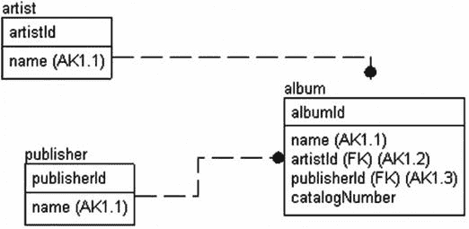

# 7. 利用检查约束与触发器扩展数据保护

> 安全是发生在你耳中的事物，而非你握在手中的东西。——杰夫·库珀，美国海军陆战队员，现代手枪射击技术的创始人

在数据库实现中，我观察到的最奇怪的现象之一是，人们花费大量时间设计正确的数据库存储（至少在他们看来是大量的时间），然后却让数据处于无保护状态，将表或多或少地视为可以接受任何东西的容器，选择让数据库层之外的代码承担所有的数据保护工作。老实说，我理解这种诱惑，因为你在项目早期阶段应用的约束越多，开发难度就越大，而且程序员们真心相信他们能捕获所有问题。问题在于，几乎没有办法 100%确保所编写的所有代码都能始终强制执行每一条规则。

反对使用自动强制数据保护的第二个论点是，程序员希望完全控制他们将收到的错误信息，以及可能改变数据的事件。我对此也表示赞同，只要这是完全可信的。当表本身拒绝不良数据时，你可以确信它不包含不良数据（至少在你所设计的“不良数据”定义范围内）。而如果用户界面需要重复需求中已指定的规则，这也是完全合理的。数据层的错误信息提示非常糟糕，即便使用一些技术将错误信息映射到描述。我们并非生活在一个大型机、批处理的世界，但有许多事情是数据层可以完美处理而外部代码无法做到的（当然，除非对数据库中的所有数据持锁）。

也许，在理想世界中，你可以仔细控制所有数据输入，但现实中，数据库设计好后就移交给程序员和用户去“做他们想做的事”。那些烦人的用户会立即利用你设计中的任何弱点，以满足他们“以为自己一开始就提出了”的需求。无论我多少次忘记在应该使用 `UNIQUE` 约束的地方应用它，数据重复最终都会开始出现。最终，用户感知取决于他们从你的数据库中检索到的数据的可靠性和完整性。如果他们在数据集中发现数据异常（通常表现为报表数值的偏差），他们对整个应用的信心会下降得比跳伞的大象（它打包了午餐而不是降落伞）还快。

我希望你在阅读本章（并记住前面章节的内容）时能体会到一点，即如果可能的话，数据存储层应该负责保护基本的数据完整性。我们在前一章介绍了外键、唯一约束和一些检查约束。在本章中，我将进一步深入，展示在需要时可以采取的一些更深层次的例子。

关于在多个位置放置代码的概念（例如，在数据输入框和检查约束中同时检查正值）的一个论点是，这样做：

*   对性能不利
*   增加工作量

正如 C.S.刘易斯在其著作《地狱来鸿》中借一个反派角色之口指出的那样：“通过掺杂一点真相，他们的谎言变得更强有力。”事实是，从某个角度来看，这些确实是真实的陈述，但这两个论点都忽略了重点。我们必须解决的真正问题是数据可以来自多个来源：

*   使用定制、精良前端工具的用户
*   使用通用数据操作工具（如 Microsoft Access）的用户
*   从外部源导入数据的例程
*   数据管理员为修复用户错误而执行的原始查询

这些都为你的完整性方案带来了不同的问题。最重要的是，这些场景（可能除了第二种）几乎构成了每个已开发数据库系统的一部分。为了最好地处理每种场景，必须对数据进行保护，使用无需用户（甚至是那位非常谨慎地修复数据的 DBA）承担责任的机制。

如果你决定在直接数据库层之外的其他层实现数据逻辑，你必须确保你实现了它——并且更重要的是，在每一个客户端中正确地实现了它。如果你更新了逻辑，你无论如何都必须在多个位置进行更新。如果一个客户端被“淘汰”并引入了新的客户端，逻辑必须在该新客户端中复制。如果你需要在多个地方编写代码，你更容易出现编码错误。将数据保护在单一位置有助于防止程序员忘记在某个情况下强制执行规则，即使他们在其他所有地方都记得。如果你收到错误（例如，当你尝试存储像 `'A' + 20` 这样不合逻辑的东西并期望它返回一个整数时），你就知道用户界面需要覆盖一个它未曾考虑到的场景。

更重要的是，由于并发性，每个语句都可能因为死锁、超时，或者在用户界面中验证的数据在甚至几微秒前就已不再处于相同状态而失败。在第 11 章中，我们将讨论并发性，但可以这么说，由并发性问题引起的错误往往在表面上极其随机，并且必须被视为随时可能发生。而并发性是仅在客户端层进行完整性检查的棺材上的最后一颗钉子。除非你精心地将所有用户锁定在你正在使用的数据库对象之外，否则状态可能会改变，并发生数据库错误。这些错误烦人吗？是的，它们确实烦人，但它们是拥有优秀数据完整性与完全相反情况之间的最后一道防线。

在本章中，我将介绍在 SQL Server 中强制实施数据完整性两个构建块，首先是使用声明性对象：检查约束（允许你在表的新行上定义谓词）和触发器（一种存储过程式的对象，在表的内容更改后触发）。

在 SQL Server 2016 中，与内存中对象配合使用的原生编译模型支持检查约束和触发器。触发器也可以使用基于 CLR 的对象编写。在本章中，我将仅关注磁盘模型对象。在第 13 章中，当我们讨论编写代码来访问我们创建的表时，我将涵盖解释模块和本机模块在代码上的一些差异，这种差异很大，并且决定了在触发器和检查约束中可以编写什么代码。原生编译会随着版本更新而改进（并且预计在 Azure DB 产品中会持续改进），但截至 2016 年，它仍然相当有限。在可下载的附录 B 中，我将包含一个关于编写内存中触发器的部分。


## 检查约束

检查约束属于声明性数据保护选项的一类。基本上，约束是 SQL Server 用于自动在单列或单行上实施数据完整性的机制。你应尽可能广泛地使用约束来保护数据，因为它们简单，并且在大多数情况下开销极小。

SQL Server 所有约束（`DEFAULT` 约束除外）最强大的一个方面是，查询优化器可以利用它们来优化查询，因为约束向优化器提供了关于数据某些额外质量方面的信息。例如，假设你在某个列上放置了一个约束，要求该列的所有值必须介于 `5` 和 `10` 之间。如果执行一个查询，请求该列值大于 `100` 的所有行，优化器甚至无需查看数据就能知道没有行符合条件。

SQL Server 有五种声明性约束：

*   `NULL`：决定列是否接受 `NULL` 值。虽然 `NULL` 约束从技术上讲并非你添加的命名约束，但它们通常被视为约束。
*   `PRIMARY KEY` 和 `UNIQUE` 约束：用于确保你的行在给定的键列组合上只包含唯一的值组合。
*   `FOREIGN KEY`：用于确保任何迁移的键值仅包含与其引用的键列相匹配的有效值。
*   `DEFAULT`：用于在用户未提供值时，为列设置可接受的默认值。（有些人不将默认值视为约束，因为它们不限制更新。）
*   `CHECK`：用于限制可输入到单列或整行中的值。

我们已经在 第 6 章 中详细介绍了 `NULL`、`PRIMARY KEY`、`UNIQUE` 和 `DEFAULT` 约束；它们非常直接，使用方式变化不大。在本节中，我将重点通过示例展示使用 `CHECK` 约束为列/行实现数据保护模式的各种方法。你使用 `CHECK` 约束来禁止将不恰当的数据输入到表的列中。`CHECK` 约束在 `DEFAULT` 约束（因此你不能指定会与 `CHECK` 约束冲突的默认值）和 `INSTEAD OF` 触发器（本章稍后介绍）之后执行，但在 `AFTER` 触发器之前执行。`CHECK` 约束不会影响正在插入或删除的值，而是用于验证所提供值的有效性。

关于约束最常见的抱怨之一是，你会收到极其糟糕的错误信息。这也是我最大的抱怨之一，虽然你对此几乎无能为力，但我将在本章后面提出一个解决方案。理解一个重要事项对你大有裨益：所有 DML（和 DDL）语句都应该包含错误处理，就好像数据库可能会返回错误一样——因为它确实可能。

`CHECK` 约束有两种类型：列约束和表约束。列约束引用单个列，当修改中引用了单个列时使用。当条件中引用了多个列时，`CHECK` 约束被视为表约束。幸运的是，你无需担心将约束声明为列约束还是表约束。当 SQL Server 编译约束时，它会验证是否需要检查多个列，并设置适当的内部值。

我们将探讨使用两种方法构建 `CHECK` 约束：

*   简单表达式
*   使用用户定义函数的复杂表达式

这两种方法类似，但使用函数可以构建更复杂的约束，尽管函数中的代码可能更复杂且难以管理。在本节中，我们将查看一些使用每种方法构建的约束示例；然后，我们将探讨一个处理约束错误的方案。不过，首先，让我们建立一个简单的模式，作为本节示例的基础。

本节关于创建 `CHECK` 约束的示例使用了图 7-1 中所示的示例表。



图 7-1。

示例模式

要创建和填充表，请执行以下代码（在下载资源中，我包含了一个用于名为 `Chapter` `7` 的数据库的简单创建脚本，并将所有对象放入该数据库）：

```sql
CREATE SCHEMA Music;
GO
CREATE TABLE Music.Artist
(
ArtistId int NOT NULL,
Name varchar(60) NOT NULL,
CONSTRAINT PKArtist PRIMARY KEY CLUSTERED (ArtistId),
CONSTRAINT PKArtist_Name UNIQUE NONCLUSTERED (Name)
);
CREATE TABLE Music.Publisher
(
PublisherId              int CONSTRAINT PKPublisher PRIMARY KEY,
Name                     varchar(20),
CatalogNumberMask        varchar(100)
CONSTRAINT DFLTPublisher_CatalogNumberMask DEFAULT ('%'),
CONSTRAINT AKPublisher_Name UNIQUE NONCLUSTERED (Name),
);
CREATE TABLE Music.Album
(
AlbumId int NOT NULL,
Name varchar(60) NOT NULL,
ArtistId int NOT NULL,
CatalogNumber varchar(20) NOT NULL,
PublisherId int NOT NULL,
CONSTRAINT PKAlbum PRIMARY KEY CLUSTERED(AlbumId),
CONSTRAINT AKAlbum_Name UNIQUE NONCLUSTERED (Name),
CONSTRAINT FKArtist$records$Music_Album
FOREIGN KEY (ArtistId) REFERENCES Music.Artist(ArtistId),
CONSTRAINT FKPublisher$Published$Music_Album
FOREIGN KEY (PublisherId) REFERENCES Music.Publisher(PublisherId)
);
```

然后使用以下语句播种数据：

```sql
INSERT  INTO Music.Publisher (PublisherId, Name, CatalogNumberMask)
VALUES (1,'Capitol',
'[0-9][0-9][0-9]-[0-9][0-9][0-9a-z][0-9a-z][0-9a-z]-[0-9][0-9]'),
(2,'MCA', '[a-z][a-z][0-9][0-9][0-9][0-9][0-9]');
INSERT  INTO Music.Artist(ArtistId, Name)
VALUES (1, 'The Beatles'),(2, 'The Who');
INSERT INTO Music.Album (AlbumId, Name, ArtistId, PublisherId, CatalogNumber)
VALUES (1, 'The White Album',1,1,'433-43ASD-33'),
(2, 'Revolver',1,1,'111-11111-11'),
(3, 'Quadrophenia',2,2,'CD12345');
```

这种设计的一个可能问题是，它对于一个完整的解决方案来说规范化程度不够。出版商通常有一个在给定时间点有效的掩码，但一切都会变化。如果出版商延长了其目录编号的长度或更改为新格式，旧数据会怎样？对于一个运行正常的系统，拥有一个发布日期列和一个对给定日期范围有效的目录编号掩码将很有价值。当然，如果你按照所示方式实现表，有进取心的用户为了绕过不恰当的设计，会创建诸如 `'MCA 1989-1990'`、`'MCA 1991-1994'` 等出版商行，从而为未来的报告需求搞乱数据，因为那时，你将需要做大量工作来关联来自 MCA 公司的值（而且你的表甚至技术上都不符合第一范式！）。

作为检查约束的第一个例子，考虑这样一个业务规则：不允许名称包含 `'Pet'` 后跟 `'Shop'` 的艺术家。你可以将规则编码如下（注意，所有示例都假设不区分大小写的排序规则，这几乎是常规情况）：

```sql
ALTER TABLE Music.Artist WITH CHECK
ADD CONSTRAINT CHKArtist$Name$NoPetShopNames
CHECK (Name NOT LIKE '%Pet%Shop%');
```

然后，通过尝试插入一个违规值的新行进行测试：

```sql
INSERT INTO Music.Artist(ArtistId, Name)
VALUES (3, 'Pet Shop Boys');
```

这将返回以下结果：


### 检查约束冲突示例

```
Msg 547, Level 16, State 0, Line 1
The INSERT statement conflicted with the CHECK constraint "CHKArtist$Name$NoPetShopNames". The conflict occurred in database "Chapter7", table "Music.Artist", column 'Name'.
```

这让我的音乐收藏数据库至少能远离一支 80 年代的乐队。

## 使用 `WITH NOCHECK` 添加约束

当你创建一个`CHECK`约束时，`WITH NOCHECK`设置（默认是`WITH CHECK`）让你有机会在添加约束时不检查表中的现有数据。

让我们添加一行我未必想出现在表中的音乐家数据：

```
INSERT INTO Music.Artist(ArtistId, Name)
VALUES (3, 'Madonna');
```

在后续过程中，希望数据库不再添加名字中包含“Madonna”的艺术家，但如果你尝试添加一个检查约束

```
ALTER TABLE Music.Artist WITH CHECK
ADD CONSTRAINT CHKArtist$Name$noMadonnaNames
CHECK (Name NOT LIKE '%Madonna%');
```

你看到的不会是你所期望的那句愉快的“Command(s) completed successfully.”，而是下面这条信息：

```
Msg 547, Level 16, State 0, Line 1
The ALTER TABLE statement conflicted with the CHECK constraint "CHKArtist$Name$noMadonnaNames". The conflict occurred in database "Chapter7", table "Music.Artist", column 'Name'.
```

理想情况下，你会接着修改表中的内容以满足约束的要求。为了让约束能够被添加，你可能会使用`WITH NOCHECK`而非`WITH CHECK`来指定约束，因为你现在想允许这个新约束存在，但表中有与之冲突的数据，并且修复或清理现有数据的代价被认为过高。

```
ALTER TABLE Music.Artist WITH NOCHECK
ADD CONSTRAINT CHKArtist$Name$noMadonnaNames
CHECK (Name NOT LIKE '%Madonna%');
```

该语句被执行以将检查约束添加到表定义中，而使用`NOCHECK`意味着无效值不会影响约束的创建。这在有些情况下是可以的，但也可能非常令人困惑，因为任何时候修改语句引用该列时，`CHECK`约束都会被触发。下次你尝试将表的值设置为同样的错误值时，就会发生错误。在下面的语句中，我只是将表的每一行都设置为其本身已存储的相同名称：

```
UPDATE Music.Artist
SET Name = Name;
```

这产生了以下错误消息：

```
Msg 547, Level 16, State 0, Line 1
The UPDATE statement conflicted with the CHECK constraint "CHKArtist$Name$noMadonnaNames". The conflict occurred in database "Chapter7", table "Music.Artist", column 'Name'.
```

“什么？”大多数用户可能会惊呼（嗯，除非他们是凌晨三点想知道发生了什么的支持人员，那样的话他们会升级为“什么？！？！”）。“如果这个值已经在表里了，它不就应该是没问题的吗？”用户是对的。处理格式变更，或允许旧数据满足一个标准而新数据满足另一个标准的一个策略，可以是为值包含一个时间范围。`CHECK Name NOT LIKE '%Madonna%' OR RowCreateDate < '20141131'` 可能是一个合理的折中方案——只要用户理解他们的查询是怎么回事。

使用`NOCHECK`并且让数值不被检查，在很多方面上几乎比干脆不设约束更糟糕。

### 提示

如果一个数据值根据外部标准可能对也可能错，最好不要在强制执行时过于严苛。事实是，除非你能 100%确定，否则当你以后使用数据时，仍然需要在使用前确保数据是正确的。

## 约束的可信度与优化器

除了明显的数据完整性原因外，使约束变得出色的因素之一是：如果约束是使用`WITH CHECK`构建的，并且约束没有使用任何函数，只使用了简单的比较（如小于、大于等），那么优化器在构建执行计划时可以利用这一事实。例如，想象你有一个约束表明某个值必须小于等于 10。如果，在一个查询中，你寻找所有大于等于 11 的值，优化器可以利用这一事实，立即返回零行，而不必扫描表来查看是否有任何值匹配。

如果一个约束是使用`WITH CHECK`构建的，它就被认为是可信的（trusted），因为优化器可以相信所有值都符合该`CHECK`约束。你可以使用目录对象`sys.check_constraints`来确定一个约束是否可信：

```
SELECT definition, is_not_trusted
FROM   sys.check_constraints
WHERE  object_schema_name(object_id) = 'Music'
AND  name = 'CHKArtist$Name$noMadonnaNames';
```

这会返回以下结果（当然，进行了一些小的格式调整）：

```
definition                     is_not_trusted
------------------------------ ---------------
(NOT [Name] like '%Madonna%')  1
```

请务必在可能的情况下，确保所有行的`is_not_trusted = 0`，这样系统才会信任你所有的`CHECK`约束，优化器在构建执行计划时才能利用这些信息。

### 注意

在一个非常大的表上使用`CHECK`选项（而非`NOCHECK`）创建检查约束，可能需要很长时间才能应用完成。因此，你常常会觉得需要走捷径来快速完成。问题在于，设计或实现上的捷径往往会在后续维护成本上，或者更糟，在用户体验上付出高得多的代价。如果条件允许，最好尝试把所有东西都正确设置好，以免产生混淆。

### 使约束可信

要让约束变为可信，你需要清理数据，并使用`ALTER TABLE <tableName> WITH CHECK CHECK CONSTRAINT constraintName`来让 SQL Server 检查该约束并将其设置为可信。当然，这种方法与最初使用`NOCHECK`创建约束有着相同的问题（主要是，它可能耗时极长！）。但是，如果不检查数据，约束就不会被信任，更不用说忘记重新启用约束是太容易发生的事了。对于我们的约束，我们可以尝试检查这些值：

```
ALTER TABLE Music.Artist WITH CHECK CHECK CONSTRAINT CHKArtist$Name$noMadonnaNames;
```

它会返回以下错误（正如我们第一次尝试创建它时一样）：

```
Msg 547, Level 16, State 0, Line 1
The ALTER TABLE statement conflicted with the CHECK constraint "CHKArtist$Name$noMadonnaNames". The conflict occurred in database "Chapter7", table "Music.Artist", column 'Name'.
```

但是，如果我们删除名字为 Madonna 的那一行

```
DELETE FROM  Music.Artist
WHERE  Name = 'Madonna';
```

然后再试一次，`ALTER TABLE`语句将无错误执行，该约束也将变为可信（一切都会恢复正常！）。最后，你可以使用`NOCHECK`来禁用一个约束：

```
ALTER TABLE Music.Artist NOCHECK CONSTRAINT CHKArtist$Name$noMadonnaNames;
```

现在，你可以通过添加一个额外的对象属性来查看该约束已被禁用：

```
SELECT definition, is_not_trusted, is_disabled
FROM   sys.check_constraints
WHERE  object_schema_name(object_id) = 'Music'
AND  name = 'CHKArtist$Name$noMadonnaNames';
```

这将返回

```
definition                     is_not_trusted is_disabled
------------------------------ -------------- -----------
(NOT [Name] like '%Madonna%')  1              1
```

然后，在我们继续之前，重新运行语句以启用该约束：

```
ALTER TABLE Music.Artist WITH CHECK CHECK CONSTRAINT CHKArtist$Name$noMadonnaNames;
```

在那之后，检查`sys.check_constraints`查询的输出，你会看到它已经被启用了。


