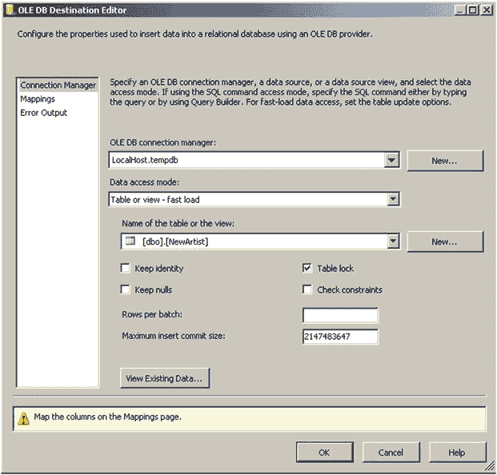

# 基于简单表达式的 CHECK 约束

迄今为止，大多数 `CHECK` 约束都是简单的表达式，仅用于测试一列或多列中值的某些特性。这些约束通常不引用除单列外的任何数据，但可以引用单行中的任意列。

举几个例子，请看以下情况：

## 空字符串
防止用户插入一个或多个空格字符，以避免在列中输入任何实际内容，例如 `CHECK(LEN(ColumnName) > 0)`。在我设计的数据库中，约 90%的 `character` 列都设置了此约束，以避免那种令人抓狂的、意料之外的空格字符输入。

## 日期范围检查
确保输入合理的日期；例如：
*   租借物品的归还日期应晚于 `RentalDate` 之后一天（假设两列均采用日期数据类型）：`CHECK (ReturnDate > DATEADD(DAY,1,RentalDate))`。
*   某些本应在过去发生的事件日期：`CHECK(EventDate <= GETDATE())`。

## 值合理性
确保某些值（通常是某种数字）对于当前情况是合理的。“合理”当然不意味着该值对于给定情况必然正确——这通常属于对象中间层的职责——仅表示其处于合理的取值范围内。例如：
*   需要为非负整数的值：`CHECK(MilesDriven >= 0)`。此约束通常需要，因为经常存在负值无意义的列（如工作小时数、行驶里程等），但其内在类型允许负值。
*   作者版税率小于或等于 30%。如果此税率可能大于 30%，那就不是一个 `CHECK` 约束。因此，若 15%是典型税率，用户界面可能会提示这不常见，但如果 30%是绝对上限，则这是一个很好的 `CHECK` 约束：`CHECK (RoyaltyRate <= .3)`。

当你遇到数据条件必须始终为真的情况时，这类 `CHECK` 约束总是个好主意。换一种说法，它约束的是数据本身的定义，而不仅仅是可能经常变化甚至因情况而异的约定。这些 `CHECK` 约束通常速度极快，除非在极端情况下，不会对性能产生负面影响。作为示例，我仅展示第一个空字符串检查的代码，因为简单的 `CHECK` 约束一旦掌握了语法就很容易编写。

为防止用户侥幸输入空列值，你可以添加以下约束（在删除两行空行后）以防止此类情况再次发生。例如，在 `Album` 表中，`Name` 列不允许 `NULL`。用户必须输入内容，但若精明的用户意识到 `''` 与 `NULL` 不同呢？对于空字符串该如何响应？当然，理想情况下，用户界面不会允许在已指定为必需的列中出现此类无意义输入，但用户可能只是按下空格键，为确保万无一失，我们需要编写一个约束来避免它。

该约束通过使用默认执行修剪操作的 `LEN` 函数来消除任何空格字符，并检查长度：

```sql
ALTER TABLE Music.Album WITH CHECK
ADD CONSTRAINT CHKAlbum$Name$noEmptyString
CHECK (LEN(Name) > 0); -- 注意，len 默认会执行修剪，因此全由空格字符组成的字符串将返回 0
```

使用会与新约束冲突的数据进行测试：

```sql
INSERT INTO Music.Album ( AlbumId, Name, ArtistId, PublisherId, CatalogNumber )
VALUES ( 4, '', 1, 1,'dummy value' );
```

你会得到以下错误信息：

```sql
Msg 547, Level 16, State 0, Line 1
The INSERT statement conflicted with the CHECK constraint "CHKAlbum$Name$noEmptyString". The conflict occurred in database "Chapter7", table "Music.Album", column 'Name'.
```

太常见的情况是，为了绕过警告而输入无意义的数据，但这更多是用户界面或管理监督的问题，而非数据库设计问题，因为判断 `'ASDFASDF'` 是否为一个合理的名称值，显然不属于明确的是/否范畴。（你见过有些人给孩子起什么名字吗？）通常情况是，用户界面随后会阻止通过 UI 创建此类数据，但 `CHECK` 约束的存在是为了防止其他进程输入完全无效的数据，无论数据来源如何。

当你从外部源向表中加载数据时，这些检查约束非常有用。通常，当从文件（例如通过导入向导）导入数据时，空白数据会以空白值形式传播，而相关的程序员可能没想到要处理这种情况。检查约束确保数据被正确地插入。并且只要你确保回头重新检查受信任状态和值，即使它们被忽略（例如使用 SSIS 的批量加载功能），它们的存在也有助于提醒你。在图 7-2 中，你会看到你可以选择（或选择不）在 OLEDB 目标输出上检查约束。在这种情况下，它可能禁用约束或将其设置为非受信任状态以加速加载，但在你将其重置为受信任状态（如前一节所示）之前，这将限制数据完整性以及优化器对约束的利用。



**图 7-2.** 未选中检查约束的 SSIS OLEDB 输出示例


