# 使用函数的 CHECK 约束

有时，你确实需要实现一个复杂的数据检查，而使用表中的列和基础 T-SQL 标量函数的简单布尔表达式根本无法满足需求。在标准 SQL 中，你可以在约束中使用子查询，但在 SQL Server 中，子查询是不允许的。然而，你可以使用标量 T-SQL 函数，即使它访问了另一个表。

一般来说，使用函数是确保数据完整性的一种相当**非常规**的解决方案，但当你需要构建稍微复杂的数据完整性保护时，它可能远为强大，并且在许多方面相当有用。在大多数情况下，`CHECK` 约束通常包含检查单列的稳定格式或值这样的简单任务，对于这些任务，使用简单 `<布尔表达式>` 的标准 `CHECK` 约束完全足够。

然而，`CHECK` 约束不一定如此简单。用户定义函数 (`UDF`) 可以很复杂，并且可能在实例中涉及多个表。以下是一些例子：

*   复杂的标量验证（通常使用 `CLR` 函数）：例如，在正则表达式比 `LIKE` 比较更容易使用的情况下。
*   访问其他表的验证：例如，检查一个基于多个表中值的域，而不是简单的外键。在示例中，我将实现一个基于表的输入掩码，因此它会根据相关表的值而变化。

我需要提醒你，调用 `UDF` 会有很大的开销，虽然你可能想封装一个简单的函数用于 `CHECK` 约束中，但这几乎总是得不偿失。正如我们提到的，`CHECK` 约束对于受 `DML` 修改语句影响的每一行都会执行一次，而这个额外成本会因修改查询影响的每一行而**复合增加**。我意识到，对于一个优秀的程序员来说，这可能有些反直觉，因为他们认为封装是编程中最重要的目标之一，但 `SQL` 在许多方面与其他类型的编程**截然不同**，因为你将大量工作推给了引擎，而引擎必须接收你的操作，并找到执行代码的最佳方式（你必须尊重这种方式）。

因此，最好尝试在不使用 `UDF` 的情况下表达你的布尔表达式，除非确实需要访问额外的表，或者做一些比简单表达式更复杂的事情。在接下来的例子中，我将使用 `UDF` 来提供强大的规则检查，这些规则可以实现使用简单布尔表达式难以编码的复杂规则。

你可以用 `T-SQL` 或 .NET 语言（`VB .NET`、`C#` 或任何允许你利用 `SQL Server 2005+` 功能在数据库中编写基于 `CLR` 的对象的 .NET 语言）来实现 `UDF`。在许多情况下，特别是如果你在函数代码中不进行任何类型的表访问，`CLR` 的性能会比 `T-SQL` 版本好得多。

举个例子，我需要访问另一个表中的值，所以我将构建一个示例，实现一个根据行的父项变化的输入掩码。假设需要验证专辑的目录编号格式是否正确。然而，不同的出版商对其客户专辑的目录编号掩码各不相同。（一个更自然、但也明显更复杂的例子是来自世界各地的电话号码和地址。）

在这个例子中，我将继续使用上一节中的表。请注意，掩码列 `Publisher.CatalogNumberMask` 需要比实际的 `CatalogNumber` 列大得多（在我的示例代码中是大五倍），因为一些可能的掩码使用多个字符来表示单个字符。你还应该注意，它是一个 `varchar`，即使该列存储为 `char` 值，因为使用 `char` 变量作为 `LIKE` 掩码可能会有问题，因为这类列末尾有空格填充（比较操作会认为固定长度字符串末尾填充的额外空格字符需要在目标字符串中匹配，而这很少是期望的结果）。

为此，我构建了一个 `T-SQL` 函数，它访问该列以检查值是否与掩码匹配，如下所示（注意，我们可能会使用 `T-SQL` 而不是 `CLR` 来构建此约束，因为它在函数体中访问了一个表）：

```sql
CREATE FUNCTION Music.Publisher$CatalogNumberValidate
(
@CatalogNumber char(12),
@PublisherId int --now based on the Artist ID
)
RETURNS bit
AS
BEGIN
DECLARE @LogicalValue bit, @CatalogNumberMask varchar(100);
SELECT @LogicalValue = CASE WHEN @CatalogNumber LIKE CatalogNumberMask
THEN 1
ELSE 0  END
FROM   Music.Publisher
WHERE  PublisherId = @PublisherId;
RETURN @LogicalValue;
END;
```

当我在本节开头加载数据时，我预加载了具有有效 `CatalogNumber` 和 `CatalogNumberMask` 列值的数据：

```sql
SELECT Album.CatalogNumber, Publisher.CatalogNumberMask
FROM   Music.Album
JOIN Music.Publisher as Publisher
ON Album.PublisherId = Publisher.PublisherId;
```

这将返回以下结果：

```
CatalogNumber        CatalogNumberMask
-------------------- --------------------------------------------------------------
433-43ASD-33         [0-9][0-9][0-9]-[0-9][0-9][0-9a-z][0-9a-z][0-9a-z]-[0-9][0-9]
111-11111-11         [0-9][0-9][0-9]-[0-9][0-9][0-9a-z][0-9a-z][0-9a-z]-[0-9][0-9]
CD12345              [a-z][a-z][0-9][0-9][0-9][0-9][0-9]
```

现在，让我们将约束添加到表中，如下所示：

```sql
ALTER TABLE Music.Album
WITH CHECK ADD CONSTRAINT
CHKAlbum$CatalogNumber$CatalogNumberValidate
CHECK (Music.Publisher$CatalogNumberValidate
(CatalogNumber,PublisherId) = 1);
```

如果由于表中存在无效数据而导致约束报错（因为你在添加数据、试用表，或者在真实开发中，这通常是由于尝试构建的 UI 产生的测试数据造成的），你可以使用类似以下的查询来找到它们：

```sql
SELECT Album.Name, Album.CatalogNumber, Publisher.CatalogNumberMask
FROM Music.Album
JOIN Music.Publisher
ON Publisher.PublisherId = Album.PublisherId
WHERE Music.Publisher$CatalogNumberValidate(Album.CatalogNumber,Album.PublisherId) <> 1;
```

现在，让我们尝试添加一个具有无效值的新行：

```sql
INSERT  Music.Album(AlbumId, Name, ArtistId, PublisherId, CatalogNumber)
VALUES  (4,'Who''s Next',2,2,'1');
```

这将导致以下错误，因为目录编号 `'1'` 与为 `PublisherId` 号 `2` 设置的掩码不匹配：

```
Msg 547, Level 16, State 0, Line 1
The INSERT statement conflicted with the CHECK constraint "CHKAlbum$CatalogNumber$CatalogNumberValidate". The conflict occurred in database "Chapter7", table "Music.Album".
```

现在，将目录编号更改为与约束检查的输入掩码匹配的值：

```sql
INSERT  Music.Album(AlbumId, Name, ArtistId, CatalogNumber, PublisherId)
VALUES  (4,'Who''s Next',2,'AC12345',2);
SELECT * FROM Music.Album;
```

这将返回以下结果，你可以看到它与为 `PublisherId = 2` 的出版商设置的 `'[a-z][a-z][0-9][0-9][0-9][0-9][0-9]'` 掩码匹配：


```
AlbumId     Name              ArtistId    CatalogNumber        PublisherId
----------- ----------------- ----------- -------------------- -----------
1           The White Album   1           433-43ASD-33         1
2           Revolver          1           111-11111-11         1
3           Quadrophenia      2           CD12345              2
4           Who's Next        2           AC12345              2
```

使用这种方法，你可以为表构建任何单行验证代码。如前所述，每个用户定义函数（UDF）将在更新中被修改的每一行和每一列触发一次。如果你正在插入大量数据，性能可能会受到影响，但拥有值得信赖的数据是值得的。

我们将在本章后面讨论触发器，但作为替代方案，你可以创建一个触发器，该触发器基于之前用于查找表中不当数据的查询，检查查询是否返回了任何行：

```sql
SELECT *
FROM   Music.Album AS Album
JOIN Music.Publisher AS Publisher
ON Publisher.PublisherId = Album.PublisherId
WHERE  Music.Publisher$CatalogNumberValidate
(Album.CatalogNumber, Album.PublisherId)  1;
```

这种类型的约束有一个缺点，无论是在约束还是触发器中实现。就目前而言，`Album`表受到保护，防止无效值被输入到`CatalogNumber`列中，但它没有说明如果用户更改了`Publisher`表上的`CatalogEntryMask`会发生什么。如果这是一个问题，你可以考虑向`Publisher`表添加一个触发器，针对任何现有数据验证对掩码的更改。

**Caution**

使用访问同表中其他行的用户定义函数是危险的，因为在函数执行时，虽然每行的数据在表中可见，但如果同时更新多行，那些行在表中不可见，因此如果错误条件只存在于正在修改的行中，你的最终结果可能会出错。

### 增强由约束引发的错误

检查约束真正的缺点是它们在失败时产生的错误消息。这些错误消息肯定不是你想要展示给用户的，即使没有其他原因，仅仅因为典型用户每次看到它们都会引发服务台呼叫。处理这些错误是使用 SQL Server 中约束更烦人的部分之一。

每当一个语句违反了约束要求时，SQL Server 会提供一个难看的消息，并且没有提供显示清晰消息的真正自动方法。在本节中，我将简要详述一种改进约束错误消息的方法，就像上一条语句的错误一样：

```text
Msg 547, Level 16, State 0, Line 1
The INSERT statement conflicted with the CHECK constraint "CHKAlbum$CatalogNumber$CatalogNumberValidate". The conflict occurred in database "Chapter7", table "Music.Album".
```

我将向你展示如何将其映射到一个至少有意义的错误消息。首先，错误消息的各个部分如下：

*   `Msg 547`：返回给调用程序的错误号。在某些情况下，这个错误号很重要；然而，在大多数情况下，说错误号是非零的就足够了。
*   `Level 16`：消息的严重级别。`0` 到 `18` 通常被认为是用户消息，`16` 是默认值。级别 `19`–`25` 是严重错误，会导致连接断开（消息会写入日志）。
*   `State 0`：一个从 `0`–`127` 的值，表示引发错误时进程的状态。这个值很少被任何进程使用。
*   `Line 1`：批处理或对象中发生错误的行。这个值对于调试目的非常有用。
*   错误描述：已发生错误的文本解释。

在原始形式中，这是将要发送到客户端的确切错误。使用 `TRY-CATCH` 错误处理，我们可以构建一个简单的错误处理程序和将约束映射到错误消息的方案（或者，你也可以在客户端代码中做类似的事情，以处理那些你无法从用户界面预防的错误）。我们命名约束的部分原因是为了确定创建约束时的意图。在下面的代码中，我们将实现一个非常基本的错误映射方案：通过从消息中解析出约束名称的文本，然后在映射表中查找该值。这不是一个“完美”的方案，但当使用约束作为情况的唯一数据保护时，它确实有效（它也有助于记录你的系统可能引发的错误）。

首先，让我们创建一个映射表，我们将已定义的约束名称和解释约束含义的消息放入其中：

```sql
CREATE SCHEMA ErrorHandling; --used to hold objects for error management purposes
GO
CREATE TABLE ErrorHandling.ErrorMap
(
ConstraintName sysname NOT NULL CONSTRAINT PKErrorMap PRIMARY KEY,
Message         varchar(2000) NOT NULL
);
GO
INSERT ErrorHandling.ErrorMap(constraintName, message)
VALUES ('CHKAlbum$CatalogNumber$CatalogNumberValidate',
'The catalog number does not match the format set up by the Publisher');
```

然后，我们创建一个过程来执行实际的映射，通过获取可以从 `CATCH` 块中访问的 `ERROR_%()` 过程中检索的值，并使用它们在 `ErrorMap` 表中查找值：

```sql
CREATE PROCEDURE ErrorHandling.ErrorMap$MapError
(
@ErrorNumber  int = NULL,
@ErrorMessage nvarchar(2000) = NULL,
@ErrorSeverity INT= NULL
) AS
BEGIN
SET NOCOUNT ON
--use values in ERROR_ functions unless the user passes in values
SET @ErrorNumber = Coalesce(@ErrorNumber, ERROR_NUMBER());
SET @ErrorMessage = Coalesce(@ErrorMessage, ERROR_MESSAGE());
SET @ErrorSeverity = Coalesce(@ErrorSeverity, ERROR_SEVERITY());
--strip the constraint name out of the error message
DECLARE @constraintName sysname;
SET @constraintName = substring( @ErrorMessage,
CHARINDEX('constraint "',@ErrorMessage) + 12,
CHARINDEX('"',substring(@ErrorMessage,
CHARINDEX('constraint "',@ErrorMessage) +
12,2000))-1)
--store off original message in case no custom message found
DECLARE @originalMessage nvarchar(2000);
SET @originalMessage = ERROR_MESSAGE();
IF @ErrorNumber = 547 --constraint error
BEGIN
SET @ErrorMessage =
(SELECT message
FROM   ErrorHandling.ErrorMap
WHERE  constraintName = @constraintName);
END
--if the error was not found, get the original message with generic 50000 error number
SET @ErrorMessage = ISNULL(@ErrorMessage, @originalMessage);
THROW  50000, @ErrorMessage, @ErrorSeverity;
END
```

现在，看看当我们为专辑目录号输入一个无效值时会发生什么：

```sql
BEGIN TRY
INSERT  Music.Album(AlbumId, Name, ArtistId, CatalogNumber, PublisherId)
VALUES  (5,'who are you',2,'badnumber',2);
END TRY
BEGIN CATCH
EXEC ErrorHandling.ErrorMap$MapError;
END CATCH
```

错误消息如下所示：

```text
Msg 50000, Level 16, State 1, Procedure ErrorMap$mapError, Line 24
The catalog number does not match the format set up by the Publisher
```

而不是

```text
Msg 547, Level 16, State 0, Line 1
The INSERT statement conflicted with the CHECK constraint "CHKAlbum$CatalogNumber$CatalogNumberValidate". The conflict occurred in database "Chapter7", table "Music.Album".
```

这令人愉快得多，即使达到这个新消息需要一番功夫。
```


## DML 触发器

触发器是一种编码模块，类似于存储过程，它附加在表或视图上，当在该对象上执行 `INSERT`、`UPDATE` 或 `DELETE` 语句时，触发器会自动执行。虽然触发器与约束都具有强制数据保护的能力，但触发器比约束灵活得多，因为你可以像编写存储过程一样为它们编码，并且可以引入副作用，例如格式化输入数据或将任何操作级联到另一个表。你可以使用触发器来强制执行几乎任何业务规则，它们对于处理 `CHECK` 约束过于复杂而无法处理的情况尤为重要。我们在第 6 章中使用了触发器来自动管理行更新日期值。

触发器名声常常不好，因为它们可能相当古怪，尤其是在处理大型更新时可能严重影响性能。例如，如果你在表上有一个触发器，并尝试更新一百万行，很可能会遇到问题。然而，对于典型 OLTP 数据库中的大多数操作，一次操作不应涉及超过少数几行。触发器的使用确实需要仔细考虑，但在需要它们的地方，它们非常有用。在本章中，我将演示几种无法通过其他方式自动在 SQL 代码中完成的触发器用途：

*   执行跨数据库的参照完整性
*   检查行间规则，其中仅查看当前行对于约束来说是不够的
*   检查表间约束，当规则需要访问不同表中的数据时
*   为你的数据修改查询引入所需的副作用，例如维护所需的反规范化
*   确保无法对表执行任何插入、更新或删除操作，即使用户确实有权执行该操作

其中一些操作也可以在应用层完成，但在大多数情况下，使用触发器自动完成这些操作要容易和安全得多（特别是对于数据完整性）。在数据保护方面，触发器相对于应用代码的主要优势在于能够访问数据库中的任何数据来进行验证，而无需将其发送到客户端。在附录 B 中，我将讨论编写触发器的机制及其各种限制。在本章中，我将创建 DML 触发器来处理典型的业务需求。

本章我们将利用两种不同类型的 DML 触发器。每种类型都有其自身的用处，但它们的使用原因却大相径庭。

*   `AFTER`：这些触发器在 DML 语句（`INSERT`/`UPDATE`/`DELETE`）影响表之后触发。`AFTER` 触发器通常用于处理不符合约束模式的规则，例如需要存储数据的规则，如日志记录机制。对于 `INSERT`、`UPDATE` 和 `DELETE` 或它们的任何组合，你实际上可以有无限数量的 `AFTER` 触发器。
*   `INSTEAD OF`：这些触发器“代替”影响表或视图的内置命令（`INSERT`、`UPDATE` 或 `DELETE`）进行操作。通过这种方式，你可以对数据执行任何操作，无论是完全按照用户请求执行，还是执行完全不同的操作（你甚至可以直接忽略该操作）。每个表最多只能有一个每种类型的 `INSTEAD OF INSERT`、`UPDATE` 和 `DELETE` 触发器。允许（但通常不是一个好主意）将所有三个操作合并到一个触发器中，用一个触发器来处理所有三种操作。

本节将按这两种触发器类型进行划分，因为它们有两组非常不同的用例。由于触发器编码在 SQL Server 中并不是一个非常常见的话题，在附录 B 中，我将介绍触发器编码技术并提供一个模板，我们将在本章中一直使用它（这也是我们在第 6 章中使用的模板）。

SQL Server 2016 提供了本机编译触发器，但仅限于 `AFTER` 触发器，并且也受限于当前对本机编译模块的限制。

### AFTER 触发器

`AFTER` 触发器在 DML 语句完成后触发。虽然触发器现在看起来可能不太有用，但早在 SQL Server 6.0 及更早版本时，还没有 `CHECK` 约束，甚至 `FOREIGN KEY` 也是刚刚引入，因此所有的数据保护都是使用触发器管理的。除了维护相当繁琐之外，一些相当复杂的系统是使用与我的罗技 Harmony 遥控器相当的硬件创建的。

在关于 `AFTER` 触发器的这一节中，我将展示一些示例，这些示例演示了我用来解决相当常见问题的几种触发器形式。我将给出以下类型触发器的示例：

*   多行范围检查
*   维护汇总值
*   级联插入
*   子到父的级联
*   跨数据库和服务器的关系

通过这些示例，你应该能够推断出几乎任何 `AFTER` 触发器的用途。请记住，触发器虽然本身对性能并非固有的糟糕，但也应仅在必要时使用。

注意

如需另一个示例，请查看第 8 章中关于唯一性的部分，我将在那里实现一种基于数据范围的唯一性，使用基于触发器的解决方案。


## 对多行的范围检查

我们要看的第一类检查是**范围检查**，即确保某列的值在某个特定范围内。使用 `CHECK` 约束来验证单行数据中的数据（例如 `column > 10`）是相当容易的。然而，你无法用它们来验证基于聚合条件（如 `SUM(column) > 10`）的条件，因为 `CHECK` 约束只能访问当前行的数据（而且即使使用用户定义函数，你也无法看到新数据）。

如果你需要检查一行或多行数据是否违反某个给定条件（该条件通常基于最大总和等聚合值），就需要使用触发器。作为示例，我们将考察一个简单的会计系统。当用户向账户存取款时，你希望确保余额永远不会低于零。必须考虑某个账户的所有交易。

首先，我们为会计对象创建一个架构：
```sql
CREATE SCHEMA Accounting;
```
然后，我们创建一个账户表和一个包含该账户活动的表：
```sql
CREATE TABLE Accounting.Account
(
AccountNumber        char(10) NOT NULL
CONSTRAINT PKAccount PRIMARY KEY
--应有其他列
);
CREATE TABLE Accounting.AccountActivity
(
AccountNumber                char(10) NOT NULL
CONSTRAINT FKAccount$has$Accounting_AccountActivity
FOREIGN KEY REFERENCES Accounting.Account(AccountNumber),
--此值可能是每台 ATM/柜员生成的
TransactionNumber            char(20) NOT NULL,
Date                         datetime2(3) NOT NULL,
TransactionAmount            numeric(12,2) NOT NULL,
CONSTRAINT PKAccountActivity
PRIMARY KEY (AccountNumber, TransactionNumber)
);
```
现在，我们向 `Accounting.AccountActivity` 表添加一个触发器，用于检查确保当你将某个 `Account` 的所有交易金额相加时，总和大于零：
```sql
CREATE TRIGGER Accounting.AccountActivity$insertTrigger
ON Accounting.AccountActivity
AFTER INSERT AS
BEGIN
    SET NOCOUNT ON;
    SET ROWCOUNT 0; --以防客户端修改了行数
    --对 INSERT 或 UPDATE 触发器使用 inserted，对 UPDATE 或 DELETE 触发器使用 deleted
    --使用 COUNT 而非 @@ROWCOUNT，因为 MERGE 行为会将 @@ROWCOUNT 设置为
    --等于合并的行数，而非触发器中正在检查的行数
    DECLARE @msg varchar(2000),    --用于保存错误消息
    --对 INSERT 或 UPDATE 触发器使用 inserted，对 UPDATE 或 DELETE 触发器使用 deleted
    --使用 COUNT 而非 @@ROWCOUNT，因为 MERGE 行为会将 @@ROWCOUNT 设置为
    --等于合并的行数，而非触发器中正在检查的行数
        @rowsAffected int = (SELECT COUNT(*) FROM inserted);
    --      @rowsAffected int = (SELECT COUNT(*) FROM deleted);
    --如果未影响任何行，则无需继续
    IF @rowsAffected = 0 RETURN;

    BEGIN TRY
       --[验证部分]
        --禁止会使余额变为负数的交易
        IF EXISTS ( SELECT AccountNumber
                    FROM Accounting.AccountActivity AS AccountActivity
                    WHERE EXISTS (SELECT *
                                  FROM   inserted
                                  WHERE  inserted.AccountNumber =
                                         AccountActivity.AccountNumber)
                    GROUP BY AccountNumber
                    HAVING SUM(TransactionAmount) < 0
                  )
            BEGIN
                --回滚事务
                ROLLBACK TRANSACTION;
                THROW; --将暂停批处理或被调用方的 CATCH 块捕获
            END
    END CATCH
END;
```
这类触发器的关键在于查找基础表中的行是否存在，而不是 `inserted` 表中的行，因为关注点是插入的行如何影响某个 `Account` 的整体状态。查询的基础是一个在没有触发器的情况下，人们可能运行来检查表状态的查询。是否存在某个账户，其所有交易的总和小于 0？
```sql
SELECT AccountNumber
FROM Accounting.AccountActivity AS AccountActivity
GROUP BY AccountNumber
HAVING SUM(TransactionAmount) < 0;
```
然后，由于这是一个 INSERT 触发器，我们包含了一个与新创建行的关联：
```sql
SELECT AccountNumber
FROM Accounting.AccountActivity AS AccountActivity
WHERE EXISTS (SELECT *
              FROM   inserted
              WHERE  inserted.AccountNumber = AccountActivity.AccountNumber)
GROUP BY AccountNumber
HAVING SUM(TransactionAmount) < 0;
```
`WHERE` 子句只是确保我们只考虑那些有新数据插入的账户的行。这样，我们最终不会去检查那些我们知道查询未触及的所有行。还要注意，我没有使用 `JOIN` 操作。通过在 `WHERE` 子句中使用 `EXISTS` 条件，我们不会影响 `FROM` 子句中返回集合的基数，无论 `inserted` 表中有多少行具有相同的 `AccountNumber`。现在，正如你在上方触发器中所看到的，这是使用 `IF EXISTS` 语句放入触发器的，其后跟着错误处理部分：
```sql
IF EXISTS ( SELECT AccountNumber
            FROM Accounting.AccountActivity AS AccountActivity
            WHERE EXISTS (SELECT *
                          FROM   inserted
                          WHERE  inserted.AccountNumber =
                                 AccountActivity.AccountNumber)
            GROUP BY AccountNumber
            HAVING SUM(TransactionAmount) < 0)
BEGIN             --错误处理部分
```
要查看实际效果，请使用以下代码：
```sql
--创建一些测试设置数据
INSERT INTO Accounting.Account(AccountNumber)
VALUES ('1111111111');

INSERT INTO Accounting.AccountActivity(AccountNumber, TransactionNumber,
                                       Date, TransactionAmount)
VALUES ('1111111111','A0000000000000000001','20050712',100),
       ('1111111111','A0000000000000000002','20050713',100);
```
现在，让我们看看违反此规则时会发生什么：
```sql
INSERT  INTO Accounting.AccountActivity(AccountNumber, TransactionNumber,
                                        Date, TransactionAmount)
VALUES ('1111111111','A0000000000000000003','20050713',-300);
```
结果如下：
```text
消息 50000，级别 16，状态 16，过程 AccountActivity$insertTrigger，第 40 行
账户: 1111111111 交易号: A0000000000000000003 金额: -300.00 无法处理，因为它将导致负余额
```
错误消息是我们在修改单行的情况下编写的自定义错误消息。现在，让我们确保当 `INSERT` 语句中有多于一行时，触发器也能正常工作：
```sql
--创建新账户
INSERT  INTO Accounting.Account(AccountNumber)
VALUES ('2222222222');
GO
--现在，这些数据将违反新账户的约束：
INSERT  INTO Accounting.AccountActivity(AccountNumber, TransactionNumber,
                                        Date, TransactionAmount)
VALUES ('1111111111','A0000000000000000004','20050714',100),
       ('2222222222','A0000000000000000005','20050715',100),
       ('2222222222','A0000000000000000006','20050715',100),
       ('2222222222','A0000000000000000007','20050715',-201);
```
这会导致以下错误：
```text
消息 50000，级别 16，状态 16，过程 AccountActivity$insertUpdateTrigger，第 40 行
其中一行导致了负余额
```
多行错误消息的信息量要少得多，不过你可以扩展它，通过添加一些文本包含导致违规的行（或所有行）的信息，如果需要，甚至可以通过一些工作显示多个失败的值。通常，一个简单的消息就足以处理，因为一般来说，如果单个语句中修改了多行数据，那通常是一个批处理过程，而构建复杂错误消息的代价远高于其价值。流程中可能会建立如何处理某些返回错误的规范。

**提示**

错误处理将在本章后面的“处理触发器和约束错误”一节中更详细地介绍。对于这些触发器，我使用了一个非常简单的错误模型，即在回滚事务后，只是重新抛出在触发器中发生的错误。

如果这是一个真正的会计导向表，那么一个 `INSERT` 触发器可能就足够了，因为真正的会计系统通过**冲正分录**（用 -$100 的费用冲销一笔 $100 的费用）来处理修改。但是，如果你确实需要处理 DELETE 操作，你需要将基础查询改为


### 维护汇总值

## 查看触发事件

对于 DELETE 触发器和 UPDATE 触发器，我们需要检查两个表（以防有人更新了 `AccountNumber`，如果这是允许的话）：

```sql
SELECT AccountNumber
FROM Accounting.AccountActivity AS AccountActivity
WHERE EXISTS (SELECT *
FROM   deleted
WHERE  deleted.AccountNumber = AccountActivity.AccountNumber)
GROUP BY AccountNumber
HAVING SUM(TransactionAmount) < 0;
```

像账户号码这样可以修改的可变键，在实现跨多行的数据检查时，会让很多人感到困惑。

要查看触发器触发的事件，可以使用以下查询：

```sql
SELECT trigger_events.type_desc
FROM sys.trigger_events
JOIN sys.triggers
ON sys.triggers.object_id = sys.trigger_events.object_id
WHERE  triggers.name = 'AccountActivity$insertTrigger';
```

虽然在本书的前五章中，我强烈反对维护汇总值，但在某些情况下，某种形式的主动汇总可能是必要的。例如：

-   没有其他合理的方法可以优化某个流程。
-   汇总值的读取次数远远大于基础值的活动次数以及数据被修改和更改的次数。

作为一个例子，让我们扩展之前在“多行范围检查”部分中使用的 `Account` 和 `AccountActivity` 表的例子。我将在 `Account` 表中添加一个 `BalanceAmount` 列：

```sql
ALTER TABLE Accounting.Account
ADD BalanceAmount numeric(12,2) NOT NULL
CONSTRAINT DFLTAccount_BalanceAmount DEFAULT (0.00);
```

然后，我将更新 `BalanceAmount` 列，使其值为 `AccountActivity` 行中的当前数据。首先，运行此查询以查看期望值：

```sql
SELECT  Account.AccountNumber,
SUM(COALESCE(AccountActivity.TransactionAmount,0.00)) AS NewBalance
FROM   Accounting.Account
LEFT OUTER JOIN Accounting.AccountActivity
ON Account.AccountNumber = AccountActivity.AccountNumber
GROUP  BY Account.AccountNumber;
```

这将返回以下结果：

```
AccountNumber NewBalance
------------- ---------------------------------------
1111111111    200.00
2222222222    0.00
```

现在，使用以下语句将 `BalanceAmount` 列的值更新为现有行的值：

```sql
WITH  UpdateCTE AS (
SELECT  Account.AccountNumber,
SUM(coalesce(TransactionAmount,0.00)) AS NewBalance
FROM   Accounting.Account
LEFT OUTER JOIN Accounting.AccountActivity
On Account.AccountNumber = AccountActivity.AccountNumber
GROUP  BY Account.AccountNumber)
UPDATE Account
SET    BalanceAmount = UpdateCTE.NewBalance
FROM   Accounting.Account
JOIN UpdateCTE
ON Account.AccountNumber = UpdateCTE.AccountNumber;
```

该语句将构成我们在上一节添加的触发器修改的基础（更改内容以粗体显示）。唯一需要进行的更改是，像我们在上一节中使用 `EXISTS` 过滤器所做的那样，将 `Account` 集合过滤到受导致触发器触发的 DML 操作影响的账户，这样你就不必担心一个账户是创建了一个新行还是一百个。

```sql
ALTER TRIGGER Accounting.AccountActivity$insertTrigger
ON Accounting.AccountActivity
AFTER INSERT AS
BEGIN
    SET NOCOUNT ON;
    SET ROWCOUNT 0; --防止客户端修改了行数计数
    --对于插入或更新触发器使用 inserted，对于更新或删除触发器使用 deleted
    --使用 count 而不是 @@rowcount，因为合并行为会将 @@rowcount 设置为等于合并的行数，而不是触发器中检查的行数
    DECLARE @msg varchar(2000),    --用于保存错误消息
            --对于插入或更新触发器使用 inserted，对于更新或删除触发器使用 deleted
            --使用 count 而不是 @@rowcount，因为合并行为会将 @@rowcount 设置为等于合并的行数，而不是触发器中检查的行数
            @rowsAffected int = (SELECT COUNT(*) FROM inserted);
    --      @rowsAffected int = (SELECT COUNT(*) FROM deleted);
    BEGIN TRY
        --[验证部分]
        --禁止会使余额变为负数的交易
        IF EXISTS ( SELECT AccountNumber
                    FROM Accounting.AccountActivity as AccountActivity
                    WHERE EXISTS (SELECT *
                                  FROM   inserted
                                  WHERE  inserted.AccountNumber =
                                         AccountActivity.AccountNumber)
                    GROUP BY AccountNumber
                    HAVING SUM(TransactionAmount) < 0)
        BEGIN
            --引发错误
            RAISERROR ('交易将导致余额为负', 16, 1);
            ROLLBACK TRANSACTION;
            THROW; --将停止批处理或被调用方的 CATCH 块捕获
        END
    END TRY
    BEGIN CATCH
        --/[修改部分]
        --如果触发器是 AFTER 触发器，回滚已经发生
        --如果触发器是 INSTEAD OF 触发器，这将回滚工作
        IF XACT_STATE() <> 0
            ROLLBACK TRANSACTION;
        --/[审核部分]
        --本例中没有审核
        --/[重置部分]
        --这里不需要重置
        THROW; --将停止批处理或被调用方的 CATCH 块捕获
    END CATCH;
END;
```

现在，向 `AccountActivity` 插入一个新行：

```sql
INSERT  INTO Accounting.AccountActivity(AccountNumber, TransactionNumber,
                                        Date, TransactionAmount)
VALUES ('1111111111','A0000000000000000004','20050714',100);
```

接下来，检查 `Account` 表的状态，并与之前用于检查余额应是多少的查询进行比较：

```sql
SELECT  Account.AccountNumber,Account.BalanceAmount,
        SUM(coalesce(AccountActivity.TransactionAmount,0.00)) AS SummedBalance
FROM   Accounting.Account
        LEFT OUTER JOIN Accounting.AccountActivity
        ON Account.AccountNumber = AccountActivity.AccountNumber
GROUP  BY Account.AccountNumber,Account.BalanceAmount;
```

这将返回以下结果，显示总和与存储的余额相同：

```
AccountNumber BalanceAmount    SummedBalance
------------- ---------------- -------------------
1111111111    300.00           300.00
2222222222    0.00             0.00
```

下一步——多行测试——在构建这样的触发器时非常重要。你需要确保如果用户一次插入多行，它也能工作。在我们的例子中，我们将在同一个 DML 语句中为两个账户插入行，并为其中一个账户插入两行。这不一定是一个充分的测试，但至少用于演示目的足够了：

```sql
INSERT  into Accounting.AccountActivity(AccountNumber, TransactionNumber,
                                        Date, TransactionAmount)
VALUES ('1111111111','A0000000000000000005','20050714',100),
       ('2222222222','A0000000000000000006','20050715',100),
       ('2222222222','A0000000000000000007','20050715',100);
```

同样，对 `AccountActivity` 和 `Account` 表的查询应显示相同的余额：

```
AccountNumber BalanceAmount    SummedBalance
------------- ---------------- -------------------
1111111111    400.00           400.00
2222222222    200.00           200.00
```

如果你想要一个 `UPDATE` 或 `DELETE` 触发器，你只需在 `EXISTS` 表达式中应用与上一节相同的逻辑。

我必须强调，这种汇总数据策略应该是罕见的例外，而不是规则。但是当你必须实现汇总数据时，使用触发器来确保其执行是一个很好的策略。使用数据时必须处理的最令人沮丧的问题之一，就是汇总数据与据称是其来源的数据不匹配，因为它会占用本可用于开发新软件的时间。

## 注意事项

引入触发器时，请确保测试单行和多行操作、`INSERT`、`UPDATE` 和 `DELETE` 的所有变体，以及如果修改主键或用于对数据进行分组的键会发生什么。在附录 B 中，我还将介绍一些设置，这些设置决定了如果你在同一操作上有多个触发器时的行为，这也必须进行测试。


### 级联插入

## 概念介绍

级联插入是指在向一个表插入一行数据后，自动在其他一个或多个表中插入一行或多行新数据的情况。这在需要初始化另一个表中的行时经常发生，通常是某种状态信息。

在本示例中，我们将构建一个小型系统来存储网站链接系统的 URL。在低使用时段，自动化浏览器会连接到这些 URL 以进行验证（希望能限制网页上的失效链接）。

为了实现这一点，我将使用图 7-3 中的表集合。

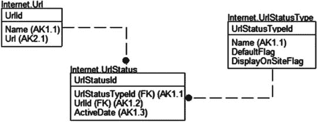

图 7-3. 存储网站链接系统的 URL

## 示例代码

### 建表与初始数据

```sql
CREATE SCHEMA Internet;
GO
CREATE TABLE Internet.Url
(
UrlId int NOT NULL IDENTITY(1,1) CONSTRAINT PKUrl primary key,
Name  varchar(60) NOT NULL CONSTRAINT AKUrl_Name UNIQUE,
Url   varchar(200) NOT NULL CONSTRAINT AKUrl_Url UNIQUE
);
--Not a user manageable table, so not using identity key (as discussed in
--Chapter 6 when I discussed choosing keys) in this one table.  Others are
--using identity-based keys in this example.
CREATE TABLE Internet.UrlStatusType
(
UrlStatusTypeId  int NOT NULL
CONSTRAINT PKUrlStatusType PRIMARY KEY,
Name varchar(20) NOT NULL
CONSTRAINT AKUrlStatusType UNIQUE,
DefaultFlag bit NOT NULL,
DisplayOnSiteFlag bit NOT NULL
);
CREATE TABLE Internet.UrlStatus
(
UrlStatusId int NOT NULL IDENTITY(1,1)
CONSTRAINT PKUrlStatus PRIMARY KEY,
UrlStatusTypeId int NOT NULL
CONSTRAINT
FKUrlStatusType$defines_status_type_of$Internet_UrlStatus
REFERENCES Internet.UrlStatusType(UrlStatusTypeId),
UrlId int NOT NULL
CONSTRAINT FKUrl$has_status_history_in$Internet_UrlStatus
REFERENCES Internet.Url(UrlId),
ActiveTime        datetime2(3),
CONSTRAINT AKUrlStatus_statusUrlDate
UNIQUE (UrlStatusTypeId, UrlId, ActiveTime)
);
--set up status types
INSERT  Internet.UrlStatusType (UrlStatusTypeId, Name,
DefaultFlag, DisplayOnSiteFlag)
VALUES (1, 'Unverified',1,0),
(2, 'Verified',0,1),
(3, 'Unable to locate',0,0);
```

`Url`表保存指向网络上不同站点的 URL。当有人输入 URL 时，我们将其状态初始化为`'Unverified'`。应该有一个进程定期检查站点，以确保没有发生变化（尤其是那些未验证的！）。

#### 创建触发器

首先构建一个触发器，当插入操作创建新行时，在`UrlStatus`表中插入一行，包含`UrlId`和基于`DefaultFlag`值为`1`的默认`UrlStatusType`：

```sql
CREATE TRIGGER Internet.Url$insertTrigger
ON Internet.Url
AFTER INSERT AS
BEGIN
SET NOCOUNT ON;
SET ROWCOUNT 0; --in case the client has modified the rowcount
--use inserted for insert or update trigger, deleted for update or delete trigger
--count instead of @@rowcount due to merge behavior that sets @@rowcount to a number
--that is equal to number of merged rows, not rows being checked in trigger
DECLARE @msg varchar(2000),    --used to hold the error message
--use inserted for insert or update trigger, deleted for update or delete trigger
--count instead of @@rowcount due to merge behavior that sets @@rowcount to a number
--that is equal to number of merged rows, not rows being checked in trigger
@rowsAffected int = (SELECT COUNT(*) FROM inserted);
--           @rowsAffected int = (SELECT COUNT(*) FROM deleted);
BEGIN TRY
--[validation section]
--[modification section]
--add a row to the UrlStatus table to tell it that the new row
--should start out as the default status
INSERT INTO Internet.UrlStatus (UrlId, UrlStatusTypeId, ActiveTime)
SELECT inserted.UrlId, UrlStatusType.UrlStatusTypeId,
SYSDATETIME()
FROM inserted
CROSS JOIN (SELECT UrlStatusTypeId
FROM   UrlStatusType
WHERE  DefaultFlag = 1)  as UrlStatusType;
--use cross join to apply this one row to
--rows in inserted
END TRY
BEGIN CATCH
IF @@TRANCOUNT > 0
ROLLBACK TRANSACTION;
THROW; --will halt the batch or be caught by the caller's catch block
END CATCH;
END;
```

这里的想法是，对于`inserted`表中的每一行，我们将从`UrlStatusType`表中获取`DefaultFlag`等于`1`的单一行。那么，让我们尝试一下：

#### 测试触发器

```sql
INSERT  Internet.Url(Name, Url)
VALUES ('Author''s Website',
'http://drsql.org');
SELECT Url.Url,Url.Name,UrlStatusType.Name as Status, UrlStatus.ActiveTime
FROM   Internet.Url
JOIN Internet.UrlStatus
ON Url.UrlId = UrlStatus.UrlId
JOIN Internet.UrlStatusType
ON UrlStatusType.UrlStatusTypeId = UrlStatus.UrlStatusTypeId;
```

这将返回以下结果：

```
Url                 Name                  Status               ActiveTime
------------------- --------------------- -------------------- ---------------------------
http://drsql.org    Author's Website      Unverified           2016-04-11 20:43:52.954
```

提示

如果用户无法修改`UrlStatusType`表等表中的数据会更容易，这样就不会出现没有状态被设为默认值（或太多行）的情况。如果没有默认状态，URL 将永远不会被使用，因为进程看不到它。本章后面的一个示例将强制不为 DML 操作执行任何操作。


#### 从子级到父级的级联

所有你通过约束（`CASCADE` 或 `SET NULL`）能进行的更新级联操作，都是严格地从父级到子级的。有时，你希望反其道而行之，当删除子行时，也删除其父行。通常，当你关注的是子项，而父项仅仅作为子项的一个属性来维护，并且只在一个或多个子行存在时才需要它时，你会这样做。这类情况另一个典型特点是，你希望仅当所有子项都被删除时，才删除父项。

在我们的示例中，我有一个关于我的主机游戏收藏的小模型。我有几台游戏主机和相当多的游戏。通常，我在多个平台上拥有同一款游戏，所以我想要追踪这个事实，特别是当我想用我拥有的多平台游戏来交换其他东西时。因此，我有一个用于 `GamePlatform`（主机平台）的表，和另一个用于实际 `Game`（游戏）本身的表。这是一个多对多的关系，所以我有一个名为 `GameInstance` 的关联实体来记录所有权，以及为给定平台购买游戏的时间。这些表中的每一个都有删除级联关系，因此所有实例都会被移除。但是，游戏本身呢？如果某个游戏的 `GameInstance` 行全部被移除，我希望从数据库中删除该游戏。这些表如图 7-4 所示。

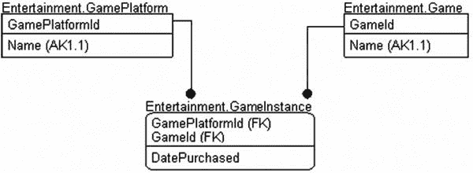

图 7-4. 游戏表

```
--为娱乐相关的表创建一个模式
CREATE SCHEMA Entertainment;
GO
CREATE TABLE Entertainment.GamePlatform
(
GamePlatformId int NOT NULL CONSTRAINT PKGamePlatform PRIMARY KEY,
Name  varchar(50) NOT NULL CONSTRAINT AKGamePlatform_Name UNIQUE
);
CREATE TABLE Entertainment.Game
(
GameId  int NOT NULL CONSTRAINT PKGame PRIMARY KEY,
Name    varchar(50) NOT NULL CONSTRAINT AKGame_Name UNIQUE
--更多所有平台共有的细节
);
--具有级联关系回 Game 和 GamePlatform 的关联实体
CREATE TABLE Entertainment.GameInstance
(
GamePlatformId int NOT NULL,
GameId int NOT NULL,
PurchaseDate date NOT NULL,
CONSTRAINT PKGameInstance PRIMARY KEY (GamePlatformId, GameId),
CONSTRAINT FKGame$is_owned_on_platform_by$EntertainmentGameInstance
FOREIGN KEY (GameId)
REFERENCES Entertainment.Game(GameId) ON DELETE CASCADE,
CONSTRAINT FKGamePlatform$is_linked_to$EntertainmentGameInstance
FOREIGN KEY (GamePlatformId)
REFERENCES Entertainment.GamePlatform(GamePlatformId)
ON DELETE CASCADE
);
```

然后，我插入一些示例数据：

```
INSERT  Entertainment.Game (GameId, Name)
VALUES (1,'Disney Infinity'),
(2,'Super Mario Bros');
INSERT  Entertainment.GamePlatform(GamePlatformId, Name)
VALUES (1,'Nintendo WiiU'),   --是的，事实上我仍然是个
(2,'Nintendo 3DS');     --任天堂粉丝，你为什么这么问？
INSERT  Entertainment.GameInstance(GamePlatformId, GameId, PurchaseDate)
VALUES (1,1,'20140804'),
(1,2,'20140810'),
(2,2,'20150604');
-- FULL OUTER JOIN 确保返回所有集合中的所有行，
-- 在数据缺失的位置留下 NULL
SELECT  GamePlatform.Name as Platform, Game.Name as Game, GameInstance. PurchaseDate
FROM    Entertainment.Game as Game
FULL OUTER JOIN Entertainment.GameInstance as GameInstance
ON Game.GameId = GameInstance.GameId
FULL OUTER JOIN Entertainment.GamePlatform
ON GamePlatform.GamePlatformId = GameInstance.GamePlatformId;
```

如你所见，我在 WiiU 上有两款游戏，而在 Nintendo 3DS 上只有一款：

```
Platform             Game                 PurchaseDate
-------------------- -------------------- ------------
Nintendo WiiU        Disney Infinity      2014-08-04
Nintendo WiiU        Super Mario Bros     2014-08-10
Nintendo 3DS         Super Mario Bros     2015-06-04
```

因此，我在表上创建一个触发器来执行“反向”级联操作：

```
CREATE TRIGGER Entertainment.GameInstance$deleteTrigger
ON Entertainment.GameInstance
AFTER DELETE AS
BEGIN
SET NOCOUNT ON;
SET ROWCOUNT 0; --以防客户端修改了行计数
--对于 INSERT 或 UPDATE 触发器使用 inserted，对于 UPDATE 或 DELETE 触发器使用 deleted
--使用 COUNT 而不是 @@ROWCOUNT，因为 MERGE 行为会将 @@ROWCOUNT 设置为
--等于合并行数的数字，而不是在触发器中检查的行数
DECLARE @msg varchar(2000),    --用于保存错误信息
--对于 INSERT 或 UPDATE 触发器使用 inserted，对于 UPDATE 或 DELETE 触发器使用 deleted
--使用 COUNT 而不是 @@ROWCOUNT，因为 MERGE 行为会将 @@ROWCOUNT 设置为
--等于合并行数的数字，而不是在触发器中检查的行数
--        @rowsAffected int = (SELECT COUNT(*) FROM inserted);
@rowsAffected int = (SELECT COUNT(*) FROM deleted);
BEGIN TRY
--[验证部分]
--[修改部分]
--删除所有 Game
DELETE Game      --那些 GameInstance 被删除且
WHERE  GameId IN (SELECT deleted.GameId
FROM   deleted     --不再剩余任何 GameInstance 的 Game
WHERE  NOT EXISTS (SELECT  *
FROM    GameInstance
WHERE   GameInstance.GameId =
deleted.GameId));
END TRY
BEGIN CATCH
IF @@TRANCOUNT > 0
ROLLBACK TRANSACTION;
THROW; --将停止批处理或被调用方的 CATCH 块捕获
END CATCH;
END;
```

就是这么简单。只需删除游戏实例，让触发器处理剩下的事。删除 Wii 的行：

```
DELETE  Entertainment.GameInstance
WHERE   GamePlatformId = 1;
```

接下来，检查数据：

```
SELECT  GamePlatform.Name AS Platform, Game.Name as Game, GameInstance. PurchaseDate
FROM    Entertainment.Game AS Game
FULL OUTER JOIN Entertainment.GameInstance as GameInstance
ON Game.GameId = GameInstance.GameId
FULL OUTER JOIN Entertainment.GamePlatform
ON GamePlatform.GamePlatformId = GameInstance.GamePlatformId;
```

你可以看到现在 `Game` 表中只剩下一行了：

```
platform             Game                 PurchaseDate
-------------------- -------------------- ------------
Nintendo 3DS         Super Mario Bros     2015-06-04
Nintendo WiiU        NULL                 NULL
```

这向我们展示了当所有实例都被移除时，`Game` 行被删除，但平台仍然存在。（使用 `FULL OUTER JOIN` 的技术将帮助你查看匹配行的所有排列组合。重新插入 `'Disney Infinity'` 的 `Game` 行，你会看到另一行出现，其 `Platform` 和 `PurchaseDate` 为 `NULL`。）

### 跨数据库的关系

在约束出现之前，所有关系都是由触发器强制执行的。值得庆幸的是，现在触发器在关系方面仅用于强制执行关系的特殊情况，例如当你在不同数据库上的表之间存在关系时。目前这更多是一个理论上的练习，因为对大多数读者来说这种情况不会发生。然而，这是一个很好的练习，迫使你思考使用触发器来覆盖多表情况时可能涉及的所有不同变化。

要使用触发器实现关系，你需要多个触发器：

*   父表：
    *   `UPDATE`：如果存在子值，则禁止更改键值，或级联更新。
    *   `DELETE`：防止或级联删除具有关联父行的行。
*   子表：
    *   `INSERT`：检查确保键存在于父表中。
    *   `UPDATE`：检查确保“可能”更改后的键存在于父表中。

在本节的开始，我将提供用于构建这些触发器的模板，然后在最后一节中，我将编写一个完整的触发器作为演示。对于这些代码片段，我将表称为父表和子表，不指定模式或数据库名称。将包含在大于和小于符号 `< >` 内的代码片段替换为适当的代码和表名（包括数据库和模式），当插入到本章一直使用的触发器模板中时，就能得到你想要的结果。


## 父表更新

请注意，如果使用基于标识属性列的**代理键**，则可以省略父表更新步骤，因为它们不可编辑，因此无法更改。

你可能希望实现以下几种可能性：

*   将操作级联到子行
*   如果存在子行，则阻止更新父表

从一个合适的通用触发器编码角度来看，级联操作是不可能实现的。问题是，如果在触发触发器的语句中修改了一个或多个父表行的键，则不一定有任何方法可以将 `inserted` 表中的行与 `deleted` 表中的行关联起来，这使得你无法知道 `inserted` 表中的哪一行应该与 `deleted` 表中的哪一行匹配。因此，我不会在触发器中实现父键更改的级联；如果你发现需要可编辑的键并希望级联（而`FOREIGN KEY`约束不允许这样做，这种情况应该很少见），我会在你的外部代码中实现这一点。

### 阻止更新存在子行的父行

这非常直接。这里的想法是，你希望采取与关系上的`NO ACTION`子句相同的限制性操作，例如：

```sql
IF UPDATE(parent_key_column)
BEGIN
    IF EXISTS ( SELECT  *
                FROM    deleted
                JOIN child_table AS child
                    ON child.parent_key = deleted.parent_key_column)
    BEGIN
        IF @rowsAffected = 1
            SELECT @msg = 'one row message' + inserted.somedata
            FROM   inserted;
        ELSE
            SELECT @msg = 'multi-row message';
        THROW 50000, @msg, 16;
    END;
END;
```

## 父表删除

与更新类似，当删除父表行时，我们可以选择：

*   将删除级联到子行
*   如果存在子行，则阻止删除父行

### 级联删除

级联非常简单。对于删除，你只需使用一个关联的 `EXISTS` 子查询来获取子表中与父表匹配的行：

```sql
DELETE parent_table
WHERE  EXISTS ( SELECT *
                FROM child_table
                WHERE child_table.parent_key = parent_table.parent_key_column);
```

### 阻止删除存在关联子行的父行

以下是在存在关联子行时阻止删除行的代码基础：

```sql
IF EXISTS  ( SELECT   *
             FROM     deleted
             JOIN child_table AS child
                 ON child.parent_key = deleted.parent_key_column)
BEGIN
    IF @rowsAffected = 1
        SELECT @msg = 'one row message' + inserted.somedata
        FROM   inserted;
    ELSE
        SELECT @msg = 'multi-row message';
    THROW 50000, @msg, 16;
END;
```

## 子表插入与子表更新

在子表上，目标基本上是确保你在子表中创建的每一个值，在父表中都存在对应的行。以下代码片段实现了这一点，并考虑了允许空值的情况：

```sql
--@numrows 是标准模板的一部分
DECLARE @nullcount int,
        @validcount int;
IF UPDATE(parent_key_column)
BEGIN
    --如果不允许为空，则可以省略此检查
    SELECT  @nullcount = count(*)
    FROM    inserted
    WHERE   inserted.parent_key_column IS NULL;
    --不计算空值
    SELECT  @validcount = count(*)
    FROM    inserted
    JOIN parent_table AS Parent
        ON  inserted.parent_key_column = Parent.parent_key_column;
    if @validcount + @nullcount != @numrows
    BEGIN
        IF @rowsAffected = 1
            SELECT @msg = 'The inserted parent_key: '
                + CAST(parent_key as varchar(10))
                + ' is not valid in the parent table.'
            FROM   inserted;
        ELSE
            SELECT @msg = 'Invalid parent_key in the inserted rows.'
        THROW 50000, @msg, 16;
    END
END
```

使用像这样的基本代码块，你可以使用触发器验证几乎任何外键关系。例如，假设你的 `PhoneData` 数据库中有一个名为 `Logs.Call` 的表，其主键为 `CallId`。在 `CRM` 数据库中，你有一个 `Contacts.Journal` 表，用于存储与某人的联系记录。要实现子表插入触发器，只需填写空白处。更新触发器的代码也将是相同的，并且如果只需要一个触发器，可以合并它们。以下代码无法直接执行；仅用于说明目的。

```sql
CREATE TRIGGER Contacts.Journal$insertTrigger
ON Contacts.Journal
AFTER INSERT AS
BEGIN
    SET NOCOUNT ON;
    SET ROWCOUNT 0; --in case the client has modified the rowcount
    --use inserted for insert or update trigger, deleted for update or delete trigger
    --count instead of @@rowcount due to merge behavior that sets @@rowcount to a number
    --that is equal to number of merged rows, not rows being checked in trigger
    DECLARE @msg varchar(2000),    --used to hold the error message
    --use inserted for insert or update trigger, deleted for update or delete trigger
    --count instead of @@rowcount due to merge behavior that sets @@rowcount to a number
    --that is equal to number of merged rows, not rows being checked in trigger
            @rowsAffected int = (SELECT COUNT(*) FROM inserted);
    --           @rowsAffected int = (SELECT COUNT(*) FROM deleted);
    BEGIN TRY
        --[validation section]
        --@numrows 是标准模板的一部分
        DECLARE @nullcount int,
                @validcount int;
        IF UPDATE(CallId)
        BEGIN
            --omit this check if nulls are not allowed
            --(left in here for an example)
            SELECT  @nullcount = COUNT(*)
            FROM    inserted
            WHERE   inserted.CallId IS NULL;
            --does not include null values
            SELECT  @validcount = count(*)
            FROM    inserted
            JOIN PhoneData.Logs.Call AS Parent
                on  inserted.CallId = Parent.CallId;
            IF @validcount + @nullcount != @rowsAffected
            BEGIN
                IF @rowsAffected = 1
                    SELECT @msg = 'The inserted CallId: '
                        + cast(CallId AS varchar(10))
                        + ' is not valid in the'
                        + ' PhoneData.Logs.Call table.'
                    FROM   inserted;
                ELSE
                    SELECT @msg = 'Invalid CallId in the inserted rows.';
                THROW  50000, @Msg, 1;
            END
        END
        --[modification section]
    END TRY
    BEGIN CATCH
        IF @@trancount > 0
            ROLLBACK TRANSACTION
        THROW; --will halt the batch or be caught by the caller's catch block
    END CATCH;
END;
```


### INSTEAD OF 触发器

正如“DML 触发器”章节引言所解释的，`INSTEAD OF` 触发器在 SQL 引擎执行 DML 操作**之前**触发，而 `AFTER` 触发器则在操作**之后**触发。实际上，当你在表上定义了 `INSTEAD OF` 触发器时，对该表执行 `INSERT`、`UPDATE` 或 `DELETE` 操作时，触发器会首先执行。之所以称为 `INSTEAD OF`，是因为它们**替代**了用户执行的原生操作。在触发器内部，你来执行实际的操作——可以是用户请求的操作，也可以是其他操作。这种触发器的一个实用之处在于，你可以将它们用于视图，使原本不可编辑的视图变得可编辑。通过这种方式，你将所有受影响表的调用封装在触发器中，就像存储过程一样，只不过现在这个视图具备了物理表的所有外部特性，向用户隐藏了实际的实现细节。

`INSTEAD OF` 触发器最明显的限制可能是，每个表上针对每个操作（`INSERT`、`UPDATE` 和 `DELETE`）只能有一个这样的触发器。也可以像 `AFTER` 触发器一样组合触发的操作，例如创建一个同时处理 `INSERT` 和 `UPDATE` 的 `INSTEAD OF` 触发器（对于几乎所有 `INSTEAD OF` 触发器的用法，我更强烈地建议不要这样做）。我们将使用与 T-SQL `AFTER` 触发器模板稍作修改的相同模板，附录 B 中有更详细的介绍。

我最常用 `INSTEAD OF` 触发器来自动设置或修改语句中的值，使得无论客户端发送什么内容，值都能被设置成我想要的样子，这很像我们在第 6 章中处理 `rowLastModifiedTime` 和 `rowCreatedTime` 列的方式。如果通过客户端调用记录最后更新时间，当某个客户端的时钟快了一分钟、一天甚至一年时，可能会出现问题。（你在应用程序中经常看到这种情况。我最喜欢的一个例子是一个系统，其中电话呼叫似乎花费了负的时间，因为客户端报告开始时间，而服务器记录结束时间。）你可以扩展这种设置值的范式来格式化任何数据，例如，如果你想将所有存储的数据都转换为小写。

我将演示两种可以使用 `INSTEAD OF` 触发器的方式：
*   将无效数据重定向到异常表
*   强制不对表执行任何操作，即使操作者技术上拥有适当的权限

通常最佳实践是不要像使用 `AFTER` 触发器那样，使用 `INSTEAD OF` 触发器来做引发错误的验证。通常，`INSTEAD OF` 触发器用于在后台以静默方式完成某些事情。

#### 将无效数据重定向到异常表

在某些情况下，当为列设置了无效值时，你可能不想返回错误，而是选择忽略它并记录发生了错误。一般来说，这不会用于批量加载数据（使用 `SSIS` 的工具来做这件事是更好的主意），但以下是一些你可能这样做的示例：

*   **盲打录入**：在许多接收客户反馈表或付款单据成百上千的公司，会有员工打开邮件、阅读内容并将页面上的信息录入系统。这些员工变得极其熟练于快速录入，并且通常很少出错。他们犯的错误不会在屏幕上引发错误；而是转交给其他人——异常处理人员——来修复。你可以使用 `INSTEAD OF` 触发器将错误数据重定向到异常表，以便稍后处理。
*   **从设备读取的值**：一个例子是在装配线上，读取到的值超出了可能的范围，这可能是由于设备故障或人为移动了传感器造成的。过多的异常行需要检查设备，但只有少数几个异常可能是正常且可接受的。另一种可能是当有人使用扫描仪扫描印刷页面并插入数据时。通常，读取的值不正确，需要手动检查。

对于我们的示例，我将设计一个表来接收来自单个温度计的天气读数。有时，这个温度计会发回不可能的错误值。我们需要能够输入读数，有时一次输入多个，因为如果信号丢失，设备可以缓存一段时间的结果，但它会丢弃那些不太可能的行。

我们构建以下表，最初使用约束来实现简单的合理性检查。在数据分析中，我们可能会发现异常，但在这个过程中，我们要做的只是查找“不可能”的情况：

```sql
CREATE SCHEMA Measurements;
GO
CREATE TABLE Measurements.WeatherReading
(
WeatherReadingId int NOT NULL IDENTITY
CONSTRAINT PKWeatherReading PRIMARY KEY,
ReadingTime   datetime2(3) NOT NULL
CONSTRAINT AKWeatherReading_Date UNIQUE,
Temperature     float NOT NULL
CONSTRAINT CHKWeatherReading_Temperature
CHECK(Temperature BETWEEN -80 and 150)
--raised from last edition for global warming
);
```

然后，我们加载数据，模拟一次性导入数据时可能执行的操作：

```sql
INSERT  INTO Measurements.WeatherReading (ReadingTime, Temperature)
VALUES ('20160101 0:00',82.00), ('20160101 0:01',89.22),
('20160101 0:02',600.32),('20160101 0:03',88.22),
('20160101 0:04',99.01);
```

我们知道，对于 `CHECK` 约束，这行不通：

```
Msg 547, Level 16, State 0, Line 741
The INSERT statement conflicted with the CHECK constraint "CHKWeatherReading_Temperature". The conflict occurred in database "Chapter7", table "Measurements.WeatherReading", column 'Temperature'.
```

选择表中的所有数据，你会发现这些数据从未被录入。这是否意味着我们必须逐行筛选？在当前方案下，是的。或者你可以逐行插入，这会给服务器带来更多工作，但如果你一直跟着做，你会知道我们将编写一个 `INSTEAD OF` 触发器来为我们完成这个任务。首先，我们添加一个表来存放违反 `Temperature` 规则的异常值：

```sql
CREATE TABLE Measurements.WeatherReading_exception
(
WeatherReadingId  int NOT NULL IDENTITY
CONSTRAINT PKWeatherReading_exception PRIMARY KEY,
ReadingTime       datetime2(3) NOT NULL,
Temperature       float NULL
);
```

然后，我们创建触发器：


## INSTEAD OF 触发器示例

```
CREATE TRIGGER Measurements.WeatherReading$InsteadOfInsertTrigger
ON Measurements.WeatherReading
INSTEAD OF INSERT AS
BEGIN
SET NOCOUNT ON;
SET ROWCOUNT 0; --in case the client has modified the rowcount
--use inserted for insert or update trigger, deleted for update or delete trigger
--count instead of @@rowcount due to merge behavior that sets @@rowcount to a number
--that is equal to number of merged rows, not rows being checked in trigger
DECLARE @msg varchar(2000),    --used to hold the error message
--use inserted for insert or update trigger, deleted for update or delete trigger
--count instead of @@rowcount due to merge behavior that sets @@rowcount to a number
--that is equal to number of merged rows, not rows being checked in trigger
@rowsAffected int = (SELECT COUNT(*) FROM inserted);
--      @rowsAffected int = (SELECT COUNT(*) FROM deleted);
BEGIN TRY
--[validation section]
--[modification section]
--
--BAD data
INSERT Measurements.WeatherReading_exception (ReadingTime, Temperature)
SELECT ReadingTime, Temperature
FROM   inserted
WHERE  NOT(Temperature BETWEEN -80 and 150);
--GOOD data
INSERT Measurements.WeatherReading (ReadingTime, Temperature)
SELECT ReadingTime, Temperature
FROM   inserted
WHERE  (Temperature BETWEEN -80 and 150);
END TRY
BEGIN CATCH
IF @@trancount > 0
ROLLBACK TRANSACTION;
THROW; --will halt the batch or be caught by the caller's catch block
END CATCH;
END;
```

现在，我们尝试插入那些仍然包含错误数据的行：

```
INSERT  INTO Measurements.WeatherReading (ReadingTime, Temperature)
VALUES ('20160101 0:00',82.00), ('20160101 0:01',89.22),
('20160101 0:02',600.32),('20160101 0:03',88.22),
('20160101 0:04',99.01);
SELECT *
FROM Measurements.WeatherReading;
```

正确的数据会在以下输出中显示：

```
WeatherReadingId ReadingTime               Temperature
---------------- ------------------------- ----------------------
4                2016-01-01 00:00:00.000   82
5                2016-01-01 00:01:00.000   89.22
6                2016-01-01 00:03:00.000   88.22
7                2016-01-01 00:04:00.000   99.01
```

不符合规范的数据可以通过查看异常表中的数据看到：

```
SELECT *
FROM   Measurements.WeatherReading_exception;
```

这将返回以下结果：

```
WeatherReadingId ReadingTime               Temperature
---------------- ------------------------- ----------------
1                2008-01-01 00:02:00.000   600.32
```

现在，或许可以回过头来处理每个异常值，根据前后测量值推断出它本应是多少：

```
(88.22 + 89.22) /2 = 88.72
```

当然，如果我们那样做，可能还需要添加另一个属性，用以表明该读数是推断值而非来自设备的实际读数。这显然是一个非常简化的例子，通过使用先前的读数来确定何为合理值，你甚至可以让功能变得更有趣。

关于 `INSTEAD OF` 触发器的一点说明。如果你在执行单值插入，可能会倾向于使用 `SCOPE_IDENTITY()` 来获取插入的行。如果你在表上有一个 `INSTEAD OF` 触发器，这将不会返回你期望的值：

```
INSERT  INTO Measurements.WeatherReading (ReadingTime, Temperature)
VALUES ('20160101 0:05',93.22);
SELECT SCOPE_IDENTITY();
```

这将返回 `NULL`。如果你需要标识值，可以使用该行的替代键（本例中是 `ReadingTime`），或者像我们在第 6 章中为其中一个表所做的那样，使用 `SEQUENCE` 生成器，以便对使用的值进行控制。

## 强制不执行对表的任何操作

我们的最后一个 `INSTEAD OF` 触发器示例处理的几乎是一个安全问题。通常，用户拥有过多的权限，这包括通常使用 `sysadmin` 权限来查找系统问题的管理员。有些表我们根本不希望被修改。我们可能会实现触发器来阻止任何用户（甚至是系统管理员）更改数据。

在这个例子中，我们将实现一个表来保存数据库的版本。这是一个单行“表”，其行为更像是一个全局变量。它的作用是告诉应用程序应该期待哪个版本的模式，这样它就可以告知用户需要升级或会失去功能：

```
CREATE SCHEMA System;
GO
CREATE TABLE System.Version
(
DatabaseVersion varchar(10)
);
INSERT  INTO System.Version (DatabaseVersion)
VALUES ('1.0.12');
```

我们的应用程序总是查看这个值，以了解在使用对象时期望哪些对象存在。我们显然不希望这个值被修改，即使某人在数据库中拥有 `db_owner` 权限。因此，我们可能会应用一个 `INSTEAD OF` 触发器：

```
CREATE TRIGGER System.Version$InsteadOfInsertUpdateDeleteTrigger
ON System.Version
INSTEAD OF INSERT, UPDATE, DELETE AS
BEGIN
SET NOCOUNT ON;
SET ROWCOUNT 0; --in case the client has modified the rowcount
--use inserted for insert or update trigger, deleted for update or delete trigger
--count instead of @@rowcount due to merge behavior that sets @@rowcount to a number
--that is equal to number of merged rows, not rows being checked in trigger
DECLARE @msg varchar(2000),    --used to hold the error message
--use inserted for insert or update trigger, deleted for update or delete trigger
--count instead of @@rowcount due to merge behavior that sets @@rowcount to a number
--that is equal to number of merged rows, not rows being checked in trigger
@rowsAffected int = (SELECT COUNT(*) FROM inserted);
IF @rowsAffected = 0 SET @rowsAffected = (SELECT COUNT(*) FROM deleted);
--no need to complain if no rows affected
IF @rowsAffected = 0 RETURN;
--No error handling necessary, just the message.
--We just put the kibosh on the action.
THROW 50000, 'The System.Version table may not be modified in production', 16;
END;
```

尝试删除该值，像这样：

```
UPDATE System.Version
SET    DatabaseVersion = '1.1.1';
GO
```

将导致以下结果：

```
Msg 50000, Level 16, State 16, Procedure Version$InsteadOfInsertUpdateDeleteTrigger, Line 15
The System.Version table may not be modified in production
```

检查数据，你会发现它保持不变：

```
SELECT *
FROM   System.Version;
返回结果：
DatabaseVersion

1.0.12
```

管理员在进行升级时，必须采取有意识的步骤运行以下代码：

```
ALTER TABLE system.version
DISABLE TRIGGER version$InsteadOfInsertUpdateDeleteTrigger;
```

现在，你可以运行 `UPDATE` 语句了：

```
UPDATE System.Version
SET    DatabaseVersion = '1.1.1';
```

再次检查数据：

```
SELECT *
FROM   System.Version;
```

你会看到它已经被修改了：

```
DatabaseVersion

1.1.1
```

使用 `ALTER TABLE`…`ENABLE TRIGGER` 重新启用触发器：

```
ALTER TABLE System.Version
ENABLE TRIGGER Version$InsteadOfInsertUpdateDeleteTrigger;
```

使用这样的触发器（当然，不能禁用，这是你可以通过 DDL 触发器捕获的）可以让你“关上大门”，将数据安全地保存在表中，甚至防止意外更改。


### 处理触发器与约束错误

关于触发器和约束，一个需要考虑的重要方面是如何处理由它们引发的错误。使用触发器的一个缺点在于，触发器出错后的数据库状态与约束出错后的状态不同。在使用触发器并借助本章介绍的错误处理器执行`ROLLBACK`时，我们需要考虑两种情况：

*   **未使用`TRY-CATCH`块**：这种情况很简单。批处理会立即停止执行。SQL Server 会负责清理你所在的任何未完成的事务。
*   **使用`TRY-CATCH`块**：这种情况可能有点棘手，并且结果将取决于你期望发生什么。

以一个`TRY-CATCH`块为例，其结构如下：

```sql
BEGIN TRY

END TRY
BEGIN CATCH

END CATCH;
```

如果一个 T-SQL 触发器回滚并引发错误，当你进入`<handle it>`块时，你将**不**处于一个事务中。对于 CLR 触发器这种罕见情况，由你来决定连接是否终止。当`CHECK`约束导致错误或执行简单的`THROW`或`RAISERROR`时，你将**处于**一个事务中。通用情况下，这是我使用的`CATCH`块（正如本章到目前为止编写的触发器中所使用的那样）：

```sql
BEGIN CATCH
IF @@trancount > 0
    ROLLBACK TRANSACTION;
THROW; --将停止批处理或被捕获调用方的 catch 块捕获
END CATCH;
```

在几乎所有情况下，我都会回滚任何活动事务，记录错误，然后重新引发错误。将其作为一条规则来执行更简单，并且在 99.997%的情况下都是期望的做法。为了展示可能发生的不同场景，我将构建以下抽象表来演示触发器和约束的错误处理：

```sql
CREATE SCHEMA alt;
GO
CREATE TABLE alt.errorHandlingTest
(
    errorHandlingTestId   int CONSTRAINT PKerrorHandlingTest PRIMARY KEY,
    CONSTRAINT CHKerrorHandlingTest_errorHandlingTestId_greaterThanZero
        CHECK (errorHandlingTestId > 0)
);
```

请注意，如果你尝试向`errorHandlingTestId`插入一个不大于 0 的值，将会导致约束错误。在触发器中，我们在`TRY`部分实现的唯一语句是引发错误。因此，无论向表发送什么输入，它都将被丢弃，并且会引发一个错误。像我们之前所做的那样，如果事务正在进行，我们将使用`ROLLBACK`，然后执行`THROW`。

```sql
CREATE TRIGGER alt.errorHandlingTest$insertTrigger
ON alt.errorHandlingTest
AFTER INSERT
AS
BEGIN TRY
    THROW 50000, 'Test Error',16;
END TRY
BEGIN CATCH
    IF @@TRANCOUNT > 0
        ROLLBACK TRANSACTION;
    THROW;
END CATCH;
```

首先需要理解的是，当一个普通的约束导致 DML 操作失败时，批处理**将继续**执行：

```sql
--无事务，约束错误
INSERT alt.errorHandlingTest
VALUES (-1);
SELECT 'continues';
```

你会看到错误被引发，然后`SELECT`语句得到执行：

```
Msg 547, Level 16, State 0, Line 913
The INSERT statement conflicted with the CHECK constraint "CHKerrorHandlingTest_errorHandlingTestId_greaterThanZero". The conflict occurred in database "Chapter7", table "alt.errorHandlingTest", column 'errorHandlingTestId'.
The statement has been terminated.

continues
```

然而，对于触发器错误，情况则不同：

```sql
INSERT alt.errorHandlingTest
VALUES (1);
SELECT 'continues';
```

这将返回以下结果，并且完全不会执行到`SELECT 'continues'`这一行：

```
Msg 50000, Level 16, State 16, Procedure errorHandlingTest$afterInsertTrigger, Line 6
Test Error
```

使用`THROW`会产生这种相当优雅的停止，因为`THROW`会停止批处理。但是，使用`RAISERROR`时批处理也会停止，不过它会给出一条关于停止触发器的消息。正如我将要展示的，如果你只是在触发器中`THROW`一个错误，批处理最终也会停止，但方式远没有那么优雅。

在使用`TRY-CATCH`和事务时，处理约束和触发器的错误也存在差异。看下面的批处理。错误将是约束类型的。需要理解的关键点是错误后事务的状态。这绝对是一个你必须小心处理的问题。

```sql
BEGIN TRY
    BEGIN TRANSACTION
    INSERT alt.errorHandlingTest
    VALUES (-1);
    COMMIT;
END TRY
BEGIN CATCH
    SELECT  CASE XACT_STATE()
                WHEN 1 THEN 'Committable'
                WHEN 0 THEN 'No transaction'
                ELSE 'Uncommitable tran' 
            END as XACT_STATE
        ,ERROR_NUMBER() AS ErrorNumber
        ,ERROR_MESSAGE() as ErrorMessage;
    IF @@TRANCOUNT > 0
        ROLLBACK TRANSACTION;
END CATCH;
```

这将返回以下结果：

```
XACT_STATE        ErrorNumber ErrorMessage
----------------- ----------- ----------------------------------------------------------
Committable       547         The INSERT statement conflicted with the CHECK constraint...
```

事务仍然有效且处于稳定状态。如果你想继续在批处理中执行任何需要做的事情，这当然是可以的。然而，如果你最终使用任何触发器来强制执行数据完整性，情况将会不同（并且对程序员来说并非完全显而易见）。在下一个批处理中，我们将使用 1 作为值，这样我们会得到触发器错误而不是约束错误：

```sql
BEGIN TRANSACTION
BEGIN TRY
    INSERT alt.errorHandlingTest
    VALUES (1);
    COMMIT TRANSACTION;
END TRY
BEGIN CATCH
    SELECT  CASE XACT_STATE()
                WHEN 1 THEN 'Committable'
                WHEN 0 THEN 'No transaction'
                ELSE 'Uncommitable tran' 
            END as XACT_STATE
        ,ERROR_NUMBER() AS ErrorNumber
        ,ERROR_MESSAGE() as ErrorMessage;
    IF @@TRANCOUNT > 0
        ROLLBACK TRANSACTION;
END CATCH;
```

这将返回以下结果：

```
XACT_STATE        ErrorNumber ErrorMessage
----------------- ----------- --------------------------------------------
No transaction    50000       Test Error
```

在我们批处理的错误处理程序中，会话不再处于事务中，因为我们在触发器中回滚了事务。然而，与没有错误处理程序的情况不同，我们继续在批处理中执行，而不是让批处理终止。但请注意，如果不借助技巧（例如将状态存储在临时表变量中，而不是抛出错误或回滚，但为了保持代码标准和易于遵循，强烈不建议这样做），则无法从触发器中的问题恢复。

事务状态的不可预测性正是我们检查`@@TRANCOUNT`以查看是否需要回滚的原因。在这种情况下，触发器中的错误消息被冒泡到这个`CATCH`语句中，所以我们处于由`CATCH`块处理的错误状态。

作为最后的演示，让我们看另一种情况，即你在触发器中引发错误但**没有**回滚事务：

```sql
ALTER TRIGGER alt.errorHandlingTest$insertTrigger
ON alt.errorHandlingTest
AFTER INSERT
AS
BEGIN TRY
    THROW 50000, 'Test Error',16;
END TRY
BEGIN CATCH
    --出于测试目的已注释掉
    --IF @@TRANCOUNT > 0
    --    ROLLBACK TRANSACTION;
    THROW;
END CATCH;
```

现在，在触发器中引发错误：

```sql
BEGIN TRY
    BEGIN TRANSACTION
    INSERT alt.errorHandlingTest
    VALUES (1);
    COMMIT TRANSACTION;
END TRY
BEGIN CATCH
    SELECT  CASE XACT_STATE()
                WHEN 1 THEN 'Committable'
                WHEN 0 THEN 'No transaction'
                ELSE 'Uncommitable tran' 
            END as XACT_STATE
        ,ERROR_NUMBER() AS ErrorNumber
        ,ERROR_MESSAGE() as ErrorMessage;
    IF @@TRANCOUNT > 0
        ROLLBACK TRANSACTION;
END CATCH;
```

结果如下：

```
XACT_STATE          ErrorNumber ErrorMessage
------------------- ----------- --------------------------------------------
Uncommitable tran   50000       Test Error
```

你得到了一个无法提交的事务，也被称为“已注定”（doomed）事务。无法提交的事务仍然有效，但永远无法提交，最终必须被回滚。

所有这一切的重点是，在编写错误处理代码时，你需要小心地做几件事：


*   保持简单：仅执行必要操作，通常将错误视为不可恢复的，除非恢复确实必需。关键在于处理错误并返回稳定状态，以便客户端知道如何重试。
*   保持标准：制定并遵循标准。在所有需要相同操作的代码中，始终使用相同的处理器。
*   充分测试：最重要的信息是反复测试代码可能经过的所有路径。

为了在我的代码中始终保持一致的情况，我几乎总是使用一个标准处理器。基本上，在每个数据操作语句之前，我在变量中设置一条手动消息，将其作为消息的前半部分以了解正在执行的操作，然后追加系统消息以了解出了什么问题，有时会使用前面提到的约束映射函数，不过通常这是多余的，因为 UI 会捕获所有错误：

```sql
BEGIN TRY
BEGIN TRANSACTION;
DECLARE @errorMessage nvarchar(4000) = 'Error inserting data into alt.errorHandlingTest';
INSERT alt.errorHandlingTest
VALUES (-1);
COMMIT TRANSACTION;
END TRY
BEGIN CATCH
IF @@TRANCOUNT > 0
ROLLBACK TRANSACTION;
--I also add in the stored procedure or trigger where the error
--occurred also when in a coded object
SET @errorMessage = CONCAT( COALESCE(@errorMessage,''), ' ( System Error: ',
ERROR_NUMBER(),':',ERROR_MESSAGE(),
' : Line Number:',ERROR_LINE());
THROW 50000,@errorMessage,16;
END CATCH;
```

现在，这返回以下内容：

```
Msg 50000, Level 16, State 16, Line 18
Error inserting data into alt.errorHandlingTest ( System Error: 547:The INSERT statement conflicted with the CHECK constraint "chkAlt_errorHandlingTest_errorHandlingTestId_greaterThanZero".
The conflict occurred in database "Chapter7", table "alt.errorHandlingTest", column 'errorHandlingTestId': Line Number:4)
```

这将返回手动创建的消息和系统消息，以及错误发生的位置。在附录 B 中，我概述了一些记录错误的额外方法，使用我称为 `ErrorHandling.ErrorLog$insert` 的存储过程，具体取决于错误是预期偶尔发生还是（如我关于触发器所说）确实不应该发生的情况。如果我以预期错误会发生的方式实现代码，我还可能包含对类似 `ErrorHandling.ErrorMap$MapError` 过程的调用，以美化系统错误的错误消息值。

错误处理无疑是 SQL Server 的 T-SQL 语言相比几乎所有其他语言都欠缺的地方，但在 2005 年通过 `TRY…CATCH` 取得了飞跃式的改进，并在 2012 年通过使用 `THROW` 重新引发错误的能力（我们在标准触发器模板中已经使用）进行了一些改进。当然，编写错误处理代码最重要的部分是进行测试以确保其有效！

## 最佳实践

主要的最佳实践是使用正确的工具完成工作。SQL 中（及其周围）有许多工具可用于保护数据。为特定情况选择合适的工具至关重要。例如，每个表中的每个列都可以定义为 `nvarchar(max)`。使用 `CHECK` 约束，然后可以将值约束为看起来像几乎任何数据类型。这听起来可能很傻，但确实是可能的。但阅读了第 6 章和本章之后，你就更清楚了，对吧？

在选择保护数据的方法时，最好按以下顺序应用以下类型的对象：

*   数据类型：选择正确的类型是第一道防线。如果你的所有值都需要是 1 到 10,000 之间的整数，仅使用 `integer` 数据类型就立即满足了规则的一部分。
*   默认值：虽然你可能不认为默认值可以被视为数据保护资源，但你应该知道你可以使用它们自动设置那些对用户可能不明显的列（数据库为该列添加合适的值）。
*   简单的 `CHECK` 约束：这些对于确保你的数据符合规范非常重要。你可以使用几乎任何标量函数（用户定义的或系统的），只要你最终得到一个单一的逻辑表达式。
*   复杂的 `CHECK` 约束，可能使用函数：这些可以是设计中非常有趣的部分，但应谨慎使用，并且你应该很少使用引用同一表数据的函数，因为结果可能不一致。
*   触发器：这些用于强制执行对于 `CHECK` 约束来说过于复杂的规则。触发器允许你构建代码段，这些代码段在针对单个表执行的任何 `INSERT`、`UPDATE` 和 `DELETE` 操作上自动触发。

不要害怕在多个位置强制执行规则。虽然将规则尽可能靠近数据存储对于在使用数据时信任数据的完整性至关重要，但没有理由让用户忍受糟糕的用户界面，例如一堆没有验证的简单文本框。

当然，并非所有的数据保护都可以在对象级别完成，有些需要使用客户端代码甚至在数据输入很久之后才执行的异步过程来管理。用户代码与本书到目前为止讨论的方法的主要区别在于，基于 SQL Server 的强制完整性是自动的，并且不能（意外地）被覆盖。在处理并发用户频繁更改数据方面，它也远远更优。


## 总结

现在，您已完成为数据库开发数据存储的任务。如果您已规划好数据存储和数据保护层，那么可能进入您系统的不良数据就与设计无关了（如果用户想把名字 John 拼写成 “Jahn” 甚至 “IdiotWhoInsultedMe”——更奇怪的事情都发生过！——数据库服务器层面是无法阻止的）。

作为架构师或程序员，您不可能阻止用户将设备名称放入名为 `Employee` 的表中。数据库没有内置的语义检查功能，并且要实现这一点需要巨大的工作量和计算能力，这几乎是不可能的。只有通过教育才能解决这个问题。当然，如果您为用户提供了存储所有数据的表，情况会有所改善，但用户终究是用户。

我们在 SQL Server 中能做的最多是确保数据基本合理，即数据至少在不考虑用户决策背景（无论其正确与否，只要是合法值）的情况下是有意义的。如果您的 HR 员工一直试图给新程序员支付最低工资，数据库可能不会在意；但如果他们试图说新员工的工资是负数，实际上是要为获得工作机会而欠公司钱，嗯，这恐怕行不通，即使这份工作是电子游戏测试员或其他非常令人向往的职位。在此过程中，我们利用 SQL Server 提供的资源来保护数据，防止其出现此类无效值，否则这些值日后还需要再次检查。

使用**检查约束**来保护单行数据。您可以访问表中的任何列，但只能访问该行的数据。如果需要，您可以使用用户定义函数访问其他表中的数据，但请注意，就像构建自己的外键检查一样，您需要考虑正在检查的表以及所引用表的情况。使用**触发器**进行最复杂的检查，尤其是在需要引用同一表中的行时，例如检查余额。触发器还可能引入副作用，例如在需要时维护非规范化数据，甚至调用其他存储过程如 `sp_db_sendmail`。编写触发器最重要的一点是理解它每执行一次 DML 操作就执行一次，所以无论影响了 1 行还是 10 亿行，都只执行一次。请提前规划。

一旦您构建并实施了一套适当的数据保护资源，您就可以信任数据库中的数据已经过验证。数据一旦存储到数据库中，您就永远不需要重新验证键或值，但进行随机抽样是个好主意，这样您就能知道是否有完整性漏洞被遗漏，尤其是在全面测试过程中。

# 8. 模式与反模式

简而言之，没有一种模式是孤立的实体。每种模式能够存在的程度，取决于其他模式的支持：它所嵌入的更大模式、围绕它的同规模模式，以及嵌入其中的更小模式。
——克里斯托弗·亚历山大，建筑师和设计理论家

有句老话说，不应该尝试重新发明轮子，老实说，这本质上是句非常好的话。但对于所有类似的说法，应用时都需要一点常识。如果历史上每个人都按字面意思理解这句话，那么你的车轮就会是用树干做的（《流言终结者》在他们的“好木头”一集中证明这是可行的），因为这显然可能是最早使用的轮状机器之一。如果历史上每个人都说“这已经够好了”，那么开着家里的旅行车去 Walley World 会是一次远不那么舒适的体验。

然而，随着时间的推移，轮子的基本概念一直保持不变，从石轮到马车轮，再到钢丝子午线轮胎，甚至是一块切达干酪轮。每一种都是圆形的，能够通过滚动从 A 地移动到 B 地。每个解决方案都遵循这个共同的模式，但又有所分化以解决特定问题。软件程序员的目标应该是首先尝试理解现有技术，然后要么使用，要么改进它们。在不了解历史的情况下反复解决同样的问题，是愚蠢的。

软件设计（当然是数据库设计）的一个巧妙之处在于，存在一些基础模式，例如规范化，我们将以此为基础构建，但还有更多的模式是从规范化表开始逐步构建起来的。这就是本章的内容：利用我们迄今为止构建的基本结构，通过越来越复杂的结构组合，我们将产生更复杂、更有趣的解决方案。

当然，正如存在行之有效的正面模式一样，历史上也存在反复失败的负面模式。以个人飞行为例。在很长很长一段时间里，真正聪明的人们一次又一次地尝试将翅膀绑在手臂上飞行。他们在概念上是接近的，但只是重复做同样的事情确实是愚蠢的。一旦人们理解了如何将伯努利原理应用于制造机翼，以及真正实现飞行需要什么，莱特兄弟就应用这些原理制造出了第一架载人飞行器。如果您有机会经过北卡罗来纳州的基蒂霍克，您可以看到那架飞机和那次飞行的地点。从那架飞机到今天的飞机，基本原理并没有发生惊人的变化。他们的第一次飞行不需要全身扫描和拍身检查，但机翼的工作原理是一样的。

到目前为止，在本书中，我们已经介绍了您可以用来组装满足现实世界需求的解决方案的基本实现工具。在本章中，我将扩展这个概念，并提供一些更深入的示例，在这些示例中，我们将组装数据库的一部分，以处理几乎任何数据库解决方案中都会出现的常见问题。本章分为两个主要部分，从较大的主题开始，即希望使用的模式。第二大部分讨论反模式，或者您可能经常看到但不建议使用的模式（自然，也会提供首选的解决方案方法）。


## 理想模式

在本节中，我将介绍多种实现模式，这些模式可用于解决你经常会遇到的一些非常常见的问题。请不要将其与你可能面临的问题类型的全面列表相混淆；相反，可以将其视为解决一些常见问题的示例集。

我将在以下小节中介绍的模式和解决方案如下：

*   **唯一性**：超越我们在本书前几章介绍的简单唯一性，我们将探讨一些无法通过简单唯一性约束实现的、非常现实的解决方案模式。
*   **数据驱动设计**：数据驱动设计的目标是永不硬编码没有固定含义的值。你将编程需求分解为可基于数据值集合的情景，这些数据值可以在不影响代码的情况下进行修改。
*   **历史/时态数据**：有时，查看随时间变化的数据的先前版本是非常可取的。我将介绍一些策略，你可以使用它们来查看数据在历史不同时间点的状态。
*   **层次结构**：一个非常常见的需求是在数据中实现层次结构。最常见的例子是经理-员工关系。我将演示两种最简单的实现方法，并介绍其他你可以探索的方法。
*   **图像、文档和其他文件**：通常需要将文档存储在数据库中，例如网络用户的头像图片、用于识别员工的安全照片，甚至是多种类型的文档。我们将探讨 SQL Server 中可用的一些方法，并讨论你可能选择某种方法的原因。
*   **泛化**：我们将探讨一些需要注意表具体程度的方法，以便使解决方案适应用户的需求。
*   **存储用户指定的数据**：你无法总是设计一个数据库来满足所有已知的未来需求。我将介绍一些可能性，让用户以管理员可以某种程度控制的方式自己扩展他们的数据库。

> **注意**
>
> 我一直在寻找可以解决常见问题并增强你的设计（以及我的设计）的其他模式。在我的网站（[`www.drsql.org`](http://www.drsql.org)）上，我可能会随时间提供更多条目，如果你有更多模式的想法，请给我留言。

### 唯一性

如果你一直在通读本书，你可能已经认识到唯一性是设计中的一个主要关注点。事实是，在数据库设计中，唯一性将是你要解决的最大问题之一，因为在某些情况下，区分两行数据可能是一项非常困难的任务。

在本节中，我们将探讨如何实现不同类型的唯一性问题，这些问题直指你会遇到的常见问题的核心：

*   **选择性唯一**：有时，我们不会拥有所有行的全部信息，但我们确实有数据的那些行需要是唯一的。例如，考虑员工的驾照号码。不能有两个人拥有相同的信息，但并非每个人都必然拥有驾照，至少没有记录在数据库中。
*   **批量唯一**：有时，我们需要对物品进行清点，其中一些物品是等同的。例如，杂货店的玉米罐头。你无法区分每个物品，但你确实需要知道你有多少个。
*   **范围唯一**：除了单一值的唯一性，我们通常还需要确保数据范围不重叠，例如预约。以理发店为例。你肯定不希望麦吉利卡蒂女士和默茨女士在同一时间有预约，否则没有人会满意。当你管理交通系统时，事情甚至更加重要。
*   **近似唯一**：最困难的情况也是最常见的情况，即区分到你公司寻求服务的两个人可能真的很难。昨天有两位路易斯·戴维森购买了玩具飞机吗？有可能。是同一电话号码和地址，用同一类型的信用卡吗？很可能不是。但我反复强调的另一点是，在数据库中你无法强制执行“可能”……只能强制执行“确定”。

唯一性是日常运营中最大的难题之一，尤其是在经营公司时，因为它对于不得罪客户、避免在客户实际只下了一个订单时却给他们运送了 100 个乐高订单至关重要。我们需要确保不会最终拥有十个社会安全号码相同的员工（并招致税务人员的来访）、玉米罐头比预期的少得多、同一时间有十个预约，等等。

## 选择性唯一性

我们之前讨论了 `PRIMARY KEY` 和 `UNIQUE` 约束，但这两者都无法满足“确保数据的某个子集（而非每一行）是唯一的”这种场景。例如，假设你有一个员工表，每位员工可能都有一份保险单。保险单号必须是唯一的，但用户可能没有保险单。

对此问题有三种常见的解决方案：

*   **筛选索引**：此功能在 SQL Server 2008 中新增。`CREATE INDEX` 命令的语法包含一个 `WHERE` 子句，使得索引仅适用于表中的特定行。
*   **索引视图**：在 2008 之前的版本中，实现此功能的方法是创建一个带有 `WHERE` 子句的视图，然后对该视图创建索引。
*   **为可为空的项建立单独的表**：一个值得注意的解决方案是为低基数唯一性项建立一个单独的表。例如，你可能会有一个存放员工保险单号的表。在某些情况下，这可能是最佳解决方案，但它可能导致表数量激增，而这些表从未被单独访问，从而增加了不必要的工作量。如果设计得当，你应该在项目的设计阶段就决定采用此方案。

作为演示，我将创建一个人力资源员工表的模式和表，其中包含员工编号列和保险单号列。除非另有说明，我将在示例中使用名为 `Chapter8` 的数据库及其默认设置。

```
CREATE SCHEMA HumanResources;
GO
CREATE TABLE HumanResources.Employee
(
EmployeeId int IDENTITY(1,1) CONSTRAINT PKEmployee primary key,
EmployeeNumber char(5) NOT NULL
CONSTRAINT AKEmployee_EmployeeNummer UNIQUE,
--skipping other columns you would likely have
InsurancePolicyNumber char(10) NULL
);
```

筛选索引对于性能调整非常有用，特别是当只有少数值具有高选择性时，但它也适用于排除值以实现数据保护。除了 `WHERE` 子句之外，索引的所有方面都与普通索引相同（索引将在第 10 章中更详细地介绍）。因此，你可以像这样添加一个索引：

```
--筛选后的备用键 (AKF)
CREATE UNIQUE INDEX AKFEmployee_InsurancePolicyNumber ON
HumanResources.Employee(InsurancePolicyNumber)
WHERE InsurancePolicyNumber IS NOT NULL;
```

然后，创建一个初始样本行：

```
INSERT INTO HumanResources.Employee (EmployeeNumber, InsurancePolicyNumber)
VALUES ('A0001','1111111111');
```

如果你尝试为另一位员工分配相同的 `InsurancePolicyNumber`

```
INSERT INTO HumanResources.Employee (EmployeeNumber, InsurancePolicyNumber)
VALUES ('A0002','1111111111');
```

这次插入会失败：

```
Msg 2601, Level 14, State 1, Line 29
Cannot insert duplicate key row in object 'HumanResources.employee' with unique index 'AKFEmployee_InsurancePolicyNumber'. The duplicate key value is (1111111111).
```

使用更正后的值添加行将会成功：

```
INSERT INTO HumanResources.Employee (EmployeeNumber, InsurancePolicyNumber)
VALUES ('A0002','2222222222');
```

然而，添加两行 `NULL` 值将正常工作：

```
INSERT INTO HumanResources.Employee (EmployeeNumber, InsurancePolicyNumber)
VALUES ('A0003','3333333333'),
('A0004',NULL),
('A0005',NULL);
```

你可以看到这个查询

```
SELECT *
FROM   HumanResources.Employee;
```

返回了以下结果：

```
EmployeeId       EmployeeNumber           InsurancePolicyNumber
---------------- ------------------------ --------------------------------
1                A0001                    1111111111
3                A0002                    2222222222
4                A0003                    3333333333
5                A0004                    NULL
5                A0005                    NULL
```

`NULL` 的例子是经典示例，因为人们通常希望实现这种功能。然而，此技术不仅限于排除 `NULL`。再举一例，假设你希望确保一组行中只有一行被设为主联系人，例如某个账户的主要联系人：

```
CREATE SCHEMA Account;
GO
CREATE TABLE Account.Contact
(
ContactId   varchar(10) NOT NULL,
AccountNumber   char(5) NOT NULL, --在完整示例中会是外键
PrimaryContactFlag bit NOT NULL,
CONSTRAINT PKContact PRIMARY KEY(ContactId, AccountNumber)
);
```

再次创建一个索引，但这次只选择那些 `PrimaryContactFlag` = `1` 的行。表中的其他值可以有任意多个其他值（当然，在此例中，由于是 `bit` 类型，值只能是 0 或 1）。

```
CREATE UNIQUE INDEX AKFContact_PrimaryContact
ON Account.Contact(AccountNumber) WHERE PrimaryContactFlag = 1;
```

如果你尝试插入两个主联系人，如下列语句将联系人 `'fred'` 和 `'bob'` 都设为账户号为 `'11111'` 的账户的主要联系人：

```
INSERT INTO Account.Contact
VALUES ('bob','11111',1);
GO
INSERT INTO Account.Contact
VALUES ('fred','11111',1);
```

第二次插入后会返回以下错误：

```
Msg 2601, Level 14, State 1, Line 73
Cannot insert duplicate key row in object 'Account.Contact' with unique index 'AKFContact_PrimaryContact'. The duplicate key value is (11111).
```

要插入名为 `'fred'` 的行并将其设为主要联系人（假设 `'bob'` 行先前已插入），你需要先将另一行更新为非主要，然后插入新的主要行：

```
BEGIN TRANSACTION;
UPDATE Account.Contact
SET PrimaryContactFlag = 0
WHERE  accountNumber = '11111';
INSERT Account.Contact
VALUES ('fred','11111', 1);
COMMIT TRANSACTION;
```

请注意，在这种情况下，你肯定希望在代码中使用事务和错误处理，这样如果 `INSERT` 操作因其他原因失败，你就不会最终没有主要联系人。

在 SQL Server 2008 之前，没有筛选索引时，实现此功能的优选方法是创建一个带有唯一聚集索引的索引视图。还有其他几种方法可以做到这一点（例如在触发器或存储过程中使用 `EXISTS` 查询，或者甚至在 `CHECK` 约束中使用用户定义函数），但如果你不能使用筛选索引，索引视图是最简单的（尽管截至本文撰写时，它在所有支持的 SQL Server 版本中都可用）。

筛选索引的一个副作用是，它（就像我们之前使用的唯一性约束一样）极有可能对表的搜索查询有用的。唯一的缺点是错误来自索引而非约束，因此它不符合我们现有的错误处理范式。


## 批量唯一性

有时，我们需要对现实世界中部分等价的物品进行盘存，例如杂货店的玉米罐头。通常，你甚至无法通过外观区分这些罐头（除非它们的保质期不同），但了解库存数量是非常普遍的需求。如果为一个街角小店的每罐商品都实现一个包含一行的解决方案，即使对于非常小的商店，也需要一个庞大的数据库。这将变得非常复杂，并且需要大量的行和数据操作。事实上，它可能使某些查询更容易，但会使数据存储变得更加困难。

你可以为每种类型的物品实现一行，而不是为每个单独的物品保留一行。这种类型将用于存储库存和消耗量，然后两者之间进行平衡。图 8-1 展示了一个非常简化的此类活动模型。

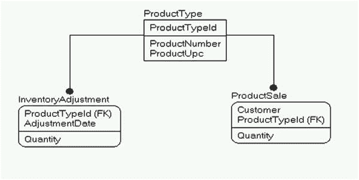

**图 8-1. 简化的库存模型**

在 `InventoryAdjustment` 表中，你会记录入库的货品、被盗的物品、盘点后库存的变动（可能增加或减少，取决于你掌握数据的质量）等等。而在 `ProductSale` 表中（在一个完整模型中，它可能是销售头表或发票表的子表），你会记录因客户交互而从库存中移除或添加的产品。

`InventoryAdjustment.Quantity` 值的总和减去 `ProductSale.Quantity` 值的总和，应该告诉你手头产品的数量（或者可能是你超卖并需要紧急订购的数量！）。在更现实的场景中，你会遇到大量关于延期交货、未来订单、退货等的复杂情况，但基本概念是相同的。每一行不再代表单个物品，而是代表一批物品。

以下是一个微型设计示例，是我在为期一天的数据库设计研讨会上布置给学生们的作业。它涉及一个玩具收藏集，其中许多玩具是完全相同的：

*   某人痴迷于他的乐高®收藏。他有成千上万的乐高积木，并希望将他的乐高进行编目，无论是存储在仓库中还是用于当前所在的创作中。乐高要么存放在存储“堆”中，要么用于某个套装。套装可以是购买的（将通过最多五位数的数字代码标识），也可以是个人的（没有数字代码）。两种风格的套装都应该有一个分配的名称和一个描述性说明的位置。
*   乐高有多种形状和尺寸，大多数以 2 或 3 维测量。首先是基于顶部凸点数量的宽度和长度，然后有时基于标准高度（例如，砖块有高度；薄板固定为 1 个砖块高度单位的 1/3）。每个部件也有多种不同的标准颜色。除了尺寸部件外，还有许多不同的配件（有些有长度/宽度值）、说明书等等，这些都可以被编目。

示例部件和套装如图 8-2 所示。

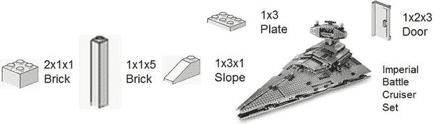

**图 8-2. 用于数据库的示例乐高部件**

为了解决这个问题，我将为我拥有的每个乐高套装创建一个表（我将其称为 `Build`，因为“set”对于 SQL 名称来说是个不好的词，而“build”实际上更能涵盖个人创作）：

```sql
CREATE SCHEMA Lego;
GO
CREATE TABLE Lego.Build
(
BuildId int CONSTRAINT PKBuild PRIMARY KEY,
Name    varchar(30) NOT NULL CONSTRAINT AKBuild_Name UNIQUE,
LegoCode varchar(5) NULL, --five character set number
InstructionsURL varchar(255) NULL --where you can get the PDF of the instructions
);
```

然后，我会为那个构建的每个单独实例添加一个表，我称之为 `BuildInstance`：

```sql
CREATE TABLE Lego.BuildInstance
(
BuildInstanceId Int CONSTRAINT PKBuildInstance PRIMARY KEY ,
BuildId Int CONSTRAINT FKBuildInstance$isAVersionOf$LegoBuild
REFERENCES Lego.Build (BuildId),
BuildInstanceName varchar(30) NOT NULL, --brief description of item
Notes varchar(1000)  NULL, --longform notes. These could describe modifications
--for the instance of the model
CONSTRAINT AKBuildInstance UNIQUE(BuildId, BuildInstanceName)
);
```

下一个任务是为每种单独的部件类型创建一个表。我使用了术语“piece”作为你可以为乐高获得的不同种类部件（包括各种配件）的通用版本：

```sql
CREATE TABLE Lego.Piece
(
PieceId int CONSTRAINT PKPiece PRIMARY KEY,
Type    varchar(15) NOT NULL,
Name    varchar(30) NOT NULL,
Color   varchar(20) NULL,
Width int NULL,
Length int NULL,
Height int NULL,
LegoInventoryNumber int NULL,
OwnedCount int NOT NULL,
CONSTRAINT AKPiece_Definition UNIQUE (Type,Name,Color,Width,Length,Height),
CONSTRAINT AKPiece_LegoInventoryNumber UNIQUE (LegoInventoryNumber)
);
```

请注意，我将拥有数量 (`OwnedCount`) 实现为部件的一个属性，而不是一个多值属性来表示库存变动事件。在一个完全展开的销售模型中，这可能是不够的，但对于个人库存 (`personal inventory`) 来说，这是一个合理的解决方案。这里可能的用途是在新部件加入库存时更新该值，并可能在以后清点散件数量，并将该值添加到套装中的部件数量（我们稍后会有一个查询来处理）。

接下来，我将实现将部件分配给不同构建的表：

```sql
CREATE TABLE Lego.BuildInstancePiece
(
BuildInstanceId int NOT NULL,
PieceId int NOT NULL,
AssignedCount int NOT NULL,
CONSTRAINT PKBuildInstancePiece PRIMARY KEY (BuildInstanceId, PieceId)
);
```

从这里开始，我可以加载一些数据。我将加载一个真正的乐高商品，它可供销售，并且我经常在演示中赠送。这是一辆小型的黑色单座汽车，里面有一个穿着连帽衫的小人仔。

```sql
INSERT Lego.Build (BuildId, Name, LegoCode, InstructionsURL)
VALUES  (1,'Small Car','3177',
'http://cache.lego.com/bigdownloads/buildinginstructions/4584500.pdf');
```

我会为这个创建一个实例，因为我的个人收藏中只有一个（另外还有一些盒装的用于赠送）：

```sql
INSERT Lego.BuildInstance (BuildInstanceId, BuildId, BuildInstanceName, Notes)
VALUES (1,1,'Small Car for Book',NULL);
```

然后，我将收藏中不同的部件加载到表中，在本例中，是套装中包含的部件类型，再加上一些额外的部件。（请注意，在完全展开的设计中，其中一些值会有域约束，以及验证来强制执行具有高度、宽度和/或长度的项目类型。部分省略了此细节是为了简单，部分是因为对于基于用户需求的此类系统来说，实现起来可能过于复杂——尽管主要是为了以最紧凑的方式演示批量唯一性的基本原理。）


```
INSERT Lego.Piece (PieceId, Type, Name, Color, Width, Length, Height,
LegoInventoryNumber, OwnedCount)
VALUES (1, 'Brick','Basic Brick','White',1,3,1,'362201',20),
(2, 'Slope','Slope','White',1,1,1,'4504369',2),
(3, 'Tile','Groved Tile','White',1,2,NULL,'306901',10),
(4, 'Plate','Plate','White',2,2,NULL,'302201',20),
(5, 'Plate','Plate','White',1,4,NULL,'371001',10),
(6, 'Plate','Plate','White',2,4,NULL,'302001',1),
(7, 'Bracket','1x2 Bracket with 2x2','White',2,1,2,'4277926',2),
(8, 'Mudguard','Vehicle Mudguard','White',2,4,NULL,'4289272',1),
(9, 'Door','Right Door','White',1,3,1,'4537987',1),
(10,'Door','Left Door','White',1,3,1,'45376377',1),
(11,'Panel','Panel','White',1,2,1,'486501',1),
(12,'Minifig Part','Minifig Torso , Sweatshirt','White',NULL,NULL,
NULL,'4570026',1),
(13,'Steering Wheel','Steering Wheel','Blue',1,2,NULL,'9566',1),
(14,'Minifig Part','Minifig Head, Male Brown Eyes','Yellow',NULL, NULL,
NULL,'4570043',1),
(15,'Slope','Slope','Black',2,1,2,'4515373',2),
(16,'Mudguard','Vehicle Mudgard','Black',2,4,NULL,'4195378',1),
(17,'Tire','Vehicle Tire,Smooth','Black',NULL,NULL,NULL,'4508215',4),
(18,'Vehicle Base','Vehicle Base','Black',4,7,2,'244126',1),
(19,'Wedge','Wedge (Vehicle Roof)','Black',1,4,4,'4191191',1),
(20,'Plate','Plate','Lime Green',1,2,NULL,'302328',4),
(21,'Minifig Part','Minifig Legs','Lime Green',NULL,NULL,NULL,'74040',1),
(22,'Round Plate','Round Plate','Clear',1,1,NULL,'3005740',2),
(23,'Plate','Plate','Transparent Red',1,2,NULL,'4201019',1),
(24,'Briefcase','Briefcase','Reddish Brown',NULL,NULL,NULL,'4211235', 1),
(25,'Wheel','Wheel','Light Bluish Gray',NULL,NULL,NULL,'4211765',4),
(26,'Tile','Grilled Tile','Dark Bluish Gray',1,2,NULL,'4210631', 1),
(27,'Minifig Part','Brown Minifig Hair','Dark Brown',NULL,NULL,NULL,
'4535553', 1),
(28,'Windshield','Windshield','Transparent Black',3,4,1,'4496442',1),
--以及一些额外的零件，以使查询更有趣
(29,'Baseplate','Baseplate','Green',16,24,NULL,'3334',4),
(30,'Brick','Basic Brick','White',4,6,NULL,'2356',10);
```

接下来，我将分配构成第一套装的 43 个零件（这句话最重要的部分是向您展示 SQL Server 2008 引入的行构造函数语法有多酷——以前这需要超过 20 行代码）：

```
INSERT INTO Lego.BuildInstancePiece (BuildInstanceId, PieceId, AssignedCount)
VALUES (1,1,2),(1,2,2),(1,3,1),(1,4,2),(1,5,1),(1,6,1),(1,7,2),(1,8,1),(1,9,1),
(1,10,1),(1,11,1),(1,12,1),(1,13,1),(1,14,1),(1,15,2),(1,16,1),(1,17,4),
(1,18,1),(1,19,1),(1,20,4),(1,21,1),(1,22,2),(1,23,1),(1,24,1),(1,25,4),
(1,26,1),(1,27,1),(1,28,1);
```

接下来，我将设置另外两个最小的构建实例，以使查询更有趣：

```
INSERT Lego.Build (BuildId, Name, LegoCode, InstructionsURL)
VALUES  (2,'Brick Triangle',NULL,NULL);
GO
INSERT Lego.BuildInstance (BuildInstanceId, BuildId, BuildInstanceName, Notes)
VALUES (2,2,'Brick Triangle For Book','Simple build with 3 white bricks');
GO
INSERT INTO Lego.BuildInstancePiece (BuildInstanceId, PieceId, AssignedCount)
VALUES (2,1,3);
GO
INSERT Lego.BuildInstance (BuildInstanceId, BuildId, BuildInstanceName, Notes)
VALUES (3,2,'Brick Triangle For Book2','Simple build with 3 white bricks');
GO
INSERT INTO Lego.BuildInstancePiece (BuildInstanceId, PieceId, AssignedCount)
VALUES (3,1,3);
```

在完成设置数据这项平凡（且一次性全部完成时相当繁琐）的工作之后，我们可以使用如下查询来统计库存中零件的类型和总数量：

```
SELECT COUNT(*) AS PieceCount, SUM(OwnedCount) AS InventoryCount
FROM  Lego.Piece;
```

该查询返回以下结果，第一列给出了不同类型的数量：

```
PieceCount  InventoryCount
----------- --------------
30          111
```

在这里，您开始感受到这将是一种不同于基本关系型库存解决方案的方案。本能地，人们期望一行代表一件物品，但在这里您看到，平均每行代表四种不同的零件。沿着这个思路，我们可以根据零件的通用类型进行分组，使用如下查询：

```
SELECT Type, COUNT(*) AS TypeCount, SUM(OwnedCount) AS InventoryCount
FROM  Lego.Piece
GROUP BY Type;
```

在这些结果中，您可以看到我们有 2 种类型的砖块但库存中有 30 块砖，1 种类型的底板但库存中有 4 块，依此类推：

```
Type            TypeCount   InventoryCount
--------------- ----------- --------------
Baseplate       1           4
Bracket         1           2
Brick           2           30
Briefcase       1           1
Door            2           2
Minifig Part    4           4
Mudguard        2           2
Panel           1           1
Plate           5           36
Round Plate     1           2
Slope           2           4
Steering Wheel  1           1
Tile            2           11
Tire            1           4
Vehicle Base    1           1
Wedge           1           1
Wheel           1           4
Windshield      1           1
```

这种方法最大的问题是用户必须了解一行和该行所建模事物的实例之间的区别。当类型的基数（不同类型的数量）与手头的实际物品数量非常接近时，情况会变得更有趣。对于只有 30 种物品类型和 111 个实际零件的情况，查询的用户可能不会立即发现他们得到的计数是错误的。但在一个拥有 20 种不同产品和 100 万件库存的系统中，这将会明显得多。

在接下来的两个查询中，我将扩展到实际有趣的查询，这些查询您可能会想要使用。首先，我将查找分配给特定套装的零件，在本例中，是我们最初开始的那辆小汽车模型。为此，我们将连接表，从 `Build` 开始，然后是 `BuildInstance`、`BuildInstancePiece` 和 `Piece`。所有这些连接都是内连接，因为我们想要包含在套装中的物品。我使用了分组集（另一个非常有用的功能，可以为我们提供非常具体的聚合集——在这里，使用 `()` 符号来给出所有零件的总数）。

```
SELECT CASE WHEN GROUPING(Piece.Type) = 1 THEN '--Total--' ELSE Piece.Type END AS PieceType,
Piece.Color,Piece.Height, Piece.Width, Piece.Length,
SUM(BuildInstancePiece.AssignedCount) AS ASsignedCount
FROM   Lego.Build
JOIN Lego.BuildInstance
ON Build.BuildId = BuildInstance.BuildId
JOIN Lego.BuildInstancePiece
ON BuildInstance.BuildInstanceId =
BuildInstancePiece.BuildInstanceId
JOIN Lego.Piece
ON BuildInstancePiece.PieceId = Piece.PieceId
WHERE  Build.Name = 'Small Car'
AND  BuildInstanceName = 'Small Car for Book'
GROUP BY GROUPING SETS((Piece.Type,Piece.Color, Piece.Height, Piece.Width, Piece.Length),
());
```

这将返回以下结果，您可以看到这个套装使用了 43 个零件：


```
零件类型       颜色                 高度        宽度        长度        已分配数量
--------------- -------------------- ----------- ----------- ----------- -------------
支架           白色                 2           2           1           2
砖块           白色                 1           1           3           2
手提箱         红褐色               NULL        NULL        NULL        1
门             白色                 1           1           3           2
迷你人仔部件   深棕色               NULL        NULL        NULL        1
迷你人仔部件   酸橙绿               NULL        NULL        NULL        1
迷你人仔部件   白色                 NULL        NULL        NULL        1
迷你人仔部件   黄色                 NULL        NULL        NULL        1
挡泥板         黑色                 NULL        2           4           1
挡泥板         白色                 NULL        2           4           1
面板           白色                 1           1           2           1
板             酸橙绿               NULL        1           2           4
板             透明红               NULL        1           2           1
板             白色                 NULL        1           4           1
板             白色                 NULL        2           2           2
板             白色                 NULL        2           4           1
圆板           透明                 NULL        1           1           2
斜坡           黑色                 2           2           1           2
斜坡           白色                 1           1           1           2
方向盘         蓝色                 NULL        1           2           1
光面板         深蓝灰色             NULL        1           2           1
光面板         白色                 NULL        1           2           1
轮胎           黑色                 NULL        NULL        NULL        4
车底座         黑色                 2           4           7           1
楔形件         黑色                 4           1           4           1
轮子           浅蓝灰色             NULL        NULL        NULL        4
挡风玻璃       透明黑               1           3           4           1
--总计--       NULL                 NULL        NULL        NULL        43
```

本部分最后一个查询更有趣。一个常见的问题是：“我拥有多少个给定类型、且未分配到套装的零件？”为此，我将使用一个公共表表达式（CTE）来计算已分配到`BuildInstance`的零件总和，然后用它与`Piece`表进行连接：

```
;WITH AssignedPieceCount
AS (
    SELECT PieceId, SUM(AssignedCount) AS TotalAssignedCount
    FROM   Lego.BuildInstancePiece
    GROUP  BY PieceId )
SELECT Type, Name,  Width, Length,Height,
       Piece.OwnedCount - Coalesce(TotalAssignedCount,0) AS AvailableCount
FROM   Lego.Piece
LEFT OUTER JOIN AssignedPieceCount
             on Piece.PieceId =  AssignedPieceCount.PieceId
WHERE Piece.OwnedCount - Coalesce(TotalAssignedCount,0) > 0;
```

因为`AssignedPieceCount`与`Piece`表的基数是零或一比一，我们可以简单地执行一个外连接，并从拥有量中减去已分配到套装的零件数量。此查询返回：

```
Type       Name          Width    Length   Height  AvailableCount
---------- ------------- -------- -------- ------- --------------
砖块       基础砖块      1        3        1       12
光面板     凹槽光面板    1        2        NULL    9
板         板            2        2        NULL    18
板         板            1        4        NULL    9
底板       底板          16       24       NULL    4
砖块       基础砖块      4        6        NULL    10
```

你可以将这个基本模式扩展到几乎任何批量唯一性情况。库存量的计算可能更复杂，可能包括每日存储的库存值以避免大规模重新计算（想想你的银行账户余额是如何在一天结束时设定的，然后每日交易在发生时加减，直到它们也被过账并固定在每日余额中）。


## 范围唯一性

在某些情况下，唯一性并非指单列集合上值的唯一，而是指值之间范围的唯一性。非常常见的例子包括预约时间、大学课程，甚至教师/员工在同一时间只能被分配到一个地点。

例如，考虑一个预约时间。它有开始和结束时间，两个预约的开始和结束时间范围不应重叠。假设我们有一个预约，其开始和结束时间精确到秒，开始于 `'20160712 1:00:00PM'`，结束于 `'20160712 1:59:59PM'`。为了验证此数据不与其他预约重叠，我们需要查找满足以下任一条件的行，这些条件表明我们存在预约时间的双重预订：

*   新预约的开始或结束时间落在另一个预约的开始和结束时间之间。
*   新预约的开始时间早于并且结束时间晚于另一个预约的结束时间。

我们可以通过使用触发器和检查范围重叠的查询来防范预约时间重叠等情况。如果上述条件不满足，则新行是可接受的。我们将实现一个将医生分配到办公室的简化示例。显然，还需要考虑其他参数，如办公室空间、助理等，但我不希望本节的篇幅超过整本书分配的页数。首先，我们为医生创建一个表，另一个表用于设置医生的预约：

```sql
CREATE SCHEMA Office;
GO
CREATE TABLE Office.Doctor
(
DoctorId        int NOT NULL CONSTRAINT PKDoctor PRIMARY KEY,
DoctorNumber char(5) NOT NULL CONSTRAINT AKDoctor_DoctorNumber UNIQUE
);
CREATE TABLE Office.Appointment
(
AppointmentId   int NOT NULL CONSTRAINT PKAppointment PRIMARY KEY,
--真实情况会包括房间、病人等信息，
DoctorId        int NOT NULL,
StartTime       datetime2(0), --精度到秒
EndTime         datetime2(0),
CONSTRAINT AKAppointment_DoctorStartTime UNIQUE (DoctorId,StartTime),
CONSTRAINT AKAppointment_DoctorEndTime UNIQUE (DoctorId,EndTime),
CONSTRAINT CHKAppointment_StartBeforeEnd CHECK (StartTime <= EndTime),
CONSTRAINT FKDoctor$IsAssignedTo$OfficeAppointment FOREIGN KEY (DoctorId)
REFERENCES Office.Doctor (DoctorId)
);
```

接下来，我们将向新表中添加一些数据。`AppointmentId` 值 5 将包含一个与另一行重叠的错误日期范围，用于演示目的：

```sql
INSERT INTO Office.Doctor (DoctorId, DoctorNumber)
VALUES (1,'00001'),(2,'00002');
INSERT INTO Office.Appointment
VALUES (1,1,'20160712 14:00','20160712 14:59:59'),
(2,1,'20160712 15:00','20160712 16:59:59'),
(3,2,'20160712 8:00','20160712 11:59:59'),
(4,2,'20160712 13:00','20160712 17:59:59'),
(5,2,'20160712 14:00','20160712 14:59:59'); --用于演示的问题项，与行 4 冲突
```

就声明性约束而言，一切正常，但以下查询将检查表中每一行与表中所有其他行之间的数据条件：

```sql
SELECT Appointment.AppointmentId,
Acheck.AppointmentId AS ConflictingAppointmentId
FROM   Office.Appointment
JOIN Office.Appointment AS ACheck
ON Appointment.DoctorId = ACheck.DoctorId
/*1*/     and Appointment.AppointmentId <> ACheck.AppointmentId
/*2*/     and (Appointment.StartTime BETWEEN ACheck.StartTime and ACheck.EndTime
/*3*/           or Appointment.EndTime BETWEEN ACheck.StartTime and ACheck.EndTime
/*4*/           or (Appointment.StartTime < ACheck.StartTime AND Appointment.EndTime > ACheck.EndTime));
```

在此查询中，我重点说明了四个要点：

1.  确保我们不将当前行与自身进行比较，因为一个预约总是会与自身重叠。
2.  这里，我们检查 StartTime 是否在开始和结束时间之间（包含实际值）。
3.  对 EndTime 进行与要点 2 相同的检查。
4.  最后，我们检查是否有预约完全包含了另一个预约。

运行查询后，我们看到：

```sql
AppointmentId ConflictingAppointmentId
------------- ------------------------
5             4
4             5
```

这些结果有趣的部分在于，哪里有一行违规，就总会存在另一行。如果一行以某种方式违规，比如开始早于且结束晚于另一个预约，那么冲突行的开始和结束时间将位于第一个预约的时间范围内。这不会是个问题，但共同的责任使得结果处理起来更有趣。

接下来，我们暂时删除坏行：

```sql
DELETE FROM Office.Appointment WHERE AppointmentId = 5;
```

我们现在将实现一个触发器（使用附录 B 中定义的模板），该触发器将基于插入或更新的新行中的值检查此条件。无需检查已删除的行（即使在更新情况下），因为删除操作所能做的只是有助于改善情况（即使在更新情况下，您可能将预约从一个医生转移到另一个医生）。

请注意，此触发器的基础是我们之前用于检查错误值的查询（我通常将其实现为两个触发器，一个用于 INSERT，另一个用于 UPDATE，两者代码相同，但为演示简单起见，这里展示为一个）：

```sql
CREATE TRIGGER Office.Appointment$insertAndUpdate
ON Office.Appointment
AFTER UPDATE, INSERT AS
BEGIN
SET NOCOUNT ON;
SET ROWCOUNT 0; --以防客户端修改了行计数
--对 INSERT 或 UPDATE 触发器使用 inserted，对 UPDATE 或 DELETE 触发器使用 deleted
--使用 COUNT 代替@@rowcount，因为 merge 行为会将@@rowcount 设置为等于合并的行数，而不是触发器中检查的行数
DECLARE @msg varchar(2000),    --用于保存错误信息
@rowsAffected int = (SELECT COUNT(*) FROM inserted);
--如果未影响任何行则无需继续
IF @rowsAffected = 0 RETURN;
BEGIN TRY
--[验证部分]
--如果是更新，但他们没有更改时间或医生，则不检查数据
IF UPDATE(startTime) OR UPDATE(endTime) OR UPDATE(doctorId)
BEGIN
IF EXISTS ( SELECT *
FROM   Office.Appointment
JOIN Office.Appointment AS ACheck
ON Appointment.doctorId = ACheck.doctorId
AND Appointment.AppointmentId <> ACheck.AppointmentId
AND (Appointment.StartTime BETWEEN Acheck.StartTime
AND Acheck.EndTime
OR Appointment.EndTime BETWEEN Acheck.StartTime
AND Acheck.EndTime
OR (Appointment.StartTime < Acheck.StartTime
AND Appointment.EndTime > Acheck.EndTime))
WHERE  EXISTS (SELECT *
FROM   inserted
WHERE  inserted.DoctorId = Acheck.DoctorId))
BEGIN
IF @rowsAffected = 1
SELECT @msg = 'Appointment for doctor ' + doctorNumber +
' overlapped existing appointment'
FROM   inserted
JOIN Office.Doctor
ON inserted.DoctorId = Doctor.DoctorId;
ELSE
SELECT @msg = 'One of the rows caused an overlapping ' +
'appointment time for a doctor';
THROW 50000,@msg,16;
END;
END;
--[修改部分]
END TRY
BEGIN CATCH
IF @@TRANCOUNT > 0
ROLLBACK TRANSACTION;
THROW; --将停止批处理或被调用者的 CATCH 块捕获
END CATCH;
END;
```

接下来，作为复习，检查表中的数据：

```sql
SELECT *
FROM   Office.Appointment;
```

返回结果如下（假设您尚未删除或添加额外数据）：

```sql
appointmentId doctorId    startTime              endTime
------------- ----------- ---------------------- ----------------------
1             1           2016-07-12 14:00:00    2016-07-12 14:59:59
2             1           2016-07-12 15:00:00    2016-07-12 16:59:59
3             2           2016-07-12 08:00:00    2016-07-12 11:59:59
4             2           2016-07-12 13:00:00    2016-07-12 17:59:59
```

这次，当我们尝试为 `doctorId` 编号为 1 的医生添加预约时：


### 测试预约重叠

```
INSERT INTO Office.Appointment
VALUES (5,1,'20160712 14:00','20160712 14:59:59');
```
第一次尝试被阻止，因为该行在开始时间值上是完全重复的。在这样的系统中，最可能发生的错误通常是尝试复制某些内容，通常是意外的。

```
Msg 2627, Level 14, State 1, Line 2
Violation of UNIQUE KEY constraint 'AKOfficeAppointment_DoctorStartTime'. Cannot insert duplicate key in object 'Office.Appointment'. The duplicate key value is (1, 2016-07-12 14:00:00).
```

接下来，我们检查预约完全落在另一个预约内的情况：
```
INSERT INTO Office.Appointment
VALUES (5,1,'20160712 14:30','20160712 14:40:59');
```
这次失败了，并告诉我们失败是针对哪位医生的：
```
Msg 50000, Level 16, State 16, Procedure appointment$insertAndUpdate, Line 48
Appointment for doctor 00001 overlapped existing appointment
```

然后，我们测试整个预约吞没另一个预约的情况：
```
INSERT INTO Office.Appointment
VALUES (5,1,'20160712 11:30','20160712 17:59:59');
```
这相当顺从地失败了，就像另一种情况一样：
```
Msg 50000, Level 16, State 16, Procedure appointment$insertAndUpdate, Line 48
Appointment for doctor 00001 overlapped existing appointment
```

而且，为了强调始终要广泛测试代码这一点，你应该总是测试多于一行的情况，在本例中，我包含了两位医生的记录：
```
INSERT into Office.Appointment
VALUES (5,1,'20160712 11:30','20160712 15:59:59'),
(6,2,'20160713 10:00','20160713 10:59:59');
```
这一次，它触发了我们的多行错误信息：
```
Msg 50000, Level 16, State 16, Procedure appointment$insertAndUpdate, Line 48
One of the rows caused an overlapping appointment time for a doctor
```

最后，添加两条可以安全添加的行：
```
INSERT INTO Office.Appointment
VALUES (5,1,'20160712 10:00','20160712 11:59:59'),
(6,2,'20160713 10:00','20160713 10:59:59');
```
这（终于）会成功了。现在，测试一个失败的更新操作：
```
UPDATE Office.Appointment
SET    StartTime = '20160712 15:30',
EndTime = '20160712 15:59:59'
WHERE  AppointmentId = 1;
```
这次失败了，正如预期：
```
Msg 50000, Level 16, State 16, Procedure appointment$insertAndUpdate, Line 38
Appointment for doctor 00001 overlapped existing appointment
```

### 总结讨论

如果这看起来工作量很大，那确实如此。实际上，你是否真的在触发器中实现这个解决方案，将取决于你具体在做什么。然而，检查范围唯一性的技术显然可以是有用的，哪怕只是为了检查现有数据是否正确，因为在某些情况下，你可能希望让数据存在于非完美的中间状态，然后在一天结束前编写检查来“认证”数据是正确的。

触发器可以更新行以告诉用户存在重叠，而不是阻止操作。或者你甚至可能做得更有趣，让算法涉及优先考虑某些条件高于其他预约。也许一次体检因为手术而被推迟，标记为需要重新安排。实际上，用户可能可以随意重叠预约，然后在营业结束时，行政助理会执行一个类似于构成触发器基础的查询，然后手动清理任何调度问题。在本节中，我向你展示了一种应用模式，以防止范围重叠（如果这是期望的结果）。具体如何实现，需要由需求来引导你。

### 近似唯一性

唯一性最困难的情况实际上相当普遍，而且通常是需要正确处理的最关键问题。它也是一个主题太大，无法用编码示例覆盖，因为在现实中，这更像是一个政策问题而不是技术问题。例如，如果有两个人从同一个电话号码打到你的公司，都说他们叫亚伯拉罕·林肯，他们是同一个人，还是某个人在使用两个别名？（或者一个别名和一个真名？）你是否能称他们为同一个人，这是一个非常重要的决定，很大程度上取决于你所在的行业，并且由于隐私法而变得特别棘手（如果你把真正的亚伯拉罕·林肯的数据给了一个声称是亚伯拉罕·林肯的人，那么无论你的隐私政策是什么或适用哪部法律，这都绝不会是好事）。我不会在本书中过多讨论隐私法，主要是因为这个主题非常复杂，也因为处理隐私问题：

*   在很大程度上只是我目前所涵盖原则的延伸，并且将在下一章关于安全的内容中进一步讨论
*   因行业和你需要存储的数据类型而有很大差异
*   变化速度快于印刷书籍所能覆盖
*   取决于你阅读本书时所在的地理位置

隐私原则是使识别过程如此困难的部分原因。曾几何时，公司会直接要求客户提供社会安全号码，并以非常信任的方式将其用作身份证明。当然，一旦某个值被许多组织广泛使用，它就会开始被滥用。（第 9 章 在讨论加密技术时，将稍微扩展这个话题，但加密是另一个广泛的话题，最好的建议是确保你做得与要求的一样多，甚至更多。）

因此，你的设计目标是努力让你的客户使用一个标识符来帮助你将他们与其他客户区分开来。这个客户标识符将被用于，例如，登录公司网站，许多企业使用的便利卡，以及可能在任何通信中使用。问题是如何收集这些信息。当一个人打电话给银行或医生时，接电话的工作人员总会问一些随机的问题来更好地识别来电者。对于许多公司来说，不可能强迫这个人提供信息，因此并不总是能强迫客户唯一地识别自己。你可以吸引他们来识别自己，例如发行客户储蓄卡，或者你可以从网络浏览器、电话号码等收集到的信息中进行猜测。更糟的是，如果有人注册了两次客户号码怎么办？你能确定那是同一个人吗？

因此，目标变成了将人们与他们通常愿意提供的有限信息相匹配。一般来说，你可以尝试从人们那里收集尽可能多的信息，例如：

*   姓名
*   地址，即使是部分地址
*   电话号码
*   支付方式
*   电子邮箱地址

等等。然后，根据行业，你确定对你有用的匹配级别。有许多方法和工具可供你使用，从数据标准化以实现直接匹配，到模糊匹配，甚至是可以帮助你进行匹配的第三方工具。当然，关键在于，如果你打算向重复客户发送有关促销的消息，可能只需要轻微的匹配，但如果你发送的是个人信息，比如他们花了多少钱，则应该进行非常确定的匹配。在你的数据库中识别实际上是同一个客户的多个客户，是营销的圣杯，但如果你尊重客户隐私并以安全的方式使用他们的数据，这是可以实现的。


### 数据库设计模式

## 数据驱动设计

我看到一些程序员养成的最糟糕习惯之一，就是使用具体值进行编程以强制执行特定操作。例如，他们接到需求，要求对客户 1 和客户 2 执行操作 A，对客户 3 执行操作 B。于是他们便写下如下代码：

```
IF @customerId in ('1', '2')
Do ActionA(@customerId);
ELSE IF @customerId in ('3')
Do ActionB(@customerId);
```

代码能运行，他们便松了口气，继续做别的事。但第二天，他们接到请求，要求客户 4 的处理方式与客户 3 相同。他们没有时间立即处理这个请求，因为这需要更改代码，而代码更改需要测试。于是一个月后，他们将 `'4'` 添加到代码中，进行测试、部署，并声称这耗费了 40 小时的 IT 工时。

这显然不是最优方案，因此退而求其次的方法是弄清楚我们为何要执行 `ActionA` 或 `ActionB`。我们可能会确定，对于 `CustomerType: 'Great'`（客户类型：“优秀”），我们执行 `ActionA`，而对于 `'Good'`（“良好”），则执行 `ActionB`。这样你可以编写代码：

```
IF @customerType = 'Great'
Do ActionA(@customerId);
ELSE IF @customerType = 'Good'
Do ActionB(@customerId);
```

现在，向这些分组中添加另一个客户就变得相当简单。你将 `customerType` 列设置为 `Great` 或 `Good`，相应的操作就会在你的代码中自动执行。但是（正如你在任何电视购物广告中可能听到的那样）你可以做得更好！这种设计的缺陷在于，如果你想暂时让“良好”客户执行 `ActionA`，该如何更改他们的处理方式？在某些情况下，答案是扩展 `customerType` 表的定义，并添加一列表明应执行何种操作。因此你可能会这样编码：

```
--在实际表中，可将 ActionType 扩展为更具描述性的值或其自身的域
CREATE SCHEMA Customers;
GO
CREATE TABLE Customers.CustomerType
(
CustomerType    varchar(20) NOT NULL CONSTRAINT PKCustomerType PRIMARY KEY,
Description     varchar(1000) NOT NULL,
ActionType      char(1) NOT NULL CONSTRAINT CHKCustomerType_ActionType_Domain
CHECK (ActionType in ('A','B'))
);
```

现在，这种 `CustomerType` 的处理方式可以随时根据用户的决定进行设置。唯一可能需要更改代码（需要测试、停机时间等）的情况是，你需要更改某个操作的含义或添加一个新操作。添加不同类型的客户，甚至更改现有类型，都将是一个非破坏性变更，因此不需要测试。

基本目标应该是，数据结构应能体现需求，从而通过改变数据来执行规则，而不是通过硬编码特殊情形。代码层面的灵活性至关重要，特别是对你的支持人员而言。最终，设计的目标应该是，更改配置不应需要代码更改，因此请创建允许你配置数据和用途的属性。

**注意**

在本章下载资料的代码项目部分，你会找到一个数据驱动设计的编码示例，该示例在一个完整的 SQL 编码解决方案中演示了这些原则。

## 历史/时态数据

一个经常需要用到的模式是，能够查看某一行在过去某个时间点的样貌。例如，员工 100001 的工资是何时变更的？员工 2010032 的保险是何时开始的？在某些情况下，你需要使用表中的一个列来捕获变更。例如，以我们在“选择性唯一性”部分中使用的 `Employee` 表为例（如果你在跟着操作，此表已存在于数据库中，因此无需重新创建）：

```
CREATE TABLE HumanResources.Employee
(
EmployeeId int IDENTITY(1,1) CONSTRAINT PKEmployee primary key,
EmployeeNumber char(5) NOT NULL
CONSTRAINT AKEmployee_EmployeeNummer UNIQUE,
InsurancePolicyNumber char(10) NULL
);
CREATE UNIQUE INDEX AKFEmployee_InsurancePolicyNumber ON
HumanResources.Employee(InsurancePolicyNumber)
WHERE InsurancePolicyNumber IS NOT NULL;
```

回答“保险号码何时变更”这一问题的一种方法是添加：

```
ALTER TABLE HumanResources.Employee
ADD InsurancePolicyNumberChangeTime datetime2(0);
```

可能还会添加记录是谁更改了该行。这可以通过触发器来管理，或者由界面代码处理。如果你处理的是需要验证的单个列，这是处理此需求的好方法。但如果你真的想查看表中所有列（或肯定是更大的子集）是如何随时间变化的，有两种使用 T-SQL 的技术相当流行：

*   使用触发器：使用一个相当简单的触发器，我们可以捕获行的变更并将其保存在另一个表中。与下一种方法相比，此方法的优点是它不需要捕获所有列的变更。
*   使用时态扩展：这些扩展在 SQL Server 2016 中可用，它允许你让引擎捕获对表的变更。主要优点是它提供了相当简单的语法来查询变更数据。

在本节中，我将使用我们已创建的表来演示这两种方法。在开始每个示例之前，我将使用以下代码重置数据表：

```
TRUNCATE TABLE HumanResources.Employee;
INSERT INTO HumanResources.Employee (EmployeeNumber, InsurancePolicyNumber)
VALUES ('A0001','1111111111'),
('A0002','2222222222'),
('A0003','3333333333'),
('A0004',NULL),
('A0005',NULL),
('A0006',NULL);
```

请注意，此模式的两种版本通常都不是审计的版本。通过添加记录“谁做了更改”的列，触发器模型可以更多地用于审计，但有更好的内置审计工具来发现人们对你的数据执行的不正确操作。此模式专门用于显示数据变更，并且你可能会更改历史记录以掩盖与数据相关的错误，这并非不合理。审计记录永远不应被更改，否则它们会很快被视为不可靠。

### 使用触发器捕获历史记录

虽然时间表是 SQL Server 2016 的一个重要新特性，但这并不意味着使用触发器来捕获历史记录失去了价值。在本节中，我们的目标很简单：查看被修改或从表中删除的行的日志。为此，我们将首先创建一个与拥有数据的架构名称相对应的历史记录架构。这允许你在架构级别为历史数据管理安全性，使其区别于基础表。因此，授予用户某个架构的 `SELECT` 权限以读取数据，并不会给予他们查看历史数据的权限。

#### 创建历史架构

```sql
CREATE SCHEMA HumanResourcesHistory;
```

#### 创建历史表

接下来，我们将在新架构中创建一个并行的历史表，该表包含原始表的所有列，以及几个管理列。代码注释中对这些管理列进行了解释：

```sql
CREATE TABLE HumanResourcesHistory.Employee
(
    --Original columns
    EmployeeId int NOT NULL,
    EmployeeNumber char(5) NOT NULL,
    InsurancePolicyNumber char(10) NULL,
    --WHEN the row was modified
    RowModificationTime datetime2(7) NOT NULL,
    --WHAT type of modification
    RowModificationType varchar(10) NOT NULL CONSTRAINT CHKEmployeeSalary_RowModificationType
        CHECK (RowModificationType IN ('UPDATE','DELETE')),
    --tiebreaker for seeing order of changes, if rows were modified rapidly
    RowSequencerValue bigint IDENTITY(1,1) --use to break ties in RowModificationTime
);
```

#### 创建触发器

接下来，我们创建以下触发器。基本流程是确定操作类型，然后将 `deleted` 表的内容写入我们先前创建的历史表。

```sql
CREATE TRIGGER HumanResources.Employee$HistoryManagementTrigger
ON HumanResources.Employee
AFTER UPDATE, DELETE AS
BEGIN
    SET NOCOUNT ON;
    SET ROWCOUNT 0; --in case the client has modified the rowcount
    --use inserted for insert or update trigger, deleted for update or delete trigger
    --count instead of @@rowcount due to merge behavior that sets @@rowcount to a number
    --that is equal to number of merged rows, not rows being checked in trigger
    DECLARE @msg varchar(2000),    --used to hold the error message
            @rowsAffected int = (SELECT COUNT(*) FROM deleted);

    IF @rowsAffected = 0 RETURN;

    DECLARE @RowModificationType char(6);
    SET @RowModificationType = CASE WHEN EXISTS (SELECT * FROM inserted) THEN 'UPDATE'
                                    ELSE 'DELETE' END;

    BEGIN TRY
       --[validation section]
       --[modification section]
        --write deleted rows to the history table
        INSERT  HumanResourcesHistory.Employee(EmployeeId,EmployeeNumber,InsurancePolicyNumber,
                                               RowModificationTime,RowModificationType)
        SELECT EmployeeId,EmployeeNumber,InsurancePolicyNumber,
               SYSDATETIME(), @RowModificationType
        FROM   deleted;
    END TRY
    BEGIN CATCH
        IF @@TRANCOUNT > 0
            ROLLBACK TRANSACTION;
        THROW; --will halt the batch or be caught by the caller's catch block
    END CATCH;
END;
```

#### 测试触发器

现在，让我们对表中的数据做一些更改。提醒一下，这是我们开始时的数据：

```sql
SELECT *
FROM   HumanResources.Employee;
```

这显示了我们的基础数据：

```
----------- -------------- ---------------------
1           A0001          1111111111
2           A0002          2222222222
3           A0003          3333333333
4           A0004          NULL
5           A0005          NULL
6           A0006          NULL
```

接下来，更新 `EmployeeId = 4` 的记录，为其设置保险信息：

```sql
UPDATE HumanResources.Employee
SET    InsurancePolicyNumber = '4444444444'
WHERE  EmployeeId = 4;
```

你可以在这里查看更改和历史记录：

```sql
SELECT *
FROM   HumanResources.Employee
WHERE  EmployeeId = 4;

SELECT *
FROM   HumanResourcesHistory.Employee
WHERE  EmployeeId = 4;
```

```
EmployeeId  EmployeeNumber InsurancePolicyNumber
----------- -------------- ---------------------
4           A0004          4444444444

EmployeeId  EmployeeNumber InsurancePolicyNumber RowModificationTime
----------- -------------- --------------------- ---------------------------
4           A0004          NULL                  2016-05-07 20:26:38.4578351
RowModificationType RowSequencerValue
------------------- --------------------
UPDATE              1
```

现在，让我们将所有有保险策略的行更新为新格式，并删除 `EmployeeId = 6` 的记录。我更新了所有行，这样我们就可以在历史记录中看到当一行被更新但实际上内容没有变化时会发生什么：

```sql
UPDATE HumanResources.Employee
SET  InsurancePolicyNumber = 'IN' + RIGHT(InsurancePolicyNumber,8);

DELETE HumanResources.Employee
WHERE EmployeeId = 6;
```

然后查看数据：

```sql
SELECT *
FROM   HumanResources.Employee
ORDER BY EmployeeId;
--limiting output for formatting purposes

SELECT EmployeeId, InsurancePolicyNumber, RowModificationTime, RowModificationType
FROM   HumanResourcesHistory.Employee
ORDER BY EmployeeId,RowModificationTime,RowSequencerValue;
```

返回结果：

```
EmployeeId  EmployeeNumber InsurancePolicyNumber
----------- -------------- ---------------------
1           A0001          IN11111111
2           A0002          IN22222222
3           A0003          IN33333333
4           A0004          IN44444444
5           A0005          NULL

EmployeeId   InsurancePolicyNumber RowModificationTime         RowModificationType
-----------  --------------------- --------------------------- -------------------
1            1111111111            2016-05-07 20:27:59.8852810 UPDATE
2            2222222222            2016-05-07 20:27:59.8852810 UPDATE
3            3333333333            2016-05-07 20:27:59.8852810 UPDATE
4            NULL                  2016-05-07 20:26:38.4578351 UPDATE
4            4444444444            2016-05-07 20:27:59.8852810 UPDATE
5            NULL                  2016-05-07 20:27:59.8852810 UPDATE
6            NULL                  2016-05-07 20:27:59.8852810 UPDATE
6            NULL                  2016-05-07 20:27:59.9347658 DELETE
```

使用这些数据，你可以看到数据自添加触发器以来所经历的变化过程，包括已被删除的行。这是一种由来已久的捕获历史记录的方法，但在查询中回顾历史记录时，处理起来会非常困难。


## 使用时间扩展来管理历史记录

时间扩展将提供与上一节中我们使用触发器提供的基本信息相同的内容，但有一个主要区别：查询支持。如果你想查看当前数据，你的查询无需更改。但如果你想查看数据在特定时间点的样貌，查询的唯一更改就是指定你想查看历史记录的时间（或时间范围）。

时间表的最大限制在于，历史副本必须对表中的所有列进行版本控制。因此，如果你使用的是 `nvarchar(max)` 甚至 `text`（你真的不应该这样做！），它也能工作，但如果你的值非常大，可能会导致严重的性能问题。即使是内存表也支持时间功能，但版本表将是一个磁盘表。

还有其他限制，例如要求有主键；不允许使用 `TRUNCATE TABLE`；表上不允许外键 `CASCADE` 操作；表上不允许 `INSTEAD OF` 触发器；并且复制的使用受到限制。微软提供了这份更完整的注意事项和限制列表，其中还包括其他一些配置限制：[`msdn.microsoft.com/en-us/library/mt604468.aspx`](https://msdn.microsoft.com/en-us/library/mt604468.aspx)。然而，如果你需要本节后面描述的 DML 扩展，这些限制并不算太大的约束。

我将继续使用上一节中用过的 `HumanResources` 表，但我会重置数据并删除上一节的历史表：

```
TRUNCATE TABLE HumanResources.Employee;
INSERT INTO HumanResources.Employee (EmployeeNumber, InsurancePolicyNumber)
VALUES ('A0001','1111111111'),
('A0002','2222222222'),
('A0003','3333333333'),
('A0004',NULL),
('A0005',NULL),
('A0006',NULL);
GO
DROP TABLE HumanResourcesHistory.Employee;
DROP TRIGGER HumanResources.Employee$HistoryManagementTrigger;
```

在接下来的小节中，我将介绍如何配置时间扩展，以及如何协调对多行的更改，以及在需要时如何更改历史记录。

### 配置时间扩展

现在，让我们为 `HumanResources.Employee` 表添加时间扩展。为此，要求表中包含两列：一列用于开始时间（在文档中常见为 `SysStartTime`），一列用于结束时间（通常命名为 `SysEndTime`）。我将使用符合我通常标准的命名约定，使其与表名匹配。这些时间范围列必须是 `datetime2` 类型，但精度可以是 0 到 7 之间的任意值。这些值用于表示行的有效开始和结束时间，因此当我们使用时间扩展查询行时，可以选出活动的那一行。列的精度将决定每秒可以有多少个版本。如果使用 `datetime2(0)`，那么每秒可以有一个版本；如果使用 `datetime2(7)`，那么每秒大约可以有 9999999 个版本。虽然不太可能有很多读者需要如此深入地跟踪变化，但我倾向于使用 `(7)`，只是因为这样感觉更安全，尽管更难输入。（在本书中，我将使用 `datetime2(1)`，以适应我有限的文本空间。）

以下代码片段添加了我们一旦开启系统版本控制后将使用的列和设置（然后删除临时约束）：

```
ALTER TABLE HumanResources.Employee
ADD
RowStartTime datetime2(1) GENERATED ALWAYS AS ROW START NOT NULL          --可以指定 HIDDEN
--这样时间列就不会出现在 SELECT * 查询中
--此默认值将把所有现有行的历史记录起始时间设为
--当前时间（系统对这些值使用 UTC 时间）
CONSTRAINT DFLTDelete1 DEFAULT (SYSUTCDATETIME()),
RowEndTime datetime2(1) GENERATED ALWAYS AS ROW END NOT NULL --HIDDEN
--数据需要是该数据类型的最大值
CONSTRAINT DFLTDelete2 DEFAULT (CAST('9999-12-31 23:59:59.9' AS datetime2(1)))
, PERIOD FOR SYSTEM_TIME (RowStartTime, RowEndTime);
GO
--删除仅因表中已有数据而存在的约束
ALTER TABLE HumanResources.Employee
DROP CONSTRAINT DFLTDelete1;
ALTER TABLE HumanResources.Employee
DROP CONSTRAINT DFLTDelete2;
```

`GENERATED ALWAYS AS ROW START` 和 `END` 这一对设置告诉系统在表完全配置好时间支持后设置这些值。如果你正在创建一个新表并想开启时间扩展，你将在 `CREATE TABLE` 语句中使用相同的列和设置，但不需要 `DEFAULT` 约束。

下一步是创建版本表。有两种方法。最简单的是直接让 SQL Server 为你构建。你可以指定名称，也可以让 SQL Server 为你选择一个名称。例如，如果我们想让 SQL Server 创建历史表，我们只需使用：

```
ALTER TABLE HumanResources.Employee
SET (SYSTEM_VERSIONING = ON);
```

现在你可以查看系统元数据，看看添加了什么：

```
SELECT  tables.object_id AS baseTableObject,
CONCAT(historySchema.name,'.',historyTable.name) AS historyTable
FROM    sys.tables
JOIN sys.schemas
ON schemas.schema_id = tables.schema_id
LEFT OUTER JOIN sys.tables AS historyTable
JOIN sys.schemas AS historySchema
ON historySchema.schema_id = historyTable.schema_id
ON TABLES.history_table_id = historyTable.object_id
WHERE   schemas.name = 'HumanResources'
AND   tables.name = 'Employee';
```

这将返回类似以下内容的结果，其中基础表的 `object_id` 几乎肯定会有所不同：

```
baseTableObject historyTable
--------------- ----------------------------------------------------------
1330103779      HumanResources.MSSQL_TemporalHistoryFor_1330103779
```

这导致了一个可预测但不美观的名称。该表将拥有与基础表相同的列，但会有一些差异，我们将在后面介绍如何创建自己的表以及修改表中的数据以使用先前保存的历史数据时进行探讨。


虽然可能并不经常需要查看时态表，但能够在不了解 `object_id` 的情况下关联表名将会很有用。因此，让我们直接在 DDL 中为表命名。首先，我们需要断开已创建的历史表并将其删除。实际上，在对基础表执行任何操作之前，必须先关闭系统版本控制：

```sql
ALTER TABLE HumanResources.Employee
SET (SYSTEM_VERSIONING = OFF);
DROP TABLE HumanResources.MSSQL_TemporalHistoryFor_1330103779;
```

现在让我们指定表名。如果是一个现有表，会有更多工作要做，因为你可能希望回填历史记录（例如，如果你之前使用触发器来捕获历史记录）。就像在触发器方法中一样，我将为历史表使用不同的架构，但如果你愿意，也可以将其放在相同的架构中（你总是在 `HISTORY_TABLE` 子句中指定架构）：

```sql
ALTER TABLE HumanResources.Employee
--必须位于同一数据库中
SET (SYSTEM_VERSIONING = ON (HISTORY_TABLE = HumanResourcesHistory.Employee));
```

回顾一下我们之前运行的元数据查询，你可以看到历史表已被设置为一个更好的表名：

```sql
baseTableObject historyTable
--------------- --------------------------------------
1330103779      HumanResourcesHistory.Employee
```

我将在第 9 章更详细地介绍安全性，但请理解，用户需要历史表的权限才能 `SELECT` 表的时间方面。用户只需拥有 `INSERT`、`UPDATE` 和/或 `DELETE` 权限即可修改表的内容。

现在，你已经配置了 `HumanResources.Employee` 表以捕获历史记录，从你执行 `ALTER` 语句向表添加列的时间段开始。使用 `SELECT` 语句检查表的内容：

```sql
SELECT *
FROM   HumanResources.Employee;
```

返回结果为：

```sql
EmployeeId  EmployeeNumber InsurancePolicyNumber RowStartTime          RowEndTime
----------- -------------- --------------------- --------------------- ---------------------
1           A0001          1111111111            2016-05-10 02:35:49.1 9999-12-31 23:59:59.9
2           A0002          2222222222            2016-05-10 02:35:49.1 9999-12-31 23:59:59.9
3           A0003          3333333333            2016-05-10 02:35:49.1 9999-12-31 23:59:59.9
4           A0004          NULL                  2016-05-10 02:35:49.1 9999-12-31 23:59:59.9
5           A0005          NULL                  2016-05-10 02:35:49.1 9999-12-31 23:59:59.9
6           A0006          NULL                  2016-05-10 02:35:49.1 9999-12-31 23:59:59.9
```

你可以看到为 `RowStartTime` 和 `RowEndTime` 添加的新列。使用这些时间段，你将能够查看特定时间点的数据。因此，如果你想查看表在 5 月 4 日的样子，可以在 `FROM` 子句中使用 `FOR SYSTEM_TIME` 子句，在 `AS OF` 后面指定一个当前时间点，在我们的例子中，条件是 `RowStartTime` >= `PassedValue` > `RowEndTime`。还有其他四种：`FROM`、`BETWEEN`、`CONTAINED IN` 和 `ALL`。在本书中，我将主要使用 `AS OF` 和 `ALL`，因为我通常想查看某个时间点的数据，或者想查看所有历史记录以向你展示发生了什么变化。

```sql
SELECT *
FROM   HumanResources.Employee FOR SYSTEM_TIME AS OF '2016-05-04';
```

此查询返回空结果，因为表中的任何行的 `RowStartTime` 和 `RowEndTime` 都不包含该时间段。以下查询将（基于我示例表中的数据）返回与之前获取基础表中所有行的查询相同的结果，因为 `2016-05-11` 晚于基础表中所有的 `RowStartTime` 值：

```sql
SELECT *
FROM   HumanResources.Employee FOR SYSTEM_TIME AS OF '2016-05-11';
```

#### 一次处理一行时态数据

当你的应用程序修改启用了时态扩展的表中的一行时，在应用程序中实际上不需要考虑太多。每一次 `INSERT`、`UPDATE` 和 `DELETE` 操作都会捕获更改，并允许你查询操作涉及的每个表在某个时间点的状态。你可以在任何使用 `FROM` 子句的语句上使用 `FOR SYSTEM_TIME` 子句。你可以在查询中使用所有表，或仅部分表。例如，以下用法是完全可接受的：

```sql
FROM  Table1
JOIN Table2 FOR SYSTEM_TIME AS OF 'Time Literal'
ON ...
JOIN Table3 FOR SYSTEM_TIME AS OF 'Time Literal'
ON ...
```

你甚至可以这样做：

```sql
FROM  Table1 FOR SYSTEM_TIME AS OF 'Time Literal 1'
JOIN Table1 as DifferentLookAtTable1 FOR SYSTEM_TIME AS OF 'Time Literal 2'
ON ...
```

在下一节中，我们将更多地关注协调多个行（在同一表或多表中）的修改，但在本节中，让我们先看看基本机制。

首先，让我们修改一些数据，以展示其效果：

```sql
UPDATE HumanResources.Employee
SET    InsurancePolicyNumber = '4444444444'
WHERE  EmployeeId = 4;
```

现在让我们查看数据：

```sql
SELECT *
FROM   HumanResources.Employee
WHERE  EmployeeId = 4;
```

如预期所示：

```sql
EmployeeId  EmployeeNumber InsurancePolicyNumber RowStartTime          RowEndTime
----------- -------------- --------------------- --------------------- ---------------------
4           A0004          4444444444            2016-05-10 02:46:58.3 9999-12-31 23:59:59.9
```

但检查一下 `RowStartTime` 刚刚之前（精确到 `.3` 秒）：

```sql
SELECT *
FROM   HumanResources.Employee FOR SYSTEM_TIME AS OF '2016-05-10 02:46:58'
WHERE  EmployeeId = 4;
```

数据看起来与 `UPDATE` 执行前完全一样：

```sql
EmployeeId  EmployeeNumber InsurancePolicyNumber RowStartTime          RowEndTime
----------- -------------- --------------------- --------------------- ---------------------
4           A0004          NULL                  2016-05-10 02:35:49.1 2016-05-10 02:46:58.3
```

这就是 `ALL` 派上用场的地方，这样你可以看到所有的变化：

```sql
SELECT *
FROM   HumanResources.Employee FOR SYSTEM_TIME ALL
ORDER  BY EmployeeId, RowStartTime;
```

此查询返回所有有效的历史行（即 `RowStartTime` <> `RowEndTime` 的行，这种情况我稍后会说明），包括数据的先前版本：

```sql
EmployeeId  EmployeeNumber InsurancePolicyNumber RowStartTime          RowEndTime
----------- -------------- --------------------- --------------------- ---------------------
1           A0001          1111111111            2016-05-10 02:35:49.1 9999-12-31 23:59:59.9
2           A0002          2222222222            2016-05-10 02:35:49.1 9999-12-31 23:59:59.9
3           A0003          3333333333            2016-05-10 02:35:49.1 9999-12-31 23:59:59.9
4           A0004          NULL                  2016-05-10 02:35:49.1 2016-05-10 02:46:58.3
4           A0004          4444444444            2016-05-10 02:46:58.3 9999-12-31 23:59:59.9
5           A0005          NULL                  2016-05-10 02:35:49.1 9999-12-31 23:59:59.9
6           A0006          NULL                  2016-05-10 02:35:49.1 9999-12-31 23:59:59.9
```

现在，让我们删除 `EmployeeId = 6`（我们不喜欢他……他吃了我们的无麸质、10 卡路里纸杯蛋糕）：

```sql
DELETE HumanResources.Employee
WHERE  EmployeeId = 6;
```

然后查看数据：

```sql
SELECT *
FROM   HumanResources.Employee FOR SYSTEM_TIME ALL
WHERE  EmployeeId = 6
ORDER  BY EmployeeId, RowStartTime;
```

现在你可以看到 `RowEndTime` 值不再是 `'9999-12-31 23:59:59.9'`，而是被设置为执行 `DELETE` 的时间。


# 版本化表中的数据时序与历史记录

```
EmployeeId  EmployeeNumber InsurancePolicyNumber RowStartTime          RowEndTime
----------- -------------- --------------------- --------------------- ---------------------
6           A0006          NULL                  2016-05-10 02:35:49.1 2016-05-10 05:36:28.3
```

其原因在于，在那个时间点，该记录确实存在，但现在不存在了。如果他（`EmployeeId` = 6）道歉并被重新添加，且具有相同的代理键值，那么在时序上就会出现一个间隔，这个间隔对应着该行被删除的那段时间。

## 版本控制的注意事项

关于版本控制的一个提醒。当表启用了 `SYSTEM_VERSIONING ON` 时，即使数据没有变化，每次更新也会生成一个新版本。因此，

```sql
UPDATE HumanResources.Employee
SET    EmployeeNumber = EmployeeNumber
WHERE  EmployeeId = 4;
```

将导致一个新版本：

```sql
SELECT *
FROM   HumanResources.Employee FOR SYSTEM_TIME ALL
WHERE  EmployeeId = 4
ORDER  BY EmployeeId, RowStartTime;
```

这将返回

```
EmployeeId  EmployeeNumber InsurancePolicyNumber RowStartTime          RowEndTime
----------- -------------- --------------------- --------------------- ---------------------
4           A0004          NULL                  2016-05-10 02:35:49.1 2016-05-10 02:46:58.3
4           A0004          4444444444            2016-05-10 02:46:58.3 2016-05-10 02:54:11.8
4           A0004          4444444444            2016-05-10 02:54:11.8 2016-05-10 02:59:36.6
```

但你可以看到，输出的第二行和第三行之间没有任何区别。现在，让我们使用 SSMS 的 `GO #` 扩展，立即连续执行五次更新：

```sql
UPDATE HumanResources.Employee
SET    EmployeeNumber = EmployeeNumber
WHERE  EmployeeId = 4;
GO 5
```

查看数据

```sql
SELECT *
FROM   HumanResources.Employee FOR SYSTEM_TIME ALL
WHERE  EmployeeId = 4
ORDER  BY EmployeeId, RowStartTime;
```

我们只看到五行，但应该有八行，对吗？在这种情况下，有些行在系统记录为同一时间点内被更新了，因此它们被隐藏了。你只能在历史表中看到它们：

```
EmployeeId  EmployeeNumber InsurancePolicyNumber RowStartTime          RowEndTime
----------- -------------- --------------------- --------------------- ---------------------
4           A0004          NULL                  2016-05-10 02:35:49.1 2016-05-10 02:46:58.3
4           A0004          4444444444            2016-05-10 02:46:58.3 2016-05-10 02:54:11.8
4           A0004          4444444444            2016-05-10 02:54:11.8 2016-05-10 02:59:36.6
4           A0004          4444444444            2016-05-10 02:59:36.6 2016-05-10 03:01:06.5
4           A0004          4444444444            2016-05-10 03:01:06.5 9999-12-31 23:59:59.9
```

其中有三行的 `RowStart` 和 `RowEnd` 时间相同（你的结果可能会有所不同，这取决于你的时间戳精度；有时我看不到这个现象，但大多数时候我都能看到，即使使用 `datetime2(7)`）：

```sql
SELECT *
FROM   HumanResourcesHistory.Employee
WHERE  EmployeeId = 4
AND  RowStartTime = RowEndTime;
```

在这里，你看到了剩下的三行：

```
EmployeeId  EmployeeNumber InsurancePolicyNumber RowStartTime          RowEndTime
----------- -------------- --------------------- --------------------- ---------------------
4           A0004          4444444444            2016-05-10 03:01:06.5 2016-05-10 03:01:06.5
4           A0004          4444444444            2016-05-10 03:01:06.5 2016-05-10 03:01:06.5
4           A0004          4444444444            2016-05-10 03:01:06.5 2016-05-10 03:01:06.5
```

如果你的应用程序非常“健谈”，反复更新同一行，最终可能会产生大量无用的版本行。

## 历史查询与数据一致性

既然你已经开始累积历史数据，你就可以自由地查询任何时间点的数据，精确到你所设定的任何精度。昨天这个时间点的数据是怎样的？或者前一天上午 11 点呢？与现在相比呢？其价值可能是巨大的。然而，正如下一节将深入探讨的，这带来了一个问题。现在你不能只局限于一个时间点。每个时间切片都应该是同步的。

如果你不小心将 `InsurancePolicyNumber` 设置为 `NULL` 怎么办？或者你设置了一个错误的值？在常规情况下，你更新该行，一切就正常了。但如果你使用时态版本来回溯查看某个时间点的数据库，报表可能看起来就不正确了。你不能简单地更新历史表，而是必须关闭版本控制，修复历史记录，然后再重新打开版本控制。我将在接下来的章节“设置/重写历史”中介绍这个过程，但这需要在下班后、没有人可以访问表的时候进行，这并不理想。


#### 处理一张或多张表中的多行数据

在上一节的结尾，我开始讨论如何**一次思考一行数据**的历史时态。历史中的各个版本需要协调一致的数据，不能包含任何虚假信息（即使你后来在基础表中已经纠正了它们）。在本节中，我们将把这个概念扩展到多行。如果你更改了一张表中的两行数据，若要确保它们的历史时间值相同（当你使用触发器自行构建时态表时），唯一简单的方法就是确保你的更新操作在单个语句中完成。时态扩展功能为你提供了一种更好的同步更改的方法。基本上，开始时间和结束时间列是在事务的 `COMMIT` 时刻设置的。如果你想更新所有的 `InsurancePolicyNumber` 值，为它们添加前缀 `'IN'`，并且由于某种原因，你无法在单个语句中完成此操作（并非每个例子都完全符合现实！），你可以将更改包装在一个 `BEGIN` 和 `COMMIT` 事务中：

```sql
BEGIN TRANSACTION;
UPDATE HumanResources.Employee
SET    InsurancePolicyNumber = CONCAT('IN',RIGHT(InsurancePolicyNumber,8))
WHERE  EmployeeId = 1;
WAITFOR DELAY '00:00:01';
UPDATE HumanResources.Employee
SET    InsurancePolicyNumber = CONCAT('IN',RIGHT(InsurancePolicyNumber,8))
WHERE  EmployeeId = 2;
WAITFOR DELAY '00:00:01';
UPDATE HumanResources.Employee
SET    InsurancePolicyNumber = CONCAT('IN',RIGHT(InsurancePolicyNumber,8))
WHERE  EmployeeId = 3;
WAITFOR DELAY '00:00:01';
UPDATE HumanResources.Employee
SET    InsurancePolicyNumber = CONCAT('IN',RIGHT(InsurancePolicyNumber,8))
WHERE  EmployeeId = 4;
COMMIT TRANSACTION;
```

查看数据：

```sql
SELECT *
FROM   HumanResources.Employee
WHERE  InsurancePolicyNumber IS NOT NULL
ORDER BY EmployeeId;
```

你可以看到，每一行被更新的 `RowStartTime` 值都完全相同，即使 `UPDATE` 语句并非在同一时间点执行：

```sql
EmployeeId  EmployeeNumber InsurancePolicyNumber RowStartTime          RowEndTime
----------- -------------- --------------------- --------------------- ---------------------
1           A0001          IN11111111            2016-05-10 03:08:50.9 9999-12-31 23:59:59.9
2           A0002          IN22222222            2016-05-10 03:08:50.9 9999-12-31 23:59:59.9
3           A0003          IN33333333            2016-05-10 03:08:50.9 9999-12-31 23:59:59.9
4           A0004          IN44444444            2016-05-10 03:08:50.9 9999-12-31 23:59:59.9
```

为简单起见，我不会尝试用多张表作为例子，但同样的原则适用于跨多张表的情况。在一个事务中受到影响的时态表的每一行，在对应的历史表中都将具有相同的开始时间（和结束时间）。这将使我们能够看到，在更改发生之前，策略编号以 `'AA'` 开头，而现在以 `'IN'` 开头，用户不必去想第 1-10000 行有一个开始时间，而第 10001 行之后又有另一个不同的开始时间。

#### 设置/重写历史

如果一张表已连接到另一张表以表示历史行，那么历史行就完全无法修改。但有两个主要场景你可能需要更改历史行：

*   **重大错误**：如前所述，如果你在基础表中犯了错误并进行了纠正，这个错误仍会反映在历史表中。有时，修正历史记录使其反映真实情况可能是有益的。（正如我在本“时态/历史数据”主章节的引言中指出的，时态表可能不适合用于安全目的的变更审计，而是适合用于业务原因的审计。）
*   **将表升级到 2016 版时采用时态扩展**：由于这是一项新功能，而非新需求，许多人已经使用其他技术（例如我将在下一节中包含的触发器）构建了解决方案来保存历史记录。如果需要，你可以将你自己的数据加载到历史表中。

作为一个非常简单的例子，让我们将所有的历史数据更改回 2016 年年初。首先，让我们找出我们在 `HumanResources.Employee` 表上开始保存时态数据的时间：

```sql
SELECT MIN(RowStartTime)
FROM   HumanResources.Employee FOR SYSTEM_TIME ALL;
```

这会返回（对我来说，是在我第 100 多次运行这个脚本以使其刚好正确之后）：

```sql
2016-05-10 02:35:49.1
```

这是稍后创建新版本行时需要的时间值。接下来，我们将关闭版本控制，这将使 `HumanResourcesHistory.Employee` 变成一个可以修改的常规表：

```sql
ALTER TABLE HumanResources.Employee
SET (SYSTEM_VERSIONING = OFF);
```

下一步是将所有开始时间为 `'2016-05-10 02:35:49.1'` 的行更新为 `'2016-01-01'`。你可能不会想对任何行的最小时间值执行此操作，因为这意味着它们是在版本控制开启后才开始的。（在真实案例中，你需要做大量研究来确定所有行的合理时间，因为你想弄清楚它们实际首次存在的时间是什么时候。）

```sql
--已被修改的行
UPDATE HumanResourcesHistory.Employee
SET    RowStartTime = '2016-01-01 00:00:00.0'
WHERE  RowStartTime = '2016-05-10 02:35:49.1'; --如果你在跟着操作，这里使用的是上一次 SELECT 的值
```

此外，你还需要为那些尚未被修改的行生成历史行，因为你无法更改当前活跃行的 `RowStartTime`：

```sql
INSERT INTO HumanResourcesHistory.Employee (EmployeeId, EmployeeNumber,
InsurancePolicyNumber, RowStartTime, RowEndTime)
SELECT EmployeeId, EmployeeNumber, InsurancePolicyNumber,
'2016-01-01 00:00:00.0',
RowStartTime --使用行自身的 RowStartTime 作为历史行的结束时间
FROM   HumanResources.Employee
WHERE  NOT EXISTS (SELECT *
                   FROM   HumanResourcesHistory.Employee AS HistEmployee
                   WHERE  HistEmployee.EmployeeId = Employee.EmployeeId);
```

如果你操作正确，在以下查询中，你会为每一个你想追溯到 1 月 1 日的 `Employee` 行返回一行数据：

```sql
SELECT *
FROM   HumanResourcesHistory.Employee
WHERE  RowStartTime = '2016-01-01 00:00:00.0'
ORDER BY EmployeeId;
```

我们执行后得到：

```sql
EmployeeId  EmployeeNumber InsurancePolicyNumber RowStartTime          RowEndTime
----------- -------------- --------------------- --------------------- ---------------------
1           A0001          1111111111            2016-01-01 00:00:00.0 2016-05-10 03:08:50.9
2           A0002          2222222222            2016-01-01 00:00:00.0 2016-05-10 03:08:50.9
3           A0003          3333333333            2016-01-01 00:00:00.0 2016-05-10 03:08:50.9
4           A0004          NULL                  2016-01-01 00:00:00.0 2016-05-10 02:46:58.3
5           A0005          NULL                  2016-01-01 00:00:00.0 2016-05-10 02:35:49.1
6           A0006          NULL                  2016-01-01 00:00:00.0 2016-05-10 02:35:49.1
```

然后重新开启系统版本控制：

```
ALTER TABLE `HumanResources.Employee`
SET (`SYSTEM_VERSIONING` = ON (`HISTORY_TABLE` = `HumanResourcesHistory.Employee`));
```

当你运行以下语句：

```sql
SELECT *
FROM   `HumanResources.Employee` FOR SYSTEM_TIME AS OF '2016-01-01 00:00:00.0'
ORDER BY `EmployeeId`;
```

你会看到，现在你的数据似乎自 2016 年初就存在了，而不是在我撰写本章节的时候：

```
EmployeeId  EmployeeNumber InsurancePolicyNumber RowStartTime          RowEndTime
----------- -------------- --------------------- --------------------- ---------------------
1           A0001          1111111111            2016-01-01 00:00:00.0 2016-05-10 03:08:50.9
2           A0002          2222222222            2016-01-01 00:00:00.0 2016-05-10 03:08:50.9
3           A0003          3333333333            2016-01-01 00:00:00.0 2016-05-10 03:08:50.9
4           A0004          NULL                  2016-01-01 00:00:00.0 2016-05-10 02:46:58.3
5           A0005          NULL                  2016-01-01 00:00:00.0 2016-05-10 02:35:49.1
6           A0006          NULL                  2016-01-01 00:00:00.0 2016-05-10 02:35:49.1
```

在表未配对时，你可以对历史数据进行其他更改，但这无疑是最简单的方法之一。在可下载的代码中，我还有一个额外的示例，它将更改 `EmployeeNumber 'A0005'` 的数据，使其自三月初起拥有保险。这将涉及将一段历史拆分为二，因此你将有一条历史记录行代表更改前的图像，另一条代表更改后的图像。这个过程混乱而繁琐，因此如果你需要以除非常简单的方式外的任何重复流程修改历史，就需要建立可重复的代码流程。

### 层级结构

层级结构在关系型数据库中是一个特殊的话题。层级结构在“现实”世界中无处不在，从家族树、公司组织结构图、物种图到部件分解图。即使是产品订单也形成层级结构，客户购买产品，然后这些产品链接到其他购买相同产品的客户。在本章前面的乐高示例中，如果建模完成，它将包含一个套件的层级结构，因为有时某些套件是其他套件的组成部分，从而为任何套件创建完整的物料清单。

从结构上看，现实世界中你会遇到两种层级结构：树状结构（每个项目只能有一个父节点）和图状结构（在结构中可以有一个以上的父节点）。挑战在于如何以对你的需求最优的方式实现层级结构，特别是当它们与你的 OLTP 数据库的操作相关时。在本节中，我们将简要概述在 SQL Server 中最常用于实现层级结构的两种主要方法：

*   自引用/递归关系/邻接表
*   使用 `HierarchyId` 数据类型来实现树状结构

最后，我们将简要概述一些由几位著名数据架构师推广的其他方法；这些方法使用起来可能快得多，但需要更多的维护开销，不过有时当你的层级结构是静态的并且你需要进行大量处理或查询时，它们就是更好的选择。

文本中的示例通常仅限于创建一些数据和添加数据。然而，在下载资料中，你会发现更全面的层级结构内容作为文本的补充，包含完整充实的代码示例，可作为起点来实现这里介绍的任何子模式。这里介绍的每种方法还将包含用于以下操作的代码：

*   移动/重设父节点：更改节点的父节点，例如更改员工的经理。
*   删除节点：从树中移除一个节点，包括其所有子节点。
*   聚合树中节点所有子节点的活动：返回树中每个节点的所有子节点，并聚合所有相关活动（例如我们主要示例层级结构中某个销售区域的销售额）。

最后一项将被用作比较活动，以演示每种算法的相对速度。每种展示的方法都将包含一个用于加载大约五十万个节点到层级结构中以测试性能的方法。

#### 自引用/递归关系/邻接表

自引用关系无疑是实现层级结构最简单的方法。我在第 3 章讨论递归关系时已经介绍过一些。它们被认为是递归的，因为它们在过程式代码和关系式代码中都是以递归方式使用的。在本节中，我将介绍树（即单父层级结构），然后是图（允许每个节点有多个父节点）。


## 树（单父级层次结构）

首先，我将创建一个仅包含几个基本属性的表来实现公司结构，其中包括一个自引用列。目标是实现如图 8-3 所示的公司结构。

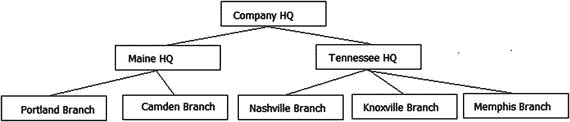

图 8-3. 演示公司层次结构

在 SQL Server 中处理树形结构时，最重要的一点是：在过程语言中处理树的最高效方式，在基于集合的关系语言中处理数据的最高效方式并不相同。两者都使用递归，但实现方式却大相径庭。如果您在函数式语言中搜索树，一个非常常见的算法是：一次遍历一个节点，从最顶层的项目开始，向下直到树的最底层，然后围绕树遍历所有节点。这通常使用基于树中项目顺序的递归算法来完成。在图 8-4 中，我展示了树的左侧部分的这种遍历方式。

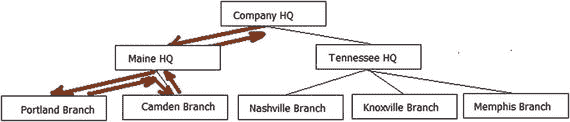

图 8-4. 深度优先搜索的示例树结构

这被称为**深度优先搜索**，当语言针对单次访问单个实例进行优化时，尤其是在可以将整个树结构加载到 RAM 中时，速度很快。如果您尝试使用 T-SQL 实现这一点，会发现它慢得令人讨厌，就像大多数迭代处理一样。在 SQL 中，我们使用所谓的**广度优先搜索**，它可以扩展到更多节点，因为查询次数仅限于层次结构中的级别数。这里的限制涉及所需的临时存储大小以及最终在每个级别上的行数。连接到未编制索引的临时集合在代码中效果不好，在 SQL Server 的算法中也是如此。

树可以从您感兴趣的父行开始分解为多个级别。从那里开始，当您距离父级一个级别时，级别会增加，如图 8-5 所示。

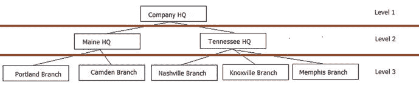

图 8-5. 带级别的示例树结构

现在，处理这种结构时，会将每个级别作为一个独立的集合，连接到前一级别的匹配结果。您一次迭代一个级别，将一级的行与下一级的行进行匹配。这将使用数据的查询次数减少到三次，而不是最少八次，加上在父子之间来回的开销。在 SQL 中，我们将使用**递归 CTE**（公用表表达式），其中的递归不是基于排序，而是基于锚点 SQL 引用其所属于的对象。

为了演示如何使用邻接列表表，让我们创建一个表来表示相互为父公司的公司层次结构。我们表的目标是实现如图 8-6 所示的结构。

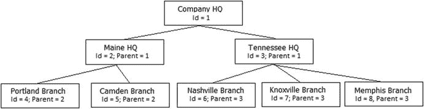

图 8-6. 基本邻接列表图示

因此，我们将创建如下表：

```sql
CREATE SCHEMA Corporate;
GO
CREATE TABLE Corporate.Company
(
CompanyId   int NOT NULL CONSTRAINT PKCompany PRIMARY KEY,
Name        varchar(20) NOT NULL CONSTRAINT AKCompany_Name UNIQUE,
ParentCompanyId int NULL
CONSTRAINT Company$isParentOf$Company REFERENCES Corporate.Company(companyId)
);
```

然后，加载数据以建立类似于图 8-3 中图形的表：

```sql
INSERT INTO Corporate.Company (CompanyId, Name, ParentCompanyId)
VALUES (1, 'Company HQ', NULL),
(2, 'Maine HQ',1),              (3, 'Tennessee HQ',1),
(4, 'Nashville Branch',3),      (5, 'Knoxville Branch',3),
(6, 'Memphis Branch',3),        (7, 'Portland Branch',2),
(8, 'Camden Branch',2);
```

现在，查看数据

```sql
SELECT *
FROM    Corporate.Company;
```

返回结果如下：

```
companyId   name                 parentCompanyId
----------- -------------------- ---------------
1           Company HQ           NULL
2           Maine HQ             1
3           Tennessee HQ         1
4           Nashville Branch     3
5           Knoxville Branch     3
6           Memphis Branch       3
7           Portland Branch      2
8           Camden Branch        2
```

使用键结构，您可以相当容易地从子级遍历到父级。在下一个代码中，我们将编写一个查询来获取给定节点的子节点，并在输出中添加一列以显示层次结构。我已对代码进行了注释以说明我的操作，但一旦您理解了几次，代码的工作原理就相当直观了。递归 CTE 并不总是最容易理解的代码：

```sql
--获取一行的子节点（或通过轻微修改查询获取祖先）
DECLARE @CompanyId int = ;
;WITH companyHierarchy(CompanyId, ParentCompanyId, treelevel, hierarchy)
AS
(
--获取我们想要的层次结构的顶层。hierarchy 列
--将显示该行在此查询中的位置，而不是该行在表中整体情况中的实际位置
SELECT CompanyId, ParentCompanyId,
1 AS treelevel, CAST(CompanyId AS varchar(max)) as hierarchy
FROM   Corporate.Company
WHERE CompanyId=@CompanyId
UNION ALL
--连接回 CTE 以递归地检索行
--注意 treelevel 在每次迭代中递增
SELECT Company.CompanyID, Company.ParentCompanyId,
treelevel + 1 AS treelevel,
CONCAT(hierarchy,'\',Company.CompanyId) AS hierarchy
FROM   Corporate.Company
INNER JOIN companyHierarchy
--用于获取子节点
ON Company.ParentCompanyId= companyHierarchy.CompanyId
--用于获取父节点
--ON Company.CompanyId= companyHierarchy.ParentcompanyId
)
--从 CTE 返回结果，连接到公司数据以获取
--公司名称
SELECT  Company.CompanyID,Company.Name,
companyHierarchy.treelevel, companyHierarchy.hierarchy
FROM     Corporate.Company
INNER JOIN companyHierarchy
ON Company.CompanyId = companyHierarchy.companyId
ORDER BY hierarchy;
```

使用 `@companyId = 1` 运行此代码，您将得到以下结果：

```
companyID   name                 treelevel   hierarchy
----------- -------------------- ----------- ----------
1           Company HQ           1           1
2           Maine HQ             2           1\2
7           Portland Branch      3           1\2\7
8           Camden Branch        3           1\2\8
3           Tennessee HQ         2           1\3
4           Nashville Branch     3           1\3\4
5           Knoxville Branch     3           1\3\5
6           Memphis Branch       3           1\3\6
```

**提示**

注意这里的 hierarchy 输出。这与所谓的“路径”方法所使用的数据非常相似，也会出现在 `hierarchyId` 示例中。

`hierarchy` 列显示了 `'Company HQ'` 行的每个子节点的位置，并且由于这是唯一一行 `parentCompanyId` 为空的行，您不必从顶部开始；可以从中间开始。例如，`'Tennessee HQ'(@companyId = 3)` 行将返回

```
companyID   name                 treelevel   hierarchy
----------- -------------------- ----------- -----------
3           Tennessee HQ         1           3
4           Nashville Branch     2           3\4
5           Knoxville Branch     2           3\5
6           Memphis Branch       2           3\6
```


如果你想要获取某一行的父级，只需对代码进行微小的修改。不是去查找 CTE 中匹配`parentCompanyId`的`companyId`的行，而是去查找 CTE 中`parentCompanyId`匹配`companyId`的行。我保留了一些带注释的代码：

```sql
--用于获取子节点
ON company.parentCompanyId= companyHierarchy.companyId
--用于获取父节点
--ON company.CompanyId= companyHierarchy.parentcompanyId
```

注释掉第一个`ON`，并取消注释第二个：

```sql
--用于获取子节点
--ON company.parentCompanyId= companyHierarchy.companyId
--用于获取父节点
ON company.CompanyId= companyHierarchy.parentcompanyId
```

并将`@companyId`更改为一个有父级的行，例如`4`。运行此查询，你将得到

```text
companyID   name                 treelevel   hierarchy
----------- -------------------- ----------- ----------------------------------
4           Nashville Branch     1           4
3           Tennessee HQ         2           4\3
1           Company HQ           3           4\3\1
```

现在，`hierarchy`列显示的是该行相对于查询起点的关系，而不是它在树中的绝对位置。因此，它看起来是反的，但回想一下广度优先搜索方法，你可以看到在每一层级，所有示例中的`hierarchy`列都为每次迭代添加了数据。

我还应该指出层级结构中的一个问题，那就是循环引用。我们很容易遇到以下情况：

```text
ObjectId    ParentId
----------  ---------
1           3
2           1
3           2
```

在这种情况下，任何编写递归类型查询的人都会陷入无限循环，因为每一行都有一个父级，循环永远不会结束。如果你限制了 CTE 的递归深度（默认为`100`，可通过`MAXRECURSION`查询选项按语句控制；设置为`0`则无限制），并且你在达到`MAXRECURSION`次迭代后停止而不是报错，那么这种情况就尤其危险，因为你可能永远不会注意到问题。

## 图（多父级层次结构）

查询图是一个非常复杂的话题，远远超出了本书和本章的范围。本节仅提供一个简要概述。你可能会遇到两类图查询问题：

*   **有向图**：虽然节点可能有多个父级，但图中可能不存在循环。这在诸如物料清单/产品分解结构图中很常见。在这种情况下，你可以像处理树一样，从父节点到子节点处理图的一个切片。因为不可能存在某个项既是某个节点的子节点，又是其祖父节点的情况。
*   **无向图**：这是更典型的图。无向图的一个例子体现在演员和电影的关系表示中（更不用说导演、工作人员、片段等）。这在“凯文·贝肯的六度空间”问题中经常被提及，即凯文·贝肯可以在七步之内与几乎任何人建立联系。他与`演员 1`合作过一部电影，`演员 1`又与`演员 2`合作过，`演员 2`再与`演员 3`合作。而`演员 3`可能已经和`演员 1`合作过两部电影了，如此往复。在处理图时，你必须检测循环并停止处理。

让我们看一个物料清单的例子。假设你有一个零件`A`，并且有两个使用此零件的组件。因此，这两个组件是零件`A`的父级。使用嵌入在数据表中的邻接表，你只能表示树（我们将考察对象配置的几种组合方式，以调整你的数据库所能建模的范围）。我们将数据与层次结构的实现分离开来。作为一个例子，请考虑以下包含零件和组件的模式。

首先，我们为零件创建一个表：

```sql
CREATE SCHEMA Parts;
GO
CREATE TABLE Parts.Part
(
PartId   int    NOT NULL CONSTRAINT PKPart PRIMARY KEY,
PartNumber char(5) NOT NULL CONSTRAINT AKPart UNIQUE,
Name    varchar(20) NULL
);
```

然后，我们加载一些简单的数据：

```sql
INSERT INTO Parts.Part (PartId, PartNumber,Name)
VALUES (1,'00001','Screw Package'),(2,'00002','Piece of Wood'),
(3,'00003','Tape Package'),(4,'00004','Screw and Tape'),
(5,'00005','Wood with Tape') ,(6,'00006','Screw'),(7,'00007','Tape');
```

接下来，我们创建一个表来保存零件的组成关系配置：

```sql
CREATE TABLE Parts.Assembly
(
PartId   int
CONSTRAINT FKAssembly$contains$PartsPart
REFERENCES Parts.Part(PartId),
ContainsPartId   int
CONSTRAINT FKAssembly$isContainedBy$PartsPart
REFERENCES Parts.Part(PartId),
CONSTRAINT PKAssembly PRIMARY KEY (PartId, ContainsPartId)
);
```

首先，设置螺丝包和胶带包：

```sql
INSERT INTO PARTS.Assembly(PartId,ContainsPartId)
VALUES (1,6),(3,7);
```

现在，你可以通过将`partId`为`4`的零件设置为`1`和`3`的父级，来加载`Screw`和`Tape`零件的数据：

```sql
INSERT INTO PARTS.Assembly(PartId,ContainsPartId)
VALUES (4,1),(4,3);
```

最后，你可以对`Wood with Tape`零件做同样的操作：

```sql
INSERT INTO Parts.Assembly(PartId,ContainsPartId)
VALUES (5,2),(5,3);
```

现在，你可以获取层次结构中的任何零件，并使用相同的递归 CTE 风格的算法，提取出你感兴趣的数据树。第一次尝试，我将获取`PartId=4`的`'Screw and Tape'`组件：

```sql
--获取一行的子节点（或通过稍微修改查询来获取祖先节点）
DECLARE @PartId int = 4;
;WITH partsHierarchy(PartId, ContainsPartId, treelevel, hierarchy,nameHierarchy)
AS
(
--获取我们想要的层次结构中的顶层。hierarchy 列将仅显示在此查询中该行在层次结构中的位置，
--而不是该行在整个表中所处位置的全局事实
SELECT NULL  AS PartId, PartId AS ContainsPartId,
       1 AS treelevel,
       CAST(PartId AS varchar(max)) as hierarchy,
       --为此示例添加了更具文本性的层次结构
       CAST(Name AS varchar(max)) AS nameHierarchy
FROM   Parts.Part
WHERE PartId=@PartId
UNION ALl
--连接回 CTE 以递归地检索行
--注意 treelevel 在每次迭代中递增
SELECT Assembly.PartId, Assembly.ContainsPartId,
       treelevel + 1 as treelevel,
       CONCAT(hierarchy,'\',Assembly.ContainsPartId) AS hierarchy,
       CONCAT(nameHierarchy,'\',Part.Name) AS nameHierarchy
FROM   Parts.Assembly
       INNER JOIN Parts.Part
           ON Assembly.ContainsPartId = Part.PartId
       INNER JOIN partsHierarchy
           ON Assembly.PartId= partsHierarchy.ContainsPartId
)
SELECT PartId, nameHierarchy, hierarchy
FROM partsHierarchy;
```

这将返回

```text
PartId      nameHierarchy                        hierarchy
----------- ------------------------------------ ------------
NULL        Screw and Tape                       4
4           Screw and Tape\Screw Package         4\1
4           Screw and Tape\Tape Package          4\3
3           Screw and Tape\Tape Package\Tape     4\3\7
1           Screw and Tape\Screw Package\Screw   4\1\6
```

将变量更改为`5`，你将看到我们配置的另一个零件：

```text
PartId      nameHierarchy                        hierarchy
----------- ------------------------------------ ------------
NULL        Wood with Tape                       5
5           Wood with Tape\Piece of Wood         5\2
5           Wood with Tape\Tape Package          5\3
3           Wood with Tape\Tape Package\Tape     5\3\7
```

如你所见，胶带包在另一个零件配置中重复出现了。我不会在正文中涵盖如何处理图中的循环（这将是扩展示例的一部分），但处理循环图时最大的问题是，由于关系的基数，要确保不会因为重复计数而导致数据统计出错。


## 使用 `hierarchyId` 类型实现层次结构

除了相当标准的邻接表实现方式之外，还有一种名为 `hierarchyId` 的数据类型，它是一种专有的、基于 CLR 的数据类型，可用于处理层次结构中的部分繁重工作。它有一些明显的优势，比如使得对层次结构的查询变得相当容易，但也存在一些困难。

`hierarchyId` 数据类型的主要缺点在于，对于某些基本任务，它不像自引用列那样简单易用。向此表中插入数据不像之前的方法那样容易（回想一下，所有数据都可以通过单条语句插入，而对于 `hierarchyId` 解决方案来说，除非你已经计算好了路径，否则这将无法实现）。然而，从好的方面看，使用自引用列时那些较为困难的操作类型，现在会变得明显容易，但有些 `hierarchyId` 操作可能完全不符合你的直觉。

作为示例，我将设置一个名为 `corporate2` 的备用公司表，在其中使用 `hierarchyId` 而非邻接表来实现与前面示例相同的表。请注意增加了一个计算列，用于指示在层次结构中的级别，这将被内部机制用来支持广度优先处理。代理键 `CompanyId` 未设置为聚集索引，以便为未来的索引留出空间。如果你需要通过主键进行大量获取操作，你可能需要将层次结构实现为一个单独的表。

```
CREATE TABLE Corporate.CompanyAlternate
(
CompanyOrgNode hierarchyId not null
CONSTRAINT AKCompanyAlternate UNIQUE,
CompanyId   int CONSTRAINT PKCompanyAlternate PRIMARY KEY NONCLUSTERED,
Name        varchar(20) CONSTRAINT AKCompanyAlternate_name UNIQUE,
OrganizationLevel AS CompanyOrgNode.GetLevel() PERSISTED
);
```

你还需要添加一个包含级别和 `hierarchyId` 节点的索引。如果没有计算列和索引（这两者都绝非直观明显），随着层次结构的增长，此方法的性能将迅速下降：

```
CREATE CLUSTERED INDEX Org_Breadth_First
ON Corporate.CompanyAlternate(OrganizationLevel,CompanyOrgNode);
```

要插入一个根节点（没有父节点），你可以使用 `hierarchyId` 类型的 `GetRoot()` 方法，而无需将其分配给变量：

```
INSERT Corporate.CompanyAlternate (CompanyOrgNode, CompanyId, Name)
VALUES (hierarchyid::GetRoot(), 1, 'Company HQ');
```

要插入子节点，你需要获取对要添加到的 `parentCompanyOrgNode` 的引用，然后找到其具有最大 `companyOrgNode` 值的子节点，最后，使用 `companyOrgNode` 的 `getDescendant()` 方法来生成新值。我已将其封装到以下过程（基于“联机丛书”教程中的过程，并添加了一些功能以支持根节点和单线程插入，以避免死锁和/或唯一键冲突），并附有注释来解释代码的工作原理：

```
CREATE PROCEDURE Corporate.CompanyAlternate$Insert(@CompanyId int, @ParentCompanyId int,
@Name varchar(20))
AS
BEGIN
SET NOCOUNT ON
--最后一个子节点将在生成下一个节点时使用，
--而父节点用于在插入时设置父级
DECLARE  @lastChildofParentOrgNode hierarchyid,
@parentCompanyOrgNode hierarchyid;
IF @ParentCompanyId IS NOT NULL
BEGIN
SET @ParentCompanyOrgNode =
(  SELECT CompanyOrgNode
FROM   Corporate.CompanyAlternate
WHERE  CompanyID = @ParentCompanyId)
IF  @parentCompanyOrgNode IS NULL
BEGIN
THROW 50000, 'Invalid parentCompanyId passed in',1;
RETURN -100;
END;
END;
BEGIN TRANSACTION;
--如果存在，则获取你传入的父节点的最后一个子节点
SELECT @lastChildofParentOrgNode = MAX(CompanyOrgNode)
FROM Corporate.CompanyAlternate (UPDLOCK) --与共享锁兼容，但会阻止
--其他连接尝试获取 UPDLOCK
WHERE CompanyOrgNode.GetAncestor(1) = @parentCompanyOrgNode ;
--getDescendant 将给出比传入节点更大的下一个节点。
--由于该值是表中的最大值，getDescendant 方法将返回下一个值
INSERT Corporate.CompanyAlternate  (CompanyOrgNode, CompanyId, Name)
--COALESCE 函数将行设置为 NULL 时，这将是一个根节点
--无效的 ParentCompanyId 值已在前面被丢弃
SELECT COALESCE(@parentCompanyOrgNode.GetDescendant(
@lastChildofParentOrgNode, NULL),hierarchyid::GetRoot())
,@CompanyId, @Name;
COMMIT;
END;
```

现在，创建其余的行：

```
--exec Corporate.CompanyAlternate$insert @CompanyId = 1, @parentCompanyId = NULL,
--                               @Name = 'Company HQ'; --已创建
exec Corporate.CompanyAlternate$insert @CompanyId = 2, @ParentCompanyId = 1,
@Name = 'Maine HQ';
exec Corporate.CompanyAlternate$insert @CompanyId = 3, @ParentCompanyId = 1,
@Name = 'Tennessee HQ';
exec Corporate.CompanyAlternate$insert @CompanyId = 4, @ParentCompanyId = 3,
@Name = 'Knoxville Branch';
exec Corporate.CompanyAlternate$insert @CompanyId = 5, @ParentCompanyId = 3,
@Name = 'Memphis Branch';
exec Corporate.CompanyAlternate$insert @CompanyId = 6, @ParentCompanyId = 2,
@Name = 'Portland Branch';
exec Corporate.CompanyAlternate$insert @CompanyId = 7, @ParentCompanyId = 2,
@Name = 'Camden Branch';
```

你可以在此处查看原始格式的数据：

```
SELECT CompanyOrgNode, CompanyId, Name
FROM   Corporate.CompanyAlternate
ORDER  BY CompanyId;
```

这会返回一个相当无趣的结果集，特别是因为 `companyOrgNode` 值在此未转换的格式下是无用的：

```
companyOrgNode      companyId   name
------------------------------- ------------------
0x                  1           Company HQ
0x58                2           Maine HQ
0x68                3           Tennessee HQ
0x6AC0              4           Knoxville Branch
0x6B40              5           Nashville Branch
0x6BC0              6           Memphis Branch
0x5AC0              7           Portland Branch
0x5B40              8           Camden Branch
```

但这并不是查看数据最有趣的方式。该类型包含获取级别、层次结构等的方法：

```
SELECT CompanyId, OrganizationLevel,
Name, CompanyOrgNode.ToString() as Hierarchy
FROM   Corporate.CompanyAlternate
ORDER  BY Hierarchy;
```

这在查询中非常有用：

```
companyId   OrganizationLevel  name                 hierarchy
----------- ------------------ -------------------- -------------
1           0                  Company HQ           /
2           1                  Maine HQ             /1/
6           2                  Portland Branch      /1/1/
7           2                  Camden Branch        /1/2/
3           1                  Tennessee HQ         /2/
4           2                  Knoxville Branch     /2/1/
5           2                  Memphis Branch       /2/2/
```


## 获取节点的子节点和父节点

获取一个节点的所有子节点，比使用先前方法要容易得多。`hierarchyId` 类型提供了一个 `IsDescendantOf()` 方法可供使用。例如，要获取 `companyId = 3` 的子节点，可以使用以下查询：

```
DECLARE @CompanyId int = 3;
SELECT Target.CompanyId, Target.Name, Target.CompanyOrgNode.ToString() AS Hierarchy
FROM   Corporate.CompanyAlternate AS Target
JOIN Corporate.CompanyAlternate AS SearchFor
ON SearchFor.CompanyId = @CompanyId
and Target.CompanyOrgNode.IsDescendantOf
(SearchFor.CompanyOrgNode) = 1;
```

该查询返回：

```
CompanyId   Name                 Hierarchy
----------- -------------------- ------------
3           Tennessee HQ         /2/
4           Knoxville Branch     /2/1/
5           Memphis Branch       /2/2/
```

其优点在于，你可以从层次结构中看到行在整个结构中的位置，同时又不丢失它在当前结果集中的归属关系。反向获取一个行的父节点也不复杂。基本上，你只需要在 `ON` 子句中交换 `SearchFor` 和 `Target` 的位置：

```
DECLARE @CompanyId int = 3;
SELECT Target.CompanyId, Target.Name, Target.CompanyOrgNode.ToString() AS Hierarchy
FROM   Corporate.CompanyAlternate AS Target
JOIN Corporate.CompanyAlternate AS SearchFor
ON SearchFor.CompanyId = @CompanyId
and SearchFor.CompanyOrgNode.IsDescendantOf
(Target.CompanyOrgNode) = 1;
```

该查询返回：

```
companyId   name                 hierarchy
----------- -------------------- ----------
1           Company HQ           /
3           Tennessee HQ         /2/
```

这个查询比我们之前需要用到的递归 CTE 更容易理解。而这还不是该数据类型提供的全部功能。本章和本节旨在介绍相关主题，并非完整的参考手册。有关 `hierarchyId` 的完整参考，请查阅 Books Online。

然而，虽然部分用法更简单，但使用 `hierarchyId` 也有几个缺点，尤其是在将一个节点从某个父节点移动到另一个父节点时。`hierarchyId` 提供了一个 reparent（更改父节点）方法，但它一次只能处理一个节点。要移动一行（例如，假设 Oliver 现在向 Cindy 汇报，而不是向 Bobby 汇报），你将不得不同时移动所有为 Oliver 工作的人员。在邻接模型中，简单地修改一行就能一次性移动所有相关行。

## 替代方法/查询优化

在关系数据中处理层次结构长期以来一直是一个被深入研究的话题。因此，关于这个主题以及许多其他已实施的技术的著述很多。在本节中，我将概述另外三种已使用并将继续在设计中使用的处理层次结构的方法：

*   路径技术：这种方法在内部类似于使用 `hierarchyId`（尽管没有用于操作的数据类型方法），你将从子节点到父节点的路径存储在一个格式化的文本字符串中。
*   嵌套集：利用在树中的位置，使你能够非常快速地获取行的子节点或父节点。
*   Kimball 辅助表：基本上，它为从父到子的每条路径存储一行。它非常适合读取操作，但维护困难，是为只读场景（如只读数据库）开发的。

这些方法各有优势。每一种都比简单的邻接模型甚至 `hierarchyId` 解决方案更难维护，但在不同情况下都能提供益处。在接下来的章节中，我将对每一种方法做一个简要的说明性概述。

### 路径技术

路径技术基本上是 `hierarchyId` 方法的“手动”版本。在这种方法中，你存储从父节点到子节点的路径。使用我们迄今为止所用的层次结构，要实现路径方法，我们可以使用图 8-7 中的数据集。请注意，层次结构中的每个标签在路径中都将使用代理键作为键值，因此该值必须是不可变的。在图 8-7 中，我包含了一个使用路径值集实现我们设计的层次结构示意图。

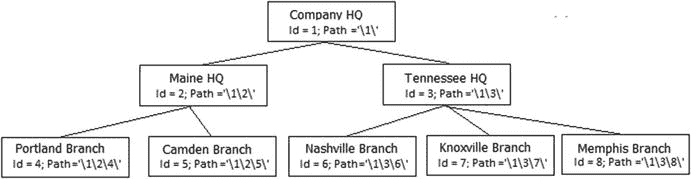
*图 8-7. 采用路径技术的示例层次结构图及值*

通过这种方式存储路径，你可以使用 LIKE 表达式来查找一个行的所有子节点。例如，要获取 `Main HQ` 节点的子节点，你可以使用 `WHERE Path LIKE '\1\2\%'` 这样的 `WHERE` 子句来获取子节点。父节点的路径也直接包含在路径中。因此，`Portland Branch`（其路径为 `'\1\2\4\'`）的父节点是 `'\1\2\'` 和 `'\1\'`。

路径方法的一大优点是它能很好地利用索引，因为你进行的大多数查询都会使用字符串的左侧部分。因此，在 SQL Server 2014 及之前版本中，只要你的路径能保持在 900 字节以下，性能通常非常出色。在 2016 版中，最大键长度已增加到 1700 字节，这很好，但如果你的路径如此之长，最终每页可能只有四个键，这将无法提供惊人的性能（索引将在第 10 章中详细讨论）。

### 嵌套集

处理层次结构更巧妙的方法之一是由 Michael J. Kamfonas 在 1992 年创建的。它发表在 1992 年 10/11 月的《The Relational Journal》上一篇名为“Recursive Hierarchies: The Relational Taboo!”的文章中。这也是 Joe Celko 喜欢的方法，他写了一本关于层次结构的书，名为 *Joe Celko's Trees and Hierarchies in SQL for Smarties*（Morgan Kaufmann, 2004）；如需进一步了解此方法及其他类型的层次结构，请参阅该书（现已出第二版，2012 年）。

该方法的基础是，你通过包含指向当前节点左侧和右侧的指针来组织树，使你能够通过计算来确定项目在树中的位置。再次回到我们的公司层次结构，结构将如图 8-8 所示。

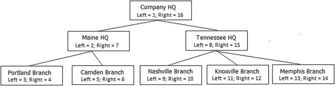
*图 8-8. 采用嵌套集技术的示例层次结构图及值*

其价值在于现在能够非常快速地确定节点的子节点和父节点。要找到 `Maine HQ` 的子节点，你可以写 `WHERE Left > 2 and Right < 7`。无论层次结构有多深，都完全不需要遍历，只需简单的整数比较。要找到 `Maine HQ` 的父节点，你只需要查找满足 `WHERE Left < 2 and Right > 7` 的情况。

添加节点会产生相当负面的影响，需要更新节点右侧的所有行，增加它们的 `Right` 值，因为每一行都是结构的一部分。删除节点将需要减少 `Right` 值。甚至 reparent（更改父节点）也变成了一个数学问题，只需更新链接指针。最大的缺点可能在于，这不是一种非常自然的操作数据的方式，因为你没有一个从父到子的直接链接来进行导航。


### Kimball 辅助表

最后，介绍一种管理起来最复杂（但在大多数情况下查询最快）的方法，你可以使用由 Ralph Kimball 创建的用于处理层级结构的方法。这种方法尤其适用于数据仓库或读取密集型环境，但如果层级结构相当稳定，它在 OLTP 环境中也可能有用。回到我们的邻接表实现，如图 8-9 所示，假设我们已经用 SQL 实现了它。


图 8-9. 使用邻接表技术的示例层级结构图，数值为 Kimball 辅助表方法重复

要实现这种方法，你需要使用一个描述层级结构的数据表，其中层级结构中的每一级、每个父子关系都占一行。因此，会有一行表示 `Company HQ` 到 `Maine HQ`，一行表示 `Company HQ` 到 `Portland Branch`，依此类推。这个辅助表提供了从父节点的距离、是否为根节点或叶节点等详细信息。因此，对于树中最左侧的四个项（`1`, `2`, `4`, `5`），我们将得到如下表格：

| `ParentId` | `ChildId` | `Distance` | `ParentRootNodeFlag` | `ChildLeafNodeFlag` |
| --- | --- | --- | --- | --- |
| `1` | `2` | `1` | `1` | `0` |
| `1` | `4` | `2` | `1` | `1` |
| `1` | `5` | `2` | `1` | `1` |
| `2` | `4` | `1` | `0` | `1` |
| `2` | `5` | `1` | `0` | `1` |

这种技术的威力在于，现在你可以简单地通过查询 `WHERE ParentId = 1` 来请求 `1` 的所有子节点，或者通过 `WHERE ParentId = 2 and Distance = 1` 来查找 `2` 的直接后代。你还可以通过查询 `WHERE ParentId = 1 and ChildLeafNode = 1` 来查找某个父节点下的所有叶节点。实现此结构的代码基本上是第一个层级结构示例中使用的递归 CTE 的略微修改版本。为百万级节点重建可能需要几分钟时间。

这种方法显而易见的缺点很简单。如果结构经常修改，维护成本会有些高。老实说，Kimball 设计这个方法的主要目的是为了优化数据仓库中层级关系的关联使用，而数据仓库是由 ETL 维护的。对于此类目的，这种方法应该是最快的，因为所有查询几乎完全基于简单的关联查询。在所有方法中，这种方法对用户来说最自然，但对负责维护数据的团队来说却最不理想。

### 图像、文档及其他文件，哦天哪！

存储大型二进制对象，例如 PDF、图像以及你可能在 Windows 文件系统中找到的任何类型的对象，通常不是关系数据库的传统领域。然而，随着时间的推移，这种情况变得越来越普遍。

当讨论如何在 SQL Server 中存储大型对象时，通常指的是（显然）体积较大但通常是某种二进制格式的数据，这些数据无法使用常见的 T-SQL 语句自然地修改，例如图片或格式化文档。大多数情况下，这不考虑简单的文本数据，甚至格式化的半结构化文本，或高度结构化的文本如 XML。SQL Server 有一个用于存储 XML 数据的 `XML` 类型（包括对 XML 文档中的字段建立索引的能力），它还有用于存储非常大的“纯”文本数据的 `varchar(max)`/`nvarchar(max)` 类型。当然，有时你会希望以 Windows 文本文件的形式存储文本数据，以允许用户自然地管理数据。在决定在 SQL Server 中存储二进制数据的方式时，大致有两种可区分的方法：

*   存储对文件数据的路径引用
*   使用 SQL Server 的存储引擎存储二进制数据

在本书的早期版本中，这个问题确实很容易回答。几乎总是，最合理的解决方案是将文件存储在文件系统中，并在 `varchar` 列中仅存储对数据的引用。在 SQL Server 2008 中，微软实现了一种称为文件流的二进制存储类型，它允许将二进制数据作为实际文件存储在文件系统中，这使得客户端访问此数据比存储在 SQL Server 的二进制列中要快得多。在 SQL Server 2012 中，情况进一步改善，为你提供了一种在服务器上存储任何文件数据的方法，让你可以使用看起来像典型网络共享的方式来访问数据。在所有情况下，你都可以像以前一样在 T-SQL 中处理数据，甚至可能有所改进，尽管你不能像在基本的 `varbinary(max)` 列中那样对值进行部分写入。

随着时间的推移，情况变化并不大。我通常将这两种可能的二进制存储方式的选择归结为一个主要的简单原因：事务完整性。如果你需要事务完整性，就使用 SQL Server 的存储引擎，无论可能产生什么成本。如果事务完整性不是极其重要，你可能就会想使用文件系统。例如，如果你只是存储一个用户可以去编辑并保持同名的图片，文件系统就非常自然。性能是一个考虑因素，但如果你需要性能，可以先将数据写入存储引擎，然后定期将图片刷新到文件系统并从缓存中使用它。

如果你要在 SQL Server 中存储大型对象，通常会希望使用文件流，特别是如果你的文件相当大。建议如果你的二进制对象将大于 1MB，则一定要考虑文件流，但建议会随时间变化。设置文件流访问相当容易；首先，你要为服务器启用文件流访问。有关此过程的详细信息，请查阅在线手册主题“启用和配置 FILESTREAM”（ [`https://msdn.microsoft.com/en-us/library/cc645923.aspx`](https://msdn.microsoft.com/en-us/library/cc645923.aspx)）。启用文件流的基本步骤（如果在安装过程中尚未这样做）是：转到 SQL Server 配置管理器，在 SQL Server 服务中选择 SQL Server 实例。打开属性，选择 FILESTREAM 选项卡，如图 8-10 所示。

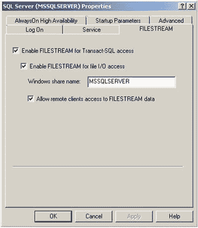

图 8-10.


## 配置服务器以进行文件流访问

Windows 共享名称将用于通过 API 访问文件流数据，以及在本章后面使用文件表。在本节稍后，将根据文件流数据的访问方式进行额外配置。首先，使用 `sp_configure filestream_access_level` 为服务器启用文件流访问，值设置为 `1`（仅 T-SQL 访问）或 `2`（T-SQL 和 Win32 访问）。我们将使用两种方法，因此我将使用后者：

```sql
EXEC sp_configure filestream_access_level 2;
RECONFIGURE;
```

接下来，我们创建一个示例数据库（而不是像本章其余部分那样使用几乎任何数据库）：

```sql
CREATE DATABASE FileStorageDemo; --uses basic defaults from model database
GO
USE FileStorageDemo;
GO
--will cover filegroups more in the chapter 10 on structures
ALTER DATABASE FileStorageDemo ADD
FILEGROUP FilestreamData CONTAINS FILESTREAM;
```

### 提示

在同时需要使用快照隔离级别或实现了 `READ_COMMITTED_SNAPSHOT` 数据库选项的数据库中使用文件流数据存在注意事项。有关更多信息，请参阅 `SET TRANSACTION ISOLATION LEVEL` 语句（在第 11 章中介绍）的文档 [`https://msdn.microsoft.com/en-us/library/ms173763.aspx`](https://msdn.microsoft.com/en-us/library/ms173763.aspx)。

接下来，向数据库添加一个“文件”，该文件实际上是文件流文件的目录（注意，在执行以下语句之前，该目录不应存在，但在这种情况下，目录 `c:\sql` 必须存在，否则您将收到错误）：

```sql
ALTER DATABASE FileStorageDemo ADD FILE (
NAME = FilestreamDataFile1,
FILENAME = 'c:\sql\filestream') --directory cannot yet exist and SQL account must have
--access to drive.
TO FILEGROUP FilestreamData;
```

现在，您可以创建一个表，并在数据类型声明后包含一个带有关键字 `FILESTREAM` 的 `varbinary(max)` 列。另请注意，我们还需要一个具有 `ROWGUIDCOL` 属性的唯一标识符列，该列被某些系统进程用作一种特殊的代理键。

```sql
CREATE SCHEMA Demo;
GO
CREATE TABLE Demo.TestSimpleFileStream
(
TestSimpleFilestreamId INT NOT NULL
CONSTRAINT PKTestSimpleFileStream PRIMARY KEY,
FileStreamColumn VARBINARY(MAX) FILESTREAM NULL,
RowGuid uniqueidentifier NOT NULL ROWGUIDCOL DEFAULT (NEWID())
CONSTRAINT AKTestSimpleFileStream_RowGuid UNIQUE
)       FILESTREAM_ON FilestreamData;
```

就这么简单。您可以像使用 SQL Server 中的数据一样使用它，例如通过简单查询创建数据：

```sql
INSERT INTO Demo.TestSimpleFileStream(TestSimpleFilestreamId,FileStreamColumn)
SELECT 1, CAST('This is an exciting example' AS varbinary(max));
```

并通过典型的 `SELECT` 语句查看它：

```sql
SELECT TestSimpleFilestreamId,FileStreamColumn,
CAST(FileStreamColumn AS varchar(40)) AS FileStreamText
FROM   Demo.TestSimpleFilestream;
```

我不会在此深入探讨文件流操作，因为从这里开始，该技术中更有趣的部分都在 SQL Server 之外的 API 代码中，这远远超出了本节的目的，本节旨在向您展示在结构中设置文件流列的基础知识。

在 SQL Server 2012 中，我们获得了一个用于存储二进制文件的新功能，称为文件表。文件表是一种特殊类型的表，您可以使用 T-SQL 访问，或者直接使用我们在本节前面设置的名为 `MSSQLSERVER` 的共享从文件系统访问。对我们来说，一个很好的地方是，我们实际上能够以一种非常自然的方式查看我们创建的文件，这种方式可以从 Windows 资源管理器访问。

按照以下方式在数据库中启用和设置文件表样式的文件流：

```sql
ALTER DATABASE FileStorageDemo
SET FILESTREAM (NON_TRANSACTED_ACCESS = FULL,
DIRECTORY_NAME = N'ProSQLServerDBDesign');
```

设置 `NON_TRANSACTED_ACCESS` 允许您设置用户在作为 Windows 共享访问数据时是否可以更改数据，例如在 Word 中打开文档。这些更改不是事务安全的，因此存储在文件表中的数据不如使用简单的 `varbinary(max)` 或甚至使用文件流属性的数据安全。它的行为几乎就像任何文件服务器上的数据一样，只是它将随数据库一起备份，并且您可以使用常见关系构造轻松地将文件与服务器中的其他数据关联。`DIRECTORY_NAME` 参数用于添加到您将访问数据的路径（这将在本节后面演示）。

创建文件表的语法非常简单：

```sql
CREATE TABLE Demo.FileTableTest AS FILETABLE
WITH (
FILETABLE_DIRECTORY = 'FileTableTest',
FILETABLE_COLLATE_FILENAME = database_default
);
```

`FILETABLE_DIRECTORY` 是访问路径的最后一部分，`FILETABLE_COLLATE_FILENAME` 决定文件名的排序规则。它必须区分大小写，因为 Windows 目录不区分大小写。我不会深入探讨所有列和设置，但足以说明文件表基于固定的表模式，您可以像访问普通表一样访问它。有两种类型的行：目录和文件。创建目录很容易。例如，如果您想为项目 1 创建一个目录：

```sql
INSERT INTO Demo.FiletableTest(name, is_directory)
VALUES ( 'Project 1', 1);
```

然后，您可以查看表中的这些数据：

```sql
SELECT stream_id, file_stream, name
FROM   Demo.FileTableTest
WHERE  name = 'Project 1';
```

这将返回（尽管 `stream_id` 不同）

```
stream_id                            file_stream                         name
-------------- ------------9BCB8987-1DB4-E011-87C8-000C29992276          Project 1
```

`stream_id` 是一个唯一键，您可以将其与其他表关联，从而简单地向用户提供用于存储数据的“存储桶”。请注意，表的主键是 `path_locator hierarchyId`，但这是一个可更改的值。`stream_id` 值不应用改变，尽管文件或目录可能会被移动。在我们到 Windows 中查看之前，让我们向该目录添加一个文件。我们将创建一个简单的文本文件，其中包含少量文本：

```sql
INSERT INTO Demo.FiletableTest(name, is_directory, file_stream)
VALUES ( 'Test.Txt', 0, CAST('This is some text' AS varbinary(max)));
```

然后，我们可以使用 `path_locator hierarchyId` 功能将文件移动到我们刚刚创建的目录。（目录层次结构建立在 `hierarchyId` 上。在早期关于层次结构的下载中，您可以看到有关此处可用方法以及您自己的层次结构的更多详细信息。）

```sql
UPDATE Demo.FileTableTest
SET    path_locator = path_locator.GetReparentedValue( path_locator.GetAncestor(1),
(SELECT path_locator FROM Demo.FiletableTest
WHERE name = 'Project 1'
AND parent_path_locator IS NULL
AND is_directory = 1))
WHERE name = 'Test.Txt';
```

现在，转到您设置的共享并在 Windows 中查看目录。使用函数 `FileTableRootPath()`，您可以获取数据库的文件表路径；在我的情况下，我的虚拟机名称是 `WIN-8F59BO5AP7D`，因此共享是 `\\WIN-8F59BO5AP7D\MSSQLSERVER\ProSQLServerDBDesign`，这是我的计算机名称、我们在配置管理器中设置的 `MSSQLSERVER` 以及来自启用文件流的 `ALTER DATABASE` 语句的 `ProSQLServerDBDesign`。

现在，将根路径与目录的路径连接起来，该路径可以从 `file_stream` 列中检索（是的，查询时看到的值是 `NULL`，这有点令人困惑）。现在，执行此操作：

```sql
SELECT  CONCAT(FileTableRootPath(),
file_stream.GetFileNamespacePath()) AS FilePath
FROM    Demo.FileTableTest
WHERE   name = 'Project 1'
AND   parent_path_locator is NULL
AND   is_directory = 1;
```

这将返回以下内容：


```
文件路径

`\\WIN-8F59BO5AP7D\MSSQLSERVER\ProSQLServerDBDesign\FileTableTest\Project 1`
```

然后，您可以将其输入到资源管理器中，查看类似于图 8-11 所示的内容（当然，前提是您已正确配置了所有内容）。请注意，Windows 共享的安全性与通过 T-SQL 访问的 FileTable 的安全性相同，您可以像管理任何常规表一样管理它，并且可能还需要设置防火墙以允许访问。

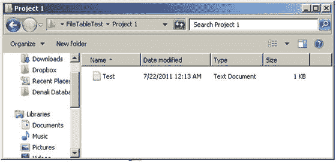

图 8-11. 在 Windows 资源管理器中打开的 FileTable 目录

在此，我建议您从本地驱动器向该目录中放入一些文件，然后在您新创建的 FileTable 中查看这些文件的元数据。它有很多可能性。我将在第 9 章中更多地讨论安全性，但基础是安全性基于您在 SQL Server 表中设置的 Windows 身份验证，就像任何其他表一样。

注意：
如果您尝试在同一台服务器（共享位置所在的服务器）上使用记事本访问该文本文件，由于记事本在本地访问文件的方式，您将收到错误。使用记事本从远程位置访问文件则可以正常工作。

我不再花更多时间介绍实现 FileTable 的具体细节。本质上，即使是一个相当初级的程序员，也可以几乎无麻烦地为每个客户提供一个目录，允许用户导航到该目录并获取客户的关联文件。而且，这些文件可以通过正常的备份操作进行备份。您没有针对访问的行级安全性，因此如果需要更高的安全性，您可能需要根据安全需求为每个场景使用一个表，这对于除少数情况外的更多用例来说可能并非最优方案。

那么，抛开机制不谈，考虑在 SQL 表中存储二进制数据的四种不同方法：

*   在简单的字符列中存储 UNC 路径
*   在简单的`varbinary(max)`列中存储二进制数据
*   在使用`filestream`类型的`varbinary(max)`列中存储二进制数据
*   使用`filetable`存储二进制数据

提示：
还有另一种存储大型二进制值的方法，称为远程 BLOB 存储（RBS）API。它允许您使用外部存储设备来存储和管理图像。这不是一个典型案例，但对于需要在外部设备上存储 Blob 的高端解决方案构建者来说，它绝对会令人感兴趣。更多信息请参见：[`https://msdn.microsoft.com/en-us/library/gg638709.aspx`](https://msdn.microsoft.com/en-us/library/gg638709.aspx)。

这些方法各有优点，我将在下面的列表中讨论它们的优缺点。与任何更新、看似更简单的技术一样，`filetable`确实感觉可能会在许多未来用途中胜出，但在评估您将来的具体需求时，一定要考虑其他可能性。

*   `事务完整性`：由存储引擎（无论是作为`filestream`还是二进制值）管理二进制数据，比存储文件名和路径并让外部应用程序管理文件，要更容易保证图像被存储且保持存储状态。`filetable`可用于维护事务完整性，但要做到这一点，您需要禁止非事务性修改，这将限制其易用性。
*   `图像与数据的一致性备份`：确保文件与数据同步与事务完整性相关。将数据存储在数据库中，无论是作为二进制列值还是作为`filestream`/`filetable`，都能确保二进制值与其他数据库对象一起备份。当然，这可能导致您的数据库大小变得非常大，因此有时仅备份数据而不备份图像的局部备份会很方便。文件组也可以单独恢复，但请注意，如果业务不允许，不要为了更快的备份而牺牲完整性。
*   `大小`：对于纯操作速度而言，对于典型小于 1MB 的对象大小，在线手册（Books Online）建议使用`varchar(max)`存储。如果对象将大于 2GB，则必须使用其中一种`filestream`存储类型。
*   `API`：客户端使用的是哪个 API？如果 API 不支持使用`filestream`类型，您绝对应该放弃它。`filetable`可以让您像处理任何网络共享上的文件一样处理文件，但如果您需要文件修改与其他更改一起作为事务发生，则需要使用`filestream` API。
*   `使用方式`：数据将如何被使用？如果使用非常频繁，那么您应该选择`filestream`/`filetable`或文件系统存储。对于需要只读访问的文件尤其如此。`Filetable`是一种非常好的方式，可以让客户端以非常自然的方式查看文件。
*   `文件位置`：`Filestream`文件组与关系文件位于同一服务器上。您无法指定 UNC 路径来存储数据（因为它需要控制目录以提供完整性）。对于`filestream`列的使用，数据就像普通的文件组一样，为了可用性，必须是事务安全的。
*   `加密`：即使启用了透明数据加密（TDE），也不支持对存储在`filestream`文件组中的数据进行加密。
*   `安全性`：如果图像的完整性对业务流程很重要（例如，刷安全卡时显示给保安看的证件照片），那么值得付出额外代价将数据存储在数据库中，因为在数据库中进行更改要困难得多。（在 T-SQL 中手动修改图像确实是一项艰巨的任务。）`filetable`还有一个缺点，即使用视图实现行级安全（在第 9 章中有更详细的讨论）是不可能的，而当使用基于`filestream`的列时，您在访问文件之前基本上是以类似 SQL 的方式使用数据。

举三个快速的例子，考虑一个电影租赁数据库（当然现在是在线的）。在一个表中，我们有一个`MovieRentalPackage`表，表示用于租赁的电影的特定包装。因为这只是电影的图片，所以存储指向数据的路径是一个完全有效的选择。此数据仅用于呈现商店库存的电子浏览，因此如果某次无法使用，这不是大问题。设置一个`varchar(200)`的`PictureUrl`列，如图 8-12 所示。

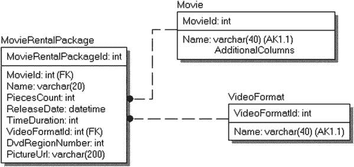

图 8-12. PictureUrl 数据类型设置为文件路径的 MovieRentalPackage 表


## 文件存储与数据库设计

此路径甚至可能位于互联网源上，其中文件名是一个 `HTTP://` 地址，并存储在 Web 服务器的图像缓存中，可以被复制到其他 Web 服务器。该路径可能存储为完整的 UNC 位置，也可能不存储；这确实取决于你的基础架构需求。目标是，当页面从服务器获取数据时，能够构建如下所示的一点 HTML 代码来获取你要显示的电影目录条目图片：

```sql
SELECT '', ...
FROM    Movies.MovieRentalPackage
WHERE   MovieId = @MovieId;
```

如果这些数据以二进制格式存储在数据库中，则需要先将其具体化为磁盘文件，然后才能在页面中使用，无论你的架构如何，这都将比上述方式慢得多。这可能不是你希望通过文件流访问或为此经历必要操作的情况，因为从事务角度来说，如果图片链接断开，它不会使其他数据失效，而且这可能不太重要。另外，你可能希望直接访问此文件，从而使主屏幕的编码非常快速和简单。

另一个例子可能是账户和关联用户（参见图 8-13）。为了打击欺诈，一家电影租赁连锁店可能决定开始拍摄客户的数字照片，并在客户租赁物品时将照片与客户进行比较。从安全角度来看，这些数据重要得多，并且具有隐私影响。为此，我将在数据库中使用 `varbinary(max)` 存储个人图片。

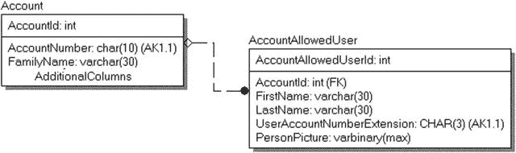

图 8-13.
图片作为数据存储在表中的客户表

此时，假设你已经明确决定需要事务完整性，并且希望直接从服务器检索数据。接下来要决定的是是否使用文件流。关于此决策的核心问题是你的 API 是否支持文件流。如果是，那么这可能是利用它们的绝佳场所。大小也可能在选择中起作用，不过安全图片可能无论如何都小于 1MB。

总体而言，速度可能不是大问题，即使你需要从 SQL Server 的常规存储中获取二进制位并将其流式传输到文件，由于一次只需要获取一张图片，只要图片在租赁事务完成前显示，性能就足够了。请不要误解；`varbinary(max)` 类型并非那么慢，但即使它们很慢，对于这些目的来说性能也是可以接受的。

最后，考虑你是否希望实现一个客户文件系统来存储与客户相关的扫描图像。数据的重要性不足以要求以结构化方式管理它们，但他们只是希望能够创建一个目录来保存扫描数据。数据确实需要与数据库的其余部分保持同步。因此，你可以扩展你的表以包含一个文件表（图 8-14 中的 `AccountFileDirectory`，其中 `stream_id` 被建模为主键；尽管在技术上实现中是唯一约束，但你可以引用备用键）。

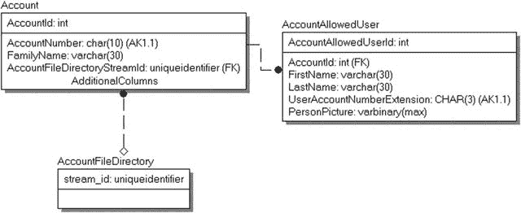

图 8-14.
用 AccountFileDirectory 扩展的账户模型

通过这种方式，你为账户的文件包含了一个目录，该目录可以像典型的文件结构一样对待，但将安全地位于账户信息旁边。这不仅对程序员和用户都非常有用，而且还能让你确信数据与账户文件一起备份，并以与账户信息相同的方式处理。

### 泛化

设计常被讨论为一种艺术形式，这正是本主题的内容。在设计一组表格来表示某些现实世界的活动时，你的表格应该有多具体？例如，如果你正在设计一个存储营地活动信息的数据库，可能会忍不住为射箭课单独建一个表，为游泳课再建一个表，等等，以极大的细节为每个营地活动建模。如果营地有 50 个活动，你可能会有 50 个表，外加一堆其他表来将这 50 个表联系在一起。然而，最终，虽然这些表看起来不完全相同，但你会开始注意到每个表基本上都用于相同的事情：分配教练、为孩子报名参加、添加描述等等。与其系统围绕每个活动展开，要求你将每个不同的活动建模为彼此不同，你真正需要做的是建模一个营地活动的抽象。另一方面，虽然设计的主要焦点是活动的管理，但你可能会发现需要关于部分类或所有类的扩展信息。泛化是关于使对象尽可能通用，采用诸如子类化之类的模式来调整出最佳解决方案。

最终，目标是考虑在何处可以将基本相似的表组合成单个表，特别是当多个表经常被视为一个整体时，就像你必须对 50 个营地活动表所做的那样，特别是为了确保孩子们不会为了好玩而给他们的朋友报名参加所有其他场次。

在设计过程中，寻找使用、列等方面的相似性，并考虑将多个表合并为一个表，最终得到一个关于真正需要建模内容的泛化/抽象，这是很有用的。然而，很明显，这里最大的问题是有时你确实需要存储关于你原始表建模的某些事物的不同信息。在我们的例子中，如果你需要关于浮潜课的特殊信息，如果你只是创建一个活动抽象，你可能会丢失这些信息，而且天知道目标不是最终得到一个有 200 列、所有列都带有本应是一个表的前缀的表（或者更糟，一个通用的桶状表，带有一个 `varchar(max)` 列，所有期望的信息都被塞入其中）。

在这些情况下，你可以考虑为某些实体使用子类化实体。以营地活动模型为例。你可以包含通用 `CampActivity` 的泛化表，在其中关联不需要特殊培训的学生和教师，并在子类化的表中包含关于浮潜和射箭课的具体信息，可能还包含满足特定条件的教师（在未显示的相关表中），如图 8-15 所示。

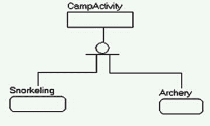

图 8-15.
根据需要扩展带有具体细节的泛化实体


### 家庭库存系统数据库设计示例

## 背景介绍
作为编码示例，我们将研究一个家庭库存系统。假设我们有一个客户，想要创建一个清单，记录他们房子里各类物品，或至少是所有贵重物品，以用于保险目的。那么，我们是否应该为每种物品类型设计一个表？这似乎太麻烦，因为对于几乎所有物品，客户通常只需要描述、图片、价值和收据。另一方面，一个单一的表，将客户房子里的所有物品概括到一个列表中，对于需要特定信息（如评估和序列号）的物品来说，可能又不够用。例如，一些珠宝可能需要进行评估并列出评估价值。电子产品和电器则应该捕捉品牌、型号以及序列号。因此，目标是将设计概括到这样一个程度：客户有一个基本的家庭库存列表，但也可以单独打印一份带有额外细节的珠宝列表，或打印一份带有识别信息的电子产品列表。

## 初始数据库设计
因此，我们如下实现数据库。首先，创建一个通用表来保存通用的物品描述：
```sql
CREATE SCHEMA Inventory;
GO
CREATE TABLE Inventory.Item
(
ItemId  int NOT NULL IDENTITY CONSTRAINT PKItem PRIMARY KEY,
Name    varchar(30) NOT NULL CONSTRAINT AKItemName UNIQUE,
Type    varchar(15) NOT NULL,
Color   varchar(15) NOT NULL,
Description varchar(100) NOT NULL,
ApproximateValue  numeric(12,2) NULL,
ReceiptImage   varbinary(max) NULL,
PhotographicImage varbinary(max) NULL
);
```
如你所见，我包含了两个列来保存收据图像和物品图片。如前一节所讨论的，你可能希望使用`filetable`结构来简单地关联各种电子物品数据，但仅仅在行上附加上收据和物品的图片可能就足够了，便于使用。在示例数据中，我总是用简单的十六进制值`0x001`作为占位符来加载`varbinary`数据：
```sql
INSERT INTO Inventory.Item
VALUES ('Den Couch','Furniture','Blue','Blue plaid couch, seats 4',450.00,0x001,0x001),
('Den Ottoman','Furniture','Blue','Blue plaid ottoman that goes with couch',
150.00,0x001,0x001),
('40 Inch Sorny TV','Electronics','Black',
'40 Inch Sorny TV, Model R2D12, Serial Number XD49292',
800,0x001,0x001),
('29 Inch JQC TV','Electronics','Black','29 Inch JQC CRTVX29 TV',800,0x001,0x001),
('Mom''s Pearl Necklace','Jewelery','White',
'Appraised for $1300 in June of 2003\. 30 inch necklace, was Mom''s',
1300,0x001,0x001);
```

使用以下查询检查数据：
```sql
SELECT Name, Type, Description
FROM   Inventory.Item;
```
我们看到我们有一个不错的小系统，尽管数据的组织方式并非我们真正需要的，因为在实际使用中，我们可能需要更容易地访问描述中的某些特定数据：
```
Name                           Type            Description
------------------------------ --------------- -------------------------------------
Den Couch                      Furniture       Blue plaid couch, seats 4
Den Ottoman                    Furniture       Blue plaid ottoman that goes with ...
40 Inch Sorny TV               Electronics     40 Inch Sorny TV, Model R2D12, Ser...
29 Inch JQC TV                 Electronics     29 Inch JQC CRTVX29 TV
Mom's Pearl Necklace           Jewelery        Appraised for $1300 in June of 200...
```

## 添加子类以扩展信息
此时，我们观察数据并重新考虑设计。列出的两件家具没有问题。我们有图片和简要描述。然而，对于其他三件物品，使用数据变得更为棘手。对于电子产品，保险公司会希望记录每件产品的型号和序列号，但两个电视条目使用了不同的格式，并且其中一个没有记录序列号。是客户忘记记录了？还是它不存在？

因此，我们需要为需要更多信息的情况添加子类，以指导用户如何输入数据：
```sql
CREATE TABLE Inventory.JeweleryItem
(
ItemId  int     CONSTRAINT PKJeweleryItem PRIMARY KEY
CONSTRAINT FKJeweleryItem$Extends$InventoryItem
REFERENCES Inventory.Item(ItemId),
QualityLevel   varchar(10) NOT NULL,
AppraiserName  varchar(100) NULL,
AppraisalValue numeric(12,2) NULL,
AppraisalYear  char(4) NULL
);
GO
CREATE TABLE Inventory.ElectronicItem
(
ItemId        int        CONSTRAINT PKElectronicItem PRIMARY KEY
CONSTRAINT FKElectronicItem$Extends$InventoryItem
REFERENCES Inventory.Item(ItemId),
BrandName  varchar(20) NOT NULL,
ModelNumber varchar(20) NOT NULL,
SerialNumber varchar(20) NULL
);
```

## 更新数据与创建视图
现在，我们调整表中的数据，使其对家庭有意义的名称，但我们可以创建数据的视图，以提供或多或少的技术信息给其他人——首先是两台电视。注意，我们仍然没有序列号，但现在，可以很容易地找到客户未列出序列号并需要提供的电子产品：
```sql
UPDATE Inventory.Item
SET    Description = '40 Inch TV'
WHERE  Name = '40 Inch Sorny TV';
GO
INSERT INTO Inventory.ElectronicItem (ItemId, BrandName, ModelNumber, SerialNumber)
SELECT ItemId, 'Sorny','R2D12','XD49393'
FROM   Inventory.Item
WHERE  Name = '40 Inch Sorny TV';
GO
UPDATE Inventory.Item
SET    Description = '29 Inch TV'
WHERE  Name = '29 Inch JQC TV';
GO
INSERT INTO Inventory.ElectronicItem(ItemId, BrandName, ModelNumber, SerialNumber)
SELECT ItemId, 'JVC','CRTVX29',NULL
FROM   Inventory.Item
WHERE  Name = '29 Inch JQC TV';
```

最后，我们对珠宝项目做同样的事情，从文本中添加评估价值：
```sql
UPDATE Inventory.Item
SET    Description = '30 Inch Pearl Neclace'
WHERE  Name = 'Mom''s Pearl Necklace';
GO
INSERT INTO Inventory.JeweleryItem (ItemId, QualityLevel, AppraiserName, AppraisalValue,AppraisalYear )
SELECT ItemId, 'Fine','Joey Appraiser',1300,'2003'
FROM   Inventory.Item
WHERE  Name = 'Mom''s Pearl Necklace';
```

## 查询结果示例
现在查看数据，我们看到更通用的列表，其名称更具体地针对维护列表的人：
```sql
SELECT Name, Type, Description
FROM   Inventory.Item;
```
这将返回：
```
Name                           Type            Description
------------------------------ --------------- ----------------------------------
Den Couch                      Furniture       Blue plaid couch, seats 4
Den Ottoman                    Furniture       Blue plaid ottoman that goes w...
40 Inch Sorny TV               Electronics     40 Inch TV
29 Inch JQC TV                 Electronics     29 Inch TV
Mom's Pearl Necklace           Jewelery        30 Inch Pearl Neclace
```

要查看具有其信息的特定电子产品，我们可以使用这样的查询，通过内连接到父表来获取基本的非特定信息：
```sql
SELECT Item.Name, ElectronicItem.BrandName, ElectronicItem.ModelNumber, ElectronicItem.SerialNumber
FROM   Inventory.ElectronicItem
JOIN Inventory.Item
ON Item.ItemId = ElectronicItem.ItemId;
```
这将返回：
```
Name               BrandName   ModelNumber   SerialNumber
------------------ ----------- ------------- --------------------
40 Inch Sorny TV   Sorny       R2D12         XD49393
29 Inch JQC TV     JVC         CRTVX29       NULL
```

最后，查看带有特定信息的完整库存也是相当常见的，因为这确实是思考数据的自然方式，也是典型设计师无论如何都会将表设计为单表的原因。这次我们返回一个扩展的描述列，通过根据行类型格式化数据：

### 泛化与缺失数据

```sql
SELECT Name, Description,
CASE Type
WHEN 'Electronics'
THEN CONCAT('品牌:', COALESCE(BrandName,'_______'),
' 型号:',COALESCE(ModelNumber,'________'),
' 序列号:', COALESCE(SerialNumber,'_______'))
WHEN 'Jewelery'
THEN CONCAT('品质等级:', QualityLevel,
' 鉴定师:', COALESCE(AppraiserName,'_______'),
' 鉴定价值:', COALESCE(Cast(AppraisalValue as varchar(20)),'_______'),
' 鉴定年份:', COALESCE(AppraisalYear,'____'))
ELSE '' END as ExtendedDescription
FROM   Inventory.Item -- 简单的外连接，因为并非所有物品都会有扩展信息
-- 但它们最多只有一条扩展记录（如果有的话）
LEFT OUTER JOIN Inventory.ElectronicItem
ON Item.ItemId = ElectronicItem.ItemId
LEFT OUTER JOIN Inventory.JeweleryItem
ON Item.ItemId = JeweleryItem.ItemId;
```

这个查询返回了一个格式化的描述，并直观地显示了缺失的信息：

```
Name                  Description                   ExtendedDescription
--------------------- ----------------------------- ------------------------
Den Couch             Blue plaid couch, seats 4
Den Ottoman           Blue plaid ottoman that ...
40 Inch Sorny TV      40 Inch TV                    品牌:Sorny 型号:R2D12
序列号:XD49393
29 Inch JQC TV        29 Inch TV                    品牌:JVC 型号:CRTVX29
序列号:_______
Mom's Pearl Necklace  30 Inch Pearl Neclace         NULL
```

本节关于泛化的要点，其实回归到基本准则：根据用户需求进行设计。如果我们为房子里的每种物品类型（例如 `Inventory.Lamp`、`Inventory.ClothesHanger` 等）都创建单独的表，通常会把责任归咎于规范化过程。但事实是，如果你真正倾听用户需求并正确建模，你自然会将对象泛化。尽管如此，在数据库对象中寻找共性，寻求能用更少的表解决问题的情况，而不是盲目增加表数量，仍然是件好事。

**提示**
对于一个简单的家庭库存系统来说，采取这些额外的设计步骤可能看似多余。然而，我在此想强调的是，如果你对数据应有的样子有规则，那么为其设立一个列几乎肯定是更有意义的。即使你的业务规则强制执行手段最低限度，比如只使用最终的查询，对于终端用户来说，看到 `序列号: ___________` 这样的值是一个缺失值，很可能需要填写，也会明显得多。

### 存储用户指定数据

无论怎样努力，要完美地完成数据库设计几乎是不可能的，特别是为了满足不可预见的未来需求。用户有时需要能够稍微调整他们的模式，添加一些他们未曾意识到会存在的信息，而这又不符合更改模式和用户界面的需求。因此，我们需要找到某种方法，在不改变界面的情况下，提供一种调整模式的方法。最大的问题是用户希望存储在此数据库中的数据的完整性，因为很少有用户希望存储数据却不用于决策。在本节中，我将探讨几种常见的方法，使最终用户能够扩展数据目录。

正如我试图在本书到目前为止的部分所阐明的那样，关系表并非设计为灵活的。`T-SQL` 作为一种语言，也不是为了灵活性而创建的（至少不是从产生可靠数据库、生成预期结果、提供可接受的性能同时保护数据质量的角度——正如我多次提到的，数据质量几乎总是最重要的）。不幸的是，现实是用户想要灵活性，而且坦率地说，当用户想要他们想要的东西，并以他们想要的形式得到时，你不能告诉他们不能得到。

作为架构师，我希望在现实和理性的范围内给予用户他们想要的，因此有必要确定某种方法，既能给予用户所要求的灵活性，又能以用户感觉良好的方式处理这些数据。

**注意**
我将特别只讨论那些允许你以近乎自然的方式与关系引擎协作的方法。我不会涵盖的一种方法是使用普通的 `XML` 列。我将展示的第二种方法实际上使用了一种 `XML` 格式作为基础，但以一种更自然的解决方案实现。

我将演示的方法如下：

*   实体-属性-值（`EAV`）
*   向表中添加列，很可能使用稀疏列

我上次遇到这种需求是在收集网络设备属性时。每个路由器、调制解调器等网络设备都有各种属性（数量可达数百甚至数千）。在本节中，我将把这个例子作为三个不同的示例来呈现。

这个示例的基础是一个名为 `Equipment` 的简单表。它将有一个代理键和一个用于标识它的标签。使用以下代码创建：

```sql
CREATE SCHEMA Hardware;
GO
CREATE TABLE Hardware.Equipment
(
EquipmentId int NOT NULL
CONSTRAINT PKEquipment PRIMARY KEY,
EquipmentTag varchar(10) NOT NULL
CONSTRAINT AKEquipment UNIQUE,
EquipmentType varchar(10)
);
GO
INSERT INTO Hardware.Equipment
VALUES (1,'CLAWHAMMER','Hammer'),
(2,'HANDSAW','Saw'),
(3,'POWERDRILL','PowerTool');
```

到本书的这个阶段，你应该知道这并非实际解决方案中表的完整样貌，但这三个列足以让你构建一个示例。我不会演示的一种反模式是我称之为“一大组通用列”的方法。基本上，它涉及在设计中向表中添加多个列，如下所示的 `Equipment` 表变体：

```sql
CREATE TABLE Hardware.Equipment
(
EquipmentId int NOT NULL
CONSTRAINT PKHardwareEquipment PRIMARY KEY,
EquipmentTag varchar(10) NOT NULL
CONSTRAINT AKHardwareEquipment UNIQUE,
EquipmentType varchar(10),
UserDefined1 sql_variant NULL,
UserDefined2 sql_variant NULL,
...
UserDefinedN sql_variant NULL
);
```
我绝对不赞成这样的解决方案，因为它隐藏了添加列中存储的是哪种类型的值，而且常常被滥用，因为用户界面也被构建成具有通用标签。这种实现对于以后需要使用这些值的人来说，很少会带来好的结果。


## 实体-属性-值 (EAV)

实现用户自定义数据的第一种推荐方法是实体-属性-值方法。这种方法也有几种不同的名称，例如属性表、松散模式或开放模式。这项技术通常被视为实现允许用户配置其自身存储的表的默认方法。

基本思想是为要添加信息的主表关联另一个相关的属性表。然后，你可以在属性表中包含属性的名称，或者（正如我将要做的）使用一个表来定义属性的基本属性。

考虑到我们对于设备的需求，我将使用图 8-16 中所示的模型。

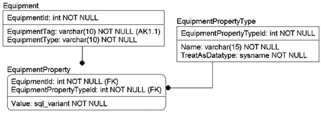

图 8-16.
用于存储具有未知属性的设备属性的属性模式

如果你作为架构师知道只允许三种类型的属性，那么几乎永远不应该使用此技术，因为几乎肯定更好的做法是添加这三个已知的列，可能使用本书前面介绍的子类型实体技术来实现不同的表，以容纳仅与一种或另一种类型相关的值。这里的目标是构建可以由用户扩展的松散对象，同时仍保持最低限度的数据完整性。在我们的示例中，有可能与你正在处理的设备相关的开发人员会添加一个你随后需要跟进的属性。在我对此技术的实际使用中，随着不同设备的上线，添加了数百个属性，并且每个设备都因其属性而被查询。

此方法对程序员有吸引力的原因在于，你可以创建一个用户界面，它只是一个简单的属性列表以供编辑。添加一个新属性只是在数据库中添加一行。即使是我将在此处提供的解决方案，增加了一些额外的数据控制，为其提供用户界面也非常容易。

为了创建此解决方案，我将创建一个 `EquipmentPropertyType` 表并添加几种属性类型：

```sql
CREATE TABLE Hardware.EquipmentPropertyType
(
EquipmentPropertyTypeId int NOT NULL
CONSTRAINT PKEquipmentPropertyType PRIMARY KEY,
Name varchar(15)
CONSTRAINT AKEquipmentPropertyType UNIQUE,
TreatAsDatatype sysname NOT NULL
);
INSERT INTO Hardware.EquipmentPropertyType
VALUES(1,'Width','numeric(10,2)'),
(2,'Length','numeric(10,2)'),
(3,'HammerHeadStyle','varchar(30)');
```

然后，我创建一个 `EquipmentProperty` 表，它将保存实际的属性值。我将对值列使用 `sql_variant` 类型，以允许存储任何类型的数据，但更典型的做法是使用字符串类型的值（要求调用者/用户将所有值转换为字符串表示形式），或者拥有多个列，每个可能的/支持的数据类型一个。这两种选项以及使用 `sql_variant` 都有轻微的困难，但我倾向于对真正未知类型的数据使用 `sql_variant`，因为数据以其本机格式存储，并且在其当前格式中以某种方式可用（尽管在大多数情况下你需要将数据转换为某种数据类型才能使用它）。在属性的定义中，我还包含我期望的数据类型，并且在我的插入过程中，我将测试数据以确保它满足特定数据类型的要求。

```sql
CREATE TABLE Hardware.EquipmentProperty
(
EquipmentId int NOT NULL
CONSTRAINT FKEquipment$hasExtendedPropertiesIn$HardwareEquipmentProperty
REFERENCES Hardware.Equipment(EquipmentId),
EquipmentPropertyTypeId int
CONSTRAINT FKEquipmentPropertyTypeId$definesTypesFor$HardwareEquipmentProperty
REFERENCES Hardware.EquipmentPropertyType(EquipmentPropertyTypeId),
Value sql_variant,
CONSTRAINT PKEquipmentProperty PRIMARY KEY
(EquipmentId, EquipmentPropertyTypeId)
);
```

然后，我需要加载一些数据。为此任务，我将构建一个过程，可用于按名称插入数据，同时验证数据类型是否正确。由于 `sql_variant` 类型，这有点棘手，这也是属性表有时使用字符值构建的原因之一。因为所有内容都有文本表示，并且在代码中更容易使用，它只是让代码更简单，但对存储引擎来说维护起来通常要糟糕得多。

在此过程中，我将把行插入表中，然后使用动态 SQL，通过将值转换为用户为属性配置的数据类型来验证该值。（请注意，该过程遵循我将在后续章节中为事务和错误处理建立的标准。为了保持示例简洁，我并不总是将此应用于书中的所有示例，但此过程涉及验证。）

```sql
CREATE PROCEDURE Hardware.EquipmentProperty$Insert
(
@EquipmentId int,
@EquipmentPropertyName varchar(15),
@Value sql_variant
)
AS
SET NOCOUNT ON;
DECLARE @entryTrancount int = @@trancount;
BEGIN TRY
DECLARE @EquipmentPropertyTypeId int,
@TreatASDatatype sysname;
SELECT @TreatASDatatype = TreatAsDatatype,
@EquipmentPropertyTypeId = EquipmentPropertyTypeId
FROM   Hardware.EquipmentPropertyType
WHERE  EquipmentPropertyType.Name = @EquipmentPropertyName;
BEGIN TRANSACTION;
--插入值
INSERT INTO Hardware.EquipmentProperty(EquipmentId, EquipmentPropertyTypeId,
Value)
VALUES (@EquipmentId, @EquipmentPropertyTypeId, @Value);
--然后从表中获取该值，并在动态 SQL 调用中转换它。
--如果类型不兼容，这将引发一个可捕获的错误
DECLARE @validationQuery  varchar(max) =
CONCAT(' DECLARE @value sql_variant
SELECT  @value = CAST(VALUE AS ', @TreatASDatatype, ')
FROM    Hardware.EquipmentProperty
WHERE   EquipmentId = ', @EquipmentId, '
and   EquipmentPropertyTypeId = ' ,
@EquipmentPropertyTypeId);
EXECUTE (@validationQuery);
COMMIT TRANSACTION;
END TRY
BEGIN CATCH
IF @@TRANCOUNT > 0
ROLLBACK TRANSACTION;
DECLARE @ERRORmessage nvarchar(4000)
SET @ERRORmessage = CONCAT('Error occurred in procedure ''',
OBJECT_NAME(@@procid), ''', Original Message: ''',
ERROR_MESSAGE(),''' Property:''',@EquipmentPropertyName,
''' Value:''',cast(@Value as nvarchar(1000)),'''');
THROW 50000,@ERRORMessage,16;
RETURN -100;
END CATCH;
```

因此，如果你尝试输入无效的数据，例如

```sql
EXEC Hardware.EquipmentProperty$Insert 1,'Width','Claw'; --Width 是 numeric(10,2)
```

你将得到以下错误：

```sql
Msg 50000, Level 16, State 16, Procedure EquipmentProperty$Insert, Line 49
Error occurred in procedure 'EquipmentProperty$Insert', Original Message: 'Error converting data type varchar to numeric.'. Property:'Width' Value:'Claw'
```

现在，我创建一些正确的演示数据：

```sql
EXEC Hardware.EquipmentProperty$Insert @EquipmentId =1 ,
@EquipmentPropertyName = 'Width', @Value = 2;
EXEC Hardware.EquipmentProperty$Insert @EquipmentId =1 ,
@EquipmentPropertyName = 'Length',@Value = 8.4;
EXEC Hardware.EquipmentProperty$Insert @EquipmentId =1 ,
@EquipmentPropertyName = 'HammerHeadStyle',@Value = 'Claw';
EXEC Hardware.EquipmentProperty$Insert @EquipmentId =2 ,
@EquipmentPropertyName = 'Width',@Value = 1;
EXEC Hardware.EquipmentProperty$Insert @EquipmentId =2 ,
@EquipmentPropertyName = 'Length',@Value = 7;
EXEC Hardware.EquipmentProperty$Insert @EquipmentId =3 ,
@EquipmentPropertyName = 'Width',@Value = 6;
EXEC Hardware.EquipmentProperty$Insert @EquipmentId =3 ,
@EquipmentPropertyName = 'Length',@Value = 12.1;
```

要以原始方式查看数据，我可以简单地查询数据，如下所示：


## 设备数据查询

```
SELECT Equipment.EquipmentTag,Equipment.EquipmentType,
EquipmentPropertyType.name, EquipmentProperty.Value
FROM   Hardware.EquipmentProperty
JOIN Hardware.Equipment
on Equipment.EquipmentId = EquipmentProperty.EquipmentId
JOIN Hardware.EquipmentPropertyType
on EquipmentPropertyType.EquipmentPropertyTypeId =
EquipmentProperty.EquipmentPropertyTypeId;
```

这个查询结果可用，但不够自然：

```
EquipmentTag EquipmentType name            Value
------------ ------------- --------------- --------------
CLAWHAMMER   Hammer        Width           2
CLAWHAMMER   Hammer        Length          8.4
CLAWHAMMER   Hammer        HammerHeadStyle Claw
HANDSAW      Saw           Width           1
HANDSAW      Saw           Length          7
POWERDRILL   PowerTool     Width           6
POWERDRILL   PowerTool     Length          12.1
```

为了以更自然的表格形式查看结果，并与其他表列一起显示，我可以使用 `PIVOT`，但在这里，使用 `MAX()` 聚合函数的“旧式”透视方法效果更好，因为我可以相对轻松地使语句动态化（这是下一个查询示例）：

```
SET ANSI_WARNINGS OFF; --消除聚合函数的 NULL 警告
SELECT  Equipment.EquipmentTag,Equipment.EquipmentType,
MAX(CASE WHEN EquipmentPropertyType.name = 'HammerHeadStyle' THEN Value END)
AS 'HammerHeadStyle',
MAX(CASE WHEN EquipmentPropertyType.name = 'Length'THEN Value END) AS Length,
MAX(CASE WHEN EquipmentPropertyType.name = 'Width' THEN Value END) AS Width
FROM   Hardware.EquipmentProperty
JOIN Hardware.Equipment
on Equipment.EquipmentId = EquipmentProperty.EquipmentId
JOIN Hardware.EquipmentPropertyType
on EquipmentPropertyType.EquipmentPropertyTypeId =
EquipmentProperty.EquipmentPropertyTypeId
GROUP BY Equipment.EquipmentTag,Equipment.EquipmentType;
SET ANSI_WARNINGS OFF; --消除聚合函数的 NULL 警告
```

这将返回以下结果：

```
EquipmentTag EquipmentType HammerHeadStyle  Length    Width
------------ ------------- ---------------- --------- --------
CLAWHAMMER   Hammer        Claw             8.4       2
HANDSAW      Saw           NULL             7         1
POWERDRILL   PowerTool     NULL             12.1      6
```

如果你在 SSMS 的“结果到文本”模式下自己执行这个查询，你会很快注意到我对数据进行了多少编辑。每个 `sql_variant` 列的格式都会为大量数据而设置。而且，你必须在执行前提前手动设置好每一列。在下面的扩展中，我使用了 `XML PATH` 将不同的属性输出到不同的列，从 `MAX` 开始。（这是 SQL Server 2005 及更高版本中将行转换为列的常用技术。在网上搜索“在 SQL Server 中将行转换为列”，你会找到详细信息。）

```
SET ANSI_WARNINGS OFF;
DECLARE @query varchar(8000);
SELECT  @query = 'SELECT Equipment.EquipmentTag,Equipment.EquipmentType ' + (
SELECT DISTINCT
',MAX(CASE WHEN EquipmentPropertyType.name = ''' +
EquipmentPropertyType.name + ''' THEN cast(Value as ' +
EquipmentPropertyType.TreatAsDatatype + ') END) AS [' +
EquipmentPropertyType.name + ']' AS [text()]
FROM
Hardware.EquipmentPropertyType
FOR XML PATH('') ) + '
FROM  Hardware.EquipmentProperty
JOIN Hardware.Equipment
ON Equipment.EquipmentId =
EquipmentProperty.EquipmentId
JOIN Hardware.EquipmentPropertyType
ON EquipmentPropertyType.EquipmentPropertyTypeId
= EquipmentProperty.EquipmentPropertyTypeId
GROUP BY Equipment.EquipmentTag,Equipment.EquipmentType  '
EXEC (@query);
```

执行此代码将得到以下结果（这与上次返回的结果完全一致，但如果你自己执行此代码，会注意到一个重大区别）：

```
EquipmentTag EquipmentType HammerHeadStyle  Length    Width
------------ ------------- ---------------- --------- --------
CLAWHAMMER   Hammer        Claw             8.40      2.00
HANDSAW      Saw           NULL             7.00      1.00
POWERDRILL   PowerTool     NULL             12.10     6.00
```

我不会假装我不需要编辑结果以使它们适应显示，但这些列中的每一个都按照 `EquipmentPropertyType` 表中指定的数据类型进行了格式化，而不是作为 8,000 个字符的值（这意味着需要删除每个标题下大量的短横线）。如果你希望将域限制得比仅按数据类型更进一步，你可以进一步扩展此代码，但这肯定会使事情复杂化。

**提示**

为创建“关系式”输出而生成的查询可以轻松转换为视图以供永久使用。你甚至可以创建这样一个视图，而不是使用触发器，使视图能够像处理关系数据一样处理数据。如果你确实需要使用 EAV 模式来存储数据，所有这些都可以由你的工具集完成。


#### 向表添加列

对于我将演示的最后一种选择，可以考虑利用 SQL Server 提供的实现列的功能，而不是构建自己的元数据系统。在之前的例子中，无法以一种自然的方式使用表结构，这意味着如果你想查询数据，你必须知道通过询问元数据意味着什么。在 EAV 解决方案中，一条正常的 `SELECT` 语句几乎是无法实现的。虽然可以通过动态存储过程来模拟，或者可以创建硬编码的视图，但对于没有程序员帮助的典型终端用户来说，这肯定不容易。

**提示**

如果你开发产品并交付给客户，在应用补丁或升级，甚至允许你的技术支持帮助解决问题之前，你应该生成一个应用程序来验证结构。虽然你不能阻止客户进行更改（比如添加新列、索引、触发器等），但你不希望这些更改导致你的技术支持无法立即识别的问题。

这种方法的关键在于或多或少自然地使用 SQL Server（可能仍然需要一些元数据来管理数据规则，但可以使用原生的 SQL 命令来处理数据）。与其使用我们在上一节中为了保存和查看数据而经历的所有方法，不如直接使用 `ALTER TABLE` 来添加列。

要实现此方法，在大多数情况下，我们将利用稀疏列，这是一种列存储类型，其中为 `NULL` 的列完全不占用存储空间（普通的 `NULL` 列需要空间来指示它们是 `NULL`）。基本上，数据在内部以一种与表中每行相关联的 EAV\XML 存储形式进行存储。稀疏列使用与普通列相同的 DDL 语句添加和删除（在列创建语句中添加关键字 `SPARSE`）。你也可以像对常规表一样，对数据使用相同的 DML 操作。然而，由于拥有稀疏列的目的是允许你向表中添加许多列（最大数量是 30,000!），你也可以使用列集来处理稀疏列，这使你能够仅检索和处理你希望的或在行中有值的稀疏列。由于列集的概念，此解决方案将允许你构建一个不知道所有结构的 UI 以及一个典型的 SQL 解决方案。

与普通列相比，稀疏列在许多方面的效率略低，因此思路是当某些列将经常使用时，就向表中添加非稀疏列；如果某些列只适用于罕见或特定类型的行，那么你可以使用稀疏列。有几种类型不能存储为稀疏列：

*   空间类型
*   `rowversion`/`timestamp`
*   用户定义的数据类型
*   `text`、`ntext` 和 `image`（注意，无论如何你都不应该使用这些；而应使用 `varchar(max)`、`nvarchar(max)` 和 `varbinary(max)` 代替。）

回到 `Equipment` 示例，这次我要使用的只是单个表。请注意，我想要生成的数据如下所示：

```
EquipmentTag EquipmentType HammerHeadStyle  Length    Width
------------ ------------- ---------------- --------- --------
CLAWHAMMER   Hammer        Claw             8.40      2.00
HANDSAW      Saw           NULL             7.00      1.00
POWERDRILL   PowerTool     NULL             12.10     6.00
```

要向 `Equipment` 表添加 `Length` 列，请使用以下语句：

```
ALTER TABLE Hardware.Equipment
ADD Length numeric(10,2) SPARSE NULL;
```

如果你正在构建一个应用程序来添加列，你可以使用类似于以下的过程，在不赋予用户对表的所有其他控制类型的情况下，授予他们添加列的权限。请注意，如果要允许用户删除列，你将希望使用某种机制来防止他们删除主要的系统列，例如命名标准或扩展属性。你可能还想采用某种控制方式来防止他们在任何他们想要的时间执行此操作。

```
CREATE PROCEDURE Hardware.Equipment$addProperty
(
@propertyName   sysname, --要添加的列
@datatype       sysname, --列创建中出现的数据类型
@sparselyPopulatedFlag bit = 1 --是否将列添加为稀疏列
)
WITH EXECUTE AS OWNER
AS
--注意：为清晰起见，我没有包含完整的错误处理
DECLARE @query nvarchar(max);
--检查列是否存在
IF NOT EXISTS (SELECT *
FROM   sys.columns
WHERE  name = @propertyName
AND  OBJECT_NAME(object_id) = 'Equipment'
AND  OBJECT_SCHEMA_NAME(object_id) = 'Hardware')
BEGIN
--构建 ALTER 语句，然后执行它
SET @query = 'ALTER TABLE Hardware.Equipment ADD ' + quotename(@propertyName) + ' '
+ @datatype
+ case when @sparselyPopulatedFlag = 1 then ' SPARSE ' end
+ ' NULL ';
EXEC (@query);
END
ELSE
THROW 50000, 'The property you are adding already exists',1;
```

现在，任何你授予运行此过程权限的用户都可以向表中添加列：

```
--EXEC Hardware.Equipment$addProperty 'Length','numeric(10,2)',1; -- 手动添加
EXEC Hardware.Equipment$addProperty 'Width','numeric(10,2)',1;
EXEC Hardware.Equipment$addProperty 'HammerHeadStyle','varchar(30)',1;
```

查看该表，你将看到以下内容：

```
SELECT EquipmentTag, EquipmentType, HammerHeadStyle,Length,Width
FROM   Hardware.Equipment;
```

这将返回以下内容（我将多次使用此 `SELECT` 语句）：

```
EquipmentTag EquipmentType HammerHeadStyle    Length    Width
------------ ------------- ------------------ --------- --------
CLAWHAMMER   Hammer        NULL               NULL      NULL
HANDSAW      Saw           NULL               NULL      NULL
POWERDRILL   PowerTool     NULL               NULL      NULL
```

现在，你可以像对待普通列一样处理新列。你可以使用正常的 `UPDATE` 语句更新它们：

```
UPDATE Hardware.Equipment
SET    Length = 7.00,
Width =  1.00
WHERE  EquipmentTag = 'HANDSAW';
```

检查数据，你可以看到数据已被更新：

```
EquipmentTag EquipmentType HammerHeadStyle    Length    Width
------------ ------------- ------------------ --------- --------
CLAWHAMMER   Hammer        NULL               NULL      NULL
HANDSAW      Saw           NULL               7.00      1.00
POWERDRILL   PowerTool     NULL               NULL      NULL
```

这种用户指定列方法更强大的一点在于验证。因为这些列的行为就像列应该的那样，你可以使用 `CHECK` 约束来验证基于行的约束：

```
ALTER TABLE Hardware.Equipment
ADD CONSTRAINT CHKEquipment$HammerHeadStyle CHECK
((HammerHeadStyle is NULL AND EquipmentType  'Hammer')
OR EquipmentType = 'Hammer');
```

**注意**

你可以轻松创建一个过程来管理数据上的用户定义检查约束，就像我创建列一样。

现在，如果你尝试设置一个无效的值，比如一个带有 `HammerHeadStyle` 的锯子，你会得到一个错误：

```
UPDATE Hardware.Equipment
SET    Length = 12.10,
Width =  6.00,
HammerHeadStyle = 'Wrong!'
WHERE  EquipmentTag = 'HANDSAW';
```

这将返回以下内容：

```
Msg 547, Level 16, State 0, Line 1
The UPDATE statement conflicted with the CHECK constraint "CHKEquipment$HammerHeadStyle". The conflict occurred in database "Chapter8", table "Hardware.Equipment".
```

设置完其余的值后，我回到了上一节中的数据，只是这次 `SELECT` 语句可能是由新手编写的：


## 更新稀疏列与列集

以下是更新稀疏列数据的`UPDATE`语句：
```sql
UPDATE Hardware.Equipment
SET    Length = 12.10,
       Width =  6.00
WHERE  EquipmentTag = 'POWERDRILL';

UPDATE Hardware.Equipment
SET    Length = 8.40,
       Width =  2.00,
       HammerHeadStyle = 'Claw'
WHERE  EquipmentTag = 'CLAWHAMMER';
GO
```

以下`SELECT`语句查询结果集：
```sql
SELECT EquipmentTag, EquipmentType, HammerHeadStyle, Length, Width
FROM   Hardware.Equipment;
```
返回的结果如下：
```
EquipmentTag EquipmentType HammerHeadStyle   Length   Width
------------ ------------- ----------------- -------- --------
CLAWHAMMER   Hammer        Claw              8.40     2.00
HANDSAW      Saw           NULL              7.00     1.00
POWERDRILL   PowerTool     NULL              12.10    6.00
```

## 查看列的元数据

到目前为止，即使使用`SELECT *`从表中查询，看起来也与普通数据集没有区别。识别稀疏列的唯一方式通常是查看元数据：
```sql
SELECT name, is_sparse
FROM   sys.columns
WHERE  OBJECT_NAME(object_id) = 'Equipment'
```
返回结果如下：
```
name                 is_sparse
-------------------- ---------
EquipmentId          0
EquipmentTag         0
EquipmentType        0
Length               1
Width                1
HammerHeadStyle      1
```

## 使用列集

有一种不同的处理数据的方式，如果你有很多稀疏列但只有少数被填充，或者你试图构建一个能根据数据动态变化的 UI，这种方式会容易得多。你可以定义一个**列集**，它是为稀疏列存储的列集合的 XML 表示形式。定义列集后，你可以直接访问和操作管理稀疏列的 XML。这对于处理包含大量空稀疏列的表非常方便，因为`NULL`稀疏列不会显示在 XML 中，这样你可以向用户界面传递非常少量的数据，尽管用户界面必须将其作为 XML 而不是表格数据流来处理。

> **注意**
>
> 一旦表中存在稀疏列，就不能再添加或删除列集，因此请谨慎决定使用哪种方式。

对于我们的表，我将先删除检查约束和稀疏列，然后添加一个列集（不能在有稀疏列时修改列集）：
```sql
ALTER TABLE Hardware.Equipment
DROP CONSTRAINT CHKEquipment$HammerHeadStyle;

ALTER TABLE Hardware.Equipment
DROP COLUMN HammerHeadStyle, Length, Width;
```

现在，我添加一个名为`SparseColumns`的列集：
```sql
ALTER TABLE Hardware.Equipment
ADD SparseColumns XML COLUMN_SET FOR ALL_SPARSE_COLUMNS;
```

接下来，我使用现有过程重新添加稀疏列和约束：
```sql
EXEC Hardware.Equipment$addProperty 'Length','numeric(10,2)',1;
EXEC Hardware.Equipment$addProperty 'Width','numeric(10,2)',1;
EXEC Hardware.Equipment$addProperty 'HammerHeadStyle','varchar(30)',1;
GO

ALTER TABLE Hardware.Equipment
ADD CONSTRAINT CHKEquipment$HammerHeadStyle CHECK
((HammerHeadStyle is NULL AND EquipmentType <> 'Hammer')
OR EquipmentType = 'Hammer');
```

现在，我仍然可以使用`UPDATE`语句单独更新列：
```sql
UPDATE Hardware.Equipment
SET    Length = 7,
       Width =  1
WHERE  EquipmentTag = 'HANDSAW';
```

但这次，使用`SELECT *`不再将稀疏列作为普通的 SQL 列返回；而是以 XML 形式返回：
```sql
SELECT *
FROM   Hardware.Equipment;
```
返回的结果如下：
```
EquipmentId EquipmentTag EquipmentType SparseColumns
----------- ------------ ------------- ------------------------------------------
1           CLAWHAMMER   Hammer        NULL
2           HANDSAW      Saw           <Length>7.00</Length><Width>1.00</Width>
3           POWERDRILL   PowerTool     NULL
```

你也可以直接使用 XML 表示形式更新（或插入）`SparseColumns`列：
```sql
UPDATE Hardware.Equipment
SET    SparseColumns = '<Length>12.10</Length><Width>6.00</Width>'
WHERE  EquipmentTag = 'POWERDRILL';

UPDATE Hardware.Equipment
SET    SparseColumns = '<Length>8.40</Length><Width>2.00</Width><HammerHeadStyle>Claw</HammerHeadStyle>'
WHERE  EquipmentTag = 'CLAWHAMMER';
```

显式列出列名查询，会得到我们预期的输出：
```sql
SELECT EquipmentTag, EquipmentType, HammerHeadStyle, Length, Width
FROM   Hardware.Equipment;
```
最终，我们得到了与之前相同的结果：
```
EquipmentTag EquipmentType HammerHeadStyle   Length    Width
------------ ------------- ----------------- --------- ---------
CLAWHAMMER   Hammer        Claw              8.40      2.00
HANDSAW      Saw           NULL              7.00      1.00
POWERDRILL   PowerTool     NULL              12.10     6.00
```

## 索引稀疏列

稀疏列可以被索引，但你可能需要创建一个**筛选索引**。筛选索引的`WHERE`子句可以用于将索引与有意义的行类型关联起来（就像我们在`HAMMER`示例的`CHECK`约束中那样，你可能希望包含`EquipmentTag`和`HammerHeadStyle`），或者简单地忽略`NULL`值。

因此，如果你想为锤子类型的行索引`HammerHeadStyle`列，可以添加如下索引（在基于 XML 的列集上创建索引前，必须先启用一些设置）：
```sql
SET ANSI_PADDING, ANSI_WARNINGS, CONCAT_NULL_YIELDS_NULL, ARITHABORT, QUOTED_IDENTIFIER, ANSI_NULLS ON
GO
CREATE INDEX HammerHeadStyle_For_ClawHammer 
ON Hardware.Equipment (HammerHeadStyle) 
WHERE EquipmentType = 'Hammer'
```

与属性表使用的方法相比，这种方法的实现难度大大降低。如果你能够使用稀疏列，这种方法比 EAV 方法更快、也更自然。允许用户更改主数据表的表结构可能让人感觉奇怪，但通过适当的编码、测试和安全实践（或许再加一个监控结构变化的 DDL 触发器来通知你这些列是何时添加的），你最终将得到一个性能更好、灵活性更高的系统。


## 反模式

对于每一个用来构建出色结构的良好实践，都会有更多无效的实践。在本节中，我将概述设计师和实施者（包括新手和有经验者）经常采用的四种此类做法，并解释为什么我认为它们是糟糕的主意：

*   **不可解码的数据**：你经常会发现一个列的值是 `1`，但若不翻阅大量代码，完全不知道这个 "`1`" 代表什么。
*   **一刀切的领域**：使用一个领域表来实现所有领域，而不是使用更小、更精确的单独表。
*   **泛型键引用**：在这个反模式中，有一个列，该列中的数据可能是任意数量表的键，这要求你去解码该值，而不是直接知道它是什么。
*   **过度使用非结构化数据**：这是数据库管理员（DBA）的噩梦——用户声称他们往里面放了结构良好的数据让你去解析的文本大对象（blob-of-text）列。你不能完全取消用于做注释的列，但过度使用这种结构会给 DBA 带来很多痛苦。

还有一些其他有问题的模式，我需要在此重申（附上章节引用），以防你目前只读了本章。我在本节的目标是探讨一些在“正确的”数据库设计方式中不会出现，但在设计师没有经历过这些模式带来的痛苦之前常有的想法：

*   **糟糕的规范化实践**：规范化是数据库设计过程中的一个基本部分，并且它远比你初学时看起来的要容易实现。不要被那些说第三范式是终极水平的人所愚弄；第四范式也非常重要且常见。违反第五范式的情况很少见，但如果你违反了，你也会明白它为何有趣。（第 5 章深入介绍了规范化。）
*   **糟糕的领域选择**：许多数据库设计师只为每个非键列使用 `varchar(50)`，而不是花时间确定适合其数据的正确领域。有时，即使在通过外键和主键相关联的列上也是如此，这使得优化器工作更辛苦。（参见第 5 章和第 6 章。）
*   **数据类型未标准化**：确保在遇到类似类型的事物时使用相同大小/类型的列，这是一个好主意。例如，如果你公司的账号是 9 个 ASCII 字符长，最好使用 `char(9)` 列来存储该数据。数据库通常会有 20 种不同的方式：`varchar(10)`、`varchar(20)`、`char(15)` 等等。所有这些都能无损地存储数据，但只有 `char(9)` 是最佳的，并能帮助你的用户避免思考如何处理数据。（关于选择数据类型的更多讨论，请参见第 6 章；关于所有固有关系类型的更详细列表和讨论，请参见附录 A。）

是的，你可能不应该做的事情还有很多，但本节列出了一些更大的、与设计相关的问题，当你不得不处理它们使用后的烂摊子时，这些问题真的会让你抓狂。

最重要的问题是理解（如果《星际迷航》教会了我们什么），那就是如果你将本章讨论的其他模式与其中一种反模式一起使用，结果很可能是相互毁灭。

### 不可解码的数据

处理数据库时最烦人的事情之一就是不可解码的值。像 `WHERE status = 1` 这样的代码无疑会遍布你通过 SQL Server Profiler 发现的代码中，而作为数据开发者的你，最终会挠着头，纳闷 1 代表什么（然后是 2, 3, 5 和 282 代表什么。哦对了，4 去哪了？）。当然，原因是开发人员不认为数据库是主要的、不仅存储数据、还会被除了他们自己编写代码之外的人查询的数据资源。他们只是简单地将其视为存储其对象状态的地方。

当然，在他们的代码中，他们可能做得不错，在代码中呈现了值的含义。他们在代码中处理的实际上不是一堆数字；他们有一个常量结构，例如：

```
CONST (CONST_Active = 1, CONST_Inactive = 2, CONST_BarelyActive = 3, CONST_Asleep = 5, CONST_Dead = 282);
```

所以他们用来生成代码的代码是有意义的，因为他们写了 `"WHERE status = " & CONST_Active`。这种用法很清晰，但在数据库层面却不清晰（那里是其他人实际看到和使用这些值的地方！）。从数据库的角度来看，我们有几种可能性：

*   直接使用描述性值，如 "`Active`" 和 "`Inactive`"。这使得数据更容易解码，但没有提供一个可能值的领域。如果你没有不活跃的值，你将无法在数据库层面知道它的存在。
*   创建表来实现一个镜像 `CONST` 结构的领域。用一个包含所有可能值的表。

对于后者，你的表可以使用描述性值作为领域，或者你也可以使用程序员喜欢的整数值。是的，这些值会有双重定义（一个在表中，一个在常量声明中），但像这样的领域很少改变，所以通常这不是一个大问题。我倾向于尝试遵循的设计原则是：

*   只包含能通过数据库解码的值：
    *   外键关联到领域表。
    *   人类可读的值，无需在 `CASE` 表达式中扩展。
    *   不要使用位掩码！（我们不是在写机器码！）
*   不要害怕有很多小表。连接（join）的成本通常远低于解码一个值所需的时间——以程序员时间、ETL 时间和最终用户的挫败感来衡量。


### 一刀切的通用领域表

关系型数据库基于一个基本理念：每个对象代表且仅代表一个事物。对于数据所指代的含义，绝不应有任何歧义。通过追溯从列名到表名再到主键的关系，应该能轻松地检查关联并确切知晓某条数据的意义。

然而，很多时候人们会觉得，既然领域类型数据在许多情况下看起来相同（或至少形态相似），那么创建一张这样的表并在多个位置复用，似乎是个好主意。这种想法来自那些设计关系型数据库架构但并未真正理解其精髓的人（包括早期的我）——他们认为表越多，设计就越复杂。因此反过来说，将多张表合并成一张包罗万象的表，应该能简化设计，对吗？这听起来合乎逻辑，但曾几何时，让亚当·桑德勒主演一部电影听起来也是个好主意。

举例来说，假设我正在构建一个存储客户和订单的数据库。我需要为以下项目设置领域值：

*   客户信用状态
*   客户类型
*   发票状态
*   发票行项目缺货状态
*   发票行项目承运商

为什么不直接使用一张通用表来存放这些领域值呢，如图 **图 8-17** 所示？

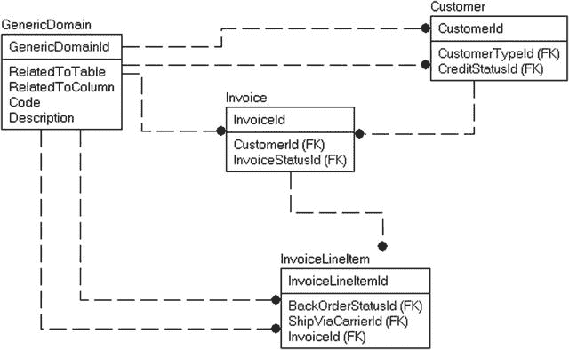

**图 8-17.**

一张多用途领域表

从关系型编码/实现的角度看，问题在于这种模式在 `SQL` 中使用起来很不自然。很多时候，这样做的人甚至没考虑过 `SQL` 访问。`GenericDomain` 表中的数据很可能被读入应用程序的缓存，并且之后不再被查询。然而不幸的是，当需要对这些数据生成报表时，就必须使用它们。例如，假设报表编写者想要获取 `Customer` 表的领域值：

```sql
SELECT *
FROM Customer
JOIN GenericDomain as CustomerType
ON Customer.CustomerTypeId = CustomerType.GenericDomainId
and CustomerType.RelatedToTable = 'Customer'
and  CustomerType.RelatedToColumn = 'CustomerTypeId'
JOIN GenericDomain as CreditStatus
ON  Customer.CreditStatusId = CreditStatus.GenericDomainId
and CreditStatus.RelatedToTable = 'Customer'
and CreditStatus.RelatedToColumn = 'CreditStatusId';
--NOTE: This code is not part of the downloads, nor are the tables for the examples in
--this anti-pattern section.
```

这归根结底是混合了苹果与橘子的问题。当你想做苹果派时，你必须只挑出苹果，以免混在一起。乍看之下，领域表只是存放文本的容器的抽象概念。从以实现为中心的角度看，这非常正确，但这并非构建数据库的正确方式，因为我们绝不希望在查询中将这些行混为一谈。在数据库中，规范化过程作为一种分解和隔离数据的手段，会将每张表都带到这样一个状态：一张表代表一种事物，一行代表该事物的一个存在。每个独立的领域值都应被视为与其他所有领域完全不同的事物（除非，正如我们在定义领域时所探讨的，它是在多个地方使用的同一个领域，这种情况下一张表就足够了）。

因此，本质上，你是在每次使用时反复对数据进行规范化，将工作分摊到时间线上，而不是一劳永逸地完成它。你不应该为所有领域使用一张表，而应该如图 **图 8-18** 所示进行建模。

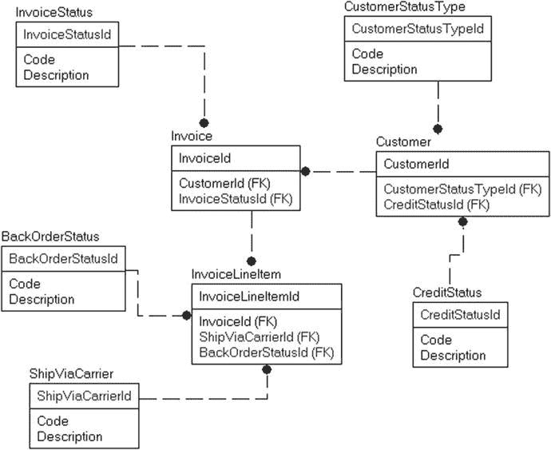

**图 8-18.**

每个用途对应一张领域表

这看起来更难实现，对吧？嗯，初始阶段确实如此（大概需要 5 到 10 分钟来创建几张表）。坦白说，我准备示例表格的时间更长。让它更耗时的原因是，你实际上可以实现外键约束来保护表中的值，无论 `Id` 列的值是什么。事实上，这样做有相当多的巨大好处：

*   在查询中使用数据更容易且具有自文档性：

```sql
    SELECT *
    FROM Customer
    JOIN CustomerType
    ON Customer.CustomerTypeId = CustomerType.CustomerTypeId
    JOIN CreditStatus
    ON  Customer.CreditStatusId = CreditStatus.CreditStatusId
```

*   数据可以使用简单的外键约束进行验证：这对于单表解决方案来说是不可行的。现在，验证需要放在触发器中，或完全由应用程序管理。
*   可扩展性和控制：如果你需要在领域行中保存更多信息，只需添加一两列即可。例如，如果你有一个承运商领域，可以在主领域表中定义一个 `ShipViaCarrier`。在基本形式中，你只会得到一个供用户选择的值列。但如果你想拥有更多信息——例如用于报表的长名称，如“United Parcel Service”；一个描述；以及何时使用此承运商的某种指示——你将被迫实现一张表并更改所有对领域值的引用。
*   性能考虑：所有较小的领域表都将适合单个页面或磁盘。这确保了一次读取（很可能在缓存中也是单页）。而在另一种情况下，你的领域表可能分布在许多页面上。在非常大的表中，当只需要极少量的行时，扫描一个更大的领域表可能会变得代价高昂。
*   你仍然可以让数据在领域管理应用程序中看起来像一张表：没有什么能阻止开发者构建一种缓存机制，将所有单独的表格合并起来填充缓存，并根据应用程序的需要使用数据。通过巧妙地使用扩展属性，这可以像在属性中添加一个值并让动态 `SQL` 过程返回所有数据一样简单。开发者常有的一个顾虑是，现在他们将需要 50 个编辑器，而不是一个。你仍然可以为所有行使用一个编辑器，因为大多数领域表很可能具有相同的基础结构/用法，即使不同，你也已经需要创建新表或采用某种变通方法来让单表设计运作。

一些实现面向对象视图的设计工具倾向于频繁使用这种模式，因为实现这样的表格并使用缓存对象很容易。


### 过度使用非结构化数据

尽管我希望否认这一点，或者至少找到某种方法避免它，但人们确实需要非结构化的笔记来存储关于其数据的各类零散信息。我承认，在我的职业生涯中创建的大量系统都包含某个允许用户插入自由格式文本的字段。早期，它是一个 `varchar(256)` 字段，后来是 `varchar(8000)` 或 `text`，现在则是 `varchar(max)`。这是你无法摆脱的，因为用户对这块“草稿纸”的需求，比 Linus 对他的安全毯的需求还要略强一些。而且说实话，这并非那么糟糕的做法。让用户有个地方记录关于他们数据的某些信息，有什么坏处呢？我知道我个人就有大量的 `OneNote` 笔记本，里面存着许多非结构化数据。

然而，如果给予过多的自由度，或者在数据库中散布太多通用的文本存放处，那么笔记往往会成为替代实际设计的手段。备注字段变成了本应是完整独立字段的东西的替代品。我们是否应该为特殊的饮食限制设置一个字段？不必了，就放在备注字段里。一旦用户这样做了一次，并且特别觉得有用，他们就会再做。然后他们告诉朋友：“嘿，我开始用备注来标记订单需要处理了。昨天为此省了一小时。”接着程序员就得多花 200 小时来整理这些非结构化数据。

我所见最常见、也最让我担忧的用途是联系人备注。我自己过去也这样做过，在 `Customer` 表中有一个包含如下格式化文本的字段。用户可以添加新备注，但通常不允许回头修改旧备注。

```
ContactNotes

2008-01-11 – Stuart Pidd -与 Fred 电话沟通。他说他的 wangle 坏了，提及发票 20001。我告诉他我会检查并明天回电。
2008-02-15 – Stuart Pidd – Fred 回电，说他的 wangle 仍然坏了，并且现在开始 dangling 了。明天会回电。
2008-04-12 – Norm Oliser – Stu 因未能妥善服务我们的一位重要客户而被解雇。

```

这通常不是解决问题的最佳方案，即使对于一个非常小的组织也是如此。正确的解决方案几乎肯定是将这个存储在文本字段中的数据拿出来，应用严格的规范化原则。显然，在这个例子中，你可以看到三“行”数据，至少包含三“列”。因此，不要使用一个带有 `ContactNotes` 字段的 `Customer` 表，而是像下面这样实现这些表：

```sql
CREATE TABLE Customer
(
CustomerId   int   CONSTRAINT PKCustomer PRIMARY KEY

)
CREATE TABLE CustomerContactNotes
(
CustomerId  int,
NoteTime     datetime,
PRIMARY KEY (CustomerId, NoteTime),
UserId  datatype, --引用 User 表
Notes varchar(max)
)
```

你甚至可以将其扩展到我们之前讨论过的日志条目模型，其中备注是系统的一个通用部分，可以引用客户、多个客户以及数据库中的其他对象。这甚至可能链接到一个提醒系统，以提醒 Stu 回复 Fred，这样他就不会失业了。不过，人们或许早该预料到一个名叫 Stu Pidd（显然）的人会出这种状况。

即使使用 XML 以这种结构化的方式存储备注，也将是一个巨大的改进。然后，你可以确定是谁录入了备注、日期是什么、备注内容是什么，并且可以设计一个用户界面，允许用户动态地向 XML 添加新字段。这对你的用户来说，以及——让我们面对现实——对那些需要去回答诸如“我们与这位客户通过多少次电话？”这类问题的人来说，是多么巨大的好处。

本节的重点很简单：教育你的用户。给他们一个地方写随机笔记，但也要教导他们：当他们开始反复使用笔记来存储相同类型的具体信息时，如果你能给他们一个地方来存储这些值，使其可搜索、可复现等，他们的工作可能会变得更轻松。此外，你也再也不用编写查询去从备注中“挖掘”信息了。

**提示**

SQL Server 提供了一个名为“全文搜索”的工具来帮助搜索文本。它对于以类似于典型网络搜索的方式搜索文本数据非常有用。然而，它并不能替代那些通过为用户通常感兴趣的每个数据点都创建独立的列和行所实现的恰当设计。


## 总结

本章致力于拓展你对表的思考方式，并为你提供一些常见问题的通用解决方案。我在本章中谨慎地避免了过于深奥的主题。目的只是为了涵盖一些比我在前面章节中介绍的基本表结构更深入的解决方案，但又不至于深入到让普通读者觉得整章都是浪费时间而嗤之以鼻的程度。

以下是我们涵盖的“良好”模式：

*   **唯一性**：简单的唯一性约束通常不足以指定“真实”数据的唯一性。我们讨论了超越基础实现，处理排除值（选择性唯一性）、批量对象唯一性的唯一性场景，并讨论了在无法完全确定（如网站访问者）的情况下尝试拼凑唯一性的真实世界示例。
*   **数据驱动设计**：目标是将数据库构建得足够灵活，以便向数据库添加看起来和行为都像先前值的新数据时不需要更改代码。你通过尝试避免可能更改的硬编码数据并为典型配置创建列来实现这一点。
*   **历史/时态数据**：用户通常需要能够看到他们的数据在时间流逝中的先前状态。我介绍了可用于查看数据在历史不同时间点状态的策略。使用触发器可以给你很大的控制权，但如果你能接受其（并非很大的）约束，SQL Server 2016 中的新时态扩展非常出色。
*   **层次结构**：我们讨论了几种实现层次结构的方法，从使用简单的 SQL 结构到使用 `hierarchyId`，并介绍了为在略微降低简单性的情况下优化利用率而创建的不同方法。
*   **大型二进制数据**：这特别涉及图像，但也可能指你在 Windows 文件系统中可能找到的任何类型的文件。存储大型二进制值使你能够为用户提供扩展其数据存储的地方。
*   **泛化**：虽然这更像是一个概念而非特定模式，但我们讨论了为什么需要通过将某些对象泛化到系统需求（而不是我们学究式的学术欲望）来匹配用户实际需求的设计。

我们最后讨论了一节关于反模式和不良设计实践的内容，包括一些相当恶劣的：

*   **难以理解的数据**：数据库中的所有数据都应具有某种含义。用户不应想知道值“1”代表什么。
*   **用一张领域表覆盖所有领域**：这是另一个规范化问题，因为数据库的总体目标是使一张表对应一种需求。领域值看似是一件事，但目标应是表中的每一行在其相关的任何表中都是可用的。
*   **泛型键引用**：多张表关联到另一张表是一个非常常见的需求。同时，一次只应有一张表被关联也是可能的。然而，每一列应包含且仅包含一种类型的数据。否则，用户除非去查找，否则不知道一个值是什么。
*   **过度使用非结构化数据**：基本上，这回到了规范化，我们希望每个列只存储一个值。用户被提供一个通用列用于记录给定项目的注释，并且由于他们有计划外的额外数据存储需求，他们就使用了注释。随之而来的混乱，特别是对于需要报告这些数据的人来说，通常归咎于设计时的架构师没有给用户提供一个可以输入他们所需任何内容的地方，或者公平地说，用户随时间改变需求并适应情况，而不是咨询 IT 团队来调整系统以适应他们不断变化的需求。

当然，这些列表并未穷尽所有你应使用或不应使用的可能模式。本章的目标是帮助你看到对象的一些常见用法，以便你可以在有意义时开始构建遵循常见模式的模型。反馈，特别是关于新章节的想法，总是欢迎的，请发送至 `louis@drsql.org`。

# 9. 数据库安全与安全模式

> 被信任是比被爱更大的恭维。 —乔治·麦克唐纳，苏格兰小说家

对你的安全威胁如此之多，以至于保持时刻警惕至关重要——但不能最终让你的服务器藏在铅制的掩体里，戴着锡箔帽，并通过让数据甚至对你的用户也完全不可访问来保护它。业务需要连接到客户，客户需要连接到他们的数据。话虽如此，在设置和部署新应用程序时，安全是一项非常重要的任务，但它常常被忽视，并在应用程序构建过程的后期才处理。这是否可以接受通常取决于你的需求以及你的应用程序将如何构建，但在某个时刻，你的应用程序团队必须认真对待安全。新闻报道反复报道数据被盗，而盗窃总是由于安全措施薄弱造成的。在本书的早期版本中，我使用了我家乡田纳西州纳什维尔一名选举官员笔记本电脑被盗的例子；姓名、地址和部分社会安全号码被盗。自那以后，此类报道不断，而自上一版以来可能最受关注的是某个专注于婚外情的网站记录失窃。你可能对这些数据毫不关心，但无论你公司业务的焦点是什么，你存储的数据都不应在未经所有者许可的情况下被发布。

如今每家公司都有隐私政策，作为数据库设计者/程序员，满足该政策将部分是你的责任。有时你可能是唯一关心隐私政策的人，你对严格安全的要求会让你听起来像是戴着锡箔帽并非仅出于美学原因。还有许多法律会规定你需要如何保护各种类型的数据，以及你可以与哪些数据与客户、其他客户、机构甚至与你在不同地点办公室工作的公司内部人员共享。我甚至不会试图涵盖这些广泛的隐私和法律话题，它们远远超出了本书的范围。相反，我将介绍与保护数据安全相关的以下主题，以便你具备满足适用于你的雇主或客户的任何隐私政策或法律的技术知识。如果你正确地实施了这些安全技术，至少你不会最终导致你的客户的密码、信用卡号码甚至个人癖好在互联网上被共享，让所有人都知道。


# SQL Server 数据库安全指南

*   **数据库访问**：我们将介绍一些基础知识，这些是你需要理解的关于用户如何获取 SQL Server 实例访问权限并进入数据库的内容。
*   **数据库对象安全对象**：一旦进入数据库上下文，你就有许多内置的控制手段来管理用户可以访问的内容。我们将介绍它们是什么，以及如何使用和测试它们。
*   **行级安全**：我们将探讨如何使用 SQL Server 2016 的行级安全工具来限制对表中特定行的访问，且对底层应用程序的修改有限甚至无需修改。
*   **通过 T-SQL 编码对象控制数据访问**：我们将超越直接数据访问，探讨如何使用 T-SQL 存储过程、视图等以更精细的方式限制数据访问。
*   **跨越数据库边界**：数据库理想情况下是独立的容器，但有时你需要访问存储在数据库界限之外的数据。我们将介绍实现跨数据库访问时的一些注意事项。
*   **混淆数据**：虽然存储数据的唯一原因是能够读取它，但你希望程序仅在需要时才能解码某些数据。这对于个人身份信息或财务数据尤为重要，因此我们对数据进行加密，防止未经授权的查看，除非在允许的情况下。
*   **审计**：开启“安全摄像头”来监视人们对数据的操作，有时是验证你能否提供足够安全的唯一真正方法，在许多情况下，你会同时执行此操作和上述各项。

总体而言，我们将深入介绍在数据库设计和实施过程中保护数据安全所需做的事情，但我们不会涵盖完整的安全图景，尤其是如果你开始使用本书未涵盖的某些 SQL Server 功能（例如 Service Broker）。本章的目标是通过向你展示可用的选项、演示一些你可以使用的实施模式，然后让你根据自己的确切需求深入研究，来帮助你设计一个安全解决方案。

理解一个重要的术语澄清很重要。当你思考 SQL Server 架构时，你应该想到三层结构，每一层都参与数据的安全（和代码执行）：

*   **主机服务器**：运行软件的机器（物理或虚拟）。SQL Server 主要运行在 Windows Server 平台上（截至本文撰写时，Linux 处于测试版，预计其他平台也会跟进是合理的）。主机服务器可以提供对尝试访问 SQL Server 的身份的认证。
*   **实例/SQL Server**：SQL Server 安装（通常简称为“服务器”）。你可以在一台主机服务器上拥有多个实例。实例可以提供自己的认证服务。SQL Server 本身基本上是一个独立的操作系统，使用主机操作系统来执行其部分任务。不幸的是，“实例”和“服务器”这两个术语在许多上下文中被类似地使用，这很可能源于实例引入之前的命名历史。
*   **数据库**：用户将访问的数据容器。数据库也可以包含认证信息。

此外，如果你使用的是 Azure SQL Database，虽然你主要处理数据库本身的安全，但在数据库配置中可以看到“服务器”的概念存在，这与本地产品的服务器/实例非常相似。数据库容器内的安全性行为将与本书主要围绕的本地版本类似。

并非每个人都会在他们的安全实施中使用本章的所有指南。通常，应用程序层被留下单独实施大部分安全性，方法是简单地向用户显示或隐藏功能。这种方法很常见，但它可能会留下安全漏洞，特别是当你需要向用户提供临时数据访问权限，或者你有多个用户界面必须实施不同的安全方法时。我的建议是尽可能利用数据库服务器中的设施。然而，只要使用的密码极其复杂、经过加密且受到极其严格的保护，并且理想情况下，中间件使用 Windows Authentication 访问数据，那么由应用程序层控制安全并不会给组织的安全性带来巨大漏洞。

> 提示
> 本章中的所有示例都将是解释型 T-SQL 形式。CLR 和本机对象通常遵循相同的安全模式，但存在一些差异，主要是在可以执行的操作上有限制。

## 数据库访问

在本节中，我们将介绍数据库安全章节其余部分所需的一些先决条件，从连接到服务器并获取数据库访问权限开始。在本节中，我将涵盖以下主题：

*   **主机服务器安全配置指南**：一些确保你的服务器配置为抵御外部危害的注意事项。
*   **主体和安全对象**：SQL Server 中的所有安全性都围绕着主体（粗略地说，登录名和用户）和安全对象（你可以限制访问的内容）。
*   **连接到服务器**：随着 SQL Server 2012 的更改，现在有多种访问服务器的方式。我们将介绍这些方式。
*   **模拟**：使用 `EXECUTE AS` 语句，你可以“假装”你是另一个安全主体以使用该用户的安全性。这是一个非常重要的概念，我们将在本章中经常使用它来测试安全性。


### 主机服务器安全配置指南

根据服务器的使用方式，将其配置得尽可能安全至关重要。如今几乎没有服务器是完全与互联网（以及潜伏其中的黑客类型）隔绝的。作为应用程序/数据架构师/程序员，我通常只就如何配置单个数据库范围之外的大部分服务器提供咨询建议，而且深入的配置细节无论如何也超出了本书的范围。然而，花几页篇幅来阐明主机服务器是保护数据安全这一问题的关键所在，绝对是值得的。以下列表包含了一些高层次的特性，你可用它们来验证服务器的安全性，以保护你的系统免受恶意黑客的攻击。这不是一个详尽的列表，而是一个几乎普遍需要的配置清单，用于配置 Windows 服务器和我们将用于存放数据库的 SQL Server 实例。

*   对所有能访问主机服务器的账户都应用强密码，并对所有众所周知的系统账户应用极强的密码。当然，任何账户都不允许有空密码！（这同样适用于能访问 SQL Server 的账户，无论是通过 Windows 身份验证还是标准账户。）
*   主机服务器不会毫无防护地暴露在网络上，没有防火墙、使用标准端口进行访问和/或不记录失败的登录尝试。
*   应用程序密码被安全/加密并存放在只有需要知道的人（如 DBA 和在代码中使用它们的应用程序程序员）才能看到的地方。使用应用程序登录时，密码会被加密到应用程序代码模块中。
*   极少数人拥有对存储数据的服务器的文件级访问权限，并且可能更重要的是，对存储备份的服务器的访问权限。如果一个恶意用户能访问到你的备份（无论备份是什么形式），那么该用户只需将该文件附加到另一台服务器，即可访问你的数据，而你无法阻止他或她访问数据（即使加密也不是 100% 安全，如果黑客有几乎无限的时间；可以问问 FBI 或苹果公司）。
*   你的主机服务器位于一个非常安全的位置。一台 Windows 服务器，就像你的笔记本电脑一样，其安全性仅与物理机箱本身相当。就像任何间谍电视剧里演的那样，如果坏人能接触到你的物理硬件，他们就可以从 CD 或 USB 设备启动，并访问你的硬盘（请注意，使用 `Transparent Data Encryption [TDE]` 在这种情况下会有所帮助）。随着虚拟化成为事实上的标准，这一点变得更加重要。虚拟机的文件比一台 20 磅重、连接着磁盘阵列的机器更容易被偷运出办公室。
*   所有你不使用的功能都已被关闭。这既涉及 Windows 服务器组件（如果你不使用 Web 服务器服务，请关闭它们），也涉及 SQL Server 安装。Windows 通过默认不开启所有功能来提供帮助，SQL Server 也是如此。例如，远程管理员连接、数据库邮件、CLR 编程等功能默认都是关闭的。你可以使用 `sp_configure` 存储过程来启用这些功能及其他功能。
*   你选择了适当的协议来访问服务器。最重要的是，当你的应用程序传输敏感数据（根据法律、隐私政策和要求定义）时，要使用加密连接。

归根结底，你在数据库层面所做工作的大部分，其目的是阻止你那些基本诚实的用户看到和做他们不该做的事情（至少除了某些形式的加密），并且远不如保护数据免受恶意外部人员侵害来得重要。对于你的大多数用户群体，你可以让所有数据都不受保护，就像多萝西和她的魔法鞋一样，如果他们不知道自己能做什么，他们就不会拿走你的数据回到堪萨斯州。因此，即使你只将安全问题交给应用层处理，也必须有人真正锁定数据访问权限，只允许你预期能够访问的人访问。


### 主体与安全对象

SQL Server 安全体系的核心是**主体**和**安全对象**这两个概念。主体是指那些可被授予权限以访问特定数据库对象的标识，而安全对象则是访问控制的对象。主体可以代表一个具体的用户、一个可由多个用户扮演的角色，或是应用程序、证书等。在 SQL Server 中，你会接触到三种类型的主体：

*   Windows 主体：这些代表 Windows 用户账户或组，使用 Windows 安全机制进行身份验证。SQL Server 信任 Windows 来判断谁连接到了服务器，当 Windows 向 SQL Server 传递一个标识符时，只要标识符匹配，SQL Server 即认为身份验证通过。
*   [SQL] Server 主体：这些是服务器级别的登录名或角色，使用基于 SQL Server 的身份验证方式，该方式通过 SQL Server 实例软件中存储的数据和算法实现。
*   数据库主体：包括数据库用户（通常映射到 Windows 登录名/组）、角色（用于批量授予用户和其他角色访问权限的用户组）以及应用程序角色（一种特殊类型的角色，可用于使应用程序拥有不同于该用户通常权限的访问权）。

安全对象是你可以在实例和数据库的所有部分上控制访问权限、并向主体授予权限的对象。SQL Server 区分了三种可用于保护不同对象的作用域：

*   服务器作用域：包括登录名、HTTP 终结点、可用性组和数据库。这些对象存在于服务器级别，位于任何单个数据库之外，其访问控制是基于服务器范围的。
*   数据库作用域：具有数据库作用域的安全对象是诸如架构、用户、角色、CLR 程序集、DDL 触发器等对象，它们存在于特定数据库内部但不在架构内。
*   架构作用域：此类别包括位于数据库架构内的对象，例如表、视图和存储过程。

在本章后续部分，当我们逐步介绍保护数据库数据的不同方法时，这些概念将发挥重要作用。然后，你可以允许或拒绝已创建的角色使用这些对象。SQL Server 使用三种不同的安全语句来授予或撤销每个角色的权限：

*   `GRANT`：允许访问对象。一个主体可能因属于某个角色而被多次授予相同的权限。
*   `DENY`：拒绝访问对象，无论该用户是否通过其他`GRANT`语句获得了该权限。
*   `REVOKE`：本质上是安全方面的`DELETE`语句。移除已应用于对象的任何`GRANT`或`DENY`权限。

通常，你会简单地使用`GRANT`向主体授予执行特定于该主体的任务的权限。`DENY`则仅用于“极端”情况，因为无论该主体被授予了该对象多少次权限，只要存在一个`DENY`，该主体就无法访问该对象。当你试图弄清楚为什么用户`X`无法访问对象`Y`时，这常常会导致令人困惑的安全场景。

对于涉及整个数据库或服务器的权限，你将使用如下语法：

```
GRANT <permission> TO <principal> [WITH GRANT OPTION];
```

包含`WITH GRANT OPTION`将允许该主体将该权限授予另一个主体。

在本书中，主要将讨论数据库对象权限，因为数据库和服务器权限几乎总是管理上的考虑因素。它们允许主体创建对象、删除对象、执行备份、更改设置、查看元数据等。

对于数据库对象，语法上有一个细微差别，即需要指定你要授予权限的安全对象。例如，要授予数据库中某个安全对象的权限，命令如下：

```
GRANT <permission> ON <securable> TO <principal> [WITH GRANT OPTION];
```

接下来，如果你想移除该权限，请使用`REVOKE`撤销权限，这将删除已授予的访问权：

```
REVOKE <permission> ON <securable> FROM <principal>; -- 也可以用 TO 代替 FROM
```

如果你想阻止主体使用该安全对象，无论其属于哪个角色，都使用`DENY`：

```
DENY <permission> ON <securable> FROM <principal>; -- 也可以用 TO 代替 FROM
```

要移除`DENY`，你将再次使用`REVOKE`命令。另一个你经常会看到的记法是，当安全对象类型不是默认类型时，在安全对象之前注明其类型。对于出现在`sys.objects`中并被授予权限的对象（表、视图、表值函数、存储过程、扩展存储过程、标量函数、聚合函数、服务队列或同义词），你可以直接引用对象名称：

```
GRANT <permission> ON <object_name> TO <principal>;
```

或者你也可以使用

```
GRANT <permission> ON OBJECT::<object_name> TO <principal>;
```

对于其他类型的对象，例如架构、程序集和搜索属性列表等，你需要在名称中指定类型。例如，对于架构安全对象的`GRANT`，语法是

```
GRANT <permission> ON SCHEMA::<schema_name> TO <principal>;
```

### 连接到服务器

在我们最终讨论数据库安全之前，我们需要涵盖访问服务器的方式。在 SQL Server 2012 之前，访问数据库只有一种方式。这种方式现在基本上仍是常规方式，大致如下：定义一个登录主体，允许该主体使用 Windows 凭据（Windows 身份验证）、在 SQL Server 实例中管理的登录名（SQL Server 身份验证）或其他几种方法（包括证书或非对称密钥）之一来访问服务器。然后，该登录名被映射到数据库内的一个用户以获取访问权限。

SQL Server 2012 中引入的另一种方法使用了**包含数据库**的概念。在本章后面讨论跨数据库安全时，我会更全面地介绍包含数据库及其管理，但我需要在此介绍其语法和创建，因为从编码角度来看，这主要是一个安全问题。SQL Server 2012 中的包含数据库是将数据库实质上变为独立容器的初步开始，这些容器可以轻松地在服务器之间移动，也可以移入 Azure 数据库。

在本节中，我将提供两个连接到服务器的示例：

*   使用传统的登录名和数据库用户方法先连接到服务器，然后再连接到数据库
*   使用包含模型直接访问数据库


#### 使用登录名和数据库用户连接到服务器

要访问服务器，我们需要创建一个称为“登录名”的服务器主体。在创建几乎所有登录名时，通常会使用两种典型方法。第一种方法是将登录名映射到 Windows 身份验证主体。这是使用 `CREATE LOGIN` 语句完成的。以下示例将创建我在笔记本电脑上用于编写内容的登录名：

```
CREATE LOGIN [DomainName\Louis] FROM WINDOWS --Windows 身份验证登录名需要方括号
WITH DEFAULT_DATABASE=tempdb, DEFAULT_LANGUAGE=us_english;
```

登录名的名称与 Windows 主体的名称相同，这就是它们映射在一起的方式。因此，在我的本地虚拟机上（其名称我将替换为 `DomainName`），我有一个名为 `Louis` 的用户。Windows 主体可以是单个用户，也可以是 Windows 组。对于组，组中的所有用户将以相同的方式获得对服务器的访问权限，并拥有完全相同的权限集。一般来说，这是为 SQL Server 创建和授权用户的最便捷方法。如果你使用的是 Azure SQL DB，则可以使用 Azure Active Directory 身份验证来做非常类似的事情 ([`azure.microsoft.com/en-us/documentation/articles/sql-database-aad-authentication/`](https://azure.microsoft.com/en-us/documentation/articles/sql-database-aad-authentication/))。

第二种方法是创建一个带密码的登录名：

```
CREATE LOGIN Fred WITH PASSWORD=N'password' MUST_CHANGE, DEFAULT_DATABASE=tempdb,
DEFAULT_LANGUAGE=us_english, CHECK_EXPIRATION=ON, CHECK_POLICY=ON;
```

如果你将 `CHECK_POLICY` 设置为 `ON`，则密码将需要遵循其创建所在服务器的密码复杂性规则，而 `CHECK_EXPIRATION` 设置为 `ON` 时，也会要求根据 Windows 服务器的策略更改密码，而且即使是在你仅为测试此代码而创建的简单机器上，`'password'` 这样的密码也不太可能通过验证，所以请选择符合要求的密码。典型的密码要求应类似于：

*   应该足够长，而不仅仅是以下各项中的一个字符（有关提示，请参见，例如，[`www.infoworld.com/article/2655121/security/password-size-does-matter.html`](http://www.infoworld.com/article/2655121/security/password-size-does-matter.html)）
*   应包含大写符号（A-Z）
*   应包含小写符号（a-z）
*   应包含数字（0-9）
*   应至少包含以下列表中的一个符号：_, @, *, ^, %, !, #, $, 或 &

一般来说，在可能的情况下，最理想的方法是使用 Windows 身份验证作为服务器的默认访问方式，因为将人们需要记住的密码数量保持在最低限度，可以减少他们将密码列表贴在墙上供所有人看到的可能性。当然，在某些情况下，当 SQL Server 位于 DMZ（隔离区）中且域之间没有信任关系时，使用 Windows 身份验证可能会很麻烦，因此你不得不求助于 SQL Server 身份验证，所以请使用复杂密码并（理想情况下）经常更换它们。

在上述两种情况下，我都将默认数据库设置为 `tempdb`，因为这需要有意识地去访问用户数据库并开始构建甚至删除对象。然而，在 `tempdb` 中完成的任何工作在服务器停止时都会被删除。这实际上是那种可能比你想象中更常救你于水火的事情。通常，脚本会被执行，而数据库并未指定，于是一堆对象就被创建了——通常是在 `master` 数据库中（如果你没有显式设置，默认数据库就是 `master`……所以它是“默认的默认”数据库）。多年来，我在本地 SQL Server 的 `master` 数据库中构建的测试对象多得数不清。

创建登录名后，你需要对其做一些操作。如果你想使其成为系统管理员级别的用户，可以将其添加到 `sysadmin` 服务器角色中，这是你会想在本地机器上为你的默认用户做的事情（尽管你可能在安装服务器和学习前面章节的过程中已经这样做了，很可能是在安装过程中，甚至可能没有意识到你正在做这件事）：

```
ALTER SERVER ROLE sysadmin ADD MEMBER [DomainUser\Louis];
```

> **提示**
>
> `sysadmin` 角色的成员基本上绕过了服务器上几乎所有的权限检查，并被允许执行任何操作（“几乎所有”是因为他们仍将受到行级安全性、数据屏蔽以及你在触发器中编写的任何代码的约束）。确保始终有一个 `sysadmin` 用户且有人拥有其凭据，这很重要。这听起来可能显而易见，但在所有 `sysadmin` 用户被删除或丢失密码后，许多服务器都不得不重新安装。

你可以使用服务器权限授予用户执行某些操作的权限。例如，如果 Fred 在技术支持部门工作，你可能希望授予他对服务器的只读访问权限（无权更改任何内容）。首先，假设你希望 Fred 能够运行 DMV（动态管理视图，有时是函数）以查看服务器状态。你可以使用以下语句授予 `Fred` 用户 `VIEW SERVER STATE` 权限：

```
GRANT VIEW SERVER STATE to Fred;
```

从 SQL Server 2012 开始，你可以创建用户定义的服务器角色。例如，假设你想设置一个角色让用户可以查看服务器设置和数据。你可以授予以下权限：

*   `VIEW SERVER STATE`：访问 DMV（如前所述）
*   `VIEW ANY DATABASE`：查看所有数据库的结构
*   `CONNECT ANY DATABASE`：连接到任何现有及未来的数据库
*   `SELECT ALL USER SECURABLES`：查看登录名可连接到的数据库中的所有数据

要为这些项目创建一个服务器角色，你可以使用：

```
CREATE SERVER ROLE SupportViewServer;
```

按如下方式向角色授予所需权限：

```
GRANT VIEW SERVER STATE to SupportViewServer; --运行 DMV
GRANT VIEW ANY DATABASE to SupportViewServer; --查看任何数据库
GRANT CONNECT ANY DATABASE to SupportViewServer; --设置上下文到任何数据库
GRANT SELECT ALL USER SECURABLES to SupportViewServer; --查看数据库中的任何数据
```

然后将登录名添加到服务器角色中：

```
ALTER SERVER ROLE SupportViewServer ADD MEMBER Fred;
```

创建登录名后，下一步是访问数据库（除非你使用了 `sysadmin`，那样的话你对服务器上的所有内容都有不受限制的访问权限）。对于本章的最初几个示例，请创建一个名为 `ClassicSecurityExample` 的数据库，如下所示。（对于本章的其余部分，我将假设你使用一个属于 `sysadmin` 服务器角色成员的用户作为主要用户，就像我们在整本书中所做的那样，除非我们在测试某些代码并且我在文本中指定了不同的用户。）

```
CREATE DATABASE ClassicSecurityExample;
```

接下来，创建另一个使用 SQL Server 身份验证的登录名。我们将在本书中创建的大多数登录名都将是 SQL Server 身份验证，以便于测试。我们还将保持密码简单（`CHECK_POLICY`）并不要求更改（`CHECK_EXPIRATION`），以使我们的示例更简单：

```
CREATE LOGIN Barney WITH PASSWORD=N'password', DEFAULT_DATABASE=[tempdb],
DEFAULT_LANGUAGE=[us_english], CHECK_EXPIRATION=OFF, CHECK_POLICY=OFF;
```

使用 Management Studio 中的用户登录到查询窗口，如图 9-1 所示。

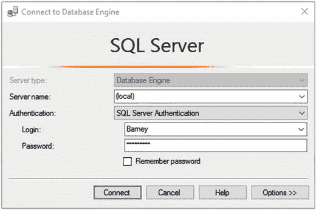

图 9-1. 使用测试用户登录

接下来，尝试执行 `USE` 语句以将上下文更改为 `ClassicSecurityExample` 数据库：

```
USE ClassicSecurityExample;
```

你将收到以下错误：


```
Msg 916, Level 14, State 1, Line 1
服务器主体 "Barney" 在当前安全上下文中无法访问数据库 "ClassicSecurityExample"。
```

你的数据库上下文将保持在`tempdb`中，因为这是你为该用户设置的默认数据库。回到你处于`sysadmin`用户上下文的窗口，你需要启用用户来访问数据库。有两种方法可以做到这一点，第一种是给`guest`用户授予连接到数据库的权限（当然是在`sysadmin`用户身份下操作）。`guest`用户是每个数据库都具有的内置用户。基本上，它等同于“任何连接者”。

```
USE ClassicSecurityExample;
GO
GRANT CONNECT TO guest;
```

如果你回到用户`Barney`登录的连接，你会发现`Barney`现在可以访问`ClassicSecurityExample`数据库——系统中的任何其他登录也可以。如果你有一个希望所有用户都能访问的数据库，可以应用此策略，但在大多数情况下，这通常不是最好的主意。

因此，使用`REVOKE`语句从`guest`用户移除此权限：

```
REVOKE CONNECT TO guest;
```

回到你以`Barney`身份连接到数据库的窗口，你会发现执行像`SELECT 'hi';`这样的语句仍然被允许，但如果你断开并重新连接，你将无法访问该数据库。最后，要授予服务器主体`Barney`访问数据库的权限，请在数据库中创建一个链接到该登录名的用户并授予其连接权限：

```
USE ClassicSecurityExample;
GO
CREATE USER BarneyUser FROM LOGIN Barney;
GO
GRANT CONNECT to BarneyUser;
```

回到`Barney`上下文中的查询窗口，你会发现你可以连接到数据库，并且使用几个系统函数，可以看到你各自的服务器和数据库安全上下文：

```
USE ClassicSecurityExample;
GO
SELECT SUSER_SNAME() AS server_principal_name, USER_NAME() AS database_principal_name;
```

这将返回

```
server_principal_name    database_principal_name
------------------------ -------------------------------
Barney                   BarneyUser
```

在你的系统管理员连接中执行此操作，你将看到类似的内容（取决于你用于登录服务器的凭据）：

```
server_principal_name   database_principal_name
----------------------- -----------------------------
DOMAINName\Louis        dbo
```

服务器主体将是你使用的登录名，而数据库主体将始终是`dbo`（数据库所有者），因为系统管理员用户将始终映射到数据库所有者。现在，这就是我们在本节中涵盖的全部内容，因为你现在已经能够连接到数据库。在我们介绍使用包含数据库连接到数据库之后，我们将介绍你可以在数据库中做什么。

## 使用包含数据库模型

自从我开始编写有关数据库设计和编程的内容以来，已经发生了一个巨大的范式转变，那就是虚拟化。即使在 SQL Server 2008 时期，建议也会强烈反对在 SQL Server 中使用任何类型的虚拟化技术，而现在我们公司的一切都运行在虚拟化的 Windows 机器上。虚拟化的诸多巨大好处之一是，你可以在企业内移动虚拟计算机和/或服务器，以实现硬件的最佳利用。

另一个范式转变是云计算。Azure DB 数据库的行为类似于自包含的数据库服务器。当你连接到它们时，你会看到一个`master`数据库的版本和一个数据库容器。登录名不驻留在服务器级别，而是包含在数据库中。在本地产品中，我们可以使用“包含”模型实现相同的功能。包含背后的理念是，数据库所需的一切（作业、ETL、`tempdb`对象等）将开始成为数据库直接的一部分。在适用的情况下，我会指出包含数据库安全性与经典模型不同的一些地方，这些地方大多是在访问外部对象的上下文中。

你的第一步是创建一个新数据库，并在其中设置`containment = partial`。对于 SQL Server 2012 及更高版本，有两种模型：`OFF`（我称之为经典模型）和`partial`（它将为你提供一些好处，例如临时对象排序规则默认为部分包含的数据库而不是服务器）。自 2012 年以来，包含的变化不大，但更高版本的 SQL Server 可能会包含一个完全包含的模型，在大多数方面几乎完全与其他数据库隔离。

你连接到数据库的方式是一个根本性的变化，就像第 8 章中讨论的文件流一样，这意味着一个默认关闭的安全点。因此，你要做的第一件事是使用`sp_configure`配置服务器以允许使用所谓的包含数据库身份验证进行新连接：

```
EXECUTE sp_configure 'contained database authentication', 1;
GO
RECONFIGURE WITH OVERRIDE;
```

你应该会收到一条消息，告诉你值已更改，无论是从 0 到 1 还是从 1 到 1，具体取决于服务器是否已经为包含身份验证设置好。接下来，创建数据库。你可以在`CREATE DATABASE`语句中设置包含属性：

```
CREATE DATABASE ContainedDBSecurityExample CONTAINMENT = PARTIAL;
```

或者你可以使用`ALTER DATABASE`语句来设置它：

```
-- 将包含数据库设置为部分包含
ALTER DATABASE ContainedDBSecurityExample SET CONTAINMENT = PARTIAL;
```

接下来，你将创建一个用户，在此上下文中称为“包含用户”。包含用户基本上是登录名和用户的混合体，使用`CREATE USER`语句创建，这有点令人遗憾，因为语法不同（如果你尝试使用错误的语法，会收到警告）。联机帮助书列出了至少 11 种`CREATE USER`语法的变体，因此如果你需要不同类型的用户，应该查看一下！

你将使用的第一个案例是一个新的 SQL Server 身份验证用户，该用户使用数据库系统目录表中存在的密码直接登录到数据库。你必须处于数据库上下文中（之前已设置），否则你会收到错误，告诉你只能在包含数据库中创建带密码的用户。

```
USE ContainedDBSecurityExample;
GO
CREATE USER WilmaContainedUser WITH PASSWORD = 'p@ssword1';
```

你还可以通过以下方式创建 Windows 身份验证用户（也可以是一个角色），只要相应的登录名不存在即可。因此，以下语法是正确的，但在我的计算机上，由于该用户已定义了登录名，因此此操作会失败：


# SQL Server 中的包含用户

## 创建用户时遇到的错误
尝试为已存在登录名的用户创建数据库用户时，例如执行以下语句：
```
CREATE USER [DOMAIN\Louis];
```
可能会遇到如下错误：
```
Msg 15063, Level 16, State 1, Line 1
The login already has an account under a different user name.
```
这大概是因为该登录名已经具有相同的安全上下文，它将默认使用服务器权限，并使用默认设置的数据库（我将在下一段演示！）。同样，在测试阶段，我们将使用 SQL Server 身份验证以使过程更简单。

## 连接到包含用户
接下来，在 SSMS 中使用你先前创建的名为 `WilmaContainedUser`、密码为 `p@ssword1` 的包含用户连接到数据库。为此，请指定服务器名称，选择 SQL Server 身份验证，并设置用户名和密码，如图 9-2 所示。

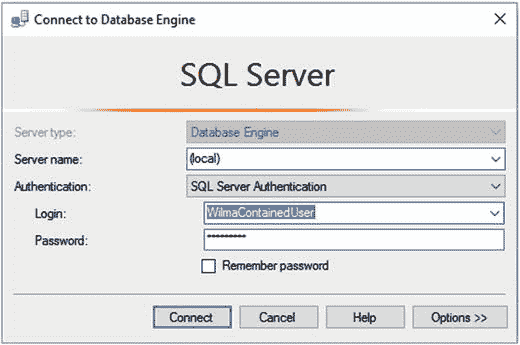

**图 9-2**. 演示登录到包含用户

然后，单击“选项”按钮。转到“连接属性”选项卡，并在空白处输入包含数据库的名称，如图 9-3 所示。

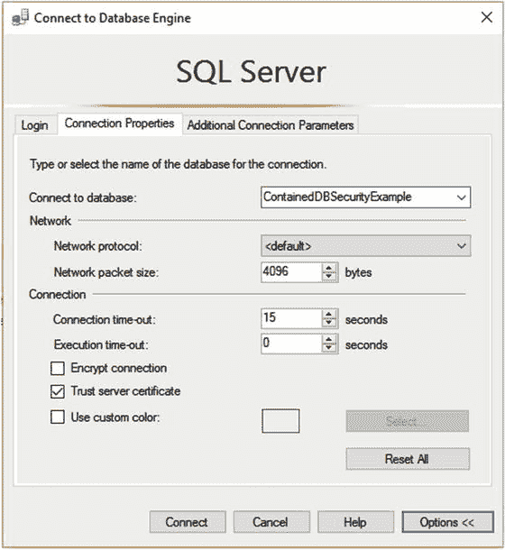

**图 9-3**. 在空白处输入数据库名称

你需要知道该数据库的名称，因为你使用的安全凭据没有访问服务器元数据的权限。因此，如果你尝试使用提供的登录名浏览数据库，将会出现如图 9-4 所示的错误。

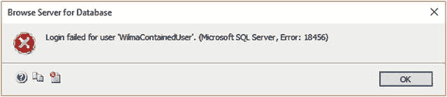

**图 9-4**. 尝试浏览包含数据库名称时出错

## 在对象资源管理器中查看
现在，在对象资源管理器中，服务器看起来似乎只由一个数据库组成，如图 9-5 所示。

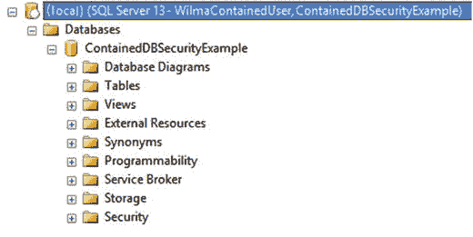

**图 9-5**. SSMS 对象资源管理器中的包含数据库

在此过程之后，你将处于数据库上下文中，无论数据库是部分包含还是完全不包含，大部分操作都将基本相同。主要区别在于数据库的下拉列表中，你将看到当前数据库（`ContainedDBSecurityExample`）、`master` 和 `tempdb`。此时，你处于数据库上下文中，就像上一节介绍的经典安全模型一样。

## 在包含数据库中创建链接到登录的用户
你不能在不包含的数据库中创建包含用户，但仍然可以在包含数据库中创建链接到登录的用户。例如，你可以创建一个新的登录名：
```
CREATE LOGIN Pebbles WITH PASSWORD = 'BamBam01$';
```
然后将该用户链接到你创建的登录名：
```
CREATE USER PebblesUnContainedUser FROM LOGIN Pebbles;
```
显然，这开始违背包含数据库的总体价值，即让数据库具有可移植性，而无需将一个服务器上的登录名与另一个服务器上的登录名进行协调，而是可以使用相同的用户立即使用（需要注意的是，Windows 身份验证用户必须能够连接到身份验证服务器）。

## 切换包含模式
请注意，你可以将包含数据库切换回不包含状态，但其中不能包含任何包含数据库主体。如果你尝试将 `ContainedDbSecurityExample` 数据库设置回不包含状态：
```
ALTER DATABASE ContainedDbSecurityExample  SET CONTAINMENT = NONE;
```
这将失败。在 SQL Server 2012 中，你会收到一条令人困惑的错误消息：
```
Msg 33233, Level 16, State 1, Line 1
You can only create a user with a password in a contained database.
Msg 5069, Level 16, State 1, Line 1
ALTER DATABASE statement failed.
```
但在 SQL Server 2016 中，错误消息非常清晰：
```
Msg 12809, Level 16, State 1, Line 103
You must remove all users with password before setting the containment property to NONE.
Msg 5069, Level 16, State 1, Line 1
ALTER DATABASE statement failed.
```
如果你需要将此数据库设置为不包含状态，则需要删除包含用户，你可以通过以下查询来识别它们：
```
SELECT name
FROM   ContainedDBSecurityExample.sys.database_principals --3 part name since you are outside
--of db to make this change.
WHERE  authentication_type_desc = 'DATABASE';
```
在我们的示例中，这将返回
```
Name

WilmaContainedUser
```
删除此用户后，你将能够为此数据库关闭包含功能。在本章后面，当我们介绍跨数据库访问（以及在包含的情况下，努力保护它以保持数据库的可移植性）时，我们将回到包含这个主题。


## 身份模拟

在测试安全性方面，能够伪装成另一个用户或登录名是相当重要的。当某些代码迁移到生产环境后，接到客户声称他们无法进行某些你认为他们应该能够进行的操作的电话，这种情况并不罕见。由于所有系统问题都不可避免地首先归咎于数据库，因此一个有用的技巧是模拟用户，然后在管理工作室中尝试有问题的代码，以查看这是否是一个安全问题。如果代码在管理工作室中有效，那么从数据库的角度来看，你的工作几乎肯定已经完成，你可以将矛头指向系统的其他部分。你无需知道他们的密码即可完成所有这些操作，因为你本身就是 `sysadmin` 用户，或者已被授予模拟用户的权限。（SQL Server 2014 中添加了一个服务器作用域的权限 `IMPERSONATE ANY LOGIN`，以方便这种半 `sysadmin` 类型的用户执行操作。）

为了在单个 SQL Server 连接上以合理的方式演示安全性，我将使用 `EXECUTE AS` 命令来模拟不同的安全主体，包括数据库和服务器级别的主体。

注意：在 2005 版之前，用于模拟的命令是 `SETUSER`。在遗留代码中仍可能使用该命令，因为它仍然有效。与 `EXECUTE AS` 相比，`SETUSER` 功能有限，但类似。

作为身份模拟功能强大程度的一个示例，我将展示一种方法，让用户能够模拟服务器系统 `sysadmin` 角色的成员。以这种方式使用身份模拟需要一些时间来适应，但它确实使得仅在需要时才拥有完整的 `sysadmin` 权力变得更加容易。如前所述，有很多服务器特权，因此你可以分配日常所需的权利，并将像 `DROP DATABASE` 这样“危险”的权利保留给你必须模拟的登录名。

## 演示

在此示例中，我使用 SQL Server 身份验证登录名，但你可以将其映射到证书、密钥、Windows 用户或其他任何方式。标准登录名使得测试场景和从中学习变得容易得多，因为它们是自包含的（这也是它们不适合生产使用的原因之一！）。然后，我将该登录名添加到 `sysadmin` 角色中。你可能还想使用一个不那么明显与系统管理相关联的名称。如果黑客以某种方式进入了你的用户列表，名称 `'itchy'` 不会像 `'Merlin'` 这样的名称那样明显能够对你的数据库服务器造成严重损害。

```sql
USE master;
GO
CREATE LOGIN SlateSystemAdmin WITH PASSWORD = 'tooHardToEnterAndNoOneKnowsIt',CHECK_POLICY=OFF;
ALTER SERVER ROLE sysadmin ADD MEMBER SlateSystemAdmin;
```

然后，我创建一个常规登录名，并授予模拟 `system_admin` 用户的权限：

```sql
CREATE LOGIN Slate with PASSWORD = 'reasonable', DEFAULT_DATABASE=tempdb,CHECK_POLICY=OFF;
--必须在 master 数据库中执行
GRANT IMPERSONATE ON LOGIN::SlateSystemAdmin TO Slate;
```

注意：除非你是在与生产代码隔离的环境中操作，否则你可能不希望在你的实例上执行此代码。我使用（并将使用）的密码远比你生产环境中的密码简单。例如，那个 `tooHardToEnterAndNoOneKnowsIt` 密码实际上更像是一串随机的字母、数字和特殊字符。我目前的一些 `sa` 密码长度超过 50 个字符，充满了只能通过粘贴才能使用的特殊字符。

## 测试身份模拟

我以 `Slate` 身份登录，并尝试运行以下代码（在管理工作室中，你可以在查询窗口中右键单击，使用“连接/更改连接”上下文菜单，并使用标准登录名）：

```sql
USE ClassicSecurityExample;
```

将引发以下错误：

```text
Msg 916, Level 14, State 1, Line 1
服务器主体 "Slate" 无法在当前安全上下文中访问数据库 "ClassicSecurityExample"。
```

现在，我将安全上下文更改为 `system_admin` 级别的用户（请注意，当你处于包含数据库用户的上下文中时，不能使用 `EXECUTE AS LOGIN`）：

```sql
EXECUTE AS LOGIN = 'SlateSystemAdmin';
```

我现在已在该窗口中以 `system_admin` 用户的身份控制了服务器！要查看安全上下文，我可以使用几个变量/函数：

```sql
USE    ClassicSecurityExample;
GO
SELECT USER AS [user], SYSTEM_USER AS [system_user],
ORIGINAL_LOGIN() AS [original_login];
```

这将返回以下结果：

```text
user          system_user          original_login
------------- -------------------- ------------------------
dbo           SlateSystemAdmin     Slate
```

各列含义如下：

*   `user`：数据库中用户上下文的安全主体名称。
*   `system_user`：登录名上下文的服务器安全主体名称。
*   `original_login()`：实际登录以启动连接的服务器安全主体的登录名。（这是一个重要的函数，在记录哪个登录名执行了操作时应使用它。）

## 恢复上下文

然后，我执行以下代码：

```sql
REVERT; --返回到之前的安全上下文
```

我看到以下结果：

```text
Msg 15199, Level 16, State 1, Line 1
无法恢复当前的安全上下文。请切换到调用 'Execute As' 的原始数据库，然后重试。
```

我从 `tempdb` 开始，因此我使用以下代码：

```sql
USE tempdb;
REVERT;
SELECT USER AS [user], SYSTEM_USER AS [system_user],
ORIGINAL_LOGIN() AS [original_login];
```

现在返回以下结果：

```text
user          system_user          original_login
------------- -------------------- ------------------------
guest         Slate                Slate
```

## 总结

身份模拟让你能够大量控制用户可以做什么，并允许你根据情况扮演一个或另一个角色，例如创建新数据库。

注意：此处的用户是 `guest`，我建议你考虑在每一个非系统数据库中禁用此用户，除非特别需要。通过执行 `REVOKE CONNECT FROM GUEST` 来禁用 `guest`。你无法在 `tempdb` 或 `master` 数据库中禁用 `guest` 用户，因为用户必须能够访问这些数据库才能执行任何工作。尝试在这些数据库中禁用 `guest` 将导致以下消息：`Cannot disable access to the guest user in master or tempdb`。

使用身份模拟，你可以以 `sysadmin` 服务器角色或 `db_owner` 数据库角色成员的身份执行代码，然后以典型用户身份测试你的代码，而无需打开多个连接（这种技术使示例代码更易于理解）。请注意，我只演示了模拟登录名，但你也可以模拟用户，我们将在本章的其余部分中同时使用模拟登录名和模拟用户。请注意，在使用身份模拟时，你能做的事情是有限制的。有关该主题的完整论述，请查阅 Books Online 中的“`EXECUTE AS`”主题。

## 数据库对象安全对象

既然我们已经介绍了访问服务器和/或数据库的方法，您的用户将需要能够在他们已有访问权限的数据库中执行某些操作。在本节中，我们将探讨如何使用已创建的数据库主体。

我将介绍数据库权限的基础知识，作为最佳实践的基础。从极端情况来看，被认为安全对象的集合非常庞大，尤其是在服务器级别，但对于普通数据库程序员/架构师（当然，作为本书主要关注点的数据架构师也是如此）而言，超过 90%的安全活动是保护表、视图、函数和过程，这也是从数据库设计角度来看最核心的关注点。其他方面在任何情况下都非常相似。

在数据库级别，主要有两种类型的主体：用户和角色。我们在上一节中已经介绍了用户，无论您使用 Windows 身份验证还是标准身份验证，或者使用传统模型还是包含模型，数据库实现方式基本相同。

我们将开始使用的另一个主体是角色，这是一种设置不同功能角色然后将用户或其他角色分配给它的方式。将安全性分配给数据库主体的最佳实践是几乎始终使用角色，即使角色中只有一个用户。这种做法听起来可能增加了工作量，但最终，它有助于理清开发和生产环境（以及其间的所有环境）之间的权限，并避免用户因这里获得一个权限、那里获得另一个权限而最终拥有神一般的力量。角色在所有环境中都是相同的；这使得您的大部分安全代码看起来相同（因此可以签入源代码管理并进行测试），而与角色关联的不同用户在生产、测试等环境中则可以不同（如果相似可能更利于清晰区分）。

我将围绕授予用户使用安全对象的权限，介绍以下主题：

*   可授予的权限：您将了解不同类型的数据库权限，以及如何授予和撤销对安全对象的权限。
*   角色和架构：您将学习如何使用角色和架构高效地授予数据库对象的访问权限。

这两个主题将为您提供关于设置数据库级别安全所需的大部分信息。

### 可授予的权限

您可以控制几乎所有对象类型的访问权限，在 SQL Server 中，您可以保护大量对象类型。为了我们此处的目的，我将专门介绍面向数据的安全性，仅限于您可以授予或撤销访问权限的对象和操作（参见表 9-1）。还有一些权限可用于允许用户修改表（`ALTER`）或执行 `CONTROL` 所允许的任何操作。如果您想向主体授予所有列出的权限，可以使用 `ALL` 代替权限名称。

表 9-1.

数据库对象和权限

| 对象类型 | 权限类型 |
| --- | --- |
| 表、视图 | `SELECT`、`INSERT`、`UPDATE`、`DELETE`、`REFERENCES` |
| 列（视图和表） | `SELECT`、`INSERT`、`UPDATE`、`DELETE` |
| 标量函数 | `EXECUTE`、`REFERENCES` |
| 表值函数（并非所有函数都适用所有权限） | `SELECT`、`UPDATE`、`DELETE`、`INSERT`、`REFERENCES` |
| 存储过程 | `EXECUTE` |

这些权限大多很直接，如果您做过任何 SQL Server 管理工作，可能已经熟悉，尽管 `REFERENCES` 可能不太熟悉，因为它不常用。简单来说，`SELECT` 允许您使用 `SELECT` 语句读取数据；`INSERT` 允许添加数据，`UPDATE` 用于修改数据，`DELETE` 用于删除数据。`EXECUTE` 允许您执行编码的对象，而 `REFERENCES` 允许一个用户拥有的对象通过外键引用另一个用户拥有的对象。对于 99.5% 的数据库，所有对象应归同一用户所有。对于另外 0.49% 的情况，对象可能归不同用户所有，但您可能不希望在表之间实现外键。因此，我们将基本忽略 `REFERENCES` 权限。

如本章前面简要提到的服务器和数据库权限，您将使用三种不同的语句之一来授予或撤销角色的权限：

*   `GRANT`：授予权限
*   `DENY`：禁止访问对象，无论是否存在其他关联的授予
*   `REVOKE`：删除先前应用的 `GRANT` 或 `DENY` 权限

要查看用户在数据库中的权限，可以使用 `sys.database_permissions` 目录视图。例如，使用以下代码查看数据库中所有已授予的权限：

```sql
SELECT  class_desc AS permission_type,
OBJECT_SCHEMA_NAME(major_id) + '.' + OBJECT_NAME(major_id) AS object_name,
permission_name, state_desc, USER_NAME(grantee_principal_id) AS grantee
FROM   sys.database_permissions;
```

在 `master` 数据库中使用该查询，您将能够看到拥有 `CONNECT` 权限的用户，以及您可以访问的不同存储过程和表。


#### 表安全

如前所述，在对象级别上，您可以为主体授予从表中 `INSERT`、`UPDATE`、`DELETE` 或 `SELECT` 数据的权限（您也可以授予 `REFERENCES` 权限，这允许用户在外键中引用该对象，但这种情况很少见）。这是处理数据时最基本的安全形式。使用基于表的安全的目标是让用户查看或修改整个数据集，而不是特定的行。随着本章的推进，我们将逐步介绍具体的安全类型。

**注意**
在安全上下文中，视图将被视为与表一样，您可以向视图授予 `INSERT`、`UPDATE`、`DELETE` 和/或 `SELECT` 权限。视图还有其他注意事项，将在本章后面介绍。

作为表安全的示例，我将创建一个新表，并通过使用一个新用户来演示该用户能做和不能做的事情：
```sql
USE ClassicSecurityExample;
GO
--start with a new schema for this test and create a table for our demonstrations
CREATE SCHEMA TestPerms;
GO
CREATE TABLE TestPerms.TableExample
(
    TableExampleId int IDENTITY(1,1)
        CONSTRAINT PKTableExample PRIMARY KEY,
    Value   varchar(10)
);
```
接下来，我创建一个新用户，但不将其与登录关联。许多示例将不需要登录，因为您将使用模拟来冒充该用户而无需登录。
```sql
CREATE USER Tony WITHOUT LOGIN;
```

**注意**
能够拥有无登录权限的用户，可以让您在数据库中拥有并非实际由特定登录拥有的对象，这使得对象管理更清晰，特别是在删除与用户关联的登录或还原具有现有用户但在服务器上没有登录的数据库时。

我模拟用户 `Tony` 并尝试创建一个新行：
```sql
EXECUTE AS USER = 'Tony';
INSERT INTO TestPerms.TableExample(Value)
VALUES ('a row');
```
嗯，正如您所预期（或至少将会预期）的那样，结果如下：
```sql
Msg 229, Level 14, State 5, Line 154
The INSERT permission was denied on the object 'TableExample', database 'ClassicSecurityExample', schema 'TestPerms'.
```
现在，我使用 `REVERT` 命令回到 `dbo` 身份，授予该用户权限，再回到 `Tony` 身份，并再次尝试插入：
```sql
REVERT; --return to admin user context
GRANT INSERT ON TestPerms.TableExample TO Tony;
GO
```
然后，我再次尝试以 `Tony` 身份执行 INSERT 语句；现在应该能够执行 INSERT 语句了：
```sql
EXECUTE AS USER = 'Tony';
INSERT INTO TestPerms.TableExample(Value)
VALUES ('a row');
```
这里没有错误。现在，因为 `Tony` 刚刚创建了该行，用户应该能够选择该行，对吧？
```sql
SELECT TableExampleId, Value
FROM   TestPerms.TableExample;
```
不，该用户只有 `INSERT` 数据的权限，没有查看数据的权限：
```sql
Msg 229, Level 14, State 5, Line 168
The SELECT permission was denied on the object 'TableExample', database 'ClassicSecurityExample', schema 'TestPerms'.
```
现在，我可以使用以下 `GRANT` 语句授予用户 `Tony` 从表中 `SELECT` 数据的权限：
```sql
REVERT;
GRANT SELECT ON TestPerms.TableExample TO Tony;
```
现在 `Tony` 拥有了权限，我可以成功运行以下语句：
```sql
EXECUTE AS USER = 'Tony';
SELECT TableExampleId, Value
FROM   TestPerms.TableExample;
REVERT;
```
`SELECT` 语句有效，并确实返回了用户创建的行。在表级别，您可以为四种 DML 语句权限类型 `INSERT`、`UPDATE`、`DELETE` 和 `SELECT` 分别单独执行此操作（或者，您可以使用 `GRANT ALL ON <objectName> TO <principal>` 将 `<objectName>` 的所有权限授予 `<principal>`）。目标是只给用户所需的权限。例如，如果用户代表一个插入读数的设备，它就不需要能够读取、修改或删除数据，只需创建数据即可。

#### 列级安全

在大多数情况下，简单地限制用户能否使用（或不能使用）整个表或视图就足够了，但正如本章接下来两个主要部分将要讨论的，有时安全需要更精细。有时您需要限制用户仅使用表的一部分。在本节中，我将介绍 SQL Server 在基本级别提供的、用于在列级授予权限的安全语法。本章后面，我将介绍其他使用视图或存储过程的方法。

对于我们的示例，我们将创建几个数据库用户：
```sql
CREATE USER Employee WITHOUT LOGIN;
CREATE USER Manager WITHOUT LOGIN;
```
然后，我们将创建一个表，用于我们关于 `Product` 表的列级安全示例。这个 `Product` 表包含公司的产品，包括当前价格和生产该产品的成本：
```sql
CREATE SCHEMA Products;
GO
CREATE TABLE Products.Product
(
    ProductId   int NOT NULL IDENTITY CONSTRAINT PKProduct PRIMARY KEY,
    ProductCode varchar(10) NOT NULL CONSTRAINT AKProduct_ProductCode UNIQUE,
    Description varchar(20) NOT NULL,
    UnitPrice   decimal(10,4) NOT NULL,
    ActualCost  decimal(10,4) NOT NULL
);
INSERT INTO Products.Product(ProductCode, Description, UnitPrice, ActualCost)
VALUES ('widget12','widget number 12',10.50,8.50),
       ('snurf98','Snurfulator',99.99,2.50);
```
现在，我们希望员工能够看到所有产品，但我们不希望他们看到每个产品的制造成本。语法与在表上使用 `GRANT` 相同，但我们在括号中包含一个以逗号分隔的列列表，这些列是用户被拒绝访问的。在下一个代码块中，我们向两个用户授予 `SELECT` 权限，但拒绝他们在 `ActualCost` 列上的这些权限：
```sql
GRANT SELECT on Products.Product to employee,manager;
DENY SELECT on Products.Product (ActualCost) to employee;
```
为了测试我们的安全性，我们模拟用户 `manager`：
```sql
EXECUTE AS USER = 'manager';
SELECT  *
FROM    Products.Product;
```
这将返回所有列，没有错误：
```sql
ProductId   ProductCode Description          UnitPrice      ActualCost
----------- ----------- -------------------- -------------- ----------------
1           widget12    widget number 12     10.5000        8.5000
2           snurf98     Snurfulator          99.9900        2.5000
```

**提示**
您可能认为在查询中使用 `SELECT *` 是不好的做法。确实在永久性代码中使用 `SELECT *` 是个坏主意，但一般来说，在编写临时查询时，大多数用户使用 `*` 作为所有列的简写，这是完全可以接受的。（它可以避免因打字过多而导致的职业治疗师就诊，即使使用了智能感知。）

用户 `manager` 正常工作；用户 `employee` 呢？
```sql
REVERT;--revert back to SA level user or you will get an error that the
       --user cannot do this operation because the manager user doesn't
       --have rights to impersonate the employee
GO
EXECUTE AS USER = 'employee';
GO
SELECT *
FROM   Products.Product;
```
这将返回以下结果：
```sql
Msg 230, Level 14, State 1, Line 1
The SELECT permission was denied on the column 'ActualCost' of the object 'Product', database 'ClassicSecurityExample', schema 'Products'.
```
“为什么我收到这个错误？”用户首先问，然后（这更难解释），“我该如何纠正它？”您可能会尝试向用户解释：“嗯，只需列出您确实有权访问的所有列，不包括您无法看到的列，就像这样：”
```sql
SELECT ProductId, ProductCode, Description, UnitPrice
FROM   Products.Product;
REVERT;
```
这将为用户 `employee` 返回以下结果：
```sql
ProductId   ProductCode Description          UnitPrice
----------- ----------- -------------------- ---------------------------------------
1           widget12    widget number 12     10.5000
2           snurf98     Snurfulator          99.9900
```


这个答案虽然在技术上是正确的，但完全不是用户想听到的。“所以，每次我想在 `Product` 表上构建一个临时查询（我可是高级用户！）时（这个表有 87 列，而不是我为了方便你学习而慷慨模拟出的 5 列），我都必须把所有列都打出来吗？如果我使用某种形式的工具，我还必须记住我没有权限访问哪些列？”

这就是为什么，在大多数情况下，列级安全很少被用作主要的安全机制。你不希望用户在尝试对一个表运行相当简单的查询时收到错误消息。你可能会“以防万一”给表添加列级安全，但在大多数情况下，会使用存储过程或视图等编码对象来控制对特定列的访问。我将在下一节讨论这些解决方案。

关于列安全语法还有最后一点：一旦你对列应用了 `DENY` 选项，要给予用户权限，你需要先 `REVOKE` 该 `DENY` 以恢复访问该列的能力，然后 `GRANT` 对整个表的访问权限。仅使用 `REVOKE` 只会删除 `DENY`。

### 角色

授予权限过程的核心是确定授予谁权限。用户是数据库中最低级别的安全主体，可以映射到登录名、证书和非对称密钥，甚至完全不映射到登录名（可以是专门为了模拟而使用 `WITHOUT LOGIN` 选项创建的用户，也可能因登录名被删除而成为孤立用户）。在本节中，我将更详细地阐述角色到底是什么。

角色是用户和其他角色的分组，允许你一次性向多个用户授予对象访问权限。数据库中的每个用户至少是 `public` 角色的成员，该角色将在“内置数据库角色”一节中再次提及，但也可能是多个角色的成员。事实上，角色本身也可以是其他角色的成员。我将讨论以下类型的角色：

*   **内置数据库角色**：由 Microsoft 作为系统一部分提供的角色。
*   **用户定义的数据库角色**：由你定义的角色，将 Windows 用户分组到一个用户定义的权限包中。
*   **应用程序角色**：用于向应用程序授予特定权限，而不是向组或单个用户授予权限的角色。

这些类型的角色中的每一种，都用于以比直接授予单个用户更便捷的方式授予权限。实现角色（实际上包括所有安全措施）的许多可能方式，都基于你所在组织中如何设置安全的“政治”。有很多种方法可以完成这件事，很大程度上取决于谁将执行实际工作。最终用户可能需要向另一个用户授予执行某些操作的权限，而安全团队、网络管理员、数据库管理员等也会分配权限。设置角色来对用户进行分组的整体理念，是为了减少完成工作并正确管理所需的工作量。

#### 内置数据库角色

作为数据库基础结构的一部分，Microsoft 提供了九个内置角色，这些角色在数据库级别授予用户一组特殊的权限：

*   `db_owner`：与此角色关联的用户可以在数据库中执行任何活动。
*   `db_accessadmin`：与此角色关联的用户可以从数据库中添加或删除用户。
*   `db_backupoperator`：与此角色关联的用户允许备份数据库。
*   `db_datareader`：与此角色关联的用户允许读取任何表中的任何数据。
*   `db_datawriter`：与此角色关联的用户允许在任何表中写入任何数据。
*   `db_ddladmin`：与此角色关联的用户允许在数据库中添加、修改或删除任何对象（换句话说，执行任何 DDL 语句）。
*   `db_denydatareader`：与此角色关联的用户被拒绝查看数据库中任何数据的能力，但他们仍可能通过存储过程查看数据。
*   `db_denydatawriter`：与 `db_denydatareader` 角色非常相似，与此角色关联的用户被拒绝修改数据库中任何数据的能力，但他们仍可能通过存储过程修改数据。
*   `db_securityadmin`：与此角色关联的用户可以修改和更改数据库中的权限和角色。

对许多数据库管理员和开发人员来说，这些组中特别值得关注的是 `db_datareader` 和 `db_datawriter` 角色。这些角色（或者，不幸的是，`db_owner` 角色）往往是数据库中唯一被使用的权限。对于几乎任何数据库来说，情况都不应如此。即使大部分安全是由用户界面管理的，也总会有些对象你可能不希望用户，甚至应用程序能够访问。例如，在我的数据库中，我几乎总是有一个 `utility` 架构，我在其中放置对象以实现某些数据库级别的实用任务。如果我想每天跟踪表中的行数，我会在表中为每个表创建一行，记录其行数。如果我想创建一个存储过程来为某个给定进程删除数据库上的所有约束，我也会在实用工具架构中创建这样一个过程。如果用户无意中执行了那个过程，而不是他们试图点击的那个无害的查询过程，那是你的错，而不是他们的。

关键点在于，安全应该经过周密的规划，并以深思熟虑的方式进行管理，而不能仅仅通过授予完全访问权限并寄希望于用户界面的善意来实现。正如我将在“架构”一节中介绍的，与其使用 `db_datareader` 固定角色，不如考虑在架构级别授予 `SELECT` 权限。如果你这样做，任何为某个目的添加的新架构，都不会通过 `db_datareader` 成员资格自动让所有人访问，但该架构中的所有对象（甚至是新对象）都将自动获得现有的架构权限。我的目标是将固定角色的使用限制在实用工具用户上，也许是管理员类型的用户，或者是 ETL 程序的访问权限——这些程序不会进行任何可能出错的临时查询（当然，这需要经过大量的测试）。


### 用户定义的数据库角色

与在服务器级别一样，您可以创建自己的数据库角色，以便向数据库对象授予权限。您可以向一个角色授予或拒绝使用数据库中的表和代码的权限，以及数据库级别的权限，例如 `ALTER`、`ALTER ANY USER`、`DELETE`（从任何表中）、`CREATE ROLE` 等。您可以将数据库管理和数据使用的权限控制整合在同一个包中，而不需要授予用户数据库的所有权，否则他们将拥有无限权力，让您整天忙于从备份恢复和修复数据库。

## 用于职位描述的角色示例

角色应用于为职位描述或职位描述的某个方面创建一组数据库权限。以一个典型的人力资源系统为例，其中包含员工信息，如姓名、地址、职位、经理、薪资等级等。我们可能需要多个角色，例如以下几个，以涵盖个人和某些流程完成工作所需的所有常见角色：

*   `管理员 (Administrators)`：应能对数据执行任何任务，包括临时访问权限；偶尔还需要备份和恢复数据库的权限（当然是通过用户界面）。
*   `人力资源经理 (HRManagers)`：应能对系统中的数据执行任何任务。
*   `人力资源专员 (HRWorkers)`：可以维护系统中的任何属性，但修改薪资信息需要审批行。
*   `经理 (Managers)`：公司中的所有经理可能都属于此类角色，这可能会赋予他们查看公司高层信息的权限。然后，您可以使用本章后面“通过视图实现可配置的行级安全”一节中介绍的进一步技术，将他们限制为只能查看其下属员工的详细信息。
*   `员工 (Employees)`：只能查看自己的信息，并且只能修改自己的个人地址信息。

然后，每个角色将被授予其所需的所有资源的访问权限。一个 `经理 (Managers)` 角色的成员很可能同时也是 `员工 (Employees)` 角色的成员。这样，经理就可以查看其员工和他们自己的信息。用户可以是多个角色的成员，角色也可以是其他角色的成员。权限是累加的，因此如果一个用户是三个角色的成员，该用户拥有的有效权限集是所有这些组权限的并集，例如：

*   `经理 (Managers)`：可以查看 `员工 (Employees)` 表
*   `员工 (Employees)`：可以查看 `产品 (Product)` 表
*   `人力资源专员 (HRWorkers)`：可以查看雇佣历史记录

如果 `经理 (Managers)` 角色是 `员工 (Employees)` 角色的成员，那么 `经理 (Managers)` 角色的成员就可以执行任一角色所启用的活动。如果一个用户是 `人力资源专员 (HRWorkers)` 角色和 `员工 (Employees)` 角色的成员，该用户就可以查看雇佣历史记录和 `产品 (Product)` 表（用户可以查看 `员工 (Employees)` 表似乎合乎逻辑，但在我们的简单示例中并未明确设置）。如果一位经理决定让别人的日子不好玩不再有趣，作为降职的一部分，该用户将从 `经理 (Managers)` 角色中被移除。

在这个示例中我不会这样做，但您可能随后希望创建一个名为 `某类经理 (TypeOfManager)` 的角色，该角色是上述三个角色的成员。这将允许您将公司的角色定义到如此细致的程度：员工 A 是 `某类经理 (TypeOfManager)` 的成员，它涵盖了您所需的一切。一个 `第二类经理 (SecondTypeOfManager)` 可能有几个相同的角色成员身份，但可能还有更多。设计安全配置很复杂，但一旦创建并经过测试，它就是一件很棒的事情。

## 用于确定安全信息的函数

从编程角度，您可以使用以下函数确定有关数据库中用户安全信息的一些基本信息：

*   `IS_MEMBER('<角色>')`：告诉您当前用户是否是指定角色的成员。这对于构建基于安全的视图非常有用。您也可以传入一个 Windows 组来查看用户是否是该组的成员。
*   `USER`：告诉您数据库中当前用户的名称。
*   `HAS_PERMS_BY_NAME`：允许您查询安全系统以查看用户拥有哪些权限。此函数具有复杂的公共接口，但功能强大且有用。

您可以在应用程序和 T-SQL 代码中使用这些函数，在运行时确定用户可以执行哪些操作。例如，如果您希望只有 `人力资源经理 (HRManager)` 成员才能执行某个存储过程，您可以检查以下内容：

```sql
SELECT IS_MEMBER('HRManager');
```

返回值 `1` 表示用户是该角色的成员（`0` 表示不是成员，`NULL` 表示角色不存在）。一个存储过程可能如下所示：

```sql
IF (SELECT IS_MEMBER('HRManager')) = 0 or (SELECT IS_MEMBER('HRManager')) IS NULL
SELECT 'I..DON''T THINK SO!';
```

这可以防止即使是数据库所有者执行该过程，尽管 `dbo` 用户显然可以获取该过程的代码并在足够渴望时执行它（本章的“监控与审计”部分介绍了一些处理好事 DBA 类型的安全预防措施），尽管这通常是一个很难做到万无一失的任务。

例如，在我们的 HR 系统中，如果您想仅从 `员工 (Employees)` 角色中移除对 `薪资历史 (salaryHistory)` 表的访问权限，您不会拒绝 `员工 (Employees)` 角色的访问权限，因为经理也是员工，他们需要有 `薪资历史 (SalaryHistory)` 表的权限。为了处理这种变更，您可能不得不撤销 `员工 (Employees)` 角色的权限，然后将权限授予其他组，而不是拒绝一个拥有大量成员的组的权限。

## 实际示例

例如，假设您数据库中有三个用户：

```sql
CREATE USER Frank WITHOUT LOGIN;
CREATE USER Julie WITHOUT LOGIN;
CREATE USER Rie WITHOUT LOGIN;
```

`Julie` 和 `Rie` 是 `人力资源专员 (HRWorkers)` 角色的成员，因此添加：

```sql
CREATE ROLE HRWorkers;
ALTER ROLE HRWorkers ADD MEMBER Julie;
ALTER ROLE HRWorkers ADD MEMBER Rie;
```

**提示**

`ALTER ROLE` 是 SQL Server 2012 的新功能。它取代了已弃用的 `sp_addrolemember`，因此在编写代码时应养成使用 `ALTER ROLE` 的习惯。

接下来，您有一个 `薪资 (Payroll)` 架构，其中至少包含一个 `员工薪资 (EmployeeSalary)` 表：

```sql
CREATE SCHEMA Payroll;
GO
CREATE TABLE Payroll.EmployeeSalary
(
EmployeeId  int NOT NULL CONSTRAINT PKEmployeeSalary PRIMARY KEY,
SalaryAmount decimal(12,2) NOT NULL
);
GRANT SELECT ON Payroll.EmployeeSalary to HRWorkers;
```

接下来，测试用户：

```sql
EXECUTE AS USER = 'Frank';
SELECT *
FROM   Payroll.EmployeeSalary;
```

这将返回以下错误，因为 `Frank` 不是此组的成员：

```sql
Msg 229, Level 14, State 5, Line 253
The SELECT permission was denied on the object 'EmployeeSalary', database 'ClassicSecurityExample', schema 'Payroll'.
```

然而，切换到 `Julie`：

```sql
REVERT;
EXECUTE AS USER = 'Julie';
SELECT *
FROM   Payroll.EmployeeSalary;
```

您会发现 `Julie` 可以查看 `薪资 (Payroll)` 架构中表的数据，因为 `Julie` 是被授予该表 `SELECT` 权限的角色的成员：

```sql
EmployeeId  SalaryAmount
----------- ---------------------------------------
```

## 关于基于角色安全的总结

角色几乎始终是在数据库中应用安全性的最佳方式。不要给予单个用户特定权限，而是开发与职位相匹配的角色。授予个人权限不一定不好。为了保持本节的合理性，我不会将示例扩展到包含多个角色，但一个用户可以是许多角色的成员，并且该用户会获得所选权限的累积效果。因此，如果存在一个 `人力资源经理 (HRManagers)` 角色，并且 `Julie` 同时是该组和 `人力资源专员 (HRWorkers)` 角色的成员，那么两个组的权限将有效地进行 `UNION`（联合）。结果将是该用户的权限。


## 数据库权限管理示例

有一个值得注意的例外：一个 `DENY`（拒绝）操作会阻止另一个 `GRANT`（授予）操作生效。假设 `Rie` 已被拒绝访问 `EmployeeSalary` 表的权限：

```sql
REVERT;
DENY SELECT ON Payroll.EmployeeSalary TO Rie;
```

如果 `Rie` 现在尝试从该表中选择数据

```sql
EXECUTE AS USER = 'Rie';
SELECT *
FROM   Payroll.EmployeeSalary;
```

访问将被拒绝：

```sql
Msg 229, Level 14, State 5, Line 2
The SELECT permission was denied on the object 'EmployeeSalary', database 'ClassicSecurityExample', schema 'Payroll'.
```

这种访问拒绝是成立的，即使 `Rie` 是通过 `HRWorkers` 组被授予了权限。这就是为什么 `DENY` 通常不被频繁使用的原因。你很少会通过权限来惩罚用户，原因之一就是跟踪管理这些权限可能过于困难。你可能会将 `DENY` 应用于敏感表或存储过程以确保它们不被使用，但仅限于有限的情况。

如果你想了解用户可以从哪些表执行 `SELECT` 操作，可以在该用户的上下文中使用如下查询。切换回基于你的 `sysadmin` 登录的用户，执行此查询将返回到目前为止我们在该数据库中创建的三个表。更有趣的是，当用户是 `Julie` 时，检查权限会发生什么：

```sql
REVERT ;
EXECUTE AS USER = 'Julie';
--注意，此查询仅返回用户拥有某些权限的表的行
SELECT  TABLE_SCHEMA + '.' + TABLE_NAME AS tableName,
HAS_PERMS_BY_NAME(TABLE_SCHEMA + '.' + TABLE_NAME, 'OBJECT', 'SELECT')
AS allowSelect,
HAS_PERMS_BY_NAME(TABLE_SCHEMA + '.' + TABLE_NAME, 'OBJECT', 'INSERT')
AS allowInsert
FROM    INFORMATION_SCHEMA.TABLES;
REVERT ; --以便你恢复到 sysadmin 权限执行下一段代码
```

这将返回

```sql
tableName                allowSelect allowInsert
------------------------ ----------- -----------
Payroll.EmployeeSalary   1           0
```

用户 `Julie` 只对我们已创建的其中一个表拥有权限，并且只有选择（SELECT）权限。使用直接访问表的应用程序可以利用类似的查询来确定用户可以执行哪些操作，并根据他们的权限调整用户界面。最后，你将需要使用 `REVERT` 切换回高权限用户的安全上下文，以继续后面的示例。

提示

`HAS_PERMS_BY_NAME` 也可用于查看用户是否对某列拥有权限。如果你选择使用列级安全性，可以用它来为你的用户生成 `SELECT` 语句。

### 应用程序角色

开发人员通常喜欢使用单个登录来设置应用程序，然后在应用程序内管理安全。这可能是一种实现安全性的充分方法，但它要求你在可以使用简单的 Windows 身份验证来检查用户是否可以执行应用程序的情况下，重新创建所有登录相关的设置。应用程序角色让你可以利用 SQL Server 的登录机制来管理用户身份以及该用户是否拥有数据库访问权限，然后让应用程序执行更细致的安全控制。

老实说，这可以是一个很好的组合，因为实现安全最难的部分不是限制用户执行某个操作的能力；而是通过巧妙地隐藏他们不能执行的操作来优雅地告知他们。我已经向你展示了一些安全目录视图，在联机丛书（Books Online）中还有更多。利用它们，你可以查询数据库以了解用户能做什么，从而促进这个过程的实现。然而，这并非一项简单的任务，并且通常被认为过于麻烦，特别是对于自研应用程序而言。

应用程序角色几乎类似于使用 `EXECUTE AS` 将权限设置为另一个用户，但用户不是人，而是一个应用程序。你可以使用 `sp_setapprole` 切换到应用程序角色的上下文。你像为其他任何角色一样，使用 `GRANT` 语句为应用程序角色授予权限。

作为使用应用程序角色的示例，我们创建一个名为 `Bob` 的用户和一个应用程序角色，并赋予它们完全不同的权限。`TestPerms` 架构是之前创建的，所以如果你之前没有创建，请立即创建。

```sql
CREATE TABLE TestPerms.BobCan
(
BobCanId int NOT NULL IDENTITY(1,1) CONSTRAINT PKBobCan PRIMARY KEY,
Value varchar(10) NOT NULL
);
CREATE TABLE TestPerms.AppCan
(
AppCanId int NOT NULL IDENTITY(1,1) CONSTRAINT PKAppCan PRIMARY KEY,
Value varchar(10) NOT NULL
);
```

现在，创建与 `BobCan` 表对应的用户 `Bob`：

```sql
CREATE USER Bob WITHOUT LOGIN;
```

接下来，授予 `Bob` 对 `BobCan` 表的 `SELECT` 权限：

```sql
GRANT SELECT on TestPerms.BobCan to Bob;
GO
```

最后，创建一个应用程序角色，并授予它对对应表的权限：

```sql
CREATE APPLICATION ROLE AppCan_application with password = '39292LjAsll2$3';
GO
GRANT SELECT on TestPerms.AppCan to AppCan_application;
```

使用应用程序角色的一个缺点是它需要密码。这个密码以明文形式传递给 SQL Server，因此请确保，第一，密码是复杂的；第二，在存在非法入侵威胁时，对任何可能使用此密码的连接进行加密。有一个加密选项可以混淆密码，但它仅适用于 ODBC 或 OLE DB 客户端。为了更高的安全性，请使用加密连接。

接下来，将你当前操作的用户设置为 `Bob`，并尝试从 `BobCan` 表检索数据：

```sql
EXECUTE AS USER = 'Bob';
SELECT * FROM TestPerms.BobCan;
```

它工作正常，没有报错：

```sql
BobCanId    Value
----------- ----------
```

然而，尝试从 `AppCan` 表检索数据：

```sql
SELECT * FROM TestPerms.AppCan;
```

将返回以下错误：

```sql
Msg 229, Level 14, State 5, Line 315
The SELECT permission was denied on the object 'AppCan', database 'ClassicSecurityExample', schema 'TestPerms'.
```

这并不奇怪，因为 `Bob` 对 `AppCan` 表没有任何权限。接下来，仍然在用户 `Bob` 的上下文中，使用 `sp_setapprole` 存储过程将用户的安全上下文更改为应用程序角色，此时安全性发生了反转：

```sql
EXECUTE sp_setapprole 'AppCan_application', '39292LjAsll2$3';
GO
SELECT * FROM TestPerms.BobCan;
```

这将返回以下错误：

```sql
Msg 229, Level 14, State 5, Line 1
The SELECT permission was denied on the object 'BobCan', database 'ClassicSecurityExample', schema 'TestPerms'.
```

这是因为你当前处于应用程序角色的上下文中，而该应用程序角色没有对 `BobCan` 表的权限。最后，应用程序角色可以读取 `AppCan` 表中的数据：


```
SELECT * from TestPerms.AppCan;
```

此查询未返回错误：

```
AppCanId    Value
----------- ----------
```

当你处于应用程序角色上下文中时，你查看数据库的方式就如同你是该应用程序，而非你的用户身份，如下列代码所示：

```
SELECT USER AS userName;
```

该查询返回以下结果：

```
userName

AppCan_application
```

一旦你执行了 `sp_setapprole`，安全性将保持为该角色状态，直到你从 SQL Server 断开连接或执行 `sp_unsetapprole`。然而，`sp_unsetapprole` 的工作方式远不如 `REVERT` 优雅，因为你需要存储一个“cookie”值才能返回到先前的数据库安全上下文。

注意

此时你将需要断开并重新连接，因为你将卡在应用程序角色状态中。

为了演示，请以你的 `sysadmin` 角色用户重新登录：

```
--请注意，由于 cookie 变量的原因，这必须作为单个批处理执行
DECLARE @cookie varbinary(8000);
EXECUTE sp_setapprole 'AppCan_application', '39292LjAsll2$3'
, @fCreateCookie = true, @cookie = @cookie OUTPUT;
SELECT @cookie as cookie;
SELECT USER as beforeUnsetApprole;
EXEC sp_unsetapprole @cookie;
SELECT USER as afterUnsetApprole;
REVERT; --此用户操作完成
```

此查询返回以下结果：

```
Cookie

0x39881A28E9FB46A0A002ABA31C11B7F4C149D8CB2BCF99B7863FFF729E2BE48F13C0F83BAD62CF0B221A863B83
beforeUnsetApprole
--------------------------------------------------------------------------AppCan_application
afterUnsetApprole
-----------------------------------------------------------------------------------------dbo
```

Cookie 是一个有趣的值，比 GUID 大得多——在联机丛书中它被声明为 `varbinary(8000)`，尽管当前值的实际宽度要小得多。它确实会随批处理的每次执行而变化。事实上，在大多数使用场景中，很少需要取消设置应用程序角色。

## 架构

架构在之前的章节中已被引入并大量使用，到目前为止，它们仅被用作对类似对象进行分组的方法。逻辑分组是架构的一个重要用途，但这仅仅是第一步。利用这些逻辑分组来应用安全权限，才是它们真正发挥价值的地方。一个用户拥有一个架构，一个用户也可以拥有多个架构。对于你将为其开发系统的大多数数据库，最佳实践是让所有架构都由 `dbo` 系统用户拥有。你可能记得在 2005 之前的版本中，`dbo` 拥有所有对象，尽管从技术上讲这一点并未改变，但现在是由 `dbo` 拥有架构，而表则位于该架构中。因此，不再是使用相当无用的 `dbo` 前缀附加到所有对象上来表示所有者，而是可以将具有共同高级目的的对象很好地分组在一起，然后（因为这是一章关于安全的章节）在架构级别向用户授予权限，而不是在单个对象级别。

出于我们的数据库设计目的，我们将为用户分配以下对象的使用权限：

*   表
*   视图
*   同义词（可以表示以上任何对象以及更多）
*   函数
*   存储过程

你可以向其他类型的对象（包括用户定义聚合、队列和 XML 架构集合）授予权限，但此处不予涵盖。例如，在 `WideWorldImporters` 数据库中，使用以下对 `sys.objects` 目录视图（它反映架构范围内的对象）的查询：

```
USE WideWorldImporters; --或你为其指定的任何名称
GO
SELECT  SCHEMA_NAME(schema_id) AS schema_name, type_desc, COUNT(*)
FROM    sys.objects
WHERE   type_desc IN ('SQL_STORED_PROCEDURE','CLR_STORED_PROCEDURE',
'SQL_SCALAR_FUNCTION','CLR_SCALAR_FUNCTION',
'CLR_TABLE_VALUED_FUNCTION','SYNONYM',
'SQL_INLINE_TABLE_VALUED_FUNCTION',
'SQL_TABLE_VALUED_FUNCTION','USER_TABLE','VIEW')
GROUP BY  SCHEMA_NAME(schema_id), type_desc
ORDER BY schema_name;
GO
USE ClassicSecurityExample;
```

此查询显示了在你开发机器上的 `WideWorldImporters` 数据库版本中，每个架构下每种对象的数量。如本章前面语法所示，要向角色或用户授予对某个架构的权限，你需要在架构名称前加上 `SCHEMA::` 以指明你正在授予的对象类型。要赋予用户对所有这些对象的完全使用权限，你可以使用以下命令：

```
GRANT EXECUTE, SELECT, INSERT, UPDATE, DELETE ON
SCHEMA::<架构名> to <用户或角色名>;
```

通过灵活使用架构和角色，向数据库对象上的用户授予权限的复杂性可以变得相当直接。这是因为，你不必确保为支持应用程序的 `Customer` 部分而向 10 个甚至 100 个存储过程分别授予权限，而只需要一行代码：

```
GRANT EXECUTE on SCHEMA::Customer to CustomerSupport;
```

瞧！`CustomerSupport` 角色中的每个用户现在都可以执行此架构中的所有存储过程。更棒的是，即使是以后添加到该架构的新对象，也会自动对拥有架构级别权限的人员可访问。例如，创建一个名为 `Tom` 的用户；然后，授予 `Tom` 对上一节中创建的 `TestPerms` 架构的 `SELECT` 权限：

```
USE ClassicSecurityExample;
GO
CREATE USER Tom WITHOUT LOGIN;
GRANT SELECT ON SCHEMA::TestPerms TO Tom;
```

立即，`Tom` 就拥有了从已创建的表中查询数据的权限：

```
EXECUTE AS USER = 'Tom';
GO
SELECT * FROM TestPerms.AppCan;
GO
REVERT;
```

而且，`Tom` 还获得了对我们将在此处创建的新表的权限：

```
CREATE TABLE TestPerms.SchemaGrant
(
SchemaGrantId int primary key
);
GO
EXECUTE AS USER = 'Tom';
GO
SELECT * FROM TestPerms.SchemaGrant;
GO
REVERT;
```

本质上，像 `GRANT SELECT ON SCHEMA::<架构名>` 这样的语句，是赋予用户对数据库读取权限的一种好得多的方式，特别是当你使用架构时，这比使用 `db_datareader` 固定数据库角色更好。这确保了如果创建了一个新架构，而某些用户不应该访问它，他们不会自动获得访问权限；但同时也确保了用户能获得他们应该访问的所有新表的权限。


## 行级安全

到目前为止，我们只讨论了在对象级别保护数据的方法。如果你有权访问 `Table A`，那么你就拥有 `Table A` 中所有行的访问权限。在本节中，我们将探讨几种保护表中行的方法，使得用户只能看到表中的一部分行。在 `SQL Server 2016` 中，有一个称为行级安全的新功能，但行级安全是我`20 多年来`一直需要的东西，而之前使用的方法现在乃至未来几年仍然值得关注。

我们将探讨实现行级安全的三种方法，包括这项新功能：
*   **专用视图**：创建一个表示表中特定行子集的视图。
*   **行级安全功能**：该功能有几种工作方式，允许你在对应用架构改动极少的情况下，向用户显示一个子集。
*   **数据驱动的安全视图**：本质上是行级安全功能的前身。

对于本节的示例，我们将继续使用 `Products.Product` 表。为了提醒你它的结构，这里重复一下：

```sql
CREATE TABLE Products.Product
(
ProductId   int NOT NULL IDENTITY CONSTRAINT PKProduct PRIMARY KEY,
ProductCode varchar(10) NOT NULL CONSTRAINT AKProduct_ProductCode UNIQUE,
Description varchar(20) NOT NULL,
UnitPrice   decimal(10,4) NOT NULL,
ActualCost  decimal(10,4) NOT NULL
);
```

为了使我们的示例相对简单，我将添加一个分类列，我们的安全示例将使用它来进行分区，并将其值设置为我们惯常的、通常有些随意的值：

```sql
ALTER TABLE Products.Product
ADD ProductType varchar(20) NOT NULL
CONSTRAINT DFLTProduct_ProductType DEFAULT ('not set');
GO
UPDATE Products.Product
SET    ProductType = 'widget'
WHERE  ProductCode = 'widget12';
GO
UPDATE Products.Product
SET    ProductType = 'snurf'
WHERE  ProductCode = 'snurf98';
```

查看表中的数据，你可以看到以下我们将要处理的内容，即授予某个数据库主体对给定产品类型的访问权限：

```sql
ProductId   ProductCode Description          UnitPrice    ActualCost    ProductType
----------- ----------- -------------------- ------------ ------------- -------------------
1           widget12    widget number 12     10.5000      8.5000        widget
2           snurf98     Snurfulator          99.9900      2.5000        snurf
```

此时我们需要引入的一个概念是**所有权链**。用编码对象控制安全性需要理解所有权如何影响对对象的权限。例如，如果一个用户拥有一个存储过程，并且该存储过程使用了它自己拥有的其他对象，那么执行该过程的用户就不需要直接拥有那些其他对象的权限。在编码对象中，权限通过所属对象被允许的方式就称为所有权链。

一个用户能使用存储过程或函数，并不一定意味着他或她必须拥有该存储过程引用的每个对象的权限。只要该对象的所有者拥有所有被引用对象所属的架构，所有权链就不会断裂，任何被授予使用该对象权限的用户都可以看到任何被引用的数据。如果所有权链断裂，并且引用了不同所有者架构中的数据，那么用户将需要直接授予该对象的权限，而不是通过创建该对象来获得权限。所有权链的概念是为什么通过编码对象控制对象访问如此便利的核心所在。

在本章后面讨论存储过程时，我们将更多地了解所有权链，但在这一点上它很重要，因为它影响行级安全。假设我们有一个表 `S.T`，以及一个定义为 `CREATE VIEW S.V AS SELECT C FROM S.T;` 的视图。如果一个用户拥有视图 `S.V` 的权限，只要该视图中引用的表（此处为 `S.T`）与视图属于同一个数据库主体（即所有者相同），那么就不需要对所使用的对象拥有任何权限。这允许我们使用视图（以及稍后的函数和过程）来根据情况控制对对象的访问。在本节中，我们将使用视图来限制对表的访问，而用户将只拥有对该视图的权限。

### 使用专用视图提供行级安全

行级安全最绝对简单的形式就是构建视图，以某种形式对数据进行分区，例如所有给定类型的产品、X 部门的员工等。这是否适合你的用例，实际上取决于数据将如何使用。通常这不够灵活，无法满足你的需求，但这实际上取决于你所处理领域的深度。

作为一个例子，我们的 `products` 表属于这样一种情况：假设 `ProductType` 支持的值范围不大，简单的行级安全可能是有意义的。所以让我们配置一个视图，让你只能看到一种特定类型的产品。你可以构建以下视图：

```sql
CREATE VIEW Products.WidgetProduct
AS
SELECT ProductId, ProductCode, Description, UnitPrice, ActualCost, ProductType
FROM   Products.Product
WHERE  ProductType = 'widget'
WITH   CHECK OPTION; --这防止用户插入/更新不符合视图条件的数据
```

请注意关于此视图的几个重要事项。首先，我像命名表一样命名了它。通常，当我们将视图用于行级安全时，我们希望它对用户来说就像一个表。其次，我包含了 `ProductType` 列。如果我们想允许用户使用该视图向表中 `INSERT` 新行，就需要这个列。如果需要，我们可以使用 `INSTEAD OF` 触发器来避免包含缺失的列，但这样构建要容易得多。最后，`CHECK OPTION` 表示如果有人使用视图插入数据，`ProductType` 必须设置为 `'widget'`，否则操作将失败。

为了测试这一点，我将创建一个用户 `chrissy`，并授予其对视图的访问权限：

```sql
CREATE USER chrissy WITHOUT LOGIN;
GO
GRANT SELECT ON Products.WidgetProduct TO chrissy;
```

现在用户登录，执行查询，并且只看到行的子集：

```sql
EXECUTE AS USER = 'chrissy';
SELECT *
FROM   Products.WidgetProduct;
```

这将返回以下结果：

```sql
ProductId   ProductCode Description          UnitPrice    ActualCost    ProductType
----------- ----------- -------------------- ------------ ------------- ------------------
1           widget12    widget number 12     10.5000      8.5000        widget
```

但是，为了确保安全，尝试从 `Product` 表中 `SELECT` 行：

```sql
SELECT *
FROM   Products.Product;
GO
REVERT;
```

这将返回以下错误消息：

```sql
Msg 229, Level 14, State 5, Line 423
The SELECT permission was denied on the object 'Product', database 'ClassicSecurityExample', schema 'Products'.
```

你也可以授予用户 `INSERT`、`UPDATE` 和 `DELETE` 权限以修改视图，因为它基于一个表，并且我们设置了 `WITH CHECK OPTION`。然后可以对此视图授予权限，只允许特定人员使用。当你有一个易于描述的集合，或者可能只有少数几种类型时，这是一种不错的技术，但可能会成为维护的难题。我不会在正文中演示这一点，但下载的代码中包含了展示修改权限的示例。

在下一步中，让我们在视图中构建一些更灵活的安全性，允许所有人看到除 `'snurf'` 以外的任何 `ProductType`，而只有特定组（自然是 `'snurfViewer'`）的成员才能查看 snurf 产品：

```sql
CREATE VIEW Products.ProductSelective
AS
SELECT ProductId, ProductCode, Description, UnitPrice, ActualCost, ProductType
FROM   Products.Product
WHERE  ProductType != 'snurf'
or  (IS_MEMBER('snurfViewer') = 1)
or  (IS_MEMBER('db_owner') = 1) --不能将 db_owner 添加到角色中
WITH CHECK OPTION;
```


### 视图与行级安全

我将其称为 `ProductSelective`，但这里的命名变得有些棘手。如果这是一个报表视图，我可能会称它为 `ProductView`。在此情况下，我把它当作一个普通表一样使用。我会将此视图设置为任何能访问数据库的用户都可使用（这适用于演示场景，但在生产环境中可能就不那么理想了！）。请注意，视图的限制条件不一定如此简单，需求越复杂，对性能的影响可能就越大。

```
GRANT SELECT ON Products.ProductSelective to public;
```

接下来，添加一个新的 `snurfViewer` 角色。注意，目前你还不需要将这个用户添加到组中；你将在本示例的后续步骤中完成。

```
CREATE ROLE snurfViewer;
```

然后，将安全上下文切换为 `chrissy` 并从视图中查询：

```
EXECUTE AS USER = 'chrissy';
SELECT * from Products.ProductSelective;
REVERT;
```

这将返回 `chrissy` 有权限访问的那一行数据：

```
ProductId   ProductCode Description          UnitPrice    ActualCost    ProductType
----------- ----------- -------------------- ------------ ------------- ------------------1           widget12    widget number 12     10.5000      8.5000        widget
```

接着，将 `chrissy` 添加到 `snurfViewer` 组，切换回该用户的上下文，并再次运行查询语句：

```
ALTER ROLE snurfViewer ADD MEMBER chrissy;
GO
EXECUTE AS USER = 'chrissy';
SELECT *
FROM Products.ProductsSelective;
REVERT;
```

现在，你会看到所有行：

```
ProductId   ProductCode Description          UnitPrice    ActualCost    ProductType
----------- ----------- -------------------- ------------ ------------- -------------------1           widget12    widget      number 12            10.5000      8.5000        widget
2           snurf98     Snurfulator          99.9900      2.5000        snurf
```

这种使用特定、硬编码视图的技术配置起来最简单，但缺乏一定的优雅性，最终会变得非常难以管理。接下来的方法将把这个概念提升到更深的层次。

## 使用行级安全功能

行级安全（RLS）是 SQL Server 2016 的一项新功能，它为你提供了高度可配置的方法来保护表中的行，这种方式可能无需对应用程序进行任何更改。基本上，你配置一个或多个谓词函数（一个简单的、返回 1 或 nothing 的表值用户定义函数），来指示用户是否可以查看或修改表中的行。我还要指出，根据用户对服务器的访问权限，可能存在一些旁路渠道，用户可能能够推断出表中的数据。RLS 旨在阻止这些旁路渠道。例如，使用 RLS 时，用户将无法查看查询的执行计划（因为那可能显示估计的行数）。更多信息，请查阅联机丛书中的行级安全页面：[`https://msdn.microsoft.com/en-us/library/dn765131.aspx`](https://msdn.microsoft.com/en-us/library/dn765131.aspx)。

在以下示例中，我们将延续上一节中的相同场景，但不再创建视图，而是将安全直接应用到表本身（你可以像对完整表一样，对架构绑定的视图应用行级安全）。

首先，我们将通过赋予用户读取和修改 `Products.Product` 表行的权限来重置上一场景。为了使安全管理更容易，我们将把所有行级安全对象放在一个单独的架构中。与我们在第 8 章中为时态功能创建的独立架构不同，除了测试功能时，没有用户需要访问此架构中的对象，因此我们只创建一个架构：

```
CREATE SCHEMA RowLevelSecurity;
```

接下来，我们将创建一个用户定义函数，它提供与上一节用于视图的完全相同的安全配置。除了产品类型为 `'snurf'` 的行之外，每个用户都能看到所有行，并且 `db_owner` 角色成员可以查看所有内容。数据库主体还需要对我们应用此函数的表拥有 `SELECT` 权限。

```
CREATE FUNCTION RowLevelSecurity.Products_Product$SecurityPredicate
(@ProductType AS varchar(20))
RETURNS TABLE
WITH SCHEMABINDING --非必需，但仍是好主意
AS
RETURN (SELECT 1 AS Products_Product$SecurityPredicate
WHERE  @ProductType <> 'snurf'
OR  (IS_MEMBER('snurfViewer') = 1)
OR (IS_MEMBER('db_owner') = 1));
```

与 SQL Server 中的大多数安全功能不同，`sa` 和 `dbo` 用户也受已配置的行级安全谓词约束。大多数情况下，为了可支持性，你可能不希望如此，但它可能有用。此功能与其他安全功能的另一个区别在于它们在编码对象中的行为。默认情况下，即使在像存储过程这样的对象中使用基础表，行也会被行级安全过滤。我将在本章后面讨论对象中的模拟时展示这一点。

虽然你通常不希望授予对安全函数的权限，但在测试时，确保函数自身的行为是有用的。因此，我们首先创建一个新用户并授予其从该函数进行选择的权限：

```
CREATE USER valerie WITHOUT LOGIN;
GO
GRANT SELECT ON RowLevelSecurity.Products_Product$SecurityPredicate TO valerie;
```

现在我们测试一下输出结果：

```
EXECUTE AS USER = 'valerie';
GO
SELECT 'snurf' AS ProductType,*
FROM   rowLevelSecurity.Products_Product$SecurityPredicate('snurf')
UNION ALL
SELECT 'widget' AS ProductType,*
FROM   rowLevelSecurity.Products_Product$SecurityPredicate('widget');
REVERT;
```

这仅返回 widget 类型的那一行：

```
ProductType Products_Product$SecurityPredicate
----------- ----------------------------------
widget      1
```

当我们确信函数正确无误后，我们移除用户对该行级安全函数的访问权限。


### 行级安全策略配置与测试

首先，我们撤销函数上的权限。

```sql
REVOKE SELECT ON RowLevelSecurity.Products_Product$SecurityPredicate TO valerie;
```

接下来，我们使用 `CREATE SECURITY POLICY` 语句来应用刚刚创建的函数。可以创建两种谓词：`FILTER` 用于过滤掉（隐藏）行，`BLOCK` 用于禁止某些操作。我们将从一个简单的筛选器开始。用户需要已经拥有对该表的 `SELECT` 权限，然后此安全策略将移除其对特定行的访问权限。

以下命令添加了一个筛选谓词，它将把 `ProductType` 值传入函数，并检查函数是否返回结果。因为这是行级安全，该函数将对每一行执行一次，因此请尽可能保持函数简单以限制开销。由于这是一个简单的表值函数，很难让它变慢，但总是有可能的。

```sql
CREATE SECURITY POLICY RowLevelSecurity.Products_Product_SecurityPolicy
ADD FILTER PREDICATE rowLevelSecurity.Products_Product$SecurityPredicate(ProductType)
ON Products.Product
WITH (STATE = ON, SCHEMABINDING = ON);
```

`State=ON` 会启用策略进行检查。`SCHEMABINDING=ON` 表示谓词函数必须都是架构绑定的。如果不绑定函数架构，将允许你在需要时访问不同数据库中的对象，但这通常被认为是不好的做法。每张表只能有一个启用的筛选谓词。如果你尝试在同一策略中添加另一个，根据你是在同一策略中创建两个，还是在不同策略中创建，你会收到相应的错误消息。例如：

```sql
CREATE SECURITY POLICY rowLevelSecurity.Products_Product_SecurityPolicy2
ADD FILTER PREDICATE rowLevelSecurity.Products_Product$SecurityPredicate(ProductType)
ON Products.Product
WITH (STATE = ON, SCHEMABINDING= ON);
```

这将导致以下消息：

```sql
Msg 33264, Level 16, State 1, Line 607
The security policy 'rowLevelSecurity.Products_Product_SecurityPolicy2' cannot be enabled with a predicate on table 'Products.Product'. Table 'Products.Product' is already referenced by the enabled security policy 'rowLevelSecurity.Products_Product_SecurityPolicy'
```

为了便于演示，我们首先授予用户对表的所有权限。随后，我们将使用行级安全来限制用户执行这些任务的能力。

```sql
GRANT SELECT, INSERT, UPDATE, DELETE ON Products.Product TO valerie;
```

现在，策略已就位，让我们看看用户能看到什么：

```sql
EXECUTE AS USER = 'valerie';
SELECT *
FROM   Products.Product;
REVERT;
ProductId   ProductCode Description          UnitPrice    ActualCost    ProductType
----------- ----------- -------------------- ------------ ------------- ------------------
1           widget12    widget number 12     10.5000      8.5000        widget
```

我们已经将行过滤为非 `snurf` 的行。筛选器不仅对 `SELECT` 有效，对 `DELETE` 和 `UPDATE` 同样有效。例如，我们知道存在 `ProductType` 为 `snurf` 的行，但以用户 `valerie` 身份执行时，它们无法被修改：

```sql
EXECUTE AS USER = 'valerie';
DELETE Products.Product
WHERE  ProductType = 'snurf';
REVERT;
--back as dbo user
SELECT *
FROM   Products.Product
WHERE  ProductType = 'snurf';
ProductId   ProductCode Description          UnitPrice    ActualCost    ProductType
----------- ----------- -------------------- ------------ ------------- ------------------
2           snurf98     Snurfulator          99.9900      2.5000        snurf
```

然而，仅仅因为我们看不到某一行，并不意味着我们不能创建该类型的行：

```sql
EXECUTE AS USER = 'valerie';
INSERT INTO Products.Product (ProductCode, Description, UnitPrice, ActualCost,ProductType)
VALUES  ('Test' , 'Test' , 100 , 100  , 'snurf');
SELECT *
FROM   Products.Product
WHERE  ProductType = 'snurf';
REVERT;
SELECT *
FROM   Products.Product
WHERE  ProductType = 'snurf';
```

我们得到结果：

```sql
ProductId   ProductCode Description          UnitPrice    ActualCost    ProductType
----------- ----------- -------------------- ------------ ------------- -------------------
2           snurf98     Snurfulator          99.9900      2.5000        snurf
ProductId   ProductCode Description          UnitPrice    ActualCost    ProductType
----------- ----------- -------------------- ------------ ------------- -----------------
2           snurf98     Snurfulator          99.9900      2.5000        snurf
5           Test        Test                 100.0000     100.0000      snurf
```

为了阻止操作发生，我们将使用 `BLOCK` 谓词。有两种阻塞类型：

*   `AFTER`: 如果操作后，行不符合安全谓词，则操作将失败。因此，如果你能看到 A 但看不到 B，你就不能将 A 改为 B。但如果你能看到 B，你可以将 B 改为 A。
*   `BEFORE`: 如果操作前，行不符合安全谓词，你就不能执行该操作。因此，如果你能修改 A 但不能修改 B，你可以将 A 更新为 B，但之后将无法再修改该行。

我们将在一个现实场景中为“按用户类型管理”的列设置一组看似明显的行级安全谓词：`BLOCK AFTER INSERT`。如果你看不到该行，那么你就无法创建新行。我们将暂时保留 `FILTER` 谓词：

```sql
--注意，虽然可以修改安全策略，但在大多数情况下，删除并重新创建似乎更容易。
DROP SECURITY POLICY rowLevelSecurity.Products_Product_SecurityPolicy;
CREATE SECURITY POLICY rowLevelSecurity.Products_Product_SecurityPolicy
ADD FILTER PREDICATE rowLevelSecurity.Products_Product$SecurityPredicate(ProductType)
ON Products.Product,
ADD BLOCK PREDICATE rowLevelSecurity.Products_Product$SecurityPredicate(ProductType)
ON Products.Product AFTER INSERT
WITH (STATE = ON, SCHEMABINDING = ON);
```

接下来，我们将通过尝试创建一个 `ProductType` 为 `'snurf'` 的新行来测试它：

```sql
EXECUTE AS USER = 'valerie';
INSERT INTO Products.Product (ProductCode, Description, UnitPrice, ActualCost,ProductType)
VALUES  ('Test2' , 'Test2' , 100 , 100  , 'snurf');
REVERT;
Msg 33504, Level 16, State 1, Line 696
The attempted operation failed because the target object 'ClassicSecurityExample.Products.Product' has a block predicate that conflicts with this operation. If the operation is performed on a view, the block predicate might be enforced on the underlying table. Modify the operation to target only the rows that are allowed by the block predicate.
```

最后演示一种配置。在主体可以看到行的情况下，我们使用 `BEFORE` 类型的谓词。在以下配置中，我们将让用户查看所有行，但只能 `INSERT`、`UPDATE` 或 `DELETE` 符合谓词条件的行：

```sql
DROP SECURITY POLICY rowLevelSecurity.Products_Product_SecurityPolicy;
CREATE SECURITY POLICY rowLevelSecurity.Products_Product_SecurityPolicy
ADD BLOCK PREDICATE rowLevelSecurity.Products_Product$SecurityPredicate(ProductType)
ON Products.Product AFTER INSERT,
ADD BLOCK PREDICATE rowLevelSecurity.Products_Product$SecurityPredicate(ProductType)
ON Products.Product BEFORE UPDATE,
ADD BLOCK PREDICATE rowLevelSecurity.Products_Product$SecurityPredicate(ProductType)
ON Products.Product BEFORE DELETE
WITH (STATE = ON, SCHEMABINDING = ON);
```

首先，让我们看看现在的数据对我们来说是什么样子：

```sql
EXECUTE AS USER = 'valerie';
GO
SELECT *
FROM   Products.Product;
ProductId   ProductCode Description          UnitPrice    ActualCost    ProductType
----------- ----------- -------------------- ------------ ------------- ------------------
1           widget12    widget number 12     10.5000      8.5000        widget
2           snurf98     Snurfulator          99.9900      2.5000        snurf
5           Test        Test                 100.0000     100.0000      snurf
```


### 使用数据驱动的行级安全

在本节中，我将扩展关于视图驱动和行级安全功能驱动的行级安全实现的谓词可能性。我们不是将访问权限嵌入代码中，而是创建一个表，将数据库角色主体与表中的某些数据进行映射。在我们的示例场景中，不同类型的产品可以随时间进行扩展和配置，而无需发布任何代码，从而将完全控制权交给流程。

要启动此过程，我们将创建以下表，用于保存数据库角色可以查看的产品类型集合：

```
CREATE TABLE Products.ProductSecurity
(
ProductType varchar(20), --此时你可能会创建一个
--ProductType 域表，但为了
--使示例简单一些，暂且这样
DatabaseRole    sysname,
CONSTRAINT PKProductsSecurity PRIMARY KEY(ProductType, DatabaseRole)
);
```

然后，我们插入一行数据，用于授予所有具有数据库权限的用户查看 widget 类型产品的权限：

```
INSERT INTO Products.ProductSecurity(ProductType, DatabaseRole)
VALUES ('widget','public');
```

接下来，我们创建一个名为 `Products.ProductSelective` 的视图，仅根据行安全性向用户显示其有权查看的行：

```
ALTER VIEW Products.ProductSelective
AS
SELECT Product.ProductId, Product.ProductCode, Product.Description,
Product.UnitPrice, Product.ActualCost, Product.ProductType
FROM   Products.Product as Product
JOIN Products.ProductSecurity as ProductSecurity
ON  (Product.ProductType = ProductSecurity.ProductType
AND IS_MEMBER(ProductSecurity.DatabaseRole) = 1)
OR IS_MEMBER('db_owner') = 1; --别忘了 dbo！
```

行级安全功能也能实现完全相同的效果。谓词函数也可以访问表。因此，你可以如下创建函数（在删除使用它的策略之后，否则你会得到一个声明无法更改此函数的错误）：

```
ALTER FUNCTION RowLevelSecurity.Products_Product$SecurityPredicate
(@ProductType AS varchar(20))
RETURNS TABLE
WITH SCHEMABINDING --非必需，但仍然是个好习惯
AS
RETURN (SELECT 1 AS Products_Product$SecurityPredicate
WHERE is_member('db_owner') = 1
OR  EXISTS (SELECT 1
FROM   Products.ProductSecurity
WHERE  ProductType = @ProductType
AND  IS_MEMBER(DatabaseRole) = 1));
```

主要的限制是性能。即使这是一项新功能，我也听说过人们在行级安全表中有大量行的情况下使用此功能，甚至使用了层次结构数据。虽然可能性是无限的，但强烈建议在尝试大量使用任何行级技术之前，进行充分的多用户测试。

> 注意
>
> 在可下载的代码中，我完整实现了这些对象并包含了示例。

### 通过 T-SQL 编码对象控制数据访问

仅使用 SQL Server 中的数据库级安全性就可以让用户有权访问某些特定对象，但这并不总能提供足够精细的控制。例如，如果你想让用户通过连接表来获取一个值，但不允许他们使用 `SELECT` 语句浏览整个表，仅使用表/对象级安全性将非常困难。然而，通过使用 T-SQL 编码对象，其方式与我们已经使用视图实现行级安全非常相似，这是完全可能的。

现在，我们开始着手通过使用以下类型的对象来完全控制数据库访问：

*   存储过程和标量函数：这些对象为用户提供数据库的 API，然后，DBA 可以根据过程的功能来控制安全性。
*   视图和表值函数：在使用的工具无法使用存储过程的情况下，你仍然可以使用视图向用户呈现一个看起来像普通表的数据接口。就安全性而言，视图和表值函数可用于通过隐藏列进行垂直数据分区，或者，如前面所见，通过提供行级安全进行水平分区。

我将存储过程与视图和函数放在本节中，是因为无论你选择哪个选项，你仍然实现了接口与实现的分离。只要存储过程或视图的契约是开发者或应用程序所编码或依赖的对象，那么选择哪种选项将会带来不同类型的好处。

### 存储过程与标量函数

安全性在存储过程和函数中始终是对象级别的（尽管行级安全策略仍然会强制执行）。使用存储过程和函数来实现安全性非常有效，因为你可以授予用户执行许多操作的权限，而这些操作本身用户可能并不具备直接执行的权限（甚至可能不知道操作是如何完成的）。

在一些公司中，存储过程被用作主要的安全机制，要求所有对服务器的访问都通过它进行，而不对表执行任何临时的或“原始”的 DML 语句。通过构建封装了所有功能的代码，你就可以对存储过程应用权限，从而限制用户可以执行的操作。

仅从安全角度来看，这允许你对表的访问进行情境控制。这意味着你可能有两个功能上执行相同操作的不同过程，但授予用户对一个过程的权限并不意味着他或她也拥有对另一个过程的权限。（我将在第 13 章中更多地讨论不同访问方法的优缺点，但在本章中，我将把讨论限制在安全方面。）

以构建一个使用单个过程的表单为例。用户可能能够执行某个操作，比如从特定表中删除一行，但当用户转到另一个允许删除 100 行的应用程序窗口时，该操作可能会被拒绝。更棒的是，通过对对象进行良好的命名，你可以授予最终用户或经理权限，让他们根据希望员工拥有的操作来分配安全权限，而无需 IT 人员处理。

作为一个例子，让我们为演示创建一个新用户：

```sql
CREATE USER ProcUser WITHOUT LOGIN;
```

然后（以 `dbo` 身份），创建一个新的架构和表：

```sql
CREATE SCHEMA ProcTest;
GO
CREATE TABLE ProcTest.Misc
(
GeneralValue varchar(20),
SecretValue varchar(20)
);
GO
INSERT INTO ProcTest.Misc (GeneralValue, SecretValue)
VALUES ('somevalue','secret'),
('anothervalue','secret');
```

接下来，我们将创建一个存储过程来返回表中 `GeneralValue` 列的值，而不是 `SecretValue` 列的值，然后授予 `procUser` 执行该过程的权限：

```sql
CREATE PROCEDURE ProcTest.Misc$Select
AS
SELECT GeneralValue
FROM   ProcTest.Misc;
GO
GRANT EXECUTE on ProcTest.Misc$Select to ProcUser;
```

之后，我们将上下文更改为 `procUser` 用户，并尝试从表中 `SELECT`：

```sql
EXECUTE AS USER = 'ProcUser';
GO
SELECT GeneralValue , SecretValue
FROM   ProcTest.Misc;
```

我们收到以下错误消息，因为该用户未被授予访问此表的权限：

```sql
Msg 229, Level 14, State 5, Line 768
The SELECT permission was denied on the object 'Misc', database 'ClassicSecurityExample', schema 'ProcTest'.
```

然而，当我们执行以下过程时：

```sql
EXECUTE ProcTest.Misc$Select;
```

我们得到了预期的结果，即用户确实有执行该过程的权限：

```sql
GeneralValue
------------
somevalue
anothervalue
```

这是构建数据库解决方案的最佳方法之一，无论是出于安全性还是性能考虑。它留下了可管理的表面区域，让你对在数据库中执行的 SQL 有大量控制权，并能很好地控制数据安全性。（对于性能而言，它允许缓存复杂计划并拥有一组已知的查询进行调优，但更多内容将在第 13 章中讨论。）

你可以通过执行以下语句查看用户对存储过程拥有何种访问权限：

```sql
SELECT SCHEMA_NAME(schema_id) +'.' + name AS procedure_name
FROM   sys.procedures;
REVERT;
```

在 `procUser` 的上下文中，你将看到返回一行对应 `procTest.misc$select` 过程。如果你只使用存储过程来访问数据，应用程序程序员可以执行此查询以了解用户在数据库中可以执行的所有操作。

### 提示

如果你不喜欢将存储过程作为访问层，我明白你可能会列出一系列理由来说明你为何不同意这种做法。然而，正如我提到的，由于存储过程的安全特性以及我将在第 13 章中讨论的基本封装原因，这在 SQL Server 社区中被广泛认为是最佳实践。许多使用对象关系映射层的应用程序无法与存储过程配合工作，至少不是在“简单”模式下，这将意味着编码性能的显著下降，从而导致管理人员的不满，无论未来的收益可能是什么。


### 对象内的模拟

我已经介绍过 `EXECUTE AS` 语句，它有一些很棒的应用场景，但在对象声明上使用 `WITH EXECUTE` 子句可以带来难以置信的灵活性，让执行者获得比原本可能拥有的更大权限，当然，这并非无需授予额外权限。你无需在操作前更改上下文，而是在执行存储过程、函数或 DML 触发器（以及 Service Broker 的队列，但我不会涉及该主题）时更改上下文。不幸的是，`WITH EXECUTE` 子句不适用于视图，因为它们从技术上讲不是可执行对象（这也是为什么你授予 `SELECT` 权限而非 `EXECUTE` 权限的原因）。

通过在对象上添加以下子句，你可以在执行开始时将过程的安全上下文更改为不同的服务器或数据库主体：

```
CREATE ...
WITH EXECUTE AS ...; --添加此子句
```

可指定的不同执行上下文选项如下：

*   `'userName'`：数据库中的特定主体。
*   `caller`：调用该过程的用户的上下文。这是执行对象时默认的安全上下文。
*   `self`：在创建该过程的用户的上下文下执行。你可以通过查看 `sys.sql_modules` 中的 `execute_as_principal_id` 列来了解 `self` 代表谁。
*   `owner`：在模块或架构的所有者的上下文下执行。

请注意，使用 `EXECUTE AS` 不会影响调用的所有权链。对象中语句的安全性仍然基于架构所有者的安全性。只有当所有权链被打破时，`EXECUTE AS` 设置才会生效。以下语句与 `EXECUTE AS` 子句配合使用：

*   `EXECUTE AS CALLER`：如果你使用的是 `EXECUTE AS CALLER` 之外的安全上下文，可以在代码中执行此语句以恢复为默认值，即以实际执行对象的用户身份进行访问。
*   `REVERT`：此语句将安全上下文恢复为 `WITH EXECUTE AS` 子句中指定的上下文。

作为示例，我将展示如何构建一个场景：一个架构所有者包含一个表，另一个架构所有者拥有一个表和一个过程，该架构所有者希望使用此过程访问第一个用户的表。最后，该场景中有一个普通用户希望执行该存储过程。

> **注意**
>
> 接下来的示例并非针对大多数数据库的“最佳实践”，而是用于说明所有权链如何与对象协同工作。理想情况下，在典型的数据库中，所有对象都应由数据库所有者拥有。当然，并非所有数据库都是典型的，因此你的用法可能有所不同。另请注意，我多次切换用户上下文以触发不同的所有权链。这可能很棘手，这也是本注意项第一段如此说明的原因！

首先，创建几个用户并授予他们在数据库中创建对象的权限。这三个用户命名如下：

*   `SchemaOwner`：此用户拥有其中一个对象所在的架构。
*   `ProcedureOwner`：此用户拥有一个表和一个存储过程。
*   `AveSchlub`：这是最终希望使用 `procedureOwner` 的存储过程的普通用户。

那么，现在创建这些用户并授予他们权限：

```
--这将是主架构的所有者
CREATE USER SchemaOwner WITHOUT LOGIN;
GRANT CREATE SCHEMA TO SchemaOwner;
GRANT CREATE TABLE TO SchemaOwner;
--这将是过程创建者
CREATE USER ProcedureOwner WITHOUT LOGIN;
GRANT CREATE SCHEMA TO ProcedureOwner;
GRANT CREATE PROCEDURE TO ProcedureOwner;
GRANT CREATE TABLE TO ProcedureOwner;
GO
--这将是可以访问数据的普通用户
CREATE USER AveSchlub WITHOUT LOGIN;
```

然后，切换到主要对象所有者的上下文，创建一个新架构，并创建一个包含一些行的表：

```
EXECUTE AS USER = 'SchemaOwner';
GO
CREATE SCHEMA SchemaOwnersSchema;
GO
CREATE TABLE SchemaOwnersSchema.Person
(
PersonId    int NOT NULL CONSTRAINT PKPerson PRIMARY KEY,
FirstName   varchar(20) NOT NULL,
LastName    varchar(20) NOT NULL
);
GO
INSERT INTO SchemaOwnersSchema.Person
VALUES (1, 'Phil','Mutayblin'),
(2, 'Del','Eets');
```

接下来，此用户向 `ProcedureOwner` 用户授予 `SELECT` 权限：

```
GRANT SELECT ON SchemaOwnersSchema.Person TO ProcedureOwner;
```

之后，设置上下文到次要用户以创建过程：

```
REVERT --我们可以回退主体栈，但无法直接切换到 procedureOwner，
--除非授予 ShemaOwner 模拟权限。这里我回退到你在本章中使用的 db_owner 用户
GO
EXECUTE AS USER = 'ProcedureOwner';
```

然后，创建一个由 `procedureOwner` 用户拥有的架构和另一个表，并添加一些用于演示的简单数据：

```
CREATE SCHEMA ProcedureOwnerSchema;
GO
CREATE TABLE ProcedureOwnerSchema.OtherPerson
(
PersonId    int NOT NULL CONSTRAINT PKOtherPerson PRIMARY KEY,
FirstName   varchar(20) NOT NULL,
LastName    varchar(20) NOT NULL
);
GO
INSERT INTO ProcedureOwnerSchema.OtherPerson
VALUES (1, 'DB','Smith');
INSERT INTO ProcedureOwnerSchema.OtherPerson
VALUES (2, 'Dee','Leater');
```

你可以使用以下目录视图查询来查看对象的所有者及其架构：

```
REVERT;
SELECT tables.name AS [table], schemas.name AS [schema],
       database_principals.name AS [owner]
FROM   sys.tables
JOIN   sys.schemas
ON     tables.schema_id = schemas.schema_id
JOIN   sys.database_principals
ON     database_principals.principal_id = schemas.principal_id
WHERE  tables.name IN ('Person','OtherPerson');
```

这将返回：

```
table               schema                  owner
------------------- ----------------------- -------------------------------
OtherPerson         ProcedureOwnerSchema    ProcedureOwner
Person              SchemaOwnersSchema      SchemaOwner
```

接下来，以 `procedureOwner` 用户身份创建两个过程，一个使用默认的 `WITH EXECUTE AS CALLER`，另一个使用 `SELF`，后者在创建者（本例中为 `procedureOwner`）的上下文下运行：

```
EXECUTE AS USER = 'ProcedureOwner';
GO
CREATE PROCEDURE ProcedureOwnerSchema.Person$asCaller
WITH EXECUTE AS CALLER --这是默认设置
AS
BEGIN
    SELECT  PersonId, FirstName, LastName
    FROM    ProcedureOwnerSchema.OtherPerson; --<-- 所有权与过程相同
    SELECT  PersonId, FirstName, LastName
    FROM    SchemaOwnersSchema.Person;  --<-- 打破所有权链
END;
GO
CREATE PROCEDURE ProcedureOwnerSchema.Person$asSelf
WITH EXECUTE AS SELF --现在这会在 procedureOwner 的上下文中运行，
                    --因为它创建了该过程
AS
BEGIN
    SELECT  PersonId, FirstName, LastName
    FROM    ProcedureOwnerSchema.OtherPerson; --<-- 所有权与过程相同
    SELECT  PersonId, FirstName, LastName
    FROM    SchemaOwnersSchema.Person;  --<-- 打破所有权链
END;
```

接着，向 `AveSchlub` 用户授予对这些过程的执行权限：

```
GRANT EXECUTE ON ProcedureOwnerSchema.Person$asCaller TO AveSchlub;
GRANT EXECUTE ON ProcedureOwnerSchema.Person$asSelf TO AveSchlub;
```

然后，切换到 `AveSchlub` 的上下文：

```
REVERT; EXECUTE AS USER = 'AveSchlub'; --如果收到关于无法模拟另一用户的错误，意味着你未以 dbo.. 身份执行。
```

最后，执行过程：

```
--此过程在调用者的上下文中运行，本例中是 AveSchlub
EXECUTE ProcedureOwnerSchema.Person$asCaller;
```

这将产生以下输出，因为对于 `ProcedureOwnerSchema` 对象，所有权链是完好的，但对于 `SchemaOwnersSchema` 则不是：


# EXECUTE AS 功能详解与安全注意事项

## 功能概述

在 SQL Server 中，`EXECUTE AS` 是一个用于更改执行上下文（安全上下文）的子句。

例如，考虑如下查询，它演示了当所有权链中断时可能出现的权限错误：
```sql
personId    FirstName            LastName
----------- -------------------- --------------------
1           DB                   Smith
2           Dee                  Leater
Msg 229, Level 14, State 5, Procedure person$asCaller, Line 7
The SELECT permission was denied on the object 'Person', database 'ClassicSecurityExample', schema 'SchemaOwnersSchema'.
```

接着，执行 `asSelf` 变体：
```sql
--procedureOwner, so it works
EXECUTE ProcedureOwnerSchema.Person$asSelf;
```

这将返回两个结果集：
```sql
personId    FirstName            LastName
----------- -------------------- --------------------
1           DB                   Smith
2           Dee                  Leater
personId    FirstName            LastName
----------- -------------------- --------------------
1           Phil                 Mutayblin
2           Del                  Eets
```

这种差异在于，当所有权链中断时，你所在的安全上下文是 `ProcedureOwner`，而不是调用者（例如 `aveSchlub`）的上下文。使用 `EXECUTE AS` 来更改安全上下文是一个强大而酷的功能。现在，你可以为用户授予临时权限，这些权限甚至不会被他们察觉，并且不需要授予任何直接的权限。

## 安全注意事项

然而，`EXECUTE AS` 不是一个应该被过度使用的功能，并且在代码审查期间其使用情况绝对需要被监控！开发者很容易就将过程建立在 `dbo` 的上下文中，而完全忽略了应有的安全性。这是需要谨慎使用该功能的一个"温和"理由。

另一个需要谨慎的理由是，恶意的程序员（如果他们足够狡猾或愚蠢）可能包含危险的代码，这些代码会以数据库所有者的身份运行，这肯定会产生不良影响。

例如，使用模拟是实现动态 SQL 调用而无需担心所有权链的好方法（我将在第 13 章讨论代码级设计时进一步阐述，通常这些调用是在存储过程中以文本形式形成的查询，而不是预编译的）。但如果你不小心确保代码免受注入攻击，攻击可能会在数据库所有者的上下文中执行，而不是在仅有有限权限的基本应用程序用户上下文中执行。

## 使用示例

你可以使用 `EXECUTE AS` 技术做的一件事是，在数据库中临时授予用户超级权限。例如，考虑以下过程：
```sql
REVERT;
GO
CREATE PROCEDURE dbo.TestDboRights
AS
BEGIN
CREATE TABLE dbo.test
(
testId int
);
END;
```

这个过程除了在数据库中拥有 `db_owner` 级别权限（或拥有创建表的权限）的用户外，其他用户都无法执行，即使他们拥有执行该过程的权限。假设我们有以下用户并授予他执行该过程的权限（假设 "`Leroy`" 是个男性名字，而不是某种女性不得不忍受的糟糕命名玩笑）：
```sql
CREATE USER Leroy WITHOUT LOGIN;
GRANT EXECUTE on dbo.TestDboRights to Leroy;
```

注意，你只授予了对 `dbo.TestDboRights` 过程的权限。用户 `Leroy` 可以执行数据库中的这一个存储过程：
```sql
EXECUTE AS USER = 'Leroy';
EXECUTE dbo.TestDboRights;
```

结果如下所示，因为创建表是一个数据库权限，`Leroy` 既没有被明确授予，也不是 `db_owner` 角色的成员：
```sql
Msg 262, Level 14, State 1, Procedure testDboRights, Line 5
CREATE TABLE permission denied in database 'ClassicSecurityExample'.
```

如果你使用 `EXECUTE AS 'dbo'` 修改该过程，结果就是表会被创建（如果尚不存在其他人创建的同名表，比如 `dbo` 之前执行过此过程）：
```sql
REVERT;
GO
ALTER PROCEDURE dbo.TestDboRights
WITH EXECUTE AS 'dbo'
AS
BEGIN
CREATE TABLE dbo.test
(
testId int
);
END;
```

现在，你可以执行此过程并让它创建表。运行该过程两次，你将收到一个关于数据库中已存在名为 `dbo.test` 的表的错误。关于 `EXECUTE AS` 的更详细信息，请查阅 Books Online 中的 "`EXECUTE AS`" 主题。

> **提示：**
> 正如本章后面"跨越数据库边界"一节将讨论的，要使用模拟数据库主体来访问外部资源（如不同数据库中的表），你需要使用 `ALTER DATABASE` 命令将 `TRUSTWORTHY` 设置为 `ON`。

## 与行级安全性的交互

在 SQL Server 2016 中，行级安全功能给这一切带来了一些变数。通常，当你执行一个编码对象（或使用视图）时，你会获得对象所有者提供给你的一切。然而，对于行级安全，当以调用者身份执行时，调用者的信息会被提供给谓词函数。当以不同用户身份执行时，则使用该用户的信息。

例如，创建以下包含几行数据的表：
```sql
CREATE TABLE dbo.TestRowLevelChaining
(
Value    int CONSTRAINT PKTestRowLevelChaining PRIMARY KEY
)
INSERT dbo.TestRowLevelChaining (Value)
VALUES  (1),(2),(3),(4),(5);
```

然后设置一个过滤谓词，如果你不是 `dbo`，则返回大于 3 的值，并应用它：
```sql
CREATE FUNCTION RowLevelSecurity.dbo_TestRowLevelChaining$SecurityPredicate
(@Value AS int)
RETURNS TABLE WITH SCHEMABINDING
AS RETURN (SELECT 1 AS dbo_TestRowLevelChaining$SecurityPredicate
WHERE  @Value > 3 OR  USER_NAME() = 'dbo');
GO
CREATE SECURITY POLICY RowLevelSecurity.dbo_TestRowLevelChaining_SecurityPolicy
ADD FILTER PREDICATE RowLevelSecurity.dbo_TestRowLevelChaining$SecurityPredicate (Value)
ON dbo.TestRowLevelChaining WITH (STATE = ON, SCHEMABINDING = ON);
```

接着设置两个过程，一个以调用者身份执行，另一个以 `dbo` 用户身份执行：
```sql
CREATE PROCEDURE dbo.TestRowLevelChaining_asCaller
AS
SELECT * FROM dbo.TestRowLevelChaining;
GO
CREATE PROCEDURE dbo.TestRowLevelChaining_asDbo
WITH EXECUTE AS  'dbo'
AS
SELECT * FROM dbo.TestRowLevelChaining;
```

创建一个新用户，并授予他执行这两个过程的权限：
```sql
CREATE USER Bobby WITHOUT LOGIN;
GRANT EXECUTE ON dbo.TestRowLevelChaining_asCaller TO Bobby;
GRANT EXECUTE ON dbo.TestRowLevelChaining_asDbo TO Bobby;
```

现在，以新用户身份执行，你会看到 `asCaller` 变体只返回大于 3 的两行数据：
```sql
EXECUTE AS USER = 'Bobby'
GO
EXECUTE  dbo.TestRowLevelChaining_asCaller;
Value
-----------
4
5
```

但 `asDbo` 变体现在是作为 `dbo` 用户在执行，甚至对于行级安全访问也是如此：
```sql
EXECUTE  dbo.TestRowLevelChaining_asDbo;
```

这将返回表中所有数据：
```sql
Value
-----------
1
2
3
4
5
```

这是非常有用的。首先，普通情况允许你在编写对象时基本忽略行级安全。其次，你可以将其应用于已存在的对象。理解在使用模拟时行级安全如何应用至关重要，这样才不会期望授予对某个对象的访问权，却意外地授予了比预期多得多的数据权限。


### 视图与表值函数

视图和表值函数与可执行的编码对象共享某些安全特性，但在大多数上下文中其行为类似于表。正如前几章所讨论的，视图允许你从其他表源形成伪表，有时是将表连接在一起，有时是将一个表拆分成更小的块。你可以使用视图提供一个看起来像表的封装层给用户（并且，使用我们在第 7 章中讨论的触发器，几乎总可以通过足够的编程使其行为像真实的表）。表值函数与视图非常相似，但即使它们是简单的、单语句类型，其返回的数据也无法被修改。

在本节中，我将简要讨论几种方法，让视图和表值函数以将数据留在类表结构中的方式来封装数据。你可能会结合使用视图和表值函数，或用其替代完整的存储过程方法来构建应用程序架构。在本节中，目标是向用户“隐藏”数据，例如隐藏某一列，或者隐藏表中的某些行，通过将特定用户看不到的数据来实现数据安全性。

对于整体架构，我始终建议你在应用程序中使用存储过程来访问数据，即使没有其他原因，也可以将许多面向数据的任务在后台封装起来，使你可以轻松调整某个活动的性能，而对应用程序几乎毫无影响。（在第 11 章中，我将对应用程序架构进行一些基本介绍。）

与上一节中更需要前期大量编程的存储过程方法不同，简单地访问视图和表值函数允许更直接的使用。有时，由于“Just get it done”（只求完成）的口头禅反复出现，存储过程的概念变得难以推销。你会失去一些控制，并且某些概念将无法使用（例如，你不能在视图定义中使用 `EXECUTE AS`），但在你不希望直接授予表访问权限的情况下，这在某些情况下会更好。

我们将利用视图的两个特性来构建更安全的数据库。第一个是为用户分配权限，使他们可以使用视图，但不能访问底层表。例如，让我们回到本章前面使用的 `Products.Product` 表。提醒一下，请执行此语句（如果尚未执行上一个示例中的 `REVERT`，请先执行）：

```
SELECT *
FROM   Products.Product;
```

返回以下数据（如果你有测试产生的额外行，请现在删除；下载中提供了执行此操作的语句）：

```
ProductId   ProductCode Description          UnitPrice    ActualCost    ProductType
----------- ----------- -------------------- ------------ ------------- ------------
1           widget12    widget number 12     10.5000      8.5000        widget
2           snurf98     Snurfulator          99.9900      2.5000        snurf
```

我们可以基于此创建一个视图：

```
CREATE VIEW Products.AllProducts
AS
SELECT ProductId,ProductCode, Description, UnitPrice, ActualCost, ProductType
FROM   Products.Product;
```

从表或视图中选择数据返回相同的结果。然而，它们是两个独立的结构，你可以分别为它们分配访问权限，并且可以分别处理每个对象。如果你需要调整表，可能无需修改视图。当然，在实践中，视图通常不会包含与基表相同的列和行，但作为一个例子，有趣的是认识到，如果你以这种方式构建视图，除了安全设置方式不同外，使用这两个对象几乎没有区别。由于视图由一个表组成，它也是可更新的。

使视图成为有用的安全机制的最重要特性之一是，它能够通过限制用户可见的行或列来划分表结构。首先，你将了解使用视图实现列级安全性（也称为数据的投影或垂直分区），因为你将划分视图的列。（之前我们使用水平分区来实现行级安全性。）例如，假设 `WarehouseUsers` 角色中的用户只需要查看产品列表，而不需要知道它们的价格，更不需要知道生产成本。你可以创建如下视图来相应地划分列：

```
CREATE VIEW Products.WarehouseProducts
AS
SELECT ProductId,ProductCode, Description
FROM   Products.Product;
```

同样地，你可以以类似的方式使用表值函数，尽管使用它们可以做更多事情，包括强制对结果进行某种形式的筛选。例如，你可以编写以下函数来列出所有价格低于某个值的产品：

```
CREATE FUNCTION Products.ProductsLessThanPrice
(
@UnitPrice  decimal(10,4)
)
RETURNS table
AS
RETURN ( SELECT ProductId, ProductCode, Description, UnitPrice
FROM   Products.Product
WHERE  UnitPrice <= @UnitPrice);
```

可以像下面这样执行：

```
SELECT * FROM Products.ProductsLessThanPrice(20);
```

这将返回以下结果：

```
ProductId   ProductCode Description          UnitPrice
----------- ----------- -------------------- ---------------
1           widget12    widget number 12     10.5000
```

现在，对于这些视图和函数，你只需向用户简单地 `GRANT SELECT` 权限，几乎所有工具都能像使用表一样使用它们。


## 跨越数据库边界

到目前为止，我们讨论的大部分代码和问题都涉及单一所有者拥有的所有内容，并且都在单个数据库内。这几乎总是理想的开发模式，但有时却无法实现。当我们的代码和/或关系必须超出数据库界限时，复杂性会大大增加。这是因为在 SQL Server 架构中，数据库通常被设计为独立的数据容器，并且随着 Azure SQL DB、包含数据库，甚至 SQL Server 附带的开发工具，这种期望越来越高。(Azure SQL DB 通过其弹性数据库查询功能允许一些跨数据库查询，你可以在这里阅读相关内容：[`azure.microsoft.com/en-us/blog/querying-remote-databases-in-azure-sql-db/`](https://azure.microsoft.com/en-us/blog/querying-remote-databases-in-azure-sql-db/) 。) 然而，有时你需要将数据从一个数据库共享到另一个数据库，通常是为了访问位于你公司购买的第三方系统中的某个对象。这可能是一个真正的麻烦，原因如下：

*   外键约束不能用于处理引用完整性需求（我在第 7 章中介绍了如何使用触发器来实现关系以支持这一点）。
*   备份必须协调，否则你的数据在还原时可能会不同步。你失去了单数据库备份场景下的部分保护。这是因为，万一需要还原数据库时，无法确保两个数据库中的数据是同步的。

跨数据库访问的一个典型例子是将现成的系统链接到自研系统中。现成的软件包可能要求你不得对其数据库模式进行任何更改或添加。因此你创建一个数据库来附加功能。第二种场景可能是一个托管服务器，其中包含来自多个客户的数据库，但客户需要访问多个数据库，而不能访问任何其他客户的数据。

除了跨数据库访问的编码和维护方面（这些方面不一定简单），最复杂的考虑是安全性。正如本节第一段所述，在 SQL Server 的安全主题中，数据库通常被认为是独立的。当你需要包含数据库外的数据时，这会导致问题，因为用户的作用域是数据库。`database1` 中的 `UserA` 与 `database2` 中的 `UserA` 并不完全相同，即使在映射到同一个登录名的非包含数据库中也是如此。

数据库边界内的所有权链相对简单。如果对象的所有者只引用该用户拥有的其他对象，那么链就不会中断。对象所有者授予任何权限的用户都可以使用该对象。然而，当离开单个数据库的范围时，情况就变得模糊了。即使数据库由同一个系统登录名拥有，当对象引用同一登录名拥有的数据库之外的数据时，所有权链（默认情况下）也会中断。因此，不仅对象创建者需要有权访问数据库外的对象，调用者也需要权限。

本节演示了在本地 SQL Server 中处理访问单个数据库之外数据时的四种不同概念：

*   使用跨数据库链
*   使用模拟实现跨数据库连接
*   使用基于证书的信任
*   访问服务器之外的数据

理想情况下，你很少（如果有的话）需要访问单个数据库边界之外的数据，但当你需要时，你会希望选择对你需求来说最安全的方法。

### 使用跨数据库链

跨数据库链的解决方案是告诉数据库，如果 `database1` 和 `database2` 的所有者相同，则在跨越数据库边界时不应让所有权链中断。然后，如果你作为系统管理员希望允许用户跨数据库无缝使用你的对象，那是可以的。但是，需要满足几个步骤和要求：

*   参与链关系的每个数据库必须由同一个系统登录名拥有。
*   对于关系中涉及的每个数据库，`DB_CHAINING` 数据库选项（使用 `ALTER DATABASE` 设置）必须设置为 `ON`。默认为 `OFF`。
*   使用外部资源的数据库必须将 `TRUSTWORTHY` 数据库选项设置为 `ON`；默认为 `OFF`。（同样，使用 `ALTER DATABASE` 设置。）
*   使用这些对象的用户需要在外部资源所在的数据库中拥有一个用户。

我经常使用数据库链方法来支持内部服务器的报告解决方案。例如，我们的生产系统中由几个数据库组成一个完整的解决方案。我们有一个单独的数据库，其中包含每个系统的视图，为来自 OLTP 数据库的报告提供单一数据库（仅用于实时报告需求；其他报告来自数据库的集成副本和数据仓库，如第 14 章将更详细描述）。

**注意**

如果我能让这个警告以闪烁的字体显示，我会的，但我的编辑可能会说这不划算或诸如此类的傻话。理解数据库链场景的影响很重要。你实际上是在将外部数据库资源完全开放给数据库中属于 `db_owner` 数据库角色成员的用户，即使他们在外部数据库中没有任何权限。由于要点列表中的最后两个标准，对于大多数只需从另一个数据库检索数据的企业情况来说，链式连接不一定是一件坏事。然而，开放对数据库外部资源的访问可能对共享数据库系统尤其不利，因为这可以被用来获取启用了链式连接的数据库中的数据。可能只需要知道另一个数据库中用户的用户名和登录名即可。

请注意，如果你需要为所有数据库打开或关闭链式连接，可以使用 `sp_configure` 将 `'Cross DB Ownership Chaining'` 设置为 `'1'`，但这不被认为是最佳实践。仅在绝对需要的地方使用 `ALTER DATABASE` 来设置链式连接。

例如，以下场景创建两个数据库，每个数据库中有一个表，然后创建一个存储过程。首先，创建新数据库并添加一个简单的表。你不需要添加任何行或键，因为这对本演示不重要。注意，你必须为此演示创建一个登录名，因为用户在两个数据库中必须基于同一个登录名。你将从此数据库的非包含模型开始，然后切换到包含模型以查看它如何影响跨数据库访问：

```sql
CREATE DATABASE ExternalDb;
GO
USE ExternalDb;
GO
--smurf theme song :)
CREATE LOGIN PapaSmurf WITH PASSWORD = 'La la, la la la la, la, la la la la';
CREATE USER  PapaSmurf FROM LOGIN PapaSmurf;
CREATE TABLE dbo.Table1 ( Value int );
```

接下来，创建一个本地数据库，即你将执行查询的数据库。你将你创建的登录名添加为新用户，并再次创建一个表：

```sql
CREATE DATABASE LocalDb;
GO
USE LocalDb;
GO
CREATE USER PapaSmurf FROM LOGIN PapaSmurf;
```


另一个通常更推荐的步骤是，让所有数据库都由同一个`server_principal`（服务器主体）拥有，通常是`sysadmin`（系统管理员）的账户。在这里，我将使用`sa`账户。让数据库由`sa`拥有可以防止 Windows 身份验证账户被删除或禁用时出现问题。如果你在共享服务器上使用这些技术，使用`sa`可能不是首选方法，你可以为不同的用户使用不同的数据库所有者。使用`ALTER AUTHORIZATION`语句来完成此操作：

```sql
ALTER AUTHORIZATION ON DATABASE::ExternalDb TO sa;
ALTER AUTHORIZATION ON DATABASE::LocalDb TO sa;
```

要检查数据库的所有者，请使用`sys.databases`目录视图：

```sql
SELECT name, SUSER_SNAME(owner_sid) AS owner
FROM   sys.databases
WHERE  name IN ('ExternalDb', 'LocalDb');
```

这应该返回以下结果，因为接下来的示例要求数据库必须由相同的服务器主体拥有，这一点至关重要：

```text
name              owner
----------------- ------------------
ExternalDb        sa
LocalDb           sa
```

接下来，在`localDb`上下文中创建一个简单的存储过程，从外部数据库选择数据，并且对象由相同的`dbo`所有者拥有。然后，为你新创建的用户授予执行权限：

```sql
CREATE PROCEDURE dbo.ExternalDb$TestCrossDatabase
AS
SELECT Value
FROM   ExternalDb.dbo.Table1;
GO
GRANT EXECUTE ON dbo.ExternalDb$TestCrossDatabase TO PapaSmurf;
```

现在，以`sysadmin`用户身份尝试执行：

```sql
EXECUTE dbo.ExternalDb$TestCrossDatabase;
```

它可以正常工作，因为`sysadmin`用户基本上被设计为忽略所有安全检查。然后，以`localDb`中的用户`PapaSmurf`身份执行：

```sql
EXECUTE AS USER = 'PapaSmurf';
GO
EXECUTE dbo.ExternalDb$TestCrossDatabase;
GO
REVERT;
```

这将产生以下错误：

```text
Msg 916, Level 14, State 1, Procedure externalDb$testCrossDatabase, Line 3
The server principal "PapaSmurf" is not able to access the database "ExternalDb" under the current security context.
```

接着，为`localDb`设置链接和可信属性，并为`externalDb`设置链接属性（进行这些设置需要`sysadmin`权限）：

```sql
ALTER DATABASE localDb
SET DB_CHAINING ON;
ALTER DATABASE localDb
SET TRUSTWORTHY ON;
ALTER DATABASE externalDb --由于它不向外访问，因此不需要设为可信
SET DB_CHAINING ON;
```

现在，如果你执行该存储过程，会看到它返回了有效结果。这是因为：

*   对象和数据库的所有者是相同的，这是你通过`ALTER AUTHORIZATION`语句设置的。
*   用户有权连接到外部数据库，这就是你在设置`externalDb`数据库时创建该用户的原因。（你也可以使用`guest`用户来允许任何用户访问数据库，但如前所述，这不是最佳实践。）

你可以通过`sys.databases`目录视图来验证这些数据库的元数据：

```sql
SELECT name, is_trustworthy_on, is_db_chaining_on
FROM   sys.databases
WHERE  name IN ('ExternalDb', 'LocalDb');
```

这将返回以下结果：

```text
name         is_trustworthy_on is_db_chaining_on
------------ ----------------- -----------------
externalDb   0                 1
localDb      1                 1
```

我发现设置跨数据库所有权链时，最大的问题在于相关数据库的所有权问题。所有权有时会发生变化，因为用户创建数据库后，让其安全主体保持为所有者。请注意，这是我将演示的方法中唯一一个不需要存储过程即可工作的方法。你也可以使用此方法执行基本的查询和使用视图，因为它们本质上是存储的查询，可以作为`SELECT`语句的基础。存储过程是可执行的代码模块，允许它们具有一些额外的属性，我将在接下来的两节中进行演示。

现在检查设置数据库使用包含模型会如何影响此操作：

```sql
ALTER DATABASE LocalDB SET CONTAINMENT = PARTIAL;
```

然后，使用 SSMS 以`user: smurf`身份连接到服务器，并将默认数据库设置为`localDb`，然后尝试运行该存储过程。你会注意到，连接并不是到包含数据库；它是到服务器，并且你处于包含数据库的上下文中。使用`EXECUTE AS`会产生相同的效果：

```sql
EXECUTE AS USER = 'PapaSmurf';
GO
EXECUTE dbo.ExternalDb$TestCrossDatabase;
GO
REVERT;
GO
```

你会看到它行为完全一致，并返回查询结果。然而，以包含用户身份连接是另一个挑战。首先，创建一个包含用户，然后授予其执行存储过程的权限：

```sql
CREATE USER Gargamel WITH PASSWORD = 'Nasty1$';
GO
GRANT EXECUTE ON dbo.ExternalDb$TestCrossDatabase to Gargamel;
```

接下来，切换到新的包含用户的数据库安全上下文，并尝试切换到`externalDb`：

```sql
EXECUTE AS USER = 'Gargamel';
GO
USE ExternalDb;
```

这将产生以下错误（服务器主体标识符中的某些字符可能略有不同）：

```text
Msg 916, Level 14, State 1, Line 1
The server principal "S-1-9-3-3326261859-1215110459-3885819776-190383717." is not able to access the database "ExternalDb" under the current security context.
```

显然，错误消息中的“服务器主体”部分可能会让人困惑，但它也是正确的，因为在这种情况下，该数据库对该用户的行为就像一个服务器。执行以下代码会产生完全相同的错误：

```sql
EXECUTE dbo.ExternalDb$TestCrossDatabase;
GO
REVERT;
GO
```

在启用包含时，你会注意到由于最大包含级别是`PARTIAL`，你编写的一些代码可能不是包含安全的。要检查这一点，可以使用`sys.dm_db_uncontained_entities`动态管理视图。要查找引用外部数据的对象，可以使用以下查询：

```sql
SELECT  OBJECT_NAME(major_id) AS object_name, statement_line_number,
        statement_type, feature_name, feature_type_name
FROM    sys.dm_db_uncontained_entities
WHERE   class_desc = 'OBJECT_OR_COLUMN';
```

对于我们的数据库，它将返回以下结果，这对应于使用了跨数据库引用的存储过程和查询：

```text
object_name                   statement_line_number statement_type
----------------------------- --------------------- ---------------
ExternalDb$TestCrossDatabase  3                     SELECT
feature_name                       feature_type_name
-------------------------------- --------------------
Server or Database Qualified Name  T-SQL Syntax
```

该视图也会返回未包含的用户：

```sql
SELECT  USER_NAME(major_id) AS USER_NAME
FROM    sys.dm_db_uncontained_entities
WHERE   class_desc = 'DATABASE_PRINCIPAL'
  and   USER_NAME(major_id) <> 'dbo';
```

并且你在本章中已经创建了一个：

```text
USER_NAME
--------------------
PapaSmurf
```

**注意**

包含数据库另一个非常有趣（尽管与安全无关）的特性是，从包含用户的角度看，`tempdb`的排序规则将是包含数据库的排序规则。虽然这对大多数数据库来说通常不是问题，但它将使将数据库迁移到具有不同排序规则的服务器上变得更加容易。我不会在本书的其他地方介绍此特性。

最后，进行一些清理工作，从数据库中移除包含，删除你创建的包含用户，并关闭包含（你必须删除该用户，否则，如前所述，你会收到错误，指出未包含的数据库不能有包含用户）：

```sql
DROP USER Gargamel;
GO
USE Master;
GO
ALTER DATABASE localDB SET CONTAINMENT = NONE;
GO
USE LocalDb;
GO
```


### 通过模拟跨越数据库边界

模拟可以作为使用 `DB_CHAINING` 设置的替代方案。现在，你不再需要将链式设置为 `ON`；你只需要将其设置为 `TRUSTWORTHY`，因为你将执行会超出当前数据库范围的代码。

```sql
ALTER DATABASE localDb
SET DB_CHAINING OFF;
ALTER DATABASE localDb
SET TRUSTWORTHY ON;
ALTER DATABASE externalDb
SET DB_CHAINING OFF;
```

现在，你可以像这样重写存储过程，它允许执行者在过程所在架构的所有者上下文中执行：

```sql
CREATE PROCEDURE dbo.ExternalDb$testCrossDatabase_Impersonation
WITH EXECUTE AS SELF --作为过程创建者执行，其与数据库所有者相同
AS
SELECT Value
FROM   ExternalDb.dbo.Table1;
GO
GRANT EXECUTE ON dbo.ExternalDb$TestCrossDatabase_Impersonation to PapaSmurf;
```

如果 `dbo` 架构所有者的登录名（在此示例中为 `sa`，因为我将两个数据库的所有者都设为 `sa`）有权访问另一个数据库，你就可以以这种方式模拟 `dbo`。事实上，你可以无缝地访问外部资源。对于大多数企业需求来说，这可能是处理跨数据库链式访问的最简单方法。当然，模拟应当非常谨慎地使用，如果你工作的数据库服务器是许多不同公司共享的，启用模拟会引发巨大的安全警示。

因为将 `TRUSTWORTHY` 设置为 `ON` 需要 `sysadmin` 权限，所以使用模拟并非一个巨大的漏洞，但请注意，`sysadmin` 角色成员如果其用户致电要求为他们开启 `TRUSTWORTHY`，他们可能并不需要理解其中的含义。

现在，当你以 `PapaSmurf` 用户身份执行该过程时，它是有效的：

```sql
EXECUTE AS USER = 'PapaSmurf';
GO
EXECUTE dbo.ExternalDb$TestCrossDatabase_Impersonation;
GO
REVERT;
```

如果你将 `TRUSTWORTHY` 切换为 `OFF` 并尝试执行该过程：

```sql
ALTER DATABASE localDb  SET TRUSTWORTHY OFF;
GO
EXECUTE dbo.ExternalDb$TestCrossDatabase_Impersonation;
```

无论你以哪个用户身份执行，都会收到以下错误：

```text
消息 916，级别 14，状态 1，过程 externalDb$testCrossDatabase_Impersonation，第 4 行
服务器主体 "sa" 无法在当前安全上下文下访问数据库 "ExternalDb"。
```

这显然是你偶尔会遇到的令人困惑的错误信息之一，因为服务器主体 `sa` 应该能够做任何事情，但事实就是如此。接下来，回到包含方法。重新开启 `TRUSTWORTHY`，设置包含，并重新创建 `Gargamel` 用户，授予其执行模拟过程的权限：

```sql
ALTER DATABASE LocalDb  SET TRUSTWORTHY ON;
GO
ALTER DATABASE LocalDB  SET CONTAINMENT = PARTIAL;
GO
CREATE USER Gargamel WITH PASSWORD = 'Nasty1$';
GO
GRANT EXECUTE ON ExternalDb$testCrossDatabase_Impersonation TO Gargamel;
现在在包含用户的上下文中执行该过程：
EXECUTE AS USER = 'Gargamel';
GO
EXECUTE dbo.ExternalDb$TestCrossDatabase_Impersonation;
GO
REVERT;
```

这次，你会看到没有引发错误，因为该过程在过程所有者的上下文中，并且映射到一个与数据库所有者及你使用的对象所有者相同的服务器主体。请注意，这打破了（或者说，实际上违反了）包含原则，因为你正在使用外部数据，但它会在（希望是罕见的）需要使用跨数据库访问时为你提供所需的权限。

最后，像之前一样清理用户和包含设置：

```sql
DROP USER Gargamel;
GO
USE Master;
GO
ALTER DATABASE localDB  SET CONTAINMENT = NONE;
GO
USE LocalDb;
```

### 使用基于证书的信任

我将演示的关于跨数据库访问的最后一种方法是使用安装在两个数据库中的单一证书，让代码能够跨越数据库边界访问数据。你将使用它对存储过程进行签名，并在目标数据库中将一个用户映射到此证书。这是一种直接的技术，并且在系统不是专用企业资源时，是处理跨数据库安全链式访问的最佳方式。它需要一些设置，但并非极其困难。使用证书的优点在于，你不需要通过将数据库设置为 `TRUSTWORTHY` 来在系统安全中留下漏洞。这是因为将要执行过程的用户在数据库中是一个用户，就像目标登录名或用户在 `externalDB` 中被授予权限一样。因为证书匹配，SQL Server 知道这种跨数据库访问是可接受的。

首先，关闭 `TRUSTWORTHY` 设置：

```sql
USE LocalDb;
GO
ALTER DATABASE LocalDb
SET TRUSTWORTHY OFF;
```

按如下方式检查数据库状态：

```sql
SELECT name,
SUSER_SNAME(owner_sid) AS owner,
is_trustworthy_on, is_db_chaining_on
FROM   sys.databases
WHERE name IN ('LocalDb','ExternalDb');
```

这应该返回以下结果（如果没有，请返回并为必要的数据库关闭 `TRUSTWORTHY` 和链式设置）：

```text
name       owner      is_trustworthy_on is_db_chaining_on
---------- ---------- ----------------- -----------------
externalDb sa         0                 0
localDb    sa         0                 0
```

现在，创建另一个过程，并像其他过程一样授予用户 `PapaSmurf` 执行它的权限（由于 `TRUSTWORTHY` 已关闭，现在将无法工作）：

```sql
CREATE PROCEDURE dbo.ExternalDb$TestCrossDatabase_Certificate
AS
SELECT Value
FROM   ExternalDb.dbo.Table1;
GO
GRANT EXECUTE on dbo.ExternalDb$TestCrossDatabase_Certificate to PapaSmurf;
```

然后，创建一个证书：

```sql
CREATE CERTIFICATE ProcedureExecution ENCRYPTION BY PASSWORD = 'jsaflajOIo9jcCMd;SdpSljc'
WITH SUBJECT =
'用于签署过程：ExternalDb$TestCrossDatabase_Certificate';
```

将此证书添加为过程的签名：

```sql
ADD SIGNATURE TO dbo.ExternalDb$TestCrossDatabase_Certificate
BY CERTIFICATE ProcedureExecution WITH PASSWORD = 'jsaflajOIo9jcCMd;SdpSljc';
```

最后，将证书导出为操作系统文件，以便可以基于同一证书在 `ExternalDb` 中创建证书对象（选择一个最适合你的目录）：

```sql
BACKUP CERTIFICATE ProcedureExecution TO FILE = 'c:\temp\procedureExecution.cer';
```

至此，`localDb` 的设置完成。接下来，你必须将证书应用到 `externalDb`：

```sql
USE ExternalDb;
GO
CREATE CERTIFICATE ProcedureExecution FROM FILE = 'c:\temp\procedureExecution.cer';
```

之后，将证书映射到一个用户，并授予此用户访问另一个数据库中的用户正试图访问的 `table1` 的权限：

```sql
CREATE USER ProcCertificate FOR CERTIFICATE ProcedureExecution;
GO
GRANT SELECT on dbo.Table1 TO ProcCertificate;
```

现在，你可以开始使用了。切换回 `LocalDb` 并执行过程：

```sql
USE LocalDb;
GO
EXECUTE AS LOGIN = 'PapaSmurf';
EXECUTE dbo.ExternalDb$TestCrossDatabase_Certificate;
```

存储过程有一个标识其与证书关联的签名，在外部数据库中，它通过此证书连接以获取基于证书的用户的权限。因此，既然证书用户可以查看表中的数据，你的过程就可以使用这些数据。


基于证书的方法虽然不如其他方案简单，但安全性无疑要高得多。其主要缺点在于无法与视图协同工作。不过现在，你获得了一种安全跨越数据库边界的方式——它既不需要授予用户直接的对象访问权限，也不会在你的安全体系中打开缺口。因此，该方案可适用于任何服务器上的任何场景。务必在使用后妥善处理或销毁证书文件，以防其他用户利用它获取系统访问权限。接着请清理本示例中使用的数据库。

在展示的所有方法中，这种方法结合包容性模型使用时最不推荐，因为迁移数据库后需要处理的额外配置更多，因此我们仅将其定位为“理论上可行但实际不应采用”。

当使用包容性模型时，此方法无法生效（除非采用身份模拟），因为用户将无法访问其他数据库。（下载内容中包含相关代码。）

最后，请清理本示例使用的数据库，并切换回本章一直使用的`ClassicSecurityExample`数据库：
```
REVERT;
GO
USE MASTER;
GO
DROP DATABASE externalDb;
DROP DATABASE localDb;
GO
USE ClassicSecurityExample;
```

## 不同服务器（分布式查询）

我想简要说明分布式查询，并介绍可用于在两个 SQL Server 实例之间，或 SQL Server 实例与 OLE DB/ODBC 数据源之间建立关联的函数。（注意 OLE DB 正逐步弃用，未来将不再受支持。详情请参阅 [`msdn.microsoft.com/en-us/library/ms810810.aspx`](http://msdn.microsoft.com/en-us/library/ms810810.aspx)，该页面概述了微软的“数据访问技术路线图”。）

可通过以下两种方式实现：

*   链接服务器：通过注册“服务器”名称在两个服务器间建立连接，随后可通过四部分名称（`<linkedServerName>.<database>.<schema>.<objectName>`）或`OPENQUERY`接口进行访问。链接服务器名称是使用`sp_addlinkedserver`指定的名称，可以是 SQL Server 服务器或任何可通过 OLE DB 连接的资源。
*   即时连接：使用`OPENROWSET`或`OPENDATASOURCE`接口，可从任意 OLE DB 数据源返回数据表。

在跨越 SQL Server 实例连接时（尤其当使用非 SQL Server 数据源时），执行用户的安全链必然会被中断。你需要在配置中设置访问外部数据的用户。使用链接服务器时，上下文可能是当前登录的 Windows 账户、目标机器的 SQL Server 标准登录账户，甚至是所有人共用的“跨界”登录账户。最佳实践是尽可能使用 Windows 登录账户。

正如前文简要提及，`EXECUTE AS`的一种应用场景是处理分布式数据库协作。可以委派某个用户获得访问分布式服务器的权限，然后以该用户身份执行存储过程，从而授予链接服务器对象的访问权限。

使用链接服务器或即时连接都会破坏包容性模型。链接服务器定义在`master`数据库中。

## 数据混淆

完全阻止用户访问数据既不现实也无必要。我们数据库管理员这类角色往往对整个生产系统拥有不受限制的访问权，其中包含大量个人数据。即便设计了精细的安全权限体系，仍会有少数用户需要以`sys_admin`服务器角色成员身份运行，从而获取所有数据访问权。

从管理层面来看，如果数据库管理员能访问未加密的数据库备份，他们只需将备份还原到自己拥有管理员权限的其他服务器，就能轻松获取数据库中的任何数据。处理敏感数据时，必须谨慎考虑以下问题：

*   是否进行数据库备份？备份存储在何处？
*   是否将备份发送至异地安全位置？由谁负责运输？
*   谁有权访问存储数据的服务器？你愿意将公司命运托付给他们吗？这些服务器是否存在被入侵风险？

当数据静态存储在数据库中且用户拥有访问权限时，对数据进行混淆处理以确保用户无法准确识别内容同样重要。这是保护数据免受随意窥探的主要方式之一，特别是针对像我们数据库管理员这类通常对数据库拥有完全控制权（即掌握过多数据库权限）的用户。本节将探讨两种数据混淆方法：

*   加密：对数据进行加密，使得没有证书、密码等凭证的用户无法合理访问数据。（但加密并非绝对安全——只要有足够时间、算力和破解技术，数据仍可能被解密。）
*   动态数据屏蔽：2016 版新增功能，可在特定场景下对数据进行屏蔽处理。

这两种技术虽非完美，但结合使用能为数据提供非常可靠的混淆层。


### 加密数据

以下是 SQL Server 工具库中用于为你的数据提供加密的几种工具。我不会深入详细介绍其中任何一种，但如果你正在构建数据库解决方案，了解这些技术是相当必要的。

*   `透明数据加密`：该功能会在 I/O 过程中加密数据和日志文件，因此你无需更改代码，但只要数据处于静态（包括备份时），它就会保持加密状态。
*   `加密备份`：SQL Server 提供了使用 `BACKUP` 命令来创建加密备份的方法。
*   `加密函数`：这些函数让你可以通过调用 SQL Server 函数来加密值。它们使用起来非常简单，这也是我将要演示的功能之一。最大的缺点是解密所需的所有信息都存储在本地 SQL Server 上。
*   `Always Encrypted`：这是 SQL Server 2016 中的一项新特性，某种程度上独立于数据库引擎。与加密函数不同，解密所需的信息不存储在 SQL Server 中。
*   `二进制列`：严格来说这不是加密特性，但在 `Always Encrypted` 出现之前，一种解决方案是直接在 SQL Server 外部加密数据，并将二进制值存储在列中。老办法有时仍然是最好的办法。

任何旨在混淆重要数据的加密策略，其最大的“关键”在于不要将所有解密信息与加密数据存储在一起。这就如同花时间安装了死锁，却把钥匙挂在你所保护物品外面的小挂钩上一样愚蠢。

我不会更深入地探讨加密概念，因为这太过复杂，无法在一个章节的某一部分内涵盖。你在考虑加密需求时，只需要考虑两件事。第一：“谁可以解密数据，以及如何解密？”如果解密信息与加密数据一起存储，那你就没获得多少安全性。SQL Server 的基本加密使用的是都位于本地服务器上的证书和密钥。这可以防止员工窥视敏感数据，但如果有人获得了整个数据库和一个拥有 `sysadmin` 角色的用户账户，他们就能访问一切。SQL Server 有一个更好的方法叫做 `可扩展密钥管理` (`EKM`)，但它仍然不完美。最好的方法是在一个与数据库引擎完全无关的不同服务器上实现你的解密引擎。第二：如果有人获取了数据，凭借无限的计算能力和时间，他们解密的难易程度如何？有些加密是确定性的，即每次值 'A' 被加密时，都会输出相同的二进制字符串。这可以使搜索加密值等操作更快，但也使其更容易被破解。概率性加密方案每次输出不同的值，但会使得搜索加密值变得非常困难。

在大多数组织中，一个非常有用且具有安全意识的目标是，尝试避免在数据库中持有敏感信息（如信用卡号），并使用第三方服务来为你处理。这样的系统会返回给你一个令牌，该令牌只有一个组织可以利用。当然，如果你确实在银行工作，我显然无法在短短一章内，更不用说这一节中，充分阐述你的加密需求。

最终，如果你的数据被盗，目标应该是让这些数据变得毫无价值，这样你的新闻稿只需说：“X 公司遗憾地宣布，一些金融数据磁带从我们的保险库中被盗。所有数据均已加密；因此，获取到任何可用数据的可能性很小。”而你，作为数据库管理员，将被顶礼膜拜——这难道不是每个程序员的真正目标吗？

### 使用动态数据遮蔽向用户隐藏数据

动态数据遮蔽用于向用户混淆数据，但如果数据被盗，它对数据安全毫无帮助。它的作用是，允许你向用户显示一个列，但显示的不是实际数据，而是将其对用户视图进行遮蔽。例如，考虑一个包含电子邮件地址的表。你可能希望对数据进行遮蔽，使得大多数用户在查询数据时无法看到实际数据。动态数据遮蔽属于 `联机丛书` 中的 `安全中心` 功能（[ `https://msdn.microsoft.com/en-us/library/mt130841.aspx` ](https://msdn.microsoft.com/en-us/library/mt130841.aspx)），但正如我们将看到的，它的行为不像经典的安全特性，因为你需要在表的 DDL 中添加一些代码。

有几个限制。首先，遮蔽仅适用于 `SELECT` 操作。如果用户可以 `INSERT`、`UPDATE` 或 `DELETE` 该行，即使数据被遮蔽，他们仍然可以执行这些操作。因此，该功能通常将严格用于读取操作。第二个相当巨大的限制是，只有一种权限可以允许查看所有被遮蔽数据的未遮蔽版本，并且该权限是在数据库级别（不是列级别，也不是表级别）授予的。

为了演示，请看下面的表（包括我曾在演示中使用过的最喜欢的列，`YachtCount`！）：

```
CREATE SCHEMA Demo;
GO
CREATE TABLE Demo.Person --警告：在此示例中，我使用了非常小的列数据类型
--以便更容易查看输出，而非使用合适的大小
(
PersonId    int NOT NULL CONSTRAINT PKPerson PRIMARY KEY,
FirstName    nvarchar(10) NULL,
LastName    nvarchar(10) NULL,
PersonNumber varchar(10) NOT NULL,
StatusCode    varchar(10) CONSTRAINT DFLTPersonStatus DEFAULT ('New')
CONSTRAINT CHKPersonStatus
CHECK (StatusCode in ('Active','Inactive','New')),
EmailAddress nvarchar(40) NULL,
InceptionTime date NOT NULL, --我们第一次见到此人的时间。通常是行创建时间，
--但不总是
-- YachtCount 是一个数字，我认为它不会冒犯任何背景、能力等的人，所以可以放在此表中
YachtCount   tinyint NOT NULL CONSTRAINT DFLTPersonYachtCount DEFAULT (0)
CONSTRAINT CHKPersonYachtCount CHECK (YachtCount >= 0),
);
```

其中一些数据我们希望对查看者隐藏。`PersonNumber`、`StatusCode`、`EmailAddress`、`InceptionTime` 和 `YachtCount` 的值都需要被隐藏起来。我们可以使用四种内置的遮蔽类型：

*   `默认`：采用数据类型的默认遮蔽（不是列的默认值）
*   `电子邮件`：对电子邮件进行遮蔽，使你只能看到几个有意义的字符，让你知道大概是什么邮箱地址，但看不到完整地址
*   `随机`：用一个随机数替代实际数字（这实际上可能有点奇怪，我们将会看到）
*   `部分自定义字符串`：基本上让你控制保留哪些字符以及用什么来替换它们

动态数据遮蔽成为表本身的一部分，因此我们将使用 `ALTER COLUMN` 将其添加到上述列中，从为每列使用默认值开始：

```
ALTER TABLE Demo.Person ALTER COLUMN PersonNumber
ADD MASKED WITH (Function = 'default()');
ALTER TABLE Demo.Person ALTER COLUMN StatusCode
ADD MASKED WITH (Function = 'default()');
ALTER TABLE Demo.Person ALTER COLUMN EmailAddress
ADD MASKED WITH (Function = 'default()');
ALTER TABLE Demo.Person ALTER COLUMN InceptionTime
ADD MASKED WITH (Function = 'default()');
ALTER TABLE Demo.Person ALTER COLUMN YachtCount
ADD MASKED WITH (Function = 'default()');
```

接下来，我们添加几行数据：


```
INSERT INTO Demo.Person (PersonId,FirstName,LastName,PersonNumber, StatusCode,
EmailAddress, InceptionTime,YachtCount)
VALUES(1,'Fred','Washington','0000000014','Active','fred.washington@ttt.net','1/1/1959',0),
(2,'Barney','Lincoln','0000000032','Active','barneylincoln@aol.com','8/1/1960',1),
(3,'Wilma','Reagan','0000000102','Active',NULL, '1/1/1959', 1);
```

接下来，我们创建一个将被屏蔽的用户，并授予该用户对表的 `SELECT` 权限：

```
CREATE USER MaskedMarauder WITHOUT LOGIN;
GRANT SELECT ON Demo.Person TO MaskedMarauder;
```

然后，我们以 `sysadmin` 用户身份选择数据，再模拟 `MaskedMarauder` 用户身份选择一次：

```
SELECT PersonId, PersonNumber, StatusCode, EmailAddress, InceptionTime, YachtCount
FROM   Demo.Person;
EXECUTE AS USER = 'MaskedMarauder';
SELECT PersonId, PersonNumber, StatusCode, EmailAddress, InceptionTime, YachtCount
FROM   Demo.Person;
REVERT;
```

这会返回两个结果集，第一个未屏蔽，第二个已屏蔽：

```
PersonId    PersonNumber StatusCode EmailAddress                  InceptionTime YachtCount
----------- ------------ ---------- ----------------------------- ------------- ----------
1           0000000014   Active     fred.washington@ttt.net       1959-01-01    0
2           0000000032   Active     barneylincoln@aol.com         1960-08-01    1
3           0000000102   Active     NULL                          1959-01-01    1
PersonId    PersonNumber StatusCode EmailAddress                  InceptionTime YachtCount
----------- ------------ ---------- ----------------------------- ------------- ----------
1           xxxx         xxxx       xxxx                          1900-01-01    0
2           xxxx         xxxx       xxxx                          1900-01-01    0
3           xxxx         xxxx       NULL                          1900-01-01    0
```

首先有几点说明。第一，在某些情况下，屏蔽后的数据看起来像是真实数据。`YachtCount = 0` 至少在一行数据中是真实的。第二，`NULL` 数据仍然显示为 `NULL`。一些默认设置在一般情况下效果不错，例如字符串被替换为 `'xxxx'`。然而，我们可能在一些情况下（如 `emailAddress`、`personNumber`）需要更多信息，并且我们将为 `YachtCount` 使用一个随机值。

首先，我们将修改 `emailAddress` 的屏蔽规则。我们将使用 `email()` 作为屏蔽函数，替代默认值：

```
ALTER TABLE Demo.Person ALTER COLUMN EmailAddress
ADD MASKED WITH (Function = 'email()');
```

以 `MaskedMarauder`（这个名字打起来还挺有意思）身份 `SELECT` 数据时，我们看到电子邮件地址为我们提供了足够的信息，或许可以用来与客户核实（注意所有电子邮件地址都以 .com 结尾）：

```
PersonId    PersonNumber StatusCode EmailAddress                   InceptionTime YachtCount
----------- ------------ ---------- ------------------------------ ------------- ----------
1           xxxx         xxxx       fXXX@XXXX.com                  1900-01-01    0
2           xxxx         xxxx       bXXX@XXXX.com                  1900-01-01    0
3           xxxx         xxxx       NULL                           1900-01-01    0
```

但我们还能做得更好。接下来我们将尝试对 `YachtCount` 使用随机屏蔽函数。随机屏蔽仅适用于数值型数据：

```
ALTER TABLE Demo.Person ALTER COLUMN YachtCount
ADD MASKED WITH (Function = 'random(1,100)'); --使值介于 1 到 100 之间。
```

现在查看屏蔽后的数据，会显示以下毫无意义、绝对不会引起争议的数据：

```
PersonId    PersonNumber StatusCode EmailAddress                   InceptionTime YachtCount
----------- ------------ ---------- ------------------------------ ------------- ----------
1           xxxx         xxxx       fXXX@XXXX.com                  1900-01-01    45
2           xxxx         xxxx       bXXX@XXXX.com                  1900-01-01    74
3           xxxx         xxxx       NULL                           1900-01-01    42
```

最后，我们将使用自定义字符串屏蔽函数 `partial()`。该函数允许你根据函数规则屏蔽字符串列中的全部或部分数据：`partial`（在字符串开头保留的字符数，用于替换的字符串，在字符串结尾保留的字符数）。因此，我们将屏蔽人员编号，仅显示首尾字符，并将所有状态码替换为 `'Unknown'`：

```
ALTER TABLE Demo.Person ALTER COLUMN PersonNumber
ADD MASKED WITH (Function = 'partial(1,"-------",2)'); --注意文本使用双引号
ALTER TABLE Demo.Person ALTER COLUMN StatusCode
ADD MASKED WITH (Function = 'partial(0,"Unknown",0)');
```

这是我们的最终输出，尽管 `YachtCount` 的值可能会变化：

```
PersonId    PersonNumber StatusCode EmailAddress                  InceptionTime YachtCount
----------- ------------ ---------- ----------------------------- ------------- ----------
1           0-------14   Unknown    fXXX@XXXX.com                 1900-01-01    26
2           0-------32   Unknown    bXXX@XXXX.com                 1900-01-01    9
3           0-------02   Unknown    NULL                          1900-01-01    15
```

如本节前面提到的，如果我们想允许用户查看未屏蔽的数据，有两种方法。第一，我们可以在数据库级别授予 `UNMASK` 权限。这意味着用户将能够查看数据库中所有未屏蔽的数据。第二种方法基本上是使用模拟。创建一个拥有 `UNMASK` 权限的用户，并让该用户通过这种方式查看数据。

尽管通用价值有限，但在某些情况下，动态数据屏蔽可能会派上用场，特别是当你希望在大多数时候隐藏表中列的实际值，或者希望向用户展示部分值时。


## 审核 SQL Server 使用情况

通常，客户端可能不太关心安全性，因此他们不希望限制用户在数据库中的操作。然而，很多时候，这里隐藏着一个潜台词：“我不想被限制，但我们如何跟踪用户所做的操作呢？”

理想情况下，审核不应作为实施完整安全系统的替代方案，而仅仅是为了监控用户行为，以防他们做了不该做的事。为了实施我们的“老大哥”监控安全场景，我将使用 SQL Server 的审核功能来配置服务器和数据库审核。还有其他方法，比如添加触发器（DML 和 DDL）或使用扩展事件。这里不详细介绍，但如果出于某些原因无法使用审核功能（例如数据库审核在标准版中不可用，或者您使用的是 Azure SQL DB），这些方法可以作为替代方案。

> **注意**
>
> 在 SQL Server 2008 中，Microsoft 引入了另外两个用于监控数据库变化的新功能，但它们对于安全目的没有直接价值。变更数据捕获是一项允许你全面跟踪数据中每一项更改的功能，而变更跟踪可用于其他版本，以捕获自上次检查变更跟踪系统以来发生的变更。然而，这两项新功能都不会告诉你执行特定更改的用户是谁；因此，它们不适用于安全应用。不过，它们在实现报告/数据仓库系统方面非常有用，因为为 ETL 找到发生变更的行一直是最困难的事情。

SQL Server 审核是一个极其出色的功能，它允许你以声明方式实施详细监控，并使满足审核要求的过程变得前所未有地轻松。你无需仔细阅读大量代码，只需打印出你正在实施的审核规则即可。使用 `SQL Server 审核`，你将能够监控用户的操作。如果你想捕获数据中发生的变化，可以使用时态表功能（SQL Server 2016），或者使用 DML 触发器，正如我们在第 8 章中讨论的那样。

> **注意**
>
> 和往常一样，我讨论的所有内容都有图形用户界面（GUI）版本，我想许多数据库管理员（甚至一些硬核管理员）可能主要会使用 GUI。但就像本书中的其他内容一样，我想展示语法，因为这会使使用 GUI 更加容易，而且如果你需要将这些设置应用到多个服务器上，你很快就会学会编写脚本，或者至少学会使用 GUI 并右键选择脚本选项。

审核是基于文件的，即日志不是记录到数据库中；而是你指定服务器上的一个目录（如果你愿意，也可以是服务器外的目录）。你需要确保该目录是一个读写速度非常快的位置，因为写入该目录将成为你执行的事务的一部分。当审核开启时，每个操作都将排队等待审核或不执行。它不会直接写入文件；为了获得最佳性能，`SQL Server 审核` 在后台使用 Service Broker 队列，因此无需在每个事务中将审核数据写入文件。相反，队列机制确保数据被异步写入（有一个设置可以在一定时间内强制写入审核跟踪，或者如果需要保证 100% 实时更新，则可以同步写入）。

审核结构由三个基本的对象层组成：

*   `服务器审核`：定义审核文件写入位置和其他基本设置的顶层对象。
*   `服务器审核规范`：定义将在服务器级别审核的操作。
*   `数据库审核规范`：定义将在数据库级别审核的操作。

在接下来的部分，我们将逐步定义审核规范、启用审核，然后查看审核结果。

### 定义审核规范

例如，我们将在测试服务器/安全数据库上设置一个审核，用于监视登录名的更改（例如创建新登录名或更改/删除登录名），监视 `employee` 或 `manager` 用户对 `Products.Product` 表执行 `SELECT` 语句，以及监视任何人对 `Sales.Invoice` 的 `SELECT` 操作。首先，我们定义 `SERVER AUDIT`：

```
USE master;
GO
CREATE SERVER AUDIT ProSQLServerDatabaseDesign_Audit
TO FILE                      --选择你自己的目录，我预计大多数人
(     FILEPATH = N'c:\temp\' --会在系统驱动器上有一个临时目录
,MAXSIZE = 15 MB --每个文件的最大大小
,MAX_ROLLOVER_FILES = 0 --无限制
)
WITH
(
ON_FAILURE = SHUTDOWN --如果无法写入文件，
--则关闭服务器
);
```

> **注意**
>
> 审核创建时处于禁用状态。添加审核规范后，你需要启动它。

下一步是定义一个审核规范，以建立一个容器来存放相关的待审核项列表。这种基于容器的方法使你能够轻松地为整个相关功能组启用或禁用审核。通过定义 `SERVER AUDIT SPECIFICATION` 来创建容器：

```
CREATE SERVER AUDIT SPECIFICATION ProSQLServerDatabaseDesign_Server_Audit
FOR SERVER AUDIT ProSQLServerDatabaseDesign_Audit
WITH (STATE = OFF); --已禁用。稍后我会启用它。
```

接下来，我们向规范中添加要审核的内容。你可以审核很多不同的事项。你可以在联机丛书中的“SQL Server 审核操作组和操作”下找到列表。

在服务器级别，你可以监视服务器配置的更改。在本例中，我们将监视服务器主体的变化：

```
ALTER SERVER AUDIT SPECIFICATION ProSQLServerDatabaseDesign_Server_Audit
ADD (SERVER_PRINCIPAL_CHANGE_GROUP);
```

接下来，我们将对数据库执行与服务器相同的过程，使用 `DATABASE AUDIT SPECIFICATION` 命令为之前创建的表设置审核容器。在数据库级别，我们可以查找配置更改，但更有趣的是，我们可以审核人们访问表的情况。在这个例子中，我们将监控一项用其他方法很难做到的事情：审核特定用户从表中 `SELECT` 数据：

```
USE ClassicSecurityExample;
GO
CREATE DATABASE AUDIT SPECIFICATION
ProSQLServerDatabaseDesign_Database_Audit
FOR SERVER AUDIT ProSQLServerDatabaseDesign_Audit
WITH (STATE = OFF);
```

这次，我们将审核 `Employee` 和 `Manager` 数据库用户对 `Products.Product` 表和 `Products.AllProducts` 视图（本章前面已创建）的使用情况。以下是将这些项添加到规范的方法：

```
ALTER DATABASE AUDIT SPECIFICATION
ProSQLServerDatabaseDesign_Database_Audit
ADD (SELECT ON Products.Product BY Employee, Manager),
ADD (SELECT ON Products.AllProducts BY Employee, Manager);
```

#### 启用审核规范

最后，我们启用刚刚创建的两个审核规范。注意，启用一个规范意味着启用该容器中定义的所有审核，例如：

```
USE master;
GO
ALTER SERVER AUDIT ProSQLServerDatabaseDesign_Audit
WITH (STATE = ON);
ALTER SERVER AUDIT SPECIFICATION ProSQLServerDatabaseDesign_Server_Audit
WITH (STATE = ON);
GO
USE ClassicSecurityExample;
GO
ALTER DATABASE AUDIT SPECIFICATION ProSQLServerDatabaseDesign_Database_Audit
WITH (STATE = ON);
```


### 查看审计跟踪

现在我们的审计功能已启用，可以监控我们正在审计的功能和特性的使用情况。以下代码将执行一些操作，这些操作会根据我们刚刚创建的规范被审计。接下来的脚本将执行几个操作，这些操作会被我们在前面章节中设置的审计对象记录下来：

```
CREATE LOGIN MrSmith WITH PASSWORD = 'A very g00d password!';
GO
USE ClassicSecurityExample;
GO
EXECUTE AS USER = 'Manager';
GO
SELECT *
FROM   Products.Product;
GO
SELECT  *
FROM    Products.AllProducts; --权限将会失败
GO
REVERT
GO
EXECUTE AS USER = 'employee';
GO
SELECT  *
FROM    Products.AllProducts; --权限将会失败
GO
REVERT;
GO
```

以下查询将让我们查看在流程第一步中通过 `CREATE SERVER AUDIT` 命令设置的日志。执行此查询

```
SELECT event_time, succeeded,
database_principal_name, statement
FROM sys.fn_get_audit_file ('c:\temp\*', DEFAULT, DEFAULT);
```

我们可以看到执行的不同语句（并看到两个权限失败的语句）：

```
event_time             succeeded database_principal_name  statement
---------------------- --------- ------------------------ ----------------------------------
2016-09-02 03:36:53.31 1
2016-09-02 03:36:53.37 1         dbo                      CREATE LOGIN MrSmith WITH PASS...
2016-09-02 03:36:53.40 1         Manager                  SELECT *
FROM   Products.Product
2016-09-02 03:36:53.58 0         Manager                  SELECT  *
FROM    Products.AllProducts  ...
2016-09-02 03:36:53.60 0         Employee                 SELECT  *
FROM    Products.AllProducts  ...
```

`sys.fn_get_audit_file` 函数返回的许多其他信息也非常有用，尤其是服务器主体信息。使用几个目录视图，你可以了解审计的作用。请注意，我构建的查询仅在对象（表/视图等）级别有效。如果你需要进行列级审计，可以扩展它。

### 查看审计配置

最后，一旦设置好审计跟踪，通常需要弄清楚正在审计的内容。你可以使用几个目录视图来完成此操作：

*   `sys.server_audits`：每个服务器审计对应一行
*   `sys.server_audit_specifications`：有关为此服务器配置的审计的详细信息，例如何时启动、最后修改时间等
*   `sys.server_audit_specification_details`：链接正在被审计的对象和正在被审计的操作

使用这些视图的以下查询将获取服务器级别正在审计的内容的定义：

```
SELECT  sas.name AS audit_specification_name,
audit_action_name
FROM    sys.server_audits AS sa
JOIN sys.server_audit_specifications AS sas
ON sa.audit_guid = sas.audit_guid
JOIN sys.server_audit_specification_details AS sasd
ON sas.server_specification_id = sasd.server_specification_id
WHERE  sa.name = 'ProSQLServerDatabaseDesign_Audit';
```

执行此查询后，考虑到我们设置的所有审计内容，将返回以下结果：

```
audit_specification_name                          audit_action_name
------------------------------------------------- ------------------------------------------
ProSQLServerDatabaseDesign_Server_Audit           SERVER_PRINCIPAL_CHANGE_GROUP
```

深入挖掘以获取对象和操作，以下查询将获取正在审计的数据库级别操作：

```
SELECT audit_action_name,dp.name AS [principal],
SCHEMA_NAME(o.schema_id) + '.' + o.name AS object
FROM   sys.server_audits AS sa
JOIN sys.database_audit_specifications AS sas
ON sa.audit_guid = sas.audit_guid
JOIN sys.database_audit_specification_details AS sasd
ON sas.database_specification_id = sasd.database_specification_id
JOIN sys.database_principals AS dp
ON dp.principal_id = sasd.audited_principal_id
JOIN sys.objects AS o
ON o.object_id = sasd.major_id
WHERE  sa.name = 'ProSQLServerDatabaseDesign_Audit'
and  sasd.minor_id = 0; --列级审计需要另一个查询
```

此查询返回以下结果：

```
audit_action_name   principal     object
------------------- ------------- ------------------------------
SELECT              Employee      Products.Product
SELECT              Manager       Products.Product
SELECT              Employee      Products.allProducts
SELECT              Manager       Products.allProducts
```

还有相当多的目录视图与 SQL Server 的服务器和数据库功能相关，当然超出了本章需要涵盖的范围。审计的基本设置实际上相当简单，审计是一个很好的新功能，对于需要审计用户（尤其是管理员）活动的 DBA/架构师非常有用。

## 最佳实践

在实施系统时，安全始终是最重要的任务之一。如果数据可能被用于不当目的，那么存储数据可能比不存储更糟糕。

*   **首先确保服务器安全**：虽然此主题超出了本书的范围，但请确保服务器是安全的。如果用户能够访问你的备份文件并将其带回家，那么世界上所有的数据库安全都无济于事。
*   **将权限授予角色而非用户**：人员来来往往，但他们履行的角色通常会长期存在。通过定义通用角色，你可以轻松添加新用户（可能是为了替换另一个用户）。只需使该用户成为同一角色的成员，而不是直接向用户添加权限。理想情况下，你的数据库中的角色在开发、测试和生产环境中是相同的，但这些角色的成员用户在不同环境中可能会发生变化。
*   **使用架构简化安全**：因为你可以授予架构级别的权限，所以你可以授予对架构内所有内容的 `SELECT`、`INSERT`、`UPDATE`、`DELETE` 甚至 `EXECUTE` 权限。即使在授予权限后添加到架构中的新对象，被授权者也可以使用。
*   **考虑将存储过程作为访问层来构建安全**：使用存储过程作为用户访问数据的唯一方式，为用户提供了良好的数据接口。如果过程命名得当，你还可以轻松地应用安全措施以匹配使用它们的接口。第 13 章 将进一步推进这个概念。
*   **不要过度使用模拟功能**：`EXECUTE AS` 是一个福音，它打开了充满可能性的世界。然而，它也有阴暗面，因为如果不仔细考虑其使用，它可能会打开过大的安全漏洞。添加一个设置了 `TRUSTWORTHY` 访问权限为 `ON` 的数据库，就可以编写一个在服务器上执行任何操作的过程，这可能会被狡猾的程序员利用为一个巨大的安全漏洞。
*   **加密敏感数据**：SQL Server 有几种加密数据的方法，并且还有其他方法可以在 SQL Server 之外进行加密。根据需要尽可能多地使用它，但请确保不要将解密数据所需的所有内容与加密数据一起存储，以防有人获取了数据。使用透明数据加密（TDE）来保护重要文件，防止它们落入坏人手中时被利用。
*   **隔离不同环境之间的安全性**：开发环境中的安全性将非常不同。注意不要让开发人员拥有与在开发环境中相同的生产数据权限，因为你使用了相同的权限脚本来创建开发服务器和生产服务器。通常应授予开发人员对生产数据的极少权限，以限制对敏感数据的访问。


## 总结

安全性是一个宏大的主题，要理解其全部影响需要远超出本章所涵盖的信息。我讨论了一些在单一`SQL Server`数据库内部保护数据安全的方法。这不是一个简单的主题，但比起处理`SQL Server`本身的安全要容易得多。幸运的是，通常在数据库中，我们主要防范的是普通用户，不过做好加密工作也是一道很好的屏障，足以将大多数“窃贼”挡在门外。

为了提供这种安全性，我们讨论了一系列需要我们在数据库使用中设计安全措施的主题：

*   使用`SQL Server` `DDL`语句实现基于权限的安全机制的基础知识，以及这种安全机制如何在`SQL Server`对象上运作。这包括使用几种主体类型：登录名、用户、角色、证书和应用程序角色，然后对数据库中的基表和列应用不同的安全标准。
*   使用编码对象来封装可以限制用户可执行查询的语句。我们讨论了几种对象的使用：
    *   存储过程和标量函数：向用户提供高级用法，而无需让他们知道是如何实现的。本节还包括跨数据库边界和服务器边界的安全运作方式。
    *   视图和表值函数：用于以简单的方式拆分表，无论是按行还是按列。其目标是实现安全性的无缝衔接，让用户感觉只有这个数据库拥有他们有权访问的数据。
*   我们探讨了混淆数据以使其难以查看，除非你刻意为之，通常通过使用加密使数据在没有密钥的情况下不可读。
*   接下来，我们讨论了使用审计跟踪，为用户提供数据库中特定行和列所发生操作的审计记录。对于大多数数据来说，这是典型的方法，因为它便于用户访问更改列表（以及原因，如果应用程序要求某些类型的更改提供理由的话）。

保护你的服务器免受大多数常见威胁的关键在于，普通用户不会不遗余力地入侵你的数据库，因为被抓可能导致失业。因此，除了真正敏感/有价值的数据（例如与持卡人姓名和地址相关联的信用卡号码数据库……这可不是个好主意）外，仅仅建立基础安全通常就足够了。

当然，请务必明白，安全性远不止数据库层面的安全。最大的任务是限制能够连接到数据库的人/流程，使其仅限于正确的用户集合，这意味着需要与你的网络、网站和应用程序的管理员协作，尽可能地缩小威胁面。

# 10. 索引结构与应用

> 在此生中，我们必须做出许多选择。有些选择至关重要，有些则不然。我们的许多选择介于善与恶之间。然而，我们所做的选择在很大程度上决定了我们的幸福或不幸，因为我们必须承受选择的后果。——詹姆斯·E·福斯特，美国宗教领袖、律师和政治家

对我来说，关系数据库引擎的真正之美源于其**声明性质**。作为一名程序员，我只需向引擎提出问题，它便会给出答案。我提出的问题通常相当简单；只是从几个表中给我一些数据，根据一两列进行关联，也许做一点计算，然后给我返回信息（如果你不介意的话，请务必快得惊人）。虽然问题不总是简单，但引擎通常都能极其迅速地给出答案。通常是，但并非总是如此。这正是`DBA`和数据程序员需要弄清楚优化器在做什么并助其一臂之力的地方。如果你不是技术人员，你可能会认为查询调优是魔法。它不是。它的本质是大量复杂的代码实现了极其复杂的算法集合，使得引擎能够及时回答你的问题。随着`SQL Server`的每个版本发布，这些代码在将你的请求转换成一套能在极短时间内给出你所需答案的操作方面，都变得越来越出色。这些操作将通过**查询计划**向你展示，它是执行你查询所用算法的蓝图。在本章中，我将使用查询计划向你展示你的设计选择如何影响工作的完成方式。

我们在获得对复杂问题的闪电般快速回答这一过程中的角色，是协助查询优化器（它接收你的查询并将其转换为如何运行查询的计划）、查询处理器（它接收计划并使用它来执行实际工作）以及存储引擎（它管理整个过程的`IO`）。我们首先通过设计和实现尽可能接近关系模型来做到这一点：规范化我们的结构、使用良好的基于集合的代码（无游标）、遵循编写`T-SQL`的最佳实践等等。这显然是一本设计书籍，因此我不会涵盖`T-SQL`编码，但这是一项你应该掌握的技能。要深入学习该主题，可以考虑阅读 Apress 出版的《*Beginning T-SQL, Third Edition*》，作者是凯西·凯伦伯格（Kathi Kellenberger！）和肖特·肖（Scott Shaw），或者伊齐克·本-甘（Itzik Ben-Gan）关于`T-SQL`的《*Inside SQL*》系列书籍之一。一旦我们正确构建了系统，下一步就是通过调整物理结构来提供帮助：使用布局良好的磁盘子系统上的合适硬件、文件组、文件、分区，以及配置我们的硬件以使其与`SQL Server`以及我们将要、正在和已经加载到服务器上的负载协同工作。这又是一本书都写不完的信息，我将为你推荐一本我最近作为技术编辑审阅的书：彼得·卡特（Peter Carter）的《*Pro SQL Server Administration*》（`Apress`，2015）。

## 索引概述与性能平衡

在本章中，我们将主要关注那些您会经常添加和删除的结构：索引。索引是一种在提升性能与损害性能之间寻求的恒定平衡。如果您不充分利用索引，查询将会变得缓慢，因为查询处理器可能不得不为每个查询读取每张表的每一行（即使这在您的机器上看起来很快，也可能通过强制查询处理器锁定远多于所需的内存而导致我们在第 11 章中将要讨论的并发问题）。如果使用了过多的索引，修改数据可能会花费过长的时间，因为索引需要被维护。平衡是关键，就像根据杯子的大小调整液体量，这样您就永远不必再回答那个关于杯子只装了一半液体的烦人问题了。（答案要么是杯子太大，要么是服务器需要立即为您续杯，具体取决于情况。）

我展示的所有执行计划都将通过使用`SET SHOWPLAN_TEXT ON`语句来获取。当您在本地进行此操作时，使用 Management Studio 中的图形化执行计划几乎总是更简单。但是，当您需要发布执行计划或将其包含在文档中时，请使用`SET SHOWPLAN_TEXT`命令之一。您可以在 SQL Server 联机丛书中阅读更多相关内容。请注意，使用`SET SHOWPLAN_TEXT`（或可用的其他`SET SHOWPLAN`版本，例如`SET SHOWPLAN_XML`）命令实际上并不执行该语句/批处理；而是显示估计的执行计划。如果您需要执行该语句（例如，要获取一些要执行的动态 SQL 语句以查看执行计划），可以使用`SET STATISTICS PROFILE ON`来获取执行计划以及有关已执行内容的其他相关信息。一旦您完成操作，这些会话设置中的每一个都需要显式地设置为`OFF`，否则它们将继续返回您不需要的执行计划。

到目前为止我们所做的一切都围绕着一个核心思想，即数据质量是首要关注点。尽管这仍然是正确的，但在本章中，我们将假设我们在逻辑和实现阶段已经履行了职责，因此数据质量得到了保障。慢而正确总是优于快而错误（您希望提前一周拿到工资，但只拿到一半的钱吗？），但构建计算机系统的明显目标是既正确又快速地完成任务。我们为性能所做的一切应仅影响系统的性能，而不应以任何方式影响数据质量。

从技术上讲，我们在前面的章节中已经添加了索引，作为添加主键和唯一约束的副作用（因为 SQL Server 会构建一个唯一索引来实现唯一性条件）。在许多情况下，这些索引几乎就是让常规 OLTP 查询良好运行所需的全部，因为人们最常见的搜索将基于标识信息。

此时，在本书第五版的进程中，使我们所有的选择变得复杂的是，Microsoft 在产品中添加了另一个引擎，在产品的本地版和云端版本中都如此。我在第 6 章及之后的章节中已经指出这些不同的版本存在，并且那些章节中的一些示例代码将会有下载版本，以展示如何使用不同的引擎进行编码。但差异不仅仅在于代码。逻辑数据库的设计差异不大，物理数据库中存储的内容也无需发生重大改变。但是索引的工作方式存在内部差异，这将改变一些实现方式，我将在本章中进行探讨。第 11 章将讨论这些变化如何影响并发性和隔离级别，最后，第 13 章将讨论您将看到的编码变化。现在，我们将从更常见的磁盘索引开始，然后了解内存优化索引技术，包括内存 OLTP 表上的索引和列存储索引（这也将在第 14 章中更详细地讨论）。

## 索引概述

索引允许 SQL Server 引擎执行快速、有针对性的数据检索，而不是简单地扫描整个表。一个位置恰当的索引可以将数据检索速度提升数个数量级，而随意的索引方法在创建、更新或删除数据时，实际上可能产生相反的效果。

有效地为数据索引需要深刻了解这些数据将如何随时间变化、将对它提出什么样的问题，以及您预期要处理的数据量。不幸的是，这正是任何关于物理调优的话题如此具有挑战性的原因。要进行有效索引，您几乎需要具备预知未来确切数据使用模式的心灵能力。世上没有免费的午餐，索引的创建和维护可能是有代价的。在决定使用（或不使用）索引来提高一个查询的性能时，您必须考虑其对系统整体性能的影响。

在接下来的章节中，我将做以下事情：

*   介绍索引的基本结构。
*   讨论两种基本索引类型，以及它们的结构如何决定表的结构。
*   演示基本的索引用法，向您介绍索引的基本语法和使用方式。
*   向您展示如何确定 SQL Server 是否可能使用您的索引，以及如何查看 SQL Server 是否已经使用了您的索引。

如果您正在生产一个以 SQL Server 为后端的销售产品，索引确实是您可以交给客户管理的东西（除非您能真正有效地约束用户将如何使用您的产品）。例如，如果您销售一个管理客户的产品，您的基本预期是他们大约有 1000 个客户，那么如果一个客户想用它来管理 100,000 个客户怎么办？您不收他们的钱吗？当然收，但性能怎么办？硬件改进通常甚至无法带来性能的线性提升。因此，如果您获得了速度“快”100 倍的硬件，您将极其幸运地接近 100 倍的性能提升。然而，添加一个简单的索引可以提供 100,000 倍的性能提升，而这对较小的数据集可能根本没有任何影响。（这并非要贬低更快硬件的价值。重点是，在某些情况下，编写更好的代码比仅仅堆砌硬件能带来更大的收益。理想的情况自然是足够的硬件配上优秀的代码。）

## 基本索引结构

索引是 SQL Server 可以维护的一种结构，用于优化对表中物理数据的访问。一个索引可以建立在一个或多个表列上。本质上，SQL Server 中索引的工作原理与书籍的索引相同。它以一种有利于快速、高效搜索的方式来组织来自一列或多列数据的值，从而让你无需查看整个表就能找到一行或一组行。它提供了一种快速跳转到特定数据的方法，而不是每次搜索表时都从第一页开始扫描，直到找到你想要的内容。更糟糕的是，当你在寻找一个特定行（并且你知道你搜索的值是唯一的）时，除非 SQL Server 确切知道它要找多少行，否则它无法知道在找到一行后是否可以停止扫描数据。

举个例子，假设你有一本完全无序的员工及其详细信息的清单。如果你必须在这个清单中搜索名为 'Davidson' 的人，你将不得不查看每一页上的每一个名字。尝试过这种方法后，你很快就会开始尝试设计一些更好的搜索方式。首先，你可能会按字母顺序对列表进行排序。但是，如果你需要通过员工 ID 号来搜索员工呢？那么，你将不得不花费大量时间在按姓氏排序的列表中寻找员工编号。最终，你可以创建一个包含姓氏及其所在页码的列表，以及另一个包含员工编号及其页码的列表。按照这个模式，你会为任何其他你经常执行的搜索类型构建索引。当然，SQL Server 可以以这样的方式逐页浏览电话簿，如果你只是偶尔需要这样做，问题不大，但每次搜索只看两三个名字总是比看两三百个更高效，更不用说两三百万个了。

现在，让我们以像 `Employee` 这样的表为例来考虑这个问题。你可能会执行如下的查询：

```sql
SELECT LastName 
FROM Employee
WHERE LastName = 'Davidson';
```

在没有索引来快速搜索的情况下，SQL Server 将对 `Employee` 表中的整个数据执行扫描（称为表扫描），以查找满足查询谓词的行。对于小表，全表扫描通常不会给你带来太多问题，但对于具有许多数据页的大表，它可能会导致性能低下，就像你必须手动查看 20 个值与 2,000 个值的区别一样。当然，在你的开发机器上，你可能无法分辨查找（seek）和扫描（scan）之间的区别（甚至数百次扫描）。只有在经历相当大的负载时，这种差异才会被注意到。（正如我们将在下一章注意到的，SQL Server 需要接触的行越多，你对其他用户可能造成的阻塞就越多。）

如果我们改为在 `LastName` 列上创建一个索引，索引会创建一个结构，允许以逻辑方式搜索具有匹配 `LastName` 的行，数据库引擎可以直接定位到姓氏为 Davidson 的行，并快速高效地检索所需的数据。即使有十个人的姓氏都是 `'Davidson'`，SQL Server 知道在遇到 `'Davidtown'` 时停止。

当然，正如你可能想象的那样，发明索引和搜索数据结构概念的工程师们不会仅仅制作列表来搜索。相反，大多数索引是使用所谓的平衡树（`B 树`）结构来实现的（有些是使用哈希结构构建的，我们将在内存 OLTP 部分介绍，但 `B 树` 将是压倒性的主流，因此这里先做介绍）。`B 树` 索引由索引页组成，其结构再次类似于书籍索引或电话簿。每个索引页包含一个范围内的第一个值和一个指向下一层索引页的指针。索引最后一级的页称为叶页，其中包含被索引的实际数据值，再加上行的数据或指向数据的指针。这使得查询处理器能够通过仅检查几个页就直接定位到它正在搜索的数据，即使索引中有数百万个值。

### 图 10-1

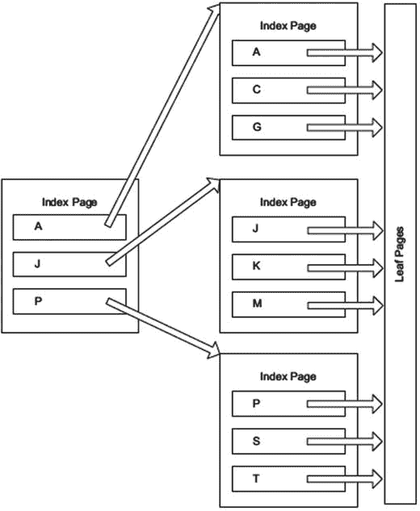

基本索引结构。

每个这样的页大小为 8KB。根据键的大小（由键中列的数据长度总和决定，某些类型的索引最大为 1,700 字节），单个页上可能有 4 到超过 1,000 个条目。你能在单个索引页上容纳的键越多，该页就能支持越多的子索引页。因此，给定的 `B 树` 索引级别可以支持更多的索引页。从每一级链接到下一级的页越多，最终从索引的顶层页到达叶级所需的步数就越少。

`B 树` 索引效率极高，因为对于一个在每个页上仅存储 500 个不同值的索引（对于典型整数索引来说是一个合理的数量），它有 500 个指向索引下一级的指针，第二级有 500 个页，每个页有 500 个值。这样在那一级就有 250,000 个不同的指针，而下一级最多有 250,000 × 500 个指针。仅仅一个三级索引就能容纳 125,000,000 个不同的值。如果改为 100 字节的键，算一下，你就会明白为什么较小的键（比如只有 4 字节的整数）更好！显然，每个索引键都有开销，这还只是对索引级别的一个粗略估计。

另一个偶尔被提及的概念是树的平衡性。如果树是完美平衡的，每个索引页上的键数量将完全相同。一旦索引一端的数据很多，或者由于插入或删除操作导致数据移动，树就会变得参差不齐，一端只有一级，另一端却有很多级。这就是为什么你需要对索引进行一些基本维护，这一点我已经提到过了。

### 小结

这只是一个关于索引是什么的概述，SQL Server 中使用了几种不同类型的索引变体。许多以 `B 树` 结构为基础，但有些使用哈希，还有一些使用列式结构。目前最重要的理解要点是什么？索引通过让你更快地访问表的某部分来加速行的访问，从而避免你必须查看每一行并单独检查它。

### 磁盘索引

要理解磁盘对象上的索引，具备数据库物理结构的实用知识会很有帮助。从高层次看，磁盘引擎的存储组件处理一个结构层次结构，从数据库开始，数据库被分解为文件组（始终存在一个 `PRIMARY` 文件组），每个文件组包含若干文件。正如我们在 第 8 章 中讨论的，文件组可以包含文件流文件，内存中 OLTP 也使用这些文件；但为了简化，我们只讨论存储基础数据的简单文件。这如图 10-2 所示。

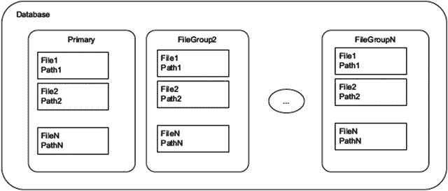

图 10-2.
通用数据库和文件组结构

你在文件组级别控制存储物理数据页的对象的放置（代码和元数据始终与所有系统对象一起存储在主文件组上）。新创建的对象被放置在默认文件组中，即 `PRIMARY` 文件组（每个数据库在 `CREATE DATABASE` 语句中都有一个，或者指定的第一个文件被设置为主文件），除非在任意 `CREATE <object>` 命令中指定了另一个文件组。例如，要将对象放置在非默认文件组中，你需要使用表或索引创建语句的 `ON` 子句指定文件组的名称：

```
CREATE TABLE 
(...)  ON 
```

此命令将表分配给文件组，而不是任何特定文件。也有命令可以将索引和基于唯一索引的约束放置在不同的文件组上。调优的一个重要部分是查看磁盘子系统是否存在压力，如果存在，可能使用文件组将数据重新分配到不同的磁盘上。如果你想查看数据库中有哪些文件，可以查询 `sys.filegroups` 目录视图：

```
USE ;
GO
SELECT CASE WHEN fg.name IS NULL
--other, such as logs
THEN CONCAT('OTHER-',df.type_desc COLLATE database_default)
ELSE fg.name END AS file_group,
df.name AS file_logical_name,
df.physical_name AS physical_file_name
FROM   sys.filegroups AS fg
RIGHT JOIN sys.database_files AS df
ON fg.data_space_id = df.data_space_id;
```

如图 10-3 所示，文件进一步分解为多个区，每个区由八个独立的 8KB 页面组成，表、索引等物理存储在这些页面上。SQL Server 只以区为唯一单位分配数据库空间。当文件增长时，你会注意到文件的大小只以 64KB 的增量增加。

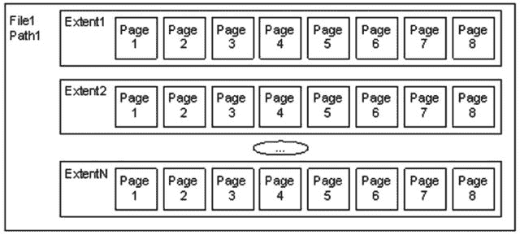

图 10-3.
文件和区

每个区又包含八个页面，每个页面保存一种特定类型的数据：

*   数据：表数据。
*   索引：索引数据。
*   溢出数据：当一行大于 8,060 字节或用于 `varchar(max)`、`varbinary(max)`、text 或 image 值时使用。
*   分配映射：有关区分配的信息。
*   页面可用空间：有关不同页面分配用途的信息。
*   索引分配：有关用于表或索引数据的区的信息。
*   批量更改映射：由批量 `INSERT` 操作修改的区。
*   差异更改映射：自上次数据库备份命令以来已更改的区。用于支持差异备份。

在较大的数据库中，大多数区只包含一种类型的页面，但在较小的数据库中，SQL Server 可以将任何类型的页面放在同一个区中。当所有数据类型相同时，称为统一区。当页面类型混合时，则称为混合区。

SQL Server 将所有磁盘表数据放在页面中，页面包含有关页面的元数据的头部（所有者的对象 ID、页面类型等），以及数据行，这通常是我们作为程序员所关心的。

图 10-4 显示了表中的典型数据页面。页面的头部包含标识值，如页码、数据所属对象的对象 ID、压缩信息等。数据行保存实际数据。最后，有一个分配块，其中包含指向行数据的偏移量/指针。

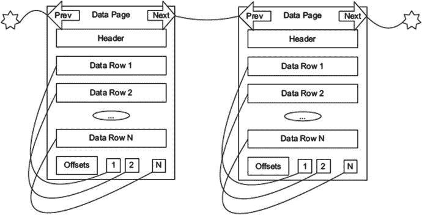

图 10-4.
数据页面

图 10-4 还显示了从下一行到上一行的指针。当页面有序时（例如索引的页面中），会添加这些指针。堆对象（没有聚集索引的表）是无序的。我将在接下来的两节中介绍这一点。

另一种你需要理解的常用页面是溢出页面。它用于保存不适合基本 8,060 字节页面的行数据。使用溢出页面的原因有两个：

*   行中所有数据的组合长度超过 8,060 字节。在这种情况下，数据会自动进入溢出页面，允许你拥有几乎无限的行大小（自然，随之而来的是明显的性能问题）。
*   通过在表上设置 `sp_tableoption` 的 `large value types out of row` 选项为 `1`，所有 `(max)` 和 `XML` 数据类型的值都会立即存储在行外的溢出页面上。如果设置为 `0`，只要能放入 8,060 字节的行中，SQL Server 会尝试将所有数据放在行结构的主页面上。默认值是 `0`，因为当典型值足够短可以放在单个页面上时，这通常是最佳设置。

例如，图 10-5 描述了 `large value types out of row` 设置为 `1` 的表可能发生的情况。这里，`Data Row 1` 有两个指针来支持两个 `varbinary(max)` 列：一个跨越两个页面，另一个只跨越单个页面。现在要使用 `Data Row 1` 中的所有数据，将需要最多四次读取（取决于实际页面在物理结构中的存储位置），使得数据访问比所有数据都在单个页面上时慢得多。这种性能问题很容易被忽视，但有时溢出页面确实会严重拖慢性能，特别是当其他程序员在不需要所有数据的表上使用 `SELECT *` 时。

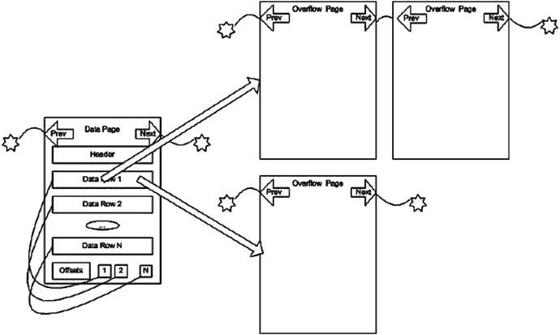

图 10-5.
溢出页面示例

溢出页面是链表，单列最多可容纳 2GB 存储。一般来说，在单列（甚至一行）中存储 2GB 并不是一个好主意，但如果需要，可以这样做。

存储在主页面之外的大值，在需要这些值时，其成本将远高于所有数据都放在同一数据页面中的情况。另一方面，如果你很少在查询中使用这些数据，将它们放在页面外可以让你为重要数据提供更小的空间占用，平均而言需要更少的磁盘访问。正如你可以想象对溢出页面上的列进行表扫描的成本有多高，这需要你小心权衡。你不仅需要读取额外的页面，而且对于每一行溢出的数据，都必须重定向到溢出页面。

当你深入到行级别时，数据的布局包含元数据、定长字段和变长字段，如图 10-6 所示。（请注意，这是一个概括，存储引擎会对数据进行大量优化处理，尤其是在启用压缩时。）

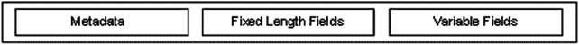

图 10-6.
数据行

元数据描述行，提供有关变长字段等信息。一般来说，由于查询处理器在页面级别处理数据，即使只需要一行，无论确切的物理表示如何，数据都能被非常快速地访问。

可以放在单个页面上的最大数据量（包括变长字段的开销）是 8,060 字节。如图 10-5 所示，当数据行增长到大于 8,060 字节时，变长列中的数据可能会溢出到溢出页面。原始页面上会留下一个 16 字节的指针，指向放置溢出数据的页面。

我们需要讨论的最后一个概念是页拆分。在插入或更新行时，由于页面被填满，SQL Server 可能不得不重新安排页面上的数据。这种重新安排可能是一个特别昂贵的操作。考虑图 10-7 中我们示例的情况，假设一个页面上只能容纳三个值。

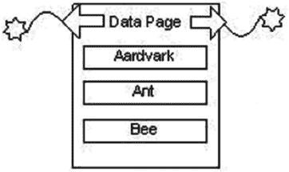

图 10-7.
页拆分前的示例数据页面

假设我们想向页面添加值 `Bear`。如果该值不适合页面，则需要重新组织页面。需要拆分的页面被拆分成两个，通常 50%的数据在一个页面上，50%在另一个页面上（实际页面上通常不止三个值）。页面拆分并重新插入其值后，新页面最终会看起来像图 10-8。

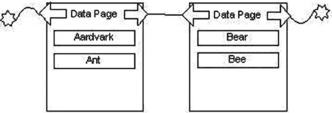

图 10-8.
页拆分后的示例数据页面

页拆分是代价高昂的操作，并且可能对性能造成严重影响，因为页拆分后，数据将不会位于连续的物理页面上。这种情况通常称为碎片。页拆分在正常系统中发生，只是向表中添加数据的一部分。但是，如果你不小心，它们可能极其迅速地发生并严重降低性能。在调优具有大量插入或更新的表的性能时，理解页拆分对数据和索引的影响非常重要。

为了调整表和索引以帮助最小化页拆分，你可以使用索引的 `FILL FACTOR`。当你构建或重建索引或表（使用 `ALTER TABLE <tablename> REBUILD`，这是 SQL Server 2008 中的新命令）时，填充因子指示每个页面为将来数据留出多少空间。如果你在所有结构中插入随机值（当你使用非顺序的 `uniqueidentifier` 作为主键时经常发生这种情况），你将希望在每个页面上留出足够的空间来覆盖将来创建的预期行数。在页拆分期间，数据页面总是大约对半拆分，每个页面留一半空，更糟的是，正如前面提到的，结构正在变得碎片化。

既然我们已经了解了基本的物理结构，让我们来研究一下我们将常用到的索引结构。索引有两种不同的类型：

*   聚集索引：这种类型按索引的顺序对物理表进行排序。
*   非聚集索引：这些是完全独立的结构，仅用于加速访问。

索引的内部结构基于是否存在聚集索引。对于索引的非叶页面，所有索引都是相同的。然而，在叶节点处，索引变得截然不同——使用的索引类型在表数据的物理组织方式中起着重要作用。在接下来的章节中，我将讨论不同类型的索引如何影响表结构，以及哪种索引在何种情况下最佳。

本节关于索引的示例大多基于可以从 Microsoft 以某种方式下载的 `WideWorldImporters` 数据库中的表（在撰写本章时，它位于 GitHub 上）。

### 聚簇索引

在接下来的章节中，我将讨论聚簇索引的结构，然后展示其使用模式以及这些索引如何使用的示例。

### 结构

聚簇索引通过将索引的叶级页作为表的数据页，从而在物理上排序表中的数据页。然后，每个数据页都通过双向链接列表链接到下一页，以提供有序扫描。因此，物理结构中的记录是根据与索引中使用的列相对应的字段排序的。带有聚簇索引的表被称为聚簇表。

聚簇索引的键被称为聚类键。对于未定义为唯一的聚簇索引，如果存在重复值，则会在索引的每个值中添加一个 4 字节的值（通常称为 `uniquifier`）。例如，如果值是 `A`、`B` 和 `C`，则没有问题。但是，如果你添加了另一个值 `B`，内部值将变为 `A`、`B + 4ByteValue`、`B + Different4ByteValue` 和 `C`。显然，在索引的每一层都额外处理这 4 个字节并不是最优的，因此，一般来说，你应该尝试将聚簇索引的键列定义在值唯一且越小越好的列上，因为聚类键将用于你在带有聚簇索引的表上放置的每一个其他索引中。

图 10-9 在高层面上展示了一个动物名称表的聚簇索引可能的样子。（注意，这只是一个部分示例；至少对于 `Horse` 和 `Python` 可能还会有更多的二级页。）

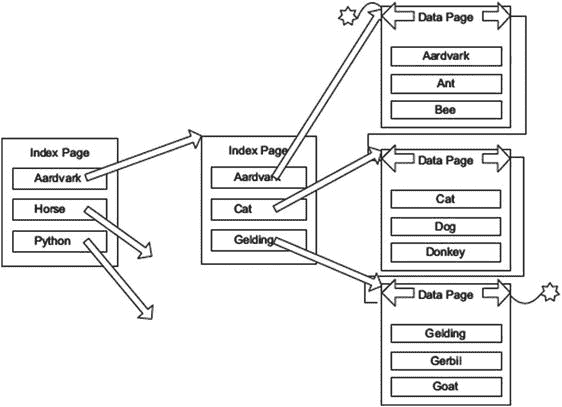
图 10-9. 聚簇索引示例

一个表只能有一个聚簇索引，因为表不能按多于一组列进行排序。（记住这一点；这是最有趣的面试问题之一。除了“每个表一个聚簇索引”之外的任何回答，都会引发一系列有趣的后续提问。）

一个很好的现实世界中的聚簇索引例子是一套老式的百科全书。每本书是索引的一个层级，每一页上还有另一个层级，标示了你可以在每一页上找到的内容（例如，`Office`–`Officer`）。然后每个主题就是索引的叶级。这些书按百科全书中的主题聚簇在一起，就像示例按动物名称聚簇一样。本质上，这整套书就是一个按聚类顺序排列的信息表。索引也可以被分区。百科全书按字母分区成多本书。

现在，考虑一本字典。为什么单词是排序的，而不是仅仅有一个单词无序的单独索引？我推测至少部分原因是让读者可以扫描他们不确切知道如何拼写的单词，检查定义以查看该单词是否符合他们的预期。当你进行搜索时，SQL Server 会做类似的事情。例如，回到图 10-9，如果你在寻找一只名叫 `George` 的猫，你可以使用聚簇索引找到 `animal = 'Cat'` 的行，然后扫描数据页以查找任何 `name = 'George'` 的匹配行。

我必须提醒你，虽然从物理上讲，表确实是按聚簇索引的顺序存储的，但从逻辑上讲，表必须被视为没有顺序。这种无序性是关系编程的一个基本原则：当你运行两次相同的查询时，你并不要求返回相同顺序的数据。物理数据的顺序可以被查询处理器用来提升你的性能，但在中间处理过程中，数据可以以任何能够更快得到查询结果的方式进行移动。事实上，你几乎总是得到相同顺序的行，这主要是因为优化器几乎总是会在相同条件下为相同的查询生成相同的执行计划。然而，当服务器加载许多请求时，数据的顺序可能会改变，以便 SQL Server 能够最好地利用其资源，而不管数据在结构中的顺序如何。SQL Server 可以选择以对它来说最快的任何顺序将数据返回给我们。如果磁盘驱动器在表的某部分繁忙，而它可以获取另一部分，它就会这样做。如果顺序很重要，请使用 `ORDER BY` 子句来确保数据按你希望的顺序返回。


#### 使用聚簇索引

如前所述，你选择的聚簇键对后续的物理设计具有重要影响。你用于聚簇索引的列将成为该表每个索引的一部分，因此它对所有索引都有重大影响。正因如此，对于一个典型的 OLTP 系统，一个非常普遍的做法是选择一个代理键值，通常是表的主键，因为代理键可以保持非常小。

使用代理键作为聚簇键通常是一个极好的决定，这不仅因为它是一个小键（大多数情况下，数据类型是只需 4 字节的整数，或者通过压缩可能更少），而且因为它总是一个唯一值。如前所述，当键不唯一时，非唯一的聚簇键值会被附加一个 4 字节的唯一标识符。它还对优化器有帮助，因为索引只有唯一值，优化器立即知道对于等值运算符，匹配的结果要么是 `1`，要么是 `0`。由于代理键常用于连接操作，因此为键使用较小的主键是有帮助的。

`注意`

如今，使用 GUID 作为代理键正变得流行，但需要小心。GUID 宽度为 16 字节，这占用了相当大的空间，但这其实是问题中最微不足道的部分。GUID 是随机值，它们通常不是单调递增的，一个新的 GUID 可能会排在其他 GUID 列表中的任何位置，最终导致大量的页拆分。使 GUID 成为一种相对可接受的类型的唯一方法是使用 `NEWSEQUENTIALID()` 函数（或你自己的函数）来生成顺序 GUID，但它只能与默认约束中的唯一标识符列一起使用，并且在重新启动后不能保证与现有数据的顺序。设计基于 GUID 代理键的解决方案的架构师，很少有人愿意被束缚在使用默认约束来生成代理值。能够从任何地方生成 GUID 并确保其唯一性，正是这种 16 字节值诱惑力的一部分。在 SQL Server 2012 及更高版本中，可以使用序列对象来生成保证唯一的值，以替代 GUID。

聚索引并不总是用于代理键，甚至不总是用于主键。其他可能的用途可归为以下几类：
*   范围查询：对于你经常需要获取某个范围的数据（例如从 A 到 F），让所有数据有序排列通常是合理的。
*   总是按顺序访问的数据：显然，如果数据需要按给定顺序访问，让数据预先按该顺序排序将显著提高性能。
*   返回大型结果集的查询：这一点在我讲到非聚簇索引时会更容易理解，但目前请注意，将数据保留在索引叶子页上可以节省开销。

如何选择聚簇索引取决于几个因素，例如将有多少其他索引派生自该索引、索引键会有多大，以及该值更改的频率。当聚簇索引值更改时，表上的每个索引也必须被访问和更改，如果该值还可能变得更大，那么我们可能就会遇到页拆分的问题。这又回到了解你的数据用户，并对系统进行彻底测试，以验证你的索引选择在帮助整体性能的同时，不会造成更大的损害。使用一个聚簇键来加快一个查询速度，可能会损害所有使用非聚簇索引的查询，特别是当你为聚簇索引选择了一个大键时。

坦率地说，在 OLTP 环境中，除了最不寻常的情况外，我都会坚持使用代理键作为我的聚簇键，通常是整数类型之一，有时甚至是唯一标识符 (GUID) 类型。我使用代理键，是因为你为进行修改操作（OLTP 系统的一般目标）而执行的许多查询都会通过主键访问数据。然后你只需优化检索操作，这些操作通常也应该涉及少量行，而这通常相当容易。

使用单调递增值上的聚簇索引的另一个好处是，整个索引上的页拆分会大大减少。表只在索引的一端增长，虽然它确实需要偶尔使用 `ALTER INDEX REORGANIZE` 或 `ALTER INDEX REBUILD` 进行重建，但你不会最终在整个表中出现页拆分。你可以通过 SQL Server 联机丛书中所述的 criteria 来决定使用哪种操作。通过查看动态管理视图 (DMV) `sys.dm_db_index_physical_stats`，你可以在碎片率大于 30% 的索引上使用 `REBUILD`，否则使用 `REORGANIZE`。现在，让我们看一个使用中的聚簇索引示例。如果你在一个聚簇表上选择所有行，你会在执行计划中看到一个 `Clustered Index Scan`。为此，我们将使用 `WideWorldImporters` 中的 `Application.Cities` 表，其结构如下：

```sql
CREATE TABLE Application.Cities
(
CityID int NOT NULL CONSTRAINT PK_Application_Cities PRIMARY KEY CLUSTERED,
CityName nvarchar(50) NOT NULL,
StateProvinceID int NOT NULL
CONSTRAINT FK_Application_Cities_StateProvinceID_Application_StateProvinces
REFERENCES Application.StateProvinces (StateProvinceID),
Location geography NULL,
LatestRecordedPopulation bigint NULL,
LastEditedBy int NOT NULL,
ValidFrom datetime2(7) GENERATED ALWAYS AS ROW START NOT NULL,
ValidTo datetime2(7) GENERATED ALWAYS AS ROW END NOT NULL,
PERIOD FOR SYSTEM_TIME (ValidFrom, ValidTo)
) ON USERDATA TEXTIMAGE_ON USERDATA
WITH (SYSTEM_VERSIONING = ON (HISTORY_TABLE = Application.Cities_Archive))
```

该表已添加了时态扩展，如第 8 章所述。在此版本的示例数据库中，目前在 `StateProvinceID` 列上还有一个索引，我们将在本章后面使用它。

```sql
CREATE NONCLUSTERED INDEX FK_Application_Cities_StateProvinceID ON Application.Cities
(
StateProvinceID ASC
)
ON USERDATA;
```

`Application.Cities` 表中有 37,940 行数据：

```sql
SELECT *
FROM   [Application].[Cities];
```

该查询的执行计划如下：

```sql
|--Clustered Index Scan
(OBJECT:([WideWorldImporters].[Application].[Cities].[PK_Application_Cities]))
```

如果你对聚簇索引键的一个值进行查询，扫描很可能会变为查找，如果它支持 `PRIMARY KEY` 约束，那么几乎肯定会变为查找。虽然扫描会访问所有数据页，但聚簇索引查找使用索引结构来找到扫描的起始位置，并且知道要扫描多远。对于使用等值运算符的唯一索引，将使用查找来访问索引每一层中的一个页，以在单个数据页上找到（或未找到）单个值，例如：

```sql
SELECT *
FROM   Application.Cities
WHERE  CityID = 23629; -- 我最喜欢的一个城市。
```

该查询的执行计划现在进行查找：

```sql
|--Clustered Index Seek
(OBJECT:([WideWorldImporters].[Application].[Cities].[PK_Application_Cities]),
SEEK:([WideWorldImporters].[Application].[Cities].[CityID]=
CONVERT_IMPLICIT(int,[@1],0)) ORDERED FORWARD)
```


注意`@1`值的`CONVERT_IMPLICIT`。这表明该查询正在为执行计划进行参数化，变量被转换为整数类型。此处，您正基于`CityID = 23629`的`SEEK`谓词在聚集索引中进行搜索。对于简单查询，SQL Server 默认会创建可重用的执行计划。任何以完全相同格式执行且使用简单整数值的查询都将使用同一计划。您也可以让 SQL Server 对更复杂的查询进行参数化。（更多信息，请查阅联机丛书中的“简单参数化和强制参数化”。）

您可以通过在`WHERE`子句中显式转换值来消除`CONVERT_IMPLICIT`，例如`WHERE CityID = CAST(23629 AS int)`：

```
|--Clustered Index Seek
(OBJECT:([WideWorldImporters].[Application].[Cities].[PK_Application_Cities]),
SEEK:([WideWorldImporters].[Application].[Cities].[CityID]=[@1])
ORDERED FORWARD)
```

尽管当`WHERE`子句中是互补字面量类型时通常不会这样做，但当您使用非互补类型（例如混合使用 Unicode 值和非 Unicode 值，我们将在本章后面看到）时，这可能会成为问题。现在，增加一下复杂性，我们搜索两行：

```sql
SELECT *
FROM   Application.Cities
WHERE  CityID IN (23629,334);
```

在这种情况下，使用的执行计划基本相同，只是搜索条件中现在包含了一个`OR`：

```
|--Clustered Index Seek
(OBJECT:([WideWorldImporters].[Application].[Cities].[PK_Application_Cities]),
SEEK:([WideWorldImporters].[Application].[Cities].[CityID]=(334)
OR
[WideWorldImporters].[Application].[Cities].[CityID]=(23629))
ORDERED FORWARD)
```

请注意，这次它没有创建参数化计划，而是创建了一个使用字面量 334 和 23629 的固定计划。另请注意，此计划将作为两次独立的搜索操作执行。如果在运行查询前开启 `SET STATISTICS IO`：

```sql
SET STATISTICS IO ON;
GO
SELECT *
FROM   [Application].[Cities]
WHERE  CityID IN (23629,334);
GO
SET STATISTICS IO OFF;
```

您将看到它执行了两次“扫描”，使用 `STATISTICS IO` 通常表示任何探查表的操作，因此搜索或扫描都会显示相同的结果：

```
Table 'Cities'. Scan count 2, logical reads 4, physical reads 0, read-ahead reads 0, lob logical reads 0, lob physical reads 0, lob read-ahead reads 0.
```

但是，任何给定查询是使用搜索还是扫描，甚至是两次搜索，可能是一个相当复杂的问题。为何如此复杂，在本章剩余部分会变得更加清晰，而在下一节关于非聚集索引的内容中，聚集索引搜索的用处将立刻变得显而易见。

## 非聚集索引

非聚集索引结构完全独立于基础表。聚集索引类似于字典，索引与表物理链接（因为索引的叶子页是表的一部分），而非聚集索引则更像本书中的索引。对于磁盘表，非聚集索引与数据是完全分离的。叶子页不包含所有数据，而只包含索引键（以及包含的值），它们有指向数据页的指针，很像书的索引包含页码。

非聚集索引中的每个叶子页都包含某种形式指向数据页上行的链接。从索引到数据行的链接称为行定位器。非聚集索引的行定位器如何构建，取决于基础表是否有聚集索引。

在本节中，我将从非聚集索引的结构开始，然后介绍这些索引是如何使用的。

### 结构

非聚集索引的基础 B 树与聚集索引的 B 树非常相似。区别在于如何访问实际数据。首先我们将看看非聚集索引的抽象表示，然后展示当您同时拥有聚集索引和没有聚集索引时，非聚集索引实现的差异。在抽象层面，所有非聚集索引都遵循图 10-10 所示的基本形式。

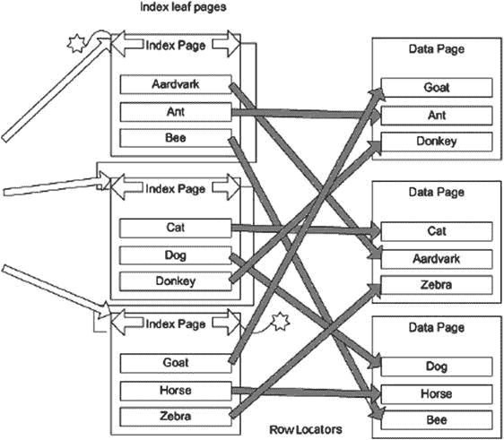

图 10-10. 非聚集索引示例

两种可能性之间的主要差异归结为：基于基础表是否有聚集索引，行定位器会有所不同。将使用两种不同类型的指针：

*   有聚集索引的表：聚集键
*   没有聚集索引的表：指向数据物理位置的指针，通常称为行标识符 (`RID`)

在接下来的两个小节中，我将更详细地解释这些。

**提示**
您可以将非聚集索引放在与数据页不同的文件组上，以最大化磁盘子系统的并行使用。请注意，放置索引的文件组应与表位于不同的控制器通道上；否则，可能收效甚微或毫无增益。


#### 聚集表上的非聚集索引

当表上存在聚集索引时，任何非聚集索引叶节点的行定位器都是聚集索引中的聚集键。在图 10-11 中，右侧的结构代表聚集索引，左侧的结构代表非聚集索引。要查找一个值，你需要从非聚集索引的叶节点开始，遍历到叶页。索引遍历的结果是一个或多个聚集键，然后你使用这些键去遍历聚集索引以到达数据。

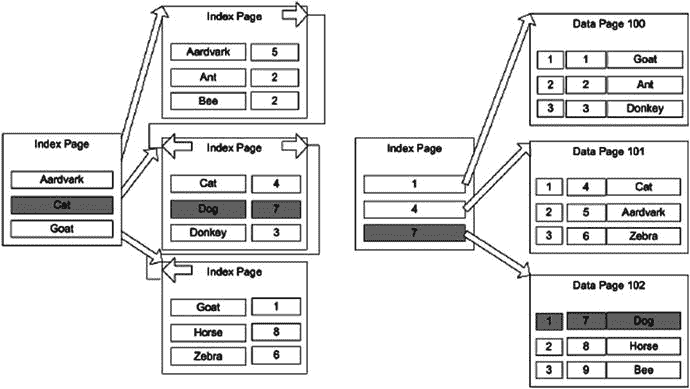

图 10-11. 聚集表上的非聚集索引

只要你的聚集键保持最优且索引得到维护，我刚才描述的操作开销是**非常小**的。虽然扫描两个索引比仅仅使用一个指向物理位置的指针工作量更大，但你必须考虑全局情况。总体而言，这比拥有指向表的直接指针更好，因为对表中值的任何修改只需要最少的重组。想象一下，如果你必须手动维护一本书的索引。如果你使用书的页码作为获取索引值的方式，随后不得不在书中间添加一页，那么你就必须更新所有的页码。但如果所有主题都按字母顺序排列，而你仅仅指向主题名称，那么添加一个主题就会很容易。

对于 SQL Server 也是如此，其结构每秒可以更改数千次或更多。由于以这种方式构建时，结构中残留的硬件相关信息非常少，数据移动对查询处理器来说很容易，维护索引也是一个简单的操作。早期版本的 SQL Server 总是使用物理位置指针来构建索引，这导致了我们的索引和表出现损坏（在没有聚集键的情况下，它仍然使用指针，但以一种以牺牲部分性能为代价来减少损坏的方式）。让我们面对现实，对此有更深理解的人也告诉我们，当聚集键的大小足够小时，这种方法总体上比直接指向表的指针**快得多**。

当我们讨论修改操作时，这种键结构的主要好处变得更加明显。因为无论物理位置如何，聚集键都是相同的，所以只有聚集索引的最底层需要知道物理数据在哪里。再加上数据是按顺序组织的，修改索引的开销显著降低，使得所有的数据修改操作**快得多**。当然，这个好处只有在聚集键很少或从不改变的情况下才成立。因此，一般的建议是让聚集键成为一个小的、不改变的值，例如一个标识符列（不过建议部分还要几页后才讲到）。

## 堆表上的非聚集索引

计算机科学中的堆数据结构通常是一种无序的二叉树结构。在 SQL Server 中，当一个表没有聚集索引时，该表在物理上被称为堆。堆的一个更实用的定义是“一堆东西被放置或扔在彼此之上”。这是解释当没有聚集索引时表中发生情况的一个好方法：SQL Server 只是将每一新行放在表的最后一个页的末尾。一旦该页被填满，它会根据需要将数据放在下一页或新页上。

在堆上构建非聚集索引时，行定位器是一个指向包含该行的物理页和行的指针。例如，以之前章节中的示例结构为例，该示例在 `animal` 表的 `name` 列上有一个非聚集索引，如图 10-12 所示。

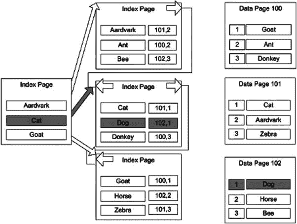

图 10-12. 堆上的非聚集索引

如果你想找到 `name = 'Dog'` 的行，你首先通过索引从顶级页找到叶页的路径。一旦到达叶页，你就获得了一个指向具有该值的行所在页的指针，在本例中是页 102，行 1。这个指针由页面位置和页面上的记录号组成，以便找到行值（页面编号从 0 开始，偏移量编号从 1 开始）。关于这个指针最重要的事实是，它直接指向页面上包含你正在寻找的值的行。对于有聚集索引的表（聚集表），指针是不同的，理解这一区别很重要，因为它会影响不同类型索引的性能。

为了避免我在前一节提到的那种在不断管理指针和物理位置时可能发生的物理损坏问题，堆使用了一种非常简单的方法来防止行指针损坏：在重建表之前，它们永不更改。它不是重新排序页面，或者在必须拆分页面时更改指针，而是将行移动到不同的页面，并留下一个转发指针指向数据现在所在的新页面。因此，如果 `name = 'Dog'` 的行移动了（例如，可能因为一个大的 `varchar(3000)` 列的数据长度从 10 更新为 3000），你可能会遇到以下情况，这增加了获取数据所需的步骤数。图 10-13 说明了一个转发指针。

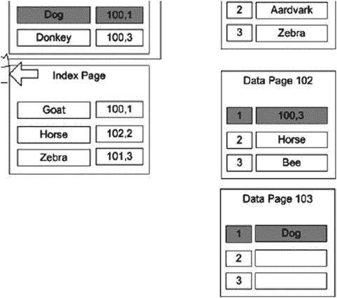

图 10-13. 转发指针

所有拥有旧指针的现有索引只需转到旧页面，然后沿着该页面上的转发指针找到数据的新位置。如果你在使用堆（这应该很少见），重要的是要小心你的结构，以确保数据应该很少在堆内移动。例如，如果你经常将数据更新为用作索引键的可变长度列中的更大值，就必须小心，因为行可能会移动到不同的页面。这为查找数据增加了另一个步骤，而且如果数据被移动到另一个区上的页面，还会为数据库增加一次额外的读取。在扫描表时会立即跟随此转发指针，如果未进行管理，随着时间的推移，最终可能导致**糟糕的**性能。

通常，空间不会在堆中被重用，除非重建表（通过 `SELECT INTO` 另一个表或使用带有 `REBUILD` 选项的 `ALTER TABLE` 命令）。在本章后面的“索引动态管理视图查询”一节中，我将提供一个查询，该查询将为你提供有关索引结构的信息，包括表中转发指针的数量。

### 使用非聚集索引

在做出了使用何种聚集索引这一极其重要的选择之后，所有其他索引都将是非聚集索引。在本节中，我将介绍在以下领域应用非聚集索引的一些选择：

*   一般考虑因素
*   复合索引考虑因素
*   聚集表上的非聚集索引
*   堆上的非聚集索引

实际上，本节中的许多主题都与聚集索引有关——例如复合索引、统计信息、唯一性等。我在这里涵盖它们，因为你通常会为非聚集索引做出这些决策，并根据使用模式（作为 `PRIMARY KEY`）来选择聚集索引，尽管并非总是如此。在本章最后一个主要部分中有一个小节，我将更详细地讨论这一点。


### 一般性考虑

我们通常开始感觉到需要索引，是因为查询速度慢（或看起来慢）。然而，查询缓慢的原因显然并非只有缺乏索引。以下是一些导致查询缓慢的明显原因：

*   额外的重度用户负载
*   硬件负载
*   网络负载
*   设计不良的数据库
*   并发配置问题（如第 11 章所述）

在排查了上述原因是否存在后，我们可以打开 Management Studio，开始查看那些慢查询的执行计划。大多数情况下，慢查询之所以显而易见，是因为执行计划中出现了 `|--Clustered Index Scan` 或 `|--Table Scan`，并且这些操作占用了大量的执行时间。很简单，对吧？本质上，“索引扫描和表扫描非常耗时”这句话基本没错，但遗憾的是，这并不能完全反映整个过程。在了解具体的使用模式之前，很难做出针对性的索引调整，因为使用模式会极大地影响这些决策，例如：

*   一个查询是每天执行一次，每小时执行一次，还是每分钟执行一次？
*   后台进程是否正在快速向表中插入数据？或者插入操作可能发生在非高峰时段？

利用扩展事件和动态管理视图，你可以监控访问数据库的查询的使用模式，寻找执行缓慢的查询、不良的执行计划等。完成这一步并开始理解数据库的使用模式后，你需要利用这些信息来考虑在何处应用索引——最终目标是利用你所能收集到的使用信息，量身定制一个索引方案来解决整体问题。

你不能仅仅为了修复单个查询就随意添加索引。天下没有免费的午餐，索引绝对是有代价的。你需要考虑索引如何以不同的方式帮助或损害不同类型的操作：

*   `SELECT` ：索引只能对 `SELECT` 查询产生有益影响。
*   `INSERT` ：索引只会（通常只是轻微地）损害向表中插入新数据的过程。当表中创建新数据时，索引可能需要被修改和重组以容纳新值。
*   `UPDATE` ：更新操作在物理上需要两到三个步骤：查找行并更改行，或者查找行、删除它（们）并重新插入它（们）。在查找行的阶段，索引是有益的，就像对 `SELECT` 一样。它是否在第二阶段造成损害取决于几个因素，例如：
    *   索引键值是否发生了改变，以至于需要移动到不同的叶节点？
    *   新值是否适合放在现有的页面上，还是会导致页面拆分？
*   `DELETE` ：删除需要两个步骤：查找行并移除它。索引有利于查找行，但在删除时，你可能需要做一些调整来适应从索引中删除的值。

你还应该意识到，对于 `INSERT`、`UPDATE` 或 `DELETE` 操作，如果表上存在触发器（或存在引用表以执行函数的约束），索引将以与列表中相同的方式影响这些操作。因此，我将避免给出任何关于应索引哪些类型列的一般性建议。在实践中，有太多的变量需要考虑。

**提示**

太多人在没有考虑成本的情况下就开始添加非聚集索引。请务必警惕，你添加的每一个索引都需要维护。有时，一个查询执行需要 1 秒钟是可以接受的，而将其缩短到 0.1 秒可能会显著减慢其他操作。真正的问题在于每种操作发生的频率以及你愿意承受多大的代价。最难的部分是在你能够真正获得所有正在发生操作的良好概貌之前，先收起你那顶调优的帽子。

要了解当前索引和/或表的使用情况，你可以查询动态管理视图 `sys.dm_db_index_usage_stats`：

```sql
SELECT CONCAT(OBJECT_SCHEMA_NAME(i.object_id),'.',OBJECT_NAME(i.object_id)) AS object_name
, CASE WHEN i.is_unique = 1 THEN 'UNIQUE ' ELSE '' END +
i.TYPE_DESC AS index_type
, i.name as index_name
, user_seeks, user_scans, user_lookups,user_updates
FROM  sys.indexes AS i
LEFT OUTER JOIN sys.dm_db_index_usage_stats AS s
ON i.object_id = s.object_id
AND i.index_id = s.index_id
AND database_id = DB_ID()
WHERE  OBJECTPROPERTY(i.object_id , 'IsUserTable') = 1
ORDER  BY object_name, index_name;
```

此查询将返回每个对象的名称、索引类型、索引名称，以及以下次数：

*   用户查找次数：索引用于查找操作的次数
*   用户扫描次数：索引在回答查询时被扫描的次数
*   用户查找次数（针对聚集索引）：索引用于解析非聚集索引搜索的行定位器的次数
*   用户更新次数：索引被用户查询更改的次数

在尝试了解哪些索引可能需要调整，特别是哪些索引因为主要被更新而未能发挥作用时，这些信息非常重要。在 OLTP 系统中，一个特别值得关注的点是聚集索引上的 `user_scans`。例如，回顾一下我们对 `Application.Cities` 表的查询，我们只在主键列 `CityID` 上有一个聚集索引。因此，如果我们查询：

```sql
SELECT *
FROM   Application.Cities
WHERE  CityName = 'Nashville';
```

执行计划将是一个聚集索引扫描：

```
|--Clustered Index Scan
(OBJECT:([WideWorldImporters].[Application].[Cities].[PK_Application_Cities]),
WHERE:([WideWorldImporters].[Application].[Cities].[CityName]=(N'Nashvile'));
```

并且每次运行此查询，你都会看到 `user_scans` 值增加。我们可以通过为该列添加一个非聚集索引来解决这个问题，并将其定位在 `USERDATA` 文件组中，因为这是我之前包含的 DDL 中其他对象创建的位置：

```sql
CREATE INDEX CityName ON Application.Cities(CityName) ON USERDATA;
```

当然，创建索引时还有更多的设置，有些我们会涵盖，有些则不会。如果你需要管理索引，阅读在线手册中关于 `CREATE INDEX` 的主题作为获取更多信息的起点，无疑是一个好主意。

**提示**

从 SQL Server 2014 开始，你可以在 `CREATE TABLE` 语句中内联创建索引。

现在再次检查查询的执行计划，你将看到：

```
|--Nested Loops(Inner Join,
OUTER REFERENCES:([WideWorldImporters].[Application].[Cities].[CityID]))
|--Index Seek(OBJECT:([WideWorldImporters].[Application].[Cities].[CityName]),
SEEK:([WideWorldImporters].[Application].[Cities].[CityName]=N'Nashville')
ORDERED FORWARD)
|--Clustered Index Seek
(OBJECT:([WideWorldImporters].[Application].[Cities].[PK_Application_Cities]),
SEEK:([WideWorldImporters].[Application].[Cities].[CityID]=
[WideWorldImporters].[Application].[Cities].[CityID])
LOOKUP ORDERED FORWARD)
```

这不仅格式更复杂，看起来执行起来也应该更费时。然而，这个计划很好地说明了在聚集表上创建非聚集索引的结构。第二个 `|--` 指向了改进之处。为了找到 `CityName` 为 Nashville 的行，它在新索引中进行了查找。一旦获得了 Nashville 行的索引键，它就将这些键值像两个不同的表一样连接起来，使用了嵌套循环连接类型。有关嵌套循环和其他连接运算符的更多信息，请查看在线手册中的“Showplan Logical and Physical Operators Reference”。


#### 确定索引的有用性

此时你可能会觉得，你需要做的只是查看查询的执行计划，找出搜索参数，然后在相关列上建立索引，事情就会有所改善。在许多情况下，这确实有一定道理，但索引必须**有用**才会被查询使用。如果一本 418 页书的索引只有两个条目：

*   一般主题 1
*   确定索引的有用性 417

这意味第 1 至 416 页涵盖一般主题，而第 417 页及之后是关于确定索引有用性的内容。除非你正需要了解索引的有用性，否则这个索引对你毫无用处。但有一点是肯定的：你可以很快判断出这个索引大致没用。我们判断书籍索引是否有用的另一个方法是，取一个值去索引中查找。如果你要找的内容在里面（或接近的内容），你就会翻到相应的页去查看。

SQL Server 判断是否使用你的索引，其方式与此非常相似。它有两个具体的度量标准来决定一个索引是否有用：值的密度（有时称为选择性），以及用于核对的表中值的样本直方图。

你可以使用 `DBCC SHOW_STATISTICS` 查看索引的这些详细信息。我们的表非常小，因此它不需要统计信息来决定使用哪个索引。相反，我们将查看刚刚创建的索引：

```
DBCC SHOW_STATISTICS('Application.Cities', 'CityName') WITH DENSITY_VECTOR;
DBCC SHOW_STATISTICS('Application.Cities', 'CityName') WITH HISTOGRAM;
```

这将返回以下集合（为节省空间已截断）。第一个集合告诉我们键的大小和密度。第二个显示了为查找代表性值而对表进行抽样的直方图。

```
所有密度   平长长度 列
------------- -------------- --------------------------
4.297009E-05  17.17427       CityName
2.635741E-05  21.17427       CityName, CityID
范围上限键           范围行数    相等行数       不同范围行数  平均范围行数
---------------------- ------------- ------------- -------------------- --------------
Aaronsburg             0             1             0                    1
Addison                123           11            70                   1.757143
Albany                 157           17            108                  1.453704
Alexandria             90            13            51                   1.764706
Alton                  223           13            122                  1.827869
Andover                173           13            103                  1.679612
.........                    ...           ..            ...                  ........
White Oak              183           10            97                   1.886598
Willard                209           10            134                  1.559701
Winchester             188           18            91                   2.065934
Wolverton              232           1             138                  1.681159
Woodstock              137           12            69                   1.985507
Wynnewood              127           2             75                   1.693333
Zwolle                 240           1             173                  1.387283
```

我不会详细讲解 `DBCC SHOW_STATISTICS` 命令，但有几件重要的事情需要理解。首先，考虑每列集的密度。`CityName` 列是索引中实际声明的唯一列，但请注意，它包含了索引列和聚集键的密度。

所有密度大约都按 `1/不同行数` 计算，如下所示，针对我刚刚检查密度的相同列：

```
--使用 ISNULL 是因为如果列可为空则更容易处理
--你转换成的值对于该列来说应该是不可能的
--ProductId 是一个种子为 1、增量为 1 的标识列
--所以这应该是安全的（除非 DBA 做了些奇怪的事）
SELECT 1.0/ COUNT(DISTINCT ISNULL(CityName,'NotACity')) AS 密度,
COUNT(DISTINCT ISNULL(CityName,'NotACity')) AS 不同行数,
1.0/ COUNT(*) AS 唯一密度,
COUNT(*) AS 总行数
FROM   Application.Cities;
```

这将返回以下结果：

```
密度              不同行数      唯一密度        总行数
-------------------- ----------------- ------------ -----------
0.000042970092       23272            0.000026357406    37940
```

你可以看到密度是匹配的。（查询的密度是数字类型，而 `DBCC` 使用的是浮点数，这就是为什么它们格式不同，但它们是相同的值！）这个数字越小，索引就越好，也越容易被选中使用。具体来说，并没有一个神奇的数字，但这个值会被纳入计算查询的最佳执行方式中。此查询返回的实际数字可能与 `DBCC` 的值略有不同，因为可能对唯一计数使用了抽样数字。

在 `DBCC SHOW_STATISTICS` 输出中要理解的第二件事是直方图。即使索引的密度不够低，SQL Server 也可以检查直方图中给定的值（或值集）来查看可能返回多少行。SQL Server 会保存表中列以及索引的统计信息，因此它可以就如何使用索引或表列做出明智的决策。例如，考虑直方图中的以下几行（我为演示目的伪造了其中一些结果）：

```
范围上限键 范围行数    相等行数       不同范围行数  平均范围行数
------------ ------------- ------------- -------------------- --------------
Aaronsburg   111           58            2                    55.5
Addison      117           67            2                    58.5
...          ...           ...           ...                  ...
```

在第二行中，行值告诉我们以下信息：

*   `范围上限键`：抽样的 `CityName` 值是 `Aaronsburg` 和 `Addison`。
*   `范围行数`：有 117 行的值介于 `Aaronsburg` 和 `Addison` 之间（不包括端点）。这些值本身是未知的。但是，如果用户使用 `Aaronsville` 作为搜索参数，优化器现在可以猜测最多可能返回 117 行（统计信息不会作为事务的一部分保持最新）。这是查询计划获取每个查询步骤的估计行数的方式之一，也是判断索引是否对单个查询有用的一种方法。
*   `相等行数`：恰好有 67 行满足 `CityName = Addison`。
*   `不同范围行数`：对于 `Addison` 所在的行，估计在 `Aaronsburg` 和 `Addison` 之间有两个不同的值。
*   `平均范围行数`：这是范围内（不包括上下界）重复值的平均数量。优化器可以预期这个值是平均行数。请注意，这是通过 `范围行数 / 不同范围行数` 计算出来的。

拥有这个直方图的一个作用是，可以使一个看似无用的索引在某些情况下变得有价值。例如，假设你想为一个只有两个值的列建立索引。如果值分布均匀，索引将是无用的。然而，如果某个特定值的数量很少，它就可能有用（使用 `tempdb`）：


# SQL Server 索引与查询优化：直方图与多列索引

USE `tempDB`;
GO
CREATE SCHEMA `demo`;
GO
CREATE TABLE `demo.testIndex`
(
`testIndex` int IDENTITY(1,1) CONSTRAINT `PKtestIndex` PRIMARY KEY,
`bitValue` bit,
`filler` char(2000) NOT NULL DEFAULT (REPLICATE('A',2000))
);
CREATE INDEX `bitValue` ON `demo.testIndex`(`bitValue`);
GO
SET NOCOUNT ON; --否则你会收到 50100 条“1 行受影响”的消息
INSERT INTO `demo.testIndex`(`bitValue`)
VALUES (0);
GO 50000 --在 Management Studio 中运行当前批处理 50000 次。
INSERT INTO `demo.testIndex`(`bitValue`)
VALUES (1);
GO 100 --向表中插入 100 行值为 1 的记录

可以猜测，如果只查询值为 `1` 的行，返回的行数会很少。检查 `bitValue = 0` 的执行计划（再次使用 `SET SHOWPLAN ON` 或图形界面）：

```sql
SELECT *
FROM   demo.testIndex
WHERE  bitValue = 0;
```

这显示了一个聚集索引扫描：

```
|--Clustered Index Scan(OBJECT:([tempdb].[demo].[testIndex].[PKtestIndex]),
WHERE:([tempdb].[demo].[testIndex].[bitValue]=(0)))
```

然而，将 `0` 改为 `1`，优化器则选择了索引查找。这意味着它在索引中寻找到第一个值为 `1` 的行，然后遍历后续值：

```
|--Nested Loops(Inner Join, OUTER REFERENCES:
([tempdb].[ demo].[testIndex].[testIndex], [Expr1003]) WITH UNORDERED PREFETCH)
|--Index Seek(OBJECT:([tempdb].[demo].[testIndex].[bitValue]),
SEEK:([tempdb].[demo].[testIndex].[bitValue]=(1)) ORDERED FORWARD)
|--Clustered Index Seek(OBJECT:([tempdb].[demo].[testIndex].[PKtestIndex]),
SEEK:([tempdb].[demo].[testIndex].[testIndex]=
[tempdb].[demo].[testIndex].[testIndex]) LOOKUP ORDERED FORWARD)
```

正如我们之前所见，这个更好的计划看起来更复杂，但关键在于它现在只需要处理大约 100 行，而不是在索引查找操作符中处理 50,100 行，因为我们选择了 `SELECT *`（关于如何避免聚集索引查找，将在下一节详细说明）。

你可以在直方图中看到原因：

```sql
UPDATE STATISTICS demo.testIndex;
DBCC SHOW_STATISTICS('demo.testIndex', 'bitValue')  WITH HISTOGRAM;
```

在我的测试中，这返回了以下结果。你的实际值可能会有所不同。

```
RANGE_HI_KEY RANGE_ROWS    EQ_ROWS       DISTINCT_RANGE_ROWS  AVG_RANGE_ROW
------------ ------------- ------------- -------------------- -------------
0            0             49976.95      0                    1
1            0             123.0454      0                    1
```

收集的统计信息估计大约有 123 行匹配 `bitValue = 1`。这是因为统计信息收集并非精确科学——它使用采样机制，而不是检查每个值（你的值也可能不同）。查看 `TABLESAMPLE` 子句，你可以使用相同的机制来收集数据的随机样本。

优化器知道在查找 `bitValue = 1` 时使用索引是有利的，因为当索引键值为 `1` 时，大约返回 123 行，而为 `0` 时则返回 49,977 行。（你的尝试可能会返回不同的值。对于 `bitValue` 为 `1` 的行，我在之前的版本中得到 80，在另一组测试中得到 137。它们都近似于你应该预期的 100 行，因为我们加载表时专门创建了 100 行。）

这个直方图的简单演示是一回事，但在实践中，实际构建一个筛选索引来优化此查询通常是更好的做法。你可能会构建如下索引：

```sql
CREATE INDEX bitValueOneOnly
ON testIndex(bitValue) WHERE bitValue = 1;
```

这个索引的直方图显然是迄今为止更清晰的良配：

```
RANGE_HI_KEY RANGE_ROWS    EQ_ROWS       DISTINCT_RANGE_ROWS  AVG_RANGE_ROWS
------------ ------------- ------------- -------------------- --------------
1            0             100           0                    1
```

查询是否实际使用此索引，可能取决于另一个索引的性能有多差，而这又可能依赖于众多其他的 SQL Server 内部机制。然而，直方图是另一个工具，你可以在优化 SQL 时用来查看优化器依据什么做出选择。

**提示**

直方图是否包含任何 `bitValue = 1` 的数据很大程度上是偶然的。我运行过这个示例多次，有一次，除非我在 `UPDATE STATISTICS` 命令上使用 `FULLSCAN` 选项（这在大表上并不可行，除非你有相当多的时间），否则没有显示任何行。

正如我们在“聚集索引”部分所讨论的，查询可以是等值查询或不等值查询。对于等值搜索，查询优化器将使用单点并估计行数。对于不等值查询，它将使用不等值的起点和终点，并确定查询将返回的行数。

### 索引与多列

到目前为止，我讨论的索引都是基于单列的，但并非总是只需要在单列上创建性能增强索引。当同一表的 `WHERE` 子句中包含多个列时，有几种可能的方法可以增强查询：

*   在所有列上创建一个复合索引。
*   通过包含查询涉及的所有列来创建覆盖索引。
*   在不同的列上创建多个索引。
*   调整键排序顺序以优化排序操作。


### 复合索引

当你在索引中包含多个列时，这就被称为复合索引。随着列数的增加，索引在一般情况下的效能会降低。问题在于索引首先按第一列的值排序，然后才是第二列。因此，索引中的第二列通常只有在你同时需要第一列时才有用（然而，下一节关于覆盖索引的内容会演示一种情况，在这种情况下可能并非如此）。即便如此，当查询谓词涉及所有列时，你仍然经常需要复合索引来优化常见的查询。

查询中列的顺序对于判断一个复合索引是否可以被使用以及是否会被使用至关重要。有几个重要的考虑因素：

*   哪一列最具选择性？如果一列包含唯一或基本唯一的值，那么它很可能是作为索引第一列的良好候选。关键在于，第一列是索引排序所依据的列。仅在第二列上进行搜索的价值较低（尽管仅使用第二列的查询可以扫描索引叶页来获取值）。
*   哪一列在不涉及其他列的情况下使用最频繁？一个复合索引可以对多个不同的查询都有用，即使这些查询只用到了该索引的第一列。

例如，考虑以下查询（`StateProvince` 是一个更显而易见的选择，但它已有的一个索引我们将在后面的章节中使用）：

```sql
SELECT *
FROM   Application.Cities
WHERE  CityName = 'Nashville'
AND  LatestRecordedPopulation = 601222;
```

我们现有的 `CityName` 索引是有用的，但一个在 `LatestRecordedPopulation` 上的索引也可能不错。结果也可能表明，单独使用任一列都无法提供足够的性能提升。复合索引是强大的工具，但这样的索引到底有多大用处，完全取决于 `CityName = 'Nashville'` 和 `LatestRecordedPopulation = 601222` 这两个条件将返回多少行数据。

对于前面的查询，在已有索引（`CityId` 上的聚集主键、原始结构中作为一部分的 `StateProvinceId` 上的索引以及 `CityName` 上的索引）下，优化后得到了之前的执行计划，只是多了一个人口条件的谓词：

```
|--Nested Loops(Inner Join,
    OUTER REFERENCES:([WideWorldImporters].[Application].[Cities].[CityID]))
    |--Index Seek(OBJECT:([WideWorldImporters].[Application].[Cities].[CityName]),
        SEEK:([WideWorldImporters].[Application].[Cities].[CityName]=N'Nashville')
        ORDERED FORWARD)
    |--Clustered Index Seek
        (OBJECT:([WideWorldImporters].[Application].[Cities].[PK_Application_Cities]),
        SEEK:([WideWorldImporters].[Application].[Cities].[CityID]=
        [WideWorldImporters].[Application].[Cities].[CityID]),  WHERE:([WideWorldImporters].[Application].[Cities].[LatestRecordedPopulation]=(601222))
        LOOKUP ORDERED FORWARD)
```

添加一个在 `CityName` 和 `LatestRecordedPopulation` 上的索引似乎是进一步优化该查询的好方法，但首先，你应该查看这些列的数据（虽然也要考虑索引未来的用途，但现有数据是一个很好的起点）：

```sql
SELECT CityName, LatestRecordedPopulation, COUNT(*) AS [count]
FROM   Application.Cities
GROUP BY CityName, LatestRecordedPopulation
ORDER BY CityName, LatestRecordedPopulation;
```

该查询返回部分结果：

```
CityName         LatestRecordedPopulation count
---------------- ------------------------ -----------
Aaronsburg       613                      1
Abanda           192                      1
Abbeville        419                      1
Abbeville        2688                     1
Abbeville        2908                     1
Abbeville        5237                     1
Abbeville        12257                    1
Abbotsford       2310                     1
Abbott           NULL                     2
Abbott           356                      3
Abbottsburg      NULL                     1
```

当然，你不可能总是像这样查看所有行，所以另一种可能性是进行一些数据剖析，看看哪一列具有更多不同的值，并在列允许为空时查找 `NULL` 值：

```sql
SELECT COUNT(DISTINCT CityName) as CityName,
       SUM(CASE WHEN CityName IS NULL THEN 1 ELSE 0 END) as NULLCityName,
       COUNT(DISTINCT LatestRecordedPopulation) as LatestRecordedPopulation,
       SUM(CASE WHEN LatestRecordedPopulation IS NULL THEN 1 ELSE 0 END)
         AS NULLLatestRecordedPopulation
FROM   Application.Cities;
```

这个查询返回以下结果：

```
CityName    NULLCityName LatestRecordedPopulation NULLLatestRecordedPopulation
----------- ------------ ------------------------ ----------------------------
23272       0            9324                     11048
```

`CityName` 列拥有最多的唯一值，这有点与你预期的相反。然而，大量的 `NULL` 列值会造成这种情况。因此我们添加以下索引：

```sql
CREATE INDEX CityNameAndLastRecordedPopulation
ON Application.Cities (CityName, LatestRecordedPopulation);
```

现在，重新执行在创建索引之前运行的查询：

```sql
SELECT *
FROM   Application.Cities
WHERE  CityName = 'Nashville'
AND    LatestRecordedPopulation = 601222;
```

执行计划变为如下所示，使用了新的索引：

```
|--Nested Loops(Inner Join,
    OUTER REFERENCES:([WideWorldImporters].[Application].[Cities].[CityID]))
    |--Index Seek
        (OBJECT:([WideWorldImporters].[Application].[Cities].
        [CityNameAndLastRecordedPopulation]),
        SEEK:([WideWorldImporters].[Application].[Cities].[CityName]=N'Nashville'
        AND WideWorldImporters].[Application].[Cities].[LatestRecordedPopulation]
        =(601222)) ORDERED FORWARD)
    |--Clustered Index Seek
        (OBJECT:([WideWorldImporters].[Application].[Cities].[PK_Application_Cities]),
        SEEK:([WideWorldImporters].[Application].[Cities].[CityID]
        =[WideWorldImporters].[Application].[Cities].[CityID]) LOOKUP ORDERED FORWARD)
```

同时，也要确切记住索引将被如何使用。如果你的查询混合了等值比较和不等值比较，你可能希望优先考虑在等值搜索中使用的列。当然，你的选择性估算需要基于索引在特定情况下将具有的选择性。例如，如果你在选择性非常高的数据上进行小范围的扫描，那么该列可能是索引中第一列的最佳选择。如果你对索引如何提供帮助有疑问，请测试多种情况，看看执行计划和成本如何变化。如果你对某个执行计划为何如此表现有疑问，请使用统计信息来更深入地了解选择该索引的原因。

在下一节中，我将展示如何消除聚集索引查找，但一般来说，进行查找并不是世界上最糟糕的事情，除非你匹配了大量行。例如，在当前案例中，两个单行查找会比全表扫描带来更好的性能。然而，当使用非聚集索引找到的行数变得很大时，像前面那样的执行计划可能会变得非常昂贵。


## 覆盖索引

当你仅从表中检索数据时，如果存在一个索引包含了查询所需的所有数据值，那么就无需访问基础表。回顾图 10-10，其中有一个关于动物类型的非聚集索引。如果查询只需要访问动物的名称，那么就不需要直接访问表的数据页。该索引涵盖了查询所需的所有数据，因此通常被称为覆盖索引。创建覆盖索引是一个很好的特性，这种方法甚至对聚集索引也有效，尽管对于聚集索引，SQL Server 会扫描索引结构的最底层页，因为扫描聚集索引的叶节点等同于表扫描。

根据我们之前的示例，如果我们不是返回表中的所有列，而只返回 `CityName` 和 `LatestRecordedPopulation`：

```sql
SELECT CityName, LatestRecordedPopulation
FROM   Application.Cities;
```

那么生成的执行计划将一点也不复杂——仅仅是一个简单的行扫描，并且只使用了索引：

```sql
|--Index Scan
(OBJECT:([WideWorldImporters].[Application].[Cities].[CityNameAndLastRecordedPopulation]))
```

但如果我们还需要输出中的 `LastEditedBy` 列呢？我们可以将该列作为索引键添加到索引中，但如果搜索条件不需要它，这样做就有些浪费。幸运的是，索引有一个特性可以增强实现覆盖索引的能力——即 `CREATE INDEX` 语句中的 `INCLUDE (<columns>)` 子句。包含列几乎可以是任何数据类型，甚至是 `(max)` 类型的列。事实上，唯一不允许的类型是 `text`、`ntext` 和 `image` 数据类型，但无论如何你都不应该使用这些类型，因为它们通常很糟糕且非常过时/已被弃用。

使用 `INCLUDE` 关键字，你可以添加列来覆盖查询，而无需将这些列包含在索引页中，因此不会给索引的使用带来额外开销。相反，`INCLUDE` 列中的数据只被添加到索引的叶级别页中。`INCLUDE` 列对索引查找没有帮助，但它们确实消除了访问数据页以获取所需数据的需要。

为了演示，首先，检查以下查询的执行计划：

```sql
SELECT CityName, LatestRecordedPopulation, LastEditedBy
FROM   Application.Cities;
```

这是一个通过聚集索引的扫描操作：

```sql
|--Clustered Index Scan
(OBJECT:([WideWorldImporters].[Application].[Cities].[PK_Application_Cities]))
```

现在，让我们修改关于城市名称和人口的索引，并包含 `LastEditedBy` 列：

```sql
DROP INDEX CityNameAndLastRecordedPopulation
ON Application.Cities;
CREATE INDEX CityNameAndLastRecordedPopulation
ON Application.Cities (CityName, LatestRecordedPopulation)
INCLUDE (LastEditedBy);
```

现在，该查询又回到了仅需访问索引的状态，因为索引包含了所有需要的数据，并且这一次，它甚至不需要访问聚集索引来获取 `name` 列：

```sql
|--Index Scan
(OBJECT:([WideWorldImporters].[Application].[Cities].[CityNameAndLastRecordedPopulation]))
```

这种仅将列包含在覆盖索引叶页中的能力在许多情况下都极其有用。太多键过大的索引被创建出来，仅仅为了覆盖某个查询以避免访问基础表，最终往往只对一种情况有效，从而浪费了宝贵的资源。现在，使用 `INCLUDE`，你可以在不增加索引非叶页膨胀开销的情况下，获得覆盖索引的好处。

除非你能看到它们带来的巨大好处，否则要小心，不要过度使用覆盖索引。`INCLUDE` 特性的维护成本低于将值包含在索引结构中，但这并不意味着维护索引结构是免费的，因为你正在复制数据。举例来说，如果它引用了一个 `varchar(max)` 列，维护成本可能会非常高。当你查看查询计划或缺失索引动态管理视图时，你可能会注意到一件事：使用 `INCLUDE` 特性的索引经常被建议创建，因为键查找通常是查询中开销最大的部分。我必须提醒一句，不要走得太远，滥用覆盖索引，因为它们的使用确实会带来相当沉重的代价。务必仔细测试，在索引中复制数据带来的额外开销是否弊大于利。


### 多索引使用与索引键排序

## 多索引

有时，查询优化器可能没有单一的索引来满足特定需求。在这种情况下，SQL Server 有时可以使用两个或更多索引来满足需求。在处理包含多索引的查询时，SQL Server 会像使用表一样使用这些索引，将它们连接起来并返回一组行。使用的索引越多，成本就越高，但在某些情况下，使用多个索引可能会显著加快速度。

多索引通常不是优化已知的频繁执行查询的可靠方法。用一个特定索引来支持特定查询几乎总是更好的。然而，如果作为系统设计师需要支持无法预先确定的即席查询，那么拥有多个在多种情况下都有用的索引可能是最佳主意。

本书的重点一直放在 OLTP 数据库上，对于这类数据库，在单个查询中使用多个索引并不典型。但是，如果你有一个包含多个列的表，并允许用户以任意组合进行查询，那么就有可能需要使用多个索引。

例如，假设你想从一个包含电话列表的表中获取四个列的数据。你可能会创建一个名为 `PhoneListing` 的表来保存电话号码，包含以下列：`PhoneListingId`、`FirstName`、`LastName`、`ZipCode`、`AreaCode`、`Exchange` 和 `Number`（假设是美式电话号码）。

你有一个聚集主键索引在 `PhoneListingId` 上，有非聚集复合索引在 `LastName` 和 `FirstName` 上，一个在 `AreaCode` 和 `Exchange` 上，另一个在 `ZipCode` 上。从这些索引中，你可以有效地执行各种搜索，但总的来说，单独使用任何一个索引可能都不完美，但如果考虑一两个独立的列，它可能就足够了。

对于不太常见的名字（例如 Leroy Shlabotnik），一个人可以在不知道位置的情况下找到这个名字。对于其他名字，有成百上千的其他人拥有相同的名和姓。（我一直以为我是唯一一个叫 Louis Davidson 的家伙，但事实证明还有好几个！）

你可以为这些列构建各种索引，使得 SQL Server 只需要使用一个索引。然而，这些索引不仅会包含很多列，而且你还需要多个索引。复合索引对于搜索第二列和第三列很有用，但如果第一列不包含在过滤条件中，则会导致索引扫描而非索引查找。相反，对于大型数据集，SQL Server 可以先找到满足一个索引条件的数据集，然后将其与满足另一个索引条件的行集进行连接。

在处理大型数据集时，这种技术很有用，特别是当用户进行即席查询，并且你无法提前预测他们在运行时需要哪些列时。用户需要意识到他们应该尽可能少地指定列，因为如果多个索引能覆盖像上一节中的查询，那么这些索引被使用的可能性会大得多。

举个例子，使用我们一直在处理的表，我想在 StateProvince 44（田纳西州）中查找 Nashville。`CityName` 列上有一个索引，并且在创建表时作为表的一部分，`StateProvince` 上也有一个索引。检查以下查询的执行计划：

```sql
SELECT CityName, StateProvinceID --限制输出以使计划更易跟踪
FROM   Application.Cities
WHERE  CityName = 'Nashville'
AND  StateProvinceID = 44;
```

产生以下执行计划：

```
|--Merge Join(Inner Join,
MERGE:([WideWorldImporters].[Application].[Cities].[CityID])=
([WideWorldImporters].[Application].[Cities].[CityID]),
RESIDUAL:([WideWorldImporters].[Application].[Cities].[CityID] =
[WideWorldImporters].[Application].[Cities].[CityID]))
|--Index Seek(OBJECT:([WideWorldImporters].[Application].[Cities].[CityName]),
SEEK:([WideWorldImporters].[Application].[Cities].[CityName]=N'Nashville')
ORDERED FORWARD)
|--Index Seek (OBJECT:([WideWorldImporters].[Application].[Cities].
[FK_Application_Cities_StateProvinceID]),
SEEK:([WideWorldImporters].[Application].[Cities].[StateProvinceID]=(44))
ORDERED FORWARD)
```

查看此查询的计划，你可以看到有两个索引查找操作，分别用于查找 `CityName = 'Nashville'` 和 `StateProvince = 44` 的行。只要索引具有合理的可选择性，即使在非常大的数据集上，这些查找也会很快。然后，在数据集之间执行合并连接，因为这些数据集可以按聚集索引排序。（该表上有一个聚集索引，因此聚集键包含在索引键中。）

## 索引键的排序顺序

虽然 SQL Server 可以双向遍历索引（因为它是一个双向链表），但有时将索引键排序以匹配某些期望输出的排序顺序会很有价值。例如，考虑你想按字母顺序查看 `CityName` 值，然后按 `LastRecordedPopulation` 降序排列的情况：

```sql
SELECT CityName, LatestRecordedPopulation
FROM   Application.Cities
ORDER BY CityName ASC, LatestRecordedPopulation DESC;
```

此查询的执行计划如下：

```
|--Sort(ORDER BY:([WideWorldImporters].[Application].[Cities].[CityName] ASC,
[WideWorldImporters].[Application].[Cities].[LatestRecordedPopulation] DESC))
|--Index Scan
(OBJECT:([WideWorldImporters].[Application].[Cities].
[CityNameAndLastRecordedPopulation]))
```

但将索引更改为匹配我们正在使用的排序顺序，并保留 `INCLUDE` 列：

```sql
DROP INDEX CityNameAndLastRecordedPopulation
ON Application.Cities;
CREATE INDEX CityNameAndLastRecordedPopulation
ON Application.Cities (CityName, LatestRecordedPopulation DESC)
INCLUDE (LastEditedBy);
```

重新检查执行计划，你会看到计划变为索引扫描（因为它可以使用索引来覆盖查询），但它仍然需要一个排序操作：

```
|--Index Scan
(OBJECT:([WideWorldImporters].[Application].[Cities].
[CityNameAndLastRecordedPopulation]), ORDERED FORWARD)
```

在专门的 OLTP 数据库中，为了调优单个查询而调整索引排序不一定是最优做法。这样做会创建一个需要维护的索引，最终成本可能比仅仅支付索引扫描的成本还要高。然而，为匹配查询的 `ORDER BY` 子句而创建排序顺序的索引，是提升查询性能的另一个工具。当 `ORDER BY` 操作频繁发生且其成本高到难以承受时，可以考虑使用它。


## 堆表上的非聚集索引

尽管在生产 OLTP 数据库中将表保留为堆结构的情况很少有令人信服的用例，但我至少想向您展示一下这是如何工作的。作为在堆上使用非聚集索引的示例，我们将复制一直在使用的表，并将主键设为非聚集的：

```sql
SELECT *
INTO   Application.HeapCities
FROM   Application.Cities;
ALTER TABLE Application.HeapCities
ADD CONSTRAINT PKHeapCities PRIMARY KEY NONCLUSTERED (CityID);
CREATE INDEX CityName ON Application.HeapCities(CityName) ON USERDATA;
```

现在，我们在表中查找一个值：

```sql
SELECT *
FROM   Application.HeapCities
WHERE  CityID = 23629;
```

将使用以下执行计划来执行查询：

```
|--Nested Loops(Inner Join, OUTER REFERENCES:([Bmk1000]))
|--Index Seek
(OBJECT:([WideWorldImporters].[Application].[HeapCities].[PKHeapCities]),
SEEK:([WideWorldImporters].[Application].[HeapCities].[CityID]=
CONVERT_IMPLICIT(int,[@1],0)) ORDERED FORWARD)
|--RID Lookup(OBJECT:([WideWorldImporters].[Application].[HeapCities]),
SEEK:([Bmk1000]=[Bmk1000]) LOOKUP ORDERED FORWARD)
```

首先，我们在索引中探测该值；然后，我们必须通过行 ID (`RID`) 在索引中查找该行（`RID 查找` 运算符）。`RID 查找` 运算符是本节我最想展示的部分，以便您能在执行计划中识别它并理解发生了什么。这个 `RID 查找` 运算符与 `聚集索引查找` 或 `行查找` 运算符非常相似。但是，它不使用聚集键，而是使用行在表中的物理位置。（正如本章前面讨论的，保持此物理指针稳定是为什么堆结构使用 *转发指针* 而不是 *页面拆分* 的原因，也是为什么通常认为将每个表都设为聚集表是最佳实践。）

### 使用唯一索引

索引的一个重要设置是 `UNIQUE`。在表的设计中，创建了 `UNIQUE` 和 `PRIMARY KEY` 约束来强制执行键。在幕后，SQL Server 采用唯一索引来强制列或列组的唯一性。SQL Server 为此目的使用它们，因为要确定一个值是否唯一，您必须在表中查找它。由于 SQL Server 使用索引来加速数据访问，您就拥有了完美的匹配。

强制执行唯一性是一项业务规则，正如我在 第 6 章 中所述，经验法则是使用 `UNIQUE` 或 `PRIMARY` 约束来强制执行列组的唯一性。现在，当您在提高性能时，如果所索引的数据允许，请使用唯一索引。

例如，假设您正在构建一个索引，该索引恰好包含已经是另一个唯一索引一部分的列（或列）。另一种可能性是，如果您正在索引自然唯一的列，例如 `GUID`。由设计者决定这个 `GUID` 是否是键，这完全取决于它的用途。使用唯一索引可以让优化器更容易确定在等值操作中必须处理的行数。

还要注意，为了系统的性能，只要可能就使用唯一索引非常重要，因为它们增强了 SQL Server 优化器预测使用索引的查询将返回多少行的可能性。如果索引是唯一的，那么需要等值的查询最多只能返回一行。这在处理联接时很常见。

## 内存优化索引

在 SQL Server 2012 中，Microsoft 开始实现所谓的内存优化索引，即只读非聚集列存储索引。这些索引使用列式数据存储方法，不是将行存储在一起，而是将每个列存储在一起。这通过一个名为 `xVelocity` 的引擎得到进一步增强，该引擎提供出色的压缩效果，并提升了某些用途的性能。

在 2014 年，在将列存储索引增强为包含可写的聚集版本（但无法拥有额外的基于行的索引）的同时，Microsoft 还添加了我们在本书中已经多次提到的另一项功能：内存中 OLTP（也被称为 Hekaton... 在搜索有关此技术的资料时可能会看到这个术语）。它在表级别非常有限（无检查或外键约束、仅单个唯一性约束等），主要适用于应用程序将 SQL Server 仅视为优化数据存储桶的情况。

最后（就本书此版本而言），在 2016 年，Microsoft 增强了这两种技术，允许在列存储聚集表上创建非聚集索引，允许可更新的非聚集列存储索引，并为内存中 OLTP 表提供了检查约束、内存中表之间的 `FOREIGN KEY` 约束以及最多八个唯一性索引/约束。所有这些都说明……内存优化技术相当新，用途非常特定，并且变化非常快。

在本节中，我将像介绍磁盘版本一样，概述这些技术的结构和使用方法，但这里的故事正在被创造的过程中，而且很可能比我为您提供的新版本书籍变化得更快。随着新的 Azure 范式出现，内存中和基于列存储的技术在下一个盒装版本甚至发布之前就可能改变 20 次。所以，请保持关注并坚持住。（在我进行最终编辑时，CTP 中已经移除了一些下一版本的限制！）

在本节中，我将首先概述内存中 OLTP 表和索引，然后概述列存储索引的基本结构。对于列存储索引，我将仅提供一些基础示例，并将详细讨论留给涵盖报表的 第 14 章，因为列存储索引更符合报表数据库，或者 2016 年中一些新的报表场景，这些场景允许您使用异步维护的索引直接在 OLTP 数据库上进行报表处理。讨论将主要基于 2016 版本，因此如果您使用的是更早或更新的版本，最好检查一下细节上的变化。范式很可能不会有太大变化，但功能肯定会变。

磁盘索引与内存索引的一个主要区别在于，内存索引不记录日志，也不存储在任何地方。当您关闭服务器时，它们就消失了。当您重新启动服务器时，索引会在数据从备份内存结构的磁盘文件读入时重建。因此，对内存中表的更改不会记录索引的变更。

### 内存中 OLTP 表

虽然使用内存中表编程与您已经熟知的 T-SQL 代码非常相似，但内部情况却大不相同。数据以其为主存驻留在内存中，而不是在磁盘上，虽然内部记录大小限制仍然是 `8K`，但内存的组织方式并不与磁盘文件匹配。数据以与磁盘表非常相似的模式持久化到磁盘。当您更改数据时，更改会被写入内存和日志（如果您指定了表为持久化的），并且在事务完成之前，数据会被写入事务日志（除非您为数据库启用了 `DELAYED_DURABILITY`）。

**提示**
您可以在内存中表上使用时态扩展，但历史表将是一个磁盘表。

相似之处通常到此为止。行的结构不同，索引非常不同，`UPDATE` 或 `DELETE` 操作期间发生的事情也不同。在本节中，我们将讨论内存中对象和索引的一般结构，然后我们将查看两种类型的索引，包括一种对 SQL Server 引擎来说非常新的类型。


### 通用表结构

内存 OLTP 对象的结构采用了一种时序式结构，它是多版本并发控制内部结构的基础。对数据库的每一次更改都会在结构中产生一个新行，和/或更新一个有效时间戳。不使用锁和闩锁来确保资源修改的一致性，并且任何连接除了等待硬件为其他连接工作外，不会等待任何事情。

表中记录的基本结构如图 10-14 所示。基本结构本身并没有什么特别有趣之处。但是，行被限制在 8060 字节以内，超出此空间的数据会存储在其自己的内部表中。在大多数情况下，接近 8060 字节的行大小可能不太适合在内存中使用，特别是当您有大量行时（无论如何，请务必测试一下）。真正有趣的地方在于记录头，如图 10-15 所示。

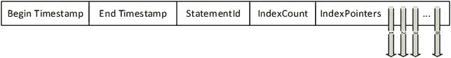

图 10-15. 内存记录头

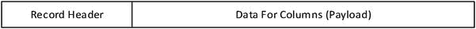

图 10-14. 基本行结构

开始时间戳和结束时间戳代表了该行有效的时间范围（时间 >= [开始时间戳] 且 时间 < [结束时间戳]）。此时间戳被已启动的事务使用，以让连接知道它能看到结构中的哪些行。所有并发性（在 第 11 章 中有更详细的介绍）都以 **快照隔离级别** 的方式处理，即事务总是能看到其在事务开始时的数据库独立视图。

举个例子，假设我们有一个包含两列的部分表：`AddressId`（一个唯一的整数值）和 `Country`（国家名称）。从时间戳 0 到 100，它看起来像这样：

```
AddressId          Country                 Value
------------------ ----------------------- ------
1                  USA                     T
2                  USA                     D
3                  Canada                  D
4                  Colombia                D
```

然后，在时间戳 100 时，它更改为以下内容，地址 2 现在是加拿大的：

```
AddressId          Country                 Value
------------------ ----------------------- ------
1                  USA                     T
2                  Canada                  D
3                  Canada                  D
4                  Colombia                D
```

然而，一个连接在时间戳 50 时仍然有一个打开的事务，因此需要保留该结构的旧视图。图 10-16 显示了这将如何呈现（技术上，内存表需要一个唯一索引，但这是基本结构的抽象示例）。

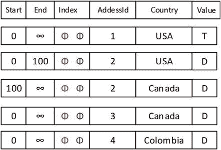

图 10-16. 示例表结构

通过对两个时间范围进行筛选，您可以看到 `AddressId = 2` 的其中一行会消失，从而为我们留下两份数据表。

结构的另一个非常不同的部分是索引的工作方式。图 10-17 中的箭头是索引指针。查找第一行的结构部分总是一个单独的结构，但物理记录指针仅指向表中的一行。从那里开始，满足索引中某个级别条件的所有值形成一个行链。

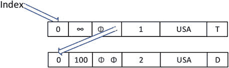

图 10-17. 索引指针

在示例中，索引的一行将指向图像中的第一行，然后指针将被跟随到第二行。对于唯一索引，您可能会本能地认为永远不会出现行链，但事实并非如此。对于更新操作，在旧行被删除之前，您最终会得到多行。此外，如果使用哈希索引，其实现方式并不保证唯一性，它仍然需要查找唯一性。对于任何索引类型，通常目标是使此链中要扫描的值平均不超过 100 个。如果情况如此，最好选择您的索引键列，使它们更具唯一性（这对于用于 `PRIMARY KEY`/`UNIQUE` 约束的索引来说应该不是问题。）

索引指针结构既有限制性又有赋能性。它的限制性在于您只能拥有八个索引。另一方面，**所有**索引的叶子节点都是表的数据。因此，聚集索引的主要好处——不必从单独的结构中获取其余数据——对于所有内存 OLTP 索引都存在，这是由它们的结构方式决定的。缺点是我们每个表最多只能有八个索引。

从概念和结构上来说，事情非常不同，但在大多数情况下，假设您正在设计和实现内存优化表，最重要的是理解基本的版本控制结构，以便了解何时选择哪个索引，并真正领会并发实现方式的差异。

### 索引结构

当 Microsoft 创建内存 OLTP 引擎时，他们不仅仅创建了像我们磁盘结构中那样的单一索引类型。有两种类型（您也可以使用列存储索引）。基于 B-Tree 的索引是极好的结构，但当您只需要进行单行查找时，它们可能就大材小用了。因此，Microsoft 为我们提供了（目前仅限于内存对象）一种新的索引类型：哈希索引。

在本节中，我们将探讨基于 B-Tree 的 Bw-Tree 索引，以及用于内存 OLTP 结构的新型哈希索引类型。

## Bw-Tree 索引

Bw-Tree 索引在所有意图和用途上，与我们自 SQL Server 诞生之初就拥有的当前 B-Tree 索引非常相似。在接下来的两节中，我将探讨 Bw-Tree 索引的概念性实现和使用模式。在图 10-18 中，您可以看到索引的基本结构。有一个页面映射层，包含索引页面的内存地址；以及一个 B-Tree 结构，其在概念上与磁盘上的 B-Tree 相同，只是树中较低的值小于父页面上的键。因此，由于页面 0 以 C 作为第一个条目，最左侧节点上的所有值都将小于或等于 C。

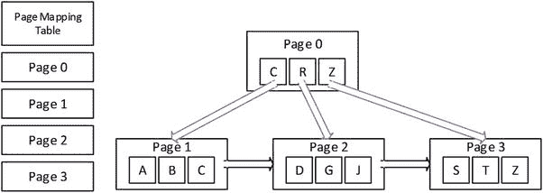

图 10-18. Bw-Tree 索引节点页面

索引节点中的值没有时间戳，并且维护所有值。叶子节点上的值指向表中的实际行。在我们的示例表中，此节点集是一个索引，其中包含来自我们示例结构行中的 `Value` 列，如图 10-19 所示。

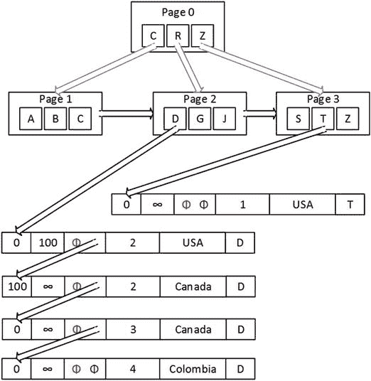

图 10-19. 链接到数据的 Bw-Tree 索引节点页面

正如内存优化表介绍部分所示，一旦您到达叶子节点中的值，它就成为了内部索引指针链表的入口点。因此，我们拥有的所有 D 值和版本都一行一行地链接在一起，任何旧的事务都会在引擎能够处理时被清理掉。


##### 哈希索引

哈希是计算机科学中一个经过充分验证的概念。自 SQL Server 7.0 以来，优化器一直使用它来对未索引、无序的集合执行联接。其核心思想是创建一个函数，该函数接收（或多或少）无限数量的输入，并输出一个有限且易于管理的“桶”来匹配它们。例如，假设有以下数据（省略号代表大约 100 行）：

```
Name
Amanda
Emma
Aria
Andrew
Addison
...
Jim
Linda
Max
```

假设你只需要在这个列表中查找一个名字。在 Bw-Tree 中，你需要承担对数据进行排序的开销，甚至可能在索引的叶页中复制数据。而在哈希索引中，你只需设计一个函数将事物分成不同的堆。作为人类，你可能会使用名字的首字母或前几个字母；或者使用名字的长度，得到如下结果：

```
Name                HashBucket
------------------- --------------------
Amanda              6
Emma                4
Aria                4
Andrew              6
Addison             7
...
Jim                 3
Linda               5
Max                 3
```

然后你按 `HashBucket` 对数据排序，接着扫描该桶。这与 SQL Server 处理哈希索引结构的方式非常相似，只是它使用的哈希函数会产生更多样化的哈希桶值。在本节中，我将从概念上探讨其如何应用于哈希索引，然后介绍创建和使用哈希索引的一些基础知识。

SQL Server 基本上以手动方式实现了哈希桶，使用一种你无法控制的未知算法进行哈希（对于所有数据类型使用一种哈希算法）。你只需基于预期唯一值数量选择桶数，大约乘以 2，该数字会在内部向上舍入到下一个最高的 2 的幂。然后创建索引，剩下的工作由它完成。每个桶在创建（或索引重建）时占用 8 字节，并且自身不会改变。如果你估算的唯一值数量发生变化，你必须手动调整桶数。请记住，哈希桶数量过多远比过少要好。正如介绍部分所述，如果要扫描的链中放置了过多值，性能将会下降。哈希桶数量越多，出现这种情况的可能性就越小。

例如，在图 10-20 中，我使用了本节开头的结构，但现在在 `Country` 列上创建了一个哈希索引。注意有两个值哈希到了同一个值（对这个例子来说真方便！）。虽然你看不到内部结构，但有一些 DMV 会告诉你平均桶长度，即使索引键是唯一的，这个值也几乎永远不会是 1。

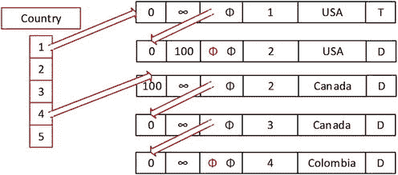

图 10-20. 示例哈希索引

在数据中，`USA` 哈希到桶 1（当然，是巧合），而 `Canada` 和 `Colombia` 哈希到 5。当 SQL Server 在索引中查找时，它使用与插入值时相同的哈希函数，然后转到哈希桶中的第一行，并扫描所有行。因此，对于 `Colombia`、`Canada` 或任何其他哈希到 4 的值，都需要进行三次内存读取。

##### 索引内存优化 OLTP 表

截至 SQL Server 2016，Microsoft 当前对内存优化 OLTP 表的索引建议是，对于几乎所有主键、唯一键和其他可能需要的索引，都从基于 Bw-Tree 的非聚集索引开始。它们更易于创建和维护，并且适用于内存优化 OLTP 表的大多数用例。

但必须指出，只要你的用例是 100% 的单值查找（如主键），哈希索引的性能会更好。这在很大程度上归因于固定的内存大小以及到达行链表头所需的处理更少。但即便如此，哈希函数的性能好坏将取决于最终需要扫描的行数，这与 NC Bw-Tree 不同，后者的扫描行严格基于所有具有相同索引键值的行。请确保你的桶大小至少是已有/预期的唯一值数量的两倍，并如前面提到的那样监控链长度。链中的值数量非常大时，性能会开始下降。同时请记住，两种索引的索引链中都会包含尚未清理的过期行数据。

在 `WideWorldImporters` 示例数据库中，有几个内存优化表。在本节中，我们将使用 `Warehouse.VehicleTemperatures` 进行一些执行计划演示。其结构如下：

```sql
CREATE TABLE Warehouse.VehicleTemperatures
(
VehicleTemperatureID bigint IDENTITY(1,1) NOT NULL
CONSTRAINT PK_Warehouse_VehicleTemperatures  PRIMARY KEY NONCLUSTERED,
VehicleRegistration nvarchar(20) COLLATE Latin1_General_CI_AS NOT NULL,
ChillerSensorNumber int NOT NULL,
RecordedWhen datetime2(7) NOT NULL,
Temperature decimal(10, 2) NOT NULL,
FullSensorData nvarchar(1000) COLLATE Latin1_General_CI_AS NULL,
IsCompressed bit NOT NULL,
CompressedSensorData varbinary(max) NULL
) WITH ( MEMORY_OPTIMIZED = ON , DURABILITY = SCHEMA_AND_DATA );
```

它包含 65,998 行，除了主键之外，表本身没有定义其他索引或外键。

首先你会注意到，在简单查询中使用这些表并没有太大不同（差异更多地出现在下一章关于显式事务和并发的讨论中，甚至当我们讨论到第 13 章涉及本机代码与解释型 T-SQL 时差异会更明显）。以以下查询为例：

```sql
SELECT *
FROM   Warehouse.VehicleTemperatures;
```

查询计划非常符合预期：

```
|--Table Scan(OBJECT:([WideWorldImporters].[Warehouse].[VehicleTemperatures]))
```

添加一个主键值：

```sql
SELECT *
FROM   Warehouse.VehicleTemperatures
WHERE  VehicleTemperatureID = 2332;
```

你会得到一个索引查找和一个参数化计划：

```
|--Index Seek (OBJECT:([WideWorldImporters].[Warehouse].[VehicleTemperatures].
[PK_Warehouse_VehicleTemperatures]),
SEEK:([WideWorldImporters].[Warehouse].[VehicleTemperatures].
[VehicleTemperatureID]=CONVERT_IMPLICIT(bigint,[@1],0)) ORDERED FORWARD)
```

你可能看到的一个差异是计划更多地使用了索引。例如，查询

```sql
SELECT *
FROM   Warehouse.VehicleTemperatures
WHERE  VehicleTemperatureID <> 0;
```

看起来绝对应该进行全表扫描。`VehicleTemperatureID <> 0` 可能只返回 1 行，但这里的计划是：

```
|--Index Seek (OBJECT:([WideWorldImporters].[Warehouse].[VehicleTemperatures].
[PK_Warehouse_VehicleTemperatures]),
SEEK:(
[WideWorldImporters].[Warehouse].[VehicleTemperatures].[VehicleTemperatureID] <> (0))
ORDERED FORWARD)
```

在测试这个有或没有索引的查询时，使用 `STATISTICS TIME`：

```sql
SELECT *
FROM   Warehouse.VehicleTemperatures WITH (INDEX = 0)
WHERE  VehicleTemperatureID <> 0;
```

使用索引的时间始终较慢，但通常小于 0.1 秒。内存优化 OLTP 表的重点是执行小型事务，因此它们期望你清楚自己在做什么。


处方建议首先使用 Bw-Tree 索引的原因之一，在于哈希索引只有一个用途：单行查找。因此，如果你需要执行任何类型的范围查询，哈希索引就帮不上忙。例如，让我们为 `RecordedWhen` 列添加一个哈希索引：

```sql
ALTER TABLE  Warehouse.VehicleTemperatures
ADD INDEX RecordedWhen                             --33000 distinct values,
HASH (RecordedWhen) WITH (BUCKET_COUNT = 64000) --值以 2 的幂次增长
```

使用等于运算符：

```sql
SELECT *
FROM   Warehouse.VehicleTemperatures
WHERE  RecordedWhen = '2016-03-10 12:50:22.0000000';
```

此时索引会被使用：

```
|--Index Seek(
OBJECT:([WideWorldImporters].[Warehouse].[VehicleTemperatures].[RecordedWhen]),
SEEK:([WideWorldImporters].[Warehouse].[VehicleTemperatures].[RecordedWhen]
=CONVERT_IMPLICIT(datetime2(7),[@1],0)) ORDERED FORWARD)
```

但即使执行计划明显只会返回相同的一行数据，只要查询条件不是等于判断，它就会使用扫描和过滤：

```sql
SELECT *
FROM   Warehouse.VehicleTemperatures
WHERE  RecordedWhen BETWEEN '2016-03-10 12:50:22.0000000' AND '2016-03-10 12:50:22.0000000';
```

这将产生如下执行计划：

```
|--Filter(
WHERE:([WideWorldImporters].[Warehouse].[VehicleTemperatures].[RecordedWhen]>=
CONVERT_IMPLICIT(datetime2(7),[@1],0)
AND
[WideWorldImporters].[Warehouse].[VehicleTemperatures].[RecordedWhen]<=
CONVERT_IMPLICIT(datetime2(7),[@2],0)))
|--Table Scan(OBJECT:([WideWorldImporters].[Warehouse].[VehicleTemperatures]))
ORDERED FORWARD)
```

如果你的吞吐量需求值得启用内存引擎，你需要进行测试以确保一切如预期般运行。在第 11 章中，我们将看到如果索引设置不当，即使是看起来很快的查询也会对并发性产生负面影响。内存 OLTP 是一项非常新的技术，专为特定场景而构建（因此标题中有“OLTP”）。

### 列存储索引

对于报表专家而言，列存储索引是一个强大的工具。本节我只想非常简要地介绍其结构，以便你在概念上了解列存储索引与典型行存储索引的区别。列存储索引是列式索引的一种形式。列式数据库已存在相当长的时间，它们按列存储所有数据。它们通常非常擅长实现那些需要为每个查询扫描大量行的报表解决方案，尤其是在处理大量重复数据时。在处理大型数据集的聚合时特别有用。对象中的列越多，而你在查询中需要使用的列越少，性能优势就越大。图 10-21 展示了列存储索引结构的概念图。

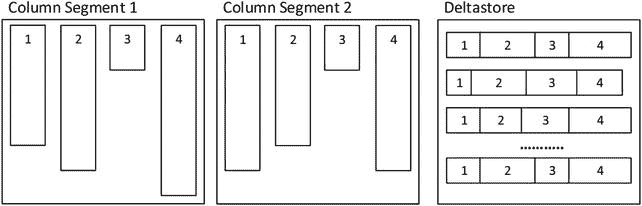

图 10-21.

列存储索引的概念视图

列段块理想情况下每块包含 1,048,576 行，每个编号部分代表一个列，每个段按表中的行排序。它们大小不同，因为每个段都经过了压缩，类似于你在页面上压缩普通数据的方式，但不是 8K 页面，而是在类似 Blob 的存储中对超过 100 万行数据进行压缩。

列存储索引中的数据是无序的，但在使用时（称为“批处理模式”）会进行扫描，该模式一次处理大约 900 行数据，而不是典型行存储索引使用的逐行模式。根据我的实践经验，在某些极端情况下（例如一个拥有 120 列的数据仓库事实表，而你只对其中 3 列进行聚合），查询性能可以提升数个数量级。

当你修改带有聚集列存储索引的表时，增量存储（deltastore）开始发挥作用，新行会被放入增量存储，直到达到 1,048,576 行的阈值。增量存储本质上是一个将被扫描的堆结构。使用 `ALTER INDEX` 命令的 `REBUILD` 或 `REORGANIZE` 命令，你也可以手动将行推入列段。本书不会深入探讨列存储索引的管理。

对列存储索引中行的更新，操作是从列存储索引中删除该行，然后将该行添加到增量存储（对于聚集列存储索引）或最后一个列存储段（对于非聚集列存储索引）。因此，尽可能避免大量修改操作对你有好处。

在 SQL Server 2016 中，有聚集和非聚集列存储索引，两者都可更新，并且都可以与行存储索引混合使用。这一 2016 版的改进支持一些非常高级的场景，这将在第 14 章中介绍。混合索引最重要的好处是，列存储索引非常不擅长单行查找。这是因为没有声明或强制执行唯一性。这导致每个查询都变成对结构的扫描。

## 索引使用的常见 OLTP 模式

本节我汇集了一些重要但不太适合放在前面章节讲述的主题（有时是因为它们需要多个章节才能讲完）。

我们将探讨这些主题：

*   何时在非主键上进行聚集：这可能是聚集索引最常见的用法，但并非总是最佳选择。
*   为外键建立索引：外键几乎总是代表从表中检索数据的常见路径，但它们是否总是需要索引？它们是否有时需要索引？（是的，有时需要！）
*   索引视图：到目前为止，我们的讨论仅限于为表建立索引，但在某些情况下，你可以为视图建立索引，从而由 SQL Server 的代码（而非你的代码）维护以提供快速答案。
*   压缩：在磁盘上容纳更多数据意味着更少的磁盘读取，而磁盘仍然是计算机中最慢的部分。
*   分区：分区在物理上拆分表或索引，但对最终用户来说它看起来仍然是一个对象。这使得一些编码和维护场景更容易处理。


### 何时在非主键上进行聚簇索引

对于磁盘表，聚簇索引的大多数使用场景都会围绕主键，尤其是在使用代理键时。然而，聚簇索引并不总是用于代理键甚至主键。其他可能的用途可分为以下几种类型：

*   **范围查询**：当存在需要经常获取某个范围（例如从 A 到 F）的数据时，将所有数据按顺序存储通常是有意义的。一个典型的例子是父子关系中的子行数据。
*   **总是按顺序访问的数据**：显然，如果数据需要按给定顺序访问，那么数据已经按此排序将显著提升性能。
*   **返回大型结果集的查询**：由于数据是与聚簇索引一起存储的，你可以避免书签查找的成本，而书签查找在很多情况下往往会导致表扫描。
*   **子表外键引用**：在某些情况下，一个结构类似 `(InvoiceLineItemId 主键, InvoiceId 外键, LineNumber, UNIQUE(InvoiceId, LineNumber))` 的表（如 `InvoiceLineItem`）可能会从在 `InvoiceId` 上聚簇索引中获益匪浅，即使该键并非唯一。首先获取 `Invoice`，然后获取对应的 `InvoiceLineItem` 行。需要注意的是，有时你最终使用代理键获取行的次数可能超出逻辑预期，因此实证测试和观察使用情况非常重要。

选择如何确定聚簇索引取决于几个因素，例如将有多少其他索引会基于此索引派生、索引键的大小以及该值的变更频率。当聚簇索引的值发生变化时，表上的每个索引也都必须被触及和更改；并且如果该值可能变得更大，那么我们就可能面临页分裂的问题。这又回到了解数据使用者并对系统进行充分测试的重要性，以验证你的索引选择是否利大于弊，不会对整体性能造成更大伤害。使用某个聚簇键加快一个查询的速度，可能会损害所有使用非聚簇索引的查询，特别是当你为聚簇索引选择了一个很大的键时。

坦率地说，在 OLTP 环境中，除了最不寻常的情况，我通常会从一个代理键开始作为我的聚簇键，通常是整数类型之一，有时甚至是唯一标识符（GUID）类型（理想情况下是顺序类型），即使它宽达 16 字节。我使用代理键是因为你在修改数据时（OLTP 系统的主要目标）执行的很多查询通常会通过主键访问数据。然后你只需要优化检索操作，这些操作通常也涉及少量行，而做到这一点通常相当容易。

重申一个重要观点：将聚簇索引用于像单调递增的代理值这样的值也是非常好的，这样可以在插入时大大减少整个索引上的页分裂。表只在一端增长，虽然它确实需要偶尔使用 `ALTER INDEX REORGANIZE` 或 `ALTER INDEX REBUILD` 进行重建，但你最终不会在整张表上出现页分裂。你可以根据 SQL Server 联机丛书所述的标准来决定执行哪项操作。通过查看动态管理视图 `sys.dm_db_index_physical_stats`，你可以对碎片率大于 30%的索引使用 `REBUILD`，对其他的使用 `REORGANIZE`。我们将在本章后面的“索引动态管理视图查询”一节中对此进行更多讨论。

### 为外键建立索引

外键列是一个特例，我们经常需要某种类型的索引。这对于磁盘表和内存表都是如此。我们建立外键是为了将一个表中的行与另一个表中的行匹配起来。为此，我们必须获取一个表中的一个值并与另一个表中的值匹配。

在一个对替代键有适当约束的 OLTP 数据库中，通常，我们可能不需要在数据库结构自带的唯一索引之外再为外键建立索引。这可能就是为什么 SQL Server 在创建外键约束时不会自动为我们实现索引。

然而，重要的是要确保，任何时候你声明了外键约束，就存在可能需要索引的潜在需求。通常，当你有一个包含特定值的父表时，你可能想查看该行的子行。这种访问类型至关重要的一个特殊且重要的情况是，当你必须删除任何关系（即使是基数非常低的域类型关系）中的父行时。如果有疑问，默认情况下为外键添加索引并不是一个糟糕的做法，并且在测试期间，可以使用即将讨论的“索引动态管理视图查询”一节中的某个查询来识别索引是如何被使用的，或者是否被使用。

假设父表有 5 个值，而子表有 5 亿条记录。例如，考虑一个销售数据库的点击日志，其片段如图 10-22 所示。

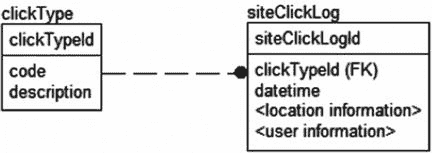
图 10-22. 外键关系示例

假设你想删除某人误添加的一个 `clickType` 行。创建该行花了数毫秒。删除它应该不需要很长时间，对吧？嗯，即使表中没有匹配的值，如果你没有在 `siteClickLog` 表的外键上建立索引，这个操作可能需要比永恒多出 10 秒以上的时间。即使该值在表中不存在，查询处理器也需要触及并检查所有 5 亿行以查找该值。根据列上的统计信息，查询处理器可以猜测可能存在多少行，但它无法明确知道该值是否存在，因为统计信息是异步维护的。（讽刺的是，因为这是一次存在性搜索，查询处理器可能在检查第一行时就快速失败，但要成功删除该行，必须触及每一个子行。）

然而，如果你有一个索引，删除该行（或知道无法删除）将花费非常短的时间，因为在索引的上层页中，你拥有索引中的所有唯一值，在这个例子中是 5 个值。索引的叶子页集合会相当庞大，但在查询处理器能够确定数百万行中是否存在某行之前，每个索引级别通常只需要触及一个页面（一般不超过三到四个页面）。当关系指定了 `NO ACTION` 时，只要发现一行，操作就可以停止。如果你为该关系启用了级联操作，级联选项将需要索引来查找要级联到的行。

这在构建索引时增加了更多决策点。在创建数百万条 `siteClickLog` 行期间，构建和维护索引的成本是否合理？还是你宁愿忍一忍，在非高峰时段执行删除操作？可以添加一个类似于下面这样的触发器（为简洁起见，本例中省略了错误处理）：

```
CREATE TRIGGER clickType$insteadOfDelete
ON clickType
INSTEAD OF DELETE
AS
INSERT INTO clickType_deleteQueue (clickTypeId)
SELECT clickTypeId
FROM   deleted;
```

然后，让你返回 `clickType` 行列表的查询在向用户展示行时检查这个表：


```
SELECT code, description, clickTypeId
FROM   clickType
WHERE  NOT EXISTS (SELECT *
FROM   clickType_deleteQueue
WHERE  clickType.clickTypeId =
clickType_deleteQueue.clickTypeId);
```

现在，假设所有代码都遵循此模式，用户将永远不会看到该值，因此这不会成为问题（至少在值被使用方面不会；性能显然会受到影响）。然后，你可以在凌晨时分删除该行，而无需构建索引。索引是否有用通常取决于外键的用途。我将分别提及特定类型的外键，每种都有其标志性的用法：

*   域表：用于实现一组定义的值及其描述
*   所有权关系：用于实现父表的多值属性
*   多对多关系表关系：用于物理实现多对多关系
*   一对一关系：父表在相关表中可能只有一个值的情况

我们将查看这些类型的示例，并讨论在典型的试错性能调整之前何时适合为它们建立索引，经验法则是添加索引以使查询更快，同时不减慢其他创建数据的操作。

在所有情况下，如果子行上没有索引，删除父行都需要对子表进行表扫描。如果有删除操作，这是一个重要的考虑因素。

## 域表

你使用域表来通过表强制执行一个域，而不是使用带有约束的标量值。这样做通常是为了能够提供关于域值的更高级别的信息，例如描述性值。例如，考虑图 10-23 中的表。

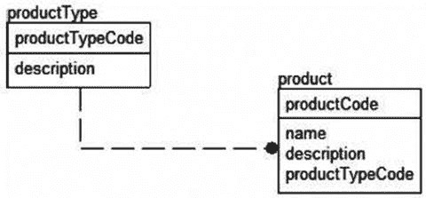

图 10-23. 示例域表关系

在这种情况下，`productType` 表中的行数很少。`product.productTypeCode` 列上的索引在连接中不太可能有任何价值，因为你通常会为从 `product` 表中获取的每一行获取一个 `productType` 行。

那么另一个方向呢，当你想查找单一类型的所有产品时？如果产品数量不多，这可能有用，但一般来说，域类型表没有足够的唯一值来证明建立索引是合理的。通用建议是，默认情况下，此类表不需要在外键值上建立索引。当然，删除 `productType` 行需要扫描整个 `productType` 表。

另一方面，如本章前面所讨论的，有时当某些值的数量有限时，索引可能很有用。例如，考虑图 10-24 所示的 `user` 到 `userStatus` 关系。

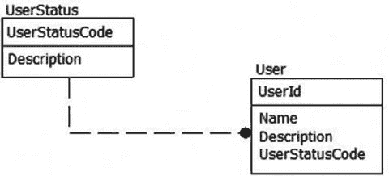

图 10-24. 低基数域表示例关系

在这种情况下，大多数用户在数据库中的状态将是活动的。然而，当用户被停用时，你可能需要对该用户执行某些操作。由于非活跃用户的数量远少于活跃用户，为此在 `UserStatusCode` 列上建立索引（可能是一个筛选索引）可能很有用。

## 所有权关系

有些表如果没有另一个表的存在就没有意义，它们几乎作为另一个表的一部分而存在（由于关系设计的方式）。当我在考虑所有权关系时，我指的是实现一行的多值属性的关系，就像过程语言中的数组为对象所做的那样。这种情况的主要性能特征是，在大多数情况下，当检索父行时，也会检索子行。你不太可能需要检索子行然后查找父行。

例如，以图 10-25 中的发票及其明细项为例。

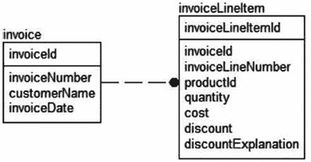

图 10-25. 示例所有权关系

在这种情况下，必须在 `invoiceLineItem.invoiceId` 列上建立索引，可能作为 `UNIQUE` 约束的一部分。对 `invoiceLineItem` 表的大量访问源于用户需要先获取发票。这种情况也非常适合建立索引，因为通常情况下，这将是一个选择性很高的索引（除非你有大量明细项但销售很少）。

请注意，你应该已经在该表的备选键上建立了 `UNIQUE` 约束（并因此有一个唯一索引）——在此例中是 `invoiceId` 和 `invoiceLineNumber`。因此，你可能不需要仅仅在 `invoiceId` 上建立索引。可能存在疑问的是，`invoiceId` 和 `invoiceLineNumber` 上的索引是否应该聚集，正如我在上一节关于何时在非代理值上聚集所指出的。如果你大多数 `SELECT` 操作都使用 `invoiceId`，这实际上可能是个好主意。然而，在这种情况下你应该小心，因为你实际上可能会对主键值进行更多的提取，因为 `UPDATE` 和 `DELETE` 操作在执行修改之前，开始时的表现类似于 `SELECT`。例如，应用程序最终可能会执行一次查询来获取发票明细项，然后逐行更新每行以执行某些操作。因此，请始终关注数据库中的活动并相应地进行调整。

## 多对多关系表关系

当我们有多对多关系时，肯定需要在来自两个父表的两个迁移键上建立索引。使用我们在 第 7 章 中使用过的一个例子，即在保存一个人拥有的游戏的表之间存在多对多关系，`gamePlatform` 和 `game` 之间的关系如图 10-26 所示。

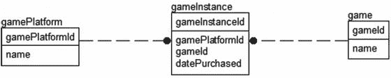

图 10-26. 示例多对多关系

在这种情况下，你应该已经在 `gamePlatformId` 和 `gameId` 上建立了唯一索引，并且其中一个必然在复合索引中排在第一位。如果你需要独立地搜索这两个键，你可能想在每个列上单独创建一个索引（或者至少是在唯一性约束的索引中列在第二位的那个列）。

以这个例子为例。如果我们通常按名称查找游戏（该名称会被备选键索引），然后获取该游戏的平台，那么仅在 `gameInstance.gameId` 上的索引会更有用，而且其大小是备选键索引的三分之二（假设聚集键是 `gameInstanceId`）。

## 一对一关系

一对一关系通常需要在父表的键上以及在子表的迁移键上建立某种形式的唯一索引。例如，考虑图 10-27 所示的 `bankAccount` 子类示例。


图 10-27. 示例一对一关系

在这种情况下，因为这些是一对一关系，并且每个表的主键上已经有了索引，所以不需要添加其他索引就能有效地实现该关系。


### 索引视图

我在第 6 章提到过使用持久化计算列来优化针对单行的反规范化操作。但有时，你的反规范化需求需要跨越多行，并包含汇总等操作。在本节中，我将介绍一种将反规范化提升到新高度的方法：使用索引视图。

对视图进行索引，本质上是将视图的虚拟结构转变为一个物理实体，尽管它完全由查询处理器管理。用于解析视图查询的数据是在表中的数据被修改时生成的，因此访问视图的结果就像访问实际表一样快。索引视图让你无需任何手动操作或触发器就能构建汇总表；SQL Server 会自动为你维护汇总数据。创建索引视图（或多或少）就像编写查询一样简单。

使用索引视图有双重好处。首先，当你在任何版本的 SQL Server 中直接使用索引视图时，它无需进行任何计算（对于企业版以下的版本，必须指定 `NOEXPAND` 作为提示）。其次，在企业版或更高版本（加上开发版）中，当你执行任何查询时，SQL Server 会自动考虑使用索引视图，即使查询没有直接引用该视图，但你执行的代码使用了相同的聚合函数。SQL Server 通过将执行的查询与每个索引视图进行匹配，来检查该视图是否已经包含你所询问问题的答案，从而实现这种索引视图的假设。

例如，我们可以在 `WideWorldImporters` 数据库的产品表和销售表上创建以下视图。请注意，只有架构绑定视图才能被索引，因为这可以确保索引所基于的表和结构不会在视图下方发生更改。（示例之后会列出更完整的要求列表。）

```sql
CREATE VIEW Warehouse.StockItemSalesTotals
WITH SCHEMABINDING
AS
SELECT StockItems.StockItemName,
--ISNULL 因为表达式不能为可为空
SUM(OrderLines.Quantity * ISNULL(OrderLines.UnitPrice,0)) AS TotalSalesAmount,
COUNT_BIG(*) AS TotalSalesCount--索引视图必须使用 COUNT_BIG
FROM  Warehouse.StockItems
JOIN Sales.OrderLines
ON  OrderLines.StockItemID = StockItems.StockItemID
GROUP  BY StockItems.StockItemName;
```

这将把计算推迟到执行时进行。我们运行以下查询：

```sql
SELECT *
FROM   Warehouse.StockItemSalesTotals;
```

执行计划看起来……嗯，像是五个算子，持续一段时间，用文字描述会很难阅读。图 10-28 提供了图像。它丢失了文本计划的许多细节，但可能节省一棵树的空间。


图 10-28. 使用该视图的查询计划图像

对于如此小的查询来说，这确实是一个很大的计划，而且难以理解。它扫描了 `OrderLines` 表，计算了我们的标量值，然后进行哈希匹配聚合和哈希匹配联接，将两个集合联接在一起。有关联接类型的进一步阅读，可以参考 Kalen Delaney 的 SQL Server 内部系列书籍。

在这个示例数据库中，这仅返回 227 行，但假设这个查询不够快，或者它执行时使用了太多资源，或者它被极其频繁地使用。在这种情况下，我们可能会在视图上添加一个索引。请注意，这是一个聚集索引，因为数据页将根据我们选择的键进行排序。考虑索引的结构就像考虑物理表的结构一样。

```sql
CREATE UNIQUE CLUSTERED INDEX XPKStockItemSalesTotals on
Warehouse.StockItemSalesTotals(StockItemName);
```

然后，SQL Server 将物化该视图并存储它。现在，我们对视图的查询将会非常快。然而，尽管我们避免了与存储汇总数据相关的所有编码问题，但我们必须保持数据的更新。每当基础表中的数据发生变化时，视图上的索引也会改变其数据，因此维护视图索引会有性能开销。因此，索引视图意味着读取性能很好，但更新性能不一定好。

现在，再次运行查询，计划如下所示：

```text
|--Clustered Index Scan
(OBJECT:([WideWorldImporters].[Warehouse].[StockItemSalesTotals].
[XPKStockItemSalesTotals]))
```

没什么大不了的，对吧？我们预期这个结果，因为我们直接查询了视图。在我的测试系统上（运行的是功能上与企业版相当的开发版），通过运行以下查询（它基本上是我们在两个因子之间添加了一个除法运算符的原始查询），你可以很好地了解这个功能有多酷：

```sql
SELECT StockItems.StockItemName,
SUM(OrderLines.Quantity * ISNULL(OrderLines.UnitPrice,0)) / COUNT_BIG(*)
AS AverageSaleAmount
FROM  Warehouse.StockItems
JOIN Sales.OrderLines
ON  OrderLines.StockItemID = StockItems.StockItemID
GROUP  BY StockItems.StockItemName;
```

我们期望这个查询的计划与第一个视图查询的相同，因为我们没有引用除基表之外的任何东西，对吧？我已经告诉过你答案了，所以计划如下：

```text
|--Compute Scalar
(DEFINE:([Expr1006]=
[WideWorldImporters].[Warehouse].[StockItemSalesTotals].[TotalSalesAmount]
/CONVERT_IMPLICIT(decimal(19,0),[WideWorldImporters].[Warehouse].[StockItemSalesTotals].
[TotalSalesCount],0)))
|--Clustered Index Scan
(OBJECT:([WideWorldImporters].[Warehouse].[StockItemSalesTotals].
[XPKStockItemSalesTotals]))
```

这里有一个执行我们数学运算的标量计算，但你会注意到计划引用了 `StockItemSalesTotals` 索引视图，而我们在查询中并没有直接引用它。能够间接使用索引视图的优化功能是一个巧妙的特性，它允许你预先设想即席用户可能会对数据执行哪些操作，并为他们提供他们甚至没有要求的性能。

提示

企业版及更高版本中的索引视图功能，在调整那些基于无法直接调整的 API（即，通过更改查询文本来使其更高效）工作的第三方系统时，也可能派上用场。

不过，也有一些相当严格的注意事项。在视图被索引之前，对其可以使用的内容限制相当严格。不能做的最重要事情如下：

*   使用 `SELECT *` 语法——列必须显式命名。
*   使用 CLR 用户定义聚合。
*   在视图中使用 `UNION`、`EXCEPT` 或 `INTERSECT`。
*   使用任何子查询。
*   使用任何外部联接或递归联接到同一个表。
*   在 `SELECT` 子句中指定 `TOP`。
*   使用 `DISTINCT`。
*   在引用多列时包含 `SUM()` 函数。
*   使用 `COUNT(*)`，但允许使用 `COUNT_BIG(*)`。
*   对可为空的表达式使用几乎任何聚合函数。
*   引用任何其他视图，或使用 CTE 或派生表。
*   引用任何非确定性函数。
*   引用数据库外部的数据。
*   引用不同所有者拥有的表。

而这还不是全部。你必须满足许多页的要求，这些要求在 SQL Server 联机丛书中“创建索引视图”部分有记录（ [`msdn.microsoft.com/en-us/library/ms191432.aspx`](https://msdn.microsoft.com/en-us/library/ms191432.aspx) ）。然而，这些是你在使用索引视图之前需要考虑的最重要的事项。


尽管这些规则看起来相当严格，但都有其充分的理由。维护索引视图类似于编写我们自己的非规范化数据维护函数。简而言之，构建非规范化数据的查询越复杂，维护它的成本就越高。向基表添加一行数据，就可能导致视图需要重新计算，涉及成千上万行数据。

当您有一个执行成本很高，但其底层数据变化不大的视图时，索引视图尤其有用。例如，考虑一个每天只加载一次数据的决策支持系统。无论是维护索引还是可能仅仅重建索引，都存在开销，但如果您能在非工作时间构建索引，就可以省去为每次视图使用重新执行连接和计算的成本。

**提示**

尽管有这些警告，索引视图在某些情况下可能毫无用处。另一种方法是，将数据结果具体化，通过将数据插入到一个永久表中，以便在任何可以容忍一定数据延迟的情况下使用。

### 压缩

在讨论列存储索引时，我提到过压缩。在普通索引中（包括聚集索引、堆和 B-Tree），SQL Server 可以通过将所有数据存储为可变大小类型来节省空间，但在使用时，数据的表现和行为就像固定长度类型一样。在附录 A 中，我将说明压缩如何单独影响每种数据类型，或者如果您想查看可能显示任何最新更改的列表，可以查阅 SQL Server 联机丛书中关于“行压缩实现”的主题（`msdn.microsoft.com/en-us/library/cc280576.aspx`）。

例如，如果您在一个 `int` 列中存储了值 100，SQL Server 无需使用全部 4 个字节；它可以将值 100 存储在与 `tinyint` 相同大小的空间中。因此，SQL Server 可以简单地使用 8 位（1 字节），而不是完整的 4 字节。另一种情况是，当您使用像 `char(30)` 这样的固定长度类型，但只存储了两个字符；可以节省 28 个字符的空间，数据在被使用时会被填充。

这种数据类型级别的压缩是行压缩的一部分，表中的每一行都会根据数据类型允许的情况进行压缩，从而减小磁盘上的大小，但不会对页面结构进行重大更改。对于使用大量固定长度数据（例如整数，特别是代理键）的许多数据库来说，行压缩是一个非常有趣的选择。

SQL Server 还包含一个额外的压缩功能，称为页压缩。使用页压缩时，首先数据会以与行压缩相同的方式进行压缩，然后，存储引擎会做几件有趣的事情来压缩页面上的数据：

*   前缀压缩：存储引擎查找值中重复的值（如 `'0000001'`），并将前缀压缩为类似 `6-0`（六个零）的形式。
*   字典压缩：对于页面上的所有值，存储引擎查找重复项，将重复值存储一次，然后在重复值原始所在的数据页面上存储指针。

您可以使用 `CREATE TABLE`、`ALTER TABLE`、`CREATE INDEX` 和 `ALTER INDEX` 语法对表和索引应用数据压缩。例如，我将创建一个名为 `test` 的简单表，并在表上启用页压缩，在聚集索引上启用行压缩，在另一个索引上启用页压缩。

```
USE Tempdb
GO
CREATE TABLE dbo.TestCompression
(
TestCompressionId int,
Value  int
)
WITH (DATA_COMPRESSION = ROW) -- PAGE or NONE
ALTER TABLE testCompression REBUILD WITH (DATA_COMPRESSION = PAGE);
CREATE CLUSTERED INDEX Value
ON testCompression (Value) WITH ( DATA_COMPRESSION = ROW );
ALTER INDEX Value  ON testCompression REBUILD WITH ( DATA_COMPRESSION = PAGE );
```

**注意**

`CREATE INDEX` 和 `CREATE TABLE` 命令的语法允许以不同的方式压缩索引的各个分区。我将在本章下一节中提到分区。有关完整语法，请参阅 SQL Server 联机丛书。

如果不了解您实际情况的相关因素，很难给出是否使用压缩的建议。您应该使用的一个工具是系统存储过程——`sp_estimate_data_compression_savings`——来检查现有数据，看看表或索引中的数据在应用压缩后会被压缩到什么程度，但它不会告诉您压缩会对性能产生正面还是负面影响。任何形式的压缩都需要权衡利弊。在大多数情况下，CPU 利用率会上升，因为查询处理器不是直接从页面使用数据，而是必须将值从压缩格式转换为 SQL Server 将使用的未压缩格式。另一方面，如果您有大量数据可以从压缩中受益，您可能会显著降低 I/O，从而值得为此付出成本。坦率地说，随着如今多核场景下 CPU 能力的飞速增长，而 I/O 仍然是难以调整的瓶颈，压缩对于许多系统来说无疑是一件好事。但是，我建议在将压缩应用到生产系统之前，进行启用和不启用压缩的测试。


# SQL Server 分区与索引

## 分区

分区允许您将索引/表拆分为多个物理结构，通过将它们分解为更易管理的块，使得最终用户看起来它们仍然只有一个。分区可以让 SQL Server 从不同进程扫描数据，从而增强并行处理的机会。

分区允许您在表结构内定义物理划分。您无需为每个分区创建物理表，而是在 DDL（数据定义语言）级别定义表的不同分区。在内部，表会根据您设置的方案被拆分到这些分区中。

在查询时，SQL Server 可以基于正在执行的查询的 `WHERE` 子句中的条件，动态地仅扫描需要搜索的分区。我不打算过多描述分区功能，但我觉得在本书的这个版本中需要提一下，因为它是一个可供您使用的工具，可用于调整您的数据库，特别是当数据库非常大或非常活跃时。内存表可以参与分区方案，并且并非每个分区都需要是内存中的才能这样做。关于更深入的内容，我建议您考虑阅读 Kalen Delaney 的某本《SQL Server 内部原理》书籍。它们是理解 SQL Server 内部机制的黄金标准。

不过，我将展示以下基本的分区示例。您可以使用任何想要的数据库。示例是一个销售订单表。我将根据订单日期将销售数据分为三个区域。一个区域存放 2006 年之前的销售，另一个存放 2006 年到 2007 年的销售，最后一个存放 2007 年及之后的销售。第一步是创建一个分区函数。您必须基于一组值来定义该函数，其中 `VALUES` 子句设置了行将落入的分区，这些分区基于传递给函数的 `smalldatetime` 值，对于我们的示例：

```sql
USE Tempdb;
GO
--注意：分区函数不是架构所属对象
CREATE PARTITION FUNCTION PartitionFunction$Dates (date)
AS RANGE LEFT FOR VALUES ('20140101','20150101');
--基于近期版本的
--WideWorldImporters.Sales.Orders 表设置
--以展示分区利用情况
```

将函数指定为 `RANGE LEFT` 表示逗号分隔列表中的值应被视为所列出一侧的边界。因此，在本例中，范围将如下：

*   `值 <= '20131231'`
*   `值 >= '20140101'` 且 `值 <= '20141231'`
*   `值 >= '20150101'`

接下来，使用该分区函数创建分区方案：

```sql
CREATE PARTITION SCHEME PartitonScheme$dates
AS PARTITION PartitionFunction$dates ALL to ( [PRIMARY] );
```

这将显示以下消息：

```text
分区方案 'PartitonScheme$dates' 已成功创建。'PRIMARY' 被标记为分区方案 'PartitonScheme$dates' 中下一个要使用的文件组。
```

通过 `CREATE PARTITION SCHEME` 命令，您可以将先前定义的每个分区放置到特定的文件组上。为了清晰和简便，我将它们全部放在同一个文件组上，但在实践中，根据分区的目的，您可能希望将它们放在不同的文件组上。例如，如果您分区只是为了将经常活动的数据保持在一个较小的结构中，将所有分区放在同一个文件组上可能没问题。但如果您想提高并行性，或者能够仅使用文件组备份来备份一个分区，那么您就需要将分区放在不同的文件组上。

接下来，您可以将分区应用到一个新表。您需要一个包含分区键的聚集索引。您将分区应用到该索引。以下是创建分区表的语句：

```sql
CREATE TABLE dbo.Orders
(
OrderId     int,
CustomerId  int,
OrderDate  date,
CONSTRAINT PKOrder PRIMARY KEY NONCLUSTERED (OrderId) ON [Primary],
CONSTRAINT AKOrder UNIQUE CLUSTERED (OrderId, OrderDate)
) ON PartitonScheme$dates (OrderDate);
```

然后，从 `WideWorldImporters.Sales.Orders` 表加载一些数据，以使查看元数据更有趣。您可以使用类似以下的 `INSERT` 语句来完成：

```sql
INSERT INTO dbo.Orders (OrderId, CustomerId, OrderDate)
SELECT OrderId, CustomerId, OrderDate
FROM  WideWorldImporters.Sales.Orders;
```

您可以使用 `$partition` 函数查看每一行落在哪个分区。您在 `$partition` 函数后附加分区函数名称和分区键（或分区值）的名称，以查看行值所在的分区，例如：

```sql
SELECT *, $partition.PartitionFunction$dates(orderDate) as partition
FROM   dbo.Orders;
```

您也可以通过 `sys.partitions` 目录视图查看已设置的分区。以下查询显示我们新创建表的分区：

```sql
SELECT  partitions.partition_number, partitions.index_id,
partitions.rows, indexes.name, indexes.type_desc
FROM    sys.partitions as partitions
JOIN sys.indexes as indexes
on indexes.object_id = partitions.object_id
and indexes.index_id = partitions.index_id
WHERE   partitions.object_id = object_id('dbo.Orders');
```

这将返回以下结果：

```text
partition_number index_id    rows        name           type_desc
---------------- ----------- ----------- -------------- ---------------------
1                1           19547       AKSalesOrder   CLUSTERED
2                1           21198       AKSalesOrder   CLUSTERED
3                1           32850       AKSalesOrder   CLUSTERED
1                2           73595       PKSalesOrder   NONCLUSTERED
```

分区并非适用于每个表的通用工具。然而，如果需要，分区可以为您解决相当多的问题：

*   **性能：** 如果您从一个拥有三年数据的表中只需要过去一个月的数据，您可以创建数据分区，将当前数据放在一个分区上，将以前的数据放在不同的分区上。
*   **滚动窗口：** 您可以通过删除分区来移除表中的数据，因此随着时间的推移，您可以为新数据添加分区，并为旧数据移除分区（或移动到不同的归档表）。在滚动窗口中使用多个唯一性约束可能很困难，因此请确保以某种方式覆盖您所有的唯一性需求。
*   **维护：** 一些维护可以在分区级别完成，而不是针对整个表，因此一旦分区数据变为只读，您可能就不再需要进行维护。需要注意一些可能变动的注意事项，因此我建议您查阅相关文档。

## 索引与动态管理视图查询

在本节中，我希望提供几个使用动态管理视图的查询，在调整系统或索引使用时，您可能会发现它们很方便。在 SQL Server 2005 中，Microsoft 向 SQL Server 添加了一组对象（视图和表值函数），使我们能够访问系统性能的一些深层元数据。这些对象中有许多对于管理和调整 SQL Server 非常有用，我建议您阅读一些关于这些对象的资料（并非过分自夸，但由 Tim Ford 和我本人撰写、Simple-Talk 于 2010 年出版的《使用 SQL Server 动态管理视图进行性能调优》（高性能 SQL Server）是我最喜欢的关于这个主题的书，尽管它现在看起来有点老了）。我确实想为您提供一些查询，在您使用索引进行任何调整时，这些查询可能会对您非常有用。


### 缺失索引

我们要讨论的第一个查询可以让你一窥优化器认为哪些索引（磁盘和内存中）可能对查询有用。这在调整数据库时非常有用，尤其是对于一个非常繁忙、每分钟执行数千次查询的数据库。我曾亲自使用这个查询来调整第三方系统，在这些系统中，我对系统内的查询没有太多访问权限，而且使用扩展事件（Extended Events）对于手动调整来说过于繁琐，因为查询数量太多。

此查询使用了属于缺失索引对象家族的三个动态管理视图：

*   `sys.dm_db_missing_index_groups`：此视图将缺失索引组与组中的索引关联起来。
*   `sys.dm_db_missing_index_group_stats`：此视图提供有关组中索引对系统有多少帮助（和损害）的统计信息。
*   `sys.dm_db_missing_index_details`：此视图提供有关优化器本希望可用的索引的信息。

查询如下。我不会尝试在本书中构建一个可以让你测试此功能的场景，但请在你的一台开发服务器上运行此查询并检查结果。结果可能会让你也想在生产服务器上运行它。

```sql
SELECT ddmid.statement AS object_name, ddmid.equality_columns, ddmid.inequality_columns,
ddmid.included_columns,  ddmigs.user_seeks, ddmigs.user_scans,
ddmigs.last_user_seek, ddmigs.last_user_scan, ddmigs.avg_total_user_cost,
ddmigs.avg_user_impact, ddmigs.unique_compiles
FROM   sys.dm_db_missing_index_groups AS ddmig
JOIN sys.dm_db_missing_index_group_stats AS ddmigs
ON ddmig.index_group_handle = ddmigs.group_handle
JOIN sys.dm_db_missing_index_details AS ddmid
ON ddmid.index_handle = ddmig.index_handle
ORDER BY ((user_seeks + user_scans) * avg_total_user_cost * (avg_user_impact * 0.01)) DESC;
```

该查询返回以下关于可能有用的索引结构的信息：

*   `object_name`：这是该索引本可发挥作用的对象的、包含数据库和架构限定的名称。返回的数据涵盖整个服务器上的所有数据库。
*   `equality_columns`：这些是基于相等谓词本会有用的列。列以逗号分隔的列表形式返回。
*   `inequality_columns`：这些是基于不等谓词（正如我们讨论过的，指除了 `column = value` 或 `column in (value, value1)` 之外的任何比较）本会有用的列。
*   `included_columns`：如果通过 `INCLUDE` 子句添加到索引中，这些列本可用于覆盖查询结果并避免计划中的键查找操作。对于内存中的查询，忽略这些列，因为根据这些表的结构，所有列本质上都已包含在内。
*   `unique_compiles`：已编译的、可能使用了该索引的计划数量。
*   `user_seeks`：用户查询中可能使用了该索引的查找操作次数。
*   `user_scans`：用户查询中可能使用了该索引的扫描操作次数。
*   `last_user_seek`：上一次查找操作可能使用该索引的时间。
*   `last_user_scan`：上一次扫描操作可能使用该索引的时间。
*   `avg_total_user_cost`：本可受益于该索引组的查询的平均成本。
*   `avg_user_impact`：该索引预计为用户查询带来的成本变化百分比。

如前所述，等值列通常会放在索引列定义的首位，但这并不能保证就能创建出正确的索引。这些只是指导原则，使用我将要介绍的下一个 DMV 查询，你可以发现你创建的索引是否真的有价值。

请注意，我根据我最初阅读的关于使用缺失索引的博客文章《Fun for the Day – Automated Auto-Indexing》（ [`blogs.msdn.microsoft.com/queryoptteam/2006/06/01/fun-for-the-day-automated-auto-indexing/`](https://blogs.msdn.microsoft.com/queryoptteam/2006/06/01/fun-for-the-day-automated-auto-indexing/) ）将查询结果排序为 `(user_seeks + user_scans) * avg_total_user_cost * (avg_user_impact * 0.01)`。我通常使用其某种变体来确定什么是最重要的。例如，我可能会使用 `order by (user_seeks + user_scans)` 来查看哪些索引本可在最多次数的查询中有用。这实际上取决于我试图分析什么；对于所有此类查询，尝试运行查询并观察什么适用于你的情况是有好处的。

要使用输出结果，你可以根据四个结构列中的值创建一个 `CREATE INDEX` 语句。假设你收到以下结果：

```
object_name                          equality_columns               inequality_columns
------------------------------------ ------------------------------ --------------------
databasename.schemaname.tablename    columnfirst, columnsecond      columnthird
included_columns

columnfourth, columnfifith
```

你可以构建以下索引来满足需求：

```sql
CREATE INDEX XName ON databaseName.schemaName.TableName(columnfirst, columnsecond, columnthird) INCLUDE (columnfourth, columnfifith);
```

接下来，看看它是否如你所预期的那样有助于性能。即使你不确定索引可能如何有用，也可以创建它，看看它是否有影响。

联机丛文档列出了以下需要考虑的限制：

*   它并非旨在微调索引配置。
*   它无法收集超过 500 个缺失索引组的统计信息。
*   它未指定索引中列的使用顺序。
*   对于只涉及不等谓词的查询，它返回的成本信息准确性较低。
*   它只为某些查询报告包含列，因此必须手动选择索引键列。
*   它仅返回关于可能缺失索引的列的原始信息。这意味着返回的信息本身可能不够充分，在构建索引前需要进行额外处理。
*   它不建议筛选索引。
*   对于在 XML 显示计划中多次出现的同一缺失索引组，它可能返回不同的成本。
*   它不考虑简单的查询计划。

最大的担忧可能是它可能指定了大量重叠的索引，尤其是在包含列方面，因为每个条目可能是为不同的查询专门创建的。对于非常繁忙的系统，你可能会发现很多建议包含了非常大的包含列集合，而这些你可能并不想实现。

然而，抛开这些限制不谈，缺失索引动态管理视图对于帮助你看到优化器希望拥有索引但索引不存在的地方非常有用。这可以极大地帮助诊断非常复杂的性能/索引问题，特别是那些需要大量 `INCLUDE` 列来覆盖复杂查询的问题。此功能默认是开启的，只能通过使用 `–x` 命令行参数启动 SQL Server 来禁用。但是，这也会禁用保留其他几个统计信息，如 CPU 时间和缓存命中率统计信息。

结合此功能和下一节中可以告诉你哪些索引已被使用的查询，你可以以实验性的方式使用这些索引建议，只构建几个索引，看看它们是否被使用，以及它们对你性能调整工作的影响。


### 磁盘索引利用率统计

第二个查询提供关于索引如何被用于解析查询的统计信息。最重要的是，它告诉你索引被用于查找单行 (`user_seeks`)、值范围或解析非唯一查询 (`user_scans`) 的次数，是否曾用于解析书签查找 (`user_lookups`)，以及索引被更改的次数 (`user_updates`)。如果你想要关于索引如何被修改的更深入信息，请查看 `sys.dm_db_index_operational_stats`。该查询使用了 `sys.dm_db_index_usage_stats` 对象，该对象正如其名提供了使用统计信息：

```sql
SELECT OBJECT_SCHEMA_NAME(indexes.object_id) + '.' +
OBJECT_NAME(indexes.object_id) as objectName,
indexes.name,
case when is_unique = 1 then 'UNIQUE '
else '' end + indexes.type_desc as index_type,
ddius.user_seeks, ddius.user_scans, ddius.user_lookups,
ddius.user_updates, last_user_lookup, last_user_scan, last_user_seek,last_user_update
FROM   sys.indexes
LEFT OUTER JOIN sys.dm_db_index_usage_stats ddius
ON indexes.object_id = ddius.object_id
AND indexes.index_id = ddius.index_id
AND ddius.database_id = DB_ID()
ORDER  BY ddius.user_seeks + ddius.user_scans + ddius.user_lookups DESC;
```

此查询（如所写）是依赖于数据库的，以便在 `sys.indexes` 中查找索引名称，这是一个数据库级别的目录视图。`sys.dm_db_index_usage_stats` 对象返回整个服务器上的所有索引（包括堆和聚集索引）（除非索引自上次服务器启动以来曾被使用，否则 `sys.dm_db_index_usage_stats` 中不会有该索引的行）。该查询将返回当前数据库的所有索引（因为 DMV 在连接条件中通过 `DB_ID()` 进行了过滤），并将返回以下列：

*   `object_name`：表的具有架构限定的名称。
*   `index_name`：来自 `sys.indexes` 的索引（或表）名称。
*   `index_type`：索引的类型，包括唯一性和聚集/非聚集。
*   `user_seeks`：索引在用户查询中用于查找操作（特定行）的次数。
*   `user_scans`：通过扫描索引的叶页面来查找数据的次数。
*   `user_lookups`：仅适用于聚集索引，这是索引用于书签查找以获取完整行的次数。这是因为非聚集索引使用聚集索引键作为指向基表的指针。
*   `user_updates`：由于表数据更改而导致索引被修改的次数。
*   `last_user_seek`：最后一次用户查找操作的日期和时间。
*   `last_user_scan`：最后一次用户扫描操作的日期和时间。
*   `last_user_lookup`：最后一次用户查找操作的日期和时间。
*   `last_user_update`：最后一次用户更新操作的日期和时间。

还有一些列用于系统对索引的利用，例如自动统计信息操作：`system_seeks`, `system_scans`, `system_lookups`, `system_updates`, `last_system_seek`, `last_system_scan`, `last_system_lookup`, 和 `last_system_update`。

这是我经常用于性能调优的最有趣的视图之一。它使你能够判断索引何时未被使用。通过简单地查看执行计划，很容易看出索引何时被查询使用。但现在，使用这个动态管理视图，你可以看到一段时间内哪些索引被使用了、未被使用，以及可能更重要的，被更新了很多很多次却从未被使用过。

### 碎片

DBA 最重要的任务之一是确保索引和表的结构保持在合理的容差范围内。你可以根据 SQL Server 联机丛书中关于动态管理视图 `sys.dm_db_index_physical_stats` 的主题所陈述的准则来决定是重新组织还是重建索引。你可以检查 `FragPercent` 列，并对碎片率大于 30% 的索引执行 `REBUILD`，对那些只是轻微碎片化的索引执行 `REORGANIZE`。

```sql
SELECT  s.[name] AS SchemaName,
o.[name] AS TableName,
i.[name] AS IndexName,
f.[avg_fragmentation_in_percent] AS FragPercent,
f.fragment_count ,
f.forwarded_record_count --heap only
FROM sys.dm_db_index_physical_stats(DB_ID(), NULL, NULL, NULL, DEFAULT) f
JOIN sys.indexes i
ON f.[object_id] = i.[object_id] AND f.[index_id] = i.[index_id]
JOIN sys.objects o
ON i.[object_id] = o.[object_id]
JOIN sys.schemas s
ON o.[schema_id] = s.[schema_id]
WHERE o.[is_ms_shipped] = 0
AND i.[is_disabled] = 0; -- skip disabled indexes
```

`sys.dm_db_index_physical_stats` 将为你提供比此处所用多得多的关于表和索引内部物理结构的信息。如果你发现碎片很多，调整表的填充因子（在 `CREATE INDEX` 以及 `PRIMARY KEY` 和 `UNIQUE` 约束的 `CREATE`/`ALTER` DDL 语句中指定，表示为页面大小留下多少百分比的空闲空间以容纳新行）可以带来巨大帮助。需要留出多少空间很大程度上取决于你的具体情况，但至少，你希望为每个页面留出大约足够容纳一个完整新行的空间。


### 内存 OLTP 索引统计

在本节中，我将简要介绍几个可用于内存表的动态管理视图（DMVs），以获取关于对象的一些通用信息。

第一个是 `sys.dm_db_xtp_table_memory_stats`，它会为你提供内存对象占用的内存信息（注意名称中的 `xtp`；早期命名约定是 extreme programming，最终体现在了名称中）：

```sql
SELECT OBJECT_SCHEMA_NAME(object_id) + '.' +
OBJECT_NAME(object_id) AS objectName,
memory_allocated_for_table_kb, memory_used_by_table_kb,
memory_allocated_for_indexes_kb, memory_used_by_indexes_kb
FROM sys.dm_db_xtp_table_memory_stats;
```

在结果中，你可以看到以 KB 为单位分配给对象的内存大小，以及这些分配中实际由表和索引使用的内存量。下一个对象是 `sys.dm_db_xtp_index_stats`，以下是一个基本查询：

```sql
SELECT OBJECT_SCHEMA_NAME(ddxis.object_id) + '.' +
OBJECT_NAME(ddxis.object_id) AS objectName,
ISNULL(indexes.name,'BaseTable') AS indexName,
scans_started, rows_returned, rows_touched,
rows_expiring, rows_expired,
rows_expired_removed, phantom_scans_started --还有几个其他幻影列
FROM   sys.dm_db_xtp_index_stats AS ddxis
JOIN sys.indexes
ON indexes.index_id = ddxis.index_id
AND indexes.object_id = ddxis.object_id;
```

这为我们提供了几个有趣的信息。索引被使用的次数记录在 `scans_started` 中，查询返回和触及的行数都是文档化的对象。还列出了其他内部列，它们会显示关于过期行和幻影扫描的一些详细信息。我们将在下一章讨论幻影行，但由于内存表实现并发的方式，如果你处于 `SERIALIZABLE` 隔离级别，则必须在提交时执行扫描以确保没有任何更改。

最后，如果你选择使用哈希索引，你会想用 `sys.dm_db_xtp_hash_index_stats` 来检查其结构：

```sql
SELECT OBJECT_SCHEMA_NAME(ddxhis.object_id) + '.' +
OBJECT_NAME(ddxhis.object_id) AS objectName,
ISNULL(indexes.name,'BaseTable') AS indexName,
ddxhis.total_bucket_count, ddxhis.empty_bucket_count,
ddxhis.avg_chain_length, ddxhis.max_chain_length
FROM   sys.dm_db_xtp_hash_index_stats ddxhis
JOIN sys.indexes
ON indexes.index_id = ddxhis.index_id
AND indexes.object_id = ddxhis.object_id;
```

这将返回实际创建时的桶计数（桶计数以 2 的幂实现）、空桶数量、平均链长度（或具有相互指针的行数）以及最大链长度。使用本章前面在 `Warehouse.VehicleTemperatures` 上创建的 `RecordedWhen` 索引：

```sql
total_bucket_count   empty_bucket_count   avg_chain_length     max_chain_length
-------------------- -------------------- -------------------- --------------------
65536                39594                2                    10
```

我们创建了 64,000 个桶，它向上取整为 65,536。在 65,998 行中，有 32,999 个唯一值。平均链长度为 2 是好的，在我见过的情况中，最大 10 行是典型的，即使是唯一约束索引也是如此。

## 最佳实践

索引是一个复杂的主题，尽管本章篇幅不短，但我们只触及了皮毛。再加上较新的内存优化技术，我们的选择正变得越来越多。以下最佳实践是我创建新数据库解决方案时的经验法则。我假设你在所有定义了唯一性需求的地方都应用了 `UNIQUE` 约束。即使它们会减慢应用程序速度（有例外，但如果一组值需要唯一，它就必须唯一），这些约束很可能也应该存在。从那里开始，就是一个大的权衡过程。第一个实践是最重要的。

*   **几乎没有理由在不测试的情况下为表添加索引**：仅在需要提升性能时才向表添加非约束索引。在许多情况下，结果会证明不需要索引也能获得不错的性能。外键索引可能是个例外，但在那种情况下，你应该测试看看是否真的需要。
*   **明智地选择聚集索引键**：所有非聚集索引都将使用聚集键作为其行定位器，因此聚集索引的性能将影响所有其他索引的利用。如果聚集索引不是非常有用，它也可能影响其他索引。
*   **保持索引尽可能精简**：对于任何类型的所有索引，只在索引的主要部分索引那些具有足够选择性的列。如果只想包含列以覆盖查询使用的数据，请在 `CREATE INDEX` 语句中使用 `INCLUDE` 子句。列存储索引可以承受更宽的列数，但如果在查询中不会使用某个列，也许也不要把它放进去。
*   **考虑使用几个精简索引而不是一个庞大的索引**：SQL Server 可以在查询中高效地使用多个索引。对于支持用户可以在多种情况进行选择的即席访问来说，这可能是一个很好的工具。
*   **注意添加索引的成本**：当你对带有索引的表执行插入、更新或删除行操作时，维护索引会有明确的成本。添加新数据可能需要页拆分，而插入、更新和删除可能导致索引页的重新整理。
*   **仔细考虑外键索引**：如果选择子行是因为父行（包括在 `DELETE` 操作中外键检查子行时），通常在外键列上建立索引是个好主意。
*   **`UNIQUE` 约束用于强制唯一性，而不是唯一索引**：唯一索引用于通过告诉优化器索引在等值比较中只返回一行来提升性能。用户不应因违反唯一索引而收到错误消息。
*   **试验索引以找到能带来最大收益的组合**：使用缺失索引和索引使用统计动态管理视图，你可以看到优化器需要哪些索引，或者尝试你自己的索引，然后看看你的选择是否被已执行的查询使用过。

在设计过程中，要有针对性地应用索引，确保不要在流程的过早阶段就为性能过度设计。规范化模式旨在提供出色的性能，前提是你为系统用户的需求而设计，而不是以学术方式将事情推向无人会用的极端。我们通过本书介绍的正确索引步骤是：

*   应用所有需要添加的 `UNIQUE` 约束，以确保数据完整性所必需的唯一性（即使索引从未用于性能优化，尽管通常它们会）。
*   至少，为所有外键约束建立索引，其中父表很可能是获取子表行的驱动力（例如发票到发票行项目）。
*   开始性能测试，运行负载测试以查看性能表现。
*   识别速度慢的查询，并考虑以下方面：
    *   使用你可用的任何工具添加索引。
    *   通过覆盖查询来消除聚集索引行查找，可能在索引上使用 `INCLUDE` 关键字。
    *   物化查询结果，通过索引视图或将结果放入永久表中。
    *   使用文件组、分区等制定数据位置策略。


## 总结

在本书的前九章中，我们很大程度上是将关系引擎视为神奇的事物，就像让 Frosty（雪人）活过来的帽子一样，认为只要遵循基本的关系型原理，引擎就能完成几乎所有事情。然而，魔术几乎总是一种幻象，是由某些人的辛勤工作促成的，他们试图让你只看到你需要看到的东西。在本章中，我们离开了关系型编程的世界，掀开了盖子的一角，得以窥见是什么让魔法得以运转。结果发现，是大量大量的代码在背后支撑，并且这些代码在过去超过 18 年里一直在演进（仅从 `SQL Server` 7.0 版本的重大重写算起；并且要知道，就在我写到这里时，微软仅仅在 4 年前才添加了`内存中`引擎）。为 1.0 版本编写的许多 `T-SQL` 代码**至今仍然有效**。其他程序员们，好好体会这一点吧。大部分代码，只需稍加转换，甚至就能在新的`内存中`引擎上运行（尽管可能未能充分利用其优势，关于这一点，我将在第 13 章中详细讨论）。

这也是为什么，在这本关于设计的书中，我为本章设定的目标并非让你成为 `SQL Server` 内部机制的专家，而是给你一个关于 `SQL Server` 如何工作的概览，足以指导你的设计并理解性能的基础知识。

我们研究了 `SQL Server` 持久化数据的物理结构，这与关系模型中自然的数据库-模式-表-列模型是分离的。从物理上讲，对于普通的行数据，数据库文件是基本容器。文件被分组到文件组中，而文件组归属于数据库。你可以通过文件放置的位置来对 `SQL Server` I/O 获得一些控制。当使用`内存中`技术时，数据存放在内存中，但也由——你猜对了——文件进行备份。

索引，就像整个性能调优主题的范畴一样，很难在书面上具体阐述（尤其在一本关于设计的大著作中作为一章来写更是如此）。我已经提供了一些关于表和索引机制的信息，以及一些最佳实践，但现实地说，如果你没有一个真实、活跃的测试系统去实践，这些信息永远是不够的。

设计物理结构是构建高性能系统的重要一步，必须在项目的多个阶段完成，从你还在建模时就开始，一直到性能测试才完成，而且坦白说，这个过程会持续到生产运行阶段。

# 11. 并发问题

> 如果你试图以经典意义上的多任务方式同时做两件事，你最终做的将是准多任务。这就像和孩子们在一起。无论你有多少时间，你都必须全神贯注地投入其中，然后你必须全神贯注地处理其他事情。——乔斯·惠登（Joss Whedon），美国编剧、电影和电视导演、漫画作家

并发是指多个用户（或进程/请求）能够同时访问（更改）共享数据的能力。关键在于，当多个进程或用户访问相同资源时，每个用户都期望看到数据的一致视图，并且当然期望其他用户不会破坏他或她的结果。幸运的是，`SQL Server` 的执行引擎能够像它需要的那样，将全部注意力集中在一个任务上，哪怕只有几微秒（不像我们人类，我不得不纠正几个因为试图一边写这句话一边和别人说话而犯的错误）。

本章的主题将围绕理解为什么以及如何编写数据库代码或设计对象，以使它们能被系统中尽可能多的用户并发访问。在本章中，我将讨论以下内容：

*   操作系统和硬件问题：我将简要讨论各种超出 `SQL` 代码控制范围但可能影响并发性的问题。
*   事务：我将概述事务的工作原理，以及如何在 `T-SQL` 代码中启动和停止事务。
*   `SQL Server` 并发方法：我将解释 `SQL Server` 中使用的两种主要类型的并发控制——悲观（使用锁）和乐观（使用行版本控制）。
*   面向并发的编码：我将讨论编码数据访问的方法，以保护数据免受用户同时进行更改的影响，并避免将数据置于不理想的状态。你还将学习如何处理用户之间的操作冲突，以及如何最大化并发性。

与上一章一样，我们将看看磁盘技术与较新的`内存中` OLTP 技术在处理方式上的差异。两者之间最大的区别之一（一旦你越过一些`内存中`技术的限制）就是它们各自处理并发的方式。

本章的主要目标是让你熟悉 `SQL Server` 为实现多用户安全、快速地使用相同资源执行同类任务所做的许多事情，以及你如何优化代码以便更容易地实现这一点。次要目标是帮助你理解需要在代码和结构中设计些什么，来应对 `SQL Server` 协调工作后可能出现的状况。

## 资源调控器

`SQL Server` 有一个名为 `资源调控器` 的功能，它与并发相关（尤其是在性能调优方面），尽管它更多是一个管理工具而非设计考量。`资源调控器` 允许你通过指定用户或用户组的最大和最小资源分配（内存、CPU、并发请求、IO 等）来划分整个服务器的工作负载。你可以使用一个简单的用户定义函数将用户分类到组中，该函数反过来利用了你用于标识用户和应用程序的基本服务器级函数（`IS_SRVROLEMEMBER`、`APP_NAME`、`SYSTEM_USER` 等）。

使用 `资源调控器`，你可以将报表应用程序、Management Studio 或任何其他应用程序的用户分组，并将他们限制在特定百分比的 CPU、某个百分比和数量的处理器以及一次有限数量的请求范围内。


`资源调控器`的一个优点是，某些设置仅在服务器处于负载状态时才会生效。因此，如果报表用户是唯一活动的进程，该用户可能会获得服务器的全部处理能力。但如果服务器正被大量使用，用户将被限制在配置的配额内。本章中我将不再讨论`资源调控器`，但如果你在应用程序中需要处理不同类型的用户，这绝对是一个值得考虑的功能。

由于需要在工作量与用户对工作完成量的感知之间取得平衡，将存在以下权衡：

*   并发用户数：可以（或需要）同时服务多少用户？
*   开销：维护并发性的算法有多复杂？
*   准确性：结果必须多正确？（这听起来可能很糟糕，但一些并发调优技术导致的结果实际上是错误的。）
*   性能：每个进程完成得有多快？
*   成本：你愿意在硬件和编程时间上花费多少？

你或许可以猜到，如果一个数据库系统的所有用户从不需要同时运行查询，那么数据库系统设计领域的生活将会简单得多。你将无需关心其他用户可能想做什么。唯一真正的性能目标将是快速运行一个进程，然后转向下一个进程。

如果没有人共享资源，那么多任务服务器操作系统就变得不必要。所有文件都可以放在用户的本地计算机上，这就足够了。而且，如果我们能将服务器上的所有活动都单线程化，可能会完成更多实际工作，但就像过去那样，人们会坐着等待轮到自己（是的，在大型机时代，人们确实做那种事情）。从技术内部来看，在某种程度上情况仍然相同，因为一台计算机无法处理超过其 CPU 核心数的单独指令，但它可以足够快地运行和切换，让成百上千人感觉他们是唯一的用户。如果你的系统工程师构建的计算机擅长作为`SQL Server`机器（而不仅仅是文件服务器），并且架构师/程序员构建的系统满足关系数据库的要求（而不仅仅是当时看起来方便的方法），那么情况尤其如此。

多用户数据库的一个常见场景涉及销售和发货应用程序。你可能在呼叫中心有 50 名销售人员试图出售库存中最后 25 件清仓商品。将最后一件实物意外承诺给多个客户是不可取的，因为两个用户可能同时读取到它可用，并且都被允许下订单购买它。在这种情况下，无需阻止第一个订单，但你会希望禁止或以其他方式阻止第二个（或后续）订单的下达，因为它们无法如预期那样被履行。

大多数程序员本能地编写代码来检查这种情况，并试图确保这类事情不会发生。编写的代码通常遵循以下思路：

*   检查以确保库存充足。
*   创建一个发货行。

这很简单，但如果一个人检查产品是否可用的同时，另一个人也在检查，并且下的订单超过了你充足的库存怎么办？这比你想象的要常见得多。这可以接受吗？如果你曾经订购过产品，被承诺两天内到货，然后发现你的物品需要延期交货一个月，你就知道这个问题的答案了：“不！这非常不可接受。”当这种情况发生时，你下次会尝试其他零售商，对吧？如果你的数据库系统用于调度飞机或火车等交通工具，那就更加不可接受了。

我还应该指出，并发带来的问题与并行带来的问题并不完全相同，后者是指将一个任务拆分并同时由多个资源执行。并行涉及一整套不同的问题，幸运的是，这或多或少不是你的问题。在编写`SQL Server`代码时，并行是自动完成的，因为任务可以在资源之间拆分（有时，你需要调整可以进行多少并行操作，但在实践中，`SQL Server`为你完成了大部分工作）。当我提到并发时，我通常指的是不同的连接对共享的`SQL Server`资源同时执行多个不同的操作。以下只是你必须问自己的几个问题：

*   如果一个查询修改了已经被另一个批次中查询使用的行，会有什么影响？
*   如果另一个查询创建了新行，而这些新行对另一个批次的查询很重要，怎么办？如果另一个查询删除了其他行呢？
*   最重要的是，一个查询会破坏另一个查询的结果吗？

你还必须考虑更多的问题。并发对你来说到底有多重要，你愿意在性能上付出多少代价？并发的整个主题基本上是一套在性能、一致性和同时用户数量之间的权衡。

提示

从`SQL Server 2005`开始，增加了一种新的方式，可以从同一个连接同时执行多个`SQL`代码批次；它被称为多活动结果集（`MARS`）。它允许交错执行多个语句，例如：
```
SELECT
FETCH
RECEIVE READTEXT
BULK INSERT
```
随着产品的不断成熟，你会开始看到“请求”这个术语被用来替代我们在`SQL Server 2000`及更早版本中通常认为的“连接”。诚然，这是一个艰难的改变，尚未嵌入人们的思维过程中，但在某些地方（例如在动态管理视图中），你需要理解其中的区别。

`MARS`主要是一种客户端技术，必须由连接启用，但它可以改变`SQL Server`处理并发的一些方式。


## 操作系统与硬件考量

SQL Server 设计为可在多种硬件类型上运行，从仅配备单一处理器的简单笔记本电脑，到拥有多处理器的巨型机器。并且一旦 Windows Server 2016 发布，其规模可能更为庞大。令人惊叹的是，本质上相同的基础代码，既能运行在低端计算机上，也能运行在可与许多超级计算机媲美的集群服务器阵列上。每一台运行 SQL Server 版本（从 Express 版到 Enterprise 版）的机器，都可能拥有截然不同的并发状况。每个版本也能支持不同的硬件容量：Express 版最多支持 1GB 内存和一个处理器插槽（最多四个核心，这仍然比我们第一台 SQL Server 机器——一台配备 486 处理器和 16MB 内存的机器——要强大得多）；而在光谱的另一端，Enterprise 版可以处理制造商能塞进一个机箱的所有硬件。此外，一种称为 Parallel Data Warehouse 的专门配置是为数据仓库负载量身打造的，并且是 Azure SQL Data Warehouse 产品的基础。不过，总的来说，在每一个版本中，关于 SQL Server 如何处理看似同时使用相同资源的多个用户，都存在着同样的考量。在本节中，我将简要提及一些无需我们 T-SQL 代码关心的并发管理问题，因为并发性是我们工作环境的一部分。

SQL Server 与操作系统共同平衡所有不同用户的各种请求和需求。我本章的目标并非深入探究复杂的硬件细节，但必须提及的是，并发性与硬件架构紧密相关。例如，考虑以下子系统：

*   **处理器**：它控制着计算机的其他子系统，并执行任何所需的计算。如果处理器太少，能同时完成的工作就更少，并且在请求之间切换会浪费过多时间。
*   **磁盘子系统**：磁盘始终是系统中最慢的部分（即使固态硬盘几乎已成为标准配置）。缓慢的磁盘子系统是许多系统的祸根，尤其是考虑到其高昂的成本。每个驱动器一次只能读取一条信息，因此要实现并发访问磁盘，需要多个磁盘驱动器，甚至需要多个控制器或通往磁盘驱动器阵列的通道。我不会更深入地探讨磁盘配置，因为技术的变迁速度超乎想象，但即使是 SSD 也无法解决所有的 I/O 问题。
*   **网络接口**：对用户的带宽至关重要，但通常比磁盘访问的问题要少。然而，努力限制服务器和客户端之间的往返次数很重要。这高度取决于客户端是通过拨号连接还是千兆以太网（甚至多块网卡）连接。在所有连接和编码对象（如存储过程和触发器）中使用 `SET NOCOUNT ON` 是良好的第一步，因为否则，每个执行的查询都会向客户端发送一条消息，需要带宽（和处理能力）来应对它们。
*   **内存**：内存是你可以在计算机上进行显著改进的最廉价资源之一。在所使用版本的限制范围内（并且与处理器核心不同，RAM 的数量不会影响你的许可成本），SQL Server 可以使用大量的内存。

这些子系统中的每一个都需要保持平衡才能正常工作。理论上，你可以拥有 128 个 CPU 和 1TB 的 RAM，但系统仍然可能很慢。这种情况下，缓慢的磁盘子系统可能就是问题所在。目标是最大化所有子系统的利用率——越快越好——但拥有超快 CPU 和超慢磁盘子系统是徒劳的。理想情况下，随着负载增加，磁盘、CPU 和内存的使用量会成比例增加，尽管这极其难以实现。归根结底，CPU 数量、磁盘驱动器数量、磁盘控制器数量、网卡数量以及你拥有的 RAM 容量都会影响并发性。

在本章剩余部分，我将忽略这类问题，将它们留给更专注于硬件的人士，例如 MSDN 网站（ [`msdn.microsoft.com`](http://msdn.microsoft.com) ）或像 Glenn Berry 的博客（ [`sqlserverperformance.wordpress.com`](http://sqlserverperformance.wordpress.com) ）这样的优秀资源。我将专注于与设计和编码相关的问题，探讨如何编写更好的 SQL 代码来管理 SQL Server 进程之间的并发性。

## 事务

不理解事务，并发性的讨论就难以有实质意义。事务是一种机制，允许一个或多个语句被保证要么完全完成，要么彻底失败。它是 SQL Server 内部的一种机制，用于根据用户要求，确保在批处理过程中写入和从表中读取的数据保持一致。

在本节中，我们将首先讨论关于事务的一些细节，然后概述基本事务所涉及的语法。


### 事务概述

每当数据库中的数据被修改时，更改不会直接写入物理表结构，而是先写入 RAM 中的一个页面，然后在每次更改被登记为完成之前，其日志会立即写入事务日志（不过，你也可以通过 `DELAYED DURABILITY` 数据库设置将日志写入改为异步方式）。之后，物理磁盘结构会以异步方式写入。理解数据修改的流程至关重要，因为在对整个系统进行调优时，你必须意识到，由于每次修改操作都会被记录日志，你需要考虑事务日志的大小设置；并且，当一个数据库被频繁写入时，数据文件通常不如日志文件重要。

除了作为修改操作的容器外，事务还提供了一种容器机制，允许多个进程同时访问相同数据，同时确保逻辑操作要么完全执行，要么完全不执行，并为界定操作边界提供支持，以确保一个事务的操作不会受到另一个事务超出预期的影响。

为了解释事务的目的，有一个常见的缩写词：ACID。它代表以下内容：

*   **原子性**：事务中的每个操作看起来都像是一个单一操作；要么它的所有数据修改都执行，要么一个都不执行。
*   **一致性**：一旦事务完成，系统必须处于一致状态。这意味着作为 RDBMS 定义一部分的所有数据约束都必须得到遵守，并且写入的物理数据符合预期。
*   **隔离性**：这意味着事务内的操作必须与其他事务适当隔离。换句话说，在事务最终完成之前，其他事务不应看到处于中间状态的数据。这通过几种方法实现，将在本章后面的“SQL Server 并发方法”一节中介绍。
*   **持久性**：一旦事务完成（提交），所有更改必须按要求持久保存。即使系统发生故障，这些修改也应持久存在。（请注意，除了延迟持久性外，内存表还允许使用非持久表，这类表在服务器重启时为空）。

事务有两种不同的使用方式。第一种是为进程之间提供隔离。在 SQL Server 中执行的每一个 `DML` 和 `DDL` 语句，包括 `INSERT`、`UPDATE`、`DELETE`、`CREATE TABLE`、`ALTER TABLE`、`CREATE INDEX`，甚至 `SELECT` 语句，都是在一个事务中执行的。如果你正在向表中添加一个列，你不会希望另一个用户同时尝试修改该表中的数据。如果任何操作失败，或者用户请求撤销某个操作，SQL Server 会使用事务日志来撤销已执行的操作。

其次，程序员可以使用事务命令将多个命令批处理成一个逻辑工作单元。例如，如果你成功地向一个表写入数据，然后尝试向另一个表写入但失败了，那么最初的写入可以被撤销。本节将主要介绍如何定义和演示这种语法。

日志保留多长时间取决于数据库运行的恢复模式。共有三种模式：

*   **简单模式**：日志只保留到操作执行完毕并且检查点执行（手动或由 SQL Server 自动执行）。检查点操作确保数据已写入数据文件，从而实现永久存储。
*   **完整模式**：日志会一直保留，直到你显式地将其清除。
*   **大容量日志模式**：这种模式维护的日志与完整恢复模型类似，但不会完整记录某些操作，例如 `SELECT INTO`、大容量加载、索引创建或文本操作。它只记录该操作已发生。当你备份日志时，它会备份在 `BULK` 操作期间添加的区，因此你在获得完整保护的同时，大容量操作也更快。

即使在简单模式下，你也必须注意日志空间，因为如果在一个事务中或极短时间内进行了大量更改，日志行必须至少存储到所有事务提交完毕并且检查点发生为止。这显然只是事务日志管理的冰山一角；更完整的解释，请参阅 SQL Server 联机丛书。

### 事务语法

启动和停止事务的语法相当简单。我将在本节介绍四种事务语法的变体：

*   **事务基础**：如何启动和完成事务的语法。
*   **嵌套事务**：当一个事务已在执行时，启动另一个事务会如何影响它们。
*   **保存点**：用于有选择地取消事务的一部分。
*   **分布式事务**：使用事务来控制在多个 SQL Server 上保存数据。

在本节的最后部分，我还将介绍显式事务与隐式事务。这些部分将为你提供建立坚实基础所需的知识，以便继续前进并开始构建正确的代码，确保即使单个用户操作需要多个 SQL 语句来完成，每次修改也能正确执行。


### 事务基础

在事务的基本形式中，需要三个命令：`BEGIN TRANSACTION`（启动事务）、`COMMIT TRANSACTION`（保存数据）以及`ROLLBACK TRANSACTION`（撤销所做的更改）。就这么简单。

例如，考虑构建一个存储过程来修改两个表的情况。称这两个表为`table1`和`table2`。你将修改`table1`，检查错误状态，然后修改`table2`（这些不是真实的表，仅是语法示例）：

```
BEGIN TRY
BEGIN TRANSACTION;
UPDATE table1
SET    value = 'value';
UPDATE table2
SET value = 'value';
COMMIT TRANSACTION;
END TRY
BEGIN CATCH
ROLLBACK TRANSACTION;
THROW 50000,'An error occurred',16;
END CATCH;
```

现在，如果在更新`table1`或`table2`时发生任何不可预见的错误，你将不会陷入`table1`已更新而`table2`未更新的情况。同样关键的是不要忘记关闭事务（要么用`COMMIT TRANSACTION`保存更改，要么用`ROLLBACK TRANSACTION`撤销更改），因为包含你工作的未决事务处于一种悬而未决的状态，如果你既不完成它也不回滚它，它可能会因为保持打开状态而引发很多问题。例如，如果事务保持打开状态并且在该事务中执行了其他操作，你最终可能会丢失在该连接上所做的所有工作（特别是因为你并未意识到它仍然处于打开状态）。你可能还会阻止其他连接完成它们的工作，因为每个连接彼此隔离，无法查看或处理它们未完成的工作。另一个需要`table1`或`table2`中受影响行的用户可能不得不等待（本章稍后会详细解释原因）。我几年前见过最糟糕的情况是，由于事务上没有错误处理，一个连接在失败后整天保持打开，事务也一直处于打开状态。当我们最终终止该进程时（该连接来自网站的池化连接，这对管理来说也不是一个愉快的解决方案），我们丢失了一整天的工作。

## 命名事务

对于简单事务，还有一个额外的设置叫做命名事务，为了完整性我将予以介绍。（讽刺的是，这个解释比介绍更有用的事务语法花费更多笔墨，但它是一些值得了解并且在罕见情况下可能有用的知识！）你可以通过添加事务名称来扩展事务的功能，如下所示：

```
BEGIN TRANSACTION <事务名>;
```

这可能是对`BEGIN TRANSACTION`语句的一个令人困惑的扩展。它为事务命名，以确保你回滚到它，例如：

```
BEGIN TRANSACTION one;
ROLLBACK TRANSACTION one;
```

只有第一个事务标记会在日志中注册，所以下面的代码会返回错误：

```
BEGIN TRANSACTION one;
BEGIN TRANSACTION two;
ROLLBACK TRANSACTION two;
```

错误信息如下：

```
Msg 6401, Level 16, State 1, Line 7
Cannot roll back two. No transaction or savepoint of that name was found.
```

不幸的是，发生此错误后，事务仍然保持打开状态（你可以使用`SELECT @@TRANCOUNT;`来判断——如果返回值不是 0，则存在打开的事务）。因此，在代码中使用命名事务很少是一种好的做法，除非你有非常特定的目的。

## 带 MARK 的事务

让命名事务变得有趣的具体用途是当命名事务使用`WITH MARK`设置时。这允许在事务日志中放置一个标记，该标记可在恢复事务日志时使用，而不必试图找出操作发生的具体日期和时间。标记事务的一个常见用途是将多个数据库恢复到同一状态，然后将所有数据库恢复到一个共同的标记。

只有在事务内修改了数据时，标记才会被注册。它的一个良好用例可能是构建一个进程，在每天某个批处理过程（尤其是数据库处于单用户模式时）之前标记事务日志。标记日志后，你运行该进程，如果出现任何问题，无论进程何时执行，数据库日志都可以恢复到日志中标记之前的位置。我将使用`WideWorldImporters`数据库（它取代了`AdventureWorks`，成为 SQL Server 2016 事实上的标准示例数据库）来演示此功能。

我们首先通过将`WideWorldImporters`数据库设置为完整恢复模型来建立场景。我下载的版本使用的是`SIMPLE`恢复模型。

```
USE Master;
GO
ALTER DATABASE WideWorldImporters
SET RECOVERY FULL;
```

接下来，我们创建几个备份设备来存放我们将要进行的备份：

```
EXEC sp_addumpdevice 'disk', 'TestWideWorldImporters ',
'C:\temp\WideWorldImporters.bak';
EXEC sp_addumpdevice 'disk', 'TestWideWorldImportersLog',
'C:\temp\WideWorldImportersLog.bak';
```

**提示**

你可以使用以下代码查看当前设置：

```
SELECT  recovery_model_desc
FROM    sys.databases
WHERE   name = 'WideWorldImporters';
```

如果出于某种原因需要删除转储设备，请使用：

```
EXEC sys.sp_dropdevice @logicalname = '<逻辑设备名>';
```

接下来，我们将数据库备份到我们创建的转储设备：

```
BACKUP DATABASE WideWorldImporters TO TestWideWorldImporters;
```

现在，我们切换到`WideWorldImporters`数据库，并从一个表中删除一些数据：

```
USE WideWorldImporters;
GO
SELECT COUNT(*)
FROM   Sales.SpecialDeals;
BEGIN TRANSACTION Test WITH MARK 'Test';
DELETE Sales.SpecialDeals;
COMMIT TRANSACTION;
```

这会返回`SpecialDeals`行的原始数量`2`。再次运行`SELECT`语句，它将返回`0`。接下来，将事务日志备份到另一个备份设备：

```
BACKUP LOG WideWorldImporters to TestWideWorldImportersLog;
```

现在，我们可以使用`RESTORE DATABASE`命令恢复数据库（`NORECOVERY`设置使数据库保持准备添加事务日志的状态）。我们使用`RESTORE LOG`应用日志。对于此示例，我们将只恢复到放置标记之前的位置，而不是整个日志：

```
USE Master
GO
RESTORE DATABASE WideWorldImporters FROM TestWideWorldImporters
WITH REPLACE, NORECOVERY;
RESTORE LOG WideWorldImporters FROM TestWideWorldImportersLog
WITH STOPBEFOREMARK = 'Test', RECOVERY;
```

现在，再次执行计数查询，你可以看到那 29 行数据回来了：

```
USE WideWorldImporters;
GO
SELECT COUNT(*)
FROM   Sales.SpecialDeals;
```

如果你想包含标记内的操作，可以使用`STOPATMARK`代替`STOPBEFOREMARK`。你可以在`MSDB`数据库的`logmarkhistory`表中找到已做的日志标记。

#### 嵌套事务

每当我听到“嵌套”事务这个词时，脑海中总会浮现出马林·珀金斯站在某个异域风情之地，准备向我们讲述事务交配习性的画面——不过你肯定知道事实并非如此（而且除非你到了一定年纪，否则可能根本不知道他是谁）。我指的是在一个事务已经启动后，再次启动另一个事务。你可以像下面这样嵌套启动事务，允许代码调用其他同样会启动事务的代码：

```
BEGIN TRANSACTION;
BEGIN TRANSACTION;
BEGIN TRANSACTION;
```

在引擎层面，实际上只启动了一个事务，但内部有一个计数器在跟踪已经启动了多少个逻辑事务。要提交事务，你必须执行与已执行的`BEGIN TRANSACTION`命令数量相同的`COMMIT TRANSACTION`命令。要判断有多少个`BEGIN TRANSACTION`命令尚未提交，可以使用之前提到的全局变量`@@TRANCOUNT`。当它等于 1 时，表示已执行了一个`BEGIN TRANSACTION`；等于 2 时，表示执行了两个，以此类推。当`@@TRANCOUNT`等于零时，你便不再处于事务上下文中。

可嵌套的事务数量限制极大。（该限制为 2,147,483,647，我用一台旧的 2.27GHz、2GB 内存的笔记本在紧密循环中测试，大约花了 1.75 小时才达到这个数值——这显然远远超过任何进程的实际需要。如果你有真实用例，我将在 PASS 峰会或任何 SQL Saturday 活动上请你吃午饭！）

举个例子，执行以下代码：

```
SELECT @@TRANCOUNT AS zeroDeep;
BEGIN TRANSACTION;
SELECT @@TRANCOUNT AS oneDeep;
```

返回结果如下：

```
zeroDeep
0
oneDeep
1
```

然后，再嵌套一个事务，并检查`@@TRANCOUNT`是否已增加。之后，提交该事务，并再次检查`@@TRANCOUNT`：

```
BEGIN TRANSACTION;
SELECT @@TRANCOUNT AS twoDeep;
COMMIT TRANSACTION; --提交之前由 BEGIN TRANSACTION 启动的事务
SELECT @@TRANCOUNT AS oneDeep;
```

返回结果如下：

```
twoDeep
2
oneDeep
1
```

最后，关闭最后一个事务：

```
COMMIT TRANSACTION;
SELECT @@TRANCOUNT AS zeroDeep;
```

返回结果如下：

```
zeroDeep
0
```

正如我在本节前面提到的，严格来说只启动了一个事务。因此，只需一条`ROLLBACK TRANSACTION`命令，就能回滚你所嵌套的所有事务。所以，如果你编写了一组最终嵌套了 100 个事务的语句，然后发出一条`ROLLBACK TRANSACTION`，所有事务都会被回滚——例如：

```
BEGIN TRANSACTION;
BEGIN TRANSACTION;
BEGIN TRANSACTION;
BEGIN TRANSACTION;
BEGIN TRANSACTION;
BEGIN TRANSACTION;
BEGIN TRANSACTION;
SELECT @@trancount as InTran;
ROLLBACK TRANSACTION;
SELECT @@trancount as OutTran;
```

返回结果如下：

```
InTran
7
OutTran
0
```

这无疑是代码中使用事务最棘手的部分，会导致复杂的错误处理和代码管理。仅仅因为发出`ROLLBACK TRANSACTION`命令而不考虑执行后会发生的后果——特别是该命令对后续代码的影响——是个糟糕的做法。如果代码设计为在事务中执行，但实际上不在事务中，你的数据可能会被损坏。

在上面的例子中，如果在`ROLLBACK`命令后立即执行一条`UPDATE`语句，该语句将不会在显式事务中执行。另外，如果在`ROLLBACK`命令后立即执行`COMMIT TRANSACTION`，或者在任何时候未启动事务时执行它，都会发生错误：

```
SELECT @@TRANCOUNT;
COMMIT TRANSACTION;
```

这将返回

```
Msg 3902, Level 16, State 1, Line 2
The COMMIT TRANSACTION request has no corresponding BEGIN TRANSACTION.
```

#### 自主事务

自主事务的概念是：一个事务可以在另一个事务内部发生，并且即使外部事务不提交，它也能提交。SQL Server 没有执行用户定义自主事务的能力，但 SQL Server 中有一个这样的例子。早在第 6 章，我介绍了`SEQUENCE`对象以及使用`IDENTITY`属性的列。这些对象所使用的事务相对于外部事务是自主的。因此，如果你获取了一个新的`SEQUENCE`或`IDENTITY`值，但随后`ROLLBACK`了外部事务，该值就会丢失。

例如，考虑以下`SEQUENCE`和`TABLE`对象（在下载资料中一个名为`Chapter 11`的数据库中构建……我也对`Chapter 11`这个名字感到别扭！）：

```
CREATE SCHEMA Magic;
GO
CREATE SEQUENCE Magic.Trick_SEQUENCE AS int START WITH 1;
GO
CREATE TABLE Magic.Trick
(
    TrickId int NOT NULL IDENTITY,
    Value int CONSTRAINT DFLTTrick_Value DEFAULT (NEXT VALUE FOR Magic.Trick_SEQUENCE)
)
```

现在，每次执行以下代码，你将获得一行返回，其中的数字是递增的。你可以在数百个连接上运行它，都会得到不断增大的两个数字。

```
BEGIN TRANSACTION;
INSERT INTO Magic.Trick DEFAULT VALUES; --仅使用表的默认值
SELECT * FROM Magic.Trick;
ROLLBACK TRANSACTION;
```

然后，“噗！”由于回滚，这些行消失了。输出中永远不会超过一行，但值会变化。`IDENTITY`和`SEQUENCE`发生了两个事务，它们不会被回滚。只有`INSERT`操作被回滚。这很有趣，因为正如我们稍后探讨连接隔离级别时将看到的，其他连接无需等待该值是否被使用，因为那个自主事务已经被提交了。


### 保存点

在上一节中，我解释了所有未提交的事务都通过调用 `ROLLBACK TRANSACTION` 进行回滚。但这并不总是理想的做法，因此有一个工具可用于仅回滚事务的特定部分：保存点。不幸的是，使用保存点需要预先规划和特殊语法，这使得在没有仔细计划的情况下使用起来稍显困难。保存点用于提供“选择性”回滚。

为此，在事务中执行以下语句：

```sql
SAVE TRANSACTION ; --保存点名称必须遵循与
--其他对象相同的标识符规则
```

例如，我将使用以下表：

```sql
CREATE SCHEMA Arts;
GO
CREATE TABLE Arts.Performer
(
PerformerId int IDENTITY CONSTRAINT PKPeformer PRIMARY KEY,
Name varchar(100)
);
```

接下来，我将插入两个不同的表演者，一个是我喜欢的，另一个本不该出现在我的书中：

```sql
BEGIN TRANSACTION;
INSERT INTO Arts.Performer(Name) VALUES ('Elvis Costello');
SAVE TRANSACTION savePoint; --保存点名称区分大小写，即使实例设置不区分大小写
--如果使用相同的保存点名称两次，回滚将退回到最近的一个
INSERT INTO Arts.Performer(Name) VALUES ('Air Supply');
--不要插入 Air Supply，真糟糕！...
ROLLBACK TRANSACTION savePoint;
COMMIT TRANSACTION;
SELECT *
FROM Arts.Performer;
```

此代码的输出如下：

```sql
performerId name
----------- --------------------------
1           Elvis Costello
```

在代码中，事务边界内有两个 `INSERT` 语句，但输出中只有一行。显然，回滚到保存点的那一行并未持久化。

请注意，你不会提交保存点；SQL Server 只是在事务日志中放置一个标记，告诉自己如果用户要求回滚到保存点时应退回到何处。整个事务中的其余操作不受影响。保存点不会影响 `@@trancount` 的值，也不会释放那些被回滚操作可能持有的锁，直到所有嵌套事务都已提交或回滚。

保存点赋予了仅影响事务中部分操作的能力，让你在深入大量操作时能更好地控制后续行为。

在本章后面编写存储过程时，我将使用保存点，因为它们允许回滚单个存储过程的所有操作，而不影响存储过程调用者的事务状态，尽管在大多数情况下，回滚整个事务通常更简单。然而，保存点确实允许你执行某些操作，检查结果是否符合预期，如果不符合，则将其回滚。

当事务被纳入分布式事务时，无法使用保存点。

### 分布式事务

如果不至少提一下分布式事务，那是不对的。有时，你可能需要查看或更新与你代码所在服务器不同的服务器上的数据。Microsoft 分布式事务协调器 (`MS DTC`) 服务使我们具备这种能力。

如果你的服务器正在运行 `MS DTC` 服务，你可以使用 `BEGIN DISTRIBUTED TRANSACTION` 命令来启动一个涵盖你服务器上数据以及远程服务器上数据的事务。如果服务器配置 `'remote proc trans'` 设置为 `1`，则任何涉及链接服务器的事务都会自动启动分布式事务，而无需实际调用 `BEGIN DISTRIBUTED TRANSACTION` 命令。然而，我强烈建议你了解是否会在事务中使用其他服务器（检查 `sys.configurations` 获取当前设置，并使用 `sp_configure` 设置值）。另请注意，分布式事务不支持保存点。

以下代码只是伪代码，无法直接运行，但它代表了执行分布式事务所需的代码：

```sql
BEGIN TRY
BEGIN DISTRIBUTED TRANSACTION;
--remote server 是设置为链接服务器的服务器
UPDATE remoteServer.dbName.schemaName.tableName
SET value = 'new value'
WHERE keyColumn = 'value';
--local server
UPDATE dbName.schemaName.tableName
SET value = 'new value'
WHERE keyColumn = 'value';
COMMIT TRANSACTION;
END TRY
BEGIN CATCH
ROLLBACK TRANSACTION;
DECLARE @ERRORMessage varchar(2000);
SET @ERRORMessage = ERROR_MESSAGE();
THROW 50000, @ERRORMessage,16;
END CATCH
```

分布式事务语法也涵盖了本地事务。如前所述，设置配置选项 `'remote proc trans'` 会自动将 `BEGIN TRANSACTION` 命令升级为 `BEGIN DISTRIBUTED TRANSACTION` 命令。如果你经常使用分布式事务，这将非常有用。没有此设置时，远程命令会被执行，但它不会成为当前事务的一部分。


## 事务状态

一个事务可以处于三种状态，这可以通过系统函数 `XACT_STATE()` 的返回值来检测：

*   `1`（活动事务）：事务已启动。不提供有关嵌套了多少层事务的信息，仅表示存在一个活动事务。如前所述，使用 `@@TRANCOUNT` 获取嵌套事务信息。
*   `0`（无活动事务）：连接当前不在事务上下文中。
*   `-1`（不可提交事务）：也称为“受损”事务，发生了某些情况，使得事务仍然活动但不再能够提交。

前两种状态正如我们之前讨论的，但不可提交的事务是特殊情况，最常与错误处理以及 `XACT_ABORT` 或触发器相关联。如果你在使用 `XACT_ABORT` 时在 `TRY CATCH` 块中遇到错误，或者触发器返回错误而没有回滚，你最终可能会处于不可提交的状态。举个例子，让我们创建下表：

```sql
CREATE SCHEMA Menu;
GO
CREATE TABLE Menu.FoodItem
(
    FoodItemId int NOT NULL IDENTITY(1,1)
        CONSTRAINT PKFoodItem PRIMARY KEY,
    Name varchar(30) NOT NULL
        CONSTRAINT AKFoodItem_Name UNIQUE,
    Description varchar(60) NOT NULL,
    CONSTRAINT CHKFoodItem_Name CHECK (LEN(Name) > 0),
    CONSTRAINT CHKFoodItem_Description CHECK (LEN(Description) > 0)
);
```

约束确保字符串列的长度 > 0。现在创建一个触发器，防止有人在我们的数据库中插入“难吃”的食物。显然这不是一个完整的解决方案，但它会导致触发器阻止插入发生。

```sql
CREATE TRIGGER Menu.FoodItem$InsertTrigger
ON Menu.FoodItem
AFTER INSERT
AS --注意，这是演示用的精简代码。第 7 章和附录 B
   --有更多关于完整触发器编写的细节
BEGIN
    BEGIN TRY
        IF EXISTS (SELECT *
                   FROM Inserted
                   WHERE Description LIKE '%Yucky%')
            THROW 50000, 'No ''yucky'' food desired here',1;
    END TRY
    BEGIN CATCH
        IF XACT_STATE() = -1
            ROLLBACK TRANSACTION;
        THROW;
    END CATCH;
END
GO
```

在这个初始版本的触发器中，我们确实回滚了事务。在本节后面，我们将从触发器中移除错误处理以及 `ROLLBACK`，以观察会发生什么。为了展示其工作原理，我们将使用 `XACT_ABORT`，如果没有错误处理，它将停止批处理。在编写维护脚本时，这是一个非常有用的工具。

```sql
SET XACT_ABORT ON;
BEGIN TRY
    BEGIN TRANSACTION;
    --插入要测试的行
    INSERT INTO Menu.FoodItem(Name, Description)
    VALUES ('Hot Chicken','Nashville specialty, super spicy');
    SELECT  XACT_STATE() AS [XACT_STATE], 'Success, commit'  AS Description;
    COMMIT TRANSACTION;
END TRY
BEGIN CATCH
    IF XACT_STATE() = -1 --事务受损，但仍打开
    BEGIN
        SELECT -1 AS [XACT_STATE], 'Doomed transaction'  AS Description;
        ROLLBACK TRANSACTION;
    END
    ELSE IF XACT_STATE() = 0 --事务未受损，但已打开
    BEGIN
        SELECT 0 AS [XACT_STATE], 'No Transaction'  AS Description;;
    END
    ELSE IF XACT_STATE() = 1 --事务仍处于活动状态
    BEGIN
        SELECT 1 AS [XACT_STATE],
        'Transaction Still Active After Error'  AS Description;
        ROLLBACK TRANSACTION;
    END
END CATCH;
```

由于此插入满足所有约束的要求，它成功了：

```text
XACT_STATE Description
---------- ---------------
1          Success, commit
```

接下来，我们将使用以下插入语句（用上面的错误处理器包装），描述字段使用空字符串，因为老实说，没有任何文字能充分描述那种食物的味道可能如何：

```sql
INSERT INTO Menu.FoodItem(Name, Description)
VALUES ('Ethiopian Mexican Vegan Fusion','');
```

由于违反了某个约束，事务受损了，所以我们得到以下结果：

```text
XACT_STATE  Description
----------- ------------------
-1          Doomed transaction
```

当触发器因为发现了字符串“yucky”而执行 `ROLLBACK` 时：

```sql
INSERT INTO Menu.FoodItem(Name, Description)
VALUES ('Vegan Cheese','Yucky imitation for the real thing');
```

我们从 `INSERT` 中出来时，没有事务了：

```text
XACT_STATE Description
---------- ---------------
0          No Transaction
```

最后，我将展示的最后一种情况是，触发器仅返回错误而不回滚：

```sql
ALTER TRIGGER Menu.FoodItem$InsertTrigger
ON Menu.FoodItem
AFTER INSERT
AS --注意，这是演示用的精简代码。第 7 章和附录 B
   --有更多关于完整触发器编写的细节
BEGIN
    IF EXISTS (SELECT *
               FROM Inserted
               WHERE Description LIKE '%Yucky%')
        THROW 50000, 'No ''yucky'' food desired here',1;
END;
```

现在，无论 `XACT_ABORT` 设置为 `ON` 还是 `OFF`，执行我们的批处理都返回：

```text
XACT_STATE  Description
----------- ------------------
-1          Doomed transaction
```

哇，这么多不同的结果！在为代码构建错误处理器时，你需要确保处理了每一种可能的结果，或者在触发器、约束等中非常出色地标准化代码，使其仅以一种期望的方式工作。

## 显式事务与隐式事务

在结束对事务语法的讨论之前，为了完整性，还有最后一点需要涵盖。我曾暗示过每个语句都在事务中执行（再次强调，这甚至包括 `SELECT`、`CREATE TABLE`、`ALTER INDEX`、索引重组等）。在编写代码时，这是一个必须理解的重要观点。在内部，SQL Server 在每次启动 SQL 语句时都会启动一个事务。即使没有用 `BEGIN TRANSACTION` 语句显式启动事务，SQL Server 也会在语句开始时自动启动一个新事务；这被称为自动提交事务，也称为隐式事务。SQL Server 引擎会自动提交它为每个语句级事务启动的事务，称为自动提交。

这对于某些关系数据库管理系统来说不是默认行为，因此 SQL Server 提供了一个设置来改变这种行为：`SET IMPLICIT_TRANSACTIONS`。当此设置开启且执行上下文当前不在事务中时，执行以下任何语句都会自动（在逻辑上）执行 `BEGIN TRANSACTION`：`INSERT`、`UPDATE`、`DELETE`、`SELECT`（当它涉及表时）、`TRUNCATE TABLE`、`DROP`、`ALTER TABLE`、`REVOKE`、`CREATE`、`GRANT`、`FETCH` 或 `OPEN`。这意味着必须执行 `COMMIT TRANSACTION` 或 `ROLLBACK TRANSACTION` 命令来结束事务。否则，一旦连接终止，所有数据都会丢失（并且在事务终止之前，累积的锁会一直保持，其他用户会被阻塞，可能会发生混乱）。

`SET IMPLICIT_TRANSACTIONS` 不是 SQL Server 程序员或管理员的典型设置，但值得一提，因为如果你将 `ANSI_DEFAULTS` 的设置改为 `ON`，`IMPLICIT_TRANSACTIONS` 将被启用！

我曾提到每个 `SELECT` 语句都在事务中执行，但这值得多一点解释。行被考虑输出然后从服务器传输到客户端的整个过程都包含在一个事务中。`SELECT` 语句直到整个结果集耗尽（或客户端取消获取行）才算完成，因此事务也不会结束。这是一个重要的观点，在“隔离级别”部分会再次提到，因为根据你需要的查询隔离程度，这个事务会严重影响并发性。


## SQL Server 并发方法

在 SQL Server 2005 之前，SQL Server 中只实现了一种并发方法。这就是使用锁的悲观并发机制。如果一个用户控制了某一行，就会放置一个锁，所有希望以不兼容方式使用该行的用户（例如，虽然两个人可以同时读取一行，但只能有一人更改该行，读者必须等待）都会被强制等待。到了 2005 年，引擎中融入了乐观并发机制的初步尝试。数据的先前版本会被写入 `tempdb`，以允许（当被请求时）原本会被阻塞而无法读取某行的连接，能够读取到已提交的行版本。写入者仍然可以阻塞其他用户，并且在所有情况下仍然会使用锁。

在 SQL Server 2014 中，实现了新的内存中 OLTP 引擎，它采用了完全的乐观并发机制，使用行的版本而非锁来管理并发。它在许多方面都与我们过去 20 年所熟知的引擎非常不同，而这在大多数情况下是件好事。它只是足够不同，以至于你需要首先理解其运作方式。

在本节中，我将介绍定义一个事务能影响另一个事务程度的设置，即隔离级别，然后我将解释并演示这些设置在悲观和乐观并发强制中是如何工作的。

有趣的是，一个事务可以混合使用不同级别的并发实现和锁。当事务同时涉及磁盘和内存中 OLTP 表时，这种情况尤为明显，但即使是通过使用隔离级别提示在同一查询中访问任何表组合时，也可能出现这种情况。

### 隔离级别

在本节中，我们将从抽象层面识别一个事务可能如何影响另一个事务对数据状态的认知。当然，提供操作一致性的最安全方法是获取整个数据库的独占访问权，执行您的操作，然后释放控制权。然后下一个用户做同样的事情。虽然这在早期基于文件的系统中相对常见，但在需要支持 20,000 个并发用户时，这并不是一个合理的选择。

隔离级别通常控制一个连接在多大程度上与其他连接隔离，这涉及到可能发生的一些现象。例如，在一个给定的连接上有这个查询：

```sql
BEGIN TRANSACTION;
UPDATE tableA
SET status = 'UPDATED'
WHERE tableAId = 'value';
```

在另一个连接上，我们有：

```sql
BEGIN TRANSACTION;
INSERT tableA (tableAID, Status)
VALUES (100,'NEW');
```

最后，我们有：

```sql
BEGIN TRANSACTION;
SELECT *
FROM   tableA;
```

假设这些都在同时执行。它们都处于尚未持久提交到数据结构的事务中。`SELECT` 语句会看到新行吗？会看到已更改的行吗？答案是“视情况而定”。有四种特定的现象我们需要处理，部分答案取决于哪个查询先提交或回滚。

我们主要关注的现象是：

*   **脏读**：看到实际上可能永远不会以特定形式存在的数据。例如，当第二个事务读取一个正被第一个事务更新的行时，第二个事务读取的是尚未提交的数据，而这些数据可能会被第一个事务更改，也可能不会。
*   **幻影行**：在结果中看到新行。基本上，当数据被获取一次后，下次我们获取行时，任何新行都被视为幻影行。
*   **不可重复读**：发生在事务中读取了数据，当再次读取时数据已更改或被删除。
*   **过期行**：看到不再以相同形式存在，但在某个时间点是一致的数据。

虽然您不能在给定级别指定“我接受脏读，但不接受过期行”，但有五种隔离级别定义了针对不同现象的一组可接受的行为。以下列表描述了用于调整一个连接如何影响另一个连接的隔离级别：

*   `READ UNCOMMITTED`：允许脏读、幻影行和不可重复读。向您展示数据的当前状态，即使未完全提交，因此它可能会改变。
*   `READ COMMITTED`：允许幻影行和不可重复读。因此，同一查询在同一事务中可能返回不同的结果，但您不会看到未提交的数据。
*   `REPEATABLE READ`：允许幻影行。允许向查询的视图中添加新数据，但现有数据不会更改。
*   `SERIALIZABLE`：类似于 `REPEATABLE READ`，但新行也不能进入查询的视图。顾名思义，您正在通过使用此数据来串行化访问，目的是更改数据。
*   `SNAPSHOT`：让您在事务期间发生更改时看到过期行。您对数据库的视图将保持不变，但在您的事务完成之前，数据可能已发生变化。

设置隔离级别的语法如下：

`SET TRANSACTION ISOLATION LEVEL <level>;`


`<level>`是前述五个设置之一。典型 SQL Server 查询的默认隔离级别是`READ COMMITTED`，它在并发性和完整性之间提供了良好的平衡。值得一提的是，`READ COMMITTED`并非总是合适的设置。通常，当仅读取数据时，`SNAPSHOT`隔离级别能给出最佳结果，因为它为你提供了数据的一致性视图。例如，假设你使用`READ COMMITTED`隔离级别读取所有发票，在你完成之前，发票被删除了。接着你读取发票明细行，数据就不匹配了。这种情况在 ETL 等场景中更常见，但在大规模环境下容易发生的事情，在小规模环境下也可能发生。如果使用`SNAPSHOT`隔离级别，即使数据在你读取时发生变化，你看到的也将是数据的一致状态。

在考虑解决方案时，你必须牢记锁和隔离级别。随着越来越多的关键解决方案构建在 SQL Server 之上，确保以与数据价值相称的级别保护数据变得至关重要。如果你正在为航天飞机或生命支持系统构建支持程序，这通常比销售系统、儿科医生日程表，或者如我们在第 6 章中设置的简单消息系统更为重要。

在某些情况下，丢失一些数据确实无关紧要。当你设计系统时，需要真正理解该特定系统的需求。

当你编码或测试时，查看当前执行所使用的隔离级别会很有用。为此，你可以查询`sys.dm_exec_sessions`的结果：

```sql
SELECT  CASE transaction_isolation_level
            WHEN 1 THEN 'Read Uncomitted'      WHEN 2 THEN 'Read Committed'
            WHEN 3 THEN 'Repeatable Read'      WHEN 4 THEN 'Serializable'
            WHEN 5 THEN 'Snapshot'             ELSE 'Something is afoot'
        END
FROM    sys.dm_exec_sessions
WHERE   session_id = @@spid;
```

除非你已经更改过，否则默认的隔离级别（也是你在连接中执行此查询应该得到的结果）是`READ COMMITTED`。像下面这样将隔离级别更改为`SERIALIZABLE`：

```sql
SET TRANSACTION ISOLATION LEVEL SERIALIZABLE;
```

然后，重新执行查询，结果将显示当前隔离级别已是`SERIALIZABLE`。在接下来的章节中，我将向你展示为何你可能想要更改隔离级别。

```sql
SET TRANSACTION ISOLATION LEVEL READ COMMITTED;
```

提示

我已将所有章节的代码包含在一个文件中，但你需要为`CONNECTION A`和`CONNECTION B`启动自己的连接。所有示例代码都需要多个连接来执行。

最常见的说明为何需要事务隔离的示例称为丢失更新，如图 11-1 所示。


图 11-1

丢失更新示意图（这可能是“多任务”另一个定义——“同时搞砸一切”的主要灵感来源之一）

图 11-1 中的场景有两个并发用户。每个用户都执行一些 SQL 语句来增加余额，但最终，最终的值将是错误的，这不会让任何人满意。为什么？因为每个用户从数据库获取了一个在当时是正确的“现实”，然后基于它进行操作，就好像它永远正确一样。在接下来的两节中，我们将探讨隔离连接的两种主要范式。

### 悲观并发性强制

悲观并发性强制是通过在使用资源时控制该资源来实现的。有时控制是排他的，例如写入数据时；有时是共享的，例如仅查看数据时。这是通过称为锁的标记来实现的。锁是由 SQL Server 进程设置的令牌，用于声明对可用不同资源的占用，从而防止一个进程踩踏另一个进程导致不一致，或防止另一个进程看到尚未通过约束或触发器验证的数据。锁保持多长时间将由连接的操作以及隔离级别控制。

每个使用磁盘上表的 SQL Server 进程都会对其所做的任何操作应用锁，以确保其他用户进程知道它们正在做什么以及计划做什么，并确保其他进程不会妨碍它。至少，总是会放置一个锁，以确保正在使用的数据库不能被删除。

锁充当了一个信号，告知其他进程某个资源正在被使用，或者至少可能被使用。想象一个铁路道口标志。当栏杆放下横过道路时，它就像一个锁，告诉你不要开车穿过轨道，因为火车将使用该资源。即使火车停下并从未到达道路，栏杆也会放下，灯光闪烁。这个锁可以被忽略（就像 SQL Server 锁一样），但通常不建议这样做，因为如果火车真的来了，你下一次去迪士尼世界的旅行可能就只能去幽灵公馆了。（忽略锁通常不像忽略火车道口信号那样混乱，但你可能正在创建控制那个警告信号的系统。）

在本节中，我们将了解锁的几个特征：

*   锁的类型：指示正在锁定什么
*   锁的模式：指示锁的强度


#### 锁类型

如果你经历过 SQL Server 的几个版本，你可能知道自 SQL Server 7.0 以来，当进程读取数据时，SQL Server 主要使用行级锁。也就是说，用户在 SQL Server 中锁定某个资源时，是在数据的个别行上进行的，而不是在数据页甚至完整的表上。

然而，认为 SQL Server 只在行级别进行锁定是误导性的，因为 SQL Server 可以使用几种不同类型的锁来锁定数据库的不同部分，最细粒度的是行锁，一直到完整的数据库锁。SQL Server 对这些锁的使用都相当频繁。表 11-1 中列出的锁类型并不完整，但它是我们将在表中修改数据时遇到的常见锁类型示例。

##### 表 11-1. 锁类型

| 锁类型 | 粒度 |
| --- | --- |
| 行或行标识符 (`RID`) | 堆表中的一行。 |
| 键范围 | 索引中的单个值。（请注意，聚集表在所有物理结构中都表示为索引。） |
| 键范围 | 键值的一个范围（例如，锁定值从 A 到 M 的行，即使当前不存在任何行）。用于 `SERIALIZABLE` 隔离级别。 |
| 页 | 一个 8KB 的索引或数据页。 |
| `HoBT` | 整个堆或 B 树结构。 |
| 表 | 整个表，包括所有行和索引。 |
| 应用程序 | 一种用户定义的特殊锁类型（将在本节“悲观并发实现”后面更详细地介绍） |
| 元数据 | 关于架构的元数据，如目录对象。 |
| 数据库 | 整个数据库。 |

**提示**

表 11-1 列出了你在 SQL Server 中通常会接触到的锁类型，所以这就是我将涵盖的全部内容。然而，你应该意识到，实际使用中的锁要多得多，因为 SQL Server 在你执行查询时会管理其硬件和内部需求。硬件和内部资源锁被称为闩锁（latches），你偶尔会在 SQL Server 联机丛书中看到它们被引用，尽管相关文档并不十分深入。

在请求时，SQL Server 会大致确定需要多少数据库资源（表、行、键、键范围等）来满足请求。这是基于几个因素计算的，具体细节未公开。其中一些因素包括获取锁的成本、所需的资源量以及根据隔离级别锁将被持有的时长。如果查询意外地占用了大量资源，查询处理器也有可能将锁从更细粒度的锁升级为不太具体的类型。例如，如果表中很大比例的行被 `行锁` 锁定，查询处理器可能会切换到 `表锁` 来完成该过程。或者，如果你以顺序方式向聚集表中添加大量行，你可能会在新添加的页上使用 `页锁`。

#### 锁模式

除了锁的类型，下一个问题是锁定资源的程度。例如，考虑一个建筑工地。工人通常被允许进入工地，但非施工人员的平民不得进入。然而，有时其中一名工人可能需要独占使用该场地来执行一些对其他人来说很危险的操作（例如使用炸药）。

锁的类型定义了要锁定数据库的多少部分，而锁的模式则指锁的严格程度以及引擎在处理其他锁时的保护程度。表 11-2 列出了这些可用的模式。

##### 表 11-2. 锁模式

```markdown
| 模式 | 描述 |
| --- | --- |
| 共享 | 仅授予读取访问权限。通常用于用户查看但不编辑数据时。它被称为“共享”是因为多个进程可以在同一资源上持有共享锁，允许对该资源进行只读访问。然而，共享资源会阻止其他进程修改该资源。 |
| 排他 | 提供对资源的独占访问权限，也可用于修改数据期间。只有一个进程可以在某个资源上持有活动的排他锁。 |
| 更新 | 用于通知其他进程你打算修改数据但尚未准备好执行。当你仍在准备修改时，其他连接也可以发出共享锁，但不能发出更新或排他锁。更新锁用于防止死锁（我将在本节后面介绍），通过标记语句可能更新的行，而不是直接从共享锁升级为排他锁。 |
| 意向 | 向其他进程传达可能需要采取前述模式之一的锁。它与已持有的锁建立了一个锁层次结构，允许试图在资源（如表）上获取锁的进程知道，在更低级别（如页）存在其他持有锁的连接。你可能会看到这种模式表示为意向共享、意向排他或共享意向排他。 |
| 架构 | 当对象正在使用时，用于锁定其结构，因此你不能在用户正在从中读取数据时更改结构（如表）。 |
```

这些模式中的每一种，结合类型/粒度，描述了一种锁定情况。例如，一个 `排他表锁` 通常意味着其他用户无法访问表中的任何数据。一个 `更新表锁` 则表示其他用户可以查看表中的数据，但任何可能修改表中数据的语句都必须等到此进程完成后才能执行。

为了确定哪种锁模式与另一种锁模式兼容，我们需要处理锁兼容性。每种锁模式在同一资源（或包含其他资源的资源）上可能与也可能不与其他锁模式兼容。如果类型是兼容的，则两个或更多用户可以锁定同一资源。不兼容的锁类型则要求任何额外的用户必须等待所有不兼容的锁被释放。

表 11-3 显示了哪些类型与哪些其他类型兼容。

##### 表 11-3. 锁兼容性模式

```markdown
| 模式 | IS | S | U | IX | SIX | X |
| --- | --- | --- | --- | --- | --- | --- |
| 意向共享 (IS) | • | • | • | • | • | |
| 共享 (S) | • | • | • | | | |
| 更新 (U) | • | • | | | | |
| 意向排他 (IX) | • | | | • | | |
| 共享意向排他 (SIX) | • | | | | | |
| 排他 (X) | | | | | | |
```


# SQL Server 中的锁与并发控制

尽管锁对于保证数据一致性非常出色，但就并发性而言，被锁定的资源却很糟糕。每当一个资源被不兼容的锁类型锁定，而另一个进程无法使用它来完成其处理时，并发性就会降低，因为该进程必须等待另一个进程完成后才能继续。这通常被称为阻塞：一个进程阻塞了另一个进程执行操作，因此被阻塞的进程必须等待轮到自己，无论需要多长时间。

简而言之，锁通过只允许单个进程一次修改单个资源，同时允许多个查看器在只读访问中同时使用，来提供数据的一致视图。锁是 SQL Server 悲观并发架构的必要组成部分，在需要时，阻塞也是为了遵守这些锁，以确保一个用户不会践踏另一个用户的数据，从而在某些情况下导致无效数据。

在接下来的章节中，我将演示每个隔离级别中的锁机制，在悲观方案中，隔离级别决定了锁保持的时间，这取决于该隔离级别所提供的保护级别。执行 `SELECT * FROM sys.dm_os_waiting_tasks` 会给你一个所有进程的列表，告诉你是否有任何用户在阻塞以及哪个用户在造成阻塞。执行 `SELECT * FROM sys.dm_tran_locks` 可以让你看到当前被持有的锁。

## 使用表提示覆盖锁

可以通过在查询中使用表提示来指示 SQL Server 使用与其通常选择不同的锁类型。对于 `FROM` 子句中的各个表，你可以像这样为单个查询设置要使用的锁类型：

```sql
FROM    table1 [WITH] ()
join table2 [WITH] ()
```

请注意，这些提示适用于所有查询类型。关于锁，你可以使用很多种。下面列出了一部分更常见的提示：

*   `PagLock`：强制优化器为给定表选择页级锁。
*   `NoLock`：不放置锁，也不遵守给定表上的锁。
*   `RowLock`：强制对表使用行级锁。
*   `Tablock`：直接使用表锁，而不是行锁甚至页锁。这可以加速某些操作，但会严重降低写并发性。
*   `TablockX`：这与 `Tablock` 相同，但它总是使用排他锁（无论它通常是否会这样做）。
*   `XLock`：使用排他锁。
*   `UpdLock`：使用更新锁。

请注意，必要时 SQL Server 可以覆盖你的提示。例如，考虑一个查询设置了 `NoLock` 表提示，但在查询执行过程中修改了表中的行。虽然不获取或遵守共享锁，但会为修改的行获取并保持表上的排他锁（即使对于仅作为触发器或约束一部分被读取的资源也是如此）。

## 死锁

在进入示例之前，你需要理解的一个重要术语是“死锁”。死锁是指两个进程试图使用相同的对象，但每个进程都被另一个连接阻塞，从而永远无法完成的情况。例如，考虑两个进程（进程 1 和进程 2）和两个资源（资源 A 和资源 B）。以下步骤会导致死锁：

1.  进程 1 获取资源 A 的锁，同时，进程 2 获取资源 B 的锁。
2.  进程 1 尝试访问资源 B。因为它被进程 2 锁定，所以进程 1 进入等待状态。
3.  进程 2 尝试访问资源 A。因为它被进程 1 锁定，所以进程 2 进入等待状态。

此时，如果不终止其中一个进程，就无法解决这个问题。SQL Server 会任意终止其中一个进程，除非其中一个进程通过将其 `DEADLOCK_PRIORITY` 设置为低于另一个进程的值，自愿提高了被终止的可能性。该值可以在整数 -10 到 10 之间，或者是 `LOW`（等于 -5）、`NORMAL`（0）或 `HIGH`（5）。SQL Server 向客户端引发错误 1205，告知客户端该进程已被停止：

```text
Msg 1205, Level 13, State 51, Line 242
Transaction (Process ID ??) was deadlocked on lock resources with another process and has been chosen as the deadlock victim. Rerun the transaction
```

此时，你可以重新提交请求，只要代码编写得当，使得应用程序知道事务何时开始以及发生了什么（这是每个应用程序程序员都应该努力做到的，如果做得正确，将有助于你处理乐观并发问题）。

> **提示**
> 正确的死锁处理要求你以可以轻松告知所发送的整个查询堆栈的方式来构建应用程序。这需要通过正确使用事务和批处理来实现。一个良好的实践是从客户端应用程序每个批处理发送一个事务。请记住，引擎将嵌套事务视为一个事务，因此我这里的意思是每个批处理开始并完成一个高级别事务。

死锁可能很难诊断，因为你可能在很多东西上发生死锁，甚至是硬件访问。尝试缓解代码段之间频繁死锁的一个常见技巧是，尽可能在所有代码中以相同的顺序访问对象（例如表 `dbo.Apple`、`dbo.Bananna` 等）。这样，锁更有可能以相同的顺序获取，导致锁更早地阻塞，从而使下一个进程被阻塞而不是死锁。

一个重要的现实是，你真的无法完全避免死锁。频繁的死锁可能表明你的代码存在问题，但通常情况下，如果你正在运行一个非常繁忙的服务器并具有并发连接，死锁是会发生的，最好的处理方法是通过重新提交最后执行的事务来处理它们（太多应用程序只是将死锁作为一个听起来很糟糕的错误提示给用户：“被选为死锁受害者”！）。

> **注意**
> 还有一种我未提及的批量更新模式；当你在向表中批量插入数据并应用 `TABLOCK` 提示时，使用它来锁定表。就并发问题而言，它类似于排他表锁。

`SNAPSHOT` 隔离级别与悲观并发控制无关，因为它让你看到数据的先前版本，并期望没有任何更改。读取器不会阻塞读取器，因此示例通常类似于“在一个打开的事务中更改数据库的状态，然后查看另一个连接在执行某种语句时可以看到什么”。

> **注意**
> 下载文件中有一个锁查看器，它使用 `sys.dm_tran_locks` 来显示连接持有的锁。如果你正在研究示例，请使用它来查看特定情况下持有的锁。


## 隔离级别与锁机制

在接下来的章节中，我将演示在以下隔离级别中，锁是如何获取和生效的：

*   `READ UNCOMMITTED`
*   `READ COMMITTED`
*   `REPEATABLE READ`
*   `SERIALIZABLE`

在接下来关于悲观和乐观并发强制的章节中，我将简要讨论不同的隔离级别，并使用以下表（以及使用内存中 OLTP 的替代版本）来演示它们的工作原理：

```
CREATE SCHEMA Art;
GO
CREATE TABLE Art.Artist
(
ArtistId int CONSTRAINT PKArtist PRIMARY KEY
,Name varchar(30) --出于演示目的，值上无键
,Padding char(4000) default (replicate('a',4000)) --以便所有行不在单个页面上
);
INSERT INTO Art.Artist(ArtistId, Name)
VALUES (1,'da Vinci'),(2,'Micheangelo'), (3,'Donatello'),
(4,'Picasso'),(5,'Dali'), (6,'Jones');
GO
CREATE TABLE Art.ArtWork
(
ArtWorkId int CONSTRAINT PKArtWork PRIMARY KEY
,ArtistId int NOT NULL
CONSTRAINT FKArtwork$wasDoneBy$Art_Artist REFERENCES Art.Artist (ArtistId)
,Name varchar(30)
,Padding char(4000) default (replicate('a',4000)) --以便所有行不在单个页面上
,CONSTRAINT AKArtwork UNIQUE (ArtistId, Name)
);
INSERT Art.Artwork (ArtworkId, ArtistId, Name)
VALUES (1,1,'Last Supper'),(2,1,'Mona Lisa'),(3,6,'Rabbit Fire');
```

### READ UNCOMMITTED

处于 `READ UNCOMMITTED` 隔离级别的连接不会对所使用的资源获取锁（其所在的数据库除外），并且除了元数据锁（例如正在创建的表）之外，它不会尊重其他连接设置的锁。如前所述，对于任何你修改的数据，你仍然会获得锁，这对所有隔离级别都适用。

当你需要查看数据操作在进行中的状态时，`READ UNCOMMITTED` 是一个很好的工具。比如，如果一个事务正在向表中加载一百万行数据，你可以查看表的更改，而不必等待事务完成。`READ UNCOMMITTED` 的第二个用途是当你作为管理员用户需要在不阻塞其他人的情况下查看生产资源。例如，假设我们向 `Art.Artist` 表添加了以下行，但没有提交事务：

```
--连接 A
SET TRANSACTION ISOLATION LEVEL READ COMMITTED; --这是默认值，此处设置仅为强调
BEGIN TRANSACTION;
INSERT INTO Art.Artist(ArtistId, Name)
VALUES (7, 'McCartney');
```

然后在另一个连接上执行：

```
--连接 B
SET TRANSACTION ISOLATION LEVEL READ COMMITTED;
SELECT ArtistId, Name
FROM Art.Artist
WHERE Name = 'McCartney';
```

这个查询会一直等待而无法完成，因为该行尚未提交。但是，如果我们将隔离级别改为 `READ UNCOMMITTED`：

```
--连接 B
SET TRANSACTION ISOLATION LEVEL READ UNCOMMITTED;
SELECT ArtistId, Name
FROM Art.Artist
WHERE Name = 'McCartney';
```

我们将立即得到结果：

```
ArtistId    Name
----------- ------------------------------
7           McCartney
```

问题在于，当连接 A 上的进程决定回滚其连接时：

```
--连接 A
ROLLBACK TRANSACTION;
```

回去再次执行该语句，数据就消失了。这是否是个问题，取决于本书前半部分讨论的内容：需求。然而，常见的情况是，如果某个进程将此表中的所有名称转换为大写，而另一个用户看到后致电服务台，等到他们检查时，一切可能已恢复正常。虽然这可能是愚弄服务台的一种有趣方式，但并非良好实践。

能够查看被锁定的数据非常有价值，尤其是当你处于一个长时间运行的进程之中时，因为你不会阻塞正在运行的进程，并且可以看到正在被修改的数据。无法保证你看到的数据是正确的（它可能检查失败并被回滚），但对于查看情况和一些报告需求来说，这些数据可能已经足够好了。

**Caution**

使用 `READ UNCOMMITTED` 忽略锁**几乎从来不是**构建高并发数据库系统的正确方法！是的，这可能让你的应用程序快得惊人，因为它们永远不必等待其他进程。但这种等待是有原因的。你读取数据的一致性至关重要，不应掉以轻心。使用 `SNAPSHOT` 隔离级别或 `READ COMMITTED SNAPSHOT` 数据库设置（我将在“乐观并发强制”部分介绍），可以在不读取脏数据的情况下，获得类似的性能表现。


### READ COMMITTED

`READ COMMITTED`（已提交读）是 SQL Server 的默认隔离级别。顾名思义，它只防止你读取未提交的数据。请注意，你的工具集可能使用也可能不使用它作为默认级别（有些工具集使用 `SERIALIZABLE`（可序列化）作为默认级别，正如你将看到的，这个级别限制非常严格，不利于并发）。所有共享锁和更新锁在进程访问完资源后立即释放。（因此，如果你使用了 1,000 个资源，它可能会获取一个锁，使用资源，释放锁，然后访问下一个资源。）然而，要理解这个隔离级别并不完美，因为它不能防止不可重复读或幻行。这意味着随着事务长度的增加，在事务结束时，事务初期读取的一些数据可能已被更改或删除的可能性也在增加。作为数据架构师，你需要回答“如果数据更改了怎么办？”这个问题，并看看这是否重要。

举个例子，我们将启动一个事务，然后查看 `Art.Artist` 表中的数据：

```sql
--CONNECTION A
SET TRANSACTION ISOLATION LEVEL READ COMMITTED;
BEGIN TRANSACTION;
SELECT ArtistId, Name FROM Art.Artist WHERE ArtistId = 7;
```

没有返回行。锁只在资源实际被使用时才获取，所以如果你能足够快地查看锁查看器，你一次只会看到一两个锁。接下来，在另一个连接上，我们将向表中添加一个新行并提交（我在上一节已经演示过，在 `READ COMMITTED` 下我们会因为该行处于脏状态而被阻止查看该行）：

```sql
--CONNECTION B
INSERT INTO Art.Artist(ArtistId, Name)
VALUES (7, 'McCartney');
```

回到连接 A，我们在同一个事务中重新选择数据：

```sql
--CONNECTION A
SELECT ArtistId, Name FROM Art.Artist WHERE ArtistId = 7;
```

现在返回：

```
ArtistId    Name
----------- ------------------------------
7           McCartney
```

在连接 B 上更新该行：

```sql
--CONNECTION B
UPDATE Art.Artist SET Name = 'Starr' WHERE ArtistId = 7;
```

然后再次查看并提交该行上的事务：

```sql
--CONNECTION A
SELECT ArtistId, Name FROM Art.Artist WHERE ArtistId = 7;
COMMIT TRANSACTION;
```

```
ArtistId    Name
----------- ------------------------------
7           Starr
```

关键点是，这个隔离级别在大多数情况下都很好，特别是当你执行单个查询时。然而，随着语句数量的增加，它就变得不那么理想了。例如，如果你的处理流程的一部分是确保表中存在名为“McCartney”的艺术家。你启动了一个事务来包含这个操作，并看到该行存在。但之后该行变成了“Starr”，因此你检查该行的查询已经失效。

另一个进程可能已经做了自己的检查以确保它可以更新行，而这可能会被你的处理流程中尚未完成的某些步骤所阻止。也就是说：并发可能很复杂，并且很难测试。前述场景的时间差可能只有微秒，并且可能永远不会发生。它肯定不太可能在开发人员的工作站上发生，而且除非你进行大量测试，否则在你的测试系统中也可能不会发生。但就像墨菲定律所说：“任何可能出错的事情都会出错”，因此你需要进行防御性编程并思考“如果这发生了怎么办？”。使用额外的 `BEGIN TRANSACTION` 和经常使用 `WAITFOR` 语句进行测试，可以极大地帮助减慢时间，从而引发那些很少甚至永远不会发生的冲突。

接下来的两个隔离级别在处理数据完整性检查时将特别有用，因为我们可以在访问的行上保持锁的时间更长，而不仅仅是确保它们在我们返回时没有被更改。

### REPEATABLE READ

`REPEATABLE READ`（可重复读）隔离级别提供了防止数据在你的操作执行期间被更改或删除的保护。现在，共享锁在整个事务期间持有，以防止其他用户修改已读取的数据。如果你关心的是在操作结束时某些数据存在的绝对保证，你最有可能使用这个隔离级别。

在一个连接上执行以下语句作为示例：

```sql
--CONNECTION A
SET TRANSACTION ISOLATION LEVEL REPEATABLE READ;
BEGIN TRANSACTION;
SELECT ArtistId, Name FROM Art.Artist WHERE ArtistId >= 6;
```

这将返回：

```
ArtistId    Name
----------- ------------------------------
6           Jones
7           Starr
```

然后在另一个连接上，执行以下命令：

```sql
--CONNECTION B
INSERT INTO Art.Artist(ArtistId, Name)
VALUES (8, 'McCartney');
```

如果你回到 `CONNECTION A` 再次执行 `SELECT`，你会看到三行。但如果你尝试删除 `ArtistId = 6` 的行：

```sql
--CONNECTION B
DELETE Art.Artist
WHERE  ArtistId = 6;
```

你会发现你被阻塞了。连接 A 在第 6 行（现在第 7 和第 8 行也因为被你看到而持有锁）上持有共享键锁，因此该行不能被删除或更新，这需要不兼容的排他锁。取消连接 B 上的查询，然后在连接 A 上 `COMMIT` 事务以继续。

`REPEATABLE READ` 隔离级别非常适合于你希望确保在进程完成时某些数据仍然存在的情况（例如，如果你在代码中实现外键类检查）。

对于希望维护平衡（如果插入了负值怎么办？）或希望限制关系的基数（新行是可以的）的情况，它并不理想。我们将在下一节探讨如何处理这种情况。

### 可序列化 (`SERIALIZABLE`)

`SERIALIZABLE` 隔离级别具备 `REPEATABLE READ` 的所有特性，并增加了对幻行的保护。SQL Server 通过不仅锁定已读取的现有数据，还锁定可能匹配所执行 SQL 语句的数据范围来实现这一点。这是最具限制性的隔离级别，在数据完整性至关重要的场景下通常是最佳选择。它可能导致大量阻塞；例如，考虑在 `SERIALIZABLE` 隔离级别下执行以下查询会发生什么：

```sql
SELECT *
FROM Art.Artist
```

在该查询执行期间（以及如果在显式事务中则更久），由于对表中的所有键都持有了范围锁，其他用户将无法修改或向该表添加行，直到所有行都已返回且执行该查询的事务完成为止。

> **注意**
>
> 请小心。我说的是“其他用户无法修改或向该表添加行…”，我并没有说“读取”。读者留下的是共享锁，而非排他锁。当你试图编写安全但并发的 SQL 代码时，这个警告有时会令人困惑。其他用户可以将行读入缓存，在内存中进行一些更改，然后再写回。我们将在本章后面讨论如何编写考虑并发性的代码技术时，再研究避免此问题的方法。

如果许多用户在 `SERIALIZABLE` 隔离级别下查看表中的数据，可能很难完成任何修改操作。如果你要使用 `SERIALIZABLE`，你需要谨慎编写代码，并确保只使用所需数量的最少行。执行以下语句以在连接上模拟一个锁定了表的用户：

```sql
-- 连接 A
SET TRANSACTION ISOLATION LEVEL SERIALIZABLE;
BEGIN TRANSACTION;
SELECT ArtistId, Name FROM Art.Artist;
```

然后，尝试向该表插入一个新行：

```sql
-- 连接 B
INSERT INTO Art.Artist(ArtistId, Name)
VALUES (9, 'Vuurmann'); -- 故意拼错。用于后面的示例
```

你的插入操作会被阻塞。在 `连接 A` 上提交事务：

```sql
-- 连接 A
COMMIT TRANSACTION;
SELECT ArtistId, Name FROM Art.Artist;
```

这解除了对 `连接 B` 的阻塞，你将看到表的内容现在如下：

```
ArtistId    Name
----------- ------------------------------
1           da Vinci
2           Micheangelo
3           Donatello
4           Picasso
5           Dali
6           Jones
7           Starr
8           McCartney
9           Vuurmann
```

谨慎使用 `SERIALIZABLE` 隔离级别非常重要。其名称表明，你将对表中的资源拥有单线程访问权限，特别是在向表写入数据时。我必须强调，虽然多个读者可以读取相同的数据，但在其他人读取时，没有人可以更改它。人们常常将此理解为他们可以读取一些数据，并保证没有其他用户也读取过它，这偶尔会导致不一致的结果，更频繁地导致死锁问题。

### 有趣的案例

在本节中，我将介绍几个比简单隔离情况更有趣的案例，包括外键和应用锁，它们可以帮助我们实现代码的关键部分。

#### 锁定与外键

处理锁定时涉及外键的一个有趣案例。考虑我们的表：`Art.Artist` 和子表 `Art.Artwork`。当你向 `Art.Artwork` 表插入一个新行时，它必须检查 `Art.Artist` 表以查看键是否存在：

```sql
-- 连接 A
BEGIN TRANSACTION;
INSERT INTO Art.ArtWork(ArtWorkId, ArtistId, Name)
VALUES (4,9,'Revolver Album Cover');
```

查看持有的锁，你将只看到 `ArtWork` 表上的锁。因此看起来没有保证 `ArtistId = 9` 的行不会被删除。从锁定的资源角度来看，这是正确的，但外键是双向保护的。因此，如果在另一个连接上，在此事务仍打开时执行以下代码：

```sql
-- 连接 B
DELETE FROM Art.Artist WHERE ArtistId = 9;
```

它将被阻止执行，因为尽管当前没有需要检查的行被锁定。因此，新行将决定是否可以删除该艺术家。在连接 A 上执行

```sql
-- 连接 A
COMMIT TRANSACTION;
```

然后，连接 B 将因存在子行而完成并出现删除引用错误。然而，为了显示 `Art.Artist` 行并未被锁定，你可以更新它：

```sql
-- 连接 A
BEGIN TRANSACTION;
INSERT INTO Art.ArtWork(ArtWorkId, ArtistId, Name)
VALUES (5,9,'Liverpool Rascals');
```

现在，在连接 B 上执行

```sql
-- 连接 B
UPDATE Art.Artist
SET  Name = 'Voorman'
WHERE artistId = 9;
```

它将成功。然后回到连接 A，回滚事务，这样新行就不会被添加：

```sql
-- 连接 A
ROLLBACK TRANSACTION;
SELECT * FROM Art.Artwork WHERE ArtistId = 9;
```

你将只看到返回的那一行。那么级联外键呢？有两种不同的情况。如果不存在子行，则不是不在子表上加锁，而是在表上放置一个意向排他锁。这将防止其他人获取该表上的排他锁，但除此之外允许使用。如果用户尝试插入或更新使用被删除键的行，外键的检查将像之前一样与锁定的行发生冲突。

如果子表中存在要删除的行，它们将被排他锁定，就像你执行了删除操作一样，并且会设置一个范围排他锁以防止任何人插入可能匹配父表的行。在下载资源中，我修改了外键约束并包含了一些删除操作以查看此情况发生。

外键确实会减慢数据库代码执行中的某些操作，但幸运的是，在使用锁定方案时，即使某个引用另一个表的行…… 这种影响也不一定会持续很久。


## 应用程序锁

SQL Server 确实有一个内置方法可用于实现一种形式的悲观锁：SQL Server 应用程序锁。其真正的缺点是，强制执行和遵守完全是可选的。如果你编写的代码不遵循规则，不使用正确的应用程序锁，你不会收到错误提示。然而，在某些情况下，当你需要因某些原因将代码串行化时，应用程序锁是一个很好的资源。

用于处理应用程序锁的命令如下：

*   `sp_getAppLock`：用于在应用程序资源上放置锁。程序员对应用程序资源进行命名，可以使用任何字符串值来命名。在字符串中，可以命名单个值甚至一个范围。
*   `sp_releaseAppLock`：用于释放事务内部获取的锁。
*   `APPLOCK_MODE`：用于检查应用程序锁的模式。
*   `APPLOCK_TEST`：用于在开始锁和被阻塞之前，查看是否可以获取一个应用程序锁。

作为示例，我们将运行以下代码。我们将在名为 `'invoiceId=1'` 的资源上实现此锁，它代表一个逻辑发票对象。我们将其设置为排他锁，以便其他用户无法触碰它。在一个连接中，我们运行以下代码（注意，应用程序锁是数据库特定的，因此你需要在连接 A 和 B 中处于同一个数据库）。默认情况下，应用程序锁与事务关联，因此你需要处于显式事务中。你可以指定 `@LockOwner` 参数为 `Session`，这样就不需要事务了，但它会一直存在，直到你使用 `sp_releaseAppLock` 或结束连接，这可能更难管理。

```sql
--CONNECTION A
BEGIN TRANSACTION;
DECLARE @result int;
EXEC @result = sp_getapplock @Resource = 'invoiceId=1', @LockMode = 'Exclusive';
SELECT @result;
```

这将返回 `0`，表示锁已成功获取。其他可能的输出如下所示：

```
Value       Result
----------- ------------------------------
1 Lock granted after waiting for other locks
-1 Timed out
-2 Lock request cancelled
-3 Deadlock victim
999 Other error
```

你可以使用 `APPLOCK_MODE()` 来查看获取的应用程序锁的类型：

```sql
SELECT APPLOCK_MODE('public','invoiceId=1');
```

这将返回锁获取时使用的模式，在我们的例子中是 `Exclusive`。现在，如果另一个用户尝试执行相同的代码来获取相同的锁，第二个进程必须等待，直到第一个用户完成对资源 `'invoiceId=1'` 的使用：

```sql
--CONNECTION B
BEGIN TRANSACTION;
DECLARE @result int;
EXEC @result = sp_getapplock @Resource = 'invoiceId=1', @LockMode = 'Exclusive';
SELECT @result;
```

此事务必须等待。让我们取消执行，然后使用 `APPLOCK_TEST()` 函数（必须在事务上下文中执行）执行以下代码，看看是否可以获取锁（允许应用程序在获取锁之前进行检查）：

```sql
--CONNECTION B
BEGIN TRANSACTION;
SELECT  APPLOCK_TEST('public','invoiceId=1','Exclusive','Transaction') as CanTakeLock
ROLLBACK TRANSACTION;
```

这将返回 `0`，意味着我们当前无法获取此锁。其他输出是 1，表示锁可以被授予。`APPLOCK` 可以成为构建“比仅 SQL Server 对象更大”所需的锁的重要资源。在下一节中，我将向你展示一种非常常见且有用的技术，使用 `APPLOCK` 基于应用程序锁创建悲观锁，以串行化访问给定的代码块。

**提示**

你可以使用应用程序锁来实现不仅仅是排他锁（通过使用不同的锁模式），但排他模式是你用来实现悲观锁机制时会使用的模式。有关应用程序锁的更多信息，SQL Server 联机丛书提供了一些很好的示例和使用应用程序锁的完整参考。

通常，允许多个连接访问代码的给定部分是很麻烦的。例如，你可能需要获取一个值，递增它，并确保在可能同时调用的其他调用者中结果是唯一的。解决串行化问题的通用方法是对你需要能够使用的资源进行排他锁，强制所有其他用户甚至等待读取。在某些情况下，这种技术效果很好，但在以下情况下可能会很麻烦：

*   代码是更大代码集的一部分，该代码集可能在事务中锁定了其他代码，从而阻塞了用户访问超出预期的内容。你可以选择在事务中释放应用程序锁，以允许其他调用者继续。
*   只有一小部分代码需要串行化，否则你可以允许并发访问。
*   数据访问速度非常快，以至于两个进程很可能在几微秒内获取相同的数据。
*   串行化不是针对表访问。例如，你可能想写入某种文件或使用其他非基于表的资源。

以下技术将保持表解锁，同时手动串行化对代码块的访问（在本例中，是获取和设置一个值），使用应用程序锁来锁住一段代码。

为了演示一个在不使用标识列（例如，如果你必须创建具有特殊格式/处理的帐号）的情况下构建唯一值的非常常见的问题，我创建了以下表：

```sql
CREATE SCHEMA Demo;
GO
CREATE TABLE Demo.Applock
(
ApplockId int CONSTRAINT PKApplock PRIMARY KEY,
--我们将通过此过程生成的值
ConnectionId int,           --保存连接的 spid，以便你知道谁创建了该行
InsertTime datetime2(3) DEFAULT (SYSDATETIME()) --行创建的时间，以便你可以看到进度
);
```

接下来是一个过程，它启动应用程序锁，从表中获取一些数据，递增该值，并将其存储在一个变量中。我添加了一个延迟参数，因此你可以通过使递增和插入之间的延迟更加显著来加剧问题。还有一个参数用于打开和关闭应用程序锁（在参数中表示为 `@useApplockFlag`），该参数将帮助你测试其在有应用程序锁和无应用程序锁时的行为。

```sql
CREATE PROCEDURE Demo.Applock$test
(
@ConnectionId int,
@UseApplockFlag bit = 1,
@StepDelay varchar(10) = '00:00:00'
) AS
SET NOCOUNT ON;
BEGIN TRY
BEGIN TRANSACTION;
DECLARE @retval int = 1;
IF @UseApplockFlag = 1 --用于测试的开关
BEGIN
EXEC @retval = sp_getAppLock @Resource = 'applock$test',
@LockMode = 'exclusive';
IF @retval <> 0
BEGIN
ROLLBACK TRANSACTION;
RETURN @retval;
END
END
DECLARE @DelayTime varchar(12) = '00:00:' + @StepDelay;
WAITFOR DELAY @DelayTime;
-- 假设此 SELECT 语句是需要串行化的逻辑的一部分
SELECT @ConnectionId, ApplockId
FROM Demo.Applock
WHERE ApplockId = 1;
-- 更新值，模拟递增操作
UPDATE Demo.Applock
SET ConnectionId = @ConnectionId,
InsertTime = SYSDATETIME()
WHERE ApplockId = 1;
COMMIT TRANSACTION;
END TRY
BEGIN CATCH
IF @@TRANCOUNT > 0
ROLLBACK TRANSACTION;
SELECT CAST(ERROR_NUMBER() as varchar(10)) + ':' + ERROR_MESSAGE();
END CATCH;
```

现在，你可以使用此存储过程设置几个连接，首先尝试不使用应用程序锁，然后使用它。由于我们在如此紧密的循环中运行该过程，当不使用 `APPLOCK` 时，两个连接经常获取相同的值并尝试使用该值插入新行并不令人意外：

```sql
--在多个连接上进行测试
WAITFOR TIME '21:47';  --设置一个运行时间，以便多个批处理可以同时执行
go
EXEC Demo.Applock$test @connectionId = @@spid
,@useApplockFlag = 0 -- 
,@stepDelay = '00:00:00.001'--'延迟格式为 小时:分钟:秒.秒的一部分';
GO 10000 --在 SSMS 中运行此批处理 10000 次
```

一旦你设置了此测试，你就可以运行另一个连接来使用应用程序锁执行相同的过程，看看争用是如何被消除的：

```sql
WAITFOR TIME '21:47';
go
EXEC Demo.Applock$test @connectionId = @@spid
,@useApplockFlag = 1 -- 应用程序锁开启
,@stepDelay = '00:00:00.001';
GO 10000
```

通过这种方式，你可以看到应用程序锁如何为那些你不希望被并发访问的代码块提供一种串行化机制，而无需使用会影响其他代码的表级或页面级锁。应用程序锁是在数据库级别管理的资源，因此你需要确保所有连接都在同一个数据库中。如果你在多个数据库中需要此功能，你可以在每个数据库中执行此操作，或者考虑使用具有 `WITH (TABLOCK)` 提示的表来强制进行表级锁定，或者创建一个锁表，你在其中插入一行以指示进程正在执行代码。

这是一个简单的例子，演示如何使用应用程序锁来串行化代码块。你可以扩展此模式以处理更复杂的场景，例如管理多个资源或实现更复杂的锁定策略。关键是应用程序锁为你提供了在 SQL Server 中实现自定义锁定机制的灵活性，而无需依赖内置的行级或表级锁。


当您关闭应用程序锁时，您可能会惊讶于冲突发生的频率有多高。在一台配备 i7 处理器的 Surface Pro 4 上，于一个 8GB 内存的虚拟机中，对三个连接执行 10,000 次此过程，并将 `APPLOCK` 参数设为 0，我几乎持续获得了超过 1,000 次冲突（证据是一条错误消息：`2627:Violation of PRIMARY KEY constraint…Cannot insert duplicate key in object 'dbo.applock'…`）。当应用程序锁开启时，所有行的插入时间仅比原始时间稍长，且未发生任何冲突。

为了强化“每个连接都必须遵守规则”这一点，可以仅关闭一两个连接的应用程序锁，看看会造成怎样的混乱。临界区现在将不再被遵守，您会很快遇到大量冲突，尤其是在使用了任何延迟的情况下。

这并非解决递增值问题的唯一方法。另一种常见方法是更改获取最大值以进行递增的代码，并应用锁定提示：

```
SET @applockId =
COALESCE((SELECT MAX(applockId)
FROM APPLOCK WITH (UPDLOCK,PAGLOCK)),0) + 1;
```

将代码改为这样做，将会因为 `UPDLOCK` 提示而持有一个更新锁，而 `PAGLOCK` 提示会导致持有页锁（即使一行被独占锁定，只要它未被修改，SQL Server 也可以忽略这些锁）。

我提出的解决方案是用于在 T-SQL 代码中对代码段进行单线程处理的一个非常通用的方案，前提是只有这一个过程在进行单线程处理。在需要更新数据之前，它不会持有任何会阻塞其他人的锁（如果没有数据更改，它将永远不会阻塞任何其他用户）。这对于热点非常有效，您可以清晰地将特定级别上正在使用的对象隔离起来，就像本例中，所有使用此过程的用户都在获取相同行的最大值。

### 乐观并发强制机制

悲观并发基于在资源上持锁，预期多个用户因不兼容的原因使用资源；而乐观并发则恰恰相反。在乐观并发控制中，我们预期使用上没有重叠并相应地进行优化，向用户提供已被修改或正在被修改的资源的先前版本。结果是大多数等待时间大幅减少，尽管当并发冲突确实发生时，代价可能更高。

从 SQL Server 2005 开始，有一种乐观并发强制机制模型在使用中，它与我们在悲观锁定方案中看到的锁定机制混合在一起。这种部分实现为性能带来了惊人的改进，但仍利用锁来处理写入争用。因此，它并未被广泛全面应用，但有一个功能可以极大地改善您的锁争用问题。

在 SQL Server 2014 中，Microsoft 添加了内存中 OLTP 引擎，它具有一个完全不同的并发模型，称为 `多版本并发控制` (`MVCC`)。该模型完全基于版本，除了纯粹用于架构稳定性的锁之外，不涉及其他锁。在第 10 章中，我们列举了结构上的差异，但在本章中，我们将看到它们的实际应用。

在接下来的章节中，我将介绍磁盘上表的乐观并发强制实现，然后探讨内存中 OLTP 引擎对并发的考虑事项。

#### 磁盘上表的乐观并发强制机制

在讨论磁盘上乐观并发强制机制时，有两个主要主题值得关注。第一个是 `SNAPSHOT` 隔离级别，它在事务级别影响您的连接；第二个是数据库设置 `READ COMMITTED SNAPSHOT`，它在语句级别影响您的查询（很像现在的 `READ COMMITTED`，在同一事务中的不同执行可能得到不同结果）。对于 `SNAPSHOT` 隔离级别，同一查询的两次执行将返回相同的结果，除非您在自己的连接中更改了表（这可能会导致问题，我们将会看到）。


# SNAPSHOT 隔离级别

`SNAPSHOT` 隔离让你能够读取事务开始时的数据状态，而不受后续任何更改的影响。无论数据在“现实”世界中如何变化，你的视图始终保持不变。这使得诸如检查另一表中是否存在某行之类的操作变得不可能，因为你在事务中无法看到它。

最大的缺点是，如果准备不足，`SNAPSHOT` 隔离可能对性能产生影响。磁盘表的历史数据不仅写入日志，而且用于支持其他处于 `SNAPSHOT` 隔离级别事务的用户所需的数据会被写入 `tempdb`。因此，如果此服务器将非常活跃，你必须确保 `tempdb` 能够应对挑战，特别是在支持大量并发用户时。

好消息是，如果你采用让读者使用 `SNAPSHOT` 隔离级别的策略，数据读取者将不再阻塞数据写入者（在任何其他隔离级别下），并且他们总能获得事务一致的数据视图。因此，当公司副总裁决定在一天中最繁忙的时候编写一个涉及 20 个表连接的查询来查看公司业绩时，该查询永远不会被阻塞，其他用户也不会因此被卡住。更好的消息是，不会再出现数据录入员添加的 1000 万美元错误条目（约束检查/触发器尚未有时间拒绝）被看到的情况（如果你使用的是 `READ UNCOMMITTED` 解决方案——这是许多新手性能调优者不幸的选择——副总裁本会看到这个错误）。坏消息是，副总裁的查询最终可能会占用所有资源，导致严重的系统变慢。（嘿，如果这太容易了，公司就不需要 DBA 了。至少，我在非技术领域是无法生存的。）

要使用（并演示）`SNAPSHOT` 隔离级别，你必须更改你正在使用的数据库（你甚至可以对 `tempdb` 执行此操作）：

```sql
ALTER DATABASE Chapter11
SET ALLOW_SNAPSHOT_ISOLATION ON;
```

现在，`SNAPSHOT` 隔离级别可用于查询。

**提醒**

`SNAPSHOT` 隔离级别使用放置在 `tempdb` 中的已更改数据的副本。因此，你应该确保你的 `tempdb` 已得到优化设置。有关设置硬件的更多信息，请访问网站 [`www.sql-server-performance.com`](http://www.sql-server-performance.com)。

让我们看一个例子。在第一个连接上，启动一个事务并从我们在“悲观并发实施”一节中使用的 `Art.Artist` 表中选择：

```sql
--连接 A
SET TRANSACTION ISOLATION LEVEL SNAPSHOT;
BEGIN TRANSACTION;
SELECT ArtistId, Name FROM Art.Artist;
```

这将返回以下结果：

```sql
ArtistId    Name
----------- ------------------------------
1           da Vinci
2           Micheangelo
3           Donatello
4           Picasso
5           Dali
6           Jones
7           Starr
8           McCartney
9           Vuurmann
```

在第二个连接上，运行以下命令：

```sql
--连接 B
INSERT INTO Art.Artist(ArtistId, Name)
VALUES (10, 'Disney');
```

这执行时无需等待。回到连接 A，在不结束事务的情况下重新执行 `SELECT`，返回的结果集与之前相同，因此结果保持一致。在连接 B 上，运行以下 `DELETE` 语句：

```sql
--连接 B
DELETE FROM Art.Artist
WHERE  ArtistId = 3;
```

这也不必等待。再次回到另一个连接，没有任何变化：

```sql
--连接 A
SELECT ArtistId, Name FROM Art.Artist;
```

这仍然返回相同的九行。提交事务，并检查差异。

```sql
ArtistId    Name
----------- ------------------------------
1           da Vinci
2           Micheangelo
4           Picasso
5           Dali
6           Jones
7           Starr
8           McCartney
9           Voormann
10          Disney
```

那么，在 `SNAPSHOT` 隔离级别下修改数据会怎样呢？如果其他人尚未修改该行，你可以进行任何更改：

```sql
--连接 A
SET TRANSACTION ISOLATION LEVEL SNAPSHOT;
BEGIN TRANSACTION;
UPDATE Art.Artist
SET    Name = 'Duh Vinci'
WHERE  ArtistId = 1;
ROLLBACK;
```

但是，如果两个连接竞争并获取/修改同一行，你可能会遇到阻塞。例如，假设连接 B 在非 `SNAPSHOT` 隔离级别的事务中持有锁：

```sql
--连接 B
BEGIN TRANSACTION
UPDATE Art.Artist
SET    Name = 'Dah Vinci'
WHERE  ArtistId = 1;
```

然后连接 A 更新它：

```sql
--连接 A
SET TRANSACTION ISOLATION LEVEL SNAPSHOT;
UPDATE Art.Artist
SET    Name = 'Duh Vinci'
WHERE  ArtistId = 1;
```

你会发现查询被阻塞了，连接被迫等待，因为这行是新的并且具有排他锁，而且连接 B 不在 `SNAPSHOT` 隔离级别。在 `SNAPSHOT` 隔离级别下对数据进行更改时，更改仍然会获取锁，这将像以前一样阻塞任何非 `SNAPSHOT` 隔离事务连接。然而，非常不同的是它如何处理两个 `SNAPSHOT` 隔离级别连接修改同一资源的情况。有两种情况。首先，如果该行尚未被缓存，你可能会被阻塞。例如，在两个连接上回滚数据更改后，启动一个新事务，并将 `ArtistId 1` 更新为 `Duh Vinci`：

```sql
--连接 A
SET TRANSACTION ISOLATION LEVEL SNAPSHOT;
BEGIN TRANSACTION;
UPDATE Art.Artist
SET    Name = 'Duh Vinci'
WHERE  ArtistId = 1;
```

然后，第二个用户将值更改为 `Dah Vinci`：

```sql
--连接 B
SET TRANSACTION ISOLATION LEVEL READ COMMITTED;
BEGIN TRANSACTION;
UPDATE Art.Artist
SET    Name = 'Dah Vinci'
WHERE  ArtistId = 1;
```

你将被阻塞，这在乐观锁定方案中并不常见。在下一个（相当典型的）案例中（再次回滚上一个示例的事务后），连接 A 缓存了该行，连接 B 进行了更新，然后连接 A 也尝试更新它：

```sql
--连接 A
SET TRANSACTION ISOLATION LEVEL SNAPSHOT;
BEGIN TRANSACTION;
SELECT *
FROM   Art.Artist;
```

然后在连接 B 上执行以下命令以更改数据。它不在显式事务中。

```sql
--连接 B
UPDATE Art.Artist
SET    Name = 'Dah Vinci'
WHERE  ArtistId = 1;
```

现在当你尝试更新你认为存在的行时：

```sql
--连接 A
UPDATE Art.Artist
SET    Name = 'Duh Vinci'
WHERE  ArtistId = 1;
```

由于此行已被其他连接删除，以下错误信息会出现：

```sql
Msg 3960, Level 16, State 3, Line 586
快照隔离事务因更新冲突而中止。您不能使用快照隔离直接或间接访问数据库 'Chapter11' 中的表 'Art.Artist' 来更新、删除或插入已被其他事务修改或删除的行。请重试该事务或更改更新/删除语句的隔离级别。
```

在很大程度上，由于 `SNAPSHOT` 与悲观并发引擎混合工作的方式，使用它可能很复杂（或者也许用“烦人”更合适）。错误信息中有一个关键短语：“重试该事务。”这是死锁的一个主题，并且将成为内存中 MVCC 实现的一个主要主题。


## 已提交读快照（数据库设置）

数据库设置 `READ_COMMITTED_SNAPSHOT` 将 `READ COMMITTED` 的隔离级别在 `语句` 级别上的行为变得非常类似于 `SNAPSHOT` 隔离级别。这是一个非常强大的性能调优工具，但需要注意的是，它改变了整个数据库处理 `READ COMMITTED` 事务的方式，并且由于数据可能正在发生变化，深入思考您编写的用于检查数据完整性的代码如何受到您进行检查时正在发生的变化的影响，将是十分有益的。

需要理解的重要部分是，此设置在“语句”级别而非“事务”级别起作用。在 `SNAPSHOT` 隔离级别中，一旦启动事务，您将获得数据库在事务启动时的一致视图，直到您关闭该事务。`READ_COMMITTED_SNAPSHOT` 则为您提供了针对单个语句的数据库一致视图。按如下方式将数据库设置为此模式：

```
--必须没有除执行此 ALTER 命令的连接之外的任何活动连接
ALTER DATABASE Chapter11
SET READ_COMMITTED_SNAPSHOT ON;
```

当您这样做后，现在每个语句默认都处于 `SNAPSHOT` 隔离级别。例如，假设您正处于以下伪批处理的中点：

```
BEGIN TRANSACTION;
SELECT column FROM table1;
--中点
SELECT column FROM table1;
COMMIT TRANSACTION;
```

如果您处于 `SNAPSHOT` 隔离级别，`table1` 可能完全改变——甚至可能被删除——而当您执行第二条 `SELECT` 语句时，您将无法察觉。您获得的是用于读取的数据库一致视图。而当启用了 `READ_COMMITTED_SNAPSHOT` 数据库设置时，在 `READ COMMITTED` 隔离级别的事务中，您对 `table1` 的视图将与您开始读取时的情况一致，但当您第二次开始遍历该表时，它可能与第一次读取的数据不匹配。此行为类似于普通的 `READ COMMITTED`，不同之处在于，在检索单个语句期间产生的行时，您无需等待任何进行中的幻读或不可重复读（其他用户可以在您扫描表时删除和添加行，但您不会受到这些更改的影响）。

对于可能需要更高安全性的地方，请使用更高级别的隔离级别，例如 `REPEATABLE READ` 或 `SERIALIZABLE`。我当然建议，在您使用此隔离级别构建的触发器和修改过程中，请考虑使用更高级别的隔离。最棒的一点是，那些仅为查询或报告而查看数据的基本读取者将不受影响。

### 注意

`READ COMMITTED SNAPSHOT` 是在 2005 版本发布后拯救了我所参与的一个主要项目的功能。我们曾反复尝试在基本的 `READ COMMITTED` 下优化系统，但未能成功，这主要是因为我们无法控制用于访问数据库的查询构建 API。

例如，在设置数据库设置后，在连接 B 中，我们将在事务中添加一个新行，但不提交它。在连接 A 中，我们将搜索该表的行。

```
--连接 A
SET TRANSACTION ISOLATION LEVEL READ COMMITTED;
BEGIN TRANSACTION;
SELECT ArtistId, Name FROM Art.Artist;
```

这会返回我们在上一节中的表：

```
ArtistId    Name
----------- ------------------------------
1           da Vinci
2           Micheangelo
4           Picasso
5           Dali
6           Jones
7           Starr
8           McCartney
9           Voormann
10          Disney
```

```
--连接 B
BEGIN TRANSACTION;
INSERT INTO Art.Artist (ArtistId, Name)
VALUES  (11, 'Freling' )
```

```
--连接 A
SELECT ArtistId, Name FROM Art.Artist;
```

接下来，我们更新所有行，包括我们刚刚添加的那行：

```
--连接 B（仍在事务中）
UPDATE Art.Artist
SET  Name = UPPER(Name);
```

```
--连接 A
SELECT ArtistId, Name FROM Art.Artist;
```

这仍然返回相同的数据。即使我们删除所有行，也不会有任何变化。提交连接 B 上的事务，然后回到连接 A 查看数据：

```
--连接 B
COMMIT;
```

```
--连接 A
SELECT ArtistId, Name FROM Art.Artist;
COMMIT;
```

我们看到了数据的变化，然后提交事务，以免影响后续演示。

```
ArtistId    Name
----------- ------------------------------
1           DAH VINCI
2           MICHEANGELO
4           PICASSO
5           DALI
6           JONES
7           STARR
8           MCCARTNEY
9           VOORMANN
10          DISNEY
11          FRELING
```


# 内存 OLTP 表中的乐观并发性强制实施

在上一章中，我讨论了磁盘和内存物理结构之间的差异。在本章中，我们将进一步探讨代码将如何工作。虽然内存 OLTP 表通常旨在与它们的磁盘同类表使用相同的代码，但其内部机制，尤其是在处理并发时，差异很大。

举个例子，考虑一个具有标识列和一个存储国家的列的表。当我们首次启动服务器，并且加载内存列时，在时间戳 0，我们的结构如下所示：

```
TableNameId Country               OtherColumns...
----------- --------------------- ----------------------------
1           USA                   Values
2           USA                   Values
3           Canada                Values
```

接下来，`连接 A`在时间戳 50 启动了一个事务。`连接 B`启动一个事务，并将`TableNameId = 2`的行更新为`Country = 'Canada'`。正如我们在第 10 章中所讨论的，只能有一行“脏”行，因此当`连接 B`正在处理时，其他用户不能尝试更新同一行。在时间戳 100，`连接 B`提交了它们的事务，但`连接 A`对于时间戳 50 版本的连接仍在使用中。所以活动表看起来像：

```
TableNameId Country               OtherColumns...
----------- --------------------- ----------------------------
1           USA                   Values
2           Canada                Values
3           Canada                Values
```

从内部看，有四行，因为到目前为止我们看到的表的两个视图都可能被一个或多个用户查看。因此，我们有如图 11-2 所示的基本结构。


图 11-2. 时间戳 100 及之后的示例索引结构

现在，如果用户在`连接 A`上进行搜索，该连接仍停留在时间戳 50 时刻，搜索`Country = 'USA'`将返回两行，而在时间戳 100 之后，它将返回一行。在这些结构中，`连接 A`将永远无法看到时间戳 50 之后发生的事情，这提供了隔离性，确保用户无法更改其数据库视图。支持三种隔离级别：`SNAPSHOT`、`REPEATABLE READ`和`SERIALIZABLE`。

对于读取数据，这是在提交时完成的（对于`REPEATABLE READ`和`SERIALIZABLE`，因为`SNAPSHOT`允许任意数量的更改），以检查数据是否已被修改或创建，从而以不兼容的方式更改数据的视图。因此，如果某一行被删除，则会在`COMMIT`时失败，并显示错误，指出存在隔离级别问题。

无法看到其他连接上发生的事情意味着您可能需要更频繁地使用`SNAPSHOT`以外的隔离级别。例如，假设您想检查是否存在某种类型的行，那么无法知道该行是被删除了，还是插入了一个新行。然而，与悲观锁定场景不同，在采用乐观版本时，对其他连接的影响可能较小，因为您不会阻止它们使用其数据视图。但这会使某些类型的实现变得非常不可取。例如，实现一个无锁队列可能需要在代码中进行大量迭代，完成所有工作，然后在发现其他人已经提交了更改时进行回滚。

对于写入数据，事情变得更有趣。如第 10 章所述，一行只有一个“脏”版本。当两个连接尝试修改同一行时，物理资源冲突会立即给出错误。如果不是物理资源冲突（例如，两个连接插入重复值），则索引指针在`COMMIT`之前不会设置，在提交时它们将成为物理资源冲突，您将收到错误。在接下来的章节中，我将演示每种情况，以使其更清晰。

这里应该引入一个术语：**跨容器**。磁盘表和内存表位于同一数据库中，但位于不同的容器中。一旦您访问一个容器或另一个容器中的资源，它就成为事务的一部分。当您访问两个容器中的资源时（例如从解释型 T-SQL 访问内存表），它被视为跨容器。因此，当在互操作模式下运行时（本章中的所有示例都将如此），事务时间戳将在您访问内存资源时开始。

对于这些示例，我将使用与之前关于悲观并发控制的章节中相同的基本表，但模式将表明它是一个内存 OLTP 对象（请注意，此示例仅适用于 SQL Server 2016，而不适用于 2014 版本的内存 OLTP，因为它使用了多个唯一性约束和外键）：

```sql
--下载将包括添加内存文件组的代码
CREATE SCHEMA Art_InMem;
GO
CREATE TABLE Art_InMem.Artist
(
ArtistId int CONSTRAINT PKArtist PRIMARY KEY
NONCLUSTERED HASH  WITH (BUCKET_COUNT=100)
,Name varchar(30) --出于演示目的，值上不设键，就像磁盘示例一样
,Padding char(4000) --在内存 OLTP 中不能使用 REPLICATE，所以将在 INSERT 中使用
) WITH ( MEMORY_OPTIMIZED = ON );
INSERT INTO Art_InMem.Artist(ArtistId, Name,Padding)
VALUES (1,'da Vinci',REPLICATE('a',4000)),(2,'Micheangelo',REPLICATE('a',4000)),
(3,'Donatello',REPLICATE('a',4000)),(4,'Picasso',REPLICATE('a',4000)),
(5,'Dali',REPLICATE('a',4000)), (6,'Jones',REPLICATE('a',4000));
GO
CREATE TABLE Art_InMem.ArtWork
(
ArtWorkId int CONSTRAINT PKArtWork PRIMARY KEY
NONCLUSTERED HASH  WITH (BUCKET_COUNT=100)
,ArtistId int NOT NULL
CONSTRAINT FKArtwork$wasDoneBy$Art_Artist REFERENCES Art_InMem.Artist (ArtistId)
,Name varchar(30)
,Padding char(4000) --在内存 OLTP 中不能使用 REPLICATE，所以将在 INSERT 中使用
,CONSTRAINT AKArtwork UNIQUE NONCLUSTERED (ArtistId, Name)
) WITH ( MEMORY_OPTIMIZED = ON );
INSERT Art_InMem.Artwork (ArtworkId, ArtistId, Name,Padding)
VALUES (1,1,'Last Supper',REPLICATE('a',4000)),(2,1,'Mona Lisa',REPLICATE('a',4000)),
(3,6,'Rabbit Fire',REPLICATE('a',4000));
```

在继续之前，我们需要介绍几点。首先，内存 OLTP 对象不能涉及跨数据库边界的事务，除非该数据库是`tempdb`或`master`（`master`仅限只读方式）。因此，以下是禁止的：

```sql
INSERT INTO InMemTable
SELECT *
FROM DBOtherThanTempdb.SchemaName.Tablename;
```

这在某些情况下会让事情变得有趣，尤其是在构建演示数据库时。我通常将数据副本保存在一个单独的数据库中，以便可以重新加载。但是要在 Transact-SQL 中从不同的数据库移动，您需要先将数据移动到`tempdb`。

其次，在显式事务中访问内存优化表时，通常需要指定隔离级别。例如，这样可以工作：

```sql
SELECT ArtistId, Name
FROM   Art_Inmem.Artist;
```

但是下面这样：

```sql
BEGIN TRANSACTION;
SELECT ArtistId, Name
FROM   Art_Inmem.Artist;
COMMIT TRANSACTION;
```

将返回以下错误：


### 错误信息与隔离级别限制

```
Msg 41368, Level 16, State 0, Line 667
Accessing memory optimized tables using the READ COMMITTED isolation level is supported only for autocommit transactions. It is not supported for explicit or implicit transactions. Provide a supported isolation level for the memory optimized table using a table hint, such as WITH (SNAPSHOT).
```

内存优化表的使用仍然存在一些混合限制。例如，如果您尝试在连接隔离级别为`REPEATABLE READ`时访问表：

```
SET TRANSACTION ISOLATION LEVEL REPEATABLE READ
BEGIN TRANSACTION;
SELECT ArtistId, Name
FROM   Art_Inmem.Artist WITH (REPEATABLEREAD);
COMMIT TRANSACTION;
```

您将得到以下错误：

```
Msg 41333, Level 16, State 1, Line 684
The following transactions must access memory optimized tables and natively compiled modules under snapshot isolation: RepeatableRead transactions, Serializable transactions, and transactions that access tables that are not memory optimized in RepeatableRead or Serializable isolation.
```

您需要指定使用`SNAPSHOT`隔离：

```
BEGIN TRANSACTION;
SELECT ArtistId, Name
FROM   Art_Inmem.Artist WITH (SNAPSHOT);
COMMIT TRANSACTION;
```

或者，对于希望默认使用`SNAPSHOT`隔离级别的简单情况，您可以使用：

```
ALTER DATABASE LetMeFinish
SET MEMORY_OPTIMIZED_ELEVATE_TO_SNAPSHOT ON;
```

为了代码清晰，我在示例代码中不会启用此设置，以明确展示我使用的隔离级别。

以下章节将首先展示数据读取者如何在`SNAPSHOT`、`REPEATABLE READ`和`SERIALIZABLE`隔离级别下处理来自不同连接的数据更改，然后展示一个写入者如何与另一个写入者隔离的不同方式。与用于磁盘表、几乎总是导致阻塞情况的悲观策略不同，一个写入者影响另一个写入者操作的方式存在一些有趣的差异。

请注意，使用原生代码实现隔离的方式存在一些差异。我将在第 13 章介绍代码设计实践时讨论这一点。

### SNAPSHOT 隔离级别

当您在`SNAPSHOT`隔离级别下读取表时，就像在磁盘版本中一样，无论另一个连接中发生了什么，您看到的数据都像是从未改变过。

为了演示，在`CONNECTION A`上，我们将启动一个事务，然后在`CONNECTION B`上，我们将创建一个新行：

```
--CONNECTION A
BEGIN TRANSACTION;
--CONNECTION B
INSERT INTO Art_InMem.Artist(ArtistId, Name)
VALUES (7, 'McCartney');
```

现在在`CONNECTION A`上，我们查看`ArtistId > 5`的行：

```
--CONNECTION A
SELECT ArtistId, Name
FROM  Art_InMem.Artist WITH (SNAPSHOT)
WHERE ArtistId >= 5;
```

这将返回以下结果，与数据库当前状态匹配：

```
ArtistId    Name
----------- ------------------------------
7           McCartney
5           Dali
6           Jones
```

虽然由`BEGIN TRANSACTION`启动的整体事务容器已经开始，但内存中的事务容器在您跨越容器屏障并开始使用内存资源时启动。我们最初在`Artist`表中有三行，因此让我们在`CONNECTION B`上向两个表各添加一行，并删除`ArtistId = 6`的行，然后看看我们能看到什么：

```
--CONNECTION B
INSERT INTO Art_InMem.Artist(ArtistId, Name)
VALUES (8, 'Starr');
INSERT INTO Art_InMem.Artwork(ArtworkId, ArtistId, Name)
VALUES (4,7,'The Kiss');
DELETE FROM Art_InMem.Artist WHERE ArtistId = 5;
```

从`Art_InMem.Artist`表中读取所有`ArtistId`为`5`或更大的行。回到`CONNECTION A`，如果我们在同一事务中读取数据：

```
--CONNECTION A
SELECT ArtistId, Name
FROM  Art_InMem.Artist WITH (SNAPSHOT)
WHERE ArtistId >= 5;
SELECT COUNT(*)
FROM  Art_InMem.Artwork WITH (SNAPSHOT);
```

我们最初的数据视图仍然保持不变：

```
ArtistId    Name
----------- ------------------------------
7           McCartney
5           Dali
6           Jones

```

如果我们在`CONNECTION A`上`COMMIT`或`ROLLBACK`（我们没有做任何更改，所以最终效果相同）事务，我们的数据视图将变为当前状态：

```
--CONNECTION A
COMMIT;
SELECT ArtistId, Name
FROM  Art_InMem.Artist WITH (SNAPSHOT)
WHERE ArtistId >= 5;
SELECT COUNT(*)
FROM  Art_InMem.Artwork WITH (SNAPSHOT);
```

我们的视图与当前现实一致：

```
ArtistId    Name
----------- ------------------------------
7           McCartney
8           Starr
6           Jones

```

### REPEATABLE READ 隔离级别

`REPEATABLE READ`隔离级别使用乐观版本控制提供了与悲观锁定方案相同的保护。不同之处在于您如何注意到更改。就像前面的例子一样，我们将从`CONNECTION A`开始读取一组行，然后`CONNECTION B`进行更改。我们将从`CONNECTION B`添加一行开始，这将导致`CONNECTION B`出现幻影行，这在`REPEATABLE READ`中是可以接受的。

```
--CONNECTION A
BEGIN TRANSACTION;
SELECT ArtistId, Name
FROM  Art_InMem.Artist WITH (REPEATABLEREAD)
WHERE ArtistId >= 8;
```

这将返回我们已知存在的一行：

```
ArtistId    Name
----------- ------------------------------
8           Starr
```

现在，在`CONNECTION B`上，我们插入一个新行，不在显式事务中。

```
--CONNECTION B
INSERT INTO Art_InMem.Artist(ArtistId, Name)
VALUES (9,'Groening');
```

然后我们在事务上下文中查看该行，提交事务并再次查看：

```
--CONNECTION A
SELECT ArtistId, Name
FROM  Art_InMem.Artist WITH (SNAPSHOT)
WHERE ArtistId >= 8;
COMMIT;
SELECT ArtistId, Name
FROM  Art_InMem.Artist WITH (SNAPSHOT)
WHERE ArtistId >= 8;
```

第一个结果集将返回与之前相同的结果，但第二个结果集将包含两行：

```
ArtistId    Name
----------- ------------------------------
8           Starr
9           Groening
```

这次我们将在`CONNECTION A`上获取行后删除其中一行：

```
--CONNECTION A
BEGIN TRANSACTION;
SELECT ArtistId, Name
FROM  Art_InMem.Artist WITH (REPEATABLEREAD)
WHERE ArtistId >= 8;
--CONNECTION B
DELETE FROM Art_InMem.Artist WHERE ArtistId = 9; --Not because I don't love Matt!
```

然后在事务提交前后访问这些行：

```
--CONNECTION A
SELECT ArtistId, Name
FROM  Art_InMem.Artist WITH (SNAPSHOT)
WHERE ArtistId >= 8;
COMMIT;
SELECT ArtistId, Name
FROM  Art_InMem.Artist WITH (SNAPSHOT)
WHERE ArtistId >= 8;
```

我们得到两行返回，然后我们收到一条错误消息：

```
Msg 41305, Level 16, State 0, Line 775
The current transaction failed to commit due to a repeatable read validation failure.
```

因此，如果我们的事务已经打开了 10 分钟，或 10 小时，所做的工作都将丢失，整个事务将回滚。保持事务简短可以减轻这种情况的成本，但这是必须理解的一点。

##### `SERIALIZABLE` 隔离级别

`SERIALIZABLE` 隔离级别的行为与 `REPEATABLE READ` 类似，不同之处在于，无论你是插入、删除还是更新一行，都会收到错误。下面是一个简单的演示：

```sql
--连接 A
BEGIN TRANSACTION;
SELECT ArtistId, Name
FROM  Art_InMem.Artist WITH (SERIALIZABLE)
WHERE ArtistId >= 8;
```

此查询为 `'Starr'` 返回了一行。在 `连接 B` 上添加一行：

```sql
--连接 B
INSERT INTO Art_InMem.Artist(ArtistId, Name)
VALUES (9,'Groening'); --看，把他带回来了！
```

然后执行以下语句：

```sql
--连接 A
SELECT ArtistId, Name
FROM  Art_InMem.Artist WITH (SNAPSHOT)
WHERE ArtistId >= 8;
COMMIT;
```

结果集将返回相同的那一行，但第二次调用会失败：

```
消息 41325，级别 16，状态 0，第 803 行
当前事务由于可序列化验证失败而未能提交。
```

当我们创建表时，没有在 `Name` 列上设置键。如果这是一个您用来访问单行（特别是用于编辑）的键列，会有什么影响吗？为了查看效果，让我们在 `连接 A` 上按名称获取一行：

```sql
--连接 A
BEGIN TRANSACTION;
SELECT ArtistId, Name
FROM  Art_InMem.Artist WITH (SERIALIZABLE)
WHERE Name = 'Starr';
```

在另一个连接上，让我们按名称更新另一行：

```sql
--连接 B
UPDATE Art_InMem.Artist WITH (SNAPSHOT) --默认为快照，但更改本身
--在任何隔离级别下行为相同
SET    Padding = REPLICATE('a',4000) --仅做一个更改
WHERE  Name = 'McCartney';
```

回到 `连接 A`，如果我们尝试提交

```sql
--连接 A
COMMIT;
```

我们会看到错误：

```
消息 41305，级别 16，状态 0，第 825 行
当前事务由于可重复读验证失败而未能提交。
```

请注意，错误是可重复读验证失败，而不是可序列化失败，因为我们更新了一行。这条消息是关于出错原因的线索。不过，关键点在于，就像磁盘表一样，被序列化的是它**可能触及**的行，而不是实际返回的行。这是因为更新操作可能会改变行数。如果您将某一列用作键，添加一个键约束将是明智之举。

```sql
ALTER TABLE Art_InMem.Artist
ADD CONSTRAINT AKArtist UNIQUE NONCLUSTERED (Name) --字符串列可用于执行有序扫描，
--尤其是像名称这样的列
```

重复该实验，您将看到提交时不再出现错误。虽然使用内存表时您不会看到任何阻塞，但如果不小心，可能会遇到大量表现得像死锁的问题。虽然死锁对数据完整性来说并不可怕，但对性能而言却不太好。

##### 写入争用

在前面的章节中，我们探讨了读取者和写入者是如何被隔离的。模式是：只读连接永远不会被阻塞，总是能看到数据库的一致视图，并在必要时在 `COMMIT` 时失败。在本节中，我们将看一些不太明显的场景，即当一个正在写入表（包括更新和删除）的连接与另一个写入连接发生争用时会发生什么。

在以下示例中，我将展示几种偶尔会出现的场景，例如：

*   两个用户更新同一行
*   两个用户删除同一行
*   两个用户插入具有唯一性冲突的行
*   插入的新行与另一个连接上正在删除的行匹配

注意，这些并非所有可能发生的场景，但我们将看到一些更有趣的情况。首先，两个用户尝试修改同一行。因此我们在 `连接 A` 和 `连接 B` 上更新同一行：

```sql
--连接 A
BEGIN TRANSACTION;
UPDATE Art_InMem.Artist WITH (SNAPSHOT)
SET    Padding = REPLICATE('a',4000) --仅做一个更改
WHERE  Name = 'McCartney';
```

然后，一旦我们在 `连接 B` 上执行相同操作（在或不在显式事务中）：

```sql
--连接 B
BEGIN TRANSACTION;
UPDATE Art_InMem.Artist WITH (SNAPSHOT)
SET    Padding = REPLICATE('a',4000) --仅做一个更改
WHERE  Name = 'McCartney';
```

我们会收到以下提示：

```
消息 41302，级别 16，状态 110，第 3 行
当前事务尝试更新一条自该事务开始以来已被更新的记录。事务已中止。
消息 3998，级别 16，状态 1，第 1 行
在批处理结束时检测到无法提交的事务。事务已回滚。
该语句已终止。
```

只允许一个“脏”版本，因此我们立即得到了失败。事实证明，对同一物理资源的任何删除和更新组合都会导致这种情况发生。请记住，内存 OLTP 中的删除并不是立即移除资源，而是更新其结束时间戳。

插入操作也很有趣。在两个连接上，我们将执行以下语句。我们将使用手动创建的不同代理键，因为如果我们使用标识键，由于自治事务，我们会得到两个不同的值。

```sql
--连接 A
ROLLBACK TRANSACTION --来自上一个示例
BEGIN TRANSACTION
INSERT INTO Art_InMem.Artist (ArtistId, Name)
VALUES  (11,'Wright');

--连接 B
BEGIN TRANSACTION;
INSERT INTO Art_InMem.Artist (ArtistId, Name)
VALUES  (12,'Wright');
```

这两个操作实际上都成功了。在任一连接上查看数据，您都会看到数据的独特视图。因此，如果两个连接启动并在一个大事务中开始插入相同的数据，我们可能会生成大量新数据，只有第一个连接会成功提交：

```sql
--连接 A
COMMIT;
```

而第二个连接：

```sql
--连接 B
COMMIT;
```

将导致可序列化失败（不幸的是，这不是 `UNIQUE` 约束冲突）。您需要重试该操作才能看到该失败。

本节最后一个场景是：如果一个连接删除了一行但尚未提交，此时 `INSERT` 尝试重新插入该行会发生什么？这种情况实际上与常理相悖。

```sql
--连接 A
BEGIN TRANSACTION;
DELETE FROM Art_InMem.Artist WITH (SNAPSHOT)
WHERE ArtistId = 4;
```

然后在另一个连接上执行插入相同数据的操作：

```sql
--连接 B --在或不在事务中
INSERT INTO Art_InMem.Artist (ArtistId, Name)
VALUES (4,'Picasso');
```

这将导致唯一性违规，而不是“等待，已经有人在此空间操作”的错误。

```
消息 2627，级别 14，状态 1，第 2 行
违反了 UNIQUE KEY 约束 'AKArtist'。无法在对象 'Artist' 中插入重复键。重复键值为 (Picasso)。
```

最后，`ROLLBACK` 事务以便我们可以继续下一段代码：

```sql
--连接 A
ROLLBACK; --我们喜欢毕加索
```

您肯定可以看出，内存 OLTP 的并发实现与我们看到的磁盘结构的版本大相径庭。然而，该实现做了一件与磁盘实现完全不同且好得多的事情。内存 OLTP 引擎不是阻塞其他会话或被其他会话阻塞，而是在事务提交时验证数据一致性，如果违反规则，则抛出异常并回滚事务。这确实极大地降低了您意外覆盖更改而毫不知情的可能性。


##### 外键

本节将探讨使用内存优化并发模型的最后一个注意事项。在处理磁盘结构时，你已了解到除非使用 `CASCADE` 操作，否则在进行更改时不会在相关表上持有锁。对于内存中表则情况不同。当你插入一行并检查父行是否存在时（反之亦然），会启动一个 `REPEATABLE READ` 事务约定。因此，如果该行的任何部分被更改，你将会收到失败提示。

例如，让我们尝试创建一件艺术品：

```
--连接 A
BEGIN TRANSACTION
INSERT INTO Art_InMem.Artwork(ArtworkId, ArtistId, Name)
VALUES (5,4,'The Old Guitarist');
```

当我们出去喝点东西时，另一个用户更改了该艺术家行上的某个列：

```
--连接 B
UPDATE Art_InMem.Artist WITH (SNAPSHOT)
SET    Padding = REPLICATE('a',4000) --仅做一个更改
WHERE ArtistId = 4;
```

现在我们回来并提交事务：

```
--连接 A
COMMIT;
```

我们会收到以下错误：

```
Msg 41305, Level 16, State 0, Line 82
当前事务因可重复读验证失败而未能提交。
```

SQL Server 2014 发布时并未支持外键，因为微软认为采用这种旨在实现高性能特性的用户不会使用它们。我某种程度上同意这一点，并且当前版本中这一特殊特性可能使其不那么受欢迎。然而，要在代码中实现你自己的外键，你将需要要么声明“不允许删除”，要么使用 `REPEATABLE READ` 隔离级别。我怀疑许多需要极致性能的人会选择“不允许删除”策略，如果你需要跨容器并使用磁盘结构，这无论如何也是你将使用的策略。

## 为异步争用进行编码

我们需要做的最重要的考虑之一是，我们的软件如何处理执行延迟带来的影响。到目前为止，本章已详细讨论了 SQL Server 在物理层面用于保护一个连接免受另一个连接影响的不同机制，例如事务、隔离级别等。一旦你的连接在内部不共享相同资源，作为程序员，你就有责任确保数据在执行时的状态与你实际应用某些更改时的状态相同。这种行缓存之间的时间间隔，在两个互相阻塞的 `UPDATE` 语句的情况下可能是微秒级的，或者数据可能是被有意缓存的（由于阻塞、隔离冲突、缓存层，或者仅仅是一个用户打开了一个表单，做了一些更改，直到他们吃完辣香肠热口袋三明治后才点击“保存”）。

大多数应用程序的事件通用进展过程是相同的：为用户或进程获取一些数据供其查看，对这些数据进行操作，并对数据进行更改或根据检索到的值做出一些决定。一旦用户执行了他们的操作，他们可能会根据所看到的内容保存一些额外的数据库更改。

例如，考虑呼叫中心的一个客户行。两个有权访问同一账户的人同时拨打你的销售呼叫中心热线，与两个不同的客服代表交谈，并更改同一账户，这种情况的概率很低。但这种低概率并非为零，即两个更改会同时发生在同一行上。另一个例子是库存水平。你查看有多少小部件可用，然后向客户提供出售一个。即使片刻之前那里有 1000 件商品，你在保存订单时仍然会检查以确保情况依然如此。

乐观变更检测的思想基本上与 SQL Server 中的相同，只是现在我们需要处理数据的异步更改，而不是 SQL Server 处理的同步更改。我们程序员面临的问题是，每一个同步争用问题都会变成异步问题。用户 A 更新行 R 的同时，用户 B 也更新行 R，其中一个会被拒绝或阻塞。特别是在使用锁的情况下，如果用户 B 被阻塞，发出查询的人永远不会知道行已更改，甚至如果延迟持续 10 毫秒也不会感觉到。但行可能已经更改，第二次更新可能会覆盖之前的更改。

通常有四种处理这种异步时序问题的方法：

*   混沌（Chaos）：任其发生。如果两个用户修改数据库中的同一行，最后一个用户胜出。这通常不是最佳主意，因为第一个用户可能有一些重要信息，而这种方法拒绝了第一个用户的更改。由于其直接了当，我将不再进一步讨论。我从不建议使用这种方法来控制数据资源的修改，但到目前为止，我尚未被选为数据皇帝，只是数据架构师。
*   基于行（Row-based）：通过检查正在修改的行是否与表中的行相同来在行级别保护你的数据。如果不同，则拒绝该操作，并让界面从表中刷新数据，向用户显示已更改的内容。当实现乐观锁定时，这是迄今为止最常用的方法。
*   逻辑工作单元（Logical unit of work）：逻辑工作单元用于将父记录与其所有子数据分组，以允许单个乐观锁覆盖多个表。例如，你会将一个发票及其所有发票行项目分组。出于变更检测的目的，对行项目的修改应与对发票的修改同等对待。
*   现实/混合（Reality/hybrid）：实际情况是，如果你正在修改数千行，缓存行状态然后进行检查可能并不总是可行。大多数情况下这是一个性能问题，因为在缓存数据上再添加一个连接是不合理的。在真正的 OLTP 数据库中，大多数大型更新是在停机期间作为维护完成的，因此这可能不是问题。使用 MVCC 也可以缓解这些问题。

尽管完全忽略用户相互覆盖的问题通常不是一个好主意，但这是某些公司普遍决定采用的方法。另一方面，最佳计划最好是混合使用：对于大多数表采用基于行的解决方案，对于构成某些常见对象的主要表组采用逻辑工作单元。

在接下来的章节中，我将介绍基于行的锁定和逻辑工作单元。不加检查的方法忽略了两个人可能两次修改同一行的问题，因此无需编码（或思考！）。


### 基于行的更改检测

基于行的方案用于检查每一行，以确认用户检索到的数据是否仍与数据库中的数据一致。事件顺序为：获取数据、修改缓存副本中的数据、检查该行（或多行）数据是否仍与之前相同，然后提交更改。

实现基于行的乐观锁有三种常见方法：

*   **检查表中的所有列**：如果你无法修改表结构（而接下来的两种方法需要修改结构），则可以检查确保你获取的所有数据仍与之前相同，然后再修改数据。这种方法最困难，因为你编写的任何修改过程都必须包含数据先前值的参数，这不是个好主意。如果你有大型数据类型，速度也会慢得多。检查所有列通常用于构建绑定数据网格类型的应用程序，其中直接更新表，特别是当并非所有表都能遵循接下来两种方法相对严格的规则时。
*   **向表中添加行修改时间列**：在插入行及后续更新时设置 `point in time` 值。对表的每次更新都必须修改表中的值以设置 `rowLastModifiedTime` 列。通常，最好使用触发器来保持该列的更新，并且通常最好包含一个列来标识最后修改数据的用户（你需要有人来承担责任！）。本节后面，我将演示一个简单的 `INSTEAD OF` 触发器来支持此方法。
*   **使用 `rowversion`（以前称为 `timestamp`）列**：在前一种方法中，你使用手动控制的值来管理乐观锁值。此方法使用具有 `rowversion` 数据类型的列。`rowversion` 数据类型会自动为用于修改表中给定行的每个命令获取一个新值。

接下来的两节将介绍如何向表中添加乐观锁列，然后在代码中使用它们。

#### 添加验证列

在本节中，我们将向表中添加一列，以支持添加 `datetime2` 列或 `rowversion` 列。提到的第一种方法，即检查所有列，不需要修改表结构。

举个例子，让我们创建一个新的简单表，这里是 `Hr.Person`。结构如下：

```
CREATE SCHEMA Hr;
GO
CREATE TABLE Hr.person
(
PersonId int IDENTITY(1,1) CONSTRAINT PKPerson primary key,
FirstName varchar(60) NOT NULL,
MiddleName varchar(60) NOT NULL,
LastName varchar(60) NOT NULL,
DateOfBirth date NOT NULL,
RowLastModifyTime datetime2(3) NOT NULL
CONSTRAINT DFLTPerson_RowLastModifyTime DEFAULT (SYSDATETIME()),
RowModifiedByUserIdentifier nvarchar(128) NOT NULL
CONSTRAINT DFLTPerson_RowModifiedByUserIdentifier DEFAULT suser_sname()
);
```

注意用于乐观锁的两列，分别命名为 `RowLastModifyTime` 和 `RowModifiedByUserIdentifier`。我们将用它们来保存最后修改的日期和时间，以及更改该行的主体在 SQL Server 中的登录名。有几种实现方法：

*   **让操作层像管理任何其他列一样管理该值**：这通常是客户端程序员喜欢做的，只要使用可信计算机来管理时间戳，这是可以接受的。我认为允许工作站设置此类值是不可取的，因为它可能导致令人困惑的结果。例如，假设你的应用程序显示一条消息，声明另一用户已进行更改，并且更改时间基于客户端计算机的时间是未来的时间。然后用户检查其 PC 时钟，发现时钟设置完全正确。
*   **使用 SQL Server 代码**：在大多数情况下，触发器被实现为在数据的任何修改时触发。

作为使用 SQL Server 代码（我通常采用的方法）的示例，在 `Hr.Person` 表的 `UPDATE` 上实现一个 `INSTEAD OF` 触发器：

```
CREATE TRIGGER Hr.Person$InsteadOfUpdateTrigger
ON Hr.Person
INSTEAD OF UPDATE AS
BEGIN
--存储受影响的行数
DECLARE @rowsAffected int = @@rowcount,
@msg varchar(2000) = '';    --用于存储错误信息
--如果未影响任何行，则无需继续
IF @rowsAffected = 0 RETURN;
SET NOCOUNT ON; --以避免行数消息
SET ROWCOUNT 0; --以防客户端修改了行数
BEGIN TRY
--[验证块]
--[修改块]
--在构建 INSTEAD OF 触发器时，记得更新所有列
UPDATE Hr.Person
SET    FirstName = inserted.FirstName,
MiddleName = inserted.MiddleName,
LastName = inserted.LastName,
DateOfBirth = inserted.DateOfBirth,
RowLastModifyTime = default, -- 将值设置为默认值
RowModifiedByUserIdentifier = default
FROM   Hr.Person
JOIN inserted
on Person.PersonId = inserted.PersonId;
END TRY
BEGIN CATCH
IF XACT_STATE() > 0
ROLLBACK TRANSACTION;
THROW; --将停止批处理或被调用方的 CATCH 块捕获
END CATCH;
END;
```

然后，向表中插入一行：

```
INSERT INTO Hr.Person (FirstName, MiddleName, LastName, DateOfBirth)
VALUES ('Paige','O','Anxtent','19691212');
SELECT *
FROM   Hr.Person;
```

现在，你可以看到数据已被创建：

```
PersonId    FirstName    MiddleName   LastName  DateOfBirth
----------- ------------ ------------ --------- -----------
1           Paige        O            Anxtent   1969-12-12
RowLastModifyTime       RowModifiedByUserIdentifier
----------------------- ----------------------------
2016-06-11 14:43:45.576 SomeUserName
```

接下来，更新该行：

```
UPDATE Hr.Person
SET    MiddleName = 'Ona'
WHERE  PersonId = 1;
SELECT RowLastModifyTime
FROM   Hr.Person;
```

你应该看到更新日期已更改：

```
RowLastModifyTime

2016-06-11 14:44:48.791
```

### 使用 RowVersion 列实现乐观锁

如果你想在`INSERT`时设置值，或实现`RowCreatedBy`、`DateCreated`或`UserIdentifier`列，代码会类似。因为这已在`INSTEAD OF`触发器中实现，用户甚至程序员都无法覆盖这些值，即使他们在`UPDATE`语句的列列表中包含了这些列（通常我会添加一个`INSTEAD OF INSERT TRIGGER`，但为了简洁这里没有添加，并且我相信在这种情况下程序员不会为插入设置奇怪的时间）。

如前所述，另一种需要修改表的方法是使用`rowversion`列。在我看来，这是最好的方法（请注意，`rowversion`数据类型不适用于内存中表，并且正如我在第 6 章的下载资料中所示，尽管棘手，但用于内存中表的变更检测列的触发器是可能的），并且在实现乐观锁机制时，我几乎总是使用`rowversion`。我也通常在表中包含行修改时间和用户列，以方便用户使用。我发现修改列有其他用途，并且有迁移到应用程序开发人员控制的趋势，而`rowversion`列从来不会。此外，即使由于某种原因表上没有创建触发器，`rowversion`列也能继续工作。有时，你可能因为某些原因被禁止使用`INSTEAD OF`触发器（最近，在我参与的一个项目中，我无法使用它们，因为它们会使`identity`函数失效）。

> **提示**
>
> 你可能知道`rowversion`就是`timestamp`数据类型，这是自 SQL Server 早期以来的命名。在 ANSI 标准中，`timestamp`列是一个日期时间值。`rowversion`是这个数据类型更好的名称，但尽管`timestamp`已在弃用清单上多年，它很可能不会消失。

让我们向表中添加一个`rowversion`列来演示如何将其用作乐观锁：

```sql
ALTER TABLE Hr.person
ADD RowVersion rowversion;
GO
SELECT PersonId, RowVersion
FROM   Hr.Person;
```

你现在可以看到`rowversion`已被添加并神奇地设置了值：

```sql
PersonId    RowVersion
----------- ------------------
1           0x00000000000007D1
```

现在，当行被更新时，`rowversion`会被修改：

```sql
UPDATE  Hr.Person
SET     FirstName = 'Paige' --no actual change occurs
WHERE   PersonId = 1;
```

然后，查看输出，你可以看到`rowversion`的值已经改变：

```sql
SELECT PersonId, RowVersion
FROM   Hr.Person;
```

这将返回以下结果：

```sql
PersonId    RowVersion
----------- ------------------
1           0x00000000000007D2
```

> **注意**
>
> `rowversion`数据类型是一个不断增长的数字，因此它对于确定在特定`rowversion`值之后数据库中的更改非常有用。

### 行级变更检测的编码实践

接下来，在你的存储过程中包含检查代码。使用先前创建的`Hr.Person`表，以下代码片段将演示每种方法（请注意，我将只使用与每个示例相关的乐观锁列，而不包括其他列）。

检查列的所有缓存值：

```sql
UPDATE  Hr.Person
SET     FirstName = 'Headley'
WHERE   PersonId = 1  --include the key, even when changing the key value if allowed
--non-key columns
and   FirstName = 'Paige'
and   MiddleName = 'ona'
and   LastName = 'Anxtent'
and   DateOfBirth = '19691212';
```

在使用乐观锁更新后检查`@@ROWCOUNT`是一个好习惯，以查看有多少行发生了更改。如果结果是`0`，你可以检查具有该主键的行是否存在：

```sql
IF EXISTS ( SELECT *
FROM   Hr.Person
WHERE  PersonId = 1) --check for existence of the primary key
--raise an error stating that the row no longer exists
ELSE
--raise an error stating that another user has changed the row
```

使用`date`列：

```sql
UPDATE  Hr.Person
SET     FirstName = 'Fred'
WHERE   PersonId = 1  --include the key
AND   RowLastModifyTime = '2016-06-11 14:52:50.154';
```

使用`rowversion`列：

```sql
UPDATE  Hr.Person
SET     FirstName = 'Fred'
WHERE   PersonId = 1
and   RowVersion = 0x00000000000007D4;
```

从性能角度看，哪种方法更好？通常，这两种方法的性能表现相当（除非在第一种情况下你有非常大的列！），因为在所有情况下，你都会使用主键来完成获取行的主要工作，然后进行更新。

删除操作使用相同的`WHERE`子句，因为如果另一用户修改了该行，最好检查一下该用户的更改是否使该行仍然有价值：

```sql
DELETE FROM Hr.Person
WHERE  PersonId = 1
And  Rowversion = 0x00000000000007D5;
```

然而，如果自上次获取行以来时间戳发生了变化，这将删除零行，因为如果有人在你上次操作后修改了行，也许被删除的行现在有了价值。我通常更喜欢使用`rowversion`列，因为它需要的工作量最少，并且总是能完美工作。另一方面，许多客户端程序员更喜欢让应用程序的操作层设置一个`datetime`值，主要是因为`datetime`值对他们有意义，可以让他们看到行上次更新的时间。说实话，我也喜欢在表中保留这些自动修改的值以用于诊断目的。然而，我更倾向于依赖`rowversion`列来检查更改，因为它要简单和安全得多，并且无论你如何实现其他列，任何代码都无法覆盖它。

### 为逻辑工作单元变更检测编写代码

尽管 `基于行` 的乐观变更检查很有帮助，但它们确实有一个小缺点。在许多情况下，多个表共同构成一个 `对象`。一个很好的例子是带有明细行的发票。`逻辑工作单元`背后的思想是，你无需在发票及其所有明细行上都设置 `基于行` 的锁，而是可能只在发票上实现一个锁，并为明细行使用相同的值。此策略要求代码在处理发票明细行时，始终至少将发票的时间戳获取到客户端缓存中。假设你使用的是 `rowversion` 列，我建议使用与之前在 `Hr.Person` 表上使用的相同逻辑。在这个例子中，我们将构建执行修改的存储过程。

当用户想要插入、更新或删除发票的明细行时，该过程需要 `@ObjectVersion` 参数，并在更新前将该值与发票上的值进行核对。假设有两个表，其最小定义如下：

```sql
CREATE SCHEMA Invoicing;
GO
-- 省略了发票开给谁的信息，例如账户或个人姓名
CREATE TABLE Invoicing.Invoice
(
InvoiceId int IDENTITY(1,1),
Number varchar(20) NOT NULL,
ObjectVersion rowversion not null,
CONSTRAINT PKInvoice PRIMARY KEY (InvoiceId)
);
-- 同样省略了明细行对应的产品信息
CREATE TABLE Invoicing.InvoiceLineItem
(
InvoiceLineItemId int NOT NULL,
InvoiceId int NULL,
ItemCount int NOT NULL,
Cost int NOT NULL,
CONSTRAINT PKInvoiceLineItem primary key (InvoiceLineItemId),
CONSTRAINT FKInvoiceLineItem$references$Invoicing_Invoice
FOREIGN KEY (InvoiceId) REFERENCES Invoicing.Invoice(InvoiceId)
);
```

对于我们的发票明细行删除过程，参数将包括发票的键、明细行的键以及 `rowversion` 值：

```sql
CREATE PROCEDURE InvoiceLineItem$del
(
@InvoiceId int, -- 我们传递这个参数，因为客户端在拥有明细行时应该也有它
@InvoiceLineItemId int,
@ObjectVersion rowversion
) as
BEGIN
-- 为我们生成一个唯一的保存点名称，如果用户命名的太大，则将其截断为 125 个字符
DECLARE @savepoint nvarchar(128) =
CAST(OBJECT_NAME(@@procid) AS nvarchar(125)) +
CAST(@@nestlevel AS nvarchar(3));
-- 获取初始事务计数，以便我们可以回滚一个已判定的事务
DECLARE @entryTrancount int = @@trancount;
BEGIN TRY
BEGIN TRANSACTION;
SAVE TRANSACTION @savepoint;
-- 在发票表上微调 ObjectVersion
UPDATE  Invoicing.Invoice
SET     Number = Number
WHERE   InvoiceId = @InvoiceId
And   ObjectVersion = @ObjectVersion;
IF @@Rowcount = 0
THROW 50000,'The InvoiceId no longer exists or has been changed',1;
DELETE  Invoicing.InvoiceLineItem
FROM    InvoiceLineItem
WHERE   InvoiceLineItemId = @InvoiceLineItemId;
COMMIT TRANSACTION;
END TRY
BEGIN CATCH
-- 如果事务已判定，并且 entryTrancount 为 0，我们可以回滚
IF XACT_STATE ()= -1 AND @entryTrancount = 0
ROLLBACK TRANSACTION;
-- 否则，我们仍然可以保存事务中的其他活动。
ELSE IF XACT_STATE() = 1 -- 事务未判定，但处于打开状态
BEGIN
ROLLBACK TRANSACTION @savepoint;
COMMIT TRANSACTION;
END;
DECLARE @ERRORmessage nvarchar(4000)
SET @ERRORmessage = 'Error occurred in procedure ''' +
OBJECT_NAME (@@procid) + ''', Original Message: '''
+ ERROR_MESSAGE() + '''';
THROW 50000,@ERRORmessage,1;
RETURN -100;
END CATCH;
END;
```

我们不是在 `InvoiceLineItem` 行上检查 `rowversion`，而是在 `Invoice` 表上检查 `RowVersion`（位于 `ObjectVersion` 列中）。此外，当我们进行更改时，必须更新 `Invoice` 表上的 `RowVersion` 值，因此我们更新 `Invoice` 行，只需将一个列设置为相同的值。这种方式会带来一些额外的开销，但从客户端一次更新多行是常见的做法。

**提示**

使用表值参数，你可以轻松构建一个接受 ID 值列表（其中包含 `rowversion` 值）作为参数的单一过程。这将是实现一组行上正确的乐观锁的另一种方法。

## 最佳实践

当涉及到并发时，首要问题是数据质量。维护数据一致性是你构建数据库的首要原因。一般来说，如果获得一致结果的唯一方法是让每个调用都是单线程的，那也是值得的。当然，除了罕见情况，我们不必这样做，SQL Server 为我们提供了通过隔离级别实现这一目标的工具。按需使用它们。重要的是数据。

*   **按需自由使用事务：** 100% 的时间内保护你的数据都很重要。每次数据被修改时，将操作封装在事务中并非坏习惯。这让你有机会检查状态、修改的行数等等，并在必要时回滚修改。
*   **尽可能保持事务简短：** 事务越小，其持有锁的机会就越小。尽量不要在事务内声明变量、创建临时表等，除非确有必要。确保事务内的所有表访问都是作为原子操作所必需的。
*   **识别硬件限制与 SQL Server 并发问题的区别：** 如果硬件已达极限（磁盘队列过多、CPU 使用率超过 90% 等），请考虑增加更多硬件。然而，如果你因为锁定问题而不得不对数据库调用进行单线程处理，那么即使增加 20 个处理器和 1TB 的 RAM，也可能看不到明显改善。
*   **尽快从查询中获取所有行：** 根据隔离级别和所返回行的可编辑性，持有的锁可能会干扰其他用户修改甚至读取行的能力。
*   **确保所有查询都使用合理的执行计划：** 所有查询执行得越好，查询执行速度就越快，因此锁的持有时间也就越短。也要记住，表扫描需要锁定表中的每一行，而索引查找锁定的行数要少得多。
*   **在代码中使用某种乐观机制：** 使用某种乐观机制来捕获从你缓存行到实际操作发生期间行已被更改的情况，最好使用 `rowversion` 列，因为它需要最少的编码量并且完全由 SQL Server 管理。无论时间差是一毫秒还是一天，确保你更新的是预期的行都很重要。
*   **考虑使用某种形式的 `SNAPSHOT` 隔离级别：** 对于磁盘结构，要么使用 `SET SNAPSHOT ISOLATION LEVEL` 编写所有乐观锁定的检索操作，要么将数据库的 `READ_COMMITTED_SNAPSHOT` 设置改为 `ON`。这会改变 `READ COMMITTED` 隔离级别在语句级别读取快照信息的方式。所有内存中 OLTP 表的访问都是一种快照形式。如果你打算进行此更改，请务必仔细测试现有应用程序，因为这些设置确实会改变 SQL Server 的工作方式，并可能对程序的运行产生负面影响。


## 摘要

并发是一个重要且困难的话题。它看起来很简单：将用户需要在数据库中停留的时间保持在最低限度，并确保您的机器上有足够的资源。但自 SQL Server 2014 以来，如果您决定使用新的内存 OLTP 功能，情况可能会变得复杂得多。

事实上，并发是 SQL Server、Windows、磁盘系统、CPU 等之间的一种杂耍表演。如果您的硬件对于您的情况来说是合理的，对检索使用 `SNAPSHOT` 隔离级别，对其他调用使用 `READ COMMITTED`，那么您的服务器就不会出现大规模阻塞的问题。这个解决方案听起来很完美，但用户数量越多，您就越难使系统按您期望的方式运行。并发是 DBA 最有趣的工作之一，因为它是一门具有相当多艺术特质的科学。您只能对用户如何使用系统进行有限的预测，然后依靠经验来调整查询、调整硬件和调整设置，直到它们正确为止。

我讨论了 SQL Server 实现控制以支持并发编程的一些基础知识，以便许多用户可以使用锁和事务来访问相同的数据。然后，我介绍了隔离级别，它允许您调整所获取锁的类型以及它们在资源上持有的时间。本章最重要的部分是关于乐观锁的部分。因为实现系统的趋势是使用缓存的数据集，修改该集合，然后将其刷新回去，所以您必须确保在数据被缓存期间其他用户没有对其做出更改。

# 12. 可复用的标准数据库组件

> 目的——我开始的地方——是使用的想法。它不是回收，而是重复使用。 —Issey Miyake，日本时装设计师和香水鉴赏家

在我们接近数据库设计过程的尾声时，从设计的角度来看，数据库基本上已经完成了。我们花了时间研究性能、并发性和安全模式，您可以遵循这些模式来帮助以在大多数典型 OLTP 风格负载下良好工作的方式实现数据库。在本章（以及下一章的部分内容中），我们将探讨应用于数据库的“收尾工作”，这些工作可用于增强用户体验并辅助数据库的查询和维护。在第 9 章中，我介绍了包含数据库的概念，以帮助维护安全和可移植的数据库，在这里我将介绍一些额外的附加功能和扩展点想法，以使您的数据库更加可用。

数据库设计的现实情况是，大多数数据库很少是完全千篇一律的。大多数公司，即使他们购买第三方软件包来实施其业务的某部分，最终也会对数据库进行（在许多情况下是大量的）定制以满足他们的需求。然而，大多数项目将遵循一个常见的模式，看起来像是以前做过的东西。从一些初始设计开始并不是抄袭，使用成千上万其他人使用过的通用对象也肯定不是抄袭。如果您正在启动一个非常大的项目，您可能需要查看以前的模型，甚至可能是预先构建的“通用数据模型”，例如 Len Silverston 系列书籍中的模型，其中第一本是《The Data Model Resource Book: A Library of Universal Data Models for All Enterprises》（Wiley, 2001）（也许是您此刻手中拿着的这本书之外，书名最长的数据库设计书籍）。Karen Lopez（在 Twitter 上是 `@datachick`）经常在与我经常参与的 PASS 圈子中就通用模型的主题发表演讲。即使这些通用模型也可能仅作为起点有用，以帮助您将您的“现实”映射到特定业务的通用视图。

然而，在本章中，我想探讨一些我发现有用且几乎对于我创建的每个数据库都相同的数据库结构（显然，是在我完全控制的情况下！）。并非每个数据库都会包含我将介绍的所有内容，但当我需要一个通用功能时，我会在每个数据库中使用完全相同的代码，附带一个明显的告诫：我一直在寻找新的方法来改进我随时间使用的几乎所有内容（更不用说，当我没有乐高套装可搭建时，它给我提供了写作素材）。因此，有时数据库可能会使用旧版本的功能，直到可以升级为止。我将涵盖以下主题：

*   数字表：一个数字表，通常是整数，可用于许多有趣的用途（其中许多与数学无关）。
*   日历表：一个每一行代表一天的表，用于协助为报告和操作用途对数据进行分组。
*   实用程序对象：用于监控系统使用情况的实用程序；扩展 DDL 以支持 T-SQL 中基本 DDL 不包含的操作。每个程序员都有他们用来使工作更轻松的实用程序对象。
*   日志记录对象：用于记录数据库中用户操作的实用程序，通常是出于系统管理原因。一个常见的用途是错误日志，用于捕获错误发生的时间和地点。
*   其他可能性：我将提供一个额外想法的列表，以扩展您的数据库，从而获得具有共同实现的独立数据库。

并非每个数据库都能看起来一样——即使两个功能几乎完全相同的数据库也很少完全相同，除非设计者是同一个人——但通过遵循我在本书迄今为止讨论的实现模式以及我将在本章讨论的实践，您可以生产出足够相似的数据库，使支持您工作的人员能够轻松理解您的想法。

如果您正在处理一个禁止添加任何自己对象（即使是在与交付的模式分离的架构中）的第三方系统，请不要认为我在这里所说的一切都不适用于您。所有提供的示例代码都假设采用单数据库方法，但如果您无法遵循该方法，另一种常见的方法是创建一个配套数据库，在其中放置您需要从数据库层访问其代码的代码。您需要稍微修改本章中的一些示例以使用该方法，但这种修改将是最小的。

对于本章的示例，我将使用一个新的 SQL Server 2016 `WideWorldImporters` 数据库的副本（我们在前面的章节中已经使用过）来遵循本章的假设，即您应将表放在包含您正在处理的数据的数据库中。如果您使用的是无法修改的 `WideWorldImporters` 社区版本，您可以为示例构建自己的配套数据库。如果您在早期版本的 SQL Server 上使用 `AdventureWorks`，这些示例也很容易移植回去。我将在查询中包含注释以注明数据具体来自该数据库。在跨数据库访问不 trivial 的情况下，我将在代码中用注释注明。

注意

本章中的代码都将使用磁盘表来呈现。前两个部分的对象将在下载中提供内存 OLTP 版本。


## 数字表

数字表是一种预计算的数字序列表格，最典型的是非负整数表。"数字"这个名称相当宽泛，但如果过于具体地称为 `nonNegativeIntegers`，可能会受到其他程序员的嘲笑。在本书之前的版本中，我使用过"序列"这个名称，但随着 SQL Server 2012 中序列对象的引入，"数字"就成了次优选择。当我们需要以有序方式处理数据时，尤其是处理特定的数字序列时，就会用到数字表。例如，如果你需要一份销量前十的产品列表，但你只卖出了六种产品，那么你就需要设法额外生成四行数据用于展示。拥有一个可以轻松输出数字序列的表格，在某些时候确实会成为非常有价值的资产。

虽然你可以让数字表包含任何你需要的数字，但它通常只是一个简单的从 0 到某个合理上限的非负整数表，这里的"合理"或多或少取决于你发现自己需要多少个数字。我通常默认加载到 99999（99999 给出了完整的五位数，并且对于我将用来加载该表的查询来说是一个非常方便的数字）。使用我将介绍的算法，你可以轻松扩展以创建一个比 SQL Server 中能存储的更大的数字序列。

这个概念背后有两个真正美妙之处。首先，非负整数表在处理文本数据以及进行各种数学运算方面有很棒的用途。其次，你可以创建额外的属性甚至其他数字表，用来表示你发现有用或有趣的其他数字集合。例如：

*   偶数或奇数、质数、平方数、立方数等
*   其他范围甚至其他粒度的值，例如（-1, -0.5, 0, 0.5, 1）

### 生成数字表

在本节的示例中，我们将了解几种你可能觉得有用且可能经常用到的技术。以下用于生成简单整数数字表的代码相当简单，尽管你第一次看到时可能觉得有点吓人。这种形式的执行速度相当快，但无论它看起来多快，都不会比从预先计算并存储好数字序列的表中查询更快（更不用说如果你想添加不易计算的属性）。

```sql
;WITH digits (I) AS
(--set up a set of numbers from 0-9
SELECT I
FROM  (VALUES (0),(1),(2),(3),(4),
(5),(6),(7),(8),(9)) AS digits (I))
,integers (I) AS (
SELECT D1.I + (10*D2.I) + (100*D3.I) + (1000*D4.I)
-- + (10000*D5.I) + (100000*D6.I)
FROM digits AS D1 CROSS JOIN digits AS D2 CROSS JOIN digits AS D3
CROSS JOIN digits AS D4
--CROSS JOIN digits AS D5 CROSS JOIN digits AS D6
)
SELECT I
FROM   integers
ORDER  BY I;
```

此代码将返回一组 10,000 行（共 10,000 行），如下所示：

```
I
...
```

取消 `D5` 和 `D6` 表的注释，每一层都会使数量级增加，最多可达 999,999 行。

### 算法分解

代码本身相当有趣。分解代码，你得到的是：

```sql
;WITH digits (I) AS
(--set up a set of numbers from 0-9
SELECT I
FROM  (VALUES (0),(1),(2),(3),(4),
(5),(6),(7),(8),(9)) AS digits (I))
```

这只是一个从 0 到 9 的十行集合。接下来的部分才是真正的精妙之处。（不，我并不是声称这是我想到的。我很早以前在 Erland Sommarskog 的网站上第一次看到它，它使用了一种我将在几页后展示的技巧来拆分逗号分隔的字符串。）你反复交叉连接第一个集合，每一层乘以一个更大的 10 的幂。结果是你得到了每个数字的一个排列。例如，因为 0 在每个集合中，所以你会得到一个结果为 0 的排列。在下面这个较小的集合中你可以看得更清楚：

```sql
;WITH digits (I) AS (--set up a set of numbers from 0-9
SELECT i
FROM   (VALUES (0),(1),(2),(3),(4),(5),(6),(7),(8),(9)) AS digits (I))
SELECT D1.I AS D1I, 10*D2.I AS D2I, D1.I + (10*D2.I) AS [Sum]
FROM digits AS D1 CROSS JOIN digits AS D2
ORDER BY [Sum];
```

这将返回以下结果，你可以看到通过将 `D2.I` 值乘以 10，十位数会重复出现，这为你提供了一个构建大型集合的非常强大的机制。（如果你添加了 `D3`，那就是 `100*D3.I`。）在完整的查询中，每个额外的数字表引用在 `SELECT` 子句乘数中都有另一个 10 的幂，允许你创建一个非常大的集合（为了清晰起见并节省空间，部分行已被移除并用 `…` 替代）。

```
D1I         D2I          Sum
----------- ------------ -----------
0           0            0
1           0            1
2           0            2
3           0            3
4           0            4
5           0            5
6           0            6
7           0            7
8           0            8
9           0            9
0           10           10
1           10           11
2           10           12
3           10           13
4           10           14
...
6           80           86
7           80           87
8           80           88
9           80           89
0           90           90
1           90           91
2           90           92
3           90           93
4           90           94
5           90           95
6           90           96
7           90           97
8           90           98
9           90           99
```

### 创建和使用持久化数字表

这种集合组合是关系编码中非常有用的技术。使用完整的查询，你可以创建一个可以在查询中使用的数字序列。因此，首先创建一个名为 `Number` 的简单表，其中只有一列 `I`（之所以用 `I`，是因为它是数学中表示序列索引的典型值，例如 `x[I]`，其中 `I` 表示 `x` 的一系列值）。`Number` 表的主要目的是确保你获得序列中的所有值，而无需逐个值地循环。在名为 `Tools` 的架构中创建此表，以包含你将在本章中构建的工具对象、函数和存储过程。极有可能的情况是，你会向 `public` 授予此架构的 `EXECUTE` 和 `SELECT` 权限，并将这些工具提供给你已授予即席查询访问权限的任何用户。

```sql
USE WideWorldImporters;
GO
CREATE SCHEMA Tools;
GO
CREATE TABLE Tools.Number
(
I   int CONSTRAINT PKNumber PRIMARY KEY
);
```

然后用 0 到 99999 的整数填充它：

```sql
;WITH digits (I) AS (--set up a set of numbers from 0-9
SELECT I
FROM   (VALUES (0),(1),(2),(3),(4),(5),(6),(7),(8),(9)) AS digits (I))
--builds a table from 0 to 99999
,Integers (I) AS (
SELECT D1.I + (10*D2.I) + (100*D3.I) + (1000*D4.I) + (10000*D5.I)
--+ (100000*D6.I)
FROM digits AS D1 CROSS JOIN digits AS D2 CROSS JOIN digits AS D3
CROSS JOIN digits AS D4 CROSS JOIN digits AS D5
/* CROSS JOIN digits AS D6 */)
INSERT INTO Tools.Number(I)
SELECT I
FROM   Integers;
```

### 示例查询

因此，如果你想计算 1 到 1000（包括 1000）之间的整数个数，简单如下：

```sql
SELECT COUNT(*)
FROM   Tools.Number
WHERE  I between 1 and 1000;
```

当然，这有点过于简单了，而且 1 到 1000（包括 1000）之间最好有 1000 个值，但如果你想知道 1 到 1000 之间能被 9 或 7 整除的整数个数呢？

```sql
SELECT COUNT(*)
FROM   Tools.Number
WHERE  I BETWEEN 1 AND 1000
AND  (I % 9 = 0 OR I % 7 = 0);
```


这将返回显而易见的答案：`238`。当然，一个数学迷可以坐下来写一个公式来计算，但何必呢？如果你发现经常需要这些值，你可以创建一个名为 `Tools.DivisibleByNineAndSevenNumber` 的表，或者在整数上下文中，如果需要处理那些不能被 `9` 或 `7` 整除的数，可以在 `Number` 表中添加名为 `DivisibleByNineFlag` 和 `DivisibleBySevenFlag` 的列。简单的数字表是最典型的需求，但你可以创建任何你需要的数字类型的表（质数？平方数？立方数？）。在下载资料中有一个深奥的例子，展示了如何利用数字表来做一些相当（书呆子气的）有趣的事情，但对于在线事务处理（OLTP）的使用，目标将是（如我们在第 5 章关于规范化中所讨论的）仅当值经常使用且永远不会改变时才进行预计算。数字类型的表是存储预计算值的绝佳候选，因为整数集和质数集与公元前 300 年欧几里得研究它们时是相同的。

在本节中，我将介绍数字表的以下用途，以助你入门：

-   确定字符串的内容：利用数字表的有序特性，通过关系代码管理迭代，无需循环即可遍历字符串。
-   确定序列中的间隙：拥有一套包含所有值的数据集，可以让你使用关系减法来找出缺失的值。
-   分隔逗号分隔的项：有时数据并未按你期望的方式分解为标量值。
-   愚蠢的数学技巧：在下载资料中，会有一个补充文件，我将数字表抽象到更高的层次，解决一个相当复杂的数学问题。虽然这个问题在实际应用中并非特别适用，但如果你有类似的、复杂的解题需求，它可作为一个实验基础。

### 确定字符串的内容

作为一个相当常见的用例示例，有时你处理的字符串中的某个值会导致代码出错，但要找出问题所在并不容易。如果你想查看字符串中每个字符的 Unicode（或 ASCII）值，你可以编写一些循环代码，或者你可以这样做：

```sql
DECLARE @string varchar(20) = 'Hello nurse!';
SELECT Number.I as Position,
SUBSTRING(split.value,Number.I,1) AS [Character],
UNICODE(SUBSTRING(split.value,Number.I,1)) AS [Unicode]
FROM   Tools.Number
CROSS JOIN (SELECT @string AS value) AS split
WHERE  Number.I > 0 --没有第 0 个位置
AND  Number.I <= LEN(@string)
ORDER BY Position;
```

这将返回以下结果：

```
Position    Character Unicode
----------- --------- -----------
1           H         72
2           e         101
3           l         108
4           l         108
5           o         111
6                     32
7           n         110
8           u         117
9           r         114
10          s         115
11          e         101
12          !         33
```

这本身就很有趣，有时执行时，你可能会看到一个无法显示的小方块字符和一个非常大/奇怪的 Unicode 值（比如 `20012`，随机举例），这在你仅包含英文单词的数据库中是意想不到的。真正让这个技巧强大的是，我们不仅不必编写逐列扫描的例程，也不必逐行处理。通过一个简单的连接（join），你可以轻松地一次处理大量行，这次连接到 `WideWorldImporters` 数据库中的一个表，它能为我们提供一个简单的示例集：

```sql
SELECT People.FullName, Number.I AS position,
SUBSTRING(People.FullName,Number.I,1) AS [char],
UNICODE(SUBSTRING(People.FullName, Number.I,1)) AS [Unicode]
FROM   /*WideWorldImporters.*/ Application.People
JOIN Tools.Number
ON Number.I <= LEN(People.FullName )
AND  UNICODE(SUBSTRING(People.FullName, Number.I,1)) IS NOT NULL
ORDER  BY FullName;
```

在我写作平板（Surface Pro 4; 16GB; 256GB SSD）托管的虚拟机上，这以少于 1 秒的时间返回了 15128 行（每个全名中的每个字符一行）：

```
FullName                position    char Unicode
----------------------- ----------- ---- -----------
Aahlada Thota           1           A    65
Aahlada Thota           2           a    97
Aahlada Thota           3           h    104
Aahlada Thota           4           l    108
Aahlada Thota           5           a    97
Aahlada Thota           6           d    100
Aahlada Thota           7           a    97
Aahlada Thota           8                32
.......                 ...         .    ...
Aakarsha Nookala        1           A    65
Aakarsha Nookala        2           a    97
Aakarsha Nookala        3           k    107
Aakarsha Nookala        4           a    97
Aakarsha Nookala        5           r    114
Aakarsha Nookala        6           s    115
Aakarsha Nookala        7           h    104
Aakarsha Nookala        8           a    97
.......                 ...         .    ...
```

有了这个结果集，你可以通过一个简单的 `WHERE` 子句轻松地排除已知安全的 Unicode 值，并找出导致某些进程出现问题的异常值。例如，你可以找出所有名字中包含非正常 A–Z、空格、逗号或连字符的字符：

```sql
SELECT  People.FullName, Number.I AS Position,
SUBSTRING(People.FullName,Number.I,1) AS [Char],
UNICODE(SUBSTRING(People.FullName, Number.I,1)) AS [Unicode]
FROM   /*WideWorldImporters.*/ Application.People
JOIN Tools.Number
ON Number.I <= LEN(People.FullName )
AND  UNICODE(SUBSTRING(People.FullName, Number.I,1)) IS NOT NULL
WHERE  SUBSTRING(People.FullName, Number.I,1) NOT LIKE '[a-zA-Z ∼''∼-]' ESCAPE '∼'
ORDER  BY FullName;
```

这将返回以下结果：

```
FullName                                           Position    Char Unicode
-------------------------------------------------- ----------- ---- -----------
Abhoy PrabhupÄda                                  15               129
Bahadır Korkmaz                                   7           ±   177
Bimla PrabhupÄda                                  15               129
Deviprasad PrabhupÄda                             20               129
Himadri PrabhupÄda                                17               129
Ivica LuÄic                                       10               141
Malay PrabhupÄda                                  15               129
Sevim Aydın                                      11           ±   177
Taner Yılmaz                                      9           ±   177
Tereza PinÄakova                                  12               143
VÄ›ra Kopecka                                      3           ›  8250
VÄ›ra Stejskalova                                  3           ›  8250
Vicente Chávez                                   12           ¡   161
```

当试图找出哪些数据因包含不支持的文本而损害你的应用程序时，尤其是在处理来自外部来源的数据流时，这是一个非常强大的工具。


### 在数字序列中查找间隙

在使用一个预期为连续值的列时，一个常见的问题是可能存在值间隙。对于大多数情况，比如代理键，这应该不是问题，但在排查错误时，能够确定一个范围内的缺失数字通常很有用（也许是为了找出何时因错误丢失了一些标识值）。例如，假设你有一个表，其值域在 1 到 10 之间。你如何确定是否有未使用的值？这相当简单；你只需对已使用的值进行一次 DISTINCT 查询，然后检查哪些值未被使用，对吧？那么，如果你需要在超过 20,000 个不同的值中查找缺失值呢？如果有很多值未被使用，这种方法就行不通了。例如，考虑 `WideWorldImporters` 数据库中的 `Person` 表。运行以下查询，你可以看到并非每个 `PersonId` 都被使用：

```sql
SELECT  MIN(PersonId) AS MinValue, MAX(PersonId) AS MaxValue,
        MAX(PersonId) - MIN(PersonId) + 1 AS ExpectedNumberOfRows,
        COUNT(*) AS NumberOfRows,
        MAX(PersonId) - COUNT(*) AS MissingRows
FROM    /*WideWorldImporters.*/ Application.People;
```

返回结果如下：

```
MinValue    MaxValue    ExpectedNumberOfRows NumberOfRows MissingRows
----------- ----------- -------------------- ------------ -----------
1           3261        3261                 1111         2150
```

所以你知道在 `BusinessEntityID` 值 1 和 3261 之间有 1111 行“缺失”（当然，在这种情况下这完全没有问题）。要找出这些缺失的行，可以拿一个从 1 到 3261 的连续值集，然后使用 `EXCEPT` 关系运算符减去现有的行：

```sql
SELECT Number.I
FROM   Tools.Number
WHERE  I BETWEEN 1 AND 3261
EXCEPT
SELECT PersonId
FROM    /* WideWorldImporters.*/ Application.People;
```

执行此查询，你将发现返回了 2150 行，即缺失的 2150 个代理键值。如果这个表需要连续的数字（比如如果这不是一个代理键值），你就得到了需要填补的值。使用 Numbers 表进行减法是一个非常强大的方法，适用于许多需要找出不存在的内容而非存在内容的场景。

### 分隔逗号分隔的项目

我的最后一个你可以直接转化为业务需求（特别是如果你尚未使用 SQL Server 2016）的例子，源于 Erland Sommarskog 的网站（[`www.sommarskog.se`](http://www.sommarskog.se)）上关于 SQL Server 中数组的文章，以及 Aaron Bertrand 旧的 ASPFAQ 网站。使用这段代码，你可以将一个逗号分隔的列表转换为一个值表返回（对于 SQL Server 中的数据来说，这是最理想的形式，尤其是如果你恰好从本书这一页开始阅读，尚未了解规范化）。

以我们的例子来看字符串 `'1,2,3'`。有时我们需要将其拆分（可能是为了一个参数，或者，正如我们稍后在本节中将看到的，为了修复某些规范化问题）。在 SQL Server 2016 中，有一个新的 `STRING_SPLIT` 函数，所以你可以这样写：

```sql
SELECT *
FROM   STRING_SPLIT('1,2,3',',');
```

输出将会是：

```
value
------
1
2
3
```

尽管这很棒（而且确实相当棒），但以下技术有时仍会出现在你的代码中，特别是如果你甚至在本书下一版出版前都无法升级到 SQL Server 2016！

```sql
DECLARE @delimitedList VARCHAR(100) = '1,2,3'
SELECT SUBSTRING(',' + @delimitedList + ',',I + 1,
       CHARINDEX(',',',' + @delimitedList + ',',I + 1) - I - 1) AS value
FROM Tools.Number
WHERE I >= 1
  AND I < LEN(',' + @delimitedList + ',') - 1
  AND SUBSTRING(',' + @delimitedList + ',', I, 1) = ','
ORDER BY I;
```

输出结果保持不变。这段代码的工作方式本身就很有趣，理解它有助于你理解 SQL。它通过在每一行上执行一个子字符串操作来实现。关键在于 `WHERE` 子句。

```sql
WHERE I >= 1
  AND I < LEN(',' + @delimitedList + ',') - 1
  AND SUBSTRING(',' + @delimitedList + ',', i, 1) = ','
```

第一行是因为 `SUBSTRING` 从位置 1 开始。第二行将 `Tools.Number` 中的行数限制为大于 `@delimitedList` 变量的长度。第三行只包含那些在指定位置执行 `SUBSTRING` 返回分隔符（本例中是逗号）的行。那么，看下面的查询：

```sql
DECLARE @delimitedList VARCHAR(100) = '1,2,3';
SELECT I
FROM Tools.Number
WHERE I >= 1
  AND I < LEN(',' + @delimitedList + ',') - 1
  AND SUBSTRING(',' + @delimitedList + ',', I, 1) = ','
ORDER BY I;
```

执行它，你将看到以下结果：

```
I
-----------
1
3
5
```

由于在查询中列表的开头和结尾都添加了逗号，你会看到逗号的位置在列表中被表示出来了。主查询 `SELECT` 子句中的 `SUBSTRING` 简单地获取 `@delimitedList` 中直到下一个逗号的所有值。这种对数字表的运用，让你能够以基于集合的方式，用一条语句完成看似需要痛苦、迭代的算法才能完成的事情——单独处理字符串中的每个位置（这在 T-SQL 中相当慢，在 CLR 代码中稍好一些），并且实际上非常快。

最后，我扩展了这个技术，通过连接 `Tools.Numbers` 表，并在 1 和字符串长度（包括分隔符）之间的值上进行连接，从而允许你对表中需要此操作的每一行执行此操作。这段代码最好的用途是规范化一组数据，其中某个程序员曾认为将数据存储在逗号分隔的列表中是个好主意（这很少真的是好主意），这样你就可以使用适当的关系技术来处理这些数据。实际上，你可能会发现这个查询很有用的频率高得令人沮丧。

```sql
CREATE TABLE dbo.poorDesign
(
    poorDesignId    int,
    badValue        varchar(20)
);
INSERT INTO dbo.poorDesign
VALUES (1,'1,3,56,7,3,6'),
       (2,'22,3'),
       (3,'1');
```

这段代码只是将前一个查询 `WHERE` 子句中的内容移到了 `JOIN` 条件中：

## SQL 数据拆分与日历表设计

```sql
SELECT poorDesign.poorDesignId AS betterDesignId,
SUBSTRING(',' + poorDesign.badValue + ',',I + 1,
CHARINDEX(',',',' + poorDesign.badValue + ',', I + 1) - I - 1)
AS betterScalarValue
FROM   dbo.poorDesign
JOIN Tools.Number
ON I >= 1
AND I < LEN(',' + poorDesign.badValue + ',') - 1
AND SUBSTRING(',' + + poorDesign.badValue  + ',', I, 1) = ',';
```

这会返回以下结果：

```sql
betterDesignId betterScalarValue
-------------- ----------------------
1              1
1              3
1              56
1              7
1              3
1              6
2              22
2              3
3              1
```

啊…*好得多*。使用`STRING_SPLIT()`我们可以这样做：

```sql
SELECT poorDesign.poorDesignId AS betterDesignId, stringSplit.value AS betterScalarValue
FROM   dbo.poorDesign
CROSS APPLY STRING_SPLIT(badValue,',') AS stringSplit;
```

在两种输出中，输出的每一行仅代表单个值，而非值的数组。正如我在本书中多次提到的，SQL 处理原子值非常出色，但若想从单个列中获取各个独立的值，就会得到像我刚才展示的那种丑陋的代码。对于这个问题，这是一个出色的解决方案；事实上，丑陋的是问题本身，而非解决方案。现在，只需使用这种“每个标量值一行”的更好设计来创建表，插入数据，然后删除设计糟糕的表即可。

两种方法都有的一个好处是，如果你在实际场景中有数百万行的这种垃圾数据，你可以尝试两种方法。数字表版本可能让你有更多的空间进行更多调整，并且在任何情况下都可能支持更复杂的拆分。

我不会创建那个更好的设计，但我们需要用以下语句清理掉`poorDesign`表，以免有人偶然发现它并将其当作好主意：

```sql
DROP TABLE dbo.poorDesign;
```

## 日历表

人们想知道如何完成的一项常见任务是对日期值进行分组和计算。例如，你可能希望按月、周、年或任何其他方式对销售额进行分组。通常，你可以使用 SQL Server 的日期函数来完成此操作，但这往往性能成本高昂，或者至少非常混乱，或者如果你想做比简单的日历年份和月份分组更复杂的操作，就变得不可能。对此过程真正有帮助的是使用一个填满日期值的表，通常称为日历表。使用日历表在商业智能/OLAP 实现中很常见（这在第 14 章中有更多介绍），但当你陷入复杂的日期范围查询困境时，它在 OLTP 数据库中也肯定是有用的。

采用与我们应用于`numbers`表相同的预计算逻辑形式，我们可以创建一个包含每个日期一行的表。我将日期设置为主键，然后将与该日期相关的数据作为列。以下是我目前使用的基本`date`表。你可以根据需要扩展它，以包含工作日、假期、特殊事件等，以便用与这些列相同的方式进行过滤/分组，以及我将在本节后面展示如何添加的其他列（再次强调，我是在`WideWorldImporters`的一个副本上工作，添加我的工具以使生活更轻松）。

```sql
CREATE TABLE Tools.Calendar
(
DateValue date NOT NULL CONSTRAINT PKtools_calendar PRIMARY KEY,
DayName varchar(10) NOT NULL,
MonthName varchar(10) NOT NULL,
Year varchar(60) NOT NULL,
Day tinyint NOT NULL,
DayOfTheYear smallint NOT NULL,
Month smallint NOT NULL,
Quarter tinyint NOT NULL
);
```

**注意**

我本想将这些列中的几个设为持久化计算列，但事实证明，我们将用于加载数据的`datename`和`datepart`函数由于必须与区域化配合工作的缘故，不是确定性函数，所以我们将手动存储这些值。在 SQL Server 2012 及更高版本中，有另一种使用`FORMAT`（同样是非确定性的）格式化日期数据的方法，它允许指定区域化信息。我没有更改我的示例以使用`FORMAT`，因为`DATEPART`和`DATENAME`是从日期值中提取日期信息的完全有效且可读性稍高的方法，但如果你需要在单个语句中引用多种文化，`FORMAT`会允许你这样做。

这时规范化的问题可能再次出现，这是一个合理的问题。既然我们创建的这些值是可以计算的（并且大多数情况下相当容易），为什么要这样做？这不是反规范化吗？有几种看法，但我通常会说它不是。每一行代表时间中的一天，每一列在功能上都依赖于`date`值。事实是，函数必须以某种方式查找或计算日期属性，因此你实际上节省了该查找成本，无论它多么微小。当你必须在日期条件上进行过滤时，规范化设计的好处会非常明显。在本节后面，我们将扩展该表以添加更有趣的、基于公司的值，这些值在`date`的上下文中肯定是规范化的。

请注意，名称`calendar`与我们代表单行的命名并不完全一致，至少在自然意义上不是，但我们可能使用的其他名称（`date`、`dateValue`等）听起来要么牵强，要么俗气。由于该表表示一个日历，而一个日历项目通常在逻辑上代表一天，我采用了它。可能有点牵强，但命名有时相当困难，尤其是在一个现实世界和 SQL Server 有太多既定名称的命名空间中工作时。


### 使用日历表进行高级日期操作

下一步是将数据加载到表中，这基本上是一个直接的任务，使用我们刚刚在上一节中完成创建的`Numbers`表。利用`datename`和`datepart`函数以及一些简单的`case`表达式，你可以加载不同的值。我将在示例中使用许多函数，但大多数都非常容易理解。

```sql
WITH dates (newDateValue) AS (
SELECT DATEADD(day,I,'17530101') AS newDateValue
FROM Tools.Number
)
INSERT Tools.Calendar
(DateValue ,DayName
,MonthName ,Year ,Day
,DayOfTheYear ,Month ,Quarter
)
SELECT
dates.newDateValue as DateValue,
DATENAME (dw,dates.newDateValue) As DayName,
DATENAME (mm,dates.newDateValue) AS MonthName,
DATENAME (yy,dates.newDateValue) AS Year,
DATEPART(day,dates.newDateValue) AS Day,
DATEPART(dy,dates.newDateValue) AS DayOfTheYear,
DATEPART(m,dates.newDateValue) AS Month,
DATEPART(qq,dates.newDateValue) AS Quarter
FROM    dates
WHERE   dates.newDateValue BETWEEN '20000101' AND '20200101' --set the date range
ORDER   BY DateValue;
```

### 日历表的常见用法

就像数字表一样，日历表有几种常用的有用方式。我将演示的第一种是通用分组类型的查询，第二种是计算范围。

#### 分组查询示例

作为一个分组示例，假设你想知道在`WideWorldImporters`数据库的`Sales.Order`表中，每年进行了多少次销售。这就是表中存在`Year`列的原因：

```sql
SELECT Calendar.Year, COUNT(*) AS OrderCount
FROM   /*WideWorldImporters.*/ Sales.Orders
JOIN Tools.Calendar
--note, the cast here could be a real performance killer
--consider using date columns where possible
ON Orders.OrderDate = Calendar.DateValue --OrderDate is a date type column
GROUP BY Calendar.Year
ORDER BY Calendar.Year;
```

这将返回以下结果：

```
Year             OrderCount
---------------- -----------
2013             19450
2014             21199
2015             23329
2016             9617
```

日历表的妙处在于，你可以轻松地对那些本身不太容易计算的值进行分组，同时使用自然的关系编码风格/技术。例如，统计星期二和星期四的销售额：

```sql
SELECT Calendar.DayName, COUNT(*) as OrderCount
FROM   /*WideWorldImporters.*/ Sales.Orders
JOIN Tools.Calendar
--note, the cast here could be a real performance killer
--consider using date columns where possible
ON CAST(Orders.OrderDate as date) = Calendar.DateValue
WHERE DayName IN ('Tuesday','Thursday')
GROUP BY Calendar.DayName
ORDER BY Calendar.DayName;
```

这将返回以下结果：

```
DayName    OrderCount
---------- -----------
Thursday   13421
Tuesday    13737
```

> **提示 (Tip)**
>
> 在许多值为`datetime`或`datetime2`且经常只需要使用日期的表中，我会添加一个只包含日期的计算列。

### 构建复杂日期条件

好吧，我看到你可能仍然持怀疑态度。如果我加上“第二个星期三之后的第一个星期二”这个条件呢？怎么办？嗯，这其实是一个简单的事情，就是使用 CTE 逐步构建集合，以得到你需要的集合：

```sql
;WITH onlyWednesdays AS --get all Wednesdays
(
SELECT *,
ROW_NUMBER()  OVER (PARTITION BY Calendar.Year, Calendar.Month
ORDER BY Calendar.Day) AS wedRowNbr
FROM   Tools.Calendar
WHERE  DayName = 'Wednesday'
),
secondWednesdays AS --limit to second Wednesdays of the month
(
SELECT *
FROM   onlyWednesdays
WHERE  wedRowNbr = 2
)
,finallyTuesdays AS --finally limit to the Tuesdays after the second wed
(
SELECT Calendar.*,
ROW_NUMBER() OVER (PARTITION BY Calendar.Year, Calendar.Month
ORDER by Calendar.Day) AS rowNbr
FROM   secondWednesdays
JOIN Tools.Calendar
ON secondWednesdays.Year = Calendar.Year
AND secondWednesdays.Month = Calendar.Month
WHERE  Calendar.DayName = 'Tuesday'
AND  Calendar.Day > secondWednesdays.Day
)
--and in the final query, just get the one month
SELECT Year, MonthName, Day
FROM   finallyTuesdays
WHERE  Year = 2016
AND  rowNbr = 1;
```

这将返回一组值，看起来像是某种高级计算的结果，但实际上是一个相当简单的查询的结果（当然，对于本书第 12 章的读者来说肯定是这样！）：

```
Year              MonthName  Day
----------------- ---------- ----
2016              January    19
2016              February   16
2016              March      15
2016              April      19
2016              May        17
2016              June       14
2016              July       19
2016              August     16
2016              September  20
2016              October    18
2016              November   15
2016              December   20
```

现在，利用另一个 CTE，你可以用它来连接`Sales.Order`表，并找出在第二个星期三之后的第一个星期二的销售额。这正是我会做的事情，如果是由负责营销的疯帽子（我想他们更喜欢市场分析师这个称呼）给我提需求的话，而且很快就能完成。然而，如果这个日期成为公司标准要求的日期（并且没有其他工作可做），我会在日历表中添加一列（可能叫做`FirstTuesdayAfterSecondWednesdayFlag`），并为匹配的每个日期设置为 1（而在那个月的某一天是节假日，而他们希望它变成第二个星期三之后的星期四……那么这个变更将是一个简单的更新操作）。

### 实际应用与扩展列

这个的实际应用是，一家公司通常在每月的某个固定日子开始促销，所以报告需要知道之后四天的销售情况。因此，也许这一列可以叫做`BigSaleDayFlag`，或者任何有效的名称。目标与第 7 章中我们讨论数据驱动设计时一样。将数据存储在列中；将规则存储在代码中。一种新的日期类型只是一个新的列和计算，现在每个用户都可以访问它，而不需要知道用于创建该值的计算方法。

### 标准日历表中的常见列

在大多数标准的日历表用法中，至少包含以下通用事件/时间范围是常见的：

```sql
--Saturday or Sunday set to 1, else 0
WeekendFlag bit NOT NULL,
FiscalYear smallint NOT NULL,
FiscalMonth tinyint NULL,
FiscalQuarter tinyint NOT NULL
```

几乎每家公司都有一个用于其业务日历的财年。这种技术允许你在代码中像处理常规日历日期一样处理财年时间段，完全无需修改。我将在几段之后加载数据后演示这一点。

### 浮动时间窗口

这就涵盖了基础内容；现在我要讨论最后一件可以添加到日历表中的东西，它真正将这种表提升到了“必备”的范畴：浮动时间窗口。

> **注意 (Note)**
>
> 这实际上是我自己创建的少数技术之一。我并不是声称我是唯一这样做的人，但我没有在其他任何地方读到过它，我是在尝试使用系统函数解决特定类型问题无果后自己构建的。

浮动时间窗口的目标是向表中添加一个相对定位值，以便用户可以轻松地从某个时间点获取 N 个时间段。年份已经是连续、递增的数字，所以很容易对它们进行数学运算。但对月份进行数学运算并不特别舒服。我发现自己经常需要获取过去 12 个月的活动，有时包括当前月份，有时不包括。在 12 个月的日历上进行环绕计算很痛苦，所以我向日历表添加了以下列，这些列用递增的值加载，没有间隔：

```sql
RelativeDayCount int NOT NULL,
RelativeWeekCount int NOT NULL,
RelativeMonthCount int NOT NULL
```


通过使用这些列，我可以存储从任意时间点开始的序列号。这里我将使用`'20000101'`，但它真的不重要，负值也不是问题。你永远不应该引用该值本身，而只应引用该值相对于你所选择的某个时间点的相对位置。天数从该点开始编号（之前为负，之后为正），月和周同理。这将返回以下“最终”日历表：

```sql
DROP TABLE Tools.Calendar;
GO
CREATE TABLE Tools.Calendar
(
DateValue date NOT NULL CONSTRAINT PKtools_calendar PRIMARY KEY,
DayName varchar(10) NOT NULL,
MonthName varchar(10) NOT NULL,
Year varchar(60) NOT NULL,
Day tinyint NOT NULL,
DayOfTheYear smallint NOT NULL,
Month smallint NOT NULL,
Quarter tinyint NOT NULL,
WeekendFlag bit NOT NULL,
--财政年度起点可在加载过程中配置，目前
--仅支持与日历月份匹配的财政月份。
FiscalYear smallint NOT NULL,
FiscalMonth tinyint NULL,
FiscalQuarter tinyint NOT NULL,
--用于提供相对定位，例如前 10 个月，
--这可能因月份边界问题而有些麻烦。
RelativeDayCount int NOT NULL,
RelativeWeekCount int NOT NULL,
RelativeMonthCount int NOT NULL
);
```

最后，我将使用以下代码重新加载该表：

```sql
;WITH dates (newDateValue) AS (
SELECT DATEADD(day,I,'17530101') AS newDateValue
FROM Tools.Number
)
INSERT Tools.Calendar
(DateValue ,DayName
,MonthName ,Year ,Day
,DayOfTheYear ,Month ,Quarter
,WeekendFlag ,FiscalYear ,FiscalMonth
,FiscalQuarter ,RelativeDayCount,RelativeWeekCount
,RelativeMonthCount)
SELECT
dates.newDateValue AS DateValue,
DATENAME (dw,dates.newDateValue) AS DayName,
DATENAME (mm,dates.newDateValue) AS MonthName,
DATENAME (yy,dates.newDateValue) AS Year,
DATEPART(day,dates.newDateValue) AS Day,
DATEPART(dy,dates.newDateValue) AS DayOfTheYear,
DATEPART(m,dates.newDateValue) AS Month,
CASE
WHEN MONTH( dates.newDateValue) <= 3 THEN 1
WHEN MONTH( dates.newDateValue) <= 6 THEN 2
When MONTH( dates.newDateValue) <= 9 THEN 3
ELSE 4 END AS Quarter,
CASE WHEN DATENAME (dw,dates.newDateValue) IN ('Saturday','Sunday')
THEN 1
ELSE 0
END AS WeekendFlag,

--以下三个代码块假设财政年度从七月开始。
--如果你的财政期间不同，请更改。

CASE
WHEN MONTH(dates.newDateValue) <= 6
THEN YEAR(dates.newDateValue)
ELSE YEAR (dates.newDateValue) + 1
END AS FiscalYear,
CASE
WHEN MONTH(dates.newDateValue) <= 6
THEN MONTH(dates.newDateValue) + 6
ELSE MONTH(dates.newDateValue) - 6
END AS FiscalMonth,
CASE
WHEN MONTH(dates.newDateValue) <= 3 then 3
WHEN MONTH(dates.newDateValue) <= 6 then 4
WHEN MONTH(dates.newDateValue) <= 9 then 1
ELSE 2 END AS FiscalQuarter,

--财政季度结束=七月

--这些值可以是任何东西，只要它们
--在年度、月份和周边界上提供连续的值即可。
DATEDIFF(day,'20000101',dates.newDateValue) AS RelativeDayCount,
DATEDIFF(week,'20000101',dates.newDateValue) AS RelativeWeekCount,
DATEDIFF(month,'20000101',dates.newDateValue) AS RelativeMonthCount
FROM    dates
WHERE  dates.newDateValue BETWEEN '20000101' AND '20200101'; --设置日期范围
```

现在，我可以构建一个查询来仅获取周末数据，并按`FiscalYear`（财政年度）分组，如下所示：

```sql
SELECT Calendar.FiscalYear, COUNT(*) AS OrderCount
FROM   /*Adventureworks2012.*/ Sales.SalesOrderHeader
JOIN Tools.Calendar
--注意，这里的类型转换可能是真正的性能杀手
--考虑在此处使用持久化计算列
ON CAST(SalesOrderHeader.OrderDate as date) = Calendar.DateValue
WHERE    WeekendFlag = 1
GROUP BY Calendar.FiscalYear
ORDER BY Calendar.FiscalYear;
```

这将返回以下结果：

```text
FiscalYear OrderCount
---------- -----------
2013       950
2014       1723
2015       2109
2016       1782
```

为了演示使用`Relative____Count`列的浮动时间窗口，假设你想计算过去两周的销售额。使用日期函数也许并非完全不可能做到，但使用日历表就很简单：

```sql
DECLARE @interestingDate date = '20140509';
SELECT Calendar.DateValue as PreviousTwoWeeks, CurrentDate.DateValue AS Today,
Calendar.RelativeWeekCount
FROM   Tools.Calendar
JOIN (SELECT *
FROM Tools.Calendar
WHERE DateValue = @interestingDate) AS CurrentDate
ON  Calendar.RelativeWeekCount =
(CurrentDate.RelativeWeekCount -2);
```

这将返回以下结果：

```text
PreviousTwoWeeks Today      RelativeWeekCount
---------------- ---------- -----------------
2014-04-20       2014-05-09 747
2014-04-21       2014-05-09 747
2014-04-22       2014-05-09 747
2014-04-23       2014-05-09 747
2014-04-24       2014-05-09 747
2014-04-25       2014-05-09 747
2014-04-26       2014-05-09 747
2014-04-27       2014-05-09 748
2014-04-28       2014-05-09 748
2014-04-29       2014-05-09 748
2014-04-30       2014-05-09 748
2014-05-01       2014-05-09 748
2014-05-02       2014-05-09 748
2014-05-03       2014-05-09 748
```

由此我们可以看到，前两周从周日（2014 年 4 月 20 日和 4 月 27 日）开始，到周六（2014 年 4 月 26 日和 5 月 3 日）结束。2012 年 5 月 4 日至 2012 年 5 月 9 日的日期未被包含，因为这是当前周（相对于变量值而言）。该查询的基本思路很简单：取一个派生表，该表获取“感兴趣”日期的日历行，然后使用连接中的日期范围将其与完整的日历表连接。在上一周的例子中，我使用了以下条件：

```sql
Calendar.RelativeWeekCount = (CurrentDate.RelativeWeekCount -2)
```

这是因为我想要当前周之前的那些周以及再往前两周的数据。现在，将这些值连接到你的销售表，你就可以看到过去两周的销售情况。想按周查看细分吗？使用相对周计数。如果你想查看前 12 个月的数据，请使用以下语句：

```sql
DECLARE @interestingDate date = '20140509';
SELECT MIN(Calendar.DateValue) AS MinDate, MAX(Calendar.DateValue) AS MaxDate
FROM   Tools.Calendar
JOIN (SELECT *
FROM Tools.Calendar
WHERE DateValue = @interestingDate) AS CurrentDate
ON  Calendar.RelativeMonthCount =
(CurrentDate.RelativeMonthCount -12);
```

这将返回以下结果：

```text
MinDate    MaxDate
---------- ----------
2013-05-01 2014-04-30
```

现在你可以在其他条件中使用这些日期，无论是将这些值赋给变量，还是（如果你是那些“酷孩子”中的一员）将表用于与其他表的连接中。作为一个真实的例子，让我们乘坐 WABAC 机器，查看`WorldWideImporters`数据库中 2008 年 9 月 27 日前后的销售情况。（请记住，为了获取更新的数据，未来的示例数据库可能会发生变化。）

```sql
DECLARE @interestingDate date = '20140509'
SELECT Calendar.Year, Calendar.Month, COUNT(*) AS OrderCount
FROM   /*WorldWideImporters.*/ Sales.Orders
JOIN Tools.Calendar
JOIN (SELECT *
FROM Tools.Calendar
WHERE DateValue = @interestingDate) as CurrentDate
ON  Calendar.RelativeMonthCount =
(CurrentDate.RelativeMonthCount -10)
ON Orders.ExpectedDeliveryDate = Calendar.DateValue
GROUP BY Calendar.Year, Calendar.Month
ORDER BY Calendar.Year, Calendar.Month;
```

此查询将为你提供在过去十个月内以及在五月份发货的项目，并按月份分组，如下所示：

```text
Year            Month  OrderCount
--------------- ------ -----------
2013           7      1969
2013           8      1502
2013           9      1664
2013           10     1617
2013           11     1531
2013           12     1545
2014           1      1774
2014           2      1595
2014           3      1561
2014           4      1742
2014           5      1867
```


我通过将第一个条件改为 `<=` 纳入了当前月份。因此，你应该能看出，日历表和序列表是几乎可以添加到任何数据库中的两个优秀表格。它们让你能够将获取月末日期或之前时间段这类功能性问题，转化为 SQL Server 能够利用其内置关系技术处理并返回结果的关系型查询。

同时请记住，通过向这个相同的日历表添加更多列，你可以轻松创建更多的财务日历、报告日历、公司假日日历、销售日历等等。例如，你可能拥有多个业务部门，每个部门都有自己的财务日历。通过一个标准的日历，你可以多次添加任意变体的财务日历。添加这些列很容易，因为它们都关联回一个标准的日历日期。

最后需要注意的一点是，日历表需要进行维护。我们可以稍微修改之前编写的 `INSERT` 语句，使其能够运行以随着时间推移扩展行数。或许一个 `Agent` 作业在每年的第一天运行以添加另一组行，或者我也曾使用一个流程来让日历仅保持在工资系统未来几周的范围内。规则偶尔会变化，因此新行会根据当时生效的任何规则提前几周添加。

## 实用工具对象

随着你年复一年积累越来越多的经验（这大致等同于你将遇到的众多失败），你无疑会拥有一个装满各种工具的工具箱，这些工具你会发现使用得相当频繁。其中一些工具会在你反复处理相同问题时以临时方式使用。我个人喜欢简单地将一套文件/项目存储在我的 Dropbox/Skydrive 文件夹中，以便在工作、写作或只是在办公室、家里甚至客户现场随意查看 SQL Server 时轻松访问。

然而，有些工具超越了那些不常使用的实用程序类型。对于这类工具，其使用后勤可能构成问题。你如何确保每个数据库在需要时都能使用它们，同时适应每个系统中会出现的差异（并保持数据库的可移植性，以便能以最少的麻烦将它们迁移到新服务器）？在 20 世纪的旧时光里，我们会在 `master` 数据库中创建一个以 `sp_` 为前缀的系统对象（并将其标记为系统对象），并勤奋地尽可能一致地维护所有服务器。虽然这仍然是可行的，但我们发现，如果我们想对对象进行更改，往往无法做到，因为当 N 个系统使用一个对象时，我们通常发现对象有 N 种不同的使用方式。然后，我们会看到包含可能在单一服务器上的数据库名称的异常过程散布在整个企业中（并且随着时间的推移，这些数据库甚至可能不复存在）。随着时间的推移，我们停止了使用 `master`，并开始添加一个在每个服务器上管理的实用工具数据库。理想情况下，它们是相同的，但随着时间的推移，DBA 和/或开发人员将这些数据库用于“临时”用途，这再次变得难以管理且显然不是临时的。

似乎最好的答案是在每个数据库上创建一个包含该数据库实际使用的工具的模式。通过将对象单独放入每个数据库中，更容易决定对对象的添加应该是特定于单个数据库的新对象，还是仅仅是现有对象的新版本。如果只是一个新版本，那么在经过适当测试后，使用该对象的系统会将新变更作为升级接受。无论哪种情况，每个数据库都变得更加独立，因此从服务器 A 迁移到服务器 B 意味着在服务器 B 上为满足其需求所做的准备工作要少得多。可能需要创建一些 `SQL Agent` 作业来执行，但不需要多个表等。

我选择了我在设计数据库时认为有用的几种实用工具类型作为示例。我将各举一个例子，尽管这仅仅是一个开始。我们将研究以下方面的解决方案：

*   **监控工具**：用于监视数据库状态的工具，例如 `行数`、`文件大小` 等等。
*   扩展的 `DDL` **实用工具**：用于更改数据库结构的工具，通常用于为加载过程移除键或索引，通常用于执行多个 `DDL` 调用，而 SQL Server 的 `DDL` 可能需要多次调用。


### 监控对象

监控数据库使用情况是数据库管理员的常见需求。管理层的一个典型问题是了解系统的使用情况，特别是数据库随时间的增长情况。通过一点规划，很容易通过进行一些监控来为这些问题和其他问题做好准备。

在本例中，我将构建一个表，通过运行一个存储过程来捕获数据库中所有表（`sys` 架构除外）的行数。它被设置为使用 `sys.partitions` 目录视图，因为它对所有表中的行数提供了“足够好”的计数。如果需要获得极其精确的行数，你也可以使用游标并对数据库中的每个表执行 `SELECT COUNT(*)`。在我的实际系统中，我们有这类对象，以及许多基于动态管理视图 (DMVs) 的对象，这些视图每天或每小时捕获有关数据库的统计信息。

对于监控数据，我将创建一个 `Monitor` 架构。默认情况下，我不会授予除 `db_owner` 用户之外的任何人访问此架构的权限，因为 `Monitor` 架构通常供 DBA 了解系统增长情况，而非供一般使用。

## 创建监控架构与表

首先创建一个架构：

```sql
CREATE SCHEMA Monitor;
```

接下来，我将创建一个表，其数据粒度为每日级别。创建的存储过程将允许你在需要时每天多次捕获行数。还要注意，`ObjectType` 列可以包含表以外的对象，因为查看索引视图是否也在增长可能是有意义的。我将只包括聚集索引或堆结构，以便只获取基础结构。

```sql
CREATE TABLE Monitor.TableRowCount
(
SchemaName  sysname NOT NULL,
TableName   sysname NOT NULL,
CaptureDate date    NOT NULL,
Rows        int NOT NULL, --proper name, rowcount 为保留字
ObjectType  sysname NOT NULL,
Constraint PKTableRowCount PRIMARY KEY (SchemaName, TableName, CaptureDate)
);
```

## 创建捕获行数的存储过程

然后，将安排以下存储过程每天运行：

```sql
CREATE PROCEDURE TableRowCount$captureRowcounts
AS
-- ----------------------------------------------------------------
-- 每日监控数据库中所有表的行数
-- 为示例清晰起见，未包含错误处理
--
-- 注意：此代码假定 Monitor.TableRowCount 与被监控的表在同一个数据库中。
--      如果情况并非如此，则需要进行修改。
--
-- 2016 Louis Davidson – drsql@hotmail.com – drsql.org
-- ----------------------------------------------------------------
-- 使用 CTE 来准备要插入 Monitor.TableRowCount 表的行集
WITH CurrentRowcount AS (
SELECT OBJECT_SCHEMA_NAME(partitions.object_id) AS SchemaName,
OBJECT_NAME(partitions.object_id) AS TableName,
CAST(getdate() AS date) AS CaptureDate,
SUM(rows) AS Rows,
objects.type_desc AS ObjectType
FROM   sys.partitions
JOIN sys.objects
ON partitions.object_id = objects.object_id
WHERE  index_id in (0,1) --堆 (0) 或聚集索引 (1)
AND    object_schema_name(partitions.object_id) NOT IN ('sys')
-- GROUP BY 子句处理具有超过 1 个分区的分区表
GROUP BY partitions.object_id, objects.type_desc)
-- MERGE 允许此过程每天运行超过 1 次而无需担心，如果当天的行已存在，它将进行更新
MERGE  Monitor.TableRowCount
USING  (SELECT SchemaName, TableName, CaptureDate, Rows, ObjectType
FROM CurrentRowcount) AS Source
ON (Source.SchemaName = TableRowCount.SchemaName
AND Source.TableName = TableRowCount.TableName
AND Source.CaptureDate = TableRowCount.CaptureDate)
WHEN MATCHED THEN
UPDATE SET Rows = Source.Rows
WHEN NOT MATCHED THEN
INSERT (SchemaName, TableName, CaptureDate, Rows, ObjectType)
VALUES (Source.SchemaName, Source.TableName, Source.CaptureDate,
Source.Rows, Source.ObjectType);
GO
```

## 执行示例与查看结果

现在，执行以下存储过程，并检查我们在其中工作的 `WideWorldImporters` 数据库中 `HumanResources` 架构的结果：

```sql
EXEC Monitor.TableRowCount$CaptureRowcounts;
SELECT *
FROM   Monitor.TableRowCount
WHERE  SchemaName = 'Purchasing'
ORDER BY SchemaName, TableName;
```

然后（假设你仍在我们正在处理的 `WideWorldImporters` 数据库的原始版本中），此批处理的输出将如下所示：

```
SchemaName         TableName                      CaptureDate Rows        ObjectType
------------------ ------------------------------ ----------- ----------- --------------
Purchasing         PurchaseOrderLines             2016-06-15  8367        USER_TABLE
Purchasing         PurchaseOrders                 2016-06-15  2074        USER_TABLE
Purchasing         SupplierCategories             2016-06-15  9           USER_TABLE
Purchasing         SupplierCategories_Archive     2016-06-15  1           USER_TABLE
Purchasing         Suppliers                      2016-06-15  13          USER_TABLE
Purchasing         Suppliers_Archive              2016-06-15  13          USER_TABLE
Purchasing         SupplierTransactions           2016-06-15  2438        USER_TABLE
```

## 后续监控建议

如果你查看 `Monitor` 架构中表的所有行，你会看到它们都是 0，因为是在我们添加这些行之前检查的。再次运行它，你会注意到 `Monitor.TableRowCount` 表中的行数有所增加，特别是我们刚刚添加的行。我倾向于捕获 `Monitor` 和 `Tools` 数据库中所有表的行数。在许多情况下，我还会添加一个过程来检查表中行数的异常增长。例如，如果 `calendar` 表的行数发生变化（增加或减少），很可能存在问题，因为该表通常每年只在年底增长一次。你还可以编写一个查询来确保监控表行数在增加，如果不是，则提醒管理员。


## 扩展 DDL 工具

在我接触的众多系统中，数据经常在移动，有时数据量非常大。我几乎总是确保存在关系、检查约束、唯一约束等。这是为了确保加载的数据符合用户要求的质量标准。

然而，约束确实会大大减慢数据加载速度，因此加载程序（如 SSIS）通常会禁用约束以加快加载速度。遗憾的是，它在完成数据加载后不会重新启用约束。因此，我创建了以下存储过程，用于重新启用数据库中部分或全部表的约束。我会将这个过程放在`Utility`架构中，并限制只有`sysadmin`用户可以访问（甚至对非`sysadmin`访问使用`DENY`权限）。

```sql
CREATE SCHEMA Utility;
GO
CREATE PROCEDURE Utility.Constraints$ResetEnableAndTrustedStatus
(
@table_name sysname = '%',
@table_schema sysname = '%',
@doFkFlag bit = 1,
@doCkFlag bit = 1
) as
-- ----------------------------------------------------------------
-- 启用被禁用的外键和检查约束，并设置可信赖状态，以便优化器可以使用它们
--
-- 注意：此代码假定 Monitor.TableRowCount 与被监控的表位于同一数据库中。
--       如果这不是可能性，则需要重新编写。
--
-- 2016 Louis Davidson – drsql@hotmail.com – drsql.org
-- ----------------------------------------------------------------
BEGIN
SET NOCOUNT ON;
DECLARE @statements cursor; -- 用于循环遍历约束以逐个执行（针对单个 DDL 调用）
SET @statements = CURSOR FOR
WITH FKandCHK AS (SELECT OBJECT_SCHEMA_NAME(parent_object_id) AS schemaName,
OBJECT_NAME(parent_object_id) AS tableName,
NAME AS constraintName, Type_desc AS constraintType,
is_disabled AS DisabledFlag,
(is_not_trusted + 1) % 2 AS TrustedFlag
FROM   sys.foreign_keys
UNION ALL
SELECT OBJECT_SCHEMA_NAME(parent_object_id) AS schemaName,
OBJECT_NAME(parent_object_id) AS tableName,
NAME AS constraintName, Type_desc AS constraintType,
is_disabled AS DisabledFlag,
(is_not_trusted + 1) % 2 AS TrustedFlag
FROM   sys.check_constraints )
SELECT schemaName, tableName, constraintName, constraintType,
DisabledFlag, TrustedFlag
FROM   FKandCHK
WHERE  (TrustedFlag = 0 OR DisabledFlag = 1)
AND  ((constraintType = 'FOREIGN_KEY_CONSTRAINT' AND @doFkFlag = 1)
OR (constraintType = 'CHECK_CONSTRAINT' AND @doCkFlag = 1))
AND  schemaName LIKE @table_Schema
AND  tableName LIKE @table_Name;
OPEN @statements;
DECLARE @statement varchar(1000), @schemaName sysname,
@tableName sysname, @constraintName sysname,
@constraintType sysname,@disabledFlag bit, @trustedFlag bit;
WHILE 1=1
BEGIN
FETCH FROM @statements INTO @schemaName, @tableName, @constraintName,
@constraintType, @disabledFlag, @trustedFlag;
IF @@FETCH_STATUS <> 0
BREAK;
BEGIN TRY -- 如果发生错误将输出错误，但会继续执行，以便其他约束可以被调整
IF @constraintType = 'CHECK_CONSTRAINT'
SELECT @statement = 'ALTER TABLE ' + @schemaName + '.'
+ @tableName + ' WITH CHECK CHECK CONSTRAINT '
+ @constraintName;
ELSE IF @constraintType = 'FOREIGN_KEY_CONSTRAINT'
SELECT @statement = 'ALTER TABLE ' + @schemaName + '.'
+ @tableName + ' WITH CHECK CHECK CONSTRAINT '
+ @constraintName;
EXEC (@statement);
END TRY
BEGIN CATCH -- 输出已执行的语句以及错误编号
SELECT 'Error occurred: ' + CAST(ERROR_NUMBER() AS varchar(10))+ ':' +
error_message() + CHAR(13) + CHAR(10) + 'Statement executed: ' +
@statement;
END CATCH
END;
END;
```

在我的网站（[`www.drsql.org`](http://www.drsql.org)）的下载区中，我还提供了更多类似的工具，用于批量管理（主要是删除）各种类型的对象（约束、索引等），适用于需要从表中移除约束的情况，通常是为了更新结构。我保留了一个模型数据库/结构快照，展示数据库应有的样子，然后我可以移除任何需要移除的东西，并使用比较工具简单地将其添加回来。


### 日志记录对象

在许多系统中，你可能需要监控数据库中发生的活动。在第 9 章中，我们使用了审计功能来实现审计跟踪。在本节中，我们将要讨论的日志记录类型是更通用的形式，主要供数据库管理员（DBAs）查看发生的错误。

例如，我们经常可能想要记录的就是错误。如今的一个常见目标是确保数据库级别不发生任何错误。将发生的任何错误记录到表中，有助于发现你遇到的重复性问题。这曾经在我的系统中以最有趣的方式帮助过我一次：当时一位程序员完全忽略了 SQL 调用的所有返回值。因此，大量对系统的调用都失败了，但客户端从未意识到这一点。（在附录 B 中，我将在提供的触发器模板中使用此功能。）

`ErrorHandling.ErrorLog$Insert`过程用于将表中发生的错误记录下来，为你提供错误发生的历史记录。我这样做是因为，在几乎所有情况下，触发器中发生的错误都是坏事。客户端发送可能导致触发器失败的数据这一事实应该被修复并视为程序错误。在存储过程中，情况可能并非如此，因为存储过程可以被编写为执行可能有效、也可能在某些情况下失败的操作。这是一个非常宽泛的说法，在某些情况下可能不成立，因此你可以根据需要调整代码。

该表的 DML 如下：

```
CREATE SCHEMA ErrorHandling;
GO
CREATE TABLE ErrorHandling.ErrorLog(
ErrorLogId int NOT NULL IDENTITY CONSTRAINT PKErrorLog PRIMARY KEY,
Number int NOT NULL,
Location sysname NOT NULL,
Message varchar(4000) NOT NULL,
LogTime datetime2(3) NULL
CONSTRAINT DFLTErrorLog_error_date  DEFAULT (SYSDATETIME()),
ServerPrincipal sysname NOT NULL
--use original_login to capture the user name of the actual user
--not a user they have impersonated
CONSTRAINT DFLTErrorLog_error_user_name DEFAULT (ORIGINAL_LOGIN())
);
```

然后我们创建以下过程，该过程可以编码到其他过程中，并在需要记录错误发生时触发：

```
CREATE PROCEDURE ErrorHandling.ErrorLog$Insert
(
@ERROR_NUMBER int,
@ERROR_LOCATION sysname,
@ERROR_MESSAGE varchar(4000)
) AS
-- ------------------------------------------------------------------------------------
-- Writes a row to the error log. If an error occurs in the call (such as a NULL value)
-- It writes a row to the error table. If that call fails an error will be returned
--
-- 2016 Louis Davidson – drsql@hotmail.com – drsql.org
-- ------------------------------------------------------------------------------------
BEGIN
SET NOCOUNT ON;
BEGIN TRY
INSERT INTO ErrorHandling.ErrorLog(Number, Location,Message)
SELECT @ERROR_NUMBER,COALESCE(@ERROR_LOCATION,'No Object'),@ERROR_MESSAGE;
END TRY
BEGIN CATCH
INSERT INTO ErrorHandling.ErrorLog(Number, Location, Message)
VALUES (-100, 'Utility.ErrorLog$insert',
'An invalid call was made to the error log procedure ' +
ERROR_MESSAGE());
END CATCH;
END;
```

然后我们用一个简单的测试用例测试错误处理程序，如下所示：

```
--test the error block we will use
BEGIN TRY
THROW 50000,'Test error',1;
END TRY
BEGIN CATCH
IF @@TRANCOUNT > 0
ROLLBACK TRANSACTION;
--[Error logging section]
DECLARE @ERROR_NUMBER int = ERROR_NUMBER(),
@ERROR_PROCEDURE sysname = ERROR_PROCEDURE(),
@ERROR_MESSAGE varchar(4000) = ERROR_MESSAGE();
EXEC ErrorHandling.ErrorLog$Insert @ERROR_NUMBER,@ERROR_PROCEDURE,@ERROR_MESSAGE;
THROW; --will halt the batch or be caught by the caller's catch block
END CATCH;
```

这会返回我们抛出的错误：

```
Msg 50000, Level 16, State 1, Line 3
Test error
```

并检查`ErrorLog`：

```
SELECT *
FROM  ErrorHandling.ErrorLog;
```

我们可以看到错误已被记录：

```
ErrorLogId  Number  Location    Message       LogTime                   ServerPrincipal
----------- ------- ----------- ------------- ------------------------- ------------------
1           50000   No Object   Test error    2016-06-15 15:31:52.649   SomeUserName
```

这个基本的错误记录过程可以让你更容易理解当用户出错时（或者看到数百个错误发生，而代码只是用`TRY...CATCH`对用户隐藏了它）出了什么问题。扩展你自己的系统以满足你组织的需求，但拥有一个审计跟踪将在你发现某些类型的错误已经持续数周而你的用户“假设”你已经知道时变得非常宝贵！

以这种方式记录日志的唯一真正缺点是事务。你可以随意记录，但如果在事务中调用了日志过程，并且该事务被回滚，日志行也将被回滚。要写入一个不受事务影响的日志，你可以在错误处理程序中使用`xp_logevent`扩展存储过程写入 Windows 事件日志。如果你有深度嵌套的错误，并且没有构建相当简单的错误处理程序堆栈（其中所有`ErrorHandling.ErrorLog`行都因外部事务而被回滚），使用这种方法会很方便。

### 其他可能性…

最终，究竟需要在你组织中的每个（或至少多于一个）数据库中放入什么，这实际上取决于你的数据库的特定需求。在实践中，我倾向于看到一些工具被放置在服务器上的数据库中，用于备份、通用索引维护和其他类型的通用维护。

我见过的其他一些添加到数据库中以增强应用程序的概念包括：

*   **未在 SQL Server 中实现的函数**：用户定义函数在 T-SQL 语句（特别是`WHERE`子句）中使用时有很多优点和缺点，但它们确实有其地位，可以将常见的、特别是复杂的功能包装成一个整洁的包。例如，考虑我们在前面“分隔逗号分隔项”部分中介绍的功能。我们可能会创建一个函数`Tools.String$SplitOnCommaOrSemicolon(@ValueToSplit)`，它封装了字符串拆分功能以供重用，同时使用多个分隔符。另一个常见示例是将时间从一个时区（通常是 UTC）更改为另一个时区。
*   **安全性**：Microsoft 提供了许多面向安全的系统函数来帮助你确定用户是谁，但有时它们还不够。对于某些系统，我在一个名为`Security`的模式中使用了一个函数，以便在需要时覆盖系统上下文信息。目标是，每当你需要知道是谁在更改你的系统时，你可以调用`Security.UserName$get()`函数，并知道它正在完成繁重的工作，无论是查看`ORIGINAL_LOGIN()`系统函数还是`SESSION_CONTEXT`，甚至使用自定义构建的安全系统。
*   **参考/统计信息**：系统通常需要客户/客户的城市、州、邮政编码、电话号码和/或国家信息。包括美国邮政服务在内的多家公司都发布了定义这些数据区域和格式的领域数据，但在所有我见过的例子中，他们提供的数据格式都难以处理。因此，我们创建了一个带有模式（我们使用`reference`）的统计信息数据库，我们可以在任何需要此类数据的系统中复制它，这样我们只需从外部格式加载一次数据，然后在其他需要的地方以预期的格式提供，从而更容易在企业内共享。

正如我所说，可能性是无限的；发挥你的想象力，思考如何以可重用且能增强应用程序需求的方式构建你的代码库。


## 总结

本书大多数章节都以涵盖最佳实践的节结尾，但在本章中，真正主要的最佳实践只有一个：将你的代码封装在每个数据库的边界内，并维护一个可复用的 `SQL` 库。即使你在每个数据库中使用相同的代码，并且现在它们是一样的，但未来可能并非如此。我们本应从我们的过程式程序员同行那里吸取的最大教训是，试图管理超过 1 个用户使用同一段代码，会导致一种过于“热烈”的状况——那时守门人将身穿红睡衣、手持干草叉，因为每个用户都需要同时更新，否则你最终会得到一堆略有不同的代码副本，并且完全不清楚谁在使用什么。

本章的主要目的是展示许多有趣的工具，你可以使用它们来改进你的数据库，以便为程序员和 `DBA` 提供便利，同时提供一些想法，关于如何开始扩展你自己的数据库实现，包括：

*   **数字表**：一个数字表，你可以在需要一系列值的操作中使用它。例如，查找另一个值序列（如标识值）中的间隙。
*   **日历表**：一个可以帮助你使用典型的关系方法实现日期数据分组方法的表，既可以用于正常的日期分组，如年、月等，也可以用于自定义时间，如公司财年日历、销售季节、假日等。虽然最常见的用途可能是在数据仓库/报告系统中（你将在第 14 章中看到），但在你的 `OLTP` 数据库中拥有日历表会非常有用。
*   **实用工具**：用于监控系统使用情况的概念性实用工具，以及扩展的 `DDL`，以支持那些不属于 `T-SQL` 基础 `DDL` 的操作。每个程序员都有自己用来简化工作的实用工具。在数据库中能够访问它们意味着你总能确保程序员期望存在的版本就在那里。
*   **记录操作**：用于记录数据库中用户操作的实用工具，通常是出于系统管理的原因。一个常见的用途是错误日志，用于捕获错误发生的时间和地点。
*   任何你能想到的、能让你、程序员和 `DBA` 更轻松地在任何服务器上（从开发、`QA` 到生产）使用数据库的其他用途。你能创建的使跨数据库实现体验更加一致的附加功能越多，一旦你的数据库投入使用，并且当然，在未来数年（可能是数十年）里得到维护时，你就会越好。

现在的目标，并且应该始终是，让数据库成为其自身的宇宙。随着 2012 年包含式数据库功能的出现，以及 `SQL Azure` 的日益普及，数据库容器将会封闭得比你祖母的 `特百惠` 砂锅保鲜盒还要紧。即使不是这样，最终进入数据库的功能越多，测试所有功能是否正常工作以及一个系统中的更改不会影响另一个系统就越容易。这应该意味着在凌晨 3 点询问为什么某个东西失败了，因为另一个数据库在需要时不可用的疑问会更少。这不可能是件坏事，对吧？

# 13. 架构你的系统

> 人们的争论往往除了证明他们的愿望外，别无他用。——查尔斯·迦勒·科尔顿，英国牧师、作家、收藏家

到目前为止，本书我们首先讨论了如何设计一个不考虑技术的数据库，然后介绍了如何使用 `SQL Server` 来实现该数据库。到目前为止，这个过程是一步一步构建起来的。我们真正尚未涉及的一个主题是数据访问。但随着 `SQL Server` 复杂性的增长，我们被给予了越来越多的选择。对于创建新系统、甚至更改现有系统的架构师来说，思考架构构建块并确保许多事情相匹配是至关重要的：

*   **技术需求**：你的应用程序真正需要什么？惊人的吞吐量？海量的数据量？极高的数据完整性？
*   **人员能力**：我个人的感觉是，永远不要将使用的技术限制在程序员的能力范围内，但并非每个人都能做所有事情。此外，无论程序员是谁，为系统代码层构建架构的一些方法都更耗时。
*   **工具**：构建前端的程序员将使用什么工具？当提到 `ORM` 这三个字母时，很少有数据架构师会开心地微笑，但对象关系映射工具很受欢迎。

在本章中，我将相当简要地概述你需要做出的一些架构决策，以及每种决策的利弊——换句话说，就是“观点”（基于技术的观点，但仍然是观点）。无论你的应用程序是经典的客户端-服务器应用程序、多层 Web 应用程序、使用 `ORM`，还是使用在我撰写本文时尚未创建（或我未曾听闻！）的某种新的应用程序模式，数据都必须存储到表中并从表中检索。本章提出的大部分建议与你构建的应用程序类型无关。

在本章中，我将就如何使用存储过程、`动态 SQL` 和 `CLR` 提出一些我自己的观点。每个观点都基于使用 `SQL Server` 技术多年的经验，但我并非固步自封，无法理解篱笆另一边人的观点——任何思想无法改变的人都不再学习。因此，如果你不同意本章的内容，欢迎给我发电子邮件至 `louis@drsql.org`；这不会伤害我的感情，我们俩都可能在此过程中学到一些东西。

在本章中，我将讨论以下主题：

*   **根据需求选择引擎**：我将简要概述两个引擎之间的集成如何工作，以及如何决定何时使用内存中模式。
*   **使用动态 SQL**：在应用程序的表现层和操作层（通常是存储在对象中的功能代码，如 `.NET` 或 `Java`，在服务器或客户端机器上运行）中构建查询。
*   **使用存储过程**：在应用程序的表现/操作层和数据层之间创建一个接口。请注意，视图、函数以及存储过程也构成了这个数据访问接口的一部分。你可以使用所有这三种对象类型。
*   **在 T-SQL 中使用 CLR**：我将就在 `T-SQL` 领域内使用 `CLR` 提出一些基本观点。

每一节都将从灵活性、安全性、性能等方面分析每种方法的一些利弊。在此过程中，我将提供一些关于最佳架构的个人意见，并就如何最好地实现这两种访问类型提供建议。再次强调，请记住，这些内容大多只是我的个人观点。

注意


我之前提到过对象关系映射工具（例如 `Hibernate`、`Spring`，甚至 `ADO.NET Entity Framework`），所以你可能以为我会在本章详细介绍它们。然而，这些工具实际上使用的是**即席访问**，因为它们本质上是在生成 SQL。就本书的范畴而言，除非它们与存储过程结合使用（这种情况相当罕见），否则它们应被归入即席访问组。

讨论此类问题最困难的部分在于，实际争论的焦点与其说在于对错，不如说在于哪种方法更易于编程和维护。SQL Server 和 Visual Studio .NET 提供了许多便捷工具来帮助你构建应用程序、将对象映射到数据。随着岁月流逝，随着 `Entity Framework` 和市面上众多 ORM 工具的发展，这一点变得愈发真实。

问题在于，这些工具在其最常见的使用形式中，并不总能充分利用 SQL Server 的最佳实践来构建应用程序。按照最佳实践的方式做事意味着需要大量手动编码，而无法依赖自动化工具的便利。有些组织通过这种手动工作取得了巨大成果，但这种工作很少会受到那些从未支持过生产系统后极难优化的应用程序的开发者的欢迎。

我必须澄清一点：我认为数据访问策略的选择不应与数据验证方法挂钩，也不应与你是否使用（或使用多少）检查约束、触发器等相挂钩。如果你读完了整本书，你应该有点厌烦我反复强调：应该在不造成维护噩梦的前提下，尽可能在 SQL Server 数据上执行所有可能的数据验证。那些板上钉钉的基本数据规则，应始终在数据库服务器的约束和触发器中执行，以便用户（例如 ETL 过程）可以信赖这些规则。另一方面，存储过程或客户端代码也将用于强制执行许多相同的规则，以及所有可变的业务规则。但在这两种情况下，非数据层的规则都可以通过使用不同的访问路径轻松绕过。即使是数据库规则也可以通过批量加载操作绕过，所以对此也要小心。

> 注意
> 虽然我坚持本书中的所有概念和观点（笔误除外），但我绝对不建议你的学习之旅就此止步。请阅读他人的著作，尝试所有内容，并形成你自己的观点。如果有一天你写出了一本与我的书竞争的著作，最坏的结果不过是人们多了一个可求助的资源。

## 根据需求选择引擎

在本书的后半部分，你已经看到了一些关于内存 OLTP 表的讨论，包括它们有何不同（以及有何相似）。然而，我们并未过多讨论整体架构，而主要局限于内存 OLTP 表在“常规”T-SQL 语句中使用时自身的工作方式。在本节中，我想更详细地讨论一下架构，以帮助你判断是否应在你构建的系统中使用它。在本章的剩余部分，我将仅在数据访问讨论差异显著时提及这些差异。

当我们谈论内存引擎时，它基本上是一个完整的、配套的存储和查询处理系统。数据与磁盘数据存储在同一个数据库中，但格式完全不同。你想存储在这些表中的所有数据都必须能放入 RAM 中，包括（如第 11 章所述）正在更改的行的版本。日志记录方式不同：你的索引永远不会被记录，并且你可以拥有完全无日志（非持久化）的表。微软的设计使得使用内存模型变得超级容易，除了几点需要注意：

*   你通常需要至少是你数据量两倍的 RAM：用于版本数据、索引等。除非你的数据集很小，否则这对许多组织来说可能是个挑战。
*   并发模型：所有并发都是使用**快照思维**实现的。在你启动一个事务并使用了内存容器中的数据后，你将无法看到任何其他用户的更改。
*   表内/行内数据完整性更难保证：除非你能使用外键、唯一约束来执行数据完整性检查，否则由于并发模型，检查数据会很困难，尤其是当大量数据在许多表中发生变化时。

幸运的是，我们的数据库逻辑模型无需为使用内存模型而改变太多，大多数情况下我们的表也无需改变。对设计者来说更好的是，除了少数数据完整性问题外，在每种引擎中拥有几个表并没有真正的困难。例如可以是：

*   **销售订单表放在内存表中**：我们需要这些表具有巨大的吞吐量，每秒有数百个订单涌入。
*   **客户数据放在磁盘表中**：数据有些变化，但许多订单来自回头客。你可以实施业务规则，不删除客户（至少不是使用简单的 `DELETE` 语句，而是作为某些精心创建的清理过程的一部分）。客户标识符在客户登录时会在代码中被缓存，读取争用远不如写入争用那么令人担忧。

对于程序员来说，引擎之间的交互是无缝的。正如我们在本书中看到的访问内存表时，我们只需执行正常的 SQL 语句。这使用了所谓的查询“互操作”模式，让典型的解释型 T-SQL 能够访问内存结构中的数据。

仅仅使用互操作模式，你就可以看到性能的大幅提升，但当使用**本机编译对象**时，该引擎才真正大放异彩。虽然它们是使用 T-SQL（一个受到严重限制的 T-SQL 版本，但看起来就像带有几个新设置的 T-SQL）编写的，但它们像典型的 C# 程序一样被编译成二进制代码（就像内存表一样）。这为你提供了编译语言的所有优点，结合了关系引擎的优点。


### 指南：选择使用内存引擎的时机

我的目标是为您在何时选择使用内存引擎提供一些指导原则。微软在 [`https://msdn.microsoft.com/en-us/library/dn133186.aspx`](https://msdn.microsoft.com/en-us/library/dn133186.aspx) 上提供了它自己的列表，并且由于这是一个非常新的引擎（2014 版功能非常有限，而 2016 版已变得更为可用），在我撰写本书的新版之前，微软可能会扩展其预期用例。我列出的潜在应用特征包括：

*   **高并发需求且碰撞概率低**：当您需要持续不断地加载、修改许多行，但两个连接发生争用的可能性很小时。解决并发碰撞的成本将高于短期的阻塞。
*   **有限的事务隔离需求/短事务**：您的系统需要执行的事务越长，事情就会变得越复杂，这不仅仅是因为碰撞，还因为行的版本会被保留以便每个连接都能获得一致的视图。
*   **有限的需要优化的搜索标准**：每张表只有 8 个索引，您可能无法以最优方式实现 20 种不同的数据搜索方法。
*   **有限的数据完整性需求**：由于所有事务都基于快照，在您提交之前无法看到任何外部数据（并且可序列化事务的检查是对表或索引的扫描）。

基本上，最佳候选对象是 OLTP 工作负载中并发使用率最高的表。但内存优化表和本机编译对象并非修复编写不佳代码的方法。如果您有糟糕的代码，这很容易使其变得更糟。您的应用程序可能需要进行至少一些更改，以确保内存优化能与您的应用程序良好配合。与所有事情一样，请务必测试什么有效，以及什么效果非常好。我们已经介绍了两种引擎之间的许多限制和差异，但我所涵盖的内容之外，还有更多需要阅读和学习的东西，特别是关于这些过程的管理。

## 即席 SQL

即席 SQL 有时被称为“直 SQL”，通常指的是在客户端以文本形式编写 `SELECT`、`INSERT`、`UPDATE` 和 `DELETE`（以及其他）语句。然后，这些语句被单独或以多个语句的批次发送到 SQL Server，进行语法检查、编译、优化（生成计划）和执行。SQL Server 可能会使用来自先前执行的缓存计划，但它必须与调用的文本几乎完全匹配才能做到这一点（唯一的差异可能是对字面量进行一些参数化，我们将在本章稍后讨论）。您还可以将您的即席 SQL 编译到临时计划中。

我不区分手动生成的即席调用和使用任何 ORM 等中间件设置生成的调用：从 SQL Server 的角度来看，发送到服务器的是一串字符，并在运行时进行解释。因此，无论您生成这些语句的方法是好是坏，只要生成的 SQL 格式良好且能防止用户的恶意操作，我都不关心。（例如，注入攻击通常是最大的问题。我不关心即席语句来源的原因是，对数据库支持专业人员来说，优缺点几乎是一样的，而且事实上，由中间件工具生成的语句可能更糟，因为您可能无法更改语句的格式或构成，即使您可以修改源代码，也没有简单的方法来调整语句。）

以文本字符串形式发送查询是许多工具与 SQL Server 通信的方式，例如，SQL Server Management Studio 就是这样与服务器元数据交互的。如果您从未使用 Extended Events 来观察任何管理和开发工具使用的 SQL，您应该使用它；只是不要将其作为构建 OLTP 系统的指南。然而，这是了解某些您无法弄清的元数据来源的好方法。

毫无疑问，用户会对您的系统执行一些即席查询，特别是当您只想编写一个查询并执行一次时。然而，更相关的问题是：在为 OLTP 系统的数据构建永久性接口时，您是否应该使用即席 SQL？

> **注意**
> 此主题不包括从存储过程执行的即席 SQL 语句（通常称为动态 SQL），我将在“存储过程”一节中讨论。

#### 优势

使用未编译的即席 SQL 相比构建已编译的存储过程具有以下优势：

*   **运行时对查询的控制**：查询在运行时构建，无需知道可能执行的每个可能查询。这可以带来更好的性能，因为查询可以在运行时形成；对于 `SELECT` 查询，您可以仅检索必要数据，或对于 `UPDATE` 操作，仅修改已更改的数据。
*   **对共享计划和参数化的灵活性**：由于您控制查询，您可以更轻松地在运行时构建使用相同计划的查询，甚至可以根据需要进行参数化。

### 查询的运行时控制

与预先构建并存储在 SQL Server 系统表中的存储过程不同，动态 SQL 是在需要时，即**运行时**才形成的。因此，它不受存储过程某些不灵活要求的限制。

## 动态 SQL 的优势

例如，假设你想要为一个客户列表构建一个用户界面。你可以根据`FROM`子句中列出的表，在`SELECT`子句中添加多个列。将列列表构建到用户界面中，让用户能够自定义自己的列表，这很简单。然后，程序可以仅使用用户请求的`SELECT`列表中的列来发出列表请求。因为有些列可能很大，包含大量数据，所以最好只返回用户真正需要的列，而不是一堆用户不关心的列。

## 实际示例

### 基础表与查询

例如，假设你有以下表来记录潜在客户的联系信息（为简洁起见，此处仅展示基本结构）。在每个查询中，你可能会返回主键，但根据主键是代理键还是自然键，可以选择是否向用户显示——这对我们的示例并不重要。你可以在任何喜欢的数据库中创建此表。在示例代码中，我创建了一个名为 `Chapter13` 的数据库，它默认允许内存中表。

```sql
CREATE SCHEMA Sales;
GO
CREATE TABLE Sales.Contact
(
ContactId   int CONSTRAINT PKContact PRIMARY KEY,
FirstName   varchar(30),
LastName    varchar(30),
CompanyName varchar(100),
SalesLevelId  int, --实际表会实现为外键
ContactNotes  varchar(max),
CONSTRAINT AKContact UNIQUE (FirstName, LastName, CompanyName)
);
--插入几行数据以展示查询输出
INSERT INTO Sales.Contact
(ContactId, FirstName, Lastname, CompanyName, SaleslevelId, ContactNotes)
VALUES( 1,'Drue','Karry','SeeBeeEss',1,
REPLICATE ('Blah...',10) + 'Called and discussed new ideas'),
( 2,'Jon','Rettre','Daughter Inc',2,
REPLICATE ('Yada...',10) + 'Called, but he had passed on');
```

一位用户可能希望在查看数据时看到人名、公司名，以及`ContactNotes`列的末尾部分：

```sql
SELECT  ContactId, FirstName, LastName, CompanyName,
RIGHT(ContactNotes,30) as NotesEnd
FROM    Sales.Contact;
```

结果类似于：

```
ContactId   FirstName  LastName  CompanyName    NotesEnd
----------- ---------- --------- -------------- ----------------------------------
1           Drue       Karry     SeeBeeEss      Called and discussed new ideas
2           Jon        Rettre    Daughter Inc   ..Called, but he had passed on
```

另一位用户可能希望（或需要）看到更少的信息：

```sql
SELECT ContactId, FirstName, LastName, CompanyName
FROM Sales.Contact;
```

返回：

```
ContactId   FirstName   LastName   CompanyName
----------- ----------- ---------- ---------------
1           Drue        Karry      SeeBeeEss
2           Jon         Rettre     Daughter Inc
```

而另一位用户可能希望看到表中的所有列，甚至可能是一些附加信息。允许用户选择输出列可能很有用。想想 Windows 中的文件列表对话框是如何工作的，如图 13-1 所示。


图 13-1：Windows 文件列表对话框。

根据你在目录上设置的一些元数据，你可以选择查看文件列表中的任意多个或任意少的属性。这是一种让用户选择他们想看内容的有用方法。

### 通过连接和聚合进行扩展

让我们更进一步。假设`Contact`表与另一个表相关联，该表告诉我们某个联系人是否已购买商品：

```sql
CREATE TABLE Sales.Purchase
(
PurchaseId int CONSTRAINT PKPurchase PRIMARY KEY,
Amount      numeric(10,2),
PurchaseDate date,
ContactId   int
CONSTRAINT FKContact$hasPurchasesIn$Sales_Purchase
REFERENCES Sales.Contact(ContactId)
);
INSERT INTO Sales.Purchase(PurchaseId, Amount, PurchaseDate, ContactId)
VALUES (1,100.00,'2016-05-12',1),(2,200.00,'2016-05-10',1),
(3,100.00,'2016-05-12',2),(4,300.00,'2016-05-12',1),
(5,100.00,'2016-04-11',1),(6,5500.00,'2016-05-14',2),
(7,100.00,'2016-04-01',1),(8,1020.00,'2016-06-03',2);
```

现在假设你想计算联系人的销售总额和日期，并将这些列添加到可选列池中。通过在向用户传回查询结果时定制输出，你可以节省带宽、CPU 和磁盘 I/O。正如我所强调的，像这样的值通常应该计算得出，而不是预先存储，尤其是在处理 OLTP 系统时。

在这种情况下，考虑以下两种可能性。如果用户要求销售汇总列，客户端将发送整个查询：

```sql
SELECT  Contact.ContactId, Contact.FirstName, Contact.LastName
,Sales.YearToDateSales, Sales.LastSaleDate
FROM   Sales.Contact as Contact
LEFT OUTER JOIN
(SELECT ContactId,
SUM(Amount) AS YearToDateSales,
MAX(PurchaseDate) AS LastSaleDate
FROM   Sales.Purchase
WHERE  PurchaseDate >= --当年第一天
DATEADD(day, 0, DATEDIFF(day, 0, SYSDATETIME() )
- DATEPART(dayofyear,SYSDATETIME() ) + 1)
GROUP  by ContactId) AS sales
ON Contact.ContactId = Sales.ContactId
WHERE   Contact.LastName like 'Rett%';
```

这将返回：

```
ContactId   FirstName  LastName   YearToDateSales  LastSaleDate
----------- ---------- ---------- ---------------- ------------
2           Jon        Rettre     6620.00          2016-06-03
```

如果用户不要求销售汇总列，客户端将只发送以下查询中未被注释掉的代码：

```sql
SELECT  Contact.ContactId, Contact.FirstName, Contact.LastName
--,Sales.YearToDateSales, Sales.LastSaleDate
FROM   Sales.Contact as Contact
--LEFT OUTER JOIN
--   (SELECT ContactId,
--           SUM(Amount) AS YearToDateSales,
--           MAX(PurchaseDate) AS LastSaleDate
--    FROM   Sales.Purchase
--    WHERE  PurchaseDate >= --当年第一天
--              DATEADD(day, 0, DATEDIFF(day, 0, SYSDATETIME() )
--                - DATEPART(dayofyear,SYSDATETIME() ) + 1)
--    GROUP  by ContactId) AS sales
--    ON Contact.ContactId = Sales.ContactId
WHERE   Contact.LastName like 'Karr%';
```

这仅返回：

```
ContactId   FirstName    LastName
----------- ------------ ------------
1           Drue         Karry
```

### 资源优化

不浪费资源执行不需要的计算，如果派生表中的聚合操作执行成本非常高，可以节省大量系统资源。即使成本不是特别高，这也是一种资源浪费。

同样，当使用动态调用时，构建`UPDATE`语句时只包含`SET`列表中已更改的列（而不是像存储过程有时必须的那样更新所有列），是（从 SQL 角度看）轻而易举的事。例如，以之前的客户列为例：`CustomerId`、`Name` 和 `Number`。你可以直接更新所有列：

```sql
UPDATE Sales.Contact
SET    FirstName = 'Drew',
LastName = 'Carey',
SalesLevelId = 1, --无变化
CompanyName = 'CBS',
ContactNotes = 'Blah...Blah...Blah...Blah...Blah...Blah...Blah...Blah...Blah...'
+ 'Blah...Called and discussed new ideas' --无变化
WHERE ContactId = 1;
```


但如果只有 `FirstName` 和 `LastName` 的值发生变化呢？如果 `Company` 列是索引的一部分，并且它包含需要三秒钟才能执行的数据验证呢？如何处理 `varchar(max)` 列（或其他长数据类型）？假设 `ContactId = 1` 的行的 `ContactNotes` 列包含 300MB 的数据。如果应用程序每次来回传递整个值，执行时间可能会远超过理想值。使用即席 SQL（ad hoc SQL），仅更新 `FirstName` 和 `LastName` 列（其开销可能小于修改至少涉及外键的 `SalesLevelId` 值），您可以简单地执行以下代码：

```sql
UPDATE Sales.Contact
SET    FirstName = 'John',
       LastName = 'Ritter'
WHERE  ContactId = 2;
```

其中一些可以通过存储过程中内置的动态 SQL 调用来完成，但在数据被编辑的源头直接判断数据是否已更改要容易得多，而不是必须事先检查数据。例如，您可以让每个数据绑定控件实现一个“数据已更改”属性，并且仅当原始值与当前显示的值不匹配时才执行列更新。在纯存储过程架构中，拥有多个更新过程并非不可行，特别是在修改特定列的开销非常大的情况下。

使用即席 SQL 能产生更合理代码的一个地方是在可选参数领域。假设，在对 `Sales.Contact` 表的查询中，您的 UI 允许您按 `FirstName`、`LastName` 或两者进行筛选。例如，以下代码按 `FirstName` 和 `LastName` 进行筛选：

```sql
SELECT FirstName, LastName, CompanyName
FROM   Sales.Contact
WHERE  FirstName LIKE 'J%'
  AND  LastName LIKE  'R%';
```

如果用户只需要按姓氏筛选怎么办？为 `FirstName` 发送 `'%'` 通配符会导致代码性能不佳，尤其是在查询被参数化的情况下。（我将在下一节“性能”中讨论查询参数化。）

```sql
SELECT FirstName, LastName, CompanyName
FROM   Sales.Contact
WHERE  FirstName LIKE '%'
  AND  LastName LIKE 'Carey%';
```

如果您认为这看起来像是一个非常愚蠢的查询，那么大体上您是对的。如果您要重复使用此查询，您会写出更合乎逻辑的版本，去掉多余的条件：

```sql
SELECT FirstName, LastName, CompanyName
FROM   Sales.Contact
WHERE  LastName LIKE 'Carey%';
```

这不需要任何困难的编码。只需从 `WHERE` 子句中删除一个条件，优化器就不需要考虑另一个。如果您想要使用 `OR` 连接条件怎么办？只需使用 `OR` 而不是 `AND` 来构建查询。这种灵活性是使用即席 SQL 调用的最大优点之一。

注意

以编程方式更改语句的能力也会暴露任何动态构建语句的缺点。仅有两个参数，我们就有三种可能使用的语句变体，因此在构建测试用例时，我们必须考虑所有三种情况的性能。

对于存储过程，您可能需要编写功能上类似以下操作的代码：

```sql
IF @FirstNameValue LIKE '%'
  SELECT FirstName, LastName, CompanyName
  FROM   Sales.Contact
  WHERE  FirstName LIKE @FirstNameLike
    AND  LastName LIKE @LastNameLike;
ELSE
  SELECT FirstName, LastName, CompanyName
  FROM   Sales.Contact
  WHERE  FirstName LIKE @FirstNameLike;
```

这通常是个坏主意，因为您理想情况下希望过程中的每个查询都能执行。更糟糕的是，您可以在 `WHERE` 子句中做一些麻烦的事情，如下所示，这样如果传入了任何值就使用它，否则使用 `'%'`：

```sql
WHERE  FirstName LIKE  ISNULL(NULLIF(LTRIM (@FirstNameLike) +'%','%'),FirstName)
  AND LastName LIKE ISNULL(NULLIF(LTRIM(@LastNameLike) +'%','%'),LastName)
```

然而不幸的是，这通常优化得不太好（尤其是在数据量大的情况下），因为优化器很难针对可能因变量的不同值而变化的因素进行优化——从而导致需要前面提到的分支解决方案来针对特定的参数情况进行优化。用存储过程实现此功能的一个更好方法可能是创建两个存储过程——一个使用第一个查询，另一个使用第二个查询——特别是当您需要极高性能的数据访问时。您会将其改为以下代码：

```sql
IF @FirstNameValue LIKE '%'
  EXECUTE Sales.Contact$Get @FirstNameLike, @LastNameLike;
ELSE
  EXECUTE Sales.Contact$GetByLastNameLike @LastNameLike;
```

您可以使用存储过程中的动态 SQL 来完成一些这类即席 SQL 编写。但是，您可能需要编写大量此类 `IF` 块，以确定在各种数据类型中哪些参数不适用。因为 UI 可以知道哪些参数适用，所以使用即席 SQL 处理这种情况要容易得多。获得这种灵活性是我通常在应用程序中（通常嵌入在存储过程中）使用即席 SQL 调用的主要原因：我可以在某些情况下省略查询中无意义的部分，并且更容易避免执行不必要的代码。

### 灵活性优于共享计划和参数化

使用正确技术在运行时形成的查询，在许多方面实际上可能比使用存储过程更有利于性能。因为您可以控制查询，所以可以更容易地在运行时构建使用相同计划的查询，甚至可以根据情况按需进行参数化。

这并不是说这是实现参数化最有利的方式。（如果您想知道全貌，您必须阅读关于即席 SQL 和存储过程的整节内容。）然而，事实是，即席访问往往因某些微软在多个版本前已修复的问题而声名狼藉。在接下来的“共享执行计划”和“参数化”小节中，我将探讨在服务器上构建和执行即席查询时，您将遇到的优点和需要注意的事项。


## 共享执行计划

人们过去使用存储过程的一个由来已久的原因是，查询处理器会缓存它们的执行计划。每次执行存储过程时，你都不必重新决定执行查询的最佳方式。自 SQL Server 7.0（于 1998 年发布！）起，缓存计划的范围已扩展到包括即席 SQL。然而，什么可以被缓存的标准相当严格。要让发送到服务器的两次调用使用相同的计划，所发送的语句必须完全相同，除了搜索参数中的字面值可能不同。“相同”意味着完全一致；添加注释、改变大小写，甚至增加一个空格字符，都将导致计划无法匹配。SQL Server 可以构建带有参数的查询计划，这允许后续调用重用计划。但总的来说，在利用缓存计划提升性能方面，存储过程通常更优，主要是因为优化器进行匹配和参数化更容易，它可以通过 `object_id` 来完成，而无需匹配大段的文本。

一个相当重要的注意事项是，对于即席查询要使用相同的计划，它们必须完全相同，除了那些可以被参数化的值。例如，考虑以下两个查询。（在此示例中我使用 `WideWorldImporters` 表，因为该数据库有适量的数据可供操作。）

```sql
USE WideWorldImporters;
GO
SELECT People.FullName, Orders.OrderDate
FROM   Sales.Orders
JOIN Application.People
ON Orders.ContactPersonID = People.PersonID
WHERE  People.FullName = N'Bala Dixit';
```

接着，运行以下查询。看看你是否能发现两个查询之间的差异。

```sql
SELECT People.FullName, Orders.OrderDate
FROM   Sales.Orders
JOIN Application.People
on Orders.ContactPersonID = People.PersonID
WHERE  People.FullName = N'Bala Dixit';
```

这两个查询无法共享计划，因为第一个查询的 `FROM` 子句中的 `ON` 是大写，而第二个查询的 `FROM` 子句中的 `on` 是小写。通过使用 `sys.dm_exec_query_stats` DMV，你可以运行以下查询来查看大小写差异确实导致了两个计划：

```sql
SELECT  *
FROM    (SELECT qs.execution_count,
SUBSTRING(st.text, (qs.statement_start_offset / 2) + 1,
((CASE qs.statement_end_offset
WHEN -1 THEN DATALENGTH(st.text)
ELSE qs.statement_end_offset
END - qs.statement_start_offset) / 2) + 1) AS statement_text
FROM   sys.dm_exec_query_stats AS qs
CROSS APPLY sys.dm_exec_sql_text(qs.sql_handle) AS st
) AS queryStats
WHERE   queryStats.statement_text LIKE 'SELECT People.FullName, Orders.OrderDate%';
```

这个 `SELECT` 语句将返回至少两行，分别对应你刚刚执行的每个查询。（根据你是否在此语句之前执行过该语句超过两次，以及你是否像我几次那样输入/复制查询时出错，返回的行数可能更多。）因此，尝试使用某种方法确保本质上相同的每个查询都以相同的格式发送出去是重要的：查询必须使用相同的格式、大小写等等。

## 参数化

下一个要讨论的性能相关查询计划主题是参数化。当一个查询被参数化时，只需要一个版本的计划就可以服务于多个查询。存储过程在所有情况下都是参数化的，但 SQL Server 也会对即席 SQL 语句进行参数化。默认情况下，优化器不会对大多数查询进行参数化，并且大多数计划是作为纯文本缓存的，除非查询是“简单”的。例如，它可能只引用单个表（有关完整细节，请在在线丛书中搜索“Forced Parameterization”）。当查询满足严格要求时，优化器会将查询字符串中找到的每个字面量更改为一个参数。下次使用不同字面值执行该查询时，就可以使用相同的计划。例如，采用以下先前查询的简化形式：

```sql
SELECT People.FullName
FROM   Application.People
WHERE  People.FullName = N'Bala Dixit';
```

其计划（使用我们第十章“基本索引使用模式”中介绍的 `showplan_text on` 方式得到）如下：

```
|--Index Seek(OBJECT:([WideWorldImporters].[Application].[People].
[IX_Application_People_FullName]),
SEEK:([WideWorldImporters].[Application].[People].[FullName]
=[@1]) ORDERED FORWARD)
```

值 `N'Bala Dixit'` 已被更改为 `@1`（在计划中以粗体显示），该值在执行时从字面量填充。但是，尝试执行这个访问两个表的查询：

```sql
SELECT address.AddressLine1, address.AddressLine2,
address.City, state.StateProvinceCode, address.PostalCode
FROM   Person.Address AS address
JOIN Person.StateProvince AS state
ON address.StateProvinceID = state.StateProvinceID
WHERE  address.AddressLine1 ='1, rue Pierre-Demoulin';
```

其计划将无法识别字面量并对其进行参数化：

```
|--Nested Loops(Inner Join,
OUTER REFERENCES:([WideWorldImporters].[Sales].[Orders].[OrderID], [Expr1004]) WITH
UNORDERED PREFETCH)
|--Nested Loops(Inner Join,
OUTER REFERENCES:([WideWorldImporters].[Application].[People].[PersonID]))
|    |--Index Seek(OBJECT:([WideWorldImporters].[Application].[People].
[IX_Application_People_FullName]),
SEEK:([WideWorldImporters].[Application].[People].[FullName]
=N'Bala Dixit') ORDERED FORWARD)
|    |--Index Seek(OBJECT:([WideWorldImporters].[Sales].[Orders].
[FK_Sales_Orders_ContactPersonID]),
SEEK:([WideWorldImporters].[Sales].[Orders].[ContactPersonID]
=[WideWorldImporters].[Application].[People].[PersonID]) ORDERED FORWARD)
|--Clustered Index Seek(OBJECT:
([WideWorldImporters].[Sales].[Orders].[PK_Sales_Orders]),
SEEK:([WideWorldImporters].[Sales].[Orders].[OrderID]=
[WideWorldImporters].[Sales].[Orders].[OrderID])
LOOKUP ORDERED FORWARD)
```

显然，它不再是一个“简单”计划。现在查询中的字面量仍然在计划中显示为 `N'Bala Dixit'`，而不是一个参数。这两个计划都被缓存了，但第一个计划无论 `WHERE` 子句中包含什么字面值都可以使用。而在第二个计划中，除非传入完全相同的字面值 `N'Bala Dixit'`，否则计划不会被重用。

如果你希望优化器在参数化查询时更宽松，你可以使用 `ALTER DATABASE` 命令来强制优化器进行参数化：

```sql
ALTER DATABASE WideWorldImporters
SET PARAMETERIZATION FORCED;
```

试试这个带有连接的查询计划。它现在已将 `N'Bala Dixit'` 替换为 `[@0]`，无论字面值是什么，查询处理器都可以重用此计划。请注意，默认情况下不参数化简单计划以外的计划是有原因的。与正常的纯文本计划相比，这可能是一个代价高昂的操作，因此并非每个系统都应使用此设置。然而，如果你的系统反复运行相同的、看起来相当复杂的查询，这可能是一个极好的设置，可以避免支付查询优化的开销。


当启用强制参数化时，并非每个查询都会被参数化。例如，将等式改为 `LIKE` 条件：

```sql
SELECT address.AddressLine1, address.AddressLine2,
address.City, state.StateProvinceCode, address.PostalCode
FROM   Person.Address AS address
JOIN Person.StateProvince as state
ON address.StateProvinceID = state.StateProvinceID
WHERE  address.AddressLine1 like '1, rue Pierre-Demoulin';
```

执行计划将包含字面值，而不是参数，因为它无法参数化 `LIKE` 运算符比较的第二个和第三个参数（`LIKE` 运算符的参数是 `arg1 LIKE arg2 [ESCAPE arg3]`；在我们的示例中只使用了前两个）。以下是一个部分执行计划：

```sql
WHERE:([WideWorldImporters].[Application].[People].[FullName] like N'Bala Dixit')
ORDERED FORWARD)
```

如果您将查询改为以 `WHERE N'Bala Dixit' LIKE People.FullName` 结尾，它就会被参数化，但这种构造通常并非所愿。

对于您的应用程序，另一种方法是使用来自数据访问层的参数化调用。基本上，使用 ADO.NET 意味着在查询字符串中使用 T-SQL 变量，然后使用 `SqlCommand` 对象及其 `Parameters` 集合。在客户端参数化创建的 SQL 计划，将在保存的计划中被进一步参数化。

认为使用动态调用性能一定更差的神话并不完全正确（肯定是在 7.0 版本之后，那确实是很久以前的事了）。在应用程序中使用动态调用对 SQL Server 的性能影响，确实可能比您被误导认为的要小得多。然而，请不要就此停止阅读。虽然性能可能不会受到巨大影响，但无法轻松进行性能调优是其缺陷之一，因为一旦将查询编译到应用程序中，更改查询在开发周期中绝不会像看起来那么容易。

到目前为止，我们只是直接执行查询，但在构建接口时有一种更好的方法，允许您以非常安全的方式对查询进行参数化。使用 `sp_executesql`，您可以使用变量来构造 SQL 语句以参数化查询：

```sql
DECLARE @FullName nvarchar(60) = N'Bala Dixit',
@Query nvarchar(500),
@Parameters nvarchar(500)
SET @Query= N'SELECT People.FullName, Orders.OrderDate
FROM   Sales.Orders
JOIN Application.People
on Orders.ContactPersonID = People.PersonID
WHERE  People.FullName LIKE @FullName';
SET @Parameters = N'@FullName nvarchar(60)';
EXECUTE sp_executesql @Query, @Parameters, @FullName = @FullName;
```

使用 `sp_executesql` 通常被认为是参数化动态 SQL 查询的最安全方法，因为它能很好地进行参数化，并避免像 SQL 注入攻击这样的问题，我将在本章后面介绍这些内容。

最后，如果您知道需要多次重用查询，可以编译它并保存计划以供重用。这通常在您需要反复调用同一个对象时很有用。不使用 `sp_executesql`，而是使用 `sp_prepare` 来准备计划；只是这次您不使用实际值：

```sql
DECLARE @Query nvarchar(500),
@Parameters nvarchar(500),
@Handle int
SET @Query= N'SELECT People.FullName, Orders.OrderDate
FROM   Sales.Orders
JOIN Application.People
ON Orders.ContactPersonID = People.PersonID
WHERE  People.FullName LIKE @FullName';
SET @Parameters = N'@FullName nvarchar(60)';
EXECUTE sp_prepare @Handle output, @Parameters, @Query;
SELECT @handle;
```

该批处理将返回一个对应于已准备计划的值（在我的案例中是 1）。这个值是您对计划的句柄，您只能在同一连接上与 `sp_execute` 一起使用。您执行查询所需的只是参数值和 `sp_execute` 语句，并且您可以根据需要使用和重用该计划：

```sql
DECLARE  @FullName nvarchar(60) = N'Bala Dixit';
EXECUTE sp_execute 1, @FullName;
SET @FullName = N'Bala%';
EXECUTE sp_execute 1, @FullName;
```

您可以使用 `sp_unprepare` 和句柄号来取消准备语句。很少有人会手动执行 `sp_prepare` 和 `sp_execute`，但它经常内置于为您管理动态访问的引擎中。它对性能有好处，但对故障排除来说是个麻烦，因为您必须解码句柄 1 实际上代表什么。您可以使用句柄作为参数调用 `sp_unprepare` 来释放计划。

最终的结果在性能方面与存储过程几乎相同，但它必须在每次运行应用程序时完成，并且作用域限于一个连接，而不是在所有连接上共享。严格从参数化复杂语句的角度来看，更好的解决方案是存储过程。通常，只有在执行非常灵活的查询时（如本节关于动态 SQL 的第一部分所述，或者当您不能使用存储过程时，可能是因为工具选择）或使用第三方应用程序时，这作为最佳实践才有意义。为什么？嗯，事实是使用存储过程时，查询代码存储在服务器上，是减少耦合的一层封装；更多内容将在“存储过程”部分介绍。

## 缺陷

我很高兴您没有在上一节结束时停止阅读，因为尽管我已经介绍了使用动态 SQL 的优点，但它也存在以下显著缺陷：

*   低内聚，高耦合
*   语句批处理
*   安全问题
*   SQL 注入
*   性能调优困难


## 高内聚，低耦合

使用临时 SQL 作为你接口的首要陷阱，与你可能在编程入门课程中学到的理想原则相关：力求**高内聚，低耦合**。内聚意味着系统的不同部分协同工作，形成一个有意义的整体。这是一件好事，因为你不想在系统中包含大量无关的代码，或者让代码分布得过于零散。另一方面，耦合指的是系统不同部分之间相互连接的程度。当一个系统某一部分的变更导致其他部分出错时，这被认为是糟糕的。（如果你对这些术语不太熟悉，至少应该去 [`www.wikipedia.org`](http://www.wikipedia.org) 搜索一下这些术语。你应该在心中牢记这些概念来构建你所创建的所有代码。）

当直接从应用程序发出 T-SQL 语句时，数据库中的结构就与客户端接口直接绑定在一起。这在项目开始时听起来完全正常且可接受，但它意味着数据库结构的任何更改都可能需要更改用户界面。这反过来又意味着，对系统进行小的更改与进行大的更改成本一样高，因为需要完整的测试周期。

注意

在本节开始时，我告诉过你我不会对所使用的工具集做任何区分。这仍然是正确的。无论你使用的是一个糟糕的、手工编码的系统，还是最好的对象关系映射系统，只要应用程序层知晓并专门基于数据库基础结构的知识来构建，就是应用层和数据层**高度耦合**的一个例子。虽然存储过程同样不够灵活，但它们与数据存储在一起，允许不同的系统解耦：数据库层的代码可以在结构上依赖于同一层中的对象，而不会完全牺牲你的松散耦合。

例如，假设你创建了一个 `employee` 表，并且正在存储员工配偶的姓名，如图 13-2 所示。


图 13-2. 一个员工表

现在，假设一些新规定要求你必须支持拥有多个配偶，这就需要一个新表，如图 13-3 所示。


图 13-3. 增加支持多个配偶的能力

用户界面必须立即调整以处理这种情况，或者至少，你需要添加一些代码来抽象这种新的数据存储方式。在这种情况下，条件相当罕见（当然，大多数人会有零个或一个配偶），一个可能的解决方案是简单地通过视图将单个配偶封装回 `employee` 表，更改非数据层访问的对象名称，这样现有的 UI 仍然可以工作。然后，你可以添加对特殊情况的支持，使用某种 `OtherSpouse` 功能，如果员工有多个配偶就会用到。原始的 UI 将继续工作，但会为 `COUNT(Spouse) > 1` 的情况构建一个新的表单。

## 多于一条语句的批处理

临时 SQL 访问的一个主要问题是，当你需要执行多个命令并将它们视为单一操作时，在应用程序代码中构建将多条语句作为批处理执行的机制变得越来越困难，特别是当你需要将语句分组在一个事务中时。当你只有单条语句时，管理临时 SQL 在大多数情况下是容易的。有些查询可能变得非常复杂和困难，但一般来说，当每个事务只有一条语句时，事情运行得相当好。然而，随着你在事务中需要完成的任务的复杂性增加，事情就变得棘手了。如果你需要在一次事务中插入、更新和/或删除 20 行数据，该怎么办？

这种情况下通常会发生两种不同的情况。处理这种情况的第一种方式是使用功能代码启动一个事务。在大多数情况下，最佳实践是绝不让事务跨越批处理，并且应该尽量减少使用 ADO.NET 对象（或类似的东西）启动事务。这不是一条硬性规定，因为对于不需要用户交互的中间层对象来说，这样做通常没问题。但是，如果在对象执行过程中发生某些情况，你仍然可能留下到服务器的开放连接。

处理这种情况的第二种方式是构建一个用于批处理 SQL 调用的批处理机制。实现第一种方法不言自明，但第二种方法是构建一个代码包装机制，如下所示：

```
BEGIN TRY
BEGIN TRANSACTION;
',16;
END CATCH;
```

例如，如果你想发送一个新的发票及其明细项，应用程序代码需要构建一个类似于以下代码的批处理。每个 `SET @Action = …` 和 `INSERT` 语句都由应用程序放入批处理中，其余部分是可重复的样板代码。

```
SET NOCOUNT ON;
BEGIN TRY
BEGIN TRANSACTION;
DECLARE @Action nvarchar(200);
SET @Action = 'Invoice Insert';
INSERT Invoice (Columns) VALUES (Values);
SET @Action = 'First InvoiceLineItem Insert';
INSERT InvoiceLineItem (Columns) VALUES (Values);
SET @Action = 'Second InvoiceLineItem Insert';
INSERT InvoiceLineItem (Columns) VALUES (Values);
SET @Action = 'Third InvoiceLineItem Insert';
INSERT InvoiceLineItem (Columns) VALUES (Values);
COMMIT TRANSACTION;
END TRY
BEGIN CATCH
ROLLBACK TRANSACTION;
DECLARE @Msg nvarchar(4000);
SET @Msg = @Action + ' : Error was: ' + CAST(ERROR_NUMBER() AS varchar(10)) + ':' +
ERROR_MESSAGE ();
THROW 50000, @Msg,1;
END CATCH;
```

在事务中执行多条语句是在服务器上完成的，事务要么完全完成，要么完全不完成。你不会遇到事务悬而未决，准备阻塞下一个需要访问锁定行（即使是扫描无关项目的表）的用户的情况。一个缺点是，它确实阻止你使用来自语句的中间值来设置后续语句中的值（除非进行非常巧妙的编码/事先规划，因为你是从其他代码生成此代码），但在提交它们的批处理之外启动事务是导致阻塞和锁定的原因，因为批处理时间更长。


在服务器外使用应用程序代码启动事务可能更容易，但构建这种批处理接口通常是更推荐的做法。首先，这更有利于并发处理，因为只需要执行一个批处理，而不是许多小批次。其次，执行这个批处理时，不必在发送下一个命令前等待与服务器的往返通信。所有操作都在单个语句批处理中完成。并且如果你使用内存表，且所有读取器都使用`SNAPSHOT`隔离级别，那么虽然你可能永远不会遇到任何阻塞，但由于版本信息会滞留在内存中以满足较长的事务，你可能会使用远超预期的内存量。底线是：尽可能保持事务简短，如果可能的话，在一个批处理中完成。

**注意**
我在几乎所有情况下遇到的问题是，构建包含多个 SQL 语句的批处理，对于面向对象的代码来说是一种非常不自然的操作。代码通常的设置方式更倾向于一个表对应一个对象，其中`Invoice`和`InvoiceLineItem`对象负责保存自身。这样编码容易得多，但往往在执行多个语句时会出现问题，然后连接保持打开状态，其他连接会因为未提交事务而留下的锁（如果程序员甚至考虑到使用事务的话，这会使数据变得非常混乱）而被阻塞。

### 安全问题

安全性是使用即席访问最大的缺点之一。为了让用户使用自己的 Windows 登录名访问服务器，你必须授予系统过多的权限；而使用存储过程，你只需授予访问存储过程的权限。使用即席 T-SQL，你必须采用三种可能的安全模式之一，每种都有其自身的缺点：

*   为应用程序使用一个登录名：这当然意味着你必须为应用程序访问编写自己的安全系统，而不是使用`SQL Server`提供的。这甚至包括某种形式的用于应用程序访问的登录名和密码，以及单独的对象访问权限。
*   使用应用程序角色：这稍微好一些；虽然你必须在代码中实现安全，因为所有应用程序用户将具有相同的数据库安全，但至少，你可以让`SQL Server`通过正常的登录名和密码（可能使用 Windows 身份验证）来处理数据访问。使用应用程序角色可以是让用户使用`Windows Authentication`但仍无法直接访问系统的一种好方法。密码是以明文传输的，因此如果存在任何安全问题，你将需要使用加密连接。
*   直接授予用户对表或视图的访问权限：不幸的是，这会向那些发现 Management Studio 神奇世界的用户开放你的表，他们可以在其中打开一个表并立即开始编辑，而无需任何繁琐的 UI 数据检查或只存在于你数据访问层中的业务规则。

通常，几乎所有应用程序都遵循这三种方法中的第一种。构建自己的登录和应用程序安全机制被视为过程的一部分，而且几乎同样频繁地，它被视为用户界面职责的一部分。至少，通过不授予所有用户对表的直接访问权限，他们在表中随意编辑数据的可能性被大大降低了。使用存储过程，你可以授予用户对存储过程的访问权限，这对他们来说并不自然使用，当然也不会允许他们意外删除表中的数据。

安全方面的其他问题基本上是性能相关的。`SQL Server`必须在每次使用对象时评估安全性，而不是像存储过程那样在对象级别评估一次——前提是过程的所有者拥有所有对象。这通常不是大问题，但随着你对更高并发性的需求增加，所有问题都变成了问题！

### 警告
如果你使用单一应用程序登录方法，请确保不要使用具有系统管理员或数据库所有者权限的账户。这样做会使你的应用程序面临程序员犯错的风险，如果你遗漏了某些允许 SQL 注入攻击的东西（我将在下一节描述），你可能会陷入极大的困境。


#### SQL 注入

使用即席查询的一大风险是遭受 SQL 注入攻击。除非你（和/或你的工具集）能够智能地编写即席 SQL，并且（主要且）使用我们在本节前面讨论的即席 SQL 参数化方法，否则用户可能注入如下内容：

```
' + char(13) + char(10) + ';SHUTDOWN WITH NOWAIT;' + '--'
```

在这种情况下，如果执行语句的安全上下文拥有相应权限，该命令可能直接关闭服务器，但你可以想象更严重的攻击可能性。我将在“存储过程”一节中更详细地讨论注入攻击及其防范方法，因为如果使用动态 SQL，存储过程也可能存在类似问题。使用即席 SQL 时，必须谨慎避免这类问题，确保每次调用都如此。

SQL 注入攻击并不难防御，但事实是，对于任何用户可输入的文本，只要没有使用某种形式的参数化，就必须确保对用户传递的任何单引号字符进行转义。对于一般文本输入（如姓名），如果用户输入类似"O’Malley"的字符串，通常需要将其改为`'O''Malley'`。例如，考虑以下批处理，其生成的查询将失败。（为了允许查询执行，我必须在字面量中转义单引号，但这在`EXECUTE`语句中仅对应一个单引号。）

```
DECLARE @value varchar(30) = 'O''Malley';
SELECT 'SELECT '''+ @value + '''';
EXECUTE ('SELECT '''+ @value + '''');
```

这将返回：

```
SELECT 'O'Malley'
Msg 105, Level 15, State 1, Line 1
Unclosed quotation mark after the character string ''.
```

这是一个非常常见的问题，结果往往是用户学会了不在查询参数值中输入单引号。但你可以通过将值中的所有单引号改为双单引号（如`DECLARE @value`语句所示）来确保这种情况不会发生。最佳方法是使用`QUOTENAME`函数，该函数本用于转义对象名称等，但也适用于字符串：

```
DECLARE @value varchar(30) = 'O''Malley', @query nvarchar(300);
SELECT @query = 'SELECT ' + QUOTENAME(@value,'''');
SELECT @query;
EXECUTE (@query );
```

这将返回：

```
SELECT 'O''Malley'

O'Malley
```

现在，如果有人试图在值中放入单引号、分号和其他语句，这无关紧要；它始终会被视为字面字符串：

```
DECLARE @value varchar(30) = 'O''; SELECT ''badness',
@query nvarchar(300);
SELECT  @query = 'SELECT ' + QUOTENAME(@value,'''');
SELECT  @query;
EXECUTE (@query );
```

查询语句现在变为（后面是返回结果）：

```
SELECT 'O''; SELECT ''badness'

O'; SELECT 'badness
```

然而，不太明显的是，你必须对每个字符串都这样做，即使字符串值由于应用程序约束而不可能包含单引号。如果不将引号加倍，用户可能输入单引号后跟一串 SQL 命令——这就是你遭受注入攻击的原因。如前所述，避免注入问题最安全的方法是始终对查询进行参数化；尽管使用参数化方法处理动态查询条件可能非常困难，从而丧失了部分使用即席 SQL 的价值。

```
DECLARE @value varchar(30) = 'O''; SELECT ''badness',
@query nvarchar(300),
@parameters nvarchar(200) = N'@value varchar(30)';
SELECT  @query = 'SELECT ' + QUOTENAME(@value,'''');
SELECT  @query;
EXECUTE sp_executesql @Query, @Parameters, @value = @value;
```

如果你在应用程序中使用即席 SQL，我强烈建议你进一步阅读 SQL 注入相关主题，然后检查那些可以向服务器发送 SQL 命令的位置，确保已采取防护措施。如果应用程序使用的账户因未设置精细的粒度安全而权限过高，SQL 注入尤其危险。

请注意，如果所有这些关于参数化的内容听起来很复杂，它确实如此。通常，实现良好参数化的方式有两种：

*   通过构建强制遵循正确模式的框架（大多数对象关系工具就是这样做的，尽管它们常常强制或至少引导你采用次优的执行模式，例如在没有事务的情况下单独处理每个语句）。
*   通过使用存储过程。存储过程以不受 SQL 注入影响的方式进行参数化（除非你使用动态 SQL，正如我稍后将讨论的，这与来自任何客户端的即席访问存在相同问题）。

#### 性能调优的难度

性能调优是任何计算机项目中第二重要的部分，仅次于获得正确结果。虽然即席 SQL 在性能方面有一些我们已讨论过的优势，但在绝大多数情况下，处理即席请求时调优要困难得多，原因如下：

*   未知的查询：应用程序可以按任意方式发送任意查询。除非进行非常全面的测试，否则缓慢或危险的场景可能被遗漏。而使用存储过程，你有一个整洁的可能执行的查询目录，并且经过测试。当然，可以通过设立一个可以创建 SQL 代码的单一模块，并列出应用层可能执行的所有查询的方法来缓解这一问题（然而，这比大多数组织所能达到的纪律性要求更高）。
*   通常需要多个团队的人员参与：这可能看起来很傻，但当某些查询运行缓慢时，总是 SQL Server 的错（嗯，在任何情况下它肯定是第一个被指责的）。对于即席调用，数据库管理员能做的最好是使用`扩展事件`捕获执行的查询，查看索引是否能提供帮助，然后呼叫程序员，这就引出了下一点的问题。
*   更改查询需要前端重新编译：如果想要更改查询的工作方式，可能需要重建和重新部署应用程序。而对于存储过程，你只需修改查询，客户端甚至无需知晓。

这些原因在开发阶段似乎微不足道，但它们往往是调优的真正障碍，尤其是当你获得一个第三方应用程序，其开发者实现了一个你可以轻松优化的糟糕查询，但由于代码硬编码在应用程序中，无法修改查询时（虽然这并非经常发生；不，一点也不；你懂的）。

SQL Server 2005 引入了计划指南（后续版本对其易用性有所改进），可用于强制为查询、即席调用和存储过程应用特定计划，适用于那些无法自然优化的棘手查询。SQL Server 2016 有一个名为查询存储的功能，可帮助你查看历史计划并协助更改正在使用的计划。但事实是，直接编辑查询进行调优远比使用计划指南容易，尤其是考虑到即席 SQL 可能以比存储过程更难管理的方式发生变化。

## 存储过程

存储过程是经过编译的 SQL 代码批次，可以参数化以便于重用。典型的解释型存储过程的基本结构如下。（完整参考请参阅 SQL Server 联机丛书 [`msdn.microsoft.com/en-us/library/ms187926.aspx`](https://msdn.microsoft.com/en-us/library/ms187926.aspx)）。

```
CREATE PROCEDURE 
[(
@parameter1   [ =  [OUTPUT]]
@parameter2   [ =  [OUTPUT]]
...
@parameterN   [ =  [OUTPUT]]
)]
AS
```

你可以将几乎任何可以作为即席调用发送到服务器的语句放入存储过程，并将其作为可重用单元调用。（本机编译过程限制要多得多，我将在本节后面的小节中详细介绍。）你可以使用 `RETURN` 语句从过程中返回一个整数值，或者通过将参数声明为 `output` 参数来返回几乎任何数据类型（除了 `text` 或 `image`，不过你应该使用 `(max)` 数据类型，因为它们已被弃用，而且更重要的是，它们相当糟糕。）（你也不能返回表值参数。）在 `AS` 之后，你可以执行所需的任何 T-SQL 命令，像使用变量一样使用这些参数。目前我将基本忽略本机编译存储过程，将讨论推迟到“优点”部分的一个小节，该小节涵盖使用存储过程如何帮助你充分利用或准备充分利用内存中引擎。

以下是一个从表中检索行的基本过程示例（继续在这些示例中使用 `WideWorldImporters` 表）：

```
CREATE PROCEDURE Sales.Orders$Select
(
@FullNameLike nvarchar(100) = '%',
@OrderDateRangeStart date = '1900-01-01',
@OrderDateRangeEnd date = '9999-12-31'
) AS
BEGIN
SELECT People.FullName, Orders.OrderDate
FROM   Sales.Orders
JOIN Application.People
ON Orders.ContactPersonID = People.PersonID
WHERE  People.FullName LIKE @FullNameLike
--Inclusive since using Date type
AND  OrderDate BETWEEN @OrderDateRangeStart
AND @OrderDateRangeEnd;
END;
```

现在，客户端程序不再需要通过了解表结构来构建查询，而只需发出一个命令，知道一个过程名和参数即可。客户端可以从四种可能的条件中选择他们想要的地址。例如，如果他们想查找在伦敦的人，他们会使用以下命令：

```
EXECUTE Sales.Orders$Select @FullNameLike = 'Bala Dixit';
```

或者他们可以使用其他参数：

```
EXECUTE Sales.Orders$Select @FullNameLike = 'Bala Dixit',
@OrderDateRangeStart = '2016-01-01',
@OrderDateRangeEnd = '2016-12-31';
```

客户端并不知道数据库或代码是否构建良好，甚至不知道它是否设计得很糟糕（而且在存储过程中使用糟糕的设计比在另一层生成要容易得多）。最初，我们的名称值可能是 `Orders` 表的一部分，但当聘请了真正的数据架构师时，它被更改到自己的表中。通常，客户端需要完成的任务不会因为数据库结构而改变，那么为什么客户端需要知道数据库结构呢？

有关如何编写存储过程和良好 T-SQL 的更多详细信息，请考虑 Michael Coles 的《Pro T-SQL 2008 Programmer’s Guide》（Apress，2008 年）和 Itzik Ben-Gan 等人的《Inside Microsoft SQL Server 2008: T-SQL Programming (Pro-Developer)》（Microsoft Press，2009 年）；或在联机丛书中搜索“stored procedures”。在本节中，我将探讨使用存储过程作为客户端和数据之间主要接口的一些优点，然后讨论这种方法的陷阱。

### 优点

使用存储过程的优势是相当大的，如果你想充分利用内存 OLTP 引擎，实际上优势会更多。我将讨论以下主题：

*   封装：通过为已知操作提供一个简单的接口，限制客户端对数据库结构的了解。
*   动态过程：两全其美，允许即席式代码，同时不授予对数据库的即席访问权限。
*   安全性：为已知操作提供一个格式良好的接口，允许你仅对此接口应用安全性，并禁止对数据库的其他访问。
*   性能：允许对任何查询进行高效的参数化，以及对任何查询性能的调整，而无需更改客户端接口。
*   充分利用内存 OLTP 引擎：需要使用本机编译存储过程。如果你的架构目前基于存储过程，进行这种更改将容易得多。我将描述解释型存储过程和本机编译存储过程之间的一些限制和差异。


#### 封装

对我而言，封装是使用存储过程的主要原因，也是我将要讨论的所有其他主题背后的核心理念。谈到封装，其核心思想是将实现细节隐藏于一个无需外界了解其内部运作过程的接口之后。封装是我们所期望的代码“低耦合”特性的重要组成部分，这一点我在关于临时访问的陷阱中讨论过。当然，总会有一些软件需要与数据结构耦合，但将代码与数据结构放在一起管理会更为便捷。此外，通常管理服务器上 SQL Server 代码的人员与管理编译后应用程序代码的人员并非同一批人。

例如，当我们编写 `Sales.Orders$Select` 这个过程时，客户端如何实现该过程并不重要。我们可以基于视图构建并在其中进行选择，或者该过程也可以调用 16 个不同的存储过程来为不同的参数组合提升性能。我们甚至可以使用那种在某些生产系统中能看到的、令人担忧的游标版本：

```sql
--伪代码:
CREATE PROCEDURE Sales.Orders$Select
...
创建临时表;
声明游标 (从查询表中选择所有行);
获取第一行;
While not end of cursor (@@fetch_status)
Begin
检查列是否与参数匹配;
如果匹配，则放入临时表;
获取下一行;
End;
SELECT * FROM 临时表;
```

这无疑是糟糕的代码。我没有提供真实代码，以免它被误认为是正面示例并被模仿。然而，它当然可以被构建以返回正确的数据，并且对于较小的数据集甚至可能足够快（“在我的机器上能用！”）。更重要的是，如果我们设计得当，当客户端执行以下代码时，无论内部实现如何，他们都会得到相同的结果：

```sql
EXECUTE Sales.Orders$Select @FullNameLike = 'Bala Dixit',
                            @OrderDateRangeStart = '2016-01-01',
                            @OrderDateRangeEnd = '2016-12-31';
```

存储过程的强大之处在于，你可以使用服务器的原生语言重写过程的内部实现，而无需担心破坏任何客户端代码。这意味着任何东西都可能改变，包括表结构、列名和编码方法（游标、连接等），只要输入和输出接口保持不变，客户端代码就无需更改。

唯一的注意事项是，只有当过程是使用不带条件语句（if condition select … else select…）的编译 SQL 编写时，你才能获取有关它们的一些元数据。例如，使用 `sp_describe_first_result_set` 可以获取我们之前编写的过程的元数据：

```sql
EXECUTE sp_describe_first_result_set
N'Sales.Orders$Select';
```

甚至可以带参数使用：

```sql
EXECUTE sp_describe_first_result_set
N'Sales.Orders$Select @FullNameLike = ''Bala Dixit''';
```

这将返回有关它将返回什么内容的元数据（这里仅展示了返回列中的一小部分）：

```sql
column_ordinal name                  system_type_name
-------------- --------------------- ------------------------------
1              FullName              nvarchar(50)
2              OrderDate             date
```

对于结构不佳的过程，即使它返回完全相同的结果集，你也很难从中获取元数据。例如，考虑以下过程：

```sql
CREATE PROCEDURE dbo.Test (@Value int = 1)
AS
IF @value = 1
    SELECT 'FRED' as Name;
ELSE
    SELECT 200 as Name;
```

如果你用参数 `1` 运行该过程，它将返回 `FRED`，而对于任何其他值，它将返回 `200`。两者都命名为“Name”，但它们的数据类型不同。因此检查结果集：

```sql
EXECUTE sp_describe_first_result_set N'dbo.Test'
```

将返回这个（实际上相当）出色的错误消息，让我们知道无法确定此过程的输出，因为一次调用可能是 `varchar` 类型，而下一次调用可能是整数类型：

```text
Msg 11512, Level 16, State 1, Procedure sp_describe_first_result_set, Line 1
The metadata could not be determined because the statement 'SELECT 'FRED' AS Name;' in procedure 'Test' is not compatible with the statement 'SELECT 200 AS Name;' in procedure 'Test'.
```

这种易于访问代码的概念可能看起来是一个微不足道的考虑，特别是如果你通常只处理有限规模的数据集。但问题是，随着数据集大小的波动，通常能有效工作的查询类型也会有很大变化。当你开始处理表中行数呈数量级增长时，在万行规模下表现良好的查询可能无法产生所需的性能，因此你必须调整查询，以便在用户不会向老板抱怨的时间内获得结果。我将在后面的部分详细介绍性能调优。

> **注意**
>
> 通过我描述的方式构建对象所获得的一些好处，也可以通过构建一个具有足够灵活性以应对变化的数据层的坚实中间层架构来实现。然而，我始终认为，使用专门为数据访问而构建的 T-SQL 代码来构建数据访问层更容易。不幸的是，它不能解决代码所有权问题（功能型程序员 vs 关系型程序员），也不能解决性能调优代码的问题。


#### 动态过程

您可以像从前端一样，在存储过程中动态创建和执行代码。通常，当使用预编译存储过程的严格要求难以获得理想答案时，这种方法就很有必要。例如，假设您需要一个包含大量可选参数的存储过程。在这种情况下，只包含用户传入了值的参数，并将编译工作留到执行时完成，可能会更容易，特别是当该过程并不经常使用时。无论如何，相同的参数集会在计划缓存中保存自己的执行计划，就像典型的即席 SQL 一样。

显然，直接使用即席 SQL 的一些问题在这里也同样存在，最显著的就是 SQL 注入。您必须始终确保用户输入的任何输入都无法让他们返回自己的结果，从而无法在无人知晓的情况下窥探您的系统。如前所述，避免此类情况的一种常见方法是始终检查参数值，并立即将单引号加倍，这样调用者就无法在不应有的地方注入恶意代码。

确保所有不需要引号的参数（例如数字）都被放入正确的数据类型中。如果您对数字使用字符串值，就可以插入类似 `'novalue'` 的值并在代码中检查它，但另一个用户可能会输入注入攻击值并轻松得逞。例如，以之前示例过程为例，让我们将其转换为存储过程中最明显版本的动态 SQL 语句：

```sql
ALTER PROCEDURE Sales.Orders$Select
(
@FullNameLike nvarchar(100) = '%',
@OrderDateRangeStart date = '1900-01-01',
@OrderDateRangeEnd date = '9999-12-31'
) AS
BEGIN
DECLARE @query varchar(max) =
CONCAT('
SELECT People.FullName, Orders.OrderDate
FROM   Sales.Orders
JOIN Application.People
ON Orders.ContactPersonID = People.PersonID
WHERE  OrderDate BETWEEN ''', @OrderDateRangeStart, '''
AND ''', @OrderDateRangeEnd,'''
AND People.FullName LIKE ''', @FullNameLike, '''' );
SELECT @query; --for testing
EXECUTE (@query);
END;
```

这个版本的过程有两个问题。第一个是您无法获得全部好处，因为在最终查询中，您可能最终会使用无用的参数作为搜索参数，这使得使用索引变得更加困难，而这是我使用动态过程的主要原因之一。我将在过程的下一个版本中修复这个问题，但最重要的问题是注入攻击。例如，假设运行应用程序的用户拥有 `dbo` 权限或 `sysusers` 的访问权限。用户执行以下语句：

```sql
EXECUTE Sales.Orders$Select @FullNameLike = '~;''select name from sysusers--',
@OrderDateRangeStart = '2016-01-01';
```

这将返回三个结果集：之前的两个（包括测试 `SELECT`）加上 `WideWorldImporters` 数据库中所有用户的列表。正确的结果集不会返回任何行，因为没有地址行恰好等于 `'~'`，但用户列表可不是好事，因为稍加努力，一个不错的黑客很可能就能弄清楚如何使用 `UNION` 并将用户作为正常结果集的一部分返回。

解决这个问题的简单方法是使用 `QUOTENAME()` 函数，确保所有需要用单引号括起来的值都经过格式化，这样无论用户向参数发送什么，都不会引起问题。请注意，如果您以编程方式选择列，则应使用 `QUOTENAME()` 函数在名称周围插入方括号。`SELECT QUOTENAME('FRED')` 将返回 `[FRED]`。

修改后的过程如下所示：

```sql
ALTER PROCEDURE Sales.Orders$Select
(
@FullNameLike nvarchar(100) = '%',
@OrderDateRangeStart date = '1900-01-01',
@OrderDateRangeEnd date = '9999-12-31'
) AS
BEGIN
DECLARE @query varchar(max) =
CONCAT('
SELECT People.FullName, Orders.OrderDate
FROM   Sales.Orders
JOIN Application.People
ON Orders.ContactPersonID = People.PersonID
WHERE  People.FullName LIKE ', QUOTENAME(@FullNameLike,''''), '
AND  OrderDate BETWEEN ', QUOTENAME(@OrderDateRangeStart,''''), '
AND ', QUOTENAME(@OrderDateRangeEnd,''''));
SELECT @query; --for testing
EXECUTE (@query);
END;
```

在下一个代码块中，我将修改过程以安全地处理无效的引号字符，并且不是盲目地使用参数，而是如果参数值与默认值相同，我将从 `WHERE` 子句中省略这些值。请注意，如果您想执行可变的 `WHERE` 或 `JOIN` 子句，使用 `sp_executesql` 和参数化将不可行，因此您必须注意避免查询本身中的 SQL 注入。

```sql
ALTER PROCEDURE Sales.Orders$Select
(
@FullNameLike nvarchar(100) = '%',
@OrderDateRangeStart date = '1900-01-01',
@OrderDateRangeEnd date = '9999-12-31'
) AS
BEGIN
DECLARE @query varchar(max) =
CONCAT('
SELECT People.FullName, Orders.OrderDate
FROM   Sales.Orders
JOIN Application.People
ON Orders.ContactPersonID = People.PersonID
WHERE  1=1
',
--ignore @FullNameLike parameter when it is set to all
CASE WHEN @FullNameLike <> '%' THEN
CONCAT(' AND  People.FullName LIKE ', QUOTENAME(@FullNameLike,''''))
ELSE '' END,
--ignore @date parameters when it is set to all
CASE WHEN @OrderDateRangeStart <> '1900-01-01' OR
@OrderDateRangeEnd <> '9999-12-31'
THEN
CONCAT('AND  OrderDate BETWEEN ', QUOTENAME(@OrderDateRangeStart,''''), '
AND ', QUOTENAME(@OrderDateRangeEnd,''''))
ELSE '' END);
SELECT @query; --for testing
EXECUTE (@query);
END;
```

现在，我可能会得到好得多的执行计划，特别是如果表上有几个有用的索引。这是因为 SQL Server 可以在运行时根据所需的参数来决定使用哪些索引，而不是对每个可能的参数组合都使用单一的存储计划。我也不必担心注入攻击，因为不可能在任何参数中放入除了搜索参数之外的任何东西，而且它将执行除我预期之外的任何代码。基本上，这个版本的存储过程是使用即席 SQL 灵活性的解决方案，尽管编写起来有点麻烦。但是，它就位于服务器上，可以根据需要进行调整。

尝试执行那个恶意的查询版本，并查看它生成的 `WHERE` 子句：

```sql
WHERE   1=1
AND People.FullName like '~''select name from sysusers--'
```

形成的查询在执行时现在只会返回两个结果集（一个用于查询，一个用于结果），并且执行的查询不会返回任何行。这是因为您正在查找 `People.FullName` 像 `~'select name from sysusers--` 的行。虽然并非完全不可能，但这当然非常非常不可能。

我还应该指出，在 2005 之前的 SQL Server 版本中，使用动态 SQL 过程会破坏安全链，您必须为仅在存储过程中使用的对象授予许多额外权限。这个小小的事实足以使动态 SQL 在 SQL Server 2000 及更早版本中不是最佳实践。然而，在 SQL Server 2005 中，您不再需要授予这些额外权限，我将在下一节中解释。（提示：您可以 `EXECUTE AS` 为其他人。）


### 安全性

我使用存储过程访问的第二个最主要原因是安全性。你可以仅授予对存储过程的访问权限，而不是授予用户该存储过程所使用的所有不同资源的权限。授予数据库中所有对象的权限，会赋予用户打开 `Management Studio` 并执行应用程序允许他们做的所有事情（甚至更多）的能力。这通常不是想要的效果，因为未经训练的用户直接操作基础表可能会对数据造成严重破坏。（“哦，我应该改这个。哦，我应该删掉那一行。嘿，这表里以前不是有更多行吗？”）我应该指出，如果数据库设计得当，用户无法违反核心的结构性业务规则，但他们可以绕过中间层中的业务规则和通用过程，并且可能执行结构糟糕、消耗重要资源的查询。

注意

一般来说，最好让大多数用户远离像 `Management Studio` 这样的强大工具，将他们限制在沙箱中，这样即使他们拥有高级权限（比如因为他们是 CEO），也无法意外地看到（特别是修改和/或删除）太多不该接触的数据。提供一些能手把手引导用户、防止他们“搬起石头砸自己的脚”（或者更确切地说，砸到任何脚趾）的工具。

使用存储过程，你可以在一个更清晰的表面上——一组存储过程——来管理安全性，几乎可以达到任何想要的粒度，而不是直接在表、列、行组（行级安全性）和操作（`SELECT`、`UPDATE`、`INSERT`、`DELETE`）上设置权限。这样，你可以仅授予某个单一操作的权限，以单一的方式进行。例如，“用户是否应该能够删除联系人”这个问题范围很广，但他们应该能够删除自己的联系人吗？当然，你可以通过行级安全性来实现，但设置阻止过滤器可能会变得相当复杂。如果我们创建一个名为 `Contact$DeletePersonal` 的存储过程（意为删除用户拥有的联系人），这个选择会变得容易，这取决于你对过程命名的清晰度。正如你在本书中可能看到的，我使用的命名约定是 `<表名 | 主题区域>$<操作>`。如何命名对象完全是个人选择，只要你遵循一个对你和他人都有意义的标准即可。

正如在“即席 SQL”部分所讨论的，许多架构师干脆完全避免这个问题（无论是出于选择还是政治压力），他们让对象以单个用户身份连接到数据库，将安全处理交给应用程序。这可以是一种充分的安全实现方法，其安全影响对于存储过程或即席使用是相同的。使用存储过程仍然能更清晰地界定你可以或不可以应用安全性的对象。

在 `SQL Server 2005` 中，过程声明中增加了 `EXECUTE AS` 子句。在 `SQL Server 2005` 之前的版本中，如果过程（或函数、视图或触发器）中的任何对象由不同的用户拥有，过程的调用者必须拥有对该资源的显式权限。这在过程里需要进行一些小的动态 `SQL` 操作时尤其烦人，正如前一节所讨论的。

`EXECUTE AS` 子句赋予过程编写者一种能力，可以创建这样的过程：过程调用者在过程代码中拥有与过程所有者相同的权限——或者，如果已授予权限，则拥有系统中任何用户或登录名的权限。

例如，假设你需要对一个表进行动态 `SQL` 调用。（实际上，它应该更复杂，比如需要使用敏感资源。）注意我们在第 9 章中对此有更详细的介绍，但我想在这里展示一个快速示例，因为它与存储过程的价值相关。首先，创建一个测试用户：

```sql
CREATE USER Fred WITHOUT LOGIN;
```

接下来，创建一个简单的存储过程：

```sql
CREATE PROCEDURE dbo.TestChaining
AS
EXECUTE ('SELECT CustomerID, StoreID, AccountNumber
FROM   Sales.Customer');
GO
GRANT EXECUTE ON testChaining TO fred;
```

现在执行该过程（将你的安全上下文切换为此用户）：

```sql
EXECUTE AS USER = 'Fred';
EXECUTE dbo.testChaining;
REVERT;
```

你会遇到以下错误：

```
Msg 229, Level 14, State 5, Line 1
The SELECT permission was denied on the object 'People', database 'WideWorldImporters', schema 'Application'.
```

你可以直接授予用户对该对象的权限，但这会给予用户比仅从这个过程访问更多的使用权限，而这正是我们试图通过使用存储过程来避免的！现在将过程改为 `EXECUTE AS SELF`：

```sql
ALTER PROCEDURE dbo.testChaining
WITH EXECUTE AS SELF
AS
EXECUTE ('SELECT CustomerID, StoreId, AccountNumber
FROM Sales.Customer');
```

注意

如果你是从网上恢复的这个数据库，可能会遇到错误消息：`Msg 15517, Cannot execute as the database principal because the principal "dbo" does not exist, this type of principal cannot be impersonated, or you do not have permission.` 如果你的数据库所有者的 `sid` 对于你当前工作的实例不正确，就会发生这种情况。使用：`ALTER AUTHORIZATION ON DATABASE::WideWorldImporters to SA` 将所有者设置为 `SA` 账户。使用查询确定数据库所有者：`SELECT SUSER_SNAME(owner_sid) FROM sys.databases WHERE name = 'WideWorldImporters';`

现在，回到用户 `Fred` 的上下文再试一次。就像 `Fred` 直接访问时一样，你成功返回了数据。你使用 `SELF` 将上下文设置为与创建过程的主体相同。`OWNER` 通常与 `SELF` 相同，而且你只能指定数据库中的单个用户（不能是组）。警告：如果你不是极其小心，`EXECUTE AS` 子句可能会被滥用。考虑以下查询，它显然是对你可能希望看到的情况的严重夸张，但并非不可能：

```sql
CREATE PROCEDURE dbo.YouCanDoAnything_ButDontDoThis
(
@query nvarchar(4000)
)
WITH EXECUTE AS SELF
AS
EXECUTE (@query);
```

这个过程给有权执行它的人提供了对数据库的完全访问权限。请记住，任何查询都可以被执行（`DROP TABLE`？当然可以，为什么不呢？），这很容易允许在数据库上执行不当的代码。现在，考虑一个简单的数学问题；将以下各项相加：

*   `EXECUTE AS SELF`
*   客户端以数据库所有者身份执行代码（一种非常糟糕但非常典型的做法）
*   `dbo.YouCanDoAnything_ButDontDoThis` 的代码
*   一个易受注入攻击的过程，其参数大约可以容纳 120 个字符（即 `dbo.YouCanDoAnything_ButDontDoThis` 过程的长度加上创建它所需的标点符号）

你会得到什么？如果你猜“完全没有危险”，请将你的社会安全号码、地址和主要信用卡号通过电子邮件发给我。如果你意识到你真正能控制的只有第四项，并且黑客一旦创建了 `dbo.YouCanDoAnything_ButDontDoThis` 过程，就可以以数据库所有者的身份执行他们想要的任何代码，那么你就得到了金星奖励。所以，请小心阻止可能遭受注入攻击的代码。

提示

我并不是建议你完全避免使用 `EXECUTE AS` 设置，只是它的使用必须比一般的存储过程受到更严格的审查，类似于使用 `#temp` 表时的情形。为什么使用 `EXECUTE AS`？这种使用是否恰当？你必须谨慎地理解，在坏人手中，这个命令可能危害安全。

### 性能

存储过程对性能有利有几个原因：

*   复杂执行计划的参数化由你在设计时控制，而不是在编译时由优化器控制。
*   你可以在不进行侵入式程序更改的情况下，对查询进行性能调整。

## 参数化复杂计划

与临时 SQL 不同，存储过程始终可以拥有参数化的执行计划，以实现计划的最大化重用。这让你能够避免重新编译的成本，以及在代码中查找参数的额外开销。任何字面值始终是字面值，而任何变量始终被视为一个参数。这有时也可能导致一些性能问题，因为优化器为存储过程选取的计划，有时可能不如为临时查询选取的计划好。

有趣的是，虽然你可以通过临时调用保存单个查询的计划，但通过存储过程，你可以为大量语句保存计划。考虑到所有的连接类型、可能的表、索引、视图文本扩展等等，优化查询是一项复杂的任务，可能需要消耗相当多的毫秒时间。随着用户数量的增加，累积消耗的时间开始变得显著。使用存储过程，这个编译过程只需要执行一次。

存储过程的参数化使用你第一次调用过程时传递的变量来创建计划。这个过程被称为`参数嗅探`。这通常很好，尽管有时你会遇到这样的情况：某些值对查询很有效，但其他值的效果却很差。被搜索的两个不同值最终可能创建两个不同的执行计划。通常，这时你可能传入一个值来告诉查询没有匹配的值，SQL Server 使用该值来构建计划。当你传入真实值时，执行时间会过长。在对象级别使用`WITH RECOMPILE`或在语句级别使用`RECOMPILE`提示可以避免参数嗅探的问题，但那样你就必须等待每次执行时计划的创建，这可能会代价高昂。可以编写分支代码来处理两种情况，但如果你有几种不同的场景要处理，成本可能会很高。在其他情况下，你可以使用`OPTIMIZE FOR`提示，在参数值产生不太理想的结果（但大概是可以接受的结果，而不是执行需要一小时或更长时间的计划）时，针对常见情况进行优化。

在某些情况下，由于数据甚至表结构的变化，执行计划会变得陈旧。在存储过程中，SQL Server 可以只重新编译计划中需要重新编译的单个语句。虽然管理编译和重新编译可能看起来有点复杂，但其实并非如此；虽然有一些注意事项，但它们通常非常少且相隔很远。你有多种方法来管理参数化，并且你可以直接访问代码进行修改。对于必须处理参数问题或任何类型的调优问题的人来说，我们下一个主题是关于在不改变过程公共接口的情况下调整过程。你可以使用提到的技巧来解决性能问题，而无需客户端知晓。

## 无需修改程序进行微调

即使存储过程不具备参数化的性能优势（假设过程中的每个查询都被迫使用动态 SQL），能够在不更改客户端代码的情况下微调存储过程中的查询也具有难以置信的价值。当然，这是封装的价值所在，但微调同样至关重要。

通常，购买的第三方系统不使用存储过程。如果你是这类应用的支持人员，你知道除了在这里或那里添加索引之外，几乎无能为力。

“但是，”你可能在想，“难道第三方不应该考虑到所有可能的情况吗？”他们当然应该考虑，因为一个有 10 行的系统的性能特征可能与有 10,000 行的系统相同，但总有例外，比如某个组织每天向该系统输入 1000 万新行，而该系统原本预计每天只处理 1 万行。事实是，SQL Server 被设计为在多种硬件和多种条件下运行。一个在单处理器笔记本电脑及其慢速磁盘子系统上运行的系统，其行为与一个配备 20 个高速 32GB 固态硬盘的 RAID 10 系统完全一样，对吗？（如果你刚才说了些俏皮话来说明这听起来有多蠢，那可以再得一颗金星。）

答案显然是不。通常，数据库系统的性能特性会根据使用特性、硬件和数据规模问题而有很大差异。通过使用存储过程，可以在需求从数据集很小变为海量数据集时，调整查询的编写方式。例如，我见过许多不那么完美的查询在 10,000 行时运行良好，但当需求增长到数百万行时，查询需要运行数小时。使用适当的查询技术重写查询，或者有时使用临时表作为中间步骤将查询拆分为多个查询，可以带来几个数量级的性能提升。反之亦然，我曾通过移除临时表并将查询合并为单个语句来获得更好的性能。使用这些过程的用户甚至不知道。

这种无需修改程序即可进行微调的能力非常重要。特别是作为企业开发人员，当系统运行缓慢并且你识别出导致问题的查询或过程时，修复它可能是一小时的任务，也可能是一周的任务。如果问题出在一个过程上，你可以修改、测试并分发这一小块代码。即使遵循所有正确的代码管理规则，你的修改/测试/分发周期也可以是一个非常快速的操作。然而，如果必须修改应用程序代码，你将不得不协调多个团队（至少是 DBA 和程序员），讨论问题，然后重写和测试代码（相比单个过程，需要考虑更多参数和设置的排列组合）。

对于较小的组织来说，建立一个非常好的测试区域可能过于昂贵，所以如果代码在生产环境中不能完全正常工作，你可以轻松地进行调整。调整一个过程很容易，即使是修改过程；你可以在事务中执行代码并将其回滚。不断更改代码直到满意，然后在生产数据库中编译代码，接着处理下一个问题。（这不是最佳实践，但这是我偶尔不得不做的事情。）

除了性能，你还可以微调系统的工作方式。例如，假设你收到很多错误消息，但很难找出错误发生的位置。在触发器模板中，我们包含了错误日志记录功能，该功能会将发生的错误捕获到一个表中。在存储过程中也可以做到这一点。Matt Martin ([`www.sqletl.com`](http://www.sqletl.com)) 构建了一个完整的框架，围绕着让过程将错误消息记录到表中，并在发生错误时启用这些消息通过电子邮件发送的概念。

需要认识到的主要一点是，能够微调数据层而不影响代码的其他层是一个巨大的好处。当然，不要在没有测试和适当的源代码控制（或源代码管理！）的情况下就这么做，就像你对其他任何更改所做的那样。对单个模块进行回归测试、证明你没有更改公共接口（输入和输出看起来完全一样）并部署到生产环境，这个过程只是更快一些。


#### 充分利用内存引擎的能力

就本章至此的所有论点而言，我认为这个论点最具说服力，并且它与上一节内容紧密相连。正如本章第一大部分所讨论的，SQL Server 有两种用于数据存储的引擎，也有两种用于执行 SQL 语句的引擎。第一种是解释型引擎，它将你的代码编译成高级命令来执行，并且可以在运行时进行调整（因此我们在调优查询时可以同时查看估计计划和实际计划）。如果你使用解释型 T-SQL 访问内存中表，它会以交互模式访问。你仍然能获得诸如无锁、无阻塞、多值并发等好处，但语句本身仍然是解释执行的。

##### 原生编译对象的强大之处

然而，如果你想充分发挥内存引擎的全部潜力，就需要使用原生编译过程。解释型代码很有趣，因为它是后期绑定的。该过程（或函数/触发器）在计划中通过 `object_id` 引用对象，但如果该 `object_id` 发生变化，它可以通过名称重新编译。如果你创建一个对象并引用一个不存在的名称，那么直到你执行它时才会失败。

原生编译对象被编译成机器代码，就像你编写 C# 并编译一样（顺便说一下，你创建的表也是如此），它们使用强连接来引用所有使用的资源。因此，所有原生编译对象都必须创建为 `WITH SCHEMABINDING`，这告诉系统当这个对象引用某对象时，被引用的对象不能更改。（这可能会使修改对象变得更加困难，因此源代码控制和脚本就变得更为重要。）

你创建的每个原生存储过程都还有另一个有趣的特点。它们都作为一个原子块执行，这意味着过程中的一切要么全部完成，要么全部失败。

##### 原生编译对象的局限性

原生编译对象唯一的真正缺点在于其限制。首先，它们只能访问原生编译对象和内存中表。其次，截至 SQL Server 2016，可用语法方面的限制相当巨大。在第 6 章的下载文件中的触发器示例中，你会看到它们的书写形式对于典型的 T-SQL 来说会很糟糕，但由于所有类型的原生编译代码的运行方式，对循环代码的限制有所减少。

##### 示例与演示

在示例中，我将创建两个快速的示例过程，向你展示原生编译对象的基本格式，并演示原子块特性。这不是一本编程书籍，所以我不会深入太多，但你至少应该了解基础，以便理解存储过程的利弊讨论，以及为什么原生编译对象能极大提升你的性能——前提是你能接受我们在第 11 章讨论过的并发问题，以及你可以在这里阅读到的代码限制：[`msdn.microsoft.com/en-us/library/dn452279.aspx`](https://msdn.microsoft.com/en-us/library/dn452279.aspx)。（颇具说明性的是，截至 2016 年，该文章标题为“原生编译 T-SQL 模块支持的功能”，而不是提及某些限制。）

我将构建的过程将使用我们在前面章节中一直在使用的 `WideWorldImporters` 数据库中的 `Warehouse.VehicleTemperatures` 表。第一个非常简单的过程，根据几个参数，从 `VehicleTemperatures` 表中选择温度在某个范围内的行：

```sql
USE WideWorldImporters;
GO
CREATE PROCEDURE Warehouse.VehicleTemperatures$Select
(
@TemperatureLowRange decimal(10,2) = -99999999.99,
@TemperatureHighRange decimal(10,2) = 99999999.99
)
WITH SCHEMABINDING, NATIVE_COMPILATION  AS
BEGIN ATOMIC WITH (TRANSACTION ISOLATION LEVEL = SNAPSHOT, LANGUAGE = N'us_english')
SELECT VehicleTemperatureID, VehicleRegistration,
RecordedWhen, Temperature
FROM   Warehouse.VehicleTemperatures
WHERE  Temperature BETWEEN @TemperatureLowRange AND @TemperatureHighRange
ORDER BY RecordedWhen DESC; --Most Recent First
END;
```

有几点有趣之处需要指出。我已经讨论过 `SCHEMABINDING`，而 `NATIVE_COMPILATION` 显然是告诉引擎使用原生编译引擎。`BEGIN ATOMIC` 是一个新的构造，它基本上是说这个整个对象作为一个原子单元运行。如果有一件事失败，整个事务就会失败。你需要为原子块指定一个隔离级别，`SNAPSHOT`、`REPEATABLE READ` 或 `SERIALIZABLE`，它们的工作方式与第 11 章中的描述相同。最后，你必须给它指定一种编译所用的语言，因为它不会默认为本地语言。这会被传递给编译器，就像你用一种不那么棒的语言构建自己的 DLL 一样。

编译此过程后，我可以像执行任何其他存储过程一样执行它们：

```sql
EXECUTE Warehouse.VehicleTemperatures$Select ;
EXECUTE Warehouse.VehicleTemperatures$Select @TemperatureLowRange = 4;
EXECUTE Warehouse.VehicleTemperatures$Select @TemperatureLowRange = 4.1,
@TemperatureHighRange = 4.1;
```

这些调用中的每一个都将返回一个结果集，格式如下：

```sql
VehicleTemperatureID VehicleRegistration  RecordedWhen                Temperature
-------------------- -------------------- --------------------------- ---------------
65270                WWI-321-A            2016-05-30 10:04:45.0000000 4.10
65227                WWI-321-A            2016-05-30 09:18:14.0000000 4.10
64942                WWI-321-A            2016-05-29 12:37:20.0000000 4.10
64706                WWI-321-A            2016-05-29 07:44:12.0000000 4.10
...                  ...                  ...                         ...
```

接下来，我将构建一个将更改数据行的存储过程，其中包含一些技巧代码，以便在传入 0 变量时引发错误：

```sql
CREATE PROCEDURE Warehouse.VehicleTemperatures$FixTemperature
(
@VehicleTemperatureID int,
@Temperature decimal(10,2)
)
WITH SCHEMABINDING, NATIVE_COMPILATION AS
--模拟一个你可能编写的用于修复被发现超出合理范围的温度的存储过程
BEGIN ATOMIC WITH (TRANSACTION ISOLATION LEVEL = SNAPSHOT, LANGUAGE = N'us_english')
BEGIN TRY
--更新温度
UPDATE Warehouse.VehicleTemperatures
SET       Temperature = @Temperature
WHERE  VehicleTemperatureID = @VehicleTemperatureID;
--提供使过程崩溃的能力用于演示
--注意，实际执行 1/0 会被编译器阻止
DECLARE @CauseFailure int
SET @CauseFailure =  1/@Temperature;
--如果未失败则返回数据
SELECT 'Success' AS Status, VehicleTemperatureID,
Temperature
FROM   Warehouse.VehicleTemperatures
WHERE  VehicleTemperatureID = @VehicleTemperatureID;
END TRY
BEGIN CATCH
--为失败情况返回数据
SELECT 'Failure' AS Status, VehicleTemperatureID,
Temperature
FROM   Warehouse.VehicleTemperatures
WHERE  VehicleTemperatureID = @VehicleTemperatureID;
THROW; --这将导致批处理停止，并导致此事务不被提交。不能使用 ROLLBACK。
--它不一定结束事务，即使它结束了批处理。
END CATCH;
END;
```

我在 `CATCH` 块中包含了 `THROW` 以显示数据状态，并展示 `TRY...CATCH` 结构有效，你可以尝试诸如记录错误或任何你想尝试的事情。为了展示其工作方式，我可以使用以下批处理：


### 存储过程的错误处理与事务管理

--显示给定行的原始温度值
```sql
SELECT Temperature
FROM   Warehouse.VehicleTemperatures
WHERE  VehicleTemperatureID = 65994;
```

这将显示原始值：

```
Temperature

4.18
```

现在，我用一个能正常工作的值来执行存储过程：

```sql
EXECUTE Warehouse.VehicleTemperatures$FixTemperature
@VehicleTemperatureId = 65994,
@Temperature = 4.2;
```

这将返回

```
Status  VehicleTemperatureID Temperature
------- -------------------- ------------------
Success 65994                4.20
```

所以这工作得很好。现在，我通过发送一个 0 值来引发错误：

```sql
EXECUTE Warehouse.VehicleTemperatures$FixTemperature
@VehicleTemperatureId = 65994,
@Temperature = 0;
```

这会导致以下错误，尽管你可以看到数据已成功更新：

```
Status  VehicleTemperatureID Temperature
------- -------------------- ---------------
Failure 65994                0.00
Msg 8134, Level 16, State 0, Procedure VehicleTemperatures$FixTemperature, Line 18
Divide by zero error encountered.
```

接下来，我使用 `ThrowErrorFlag` 来展示当我忽略错误时会发生什么：

```sql
EXECUTE Warehouse.VehicleTemperatures$FixTemperature
@VehicleTemperatureId = 65994,
@Temperature = 0,
@ThrowErrorFlag = 0;
```

它仍然显示失败，但不提供错误信息：

```
Status  VehicleTemperatureID Temperature
------- -------------------- ---------------
Failure 65994                0.00
```

我检查表中的实际值，它是 `0.00`。所以，来自 `THROW` 语句的错误终止了批处理和事务。我执行代码将数据设置回 `4.20`，并确保其正确。

接下来，让我们看看事务内部会发生什么。我启动一个事务，让错误发生，然后看看我是否仍在事务中：

```sql
SELECT @@TRANCOUNT AS TranStart;
BEGIN TRANSACTION
EXECUTE Warehouse.VehicleTemperatures$FixTemperature
@VehicleTemperatureId = 65994,
@Temperature = 0,
@ThrowErrorFlag = 1;
GO
SELECT @@TRANCOUNT AS TranEnd;
GO
```

数据被更新了，我们在存储过程中没有回滚，只是抛出了一个错误。外部启动的事务没有被回滚：

```
TranStart

Status  VehicleTemperatureID Temperature
------- -------------------- ---------------------------------------
Failure 65994                0.00
Msg 8134, Level 16, State 0, Procedure VehicleTemperatures$FixTemperature, Line 18
Divide by zero error encountered.
TranEnd

```

现在，在我执行回滚之前，我检查一下值：

```sql
SELECT Temperature
FROM   Warehouse.VehicleTemperatures
WHERE  VehicleTemperatureID = 65994;
```

值没有改变，因为错误被抛出了：

```
Temperature

4.20
```

如果我让存储过程忽略错误，数据就会被改变。然后我可以用 `ROLLBACK` 命令将其回滚。

因此，编写原生编译的代码与普通的 T-SQL 非常相似，但你需要应对一些微妙却重大的差异。对于一些无法使用原生编译代码的情况，你可以使用解释型代码的包装器。例如，如果你想为代理键使用 `SEQUENCE` 对象，伪代码可能如下：

```sql
CREATE PROCEDURE interpretedCode
@columns datatype
AS --忽略你可能做的任何错误处理
DECLARE @surrogateKeyValue int = NEXT VALUE FOR NotNative_SEQUENCE;
EXEC nativeCode @surrogateKeyValue = @surrogateKeyValue
@columns = @columns;
```

这样，你就能尽可能多地使用原生代码，但仍能使用当前不支持的所需结构。

## 缺陷

到目前为止，使用存储过程似乎一片光明，但这并非总是如此。我们需要考虑以下缺陷：

*   创建过程的高昂初始投入可能令人望而却步。
*   在搜索中以最优方式实现可选参数并不总是容易的。
*   在操作中只影响特定列更为困难。

另一个缺陷是跨平台编码，这里我不详细讨论。如果你要构建一个需要移植到不同平台（如 Oracle 或 MySQL）的数据层，这种跨平台编码的需求会使你的工作复杂化，尽管在某些情况下这仍然值得。

### 高昂的初始投入

在所有的优缺点中，创建过程的高昂初始投入通常是支持或反对存储过程的争论中压垮骆驼的最后一根稻草。在我每次未能成功将存储过程访问确立为访问方法时，这都是给出的理由。市面上有许多工具可以将数据库映射到对象或屏幕以减少开发时间。但问题是，它们都遭受了在即席 SQL 缺陷中讨论的部分或全部问题。并且，随着未来几年迁移到新的原生编译过程成为现实可能，将存储过程作为重点（甚至采用混合方法，在可以的地方使用原生代码，在必须的地方使用解释型代码）是一个很好的目标。

认为编写大量存储过程前期花费更少时间的立场是站不住脚的——通常情况下，初始开发需要花费相当多的时间。编写存储过程绝对是让应用程序启动并运行过程中的一个额外步骤。

额外的步骤需要额外的时间，而额外的时间意味着额外的金钱。你明白这其中的逻辑，因为人们喜欢那些能看到结果的活动，而不是基础设施。当一个富有魅力的新程序员进来并承诺神奇的结果时，要支持“存储过程肯定是最佳选择”的论点可能很难。最好的辩护是了解其优缺点，尤其是理解你将要处理的应用程序开发基础设施。

### 搜索中支持可选参数的困难

之前在讨论动态 SQL 时，我已经提到了类似于可选参数的内容。在那些例子中，所有参数都使用了带有字符串的简单 `LIKE` 参数。但整数值呢？或者数值型的呢？正如前面在“即席 SQL”部分提到的，一个可能的解决方案是通过类似以下代码的方式将 `NULL` 传入变量值：

```sql
WHERE  (integerColumn = @integerColumn or @integerColumn is null)
AND  (numericColumn = @numericColumn or @numericColumn is null)
AND  (characterColumn like @characterColumn);
```

一般来说，可以想出一些类似这样的方案，在存储过程的严格需求旁边实现可选参数。还要注意，使用 `NULL` 作为“获取全部”的参数值意味着之后很难只获取 `NULL` 值。对于字符串，你可以使用 `LIKE '%'`，但这也不一定是性能最好的结构，因为用户可能会传入 `'%value%'`，然后它就需要扫描所有行，所以执行计划必须准备好做“足够好”的事情。你甚至可以使用额外的参数来声明 `@returnAllTypeFlag` 以返回某个类型的所有行。

不可能想出一个完美的方案，尤其是一个可以被优化的方案。然而，你总可以退一步，对这些使用可选参数的查询类型使用动态 SQL，就像我在“即席 SQL”部分所做的那样。有一个方法可以帮助这个过程，那就是在存储过程声明中添加 `WITH RECOMPILE` 子句。这会告诉存储过程为每次执行创建一个新的执行计划。

尽管我尽量避免动态 SQL，因为其编码复杂性和维护困难，但如果你需要处理的列集合很大，动态 SQL 可能是处理这种情况的最佳方式。使用动态构建的存储过程通常与使用客户端的即席访问速度相同，因此封装的好处仍然存在。

### 操作中仅影响某些列的困难

当你在不使用动态 SQL 的情况下编写存储过程时，编写的代码将相当固定。如果你想编写一个存储过程来修改本章前面创建的表`Sales.Contact`中的一行，你可能会编写类似以下骨架过程的代码（回到`Chapter13`数据库中）：

```sql
CREATE PROCEDURE Sales.Contact$Update
(
@ContactId   int,
@FirstName   varchar(30),
@LastName    varchar(30),
@CompanyName varchar(100),
@SalesLevelId  int,
@ContactNotes  varchar(max)
)
AS
DECLARE @entryTrancount int = @@TRANCOUNT;
BEGIN TRY
UPDATE Sales.Contact
SET    FirstName = @FirstName,
       LastName = @LastName,
       CompanyName = @CompanyName,
       SalesLevelId = @SalesLevelId,
       ContactNotes = @ContactNotes
WHERE  ContactId = @ContactId;
END TRY
BEGIN CATCH
IF @@TRANCOUNT > 0
    ROLLBACK TRANSACTION;
DECLARE @ERRORmessage nvarchar(4000)
SET @ERRORmessage = 'Error occurred in procedure ''' +
       OBJECT_NAME(@@procid) + ''', Original Message: '''
       + ERROR_MESSAGE() + '''';
THROW 50000,@ERRORmessage,1;
END CATCH;
```

像这样的过程在大多数情况下是没问题的，因为即使传递所有值并修改这些值（即使将它们设置为相同的值并重新验证），通常也不是一个很大的性能问题。然而，在某些情况下，验证每一列可能成为性能问题，因为并非每次验证都与下一次相同。

例如，假设`SalesLevelId`列对于公司销售流程非常重要，并且需要在销售数据中验证客户是否确实应该处于分配的级别。可能会创建一个触发器来执行该验证，这可能需要相对较长的时间。请注意，当平均操作耗时 1 毫秒时，100 毫秒实际上可能是“很长时间”。这完全取决于同时发生的其他事情以及每分钟发生的次数。不过，你可以轻松地将其转换为动态 SQL 过程，因为你不知道`SalesLevelId`的值是否已更改，所以必须先检查：

```sql
ALTER PROCEDURE Sales.Contact$update
(
@ContactId   int,
@FirstName   varchar(30),
@LastName    varchar(30),
@CompanyName varchar(100),
@SalesLevelId  int,
@ContactNotes  varchar(max)
)
WITH EXECUTE AS SELF
AS
DECLARE @entryTrancount int = @@trancount;
BEGIN TRY
    --declare variable to use to tell whether to include the sales level
    DECLARE @salesOrderIdChangedFlag bit = 
        CASE WHEN (SELECT SalesLevelId
                   FROM   Sales.Contact
                   WHERE  ContactId = @ContactId) =
                   @SalesLevelId
             THEN 0 ELSE 1 END;
    DECLARE @query nvarchar(max);
    SET @query = '
        UPDATE Sales.Contact
        SET    FirstName = ' + QUOTENAME (@FirstName,'''') + ',
               LastName = ' + QUOTENAME(@LastName,'''') + ',
               CompanyName = ' + QUOTENAME(@CompanyName, '''') + ',
               '+ CASE WHEN @salesOrderIdChangedFlag = 1 THEN
                    'SalesLevelId = ' + QUOTENAME(@SalesLevelId, '''') + ',
                 ' else '' END + ',
               ContactNotes = ' + QUOTENAME(@ContactNotes,'''') + '
        WHERE  ContactId = ' + CAST(@ContactId AS varchar(10)) ;
    EXECUTE (@query);
END TRY
BEGIN CATCH
IF @@TRANCOUNT > 0
    ROLLBACK TRANSACTION;
DECLARE @ERRORmessage nvarchar(4000)
SET @ERRORmessage = 'Error occurred in procedure ''' +
       OBJECT_NAME(@@procid) + ''', Original Message: '''
       + ERROR_MESSAGE() + '''';
THROW 50000,@ERRORmessage,1;
END CATCH;
```

这是一个相当简单的例子，正如你所见，代码已经变得相当丑陋。当然，封装的优点仍然保持，因为用户将能够执行与之前完全相同的操作，公共接口无需更改，但代码在模块级别的可管理性立即降低了。

你可能会考虑的另一种选择是使用 `INSTEAD OF` 触发器，在插入和删除的列不匹配时，有条件地更新相关列：

```sql
CREATE TRIGGER Sales.Contact$insteadOfUpdate
ON Sales.Contact
INSTEAD OF UPDATE
AS
BEGIN
    SET NOCOUNT ON;
    SET ROWCOUNT 0; --in case the client has modified the rowcount
    --use inserted for insert or update trigger, deleted for update or delete trigger
    --count instead of @@rowcount due to merge behavior that sets @@rowcount to a number
    --that is equal to number of merged rows, not rows being checked in trigger
    DECLARE @msg varchar(2000),    --used to hold the error message
            --use inserted for insert or update trigger, deleted for update or delete trigger
            --count instead of @@rowcount due to merge behavior that sets @@rowcount to a number
            --that is equal to number of merged rows, not rows being checked in trigger
            @rowsAffected int = (SELECT COUNT(*) FROM inserted);
--           @rowsAffected int = (SELECT COUNT(*) FROM deleted);
    --no need to continue on if no rows affected
    IF @rowsAffected = 0 RETURN;
    BEGIN TRY
        --[validation blocks]
        --[modification blocks]
        --
        UPDATE Contact
        SET    FirstName = inserted.FirstName,
               LastName = inserted.LastName,
               CompanyName = inserted.CompanyName,
               PersonalNotes = inserted.PersonalNotes,
               ContactNotes = inserted.ContactNotes
        FROM   Sales.Ccontact AS Contact
        JOIN   inserted
            ON inserted.ContactId = Contact.ContactId
        
        IF UPDATE(SalesLevelId) --this column requires heavy validation
            --only want to update if necessary
            UPDATE Contact
            SET    SalesLevelId = inserted.SalesLevelId
            FROM   Sales.Contact
            JOIN   inserted
                ON inserted.ContactId = Contact.ContactId
            --this correlated subquery checks for values that have changed
            WHERE  EXISTS (SELECT *
                           FROM   deleted
                           WHERE  deleted.ContactId =
                                  inserted.ContactId
                           AND  deleted.SalesLevelId 
                                inserted.SalesLevelId)
    END TRY
    BEGIN CATCH
        IF @@trancount > 0
            ROLLBACK TRANSACTION;
        THROW;
    END CATCH
END;
```

这段代码很多，但它很简单。这是 `INSTEAD OF` 触发器的罕见用途之一，但它相当容易理解。只需更新简单的列，而不是“高成本”列，除非它已更改。这一点的意义在于，你从客户端封装得越多，你就可以在代码中做更多修改以适应你的需求。存储过程层可以被视为一组返回数据集、保存某些数据状态等的模块，而客户端无需了解除参数和要返回的表格数据流之外的任何结构信息。


## 存储过程还是即席 SQL？

如果本节中关于存储过程和即席 SQL 的观点还不够（确实不够），那么本节将阐述我对使用即席 SQL 和存储过程的好坏之处的看法。正如奥斯卡·王尔德所言：“只有对于不感兴趣的事物，一个人才能给出真正无偏见的意见，这无疑就是为什么无偏见的意见总是绝对毫无价值的原因。”这是一个我在意的话题，对于什么是对与错，我有坚定的感受。当然，同样真实的是，许多可行、盈利且稳定的系统并不遵循这些观点。话虽如此，让我们回顾一下我对不同方法给出的优缺点。使用即席 SQL 的优点如下：

*   它为代码提供了极大的灵活性，因为代码可以在运行时直接基于元数据甚至用户的意愿生成。修改语句只能更新已更改的列值。
*   它可以通过仅缓存和参数化明显匹配的查询来提供足够甚至更好的性能。对于参数和连接需求变化很大的查询，它也更容易定制。
*   它速度快。如果程序员可以编写 SQL 语句或使用能实现此功能的 API，那么学习如何编写存储过程的开销就更少。

即席 SQL 访问的缺点如下：

*   你的客户端代码和数据库结构是紧密耦合的，当数据库中任何微小的事物发生变化时（例如列名、类型等），通常需要修改客户端代码，从而增加了部署变更的成本。
*   将多个语句绑定在一起可能很麻烦，尤其是在需要事务时。
*   API 生成的查询通常不是最优的，当数据库管理员必须优化难以轻松修改的查询时，会导致性能问题，尤其是维护问题。
*   性能调整数据库调用可能更难，因为修改语句，即使只是添加一个查询提示，也需要重新编译。

对于存储过程访问，优点如下：

*   数据库代码的封装减少了用户界面需要了解的已实现数据库结构。如果它们需要更改，通常你可以更改结构并调整存储过程，而客户端无需知晓。
*   你可以在存储过程级别轻松管理安全性，完全不需要授予基础表的权限。这样，用户就不必拥有任何物理表的权限。
*   你可以在存储过程中执行动态 SQL。并且你可以通过使用 `EXECUTE AS` 而无需授予对象权限来实现这一点。
*   由于所有计划都被参数化（除非你使用 `RECOMPILE` 提示或对象设置特别要求），性能得到了提升。
*   由于能够了解需要调整的范围，性能调整变得更简单。可以在客户端不知情的情况下进行调整。
*   将这个性能调整论点更进一步，存储过程将帮助你在未来迈向完全编译的本地代码，这可以使吞吐量提高一个数量级。

存储过程访问的缺点如下：

*   预编译存储过程的刚性代码可能使编写它们变得困难。
*   你无法有效地改变任何 T-SQL 语句所影响的列。
*   创建存储过程需要更大的初期投入。

除了这份优缺点列表和经验之外，没有任何外部影响，我可以毫不犹豫地声明，存储过程是可行之道，即使没有其他原因，仅从封装的角度来看也是如此。通过将数据库代码与客户端代码分离，你可以有效地将数据操作代码与表示代码分开。但“没有外部影响”是痴人说梦，因为开发者会有自己的想法，而现实地说，我显然也认可使用 ORM 类型工具的价值，它封装了应用程序构建的大量工作，同时记住，当你考虑到系统中断意味着用户无法工作但仍需支付薪水时，开发成本在维护成本面前是相形见绌的。

我还必须指出，我并非建议所有处理数据的代码都应该放在存储过程中。当存储过程被用作完整的数据接口时，编程人员往往倾向于开始在存储过程中放入各种过程式代码，使它们难以编写和维护。下一步就是抱怨存储过程糟糕、缓慢且不灵活。这通常是两种不同做事观点之间的分歧点之一。在构建用户界面时，或多或少需要做的是，构建存储过程来替换那些你原本会以即席方式构建的 T-SQL 语句，并至少使用 T-SQL 控制流语言。有几种类型的操作数据的代码不应该放在存储过程或 T-SQL 中：

*   可变的业务逻辑和规则：T-SQL 是一种刚性的语言，使用起来可能很困难。即使编写 CLR SQL Server 对象（在本章下一节介绍）与在应用程序中构建足够的业务层相比也显得笨拙。
*   格式化数据：当你想以某种格式呈现一个值时，最好将其留给应用程序的表示层或用户界面。你应该主要使用 SQL Server 来使用基本 DML 执行基于集合的操作，并尽可能少地使用 T-SQL 控制流语言。

在早期版本的 SQL Server 中使用存储过程的最大缺点之一，在 2005 年通过存储过程创建时的 `EXECUTE AS` 子句消除了。通过仔细使用 `EXECUTE AS` 子句，你可以在所有权链中断时更改存储过程执行者的安全上下文。因此，在任何需要动态调用的地方，你都可以进行动态调用，它对用户来说看起来与正常的预编译存储过程完全一样——再次强调，确保避免非常危险且极为常见的 SQL 注入错误。

我不想听起来好像任何主要基于即席 SQL 的系统都是永久有缺陷的，只是一堆臭烘烘的、属于玩忽职守的猩猩的臭味。许多系统都是基于让应用程序处理所有代码构建的，尤其是在需要构建在多个平台上运行的工具时。这种访问方式正是基于 SQL 的服务器最初设计的目的，所以它不会造成任何伤害。最坏的情况是，你只是没有使用 SQL Server 在存储过程中提供给你的一项高级功能。

经常使天平倾向于使用即席访问的一个因素是时间。构建存储过程所需的初期投入比仅仅使用映射层生成的即席 SQL 要大。事实上，在我参与的每一个计划使用即席 SQL 的系统中，主要因素都是时间：“构建存储过程太耗时了，”或者“开发代码来访问存储过程太耗时了。”甚至“我们使用的工具不支持存储过程。”这些说法不可避免地会转向这样的陈述：“DBA 太死板了。我们为什么想要……？”

这些回应正是本章需要这一节内容的很大一部分原因。声称即席 SQL 完全是错误的，这从来都不好，因为这显然不是事实。问题在于哪个更好，而存储过程极大地倾斜了天平，至少在外部因素和开发者才能被考虑进来之前是这样的。


# T-SQL 与 CLR

### 为何要将 SQL Server 与 CLR 集成？
许多世界顶级且关键业务的企业应用程序都是使用 T-SQL 和 SQL Server 创建的，那么为何还要将 SQL Server 与 CLR 集成呢？事实上，与 CLR 集成为开发人员和数据库管理员（DBA）带来了诸多在 SQL Server 2000 及更早版本中无法实现或难以实现的好处。这也引发了大量关于这项相对较新技术适用性的问题。

### 架构选项：SQLCLR
在本章的大部分内容中，我探讨了存储过程和即席数据访问的主题，但自 SQL Server 2005 起，还有另一个有趣的架构选项值得考虑。除了使用 T-SQL 编写对象外，您还可以使用 .NET 语言来编写对象，其运行方式并非 T-SQL 对象那样的解释执行，而是在所谓的 `SQLCLR` 中运行。`SQLCLR` 是 `CLR` 的一个 SQL 版本，用作 .NET 语言构建对象的平台，这些对象可以像 T-SQL 对象一样被 SQL Server 利用。

通过使用 `SQLCLR`，Microsoft 为如何编程对象提供了一种选择，它利用了 `CLR` 增强的编程架构来实现 SQL Server 对象的功能，而这些功能对于新的原生编译对象可能无法实现，因为它们无法访问磁盘数据。通过在 SQL Server 内部托管 `CLR`，开发人员和 DBA 可以使用任何 .NET 兼容语言（如 `C#` 或 `Visual Basic`）来开发 SQL Server 对象。这为编程 SQL Server 对象开辟了一个全新的可能性世界，并使得 `CLR` 集成成为 SQL Server 最强大的新开发功能之一。

### 认知与现实
当初 `CLR` 面向我们这些数据库从业者推出时，它曾是 SQL Server 中最令人担忧的新功能。随着 SQL Server 2005 及更高版本的采用成为常态，使用 `CLR` 仍然可能是我们当初担心的问题，但事实是，正确构建的 `CLR` 对象需要遵循许多与 T-SQL 相同的原则，并且当您需要时，`CLR` 可以非常有用。

### 托管 CLR 的关键动机
Microsoft 选择在 SQL Server 内部托管 `CLR` 有许多原因；以下是其中一些最重要的动机：

*   **丰富的语言支持**：.NET 集成允许开发人员和 DBA 使用任何 .NET 兼容语言来编写 SQL Server 对象代码。这包括像 `C#` 和 `VB.NET` 这样的流行语言。
*   **复杂的程序逻辑和计算**：T-SQL 擅长基于集合的逻辑，但 .NET 语言在过程式/函数式代码方面更胜一筹。.NET 语言具有增强的循环结构，比 T-SQL 更灵活且性能远超后者。您可以更容易地将 .NET 代码分解为函数，并且它的错误处理比 T-SQL 好得多。T-SQL 有一些计算命令，但 .NET 的计算命令选择要多得多。对于复杂代码最重要的一点是，.NET 最终编译为本机代码，而 T-SQL 是一种解释型语言。这可能为 .NET 代码带来巨大的性能优势。
*   **字符串操作、复杂的统计计算、自定义加密**等：如前所述，繁重的计算需求，如字符串操作、复杂的统计计算以及不使用 SQL Server 原生加密的自定义加密算法，在 .NET 中处理比在 T-SQL 中处理，在性能和灵活性方面都更胜一筹。
*   **.NET Framework 类**：.NET Framework 在其众多类中提供了丰富的功能，包括用于数据访问、文件访问、注册表访问、网络功能、XML、字符串操作、诊断、正则表达式、数组和加密的类。
*   **利用现有技能**：熟悉 .NET 的开发人员可以立即投入到 SQL Server 对象的编码工作中并产生效益。熟悉 `C#` 和 `VB.NET` 等语言以及 .NET Framework 具有重要价值。Microsoft 使 `ADO.NET` 中的服务器端数据访问模型与客户端模型相似，使用许多相同的类以简化过渡。这是一把双刃剑，因为有必要确定在 SQL Server 内部使用 .NET 相比于使用 T-SQL 在何处能提供优势。
*   **新的 SQL Server 对象和功能**：如果您想创建扩展 SQL Server 类型系统的用户定义聚合或用户定义类型（`UDT`），.NET 是您的唯一选择。您无法用 T-SQL 创建这些对象。还有一些功能仅对 .NET 代码可用，例如允许流式处理表值函数。
*   **与 Visual Studio 集成**：`Visual Studio` 是 Microsoft 用于开发 .NET 代码的顶级开发环境。此环境具有许多提高开发人员生产力的功能。专业版及更高版本还包括一个新的 SQL Server 项目，带有用于使用 .NET 开发 SQL Server 对象的代码模板。这些模板显著简化了 .NET SQL Server 对象的开发。`Visual Studio .NET` 还使得调试和部署 .NET SQL Server 对象更加容易。

### 在 CLR 和 T-SQL 之间选择
然而，尽管这些都是混合使用这两个平台的好理由，但这并不意味着 `CLR` 对象和 T-SQL 对象是等效的。因此，在构建对象时，考虑为何可能选择 `CLR` 而非 T-SQL，反之亦然，是非常重要的。在 SQL Server 内部包含 `CLR` 提供了一种卓越的赋能技术，它带来了强大的功能、灵活性和设计选择。当然，正如我们 DBA 这类人谨慎的性格，总会担心 `CLR` 是不必要的，并且会被开发人员滥用。尽管任何技术都有被滥用的可能，但您不应未经考虑其在何处可作为有效工具来改进数据库设计就否定 `SQLCLR`。

真正让使用 `CLR` 来处理 T-SQL 对象有意义的原因在于，在某些情况下，T-SQL 在不进行循环和各种复杂操作的情况下，根本无法提供对您所需编码类型的原生访问。在 T-SQL 中，是 SQL 查询和对数据的流畅处理使其成为一门出色的语言。几乎在所有情况下，如果您能构建一个 SQL 查询来完成所需的工作，T-SQL 都将是您的最佳选择。但是，一旦您不得不开始使用游标和/或 T-SQL 流控制语言（例如，循环遍历字符串中的字符或表中的行），性能将会大幅下降。这是因为 T-SQL 是一种解释型语言。在一个经过深思熟虑的 T-SQL 对象中，您可能只有少数几条非 SQL 语句、变量声明等。您的语句执行速度不会像在 `CLR` 对象中那样快，但差异通常只是毫秒级，甚至可能是微秒级的。

### 深入学习资源
我不会提供 `CLR` 编码的示例，因为在关系数据库的大多数实现中，您真的不太需要它。如果您想了解更多关于 `SQLCLR` 的知识，我建议参考 Adam Machanic 关于该主题的任何文章/演示（ [`sqlblog.com/blogs/adam_machanic/archive/tags/SQLCLR/default.aspx`](http://sqlblog.com/blogs/adam_machanic/archive/tags/SQLCLR/default.aspx) ），Itzik Ben-Gan 等人的 `T-SQL Querying`（Microsoft Press，2015），或者 Solomon Rutzky 在 SQL Server Central 上的 Stairway to `SQLCLR` 系列文章（ [`www.sqlservercentral.com/stairway/105855/`](http://www.sqlservercentral.com/stairway/105855/) ）。


## 最佳实践

本章前半部分讨论了构建 SQL Server 应用程序的两种主要方法：要么使用存储过程作为主要接口，要么使用在服务器外部构建的即席调用。两种方法都可以接受，但在我看来，最佳方式是尽可能多地使用存储过程。原因如下：

*   作为在设计和实现时已知的预编译 SQL 语句批处理，它们为数据库提供了极好的接口，将数据库的细节封装起来，对调用者透明。
*   它们可以提升性能，主要因为优化是针对已知的查询集合进行的，而不是针对程序员可能编写的、未经测试就溜走的任何查询（并非恶意；可能只是一段“偶尔”才使用的功能）。
*   它们允许你为安全性定义一致的接口，让你可以在一种情况下授予用户对表的访问权限，而在另一种情况下不授予。此外，如果过程命名一致，授予数据库资源的访问权限会容易得多。

然而，并非每个系统都使用存储过程编写。即席访问也能构建出优秀的系统。你当然可以构建一个灵活的架构，但它也可能导致更难维护的代码，最终使客户端工具与数据库结构紧密耦合。至少，如果你对使用存储过程有所抵触，请确保以合理调优查询的方式进行架构设计，而无需对应用程序进行全面的回归测试。

我希望能给你明确的最佳实践，但存在太多可能性，两种方法各有优缺点。（而且，无论我怎么说事情必须怎么做，都会有一群非常书呆子气、举着手机火把和干草叉的人堵在我的门口。）这个话题将继续激烈争论，这也是理所当然的。在过去的几个 SQL Server 版本中，微软持续改进对即席 SQL 的使用，但如果你能够使用，存储过程仍然被认为是最佳实践。我意识到，在已创建的大部分系统中，只有当有令人信服的理由时（比如一些复杂的 SQL，或者可能为了将语句批处理在一起用于事务）才会使用存储过程。

无论你决定使用存储过程访问还是即席调用，你可能都想在数据库中编码一些对象。SQL Server 2005 引入了另一个有趣的决定，即在构建其中几个数据库对象时使用什么语言和技术。`CLR` 使用的最佳实践则更为清晰一些：

*   用户定义函数：当不涉及数据访问时，`CLR` 几乎总是构建用户定义函数的更好方式；尽管管理问题通常使它们成为最后的选择，除非存在紧迫的性能问题。当需要数据访问时，这将取决于函数中执行的操作类型，但大多数数据访问函数最好至少在最初用 `T-SQL` 完成。
*   存储过程：对于典型的面向数据的存储过程，`T-SQL` 通常是最佳选择。另一方面，使用 `CLR` 时，创建扩展存储过程（通常命名为 `xp_`）的替代品要容易得多也安全得多，这些过程做的不仅仅是简单地接触数据。
*   用户定义类型：在大多数情况下，这里的建议是避免使用它们，除非你有令人信服的理由使用它们。例如，你可能需要具有在它们之间定义的操作（例如计算两点之间的距离）的复杂数据类型，这些操作可以封装到该类型中。客户端需要安装该数据类型以获得自然的接口；否则就需要使用笨拙的 .NET 风格方法（它们不像 SQL）。
*   用户定义聚合：你只能使用 .NET 创建这种类型的对象。用户定义聚合为对数据组进行操作提供了一些有趣的功能，例如字符串聚合的例子。
*   触发器：似乎没有太多理由使用 `CLR` 语言构建的触发器。触发器是关于数据操作的。即使是 `DDL` 触发器，主要目标通常也是向表中插入数据以记录某种情况。

## 总结

在这章充满个人观点的论述中，清楚的是 SQL Server 不断增加了编写访问数据代码的选项数量。我涵盖了在使用 SQL Server 架构关系数据库应用程序时需要考虑的两个主题。设计数据库结构是（相对）容易的。遵循规范化设定的原则，确保在修改或创建数据时，数据冗余（如果有的话）和异常是有限的。另一方面，一旦你从内部角度架构好了数据库，你就必须编写代码来访问这些数据，而这正是你面临几个看似困难选择的地方。

使用存储过程的理由很有说服力（至少对许多 SQL 架构师而言），但这并非绝对。许多程序员使用即席 `T-SQL` 调用来访问 SQL Server（包括从中间件工具进行的调用），并且这似乎永远不可能完全改变。这个话题在博客、论坛、新闻组和教会野餐会上经常被争论，双方都鲜有让步。我基于本章阐述的原因强烈建议使用存储过程，但我确实承认这不是唯一的方式。

然后我介绍了 `CLR` 功能，并提供了一些示例以及更多关于如何使用它们以及何时使用它们的观点。我敢说，本章中关于 `CLR` 的一些观点可能会随着时间的推移略有变化，但到目前为止，情况仍然是 `CLR` 将最有价值的地方在于作为增强查询某些部分的工具，尤其是在 `T-SQL` 表现不佳的地方，因为它是在运行时解释执行而不是编译的。通常这不是问题，因为良好的 `T-SQL` 通常很少有过程式语句，所有真正的工作都是在基于集合的 SQL 语句中完成的。

从本章中得出的主要结论是，提供了许多工具来访问数据库中的数据。明智地使用它们，你的结果将会出色。糟糕地使用它们，你的结果将会糟糕。希望这个建议对你有价值，但正如本章开头所警告的，本章很大一部分内容是个人观点。

最后，关于数据访问方法（即即席 SQL 代码与存储过程以及使用 `CLR` 的程度）的决定，应该在考虑高层设计时，为特定项目预先做出。为了保持一致，我希望这个决定能在应用程序的所有组件中强制执行。没有什么比在深入研究应用程序时不得不弄清楚它更糟糕的了。

注

我想指出一个供本章后进一步阅读的资源，作者是 Erland Sommarskog。他的网站 (`www.sommarskog.se`) 包含了关于我在本章涵盖的许多主题的大量信息——而且细节要深入得多。我认为我所说的大部分内容是入门级课程，而他的论文几乎是他所涵盖主题的研究生级别课程。


# 14. 报告设计

> 有时问题很复杂，答案却很简单。——苏斯博士（[西奥多·苏斯·盖泽尔](https://simple.wikipedia.org/wiki/Dr._Seuss#w:Dr.%20Seuss)），美国作家和漫画家

人们在日常生活的方方面面都会用到报告。报告提供本地天气、早班火车的状况，甚至告诉你哪里能买到最好的咖啡。而这还只是上班前的事情！工作之后，报告则包括企业仪表盘、系统故障报告和工时卡。无论如何划分，报告都是每个人都会使用的东西。

如果你能理解报告是如何运作的，岂不是很好？报告是如何组合起来的？信息在底层是如何存储的？本章将通过讨论你可能遇到的三种报告类型——分析型、聚合型和操作型——来向你展示这一切是如何发生的。你将更深入地了解每个领域，包括每种类型的建模方式，以及如何开始构建自己的模型。最后，你将了解可用于从这些模型中检索信息的常见查询和结构。

请记住，有整套整套的书籍专门探讨报告建模，所以你不会在这里学到所有内容，但希望你学到的足够让你开始构建自己的报告解决方案。

## 报告风格

报告对不同的人可能意味着不同的东西，也可以有不同的用途。报告可以偏向分析型，甚至可以用作聚合引擎来显示一组特定的信息。虽然所有这些目的都是有效的报告选项，但每个选项都有其独特的方式来存储信息，以确保能快速、准确地满足其目的并提供正确的信息。

我经常与同事、客户和朋友争论在数据库中存储数据的最佳方式。虽然方法论各不相同，但主要观点围绕两个焦点：数据输入和数据输出。或者正如克劳迪娅·伊姆霍夫在《你是“输入型”还是“输出型”？》（ [`www.information-management.com/issues/19990901/1372-1.html`](http://www.information-management.com/issues/19990901/1372-1.html) ）一文中所说的，“输入型”的人最感兴趣的是以最高效、最快捷的方式将数据放入表中。而“输出型”的人则最关心让最终用户输出数据的过程尽可能简单。这两种类型的人都从事关系型和数据仓库的设计。我坦率地承认自己是一个“输出型”的人。我存储数据的全部目标就是让别人更容易地获取它。我不在乎是否需要重复值、打破规范化实践，或者创建可能堪与水蟒比长短的描述性列名。

我在本章讨论的用于处理这些报告场景的报告风格有：

*   分析型
*   聚合型
*   操作型

每种建模范式都有其特定的方式来对底层数据库进行建模、存储数据和访问信息。我们将在本章中更深入地探讨这些报告风格。

### 分析型报告

存储分析型报告数据最著名的方法可能是维度模型。分析侧重于两个领域：理解过去发生了什么，以及预测或追踪未来将发生什么。这两个领域及相关问题都可以使用维度模型来解决。

维度建模是一种非常面向业务的建模类型。了解数据使用方式的业务流程对于正确建模至关重要。实际上，同一组信息可以根据其使用方式以两种不同的方式建模！在维度建模的数据库建模技术中，反规范化是件好事。你将在本章后面看到如何创建维度模型。

数据仓库或数据集市通常使用维度模型。虽然存在其他方法论，但创建维度模型的两种主要方法论（也是我们将重点关注的）由两位杰出的技术专家引领：拉尔夫·金博尔和比尔·英蒙。虽然我通常使用更接近金博尔的方法，但两种方法都有优点，都能创建成功的维度模型和分析型报告解决方案。

#### 拉尔夫·金博尔

拉尔夫·金博尔对数据仓库和维度建模的方法通常被称为**自下而上方法**。这个名称意指一种总线架构，其中模型使用相似的维度组合多个数据集市来创建企业数据仓库。每个数据集市（进而，整个数据仓库）都使用星型或雪花模式创建，其中包含一个或多个事实表，链接到许多维度表。

要创建总线架构，开发人员需要创建面向主题的数据集市，这些集市包含特定部门的业务逻辑。随着时间的推移，新的数据集市会使用与原始数据集市相同的一些实体或维度进行开发。最终，这些数据集市会增长形成一个完整的企业数据仓库。

有关拉尔夫·金博尔方法的更多信息，请参见 [`www.kimballgroup.com`](http://www.kimballgroup.com) 。尽管他们作为一个团队已经解散，但他们的网站和书籍仍然很有价值。

#### 比尔·英蒙

另一种主要的数据仓库方法论由比尔·英蒙提出，通常被称为**自上而下方法**。在这种情况下，“自上而下”意味着从企业仓库开始，并从该数据仓库创建主题区域数据集市。企业数据仓库通常采用第三范式（在第 5 章中已介绍），而数据集市通常采用维度格式。

英蒙还创建了**企业信息工厂**的概念，它将所有组织系统（包括应用程序和数据存储）组合成一台有凝聚力的机器。操作数据存储、企业数据仓库和数据管理系统在这些系统中很常见。

有关比尔·英蒙方法的更多信息，请参见 [`www.inmoncif.com`](http://www.inmoncif.com) 。

### 聚合型报告

聚合型报告是分析型和操作型报告的混合体，它结合了两者的优点，在特定的报告场景中创建一组高性能的信息。这些信息用于一些分析，也用于操作目的。通过创建一组聚合值，报告编写者可以快速提取他们所需的确切信息。

建模汇总表通常在某个使用聚合值的报告对最终用户来说变得太慢时发生。这种速度下降可能是因为聚合数据量增加，或者最终用户有了新的、未计划的问题需要解答。为了修复这种缓慢的报告情况，你可以创建汇总表来加速报告，而无需创建整个数据仓库。

一些可能适合创建汇总表的场景包括：随时间对数据进行汇总，以及查看公司内部的部门或小组，以便在多个层级上进行报告。当存在独立的报告数据库，其资源可被查询和报告消耗时，聚合型报告尤其有用。


### 操作型报表

分析报表和聚合报表的前提都是使用与操作型应用程序数据库分离的数据库。这样，报表不会因为阻塞查询或占用过多资源而影响操作型系统的性能。但这种方式带来的好处，其代价是开发报表数据库的成本以及将数据从操作系统移动到报表系统所需的时间，这会导致报表数据比操作系统数据稍有延迟。但是，如果有一种方法既能不影响 `操作系统数据库` 的性能，又能实时访问数据呢？本章将向你展示如何使用 `SQL Server 2016` 中的内存中操作型报表来实现这一点。

`操作型报表` 允许你直接在操作系统上编写查询。这些报表查询与应用程序系统的查询同时运行，并使用与操作型应用程序相同的数据库。如果你需要访问来自操作系统的实时数据，或者你的带宽有限，无法支持一个独立的报表数据库，那么这种方法可能对你很有吸引力。如果这种方法听起来不错，你会有兴趣阅读本章对 `操作型报表系统` 附带益处的回顾，以及如何最好地设置 `SQL Server` 数据库和模型以利用 `操作型报表`。

## 需求收集过程

在开始进行任何建模之前，收集最终解决方案的需求至关重要。在这里，“需求”一词并非指最终解决方案的外观或谁应该拥有访问权限。“需求”指的是谁将使用信息以及他们如何使用信息，特别是业务流程和使用数据的结果。

通过与业务部门、执行团队和关键利益相关者的众多成员交谈，你将了解业务如何运作以及什么是有价值的。公司战略和目标为你的重要需求提供了依据。它们将确保你与公司保持一致，并且你的分析能够为组织的高层目标做出贡献。此外，我喜欢审查现有的技术流程和数据模型。因为你对业务了如指掌，你将能够看到当前的基础设施如何支持或不支持业务。

在这里，我收集需求的方法偏离了典型流程。我喜欢将初始数据模型的创建作为需求过程的一部分。我发现，如果我试图将需求转化为数据模型，我会更深入地理解实体、属性和流程之间的关系。然后，如果我能用业务流程的术语向业务人员解释这个数据模型，那就完美了！

本节列出的步骤概述如 `图 14-1` 所示。


`图 14-1`. 需求收集步骤图

无论哪种报表解决方案最适合你的场景，你仍然需要遵循类似的 `需求收集过程`。使用业务流程需求来决定使用哪种报表类型以及如何创建该特定类型的数据模型（列为步骤 4）的阶段，将在本章后续部分进行描述。

`需求收集过程` 是在任何软件开发生命周期中非常重要的一步，包括报表解决方案。要坚定地与业务部门以及技术部门沟通。

在一个商业智能项目结束时，我常常发现自己处于向其他部门的人解释业务某一部分的境地。由于公司中长期存在的孤岛现象，业务用户很容易只专注于自己的部门和领域，而忽略那些不直接影响他们的业务流程。作为报表建模者，你的目标是了解组织内的所有领域和流程。通常，你会发现那些最初不可能看到的、孤立部门之间的联系！

## 用于分析报表的维度建模

本节的设计原则描述了用于分析报表的 `维度建模`。`维度建模` 将一个业务流程分离成逻辑单元，通常描述为实体、属性和度量。这些逻辑单元被分割成单独的表，称为 `维度表` 和 `事实表`。还存在其他表类型，但这些是最常用和最重要的表。

以下是我们在 `维度模型` 中将处理的不同类型的表：

*   `维度表`：`维度表` 包含有关某个实体的信息。该实体的所有描述符都包含在维度中。最常见的维度是 `日期维度`，其中实体是一天，描述符包括月份、年份和星期几。
*   `事实表`：`事实表` 是所有维度的交点，包含你关心的数字，也称为 `度量值`。`度量值` 通常是可聚合的，因此它们可以被求和、平均或用于计算。`事实表` 的一个例子是 `商店销售事实表`，其中的 `度量值` 包括金额和单位数量。
*   `桥接表`：`桥接表`，也称为多对多表，用于连接两个无法通过单一键关联的表。呈现这种 `桥接表` 有多种方式，但其结果是在两个 `维度表` 之间创建多对多关系。

我们将从描述可以创建的不同类型的 `维度表` 开始，最后讨论可以创建的 `事实表` 类型。在完成对 `事实表` 和 `维度表` 的讨论后，我们将最终得到一个完整的医疗保险公司数据模型，如 `图 14-2` 所示。


`图 14-2`. 医疗支付方数据的维度模型


## 维度

如前所述，维度是描述实体的表。要创建我们的维度，我们需要从理解与该实体相关的业务流程开始。在描述了业务流程之后，下一步是确定我们需要哪些维度。然后，我们可以决定需要使用什么类型的维度、维度的粒度（或最小细节）应该是什么，最后，我们想在维度中放入什么。让我们从业务流程开始。

举个例子，我们以一家根据客户理赔进行赔付的健康保险公司为例。虽然理赔支付的业务流程相当复杂，但我们将使用一个简化版本来说明维度模型。当保险公司收到会员的理赔申请时，该理赔会经历一个裁定过程。理赔可以自动裁定、手动裁定或被拒绝。作为一家保险公司，我们需要知道我们是否裁定该理赔、医生根据会员诊断请求的金额是多少，以及我们愿意为该诊疗项目支付多少金额。

有时，技术人员和业务人员之间的沟通可能存在困难，因此要尝试理解业务运作方式并使用他们的语言进行交流。不要试图将业务与另一个领域关联起来，也不要假设你理解他们在说什么。用不同的方式提出问题，并尝试提出边缘情况，看看它们是否能帮助你更深入地理解。如果 99%的迷彩裤是绿色或灰色的，但有 1%是紫色的，那么从数据的角度来看，你必须了解那 1%的情况。

一旦我们思考过业务流程，就很容易找出关键实体。刚开始时，像前一段那样写下业务描述，然后在遇到实体时将它们高亮出来，这样可能会有所帮助。下面的段落说明了如何从业务流程中高亮实体：

当保险公司收到会员的理赔申请时，该理赔会经历一个裁定过程。理赔可以自动裁定、手动裁定或被拒绝。作为一家保险公司，我们需要知道我们是否裁定该理赔、医生根据会员诊断请求的金额是多少，以及我们愿意为该诊疗项目支付多少金额。

使用那些*斜体*短语，我们的维度是日期、会员、裁定类型、医生/服务提供商、诊断和诊疗项目。一旦我们有了维度，重要的是与业务部门沟通，以确定每个维度的粒度应该是什么。我们是每天还是每月收到理赔？会员是定义为保险号码、社会安全号码还是家庭？等等。这些问题必须向业务部门提出并由他们回答。

我们还必须知道数据将从哪里来源，以确保模型使用正确的名称和数据类型。幸运的是，医疗保健领域对我们感兴趣的许多实体都有标准定义和文件！在逐一介绍每个实体时，任何标准来源都会被指出。

一旦我们完成了需求流程，发现了所有业务流程，并了解了关于我们业务的一切，我们就可以开始建模了！我喜欢从维度开始，因为事实似乎在那之后就水到渠成了。如果你还记得本章前面的内容，维度是一个实体及其描述符。维度还包括层次结构，即以组为单位相互关联的属性级别。让我们通过几个维度示例来巩固我们讨论的所有内容。

### 日期维度

日期维度是最常见的维度，因为几乎每个业务都想了解事物如何随时间变化。有时，业务甚至希望看到比日期更低粒度的信息，例如小时或分钟级别。虽然将时间粒度与日期维度结合起来很诱人，但不要这样做！分析通常是在时间或日期级别进行的，因此不需要上卷，而且这样做会增加维度表中的行数（365 天 `×` 1,440 分钟 = 表中 525,600 行）。让我们逐步介绍创建日期维度的思考过程，然后你可以使用类似的思考过程来创建一个单独的时间维度。

你可以从一个基础的日期维度开始，然后根据需要修改它。基础的日期维度应具有以下特点：

*   唯一标识该行的整数键：有时使用代理键，它完全没有业务价值，可以使用 `IDENTITY` 列实现。我的建议是使用智能键，它将年份和日期组合成一个八位数，例如，对于美国用户，`20160928` 代表 2016 年 9 月 28 日。智能键对于日期和时间维度是有意义的，因为你知道实体本身永远不会改变。
*   代表实体的业务键：对于日期维度，这个值非常简单；它就是日期。这个业务键应该是维度中存储的信息的最低粒度。
*   额外的属性：这些属性可以包括关于该日期是否为假日、此时间是否有促销活动，或描述日历年度的额外字段等信息。

创建基础日期维度表的代码如下：

```sql
-- 为所有维度表创建架构
CREATE SCHEMA dim;
GO
-- 创建日期维度
CREATE TABLE dim.Date
(
DateKey INTEGER NOT NULL,
DateValue DATE NOT NULL,
DayValue INTEGER NOT NULL,
WeekValue INTEGER NOT NULL,
MonthValue INTEGER NOT NULL,
YearValue INTEGER NOT NULL
CONSTRAINT PK_Date PRIMARY KEY CLUSTERED
(
DateKey ASC
));
GO
```

注意：当我创建报表表和列名时，我使用一种特定的命名约定，包括用模式描述表类型，名称中每个单词首字母大写，以及一组描述列类型的后缀。虽然这个标准对我有效，但你应该使用符合你组织标准的约定。

要填充维度，你可以使用存储过程或脚本，根据需要自动添加额外的日期。下一个代码清单提供了一个实现此功能的存储过程示例。请注意初始的 `INSERT` 语句，如果不存在未知行，则会添加它。

与 OLTP 表相反，未知行用于表示度量与特定维度实体之间的关系不存在。这种关系可能因多种原因而不存在：

*   这种关系在业务流程中不存在。
*   输入数据流还不知道关系应该是什么。
*   该信息似乎无效或不适用于该场景。

通过将事实表与未知行关联，可以非常简单地看出关系缺失的位置。每个未知行的代理键是 –1，描述符包含“未知”的各种变体，例如 `UN`、`-1` 和 `UNK`。我们将创建的每个维度都将包含一个未知行来突出显示此用例。

在某些情况下，创建多个未知行以区分存在未知行的三个原因可能是有意义的。你可能想这样做的一种情况是，如果你有许多迟到的维度，你非常关心那些尚未链接到维度的行。另一个原因可能是你有数据质量问题，区分可接受和不可接受的未知行很重要。


以下存储过程仅使用一个未知行：

```sql
-- 创建日期维度加载存储过程
CREATE PROCEDURE dim.LoadDate (@startDate DATETIME, @endDate DATETIME)
AS
BEGIN
IF NOT EXISTS (SELECT * FROM dim.Date WHERE DateKey = -1)
BEGIN
INSERT INTO dim.Date
SELECT -1, '01/01/1900', -1, -1, -1, -1;
END
WHILE @startdate <= @enddate
BEGIN
IF NOT EXISTS (SELECT * FROM dim.Date WHERE DateValue = @startdate)
BEGIN
INSERT INTO dim.Date
SELECT CONVERT(CHAR(8), @startdate, 112)        AS DateKey
,@startdate                             AS DateValue
,DAY(@startdate)                        AS DayValue
,DATEPART(wk, @startdate)               AS WeekValue
,MONTH(@startdate)                      AS MonthValue
,YEAR(@startdate)                       AS YearValue
SET @startdate = DATEADD(dd, 1, @startdate);
END
END
END;
```

该存储过程的结果是加载日期维度中尚不存在的任何日期值。运行以下查询将插入两年的日期数据：

```sql
EXECUTE dim.LoadDate '01/01/2016', '12/31/2017';
```

表中的数据样本如下所示：

```
DateKey     DateValue  DayValue    WeekValue   MonthValue  YearValue
----------- ---------- ----------- ----------- ----------- -----------
-1          1900-01-01 -1          -1          -1          -1
20161230    2016-12-30 30          53          12          2016
20161231    2016-12-31 31          53          12          2016
20170101    2017-01-01 1           1           1           2017
20170102    2017-01-02 2           1           1           2017
```

这个维度和存储过程可能正是您所需要的，如果是这样，请继续阅读下一节关于*缓慢变化维度*的内容。另一方面，您很可能需要对这个维度进行扩展。首先，许多组织都有财务日历。您将使用相同的基础日期维度，但会添加额外的列，例如 `FiscalDayValue`、`FiscalWeekValue` 等。同样，您可能还需要包含特定的日期描述符。这些可能简单到只是标出法定假日，也可能复杂到突出显示一年中的各个销售周期。要包含任何这些额外的项目，您需要修改存储过程，以使用特定于您所在组织的逻辑。

## 缓慢变化维度

日期维度可能是最简单的维度。其信息可以一次性填充或随时间推移填充，并且永不改变。其他维度则不会这么简单。首先，我们需要讨论缓慢变化维度的概念。以下是最常见的缓慢变化维度类型：

*   **类型 1，或称覆盖式变化：** 类型 1 变化会覆盖先前分配给该属性的值。当保留原始值不重要时，通常使用类型 1 变化。示例属性包括产品类别和公司名称。
*   **类型 2，或称历史式变化：** 类型 2 会跟踪该属性随时间发生的任何变化，因此可以查看原始值、最终值以及任何中间值。您可能感兴趣的历史属性示例包括客户所在州和员工经理。
*   **类型 3，或称混合式变化：** 最后，类型 3 变化是类型 1 和类型 2 变化的混合体。它会在每一行中跟踪中间值和最终值。这允许报表将当前值与任何中间值的最新值进行比较，或者能够查看替代视图，就好像更改没有发生一样。这种方法不常使用，但一个很好的例子是将某个地点当时的平均温度与数据仓库生命周期内的最终平均温度进行比较。

正如本书多次重申的那样，在处理数据时，唯一性至关重要。现在我不会反驳这一点，只是要说明在处理报表时，它可能更为重要。您需要确定每个实体的唯一标识符，也称为业务键。这个键是您将知道如何将维度与事实表链接起来，以及在缓慢变化维度的情况下如何创建额外行的方式。

以一家医疗保险公司为例，会员可以定期更改个人信息，而跟踪这些信息随时间的变化可能很重要。让我们逐步创建会员维度。

与每个维度一样，我们首先确定实体的业务键。对于参保会员，业务键是保险号码。用于分析的额外个人信息属性包括名字、姓氏、主治医生、县、州和会员时长。我们可以使用以下脚本创建初始维度：

```sql
-- 创建会员维度表
CREATE TABLE dim.Member
(
MemberKey                       INTEGER NOT NULL IDENTITY(1,1),
InsuranceNumber                 VARCHAR(12) NOT NULL,
FirstName                       VARCHAR(50) NOT NULL,
LastName                        VARCHAR(50) NOT NULL,
PrimaryCarePhysician            VARCHAR(100) NOT NULL,
County                          VARCHAR(40) NOT NULL,
StateCode                       CHAR(2) NOT NULL,
MembershipLength                VARCHAR(15) NOT NULL
CONSTRAINT PK_Member PRIMARY KEY CLUSTERED
(
MemberKey ASC
));
```

为了演示，请使用以下 `INSERT` 脚本加载会员维度：

```sql
-- 加载会员维度表
SET IDENTITY_INSERT [dim].[Member] ON;
GO
INSERT INTO [dim].[Member]
([MemberKey],[InsuranceNumber],[FirstName],[LastName],[PrimaryCarePhysician]
,[County],[StateCode],[MembershipLength])
SELECT -1, 'UNKNOWN','UNKNOWN','UNKNOWN','UNKNOWN','UNKNOWN','UN','UNKNOWN'
UNION ALL
SELECT 1, 'IN438973','Brandon','Jones','Dr. Keiser & Associates','Henrico','VA','<1 year'
UNION ALL
SELECT 2, 'IN958394','Nessa','Gomez','Healthy Lifestyles','Henrico','VA','1-2 year'
UNION ALL
SELECT 3, 'IN3867910','Catherine','Patten','Dr. Jenny Stevens','Spotsylvania','VA','<1 year';
GO
SET IDENTITY_INSERT [dim].[Member] OFF;
```

使用以下查询检索后续的示例数据：

```sql
SELECT MemberKey, InsuranceNumber, FirstName, LastName, PrimaryCarePhysician
FROM dim.Member;
```

结果如下：


```
成员键   保险编号   名      姓          初级保健医生
----------- ----------- ----------- ---------- ---------------------
-1          未知        未知        未知       未知
1           IN438973   布兰登      琼斯       凯泽博士及合伙人诊所
2           IN958394   妮莎        戈麦斯     健康生活方式诊所
3           IN3867910  凯瑟琳      帕滕       珍妮·史蒂文斯博士诊所
```

当一条信息发生变化时我们该怎么做？如果我们需要跟踪该变化，就使用类型 2 变更。如果我们不关心其之前的值，就使用类型 1 变更。我们必须在建模时就确定想要跟踪的类型，以便做出相应调整。对于成员维度，我们希望使用类型 2 属性。这是因为我们想跟踪成员的初级保健医生（PCP）是否发生变化，以核实我们只为 PCP 的就诊付费。为了将此信息作为类型 2 属性跟踪，我们添加一个名为`isCurrent`的标志，用于指示哪一行包含最新的信息。添加此列的代码如下：

```sql
ALTER TABLE dim.Member
ADD isCurrent INTEGER NOT NULL DEFAULT 1;
```

当运行加载过程以更新成员维度时，它将检查业务键`InsuranceNumber`是否存在匹配项。如果存在，它将添加一个额外的行，并将旧行的`isCurrent`位翻转为 0。使用以下代码模拟 Brandon 更换其初级保健医生并更新旧记录：

```sql
INSERT INTO [dim].[Member]
([InsuranceNumber],[FirstName],[LastName],[PrimaryCarePhysician]
,[County],[StateCode],[MembershipLength])
VALUES
('IN438973','Brandon','Jones','Dr. Jenny Stevens','Henrico','VA','<1 year');
GO
UPDATE [dim].[Member] SET isCurrent = 0
WHERE InsuranceNumber = 'IN438973' AND PrimaryCarePhysician = 'Dr. Keiser & Associates';
```

如果我们使用与之前类似的查询，但添加新的`isCurrent`列，如下所示，我们就可以看到维度的完整变化：

```sql
SELECT MemberKey, InsuranceNumber, FirstName, LastName, PrimaryCarePhysician, isCurrent
FROM dim.Member
```

结果如下：

```
成员键   保险编号   名      姓          初级保健医生                    当前标志
----------- ----------- ----------- ---------- ---------------------------- ---------
-1          未知        未知        未知       未知                         1
1           IN438973   布兰登      琼斯       凯泽博士及合伙人诊所          0
2           IN958394   妮莎        戈麦斯     健康生活方式诊所              1
3           IN3867910  凯瑟琳      帕滕       珍妮·史蒂文斯博士诊所        1
4           IN438973   布兰登      琼斯       珍妮·史蒂文斯博士诊所        1
```

使用`isCurrent`标志的替代方案是使用两个列：开始日期和结束日期。开始日期描述该行首次激活的时间，结束日期是该行过期的时间。如果该行尚未过期，则值为 null。如果你想查看所有当前值，可以查询所有结束日期为 null 的行。除了这些信息之外，您还可以查看每个维度行何时更改，而无需查看事实表。

你可能会问自己为什么需要任何标志或日期范围。难道不能仅基于增长的代理键找到最新行，其中最大值就是当前行吗？你完全正确，可以获取相同的信息；但是，获取该信息的查询更复杂且更难编写。作为一个例证，你更愿意定期编写清单 14-1 还是 14-2 中的查询？

```sql
SELECT * FROM dim.Member WHERE isCurrent = 1;
```
*清单 14-1. 用于提取最新维度行的首选查询*

```sql
SELECT * FROM (SELECT m.*, ROW_NUMBER() OVER (PARTITION BY m.InsuranceNumber
ORDER BY m.MemberKey DESC) AS Latest
FROM dim.Member m ) LatestMembers
WHERE LatestMembers.Latest = 1;
```
*清单 14-2. 用于提取最新维度行的被拒查询*

提供者维度与成员维度类似，因为它会随时间变化。此维度中的信息基于国家提供者登记处的标准，可在[`http://download.cms.gov/nppes/NPI_Files.html`](http://download.cms.gov/nppes/NPI_Files.html)找到。通过使用有限的信息集，我们可以创建如下所述的维度：

```sql
-- 创建提供者维度表
CREATE TABLE dim.Provider (
ProviderKey INTEGER IDENTITY(1,1) NOT NULL,
NPI VARCHAR(10) NOT NULL,
EntityTypeCode INTEGER NOT NULL,
EntityTypeDesc VARCHAR(12) NOT NULL, -- (1:个人,2:组织)
OrganizationName VARCHAR(70) NOT NULL,
DoingBusinessAsName VARCHAR(70) NOT NULL,
Street VARCHAR(55) NOT NULL,
City VARCHAR(40) NOT NULL,
State VARCHAR(40) NOT NULL,
Zip VARCHAR(20) NOT NULL,
Phone VARCHAR(20) NOT NULL,
isCurrent INTEGER NOT NULL DEFAULT 1
CONSTRAINT PK_Provider PRIMARY KEY CLUSTERED
(
ProviderKey ASC
));
```

使用以下查询添加初始数据集：

```sql
-- 向提供者维度表插入示例数据
SET IDENTITY_INSERT [dim].[Provider] ON;
GO
INSERT INTO [dim].[Provider]
([ProviderKey],[NPI],[EntityTypeCode],[EntityTypeDesc],[OrganizationName],
[DoingBusinessAsName],[Street],[City],[State],[Zip],[Phone])
SELECT -1, '未知',-1,'未知','未知','未知',
'未知','未知','未知','未知','未知'
UNION ALL
SELECT 1, '1234567',1,'个人','帕特里克·莱昂斯','帕特里克·莱昂斯',
'80 Park St.','波士顿','马萨诸塞州','55555','555-123-1234'
UNION ALL
SELECT 2, '2345678',1,'个人','莉安娜·怀特有限责任公司','怀特博士及合伙人诊所',
'74 West Pine Ave.','沃尔瑟姆','马萨诸塞州','55542','555-123-0012'
UNION ALL
SELECT 3, '76543210',2,'组织','医生联合股份有限公司','家庭医生诊所',
'25 Main Street Suite 108','波士顿','马萨诸塞州','55555','555-321-4321'
UNION ALL
SELECT 4, '3456789',1,'个人','德鲁·亚当斯博士','德鲁·亚当斯博士',
'1207 Corporate Center','皮博迪','马萨诸塞州','55554','555-234-1234';
SET IDENTITY_INSERT [dim].[Provider] OFF;
```

一个维度可以拥有多种类型的属性，因此姓氏可以是类型 1，而初级保健医生可以是类型 2。我从来不明白为什么它们被称为缓慢变化维度，因为它们存在于属性级别，但事实就是如此。


## 雪花维度

在我们讨论建模方法论时，我们谈到了星型模式和雪花模式。这两种方法之间的关键区别在于 `雪花维度`。一个 `雪花维度` 会将一个维度的信息拆分为两个更规范化的维度。第二个维度包含来自第一个维度的一个信息子集，并通过一个 `代理键` 链接到第一个维度，而不是直接链接到事实表。

一个很好的例子是，当一个实体可以分解为两个独立变化的子实体时。通过将子实体的属性分组到它们自己的维度中，如果粒度适用，它们可以独立变化，或者直接链接到事实表，而无需使用中间维度。然而，将一个实体拆分为 `雪花维度` 并非没有缺点。**绝对不要，永远不要**将第一维和第二维都链接到同一个事实表。你会创建一个循环关系，如果数据加载未能保持更新，这可能会导致数据不一致。我还建议，即使要使用雪花维度，也**切勿**将其维度雪花化超过一层。当可以找到替代方法时，为支持这种结构而增加的复杂性和维护工作通常得不偿失。让我们通过一个可能的 `雪花维度` 来探讨，何时你想使用它，以及有哪些替代方法。

继续我们的医疗保健示例，我们将看看公司提供的保险覆盖类型。存在多种类型的计划，每个计划包含一组福利。有时，我们在福利级别查看指标，其他时候，我们在计划级别查看指标。尽管我们有时以不同方式看待福利和计划，但它们之间存在直接的关系。

让我们从单独查看每个表开始。福利维度表的创建脚本如下所示：

```sql
-- Create the Benefit dimension table
CREATE TABLE dim.Benefit(
BenefitKey INTEGER IDENTITY(1,1) NOT NULL,
BenefitCode INTEGER NOT NULL,
BenefitName VARCHAR(35) NOT NULL,
BenefitSubtype VARCHAR(20) NOT NULL,
BenefitType VARCHAR(20) NOT NULL
CONSTRAINT PK_Benefit PRIMARY KEY CLUSTERED
(
BenefitKey ASC
));
```

健康计划维度表的创建脚本如下所示：

```sql
-- Create the Health Plan dimension table
CREATE TABLE dim.HealthPlan(
HealthPlanKey INTEGER IDENTITY(1,1) NOT NULL,
HealthPlanIdentifier CHAR(4) NOT NULL,
HealthPlanName VARCHAR(35) NOT NULL
CONSTRAINT PK_HealthPlan PRIMARY KEY CLUSTERED
(
HealthPlanKey ASC
));
```

我已经解释过，一组福利可以关联到一个计划，因此我们需要将福利维度的一个键添加到健康计划维度。使用 `ALTER` 语句来完成此操作，如下所示：

```sql
ALTER TABLE dim.Benefit
ADD HealthPlanKey INTEGER;
GO
ALTER TABLE dim.Benefit  WITH CHECK
ADD CONSTRAINT FK_Benefit_HealthPlan
FOREIGN KEY(HealthPlanKey) REFERENCES dim.HealthPlan (HealthPlanKey);
```

当福利键被添加到一个事实表时，计划键不需要同时添加，但它们仍然会被关联，并且可以用于聚合或筛选信息。此外，如果某个事实表的粒度只在计划级别，则可以直接使用计划键，而无需使用福利键。

我们不会在模型中使用 `Benefit` 维度，但会使用 `HealthPlan` 维度。你可以使用以下脚本填充数据：

```sql
-- Insert sample data into Health plan dimension
SET IDENTITY_INSERT [dim].[HealthPlan] ON;
GO
INSERT INTO [dim].[HealthPlan]
([HealthPlanKey], [HealthPlanIdentifier],[HealthPlanName])
SELECT 1, 'BRON','Bronze Plan'
UNION ALL
SELECT 2, 'SILV','Silver Plan'
UNION ALL
SELECT 3, 'GOLD','Gold Plan';
GO
SET IDENTITY_INSERT [dim].[HealthPlan] OFF;
```

我们尚未涉及的一个重要概念是如何处理数据结构中的层次结构。层次结构是一个你会反复听到的重要概念。层次结构的每一级都包含在同一维度中，每个父级别的值会为每个子级值重复。在 `Benefit` 维度中，`BenefitSubtype` 和 `BenefitType` 构成了一个层次结构。请确保在加载过程中所有子类型都具有相同的类型，以便于后续的报告。


### 类型维度

另一种常见的维度类型，就是我喜欢称之为类型维度的那种，从维度名称上就很容易识别。这是一种非常简单的维度，通常只包含少数几个类型 1 变化属性。并非所有实体都必须包含“类型”这个词，但它是一个不错的指示符。示例包括交易类型、位置类型和销售类型。

在我们的医疗保健示例中，裁决类型就是这种维度的完美例子。裁决类型维度包含两列和四行，其完整的创建脚本如下所示：

```sql
-- Create the AdjudicationType dimension table
CREATE TABLE dim.AdjudicationType (
AdjudicationTypeKey INTEGER IDENTITY(1,1) NOT NULL,
AdjudicationType VARCHAR(6) NOT NULL,
AdjudicationCategory VARCHAR(8) NOT NULL
CONSTRAINT PK_AdjudicationType PRIMARY KEY CLUSTERED
(
AdjudicationTypeKey ASC
));
```

裁决类型维度的值是静态的，因此它们可以加载一次，而不是以周期性或每晚为基础进行加载。以下的 `INSERT` 脚本将插入三个业务值行和一个未知行：

```sql
-- Insert values for the AdjudicationType dimension
SET IDENTITY_INSERT dim.AdjudicationType ON;
GO
INSERT INTO dim.AdjudicationType
(AdjudicationTypeKey, AdjudicationType, AdjudicationCategory)
SELECT -1, 'UNKNWN', 'UNKNOWN'
UNION ALL
SELECT 1, 'AUTO', 'ACCEPTED'
UNION ALL
SELECT 2, 'MANUAL', 'ACCEPTED'
UNION ALL
SELECT 3, 'DENIED', 'DENIED';
GO
SET IDENSITY_INSERT dim.AdjudicationType OFF;
```

然后，该表中的值可以如下所示：

```
AdjudicationTypeKey AdjudicationType AdjudicationCategory
------------------- ---------------- --------------------
-1                  UNKNWN           UNKNOWN
1                   AUTO             ACCEPTED
2                   MANUAL           ACCEPTED
3                   DENIED           DENIED
```

这提供了一种简便的方法，可以根据实际发生的裁决类型或更高级别的类别来筛选任何索赔。

我们最后两个维度也属于类型类别：`Diagnosis` 和 `HCPCSProcedure`。诊断和手术代码包含一套标准的数据字段。诊断和手术代码分别被称为国际疾病分类第十版临床修订版（ICD10-CM）和医疗保健通用程序编码系统（HCPCS）代码。我们可以通过医疗保险和医疗补助服务中心网站（[`www.cms.gov`](http://www.cms.gov)）访问这组信息。这些维度的创建脚本如下：

```sql
-- Create Diagnosis dimension table
CREATE TABLE dim.Diagnosis(
DiagnosisKey int IDENTITY(1,1) NOT NULL,
DiagnosisCode char(7) NULL,
ShortDesc varchar(60) NULL,
LongDesc varchar(350) NULL,
OrderNumber int NULL,
CONSTRAINT PK_Diagnosis PRIMARY KEY CLUSTERED
(
DiagnosisKey ASC
));
GO
-- Create HCPCSProcedure dimension table
CREATE TABLE dim.HCPCSProcedure (
ProcedureKey INTEGER IDENTITY(1,1) NOT NULL,
ProcedureCode CHAR(5) NOT NULL,
ShortDesc VARCHAR(28) NOT NULL,
LongDesc VARCHAR(80) NOT NULL
CONSTRAINT PK_HCPCSProcedure PRIMARY KEY CLUSTERED
(
ProcedureKey ASC
));
```

根据您业务需求的深入程度，您可以向诊断和手术维度添加更多字段。要下载完整的诊断列表，请访问 [`www.cms.gov/ICD10/downloads/ICD10OrderFiles.zip`](http://www.cms.gov/ICD10/downloads/ICD10OrderFiles.zip)；要获取所有手术列表，请访问 [`www.cms.gov/Medicare/Coding/HCPCSReleaseCodeSets/Downloads/2016-Alpha-Numeric-HCPCS-File.zip`](https://www.cms.gov/Medicare/Coding/HCPCSReleaseCodeSets/Downloads/2016-Alpha-Numeric-HCPCS-File.zip)。您也可以使用 CMS 提供的文件来加载这组静态行。本章代码附带了示例 SQL Server Integration Services 包，用于加载这些值。

## 事实

现在我们已经了解了描述业务流程的实体和属性，我们需要用度量值将它们全部联系起来。事实表结合了所有维度以及与我们的业务流程相关的度量值。就像我们可以创建多种类型的维度一样，我们也可以创建多种类型的事实。我们现在将讨论两种更常见的事实类型：事务事实和快照事实。

### 事务事实

大多数人所熟知的事实表是事务事实表。这个表非常简单地将度量值和维度关联起来：业务流程中发生的每一个动作，在表中都有一行。理解表的粒度很重要，粒度是描述度量值用途的维度的组合。例如，如果你观察一笔银行交易，表的粒度可能由日期、银行网点、银行柜员、客户和交易类型的组合构成。相比之下，银行促销活动的粒度可能是小时、银行网点、客户和促销类型。

除了维度粒度，度量值构成了事实表。度量值通常是数值型的，如货币、数量或计数。这些值可以以某种方式聚合：通过求和、求平均值，或使用最大值或最小值。

继续我们的医疗保健示例，一个事务事实就是保险索赔的支付额。由于我们已经创建了维度，我们很可能已经知道我们的粒度应该是什么，但让我们梳理一下业务流程以确保我们拥有所有需要的信息。

对于这个例子，我们已经与业务负责人进行了沟通，并理解了业务流程直至最微小的细节。我们知道我们的粒度是日期、保险号码、裁决值、ICD-10 代码和 HCPCS。一旦我们确定了粒度，我们就非常接近拥有一个完整的事务事实了。

现在我们有了事实的维度粒度，下一步是描述与这些维度相关的度量值。我们将使用与确定维度相同的过程。查看我们开始维度讨论时提供的业务流程描述，确定哪些可聚合的值成为度量值，并提取出所需的值。以下段落中以*斜体*标示的度量值展示了此过程：

当保险公司收到会员的索赔时，该索赔会经历一个裁决过程（意思是判断是否支付）。该索赔可以被自动裁决、手动裁决或被拒绝。作为一家保险公司，我们需要知道我们是否裁决了该索赔，医生根据会员的诊断要求支付多少金额，以及我们愿意为该手术支付多少金额。

根据*斜体*的短语，所需的度量值是裁决计数、索赔金额和支付金额。观察业务如何使用这些度量值很重要。现有的报告是一个很好的起点，但您还需要与业务分析师交谈，了解他们如何使用这些信息。如果他们总是从报告中获取信息然后在 Excel 中进行处理，那么您需要尝试将这些处理直接复制到您的维度模型中。

我们完成的事实表如下所示：

```sql
-- Create schema for all fact tables
CREATE SCHEMA fact;
GO
-- Create Claim Payment transaction fact table
CREATE TABLE fact.ClaimPayment
(
DateKey INTEGER NOT NULL,
MemberKey INTEGER NOT NULL,
AdjudicationTypeKey INTEGER NOT NULL,
ProviderKey INTEGER NOT NULL,
DiagnosisKey INTEGER NOT NULL,
ProcedureKey INTEGER NOT NULL,
ClaimID VARCHAR(8) NOT NULL,
ClaimAmount DECIMAL(10,2) NOT NULL,
AutoPayoutAmount DECIMAL(10,2) NOT NULL,
ManualPayoutAmount DECIMAL(10,2) NOT NULL,
AutoAdjudicatedCount INTEGER NOT NULL,
ManualAdjudicatedCount INTEGER NOT NULL,
DeniedCount INTEGER NOT NULL
);
```


当然，我们需要使用外键将我们的事实表与已经创建的维度表关联起来。在加载数据时，禁用或移除约束并在之后重新启用它们可能会提高加载速度。我个人更倾向于在加载完成后建立关系，以便双重检查信息加载是否成功，并确保事实表不会引用不存在的维度键值。要设置外键，请使用以下脚本：

```
-- 为 ClaimPayment 事实表添加外键
ALTER TABLE fact.ClaimPayment  WITH CHECK
ADD CONSTRAINT FK_ClaimPayment_AdjudicationType
FOREIGN KEY(AdjudicationTypeKey) REFERENCES dim.AdjudicationType (AdjudicationTypeKey);
GO
ALTER TABLE fact.ClaimPayment  WITH CHECK
ADD CONSTRAINT FK_ClaimPayment_Date
FOREIGN KEY(DateKey) REFERENCES dim.Date (DateKey);
GO
ALTER TABLE fact.ClaimPayment  WITH CHECK
ADD CONSTRAINT FK_ClaimPayment_Diagnosis
FOREIGN KEY(DiagnosisKey) REFERENCES dim.Diagnosis (DiagnosisKey);
GO
ALTER TABLE fact.ClaimPayment  WITH CHECK
ADD CONSTRAINT FK_ClaimPayment_HCPCSProcedure
FOREIGN KEY(ProcedureKey) REFERENCES dim.HCPCSProcedure (ProcedureKey);
GO
ALTER TABLE fact.ClaimPayment  WITH CHECK
ADD CONSTRAINT FK_ClaimPayment_Member
FOREIGN KEY(MemberKey) REFERENCES dim.Member (MemberKey);
GO
ALTER TABLE fact.ClaimPayment  WITH CHECK
ADD CONSTRAINT FK_ClaimPayment_Provider
FOREIGN KEY(ProviderKey) REFERENCES dim.Provider (ProviderKey);
GO
```

## 业务度量值的设计考量

我们是如何从业务流程的三个带下划线的描述中得出六个度量值的呢？在这种情况下，我们与业务负责人进行了沟通，发现他们总是以分拆的方式查看赔付金额：即按自动裁决和手动裁决的金额分开查看。我们将通过根据裁决标志是设置为 `AUTO` 还是 `MANUAL`，将值拆分到两个独立的列中，来对这种业务场景进行建模。这意味着其中一列的每一行都将始终为 0。虽然这种方法可能看起来有违直觉，但它将帮助我们查询最终结果，而不必总是基于裁决类型维度进行筛选。既然我们知道业务方总会查看其中一个或另一个，请考虑清单 14-3 和 14-4 中的查询。您更愿意每次从数据库提取付款信息时编写哪一种？

```
SELECT AutoPayoutAmount, ManualPayoutAmount
FROM fact.ClaimPayment;
清单 14-3.
首选查询：提取金额信息
```

```
SELECT CASE dat.AdjudicationType
WHEN 'AUTO'
THEN fp.ClaimAmount
ELSE 0
END                         as AutoPayoutAmount
, CASE dat.AdjudicationType
WHEN 'MANUAL'
THEN fp.ClaimAmount
ELSE 0
END                         as ManualPayoutAmount
FROM fact.ClaimPayment fp
LEFT JOIN dim.AdjudicationType dat ON fp.AdjudicationTypeKey=dat.AdjudicationTypeKey;
清单 14-4.
被拒绝的查询：提取金额信息
```

接下来我们想更深入讨论的度量值是裁决次数统计，这有助于业务方弄清楚他们的理赔中有多少被裁决（手动与自动相比）以及被拒绝。与其迫使业务方再次使用裁决标志，我们将为每种裁决类型添加三列。这组列中，其中一列的值为 1，另外两列为 0。有些人更喜欢将它们视为标志列，使用位（bit）列，如果该行的值符合条件，则翻转为 1；但我更倾向于使用易于聚合的数值。

## 创建事实表示例数据

在创建 SQL Server 表时，请始终使用尽可能小的数据类型。这是理解业务至关重要的另一个场景。数据类型应该足够大以处理任何传入的数据值，但又足够小以免浪费服务器空间。

您可以使用类似于以下的查询来为事实表创建一组随机行：

```
-- 向 ClaimPayment 事实表插入示例数据
DECLARE @i INT;
SET @i = 0;
WHILE @i < 1000
BEGIN
INSERT INTO fact.ClaimPayment
(
DateKey, MemberKey, AdjudicationTypeKey, ProviderKey, DiagnosisKey,
ProcedureKey, ClaimID, ClaimAmount, AutoPayoutAmount, ManualPayoutAmount,
AutoAdjudicatedCount, ManualAdjudicatedCount, DeniedCount
)
SELECT
CONVERT(CHAR(8), DATEADD(dd, RAND() * -100, getdate()), 112),
(SELECT CEILING((COUNT(*) - 1) * RAND()) from dim.Member),
(SELECT CEILING((COUNT(*) - 1) * RAND()) from dim.AdjudicationType),
(SELECT CEILING((COUNT(*) - 1) * RAND()) from dim.Provider),
(SELECT CEILING((COUNT(*) - 1) * RAND()) from dim.Diagnosis),
(SELECT CEILING((COUNT(*) - 1) * RAND()) from dim.HCPCSProcedure),
'CL' + CAST(@i AS VARCHAR(6)),
RAND() * 100000,
RAND() * 100000 * (@i % 2),
RAND() * 100000 * ((@i+1) % 2),
0,
0,
0;
SET @i = @i + 1;
END;
GO
UPDATE fact.ClaimPayment
SET AutoAdjudicatedCount = CASE AdjudicationTypeKey        WHEN 1 THEN 1 ELSE 0 END
,ManualAdjudicatedCount = CASE AdjudicationTypeKey WHEN 2 THEN 1 ELSE 0 END
,DeniedCount = CASE AdjudicationTypeKey            WHEN 3 THEN 1 ELSE 0 END
FROM fact.ClaimPayment;
GO
```

## 退化维度

最后，理赔支付事实表中剩余要讨论的列是 `ClaimID`。这一列是个例外，它看起来像一个维度属性，却存在于事实表中。这些列被称为退化维度，通常是标识符或事务编号。在某个实体与事实表几乎存在一对一关系的情况下，将其单独放入维度表只会浪费空间。您通常将这些列用于更详细或向下钻取的报表，因此我们可以将数据包含在事实表中以便于报告。


## 快照事实

在梳理业务流程或尝试查询模型时，快照事实可能并不总是直观的，但它却极其强大。顾名思义，快照事实记录的是特定时间点上的一组信息。典型的快照事实包括每日的财务余额和月度的会员数量。

我们将在本节完成的医疗保健数据模型如图 14-3 所示。


图 14-3. 我们的医疗保健支付方快照事实维度模型

在我们的医疗保健示例中，每日会员数量是快照事实的一个完美示例。我们首先遵循类似的过程来确定维度和度量。此处列出我们的业务流程，维度用粗体表示，度量用斜体表示：

一家保险公司的核心业务依赖于其会员。了解公司随时间变化的会员数量、会员数量是增加还是减少，以及哪个健康计划随时间表现良好，这些都非常重要。

基于此业务流程，我们并没有很多与这个事实关联的维度，但这没关系，因为它支持我们的报告问题。我们有两个主要维度：日期和健康计划。我们的度量是我们拥有的会员数量。请注意，我们没有会员维度，因为我们关注的是随时间变化的会员总数汇总，而不是单个会员。重要的是要提供基于时间的数据，以便人们可以报告历史信息。我们的最终快照表可以通过以下脚本创建：

```sql
-- 创建会员快照事实表
CREATE TABLE fact.Membership (
DateKey INTEGER NOT NULL,
HealthPlanKey INTEGER NOT NULL,
MemberAmount INTEGER NOT NULL
);
```

此外，我们需要添加外键以将事实表链接到我们的维度，使用以下脚本：

```sql
-- 从会员事实表添加外键到维度表
ALTER TABLE fact.Membership  WITH CHECK
ADD CONSTRAINT FK_Membership_Date
FOREIGN KEY(DateKey) REFERENCES dim.Date (DateKey);
GO
ALTER TABLE fact.Membership  WITH CHECK
ADD CONSTRAINT FK_Membership_HealthPlan
FOREIGN KEY(HealthPlanKey) REFERENCES dim.HealthPlan (HealthPlanKey);
```

要向此表加载示例数据，请使用以下查询：

```sql
-- 向会员事实表插入示例数据
DECLARE @startdate DATE;
DECLARE @enddate DATE;
SET @startdate = '1/1/2016';
SET @enddate = '12/31/2016';
WHILE @startdate <= @enddate
BEGIN
INSERT INTO fact.Membership
SELECT CONVERT(CHAR(8), @startdate, 112)      AS DateKey
,1 AS HPKey
,RAND() * 1000 AS MemberAmount;
INSERT INTO fact.Membership
SELECT CONVERT(CHAR(8), @startdate, 112)      AS DateKey
,2 AS HPKey
,RAND() * 1000 AS MemberAmount;
INSERT INTO fact.Membership
SELECT CONVERT(CHAR(8), @startdate, 112)      AS DateKey
,3 AS HPKey
,RAND() * 1000 AS MemberAmount;
SET @startdate = DATEADD(dd, 1, @startdate);
END;
```

这种类型的事实表可能变得非常大，因为它包含了键的每一种组合的数据。尽管在此案例中，键的组合仅是日期和健康计划，但试想再添加几个维度，看看它会增长得多快。然而，我们在存储空间上的损失，却在能力上得到了补偿。例如，以下查询快速说明了计划 2 随时间有多少会员。我们可以利用这些信息来显示折线图或显示趋势的仪表板。

```sql
SELECT dd.DateValue, fm.MemberAmount
FROM fact.Membership fm
LEFT JOIN dim.Date dd on fm.DateKey = dd.DateKey
LEFT JOIN dim.HealthPlan dp on fm.HealthPlanKey = dp.HealthPlanKey
WHERE dd.DateValue IN ('2016-09-01', '2016-09-02', '2016-09-03')
AND fm.HealthPlanKey = 2;
```

这个快照事实表是基于每日粒度的，但仅按月粒度显示快照也很常见。这种较粗的粒度可以帮助解决存储问题，但如果业务过程按月查看度量，则应仅作为替代方案。

## 分析查询

回顾一下，从我的“输出”视角来看，存储数据的全部意义在于将信息提取出来，而我们可以编写各种查询来获取这些信息。让我们从结合上一节的维度和事务事实开始，为用户提供一些信息。然后，我们将看看索引如何提高我们的查询性能。

### 查询

我们的第一个报告请求是提供在一定时间内被拒绝支付的索赔数量。对于此查询，我们将使用 `fact.ClaimPayment` 表连接维度表：

```sql
SELECT count(fcp.ClaimID) AS DeniedClaimCount
FROM fact.ClaimPayment fcp
INNER JOIN dim.AdjudicationType da        ON fcp.AdjudicationTypeKey=da.AdjudicationTypeKey
INNER JOIN dim.Date dd                    ON fcp.DateKey=dd.DateKey
WHERE da.AdjudicationType = 'DENIED'
AND dd.MonthValue = 7;
```

这个查询突出了一些查询最佳实践。首先，尽量避免通过代理键值进行筛选。使用代理键很有诱惑力，因为我们知道 `DENIED` 裁决类型的键始终是 3。这样做还可以减少一次连接，因为我们可以直接在索赔支付事实上进行筛选。然而，这会使查询在未来可读性降低，不仅对其他报表编写者如此，对我们自己也是如此。

此外，这个查询显示了创建描述性列别名和表别名的重要性。创建具有描述性的列别名将使理解查询输出更加容易。同时，创建表别名并使用它们来描述列，将减少未来添加新列或修改查询时可能出现的混淆。

因为我们明智地创建了模型，我们实际上可以通过使用我们的 `DeniedCount` 列来进一步提升此查询的性能。本质上，我们在查询中需要完成的工作已经在加载过程中完成了，因此我们得到如下查询：

```sql
SELECT sum(fcp.DeniedCount) AS DeniedClaimCount
FROM fact.ClaimPayment fcp
INNER JOIN dim.Date dd                ON fcp.DateKey=dd.DateKey
WHERE dd.MonthValue = 7;
```

我们的下一个报告查询是协助运营部门确定我们根据自动裁决向每个服务提供方支付了多少费用，因为公司始终在努力改进该指标。我们可以使用相同的事实，但修改维度以创建以下查询：

```sql
SELECT dp.OrganizationName, sum(fcp.AutoPayoutAmount) AS AutoPayoutAmount
FROM fact.ClaimPayment fcp
INNER JOIN dim.Provider dp      ON fcp.ProviderKey=dp.ProviderKey
GROUP BY dp.OrganizationName;
```

关系查询的许多原则也适用于报告查询。其中包括确保尽可能使用基于集合的逻辑，避免使用 `SELECT *`，并尽可能限制查询结果。如果我们改进前面的查询，可以通过添加过滤器并专注于业务需求来实现。因为运营部门希望提高其自动裁决率，它正在查看该值随时间的变化情况。考虑到这两个因素，我们的新查询可用于创建自动裁决率随时间变化的折线图：

```sql
SELECT dp.OrganizationName,
dd.MonthValue,
sum(fcp.AutoPayoutAmount)/sum(ClaimAmount)*100 AS AutoRatio
FROM fact.ClaimPayment fcp
INNER JOIN dim.Provider dp        ON fcp.ProviderKey=dp.ProviderKey
INNER JOIN dim.Date dd            ON fcp.DateKey=dd.DateKey
WHERE dd.DateValue between '01/01/2016' and '12/31/2016'
GROUP BY dp.OrganizationName, dd.MonthValue;
```

我经常收到的报告请求是“我想要所有东西”。虽然我建议深入挖掘业务需求以真正理解请求背后的原因，但有时“所有东西”正是情况所需要的。如果是这样，我们可以提供一个类似这样的查询：


### 查询示例

```sql
SELECT dd.DateValue, dm.InsuranceNumber, dat.AdjudicationType,
dp.OrganizationName, ddiag.DiagnosisCode, dhcpc.ProcedureCode,
SUM(fcp.ClaimAmount) AS ClaimAmount,
SUM(fcp.AutoPayoutAmount) AS AutoPaymountAmount,
SUM(fcp.ManualPayoutAmount) AS ManualPayoutAmount,
SUM(fcp.AutoAdjudicatedCount) AS AutoAdjudicatedCount,
SUM(fcp.ManualAdjudicatedCount) AS ManualAdjudicatedCount,
SUM(fcp.DeniedCount) AS DeniedCount
FROM fact.ClaimPayment fcp
INNER JOIN dim.Date dd                          ON fcp.DateKey=dd.DateKey
INNER JOIN dim.Member dm                        ON fcp.MemberKey=dm.MemberKey
INNER JOIN dim.AdjudicationType dat ON fcp.AdjudicationTypeKey=dat.AdjudicationTypeKey
INNER JOIN dim.Provider dp                      ON fcp.ProviderKey=dp.ProviderKey
INNER JOIN dim.Diagnosis ddiag                  ON fcp.DiagnosisKey=ddiag.DiagnosisKey
INNER JOIN dim.HCPCSProcedure dhcpc             ON fcp.ProcedureKey=dhcpc.ProcedureKey
GROUP BY dd.DateValue, dm.InsuranceNumber, dat.AdjudicationType,
dp.OrganizationName, ddiag.DiagnosisCode, dhcpc.ProcedureCode;
```

该查询的结果为**钻取报表**提供了一个很好的基础，终端用户可以看到信息的高级摘要，并能深入查看详情。此时，可以包含来自每个维度的额外字段，而不影响查询的粒度。

请注意，在前面的每个查询中，我们都从事实表开始，然后添加相应的维度。这种方法专注于指标，并使用实体作为描述符。如果你发现自己正在直接查询维度，请重新审视业务流程，看看是否可以创建一个新的事实表来缓解这个问题。

### 索引

开发人员通常使用索引来提高查询速度，因此它非常适合报表场景。让我们看一个基于我们医疗保健模型的以下查询，并通过索引进行一些性能调优以加速查询：

```sql
SELECT ProcedureKey, SUM(ClaimAmount) AS ClaimByProcedure
FROM fact.ClaimPayment
GROUP BY ProcedureKey;
```

在没有任何索引的情况下，这将产生如`图 14-4`所示的执行计划。


`图 14-4`. 维度模型上索赔金额查询的“调优前”执行计划

表扫描是一个迹象，表明此查询可能比我们期望的要慢。让我们从针对程序键创建一个非聚集索引开始，看看它如何提升性能。使用此脚本创建索引：

```sql
CREATE NONCLUSTERED INDEX NonClusteredIndex ON fact.ClaimPayment
(
ProcedureKey ASC
);
GO
```

通过运行相同的查询，我们将看到相同的计划，因此我们未能取得任何性能提升。接下来，让我们尝试 SQL Server 中提供的一项功能，称为列存储索引，这是在`第 10 章`介绍的。列存储索引不按行存储索引数据，而是按列存储数据。它们是典型的索引，你可以拥有一个聚集列存储索引（对列中的数据进行排序）和一个非聚集列存储索引（使用指向存储在列中的数据的指针，而不改变数据结构）。对于列存储索引中引用的每一列，所有数据都会被分组和存储在一起。从 SQL Server 2016 开始，聚集和非聚集列存储索引都是可更新的，这使得它们比以往任何时候都更容易维护。使用以下脚本创建一个列存储索引：

```sql
CREATE NONCLUSTERED COLUMNSTORE INDEX ColumnStoreIndex ON fact.ClaimPayment
(
DateKey,
MemberKey,
AdjudicationTypeKey,
ProviderKey,
DiagnosisKey,
ProcedureKey,
ClaimID,
ClaimAmount,
AutoPayoutAmount,
ManualPayoutAmount,
AutoAdjudicatedCount,
ManualAdjudicatedCount,
DeniedCount
);
```

当我们再次运行查询时，可以看到执行计划发生了巨大变化，如`图 14-5`所示。


`图 14-5`. 维度模型上索赔金额查询的“调优后”执行计划

列存储索引扫描操作符（而不是原始查询中的表扫描操作符）表明此查询正在使用列存储索引。

## 用于聚合报表的汇总建模

如果你对分析报表感兴趣，维度模型可能最适合你的需求。另一方面，在某些场景下，完整的维度模型并非必要。创建一个包含所需信息的汇总表或一组表将完美地满足你的需求。本节将介绍为何要使用汇总表而非维度模型的原因、使用汇总表的优缺点，以及最后如何创建汇总表。

汇总建模没有固定的方法论，因为开发过程高度依赖于你的具体需求。你可以创建汇总表来显示特定时间范围内的值，展示不同子公司相对于整个母公司的汇总数据，甚至是客户的每一个请求值。我们将介绍一个我过去成功使用的例子。

当我们通常与数据仓库相关联的切片和切块操作并非必要时，汇总建模是最佳选择。表提供的信息通常服务于有限的报表集，但与所需信息紧密相关。汇总建模的一些优点如下：

*   由于预聚合的值，速度得到提升。
*   更少的连接意味着更易于维护和理解。

在采用此方案之前，你还需要考虑一些缺点：

*   固定的数据粒度限制了可以创建的报表类型。
*   数据的详细信息无法用于进一步的分析研究。
*   无法进行历史跟踪，例如缓慢变化维度所提供的功能。


### 初始汇总表

一旦你确定汇总建模的好处超过了缺点，就可以开始这个过程了。你必须遵循本章前面“需求收集流程”一节中描述的相同步骤。当你进行到第 4 步时，就可以开始本节内容了。

让我们使用前面描述的相同业务流程：当保险公司收到一个成员的索赔申请时，该索赔会经历一个裁定流程。索赔可以被自动裁定、人工裁定或拒绝。作为保险公司，我们需要知道我们是否裁定该索赔、医生根据成员诊断要求了多少费用，以及我们愿意为该手术支付多少费用。

此外，我们被告知希望在报告中显示每种裁定类型随时间推移的索赔数量。我们可以使用之前的模型来展示这些信息，但在汇总模型中该如何实现呢？我们现在将逐步完成这些步骤，以生成如图 14-6 所示的最终模型。


图 14-6. 医疗保健索赔数据的汇总模型

我们的第一步是确定表的粒度。根据业务流程描述和报告需求，我们看到粒度包括日期、裁定类型、索赔数量和索赔金额。与维度建模不同，所有代码和描述性值都包含在聚合表中。汇总表也不使用代理键，因为无需将表连接在一起。

创建此表的代码如下：

```sql
-- 为汇总表创建架构
CREATE SCHEMA [sum];
GO
-- 创建每日索赔表
CREATE TABLE [sum].DailyClaims (
ClaimDate DATE NOT NULL,
AdjudicationType VARCHAR(6) NOT NULL,
ClaimCount INTEGER NOT NULL,
ClaimAmount DECIMAL(10,2) NOT NULL
);
GO
```

请注意，当加载数据时，我们需要预先聚合数值以匹配我们的粒度。例如，我们的索赔系统可能每天记录不止一条索赔，但我们希望看到所有索赔汇总在一起！我们可以使用带有`SUM`函数的 SQL 语句或带有聚合任务的 SQL Server Integration Services 包，但无论哪种方式，我们的插入都应该是完整的数据集。对于示例数据集，请运行以下查询：

```sql
-- 为汇总表添加示例数据
DECLARE @i INT;
SET @i = 0;
WHILE @i < 1000
BEGIN
INSERT INTO sum.DailyClaims
(
ClaimDate, AdjudicationType, ClaimCount, ClaimAmount
)
SELECT
CONVERT(CHAR(8), DATEADD(dd, RAND() * -100, GETDATE()), 112),
CASE CEILING(3 * RAND())
WHEN 1 THEN 'AUTO'
WHEN 2 THEN 'MANUAL'
ELSE 'DENIED'
END,
1,
RAND() * 100000;
SET @i = @i + 1;
END;
GO
```

存储在表中的结果可能类似于以下内容：

```
ClaimDate  AdjudicationType ClaimCount  ClaimAmount
---------- ---------------- ----------- ---------------------------------------
2016-04-23 AUTO             1           54103.93
2016-05-05 DENIED           1           30192.30
2016-04-26 MANUAL           1           9344.87
2016-07-06 DENIED           1           29994.54
2016-05-25 AUTO             1           52412.47
```

### 其他汇总表

然而，我们只完成了模型的一部分。如果报告编写者希望按月（而不是按日）查看裁定类型怎么办？或者甚至按年查看？为了满足这些需求，我们将再创建两个表：

```sql
-- 创建月度索赔表
CREATE TABLE [sum].MonthlyClaims (
ClaimMonth INTEGER NOT NULL,
ClaimYear INTEGER NOT NULL,
AdjudicationType VARCHAR(6) NOT NULL,
ClaimCount INTEGER NOT NULL,
ClaimAmount DECIMAL(10,2) NOT NULL
);
GO
-- 创建年度索赔表
CREATE TABLE [sum].YearlyClaims (
ClaimYear INTEGER NOT NULL,
AdjudicationType VARCHAR(6) NOT NULL,
ClaimCount INTEGER NOT NULL,
ClaimAmount DECIMAL(10,2) NOT NULL
);
GO
```

这些表可以使用与之前相同的方法加载，或者通过聚合来自更小粒度表的数据来加载。用于加载月表和年表的示例查询如下所示：

```sql
-- 插入汇总数据
INSERT INTO sum.MonthlyClaims
SELECT MONTH(ClaimDate), YEAR(ClaimDate), AdjudicationType,
SUM(ClaimCount), SUM(ClaimAmount)
FROM sum.DailyClaims
GROUP BY MONTH(ClaimDate), YEAR(ClaimDate), AdjudicationType;
GO
INSERT INTO sum.YearlyClaims
SELECT YEAR(ClaimDate), AdjudicationType, SUM(ClaimCount), SUM(ClaimAmount)
FROM sum.DailyClaims
GROUP BY YEAR(ClaimDate), AdjudicationType;
GO
```

在创建这样的模型时，很容易会想要创建一个包含所有日期粒度（日、月、年）的超级表。这样做的话，表中会有一个名为`DateType`的额外列，用于描述每一行的粒度。虽然这个选项是有效的，但我更倾向于让查询和维护更简单，将它们保留为单独的表。

### 聚合查询

因为这是关于报告的部分，我们必须讨论如何从我们设计的表中获取信息！根据设计，汇总表的查询通常非常简单。不过，我们确实有一些技巧可以让查询发挥最大效用。让我们看看使用不同粒度表的一些查询，然后探讨为表创建索引以获得最佳性能的最佳方式。

### 查询

让我们从业务方最初的需求开始：一种查看不同裁定类型随时间推移的索赔数量的方法。根据用户感兴趣的时间范围，他们将使用以下非常简单的查询之一：

```sql
SELECT ClaimDate, AdjudicationType, ClaimCount, ClaimAmount
FROM sum.DailyClaims;

SELECT ClaimMonth, ClaimYear, AdjudicationType, ClaimCount, ClaimAmount
FROM sum.MonthlyClaims;

SELECT ClaimYear, AdjudicationType, ClaimCount, ClaimAmount
FROM sum.YearlyClaims;
```

这将返回最终用户请求的确切信息。仍然需要深入了解报告的最终结果对于最终用户来说应该是什么样子，这很重要。例如，如果他们只对查看过去三个月每日级别的数据感兴趣，我们可以这样编写查询：

```sql
SELECT ClaimDate, AdjudicationType, ClaimCount, ClaimAmount
FROM sum.DailyClaims
WHERE ClaimDate BETWEEN DATEADD(MONTH, -3, getdate()) and getdate()
ORDER BY ClaimDate;
```

前面的查询过滤了返回的数据，这样需要处理的信息量更小，查询执行速度会更快。这个最佳实践与我们讨论过的其他最佳实践类似，而且我们在本书前面讨论过的许多其他查询最佳实践也适用于汇总表。

我们的下一个查询请求涉及信息的输出。我们需要查看每种裁定类型的索赔金额，并将其分成不同的列，以便轻松创建折线图。在这种情况下，我们将使用`MonthlyClaims`表和 SQL Server 的`PIVOT`函数。新查询如下所示：

```sql
SELECT ClaimMonth, ClaimYear, [AUTO], [MANUAL], [DENIED]
FROM
(SELECT ClaimMonth, ClaimYear, AdjudicationType, ClaimAmount
FROM sum.MonthlyClaims) AS Claims
PIVOT
(
SUM(ClaimAmount)
FOR AdjudicationType IN ([AUTO], [MANUAL], [DENIED])
) AS PivotedClaims;
```

这个查询有效是因为`AdjudicationType`字段中有一组固定的值。一旦我们成功地将信息从行旋转到列，最终用户就可以使用结果创建类似图 14-7 所示的报告。


图 14-7. 索赔金额报告示例


### 索引

索引在汇总表中尤为重要，因为用户通常只搜索某一行。特别是，覆盖索引是绝佳选择。让我们以第一个简单查询的变体为例，并构建一个索引来支持它。查询如下：
```sql
SELECT SUM(ClaimCount)
FROM sum.DailyClaims
WHERE ClaimDate = '07/10/2016';
```
如果没有索引，我们会得到一个相当糟糕的执行计划，包含表扫描和流聚合，如图 14-8 所示。


**图 14-8.** 汇总模型上索赔计数查询的“之前”执行计划

幸运的是，我们知道，一个包含 `WHERE` 子句中列和所选列的覆盖索引将极大提升性能。使用以下脚本创建索引：
```sql
CREATE NONCLUSTERED INDEX NonClusteredIndex ON sum.DailyClaims
(
ClaimDate ASC,
ClaimCount
);
GO
```
我们最终得到了图 14-9 中的计划，其中的索引查找显著提升了我们的性能。


**图 14-9.** 汇总模型上索赔计数查询的“之后”执行计划

请务必始终根据表的预期用途来创建索引。创建正确的索引方案会使您和您的最终用户都更加满意！

## 操作型报表的建模（或无需建模）

需要涵盖的第三个选项是操作型报表。如前所述，操作型报表的好处之一是您无需对任何内容进行建模。您可以使用现有的、已规范化的事务模型来编写查询。我们可以通过对关系表应用列存储索引来实现这一点。分析查询使用列存储索引，而 OLTP 查询则使用行存储索引。本节将解释使用操作型报表的优缺点，并描述如何设置数据库以实施操作型报表。由于内存优化表能提供最佳的并发性，我们将在此示例中使用它们，但此功能同样适用于磁盘结构。

与我们之前讨论的报表模型类似，您仍应遵循本章前面描述的需求收集过程（请参阅图 14-1 以作回顾）。这确保您已捕获所有所需的报表需求，并且没有忽略某些场景——在这些场景下，使用其他报表模型可能效果更好。一旦您完成该过程的第四步，您就掌握了足够的信息来决定要使用何种类型的报表。

尽管过去我们通常建议在独立于操作系统的数据库上进行报表处理，但在 SQL Server 2016 中，我们现在可以选择直接针对操作型数据库编写查询。这带来了许多好处，包括：
- 比其他方法更快地使用和响应数据库中的信息
- 与其他方法需要编写提取、转换和加载（ETL）包相比，开发和维护开销极小
- 无需额外数据库所需的额外存储空间

但我必须提醒您，操作型报表并非适用于所有场景。例如，如果您需要组合数据源或使用非 SQL Server 的数据源，这种方法就行不通。此外，如果您需要以多种不同方式预聚合数据，那么使用分析型维度模型或聚合模型可能最能满足您的需求。如果您已到达该过程的第四步，并且仍然认为操作型报表是可行之道，请继续阅读！

### 示例操作型数据模型

为了充分理解操作型报表模型的好处，让我们首先检查一个简单的规范化数据模型，该模型用于存储索赔和裁决信息。如图 14-10 所示，我们有三个不同的表，它们是为事务系统创建的，用于记录系统和客户服务代表输入的数据：


**图 14-10.** 医疗保健索赔数据的规范化模型
- `AdjudicationType`：此表包含一个代理键字段，该字段对业务没有意义，但有助于与模型内其他表进行轻松联接。第二列是类型的值（自动、手动或拒绝）。
- `Claim`：此表包含有关索赔的信息，包括多个日期、一个指向裁决类型的链接以及一个指向 `Member` 表的链接。
- `Member`：此表包含有关会员的信息，包括代理键、业务标识符以及有关会员的相关信息。

### 内存中 OLTP

要使用内存中 OLTP 功能进行报表处理，您需要在 SQL Server 中将表设置为内存优化表。Microsoft 最初在 SQL Server 2014 中引入了内存中 OLTP，并在 SQL Server 2016 中极大地增强了该功能。内存优化表旨在提高事务处理速度，同时确保事务的持久性。利用内存中 OLTP 的强大功能可以极大地帮助满足您的报表需求。

在将表放入内存之前，您必须正确设置数据库以允许其管理内存中对象。请执行以下步骤：
1.  确保您的兼容性模式设置为 SQL Server 2016。
2.  打开 `MEMORY_OPTIMIZED_ELEVATE_TO_SNAPSHOT` 配置设置，以使 DDL 操作无需在显式事务中指定 SNAPSHOT 隔离级别。
3.  创建一个文件组，指定它可以包含内存优化数据。

有关这些步骤和具体语法的更多信息，请参见 [`https://msdn.microsoft.com/en-us/library/dn133186.aspx?f=255&MSPPError=-2147217396`](https://msdn.microsoft.com/en-us/library/dn133186.aspx?f=255&MSPPError=-2147217396)。数据库准备就绪后，您就可以创建内存优化表了。

要创建医疗保健索赔数据模型中的表，请运行以下脚本：
```sql
--Create In-memory OLTP tables
CREATE TABLE dbo.AdjudicationType(
AdjudicationTypeID int IDENTITY(1,1) NOT NULL PRIMARY KEY NONCLUSTERED,
AdjudicationType varchar(50) NOT NULL,
ModifiedDate datetime NOT NULL
) WITH
(MEMORY_OPTIMIZED = ON,
DURABILITY = SCHEMA_AND_DATA);
GO
CREATE TABLE dbo.Member(
MemberID int IDENTITY(1,1) NOT NULL PRIMARY KEY NONCLUSTERED,
CardNumber varchar(10) NOT NULL,
FirstName varchar(50) NOT NULL,
MiddleName varchar(50) NULL,
LastName varchar(50) NOT NULL,
Suffix varchar(10) NULL,
EmailAddress varchar(40) NULL,
ModifiedDate datetime NOT NULL
) WITH
(MEMORY_OPTIMIZED = ON,
DURABILITY = SCHEMA_AND_DATA);
GO
CREATE TABLE dbo.Claim(
ClaimID int IDENTITY(1,1) NOT NULL PRIMARY KEY NONCLUSTERED,
ReceivedDate datetime NOT NULL,
DecisionDate datetime NOT NULL,
MemberID int NULL,
AdjudicationTypeID int NOT NULL,
ClaimPayment money NOT NULL,
ModifiedDate datetime NOT NULL
) WITH
(MEMORY_OPTIMIZED = ON,
DURABILITY = SCHEMA_AND_DATA);
GO
ALTER TABLE dbo.Claim  WITH CHECK
ADD  CONSTRAINT FK_dboClaim_AdjudicationType FOREIGN KEY(AdjudicationTypeID)
REFERENCES dbo.AdjudicationType (AdjudicationTypeID);
GO
ALTER TABLE dbo.Claim  WITH CHECK
ADD  CONSTRAINT FK_dboClaim_Member FOREIGN KEY(MemberID)
REFERENCES dbo.Member (MemberID);
GO
```
现在我们已经创建了对象，可以使用以下脚本来加载数据：


## 操作查询

将操作数据库表设置为内存优化后，最令人兴奋的部分就是能在同一个数据库上运行报告查询。查询操作数据库表的能力使我们能够即时获得数据反馈。让我们看看可能需要在操作数据库上运行哪些查询，以及如何使用内存中列存储索引来优化它们。

### 查询

让我们使用本章前面讨论过的查询来展示内存中 OLTP 的威力。我们需要回答的第一个业务问题（也在“分析查询”部分讨论过）是：“有多少索赔的支付被拒绝了？” 我们可以使用以下查询来回答这个问题：

```sql
SELECT count(m.CardNumber) AS ClaimCount
FROM dbo.Claim AS c
LEFT JOIN dbo.AdjudicationType AS adj ON c.AdjudicationTypeID = adj.AdjudicationTypeID
LEFT JOIN dbo.Member AS m ON c.MemberID = m.MemberID
WHERE AdjudicationType = 'DENIED';
```

我们需要回答的第二个业务问题是：“过去一年中，自动批准、手动批准或拒绝的索赔金额分别是多少？” 这个问题是摘要报告中所涵盖内容的一个变体，其答案可以写成针对内存中 OLTP 系统的查询。我们可以使用的查询是：

```sql
SELECT AdjudicationType, SUM(ClaimPayment) AS TotalAmt
FROM dbo.Claim AS c
LEFT JOIN dbo.AdjudicationType AS adj ON c.AdjudicationTypeID = adj.AdjudicationTypeID
LEFT JOIN dbo.Member AS m on c.MemberID = m.MemberID
WHERE DecisionDate > DATEADD(year, -1, getdate())
GROUP BY AdjudicationType;
```

这些查询相当直接，任何熟悉原始 OLTP 数据库的开发人员都可以轻松编写。接下来，我们将看看如何使用索引来提高这些查询的性能。

### 索引

一旦结构就位并填充了数据，我们将研究为内存优化表和操作报告推荐的索引选项之一。操作数据库表很可能已经有一系列索引，包括聚集和非聚集索引，以协助操作数据库查询的性能。为了处理我们的操作报告查询，我们将添加更多索引。

在此场景中，我们将使用聚集列存储索引（对于磁盘表，则使用非聚集索引）。列存储索引使用列式格式来压缩列内的值，并提供一种索引结构，使 SQL Server 引擎能够尽快访问相应的行。将列存储索引与我们刚刚讨论的内存中功能相结合，会产生非常强大的组合！对于此处描述的操作型医疗数据模型，通过对`Claim`表添加列存储索引，我们将获得最大的收益。

在此之前，先看一下两个查询在相同表和数据上的执行计划，但数据是在磁盘上而非内存优化的。查询“有多少索赔的支付被拒绝了？”的执行计划如图 14-11 所示，查询“过去一年中，自动批准、手动批准或拒绝的索赔金额分别是多少？”的执行计划如图 14-12 所示。


图 14-12. 在操作模型上按类型查询索赔金额的“之前”执行计划


图 14-11. 在操作模型上查询被拒赔数量的“之前”执行计划

现在我们准备好为主表`dbo.Claim`创建列存储索引。运行以下`CREATE`脚本来创建一个带有列存储索引的内存优化表：

```sql
--Create Columnstore Tables
CREATE TABLE dbo.Claim_Columnstore
(
ClaimID int IDENTITY(1,1) NOT NULL,
ReceivedDate datetime NOT NULL,
DecisionDate datetime NOT NULL,
MemberID int NULL,
AdjudicationTypeID int NOT NULL,
ClaimPayment money NOT NULL,
ModifiedDate datetime NOT NULL,
PRIMARY KEY NONCLUSTERED
(
ClaimID ASC
),
INDEX IX_COLUMNSTORE CLUSTERED COLUMNSTORE
)WITH ( MEMORY_OPTIMIZED = ON , DURABILITY = SCHEMA_AND_DATA );
GO
ALTER TABLE dbo.Claim_Columnstore  WITH CHECK
ADD  CONSTRAINT FK_dboClaimColumnstore_AdjudicationType
FOREIGN KEY(AdjudicationTypeID)
REFERENCES dbo.AdjudicationType (AdjudicationTypeID);
GO
ALTER TABLE dbo.Claim_Columnstore
CHECK CONSTRAINT FK_dboClaimColumnstore_AdjudicationType;
GO
ALTER TABLE dbo.Claim_Columnstore  WITH CHECK
ADD  CONSTRAINT FK_dboClaimColumnstore_Member
FOREIGN KEY(MemberID)
REFERENCES dbo.Member (MemberID);
GO
ALTER TABLE dbo.Claim_Columnstore
CHECK CONSTRAINT FK_dboClaimColumnstore_Member;
GO
```

查看我们两个查询的执行计划，如图 14-13 和 14-14 所示，你可以看到查询使用了我们的新索引，快速返回信息，且没有干扰任何预先存在的操作查询。


图 14-14. 在操作模型上按类型查询索赔金额的“之后”执行计划


图 14-13. 在操作模型上查询被拒赔数量的“之后”执行计划

通过利用内存中 OLTP 和列存储索引，一些查询的性能提升了十倍以上！

```sql
--Load AdjudicationType Table
INSERT INTO AdjudicationType VALUES ('AUTO', GETDATE());
GO
INSERT INTO AdjudicationType VALUES ('MANUAL', GETDATE());
GO
INSERT INTO AdjudicationType VALUES ('DENIED', GETDATE());
GO
--Load Member Table
INSERT INTO [dbo].[Member] ([CardNumber], [FirstName], [MiddleName],
[LastName], [Suffix], [EmailAddress], [ModifiedDate])
VALUES ('ANT48963', 'Jessica', 'Diane', 'Moss', 'Ms.', 'jessica@email.com', getdate());
GO
INSERT INTO [dbo].[Member] ([CardNumber], [FirstName], [MiddleName],
[LastName], [Suffix], [EmailAddress], [ModifiedDate])
VALUES ('ANT8723', 'Richard', 'John', 'Smith', 'Mr.', 'richard@email.com', getdate());
GO
INSERT INTO [dbo].[Member] ([CardNumber], [FirstName], [MiddleName],
[LastName], [Suffix], [EmailAddress], [ModifiedDate])
VALUES ('BCBS8723', 'Paulette', 'Lara', 'Jones', 'Mrs.', 'paulette@email.com', getdate());
GO
--Load Claim Table
DECLARE @i AS INT;
SET @i = 0;
WHILE @i < 250000
BEGIN
INSERT INTO [dbo].[Claim] ([ReceivedDate], [DecisionDate], [MemberID]
,[AdjudicationTypeID], [ClaimPayment], [ModifiedDate])
VALUES (DATEADD(day, cast((rand()*100) AS int) % 28 + 1
, DATEADD(month, cast((RAND()*100) as int) % 12 + 1, '2016-01-01'))
, DATEADD(day, cast((RAND()*100) as int) % 28 + 1
, DATEADD(month, cast((RAND()*100) as int) % 12 + 1, '2016-01-01'))
, cast((rand()*100) as int) % 3 + 1
, cast((rand()*100) as int) % 3 + 1
, cast((rand()*1000) as decimal(5, 2))
, getdate());
SET @i = @i + 1;
END;
GO
```

如果使用任何存储过程仅访问内存优化表，应将它们设置为本机编译存储过程，但解释型对象只需进行第 13 章中讨论的更改即可访问内存优化表。一旦一切设置妥当，事务性查询将运行得更快，您就可以开始查询了！


## 总结

本章在关系型建模的道路上陡然转向，深入探讨了面向报表的建模细节。我们阐述了为何报表数据库的建模可以与事务系统不同，以及可用于报表的多种建模方式。我肯定未能涵盖你可能面临的所有潜在场景，相反，这是一次引导你入门、初步构建一些报表结构的介绍。

用于分析报表的**维度建模**、用于聚合报表的**汇总建模**以及**运营报表**服务于不同的需求和要求。请务必选择最适合你环境的方案。维度建模是更为人熟知的方法，它有几种著名的方法论，以**拉尔夫·金博尔**和**比尔·因蒙**为首。本章借鉴了两位的观点，同时清晰、简洁地解释了一些通用的维度建模概念。汇总建模是迈向报表工作的绝佳第一步，并且功能强大。务必理解使用此类解决方案的优缺点。最后，如果你看重的是最小化开发时间和减少资源，运营报表可能是一个很好的选择。我们介绍了相较于维度建模和分析建模，何时以及如何使用运营报表选项。

最后，我们探讨了如何查询不同类型的模型。在设计报表时，最终用户和最终查询应始终置于首位。没有人们的问题，你便无需创建报表！

## 标量数据类型参考

选择合适的数据类型以匹配领域并满足逻辑建模是一项重要任务。一种数据类型可能比类似的另一种更高效。例如，你可以将整数数据存储在整数数据类型、数值数据类型、浮点数据类型、字符类型甚至二进制列中，但这些数据类型在实现或性能上肯定不尽相同。

在本附录中，我将介绍 Microsoft 提供的所有固有数据类型，并讨论它们最适用的场景。以下是我将涵盖的数据类型列表。我将讨论何时使用它们，并在某些情况下说明为何不使用它们。

*   **精确数值数据**：存储数据，且不会因存储而损失精度。
    *   `bit`：存储 `1`、`0` 或 `NULL`。用于布尔型列。
    *   `tinyint`：介于 `0` 和 `255` 之间的非负值。
    *   `smallint`：介于 `-32,768` 和 `32,767` 之间的整数。
    *   `int`：介于 `-2,147,483,648` 和 `2,147,483,647`（即 `-2`³¹ 到 `2`³¹ `– 1`）之间的整数。
    *   `bigint`：介于 `-9,223,372,036,854,775,808` 和 `9,223,372,036,854,775,807`（即 `-2`⁶³ 到 `2` ^(`63`) `– 1`）之间的整数。
    *   `decimal`：取值范围从 `-10`³⁸ `+ 1` 到 `10`³⁸ `– 1`。
    *   `money`：取值范围从 `-922,337,203,685,477.5808` 到 `922,337,203,685,477.5807`。
    *   `smallmoney`：取值范围从 `-214,748.3648` 到 `+214,748.3647`。
*   **近似数值数据**：存储数字的近似值。提供较大的值范围。
    *   `float (N)`：取值范围从 `-1.79E + 308` 到 `1.79E + 308`。
    *   `real`：取值范围从 `-3.40E + 38` 到 `3.40E + 38`。`real` 是 `float(24)` 数据类型的同义词。
*   **日期和时间**：存储日期值，包括一天中的时间。
    *   `date`：仅包含日期的值，范围从公元 0001 年 1 月 1 日到 9999 年 12 月 31 日（占用 3 字节）。
    *   `time`：仅包含一天中时间的值，精度可达 100 纳秒（占用 3–5 字节）。请注意，此类型的范围从 0:00 到 23:59:59，以及根据你选择的精度而定的部分秒。
    *   `datetime2`：尽管名称不佳，此类型可存储从公元 0001 年 1 月 1 日到 9999 年 12 月 31 日的日期，精度为 100 纳秒（占用 6–8 字节）。精度基于你选择的精度设定。
    *   `datetimeoffset`：与 `datetime2` 相同，但包含与 UTC 时间的偏移量（占用 8–10 字节）。
    *   `smalldatetime`：日期范围从 1900 年 1 月 1 日到 2079 年 6 月 6 日，精度为 1 分钟（占用 4 字节）。（注意：建议逐步淘汰此类型的使用，改用更符合标准的 `datetime2`，尽管 `smalldatetime` 在技术上并未被弃用。）
    *   `datetime`：日期范围从 1753 年 1 月 1 日到 9999 年 12 月 31 日，精度约为 3 毫秒（以 .000、.003 或 .007 秒为增量存储）（占用 8 字节）。（注意：建议逐步淘汰此类型的使用，改用更符合标准的 `datetime2`，尽管 `datetime` 在技术上并未被弃用。）
*   **字符（或字符串）数据**：用于存储文本数据，如名称、描述、注释等。
    *   `char`：固定长度的字符数据，最长可达 8,000 个字符。
    *   `varchar:` 可变长度的字符数据，最长可达 8,000 个字符。
    *   `varchar(max)`：大型可变长度字符数据；最大长度为 2³¹ – 1 (2,147,483,647) 字节，即 2GB。
    *   `text`：大型文本值；最大长度为 2³¹ – 1 (2,147,483,647) 字节，即 2GB。（请注意，此数据类型已过时，正式被弃用，应逐步淘汰，改用 `varchar(max)` 数据类型。）
    *   `nchar`、`nvarchar`、`ntext`：分别是 `char`、`varchar` 和 `text` 的 Unicode 等效项（对于 `ntext`，有与 `text` 相同的弃用警告）。
*   **二进制数据**：以字节形式存储的数据，而非人类可读的值，例如文件或图像。
    *   `binary`：固定长度的二进制数据，最长可达 8,000 字节。
    *   `varbinary`：可变长度的二进制数据，最长可达 8,000 字节。
    *   `varbinary(max)`：大型二进制数据；最大长度为 2³¹ – 1 (2,147,483,647) 字节，即 2GB。
    *   `image`：大型二进制数据；最大长度为 2³¹ – 1 (2,147,483,647) 字节，即 2GB。（请注意，此数据类型已过时，正式被弃用，应逐步淘汰，改用 `varbinary(max)` 数据类型。）
*   **其他标量数据类型**：不适合归入其他任何类别但仍具实用性的数据类型。
    *   `timestamp`（或 `rowversion`）：用于乐观锁定。
    *   `uniqueidentifier`：存储全局唯一标识符 (GUID) 值。
    *   `cursor`：用于在变量中存储游标引用的数据类型。不能用作表中的列。
    *   `table`：用于保存对本地临时表的引用。不能用作表中的列。
    *   `sql_variant`：可存储几乎所有数据类型的数据。
*   **非简单标量**：为完整起见，我提及这些类型，但不会详细讨论。这些类型是 `XML`、`hierarchyId` 和空间类型（`geometry` 和 `geography`）。`hierarchyId` 在处理层次数据模式时于第 8 章中使用。

尽管我们会了解所有这些数据类型，但这并不意味着你需要用到全部。选择数据类型是一项特定任务，旨在用适当的数据类型满足客户端需求。你可以将所有内容存储在无限长度的字符串中（这是一些旧系统的工作方式），但这显然不是最优的。从列表中，你将选择最佳的数据类型；如果找不到足够好的，你可以使用 `CLR` 并实现自己的。正确的数据类型选择是确保为列存储正确数据的第一步。

注意
我在每个部分都包含了关于使用 `行级压缩` 对类型影响的信息。


## 精确数值数据

你可以根据实际需求，将数值数据存储在多种基础数据类型中。数值数据主要分为两类：精确型与近似型。理解其差异对于任何构建存储读数、测量值或其他数值数据的系统架构师而言都至关重要。

精确值在存储时没有误差，无论是整数还是小数，因为它们在小数点（或基数）前后都有固定的位数。

近似数据类型并不总是精确存储你期望的值。然而，它们在数值范围变化极大的科学及其他应用中非常有用。虽然其存储方式本身没有误差，但在使用某些类型进行数学运算时可能会出现问题。

精确数值包括 `bit`、`int`、`bigint`、`smallint`、`tinyint`、`decimal` 以及货币数据类型（`money` 和 `smallmoney`）。我将再次将它们细分为三个小节：整数和小数。这样做的目的是可以将部分讨论集中在允许存储小数部分的数值上，因为使用这些数据类型时需要理解相当多的数学“怪癖”。我会提及其中一些怪癖，最重要的是货币数据类型相关的部分。然而，当你使用计算机进行任何数学运算时，必须小心处理舍入方式及其对结果的影响。

### 整数值

整数在很大程度上是使用二进制（base-2）值存储的。你可以对它们进行位运算，尽管在 SQL 中通常不建议这样做。使用整数进行的数学运算通常速度很快，因为 CPU 可以直接使用寄存器执行。我将介绍四种整数大小：`tinyint`、`smallint`、`int` 和 `bigint`。

最让许多人困惑的是整数的数学运算。直观上，当你看到这样的表达式：
```sql
SELECT 1/2;
```
你会立即期望答案是 0.5。然而，事实并非如此，因为整数不是这样工作的；整数运算只返回整数值。你可能接着会直觉地认为 .5 应该向上舍入为 1，对吧？不对，即使以下查询也返回 0：
```sql
SELECT CAST(.99999999 AS integer);
```
整数数学运算不进行舍入，而是截断值，因为它像你小学时那样进行数学运算。例如，考虑以下等式，305 除以 100：


在查询中，使用除法运算符得到整数结果，要得到余数，则使用取模运算符（`%`）。因此，你可以执行以下查询来获取商和余数：
```sql
SELECT 305 / 100, 305 % 100;
```
这将返回 3 和 5。（取模运算符确实是一个非常有用的运算符。）如果你希望结果是一个非整数，你需要将至少一个值转换为具有小数部分的数据类型，例如 numeric，可以通过使用 `CAST()`，或者一个常见的方法是将其中一个因子转换为 numeric，或者简单地将第一个因子乘以 1.0：
```sql
SELECT  CAST(305 AS numeric)/ 100, (305 * 1.0) / 100;
```
这些数学表达式现在都返回 3.050000，这是大多数用户可能期望从典型数学方程中得到的结果，就像将 1 除以 2 的人期望得到 0.5 一样。

#### tinyint

值域：`0` 到 `255` 的非负整数。
存储空间：1 字节。
讨论：
`tinyint` 用于存储小的非负整数值。当使用单字节进行存储时，如果你处理的数据保证始终在此范围内，`tinyint` 是完美的选择。一个很好的用途是作为保证只有几个值的域表的主键。`tinyint` 数据类型在数据仓库中特别有用，可以使代理键保持较小。但是，你必须确保值永远不会超过 260 个，因此除非对性能的需求极其巨大（例如，如果该键将迁移到拥有数十亿行的表中），否则最好使用更大的数据类型。
行压缩效果：
无影响，因为除 `bit` 外，1 字节是存储数字的最小单位。

#### smallint

值域：`-32,768` 到 `32,767`（即 `-2`¹⁵ 到 `2`¹⁵ `– 1`）。
存储空间：2 字节。
讨论：
如果你能保证需要的值仅在此范围内，`smallint` 可能是一个有用的类型。它需要 2 字节的存储空间。
`smallint` 的一个常见用途是作为布尔值。这是因为在早期版本的 Visual Basic 中，`0` 等于 `False`，`-1` 等于 `True`（从技术上讲，VB 会将任何非零值视为 `True`，但它使用 `-1` 来表示 `False`）。以这种方式存储数据不仅是巨大的空间浪费——2 字节，而使用 `bit` 可能只需 1/8 字节，甚至使用 `char(1)`（如 `'Y'` 或 `'N'`）也只需 1 字节——而且对其他所有 SQL Server 程序员来说也很令人困惑。ODBC 和 OLE DB 驱动程序会为你进行这种转换，但即使没有，也值得在 VB 中编写一个方法或函数将 `True` 转换为 `1`。
行压缩效果：
值将以表示该值所需的最少字节数存储。例如，如果值是 10，它可以容纳在一个字节中；那么它将使用 1 字节，依此类推，最多 2 字节。

#### int

值域：`-2,147,483,648` 到 `2,147,483,647`（即 `–2`³¹ 到 `2`³¹ `– 1`）。
存储空间：4 字节。
讨论：
`int` 数据类型常被用作表的主键，因为它体积小（需要 4 字节存储空间），存储和检索效率高。
`int` 数据类型的一个缺点是它不包含无符号版本，对于 32 位版本，无符号整数可以存储 `0` 到 `4,294,967,296`（`2`³²）的非负值。由于大多数主键值从 `1` 开始，这将为你提供超过 20 亿个额外的主键值，而无需涉及可能让用户困惑的负数。这可能看起来没有必要，但拥有数十亿行的系统正变得越来越普遍。
`int` 列存储发挥重要作用的一个应用场景是将 IP 地址存储为整数。IP 地址只是一个 32 位整数，分为四个八位字节。例如，如果你有一个 IP 地址 234.23.45.123，你会计算 `(234 * 2` ^(`3`) `) + (23 * 2` ^(`2`) `) + (45 * 2` ^(`1`) `) + (123 * 2` ^(`0`) `)`。这个值非常适合无符号 32 位整数，但不适合有符号整数。然而，SQL Server 中的 64 位整数（`bigint`，接下来介绍）很好地涵盖了当前的 IP 地址标准，但需要两倍的存储空间。当然，对于 IPv6（即将推出的互联网寻址协议），`bigint` 也会以同样方式失效，因为它使用完整的 64 位无符号整数。
行压缩效果：
值将以表示该值所需的最少字节数存储。例如，如果值是 `10`，它可以容纳在一个字节中；那么它将使用 1 字节，依此类推，最多 4 字节。

## bigint

领域：从 `-9,223,372,036,854,775,808` 到 `9,223,372,036,854,775,807` 的整数（即 `-2`⁶³ 到 `2`⁶³ `- 1`）。

存储空间：8 字节。

讨论：
使用 64 位数据类型的常见原因之一是，作为拥有超过 20 亿行数据的表的主键，或者当情况直接需要时，比如我之前讨论过的 IP 地址场景。当然，有些公司存储或计数十亿级别的数据量根本不算大，因此对他们来说使用`bigint`会很常见。一如既往，重要的是要根据具体情况来调整你对任何类型的使用，不要使用比必要值过小或甚至过大的类型。

行压缩效果：
值将以表示该值所需的最小字节数存储。例如，如果值是`10`，它可以放入一个字节中；那么它将使用 1 字节，依此类推，最多 8 字节。

### 十进制数值

`decimal` 数据类型是精确的，也就是说，无论你存储什么值，你总是可以从表中完全检索出来。然而，当你必须在精确数据类型中存储小数数值时，你必须为它们的存储和处理方式付出性能和存储成本。原因在于，你必须使用 SQL Server 引擎代码来对精确的十进制值执行数学运算。另一方面，对 IEEE 浮点值（即`float`和`real`数据类型）的数学运算可以使用浮点单元（FPU），它是所有现代计算机核心处理器的一部分。这并不是说`decimal`类型本身很慢，而是说，如果你正在处理的数据不需要`decimal`类型的完美精度，那么请使用`float`数据类型。我将在“近似数值数据”部分更详细地讨论`float`和`real`数据类型。

#### decimal 和 numeric

领域：介于 `-10`³⁸ `+ 1` 到 `10`³⁸ `- 1` 之间的所有数值数据（包括小数部分）。

存储空间：基于精度（有效数字位数）：1–9 位数字，5 字节；10–19 位数字，9 字节；20–28 位数字，13 字节；29–38 位数字，17 字节。

讨论：
`decimal` 和 `numeric` 数据类型是一种精确数据类型，因为它的存储方式类似于字符数据（就好像数据只有 12 个字符，0 到 9 以及减号和小数点符号）。这种存储方式可以防止出现你稍后将在 `float` 和 `real` 数据类型中看到的那种不精确性。在 SQL Server 中，这两者在功能上是相同的，但它们在技术上并非完全相同的数据类型。

```sql
SELECT name, system_type_id
FROM   sys.types
WHERE  name IN ('decimal','numeric');
```

返回结果

```
name       system_type_id
---------- --------------
decimal    106
numeric    108
```

然而，`decimal` 在获取和进行数学运算时确实会带来额外的成本，因为没有硬件来执行这些数学运算。

要指定一个十进制数，你需要定义 `precision`（精度）和 `scale`（小数位数）：

*   `Precision` 是数字中的总有效数字位数。例如，10 需要精度为 2，而 43.00000004 需要精度为 10。精度可以小至 1，大至 38。
*   `Scale` 是小数点右侧可能的有效数字位数。沿用前面的例子，10 需要小数位数为 0，而 43.00000004 需要 8 位。

数值数据类型受此精度和小数位数的约束，以定义数据的大小。例如，看下面的数值变量声明：

```sql
DECLARE @testvar decimal(3,1)
```

这允许你输入任何大于 `-99.94` 且小于 `99.94` 的数值。输入 `99.949999` 可以，但输入 `99.95` 不行，因为它会向上舍入为 `100.0`，而 `decimal(3,1)` 无法显示该值。例如下面的代码：

```sql
SELECT @testvar = -10.155555555;
SELECT @testvar;
```

返回以下结果：

```
-10.2
```

这种舍入行为既是好事也是诅咒。当值接近数据类型允许值的边缘时，你必须格外小心。有一个设置——`SET NUMERIC_ROUNDABORT ON`——会在隐式数据转换导致精度丢失时引发错误。这有点类似于当你试图向一个字符值中放入过多字符时发生的情况。

看下面的代码：

```sql
SET NUMERIC_ROUNDABORT ON;
DECLARE @testvar decimal(3,1);
SELECT @testvar = -10.155555555;
SET NUMERIC_ROUNDABORT OFF ;--此设置在连接期间持续有效
```

这会导致以下错误：

```
Msg 8115, Level 16, State 7, Line 3
Arithmetic overflow error converting numeric to data type numeric.
```

`SET NUMERIC_ROUNDABORT` 的使用可能相当危险，如果设置为 `ON`，可能会干扰使用 SQL Server 的应用程序。但是，如果你需要因系统约束而强制防止隐式舍入，它就在那里。

就使用而言，你应该尽可能少地使用 `decimal` 数据类型，我这么说并非出于负面评价。这种类型本身没有任何问题，但与整数或实数数据相比，它确实需要多一点的处理，因此会带来一点性能损失。你应该在你需要存储特定值，并且不能接受任何精度丢失的情况下使用它。同样，我将在“近似数值数据”一节中更详细地讨论精度丢失的话题。`decimal` 类型通常被用作 `money` 类型的替代品，因为后者存在某些 `decimal` 所没有的舍入问题。

行压缩效果：
值将以提供所需精度所需的最小字节数存储，外加每行 2 字节的开销。例如，如果你在 `numeric(28,2)` 列中存储值 `2`，它不需要使用所有可能的空间；它可以使用 `numeric(3,2)` 的空间，再加上 2 字节的开销。


#### 货币类型

有两种用于存储货币值的**内置数据类型**。两者都基于整数类型，具有固定四位小数。这些类型如下：

*   `money`
    *   值域：`-922,337,203,685,477.5808` 到 `922,337,203,685,477.5807`
    *   存储空间：8 字节
*   `smallmoney`
    *   值域：`-214,748.3648` 到 `214,748.3647`
    *   存储空间：4 字节

货币数据类型通常被认为是**不佳的数据类型选择**，即使用于存储货币值也是如此，因为它们存在一些不一致性，可能引起相当大的混淆。首先，您可以指定单位，如 `$` 或 `£`，但这些单位并无实际价值。例如：

```sql
CREATE TABLE dbo.TestMoney
(
MoneyValue money
);
go
INSERT INTO dbo.TestMoney
VALUES ($100);
INSERT INTO dbo.TestMoney
VALUES (100);
INSERT INTO dbo.TestMoney
VALUES (£100);
GO
SELECT * FROM dbo.TestMoney;
```

此代码示例末尾的查询返回以下结果（每个值完全相同）：

```
MoneyValue
----------
100.00
100.00
100.00
```

第二个问题是，货币数据类型在数学运算中存在众所周知的**舍入问题**。我提到过这些类型基于整数（`smallmoney` 的范围是 `-214,748.3648` 到 `214,748.3647`，而整数的范围是 `-2,147,483,648` 到 `2,147,483,647`）。不幸的是，正如我将演示的，中间结果也存储在相同类型中，导致意外的舍入错误。例如：

```sql
DECLARE @money1 money  = 1.00,
        @money2 money  = 800.00;
SELECT CAST(@money1/@money2 AS money);
```

这会返回以下结果：

```
-----------------------
0.0012
```

但是，请尝试以下代码：

```sql
DECLARE @decimal1 decimal(19,4) = 1.00,
        @decimal2 decimal(19,4) = 800.00;
SELECT  CAST(@decimal1/@decimal2 AS decimal(19,4));
```

它返回以下结果：

```
-----------------------
0.0013
```

为什么？因为 `money` 对中间结果仅使用四位小数，而 `decimal` 使用的精度要大得多：

```sql
SELECT  @money1/@money2;
SELECT  @decimal1/@decimal2;
```

此代码返回以下结果：

```
-----------------------
0.0012

-----------------------
0.0012500000000000000
```

这就是存在舍入问题的原因。如果您设置了 `SET NUMERIC_ROUNDABORT ON`，`decimal` 示例会失败，提示您正在丢失精度，而对于 `money` 类型，则无法阻止舍入发生。数据库架构师的普遍共识是**避免使用 `money` 数据类型，而应使用数值类型**，原因如下：

*   数值类型能以符合预期的自然方式给出数学问题的答案。
*   数值类型没有会混淆问题的内置单位。

即使在上一版 SQL Server 中，货币数据部分也包含了以下语句：“如果需要更多小数位，请改用 `decimal` 数据类型。”使用 `decimal` 类型可以提供所需的精度。要复刻 `money` 的范围，请使用 `decimal(19,4)`；对于 `smallmoney`，则使用 `decimal(10,4)`。但是，如果您不需要那么大的值，也无需使用它们。如果您碰巧在计算国债或我的年度电子产品预算，可能需要使用更大的值。

行压缩效果：
货币类型本质上就是小数点位置被移动了的整数类型。因此，它们会以与整数类型相同的方式被压缩。然而，由于这些值比它们看起来的要大（因为值 `10` 在物理存储中被存储为 10.000，即 10000），其压缩率会低于相同数量级的整数。

## 近似数值数据

近似数值值包含一个小数点，并以一种便于快速操作的格式存储。它们被称为浮点数是因为其有效数字位数固定，但小数点的位置是“浮动的”，从而可以表示非常小或非常大的数字。近似数值值有一些重要的优势，您将在本附录的后面部分看到。

“近似”是一个负面词汇，但从技术上讲它是合适的术语。它指的是 `real` 和 `float` 数据类型，即 IEEE 754 标准的单精度和双精度浮点值。该数字存储为 32 位或 64 位值，包含四个部分：

*   符号：确定该值是正还是负。
*   指数：尾数的以 2 为底的指数。
*   尾数：存储乘以指数的实际数字（也称为系数或有效数字）。
*   偏置：确定指数是正还是负。

关于这些数据类型如何构成的完整描述超出了本书的范围，但可以从 IEEE 组织获取，网址为 [`www.ieee.org`](http://www.ieee.org)。

表 15-1. 浮点数精度与存储要求

| N (用于 Float 的尾数位数) | 精度 | 存储大小 |
| :--- | :--- | :--- |
| 1–24 | 7 | 4 字节 |
| 25–53 | 15 | 8 字节 |

*   `float [ (N) ]`
    *   值域：`–1.79E + 308` 到 `1.79E + 308`。`float` 数据类型允许您指定尾数中使用的位数，范围从 1 到 53。您通过 `N` 中的值指定位数。默认值为 53。
    *   存储：参见表 15-1。
*   `real`
    *   `real` 是 `float(24)` 的同义词。

在这一点上，SQL Server 会将所有 `N` 值向上舍入到 `24` 或 `53`。这就是为什么每个值的存储和精度相同的原因。

讨论：
使用这些数据类型，您可以以最多 15 位有效数字表示从 `-1.79E + 308` 到 `1.79E + 308` 的大多数值。这没有数值数据类型能处理的有效数字多，但其范围巨大，对于几乎所有科学应用来说都绰绰有余。这些数据类型的值范围比任何其他数据类型都大得多。这是因为小数点在表示中不是固定的。在精确数值类型中，数字总是遵循类似 `NNNNNNN.DDDD` 的模式。您不能在左边或右边存储超过此位数的数字。然而，使用 `float` 值，您可以拥有符合以下模式（以及更大的模式）的值：

*   `0.DDDDDDDDDDDDDDD`
*   `NNNNN.DDDDDDDDDD`
*   `0.0000000000000000000000000000DDDDDDDDDDDDDDD`
*   `NNNNNNNNNNNNNNN000000000000000000`

因此，您能够存储微小的数字，或巨大的数字。这对于需要在极宽的值范围内存储并进行数学运算的科学应用非常重要。`float` 数据类型非常适合这种用途。

行压缩效果：
尾数中所有低位的、值为零的字节不会被存储。这主要适用于尾数中的非小数部分。

#### 日期和时间数据

早在 SQL Server 2005 中，选择用于存储日期和时间数据的数据类型相当简单。我们有两种用于处理日期和时间值的数据类型：`datetime` 和 `smalldatetime`。两者都包含时间和日期元素，您无法将它们分开。有时没有简单的日期或时间数据类型真的很麻烦，因为很大比例的数据实际上只需要日期部分。

在 SQL Server 2008 中，引入了一组新的数据类型，改变了这一切。这些数据类型是 `date`、`time`、`datetime2` 和 `datetimeoffset`。除了原始的 `datetime` 和 `smalldatetime`，这些新数据类型代表了功能上的飞跃。在很大程度上，新类型涵盖了原始类型可以表示的日期和时间值范围，尽管只有 `smalldatetime` 类型可以轻松表示精确到分钟而非秒的时间点。


# SQL Server 日期时间数据类型参考

## date
### 范围
从公元 1 年 1 月 1 日到公元 9999 年 12 月 31 日的**仅日期**值。

### 存储
3 字节整数，存储自公元 1 年 1 月 1 日以来的偏移量。

### 精度
一天。

### 讨论
在 SQL Server 2008 重新引入的所有功能中，这个数据类型本身就足以成为升级的理由。如何存储不带时间的纯日期值，这个自 T-SQL 诞生（又名 1.0 版本）以来就一直困扰着开发人员的问题，终于得到了解决。

有了这个类型，你将能够避免过去为了存储仅日期值而必须使用的那些确保日期类型不含时间部分的变通技巧。

### 行压缩效果
从技术上讲，你获得的压缩效果与任何整数值相同，但在“正常”范围内的日期需要 3 字节，这意味着通常无法实现压缩。

## time [(precision)]
### 范围
一天中的仅时间部分（注意这不是时间长度，而是时钟上的一个时间点）。

### 存储
3–5 字节，取决于精度。

### 精度
精确到 100 纳秒，具体取决于声明方式。`time(0)` 精确到 1 秒，`time(1)` 精确到 0.1 秒，直到 `time(7)` 精确到 0.0000001 秒。默认精度为 100 纳秒。

### 讨论
`time` 类型很方便，但通常用处不大。最初，存储一个独立的时间点似乎是个好主意，但在那种情况下，你必须确保两个时间点属于同一天。实际上，当你想存储一个时间值时，它通常是一个具体的时间点，你需要使用日期加时间复合类型之一。

时间值可用于存储周期性活动的时间，例如，该时间适用于多个日期，而非单一的特定时间点。

### 行压缩效果
从技术上讲，你获得的压缩效果与任何整数值相同，但时间值通常占用了整数存储的大部分字节，因此对于时间值，预计压缩效果很小。

## datetime2 [(precision)]
### 范围
从公元 1 年 1 月 1 日到公元 9999 年 12 月 31 日的日期，包含时间部分。

### 存储
6 到 8 字节。前 4 字节用于存储日期，其余字节根据精度存储午夜后的偏移量。

### 精度
精确到 100 纳秒，具体取决于声明方式。`datetime2(0)` 精确到 1 秒，`datetime2(1)` 精确到 0.1 秒，直到 `datetime2(7)` 精确到 0.0000001 秒。默认为 7 或 `datetime2(7)`。

### 讨论
这是一个比 `datetime` 好得多的数据类型。从技术上讲，你获得了更好的时间支持，且不受 `datetime` 的 0.003 秒精度问题的限制。

我认为这种类型的直接好处是可以灵活确定用户实际需要的精度。大多数情况下，用户不需要小数秒，除非该类型用于科学或技术目的。使用 `datetime2`，你可以选择 1 秒精度。此外，你可以存储 0.999 秒，而 `datetime` 会将 0.999 向上舍入为 1，但 0.998 会向下舍入为 0.997。

### 行压缩效果
对于该类型的日期部分，2079 年之前的日期可以节省 4 字节中的 1 字节。对于时间部分，预计压缩效果很小。

## datetimeoffset [(precision)]
`datetimeoffset` 与 `datetime2` 相同，但它包含相对于 UTC 时间的偏移量（8–10 字节）。

### 范围
从公元 1 年 1 月 1 日到公元 9999 年 12 月 31 日的日期，包含时间部分。包含格式为 [+|-] hh:mm 的相对于 UTC 时间的偏移量。（注意，它不感知时区或夏令时，只存储存储时的偏移量。）

### 存储
8 到 10 字节。前 4 字节用于存储日期，与 `datetime2` 类似；2–4 字节将用于存储时间，具体取决于精度；UTC 偏移量存储在额外的 2 字节中。

### 精度
精确到 100 纳秒，具体取决于声明方式。`datetimeoffset(0)` 精确到 1 秒，`datetimeoffset(1)` 精确到 0.1 秒，直到 `datetimeoffset(7)` 精确到 0.0000001 秒。

### 讨论
偏移量看起来很有用，但在很多方面比使用两个日期列（一个用于 UTC，一个用于本地时间）更麻烦（尽管后者会节省一点空间）。它的真正价值在于它比常规的 `datetime` 类型更明确地定义了一个确切的时间点，因为存储时间的地点没有歧义。

一个有用的操作是将日期从其本地偏移量转换为 UTC，如下所示：

```sql
DECLARE @LocalTime DateTimeOffset;
SET @LocalTime = SYSDATETIMEOFFSET();
SELECT @LocalTime;
SELECT SWITCHOFFSET(@LocalTime, '+00:00') AS UTCTime;
```

真正的缺点在于它存储的是偏移量，而不是时区，因此夏令时仍然需要手动处理。

### 行压缩效果
对于该类型的日期部分，2079 年之前的日期可以节省 4 字节中的 1 字节。对于时间部分，预计压缩效果很小。

## smalldatetime
### 范围
1900 年 1 月 1 日至 2079 年 6 月 6 日之间的日期和时间数据值。

### 存储
4 字节（两个 2 字节整数：一个表示自 1900 年 1 月 1 日以来的天数偏移，另一个表示午夜后的分钟数）。

### 精度
1 分钟。

### 讨论
`smalldatetime` 数据类型精确到 1 分钟。它需要 4 字节的存储空间。当你需要存储某个事件的日期，可能还有时间，且 1 分钟的精度不是问题时，`smalldatetime` 值是最好的选择。

建议在设计中逐步淘汰 `smalldatetime` 并用 `datetime2` 替换，尽管它非常普遍，并且可能会在 SQL Server 的几个未来版本中继续存在。与 `datetime` 不同，在精度方面没有直接的替代品，因为 `datetime2` 的最小精度是到秒。

### 行压缩效果
当存储的时间是午夜时，可以节省 2 字节；凌晨 4 点之前的时间可以节省 1 字节。

## datetime
### 范围
1753 年 1 月 1 日至 9999 年 12 月 31 日之间的日期和时间数据值。

### 存储
8 字节（两个 4 字节整数：一个表示自 1753 年 1 月 1 日以来的天数偏移，另一个表示午夜后以 3.33 毫秒为单位的周期数）。

### 精度
3.33 毫秒。

### 讨论
使用 8 字节，`datetime` 有点耗费内存，但最大的问题在于精度。它精确到 0.003 秒，导致有趣的舍入问题。例如，人们经常会写这样的表达式：

```sql
WHERE DatetimeValue <= '20110919 23:59:59.999'
```

这是为了避免获取第二天 '20110920 00:00:00.000' 的任何值。然而，由于精度问题，表达式

```sql
SELECT CAST('20110919 23:59:59.999' AS datetime);
```

将返回：2011-09-20 00:00:00.000。相反，你需要使用

```sql
SELECT CAST('20110919 23:59:59.997' AS datetime);
```

来获取小于 '20110920 00:00:00.000' 的最大 `datetime` 值。

建议在设计中逐步淘汰 `datetime` 并用 `datetime2` 替换，尽管它非常普遍，并且可能会在 SQL Server 的几个未来版本中继续使用。

### 行压缩效果
对于该类型的日期部分，2079 年之前的日期可以节省 1 字节。对于时间部分，午夜时节省 4 字节，在头 2 分钟后使用前 2 字节，并在凌晨 4 点后达到第 4 字节。凌晨 4 点之后，压缩通常可以节省 1 字节。

## 所有日期类型的讨论
日期类型通常是人们最难处理的类型之一。在本节中，我将简要讨论以下问题领域：
*   日期函数
*   日期范围
*   以文本格式表示日期


### 日期函数

自 SQL Server 2008 引入新的 `date`、`time`（以及 `datetime`）类型以来，就需要更多函数来配合使用。微软添加了一些函数，它们返回和修改日期时间的精度比 `GETDATE` 或 `GETUTCDATE` 更高：

*   `SYSDATETIME`：返回系统时间，精确到最接近的秒小数部分，返回值有七位小数精度。
*   `SYSDATETIMEOFFSET`：与 `SYSDATETIME` 相同，但在返回值中包含服务器的时区偏移量。
*   `SYSUTCDATETIME`：与 `SYSDATETIME` 相同，但返回的是 UTC 日期时间而非本地时间。
*   `SWITCHOFFSET`：更改 `datetimeoffset` 值的时区偏移量。
*   `TODATETIMEOFFSET`：将本地日期时间值转换为给定时区的值。

一些基本的日期函数也发生了一些变化：

*   `DATENAME`：包含了微秒、纳秒和时区偏移量（`TZoffset`）的值。这些功能对于不同的数据类型工作方式不同。例如，`TZoffset` 适用于 `datetime2` 和 `datetimeoffset`，但不适用于其他类型。
*   `DATEPART`：包含了 `microsecond`、`nanosecond`、`TZoffset` 和 `ISO_WEEK`。`ISO_WEEK` 是程序员们期待已久的功能，他们需要知道一年中的第几周，而不是 SQL Server 先前提供的非标准周值。
*   `DATEADD`：支持微秒和纳秒。

在使用所有日期函数时，你必须非常小心，清楚地知道你在请求什么。举个例子，这个人多大了？假设你知道一个人出生于 2008 年 12 月 31 日，而在 2009 年 1 月 3 日你想知道他们的年龄。常识会告诉你找一个能计算两个日期之差的函数。你很幸运——有一个 `DATEDIFF` 函数。执行以下代码：

```sql
DECLARE @time1 date = '20111231',
    @time2 date = '20120102';
SELECT DATEDIFF(yy,@time1,@time2);
```

你看到这个人 0 岁，对吗？错了！它返回 1。好吧，如果这是真的，那么下面这个应该返回 2，对吧？

```sql
DECLARE @time1 date = '20110101',
    @time2 date = '20121231';
SELECT DATEDIFF(yy,@time1,@time2);
```

这个也返回 1。所以，无论日期值相差 1 天还是 730 天，你都得到相同的结果？是的，因为 `DATEDIFF` 函数在这方面相当“笨”，它计算的是年份值的差，而不是实际年龄的差。那么，要计算年龄，你需要使用多个函数。

那么，答案是什么？我们可以做些更复杂的事情，比如想出一个基于天数、月数或将日期平移到某个共同值的算法，但这比那个非常直接的答案要麻烦得多。建立一个日期表，通常称为日历表（参见第 12 章）。

### 日期范围

这个话题可能看起来非常基础，但事实是数据库实现领域中最大的失误之一就是处理日期范围。问题在于，当你想要处理包含边界的范围时，总是需要考虑时间这个因素。例如，以下条件：

```sql
WHERE PointInTimeValue BETWEEN '2012-01-01' AND '2012-12-31'
```

其含义取决于存储在 `pointInTimeValue` 中的值是否包含时间部分。随着 `date` 类型的引入，对日期范围问题的担忧最终可能会成为历史，但你仍然需要始终关注它是否需要你关注。

问题是，任何与结束日期相同但带有时间的值（例如 `'2012-12-31 12:00:00'`）都不符合前面的选择条件，因为你会错过 12 月 31 日发生的所有不在午夜时刻的活动。

有两种方法可以处理这个问题。要么像这样编写你的 `WHERE` 子句：

```sql
WHERE PointInTimeValue >= '2012-01-01' AND pointInTimeValue < '2013-01-01'
```

要么使用计算列将表中的时间点值转换为仅包含日期的值（例如 `dateValue as cast(pointInTimeValue as date)`）。很多时候，日期值对于按天对活动进行分组也很有用。这样做之后，像 `'2012-12-31 12:00:00'` 这样的值将被截断为 `'2012-12-31 00:00:00'`，而包含该值的行将被如下选择条件捕获：

```sql
WHERE PointInTimeValue BETWEEN '2012-01-01' AND '2012-12-31'
```

一个我通常不建议使用的常见解决方案是像这样使用 `between` 范围：

```sql
WHERE PointInTimeValue BETWEEN '2012-01-01' AND '2012-12-31 23:59:59.9999999'
```

其想法是，如果第二个值小于第二天的值，那么第二天的值就不会被返回。这个解决方案的主要问题与将 `23:59:59.9999999` 转换为各种日期数据类型之一有关。每种类型都会向上舍入，因此你必须使小数位数与类型的精度相匹配。对于 `datetime2(3)`，你需要 `23:59:59.999`。如果 `pointInTimeValue` 列是 `datetime` 类型，你需要使用这个：

```sql
WHERE PointInTimeValue BETWEEN '2009-01-01' AND '2009-12-31 23:59:59.997'
```

然而，对于 `smalldatetime` 值，则需要这样：

```sql
WHERE PointInTimeValue  BETWEEN '2009-01-01' AND '2009-12-31 23:59'
```

依此类推，适用于所有不同的日期类型，而对于可以指定精度的新类型，情况会变得更加复杂。我强烈建议你避免尝试使用这样的最大日期值，除非你对数据类型及其值的舍入方式极其小心。

有关日期和时间数据如何协同工作以及从一种类型转换到另一种类型的更多信息，请阅读 Books Online 中的“使用日期和时间数据”主题。

### 在文本格式中表示日期

在处理文本中的日期值时，使用标准格式总是最好的。世界各地有许多不同的日期格式，最令人混淆的是 `MMDDYYYY` 和 `DDMMYYYY`（`01022004` 和 `02012004` 是同一天，还是不同的一天？）。虽然 SQL Server 使用您服务器上的区域设置信息来决定如何解释您的日期输入，但使用以下格式之一可确保 SQL Server 不会误解输入，无论该值在何处输入。

一般来说，最好坚持使用一种无论用户身在何处都能被识别的标准日期格式。这可以防止与国际客户共享数据时出现问题，甚至在寻求帮助时在网络上与他人共享数据时也是如此。

有几种标准格式可以使用：

*   `ANSI SQL 标准`
    *   无时区偏移：`'YYYY-MM-DD HH:MM:SS'`
    *   带时区：`'YYYY-MM-DD HH:MM:SS –OH:OM'` (`Z`，代表祖鲁时间，可用于表示时区为 `00:00` 偏移的基准时间，也称为 `GMT` [格林威治标准时间]，或最标准/现代的名称是 `UTC` [协调世界时]。)
*   `ISO 8601`
    *   无分隔符：`'YYYYMMDD'`
    *   数字格式：`'YYYY-MM-DD'`
    *   时间：`'HH:MM:SS.sssssss'` (`SS` 和 `.sssssss` 是可选的)
    *   日期和时间：`'YYYY-MM-DDTHH:MM:SS.sssssss'`
    *   带偏移的日期和时间：`'YYYY-MM-DDTHH:MM:SS.sssssss -OH:OM'`
*   `ODBC`
    *   日期：`{d 'YYYY-MM-DD'}`
    *   时间：`{t 'HH:MM:SS'}`
    *   日期和时间：`{ts 'YYYY-MM-DD HH:MM:SS'}`

使用 `ANSI SQL 标准` 格式或 `ISO 8601` 格式通常被认为是指定日期值的最佳实践。当您第一次开始为日期值输入 `'2008-08-09'` 时，肯定会感觉很奇怪，但一旦习惯了，就会觉得很自然。

以下是一些使用 `ANSI` 和 `ISO` 格式的示例：

```sql
SELECT CAST('2013-01-01' AS date) AS dateOnly;
SELECT CAST('2013-01-01 14:23:00.003' AS datetime) AS withTime;
```

您可能还会看到接近此格式的值，例如：

```sql
SELECT CAST ('20130101' AS date) AS dateOnly;
SELECT CAST('2013-01-01T14:23:00.120' AS datetime) AS withTime;
```

更多信息，请查阅 `SQL Server 联机丛书` 中关于“日期和时间格式”的内容。与日期相关的是，`SQL Server 2012` 新增了一个函数 `FORMAT`，它将帮助您以任何需要的格式输出日期。作为一个非常简短的例子，请看以下代码片段：

```sql
DECLARE @DateValue datetime2(3) = '2012-05-21 15:45:01.456'
SELECT @DateValue AS Unformatted,
FORMAT(@DateValue,'yyyyMMdd') AS IsoUnseparated,
FORMAT(@DateValue,'yyyy-MM-ddThh:mm:ss') AS IsoDateTime,
FORMAT(@DateValue,'D','en-US' ) AS USRegional,
FORMAT(@DateValue,'D','en-GB' ) AS GBRegional,
FORMAT(@DateValue,'D','fr-fr' ) AS FRRegional;
```

这将返回以下结果：

```
Unformatted              IsoUnseparated IsoDateTime
------------------------ -------------- --------------------
2012-05-21 15:45:01.456  20120521       2012-05-21T03:45:01
USRegional              GBRegional   FRRegional
----------------------- ------------ -----------------------------
Monday, May 21, 2012    21 May 2012  lundi 21 mai 2012
```

未格式化的版本只是使用我的设置在 `SSMS` 中显示的样子。`IsoUnseperated` 值是使用格式掩码 `yyyyMMdd` 构建的，而 `IsoDateTime` 使用了稍微有趣一点的掩码，每个都应该相当明显，但请查看 `联机丛书` 中的 `FORMAT` 主题以获取完整的功能概述。最后两个示例以给定区域的方式格式化日期，这在构建区域化报告时可能非常方便。请注意，英国版本不列出星期几，而美国和法国版本则列出。`FORMAT` 不仅仅是处理日期数据，但多年来这通常是我们感到最痛苦的数据处理问题，所以我在这里提到了它。请注意，`FORMAT` 可能比其他技术慢，因此如果被调用数百万次，可能会对性能造成影响。

还有一个方便的函数 `PARSE`，它可以让您获取给定区域设置的值并从格式化字符串中解析信息。我不会演示 `PARSE`，而是想让你们意识到，在本附录的“日期和时间数据”部分，这里有更多工具可以处理日期数据。

### 字符串

存储在 `SQL Server` 中的大多数数据使用字符数据类型。事实上，通常有太多数据被存储在字符数据类型中。字符列经常被用来保存非字符数据，例如数字和日期。虽然这在技术上可能没有错，但并不理想。首先，将八位数字存储在字符串中需要至少 `8` 字节，但作为整数存储只需要 `4` 字节。对整数进行搜索要容易得多，因为 `1` 总是在 `2` 之前，而在字符串中 `11` 会排在 `2` 之前。此外，整数以一种可以使用处理器内置函数进行操作的格式存储，而不是必须使用 `SQL Server` 特定的函数来处理数据。


### char[(长度)]

域：ASCII 字符，最大长度为 8,000 个字符。

存储：1 字节 `×` 长度。

讨论：

`char` 数据类型用于存储**固定长度**的字符数据。每个值都将以相同的字符数存储，最大可达 8,000 字节。存储空间严格根据列定义的字节数分配，与实际存储的数据无关；数据最后一个字符右侧的剩余空间会用空格填充。如果未指定，默认大小为 1（最佳实践是明确指定大小）。

你可以通过执行如下查询来查看可能的字符，这使用了我们在第 12 章中创建的数字表（其代码将包含在附录 B 的下载中）：

```sql
SELECT I, CHAR(I)
FROM   Tools.Number
WHERE  I >=0 and I <= 255;
```

**提示：** `numbers` 表是每个数据库都应该具备的常用表。它是一个整数表，可用于多种实用目的。在第 12 章中，我介绍了一个可用于此查询的数字表。

`char` 的最大限制是 8,000 字节，但如果你在设计中某个固定宽度的字符值用到了这个极限值的**附近范围**，那么你很可能犯了一个重大的设计错误，因为具有完全相同长度的超大字符串是极其罕见的。你应当只在保证每一行的字符数都**完全相同**的情况下才使用 `char` 数据类型。

`char` 数据类型最常用于代码和标识符，例如包含字母字符以及整数数据的客户编号或发票编号。一个例子是车辆识别号码（VIN），它被印刻在世界上生产的大多数车辆上。请注意，这是一个复合属性，因为你可以从 VIN 中确定许多关于汽车的信息。

另一个通常使用 `char` 列的例子是社会安全号码（SSN），它总是包含九个字符和两个嵌入的破折号。

请注意，长度是可选的。当在变量或列声明中使用时，例如 `DECLARE @column char`，最大长度为 1。当在 `CAST` 或 `CONVERT` 中使用时，例如 `CAST(@column AS char)`，最大长度为 30。最佳实践是始终指定长度。

行压缩效果：它不会存储填充字符，而是在存储时移除它们，并在数据实际使用时将它们添加回来。

**注意：** 设置 `ANSI_PADDING` 精确决定了如何处理填充。如果此设置为 `ON`，则表的行为如前所述；如果不是，数据将按照我在“varchar(length)”部分中讨论的方式存储。最佳实践是将此 ANSI 设置保持为 `ON`，以使你的数据行为符合 `char` 值的预期。

### varchar[(长度)]

域：ASCII 字符，最大长度为 8,000 个字符。

存储：1 字节 `×` 长度 + 2 字节（用于开销）。

讨论：

对于 `varchar` 数据类型，你可以选择要存储的数据的最大长度，最大可达 8,000 字节。`varchar` 数据类型比 `char` 有用得多，因为数据不必具有相同的长度，并且 SQL Server 不会用空格填充多余的内存。存储可变长度数据会带来一些相当小的开销。首先，每列额外花费 2 字节。其次，访问数据稍微困难一些，因为它并不总是在物理记录中的相同位置。

当你的字符数据长度可变时，请使用 `varchar` 数据类型。`varchar` 列的优点是，无论你将其最大长度设得多长，该列使用的空间都基于所存储字符的实际大小加上指定数据长度的几个额外字节。

通常，你需要为数据类型选择一个合理的最大限制值，这个值要足够大以处理大多数情况，但又不能大到在你的应用程序和报告中难以处理。例如，以人的名字为例。这显然需要 `varchar` 类型，但应该允许多长的数据？名字的最大长度往往是 15 个字符，尽管你可能想指定 20 或 30 个字符以应对不太可能的例外情况。

你将使用的最普遍的非键值存储类型是 `varchar` 数据，因为一般来说，数据大小是性能调优中最重要的因素之一。数据量越小，需要读写的内容就越少。这意味着磁盘访问更少，而磁盘访问是我们必须处理的两个最重要的瓶颈之一（另一个是网络速度）。

请注意，长度是可选的。当在变量或列声明中使用时，例如 `DECLARE @column varchar`，最大长度为 1。当在 `CAST` 或 `CONVERT` 中使用时，例如 `CAST(@column AS varchar)`，最大长度为 30。最佳实践是始终指定长度。

行压缩效果：无效果。

### varchar(max)

域：ASCII 字符，最大长度为 2³¹ – 1 个字符（即最大 2GB 的文本！）。

存储：根据表选项 `'large value types out of row'` 的设置（使用系统存储过程 `sp_tableoption` 设置），存储有几种可能：
*   `OFF` 或 `0 =`：所有列的数据都适合放在单行中，数据与非 `max varchar` 值一样存储在行内。一旦数据太大而无法放入单行，数据可以放在多行上。这是默认设置。
*   `ON` 或 `1 =`：你使用 16 字节的指针将 `varchar(max)` 值存储在单独的页面上，这些页面只保存大对象。如果 `varchar(max)` 数据在查询中很少使用，请使用此设置。

讨论：

你可以使用与处理普通 `varchar` 值基本相同的函数和方法来处理 `varchar(max)` 值。不过，有一个小的区别。随着你的 `varchar(max)` 列的大小增长到上界，你可能并不想在大多数情况下在网络上来回发送整个值。我知道，即使在我 100MB 的局域网上，发送 2GB 也肯定不是瞬间完成的操作。

有几件事需要注意：
*   `UPDATE` 语句有一个 `.WRITE()` 方法，用于向 `(max)` 数据类型写入数据块。对于 `varbinary(max)` 也是如此。
*   与 `text` 和 `image` 值不同，`(max)` 数据类型在 `AFTER` 触发器中是可访问的。

有一点警告：当你的代码在同一语句中混合使用普通 `varchar` 和 `varchar(max)` 值时，普通 `varchar` 值在被操作的数据增长到超过 8,000 个字符时**不会**自动更改为 `(max)` 类型。例如，编写如下语句：

```sql
DECLARE @value varchar(max) = REPLICATE('X',8000) + REPLICATE('X',8000);
SELECT LEN(@value);
```

这将返回以下结果，你可能期望它是 `16000`，因为你有两个 8,000 字符的字符串：

```sql

```

原因是，当复制普通的 `char` 值时，`REPLICATE` 函数的类型是 `varchar`。将两个 `varchar` 值相加不会产生一个 `varchar(max)` 值。然而，大多数函数在处理 `varchar(max)` 值时会返回 `varchar(max)` 值。例如：

```sql
DECLARE @value varchar(max) = REPLICATE(CAST('X' AS varchar(max)),8000)
+ REPLICATE(CAST('X' AS varchar(max)),8000);
SELECT LEN(@value);
```

这将返回以下结果：

```sql

```

行压缩效果：无效果。

### text

在任何新的设计中，都**不要**出于任何原因使用 `text` 数据类型。它在下一版本的 SQL Server 中可能不复存在（尽管我已为本书的许多版本写过这个声明）。最糟糕的是，`text` 数据类型用起来简直糟透了。只要有可能，请立即用 `varchar(max)` 替换它。更多信息请参阅 SQL Server 联机丛书。


### Unicode 字符串：`nchar`、`nvarchar`、`nvarchar(max)`、`ntext`

域：ASCII 字符，最多 2³¹ – 1 个字符（2GB 存储空间）。

存储：与其他字符数据类型相同，尽管每个字符占用 2 字节而非 1 字节。（请注意，不支持任何可变长度的 Unicode 存储。）

讨论：

到目前为止，我们讨论的字符数据类型都是用于存储典型的 ASCII 数据。在 SQL Server 7.0（和 NT 4.0）中，Microsoft 采用了一种名为 Unicode 的新标准字符格式。它指定了一种 16 位字符格式，可以存储超出拉丁字符集的字符。在 ASCII——一个 7 位的字符系统（第 8 位用于拉丁扩展）中，您仅限于 256 个不同的字符。这对大多数讲英语的人来说没问题，但对其他语言来说是不够的。亚洲语言每个不同的音节都有一个字符，并且是非字母文字；中东语言根据字母在单词中的位置使用几个不同的符号。Unicode 扩展了字符数量，并消除了对代码页的需求，从而允许一个极大扩展的字符集（这使您可以在 ASCII 的 8 位字符编码集中拥有多个字符集）。SQL Server 支持 Unicode 标准 3.2 版。

对于这些数据类型，您有 `nchar`、`nvarchar`、`nvarchar(max)` 和 `ntext` 数据类型。它们与我们已经描述过的类似名称的类型（没有 `n`）相同，除了一点：Unicode 使用双倍的字节数来存储信息，因此它占用两倍的空间，从而将可存储的字符数减半。

就像 ASCII 字符一样，您可以通过执行以下查询查看 Unicode 集中的所有不同字符：

```sql
SELECT I, NCHAR(I)
FROM   Tools.Number
WHERE  I >=0 and I <= 65535;
```

一个快速提示：如果您想在字符串中指定 Unicode 值，请在字符串前面附加一个 `N`（必须是大写 N；小写 n 会导致错误），如下所示：

```sql
SELECT N'Unicode Value';
```

提示

您应该弃用 `ntext` 数据类型，就像您应该弃用 `text` 数据类型一样。

行压缩效果：

与它们的 ASCII 对应物一样，对于固定长度的类型，它不会存储尾随空格。从 SQL Server 2008R2 开始，压缩可以使用所谓的 Unicode 标准压缩方案（SCSU）来压缩 Unicode 值，根据字符集的不同，可提供 15% 到 50% 的存储改进。这一点特别有趣，因为很多第三方系统“以防万一”而使用 Unicode 存储，并且使用 Unicode 作为系统中几乎所有内容的规范变得越来越普遍，以便适应未来，即使您从未使用过标准 ASCII 字符以外的任何东西。

## 二进制数据

二进制数据允许您存储一串字节。它对于存储几乎所有内容都很有用，尤其是来自客户端的数据，这些数据可能适合也可能不适合放入字符或数字数据类型。二进制值对于在 SQL Server 中存储加密值的过程至关重要。在第 8 章，您将了解 SQL Server 2005 的加密功能。

二进制数据类型的一个限制是它们不支持位运算符，而位运算符允许您进行一些强大的位掩码存储，通过比较两个二进制列不仅可以查看它们是否不同，还可以查看它们如何不同。二进制数据类型的整个理念是存储位串。位运算符可以对整数进行操作，整数在物理上存储为位。从内部查询处理器的角度来看，这种不一致性的原因很清楚。位运算是处理器中处理的操作，而二进制数据类型是 SQL Server 特定的。

二进制字面值是十六进制字面值，例如 `0xB1B2B3 ... BN.`。`0x` 表示它是一个十六进制值。`B1` 指定了十六进制中的第一个单字节。

### `binary[(length)]`

域：固定长度的二进制数据，最大长度为 8,000 字节。

存储：为值定义的字节数。如果未指定，默认长度为 1（最佳实践是包含大小）。

讨论：

`binary` 列的用途相当有限。您可以使用它们来存储 SQL Server 未处理的任何二进制值。存储在 `binary` 中的数据只是一串字节：

```sql
DECLARE @value binary(10)  = CAST('helloworld' AS binary(10));
SELECT @value;
```

这将返回以下结果：

```
0x68656C6C6F776F726C64
```

现在您可以反转这个过程：

```sql
SELECT CAST(0x68656C6C6F776F726C64 AS varchar(10));
```

这将返回以下结果：

```
helloworld
```

请注意，转换值 `HELLOWORLD` 会得到不同的值：

```
0x48454C4C4F574F524C44
```

这两个二进制值不同这一事实，即使对于在不区分大小写的排序规则下被认为是等效的文本数据，也是 `binary` 数据类型的一种用途：区分大小写的搜索。这通常不是进行区分大小写比较的最佳方法，因为如果您想对字符串数据进行不区分大小写的比较，使用 `COLLATE` 关键字和使用不同的排序规则会高效得多。

行压缩效果：

不存储尾随零，但在使用值时会返回。

### `varbinary[(length)]`

域：可变长度的二进制数据，最大长度为 8,000 字节。

存储：为值定义的字节数，加上 2 字节的可变长度开销。如果未指定，默认长度为 1（最佳实践是包含大小）。

讨论：

用法与 `binary` 相同，只是字节数是可变的。

`varbinary` 数据的一个非常常见的用途是当您使用某种加密时。加密通常返回一些二进制值，这些值在加密时以二进制形式存储。

行压缩效果：

无影响。


### `varbinary(max)`

域：二进制数据，当数据存储在 SQL Server 文件中时，最大可达 2³¹ – 1 字节（存储空间最多 2GB），若数据存储在 filestream 中，则可达存储上限。有关 filestream 的更多信息和示例，请参阅第 8 章。

存储：存储方式有多种可能，具体取决于数据是否使用 filestream 设置存储，以及表选项 `'large value types out of row'` 的设置：

*   `OFF =`：如果所有列的数据能容纳在单行中，数据将与非 `max varchar` 值一样，以相同的存储成本存储在行内。一旦数据过大无法容纳在单行中，数据可以跨多行存储。
*   `ON =`：您始终使用 16 字节指针将 `varbinary(max)` 值存储在表外的独立页面上。如果 `varchar(max)` 数据在查询中极少使用，请使用此设置。

讨论：

`varbinary(max)` 数据类型为大型二进制值提供了与 `varchar(max)` 为文本提供的相同类型的益处。基本上，您可以使用与处理常规 `varbinary` 值相同的函数和方法来处理 `varbinary(max)` 值。

有趣的是，您可以使用 `varbinary(max)` 类型存储文本、JPEG 和 GIF 图像，甚至 Word 文档和 Excel 电子表格。另一方面，将 SQL Server 用作文件存储机制可能会慢得多，且需要更多的编程工作，主要是因为从数据库中检索非常大的值比从文件系统中检索要慢。但是，您可以使用 filestream，或许还可以结合 filetable 访问，通过在事务上下文中使用 Win32 访问目录中的文件，来兼得两者之优。这种方法在第 8 章关于存储图像和文件的部分有更详细的描述。

行压缩效果：

无影响。

### `image`

与 `text` 数据类型一样，`image` 数据类型已被弃用。在新设计中，如果可能，请不要使用 `image` 数据类型。在下一个版本的 SQL Server 中，它很可能将不复存在。在可能的情况下，用 `varbinary(max)` 替换它。有关更多信息或如果您需要操作现有的 `image` 列数据，请参阅 SQL Server 联机丛书。

## 其他数据类型

以下数据类型较难分类，但在 OLTP 系统中仍常用：

*   `bit`
*   `rowversion` (`timestamp`)
*   `uniqueidentifier`
*   `cursor`
*   `table`
*   `sql_variant`

### `bit`

域：`0`、`1` 或 `NULL`。

存储：一个 `bit` 列在表中每八个实例需要 1 字节存储空间。因此，拥有八个 `bit` 列不会使您的表比仅有一个 `bit` 列时更大。

讨论：

您使用 `bit` 值作为一种仿布尔值。`bit` 并非布尔值，因为它的值是 `0` 和 `1`，而不是 `True` 和 `False`。这是一个细微的区别，但需要指出。您不能执行如下代码：

```
IF (bitValue) DO SOMETHING;
```

比布尔值更贴切的术语是标志。值为 `1` 表示标志已设置（例如，一个告诉我们客户确实想要电子邮件促销的值）。许多程序员喜欢使用字符值 `'yes'` 或 `'no'` 来表示这一点，因为这样查看起来更容易，但在使用内置编程方法时可能更难编程。实际上，`bit` 数据类型作为布尔值的使用之所以普遍存在，主要是因为许多编程语言通常使用 `0` 表示 `False`，非零表示 `True`（有些明确使用 `1` 或 `–1`）。

您可以为 `bit` 列创建索引，但仅为其创建索引通常价值不大。索引中只有两个不同的值（技术上加上 `NULL` 是三个）会导致索引效果不佳。（有关索引的更多信息，请参见第 10 章。您或许可以使用筛选索引使 `bit` 列上的某些索引变得有用。）显然，`bit` 值最常应与其他列结合进行索引。

`bit` 数据类型的另一个限制是您不能对 `bit` 列进行数学运算或聚合。数学运算某种程度上是意料之中的，但肯定存在一些情况下 `MAX` 聚合会非常有用。如果需要，您可以将 `bit` 转换为 `tinyint` 并在数学/聚合中使用。

`bit` 数据类型一个相对奇特的属性是，您可以将字符串值 `'True'` 和 `'False'` 分别转换为 `bit` 值 `1` 和 `0`。因此以下查询会生效：

```
SELECT CAST ('True' AS bit) AS True, CAST('False' AS bit) AS False
```

拼写很重要（但大小写不重要），其他文本值会导致类型转换错误。

行压缩效果：

取决于行中的位数。对于单个 `bit` 值，由于压缩的元数据开销，将需要 4 位。

提示

论坛/新闻组上总是有大量关于使用 `bit` 数据类型的讨论。经常有人问为什么我们没有布尔数据类型。这主要是因为关系数据库管理系统中的数据类型需要支持 `NULL`，而布尔数据类型将必须支持 `UNKNOWN` 和 `NULL`，导致难以思考（除非小睡很久）和难以处理的四值逻辑表。所以，我们拥有的就是我们拥有的，而且它运作得足够好。


## rowversion（又称 timestamp）

`rowversion` 数据类型是一个数据库范围内唯一的数字。当表中包含 `rowversion` 列时，该列的值会随着表中每一行的每次修改而自动变更，呈现为一个 8 字节的二进制值。`rowversion` 列中的值在所属数据类型的所有表中保证唯一。它也被称为 `timestamp` 值，但**不包含任何时间含义**——它仅仅是一个用于指示行数据已发生变化的唯一值。

> 提示
>
> 在 SQL 标准中，`timestamp` 数据类型等同于你所熟知的 `datetime` 数据类型。为避免混淆，微软已弃用 timestamp 这一名称，现在建议使用 `rowversion` 而非 `timestamp`。不过你会发现，他们的一些示例和脚本工具仍然会引用 timestamp 这个名称。尽管我怀疑他们是否会改变这一现状，但你应该在有机会时更改此列的引用（虽然不像 `text` 和 `ntext` 那样紧迫，但依然…）。

表的 `rowversion` 列（每表最多只能有一个）通常用作乐观锁定机制的数据源。`rowversion` 数据类型是一把双刃剑。它存储为一个 8 字节的 `varbinary` 值。二进制值并不总是易于处理，其使用方式取决于你用来访问数据的机制。

以下批处理示例展示了 `rowversion` 数据类型的工作原理：

```sql
SET NOCOUNT ON;
CREATE TABLE dbo.TestRowversion
(
Value   varchar(20) NOT NULL,
Auto_rv   rowversion NOT NULL
);
INSERT INTO dbo.TestRowversion (Value)
VALUES('Insert');
SELECT Value, Auto_rv
FROM dbo.testRowversion;
UPDATE dbo.TestRowversion
SET Value = 'First Update';
SELECT Value, Auto_rv
FROM dbo.TestRowversion;
UPDATE dbo.TestRowversion
SET Value = 'Last Update';
SELECT value, auto_rv
FROM dbo.TestRowversion;
```

该批处理返回以下结果（你的 `Auto_rv` 列值可能不同，但仍应为十六进制表示形式）：

```sql
Value                Auto_rv
-------------------- ------------------
Insert               0x00000000000007DA
Value                Auto_rv
-------------------- ------------------
First Update         0x00000000000007DB
Falue                Auto_rv
-------------------- ------------------
Last Update          0x00000000000007DC
```

你并未直接操作 `Auto_rv` 列，但它却自动递增了两次。然而，你不能指望 `rowversion` 值的顺序是连续的，因为对其他表的更新也会导致该值发生变化。数据库中的所有 `rowversion` 值都来自同一个值池。在你的代码中，最好不要假设 `rowversion` 号是一个递增值，这也符合你的最佳利益。`rowversion` 的具体实现方式是一个未来可能改变的细节。如果有更好的、甚至只快那么一点点的生成数据库范围内唯一值的方法出现，微软很可能会采用它。

你可以创建 `rowversion` 类型的变量来保存 `rowversion` 值，也可以通过 `@@dbts` 配置函数检索最后使用的 `rowversion`。我在第 11 章中使用 `rowversion` 列来演示乐观锁定。

行压缩效果：

使用值的整数结构表示，占用 8 字节。然后可以像 `bigint` 类型一样进行压缩。

## uniqueidentifier

全局唯一标识符（GUID）正迅速成为微软计算环境中的主流。顾名思义——这些标识符是全局唯一的。根据 GUID 的生成方式，其值出现重复的可能性极其微小，因为它有 2¹²⁸ 种可能的值。它们是通过一个包含当前日期时间、CPU 时钟的唯一编号以及一些其他“魔术数字”的公式生成的。

在你的数据库中，这些 GUID 值存储在 `uniqueidentifier` 类型中，该类型实现为一个 16 字节的二进制值。一个有趣的用途是创建一个保证跨数据库和跨服务器唯一的键值。你可以在 T-SQL 中使用 `NEWID()` 函数生成一个 GUID 值：

```sql
DECLARE @guidVar uniqueidentifier = NEWID();
SELECT @guidVar AS guidVar;
```

这将返回（类似于）以下结果：

```sql
guidVar

6C7119D5-D48F-475C-8B60-50D0C41B6EBFF
```

虽然 GUID 存储为 16 字节的二进制值，但它们并非纯粹的二进制值。你不能将任意二进制值放入 `uniqueidentifier` 列，因为该值必须符合 GUID 的生成标准，而这些标准并未得到很好的文档记录。（有关更多信息，一个很好的资源是 [`http://en.wikipedia.org/wiki/guid`](http://en.wikipedia.org/wiki/guid)。）

如果你需要创建一个自动生成的 `uniqueidentifier` 列，可以在 `CREATE TABLE` 语句（或 `ALTER TABLE` 语句）中设置一个属性。这就是 `ROWGUIDCOL` 属性，其用法如下：

```sql
CREATE TABLE dbo.GuidPrimaryKey
(
GuidPrimaryKeyId uniqueidentifier NOT NULL ROWGUIDCOL PRIMARY KEY DEFAULT NEWID(),
Value varchar(10)
);
```

我在这里引入了一些新内容：`ROWGUIDCOL` 和默认值。简单来说，如果在插入操作中没有为列提供值，将执行默认操作来提供该值。在本例中，你使用 `NEWID()` 函数获取一个新的 `uniqueidentifier`。执行以下 `INSERT` 语句：

```sql
INSERT INTO dbo.GuidPrimaryKey(Value)
VALUES ('Test');
```

然后运行以下命令查看输入的数据：

```sql
SELECT *
FROM   dbo.GuidPrimaryKey;
```

这将返回以下结果（尽管你的键值会不同，否则它就不是全局唯一值了，对吧？）：

```sql
GuidPrimaryKeyId                     Value
------------------------------------ ----------
490E8876-A695-4F5B-B53A-69109A28D493 Test
```

使用 `uniqueidentifier` 构建的列的 `ROWGUIDCOL` 属性会通知系统，这类似于表的标识列值——一个为表中某行强制执行唯一性的值。请注意，无论是标识列还是 `ROWGUIDCOL` 属性，都不保证唯一性。要提供这种保证，你必须使用 `UNIQUE` 约束来实现你的表。

似乎 `uniqueidentifier` 是实现主键的更好方式，因为它们在创建时就在所有数据库、服务器和平台上是唯一的。然而，有两个主要原因说明你不会使用 `uniqueidentifier` 列来实现所有主键：

*   存储要求：由于其大小为 16 字节，比典型的整数列要臃肿得多。
*   可输入性：由于 GUID 的文本版本包含 36 个字符，很难将 GUID 值输入到查询中。

如果你将 GUID 值用作表的主键，并在此值上创建聚集索引，你可以使用另一个函数来生成值：`NEWSEQUENTIALID()`。此函数只能在默认约束中使用。它用于保证下一个选择的 GUID 值将大于前一个值：


```sql
DROP TABLE dbo.GuidPrimaryKey;
GO
CREATE TABLE dbo.GuidPrimaryKey
(
    GuidPrimaryKeyId uniqueidentifier NOT NULL
        ROWGUIDCOL DEFAULT NEWSEQUENTIALID()
        CONSTRAINT PKGuidPrimaryKey PRIMARY KEY,
    Value varchar(10)
);
GO
INSERT INTO dbo.GuidPrimaryKey(value)
VALUES('Test'),
      ('Test1'),
      ('Test2');
GO
SELECT *
FROM   GuidPrimaryKey;
```

这会返回类似下面的结果，其中 `GuidPrimaryKeyId` 列的值有显著的递增规律：

```text
GuidPrimaryKeyId                     Value
------------------------------------ ----------
18812704-49E3-E011-89D1-000C29992276 Test
19812704-49E3-E011-89D1-000C29992276 Test1
1A812704-49E3-E011-89D1-000C29992276 Test2
```

你可能注意到，递增值似乎出现在最左边的字符。肉眼看来，我们似乎很快就会耗尽可用值，因为 18、19、1A 的递增序列会很快用完。事实是，这些值并不是按照 GUID 的文本表示形式排序的，而是按照其内部二进制值排序。在 Windows 重启后，这些值不能保证与表中现有数据保持顺序。

现在，使用 GUID 作为主键与使用标识列构建代理键几乎一样好，特别是对于聚集索引而言（它们仍然相当大，为 16 字节，而 `integer` 为 4 字节，`bigint` 为 8 字节）。这是因为所有新值都将添加到索引的末尾，而不是随机分布在整个索引中。（第 10 章 涵盖了索引，但要注意，除非你提供一个允许向页面添加行的填充因子，否则随机分布在行中的值可能会导致碎片化。）`uniqueidentifier` 类型的值仍然比 `integer` 列大四倍，因此需要四倍的存储空间。从数据库存储层的角度来看，这使得使用 `uniqueidentifier` 作为索引候选键不太有利。然而，它可以由任何客户端生成且很可能唯一，这是一个主要优点，而无需你以单线程方式生成它们以确保唯一性。（本书的一位技术编辑报告说，他在一个依赖 GUID 值作为代理键的高度并发银行系统中偶尔会看到它们……发生冲突并非不可能。）

行压缩效果：
无影响。

## 游标

游标是一种允许逐行操作而不是使用常规集合操作方式的机制。你使用 `cursor` 数据类型来保存对 SQL Server T-SQL 游标的引用。你不能将 `cursor` 数据类型用作表中的列。它唯一的用途是在 T-SQL 代码中保存对游标的引用，该引用可以作为参数传递给存储过程。

行压缩效果：
不适用。

## 表

`table` 类型有点像是两种不同的东西。首先，你有 `table` 类型，它本质上是一个临时表，你可以在运行时像变量一样声明它，并且可以定义其特征。其次，你有为以后使用而定义和存储的表类型，例如，作为表值参数。我将这两种不同类型的用途分为两个小节。这两种用法都不受行压缩的影响。

### 表变量

`table` 变量与 `cursor` 数据类型有一些共同点，但它保存的是对结果集的引用，而不是游标。这个数据类型的名字选得不太好，因为它会让函数式程序员以为他们可以存储指向表的指针。它实际上用于将结果集存储为临时表。事实上，这个表在实现上完全就像一个临时表。但是，你无法获得该表的任何统计信息，也无法为 `table` 数据类型创建索引，只能在表声明中应用 `PRIMARY KEY` 和 `UNIQUE` 约束。你也可以拥有 `CHECK` 和 `DEFAULT` 约束。

与本地临时表（名称前带有 `#` 的那些）不同，`table` 数据类型变量不会导致使用它们的存储过程重新编译，因为无论如何它们都没有任何统计信息可以更改执行计划。仅将它们用于适度小的数据集（通常是数百行，而不是数千行），例如表中的所有数据都可以容纳在单个数据页上的情况。

以下是使用 `table` 变量类型所需的语法示例：

```sql
DECLARE @tableVar TABLE
(
    Id int IDENTITY PRIMARY KEY,
    Value varchar(100)
);
INSERT INTO @tableVar (Value)
VALUES ('This is a cool test');
SELECT Id, Value
FROM @tableVar;
```

这会返回以下结果：

```text
id          value
----------- ---------------------------
1           This is a cool test
```

与 `cursor` 数据类型一样，你不能将 `table` 数据类型用作表中的列，它只能在 T-SQL 代码中用于保存一组数据。`table` 数据类型的主要用途之一是从用户定义函数返回表，如下例所示：

```sql
CREATE FUNCTION dbo.Table$TestFunction
(
    @returnValue varchar(100)
)
RETURNS @tableVar table
(
    Value varchar(100)
)
AS
BEGIN
    INSERT INTO @tableVar (Value)
    VALUES (@returnValue);
    RETURN;
END;
```

创建后，你可以使用典型的 `SELECT` 语法使用函数返回的 `table` 数据类型：

```sql
SELECT *
FROM dbo.Table$testFunction('testValue');
```

这会返回以下结果：

```text
Value
-----------
testValue
```

关于 `table` 数据类型有趣的一点是，作为变量创建的表不受事务影响，因为它们是变量。例如：

```sql
DECLARE @tableVar TABLE
(
    Id int IDENTITY,
    Value varchar(100)
);
BEGIN TRANSACTION;
INSERT INTO @tableVar (Value)
VALUES ('This will still be there');
ROLLBACK TRANSACTION;
SELECT Id, Value
FROM @tableVar;
```

这会返回以下结果：

```text
Id          Value
----------- ------------------------------
1           This will still be there
```

因此，这些表对于记录错误很有用，因为在 `ROLLBACK TRANSACTION` 之后数据仍然可用。


#### 表值参数

SQL Server 中一个常被要求的功能是能够将一个值表传递给存储过程。使用表类型，你可以做到这一点，但可能不如你最初希望的那样自由。你无法动态定义自己的表，而是必须使用预先定义好的类型。

你将定义的表类型与我们在第 6 章中讨论的数据类型别名类似，区别在于你需要指定一个完整的表，包含表变量所能拥有的所有元素，包括 `PRIMARY KEY`、`UNIQUE`、`CHECK` 和 `DEFAULT` 约束。

我多次使用的一个例子是，定义一个包含整数值列表的通用表类型，用于作为参数传递，或在查询中替代 `IN` 子句：

```
USE WideWorldImporters;
GO
CREATE TYPE GenericIdList AS TABLE
(
Id Int Primary Key
);
```

你像声明任何其他变量一样声明表变量，然后像使用任何其他局部变量表一样加载和使用该变量：

```
DECLARE @PeopleIdList GenericIdList;
INSERT INTO @PeopleIdList
VALUES (1),(2),(3),(4);
SELECT PersonId, FullName
FROM   Application.People
JOIN @PeopleIdList AS list
on People.PersonId = List.Id;
```

这将返回以下结果：

```
PersonId    FullName
----------- --------------------------------------------------
1           Data Conversion Only
2           Kayla Woodcock
3           Hudson Onslow
4           Isabella Rupp
```

自 2014 年起，你还可以使用内存优化表类型：

```
--数据库必须支持内存中优化并具有内存优化文件组
CREATE TYPE GenericIdList_InMem AS TABLE
(
Id Int PRIMARY KEY NONCLUSTERED --在此处使用非聚集索引，
--因为它对于典型用法来说
--应该是可行的
) WITH (MEMORY_OPTIMIZED = ON);
```

它的执行方式相同，但在某些场景下可能会快很多：

```
DECLARE @PeopleIdList GenericIdList_InMem;
INSERT INTO @PeopleIdList
VALUES (2),(3),(4);
SELECT PersonId, FullName
FROM   Application.People
JOIN @PeopleIdList AS list
ON People.PersonId = List.Id;
```

当然，你也可以在存储过程创建语句中使用这两种类型：

```
CREATE PROCEDURE Application.People$List
(
@PeopleIdList GenericIdList READONLY
)
AS
SELECT PersonId, FullName
FROM   Application.People
JOIN @PeopleIdList AS List
ON People.PersonId = List.Id;
```

不幸的是，你无法向存储过程传递一组行构造函数；你需要声明并加载一个表变量，才能从 T-SQL 中使用此结构：

```
DECLARE @PeopleIdList GenericIdList;
INSERT INTO @PeopleIdList
VALUES (2),(3),(4);
EXEC Application.People$List @PeopleIdList;
```

这功能真正的好处在于，在 ADO.NET 中，你可以声明一个 `DataTable` 对象并将其作为参数传递给存储过程，就像传递任何其他值一样。这将使一次性插入多个项或 `SELECT` 多行数据的技术变得比以往任何时候都容易得多。过去，我们使用笨拙的逗号分隔列表或 XML 来实现这一点，虽然也能工作，但不符合我们习惯的自然方式，而且通常速度较慢。这种方法现在可以自然地工作，使我们最终能够通过一个易于构建的 ADO.NET 结构，在单个事务中支持多个操作。

### sql_variant

万能数据类型 `sql_variant` 允许你存储我讨论过的几乎任何数据类型的值。这种能力使你能够创建一个列或变量，而无需事先确切知道将要存储何种数据。`sql_variant` 数据类型允许你存储各种 SQL Server 支持的数据类型的值，但 `varchar(max)`、`varbinary(max)`、`xml`、`text`、`ntext`、`rowversion`/`timestamp` 和 `sql_variant` 除外。
注意

虽然 `rowversion` 数据类型不能直接存储在 `sql_variant` 中，但 `rowversion` 值可以存储在 `binary(8)` 变量中，而该变量又可以存储在 `sql_variant` 变量中。此外，你不能在变体中存储变体，这看起来可能很奇怪，但这只是说明 `sql_variant` 数据类型本身并不存在——SQL Server 会选择最佳的存储类型来存储你给它的值。
通常，`sql_variant` 是一个应该避免使用的数据类型，除非你真的无法在用户输入值之前知道给定值的数据类型。我在第 8 章中使用 `sql_variant` 实现了使用实体-属性-值解决方案的用户指定数据存储。这允许用户输入任何类型的数据，然后由系统以最合适的方法存储数据。
`sql_variant` 类型有一些明显的价值，我在前面第 8 章构建开放模式解决方案的实体-属性-值解决方案时使用过它。通过在设计时无需知道类型，你可以允许用户插入他们可能想要的任何类型的数据。
然而，这些优点直接导致了 `sql_variant` 类型的缺点。虽然简单的数据存储和查看并不太难，但数据一旦存储在 `sql_variant` 列中，就不容易操作了。我将让你自己在 SQL Server 联机丛书中处理 `variant` 数据的部分中阅读完整信息，但需要考虑的一些问题如下：

*   将数据从 `sql_variant` 列赋值给更强类型的数据类型存在困难：你必须小心，因为将变量从一种数据类型转换到另一种数据类型的规则很复杂，如果数据无法转换，则可能导致错误。例如，你无法将 `varchar(10)` 值 `'Not a Date'` 转换为 `datetime` 数据类型。当你开始从 `sql_variant` 数据类型中检索 `variant` 数据并尝试操作时，此类问题就会成为问题。
*   `NULL sql_variant` 值被认为没有数据类型：因此，你必须以不同于其他数据类型中 `NULL` 的方式来处理 `sql_variant NULL`。
*   `variant` 与其他数据类型的比较可能导致难以捕获的程序错误，这源于 `sql_variant` 值实例的数据类型：通常，编译器会知道你是否尝试运行比较两个不兼容数据类型的语句，例如 `@intVar = @varcharVar`。但是，如果这两个变量被定义为 `sql_variant` 且数据类型不匹配，那么由于数据类型不兼容，值将不匹配。

处理 `sql_variant` 变量或列时，可以使用 `SQL_VARIANT_PROPERTY` 函数来发现给定 `sql_variant` 值的数据类型。例如：

```
DECLARE @varcharVariant sql_variant = '1234567890';
SELECT @varcharVariant AS varcharVariant,
SQL_VARIANT_PROPERTY(@varcharVariant,'BaseType') AS baseType,
SQL_VARIANT_PROPERTY(@varcharVariant,'MaxLength') AS maxLength,
SQL_VARIANT_PROPERTY(@varcharVariant,'Collation') AS collation;
```

前面的语句返回以下结果：

```
varcharVariant   baseType   maxLength   collation
---------------- ---------- ----------- ----------------------------------
1234567890       varchar    10          Latin1_General_100_CI_AS
```

对于数值数据，你还可以查找精度和小数位数：

```
DECLARE @numericVariant sql_variant = 123456.789;
SELECT @numericVariant AS numericVariant,
SQL_VARIANT_PROPERTY(@numericVariant,'BaseType') AS baseType,
SQL_VARIANT_PROPERTY(@numericVariant,'Precision') AS precision,
SQL_VARIANT_PROPERTY(@numericVariant,'Scale') AS scale;
```

这将返回以下结果：

```
numericVariant   baseType   precision   scale
---------------- ---------- ----------- -------------
123456.789       numeric    9           3
```


## 并非简单的标量数据类型

本节讨论的是由 `Microsoft` 实现的、实际上并非标量值的那一类数据类型。在互联网上，这些数据类型的另一个常见术语是“超越关系模型”，但对许多人来说，这个术语令人困惑。从一个角度来看，它们是完全的标量类型，但从另一个角度来看，它们又确实不是。

非标量类型包括以下内容：

*   `hierarchyId`：用于帮助构建和管理树形结构。它非常接近于一个标量类型，提供了多个可应用于遍历和处理层次结构的方法。这在第 8 章中已有简要提及。
*   空间类型：`geometry` 用于处理平面/欧几里得（平坦地球）数据；`geography` 用于处理椭球体（圆形地球）数据，例如 GPS 经度和纬度数据。从技术上讲，空间类型本身保存的是表示集合的数组（并且你将会看到，你可以连接两个形状以查看它们是否重叠）。
*   `XML`：用于存储和操作 XML 值。单个 `XML` 列几乎可以独立地实现一个数据库。

这些类型中的每一种对某些人都有其价值，并填补了无法用 `关系模型` 直接表示（至少不是那么容易表示）的空白。


# 数据库与 SQL 技术术语汇编

## A

- **Ad hoc SQL**：临时 SQL 查询。
- **Batching interface**：批处理接口。
- **Code-wrapping mechanism**：代码包装机制。
- **Encapsulation layer**：封装层。
- **Performance tuning**：性能调优。
- **Runtime control**：运行时控制。

### 数据库命令与语句
- `ALTER DATABASE` 命令。
- `LIKE` 条件。
- 字面值。
- `sp_executeSQL`、`sp_unprepare` 和 `sp_prepare` 语句。
- `SELECT` 子句。
- `UPDATE` 语句。
- `varchar(max)` 列。
- `WHERE` 子句。

### 安全问题
- 共享执行计划。
- SQL 注入。
- SQL Server Management Studio (SSMS)。

### 触发器 (Triggers)
- **AFTER triggers**：后触发器。
    - 级联插入。
    - 从子到父。
    - 级联数据库和服务器关系。
    - 子表插入和更新。
    - 父表删除。
    - 父表更新。
- **INSTEAD OF triggers**：替代触发器。
    - 范围检查。
    - 多行错误消息。
    - `FROM` 子句。
    - 触发事件。
    - `WHERE` 子句。

### 汇总与维护
- 汇总值维护。
- `DELETE` 触发器。
- `EXISTS` 筛选器。

### 报告风格 (Reporting styles)
- **Aggregation reporting style**：聚合报告风格。
- **Analytical reporting style**：分析报告风格。

### 键 (Keys)
- **Alternate key (AK)**：备用键。
- **Foreign key**：外键。
- **Primary key**：主键。
- **Surrogate keys**：代理键。

### 建模方法
- **Bill Inmon approach**：Bill Inmon 方法。
    - 反规范化。
    - 维度建模。
- **Ralph Kimball’s approach**：Ralph Kimball 方法。
    - 汇总建模。
    - 额外汇总表。
    - 初始汇总表。
- **Dimensional modeling**：维度建模。
    - 业务过程。
    - 日期维度 (`SeeDate dimension`)。
    - 健康医疗付费者维度模型。
    - 缓慢变化维度。
    - 快照事实。
    - 雪花维度表。
    - 事务事实 (`SeeTransaction fact type`)。

## B

- **Binary relationships**：二元关系。
- **Bottom-up approach**：自底向上方法。
- **Boyce-Codd Normal Form (BCNF)**：Boyce-Codd 范式。
    - 定义。
    - 具有相同前缀的多个列。
    - 重复的数据组。
    - 汇总数据。
- **B-tree indexes**：B 树索引。
- **Bulk uniqueness**：批量唯一性。
    - 数据加载。
    - 分组集。
    - 库存与利用率存储。
    - 库存模型。
    - 行构造器语法。
    - 行与数据操作。
    - 表创建。
    - 表实现。
- **Business rules**：业务规则。
    - 标识。
- **Bw-Tree index**：Bw 树索引。

## C

### 约束 (Constraints)
- **Check constraints**：检查约束。
    - `ALTER TABLE` 语句。
    - 目录编号掩码。
    - 复杂表达式。
    - 数据播种。
    - 声明性约束。
    - 错误处理。
    - 输入无效值。
    - 错误描述。
    - `ErrorMap` 表。
    - 错误消息映射表。
    - 基本错误映射方案。
    - `TRY-CATCH` 错误处理示例。
    - 模式。
    - `INSERT` 语句。
    - 发布日期列。
    - 简单表达式。
    - 日期范围检查。
    - 空字符串。
    - `LEN` 函数。
    - 受信状态和值。
    - 值合理性。
    - `sys.check_constraints` 目录对象。
    - `sys.check_constraints` 查询。
    - `UPDATE` 语句。
    - 使用函数、布尔表达式、CLR 对象、复杂标量验证、DML 修改语句、标量 T-SQL 函数、单行验证代码、表访问验证 T-SQL 函数、UDF（用户定义函数）。
    - `WITH CHECK`、`WITH NOCHECK` 设置。
- **Constraints**：约束。
    - 键。
- **CHECK_EXPIRATION**、**CHECK_POLICY**。

### 概念与模型
- **Chen Entity Relationship Model (ERD)**：陈氏实体关系模型。
- **Chunked updates**：分块更新。
- **Codd’s rule, RDBMS**：Codd 规则，关系数据库管理系统。
    - 全面的数据子语言。
    - 分布独立性。
    - 动态在线目录。
    - 保证访问。
    - 高级插入、更新和删除。
    - 信息原则。
    - 创新。
    - 完整性独立性。
    - 逻辑数据独立性。
    - `NULL` 值。
    - 物理数据独立性。
    - 行和列。
    - 更新规则。
- **Code-based denormalizations**：基于代码的反规范化。
- **Cohesion**：内聚性。
- **Collation**：排序规则。
- **Column-level security**：列级安全性。
- **Columnstore indexes**：列存储索引。
- **Common Language Runtime (CLR)**：公共语言运行时。
    - 复杂过程逻辑和计算。
    - 扩展存储过程。
    - .NET 框架类。
    - 对象和功能丰富的语言支持。
    - 字符串操作、复杂统计计算和自定义加密。
    - Visual Studio。
- **Common Table Expression (CTE)**：公用表表达式。
- **Compression**：压缩。
- **Conceptual model**：概念模型。
    - 实体。
    - 审计跟踪。
    - 事件。
    - 记录和日志。
    - 实体标识。
    - 文档实体。
    - 列出组、想法、对象、人员、地点。
    - 关系标识。
    - 实体列出关系。
    - 多对多关系。
    - 一对多关系。
    - 测试。
- **Concurrency**：并发。
    - 编码。
    - 会话隔离。
    - 锁特征。
    - 锁模式。
    - 锁类型。
    - 丢失更新。
    - 逻辑单元。
    - `MARS`。
    - 多用户数据库。
    - OS 和硬件并行。
    - `Resource Governor`。
    - 基于行的锁。
    - 添加时间列方法。
    - 检查所有列方法。
    - 乐观锁列。
    - 行级乐观锁编码。
    - 时间戳列方法。
    - 权衡。
    - 事务 (`SeeTransactions`)。
- **Contained database**：包含数据库。
    - 身份验证。
    - `ContainedDBSecurityExample`。
    - 控制访问。
    - `asCaller` 变体。
    - `asDbo` 变体。
    - 目录视图。
    - 跨越数据库界限。
    - `dbo.testDboRights` 过程。
    - `dbo` 用户。
    - `db_owner` 角色。
    - `EXECUTE AS` 语句。
    - 主模式。
    - 行级安全性。
    - 安全上下文。
    - `SELECT` 权限。
    - 存储过程和标量函数。
    - 表/对象级安全性。
    - 视图和表值函数。
- **CREATE DATABASE statement**：创建数据库语句。
- **CREATE SEQUENCE**：创建序列。
- **Cross-database chaining**：跨数据库链。
    - `ALTER AUTHORIZATION`。
    - `DDL` 语句。
    - `ALTER DATABASE`。
- **Cross DB Ownership Chaining**：跨数据库所有权链。
    - `EXECUTE AS`。
    - `OLTP` 数据库。
    - 服务器主体。
    - 存储过程。
    - `sys.databases` 目录视图。
    - `sys.dm_db_uncontained_entities` 动态管理视图。
    - 非包含用户。
    - `Windows Authentication`。

## D

### 数据访问策略 (Data access strategies)
- **Ad hoc SQL**：临时 SQL。
    - 连接到服务器。
- **Database model**：数据库模型。
    - Azure DB 数据库。
    - 连接属性。
    - 包含用户。
    - `CREATE DATABASE` 语句。
    - 对象资源管理器 (SSMS)。
    - 安全上下文。
    - `sp_configure`。
    - SQL Server 2012。
    - `SQL Server Authentication`。
    - SSMS。
    - 非包含数据库。
    - `Windows Authentication`。
- **Entity Framework**：实体框架。
    - 主机服务器安全配置。
    - 模拟。
    - 接口创建。
    - 登录和数据库用户。
    - 非数据层规则。
    - 对象关系映射工具。
    - 主体和安全对象。
- **Stored procedures**：存储过程。
    - 优点和缺点。
    - 复杂计划参数化。
    - 跨平台编码。
    - 数据格式。
    - 数据操作代码封装。
    - `EXECUTE AS` 子句。
    - 无需程序更改即可微调。
    - 高初始工作量。
    - 注入攻击。
    - 内存引擎中的价值。
    - `INSTEAD OF` 触发器。
    - `JOIN` 子句。
    - 可变业务逻辑和规则。
    - 可选参数。
    - 预编译存储过程。
    - `QUOTENAME()` 函数。
    - `RETURN` 语句。
    - 行检索。
    - 安全性。
    - `sp_executeSQL` 和参数化。
    - 结构。
    - `WHERE` 子句。
- **T-SQL CLR**：参见 `Common Language Runtime (CLR)`。

### 数据库组件与对象
- **Database components**：数据库组件。
    - 应用程序。
    - 日历表。
    - 数据库构建。
    - 数据库设计过程。
    - 日志对象。
    - 数字表。
    - 参考/人口统计信息。
    - 安全性。
    - SQL Server。
    - 第三方系统。
    - 通用模型。
    - 实用对象。
    - SQL Server 2016。
    - `WideWorldImporters` 数据库。
- **Database object securables**：数据库对象安全主体。
    - 应用程序角色。
    - 内置数据库角色。
    - 列级安全性。
    - 可授予的权限。
    - 主体。
    - 角色。
    - 架构。
    - 表安全性。
    - 用户定义数据库角色。
    - 用户。
    - 权限。
- **Database principals**：数据库主体。
- **Database scoped**：数据库作用域。
- **Database security**：数据库安全性。
    - 应用程序层控制安全。
    - 审计。
    - 审计 SQL 服务器使用。
    - Azure SQL Database。
    - 通过 T-SQL 编码对象控制对数据的访问。
    - 跨越数据库界限。
    - 数据库访问。
    - 数据库设计和实现。
    - 数据库对象安全主体。
    - 审计规范定义。
    - 启用主机服务器实例/SQL 服务器。
    - 数据混淆。
    - 隐私策略。
    - 行级安全性。
    - 存储数据。
    - 查看审计配置。
    - 查看审计跟踪。
- **Data definition language (DDL)**：数据定义语言。
    - 基本检查约束。
    - 用户定义函数。
    - `[WITH CHECK | WITH NOCHECK]` 规范。
    - 基本表结构。
    - `CREATE TABLE` 语句。
    - 检查约束。
    - 布尔表达式。
    - `MessageTopic` 表。
    - `NULL` 触发器，维护自动值。
    - `T-SQL` 验证例程。
- **Database documentation**：数据库文档。
    - 管理 Studio 中的描述。
    - `fn_listExtendedProperty` 对象。
    - 函数和过程参数。
    - 重新索引方案。
    - 仓库信息。
    - 脚本表、列和架构。
    - 局限性。
    - 数据建模工具。
    - 默认约束。
    - 外键添加语法。
    - `CASCADE` 操作。
    - `CREATE TABLE` 语句。
    - 跨数据库关系。
    - 父到子关系。
    - SQL Azure。
    - 代理键。
    - 元数据目录视图。
    - 约束。
    - `INFORMATION_SCHEMA` 视图。
    - 架构列表。
    - `sys` 架构对象。
    - 表和列名。
    - 触发器表结构。
    - 列和基数据类型。
    - 非自然主键 (`SeeNon-natural primary keys`)。
    - 可空性。
    - 架构唯一性约束添加。
    - 备用键约束。
    - 索引。
    - 主键约束。
- **Data gathering artifacts**：数据收集工件。
    - 客户访谈。
    - 沟通差距。
    - 正式的一对一会议。
    - 结构化数据库。
    - 数据与系统数据位置的集成。
    - 所需数据类型。
    - 数据价值。
    - 文档审计计划。
    - 合同/客户工作订单。
    - `RFQ` 和 `RFP`。
    - 服务水平协议。
- **Data modeling**：数据建模。
    - 定义。
    - 描述性信息。
    - `IDEF1X`。
- **Data protection**：数据保护。
    - `checkconstraints` (`SeeCheck constraints`)。
    - 并发。
    - 自定义前端工具。
    - `DMLtriggers` (`SeeDML triggers`)。
    - 通用数据操作工具。
    - 原始查询。
    - 可靠性和完整性例程。
    - `UNIQUE` 约束。
- **Datatype configurations**：数据类型配置。
    - 布尔/逻辑值。
    - 复杂 `CLR` 数据类型。
    - 大值数据类型列。
    - 用户定义类型/别名。

### 日期维度与函数
- **Date dimension**：日期维度。
    - 实体表示。
    - `IDENTITY` 列。
    - 标准属性。
    - 存储过程。
    - 表创建。
    - 未知行。
- **Deadlock**：死锁。
- **Delimited identifiers**：分隔标识符。
- **Denormalization**：反规范化。
- **DENY**：拒绝。
- **Dependencies**：依赖关系。
- **Descriptive information**：描述性信息。
- **Distribution Independence**：分布独立性。
- **DML triggers**：DML 触发器。
    - 优点。
    - `AFTER` 触发器。
    - 级联插入。
    - 从子到父。
    - 级联数据库和服务器关系。
    - 汇总值维护。
    - 类型和约束错误。
    - 约束映射函数。
    - `doomed transaction`。
    - `ErrorHandling.ErrorLog$insert` 对象。
    - `ROLLBACK`。
    - `SELECT` 语句。
    - `THROW`。
    - 事务状态。
    - 不回滚的事务。
    - `TRY-CATCH` 块。
    - `INSTEAD OF` 触发器。
    - 表上无操作。
    - 重定向无效数据。
    - `OLTP` 操作。

### 域实现 (Domain implementation)
- **Collation selection**：排序规则选择。
- **Column/table consistency**：列/表一致性。
- **Datatype selection**：数据类型选择。
    - 近似数值数据。
    - 二进制数据。
    - 布尔/逻辑值。
    - 字符/字符串数据。
    - 复杂数据类型。
    - 日期和时间。
    - 已弃用/错误选择类型。
    - `hierarchyId`。
    - 大值数据类型列。
    - 消息系统模型。
    - 精确数值数据。
    - `rowversion`。
    - 空间类型。
    - `sql_variant`。
    - `uniqueidentifier`。
    - 用户定义类型/别名。
    - `varchar(max)` 列。
    - `varchar(N)`。
    - `XML`。
- **Defining common domains**：定义通用域。
    - 文档易于实现。
    - 实现阶段。
    - 逻辑建模。
    - 可空性选择。
    - 可重用模板属性。
    - 子类。
- **Dynamic management view (DMVs)**：动态管理视图。
    - 碎片化。
    - 索引利用率。
    - 统计信息。
    - 缺失索引。
- **Dynamic online catalog**：动态在线目录。

## E

- **Encapsulation**：封装。
- **Entire key dependency**：整个键依赖。
- **Entities**：实体。
    - 数据库对象命名。
    - 依赖实体和独立实体命名。
- **Entity-attribute-value (EAV)**：实体-属性-值。
    - 动态语句。
    - 属性模式。
    - 属性表。
    - 行插入。
    - `sql_variant` 列格式。
    - 可捕获错误。
- **Entity-relationship (E-R) modeling**：实体-关系建模。
- **EXECUTE AS statement**：`EXECUTE AS` 语句。
- **EXECUTE AS LOGIN**：`EXECUTE AS LOGIN`。

## F

- **Fifth normal form**：第五范式。
    - 数据冗余依赖。
    - 列间依赖。
    - 解释。
- **Filestream**：文件流。
- **Floating point**：浮点。
- **Foreign key**：外键。
- **Fragmentation**：碎片化。
- **Fundamental processes**：基本过程。
    - 标识。

## G

- **Game tables**：游戏表。
- **Generalization**：泛化。
    - 数据库实现。
    - 扩展描述。
    - 表创建。
    - 表更新。
- **GETDATE() function**：`GETDATE()` 函数。
- **Globally unique identifier (GUID)**：全局唯一标识符。
- **GRANT**：授予。
- **Guaranteed access**：保证访问。

## H

- **Hash indexes**：哈希索引。
- **Heap**：堆。
- **Hierarchies**：层次结构。
    - `hierarchyTypeId` 类型。
    - 查询优化。
    - `Kimball` 辅助表。
    - 嵌套集合。
    - 路径技术。
    - 自引用关系。
    - 图。
    - 树。

## I

- **Identifiers**：标识符。
- **IDENTITY property**：`IDENTITY` 属性。
- **Indexes**：索引。
    - 聚集索引。
    - `ALTER INDEX REORGANIZE`。
    - 聚集索引扫描。
    - 聚集表。
    - 聚集键。
    - `GUID`。
    - `NEWSEQUENTIALID()` 函数。
    - `OLTP` 设置。
    - 范围查询。
    - `SET STATISTICS IO`。
    - 动态管理视图。
    - 查询。
    - 碎片化。
    - 索引利用率。
    - 统计信息。
    - 缺失索引。
    - 外键。
    - 域表。
    - 索引视图。
    - 多对多解析表关系。
    - `OLTP` 数据库。
    - 一对一关系。
    - 所有权关系。
    - 示例关系触发器。
    - 内存优化 (`SeeIn-memory OLTP tables`)。
    - 多个列。
    - 复合索引。
    - 覆盖索引。
    - 索引键，排序顺序。
    - 多个索引。
    - 非聚集索引。
    - 抽象表示。
    - 聚集表。
    - `DBCC SHOW_STATISTICS` 命令。
    - `DELETE` 操作。
    - 动态管理视图。
    - 过滤索引。
    - 堆。
    - 直方图。
    - `INSERT` 操作。
    - 叶页面。
    - 分析器查询。
    - 密度。
    - 行定位器。
    - `SELECT` 操作。
    - 慢查询。
    - `TABLESAMPLE` 子句。
    - `UPDATE` 操作。
    - `user_scans`。
    - `OLTP` 模式。
    - `ALTER INDEX REORGANIZE`。
    - `OLTP` 设置。
    - 主键。
    - `SET SHOWPLAN_TEXT` 命令。
    - 结构。
    - 唯一索引。
- **Information engineering (IE)**：信息工程。
- **In-memory engine**：内存引擎。
- **In-memory model**：内存模型。
- **In-memory OLTP tables**：内存 OLTP 表。
    - `Bw-tree` 索引。
    - 哈希索引。
    - 索引指针。
    - 索引统计信息记录头。
    - 行结构。
    - `STATISTIC TIME` 表结构。
    - 时间戳。
- **INSTEAD OF triggers**：替代触发器。
    - 表上无操作。
    - 重定向无效数据。
- **Integration Definition for Information Modeling (IDEF1X)**：信息建模集成定义。
- **Integrity independence**：完整性独立性。
- **Isolation levels**：隔离级别。
    - 死锁。
    - `FROM` 子句。
    - 锁兼容性。
    - 锁模式。
    - 锁类型。
    - 悲观并发强制。
    - `READ COMMITTED`。
    - `READ COMMITTED SNAPSHOT`。
    - `READ UNCOMMITTED`。
    - `REPEATABLE READ`。
    - `SELECT` 语句。
    - `SERIALIZABLE`。
    - `SNAPSHOT`。
    - 语法。
    - `sys.dm_exec_sessions`。

## J

- **JSON-formatted values**：JSON 格式值。

## K

- **Key implementation**：键实现。
    - 备用键。
    - 约束。
    - 逻辑模型。
    - 主键。
    - 现有列。
    - 新代理值。
- **Kimball helper table**：Kimball 辅助表。

## L

- **Locators**：定位器。
- **Locks**：锁。
    - 应用程序锁和外键。
- **Logging objects**：日志对象。
- **Logical data independence**：逻辑数据独立性。
- **Logical model**：逻辑模型。
    - 客户审查完成。
    - 患者实体发现阶段。
    - 文档标识属性和域。
    - 描述性信息。
    - 标识符。
    - 定位器。
    - 关系属性值。
    - 识别业务规则。
    - 识别基本过程。
    - 测试。

## M

- **Many-to-many relationships**：多对多关系。
- **Metadata**：元数据。
- **Missing values (NULLs)**：缺失值。
- **Modeling language**：建模语言。
- **Multiparent hierarchies**：多父层次结构。
- **Multiple active result sets (MARS)**：多活动结果集。
- **Multi-Value Concurrency Control**：多值并发控制。
- **Multivalued dependency (MVD)**：多值依赖。

## N

- **Nested sets**：嵌套集合。
- **Nonbinary relationships**：非二元关系。
- **Nonnatural primary keys**：非自然主键。
    - `DDL`，表构建。
    - 默认约束。
    - `IDENTITY` 属性。
    - 手动管理。
- **Nonsubversion rule**：非颠覆规则。
- **Normal Form Recap**：范式回顾。
- **Normalization**：规范化。
    - 类别。
    - 指导原则。
    - 范式。
    - 列间关系过程。
    - `BCNF`。
    - 行间依赖。
    - 整个键依赖。
    - 部分键依赖。
    - 位置含义。
    - 代理键效果。
    - 具有多个含义的表。
    - 第五范式。
    - 第四范式，多值依赖。
- **Nullability**：可空性。
- **NULL values**：`NULL` 值。
- **Numbers table**：数字表。
    - 属性。
    - `Erland Sommarskog` 的网站。
    - `EXECUTE` 和 `SELECT`。
    - 整数。
    - 非负整数。
    - `SELECT` 子句。
    - 乘数。
    - 分隔逗号分隔项。
    - 数字序列。
    - 字符串用法。

## O

- **Obfuscating data**：混淆数据。
    - 数据库和用户。
    - 动态数据屏蔽。
    - 加密数据。
    - `sys_admin` 服务器角色。
- **Object relational mapping (ORM) tools**：对象关系映射工具。
- **On-disk model**：磁盘模型。
- **One-to-many relationships**：一对多关系。
- **One-to-N relationships**：一对多关系。
    - 多值属性和域。
    - 类型。
- **Operational querying**：操作查询。
- **Operational reporting modeling**：操作报告建模。
    - 优点。
    - 内存 OLTP 中的数据模型。
    - 报告查询。
- **Optimistic concurrency**：乐观并发。
    - 强制。
    - 连接。
    - 插入。
    - 唯一性违规。
    - 外键。
    - 内存 OLTP 表。
    - 文件组。
    - `REPEATABLE READ`。
    - `SERIALIZABLE`。
    - `SNAPSHOT`。
    - 时间戳。
    - 磁盘上。
    - `READ COMMITTED SNAPSHOT`。
    - `SNAPSHOT` 隔离。
- **OS and hardware**：操作系统和硬件。

## P, Q

- **Parallelism**：并行性。
- **Parameter sniffing**：参数嗅探。
- **Partial key dependency**：部分键依赖。
- **Partitioning**：分区。
- **Patterns**：模式。
    - 数据驱动设计。
    - 泛化。
    - 层次结构。
    - 历史/时间数据。
    - 图像和文档。
    - `API`。
    - 二进制数据。
    - 二进制格式。
    - 数据存储。
    - 二进制存储，SQL 服务器的存储引擎。
    - `CREATE TABLE TestSimpleFileStream`。
    - `DIRECTORY_NAME` 参数。
    - 加密文件。
    - 位置。
    - `filestream` 访问。
    - `filestream` 属性。
    - `filestream` 文件。
    - `filetable` 目录。
    - `FILETABLE_DIRECTORY`。
    - `FileTableRootPath()` 函数。
    - `filetable` 样式。
    - 泛化。
    - 图像和数据备份。
    - `MSSQLSERVER`。
    - `NON_TRANSACTED_ACCESS`。
    - 路径引用，文件数据。
    - 远程大对象存储 `API`。
    - `ROWGUIDCOL` 属性。
    - 安全性。
    - 大小。
    - `stream_id`。
    - 事务完整性。
    - 用户指定的数据存储 (`SeeUser-specified data storage`)。
    - 利用率。
    - `varbinary(max)` 列。
    - 存储用户指定数据。
    - 唯一性。
- **Physical database structure**：物理数据库结构。
    - 分配映射。
    - 大容量更改映射。
    - 数据页。
    - 数据行。
    - 字典压缩。
    - 差异更改映射。
    - 文件和文件组。
    - 默认文件组。
    - `sys.filegroups` 目录视图。
    - 索引分配。
    - 索引数据。
    - 混合区。
    - 溢出数据。
    - 溢出页。
    - 页压缩。
    - 页空闲空间。
    - 页拆分。
    - 分区。
    - 前缀压缩。
    - 行压缩。
    - 表数据。
    - 均匀区。
- **Physical model implementation**：物理模型实现。
    - 添加实现列。
    - 数据库生成工具。
    - 数据库模型。
    - 数据库需求。
    - 数据类型和可空性。
    - `DDL` (`SeeData definition language (DDL)`)。
    - 开发者版 SQL Server。
    - 文档和脚本。
    - 域实现 (`SeeDomain implementation`)。
    - 外键约束。
    - 内存 OLTP。
    - 键实现选择 (`SeeKey implementation`)。
    - 名称选择。
    - 分隔标识符。
    - 标识符。
    - 模型名称调整。
    - 命名列。
    - 命名表。
    - 基于策略的管理。
    - 常规标识符。
    - `sysname`。
    - 命名对象。
    - 规范化维护。
    - 磁盘上。
    - 存储过程。
    - 架构结构。
    - 测试。
    - `CATCH` 块。
    - 删除语句。
    - 外键约束。
    - 集成测试。
    - 非字母数字字符。
    - `RAISERROR` 语句。
    - 测试脚本。
    - 用户定义主题。
    - 用户句柄表和列。
    - 文档模板域测试脚本。
    - `UNIQUE` 约束。
- **Policy-based management**：基于策略的管理。
- **Precise numeric data**：精确数值数据。
    - `decimal` 值。
    - `float` 和 `real` 数据类型。
    - `money` 类型。
    - `SET NUMERIC_ROUNDABORT ON`。
    - `testvar decimal`。
    - 整数值。
    - `bigint`、`int`、`smallint`、`tinyint`。
- **Primary key (PK)**：主键。
    - 现有列。
    - 新代理值。
    - 优点。
    - 约束。
    - 缺点。
    - `IDENTITY` 属性。
    - `ORM` 工具。
    - 单列键。

## R

- **Ralph Kimball’s approach**：Ralph Kimball 方法。
- **Range uniqueness**：范围唯一性。
    - 预约数据测试查询。
    - 删除操作。
    - 行移除。
    - 表创建。
- **Recursive relationship**：递归关系。
- **Regular identifiers**：常规标识符。
- **Relational database design**：关系数据库设计。
    - 二元关系。
    - 基数。
    - `Codd` 规则，关系数据库管理系统。
    - 非颠覆规则。
    - 数据库特定项目阶段。
    - 概念基本技术。
    - 逻辑物理存储依赖。
    - 决定因素。
    - 功能设计阶段。
    - 实体关系。
    - 外键历史。
    - 多对多关系。
    - 非二元关系。
    - 一对多关系。
    - 一对多关系。
    - 父表和子表。
    - 关系编程。
    - `SQL` 标准结构。
    - 识别数据库和模式。
    - 域定义。
    - 键 (`SeeCandidate key`)。
    - 元数据存储。
    - 缺失值。
    - 表、行和列结构。
- **Relational programming**：关系编程。
- **Relationships**：关系。
    - 基数文档。
    - 实体、子和父标识。
    - 多对多。
    - 非标识。
    - 一对多。
    - 可选关系。
    - 递归角色名。
    - 子类型。
    - 类型动词短语。
- **Reporting design**：报告设计。
    - 聚合查询。
    - 索引查询。
    - 分析查询索引查询。
    - 需求收集过程。
    - 风格 (`SeeReporting styles`)。
- **Reporting styles**：报告风格。
    - 聚合报告。
    - 分析报告 (`SeeAnalytical reporting style`)。
    - 内向型和外向型定义。
    - 操作查询索引查询操作报告。
- **Request for proposal (RFP)**：提案请求。
- **Request for quote (RFQ)**：报价请求。
- **Requirements-gathering process**：需求收集过程。
- **Resource Governor**：资源调节器。
- **Reverse cascade operation**：反向级联操作。
- **REVOKE**：撤销。
- **RoundedMessageTime**：`RoundedMessageTime`。
- **RowCreateTime column**：`RowCreateTime` 列。
- **RowLastUpdateTime**：`RowLastUpdateTime`。
- **Row-level security**：行级安全性。
    - `BLOCK` 谓词控制安全性。
    - `CREATE SECURITY POLICY` 语句。
    - 数据库主体访问。
    - 数据驱动功能。
    - `FILTER` 谓词。
    - 过滤器工作。
    - 所有权链策略。
    - 架构。
    - 架构绑定视图。
    - 安全函数。
    - 侧信道方式。
    - 简单表值函数。
    - 单用户特定用途视图。
    - SQL Server 444 用户定义函数。

## S

### 标量数据类型 (Scalar datatype)
- **Approximate numeric data**：近似数值数据。
- **Binary data**：二进制数据。
    - 二进制长度。
    - `image`。
    - `varbinary` 长度。
    - `varbinary max`。
    - `bit`。
- **Character data**：字符数据。
    - 字符串。
    - `char` 长度。
    - `nchar`、`nvarchar`、`ntext`。
    - `text`。
    - `varchar` 长度。
    - `varchar max`。
    - `cursor`。
- **Date and time data**：日期和时间数据。
    - `date`。
    - 日期函数。
    - 日期范围。
    - 文本格式的日期表示。
    - `datetime`。
    - `datetime2`。
    - `datetimeoffset`。
    - `smalldatetime`。
    - `time`。
- **Non-scalar types**：非标量类型。
- **Precise numeric data**：精确数值数据。
- **rowversion**：`rowversion`。
- **sql_variant**：`sql_variant`。
- **table valued parameters**：表值参数。
- **table variables**：表变量。
- **uniqueidentifier**：`uniqueidentifier`。

### 其他术语
- **Schema**：架构。
- **SCOPE_IDENTITY()**：`SCOPE_IDENTITY()`。
- **Second Normal Form**：第二范式。
- **SELECT * FROM <tablename>**：`SELECT * FROM <tablename>`。
- **Selective uniqueness**：选择性唯一性。
    - `EXISTS` 查询。
    - 过滤索引。
    - 索引视图。
    - `NULL` 行创建。
- **Server scoped**：服务器作用域。
- **Single-parent hierarchies**：单父层次结构。
    - 邻接列表。
    - 子位置。
    - 循环引用。
    - 公司层次结构。
    - 函数语言。
    - 过程语言。
    - 查询代码，子递归类型查询表创建树结构搜索深度优先带级别的树结构。
- **Slowly changing dimension**：缓慢变化维度。
    - `isCurrent` 标志成员维度表。
    - 首选查询提供者维度表。
    - 拒绝查询开始日期和结束日期。
    - 类型。
- **Smart keys**：智能键。
- **Snapshot fact**：快照事实。
- **Snowflake dimension**：雪花维度。
- **sp_setapprole procedure**：`sp_setapprole` 存储过程。
- **SQL Server 2012**：SQL Server 2012。
- **SQL Server Authentication login**：SQL Server 身份验证登录。
- **SQL Server Management Studio**：SQL Server Management Studio。
- **SQL Server principals**：SQL Server 主体。
- **SQL Standards**：SQL 标准。
- **Stored procedures**：存储过程。
    - 优点。
    - 复杂计划参数化。
    - 动态过程。
    - 封装。
    - 无需程序更改即可微调。
    - 高初始工作量。
    - 内存引擎。
    - `INSTEAD OF` 触发器。
    - 可选参数。
    - 参数嗅探。
    - `RETURN` 语句。
    - 行检索。
    - `sales.contact` 表。
    - 安全性。
    - 结构。
- **Structure English Query Language (SEQUEL)**：结构化英语查询语言。
- **Sublanguage**：子语言。
- **SUBSTRING function**：`SUBSTRING` 函数。
- **Subtypes relationship**：子类型关系。
- **Surrogate keys effect tables**：代理键效果表。
    - 链接，键迁移。
- **Sysname**：`Sysname`。

## T

- **Table and column shape**：表和列形状。
    - 原子性，复杂数据类型区分行。
    - 第一范式。
    - 带数字的列名。
    - 数据特征。
    - 电子邮件地址解释。
    - 名称分隔符类型字符定义键电话号码规则规定相同数量的值。
- **Table security**：表安全性。
- **Tables, rows and columns**：表、行和列。
    - 原子值。
    - 基本数据表示术语。
    - 列术语分解。
    - 记录管理器关系理论。
    - 行术语分解。
    - 标量值。
- **Temporal extensions**：时间扩展。
    - 配置限制。
    - 多行设置/重写历史。
    - 单行。
- **Third Normal Form**：第三范式。
- **Transactions**：事务。
    - 原子性和一致性。
    - 自主。
    - `BEGIN TRANSACTION`。
    - 大容量日志模型。
    - 索赔支付事实表。
    - `COMMIT TRANSACTION`。
    - 定义。
    - 退化维度。
    - 分布式。
    - `DML` 和 `DDL` 语句。
    - 错误处理。
    - 显式与隐式。
    - 外键。
    - 完整日志模型。
    - 完整恢复模型。
    - 隔离和持久性。
    - 嵌套首选查询拒绝查询。
    - `RESTORE DATABASE` 命令。
    - `ROLLBACK TRANSACTION`。
    - 保存点。
    - 简单日志模型。
    - 状态。
    - 语法。
- **Transact SQL (T-SQL)**：事务 SQL。
- **Trigger**：触发器。参见 `AFTER triggers`; `INSTEAD OF triggers`。
    - 约束映射函数。
    - `doomed transaction`。
    - `ErrorHandling`。`.ErrorLog$insert` 对象。
    - `ROLLBACK`。
    - 模式创建。
    - `SELECT` 语句。
    - `THROW`。
    - 事务状态。
    - 不回滚的事务。
    - `TRY-CATCH` 块。
    - 更新表。
- **Type dimension**：类型维度。

## U

- **Unified Modeling Language (UML)**：统一建模语言。
- **uniqueidentifier columns**：`uniqueidentifier` 列。
- **Uniqueness, patterns**：唯一性，模式。
    - 近似批量数据加载。
    - 分组集。
    - 库存与利用率存储。
    - 库存模型。
    - 片段行构造器语法。
    - 行与数据操作。
    - 表创建。
    - 表实现问题。
    - 范围预约数据测试查询。
    - 删除操作。
    - 行移除。
    - 表创建。
    - 选择性 `EXISTS` 查询。
    - 过滤索引。
    - 索引视图。
    - `NULL` 策略数字行创建。
    - 两行空值。
- **User-defined database roles**：用户定义数据库角色。
- **User-defined functions**：用户定义函数。
- **User interface (UI)**：用户界面。
- **User-specified data storage**：用户指定数据存储。
    - 向表添加列。
    - `ALTER TABLE`。
    - `CHECK` 约束。
    - 列设置稀疏列。
    - `EAV` 动态语句。
    - `EquipmentPropertyType` 表创建。
    - 属性模式。
    - 属性表。
    - 行插入。
    - `sql_variant` 列格式。
    - 可捕获错误。
    - `Equipment` 表方法。
    - `T-SQL` 灵活性。
- **Utility objects**：实用对象。
    - 临时方式。
    - 数据库扩展 `DDL` 实用程序。
    - 监视对象。
    - 类型。

## V

- **Varbinary(max)**：`Varbinary(max)`。
- **Varchar(max)**：`Varchar(max)`。
- **Verb phrases**：动词短语。

## W, X, Y, Z

- **Waterfall method**：瀑布方法。
- **Windows Authentication**：Windows 身份验证。
- **Windows principal**：Windows 主体。
- **WorldWideImporters database**：`WorldWideImporters` 数据库。

