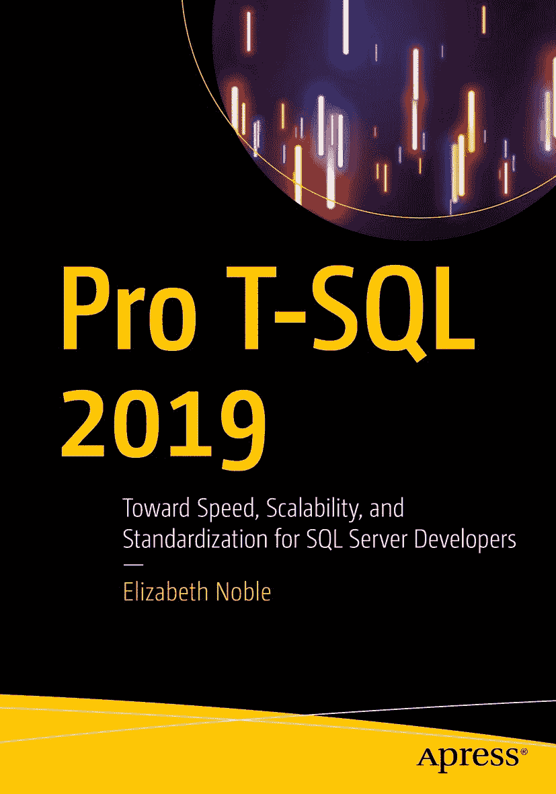

ISBN 978-1-4842-5589-6 e-ISBN 978-1-4842-5590-2
[`doi.org/10.1007/978-1-4842-5590-2`](https://doi.org/10.1007/978-1-4842-5590-2)
© Elizabeth Noble 2020
本作品受版权法保护。出版者保留所有权利，无论涉及材料的全部或部分，特别是翻译、转载、图表 reuse、朗诵、广播、缩微胶片复制或任何其他物理方式的复制，以及信息存储与检索、电子改编、计算机软件，或目前已知或未来开发的类似或相异方法。
本书中可能出现商标名称、标识和图像。我们并非每次使用商标名称、标识和图像时都附带商标符号，而仅以编辑方式使用，并旨在使商标所有者受益，并无侵犯商标的意图。
本书中对商品名称、商标、服务标识及类似术语的使用，即使未明确标识，也不应被视为表达了这些术语是否受专有权约束的意见。
尽管本书中的建议和信息在出版时被认为是真实和准确的，但作者、编辑或出版商均不对可能出现的任何错误或遗漏承担任何法律责任。出版商对本出版物所含材料不作任何明示或暗示的担保。
本书由 Springer Science+Business Media New York 向全球图书贸易发行，地址：233 Spring Street, 6th Floor, New York, NY 10013。电话 1-800-SPRINGER，传真 (201) 348-4505，电子邮件 orders-ny@springer-sbm.com，或访问 www.springeronline.com。
Apress Media, LLC 是一家加利福尼亚州有限责任公司，其唯一成员（所有者）是 Springer Science + Business Media Finance Inc (SSBM Finance Inc)。SSBM Finance Inc 是一家特拉华州公司。

*谨以此书献给 `#SQLFamily`。你们所有人都帮助我成长为一名数据专业人士。你们给予了我信心，并鼓励我追寻梦想。希望本书能像你们所有人帮助我一样，帮助到其他人。*

*本书也献给我的家人和朋友，感谢他们所有的爱与支持，尤其是在撰写本书期间。Eric 和 Danny，你们能够克服面前的挑战。*

