# 第一部分 构建易于理解的 T-SQL

## 1. 数据类型

数据类型是构建高效、高性能 `T-SQL` 的基础构件。虽然许多数据类型要么是数字，要么是字符串，但也存在多种不属于这两类的数据类型。选择正确的数据类型时，理解数据类型是什么以及何时使用它至关重要。

### 数字数据类型

尽管数字看起来可能都一样，但 `T-SQL` 将数字划分为不同类型的数据类型。这些数据类型可以包括整数或带小数点的数字。数字也根据精确或近似进行分类。在执行数学计算时，了解如何处理各种数字数据类型对于确保应用程序按预期处理数据至关重要。

虽然从每个类别中选择最常见的数据类型可能最简单，但在某些特定情况下，最好分析将要存储的数据并选择更合适的选项。选择数据类型时，需要考虑多种因素。最重要的一步是弄清楚将存储什么类型的数据。接下来逻辑上的步骤是考虑数据将如何使用和存储。此外，理解 `T-SQL` 如何处理涉及各种数据类型的计算也很重要。

#### 精确数字数据类型

有些情况下，数字的值是确定且已知的。这类数字可称为精确数字。一些例子包括真或假、销售 units 数量、折扣百分比或美元和美分。编写优质 `T-SQL` 的关键之一是为给定字段选择正确的数据类型类别。在某些情况下，某个类别有多个可用的数据类型。

在考虑使用何种数据类型时，您需要思考该数据类型的用途。这将有助于在确定应使用哪种数据类型时提供更清晰的思路。您需要考虑与每种数据类型相关的优点和缺点。您还需要考虑 `SQL Server` 是否必须因为此数据类型与其他数据类型在计算中使用而执行任何隐式转换。最后要考虑的是该数据类型在 `SQL Server` 中的存储方式。


##### BIT

`BIT`数据类型源自短语“二进制数字”。因此，`BIT`数据类型只能存储两个值之一。在 SQL Server 的情况下，还有第三个选项与未知值相关。这第三个选项被称为`NULL`。因此，`BIT`数据类型唯一允许的值是`0`、`1`和`NULL`。这导致`BIT`数据类型只能使用最小的一组可用值。

`BIT`数据类型非常适用于“非此即彼”适用的数据类型。存储的信息可以是真或假、开或关、是或否。在真或假的情况下，`BIT`类型可用于指示数据记录是否已成功转换。使用`BIT`数据类型指示开或关的常见用途涉及指示某个特定功能是否已启用。一个表示是或否值的例子是记录客户选择是否接收公司的营销信息。

使用`BIT`数据类型的一个挑战是确保以促进良好数据库设计的方式使用它们。这意味着有时在选择`BIT`数据类型时需要考虑整体目的。例如，指示某项是否具有特定特征似乎可能是`BIT`数据类型的一个好用途。一个例子可能是表中像`IsVegetarian`这样的列。然而，重新设计数据库以在另一个表中记录这些属性可能更好。`BIT`可用于指示事务的成功状态。然而，通常有更多的状态需要记录一段时间内事务的状态。如果随时间记录状态变化很重要，那么使用`BIT`来记录事务是否成功可能不是最佳选择。

`BIT`数据类型的一个优点是数据库中保存`BIT`值所需的总存储空间。由于一个字节中有 8 位，这在数据库记录存储中同样适用。表中每 8 个`BIT`列，其值都存储在一个字节中。如果表中有 9 到 16 个`BIT`列，所有`BIT`值将总共存储在 2 个字节中。所需存储空间如此之少，这意味着一个包含多达 8 个`BIT`列和 100 万条记录的表在数据库中仅使用 1MB 的空间。

##### TINYINT, SMALLINT, INT, BIGINT

SQL Server 还允许你存储整数，即没有小数或分数值的数字。这些数字被称为整数。以整数存储的数据的一个例子是给定项目的数量。SQL Server 中可以存储几种类型的整数值。第一种整数类型是`TINYINT`。`TINYINT`值可以包含 0 到 255 之间的任何整数值。由于此数据类型的大小有限，它可能对有限的配置类型或位置数量有用。此数据类型类似于`BIT`数据类型，但其范围稍宽。此数据类型也可用于配置系统中的状态类型或对象类别。`TINYINT`非常适合存储这些状态类型，因为许多应用程序不需要超过 256 种状态。

既然我们已经介绍了`TINYINT`，让我们讨论一下`SMALLINT`的可能性。`SMALLINT`的范围涵盖大约 70,000 个可能的值。有了这个可用范围，你需要考虑在 256 到 65,435 个唯一值之间你想要存储什么样的值。`SMALLINT`的范围从`-32,768`开始，到`32,767`结束。这种数据类型对于记录每一次活动的日志表来说并不实用。许多数据库或数据表在几年的时间里可能有超过 70,000 条事务或记录。这可能导致此数据类型不适用于这些表。然而，也可能有其他表非常适合`SMALLINT`数据类型。

如果你的数据表事务活动不高，但会在一段时间内增长，那么`SMALLINT`数据类型可能有益。了解你的业务将帮助你确定`SMALLINT`是否是存储该值的正确数据类型。

如果你要创建一个表来持续为应用程序添加功能，你可能希望存储一条记录，指示向应用程序添加的每个新功能。一个例子是功能标志。你的应用程序在其生命周期内很可能会有超过 256 个增强功能。你可能还想存储应用程序的配置值。在表中存储这些配置值可能会受益于`SMALLINT`数据类型。

接下来是整数或`INT`。这是整数数据类型最常用的。许多数据库专门使用这种数字来跟踪任何类型的整数。其中一个原因是其整个范围涵盖了大约 54 亿条记录。`INT`数据类型的范围从`-2,147,483,648`到`2,147,483,647`。然而，当创建许多数据表时，它们的标识列通常从整数`1`开始，或称为种子。这导致表被限制为大约 21.5 亿个唯一标识。如果你认为你的表将需要超过 21.5 亿个唯一标识记录，你可能希望从可能的最小数字`-2,147,483,648`开始标识。

这通常是你需要执行一些数学计算的地方。一些企业每秒处理几百笔交易。其他企业每秒处理高达 10,000 或 20,000 笔交易。在这两种情况下，考虑持有此事务信息的表预期将有什么样的增长都很重要。如果你的应用程序在几年内每秒有数百笔交易，那么存储的记录数量将比应用程序在相同时间段内每秒有数万笔交易要少得多。

##### DECIMAL/NUMERIC

既然我们已经讨论了各种整数，我们应该考虑如何处理需要小数的数字。在某些情况下，你会需要小数位。其中一些情况涉及使用美元和美分，其他时候你需要小数位来进行精确测量。这些场景中有几个选项可用。

首先有`DECIMAL`选项，或者也称为`NUMERIC`数据类型。此值不保存任何货币信息；但是，它会记录小数位。这些小数位可以通过指明应存储的总位数和小数点右边的位数来指定。你会发现`DECIMAL`或`NUMERIC`数据类型对于几乎所有涉及数字的数据类型都是可接受的。这包括通用数字、小数、测量值和货币值。

考虑到`DECIMAL`类型可以表示多种不同类型的数字，我们应该更仔细地研究这种数据类型。`DECIMAL`和`NUMERIC`之间没有区别。它们在 SQL Server 中是相同的数据类型。`DECIMAL`数据类型有一些特定的术语。构成`DECIMAL`数据类型的值是精度和小数位数。精度与`DECIMAL`数据类型中保存的总位数相关。小数位数是指存储在小数点右边的位数。


##### SMALLMONEY, MONEY

接下来讨论的数据类型是`MONEY`和`SMALLMONEY`。`MONEY`与`SMALLMONEY`数据类型类似于`DECIMAL`或`NUMERIC`数据类型。`SMALLMONEY`和`MONEY`数据类型同样可用于存储货币值。SQL Server 会保存数值，但会忽略与该值关联的具体货币种类。

`MONEY`与`SMALLMONEY`数据类型最主要的区别在于数值范围和存储空间。`SMALLMONEY`数据类型的范围是从 -214,000 到 +214,000，仅占用 4 字节存储空间；而`MONEY`数据类型的范围是从 -9220 亿 到 +9220 亿，占用 8 字节存储空间。

`MONEY`数据类型最多可精确存储四位小数。小数点位数的限制会影响所存储货币值的精度，其精度只能达到万分之一。`MONEY`数据类型会将所有值都保存到四位小数。这种固定的小数点位数会影响涉及`MONEY`数据类型的计算中的舍入方式。

#### 近似数值数据类型

接下来，我们将讨论精确数与近似数之间的区别。精确数用于你确知其确切数量的事物，例如你在商店购买了多少件商品，或者精确到美元和美分的金额。而近似数则用于测量可能不精确的场景。近似数可用于存储非常大或非常小的数字。你可能还会发现你的应用程序正在记录一个不精确的测量值。例如，你剪下一块长度接近但并非完全等于特定值的布料。布料的长度可能在 12 英寸左右。存储值 12（英寸）就是一个近似值。这个 12 英寸的测量值可能如此接近，以至于很难判断布料的实际长度并非精确的 12 英寸。

处理近似数时会出现一些舍入问题。这是因为近似数本身已知就不是精确的测量值。在 SQL Server 中，近似数有一种对应的数据类型。这种数据类型称为`FLOAT`。如果浮点数有 24 位有效数字，其同义的数据类型是`REAL`。

使用`REAL`或`FLOAT`类型时，将此数据类型转换为其他数据类型可能会出现问题。将`FLOAT`数据类型转换为`INTEGER`时，小数点后的所有值都将被截断。你需要意识到，使用近似数可能会导致意外结果。一个例子是在使用`DECIMAL`或`NUMERIC`数据类型时。将`FLOAT`或`REAL`数字转换为`DECIMAL`或`NUMERIC`数据类型时，最多只能保留七位小数。

#### 转换数值数据类型

我们已经介绍了可用的数值类型，以及使用各种数值数据类型时会发生什么。除了存储数字，你还需要了解各种数值数据类型之间如何相互作用。首先，我们应该考虑当使用相同数据类型的字段进行计算时会发生什么。在这些场景中，如果计算涉及的所有字段都是相同的数据类型，那么结果的数据类型将保持不变。因此，如果你将“数量”乘以“价格”，并且两个值都存储为`DECIMAL(5,2)`类型的`NUMERIC`数据类型，那么结果将给出相同`DECIMAL`数据类型。SQL Server 将根据起始精度和小数位数以及所执行计算的类型来确定结果的精度和小数位数。你还需要考虑精度和小数位数在应用程序中的使用方式。应用程序可能期望接收一个`DECIMAL(5,2)`的值。根据所执行计算的不同，返回的数据值可能超出指定数据类型的范围，这可能导致计算溢出。

当跨各种数据类型进行操作时，情况会变得更有趣一些。再次以“数量”乘以“价格”为例，我们可以检查如果你有一个`INT`数据类型与一个`DECIMAL(5,2)`数据类型进行计算会发生什么。SQL Server 将使用数据类型优先级的规则。首先，我们应该熟悉到目前为止所涵盖的数据类型的数据类型优先级顺序。以下列表按从高到低的顺序排列：

1.  `FLOAT`
2.  `REAL`
3.  `DECIMAL`
4.  `MONEY`
5.  `SMALLMONEY`
6.  `MONEY`
7.  `BIGINT`
8.  `INT`
9.  `SMALLINT`
10. `TINYINT`
11. `BIT`

在前面的场景中，我们同时使用了`INT`和`DECIMAL`数据类型。如你所见，`INT`和`DECIMAL`数据类型都在列表中。对于`INT`和`DECIMAL`数据类型，`INT`的优先级较低。由于优先级规则，SQL Server 将在内部将`INT`数据类型转换为`DECIMAL`数据类型。此转换不会更改原始数据值，只更改 SQL Server 如何将此值用作计算的一部分。转换完成后，SQL Server 将继续进行计算。这通常效果很好，除非你执行诸如尝试连接数字和字符串数据类型的操作。

#### 字符串数据类型

既然你知道了如何使用数值数据类型，我们应该花些时间了解各种字符串数据类型。这类数据类型用于存储字母、单词或字母与数字的组合。此外，字符串数据类型用于存储非 Unicode 或 Unicode 的字符值。字符串数据类型的最后一个类别包括图像和二进制值。

#### 字符串数据类型

数据库中存储的信息并非都与数字直接相关。这些数据可以是名称、描述、地址或其他字符值。决定使用哪种数据类型将取决于所存储信息的类型以及需要存储的信息量。


##### CHAR 和 VARCHAR

可用的两种字符串数据类型是 `CHAR` 和 `VARCHAR`。这些数据类型相似，仅在特定考虑上有所不同。可以配置数据字段以决定数据如何存储。可以配置列以切换大小写敏感性、重音敏感性、假名敏感性或宽度敏感性。所存储的敏感性称为排序规则。可存储的数据类型通常与数据库排序规则匹配。除非有特定覆盖设置，否则列的排序规则与数据库相同。两种数据类型都用于存储文本数据，这些字段中可存储的字符与列的排序规则所允许的字符相同。

在决定使用哪种数据类型时，需要记住将存储的数据种类。如果数据长度相似，例如电话号码或邮政编码，那么 `CHAR` 可能是首选数据类型。但是，如果列宽度差异很大，例如地址行或备注列，那么 `VARCHAR` 将是更好的选择。考虑将 `VARCHAR(MAX)` 的使用限制在你预计要保存超过 8000 个字符的情况。如果指定了 `VARCHAR(MAX)`，则最大存储大小为 2 GB。

在使用 `CHAR` 和 `VARCHAR` 时，还有一些额外的注意事项需要牢记。当使用 `CHAR` 和 `VARCHAR` 进行数据定义或变量声明时，请记住默认值是一个字符。但是，在使用 `CAST` 或 `CONVERT` 函数时，默认字符数将是 30。为了最大程度地减少数据截断，在使用 `CHAR` 或 `VARCHAR` 数据类型时，请确保始终显式指定字符数。

对于使用单字节编码字符（如 Latin）的排序规则，`CHAR` 的存储大小（以字节为单位）等于字符数。在使用 `VARCHAR` 时，字符数加上 2 个额外字节等于存储的总字节数。也可以在 `CHAR` 和 `VARCHAR` 数据类型中保存多字节编码字符。对于这两种数据类型，保存的字符数可能小于总字节数。

从 SQL Server 2019 开始，现在可以将 Unicode 值保存在 `CHAR` 或 `VARCHAR` 中。但是，这仅在启用 UTF-8 编码时才可能。

##### TEXT

`TEXT` 数据类型以前在需要存储非常大的字符串时使用。但是，此数据类型已弃用。由于此数据类型已弃用，在新的开发中应避免使用 `TEXT` 数据类型。如果需要使用 `TEXT` 数据，对于新的开发，应考虑使用数据类型 `VARCHAR(MAX)`。但是，请考虑你是否需要此功能，或者使用字符数较少的 `VARCHAR` 是否更合适。未来使用 `TEXT` 数据类型的唯一考虑应该是为了应用程序的向后兼容性。`TEXT` 数据类型主要用于处理可变长度的非常大的字符串的情况。在许多情况下，这是指保存的数据长度超过 8000 个字符的情况。可以保存到 `TEXT` 数据类型的最大字符数是 2,147,483,647。在某些情况下，可存储的总字符数可能小于此数字。

#### Unicode 字符串数据类型

在 SQL Server 2019 之前，任何 Unicode 文本数据都需要保存为特殊数据类型。在无法启用 UTF-8 编码的情况下，这仍然是正确的。

##### NCHAR 和 NVARCHAR

使用 Unicode 值时，有几种可用选项。这些选项包括存储固定长度或可变长度的字符串。为了避免意外结果，如果未指定字符数或排序规则，你应该了解这些数据类型的工作原理。

一旦确定需要使用 `NCHAR` 或 `NVARCHAR` 数据类型，选择它们就变得容易了。如果要存储的数据长度大致相似，那么 `NCHAR` 数据类型是正确的选择。但是，如果存储的值差异很大，那么 `NVARCHAR` 数据类型可能是更好的选择。此外，如果要存储的字符数超过 4000，建议使用 `NVARCHAR(MAX)`。

通常，在声明 `NCHAR` 或 `NVARCHAR` 数据类型时，指定字符数是最佳实践。对于数据定义或变量声明，`NCHAR` 或 `NVARCHAR` 的默认字符数是一个字符。但是，在使用 `CAST` 或 `CONVERT` 函数时，如果未指定字符数，则默认为 30。如果未为 `NCHAR` 或 `NVARCHAR` 数据类型指定排序规则，将使用默认的数据库排序规则。

了解存储此数据类型所需的空间量也可以让你更好地判断这是否是正确的数据类型以及需要存储的字符数。存储 `NCHAR` 占用的字节数是字节对字符串长度的两倍，而使用 `NVARCHAR` 时，存储的字节数是字节对字符串长度的两倍加 2 字节。

##### NTEXT

以前，使用 `NTEXT` 数据类型来存储非常大的可变长度 Unicode 数据。如果此数据类型仍在你的系统中使用，你可以期望它存储多达 1,073,741,823 个字符。但是，由于 Unicode 值相关的大小，存储的总长度可能较小。展望未来，使用此数据类型不再是最佳实践。相反，请使用 `NVARCHAR(MAX)` 数据类型。

#### 二进制字符串数据类型

有时，你可能希望存储既不是数字也不是字符的数据。在这些情况下，使用二进制字符串可能是合适的。使用二进制字符串数据类型时有几种选择。

##### BINARY 和 VARBINARY

可用于存储二进制字符串数据的选项涉及存储固定长度或可变长度的字符串。与讨论的其他字符串数据类型类似，处理这些数据类型时也有一些考虑因素。

使用二进制字符串来存储没有字符的字符串项目可能很有用。这些可以包括音频、视频、图像或其他类似项目。可用的数据类型中有两种是 `BINARY` 和 `VARBINARY`。存储长度相似的二进制字符串的最佳选项是 `BINARY` 数据类型。相反，当存储长度差异显著的二进制字符串时，`VARBINARY` 数据类型是更好的选择。如果二进制字符串的总长度预计超过 4000 个字符，则建议使用 `VARBINARY(MAX)`。

使用 `BINARY` 和 `VARBINARY` 数据类型进行数据定义或变量声明时，如果未指定字符数，则默认长度为一。当使用 `CAST` 或 `CONVERT` 函数将 `BINARY` 转换为 `VARBINARY` 时，默认字符数将为 30。当从具有不同长度的变量转换为 `BINARY` 或 `VARBINARY` 时要小心，因为 SQL Server 可能会根据需要填充或截断二进制数据。

`BINARY` 数据类型存储的字节数与要存储的数据长度相同，而 `VARBINARY` 使用 2 字节加上要存储的数据长度的相同字节数。两种数据类型的长度最多可达 8000。对于 `VARBINARY(MAX)`，最大存储大小为 2 GB。

##### IMAGE

可以存储在二进制字符串中的项目之一是图像。处理图像时，重要的是考虑应如何存储这些数据，如果存储，应使用什么数据类型。

此 `IMAGE` 数据类型以前用于存储大型可变长度二进制数据。虽然此数据类型长度可达 2,147,483,647，但有时允许的存储长度可能较小。对于 `IMAGE` 数据类型，你应该在未来使用 `VARBINARY(MAX)` 数据类型，因为 `IMAGE` 数据类型已弃用。


### 日期和时间数据类型

每个数据库事务都发生在特定的时间点。可能需要参考或知道事务发生的时间。您的应用程序可能需要记录个人的重要日期，例如生日或纪念日。日期和时间也可用于确定定价和功能。通过使用日期和时间，您可以确定功能应何时启用或禁用。日期和时间还可以显示用户帐户何时非活动，或对给定系统的访问权限何时启用或过期。定价和计费费率可能涵盖多个不同的日期范围。当一组定价失效时，另一组可能生效。由于法规要求，您的公司可能需要记录一段时间内的定价信息。这包括指出定价费率何时开始和停止。根据跟踪此信息的目的，您可能只需要知道事务发生的日期或时间。在其他情况下，最好同时知道与某个操作相关的日期和时间。

#### DATE

在处理事务时，可能存在特定情况需要记录某事发生的时间。在某些情况下，只需关心事务发生的日期。`DATE`数据类型也可用于存储特定日期的汇总数据。在记录活动日期时，关于如何显示该数据也可能有一些可用选项。在选择`DATE`数据类型是否适合您时，不仅要考虑为`DATE`数据类型存储多少数据，还要考虑数据存储方式可能存在的限制，这一点很重要。

有时，应用程序或用户需要知道特定操作发生的时间。在决定`DATE`数据类型是否是正确选择时，您需要考虑用户和应用程序两方面对信息的需求。在某些情况下，考虑何时**不**使用`DATE`数据类型更容易。对于任何需要知道某事发生具体时间的操作，`DATE`数据类型都不是一个好的选择。但是，如果只需要知道操作发生的日期，那么`DATE`数据类型将是一个很好的选项。

对于`DATE`数据类型，关于如何显示`DATE`有几种选项。日期格式默认为`YYYY-MM-DD`。其中`YYYY`表示四位数年份，范围为 0001 到 9999。`MM`表示月份编号，范围从 01 到 12，`DD`表示日期，范围从 01 到 31（根据每月天数而定）。`DATE`可以以多种数字和字母格式显示。但是，不支持`ydm`格式。

可存储的`DATE`值范围从 0001-01-01 到 9999-12-31。`DATE`数据类型具有 10 个字符的长度，精度为 10，小数位数为 0。`DATE`数据类型占用 3 个字节，并作为`INT`存储。

日期可以转换为`DATETIME`、`SMALLDATETIME`、`DATETIME2`或`DATETIMEOFFSET`。但是，时间值将被设置为午夜。然而，日期不能转换为`TIME`数据类型，任何尝试执行此转换的操作都将失败并报错。此外，日期没有时区偏移，也不感知夏令时。

#### TIME

另一个与操作发生时间相关的数据类型是`TIME`数据类型。了解时间的存储和格式非常重要。使用`TIME`数据类型时，了解将其转换为其他`DATE`和`DATETIME`数据类型的影响很有帮助。使用`TIME`数据类型也存在一些限制。

`TIME`可用于记录事务或活动发生的具体时间。此时，时间独立于日期记录，未来可能无法确定日期。解决此问题的一种方法可能是将日期与时间分开存储。`TIME`的精度最高可达 100 纳秒，`TIME`的默认值为 00:00:00。

`TIME`的默认格式为`hh:mm:ss[.nnnnnnn]`。在此格式中，`hh`表示两位数小时，范围从 0 到 23；`mm`表示两位数分钟，范围从 0 到 59；`ss`表示两位数秒，范围从 0 到 59。`TIME`数据类型允许不同的精度，如果指定，小数秒最多可使用七位数，由`nnnnnnn`表示。这些值的范围可以从 0 到 9999999。

由于`AM`和`PM`用于区分上午和下午，在使用`TIME`时需要额外注意。如果未提供`AM`或`PM`，且小时值在 00 到 11 之间，则时间将被记录为`AM`。对于 12 到 23 点，时间将被保存为`PM`。写入`TIME`时，如果输入 12 `AM`，此值将被转换为 0 时。

`TIME`的范围是 00:00:00.0000000 到 23:59:59.9999999。字符长度可以是 8 到 16 位数字，具体取决于为`TIME`指定的精度。无论哪种情况，`TIME`都将保存为固定的 5 个字节。如果`TIME`转换为任何包含日期和时间的数据类型，日期值将表示为 1900-01-01。如果`TIME`的小数精度高于新数据类型，则值将被截断。任何将`TIME`数据类型转换为`DATE`的尝试都将失败。与`DATE`一样，`TIME`既不感知时区，也不感知夏令时。


#### SMALLDATETIME、DATETIME、DATETIME2、DATETIMEOFFSET

有些情况下，仅保存日期或时间可能不够。对于这些场景，最好将日期和时间值组合在一起。有时这些值可能相对简单，有时需要更高的精度，或者需要感知时区。

其中一种数据类型是 `SMALLDATETIME`。该数据类型用于记录具体的日期和时间。其默认值为 `1900-01-01 00:00:00`。虽然该数据类型的精度列为 1 秒，但需注意秒部分在数据库中始终保存为 00。

与 `date` 数据类型类似，`SMALLDATETIME` 数据类型可以多种数字和字母格式显示。与其他 `DATE` 和 `DATETIME` 数据类型相比，`SMALLDATETIME` 的范围有所限制。该数据类型的日期部分范围可从 `1900-01-01` 到 `2079-06-06`。虽然输入的时间范围可从 `00:00:00` 到 `23:59:59`，但在数据库中保存的值将是 `00:00:00` 到 `23:59:00`。`SMALLDATETIME` 的总长度最多为 19 个字符，所需存储大小为固定的 4 字节。

当将 `SMALLDATETIME` 转换为其他 `DATETIME` 数据类型时，请记住任何额外的精度都将记录为 0。虽然使用 `SMALLDATETIME` 可能很诱人，但该数据类型不符合 ANSI 标准。如前所述，该数据类型的秒数将根据传递的秒数值进行四舍五入。如果传递的秒数小于或等于 29.998，分钟将向下舍入。否则，分钟将向上舍入。与 `date` 和 `time` 数据类型类似，`SMALLDATETIME` 也不感知时区或夏令时。

可用的选项不仅仅只有 `SMALLDATETIME`。`DATETIME` 一直提供比前述数据类型更高精度的选项。使用此数据类型时，也有几个关键的注意事项。

虽然 `DATETIME` 数据类型可以记录具体的日期和时间，但它可能不符合 SQL 标准。此数据类型的一个关键问题与精度相关的限制有关。`DATETIME` 数据类型可以记录小数秒的三位小数；第三位小数总是四舍五入到以 `.000`、`.003` 或 `.007` 结尾的增量。

如果未指定值，`DATETIME` 的默认值为 `1900-01-01 00:00:00`。使用此数据类型时，有多种数字和字母格式可用。`DATETIME` 的年份范围是 `1753-01-01` 到 `2999-12-31`，时间范围可从 `00:00:00.000` 到 `23:59:59.997`。此数据类型的大小为 8 字节，字符长度范围从 19 到 26。

虽然可以将其他数据类型转换为 `DATETIME`，但不建议这样做，因为此数据类型不符合 SQL 标准，也不符合 ANSI 标准。`DATETIME` 数据类型也因发生的四舍五入而受限，只允许 `.000`、`.003` 和 `.007` 的增量。此数据类型也不感知时区或夏令时。

`DATETIME2` 数据类型比前面提到的数据类型具有一些额外优势。虽然前面提到的一些数据类型具有固定大小，但此数据类型的工作方式略有不同。我们还将了解此数据类型的存储和可用格式。

`DATETIME2` 数据类型允许记录具体的日期和时间，精度高达 100 纳秒。`DATETIME2` 的默认值为 `1900-01-01 00:00:00`。由于这种精度水平，对于需要精确到小数秒的场景，这是一个很好的数据类型。由于 `DATETIME2` 没有与 `DATETIME` 相同的四舍五入问题，在编写代码时使用此数据类型也更直接。

`DATETIME2` 数据类型支持多种数字和字母方式来显示信息。`DATETIME2` 的日期范围从 `1753-01-01` 到 `2999-12-31`，时间范围从 `00:00:00` 到 `23:59:59.9999999`。允许多种精度选项，因此字符长度从精度到秒的 19 一直增加到精度到 0.0000001 纳秒的 27。

精度的变化也会影响 `DATETIME2` 数据类型的存储大小。使用一个字节来存储 `DATETIME2` 的精度，再加上根据时间精度所需的字节数。如果精度小于纳秒的三位小数，则另外使用 6 个字节来存储 `DATETIME2` 值。如果精度为 3 或 4，则使用 1 个字节存储精度，7 个字节存储值，总共 8 字节。但是，对于精度超过四位小数的任何值，总数将为 9 字节。

由于高度的准确性，将值转换为 `DATETIME2` 的可能性很大。如果日期转换为 `DATETIME2`，时间组件将记录为 `00:00:00`。如果时间转换为 `DATETIME2`，日期将是 `1900-01-01`。对于从 `SMALLDATETIME` 转换为 `DATETIME2`，日期和时间将被复制。任何额外的精度将用 0 表示。从 `DATETIMEOFFSET` 转换为 `DATETIME2` 将导致时区被截断。当从 `DATETIME` 转换为 `DATETIME2` 时，请确保使用显式转换以避免意外结果。使用 `DATETIME2` 的主要限制是该数据类型不感知时区或夏令时。

最后一个用于日期和时间的数据类型是 `DATETIMEOFFSET`。在讨论 `DATETIMEOFFSET` 时，有一些之前在其他数据类型中未见过的额外功能。在格式化、存储或转换到此数据类型时，也有一些需要注意的事项。

`DATETIMEOFFSET` 数据类型记录已发生的事务或操作的具体日期和时间，具有高精度。此数据类型的关键优势之一是能够对时间进行偏移，从而使来自多个地理位置的数据库不仅可以感知某事相对于其本地时间的发生时间，还可以感知相对于另一位置本地时间的发生时间。

`DATETIMEOFFSET` 的精度为 100 纳秒，默认值为 `1900-01-01 00:00:00`。`DATETIMEOFFSET` 的格式为 `YYYY-MM-DD hh:mm:ss.nnnnnnn +|– hh:mm`。此数据类型的 `+|– hh:mm` 部分与偏移量相关。给定时间的偏移量范围可以从 +14 到 –14 小时。与其他时间和 `DATETIME` 数据类型一样，此日期可以数字或字母格式格式化或显示。

日期范围可以从 `0001-01-01` 到 `2999-12-31`。可保存的时间范围从 `00:00:00` 到 `23:59:59.9999999`。当精度保存为 `YYYY-MM-DD hh:mm:ss {+|–} hh:mm` 时，字符长度为 26。当精度为 `YYYY-MM-DD hh:mm:ss.0000000 {+|–} hh:mm` 时，字符长度可达 34。`DATETIMEOFFSET` 数据类型所需的存储空间是固定的 10 字节。

### 其他数据类型

除了前面讨论的数据类型外，SQL Server 还有其他几种可用的数据类型。其中一些数据类型可用于 `表定义` 并可能有特殊用途，而另一些数据类型可能只能用作 `变量` 或在 `存储过程` 内部使用。


## SQL Server 特殊数据类型概述

### UNIQUEIDENTIFIER

此数据类型可以作为表中的一列或用作变量。`UNIQUEIDENTIFIER` 占用 16 字节，该数据类型可存储的最大字符数为 36。虽然非 Unicode 字符串可以转换为 `UNIQUEIDENTIFIER`，但如果字符总数超过 36，结果将被截断。

此数据类型是 GUID（全局唯一标识符）。其概念是这些唯一值将仅被使用一次。然而，有报告表明情况并非总是如此。无论如何，`UNIQUEIDENTIFIER` 可以通过以下几种方式之一填充：包括使用函数 `NEWID()` 和 `NEWSEQUENTIALID()`。或者，如果 GUID 的整体格式正确并使用有效的十六进制值 `0–9` 和 `a–f`，也可以手动填充这些值。

虽然 `UNIQUEIDENTIFIER` 可以替代 `IDENTITY` 使用，但我只建议在绝对必需的场景下使用。它不仅比 `INT` 或 `BIGINT` 占用更多空间，而且 `UNIQUEIDENTIFIER` 可与之使用的约束类型也有限制。`UNIQUEIDENTIFIER` 可以是一个 `IDENTITY`，但不允许其他表约束。

### XML

各种系统和应用程序会发送、使用或存储 XML 数据。虽然可以选择解析此数据并将其保存在表中，但有时也可能需要完整地存储 XML 数据。存储 XML 数据时，还需要考虑 XML 中包含的数据内容。

对于 `XML` 数据类型，数据必须是有效的 XML 格式。为了有效，需要满足若干要求，包括所有起始标签必须有匹配的结束标签。此外，嵌套元素必须在同一个父元素内开始和结束。XML 元素不能有多个属性，并且标记字符必须正确指定。如果 XML 数据满足所有前述要求，则认为该 XML 数据是格式良好的。

允许存储的 XML 数据总量限制为 2 GB。数据可以包含非 Unicode 或 Unicode 数据。有时 XML 数据遵循一套既定指南并有指定的数据类型。在这种情况下，XML 数据可能有一个定义的 XML 模式。对于有模式的 XML 数据，可被视为类型化的。通常类型化的 XML 数据占用空间更少，并且存储的数据可能具有附加功能。然而，这种类型化 XML 的一个限制是 XML 必须通过验证。如果选择非类型化 XML 数据，则数据无需验证，也可能不会分配模式。

### 空间几何类型

处理数据时，您可能希望在数据库中存储各种形状。虽然这不是常见请求，但有一种可用的数据类型可用于存储基于平面地图的形状或绘图。

此数据类型可支持多种格式实例，包括点、线、圆形线、曲线、多边形、曲面多边形、多点、多线、多面，以及这些对象中任意或全部的集合。

### 空间地理类型

虽然您可能希望在 SQL Server 中使用平面地球方法保存形状，但有时有必要根据地球形状存储信息。在这些情况下，使用 `geography` 数据类型将是更可取的。对于国家、道路或经度和纬度重要的地图，请使用此数据类型。

与 `geometry` 数据类型类似，`geography` 数据类型也支持多种选项。这些选项包括与 `geometry` 数据类型相同的所有类型，例如点、线、圆形线、曲线、多边形、曲面多边形、多点、多线、多面，以及这些形状中任意或全部的集合。然而，`geography` 数据类型还支持完整的地球实例。

### SQL_VARIANT

有时您可能希望在一列中存储多种数据类型。虽然这通常不是最佳实践，但请确保了解此数据类型如何存储信息以及存在哪些限制。

`SQL_VARIANT` 数据类型允许您在同一列中存储不同的数据类型。此列中保存的数据总最大长度为 8016 字节。然而，其中的 16 字节用于存储有关该记录中数据的信息。这为实际保存在列中的数据留下了总共 8000 字节的可用空间。

您可以直接将数据插入列中，或将数据转换为特定数据类型。如果在插入时未指定数据类型，`SQL_VARIANT` 将尝试确定正确的数据类型。这可能导致数据存储方式与预期不同。虽然 `SQL_VARIANT` 在处理数字时似乎选择良好，但在某些情况下，如果未指定数据类型，日期可能被存储为 `VARCHAR(8000)`。

所有可以存储在表中的数据类型都可用于 `SQL_VARIANT`，但以下类型除外：
*   `VARCHAR(MAX)`
*   `NVARCHAR(MAX)`
*   `TEXT`
*   `IMAGE`
*   `SQL_VARIANT`
*   `HIERARCHYID`
*   `VARBINARY(MAX)`
*   `XML`
*   `NTEXT`
*   `ROWVERSION`
*   `GEOGRAPHY`
*   `GEOMETRY`
*   `DATETIMEOFFSET`
*   用户定义类型

`SQL_VARIANT` 列中数据的排序方式也与其他数据类型不同。`SQL_VARIANT` 将数据分组为相似的类型，称为数据类型族。这些数据类型族有自己的顺序，数据类型在较高族中的值将被视为大于较低族中的值。如果正在比较的数据存在于同一族中，`SQL_VARIANT` 会将较低的数据类型隐式转换为较高的数据类型，然后完成比较。

### Rowversion

有时您可能想知道表中某个操作发生的时间。虽然有一些方法可用于跟踪数据库更改，但也有一种特定的数据类型可用于记录记录何时被更新。

`ROWVERSION` 数据类型可以让您大致了解特定记录或一组记录何时被更新。此值既没有日期也没有时间组件，而是一个二进制值。`ROWVERSION` 可以与其他 `rowversion` 值或数据库中当前的 `rowversion` 值进行比较。我可以创建一个包含名为 `RowVersion` 且类型为 `ROWVERSION` 的列的表。插入记录时，`ROWVERSION` 列可能被更新为值 `0x00000000000007D1`。我可以更新同一行中的某一列，`ROWVERSION` 列可能被更新为 `0x00000000000007D2`。虽然我可以判断发生了更改，但我无法确定更改发生的时间或具体更改了什么。

存储 `rowversion` 值时，所需的总存储空间为 8 字节。您可以指定 `ROWVERSION` 为非空或可空。如果该列不可空，则该列的行为类似于 `BINARY(8)`。否则，该列的行为类似于 `VARBINARY(8)`。每个表只能添加一个 `ROWVERSION` 列。只要插入或更新一行或多行，该列就会被系统自动更新。

### HIERARCHYID

有时，同一列中的数据与其他数据相关。这通常涉及作为其他数据父级或子级的数据。这可以包括位置（如国家、州和城市）或产品信息（如制造商、物品和生产日期）。

对于这些场景，`HIERARCHYID` 可能有助于对数据的相互关系进行分类。`HIERARCHYID` 数据类型限制为 892 字节。然而，此数据类型是一种具有可变长度的系统数据类型。尽管此数据类型是系统数据类型，但使用此数据类型的应用程序负责确定应存储的正确层次结构。


### 表

有些数据类型不能作为列存在于表中。`table` 数据类型就是其中之一。当你想要存储数据以供后续使用时，这可能是一个值得考虑的数据类型。然而，在使用表作为数据类型时，需要注意一些注意事项和限制。

通常，最好将表变量的使用限制在返回数据量不会很大的场景中。历史上，SQL Server 并不总能准确估计表变量中的总行数。不过，从 SQL Server 2019 开始，数据库引擎在处理表变量时应能给出更好的估计。

虽然表变量可以在存储过程、批处理或函数中使用，但表变量仅存在于该对象的持续时间内。在函数或存储过程的情况下，函数或存储过程执行完成后，表变量就不再存在。在批处理的情况下，表将存在于整个批处理期间。由于表变量仅在一次更新的整个过程中持续存在，使用它们可能会减少更新过程中所需的锁。

表作为数据类型的另一个限制是表变量上不会生成统计信息。这也意味着表变量使用索引非常受限。事实上，在 SQL Server 2014 之前，无法在表变量上创建索引。从 SQL Server 2014 开始，创建表变量时可以包含一些索引。

### 游标

另一种不能用作表中列的数据类型是 `cursor`。总的来说，这种数据类型可能非常有限，但在某些情况下，它是最适合任务的数据类型。在考虑使用这种数据类型时，最好了解使用 `cursor` 数据类型可能带来的潜在性能影响。

`cursor` 数据类型通常用作变量。但是，这种数据类型也可以用作存储过程的输出。无论哪种情况，`cursor` 数据类型都接收一组数据，并逐行与每条记录交互。由于 `cursor` 数据类型可以保存一组数据，因此它也可能不包含任何数据。这表明 `cursor` 数据类型是可为空的。

这种数据类型的大多数用途都与创建和使用游标有关。要创建游标，必须将局部变量声明为游标。与其他局部变量一样，可以声明游标并填充值，或者声明游标并使用 `SET` 语句填充值。其他用于创建游标的函数也可以与此数据类型一起使用。这些函数包括 `OPEN`、`FETCH`、`CLOSE`、`DEALLOCATE` 和 `CURSOR_STATUS`。此外，还有一些系统存储过程具有 `cursor` 数据类型。

## 2. 数据库对象

理解可用的各种数据类型的一个关键因素是知道使用哪种数据类型。在某些情况下，使用正确的数据类型可能关系到节省空间。其他时候，使用不正确的数据类型可能导致严重的性能问题。你还需要在 T-SQL 代码和数据库对象中保持使用和引用数据类型的方式一致。如果 SQL Server 需要比较两种不同的类型，SQL Server 将需要转换至少一种数据类型，以使两种数据类型相同。这个过程称为隐式转换。与隐式转换相关的 CPU 开销可能很大，应尽可能避免。避免隐式转换的最佳方法是对要比较的字段使用相同的数据类型。最大的挑战是，有时需要几年时间才能意识到不正确的数据类型可能对应用程序性能产生的负面影响。

通常，编写执行快速且高效使用硬件的 T-SQL，需要了解的不仅仅是正确的数据类型。数据类型将帮助你确定数据应如何存储，但下一步是设计访问该数据的过程。使用 T-SQL 最大的好处和缺点之一是可用于访问数据的选项数量众多。期望是你已经熟悉如何编写 T-SQL 来读取、插入、更新或删除数据。

在本章中，我将讨论可用于与数据交互的各种方法。有些对象可以让你一致且快速地整合信息。你可能还需要一个执行小型、快速操作并可以将该代码用于多种目的的数据库对象。一些数据库对象可以在同一批处理或连接内临时存储信息以供重用。其他数据库对象可以作为服务器或数据库对象上的活动的结果执行操作。虽然 T-SQL 在基于集合的操作中表现最佳，但你可能也会发现自己需要逐条记录地循环遍历数据。

根据你的目的，可能有一个或多个数据库对象可以满足你的需求。虽然这些数据库对象各有其适用之处，但在何时以及如何使用每个对象方面都有其优缺点。在本章中，我将通过各种场景，展示使用每个这些数据库对象的积极和消极后果。首先，我将从讨论 T-SQL 中的视图开始。

### 视图

什么是视图？就像“视图”这个词的定义一样，T-SQL 中的视图是一种将几个不同的项目组合在一起，形成一个统一图像的手段。在本节中，我将讨论使用视图时可用的一些选项。与任何工具一样，使用视图有其优势，但如果使用不当，也会带来与视图相关的风险。

```sql
-- 原文中的示例 T-SQL 语句
if (condVar > someVal) {console.log("xxx")}
```

#### 用户定义视图

术语“用户定义视图”是视图基本版本的全称。视图的成果之一是简化了操作。它为应用程序和用户提供了一种访问复杂信息集合的方式，而无需理解数据库中的所有关系。使用视图时，还具备一些额外的保护和安全功能。我将通过一些有助于提升性能的视图示例，以及一些视图可能不适用的情况来进行说明。

对于标准的用户定义视图，SQL Server 不会物理存储视图返回的实际数据。因此，每次调用视图时，它都会使用视图内部的语句来拉取当前存在的数据。这种方法的一个优点是，它允许访问这些视图的用户查看更清晰、更易读的代码。视图的另一个特性是，可以授予用户访问视图的权限，但不授予其关联表的权限。这可以使用户能够访问组成视图的表中的部分数据，而不是全部数据。

让我们首先比较一下视图与将相同查询作为即席查询或存储过程执行时的性能。清单 2-1 展示了将用作比较基础的查询。

```sql
SELECT meal.MealTypeName, rec.RecipeName, rec.ServingQuantity, ing.IngredientName
FROM dbo.Recipe rec
INNER JOIN dbo.MealType meal
ON rec.MealTypeID = meal.MealTypeID
INNER JOIN dbo.RecipeIngredient recing
ON rec.RecipeID = recing.RecipeID
INNER JOIN dbo.Ingredient ing
ON recing.IngredientID = ing.IngredientID
```

**清单 2-1** 用于分析的查询

此查询将用作比较视图如何影响性能的基础。对于此查询，其逻辑很简单。清单 2-2 展示了如何使用以下 T-SQL 代码创建视图。

```sql
CREATE VIEW dbo.AvailableMeal
AS
SELECT meal.MealTypeName, rec.RecipeName, rec.ServingQuantity, ing.IngredientName
FROM dbo.Recipe rec
INNER JOIN dbo.MealType meal
ON rec.MealTypeID = meal.MealTypeID
INNER JOIN dbo.RecipeIngredient recing
ON rec.RecipeID = recing.RecipeID
INNER JOIN dbo.Ingredient ing
ON recing.IngredientID = ing.IngredientID
```

**清单 2-2** 创建视图

视图创建后，使用它来拉取与原始查询相同的信息就变得简单得多。清单 2-3 展示了如何使用视图来简化从 SQL Server 拉取数据的过程。

```sql
SELECT MealTypeName, RecipeName, IngredientName
FROM dbo.AvailableMeal
```

**清单 2-3** 调用视图

虽然拥有简化的数据访问方式很好，但另一个需要考虑的因素是视图与查询相比性能如何。通常，您可能期望视图的性能与视图内部存在的查询相同。图 2-1 显示了即席查询的实际查询执行计划。

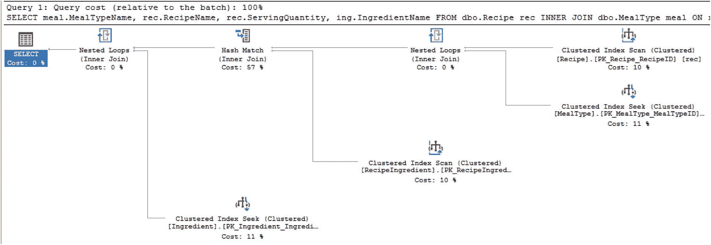

**图 2-1** 即席查询执行计划

将其与图 2-2 中视图的查询执行计划进行比较，您可以看到执行计划之间没有差异。

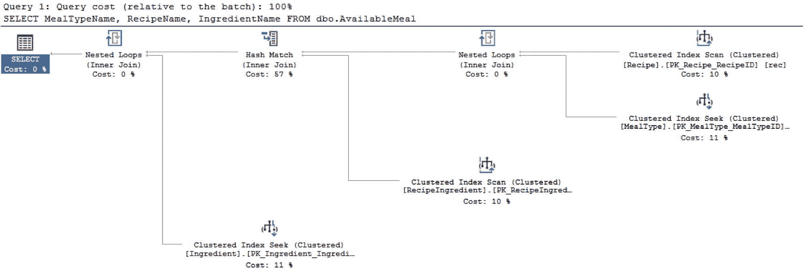

**图 2-2** 视图的执行计划

使用视图时可能出现的问题之一是，执行计划没有清晰地显示视图与基础表之间的关系。虽然视图可以使使用变得更简单，但您可能还想以其他方式使用视图。由于视图使与复杂查询的交互变得更简单，它也可能使修改数据更容易。但是，通过视图更新数据时，需要考虑一些注意事项。在清单 2-4 中，您可以看到基于视图更新数据的查询。

```sql
UPDATE dbo.AvailableMeal
SET IngredientName = 'Spicy Italian Sausage'
WHERE RecipeName = 'Spaghetti'
```

**清单 2-4** 在视图中更新数据

通过视图，您可以更新基础表中的数据。如果视图用于修改来自多个基础表的数据，则更新将失败。插入操作与更新操作的情况相同。在清单 2-5 中，您可以看到尝试为多个表中的数据插入记录时发生的情况。

```sql
INSERT INTO dbo.AvailableMeal (MealTypeName, RecipeName)
VALUES ('Lunch', 'Spinach Quiche')
```

**清单 2-5** 通过视图插入数据

尝试执行上述查询时，SQL Server 会返回错误：“视图或函数 'dbo.AvailableMeal' 不可更新，因为修改会影响多个基础表。” 使用视图时还有其他可用功能。有一种方法可以防止在引用视图时修改基础表。如果您想确保用户不会意外删除表，可以让视图通过 `SCHEMABINDING` 引用表，这是一个可用的选项。您可以使用清单 2-6 中的查询来实现这种额外的安全级别。

```sql
CREATE VIEW dbo.RecipeSecure
WITH SCHEMABINDING
AS
SELECT RecipeName, RecipeDescription, IsActive
FROM dbo.Recipe;
```

**清单 2-6** 创建具有架构绑定的视图

当向视图添加 `SCHEMABINDING` 时，我更改了 SQL Server 处理对视图所包含列更改的方式。具体来说，我不能以会影响视图 `dbo.RecipeSecure` 的方式修改 `dbo.Recipe` 表中的列。清单 2-7 展示了一个查询，其中我尝试删除被 `dbo.RecipeSecure` 架构引用的 `dbo.Recipe` 表中的列。

```sql
ALTER TABLE dbo.Recipe
DROP COLUMN RecipeDescription;
```

**清单 2-7** 在架构绑定的视图中删除列

尝试执行上述查询时，我收到以下错误：“对象 'RecipeSecure' 依赖于列 'RecipeDescription'。ALTER TABLE DROP COLUMN RecipeDescription 失败，因为一个或多个对象访问了此列。” 然而，在保护数据方面还存在一个潜在的漏洞。一旦创建了视图，只要字段别名与原始列名相同，就可以替换原始列名以使用不同的列。回到清单 2-2 中创建的视图，我可以尝试更改返回的值。这可能会造成用户能够访问他们本不应访问的数据的情况。在清单 2-8 中，我更改了原始的 `dbo.AvailableMeal` 视图。

```sql
ALTER VIEW dbo.AvailableMeal
AS
SELECT meal.MealTypeName,
rec.RecipeName,
rec.RecipeDescription AS ServingQuantity,
ing.IngredientName
FROM dbo.Recipe rec
INNER JOIN dbo.MealType meal
ON rec.MealTypeID = meal.MealTypeID
INNER JOIN dbo.RecipeIngredient recing
ON rec.RecipeID = recing.RecipeID
INNER JOIN dbo.Ingredient ing
ON recing.IngredientID = ing.IngredientID;
```

**清单 2-8** 更改视图以修改列

之前，我有一个用户只具有访问视图 `dbo.AvailableMeal` 内数据的权限。我的意图是仅允许此用户访问视图中的原始列。当同一个用户在稍后日期尝试查询该视图时，现在能够看到 `RecipeDescription` 列中的数据了。


在探讨所有这些特性时，最大的问题之一仍然围绕着**嵌套视图**。在典型的软件开发中，人们希望在多个场景中复用相同的软件代码。在创建视图时，很容易会想到去复用这些视图来构建其他视图。不幸的是，这可能会导致一个视图开始出现性能低下的情况。一旦视图性能不佳，就需要付出相当大的努力，穿梭于各个嵌套视图层之间，才能找到根本原因。

##### 索引视图

我已经介绍了视图如何用于简化查询编写、修改数据以及保护数据库架构。我也谈到了复用视图来创建其他视图可能导致严重的性能问题。正如你在前一节所看到的，视图可以使 T-SQL 更简洁，但对于临时查询和视图，其执行计划是相同的。在某些情况下，无论是作为查询还是视图，某些连接操作的表现都不尽如人意。这时就有可能考虑为视图添加索引。

如果你发现自己需要提升视图的性能，可以选择为视图添加索引。当为视图添加索引后，该视图就被视为**索引视图**。添加到视图的第一个索引必须是聚集索引。在添加了聚集索引之后，还可以向该视图添加非聚集索引。然而，为视图添加索引是有代价的。每次数据被修改时，相关表上的任何索引以及索引视图也必须随之更新。

创建索引视图的第一步是先创建一个视图。在这个例子中，我将使用在代码清单 2-2 中创建的视图。下一步是为这个视图添加一个索引。在代码清单 2-9 中，我将为这个视图添加一个聚集索引。

```sql
CREATE UNIQUE CLUSTERED INDEX CX_AvailableMeal_RecipeNameIngredientName
ON dbo.AvailableMeal (RecipeName, IngredientName);
```
代码清单 2-9
向视图添加聚集索引

比较添加聚集索引前后视图的性能，总体上显示出性能有所提升。请记住，尽管索引视图在拉取数据时可以在某些情况下帮助提升性能，但当受影响的表发生数据插入、更新或删除操作时，仍然可能出现性能问题。在图 2-3 中，可以看到向基表插入数据时的执行计划。

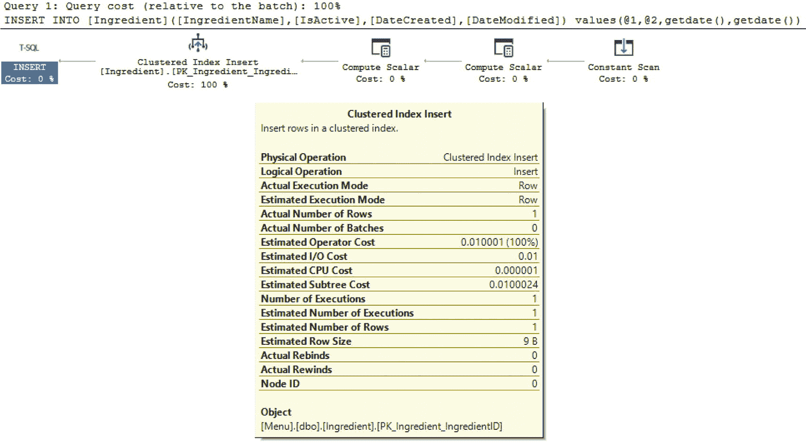
图 2-3
向基表插入数据的执行计划

如你所见，作为向基表插入数据的一部分，多出了一个更新视图索引的步骤。

### 函数

在许多应用程序中，有些核心功能可能会被多次重新计算或复用。有时你可能希望编写一次简单的代码片段，然后在各种其他数据库对象中复用它。还有些情况下，你可能希望将复杂的逻辑封装起来，创建一个包含该逻辑并返回所需结果的数据库对象。这样做可以使 T-SQL 代码看起来不那么复杂，从而不那么令人望而生畏。无论哪种方式，函数都能帮助你简化 T-SQL 代码。

#### 标量函数

你可能会遇到这样的情况：需要在许多不同的场景中重新运行同一段代码。你可能在查找一个配置值，或者希望在代码的多个不同部分重新运行相同的基本逻辑，其中只返回一个值。当你希望传递零个或多个参数，并且只想返回单个值时，你或许可以使用**标量函数**。不过，在使用标量函数时，你需要考虑其潜在的代价。

在 SQL Server 2019 之前，标量函数在 SQL Server 中的运行方式大不相同。历史上，SQL Server 没有对标量函数进行基于成本的优化。这通常意味着标量函数不作为执行计划的一部分被考虑。既然 SQL Server 2019 作为智能查询处理的一部分实现了额外的功能，包括标量用户定义函数 (UDF) 内联，函数的性能得到了提升。

内联函数是可以作为执行计划一部分被包含的函数。内联标量 UDF 的最大优势之一是，在使用标量 UDF 时性能得到显著提升。当想要简化复杂流程并复用代码时，如果函数只需要返回一个结果，标量 UDF 是理想的选择。

早期版本的 SQL Server 与 SQL Server 2019 中的标量 UDF 在性能方面差异显著。为了比较这些执行计划，我将更改兼容性模式以匹配 SQL Server 2017 和 SQL Server 2019。兼容性级别 140 将使用 SQL Server 2017 中的优化器。将数据的兼容性级别设置为 150 则会使用 SQL Server 2019 中可用的优化器。代码清单 2-10 展示了在 T-SQL 中创建标量 UDF 所需的代码。

```sql
CREATE FUNCTION dbo.Ingredient_Price
(
@Cost DECIMAL(6,3),
@Count DECIMAL(6,3)
)
RETURNS DECIMAL (6,3) AS
BEGIN
RETURN @Cost / @Count;
END
```
代码清单 2-10
创建标量 UDF

在兼容性级别 140 下执行上述函数时，最终的执行计划看起来比兼容性级别 150 下生成的执行计划更简单。在代码清单 2-11 中，你可以看到我在兼容性级别 140 和 150 下都执行过的代码。

```sql
SELECT ing.IngredientName, dbo.Ingredient_Price(ingcos.Cost, srv.ServingPortionQuantity)
FROM dbo.Ingredient ing
INNER JOIN dbo.IngredientCost ingcos
ON ing.IngredientID = ingcos.IngredientID
INNER JOIN dbo.ServingPortion srv
ON ingcos.ServingPortionID = srv.ServingPortionID
```
代码清单 2-11
执行函数的代码

为了模拟 SQL Server 2017 的行为，我将把数据库的兼容性级别更改为 140。你可以在代码清单 2-12 中看到更改兼容性级别所需的 T-SQL 代码。

```sql
ALTER DATABASE Menu
SET COMPATIBILITY_LEVEL = 140;
```
代码清单 2-12
将数据库兼容性模式更改为先前版本

代码清单 2-13 中的查询允许我们强制 SQL Server 使用兼容性级别 140 为所有查询生成新的执行计划。

```sql
DBCC FREEPROCCACHE;
```
代码清单 2-13
清除代码清单 2-11 中查询的执行计划

需要注意的是，前面的 T-SQL 代码不应在你的生产环境中运行。这段代码将导致 SQL Server 使用额外资源来确定每个查询在首次调用时应如何运行。我保存了使用兼容性级别 140 运行上述查询时的实际执行计划。你可以在图 2-4 中看到该实际执行计划的副本。

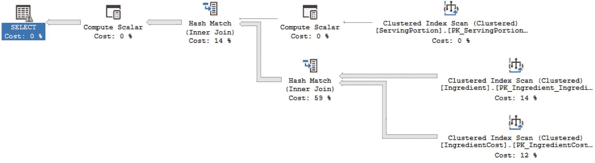
图 2-4
兼容性模式 140 的执行计划


查看兼容性模式 `150` 的实际执行计划，你会发现执行计划看起来更复杂。不过，你也能看到标量函数被包含在了图 2-5 的执行计划中。

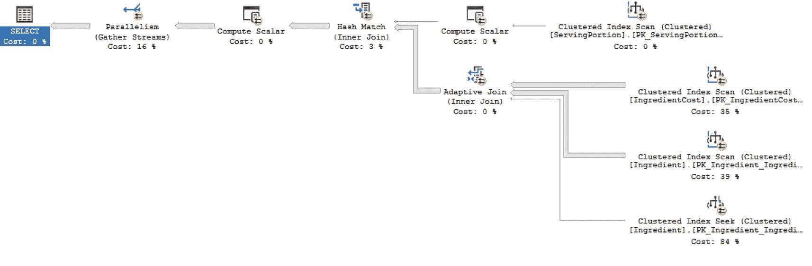

图 2-5

兼容性模式 `150` 的执行计划

虽然 SQL Server 2019 的执行计划可能更复杂，但这两个 SQL Server 版本之间的执行时间差异显著。我们也可以比较兼容性模式 `140` 和 `150` 的 CPU 时间和耗时。在表 2-1 中，你可以看到两次查询执行的 CPU 时间和耗时。

表 2-1

查询执行的耗时与 CPU 时间

| 兼容性模式 | CPU 时间 | 耗时 |
| --- | --- | --- |
| `140` | `3438 milliseconds` | `4768 milliseconds` |
| `150` | `655 milliseconds` | `1913 milliseconds` |

正如你所见，该函数在兼容性模式 `150` 下的性能显著优于 `140` 模式。

SQL Server 2019 中内联标量 UDF 的能力不仅适用于单查询标量 UDF。在使用多语句标量 UDF 时，功能也得到了改进。多语句标量 UDF 与清单 2-10 中创建的标量 UDF 类似，都返回单个值。多语句标量 UDF 的不同之处在于，函数内部可以包含额外的逻辑。我们可能希望改进清单 2-10 中创建的函数，使其能够处理除零错误。在清单 2-14 中，我编写了 T-SQL 代码，通过使用多语句标量 UDF 来增强清单 2-10。

```
CREATE OR ALTER FUNCTION dbo.Ingredient_Price
(
@Cost DECIMAL(6,3),
@Count DECIMAL(6,3)
)
RETURNS DECIMAL (6,3) AS
BEGIN
DECLARE @IngPrc DECIMAL (6,3)
IF @Count = 0
BEGIN
SET @IngPrc =  0.00
END
ELSE
BEGIN
SET @IngPrc = @Cost / @Count;
END
RETURN @IngPrc
END;
清单 2-14
创建多语句标量 UDF
```

清单 2-14 中创建的多语句标量 UDF 将受益于与清单 2-10 中创建的标量 UDF 相同的标量内联优化。无论你决定使用哪种标量 UDF，SQL Server 2019 都进行了改进，你可以看到这些函数的性能有所提升。

#### 表值函数

在某些情况下，你可能需要执行复杂的逻辑，但又需要返回多个值。当遇到这些情况时，你可能需要考虑使用表值函数。在 SQL Server 2019 之前，唯一能够内联运行的函数是表值函数的一种变体。

当你需要将表作为结果时，表值函数非常有用。结果可以是从包含多列的一行到包含多行可能的一列，或者多行多列。无论你的目的是什么，如果你想要一个可重用的代码片段，它能给你提供一个表输出，那么表值函数可能就是你需要的。请记住，表值函数主要有两种类型，虽然输出看起来可能一样，但每种类型的性能可能有天壤之别。

##### 内联表值函数

如果你使用函数来执行一些复杂的逻辑，但只需使用一条 select 语句就能满足需求，那么你可能想了解更多关于内联表值用户定义函数如何为你工作。重要的是要注意，你并非明确指出一个函数是内联的还是多语句的。你创建和声明函数的方式将决定你创建的是哪种类型的函数。

与 SQL Server 2019 中可用的内联标量用户定义函数 (UDF) 类似，表值函数也可以被内联。同时也要注意，表值函数能够内联已有相当长一段时间，而内联标量 UDF 则是比较新的特性。无论哪种方式，优势都很明显。当一个表值函数可以与查询的其余部分内联运行时，优化器可以为该函数以及整个 T-SQL 代码提供更好的执行计划。

从历史上看，内联表值函数最常见的用途是类似于视图进行操作。不同之处在于，对于内联表值函数，可以使用参数来限制返回的数据；而视图在每次执行时都会返回该视图可用的所有数据。让我们看一下在清单 2-15 中创建内联表值函数所需的步骤。

```
CREATE FUNCTION dbo.IngredientsByRecipe (@RecipeID INT)
RETURNS TABLE
AS
RETURN
(
SELECT meal.MealTypeName, rec.ServingQuantity, ing.IngredientName
FROM dbo.Recipe rec
INNER JOIN dbo.MealType meal
ON rec.MealTypeID = meal.MealTypeID
INNER JOIN dbo.RecipeIngredient recing
ON rec.RecipeID = recing.RecipeID
INNER JOIN dbo.Ingredient ing
ON recing.IngredientID = ing.IngredientID
WHERE rec.RecipeID = @RecipeID
);
GO
清单 2-15
创建内联表值函数
```

创建内联表值函数的过程很直接。可能会有关于函数对性能影响的担忧。我想看看内联表值函数的表现如何；我需要运行一个使用此函数的查询，以便查看执行计划中会发生什么。在清单 2-16 中，是用于确定执行计划有效性的脚本。

```
SELECT * FROM dbo.IngredientsByRecipe (1);
清单 2-16
调用内联表值函数的查询
```

我将展示从清单 2-16 中的代码生成的执行计划，因为它是在 SQL Server 2019 中返回的。你可以在图 2-6 中看到执行计划。

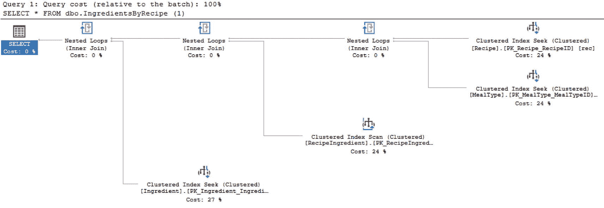

图 2-6

内联表值函数执行计划

如你所见，该函数直接出现在执行计划中。优化器感知到了这个内联表值函数。虽然内联表值 UDF 可以像表一样使用并且可以接受参数，但在使用它们时仍然存在一些限制。这些类型的函数只允许一个 select 语句和一个结果集。此外，这些函数中返回的数据不能在数据库中直接修改。然而，在 select 语句中显示的、从内联表值 UDF 返回的数据是可以被修改的。这只是对数据的显示修改，不会影响存储在数据库中的数据。


##### 多语句表值函数

当您既需要代码重用又需要能够更新 SQL Server 时，可能就该考虑使用多语句表值函数了。但我建议您仔细权衡是否有必要采用此方法，因为这类函数最终可能对性能产生巨大影响。

多语句表值函数不仅仅是能做更多事情的内联表值函数。它们也无法与查询执行进行内联。这意味着查询优化器在使用这类函数时不会尝试进行最佳推测。实际上，在 SQL Server 2014 之前，多语句表值函数被估计为只返回一行。对于 SQL Server 2014 和 SQL Server 2016，估计行数为 100。然而，自 SQL Server 2017 起，通过使用**交错执行**，SQL Server 有可能获得对多语句表值函数返回行数的正确估计。

实际发生的情况是，优化过程将暂停以允许执行，从而使基数估计器能够确定多语句表值函数应返回的实际行数。虽然交错执行是新的自适应查询处理的一部分，但需要注意一些限制。如果 `CROSS APPLY` 与多语句表值函数结合使用，则交错功能将不起作用。也有报告称，如果多语句表值函数内部存在一个依赖于输入参数的 `WHERE` 子句，则交错执行也可能不适用。

为了更好地理解其工作原理，我将在 `Listing 2-17` 中创建一个多语句表值函数。我将在 SQL Server 2012、SQL Server 2017 和 SQL Server 2019 中创建此函数。

```sql
CREATE FUNCTION dbo.IngredientCostByIngredientID (@IngredientID INT)
RETURNS @Output TABLE
(
IngredientName     VARCHAR(25),
IngredientCost     DECIMAL(6,3)
)
AS
BEGIN
INSERT INTO @Output (IngredientName, IngredientCost)
SELECT ing.IngredientName, ingcos.Cost
FROM dbo.Ingredient ing
INNER JOIN dbo.IngredientCost ingcos
ON ing.IngredientID = ingcos.IngredientID
WHERE ing.IngredientID = @IngredientID;
RETURN;
END;
GO
```
`Listing 2-17` 多语句表值函数

函数创建完成后，我可以编写一个脚本来测试该函数在各种版本 SQL Server 中的性能。以下代码是如 `Listing 2-18` 所示编写并执行的 T-SQL。

```sql
SELECT rec.RecipeName, inglis.IngredientName, inglis.IngredientCost
FROM   dbo.Recipe rec
INNER JOIN dbo.RecipeIngredient recing
ON rec.RecipeID = recing.RecipeID
INNER JOIN dbo.Ingredient ing
ON recing.IngredientID = ing.IngredientID
CROSS APPLY dbo.IngredientCostByIngredientID(ing.IngredientID) inglis
WHERE ing.IngredientName = 'Italian Sausage';
```
`Listing 2-18` 执行函数的代码

接下来，我将测试不同版本 SQL Server 上的执行计划和相关性能。在 `Figure 2-7` 中，我将展示通过使用兼容性级别 110 在 SQL Server 2012 中的执行计划。

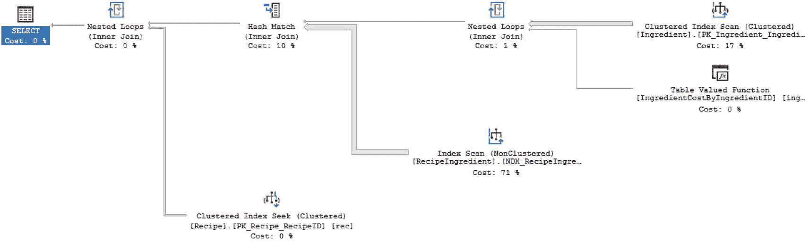

`Figure 2-7` 兼容性级别 110 的执行计划

执行计划看起来没有太多不同的运算符。表值函数表现为单个运算符。表值函数的属性如 `Figure 2-8` 所示。

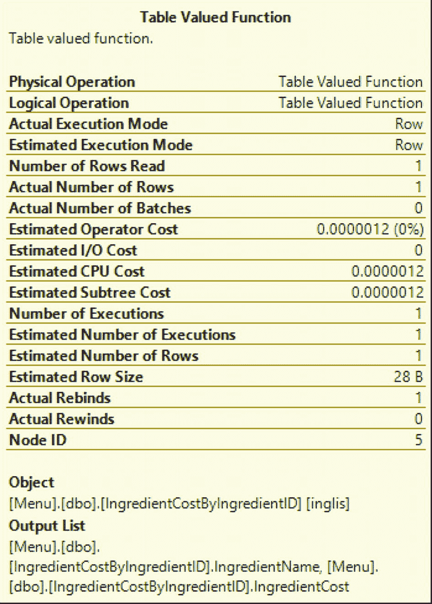

`Figure 2-8` 兼容性级别 110 下表值函数的属性

`Figure 2-8` 显示估计行数为 1。SQL Server 2017 对数据库引擎进行了额外的增强，改进了表值函数的行数估计。使用 SQL Server 2017 的兼容性级别 140，您可以看到生成的执行计划，如 `Figure 2-9` 所示。

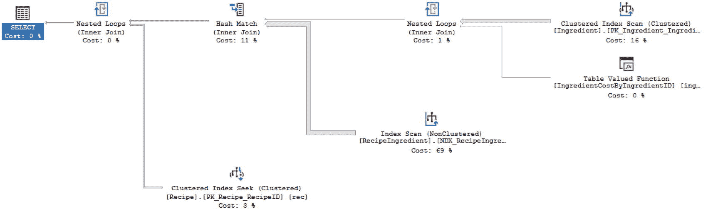

`Figure 2-9` 兼容性级别 140 的执行计划

`Figure 2-9` 看起来与 `Figure 2-7` 相同。唯一可见的差异是一些运算符上显示的百分比。百分比差异不够显著，不足以影响此查询在兼容性级别 110 和 140 下的执行性能。您可以在 `Table 2-2` 中看到执行时间。

`Table 2-2` 比较多语句表值函数在兼容性级别 110 和 140 下的执行时间

| 兼容性级别 | CPU 时间 | 已用时间 |
| --- | --- | --- |
| 110 | 1172 毫秒 | 1529 毫秒 |
| 140 | 1140 毫秒 | 1523 毫秒 |

此处显示的时间足够接近，可视为具有可比性。虽然执行计划和时间相似，我们也可以检查并查看表值函数上的属性是否相同。在 `Figure 2-10` 中，我们可以看到与表值函数相关的属性。

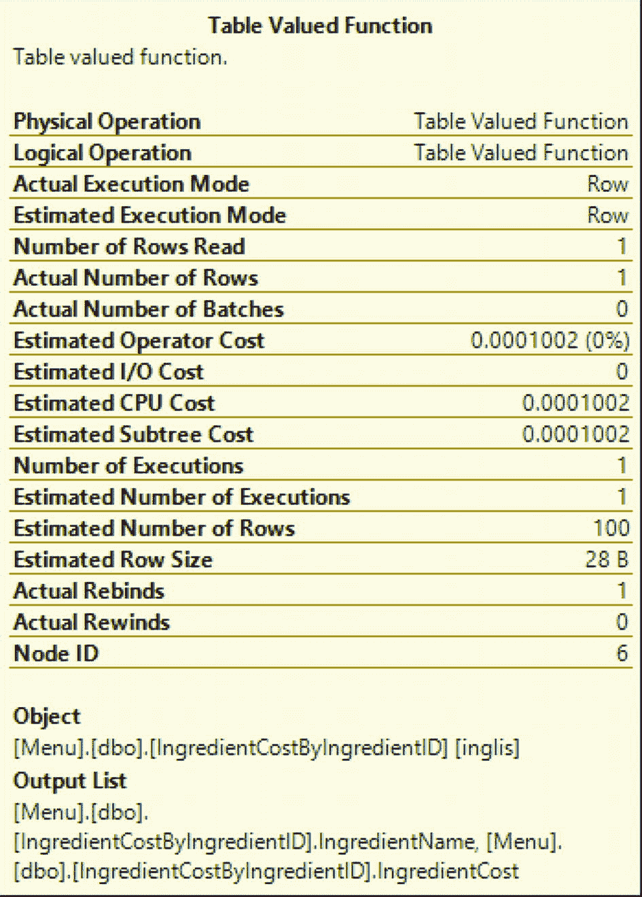

`Figure 2-10` 兼容性级别 140 下表值函数的属性

您可以看到 `Figure 2-10` 中的估计行数为 100。这与 `Figure 2-8` 中显示的估计行数不同。您还可以看到估计运算符成本和估计子树成本都发生了轻微变化。

现在我们已经运行了 `Listing 2-18` 中的查询，接下来可以使用 SQL Server 2019 的优化器运行相同的查询。在此之前，我们需要将兼容性级别改回 150 并清除执行计划缓存。完成这些操作后，执行 `Listing 2-18` 中的查询，我们将得到一个类似于 `Figure 2-11` 中的执行计划。

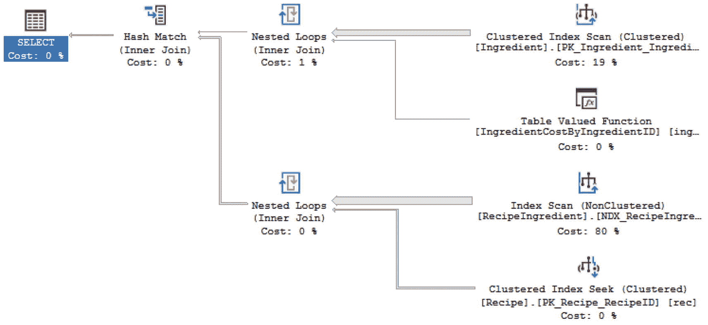

`Figure 2-11` 兼容性级别 150 的执行计划

`Figure 2-11` 中的执行计划与 `Figure 2-7` 和 `Figure 2-9` 中的执行计划都不同。我们还可以看到，`dbo.RecipeIngredient` 表上某个非聚集索引的`索引扫描`运算占用了大部分执行时间。正如预期的那样，这与 `Figure 2-7`、`Figure 2-9` 和 `Figure 2-11` 的执行计划中占用大部分时间的运算符相同。我们还可以比较兼容性级别 110、140 和 150 下的已用时间和 CPU 时间。这将使我们能够比较来自 SQL Server 2012、SQL Server 2017 和 SQL Server 2019 的 SQL Server 优化器的预期执行时间。`Table 2-3` 显示了所有三个兼容性级别及其相关时间。

`Table 2-3` 比较多语句表值函数在兼容性级别 110、140 和 150 下的执行时间


| 兼容模式 | CPU 时间 | 已用时间 |
| --- | --- | --- |
| 110 | 1172 毫秒 | 1529 毫秒 |
| 140 | 1140 毫秒 | 1523 毫秒 |
| 150 | 391 毫秒 | 644 毫秒 |

表 2-3 显示了与兼容级别 110 或 140 相比，执行时间有了显著改善。我还可以将清单 2-10 中代表与 SQL Server 2017 关联的兼容级别的表值函数属性，与兼容级别 150 的属性进行比较。在图 2-12 中，展示了兼容模式 150 下表值函数的属性。

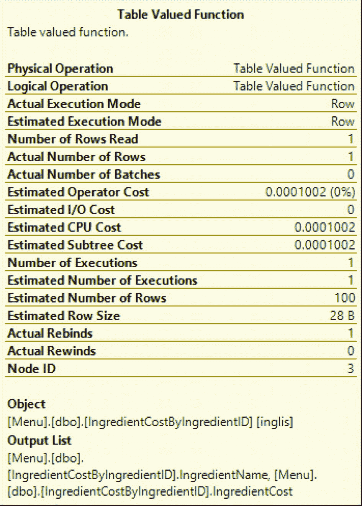

图 2-12：兼容模式 150 下的表值函数属性

观察图 2-12 中的值，有几个值与图 2-10 中的值匹配。这包括图 2-10 和图 2-12 中更准确的预估行数。估算的运算符成本、估算的 CPU 成本以及估算的子树成本在图 2-10 和图 2-12 中也相同。

在新版本的 SQL Server 中，多语句表值函数的性能有所提升。此外，您可以看到 SQL Server 2017 和 SQL Server 2019 在执行计划中具有最准确的预估和实际返回行数。虽然对于多语句表值函数仍需注意性能问题，但在某些场景下，性能提升足够显著，从 SQL Server 2017 开始使用这些函数可能是有益的。

### 其他用户定义对象

处理复杂数据并将其分解为易于管理和分析的节（sections）有多种方法。在某些情况下，数据可以保存到临时表或表变量中。但是，根据您的需求，还有其他可用选项。SQL Server 中的一项功能是使用表值参数。它提供与临时表相似的性能，但其工作方式也类似于表变量。还有一种方法是在批处理中为下一条语句创建临时结果集以供使用。

#### 用户定义表类型

在使用数据库和存储过程时，您可能会遇到需要将多个字段作为参数传递给存储过程的情况。有一种选择是创建用户定义表类型，它允许您指定多列和数据类型。创建用户定义表类型的一个优势是该表类型可以被重用。此用户定义表类型可以应用于多个不同的存储过程或其他数据库代码。您可以在清单 2-19 中看到创建用户定义表类型的示例。

```sql
CREATE TYPE RecipeMealType AS TABLE
(
RecipeName VARCHAR(25),
MealTypeName VARCHAR(25)
);
GO
```
清单 2-19：创建用户定义表类型的代码

一旦创建了用户定义表类型，它就可以用作存储过程的参数，或用于变量声明。用户定义表类型带来的可重用性和一致性是有代价的。由于存储过程现在使用单个参数来表示存储在此对象中的所有列和行，因此很难确定存储过程中哪些参数代表单个值，哪些参数代表用户定义表类型。这个对象可以使代码更易于阅读；但也可能使将来排查性能问题变得更加困难。

#### 表值参数

很大比例的存储过程用于对表执行插入、更新或删除数据操作。在某些情况下，应用程序可能需要向各种存储过程发送表中每个列对应的一个参数。虽然使用每个字段一个参数的方法直接且易于调试，但有人可能会争辩说，在一个参数中发送多个字段会更清晰、更简单。我能理解想要简化代码的想法，但我也相信过度简化会使将来排查代码问题变得困难。

但是，您可能希望在存储过程或其他代码中使用数组类型的格式。在这种情况下，使用此数据执行基于集合的操作将是有益的。这样做时，您需要记住，作为参数传入的用户定义表类型无法被修改。当传入此参数时，传入的数据可以像临时表一样处理，并可用于与基表连接并进行任何必要的修改。

由于 SQL Server 是为最佳执行基于集合的操作而设计的，您可能会达到希望利用 SQL Server 固有的处理集合最佳能力的阶段。如果您希望将一个表传递给存储过程并在同一存储过程中将其与其他表关系化地使用，则应考虑使用表值参数。

由于表值参数最终是一个变量，SQL Server 不一定会针对实际的预估行数优化执行计划。如果您遇到这种情况，您可能需要从参数中获取值，并将它们保存到存储过程内的表变量中。我建议不要仅为了提高代码可读性而使用表值参数。清单 2-20 展示了在存储过程中使用表值参数的示例。

```sql
CREATE PROCEDURE dbo.UpdateRecipeMenuType
@RecipeMeal RecipeMealType READONLY
AS
SET NOCOUNT ON
UPDATE rec
SET MealTypeID = meal.MealTypeID
FROM dbo.Recipe rec
INNER JOIN @RecipeMeal recmeal
ON rec.RecipeName = recmeal.RecipeName
INNER JOIN dbo.MealType meal
ON recmeal.MealTypeName = meal.MealTypeName
```
清单 2-20：使用表值参数

清单 2-20 中的表值参数使用了清单 2-19 中创建的用户定义表类型。当您想使用表值参数执行存储过程时，可以运行清单 2-21 中的代码。

```sql
DECLARE @RecipeType AS RecipeMealType;
INSERT INTO @RecipeType (RecipeName, MealTypeName)
SELECT rec.RecipeName, ml.MealTypeName
FROM dbo.Recipe rec
INNER JOIN dbo.MealType ml
ON rec.MealTypeID = ml.MealTypeID;
EXEC dbo.UpdateRecipeMenuType @RecipeType;
GO
```
清单 2-21：执行带表值参数的存储过程的代码

此代码的执行计划如图 2-13 所示。请注意对表值参数的表扫描。

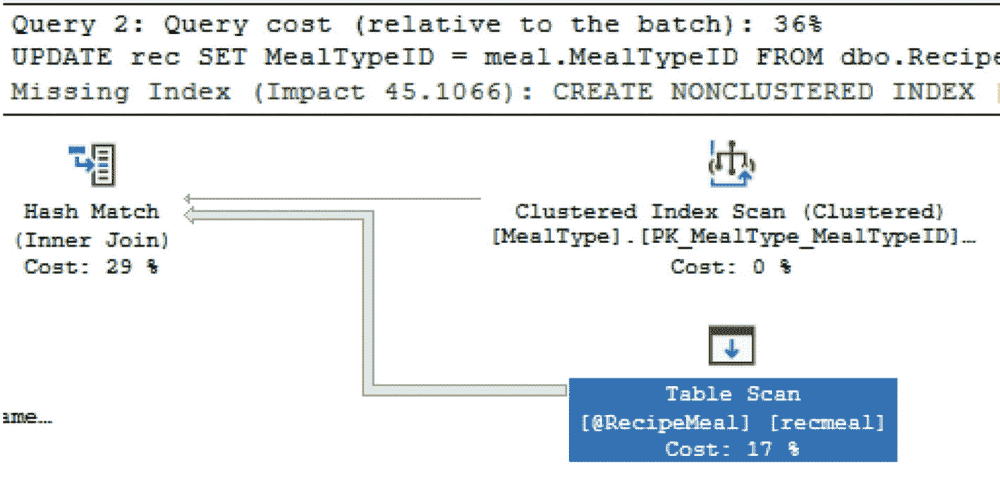

图 2-13：带表值参数的存储过程的执行计划

如果我们保留清单 2-9 中创建的索引视图，返回的执行计划会变得更加复杂。如果索引视图仍然存在，图 2-14 显示了产生的执行计划。

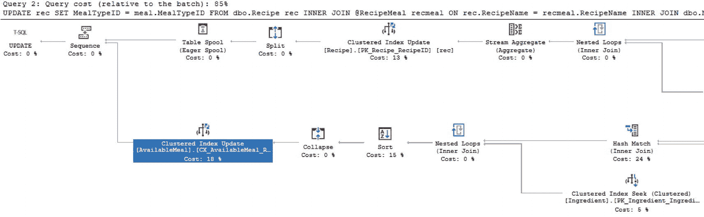

图 2-14：带索引视图的表值参数的执行计划


#### 常用表表达式

虽然这不是用户定义的数据库对象，但我将常用表表达式包含在本节中，因为它们经常用于与临时表、表变量和表参数相似的目的，即帮助拆分复杂的逻辑，或在 T-SQL 代码、批处理或存储过程中获取稍后使用的数据子集。

使用基本常用表表达式的主要原因是提高代码的整体可读性。在清单 2-22 中，我使用与清单 2-2 中创建的视图相同的逻辑创建了一个常用表表达式。期望是当执行此代码时，其性能将与之前创建的视图相同。

```
WITH cte_meal AS
(
SELECT meal.MealTypeName, rec.RecipeName, rec.ServingQuantity, ing.IngredientName
FROM dbo.Recipe rec
INNER JOIN dbo.MealType meal
ON rec.MealTypeID = meal.MealTypeID
INNER JOIN dbo.RecipeIngredient recing
ON rec.RecipeID = recing.RecipeID
INNER JOIN dbo.Ingredient ing
ON recing.IngredientID = ing.IngredientID
)
SELECT meal.MealTypeName, meal.RecipeName, meal.ServingQuantity, meal.IngredientName
FROM cte_meal meal
清单 2-22
创建一个基本常用表表达式
```

在图 2-15 中，您可以看到从清单 2-22 生成的执行计划与图 2-6 中的执行计划相匹配。如果您还记得，图 2-6 中的执行计划是从清单 2-16 创建的视图生成的。

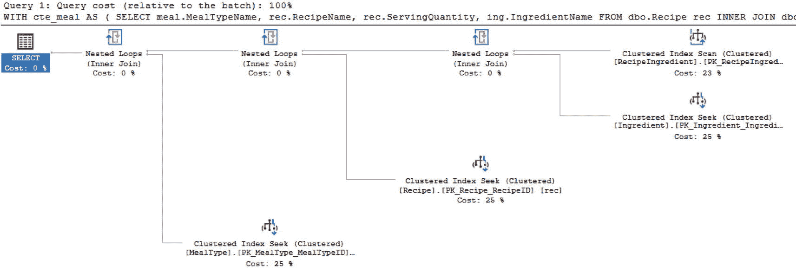

图 2-15

基本常用表表达式的执行计划

当您使用常用表表达式时，您也可以像连接视图或临时表一样将常用表表达式（CTE）与其他表连接。您还可以使用 CTE 基于 CTE 执行 `SELECT`、`INSERT`、`UPDATE` 和 `DELETE` 操作。清单 2-23 展示了一个使用常用表表达式时具有更复杂逻辑的查询。

```
WITH cte_meal AS
(
SELECT meal.MealTypeName, rec.RecipeName, rec.ServingQuantity, ing.IngredientName
FROM dbo.Recipe rec
INNER JOIN dbo.MealType meal
ON rec.MealTypeID = meal.MealTypeID
INNER JOIN dbo.RecipeIngredient recing
ON rec.RecipeID = recing.RecipeID
INNER JOIN dbo.Ingredient ing
ON recing.IngredientID = ing.IngredientID
)
SELECT meal.RecipeName, meal.IngredientName, SUM(ingcos.Cost) AS 'IngredientCost'
FROM cte_meal meal
INNER JOIN dbo.Ingredient ing
ON meal.IngredientName = ing.IngredientName
INNER JOIN dbo.IngredientCost ingcos
ON ingcos.IngredientID = ing.IngredientID
GROUP BY meal.RecipeName, meal.IngredientName
清单 2-23
在常用表表达式中使用连接
```

还有一项与常用表表达式相关的最终功能使它们有些独特。您可以创建递归常用表表达式。在这种情况下，CTE 将引用自身以帮助生成分层数据。可能很诱人地想让递归 CTE 解决许多不同的问题。我建议在实现递归 CTE 时谨慎行事。当需要时，它们可以是正确的工具，但它们也可能导致重大的性能挑战。清单 2-24 是创建递归 CTE 以查找父配方所需的子配方的示例。

```
WITH cte_meal (MealTypeName, RecipeName, ServingQuantity, IngredientName, RecipeLevel) AS
(
SELECT meal.MealTypeName, rec.RecipeName, rec.ServingQuantity, ing.IngredientName, 1
FROM dbo.Ingredient ing
INNER JOIN dbo.RecipeIngredient recing
ON ing.IngredientID = recing.IngredientID
INNER JOIN dbo.Recipe rec
ON recing.RecipeID = rec.RecipeID
INNER JOIN dbo.MealType meal
ON rec.MealTypeID = meal.MealTypeID
LEFT JOIN dbo.Ingredient baseing
ON rec.RecipeName = baseing.IngredientName
WHERE baseing.IngredientName IS NULL
UNION ALL
SELECT meal.MealTypeName, rec.RecipeName, meal.ServingQuantity, ing.IngredientName, meal.RecipeLevel + 1
FROM cte_meal meal
INNER JOIN dbo.Recipe rec
ON meal.IngredientName = rec.RecipeName
INNER JOIN dbo.RecipeIngredient recing
ON rec.RecipeID = recing.RecipeID
INNER JOIN dbo.Ingredient ing
ON recing.IngredientID = ing.IngredientID
)
SELECT MealTypeName,
RecipeName,
IngredientName,
RecipeLevel
FROM cte_meal meal
清单 2-24
递归 CTE 以查找所有所需配方
```

如图 2-16 中的部分执行计划所示，SQL Server 执行此查询所需的步骤变得相当复杂。

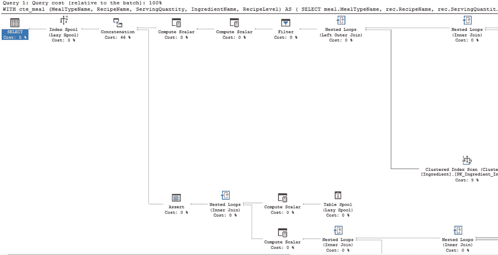

图 2-16

递归 CTE 的部分执行计划

我发现很少有绝对需要使用递归 CTE 的情况。然而，当我不得不使用常用表表达式时，我发现它们非常有用。

#### 临时对象

您可能会发现自己处于需要创建对象但只使用很短时间的场景。有时创建这些对象是为了在处理复杂逻辑时处理数据子集。其他时候，将部分代码拆分出来创建临时对象可以提高可读性或使其他人更容易理解您在做什么。无论哪种场景，在 SQL Server 中都有可能创建临时对象。

##### 临时表

临时表正如其名。它们采用与表相同的结构，包含列、数据类型并存储数据。主要区别在于临时表不会无限期地存在。根据您想对临时表执行的操作以及需要它们保留的时间，将决定您最终创建哪种类型的临时表。

使用临时表还有其他优势。这些包括能够使用主键和索引来提高性能。还可以在临时表上创建统计信息，进一步提高其性能。需要考虑的一点是，如果在首次创建临时表后执行了额外的修改，统计信息可能不会自动更新。


###### 局部临时表

如果你发现自己需要将数据暂存以便进行额外分析或处理，那么你可能考虑过使用局部临时表。这类临时表在存储过程内部也很有用。局部临时表仅在创建它们的同一会话或连接内可用。一旦会话关闭或连接终止，你就无法访问该局部临时表。

虽然局部临时表可用于许多不同的场景，但通常建议，在需要临时存储数据时，不要首先使用临时表。局部临时表本身并无问题，但你可能会发现其他对象能够以更小的潜在性能影响来临时存储数据。与所有与 SQL Server 相关的事项一样，在将 T-SQL 代码部署到生产环境之前，最好实施解决方案并对其进行测试，包括负载测试。

创建临时表很容易。虽然可以在创建表的同时将数据插入临时表，但最佳实践是先创建具有已定义数据类型的临时表，然后再插入记录。在代码清单 2-25 中，有一段用于生成局部临时表的代码。作为对比，用于填充此表的代码与代码清单 2-2 中使用的代码相同。

```
CREATE TABLE #TempAvailableMeal
(
MealTypeName VARCHAR(25),
RecipeName VARCHAR(25),
ServingQuantity TINYINT,
IngredientName VARCHAR(25)
)
```

代码清单 2-25
创建临时表

一旦临时表创建完成，运行代码清单 2-26 中的查询以填充表中的数据。

```
INSERT INTO #TempAvailableMeal (MealTypeName, RecipeName, ServingQuantity, IngredientName)
SELECT meal.MealTypeName, rec.RecipeName, rec.ServingQuantity, ing.IngredientName
FROM dbo.Recipe rec
INNER JOIN dbo.MealType meal
ON rec.MealTypeID = meal.MealTypeID
INNER JOIN dbo.RecipeIngredient recing
ON rec.RecipeID = recing.RecipeID
INNER JOIN dbo.Ingredient ing
ON recing.IngredientID = ing.IngredientID
```

代码清单 2-26
填充临时表

当我运行填充临时表的过程时，我还获取了此过程的执行计划。在图 2-17 中，你会看到该执行计划看起来与为视图和公用表表达式生成的执行计划相似。虽然形状相似，但正在发生的部分活动以及百分比分布有所不同。

`../images/480547_1_En_2_Chapter/480547_1_En_2_Fig17_HTML.jpg`

图 2-17
创建临时表的执行计划

既然我们已经确定了创建临时表的执行计划是什么样子，那么当我们从临时表中查询数据后，执行计划又是如何的呢？代码清单 2-27 展示了如何查询现有的临时表。

```
SELECT MealTypeName, RecipeName, ServingQuantity, IngredientName
FROM #TempAvailableMeal
```

代码清单 2-27
查询临时表

到目前为止，我们已经看到，对于大多数查询而言，大部分工作发生在原始数据被选取的同一时间。而在本例中，`insert` 和 `select` 已被分离成两个独立的步骤。图 2-18 是查询临时表中的数据时生成的执行计划。

`../images/480547_1_En_2_Chapter/480547_1_En_2_Fig18_HTML.jpg`

图 2-18
查询临时表

虽然此查询使用了 `Table Scan`（表扫描），但可以向临时表添加索引。

###### 全局临时表

你可能会发现自己想要创建一个存在时间比当前会话或活动数据库连接更长的临时表。也许你想要一个可以被多个用户访问的临时表。在这种情况下，你可能需要创建一个全局临时表。即使创建该全局临时表的原始会话或连接不再活动，这个全局临时表仍然会存在。

创建全局临时表很简单。如果我想重新创建代码清单 2-26 中的临时表，但要确保该表是全局的，我可以运行代码清单 2-28 中的代码来创建全局临时表。

```
INSERT INTO ##TempAvailableMeal (MealTypeName, RecipeName, ServingQuantity, IngredientName)
SELECT meal.MealTypeName, rec.RecipeName, rec.ServingQuantity, ing.IngredientName
FROM dbo.Recipe rec
INNER JOIN dbo.MealType meal
ON rec.MealTypeID = meal.MealTypeID
INNER JOIN dbo.RecipeIngredient recing
ON rec.RecipeID = recing.RecipeID
INNER JOIN dbo.Ingredient ing
ON recing.IngredientID = ing.IngredientID
```

代码清单 2-28
创建全局临时表

创建局部临时表和全局临时表之间的唯一区别在于创建时使用的表名。比较代码清单 2-26（用于局部临时表）和代码清单 2-28（用于全局临时表）的代码，你可以看到表名的差异。在代码清单 2-26 中，表名是 `#TempAvailableMeal`，而在代码清单 2-28 中，临时表名是 `##TempAvailableMeal`。表名开头多出的第二个 `#` 字符表明该临时表是一个全局临时表。此外，全局临时表的运行方式与局部临时表类似。一个关键区别是，全局临时表可以在创建该临时表的特定连接之外被访问。


##### 持久化临时表

处理临时表时，您可能希望创建一个永久存在于 `tempdb` 数据库中的表。需要注意的一点是，如果您计划创建一个永久存在的临时表，在 SQL Server 重启的情况下，数据将不会被保存。您可以通过使用与在用户数据库中创建表类似的 T-SQL 来创建持久化临时表。此数据库代码的示例见代码清单 2-29。

```sql
USE tempdb;
GO
CREATE TABLE AvailableMeal
(
MealTypeName VARCHAR(25),
RecipeName VARCHAR(25),
ServingQuantity TINYINT,
IngredientName VARCHAR(25)
);
```
代码清单 2-29：创建持久化临时表

您可以使用代码清单 2-29 中的 T-SQL 代码来创建持久化表，但我推荐一种更符合 `tempdb` 使用习惯的方法。您可以创建一个在 SQL Server 启动时执行的存储过程。然后，此存储过程将创建您可能需要的任何全局临时表。您可以使用代码清单 2-30 中的 T-SQL 来创建用于生成全局临时表的存储过程。

```sql
CREATE PROCEDURE dbo.CreatePersistentTable
AS
CREATE TABLE ##AvailableMeal
(
MealTypeName VARCHAR(25),
RecipeName VARCHAR(25),
ServingQuantity TINYINT,
IngredientName VARCHAR(25)
);
GO
```
代码清单 2-30：为全局临时表创建存储过程

创建代码清单 2-30 中的存储过程后，您需要修改存储过程选项，以便在 SQL Server 重启时执行该存储过程。代码清单 2-31 中的 T-SQL 将允许您修改存储过程以在启动时执行。

```sql
EXEC sp_procoption 'CreatePersistentTable', 'startup', 'true'
```
代码清单 2-31：更新存储过程以在启动时执行

如果您发现自己处于考虑使用持久化临时表的情况，请考虑您的环境，以及在维护和知识共享方面可能增加的潜在困难，以便让每个人都知道可能有一个关键任务表存在于 `tempdb` 数据库中。

##### 表变量

在某些情况下，您希望在本地存储数据，但您知道将存储的记录数量有限。如果您不需要其他连接可用该数据，并且可以接受数据仅存在于批处理内部，那么您可以尝试使用表变量。在使用表变量时，如果您愿意将所有内容保持在同一个批处理中，您还可以选择多次重用该表变量。

在 SQL Server 2019 之前，表变量的估计行数是一条记录。与本章前面讨论的其他对象类似，SQL Server 在改进表变量相关的一般性能方面取得了重大进展。SQL Server 现在能够在使用表变量时生成更准确的行数估计。既然 SQL Server 对行数的估计更准确，它也将该逻辑保存在执行计划中。

如果您发现自己处于表变量返回的数据可能高度偏斜的情况，您可能会发现 T-SQL 代码的性能表现不稳定。现在关于表变量的信息被存储在执行计划中，遇到参数嗅探的概率更高。虽然这可能很麻烦，但请记住，SQL Server 也会生成一个至少对某些数据值来说非常高效的执行计划。

与临时表类似，表变量的创建和使用可能很直接。代码清单 2-32 展示了声明和填充表变量的方法。

```sql
DECLARE @TempAvailableMeal TABLE
(
MealTypeName VARCHAR(25),
RecipeName VARCHAR(25),
ServingQuantity TINYINT,
IngredientName VARCHAR(25)
)
INSERT INTO @TempAvailableMeal (MealTypeName, RecipeName, ServingQuantity, IngredientName)
SELECT meal.MealTypeName, rec.RecipeName, rec.ServingQuantity, ing.IngredientName
FROM dbo.Recipe rec
INNER JOIN dbo.MealType meal
ON rec.MealTypeID = meal.MealTypeID
INNER JOIN dbo.RecipeIngredient recing
ON rec.RecipeID = recing.RecipeID
INNER JOIN dbo.Ingredient ing
ON recing.IngredientID = ing.IngredientID
```
代码清单 2-32：声明和填充表变量

此查询的执行计划看起来与填充本地临时表时生成的图 2-16 中的执行计划非常相似。图 2-19 显示了填充表变量时创建的执行计划。

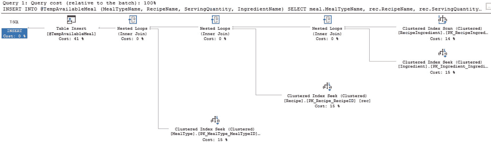

图 2-19：填充表变量

既然 SQL Server 2019 已经更新，允许在使用表变量时进行更好的估计，我预计执行计划会经常匹配。但是，如果您计划向表变量添加大量数据，我会仔细检查查询性能。

##### 临时存储过程

如果在 `tempdb` 数据库中创建了存储过程，则该存储过程是临时存储过程。SQL Server 可能使此功能成为可能，但请记住开发人员和应用程序将如何与此数据库对象交互。至少，在 `tempdb` 数据库中有一个临时存储过程会使与这些存储过程相关的代码更难以进行故障排除或维护。

### 触发器

SQL Server 提供了在发生某些其他活动时执行特定操作的能力。这些反应可能发生在用户登录系统时。还有其他反应可能在现有数据库更改之后发生或阻止更改。在处理应用程序和数据时，最常见的反应类型是响应数据库中数据的更改。无论原因如何，这些反应都被定义为触发器。触发器是一种特殊类型的存储过程，它响应对服务器、数据库或表执行的特定操作。

#### 登录触发器

当用户登录到服务器时，您可能希望记录该特定活动。或者在其他情况下，您可能希望在登录时限制用户活动，或由于服务器登录而实现额外的安全功能。登录触发器使您能够允许 SQL Server 启动反应以响应某些或所有登录到服务器的行为。

在应用程序开发中，需要登录触发器的场景并不多。但是，登录触发器可以完成一些有助于保护应用程序的事情。登录触发器可以限制登录允许的连接数。在发生违规的情况下，这可以确保数据库不会被过多的连接淹没。相反，限制每个登录允许的连接数量也会限制可扩展性和未来的适应性。今天可接受的连接数量可能远低于未来所需的登录次数。


#### DDL（数据定义语言）触发器

当应用程序或用户更改整体数据库架构时，他们使用的便是数据定义语言。以 SQL Server 为例，它能够对数据库更改引发的特定场景作出响应。虽然我不期望这会成为应用开发的标准组成部分，但了解此类触发器的存在可能有所帮助。

如果你担心 SQL 注入会对你的服务器造成问题，DDL 触发器可以帮助减轻损害。你可以设置选项来防止所有类型的数据库对象被删除。此外，还可以记录或追踪数据库对象何时被创建或修改。尽管你可能想利用触发器来设置各种监控服务器和数据库上所有活动的触发器，但可能存在更好的选择。有其他替代方案可用于跟踪此类行为。这包括用于服务器和数据库活动的 SQL Server 审计。通常，应用程序并不关心记录对服务器或数据库架构的更改。

#### DML（数据操作语言）触发器

如果你发现自己需要在应用开发中实现审计或日志记录，你会发现数据操作触发器非常有用。这些触发器有多种选项，并能根据数据库中实际数据的更改响应各种操作。在某些情况下，你可能只想记录更改发生的时间及更改了什么。在其他情况下，更改或验证请求的功能可能更为重要。

触发器的一种方法是在某事发生后执行一个操作。例如，我希望成功修改 `dbo.IngredientCost` 表中的一条记录，但同时也希望保留该项目成本随时间变化的历史记录。清单 2-33 展示了一些 T-SQL 代码，它将在更改发生后向历史表添加一条记录。

```sql
CREATE TRIGGER dbo.LogIngredientCostHistory
ON dbo.IngredientCost
AFTER INSERT, UPDATE
AS
IF (ROWCOUNT_BIG() = 0)
RETURN;
INSERT INTO dbo.IngredientCostHistory (IngredientCostID, Cost, DateCreated)
SELECT inserted.IngredientCostID, inserted.Cost, GETDATE()
FROM inserted;
GO
```
清单 2-33：创建后插入型 DML 触发器

当在 `dbo.IngredientCost` 表中插入或更新记录时，新的成本和成本更改的日期将被记录在 `dbo.IngredientCostHistory` 表中。为了查看此触发器的性能，我通过运行清单 2-34 中的代码对其进行测试。

```sql
INSERT INTO dbo.IngredientCost (IngredientID, ServingPortionID, Cost, IsActive, DateCreated, DateModified)
VALUES (1, 1, 5.98, 1, GETDATE(), GETDATE())
```
清单 2-34：向 `IngredientCost` 插入记录的查询

执行上述代码时，执行计划包含两个步骤。第一步是运行代码将记录插入到 `dbo.IngredientCost`。第二个执行计划显示了由触发器引发的插入操作的计划。清单 2-34 生成的执行计划见图 2-20。

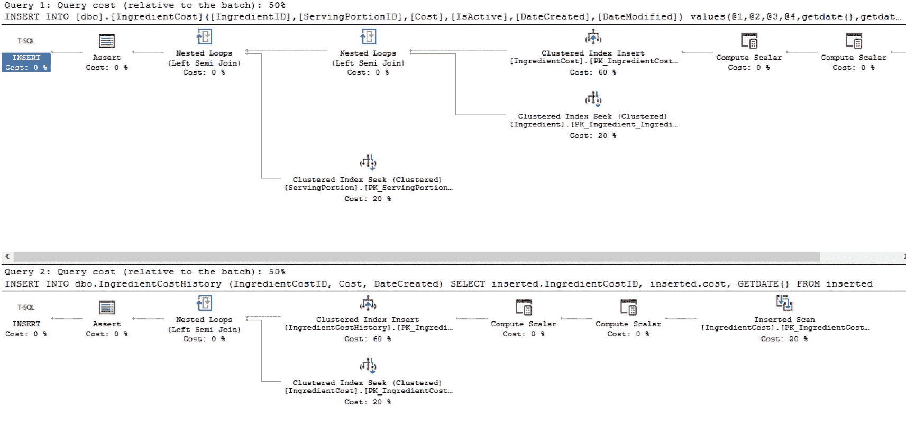
图 2-20：带触发器的插入记录执行计划

图 2-20 中的执行计划显示了当记录被修改以触发触发器时发生的情况。然而，来自清单 2-31 的 T-SQL 代码 `IF (ROWCOUNT_BIG() = 0) RETURN;` 可防止在没有记录被更新时 DML 触发器触发。这被认为是最佳实践，可以在无需任何操作时最小化服务器上的资源利用。清单 2-35 展示了一个不会有记录被更新的更新查询。

```sql
UPDATE dbo.IngredientCost
SET Cost = 10.00
WHERE IngredientID  IngredientID
```
清单 2-35：不会更新任何记录的更新语句

如你在图 2-21 中所见，执行计划只有一个步骤。那就是更新操作的执行计划。没有来自触发器的 T-SQL 代码执行。

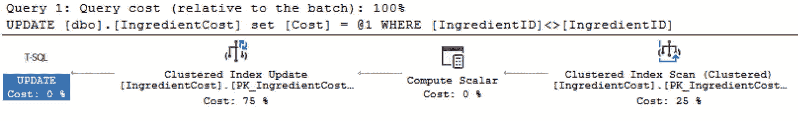
图 2-21：没有记录被更新的执行计划

如你所见，SQL Server 意识到触发器没有返回任何需要更新的记录。在没有尝试向 `dbo.IngredientCostHistory` 表插入任何记录的情况下，唯一的动作是生成更新的执行计划。在活动之后执行触发器并不是数据操作触发器的唯一选项。还可以让触发器执行一个操作来代替原本请求的操作。清单 2-36 展示了一个在用户发出删除操作时会禁用记录的触发器。

```sql
CREATE TRIGGER dbo.DisableMealType
ON dbo.MealType
INSTEAD OF DELETE
AS
IF (ROWCOUNT_BIG() = 0)
RETURN;
UPDATE meal
SET IsActive = 0
FROM dbo.MealType meal
INNER JOIN deleted del
ON meal.MealTypeID = del.MealTypeID;
GO
```
清单 2-36：`INSTEAD OF` 触发器

如你所见，在 SQL Server 中使用 DML 触发器时，有多个选项可用。还可以为每个数据库对象设置多个触发器。你可以为每个 `INSERT`、`UPDATE` 和 `DELETE` 设置一个 `INSTEAD OF` 触发器。你也可以在同一个表或视图上拥有多个 `AFTER` 触发器。由于允许的触发器数量，你还可以指定每个 `INSERT`、`UPDATE` 或 `DELETE` 操作中哪个触发器应该最先或最后运行。如果你为一个操作类型拥有多个 `AFTER` 触发器，这些触发器将以随机顺序运行。

由于一个给定的数据库对象上可能存在多层触发器，因此测试这些触发器的功能非常重要。正如本章讨论的许多其他概念一样，了解触发器在负载下的表现有助于为应用程序的性能表现做好准备。


### 游标

在有效地使用关系型数据库时，通常关键是要以大块或集合的形式来思考进程和数据。几乎所有场景的目标都是编写能够利用这种基于集合逻辑的 T-SQL。虽然这是理想的方法，但你可能会遇到一些情况，让你觉得无法以大块的方式处理数据。在某些情况下，这可能意味着是时候逐行处理数据了。

如果你考虑走这条路，必须承认 SQL Server 在处理一个大数据块时比逐个处理大量单独记录时表现更好。在一些忍不住想使用逐行逻辑工具的情况下，可能是时候寻找另一个能更好满足需求的工具了。例如，当需要创建一个游标来逐一连接到多个 SQL Server 实例并执行任务时。虽然这超出了本书的范围，但这种特定情况可能最好通过创建一个 SQL Server Integration Services (SSIS) 包来处理连接到各个 SQL Server 实例。

还有其他一些时候，你可能需要使用 T-SQL 生成一个结果集，其中返回的数据是相同的，但必须按位置或供应商信息进行分段。在这个例子中，可以使用 SQL Server Reporting Services (SSRS) 来实现相同的目标。然而，你的公司可能决定不使用 SSRS。因此，使用游标可能是正确的选择。我也遇到过需要用每个记录特定的计算值来更新数据的情况。在这种情况下，几乎不可能使用基于集合的逻辑来执行更新。虽然 SQL Server 能够处理这个任务，但如果应用程序能处理这些更改会更理想。

游标可以帮助创建一个可重复的进程，一次处理一条记录。虽然游标可用于解决各种问题，但重要的是要记住，很多时候可能有不用游标就能达到相同结果的不同方法。如果你确定确实必须使用游标，下一步就是确定使用哪种类型的游标。无论使用哪种类型，游标的概念是相同的，但游标的类型将决定其内部数据的功能和可访问性。

当为你的需求选择合适的游标类型时，请选择满足你需求且功能最少的那一个。与功能更多的游标类型相比，这将有助于减少负面性能影响。无论何时在 SQL Server 中逐条处理记录，它们几乎总是比以分组方式处理数据的性能更差。

游标选择一个数据集，一次获取一条记录，然后修改当前记录。一旦完成了所需的操作，就可以获取下一条记录。这就是了解可用的各种游标类型能让你选择正确类型的地方。

#### 仅向前游标

默认的游标类型称为仅向前游标。对于这种类型的游标，数据只能单向获取。在仅向前游标中获取的记录可以插入、更新和删除游标内获取的记录。如果一条记录之前已被更新过，除非游标关闭并重新打开，否则它不会再次被获取。在少数情况下，在记录被更新后，你仍可能在同一游标内看到该记录。代码清单 2-37 展示了一个仅向前游标的示例。

```sql
SET NOCOUNT ON;
DECLARE @RecipeID INT,
@RecipeName VARCHAR(25),
@message VARCHAR(50);
PRINT '-------- Recipe Listing --------';
DECLARE recipe_cursor CURSOR FORWARD_ONLY
FOR
SELECT RecipeID, RecipeName
FROM dbo.Recipe
ORDER BY RecipeID;
OPEN recipe_cursor
FETCH NEXT FROM recipe_cursor
INTO @RecipeID, @RecipeName
WHILE @@FETCH_STATUS = 0
BEGIN
PRINT ' '
SELECT @message = '----- Ingredients For Recipe: ' + @RecipeName + '-----'
PRINT @message
SELECT ing.IngredientName, srv.ServingPortionQuantity, srv.ServingPortionUnit
FROM dbo.Ingredient ing
INNER JOIN dbo.RecipeIngredient recing
ON ing.IngredientID = recing.IngredientID
INNER JOIN dbo.ServingPortion srv
ON recing.ServingPortionID = srv.ServingPortionID
WHERE recing.RecipeID = @RecipeID
FETCH NEXT FROM recipe_cursor INTO @RecipeID, @RecipeName
END
CLOSE recipe_cursor;
DEALLOCATE recipe_cursor;
```

代码清单 2-37
仅向前游标示例

在这个仅向前游标的例子中，我生成了一个食谱列表及其每道菜所需的所有配料。在图 2-22 中，你可以看到输出到文本窗口的结果。

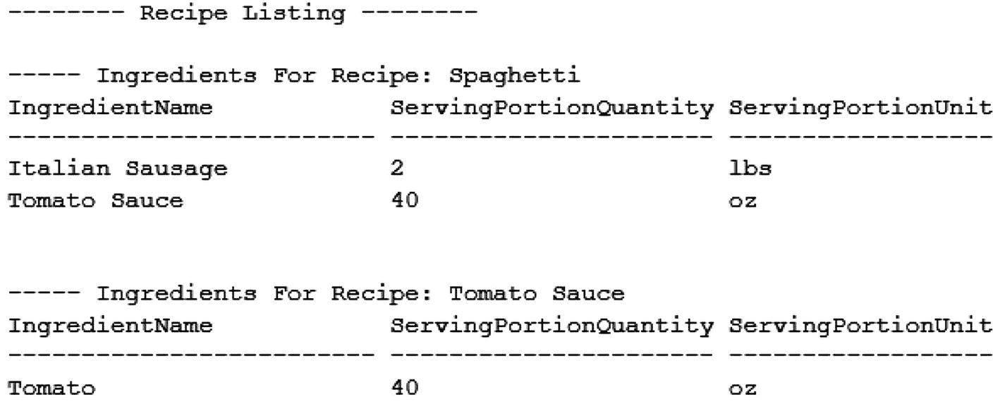

图 2-22
仅向前游标的输出

虽然这产生了我想要的输出，但我也必须记住性能影响。在图 2-23 中，你可以看到此游标执行计划的一部分。

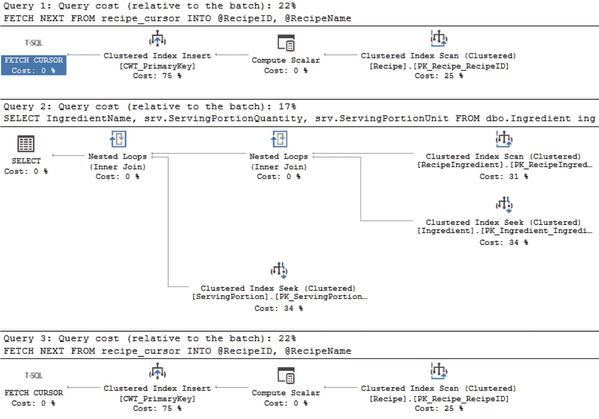

图 2-23
仅向前游标的执行计划

重要的是要记住，此图的第二部分和第三部分将为此游标处理的每一行重新运行。当底层查询快速且高效时，这可能不是问题。然而，如果游标内的查询有任何性能问题，游标可能会严重加剧这些性能问题。

#### 静态游标

有时你会希望在运行游标时能够前后移动。使用静态游标时，可用的结果集在游标首次打开后不会改变。静态游标可以选择为只读或允许读写。当游标为只读时，数据无法被修改。如果数据被修改，无法保证游标会拉回修改后的数据。

#### 键集游标

在定义游标时，可能有一组列创建了唯一条目。如果可以找到这组唯一数据，并且你需要能够与已更改的记录进行交互，那么使用键集游标可能是一个选择。键集是从唯一列集的一组键。游标可以前后移动，但检测属于游标的记录顺序变化的唯一方法是关闭并重新打开游标。


#### 动态游标

如果其他游标类型可能不适用于您的情况，还有最后一种可用的游标类型。由于潜在的性能影响，这种类型的游标应尽可能少地使用。**动态游标**允许您在结果集中向前和向后移动。此外，它能感知数据发生的变化。虽然处理事务超出了本书的范围，但关于动态游标与事务级别相关的情况，还有一些额外的注意事项。所有已提交事务的更改都将可见。然而，只有在游标的事务级别设置为“未提交读”时，才能看到未提交的事务更改。

在本节前面，我展示了如何创建一个只进游标。创建游标有趣的一点是，在不同游标类型之间切换时，代码并不会发生显著变化。游标类型之间的最大区别在于每种游标能看到哪些数据修改以及数据是如何被提取的。一个最大的诱惑是，游标的工作方式与应用程序代码非常相似。它们不是一次性处理大量数据，而是循环遍历数据。在应用程序代码中，这通常是访问数据的首选方法，这使得使用游标更具诱惑力。

我见过游标最常被用于处理本应由应用程序更好地处理的流程。您可能会遇到一种情况，似乎游标是唯一可行的解决方案之一。查看清单 2-38，您可以了解动态游标可能的样子。

```
SET NOCOUNT ON;
DECLARE @RecipeID INT,
@RecipeName VARCHAR(25),
@message VARCHAR(50);
PRINT '-------- Recipe Listing --------';
DECLARE recipe_cursor CURSOR DYNAMIC
FOR
SELECT RecipeID, RecipeName
FROM dbo.Recipe
ORDER BY RecipeID;
OPEN recipe_cursor
FETCH NEXT FROM recipe_cursor
INTO @RecipeID, @RecipeName
WHILE @@FETCH_STATUS = 0
BEGIN
PRINT ' '
SELECT @message = '----- Ingredients For Recipe: ' + @RecipeName + '-----'
PRINT @message
SELECT ing.IngredientName, srv.ServingPortionQuantity, srv.ServingPortionUnit
FROM dbo.Ingredient ing
INNER JOIN dbo.RecipeIngredient recing
ON ing.IngredientID = recing.IngredientID
INNER JOIN dbo.ServingPortion srv
ON recing.ServingPortionID = srv.ServingPortionID
WHERE recing.RecipeID = @RecipeID
FETCH NEXT FROM recipe_cursor INTO @RecipeID, @RecipeName
END
CLOSE recipe_cursor;
DEALLOCATE recipe_cursor;
```
清单 2-38：创建动态游标

将游标类型从 `FORWARD_ONLY` 更改为 `DYNAMIC` 就像简单地将这两个短语互换一样容易。这些游标的输出也是相同的。真正可能发生的差异发生在幕后。如果游标运行期间某条记录发生了变化，只进游标可能无法察觉到该更改，而动态游标则可能能够滚动查看到该更改，或者在某些场景下，动态游标甚至可能在更改提交之前就看到它。

在本章中，我介绍了在编写 T-SQL 时可用的几种不同类型的数据库对象。这些对象可以帮助使代码更具可读性。虽然其中一些数据库对象在适当的情况下可以提高性能，但它们都不是为了解决每一个技术挑战而设计的。在某些情况下，使用错误的数据库对象可能会对数据库和您的应用程序代码产生负面的性能影响。现在您已经知道何时使用每种数据库对象，是时候开始考虑您编写的代码质量了。

## 3. 标准化 T-SQL

在我开始讨论如何为复杂场景编写查询之前，我想先专注于如何编写良好的 T-SQL。这不是关于编写性能良好的代码，而是关于编写可读性好的 T-SQL 代码。我想回顾如何编写代码，以便于他人和您自己阅读。如果您像我一样，在职业生涯的某个阶段，您会回顾自己以前的代码，却无法立即理解其中涉及的所有逻辑。

编写易于理解的 T-SQL 对您和您的公司都有好处。许多其他编程语言都有标准或最佳实践，我认为 T-SQL 也不例外。虽然编写 T-SQL 的主要目标可能是实现某个功能，但次要目标——确保您的 T-SQL 逻辑清晰——同样重要。随着时间的推移，代码会变更，或者会发现错误。您的 T-SQL 代码可读性和可理解性越高，就越容易修改或进行故障排除。

### 格式化 T-SQL

T-SQL 代码的书写方式与其内容本身同等重要。和其他应用程序代码一样，未来总会有人需要阅读你的代码，或者你需要阅读别人的代码。如果我不是在编写新代码，那么就是在查看已有代码，以理解其用途、调试代码、优化查询性能或更新业务逻辑。根据我审查代码的原因，我通常会确定当时对我重要的是什么。

如果我查看 T-SQL 代码是为了理解代码的功能，我会首先查看涉及哪些表，以了解可能使用此 T-SQL 代码的应用程序。我通常不关心表是如何连接的，因为我假设它们的功能是正确的，尽管表连接逻辑错误可能是查询返回非常意外结果的一个原因。接下来，我会查看用于过滤 T-SQL 代码结果的条件。只有在分析的最后，我才会检查查询返回的列。通常，只有在涉及特殊业务逻辑时，我才会关注这些列。将这种思维模式应用于编写简单查询，你可以看到我在代码清单 3-1 中将列名列在一行上。

```
SELECT IngredientID, IngredientName, DateCreated, DateModified
FROM dbo.Ingredient
Listing 3-1
基本查询
```

我这样格式化代码是因为我希望能够快速查看 FROM 子句和 WHERE 条件中发生的所有操作项。如果为每个列创建单独的一行，我将更难看清表之间的关系以及应用于这些关系的条件。如代码清单 3-2 所示，我更改了 SELECT 子句中列的显示方式。

```
SELECT rec.RecipeName,
rec.RecipeDescription,
rec.IsActive AS 'RecipeIsActive',
ingr.IngredientName,
ingr.IsActive AS 'IngredientIsActive'
FROM dbo.Recipe rec
INNER JOIN dbo.RecipeIngredient recingr
ON rec.RecipeID = recingr.IngredientID
LEFT OUTER JOIN dbo.Ingredient ingr
ON recingr.IngredientID = ingr.IngredientID
AND ingr.IngredientName  'Italian Sausage'
Listing 3-2
带连接的查询
```

对于此查询，列是逐行列出的。这是因为我对实际返回的列进行了某种更改。如果我对列进行别名设置或向列添加特殊逻辑，我会更改 SELECT 语句中列的格式。对于这些情况，根据逻辑的复杂性，我将为每列创建一行或多行。如果你还注意到查询的最后两行，我有两个连接条件。我通常会缩进第一个之后的任何连接条件，因为我希望立即明显看出已对连接应用了多个条件。

很多时候，我审查 T-SQL 代码是为了排查为什么 T-SQL 代码可能返回错误的结果。当返回的结果出现问题时，我会从用户故事开始，了解发生了什么不正确的情况。在这些情况下，我会立即转到 WHERE 子句以仔细检查逻辑并确认其是否正确。一旦确认了逻辑，我就会查看连接条件，以确认表是否正确连接。我使用与理解 T-SQL 代码相同的过程来排查代码问题；我会最后查看 SELECT 语句，重点关注任何主要的、带有特殊逻辑的列。查看代码清单 3-3 中的查询，我可以先扫描 FROM 子句，然后是 WHERE 子句。

```
SELECT
(
SELECT rec.RecipeName
FROM dbo.Recipe rec
INNER JOIN dbo.RecipeIngredient recingr
ON rec.RecipeID = recingr.RecipeID
WHERE recingr.IngredientID = ingr.IngredientID
) AS 'RecipeName',
ingr.IngredientName,
ingr.IsActive,
ingr.DateCreated,
ingr.DateModified
FROM dbo.Ingredient ingr
WHERE IngredientName LIKE '%Tomato%'
ORDER BY RecipeName, ingr.IngredientName
Listing 3-3
带子查询的查询
```

这使我能够立即确定此查询处理的是类似于番茄的配料。由于 SELECT 语句中的列列在单独的行上，我立即意识到 SELECT 语句的这部分涉及一些特殊逻辑。我还缩进了逻辑的子查询部分，这有助于子查询更加突出。既然我正在排查潜在的不准确结果，我可以快速深入探究可能导致问题的原因。根据报告的错误，问题很可能出在 WHERE 子句或 SELECT 语句返回的第一列上。分析代码清单 3-4 中创建的视图则显示了不同的结论。

```
CREATE VIEW dbo.AvailableMeal
AS
SELECT meal.MealTypeName, rec.RecipeName, rec.ServingQuantity, ing.IngredientName
FROM dbo.Recipe rec
INNER JOIN dbo.MealType meal
ON rec.MealTypeID = meal.MealTypeID
INNER JOIN dbo.RecipeIngredient recing
ON rec.RecipeID = recing.RecipeID
INNER JOIN dbo.Ingredient ing
ON recing.IngredientID = ing.IngredientID
Listing 3-4
创建视图
```

对于此视图的 T-SQL 代码，我仍然首先查看 FROM 子句。我立即发现存在多个连接。此外，没有 WHERE 子句，并且我还可以快速确定 SELECT 语句中没有特殊逻辑，因为所有列都不在它们自己的行上。将关于此视图的信息与我正在研究的任何潜在错误相匹配，我知道此查询最复杂的部分是连接逻辑。如果连接是正确的，并且视图返回了太多结果，我可以快速排除 SELECT 语句；或者如果返回的数据不正确，我可以排除 WHERE 子句。在创建函数时也可以遵循类似的模式，如代码清单 3-5 所示。

```
CREATE FUNCTION dbo.IngredientsByRecipe (@RecipeID INT)
RETURNS TABLE
AS
RETURN
(
SELECT meal.MealTypeName, rec.ServingQuantity, ing.IngredientName
FROM dbo.Recipe rec
INNER JOIN dbo.MealType meal
ON rec.MealTypeID = meal.MealTypeID
INNER JOIN dbo.RecipeIngredient recing
ON rec.RecipeID = recing.RecipeID
INNER JOIN dbo.Ingredient ing
ON recing.IngredientID = ing.IngredientID
WHERE rec.RecipeID = @RecipeID
);
Listing 3-5
创建函数
```

在前面的函数中，我可以快速识别 FROM 语句中的多个连接和 WHERE 子句中的一个条件。如果该函数仅返回所提供的配方结果，那么已发现的任何错误很可能与连接条件相关。

我对查询进行性能调优的过程是不同的，我将在本书的第二部分《构建高性能的 T-SQL》中进一步讨论这些差异。当涉及到作为性能调优一部分审查 T-SQL 时，我将重点关注使用了哪些表。如果涉及多个表，我还将查看这些表是如何连接的。我的最后重点将是正在使用哪些列，以及这些列与现有索引的关系。


#### T-SQL 代码格式化示例与最佳实践

我也会在更新`T-SQL`代码内的逻辑时审查这些代码。无论是新增、更改还是删除了功能，我都需要修改`T-SQL`代码以反映这些变更。根据修改的复杂程度，这可能简单到查看`SELECT`子句中的字段并更改显示的字段或计算方式；也可能复杂到需要查看`FROM`子句并向连接条件中添加或删除表。在某些情况下，我需要更新`WHERE`子句中的条件以满足新的业务需求。清单 3-6 展示了创建表值参数的情况，就属于这种情况。我首先注意到的一点是此存储过程中缺少`WHERE`子句。这也是在处理用户定义表类型时增加复杂性的地方。

```sql
CREATE PROCEDURE dbo.UpdateRecipeMenuType
@RecipeMeal RecipeMealType READONLY
AS
SET NOCOUNT ON
UPDATE rec
SET MealTypeID = meal.MealTypeID
FROM dbo.Recipe rec
INNER JOIN @RecipeMeal recmeal
ON rec.RecipeName = recmeal.RecipeName
INNER JOIN dbo.MealType meal
ON recmeal.MealTypeName = meal.MealTypeName
Listing 3-6
Create Table-Valued Parameter
```

用户定义的表很可能用于在连接上筛选数据。然而，仅看代码，很难判断应用程序如何使用此存储过程。由于用户定义表类型，增强此存储过程逻辑所需的工作量显著增加。我需要了解数据如何通过表值参数传入，同时还需要考虑传递给此表值参数的数据可能如何随时间变化。由于数据库管理员通常是在应用程序部署后长期管理`T-SQL`代码的人，我发现最好将`T-SQL`代码设计为便于未来维护。正如你在清单 3-7 中所看到的，在创建公共表表达式时，我使用了相同的方法，但对公共表表达式内部的查询进行了缩进。我再次使用这种缩进来表示特定部分正在发生特殊逻辑。

```sql
WITH cte_meal AS
(
SELECT meal.MealTypeName, rec.RecipeName, rec.ServingQuantity, ing.IngredientName
FROM dbo.Recipe rec
INNER JOIN dbo.MealType meal
ON rec.MealTypeID = meal.MealTypeID
INNER JOIN dbo.RecipeIngredient recing
ON rec.RecipeID = recing.RecipeID
INNER JOIN dbo.Ingredient ing
ON recing.IngredientID = ing.IngredientID
)
SELECT meal.MealTypeName, meal.RecipeName, meal.ServingQuantity, meal.IngredientName
FROM cte_meal meal
Listing 3-7
Create a Common Table Expression
```

在定义我个人风格时，我学到我的总体目标是让查询能放在一个足够小的区域内，以便我能快速高效地找到想要审查的那部分`T-SQL`代码。在设计你自己的标准时，你需要思考你的总体目标是什么。

在许多公司中，会招聘初级团队成员。其中一些初级成员可能刚接触`SQL Server`，任何新员工都需要一些时间来了解你业务中的应用程序是如何工作的。在设计内部`T-SQL`编码标准时，你需要考虑应遵循哪些格式约定，以帮助新员工快速了解你公司的系统和数据流。

制定`T-SQL`格式化标准的另一个因素是创建一个员工易于记忆或参考的标准。你希望你的团队成员在实施新标准时能够成功，而不是在编写代码时被所有的细微差别压垮。这一点尤其重要，如果所有的`T-SQL`代码都必须手动编写，而你的公司没有可以自动为你格式化`T-SQL`代码的软件。

对于`INSERT`、`UPDATE`和`DELETE`语句也有一些格式上的考虑。清单 3-8 展示了一个`INSERT`语句示例。在此示例中，我列出了`INSERT`的所有列名。

```sql
INSERT INTO dbo.IngredientCost (IngredientID, ServingPortionID, Cost, IsActive, DateCreated, DateModified)
VALUES (1, 1, 5.98, 1, GETDATE(), GETDATE())
Listing 3-8
Query to Insert Data
```

虽然列出列名可能看起来不必要，但这种格式标准使插入的数据易于识别，并且如果未来添加了列或列顺序发生变化，此格式也能保护应用程序代码免于出现问题。更新数据的格式很简单，如清单 3-9 所示。我仍然遵循与保留字和引用用户定义数据库对象相同的格式。

```sql
UPDATE dbo.AvailableMeal
SET IngredientName = 'Spicy Italian Sausage'
WHERE RecipeName = 'Spaghetti'
Listing 3-9
Simple Query to Update Data
```

你还可以看到我始终在运算符两侧填充空格。我在几个例子中都这样做了。与我为格式化所做的其他决定一样，我相信在等号前后添加空格可以提高`T-SQL`代码的可读性。我还包含了清单 3-10 来展示如何在`T-SQL`中格式化删除数据。

```sql
DELETE FROM dbo.Ingredient
WHERE IngredientName LIKE '%tomato%'
Listing 3-10
Query to Delete Data
```

此示例是一个简单的删除，当涉及连接时，删除数据的格式可能变得更加复杂。删除数据在`SQL Server`中往往显得比其他数据操作活动更重要。有时你可能希望编写一个查询来系统地删除表中的数据。当我刚开始编写从表中删除数据的查询时，我会从编写`SELECT`语句开始。这将有助于解决几个因素。我可以清楚地看到哪些数据会受到影响。我还可以获得预期受影响记录数的行计数。一旦写好了`SELECT`语句，我就可以轻松修改代码以删除必要的记录。清单 3-11 中的查询展示了我将用于准备删除数据记录的`SELECT`语句。

```sql
SELECT rec.RecipeID, rec.RecipeName
FROM dbo.Recipe rec
INNER JOIN dbo.MealType meal
ON rec.MealTypeID = meal.MealTypeID
WHERE meal.MealTypeID = 2
Listing 3-11
Select Recipes with MealTypeID of 2
```

在这种情况下，我准备从`dbo.Recipe`表中删除`MealTypeID`为 2 的记录。使用清单 3-11 的结果，我可以确认要删除的数据以及预期删除的记录数。在检查了清单 3-11 的结果后，我可以更新`T-SQL`代码以删除这些记录。在清单 3-12 中，我将`SELECT`语句替换为引用`dbo.Recipe`表别名的`DELETE FROM`。

```sql
BEGIN TRAN
DELETE FROM rec
FROM dbo.Recipe rec
INNER JOIN dbo.MealType meal
ON rec.MealTypeID = meal.MealTypeID
WHERE meal.MealTypeID = 2
COMMIT
Listing 3-12
Delete Recipes with MealTypeID of 2
```


