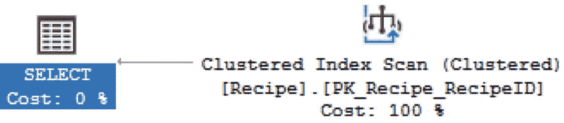
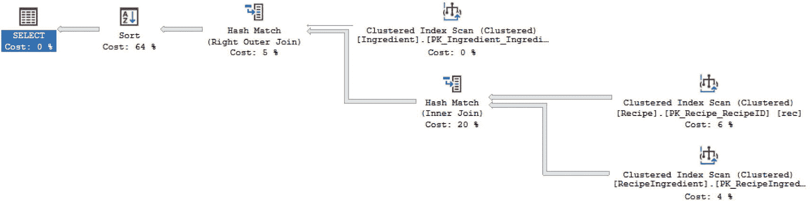
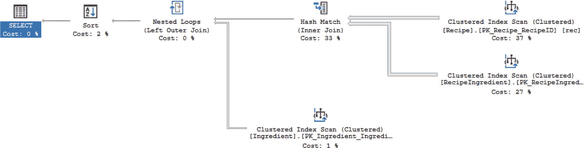
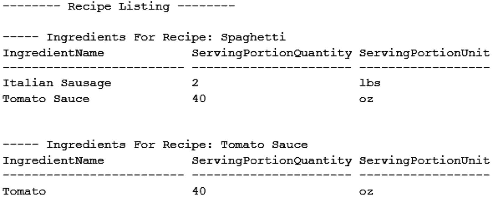
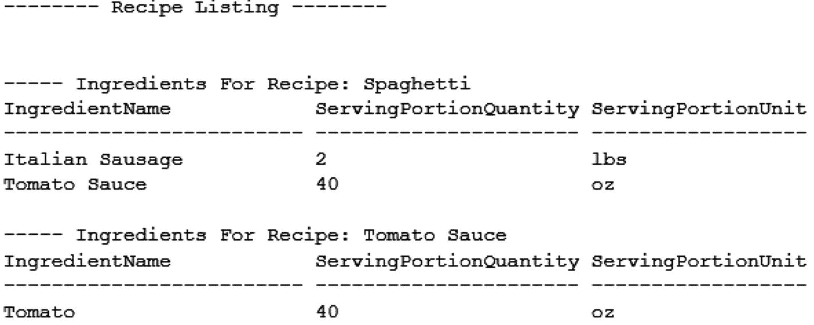

# 格式化 T-SQL 代码

在使用 T-SQL 代码时，有时你会编写复杂的代码。这些代码可能包含子查询，或者 `WHERE` 子句中涉及 `AND` 或 `OR` 的逻辑。如果 `WHERE` 子句中存在诸如子查询或 `AND` 和 `OR` 混合使用之类的逻辑，我会将它们括在括号内。我会将括号内的所有代码进行缩进，以便轻松识别哪些逻辑被组合在一起。有时，两个表之间存在多个连接条件。如果两个表之间有不止一个连接条件，我会对除第一个连接条件外的每一个连接条件进行缩进，以便他人可以轻易看出两个表之间存在多个连接条件。

当向代码中添加额外的逻辑层次时，你还需要考虑如何格式化 T-SQL 代码。T-SQL 代码块有各种原因，包括 `TRY… CATCH` 块、`IF… ELSE` 语句、`BEGIN…END`，或者其他需要分割代码的情况。对于这些场景，我会对代码块的内部进行缩进。如果代码块最终被嵌套，我会对每个后续代码块进行缩进。我倾向于对代码块进行缩进，以便审查我代码的人可以看到父级活动，例如清单 3-17 中的 `WHILE` 循环。一旦你看到第一级缩进，你就知道所有缩进的逻辑都属于同一个代码块。

```sql
SET NOCOUNT ON;
DECLARE @RecipeID INT,
    @RecipeName VARCHAR(25),
    @message VARCHAR(50);
PRINT '-------- Recipe Listing --------';
DECLARE recipe_cursor CURSOR FORWARD_ONLY
FOR
SELECT RecipeID, RecipeName
FROM dbo.Recipe
ORDER BY RecipeID;
OPEN recipe_cursor
FETCH NEXT FROM recipe_cursor
INTO @RecipeID, @RecipeName
WHILE @@FETCH_STATUS = 0
BEGIN
    PRINT ' '
    SELECT @message = '----- Ingredients For Recipe: ' + @RecipeName + '-----'
    PRINT @message
    SELECT ing.IngredientName,
        srv.ServingPortionQuantity,
        srv.ServingPortionUnit
    FROM dbo.Ingredient ing
    INNER JOIN dbo.RecipeIngredient recing
        ON ing.IngredientID = recing.IngredientID
    INNER JOIN dbo.ServingPortion srv
        ON recing.ServingPortionID = srv.ServingPortionID
    WHERE recing.RecipeID = @RecipeID
    FETCH NEXT FROM recipe_cursor INTO @RecipeID, @RecipeName
END
CLOSE recipe_cursor;
DEALLOCATE recipe_cursor;
```
清单 3-17
创建游标

一致地格式化 T-SQL 代码可以提高你自己以及将来需要审查你代码的任何人的可读性。格式良好的代码可以在故障排除、性能调优和代码增强时提供清晰度。在你的组织中创建 T-SQL 格式化标准也有助于新员工入职或培训初级数据库开发人员。一旦确定了 T-SQL 格式化标准，你将需要考虑采取哪些步骤来为你的 T-SQL 代码创建命名约定。

### 命名 T-SQL

当你编写 T-SQL 时，你有选择如何编写该代码的方式。你很可能会在 T-SQL 中创建持久性对象。无论你的目的是什么，遵循良好的命名策略都使他人更容易理解你的 T-SQL 代码的用途。理想情况下，你的团队成员应该能够基于代码所在的对象名称来确定你代码的目的。这对于新员工或经验较少的员工特别有帮助。

格式化 T-SQL 的相同实践在选择命名约定策略时是类似的。命名约定带来的一个方面是外观和感觉。这可以涉及用于对象的大写字母。在为数据库对象提供大小写时，有多种可用选项。主要选择是驼峰式命名法（camel case）或帕斯卡式命名法（pascal case）。这些大小写风格之间的主要区别在于数据库对象的首字母。在清单 3-18 中，你将看到使用驼峰式命名法编写的查询。

```sql
SELECT recipeID, ingredientID, dateCreated, dateModified
FROM dbo.recipeIngredient
```
清单 3-18
使用驼峰式命名法的查询

相反，在清单 3-19 中，你可以看到编写相同查询时帕斯卡式命名法的样子。

```sql
SELECT RecipeID, IngredientID, DateCreated, DateModified
FROM dbo.RecipeIngredient
```
清单 3-19
使用帕斯卡式命名法的查询

此外，还有一种选项是首字母不大写，并且单词之间用下划线分隔。我通常不喜欢数据库名称中出现非字母字符，但我知道有些人偏爱下划线。如果你想要另一种选择，清单 3-20 展示了表和列需要如何命名，这被称为蛇形命名法（snake case）。

```sql
SELECT recipeID, ingredientID, date_created, date_modified
FROM dbo.recipe_ingredient
```
清单 3-20
使用蛇形命名法的查询

在确定命名约定使用哪种大小写时，请务必注意数据库的排序规则以及是否有任何表具有特殊的排序规则。了解大小写敏感性将有助于确保你的命名约定和格式化标准保持一致。

这还可能涉及对象在对象资源管理器中出现的位置。其中一些与正在命名的对象类型以及谁将查找这些对象有关。如果你想根据用途查找对象，你可能需要指定将这些对象分组在一起的模式名称。这对于应用程序或服务可能特别有用。根据预期进行何种类型的故障排除，数据库对象，尤其是存储过程，可以以它们所执行的操作来命名。这将便于搜索执行数据选择与数据插入的存储过程。但是，还有另一种选择，即主要受影响的表可以作为存储过程名称的第一个单词。这将允许某人按受影响的表在对象资源管理器中搜索，以查看所有存在的存储过程。

另一个考虑因素是在命名数据库对象时是否可以使用保留字。如果在数据库对象名称中使用了保留字，你将需要在对象名称中添加另一个单词，以便在引用对象名称时不需要使用方括号。

在确定命名约定时，你可能还想考虑表中是否有列将与其他表中的列具有相同的名称。这类列中的一部分包括指定记录创建日期、记录最后更新日期以及记录是否被软删除。对于指定状态或类型的表，这些表可以包含一个状态或类型名称列以及一个关联的描述列。你可能决定希望所有具有这些列的表中的所有这些列都具有完全相同的名称。


#### 数据库对象命名约定

在编写查询时，我倾向于不给列名起别名（如果可能的话）。同时，我也不会显示多个创建日期或更新日期列。因此，对于创建日期、修改日期和软删除标志，我会使用完全相同的名称。然而，在编写查询时，我通常也会从多个表中拉取名称或描述字段。因此，我希望这些列名中包含表名作为列名的一部分。这允许其他人查看`SELECT`语句时能轻松识别引用的是哪个表。这也意味着我在编写查询时需要别名的列更少。

#### 命名持久化数据库对象

命名持久化数据库对象也可能很棘手。命名表可能不同于命名索引、视图、触发器或函数。再次强调，命名这些对象不仅仅是给它们一个描述性的名称。此外，这还可能涉及给它们一个能清楚表明其对象类型的名称。这是因为许多数据库工程师和开发人员使用**对象资源管理器**作为查找对象的主要工具。正如我所讨论的，如果表名以名词开头，存储过程以动词开头，那么我接下来需要弄清楚如何将其他数据库对象与表和存储过程区分开来。

#### 使用对象类型缩写前缀

一种选择是在对象名称前加上对象类型的缩写。对于索引，可以使用`IX_`表示非聚集索引，使用`CX_`表示聚集索引。在命名索引时，一旦指定了`IX_`或`CX_`，下一个项目应该是该索引所在的表名。表名之后应该是索引中的列列表。列的顺序应与创建索引时指定的顺序相同。在清单[3-21]中，我创建了一个聚集索引。如你所见，聚集索引名称以`CX`开头，后跟表名，然后是列名。每个部分用下划线分隔。

```
CREATE CLUSTERED INDEX CX_Ingredient_IngredientName
ON dbo.Ingredient (IngredientName);
Listing 3-21
Create a Clustered Index
```

创建非聚集索引遵循相同的模式。在清单[3-22]中，你会看到非聚集索引也包含多列。

```
CREATE NONCLUSTERED INDEX IX_Ingredient_IngredientName_IsActive
ON dbo.Ingredient (IngredientName ASC, IsActive DESC);
Listing 3-22
Create a Non-clustered Index with Multiple Columns
```

#### 命名主键和外键

在创建主键和外键时也是如此。如果在`T-SQL`中创建主键或外键时没有指定名称，`SQL Server`会随机分配一个名称。因此，最佳实践是显式命名主键或外键。在命名主键时，你会希望主键以`PK_`开头，代表主键。类似地，你会希望在外键名称前加上`FK_`，然后命名键的其余部分。名称的下一部分是分配主键或外键的表名。然后是用于定义主键或外键的列。如果指定了多个列，则主键或外键中列出的列应按顺序排列。清单[3-23]展示了一个在表创建后如何添加并命名主键的示例。

```
ALTER TABLE dbo.Ingredient
ADD CONSTRAINT PK_Ingredient_IngredientID
PRIMARY KEY (IngredientID);
Listing 3-23
Add a Primary Key
```

如你所见，主键名称以`PK`开头，后跟表名，然后是用于创建主键的列名。

类似地，你会希望在外键名称前加上`FK_`，然后命名键的其余部分。名称的下一部分是分配主键或外键的表名。然后是用于定义主键或外键的列。如果指定了多个列，则主键或外键中列出的列应按顺序排列。在表创建后创建外键时，可以参考清单[3-24]。

```
ALTER TABLE dbo.RecipeIngredient
ADD CONSTRAINT FK_RecipeIngredient_IngredientID
FOREIGN KEY (IngredientID)
REFERENCES dbo.Ingredient(IngredientID);
Listing 3-24
Add a Foreign Key
```

与创建主键类似，外键遵循相似的命名结构。外键以`FK`开头，后跟表名，然后是列名。

#### 命名视图和触发器

我也可以在视图名称前加上`vw_`，在触发器名称前加上`tr_`。还有其他不那么明显的选项可用。例如，你可以定义一组仅保留用于视图或触发器的名词或动词。这将给你更多的灵活性，同时也能避免对象资源管理器列表中的所有项目都以相同的三个字符开头。这将使任何人都能轻松看出这些对象既不是表也不是存储过程。对于视图和触发器来说尤其如此。

最大的挑战之一是，如果它们没有被命名得显而易见，人们可能会花费大量时间寻找这些对象却找不到。这是因为视图的使用方式类似于表，而触发器的操作方式类似于存储过程。这是因为视图像表一样用于连接，而触发器像存储过程一样更改对象。触发器甚至更棘手，因为它们可能导致你花费大量时间研究存储过程，试图确定为什么值会发生变化。

#### 命名表

在命名表时，你希望只使用名词。这有助于表明这些对象用于存储，而不是执行任何特定活动。在命名对象时，一个常被忽视直到为时已晚的命名约定是对象应该是单数还是复数。在第一次出现复数对象之前，这真的不是问题。一旦一个复数的数据库对象进入整个模式中，其问题很快就会变得明显。这是因为一旦数据库中存在复数对象，在编写查询时就越来越难记住哪些表是复数形式。

你还希望确保在命名表时选择一个描述性名称。你需要以一种其他数据库工程师和开发人员能够轻松知道表中存储了什么类型信息的方式来描述你的表。用名词命名表也将表明该对象用于存储，而不是执行任何特定活动。

#### 命名存储过程

大多数用户很容易熟悉表和存储过程。选择一个通过让存储过程以动词开头或将高级标准作为存储过程名称的一部分来区分这些对象的命名约定是很容易的。清单[3-25]展示了一个存储过程名称以动词开头的示例。

```
EXECUTE dbo.GetRecipeIngredient
Listing 3-25
Stored Procedure Beginning with a Verb
```

如果我看到那个存储过程名称，我会期望它检索所有食谱及其相关配料。清单[3-26]中的存储过程将拉回给定食谱的所有配料。

```
EXECUTE dbo.GetIngredientByRecipe
Listing 3-26
Stored Procedure with Selection Criteria
```


### T-SQL 注释

虽然编写 T-SQL 的主要目的是让应用程序对数据执行特定操作，但确保其他人能够理解你未来的 T-SQL 代码同样重要。这至少能保证你不是唯一一个需要为某段代码或业务逻辑负责的人。它还能帮助你团队中的所有成员增强对自己工作能力以及对背后代码理解的信心。

在许多情况下，仅仅快速浏览 T-SQL 代码或查看数据库对象的名称，并不足以理解 T-SQL 代码的目的。在清单 3-27 中，提供了一个在数据库对象顶部创建标题部分的 T-SQL 示例代码。

```
/*-------------------------------------------------------------*\
Name:             
Author:           
Created Date:     
Description:      
Sample Usage:

Change Log:
Update on  by : 
Update on  by : 
\*-------------------------------------------------------------*/
Listing 3-27
持久化数据库对象的标题注释
```

这个标题的目的是让其他用户一眼就能了解该数据库对象的概要。审查此 T-SQL 的目的将决定对用户而言什么是重要的。对于那些不熟悉业务应用所有细节的人来说，描述部分能提供关于 T-SQL 数据库对象目的的高层次概念。同样，示例用法让那些调查性能问题的人能够理解应用程序是如何使用这段 T-SQL 代码的。数据库对象的作者有助于确定原始创建者是否仍在公司，以便回答有关该数据库对象的更具体问题。如果你的数据库置于源代码控制之下，你可能会决定省略某些字段。我将在第 10 章进一步讨论源代码控制。在清单 3-28 中，你可以看到在创建最初见于清单 3-4 的视图时，标题信息会是什么样子。

```
/*-------------------------------------------------------------*\
Name:             dbo.AvailableMeal
Author:           Elizabeth Noble
Created Date:     03/13/2019
Description:      Simple view to display all meals with ingredients
Sample Usage:
SELECT MealTypeName, RecipeName FROM dbo.AvailableMeal
Change Log:
Update on 03/31/2019 by enoble: Added header to view
\*-------------------------------------------------------------*/
CREATE VIEW dbo.AvailableMeal
AS
SELECT meal.MealTypeName, rec.RecipeName, rec.ServingQuantity, ing.IngredientName
FROM dbo.Recipe rec
INNER JOIN dbo.MealType meal
ON rec.MealTypeID = meal.MealTypeID
INNER JOIN dbo.RecipeIngredient recing
ON rec.RecipeID = recing.RecipeID
INNER JOIN dbo.Ingredient ing
ON recing.IngredientID = ing.IngredientID
Listing 3-28
创建带注释标题的视图
```

有时，编写简单易读的 T-SQL 可能就足够了。然而，在其他情况下，数据库对象可能包含难以一眼看懂的 T-SQL 代码。我发现在编写代码后进行注释的一个挑战是，我的注释往往过于技术化，难以轻松描述我试图实现的目标。你需要确保不熟悉你代码的人能够轻松理解你的 T-SQL 代码的目的。

如果有任何复杂的逻辑，你需要清晰地解释该复杂逻辑是如何工作的。如果你使用的 T-SQL 编码实践并非最佳实践，这一点尤其重要。任何关于为何选择非标准实践的解释，都将有助于节省他人试图弄清为何使用非标准实践的时间。如果你已经确定标准的最佳实践在给定情况下性能不够好，这也可以节省你团队成员的时间。回顾清单 3-3，`SELECT` 语句中有一个子查询。在初次编写此代码时，使用子查询的原因可能是显而易见的，但未来你可能会忘记这个原因。此外，阅读我代码的其他人可能也不明显我为何选择为该列包含一个子查询。在清单 3-29 中，我展示了如何添加注释来帮助说明添加注释如何让你更容易快速理解所编写代码的目的或逻辑。

```
SELECT
-- This subquery pulls back the recipe name based on
-- the ingredients in the recipe
---- The logic uses a correlated subquery between the
---- where clause in the subquery
---- and the table in the outer query
(
SELECT rec.RecipeName
FROM dbo.Recipe rec
INNER JOIN dbo.RecipeIngredient recingr
ON rec.RecipeID = recingr.RecipeID
WHERE recingr.IngredientID = ingr.IngredientID
) AS 'RecipeName',
ingr.IngredientName,
ingr.IsActive,
ingr.DateCreated,
ingr.DateModified
FROM dbo.Ingredient ingr
WHERE IngredientName LIKE '%Tomato%'
ORDER BY RecipeName, ingr.IngredientName
Listing 3-29
带子查询的查询
```

如果你甚至在开始编写任何 T-SQL 代码之前就开始为你的 T-SQL 代码添加注释，通常最容易将注释包含在代码中。在清单 3-30 中，你可以看到标题信息和开头的注释。指定的注释表明了编写该存储过程背后的概念。

```
/*-------------------------------------------------------------*\
Name:             dbo.GetRecipeNutrition
Author:           Elizabeth Noble
Created Date:     03/13/2019
Description: Lookup nutritional information for a given recipe
Sample Usage:
DECLARE @RecipeID INT
SET @RecipeID = 1
EXECUTE dbo. GetRecipeNutrition @RecipeID
\*-------------------------------------------------------------*/
-- Get the nutrition information for a recipe
-- Since nutrition information is saved per ingredient
-- This will be a summary of nutrition information
-- per ingredient that is specified in the recipe
Listing 3-30
创建新的存储过程
```

一旦你指定了查询的总体逻辑，就可以继续编写 T-SQL 以满足这些要求。如果你通常发现自己是在重述已编写的代码，而不是解释代码的总体目的，那么这样做通常很有帮助。

在编写任何 T-SQL 代码之前编写这些注释，可以确保注释解释的是存储过程的目的，而不是代码如何执行。

现在，你应该准备好开始为你自己和你所在的组织定义 SQL 格式化标准了。这将使你和你团队的其他成员能够快速审查你组织的 T-SQL 代码。此外，我还讨论了在为你的 T-SQL 代码提供附加文档时可以使用的策略。为你的 T-SQL 代码添加注释将使其他人能够理解 T-SQL 代码应该做什么，包括业务逻辑和高级技术逻辑。我还介绍了在为你的组织定义命名约定时可用的选项。定义良好的命名约定应使任何访问数据库模式的人更容易知道在哪里可以找到数据库对象。

你现在应该已经熟悉了 SQL Server 的数据类型以及它们的最佳使用场景。你也应该对编写 T-SQL 时可用的各种数据库对象感到得心应手。既然你对如何通过格式化代码来提高可读性和理解力有了更多了解，现在就可以学习如何使用参数、复杂逻辑和存储过程来设计 T-SQL 代码了。

## 4. 设计 T-SQL

在本节“构建可理解的 T-SQL”的前面章节中，我介绍了可用的各种数据类型以及如何选择正确的数据类型。我也讨论了编写 T-SQL 时可用的几种数据库对象，以及使用每种对象的优缺点。在上一章，我解释了为你自己和其他人使代码具有可读性的重要性。我将通过讲解设计 T-SQL 代码时的各种选项来结束本节。

在为应用程序编写 T-SQL 时，我非常推崇使用存储过程。使用存储过程有很多优点，包括使你的代码更具适应性和可重用性的可能性。同样，在代码中使用参数可以增加 T-SQL 代码的灵活性。在为更复杂的查询设计解决方案时，你可以使用存储过程和参数。此外，在解决复杂问题时，你可能需要考虑其他技术。设计 T-SQL 代码时有几个需要考虑的项目，包括存储过程、参数和复杂的查询逻辑。

### 使用存储过程

在编写 T-SQL 代码时，你有几种可用选项。根据你使用的实现方式，我们将决定 SQL Server 如何处理该 T-SQL 代码。你可以编写即席 T-SQL，其中每个查询的编写都没有统一性。虽然这种代码可以重复使用，但你需要小心确保所有格式完全一致，包括空格。还有所谓的预处理语句。这种类型的 T-SQL 代码使用参数。当使用预处理语句时，传递给参数的值会被更新。最后，还有存储过程。它们是持久的数据库对象。这些方法各有优缺点。然而，在编写 T-SQL 时，存储过程通常是最一致的。

在为应用程序编写 T-SQL 代码时，需要考虑几个方面。为了更好地理解你希望应用程序如何使用 T-SQL，最好先了解 SQL Server 如何处理每个可用的 T-SQL 选项。当 SQL Server 执行查询时，它必须决定如何执行该查询。在此之前，SQL Server 会检查是否已经存在该查询的执行计划。根据 T-SQL 的编写方式，会对 SQL Server 验证执行计划是否已存在的方式产生一些影响。

为了展示存储过程、即席查询和预处理语句如何影响计划缓存，我将通过一些例子进行说明。在清单 4-1 中，你可以看到创建存储过程的语句。

```sql
/*-------------------------------------------------------------*\
Name:             dbo.GetRecipe
Author:           Elizabeth Noble
Created Date:     April 20, 2019
Description: Get a list of all recipes in the database
Sample Usage:
EXECUTE dbo.GetRecipe
\*-------------------------------------------------------------*/
CREATE PROCEDURE dbo.GetRecipe
AS
SELECT
RecipeID,
RecipeName,
RecipeDescription,
ServingQuantity,
MealTypeID,
PreparationTypeID,
IsActive,
DateCreated,
DateModified
FROM dbo.Recipe;
```
清单 4-1
创建存储过程

在这个例子中，我创建了一个不可配置的存储过程。每次执行此存储过程时，它都会拉回相同类型的数据。此存储过程将拉回已输入数据库的所有配方的信息。如果你想查看此存储过程的结果，可以如清单 4-2 所示执行该存储过程。

```sql
EXECUTE dbo.GetRecipe;
```
清单 4-2
执行存储过程

SQL Server 将创建此执行计划并将其保存到查询计划缓存中。如果将来再次运行此存储过程，SQL Server 将检查计划缓存，看看此存储过程是否已存在于缓存中。只要 SQL Server 认为该计划相关，此计划就会保留在计划缓存中。在图 4-1 中，你可以看到与清单 4-2 中的存储过程相关的执行计划。



图 4-1
存储过程的执行计划

如果计划在缓存中，SQL Server 将继续重用相同的执行计划。这对于存储过程很有效。然而，在 SQL Server 中还有其他访问数据的方法。其中一种方法是编写即席查询。编写即席查询时，你可以选择硬编码值或对其进行参数化。清单 4-3 展示了这种查询的示例，其逻辑与清单 4-1 中的存储过程相同。


#### SQL 查询优化与执行计划缓存

##### 即席查询逻辑

```
SELECT
RecipeID,
RecipeName,
RecipeDescription,
ServingQuantity,
MealTypeID,
PreparationTypeID,
IsActive,
DateCreated,
DateModified
FROM dbo.Recipe;
```
**代码清单 4-3 即席查询逻辑**

代码清单 4-1 和 4-3 中的逻辑是相同的。最大的区别在于 SQL Server 处理这两者的方式。对于这两个查询，这一点可能不太明显。实际上，SQL Server 会检查计划缓存以查看是否存在相同的执行计划。存储在计划缓存中的计划并非基于核心逻辑，而是基于实际的即席查询或存储过程执行的编写方式。

为了查看 SQL Server 中的计划缓存，可以使用代码清单 4-4 中提供的查询。此查询源自 Microsoft 在线文档。

```
SELECT cplan.usecounts, cplan.objtype, qtext.text, qplan.query_plan
FROM sys.dm_exec_cached_plans AS cplan
CROSS APPLY sys.dm_exec_sql_text(plan_handle) AS qtext
CROSS APPLY sys.dm_exec_query_plan(plan_handle) AS qplan
ORDER BY cplan.usecounts DESC
```
**代码清单 4-4 用于查看缓存中计划的查询**

如下面的表格 4-1 所示，即席查询甚至作为“Ad hoc”对象类型存储，而 SQL Server 能正确识别第二行是一个存储过程。在表格 4-1 中，您可以看到运行存储过程和运行相同代码作为即席查询后，计划缓存中的结果。

###### 表格 4-1：即席查询与存储过程的计划缓存

| 使用次数 | 对象类型 | 查询文本 |
| --- | --- | --- |
| 1 | Ad hoc | SELECT          RecipeID,          RecipeName,          RecipeDescription,          ServingQuantity,          MealTypeID,          PreparationTypeID,          IsActive,          DateCreated,          DateModified   FROM dbo.Recipe; |
| 1 | Proc | CREATE PROCEDURE dbo.GetRecipe     AS           SELECT                RecipeID,                RecipeName,                RecipeDescription,                ServingQuantity,                MealTypeID,                PreparationTypeID,                IsActive,                DateCreated,                DateModified         FROM dbo.Recipe; |

##### 格式不一致的影响

当用户或应用程序的代码编写不一致时，问题就变得重要起来。在此示例中，我修改了代码清单 4-3 中的查询，将 `SELECT` 子句后的第一列移到了同一行。修改查询后，运行代码清单 4-5 中的查询时，查询计划缓存会发生变化。

```
SELECT RecipeID,
RecipeName,
RecipeDescription,
ServingQuantity,
MealTypeID,
PreparationTypeID,
IsActive,
DateCreated,
DateModified
FROM dbo.Recipe;
```
**代码清单 4-5 修改后的即席查询**

我希望 SQL Server 能识别代码清单 4-3 中的查询与代码清单 4-5 中的代码是相同的。唯一真正改变的是查询本身的格式。重新运行代码清单 4-4 中的查询，我可以在表格 4-2 中检查计划缓存。

###### 表格 4-2：修改后即席查询的计划缓存

| 使用次数 | 对象类型 | 查询文本 |
| --- | --- | --- |
| 1 | Ad hoc | SELECT          RecipeID,          RecipeName,          RecipeDescription,          ServingQuantity,          MealTypeID,          PreparationTypeID,          IsActive,          DateCreated,          DateModified   FROM dbo.Recipe; |
| 1 | Ad hoc | SELECT RecipeID,          RecipeName,          RecipeDescription,          ServingQuantity,          MealTypeID,          PreparationTypeID,          IsActive,          DateCreated,          DateModified   FROM dbo.Recipe; |
| 1 | Proc | CREATE PROCEDURE dbo.GetRecipe     AS           SELECT                RecipeID,                RecipeName,                RecipeDescription,                ServingQuantity,                MealTypeID,                PreparationTypeID,                IsActive,                DateCreated,                DateModified         FROM dbo.Recipe; |

在表格 4-2 中可以看到，计划缓存中现在有三个条目。SQL Server 并没有重用第一次调用即席查询时的执行计划，而是生成了一个全新的执行计划。每次 SQL Server 创建新的执行计划时，都需要消耗额外的资源。这可能导致 SQL Server 返回查询结果需要多花几秒钟。每个执行的查询计划都会保存在计划缓存中。为每个查询保存多个执行计划可能会填满执行计划缓存，从而导致其他查询的执行计划被过早地从缓存中移除。查询计划从缓存中移除后，SQL Server 将需要消耗额外的资源为该查询创建新的执行计划。在确定应用程序将如何调用 T-SQL 代码时，这是需要考虑的一个重要因素。

##### 结论

虽然存储过程为我们提供了一种一致的方式来多次调用相同类型的代码，但如果每个场景都要使用完全相同的基础查询，存储过程可能会相当受限。我通常希望编写一段通用的 T-SQL 代码，可用于各种场景。在这种情况下，我发现自己想要编写使用参数的查询或存储过程。


## 使用参数

除了使用存储过程来帮助 T-SQL 代码实现更高的可重用性外，你还可以在 T-SQL 代码中使用参数。参数可用于即席查询、预处理语句或存储过程。参数也可以用作输入或输出。无论参数在何处使用，它们都使得你能够编写可在多种情况下使用的查询。

在代码清单 4-6 中，你可以看到这是一个存储过程，它将根据提供给存储过程的 `RecipeID` 返回食谱信息。

```sql
/*-------------------------------------------------------------*\
Name:             dbo.GetRecipeByRecipeID
Author:           Elizabeth Noble
Created Date:     April 20, 2019
Description: Get recipe information when a recipe ID is provided
Sample Usage:
DECLARE @RecipeID INT;
SET @RecipeID = 1;
EXECUTE dbo.GetRecipeByRecipeID @RecipeID
\*-------------------------------------------------------------*/
CREATE PROCEDURE dbo.GetRecipeByRecipeID
    @RecipeID   INT
AS
    SELECT
        RecipeID,
        RecipeName,
        RecipeDescription,
        ServingQuantity,
        MealTypeID,
        PreparationTypeID,
        IsActive,
        DateCreated,
        DateModified
    FROM dbo.Recipe
    WHERE RecipeID = @RecipeID;
```

**代码清单 4-6**
创建带有参数的存储过程

前面的存储过程允许你传入任何 `RecipeID`，存储过程将根据该 `RecipeID` 返回一组预定义的食谱信息。这也使得 T-SQL 代码能够以一种简单得多的方法被调用。查看代码清单 4-7，我编写了代码来执行存储过程，并将一个硬编码值作为执行的一部分传入。

```sql
EXECUTE dbo.GetRecipeByRecipeID 1;
```

**代码清单 4-7**
使用硬编码值执行存储过程

虽然可以使用此方法来调用存储过程，但使用变量将是执行此存储过程更为动态的方式。其中一种方法是声明一个具有特定数据类型的变量，然后将该变量设置为特定值。这更接近于模拟应用程序可能调用存储过程的方式。应用程序代码通常已经声明了一个变量，并在执行存储过程时使用相同的变量。声明变量、将该变量设置为某个值以及使用该变量执行存储过程的过程可以在代码清单 4-8 中看到。

```sql
DECLARE @RecipeID INT;
SET @RecipeID = 1
EXECUTE dbo.GetRecipeByRecipeID @RecipeID;
```

**代码清单 4-8**
使用变量执行存储过程

为了比较代码清单 4-6 中存储过程的计划缓存与即席查询的计划缓存，我将执行一个即席查询，该查询将使用与代码清单 4-6 相同的整体逻辑。但是，此值不会被参数化。在代码清单 4-9 中，你可以看到带有 `RecipeID` 硬编码值的查询。

```sql
SELECT
    RecipeID,
    RecipeName,
    RecipeDescription,
    ServingQuantity,
    MealTypeID,
    PreparationTypeID,
    IsActive,
    DateCreated,
    DateModified
FROM dbo.Recipe
WHERE RecipeID = 1;
```

**代码清单 4-9**
运行带有硬编码值的即席查询

执行相同存储过程的另一种方法是使用类似代码清单 4-9 中的查询，但在 WHERE 子句中使用参数。这将执行与代码清单 4-7、4-8 和 4-9 相同的整体逻辑。在代码清单 4-10 中，我使用了相同的代码，声明了一个变量并对整个查询进行了参数化。

```sql
DECLARE @RecipeID INT;
SET @RecipeID = 1
SELECT
    RecipeID,
    RecipeName,
    RecipeDescription,
    ServingQuantity,
    MealTypeID,
    PreparationTypeID,
    IsActive,
    DateCreated,
    DateModified
FROM dbo.Recipe
WHERE RecipeID = @RecipeID;
```

**代码清单 4-10**
运行带有参数的即席查询

虽然所有这些查询都返回相同的数据，但 SQL Server 处理这四种查询的方式可能会大不相同。在我的测试案例中，我清除了计划缓存，然后执行了代码清单 4-7、4-8、4-9 和 4-10 中的 T-SQL 代码。尽管每个查询返回的结果相同，但你将在表 4-3 中看到 SQL Server 如何为每个查询计算或使用执行计划。

**表 4-3**
变量与硬编码值的计划缓存比较

| 使用次数 | 对象类型 | 文本 |
| --- | --- | --- |
| 2 | 存储过程 | `CREATE PROCEDURE dbo.GetRecipeByRecipeID        @RecipeID   INT  AS          SELECT               RecipeID,               RecipeName,               RecipeDescription,               ServingQuantity,               MealTypeID,               PreparationTypeID,               IsActive,               DateCreated,               DateModified        FROM dbo.Recipe        WHERE RecipeID = @RecipeID;` |
| 1 | 即席 | `DECLARE @RecipeID INT;    SET @RecipeID = 1    EXECUTE dbo.GetRecipeByRecipeID @RecipeID;` |
| 1 | 即席 | `DECLARE @RecipeID INT;    SET @RecipeID = 1    SELECT          RecipeID,          RecipeName,          RecipeDescription,          ServingQuantity,          MealTypeID,          PreparationTypeID,          IsActive,          DateCreated,          DateModified  FROM dbo.Recipe  WHERE RecipeID = @RecipeID;` |
| 1 | 即席 | `SELECT          RecipeID,          RecipeName,          RecipeDescription,          ServingQuantity,          MealTypeID,          PreparationTypeID,          IsActive,          DateCreated,          DateModified  FROM dbo.Recipe  WHERE RecipeID = 1;` |
| 1 | 预处理 | `(@1 tinyint)SELECT [RecipeID], [RecipeName], [RecipeDescription], [ServingQuantity], [MealTypeID], [PreparationTypeID], [IsActive], [DateCreated], [DateModified] FROM [dbo].[Recipe] WHERE [RecipeID]=@1` |

在表 4-3 中，你可以看到存储过程已执行了两次。带有硬编码值的 `SELECT` 语句和带有参数值的 `SELECT` 语句各自拥有自己的执行计划。当讨论的只是少数几个查询时，这可能不会有太大影响。然而，如果你的整个环境中存在大量非存储过程的查询，你可能需要检查你的计划缓存，看看它们是如何被处理的。

编写查询时，这不是你需要考虑的唯一主题。另一个可能的选项与通常被称为**参数嗅探**的问题有关。参数嗅听起来可能并不像它实际那么危险。理解参数嗅探是什么以及它如何影响你的关键要点是考虑你的数据是如何分布的。对于许多公司来说，存储在数据表中的数据并非都是均匀分布的。在代码清单 4-11 中，你可以看到我为测试参数嗅探而创建的存储过程。

#### 存储过程示例：按用餐类型获取食谱与食材

```
/*-------------------------------------------------------------*\
Name:             dbo.GetRecipeAndIngredientByMealTypeID
Author:           Elizabeth Noble
Created Date:     April 20, 2019
Description:     按用餐类型获取所有食谱及其食材
Sample Usage:
EXECUTE dbo.GetRecipeAndIngredientByMealTypeID 1
\*-------------------------------------------------------------*/
CREATE PROCEDURE dbo.GetRecipeAndIngredientByMealTypeID
@MealTypeID     INT
AS
SELECT
rec.RecipeName,
ingr.IngredientName,
ingr.IsActive,
ingr.DateCreated,
ingr.DateModified
FROM dbo.Recipe rec
INNER JOIN dbo.RecipeIngredient recingr
ON rec.RecipeID = recingr.RecipeID
LEFT OUTER JOIN dbo.Ingredient ingr
ON recingr.IngredientID = ingr.IngredientID
WHERE rec.MealTypeID = @MealTypeID
ORDER BY rec.RecipeName, ingr.IngredientName;
```
*代码清单 4-11：用于按用餐类型查找食谱与食材的存储过程*

##### 参数嗅探问题

对于食谱数据，表中存储的食谱类型数量可能存在显著差异。如果你有数百或数千个早餐食谱，但只有少数晚餐食谱，你可能会遇到**参数嗅探**（`parameter sniffing`）影响应用程序性能的场景。在我们这个用餐类型的场景中，你可能执行一个存储过程来获取早餐食谱。第一次调用存储过程时，`SQL Server`会根据提供的参数生成一个执行计划。该执行计划最终会存储在计划缓存中。

为了测试参数嗅探，你可能希望使用给定的参数执行存储过程，如代码清单 4-12 所示。

```
EXECUTE dbo.GetRecipeAndIngredientByMealTypeID 3;
```
*代码清单 4-12：使用具有较多记录的参数执行存储过程*

对于此存储过程执行，我得到了如图 4-2 所示的执行计划。


*图 4-2：使用具有较多记录的参数的存储过程执行计划*

如果你稍后想重新运行存储过程来获取晚餐食谱，`SQL Server`将重用原始的执行计划来检索数据。然而，`SQL Server`最初创建的执行计划在尝试查找用餐类型为晚餐的食谱时，性能可能更差。如果我清除计划缓存并以不同的顺序重新运行存储过程，就可以验证该问题确实与参数嗅探有关。在代码清单 4-13 中，你可以看到在计划缓存被清除后，用于生成新执行计划的`T-SQL`代码。

```
EXECUTE dbo.GetRecipeAndIngredientByMealTypeID 2;
```
*代码清单 4-13：使用具有较少记录的参数执行存储过程*

当我执行此存储过程时，我发现创建了一个不同的计划缓存。你可以在图 4-3 中看到创建的另一个执行计划。


*图 4-3：使用具有较少记录的参数的存储过程执行计划*

如果我运行与代码清单 4-12 中相同的`T-SQL`，我现在会得到相同的执行计划。这表明此查询遇到了参数嗅探问题。有几种可用选项来处理参数嗅探。理想情况下，你或许可以重新设计查询以使用不同的索引。

##### 解决方案：条件重编译

不幸的是，可能并不总是能够以这种方式修改查询。这可能促使你寻找其他选项，例如使用`WITH RECOMPILE`查询提示更新查询。使用此方法的缺点是，每次执行查询时都必须编译它。这在硬件和每次查询执行的时间方面都产生了额外成本。这时你可能需要寻找更好的替代方案。可以针对某些更常见的参数修改查询以使用缓存的计划，而对于所有其他场景则重新编译存储过程。代码清单 4-14 中的存储过程已修改为对某些值使用重编译。

```
/*-------------------------------------------------------------*\
Name:             dbo.GetRecipeAndIngredientByMealTypeID
Author:           Elizabeth Noble
Created Date:     April 20, 2019
Description:     按用餐类型获取所有食谱及其食材
Sample Usage:
EXECUTE dbo.GetRecipeAndIngredientByMealTypeID 1
\*-------------------------------------------------------------*/
CREATE PROCEDURE dbo.GetRecipeAndIngredientByMealTypeID
@MealTypeID     INT
AS
DECLARE @QueryString    NVARCHAR(1000);
-- 待执行的原始查询
SELECT @QueryString = N'
SELECT
rec.RecipeName,
ingr.IngredientName,
ingr.IsActive,
ingr.DateCreated,
ingr.DateModified
FROM dbo.Recipe rec
INNER JOIN dbo.RecipeIngredient recingr
ON rec.RecipeID = recingr.RecipeID
LEFT OUTER JOIN dbo.Ingredient ingr
ON recingr.IngredientID = ingr.IngredientID
WHERE rec.MealTypeID = @MelTypID
ORDER BY rec.RecipeName, ingr.IngredientName'
-- 如果参数无法提供稳定的执行计划
---- 向查询添加 OPTION(RECOMPILE)
IF (@MealTypeID <> 2)
BEGIN
SELECT @QueryString = @QueryString + N' OPTION(RECOMPILE)';
END
-- 执行查询字符串
EXECUTE [sp_executesql] @QueryString,
N'@MelTypID INT',
@MelTypID = @MealTypeID;
GO
```
*代码清单 4-14：条件性使用重编译选项执行存储过程的代码*

在代码清单 4-14 中，当提供`MealTypeID`为 2 时，执行计划被认为是稳定的。当存储过程以`MealTypeID`为 2 运行时，它将执行`T-SQL`代码而不会生成新的执行计划。但是，如果为`MealTypeID`提供了不同的值，则`SQL Server`每次都会生成一个新的执行计划。这种场景在查询的大多数执行时间都接收到`MealTypeID`为 2 的参数时效果很好。这可以避免`SQL Server`在每次调用存储过程时都生成执行计划。如果每执行十次存储过程，有一两次参数未设置为`MealTypeID`为 2，那么`SQL Server`将会生成新的执行计划。这种方法可以让你最小化重新编译执行的成本，并将其发生频率限制得更低。虽然`SQL Server`按预期工作，但正是数据的形态导致了性能问题。


### 使用复杂逻辑

SQL Server 中有一些基本操作并不十分复杂。这些基本操作可能包括对单表进行插入、读取、更新和删除。其中一些操作可能涉及少量连接（join），但在某些时候，可能需要处理更复杂的逻辑。使用 T-SQL 时面临的挑战之一就是如何应对复杂的逻辑。

#### 处理复杂逻辑的第一步

处理复杂逻辑时，牢记几点很重要。第一步是将请求分解成更小的部分。其中一部分逻辑在于弄清楚你需要从哪些数据开始，以及如何将这些数据缩减成一个更小的数据集。你还需要专注于将所有需求拆解成简化的步骤。

#### 查询请求的挑战

许多查询请求可能涉及以下情况：处理的数据库设计时并未考虑发挥关系型数据库的优势，或者系统设计时未考虑集成，亦或是需要与遗留应用程序交互。通常，我们无法控制被要求做什么，如果能由我们设计数据在数据库中的存储方式，那已经算是幸运了。

这类场景也可能涉及各种编码方法，而这些方法不一定符合最佳实践。这包括需要循环处理数据，包括递归。有时你也可能想使用关联子查询或处理各种字符串，如 XML 或 JSON。虽然这些选项中的许多看起来像是完美的解决方案，但它们往往过于复杂。这正是 T-SQL 代码易于理解与 T-SQL 代码性能良好之间需要权衡的棘手之处。我的目标是展示使用那些看似更高级的查询技术，可能正在导致你的应用程序性能不佳。

#### 过于具体代码的陷阱

编写 T-SQL 时，常常会诱人地编写出完全匹配特定验收标准或业务需求的代码。有时这很有效，最终你会得到性能非常好的代码。但在其他情况下，试图编写代码来解决复杂问题不仅困难且令人沮丧，而且如果 T-SQL 代码的编写方式不适合 SQL Server，你可能会遇到严重的性能问题。我发现，如果你能让代码保持简单明了，SQL Server 通常能更好地工作。这也意味着，使用 SQL Server 的新功能可能并不总是在性能方面产生最佳结果，即使代码更容易编写。

#### 最常见的案例：循环

我见到的最常见的 T-SQL 代码未考虑 SQL Server 如何运行得最佳的情况，就是涉及循环。SQL Server 提供了多种循环处理数据的选项，虽然代码会返回正确的结果，但我常常发现其在 SQL Server 上的开销，比找出与相同数据交互的其他方法要大得多。回顾清单 2-29，我在清单 4-15 中粘贴了相同的逻辑。

```sql
SET NOCOUNT ON;
DECLARE @RecipeID INT,
        @RecipeName VARCHAR(25),
        @message VARCHAR(50);
PRINT '-------- Recipe Listing --------';
DECLARE recipe_cursor CURSOR DYNAMIC
FOR
SELECT RecipeID, RecipeName
FROM dbo.Recipe
ORDER BY RecipeID;
OPEN recipe_cursor
FETCH NEXT FROM recipe_cursor
INTO @RecipeID, @RecipeName
WHILE @@FETCH_STATUS = 0
BEGIN
    PRINT ' '
    SELECT @message = '----- Ingredients For Recipe: ' + @RecipeName + '-----'
    PRINT @message
    SELECT ing.IngredientName, srv.ServingPortionQuantity, srv.ServingPortionUnit
    FROM dbo.Ingredient ing
    INNER JOIN dbo.RecipeIngredient recing
        ON ing.IngredientID = recing.IngredientID
    INNER JOIN dbo.ServingPortion srv
        ON recing.ServingPortionID = srv.ServingPortionID
    WHERE recing.RecipeID = @RecipeID
    FETCH NEXT FROM recipe_cursor INTO @RecipeID, @RecipeName
END
CLOSE recipe_cursor;
DEALLOCATE recipe_cursor;
```

**清单 4-15**
创建动态游标

这个查询会给我们想要的精确结果，但 SQL Server 必须为游标分析的每一行重复游标内部的逻辑。如果游标内的查询逻辑编写良好，影响可能很小。然而，真正的挑战发生在游标内的 T-SQL 代码执行缓慢或占用大量硬件资源时。那么，每次执行游标内的代码时，服务器甚至应用程序都会感受到痛苦。虽然很容易责怪游标本身，但像 `WHILE` 循环这样的其他场景也有同样的潜在问题。

#### 随时间推移的性能下降

这里另一个较大的难题是，即使代码在最初创建时性能良好，随着数据库增长或数据形态变化，其性能仍有可能随时间推移而下降。在这些情况下，曾经看似很棒的解决方案可能迅速变成最大的麻烦之一。有一些选项可以获得相同的输出，但以更高效、资源消耗更少的方式编写 T-SQL 代码。在清单 4-16 中，你会看到一些注释，试图概述获得与清单 4-15 相同数据输出所需的步骤。

```sql
-- 为所有食谱创建报告标题
-- 对每个食谱重复以下操作
---- 为每个食谱创建章节小标题
---- 列出每个食谱的所有配料
```

**清单 4-16**
用注释简化 T-SQL 代码逻辑

#### 系统化重写方法

当处理逻辑不直接的查询时，我会首先将整个请求分解成更小的部分。理想情况下，分解验收标准的过程能让我专注于哪些地方可以开始最小化数据。我会从两个不同的角度来看待查询。首先是确定如何开始将数据缩减到结果中只需要的数据。我通常会在查询设计中尽早尝试这样做。同时，我也会尝试寻找那些我知道所需 T-SQL 代码会比较简单的部分。

参考清单 4-15，我可以看出我需要一种方法来提取每个食谱的所有配料。我还想找到一种方法在每个食谱之间插入某种标题。最终，我会想弄清楚如何插入标题行。不过，我将首先编写一个查询来获取所有食谱及其配料。我在清单 4-17 中写好了这个查询。

```sql
-- 为所有食谱创建报告标题
-- 对每个食谱重复以下操作
---- 为每个食谱创建章节小标题
---- 列出每个食谱的所有配料
SELECT
    rec.RecipeName,
    ing.IngredientName,
    srv.ServingPortionQuantity,
    srv.ServingPortionUnit
FROM dbo.Ingredient ing
INNER JOIN dbo.RecipeIngredient recing
    ON ing.IngredientID = recing.IngredientID
INNER JOIN dbo.Recipe rec
    ON recing.RecipeID = rec.RecipeID
INNER JOIN dbo.ServingPortion srv
    ON recing.ServingPortionID = srv.ServingPortionID
ORDER BY rec.RecipeName, ing.IngredientName
```

**清单 4-17**
获取所有食谱的所有配料

一旦我有了一个数据起点，就可以继续添加额外的逻辑部分。我将从我试图提取的主要数据部分开始，然后向外扩展。在这个例子中，我开始添加标题信息，如清单 4-18 所示。

```sql
-- 为所有食谱创建报告标题
PRINT '-------- Recipe Listing --------';
-- 对每个食谱重复以下操作
---- 为每个食谱创建章节小标题
SELECT
    '----- Ingredients For Recipe: ' + rec.RecipeName + '-----' AS 'SectionHeader'
FROM  dbo.Recipe rec
---- 列出每个食谱的所有配料
SELECT
    rec.RecipeID,
    rec.RecipeName,
    ing.IngredientName,
    srv.ServingPortionQuantity,
    srv.ServingPortionUnit
FROM dbo.Ingredient ing
INNER JOIN dbo.RecipeIngredient recing
    ON ing.IngredientID = recing.IngredientID
INNER JOIN dbo.Recipe rec
    ON recing.RecipeID = rec.RecipeID
INNER JOIN dbo.ServingPortion srv
    ON recing.ServingPortionID = srv.ServingPortionID
ORDER BY rec.RecipeName, ing.IngredientName
```

**清单 4-18**
将所有数据汇总到一起

添加了一些标题信息后，我准备好开始使输出与当前输出匹配。在清单 4-19 中，你可以看到匹配原始输出所需的所有代码。

```sql
SET NOCOUNT ON;
-- 为所有食谱创建报告标题
PRINT '-------- Recipe Listing --------';
PRINT '
-- 创建临时表存储食谱信息
CREATE TABLE #RecipeList
(
    OrderedList             INT,
    RecipeID                INT,
    SectionHeader           VARCHAR(100)
);
-- 对每个食谱重复以下操作
---- 为每个食谱创建章节间距
INSERT INTO #RecipeList (OrderedList, RecipeID, SectionHeader)
SELECT
    0 AS 'OrderedList',
    rec.RecipeID,
    '' AS 'SectionHeader'
FROM  dbo.Recipe rec
WHERE rec.RecipeID < 3
---- 为每个食谱创建章节小标题
INSERT INTO #RecipeList (OrderedList, RecipeID, SectionHeader)
SELECT
    10 AS 'OrderedList',
    rec.RecipeID,
    '----- Ingredients For Recipe: ' + rec.RecipeName AS 'SectionHeader'
FROM  dbo.Recipe rec
WHERE rec.RecipeID < 3
---- 为每个食谱添加配料的列标题
INSERT INTO #RecipeList (OrderedList, RecipeID, SectionHeader)
SELECT
    15 AS 'OrderedList',
    rec.RecipeID,
    CAST(''IngredientName'' AS CHAR(25)) + '' '' +
    CAST(''ServingPortionQuantity'' AS CHAR(22)) + '' '' +
    CAST(''ServingPortionUnit'' AS CHAR(19)) AS 'SectionHeader'
FROM  dbo.Recipe rec
WHERE rec.RecipeID < 3
INSERT INTO #RecipeList (OrderedList, RecipeID, SectionHeader)
SELECT
    20 AS 'OrderedList',
    rec.RecipeID,
    ''------------------------- ---------------------- ------------------'' AS 'SectionHeader'
FROM  dbo.Recipe rec
WHERE rec.RecipeID < 3
---- 列出每个食谱的所有配料
INSERT INTO #RecipeList
(
    OrderedList,
    RecipeID,
    SectionHeader
)
SELECT
    25 AS 'OrderedList',
    rec.RecipeID,
    CAST(ing.IngredientName AS CHAR(25)) + '' '' +
    CAST(srv.ServingPortionQuantity AS CHAR(22)) + '' '' +
    CAST(srv.ServingPortionUnit AS CHAR(19)) AS 'SectionHeader'
FROM dbo.Ingredient ing
INNER JOIN dbo.RecipeIngredient recing
    ON ing.IngredientID = recing.IngredientID
INNER JOIN dbo.Recipe rec
    ON recing.RecipeID = rec.RecipeID
INNER JOIN dbo.ServingPortion srv
    ON recing.ServingPortionID = srv.ServingPortionID
WHERE rec.RecipeID < 3
ORDER BY rec.RecipeName, ing.IngredientName
SELECT
    SectionHeader
FROM #RecipeList
ORDER BY RecipeID, OrderedList
DROP TABLE #RecipeList
```

**清单 4-19**
为避免使用游标而重写的查询

#### 比较输出结果

当结果输出到文本时，原始游标给出了如图 4-4 所示的输出。



**图 4-4**
游标的输出结果

为确认我们从清单 4-19 的重写是正确的，我在执行相同查询时将结果捕获为文本。图 4-5 中的输出看起来是一样的。



**图 4-5**
修改后查询的输出

然而，这些输出仅在导出到文本时才相同。在处理小型数据集时，额外的代码和工作量可能看起来并非必要。通常情况是，大多数性能问题直到性能受到显著且负面影响时才会显现。就这两种方法而言，处理两条记录时，性能看起来相同。但是，当处理超过 10,000 个食谱时，清单 4-19 中的查询性能明显好得多，这一点立刻变得清晰。

#### 本章总结

在本章中，我介绍了如何以及为何要使用存储过程。这包括创建可重用且一致的代码。我还向你展示了如何使用参数。在大多数情况下，参数将有助于使你的代码更具适应性和动态性。参数在许多不同场景中都很有用。虽然参数在许多不同情况下非常有用，但你还需要确保你的 T-SQL 没有受到参数嗅探的负面影响。我还介绍了一种常见情况，即你可能需要使用 T-SQL 来解决复杂问题。你常常会发现，当你的 T-SQL 代码保持更直接明了时，其性能会更好。这可能意味着代码的可读性或整洁度有所下降，但 SQL Server 会更清楚如何获得最优的执行计划。

#### 本节结论

这也结束了当前关于编写可理解的 T-SQL 的部分。可理解的 T-SQL 是指针对每种情况使用最佳数据类型。这通常是占用最少空间并提供必要精度的数据类型。你还需要理解可用的各种 SQL Server 数据库对象，以便构建你的 T-SQL。你需要权衡使用一种数据库对象与另一种的益处和挑战。在某些情况下，你需要决定代码可读性与数据库性能哪个更重要。编写可理解的 T-SQL 的另一个方面是对 T-SQL 进行格式化、命名和添加注释，以便他人能快速理解你所写的内容。

使用 T-SQL 时，会有你需要编写可多次一致调用的 T-SQL 的时候。使用参数也可以使这些 T-SQL 代码更加灵活。当面对编写不直接明了的 T-SQL 时，将代码分解成片段以简化需要编写的内容会对你有所帮助。一旦你对编写可理解的 T-SQL 感到得心应手，你就准备好开始专注于编写高效且最小化对 SQL Server 性能影响的 T-SQL 了。


