# 第二部分 构建高性能 T-SQL

## 5. 基于集合的设计

了解如何设计 T-SQL 是编写专业代码的基础之一。一旦你能够编写易于理解的 T-SQL 代码，就可以开始专注于提升 T-SQL 代码的性能。如果你是在工作中非正式地学习的 T-SQL，或者你的主要职能是为软件应用程序编写代码，那么在编写 T-SQL 代码时，你可能不会刻意考虑基于集合的设计。你或许是一位经验丰富的数据库开发人员，并希望了解更多关于基于集合设计的知识。

在本章中，我将讨论如何处理数据。第一步是熟悉与数据交互的各种方式。一旦你理解了与数据交互的不同方式，就要开始思考如何为查询准备最佳格式的数据。然后，你应该能够以利用 SQL Server 天然优势的方式来编写这些查询。

### 基于集合的设计简介

我们生活在一个数据无处不在的世界里。我们所做的几乎任何事情都可能产生需要保存的数据。收集数据的第一个挑战是确定如何存储数据。第二个挑战是如何访问这些数据。你使用 SQL Server 的原因之一就是为了利用数据之间的关系。这是因为 SQL Server 是一个关系数据库管理系统（RDBMS）。虽然我们的重点是编写 T-SQL，但理解数据在 SQL Server 中的存储方式也很重要。

回到我以食谱数据库为例，让我们看看这类信息可以关联哪些类型的数据：

*   名称
*   成本
*   配料
*   份数
*   准备时间
*   烹饪时间
*   菜系类型
*   烹饪方法
*   餐食类型

我可以根据这些数据如何描述其他项目来对它们进行分组。例如，我可以像表 5-1 那样将关于食谱的信息分组。

表 5-1

配料的通用属性

| 食谱 | 配料 | 烹饪方法 |
| --- | --- | --- |
| 名称 | 名称 | 名称 |
| 菜系 | 计量单位 |   |
| 份数 | 成本 |   |
| 配料 |   |   |
| 配料数量 |   |   |

信息分组后，数据就可以按这些分组进行存储。如果我开始为配料填充数据，数据可以存储在一个表中，如表 5-2 所示。

表 5-2

通用配料信息

| 配料名称 | 单位 | 计量 | 成本 |
| --- | --- | --- | --- |
| 番茄丁 | 28 | 盎司 | $1.84 |
| 番茄膏 | 10 | 汤匙 | $0.79 |
| 番茄酱 | 8 | 盎司 | $0.55 |
| 蒜末 | 60 | 汤匙 | $5.99 |

表中整理的数据是一个数据集。查看第一列“配料名称”中的数据，有三条记录包含“番茄”这个词。还有两行是以“盎司”为单位计量的。

使用 SQL Server 时，可能困难的一点是基于集合的事务处理。人们从其他领域和职业转向 SQL Server，包括软件开发、网络、系统管理或一般业务运营。在所有这些情况下，一个人可能还没有培养出基于集合操作进行思考的技能。

什么是基于集合的操作？它们意味着什么？为什么如此重要？基于集合的操作是从块或段的角度来看待数据，而不是逐行查看记录或数据。为了向你展示一个对比，表 5-3 单独显示了每条数据记录。

表 5-3

按单行显示的配料

| 配料名称 |
| --- |
| 番茄丁 |

| 配料名称 |
| --- |
| 番茄膏 |

| 配料名称 |
| --- |
| 番茄酱 |

| 配料名称 |
| --- |
| 蒜末 |

如果我以这种方式从表 5-3 中选择数据，效率将远低于尝试将数据作为一个集合来选择。表 5-4 显示了将数据作为一个集合来选择的效果。

表 5-4

作为一个数据集的配料

| 配料名称 |
| --- |
| 番茄丁 |
| 番茄膏 |
| 番茄酱 |
| 蒜末 |

这样查看数据还可以让你看到数据之间的相似之处。

你需要弄清楚如何同时处理多行来实现一个过程或任务。你要考虑对所有这些行同时执行相同的操作。在上面的例子中，我可以快速确定哪些记录共同包含“番茄”这个词。数据给了我们一个提示，如果我们想要查看或更改与番茄配料相关的信息，可能不止一种方法可以实现这个目标。这种场景可能表明，你的逻辑应该以这样的方式构建：它能够通过使用代数逻辑而非硬编码值来正确运行。


### 过程式代码与集合式设计

过程式代码不仅描述了要告诉系统做什么，还描述了怎么做。在许多公司中，软件开发人员或软件工程师负责编写 `T-SQL` 代码。我发现的一件事是，在编写应用程序代码时，这种代码被设计为最适合过程式处理。大部分代码在迭代处理数据时表现良好。在过程式应用程序代码和数据库 `T-SQL` 代码之间切换上下文的成本可能很高。总体而言，编写基于集合的代码所引发的思维过程与迭代处理代码非常不同。

为什么我们甚至有兴趣使用基于集合的设计？为什么它值得这么麻烦？这与 `SQL Server` 引擎的工作方式以及如何检索查询数据有关。当发出查询时，`SQL Server` 需要检索数据记录。`SQL Server` 会前往缓冲区缓存查看这些数据是否可用。图 5-1 显示了如果数据在缓冲池中缓存，`SQL Server` 作为查询请求的一部分检索数据所经历的过程。


**图 5-1** 从单个查询中检索数据

如果查询是按过程式编写的，即每次检索新行时都执行，那么 `SQL Server` 将需要为每条记录都去访问缓冲区缓存。一次检索单行的过程会增加 `SQL Server` 的工作负载。在图 5-2 中，您可以看到一次检索一行所需的额外工作负载。

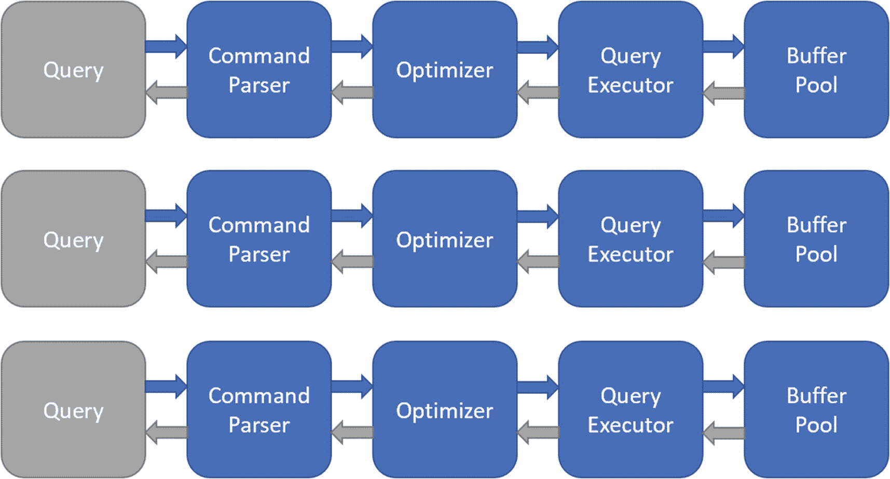

**图 5-2** 当查询一次检索一行时的数据检索

图 5-2 显示了在数据存储在缓冲池中的情况下，一次检索单个记录的查询过程。但是，如果查询是为基于集合的设计编写的，那么将只有一次对缓冲池的调用。在小型数据集上，这可能不会产生很大的影响。当处理数千或数百万条记录的数据集时，执行时间的差异会非常显著。这里还涉及其他因素，这与数据如何存储在缓冲区缓存中有关。当 `SQL Server` 执行查询并取回数据时，它只取回存在于缓冲区缓存中的数据。从 `SQL Server 2019` 开始，有一个称为混合缓冲池的功能。混合缓冲池允许将存储在 `RAM` 和持久内存（`PMEM`）中的数据都视为缓冲区缓存的一部分。否则，如果数据在 `RAM` 或 `PMEM` 中不可用，那么 `SQL Server` 将需要访问磁盘来检索数据。检索到的数据随后将被存储在内存中。图 5-3 显示了这些数据如何从磁盘检索并存储到缓冲区缓存中。


**图 5-3** 从磁盘到缓冲区缓存的数据检索

当查询执行时，该数据在那个时间点可能甚至不在缓冲区缓存中。`SQL Server` 必须访问磁盘 `I/O` 子系统来查找该数据。一旦找到该数据，该数据就会被存储在缓冲区缓存中。

如果每一行都被单独拉取，那么对磁盘 `I/O` 的调用就必须为每条记录单独发生。从缓冲区缓存拉取数据并非瞬时完成。从磁盘 `I/O` 获取数据并将其放入缓冲区缓存以供查询检索，则更加耗费资源。最终，这创造了一种场景，您希望专注于基于集合的设计，以获得执行查询时尽可能最佳的性能。

#### 以数据集方式思考

既然我已经讨论了什么是数据集，我希望您能习惯于以拥抱数据集的方式来思考数据。在开始编写 `T-SQL` 代码之前，首先理解存储了什么信息、数据如何存储，以及按相似特征分组选择或使用这些数据，可能会节省您的时间和精力。当底层表被设计为最适合数据集时，处理数据集也更容易完成。

真正的诀窍是学习如何以数据集的方式思考。这意味着如何考虑一次处理多条记录，而不是单条记录。这确实需要一种更少算术性、更多代数性的方法。通常，执行 `SELECT` 语句是熟悉基于集合的事务的最简单方式。考虑表 5-5 中所示的数据。

**表 5-5** 成分数据

| 成分名称 | 单位数量 | 计量单位 | 成本 |
| --- | --- | --- | --- |
| Diced Tomatoes | 28 | Ounces | $1.85 |
| Tomato Paste | 10 | Tablespoons | $0.79 |
| Tomato Sauce | 8 | Ounces | $0.55 |
| Minced Garlic | 60 | Tablespoon | $5.99 |

这是一个食谱可能成分的列表，以及单位数量、计量单位和每单位成本。通过查看前面的数据，我可以发现某些列中数据之间的相似性。

我可以创建一个数据集，获取所有计量单位为汤匙的记录。这些记录如表 5-6 所示。

**表 5-6** 计量单位为汤匙的成分

| 成分名称 | 单位数量 | 计量单位 | 成本 |
| --- | --- | --- | --- |
| Tomato Paste | 10 | Tablespoons | $0.79 |
| Minced Garlic | 60 | Tablespoon | $5.99 |

我也可以获取所有成本低于 $1.00 的成分的数据集，如表 5-7 所示。

**表 5-7** 成本低于 $1.00 的成分

| 成分名称 | 单位数量 | 计量单位 | 成本 |
| --- | --- | --- | --- |
| Tomato Paste | 10 | Tablespoons | $0.79 |
| Tomato Sauce | 8 | Ounces | $0.55 |

现在我有了一个数据集，我可以考虑如何与该数据集进行交互。知道我可以将相似的数据分组并对整个数据集执行操作，是有效使用 `T-SQL` 代码的关键。如果我想找出每单位的成本，我可以将成本除以单位数量。要为每条记录计算每单位成本，我可以手动为每条记录计算。在这种情况下，番茄酱的每单位成本将是 $0.79/10。这将得到每汤匙 $0.08 的结果。或者，我可以使用数据集中的列进行相同的计算。要作为一个数据集计算每单位成本，我可以指定 `Cost/Unit(s)`。以这种方式处理数据的结果将是一个类似于表 5-8 所示的输出。

**表 5-8** 成分每单位成本的计算值

| 成分名称 | 每单位成本 |
| --- | --- |
| Tomato Paste | $0.08 per tablespoon |
| Tomato Sauce | $0.07 per ounce |

使用 `SQL Server` 最大的挑战之一是学习如何以数据集的方式思考。思考数据集最简单的方法是将检索数据的过程视为对一个列或列子集执行操作。如果您能找到某种模式来对数据的子集执行该操作，那么您就是在以数据集的方式思考。

查看成分表，我可以创建一个数据集，其中所有成分名称中都包含“番茄”这个词。`Ingredient` 表中所有可用的值都在表 5-9 中。

**表 5-9** 成分的一般列表


#### 用数据集进行查询

| 食材 ID | 食材名称 | 单位 | 计量 | 成本 |
| --- | --- | --- | --- | --- |
| 1 | 切碎的番茄 | 28 | 盎司 | $1.85 |
| 2 | 番茄膏 | 10 | 汤匙 | $0.79 |
| 3 | 番茄酱 | 8 | 盎司 | $0.55 |
| 4 | 蒜末 | 60 | 汤匙 | $5.99 |

我有几种不同的方法来完成这个任务。我可以编写一个查询，查找`食材 ID`为 1、2 或 3 的记录。你可以在表 5-10 中看到这个逻辑的结果。

**表 5-10：包含“番茄”一词的食材**

| 食材 ID | 食材名称 | 单位 | 计量 | 成本 |
| --- | --- | --- | --- | --- |
| 1 | 切碎的番茄 | 28 | 盎司 | $1.85 |
| 2 | 番茄膏 | 10 | 汤匙 | $0.79 |
| 3 | 番茄酱 | 8 | 盎司 | $0.55 |

回到前面的表，我想为`番茄汤`添加一条新记录。表 5-11 显示了添加到`食材`表中的新记录。

**表 5-11：向`食材`中添加`番茄汤`**

| 食材 ID | 食材名称 | 单位 | 计量 | 成本 |
| --- | --- | --- | --- | --- |
| 1 | 切碎的番茄 | 28 | 盎司 | $1.85 |
| 2 | 番茄膏 | 10 | 汤匙 | $0.79 |
| 3 | 番茄酱 | 8 | 盎司 | $0.55 |
| 4 | 蒜末 | 60 | 汤匙 | $5.99 |
| 5 | 番茄汤 | 10.75 | 盎司 | $1.58 |

如果我仍然想显示所有包含“番茄”的记录，并且使用与之前相同的逻辑，即使用`食材 ID`来显示所需值，我将不会得到预期的结果。如果我没有改变获取数据的方式，并像之前在表中所做的那样使用相同的逻辑来获取记录，那么我将得到如表 5-12 所示的结果集。

**表 5-12：使用硬编码`食材 ID`查询含`番茄`的食材**

| 食材 ID | 食材名称 | 单位 | 计量 | 成本 |
| --- | --- | --- | --- | --- |
| 1 | 切碎的番茄 | 28 | 盎司 | $1.85 |
| 2 | 番茄膏 | 10 | 汤匙 | $0.79 |
| 3 | 番茄酱 | 8 | 盎司 | $0.55 |

表 5-13 显示了通过改变逻辑，查看`食材名称`以查找所有包含“番茄”一词的食材所得到的预期结果。

**表 5-13：通过搜索`食材名称`查找含`番茄`的食材**

| 食材 ID | 食材名称 | 单位 | 计量 | 成本 |
| --- | --- | --- | --- | --- |
| 1 | 切碎的番茄 | 28 | 盎司 | $1.85 |
| 2 | 番茄膏 | 10 | 汤匙 | $0.79 |
| 3 | 番茄酱 | 8 | 盎司 | $0.55 |
| 5 | 番茄汤 | 10.75 | 盎司 | $1.58 |

在这种情况下，我会想要运行一个`食材名称`类似于“番茄”的查询。如你所见，这个例子不仅说明了数据集在性能方面的限制，也可能影响功能。

#### 以集合方式插入数据

使用数据集最大的挑战之一与插入数据记录有关。大多数情况下，当你插入一条数据记录时，每次只插入单条记录。这可能导致你养成只处理一次插入单个记录的习惯。当你设计新表或移动数据时，可能会遇到可以从数据集角度考虑插入的情况。这通常发生在你创建查询将数据插入另一个表时。

虽然这种情况似乎不常出现，但我经常在填充临时表、表变量和公用表表达式时使用数据集。

以集合方式插入数据的基础是以数据集方式选择数据。一旦你以集合方式选择了数据，你就可以以集合方式插入数据。我曾出于几个不同的原因将数据插入到像临时表这样的对象中。一个更常见的情况是，当我连接多个表并实现涉及复杂计算或函数的条件时。查看表 5-14，你可以看到一些将要插入到`dbo.食谱食材`中的数据示例。

**表 5-14：每条记录代表食谱中的一种食材**

| 食谱 ID | 食材 ID | 是否有效 |
| --- | --- | --- |
| 意大利面 | 切碎的番茄 | True |

| 食谱 ID | 食材 ID | 是否有效 |
| --- | --- | --- |
| 意大利面 | 番茄膏 | True |

| 食谱 ID | 食材 ID | 是否有效 |
| --- | --- | --- |
| 意大利面 | 番茄酱 | True |

| 食谱 ID | 食材 ID | 是否有效 |
| --- | --- | --- |
| 意大利面 | 蒜末 | True |

虽然所有这些条目都可以单独插入，但也可以一次插入多条记录。在这种情况下，可能看起来像表 5-15 所示。

**表 5-15：以数据集形式表示的食谱食材**

| 食谱 ID | 食材 ID | 是否有效 |
| --- | --- | --- |
| 意大利面 | 切碎的番茄 | True |
| 意大利面 | 番茄膏 | True |
| 意大利面 | 番茄酱 | True |
| 意大利面 | 蒜末 | True |

我发现使用批量插入到临时对象中的另一个场景是，当这些记录可能需要通过连接到包含多表连接的其他查询进行额外修改时。

如果你正在更改应用程序代码的工作方式，插入新表或更改值的填充方式，你可能会发现自己需要执行批量更新。虽然你可以通过使用硬编码值一次更新一条记录来执行批量更新，但你会希望查看是否有办法使用相同的代码逻辑来更新数据集中的所有记录。而这正是数据集真正能帮助你的地方。

你可以编写一个查询来找到所有需要更新的记录，并系统地执行所有这些更新。除了在性能和功能方面的优势外，这种类型的流程还确保你的数据得到一致的处理。

总的来说，以数据集方式更新数据的过程与讨论的选择和插入数据的方法非常相似。在表 5-16 中，你可以看到存储在`dbo.食谱`表中的信息。

**表 5-16：包含份量和餐类型的食谱**

| 食谱 | 份量 | 餐类型 |
| --- | --- | --- |
| 意大利面 | 8 | 晚餐 |
| 菠菜煎蛋卷 | 6 | 早餐 |
| 烤鸡 | 4 | 晚餐 |
| 餐包 | 12 | 面包 |

虽然这是食谱当前的保存方式，但我可能决定要更改餐类型的存储方式。我可能想根据主要成分而不是用餐时间来更改餐类型。在这种情况下，我可以像表 5-17 所示那样一次更新一条记录。

**表 5-17：以单条记录形式更新的食谱**

| 食谱 | 份量 | 原餐类型 | 新餐类型 |
| --- | --- | --- | --- |
| 意大利面 | 8 | 晚餐 | 肉类 |

| 食谱 | 份量 | 原餐类型 | 新餐类型 |
| --- | --- | --- | --- |
| 菠菜煎蛋卷 | 6 | 早餐 | 蛋类 |

| 食谱 | 份量 | 原餐类型 | 新餐类型 |
| --- | --- | --- | --- |
| 烤鸡 | 4 | 晚餐 | 肉类 |

| 食谱 | 份量 | 原餐类型 | 新餐类型 |
| --- | --- | --- | --- |
| 餐包 | 12 | 面包 | 谷物 |

如果我使用简单的逻辑来确定应该更新哪些记录，我也许能够像表 5-18 所示的方式编写更新语句。

**表 5-18：按餐类型分组，以数据集形式更新的食谱**

| 食谱 | 份量 | 原餐类型 | 新餐类型 |
| --- | --- | --- | --- |
| 意大利面 | 8 | 晚餐 | 肉类 |
| 烤鸡 | 4 | 晚餐 | 肉类 |

| 食谱 | 份量 | 原餐类型 | 新餐类型 |
| --- | --- | --- | --- |
| 菠菜煎蛋卷 | 6 | 早餐 | 蛋类 |

| 食谱 | 份量 | 原餐类型 | 新餐类型 |
| --- | --- | --- | --- |
| 餐包 | 12 | 面包 | 谷物 |


虽然这些更新可以通过硬编码值来完成，但有时将你要更新的表与其他相关表连接起来可能会更好。表之间的这种交互类型可能使执行更新变得更加容易。

你可以使用食谱中的成分来决定如何更新食谱上的餐食类型。思考你想要使用的逻辑会很有帮助。如果你想根据每个食谱的主要成分将餐食类型更新为一个通用类别，你首先需要确定每个食谱的 `主要成分` 是什么。你还需要为你的 `餐食类型` 确定通用类别。在前面的场景中，我可能会有 `肉类`、`蛋类`、`水果`、`蔬菜`、`谷物` 和 `糖类`。一旦我掌握了这两部分信息，我可能会创建一个临时表来将成分映射到特定类别，除非我已经设计了 `成分表` 为每种成分记录该特定类别。

总的来说，我发现每当我一次处理一条记录的数据时，我常常不得不进行某种手动交互。我发现手动交互最有可能出现问题或错误。我更喜欢在数据集中编写代码，这样我可以更有把握地确保我的逻辑是一致的。

#### 为数据集编写代码

之前，我讨论了如何开始将你的数据视为数据集而非单个记录。在选择、更新或删除数据时，我经常使用数据集。虽然大多数应用程序代码可能一次插入单条记录，但在许多常见场景中，以数据集形式插入数据也可能很有帮助。在下一节中，我将介绍各种场景，在这些场景中你可能希望将数据视为集合而非单个记录。

数据集最常用的用途是当你想要查看部分数据时。理想情况下，这些数据集是根据特定条件选择的。这不仅有利于性能，还可以帮助确保你只查看你想要的特定数据。对于大多数场景，一次检索和显示一条单独的记录甚至没有意义。通常，如果你发现自己处于一次选择一条记录的情况，这很好地表明你可能想看看那段 `T-SQL` 代码是否可以重写以使用基于集合的逻辑。

有一些更复杂的方式来选择查询。在某些情况下，你可能会发现自己想要组合或比较两个不同的数据集。如果你想将两个数据集连接在一起，你可以选择使用 `UNION` 或 `UNION ALL`。这两者之间只有一个微小但重要的区别。当你使用 `UNION` 数据时，返回的每条记录在联合在一起的 `SELECT` 语句之间都是唯一的。`代码清单 5-1` 显示了两个查询之间的 `UNION`。

```sql
SELECT IngredientID, IngredientName
FROM dbo.Ingredient
WHERE IngredientName LIKE '%Tomato%'
UNION
SELECT IngredientID, IngredientName
FROM dbo.Ingredient
WHERE Measurement = 'Ounces'
```
`代码清单 5-1` `两个查询的联合`

`表 5-19` 显示了当前存储的成分数据。在 `表 5-19` 中，我有五种成分，它们都是有效的。

`表 5-19`

`通用成分`

| `IngredientID` | `IngredientName` | `Measurement` | `IsActive` |
| --- | --- | --- | --- |
| 1 | Italian Sausage | Pound | 1 |
| 2 | Tomato Sauce | Tablespoon | 1 |
| 3 | Diced Tomatoes | Ounces | 1 |
| 4 | Tomato Paste | Ounces | 1 |
| 5 | Minced Garlic | Ounces | 1 |

使用 `表 5-20`，上图中的第一个查询将返回以下值。

`表 5-20`

`含西红柿的成分`

| `IngredientID` | `IngredientName` |
| --- | --- |
| 2 | Tomato Sauce |
| 3 | Diced Tomatoes |
| 4 | Tomato Paste |

`表 5-21` 中第二个查询的数据将如下所示。

`表 5-21`

`以盎司为单位的成分`

| `IngredientID` | `IngredientName` |
| --- | --- |
| 3 | Diced Tomatoes |
| 4 | Tomato Paste |
| 5 | Minced Garlic |

一个联合将给我们如 `表 5-22` 所示的结果集。

`表 5-22`

`表 5-21 和 5-22 结果的联合`

| `IngredientID` | `IngredientName` |
| --- | --- |
| 2 | Tomato Sauce |
| 3 | Diced Tomatoes |
| 4 | Tomato Paste |
| 5 | Minced Garlic |

然而，对于 `UNION ALL`，两个查询中返回的每条记录都会被返回，而不管多个查询中是否有重复值。如果我们运行相同的查询但使用 `UNION ALL`，`T-SQL` 代码将如 `代码清单 5-2` 所示。

```sql
SELECT IngredientID, IngredientName
FROM dbo.Ingredient
WHERE IngredientName LIKE '%Tomato%'
UNION ALL
SELECT IngredientID, IngredientName
FROM dbo.Ingredient
WHERE Measurement = 'Ounces'
```
`代码清单 5-2` `两个查询的联合所有`

由于我们返回所有数据，即使它们是重复的，`UNION ALL` 的结果将如 `表 5-23` 中的值所示。

`表 5-23`


### 查询结果合并与比较：UNION ALL, INTERSECT, EXCEPT

#### 合并表 5-21 和 5-22 的结果（UNION ALL）

| IngredientID | IngredientName |
| --- | --- |
| 2 | Tomato Sauce |
| 3 | Diced Tomatoes |
| 4 | Tomato Paste |
| 4 | Tomato Paste |
| 5 | Minced Garlic |

正如你所见，`UNION ALL` 会返回两行完全相同的数据。在某些场景下，这两种情况都可能符合需求。

有时查询逻辑可能非常复杂，以至于我无法快速理解所有的 T-SQL 代码，或者有时我正在调试非常庞大的数据集。如果我编写一个更简单的查询来返回我想要的所有数据，我经常会在这两个查询之间写一个 `INTERSECT` 来找出记录匹配的地方。使用与之前相同的通用查询，我想向你展示使用 `INTERSECT` 与使用其他选项时返回的数据会是什么样子。在清单 5-3 中，你可以看到用于查找两个查询交集的查询。

```sql
SELECT IngredientID, IngredientName
FROM dbo.Ingredient
WHERE IngredientName LIKE '%Tomato%'
INTERSECT
SELECT IngredientID, IngredientName
FROM dbo.Ingredient
WHERE Measurement = 'Ounces'
```
清单 5-3 两个查询的交集（INTERSECT）

我们已经从前面的图中知道每个单独查询返回的结果。上述 T-SQL 代码的实际结果如表 5-24 所示。

**表 5-24** 表 5-21 和 5-22 结果的交集

| IngredientID | IngredientName |
| --- | --- |
| 4 | Tomato Paste |

此外，如果我试图查找缺失的记录或验证是否存在匹配记录，我会在两个查询之间使用 `EXCEPT`。清单 5-4 展示了如果你试图从一个查询的结果中排除另一个查询的结果时，T-SQL 代码的样子。

```sql
SELECT IngredientID, IngredientName
FROM dbo.Ingredient
WHERE IngredientName LIKE '%Tomato%'
EXCEPT
SELECT IngredientID, IngredientName
FROM dbo.Ingredient
WHERE Measurement = 'Ounces'
```
清单 5-4 两个查询的差集（EXCEPT）

在这个例子中，第一个查询返回所有食材名称包含单词“tomato”的结果。然而，`EXCEPT` 语句表明，如果一条记录同时出现在第一个和第二个查询中，那么该记录将从结果集中排除。此查询的结果在表 5-25 中。

**表 5-25** 表 5-21 和 5-22 结果的差集

| IngredientID | IngredientName |
| --- | --- |
| 2 | Tomato Sauce |
| 3 | Diced Tomatoes |

使用 `EXCEPT` 语句可能不是从数据集中排除结果的首选方法，但这是我更习惯使用的方法。这就是 T-SQL 代码的益处和挑战所在，对于几乎任何场景，编写 T-SQL 代码几乎肯定不止一种方法。你编写数据库代码的原因将决定你在编写代码时拥有的灵活度。如果你是为单次执行编写查询，你或许可以使用一种效率较低的方法来访问这些数据。然而，如果你是为某个应用程序编写代码，你将需要平衡 T-SQL 代码的编写方式，使其既高效又易读。

#### 使用数据集插入数据

清单 5-5 是一个展示如何在插入数据时使用数据集的例子。

```sql
CREATE TABLE #TempIngredientNutrition
(
IngredientID      INT         NOT NULL,
IngredientName    VARCHAR(25) NOT NULL,
Calories          TINYINT     NOT NULL,
Sugar             TINYINT     NOT NULL,
Fiber             TINYINT     NOT NULL,
Protein           TINYINT     NOT NULL
)
INSERT INTO #TempIngredientNutrition
(
IngredientID,
IngredientName,
Calories,
Sugar,
Fiber,
Protein
)
SELECT
ing.IngredientID,
ing.IngredientName,
nutr.Calories,
nutr.Sugar,
nutr.Fiber,
nutr.Protein
FROM dbo.Ingredient ing
INNER JOIN dbo.IngredientNutrition nutr
ON ing.IngredientID = nutr.IngredientID
```
清单 5-5 以集合形式插入数据

如清单 5-6 所示，如果逐条记录插入，`INSERT` 语句看起来会是这样。

```sql
CREATE TABLE #TempIngredientNutrition
(
IngredientID      INT         NOT NULL,
IngredientName    VARCHAR(25) NOT NULL,
Calories          TINYINT     NOT NULL,
Sugar             TINYINT     NOT NULL,
Fiber             TINYINT     NOT NULL,
Protein           TINYINT     NOT NULL
)
INSERT INTO #TempIngredientNutrition
(
IngredientID,
IngredientName,
Calories,
Sugar,
Fiber,
Protein
)
VALUES (1, 'Italian Sausage', 180, 5, 1, 18)
INSERT INTO #TempIngredientNutrition
(
IngredientID,
IngredientName,
Calories,
Sugar,
Fiber,
Protein
)
VALUES (2, 'Tomato Sauce', 60, 7, 2, 1)
INSERT INTO #TempIngredientNutrition
(
IngredientID,
IngredientName,
Calories,
Sugar,
Fiber,
Protein
)
VALUES (3, 'Diced Tomatoes', 20, 2, 3, 1)
```
清单 5-6 逐条记录插入数据

正如你所见，逐条记录插入数据会占用相当多的代码，而且可能非常繁琐。

#### 使用数据集更新数据

我最喜欢使用数据集的场景之一是更新数据。在许多情况下，我不是更新特定的记录，而是更新具有相同特征的多个记录。如果我想将表中所有这些食材设置为非活动状态，我有几种不同的方法可以做到这一点。例如，我可以为每条记录编写一个 `UPDATE` 语句，将 `IsActive` 值设置为零，如清单 5-7 所示。

```sql
UPDATE dbo.Ingredient
SET IsActive = 0
WHERE IngredientID = 1
UPDATE dbo.Ingredient
SET IsActive = 0
WHERE IngredientID = 2
UPDATE dbo.Ingredient
SET IsActive = 0
WHERE IngredientID = 3
UPDATE dbo.Ingredient
SET IsActive = 0
WHERE IngredientID = 4
UPDATE dbo.Ingredient
SET IsActive = 0
WHERE IngredientID = 5
```
清单 5-7 逐条记录更新数据

这将需要五个独立的事务。此外，SQL Server 将不得不访问这些记录所在的数据页五次。如清单 5-8 所示，我也可以编写一个查询来一次性更新所有五条记录。

```sql
UPDATE dbo.Ingredient
SET IsActive = 0
WHERE IngredientID BETWEEN 1 AND 5
```
清单 5-8 按范围更新数据

事实上，如果这五条记录都位于同一个数据页上，我只需要访问该页一次。一个更可能的场景是，请求将所有食材名称中包含单词“tomato”的食材设置为非活动状态。这是你想要发现的模式类型。如果存在这样的模式，你可以像清单 5-9 中那样编写一个查询。

```sql
UPDATE dbo.Ingredient
SET IsActive = 0
WHERE IngredientName LIKE '%Tomato%'
```
清单 5-9 以数据集形式更新数据

这个查询实现了两个目标。它让你在单个查询中更新多条记录。这段 T-SQL 代码还利用了包含单词“tomato”的所有食材的数据集来确定应该更新哪些记录。


利用数据集来更新多条记录，其潜力远不止于此。我曾遇到许多需要更新成百上千条记录的情况。虽然我可以编写查询来逐条识别记录，然后手动提取那些 ID 来逐个或分批更新所有记录，但确实存在更简便的方法来更新这些多条记录，并最大限度地减少因人工干预导致错误的风险。清单 5-10 中的查询展示了如何在联接表的同时更新数据。

```sql
UPDATE ing
SET ing.DateModified = GETDATE()
FROM dbo.Ingredient ing
INNER JOIN dbo.RecipeIngredient recing
ON ing.IngredientID = recing.IngredientID
INNER JOIN dbo.Recipe rec
ON recing.RecipeID = rec.RecipeID
WHERE rec.RecipeName = 'Spaghetti'
```
清单 5-10：通过联接创建数据集来更新数据

在更新操作中使用联接时，我建议你先确认将要更新的是哪些数据。这可以通过将`UPDATE`语句转换为`SELECT`语句来实现，如清单 5-11 所示。

```sql
SELECT ing.IngredientID,
ing.IngredientName,
ing.IsActive,
ing.DateCreated,
ing.DateModified
FROM dbo.Ingredient ing
INNER JOIN dbo.RecipeIngredient recing
ON ing.IngredientID = recing.IngredientID
INNER JOIN dbo.Recipe rec
ON recing.RecipeID = rec.RecipeID
WHERE rec.RecipeName = 'Spaghetti'
```
清单 5-11：使用`SELECT`语句验证数据集

你可以检查这些记录并确认记录数量。在执行更新操作之前，我建议将`UPDATE`语句包裹在`BEGIN TRAN… ROLLBACK`中，以验证记录数量。

就像处理更新一样，在删除数据时，你也可以使用数据集。我发现，使用数据集来删除数据可以显著提高效率，但如果在删除前未验证数据，也可能存在一定风险。

编写 T-SQL 代码时，最大的诱惑之一就是不利用数据集。这通常是因为编写过程式代码让人更得心应手，或者尚未培养出以数据集方式思考的能力。在接下来的部分中，我的目标是引导你通过各种方法来编写充分利用数据集的代码。

## 6. 硬件使用

在考虑如何设计查询时，我已经介绍了基于集合设计的要素。在使用 SQL Server 时，还有其他需要考虑的事项。你所面对的是一个超越其各组成部分的系统。SQL Server 涉及诸多方面：存储的数据、访问数据的方式，以及如何访问数据的处理过程。SQL Server 不仅是软件，还涉及该软件如何与你的计算机或服务器的硬件进行交互。

当谈到硬件使用时，SQL Server 会利用几个不同的部分。其中一些可能看起来很直接，而另一些起初可能会令人惊讶。SQL Server 被称为关系数据库管理系统（`RDBMS`）。作为关系数据库管理系统的一部分，SQL Server 的目标是实现高效的数据存储和检索。这意味着，运行 SQL Server 的系统上，最重要的硬件之一是内存。当谈到数据的长期存储时，硬盘驱动器变得最为关键。在本章中，我们将这些称为“存储”，因为存储不仅限于硬盘。然而，还有一些不太明显的要素，比如`CPU`。

### T-SQL 设计中的内存考量

当你刚开始在 SQL Server 中处理数据时，内存是最重要的因素之一可能会让你感到惊讶。这很大程度上与内存在 SQL Server 中的用途有关。原因之一是内存的速度和多功能性。另一个因素与内存成本与存储成本的对比有关。这种成本差异增加了有效使用内存的重要性。内存中存储着许多不同类型的事物。SQL Server 用于访问满足查询条件所需数据的过程，会以“执行计划”的形式保存在内存中。为查询结果检索到的数据也存储在内存中。你还可以让数据库对象存在于内存中，例如表变量或临时表。

首先，让我解释一下为什么在处理 SQL Server 时内存如此重要。你经常听到`OLTP`（联机事务处理）这个术语。它的真正含义是你希望系统能够执行高容量的写入和更新活动。这些正是应用程序中频繁发生的活动类型。在提到写入和更新活动时，以食谱数据库为例，每次访问食谱、对食谱进行的每一项更改，或向系统添加的每一种新食材，都属于此类活动。

虽然系统中存储着大量的数据，但通常人们只想处理其中非常小的一部分子集。技巧在于试图确定哪些数据应该保持随时可用。这将提高添加新条目、更新现有条目或访问已有条目的速度。这正是对硬件有更深入了解能帮助你的地方。

我们最常想到的内存是服务器或机器上可用的`RAM`。然而，还有其他类型的内存存在。甚至比`RAM`更接近`CPU`且速度更快的是`L2 缓存`和`L3 缓存`。`L2`和`L3 缓存`存在于处理器上，其延迟比`RAM`更低。这种延迟可能比`RAM`低十倍。然而，SQL Server 可用的`L2 缓存`或`L3 缓存`容量，通常远小于你的应用程序有效运行所需的数据量。`L2 缓存`的延迟可能只有`L3 缓存`的一半，但速度的优势是以缓存大小为代价的。`L2 缓存`通常以数百 KB 为单位衡量，而`L3 缓存`通常以数十 MB 为单位。我们如何才能尽可能快速且经济高效地访问数据？这正是正确使用内存的卓越之处。

SQL Server 的设计旨在利用内存。有一个称为“缓存”的过程将信息保留在内存中。在 SQL Server 中，有两种类型的缓存非常重要。第一种与缓存“执行计划”有关。这是 SQL Server 保存如何在未来再次执行某个存储过程或即席查询的指令的地方。其目标是利用 SQL Server 在计算执行特定查询的最佳方式时已经获得的知识。第二种与查询设计相关的缓存形式可能更为重要。它与信息如何存储在内存中有关。这被称为“缓冲池”。


### SQL Server 中的内存管理：计划缓存与缓冲池

虽然执行计划和数据都可以保存在缓存中，但 SQL Server 会执行特定计算来决定为计划缓存或缓冲池分配多少内存。此外，还有复杂的计算用于确定在计划缓存或缓冲池中保留某项内容多长时间。其真正目标是确保不常访问的存储过程或查询从计划缓存中删除，从而不占用不必要的空间。同样地，对于缓冲池，目标是仅保留应用程序正在积极使用的数据，并清除应用程序不再需要的数据。在这两种情况下，项目只有在缓存已满且需要为新的执行计划或数据腾出空间时才会被清除。SQL Server 2014 引入了缓冲池扩展功能，提供了另一种解决方案。缓冲池扩展允许您将缓冲池扩展到使用 RAM 和固态硬盘（SSD）。考虑到 SSD 比购买额外的 RAM 更具成本效益，这有助于解决 I/O 瓶颈问题。

#### 计划缓存的特定考量

谈到计划缓存，需要记住一些特定的考量。默认情况下，SQL Server 针对存储过程和预处理语句进行了优化。这种对存储过程的优化也是使用计划缓存时的一个因素。在理想情况下，您的计划缓存中应有大量存储过程，而即席查询很少。然而，这并非对每个业务都适用。您的公司可能使用 ORM 或其他技术（如 LINQ）在应用程序代码中编写即席查询。虽然这对开发人员来说很方便，但它们给 SQL Server 带来了额外成本。如果这些查询没有转换为预处理语句，情况可能尤其如此。

可能发生的情况是，计划缓存会被即席查询填满。这可能导致应用程序更急需的存储过程从计划缓存中被删除。如果有存储过程因应用程序而从计划缓存中被删除，那么当下次调用该存储过程时，SQL Server 将需要重新计算其执行计划。这将给系统带来额外成本。有各种方法可以处理计划缓存中存在大量即席查询的情况。然而，这超出了本书的范围。

#### 缓冲池与数据保留

我在与 SQL Server 交互时遇到的另一个问题与缓冲池以及其中保存的数据有关。我不止一次听说，在处理非常大的表时，您将总是陷入必须处理访问大量数据的困境。如果表设计、索引、查询或上述任何组合未得到优化，这种情况确实可能发生。然而，有方法可以防止它。

### 编写高效查询

使用内存和 SQL Server 时需要考虑的主要方面是，当您编写查询时，这些查询将返回正确的结果并在应用程序可接受的时间内完成。然而，根据整体表设计或查询的编写方式，这些查询访问的数据量可能远远超出必要。乍看之下，这可能不是一个重大问题。当数据表是新的且没有填满数据时，通常不会出现问题。清单 6-1 中的查询用于返回应用程序中的一些数据。

```sql
SELECT rec.RecipeName,
       rec.RecipeDescription,
       rec.ServingQuantity,
       ing.IngredientName,
       ml.MealTypeName,
       ml.MealTypeDescription,
       prp.PreparationTypeName,
       prp.PreparationTypeDescription
FROM dbo.Recipe rec
INNER JOIN dbo.RecipeIngredient recing
    ON rec.RecipeID = recing.RecipeID
INNER JOIN dbo.Ingredient ing
    ON recing.IngredientID = ing.IngredientID
INNER JOIN dbo.MealType ml
    ON rec.MealTypeID = ml.MealTypeID
INNER JOIN dbo.PreparationType prp
    ON rec.PreparationTypeID = prp.PreparationTypeID
WHERE ing.IngredientName LIKE 'Tom%'
  AND ing.IsActive = 1
-- 清单 6-1
-- 获取食谱成分的查询
```

当表是新的且数据不多时，您将看到如表 6-1 所示的逻辑读取。

**表 6-1 数据表较小时的逻辑读取**

| 食谱数量 | 成分数量 | 食谱成分数量 | 返回记录数 | 逻辑读取数 |
| :--- | :--- | :--- | :--- | :--- |
| 32,242 | 4 | 3 | 4 | 351 |

351 的逻辑读取数指的是为了执行此查询而读取的数据页数。随着表的增长，SQL Server 必须筛选越来越多的数据，您可能会开始看到与此行为相关的显著性能影响。当这种情况发生时，逻辑读取数可能会显著增加，如表 6-2 所示。

**表 6-2 数据表较大时的逻辑读取**

| 食谱数量 | 成分数量 | 食谱成分数量 | 返回记录数 | 逻辑读取数 |
| :--- | :--- | :--- | :--- | :--- |
| 32,242 | 263,010 | 3,040,002 | 196 | 7858 |

如您所见，一个最初表现良好的查询，在应用程序成熟并获取更多数据后，可能会开始出现性能问题。

### 性能影响与指标

在这些情况下，应用程序经常访问的数据可能正从缓冲池中被清除。当有存储过程运行且必须筛选大量数据时，通过查看与查询关联的逻辑读取数通常可以看出这一点。您可能正在处理一个只返回五个结果的查询；然而，它必须经过 200 万次逻辑读取才能返回结果。这是一个信号，表明您可能正在使用比预期更多的缓冲池。

这种行为可能导致缓冲池中的大量数据被清除。SQL Server 中有一个称为**页面寿命预期**的值，它显示数据页在缓冲池中停留的平均时间。我已开始使用页面寿命预期作为指标，表明有些查询可能在 SQL Server 中读取的数据量远多于结果集中返回的数据量。这可能导致这些查询使用比查询所需更多的内存。通常，当我处理与应用程序相关的查询时，它们通常一次不涉及超过十条记录。如果查询用于某种形式的报告，通常一次也不超过几千条记录。即使我得到的结果是查看 20 万条记录，我仍然不希望为了获得这些结果而处理数千万次逻辑读取。

### 优化建议

真正的关键是尝试限制 SQL Server 必须处理的数据量。在编写查询时，这可以通过连接逻辑或 `WHERE` 子句条件来处理。您要确保访问尽可能少的数据。访问所需最少的数据量可以让您在使用 T-SQL 时最小化内存使用。前面在清单 6-1 中引用的查询用于返回一些数据。然而，此查询中包含了一些不需要的额外列和连接。我可以更新查询以移除这些额外的列，如清单 6-2 所示。


```sql
SELECT rec.RecipeName,
ing.IngredientName
FROM dbo.Recipe rec
INNER JOIN dbo.RecipeIngredient recing
ON rec.RecipeID = recing.RecipeID
INNER JOIN dbo.Ingredient ing
ON recing.IngredientID = ing.IngredientID
WHERE ing.IngredientName LIKE 'Tom%'
AND ing.IsActive = 1
```

**列表 6-2** 仅获取食谱和食材的查询

虽然这并未影响查询的原始性能，但由于数据表现在有了更多数据，性能受到了明显影响。尽管我预计该查询涉及的逻辑读取会减少，但仍应通过执行查询来验证这一假设。在 **表 6-3** 中，您可以看到查询修改后当前的逻辑读取情况。

**表 6-3** 仅包含必要列时的逻辑读取情况

| 食谱数量 | 食材数量 | 食谱食材关联记录数 | 返回记录数 | 逻辑读取数 |
| --- | --- | --- | --- | --- |
| 32,242 | 263,010 | 3,040,002 | 196 | 6990 |

对比 **表 6-2** 和 **表 6-3** 的结果，可以看到逻辑读取数已经减少。因此，`SQL Server` 在 `缓冲池` 中访问的数据页应该更少，以执行此查询。这应有助于使用此 `SQL Server` 实例的其他应用程序表现更好。

尽管内存可能被认为是 `SQL Server` 可用最强大、最有益的硬件，但内存也涉及成本。内存可以弥补未优化的 T-SQL。但通常会遇到一个临界点：表变得非常庞大，而查询未完全优化，此时很容易倾向于通过增加内存来解决性能问题。在许多情况下，这最终成为解决长期问题的短期方案。此外，购买额外内存的成本并非总是业务能够承受的选项。预防或解决此问题的一种方法是，检查系统中的存储过程和预备语句，并寻找可以通过减少相关逻辑读取来改进的查询。

### 结合 T-SQL 设计考虑存储

我已经介绍了如何与计划频繁访问的数据进行交互；您还需要考虑大部分数据的存储方式。当涉及到处理存储时，考虑哪些活动导致您必须访问磁盘上的数据至关重要。这些正是我们希望找出如何最小化或改进的活动类型。在某些情况下，当我看到大量的磁盘 I/O 时，这可能表明 T-SQL 设计的某些其他部分需要改进。这可能只是症状而非根源。

在上一节中，我谈到了数据存储在 `缓冲池` 中。如果我们需要的数据不在 `缓冲池` 中，会发生什么？这可能就是 `SQL Server` 内部情况变得有点复杂的地方。`SQL Server` 只与 `缓冲池` 内的数据交互。因此，如果需要的数据不在 `缓冲池` 中，第一步将是确定哪些数据使用频率较低。然后将这些数据从 `缓冲池` 中移除。这些初始步骤已经让我们对内存使用情况有所了解。如果有某些东西不必要地填满了 `缓冲池`，我们现在就知道关键数据可能会被清除出 `缓冲池`，以便为这些新数据腾出空间。

一旦数据被判定为非优先，`SQL Server` 就可以转到磁盘并获取所需的数据。这些数据随后将被存储在 `缓冲池` 中，直到未来某个时间点被判定不再需要。从硬件速度的角度来看，这个过程本身已经引入了延迟。如果数据不存在于 `缓冲池` 中，还需要时间来确定哪些记录需要从 `缓冲池` 中丢弃。将这些记录从 `缓冲池` 中丢弃并转到磁盘，会在从磁盘检索数据所需的时间方面产生额外成本。

如果这些数据仅用于每 4 到 6 小时运行一次的作业，那么这些数据中的大部分对于其他所有进程都可能被视为无关紧要。这导致了从 `缓冲池` 中移除的数据高度更替。新的数据可以从磁盘获取并保存到 `缓冲池`。然后，这些新数据可能被移除出 `缓冲池`，并被从磁盘检索到的更新的数据所取代。

除了处理大量数据相关的这些开销之外，还有其他与磁盘或存储交互的活动。当新数据被写入系统时，该数据将被存储在 `事务日志` 中。数据会不断添加到 `事务日志` 中，直到 `事务日志` 被清空。当事务提交并且信息被写入磁盘时，可以发生日志刷新。在系统中存在大量数据添加、更新或删除的情况下，这可能导致存储的大量使用。

了解这些数据如何存储，以及 `SQL Server` 如何通过 `索引` 和存储在磁盘上的其他数据页轻松找到这些数据，这一点很重要。当信息被添加到 `索引` 或 `索引` 需要更新时，这些信息也会产生存储成本。这不仅涉及存储数据所需的时间，还涉及访问磁盘进行这些添加或更改所涉及的时间。

在使用 T-SQL 时，您需要考虑您的查询如何影响数据存储。正如我们在前一节中看到的，这可能意味着多件事情。您需要确保在给定时间内，您没有访问、插入、更新或删除超出您所需的数据。然而，编写 T-SQL 时，这并非唯一的考虑因素。您可以采取一些措施来监控与查询相关的存储使用情况。其中大多数涉及查看 `物理读取`、`预读` 或查询相关的 `I/O 成本`。


如果你已确认正在处理的是你希望交互的最小数据量，那么可能无法再通过任何操作来降低与你的 `T-SQL` 查询相关的存储成本。在某些情况下，就像内存问题一样，发现大量的存储使用量可能指向其他潜在问题。这些问题可能包括数据在磁盘上的保存方式，也可能包括索引的设计方式。

在某些情况下，你可能会发现频繁的索引更新导致了显著的存储成本。这可能是由于索引根据其设计方式需要不断重组造成的。也存在涉及页拆分（page splits）的情况，你可能会看到与此活动相关的显著存储成本。你的表的排序方式或索引的设计方式可能导致大量的页拆分。你也可能会看到与此活动相关的存储成本增加。

关于存储成本如何运作的更多信息，了解 `SQL Server` 存储引擎的运作机制可能会有所帮助。在处理 `T-SQL` 查询时，有一个方面更频繁地依赖于存储引擎。这与访问当前不在缓冲池（buffer pool）中的数据有关。

存储引擎有几种不同的功能。这些功能涉及访问不在缓冲池中的数据。存储引擎的另一个功能与需要锁时如何处理数据有关。存储引擎的第三个功能涉及与应用程序使用的、非运行 `T-SQL` 相关的命令。

存储引擎在访问数据时可能会遇到性能瓶颈。这些瓶颈反过来又会在访问存储的数据时导致性能问题。一个例子是当查询访问数据表中的行或与索引交互时。在其他时候，存储引擎可能需要处理与为缓冲池检索数据相关的页分配。如果你的公司决定实施行版本控制（row versioning），这也有可能导致存储相关的性能问题。虽然这超出了本书的范围，但如果你正在使用行版本控制并且遇到与存储性能相关的问题，你可能需要做一些额外的研究来确认行版本控制不是原因。

当访问数据行或索引时，`SQL Server` 将利用存储引擎。被访问的数据可能存储在缓冲池中。由存储引擎负责跟踪这些行在 `B` 树（B-tree）中的位置。对于在 `SQL Server` 中管理、添加、更新或删除索引条目，也会发生相同的过程。这在存储引擎中统称为行和索引操作维护。

`SQL Server` 使用索引来组织数据，并允许轻松快速地检索数据。对于大于几个数据页的表，`SQL Server` 会尝试使用索引来帮助遍历各个数据页并快速找到所需的数据。然而，可能存在必要索引不存在的情况。这导致 `SQL Server` 必须读取更多的数据页，有时甚至是表中的所有数据，以确定需要哪些行来满足查询要求。

在编写查询以访问数据时，`SQL Server` 将需要访问的数据称为读取（reads）来跟踪。如果数据在内存中可用，访问该数据的行为称为逻辑读取（logical read）。有时，访问数据可能需要 `SQL Server` 转到磁盘或存储来访问数据页。如果从磁盘访问数据，则该数据称为物理读取（physical read）。如果页被移到缓冲池，则该操作称为预读（read-ahead read）。在任何一种情况下，`SQL Server` 都需要转到磁盘来访问请求的记录。当你编写一个查询并且它需要检索不存在于缓冲池中的记录时，`SQL Server` 将需要访问磁盘上的那些记录。对于 `SQL Server` 来说，这可能是一个非常正常的过程。然而，在查询需要读取的记录多于查询结果所需记录的情况下，这会导致磁盘上发生比所需更多的活动。一种监控从磁盘检索数据所花费时间的方法是使用闩锁等待（latch waits）。这就是 `SQL Server` 访问不存在于缓冲池中的数据所花费的时间量。

除了 `SQL Server` 在存储引擎内管理数据访问外，存储引擎还负责管理与锁定数据相关的活动。这类活动可能会受到服务器、应用程序或事务上配置的并发方法的影响。在许多情况下，并发级别配置通常由与负责编写 `T-SQL` 代码的人员不同的团队管理。存储引擎还负责处理 `SQL Server` 中锁的处理方式。

可能导致与存储相关的性能问题的其他因素与查询设计中可能与硬盘交互的其他领域有关，例如，需要将大量活动记录到事务中的数据库操作。这可能包括插入、更新或删除大量数据。`SQL Server` 被设计为能够及时处理将这些更改记录到事务日志中。然而，这些修改也需要被记录到磁盘上。根据碎片或其他使用硬盘的进程情况，这可能会导致额外的性能问题。

`Tempdb` 是 `SQL Server` 的另一个部分，它可能产生与存储相关的显著开销。可能存在一些查询在 `tempdb` 内引发了大量的活动。在许多情况下，通过将 `tempdb` 放在单独的驱动器上，可以减轻对系统其余部分的影响。在这些情况下，`tempdb` 上的任何存储开销应该只影响其他也依赖 `tempdb` 的查询。

编写 `T-SQL` 查询从根本上说与 `SQL Server` 如何与已存储的数据交互相关联。这种交互的某些方面是可以控制的，例如确保你访问尽可能少的数据。还有其他因素，例如 `SQL Server` 如何访问数据或管理锁定，可能超出你的控制范围。无论哪种情况，重要的是要意识到所有这些部分是如何组合在一起的，并且可能影响你的查询性能。


### 考虑 CPU 与 T-SQL 设计

SQL Server 不仅与内存和存储交互，还与服务器 CPU 进行交互。这是设计查询时需要考虑的最后环节之一。在为 SQL Server 考虑许可授权时，CPU 可能是一项重大成本。部分原因可能是对 SQL Server 所需的最佳 CPU 缺乏了解。这可能导致采购的服务器 CPU 看似比其他 CPU 更有优势，但实际上，CPU 核心数更多并不意味着性能更好。对于 SQL Server，核心数更多的 CPU 可能运行速度反而更慢。因此，市场上的一些 CPU 可能比其他 CPU 更昂贵，但当它们被 SQL Server 使用时，其效果可能还不如其他 CPU。CPU 在 SQL Server 中有多种不同的用途。其中之一是作为 T-SQL 代码的一部分执行计算。

正如本章前面所见，内存的大量使用有时会导致 I/O 问题。同样，当 I/O 活动量非常大时，也可能导致 CPU 问题。在讨论整体 T-SQL 设计中的内存考虑时，我提到了两种类型的缓存。在那一部分，我主要关注了缓冲区缓存或缓冲池。在本节中，我将简要谈谈执行计划的缓存如何可能导致 CPU 性能问题。

#### 执行计划缓存

当 SQL Server 确定如何执行查询时，它会创建一个执行计划。为了让 SQL Server 知道如何执行查询，它必须利用 CPU。这被视为一种 CPU 成本。预期是这类成本不应频繁导致性能问题，因为经常执行的预处理语句和存储过程它们的计划已经保存在缓存中，不需要以任何显著的频率重新创建这些执行计划。

但这引出了什么会导致 SQL Server 判定需要一个新的执行计划。这与理解 SQL Server 在创建执行计划时所做的事情直接相关。创建执行计划的一部分是创建一个允许 SQL Server 快速找到先前创建的执行计划的值。在计划缓存中，这个值被称为`计划哈希`。虽然您可能有多个查询看起来相似或返回相同的结果，但 SQL Server 可能不会给它们相同的`计划哈希`。只有看起来完全相同的查询才具有相同的`计划哈希`。

这种对`计划哈希`的依赖有助于确定是否需要创建新的执行计划。这导致我们依赖于使用参数。这些参数可以存在于存储过程或预处理语句中。如果正在执行的查询具有与计划缓存中相同的`计划哈希`，SQL Server 将不会重新创建新的执行计划。创建执行计划的这个过程称为编译。这可能是您的查询使用的 CPU 资源超出预期的众多原因之一。

SQL Server 也可能判定需要为一个在执行缓存中已有相关`计划哈希`的查询创建新的执行计划。这种情况通常发生在 SQL Server 识别到查询涉及的数据发生了足够显著的变化，需要一个新的执行计划时。这可能是频繁数据更改的结果，也可能是参数嗅探的结果；无论哪种情况，都会导致 SQL Server 识别为一次`重新编译`。就像查询编译有相关成本一样，`重新编译`也会带来 CPU 上的成本。

#### 统计信息与索引碎片

如果查询处理的 I/O 量非常大，这可能会蔓延并导致 CPU 性能问题。虽然查询可能访问了比必要更多的数据，但这可能并非由于整体的 T-SQL 查询设计，而可能是由于统计信息过时。尽管管理统计信息的概念超出了本书的范围，但您需要意识到统计信息对执行计划的影响。统计信息能让 SQL Server 快速了解特定数据表或索引内的数据整体分布情况。其理念是，正确的统计信息有助于 SQL Server 对如何创建执行计划做出最佳猜测。如果这些值过时或陈旧，那么 SQL Server 可能会决定一个不如拥有最新统计信息时高效的执行计划。由于统计信息过时，您可能会看到估计读取次数与实际读取次数之间存在显著差异。这可能对 CPU 造成性能影响。您现在可以看到，统计信息已经更新，估计返回的行数与实际返回的行数保持相对一致。

另一种可能性是，SQL Server 不得不遍历比其最初预期更多的硬盘或存储空间。这可能是由于涉及碎片的情况。在 CPU 活动异常高的情况下，这可能是由于索引碎片造成的。这意味着 SQL Server 可能仅根据索引未被碎片化的假设，估计了检索数据所需的一定工作量。然而，由于索引存在碎片，SQL Server 为访问所请求的数据可能不得不做比预期更多的工作。

#### 数据类型与隐式转换

T-SQL 查询设计中另一个常见的问题涉及数据类型。在 SQL Server 中有很多不同的地方需要定义数据类型。这些定义可以出现在表、临时表、参数、存储过程、参数，甚至通过应用程序代码指定的数据类型中。正如第 1 章前面所讨论的，SQL Server 可以在后台将一种数据类型转换为另一种；这个过程称为隐式转换。虽然 SQL Server 可以处理隐式转换并且有一个结构化的过程来执行它，但强制 SQL Server 执行隐式转换也可能带来相关的 CPU 成本。清单 6-3 中的代码是一个隐式转换的例子。

```sql
DECLARE @IsActive NVARCHAR(1);
SET @IsActive = 1;
SELECT RecipeID,
RecipeName,
RecipeDescription,
ServingQuantity,
MealTypeID,
PreparationTypeID
IsActive,
DateCreated,
DateModified
FROM dbo.Recipe
WHERE IsActive = @IsActive;
Listing 6-3
存在隐式转换的查询
```

在清单 6-3 中产生了隐式转换，因为变量`@IsActive`的数据类型被设置为`NVARCHAR`。`dbo.Recipe`表中`IsActive`字段的数据类型是`BIT`。因此，SQL Server 必须执行隐式转换来比较这两个值。在图 6-1 中，您可以看到隐式转换对执行计划的影响。


图 6-1

显示隐式转换的执行计划中的索引扫描

隐式转换可能对查询的整体性能产生显著的负面影响；在编写 T-SQL 查询时，您需要确保避免隐式转换。


## 7. SQL Server 性能与执行计划

一些公司可能也在使用数据压缩。数据压缩的好处之一是能够在内存中保存更多数据，因为压缩数据所占用的空间比未压缩数据更小。在 SQL Server 中使用数据压缩也有一些缺点。其中一个缺点与整个数据压缩过程中产生的 CPU 成本有关。这并不意味着你不应该使用数据压缩。我提到这一点是为了让你意识到可能出现的任何潜在问题。

这就引出了并行的概念。最容易观察到 CPU 使用率升高的常见方式之一，就是当你的查询使用了并行处理时。并行是一种概念，指的不是在一个单一线程上执行查询，而是可以在多个线程上执行查询。在这种情况下，假设你的 CPU 有四个核心。每个核心可能有两个线程。如果一个查询只在一个线程上运行，它将只使用你 CPU 四分之一个核心的资源。然而，如果查询以并行方式运行，它可能能够在多个线程上运行。例如，如果它在四个线程上运行，那么这个查询就可以占满你 CPU 的所有核心。这会导致整体的 CPU 处理量增加。

SQL Server 在决定是否在执行查询时使用并行处理时，会考虑许多因素。这很大程度上与 SQL Server 的配置方式有关。虽然配置 SQL Server 超出了本书的范围，但我希望你能了解当 SQL Server 创建执行计划时它是如何工作的。SQL Server 会生成执行计划并计算其总成本。SQL Server 还有一个配置值，用于指示在 SQL Server 决定实施并行处理之前，执行计划应达到的最小成本。这个成本被称为**并行度的成本阈值**。如果执行计划的成本大于并行度的成本阈值，那么 SQL Server 可以判断是否存在一个更好的、以并行方式运行的执行计划。

如果 SQL Server 决定创建一个使用并行的执行计划，它还需要确定给定执行计划允许使用的最大线程数。还有一个配置值用于指示可用于并行处理的最大线程数。这个值被称为**最大并行度**。`MAXDOP` 是最大并行度的缩写。这并不意味着 SQL Server 必须使用与最大并行度中指定的相同数量的线程。它只表示这是执行计划以并行方式运行所允许的最大线程数。

SQL Server 将在执行时确定将在并行执行的执行计划使用的线程数。这将基于查询执行开始时未使用的线程数量来决定。在涉及并行时，可能影响 CPU 性能的一个因素发生在查询并行运行期间使用了更多线程的情况下。并行的基本思想是，虽然总体上会使用更多的 CPU 处理能力，但持续时间会短得多。如果有更多查询进入队列并且需要运行，需要更多线程处于活动状态，这可能会导致 CPU 在较长时间内保持高于正常水平的运行状态。

确保你的 T-SQL 不会对 CPU 使用率产生负面影响的主要原因之一，是与 CPU 相关的货币成本。自 SQL Server 2012 以来，SQL Server 的许可一直与运行 SQL Server 的核心数量相关。在更高版本的 SQL Server 中，这被修改为与服务器可用的核心数量相关，即使这些核心没有明确分配给 SQL Server。当公司开始遇到性能问题时，常见的解决方案之一是增加更多硬件。虽然这可能在短期内解决性能问题，但根据需要添加的硬件情况，这也可能是一个非常昂贵的解决方案。由于每个核心的许可费用可能超过 1000 美元，因此最好尝试通过减少与 CPU 使用率相关的性能瓶颈来最小化对额外 CPU 的需求。

在设计 T-SQL 查询时，有许多方面需要考虑。其中一些因素包括意识到 T-SQL 可能对运行 SQL Server 的物理硬件产生的影响。在编写 T-SQL 查询时，你需要注意访问的数据量，以便最好地利用可用的内存。最小化数据访问的另一个额外好处是减少了存储资源的消耗。确保你的统计信息是最新的并且有适当的索引，将有利于 CPU 使用率。了解你的查询如何影响硬件，不仅可以减少对额外硬件的需求，还可以让你当前的硬件更好地支持你的应用程序。

### 7.1 执行计划简介

当我刚开始编写 T-SQL 时，我专注于使用正确的语法。我努力尝试记住像 `GROUP BY` 子句是否在 `ORDER BY` 子句之前这样的事情。随着我对编写 T-SQL 越来越熟悉，我面临了新的挑战，比如确保我的结果是准确的。随着时间的推移，我发展到了不仅编写具有复杂逻辑的查询，还必须编写几个更简单的查询来验证我的结果。我开始调试其他数据库开发人员编写的 T-SQL 代码。我也负责研究各种应用程序问题。

在许多情况下，这种研究的结果归结为一些在应用程序崩溃或硬件使用率飙升的同时运行的 T-SQL 代码。在那个时候，压力很大，需要尽快找出导致性能问题的原因。最初，我学会了依赖自己对业务需求和数据库设计的理解。虽然这可能非常有帮助，但它确实需要大量的领域知识，这可能需要数年时间才能获得。有更好的、更快的、更简单的方法来找到查询中的痛点。

在本章中，你将学习如何查看和理解 SQL Server 执行计划。你还将看到演示，了解你现有和新建的索引如何影响执行计划。你还将了解 SQL Server 在执行计划中如何将数据连接在一起。到本章结束时，你将掌握如何使用执行计划来提高 T-SQL 性能的知识。


### 阅读执行计划

当我编写 T-SQL 时，我的最终目标是确保获得准确的结果。在某些情况下，我编写的查询简单而直接。作为一名数据工程师，我发现自己经常需要对与报表相关的查询进行性能调优，或者为编写新的报表查询。由于这些查询是为了提供事务数据的报告，我通常必须比编写应用程序查询时加入更多的连接（join）和更多的逻辑。虽然这并不理想，但对于许多公司来说，这是一个非常常见的情况。

许多公司已经开始意识到其系统中数据的重要性，或者它们希望增加监控以确保应用程序按预期工作。无论哪种情况，你都很有可能在环境中遇到一个对你的应用程序产生负面影响的查询。那时，你会想知道可以采取什么措施来解决这个问题。在本节中，你将了解为什么执行计划很重要，以及何时需要使用它们。你将学习如何阅读执行计划，包括常用的符号。你还将了解执行计划中的属性和警告。

我的第一位导师曾经告诉我，要编写好的 T-SQL，我需要理解 SQL Server 的工作原理。这是我得到过的最明智的建议之一，并且我至今仍在努力更好地理解 SQL Server 内部机制。考虑到这个建议，我们能更好地理解 SQL Server 的一种方式，就是理解 SQL Server 将如何执行我们编写的任何查询。虽然我不会涵盖与执行查询相关的所有内部机制，但我会向你展示 SQL Server 确定用于执行你的 T-SQL 代码的指令。只要计划仍在计划缓存中，这些指令就可以在执行计划中找到。

#### 访问权限

一旦你决定要开始研究某段 T-SQL 代码的执行计划，你应该确认你在 SQL Server 中拥有查看执行计划的访问权限。你有几个选择。如果你打算在 T-SQL 代码执行时获取**实际执行计划**，你需要确保你有执行该代码的权限，并且对于 T-SQL 代码中涉及的数据库，你拥有 `SHOWPLAN` 权限。你也可以从计划缓存中获取执行计划，但你需要能够查询动态管理视图 `sys.dm_exec_cached_plans`。既然你知道了如何验证访问权限，我想接下来介绍一下可用的不同类型的执行计划。

#### 类型与检索方法

有多种方法可以检索执行计划，当时的具体需求将有助于确定使用哪种模型最合适。当你试图排查性能问题时，最佳选择是从 `sys.dm_exec_cached_plans` 检索执行计划。如果你想了解之前使用的执行计划的最佳情况，这是你想使用的方法。如果执行计划已从计划缓存中清除，你可能无法在此处找到该查询或存储过程。此外，根据性能问题发生的时间，缓存中的计划可能已被清除。这可能意味着你能找到一个执行计划，但它可能不是之前使用的同一个计划。

如果你发现执行计划不在计划缓存中，或者自性能问题发生后执行计划已被更改，你可以尝试查找当前的执行计划。使用此方法有两种选择。一种选择是获取 SQL Server 将用作执行计划的假设性方案。这可以在服务器上不实际运行 T-SQL 代码的情况下完成。这被称为**估计执行计划**。使用此方法的最大挑战是，仅仅因为 SQL Server 估计了一个执行计划，并不能保证这就是查询运行时 SQL Server 将使用的实际执行计划。我在日常操作中通常不使用估计执行计划。我只用过几次估计执行计划，那是在我因为担心导致生产环境（Production）中断而犹豫是否要运行 T-SQL 代码的时候。

除了查看计划缓存中的执行计划之外，下一个最佳选择是查看如果现在运行查询，执行计划会是什么样子。在执行 T-SQL 代码时请求**实际执行计划**，将使该执行计划在查询执行完成后可用。在 SQL Server 2014 及更高版本中还有一个更新的选项，即能够在查询执行时查看数据流经执行计划的流程。你不是查看实际执行计划，而是要求 SQL Server 向你显示**实时查询统计信息**。虽然此选项对于查询较慢且存在一个特定关键瓶颈的情况可能有帮助，但我经常发现许多查询完成得太快，无法使用此方法有效诊断我试图解决的许多问题。

你如何以及何时检索执行计划，是在处理执行计划时你可以控制的因素。还有一个选项是关于检索后执行计划应该是什么样子。我通常的方法是查看执行计划的图形输出。无论你是编写新的 T-SQL 还是为一些现有代码进行性能调优，审查 T-SQL 代码执行计划的过程都是相同的。一个图形化执行计划的示例可以在 `图 7-1` 中找到。

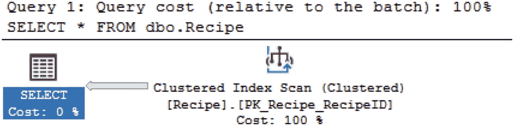

**图 7-1** 图形化执行计划

图形化执行计划提供了查询如何执行的高层次视图。这使得执行计划一目了然，更容易阅读，但这也意味着在深入执行计划的细节时，需要访问额外的信息。`图 7-2` 展示了将鼠标悬停在执行计划中的各种对象上时可以查看的一些详细信息。

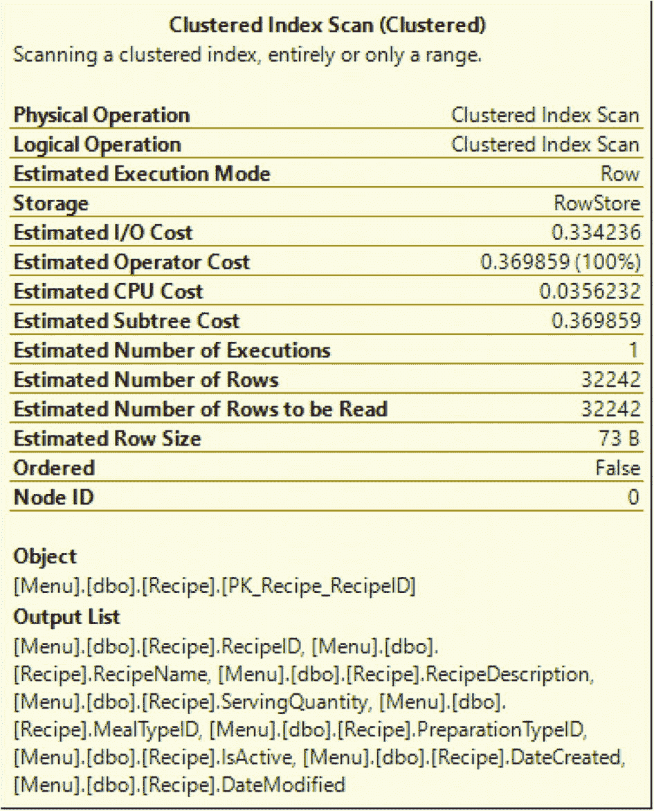

**图 7-2** 图形化执行计划中的运算符详细信息

除了此工具提示中的属性外，在新版本的 SQL Server Management Studio 中，你还可以访问更多的扩展属性，如 `图 7-3` 所示。

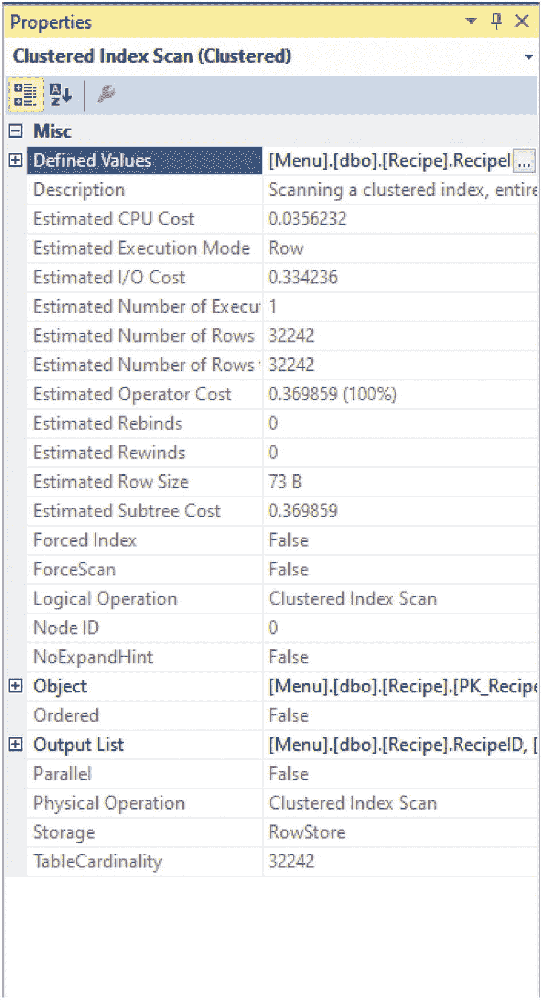

**图 7-3** 执行计划的附加属性

#### XML 格式

还有一个选项可以以 XML 格式与执行计划进行交互。你可以在 `代码清单 7-1` 中看到一个例子。

```xml
代码清单 7-1
XML 执行计划
```

虽然这种方法可能更难阅读，但它包含了与执行计划相关的所有信息。生成此表的查询是对一个表的 `SELECT` 语句。你还可以看到，将所有数据放在一处会导致需要审查的代码量相当大。


### SQL Server 执行计划解读指南

一旦您设置好 SQL Server Management Studio 以显示执行计划，您就会想知道在查看执行计划时应该关注什么。您需要了解如何解读执行计划中的流程，以更好地理解 SQL Server 将如何执行该查询。还有一些常见的形状您需要熟悉，因为它们可能帮助您一眼就发现潜在问题。执行计划中可能包含额外的文本，能快速显示已确定对查询执行产生负面影响的问题。更好地理解所有这些元素将帮助您找出查询的痛点，从而决定集中精力的方向。

#### 理解执行计划的流程

有了执行计划，您可以更清楚地了解 SQL Server 将如何执行该查询。我们阅读英文时习惯从左到右、从 top 到 bottom。将此与执行计划进行比较，最左上角代表查询的结果。如果将此比作读书，当您从左到右移动时，您正在深入了解 SQL Server 为获取结果集所采取的步骤。从上到下移动也是如此。查看图 7-4 中的示例，您可以看到一个包含多个步骤的执行计划。

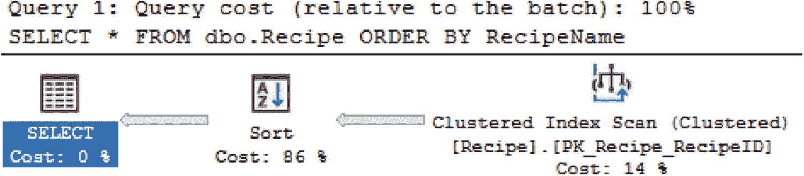

**图 7-4** 包含多个步骤的执行计划

如果从左到右阅读，我可以看到 `SELECT` 返回结果的表示。向右移动，我可以看到 SQL Server 在获取结果集之前立即使用了计算标量。这意味着，如果我移动到最右边的对象，这是 SQL Server 执行查询时采取的第一个操作。在这个例子中，SQL Server 执行此查询的第一步是一个聚集索引扫描。这很重要，因为您可能会听到“从左到右阅读执行计划”的说法。在这种情况下，说话者指的是按照 SQL Server 执行查询的相同方式阅读执行计划。

#### 识别关键指标：箭头粗细

当我刚开始使用执行计划时，很快就被其中的大量信息淹没了。我想从一开始就理解所有内容。然而，这对我来说太多了，根本记不住。通过多年的问题排查，我学会了通过寻找差异来开始我的分析。对于执行计划，没过多久我就立刻看到了差异。我注意到两个对象之间的箭头并不总是保持相同的大小。图 7-5 中并排显示了两个不同的箭头以供比较。


**图 7-5** 执行计划中的箭头

我了解到线条粗细的差异表明了 SQL Server 在每个步骤中访问的记录的相对数量。虽然有些查询返回的记录会比其他查询多，因此线条更粗，但您会发现执行计划中某一步的线条很粗，而下一步的线条却很细。这通常表明，线条较粗的步骤可以通过更高效地编写来减少返回的数据量。查看线条的粗细是您查看执行计划时可以检查的事项之一。

#### 关注排序操作

有时您希望数据按特定方式排序。例如，您可能希望按字母顺序或创建日期显示食谱列表。排序可以在应用程序代码中进行，也可以在 SQL Server 中进行。如果您选择在 SQL Server 中排序数据，您可能会在执行计划中看到一个排序操作符。您可以在图 7-6 中看到排序操作符的示例。

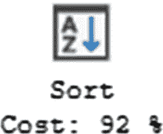

**图 7-6** 排序操作符

您会在执行计划中看到排序操作符。有些情况下排序操作符是必要的。但是，您需要留意那些可能不需要的排序实例。这包括为合并连接所需的排序。在这些情况下，您需要查看是否有可用于连接且已对数据排序的索引。最需要注意的问题之一是与排序操作符相关的警告。

#### 警告信息的重要性

执行计划最有帮助的功能之一是它们会返回警告。理想情况下，您希望编写性能良好的 `T-SQL`。这也意味着 `T-SQL` 不应返回带有警告的执行计划。有时您的执行计划会包含警告。警告将如图 7-7 所示。

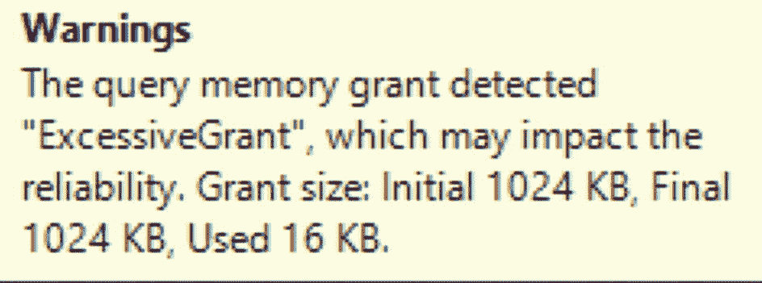

**图 7-7** 执行计划中的警告

看到警告的主要好处是 SQL Server 已经识别出您的 `T-SQL` 代码中可能存在的问题。调查返回的任何警告并查看是否可以采取措施解决它们，将会对您有益。

#### 估算行数与实际行数

执行计划还有其他元素会提醒您潜在的性能问题。虽然警告可以就 `T-SQL` 的问题提供具体建议，但执行计划中的其他项目并不提供相同水平的指导。在创建执行计划时，SQL Server 使用统计信息来猜测将返回的行数。SQL Server 还会跟踪执行计划每个步骤中返回的实际行数。如果您将鼠标悬停在操作符上，您将能够看到类似于图 7-8 中的内容。

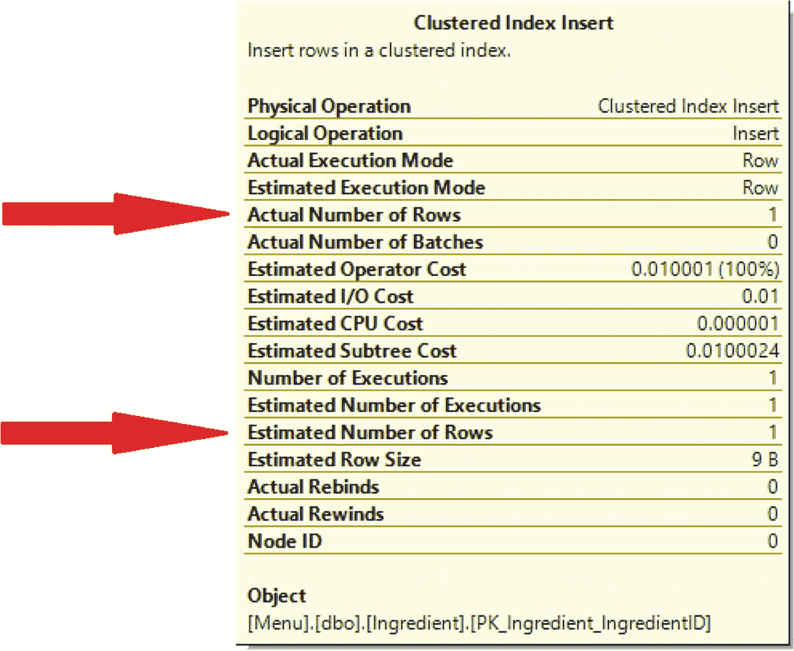

**图 7-8** 估算行数与实际行数

第一个箭头指向此执行计划步骤返回的实际行数。第二个箭头指向返回的估算行数。在这个例子中，行数是匹配的。如果行数匹配或在接近的范围内，您就不会遇到与估算相关的性能问题。如果两个数字差异很大，那么您可能得到一个性能不如预期的执行计划。这可能是因为统计信息已过时，SQL Server 无法准确确定将返回的行数。另一种可能性是 SQL Server 可能是为另一组值创建的执行计划。无论原因如何，如果您看到估算行数和实际行数之间存在很大差异，这是您应该调查的事情。

#### 总结

通过阅读执行计划，您可以快速识别查询中存在性能问题的地方，以及可以采取哪些步骤来解决这些问题。这包括知道如何访问执行计划，并了解估算执行计划与实际执行计划之间的区别。执行计划还具有多项功能，可帮助您快速识别可能的性能问题。通过查看箭头的大小，您可以判断执行计划中每个步骤通过的数据的相对数量。排序操作符可能为排序数据提供见解，而不仅仅是为了返回有序的结果集。您还可以查看估算和返回的实际行数，以帮助确定 SQL Server 是否有足够的信息来为您提供良好的执行计划。一旦您熟悉了执行计划的这些方面，您可能想研究 SQL Server 是如何使用您的索引的。


### 执行计划中的索引使用

在管理 `T-SQL` 方面，我观察到各公司间最大的差异之一就是索引的管理方式。某些情况下，开发团队负责编写所有包含索引创建的 `T-SQL` 代码。也有一些公司由数据库团队处理所有的索引创建和维护工作。由于数据库管理员通常对开发的访问权限少于开发人员，我认为让两个团队协同工作可能最有帮助。数据库管理员可以发现性能不佳的索引，并且可能在为多个 `T-SQL` 查询设计索引方面更有经验。另一方面，开发人员可能更了解表的设计方式以及 `T-SQL` 代码如何使用这些表。

#### 识别索引问题

存在许多查询、健康检查和监控工具可以帮助你识别索引问题。你可以通过查询来找出哪些存储过程使用了相同的数据库对象，或者你可能心里已经有了一个特定的查询来改进性能。一旦你从缓存中获取执行计划或生成当前的实际执行计划，你就可以开始调查潜在的性能问题。如前一节所述，你知道可以检查每个步骤的相对数据记录量，查看各种运算符和警告，并验证估计的和实际返回的行数。你还可以查看索引在执行计划中是如何被使用的。

#### 理解查找与扫描操作

在 `SQL Server` 中处理数据时，首选是尽快找到数据。当数据保存在聚集索引中时，数据会根据索引的列进行排序。这意味着当 `SQL Server` 搜索聚集索引时，数据是按顺序存储的。在最理想的情况下，`SQL Server` 会查看数据并快速找到所需数据。如果发生这种情况，你将在执行计划中看到一个 `聚集索引查找`。执行计划中的 `聚集索引查找` 看起来如图 7-9 所示。

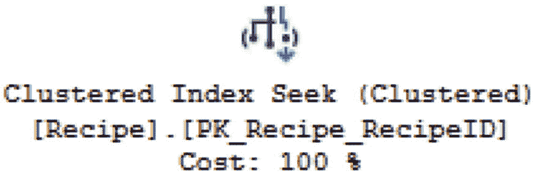

*图 7-9：聚集索引查找*

看到 `聚集索引查找` 让你知道你的 `T-SQL` 代码写得足够好，能够快速找到数据。如果你在执行计划中没有看到 `聚集索引查找`，你可能需要看看是否有办法重写你的 `T-SQL` 以使用 `聚集索引查找`。

虽然理想情况是你的数据使用 `聚集索引查找`，但你可能在执行计划中看到一些看起来相似但不完全相同的东西。`SQL Server` 有可能使用了聚集索引但未能快速找到数据。在这种情况下，`SQL Server` 可能需要查看索引的很大一部分比例。如果发生这种情况，你可能在执行计划中看到一个 `聚集索引扫描`，如图 7-10 所示。

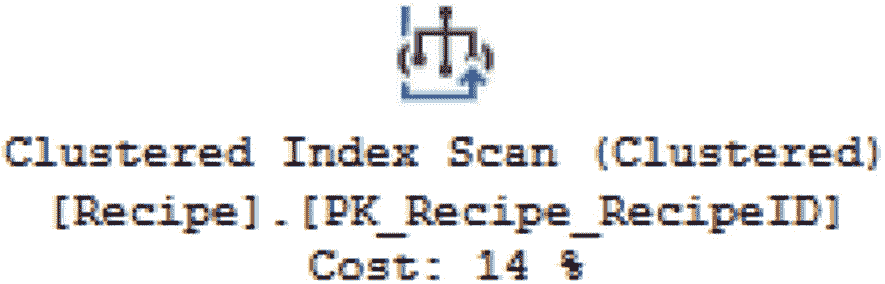

*图 7-10：聚集索引扫描*

这确实意味着 `SQL Server` 查看了按聚集索引排序的数据，但必须扫描整个表以找到满足查询要求所需的所有记录。

`SQL Server` 使用术语 `查找` 来表示可以在不搜索引用索引的很大一部分的情况下找到请求的数据。当需要搜索整个表或表的很大一部分时，`SQL Server` 将此称为 `扫描`。虽然 `查找` 或 `扫描` 可以应用于聚集索引，但它们也可以应用于非聚集索引。非聚集索引的排序方式与聚集索引或表（如果该表是 `堆`）不同。非聚集索引按照索引中指定的键列顺序进行排序。如果表上存在聚集索引，非聚集索引将包含一个指向聚集索引的指针。如果没有聚集索引，那么非聚集索引将指回表中的行 ID。

如果执行计划使用了非聚集索引，`SQL Server` 有几种不同的方式来搜索数据记录。如果 `SQL Server` 知道如何在非聚集索引中找到数据，你将在执行计划中看到一个 `索引查找`。`索引查找` 看起来如图 7-11 所示。

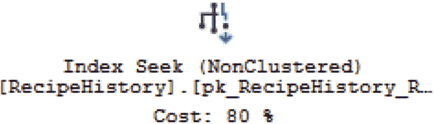

*图 7-11：索引查找*

如果根据所编写的 `T-SQL` 代码无法使用 `聚集索引查找`，次优选择是 `索引查找`。如果 `查找` 不可行，`SQL Server` 最终会使用 `索引扫描`。与 `聚集索引扫描` 类似，这意味着 `SQL Server` 需要遍历索引来查找必要的数据记录。如果执行计划使用了 `索引扫描`，图 7-12 显示了 `索引扫描` 在你的执行计划中出现的样子。

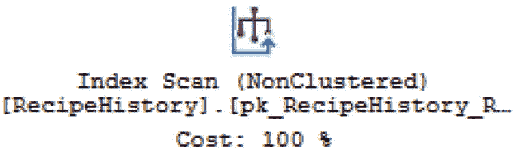

*图 7-12：索引扫描*

此外，和 `聚集索引扫描` 一样，如果你看到一个 `索引扫描`，你可能想看看在重写 `T-SQL` 以使用 `索引查找` 方面可以做些什么。

#### 考虑包含列与键查找

在编写 `T-SQL` 查询时，请记住需要什么样的数据。虽然包含额外的数据字段可能会带来额外的硬件开销，但它也会影响 `SQL Server` 搜索数据记录的方式。如果 `SQL Server` 需要使用 `索引查找` 或 `索引扫描` 来找到所需的数据记录，这并不意味着所有数据字段都必须存在于非聚集索引中。如果需要额外的数据列，`SQL Server` 可能需要通过非聚集索引从聚集索引中获取这些额外的数据列。当这种情况发生时，你将在执行计划中看到一个 `键查找`，如图 7-13 所示。

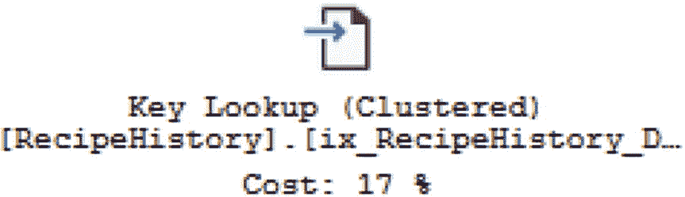

*图 7-13：键查找*

当你看到 `键查找` 时，它让你知道查询所需的信息并非全部存在于非聚集索引中。在这些场景下，它表明索引可能需要被修改以包含那些列。在决定将这些数据字段添加为包含列之前，你应该意识到在索引中包含列可能会带来与写入或更新索引相关的额外成本。

#### 堆与表扫描

没有聚集索引的表也被称为 `堆`。如果表上没有其他索引，`SQL Server` 将不得不逐行搜索以找到查询结果所需的数据记录。虽然可能涉及许多其他因素，但这可能导致 `SQL Server` 扫描整个表。这可以在执行计划中看到，如图 7-14 所示。

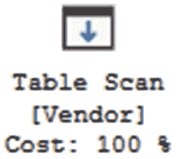

*图 7-14：表扫描*


### 索引优化与执行计划分析

一些非常小的表可能不需要索引，使用`Table Scan`可能是可以接受的。如果表中有很多记录，那么`Table Scan`就不理想了。在这种情况下，你可能需要调查是否有任何可能的索引可以添加到表上。

如果堆上有一个非聚集索引，SQL Server 可能会将这些非聚集索引用作执行计划的一部分。如果是这种情况，你将会看到一个`Index Seek`或`Index Scan`。当执行计划中出现`Index Seek`或`Index Scan`时，查询中使用的列可能不存在于非聚集索引中。如果需要查找表中的其他列，你将在执行计划中看到一个`RID Lookup`。你可以在图 7-15 中看到这一点。

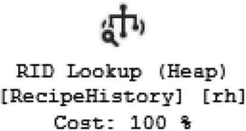

图 7-15

`RID Lookup`

与`Key Lookup`类似，你会希望查看是否可以修改任何非聚集索引以包含来自 T-SQL 代码的必要列。也有可能通过修改查询来排除导致`RID Lookup`的列。

举个例子，我编写了一个查询来获取所有名称以“tomato”开头的原料。为了做到这一点，我需要运行清单 7-2 中的查询。

```
SELECT IngredientName, DateCreated
FROM dbo. Ingredient
WHERE IngredientName LIKE 'Tomato%';
清单 7-2
获取原料的查询
```

第一次运行此查询时，此表上只有一个在`IngredientID`上的主聚集索引。来自清单 7-2 中 T-SQL 代码的执行计划如图 7-16 所示。

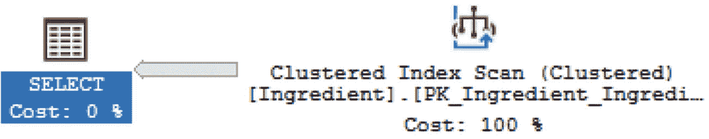

图 7-16

仅有聚集索引时的执行计划

该表上没有非聚集索引。SQL Server 唯一的选择是搜索整个聚集索引来查找请求的记录。通过查看与`Clustered Index Scan`相关的属性可以看到这一点。此查询执行的属性可以在图 7-17 中找到。

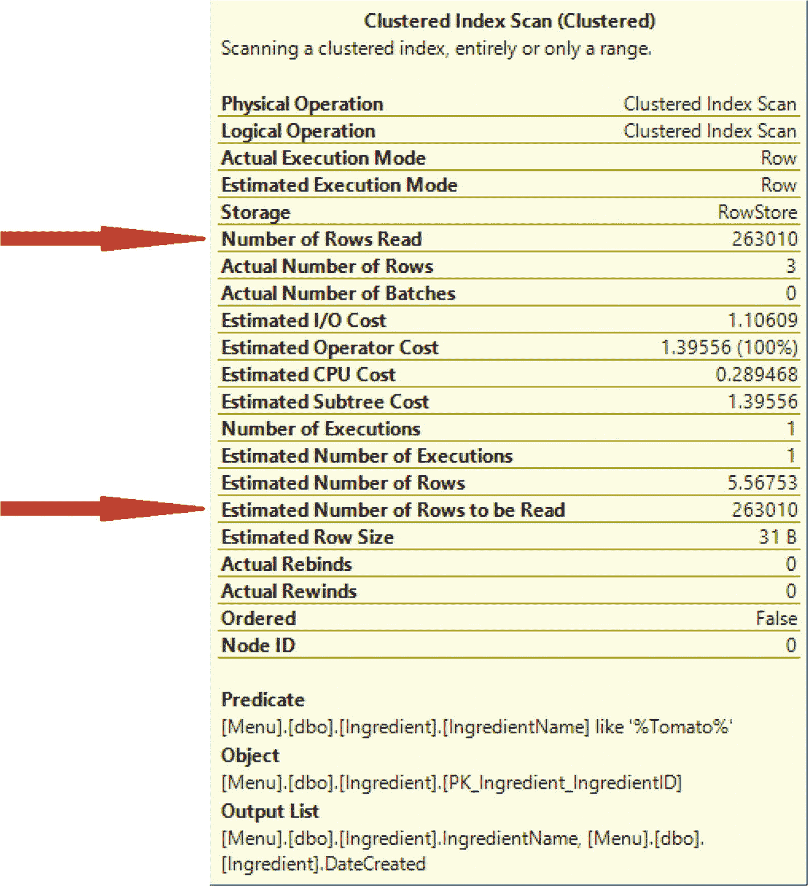

图 7-17

使用聚集索引时的读取次数

查看估计的和实际的读取行数，两者读取的行数是相同的。每者的总数都是 263,010 行被读取。实际返回的行数是 3 行。SQL Server 必须搜索 263,010 行才能找到符合标准的 3 行。

在这个场景中，我们有一个查询，它读取的行数远大于返回的行数。我无法重写查询以使用非聚集索引，因为不存在这样的索引。我最好的选择是编写一个非聚集索引来提高性能。新的非聚集索引在清单 7-3 中。

```
CREATE INDEX IX_Ingredient_IngredientName
ON dbo.Ingredient (IngredientName);
清单 7-3
创建非聚集索引
```

现在我已经创建了非聚集索引，我将再次运行查询以查看是否会得到一个新的执行计划。新的执行计划在图 7-18 中。

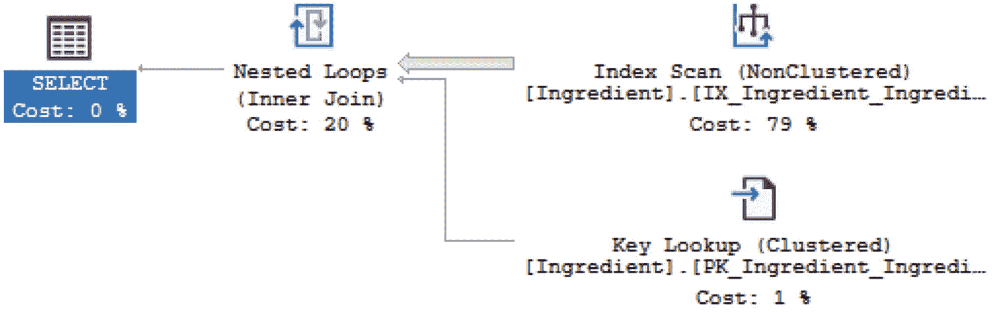

图 7-18

使用非聚集索引时的执行计划

在图 7-18 中，`Clustered Index Scan`已被`Index Scan`和`Key Lookup`所取代。虽然这看起来像是我降低了执行计划的性能，但我可以通过查看读取的行数来验证这一点。在图 7-19 中，你可以看到与`Index Seek`相关的属性。

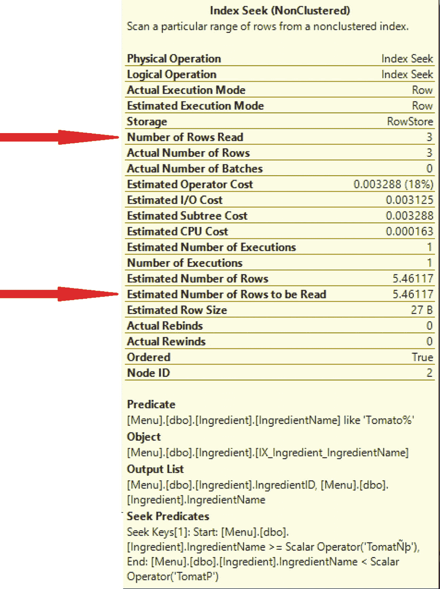

图 7-19

`Index Seek`的属性

现在非聚集索引已经创建，我可以看到实际的读取行数已经从 263,010 减少到 3。我预计`Key Lookup`会有相同的读取次数，但我可以查看属性来确认。在图 7-20 中，你可以看到返回的属性。

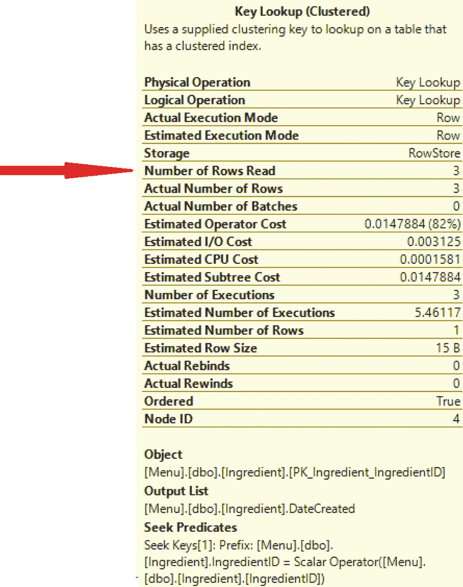

图 7-20

`Key Lookup`的属性

检查`Key Lookup`，其中也有三行被读取。没有非聚集索引的 T-SQL 代码有 263,010 次读取。使用非聚集索引后的总读取行数是六次。

我可以通过将`DateCreated`列作为非聚集索引的一部分包含进来，或者从原始查询中删除该列来消除`Key Lookup`。

```
CREATE INDEX IX_Ingredient_IngredientName
ON dbo.Ingredient (IngredientName) INCLUDE (DateCreated);
清单 7-4
包含列的非聚集索引
```

在添加了清单 7-4 中的索引并运行来自清单 7-2 的查询后，我可以获得执行计划。该执行计划可以在图 7-21 中找到。

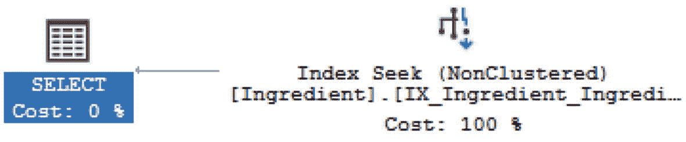

图 7-21

使用非聚集索引和包含列时的执行计划

执行计划显示查询仍在使用非聚集索引。由于此索引已更改以包含 select 语句中的附加列，因此执行计划也发生了变化。之前使用非聚集索引时，执行计划有一个`Index Scan`和一个`Key Lookup`。现在执行计划使用的是一个`Index Seek`。

一旦你熟悉了阅读执行计划，就可以开始使用执行计划来帮助你确定如何提高性能。当你查看执行计划时，可能会发现一个`Clustered Index Scan`。通常，这意味着 SQL Server 必须遍历整个表才能找到符合查询条件的数据。如本节所示，创建一个包含连接条件的非聚集索引可以帮助提高查询性能。如果你发现 SQL Server 必须执行`Key Lookup`，你可以查看是否将被选择的列作为非聚集索引的一部分包含进来是有意义的。了解 SQL Server 如何使用索引可以帮助提高查询性能。了解 SQL Server 如何比较来自多个数据集的数据也可以帮助你提高查询性能。


#### 执行计划中的逻辑连接类型

除了阅读执行计划和理解索引，你的 T-SQL 代码还可以用来确定执行计划将如何生成。在某些情况下，表如何连接在一起与数据如何存储在表中同样重要。有时，连接列的方式也可能影响你的执行计划。`WHERE`子句中的某些 T-SQL 代码会影响查询执行中使用的逻辑连接类型。如果多个查询被组合，也可能改变查询的执行方式。最终，T-SQL 代码的编写方式与 SQL Server 决定执行查询的方式之间存在关系。

SQL Server 中有几种不同的逻辑连接。其中一些逻辑连接在 T-SQL 中很容易看到。这包括`INNER JOIN`、`LEFT OUTER JOIN`、`RIGHT OUTER JOIN`和`FULL OUTER JOIN`。这些并不是 SQL Server 中存在的唯一逻辑连接。使用某些 T-SQL 命令时，SQL Server 会将一个表与另一个表进行比较，寻找匹配或不匹配的记录。在这些情况下，SQL Server 不执行完整的连接，而是执行`SEMI JOIN`。这种连接类型未被指定为 T-SQL 命令，但一些 T-SQL 命令如`EXISTS`或`NOT EXISTS`会指示一个`SEMI JOIN`。可用的半连接包括`LEFT SEMI JOIN`、`LEFT ANTI-SEMI JOIN`、`RIGHT SEMI JOIN`和`RIGHT ANTI-SEMI JOIN`。最后，还有一些逻辑连接与在同一事务中组合两个或多个查询结果有关。这可以包括通常与`UNION ALL`相关的`CONCATENATION`，或者在 T-SQL 中使用`UNION`时可能发生的`UNION`逻辑连接。根据逻辑连接，SQL Server 将决定可以使用哪些物理连接。通过这种方式，逻辑连接可用于影响查询性能。

有一些物理连接操作符可以与逻辑连接相关联。这四个物理连接操作符分别称为合并连接、哈希连接、嵌套循环和自适应连接。使用`INNER JOIN`时，这四种物理连接操作符中的任何一种都可以作为执行计划的一部分使用。根据数据在表中的存储方式以及表的相对大小，可能会影响使用哪个物理操作符。如果被比较的两个表中的数据已排序，则可以对来自两个表的记录进行并排比较。这将使 SQL Server 能够快速找到匹配或不匹配的记录，具体取决于查询要求。当这种情况发生时，它被称为合并连接。一个出现在执行计划中的合并连接物理操作符如图 7-22 所示。

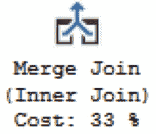

**图 7-22**

合并连接

有时被连接在一起的表没有排序。如果是这种情况，SQL Server 仍然可以比较每个表之间的行。然而，SQL Server 需要将记录转换为可以轻松比较的内容。这可以通过哈希来完成。如果 SQL Server 对两个表中被比较的列进行哈希处理并进行比较，那么物理操作符将是哈希匹配。如果你在执行计划中看到图 7-23，那么你就知道 SQL Server 是如何执行哈希匹配物理连接的。

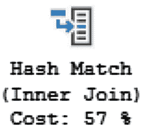

**图 7-23**

哈希匹配

如果有两个表，其中一个表比另一个小，那么 SQL Server 可能会决定逐行比较一个表的值与另一个表的所有行。当这种情况发生时，SQL Server 将使用嵌套循环，如图 7-24 所示。

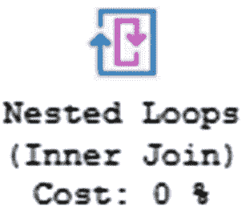

**图 7-24**

嵌套循环

从 SQL Server 2017 开始，有一种新的物理连接操作符可以在 SQL Server 确定查询的执行计划时使用。这个新的物理连接操作符旨在帮助解决给定表中存储的数据可能根据`WHERE`子句中的标准而有显著差异的情况。这种物理连接允许 SQL Server 根据为查询选择的数据来决定是使用哈希匹配还是嵌套循环。这被称为自适应连接。在 SQL Server 2017 中，自适应连接仅在列存储索引上可用。这对于 SQL Server 2019 已经发生了变化。

了解了可用的逻辑连接后，接下来是`LEFT OUTER JOIN`和`RIGHT OUTER JOIN`。在某种程度上，这两种逻辑连接类型是相同但也不同的。例如，嵌套循环只能使用`LEFT OUTER JOIN`。如果查询是使用`RIGHT OUTER JOIN`编写的，SQL Server 将产生额外的开销来将`RIGHT OUTER JOIN`转换为`LEFT OUTER JOIN`。除了这个特定场景，所有物理连接类型都支持使用`LEFT OUTER JOIN`。在 SQL Server 的早期版本中，根据查询中使用的是`LEFT OUTER JOIN`还是`RIGHT OUTER JOIN`，SQL Server 可能生成两个不同的执行计划。这是由于在连接重新排序方面的限制造成的。

下一种逻辑连接是`FULL OUTER JOIN`。在所有连接类型中，这种类型对于何时可能使用一种物理连接类型而非另一种有最多的特定条件。在第一个例子中，我将按标识符对表进行排序，如清单 7-5 所示。

```
ALTER TABLE dbo.RecipeIngredient
ADD CONSTRAINT PK_RecipeIngredient_RecipeIngredientID
PRIMARY KEY CLUSTERED (RecipeIngredientID)
Listing 7-5
Primary Key to Sort Data by RecipeIngredientID
```

一旦表按`RecipeIngredientID`排序，我将把`RecipeIngredient`表连接到`Recipe`表。此连接的 T-SQL 代码如清单 7-6 所示。

```
SELECT rec.RecipeName
FROM dbo.Recipe rec
LEFT OUTER JOIN dbo.RecipeIngredient recing
ON rec.RecipeID = recing.RecipeID
Listing 7-6
Outer Join Between Recipe and RecipeIngredient
```

在此场景中，两个表的排序方式不同。`RecipeIngredient`表按`RecipeIngredientID`排序，而`Recipe`表按`RecipeID`排序。你可以在图 7-25 中看到，物理操作符是哈希匹配。

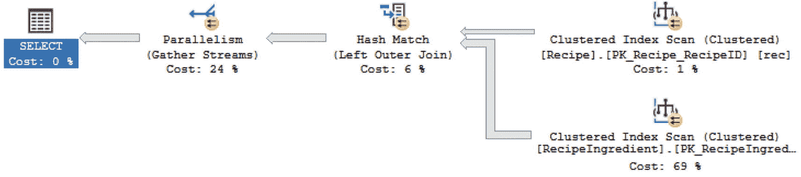

**图 7-25**

使用哈希匹配的执行计划

我们已经看到了当表排序不同时会发生什么。如果我运行清单 7-7 中的 T-SQL 代码，两个表将按相同的列`RecipeID`排序。

```
ALTER TABLE dbo.RecipeIngredient
ADD CONSTRAINT PK_RecipeIngredient_RecipeIDIngredientID
PRIMARY KEY CLUSTERED (RecipeID, IngredientID)
Listing 7-7
Change Primary Key to Sort Data by RecipeID
```

查看图 7-26，你可以看到执行计划已更改为使用合并连接。

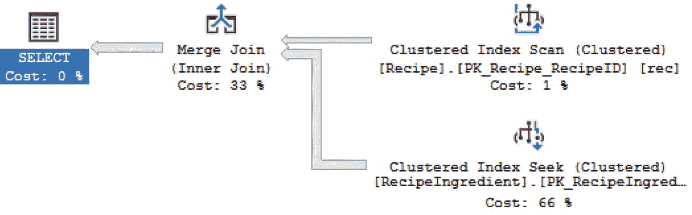

**图 7-26**

使用合并连接的执行计划

现在这两个表以相同的方式排序，SQL Server 确定使用合并连接更具成本效益。在前面的例子中，SQL Server 将获取两个有序的数据集并比较记录以确定哪些记录匹配。前面所有的例子都假设被比较的列之间相等。作为一般准则，如果查询中的连接都不相等，SQL Server 将始终使用嵌套循环。你可以在清单 7-8 中看到一个满足此条件的查询示例。


#### SQL 连接类型与执行计划

```sql
SELECT TOP 500 rec.RecipeName
FROM dbo.Recipe rec
FULL OUTER JOIN dbo.RecipeIngredient recing
ON rec.RecipeID  recing.RecipeID
```
**代码清单 7-8**  
**使用不等式的全外连接**

如果我重新创建在代码清单 7-5 中引用的主键，两个表之间的数据将以不同的方式排序。由于需要在两个表之间比较的数据量很大，我决定将结果限制为前 500 条记录。运行此查询后，我得到了如图 7-27 所示的执行计划。

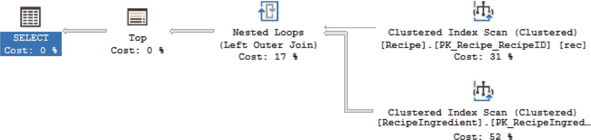

**图 7-27**  
**使用嵌套循环的执行计划**

由于 T-SQL 代码中唯一的连接是一个不等式，SQL Server 使用了嵌套循环物理连接。几乎没有连接是等值连接的查询几乎都必须使用嵌套循环，除非是一种特定情况。如果被比较的数据是有序的并且存在不等式，SQL Server 可以使用合并连接。创建代码清单 7-7 中的主键将使两个表之间的数据以相同的方式排序。执行代码清单 7-8 中的查询时，返回的执行计划如图 7-28 所示。

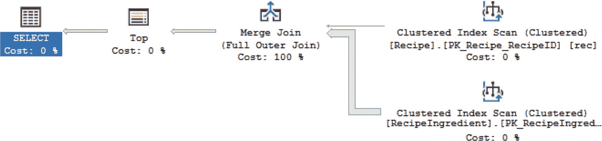

**图 7-28**  
**使用合并连接的执行计划**

图 7-28 向我们展示了当存在不等式时，使用合并连接是可能的。然而，只有当表是有序的且存在不等式时，你才能在全外连接中看到合并连接。除了与逻辑连接相关的 T-SQL 连接外，SQL Server 还可以使用其他逻辑连接类型。

另一种逻辑连接类型涉及 SQL Server 在两个表之间比较数据但不执行完整连接的情况。根据使用的 T-SQL 代码，这可以被称为半连接或反半连接。与左外连接和右外连接类似，SQL Server 在将半连接和反半连接匹配到物理连接运算符时存在一些相同的限制。在处理半连接或反半连接时，存在左或右的概念。这个左或右与比较的是哪一边有关。代码清单 7-9 查找所有不在 ID 为 2 的食谱中的食材。

```sql
SELECT ing.IngredientName
FROM dbo.Ingredient ing
WHERE NOT EXISTS
(
SELECT *
FROM dbo.RecipeIngredient recing
WHERE ing.IngredientID = recing.IngredientID
AND recing.RecipeID = 2
)
```
**代码清单 7-9**  
**除 RecipeID 为 2 的食谱中所有食材外的所有食材**

运行此查询时，`RecipeIngredient`中的数据按`RecipeID`排序，然后是`IngredientID`。如图 7-29 所示，执行计划显示了一个左反半连接。

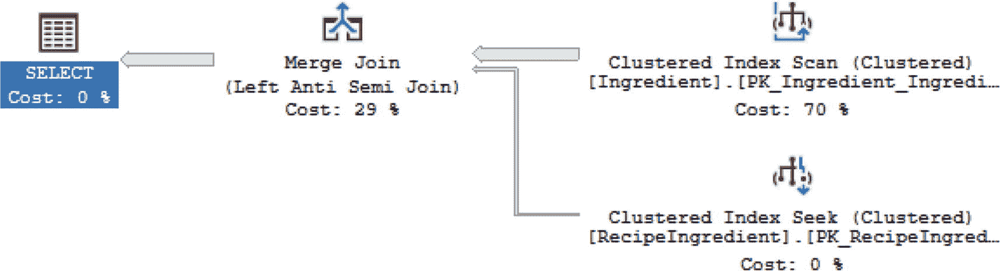

**图 7-29**  
**包含左反半连接的执行计划**

这个反半连接是由于代码清单 7-9 查询中的`NOT EXISTS`导致的。在前面的场景中，SQL Server 选择了左连接。由于`RecipeIngredient`表按`RecipeID`排序，然后是`IngredientID`，并且 T-SQL 代码只查看一个`RecipeID`，因此被评估的值是`IngredientID`，其排序方式与`Ingredient`表相同。这使得 SQL Server 能够在此查询中使用合并连接。在代码清单 7-10 的查询中，我寻找存在于特定食谱子集中的所有食材。

```sql
SELECT ing.IngredientName
FROM dbo.Ingredient ing
WHERE EXISTS
(
SELECT *
FROM dbo.RecipeIngredient recing
WHERE ing.IngredientID = recing.IngredientID
AND recing.RecipeID < 200
)
```
**代码清单 7-10**  
**所有 RecipeID 小于 200 的食谱中的所有食材**

如图 7-30 所示的执行计划中，你可以看到一个右半连接。

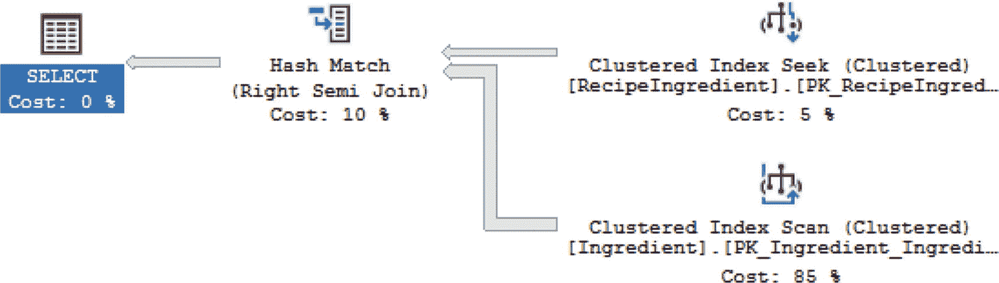

**图 7-30**  
**包含右半连接的执行计划**

使用`RIGHT SEMI JOIN`是由于代码清单 7-10 中的 T-SQL 代码使用了`EXISTS`。“右”的使用表明 SQL Server 正在将`EXISTS`语句返回的结果与食材列表进行比较。虽然使用`EXISTS`或`NOT EXISTS`可能表明会使用半连接或反半连接，但这并不总是会发生。代码清单 7-11 是一个将返回 ID 为 2 的食谱的所有食材的查询。

```sql
SELECT ing.IngredientName
FROM dbo.Ingredient ing
WHERE EXISTS
(
SELECT *
FROM dbo.RecipeIngredient recing
WHERE ing.IngredientID = recing.IngredientID
AND recing.RecipeID = 2
)
```
**代码清单 7-11**  
**RecipeID 为 2 的食谱中的所有食材**

图 7-31 所示的执行计划展示了 SQL Server 决定如何执行此查询。

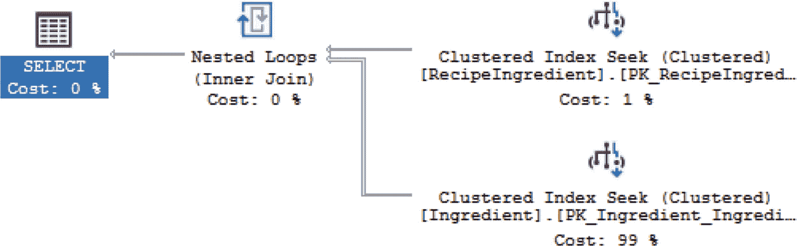

**图 7-31**  
**不含半连接的执行计划**

对于这个执行，SQL Server 决定将这个 T-SQL 转换为类似于内连接而不是半连接。这是因为 SQL Server 计算出这将提供所有评估方案中最佳的执行计划。

有一些方法可以组合数据，这些方法涉及比较两个数据集之间的值并选择匹配或不匹配的项目。还存在将整个数据集作为逻辑连接类型的一部分进行组合的可能性。这可能包括在你的 T-SQL 代码中使用`UNION`或`UNION ALL`。代码清单 7-12 所示的查询展示了在两个表之间使用`UNION`。

```sql
SELECT ing.IngredientName
FROM dbo.Ingredient ing
WHERE ing.IngredientName LIKE 'Tomato%'
UNION
SELECT ing.IngredientName
FROM dbo.Ingredient ing
WHERE ing.IngredientName = 'Tomato'
```
**代码清单 7-12**  
**所有包含“Tomato”的食材**

在此查询中，将以"Tomato"开头或等于"Tomato"的食材列表将被返回。当此查询在 SQL Server 中执行时，返回的执行计划如图 7-32 所示。

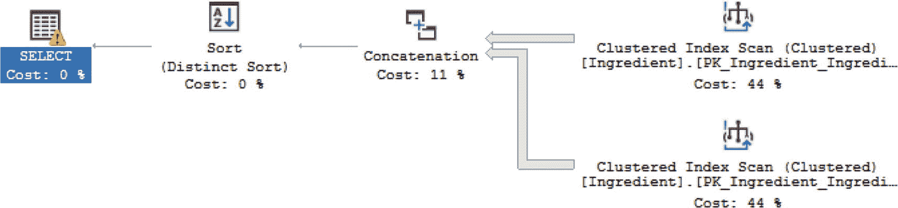

**图 7-32**  
**包含串联操作的执行计划**

对于这个查询，SQL Server 并没有像本章其他示例那样连接数据。相反，只有一个操作符，`Concatenation`，它指示了 SQL Server 如何组合这些数据。


