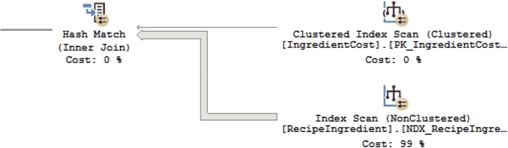
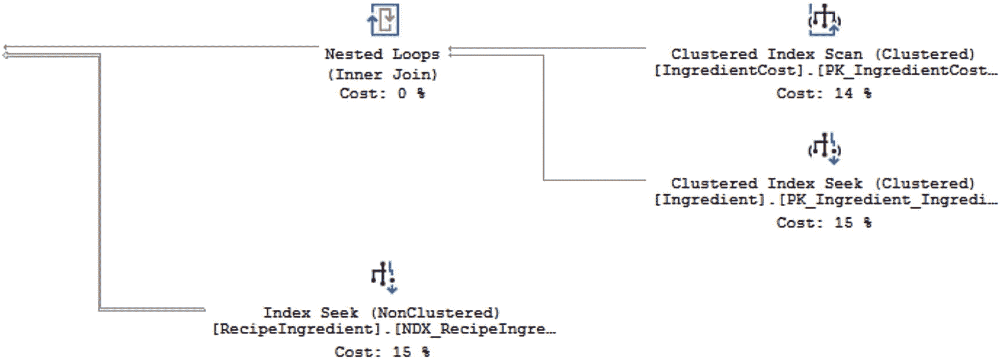
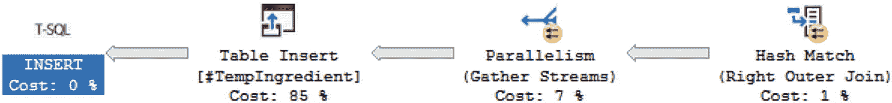
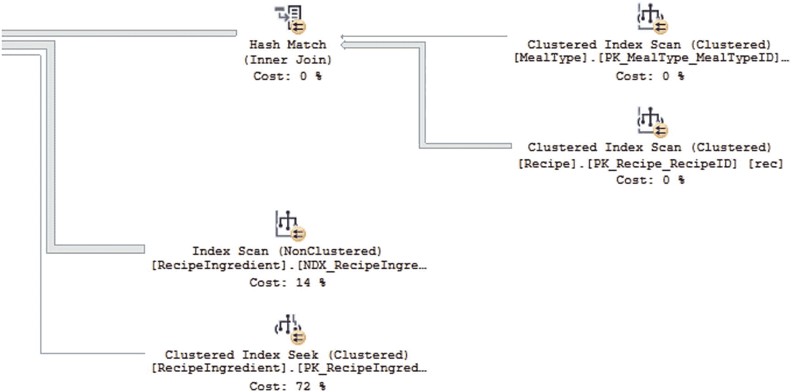
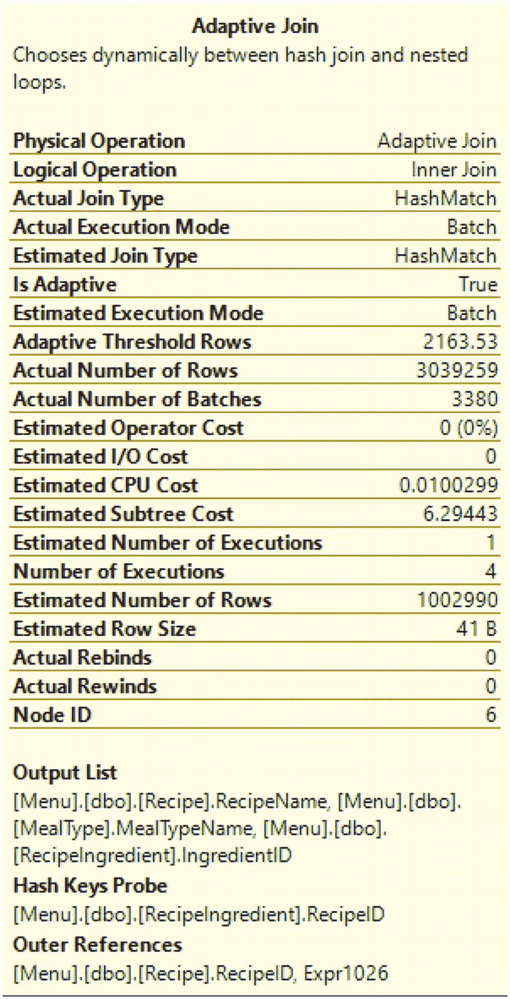
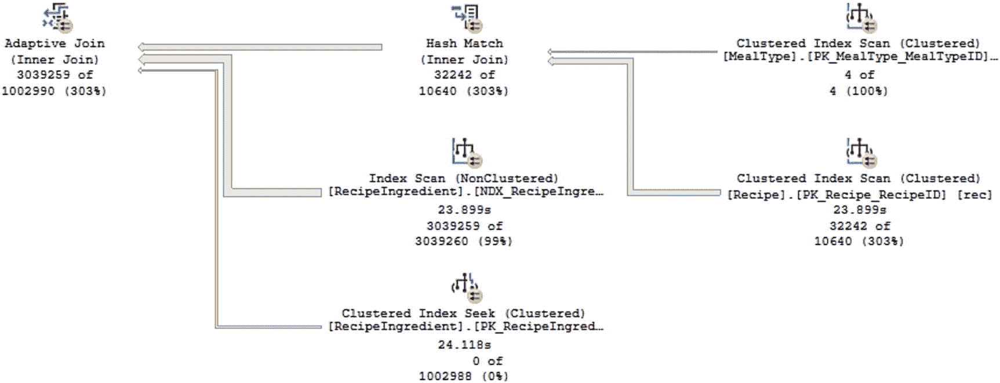
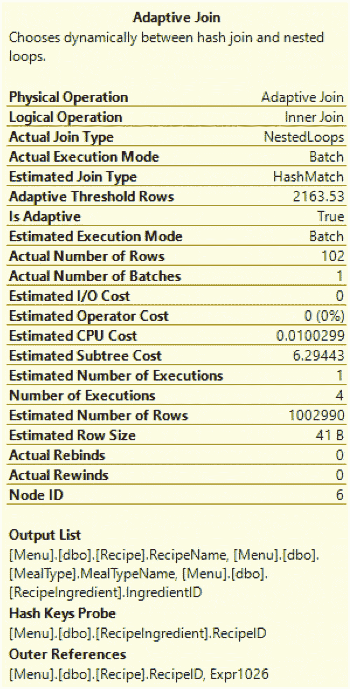
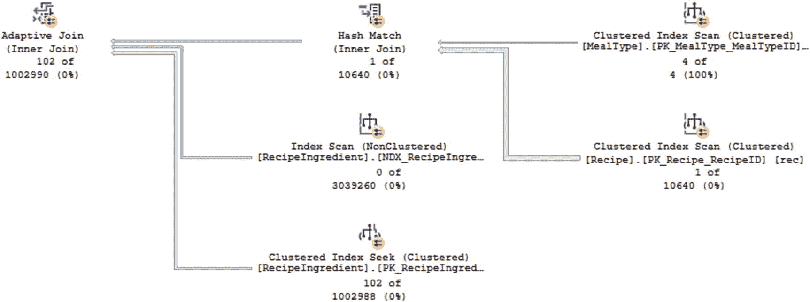

# 7. 理解执行计划

总体目标是选择对正在联接的数据而言最有效的物理联接方式。`合并联接`可能表现得非常好，但它们仅限于已通过索引或 `ORDER BY` 或 `GROUP BY` 语句排序的数据。正如预期的那样，`索引合并联接`的性能会比不使用索引的`合并联接`更好。当数据未排序，特别是如果正在联接的两边数据中有一边较小时，SQL Server 可能会使用`嵌套循环`。你需要确认循环遍历另一个表的代价不会带来显著的开销。正如使用索引的`合并联接`性能优于不使用索引的`合并联接`一样，`嵌套循环`也是如此。对于`合并联接`和`嵌套循环`，看看你是否能够修改 T-SQL 代码以使用索引。这并不意味着如果不存在索引就去创建它；而是你可以检查表上的索引，看看是否有任何索引适用于你的特定查询。如果表未排序，特别是当两边联接的记录数都很大时，`哈希匹配`可能是理想的解决方案。

在本章中，我们回顾了处理执行计划的各个方面。我们从访问和查看执行计划的多种方式开始。我们还讨论了`估计执行计划`、`实际执行计划`以及在`计划缓存`中的执行有何不同。查看执行计划时，有一些项目如`箭头大小`、`估计行数`和`实际行数`可以为你提供一些线索，指示下一步可以采取哪些措施来提升 T-SQL 代码的性能。在考察这些项目之后，你或许还能检查执行是如何使用`索引`的。不仅关注使用了哪些`索引`，还关注 SQL Server 如何搜索这些`索引`，这很有帮助。在联接表时，你会使用 T-SQL 代码，这些代码可以引用某些逻辑联接类型的行为。这些逻辑联接类型会影响作为执行计划一部分使用的物理联接类型。通过以不同的方式编写 T-SQL 代码，你或许能够影响 SQL Server 生成的执行计划。运用本章涵盖的所有信息，应该能帮助你更自如地审视你的 T-SQL 代码，并提升与 T-SQL 相关的速度和硬件使用效率。

## 8. 优化 T-SQL

在本书的这一部分，我阐述了编写 T-SQL 代码的许多方面。我从回顾在查询中使用`基于集合的设计`开始。在设计查询时，设计出能有效利用硬件的查询也很重要。检查查询性能的一种方法是使用`执行计划`。一旦你获得了想要改进的查询的`执行计划`，就可以开始专注于如何优化该查询。在优化 T-SQL 方面，有几种可用的选项。

当你开始对查询进行`性能调优`时，有许多可用的选项。过去，一种可行的选择是手动识别性能不佳的查询并加以改进。在识别需要优化的查询时，可以考虑许多不同的因素。从 `SQL Server 2017` 开始，增加了额外的功能，允许 SQL Server 自动提升执行 T-SQL 某些方面的性能。而 `SQL Server 2019` 则带来了更多增强功能，有助于在不改变底层 T-SQL 代码的情况下，让查询运行得更好、更快。

### 优化逻辑读取

我曾见过一些 T-SQL 代码表面上运行良好。代码执行及时，结果正确。当你查看某个 SQL Server 监控工具时，可能会注意到一些意外行为，表明系统存在性能问题。在某些情况下，你可能会发现一些查询从内存中读取了数据页，但这些页并未包含在结果集中。读取数据页可以识别为`逻辑读取`。你需要查看该 T-SQL 代码的`执行计划`，以找出可能导致这种差异的原因。这不仅涉及查看执行了哪些 T-SQL 代码，还涉及试图确定可以采取哪些措施来改善性能。

优化此查询以减少读取量的优势在于，这应能减少作为此查询执行的一部分而读入内存的数据页数量。换句话说，读取超过查询结果所需数据的缺点是，应用程序更频繁使用的页面可能会过早地从内存中清除。不幸的是，我们通常只有在发现应用程序运行缓慢或崩溃时才会意识到性能问题。此时，可能很难诊断出导致问题的具体查询。如果你无法使用监控软件，这种情况的排查会变得更加困难。当我最初开始调查性能问题时，我会检查 `SQL Server 代理` 的作业历史记录。有时你会发现某个进程与生产问题同时运行。虽然这并不能确认 `SQL Server 代理` 作业是原因，但可能值得调查。

对于这些情况，最好能确切知道是哪个存储过程或预处理语句导致了性能问题。除了第三方软件、先前设置的`查询存储`或`扩展事件`之外，你可能没有太多可用的选项。此外，我更倾向于在发生中断之前识别出可能导致性能问题的查询。如果我无法使用第三方工具，我会使用 `DMV`（动态管理视图）来尝试在问题发生前找到相关的 T-SQL。我常常会结合使用上述任何操作与`性能监视器`，来长期跟踪 SQL Server 并确认我的性能调优是否有效。

如果你没有第三方工具，或者想更熟悉使用 `DMV` 来查找需要性能调优的 T-SQL，你可以查询 `sys.dm_exec_query_stats`。这个 `DMV` 跟踪已执行且仍在`计划缓存`中的 T-SQL 代码的统计信息。它只返回尚未从`计划缓存`中清除的查询结果。如果你认为此 `DMV` 缺少了一些你期望看到的存储过程，你可能需要研究一下你的`计划缓存`，确定缓存是否被`即席查询`填满了。你需要将此数据与 `sys.dm_exec_sql_text` 进行联接，以找到与统计信息关联的 T-SQL 代码。

当试图查找具有高`逻辑读取`的查询时，你需要根据各种标准来查看 T-SQL 代码。查看平均`逻辑读取`通常是我寻找性能调优查询时的主要目标。我偏好这个指标，因为它通常能识别出在服务器上频繁运行、并且可能具有超出我预期的更多读取量的 T-SQL 代码。如果某个进程在服务器上频繁运行，我不会期望它的平均读取次数非常高，因为频繁的进程意味着该 T-SQL 代码直接关联到某个应用程序。也有一些查询虽然运行不频繁，但在运行时使用了大量`逻辑读取`。根据我的经验，如果总`逻辑读取`很高，而总执行次数很低，我会将这些查询的优先级排在平均`逻辑读取`值较高且执行次数也较高的 T-SQL 代码之后。


### 性能调优：分析与优化 T-SQL 查询

一旦你确定了需要进行性能调优的`T-SQL`代码，你会希望同时查看代码和执行计划，以熟悉查询正在检索的数据以及`SQL Server`如何检索这些数据。在清单[8-1]中，你可以看到我将要优化的查询。

```sql
DECLARE @RecipeID             INT = -1;
DECLARE @PreparationTypeID    INT = -1;
DECLARE @MealTypeID           INT = -1;
DECLARE @StartDate            DATETIME = NULL;
DECLARE @EndDate              DATETIME = NULL;
SELECT recing.RecipeID,
recing.IngredientID,
ic.IngredientCostID
INTO #TmpRecipe
FROM dbo.Recipe rec
INNER JOIN dbo.RecipeIngredient recing
ON rec.RecipeID = recing.RecipeID
INNER JOIN dbo.Ingredient ing
ON recing.IngredientID = ing.IngredientID
INNER JOIN dbo.IngredientCost ic
ON ing.IngredientID = ic.IngredientID
WHERE (rec.PreparationTypeID = @PreparationTypeID OR @PreparationTypeID = -1)
AND (rec.RecipeID = @RecipeID OR @RecipeID = -1)
AND (rec.MealTypeID = @MealTypeID OR @MealTypeID = -1)
AND ing.IsActive = 1
AND (rec.DateCreated > @StartDate OR @StartDate IS NULL)
AND (rec.DateCreated < @EndDate OR @EndDate IS NULL)
AND ic.IngredientCostID IN (
SELECT IngredientCostID
FROM dbo.IngredientCostHistory
GROUP BY IngredientCostID
HAVING COUNT(*) > 3
);
SELECT rec.RecipeName,
rec.RecipeDescription,
ing.IngredientName,
rec.PreparationTypeID,
p.PreparationTypeName,
p.PreparationTypeDescription,
ic.Cost
FROM #TmpRecipe tr
LEFT JOIN #UniqueIngredientCost uic
ON tr.IngredientCostID = uic.IngredientCostID
LEFT JOIN dbo.IngredientCostHistory ic
ON uic.IngredientCostID = ic.IngredientCostID
INNER JOIN dbo.Recipe rec
ON tr.RecipeID = rec.RecipeID
INNER JOIN dbo.Ingredient ing
ON tr.IngredientID = ing.IngredientID
INNER JOIN dbo.PreparationType p
ON rec.PreparationTypeID = p.PreparationTypeID
WHERE uic.IngredientCostID IS NOT NULL
ORDER BY
CASE WHEN
(
rec.RecipeID = @RecipeID
AND rec.PreparationTypeID = @PreparationTypeID
)
THEN 0
ELSE 1
END,
rec.RecipeName DESC,
ing.IngredientName ASC
DROP TABLE #TmpRecipe
DROP TABLE #UniqueIngredientCost
```
**清单 8-1** 用于查询食谱和准备详情的原始查询

#### 分析执行计划

你还需要从计划缓存中获取执行计划，以便查看`SQL Server`如何执行这段`T-SQL`代码。图[8-1]中的部分执行计划展示了执行计划中可能受益于优化的一个部分。



**图 8-1** 清单[8-1]对应的部分执行计划

执行计划中有一条粗线，在哈希匹配后变成了一条细线。这是一个很好的迹象，表明该查询可能能够被优化以减少整体读取次数。基于这些信息，我需要调查`dbo.Recipe`的数据是如何与`dbo.RecipeIngredient`结合的。查看`T-SQL`代码或其输出，我可以更好地理解这个查询的目的。此查询返回所有成本已更改三次以上的食材，以及使用这些食材的食谱信息。

#### 理解优化点

了解这一点有助于我们开始优化该查询逻辑读取的过程。我知道这个查询是基于成本已更改超过三次的食材。如果我尝试只查找包含价格已更改超过三次的食材的食谱，可能可以减少读取次数。虽然表`dbo.RecipeIngredient`是按`RecipeID`和`IngredientID`排序的，但这在清单[8-1]的`T-SQL`代码仅查找包含特定食材的食谱时没有帮助。执行计划表明`SQL Server`正在使用一个非聚集索引来检索数据。创建此索引的`T-SQL`代码在清单[8-2]中。

```sql
CREATE NONCLUSTERED INDEX NDX_RecipeIngredient_IsActive_IngredientID
ON dbo.RecipeIngredient (IsActive, IngredientID)
```
**清单 8-2** 在`RecipeIngredient`上创建索引的查询

非聚集索引不会改变表中数据的顺序，但索引会保持索引数据的排序。在这个案例中，索引首先按`IsActive`列的值排序，然后按`IngredientID`排序。非聚集索引还必须能够引用回聚集索引，以防`SQL Server`决定使用此非聚集索引但还需要表中的其他数据。`SQL Server`通过将聚集索引的列包含在此索引中来实现这一点。这对我们有帮助，因为这意味着可以使用此索引中的`RecipeID`来查找包含该食材的所有`RecipeID`。

##### 索引的局限性

这一切听起来很棒，但看起来这个索引目前并没有给我们带来最佳性能。虽然我们可以致力于调整索引，但我发现，在非常大的表和高度事务性的系统中，你可能无法添加或修改现有索引。有时这些索引的存在正是为了确保应用程序关键部分的良好性能。修改这些索引可能会带来更多的麻烦。幸运的是，在这个场景中，我们只需向清单[8-1]的`T-SQL`中添加一行代码，就可以减少读取次数。索引是按`IsActive`标志排序的。如果我修改查询以引用`IsActive`标志，我可能能够使索引更高效地工作。你可以在清单[8-3]中看到代码`AND (recing.IsActive = 1 OR recing.IsActive = 0)`。

```sql
DECLARE @RecipeID             INT = -1;
DECLARE @PreparationTypeID    INT = -1;
DECLARE @MealTypeID           INT = -1;
DECLARE @StartDate            DATETIME = NULL;
DECLARE @EndDate              DATETIME = NULL;
SELECT recing.RecipeID,
recing.IngredientID,
ic.IngredientCostID
INTO #TmpRecipe
FROM dbo.Recipe rec
INNER JOIN dbo.RecipeIngredient recing
ON rec.RecipeID = recing.RecipeID
INNER JOIN dbo.Ingredient ing
ON recing.IngredientID = ing.IngredientID
INNER JOIN dbo.IngredientCost ic
ON ing.IngredientID = ic.IngredientID
WHERE (rec.PreparationTypeID = @PreparationTypeID OR @PreparationTypeID = -1)
AND (rec.RecipeID = @RecipeID OR @RecipeID = -1)
AND (rec.MealTypeID = @MealTypeID OR @MealTypeID = -1)
AND ing.IsActive = 1
-- 添加下面的代码以尝试使用索引
---- dbo.RecipeIngredient 上已存在索引 NDX_RecipeIngredient_IsActive_IngredientID
-------- 并且该索引按 IsActive 排序，然后是 IngredientID
AND (recing.IsActive = 1 OR recing.IsActive = 0)
AND (rec.DateCreated > @StartDate OR @StartDate IS NULL)
AND (rec.DateCreated < @EndDate OR @EndDate IS NULL)
AND ic.IngredientCostID IN (
SELECT IngredientCostID
FROM dbo.IngredientCostHistory
GROUP BY IngredientCostID
HAVING COUNT(*) > 3
);
SELECT rec.RecipeName,
rec.RecipeDescription,
ing.IngredientName,
rec.PreparationTypeID,
p.PreparationTypeName,
p.PreparationTypeDescription,
ic.Cost
FROM #TmpRecipe tr
LEFT JOIN #UniqueIngredientCost uic
ON tr.IngredientCostID = uic.IngredientCostID
LEFT JOIN dbo.IngredientCostHistory ic
ON uic.IngredientCostID = ic.IngredientCostID
INNER JOIN dbo.Recipe rec
ON tr.RecipeID = rec.RecipeID
INNER JOIN dbo.Ingredient ing
ON tr.IngredientID = ing.IngredientID
INNER JOIN dbo.PreparationType p
ON rec.PreparationTypeID = p.PreparationTypeID
WHERE uic.IngredientCostID IS NOT NULL
ORDER BY
CASE WHEN
(
rec.RecipeID = @RecipeID
AND rec.PreparationTypeID = @PreparationTypeID
)
THEN 0
ELSE 1
END,
rec.RecipeName DESC,
ing.IngredientName ASC
DROP TABLE #TmpRecipe
DROP TABLE #UniqueIngredientCost
```
**清单 8-3** 用于查询食谱和准备详情的优化后查询

#### 验证优化结果

现在我已经修改了代码，我需要获取一个新的执行计划来确认这些更改是否如我所愿地起作用。图[8-2]显示了执行计划中相同的区域，但这是`T-SQL`代码更改后的样子。




**图 8-2**

清单 8-3 的部分执行计划

发生了一些变化。从整体执行计划来看，可以看到所有的线条比之前细了很多。虽然某些步骤的顺序发生了变化，但最大的差异与非聚集索引有关。在图 8-1 中，SQL Server 正在对该索引执行**索引扫描**。现在我已将 `IsActive` 列指定为查询的一部分，SQL Server 现在对这个相同的非聚集索引使用**索引查找**。并非所有优化 `T-SQL` 代码的尝试都这么简单。但是，当你了解数据的存储方式以及表上索引引用该数据的方式时，就有可能对你的 `T-SQL` 代码做出显著的改进。

#### 优化持续时间

我使用 SQL Server 的目标是让执行 `T-SQL` 代码的查询运行得尽可能快。我倾向于关注逻辑读取次数，因为我希望最小化进入缓存的、并非正在执行的查询所需的数据页数量。然而，SQL Server 中还可能发生其他问题，这些问题可能对下游产生负面影响。

在 SQL Server 2019 之前，查询速度慢的最常见原因之一是参数嗅探。SQL Server 2019 中的**自适应连接**有助于最小化与参数嗅探相关的问题。如果执行计划包含自适应连接，SQL Server 将在执行时决定是使用合并连接还是嵌套循环连接。自适应连接的灵活性允许 `T-SQL` 代码在数据集较小时以一种方式执行，而在数据集较大时使用不同的物理连接方式执行。无论检索的数据如何，这都将使查询执行得更好。

寻找执行时间最慢的查询可能具有挑战性，特别是当你试图获取有关查询性能的实时数据时。幸运的是，SQL Server 确实会跟踪查询计划缓存中存在的 `T-SQL` 代码的查询性能。你可以使用与上一节相同的 DMV，即 `sys.dm_exec_query_stats`，但不是查找总逻辑读取或平均逻辑读取最高的记录，而是需要查看工作线程时间。你可以从总工作线程时间或平均工作线程时间开始查看。根据查询运行的时间段，这可能有助于你决定首先关注哪一个。如果工作线程时间最高的某个查询在你业务最活跃的时间段运行，我会首先处理该查询。但是，如果你有平均工作线程时间最高的 `T-SQL` 代码在一天中的繁忙时段频繁运行，首先处理这段代码可能会带来更多好处。无论哪种方式，你都需要在 `sys.dm_exec_sql_text` 中查找与 `sys.dm_exec_query_stats` 中的计划相匹配的计划，以找到相关的查询文本。

SQL Server 的一个挑战是，同一个解决方案并不总是适用于所有情况。我遇到过一些查询，将数据拆分成更小的片段可以提高性能。在其他时候，将几个步骤合并为单个 `T-SQL` 语句可能更有效。清单 8-4 中的查询显示了一系列 `T-SQL` 语句。

```sql
DECLARE @RecipeID INT = NULL;
CREATE TABLE #TempIngredient
(
RecipeID          INT,
IngredientName    VARCHAR(25),
Cost              DECIMAL(6,3)
);
INSERT INTO #TempIngredient
SELECT recing.RecipeID, ing.IngredientName, ingcos.Cost
FROM dbo.RecipeIngredient recing
INNER JOIN dbo.Ingredient ing
ON recing.IngredientID = ing.IngredientID
LEFT JOIN dbo.IngredientCost ingcos
ON ing.IngredientID = ingcos.IngredientID
AND ingcos.IsActive = 1
AND ingcos.Cost > 5.00
ORDER BY recing.RecipeID, recing.IngredientID;
SELECT rec.RecipeName, meal.MealTypeName, ting.IngredientName, ting.Cost
FROM dbo.Recipe rec
INNER JOIN dbo.MealType meal
ON rec.MealTypeID = meal.MealTypeID
INNER JOIN #TempIngredient ting
ON rec.RecipeID = ting.RecipeID
WHERE (rec.RecipeID = @RecipeID OR @RecipeID IS NULL)
ORDER BY rec.RecipeName, ting.IngredientName;
DROP TABLE #TempIngredient;
```

**清单 8-4**
获取所有食谱信息的原始查询

总体而言，清单 8-4 的目标是返回所有或特定食谱的食谱名称、餐食类型、食材和食材成本。在查看执行计划时，我们将需要深入查看执行计划中百分比最高的特定部分，如图 8-3 所示。



**图 8-3**
清单 8-4 的部分执行计划

插入到临时表是第一个 `T-SQL` 语句中最显著的部分。同一语句也占用了整体执行计划中较高的百分比。因此，与此查询相关的最高成本是向临时表插入数据。我可以将此查询重写为清单 8-5 所示的那样。

```sql
DECLARE @RecipeID INT = NULL;
SELECT rec.RecipeName, meal.MealTypeName, ing.IngredientName, ingcos.Cost
FROM dbo.Recipe rec
INNER JOIN dbo.MealType meal
ON rec.MealTypeID = meal.MealTypeID
INNER JOIN dbo.RecipeIngredient recing
ON rec.RecipeID = recing.RecipeID
INNER JOIN dbo.Ingredient ing
ON recing.IngredientID = ing.IngredientID
LEFT JOIN dbo.IngredientCost ingcos
ON ing.IngredientID = ingcos.IngredientID
AND ingcos.IsActive = 1
WHERE (rec.RecipeID = @RecipeID OR @RecipeID IS NULL)
ORDER BY rec.RecipeName, ing.IngredientName;
```

**清单 8-5**
优化后的获取所有食谱信息的查询

前面的 `T-SQL` 语句包含了生成与清单 8-4 相同输出所需的所有代码。根据表上存在的索引和连接条件，有时你会看到在单个查询中选择所有数据能获得更好的性能。其他时候，通过获取数据子集并将它们组合到一个查询中，你可能可以优化查询。清单 8-5 执行计划的一部分可以在图 8-4 中看到。



**图 8-4**
清单 8-5 的部分执行计划

如图 8-4 所示，占用执行计划最大百分比的步骤已经改变。根据实际执行计划，最大的百分比花费在对 `RecipeIngredient` 表的主键执行**聚集索引查找**上。由于这是涉及表主键的查找，似乎没有更好的替代方案来调整此查询的性能。

还有其他因素可能导致查询运行缓慢。在许多情况下，优化这些查询的最佳方法涉及使用索引。你需要检查执行计划中的**键查找**。这些键查找表明 SQL Server 必须从非聚集索引转到聚集索引以查找查询所需的其他字段。在某些情况下，你可能能够更改返回的值或查询的连接条件来解决键查找问题。否则，你将需要查看是否可以更改索引以提高性能。

### 创建和维护索引

创建和维护索引本身就是一个可以单独成书的话题，但在处理索引时，有些事情你可以做。如果你认为可能需要考虑添加索引，首先需要了解相关表上当前存在哪些索引。虽然这超出了本书的范围，但你需要确定是否有不再使用并可以删除的索引。对于保留的索引，你需要仔细评估。其中一个索引可能可以通过修改，使其不仅继续对其他`T-SQL`代码有效，还能优化当前的查询。你可以创建或修改索引，以便将额外的列与索引一起存储。但是，索引不会按这些列排序。这些列可以被称为覆盖列。如果某一列需要用于连接或`WHERE`子句，我会考虑将其添加到索引中。在决定将列添加到索引之前，请确保你熟悉`SQL Server`如何使用索引来搜索数据。某些索引的处理方式是将列作为索引的包含列添加。这将允许`SQL Server`返回该列结果而无需`Key Lookup`，但它不会影响`SQL Server`如何使用索引来检索数据记录。

优化`T-SQL`代码的执行时长可以带来诸多好处。其中包括提升应用程序的性能。在某些情况下，你可能通过以更高效的方式重写代码来改善查询的时长。在其他情况下，你可能需要考虑是否有不同的代码编写方式可以更好地利用现有索引。另一个选择是修改现有索引或创建新索引。如果选择修改索引，请谨慎行事，因为有时存在的索引可能弊大于利。定期检查`T-SQL`代码的执行时长，看看是否能找到任何需要性能调优的查询。

### 自动数据库调优

在前面的章节中，我讨论了你可以做些什么来优化`T-SQL`代码的逻辑读取和执行时长。在过去几个版本的`SQL Server`中，发生了许多变化，这些变化可以帮助你自动优化`SQL Server`或优化你的查询。在某些情况下，这涉及记录查询性能的信息。在其他时候，这可以是`SQL Server`管理你的执行计划或索引。虽然本节涵盖的主题与`SQL Server`可以为你执行的优化相关，但理解这些概念是有帮助的，以便你能更清楚地了解`SQL Server`将如何处理你的`T-SQL`代码。

#### 查询存储

在`SQL Server`中执行查询时，关键优势之一是使用执行计划。在第[6]章中，我简要讨论了内存在`SQL Server`中的使用方式，在第[7]章中，我解释了执行计划如何保存在其自己的计划缓存中。执行计划面临的一个挑战是当执行计划从计划缓存中被清除时。生成新的执行计划不仅有关联成本，而且新的执行计划相比原始计划可能存在性能不佳的风险。

从`SQL Server 2016`开始，有了关于如何管理执行计划的新功能。不再仅仅是在计划缓存中提供执行计划，而是可以选择保存有关已生成执行计划的历史信息。这个新功能被称为`Query Store`。要使用`Query Store`，你必须如清单[8-6]所示启用它。

```sql
ALTER DATABASE Menu
SET QUERY_STORE (OPERATION_MODE = READ_WRITE);
```
*清单 8-6 启用查询存储的查询*

启用`Query Store`允许`SQL Server`随时间跟踪执行计划。除了跟踪执行计划外，`Query Store`还记录执行统计信息。从`SQL Server 2017`和`Azure SQL Database`开始，`Query Store`还跟踪有关特定查询执行的等待统计信息的信息。在`SQL Server 2016`中，你必须手动管理`Query Store`以确定你的`T-SQL`代码是否有更好的执行计划。如果你发现一个查询可以从`Query Store`中的执行计划中受益，则需要手动为该查询强制使用一个计划。这将导致随着时间的推移产生额外的维护，因为随着数据库中数据的可能变化，你需要返回并撤销强制计划。

#### 自动计划修正

建立在 SQL Server 2016 引入的 **查询存储** 功能之上，SQL Server 2017 引入了一项新特性。下一步是观察 SQL Server 能否利用对执行计划、执行统计信息以及这些查询执行等待统计信息的历史信息的访问来使 SQL Server 本身获益。与查询存储类似，此功能可进行配置，从而无需人工干预。为了实现这一点，此新功能还必须包含一种验证结果的方法。

既然 SQL Server 可以查看查询存储，它就能系统地判断一个新的执行计划是否比前一个执行计划表现得更好或更差。这项新功能被称为 **自动计划修正**。此功能默认不启用。在启用它之前，需要先启用查询存储，如清单 8-6 所示。一旦启用了查询存储，你可以运行清单 8-7 中所示的代码来启用自动计划修正。

```sql
ALTER DATABASE Menu
SET AUTOMATIC_TUNING (FORCE_LAST_GOOD_PLAN = ON);
```
**清单 8-7** 启用自动计划修正的查询

启用自动计划修正后，SQL Server 可以比较新旧执行计划，以确定比较结果是否符合 SQL Server 可以强制使用执行计划的标准。为了确保 SQL Server 不会花费额外的精力进行微调性能，阈值被设定为 CPU 成本减少 10 秒或更多。另一个选项是如果执行中的错误数量少于之前的版本。如果新的执行计划在 CPU 上花费的额外时间少于 10 秒，那么 SQL Server 可以自动强制使用前一个计划。同样地，如果新的执行计划比之前的计划产生更多错误，那么 SQL Server 可以强制使用前一个执行计划。

在 SQL Server 自动强制执行一个计划后，它将继续监控性能，以确认新强制的执行计划是否按预期工作。如果 SQL Server 确定强制的执行计划不再提供预期的性能收益，那么 SQL Server 可以撤销对该执行计划的强制。自动计划修正不会更改你的 T-SQL 代码；此功能仅帮助管理当前用于你的 T-SQL 代码的执行计划。

如果你更愿意手动管理执行计划，你也可以这样做。但你需要确保不要运行清单 7-8 中所示的 T-SQL 代码。如果你选择手动修正计划选择，那么你需要定期监控哪些查询需要强制执行计划。随着时间的推移，由于数据形态和相关统计信息可能会发生变化，你还需要手动撤销对查询执行计划的强制。从 SQL Server 2016 开始，可以使用查询存储来长期监控执行计划。在 SQL Server 2017 中，还可以选择使用 DMV `sys.dm_tuning_recommendations` 来查找可能从强制执行计划中受益的查询。

虽然自动或手动计划修正超出了 T-SQL 的范畴，但了解 SQL Server 能用你的 T-SQL 查询做些什么是有帮助的。我仍然建议你设计的 T-SQL 代码能够高效地运行于各种场景，但知道当像参数嗅探这类问题不可避免时，SQL Server 内部还有其他选项来帮助提升整体查询性能，这总是件好事。

#### 自动索引管理

除了允许 SQL Server 管理你的执行计划并选择最佳可用计划之外，你还可以选择让 SQL Server 系统地监控和管理你的索引。此功能目前仅在 Azure SQL Database 中可用。启用自动索引管理允许 SQL Server 不仅创建其认为必要的新索引，还可以识别未使用的索引或似乎与其他已创建索引相似的索引。

与自动计划修正类似，SQL Server 将监控新索引的性能。如果它们被认为效率较低，SQL Server 将删除这些索引。如果 SQL Server 修改或删除索引，也将使用相同的过程。使用 Azure SQL Database 时，仍然可以手动管理你的索引。然而，允许 Azure SQL Database 及时发现并解决索引问题可能会为你节省成本，因为执行相同任务所需的资源可能会更少。

### 智能查询处理

除了 SQL Server 能够自动管理执行计划和索引之外，还有其他新特性可以帮助自动优化 T-SQL 代码性能。如第 6 章所述，内存是 SQL Server 使用的关键资源。在 SQL Server 中使用内存时，我们希望确保内存得到尽可能高效的利用。处理数据集对于使用 SQL Server 也至关重要。如果 SQL Server 能够将一组行转换为一个批次，然后执行任何必要的操作，这将有助于优化查询。数据表中的数据形态并不总是一致的。在这些场景下，一个能根据所拉回数据类型而灵活调整的执行计划可能会有所帮助。这些特性有助于提高正在执行的 T-SQL 代码的效率。

#### 内存授予反馈

在执行查询时，SQL Server 会尝试估计该事务所需的内存量。基于估计分配给查询的内存量被称为内存授予。虽然 SQL Server 能够正确估计内存是理想情况，但有时估计的内存量与实际使用的内存量并不匹配。内存授予反馈功能最初在 SQL Server 2017 中可用。最初的内存授予是针对批处理模式操作的。这是一种将记录作为整体（而不是逐行）进行处理的操作类型。

为了确保内存授予得到正确管理，为内存授予和实际内存使用量之间的差异定义了阈值。如果使用的内存少于 1 MB，则不需要进行额外分析。如果内存授予是实际使用内存量的两倍，则可以重新计算特定查询的内存授予。同样地，如果执行查询所需的内存超过了内存授予，也可以重新计算内存授予。

#### 行存储上的批处理模式

拥有用于批处理模式操作的内存授予是批处理模式操作发展的下一个阶段所必需的基础。批处理模式操作是 SQL Server 可以一次性对一组记录执行操作，而不是一次一条记录。当批处理模式最初在 SQL Server 2012 中引入时，它仅适用于列存储索引。从 SQL Server 2019 开始，批处理模式操作也被允许用于一组行。在这种情况下，一组行也被称为行存储。用于批处理模式操作的内存授予，使得批处理模式操作可用于堆和索引，这是另一种查询优化类型的基础。


#### 自适应连接

SQL Server 利用统计信息帮助估算最优执行计划。然而，数据在表中的分布并不总是均匀的。这可能导致 SQL Server 选择的执行计划并非最佳选项。在 SQL Server 2019 中，由于引入了新功能，这种情况发生的概率有所降低。该功能允许 SQL Server 根据查询当前的执行情况，在 `嵌套循环` 和 `哈希匹配` 这两种物理连接运算符之间进行选择。这项新功能被称为 `自适应连接`。

`自适应连接` 最初在 SQL Server 2017 中引入。然而，自适应连接只能作为批处理模式操作的一部分使用。在 SQL Server 2017 中，批处理模式操作仅对列存储索引提供支持。既然现在批处理模式操作也支持堆和 B 树索引，那么 `自适应连接` 也可以在这些数据库对象上使用。执行清单 8-5 中的查询会生成一个包含自适应连接的执行计划。当你查看执行计划时，你会看到一个代表 `自适应连接` 的物理运算符。在图形化执行计划中，你无法分辨背后具体使用的是哪种类型的运算符。但是，如果你将鼠标悬停在执行计划中的 `自适应连接` 上，你会看到如图 8-5 所示的属性列表。



*图 8-5 清单 8-5 对应的自适应连接属性*

清单 8-5 中的原始查询是返回所有食谱列表、与食谱关联的餐食类型、配料列表以及配料的相关成本。在图 8-5 中，你可以看到属性下列出的 `自适应连接` 类型是 `哈希匹配`。图 8-6 是清单 8-5 执行时的实时查询统计信息的部分截图。



*图 8-6 清单 8-5 对应的实时查询统计信息*

你可以看到每个步骤处理的总记录数以及部分步骤所花费的时间。查看实时查询统计信息，你可以看到返回记录数与估算记录数的百分比。在这个案例中，某些操作（如表 `MealType` 上的 `聚集索引扫描` 或表 `RecipeIngredient` 上的 `索引扫描`）被正确估算。而其他操作，如 `聚集索引扫描`、`哈希匹配` 和 `自适应连接`，则被低估了。虽然这些差异可能导致性能问题，但我指出这些值的原因，是为了将它们与我更改传递给 `@RecipeID` 变量的值之后的查询执行情况进行比较。

如果我将同一个查询限制为一个食谱，我可能会编写如清单 8-8 所示的 T-SQL。

```sql
DECLARE @RecipeID INT = 1350;
SELECT rec.RecipeName, meal.MealTypeName, ing.IngredientName, ingcos.Cost
FROM dbo.Recipe rec
INNER JOIN dbo.MealType meal
ON rec.MealTypeID = meal.MealTypeID
INNER JOIN dbo.RecipeIngredient recing
ON rec.RecipeID = recing.RecipeID
INNER JOIN dbo.Ingredient ing
ON recing.IngredientID = ing.IngredientID
LEFT JOIN dbo.IngredientCost ingcos
ON ing.IngredientID = ingcos.IngredientID
AND ingcos.IsActive = 1
WHERE (rec.RecipeID = @RecipeID OR @RecipeID IS NULL)
ORDER BY rec.RecipeName, ing.IngredientName;
```
*清单 8-8 查询特定食谱信息的语句*

清单 8-5 和清单 8-8 之间唯一的区别在于第一行。在清单 8-5 中，`@RecipeID` 被设为 `NULL`，以便返回所有食谱。在清单 8-8 中，`@RecipeID` 被设置为一个特定的值。我们可以执行这个查询并查看执行计划，看看由于现在可能只影响一个食谱，SQL Server 是否会以不同的方式处理这个查询执行。在图 8-7 中，你可以看到执行清单 8-8 时 `自适应连接` 的属性。



*图 8-7 清单 8-8 对应的自适应连接属性*

图 8-7 中显示的实际连接类型是 `嵌套循环`。图 8-5 和图 8-7 中 `自适应连接` 类型的差异，展示了 `自适应连接` 如何帮助优化那些先前受参数嗅探影响的查询。清单 8-8 对应的实时查询统计信息详情如图 8-8 所示。



*图 8-8 清单 8-8 对应的实时查询统计信息*

在图 8-8 中，出现了与图 8-6 中相同的物理运算符。然而，实际处理的行数与估算行数相比有显著差异。在图 8-8 的案例中，几乎所有步骤都被严重高估了。不过，清单 8-8 中的查询仍然会因使用 `自适应连接` 而受益于性能提升。

你可以通过多种方式来优化 T-SQL 代码。除非你正在测试一个新查询，否则通常第一步是确定需要优化哪些 T-SQL 代码。确定了需要优化的查询后，你可能需要分析执行计划，以帮助确定是否有某个步骤明显需要优化。你可能还想分析与查询相关的信息，例如平均逻辑读取次数或平均执行时间。将这些信息结合起来，可能有助于你确定可以调优以提升性能的方面。

此外，SQL Server 中还有一些功能可以帮助自动提升你的 T-SQL 代码性能。这包括允许 SQL Server 分析你新的执行计划，并确认它们是否比之前的执行计划性能更优。如果预计之前的执行计划性能更好，SQL Server 可以确保自动选择该计划。如果你使用的是 Azure SQL Database，在管理索引方面也有类似的选项可用。`自适应连接` 的使用使 SQL Server 能够让你的执行计划更加灵活。当执行计划中包含 `自适应连接` 时，SQL Server 可以根据该特定查询执行时传递的值来决定使用正确的物理运算符。无论你是手动优化 T-SQL 代码，还是让 SQL Server 决定如何改进查询执行，你都可以使用多种工具来使你的 T-SQL 代码性能更佳。

