# 第三部分 构建可管理的 T-SQL


## 9. 编码标准

在本书前面的第 3 章中，我讨论了标准化你的 `T-SQL` 可以采取的各种步骤。这包括在格式化 `T-SQL` 代码、命名数据库对象以及为 `T-SQL` 代码添加注释时保持一致性。虽然制定在编写、命名和文档化 `T-SQL` 时允许保持一致性的标准很重要，但要创建一个全面的 `T-SQL` 编码标准，还有更多工作要做。

在本章中，我将讨论实施编码标准的各种优势。我还将介绍在定义编码标准时应该考虑哪些类型的因素。在制定编码标准时，你还需要决定如何实施这些标准。我将涵盖制定这些编码标准所需的基本流程。

### 为何使用编码标准

你可以做许多不同的事情来提高代码质量。在提高代码质量时，你需要思考最终目标。我希望我的 `T-SQL` 代码能够高效运行、便于快速调试且易于理解。这通常是你在设计和编写 `T-SQL` 代码时创建一致性的结果。其中一个选择就是实施编码标准。

通常，有一些特定的 `T-SQL` 实践，你希望人们去遵循。其中一些行为很容易达成共识，并且大多数人默认就会使用。然而，也可能存在其他一些 `T-SQL` 最佳实践，你知道它们在普遍情况下或在你的组织中并不常见。你希望创建一套指导方针，让每个人都能轻松知道他们应该怎么做。

在 `T-SQL` 中，也有一些东西，你知道无论如何都不希望在 `T-SQL` 代码中看到。同样，其中一些主题并不常见，但另一些可能非常普遍。无论哪种情况，你都希望将这些明确地定义为编码标准的一部分。使用编码标准可以最大程度地减少关于允许哪些类型的 `T-SQL` 代码或哪种代码更可取而产生的反复争论。

你可以使用编码标准来设定允许和不允许的界限。我遇到过这样的情况：软件工程师或数据库开发人员希望使用特定的 `T-SQL` 写法，因为它更易读易写。然而，有些时候，对人类来说容易理解的 `T-SQL` 代码在 `SQL Server` 中的性能表现却不尽如人意。虽然我希望这些人能够来询问我关于当前流程的问题，但有时我会有太多更高优先级的请求，而没有时间解决他们的顾虑。

最好能在需要标准之前就让这些指导方针得到认同。这也应该能提供一些保证，表明每个主题都经过了讨论，并且多方已经达成共识，认为某些 `T-SQL` 代码在许多场景下性能良好，或者存在引发性能问题的高风险。

我知道当我开始工作时，我的一天已经排满了。不仅来自我知道需要做的事情，还来自最后一刻的请求和零散的问题。实施编码标准的真正目标是让你的生活更轻松。这包括能够安心，知道你的数据库中运行着高质量的 `T-SQL` 代码。理想情况下，你应该能够将那些时间用于未来的数据库设计改进或消除技术债务。

影响我们生活的另一个因素是决策疲劳。这是一个概念，指的是一个人在一天中不得不做出一个又一个决定而感到疲惫不堪。随着技术的出现，我们每天都会经历这种疲劳。当涉及到关于 `T-SQL` 编码的决策时，这种决策疲劳可能更加令人不堪重负。在 `SQL Server` 中，有很多方法可以实现相同的功能。实施 `T-SQL` 编码标准的另一个优势是，它可以最大限度地减少数据库开发人员在编写新代码时需要做出的决策。

当你首次实施编码标准时，确保获得所有相关方的认可。在许多情况下，你可能无法达成一致同意。如果可以的话，为你希望包含在编码标准中的任何变更争取多数票。另一种方法是确保在标准被批准和实施之前，每个人都同意最终的标准。

`T-SQL` 在工作场所面临的主要挑战之一是，许多负责编写 `T-SQL` 的人并非数据库专家。这不仅会导致挫败感，还可能导致查询性能不佳。`T-SQL` 最好也是最难的方面之一，就是编写第一个查询是多么容易。`SQL` 是 `结构化查询语言` 的缩写，编写简单查询就是如此简单。你几乎可以像读句子一样阅读它们。

然而，这可能会造成一种错误的印象，认为 `SQL Server` 后台发生的事情同样简单。我们大多数人在高压力、快节奏的环境中工作。这通常意味着我们没有时间停下来解释我们做出的每一个决定。这可能包括为什么应该或不应该使用某些 `T-SQL` 代码。这正是 `T-SQL` 编码标准真正发挥优势的地方。它允许你进行一次对话来设定基本规则。一旦这些规则或标准到位，`T-SQL` 开发人员和工程师就可以按照他们想要的任何方式编写代码，只要它符合预定义的标准。

我听软件开发人员说过，在编写应用程序时定义编码标准非常有帮助。这使他们能够轻松地接手任何代码，无论是否是他们自己写的，并立即感到适应。这是因为虽然他们可能知道从未看过这组代码，但他们的大脑已经从中看到了与他们编写过的其他代码的相似之处。这消除了那种“眼前的代码不是我的”瞬间反应。好处是，他们可以立即着手审查代码或进行必要的修改。

既然你已经确定要定义编码标准，下一步就是实施这些标准。事情可能就会变得棘手。你可能会希望每一个经过脚本审查的存储过程都遵守这些标准。然而，你会看到的一些代码已经投入生产环境了。我发现有些时候，特别是当其他人面临严格的截止日期时，仅仅因为存储过程不符合编码标准而被拒绝，会让人特别沮丧。

一个可能的折中方案是给予有条件的批准，并请求创建一个新的用户故事，以便 `T-SQL` 代码可以更新以符合新的编码标准。这可以让开发人员放心，他们能够满足当前冲刺的截止日期，同时也让你知道这段 `T-SQL` 代码应该在未来的版本中进行修正以满足编码标准。

处理这些新用户故事的一个简单方法是将它们添加到下一个冲刺中。这允许它们在你仍然记得需要更改的内容时得到清理。这也确保了其他进行脚本审查的人员知道，让所有 `T-SQL` 代码符合编码标准对各方都很重要。

### 编码标准应包含什么

理想情况下，制定编码标准将为你提供一个框架，最大限度地减少你在审查和部署 `T-SQL` 代码时遇到的整体挑战。你希望编码标准涵盖 `T-SQL` 代码应该如何呈现（外观）、`T-SQL` 代码应该如何运作（功能）、`T-SQL` 代码应该如何表现（性能）以及 `T-SQL` 代码应该如何被理解（可读性）。

编码标准的一些基础知识已经在第 3 章讨论过。这包括通过创建关于 `T-SQL` 代码书写方式的标准来格式化 `T-SQL` 代码。你还需要关于如何命名 `T-SQL` 数据库对象的标准。制定关于 `T-SQL` 代码应如何注释的标准也很有用。


### T-SQL 设计

使用 SQL 编码标准，您可以通过编码标准定义数据库设计。这可以包括数据库对象（包括架构）应如何组织。编码标准还可以指出数据应如何存储在数据库中。您可以指明哪些类型的列应包含在主键中。还可以指示表应如何聚簇，或者何时最好使用聚簇索引或非聚簇索引。

#### ANSI 标准

一个考虑因素是是否让您的 T-SQL 代码符合 ANSI 标准。虽然 SQL Server 有一些可用的功能，但并非所有这些功能都符合 ANSI 标准。在许多情况下，SQL Server 特定的命令和函数可以使用 ANSI 标准代码重写。确保您编写 T-SQL 代码为 ANSI 标准，可以让您轻松迁移到另一个同样符合 ANSI 标准的关系数据库管理系统。

#### 范式

在涵盖 T-SQL 编码标准时，您可能还希望定义设计元素。这包括数据应如何分组到表中，以及这些表中应包含什么信息。存在不同级别的范式，您可以使用 T-SQL 编码标准来指明这些范式是什么。通常讨论的各种类型的数据库规范化包括第一范式 (1NF)、第二范式 (2NF)、第三范式 (3NF) 和第四范式 (4NF)。

每种类型的范式都建立在前一种范式的基础上。最低级别的范式是第一范式。这包括要求每个表都有一个主键，并且每条记录只保存一个值。

#### 表大小

创建表时，很容易想把与特定项目相关的所有列都放在同一个表中。这可能导致表包含非常多列。拥有大量列的表面临的挑战之一是数据的存储方式。这最终可能导致性能问题。可以设计表来防止此类问题。此外，设计良好的表使整体数据库设计更能适应应用程序随时间发生的变化。

#### 名称-值对

使用 SQL Server 时，目标是考虑基于集合的操作。牢记这一点，您在设计表时需要谨慎。您要确保不要为了保持表宽度小而最小化列的数量。您需要考虑哪些类型的列是有价值的。如果您使用一列来定义值类型，另一列来定义实际值，那么您就设计了一个名称-值对关系。

这种设计可能更容易理解并创建更简单的表，但这种设计并未充分利用 SQL Server 的优势。使用名称-值对时，使用索引变得越来越困难。因此，SQL Server 需要查看更多数据才能提取必要的值。

#### 主键

在创建和设计表时，您需要考虑将存储什么类型的数据。这不仅与数据的排序方式有关，还与表与其他表的关系有关。在许多情况下，将主键作为编码标准的一部分是理想的做法。虽然主键并非在所有场景中都是必需的，但它应有助于澄清哪些字段用于定义与其他表的关系。

#### 外键

SQL Server 是一个关系数据库管理系统，其主要优势之一是表之间的关系。但是，您需要指定表之间的关系，以便 SQL Server 可以确保在表中保存有效数据。发生这种情况时，SQL Server 会检查存储值的表与引用表之间的关系。SQL Server 使用外键来实现这一点。因为 SQL Server 知道它可以信任这种关系，所以通常可以更有效地过滤数据并更快地找到数据。因此，在 T-SQL 编码标准中指定外键关系可能是个好主意。

#### 非聚簇索引

我发现非聚簇索引比我预想的更具争议性。使用非聚簇索引的挑战之一是，将数据作为索引的一部分记录或在值更改时更新索引会产生成本。然而，SQL Server 使用索引来快速查找各种查询引用的数据。您需要确保使用非聚簇索引的好处大于成本。

您可以通过确保正确定义索引来实现这一点。由于维护索引有相关成本，您需要确保您创建的任何索引都被可用查询定期使用。您可能还希望定义如何确定哪些列应成为索引的一部分，哪些列应作为索引的一部分被提取回来。

#### 约束定义

您的表可以包含一列或多列。每列都保存某种类型的信息。对于该信息，您可能知道只有某些值可以存储在该列中。在某些情况下，使用外键可以保持数据完整性，但在其他情况下，使用外键可能没有意义。在这些情况下，您可以指定记录上的约束。该约束可以限制可以在这些列中存储的信息类型。

但是，强制 SQL Server 管理这些约束会给 SQL Server 带来额外负担。因此，您可能需要考虑尽量减少使用约束来限制可以存储在数据库中的数据类型，并依赖应用程序代码来提供良好的数据。约束的另一个用途是为某些字段指定默认值。这可能适用于您知道创建记录时最可能存在值的列。例如，您可能希望为 `IsActive` 列指定默认值 `True`，因为大多数创建的记录在创建时都是活动的。同样，这可以由应用程序处理，但您也可以决定将此作为 T-SQL 编码标准的一部分来强制执行。

考虑鼓励良好设计实践的 T-SQL 编码标准非常重要。这包括确定您将多大程度上遵守 ANSI 标准。还有其他主题需要包括，例如选择作为数据库设计一部分允许的最小范式级别。此决定可能会影响 T-SQL 设计的其他方面，包括主键、外键和非聚簇索引。您可能还会考虑如何处理约束。一旦确定了为良好 T-SQL 设计实践而要强制执行的 T-SQL 编码标准，您可能还想决定关于 T-SQL 整体性能需要哪些编码标准。

### T-SQL 性能

确定了与数据库设计和实施相关的 T-SQL 编码标准后，您将需要确定需要哪些标准来帮助最小化和解决可能出现的任何性能问题。这包括创建有助于确保 SQL Server 不会被不必要信息拖累的 T-SQL 编码标准。您还需要考虑如何编写或不编写 T-SQL 代码以最小化性能开销。


#### 选择必要数据

SQL Server 能存储海量数据，也能检索大量数据。在许多应用场景中，应用程序都需要检索数据。初次学习数据库及相关表时，人们常常倾向于选择表中的所有列。尽管这是返回数据最简单的方法，但通常并非理想之选。

首先是使用星号 (`*`) 选择所有行的语法。这种方法的问题在于，如果基础对象中的列发生变化，代码可能无法按预期工作。更糟糕的是，代码可能不会报错，用户也就无从知晓他们获取的是错误数据。

第二个可能发生的问题更为常见。当你拉回所有列时，会给 SQL Server 带来相当大的额外工作量。SQL Server 不仅必须为返回的所有行返回所有数据，而且很可能无法使用任何索引来返回这些数据。这就好比每次想学习某个特定章节时，都要通读整本书。你固然能学到所需内容，但也会花费大量时间阅读那些当时很可能与你需求无关、因而会被忽略的主题。

#### 可搜索的 (Sargeable)

你希望 SQL Server 能够轻松地搜索数据库以找到你试图访问的信息。有一些编写 T-SQL 的方式可以让 SQL Server 利用索引快速找到必要的数据。然而，也存在其他编写 T-SQL 的方法，它们能得到相同的结果，但可能耗时更长，并且需要 SQL Server 扫描更多数据。这两种情况的区别在于，第一种情况指的是确保你的 T-SQL 是 **可搜索的 (sargeable)**，而第二种情况则是 T-SQL **不是可搜索的 (not sargeable)**。这通常发生在 T-SQL 语句的 `WHERE` 子句中。在 `代码清单 9-1` 中，我编写了一个查询，用于查找所有在 2019 年 8 月创建的食谱。

```sql
SELECT RecipeName, RecipeDescription
FROM dbo.Recipe
WHERE DATEPART(MM, DateCreated) = 8
AND DATEPART(YY, DateCreated) = 2019
```

`代码清单 9-1`
使用不可搜索条件的查询

你可以看到，我在创建日期 (`DateCreated`) 上使用了 `DATEPART` 函数来分别确定每条记录创建的月份和年份。为了让 SQL Server 判断哪些记录属于 2019 年 8 月，它将需要检查表中的每一条记录。你可以从 `图 9-1` 中的 `索引扫描 (Index Scan)` 执行计划验证这一点。

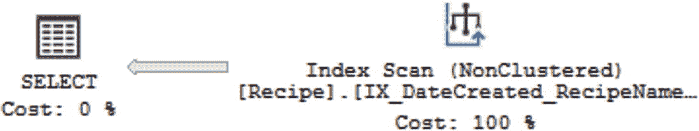

`图 9-1`
来自不可搜索条件的执行计划

当执行计划如此简单时，有时很难直观地了解这些查询的实际性能如何。一个更好的方法是查看与此执行计划相关的属性。`图 9-2` 包含大量信息，但我们将重点关注 **已读取行数 (Number of Rows Read)**。

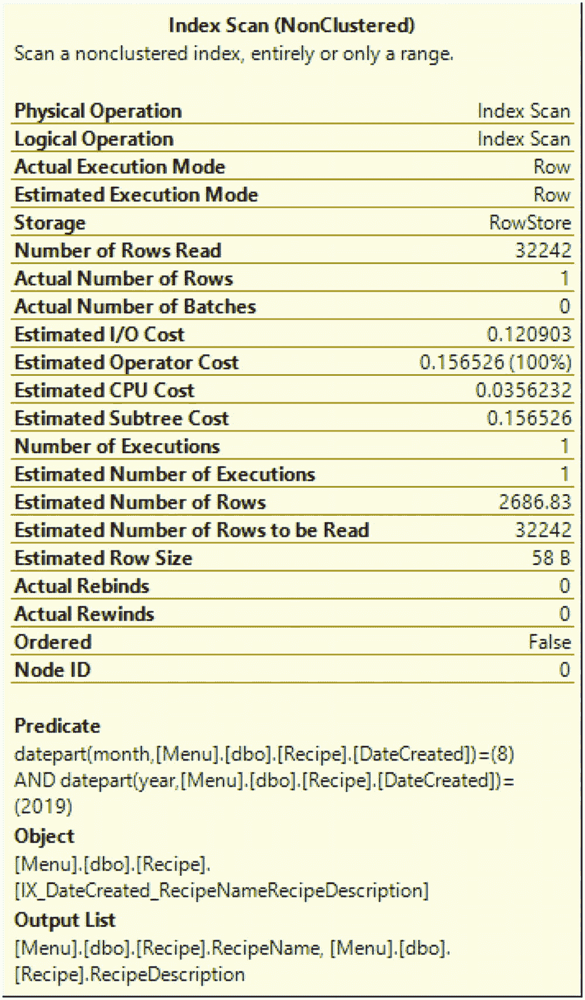

`图 9-2`
来自不可搜索条件的 `索引扫描` 属性

`代码清单 9-1` 中 `索引扫描` 的已读取行数是 32,242。为了更好地判断这个查询的性能表现，我还会编写一个使用可搜索值的查询。在 `代码清单 9-2` 中，我仍然查询 `dbo.Recipe` 表中 2019 年 8 月创建的记录，但我现在使用大于等于 (`>=`) 和小于 (`<`) 来指定一个确切的日期范围。

```sql
SELECT RecipeName, RecipeDescription
FROM dbo.Recipe
WHERE DateCreated >= '8/1/19'
AND DateCreated < '9/1/19'
```

`代码清单 9-2`
使用可搜索条件的查询

虽然这看起来不够简洁或更难阅读，但重点在于编写一个查询，让 SQL Server 能够快速确定哪些记录满足查询中请求的条件。`图 9-3` 显示了 `代码清单 9-2` 中查询的执行计划。

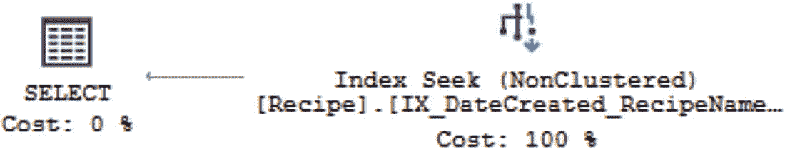

`图 9-3`
来自可搜索条件的执行计划

乍一看，`图 9-3` 中的执行计划与 `图 9-1` 中的执行计划非常相似。在比较外观相似的执行计划时，可以说它们具有相同的 **形状 (shape)**。虽然这些执行计划形状相似，但构成执行计划的具体项目却不同。在 `图 9-1` 中，我们看到有一个 `索引扫描 (Index Scan)`。在 `图 9-3` 中，我们可以看到这个执行计划使用的是 `索引查找 (Index Seek)`。此外，`图 9-3` 中 `SELECT` 的 `索引查找` 之间的连线也比 `图 9-1` 中 `SELECT` 的 `索引扫描` 的连线更细。所有这些都以图形化的方式代表了每个查询的整体性能。不过，我们也可以获取一些事实和数据来比较 `代码清单 9-1` 和 `9-2` 中查询的性能。在 `图 9-2` 中，我们发现实际读取的行数是 32,242。我们可以将这个值与 `图 9-4` 中显示的`实际读取行数`进行比较。

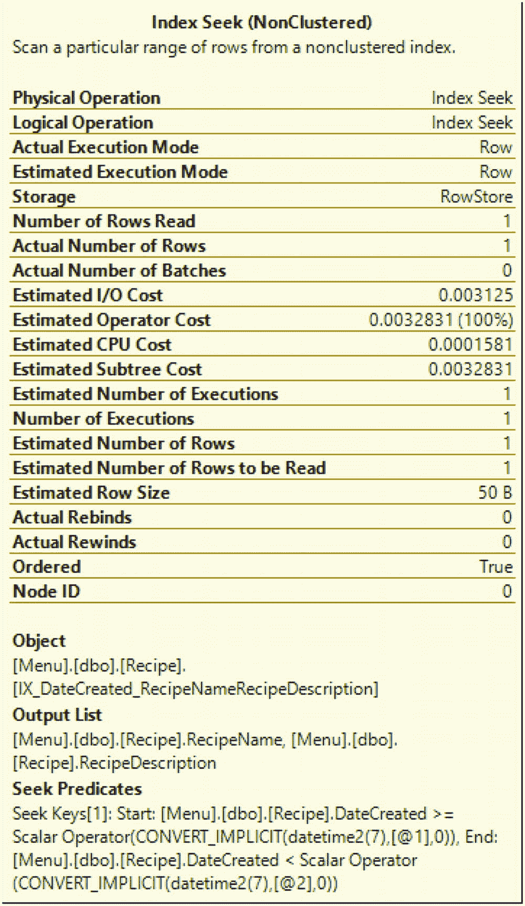

`图 9-4`
来自可搜索条件的 `索引查找` 属性

如 `图 9-4` 所示，`代码清单 9-2` 的实际读取行数是 1。将 `代码清单 9-2` 读取的 1 行与 `代码清单 9-1` 读取的 32,242 行进行比较，哪个查询更高效就变得非常清楚了。

我们还可以查看两个查询的总 CPU 使用率，以了解每个查询的性能表现。如果我同时运行 `代码清单 9-1` 和 `9-2` 中的两个查询，两者执行计划总时间的 98% 都消耗在 `代码清单 9-1` 的查询上。我也可以使用 `SET STATISTICS TIME ON` 来查找 CPU 时间和已用时间。CPU 时间是查询执行在 CPU 上花费的总时间。已用时间是查询执行的总时间。我多次运行这两个查询，发现 `代码清单 9-1` 的平均 CPU 时间是 15 毫秒，平均已用时间是 17 毫秒。而 `代码清单 9-2` 每次的 CPU 时间和已用时间都是 0 毫秒。比较 CPU 时间和已用时间，我们可以清楚地看到 `代码清单 9-2` 的性能优于 `代码清单 9-1`。同样重要的是要注意，如果存在多个 CPU，总已用时间可能少于总 CPU 时间。


#### 隐式转换

SQL Server 中的数据都有其数据类型。这些数据类型将在第 1 章中进一步讨论。使用这些数据类型时，确保保持数据类型一致至关重要。否则，SQL Server 将不得不进行隐式转换。这是指 SQL Server 在后台将一种数据类型转换为另一种数据类型的过程。这可能会给 SQL Server 带来额外的负载。此外，还存在隐式转换失败的风险。我最常见到的情况是，一个标识类型的列主要存储整数值，但偶尔也存储字符串值。

#### SET NOCOUNT ON

你可以对 T-SQL 做许多小的调整，以获得一些微小的性能提升。默认情况下，当你运行 T-SQL 代码时，它会计算受影响的行数并进行报告。计算这些记录的成本可能是额外的几毫秒。因此，对编码标准的一个可能的改进是关闭此功能，尤其是在涉及存储过程时。实现这一点的方法是确保在存储过程内部包含 `SET NOCOUNT ON`。你可以在清单 9-3 中看到这一点。

```
CREATE PROCEDURE dbo.UpdateRecipeMenuType
@RecipeMeal RecipeMealType READONLY
AS
SET NOCOUNT ON
UPDATE rec
SET MealTypeID = meal.MealTypeID
FROM dbo.Recipe rec
INNER JOIN @RecipeMeal recmeal
ON rec.RecipeName = recmeal.RecipeName
INNER JOIN dbo.MealType meal
ON recmeal.MealTypeName = meal.MealTypeName
Listing 9-3
使用 SET NOCOUNT ON 的存储过程
```

当在查询代码执行前包含了 `SET NOCOUNT ON`，存储过程的执行时间可以减少几毫秒。

#### NULL 值

大多数 T-SQL 编码标准的存在是为了帮助提高 SQL Server 的整体性能。然而，有些 T-SQL 编码标准的存在是为了帮助改进查询结果或使人们更容易编写出按预期工作的代码。`NULL` 的问题之一是它不能直观地工作。在 SQL Server 中，`NULL` 被视为未知值。这意味着 `NULL` 既不是 `True` 也不是 `False`。因此，在可能包含 `NULL` 值的字段中，处理这些字段的方式必须有所不同。

此外，`NULL` 值可能表明表的设计效率不高。在陷入这种情况之前，考虑如何设计表可能是有益的。你需要确保表确实需要包含可为空的列。这也与数据的存储方式以及索引的创建方式有关。你需要考虑这些数据将如何被使用。

#### NOLOCK

T-SQL 编码标准还涉及其他因素。其中一些包括你可能认为的最佳实践。一些非常常见的最佳实践包括高度争议性的话题，例如是否或在何时在查询中使用 `NOLOCK` 提示。我特别提到这一点的原因之一是，至少存在两个关于 `NOLOCK` 的截然不同的群体。一方面，许多数据库管理员认为不使用 `NOLOCK` 是一种最佳实践。另一方面，许多开发人员则持相反观点，认为使用 `NOLOCK` 是一种最佳实践。这种观点上的差异是基于数据准确性和性能之间的权衡。

`NOLOCK` 背后的想法是通过减少锁的数量来提高查询性能。在 `NOLOCK` 的情况下，减少的锁活动是针对 `SELECT` 语句的。`INSERT`、`UPDATE` 和 `DELETE` 等操作不受 `NOLOCK` 的影响。然而，当数据修改操作持有 `SELECT` 语句试图访问的同一表上的锁时，在 `SELECT` 语句上使用 `NOLOCK` 可以更快地返回结果。

我们可以通过一个例子来了解这些观点为何是正确的。在清单 9-4 中，我编写了一个查询，在显式事务中将一条记录插入到 `dbo.Recipe` 表中。

```
BEGIN TRAN
INSERT INTO dbo.Recipe
(
RecipeName,
RecipeDescription,
ServingQuantity,
MealTypeID,
PreparationTypeID,
IsActive,
DateCreated,
DateModified
)
VALUES
(
'Baked Acorn Squash',
'Acorn squash with butter and brown sugar',
4,
4,
1,
1,
GETDATE(),
GETDATE()
)
Listing 9-4
向 dbo.Recipe 插入记录
```

在清单 9-4 中，我使用 `BEGIN TRAN` 启动了一个显式事务，但没有指定 `COMMIT` 或 `ROLLBACK`。这将使事务保持打开状态，并在 `dbo.Recipe` 上持有一个锁。为了模拟应用程序性能，我将打开一个单独的查询窗口并运行一个查询，尝试查找此表中在 2019 年 8 月 1 日之后创建的所有记录。你可以在清单 9-5 中看到此查询的示例。

```
SELECT RecipeName, RecipeDescription
FROM dbo.Recipe
WHERE DateCreated > '8/1/19';
Listing 9-5
查询最近的食谱
```

由于清单 9-4 中的查询对 `dbo.Recipe` 持有的锁，我的查询似乎一直在运行。清单 9-5 中的查询正在等待锁被释放，然后才能返回任何数据。为了更快地获得结果，我可以更改 SQL Server 处理表上锁的方式。在清单 9-6 中，我修改了清单 9-5 中的查询，并包含了一个查询提示 `WITH (NOLOCK)`。

```
SELECT RecipeName, RecipeDescription
FROM dbo.Recipe WITH(NOLOCK)
WHERE DateCreated > '8/1/19';
Listing 9-6
使用 NOLOCK 提示查询最近的食谱
```

当我在一个单独的查询窗口中运行清单 9-5 中的查询时，我几乎立即得到了结果。你可以在表 9-1 中看到这些结果的示例。

表 9-1
2019 年 8 月 1 日后创建的食谱

| RecipeName | RecipeDescription |
| --- | --- |
| Lee’s Hamburgers | The best hamburgers |
| Acorn Squash | Acorn squash with butter and brown sugar |

查看前面的结果，你可以看到清单 9-4 中插入的记录包含在结果中。但是，此记录尚未提交到 SQL Server。我可以回滚清单 9-4 中的事务并撤消插入操作。这将导致表 9-1 中的结果不准确。这种查询返回的结果未完全提交到数据库的差异被称为脏读。这是在查询中使用 `NOLOCK` 时的最大风险。在决定应在 T-SQL 代码中使用 `NOLOCK` 之前，请确保业务方（包括你的最终用户）了解使用此提示的潜在风险。


#### 重新编译

除了 `NOLOCK`，另一个经常被考虑的查询提示是 `RECOMPILE`。你可能会遇到一个受到**参数探测**影响的查询，正如第 4 章所讨论的。这意味着该查询创建的执行计划可能对某些参数值表现良好，但当使用其他参数值时，性能可能会显著下降。一个可以轻松快速实施的变通方法就是查询提示 `RECOMPILE`。在清单 9-7 中，你可以看到在创建存储过程以允许其在执行时重新编译时，所需的额外一行。

```sql
/*-------------------------------------------------------------*\
Name:             dbo.GetRecipeAndIngredientByMealTypeID
Author:           Elizabeth Noble
Created Date:     April 20, 2019
Description: Get all recipes and their ingredients by meal type
Sample Usage:
EXECUTE dbo.GetRecipeAndIngredientByMealTypeID 1
\*-------------------------------------------------------------*/
CREATE PROCEDURE dbo.GetRecipeAndIngredientByMealTypeID
    @MealTypeID     INT
WITH RECOMPILE
AS
SELECT
    rec.RecipeName,
    ingr.IngredientName,
    ingr.IsActive,
    ingr.DateCreated,
    ingr.DateModified
FROM dbo.Recipe rec
INNER JOIN dbo.RecipeIngredient recingr
    ON rec.RecipeID = recingr.RecipeID
LEFT OUTER JOIN dbo.Ingredient ingr
    ON recingr.IngredientID = ingr.IngredientID
WHERE rec.MealTypeID = @MealTypeID
ORDER BY rec.RecipeName, ingr.IngredientName;
```

**清单 9-7** 在存储过程中添加 `WITH RECOMPILE`

虽然这是一个快速解决方案，但它会增加服务器的 CPU 负载。我建议，如果可能的话，尝试重新设计查询。如果不行，你可能需要更改存储过程，使其仅针对那些偏离大多数情况的值进行重新编译。

对于你的 T-SQL 编码标准，包含与编写高性能 T-SQL 相关的指导原则非常重要。你还需要包含一些规则，规定哪些操作是允许的或不允许的，以尝试修复性能不佳的 T-SQL。T-SQL 编码标准的最后一部分是一个兜底条款，通常与安全性、面向未来和可维护性相关。

### T-SQL 可用性

拥有鼓励良好数据库设计和解决性能问题的 T-SQL 编码标准是一个好的开始。然而，你还需要一些编码标准来帮助处理 T-SQL 的其他方面。其中一些包括为潜在的安全问题制定 T-SQL 编码标准。还有一些编码标准属于最佳实践，可能不会影响性能。它们可能是为了帮助即使在底层数据结构发生变化时也能保持 T-SQL 功能正常，或者鼓励使用那些使 T-SQL 代码更易于阅读或理解的 T-SQL 命令。

#### 链接服务器

链接服务器是那些可能被忽视作为编码标准一部分的事物之一。看起来你不太可能需要使用链接服务器，但链接服务器总能在你最意想不到的时候显得必要。这就是为什么将关于如何处理链接服务器的规范包含在你的 T-SQL 编码标准中是个好主意。由于使用链接服务器存在普遍的安全风险，建议除非必要，否则不要使用。我建议明确定义什么情况被视为“必要”。这将有助于在你发现自己想要实现链接服务器时减少任何争议。

#### 列定义

编写 T-SQL 的一个关键因素是明确说明你正在使用或影响哪些列。虽然这与确保你只与所需数据进行交互有关，但要求你的 T-SQL 代码显式说明列名还有其他好处。将数据插入 SQL Server 时，可以不说明列名或插入顺序。如果你正在向表中的每一列插入数据，并且插入数据的顺序与表中列的顺序相同，那么不会有任何问题。但是，如果将来从表中添加或删除列，或者更改了列的顺序，这可能会导致存储过程或其他 T-SQL 代码停止工作。因此，一个好的习惯是在所有 T-SQL 语句中显式说明列名。在这些示例中，这特别包括 `SELECT` 和 `INSERT` 语句。

#### `BETWEEN`

还存在一些情况，你有多种编写 T-SQL 代码的选择，并且这些选项的性能看起来都差不多。当你试图获取覆盖一个连续范围的数据子集时，就可能发生这种情况。在这种情况下定义 T-SQL 编码标准不一定能改善 SQL Server 的性能，而更密切地关系到提高 T-SQL 代码的一致性。清单 9-8 展示了如何使用 `BETWEEN` 编写 T-SQL 的示例。

```sql
SELECT *
FROM dbo.Recipe
WHERE RecipeID BETWEEN 100 AND 20000
```

**清单 9-8** 使用 `BETWEEN` 的查询

就可读性而言，你可能会决定所有包含边界值的范围都应使用 `BETWEEN` 来编写。这可能比使用大于等于和小于等于来获得相同范围更可取。

#### 存储过程参数

虽然提高代码可读性很重要，但在处理性能问题时，提高 T-SQL 的可读性有时可能会使调试代码变得更加困难。这种类型的情况可能取决于你如何配置存储过程参数。你可以单独定义每个参数，也可以创建一个用户定义表来传递多个变量。如果你选择使用用户定义表，你的 T-SQL 代码可能更简洁，但今后调试性能问题可能需要更多时间。此外，你的存储过程工作方式也会不同，因为你是在使用表变量，而不是单独处理每个数据字段。

#### `UNION`

有时你会希望将来自两个不同查询的数据组合起来。这种组合涉及将一个数据集附加到另一个数据集。当这两个数据集具有相同数量的列且数据类型相同时，就有可能使用 `UNION` 语句来组合这些数据。使用 `UNION` 的优势在于查询具有可读性，通过阅读 T-SQL 代码可以很容易地看出发生了什么。使用 `UNION` 的挑战在于，`UNION` 的性能可能比每个查询单独执行时的性能更差。除了 `UNION`，还有 `UNION ALL` 功能。`UNION` 和 `UNION ALL` 之间的主要区别在于返回数据的方式。在 `UNION` 语句中，返回的是一个唯一记录集，而在 `UNION ALL` 语句中，结果集中包含每个单独查询的实际记录数。在设计编码标准时，你需要决定是否允许使用 `UNION` 和 `UNION ALL` 语句。你可能还想决定是否存在特定的场景，在这些场景中允许或不允许使用它们。

#### `CAST`

在编写代码时，你可能会遇到需要将一种数据类型的值更改为另一种数据类型的情况。对整数值执行数学函数时，更改数据类型可能很重要。由于 SQL Server 执行数学运算的方式，如果你将一个整数除以另一个整数，你会得到一个整数作为答案。如果你希望 SQL Server 提供一个十进制数作为结果，你需要将数据类型从整数更改为十进制数。同样，你可能希望在 SQL Server 查询中显示一串文本。但是，如果你在字符串中包含一个整数，当 SQL Server 尝试执行查询时会出现错误。然而，如果你将整数更改为 `varchar` 数据类型，你将能够正确解析该字符串。


#### 游标（Cursor）

游标（`Cursor`）在数据库领域一直存在争议。在第 5 章中，我介绍了基于集合的操作，这是`SQL Server`性能最佳的方式。游标的问题在于它们无法利用这些基于集合的操作，这在处理数据时可能导致相当大的开销。雪上加霜的是，游标的编写方式更接近于应用程序代码，而非`T-SQL`。这使得使用游标变得非常诱人，因为理解如何编写代码以获得所需结果可能更容易。与制定`T-SQL`编码标准的其他因素一样，你可能无法完全排除游标。如果是这样，试着制定一些标准，在你认为游标有益的情况下，并将游标使用仅限于这些情况。

#### ORDER BY

人们常常希望`SQL Server`能完全按照应用程序所需的方式获取所有数据。虽然`SQL Server`可以做到这一点，但你需要考虑为完成你所请求的所有工作，对`SQL Server`而言是否值得。当你希望数据为应用程序排序时，就可能出现这种情况。`SQL Server`可以使用`ORDER BY`语句对数据进行排序，但让应用程序对这些数据进行排序可能是资源利用的更好方式。如果你决定这是处理数据排序的方式，那么在你的`T-SQL`编码标准中明确规定不应在`SQL Server`中对数据进行排序，可能是一个好主意。如果你知道某些特定情况无法避免排序，那么你可以在编码标准中明确说明在`T-SQL`代码中允许使用`ORDER BY`的确切场景。

#### Case 语句（Case Statement）

`T-SQL`代码用途广泛。虽然你可能选择将`T-SQL`代码的功能限制在应用程序内，但数据库代码也用于其他目的，例如报告。在许多应用程序中，你可能同时处理事务并允许用户搜索和筛选数据。这类活动可以视为报告活动。通常，用户不希望看到数据的存储方式。例如，你可能有一个包含状态类型的表。一条给定的记录可能随着时间的推移有几个状态。然而，用户可能希望看到一行显示该特定记录的所有状态。这正是你需要使用`Case Statement`的地方，以便将多行转换为多个列。执行此类活动并非`T-SQL`纯粹的事务性用途，你可能希望在编码标准中限制此类行为。

#### TRY… CATCH

在`T-SQL`代码中包含错误处理会很有帮助，可能被认为是你们工作场所的最佳实践。你希望你的应用程序能够优雅地处理失败的存储过程。你可能会遇到的一种不幸情况是，一个存储过程成为死锁的牺牲品。`TRY… CATCH`块可以使该死锁的存储过程能够重新运行或优雅地退出。

```sql
DECLARE @IngredientID         INT = 1;
DECLARE @ServingPortionID     INT = 1;
DECLARE @Cost                 DECIMAL(5,2) = 5.98
DECLARE @IsActive             BIT = 1;
DECLARE @DateCreated          DATETIME = GETDATE();
DECLARE @DateModified         DATETIME = GETDATE();
BEGIN TRY
BEGIN TRAN
INSERT INTO dbo.IngredientCost
(
IngredientID,
ServingPortionID,
Cost,
IsActive,
DateCreated,
DateModified
)
VALUES
(
@IngredientID,
@ServingPortionID,
@Cost,
@IsActive,
@DateCreated,
@DateModified
)
COMMIT TRANSACTION
END TRY
BEGIN CATCH
PRINT 'Insert Failed'
ROLLBACK TRANSACTION
END CATCH
```

一旦你决定了要在`T-SQL`编码标准中包含什么，下一步就是获得将编写`T-SQL`的同事或其他部门的认可。让每个人都同意一套标准可以解决许多问题。首先，它有助于新入职的员工。当他们审查代码时，会看到一致的代码风格。这将使他们能够专注于`T-SQL`在做什么，而不是试图解释`T-SQL`代码是如何编写的。

如果你创建了一个全面且定义良好的编码标准，在脚本审查期间，当出现被认为不是最佳实践的`T-SQL`时，应该会有更少的反复讨论。有了`T-SQL`编码标准，所有相关方都知道什么是允许的，什么代码被认为是不良或不良实践。新员工也会知道哪些`T-SQL`是可以接受的。每个人都可以遵循相同的标准，这让其他人看到编写`T-SQL`的规则是公平的。

#### 概述

编写可管理的`T-SQL`代码是一个值得追求的目标，它建立在可理解、可维护代码的坚实基础之上。第 3 章讨论了如何标准化你的`T-SQL`代码。这在第 9 章通过实现`SQL`编码标准的概念得以延续。这个基础的目的是为你的数据库创建一个一致的代码库。虽然开发一致的代码库有助于提高代码质量，但如果你无法维护`T-SQL`代码，这种效果就会减弱。

开发可管理的`T-SQL`代码涵盖了编写数据库代码的许多不同方面。前一章侧重于编码标准，以此作为指导你和他人编写性能良好的`T-SQL`代码的方法。拥有性能良好且易于阅读的数据库代码不仅可以帮助你的应用程序，还可以帮助你的开发过程。该路径的下一步是考虑如何存储你的代码。

一个选择是考虑使用`source control`（源代码管理）来保存与创建各种数据库对象相关的`T-SQL`代码。你可能想知道为什么源代码管理很重要，或者它能如何帮助改进`T-SQL`代码开发。知道你想实施源代码管理与定义管理源代码管理的过程是不同的。建立关于如何处理源代码管理的指导方针，使你处于一个良好的位置，可以开始在源代码管理中创建你的第一个数据库项目。

### 为何使用源代码控制

维护代码涉及多个方面以确保其可维护性。这包括能够找到任何数据库对象的 T-SQL 代码，并知晓你正在修改的是正确的版本。如果修改并部署了错误的 T-SQL 代码版本，可能会引发严重问题。同时，了解在任何时间点需要部署哪个版本的代码也至关重要。所有这些方面都受益于为你的数据库引入源代码控制。

#### 代码组织与团队协作

将 T-SQL 代码以易于访问的方式集中保存可能是个挑战。源代码控制有助于将你所有的 T-SQL 代码集中、有序地存放一处。虽然你可能认为源代码控制仅适用于软件开发者，但情况已不再如此。让开发团队和数据库管理员协同工作的最简单方法之一，就是采用相似的流程。当你的 T-SQL 代码保存在源代码控制中时，便有额外的工具可用，通过自动拒绝不符合格式或编码标准的代码，来简化编码和脚本审查过程。

#### 协同工作与变更管理

编写 T-SQL 代码时还可能出现其他问题。多人或团队可能需要修改相同的数据库对象。根据你公司处理部署的方式，最终可能会出现数据库对象叠加了多层更改的情况。源代码控制可以帮助管理这些变更，并确保它们被正确实施。它允许你基于最新的代码进行工作。

#### 本地开发与构建验证

在修改数据库代码时，你可以选择在本地工作。如果你使用 SQL Server Data Tools 并将所有数据库代码保存在同一个项目中，你可以构建你的代码以验证其可执行性。这相比于手动将代码部署到 SQL Server 更具优势。作为构建过程的一部分，数据库项目会验证你的视图、函数、存储过程或其他自定义对象中的字段是否存在于数据库中。

#### 获取最新代码版本

对 T-SQL 代码的某些更改可能很复杂，有时你可能在处理关键的数据库对象或代码。开始修改代码前，你需要确保使用的是最新的版本。在使用源代码控制之前，我会从生产环境拉取代码。然而，我正在审查的对象可能自上次生产部署后，已作为某个用户故事的一部分被修改。更糟的是，该代码可能尚未部署到开发环境，或者仍在等待脚本审查。使用源代码控制能让你持续获取到最新的 T-SQL 代码版本。

#### 迭代修改与集中存储

当你进行更改时，你可能需要一个地方来经历修改、测试并重复这一过程，直到达到预期的输出。源代码控制可以将最近保存的 T-SQL 代码拉取到你的本地计算机。然后你可以在本地进行修改。准备就绪后，你可以将更改保存到集中位置。这个代码库就成为了你所有数据库变更的权威记录源。

#### 依赖管理与代码重构

如果你将所有数据库保存在同一解决方案中，可以在存在依赖关系的情况下添加数据库间的引用。这样，如果你修改了基础数据库对象，当任何依赖对象不再正常工作时，你会收到提醒。这在添加、删除或重命名列时尤其有用。有时你可能想要重构一个表或其他数据库对象。如果你的应用程序和数据库保存在同一解决方案中，你可以选择自动重构代码。当你的应用程序中直接保存有 SQL 代码时，这会很有帮助。

#### 变更追踪与代码审查

使用源代码控制的另一个好处是能够快速查找哪些 T-SQL 代码发生了变化。在源代码控制之前，我不得不手动审查整个数据库对象以确认变更。我发现的最佳流程是视觉对比当前生产环境的存储过程与新版本。虽然有一定效果，但很容易遗漏某些内容。我还必须从头到尾审查所有 T-SQL 代码，以确保理解每一行。

在执行脚本审查前，我会通读相关的用户故事以理解预期功能。我曾倾向于只审查与用户故事明确相关的代码行。在将数据库纳入源代码控制后，我可以轻松查看作为审查一部分而更改的所有代码。这让我能快速看到所有的 T-SQL 代码修改。在那些不正式鼓励修复技术债务，但开发者在处理影响相同数据库代码的用户故事时有一定自由度去解决它的环境中，这尤其有帮助。

我还可以使用源代码控制将 T-SQL 代码与之前的版本进行比较。在比较过程中，修改的部分会被高亮显示。更有帮助的是，新增的代码与被修改或删除的代码会用不同颜色高亮。源代码控制的一个缺点是，我不再审查整个脚本。任何未修改的 T-SQL 代码中存在的原有问题都没有机会得到纠正。这既适用于格式，也适用于编码标准。

#### 部署准备与版本管理

能够访问你的 T-SQL 代码使得为部署准备脚本更加容易。源代码控制还有助于防止未经批准的 T-SQL 代码被错误部署。如果没有用于 T-SQL 的源代码控制，准备部署可能很麻烦。我曾与处理部署方式各异的各种公司合作过。我经历过从工单复制脚本并添加到发布页面的部署。我也参与过由开发团队打包和准备 SQL 脚本的部署。两种方法都可行，但各有其缺点。

对于第一种方法，我曾有一次部署中，同一个存储过程在三个不同的用户故事中被修改。到了部署的时候，开发者和我都不知道应该部署哪个版本。对于第二种方法，实际的部署时间更短，并且有错误日志记录。然而，对于这两种方法，都没有单一的数据库代码可信源。在任何一种情况下，如果我需要撤销几个月前的一次部署，都需要花时间筛选部署脚本来找出回滚所需的 T-SQL 代码版本。

### 数据库源代码控制：优势与实践

#### 源代码控制的优势

您需要能够访问不同数据库和部署的脚本，同时跟踪随时间的变化。您可能会修改某些应用程序或报表的`T-SQL`代码，而这些代码可能被新版本覆盖。然而，业务方可能决定希望回退到原始代码。当该代码保存在源代码控制中时，搜索特定数据库对象的不同版本并找到特定实例要容易得多。还有其他时候，一个生产问题可能在原始变更部署后好几个版本才被报告出来。在确定了导致错误的特定`T-SQL`代码后，我可能需要向管理层报告该问题随时间产生的影响。借助源代码控制，我可以节省时间，快速找到变更是在何时实施的。

源代码控制的另一个优势是为您提供了一个额外的工具，以帮助进行灾难恢复。如果您丢失了所有硬件和备份，您的业务需要多长时间才能恢复运行？虽然您可能知道需要定期测试备份，但您最近可能没有机会进行测试。根据贵公司制定的灾难恢复计划以及灾难发生时的情况，这可能意味着您将无法访问当前的生产服务器及所有相关数据。如果发生这种不太可能的情况，您可能会发现自己陷入困境，不知如何让应用程序重新运行。作为最后的手段，如果您的数据库与基础表中的必要数据一起处于源代码控制中，您就有机会让公司的系统重新启动并运行。

#### 如何使用源代码控制

在首次实施源代码控制时，我发现的一件事是在实施之前需要进行内部讨论。我发现数据库团队、开发团队和质量保证团队需要就如何管理代码达成一致。其中一些讨论涉及到不同团队的工作方式。在管理数据库代码的方式上存在差异。这可能包括何时使用本地与集中式存储库、如何将更改保存到源代码控制、如何处理已部署的错误，以及数据库代码应包含哪些内容的指南。

在使用源代码控制之前，您可能编写了`T-SQL`脚本并将其保存在本地。在测试`T-SQL`脚本时，您可能在`SQL Server`机器上本地执行了它们。直到这一点，您的大部分工作都是在本地完成的。之后，您可能在这些脚本准备好部署到开发环境时执行了它们。然后，您可能修改了开发环境（一个更集中的位置）中的数据库架构对象。虽然这是编写代码时一个容易开始的地方，但它确实带来了一些风险。如果脚本保存在您的本地机器上，而您的机器损坏了，您可能丢失了与这些脚本相关的所有工作。还存在这样的可能性：当您将代码部署到开发环境时，它破坏了其他地方的功能。此外，如果您和一位同事同时处理同一个数据库对象，您可能会发现您的更改被同事的代码覆盖了。

这正是在本地编写代码然后将这些更改保存到集中式存储库的优势所在。在很大程度上，这就是源代码控制背后的理念。源代码控制允许您在本地机器上处理代码。您可以创建或更改数据库对象，并且当您在本地构建代码时，您有一个额外的检查点，确保数据库项目能够成功构建。一旦您测试并确认了您的数据库代码，就可以将其签入集中式服务器。这个中央存储库可以接收您以及团队中任何其他有权更改此数据库项目的成员的代码变更。这在您的工作环境、同事的工作环境以及所有代码更改的集合之间实现了一定程度的分离。

您使用的源代码控制软件类型将决定您管理和更新`T-SQL`代码的方式。当我刚开始使用数据库的源代码控制时，`Git`还没有成为主要的源代码控制软件。我从`Team Foundation Server (TFS)`开始。在我工作的公司，我们通常不处理多个分支。数据库项目是我们第一次实现分支的地方。在实施时，所有开发都属于相同的报告结构和部署周期。

您可以对源代码控制进行更改。每次将这些更改保存到中央存储库时，称为一次`check-in`。在`check-in`代码时，您可以为此次`check-in`添加注释。在我的公司，我们通常会注明用户故事编号以及关于变更内容的简要说明。当您开始处理源代码控制中的代码时，可以让代码自动`checked out`。这将使其他人知道您正在更改代码。


就像在 `TFS` 中的签到一样，你也可以在 `Git` 中提交代码。这两种操作都会保存对你当前所用分支所做的更改。虽然功能看似相同，但根据你使用的版本控制软件以及与该软件配合使用的工具，它们的工作方式可能有所不同。`Git` 和 `GitHub` 允许你在更改被永久提交到仓库之前保存它们。暂存更改是指你保存那些不立即提交到仓库的更改的操作。提交前的暂存更改可以通过命令行完成。

当我们讨论如何管理代码签入和分支时，其设计是基于我们内部的开发流程、脚本审查流程和部署周期。我们希望开发者能够频繁地签入 `T-SQL` 代码，并使这些代码在其开发环境中可用。我们也希望确保数据库管理员在代码部署到 QA 环境之前有时间进行审查。我们希望确保 QA 团队不会将时间浪费在测试未经批准的 `T-SQL` 代码上。

由于开发和 QA 之间存在这种隔断，我们选择专门为经过脚本审查并获批的代码创建一个分支。作为脚本审查流程的一部分，数据库管理员负责合并代码。这个流程存在一些挑战。尽管所有代码本应在同一个 Sprint 内部署，但有时项目合并的顺序与它们在开发分支中的创建顺序不一致。这导致文件被覆盖。在团队拆分、开发周期错开之后，所有这些都变得更加难以管理。

随着越来越多的公司希望采用敏捷、看板、Scrum、持续集成或持续交付中的任何组合，拥有一个更灵活的源代码控制解决方案变得越来越重要。这个新解决方案需要允许多个不同的团队同时处理同一代码库，而不会对部署产生负面影响。这正是 `Git` 流行起来的原因。

使用 `Git` 的理念在于，你可以更好地控制代码合并的方式和时机。在我的公司，每个团队很少与其他团队开发相同的应用程序，因此在代码管理方面的冲突很少。然而，几乎每个应用程序都依赖于共享数据库。此外，数据库团队经常在相同的数据库上工作。不同团队之间也存在不同的部署周期。这正是你可以看到 `Git` 强大之处的地方。

不幸的是，使用源代码控制仍然存在挑战。这些挑战对于 `TFS`、`Git` 或任何其他版本控制软件都存在。使用版本控制在历史上并非数据专业人士的常见做法。虽然做出这种改变有其好处，但在使用和管理源代码控制方面也存在学习曲线。正如许多事情一样，顺利的情况工作良好，但当涉及到更复杂的场景时，源代码控制可能会变得让人难以招架。

`Git` 中有些功能需要比使用 `TFS` 更多的培训。正是这些功能使得 `Git` 的源代码控制更加灵活。因此，虽然增强的功能很好，但它也会使软件的使用更加复杂。有一个主仓库，可以在其中保存一组代码。如果你使用 `SQL Server Data Tools`，你可以选择是每个数据库项目拥有自己的仓库，所有数据库共享同一个仓库，还是所有应用程序和数据库共享同一个仓库。这些决策不仅基于偏好和期望的功能。正如你将在第 12 章看到的，你组织仓库的方式也将决定你的代码如何部署。

在仓库内部，存在一个或多个分支的概念。应该有一个主分支。可以把它想象成，如果你需要部署这些更改，你会定期去查看哪一组代码。这个分支被称为 `master`。任何时候你想对 `master` 分支进行更改，通常最好创建一个新分支来编写你的 `T-SQL` 代码。这样可以确保主分支不受正在开发且尚未准备好部署的代码影响。通过这种方式，`master` 分支可以与当前部署到生产环境的代码保持一致。

当你创建一个分支时，它会获取当前仓库的一个副本。你可以使用这个副本并进行任何必要的更改。使用 `Git` 时，你可以决定每个人都在自己的分支上工作。这有助于每个人独立开发代码，而不受他人代码的影响。虽然这对于开发和测试特定功能是一个好处，但这同时也是源代码控制可能变得复杂的地方。

由于这些签入是按分支发生的，你可能会遇到需要在同一个部署中部署两个不同分支的情况。这时你会希望尝试合并这些代码。为了将这些代码合并在一起，你需要获取分支中的更改，并将这些更改添加回 `master` 分支。将一个功能分支合并到 `master` 分支的操作称为 `merge`。作为这个 `merge` 过程的一部分可能发生的一个方面称为冲突。当许多人在同一时间段内处理同一个数据库对象，或者之前的功能分支与 `master` 分支的合并被延迟时，就可能发生冲突。请务必与你的开发团队合作，以更好地理解如何避免合并冲突以及如何解决它们。

一件发生得比我们有些人愿意承认的更频繁的事情是，代码部署后未能按预期工作。我遇到过在部署期间就发现那些缺陷的情况。其他时候，这些缺陷直到部署后几天、几周或几个月才被发现。无论哪种情况，关键是要找出如何快速将数据库恢复到功能更佳的状态。我曾与开发人员和 QA 讨论过在部署当晚如何处理这个问题。缺陷可以通过 `T-SQL` 脚本来手动修复。根据你管理数据库代码部署的方式，这个缺陷修复有可能在未来的部署中被撤销。如果你将缺陷修复放入源代码控制，你可以确保这个修复在将来不会被撤销。


#### 回滚策略与热修复方法

因此，我们决定采用所谓的“前滚”策略。如果我们能快速找到并解决问题，那么我们会将这些更改签入源代码管理，并通过各个环境部署上去。这种前滚策略只允许在部署当晚采用。当我们采用该策略时，其概念是部署所有已合并到主分支的代码。如果你选择部署的数据库项目版本不是最新版本，你将无法使用此方法。

我们还采用了一种使用热修复的方法。这些是由于应用程序功能严重缺失而需要尽快进行的更改。由于开发中可能存在各种项目，我们不能直接部署最新的数据库代码。在这些情况下，我仍然会将修改后的`T-SQL`代码签入源代码管理。该代码可能已部署到开发环境并在我们的`QA`环境中测试过，但代码将手动部署到生产环境。其概念是下次部署数据库代码时，该数据库对象将已经存在。

设计如何保存数据库代码还涉及与开发、`QA`和发布管理团队的沟通。现有的各种方法各有优缺点。你可以将所有数据库项目与所有应用程序代码保存在同一个解决方案中。虽然这可能会使你的项目构建时间更长，但如果创建了正确的关系，你可以确保数据库的更改不会影响应用程序的功能。根据公司中存在的应用程序数量，这可能是一项艰巨的任务。也可以选择将所有数据库保存在同一个解决方案中。如果你有跨数据库依赖关系，此方法将有助于保护你的数据库。当你对一个数据库对象进行更改，并且不确定这些更改是否会破坏另一个数据库的功能时，这尤其有用。最后一个选项是每个数据库创建一个解决方案。此方法的优点是可以独立开发每个数据库。缺点是，你可能对数据库所做的更改会破坏另一个数据库的功能。

在将第一个数据库置于源代码管理之前，我建议与公司的其他团队讨论本节中的主题。你需要确保在编写、测试和保存数据库代码更改方面，每个人都达成一致。在如何修复已部署的数据库代码方面，也要让其他人参与进来。同时考虑你希望你的数据库项目之间以及它们与你的应用程序如何交互。一旦你考虑了所有这些因素，就可以创建数据库项目了。

#### 设置源代码管理

既然你已决定为数据库实施源代码管理，并且已经就如何设置数据库项目制定了一些通用准则，那么你现在可以设置源代码管理了。首先要做的是让你使用的`IDE`连接到源代码管理。连接到版本控制后，你需要创建一种方式来存储数据库的源代码管理。在有了数据库源代码管理的位置后，你需要弄清楚如何制作和保存数据库代码的更改。

在本节中，我将使用`Visual Studio 2017`、`SQL Server Data Tools`、`Git`和`GitHub`将数据库纳入源代码管理。如果你使用的是`Visual Studio 2015`或`2017`，你将无需任何额外步骤即可连接到`TFS`。如果你想在这两个版本的`Visual Studio`中使用`Git`和`GitHub`，则需要手动安装`GitHub`扩展。截至本文撰写时，以下`URL`可以指导你完成此过程：`https://social.technet.microsoft.com/wiki/contents/articles/38935.visual-studio-2017-install-and-use-GitHub-extension.aspx`。你可以通过使用团队资源管理器将`Visual Studio`连接到版本控制，如图`10-1`所示。


图`10-1`

将`Visual Studio`连接到版本控制

在此示例中，我已将`Git`扩展添加到`Visual Studio`，并准备连接到`GitHub`。如果你还没有`GitHub`账户，可以通过选择“注册”来创建一个。就我而言，我已经有一个`GitHub`账户。一旦我选择“连接…”，我会得到一个弹出窗口，如图`10-2`所示。


图`10-2`

创建`Git`仓库

在此步骤中，我正在创建一个`Git`仓库并将其连接到我的`GitHub`账户。我决定将仓库命名为`MenuDatabase`。我给仓库的描述是“`Database project for Menu`”。我还指定了本地代码仓库应保存的本地路径。我为`Git`忽略文件选择了`Visual Studio`的默认值。我还选择了`GNU General Public License v2.0`作为许可证。详细讨论`Git`忽略文件或可用的许可选项超出了本书的范围。我指定的最后一部分是私有仓库。公共仓库和私有仓库的主要区别在于你是否希望其他人能够访问、下载和对你的代码提出建议。

现在我已经创建了一个新仓库并将其链接到我的`GitHub`账户，我可以看到如图`10-3`所示的信息。


图`10-3`

团队资源管理器中的仓库

你可以在团队资源管理器中看到，我既有一个在`GitHub`上的仓库，也有一个本地`Git`仓库。`Visual Studio`会建议你可能想要安装的一些第三方工具。对话框窗口如图`10-4`所示。


图`10-4`

为`GitHub`安装第三方工具

你应该只需要下载一次这些第三方工具。安装第三方工具时，请检查并确认它们来自可信来源。安装此第三方工具将使你能够访问`GitHub`操作，如图`10-5`所示。

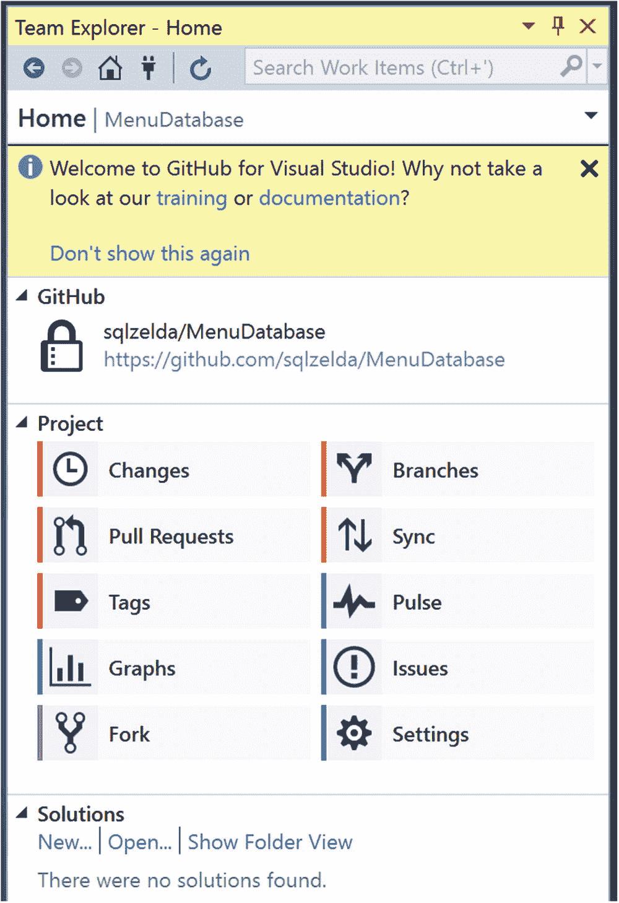

##### 图 10-5 GitHub 操作菜单

可用的操作包括变更、分支、拉取请求和同步等。

在开始使用这些 GitHub 操作之前，我想先创建一个新的数据库项目。在创建此数据库项目之前，我已经安装了 SQL Server Developer Tools。要创建数据库项目，请从 `File` 菜单中选择 `New`，然后选择 `Project`。图 10-6 显示了将弹出的对话框。

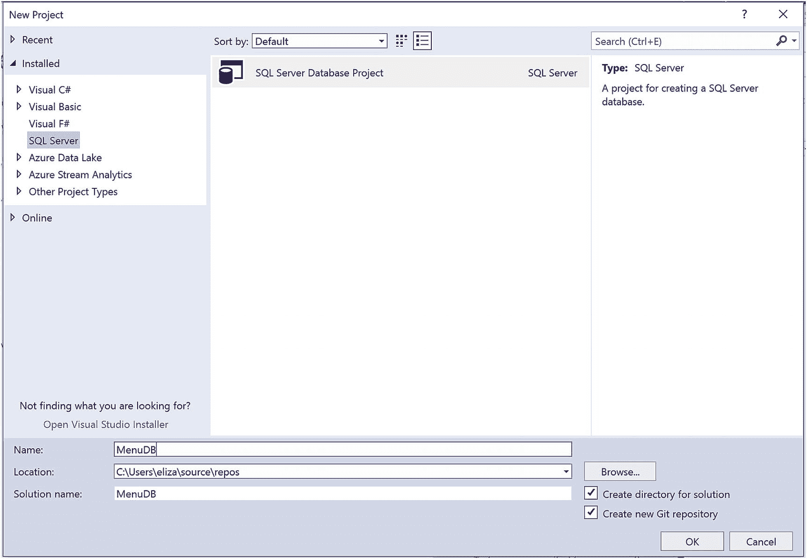

##### 图 10-6 在源代码管理中创建新项目

创建空白数据库项目时，您需要指定名称、本地文件路径和解决方案名称。您还需要指示是否需要为解决方案创建目录，以及是否应将此解决方案添加为新的 Git 仓库。您可以在图 10-7 中看到新的数据库项目。

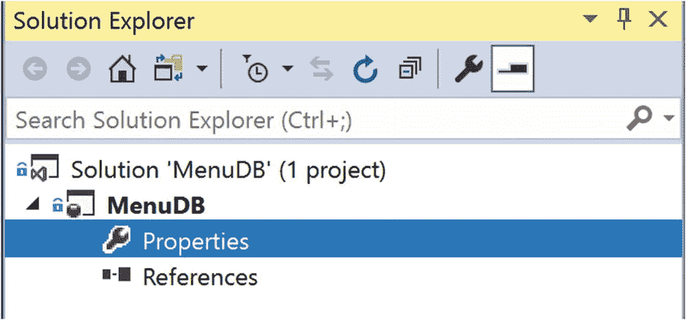

##### 图 10-7 数据库项目的解决方案

如前所述，我们有一个数据库项目的解决方案。但是，此时还没有数据库。在本书前面的章节中，我一直在使用 `Menu` 数据库。我可以将 `Menu` 数据库添加到源代码管理中，如图 10-8 所示。

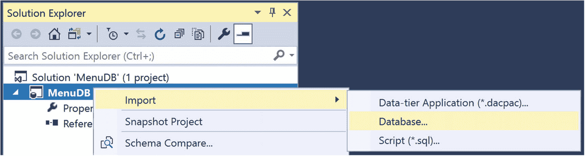

##### 图 10-8 将数据库添加到项目

您可以选择导入一个数据库、一个 T-SQL 脚本或一个数据层应用程序（DACPAC）。在我的示例中，我选择了一个现有数据库进行导入。选择此选项后，会弹出一个对话框，如图 10-9 所示。

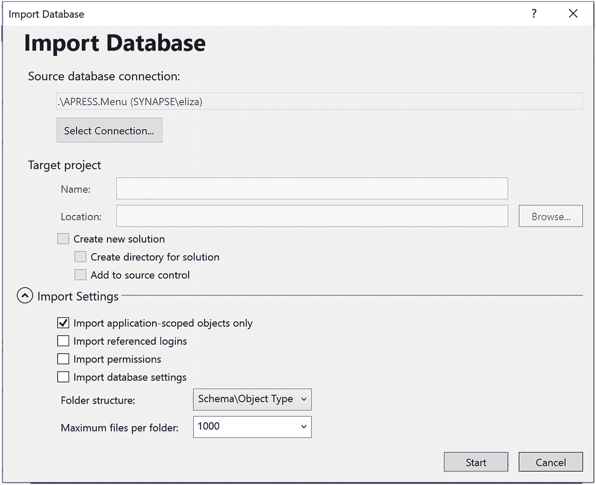

##### 图 10-9 连接到 SQL Server、选择数据库并配置设置

我保持了设置简单。我创建了一个到 SQL Server 实例和所需数据库的连接。我还指定只导入应用程序作用域的对象，并指定了整体的文件夹结构。创建此项目后，您可以在 `Solution Explorer` 中看到新的数据库对象，如图 10-10 所示。

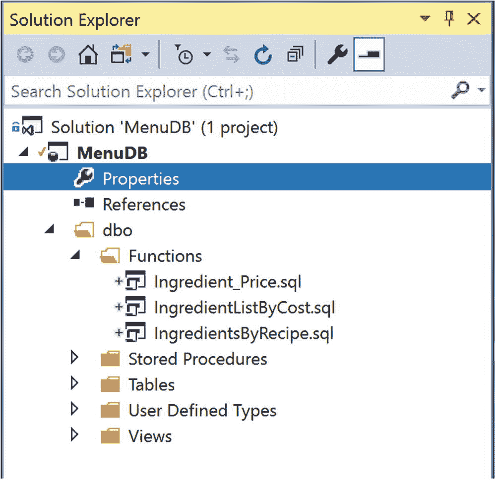

##### 图 10-10 导入数据库后的数据库项目

函数旁边的加号表示新添加的项目。这些项目在数据库项目中以前并不存在。项目名称 `MenuDB` 旁边的红色复选标记表示项目已发生更改。

这些对象已被添加到本地 Git 仓库中。但是，与 GitHub 仓库关联的状态是什么？您可以在图 10-11 的 `Local Git Repositories` 下看到它。

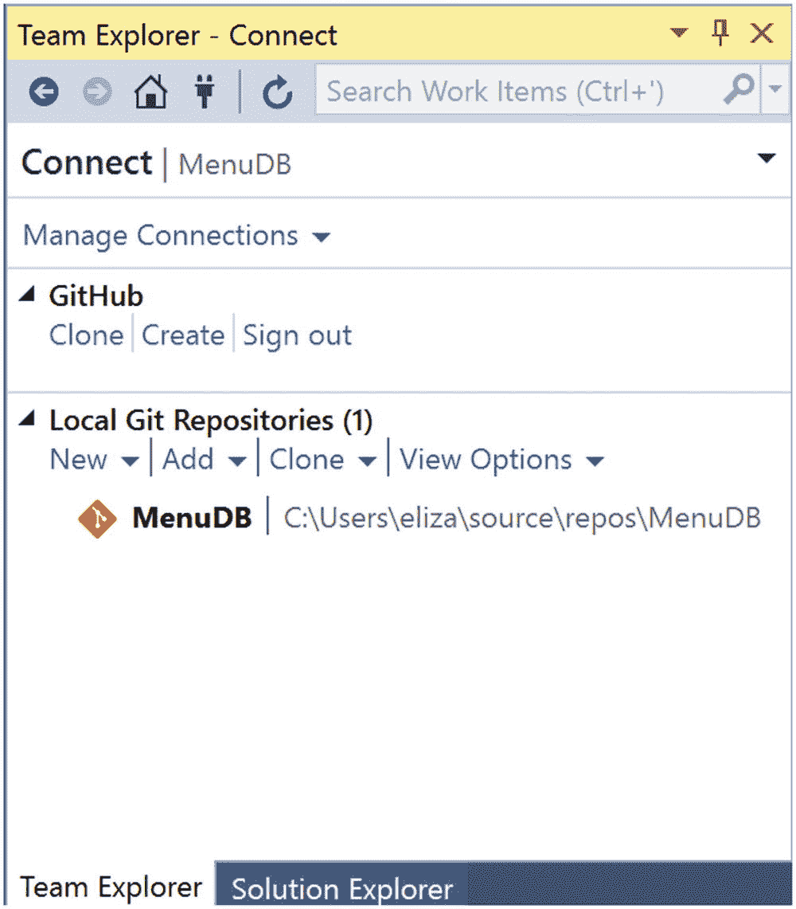

##### 图 10-11 MenuDB 作为本地 Git 仓库

我还可以看到这个新的数据库项目尚未在 GitHub 中创建。通过转到图 10-12 中的操作菜单并选择 `Changes`，我可以开始创建 GitHub 仓库的过程。

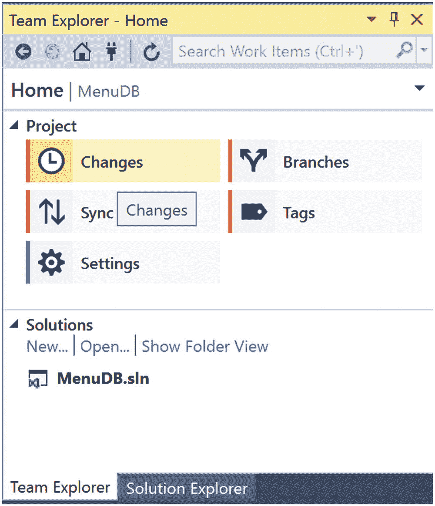

##### 图 10-12 访问对 GitHub 的更改

用于提交更改的窗口如图 10-13 所示。

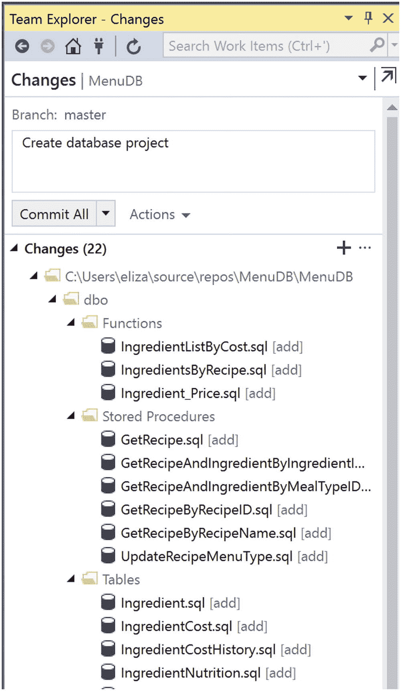

##### 图 10-13 提交到本地 Git 仓库的更改菜单

我可以选择提交全部或部分更改。在这种情况下，我正在创建一个新项目，我希望所有导入的代码都能通过一次提交保存。这将是仓库未来的起点。

提交这些项目后，我会收到一条消息，确认提交已成功。您可以在图 10-14 中看到这一点。

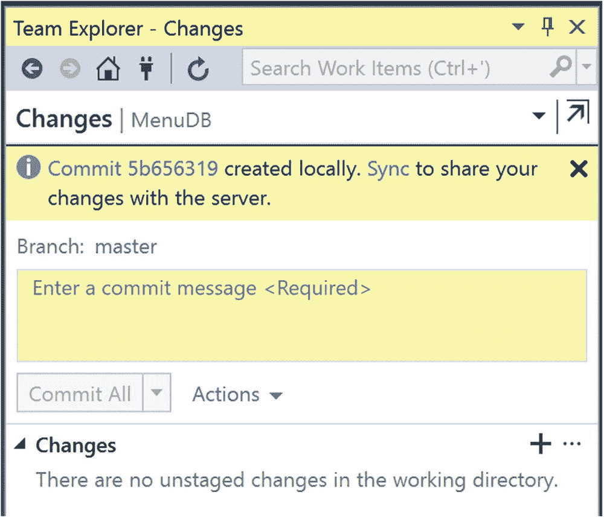

##### 图 10-14 成功提交的确认窗口

除了提交之外，还有一条消息指示我可以将我的更改同步到 GitHub 服务器。在图 10-15 中，您可以看到单击同步这些更改的超链接后出现的窗口。

我可以选择 `Azure DevOps` 或 `GitHub`。对于 GitHub，有一个选项是 `Publish this repository` 或 `Push this repository to Remote Repository`。对于我的示例，我将 `Publish this repository` 到 GitHub。发布此仓库的操作将创建一个新仓库。我已在 GitHub 上将新仓库名称指定为 `MenuDB`。我为 GitHub 仓库提供了描述。我还指定这应该是一个私有仓库。一旦我选择发布，这些更改将被同步到 GitHub，并对我自己以及添加为此仓库贡献者的任何其他帐户可用。

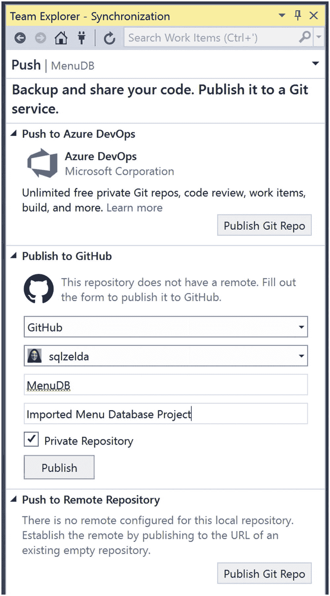

##### 图 10-15 选择同步解决方案的位置

值得注意的是，前面显示的选项与我们在图 10-3 中能够选择的选项相同。`Synchronization` 子菜单将更新并显示仓库已成功创建，如图 10-16 所示。

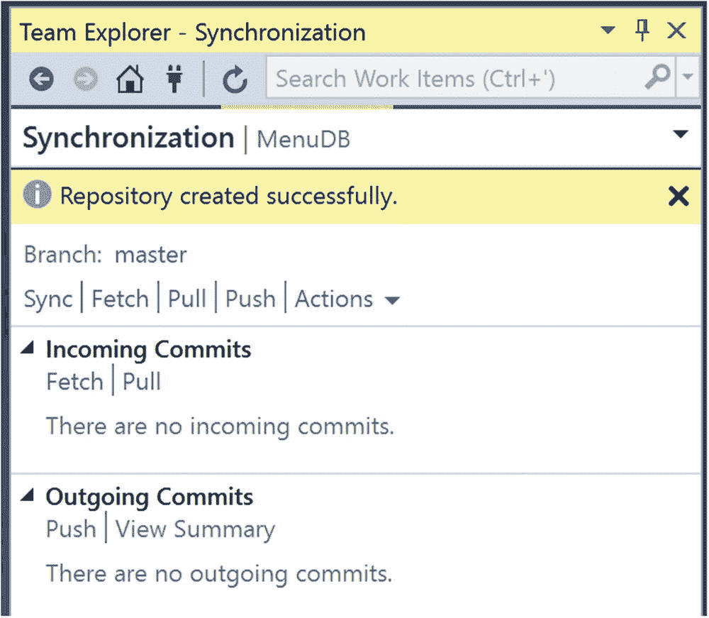

##### 图 10-16 数据库项目已添加到 GitHub 仓库

您可以看到仓库已成功创建。此窗口还显示此项目没有传入或传出的提交。一旦创建了仓库，您就会希望习惯在开始更改数据库对象之前拉取传入的更改。从集中式 Git 仓库拉取更改将使您在开始更改之前拥有最新的代码。拉取传入的提交后，您就可以推送传出的提交。我也无法提交任何更改，因为所有更改都已提交。

在设置新的数据库项目和仓库时，会创建多个项目。我已经确认我有一个本地 Git 仓库。在前面的步骤中，我已经将同一个仓库发布到 GitHub。现在我既有一个本地仓库，又有一个用于数据库项目的远程仓库。之前在图 10-13 中，我将所有数据库代码提交到了 `master` 分支。我还收到了提交成功的确认，如图 10-14 所示。查看图 10-17 中的 `Solution Explorer`，您可以看到许多数据库对象旁边的图标已经改变。之前在图 10-10 中，您可以看到函数名旁边的绿色加号和项目名称旁边的红色复选标记。

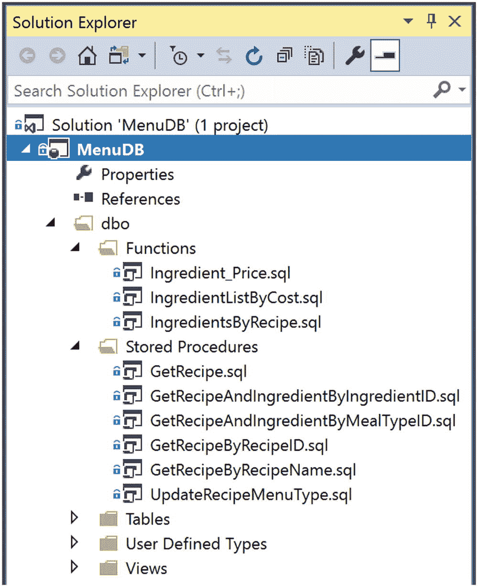

## 图 10-17


