# 数据库项目加入源代码控制后

现在所有项目都已提交，你可以在所有项目旁边看到蓝色锁图标。这表示所有项目都已正确签入源代码控制。

实施源代码控制是让你的数据库项目更易于管理的重要一步。了解源代码控制为何不仅能帮助你，还能帮助你说服他人，在你公司内推动源代码控制计划，这点很重要。你也已准备好联系其他部门，并制定相关流程，确保每个人都对实施源代码控制感到安心。我还带你了解了将数据库添加到源代码控制的初始步骤。这是一段旅程的开始，过程中可能会有些小波折，但从长远来看能为你节省时间。既然你已经实施了源代码控制，就为管理 T-SQL 代码的后续步骤做好了准备。下一章将重点介绍可用于测试 T-SQL 代码并确认你是否符合各种编码标准的多种方法。

## 11. 测试

当你需要编写或修改一些 T-SQL 代码时，可能很想直接开始写代码。在许多情况下，必要的数据库代码足够简单，无需进行额外分析。但最终总会遇到这样的场景：被查询的数据或 T-SQL 代码足够复杂，以至于你希望确保你的代码能按预期工作。在这些时候，你可能会发现自己想要测试你的 T-SQL 更改。虽然你可以随时开始测试 T-SQL 代码，但你可能会发现，在处理复杂场景之前尽早养成这种习惯会很有帮助。

你可能已经准备好开始测试你的代码，但不知道从哪里开始。你将进行何种类型的测试取决于你想要实现的目标。你可以实施测试来确认单个功能是否按预期工作。也可以测试两个或多个代码块之间的交互。在试图确认对 T-SQL 代码的更改所产生的下游影响时，这种类型的测试也很有用。此外，还可以进行测试以帮助确保你编写的代码符合你的编码标准。虽然任何类型的测试都很有价值，但最显著的好处来自于同时运用这三种测试。

### 单元测试

你接到了下一个任务，并准备好开始编写一些 T-SQL。你也想对你的代码实施功能测试。当你测试单个代码块时，这被称为单元测试。了解什么是单元测试以及为何应该使用它们，可以帮助提高你的 T-SQL 代码质量。一旦你了解了什么是单元测试，你就会想要学习在何时进行单元测试是有益的。这将为你开始为 SQL Server 编写你的第一个单元测试做好准备。

单元测试的概念很简单。你有一个想要对你的 T-SQL 代码进行的单个更改。单元测试允许你测试并确认单个代码块的功能。单元测试的一个常见方法是：创建一个失败的场景，编写 T-SQL 代码，运行单元测试，并重复直到单元测试通过。这就是测试驱动设计。无论你是在实现新功能还是在解决 T-SQL 中的错误，单元测试都可以帮助验证你的代码。

在创建单元测试时，你需要以与平时编写 T-SQL 代码不同的方式进行思考。我们创建单元测试是为了确认我们编写的代码能按预期工作。为了验证你的 T-SQL 代码是否按预期工作，你会希望你的单元测试显示“通过”。在创建单元测试时，你第一次执行单元测试应该“失败”。从一个失败的单元测试开始，将表明所需的功能尚不存在。

运行单元测试有许多不同的实现方式。单元测试可以在 Visual Studio 内部编写。你也可以使用一个免费的第三方单元测试框架，该框架在 T-SQL 中创建数据库对象。另一个选择是使用付费的第三方工具来创建和运行你的单元测试。每种选择都有其优缺点。

决定如何实现单元测试的另一个因素是你希望如何运行你的单元测试。根据你的环境，你可能会决定更愿意手动运行你的单元测试。然而，你也可能会决定你想要一种自动化的方式来运行你的单元测试。开销最少、最简单的方法是手动运行你的单元测试。这可以通过存储过程或图形用户界面来完成。

你可以使用单元测试来验证数据库架构中的几乎所有内容。这些单元测试中的大多数将用于测试数据库对象的功能，例如存储过程、视图和函数。我可能有偏见，但我希望你的存储过程远多于视图或查询。如果你现在还没有任何单元测试，请不要担心。你可以在需要时创建单元测试。这可能意味着你的单元测试没有完整的代码覆盖，但这可以防止你花时间为不经常修改的代码实现单元测试。

在我编写第一个单元测试之前，我需要知道我将要开发什么功能。就我而言，我需要修改存储过程 `dbo.GetRecipe`，使其只显示处于活动状态的食谱。当我刚开始对我的 T-SQL 代码进行单元测试时，我会手动运行我的单元测试。在这种情况下，我会查找当前不处于活动状态的食谱。我可以创建一个单元测试来检查非活动记录。如果我的单元测试找到任何非活动记录，我的单元测试将失败。如果我的单元测试没有找到任何非活动记录，我的单元测试将成功或通过。我会运行清单 11-1 中所示的查询来查找任何不处于活动状态的食谱。

```sql
SELECT
    RecipeID,
    RecipeName,
    IsActive
FROM dbo.Recipe
WHERE IsActive = 0;
```

*清单 11-1 查找非活跃食谱*

运行此查询时，我可能会得到表 11-1 中显示的结果。

*表 11-1 非活跃食谱*


| RecipeID | RecipeName | IsActive |
| --- | --- | --- |
| 2 | Lee’s Burgers | False |
| 5 | Brandin’s Fried Rice | False |

一旦我从表 11-1 中获得结果，我就知道哪些记录会受到 `dbo.GetRecipe` 存储过程修改的影响——它现在只返回活跃的食谱，而不是所有食谱。未经修改的存储过程如代码清单 11-2 所示。

```sql
/*-------------------------------------------------------------*\
Name:             dbo.GetRecipe
Author:           Elizabeth Noble
Created Date:     April 20, 2019
Description: Get a list of all recipes in the database
Sample Usage:
EXECUTE dbo.GetRecipe
\*-------------------------------------------------------------*/
CREATE OR ALTER PROCEDURE dbo.GetRecipe
AS
SELECT
    RecipeID,
    RecipeName,
    RecipeDescription,
    ServingQuantity,
    MealTypeID,
    PreparationTypeID,
    IsActive,
    DateCreated,
    DateModified
FROM dbo.Recipe;
```

代码清单 11-2
原始存储过程

执行此存储过程时，我期望看到表中所有食谱都被返回。执行该存储过程后，我得到了如表 11-2 所示的记录。

#### 表 11-2
所有食谱

| RecipeID | RecipeName | IsActive |
| --- | --- | --- |
| 1 | Spaghetti | True |
| 2 | Lee’s Burgers | False |
| 3 | Spinach Frittata | True |
| 3 | Roasted Chicken | True |
| 4 | Dinner Rolls | True |
| 5 | Brandin’s Fried Rice | False |

你可以从表 11-2 中看到，执行存储过程时，活跃和不活跃的食谱都被返回了。这样，我们就创建了一个基本的单元测试（即代码清单 11-1 中的查询），并确认了当运行代码清单 11-2 中的存储过程时，该测试失败了，因为结果集中也包含了不活跃的记录。

下一步是弄清楚如何让单元测试通过。对于此示例，改动很简单。我需要在存储过程的末尾添加一行，使其只返回活跃的食谱，如代码清单 11-3 所示。

```sql
/*-------------------------------------------------------------*\
Name:             dbo.GetRecipe
Author:           Elizabeth Noble
Created Date:     April 20, 2019
Description: Get a list of all recipes in the database
Sample Usage:
EXECUTE dbo.GetRecipe
\*-------------------------------------------------------------*/
CREATE OR ALTER PROCEDURE dbo.GetRecipe
AS
SELECT
    RecipeID,
    RecipeName,
    RecipeDescription,
    ServingQuantity,
    MealTypeID,
    PreparationTypeID,
    IsActive,
    DateCreated,
    DateModified
FROM dbo.Recipe
WHERE IsActive = 1;
```

代码清单 11-3
修改后的存储过程

创建此存储过程后，你可以执行它来确认新功能是否按预期工作。在这种情况下，你需要验证 `RecipeID` 为 2 和 5 的记录不再被返回。根据前面的代码，我们预计代码清单 11-3 的结果集将与表 11-3 所示内容匹配。

#### 表 11-3
所有活跃的食谱

| RecipeID | RecipeName | IsActive |
| --- | --- | --- |
| 1 | Spaghetti | True |
| 3 | Spinach Frittata | True |
| 3 | Roasted Chicken | True |
| 4 | Dinner Rolls | True |

我们已经确认，我们对代码清单 11-3 所做的修改已正确地将不活跃的食谱从结果集中移除。

这种测试代码的方法是一个良好的起点，但可能难以持续遵循。你可能有一些能以各种状态存储数据的表。例如，如果我想根据促销食材找到关于食谱制作频率的信息，测试结果的逻辑就会变得更加复杂。这时，使用第三方工具的好处就显现出来了。

为你的数据寻找单独的样本集可能既耗时又容易出错。此外，你可能会花费更多时间试图找到合适的测试用例，而不是编写或测试 T-SQL 代码。另一个挑战是，由于手动在数据库中查找现有测试数据需要花费时间和精力，你可能会跳过重要的测试用例。然而，使用 T-SQL 在数据中查找特定测试用例并非你唯一的选择。你可以手动插入测试数据并对插入的记录执行测试。这种方法可以让你确定你所测试代码的最佳场景。在大多数情况下，这些样本数据不会保留在一个集中位置。每次测试新功能时，你可能仍需重写特定的示例。

有不同类型的单元测试工具可供你选择。单元测试可以通过向数据库添加额外的 T-SQL 对象来处理。另一个选择是付费使用能帮助管理单元测试的第三方工具。还有一种选择是使用 Visual Studio 来创建和管理单元测试。虽然所有这些选项都是有效的，并且各有优点，但我想专注于通过 Visual Studio 原生创建单元测试所能实现的功能。图 11-1 显示了在 Visual Studio 中创建单元测试的第一步。

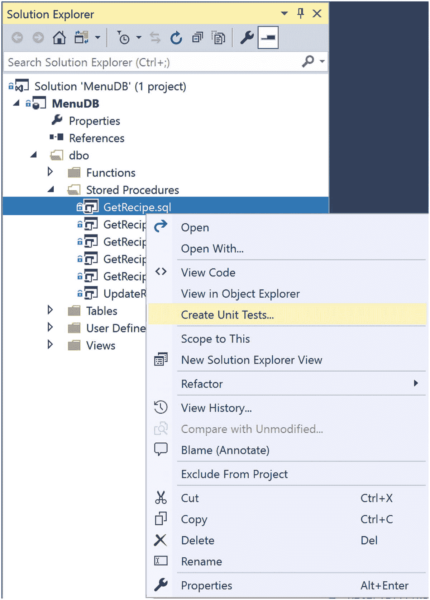

#### 图 11-1
创建单元测试

一旦你选择了创建单元测试的选项，Visual Studio 将引导你完成创建第一个单元测试的过程。将打开一个对话框，如图 11-2 所示。

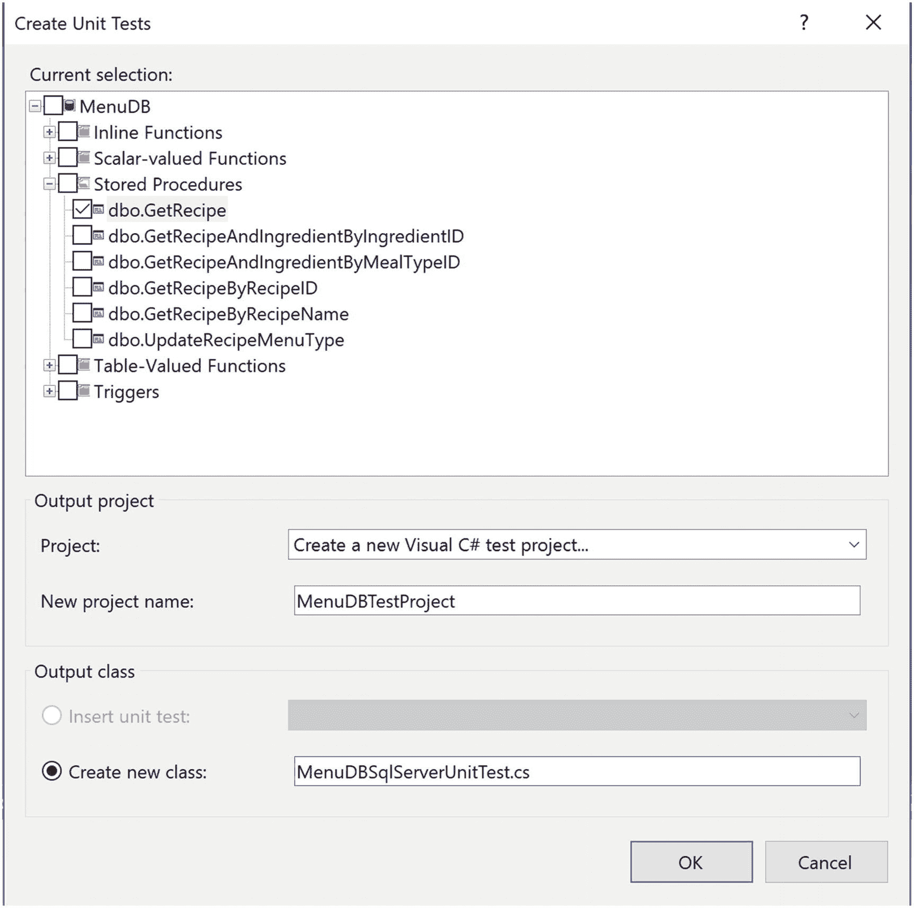

#### 图 11-2
创建单元测试对话框

窗口的顶部区域允许我选择应使用哪些对象来创建单元测试。对于此示例，我将为 `dbo.GetRecipe` 存储过程创建一个新的单元测试。这也是我为此数据库项目创建的第一个关联的单元测试。我可以选择创建一个新的 Visual C# 测试项目。然而，你无需了解 C# 即可开始在 Visual Studio 中创建你自己的单元测试。我已为这个新项目命名，并决定创建一个新类。我可以将此类用于未来的其他单元测试。

在对话框窗口上选择确定后，我将得到另一个弹出窗口，如图 11-3 所示。

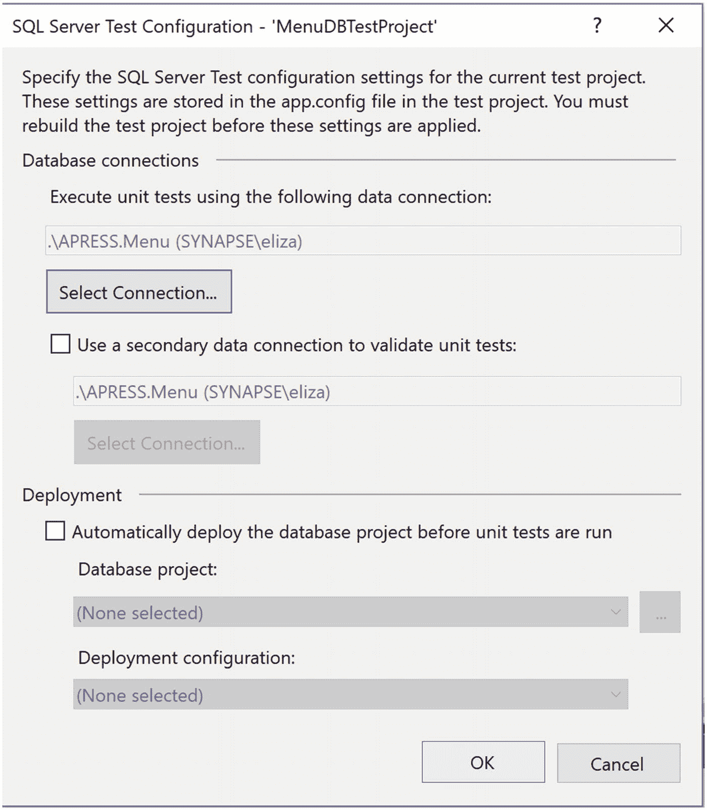

#### 图 11-3
设置连接字符串

这里可以设置几个选项。其中大部分与选择用于执行单元测试的数据源有关。我选择了预先存在的 Menu 数据库来运行单元测试。我可以选择在运行单元测试之前自动部署数据库。不过，我更倾向于仅在单元测试通过时才部署数据库。

设置好连接字符串并配置好其他设置后，Visual Studio 会向现有解决方案中添加一个新项目。你可以在图 11-4 中看到你的数据库项目以及单元测试项目的外观。

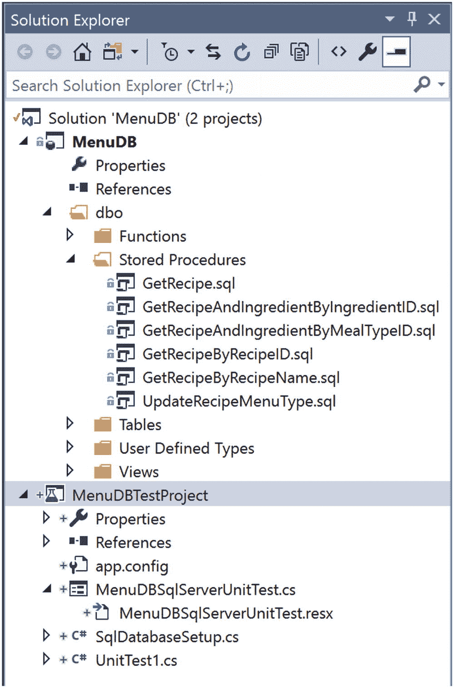

#### 图 11-4
源代码管理中的单元测试


在图 11-4 中，原始的 `MenuDB` 项目中的对象均未被更改。你可以看到为单元测试项目创建的所有对象都已准备好可以签入源代码管理。单元测试项目创建后，Visual Studio 中将打开一些额外的窗口。其中一个窗口允许你设置测试条件。默认情况下，将为 `Inconclusive`（结果未定）配置一个测试条件。你可以保留或移除此测试条件。在图 11-5 中，我已选择了可用测试条件的下拉列表。

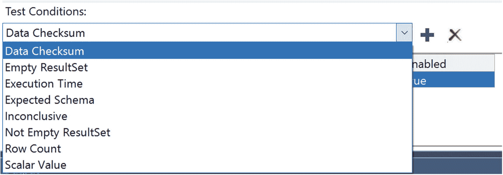

图 11-5：可用的单元测试选项

我仍在尝试创建一个单元测试，以验证 `dbo.GetRecipe` 存储过程是否没有返回非活动的食谱。与我之前编写的手动单元测试类似，我将选择 `Empty ResultSet`（空结果集）这个条件。你可以在图 11-6 中看到此测试条件。

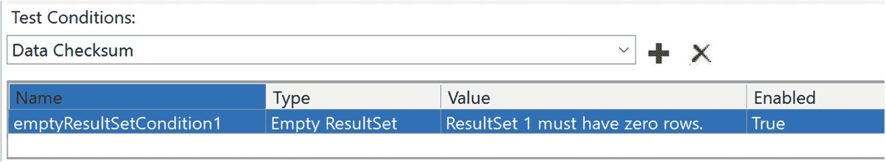

图 11-6：检查空结果集的单元测试

现在我已经创建了一个测试条件，我需要为该单元测试编写一些 T-SQL 代码。我选择了 `Empty ResultSet` 作为我的测试条件。为了使此单元测试在运行时通过，单元测试内部的 T-SQL 代码必须不返回任何结果。

在我更改存储过程后，我不希望返回任何非活动的食谱。在这种情况下，我的测试用例通过的条件就是没有返回非活动的食谱。这也与图 11-6 中创建的测试条件相匹配。代码清单 11-4 展示了我将用于单元测试的代码。

```
-- dbo.GetRecipe 的数据库单元测试
DECLARE @RecipeList TABLE
(
RecipeID          INT,
RecipeName        VARCHAR(25),
RecipeDescription VARCHAR(50),
ServingQuantity   TINYINT,
MealTypeID        TINYINT,
PreparationTypeID TINYINT,
IsActive          BIT,
DateCreated       DATETIME2(7),
DateModified      DATETIME2(7)
);
INSERT INTO @RecipeList
(
RecipeID,
RecipeName,
RecipeDescription,
ServingQuantity,
MealTypeID,
PreparationTypeID,
IsActive,
DateCreated,
DateModified
)
EXECUTE [dbo].[GetRecipe];
SELECT RecipeID
FROM @RecipeList
WHERE IsActive = 0;
```
代码清单 11-4：运行单元测试的代码

我首先创建了一个表变量。单元测试的下一部分将存储过程 `dbo.GetRecipe` 的结果插入该表变量。最后一步是从表变量中仅选择非活动的记录。一旦我将上述代码添加到 `MenuDBSQLServerUnitTest.cs` 并保存文件，我就可以运行我的第一个单元测试了。你可以转到“测试”菜单来运行单元测试，如图 11-7 所示。

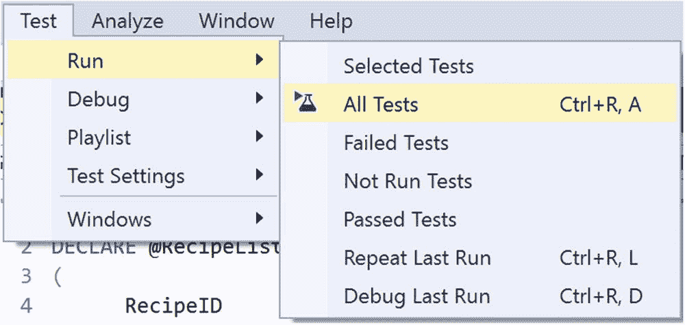

图 11-7：手动运行单元测试

我对单元测试采用测试驱动设计，并在更改原始存储过程之前测试此单元测试。在此场景下，我预期单元测试会失败。你可以在图 11-8 中看到运行此单元测试的结果。

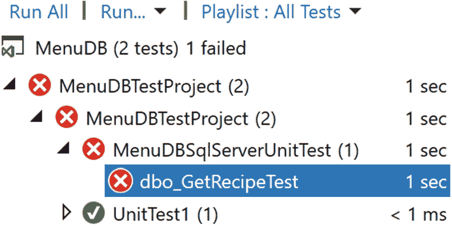

图 11-8：失败的单元测试

原始存储过程仍然返回了非活动的食谱。这导致了单元测试失败。一旦我使用代码清单 11-3 中的 T-SQL 代码更新了存储过程 `dbo.GetRecipe` 并重复单元测试，我将得到图 11-9 中的结果。

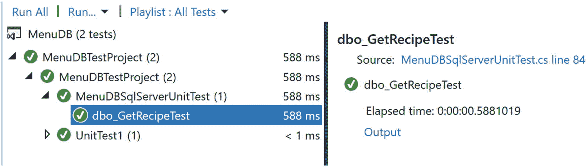

图 11-9：通过的单元测试

现在单元测试已成功运行，我可以确信我新的 T-SQL 代码按预期工作。数据库项目还有其他可用的单元测试选项。我建议你研究几种替代方案，并与你的同事协作，以确定哪种方法最适合你们的环境。

### 集成测试

虽然知道单个数据库代码片段按预期工作是件好事，但大多数 T-SQL 代码并非孤立存在。关系型设计的本质意味着数据库中的项目是相互关联的。我们通常考虑表之间的关系。然而，存储过程访问的是存在于表中的数据。如果我想验证数据插入，我可能会运行一个单元测试。这将确认我期望插入的数据确实已被插入。

当存在多种方式访问数据库中的相同数据时，问题就可能出现。通常，这些查询是在不同时期编写的。这可能导致查询中的逻辑略有不同。我也见过这样的情况：公司中的不同业务部门对相同数据采用不同的计算方式。如果将一个业务部门的计算重复用于另一个业务部门，可能会导致看似不准确的结果。

这就提出了一个问题：如何保持我们的 T-SQL 代码和查询结果在多个不同数据库对象之间的一致性。这就是集成测试可以发挥作用的地方。集成测试是指设计用于测试多于单个代码片段的测试。如果你正在使用一个应用程序插入数据，并希望验证数据是否正确插入，那就可以被视为集成测试。你将同时测试应用程序连接到 SQL Server 的能力以及将数据插入数据库的 T-SQL 代码。

这只是可以使用集成测试的一种场景。我发现自己经常遇到的一个常见情况是，处理两个旨在返回大致相同信息的存储过程。有时，对底层表之一或其中一个存储过程中的代码进行更改，可能导致这两个存储过程返回不同的结果。不幸的是，这些结果的差异通常在 T-SQL 代码部署很久之后才会被发现。这会导致对应用程序的整体信任度下降。

虽然最好能将这些相互关联的存储过程记录下来，或者更理想的是重构为单个存储过程，但这并不总是可行的。拥有多个版本的相似代码会产生成本，但让多个流程依赖于相同的代码也会产生成本。在本章的剩余部分，我们将假设 T-SQL 代码无法重写以消除这种依赖。

就像测试数据库代码的单元测试一样，你可以通过使用 T-SQL 查询手动开始集成测试。集成测试的最大因素在于理解你的环境是如何协同工作的。有时这是偶然发现的，比如当某些东西坏了的时候。其他时候，你可能是主题专家，已经知道这些交互。无论哪种方式，要开始集成测试，你首先至少需要两个测试对象。

你可以从测试数据插入以及对同一张表的 SELECT 查询开始。你也可以使用集成测试来比较两个查询的结果。如果你有一个查询返回所有值，而另一个查询搜索特定值，就可能发生这种情况。虽然这两个存储过程对于每条记录可能不匹配，但对于特定记录，它们可能具有匹配的结果。这种类型的集成测试将确认返回的列中的值彼此一致。


如果我开始着手修改一个用于查询数据的存储过程，我可能还需要测试与该数据相关的插入操作。例如，我可能正在更新存储过程 `dbo.GetRecipeAndIngredientByMealTypeID`，使其仅返回有效的食谱。我可以通过为无效食谱创建一个单元测试，再为有效食谱创建一个单元测试，来对该存储过程进行单元测试。我还可以使用集成测试来确认，在创建新食谱后，该存储过程是否仍能返回预期结果。这类测试现在可能看似微不足道，但随着应用程序的发展和成熟，它们会变得越来越有用。我注意到，有时业务部门需要答案的速度比提供答案的速度更快，这有时会导致数据库对象的使用方式偏离其最初设计意图。

#### 插入与查询的集成测试

我的集成测试将包括向 `dbo.Recipe` 表中插入一条新食谱记录。插入记录后，我将执行 `dbo.GetRecipeAndIngredientByMealTypeID` 存储过程，以验证新插入的食谱是否被返回。用于向 `dbo.Recipe` 表插入记录的存储过程如清单 11-5 所示。

```sql
CREATE OR ALTER PROCEDURE dbo.InsertRecepie
@RecipeName        VARCHAR(25),
@RecipeDescription VARCHAR(50),
@ServingQuantity   TINYINT,
@MealTypeID        TINYINT,
@PreparationTypeID TINYINT,
@IsActive          BIT,
@DateCreated       DATETIME2(7),
@DateModified      DATETIME2(7)
AS
INSERT INTO dbo.Recipe
(
RecipeName,
RecipeDescription,
ServingQuantity,
MealTypeID,
PreparationTypeID,
IsActive
)
VALUES
(
@RecipeName,
@RecipeDescription,
@ServingQuantity,
@MealTypeID,
@PreparationTypeID,
@IsActive
)
```
清单 11-5：向 `dbo.Recipe` 表插入记录

#### 用于查询的存储过程

既然我知道了如何向数据库添加食谱，我还应该更清楚地了解将要使用的查询存储过程。在清单 11-6 中，你可以看到存储过程 `dbo.GetRecipeAndIngredientByMealTypeID`。

```sql
CREATE OR ALTER PROCEDURE dbo.GetRecipeAndIngredientByMealTypeID
@MealTypeID     INT
AS
SELECT
rec.RecipeName,
ingr.IngredientName,
ingr.IsActive,
ingr.DateCreated,
ingr.DateModified
FROM dbo.Recipe rec
INNER JOIN dbo.RecipeIngredient recingr
ON rec.RecipeID = recingr.RecipeID
LEFT OUTER JOIN dbo.Ingredient ingr
ON recingr.IngredientID = ingr.IngredientID
WHERE rec.MealTypeID = @MealTypeID
ORDER BY rec.RecipeName, ingr.IngredientName;
```
清单 11-6：按用餐类型查询食谱和食材

#### 执行手动集成测试

为了进行集成测试，我需要编写一些代码来插入食谱。之后，我将运行第二个存储过程。我可以将这些结果插入到一个临时表中，然后验证通过第一个存储过程创建的食谱是否存在于第二个存储过程返回的结果中。在下面清单 11-7 的示例中，我还需要为该食谱添加一些食材，以便 `dbo.GetRecipeAndIngredientByMealTypeID` 存储过程能够返回一些结果。

```sql
DECLARE @RecipeID INT
DECLARE @MealTypeID INT
EXECUTE dbo.InsertRecepie
@RecipeName = 'Eggplant Parmesan',
@RecipeDescription = 'A recipe to make eggplant parmesan',
@ServingQuantity = 6,
@MealTypeID = @MealTypeID,
@PreparationTypeID = 1,
@IsActive = 1
EXECUTE dbo.InsertRecipeIngredient
@RecipeID
INSERT INTO @RecipeMeal (RecipeName, IngredientName, IsActive, DateCreated, DateModified)
EXECUTE dbo.GetRecipeAndIngredientByMealTypeID @MealTypeID
SELECT RecipeName
FROM @RecipeMeal
WHERE RecipeID = @RecipeID
```
清单 11-7：手动集成测试

#### 确定测试内容及其原因

在确定应进行哪些集成测试时，需要考虑与你正在编写的 T-SQL 代码相关的任何依赖关系。

某些 T-SQL 代码比其他代码更明显需要集成测试。我发现最需要集成测试的场景之一涉及返回相同数据的不同数据库对象。这可能是两个不同的存储过程。集成测试也可能用于比较函数与存储过程之间，或视图与函数之间的结果。虽然这些数据库对象返回的结果集可能包含不同的列或列的顺序不同，但相同的列是可以进行比较的。

其他时候，你可能会遇到这样的 T-SQL 代码：一个数据库对象依赖于前一步骤处理的数据。你可能有一个用于更新表中值的存储过程。一个视图或存储过程可能只返回特定的值子集。使用集成测试可以让你执行第一个存储过程来更新表中的查找值。根据测试要求，你可以执行存储过程并确认记录出现。除非该记录不应再出现，否则你可以使用集成测试来确认该记录不再出现。

这种情况的一个常见场景是，当你想在应用程序中对数据记录进行软删除或禁用时。你可以使用一组 T-SQL 来禁用记录。然后，可能有一个或多个数据库对象需要测试，以确认被禁用的记录不再显示。创建一种将所有集成测试场景集中管理并确保其可重复的方法，将是未来保护你应用程序的关键。现在对你的代码进行集成测试，可以确认当前版本的 T-SQL 代码能够通过测试。然而，将集成测试自动化并使其可重复，将使你能够持续验证新的错误没有被引入到你的 T-SQL 代码中。

根据系统的设计和复杂性，你可能会有在一个应用程序中输入，然后被发送到或被另一个应用程序使用的数据。在整个业务活动中，这些数据最终可能出现在不同的数据库或不同的表中。这可能涉及贯穿你业务流程的数据处理的不同阶段。这也可能包括在事务型数据库和数据仓库之间进行集成测试。以这种方式使用集成测试有助于确保应用程序中输入的数据在迁移到数据仓库时保持一致性。

存在更多优雅的方法可以帮助进行集成测试。不过，我发现这些方法大多引用的是单元测试。将这些工具用于集成测试时，唯一的区别在于测试的编写方式。这意味着你可以像前面章节所示，使用 `Visual Studio` 内置的单元测试功能。还有其他可用于单元测试和集成测试的工具，但本书将不作介绍。


### 负载测试

与 SQL Server 相关的另一个方面是快速处理大型数据集。人们常常希望功能上正确的 T-SQL 代码也能具有良好的性能。然而，情况并非总是如此。虽然我们可以使用**执行计划**来很好地了解查询的相对性能，但这并不能保证代码在高负载下表现良好。如果我们想了解 T-SQL 代码在压力下的表现，就需要进行**负载测试**。

负载测试带来了一些非常特殊的问题。一个挑战是硬件通常介于负载测试环境和生产环境之间。除了硬件差异，较低级别环境中的数据通常也存在差异。这可能包括较低环境中数据较少，或者较低环境中的数据被清洗过并具有不同的统计信息。其他差异可能包括较低环境中输入的数据与生产环境不匹配。在许多情况下，这些差异无法解决。

除非你拥有完全相同的硬件和完全相同的生产数据库，否则你的负载测试不可能与生产环境完全一致。尝试对 T-SQL 代码进行负载测试仍然是有益的。即使你无法创建完美的负载测试环境，你仍然可以在负载测试环境中比较 T-SQL 代码的相对性能。下一步是弄清楚如何实施负载测试。一个简单但不太可靠的方法是创建 T-SQL 脚本来生成虚拟负载测试数据。这种方法会让你对性能有一个大致的了解，但如果没有对现有生产数据进行深入分析，它就不能准确反映生产性能。

有几种第三方工具可用于负载测试，其中许多是免费的。这些工具应该能让开始负载测试变得更容易。然而，你面临着同样的问题，即这些测试可能无法准确反映生产活动。另一个选项是使用**分布式重放**来收集生产环境中的事务，并在较低的环境中重放它们。虽然在开发 T-SQL 代码时，实施负载测试是一个重要方面，但进行负载测试所需的步骤超出了本书的范围。

### 静态代码分析

在编写 T-SQL 代码时，创建格式化和开发 T-SQL 编码标准仅仅是一个开始。在第 3 章中，我谈到了标准化你的 T-SQL 代码。T-SQL 编码标准在第 9 章中进行了介绍。这些标准只有在被遵循时才是有用的。很多时候，这些标准很长，可能很难记住。确保这些标准被遵循，有比试图记住所有规则更好的方法。**静态代码分析**可用于确认你的标准是否得到遵循。

正如本书前面所讨论的，标准化你和你的同事编写 T-SQL 的方式是有好处的。这可以使代码更易于阅读，并节省调试 T-SQL 代码问题的时间。不幸的是，如果签入源代码管理的 T-SQL 代码不符合格式化标准，就无法实现标准化的好处。这就是静态代码分析可以提供帮助的一种情况。

静态代码分析允许你编写 T-SQL 代码。这些代码可以被保存并签入源代码管理。在部署数据库代码之前，使用静态代码分析来验证签入的 T-SQL 代码是否符合编码标准。虽然有强制 T-SQL 格式化的选项，但主要使用的选项是第三方工具。

除了使用静态代码分析来标准化数据库代码的格式之外，你还可以将其用于数据库编码标准。`Visual Studio 2017` 中有内置功能。你可以通过从“属性”菜单中选择“代码分析”选项来找到图 11-10 中的窗口。

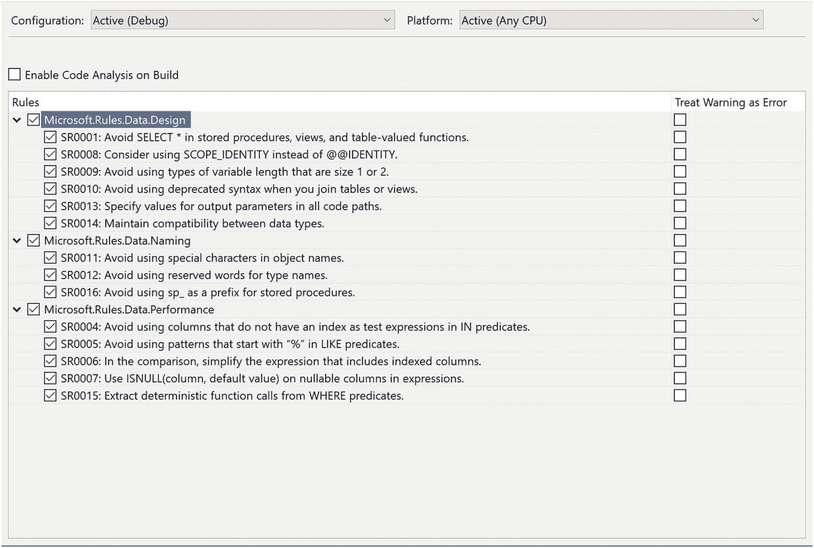

图 11-10
数据库项目中的代码分析

你可以选择在每次构建数据库项目时运行代码分析。你还可以选择哪些项目应作为代码分析的一部分包含在内。这些选项包括最佳实践以及可能影响 T-SQL 代码性能的项目。此外，还可以选择将其中一些规则升级为错误并导致失败，而不是发送警告消息。

静态代码分析的好处是它自动化了确保 T-SQL 代码符合你业务编码标准的过程。这可以帮助代码被拒绝时感觉不那么针对个人，因为代码是作为整个构建过程的一部分被审查和拒绝的。构建过程也会以一致的方式传达警告或错误消息。

将数据库代码纳入源代码管理只是问题的一半。真正的挑战可能出现在尝试部署仅保存在源代码管理中的数据库变更时。确定你希望如何部署代码将帮助你确定保存 T-SQL 代码的方法。从源代码管理部署 T-SQL 代码将在第 12 章中进一步讨论。

## 12. 部署

在软件开发过程中，总会有需要实现新功能的时候。新功能的一个普遍问题是如何在不影响当前性能的情况下实现该功能。对于当今的许多企业来说，让应用程序 24 小时不间断运行至关重要。这造成了一种情况，任何形式的停机或当前功能的损失都可能非常昂贵。虽然使用的部署方法有助于最小化与新功能相关的整体风险，但在编写新代码时，还有其他选项可以使用。

经常出现的一个问题与软件开发方式与代码部署方式的关联有关。在许多项目中，实现新功能所需的时间长于部署 T-SQL 代码的频率。确定如何管理源代码管理可以减轻其中一些风险。有多种方法可以部署 T-SQL 代码。了解这些方法以及使用它们的最佳时机将有助于改进你的数据库部署。在用户如何与数据库代码交互方面，也有一些可用的选项。


### 特性标志

在开发应用程序时，你可能需要进行许多涉及不同用户故事的修改。换句话说，你可能在重构一个预计需要数月才能完成的应用程序。与此同时，你知道你的业务可能每两周部署一次数据库代码。问题在于如何开发 T-SQL 代码，既能确认代码在现有数据库结构中有效，又能确保这些数据库变更在准备就绪之前不会进入生产环境。

这不仅是许多数据库开发人员，也是软件开发人员经常问自己的问题。问题的核心在于如何编写可以开关的数据库代码。处理这个问题的一种方法是使用**特性标志**。实现特性标志的方式有很多种，但目标是一致的：创建可配置为在一种或另一种场景下工作的数据库代码和数据库对象。

使用特性标志时，你可以随意启用或禁用新功能。这种管理数据库代码的方法允许你编写代码、将代码部署到生产环境，并在业务选定的后续时间启用新功能。除了能够精确控制何时启用新功能之外，你还可以通过更新数据库中的单个值来几乎立即回滚更改，从而获得额外的好处。在全面采用特性标志之前，你需要建立一些基础。例如，你应该习惯并养成对数据库代码进行单元测试的习惯。对于特性标志，你不仅需要在特性标志启用时进行单元测试，还需要在特性标志禁用时进行单元测试，以确认你的应用程序使用的是预先存在的数据库逻辑。

我建议你在为数据库完全实施源代码控制之后，再采用特性标志。这个建议的原因之一是管理特性标志需要额外的工作。当你为数据库对象创建特性标志时，你需要创建一些额外的逻辑，以允许你的应用程序使用预先存在的 T-SQL 代码或新的数据库代码。这不仅需要在编写 T-SQL 代码时保持纪律性，还需要有定义明确的流程来确定何时从数据库代码中移除特性标志。虽然特性标志对于存储过程、函数或视图等数据库对象效果很好，但它们并不是你开发的所有内容的解决方案。某些更改，例如对数据库列的更改，无法被来回切换。为了管理对数据库对象的这类更改，我们将在本节末尾讨论一些解决方案。

当为你的 T-SQL 代码使用特性标志时，你有几个选项来确定在任何给定时间启用了哪些特性标志。关于特性和数据库，我听过两个主要的解决方案。第一个可能更偏向应用程序代码，即在配置文件中提供特性标志值。第二个选项更像是基于 T-SQL 的解决方案，即创建一个表来存储特性标志的当前状态，例如启用或禁用。每个选项都有其优缺点。使用应用程序代码来管理特性标志可能更容易实现和管理。然而，数据库管理员可能更难支持这些特性标志。如果你将特性标志值保存在数据库中，你需要有纪律地管理这些特性标志并移除它们。最终很容易得到一个充斥着已弃用特性标志的混乱表。缺点是只有有权访问数据库表的用户才能看到每个特性标志关联的值。

当你部署数据库代码时，你可以将特性标志部署为禁用状态。一旦你准备好启用新功能，就可以将特性标志设置为启用。你需要定义一个流程来确定何时完全切换到新功能。当你准备好完全使用新功能时，你需要移除之前的 T-SQL 代码。作为此过程的一部分，你还需要移除任何对特性标志的引用。这种方法面临的挑战是，很容易跳过移除先前数据库代码的过程。如果你的 T-SQL 代码没有定期清理，这可能会大大降低代码未来的可管理性。

如果我需要更新一个存储过程以使用新逻辑，我可以使用特性标志，以便在任何我想要的时候部署这个更改。查看清单 12-1，你可以看到尚未修改的原始存储过程。

```sql
/*-------------------------------------------------------------*\
Name:             dbo.GetRecipe
Author:           Elizabeth Noble
Created Date:     April 20, 2019
Description: Get a list of all recipes in the database
Sample Usage:
EXECUTE dbo.GetRecipe
\*-------------------------------------------------------------*/
CREATE OR ALTER PROCEDURE dbo.GetRecipe
AS
SELECT
RecipeID,
RecipeName,
RecipeDescription,
ServingQuantity,
MealTypeID,
PreparationTypeID,
IsActive,
DateCreated,
DateModified
FROM dbo.Recipe;
```

清单 12-1
原始存储过程

此存储过程提取所有食谱的各种信息。在上面的 T-SQL 代码中，该存储过程没有区分活动和非活动食谱，返回了所有食谱的信息。我可能发现这个存储过程本应只返回活动的食谱。虽然我需要更新此存储过程以仅返回活动食谱，但可能存在业务原因导致此代码更改在部署后无法立即启用。

在这种情况下，我需要使用类似特性标志的东西，以便能够灵活地在存储过程中创建这些更改，并控制这些更改何时对应用程序可用。使用特性标志时，你需要一种方法来确定特性标志是启用还是禁用。这是你和数据库代码将知道在给定时间应执行哪段 T-SQL 代码的方式。一个选项是创建一个表来存储有关特性标志的信息。你可以创建一个如清单 12-2 所示的表。

```sql
CREATE TABLE dbo.FeatureFlag
(
FeatureFlagID     INT,
IsActive          BIT,
DateCreated       DATETIME,
DateModified      DATETIME
);
```

清单 12-2
创建特性标志表

前面的表很简单。它包含一个整数类型的特性标志 ID、一个指示特性标志是否启用的值、特性标志创建的日期以及特性标志值最后一次更新的日期。此表将允许我们存储有关启用了哪些特性标志的信息。为了使用此特性标志表，我需要将有关此特性标志的信息输入到清单 12-2 创建的表中。清单 12-3 中的 INSERT 语句展示了向 `dbo.FeatureFlag` 表插入数据的示例。

```sql
INSERT INTO dbo.FeatureFlag
(
FeatureFlagID,
IsActive,
DateCreated,
DateModified
)
VALUES (947,0,GETDATE(),GETDATE());
```

清单 12-3
插入特性标志记录


我已为 `功能标志 947` 插入了一条记录。插入时，该功能标志处于禁用状态。目标是让现有的存储过程继续返回与添加功能标志之前相同的结果。在清单 12-4 的存储过程中，我添加了逻辑，使存储过程能根据 `功能标志 947` 是禁用还是启用而返回不同的结果。

```
/*-------------------------------------------------------------*\
Name:             dbo.GetRecipe
Author:           Elizabeth Noble
Created Date:     April 20, 2019
Description: 获取数据库中所有食谱的列表
Updated Date:     May 20, 2019
Description: 添加功能标志。如果启用功能标志，则只显示活跃的食谱。否则，显示所有食谱。
Sample Usage:
EXECUTE dbo.GetRecipe
\*-------------------------------------------------------------*/
CREATE OR ALTER PROCEDURE dbo.GetRecipe
AS
IF ((SELECT IsActive FROM dbo.FeatureFlag WHERE FeatureFlagID = 947) = 1)
BEGIN
SELECT
RecipeID,
RecipeName,
RecipeDescription,
ServingQuantity,
MealTypeID,
PreparationTypeID,
IsActive,
DateCreated,
DateModified
FROM dbo.Recipe
WHERE IsActive = 1;
END
ELSE
BEGIN
SELECT
RecipeID,
RecipeName,
RecipeDescription,
ServingQuantity,
MealTypeID,
PreparationTypeID,
IsActive,
DateCreated,
DateModified
FROM dbo.Recipe;
END
Listing 12-4
带功能标志的存储过程
```

此查询的第一部分现在仅在 `功能标志 947` 启用时才返回结果。对于任何其他情况，存储过程将返回第二个查询的结果。功能标志的初始状态为禁用。当功能标志被禁用时，将返回所有食谱。一旦此代码部署到生产环境，终将有你准备好启用新功能的时候。当那一刻来临时，运行清单 12-5 中的 T-SQL 代码将启用该功能标志。

```
UPDATE dbo.FeatureFlag
SET   IsActive = 1,
DateModified = GETDATE()
WHERE FeatureFlagID = 947;
Listing 12-5
启用功能标志
```

启用此功能标志将导致存储过程 `dbo.GetRecipe` 现在仅返回活跃的食谱。

一旦你确信新代码按预期工作，并且没有业务需求需要回滚，你就会希望更新存储过程，使其仅返回新数据库代码的结果。移除功能标志还将保护此存储过程，避免因功能标志被错误更新而返回不准确的结果。清单 12-6 中的 T-SQL 代码展示了 `dbo.GetRecipe` 存储过程的最终状态。

```
/*-------------------------------------------------------------*\
Name:             dbo.GetRecipe
Author:           Elizabeth Noble
Created Date:     April 20, 2019
Description: 获取数据库中所有食谱的列表
Updated Date:     May 20, 2019
Description: 添加功能标志。如果启用功能标志，则只显示活跃的食谱。否则，显示所有食谱。
Updated Date:     June 20, 2019
Description: 移除功能标志。仅保留新逻辑。存储过程现在只返回活跃的食谱。
Sample Usage:
EXECUTE dbo.GetRecipe
\*-------------------------------------------------------------*/
CREATE OR ALTER PROCEDURE dbo.GetRecipe
AS
SELECT
RecipeID,
RecipeName,
RecipeDescription,
ServingQuantity,
MealTypeID,
PreparationTypeID,
IsActive,
DateCreated,
DateModified
FROM dbo.Recipe
WHERE IsActive = 1;
Listing 12-6
最终的存储过程
```

存储过程 `dbo.GetRecipe` 中的数据库代码已更新。在任何代码更改之前，此存储过程返回所有食谱。创建功能标志后，存储过程被更新为包含逻辑，根据功能标志状态返回所有食谱或仅活跃食谱。当更改得到确认后，你可以移除功能标志的逻辑。这将保留存储过程，仅包含更新后的 T-SQL 代码。

根据你在源代码管理中管理分支和合并的方式，可能决定了你需要多频繁地部署不完整的数据库代码。你可能会发现自己在开发数据库代码，但在下次部署前尚未完成。通常最简单的方式是编写可以部署时即完成的代码。然而，随着向敏捷软件开发的转变，以一种可以随时部署的方式编写 T-SQL 代码变得越来越重要。这正是功能标志真正益处得以体现的地方。

### 方法论

每个开发环境都不同。在决定如何部署 T-SQL 代码之前，更好地了解你公司如何处理开发会很有帮助。你需要知道公司有多少数据库开发人员，以及有多少个不同的开发团队使用 SQL Server。另一个你想了解的因素是那些开发团队如何编写和部署代码。收集所有这些信息将帮助你确定最适合你环境的 T-SQL 代码部署方法。

使用 SQL Server 时，与代码问题相关的风险通常比应用程序代码更大。当有多个人访问相同的 T-SQL 代码时，这些风险会加剧。如果你身处的环境中你是唯一的数据库开发人员，出现合并冲突问题的可能性可能较小。如果有多个数据库开发人员或团队可能编写 T-SQL 代码，那么有多个人处理相同数据库代码的可能性就更大。虽然其中一些可以通过源代码管理来管理，但同样重要的是要注意数据库代码是如何部署的。

数据库开发团队可以有几种不同的方式来管理工作流。根据所采用的方法论，可以影响应使用哪种类型的部署方法。我第一份涉及持续编写数据库代码的工作没有任何严格的时间表。目标是尽可能快地进行更改并部署。这通常是因为我正在创建 SSRS 报告。通常，这种开发可以被称为看板。我也曾在这样的环境中工作过：对数据库的更改仅作为完整的冲刺周期的一部分部署。对于这些部署，冲刺中的所有用户故事都作为冲刺的一部分部署。虽然有一些方法可以在不改变功能的情况下部署冲刺中的所有内容，但我们的代码通常不是那样编写的。如果你的业务正尝试转向能够在任何时间点部署更改，那么你需要考虑改变开发数据库代码的方式。这种改变可以是你思考解决方案和编写代码方式的转变。使用功能标志等概念将对你有所帮助。本质上，你希望以一种可以随时部署的方式编写 T-SQL 代码，而你的应用程序不会崩溃。然而，要达到这个点需要几个基本步骤。首先是了解你的公司如何开发 T-SQL 代码。如果你有许多开发人员为一个应用程序编写 T-SQL 代码，与每个开发人员处理一个单独的应用程序相比，你可能希望以不同的方式处理部署。这将帮助你确定哪种部署方法最适合你。


确定部署方法的一部分工作，将包括了解您当前部署数据库代码的流程。目前，您的业务中可能有手动部署的脚本。根据您的组织结构，您可能拥有一个环境，其中的脚本可以在任何时间点部署到特定环境；或者您可能有关于这些 `T-SQL` 脚本可以在一周中的哪些天进行部署的条件限制。如果某些天才能部署到各个环境，这被称为**门控部署**。您可能在版本控制系统中使用了数据库项目。在第 10 章中，已经介绍了分支和合并的主题。您的公司可能只使用一个分支用于数据库项目。所有个人的开发工作都在同一个地方完成。另一方面，您的公司可能利用分支。这是指您的开发人员使用主代码库的副本，并对该副本进行更改。有些公司可能选择直接从一个分支进行部署。如果您编写数据库代码时并未使其能够在任何时间点部署，这种方式可能特别有用。其他公司，尤其是那些编写代码以支持随时部署的公司，可能会选择在所有工作完成后，将所有分支合并回 master 或主分支。在这种情况下，所有部署都将来自主分支。

有时，团队管理工作流程的方式取决于他们的部署频率。对于许多公司而言，目标是能够频繁部署。然而，这并不意味着每家公司都已准备好应对这种部署频率。对于以更接近**看板**模式编写代码的开发团队而言，何时将代码部署到生产环境可能没有固定模式。其他团队可能有固定的节奏或冲刺周期来部署他们的代码。这些冲刺周期可能从几周到几个月不等。如果您的公司仍在确定代码发布频率的过程中，我建议谨慎对待较长的冲刺周期，因为这通常意味着需要一次性部署更多变更。这会增加部署出现问题的风险。

您还需要了解单次平均部署中涉及的数据库变更量。您可能会发现，平均每个冲刺周期部署的数据库变更并不多。如果是这种情况，您需要确保最终不会在一次部署中包含大量数据库变更。当单次部署中对数据库进行多项变更时，不仅出现错误的风险更高，而且根据您的部署方法，一项 `T-SQL` 代码的变更可能会覆盖另一项。

在介绍部署数据库代码的两种主要方法之前，还有一个额外的因素需要考虑。虽然我们都希望每次数据库部署都能顺利按预期工作，但有时您可能需要撤销或回滚一次部署中的一个或多个数据库变更。我建议，如果您还没有制定回滚策略，那么现在是开始考虑一个可靠回滚策略的好时机。通常需要回滚时，并不是您想要开始研究如何快速有效地回滚 `T-SQL` 代码的时候。拥有一个可重复执行此操作的方法，可以显著增强您对部署的信心。您的公司可能会使用回滚脚本来简化需要恢复到数据库代码先前版本的情况。如果您使用版本控制，您可以选择恢复到数据库代码的不同版本。在此基础上，如果您使用持续集成，您可能拥有一个预先打包的先前数据库代码版本，可以在几分钟内部署到您的生产数据库上。

这最终将我们引向考虑数据库部署常用的部署方法。其中一种方法是将所有要一起部署的脚本打包在一起。这被认为是**基于迁移的方法**；另一种选择是获取源代码管理中的所有内容，并将其视为您数据库的真实来源。使用此类方法时，您部署到的任何数据库都将被覆盖，以匹配源代码管理中存在的数据库对象。这通常被称为**基于状态的部署**。到目前为止收集的有关谁在开发数据库代码、这些变更如何编码和管理以及您的部署频率的信息，可以帮助您确定是基于迁移的方法还是基于状态的方法最适合您。

既然我们知道了什么是基于迁移的部署方法，我们就可以开始尝试确定它是否是部署的最佳方法。使用基于迁移方法的主要好处之一是，您可以精确控制部署到数据库的内容。这种部署方法通常涉及将所有要部署的脚本保存在单一位置，并且这些脚本的命名方式通常允许按特定顺序部署。这可以使您的部署易于管理。您可以快速查看保存脚本的文件夹，并确切知道将要部署什么。

如果您使用这种部署方法，我建议您有一个单独的文件夹，用于跟踪需要部署的回滚脚本以及这些回滚脚本的部署顺序。这不仅有助于在部署当晚需要回滚时快速找到回滚脚本，而且如果您需要一次性回滚多个部署，它也应能帮助您快速找到需要回滚的代码。基于迁移的部署方法存在一些限制。主要的挑战之一是，如果您需要回滚特定的一段代码。根据源代码管理的管理方式，这可能不像查看该数据库对象的历史记录并从源代码管理恢复先前版本那样简单。

设置基于迁移的部署方法可以是手动的。您和团队的其他成员可以编写 `T-SQL` 代码文件并按数字顺序保存。这实际上包括在 `SQL Server Management Studio` 中创建脚本，并以特定的命名约定保存文件。这种命名约定将包括指定部署顺序，例如在文件名前加上步骤编号以指示部署顺序。

如果我将清单 12-1 中的查询更新为与清单 12-6 中的查询匹配，我会创建一个包含这些更改的 SQL 文件。我可能会选择将此文件命名为 `001_20190723-2023_ActiveRecipe.sql`。但是，之后我可能会收到对同一存储过程进行额外修改的请求。在这种情况下，我需要从存储过程 `dbo.GetRecipe` 中移除日期列。在清单 12-7 中，您可以看到新的 `T-SQL` 代码。

```
-- 
GO
GO
PRINT N'正在修改 [dbo].[GetRecipe]...';
GO
/*-------------------------------------------------------------*\
名称：             dbo.GetRecipe
作者：           Elizabeth Noble
创建日期：     2019 年 4 月 20 日
描述：获取数据库中所有食谱的列表
更新日期：     2019 年 7 月 23 日
描述：移除非活动食谱
更新日期：     2019 年 7 月 23 日
描述：移除 DateCreated 和 DateModified 列
示例用法：
EXECUTE dbo.GetRecipe
\*-------------------------------------------------------------*/
ALTER PROCEDURE dbo.GetRecipe
AS
SELECT
RecipeID,
RecipeName,
RecipeDescription,
ServingQuantity,
MealTypeID,
PreparationTypeID,
IsActive
FROM dbo.Recipe
WHERE IsActive = 1;
GO
清单 12-7
基于迁移部署的示例脚本
```


一旦我完成了对数据库代码的修改，就可以将这段代码保存为一个 SQL 脚本。我将以 `002_20190723_2024_RemoteDates.sql` 作为文件名保存此代码。为了确保部署顺利进行，我可以将这两个文件放在同一个文件夹中。图 12-1 展示了这两个文件在文件文件夹中的显示方式。

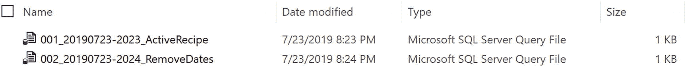

**图 12-1**

**基于迁移的文件列表**

我创建的第一个脚本以 `001` 开头。这是按文件名排序的第一个脚本，也是下一次部署时应该运行的第一个脚本。我创建的第二个脚本以 `002` 开头。这将是下一次部署时运行的第二个脚本。手动编写 `T-SQL` 脚本并保存并不是基于迁移的部署可以使用的唯一方法。你还可以借助第三方工具来帮助管理此过程。

基于迁移的部署有许多支持者。开发任何数据库代码的主要挑战之一是，当多个开发人员基于同一代码库工作时，如何管理代码的维护。在第 10 章中，我介绍了分支与合并。这是确保所有为数据库项目开发 `T-SQL` 代码的人员都能以一种在多人处理同一数据库对象时限制不一致性的方式工作所采用的主要方法。如果你的团队不习惯使用源代码控制，那么采用基于迁移的方法可能更符合逻辑。基于迁移的部署过程更适合处理对数据库数据的多次更改。这可以是数据清理的一部分，也可能与重构数据库对象有关。使用基于迁移部署方法的另一个优点是，更容易精确选择将要部署的数据库对象。如果你频繁更改数据库，最终可能会积累许多脚本，从而增加部署所需的时间。

由于这些因素，在某些场景下，你会发现基于迁移的部署比基于状态的部署更有效。较小的开发团队可能会觉得基于迁移的方法更容易使用。如果你对数据库使用源代码控制，你仍然需要确保团队频繁拉取最新的数据库代码版本以供开发。对于开发团队较少的环境，情况也可能类似。如果你的团队在同一天不进行频繁部署，或者有较大的维护窗口可用于部署，那么基于迁移的部署方法也可能很适合你。

采用基于迁移的方法时，需要牢记的一个风险是涉及在源代码控制之外发生的数据库更改。你可能会遇到需要立即将更改部署到生产环境的情况。通常，这些更改在未部署到较低环境或未检入源代码控制的情况下就被部署到了生产环境。如果你需要部署一个 `热修复` 或 `补丁`，而这些代码最终没有进入你的源代码控制，那么你的各个环境可能会变得不同步。虽然未来的部署不会覆盖你的更改，但你可能会发现环境之间存在不一致的行为。

部署 `T-SQL` 代码时，基于迁移的部署并不是唯一可用的选择。数据库部署的另一个流行选项是使用数据库架构的源，并将目标环境更新为具有相同的数据库架构。这就是所谓的基于状态的方法。通常，这与源代码控制一起使用，但这并非总是必需。其核心理念是，一旦部署完成，目标数据库最终将看起来与源数据库或源代码控制中的一致。此方法不需要源代码控制，但通过源代码控制来管理会更容易。

在使用基于迁移的方法时，每次更改都单独保存在自己的脚本文件中，而基于状态的部署则不是这样。在基于状态的部署中，你可能会对同一个数据库对象进行多次更改，但最终只有一组 `T-SQL` 代码会被部署到你的目标数据库实例。这个单一的 `T-SQL` 脚本会将所有更改合并为一个净变更。如果数据库对象在源代码控制中，或者源数据库与目标数据库不同，则变更脚本将在目标实例上运行。我也很喜欢这样一点：我确切知道部署完成后数据库将处于什么状态。部署完成后，目标实例中的数据库应具有与源位置相同的数据库对象。

使用与基于迁移方法相同的例子，我将逐步说明这在基于状态的部署中是如何处理的。第一步是进入源代码控制并确保你拥有最新版本。获得最新版本后，你可以打开存储过程 `dbo.GetRecipe`。当你最初打开这个 `SQL` 脚本时，你将看到如清单 12-1 所示的代码。你可以进行必要的修改，使 `T-SQL` 代码与清单 12-6 匹配。完成这些更改后，你可以将这些更改检入源代码控制。假设另一个人将进行更改以匹配清单 12-7 中的 `T-SQL` 代码。该开发人员也需要拉取最新版本的源代码控制。然后他们可以修改 `dbo.GetRecipe` 存储过程。这些更改随后可以合并回主分支。当需要部署此代码时，源位置将包含两项更改：一项是仅显示活跃食谱，另一项是移除日期列。与其逐个部署这些更改，不如一次性将 `dbo.GetRecipe` 存储过程部署到目标实例。这次对存储过程的单一更新将同时包含两项更改。

与许多开发人员或不同的开发团队合作时，使用基于状态的部署方法可能会带来好处。这是由于整个数据库项目中可能发生的更改频率较高。虽然基于状态的迁移适用于更改较少或较多的数据库项目，但这种部署方法在管理频繁更改方面表现更佳。使用基于状态的方法时，你可以确信源位置中的任何更改在部署完成后都会存在于目标位置。这也意味着，如果生产环境中有许多未纳入源代码控制的更改，那么这些更改将在下次部署时被覆盖。如果你的团队执行频繁更新，尤其是在一天之内，你可能会发现基于状态的方法部署所需时间更少。至少，这是因为当部署频繁时，通过基于状态的方法部署的更改通常较少。


使用基于状态的方法时，最大的挑战之一在于部署数据操作变更。基于状态的方法在比较整体数据库模式方面非常出色。然而，在修改数据库内部数据时存在局限性。在大多数情况下，这是通过部署后可能执行的手动文件完成的。如果使用源代码控制，这些可以通过预部署和部署后脚本来管理。如果使用源代码控制，仅有一个预部署脚本和一个部署后脚本。这会使数据变更过程变得较为复杂，因为你需要确保编写的 T-SQL 代码能够运行一次后即被忽略，或者需要进入源代码控制并频繁修改预部署或部署后脚本。


### 自动化部署

处理数据库部署有多种方式，您有多种选择来帮助自动化这些部署。自动化数据库部署不仅涉及不同的工具，还包括不同的部署策略。确定为数据库部署使用何种方法，取决于您试图预防或解决的问题类型。部分部署策略取决于要部署的 T-SQL 代码类型。其他部署数据库代码的方法则涉及以能在生产环境中提前发现问题的方式进行部署，然后再将更改全面推广。

可以使用 SQL Server Management Studio、Visual Studio 或 PowerShell 来简化和自动化部署 T-SQL 代码。如果您希望在不将数据库纳入源代码控制的情况下尝试自动化数据库部署，您将需要采取一些额外步骤来保护您的数据库。您的 T-SQL 代码应该已经以一种允许多次运行的方式编写。这可能不是您目前使用的方法，但您应该考虑如果有人意外地再次尝试部署相同的脚本会发生什么。请编写您的脚本，使其无论执行多少次都能成功运行。如果您已经在使用源代码控制，您的源代码控制应该为您管理此功能。

当基于迁移的部署中部署 T-SQL 代码时，如果您不使用源代码控制，过程可能会有所不同。对于基于迁移的部署，您通常需要一组用于部署的脚本。我发现，当您不使用源代码控制时，最复杂的步骤有时是确定到底应该部署什么。当您准备好部署 T-SQL 代码时，理想情况下脚本应保存在同一个文件夹中。此时，您可以手动运行所有这些迁移脚本，或者看看能做些什么来自动化运行这些脚本。如果您选择手动运行脚本，您将需要打开每个脚本并确保连接到正确的 SQL Server 实例。还有其他选项可用于提高部署这些迁移脚本的一致性和速度。使用批处理文件或 PowerShell 可以帮助您自动化这些部署。

如果您使用基于状态的迁移方法且不使用源代码控制，管理部署可能会稍微棘手一些。不使用第三方工具进行基于状态的部署的过程涉及使用数据层应用程序，也称为 DACPAC。这些 DACPAC 可以从已存在的数据库和 SQL Server 实例生成。SQL Server 附带一个工具可帮助您生成这些 DACPAC。您将使用的工具是一个名为 `SQLPackage.exe` 的可执行文件。使用 SQL Package 时，您可以从现有数据库生成 DACPAC。SQL Server 具有允许您将此 DACPAC 与不同数据库进行比较的功能。根据您选择使用 DACPAC 的方式，您可以将目标数据库更新为匹配 DACPAC 中的代码，或者基于 DACPAC 与目标数据库之间的差异创建脚本文件。

实现完全自动化部署的最简单方法是使用第三方工具。然而，这并非您唯一的选择。如果您对基于迁移的部署感兴趣，至少有一个免费的第三方工具可用。那就是 DbUp。虽然此工具可能有助于管理基于迁移的部署，但本书将不涵盖 DbUp。请注意，如果您要使用基于迁移的部署和源代码控制，您将需要一个扩展或像 DbUp 这样的另一个工具。

如果您的数据库在源代码控制中，并且您正在使用基于状态的迁移，您有几种替代方案可用于部署数据库更改。您可以选择直接从 Visual Studio 将更改部署到您的目标数据库实例。然而，这并不能让您更接近自动化部署。如果不使用第三方工具来自动化部署，您将需要致力于创建 PowerShell 脚本来创建 DACPAC 或 SQL 脚本文件，并将这些文件部署到目标实例。

在上一节关于部署方法的内容中，我介绍了基于迁移和基于状态的部署。当向数据库中的数据部署更改时，您通常希望确保不会意外地多次更新此数据。虽然我们可能希望确保每个脚本都能以无法多次更新数据的方式编写，但有时可能无法编写脚本来防止这种情况发生。如果发生这种情况，您可以使用类似于功能标志的概念。这时，您可以创建一个表来记录数据修改脚本何时已运行。当此脚本首次完成时，可以更新该表，用一个值表明所有记录都已更新。运行的脚本也可以在运行前检查该值是否不存在于表中。还可以在 T-SQL 脚本通过或失败时检查和填充此表，或者在更新完成时记录每个单独的记录。

您也可能会发现，有时数据库代码已准备好部署，但业务尚未准备好启用新功能。在本章前面，我们介绍了功能标志如何帮助我们控制应用程序是使用数据库代码的当前状态还是未来状态。有一种部署方法可以在这些情况下提供帮助。这里的最大优势是，您可以部署数据库代码，而无需让您的应用程序使用这个新的 T-SQL 代码。根据正在更改的数据库对象，这可能相对容易或难以管理。

当您想要部署 T-SQL 代码更改，但尚未准备好将这些更改发布到生产环境时，您可以使用一种部署方法来帮助您。您将要使用的部署方法称为暗部署。此方法将使用功能标志或类似概念。您将部署 T-SQL 代码，使数据库代码继续像往常一样运行。当您准备好启用新功能时，您可以启用功能标志。这将切换数据库代码的工作方式，使其使用新功能而非原始数据库代码。

应用程序和数据库的初始状态如图 12-2 所示。

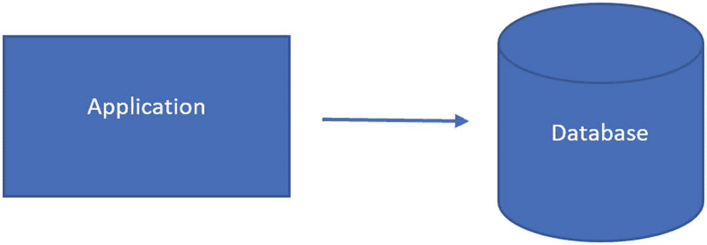

图 12-2

未修改的应用程序和数据库

暗部署中的下一步是通过部署 SQL 脚本来更新数据库。如果您使用功能标志，则功能标志应处于禁用状态。图 12-3 中的数据库已使用新的数据库代码进行更新。

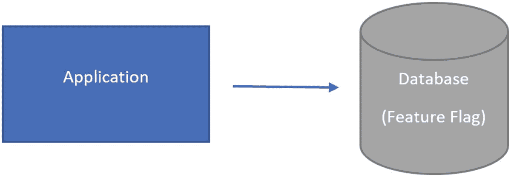

图 12-3

部署数据库更改

部署了带有功能标志的 T-SQL 代码后，您现在可以部署应用程序了。一旦您部署应用程序并启用功能标志，您的应用程序和数据库将处于与图 12-4 相同的状态。

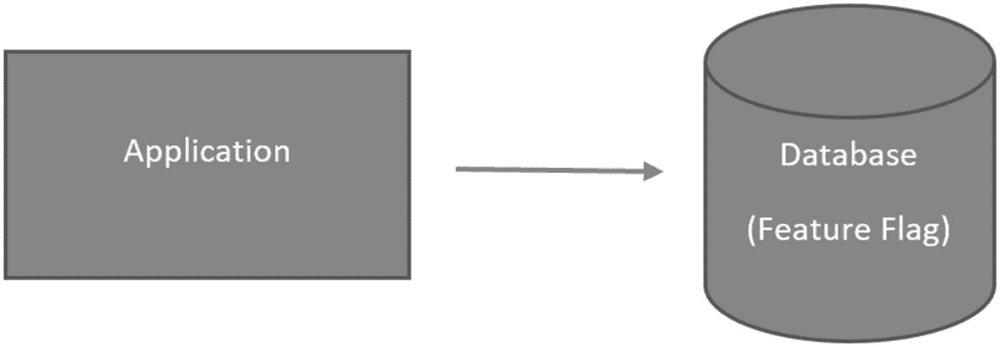

图 12-4

部署应用程序并启用功能标志

这些步骤允许您以暗部署方式部署数据库更改。

数据库部署涉及许多风险。这些风险可能涉及不再按预期工作的 T-SQL 代码或应用程序代码。也存在相同代码看似工作但未按预期工作的风险。在某些情况下，这个问题可能是表面的。在其他时候，引入数据库代码的错误可能会对保存在数据库中的数据质量产生负面影响。这可能包括以数据不再可用的方式更改数据。为了避免这些情况，可以使用不同的部署方法来保护数据库和应用程序。

一种潜在的部署方法是，用一套装有更新软件的硬件换出一套硬件。这种部署方法被称为蓝绿部署。这对于应用程序效果很好，但当涉及数据库时会更困难。如果您的应用程序仅使用数据库读取数据，您可以按原样使用蓝绿方法。然而，由于该概念是完全替换代码，这对于需要允许写入活动的数据库效果不佳。有一个修改版的蓝绿方法可用于数据库。在这种方法中，您仍然会有两套应用程序：原始应用程序和新应用程序。

在用户连接到原始应用程序期间，您将部署那些可以更新并仍允许原始应用程序按预期工作的任何脚本。如果您使用功能标志，您可以部署那些使用功能标志的数据库对象。一旦您准备好开始使用新的应用程序代码，您可以更新存储过程以开始为新的应用程序代码使用功能标志。在您确信对应用程序和数据库代码的更新按预期工作后，您可以移除功能标志。此时，您将完全过渡到新的应用程序代码，并且所有功能标志都将从 T-SQL 代码中移除。

蓝绿部署的初始状态如图 12-5 所示。

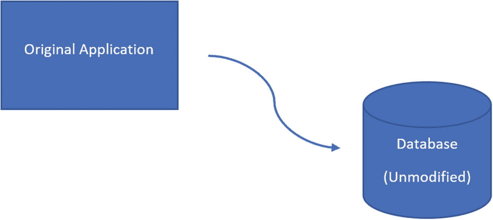

图 12-5

未修改的应用程序和数据库

在部署之前，应用程序和数据库都未被修改。蓝绿数据库部署的下一步是部署对原始或新应用程序都适用的数据库更改。应用了一些更改的数据库的图像如图 12-6 所示。

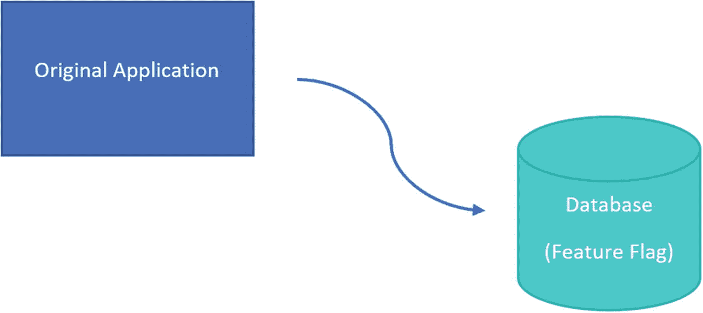

图 12-6

部署数据库更改

原始应用程序将继续连接到已修改的数据库。蓝绿部署方法基于替换代码而非覆盖代码的概念。为了遵循此部署方法，您将需要为新的应用程序建立所需的硬件和软件。图 12-7 显示了数据库和更新后的应用程序的状态。

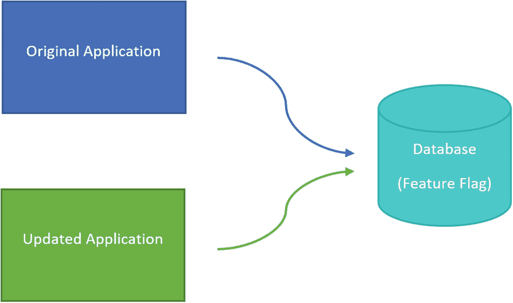

图 12-7

部署新应用程序

借助功能标志，两个应用程序将继续以与原始应用程序相同的方式运行。现在应用程序代码已准备就绪，可以在数据库中启用功能标志。图 12-8 中的图像显示了更新后的应用程序连接到更新后的数据库。

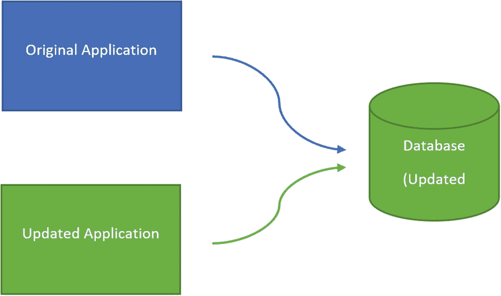

图 12-8

移除功能标志

更新后的应用程序和数据库已启动并运行，原始应用程序已停用。新状态看起来如图 12-9 所示。

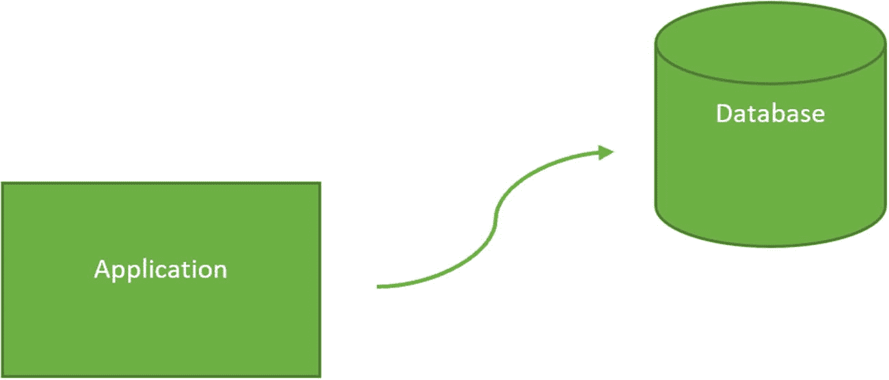

图 12-9

移除原始应用程序

这是您可用于蓝绿部署的过程。此部署方法让您管理如何部署和启用新的数据库代码。

除了影响数据质量外，还存在与对数据库代码进行的更改的性能相关的担忧。在某些情况下，添加或修改数据库对象的方式可能导致性能严重下降。根据应用程序的配置方式，这可能导致应用程序失败。可以实施一些部署策略来帮助在最终用户察觉之前识别潜在的性能问题。

您可能还希望在让所有人使用新的 T-SQL 代码之前测试它。通过使用一个应用了 T-SQL 代码更改的单独数据库，可以获得对 T-SQL 代码性能的大致了解。由于 SQL Server 目前的性质，您将只能在此辅助数据库上测试读取事务。当您使用此方法时，您正在使用金丝雀部署方法。其概念是应用程序将连接到两个数据库。第二个数据库将仅执行读取事务。借助额外的硬件，您可以将大部分事务发送到原始数据库，并将一小部分活动发送到第二个数据库。随着您对新的 T-SQL 代码信心的增加，您可以增加发送到第二个数据库的活动量。

在设计可部署的代码时，您需要从最开始着手。您必须了解您的团队结构、开发周期以及您的代码何时在各个环境中部署。目标是编写可维护且可管理的 T-SQL 代码。您可以选择使用基于迁移的方法部署 T-SQL 代码，在此方法中您可以精确控制部署到环境的内容。或者，您可以选择使用基于状态的部署方法，在此方法中您可以控制部署后数据库的样子。您还可以选择如何处理尚未准备好部署的代码开发。使用分支和合并策略，您可以将开发中的代码与将要部署的代码分开。还有使用功能标志的选项，这样您就可以在任何时间点部署代码，并控制何时启用新功能。无论您选择何种方法，您都需要确定一个可定义且可重复的部署策略。


