# 第四部分 构建可维护的 T-SQL

## 第 13 章 功能设计

在本书的进程中，我们已经涵盖了许多不同的主题。其中大多数章节都涉及最佳实践。这些最佳实践包括命名规范、T-SQL 代码格式化或数据库对象设计。尽管你尽了最大努力，仍可能会遇到超出最佳实践范畴的情况。这些时候可能与高压时期或紧迫的截止日期相关联。本章的目标是帮助你为那些必须就复杂主题做出快速决策的情况做好准备。

为那些旨在允许用户插入或更新数据的应用程序设计数据库代码可能具有挑战性。你可能会发现自己需要处理那些需要禁用权限或功能的应用程序。在处理遗留的应用程序代码时，可能会有额外的挑战，特别是如果这些应用程序使用了 ORM 软件。随着组织的增长，可能需要额外的报表功能，但可能没有开发数据仓库所需的时间。在 SQL Server 中，有办法让你的 T-SQL 代码更灵活，但你需要确保不会为了灵活性而牺牲功能性。

### 插入与更新数据

有各种场景会让你希望能够传入一组值。如果记录不存在，你可能希望插入信息；但如果记录确实存在，那么你可能希望更新该记录。通常，当我们处于压力之下时，我们会寻找最快、最简单的方法来做事情。其他时候，我们可能更关注 T-SQL 代码的可读性，而不是什么对数据库引擎最有利。虽然确保你的数据库代码能被他人理解很重要，但在编写 T-SQL 时，考虑数据库代码的性能同样重要。

在使用 T-SQL 插入或更新数据库记录时，这一点同样适用。无论用户是插入新记录还是更新现有记录，应用程序执行相同的存储过程可能更容易、更直接。这类操作也可被称为**更新插入**。你是如何陷入这种境地的并不重要；重要的是设计出可靠有效运行的 T-SQL 代码。

有一些 T-SQL 数据库代码可以使执行插入或更新的过程易于编写。此功能称为 `MERGE` 语句。使用此 `MERGE` 语句的好处在于逻辑直接明了。然而，`MERGE` 语句存在许多已知问题。我建议除非你愿意接受这些潜在问题，否则不要使用 `MERGE` 语句。在清单 13-1 中，有一个 `MERGE` 语句的示例。

```sql
CREATE PROCEDURE dbo.RecipeUpsert
@RecipeID INT,
@RecipeName VARCHAR(25),
@RecipeDescription VARCHAR(50),
@ServingQuantity TINYINT,
@MealTypeID TINYINT,
@PreparationTypeID TINYINT,
@IsActive BIT,
@DateCreated DATETIME,
@DateModified DATETIME
AS
MERGE dbo.Recipe AS [Target]
USING
(
VALUES
(
@RecipeID,
@RecipeName,
@RecipeDescription,
@ServingQuantity,
@MealTypeID,
@PreparationTypeID,
@IsActive,
@DateCreated,
@DateModified
)
) AS [Source]
(
RecipeID,
RecipeName,
RecipeDescription,
ServingQuantity,
MealTypeID,
PreparationTypeID,
IsActive,
DateCreated,
DateModified
)
ON ([Target].RecipeID = [Source].RecipeID)
WHEN MATCHED THEN
UPDATE SET
[Target].RecipeName = [Source].RecipeName,
[Target].RecipeDescription = [Source].RecipeDescription,
[Target].ServingQuantity = [Source].ServingQuantity,
[Target].MealTypeID = [Source].MealTypeID,
[Target].PreparationTypeID = [Source].PreparationTypeID,
[Target].IsActive = [Source].IsActive,
[Target].DateCreated = [Source].DateCreated,
[Target].DateModified = [Source].DateModified
WHEN NOT MATCHED BY TARGET THEN
INSERT (
RecipeID,
RecipeName,
RecipeDescription,
ServingQuantity,
MealTypeID,
PreparationTypeID,
IsActive,
DateCreated,
DateModified
)
VALUES (
[Source].RecipeID,
[Source].RecipeName,
[Source].RecipeDescription,
[Source].ServingQuantity,
[Source].MealTypeID,
[Source].PreparationTypeID,
[Source].IsActive,
[Source].DateCreated,
[Source].DateModified
);
```

清单 13-1：包含 Merge 语句的存储过程

前面的 `MERGE` 语句在食谱已存在于 `dbo.Recipe` 表中时更新它。此 `MERGE` 语句的逻辑易于遵循，其格式也易于编写。使用 `MERGE` 语句存在几个已知问题。在你的环境中实施 `MERGE` 语句之前，你需要意识到这些问题。

我曾经在没有完全理解 `MERGE` 语句带来的问题之前就实施了它们。当我试图替换这些 `MERGE` 语句时，有人担心替换后的逻辑会过于困难。要替换清单 13-1 中的逻辑，你可以编写一个类似于清单 13-2 中的查询。


### 存储过程与 MERGE 语句

```
CREATE PROCEDURE dbo.RecipeUpsert
@RecipeID INT,
@RecipeName VARCHAR(25),
@RecipeDescription VARCHAR(50),
@ServingQuantity TINYINT,
@MealTypeID TINYINT,
@PreparationTypeID TINYINT,
@IsActive BIT,
@DateCreated DATETIME,
@DateModified DATETIME
AS
IF EXISTS (SELECT RecipeID FROM dbo.Recipe WHERE RecipeID = @RecipeID)
BEGIN
UPDATE dbo.Recipe
SET   RecipeName = @RecipeName,
RecipeDescription = @RecipeDescription,
ServingQuantity = @ServingQuantity,
MealTypeID = @MealTypeID,
PreparationTypeID = @PreparationTypeID,
IsActive = @IsActive,
DateModified = @DateModified
WHERE RecipeID = @RecipeID
END
ELSE
BEGIN
INSERT dbo.Recipe
(
RecipeID,
RecipeName,
RecipeDescription,
ServingQuantity,
MealTypeID,
PreparationTypeID,
IsActive,
DateCreated,
DateModified
)
VALUES
(
@RecipeID,
@RecipeName,
@RecipeDescription,
@ServingQuantity,
@MealTypeID,
@PreparationTypeID,
@IsActive,
@DateCreated,
@DateModified
)
END
Listing 13-2
用于插入或更新的存储过程
```

使用 `IF… ELSE` 语句替代 `MERGE` 语句的逻辑，可以控制 SQL Server 查询中的操作流。如列表 13-2 所示，如果 `dbo.Recipe` 表中存在该食谱，则记录将更新除 `DateCreated` 外的所有字段。否则，将在 `dbo.Recipe` 中插入一条新记录。

`MERGE` 语句不仅限于在目标表中插入或更新数据。使用 `MERGE` 语句可以扩展到处理其他场景，例如插入或删除数据。还可以创建 `MERGE` 语句，以便在单个语句中插入缺失的记录、更新更改的记录以及删除孤立的记录。虽然数据修改可以合并为单个语句的一部分，但在使用 `MERGE` 语句时应谨慎，因为 `MERGE` 语句容易出现性能问题和数据不一致的情况。由于编写 `MERGE` 语句很容易，可能会以对 SQL Server 不高效的方式比较两个表之间的数据。虽然表只比较一次，但如果比较效率不高，这会对被比较表的性能产生显著影响。也有实例表明，使用筛选索引时可能会发生唯一键冲突。在特定情况下，`MERGE` 语句也可能导致外键约束违规。这包括使用两个具有外键约束的表，其中外键设置为 `NOCHECK`，然后回滚。建议研究 `MERGE` 语句的已知问题，并进行充分的测试以确认 T-SQL 代码能按预期工作。列表 13-2 中的代码表明，编写能够处理插入或更新的代码并不复杂。在 SQL Server 2019 之前，列表 13-1 或列表 13-2 中的代码都可能受到参数嗅探的影响。现在 SQL Server 2019 具有自适应连接，这应该不再是问题。

### 禁用功能

在设计应用程序时，通常首要目标是专注于满足指定的需求。在许多情况下，产品负责人或业务部门要求的是他们目前需要的功能。然而，这些人并不具备您在应用程序和数据库开发方面的知识。因此，他们可能不会要求具备根据其请求启用或禁用特定功能的能力。在这种情况下，功能可以考虑为用户或角色执行操作的能力，或者应用程序以某种方式运行的能力。可能他们指望着您来了解他们将来可能希望如何使用相同的应用程序。

设计新应用程序时，最容易被忽视的事情之一是能够为用户角色启用或禁用某些功能。如果表中的一条记录存在意味着它对应用程序可用，那么您就可以判断自己处于这种情况。对于此示例，表 `dbo.Recipe` 将使用列表 13-3 中的 T-SQL 语句创建。

```
CREATE TABLE dbo.Recipe
(
RecipeID          INT         IDENTITY(1,1)     NOT NULL,
RecipeName        VARCHAR(25)                   NOT NULL,
RecipeDescription VARCHAR(50)                   NOT NULL,
ServingQuantity   TINYINT                       NOT NULL,
MealTypeID        TINYINT                       NOT NULL,
PreparationTypeID TINYINT                       NOT NULL,
DateCreated       DATETIME2(7)                  NOT NULL,
DateModified      DATETIME2(7)                  NOT NULL,
CONSTRAINT PK_Recipe_RecipeID PRIMARY KEY CLUSTERED (RecipeID),
CONSTRAINT FK_Recipe_MealTypeID FOREIGN KEY (MealTypeID)
REFERENCES dbo.MealType (MealTypeID),
CONSTRAINT FK_Recipe_PreparationTypeID FOREIGN KEY (PreparationTypeID)
REFERENCES dbo.PreparationType (PreparationTypeID)
);
Listing 13-3
创建 dbo.Recipe 表
```

在表 13-1 中，您可以看到 `dbo.Recipe` 表中的记录。

表 13-1 食谱表数据

| RecipeID | RecipeName | DateCreated | DateModified |
| --- | --- | --- | --- |
| 1 | Spaghetti | 01/02/2018 | 02/05/2019 |
| 2 | Lee’s Burgers | 01/03/2018 | 02/05/2019 |
| 3 | Spinach Frittata | 01/03/2018 | 03/16/2019 |
| 4 | Dinner Rolls | 02/01/2018 | 03/17/2019 |
| 5 | Brandin’s Fried Rice | 04/16/2019 | 06/23/2019 |

例如，如果因为食谱在食谱表中而将其显示在应用程序中，那么在这种情况下，您将无法控制应用程序如何与食谱交互。您阻止食谱被应用程序使用的唯一选择是删除该食谱记录。此操作称为硬删除。

根据您需要从中删除记录的表，此删除可能会受到外键关系的阻止。在这些场景中，您只有几个可用选项。一个选项是删除外键，然后删除指定的记录。对于此表设计，如果要将 `Dinner Rolls` 从可用食谱中移除，您需要删除任何引用 `dbo.Recipe` 表的外键，然后删除该记录。列表 13-4 中的查询将删除外键。

```
ALTER TABLE dbo.RecipeIngredient
DROP CONSTRAINT FK_RecipeIngredient_RecipeID;
Listing 13-4
删除外键
```

一旦删除了引用 `dbo.Recipe` 表的所有外键，您就需要删除食谱记录以确保它不再可用。列表 13-5 是删除特定食谱的语句。

```
DELETE FROM dbo.Recipe
WHERE RecipeName = 'Dinner Rolls';
Listing 13-5
删除食谱记录
```

结果表将包含表 13-2 中所示的记录。

表 13-2 删除 `Dinner Rolls` 后的食谱表


### 外键约束与数据完整性

| RecipeID | RecipeName | DateCreated | DateModified |
| --- | --- | --- | --- |
| 1 | Spaghetti | 01/02/2018 | 02/05/2019 |
| 2 | Lee’s Burgers | 01/03/2018 | 02/05/2019 |
| 3 | Spinach Frittata | 01/03/2018 | 03/16/2019 |
| 5 | Brandin’s Fried Rice | 04/16/2019 | 06/23/2019 |

使用这种方法时存在一个显著问题。当你需要决定是否删除表之间的外键关系时，必须格外谨慎。这不仅会对查询性能产生负面影响，还可能影响数据质量。外键是确保表间数据保持一致性的最后几道防线之一。

另一种可能性是在具有外键关系的表中插入一条虚拟记录。你可以向 `dbo.Recipe` 表添加一个名为 `Inactive Recipe` 的食谱。可以使用清单 13-6 中的查询来插入它。

```sql
SET IDENTITY_INSERT dbo.Recipe ON;
INSERT INTO dbo.Recipe
(
    RecipeID,
    RecipeName,
    RecipeDescription,
    ServingQuantity,
    MealTypeID,
    PreparationTypeID,
    DateCreated,
    DateModified
)
VALUES
(
    0,
    'Inactive Recipe',
    'Deactivated recipes',
    0,
    0,
    0,
    GETDATE(),
    GETDATE()
);
SET IDENTITY_INSERT dbo.Recipe OFF;
-- Listing 13-6
-- Insert Dummy Recipe Record
```

将这条虚拟记录插入 `dbo.Recipe` 表只是第一步。你需要更新 `dbo.RecipeIngredient` 表中关于 `Dinner Rolls` 的记录，使其使用 `Inactive Recipe` 的 `RecipeID`。更新语句的编写如清单 13-7 所示。

```sql
UPDATE dbo.RecipeIngredient
SET RecipeID = 0,
    DateModified = GETDATE()
WHERE RecipeID = 4;
-- Listing 13-7
-- Update RecipeID for Dinner Rolls
```

除非你的应用程序被配置为始终忽略该值，否则这可能无法阻止应用程序显示该特定值。如果这两种选项都无法使用，还有另一种选择。在涉及这种表设计的情况下，另一个选择是移除与食谱 `Dinner Rolls` 关联的食材。

由于这些限制，硬删除的概念可能并不适合你的环境。你还有其他可用选项。你可以设计表结构，以便能够切换食谱或食材是否处于活动状态。这允许你在不删除数据记录的情况下启用或禁用功能。要使用此选项，你需要 `dbo.Recipe` 表包含一个诸如 `IsActive` 的列。要修改在清单 13-3 中创建的表，你需要执行清单 13-8 中的查询。

```sql
ALTER TABLE dbo.Recipe
ADD IsActive BIT
    CONSTRAINT DF_Recipe_IsActive DEFAULT '1' NOT NULL;
-- Listing 13-8
-- Add IsActive Column to dbo.Recipe Table
```

这通常是一个表示真或假的值。对于 SQL Server，通常用 1 表示真，用 0 表示假。如果你将 `IsActive` 设置为 `true` 并运行一个筛选 `IsActive` 值为 `true` 的结果的查询，那么你将只看到活动食谱的列表。一旦你将 `IsActive` 列添加到 `dbo.Recipe` 表中，你就可以修改你的 T-SQL 代码，根据它们的编写方式来显示活动或非活动的食谱。

你可以选择仅基于分配给 `IsActive` 的值来显示结果。当 `IsActive` 值设置为 1 时，该值为真。如果你只想显示活动食谱，你将在 WHERE 子句中修改你的 T-SQL 代码以使用 `IsActive = 1`。这也为你提供了额外的能力，让某些屏幕只显示活动食谱，而其他屏幕只显示非活动或已禁用的食谱。

除了为用户或角色禁用或启用功能外，有些时候你还需要能够控制应用程序的工作方式。公司通常希望随着时间的推移改变其业务的运营方式。这通常可以通过在业务使用的应用程序中添加、更改或删除功能来实现。

例如，如果一家公司希望扩展到其当前市场之外，他们可能会选择向其现有应用程序添加新功能。添加这个新功能最简单的方法是添加新的应用程序代码。然而，公司可能会发现这个新市场或新的业务线并未按预期运作，因此公司决定回滚这个新功能。根据代码的编写方式，这可能是一个需要重写代码的复杂变更，也可能是一个允许应用程序使用不同代码部分的简单变更。

根据你的业务环境，你可能会发现通过数据库管理功能变更比通过应用程序代码更容易。当功能可能需要根据季节性或地区进行变化时，这种可能性更大。这使你能够施加可快速更改的精细控制。你需要仔细考虑管理此功能的最佳位置。我得到的最好建议是：当需要高层管理人员对任何变更进行签字批准时，将业务逻辑保留在应用程序中。对于可以快速且几乎无人监督地变更的业务逻辑，最好将业务逻辑保留在数据库中。

如果你想从数据库内部管理部分应用程序业务逻辑，你将需要创建一个表来管理某些功能是否启用。这个表在概念上类似于第 12 章为功能标志创建的表。如果你想在数据库中管理功能，你可能希望创建一个如清单 13-9 所示的表。

```sql
CREATE TABLE dbo.ApplicationRule
(
    ApplicationRuleID           INT           IDENTITY(1,1) NOT NULL,
    ApplicationRuleDescription  VARCHAR(50)   NOT NULL,
    IsActive                    BIT           NOT NULL,
    DateCreated                 DATETIME      NOT NULL,
    DateModified                DATETIME      NULL,
    CONSTRAINT PK_ApplicationRule_ApplicationRuleID
        PRIMARY KEY CLUSTERED (ApplicationRuleID)
);
-- Listing 13-9
-- Create Application Rule Table
```

如果你是为单一的集中式应用程序创建规则，此表设计将满足你的需求。如果你管理多个应用程序，你需要考虑这些规则如何被应用程序使用。如果大多数或所有规则对于每个应用程序都是唯一的，你可能需要在表中添加一列来指明受影响的应用程序。

可能存在业务原因，使你希望切换应用程序以仅显示活动食谱或显示所有食谱。如果存在合理的业务原因，应用程序可能需要显示所有食谱或仅显示活动食谱，就可能发生此场景。此规则的值可以存储在表 13-3 中。

**表 13-3**

**应用规则表**

| ApplicationRuleID | ApplicationRuleDescription | IsActive | DateCreated | DateModified |
| --- | --- | --- | --- | --- |
| 1 | Show only active recipes | 1 | 04/12/2019 | 04/12/2019 |

此表中的条目表明，当此应用程序规则启用时，将仅显示活动食谱。如果你希望同一应用程序显示所有食谱，则需要将 `IsActive` 值更新为 `false`。虽然你可以更新所有数据库代码和存储过程以使用 `IF...THEN` 语句，但我建议在应用程序内部处理此功能。

### 软删除方案：使用 IsActive 列

### 在数据库中管理应用业务逻辑


这正是让代码具备灵活性的关键所在。虽然本书的主题不是应用程序代码开发，但你需要一个能与应用程序代码协同工作的数据库来处理这些场景。从概念上讲，这类似于第 12 章讨论的`feature flags`（功能开关）。你可以创建一个表来存储对指定功能的引用。在某些环境中，这可能被称为`application rules`（应用程序规则）。

### 支持遗留代码

软件开发中的一个关键问题涉及技术债务的处理。应用程序是随时间逐步开发的，其开发方式将决定后续维护的难易程度。对许多组织而言，应用程序最初是围绕时间线开发的，以满足当前业务需求。这可能导致应用程序在缺乏未来支持规划的情况下被快速开发出来。这常常成为开发团队与数据库管理员之间紧张关系的根源。

真正的挑战在于，应用程序开发时通常缺乏完善文档。如果应用程序文档不完善，并且`T-SQL`查询直接保存在应用程序代码中，那么支持遗留代码将更加困难。如果数据库代码位于应用程序中，那么不仅需要付出更多努力来定位特定的数据库代码，还需要更新这些代码。因为这不仅仅是修改一个表或存储过程来增加`T-SQL`代码的灵活性和可维护性那么简单。

随着业务的增长和变化，同一个应用程序可能需要被修改以处理新功能。这些新功能可能需要存储新的信息。为了存储这些信息，你可能希望向表中添加一个新列，或者完全创建一个新表。挑战在于试图理解所有依赖于此表的项目。虽然你可以验证数据库对象之间的依赖关系，但问题是你并不知道应用程序当前是如何访问这个表的。你的应用程序可能通过`prepared statements`（预处理语句）和`ad hoc queries`（即席查询）访问数据表。如果你的应用程序使用`prepared statements`或`ad hoc queries`，那么在向表添加新列时，可能不得不更改应用程序代码，特别是当你的编码标准没有规定在`T-SQL`查询中必须始终指定列名时。

核心担忧是如何修改此表而不破坏整个应用程序。有些策略可以让你在向现有表添加新列的同时不破坏现有代码。你需要找到一种方法，既允许现有代码按原样引用该表，又能以符合现有标准的方式存储新信息。本节讨论的选项旨在短期内支持新功能。建议你更新应用程序代码和数据库对象，以保持符合最佳实践。

最简单的选项是创建一个具有与要修改表相同主键的新表。在这种情况下，你还需要重命名现有表。为了防止现有应用程序崩溃，你可以创建一个与当前表同名的视图。所有访问原始未修改表的查询现在都将访问此视图。当你准备好更新所有应用程序代码时，可以删除该视图并将表重命名回其原始名称。

这些新列可以添加到这第二个表中。你可能会发现，由于遗留应用程序代码的编写方式，你无法实现如`列表 13-8`所示的更改。你可能希望向`dbo.Recipe`表添加`IsActive`列，但你的应用程序可能在内部嵌入了`T-SQL`查询。因此，如果添加这个新列，你可能不确定哪些部分会崩溃。`列表 13-10`中创建新表`dbo.RecipeIsActive`就是一种可选方案。


### 数据库表重构策略

#### 创建新表并迁移数据

```sql
CREATE TABLE dbo.RecipeIsActive
(
    RecipeID          INT         IDENTITY(1,1)     NOT NULL,
    RecipeName        VARCHAR(25)                   NOT NULL,
    RecipeDescription VARCHAR(50)                   NOT NULL,
    ServingQuantity   TINYINT                       NOT NULL,
    MealTypeID        TINYINT                       NOT NULL,
    PreparationTypeID TINYINT                       NOT NULL,
    IsActive          BIT
        CONSTRAINT DF_RecipeIsActive_IsActive
        DEFAULT 1                           NOT NULL,
    DateCreated       DATETIME2(7)                  NOT NULL,
    DateModified      DATETIME2(7)                  NOT NULL,
    CONSTRAINT PK_RecipeIsActive_RecipeID
        PRIMARY KEY CLUSTERED (RecipeID),
    CONSTRAINT FK_RecipeIsActive_MealTypeID
        FOREIGN KEY (MealTypeID)
        REFERENCES dbo.MealType (MealTypeID),
    CONSTRAINT FK_RecipeIsActive_PreparationTypeID
        FOREIGN KEY (PreparationTypeID)
        REFERENCES dbo.PreparationType (PreparationTypeID)
);
```
**代码清单 13-10** 创建包含 `IsActive` 列的 `dbo.Recipe` 表副本

你可以将所有数据从 `dbo.Recipe` 表移动到 `dbo.RecipeIsActive` 表。为了让应用程序能继续插入或更新数据记录，你需要删除 `dbo.Recipe` 表并创建一个同名视图。视图示例见 **代码清单 13-11**。

#### 使用视图保持兼容性

```sql
CREATE VIEW dbo.Recipe
AS
SELECT RecipeID,
       RecipeName,
       RecipeDescription,
       ServingQuantity,
       MealTypeID,
       PreparationTypeID,
       DateCreated,
       DateModified
FROM dbo.RecipeIsActive;
```
**代码清单 13-11** 创建与原始 `dbo.Recipe` 表结构匹配的视图

现有的应用程序代码可以引用此视图来选择或修改数据。这不是一个理想的长期解决方案，旨在让你有时间逐步重构应用程序以使用新表。如果你的应用程序中直接编写了数据库代码，那么在过渡期内，删除视图并将表重命名回 `dbo.Recipe` 可能需要额外的管理工作。在确定如何修改数据库对象同时让现有代码继续运行时，你应该专注于实施一个能让你未来更容易继续开发 `T-SQL` 代码的解决方案。

#### 使用触发器保持兼容性

除了视图，你还可以选择按所需规范创建新对象。这相当于重新创建 **代码清单 13-10** 中的表。然后，你可以添加一个触发器，将原始表的所有数据修改操作传递到这个新数据库对象中。你需要为插入、更新和删除操作分别创建一个 `DML` 触发器。**代码清单 13-12** 展示了一个插入触发器的示例。

```sql
CREATE TRIGGER RecipeInsertRecipeIsActive
ON dbo.Recipe
FOR INSERT
AS
INSERT INTO dbo.RecipeIsActive
(
    RecipeID,
    RecipeName,
    RecipeDescription,
    ServingQuantity,
    MealTypeID,
    PreparationTypeID,
    DateCreated,
    DateModified
)
SELECT
    RecipeID,
    RecipeName,
    RecipeDescription,
    ServingQuantity,
    MealTypeID,
    PreparationTypeID,
    DateCreated,
    DateModified
FROM inserted;
```
**代码清单 13-12** 当记录插入 `dbo.Recipe` 时创建的触发器

这将允许你继续使用原始数据库对象运行所有应用程序代码。你可以将这个额外的表和触发器保留原位，直到你准备好开始在数据库代码中使用新表为止。

#### 表的规范化重构

除了添加新列，你可能还想使用其他策略来重构表。这可以包括提高数据库的规范化程度。在规范化程度较低的遗留表中，列数远多于预期是很常见的。通过创建一个可以修改表设计并构建抽象层的空间，你可以在不影响应用程序性能的情况下修改数据库对象。

有时从最终目标入手会更容易。在这个案例中，我们正尝试将一个遗留表重新设计为两个或多个规范化表。思路是在此过程中让你的应用程序照常运行。以此例来说，我们有一个类似 **代码清单 13-13** 的表。

```sql
CREATE TABLE dbo.Recipe
(
    RecipeID            INT         IDENTITY(1,1)     NOT NULL,
    RecipeName          VARCHAR(25)                   NOT NULL,
    RecipeDescription   VARCHAR(50)                   NOT NULL,
    ServingQuantity     TINYINT                       NOT NULL,
    MealTypeName        VARCHAR(25)                   NOT NULL,
    PreparationTypeName VARCHAR(25)                   NOT NULL,
    IsActive            BIT
        CONSTRAINT DF_Recipe_IsActive
        DEFAULT 1                             NOT NULL,
    DateCreated         DATETIME2(7)                  NOT NULL,
    DateModified        DATETIME2(7)                  NOT NULL,
    CONSTRAINT PK_Recipe_RecipeID
        PRIMARY KEY CLUSTERED (RecipeID),
);
```
**代码清单 13-13** 原始非规范化表

一旦确定了要规范化的表，你需要设计用于替换此原始表的新表。下面的 **代码清单 13-14** 展示了可以创建的表的示例，以便你过渡到更规范化的数据表。

```sql
CREATE TABLE dbo.MealType
(
    MealTypeID        TINYINT         IDENTITY(1,1) NOT NULL,
    MealTypeName      VARCHAR(25)                   NOT NULL,
    MealTypeDescription
                    VARCHAR(50)                   NOT NULL,
    IsActive          BIT
        CONSTRAINT DF_MealType_IsActive
        DEFAULT 1                           NOT NULL,
    DateCreated       DATETIME2(7)                  NOT NULL,
    DateModified      DATETIME2(7)                  NOT NULL,
    CONSTRAINT PK_MealType_MealTypeID
        PRIMARY KEY CLUSTERED (MealTypeID),
);

CREATE TABLE dbo.PreparationType
(
    PreparationTypeID
                    TINYINT         IDENTITY(1,1) NOT NULL,
    PreparationTypeName
                    VARCHAR(25)                   NOT NULL,
    IsActive          BIT
        CONSTRAINT DF_PreparationType_IsActive
        DEFAULT 1                           NOT NULL,
    DateCreated       DATETIME2(7)                  NOT NULL,
    DateModified      DATETIME2(7)                  NOT NULL,
    CONSTRAINT PK_PreparationType_PreparationTypeID
        PRIMARY KEY CLUSTERED (PreparationTypeID),
);

CREATE TABLE dbo.RecipeModified
(
    RecipeID          INT         IDENTITY(1,1)     NOT NULL,
    RecipeName        VARCHAR(25)                   NOT NULL,
    RecipeDescription VARCHAR(50)                   NOT NULL,
    ServingQuantity   TINYINT                       NOT NULL,
    MealTypeID        TINYINT                       NOT NULL,
    PreparationTypeID TINYINT                       NOT NULL,
    IsActive          BIT
        CONSTRAINT DF_RecipeModified_IsActive
        DEFAULT 1                           NOT NULL,
    DateCreated       DATETIME2(7)                  NOT NULL,
    DateModified      DATETIME2(7)                  NOT NULL,
    CONSTRAINT PK_RecipeModified_RecipeID
        PRIMARY KEY CLUSTERED (RecipeID),
    CONSTRAINT FK_RecipeModified_MealTypeID
        FOREIGN KEY (MealTypeID)
        REFERENCES dbo.MealType (MealTypeID),
    CONSTRAINT FK_RecipeModified_PreparationTypeID
        FOREIGN KEY (PreparationTypeID)
        REFERENCES dbo.PreparationType (PreparationTypeID)
);
```
**代码清单 13-14** 规范化后的表

在上面的例子中，如果我们确定 `dbo.MealType` 和 `dbo.PreparationType` 表不会有数据修改，我们也可以使用视图来与 `dbo.Recipe` 表交互。在 **代码清单 13-15** 中，我创建了一个使用这些新表的视图。

```sql
CREATE VIEW dbo.Recipe
AS
SELECT rec.RecipeID,
       rec.RecipeName,
       rec.RecipeDescription,
       rec.ServingQuantity,
       mtp.MealTypeName,
       prp.PreparationTypeName,
       rec.IsActive,
       rec.DateCreated,
       rec.DateModified
FROM dbo.RecipeModified rec
INNER JOIN dbo.MealType mtp
    ON rec.MealTypeID = mtp.MealTypeID
INNER JOIN dbo.PreparationType prp
    ON rec.PreparationTypeID = prp.PreparationTypeID;
```
**代码清单 13-15** 使用规范化表的视图


与清单 13-11 中的逻辑类似，你可以创建一个名为`dbo.Recipe`的视图，以便应用程序今后能够与新表进行交互。根据原始表和新表的用途，你可能无法将所有代码都更新为使用这些新表。如果是这种情况，你可能不得不依赖触发器来更新这些表。

### 事务数据报表

大多数应用程序使用的数据库设计用于处理大量事务。这些数据库的整体设计被称为**联机事务处理**或 OLTP。这类数据库通常设计为快速存储和检索数据。这种行为涉及对数据库的多次写入。然而，你的业务最终可能决定需要从运行某个应用程序的同一个数据库中获取信息。理想情况下，你只应让应用程序访问事务处理服务器上的数据库。你需要充分理解你的业务以及查询将对应用程序性能产生的影响。你可能能够运行非常简单的`SELECT`语句，这些语句只访问一小部分数据，而不会对你的应用程序产生负面影响。你应该尽一切努力，限制为应用程序之外的数据请求而给 SQL Server 带来的额外负载。当为了报表目的而访问大量数据时，这可能会导致应用程序性能下降。这包括额外的 CPU 资源来生成执行计划，而这些计划可能已被从缓存中清除，以便为报表工作负载的运行查询腾出空间。在大量数据被移入内存以供报表使用后，存在于内存中的应用程序数据也可能面临从缓冲池中被清除的风险。这些问题可能演变成一种场景，即你的应用程序性能受到报表工作负载的影响。如果你发现自己处于需要直接从事务型数据库生成报表的情况，请与你的管理团队沟通，说明报表可能对你的应用程序产生的影响。

当你需要访问数据来制作报表时，你需要从同一个数据库进行大量的读取操作。当你需要对该数据库中的数据制作报表时，就会发生这种类型的行为。除了事务型数据库在处理读取大量数据方面不如处理读取极小数据集那样出色之外，使用你的事务数据制作报表还可能遇到其他挑战。

在某些情况下，收集这些报表数据可能很简单。可能涉及少量的连接（join），或者底层逻辑可能不太复杂。我发现，你可能最终编写了一份报表，但由于该报表的质量，你可能会被要求创建额外的报表。这些额外的报表可能涉及许多表，或者这些查询的整体逻辑可能更为复杂。这通常是因为这些表在设计时并未考虑报表需求。在某些情况下，你可能会发现自己被要求对不存在的数据制作报表。

为了快速开发报表，最简单的方法通常是为每个单独的报表编写特定的逻辑。随着时间的推移，这可能会导致你最终拥有大量本应返回相同或相似结果但实际上可能并非如此的报表。最好的情况是结果相似但底层代码不同。随着业务可能会改变某些应用程序的功能，情况可能变得更加复杂。识别出一些需要更新的报表可能很容易，而其他报表则被遗漏，并开始返回不准确的结果。

在某个时间点，你可能会收到一个请求，要求从事务数据中生成报表。通常，这些请求最初可能只是一个简单的一次性数据请求。在我们的场景中，一个用户可能希望能够访问制作意大利面的食谱和配料信息。虽然这可能始于运行一个查询并获取一些数据的请求，但你可能会发现，最终你的用户希望这个报表可以随时运行，或者由特定群体的人运行。到那时，你可能会编写一个类似于清单 13-16 中的查询。


#### 重新思考报告查询设计

##### 硬编码查询的问题

```sql
SELECT
    rec.RecipeName,
    rec.RecipeDescription,
    rec.ServingQuantity,
    recing.IsActive,
    ing.IngredientName
FROM dbo.Recipe rec
INNER JOIN dbo.RecipeIngredient recing
    ON rec.RecipeID = recing.RecipeID
INNER JOIN dbo.Ingredient ing
    ON recing.IngredientID = ing.IngredientID
WHERE rec.RecipeName = 'Spaghetti';
```
**代码清单 13-16：意大利面食材**

虽然报表开发的具体细节超出了本书的范围，但我很少遇到不需要定期从业务数据库请求某种报表数据的环境。前面的查询没有显示存储过程，但你也可以使用存储过程来选择这些数据。代码清单 [13-16] 中查询的问题在于，它是硬编码的，只返回食谱“Spaghetti”的结果。

##### 报告需求的变化

随着时间的推移，企业在分析数据时常常需要不同或额外的信息。这可能表现为需要一个新的报告来展示另一个食谱的信息。在我们的例子中，用户要求提供一个关于“菠菜菜肉馅煎蛋饼”的报告。这也可能是一个用“菠菜菜肉馅煎蛋饼”的报告替换“意大利面”报告的请求。无论哪种情况，你都需要创建一个类似代码清单 [13-17] 中的查询。

```sql
SELECT
    rec.RecipeName,
    rec.RecipeDescription,
    rec.ServingQuantity,
    recing.IsActive,
    ing.IngredientName
FROM dbo.Recipe rec
INNER JOIN dbo.RecipeIngredient recing
    ON rec.RecipeID = recing.RecipeID
INNER JOIN dbo.Ingredient ing
    ON recing.IngredientID = ing.IngredientID
WHERE rec.RecipeName = 'Spinach Frittata';
```
**代码清单 13-17：菠菜菜肉馅煎蛋饼食材**

虽然我们满足了为“意大利面”创建一个报告和为“菠菜菜肉馅煎蛋饼”创建新报告的要求，但也增加了维护报告的额外开销。代码清单 [13-16] 和 [13-17] 的查询是分开维护的。如果某个报告的数据提取方式发生变化，你需要记得另一个报告也可能需要更改。我们的下一步是分析这两个报告，看看是否能为两者创建一个统一的数据集。

##### 合并数据集

如果你发现自己处于这种情况，下一步就是弄清楚如何开始合并报告中的数据集。你首先需要识别哪些报告返回相似的结果。这些报告可以处理相同的业务应用或相同的功能。你需要创建一个返回该应用或功能所有相关信息的查询。这将是你用来更新现有报告的基础数据源。代码清单 [13-18] 中的查询展示了编写一个可用于两个报告的查询的一种方法。

```sql
DECLARE @RecipeName VARCHAR(25)

SELECT
    rec.RecipeName,
    rec.RecipeDescription,
    rec.ServingQuantity,
    recing.IsActive,
    ing.IngredientName
FROM dbo.Recipe rec
INNER JOIN dbo.RecipeIngredient recing
    ON rec.RecipeID = recing.RecipeID
INNER JOIN dbo.Ingredient ing
    ON recing.IngredientID = ing.IngredientID
WHERE rec.RecipeName = @RecipeName;
```
**代码清单 13-18：通过多个联接获取的食谱食材**

在前面的查询中，我们使用了参数 `@RecipeName`。这个参数允许我们为 `@RecipeName` 变量设置一个值。根据运行哪个报告，这个值可以更改。在使用报表服务器时，可以为每个报告设置 `@RecipeName` 的值。这种类型的查询允许你为多种类型的报表使用同一套代码。这使得你可以为“意大利面”和“菠菜菜肉馅煎蛋饼”使用相同的查询，或者为特定食谱的报告请求使用。

创建代码清单 [13-17] 中的查询使你的整体代码可重用。这可以解决与从业务数据生成报告相关的问题之一。从业务数据进行报告时可能出现的另一个问题是表之间逻辑的复杂性。在代码清单 [13-19] 中，关于食谱和配料的信息已经被扁平化，以更贴近数据仓库的设计方式。

```sql
CREATE VIEW dbo.MealTypeInformation
AS
SELECT
    mel.MealTypeName,
    mel.MealTypeDescription,
    prp.PreparationTypeName,
    prp.PreparationTypeDescription,
    rec.RecipeName,
    rec.RecipeDescription,
    rec.ServingQuantity,
    recing.IsActive RecipeIngredientIsActive,
    ing.IngredientName,
    ing.IsActive AS IngredientIsActive
FROM dbo.Recipe rec
INNER JOIN dbo.MealType mel
    ON rec.MealTypeID = mel.MealTypeID
INNER JOIN dbo.PreparationType prp
    ON rec.PreparationTypeID = prp.PreparationTypeID
INNER JOIN dbo.RecipeIngredient recing
    ON rec.RecipeID = recing.RecipeID
INNER JOIN dbo.Ingredient ing
    ON recing.IngredientID = ing.IngredientID;
```
**代码清单 13-19：食谱信息**

与代码清单 [13-18] 中的查询类似，代码清单 [13-19] 中的查询旨在让你的 T-SQL 代码可在各种场景中重用。这种设计将降低你的查询或报告所需逻辑的复杂性。代码清单 [13-20] 中的查询与代码清单 [13-18] 中的查询具有相同的功能。

```sql
CREATE PROCEDURE dbo.RecipeByRecipeName
    @RecipeName VARCHAR(25)
AS
SELECT
    mtp.RecipeName,
    mtp.RecipeDescription,
    mtp.ServingQuantity,
    mtp.RecipeIngredientIsActive,
    mtp.IngredientName
FROM dbo.MealTypeInformation mtp
WHERE mtp.RecipeName = @RecipeName;
```
**代码清单 13-20：从视图获取的食谱食材**

这两个查询的主要区别在于，代码清单 [13-20] 所需的整体逻辑要简单直接得多。这可以使技术背景较弱的用户能够基于相同的数据集创建报告。虽然这有助于保持数据的一致性和易于访问，但这种方法可能不是性能最佳的。当使用这种方法访问数据进行报告时，请务必监控性能，并确认报告能够在超时前返回数据。

这个基础数据集随后可以用于你所有的报告中。一旦你更新了报告以使用这个基础数据集，你就确认了这个数据集将能够满足你未来的报告需求。这让你了解到，如果你想向数据仓库迈进，你将需要什么样的数据结构。

### 动态 SQL

根据你尝试编写的 `T-SQL` 代码，你可能会发现很难将数据库代码写成基于集合的设计。在这种情况下，编写更具迭代性的代码可能很诱人。你可能想编写高度可变、并能根据传入的参数和值进行修改的 `T-SQL` 代码。使用动态 SQL 似乎就是你一直想要的解决方案。在大多数情况下，动态 SQL 的缺点往往远大于其优点，但在某些时候，动态 SQL 也可以是正确的解决方案之一。

#### 执行计划影响
之前在第 7 章，我介绍了如何读取执行计划。使用动态 SQL 时，每次执行查询都需要计算一个新的执行计划。这会给数据库引擎带来额外的负担。

#### 用例与吸引力
大多数你想使用动态 SQL 的情况都涉及需要额外灵活性的场景。许多动态 SQL 令人向往的场景与数据库管理活动有关。这些活动大多涉及在 `SQL Server` 实例中的多个数据库上执行相同的操作。动态 SQL 还提供了一些额外的功能，这使得使用动态 SQL 尤其具有吸引力。
执行 `T-SQL` 时，在标准 `T-SQL` 中不能使用数据库名或表名作为变量。使用动态 SQL 使你能够编写可在多个数据库对象上执行的查询。

#### 动态 SQL 示例
代码清单 13-21 展示了一个动态 SQL 的例子。
```sql
CREATE PROCEDURE dbo.TableByDynamicValues
@TableName VARCHAR(100),
@ColumnName VARCHAR(25),
@ColumnValue VARCHAR(25)
AS
DECLARE @ObjectID INT;
DECLARE @ColumnList VARCHAR(500);
DECLARE @Query NVARCHAR(1000);
SELECT @ObjectID = OBJECT_ID(@TableName);
SELECT @ColumnList = STRING_AGG (ISNULL([name],'*'), ',')
FROM sys.columns
WHERE [object_id] = @ObjectID
AND [name] NOT IN ('IsActive','DateCreated','DateModified');
SET @Query =
'SELECT ' + @ColumnList +
' FROM ' + @TableName +
' WHERE ' + @ColumnName + ' = @ColumnValue';
EXECUTE sp_executesql @Query,
N'@ColumnName NVARCHAR(25), @ColumnValue NVARCHAR(25)',
@ColumnName = @ColumnName,
@ColumnValue = @ColumnValue;
```
代码清单 13-21 从表中动态检索数据

前面的查询允许用户或应用程序传入一个表名。这是将要查询其值的表名。另外两个参数允许将列名和列值作为查询的一部分传入。此列名将用于筛选数据。

#### 执行与结果
代码清单 13-22 中有一些关于此代码如何运行的例子。
```sql
EXECUTE dbo.TableByDynamicValues 'Recipe', 'RecipeName', 'Spaghetti';
EXECUTE dbo.TableByDynamicValues 'Ingredient', 'IngredientName', 'Tomato Sauce';
```
代码清单 13-22 使用不同值执行存储过程

代码清单 13-22 中是同一个存储过程的两次执行。第一次执行将从 `Recipe` 表返回结果。第二次执行将从 `Ingredient` 表返回结果。执行代码清单 13-22 中的查询，你将得到表 13-4 中的结果。

| 食谱 ID | 食谱名称 | 食谱描述 | 份量 | 餐食类型 ID | 准备类型 ID |
| --- | --- | --- | --- | --- | --- |
| 1 | 意大利面 | 意面晚餐 | 8 | 2 | 1 |

| 配料 ID | 配料名称 |
| --- | --- |
| 2 | 番茄酱 |

返回的第一组数据是 `Recipe` 表中 `RecipeName` 为 `Spaghetti` 的列。代码清单 13-21 中的存储过程排除了 `IsActive`、`DateCreated` 和 `DateModified` 这几列。表中的所有其他列都被返回。第二个数据集中的值是 `Ingredient` 表中 `IngredientName` 为 `Tomato Sauce` 的记录。从软件开发的角度来看，这似乎是编写数据库代码的理想方法。

#### 缺点与注意事项
然而，这种使用 `T-SQL` 的方法没有考虑数据库引擎如何执行查询。这将导致 `SQL Server` 在每次执行存储计划时都生成一个新的执行计划，因为每次执行之间请求的数据可能发生巨大变化。虽然动态 SQL 似乎可以帮助使你的应用程序代码更加灵活，但编写 `T-SQL` 的这种方法是有代价的。总的来说，在大多数需要编写 `T-SQL` 代码的场景中，我会避免使用动态 SQL。尝试在不使用动态 SQL 的情况下编写代码，将鼓励你实践利用 `SQL Server` 数据库引擎优势的方式编写数据库代码。

使用动态 SQL 还会增加执行超出你最初意图的额外 `T-SQL` 代码的风险。这种行为被称为 SQL 注入。SQL 注入的概念是，额外的 `T-SQL` 代码被插入或注入到原始语句中。被插入的额外 `T-SQL` 代码允许实现原本非查询执行意图的功能。这可能包括查看本不该由该用户访问的数据。同一个用户也可能通过 SQL 注入修改数据或数据库对象。如果你想使用动态 SQL，可以通过使用参数将值传递给动态 SQL 来最小化 SQL 注入的风险。对动态 SQL 进行参数化的方法将使用户更难以你未意图的方式查看或修改数据。

#### 编写有效的 T-SQL
编写 `T-SQL` 代码时，你需要编写功能性强且有效的代码。这意味着编写可读且可维护的代码。编写能够随着业务增长的代码也是一项关键技能。如果你正在编写代码来处理插入、更新或各种数据修改，你需要确保编写的代码易于理解和后续支持。在应用程序开发过程中，考虑你希望如何处理禁用权限或应用程序功能。如果不考虑，你将需要考虑策略，允许你以不破坏数据库中表之间关系的方式停用数据值。
你可能还需要支持遗留代码。支持遗留代码的挑战之一是在不破坏现有功能的情况下进行更改。有时你可能需要从事务型数据库中提取数据用于报告。尝试设计你的查询以允许灵活性和可重用性。虽然灵活性是好的，但在 `T-SQL` 代码中实现多少灵活性也要谨慎。在改进数据库代码的功能后，你可能会发现你想确定如何跟踪数据的变化。

## 14. 日志记录

在您使用`SQL Server`的过程中，将会收到来自公司的各种各样的请求。其中一些请求可能涉及更改业务逻辑或添加新功能。有时，公司可能还想追踪过去发生的事情。有许多第三方工具有助于跟踪与数据库维护相关的性能和其他功能。然而，您的业务部门可能对跟踪数据更改或理解问题出在何处更感兴趣。

这种与数据修改或错误处理相关的日志记录可以使用`T-SQL`来实现。在记录这些类型的更改时，您有多种选项可供选择。这些选项可以包括从最小程度地记录活动到记录最细致的活动。您还需要考虑未来将如何访问和使用这些信息。这将帮助您以一种未来可能对组织有益的方式记录信息。这也可以防止您记录那些最终从未被使用的数据。

### 数据修改

选择跟踪数据修改的方法需要了解您的组织需要跟踪哪些类型的信息。您可能只想在某些内容发生变化时才记录信息。根据您的业务案例，您可能不仅需要知道何时发生了变化，还需要知道发生了什么变化。在如何跟踪这些更改方面，也有几种选择。您可以选择使用`SQL Server`为您跟踪这些更改，也可以创建数据库对象来为您记录这些信息。

在实施任何类型的日志记录时，需要考虑的一点是性能开销。在跟踪数据修改时，这一点可能更为关键。您需要确保选择的日志记录方法既能跟踪必要的更改，又具有预期的性能影响。正如您可能预料的那样，您实现的日志记录越详细，性能开销就越大。

在本章讨论的所有选项中，`更改跟踪`的开销最小。如果您希望记录更详细的信息，并且愿意增加资源利用率，那么您可以考虑`更改数据捕获`。另一种可能的跟踪更改的实现方式涉及使用数据库触发器。虽然使用数据库触发器允许您更精细地调整记录的内容和方式，但这可能会以更高的资源利用率为代价。

根据您想要记录的数据类型，一个折中的选项可能是使用`SQL Server 审核`。`SQL Server 审核`可用于跟踪服务器或数据库级别的活动。在记录与应用程序相关的更改的上下文中，您会希望重点关注数据库审核。`SQL Server 审核`内的数据库审核操作可以跟踪与所有类型数据活动相关的更改，包括访问或修改数据。`SQL Server`使用扩展事件来监视审核活动。可以检索的数据包括操作发生的时间、触发审核的用户信息以及受影响的对象。也可能记录审核操作发生时所执行的语句。

关于数据修改，另一种可用的最低限度日志记录活动涉及记录记录最近的更改时间，并为该数据记录递增已发生的更改次数。这种类型的跟踪由`SQL Server`内的`更改跟踪`处理。要使用`更改跟踪`，您首先需要在数据库上启用`更改跟踪`。在本书中，我们一直在使用`Menu`数据库。我将需要运行如清单 14-1 所示的`T-SQL`代码来在`Menu`数据库上启用`更改跟踪`。

```
ALTER DATABASE Menu
SET CHANGE_TRACKING = ON
(CHANGE_RETENTION = 2 DAYS, AUTO_CLEANUP = ON);
```

清单 14-1：在菜单数据库上启用更改跟踪

要在`Menu`数据库上启用`更改跟踪`，您需要指定数据库名称并表明您希望打开`更改跟踪`。前面`T-SQL`代码中的最后一行是可选的。这些值表示您希望保留更改的时间长度以及是否应自动清理保留的历史记录。

一旦您在`Menu`数据中启用了`更改跟踪`，您就能够配置表以使用`更改跟踪`。您将在其上实现`更改跟踪`的表必须具有主键。如果该表没有主键，您将需要先添加一个，然后才能在该表上启用`更改跟踪`。在我们的例子中，我将在`dbo.Recipe`表上启用`更改跟踪`。清单 14-2 显示了在`dbo.Recipe`表上启用`更改跟踪`所需的数据库代码。

```
ALTER TABLE dbo.Recipe
ENABLE CHANGE_TRACKING
WITH (TRACK_COLUMNS_UPDATED = ON);
```

清单 14-2：在 dbo.Recipe 表上启用更改跟踪


### 变更跟踪的配置与使用

变更跟踪现已在 `dbo.Recipe` 表上启用。变更跟踪可以记录整行数据的更改，也可以指定特定列的更改。当跟踪列更改时，SQL Server 会记录发生了更改以及具体更改了哪一列或多列。如果未为 `TRACK_COLUMNS_UPDATED` 指定值，SQL Server 将使用默认值 off。

#### 查看变更信息

设置好变更跟踪后，你可能想了解有哪些可用信息或哪些信息已更改。虽然 `dbo.Recipe` 表中的更改会被 SQL Server 跟踪，但这些信息并非存储在对象资源管理器中可见的表里。相反，你需要访问与 `dbo.Recipe` 表关联的 `CHANGETABLE`。启用变更跟踪后，记录会被初始化并可在 `CHANGETABLE` 中找到。清单 [14-3] 展示了如何查看这些初始化的记录。

```sql
SELECT rec.RecipeID,
rec.RecipeName,
rec.RecipeDescription,
rec.IsActive,
chng.RecipeID,
chng.SYS_CHANGE_VERSION,
chng.SYS_CHANGE_CONTEXT
FROM dbo.Recipe AS rec
CROSS APPLY CHANGETABLE
(VERSION Recipe, (RecipeID), (rec.RecipeID)) AS chng;
Listing 14-3
Query Initialized Records
```

此查询将返回来自 `dbo.Recipe` 表和 `CHANGETABLE` 的信息。表 [14-1] 展示了一个初始化记录的示例。

**表 14-1**

**初始化记录**

| RecipeID | SYS_CHANGE_VERSION | SYS_CHANGE_CONTEXT |
| --- | --- | --- |
| 1 | NULL | NULL |
| 2 | NULL | NULL |
| 3 | NULL | NULL |
| 4 | NULL | NULL |

表 [14-1] 中的记录来自 `CHANGETABLE`。其中包含 `RecipeID`（表的主键）列以及用于跟踪更改信息的列。由于没有任何数据记录被修改，因此所有值均为 `NULL`。

#### 修改记录并跟踪更改

我可以修改 `dbo.Recipe` 表中的记录。在清单 [14-4] 中，我更新了 `DateModified`。

```sql
UPDATE dbo.Recipe
SET DateModified = GETDATE()
WHERE RecipeID = 3;
Listing 14-4
Update DateModified
```

现在有记录被修改了，我可以更好地了解变更跟踪如何存储信息。清单 [14-5] 展示了自上次自动清理以来查找 `dbo.Recipe` 表更改信息所需的查询。

```sql
SELECT RecipeID,
SYS_CHANGE_OPERATION AS ChangeOperation,
CHANGE_TRACKING_IS_COLUMN_IN_MASK
(COLUMNPROPERTY
(OBJECT_ID('Recipe'), 'RecipeName', 'ColumnId'),
SYS_CHANGE_COLUMNS) AS NameChange,
CHANGE_TRACKING_IS_COLUMN_IN_MASK
(COLUMNPROPERTY
(OBJECT_ID('Recipe'), 'RecipeDescription', 'ColumnId'),
SYS_CHANGE_COLUMNS) AS DescChange,
CHANGE_TRACKING_IS_COLUMN_IN_MASK
(COLUMNPROPERTY
(OBJECT_ID('Recipe'), 'IsActive', 'ColumnId'),
SYS_CHANGE_COLUMNS) AS IsActiveChange,
CHANGE_TRACKING_IS_COLUMN_IN_MASK
(COLUMNPROPERTY
(OBJECT_ID('Recipe'), 'DateCreated', 'ColumnId'),
SYS_CHANGE_COLUMNS) AS CreateChange,
CHANGE_TRACKING_IS_COLUMN_IN_MASK
(COLUMNPROPERTY
(OBJECT_ID('Recipe'), 'DateModified', 'ColumnId'),
SYS_CHANGE_COLUMNS) AS ModifiedChange,
SYS_CHANGE_CONTEXT
FROM CHANGETABLE
(CHANGES dbo.Recipe,0) as ChngTbl
ORDER BY SYS_CHANGE_VERSION
Listing 14-5
Find Changed Records
```

此版本信息对于查找此表更改的状态是必需的。清单 [14-5] 中的查询展示了访问此信息的一种方法。表 [14-2] 展示了清单 [14-5] 中查询的结果。

**表 14-2**

**变更跟踪结果集**

| RecipeID | Change Operation | Name Changed | Desc Changed | IsActive Changed | Created Changed | Modified Changed |
| --- | --- | --- | --- | --- | --- | --- |
| 3 | U | False | False | False | False | True |

这些结果记录自清单 [14-4] 中发出的更新。

受影响的 `RecipeID` 列在表 [14-2] 的第一列。这与清单 [14-4] 中更新的 `RecipeID` 相匹配。`ChangeOperation` 列为 U，表示更新。这也与清单 [14-4] 中的 DML 操作相匹配。表 [14-2] 中的最后五列是使用特定函数填充的，用于解码变更跟踪表中指示的列。如果列被修改，该函数返回 true 值；如果数据未被修改，则返回 false 值。在清单 [14-4] 的情况下，唯一更新的列是 `DateModified`。这与表 [14-2] 中的结果相符。`NameChange`、`DescChanged`、`IsActiveChanged` 和 `CreatedChanged` 列均为 false，表示这些值未被更改。然而，`ModifiedChanged` 列为 true，这表明引用的列 `DateModified` 已被更改。

#### 一致性问题与替代方案

使用变更跟踪时存在一些潜在的一致性问题。存储数据不影响数据的一致性，数据一致性是在数据检索过程中受到影响的。你可以采取一切措施确保查看的是变更跟踪表中的最新数据，包括检查变更跟踪中最后同步的版本并确认该版本仍然可用。但是，如果变更跟踪中的版本早于保留期，这些数据可能会在检索到之前被清理掉。使用变更跟踪时，你也可能遇到数据修改发生在最后一次同步之后的情况，这可能导致返回额外的版本或修改记录。这些情况中的任何一种都会影响使用变更跟踪返回数据的一致性。最小化一致性问题的最佳实践是使用快照隔离级别。

如果你需要了解比哪一行或哪一列被更改、以及自实施变更跟踪以来该记录发生的更改次数更多的信息，你可能需要考虑变更数据捕获。与变更跟踪类似，使用变更数据捕获也有其优缺点。最大的好处是变更数据捕获会捕获与被更改数据记录相关的详细信息。

对于插入的数据，你将能够确切地看到添加到表中的内容。同样，你将能够看到被删除数据记录的所有列。更新数据时，你将能够访问更新前后的数据。一个缺点是表的每次更改都要求至少向跟踪表写入一条记录。另一个缺点是，每个被跟踪的表都会创建两个 SQL Server Agent 作业。随着你增加变更数据捕获下的表数量，所使用的资源量也会增加。这可能会导致与变更数据捕获相关的性能影响变得非常严重，以至于阻止你实施变更数据捕获。

如果你决定继续使用变更数据捕获，你可以更新数据库中的一个表以使用变更数据捕获。在执行此操作之前，你需要允许在你的数据库上发生变更数据捕获。你可以通过运行清单 [14-6] 中的 T-SQL 代码来为每个数据库启用变更数据捕获。

```sql
USE Menu;
GO
EXECUTE sys.sp_cdc_enable_db;
GO
Listing 14-6
Enable Database Tracking on Menu Database
```


### 启用变更数据捕获

现在您已经启用了变更数据捕获，您将需要选择一个您只关心记录何时发生变化的表。我将在表 `dbo.Recipe` 上实现变更数据捕获。在启用此表的变更数据捕获之前，我需要确保此实例上的 SQL Server 代理正在运行。在代码清单 14-7 中，您可以看到在此表上实现变更数据捕获所需的数据库代码。

```sql
USE Menu;
GO
EXECUTE sys.sp_cdc_enable_table
@source_schema = 'dbo',
@source_name = 'Recipe',
@role_name = NULL;
GO
```

**代码清单 14-7**
在 `dbo.Recipe` 表上启用数据库跟踪

您至少需要指定表架构、表名以及可以访问此数据的数据库角色。如果您为角色名称指定 `NULL`，则变更数据捕获记录的信息将对所有人可访问。一旦此表启用了变更数据捕获，我将能够在 SQL Server 代理中看到新创建的任务。代码清单 14-7 中的 T-SQL 代码完成后，您将收到一条消息。您可以在图 14-1 中看到此消息的示例。

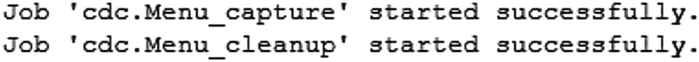

**图 14-1**
显示 SQL Server 代理任务已创建的消息

启用变更数据捕获的过程还会在 `cdc` 架构中创建几个系统表。您可以在图 14-2 中看到这些为管理变更数据捕获而创建的系统表。

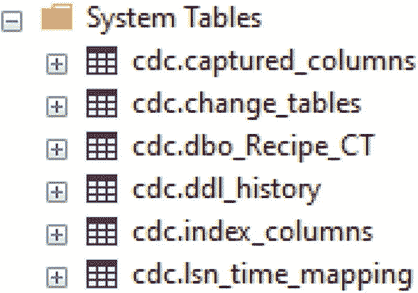

**图 14-2**
为变更数据捕获创建的系统表

我们将用来跟踪 `dbo.Recipe` 上更改的表是 `cdc.dbo_Recipe_CT` 表。

#### 在空表与现有表上实施的差异

如果您在空表上实施变更数据捕获，您将能够跟踪数据记录何时发生变化，同时也能够跟踪自表创建以来发生的变化次数。在代码清单 14-8 中，我编写了一个脚本将记录插入 `dbo.Recipe`。

```sql
INSERT INTO dbo.Recipe
(
RecipeName,
RecipeDescription,
ServingQuantity,
MealTypeID,
PreparationTypeID,
IsActive,
DateCreated,
DateModified
)
VALUES
(
'Lee"s Hamburgers',
'The best hamburgers',
4,
2,
1,
1,
GETDATE(),
GETDATE()
);
```

**代码清单 14-8**
向 `dbo.Recipe` 插入记录

当向现有表添加变更数据捕获时，工作方式会有所不同。如果您向现有表添加变更数据捕获，您仍然能够跟踪数据记录何时发生变化，但您只能看到自变更数据捕获实施以来发生的数据修改次数。

之前在代码清单 14-8 中，我在 `dbo.Recipe` 表上启用了变更数据捕获。如果我假设该表是空的并插入一些记录，我将能够确定这些记录是何时添加的。执行代码清单 14-9 中的查询将显示变更数据捕获表中的记录。

```sql
SELECT __$start_lsn,
__$end_lSN,
__$seqval,
__$operation,
__$update_mask,
RecipeID,
RecipeName,
RecipeDescription,
ServingQuantity,
MealTypeID,
PreparationTypeID,
IsActive,
DateCreated,
DateModified,
__$command_id
FROM cdc.dbo_Recipe_CT
```

**代码清单 14-9**
查询 `dbo.Recipe` 的变更数据捕获表

您可以在表 14-3 中看到有关已跟踪数据记录信息的子集。

**表 14-3**
`dbo.Recipe` 的更改跟踪输出

| __$operation | RecipeID | RecipeName | DateCreated | __$command_id |
| --- | --- | --- | --- | --- |
| 2 | 1 | Spaghetti | 05/21/2019 | 1 |

#### 解释跟踪数据

看起来记录的信息可能不多，但保存在此表中的信息可能非常有用。列 `__$operation` 指示在此表上发生的操作。`__$operation` 将告诉您执行了哪种类型的活动。如果记录被插入，您将在 `cdc.dbo_Recipe_CT` 中有一个包含插入值的条目。如果记录被删除，您将在 `cdc.dbo_Recipe_CT` 中有一个包含删除值的条目。如果记录被更新，您将在 `cdc.dbo_Recipe_CT` 表中有两个条目。第一条记录将包含更新前的记录值。第二条记录将包含更新后的记录值。

#### 注意事项与替代方案

如果表已经存在并且我启用了变更数据捕获，直到这些记录被更新后，您才会看到它们。一旦这些记录被修改，它们就会出现在 `cdc.dbo_Recipe_CT` 表中。虽然变更数据捕获可以轻松设置和实施，但在向变更数据捕获添加表时应谨慎。添加到变更数据捕获的每个表都会导致创建两个 SQL Server 代理任务。由于跟踪这些表上的更改，还会发生大量的日志记录。这两者都可能导致 SQL Server 使用额外的资源。

您可以使用变更跟踪、变更数据捕获或数据库触发器来跟踪数据修改。所有这些选项都有其自身的优势和限制。为您的组织选择正确的选项时，您需要考虑需要记录的数据类型以及您愿意为跟踪这些更改而产生的性能开销。如果您需要更好的性能，通常必须选择较少的功能。您想要收集的信息越多或您越想自定义记录数据修改，都将伴随着硬件利用率增加和潜在性能开销的代价。

### 错误处理

在记录数据修改之外，您可能还会发现，记录数据库中发生的某些错误类型会很有帮助。虽然存在 SQL Server 特有的错误，但那不是本节的重点。还存在一些因应用程序与数据库交互而产生的错误。许多此类错误可以作为应用程序开发的一部分，在 SQL Server 之外进行记录。但是，您可能会发现有些问题需要能从 SQL Server 内部访问。

在考虑错误处理时，您不仅需要考虑如何记录这些信息，还需要考虑应用程序如何处理错误。在 SQL Server 内部，一个更常见的选择是使用 `TRY...CATCH` 块。这段代码封装了尝试执行 T-SQL 代码的能力，并在尝试失败时执行特定操作。如果代码成功，则 T-SQL 代码将按预期执行。清单 14-10 展示了一个 `TRY…CATCH` 块。

```
CREATE PROCEDURE dbo.RecipeInsert
@RecipeName VARCHAR(25),
@RecipeDescription VARCHAR(50),
@ServingQuantity TINYINT,
@MealTypeID TINYINT,
@PreparationTypeID TINYINT,
@IsActive BIT,
@DateCreated DATETIME2(7),
@DateModified DATETIME2(7)
AS
BEGIN TRY
BEGIN TRANSACTION
INSERT INTO dbo.Recipe
(
RecipeName,
RecipeDescription,
ServingQuantity,
MealTypeID,
PreparationTypeID,
IsActive,
DateCreated,
DateModified
)
VALUES
(
@RecipeName,
@RecipeDescription,
@ServingQuantity,
@MealTypeID,
@PreparationTypeID,
@IsActive,
@DateCreated,
@DateModified
)
COMMIT TRANSACTION
END TRY
BEGIN CATCH
ROLLBACK TRANSACTION
END CATCH
```
*清单 14-10 用于插入食谱的 Try…Catch 块*

这段代码如果没有错误，将插入一条记录。但是，如果遇到错误，则事务将被回滚。有一些方法可以将其与应用程序代码集成，以便用户知晓事务中发生了错误。使用此方法的目标是防止应用程序崩溃，或防止最终用户期望事务能正确保存。如果用户知晓操作失败，他们可以选择纠正问题并重试该操作。

您可能会发现您的应用程序能够毫无问题地写入或更新数据库中的数据。但是，您可能有一个将数据从一个系统发送到另一个系统的过程。可能存在基础设施问题或数据类型不一致，这可能导致在将数据从一个数据库对象发送到另一个时失败。这些也是您需要决定如何处理的一类错误。您仍然需要一种方法来处理这些故障，但您可能还需要更即时的报告，告知这些记录发送或接收失败。当今的业务要求持续的正常运行时间和成功的交互。您可以通过记录处理数据尝试失败时的方式来控制您响应这些问题的有效性。

存储需要流经系统的信息的数据库表通常在数据表中存储一个状态类型列。无论哪个过程更新记录的状态，都可能在更新记录状态时出现问题，或者将记录状态更新为失败状态。当表中的数据量不大时，查找这些失败的记录可能很容易。这通常需要搜索在指定时间内状态未更改的记录，或者处于失败或错误状态的记录。

根据我们如何使用食谱信息，我们可能希望记录每个食谱何时被准备。我们可以有一个应用程序，让我们能够指示食谱何时开始和完成。这些信息可以与食谱状态一起记录。我需要创建一个表来指示食谱历史状态。可以在表 14-4 中看到信息的示例。

*表 14-4 dbo.RecipeHistoryStatus 表中的数据*

| RecipeHistoryStatusID | RecipeHistoryStatusName | IsActive | DateCreated | DateModified |
| --- | --- | --- | --- | --- |
| 1 | Started | True | 05/21/2019 | 05/21/2019 |
| 2 | Completed | True | 05/21/2019 | 05/21/2019 |
| 3 | Cancelled | True | 05/21/2019 | 05/21/2019 |
| 4 | Error | True | 05/21/2019 | 05/21/2019 |

此表包含当记录某人开始准备食谱时可用的状态。为了记录每次准备食谱的实例，我需要创建一个表来存储每次准备食谱时的信息。有几种记录方式。为了本章的目的，我将在每次食谱开始时创建一条记录。一旦食谱开始，该食谱最终可能处于完成、取消或错误状态。用于存储食谱历史记录的查询可以在清单 14-11 中看到。

```
CREATE TABLE dbo.RecipeHistory
(
RecipeHistoryID         INT         NOT NULL,
RecipeID                SMALLINT    NOT NULL,
RecipeHistoryStatusID   TINYINT     NOT NULL,
DateCreated             DATETIME    NOT NULL,
DateModified            DATETIME    ,
CONSTRAINT pk_RecipeHistory_RecipeHistoryID
PRIMARY KEY CLUSTERED (RecipeHistoryID),
CONSTRAINT fk_RecipeHistory_RecipeID
FOREIGN KEY (RecipeID)
REFERENCES dbo.Recipe(RecipeID),
CONSTRAINT fk_RecipeHistory_RecipeHistoryStatusID
FOREIGN KEY (RecipeHistoryStatusID)
REFERENCES
dbo.RecipeHistoryStatus(RecipeHistoryStatusID)
);
```
*清单 14-11 创建 dbo.RecipeHistory 表*

此表可以存储每次食谱开始的唯一时间。可以在表 14-5 中找到存储在此表中的数据示例。

*表 14-5 dbo.RecipeHistory 表中的数据*

| RecipeHistoryID | RecipeID | RecipeHistoryStatusID | DateCreated | DateModified |
| --- | --- | --- | --- | --- |
| 1 | 1 | 2 | 05/17/2019 | 05/17/2019 |
| 2 | 1 | 3 | 05/18/2019 | 05/18/2019 |
| 3 | 3 | 4 | 05/20/2019 | 05/20/2019 |
| 4 | 4 | 1 | 05/21/2019 | 05/21/2019 |

表 14-5 中的记录指示了已开始及其各种状态的食谱。第一条记录是 `RecipeID` 为 1、状态为完成的记录。第二条记录是 `RecipeID` 为 1、状态为取消的记录。第三条记录是 `RecipeID` 为 3、状态为错误的记录。最后显示的记录是 `RecipeID` 为 4、状态为开始的记录。

当任何记录出现错误时，这些记录在 `dbo.RecipeHistory` 表中的 `RecipeHistoryStatusID` 将为 4。最初此表中的数据量不会很大，因此很容易在其中查找最近的错误记录。然而，随着时间的推移，此表将增长到相当大的规模。这可能导致 SQL Server 必须搜索许多记录才能找到任何最近的错误记录。如果我们计划 `dbo.RecipeHistory` 表增长到难以搜索的大小，我们可能会以不同的方式实现错误日志记录。可能存在其他场景，您希望保留所有处于错误状态的出错记录，但同时您也希望知道如何解决最近出错记录的问题。

在上述任一场景中，创建一个专门用于记录最近错误记录的表可能很有益。在创建此表之前，您可能还希望考虑如何随时间管理此表。与 `dbo.RecipeHistory` 表不同，您需要确保这个新表不会变得太大。您还希望仅在此表中保留最近的错误记录。在表中保留少量记录使表易于搜索。这个新表的目标仅仅是提醒用户任何最近的错误记录。考虑到此表的目的，您还需要设计一个定期清除此表数据的过程。


如果您选择为错误记录创建额外的日志表，最终可能会创建一个类似于代码清单 14-12 中所示的表。

```sql
CREATE TABLE dbo.RecipeHistoryLog
(
RecipeHistoryLogID      INT         NOT NULL,
RecipeHistoryID         INT         NOT NULL,
DateCreated             DATETIME    NOT NULL,
DateModified            DATETIME    ,
CONSTRAINT pk_RecipeHistoryLog_RecipeHistoryLogID
PRIMARY KEY CLUSTERED (RecipeHistoryLogID),
CONSTRAINT fk_RecipeHistoryLog_RecipeHistoryID
FOREIGN KEY (RecipeHistoryID)
REFERENCES dbo.RecipeHistory(RecipeHistoryID)
);
```
代码清单 14-12：创建 `dbo.RecipeHistoryLog` 表

任何在 `dbo.RecipeHistory` 表上出错的记录都可以有一条对应的记录输入到代码清单 14-12 的表中。在表 14-5 中，有一条关于 `RecipeHistoryID` 2 的错误记录。如果在该错误记录创建之前，我们已经创建了代码清单 14-12 中的表，我们可能会看到一个类似表 14-6 中的条目。

**表 14-6：`dbo.RecipeHistoryLog` 表中的数据**

| RecipeHistoryLogID | RecipeHistoryID | DateCreated | DateModified |
| --- | --- | --- | --- |
| 1 | 2 | 05/18/2019 | 05/18/2019 |

一旦我们在 `dbo.RecipeHistoryLog` 表中有了记录，就可以根据此表中记录的存在性来生成警报。一种选择可能是设置一个每 15 分钟执行一次的存储过程。这个存储过程的目的可能是在 `dbo.RecipeHistoryLog` 表中发现任何记录时生成一封电子邮件。如果您选择此方法来创建警报，您还需要确保定期从此表中清除数据。在这种情况下，您还需要一个存储过程来定期从此表中删除数据。

无论您选择哪种方法来实现应用程序与 SQL Server 之间的错误日志记录，您都应确保这些错误被跟踪记录在一个对多方都可访问的地方。最难排查的问题之一就是当没有可用的日志记录时。记录与 SQL Server 相关的错误的目标，是让贵组织内的人员能够快速找到问题发生的位置，以便他们能高效地解决问题。您可能选择从应用程序实现大部分错误处理。然而，对于需要立即纠正的错误，可能可以从 SQL Server 内部生成自动报告。

作为应用程序开发的一部分，您需要考虑贵组织需要哪种类型的日志记录。在盗窃风险较高的行业中，跟踪数据修改发生的时间以及修改人可能更为重要。所需信息的类型将决定您为数据修改实现何种日志记录。您还需要考虑如何管理与数据库相关的错误。这些错误并非 SQL Server 特有的错误，而是由于为应用程序编写的 T-SQL 代码而导致的错误。在确定了如何管理应用程序的日志记录后，您可能还需要考虑如何设计可复用的 T-SQL 代码。

## 15. 管理数据增长

数据库首次创建时，在给定时间内，其中的表会保持较小规模。根据表中存储数据的性质或时间的推移，您可能会发现自己处于这样一种情况：自表首次创建以来，一个或多个表已经经历了显著的增长。管理表中存储数据的相对“年龄”或数据整体存储方式的动机可能有很多。本章的目标将是如何以可长期管理的方式组织数据。虽然许多公司在管理数据时也有提高性能的目标，但这并非本章的重点。

SQL Server 提供了将数据分离或排序到不同组或类别中的功能。在管理数据增长方面，数据通常按日期排序。您不仅限于按特定日期组织数据，但为本章目的，这将是我的重点。您首先需要弄清楚如何组织数据，不仅是数据如何分组，还包括数据如何存储。建立数据分类和存储的功能，将允许您开始将数据移动到您创建的各个分组中。数据分组方式有多种选项，并且您可以使用多种不同的方式来存储数据。这使您能够设计一个解决方案，既支持近期数据的高事务吞吐量，又能以支持报告的方式设计旧数据。


### 分区

#### 什么是分区？

查看数据库中的一张表时，你可能会发现这张表已经增长到难以管理的规模。理想情况下，你应该在表增长到那个规模之前就识别出它们。无论哪种情况，你面对的都是一张需要更好地管理数据归档或维护索引的表。从概念上讲，你需要思考如何访问这些数据。为了使组织这些数据的过程更高效，你会希望选择一个在访问这些数据时始终会用到的列。通过某个值来组织数据的过程被称为分区。

#### 分区步骤

分区的第一步是弄清楚你希望如何一致地访问你的数据。我将使用`dbo.RecipeHistory`表进行说明。在本章中，此表表示过去 2 年食谱使用情况的信息。基于法律、用户体验或其他原因，我可能决定开始归档部分历史信息。由于这是一个历史表，我将选择根据`DateCreated`来分区，即组织或排序这些数据。如何分区数据引出了必须做出的下一个决定。

一旦决定了如何对数据进行排序，我还需要具体决定哪些数据将被分组在一起。被分组在一起的数据称为范围。在选择要分区的范围时，需要考虑的一个因素是每个范围内数据被访问的频率。对于大多数应用，这意味着最近的数据被频繁访问，而较旧的数据被访问较少。如果我有 5 年的食谱历史数据，可能出于业务原因需要保留这么长时间的数据，但在日常操作中，我通常可能只按天、周、月或年访问信息。

了解数据的大体访问方式将使我能够确定用于分区数据的范围。一旦确定了存储数据的范围，就需要创建文件组。文件组还可以通过允许你选择数据存储方式来为你带来好处。你可以将更频繁使用的数据保存在更快存储设备上的文件组中。也可以将较少使用的数据保存在较慢存储设备上的文件组中。这可以让你以节省成本的方式改变数据存储方式。文件组作为数据排序的逻辑结构运行。当你使用没有任何额外文件组的数据库时，你会看到只有一个名为`primary`的文件组。创建这些文件组的 T-SQL 代码如清单 15-1 所示。

```sql
ALTER DATABASE Menu
ADD FILEGROUP RecipeHistory2018;
ALTER DATABASE Menu
ADD FILEGROUP RecipeHistory2019Q1;
ALTER DATABASE Menu
ADD FILEGROUP RecipeHistory2019Q2;
ALTER DATABASE Menu
ADD FILEGROUP RecipeHistory2019Q3;
-- Listing 15-1
-- Create Filegroups
```

在此示例中，我创建了四个不同的文件组。创建的第一个文件组将保存 2019 年之前的所有食谱历史记录。接下来的两个文件组分别用于 2019 日历年的前两个季度。第三个文件组设计用于 2019 年的第三季度。创建文件组后，我需要创建文件组将使用的任何文件。对于本章中的示例，我们将为每个文件组创建一个文件。你可以使用清单 15-2 中的 T-SQL 创建这些文件。

```sql
ALTER DATABASE Menu
ADD FILE
(
NAME = RecipeHistFG2018,
FILENAME = 'D:\SQLData\RecipeHistFG2018.ndf',
SIZE = 50MB
)
TO FILEGROUP RecipeHistory2018;
ALTER DATABASE Menu
ADD FILE
(
NAME = RecipeHistFG2019Q1,
FILENAME = 'D:\SQLData\RecipeHistFG2019Q1.ndf',
SIZE = 50MB
)
TO FILEGROUP RecipeHistory2019Q1;
ALTER DATABASE Menu
ADD FILE
(
NAME = RecipeHistFG2019Q2,
FILENAME = 'D:\SQLData\RecipeHistFG2019Q2.ndf',
SIZE = 50MB
)
TO FILEGROUP RecipeHistory2019Q2;
ALTER DATABASE Menu
ADD FILE
(
NAME = RecipeHistFG2019Q3,
FILENAME = 'D:\SQLData\RecipeHistFG2019Q3.ndf',
SIZE = 50MB
)
TO FILEGROUP RecipeHistory2019Q3;
-- Listing 15-2
-- Add Filegroups to Menu Database
```

查看前面的 T-SQL 代码，我正在修改`Menu`数据库并向数据库添加文件。创建文件时，我指定了逻辑名称、文件名和文件路径、文件大小以及与该文件关联的文件组。

文件组和文件决定了我们的数据将保存在哪里。我必须配置如何将数据保存到这些文件和文件组中。在数据可以存储到文件组之前，需要在 T-SQL 中创建几个不同的数据库对象。你已经确定了希望数据如何排序，现在只需要发出 T-SQL 命令，以便 SQL Server 也知道如何排序这些数据。第一步是创建一个函数，告诉 SQL Server 如何为分区排序数据。这种类型的函数称为分区函数。在清单 15-3 中，你可以看到创建分区函数的 T-SQL 代码。

```sql
CREATE PARTITION FUNCTION RecipeHistFunc(DATETIME)
AS RANGE RIGHT FOR VALUES
(
'01/01/2019',
'04/01/2019',
'07/01/2019'
);
-- Listing 15-3
-- Create Partition Function
```

在清单 15-3 中，我将函数的范围指定为 `RIGHT`。范围与作为分区函数一部分提供的值直接相关。对于右范围，这表示在分隔分区时，该值位于边界右侧。使用清单 15-3 中的 T-SQL 代码时，任何直到 2019 年 1 月 1 日 的值都将进入第一个分区。第二个分区将包含从 2019 年 1 月 1 日 开始直到 2019 年 4 月 1 日 的所有值。然而，从 2019 年 4 月 1 日 到 2019 年 7 月 1 日 之前的任何数据将存在于第三个分区中。按照分区函数当前的设计，所有在或之后 2019 年 7 月 1 日 创建的数据将进入第四个分区。右分区的示例如图 15-1 所示。

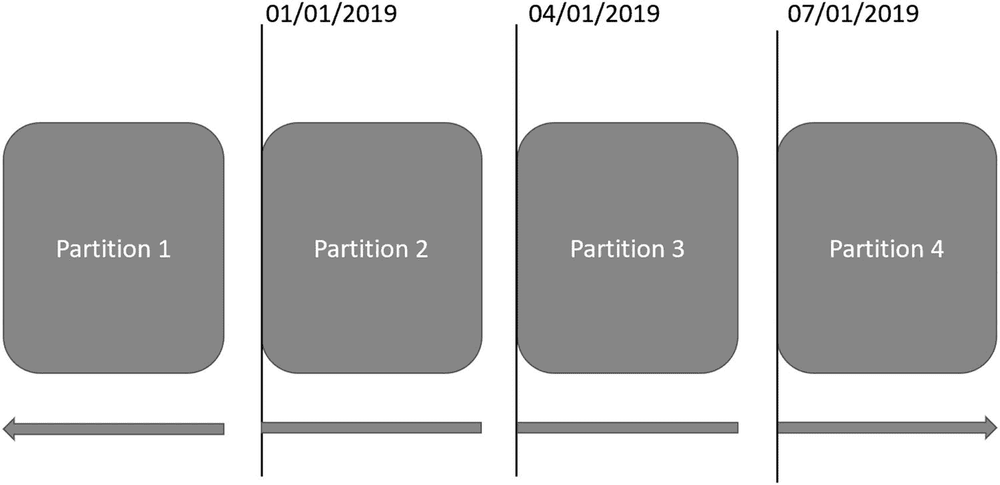

图 15-1

使用右范围进行分区

创建分区函数时的另一个选项是指定范围为 `LEFT`。如果我指定了左范围或没有指定左或右，第一个分区将包括任何直到并*包括* 2019 年 1 月 1 日 的值。在图 15-2 中，你可以看到如果我使用左范围，分区会是什么样子。

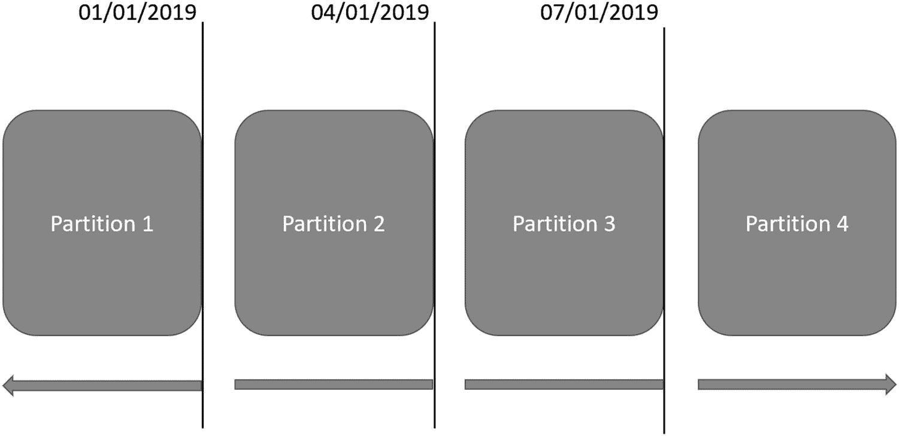

图 15-2

使用左范围进行分区

对于我们使用的数据，数据类型是`DATETIME2(7)`。如果我使用左范围，任何在 2019 年 1 月 1 日 午夜之后 1 毫秒 发生的数据都将进入第二个分区。你可以看到在创建分区函数时了解你的数据和数据类型是多么重要。


#### 创建分区方案

创建分区函数很有帮助。分区函数让 SQL Server 知道如何对数据进行分区。然而，你还需要指明 SQL Server 应该如何使用该分区函数。这时，你需要创建一个分区方案。分区方案将特定的分区函数映射到文件组。你可以查看清单 15-4 中的 T-SQL 代码来创建分区方案。

```sql
CREATE PARTITION SCHEME RecipeHistRange
AS PARTITION RecipeHistFunc TO
(
RecipeHistory2018,
RecipeHistory2019Q1,
RecipeHistory2019Q2,
RecipeHistory2019Q3
);
Listing 15-4
Creation Partition Scheme
```

分区方案有一个特定的名称，并引用了要使用的分区函数。分区函数和分区方案之间的一个区别是，分区函数指定了三个值。然而，分区方案有四个值。由于我们指定分区函数的范围是 `RIGHT`，因此在分区函数指定的第一个日期之前的所有值最终都将位于第一个文件组中。回顾清单 15-3 和清单 15-4 之间的 T-SQL 代码，你可以看到分区函数中指定的第一个值与 2019 年第一季度的开始日期相关联。

在我们将此分区方案应用到特定数据表之前，我们需要熟悉与分区相关的一些其他方面。几乎每次有人谈论分区时，他们也会指出分区并不一定是用来提高性能的。有很多原因可能导致分区无法提升性能，其中一些原因是分区可能没有得到正确实施。在考虑分区时，你需要重点关注将使用哪个数据列来对数据进行分区。这被称为分区列。你需要了解分区列的原因是，这个分区列将决定你后续如何编写 T-SQL 代码。

你需要在所有 T-SQL 代码中使用分区列的原因在于 SQL Server 使用分区的方式。一旦你对数据进行了分区，SQL Server 将以不同于非分区表的方式搜索分区数据。分区实施后，SQL Server 将使用分区来确定表的哪个部分包含查询请求的数据。如果我按日期搜索记录，SQL Server 会很快知道确切访问哪个分区来查找数据。但是，如果我不指定日期，而是查找关于特定配方的信息，SQL Server 将遍历每个分区来查找我请求的信息。在数据库中实施分区时，选择一个好的分区列非常重要。如果你选择的列不是频繁或几乎总是作为查询的一部分使用，你可能会因拥有分区而产生额外的性能开销。

通常建议，你不应主要为了提高性能而实施分区。虽然总体目标是简化随时间推移的数据管理，但你可以实施一些功能来增加提高性能的可能性。其中一种方法是如何对分区表进行索引。你需要创建与表上分区类似的分段索引。这些索引称为对齐分区索引。对齐分区索引可以是聚集索引或非聚集索引。根据对齐分区索引是否唯一，有不同的要求。然而，一般结果是相同的。两种类型的对齐分区索引都将包含对分区列的引用。对于唯一的对齐聚集或非聚集索引，分区列必须是索引的一部分。另一方面，在创建非唯一对齐索引时，你不必指定分区列。如果分区列不是对齐索引的一部分，SQL Server 将在索引中添加一个对分区列的回引。

也有可能创建与你的分区不同段的索引。然而，这些索引可以有自己的分区。这些被认为是非对齐分区索引。在某些特定情况下，你会想要使用这种类型的索引，例如确认非分区列的列中的每个值都是唯一的。但是，我会限制非对齐分区索引的使用，因为依赖于索引的查询可能会性能更差，因为可能需要扫描整个表才能找到所有相关记录。由于非对齐分区索引不是表分区函数的一部分，因此你不需要在索引中指定分区列。

最终，使用分区的目标是在尝试读取或更新数据时，减少 SQL Server 访问的记录数。你可以以这样的方式编写查询：SQL Server 可以快速确定哪些分区拥有请求的数据。当 SQL Server 生成忽略特定分区的执行计划时，这称为分区消除。SQL Server 可以将一个非常大的表视为许多较小的表。通过这样做，SQL Server 只需要与分区表的一个子集进行交互。这是你通过分区提高性能的最佳机会。但是，为了让你的查询利用分区消除，你需要在查询中引用分区列。否则，SQL Server 将不知道访问哪个分区。

在本节前面，我创建了新的文件组并将其添加到当前数据库。我还创建了一个新的分区函数和方案。在清单 15-5 中，你可以看到添加新分区的 T-SQL。

```sql
ALTER DATABASE Menu
ADD FILEGROUP RecipeHistory2019Q4;
ALTER DATABASE Menu
ADD FILE
(
NAME = RecipeHistFG2019Q4,
FILENAME = 'D:\SQLData\RecipeHistFG2019Q4.ndf',
SIZE = 50MB
)
TO FILEGROUP RecipeHistory2019Q4;
ALTER PARTITION FUNCTION RecipeHistFunc(DATETIME2)
AS SPLIT RANGE ('10/01/2019');
ALTER PARTITION SCHEME RecipeHistRange
NEXT USED RecipeHistory2019Q4;
Listing 15-5
Add New Partition to Existing Partition
```

为了创建一个新分区，我需要获取现有的分区函数并在指定点拆分现有分区。在运行清单 15-5 中的 T-SQL 代码之前，分区函数中的最后一个范围包括 2019 年 7 月 1 日及之后的所有数据。对最后一个分区执行的 `SPLIT RANGE` 代码以 2019 年 7 月 1 日开始的最后一个分区，并将其拆分为两个分区。分区在清单 15-5 中提供的日期 2019 年 10 月 1 日处被分离。之前的分区随后被拆分为两个分区。这两个分区中的第一个包括从 2019 年 7 月 1 日开始直到但不包括 2019 年 10 月 1 日的所有日期。第二个分区涵盖 2019 年 10 月 1 日及之后的所有日期。

前面大部分数据库代码遵循与本章前面所示相同的逻辑。我创建一个新的文件组并将文件添加到数据库。我还需要更改分区方案，让 SQL Server 知道应作为分区方案一部分使用的下一个文件组。一旦完成，我就可以更新分区函数。这将允许 SQL Server 根据新规范将数据保存在正确的文件组中。

### 分区表

虽然我们已经创建了文件组、文件、分区函数和分区方案，但这些分区逻辑尚未应用于数据库中的任何数据。我们有两种选择：创建新表或对现有表进行分区。在本示例中，我将从创建新表开始，该表在创建时即进行分区。创建分区表的 T-SQL 代码见 `Listing 15-6`。

```sql
CREATE TABLE dbo.RecipeHistory
(
RecipeHistoryID         BIGINT      NOT NULL IDENTITY(1,1),
RecipeID                SMALLINT    NOT NULL,
RecipeHistoryStatusID   TINYINT     NOT NULL,
DateCreated             DATETIME    NOT NULL,
DateModified            DATETIME    NULL,
CONSTRAINT pk_RecipeHistory_RecipeHistoryID
PRIMARY KEY NONCLUSTERED
(RecipeHistoryID, DateCreated),
CONSTRAINT fk_RecipeHistory_RecipeID
FOREIGN KEY (RecipeID)
REFERENCES dbo.Recipe(RecipeID),
CONSTRAINT fk_RecipeHistory_RecipeHistoryStatusID
FOREIGN KEY (RecipeHistoryStatusID)
REFERENCES
dbo.RecipeHistoryStatus(RecipeHistoryStatusID)
)
ON RecipeHistRange (DateCreated);
```
`Listing 15-6` 创建分区表

在上面的代码中，最后一行表示该表应创建在 `Listing 15-4` 的分区方案上。一旦按照 `Listing 15-6` 创建了分区表，表的结构将如 `Figure 15-3` 所示。

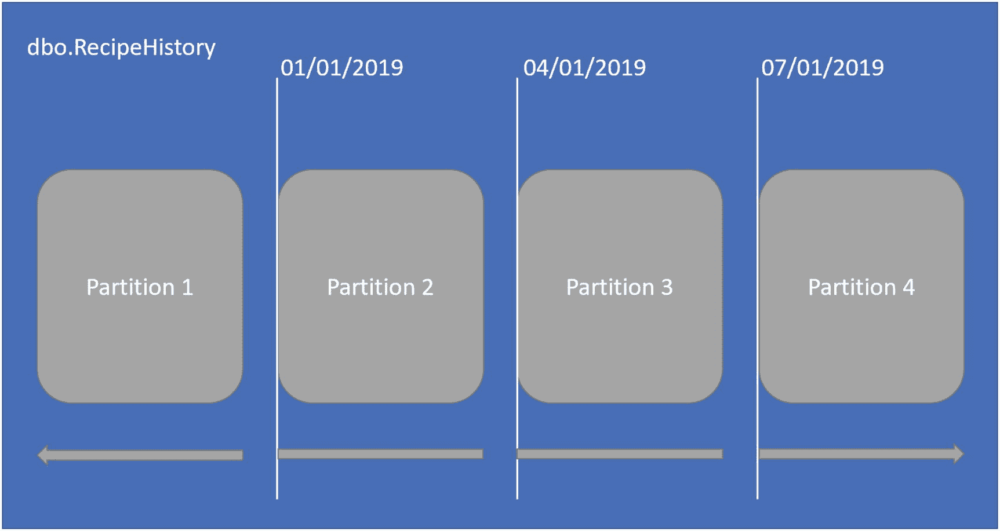
`Figure 15-3` 分区表数据结构

在分区表内部，你可以清晰地看到每个分区。在分区表内，你还可以看到分区函数上的正确范围如何将数据分解到各个分区。你可以通过运行 `Listing 15-7` 中的查询来确认表是如何分区的。

```sql
SELECT tbl.[name] AS TableName,
sch.[name] AS PartitionScheme,
fnc.[name] AS PartitionFunction,
prt.partition_number,
fnc.[type_desc],
rng.boundary_id,
rng.[value] AS BoundaryValue,
prt.[rows]
FROM sys.tables tbl
INNER JOIN sys.indexes idx
ON tbl.[object_id] = idx.[object_id]
INNER JOIN sys.partitions prt
ON idx.[object_id] = prt.[object_id]
AND idx.index_id = prt.index_id
INNER JOIN sys.partition_schemes AS sch
ON idx.data_space_id = sch.data_space_id
INNER JOIN sys.partition_functions AS fnc
ON sch.function_id = fnc.function_id
LEFT JOIN sys.partition_range_values AS rng
ON fnc.function_id = rng.function_id
AND rng.boundary_id = prt.partition_number
WHERE tbl.[name] = 'RecipeHistory'
AND idx.[type] <= 1
ORDER BY prt.partition_number;
```
`Listing 15-7` 查看分区表的分区情况

上面的查询显示了表名、表上使用的分区方案、表上使用的分区函数、分区号、数据分区值以及每个分区中的行数。`Figure 15-4` 显示了 `Listing 15-7` 中查询的结果。

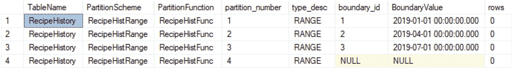
`Figure 15-4` 分区表的数据

以上结果是在分区表创建后立即获取的。你可以看到使用的分区方案是 `RecipeHistRange`，分区函数是 `RecipeHistFunc`。上面的边界值与创建分区函数时在 `Listing 15-3` 中指定的范围相匹配。查看上图 `Figure 15-4` 中 `rows` 列的值，你会发现所有值都是 0。这是因为表中没有任何行。

我将数据从一个预先存在的表插入到了这个分区表中。执行与 `Listing 15-7` 相同的查询，我可以看到数据是如何存储在分区中的。在 `Figure 15-5` 中，你可以看到每个分区的行数。

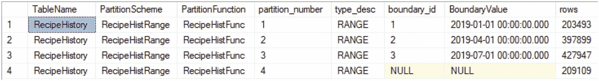
`Figure 15-5` 添加到分区表的数据

在 `Figure 15-4` 中，我展示了在 `dbo.RecipeHistory` 表中添加任何数据之前，每个分区的行数。`Figure 15-5` 显示了表完全填充后每个分区的行数。第一个分区有 203,493 行。我们知道分区中的实际行数，但我们可能仍然想确认表是否按预期对数据进行分区。在 `Listing 15-8` 中，我编写了一个查询来按日期范围统计记录数。

```sql
SELECT
SUM(
CASE WHEN DateCreated = '7/1/2019'
THEN 1
ELSE 0
END
) AS Partition4
FROM dbo.RecipeHistory;
```
`Listing 15-8` 用于确认行数的查询

查询中的第一列返回创建日期早于 2019 年 1 月 1 日的记录计数。假设分区函数按预期对数据进行分区，那么 `Figure 15-5` 中第一个分区显示的行数应与 `Listing 15-8` 返回的第一列值相匹配。`Listing 15-8` 的查询结果如 `Figure 15-6` 所示。


`Figure 15-6` 显示行数的查询结果

`Figure 15-6` 中的每一列都显示了存在于每个日期范围内的记录数。第一列代表创建日期早于 2019 年 1 月 1 日的记录数。第二列是创建日期从 2019 年 1 月 1 日开始，到 2019 年 4 月 1 日（不包括）为止的记录数。第三列遵循类似的模式，统计创建日期为 2019 年 4 月 1 日直到 2019 年 7 月 1 日的记录。最后一列用于所有创建日期在 2019 年 7 月 1 日或之后的记录。将这四列中的值与 `Figure 15-5` 中的 `rows` 列进行比较，可以帮助我们确认分区函数是否按预期工作。在我们的例子中，`Figure 15-5` 中 `rows` 列的值确实与 `Figure 15-6` 中的列值相对应。这证实了我们的数据正按预期进行分区。

我们已经验证了数据被正确地分类到各个分区中。然而，我们尚未确认是否有任何数据的值恰好匹配我们范围分区的确切日期。我们可以通过运行一个查询来验证这一点，比如 `Listing 15-9` 中的查询，它显示了与分区函数指定的日期和时间完全匹配的记录数。

```sql
SELECT COUNT(*)
FROM dbo.RecipeHistory
WHERE DateCreated = '1/1/2019'
```
`Listing 15-9` 用于确认范围函数的查询

当我运行上面的查询时，我最终得到了 14,720 条返回结果。这让我知道我的分区函数正在按预期工作。如果我返回的结果为零，我可能无法确定哪些具有确切日期和时间（2019 年 1 月 1 日 12:00:00:00.000）的记录会最终落在哪个分区。然而，由于我的分区显示了按日期和时间分组的正确计数，我知道我的分区正在按预期工作。


#### 概述

在上一节中，我们创建了一个空的分区表。一旦对表进行分区，我们就准备好随着时间推移管理该表的增长。这种数据增长的管理过程不是一次性发生的，而是需要在未来持续维护。对于这个表，我们需要在未来添加分区。这个过程将类似于清单 15-5 中展示的过程。

向现有分区表添加分区并不是我们可能需要对表进行分区的唯一时机。您也可能会遇到这样的情况：最初并未打算对表进行分区，但由于各种情况，您现在发现需要对表进行分区。在清单 15-10 中，您可以看到将非分区表更改为分区表所需的 T-SQL 代码。

```
ALTER TABLE dbo.RecipeHistory
DROP CONSTRAINT pk_RecipeHistory_RecipeHistoryID;
ALTER TABLE dbo.RecipeHistory
ADD CONSTRAINT pk_RecipeHistory_RecipeHistoryID
PRIMARY KEY NONCLUSTERED (RecipeHistoryID, DateCreated);
CREATE CLUSTERED INDEX ix_RecipeHistory_DateCreated
ON dbo.RecipeHistory (DateCreated)
ON RecipeHistRange (DateCreated);
Listing 15-10
向现有表添加分区
```

在实施分区之前，表中的所有数据都是按主键排序的。在本例中，主键是 `RecipeHistoryID`。然而，一旦我们对表进行分区，我们希望表按创建日期进行分段。这需要更改表中数据的存储方式。要让 SQL Server 更新数据的存储方式，您需要先删除原始主键。此时，您可以创建一个新的非聚集主键以及创建日期 (`DateCreated`)。将创建日期作为分区列的一部分包含在主键中对于分区表是必需的。完成此操作后，您可以在创建日期上创建聚集索引。该索引将在分区方案上创建。您需要注意，向表中添加这个非对齐的主键将阻止您在该表上使用分区切换。

如果您现有的非分区表中的所有数据都存在于新表的某个分区中，您可以选择轻松地将数据从非分区表移动到分区表。清单 15-11 显示了完成此任务所需的 T-SQL 代码。

```
ALTER TABLE dbo.RecipeHistory
WITH CHECK ADD CONSTRAINT ck_RecipeHistory_MinDateCreated
CHECK
(
DateCreated IS NOT NULL
AND DateCreated >= '08/01/2018'
);
ALTER TABLE dbo.RecipeHistory
WITH CHECK ADD CONSTRAINT ck_RecipeHistory_MaxDateCreated
CHECK
(
DateCreated IS NOT NULL
AND DateCreated < '10/01/2019'
);
ALTER TABLE dbo.RecipeHistory
SWITCH TO dbo.RecipeHistoryArchive
PARTITION RecipeHistory2018Q4;
Listing 15-11
将所有数据从非分区表切换到分区表
```

要切换非分区表中的数据，您首先需要证明非分区表中的所有数据都符合您将在分区表上使用的分区范围。您需要先在分区列上创建与分区范围匹配的约束。创建约束后，您就可以将所有数据从非分区表切换到分区表上指定的分区。

如果我有两个分区表，我可能希望将一个分区从一个表移动到另一个表。这个过程可以称为分区切换。完成此操作所需的 T-SQL 代码比清单 15-11 中的代码简单。在清单 15-12 中，我编写了数据库代码，将分区从当前表切换到新的归档表。

```
ALTER TABLE dbo.RecipeHistory SWITCH
PARTITION 1
TO dbo.RecipeHistoryArchive
PARTITION 1;
Listing 15-12
从分区表切换到另一个分区表
```

在这个例子中，我将 2018 年第四季度的记录从 `dbo.RecipeHistory` 表移动到 `dbo.RecipeHistoryArchive` 表。为了将一个分区从一个表切换到另一个分区表中的分区，您必须为每个表指定分区。目标表中的分区也必须是空的，此 T-SQL 代码才能执行。这种方法是管理数据随时间增长的一种特别直接和简单的方法。如果您创建一个特定的数据管理计划，并将数据从您的主要 OLTP 表移动到归档表，您可以保留所有数据，同时让高事务性的表仅保留与您的业务最相关的数据。

既然我们已经介绍了如何对新表和现有表进行分区，我想看看分区对查询执行意味着什么。数据通常是按每个事务发生的顺序记录的。这可能与特定的时间段相关，但情况并非总是如此。此外，即使数据是按特定顺序记录的，业务也可能经常希望根据特定的日期范围查看数据。我可能希望查看在特定日期范围内开始的食谱。发出清单 15-13 中的查询，我可以查看 `dbo.RecipeHistory` 表来查找此信息。

```
SELECT RecipeHistoryID,
RecipeID,
RecipeHistoryStatusID,
DateCreated
FROM dbo.RecipeHistory
WHERE DateCreated BETWEEN '10/7/18' AND '10/9/18';
Listing 15-13
在表分区前访问数据
```

在针对特定日期范围查询 `dbo.RecipeHistory` 表之后，我还可以查看 SQL Server 如何执行该 T-SQL 代码以找到我请求的数据。图 15-7 中的执行计划显示了数据是如何被检索的。


图 15-7

未分区表的执行计划

当执行此查询时，`dbo.RecipeHistory` 表尚未分区，并且该表是按聚集主键排序的。在本例中，即 `RecipeHistoryID`。虽然数据可能是按记录创建的顺序存储的，但 SQL Server 无法根据表的配置方式知道这是真的。为了确保 SQL Server 基于创建日期检索所有数据，SQL Server 需要检查表中的每条记录。这在前面由执行计划上的“聚集索引扫描”运算符表示。图 15-8 显示了与清单 15-3 中的查询相关的一些属性。

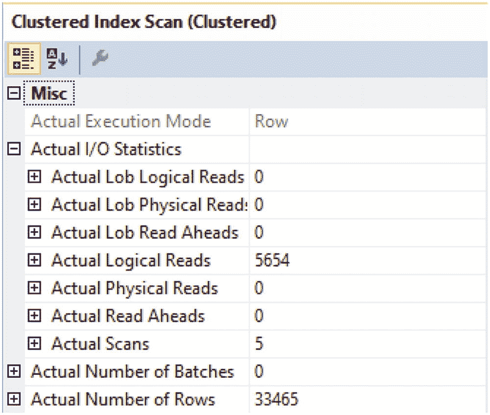

图 15-8

与聚集索引扫描相关的读取操作

此查询返回的总记录数为 33,465。本地读取总数为 5,654。这表示为确定符合此查询条件的记录数而访问的总页数。


#### SQL Server 分区表性能比较

前述数值代表了 SQL Server 在非分区表上执行查询的方式。我们可以比较清单 15-13 中的查询在非分区表和分区表上的性能。我们可以为 `dbo.RecipeHistory` 表添加一个分区，并将结果与前面的非分区表进行比较。首先，我需要删除现有的主键，并添加一个新的非聚集主键，类似于清单 15-10 中的那个。由于此表不再有聚集索引，如果我尝试重新运行清单 15-13 中的查询，我将得到一个类似于图 15-9 中的执行计划。

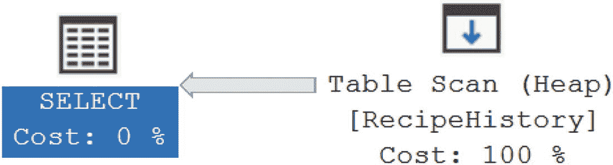

图 15-9 分区表上没有在分区键上创建聚集索引

如果您忘记在分区列（包含分区范围）上添加新的聚集索引，最终会得到一个堆表。在这种情况下，结果是需要对表进行全表扫描以查找符合指定日期条件的任何记录。虽然您可能期望此示例与上一个示例的逻辑读取次数相同，但图 15-10 显示了不同的结果。

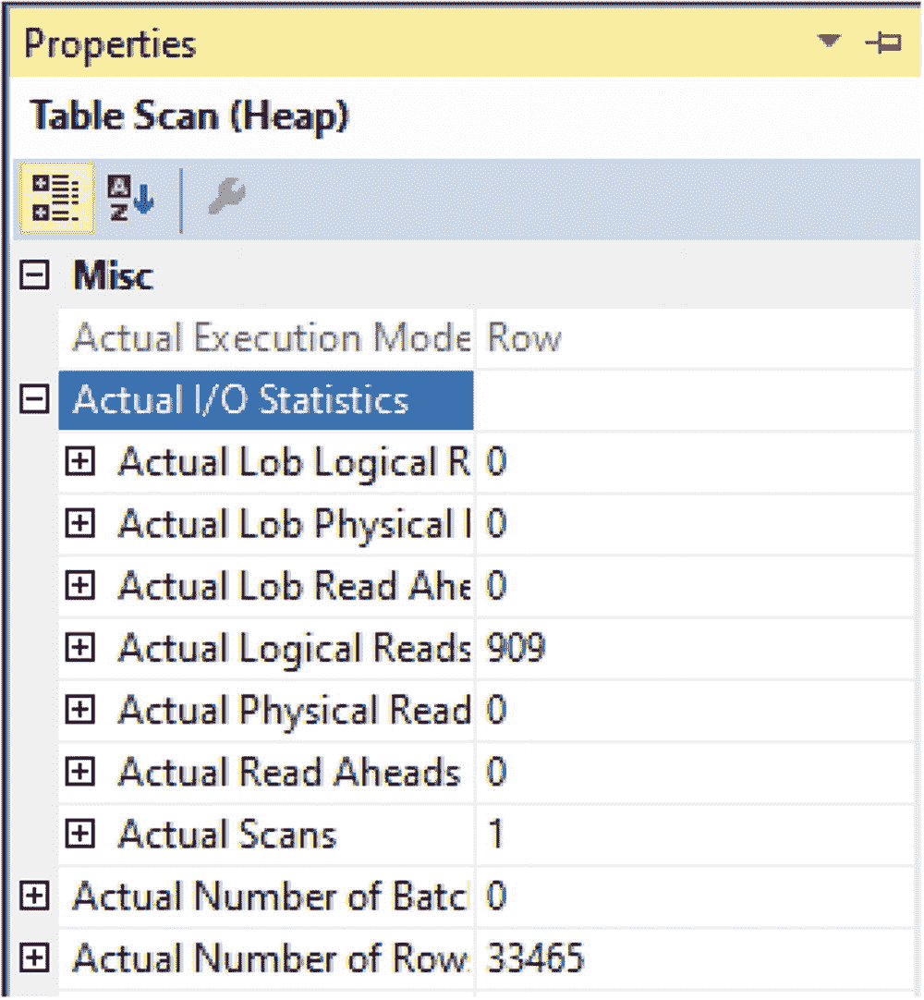

图 15-10 在没有分区键聚集索引的分区表上执行查询的读取情况

在第一个示例中，图 15-8 显示为找到 `dbo.RecipeHistory` 中符合指定日期范围的所有记录，进行了 5,654 次逻辑读取。对表进行分区，并用 `RecipeHistoryID` 和 `DateCreated` 的组合替换原始主键，导致逻辑读取次数从图 15-10 所示的 5,654 次下降到 909 次。虽然逻辑读取次数显著下降，但在分区表的分区列上执行需要全表扫描的查询并不理想。关键是要确保在分区表上有一个聚集索引，该索引能够利用分区列。

为了更好地利用您的分区表，您需要在分区表上包含一个聚集索引。这包括拥有一个按分区键在分区方案上对齐的聚集索引。完成此操作后，您可以运行清单 15-13 中的 `T-SQL` 代码。您将获得一个类似于图 15-11 中的执行计划。

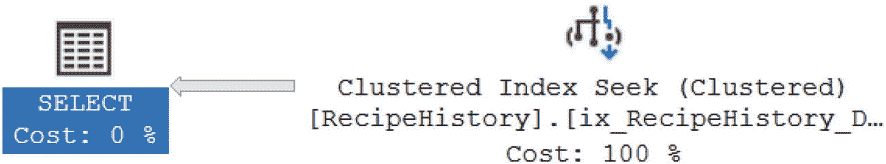

图 15-11 在分区键上有聚集索引的分区表

您可以看到 SQL Server 现在使用 `Clustered Index Seek` 来查找正确的数据。我们还可以查看此运算符的属性，以了解包含分区键的聚集索引会产生何种影响。您可以在图 15-12 中看到 I/O 统计信息和返回的行数。

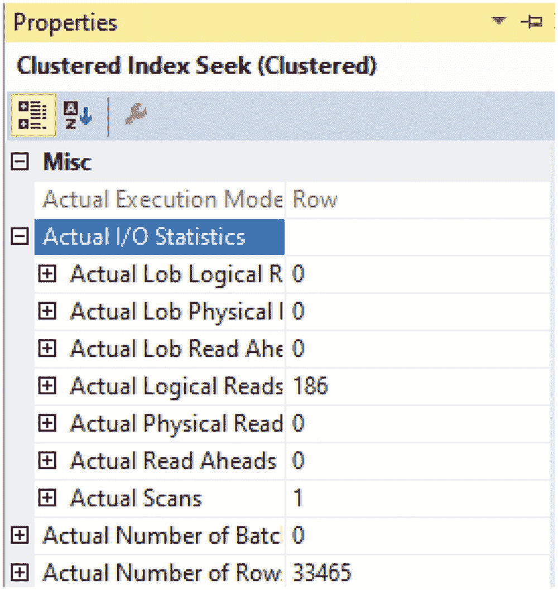

图 15-12 在分区键上有聚集索引的分区表上执行查询的读取情况

当我们最初在非分区表上运行此查询时，有 5,654 次逻辑读取。在没有聚集索引的情况下对表进行分区后，逻辑读取次数下降到 909 次。虽然较低的逻辑读取次数不能确定地表明性能会更好，但我们可以确认，查询在分区列上有聚集索引的分区表时，SQL Server 将读取更少的数据。现在在分区表上有了聚集索引，总逻辑读取次数已从 909 次下降到 186 次逻辑读取，如上图 15-12 所示。

正确创建分区表只是希望看到性能提升所面临挑战的一部分。主要方法是通过编写 `T-SQL` 代码来实现，这些代码包含允许分区消除的条件。清单 15-14 中的数据代码是一个未将分区列指定为条件的 `T-SQL` 代码示例。

```sql
SELECT RecipeHistoryID,
RecipeID,
RecipeHistoryStatusID,
DateCreated
FROM dbo.RecipeHistory
WHERE RecipeID = 4
AND RecipeHistoryStatusID = 2;
Listing 15-14
不使用分区列访问数据
```

因此，此查询将在表中的所有分区上执行。即使为指定的列存在索引，查询仍然需要分别查看每个分区中的数据，以确认返回了所有请求的数据。一旦决定了分区列，您应该在所有查询中包含该分区列，以便能够利用分区表。


### 分区视图

你可以通过创建分区表将单个表拆分为多个段。相反，你也可以将多个较小的表组合在一起，使它们像一个大表一样工作。以这种方式连接的表可以是分区的，也可以不是。与创建分区表类似，你也可以选择创建**分区视图**。

与分区表一样，你不应期望使用分区视图必然意味着将来使用此数据库对象的查询会获得更好的性能。但是，有一些设计原则可能会让你看到性能的提升。在使用分区表时，我们有分区消除的概念。在分区视图中也可以看到类似的概念。在清单 15-15 中，我在同一个分区方案上创建了两个表。

```sql
CREATE TABLE dbo.RecipeHistory2019
(
RecipeHistoryID         INT         NOT NULL,
RecipeID                SMALLINT    NOT NULL,
RecipeHistoryStatusID   TINYINT     NOT NULL,
DateCreated             DATETIME    NOT NULL,
DateModified            DATETIME    NULL,
CONSTRAINT pk_RecipeHistory2019_RecipeHistoryID
PRIMARY KEY NONCLUSTERED
(RecipeHistoryID, DateCreated),
CONSTRAINT fk_RecipeHistory2019_RecipeID
FOREIGN KEY (RecipeID)
REFERENCES dbo.Recipe(RecipeID),
CONSTRAINT fk_RecipeHistory2019_RecipeHistoryStatusID
FOREIGN KEY (RecipeHistoryStatusID)
REFERENCES
dbo.RecipeHistoryStatus(RecipeHistoryStatusID)
);
CREATE CLUSTERED INDEX ix_RecipeHistory2019_DateCreated
ON dbo.RecipeHistory2019 (DateCreated)
ON RecipeHistRange (DateCreated);
CREATE TABLE dbo.RecipeHistory2018
(
RecipeHistoryID         INT         NOT NULL,
RecipeID                SMALLINT    NOT NULL,
RecipeHistoryStatusID   TINYINT     NOT NULL,
DateCreated             DATETIME    NOT NULL,
DateModified            DATETIME    NULL,
CONSTRAINT pk_RecipeHistory2018_RecipeHistoryID
PRIMARY KEY NONCLUSTERED
(RecipeHistoryID, DateCreated),
CONSTRAINT fk_RecipeHistory2018_RecipeID
FOREIGN KEY (RecipeID)
REFERENCES dbo.Recipe(RecipeID),
CONSTRAINT fk_RecipeHistory2018_RecipeHistoryStatusID
FOREIGN KEY (RecipeHistoryStatusID)
REFERENCES
dbo.RecipeHistoryStatus(RecipeHistoryStatusID)
)
ON RecipeHistRange (DateCreated);
CREATE CLUSTERED INDEX ix_RecipeHistory2018_DateCreated
ON dbo.RecipeHistory2018 (DateCreated)
ON RecipeHistRange (DateCreated);
```
清单 15-15
为分区视图创建表

尽管这些表都在同一个分区方案上，但没有什么可以限制将存储在这些表中的数据类型。第一个表旨在存储 2019 年的数据，第二个表用于 2018 年的数据。但是，我需要向这些表添加约束，以确保每个表中存在正确的记录。在清单 15-16 中，你可以看到将要添加到两个表的约束。

```sql
ALTER TABLE dbo.RecipeHistory2019
WITH CHECK ADD CONSTRAINT ck_RecipeHistory2019_MinDateCreated
CHECK
(
DateCreated IS NOT NULL
AND DateCreated >= '01/01/2019'
);
ALTER TABLE dbo.RecipeHistory2019
WITH CHECK ADD CONSTRAINT ck_RecipeHistory2019_MaxDateCreated
CHECK
(
DateCreated IS NOT NULL
AND DateCreated < '01/01/2020'
);
ALTER TABLE dbo.RecipeHistory2018
WITH CHECK ADD CONSTRAINT ck_RecipeHistory2018_MinDateCreated
CHECK
(
DateCreated IS NOT NULL
AND DateCreated >= '01/01/2018'
);
ALTER TABLE dbo.RecipeHistory2018
WITH CHECK ADD CONSTRAINT ck_RecipeHistory2018_MaxDateCreated
CHECK
(
DateCreated IS NOT NULL
AND DateCreated < '01/01/2019'
);
```
清单 15-16
向表添加约束

现在，2019 年的表有一个约束，只允许 `DateCreated` 从 2019 年 1 月 1 日到但不包括 2020 年 1 月 1 日的记录。2018 年的表上也有一个逻辑类似的约束，以便只有 2018 年创建的记录才能存储在此表中。

现在你有了两个不同日期范围的表，并且已向这些表应用了约束。下一步是创建分区视图。创建分区视图的过程相对简单，包括在每个底层表的 `SELECT` 语句之间添加 `UNION ALL`。创建分区视图的示例可以在清单 15-17 中找到。

```sql
CREATE VIEW dbo.vwRecipeHistory
AS
-- Select data from current read/write table
SELECT RecipeHistoryID,
RecipeID,
RecipeHistoryStatusID,
IsActive,
DateCreated,
DateModified
FROM dbo.RecipeHistory2019
UNION ALL
-- Select data from partitioned table
SELECT RecipeHistoryID,
RecipeID,
RecipeHistoryStatusID,
IsActive,
DateCreated,
DateModified
FROM dbo.RecipeHistory2018;
```
清单 15-17
创建分区视图

请注意，分区视图中使用的两个 `SELECT` 语句的列列表顺序相同。这是创建分区视图的要求。在创建分区视图时，还必须指定表的完整列列表。创建分区视图后，你可能想看看查询分区视图是如何工作的。

在本章前面，清单 15-13 中，我们查询了 `dbo.RecipeHistory` 表在 2018 年 10 月 7 日到 2018 年 10 月 9 日之间的日期范围。我们可以对分区视图查询相同的日期范围，如清单 15-18 所示。

```sql
SELECT RecipeHistoryID,
RecipeID,
RecipeHistoryStatusID,
DateCreated
FROM dbo.vwRecipeHistory
WHERE DateCreated BETWEEN '10/7/2018' AND '10/9/2018';
```
清单 15-18
使用分区列访问数据

清单 15-13 和清单 15-18 之间的 `T-SQL` 代码非常相似。这展示了在查询中改用分区视图而不是当前表名是多么容易。然而，我们真正感兴趣的是确认使用分区视图后执行计划如何变化。图 15-13 显示了运行清单 15-18 中的查询所生成的执行计划。

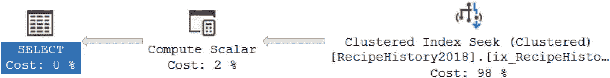

图 15-13
分区视图的执行计划

与本章前面引用的分区表类似，分区视图的执行计划也使用了 `Clustered Index Seek`。即使分区视图包含了 2019 和 2018 年的表，从执行计划中也可以看出，`SQL Server` 在查找清单 15-18 中的查询结果时仅使用了 2018 年的表。我们还可以查看图 15-14 中 `Clustered Index Seek` 的属性。

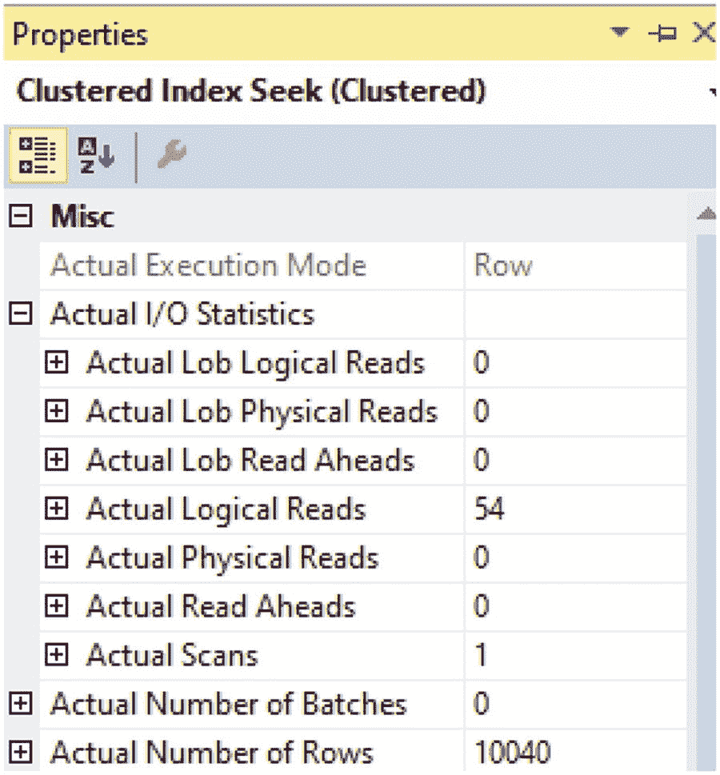

图 15-14
在分区键上使用聚集索引查询分区视图的读取情况

根据返回的行数，你可以看到 2018 年表中的数据与本章前面引用的分区表中的数据不同。你还可以看到逻辑读取的相对数量较低，趋势与本章前面的分区表类似。

清单 15-18 中执行的 `T-SQL` 代码基于每个表中的分区列和为每个表指定的约束访问了分区视图。我们看到，`SQL Server` 能够在查询数据时快速确定要访问哪个表。有时我们可能希望运行一个不包含分区列的查询，就像清单 15-19 中的那样。


#### 分区视图查询分析

```sql
SELECT RecipeHistoryID,
RecipeID,
RecipeHistoryStatusID,
DateCreated
FROM dbo.vwRecipeHistory
WHERE RecipeID = 4
AND RecipeHistoryStatusID = 2;
```

清单 15-19
不使用分区列访问数据

前面的查询正在搜索具有特定状态的特定配方。然而，没有任何迹象表明这些记录会存在于索引视图中的特定表内。由于 `SQL Server` 无法在查询中排除某些日期范围，我们得到了如图 15-15 所示的执行计划。

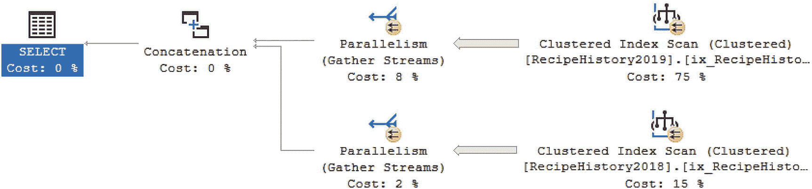

图 15-15
分区视图的执行计划

你可以看到，在此执行计划中，`SQL Server` 必须同时访问包含 2018 年数据的表和包含 2019 年数据的表。在此示例中，你可以看到，对于此请求访问的表数量没有带来任何好处。

使用分区视图可以帮助你将多个表组合成一个数据库对象。通过访问这个单一的数据库对象，你可以简化跨多个范围的 `T-SQL` 代码。你也已经看到，使用分区视图在限制访问的表数量方面是有益的，但如果你的查询中没有使用分区列，你仍然需要访问视图中包含的所有表。分区表将一个表拆分为多个段，而分区视图将多个表组合成一个数据库对象，你可能会发现将两者结合使用的优点。

#### 混合工作负载

公司使用数据库多年，可能积累了大量数据。通常，这些公司可能正在从这些数据中生成报告。在许多情况下，这些公司可能并未优先考虑构建数据仓库。对于这些情况，一个数据库通常需要同时执行两项任务。第一个角色是继续存储事务性数据。然而，第二个角色也是充当用于分析处理的数据仓库。在许多情况下，事务处理所需的数据库设计与分析处理的最佳设计不匹配。虽然公司可能愿意在未来转向数据仓库，但你可能会发现自己处于需要实施能够很好适应这种混合工作负载的设计的情况。

通过将分区表和非分区表与分区视图结合，我们可以为自己提供一些额外的灵活性。使用分区视图将允许我们使用单一的数据库对象和名称来访问特定用途的任何数据。在我们的示例中，我们将继续处理记录配方启动结果的数据。由于分区视图允许我们将多个表组合在一起，我们可以研究如何创建这些表。使用多个表的一个优点是每个表可以使用不同的索引。这种索引上的差异可以改变数据的存储和访问方式。我们还可以选择将一些表设为只读，这也可以表明我们不打算向这些表添加任何额外数据。

我们将创建一个分区视图来访问所有配方历史数据。我们可以创建的第一个表仅用于保存我们想要归档的所有旧数据。我们还可以对这个表进行分区，以便在基于表的分区键进行搜索时实现分区消除。在清单 15-20 中，你可以看到创建归档数据分区表所需的 `T-SQL`。

```sql
CREATE TABLE dbo.RecipeHistoryPartition
(
RecipeHistoryID         INT         NOT NULL,
RecipeID                SMALLINT    NOT NULL,
RecipeHistoryStatusID   TINYINT     NOT NULL,
DateCreated             DATETIME    NOT NULL,
DateModified            DATETIME    NULL,
CONSTRAINT pk_RecipeHistoryPartition_RecipeHistoryID
PRIMARY KEY (RecipeHistoryID),
CONSTRAINT fk_RecipeHistoryPartition_RecipeID
FOREIGN KEY (RecipeID)
REFERENCES dbo.Recipe(RecipeID),
CONSTRAINT fk_RecipeHistoryParition_RecipeHistoryStatusID
FOREIGN KEY (RecipeHistoryStatusID)
REFERENCES
dbo.RecipeHistoryStatus(RecipeHistoryStatusID)
)
ON RecipeHistRange (DateCreated);
```

清单 15-20
为归档数据创建分区表

前面的分区表是像本章中已包含的许多分区表一样创建的。与本章前面创建的分区表一样，该表也是在分区方案 `RecipeHistRange` 上创建的。现在我们有了一个分区表，我想创建一个非分区表，用于存储应用程序当前正在积极使用的数据。清单 15-21 中创建的表是非分区表的示例。

```sql
CREATE TABLE dbo.RecipeHistory
(
RecipeHistoryID         INT         NOT NULL,
RecipeID                SMALLINT    NOT NULL,
RecipeHistoryStatusID   TINYINT     NOT NULL,
DateCreated             DATETIME    NOT NULL,
DateModified            DATETIME    NULL,
CONSTRAINT pk_RecipeHistory_RecipeHistoryID
PRIMARY KEY (RecipeHistoryID),
CONSTRAINT fk_RecipeHistory_RecipeID
FOREIGN KEY (RecipeID)
REFERENCES dbo.Recipe(RecipeID),
CONSTRAINT fk_RecipeHistory_RecipeHistoryStatusID
FOREIGN KEY (RecipeHistoryStatusID)
REFERENCES
dbo.RecipeHistoryStatus(RecipeHistoryStatusID)
);
```

清单 15-21
为活动数据创建表


创建此表时并未指定 `RecipeHistRange` 的分区方案。该表将作为标准表创建在数据库的 `PRIMARY` 文件组上。

一旦基础表创建完成，我们便可以创建一个单一的数据库对象来访问这两个表。这将与上一节创建的分区视图相同。`清单 15-22` 包含了创建分区视图所需的 `T-SQL` 代码。

```sql
CREATE VIEW dbo.vwRecipeHistory
AS
-- 从当前的读写表中选择数据
SELECT RecipeHistoryID,
RecipeID,
RecipeHistoryStatusID,
DateCreated,
DateModified
FROM dbo.RecipeHistory
UNION ALL
-- 从分区表中选择数据
SELECT RecipeHistoryID,
RecipeID,
RecipeHistoryStatusID,
DateCreated,
DateModified
FROM dbo.RecipeHistoryPartition;
```

**清单 15-22** 创建分区视图

前面的分区视图使我们能够将最新且高度活跃的数据保留在一个没有分区的表中。可以对此表特别建立索引，以实现最佳的写入速度。分区视图中包含的任何其他表则可以根据其使用情况进行索引。前面分区视图中包含的分区表可能仅包含非活跃数据。因此，我们可以预期这些数据将来只会被读取。了解这一点后，我们可以使用不同的策略来索引此表。

回顾我们已经介绍的内容，我想展示 `SQL Server` 在查询非分区表时的行为。`清单 15-23` 中的查询用于在 `dbo.RecipeHistory` 表中查找特定日期范围的所有记录。

```sql
SELECT RecipeHistoryID,
RecipeID,
RecipeHistoryStatusID,
DateCreated
FROM dbo.RecipeHistory
WHERE DateCreated BETWEEN '2018/10/7' AND '2018/10/9';
```

**清单 15-23** 在分区表和视图之前访问数据

前面的查询将在非分区表上运行。在查询执行时，此表是按原始主键 `RecipeHistoryID` 排序的。因此，`清单 15-23` 中查询的执行计划如 `图 15-16` 所示。

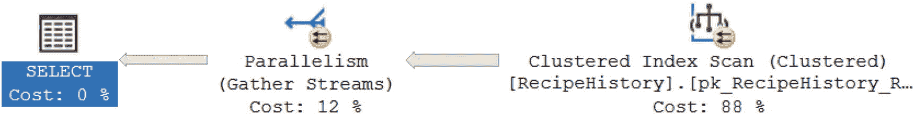

**图 15-16** 非分区表的执行计划

基于 `图 15-16` 中的执行计划，你可以看到 `SQL Server` 使用了 `聚集索引扫描` 来查找相关记录。这是因为没有包含 `DateCreated` 的索引。由于表没有按日期分区，`SQL Server` 也需要遍历整个表来查找满足 `清单 15-23` 中查询条件的数据记录。

运行此查询后，我们可以查看有关执行计划中运算符的更多信息。具体来说，我想查看此查询执行的逻辑读取次数和返回的行数。查看 `图 15-17`，你可以看到逻辑读取次数和行数。


**图 15-17** 与聚集索引扫描相关的读取

我们可以看到，此查询返回了 33,465 行，逻辑读取的总页数为 5,654 页。我们将把这些值与包含分区表和非分区表的分区视图的性能进行比较。

之前，在 `清单 15-22` 中，我创建了一个分区视图，其中包含一个用于所有 2018 年数据记录的分区表和一个用于所有 2019 年数据记录的非分区表。为了比较分区视图与非分区表的性能差异，我可以运行 `清单 15-24` 中的查询。

```sql
SELECT RecipeHistoryID,
RecipeID,
RecipeHistoryStatusID,
DateCreated
FROM dbo.vwRecipeHistory
WHERE DateCreated BETWEEN '2018/10/7' AND '2018/10/9';
```

**清单 15-24** 使用分区表中的分区列访问数据

前面的查询寻找的数据记录与 `清单 15-23` 中的查询相同。但是，此查询访问的是分区视图，而不是非分区表。该分区视图由一个包含所有 2018 年数据的分区表和一个包含 2019 年数据的非分区表组成。在 `图 15-18` 中，我们可以看到为此查询生成的执行计划。


**图 15-18** 分区视图的执行计划

需要注意的一个重要点是，此执行计划使用了 `聚集索引查找` 而不是 `聚集索引扫描`。这让我们知道 `SQL Server` 能够确定如何有效地找到相关数据记录，而无需遍历表中所有或大部分记录。另一个显著点是 `聚集索引查找` 是在分区的 `dbo.RecipeHistory2018` 表上执行的。我还可以查看与 `聚集索引查找` 相关的属性以获取更多信息。在 `图 15-19` 中，我们可以看到逻辑读取次数和返回的记录数。


**图 15-19** 在分区键上建有聚集索引的分区视图的查询读取

返回的总行数为 10,040 行，从内存中读取的数据页总数为 54。从内存中读取的数据页总数减少表明，此查询在查找相关数据方面比 `清单 15-23` 中的查询更高效。

我们已经看到了查询引用分区表的分区视图时在分区列上的表现。下一步是查看当访问非分区表时，查询分区视图是如何工作的。`清单 15-25` 显示了一个查询，用于从分区视图的非分区表中访问数据。

```sql
SELECT RecipeHistoryID,
RecipeID,
RecipeHistoryStatusID,
DateCreated
FROM dbo.vwRecipeHistory
WHERE DateCreated BETWEEN '2019/5/7' AND '2019/5/9';
```

**清单 15-25** 使用不在分区表中的分区列访问数据

前面的查询返回的列与 `清单 15-23` 和 `清单 15-24` 中的查询相同。`WHERE` 子句中的条件访问的是 2019 年而非 2018 年的数据。要查看这种日期变化如何影响生成的执行计划，我们可以在 `图 15-20` 中看到差异。

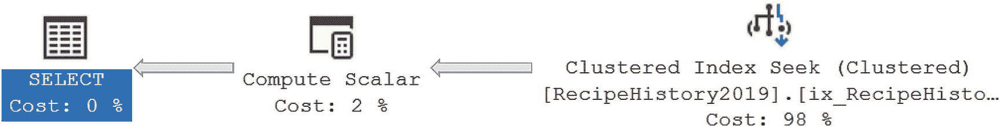

**图 15-20** 非分区表上的分区视图执行计划

类似地，在 `图 15-20` 中，前面的执行计划将在 `dbo.RecipeHistory` 表上使用 `聚集索引查找`。虽然分区表和非分区表的执行计划相似，但从 `SQL Server` 检索的数据量可能因执行计划而异。查看 `图 15-21` 可以显示 `清单 15-25` 中查询访问了多少数据。

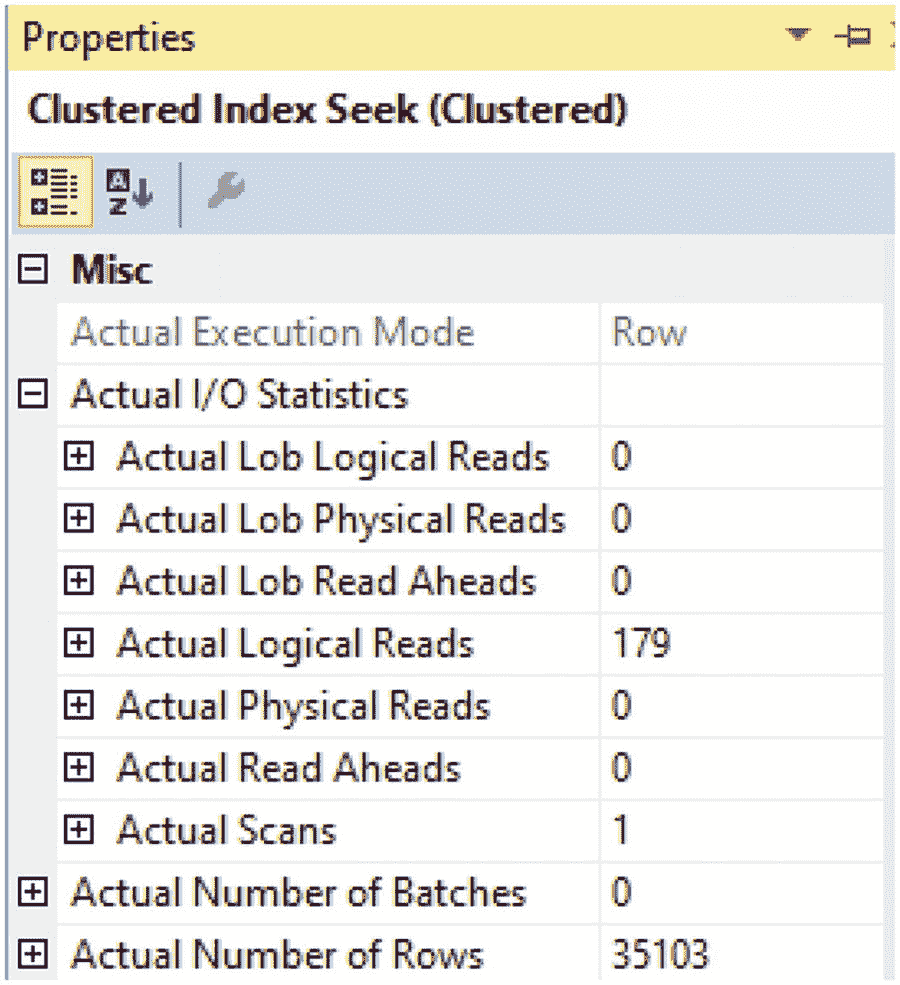

**图 15-21** 非分区表上的分区视图查询读取


在图 15-21 中，您可以看到有 `179` 个数据页从内存中读取，并返回了 `35,103` 条记录。此性能仍远优于所有数据存储在单个非分区表中的情况。

我们已经确认，分区视图对于访问分区表内和分区视图内非分区表的查询都运行良好。与分区表类似，使用作为分区一部分的列来查询数据仍然是最佳实践。在清单 15-26 中，我将使用非分区列来查询分区视图。

```sql
SELECT RecipeHistoryID,
       RecipeID,
       RecipeHistoryStatusID,
       DateCreated
FROM dbo.vwRecipeHistory
WHERE RecipeID = 4
  AND RecipeHistoryStatusID = 2;
```

*清单 15-26  不使用分区列访问数据*

您可以看到，在之前的查询中我没有引用日期，而是希望返回所有 `RecipeID` 为 `4` 且 `RecipeHistoryStatusID` 为 `2` 的记录。这里没有提供日期，因此 `SQL Server` 将需要访问分区视图中的所有表。我们可以在图 15-22 中看到清单 15-26 的执行计划。

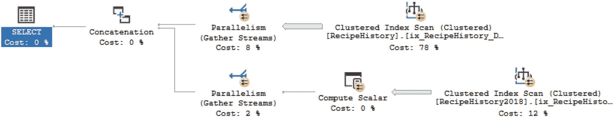

*图 15-22  非分区键上的分区视图的执行计划*

正如预期的那样，执行计划显示在 `dbo.RecipeHistory` 和 `dbo.RecipeHistory2018` 上进行了 `聚集索引扫描`。清单 15-26 中没有提供日期范围，这导致 `SQL Server` 访问分区视图中的两个表。查询条件没有利用表上的任何索引，因此需要执行 `聚集索引扫描`。这里的关键点是尽可能使用分区列。这使您最有可能享受到与数据分区相关的任何性能提升。

#### 总结与注意事项

您的应用程序和数据库使用时间越长，您会发现自己面临着管理生成数据的新挑战。在处理混合工作负载时，您可能会发现需要太多不同的方法来管理和访问数据。将表和分区表组合在分区视图中，可以为您提供所需的部分灵活性。将数据拆分为多个非分区表和分区表，可以让您根据访问这些表中数据的方式，在表上创建不同的索引。这种策略可以让您将仅包含近期数据的表与用于报告目的的任何数据分开存放。包含近期和当前数据的表随后可以配置为最大化应用程序性能。

`SQL Server` 中可用的选项之一是使用分区。您可以选择将信息分区到不同的文件组中。您还可以创建分区函数和分区方案，以帮助 `SQL Server` 确定如何分割数据。一旦分区方案应用于表中的某个列，该表就成为了分区表。用于分区方案的列称为分区键。当查询设计为使用分区键时，`SQL Server` 可以使用分区消除来查找符合查询条件的记录。除了使用分区表，您还可以选择使用分区视图。分区视图允许您将多个数据库对象组合成一个可由应用程序代码引用的单一对象。在运行查询时，`SQL Server` 将确定需要访问哪些对象以满足查询条件。您还可以将非分区表和分区表组合到同一个分区视图中。如果您发现自己处于数据库需要能够同时处理事务型和分析型查询的情况，此方法可能对您有所帮助。


## A
自适应联接 自动数据库调优 索引管理 计划修正 查询存储
## B
二进制字符串 缓冲池
## C
聚集索引扫描 聚集索引查找 编码标准 数据库设计 ANSI 标准 约束 外键 非聚集索引 范式 主键 表大小 值对，名称 性能 隐式转换 `NOLOCK` `NULL`值 `RECOMPILE` 可搜索选择数据 `SET NOCOUNT ON` 可用性 `BETWEEN` `CASE`语句 `CAST` 列 游标 链接服务器 `ORDER BY`语句 存储过程参数 `TRY…CATCH` `UNION`语句 注释 头信息 非标准实践 查询 存储过程 视图 公用表表达式 (`CTE`) 创建 执行计划 查询 递归 `CTE` 复杂逻辑 注释 动态游标，创建 头信息 输出，游标参数 查询，避免游标 查询，拉回 SQL Server CPU 服务器 执行计划 碎片 硬件 隐式转换 I/O `MAXDOP` 并行度 SQL Server T-SQL 查询 游标 数据类型 只进 动态游标 示例 执行计划 键集游标 输出 静态游标
## D
`DACPACs` 数据定义语言 (`DDL`) 触发器 数据操作语言 (`DML`) 触发器 创建 执行计划 `INSTEAD OF` 触发器 查询 更新语句 数据集 添加新记录 代码编写 参见数据集 代码 创建 `dbo.Recipe` 表 单个记录 配料表 插入数据记录 插入多条记录 搜索，`Ingredient Name` `SELECT` 语句 更新后的记录 数据集代码 删除数据 配料数据 配料 `Union` 插入数据 查询，除 查询 交集 逐条记录插入 `Select` 语句 `Union All` 联合，两个查询 更新为数据集 连接表 作为范围 逐条记录 日期和时间数据类型 `DATE` `DATETIME` `DATETIME2` `DATETIMEOFFSET` `SMALLDATETIME` `TIME` `DATEPART` 函数 部署 自动化应用程序和数据库 `DACPACs` 数据库更改 功能标志，移除 原始应用程序，移除 基于状态的迁移方法 T-SQL 代码 未修改的应用程序和数据库 功能标志 启用标志功能 插入记录 解决方案 存储过程 表创建 方法论 基于迁移的方法 回滚策略 SQL Server T-SQL 代码 工作流
## E
执行计划 索引使用情况 聚集索引 聚集索引扫描 聚集索引查找 键查找 非聚集索引 RID 查找 表扫描 逻辑联接类型 连接 全外联接 哈希匹配 合并联接 嵌套循环 `RecipeID` `RecipeIngredient` `RecipeIngredientID` `RIGHT SEMI JOIN` `UNION` 读取 实际行数 箭头 图形化执行 属性 排序运算符 `sys.dm_exec_cached_plans` 警告 XML 格式
## F
文件组 格式化 别名 `AND`或`OR` 大写 `COMMIT` 公用表表达式 游标 删除数据 `DELETE` 语句 `DML` 触发器 函数 插入数据 `ORDER BY` 语句 查询 联接 子查询 `ROLLBACK` `SELECT` 语句 表值参数 表变量 临时表 更新数据 用户定义表 视图 `WHERE` 子句
## G
`Git`
## H
`HIERARCHYID` 数据类型 混合工作负载 访问数据 聚集索引扫描 聚集索引查找 执行计划 非分区表 分区表 分区视图 未分区表
## I, J, K
索引视图 集成测试 数据仓库 定义 非活动/活动食谱 插入记录 手动食谱和配料存储过程 智能查询处理 自适应联接 实时查询统计信息 属性 查询，特定食谱 查询统计信息 索引管理 内存授予 行存储
## L
负载测试 日志记录 数据修改 `cdc.dbo_Recipe_CT` 变更记录，查找 数据捕获，`dbo.Recipe` `dbo.Recipe` 表，跟踪 插入记录 菜单数据库，跟踪 查询 已初始化记录 SQL Server 审计 跟踪数据库 跟踪结果集 更新 错误处理 食谱历史状态 `TRY…CATCH` 块 登录触发器
## M
内存 即席查询 缓冲池 缓存 逻辑读取 OLTP 查询 `RAM` `SSDs` 基于迁移的部署方法
## N
命名 聚集索引 数据库对象 外键 非聚集索引 对象资源管理器 主键 查询 存储过程 表 非聚集索引 范式 数字数据类型 近似 转换 精确 `BIGINT` `BIT` `DECIMAL/NUMERIC` `INT` `MONEY` `SMALLINT` `SMALLMONEY` `TINYINT`
## O
联机事务处理 (`OLTP`) 优化 持续时间 自适应联接 执行计划 食谱 SQL Server `sys.dm_exec_query_stats` T-SQL 语句 本地读取 优势 `dbo.RecipeIngredient` `DMVs` 执行计划 `IsActive` 标志 非聚集索引 查询 食谱和准备详情 `sys.dm_exec_sql_text`
## P, Q
并行度 参数，设计 即席查询 计划缓存，比较 `SELECT` 语句 存储过程 创建 执行 硬编码值 记录 窃听 变量 分区表 访问数据 添加分区 聚集索引 聚集索引扫描 创建 数据 数据增长 数据结构 执行计划 未分区表 全表扫描 非聚集主键 非分区表 分区方案 分区切换 查询结果 范围函数 `RecipeHistFunc.` `RecipeHistoryID` `RecipeHistRange` 行数 视图 分区 分区视图 访问数据 聚集索引查找 约束 创建表 创建日期范围 执行计划 限制表访问 `UNION ALL` 分区 `dbo.RecipeHistory` 表 定义 文件组 索引 键 左范围 新分区 分区列 分区消除 分区函数 分区方案 右范围 SQL Server 分区切换
## R
关系数据库管理系统 (`RDBMS`) 前滚策略 `ROWVERSION` 数据类型
## S
标量函数 代码 兼容模式 兼容模式 140 兼容模式 150 `CPU` 和耗时 执行计划 多语句标量 UDF 标量 UDF 基于集合的设计 数据记录 行 数据检索 数据集 组 数据 混合缓冲池 过程式代码 SQL Server 数据类型 固态硬盘 (`SSDs`) 排序运算符 源代码管理 优势 冲突 数据库 `Git` 前滚策略 设置 数据库项目 `GitHub` 操作 `Git` 仓库，创建 本地 `Git` 仓库 消息确认 SQL Server 连接 同步 子菜单 团队资源管理器 第三方工具 Visual Studio 控制 存储过程 `TFS` T-SQL 脚本 空间 地理数据类型 空间 几何数据类型 SQL Server 报表服务 (`SSRS`) `SQL_VARIANT` 数据类型 基于状态的迁移方法 静态代码分析 存储瓶颈 缓冲池 成本 数据 数据访问 引擎 索引 tempdb 事务日志 存储过程，设计 即席查询 逻辑 即席查询，修改 创建 执行计划 计划缓存 SQL Server 字符串数据类型 `BINARY` 字符 `CHAR` `TEXT` `VARCHAR` `IMAGE` Unicode `NCHAR` `NTEXT` `NVARCHAR` `VARBINARY`
## T
表数据类型 表值函数 内联 创建 执行计划 查询 `UDF` 多语句 代码 兼容模式 110 兼容模式 `110*vs* . 140` 兼容模式 `110*vs* . 140*vs* . 150` 兼容模式 140 兼容模式 150 创建 `CROSS APPLY` 优化过程 表值参数 代码示例 执行计划 基于集合的操作 存储过程 表变量 Team Foundation Server (`TFS`) 临时存储过程 临时表 全局 本地 持久 触发器 `DDL` `DML` 登录
## U, V
`UNION` 或 `UNION ALL` 选项 `UNIQUEIDENTIFIER` 数据类型 单元测试 活动食谱 代码 概念 连接字符串 创建 定义 对话框 `Empty ResultSet` 失败 实现 非活动食谱 通过 食谱 记录 运行 源代码管理 存储过程 测试条件 工具 用户定义函数 (`UDF`) 用户定义表类型 用户定义视图 即席查询 更改视图 调用 创建 定义 执行计划 插入数据 查询 移除列 架构绑定 更新数据
## W
`WITH RECOMPILE` 查询
## X, Y, Z
`XML` 数据类型
