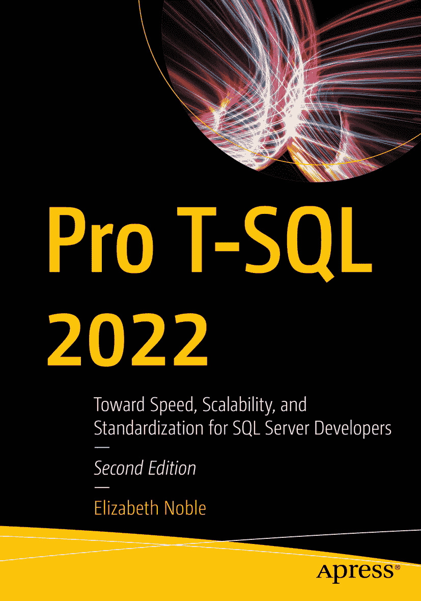

ISBN 978-1-4842-9255-6e-ISBN 978-1-4842-9256-3 [`doi.org/10.1007/978-1-4842-9256-3`](https://doi.org/10.1007/978-1-4842-9256-3) © Elizabeth Noble 2020, 2023 本作品受版权保护。出版商（The Publisher）独家全权许可所有权利，无论涉及材料的全部或部分，具体包括翻译、转载、插图 reuse、朗诵、广播、缩微胶片或其他任何物理方式的复制，以及信息存储与检索、电子改编、计算机软件，或任何目前已知或未来开发的类似或不同方法。在本出版物中使用通用描述性名称、注册商标、服务标记等，即使未作特别声明，也不意味着这些名称可免于相关保护性法律法规的约束而可自由用于一般用途。出版商、作者和编辑均可安全地假设本书中的建议和信息在出版时是真实准确的。出版商、作者或编辑均不对本文所含材料或可能存在的任何错误或遗漏提供明示或暗示的保证。出版商对于出版地图中的管辖权主张以及机构从属关系保持中立。

此 Apress 印记由 Springer Nature 的一部分、注册公司 APress Media, LLC 出版。

注册公司地址为：1 New York Plaza, New York, NY 10004, U.S.A.

