# 1. 数据类型

数据类型是编写高效且高性能的 `T-SQL` 的关键。虽然许多数据类型可以是数字、字符串或日期/时间，但也存在多种不属于这些类别的数据类型。在选择数据类型时，了解数据类型是什么以及何时最适合使用它非常重要。

数据类型最显而易见的用途是让用户知道每列中存储了什么类型的信息。SQL Server 存储不同数据类型的方式也存在差异，并且数据类型会影响 SQL Server 生成执行计划的方式。此外，所有列都有基于数据类型和列行数的存储成本。这些存储需求的影响将在第 7 章中进一步讨论。正如您将在本章后面发现的，数据类型还会影响执行计算的成本以及这些计算的结果。

## 数值数据类型

虽然数字看起来都一样，但 `T-SQL` 将数值数据类型细分为几种不同的类别。这些类别可以包括整数或带小数点的数字。数字还根据是精确的还是近似的进行分类。保存数字时，数据类型也会根据数值范围而变化。在进行数学计算时，了解如何处理各种数值数据类型对于确保应用程序按预期处理数据至关重要。

虽然从每个类别中选择最常见的数据类型可能最简单，但有时最好分析将要存储的数据，并寻找更合适的选择。选择数据类型时，需要考虑多种因素。最重要的一步是弄清楚将要存储什么样的数据。下一个合乎逻辑的步骤是考虑数据将如何使用。此外，了解 `T-SQL` 如何处理涉及各种数据类型的计算也很重要。如果要存储一年中的第几天，应该使用一个允许使用 1 到 366 之间值的整数。在存储大公司的收入时，需要一个带有多位数和两个小数点的数字。然而，如果需要存储一加仑汽油的价格，则需要一个带有两位数字和几个小数点的数字。所有这些情况在 SQL Server 中的定义都不同。


### 精确数字数据类型

有些情况下，数字的值是确定且已知的。这类数字可以称为精确数字。一些例子包括表示真或假的 1 或 0、已售单位数量、折扣百分比，或美元和美分。在选择最佳数据类型时，通常会有几种类似的数据类型似乎都能胜任。在某些情况下，一个类别下可能有不止一种数据类型可用。

在考虑使用何种数据类型时，你需要思考该数据类型的用途。这有助于在确定应使用哪种数据类型时提供更好的清晰度。你需要权衡每种数据类型的优点和缺点。你还需要考虑在与其他数据类型的值进行计算时，SQL Server 是否会因此数据类型的使用而执行任何隐式转换。最后一点是考虑该数据类型在 SQL Server 中是如何存储的。以下是一系列精确数字数据类型。对于每种类型，你都会了解到其一些优点、缺点和常见用例。

#### BIT

`BIT`数据类型用于存储二进制数字，值为 1 或 0。在 T-SQL 中，数据类型也可以为可空，这表明`BIT`数据类型也可以存储`NULL`值。由于只有三种可能的值，这种数据类型具有最小的值集。因为可以存储在该数据类型中的值种类很少，`BIT`数据类型在磁盘上也只需要最小的存储空间。由于一个字节中有 8 位，在数据库中存储`BIT`数据类型的情况也是如此。

`BIT`数据类型非常适用于“非 X 即 Y”的场景。存储的信息可以被解释为真或假、开或关、是或否。在真或假的情况下，`BIT`类型可用于指示数据记录是否被成功转换。使用`BIT`类型指示开或关的一个常见场景是，指示某个特定功能是否已启用。一个是或否值的例子是记录客户选择接收公司营销信息的决定。

使用`BIT`数据类型的一个挑战是确保以促进良好数据库设计的方式使用它。这意味着有时在选择`BIT`数据类型时，你需要考虑其整体目的。例如，用`BIT`数据类型来指示一个物品是否具有特定特性似乎是个好主意。一个例子是在`Product`表中添加一列`IsWood`来指示某个零件是否由木材制成。然而，更好的做法可能是重新设计数据库，将这些属性记录在另一个表中。

`BIT`可用于指示事务的成功状态。然而，通常更好地记录事务在一段时间内的状态。如果记录状态随时间的变化很重要，那么使用`BIT`来记录事务是否成功可能不是最佳选择。虽然`BIT`占用空间小，非常适合是或否的值，但有时你需要一列有比是或否更多的选项，因此需要考虑更大的数据类型。

#### TINYINT, SMALLINT, INT 和 BIGINT

SQL Server 还允许你存储整数，即没有小数或分数值的数字。这些数字被称为整数。以整数存储的数据的一个例子是给定物品的数量。SQL Server 中可以存储多种整数值。第一种整数类型是`TINYINT`。`TINYINT`值可以包含 0 到 255 之间的任何整数值。由于该数据类型的大小有限，它可能适用于有限的配置类型或地点数量。该数据类型类似于`BIT`数据类型，但其范围稍大一些。该数据类型也可用于配置系统中的状态类型或对象的类别。`TINYINT`非常适合存储这些状态类型，因为许多应用程序不需要超过 256 种状态。

既然我们已经介绍了`TINYINT`，现在来讨论`SMALLINT`的可能性。`SMALLINT`的范围涵盖了大约 70,000 个可能的值。有了这个范围，你需要考虑什么样的值需要介于 256 到 65,435 个唯一值之间。`SMALLINT`的范围从-32,768 开始，到 32,767 结束。该数据类型不适用于记录每一项活动的日志表。许多数据库或数据表在几年内可能会有超过 70,000 笔事务或记录。这可能导致该数据类型不适合那些表。然而，在其他表中，`SMALLINT`数据类型可能是理想的。

如果你的数据表交易活动不高，但会持续增长一段时间，那么`SMALLINT`数据类型可能是有益的。了解你的业务将有助于确定`SMALLINT`是否适合存储该值的正确数据类型。

如果你想创建一个表来持续为应用程序添加功能，你可能希望存储一条记录来指示应用程序中的每个新功能。一个例子是功能标志。你的应用程序在其生命周期中很可能会有超过 256 项增强功能。你可能还想存储应用程序的配置值。将这些配置值存储在表中可能会受益于`SMALLINT`数据类型。

`INT`是整数数据类型中最常用的。许多数据库专门对任何类型的整数使用此类型，这是不推荐的。原因之一是它的整个范围涵盖了大约 53 亿条记录。`INT`数据类型的范围从-2,147,483,648 到 2,147,483,647。然而，当创建许多数据表时，它们的标识列通常从整数 1 开始，或称为种子。这导致表被限制在大约 21.5 亿个唯一标识值。如果你认为你的表将需要超过 21.5 亿个唯一标识记录，你可能希望标识列从最低的数字开始，即–2,147,483,648，或者尝试使用`BIGINT`。很少有情况需要比`INT`更大的值，而且我认为有很多时候使用`INT`数据类型，而`TINYINT`或`SMALLINT`会是更好的选择。`BIGINT`数据表可以存储从-9,223,372,036,854,775,808 到 9,223,372,036,854,775,808 的值，并且占用的空间是`INT`的两倍。

这通常是你可能需要进行数学计算的地方。一些企业每秒处理几百笔交易。其他企业每秒处理高达 10,000 或 20,000 笔交易。在这两种情况下，重要的是考虑保存这些事务信息的表预期会有怎样的增长。如果你的应用程序在几年内每秒有数百笔交易，那么存储的记录数量将远少于应用程序在相同时间段内每秒有数万笔交易的情况。

```
if (condVar > someVal) {console.log("xxx")}
```


#### 关系数据库中的整数数据类型

关系数据库几乎总是拥有比其他任何数据类型都多的整数数据类型。这些整数用途广泛，从自增表的主键、创建表间关系，到存储业务各个方面的信息。一个常见的诱惑是将所有整数都当作 `INT` 处理，但在选择使用哪种数据类型时应该多加注意。

举个例子，想象一个货运行业的数据库。如果你想保存一天内行驶的公里数，你不需要一个大于 2,880 的数字（每小时 120 公里乘以一天 24 小时）。存储发票上的行数，对于大多数企业来说都会小于 256。也可能有业务的某部分需要每几分钟存储一次送货车辆的位置。如果有 5,000 辆卡车每两到三分钟更新一次该表，三年后该表可能会增长到三十亿条记录。在这种情况下，你需要选择一个 `BIGINT`，可能初始化为 -9,223,372,036,854,775,808，而不是选择初始化为 1 的 `INT`，后者只允许你保存 2,147,483,647 条记录。

#### DECIMAL/NUMERIC

既然我们已经讨论了各种整数，现在让我们考虑如何处理需要小数位的数字。在很多情况下你都会需要小数位。`DECIMAL` 和 `NUMERIC` 之间没有区别。在 SQL Server 中，它们是同一种数据类型。其中一些情况涉及使用美元和美分，其他时候你需要小数位来保证测量的精度。在这些场景下有几种选择。

首先，是 `DECIMAL` 选项（也称为 `NUMERIC` 数据类型）。这个值不保存任何货币信息；但是，它会记录小数位。这些小数位可以通过指定要存储的总位数和小数点右边的位数来设定。例如，`DECIMAL(10,4)` 数据类型表示你可以存储一个数字，其小数点左边有 6 位（即 10 减 4），小数点右边有 4 位，例如 999999.9999。如果你创建的数据类型是 `NUMERIC(9,2)`，你可以存储从 -9999999.99 到 9999999.99 的数字。你会发现 `DECIMAL` 或 `NUMERIC` 数据类型对于几乎所有涉及数字的数据类型都是可以接受的。这包括通用数字、小数、测量值和货币价值。

考虑到 `DECIMAL` 类型可以表示多种不同类型的数字，让我们来审视一下这种数据类型。`DECIMAL` 数据类型有一些特定的术语。构成 `DECIMAL` 数据类型的值是精度和小数位数。精度指的是 `DECIMAL` 数据类型中存储的总位数。小数位数指的是存储在小数点右边的位数。回顾之前货运行业的例子，如果你想存储每升公里数，使用 `DECIMAL(3,1)` 数据类型可能是合理的，因为你不太可能拥有 99.9 的每升公里数。

#### SMALLMONEY 和 MONEY

接下来要讨论的数据类型是 `MONEY` 和 `SMALLMONEY`。`MONEY` 和 `SMALLMONEY` 数据类型类似于 `DECIMAL` 或 `NUMERIC` 数据类型。`SMALLMONEY` 和 `MONEY` 数据类型也可以用来存储货币价值。SQL Server 保存数值，但不包含与所保存值关联的货币类型。

`MONEY` 和 `SMALLMONEY` 数据类型之间最大的区别在于大小和所需的存储空间。`SMALLMONEY` 数据类型的范围是 –214,748.3648 到 214,748.3647，使用的存储空间是 `MONEY` 类型的一半，后者的范围是 –922,337,203,685,477.5808 到 922,337,203,685,477.5807。

`MONEY` 数据类型最多可精确存储四位小数。小数位的限制将精度限制到所存储货币价值的万分之一。`MONEY` 数据类型将所有值保存到四位小数。固定的小数位数会影响四舍五入对涉及 `MONEY` 数据类型的计算的影响。这是因为 SQL Server 将 `MONEY` 数据类型保存为 `BIGINT`。同样，`SMALLMONEY` 数据类型被保存为 `INT`。这就解释了为什么使用 `MONEY` 或 `SMALLMONEY` 时可能会有四舍五入的问题。

只要您意识到 `MONEY` 数据类型可能对计算产生的影响并相应地进行规划，选择 `MONEY` 还是 `DECIMAL(9,4)` 主要是一个偏好问题。主要目标是在存储与货币相关的数据时保持一致性，以便数据库管理员和开发人员都能快速理解相关数据字段的目的和含义。虽然这种数据类型比 `DECIMAL` 节省空间，但您的数据库管理员还可以通过其他方式节省空间，而不涉及更改数据类型。

### 近似数字数据类型

接下来，我们来分析精确数字和近似数字之间的区别。精确数字适用于你确切知道其数量的事物，比如你在商店买了多少件物品，或者确切的美元和美分数额。近似数字适用于测量可能不精确的场景。近似数字可用于存储非常大或非常小的数字。你可能还会发现你的应用程序正在记录一个不精确的测量值。你可能剪下一块接近但不完全等于特定值的布料长度。例如，布料的长度可能在 12 英寸左右。存储 12 英寸的值将是一个近似值。这个 12 英寸的测量可能非常接近，以至于很难看出布料的长度不是正好 12 英寸。

在处理近似数字时，会涉及到一些四舍五入问题。这是因为已知近似数字不是精确的测量值。在 SQL Server 中，有一种近似数字的选项。这种数据类型叫做 `FLOAT`。如果浮点数有 24 位数字，其同义数据类型是 `REAL`。

> **注意**
>
> 可能会很想使用 `FLOAT` 或 `REAL`，因为它们可以容纳非常大的数字，并且分别只使用 4 或 8 个字节。但是，这些数据类型在某些 `WHERE` 子句中表现不佳。这些数据类型应仅在非常有限的情况下使用，即当无法使用 `DECIMAL` 或 `BIGINT` 时。
>
> 在使用 `REAL` 或 `FLOAT` 数字时，将这些数据类型转换为其他数据类型可能会出现问题。当你将 `FLOAT` 数据类型转换为 `INTEGER` 时，小数部分的所有值都会被截断。请注意，使用近似数字可能会导致意外结果。一个例子是使用 `DECIMAL` 或 `NUMERIC` 数据类型时。当将 `FLOAT` 或 `REAL` 数字转换为 `DECIMAL` 或 `NUMERIC` 数据类型时，你只能保留七位小数。


### 转换数字数据类型

你已经探索了可用的数字类型，以及使用各种数字数据类型时会发生什么。除了存储数字，你还想了解各种数字数据类型如何相互作用。首先，让我们考虑当你使用相同数据类型的字段进行计算时会发生什么。在这些场景中，如果计算涉及的所有字段都是相同的数据类型，则计算结果的输出值也是相同的数据类型。因此，如果你将一个数量乘以一个价格，并且两个值都存储为 `NUMERIC` 数据类型的 `DECIMAL(5,2)`，它会给出相同的 `DECIMAL` 数据类型作为结果。SQL Server 根据初始精度和小数位数以及所执行的计算类型来确定结果的精度和小数位数。你还需要考虑精度和小数位数在应用程序中是如何存储的。应用程序可能期望一个 `DECIMAL(5,2)` 的值。根据所执行的计算，返回的数据值可能超出指定数据类型的范围。这可能导致计算溢出。

当涉及多种数据类型时，情况会变得更复杂一些。再次使用数量乘以价格的例子，让我们研究一下如果你的 `INT` 数据类型的数量与 `DECIMAL(5,2)` 数据类型的价格进行计算会发生什么。SQL Server 使用数据类型优先级的过程。首先，你应该熟悉目前所涉及数据类型的数据类型优先级顺序。以下列表按优先级从高到低排列：

1. `FLOAT`
2. `REAL`
3. `DECIMAL`
4. `MONEY`
5. `SMALLMONEY`
6. `BIGINT`
7. `INT`
8. `SMALLINT`
9. `TINYINT`
10. `BIT`

在前面的场景中，你同时使用了 `INT` 和 `DECIMAL` 数据类型，在上面的列表中分别显示为第 8 行和第 3 行。由于 `INT` 的优先级较低，你可以预期 SQL Server 会在内部将 `INT` 数据类型转换为 `DECIMAL` 数据类型。这称为隐式转换，它会增加查询执行时间。此转换不会更改原始数据值，只会更改 SQL Server 在计算中使用此值的方式。一旦此转换完成，SQL Server 就会继续进行计算。除非你正在执行类似尝试连接数字和字符串数据类型的操作，否则这很有效。

## 字符串数据类型

现在你了解了如何使用数字数据类型，你应该花一些时间了解各种字符串数据类型。这些数据类型用于存储字母、字母和数字的组合。此外，字符串数据类型用于存储非 Unicode 或 Unicode 字符值。字符串数据类型的最后一个类别包括图像和二进制值。

### 字符串数据类型

有些信息存储在数据库中，与数字没有直接关系。存储在字符字符串中的数据可以是 ANSI 或 Unicode。字符串也可以创建为固定长度或可变长度。这些数据可以是名称、描述、地址或其他字符值。确定使用哪种数据类型取决于所存储的信息类型以及需要存储多少信息。在本节之后，你将能够根据需要选择正确的字符串数据类型。

#### CHAR 和 VARCHAR

两种可用的字符字符串数据类型是 `CHAR` 和 `VARCHAR`。这些数据类型相似，仅在字符串是存储为固定长度还是可变长度字符字符串方面有所不同。两种数据类型都用于存储文本数据，这些字段中可以存储的字符与列排序规则允许的字符相同。

`CHAR` 用于字符字段，表示数据类型具有固定长度。`VARCHAR` 用于可变字符字段。`VARCHAR` 中的 `VAR` 表示数据类型具有可变长度。如果数据长度相似，例如电话号码或邮政编码，那么 `CHAR` 可能是首选数据类型。但是，如果列宽度差异很大，例如地址行或备注列，那么 `VARCHAR` 将是更好的选择。

为 `CHAR` 或 `VARCHAR` 选择值时，可以选择 1 到 8000 之间的值或 `MAX` 这个词。请考虑将 `VARCHAR(MAX)` 的使用限制在你期望保存超过 8000 个字符的情况。如果指定了 `VARCHAR(MAX)`，则最大存储大小为 2 GB。但是，请考虑你是否需要此功能，或者使用较小字符数的 `VARCHAR` 可能更合适。

为了最大程度地减少数据截断，请确保在使用 `CHAR` 或 `VARCHAR` 数据类型时始终显式指定存储的字节数。`VARCHAR` 在数据定义中默认为 1，在使用 `CAST` 或 `CONVERT` 函数时默认为 30 字节。

对于使用单字节编码字符（例如 Latin）的排序规则，`CHAR` 的存储大小（以字节为单位）等于字符数。使用 `VARCHAR` 时，字段的字符串长度（在单字节编码的情况下与字符数相同）加上两个额外的字节等于存储的总字节数。还可以在 `CHAR` 和 `VARCHAR` 数据类型中保存多字节编码字符。对于这两种数据类型，保存的字符数可能少于总字节数。

从 SQL Server 2019 开始，现在可以在 `CHAR` 或 `VARCHAR` 中保存 Unicode 值。但是，仅当启用 UTF-8 编码时才可能。

#### TEXT

`TEXT` 数据类型过去用于存储非常大的字符串。但是，此数据类型已弃用。由于此数据类型已弃用，应避免在新开发中使用 `TEXT` 数据类型。如果你需要使用 `TEXT` 数据类型，请在新开发中改用数据类型 `VARCHAR(MAX)`。

### Unicode 字符串数据类型

在 SQL Server 2019 之前，任何 Unicode 文本数据都需要保存为特殊数据类型。在无法或未启用 UTF-8 编码的情况下，这仍然成立。

#### NCHAR 和 NVARCHAR

使用 Unicode 值时，有几个可用选项。这些选项包括存储固定长度或可变长度字符串。为了避免意外结果，你应了解如果未指定字符数或排序规则，这些数据类型如何工作。

一旦确定需要使用 `NCHAR` 或 `NVARCHAR` 数据类型，选择它们就变得容易了。如果要存储的数据长度通常相似，则 `NCHAR` 数据类型是正确的选择。但是，如果存储的值差异很大，则 `NVARCHAR` 数据类型可能是更好的选择。此外，如果要存储的字符数超过 4000，则建议使用 `NVARCHAR(MAX)`。

通常，最佳做法是在声明 `NCHAR` 或 `NVARCHAR` 数据类型时指定字符数。数据定义或变量声明的默认字符数对于 `NCHAR` 或 `NVARCHAR` 是 1 个字符。但是，使用 `CAST` 或 `CONVERT` 函数时，如果未指定，则默认字符数为 30。如果未为 `NCHAR` 或 `NVARCHAR` 数据类型指定排序规则，将使用默认数据库排序规则。

了解存储此数据类型所需的空间量还可以让你更好地判断这是否是正确的数据类型以及需要存储的字符数。存储 `NCHAR` 所占用的字节数是字节对字符串长度的两倍；使用 `NVARCHAR` 时，存储的字节数是字节对字符串长度的两倍加 2 个字节。


#### NTEXT

以前，存储超大的可变长度 Unicode 数据是通过 `NTEXT` 数据类型完成的。如果你的系统中仍在使用这种数据类型，可以预期它最多可存储 1,073,741,823 个字符。然而，由于 Unicode 值所占用的空间较大，实际存储的总长度可能会更短。展望未来，使用此数据类型已不再是最佳实践。取而代之，应使用 `NVARCHAR(MAX)` 数据类型。

### 二进制字符串数据类型

有时，你可能需要存储既非数字、字符，也非日期或时间值的数据。使用二进制字符串来存储那些是字符串但不包含字符的项可能很有用。这些项可以包括音频、视频、图像或其他类似项目。在这些情况下，使用二进制字符串可能是合适的。使用二进制字符串数据类型时有几种选择。

#### BINARY 和 VARBINARY

可用于存储二进制字符串数据的选项涉及存储固定长度或可变长度的字符字符串。与讨论过的其他字符串数据类型一样，在处理这些数据类型时也有一些注意事项。

可用的数据类型中有两种是 `BINARY` 和 `VARBINARY`。对于存储长度相似的二进制字符串，最佳选择是 `BINARY` 数据类型。相反地，当存储长度差异很大的二进制字符串数据时，`VARBINARY` 数据类型是更好的选择。如果预计二进制字符串的总长度将超过 4000 个字符，则建议使用 `VARBINARY(MAX)`。

在数据定义或变量声明中使用 `BINARY` 和 `VARBINARY` 数据类型时，如果未指定字符数，默认长度为 1。当使用 `CAST` 或 `CONVERT` 函数将 `BINARY` 转换为 `VARBINARY` 时，默认字符数为 30。当从具有不同长度的变量转换为 `BINARY` 或 `VARBINARY` 时请谨慎，因为 SQL Server 可能会根据需要填充或截断二进制数据。

`BINARY` 数据类型存储的字节数与所存储数据的长度相同，而 `VARBINARY` 则使用 2 个字节加上与数据长度相同的字节数。这两种数据类型的长度最高可达 8000。对于 `VARBINARY(MAX)`，最大存储大小为 2 GB。

#### IMAGE

`IMAGE` 数据类型曾用于存储大型可变长度二进制数据。对于 `IMAGE` 数据类型的情况，你应该继续使用 `VARBINARY(MAX)` 数据类型，因为 `IMAGE` 数据类型已被弃用。

### 数据类型的排序规则

数据可以配置为切换大小写敏感性，这决定了小写字母 c 是否被视为与大写字母 C 相同。还有重音敏感性，用于确定 n 是否被视为与 ñ 相同。你还可以指明片假名和平假名是否应基于假名敏感性进行相同排序。其他一些类型的排序规则选项基于宽度、变体选择符、二进制、二进制代码点和 UTF-8 敏感。所存储的敏感性被称为排序规则。列的排序规则与数据库的排序规则相同，除非存在特定的覆盖设置。

### 日期和时间数据类型

每个数据库事务都发生在特定的时间点。可能有必要参考或知道事务发生的时间。你的应用程序可能记录一个人的重要日期，包括生日或纪念日。日期和时间也可用于确定定价和功能。通过使用日期和时间，你可以确定何时应启用或禁用功能。日期和时间还可以显示用户账户何时不活动、系统访问何时启用或过期。定价和计费率可能涵盖多个不同的日期范围。当一组定价失效时，另一组可能生效。由于法规要求，你的公司可能需要记录一段时间内的定价。这包括指明定价费率开始和停止的时间。根据跟踪此信息的目的，你可能只需要知道交易的日期或时间。在其他情况下，最好同时知道与某个操作关联的日期和时间。

#### DATE

在处理事务时，可能有特定的情况需要你记录某事发生的时间。在某些情况下，可能只关心交易发生在哪一天。`DATE` 数据类型也可用于存储特定日期的汇总数据。在记录活动日期时，关于如何显示该数据可能有一些可用选项。在选择 `DATE` 数据类型是否适合你的情况时，考虑不仅为 `DATE` 数据类型存储了多少数据，还有存储数据的任何可能限制，这也很重要。

会有一些时候，应用程序或用户需要知道特定操作发生的时间。在决定 `DATE` 数据类型是否是合适的选择时，请从用户和应用程序使用的角度考虑信息的需求。在某些情况下，考虑 `DATE` 数据类型何时不可取更容易。对于任何你想知道具体发生时间的操作，`DATE` 数据类型不是一个好的选择。然而，如果只需要知道操作发生在哪一天，那么 `DATE` 数据类型是一个很好的选项。

对于 `DATE` 数据类型，有几种关于如何显示 `DATE` 的选项。日期格式的默认值是 `YYYY-MM-DD`。在这种情况下，`YYYY` 代表四位数的年份，范围是 0001 到 9999。`MM` 代表从 01 到 12 的月份数，`DD` 代表一个月中从 01 到 31 的天数。`DATE` 可以以多种数字和字母格式显示。但是，格式 `ydm` 不受支持。

可以存储的 `DATE` 值范围从 0001-01-01 到 9999-11-31。`DATE` 数据类型的字符长度为十位，精度为 10，小数位数为 0。`DATE` 数据类型占用 3 个字节，并存储为 `INT`。

日期可以转换为 `DATETIME`、`SMALLDATETIME`、`DATETIME2` 或 `DATETIMEOFFSET`。但是，时间值被设置为午夜。日期无法转换为 `TIME` 数据类型，任何尝试执行此转换的操作都会失败并报错。此外，日期没有时区偏移，也不感知夏令时（DST）。

#### TIME

另一种与动作发生时间相关的数据类型是 `TIME` 数据类型。`TIME` 可用于记录事务或活动发生的具体时间。了解其存储方式和格式非常有用。使用 `TIME` 数据类型时，了解将其转换为其他 `DATE` 和 `DATETIME` 数据类型的影响会很有帮助。使用 `TIME` 数据类型也存在一些限制。

`TIME` 可用于记录事务或活动发生的具体时间。在这种情况下，时间独立于日期记录，将来可能无法确定具体日期。解决此问题的一种方法是将日期与时间分开存储。`TIME` 的精度高达 100 纳秒，其默认值为 `00:00:00`。

`TIME` 的默认格式是 `hh:mm:ss[.nnnnnnn]`。在此格式中，`hh` 代表从 0 到 23 的两位数小时，`mm` 代表从 0 到 59 的两位数分钟，`ss` 代表从 0 到 59 的两位数秒。`TIME` 数据类型允许不同的精度，如果指定，最多可以使用七位小数来表示秒的小数部分，即 `nnnnnnn`。这些值的范围可以从 0 到 9999999。

由于 `AM` 和 `PM` 用于区分上午和下午，在使用 `TIME` 时需要额外考虑。如果未提供 `AM` 或 `PM` 且小时值在 00 到 11 之间，则时间将被记录为 `AM`。对于 12 到 23 的小时，时间将被保存为 `PM`。书写 `TIME` 时，如果输入 `12 AM`，该值将转换为 0 时。

`TIME` 的范围是 `00:00:00.0000000` 到 `23:59:59.9999999`。字符长度可以从 8 到 16 位数字不等，具体取决于为 `TIME` 指定的精度。无论哪种情况，`TIME` 都保存为固定的 5 字节。如果 `TIME` 转换为任何包含日期和时间的数据类型，则其日期部分表示为 `1900-01-01`。如果 `TIME` 的小数精度高于新数据类型，则该值将被截断。任何将 `TIME` 数据类型转换为 `DATE` 的尝试都会失败。与 `DATE` 一样，`TIME` 既不感知时区，也不感知夏令时。

#### SMALLDATETIME, DATETIME, DATETIME2, 和 DATETIMEOFFSET

有时仅保存日期或时间可能不够。对于这些场景，最好将日期和时间值组合在一起。有时这些值可能比较简单，有时则需要更高的精度，或者需要感知时区。

一种这样的数据类型是 `SMALLDATETIME`。此数据类型用于记录特定的日期和时间。其默认值为 `1900-01-01 00:00:00`。此数据类型的精度为一分钟。虽然可以传入秒值，但它们总是会被四舍五入到最接近的分钟。

与日期数据类型一样，`SMALLDATETIME` 数据类型可以以多种数字和字母格式显示。与其他 `DATE` 和 `DATETIME` 数据类型相比，`SMALLDATETIME` 的范围有些有限。此数据类型的日期部分可以跨越 `1900-01-01` 到 `2079-06-06`。虽然输入的时间范围可以从 `00:00:00` 到 `23:59:59`，但数据库中保存的值将是 `00:00:00` 到 `23:59:00`。`SMALLDATETIME` 的总长度最多为 19 个字符，所需的存储大小总共为 4 个固定字节。

将 `SMALLDATETIME` 转换为其他 `DATETIME` 数据类型时，请记住，任何额外所需的精度都将记录为 0。虽然使用 `SMALLDATETIME` 可能很诱人，但此数据类型不符合 ANSI 标准。如前所述，此数据类型的分钟将根据传入的秒值进行四舍五入。如果传入的秒小于或等于 29.998，则分钟将向下舍入。否则，分钟将向上舍入。与日期和时间数据类型一样，`SMALLDATETIME` 也不感知时区或夏令时。

可用的选项不仅仅是 `SMALLDATETIME`。`DATETIME` 是一个比前面提到的数据类型精度更高的选项。使用此数据类型时还需要考虑几个关键点。

虽然 `DATETIME` 数据类型可以记录特定的日期和时间，但它可能不符合 SQL 标准。此数据类型的一个关键问题与其准确性限制有关。`DATETIME` 数据类型可以为小数秒记录三位小数；第三位小数总是被舍入到以 `.000`、`.003` 或 `.007` 结尾的增量。

如果未指定值，`DATETIME` 的默认值为 `1900-01-01 00:00:00`。使用此数据类型时，有多种数字和字母格式可用。`DATETIME` 的年份范围是 `1753-01-01` 到 `2999-12-31`，时间范围可以从 `00:00:00.000` 到 `23:59:59.997`。此数据类型的大小为 8 字节，字符长度范围从 19 到 26。

虽然可以将其他数据类型转换为 `DATETIME`，但不推荐这样做，因为此数据类型不符合 SQL 标准，也不是 ANSI 兼容的。此数据类型也不感知时区或夏令时。

`DATETIME2` 数据类型是从 SQL Server 2008 开始添加到 SQL Server 中的。许多应用程序早于 SQL Server 2008，因此尽管 `DATETIME2` 具有明显的优势，但它不如 `DATETIME` 常用。`DATETIME2` 数据类型比前面提到的数据类型有一些额外的优势。虽然前面提到的一些数据类型具有固定大小，但此数据类型的功能略有不同。您还将了解到存储和格式化此数据类型的可用选项。

`DATETIME2` 数据类型允许记录特定的日期和时间，精度高达 100 纳秒。`DATETIME2` 的默认值为 `1900-01-01 00:00:00`。由于这种精度水平，这是在时间必须精确到小数秒的场景中使用的绝佳数据类型。由于 `DATETIME2` 没有与 `DATETIME` 相同的舍入问题，因此在编写代码时使用此数据类型也更加直接。


##### DATETIME2

`DATETIME2` 数据类型支持多种数字和字母方式来显示信息。`DATETIME` 的日期范围是从 `1753-01-01` 到 `2999-12-31`，时间范围是从 `00:00:00` 到 `23:59:59.9999999`。允许使用多种精度选项，导致字符长度从表示秒精度的 `19` 个字符，一直到表示 `0.0000001` 纳秒精度的 `27` 个字符不等。

精度的变化也会影响 `DATETIME2` 数据类型的存储大小。使用一个字节来存储 `DATETIME2` 的精度，并根据时间的精度额外存储所需数量的字节。如果精度低于纳秒的小数点后三位，则需要额外 `6` 个字节来存储 `DATETIME2` 值。如果精度为 `3` 或 `4`，则使用 `1` 个字节存储精度和 `7` 个字节存储值，总共 `8` 个字节。然而，对于任何精度超过小数点后四位的值，总存储空间为 `9` 个字节。

由于其高精度，将值转换为 `DATETIME2` 的可能性很高。如果日期转换为 `DATETIME2`，时间部分将被记录为 `00:00:00`。如果时间转换为 `DATETIME2`，日期将是 `1900-01-01`。在将 `SMALLDATETIME` 转换为 `DATETIME2` 的情况下，日期和时间将被复制。任何额外的精度将用 `0` 表示。当从 `DATETIME` 转换为 `DATETIME2` 时，请务必使用显式转换以避免意外结果。使用 `DATETIME2` 的主要限制在于该数据类型不感知时区或夏令时。

##### DATETIMEOFFSET

企业跨多个时区运营很常见。日期和时间的最后一种数据类型是 `DATETIMEOFFSET`。偏移量用于指代时区的概念。在讨论 `DATETIMEOFFSET` 时，有一些其他数据类型此前未曾呈现的附加功能。在格式化、存储或转换为此数据类型时，也有一些事项需要注意。

`DATETIMEOFFSET` 数据类型记录了已发生事务或操作的具体日期和时间，并具有高精度。该数据类型的关键优势之一是能够对时间设置偏移量，从而允许多个地理位置的数据库不仅知道某事相对于其本地时间发生的时间，还能知道相对于另一地点本地时间的发生时间。

`DATETIMEOFFSET` 精确到 `100` 纳秒，默认值为 `1900-01-01 00:00:00`。`DATETIMEOFFSET` 的格式为 `YYYY-MM-DD hh:mm:ss.nnnnnnn +|– hh:mm`。此数据类型的 `+|– hh:mm` 部分与偏移量相关。给定时间的偏移量范围可以是 `+14` 到 `–14` 小时。与其他时间和 `DATETIME` 数据类型一样，此日期可以按数字或字母方式格式化或显示。

日期范围可以从 `0001-01-01` 到 `2999-12-31`。可以保存的时间范围是从 `00:00:00` 到 `23:59:59.9999999`。当精度保存为 `YYYY-MM-DD hh:mm:ss {+|–} hh:mm` 时，字符长度为 `26`。当精度为 `YYYY-MM-DD hh:mm:ss.0000000 {+|–} hh:mm` 时，字符长度可达 `34`。`DATETIMEOFFSET` 数据类型所需的存储空间是固定的 `10` 字节。`DATETIMEOFFSET` 值可以非常轻松地从其存储的时区转换到任何其他时区。从 `DATETIMEOFFSET` 转换到 `DATETIME2` 将导致时区信息被截断。

## 其他数据类型

除了讨论的数据类型外，SQL Server 还有其他几种数据类型。其中一些数据类型可用于表定义并可能有特殊用途，而另一些可能仅可用作变量或在存储过程内部使用。

### UNIQUEIDENTIFIER

`UNIQUEIDENTIFIER` 数据类型可以是表中的列，也可以用作变量。`UNIQUEIDENTIFIER` 占用 `16` 字节，此数据类型可存储的最大字符数为 `36`。虽然非 Unicode 字符串可以转换为 `UNIQUEIDENTIFIER`，但如果总字符数超过 `36`，那些结果将被截断。

此数据类型是 `GUID`，即全局唯一标识符。其概念是这些唯一值将只被使用一次。然而，已有报告表明情况并非总是如此。无论如何，`UNIQUEIDENTIFIER` 可以通过几种方式填充。这包括使用函数 `NEWID()` 和 `NEWSEQUENTIALID()`。否则，如果 `GUID` 的总体格式正确并使用 `0–9` 和 `a–f` 的有效十六进制值，也可以手动填充这些值。

虽然 `UNIQUEIDENTIFIER` 可以替代 `IDENTITY`，但我只建议在绝对需要的情况下使用。它不仅比 `INT` 或 `BIGINT` 占用多得多的空间，而且 `UNIQUEIDENTIFIER` 在可与其一起使用的约束类型方面也有限制。`UNIQUEIDENTIFER` 可以是 `IDENTITY`，但不允许其他表约束。

### XML

各种系统和应用程序发送、使用或存储 `XML` 数据。虽然可以选择解析此数据并将其保存在表中，但有时也可能需要完整地存储 `XML` 数据。重要的是要注意，`XML` 在概念上是一个具有特殊规则的 `NVARCHAR(MAX)` 数据类型。存储 `XML` 数据时，还有其他考虑因素，包括 `XML` 中包含什么数据。

对于 `XML` 数据类型，数据必须是有效的 `XML` 格式。为了有效，有几个要求。所有开始标签必须有匹配的结束标签。此外，嵌套元素必须在同一个父元素内开始和结束。`XML` 元素不能有多个属性，并且必须正确指定标记字符。如果 `XML` 数据满足所有上述要求，则该 `XML` 数据被认为是结构良好的。如果无法遵循这些规则但确实想存储 `XML`，可以使用 `NVARCHAR(MAX)`。

允许存储的 `XML` 数据总量限制为 `2 GB`。该数据可以包含非 Unicode 或 Unicode 数据。有时 `XML` 数据遵循一组准则并具有指定的数据类型。在这种情况下，`XML` 数据可能具有定义的 `XML` 架构。对于具有架构的 `XML` 数据，该 `XML` 可被视为类型化的。通常类型化的 `XML` 数据占用的空间更少，并且存储的数据可能具有附加功能。然而，这种类型化 `XML` 的一个限制是它必须通过验证。如果选择非类型化 `XML` 数据，则数据无需验证，并且可能不会被分配架构。

### 空间几何类型

处理数据时，您可能希望在数据库中存储各种形状。虽然这不是常见需求，但有一种可用的数据类型可用于存储基于平面地图的形状或绘图。

此数据类型可以支持多种格式实例，包括点、线、圆形线、曲线、多边形、曲面多边形、多点多线、多线、多面以及这些对象中任意或全部对象的集合。此数据类型可用于创建零售店地图或显示送货司机应停在哪里装卸货物的地图。


### 空间地理类型

虽然有时你可能想在 SQL Server 中使用平面地球方法保存形状，但有时则需要根据地球的形状来存储信息。在这些情况下，使用 `geography` 数据类型更为可取。对于国家、道路或经度和纬度很重要的地图，请使用此数据类型。

与 `geometry` 数据类型类似，`geography` 数据类型支持多种选项。这些选项包括与 `geometry` 数据类型相同的所有类型，包括点、线、圆弧线、曲线、多边形、曲线多边形、多点、多线、多多边形以及这些形状的任意或空集合。然而，`geography` 数据类型还支持完整的球体实例。空间地理类型可以让你创建一个形状，用于识别配送司机何时到达目标位置。此数据类型也可用于识别在指定相互范围内所有零售店。这可以让顾客轻松知道哪些地点在他们常去门店的设定驾车距离内。

### SQL_VARIANT

`sql_variant` 数据类型在 SQL Server 内部使用，它应该只用于此目的。虽然这不是你应在自己的数据库中使用的数据类型，但我还是想介绍一下它，以防你想了解更多。

`sql_variant` 数据类型在同一个列中存储各种数据类型的数据。你可以直接将数据插入列中，或将数据转换为特定数据类型。如果在插入时未指定数据类型，`sql_variant` 将尝试确定正确的数据类型。这可能导致数据存储方式与预期不同。虽然 `sql_variant` 在处理数字时似乎选择得不错，但在某些情况下，如果未指定数据类型，日期可能会被存储为 `VARCHAR(8000)`。

`sql_variant` 列中数据的排序方式也与其他数据类型不同。`sql_variant` 将数据按相似类型分组，称为数据类型族。这些数据类型族有各自的排序规则，数据类型在较高族中的值被认为大于在较低族中的值。如果要比较的数据存在于同一个族中，`sql_variant` 会隐式地将较低的数据类型转换为较高的数据类型，然后完成比较。

### ROWVERSION

有时你可能想知道表上的操作发生的时间。虽然有一些方法可以用于跟踪数据库更改，但也有一种特定的数据类型可用于记录记录何时被更新。

`rowversion` 数据类型让你能够获得关于特定记录或记录集何时被更新的相对概念。此值既不包含日期也不包含时间组件，它是一个二进制值。`rowversion` 可以与其他 `rowversion` 值或数据库中当前的 `rowversion` 值进行比较。你可以创建一个表，其中包含一个名为 `RowVersion`、类型为 `rowversion` 的列。插入记录后，`ROWVERSION` 列可能会被更新为值 `0x00000000000007D1`。你可以更新同一行中的一列，`ROWVERSION` 列可能会更新为 `0x00000000000007D2`。虽然你可以知道发生了变化，但无法确定变化发生的时间或具体改变了什么。

> **注意**
>
> `rowversion` 值是在数据库级别递增的。任何与具有 `rowversion` 数据类型的行相关的插入或更新操作，都会增加该数据库的 `rowversion` 值。
>
> 因此，给定表的 `rowversion` 值在序列中可能会看似缺失记录。然而，这些记录可能被保存在不同的表中。

存储 `rowversion` 值所需的总存储空间为 8 字节。你可以指定 `rowversion` 应为非可空或可空。如果该列不可空，那么其行为类似于 `binary(8)`。否则，该列的行为类似于 `varbinary(8)`。每个表只能添加一个 `rowversion` 列。每当插入或更新一行或多行时，此列会被系统性地更新。

### HIERARCHYID

有时数据与同一表中的不同数据记录存在有序关系。这通常与作为其他数据的父项或子项的数据有关。一个非常常见的场景是存储组织中所有员工的表。可以添加一个 `hierarchyid` 列，允许保存员工之间的组织结构，供应用程序访问。另一种可能性是产品表，其中表中的某些产品是其他产品的组件。

对于这些场景，`hierarchyid` 可能有助于对数据的相互关联进行分类。数据类型 `hierarchyid` 限制为 892 字节。但是，此数据类型是系统数据类型，长度可变。尽管此数据类型是系统数据类型，但使用该数据类型的应用程序负责确定应存储的正确层次结构。

### TABLE

一种特殊的数据类型是 `table` 数据类型。此数据类型不是 `CREATE TABLE` 定义的一部分。相反，此数据类型要么用作变量（通常称为表变量），要么用于存储从表值函数返回的值。当你发现自己需要存储数据以供以后使用时，这可能是一个值得考虑的好数据类型。但是，使用表作为数据类型时，有一些注意事项和限制需要牢记。

通常，最好将表变量的使用限制在不会返回大量数据的场景中。历史上，SQL Server 未能准确估计表变量中的总行数。过去，它会低估。当你的行数较少时，没有问题。但如果你插入很多行，而估计只有几行，查询计划可能会很差。SQL Server 2019 对此查询优化器的缺陷进行了一些更新改进。因此，从 SQL Server 2019 开始，数据库引擎在处理表变量时应该能给出更好的估计。

虽然表变量可用于存储过程、批处理或函数中，但表变量仅存在于该对象的持续期间内。

> **注意**
>
> 批处理是一个或多个作为一组执行的 SQL 语句。如果存储过程中有多个查询，那么像存储过程这样的单条语句也可以被视为一个批处理。这类似于在 SQL Server Management Studio (SSMS) 中有多个查询，你选择 `F5` 让所有查询同时执行的情况。如果查询后有两条或多条语句，添加分号也会创建一个批处理。

在函数或存储过程的情况下，函数或存储过程执行完毕后，表变量不再存在。在批处理的情况下，该表将存在整个批处理期间。由于表变量只在一个更新期间内持久存在，使用它们可能会减少更新所需的锁。

表作为数据类型的另一个限制是，不会在表变量上生成统计信息。这也意味着使用表变量的索引非常有限。在创建表变量时可以包含一些索引。

#### 游标

另一种不能用作表中列的数据类型是 `游标`。总的来说，这种数据类型可能限制很大，但在某些情况下，它是完成任务的最佳数据类型。考虑使用此数据类型时，最好了解使用 `游标` 数据类型可能带来的潜在性能影响。

`游标` 数据类型通常用作变量。然而，这种数据类型也可以用作存储过程的输出。无论哪种情况，`游标` 数据类型都会获取一组数据，并逐行与每条记录进行交互。由于 `游标` 数据类型可以容纳一组数据，因此它也可能不包含任何数据。这表明 `游标` 数据类型是可为空的。

这种数据类型最常使用 `T-SQL` 创建。游标也可以通过 API（应用程序编程接口）服务器游标和客户端游标来实现，但这两种方式超出了本书的范围。为了创建游标，必须将一个局部变量声明为 `游标`。与其他局部变量一样，可以声明 `游标` 并填充值，也可以先声明 `游标`，然后使用 `set` 语句填充值。其他用于创建游标的函数也可以与该数据类型一起使用。它们包括 `open`、`fetch`、`close`、`deallocate` 和 `cursor_status`。此外，还有一些系统存储过程具有 `游标` 数据类型。

理解可用的各种数据类型时，其中一个关键因素是知道该使用哪种数据类型。在某些情况下，使用正确的数据类型可能归结为节省空间。在其他情况下，使用不正确的数据类型可能会导致严重的性能问题。您还需要在 `T-SQL` 代码和数据库对象中，保持数据类型使用和引用方式的一致性。如果 SQL Server 需要比较两种不同的类型，它将至少转换其中一种数据类型，以使两者相同。这个过程称为隐式转换。与隐式转换相关的 CPU 开销可能非常大，应尽可能避免。避免隐式转换的最佳方法是为要比较的字段使用相同的数据类型。最大的挑战是，有时需要好几年才能意识到不正确的数据类型可能如何对应用程序性能产生负面影响。

### 数据库对象

要编写执行速度快且能高效利用硬件的 `T-SQL`，您需要了解的不仅仅是正确的数据类型。数据类型将帮助您确定应如何存储数据，但下一步是设计访问该数据的过程。使用 `T-SQL` 的最大好处和缺点之一是可用于访问数据的选项数量众多。本章的撰写基于您已经熟悉如何编写 `T-SQL` 来读取、插入、更新和删除数据的假设。

在本章中，我将讨论可用于与数据交互的各种方法。有些对象允许您一致且快速地汇总信息。您可能还需要一个能执行小型、快速操作并可将该代码重用于多种用途的数据库对象。某些数据库对象可以临时存储信息，以便在同一批处理或连接内重用。其他数据库对象可以作为对服务器或数据库对象上执行活动的结果而执行操作。虽然 `T-SQL` 在处理基于集合的操作时表现最佳，但您也可能会发现自己需要逐条记录地循环遍历数据。

根据您的目的，一个或多个数据库对象可能满足您的需求。虽然每种数据库对象都有其适用的场合，但在何时以及如何使用每种对象方面都存在利弊。在本章中，我将通过各种场景，展示使用每种数据库对象所带来的积极和消极后果。首先，我将从讨论 `T-SQL` 中的视图开始。

#### 视图

什么是视图？就像 `视图` 一词的定义一样，`T-SQL` 中的视图是一种将多个不同的项目组合在一起，形成一个有凝聚力的整体图像的方法。视图是一个 `select` 查询，它被保存时带有一个新名称，称为视图名称。用户可以查询该视图名称，而 SQL Server 将实际使用底层预定义的查询。在本节中，我将讨论使用视图时可用的一些选项。与任何工具一样，使用视图有其优势，但如果使用不当，也存在相关风险。


##### 用户定义视图

术语“用户定义视图”是视图基本版本的全称。视图的优势之一在于其简化性。它是应用程序和用户访问复杂信息集合的一种方式，无需理解数据库中的所有关系。使用视图时，还提供了一些用于保护和安全性的附加功能。我将通过一些有助于提升性能的视图示例，以及一些可能不适合使用视图的情况来进行说明。

##### 视图性能与数据访问

对于标准的用户定义视图，SQL Server 不会物理存储视图返回的实际数据。因此，每次调用视图时，它都会使用视图内部的语句来获取基础表中当前存在的数据。这种方法的一个优点是，它允许访问这些视图的用户拥有更简洁、更易于阅读的代码。视图的另一个特点是，用户可以被授予对视图的访问权限，但无权访问关联的表。这样，用户就可以访问构成视图的表中的部分数据，而非全部数据。

让我们从比较视图与相同查询作为即席查询或存储过程时的性能开始。清单 2-1 显示了将用作比较基础的查询。

```sql
SELECT cus.FirstName,
       cus.LastName,
       cus.FirstName + ' ' + cus.LastName AS FullName,
       ord.OrderNumber,
       ord.OrderDate,
       ord.ShipDate
FROM dbo.CustomerOrder ord
INNER JOIN dbo.Customer cus
    ON ord.CustomerID = cus.CustomerID;
```
*清单 2-1：用于分析的查询*

就本查询而言，其逻辑很简单。清单 2-2 展示了如何使用 T-SQL 代码创建一个视图。

```sql
CREATE VIEW dbo.vwCustomerOrder
AS
SELECT cus.FirstName,
       cus.LastName,
       cus.FirstName + ' ' + cus.LastName AS FullName,
       ord.OrderNumber,
       ord.OrderDate,
       ord.ShipDate
FROM dbo.CustomerOrder ord
INNER JOIN dbo.Customer cus
    ON ord.CustomerID = cus.CustomerID;
```
*清单 2-2：创建视图*

视图创建完成后，使用该视图来获取与原始查询相同的信息就变得简单得多。清单 2-3 展示了如何使用视图来简化从 SQL Server 检索数据的过程。

```sql
SELECT FullName, OrderNumber, OrderDate
FROM dbo.vwCustomerOrder
WHERE FirstName = 'Karim';
```
*清单 2-3：调用视图*

拥有简化的数据访问方式固然很好，但另一个需要考虑的因素是查询视图与运行即席查询语句的性能对比。通常，你可以预期视图的性能与其内部包含的查询相同。我将为你直观对比 SQL Server 如何执行即席查询语句以及视图的查询。下图称为执行计划。如果你想了解更多相关信息，请参阅第 7 章。目前，理解执行计划的细节并不重要，只需比较图 2-1 和图 2-2 中图像的形状即可。

图 2-1 显示了清单 2-2 中即席查询的实际查询执行计划。


*图 2-1：即席查询执行计划*

将此与图 2-2 中清单 2-3 所示视图的查询执行计划进行比较，你可以确认执行计划之间没有差异。

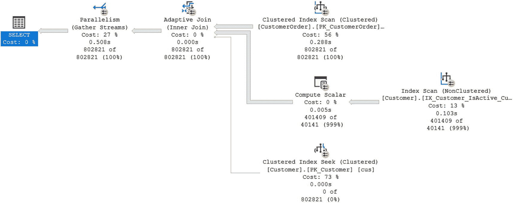
*图 2-2：视图的执行计划*

如前所述，两者的执行计划是相同的。使用视图时可能出现的一个问题是，执行计划无法识别你正在使用视图来访问这些数据。

##### 通过视图更新数据

虽然视图可以使操作更简单，但你可能还希望以其他方式使用视图。由于视图简化了与复杂查询的交互，它们也可能使修改数据变得更容易。然而，通过视图更新数据时，有一些注意事项需要考虑。在清单 2-4 中，你可以找到基于视图更新数据的查询。

```sql
UPDATE dbo.vwCustomerOrder
SET OrderNumber = '76871-1'
WHERE OrderDate = '2022-08-30 23:20:08.86'
AND FirstName = 'Karim'
AND LastName = 'Khalil';
```
*清单 2-4：在视图中更新数据*

通过视图，你可以更新基础表中的数据。如果视图用于修改来自多个基础表的数据，则更新将失败。插入操作与更新操作的情况相同。在清单 2-5 中，你可以看到当尝试为多个表中的数据插入记录时会发生什么。

```sql
INSERT INTO dbo.vwCustomerOrder
(
    FirstName,
    LastName,
    OrderNumber,
    OrderDate,
    ShipDate
)
VALUES
(
    'Abeba',
    'Kidana',
    '1324-9',
    GETDATE(),
    NULL
);
```
*清单 2-5：通过视图插入数据*

尝试执行上述查询时，SQL Server 会返回错误 `"视图或函数 'dbo.vwCustomerOrder' 不可更新，因为修改会影响多个基础表。"`。

##### 用于安全性的架构绑定

使用视图时还有其他可用功能。有一种方法可以防止在视图引用时修改基础表。如果你想确保用户不会意外删除表，让视图通过 `SCHEMABINDING` 来引用表是一个可用的选项。你可以使用清单 2-6 中的查询来实现这种额外的安全级别。

```sql
CREATE VIEW dbo.vwCustomerOrderBound
WITH SCHEMABINDING
AS
SELECT cus.FirstName,
       cus.LastName,
       cus.FirstName + ' ' + cus.LastName AS FullName,
       ord.CustomerOrderID,
       ord.OrderNumber,
       ord.ShipDate
FROM dbo.CustomerOrder ord
INNER JOIN dbo.Customer cus
    ON ord.CustomerID = cus.CustomerID;
```
*清单 2-6：创建带有架构绑定的视图*

在这里，通过向视图添加 `SCHEMABINDING`，我改变了 SQL Server 处理对视图中包含列的更改的方式。具体来说，我不能以会影响视图 `dbo.vwCustomerOrderBound` 的方式修改 `dbo.Customer` 或 `dbo.CustomerOrder` 表中的列。清单 2-7 显示了一个尝试删除被 `dbo.vwCustomerOrderBound` 架构引用的 `dbo.CustomerOrder` 表中列的查询。

```sql
ALTER TABLE dbo.CustomerOrder
DROP COLUMN ShipDate;
```
*清单 2-7：在架构绑定视图中删除列*

尝试执行上述查询时，我收到以下错误 `"对象 'vwCustomerOrderBound' 依赖于列 'ShipDate'。ALTER TABLE DROP COLUMN ShipDate 失败，因为一个或多个对象访问了此列。"`。然而，在保护数据方面还存在一个潜在的漏洞。一旦视图通过 `SCHEMABINDING` 创建，只要 `SELECT` 语句返回的列名保持不变，用户就可以更改返回的数据。


##### 视图修改与列名欺骗

以一个例子来说明，假设用户希望查看 `OrderDate` 而不是 `ShipDate`。在列表 2-8 中，最后一列显示的是 `OrderDate` 的值，但列名却叫做 `ShipDate`。即使该视图是 `schemabound`（架构绑定）的，也可以对其进行修改，使最后一列返回的是 `OrderDate` 而非 `ShipDate`。然而，除非有人审查代码，否则使用该视图的应用程序将无法知晓返回的数据不再是 `ShipDate`！这可能导致用户访问到他们本不应访问的数据场景。在列表 2-8 中，我修改了原始的 `dbo.vwCustomerOrder` 视图。

```sql
ALTER VIEW dbo.vwCustomerOrder
AS
SELECT cus.FirstName,
       cus.LastName,
       cus.FirstName + ' ' + cus.LastName AS FullName,
       ord.OrderNumber,
       ord.OrderDate AS ShipDate
FROM   dbo.CustomerOrder ord
       INNER JOIN dbo.Customer cus
              ON ord.CustomerID = cus.CustomerID;
Listing 2-8
Altering the View to Change the Column
```
之前，我有一个用户仅有权访问视图 `dbo.vwCustomerOrder` 中的数据。我的本意是让该用户只能访问视图中原始列的数据。如果这个用户稍后尝试查询该视图，这个视图将不再返回 `ShipDate` 列中的数据。

##### 嵌套视图带来的性能问题

尽管视图有这些功能，但其最大的问题之一仍然围绕着嵌套视图。在典型的软件开发中，开发者希望在多个场景中复用相同的软件代码。为了了解嵌套视图如何影响性能，让我们将一个视图作为连接条件的一部分，放入另一个视图中。首先，我在列表 2-9 中创建一个返回 `CustomerID`、`FirstName`、`LastName`、`FullName` 和 `LastOrderDate` 的视图。

```sql
CREATE VIEW dbo.vwCustomer
AS
SELECT cus.CustomerID,
       cus.FirstName,
       cus.LastName,
       cus.FirstName + ' ' + cus.LastName AS FullName,
       MAX(ord.OrderDate) AS LastOrderDate
FROM   dbo.CustomerOrder ord
       INNER JOIN dbo.Customer cus
              ON ord.CustomerID = cus.CustomerID
GROUP BY cus.CustomerID,
         cus.FirstName,
         cus.LastName;
Listing 2-9
View for Customer Information
```
现在，我有了一个简便的方法来查找有关客户的一些基本信息。如果我仍想查看订单详细信息，可以将 `dbo.Customer` 连接到视图 `dbo.vwCustomer`。列表 2-10 包含了这个嵌套视图的创建语句。

```sql
CREATE VIEW dbo.vwCustomerOrderNest
AS
SELECT cus.FirstName,
       cus.LastName,
       cus.FullName AS FullName,
       ord.OrderNumber,
       ord.OrderDate ,
       ord.ShipDate
FROM   dbo.CustomerOrder ord
       INNER JOIN dbo.vwCustomer cus
              ON ord.CustomerID = cus.CustomerID;
Listing 2-10
Nested View for Customer Orders
```
这个视图返回的结果与原始视图 `dbo.vwCustomerOrder` 相同。上述视图并不推荐，仅作为反面示例创建，用以说明不该做什么以及原因。接下来的步骤是对比这些视图的相对性能。列表 2-11 中的查询返回所有订单号不是 `76871` 的客户订单。

```sql
SELECT FullName, OrderDate
FROM   dbo.vwCustomerOrder
WHERE  OrderNumber <> '76871';

SELECT FullName, OrderDate
FROM   dbo.vwCustomerOrderNest
WHERE  OrderNumber <> '76871';
Listing 2-11
Query to Compare Views
```
第一个查询使用的是非嵌套视图，第二个查询使用的是嵌套视图。它们都返回了表 2-1 中的结果。

**表 2-1**
**订单号为 78871 的客户**

| FullName | OrderDate |
| --- | --- |
| Karim Khalil | 2022-08-30 23:20:08.86 |
| Myra Acharya | 2022-10-31 00:00:00.00 |
| Myra Acharya | 2022-10-31 00:00:00.00 |

##### 执行计划对比

虽然返回的结果相同，但 SQL Server 执行这两个查询的方式却大相径庭。我将使用执行计划的图片，但你只需比较两个执行计划的形状。图 2-3 显示了原始视图的执行计划。

``

*（一个流程图。Select 的成本为 0%，来自于并行处理（成本 7%），而并行处理又来自于哈希匹配（成本 28%）。它来源于计算标量、并行处理等。）*

**图 2-3**
**原始视图的执行计划**

作为对比，嵌套视图的执行计划在图 2-4 中。

``

*（一个流程图。Select 的成本为 0%，来自于并行处理（成本 6%），而并行处理又来自于哈希匹配（成本 12%）。它来源于计算标量、并行处理等。）*

**图 2-4**
**嵌套视图的执行计划**

SQL Server 执行嵌套视图查询的方式更为复杂，而这只是一个基础示例！比较相对执行时间百分比，嵌套视图的执行时间是原始视图的三倍。想象一下，如果有更多的嵌套视图，特别是当它们很复杂时，会发生什么。为什么嵌套视图的执行计划看起来不同？

影响嵌套视图性能的一个因素涉及获取数据的过程。当 SQL Server 连接到一个视图时，它必须确定哪些值匹配连接条件。这意味着每个嵌套视图，根据其连接条件，都需要访问该视图的数据以确定数据是否满足连接条件。嵌套视图内将多层表连接在一起的额外复杂性，也使得 SQL Server 难以生成一个好的执行计划。相反，查询优化器可能不得不在确定最佳执行计划之前就选择一个执行计划。所有这些都可能导致使用嵌套视图时发生的性能问题。

### 总结

在创建视图时，可能会忍不住复用这些视图来创建其他视图。不幸的是，这可能会导致某个视图开始表现不佳。一旦视图性能下降，可能需要付出相当大的努力，穿梭于嵌套视图的各个层级之间，才能找到根本原因。


##### 索引视图

我已介绍了视图如何用于简化查询编写、修改数据以及保护数据库模式。同时，我也阐述了通过复用视图来创建其他视图可能导致严重的性能问题。正如你在上一节所见，视图有助于简化 T-SQL，但对于临时查询和视图，其执行计划是相同的。在某些情况下，某些连接操作无论是作为查询还是视图，性能表现都不佳。

如果你遇到一个行为不佳的视图，第一步应该是通过修正不良连接等方式来优化视图。如果此路不通或无效，第二步应该是向基础表添加索引。只有当这些步骤失败（或由于某些规则不允许）时，你才应考虑探索索引视图。当向视图添加索引后，该视图即被视为索引视图。向视图添加的第一个索引必须是唯一的聚集索引。添加聚集索引后，还可以向视图添加非聚集索引。然而，向视图添加索引会带来一定的成本。每次数据修改时，相关表上的索引以及索引视图也必须随之更新。

创建索引视图的第一步是创建一个使用了`WITH SCHEMABINDING`子句的视图。在此示例中，我将使用清单 2-2 中创建的视图。下一步是向此视图添加索引。在清单 2-12 中，我为此视图添加了一个聚集索引。

```
CREATE UNIQUE CLUSTERED INDEX CX_vwCustomerOrderBound_FullNameCustomerOrderID
ON dbo.vwCustomerOrderBound (FullName, CustomerOrderID);
Listing 2-12
向视图添加聚集索引
```

比较添加聚集索引前后的视图性能，整体上显示出性能的提升。请记住，尽管在某些情况下，索引视图在检索数据时能提升性能，但在受影响的表上进行数据插入、更新或删除操作时，仍可能出现性能问题。在图 2-5 中，显示了向基础表插入数据时的执行计划。

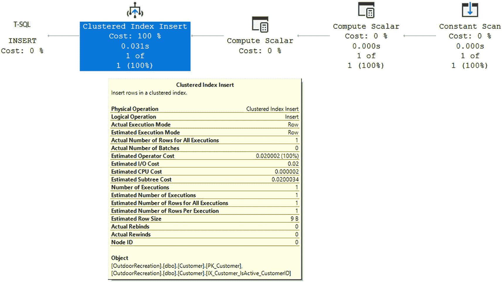

一幅截图，上方是执行计划视图，下方是一个基础表。带有聚集索引插入操作的节点被高亮显示。下方的聚集索引插入表中，实际重新绑定、实际重绕和节点 ID 的值均为 0。

图 2-5
向基础表插入数据的执行计划

如上所示，作为向基础表插入操作的一部分，存在一个额外的步骤来更新视图上的索引。

## 函数

在许多应用程序中，核心功能部分可能需要多次重新计算或复用。有时，你可能希望一次性编写一段简单的代码，并在各种其他数据库对象中复用该代码。在其他情况下，你可能希望封装复杂的逻辑，创建一个包含该逻辑并返回所需结果的数据库对象。这样做可以使 T-SQL 代码显得不那么复杂，从而降低其复杂度。无论哪种方式，函数都可以帮助你简化 T-SQL 代码。

### 标量函数

你可能发现自己需要在许多不同场景中重新运行同一部分代码。你可能在查找一个配置值，或者你希望在代码的许多不同部分重新运行相同的基本逻辑，而这些部分只返回一个值。当你想要传递零个或多个参数，并且只希望返回单个值时，你可能会考虑使用标量函数。但是，请考虑使用标量函数的潜在成本。

在 SQL Server 2019 之前，标量函数的优化方式非常不同。历史上，SQL Server 并未对标量函数进行基于成本的优化。这通常意味着标量函数不包含在执行计划中。既然 SQL Server 2019 已作为智能查询处理的一部分实现了更多功能，包括标量用户定义函数（UDF）内联，那么引用这些函数的查询性能得到了改善，因为其估算更加准确。

内联函数是能够被包含在执行计划中的一种函数。内联标量 UDF 的最大优势之一是在使用标量 UDF 时性能的显著提升。当需要简化复杂流程和复用代码，且函数仅需返回一个结果时，标量 UDF 是理想的选择。

早期版本的 SQL Server 与 SQL Server 2019 在标量 UDF 性能方面的差异是显著的。为了比较这些执行计划，让我们将数据库级别的兼容性级别分别更改为匹配 SQL Server 2017 和 SQL Server 2019。通过使用兼容级别 140 作为优化器，其行为类似于 SQL Server 2017。将数据库的兼容级别设置为 160 则使用 SQL Server 2022 中可用的优化器。清单 2-13 展示了使用 T-SQL 创建标量 UDF 所需的代码。

```
CREATE FUNCTION dbo.ProductTotal
(
@Quantity     SMALLINT,
@ProductPrice DECIMAL(6,2)
)
RETURNS DECIMAL (8,2) AS
BEGIN
RETURN @Quantity * @ProductPrice;
END;
Listing 2-13
创建标量 UDF
```

在兼容级别 140 下执行前述函数时，最终生成的执行计划看起来比在兼容级别 160 下生成的执行计划更简单。清单 2-14 展示了在兼容级别 140 和 160 下的代码。

```
SELECT ord.CustomerID,
ord.CustomerOrderID,
SUM(dbo.ProductTotal(dtl.QuantitySold, dtl.ProductPrice)) AS LineItemTotal
FROM dbo.CustomerOrder ord
INNER JOIN dbo.OrderDetail dtl
ON ord.CustomerOrderID = dtl.CustomerOrderID
GROUP BY ord.CustomerID,
ord.CustomerOrderID;
Listing 2-14
执行函数的代码
```

为了模拟 SQL Server 2017 的行为，将数据库的兼容级别更改为 140。更改兼容级别所需的 T-SQL 代码如清单 2-15 所示。

```
ALTER DATABASE OutdoorRecreation
SET COMPATIBILITY_LEVEL = 140;
Listing 2-15
将数据库兼容级别更改为 SQL Server 2017
```

清单 2-16 中的查询允许我们强制 SQL Server 为所有使用兼容级别 140 的查询生成新的执行计划。

```
DBCC FREEPROCCACHE;
Listing 2-16
清除清单 2-14 查询的执行计划缓存
```

需要注意的是，前述 T-SQL 代码不应在你的生产环境中运行。此代码将导致 SQL Server 在首次调用查询时使用额外资源来确定每个查询应如何运行。我保存了在兼容级别 140 下运行前述查询的实际执行计划。你可以在图 2-6 中找到此实际执行计划。

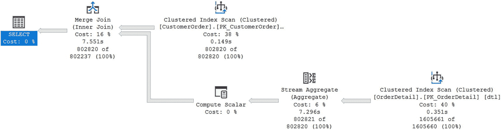

一个流程图。Select 操作成本为 0%，来源于合并连接。它来源于聚集索引扫描、计算标量（该操作又来源于流聚合）以及聚集索引扫描。

图 2-6


### 兼容模式 140 的执行计划

通过分析兼容模式 160 的实际执行计划，你可以确定它看起来更为复杂。然而，你可能会注意到，在图 2-7 的执行计划中，标量函数现在包含了`标量运算符`下方的若干行。

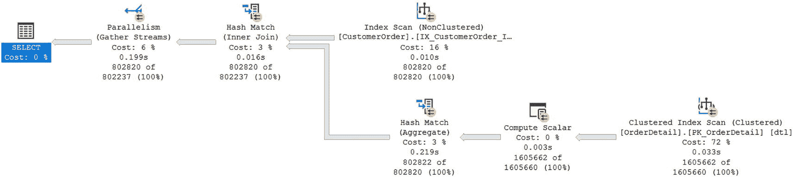

一个流程图。`Select` 的开销为 0%，源自哈希匹配的并行化。它来源于索引扫描、哈希匹配聚合等。

**图 2-7** 兼容模式 160 的执行计划

虽然 SQL Server 2019 的执行计划可能更复杂，但这两个版本的 SQL Server 之间的执行时间却有显著差异，因为使用标量 UDF 内联使得查询完成速度提高了近 50%。你还可以比较兼容模式 140 和 160 的 `CPU` 时间和经过时间。在表 2-2 中，你可以找到两个查询各执行 10 次后的平均 `CPU` 时间和经过时间。

**表 2-2** 查询执行的经过时间和 CPU 时间

| 兼容模式 | CPU 时间 | 经过时间 |
| --- | --- | --- |
| 140 | 8,206 毫秒 | 9,225 毫秒 |
| 160 | 1,866 毫秒 | 3,877 毫秒 |

与兼容模式 140 相比，在兼容模式 160 中使用此函数时，`CPU` 时间的速度有所降低。

在 SQL Server 2019 中内联标量 UDF 的能力不仅限于单查询标量 UDF。在使用多语句标量 UDF 时，功能也有所改进。多语句标量 UDF 返回单个值，类似于清单 2-10 中创建的标量 UDF。多语句标量 UDF 的不同之处在于函数内部可以存在额外的逻辑。让我们改进清单 2-10 中创建的函数，使其能够处理除零错误。清单 2-17 展示了使用多语句标量 UDF 来增强清单 2-13 的 T-SQL 代码。

```sql
CREATE OR ALTER FUNCTION dbo.ProductAverage
(
    @Quantity     SMALLINT,
    @ProductPrice DECIMAL(6,2)
)
RETURNS DECIMAL (6,2) AS
BEGIN
    DECLARE @ProductAvg DECIMAL (6,2);
    IF @Quantity = 0
    BEGIN
        SET @ProductAvg =  0.00;
    END
    ELSE
    BEGIN
        SET @ProductAvg = @ProductPrice / @Quantity;
    END
    RETURN @ProductAvg;
END;
```

*清单 2-17* 创建多语句标量 UDF

清单 2-17 中创建的多语句标量 UDF 可以从与清单 2-13 中创建的标量 UDF 相同的标量内联中获益。无论你决定使用哪种标量 UDF，SQL Server 2019 都已经过改进，使用这些函数可能会获得更好的性能。

## 表值函数

有时你会发现需要执行复杂的逻辑，但需要返回不止一个值。当遇到这些情况时，你可能需要考虑使用表值函数。表值函数返回一个表。与通常出现在 `SELECT` 或 `WHERE` 子句中的 UDF 不同，你将其放在 `FROM` 子句中，并像对待任何其他表或视图一样对待其输出。它可以单独存在于 `FROM` 子句中，也可以与之联接。在 SQL Server 2019 之前，唯一可以内联运行的函数是表值函数的一种变体。

表值函数在你需要一个表作为结果时非常有用。这可以是从包含多列的一行，到包含单列但可能有多行，再到包含多行多列的任何情况。无论你的目的是什么，如果你想要一个可重用的代码片段，能够给你提供表输出，那么表值函数可能就是你想要的。请记住，表值函数主要有两种类型，虽然输出看起来可能相同，但每种类型的性能可能会有天壤之别。

### 内联表值函数

如果你正在使用一个函数来执行一些复杂的逻辑，但仅使用一个 `SELECT` 语句就能满足需求，那么你可能想了解更多关于内联表值用户定义函数如何为你工作的信息。需要注意的是，你并不需要明确指明一个函数是内联的还是多语句的。它是你创建和声明函数的方式决定了你创建了哪种类型的函数。

与 SQL Server 2019 中可用的内联标量用户定义函数（UDF）类似，表值函数也可以被内联。同时也要注意到，表值函数能够内联已经有一段时间了，而内联标量 UDF 则是相当新的功能。无论哪种方式，优势都很明显。当一个表值函数可以与查询的其余部分内联运行时，优化器可以为该函数以及整个 T-SQL 代码提供更好的执行计划。

从历史上看，内联表值函数最受欢迎的用途是类似于视图的操作，不同之处在于，对于内联表值函数，可以使用参数来限制返回的数据，而视图在每次执行时都会返回视图可用的所有数据。让我们通过清单 2-18 来确定创建内联表值函数所需的步骤。

```sql
CREATE FUNCTION dbo.CustomerOrderSummaryForCustomer (@CustomerID INT)
RETURNS TABLE
AS
RETURN
(
    SELECT cus.FirstName,
           cus.LastName,
           ord.CustomerOrderID,
           ord.OrderNumber,
           ord.OrderDate,
           prd.ProductName,
           SUM(dtl.QuantitySold) AS QuantitySold,
           dtl.ProductPrice,
           SUM(dtl.QuantitySold) * dtl.ProductPrice AS ProductRevenue
    FROM dbo.CustomerOrder ord
    INNER JOIN dbo.OrderDetail dtl
        ON ord.CustomerOrderID = dtl.CustomerOrderID
    INNER JOIN dbo.Customer cus
        ON ord.CustomerID = cus.CustomerID
    INNER JOIN dbo.Product prd
        ON dtl.ProductID = prd.ProductID
    WHERE cus.CustomerID = @CustomerID
    GROUP BY cus.FirstName,
             cus.LastName,
             ord.CustomerOrderID,
             ord.OrderNumber,
             ord.OrderDate,
             prd.ProductName,
             dtl.ProductPrice
);
```

*清单 2-18* 创建内联表值函数

创建内联表值函数的过程很简单。可能会有对函数性能影响的担忧。你可以确定内联表值函数的性能表现；让我们运行一个使用此函数的查询，这样你就可以验证执行计划中发生了什么。清单 2-19 展示了用于确定执行计划有效性的脚本。

```sql
SELECT FirstName,
       LastName,
       CustomerOrderID,
       OrderNumber,
       OrderDate,
       ProductName,
       QuantitySold,
       ProductPrice,
       ProductRevenue
FROM dbo.CustomerOrderSummaryForCustomer (234);
```

*清单 2-19* 调用内联表值函数的查询

图 2-8 显示了在 SQL Server 2022 中返回的、由清单 2-19 中代码生成的执行计划。

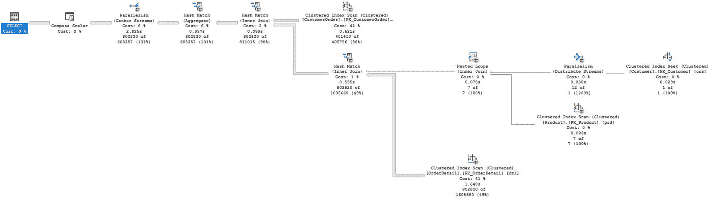

一个流程图。`Select` 的开销为 0%，源自计算标量（开销 0%），源自并行化、哈希匹配聚合和内部联接。它来源于聚集索引扫描、哈希匹配等。

**图 2-8** 内联表值函数执行计划

仔细检查后，你可以确认该函数并未出现在执行计划中。虽然内联表值 UDF 可以像表一样使用并且可以接受参数，但使用内联表值 UDF 仍然存在一些限制。这类函数只允许一个 `SELECT` 语句和一个结果集。此外，这些函数中返回的数据不能在数据库中被修改。但是，你可以修改内联表值函数 `SELECT` 语句的输出。例如，如果你想创建一个输出，显示如果将所有产品的价格提高 0.05%，`CustomerID` 234 的销售额会是多少，你可以执行清单 2-20 中的查询。


#### 清单 2-20 修改内联表值函数的输出

```sql
SELECT FirstName,
       LastName,
       CustomerOrderID,
       OrderNumber,
       OrderDate,
       ProductName,
       QuantitySold,
       ROUND(ProductPrice * 1.05, 2) AS ProductPrice,
       QuantitySold * (ROUND(ProductPrice * 1.05, 2)) AS TotalRevenue
FROM dbo.CustomerOrderSummaryForCustomer (234);
```

此查询获取 `ProductPrice` 并额外增加 5%。此外，该查询还展示了如果客户 234 在价格上涨 5% 后购买相同商品，其总收入将会是多少。此数据变更是修饰性的，并不影响存储在数据库中的实际数据。

## 多语句表值函数

当你既需要代码重用又需要能够更新 SQL Server 时，可能就需要考虑使用多语句表值函数了。但我提醒你需仔细考量此方法是否必要，因为这类函数最终可能对性能产生巨大影响。

多语句表值函数不仅仅是功能更强的内联表值函数。它们也无法与查询执行进行内联。这意味着查询优化器在使用此类函数时不会尝试进行最佳预估。事实上，在 SQL Server 2014 之前，多语句表值函数被预估只返回一行数据。对于 SQL Server 2014 和 SQL Server 2016，预估行数为 100。然而，从 SQL Server 2017 开始，SQL Server 有可能通过交错执行获得对函数返回行数的准确预估。

其原理是，优化过程会暂停以允许执行，从而让基数估算器能够确定多语句表值函数应返回的实际行数。虽然交错执行是新的自适应查询处理的一部分，但仍需注意一些限制。如果 `CROSS APPLY` 与多语句表值函数结合使用，则交错功能将不起作用。也有报告称，如果多语句表值函数内部有一个依赖于输入参数的 `WHERE` 子句，那么交错执行也可能不适用。

为了更好地理解其工作原理，请参考清单 2-21 中的多语句表值函数。

### 清单 2-21 多语句表值函数

```sql
CREATE FUNCTION dbo.GetTopCustomersByCountry (@Country VARCHAR(75), @TopN INT)
RETURNS @TopCustomer TABLE
(
    CustomerRank      INT,
    FirstName         VARCHAR(40),
    LastName          VARCHAR(100),
    CustomerOrderID   INT,
    TotalProductSales DECIMAL(12,2)
)
AS
BEGIN
    WITH cte_TopCust (FirstName, LastName, CustomerOrderID, TotalProductSales) AS
    (
        SELECT cus.FirstName,
               cus.LastName,
               ord.CustomerOrderID,
               SUM(dtl.QuantitySold * dtl.ProductPrice) AS TotalProductSales
        FROM dbo.Customer cus
        INNER JOIN dbo.CustomerOrder ord
            ON cus.CustomerID = ord.CustomerID
        INNER JOIN dbo.OrderDetail dtl
            ON ord.CustomerOrderID = dtl.CustomerOrderID
        WHERE (cus.Country = @Country OR @Country IS NULL)
        GROUP BY ord.CustomerOrderID,
                 cus.FirstName,
                 cus.LastName
    )
    INSERT INTO @TopCustomer
    (
        CustomerRank,
        FirstName,
        LastName,
        CustomerOrderID,
        TotalProductSales
    )
    SELECT TOP(@TopN) ROW_NUMBER() OVER(ORDER BY TotalProductSales DESC) AS CustomerRank,
           FirstName,
           LastName,
           CustomerOrderID,
           TotalProductSales
    FROM cte_TopCust
    ORDER BY 5 DESC, CustomerOrderID DESC;
    RETURN
END;
```

让我们在 SQL Server 2017 和 SQL Server 2022 的兼容模式下执行此函数。分析公司销售情况时，比较客户购买行为是很常见的。有时这会导致查询内的逻辑变得相当复杂。既然此函数已创建，你可以编写脚本来测试其在各个 SQL Server 版本中的性能；参考清单 2-22。

### 清单 2-22 执行函数的代码

```sql
SELECT cty.CustomerRank,
       cty.FirstName,
       cty.LastName,
       COUNT(cty.CustomerOrderID) AS NumberOfOrders,
       cty.TotalProductSales
FROM dbo.GetTopCustomersByCountry (NULL, 5999) AS cty
GROUP BY cty.CustomerRank,
         cty.FirstName,
         cty.LastName,
         cty.TotalProductSales;
```

接下来，让我们测试各个 SQL Server 版本中的执行计划和相关性能。图 2-9 展示了使用兼容模式 110 在 SQL Server 2012 中的执行计划。


一个流程图。`Select`操作的成本为`0%`，来源于序列，成本为`0%`。它源自计算标量、表值函数等。

## 图 2-9

兼容模式 `110` 的执行计划

该执行计划似乎没有太多不同的运算符。表值函数被表示为单个运算符。该表值函数的属性如图 2-10 所示。

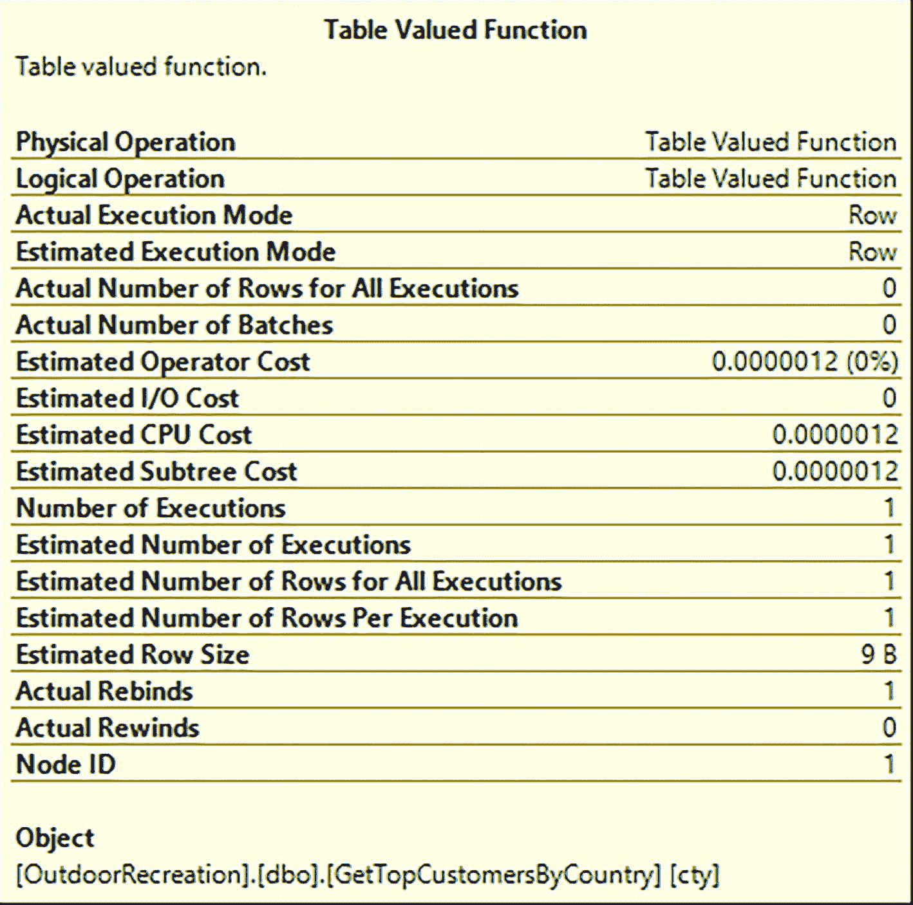

一个名为“表值函数”的表格，其行条目包括物理操作、逻辑操作、估计运算符成本和估计 C P U 成本。

## 图 2-10

兼容模式 `110` 下表值函数的属性

图 2-10 显示估计行数为 `1`。`SQL Server 2014` 对数据库引擎进行了额外的增强。对于表值函数的行数估计得到了改进。使用 `SQL Server 2014` 的兼容模式 `120`，您可以参考图 2-11 中生成的执行计划。

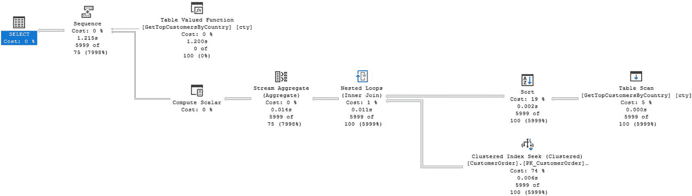

一个流程图。`Select`操作的成本为 `0%`，源自序列。它源自表值函数、计算标量，后者又源自流聚合、嵌套循环等。

## 图 2-11

兼容模式 `120` 的执行计划

图 2-11 似乎与图 2-9 相同。唯一可见的差异在于某些运算符显示的百分比。这种百分比差异并不显著，不足以影响此查询在兼容模式 `110` 和 `120` 下的执行性能。您可以在表 2-3 中找到执行时间。

## 表 2-3

比较兼容模式 `110` 和 `120` 下多语句表值函数的执行时间

| 兼容模式 | CPU 时间 | 已用时间 |
| --- | --- | --- |
| `110` | 1,357 毫秒 | 4,343 毫秒 |
| `120` | 1,414 毫秒 | 2,685 毫秒 |

此处显示的时间表明，虽然 `SQL Server 2014` 的 CPU 时间慢了 `4%`，但已用时间比 `SQL Server 2012` 快了约 `37%`。虽然执行计划和时间相似，但您也可以检查表值函数上的属性是否相同。在图 2-12 中，您可以确定与表值函数相关的属性。

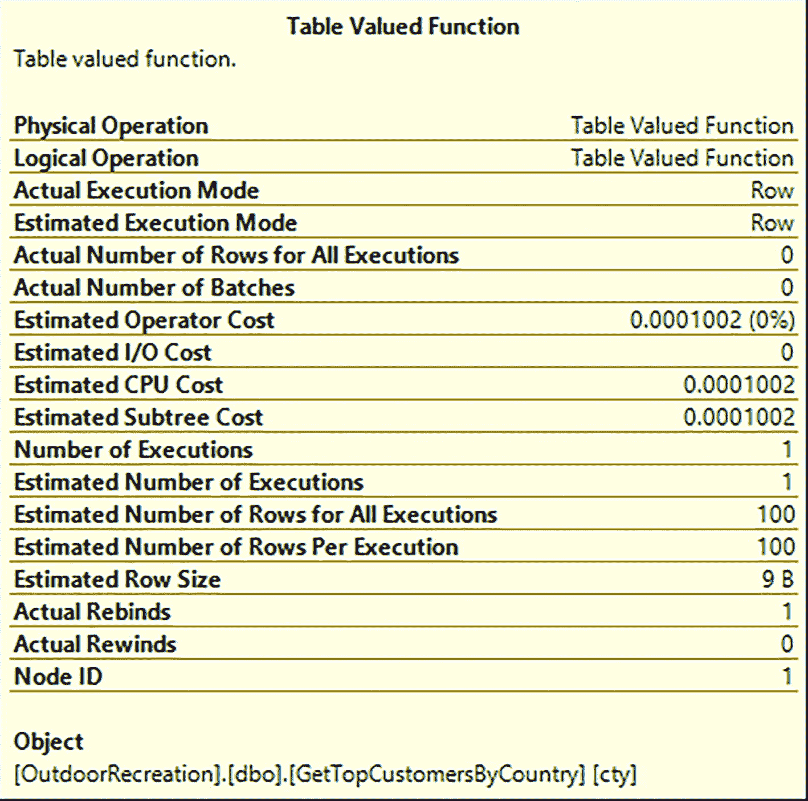

一个名为“表值函数”的表格，其行条目包括物理操作、逻辑操作、估计运算符成本和估计 C P U 成本。实际重新绑定为 `1`，实际回滚为 `0`。

## 图 2-12

兼容模式 `120` 下表值函数的属性

您可以验证图 2-12 中的估计行数是 `100`。这与图 2-10 中显示的估计行数 `1` 不同。您还可以确认估计运算符成本和估计子树成本都略有变化。

既然您已经运行了代码清单 2-22 中的查询，现在可以使用 `SQL Server 2019` 的优化器运行相同的查询。在执行此操作之前，您需要将兼容级别更改回 `160`。虽然更改兼容级别应会清除计划缓存，但您可以使用 `T-SQL` 来确保执行计划缓存已被清除。完成此操作并执行代码清单 2-22 中的查询后，您将获得如图 2-13 所示的执行计划。

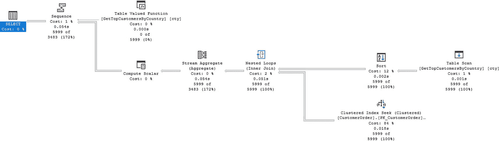

一个流程图。`Select`操作的成本为 `0%`，源自序列。它源自表值函数、计算标量，后者又源自流聚合、嵌套循环等。

## 图 2-13

兼容模式 `160` 的执行计划

图 2-13 中的执行计划与图 2-9 和图 2-11 中的任何一个都不同。您还可以确定，在 `dbo.OrderDetail` 表的某个非聚集索引上的 `索引扫描` 占用了大部分执行时间。正如预期的那样，这与图 2-5、2-11 和 2-13 的执行计划中占用大部分时间的运算符相同。您还可以比较兼容级别 `110`、`120` 和 `160` 下的已用时间和 CPU 时间。这使您可以比较来自 `SQL Server 2012`、`SQL Server 2014` 和 `SQL Server 2019` 的 `SQL Server` 优化器的预期执行时间。表 2-4 显示了所有三个兼容级别及其相关时间。

## 表 2-4

比较兼容模式 `110`、`120` 和 `160` 下多语句表值函数的执行时间

| 兼容模式 | CPU 时间 | 已用时间 |
| --- | --- | --- |
| `110` | 1,357 毫秒 | 4,343 毫秒 |
| `120` | 1,414 毫秒 | 2,685 毫秒 |
| `160` | 910 毫秒 | 1,620 毫秒 |

比较表 2-4 中的时间，`SQL Server 2022` 的 CPU 时间比 `SQL Server 2014` 或 `SQL Server 2012` 快 `30%`。此外，`SQL Server 2022` 的已用时间比 `SQL Server 2014` 快约 `40%`，比 `SQL Server 2012` 快约 `60%`！您还可以将代码清单 2-12（代表与 `SQL Server 2017` 关联的兼容级别）中的表值函数属性与兼容级别 `160` 的属性进行比较。图 2-14 显示了兼容模式 `160` 下表值函数的属性。

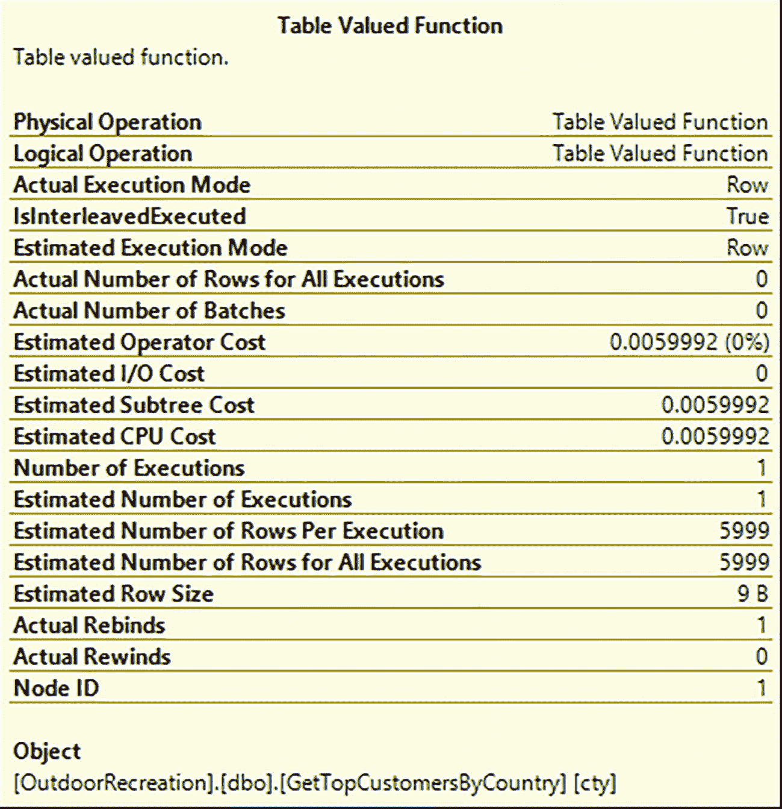

一个名为“表值函数”的表格，其行条目包括物理操作、逻辑操作、估计运算符成本和估计 C P U 成本。

## 图 2-14

兼容模式 `160` 下表值函数的属性

参考图 2-14，有几个值与图 2-12 相匹配。它们包括图 2-12 和图 2-14 中都更准确的估计行数。图 2-12 和图 2-14 中的估计运算符成本、估计 CPU 成本和估计子树成本也相同。

多语句表值函数的性能在较新版本的 `SQL Server` 中得到了提升。此外，您可以验证 `SQL Server 2017` 和 `SQL Server 2022` 在执行计划中都具有最准确的估计行数和实际返回行数。虽然在使用多语句表值函数时仍需考虑性能问题，但在某些场景下，性能提升足够显著，从 `SQL Server 2017` 开始使用这些函数可能是有益的。


## 其他用户定义对象

处理复杂数据并将数据分解为易于管理和分析的部分有许多方法。在某些情况下，数据可以保存到临时表或表变量中。然而，根据您的需求，还有其他可用选项。SQL Server 2016 引入了外部表的概念。这是一个特性，外部数据源（即不在当前 SQL Server 实例内的数据）可以在 SQL Server 内被视为表来处理。在 SQL Server 2022 中，此特性已扩展到包括与 S3 兼容的对象存储作为外部数据源。这将允许您将 CSV 或 Parquet 等数据文件作为 SQL Server 内的表来使用。要添加外部数据源，您需要为数据库创建主密钥。要创建外部数据源，请使用共享访问签名 (SAS) 身份验证以及关联存储帐户的 SAS 令牌。然后，您将能够创建指向与 S3 兼容的对象存储、通用 ODBC 连接、Oracle、Teradata 以及 SQL Server 支持的其他选项的外部数据表。SQL Server 中的另一个选项是使用表值参数。这提供了类似于临时表的性能，但其工作方式也类似于表变量。还有一种方法是创建一个临时结果集，供批处理中的下一条语句使用。

### 用户定义的表类型

在使用数据库和存储过程时，您可能会发现需要将多个值（对应一个或多个字段）作为参数传递给存储过程。有一种选项是创建用户定义的表类型，它允许您指定多个列和数据类型。用户定义的表类型可用于传入包含多行的单个列。例如，您可以允许用户选择一周中的多天，并将这些值保存到一个表类型中。当参数传递给存储过程时，它可以用于与其他表进行连接，从而允许您基于多个值一次性过滤查询。

创建用户定义的表类型的一个优点是，这个表类型可以被重用。例如，您可以使用三个独立的用户定义表，分别用于 `INT`、`DATE` 和 `VARCHAR(30)` 数据类型。然后，这些请求可以放入正确的用户定义表类型中，并发送到相应的存储过程。您可以添加代码来验证用户定义的表类型中是否有任何数据。您可以使存储过程计算行数。如果计数为零，则忽略它。否则，您可以从用户定义的表类型中选择该列。您可以在清单 2-23 中找到创建用户定义的表类型的示例。

```sql
CREATE TYPE dbo.CustomerOrderNumber AS TABLE
(
CustomerOrderID INT,
OrderNumber     VARCHAR(15)
);
```

*清单 2-23*
*创建用户定义的表类型*

一旦创建了用户定义的表类型，它就可以用作存储过程的参数，或者用于变量声明。用户定义的表类型带来的可重用性和一致性是有代价的。由于存储过程现在使用单个参数来表示存储在此对象中的所有列和行，因此很难确定存储过程中的哪些参数代表单个值，哪些参数代表用户定义的表类型。这个对象可以使代码更易于阅读；但也可能使未来的性能问题排查变得更加困难。

### 表值参数

很高比例的存储过程可用于向表中插入、更新或删除数据。在某些情况下，应用程序可能需要将表中每个列的一个参数发送到各个存储过程。虽然每个字段使用一个参数简单明了且易于调试，但有些人认为在一个参数中发送多个字段更清晰、更简单。我理解想要简化代码的想法，但我也相信过度简化会使未来的代码故障排除变得困难。

但是，您可能希望在存储过程或其他代码中使用数组类型的格式。在这种情况下，使用这些数据来执行基于集合的操作是有益的。这样做时，您必须记住，作为参数传入的用户定义的表类型不能被修改。传入此参数时，传递的数据可以像临时表一样对待，并用于与基表连接并进行任何必要的修改。

由于 SQL Server 的设计是为了在基于集合的操作中获得最佳性能，您可能会达到希望利用 SQL Server 固有的、最擅长处理集合的能力的阶段。如果您想将表传递给存储过程并在同一存储过程内部关系型地使用该表，您可能需要考虑使用表值参数。

由于表值参数本质上是一个变量，SQL Server 不一定会根据实际估计行数来优化执行计划。如果您发现自己处于这种情况，您可能需要从参数中获取值，并将它们保存到存储过程内的表变量中。我建议不要仅仅为了提高代码的可读性而使用表值参数。清单 2-24 展示了在存储过程中使用表值参数的示例。

```sql
CREATE PROCEDURE dbo.UpdateCustomerOrderNumber
@CustomerOrder CustomerOrderNumber READONLY
AS
SET NOCOUNT ON;
UPDATE co
SET OrderNumber = fco.OrderNumber,
DateModified = GETDATE()
FROM dbo.CustomerOrder co
INNER JOIN @CustomerOrder fco
ON co.CustomerOrderID = fco.CustomerOrderID;
```

*清单 2-24*
*使用表值参数*

清单 2-24 中的表值参数使用了清单 2-23 中创建的用户定义的表类型。当您想要使用表值参数执行存储过程时，可以运行清单 2-25 中的代码。

```sql
DECLARE @CustomerOrder AS CustomerOrderNumber;
INSERT INTO @CustomerOrder (CustomerOrderID, OrderNumber)
VALUES
(802818, 'AZ-72834'),
(802819, 'AZ-98341');
EXECUTE dbo.UpdateCustomerOrderNumber @CustomerOrder;
```

*清单 2-25*
*执行带表值参数的存储过程*

此代码的执行计划如图 2-15 所示。请注意表值参数上的表扫描。

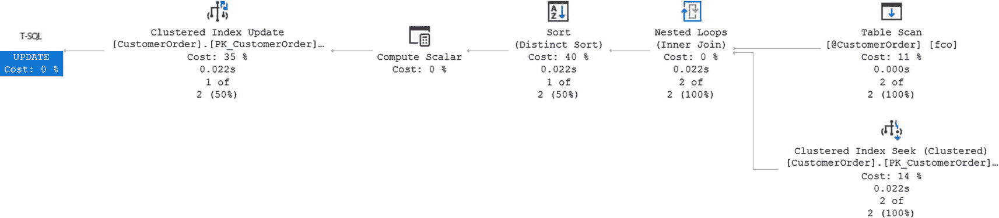

*一个流程图。T S Q L 的成本为 0%，来自聚簇索引更新。它源自计算标量，而计算标量又源自排序、嵌套循环，然后是表扫描和聚簇索引查找。*

*图 2-15*
*带表值参数的存储过程的执行计划*

如果您保留了清单 2-12 中创建的索引视图，返回的执行计划会变得更加复杂。图 2-16 显示了如果索引视图仍然存在时产生的执行计划。

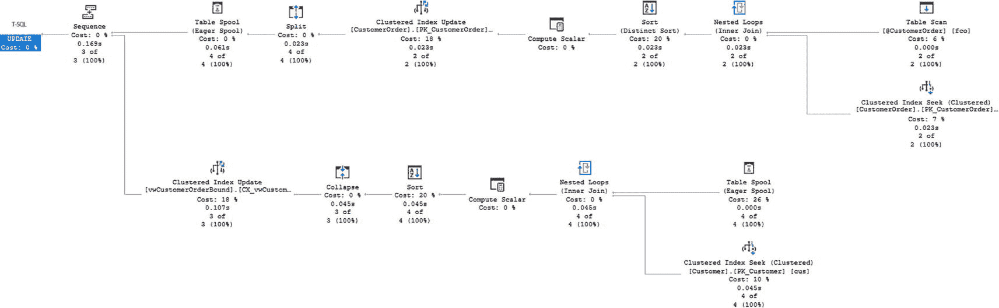

*一个流程图。T S Q L 的成本为 0%，源自序列。它源自聚簇索引更新和表假脱机。它们分别源自拆分和折叠。*

*图 2-16*
*带索引视图的表值参数的执行计划*

虽然表值参数可以简化您的代码，但请记住可能存在隐藏的性能影响。在开发新代码时，最佳实践之一是检查执行计划，并确认 SQL Server 正以符合数据形状的方式处理代码。


### 公共表表达式

虽然不是用户定义的数据库对象，但我将公共表表达式包含在本节中，因为它们常用于与临时表、表变量和表值参数相似的场景。公共表表达式是一个 SQL 语句产生的临时结果集，其存在时间仅够用于紧随其创建之后的 `SELECT`、`INSERT`、`UPDATE` 或 `DELETE` 语句。它们的目的是帮助分解复杂逻辑，或获取一个数据子集以供稍后在 T-SQL 代码、批处理或存储过程中使用。

使用基本公共表表达式的主要原因是提高代码的整体可读性。代码清单 2-26 展示了一个使用与代码清单 2-2 中创建的视图相同逻辑的公共表表达式。期望是当执行此代码时，其性能将与之前创建的视图相同。

```sql
DECLARE @CustomerID INT = 234;
WITH cte_orderavg AS
(
SELECT ord.CustomerOrderID,
AVG(dtl.QuantitySold * dtl.ProductPrice)
AS OrderAverage
FROM dbo.CustomerOrder ord
INNER JOIN dbo.OrderDetail dtl
ON ord.CustomerOrderID = dtl.CustomerOrderID
WHERE ord.CustomerID = @CustomerID
GROUP BY ord.CustomerOrderID
)
SELECT cag.CustomerOrderID, cag.OrderAverage
FROM cte_orderavg cag;
```
*代码清单 2-26*
创建基本的公共表表达式

在图 2-17 中，你可以确认代码清单 2-26 生成的执行计划与图 2-6 中的执行计划匹配。如果你还记得，图 2-8 中的执行计划是由代码清单 2-20 创建的视图生成的。

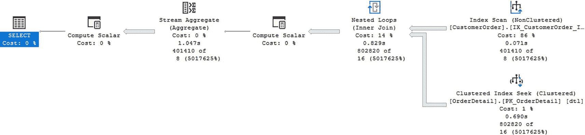

*一个流程图。Select 从一个序列中的开销为 0%。它来源于计算标量、流聚合、计算标量和嵌套循环。其数据源为索引扫描和聚集索引查找。*

*图 2-17*
基本公共表表达式的执行计划

当你使用公共表表达式时，你也可以像连接视图或临时表一样，将公共表表达式 (`CTE`) 与其他表连接。你还可以使用 `CTE` 不仅进行 `SELECT`，还能基于 `CTE` 进行 `INSERT`、`UPDATE` 和 `DELETE` 数据操作。代码清单 2-27 展示了一个使用公共表表达式的更复杂逻辑的查询。

```sql
DECLARE @CustomerID INT = 234;
WITH cte_orderavg AS
(
SELECT ord.CustomerOrderID,
AVG(dtl.QuantitySold * dtl.ProductPrice)
AS OrderAverage
FROM dbo.CustomerOrder ord
INNER JOIN dbo.OrderDetail dtl
ON ord.CustomerOrderID = dtl.CustomerOrderID
WHERE ord.CustomerID = @CustomerID
GROUP BY ord.CustomerOrderID
)
SELECT cus.FirstName, cus.LastName, cag.OrderAverage
FROM   dbo.Customer cus
INNER JOIN dbo.CustomerOrder ord
ON cus.CustomerID = ord.CustomerID
INNER JOIN dbo.OrderDetail dtl
ON ord.CustomerOrderID = dtl.CustomerOrderID
INNER JOIN cte_orderavg cag
ON ord.CustomerOrderID = cag.CustomerOrderID;
```
*代码清单 2-27*
在公共表表达式中使用连接

关于公共表表达式，还有一项最终功能使其具有独特性。你可以创建递归公共表表达式。在这种情况下，一个 `CTE` 将引用自身以帮助生成层次结构数据。虽然很诱人，想让递归 `CTE` 来解决许多不同的问题，但我建议在实现递归 `CTE` 时要谨慎。它们在需要时可能是正确的工具，但也可能带来重大的性能挑战。代码清单 2-28 是创建一个递归 `CTE` 来查找作为其他产品组件的产品的示例。

```sql
WITH cte_product (ProductID, ProductName, ProductPrice, ProductComponentLevel) AS
(
SELECT prd.ProductID, prd.ProductName, prd.ProductPrice, 1 AS ProductComponentLevel
FROM dbo.Product prd
LEFT JOIN dbo.ProductComponent cmp
ON prd.ProductID = cmp.ProductID
WHERE cmp.ProductComponentID IS NULL
UNION ALL
SELECT prd.ProductID, prd.ProductName, prd.ProductPrice,
(cpd.ProductComponentLevel + 1) AS ProductComponentLevel
FROM cte_product cpd  --引用上面创建的 cte
INNER JOIN dbo.ProductComponent cmp
ON cpd.ProductID = cmp.ProductComponentID
INNER JOIN dbo.Product prd
ON cmp.ProductID = prd.ProductID
)
SELECT ProductID, ProductName, ProductPrice, ProductComponentLevel
FROM cte_product;
```
*代码清单 2-28*
用于查找所有产品及其组件的递归 CTE

如你在图 2-18 中看到的部分执行计划，`SQL Server` 执行此查询所需的步骤变得相当复杂。

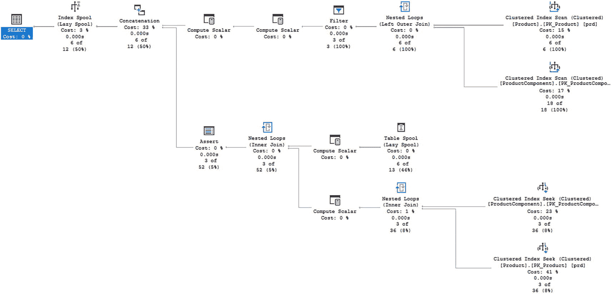

*一个流程图。Select 从一个索引假脱机中的开销为 0%。它来源于连接（开销来自计算标量）、断言（开销）等。最终以聚集索引扫描和聚集索引查找结束。*

*图 2-18*
递归 CTE 的部分执行计划

我发现极少有情况是绝对需要使用递归 `CTE` 的。然而，当我确实需要使用公共表表达式时，我发现它们非常有帮助。

## 临时对象

你可能会发现自己处于需要创建对象但只使用很短时间的场景。有时创建这些对象是为了在处理复杂逻辑时能够操作数据子集。其他时候，将部分代码分离出来创建一个临时对象，可以提高可读性或使其他人更容易理解你在做什么。无论哪种情况，都可以在 `SQL Server` 中创建临时对象。

### 临时表

临时表正如其名。它们具有与表相同的形态，包含列、数据类型并存储数据。主要区别在于临时表不会在数据库中持久存在。你对临时表的用途以及需要它们持续多久，将决定你最终创建哪种类型的临时表。本节将介绍局部临时表、全局临时表和持久临时表。大多数临时表被创建为局部临时表，这些表只能通过创建它们的连接访问。全局临时表类似于局部临时表，但对所有连接可用。然而，如果 `SQL Server` 重新启动，这两种临时表都会被删除。持久临时表是在 `tempdb` 数据库内创建的标准表。

使用临时表还有其他优势。包括能够使用主键和索引来提高性能。还可以在临时表上创建统计信息，进一步提高其性能。需要考虑的一点是，如果在临时表首次创建后又进行了额外的修改，统计信息可能不会自动更新。


#### 本地临时表

如果你发现自己需要将数据暂存以进行额外的分析或处理，那么可以考虑使用**本地临时表**。这类临时表在存储过程内部也很有用。本地临时表仅在它们被创建时所在的同一会话或连接内可用。一旦会话关闭或连接终止，你将无法访问该本地临时表。

虽然本地临时表可用于许多不同的场景，但通常建议，在需要临时存储数据时，不要首选使用临时表。本地临时表本身并无问题，但你会发现其他对象在临时存储数据时，可能带来更小的潜在性能影响。与所有涉及 SQL Server 的事情一样，最佳实践是在将 T-SQL 代码部署到生产环境之前，实现解决方案并对其进行测试，包括负载测试。

创建临时表很容易。虽然你可以使用 `SELECT` 语句并通过代码 `SELECT <column list> INTO #<temp table name>...` 来创建临时表，但最佳实践是先用定义好的数据类型创建临时表，然后再插入记录。清单 2-29 展示了生成本地临时表的代码。为便于比较，用于填充此表的代码与清单 2-2 中使用的代码相同。

```sql
CREATE TABLE #TempOrderAverage
(
CustomerID      INT,
CustomerOrderID INT,
OrderAverage    DECIMAL(6,2)
);
Listing 2-29
创建临时表
```

临时表创建后，运行清单 2-30 中的查询来填充表中的数据。

```sql
DECLARE @CustomerID INT = 234;
INSERT INTO #TempOrder
(
CustomerID,
CustomerOrderID,
OrderAverage
)
SELECT ord.CustomerID,
ord.CustomerOrderID,
AVG(dtl.QuantitySold * dtl.ProductPrice) AS OrderAverage
FROM dbo.CustomerOrder ord
INNER JOIN dbo.OrderDetail dtl
ON ord.CustomerOrderID = dtl.CustomerOrderID
WHERE ord.CustomerID = @CustomerID
GROUP BY ord.CustomerID,
ord.CustomerOrderID;
Listing 2-30
填充临时表
```

当我运行填充临时表的过程时，我也获取了该过程的执行计划。在图 2-19 中，你会发现该执行计划看起来与为视图和公用表表达式生成的计划类似。虽然形状相似，但正在发生的一些活动以及百分比分布是不同的。


图 2-19
创建临时表的执行计划

既然你已经了解了创建临时表的执行计划，那么当你从临时表中查询数据后，执行计划又是怎样的呢？清单 2-31 展示了如何查询现有的临时表。

```sql
SELECT cus.FirstName, cus.LastName, AVG(OrderAverage) AS AverageOrder
FROM dbo.Customer cus
INNER JOIN #TempOrder ord
ON cus.CustomerID = ord.CustomerID
GROUP BY cus.FirstName, cus.LastName;
Listing 2-31
查询临时表
```

到目前为止，你已经确定了查询的大部分工作发生的时间点：与最初选择数据的时间相同。在这种情况下，插入和选择操作被分成了两个独立的步骤。图 2-20 是查询临时表中的数据时生成的执行计划。

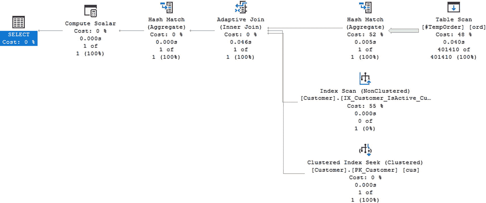

图 2-20
查询临时表

虽然此查询使用了 `Table Scan`（表扫描），但可以向临时表添加索引。

#### 全局临时表

你可能发现自己想要创建一个临时表，它不仅对创建它的连接可用，也对其他连接可用。也许你想要一个可以被多个用户访问的临时表。在这种情况下，你可能需要创建一个**全局临时表**。这种全局临时表在原始会话结束后仍然可以存在，但前提是所有其他使用该全局临时表的任务都已完成。

创建全局临时表很简单。如果你想重新创建清单 2-26 中的临时表，但要确保该表是全局的，可以运行清单 2-32 中的代码来创建全局临时表。

```sql
-- 使用 ## 使其成为全局临时表
CREATE TABLE ##TempOrder
(
CustomerID      INT,
CustomerOrderID INT,
OrderAverage    DECIMAL(6,2)
);
Listing 2-32
创建全局临时表
```

创建本地临时表和全局临时表之间的唯一区别在于创建时使用的表名。比较清单 2-30（本地临时表）和清单 2-32（全局临时表）的代码，你可以确认表名的差异。在清单 2-30 中，表名是 `#TempOrder`，而在清单 2-32 中，临时表名是 `##TempOrder`。在表名开头添加第二个 `#` 字符表明该临时表是一个全局临时表。此外，全局临时表的操作方式与本地临时表类似。关键区别在于，全局临时表可以在创建它的特定连接之外被访问。


##### 持久临时表

在使用临时表时，您可能希望创建一个能超出创建它的会话生命周期而持续存在的表。需要考虑的一点是，如果您计划创建一个存在于 `tempdb` 中的临时表，那么当 SQL Server 重启时，该表及其数据将不会被保存。为了确保持久临时表保留在 `tempdb` 中，您需要使用下文展示的技术。您可以使用与在用户数据库中创建表类似的 T-SQL 语法来创建持久临时表。此数据库代码的示例见清单 2-33。

```
USE tempdb;
GO
CREATE TABLE TempOrder
(
CustomerID      INT,
CustomerOrderID INT,
OrderAverage    DECIMAL(6,2)
);
Listing 2-33
创建一个持久临时表
```

您可以使用清单 2-33 中的 T-SQL 代码来创建持久表，但我推荐一种更符合 `tempdb` 使用方式的方法。相反，您可以创建一个在 SQL Server 启动时执行的存储过程。然后，此存储过程会创建您可能需要的任何全局临时表。您可以使用清单 2-34 中的 T-SQL 来创建一个用于创建全局临时表的存储过程。

```
USE tempdb;
GO
CREATE PROCEDURE dbo.CreateGlobalTempOrder
AS
CREATE TABLE TempOrder
(
CustomerID      INT,
CustomerOrderID INT,
OrderAverage    DECIMAL(6,2)
);
Listing 2-34
创建用于重建持久临时表的存储过程
```

一旦创建了清单 2-34 中的存储过程，您需要修改该存储过程选项，以便其在 SQL Server 重启时执行。清单 2-35 中的 T-SQL 允许您将存储过程修改为在启动时执行。

```
EXECUTE sp_procoption 'CreateGlobalTempOrder', 'startup', 'true';
Listing 2-35
更新存储过程以在启动时执行
```

如果您发现自己处于考虑使用持久临时表的情况，请考虑您的环境以及由此可能增加的维护和知识共享方面的困难，以便每个人都意识到一个关键任务表可能存在于 `tempdb` 数据库中。

### 表变量

有些情况下，您希望在本地存储数据，但您知道要存储的记录数量是有限的。如果您不需要数据对其他连接可用，并且只希望数据在批处理内持久存在是可以接受的，那么您可能想尝试使用表变量。在使用表变量时，如果您愿意将所有操作保持在同一个批处理中，您还可以选择按需多次复用该表变量。

在 SQL Server 2019 之前，表变量的估计行数是 1 行。与本章前面讨论的其他对象类似，SQL Server 在改进表变量相关的一般性能方面取得了显著进步。SQL Server 现在能够在使用表变量时生成更准确的估计行数。执行查询的一部分工作涉及 SQL Server 决定如何执行该查询。SQL Server 将执行查询的方法保存在一个称为执行计划的结构中。既然 SQL Server 现在能更准确地估计行数，它也将此逻辑保存在了执行计划中。

执行计划最初创建时，是根据参数中提供的原始值计算的。然而，有些数据表的记录数按值分布可能不均匀。如果您遇到这种情况，即通过表变量拉回的数据可能高度偏斜，您可能会发现 T-SQL 代码的性能表现不一致。这个概念被称为*参数嗅探*。既然表变量的信息现在被存储在执行计划中，遇到参数嗅探的概率就更高了。虽然这可能带来麻烦，但请记住，SQL Server 生成的执行计划对于至少某些数据值来说也可能是非常高效的。

和临时表一样，表变量的创建和使用也可以很直接。清单 2-36 展示了声明和填充表变量的方法。

```
DECLARE @CustomerID INT = 234;
DECLARE @TempOrder TABLE
(
CustomerID      INT,
CustomerOrderID INT,
OrderAverage    DECIMAL(6,2)
);
INSERT INTO @TempOrder
(
CustomerID,
CustomerOrderID,
OrderAverage
)
SELECT ord.CustomerID,
ord.CustomerOrderID,
AVG(dtl.QuantitySold * dtl.ProductPrice)
AS OrderAverage
FROM dbo.CustomerOrder ord
INNER JOIN dbo.OrderDetail dtl
ON ord.CustomerOrderID = dtl.CustomerOrderID
WHERE ord.CustomerID = @CustomerID
GROUP BY ord.CustomerID,
ord.CustomerOrderID;
SELECT cus.FirstName,
cus.LastName,
AVG(OrderAverage) AS AverageOrder
FROM dbo.Customer cus
INNER JOIN @TempOrder ord
ON cus.CustomerID = ord.CustomerID
GROUP BY cus.FirstName, cus.LastName;
Listing 2-36
声明并填充表变量
```

此查询的执行计划看起来与填充本地临时表时在图 2-18 中生成的计划非常相似。图 2-21 显示了填充表变量时创建的执行计划。

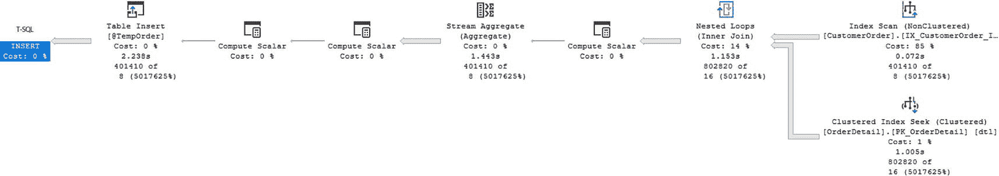

一个流程图。T-SQL 的成本为 0%，包含表插入、两次计算标量、流聚合、计算标量和嵌套循环。它来源于索引扫描和聚集索引查找。

图 2-21

填充表变量

既然 SQL Server 2019 已更新，允许在使用表变量时获得更好的估计，我预计执行计划在创建时会对表变量中的行数获得更准确的数字。这种改进的准确性将有助于 SQL Server 创建性能更高的执行计划。但是，如果您计划向表变量中添加大量数据，请务必仔细检查查询性能。

### 临时存储过程

如果在 `tempdb` 数据库中创建了存储过程，则该存储过程就是临时存储过程。SQL Server 可能实现了此功能，但请考虑开发人员和应用程序将如何与此数据库对象交互。至少，在 `tempdb` 数据库中存在临时存储过程会使与这些存储过程相关的代码更难以故障排除或维护。

## 触发器

SQL Server 提供了在发生插入、更新或删除操作时（或代替这些操作）执行特定操作的能力。这些响应可以因用户登录系统而触发。还有其他响应可以在现有数据库发生更改之后或之前发生，以防止更改。在处理应用程序和数据时，最常见的响应类型是针对数据库中数据更改的响应。无论出于何种原因，这些响应都被定义为触发器。触发器是一种特殊类型的存储过程，用于响应服务器、数据库或表上的特定操作。


### 登录触发器

当用户登录到服务器时，你可能希望记录该特定活动。在其他情况下，你可能希望在用户登录时限制其活动，或因为服务器登录而实现额外的安全功能。登录触发器使你能够让 SQL Server 针对服务器上的部分或所有登录操作做出反应。

在应用程序开发中，需要使用登录触发器的场景并不多。然而，有一些事情可以通过登录触发器来完成，它们有助于保护或监控与应用程序的连接。例如，使用登录触发器来存储登录活动信息，包括**谁**在**何时**连接到了数据库。登录触发器可以限制某个登录所允许的连接数，或完全阻止用户连接到服务器。在发生安全漏洞的情况下，这可以确保数据库不会被过多的连接淹没。反过来，限制每个登录所允许的连接数量也可能限制系统的可扩展性和面向未来的能力。今天可接受的连接数可能远低于未来所需的登录数。

### 数据定义语言触发器

当应用程序或用户更改整个数据库架构时，他们会使用数据定义语言。对于 SQL Server，可以对因数据库更改而导致的特定情况做出反应。虽然我不认为这是应用程序开发的标准部分，但了解这类触发器可能会有所帮助。DDL 触发器可以配置为响应各种 `CREATE`、`ALTER`、`DROP`、`GRANT`、`DENY`、`REVOKE` 和 `UPDATE STATISTICS` 语句。

如果你担心 SQL 注入对你的服务器造成问题，DDL 触发器可以帮助减轻损害。通过设置选项可以防止或控制对数据库对象的所有类型的更改，包括创建、修改或删除各种对象。你还可以使用 DDL 触发器来执行诸如在用户尝试修改数据库对象时生成错误等操作。此外，还可以记录或记录数据库对象被创建或修改的时间。虽然你可能希望通过设置各种触发器来监控服务器和数据库上的每个活动，但可能存在更好的可用选项。有其他替代方案可用于跟踪此类行为，包括用于服务器和数据库活动的 SQL Server 审计。通常，应用程序并不关心对服务器或数据库架构更改的记录。

### 数据 manipulation 语言触发器

如果你发现自己需要在应用程序开发中实现审计或日志记录，你可能会发现使用数据操作语言触发器非常有帮助。这些触发器可以在 `INSERT`、`UPDATE` 或 `DELETE` 语句完成后执行，或者完全替代 SQL 语句执行。在某些情况下，你可能只想记录更改发生的时间和更改了什么。在其他情况下，更改或验证请求的功能可能更为重要。

触发器的一种方法是在某事发生后执行一个动作。假设你想成功修改 `dbo.Product` 表中的一条记录，但你也想保留该物品成本随时间变化的历史记录。清单 2-37 展示了一些 T-SQL 代码，它将在更改发生后向历史表中添加一条记录。

```sql
CREATE TRIGGER dbo.LogProductPriceHistory
ON dbo.Product
AFTER INSERT, DELETE
AS
IF (ROWCOUNT_BIG() = 0)
RETURN;
INSERT INTO dbo.ProductPriceHistory
(
ProductID,
ProductPrice,
UserName,
DateCreated
)
SELECT
ProductID,
ProductPrice,
SYSTEM_USER,
SYSDATETIME()
FROM inserted;
```
清单 2-37
创建后插入或删除的 DML 触发器

当 `dbo.Product` 表中的记录被插入或删除时，新的产品价格和价格更改的日期将被记录在 `dbo.ProductPriceHistory` 表中。为了确定此触发器的性能，请通过运行清单 2-38 中的代码来测试此触发器。

```sql
INSERT INTO dbo.Product (ProductName, ProductPrice)
VALUES ('Disk Golf Disk - Small', 7.99);
```
清单 2-38
向 Product 表插入记录的查询

执行上述代码时，执行计划包括两个步骤。第一步是运行代码将记录插入 `dbo.Product` 表。第二个执行计划显示了因触发器而发生的插入操作的计划。清单 2-38 生成的执行计划如图 2-22 所示。

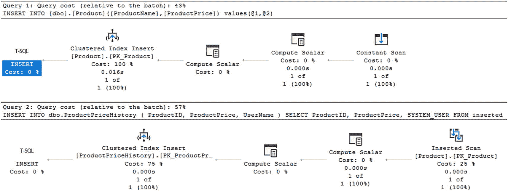

流程图。在查询 1 中，T-SQL 的成本为 0%，包含聚集索引插入、两次计算标量和常量扫描。查询 2 包含插入的扫描，而不是常量扫描。查询 1 百分比 = 43，查询 2 百分比 = 57。

图 2-22
使用触发器插入记录的执行计划

图 2-22 中的执行计划显示了当记录以触发触发器的方式被修改时发生的情况。然而，清单 2-35 中的 T-SQL 代码 `IF (ROWCOUNT_BIG() = 0) RETURN;` 会阻止 DML 触发器在没有记录被更新时触发。这被认为是一种最佳实践，可以在无需任何操作时最小化服务器上的资源利用。清单 2-39 展示了一个不会更新任何记录的更新查询。

```sql
DELETE FROM dbo.Product
WHERE ProductID = 500;
```
清单 2-39
不会更新任何记录的 DELETE 语句

如图 2-23 所示，执行计划只有一个步骤。那就是删除数据的执行计划。没有来自触发器的 T-SQL 代码执行。

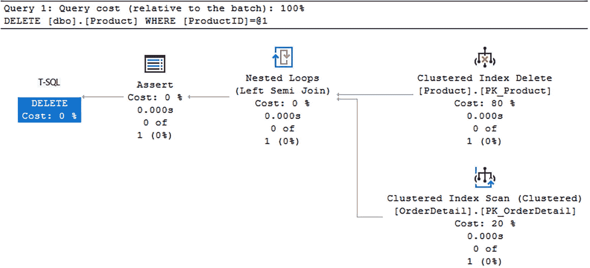

流程图。删除 product where product ID = at 1。它们源自聚集索引删除和聚集索引扫描。查询 1 百分比 = 100。

图 2-23
没有记录被更新时的执行计划

SQL Server 知道触发器没有返回需要更新的记录。它没有尝试向 `dbo.ProductPriceHistory` 表插入任何记录，唯一的操作是生成删除操作的执行计划。


在活动之后执行触发器并不是数据操作触发器（trigger）的唯一选项。另一种可能是让触发器执行一个动作，而不是执行最初请求的操作。清单 2-40 展示了一个触发器，当用户发出删除（DELETE）请求时，该触发器将禁用一条记录。

```sql
CREATE TRIGGER dbo.DisableProduct
ON dbo.Product
INSTEAD OF DELETE
AS
UPDATE prd
SET IsActive = 0,
DateDisabled = GETDATE()
FROM dbo.Product prd
INNER JOIN deleted del
ON prd.ProductID = del.ProductID;
Listing 2-40
INSTEAD OF 触发器示例
```

在 `SQL Server` 中使用 `DML` 触发器时，不止有一种选择。还可以为每个数据库对象设置多个触发器。对于每个 `INSERT`、`UPDATE` 和 `DELETE` 操作，你最多可以拥有一个 `INSTEAD OF` 触发器。在同一个表或视图上，你也可以拥有多个 `AFTER` 触发器。由于允许的触发器数量众多，你还可以为每个 `INSERT`、`UPDATE` 或 `DELETE` 操作指定哪个触发器应该最先运行，哪个应该最后运行。如果你对一个操作类型拥有多个 `AFTER` 触发器，那么这些触发器中的任何一个都可能以随机顺序运行。

由于一个给定的数据库对象上可能存在多层触发器，测试这些触发器的功能就显得很重要。如同本章讨论的许多其他概念一样，了解触发器在负载下的表现有助于预判应用程序的性能。值得一提的是，触发器应谨慎使用。它们应该像我的示例那样简短。你不应该开始编写包含 3 个游标的、长达 2000 行的触发器。

#### 游标

为了有效地使用关系数据库，通常至关重要的一点是以大块或集合的形式来思考流程和数据。在几乎所有场景中，目标都是编写能够利用这种基于集合（set-based）逻辑的 `T-SQL`。

虽然这是理想的方法，但你可能会遇到一种情况，觉得无法以大块的方式处理数据。在其中一些场景中，这可能意味着需要按行逐个处理数据。为了在 `SQL Server` 中做到这一点，你需要使用游标（cursor）。游标是一种对象，它接收一个查询，并允许你循环遍历结果数据集的每一行。

如果考虑采用这条路，必须承认 `SQL Server` 在处理一大块数据时性能最佳，而一次处理大量单个记录则不然。在遇到诱人的、需要处理逐行逻辑的场景时，也许是时候寻找另一个工具来更好地满足你的需求了。例如，当创建一个游标来依次连接到多个 `SQL Server` 实例并执行任务时。虽然这超出了本书的范围，但解决这种特定情况的最佳方式可能是创建一个 `SQL Server` Integration Services (`SSIS`) 包来处理连接到各种 `SQL Server` 实例。

还有其他时候，你可能需要使用 `T-SQL` 来生成一个结果集，其中返回的数据是相同的，但必须按位置或供应商信息进行分段。在这个例子中，可以使用 `SQL Server` Reporting Services (`SSRS`) 来达到相同的目标。然而，你的企业可能决定不使用 `SSRS`。因此，使用游标可能是正确的选择。我也遇到过需要使用特定的、按记录计算的值通过计算来更新数据的情况。在这种情况下，几乎不可能使用基于集合的逻辑来执行更新。

虽然 `SQL Server` 可以处理这个任务，但最好由应用程序来处理这些变更。编写 `T-SQL` 的一个主要因素是意识到你的代码可能对 `SQL Server` 产生的影响。这对于游标和触发器同样适用。触发器似乎是解决各种问题的快速方法，但触发器也会给服务器带来开销。想象一下，`SQL Server` 必须评估插入表中的每一条记录，以确定它是否符合触发器的条件，如果符合，那么 `SQL Server` 还必须执行另一个操作。这对 `SQL Server` 来说是相当多的额外工作。

游标可以帮助创建一个可重复的、一次处理一条记录的过程。虽然游标可以用来解决各种问题，但重要的是要记住，可能有其他方法可以在不使用游标的情况下实现相同的结果。如果你确定真的必须使用游标，下一步就是决定使用哪种类型的游标。虽然无论使用哪种类型，游标的概念是相同的，但游标的类型将决定游标内数据的功能性和可访问性。

在为你的需求选择正确的游标类型时，请选择功能最少但能满足你需求的那一种。与功能更多的游标类型相比，这将有助于减少性能的负面影响。当你在 `SQL Server` 中一次处理一条记录时，其性能几乎总是比以组为单位处理数据要差。

游标选择一个数据集，一次提取一条记录，然后修改当前记录。一旦所需的操作完成，就可以提取下一条记录。了解可用的各种游标类型将使你能够选择正确的类型。


### 只进游标

默认的游标类型称为只进游标。对于这种类型的游标，数据只能以单一方向获取。可以在只进游标中对获取的记录执行插入、更新和删除操作。如果记录之前已被更新过，则除非关闭并重新打开游标，否则不会再次获取该记录。也存在一些有限的情况，在记录被更新后，你仍可以在游标中返回相同的记录。清单 2-41 展示了一个只进游标的例子。

```sql
SET NOCOUNT ON;
DECLARE
@CustomerID      INT = 1,
@CustomerOrderID INT,
@CustomerName    VARCHAR(140),
@message         VARCHAR(50);
SELECT @CustomerName =
FirstName + ' ' + LastName
FROM dbo.Customer
WHERE CustomerID = @CustomerID;
PRINT '------- Order History for ' + @CustomerName + ' -------';
DECLARE customer_cursor CURSOR FORWARD_ONLY
FOR
SELECT CustomerOrderID
FROM dbo.CustomerOrder
WHERE CustomerID = @CustomerID
ORDER BY CustomerOrderID;
OPEN customer_cursor;
FETCH NEXT FROM customer_cursor
INTO @CustomerOrderID;
WHILE @@FETCH_STATUS = 0
BEGIN
PRINT ' ';
SELECT @message = '----- Order Number:' +
CAST(@CustomerOrderID AS VARCHAR(8)) +
'-----';
PRINT @message;
SELECT prd.ProductName,
dtl.QuantitySold,
dtl.ProductPrice
FROM dbo.OrderDetail dtl
INNER JOIN dbo.Product prd
ON dtl.ProductID = prd.ProductID
WHERE dtl.CustomerOrderID =
@CustomerOrderID;
FETCH NEXT FROM customer_cursor INTO
@CustomerOrderID;
END;
CLOSE customer_cursor;
DEALLOCATE customer_cursor;
```

清单 2-41
只进游标示例

这个只进游标生成了一个包含特定客户所有订单及其所有产品的列表。在图 2-24 中，你可以看到使用输出到文本窗口时的结果。

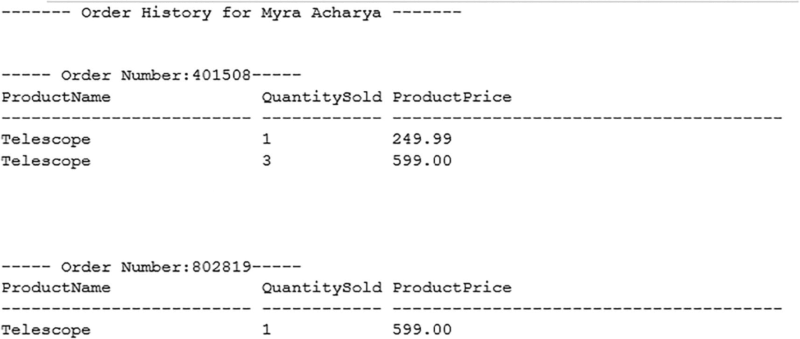

一个屏幕截图展示了特定客户的所有订单列表。它包括产品名称、销售数量和产品价格。

图 2-24

只进游标的输出

虽然这产生了所需的输出，但需谨记其性能影响。在图 2-25 中，你可以查看此游标执行计划的一部分。

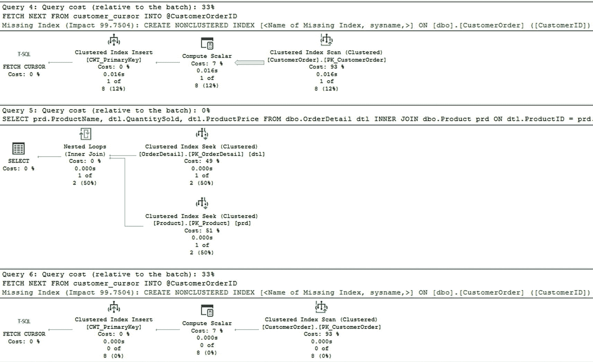

一个屏幕截图展示了只进游标的执行计划。查询 4 和 6 突出了缺失的索引。查询成本相对于批次在查询 4 中是 33%，在查询 5 中是 0，在查询 6 中是 33%。

图 2-25

只进游标的执行计划

重要的是要记住，图中第二和第三部分将为游标中处理的每一行重新运行。如果底层查询快速且执行高效，这可能不是问题。然而，如果游标内的查询存在任何性能问题，游标可能会严重加剧这些性能问题。

### 静态游标

有时你希望能够在运行游标时向前和向后移动。使用静态游标时，可用的结果集自游标首次打开后就不会改变。静态游标可以选择为只读或允许读写。如果游标是只读的，则无法修改数据。如果数据被修改，则无法保证游标会拉回修改后的数据。

### 键集游标

在定义游标时，可能存在一组构成唯一条目的列。如果可以找到这组唯一数据，并且你需要能够与已更改的记录进行交互，那么使用键集游标可能是一个选项。键集是从唯一列集合中提取的一组键。游标可以向前和向后移动，但检测订单更改的唯一方法是关闭并重新打开属于游标的记录。

### 动态游标

如果其他游标不适用于你的情况，还有最后一种游标类型可用。由于潜在的性能影响，应尽可能少地使用这种类型的游标。动态游标允许你在结果集中向前和向后移动。此外，它将感知对数据所做的更改。虽然处理事务隔离级别超出了本书的范围，但动态游标在涉及事务隔离级别时有一些额外的注意事项。所有已提交事务的更改都将是可见的。然而，只有当游标的事务隔离级别设置为未提交读时，才能找到未提交事务的更改。

在本节前面，我展示了如何创建只进游标。创建游标的有趣之处在于，在切换各种游标类型时，代码变化不大。游标类型之间的最大区别在于每个游标可以访问哪些数据更改以及数据如何被获取。最大的诱惑之一是游标的工作方式与应用程序代码非常相似。游标不是一次性处理大量数据，而是循环遍历数据。在应用程序代码中，这是访问数据的首选方法，这使得使用游标更具诱惑力。

我最常遇到游标被用于处理本可以由应用程序更好地处理的流程。你可能会发现自己处于一种情况，游标似乎是唯一可用的解决方案之一。参考清单 2-42，你可以了解动态游标可以是什么样子。

```sql
SET NOCOUNT ON;
DECLARE
@CustomerID      INT = 1,
@CustomerOrderID INT,
@CustomerName    VARCHAR(140),
@message         VARCHAR(50);
SELECT @CustomerName =
FirstName + ' ' + LastName
FROM dbo.Customer
WHERE CustomerID = @CustomerID;
PRINT '------- Order History for ' + @CustomerName + ' -------';
DECLARE customer_cursor CURSOR DYNAMIC
FOR
SELECT CustomerOrderID
FROM dbo.CustomerOrder
WHERE CustomerID = @CustomerID
ORDER BY CustomerOrderID;
OPEN customer_cursor;
FETCH NEXT FROM customer_cursor
INTO @CustomerOrderID;
WHILE @@FETCH_STATUS = 0
BEGIN
PRINT ' ';
SELECT @message = '----- Order Number:' + CAST(@CustomerOrderID AS VARCHAR(8)) + '-----';
PRINT @message;
SELECT prd.ProductName, dtl.QuantitySold, dtl.ProductPrice
FROM dbo.OrderDetail dtl
INNER JOIN dbo.Product prd
ON dtl.ProductID = prd.ProductID
WHERE dtl.CustomerOrderID = @CustomerOrderID;
FETCH NEXT FROM customer_cursor INTO @CustomerOrderID;
END;
CLOSE customer_cursor;
DEALLOCATE customer_cursor;
```

清单 2-42
创建动态游标

将游标类型从 `FORWARD_ONLY` 更改为 `DYNAMIC` 就像交换这两个短语一样简单。这些游标的输出也是相同的。真正可能发生的差异是在幕后。如果在游标运行时记录发生了变化，只进游标可能无法感知该更改，而动态游标可能能够滚动访问该更改，或者在某些情况下，动态游标可能在更改提交之前就发现了它。

在本章中，我介绍了在编写 T-SQL 时可用的几种不同类型的数据库对象。这些对象可以帮助提高代码的可读性。虽然在某些情况下，其中一些数据库对象可以提高性能，但这些数据库对象都不是设计来解决每一个技术挑战的。有些情况下，使用错误的数据库对象可能对数据库和你的应用程序代码产生负面的性能影响。现在你知道了何时使用每种数据库对象，是时候开始考虑你编写的代码质量了。


