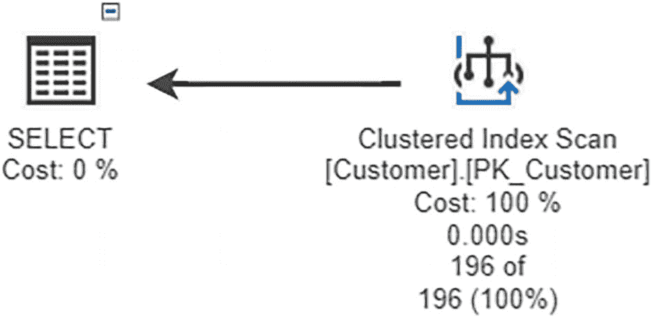

# 4. 设计 T-SQL

构建易于理解的 T-SQL 的重点在于提高理解先前未见或许久未见代码的速度。正如第 1 章所讨论的，选择合适的数据类型可以提升 T-SQL 代码的速度，因为需要检索的数据量更小。尽管格式和数据类型非常重要，但为 T-SQL 代码选择正确的数据库对象同样会影响应用程序的速度。本章将探讨查询设计如何影响查询速度。

在为应用程序编写 T-SQL 时，就性能而言，存储过程通常是**最理想的选择**。使用存储过程有许多优势，包括可能使你的代码更具适应性和可重用性。类似地，在代码中使用参数可以增加 T-SQL 代码的灵活性。在为更复杂的查询设计解决方案时，你可以使用存储过程和参数。此外，在解决复杂问题时，你可能还需要考虑其他技术。设计 T-SQL 代码时需要考虑几个事项，包括存储过程、参数和复杂的查询逻辑。

## 使用存储过程

在编写 T-SQL 代码时，有多种编写方式，这会影响查询执行的快慢。如果计划缓存中没有执行计划，查询的相对速度会更慢。能够使用缓存的执行计划将提高查询速度，因为 SQL Server 不需要花费额外资源来确定如何检索数据。SQL Server 用于检索数据的方法称为执行计划，第 8 章将对此进行更详细的讨论。

为应用程序编写 T-SQL 代码时，需要考虑几个方面。为了更好地理解你希望应用程序如何使用 T-SQL，最好先了解 SQL Server 如何处理可用的每个 T-SQL 选项。当 SQL Server 执行查询时，它必须确定如何执行该查询。在此之前，SQL Server 会检查是否已存在此查询的执行计划。T-SQL 的设计方式会对 SQL Server 验证执行计划是否已存在产生一定影响。

为了展示存储过程、即席查询和预准备语句如何影响计划缓存，让我们看几个例子。使用存储过程可以使你的 T-SQL 代码可重复执行，有可能让查询计划在缓存中保留更长时间，从而提高查询执行速度。在代码清单 4-1 中，你可以看到创建存储过程的语句。

```
/*-------------------------------------------------------------*\
Name:             dbo.GetCustomer
Author:           Elizabeth Noble
Created Date:     2022-04-20
Description:      Get a list of all customers in the databases
Sample Usage:
EXECUTE dbo.GetCustomer;
\*-------------------------------------------------------------*/
CREATE PROCEDURE dbo.GetCustomer
AS
SELECT
CustomerID,
FirstName,
LastName,
Address,
City,
PostalCode,
Country,
IsActive,
DateCreated,
DateModified,
DateDisabled
FROM dbo.Customer;
Listing 4-1
Creating a Stored Procedure
```

在此示例中，你创建了一个未参数化的存储过程，每次都将执行完全相同的 T-SQL。此存储过程返回 `SELECT` 语句中请求的列的结果，包含已输入数据库的所有客户。如果你想查看此存储过程的结果，可以按照代码清单 4-2 所示执行该存储过程。

```
EXECUTE dbo.GetCustomer;
Listing 4-2
Executing the Stored Procedure
```

SQL Server 创建了图 4-1 所示的执行计划，并且在大多数情况下，会将执行计划保存到查询计划缓存中。此计划可能被视为微不足道而根本不会保存到缓存中。如果将来再次运行此存储过程，SQL Server 将检查计划缓存，看看此存储过程是否已存在于缓存中。只要 SQL Server 认为该计划相关，它就会一直保留在计划缓存中。第 8 章将更详细地介绍 SQL Server 如何计算执行计划的相关性。在图 4-1 中，你可以看到与代码清单 4-2 中的存储过程相关的执行计划。



一幅插图描绘了左侧选择成本等于 0%，右侧聚集索引扫描成本等于 100%。两者由一个反向箭头分隔。

图 4-1
存储过程的执行计划


### 执行计划缓存与查询类型

如果执行计划在缓存中，SQL Server 将继续重用相同的执行计划。这对于存储过程效果很好。然而，在 SQL Server 中还有其他访问数据的方法。其中一种方法是编写即席查询。编写即席查询时，可以选择硬编码值或对它们进行参数化。清单 4-3 所示类型的查询与清单 4-1 中的存储过程具有相同的逻辑。

#### 代码清单 4-3：即席查询逻辑

```sql
SELECT
CustomerID,
FirstName,
LastName,
Address,
City,
PostalCode,
Country,
IsActive,
DateCreated,
DateModified,
DateDisabled
FROM dbo.Customer;
```
清单 4-1 和 4-3 中的逻辑是相同的。最大的区别在于 SQL Server 处理这两个不同的 T-SQL 查询的方式。然而，实际情况是 SQL Server 会检查计划缓存以查看是否存在相同的计划。存储在计划缓存中的计划不是基于核心逻辑，而是基于实际的即席查询或存储过程执行的编写方式。

#### 计划缓存条目对比

如表 4-1 所示，即席查询甚至作为即席对象类型存储，而 SQL Server 能够正确识别第二行是一个存储过程。在表 4-1 中，您可以看到运行存储过程和作为即席查询运行相同代码后计划缓存中的结果。

##### 表 4-1：即席查询与存储过程的计划缓存

| 使用次数 | 对象类型 | 查询文本 |
| --- | --- | --- |
| 1 | 即席 | `SELECT      CustomerID,      FirstName,      LastName,      Address,      City,      PostalCode,      Country,      IsActive,      DateCreated,      DateModified,      DateDisabled FROM dbo.Customer;` |
| 1 | 存储过程 | `/*-------------------------------------------------------------*\ Name:            dbo.GetCustomer Author:          Elizabeth Noble Created Date:    2022-10-30 Description: Get a list of all customers in the databases Sample Usage:      EXECUTE dbo.GetCustomer \*-------------------------------------------------------------*/ CREATE PROCEDURE dbo.GetCustomer AS  SELECT        CustomerID,        FirstName,        LastName,        Address,        City,        PostalCode,        Country,        IsActive,        DateCreated,        DateModified,        DateDisabled  FROM dbo.Customer;` |

#### 查询格式变化的影响

当用户或应用程序以不一致的方式编写代码时，这一切就变得重要了。通过将 `SELECT` 子句后的第一列移到与 `SELECT` 子句同一行，对清单 4-3 中的查询进行了修改。清单 4-4 显示了更新后的查询。

##### 代码清单 4-4：修改后的即席查询

```sql
SELECT CustomerID,
FirstName,
LastName,
Address,
City,
PostalCode,
Country,
IsActive,
DateCreated,
DateModified,
DateDisabled
FROM dbo.Customer;
```
真正改变的只有查询本身的格式。虽然您可能能看出该查询使用了相同的逻辑，但您应该运行清单 4-5 中的查询，以了解 SQL Server 如何处理此查询与计划缓存的关系。运行清单 4-4 中的查询后，计划缓存将显示表 4-2 中的结果。

##### 表 4-2：修改后的即席查询的计划缓存

| 使用次数 | 对象类型 | 查询文本 |
| --- | --- | --- |
| 1 | 即席 | `SELECT      CustomerID,      FirstName,      LastName,      Address,      City,      PostalCode,      Country,      IsActive,      DateCreated,      DateModified,      DateDisabled FROM dbo.Customer;` |
| 1 | 即席 | `SELECT CustomerID,      FirstName,      LastName,      Address,      City,      PostalCode,      Country,      IsActive,      DateCreated,      DateModified,      DateDisabled FROM dbo.Customer;` |
| 1 | 存储过程 | `/*-------------------------------------------------------------*\ Name:            dbo.GetCustomer Author:          Elizabeth Noble Created Date:    2022-10-30 Description: Get a list of all customers in the databases Sample Usage:      EXECUTE dbo.GetCustomer \*-------------------------------------------------------------*/ CREATE PROCEDURE dbo.GetCustomer AS  SELECT        CustomerID,        FirstName,        LastName,        Address,        City,        PostalCode,        Country,        IsActive,        DateCreated,        DateModified,        DateDisabled  FROM dbo.Customer;` |

#### 计划缓存膨胀与性能影响

您可以在表 4-2 中看到，计划缓存中现在有三个条目。SQL Server 并没有重用第一次调用即席查询时的执行计划，而是生成了一个全新的执行计划。每次 SQL Server 创建新的执行计划时，它都会消耗额外的资源来创建和存储该计划。需要生成执行计划可能会使查询速度延迟几秒钟。

每个执行的查询计划都会保存在计划缓存中。为每个查询保存多个执行计划可能会填满执行计划缓存。这可能导致其他查询执行计划过早地从计划缓存中移除。查询计划从缓存中移除将导致 SQL Server 消耗额外的资源为那个其他查询创建新的执行计划。第 7 章将提供更多关于内存使用如何影响查询性能速度的信息。在确定您的应用程序将如何调用 T-SQL 代码时，这是需要考虑的事情。

#### 存储过程与参数化查询的权衡

虽然存储过程为您提供了一种一致的方式来多次调用相同类型的代码，但通用的存储过程可能无法提供应用程序所需的灵活性。如果是这种情况，您需要了解使用参数如何帮助提高 T-SQL 代码的可伸缩性。


