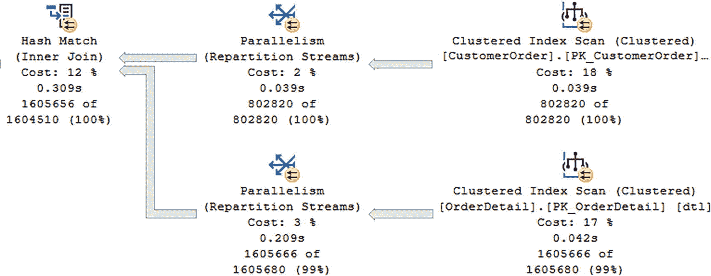
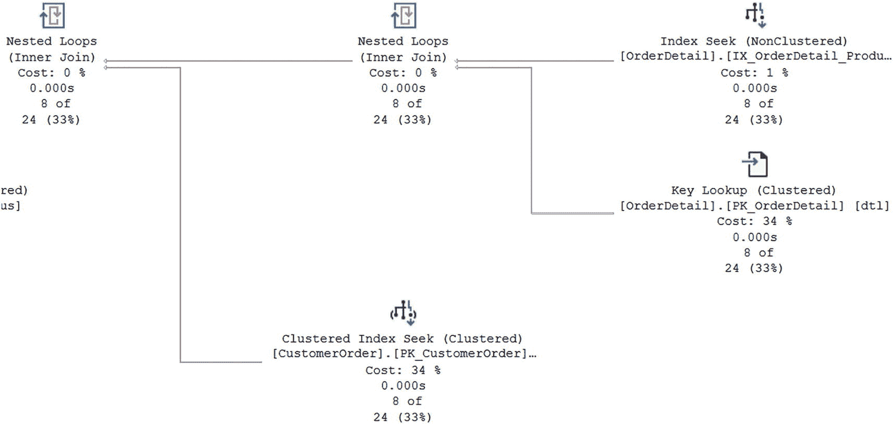
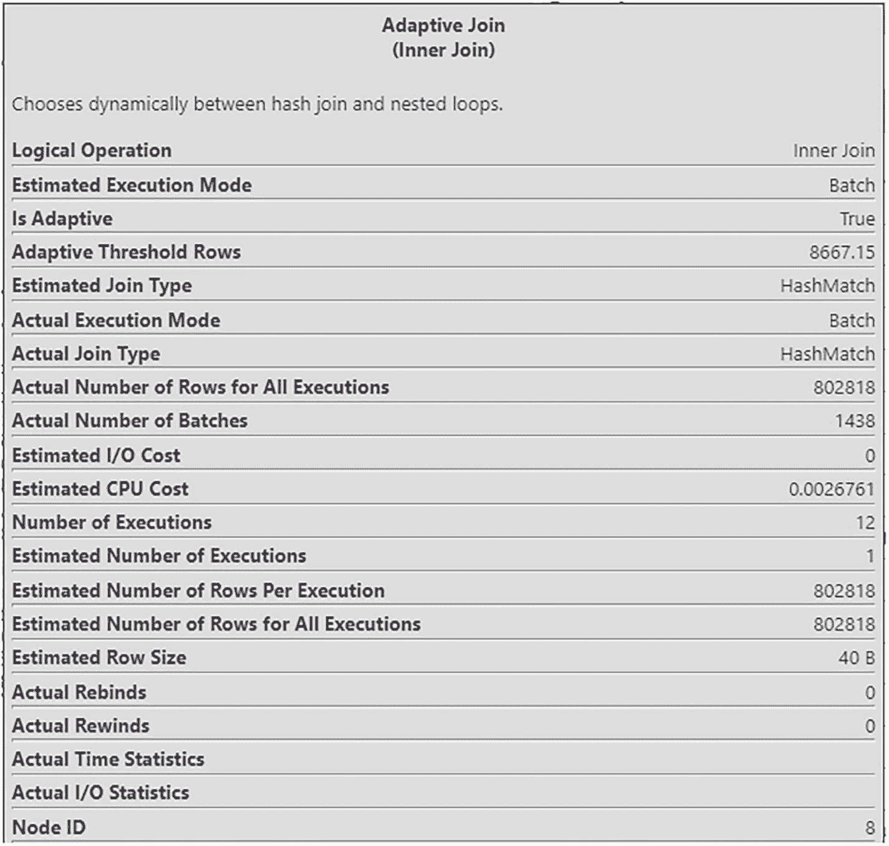
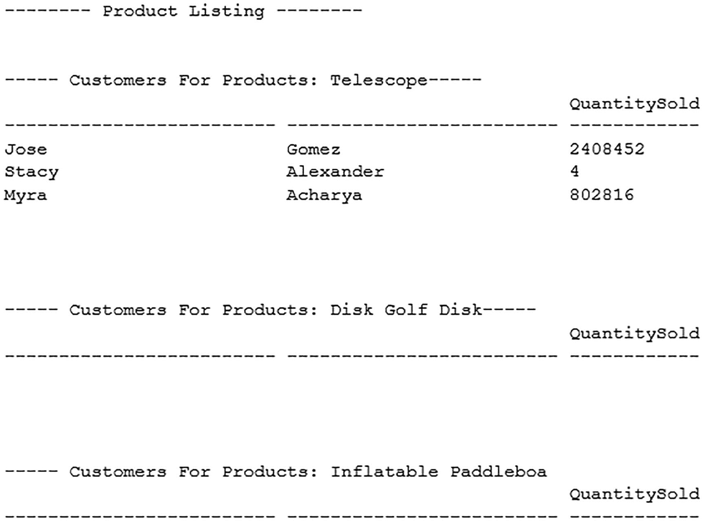
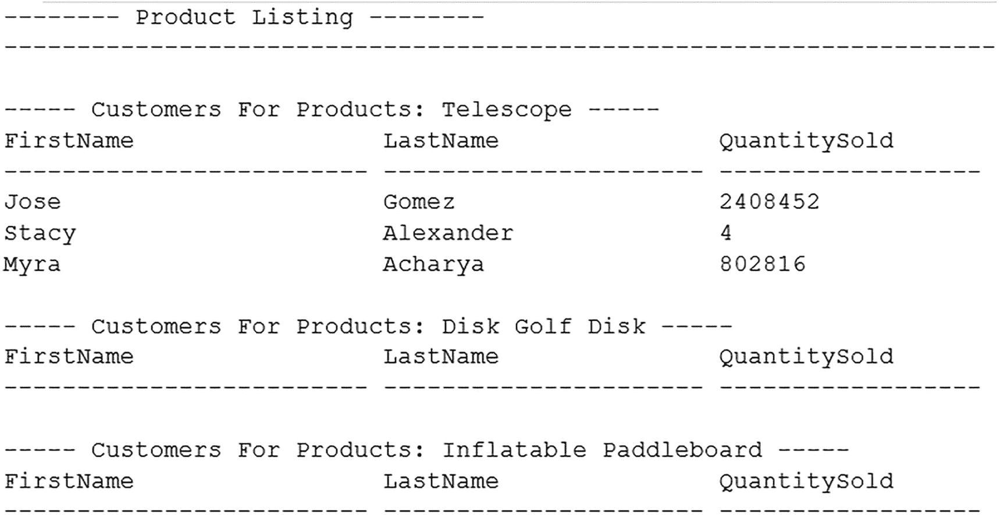

# 使用参数

除了使用存储过程来提高 T-SQL 代码的可重用性之外，您还可以在 T-SQL 代码中使用参数。参数可以用于即席查询、预处理语句或存储过程。参数也可以用作输入或输出。无论参数用在何处，参数都允许您编写可在多种情况下重用的查询。清单 4-5 展示了一个根据存储过程中提供的 `CustomerID` 返回客户信息的存储过程。

```sql
/*-------------------------------------------------------------*\
Name:             dbo.GetCustomerByCustomerID
Author:           Elizabeth Noble
Created Date:     2022-10-30
Description:      Get Customer information when a Customer ID is provided
Sample Usage:
DECLARE @CustomerID INT;
SET @CustomerID = 1;
EXECUTE dbo.GetCustomerByCustomerID @CustomerID;
\*-------------------------------------------------------------*/
CREATE PROCEDURE dbo.GetCustomerByCustomerID
    @CustomerID   INT
AS
SELECT
    CustomerID,
    FirstName,
    LastName,
    Address,
    City,
    PostalCode,
    Country,
    IsActive,
    DateCreated,
    DateModified,
    DateDisabled
FROM dbo.Customer
WHERE CustomerID = @CustomerID;
```
**清单 4-5** 创建带参数的存储过程

这个存储过程允许您传入任何 `CustomerID`，然后它会根据该 `CustomerID` 返回一组预定义的客户信息。这也使得以更简单的方式调用 T-SQL 代码成为可能。清单 4-6 包含执行该存储过程的代码，执行时传递了一个硬编码的值。

```sql
EXECUTE dbo.GetCustomerByCustomerID 1;
```
**清单 4-6** 使用硬编码值执行存储过程

虽然可以使用此方法调用存储过程，但使用变量是执行此存储过程的一种更为动态的方式。其中一种方法是声明一个具有特定数据类型的变量，然后将该变量设置为特定值。这更接近地模拟了应用程序调用存储过程的方式。应用程序代码通常已经声明了一个变量，并在执行存储过程时使用相同的变量。声明变量、将该变量设置为某个值，然后使用该变量执行存储过程的过程可以在清单 4-7 中看到。

```sql
DECLARE @CustomerID INT;
SET @CustomerID = 1;
EXECUTE dbo.GetCustomerByCustomerID @CustomerID;
```
**清单 4-7** 使用变量执行存储过程

### 计划缓存比较

为了比较清单 4-6 中存储过程的计划缓存与即席查询的计划缓存，请执行与清单 4-5 具有相同整体逻辑的即席查询。但是，此值不会被参数化。在清单 4-8 中，下面的查询对 `CustomerID` 使用了硬编码值。

```sql
SELECT
    CustomerID,
    FirstName,
    LastName,
    Address,
    City,
    PostalCode,
    Country,
    IsActive,
    DateCreated,
    DateModified,
    DateDisabled
FROM dbo.Customer
WHERE CustomerID = 1;
```
**清单 4-8** 运行带硬编码值的即席查询

执行相同存储过程的另一种方法是使用类似于清单 4-8 中的查询，但在 where 子句中使用参数。这将执行与清单 4-6、4-7 和 4-8 相同的整体逻辑。清单 4-9 中的代码通过声明一个变量并整体参数化查询来使用相同的代码。

```sql
DECLARE @CustomerID INT;
SET @CustomerID = 1;
SELECT
    CustomerID,
    FirstName,
    LastName,
    Address,
    City,
    PostalCode,
    Country,
    IsActive,
    DateCreated,
    DateModified,
    DateDisabled
FROM dbo.Customer
WHERE @CustomerID = @CustomerID;
```
**清单 4-9** 运行带参数的即席查询

### 执行计划分析

虽然所有这些查询都返回相同的数据，但 SQL Server 处理这四个查询的方式可能截然不同。在我的测试案例中，我通过执行代码 `DBCC FREEPROCCACHE` 清除了计划缓存。

> **注意**
>
> 不要在生产系统上运行此存储过程，因为它可能对 SQL Server 的性能产生负面影响。

然后我执行了清单 4-7、4-8、4-9 和 4-10 中的 T-SQL 代码。尽管这些查询中的每一个都返回相同的结果，但您将在表 4-3 中看到 SQL Server 如何为这些查询中的每一个计算或使用执行计划。

**表 4-3** 变量和硬编码值的计划缓存比较

| 使用计数 | 对象类型 | 文本 |
| :--- | :--- | :--- |
| 2 | Proc | `/*-------------------------------------------------------------*\ Name:             dbo.GetCustomerByCustomerID Author:           Elizabeth Noble Created Date:     2022-10-30 Description:      Get Customer information when a Customer ID is provided Sample Usage:       DECLARE @CustomerID INT;       SET @CustomerID = 1;       EXECUTE dbo.GetCustomerByCustomerID @CustomerID \*-------------------------------------------------------------*/ CREATE PROCEDURE dbo.GetCustomerByCustomerID       @CustomerID        SELECT           CustomerID,           FirstName,           LastName,           Address,           City,           PostalCode,           Country,           IsActive,           DateCreated,           DateModified,           DateDisabled       FROM dbo.Customer       WHERE CustomerID = @CustomerID;` |
| 1 | Adhoc | `DECLARE @CustomerID INT; SET @CustomerID = 1 SELECT CustomerID,       FirstName,       LastName,       Address,       City,       PostalCode,       Country,       IsActive,       DateCreated,       DateModified,       DateDisabled FROM dbo.Customer WHERE @CustomerID = 1;` |
| 1 | Adhoc | `SELECT CustomerID,       FirstName,       LastName,       Address,       City,       PostalCode,       Country,       IsActive,       DateCreated,       DateModified,       DateDisabled FROM dbo.Customer WHERE CustomerID = 1;` |
| 1 | Prepared | `(@1 tinyint)SELECT [CustomerID],[FirstName],[LastName],[Address],[City],[PostalCode],[Country],[IsActive],[DateCreated],[DateModified],[DateDisabled] FROM [dbo].[Customer] WHERE [CustomerID]=@1` |

在表 4-3 中，您可以看到存储过程已被执行了两次。带硬编码值的 SELECT 语句和带参数值的 SELECT 语句各自拥有自己的执行计划。当您只讨论少数几个查询时，这可能不会有太大影响。但是，如果您的整个环境中存在大量不是存储过程或预处理语句的查询，您可能需要检查您的计划缓存，以确定它们是如何被处理的。

这不是您在编写查询时需要考虑的唯一主题。另一个潜在选项涉及通常被称为**参数嗅探**的问题。参数嗅探听起来并不像它实际可能那么危险。嘘！！理解参数嗅探是什么以及它如何影响您的关键要点是考虑您的数据是如何分布的。对于许多公司来说，存储在数据表中的数据并非都是均匀分布的。


对于因列统计信息导致 SQL Server 预期返回大量行的查询，其查询计划可能与那些因不同参数带来不同统计信息、从而预期返回极少行的同一查询的计划看起来截然不同。所有这些参数化的尝试，都是为了让这些查询的不同版本能够共享一个存储在计划缓存中的单一计划。当查询在不共享计划的情况下可能表现更好时，这种共享计划的问题被称为`parameter sniffing`。在清单 4-10 中，你可以看到用于测试参数嗅探的存储过程。

```
/*-------------------------------------------------------------*\
Name:             dbo.GetCustomerAndOrderNumberByProductID
Author:           Elizabeth Noble
Created Date:     2022-10-30
Description:      Get customer and products ordered for an order number
Sample Usage:
EXECUTE dbo.GetCustomerAndOrderNumberByProductID 1
\*-------------------------------------------------------------*/
CREATE PROCEDURE dbo.GetCustomerAndOrderNumberByProductID
@ProductID     INT
WITH RECOMPILE
AS
SELECT
cus.FirstName,
cus.LastName,
ord.OrderNumber,
ord.OrderDate,
prd.ProductName,
SUM(dtl.QuantitySold),
dtl.ProductPrice
FROM dbo.Customer cus
INNER JOIN dbo.CustomerOrder ord
ON cus.CustomerID = ord.CustomerID
INNER JOIN dbo.OrderDetail dtl
ON ord.CustomerOrderID = dtl.CustomerOrderID
INNER JOIN dbo.Product prd
ON prd.ProductID = dtl.ProductID
WHERE prd.ProductID = @ProductID
GROUP BY cus.FirstName,
cus.LastName,
ord.OrderNumber,
ord.OrderDate,
prd.ProductName,
dtl.ProductPrice
ORDER BY cus.FirstName, cus.LastName;
Listing 4-10
用于按产品查找客户和订单的存储过程
```

对于产品而言，存储在表中的不同产品类型数量可能存在显著差异。如果你有成百上千个望远镜售出，但只有少量桨板售出，你可能会遇到参数嗅探影响应用程序性能的场景。在此场景中，你可能执行一个想要查询望远镜的存储过程。第一次调用存储过程时，SQL Server 会使用提供的参数来生成执行计划。该执行计划最终将存储在计划缓存中。要测试参数嗅探，你可能需要用给定的参数执行存储过程，如清单 4-11 所示。

```
EXECUTE dbo.GetCustomerAndOrderNumberByProductID 1;
Listing 4-11
使用对应大量记录的参数执行存储过程
```

此存储过程执行产生了图 4-2 中的部分执行计划，用于检索客户订单和订单详细信息。



一个流程图描绘了两个指向哈希匹配的反向箭头，其成本占比为 12%，源自两个并行度重分区流，成本占比分别为 2%和 3%。重分区流通过反向箭头从聚簇索引扫描分离出来，成本占比分别为 18%和 17%。

图 4-2
参数对应大量记录的存储过程的执行计划

如果你稍后返回并想为桨板重新运行该存储过程，SQL Server 将重用最初为查询望远镜（其记录很多）生成的执行计划。然而，SQL Server 创建的第一个执行计划在尝试查找购买桨板的客户时，性能可能会更差。如果你清除计划缓存并以不同顺序重新运行存储过程，可以验证该问题与参数嗅探有关。在清单 4-12 中，你可以看到用于生成不同执行计划的 T-SQL 代码，因为现在预期行数要少得多。

```
EXECUTE dbo.GetCustomerAndOrderNumberByProductID 4;
Listing 4-12
使用对应少量记录的参数执行存储过程
```

当你执行此存储过程时，会创建一个新的计划缓存。你可以在图 4-3 中看到创建的执行计划。



一个流程图描绘了两个指向嵌套循环的反向箭头，其成本占比为 0%，源自另一个成本占比为 0%的嵌套循环和聚簇索引扫描。它进一步显示了一个通过反向箭头从索引查找和键查找分离出来的嵌套循环。

图 4-3
参数对应少量记录的存储过程的执行计划

这里有一个新的联接，允许执行计划用相同的计划处理不同形状的数据。这就是自适应联接运算符的使用。目前，需要理解的重要一点是，执行计划中的自适应联接运算符让 SQL Server 能够在查询执行时选择两个不同运算符中的一个，如图 4-4 所示。



一张标题为“自适应联接”的截图显示了 21 个选项。这些选项主要包括逻辑操作、估计执行模式、自适应阈值行数、实际联接类型和实际重绑定次数。

图 4-4
自适应联接运算符属性

如你所见，自适应联接允许 SQL Server 在`hash join`运算符和`nested loop`运算符之间动态选择。该运算符在哈希联接和嵌套循环联接之间切换的能力，有助于缓解许多因参数嗅探而经历的性能问题。名为`Adaptive Join`的批处理模式在 SQL Server 2017 中引入，只要你的数据库兼容级别为 140 或更高，它就可用。我将在第 8 章中更详细地讨论自适应联接。


## 使用复杂逻辑

SQL Server 中有一些基本操作并不复杂。这些基本操作可能包括对单表进行插入、读取、更新和删除，可称为 CRUD（创建、读取、更新、删除）操作。其中一些操作可能涉及少量连接（join），但在某些时候，可能会需要更复杂的逻辑。使用 T-SQL 时面临的挑战之一就是处理复杂逻辑。

### 分解请求

处理复杂逻辑时，牢记几点很重要。处理复杂逻辑的第一步是将请求分解为更小的部分。这部分逻辑包括弄清楚需要从哪些数据开始，以及如何将这些数据精简为更小的数据集。你还需要专注于将所有需求分解为简化的步骤。

许多查询请求可能涉及处理那些设计时未充分利用关系型数据库优势的数据库，以及那些设计时未考虑集成或与遗留应用程序交互的系统。通常，我们无法控制被要求做什么，如果我们能设计数据在数据库中的存储方式，那已经是很幸运的了。

### 编码方法与性能的平衡

这类场景也可能涉及各种不一定符合最佳实践的编码方法。这包括需要循环处理数据，包括递归。有时，你可能还想使用关联子查询或处理各种字符串，如 XML 或 JSON。虽然这些选项中许多看起来像是完美的解决方案，但很多都过于复杂。这就需要在让 T-SQL 代码易于理解和让 T-SQL 代码拥有良好性能之间进行权衡，而这可能很棘手。目标是展示那些看似更高级的查询技术可能正是导致应用程序性能不佳的原因。

人们常常倾向于按照特定的验收标准或业务需求来编写代码。有时这很有效，最终会得到性能非常好的代码。但在其他情况下，尝试编写解决复杂问题的代码不仅可能困难重重、令人沮丧，而且如果 T-SQL 代码没有以最适合 SQL Server 的方式编写，就有可能出现严重的性能问题。我发现，如果我保持代码简单直接，SQL Server 通常能发挥最佳性能。这也意味着，使用 SQL Server 中的新功能在性能方面可能并不总能产生最佳结果，即使代码编写起来更容易。

### 常见的性能陷阱：循环

我最常见到 T-SQL 代码未考虑 SQL Server 如何发挥最佳性能的情况就是涉及循环。SQL Server 允许使用多种选项来循环处理数据，虽然代码会返回正确的结果，但我经常发现其对 SQL Server 造成的开销比找到与相同数据交互的其他方法要大得多。我将第 2 章中的代码（清单 2-29）在清单 4-13 中重复了相同的逻辑。

```
SET NOCOUNT ON;
DECLARE @ProductID INT,
@ProductName VARCHAR(25),
@message VARCHAR(50);
PRINT '-------- Product Listing --------';
DECLARE product_cursor CURSOR DYNAMIC
FOR
SELECT ProductID, ProductName
FROM dbo.Product;
OPEN product_cursor;
FETCH NEXT FROM product_cursor
INTO @ProductID, @ProductName;
WHILE @@FETCH_STATUS = 0
BEGIN
PRINT ' ';
SELECT @message = '----- Customers For Products: ' + @ProductName + '-----';
PRINT @message;
SELECT LEFT(cus.FirstName, 25), LEFT(cus.LastName, 25), SUM(dtl.QuantitySold) AS QuantitySold
FROM dbo.CustomerOrder ord
INNER JOIN dbo.OrderDetail dtl
ON ord.CustomerOrderID = dtl.CustomerOrderID
INNER JOIN dbo.Product prd
ON dtl.ProductID = prd.ProductID
INNER JOIN dbo.Customer cus
ON ord.CustomerID = cus.CustomerID
WHERE prd.ProductID = @ProductID
GROUP BY cus.FirstName, cus.LastName, prd.ProductName;
FETCH NEXT FROM product_cursor INTO @ProductID, @ProductName;
END
CLOSE product_cursor;
DEALLOCATE product_cursor;
清单 4-13
创建动态游标
```

这个查询将给出我们想要的确切结果，但 SQL Server 必须为游标正在分析的每一行重复游标内部的逻辑。当游标内部的查询逻辑编写良好时，影响可能微乎其微。然而，真正的挑战发生在查询内部的 T-SQL 代码执行缓慢或占用大量硬件资源时。这时服务器可能会消耗更多资源，导致查询速度变慢，并且如果查询时间超过应用程序超时时间，还可能导致应用程序出现问题。虽然很容易将问题归咎于游标本身，但其他情况，如 WHILE 循环（而非游标），也可能导致性能问题。

### 性能下降的可能性及替代方法

另一个较大的难题是，即使代码在首次创建时性能良好，随着数据库的增长或数据形态的变化，其性能也有可能随时间推移而下降。在这种情况下，曾经看似很棒的解决方案可能迅速变成最大的难题之一。有一些选项可以通过以更高效、资源消耗更少的方式编写 T-SQL 代码来获得相同的输出。

处理复杂逻辑时，做笔记并尝试将问题分解为更小的步骤可能是有益的。在清单 4-14 中，你会看到注释概述了获得与清单 4-13 中返回的数据输出相同的所需步骤。

```
-- 为所有产品创建报告标题
-- 为每个产品重复以下步骤
---- 为每个产品创建章节副标题
---- 列出所有客户及其购买每种产品的数量
清单 4-14
使用注释简化 T-SQL 代码逻辑
```

理想情况下，分解验收标准的过程使你能够专注于从哪里开始最小化数据访问。从两个不同的角度来看待这个查询。首先是确定如何开始将数据精简到结果中仅需要的数据。我通常会在查询设计的早期就尝试这样做。我也会尝试寻找那些我知道所需 T-SQL 代码会很简单的部分。

参考清单 4-15，验收标准是显示购买了产品的所有客户。另一个需求是为每个产品显示一个包含产品名称的标题。需要注意的是，这个示例是为了展示如何使用不同的 T-SQL 编码技术来提高性能。如果你收到编写此类 T-SQL 代码的请求，你可能需要与内部团队协作，看看是否可以用其他方式处理。最好首先专注于查询中最简单的部分。在这种情况下，获取每个产品的所有客户列表是最简单的需求代码集，请参见清单 4-15。


```
-- 为所有产品创建报表标题
-- 为每个产品重复以下部分
---- 为每个产品创建节标题
---- 列出所有客户的每种产品销售数量
SELECT cus.FirstName, cus.LastName, prd.ProductName, SUM(dtl.QuantitySold) AS QuantitySold
FROM dbo.CustomerOrder ord
INNER JOIN dbo.OrderDetail dtl
ON ord.CustomerOrderID = dtl.CustomerOrderID
INNER JOIN dbo.Product prd
ON dtl.ProductID = prd.ProductID
INNER JOIN dbo.Customer cus
ON ord.CustomerID = cus.CustomerID
GROUP BY cus.FirstName, cus.LastName, prd.ProductName;
```
代码清单 4-15
获取所有客户的所有产品部件

既然你已经知道了如何获取购买了特定产品的所有客户，就可以继续添加逻辑片段了。下一个挑战是弄清楚如何为每个产品创建一个标题。代码清单 4-16 展示了一种开始添加标题信息的方法。

```
-- 为所有产品创建报表标题
PRINT '-------- 产品列表 --------';
-- 为每个产品重复以下部分
SELECT
'----- 产品客户： ' + ProductName + '-----'
FROM  dbo.Product
---- 为每个产品创建节标题
---- 列出所有客户的每种产品销售数量
SELECT cus.FirstName, cus.LastName, prd.ProductName, SUM(dtl.QuantitySold) AS QuantitySold
FROM dbo.CustomerOrder ord
INNER JOIN dbo.OrderDetail dtl
ON ord.CustomerOrderID = dtl.CustomerOrderID
INNER JOIN dbo.Product prd
ON dtl.ProductID = prd.ProductID
INNER JOIN dbo.Customer cus
ON ord.CustomerID = cus.CustomerID
GROUP BY cus.FirstName, cus.LastName, prd.ProductName;
```
代码清单 4-16
将所有数据汇总到一起

添加了一些标题信息后，你就可以开始让输出匹配代码清单 4-13 中游标返回的输出。在代码清单 4-17 中，你可以看到匹配原始输出所需的所有代码。

```
SET NOCOUNT ON;
-- 创建临时表来存储产品信息
CREATE TABLE #ProductList
(
OrderedList             INT,
ProductID               INT,
SectionHeader           VARCHAR(100)
);
-- 为每个产品重复以下部分
---- 为每个产品创建节间距
INSERT INTO #ProductList (OrderedList, ProductID, SectionHeader)
SELECT
0 AS OrderedList,
ProductID,
'' AS SectionHeader
FROM  dbo.Product;
---- 为每个产品创建节标题
INSERT INTO #ProductList (OrderedList, ProductID, SectionHeader)
SELECT
10 AS OrderedList,
ProductID,
'----- 产品客户： ' + ProductName + ' -----' AS SectionHeader
FROM  Product;
---- 为每个产品添加客户的列标题
INSERT INTO #ProductList (OrderedList, ProductID, SectionHeader)
SELECT
15 AS OrderedList,
ProductID,
CAST('FirstName' AS CHAR(25)) + ' ' +
CAST('LastName' AS CHAR(22)) + ' ' +
CAST('QuantitySold' AS CHAR(19)) AS SectionHeader
FROM  dbo.Product;
INSERT INTO #ProductList (OrderedList, ProductID, SectionHeader)
SELECT
20 AS 'OrderedList',
ProductID,
'---------------------- ---------------------- ----------------' AS SectionHeader
FROM  dbo.Product;
---- 列出每个产品的所有客户
INSERT INTO #ProductList
(
OrderedList,
ProductID,
SectionHeader
)
SELECT
25 AS 'OrderedList',
grp.ProductID,
CAST(grp.FirstName AS CHAR(25)) + ' ' +
CAST(grp.LastName AS CHAR(22)) + ' ' +
CAST(CAST(grp.QuantitySold AS VARCHAR) AS CHAR(19)) AS SectionHeader
FROM
(
SELECT cus.FirstName, cus.LastName, prd.ProductID, SUM(dtl.QuantitySold) AS QuantitySold
FROM dbo.CustomerOrder ord
INNER JOIN dbo.OrderDetail dtl
ON ord.CustomerOrderID = dtl.CustomerOrderID
INNER JOIN dbo.Product prd
ON dtl.ProductID = prd.ProductID
INNER JOIN dbo.Customer cus
ON ord.CustomerID = cus.CustomerID
GROUP BY cus.FirstName, cus.LastName, prd.ProductID
) AS grp;
SELECT SectionHeader AS '-------- 产品列表 --------'
FROM #ProductList
ORDER BY ProductID, OrderedList;
DROP TABLE #ProductList;
```
代码清单 4-17
为避免使用游标而重写的查询

当结果输出为文本时，原始游标给出了如图 4-5 所示的输出。



一张截图显示了顶部的产品列表。它进一步显示了望远镜、飞盘高尔夫盘和充气桨板等产品的客户详情。

图 4-5
游标的输出

为了确认代码清单 4-17 的重写是正确的，我在执行相同查询时将结果捕获为文本。图 4-6 中的输出看起来是一样的。



一张截图显示了顶部的产品列表。它进一步显示了望远镜、飞盘高尔夫盘和充气桨板等产品的客户详情。

图 4-6
修改后查询的输出

然而，这些输出仅在导出为文本时才相似。在处理小数据集时，额外的代码和工作量似乎并非必需。通常，大多数性能问题只有在性能显著且负面影响应用程序性能时才会变得明显。就这两种方法而言，在处理两条记录时，性能看起来是一样的。但是，当处理超过 10,000 种售出的产品时，立即就能清楚地看到代码清单 4-17 的查询性能明显更好。

本章介绍了如何以及为何要使用存储过程。这包括创建可重用且一致的代码。你还看到了参数如何提高代码的可扩展性。参数有助于使你的代码更具适应性和动态性。参数在许多不同的场景中都很有用。虽然参数在许多不同情况下都非常有用，但你也需要确保你的 `T-SQL` 不会受到参数嗅探的负面影响。你探索了可能需要使用 `T-SQL` 解决复杂问题的常见情况。当你保持代码更直接明了时，`T-SQL` 的性能会更好。这可能意味着代码的可读性或整洁度会降低，但 `SQL Server` 会更清楚如何获得最优的执行计划。

这也结束了当前关于编写易于理解的 `T-SQL` 的部分。这种 `T-SQL` 为每种情况使用了最佳的数据类型。这通常是占用最少空间并提供必要精度的数据类型。你还需要了解可用于构建 `T-SQL` 的各种 `SQL Server` 数据库对象。你必须权衡使用一种数据库对象相对于另一种的益处与挑战。在某些情况下，你需要决定代码可读性或数据库性能哪个更重要。编写易于理解的 `T-SQL` 的另一个方面是格式化、命名和注释你的 `T-SQL`，以便他人能够快速理解你所写的内容。

在使用 `T-SQL` 时，有时你会希望编写可以多次一致调用的 `T-SQL`。使用参数可以让这段 `T-SQL` 代码变得更加灵活。当面对不那么直接的 `T-SQL` 编写任务时，将代码分解成片段以简化需要编写的内容。一旦你对编写易于理解的 `T-SQL` 感到得心应手，你就准备好编写高效的 `T-SQL`，并最小化对 `SQL Server` 的性能影响了。


