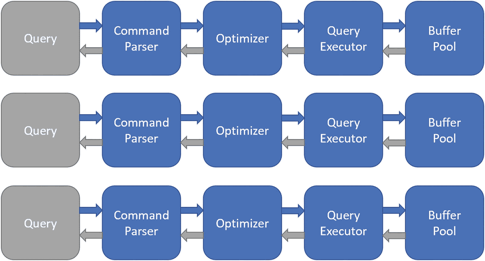

# 5. 基于集合的设计

掌握 T-SQL 的设计方法是编写专业代码的基础。一旦你能够编写出易于理解的 T-SQL 代码，便可以专注于优化 T-SQL 代码的性能。如果你是在工作中非正式地学习了 T-SQL，或者你的主要职责是为软件应用程序编写代码，那么在编写 T-SQL 代码时可能不会下意识地考虑基于集合的设计。或者，你可能是一位经验丰富的数据库开发人员，想了解更多关于基于集合设计的知识。

在本章中，我将讨论如何处理数据。第一步是熟悉与数据交互的各种方式。一旦理解了与数据交互的不同方式，就可以开始思考如何以最佳格式为查询准备数据。然后，你应该能够以利用 SQL Server 天然优势的方式来编写这些查询。

## 介绍基于集合的设计

基于集合设计的概念是确保处理过程尽可能靠近数据进行。这样做可以最大限度地减少网络往返次数。它还可以最大限度地减少数据库引擎内的上下文切换。

逐行处理速度很慢，因为部分逻辑位于数据库引擎外部的某个程序中。或者在 T-SQL 游标循环的情况下，逻辑位于过程代码中，这需要为每一行进行上下文切换，并且每一行都需要从访问实际数据的数据库引擎部分传递到运行 T-SQL 的部分。

基于集合的处理将所有内容尽可能深入地推入数据库引擎。每一行都不会单独返回给调用程序，也不会为每一行发生上下文切换。数据库引擎全速运行，进行你指定的任何更改。

数据几乎在我们生活的方方面面都会产生，其中大部分数据出于各种目的被存储。为了提高数据检索速度，考虑数据的存储和访问方式通常很重要。使用 SQL Server 可以让你利用数据之间的关系。这是因为 SQL Server 是一个关系数据库管理系统。虽然本书的重点是编写 T-SQL，但理解数据的存储方式也将帮助你编写返回值速度更快的查询。

本书使用一个名为 `OutdoorRecreation` 的示例数据库，代表一家专门销售环保、合乎道德来源的户外装备的公司。为了了解数据可以存储的各种方式，让我们首先看看可能有用的信息类型：

*   客户名称
*   客户地址
*   产品
*   产品成本
*   产品价格
*   订单日期
*   订单状态
*   当前产品价格
*   销售数量

查看上面的列，你可以开始将数据分组到类似的类别中。例如，你可以按如表 5-1 所示对客户信息进行分组。

表 5-1

OutdoorRecreation 的一般信息

| 客户 | 产品 | 订单 |
| --- | --- | --- |
| 客户名称 | 产品 | 订单日期 |
| 客户地址 | 产品价格 | 订单状态 |
|   | 产品成本 | 当前产品价格 |
|   |   | 销售数量 |

一旦信息被分组，数据就可以按组存储。在数据库中，这些组被称为 `表`。如果你开始填充客户数据，数据可以存储在如表 5-2 的表中。

表 5-2

客户信息

| 名字 | 姓氏 | 地址 | 城市 | 邮政编码 | 国家 |
| --- | --- | --- | --- | --- | --- |
| Myra | Acharya | 30 Magrath Road | Bengaluru | 560025 | India |
| Josè | Gomez | 790 Calle Cinco de Mayo | Cancun | 53778 | Mexico |
| Stacy | Parks | 123 Rua de Santa Catarina | Porto | 1234-567 | Portugal |
| Karim | Khalil | 153 Road Mit Rahina Al Shabab | Memphis | 3364932 | Egypt |
| Marty` | Bethel | 750 Cherry Rd | Memphis | 38117 | United States |

表中整理的数据是一个 `数据集`。查看第四列 `City` 中的数据，有两条记录的城市是 Memphis。在 `Address` 列中也有两行包含“de”。你可以为 Memphis 市的所有客户创建一组数据。或者，你可以为地址包含“de”的所有客户创建另一组不同的数据。你将在本章后面使用这两组数据。

使用 SQL Server 时可能感到困难的事情之一是基于集合的事务的使用。当你对一组数据中的所有行应用单一操作（例如 SQL 语句）时，就是在使用基于集合的事务。在 SQL Server 中，行组必须额外满足表之间任何连接的条件以及 `WHERE` 子句中的条件。例如，如果你使用单个查询将所有以 `Rd` 结尾的地址修改为以 `Road` 结尾，那么你就是在使用基于集合的事务。基于集合的操作从块或段的角度来看待数据，而不是逐行查看记录或数据行。虽然使用基于集合的事务本身并不困难，但使用基于集合的事务可以提高许多查询的速度，这并不总是显而易见的。此外，SQL Server 将为任何具有正确语法的查询返回结果。因此，一次与一个记录交互似乎比作为集合交互更容易。

这可能会引发一系列非常自然的问题，询问基于集合操作的目的和好处。为了更好地解释基于集合的操作，让我们通过一个例子来说明，如果你单独访问数据或作为集合访问数据，查询的输出会是什么。为了向你展示一个比较，表 5-3、表 5-4 和表 5-5 各自显示了一条单独的数据记录。

表 5-5

第三个客户作为单条记录

| 名字 | 姓氏 |
| --- | --- |
| Stacy | Parks |

表 5-4

第二个客户作为单条记录

| 名字 | 姓氏 |
| --- | --- |
| Josè | Gomez |

表 5-3

第一个客户作为单条记录

| 名字 | 姓氏 |
| --- | --- |
| Myra | Acharya |

如果你以这种方式从表 5-3、表 5-4 和表 5-5 中选择数据，效率远低于将数据作为集合选择。可以将表 5-3 到表 5-5 视为代表三个不同的 `SELECT` 操作或三次不同的数据库往返。表 5-6 显示了将数据作为集合选择的样子，通过单次往返在单个操作中检索所有三行。

表 5-6

客户作为一个数据集

| 名字 | 姓氏 |
| --- | --- |
| Myra | Acharya |
| Josè | Gomez |
| Stacy | Parks |

像这样查看数据还可以让你看到数据之间的相似之处。

当你编写 T-SQL 代码时，你希望用更少的、针对 SQL Server 运行的单独查询来返回所需的数据。目标是考虑同时对所有行执行相同的操作。在前面的例子中，你可以快速确定哪些记录具有相同的城市名称。数据提示，如果你想查看或更改有关同一城市客户的信息，可能有不止一种方法可以实现此目标。这种类型的场景可能表明你的逻辑应该以某种方式构建，使其能够通过使用关系或变量而不是硬编码或静态值来正确运行。

### 理解数据检索

过程式代码被描述为不仅告诉系统做什么，还要告诉它如何做。在许多公司中，软件开发人员或软件工程师负责编写 `T-SQL` 代码。我从与开发人员互动中学到的一件事是，编写应用程序代码本质上是过程式的。许多应用程序开发人员一天中的大部分时间都在过程式环境中处理代码。这意味着在过程式应用程序代码和数据库 `T-SQL` 代码之间切换上下文的心智成本可能非常高。编写基于集合的代码所使用的思维过程，可能与以迭代方式处理代码的思维过程截然不同。

#### 基于集合设计的价值

我们为什么会对使用基于集合的设计感兴趣？为什么值得这么做？这与 `SQL Server` 引擎的工作方式以及如何检索查询数据有关。当发出一个查询时，`SQL Server` 需要检索一条或多条数据记录。当 `SQL Server` 为查询结果检索数据时，数据页必须位于内存中。这块预留用于存放数据页的内存被称为 `缓冲区缓存`，也称为 `缓冲池`。`SQL Server` 会查看 `缓冲区缓存` 以确认所需数据是否可用。图 5-1 展示了如果数据已缓存在 `缓冲池` 中，`SQL Server` 作为查询请求的一部分检索数据所经历的过程。

**图 5-1** 单个查询的数据检索

数据是逐行检索还是作为集合检索，取决于过程逻辑或程序代码。如果 `T-SQL` 是使用 `基于游标的逻辑` 编写的，它将采用逐行处理，这将导致 `SQL Server` 为每条记录都访问 `缓冲区缓存`。一次检索单行的过程会增加 `SQL Server` 的工作负载。由于每个查询本身就是一个集合（这个集合可以只包含一个元素），我们的目标是设计出能够用最少数量的独立查询来处理最大数量可用记录的查询。设计查询以处理更大的数据集，将避免 `SQL Server` 必须多次迭代执行同一个查询。在图 5-2 中，你可以看到逐行检索数据所需的额外工作负载。

**图 5-2** 当查询一次检索一行时的数据检索

#### 缓冲池的作用

图 5-2 显示了当数据存储在 `缓冲池` 中时，一次检索单个记录的查询过程。然而，如果查询是为 `基于集合的设计` 编写的，那么只会对 `缓冲池` 进行一次调用。对于小数据集，这可能影响不大。但当处理包含数千或数百万条记录的数据集时，执行时间的差异可能是巨大的。

关于数据如何在 `缓冲区缓存` 中存储，还有另一点需要考虑。当 `SQL Server` 执行查询并取回数据时，它只取回存在于 `缓冲区缓存` 中的数据。从 `SQL Server 2019` 开始，有一个名为 `混合缓冲池` 的功能。`混合缓冲池` 允许将存储在 RAM 和持久内存 (PMEM) 中的数据都视为 `缓冲区缓存` 的一部分。否则，如果数据不在 RAM 或 PMEM 中，`SQL Server` 将需要访问磁盘来检索数据。检索到的数据随后将被存储在内存中。图 5-3 展示了如何从磁盘检索数据并存储到 `缓冲区缓存` 中。

**图 5-3** 从磁盘到缓冲区缓存的数据检索

当查询执行时，该数据在那个时间点可能甚至不在 `缓冲区缓存` 中。`SQL Server` 必须访问磁盘子系统来查找该数据。一旦找到数据，该数据就会被存储到 `缓冲区缓存` 中。

#### 性能影响

如果每一行都单独提取，那么对磁盘 I/O 的调用就必须为每条记录单独进行。从 `缓冲区缓存` 提取数据并非瞬间完成。从磁盘 I/O 获取数据，将其放入 `缓冲区缓存`，然后再由查询检索，这个过程更是资源密集型。最终，这会形成一个场景，让你希望专注于 `基于集合的设计`，以便为执行的查询提供尽可能最佳的速度和性能。

