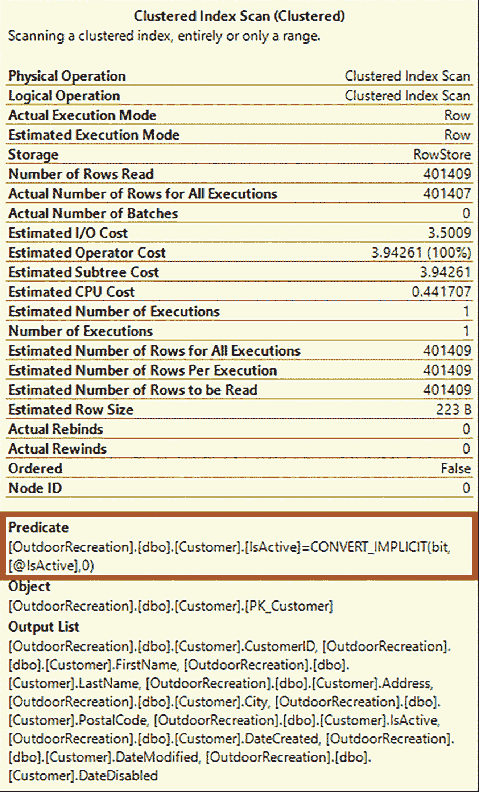

# 6. 隐式转换、数据压缩与并行度注意事项

清单 6-4 中创建了隐式转换，因为变量 `@IsActive` 的数据类型被设置为 `NVARCHAR`。`dbo.Customer` 表中 `IsActive` 字段的数据类型是 `BIT`。因此，SQL Server 将不得不执行隐式转换来比较这两个值。在图 6-1 中，您可以看到隐式转换对执行计划的影响。

图 6-1

执行计划中显示隐式转换的索引扫描

隐式转换可能对查询的总体性能产生显著的负面影响。在编写 T-SQL 查询时，请确保避免隐式转换。

一些公司也可能使用数据压缩。数据压缩的好处之一是能够将更多数据保留在内存中，因为压缩数据占用的空间比未压缩的数据小。在 SQL Server 中使用数据压缩也有一些缺点。其中一个缺点与数据压缩过程整体所产生的 CPU 成本有关。这并不意味着您不应该使用数据压缩。我提到这一点只是为了让您意识到可能出现的任何潜在问题。

这就引出了并行度的整体概念。您很容易看到 CPU 使用率的情况最常见的就是查询的并行执行。并行度是一个概念，指的是查询不是在单个线程上执行，而是可以在多个线程上执行。如果您的 CPU 有四个核心，每个核心有两个线程，那么您总共有八个可用的线程。一个只在一个线程上运行的单线程查询，使用的是半个核心，或者说您整体 CPU 的八分之一。然而，如果查询以并行方式运行，它可能能够运行在多个线程上。例如，如果它运行在四个线程上，那么该查询可以在每个核心上使用两个线程。虽然 CPU 使用的时间可能会增加，但查询应该比以单线程执行花费更少的时间。

SQL Server 在决定执行查询时是否使用并行度涉及许多因素。其中大部分与 SQL Server 的配置方式有关。虽然配置 SQL Server 超出了本书的范围，但我希望您了解当 SQL Server 创建执行计划时它是如何工作的。SQL Server 会给执行计划一个总体成本。SQL Server 还有一个配置值，指示在决定实施并行度之前应存在的最低成本。这个成本被称为 *cost threshold for parallelism*。如果执行计划的成本大于并行度的成本阈值，SQL Server 可以确定是否存在一个运行在并行模式下的更好的执行计划。

如果 SQL Server 确定要创建一个使用并行度的执行计划，它还需要确定给定执行计划允许使用的最大线程数。还有一个配置值指示可用于并行度的最大线程数。这个值被称为 *maximum degree of parallelism*。`MAXDOP` 是 maximum degrees of parallelism 的缩写。这并不意味着 SQL Server 必须使用与最大并行度中指定的相同数量的线程。它只意味着这是允许执行计划以并行方式运行的最大线程数。

SQL Server 将在执行时确定并行执行计划要使用的线程数。这将基于查询执行开始时未使用的线程数来完成。当涉及到并行度时，一个可能影响 CPU 性能的因素是，如果在查询并行运行期间有更多线程开始被使用。并行度的基本思想是，总体上会使用更多的 CPU 处理资源，但持续时间会短得多。如果有更多查询进入队列并需要运行，需要更多活动线程，这可能导致 CPU 在更长的时间内保持高于正常水平的运行状态。

确保您的 T-SQL 不会负面影响 CPU 使用率的主要原因之一与 CPU 相关的资金成本有关。自 SQL Server 2012 以来，SQL Server 的许可一直与运行 SQL Server 的核心数量相关。在更高版本的 SQL Server 中，这已修改为与服务器可用的核心数量相关，即使它们没有明确分配给 SQL Server。当公司开始遇到性能问题时，常见的解决方案之一是增加更多硬件。虽然这可能在短期内解决性能问题，但根据需要添加的硬件，这也可能是一个非常昂贵的解决方案。由于每个核心的许可费用可能超过 1000 美元，因此通过减少与 CPU 使用相关的性能瓶颈来最小化对额外 CPU 的需求是理想的做法。

在设计 T-SQL 查询时，有许多方面需要考虑。其中一些因素包括了解 T-SQL 对运行 SQL Server 的物理硬件可能产生的影响。在编写 T-SQL 查询时，您需要注意访问的数据量，以便最好地利用可用的内存。减少数据量的另一个好处是减少了存储资源。确保您的统计信息是最新的并且有适当的索引将有益于 CPU 使用率。了解您的查询如何影响您的硬件，不仅可以最大限度地减少对额外硬件的需求，还可以让您的当前硬件更好地支持您的应用程序。

