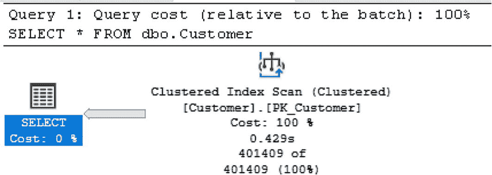
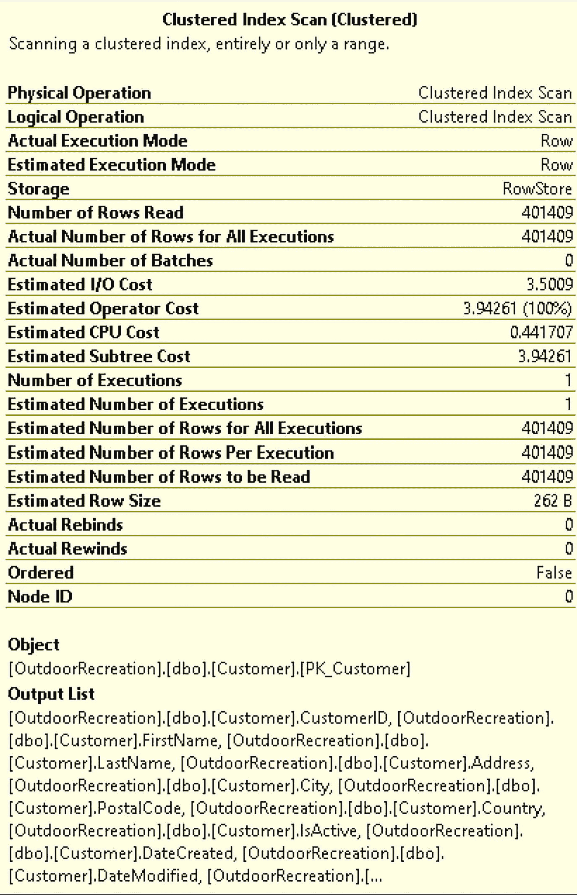
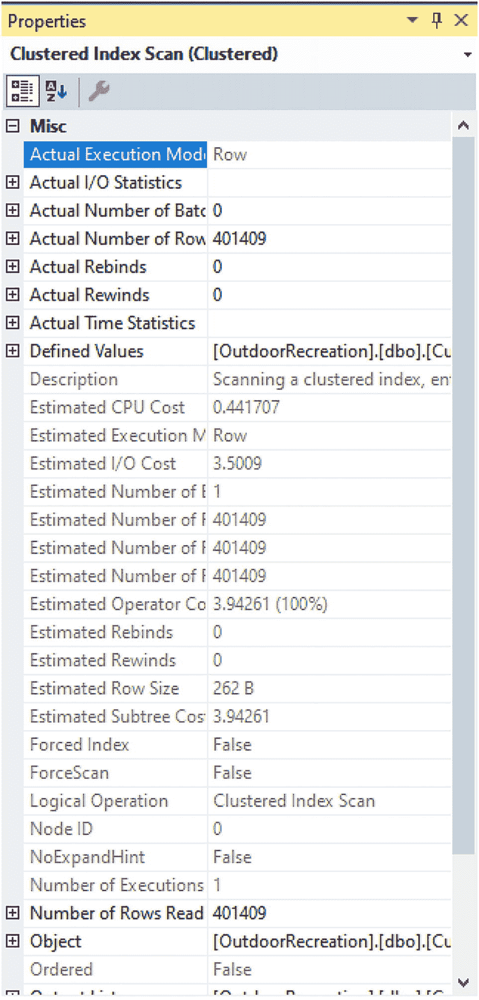
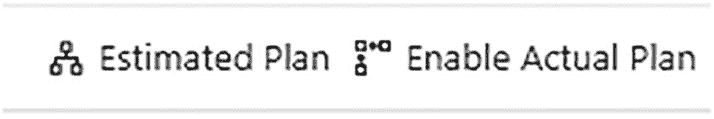
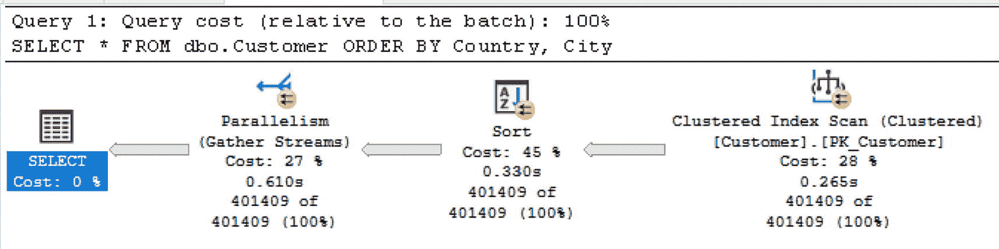
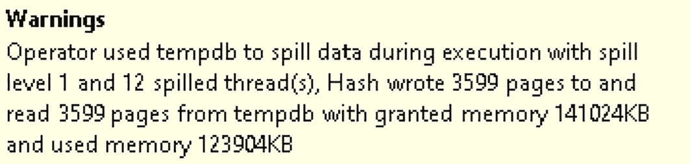

# 7. 执行计划

随着您对编写 T-SQL 越来越熟悉，您将从关注语法和准确性进展到关注性能。在本章中，您将学习如何查看和理解 SQL Server 执行计划。本章将包括演示您现有和新的索引如何影响您的执行计划。您将学习 SQL Server 在执行计划中如何连接数据。到本章结束时，您将知道如何使用执行计划来提高 T-SQL 的性能。

## 介绍执行计划

为了生成 T-SQL 查询的结果，SQL Server 需要决定如何运行该查询。它需要决定使用哪个索引以及运行查询时使用哪种连接类型。这些决策的结果就是执行计划。学习如何阅读和理解执行计划将帮助您更好地构建查询以提高性能。

执行计划以 XML 格式存储在数据库中。SSMS 提供了这些计划的可视化表示工具，本章您将主要使用这个工具。有不同类型的计划，例如估计计划和实际计划，您将在本节中了解到。图形化执行计划的示例可以在图 7-1 中找到。



图 7-1

图形化执行计划

图 7-1 包含几个我们将在本章讨论的元素。这些图标被称为 *operators*（运算符）。箭头用于显示操作的顺序。有不同类型的计划，例如估计计划和实际计划。最重要的是，虽然这张图片现在看起来不太明白，但到本章结束时，您将能够翻回几页并读懂整张图！


## 阅读执行计划

本节将涵盖阅读执行计划的基础知识。内容包括讨论**估计执行计划**、**实际执行计划**和**实时查询统计信息**之间的区别。我将讲解显示运算符的图形化执行计划及其阅读方法。此外，本节还将介绍如何在执行计划中查看运算符的详细信息和属性。最后，本节将详细介绍执行计划的组成部分，包括多个步骤、箭头、警告、运算符、估计值和实际值。

编写 `T-SQL` 时，你的目标是确保获得准确的结果。有时，你编写的查询可能简单直接。你可能会发现自己需要对报表相关的查询进行性能调优，或者为报表编写新的查询。如果你需要编写查询来提供基于事务性数据的报表，你可能需要比编写应用程序查询时使用更多的连接和更复杂的逻辑。虽然这并非理想状态，但这却是许多公司非常常见的场景。

许多公司已经开始意识到其系统中数据的重要性，或者他们希望增加监控以确保应用程序按预期运行。无论哪种情况，你都很有可能在环境中遇到一个对应用程序产生负面影响的查询。那时，你会希望知道如何解决该问题。在本节中，你将学习执行计划的重要性以及何时需要使用它们。你将学习如何阅读执行计划，包括常用的符号。你还将了解执行计划中的属性和警告。

我的第一位导师曾告诉我，要编写出好的 `T-SQL`，我需要理解 SQL Server 的工作原理。这是我收到过最明智的建议之一，至今我仍在努力每天更好地理解 SQL Server 内部机制。运用这个建议，一种更好地理解 SQL Server 的方法就是理解 SQL Server 如何执行你编写的任何查询。与执行查询相关的一些内部机制在第 1 章中有所涉及。在本章中，我将向你展示 SQL Server 确定的用于执行你的 `T-SQL` 代码的指令。只要计划仍在计划缓存中，这些指令就可以在执行计划中找到。如果你的数据库启用了 `查询存储`，你可以查阅第 9 章，了解如何访问保存在 `查询存储` 中的查询计划。

一旦你决定开始研究某些 `T-SQL` 代码的执行计划，你应该确认你拥有在 SQL Server 中查看执行计划的权限。在审查执行计划时，你可以查看估计执行计划、实际执行计划或实时查询统计信息。**估计执行计划**将显示该计划*将*如何执行的最佳猜测。然而，由于查询尚未执行，估计执行计划可能并不代表查询运行时实际发生的情况。**实际执行计划**会执行查询，返回结果，并显示 SQL Server 为执行查询所采取的步骤。**实时查询统计信息**与实际执行计划相同，只是它还实时显示了查询在执行计划中的流转过程。这在尝试调试性能不佳的查询时很有帮助。但是，如果你的查询执行速度非常快，它最终可能看起来与实际执行计划完全一样。

如果你希望在执行 `T-SQL` 代码时获取实际执行计划，你需要确保你有执行该代码的权限，并且对于 `T-SQL` 代码中涉及的数据库，你拥有 `SHOWPLAN` 访问权限。管理执行计划的用户权限超出了本书的范围。但是，如果你想验证用户对执行计划的访问权限，可以执行清单 7-1 中的查询。


### 获取执行计划

此查询显示所有已被授予或拒绝 `SHOWPLAN` 权限的用户。

```
USE OutdoorRecreation;
GO
SELECT prn.[name] AS UserName, prm.state_desc, prm.[permission_name]
FROM sys.database_permissions prm
INNER JOIN sys.database_principals prn
ON prm.grantee_principal_id = prn.principal_id
WHERE prm.[permission_name] = 'SHOWPLAN';
```
*清单 7-1 查看 SHOWPLAN 权限*

你也可以从计划缓存中获取执行计划，但你需要能够查询动态管理视图 `sys.dm_exec_cached_plans`。

在排查性能问题时，通常可以从 `sys.dm_exec_cached_plans` 检索执行计划。如果你想要之前使用的执行计划，这是首选方法。如果执行计划已从计划缓存中清除，你可能无法在此处找到查询或存储过程。此外，根据性能问题发生的时间，缓存中的计划可能已被清除。这可能意味着你能找到一个执行计划，但它可能不是之前使用的那个。在这种情况下，请参阅第 9 章，了解有关使用查询存储排查性能问题的信息。

### 估算与实际执行计划

如果你发现执行计划自性能问题发生后已被更改，可以尝试查找当前的执行计划。使用此方法有两种选项。一种是获取 SQL Server 将用作执行计划的假设性想法，而无需在服务器上运行实际的 T-SQL 代码。这称为 *估算执行计划*。使用此方法的最大挑战是，由于 SQL Server 已估算了一个执行计划，无法保证这将是查询运行时 SQL Server 实际使用的执行计划。我只使用过少数几次估算执行计划，那是在我犹豫是否要运行 T-SQL 代码以避免生产环境中断，或者想快速猜测查询如何运行而不想等待查询完成时。

如果在计划缓存中找不到执行计划，你可能希望查看当前运行 T-SQL 时生成的执行计划。使用 SQL Server Management Studio (SSMS) 或 Azure Data Studio (ADS) 时，在执行 T-SQL 代码时请求实际执行计划，将使执行计划在查询执行完成后可用。在查询执行过程中，还可以查看数据在执行计划中的流动情况。除了查看实际执行计划，你还可以要求 SQL Server 显示实时查询统计信息。虽然此选项对于存在特定瓶颈的较慢查询可能很有帮助，但我经常发现许多查询完成得太快，无法有效使用此方法来诊断我正尝试解决的许多问题。

### 执行计划的呈现方式

如何以及何时检索执行计划是在处理执行计划时可以控制的因素。此外，还有关于检索后执行计划应呈现为何种形式的选项。我通常的方法是查看执行计划的图形输出。无论是编写新的 T-SQL 还是对现有代码进行性能调整，审查 T-SQL 代码执行计划的过程都是相同的。

图形执行计划提供了查询执行方式的高级视图。这使得执行计划一目了然，易于阅读，但也意味着在深入执行计划细节时需要访问额外的信息。执行计划中包含运算符，这些运算符描述了 SQL Server 将如何执行查询。每个运算符都有一个独特的名称，该名称在执行计划中可用。使用图形执行计划时，这些运算符有独特的图标。图 7-2 显示了在图形执行计划中将鼠标悬停在聚集索引扫描运算符上时可以查看的一些详细信息。


*图 7-2 图形执行计划中的运算符详细信息*
*一个图表展示了执行计划中聚集索引扫描运算符的详细信息。物理和逻辑操作是聚集索引扫描。实际和估算执行模式是行。存储是行存储。*

除了此工具提示中的属性外，在较新版本的 SQL Server Management Studio 中，你还可以访问扩展属性，如图 7-3 所示。


*图 7-3 执行计划的附加属性*
*一个快照展示了聚集索引扫描的属性。它包含实际 I/O 统计信息、时间统计信息、实际重绕和重绑、实际批次数和行数等的详细信息。*

### XML 格式的执行计划

可以选择以 XML 格式与执行计划交互。你可以在清单 7-2 中看到一个例子。

```xml
<!-- 此处应为 XML 格式的执行计划内容 -->
```
*清单 7-2 XML 执行计划*

虽然这种方法可能更难阅读，但它确实包含了与执行计划相关的所有信息。生成此表的查询是对一个表的 SELECT 语句。将执行计划以 XML 形式提供会产生大量需要审查的代码。

### 在 SSMS 和 ADS 中访问执行计划

当需要在 SSMS 中访问执行计划时，你使用 GUI（图形用户界面）来选择要使用哪一种。图 7-4 显示了用于访问执行计划的不同方式的图标。


*图 7-4 SSMS 中的执行计划图标*
*一个快照展示了访问执行计划的 4 个不同图标。一个看起来像手机的图标被高亮显示。*

第一个图标生成所选 T-SQL 代码的估算执行计划。第四个图标允许你从执行的 T-SQL 代码生成实际执行计划。第五个图标允许你在 SQL 引擎通过实际执行计划处理数据时查看活动运算符。你可以选择这些图标中的任何一个在 SQL Server Management Studio 中使用执行计划。

你也可以使用 Azure Data Studio 查看执行计划。在 ADS 中，你可以在 GUI 中选择实际或估算执行计划，如图 7-5 所示。


*图 7-5 ADS 中的执行计划图标*
*一个快照展示了用于访问估算计划和启用实际计划的 2 个不同图标。*

你可以在 ADS 查询窗口的顶部栏上切换这两个选项。第一个选项显示所选代码的估算执行计划。第二个选项在你执行 T-SQL 代码时提供实际执行计划。

### 使用 T-SQL 获取执行计划信息

还有一个选项是使用 T-SQL 来获取执行计划信息，而不是执行查询。此 T-SQL 代码将提供无图片的输出。如果你想获取有关 SQL Server 将如何执行查询的信息以及估算值，应使用清单 7-3 中的 T-SQL。

```sql
SET SHOWPLAN_ALL ON;
```
*清单 7-3 在文本中显示执行计划和估算值*

如果你觉得这信息太多，可以改为执行 T-SQL 以仅检索 SQL Server 将如何执行查询的信息。`<ON/OFF>` 表示你可以启用和禁用此功能。清单 7-4 包含了仅查看 SQL Server 将如何执行查询的 T-SQL。

```sql
SET SHOWPLAN_TEXT ON;
```
*清单 7-4 在文本中显示执行计划*

你可能会发现你更喜欢以 XML 而非文本形式获取有关 SQL Server 将如何执行查询的信息。如果是这样，你可以运行清单 7-5 中的查询以查看格式良好的 SQL 中的执行计划。

```sql
SET SHOWPLAN_XML ON;
```
*清单 7-5 以 XML 格式显示执行计划*


## 阅读与理解查询执行计划

选择上述任一选项后，您即可开始与查询的执行计划进行交互。当使用这些 `T-SQL` 方法启用执行计划时，请记住在审阅完毕后将其功能关闭。

一旦将 `SQL Server Management Studio` 设置为提供执行计划，您需要识别其中重要的项目。您需要知道如何解读执行计划中的流程，以更好地理解 `SQL Server` 将如何执行该查询。同时，您也需要熟悉一些常见的执行计划形状，因为它们可能有助于加快发现潜在问题的速度。在执行计划中，您可能会发现额外的文本，这些文本能快速显示出已被确定为对查询执行产生负面影响的问题，包括导致结果返回速度缓慢。更好地理解所有这些元素将帮助您找到查询的痛点，从而确定需要重点关注的方向。

### 执行计划的阅读方向

一旦获得执行计划，您就能更清楚地了解 `SQL Server` 将如何执行该查询。当我们阅读英文时，习惯从左到右、从 top 到 bottom 阅读。与此相比，执行计划中最左上角代表查询的结果。如果将其比作读书，当您从左向右移动时，您正在深入了解 `SQL Server` 为获取结果集所采取的步骤。从上到下移动时也是如此。查看图 7-6 中的示例，您可以看到一个包含多个步骤的执行计划。



*`SQL Server` 执行计划的可视化表示快照。查询 1 的查询成本为 100%。三个向左的箭头描述了该计划的多个步骤。聚集索引扫描成本为 0%。排序成本为 45%。并行操作成本为 27%。选择操作成本为 0%。*

**图 7-6** 多步骤执行计划

如果您从左向右阅读，可以看到 `SELECT` 语句返回结果的表示。向右移动，您可以看到 `SQL Server` 在获取结果集之前立即使用了并行操作。这意味着，如果您移动到最右侧的对象，那就是 `SQL Server` 执行查询时采取的第一个操作。在本例中，`SQL Server` 执行此查询时的第一个步骤是执行聚集索引扫描（`Clustered Index Scan`）。了解这一点很重要，因为您可能会听到“从右向左阅读执行计划”的说法。在这种情况下，说话者指的是以 `SQL Server` 执行查询的相同方向来阅读执行计划。

### 初步分析执行计划

当我刚开始处理执行计划时，很快就被其中包含的大量信息所淹没。我本想从头开始理解一切。然而，执行计划中的信息如此之多，最好从一些基础开始。通过多年的故障排除经验，我学会了通过寻找差异来开始我的分析。对于执行计划，没过多久我就能立即识别出问题。分析执行计划时，我检查的第一件事是与每个操作符（`operator`）关联的百分比。回到图 7-6，百分比最高的操作符是 `Sort` 操作符，为 45%。此百分比表示 `SQL Server` 预计在每个查询执行步骤上花费的时间相对于其他步骤的比例。一个快速的优化方法可能是识别百分比最大的一个或多个操作符，并确定是否有办法重写查询或添加索引来提升性能。就图 7-6 中的示例而言，移除 `ORDER BY` 子句可以提升查询性能，如果我们不需要对数据排序，这将是一个不错的选择。

### 观察箭头粗细

我也会尝试识别任何两个操作符之间的箭头粗细不一致的地方。图 7-7 展示了两个并排的、不同的箭头以供比较。


*两个向左箭头的图像。左侧箭头是实心且细的，右侧箭头是空心且粗的。*

**图 7-7** 执行计划中的箭头

我了解到，线条粗细的差异表示了 `SQL Server` 在每个步骤中访问的数据量的相对大小。虽然有些查询比其他查询返回更多记录，因此会有更粗的线条，但您也会发现这样的执行计划：其中一个步骤的线条非常粗，而下一个步骤的线条却很细。这通常表明，线条较粗的步骤可以通过更高效地编写，只获取查询所需的数据。查看线条的粗细是您检查执行计划时可以做的事情之一。

### 排序操作符

有时您希望数据以特定方式排序。例如，您可能希望按字母顺序或创建日期显示客户列表。排序可以在应用程序代码中进行，也可以在 `SQL Server` 中进行。如果您选择在 `SQL Server` 中排序数据，您可能会在执行计划中看到一个 `Sort` 操作符。您可以在图 7-8 中看到 `Sort` 操作符的示例。


*一个展示 `Sort` 操作符图标的快照。该图标有一个向下的箭头，表示从 `A` 到 `Z` 的排序。图标右下角有两个平行的向左箭头。*

**图 7-8** `Sort` 操作符

您可能会在执行计划中看到 `Sort` 操作符。虽然有时 `Sort` 操作符是必要的，但您可能需要检查 `T-SQL` 代码，看看是否存在不必要的排序操作。例如，当返回需要以特定方式排序的数据时，排序操作可能是必需的。然而，在其他情况下，即使结果没有排序，`Sort` 操作符也可能存在。例如，当比较两个表且至少其中一个表未排序时，就可能发生这种情况。这些排序是合并连接（`merge joins`）所必需的，并可能对查询性能产生负面影响。本章将在下一节讨论合并连接。在这些情况下，可以查看是否有可用于连接的索引已经对数据进行了排序。如果存在与 `Sort` 操作符相关的警告，则可以获得更显著的性能提升。

### 执行计划中的警告

执行计划最有用的功能之一是返回警告。理想情况下，您希望编写的 `T-SQL` 性能良好。这也意味着 `T-SQL` 不应返回带有警告的执行计划。有时您会收到作为执行计划一部分的警告。警告将如图 7-9 所示。



*一个展示执行计划警告的快照。它描述了操作符在执行期间使用 `tempdb` 溢出数据，溢出事件为 1，并且有 12 个溢出线程。*

**图 7-9** 执行计划中的警告

看到警告的主要好处是，`SQL Server` 已识别出您的 `T-SQL` 代码中存在潜在问题。您应该调查返回的任何警告，并查看是否可以采取措施解决它们。虽然并非所有警告都相同，但上面的警告引用的是溢出到 `tempdb` 的情况。此类警告通常意味着对查询返回行数的估计不准确。这可能导致查询的内存授予不正确，从而迫使 `SQL Server` 使用 `tempdb`。要解决此警告，您可能需要确认统计信息是最新的，并且您的表已正确建立索引。


