# 执行计划中的行数估计

执行计划包含其他元素，可以提醒你注意潜在的性能问题。虽然警告可以为`T-SQL`问题提供具体建议，但执行计划中的其他项目并不会提供同等程度的指导。在创建执行计划时，`SQL Server`使用统计信息来猜测将要返回的行数。`SQL Server`还会跟踪执行计划每个步骤中实际返回的行数。如果将鼠标悬停在运算符上，你可以看到类似图 7-10 的内容。

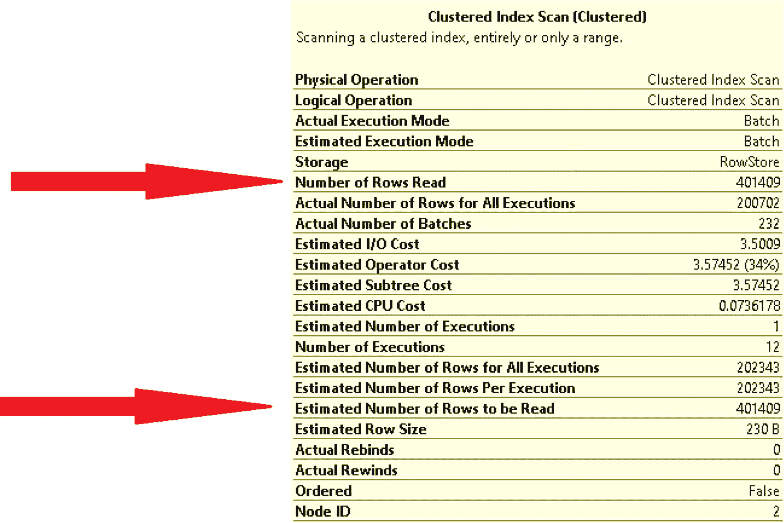

图表展示了执行计划中集群索引扫描运算符的详细信息。两条箭头分别指示已读取的行数和待读取的行数，两者均为 401409。

图 7-10

估计行数与实际行数

第一条箭头指向此执行计划步骤实际返回的行数。第二条箭头指向估计返回的行数。在这个例子中，行数是匹配的。如果行数匹配或在相近范围内，你将不会遇到与估计相关的性能问题。如果这两个数字差异显著，你可能会得到一个性能不佳的执行计划。这可能是因为统计信息已过时，`SQL Server`无法准确确定将返回的行数。另一种可能性是，`SQL Server`可能为一组不同的值创建了执行计划。无论原因如何，如果你看到估计行数和实际行数之间存在较大差异，这是你应该调查的问题。

通过阅读执行计划，你可以快速识别查询中存在性能问题的地方，以及可以采取哪些步骤来解决这些问题。这包括知道如何访问执行计划，以及了解估计执行计划与实际执行计划之间的区别。执行计划还具有多项功能，可帮助你快速识别可能的性能问题。通过查看箭头的大小，你可以判断通过执行计划中每个步骤的数据量相对大小。排序运算符可能提供一些见解，表明数据被排序的原因不仅仅是返回有序的结果集。你还可以查看估计和实际返回的行数，以帮助确定`SQL Server`是否有足够的信息来为你提供良好的执行计划。一旦你熟悉了执行计划的这些方面，你可能想调查`SQL Server`如何使用你的索引。

## 执行计划中的索引使用

既然你已经熟悉了使用执行计划的基础知识，本节将讨论如何在执行计划中查看索引使用（或未使用）情况。这将包括根据`SQL Server`为查找所有相关数据必须访问索引中的数据量，其使用不同的运算符来访问数据。还有不同的运算符显示执行计划是否正在使用集群索引、非集群索引或堆。执行计划中索引使用的另一个方面是`SQL Server`如何查找索引中未包含的附加信息。这可能因表中是否有集群索引，或索引是否包含查询所需的所有列而有所不同。

就管理`T-SQL`而言，我在各公司看到的最大差异之一是索引的管理方式。在某些情况下，开发团队负责编写所有`T-SQL`代码，包括索引创建。也有一些公司由数据库团队处理所有索引创建和维护。由于数据库管理员通常比开发人员对开发环境的访问权限少，我认为让两个团队合作可能是最有帮助的。数据库管理员可以发现性能不佳的索引，并且可能在设计适用于多个`T-SQL`查询的索引方面经验丰富。另一方面，开发人员可能更了解表的设计方式以及`T-SQL`代码如何使用这些表。

有许多查询、健康检查和监控工具可以帮助你识别索引问题。你可以使用查询来查找哪些存储过程使用了相同的数据库对象，或者你可能有一个特定的查询来提高性能。一旦你从缓存中获取执行计划或生成当前的实际执行计划，你就可以开始调查潜在的性能问题。如前一节所述，你知道可以检查每个步骤的相对数据记录量，查看各种运算符和警告，并验证估计和实际返回的行数。你还可以查看索引在执行计划中的使用方式。

在`SQL Server`中处理数据时，首选是尽快找到数据。当数据保存在集群索引中时，数据会根据索引的列进行排序。这意味着当`SQL Server`搜索集群索引时，数据是按顺序存储的。在最佳情况下，`SQL Server`会遍历数据并快速找到数据。如果发生这种情况，你会在执行计划中看到集群索引查找。执行计划中的集群索引查找看起来像图 7-11。

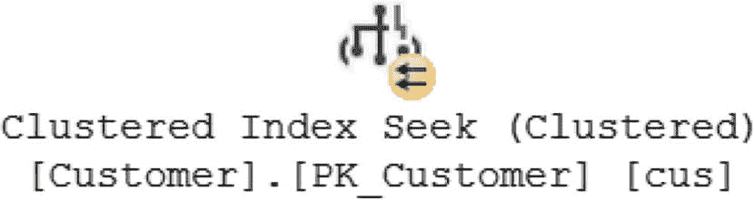

快照呈现了执行计划中集群索引查找的图标。图标右下角有两条平行的向左箭头。

图 7-11

集群索引查找图标

看到集群索引查找，你就知道你的`T-SQL`代码写得足够好，能够快速找到数据。如果你在执行计划中没有看到集群索引查找，你可能想看看是否有办法重写你的`T-SQL`来使用一个。

虽然理想情况是你的数据使用集群索引查找，但你可能会在执行计划中看到类似但不完全相同的内容。`SQL Server`有可能使用集群索引但未能快速找到数据。在这种情况下，`SQL Server`可能需要遍历索引的很大一部分。如果发生这种情况，你可能会在执行计划中看到集群索引扫描，如图 7-12 所示。

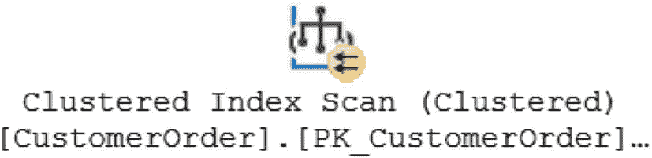

快照呈现了执行计划中集群索引扫描的图标。图标右下角有两条平行的向左箭头。

图 7-12

集群索引扫描图标


## SQL Server 索引操作详解

这表示 SQL Server 按照聚集索引排序的顺序查看了数据，但不得不扫描整个表以找到满足查询所需的所有记录。

SQL Server 使用术语 `查找` 来表示无需搜索索引的大部分就能找到所需数据。当访问的记录多于表 `t` 中的匹配记录时，SQL Server 将此称为 `扫描`。虽然查找或扫描可以应用于聚集索引，但它们也可以应用于非聚集索引。非聚集索引的排序顺序与聚集索引或表（如果表是堆）不同。非聚集索引按照索引中指定的键列顺序进行排序。如果表上存在聚集索引，非聚集索引将包含一个指回聚集索引的指针。如果没有聚集索引，则非聚集索引将指回表中的行 ID。

如果执行计划使用了非聚集索引，SQL Server 有几种不同的方式可以搜索数据记录。如果 SQL Server 知道如何在非聚集索引中找到数据，你将在执行计划中看到一个索引查找。索引查找将如图 7-13 所示。

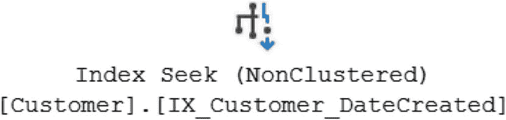

一张快照展示了执行计划中聚集索引查找的图标。

图 7-13: 索引查找图标

如果根据编写的 `T-SQL` 代码无法使用聚集索引查找，次优选择是索引查找，即在非聚集索引上进行查找。如果无法进行查找，SQL Server 最终将使用索引扫描。与聚集索引扫描类似，这意味着 SQL Server 需要遍历索引来查找必要的数据记录。如果执行计划使用了索引扫描，图 7-14 显示了它在执行计划中的呈现方式。

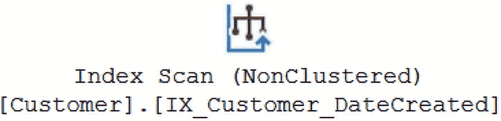

一张快照展示了执行计划中聚集索引扫描的图标。

图 7-14: 索引扫描图标

同样，与聚集索引扫描类似，如果你看到索引扫描，你可能希望研究一下在重写 `T-SQL` 以使用索引查找方面可以做些什么。

在编写 `T-SQL` 查询时，请记住需要哪种数据。虽然包含额外的数据字段可能会带来额外的硬件开销，但它也会影响 SQL Server 搜索数据记录的方式。如果 SQL Server 需要使用索引查找或索引扫描来找到所需的数据记录，这并不意味着所有数据字段都需要存在于非聚集索引中。如果需要额外的数据列，SQL Server 可能需要通过非聚集索引从聚集索引中获取这些额外的数据列。当这种情况发生时，你将在执行计划中看到一个键查找，如图 7-15 所示。

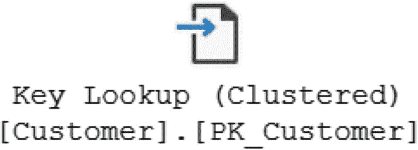

一张快照展示了执行计划中键查找的图标。该图标用于从聚集索引中获取额外的数据列。

图 7-15: 键查找图标

当你看到键查找时，这表明查询所需的所有列并非都存在于非聚集索引中。在这些情况下，这意味着可能需要修改索引以包含这些列。在决定将这些数据字段添加为包含列之前，你应该意识到在索引中包含列可能会带来与写入或更新索引相关的额外成本。

没有聚集索引的表也称为堆。如果表上没有其他索引，SQL Server 将不得不逐行搜索以找到查询结果所需的数据记录。虽然涉及许多其他因素，但这可能导致 SQL Server 扫描整个表。这可以在图 7-16 的执行计划中看到。

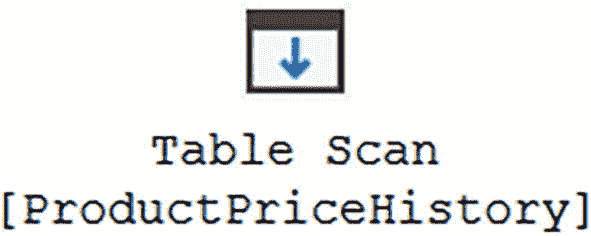

一张快照展示了执行计划中表扫描的图标。该图标用于扫描整个表。

图 7-16: 表扫描图标

一些非常小的表可能不需要索引，使用表扫描可能是可以接受的。如果表中有很多记录，那么表扫描就不理想了。在这种情况下，你可能需要调查是否可以向该表添加任何可能的索引。

如果堆上存在非聚集索引，SQL Server 有可能在执行计划中使用该非聚集索引。如果是这种情况，你将看到索引查找或索引扫描。当执行计划中出现索引查找或索引扫描时，查询中使用的列可能不存在于非聚集索引中。如果需要在表中查找额外的列，你将在执行计划中看到一个 `RID` 查找。你可以在图 7-17 中看到这一点。

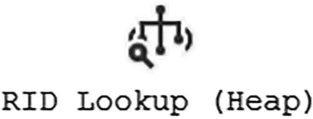

一张快照展示了执行计划中 `R I d` 查找的图标。当需要在表中查找额外的列时使用该图标。

图 7-17: `RID` 查找图标

与键查找类似，你需要查看是否可以修改任何非聚集索引以包含 `T-SQL` 代码中必要的列。也有可能修改查询以排除导致 `RID` 查找的列。

例如，清单 7-6 展示了一个检索名字以字母 S 开头的所有客户的查询。

```sql
SELECT FirstName, DateCreated
FROM dbo.Customer
WHERE FirstName LIKE 'S%';
```
清单 7-6: 获取客户的查询

我第一次运行这个查询时，此表上只有一个在 `CustomerID` 上的主要聚集索引。清单 7-6 中的 `T-SQL` 代码的执行计划如图 7-18 所示。

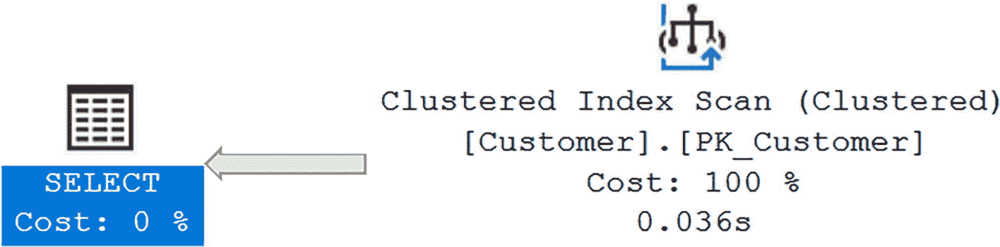

一张快照展示了执行计划中聚集索引扫描的图标。一个向左的箭头表示选择成本为 0%。

图 7-18: 仅包含聚集索引的执行计划

表上没有非聚集索引。SQL Server 唯一的选择是搜索整个聚集索引来查找请求的记录。你可以通过查看与聚集索引扫描相关的属性来了解这一点。此查询执行的属性可在图 7-19 中找到。

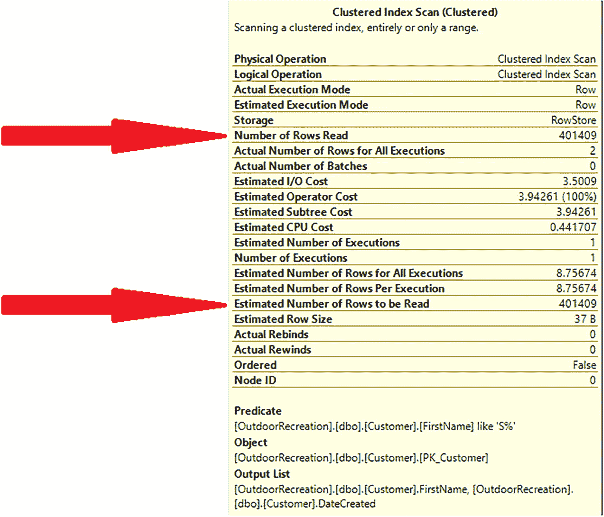

一张图表展示了执行计划中聚集索引扫描操作符的详细信息。两个箭头分别表示读取的行数和要读取的行数，均为 401409。

图 7-19: 使用聚集索引时的读取情况

查看估计行数和实际读取行数，它们是相同的。每者的总数都是读取了 `401,409` 行。实际返回的行数是 `2`。SQL Server 必须搜索 `401,409` 行才能找到符合条件的 `2` 行。

此场景中的查询读取的行数远远多于返回的行数。由于不存在非聚集索引，你无法重写查询来使用非聚集索引。最佳选择是创建一个非聚集索引以提高性能。新的非聚集索引见清单 7-7。


### 创建非聚集索引

```
CREATE NONCLUSTERED INDEX IX_Customer_FirstName
ON dbo.Customer (FirstName ASC);
清单 7-7
创建非聚集索引
```

现在我已经创建了非聚集索引，我可以再次运行查询，看看是否会得到一个新的执行计划。新的执行计划如图 7-20 所示。

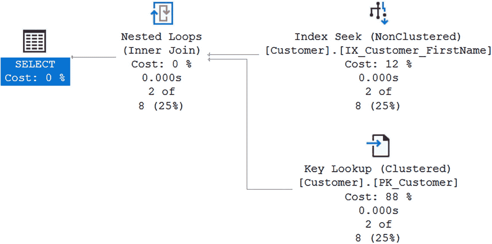
图 7-20: 带有非聚集索引的执行计划

一张快照展示了执行计划。使用非聚集索引的索引查找，成本 12%，聚集索引的键查找，成本 88%。使用内连接的嵌套循环，成本 0%。选择操作成本 0%。

在图 7-18 中，聚集索引扫描已被索引查找和键查找所取代。虽然这看起来似乎降低了执行计划的性能，但你可以通过查看读取的行数来验证这一点。在图 7-21 中，你可以看到与索引查找相关的属性。

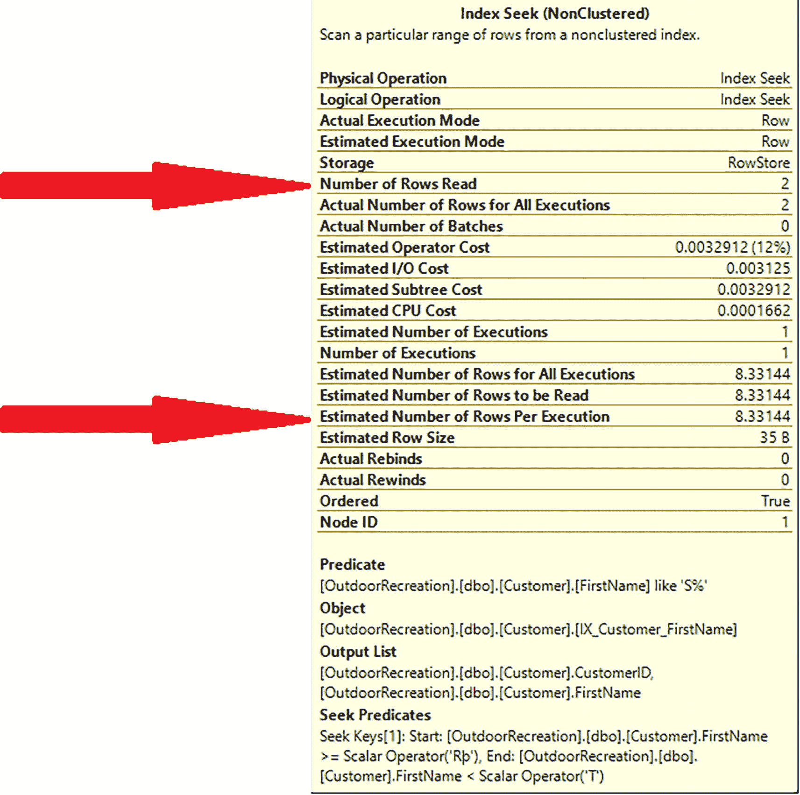
图 7-21: 索引查找的属性

一张图表展示了执行计划中聚集索引扫描操作符的详细信息。两个箭头指示读取的行数为 2，每次执行的行数为 8.33144。

既然非聚集索引已经创建，你可以看到实际的读取行数已从 401,409 减少到 2。你可能会预期键查找也有相同的读取次数，但你可以查看其属性来确认。在图 7-22 中，你可以看到返回的属性。

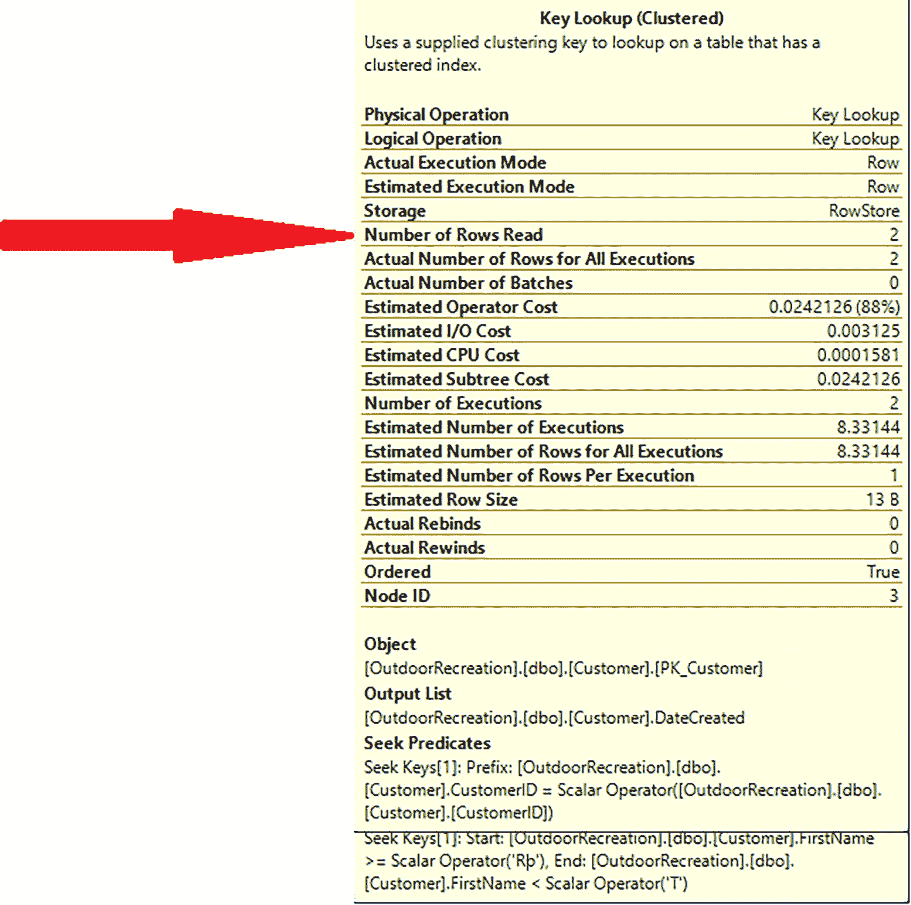
图 7-22: 键查找的属性

一张图表展示了执行计划中聚集索引扫描操作符的详细信息。一个箭头指示读取的行数为 2。

检查键查找，它也读取了 2 行。没有非聚集索引的 T-SQL 代码读取了 401,409 行。使用非聚集索引后读取的总行数是 4：索引查找 2 行，键查找 2 行。

你可以通过将 `DateCreated` 列作为非聚集索引的一部分包含进来，或者从原始查询中移除该列来消除键查找。清单 7-8 展示了一个包含列的非聚集索引示例。

### 带包含列的非聚集索引

```
CREATE NONCLUSTERED INDEX IX_Customer_FirstName
ON dbo.Customer (FirstName ASC) INCLUDE (DateCreated);
清单 7-8
带包含列的非聚集索引
```

在添加清单 7-8 中的索引并运行清单 7-6 中的查询后，查看图 7-23 中的执行计划。

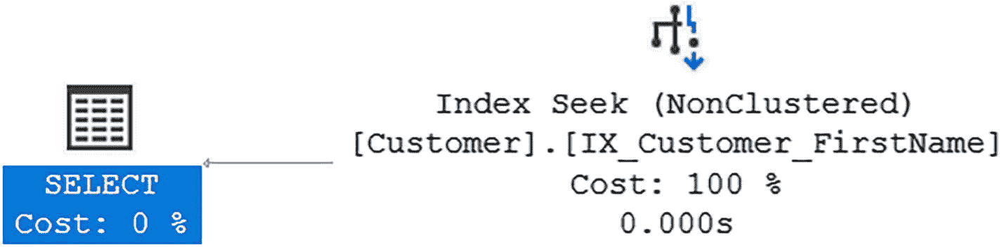
图 7-23: 带有包含列的非聚集索引的执行计划

一张快照展示了执行计划。使用非聚集索引的索引查找，成本 100%。

执行计划显示查询仍在使用非聚集索引。由于此索引已更改以包含 SELECT 语句中的额外列，执行计划也随之改变。之前使用非聚集索引时，执行计划包含索引查找和键查找。现在执行计划仅使用索引查找。

一旦你熟悉了阅读执行计划，就可以开始利用它们来确定如何提升性能。当你查看执行计划时，可能会发现聚集索引扫描。这通常意味着 SQL Server 必须遍历整个表来查找符合查询条件的数据。正如本节所示，创建一个包含连接条件的非聚集索引可以帮助提升查询性能。如果你发现 SQL Server 必须执行键查找，可以看看将被选择的列作为非聚集索引的一部分包含进来是否合理。理解 SQL Server 如何使用索引有助于改进查询性能。理解 SQL Server 如何比较来自多个数据集的数据也能帮助你提升查询性能。


## 执行计划中的逻辑连接类型

本章最后一节将深入探讨 SQL Server 中几种不同的逻辑连接运算符，包括 `INNER JOIN`、`LEFT` 或 `RIGHT OUTER JOIN` 以及 `FULL OUTER JOIN`。逻辑连接运算符的类型、数据的排序方式、被比较数据的大小以及数据的比较方式，可以共同决定 SQL Server 在执行计划中可以使用的物理运算符。文中提供了 T-SQL 以及物理运算符的示例，以便您理解逻辑运算符与物理运算符之间的关联。

除了阅读执行计划和理解索引之外，您的 T-SQL 代码也可用于决定执行计划的生成方式。在某些情况下，表如何连接在一起，与数据如何存储在表中同等重要。有时，您连接列的方式也可能影响您的执行计划。`WHERE` 子句中的一些 T-SQL 可能会影响查询执行中使用的逻辑连接类型。如果多个查询被组合在一起，也可能改变查询的执行方式。最终，T-SQL 代码的编写方式与 SQL Server 决定如何执行查询之间存在着关联。

### 逻辑连接类型

SQL Server 中有几种不同的逻辑连接。其中一些逻辑连接在 T-SQL 中很容易识别，包括 `INNER JOIN`、`LEFT OUTER JOIN`、`RIGHT OUTER JOIN` 和 `FULL OUTER JOIN`。这些并不是 SQL Server 中存在的唯一逻辑连接。对于某些 T-SQL 命令，SQL Server 会将一个表与另一个表进行比较，以查找匹配或不匹配的记录。在这些情况下，SQL Server 执行的不是完整的连接，而是 `半连接`。这种连接类型并未在 T-SQL 命令中明确指定，但一些像 `EXISTS` 或 `NOT EXISTS` 这样的 T-SQL 命令会指示使用 `半连接`。可用的 `半连接` 类型包括 `左半连接`、`左反半连接`、`右半连接` 和 `右反半连接`。最后，还有一些逻辑连接是通过在同一事务中组合两个或更多查询结果而关联的。它们包括 `串联`（通常与 `UNION ALL` 关联）或 `UNION` 逻辑连接（可在 T-SQL 中使用 `UNION` 时发生）。基于逻辑连接，SQL Server 将决定可以使用哪些物理连接。这样，逻辑连接就可以用来影响查询性能。

### 物理连接运算符

存在一些可以与逻辑连接相关联的物理连接运算符。四种物理连接运算符称为 `合并连接`、`哈希连接`、`嵌套循环` 和 `自适应连接`。当使用 `INNER JOIN` 时，这四种物理连接运算符中的任何一种都可能作为执行计划的一部分使用。数据在表中的存储方式以及表的相对大小可能会影响使用哪个物理运算符。

#### 合并连接

如果被比较的两个表中的数据都已排序，则可以将来自两个表的记录并排进行比较。这使得 SQL Server 能够快速找到匹配或不匹配的记录（取决于查询要求）。当这种情况发生时，称为 `合并连接`。`合并连接` 物理运算符出现在图 7-24 所示的执行计划中。


一个快照展示了执行计划中合并连接的图标。它用于查找匹配或不匹配的记录。

图 7-24 合并连接图标

#### 哈希匹配

有时，要连接在一起的表并未排序。如果是这种情况，SQL Server 仍然可以比较各个表之间的行。但是，SQL Server 需要将记录转换为易于比较的形式。这可以通过哈希处理来完成。如果 SQL Server 对两个表中被比较的列进行哈希处理并进行比较，那么物理运算符将是 `哈希匹配`。如果您在执行计划中看到图 7-25 中的图标，那么您就知道 SQL Server 正在执行 `哈希匹配` 物理连接。

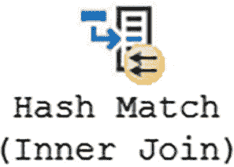

一个快照展示了执行计划中哈希匹配的图标。它用于将记录转换为易于比较的形式。

图 7-25 哈希匹配图标

#### 嵌套循环

如果存在两个表，其中一个表比另一个小，那么 SQL Server 可能会决定将一个表的值逐行与另一个表的所有行进行比较。当这种情况发生时，SQL Server 将使用 `嵌套循环`，如图 7-26 所示。

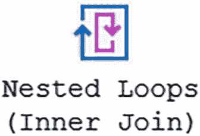

一个快照展示了执行计划中嵌套循环的图标。它用于将一张表的值逐行与另一张表的所有行进行比较。

图 7-26 嵌套循环图标

### 自适应连接

从 SQL Server 2017 开始，在 SQL Server 为查询确定执行计划时，可以使用一种新的物理连接运算符。这种新的物理连接运算符旨在帮助应对这种情况：存储在给定表中的数据可能根据 `WHERE` 子句中的标准而有显著差异。这种物理连接允许 SQL Server 根据查询所选的数据，决定是使用 `哈希匹配` 还是 `嵌套循环`。这被称为 `自适应连接`。在 SQL Server 2017 中，`自适应连接` 仅在列存储索引中可用。从 SQL Server 2019 开始，`自适应连接` 可以在其他场景中使用。

### LEFT OUTER JOIN 和 RIGHT OUTER JOIN

在介绍可用的逻辑连接时，接下来是 `LEFT OUTER JOIN` 和 `RIGHT OUTER JOIN`。在某些方面，这两种逻辑连接类型相同但也不同。例如，`嵌套循环` 只能使用 `LEFT OUTER JOIN`。如果查询是使用 `RIGHT OUTER JOIN` 编写的，SQL Server 将会产生额外开销来将 `RIGHT OUTER JOIN` 转换为 `LEFT OUTER JOIN`。除了这个特定场景，所有物理连接类型都支持 `LEFT OUTER JOIN`。在以前版本的 SQL Server 中，根据查询中使用的是 `LEFT OUTER JOIN` 还是 `RIGHT OUTER JOIN`，SQL Server 可能生成两种不同的执行计划。这是由于连接重新排序方面的限制造成的。

`LEFT OUTER JOIN` 对于何时可以使用一种物理连接类型而不是另一种，有一些具体的规则。清单 7-9 显示了按标识符对表进行排序。

```sql
ALTER TABLE [dbo].[OrderDetail]
ADD CONSTRAINT [PK_OrderDetail]
PRIMARY KEY CLUSTERED ([OrderDetailID] ASC);
```

清单 7-9 按 OrderDetailID 对数据排序的主键

一旦表已按 `OrderDetailID` 排序，您就可以将 `CustomerOrder` 表连接到 `OrderDetail` 表。此连接的 T-SQL 代码如清单 7-10 所示。

```sql
SELECT ord.OrderNumber
FROM dbo.CustomerOrder ord
LEFT OUTER JOIN dbo.OrderDetail dtl
ON ord.CustomerOrderID = dtl.CustomerOrderID
WHERE ord.CustomerOrderID < 80000;
```

清单 7-10 CustomerOrder 和 OrderDetail 之间的外连接

在此场景中，两个表未按相同方式排序。`CustomerOrder` 表按 `CustomerOrderID` 排序，而 `OrderDetail` 表按 `OrderDetailID` 排序。您可以在图 7-27 中看到物理运算符是 `哈希匹配`。

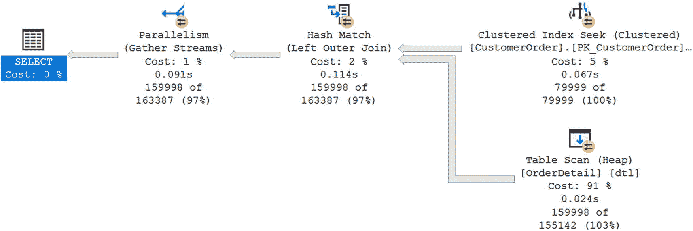

一个快照展示了执行计划。聚集索引查找，开销 5%。堆表扫描，开销 99%。左外连接哈希匹配，开销 2%。收集流并行度，开销 1%。选择，开销 0%。

图 7-27 使用哈希匹配的执行计划

您已经看到了当表以不同方式排序时发生的情况。如果您运行清单 7-11 中的 T-SQL 代码，两个表都将按同一列 `CustomerOrderID` 排序。


