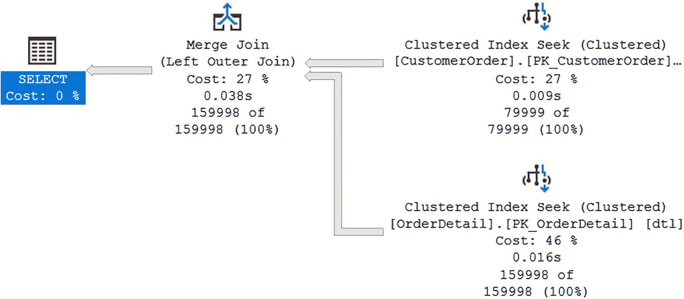
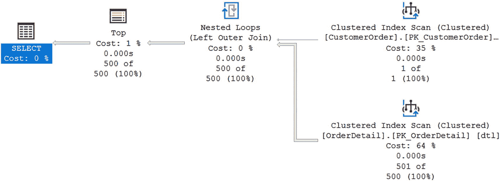
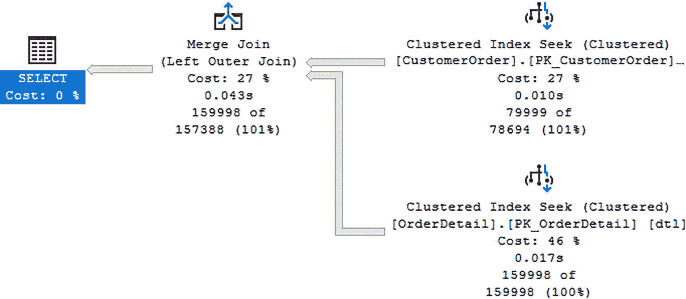
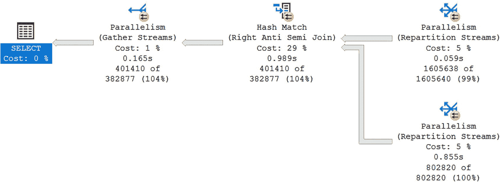
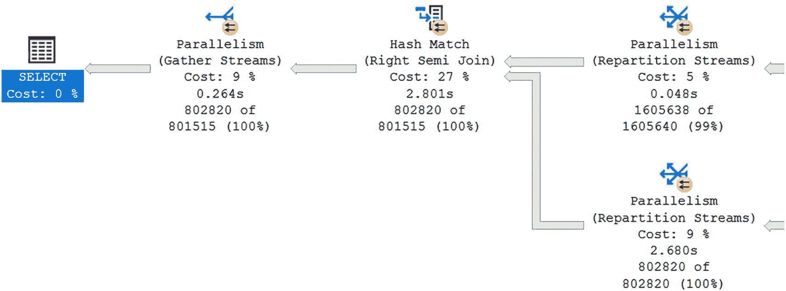
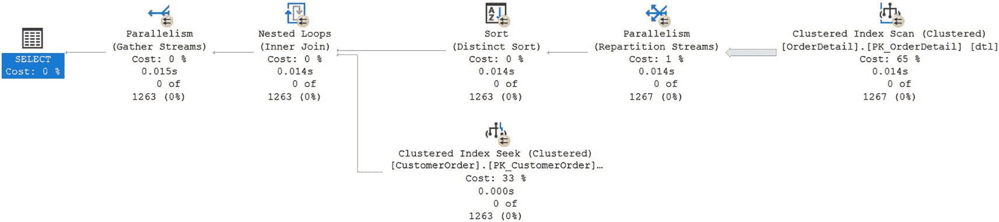
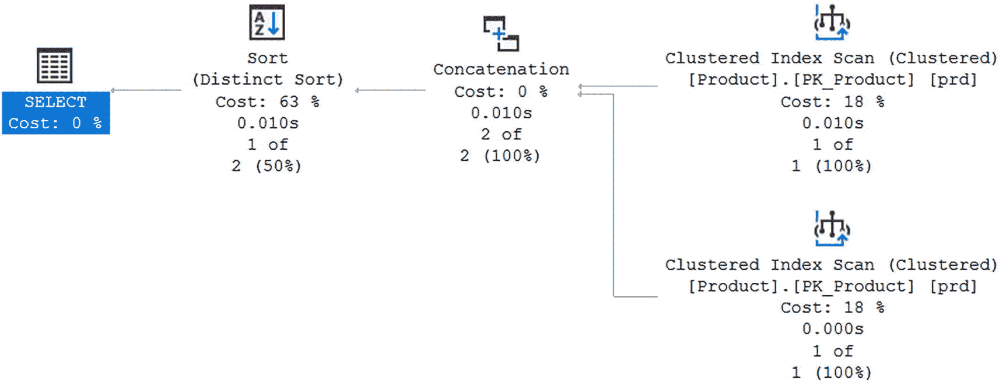

# 逻辑连接类型与执行计划分析

```sql
ALTER TABLE dbo.OrderDetail
ADD CONSTRAINT PK_OrderDetail
PRIMARY KEY CLUSTERED (CustomerOrderID ASC, OrderDetailID ASC);
```

**清单 7-11**
将主键更改为按 `CustomerOrderID` 排序数据

查看图 **7-28**，你可以看到执行计划已经改变，现在使用了合并连接。



一个快照展示了执行计划。带有聚集索引查找（`clustered index seek`）的聚集，成本 27%。以及另一个带有聚集索引查找的聚集，成本 46%。带有左外连接（`left outer join`）的哈希匹配（`Hash match`），成本 26%。选择（`Select`），成本 0%。

**图 7-28**
使用合并连接的执行计划

由于这两个表以相同的方式排序，SQL Server 判定使用合并连接成本更低。在前面的示例中，SQL Server 接收两个有序数据集并比较记录以确定匹配项。所有前面的示例都假设比较的列之间是相等关系。作为一般准则，如果查询中没有任何连接是相等的，SQL Server 将总是对左外连接（`LEFT OUTER JOIN`）使用嵌套循环（`nested loop`）。你可以在清单 **7-12** 中看到一个满足此条件的查询示例。

```sql
SELECT TOP(500) ord.OrderNumber
FROM dbo.CustomerOrder ord
LEFT OUTER JOIN dbo.OrderDetail dtl
ON ord.CustomerOrderID <> dtl.CustomerOrderID;
```

**清单 7-12**
使用不等式的左外连接

如果我重建清单 **7-8** 中引用的主键，两个表之间的数据将以不同方式排序。由于两个表之间比较的数据量很大，我将结果限制为前 500 条记录。运行此查询后，我得到了图 **7-29** 返回的执行计划。



一个快照展示了执行计划。带有聚集索引扫描（`clustered index scan`）的聚集，成本 35%。带有聚集索引扫描的聚集，成本 64%。带有左外连接的嵌套循环（`Nested loop`），成本 0%。顶部（`Top`），成本 1%。选择（`Select`），成本 0%。

**图 7-29**
使用嵌套循环的执行计划

由于 T-SQL 代码中唯一的连接是不等式，SQL Server 使用了嵌套循环物理连接。几乎所有没有相等连接的查询都必须使用嵌套循环，但有一种特定情况除外。如果被比较的数据是排序的并且存在不等式，SQL Server 可以使用合并连接。创建清单 **7-10** 中的主键将使两个表之间的数据排序相同。执行清单 **7-9** 中的查询时，返回了图 **7-30** 中的执行计划。



一个快照展示了执行计划。带有聚集索引查找的聚集，成本 27%。带有聚集索引查找的聚集，成本 46%。带有左外连接的合并连接（`Merge join`），成本 0%。选择（`Select`），成本 0%。

**图 7-30**
使用合并连接的执行计划

图 **7-30** 表明，当存在不等式时，也有可能使用合并连接。然而，只有当表已排序且存在不等式时，你才会看到带有左外连接（`LEFT OUTER JOIN`）的合并连接。

除了与逻辑连接相关的 T-SQL 连接外，SQL Server 还可以使用其他逻辑连接类型。

另一种逻辑连接类型涉及 SQL Server 比较两个表之间的数据但不执行完整连接的情况。根据使用的 T-SQL 代码，这可以称为半连接（`SEMI JOIN`）或反半连接（`ANTI SEMI JOIN`）。与左外连接（`LEFT OUTER JOIN`）和右外连接（`RIGHT OUTER JOIN`）类似，SQL Server 在将半连接和反半连接匹配到物理连接算子时也有一些相同的限制。在处理半连接或反半连接时，存在左或右的概念。这个左或右与正在比较哪一侧有关。清单 **7-13** 查找 ID 为 234 的客户的所有订单。

```sql
SELECT ord.OrderNumber
FROM dbo.CustomerOrder ord
WHERE NOT EXISTS
(
    SELECT *
    FROM dbo.OrderDetail dtl
    WHERE dtl.CustomerOrderID = ord.CustomerOrderID
    AND ord.CustomerID = 234
);
```

**清单 7-13**
`CustomerID` 234 的所有订单

运行此查询时，`OrderDetail` 中的数据按 `CustomerOrderID` 然后 `OrderDetailID` 排序。在图 **7-31** 中，执行计划显示了一个右反半连接（`RIGHT ANTI SEMI JOIN`）。



一个快照展示了执行计划。带有重新分区流（`repartition stream`）的并行（`Parallelism`），成本 5%。带有右反半连接的哈希匹配，成本 29%。带有收集流（`gather stream`）的并行，成本 5%。选择（`Select`），成本 0%。

**图 7-31**
带有 `RIGHT ANTI SEMI JOIN` 的部分执行计划

反半连接（`ANTI SEMI JOIN`）是由于清单 **7-11** 查询中的 `NOT EXISTS` 造成的。在上述场景中，SQL Server 选择了右连接。清单 **7-14** 中的查询查找所有包含除 `ProductID` 为 2 以外的产品的订单。

```sql
SELECT ord.*
FROM dbo.CustomerOrder ord
WHERE EXISTS
(
    SELECT dtl.ProductID
    FROM dbo.OrderDetail dtl
    WHERE ord.CustomerOrderID = dtl.CustomerOrderID
    AND dtl.ProductID <> 2
);
```

**清单 7-14**
除仅包含 `ProductID` 2 以外的所有订单

如图 **7-32** 的执行计划所示，你可以看到一个右半连接（`RIGHT SEMI JOIN`）。



一个快照展示了执行计划。带有重新分区流的并行，成本 5%。带有重新分区流的并行，成本 9%。带有右半连接的哈希匹配，成本 27%。带有收集流的并行，成本 9%。选择（`Select`），成本 0%。

**图 7-32**
带有 `RIGHT SEMI JOIN` 的部分执行计划

使用右半连接（`RIGHT SEMI JOIN`）是由于清单 **7-10** T-SQL 中的 `EXISTS`。使用“右”表示 SQL Server 正在将 `EXISTS` 语句返回的结果与客户订单列表进行比较评估。

虽然使用 `EXISTS` 或 `NOT EXISTS` 可能表示将会出现半连接或反半连接，但这并不总是发生的情况。对于反连接（`ANTI JOIN`）也是如此，因为数据库引擎可以将右半连接（`RIGHT SEMI JOIN`）转换为左反连接（`LEFT ANTI JOIN`）。清单 **7-15** 显示了一个将返回 `ProductID` 为 2 的产品的所有订单的查询。

```sql
SELECT ord.OrderNumber
FROM dbo.CustomerOrder ord
WHERE EXISTS
(
    SELECT *
    FROM dbo.OrderDetail dtl
    WHERE dtl.CustomerOrderID = ord.CustomerOrderID
    AND dtl.ProductID = 2
);
```

**清单 7-15**
包含 `ProductID` 2 的所有订单

图 **7-33** 中的执行计划显示了 SQL Server 决定如何执行此查询。



一个快照展示了执行计划。带有聚集的聚集索引扫描（`Clustered index scan`），成本 65%。带有重新分区流的并行，成本 1%。带有去重排序（`distinct sort`）的排序（`Sort`），成本 0%。带有聚集的聚集索引查找，成本 33%。带有内连接（`inner join`）的嵌套循环，成本 0%。带有收集流的并行，成本 0%。选择（`Select`），成本 0%。

**图 7-33**
没有半连接（`SEMI JOINs`）的执行计划


对于此次执行，SQL Server 决定将此 `T-SQL` 转换为类似于 `INNER JOIN` 而非 `SEMI JOIN` 的操作。这是因为 SQL Server 已计算出，在已评估的方案中，这种做法能带来最佳的执行效果。

组合数据的方式涉及比较两个数据集之间的值，并选择其中匹配或不匹配的项目。此外，还存在将整个数据集作为逻辑连接类型的一部分进行组合的可能性。这可以包括在你的 `T-SQL` 代码中使用 `UNION` 或 `UNION ALL`。清单 7-16 中显示的查询展示了在两个表之间使用 `UNION`。

```sql
SELECT prd.ProductName
FROM dbo.Product prd
WHERE prd.ProductName LIKE '%scope'
UNION
SELECT prd.ProductName
FROM dbo.Product prd
WHERE prd.ProductName = 'Telescope';
Listing 7-16
所有包含 Tele 的产品
```

在此查询中，根据数据库中的当前数据，将返回名称以 Tele 开头或产品名称等于 Telescope 的产品列表，但第一个和第二个 `SELECT` 语句将返回相同的结果。使用 `UNION` 可确保结果在第一个和第二个 `SELECT` 语句之间不是累加的。如果同时存在名为 microscope 和 telescope 的产品，该查询将仅为每个符合任一条件的产品返回一条记录。但是，如果你使用 `UNION ALL` 而不是 `UNION`，你将获得每个 `SELECT` 语句的完整结果集。当在 SQL Server 中执行此查询时，会返回如图 7-34 所示的执行计划。



一个快照展示了执行计划。2，带有聚集索引的聚集索引扫描，成本 65%。串联，成本 0%。带有 distinct 排序的排序，成本 63%。选择，成本 0%。

图 7-34

带有串联操作的执行计划

在此查询中，SQL Server 并未像本章其他示例那样将数据连接在一起。相反，只有一个操作符——串联（concatenation），它指示了 SQL Server 如何组合这些数据。

总的来说，目标是使用对正在连接的数据最有效的物理连接方式。合并连接（Merge joins）可以表现得非常好，但它们仅限于已通过索引或 `ORDER BY` 或 `GROUP BY` 语句排序的数据。正如预期的那样，使用索引的合并连接比不使用索引的合并连接表现更好。当数据未排序，特别是如果被连接的两侧数据中有一侧数据量较小时，SQL Server 可能会使用嵌套循环（nested loop）。你需要确认循环遍历另一个表不会产生显著的成本。就像使用索引的合并连接比不使用索引的合并连接性能更好一样，嵌套循环也是如此。对于合并连接和嵌套循环，看看你是否可以调整你的 `T-SQL` 代码以使用索引。这并不意味着在没有索引时创建索引；相反，你可以检查表上的索引，看看是否有任何索引适用于你的特定查询。如果表未排序，特别是如果连接两侧的记录数都很大，那么哈希匹配（hash match）可能是理想的解决方案。

在本章中，我介绍了使用执行计划的各个方面。我从访问和查看执行计划的一些方法开始。我还讨论了估计执行计划、实际执行计划以及计划缓存中的执行之间的区别。查看执行计划时，有一些项目，如箭头大小、估计行数和实际行数，可以为你提供有关下一步如何改进 `T-SQL` 代码性能的线索。研究这些项目后，你可能还能够检查执行如何使用索引。不仅关注使用了哪些索引，还关注 SQL Server 如何搜索这些索引，这很有帮助。连接表时，使用能够引用特定逻辑连接类型行为的 `T-SQL` 代码。这些逻辑连接类型会影响执行计划中使用的物理连接类型。通过以不同方式编写 `T-SQL` 代码，你可能能够影响 SQL Server 生成的执行计划。本章涵盖的信息应能帮助你更熟练地审查你的 `T-SQL` 代码，并提高与之相关的速度及硬件使用效率。

