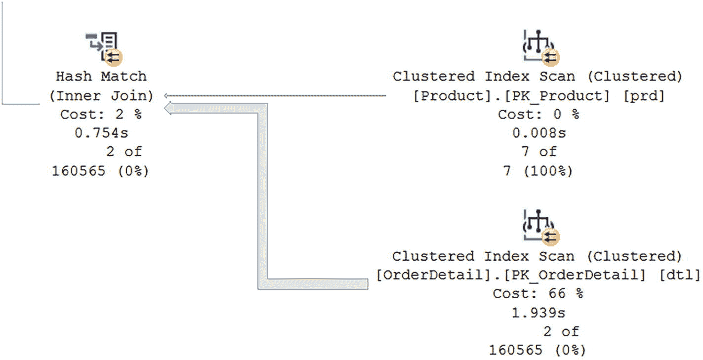

# 性能优化：查询与执行计划分析

一旦确定了需要进行性能调整的 T-SQL 代码，就需要同时查看代码和执行计划，以便熟悉查询正在检索的数据以及 SQL Server 如何检索这些数据。清单 8-2 展示了一个你将进行优化的查询。

```sql
DECLARE @CustomerID         INT = 1;
DECLARE @CustomerOrderID    INT = 401508;
DECLARE @ProductID          INT = 1;
-- 获取特定客户和产品的所有订单
SELECT cus.CustomerID,
       ord.CustomerOrderID,
       prd.ProductID
INTO #TmpOrder
FROM dbo.Customer cus
INNER JOIN dbo.CustomerOrder ord
    ON cus.CustomerID = ord.CustomerID
INNER JOIN dbo.OrderDetail dtl
    ON ord.CustomerOrderID = dtl.CustomerOrderID
INNER JOIN dbo.Product prd
    ON dtl.ProductID = prd.ProductID
WHERE (cus.CustomerID = @CustomerID OR @CustomerID = -1)
  AND (ord.CustomerOrderID = @CustomerOrderID OR @CustomerID = -1)
  AND (dtl.ProductID = @ProductID OR @ProductID = -1)
  AND prd.IsActive = 1;

SELECT ProductID
INTO #HistPriceCost
FROM dbo.ProductPriceHistory
GROUP BY ProductID
HAVING COUNT(*)>3;

SELECT cus.CustomerID,
       cus.FirstName,
       cus.LastName,
       ord.CustomerOrderID,
       ord.OrderNumber,
       prd.ProductName,
       dtl.QuantitySold,
       dtl.ProductPrice
FROM #TmpOrder tor
INNER JOIN #HistPriceCost hpc
    ON tor.ProductID = hpc.ProductID
LEFT JOIN dbo.Customer cus
    ON tor.CustomerID = cus.CustomerID
INNER JOIN dbo.CustomerOrder ord
    ON tor.CustomerOrderID = ord.CustomerOrderID
INNER JOIN dbo.OrderDetail dtl
    ON tor.CustomerOrderID = dtl.CustomerOrderID
    AND tor.ProductID = dtl.ProductID
INNER JOIN dbo.Product prd
    ON tor.ProductID = prd.ProductID
WHERE cus.IsActive = 1
ORDER BY
    cus.CustomerID,
    CASE WHEN
        (
            cus.CustomerID = @CustomerID
            AND ord.CustomerOrderID = @CustomerOrderID
        )
        THEN 0
        ELSE 1
    END,
    ord.CustomerOrderID DESC,
    cus.LastName ASC;

DROP TABLE #TmpOrder;
DROP TABLE #HistPriceCost;
```
*清单 8-2 客户订单原始查询*

你还需要从计划缓存中获取执行计划，以便查看 SQL Server 如何执行 T-SQL 代码。图 8-1 中的部分执行计划展示了一个可能受益于优化的环节。



*图 8-1 清单 8-2 的部分执行计划*

该执行计划中有一条粗线，在哈希匹配后变成细线。这很好地表明，该查询有可能通过优化来减少总体的读取量。基于此信息，你需要调查来自`dbo.OrderDetail`的数据如何与`dbo.Customer`和`dbo.CustomerOrder`的结果相结合。通过查看 T-SQL 代码或其输出，你可以更好地理解此查询的目的。该查询返回所有产品价格已变更超过三次的客户订单，以及下这些订单的客户信息。

了解这一点有助于你开始优化此查询的逻辑读取过程。你知道此查询基于价格已变更超过三次的产品。如果专注于仅查找包含价格已变更超过三次的产品的订单，可能可以减少读取次数。虽然`dbo.OrderDetail`表是按`CustomerOrderID`排序，然后再按`OrderDetailID`排序，但这在清单 8-2 中的 T-SQL 代码仅查找包含特定产品的客户订单时并无帮助。执行计划表明 SQL Server 正在使用一个非聚集索引来检索数据。创建此索引的 T-SQL 代码如清单 8-3 所示。

```sql
CREATE NONCLUSTERED INDEX [IX_OrderDetail_ProductID_CustomerOrderID]
ON [dbo].OrderDetail;
```
*清单 8-3 为 OrderDetail 表创建索引的查询*

非聚集索引不会更改表中数据的顺序，但索引会保持索引数据的排序。在此情况下，索引首先按`ProductID`列的值对数据排序，然后按`CustomerOrderID`排序。非聚集索引还必须能够引用回聚集索引，因为当 SQL Server 决定使用此非聚集索引但也可能需要表中的一些额外数据时，就需要这样做。SQL Server 通过将聚集索引的列作为此索引的一部分来实现这一点。这对你是有帮助的，因为这意味着可以使用此索引中的`OrderDetailID`来查找包含此产品的所有订单明细。

这一切听起来都不错，但看起来此索引目前并未提供最佳性能。虽然你可以致力于调整索引，但我发现，在非常大的表和高度事务性的系统中，你可能无法添加或修改现有索引。有时这些索引的存在正是为了确保应用程序的关键部分性能良好，它们正在做它们需要做的事情。修改这些索引可能会带来更多麻烦。在这个场景中你是幸运的，你只需向清单 8-1 中的 T-SQL 代码添加一行，就能减少读取次数。索引按`ProductID`排序，然后是`CustomerOrderID`。如果你从查询中移除`(... AND @IsActive = 1)`，你或许可以使索引更高效地工作。参见清单 8-4。


