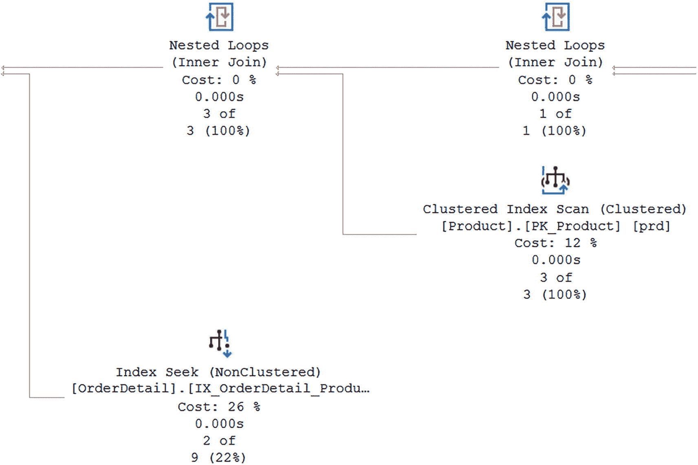
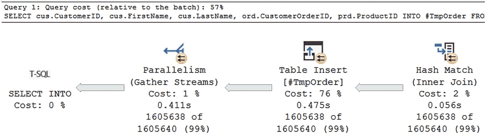
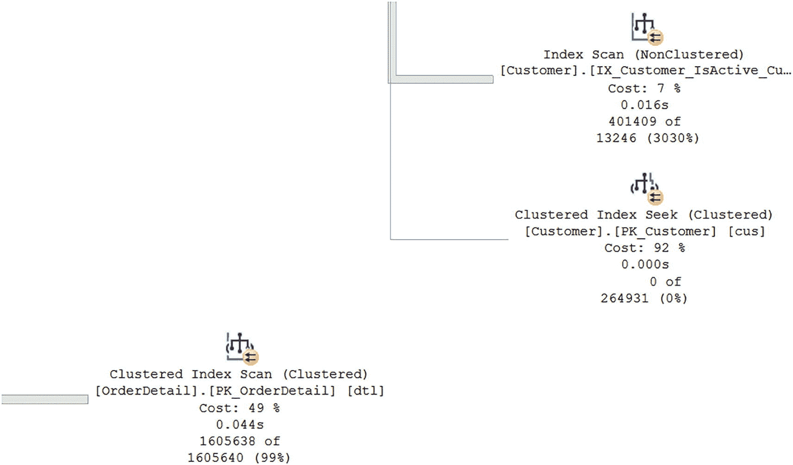
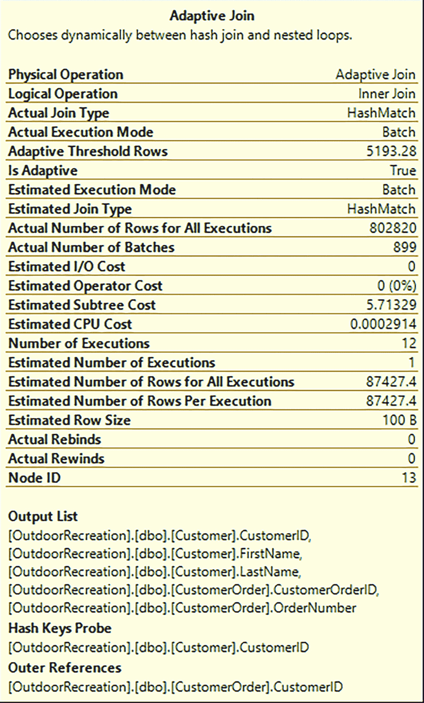
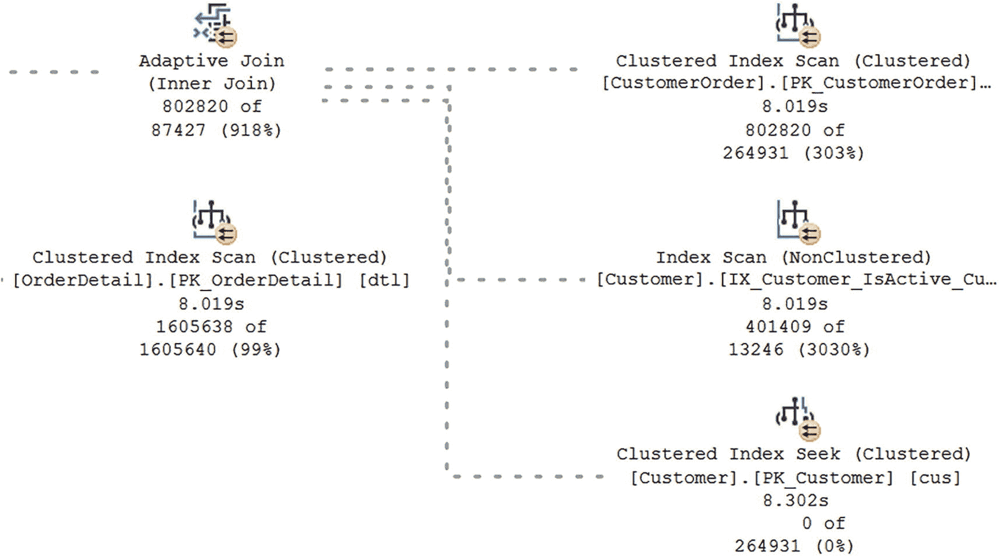
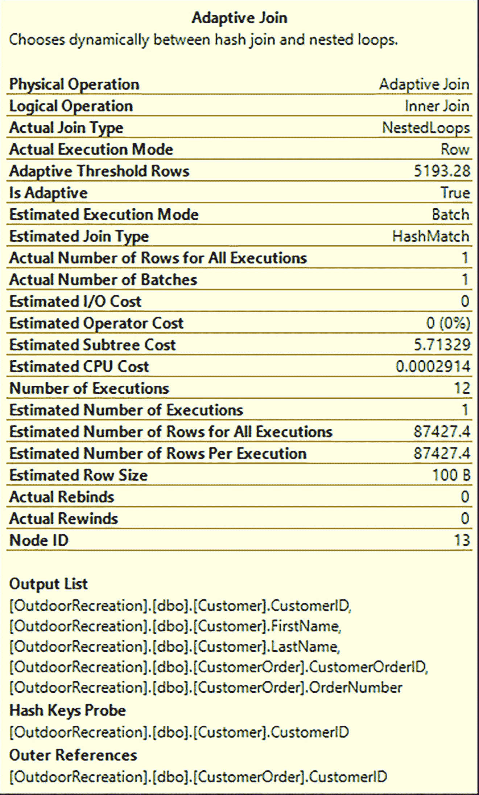
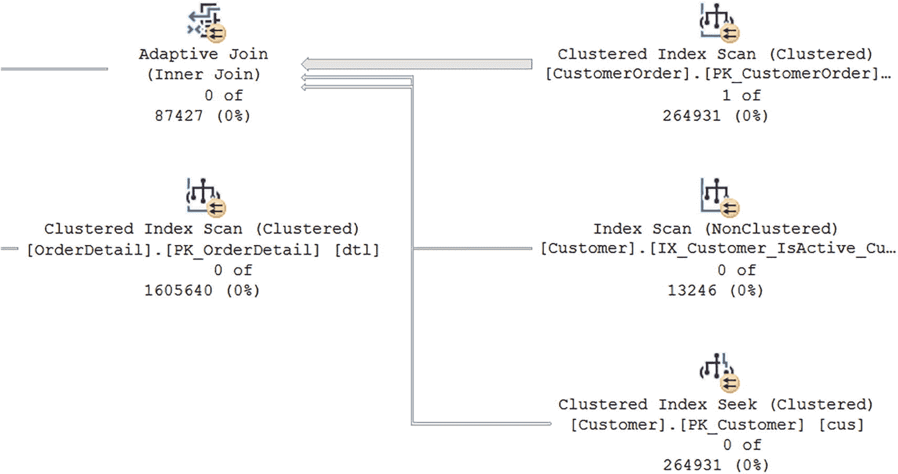

# 查询优化与执行计划分析

```sql
DECLARE @CustomerID INT = 1;
DECLARE @CustomerOrderID INT = 401508;
DECLARE @ProductID INT = 1;
-- 获取特定客户和产品的所有订单
SELECT
    cus.CustomerID,
    ord.CustomerOrderID,
    prd.ProductID
INTO #TmpOrder
FROM dbo.Customer cus
INNER JOIN dbo.CustomerOrder ord
    ON cus.CustomerID = ord.CustomerID
INNER JOIN dbo.OrderDetail dtl
    ON ord.CustomerOrderID = dtl.CustomerOrderID
INNER JOIN dbo.Product prd
    ON dtl.ProductID = prd.ProductID
WHERE (cus.CustomerID = @CustomerID OR @CustomerID = -1)
    AND (ord.CustomerOrderID = @CustomerOrderID)
    AND (dtl.ProductID = @ProductID OR @ProductID = -1)
    AND prd.IsActive = 1;

SELECT ProductID
INTO #HistPriceCost
FROM dbo.ProductPriceHistory
GROUP BY ProductID
HAVING COUNT(*) > 3;

SELECT
    cus.CustomerID,
    cus.FirstName,
    cus.LastName,
    ord.CustomerOrderID,
    ord.OrderNumber,
    prd.ProductName,
    dtl.QuantitySold,
    dtl.ProductPrice
FROM #TmpOrder tor
LEFT JOIN #HistPriceCost hpc
    ON tor.ProductID = hpc.ProductID
LEFT JOIN dbo.Customer cus
    ON tor.CustomerID = cus.CustomerID
INNER JOIN dbo.CustomerOrder ord
    ON tor.CustomerOrderID = ord.CustomerOrderID
INNER JOIN dbo.OrderDetail dtl
    ON tor.CustomerOrderID = dtl.CustomerOrderID
    AND tor.ProductID = dtl.ProductID
INNER JOIN dbo.Product prd
    ON tor.ProductID = prd.ProductID
WHERE hpc.ProductID IS NOT NULL
ORDER BY
    cus.CustomerID,
    CASE WHEN (cus.CustomerID = @CustomerID AND ord.CustomerOrderID = @CustomerOrderID) THEN 0 ELSE 1 END,
    ord.CustomerOrderID DESC,
    cus.LastName ASC;

DROP TABLE #TmpOrder;
DROP TABLE #HistPriceCost;
```

**代码清单 8-4** 客户订单的优化查询

现在你已经更改了代码，需要获取一个新的执行计划来确认这些更改是否按预期工作。图 8-2 显示了执行计划中相同的大致区域，但这是 T-SQL 代码更改后的样子。



一个流程图展示了部分执行计划。它描绘了一个聚集索引扫描、2 个嵌套循环和一个索引查找。聚集索引扫描的成本为 12%，耗时 0.000 秒，3/3。嵌套循环的成本为 0%，耗时 0.000 秒，3/3 和 1/1。索引查找的成本为 26%，耗时 0.000 秒，2/9。

**图 8-2** **代码清单 8-4** 的部分执行计划

发生了几个变化。从整体执行计划来看，所有的连线都比之前细得多。虽然某些步骤的顺序发生了变化，但最大的差异与非聚集索引有关。在 **图 8-1** 中，SQL Server 正对该索引执行索引扫描。既然你创建了一个排序方式不同的索引，SQL Server 现在对同一个非聚集索引使用索引查找。并非所有优化 T-SQL 代码的尝试都如此简单。然而，当你了解数据存储方式以及表上的索引如何引用数据时，就有可能对你的 T-SQL 代码做出显著的改进。

## 优化执行时长

我使用 SQL Server 的目标是让执行 T-SQL 代码的查询运行得尽可能快。我倾向于关注逻辑读取次数，因为我想最小化进入缓存的、当前执行查询不需要的数据页数量。然而，SQL Server 中还可能发生其他问题，对下游产生负面影响。

在 SQL Server 2019 之前，查询缓慢最常见的原因之一是参数嗅探。SQL Server 2019 中的自适应联接有助于最小化与参数嗅探相关的问题。如果执行计划中有自适应联接，SQL Server 将在执行时决定是使用合并联接还是嵌套循环联接。自适应联接的灵活性允许 T-SQL 代码在数据集较小时以一种方式执行，而在数据集较大时使用不同的物理联接方式。这将使查询的执行无论检索到何种数据都能表现良好。

尝试找出执行时长最长的查询可能具有挑战性，尤其是在尝试获取有关查询性能的实时数据时。幸运的是，SQL Server 确实会跟踪查询计划缓存中存在的 T-SQL 代码的查询性能。你可以使用与上一节相同的 DMV `sys.dm_exec_query_stats`，但不是查找总逻辑读取或平均逻辑读取最高的记录，而是要查看工作线程时间。你可以从总工作线程时间或平均工作线程时间开始。查询运行的时间点可能帮助你决定首先关注哪个。如果工作线程时间最高的查询之一在业务最活跃的时间运行，我会优先处理该查询。然而，如果你有平均工作线程时间最高的 T-SQL 代码在一天中的繁忙时段频繁运行，首先处理这段代码可能会带来更多好处。无论哪种方式，你都需要在 `sys.dm_exec_sql_text` 中查找与 `sys.dm_exec_query_stats` 中的查询哈希匹配的查询计划，以找到相关的查询文本。

SQL Server 的一个挑战是，相同的解决方案并非总是适用于所有情况。我遇到过一些查询，将数据分成更小的片段可以提高性能。在其他时候，将几个步骤合并为单个 T-SQL 语句可能更有效。**代码清单 8-5** 中的查询展示了一系列 T-SQL 语句。


```sql
DECLARE @CustomerID         INT = NULL;
DECLARE @CustomerOrderID    INT = NULL;
DECLARE @ProductID          INT = NULL;
-- 获取特定客户和产品的所有订单
SELECT cus.CustomerID,
       cus.FirstName,
       cus.LastName,
       ord.CustomerOrderID,
       prd.ProductID
INTO   #TmpOrder
FROM   dbo.Customer cus
       INNER JOIN dbo.CustomerOrder ord
              ON cus.CustomerID = ord.CustomerID
       INNER JOIN dbo.OrderDetail dtl
              ON ord.CustomerOrderID = dtl.CustomerOrderID
       INNER JOIN dbo.Product prd
              ON dtl.ProductID = prd.ProductID
WHERE  prd.IsActive = 1
       AND EXISTS (SELECT *
                   FROM   dbo.ProductPriceHistory hist
                   WHERE  prd.ProductID = hist.ProductID
                   GROUP  BY hist.ProductID
                   HAVING COUNT(*) > 3);

SELECT ord.CustomerID,
       tor.FirstName,
       tor.LastName,
       ord.CustomerOrderID,
       ord.OrderNumber,
       prd.ProductName,
       dtl.QuantitySold,
       dtl.ProductPrice
FROM   #TmpOrder tor
       INNER JOIN dbo.CustomerOrder ord
              ON tor.CustomerOrderID = ord.CustomerOrderID
       INNER JOIN dbo.OrderDetail dtl
              ON tor.CustomerOrderID = dtl.CustomerOrderID
                 AND tor.ProductID = dtl.ProductID
       INNER JOIN dbo.Product prd
              ON tor.ProductID = prd.ProductID
WHERE  ( tor.CustomerID = @CustomerID
          OR @CustomerID IS NULL )
       AND ( ord.CustomerOrderID = @CustomerOrderID
              OR @CustomerOrderID IS NULL )
       AND ( dtl.ProductID = @ProductID
              OR @ProductID IS NULL )
ORDER  BY ord.CustomerID,
          CASE
            WHEN ( ord.CustomerID = @CustomerID
                   AND ord.CustomerOrderID = @CustomerOrderID ) THEN 0
            ELSE 1
          END,
          ord.CustomerOrderID DESC,
          tor.LastName ASC;

DROP TABLE #TmpOrder;
```

`清单 8-5`
获取所有客户订单信息的原始查询

总的来说，`清单 8-5` 的目标是返回任意客户、订单和产品组合的客户与订单信息。成本百分比指示了 `SQL Server` 引擎预计在执行计划中该步骤所花费的时间比例。在查看执行计划时，你需要调查执行计划中成本百分比最高的特定部分，如 `图 8-3` 所示。



流程图展示了部分执行计划。它描绘了一个哈希匹配，随后是表插入、并行操作和 `T S Q L`。哈希匹配成本为 2%，耗时 0.056 秒，处理了 1605638 行（共 1605640 行）。`T S Q L` 成本为 0%。

`图 8-3`

`清单 8-5` 的部分执行计划

插入临时表是第一个 `T-SQL` 语句中最主要的部分。该语句也占用了整个执行计划中较高的百分比。因此，与此查询相关的最高成本是将数据插入临时表。你可以将此查询重写为 `清单 8-6` 中所示的查询。

```sql
DECLARE @CustomerID         INT = NULL;
DECLARE @CustomerOrderID    INT = NULL;
DECLARE @ProductID          INT = NULL;

SELECT cus.CustomerID,
       cus.FirstName,
       cus.LastName,
       ord.CustomerOrderID,
       ord.OrderNumber,
       prd.ProductName,
       dtl.QuantitySold,
       dtl.ProductPrice
FROM   dbo.Customer cus
       INNER JOIN dbo.CustomerOrder ord
              ON cus.CustomerID = ord.CustomerID
       INNER JOIN dbo.OrderDetail dtl
              ON ord.CustomerOrderID = dtl.CustomerOrderID
       INNER JOIN dbo.Product prd
              ON dtl.ProductID = prd.ProductID
WHERE  ( cus.CustomerID = @CustomerID
          OR @CustomerID IS NULL )
       AND ( ord.CustomerOrderID = @CustomerOrderID
              OR @CustomerOrderID IS NULL )
       AND ( dtl.ProductID = @ProductID
              OR @ProductID IS NULL )
       AND prd.IsActive = 1
       AND EXISTS (SELECT *
                   FROM   dbo.ProductPriceHistory hist
                   WHERE  prd.ProductID = hist.ProductID
                   GROUP  BY hist.ProductID
                   HAVING COUNT(*) > 3)
ORDER  BY cus.CustomerID,
          CASE
            WHEN ( cus.CustomerID = @CustomerID
                   AND ord.CustomerOrderID = @CustomerOrderID ) THEN 0
            ELSE 1
          END,
          ord.CustomerOrderID DESC,
          cus.LastName ASC;
```

`清单 8-6`
获取所有客户订单信息的优化查询

这个 `T-SQL` 语句包含了生成与 `清单 8-5` 相同输出所需的所有代码。根据表上存在的索引和连接条件，有时通过单次查询选择所有数据会看到更好的性能。其他时候，你可能通过获取数据子集并将其组合到一个查询中来优化查询。`清单 8-6` 执行计划的一部分可以在 `图 8-4` 中看到。



流程图展示了部分执行计划。它描绘了 2 个聚集索引扫描、聚集索引查找和索引扫描。聚集索引扫描成本为 49%，耗时 0.044 秒，处理了 1605638 行（共 1605640 行）。索引扫描成本为 7%，耗时 0.016 秒，处理了 401409 行（共 13246 行）。

`图 8-4`

`清单 8-6` 的部分执行计划

如 `图 8-4` 所示，占用执行计划最大百分比的步骤已经改变。根据实际的执行计划，最大百分比花费在 `Customer` 表的主键上执行 `聚集索引查找`。由于这是涉及表主键的查找，似乎没有更好的替代方案来对此查询进行性能调优。

## 优化索引

还有其他因素可能导致查询运行缓慢。在许多场景中，优化这些查询的最佳方法涉及使用索引。你需要检查执行计划中的 `键查找`。这些 `键查找` 表明 `SQL Server` 必须从 `非聚集索引` 转到 `聚集索引` 以查找查询所需的额外字段。在某些情况下，你可能能够更改返回的值或查询的连接条件来解决 `键查找`。否则，你将需要查看是否可以更改索引以提高性能。

创建和维护索引是一个本身就能写成一本书的话题，但在处理索引时，你可以做一些事情。如果你处于可能需要考虑添加索引的阶段，你首先需要了解相关表上当前存在哪些索引。虽然这超出了本书的范围，但你需要确定是否存在不再使用并可以删除的索引。对于剩下的索引，你需要仔细评估。其中一些索引可能可以进行修改，使其继续对其他 `T-SQL` 代码有效，同时也能优化当前查询。你可以创建或修改索引，使额外的列与索引一起存储。但是，索引不会按这些列排序。这些列可以被称为 `覆盖列`。如果某个列是连接或 `WHERE 子句` 所需的，我会考虑将其添加到索引中。在决定将列添加到索引之前，请确保你熟悉 `SQL Server` 如何使用索引来搜索数据。处理某些索引的方法涉及在索引上将列添加为 `包含列`。这将允许 `SQL Server` 返回列结果而无需进行 `键查找`，但它不会影响 `SQL Server` 如何使用索引来检索数据记录。

优化 `T-SQL` 代码的执行时长可以带来诸多好处。一是提高应用程序的性能。在某些情况下，你可能能够通过以更高效的方式重写代码来改善查询的执行时长。在其他情况下，你可能需要考虑是否有不同的代码编写方式可以更好地利用现有索引。另一个选项是修改现有索引或创建新索引。如果选择修改索引，请谨慎行事，因为有时存在的索引可能弊大于利。定期检查你的 `T-SQL` 代码的执行时长，看看是否能找到任何需要性能调优的查询。


## 自动数据库调优

在之前的章节中，我讨论了如何针对逻辑读取和持续时间来优化您的 T-SQL 代码。在 SQL Server 过去的几个版本中，发生了许多变化，这些变化可以帮助您自动优化 SQL Server 或优化您的查询。在某些情况下，这涉及记录有关查询性能的信息。在其他时候，这可能是 SQL Server 在管理您的执行计划或索引。虽然本节涵盖的主题与 SQL Server 可以为您执行的优化相关，但理解这些概念将有助于您更好地了解 SQL Server 将如何处理您的 T-SQL 代码。

### 自动计划纠正

在 SQL Server 2016 引入的*查询存储*功能之上，SQL Server 2017 引入了一项新功能。下一步是看看 SQL Server 是否能利用对执行计划、执行统计信息和这些查询执行的等待统计信息的历史信息的访问来获益。此功能内置于查询存储中，可以进行配置而无需人工干预。为了实现这一点，这种新功能还必须包含一种验证结果的方法。

既然 SQL Server 可以查看查询存储，它就能系统地确定新的执行计划是比之前的执行计划性能更好还是更差。这个新功能被称为**自动计划纠正**。此功能默认不启用。在启用之前，需要先启用查询存储，如代码清单 8-6 所示。一旦启用了查询存储，您就可以运行代码清单 8-7 所示的代码来启用自动计划纠正。

```
ALTER DATABASE Menu
SET AUTOMATIC_TUNING (FORCE_LAST_GOOD_PLAN = ON);
代码清单 8-7
启用自动计划纠正的查询
```

一旦启用了自动计划纠正，SQL Server 就可以比较新的和之前的执行计划，以确定比较结果是否符合 SQL Server 可以强制使用之前执行计划的标准。为了确保 SQL Server 不会花费额外精力进行微调性能，阈值设置为将 CPU 成本减少 10 秒或更多。另一个选项是执行中的错误数量少于之前的版本。如果新的执行计划在 CPU 上多花费了超过 10 秒，SQL Server 可以自动强制使用之前的计划。同样，如果新的执行计划比之前的计划有更多的错误，SQL Server 可以强制使用之前的执行计划。

在 SQL Server 自动强制执行计划后，它会继续监视性能，以确认新强制的执行计划是否按预期工作。如果 SQL Server 确定强制的执行计划不再提供预期的性能收益，它可以撤销对执行计划的强制。自动计划纠正不会更改您的 T-SQL 代码；此功能仅帮助管理当前用于您的 T-SQL 代码的执行计划。

如果您更愿意手动管理执行计划，您也可以这样做。请确保不要运行代码清单 7-8 中所示的 T-SQL 代码。如果您选择手动执行计划纠正，则需要定期监视哪些查询需要强制执行计划。随着数据形状和相关统计信息可能随时间变化，您还需要手动撤销对查询执行计划的强制。从 SQL Server 2016 开始，可以使用查询存储来监视执行计划随时间的变化。在 SQL Server 2017 中，还可以选择使用 DMV `sys.dm_tuning_recommendations` 来查找可以从强制执行计划中受益的查询。

虽然自动或手动计划纠正超出了 T-SQL 的范围，但了解 SQL Server 可以对您的 T-SQL 查询执行哪些操作是有帮助的。我仍然建议您将 T-SQL 设计为在各种场景下高效运行，但知道当参数嗅探等问题不可避免时，SQL Server 中还有其他选项可以帮助提高整体查询性能，这是一件好事。

### 自动索引管理

除了允许 SQL Server 管理您的执行计划并选择最佳可用计划外，您还可以选择允许 SQL Server 系统地监视和管理您的索引。此功能目前仅在 Azure SQL Database 中可用。启用**自动索引管理**允许 SQL Server 创建它认为必要的新索引，并识别未使用或似乎与其他已创建索引类似的索引。

与自动计划纠正类似，SQL Server 将监视新索引的性能。如果认为它们效率较低，SQL Server 将删除这些索引。如果 SQL Server 修改或删除索引，也将使用相同的过程。在使用 Azure SQL Database 时，仍然可以手动管理索引。然而，允许 Azure SQL Database 及时发现并解决索引问题可能会节省您的成本，因为执行相同任务可能需要更少的资源。

## 智能查询处理

除了 SQL Server 自动管理执行计划和索引的能力外，还有其他新功能可以帮助自动优化 T-SQL 代码性能。如第 6 章所讨论的，内存是 SQL Server 使用的关键资源。在使用 SQL Server 的内存时，您希望确保内存被尽可能高效地使用。处理数据集对于使用 SQL Server 也至关重要。如果 SQL Server 可以将一组行转换为批次，然后执行任何必要的操作，这将有助于优化查询。数据形状在数据表中并不总是一致的。在这些场景中，拥有一个根据返回的数据类型而灵活调整的执行计划可能会有所帮助。这些功能有助于提高正在执行的 T-SQL 代码的效率。

### 内存授予反馈

在执行查询时，SQL Server 会尝试估计该事务所需的内存量。基于估计分配给查询的内存量称为内存授予。虽然 SQL Server 能正确估计内存是理想情况，但有时估计的内存量与实际使用的内存量并不匹配。**内存授予反馈**首次在 SQL Server 2017 中可用。内存授予反馈的添加使 SQL Server 能够查看之前查询执行的内存使用情况，并在内存估计值显著低估或高估时进行调整。这允许 SQL Server 最大限度地减少因内存估计不正确而导致的潜在性能问题。

为了确保内存授予得到正确管理，为内存授予与实际内存使用量之间的差异定义了阈值。如果使用的内存少于 1 MB，则无需进行额外分析。如果内存授予是所用内存量的两倍，则可以重新计算特定查询的内存授予。同样，如果执行查询所需的内存超过内存授予，也可以重新计算内存授予。

### 行存储上的批处理模式

为批处理操作提供内存授权，是批处理操作发展的下一阶段的必要基础。批处理操作是指 SQL Server 可以一次性对一组记录执行一个操作，而不是一次只处理一条记录。当批处理模式最初在 SQL Server 2012 中引入时，它仅可用于 `列存储索引`。从 SQL Server 2019 开始，批处理操作也被允许用于一组行。在这种情况下，一组行也被称为 `行存储`。为批处理操作提供内存授权，使得堆和索引也能使用批处理模式，这为额外的查询优化类型奠定了基础。

### 自适应连接

SQL Server 使用统计信息来帮助估计最佳执行计划。然而，数据在表中的分布并不总是均匀的。它选择的计划通常是针对某些列值的最佳计划。问题在于，对于其他列值，该计划可能表现不佳。在 SQL Server 2019 中，由于新功能的引入，发生这种情况的可能性降低了。该功能允许 SQL Server 根据查询的当前执行情况，在 `嵌套循环` 和 `哈希匹配` 这两种物理连接运算符之间进行选择。这项新功能被称为 `自适应连接`。

`自适应连接` 最初在 SQL Server 2017 中引入。然而，`自适应连接` 只能作为 `批处理模式操作` 的一部分使用。在 SQL Server 2017 中，`批处理模式操作` 仅支持 `列存储索引`。既然 `批处理模式操作` 现在也支持堆和 B 树索引，那么 `自适应连接` 也可以在这些数据库对象上使用。执行清单 8-6 中的查询会生成一个包含 `自适应连接` 的执行计划。当你看到执行计划时，你会看到一个 `自适应连接` 的物理运算符。在图形执行计划中，你无法辨别幕后使用的是什么类型的运算符。但是，如果你将鼠标悬停在执行计划中的 `自适应连接` 上，你会看到一个属性列表，如图 8-5 所示。



自适应连接属性的截图呈现了一个列表。它描绘了 22 个属性。列表底部有代码，位于“输出列表”、“探测哈希键”和“外部引用”标题下。

图 8-5

清单 8-6 中的自适应连接属性

清单 8-6 中的原始查询是根据所有三个参数返回有关客户、订单和产品的信息。在图 8-5 中，你可以看到属性下列出的 `自适应连接` 类型是 `哈希匹配`。图 8-6 显示了执行清单 8-6 时实时查询统计信息的部分截图。



一个流程图展示了实时查询统计信息。它描绘了聚集索引扫描、索引扫描、聚集索引查找、聚集索引扫描和自适应连接。聚集索引扫描耗时 8.019 秒，处理了 264931 行中的 802820 行（注：此处原文数据可能存在笔误或特殊上下文）。自适应连接处理了 87427 行中的 802820 行（注：同上）。

图 8-6

清单 8-6 的实时查询统计信息

你可以看到每个步骤处理的记录总数以及部分步骤所花费的时间。通过查看实时查询统计信息，你可以看到返回的记录数与估计数的百分比。图 8-6 显示了正在进行的实时查询统计信息。在这种情况下，对表 `CustomerOrder` 的 `聚集索引扫描` 或对表 `OrderDetail` 的 `索引扫描` 等步骤似乎估计正确。其他运算符也可能未被正确估计。虽然这些差异可能导致性能问题，但我指出这些值的原因是为了与你在更改传递给 `@CustomerID`、`@CustomerOrderID` 和 `@ProductID` 变量的值之后的查询执行情况进行比较。

如果将相同的查询限制为一个客户、一个订单和一个产品，你可能会编写如清单 8-8 所示的 `T-SQL`。

```sql
DECLARE @CustomerID         INT = 1;
DECLARE @CustomerOrderID    INT = 401508;
DECLARE @ProductID          INT = 1;
SELECT cus.CustomerID,
       cus.FirstName,
       cus.LastName,
       ord.CustomerOrderID,
       ord.OrderNumber,
       prd.ProductName,
       dtl.QuantitySold,
       dtl.ProductPrice
FROM dbo.Customer cus
INNER JOIN dbo.CustomerOrder ord
    ON cus.CustomerID = ord.CustomerID
INNER JOIN dbo.OrderDetail dtl
    ON ord.CustomerOrderID = dtl.CustomerOrderID
INNER JOIN dbo.Product prd
    ON dtl.ProductID = prd.ProductID
WHERE (cus.CustomerID = @CustomerID OR @CustomerID IS NULL)
    AND (ord.CustomerOrderID = @CustomerOrderID OR @CustomerOrderID IS NULL)
    AND (dtl.ProductID = @ProductID OR @ProductID IS NULL)
    AND prd.IsActive = 1
    AND EXISTS
        (
            SELECT *
            FROM dbo.ProductPriceHistory hist
            WHERE prd.ProductID = hist.ProductID
            GROUP BY hist.ProductID
            HAVING COUNT(*) > 3
        )
ORDER BY
    cus.CustomerID,
    CASE WHEN
        (
            cus.CustomerID = @CustomerID
            AND ord.CustomerOrderID = @CustomerOrderID
        )
        THEN 0
        ELSE 1
    END,
    ord.CustomerOrderID DESC,
    cus.LastName ASC;
```
清单 8-8
针对特定配方信息的查询

清单 8-6 和清单 8-8 之间的区别在于前三行。在清单 8-6 中，`@CustomerID`、`@CustomerOrderID` 和 `@ProductID` 被设置为 -1，以便返回所有配方。在清单 8-8 中，`@CustomerID`、`@CustomerOrderID` 和 `@ProductID` 各被设置为一个特定值。你可以执行此查询并查看执行计划，以了解 SQL Server 现在是否会以不同方式处理此查询执行，因为现在可能只影响一个配方。在图 8-7 中，你可以看到执行清单 8-8 时 `自适应连接` 的属性。



自适应连接属性的截图呈现了一个列表。它描绘了 22 个属性。列表底部有代码，位于“输出列表”、“探测哈希键”和“外部引用”标题下。

图 8-7

清单 8-8 中的自适应连接属性

图 8-7 中显示的实际连接类型是一个 `嵌套循环`。图 8-5 和 8-7 中 `自适应连接` 类型的差异，展示了 `自适应连接` 如何帮助优化那些先前受参数嗅探影响的查询。清单 8-8 的实时查询统计信息的详细信息如图 8-8 所示。



一个流程图展示了实时查询统计信息。它描绘了聚集索引扫描、索引扫描、聚集索引查找、聚集索引扫描和自适应连接。聚集索引扫描处理了 264931 行中的 1 行。索引扫描处理了 13246 行中的 0 行。聚集索引查找处理了 264931 行中的 0 行。自适应连接处理了 87427 行中的 0 行。

图 8-8

清单 8-8 的实时查询统计信息


在图 8-8 中，存在的物理运算符与图 8-6 中的相同。然而，实际处理的行数与估计的行数存在显著差异。在图 8-8 的情况下，几乎所有的步骤都被严重高估了。尽管如此，由于使用了自适应联接，清单 8-8 中的查询仍然会受益于其性能优势。

虽然当一个查询可能因提供的参数不同而受益于使用哈希联接或嵌套循环联接时，自适应联接会很有用，但也存在其他查询，其中表内数据分布不均可能影响查询性能。SQL Server 2022 针对这类场景有一个新功能，称为参数敏感计划优化。当 SQL Server 尝试创建执行计划时，它会评估与参数关联的表，以确定是否存在分布不均的情况。如果发现任何不均，PSP 允许 SQL Server 创建最多三个执行计划来适应不同的数据分布。例如，如果你为 `ProductID` 1 执行存储过程 `dbo.GetCustomerAndOrderNumberByProductID`，其数据分布与为 `ProductID` 4 执行该过程时不同。借助 PSP，SQL Server 可以在计划缓存中为 `ProductID` 1 和 `ProductID` 4 分别保存一个不同的执行计划。研究这些不同执行计划的一种方法是使用本章前面讨论过的查询存储。

你可以通过多种方式致力于优化 T-SQL 代码。除非你正在测试一个新查询，通常第一步是识别需要优化的 T-SQL 代码。确定需要优化的查询后，你可能希望分析执行计划，以帮助确定是否有某个步骤明显需要优化。你可能还想分析与查询相关的信息，例如平均逻辑读取次数或平均执行时间。结合这些信息可能有助于你确定可以调整什么来提升性能。

此外，SQL Server 中有一些功能可以帮助自动使你的 T-SQL 代码运行得更好。这包括允许 SQL Server 分析新的执行计划，并确认其性能优于之前的执行计划。如果预期之前的执行计划性能更佳，SQL Server 可以确保自动选择该计划。如果你使用的是 Azure SQL Database，在管理索引方面也有一个类似的选项可用。自适应联接的使用使 SQL Server 能够让你的执行计划更加灵活。当自适应联接是执行计划的一部分时，SQL Server 可以根据特定查询执行时传递的值来决定使用正确的物理运算符。无论你是手动优化 T-SQL 代码，还是让 SQL Server 决定如何改进查询执行，你都有多种可用的工具来确保你的 T-SQL 代码运行得更好。

