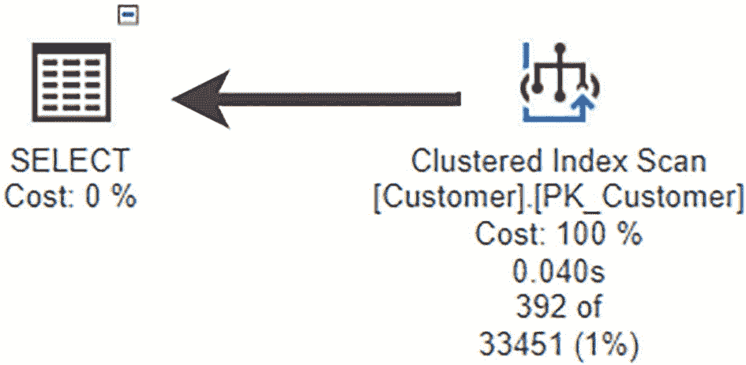
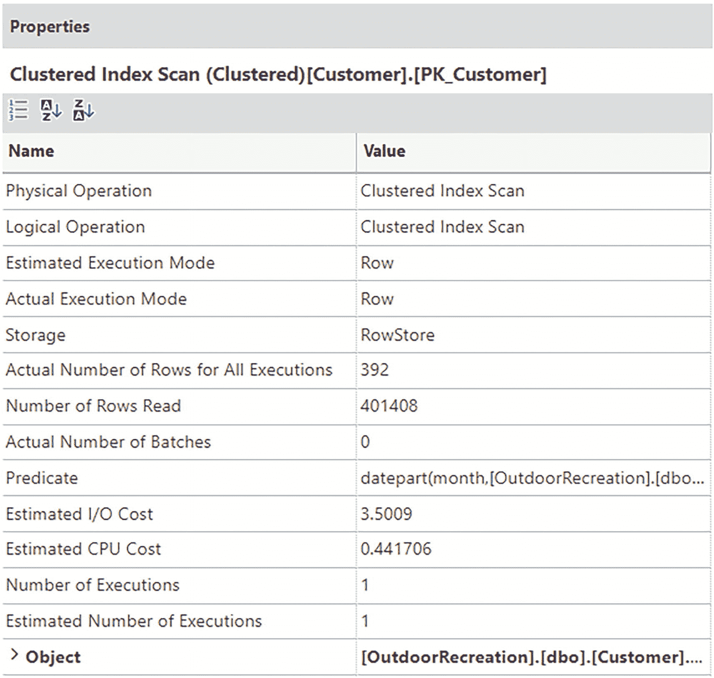
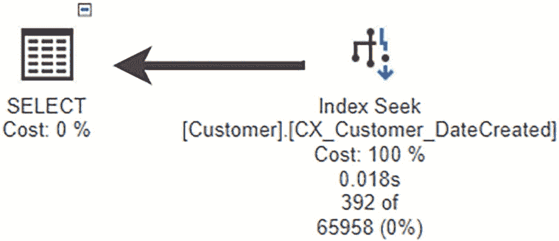
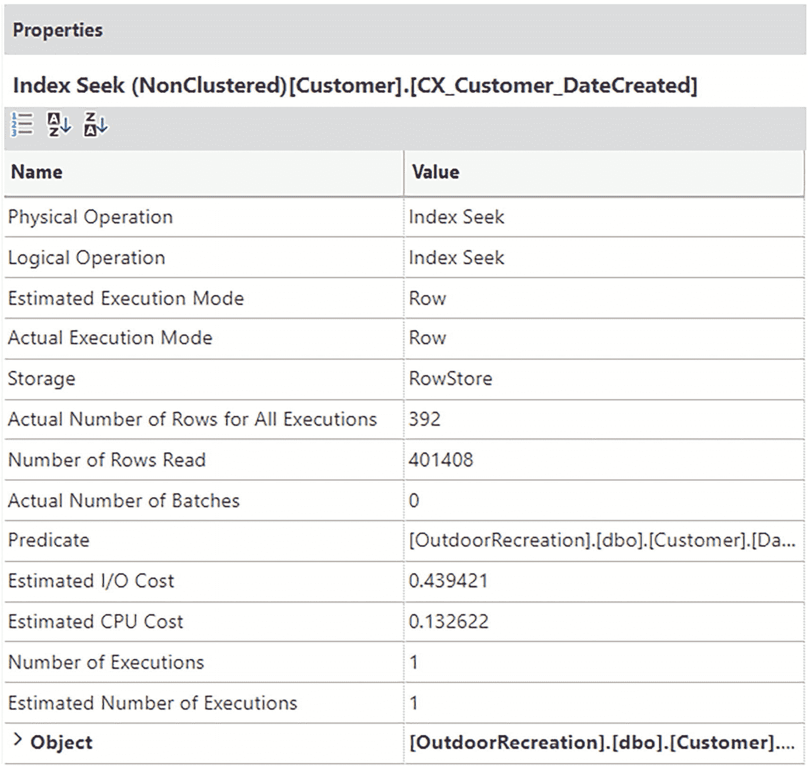

# 9. 编码标准

标准化代码库的优势之一是，无论作者是谁，它都将增强我们阅读和理解该代码的能力。你也可以将标准化理解为让每个人都遵循规则，这不仅体现在格式上，还体现在组织内预期或不允许的代码元素方面。标准化命名数据库对象的另一个好处是，它可以帮助提高你和你的团队快速找到你正尝试调试的特定 T-SQL 代码部分的速度。

在本章中，我将讨论实施编码标准的各种优势。我还将介绍在定义标准时应考虑哪些类型的因素。在制定标准时，你还需要确定如何实施这些编码标准。我将涵盖设立这些标准所需的基本流程。


## 为何要使用编码标准

你可以采取多种不同的方法来提升代码质量。在改进代码质量时，你需要思考最终目标。我希望我的 `T-SQL` 代码能够高效运行、便于快速调试并且易于理解。这通常是通过在设计和编写 `T-SQL` 代码时建立一致性而实现的结果。其中一个选择就是实施编码标准。

通常，有些特定的 `T-SQL` 实践是明确希望大家遵循的。其中一些行为很容易达成共识，并且大多数人默认就在使用。然而，也可能存在其他一些 `T-SQL` 最佳实践，你知道它们在普遍情况下或在你的组织中并不常见。你希望创建一套指导方针，让每个人都能轻松知晓他们应该做什么。

还有一些情况，无论出于何种原因，你都不希望在 `T-SQL` 代码中看到。同样，其中有些主题并不常见，但另一些可能也普遍存在。无论哪种情况，你都需要将这些明确界定为编码标准的一部分。使用编码标准可以最大限度地减少关于哪些类型的 `T-SQL` 代码是被允许的、或者哪些代码优于其他代码的来回争论。

你可以使用编码标准来设定允许和不被允许的边界。我遇到过这样的情况：软件工程师或数据库开发人员希望使用特定的 `T-SQL` 写法，因为它更易于阅读和编写。然而，有时对人类来说很容易理解的 `T-SQL` 代码，在 `SQL Server` 上的性能表现却并不理想。虽然我希望这些同事能随时来找我咨询当前流程相关的问题，但有时我有太多更高优先级的请求，没有时间处理他们的关切。

在缺乏标准导致冲突之前，能就这些指导方针达成一致是件好事。这也应该能提供一些保证，表明每个主题都已讨论过，且多方已达成共识：某些 `T-SQL` 代码在许多场景下表现良好，或者可能具有导致性能问题的高风险。

我知道当我开始工作时，我的一天已经排满了。这不仅来自我知道需要做的事情，也来自最后一刻的请求和零散的问题。实施编码标准的真正目标是让你的生活更轻松。这包括能够安心休息，因为知道你的数据库中运行着高质量的 `T-SQL` 代码。理想情况下，你应该能够将那些时间用于未来的数据库设计改进或消除技术债务。

影响我们生活的另一个因素是决策疲劳。这个概念指的是一个人在一天中不得不做出一个又一个决定，从而感到精疲力竭。随着技术的出现，我们每天都经历着这种疲劳。当涉及到关于 `T-SQL` 编码的决策时，这种决策疲劳可能更加令人不堪重负。在 `SQL Server` 中，有很多方法可以实现相同的功能。实施 `T-SQL` 编码标准的另一个优势是，它可以最大限度地减少数据库开发人员在编写新代码时需要做出的决策。

当你首次实施编码标准时，务必获得所有相关方的认同。在许多情况下，你可能无法达成一致意见。如果可能的话，为你希望纳入编码标准的任何变更争取多数票。另一种方法是，确保在最终标准获得批准和实施之前，每个个体都同意这些标准。

在工作场所中，`T-SQL` 面临的主要挑战之一是，许多负责编写 `T-SQL` 的人并非数据库专家。这可能导致挫败感，也可能导致查询性能不佳。`T-SQL` 最令人喜爱也最难掌握的方面之一，就是编写第一个查询是多么容易。`SQL` 是结构化查询语言的缩写，查询的编写就是如此简单。你几乎可以像读句子一样阅读它们。

然而，这可能给人一种错误的印象，认为 `SQL Server` 在后台处理的事情同样简单。我们大多数人工作在一个高压力、快节奏的环境中。这通常意味着我们没有时间停下来解释我们做出的每一个决定。这可能包括为何不应该使用某些 `T-SQL` 代码。这正是 `T-SQL` 编码标准的优势真正显现的地方。它允许你只进行一次对话来设定基本规则。在这些规则或标准到位之后，只要符合预定义的标准，`T-SQL` 开发人员和工程师就可以用他们想要的任何方式编写代码。

我听过软件开发人员说，在编写应用程序时拥有明确的编码标准会非常有帮助。这让他们能够轻松地跳入任何代码，无论是不是他们写的，并立刻感到适应。这是因为，尽管他们可能知道自己从未看过这套代码，但他们的大脑已经看到了与他们编写过的其他代码的相似之处。它消除了那种“正在看的代码不是自己的”的瞬间反应。好处在于，他们可以立即着手审查代码或进行必要的修改。

既然你已经决定要定义编码标准，下一步就是实施这些编码标准。事情在这里可能会变得棘手。你会很想让每一个经过 `脚本审查` 的 `存储过程` 都遵循这些标准。然而，你将看到的一些代码已经在生产环境中运行了。我发现有些时候，特别是当其他人面临严格的截止日期时，仅仅因为不遵循编码标准就拒绝一个 `存储过程` 会令人特别沮丧。

一个可能的折中方案是给予有条件的批准，并请求创建一个新的 `用户故事`，以便将 `T-SQL` 代码更新以符合新的编码标准。这既让开发者放心，他们可以满足当前 `冲刺阶段` 的截止日期，也让你知道这个 `T-SQL` 代码应该在未来的版本中进行更正以满足编码标准。

处理这些新的 `用户故事` 项的一个简单方法是将它们添加到下一个 `冲刺阶段`。这使得它们可以在你仍记得需要更改什么的时候得到清理。这也确保了执行 `脚本审查` 的其他人知道，让所有 `T-SQL` 代码符合编码标准这项工作对所有相关方都很重要。

## 编码标准应包含什么

理想情况下，制定编码标准将为你提供一个框架，能最大限度地减少你在审查和部署 `T-SQL` 代码时遇到的整体挑战。你希望编码标准涵盖 `T-SQL` 代码应有的外观、应有的功能、应有的性能表现以及应有的可理解性。

编码标准的一些基础知识已经在第 4 章讨论过。这包括通过创建关于如何编写 `T-SQL` 的标准来格式化 `T-SQL` 代码。你还会需要指示如何命名 `T-SQL` 数据库对象的标准。制定关于 `T-SQL` 代码应如何注释的标准也很有用。

### T-SQL 设计

你也可以通过编码标准来定义数据库设计。这可以包括数据库对象（包括架构）应如何组织。编码标准还可以指出数据应如何存储在数据库中。你可以指明哪些类型的列应包含在主键中。同样，也可以指明表应如何进行聚簇，或者何时最好使用聚簇索引或非聚簇索引。


#### ANSI 标准

一个重要的考量是是否保持你的 T-SQL 代码符合 ANSI 标准。虽然 SQL Server 有一些可用的功能，但并非所有这些功能都符合 ANSI 标准。在许多情况下，SQL Server 特定的命令和函数可以使用 ANSI 标准代码重写。确保你以 ANSI 标准编写 T-SQL 代码，可以让你轻松迁移到另一个同样符合 ANSI 标准的关系数据库管理系统。

#### 范式

在涵盖 T-SQL 编码标准时，你可能还想定义设计元素。这包括数据应如何分组存放于表中，以及这些表中应包含哪些信息。存在不同级别的范式，你可以使用 T-SQL 编码标准来指明这些是什么。通常讨论的数据库规范化类型包括第一范式 (1NF)、第二范式 (2NF)、第三范式 (3NF) 和第四范式 (4NF)。

每种范式都建立在前一种之上。最低级别的范式是第一范式。它要求每个表必须有一个主键，并且每个字段或列只包含单个值。

#### 表的大小

创建表时，很容易想将与特定项目相关的所有列都放入同一个表中。这可能导致表拥有非常多列。拥有大量列的表所面临的挑战之一是数据的存储方式。这最终可能导致性能问题。你可以通过分析所存储信息的类型，并创建由信息子组构成的表来设计表，从而避免这类问题。例如，我可能想在同一张表中记录关于产品的所有信息，包括关于制造商、产品详情和销售价格的所有信息。但是，更好的做法是创建一个用于供应商信息的表和一个用于产品信息的表。这符合遵循数据库规范化最佳实践的要求。此外，设计得当的表能使整体数据库设计更能适应应用程序随时间发生的变化。

#### 名称-值对

使用 SQL Server 时，目标是考虑基于集合的操作。记住这一点，你在设计表时需要谨慎。你需要确保尽量减少列数以保持表的宽度较小。你需要考虑哪些类型的列是有价值的。如果你使用一列来定义值类型，另一列来定义实际值，那么你就设计了一个名称-值对关系。

这种设计可能更易于理解并创建更简单的表，但这种设计并未充分利用 SQL Server 的优势。使用名称-值对时，使用索引变得越来越困难。因此，SQL Server 需要查看更多的数据才能提取出所需的值。

#### 主键

在创建和设计表时，考虑将存储什么类型的数据。这不仅与数据的排序方式有关，还与表和其他表的关系有关。在许多情况下，将主键作为编码标准的一部分是理想的。虽然并非所有场景都需要主键，但它应有助于阐明哪些字段用于定义与其他表的关系。

#### 外键

SQL Server 是一个关系数据库管理系统，其主要优势之一是表之间的关系。但是，你需要指定表之间的关系，以便 SQL Server 可以确保在表中保存有效数据。当发生这种情况时，SQL Server 会检查存储值的表与引用表之间的关系。SQL Server 使用外键来实现这一点。因为 SQL Server 知道它可以信任这种关系，所以通常可以更有效地过滤数据并更快地找到数据。因此，指定外键关系作为 T-SQL 编码标准的一部分可能是个好主意。

#### 非聚集索引

我发现非聚集索引是一个比我预期中更具争议性的话题。使用非聚集索引的挑战之一是记录数据作为索引的一部分或在值更改时更新索引存在相关成本。然而，SQL Server 使用索引来快速查找各种查询引用的数据。确保使用非聚集索引的好处大于成本。

你可以通过确保正确定义索引来实现这一点。由于维护索引有成本，你需要确保你创建的任何索引都被现有查询定期使用。你可能还想定义如何确定哪些列应作为索引的一部分，以及哪些列应作为索引的一部分被取回。

#### 约束定义

你的表可以有一个或多个列。每个列都保存某种类型的信息。对于这些信息，你可能知道只有某些值可以存储在该列中。在某些情况下，使用外键可以保持数据完整性，但在其他时候使用外键可能没有意义。在这些情况下，你可以对记录指定约束。约束可以限制可以存储在这些列中的信息类型。

然而，强制 SQL Server 管理这些约束会给 SQL Server 带来额外负担。因此，你可能需要考虑尽量减少约束的使用来限制可存储在数据库中的数据类型，并依赖应用程序代码来提供良好的数据。约束的另一个用途是为某些字段指定默认值。这适用于那些你知道在创建记录时最可能存在的值的列。例如，你可能希望为 `IsActive` 列指定默认值 True，因为大多数创建的记录在创建时都是活动的。同样，这可以由应用程序处理，但你也可以决定将其作为 T-SQL 编码标准的一部分来强制执行。

考虑鼓励良好设计实践的 T-SQL 编码标准非常重要。这包括确定你将多大程度上遵循 ANSI 标准。还有其他主题需要包括，例如在数据库设计中选择允许的最低范式级别。这个决策可能会影响 T-SQL 设计的其他方面，包括主键、外键和非聚集索引。你可能还需要考虑如何处理约束。一旦确定了要强制执行的良好 T-SQL 设计实践相关的 T-SQL 编码标准，你可能需要决定关于 T-SQL 整体性能方面需要哪些编码标准。

### T-SQL 性能

在确定了与数据库设计和实现相关的 T-SQL 编码标准后，你需要确定需要哪些标准来帮助最小化和解决可能出现的任何性能问题。这包括创建 T-SQL 编码标准，以帮助确保 SQL Server 不会被不必要的信息拖累。你还需要考虑如何编写 T-SQL 代码以最小化性能开销。


#### 选择必要数据

SQL Server 可以存储大量数据，也能检索海量数据。在许多应用场景中，应用程序都需要进行数据检索。初次学习数据库及其关联表时，我们往往很容易会选择查询表中的所有列。尽管这是返回数据最简单的方法，但通常并非最佳选择。

首先是使用星号（`*`）来选择所有行的语法。这种方法的问题在于，如果底层对象的列发生变化，代码可能无法按预期工作。更糟糕的是，代码可能不会报错，用户也就无从知晓他们正在获取错误的数据。

第二个更常见的问题是：当你取回所有列时，会给 SQL Server 带来相当大的额外负担。SQL Server 不仅需要返回所有行的所有数据，而且很可能无法利用任何索引来返回这些数据。这就好比每次你想学习某个特定章节时，却要通读整本书。你确实能学到你需要的内容，但也花费了大量时间去阅读那些与你当前需求无关、很可能会被忽略的内容。

#### 可搜索性

我们希望 SQL Server 能够轻松地搜索数据库以找到你需要访问的信息。你可以通过一些方式来编写 `T-SQL`，从而让 `SQL Server` 能够利用索引快速找到必要的数据。然而，也存在其他编写 `T-SQL` 的方法，它们能产生相同的结果，但可能耗时更长，并且需要 `SQL Server` 扫描更多的数据。这两种场景的区别在于，第一种场景确保你的 `T-SQL` 是“可搜索的”，而第二种场景则是“不可搜索的”。这种情况通常发生在 `T-SQL` 语句的 `WHERE` 子句中。清单 [9-1] 展示了一个查询，用于查找所有在 2022 年 10 月创建的客户。

```sql
SELECT FirstName, LastName, Country
FROM dbo.Customer
WHERE DATEPART(MM, DateCreated) = 10
AND DATEPART(YY, DateCreated) = 2022;
```

清单 9-1
使用非可搜索条件的查询

你可以看到，在 `DateCreated` 列上使用了 `DATEPART` 函数来确定每条记录创建的月份和年份。为了让 `SQL Server` 确定哪些记录是在 2022 年 10 月创建的，它需要检查表中的每一条记录。你可以从图 [9-1] 的执行计划中的索引扫描操作看到确实如此。



图 9-1
来自非可搜索条件的执行计划

当执行计划如此简单时，有时很难判断这些查询的实际性能如何。一个更好的方法是查看与此执行计划关联的属性。图 [9-2] 中包含大量信息，但让我们重点关注 `Number of Rows Read`（读取行数）。



图 9-2
来自非可搜索条件的索引扫描的属性

清单 [9-1] 中索引扫描读取的行数是 401,408。为了更好地判断此查询性能是否良好，让我们编写一个使用可搜索值的查询。在清单 [9-2] 中，代码仍然是查询 `dbo.Customer` 表中 2022 年 10 月创建的记录，但现在它使用大于等于和小于运算符来指定一个确切的日期范围。

```sql
DECLARE @StartDate DATETIME2(2) = '2022-09-01';
DECLARE @EndDate DATETIME2(6) = DATEADD(mm, 1, @StartDate)
SELECT FirstName, LastName, Country, DateCreated
FROM dbo.Customer
WHERE DateCreated >= @StartDate
AND DateCreated < @EndDate;
```

清单 9-2
使用可搜索条件的查询

虽然这样写可能看起来不那么简洁或更难阅读，但其重要性在于，我们编写了一个 `SQL Server` 可以快速确定哪些记录符合查询条件的查询。图 [9-3] 展示了清单 [9-2] 查询的执行计划。



图 9-3
来自可搜索条件的执行计划


乍看之下，图 9-3 中的执行计划与图 9-1 中的执行计划非常相似。在比较外观相似的执行计划时，可以说它们具有相同的“形状”。虽然这些执行计划形状相似，但构成执行计划的项目是不同的。在图 9-1 中，有一个`index scan`（索引扫描）。在图 9-3 中，你可以看到这个执行计划使用的是`index seek`（索引查找）。此外，图 9-3 中`SELECT`的`index seek`之间的连线，也比图 9-1 中`SELECT`的`index scan`之间的连线更细。所有这些都是每个查询整体性能的图形化表示。不过，你也可以获取一些事实和数据来与清单 9-1 和 9-2 中的查询性能进行比较。在图 9-2 中，实际读取的行数是 32,242。让我们将这个值与图 9-4 中实际读取的行数进行比较。



一张截图展示了聚集`index scan`的属性。物理和逻辑操作的值为`index seek`。执行模式和实际执行模式的值为`Row`。读取的行数为 401408。

图 9-4
基于可搜索条件的`index seek`属性

清单 9-2 的实际读取行数为 1，如图 9-4 所示。将清单 9-2 读取的 392 行与清单 9-1 读取的 401,408 行进行比较，可以非常清楚地看出哪个查询更高效。

你也可以查看两个查询的总`CPU`使用率，以了解每个查询的表现。如果你同时运行清单 9-1 和 9-2 中的查询，两个查询总执行计划的 98%都消耗在清单 9-1 的查询上。你还可以使用`SET STATISTICS TIME ON`来查找`CPU`时间和已用时间。`CPU`时间是查询执行在`CPU`或多个`CPU`上花费的总时间。已用时间是查询执行的总时间。我运行这两个查询多次，发现清单 9-1 的平均`CPU`时间为 15 毫秒，平均已用时间为 17 毫秒。而每次清单 9-2 的`CPU`时间和已用时间都是 0 毫秒。比较两者的`CPU`时间和已用时间，你可以清楚地看到清单 9-2 的表现优于清单 9-1。清单 9-1 使用`index scan`读取数据，而清单 9-2 使用`index seek`访问数据。这种`index seek`使`SQL Server`能够显著降低估计的`I/O`成本以及估计的`CPU`成本。同样重要的是要注意，如果存在多个`CPU`，总已用时间可能少于总`CPU`时间。

#### 隐式转换

`SQL Server`中的数据都有数据类型。这些数据类型在第 2 章中讨论过。在使用这些数据类型时，确保保持数据类型一致性非常重要。否则，`SQL Server`必须进行隐式转换。这是指`SQL Server`在后台将一种数据类型转换为另一种数据类型。这可能会给`SQL Server`带来额外的负载。此外，还存在隐式转换失败的风险。我最常见到这种情况发生在一种标识类型列主要存储整数值，但偶尔也存储字符串值时。

#### SET NOCOUNT ON

你可以对`T-SQL`进行许多小调整，以实现一些微小的性能改进。当你运行`T-SQL`代码时，默认情况下，它会计算受影响的行数并可能报告回来。计算这些记录的成本可能是额外的几毫秒。因此，对编码标准的一个可能改进是关闭此功能，特别是在涉及存储过程时。实现这一点的方法是确保在存储过程内部包含`SET NOCOUNT ON`。你可以在清单 9-3 中看到这一点。

```sql
/*-------------------------------------------------------------*\
Name:             dbo.GetCustomer
Author:           Elizabeth Noble
Created Date:     2022-10-30
Description:      获取数据库中所有客户的列表
Sample Usage:
EXECUTE dbo.GetCustomer;
\*-------------------------------------------------------------*/
CREATE PROCEDURE dbo.GetCustomer
AS
SET NOCOUNT ON;
SELECT
CustomerID,
FirstName,
LastName,
Address,
City,
PostalCode,
Country,
IsActive,
DateCreated,
DateModified,
DateDisabled
FROM dbo.Customer;
```
清单 9-3
使用 `SET NOCOUNT ON` 的存储过程

当在执行查询代码之前包含了`SET NOCOUNT ON`时，存储过程的执行时间可以减少几毫秒。

#### NULL 值

大多数`T-SQL`编码标准的存在是为了帮助提高`SQL Server`的整体性能。然而，有些`T-SQL`编码标准的存在是为了帮助改进查询结果，或者让人们更容易编写出按预期工作的代码。`NULL`的问题之一在于它的工作方式并不直观。在`SQL Server`中，`NULL`被视为一个未知值。这意味着`NULL`既不为真，也不为假。因此，对于可能包含`NULL`值的字段，处理这些字段的方式是不同的。

此外，`NULL`值可能表明表设计得不够高效。在最终陷入这种情况之前，考虑表应该如何设计可能是有益的。你需要确保表确实需要包含可为空的列。这也与数据的存储方式以及索引的创建方式有关。你需要考虑这些数据将如何被使用。


##### NOLOCK

最佳实践也应成为你编码标准的一部分。一些非常常见的最佳实践涉及高度争议的话题，例如在查询中何时或是否使用 `NOLOCK` 提示。我特别提到这一点的原因之一是，至少存在两大阵营围绕着 `NOLOCK`。一方面，许多数据库管理员将不使用 `NOLOCK` 视为最佳实践。另一方面，许多开发者则认为使用 `NOLOCK` 是最佳实践。这种视角差异源于数据准确性和性能之间的权衡。

`NOLOCK` 背后的理念是通过减少锁的数量来提高查询性能。就 `NOLOCK` 而言，减少的锁活动是在 `SELECT` 语句上。诸如 `INSERT`、`UPDATE` 和 `DELETE` 之类的操作不受 `NOLOCK` 影响。但是，当数据修改操作持有 `SELECT` 语句试图访问的同一张表的锁时，在 `SELECT` 语句上使用 `NOLOCK` 可以更快地返回结果。

通过查看一个例子，你可以了解这些观点为何是正确的。清单 9-4 展示了一个在显式事务中向 `dbo.Customer` 表插入记录的查询。

```sql
BEGIN TRAN
INSERT INTO dbo.Customer
(
FirstName,
LastName,
Address,
City,
PostalCode,
Country
)
VALUES
(
'Stacy',
'Parks',
'123 Rua de Santa Catarina',
'Porto',
'1234-567',
'Portugal'
);
```
清单 9-4
向 dbo.Customer 插入记录

在清单 9-4 中，已使用 `BEGIN TRAN` 启动了一个显式事务，但未指定 `COMMIT` 或 `ROLLBACK`。这将使事务保持打开状态，并对 `dbo.Customer` 持有锁。为了模拟应用程序性能，让我们打开一个单独的查询窗口并运行一个查询，以查找在此表中创建于 2022 年 10 月 1 日之后的所有记录。你可以在清单 9-5 中看到此查询的示例。

```sql
SELECT FirstName, LastName, Country
FROM dbo.Customer
WHERE DateCreated > '2022-10-01';
```
清单 9-5
查询最近的客户

由于清单 9-4 中的查询对 `dbo.Customer` 持有锁，该查询似乎持续运行。清单 9-5 中的查询正在等待锁被释放，然后才能返回任何数据。为了更快地获得结果，你可以更改 SQL Server 处理表上锁的方式。在清单 9-6 中，你修改了清单 9-5 中的查询，并包含了一个查询提示 `WITH (NOLOCK)`。

```sql
SELECT FirstName, LastName, Country
FROM dbo.Customer WITH (NOLOCK)
WHERE DateCreated > '2022-10-01';
```
清单 9-6
使用 NOLOCK 提示查询最近的客户

当你在单独的查询窗口中运行清单 9-6 中的查询时，你几乎会立即得到结果。你可以在表 9-1 中看到这些结果的示例。

表 9-1

在 2022 年 10 月 1 日之后创建的客户

| FirstName | LastName | Country |
| --- | --- | --- |
| Myra | Acharya | India |
| Stacy | Parks | Portugal |

查看前面的结果，你可以看到清单 9-4 中插入的记录包含在结果中。但是，此记录尚未提交到 SQL Server。你可以回滚清单 9-4 中的事务并撤销插入。这将导致表 9-1 的结果不准确。查询返回未完全提交到数据库的结果，这种差异被称为**脏读** (`dirty read`)。这是在查询中使用 `NOLOCK` 时的最大风险。在决定应在 T-SQL 代码中使用 `NOLOCK` 之前，请确保业务方（包括你的最终用户）了解使用此提示的潜在风险。

##### RECOMPILE

除了 `NOLOCK`，另一个经常被考虑的查询提示是 `RECOMPILE`。你可能会发现自己正处理一个受参数嗅探 (`parameter sniffing`) 影响的查询，如第 5 章所述。这意味着查询创建的执行计划可能对某些值表现良好，但当使用其他参数值时，性能会显著下降。可以轻松快速实施的解决方法之一是查询提示 `RECOMPILE`。在清单 9-7 中，你可以看到在创建存储过程时为允许存储过程在执行时重新编译所需的额外行。

```sql
/*-------------------------------------------------------------*\
Name:             dbo.GetCustomerAndOrderNumberByProductID
Author:           Elizabeth Noble
Created Date:     2022-10-30
Description:      Get customer and products ordered for an order number
Sample Usage:
EXECUTE dbo.GetRecipeAndIngredientByMealTypeID 1;
\*-------------------------------------------------------------*/
CREATE PROCEDURE dbo.GetCustomerAndOrderNumberByProductID
@ProductID     INT
WITH RECOMPILE
AS
SELECT
cus.FirstName,
cus.LastName,
ord.OrderNumber,
ord.OrderDate,
prd.ProductName,
SUM(dtl.QuantitySold),
dtl.ProductPrice
FROM dbo.Customer cus
INNER JOIN dbo.CustomerOrder ord
ON cus.CustomerID = ord.CustomerID
INNER JOIN dbo.OrderDetail dtl
ON ord.CustomerOrderID = dtl.CustomerOrderID
INNER JOIN dbo.Product prd
ON prd.ProductID = dtl.ProductID
WHERE prd.ProductID = @ProductID
ORDER BY cus.FirstName, cus.LastName;
```
清单 9-7
向存储过程添加 WITH RECOMPILE

虽然这是一个快速修复方法，但它会增加服务器上的 CPU 负载。我建议如果可能的话，尝试重新设计查询。如果不行，你可能需要更改存储过程，使其仅针对落在多数情况之外的值进行重新编译。这是为了最大限度地减少每次运行存储过程时创建新执行计划所需的资源。如果重新编译仅限于较小的数据集，那么存储过程将不需要如此频繁地生成执行计划。

对于你的 T-SQL 编码标准，重要的是包含与编写高性能 T-SQL 相关的指导原则。你还需要包含一些规则，规定允许或不允许采取哪些操作来尝试修复性能不佳的 T-SQL。你的 T-SQL 编码标准的最后部分是一个包罗万象的部分，通常与安全性、未来适用性和可维护性有关。

### T-SQL 可用性

拥有鼓励良好数据库设计并解决性能问题的 T-SQL 编码标准是一个好的开始。然而，你还需要一些编码标准来帮助处理 T-SQL 的其他方面。其中一些包括针对潜在安全问题的 T-SQL 编码标准。你还可以实施其他编码标准，这些标准是最佳实践，但可能不影响性能。它们可能是为了帮助即使底层数据结构发生变化也能保持你的 T-SQL 功能正常，或者为了鼓励使用有助于使你的 T-SQL 代码更易于阅读或理解的 T-SQL 命令。

#### 链接服务器

链接服务器是那些可能作为编码标准一部分而被忽视的事情之一。你似乎不太可能需要使用链接服务器，但链接服务器往往在你最意想不到的时候显得必要。这就是为什么将有关如何处理链接服务器的规范作为 T-SQL 编码标准的一部分包含在内是一个好主意。由于使用链接服务器存在普遍的安全风险，建议除非必要，否则不要使用链接服务器。我建议明确定义什么被认为是必要的。这将有助于减少争议，万一你发现自己想要实现链接服务器的话。


#### 列定义

编写 T-SQL 的关键因素之一是明确指出您正在使用或影响哪些列。虽然这与确保只与所需数据交互相关，但要求 T-SQL 代码显式声明列名还有其他好处。在向 SQL Server 插入数据时，可以不声明所使用的列名或顺序。如果您正在向表中的每一列插入数据，并且插入数据的顺序与表中的列顺序相同，那么不会有任何问题。但是，如果将来从表中添加或删除列，或者更改了列顺序，这可能会导致存储过程或其他 T-SQL 代码停止工作。因此，一个好的习惯是在所有 T-SQL 语句中显式声明列名。对于这些示例，这特别包括 `SELECT` 和 `INSERT` 语句。

#### BETWEEN

在编写 T-SQL 代码时，有时会有多种选择，而且这些选项的性能似乎都差不多。当您试图获取涵盖连续范围的数据子集时，就可能发生这种情况。在这种情况下定义 T-SQL 编码标准不一定与提高 SQL Server 的性能相关。它更多地与提高 T-SQL 代码的一致性有关。清单 9-8 展示了一个如何使用 `BETWEEN` 编写 T-SQL 的示例。

```
SELECT FirstName, LastName, Country
FROM dbo.Customer
WHERE CustomerID BETWEEN 100 AND 20000;
Listing 9-8
Query with BETWEEN
```

在可读性方面，您可能会决定所有涵盖包含值的范围都应该使用 `BETWEEN` 来编写。这可能比使用大于等于 (`>=`) 和小于等于 (`<=`) 来获取相同范围更可取。

#### 存储过程参数

虽然提高代码可读性很重要，但在处理性能问题时，提高 T-SQL 的可读性有时可能会使调试代码变得更加困难。这种情况的发生取决于您如何配置存储过程参数。您可以选择单独定义每个参数，也可以创建一个用户定义的表来传递大量变量。如果您选择使用用户定义的表，您的 T-SQL 代码可能更简洁，但未来调试性能问题可能需要更多时间。此外，您的存储过程的工作方式会有所不同，因为您是在使用表变量，而不是单独处理每个数据字段。

#### UNION

有时您会希望合并来自两个不同查询的数据。这种组合涉及将一个数据集附加到另一个数据集。当这两个数据集具有相同数量的列且数据类型相同时，就可以使用 `UNION` 语句来组合这些数据。使用 `UNION` 的优势在于查询具有可读性，通过阅读 T-SQL 代码可以很容易地看出发生了什么。使用 `UNION` 的挑战在于，`UNION` 的性能可能比每个单独查询的性能更差。除了 `UNION`，还有 `UNION ALL` 功能。`UNION` 和 `UNION ALL` 之间的主要区别在于数据的返回方式。在 `UNION` 语句中，返回的是一个不重复的记录集，而在 `UNION ALL` 语句中，每个单独查询的实际记录数都包含在结果集中。在设计编码标准时，您需要决定是否允许使用 `UNION` 和 `UNION ALL` 语句。您可能还想决定在特定场景下是否允许使用它们。

#### CAST 或 CONVERT

在编写代码时，您可能会发现自己处于希望将数据类型从一种值更改为另一种的情况。在对整数值执行数学函数时，更改数据类型可能很重要。由于 SQL Server 执行数学运算的方式，如果您将一个整数除以另一个整数，得到的答案将是整数。如果您希望 SQL Server 提供小数作为结果，则需要将数据类型从整数更改为小数。类似地，您可能希望在 SQL Server 查询中显示一串文本。或者，如果您在连接字符串时包含一个整数，当 SQL Server 尝试执行查询时，您会收到错误。但是，如果您将整数更改为 `varchar` 数据类型，就可以正确解析字符串。

例如，您可以指定所有代码在可能的情况下都应使用 ANSI SQL 标准。如果实施此策略，开发人员将必须对所有代码使用 `CAST`，除非他们需要格式化日期。然后开发人员才能使用 `CONVERT`。或者，您可以规定所有日期格式化都必须在应用程序中处理。因此，`CONVERT` 将永远不被允许作为编码标准的一部分。

#### 游标

在数据库领域，游标是一个有争议的话题。在第 6 章中，我介绍了基于集合的操作，这是 SQL Server 表现最好的地方。游标的问题在于它们没有利用这些基于集合的操作。这在处理数据时可能会造成相当大的开销。加剧游标挑战的是，它们的编写方式更类似于应用程序代码的编写方式，而不是 T-SQL。这可能使得使用游标非常诱人，因为它可能更容易理解如何编写代码以获得所需的结果。与制定 T-SQL 编码标准时的其他因素一样，您可能无法完全排除游标。如果是这样，请尝试创建一些标准，规定您认为游标会有益的情况，并将游标使用仅限于这些情况。

#### ORDER BY

通常很希望让 SQL Server 获取应用程序所需的全部数据。虽然 SQL Server 可以做到这一点，但您需要考虑让 SQL Server 完成您所请求的所有工作是否值得付出成本。当您希望数据为应用程序排序时，就可能出现这种情况。SQL Server 可以使用 `ORDER BY` 语句对数据进行排序，但让应用程序对这些数据进行排序可能是资源利用的更好方式。如果您决定这是处理数据排序的方式，那么在 T-SQL 编码标准中包含不应在 SQL Server 中对数据进行排序的建议可能是个好主意。如果您知道在某些特定情况下这是不可避免的，您可以在编码标准中明确规定在哪些场景下允许在 T-SQL 代码中使用 `ORDER BY`。

#### CASE 语句

T-SQL 代码可以非常灵活。虽然您可能选择将 T-SQL 代码仅限于应用程序功能，但数据库代码也用于其他目的，例如报告。在许多应用程序中，您可能同时处理事务并允许用户搜索和筛选数据。此类活动可以是报告活动。通常，用户不希望看到数据以与存储方式相同的形式呈现。例如，您可能有一个包含状态类型的表。一个给定的记录可能在一段时间内有几种状态。但是，用户可能希望看到一行中包含该特定记录的所有状态。这就是您需要使用 `CASE` 语句的地方，以便可以将多行转换为多个列。执行此类活动并非纯粹是 T-SQL 的事务性使用，您可能希望将此类行为作为编码标准的一部分加以限制。


##### TRY…CATCH

在 T-SQL 代码中加入错误处理是有益的，并且可能被您所在的工作场所视为最佳实践。您会希望应用程序能够妥善处理执行失败的存储过程。一种情况是存储过程不幸成为死锁的牺牲品。`TRY…CATCH` 块可以使涉及死锁的存储过程能够重新运行或优雅地退出。请参见清单 9-9。

```sql
DECLARE @FirstName      VARCHAR(40) = 'Stacy';
DECLARE @LastName       VARCHAR(100) = 'Parks';
DECLARE @Address        VARCHAR(100) = '123 Rua de Santa Catarina';
DECLARE @City           VARCHAR(100) = 'Porto';
DECLARE @PostalCode     VARCHAR(20) = '1234-567';
DECLARE @County         VARCHAR(75) = 'Portugal';
BEGIN TRY
BEGIN TRAN
INSERT INTO dbo.Customer
(
FirstName,
LastName,
Address,
City,
PostalCode,
Country
)
VALUES
(
@FirstName,
@LastName,
@Address,
@City,
@PostalCode,
@County
);
COMMIT TRANSACTION
END TRY
BEGIN CATCH
PRINT 'Insert Failed';
ROLLBACK TRANSACTION
END CATCH
Listing 9-9
Query Using TRY…CATCH
```

一旦确定了要在 T-SQL 编码标准中包含的内容，下一步就是获得也将编写 T-SQL 的同事或其他部门的认可。让每个人都同意一套标准可以解决许多问题。首先，它有助于新员工入职。当他们审查代码时，会看到一致的代码风格。这将使他们能够专注于 T-SQL 的功能，而不是试图解读 T-SQL 代码的编写方式。

如果您创建了一个详尽且定义明确的编码标准，那么当出现不被认为是最佳实践的 T-SQL 时，在脚本评审过程中应该会减少来回讨论。有了 T-SQL 编码标准，各方都知道什么是允许的，什么是不受欢迎或不好的做法。新员工也会知道什么是可接受的 T-SQL。每个人都可以被要求遵守相同的标准，并且它允许其他人看到编写 T-SQL 的规则是公平的。

