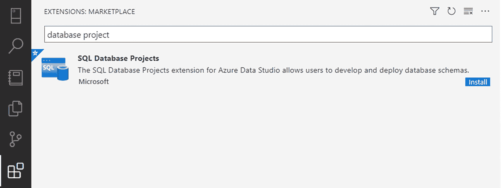

# 10. 源代码控制

编写可管理的 T-SQL 代码是一个有价值的目标，它建立在可理解和可维护代码的坚实基础之上。第 4 章讨论了如何标准化您的 T-SQL 代码。这在第 10 章继续，即实施 SQL 编码标准。这个基础的目的是为您的数据库创建一致的代码库。虽然开发一致的代码库有助于提高代码质量，但如果您无法维护您的 T-SQL 代码，这种效果就会减弱。

开发可管理的 T-SQL 代码涵盖编写数据库代码的许多不同方面。前一章重点介绍了编码标准，以此作为指导您和其他人编写性能良好的 T-SQL 代码的方法。拥有性能良好且易于阅读的数据库代码可以帮助您的应用程序和开发过程。这条道路上的下一步是考虑如何存储您的代码。

一个选择是使用源代码控制来保存与创建各种数据库对象相关的 T-SQL 代码。为什么源代码控制很重要，它能为改进 T-SQL 代码开发做些什么？知道您想实施源代码控制与定义管理源代码控制的过程是不同的。设置关于如何处理源代码控制的指导方针，使您处于一个良好的位置来开始在源代码控制中创建您的第一个数据库项目。

## 使用源代码控制的理由

如果没有管理代码的方法，您最终可能会花费数小时审查脚本并为软件发布做准备。这种手动工作包括为脚本审查定位文件、手动比较生产环境和手动脚本之间的代码、确定在部署中包含哪些脚本，或在部署过程中手动运行每个脚本。这就是您可以从拥有可维护代码中受益的地方。这包括确保您可以找到任何数据库对象的 T-SQL 代码。您还希望知道您正在修改的是正确版本的代码。当错误版本的 T-SQL 代码被修改和部署时，可能会发生严重问题。它还将帮助您知道在任何时间点需要部署什么版本的代码。由于这些原因，数据库代码可以从纳入源代码控制中受益。

将 T-SQL 代码集中存放以便轻松访问可能是一个挑战。源代码控制可以帮助将所有 T-SQL 代码集中并有组织地存放在一起。源代码控制不再仅仅是应用程序开发所独有的。源代码控制允许您组织代码，并且它可以用来帮助围绕数据库开发创建结构。通过使用第三方工具作为提交、构建和部署过程的一部分，使用源代码控制可以更轻松地管理标准化您的 T-SQL 和实施编码标准。当您对数据库代码进行更改时，您可以选择在本地进行这些更改。如果您选择使用 SQL Server Data Tools (SSDT) 并将所有数据库代码保存在同一项目中，您可以一起构建所有数据库，以确认任何数据库依赖关系是否按预期工作。`SSDT` 允许您在有或没有源代码控制的情况下管理数据库代码。这比手动将代码部署到 `SQL Server` 具有优势。作为构建过程的一部分，数据库项目将验证视图、函数、存储过程或其他 T-SQL 代码中的字段是否存在于数据库中。

编写 T-SQL 代码时还可能出现其他问题。您可能会遇到多人或团队需要更改相同数据库对象的情况。根据公司处理代码部署的方式，您最终可能会得到一些具有多层更改的数据库对象。源代码控制可以帮助管理这些更改并确保它们得到正确实施。此外，定义管理代码的流程可以帮助每个人为其需求使用正确的数据库代码版本。

如果您将所有数据库保存在同一解决方案中，可以在存在依赖关系时在数据库之间添加引用。如果从一个数据库的表中删除列，另一个数据库中依赖此列的存储过程将构建失败。构建失败会标识受影响的存储过程以及缺失的列引用。当您添加列或更改列名时，这可能特别有用。有时您可能想要重构表或其他数据库对象。如果您的应用程序和数据库保存在同一解决方案中，您将可以选择自动重构代码。

对 T-SQL 代码的一些更改可能很复杂且涉及广泛。其他时候，您可能正在处理对运行公司至关重要的数据库对象或代码。要开始修改代码，您需要确保使用的是最新版本的代码。在实施源代码控制之前，我有一个非常手动的代码审查过程，非常耗时。由于实施了源代码控制，审查数据库代码的速度可以大大提高。使用源代码控制可以让您确保一致地实施更改。

你可能需要一个能够修改代码、测试代码并重复此过程直到获得期望输出的环境。源代码控制可以将最近保存的 `T-SQL` 代码拉取到你的本地机器。然后你可以在本地桌面上对 `T-SQL` 代码进行修改。当你准备好保存工作时，可以将这些更改保存在本地。这样你就可以独立于其他开发者工作。当你确认更改无误后，可以将你的 `T-SQL` 代码保存到中央位置。这个集中的仓库就成为你所有数据库更改的来源。

使用源代码控制的另一个好处是，它能加速识别哪些 `T-SQL` 代码发生了变化。在使用源代码控制之前，我不得不手动审查整个数据库对象以确认变更内容。我发现的最佳流程是目视比较当前的生产环境存储过程与新版本的存储过程。虽然这种方法有一定效果，但我仍可能轻易忽略某些内容。

将数据库纳入源代码控制后，我可以轻松查看脚本审查中所有发生变化的代码。这使我能够快速浏览所有变更的 `T-SQL` 代码。我还可以使用源代码控制轻松地将 `T-SQL` 代码与之前的版本进行比较。在比较过程中，被修改的代码部分会被高亮显示。更有帮助的是，新增、修改或删除的代码会以两种不同的颜色高亮显示。

能够访问你的 `T-SQL` 代码，可以更轻松、更快速地为软件发布准备脚本。源代码控制还有助于防止未经批准的 `T-SQL` 代码被错误部署。如果没有用于 `T-SQL` 的源代码控制，准备部署工作可能会很麻烦。

你需要能够访问不同数据库和软件版本的脚本，同时还要跟踪随时间发生的变化。业务方可能决定回退到代码的某个先前版本。当该代码保存在源代码控制中时，更容易搜索特定数据库对象的各个版本并找到变更历史。借助源代码控制，我可以通过查找变更实施的时间来节省时间。如果你实施了自动化部署（如第 13 章所讨论的），你可能有更快捷的方法来回退到代码的先前版本。

你可以将源代码控制与第 12 章讨论的测试策略以及自动化软件发布相结合。这将使你能够最大限度地减少代码审查所需的人工工作，这可能有助于改善 IT 部门之间的业务关系。使用类似管理数据库代码的流程与应用程序开发流程，可以有助于提高源代码控制的采用率。当 `T-SQL` 代码存储在源代码控制中时，就为指向第三方工具打开了可能性。这些工具可以分析整个 `T-SQL` 代码库，并帮助自动化任务，例如自动拒绝或修正格式问题。

> **提示**
>
> 自动化代码格式化的一种方法是结合 `Git` 使用 `precommit hooks`。

源代码控制的另一个优势是，它为你多提供了一个工具，在灾难恢复情况下提供帮助。如果你丢失了所有硬件和备份，需要多长时间才能让业务重新运转？虽然你可能知道备份需要定期测试，但你可能最近没有机会进行测试。根据贵公司制定灾难恢复计划的方式以及灾难发生时的情况，这可能意味着你将无法访问当前的生产服务器及其所有相关数据。如果发生这种不太可能的情况，你可能会发现自己需要思考如何让应用程序重新运行起来。作为最后的手段，如果你的数据库与基础表中必要的数据都存放在源代码控制中，那么你就有机会让公司的系统重新启动并运行。

## 如何使用源代码控制

我初次实施源代码控制时发现，真正实施前需要内部进行大量讨论。我发现数据库团队、开发团队和 QA 团队需要就未来如何管理代码达成一致。了解每个团队的目标和需求非常理想，这样才能设计出有效的流程来管理数据库代码。每个团队可能希望以不同方式管理各自的代码库。需要涵盖的一些要点包括：

*   何时使用本地仓库与中央仓库的准则
*   如何将更改保存到源代码控制
*   如何解决已部署的错误
*   数据库代码中应包含哪些内容

源代码控制允许你在本地机器上处理代码。你可以创建或更改数据库对象，并在本地生成代码时，这为检查数据库项目能否成功构建提供了额外的确认。成功的构建表明已针对数据库运行了多项检查，以确认对象可以成功创建。一旦你测试并确认了你的数据库代码，就可以将其签入到中央位置。该位置可以是你本地设置的服务器，也可以是云端的服务器，例如 `GitHub` 的情况。这个中央仓库可以接收来自你以及团队中任何其他获准修改此数据库项目的成员的代码更改。此外，仓库可以让开发者或开发团队独立于彼此处理代码。

将对 `T-SQL` 代码的更改保存到本地通常称为 `提交`。在提交代码时，你可以为提交添加注释。你还可以实施关于如何编写提交消息的标准。一个例子是在提交消息前加上工单或用户故事编号。一旦中央仓库建立，各个用户就可以复制中央代码。此副本通常存储在开发人员的本地机器上，称为 `分支`。这个名称源于被称为 `主干` 的中央代码。在现代术语中，这被称为 `主分支`。在准备软件发布的分支时，添加对所处理问题的引用可能会有所帮助。`Git` 和 `GitHub` 允许你在更改永久提交到仓库之前保存更改。`暂存更改` 是指你保存不立即提交到仓库的更改时使用的术语。可以通过 `Azure Data Studio` 或命令行为提交暂存更改。

随着越来越多的公司希望结合使用敏捷、看板、Scrum、持续集成或持续交付，拥有一个更灵活的源代码控制解决方案变得越来越重要。该解决方案需要允许多个团队同时处理相同的代码库，而不会对软件发布产生负面影响。这正是 `Git` 流行的起源。

如果你使用 `SQL Server Data Tools` 和 `Visual Studio`，每个代码仓库将包含至少一个数据库解决方案。在数据库解决方案中，每个数据库将有一个单独的数据库项目。你可以选择每个数据库项目是否拥有自己的解决方案，或者所有项目是否共享同一个解决方案。`Azure Data Studio` 或 `Visual Studio Code` 有一个用于数据库项目的扩展。这些数据库项目存在于工作区内，类似于解决方案。工作区提供了一种访问给定文件夹内数据库项目的方法。将所有应用程序和数据库放在同一个解决方案中是可能的，但这超出了本书的范围。这些决策不仅基于偏好和所需功能。正如你将在第 13 章看到的，你如何组织仓库也将决定你的代码如何部署。

在仓库内部，有一个或多个分支的概念。其中一个分支是主分支。可以将其视为你需要部署这些更改时通常会去使用的那组代码。这个分支称为 `main`。任何时候你想对 `main` 分支进行更改，通常最好创建一个新分支来编写你的 `T-SQL` 代码。这使得 `main` 分支不受正在开发中且尚未准备好部署的代码影响。这样，`main` 分支就可以与当前部署到生产环境的代码相匹配。

当每个分支发生这些提交时，你可能会遇到在同一次部署中需要部署两个不同分支的情况。这时你会希望尝试合并这些代码。为了合并代码，需要获取分支中的更改并将其添加回 `main` 或发布分支。将功能分支合并到主分支称为 `合并`。在此过程中可能发生的一个方面称为 `冲突`。当许多人在同一时间段内处理同一个数据库对象，或者延迟将之前的功能分支与主分支合并时，就可能发生冲突。确保与开发团队合作，以更好地了解如何避免合并冲突以及如何解决它们。

### 回滚更改

有一种情况比我们一些人愿意承认的更常见，那就是代码部署后运行结果不如预期。我曾多次遇到在部署过程中就发现缺陷的情况。另一些时候，这些缺陷直到部署后数天、数周或数月才被发现。无论哪种情况，关键是要迅速将数据库恢复到功能更佳的状态。我曾与开发人员和质量保证团队讨论过在部署当晚应如何处理此事。一个缺陷可以通过 `T-SQL` 脚本手动修复。根据你管理数据库代码软件发布的方式，这个修复可能在未来的部署中被撤销。如果你将缺陷修复放入源代码管理，就能确保此修复不会在未来被撤销。

因此，我们采纳了所谓的“前滚”策略。如果我们能快速定位并解决问题，我们会将这些更改检入源代码管理，并将其部署到各个环境。前滚遵循与手动部署热修复相同的过程。然而，将更改加入源代码管理确保了此修复不会在未来的软件发布中被回滚。此前滚策略仅允许在部署当晚使用。我们采纳此策略时的理念是，我们将部署所有已合并到主分支的代码。如果你选择部署的数据库项目版本不是最新版本，将无法使用此方法。

我们还采用了一种使用热修复的方法。这些是因为应用程序功能严重缺失而需要尽快进行的更改。由于开发中可能有多个项目，我们不能直接部署最新的数据库代码。在这些情况下，我仍然会将修改后的 `T-SQL` 代码检入源代码管理。该代码可能已部署到开发环境并在我们的质量保证环境中测试过，但会被手动部署到生产环境。其理念是下次部署数据库代码时，该数据库对象将已经存在。

设计如何保存数据库代码也涉及与开发、质量保证和发布管理团队的沟通。现有的各种方法各有利弊。你可以将所有数据库项目与所有应用程序代码保存在同一解决方案中。虽然这可能会使项目构建时间变长，但如果建立了正确的关系，你可以确保数据库的更改不会影响应用程序的功能。根据公司中应用程序的数量，这可能是一项艰巨的任务。另一种选择是将所有数据库项目保存在同一解决方案中。将所有数据库项目保存在同一解决方案中也会导致它们保存在同一代码仓库中。如果你有跨数据库依赖关系，此方法将有助于保护你的数据库。当你对一个数据库对象进行更改，且不确定这些更改是否会破坏另一个数据库的功能时，这种方法特别有用。最后一个选项是为每个数据库创建一个解决方案。此方法的优点是可以独立开发每个数据库。缺点是你可能对某个数据库的更改会破坏另一个数据库的功能。

在将第一个数据库置于源代码管理之前，我建议与公司的其他团队讨论本节的主题。确保在编写、测试和保存数据库代码更改方面达成一致。在修复已部署的数据库代码时，也要争取他人的支持。同时考虑你希望数据库项目之间以及它们与你的应用程序如何交互。一旦你考虑了所有这些因素，就可以创建你的第一个数据库项目了。

### 设置源代码管理

既然你已决定为数据库实施源代码管理，并且已经确定了如何设置数据库项目的一些基本准则，那么让我们开始设置吧。本节假设由其他人负责采购、安装和配置源代码管理。源代码管理初始设置涉及许多因素，它们超出了本书范围。首先要做的事情之一是让你使用的任何 `IDE` 连接到源代码管理。一旦连接到源代码管理，就要创建一种方式来存储你的数据库源代码管理。在有了存放数据库源代码管理的地方之后，你需要弄清楚如何进行并保存数据库代码的更改。

在本节中，我将使用 `Azure Data Studio`、`数据库项目扩展`、`Git` 和 `GitHub` 将数据库纳入源代码管理。为了在 `Azure Data Studio` 中管理数据库项目，你需要安装 `数据库项目扩展`。图 10-1 展示了如何在 `Azure Data Studio` 中添加 `数据库项目扩展`。

一张标题为“扩展市场”的截图，其中数据库项目显示在一个横条中。下方，其右侧角落显示了 SQL 数据库项目的安装按钮。

图 10-1

在 `Azure Data Studio` 中安装 `数据库项目扩展`

在 `Azure Data Studio` 中安装 `数据库项目扩展` 后，`Azure Data Studio` 最左侧会出现一个新图标，形状像两个应用程序窗口叠在一起。现在你可以创建一个工作区来处理数据库项目。

注意

在 `Azure Data Studio` 或 `VS Code` 中处理数据库项目时，会创建一个工作区文件来管理数据库项目。在 `Visual Studio` 中，会创建一个解决方案文件来管理数据库项目。

`Azure Data Studio` 有几个选项可用于开始处理数据库项目：

*   从“数据库项目”窗口
    *   `新建项目`

*   `打开现有项目`

*   从“数据库项目”窗口的菜单中
    *   `从数据库创建项目`

*   `从数据库更新项目`

*   `从 OpenAPI/Swagger 规范生成 SQL 项目`

这些选项涵盖了你在创建数据库项目时可能考虑的各种场景。如果从“数据库项目”窗口选择 `新建项目`，`Azure Data Studio` 将创建一个新的空数据库项目。如果你本地已保存有数据库项目，你可能想在 `Azure Data Studio` 中使用 `打开现有项目` 选项。如果你已在使用在 `Azure Data Studio`、`VS Code` 或 `Visual Studio` 中创建的数据库项目，也可以使用此选项。然而，如果你想基于现有数据库或数据库结构创建新的数据库项目，这两个选项都不是最佳选择。

开始使用源代码管理最简单的方法之一是将现有数据库添加到源代码管理。`Azure Data Studio` 使这变得简单，它允许你从现有数据库创建数据库项目。最棒的是，这还会将所有数据库对象分类放入文件夹中，以便你轻松管理代码。从现有数据库创建数据库对象时，你可以选择这些对象在新数据库项目中的组织方式。

