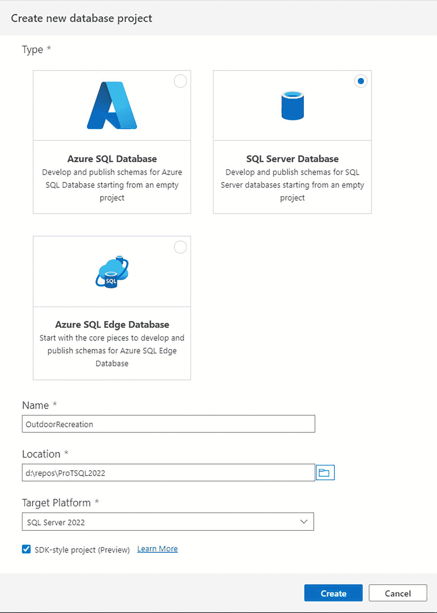
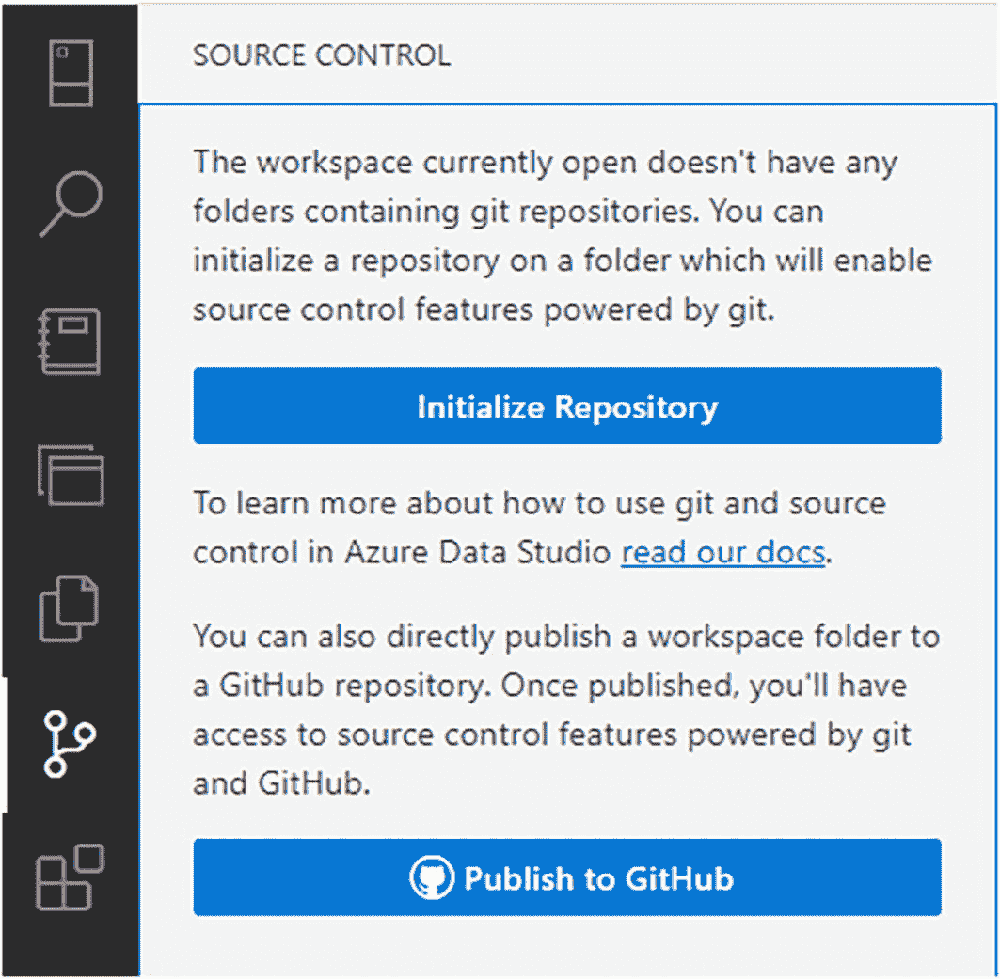
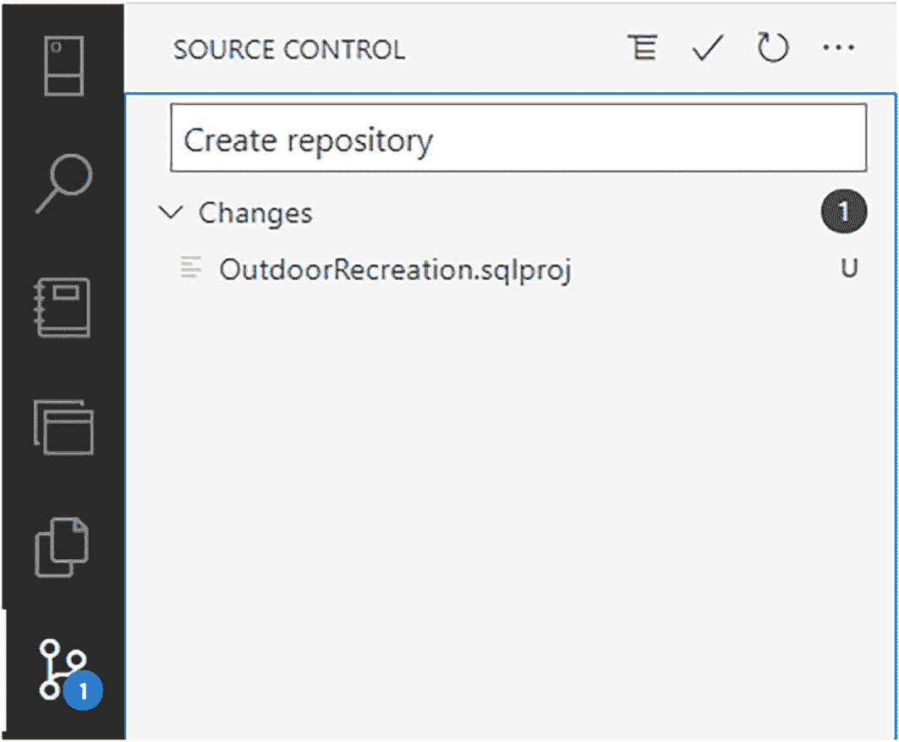
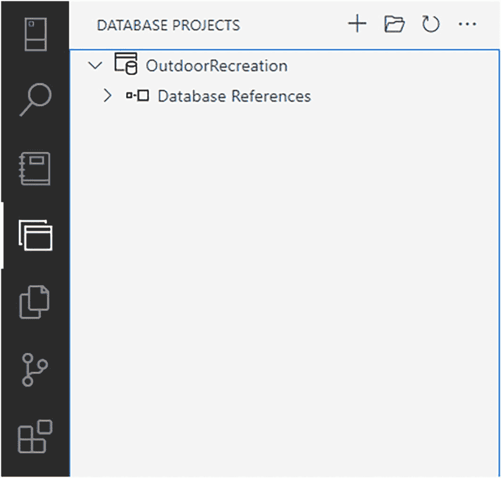
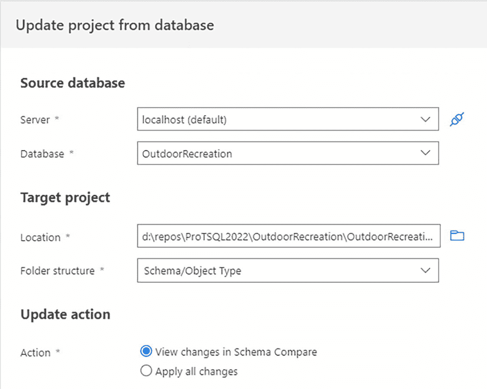
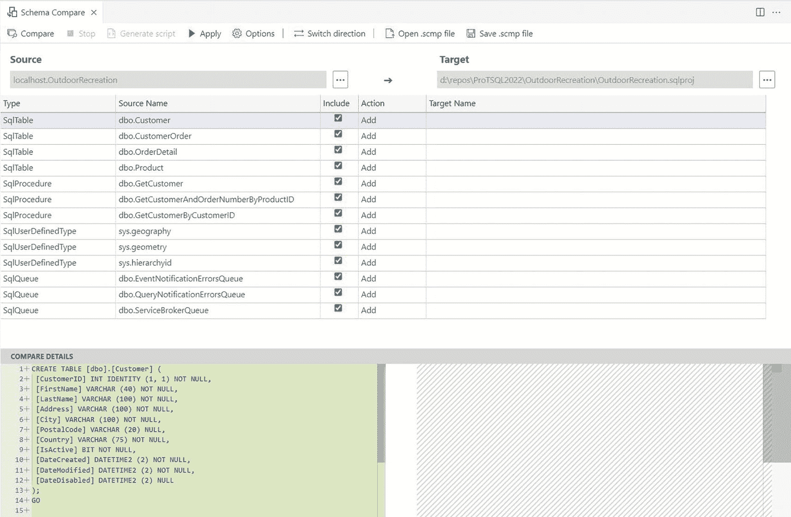

# 创建和管理数据库项目

### 文件夹结构选项

在创建数据库项目时，您可以选择将文件夹结构组织为**文件**、**扁平**、**对象类型**、**架构**或**架构/对象类型**。

*   如果选择**文件**，所有数据库对象将保存在一个文件中。如果您计划向此文件添加新的 T-SQL 来创建数据库对象，它们需要被附加到这个单一文件中。
*   下一个可用选项是**扁平**。扁平选项为每个数据库对象创建一个独立的 `.SQL` 文件。主键、外键、约束和索引都包含在指定表的 `.SQL` 文件中。此选项比文件选项更容易管理单个对象，但要修改任何现有对象，您将需要搜索整个文件列表以找到特定对象。

其他三个选项——**对象类型**、**架构**和**架构/对象类型**——是类似的。

*   **对象类型**文件夹选项为每种对象类型创建文件夹。所有表保存在一个文件夹中，另一个文件夹包含所有存储过程。
*   如果您更喜欢按架构保存 `.SQL` 文件，这也是一个选项。如果您在比 `dbo` 更多的架构中创建数据库对象，这会很有帮助。
*   **架构/对象类型**为每个架构创建文件夹，并在每个架构内为数据库对象类型创建子文件夹。

虽然选择如何组织文件是个人偏好的问题，但文件组织对所有开发人员都是相同的。因此，您可能希望在实现之前讨论要选择哪种组织方法。

### 创建新的数据库项目

现在您了解了有关创建数据项目和可用选项的更多信息，您可以创建一个数据库项目。要将一个新的空数据库添加到源代码控制中，请选择 **Database Projects** 扩展，然后选择 **Create new** 或 **Open existing**。

在本例中，选择 **Create new**，以便您可以构建一个全新的数据库。选择 **Create new** 后，您将得到一个名为 *Create new database project* 的滑出窗口，如图 10-2 所示。

**图 10-2** 创建新的数据库项目

在此步骤中，您正在创建一个包含新数据库项目的新工作区。将 `OutdoorRecreation` 数据库项目保存到 `D:\repos\`。

在源代码控制（例如 Git）的当前状态下，存在一个拥有集中式仓库的概念。这是保存所有代码并可供用户访问的位置。预期是用户将在其本地机器上创建代码的副本并在其本地机器上进行更改。这有时被称为*本地仓库*。这与您的其他本地仓库保存的位置相同。在本例中，您选择创建 SQL Server 数据库。但是，也可以创建 Azure SQL 数据库或 Azure SQL Edge 数据库。

### 将工作区添加到 GitHub 仓库

下一步是将工作区添加到 GitHub 仓库。当您选择**源代码控制**图标（顶部有两个圆圈，通过线条连接到底部的一个圆圈）时，滑出窗口会为您提供 **Initialize Repository** 或 **Publish to GitHub** 的选项，如图 10-3 所示。

**图 10-3** Azure Data Studio 中的初始仓库设置

由于您没有现有的仓库，因此需要选择 **Initialize Repository**。这将启动一个弹出窗口，要求允许 GitHub 扩展使用 GitHub 登录。这将允许您同时初始化和创建仓库。

> **注意**
> Git 和 GitHub 是两个独立的东西。Git 是用于管理分布式版本控制更改的软件。GitHub 是用于托管基于 Web 的 Git 仓库的托管服务。

将仓库命名为 `OutdoorRecreation`。为仓库提供描述“Database project for Menu”。为仓库选择一个许可证。但是，详细讨论 Git ignore 或可用的许可选项超出了本书的范围。最后需要指定的是私有仓库。公共仓库和私有仓库之间的主要区别在于您是否希望其他人能够访问、下载并对您的代码提出建议。

图 10-4 显示了一个链接到我的 GitHub 账户的新仓库。

**图 10-4** Azure Data Studio 中可见的本地仓库

您可以在**源代码控制**窗口中看到 `Outdoor Recreation` 工作区现在已设置为本地仓库。如果您返回到 **Database Projects** 窗口，您将能够看到当前与数据库项目关联的所有对象。对话框窗口如图 10-5 所示。

**图 10-5** Azure Data Studio 中可见的数据库项目

如图 10-5 所示，没有数据库对象与此项目关联。您可能会注意到图 10-4 和图 10-5 的布局几乎完全相同。图 10-4 显示了**源代码控制**窗口。右上角的选项是如何查看提议的更改、提交更改、刷新显示的更改或附加源代码控制选项菜单的选项。图 10-5 中的选项是能够创建新的数据库项目、打开现有项目、刷新数据库项目或与管理数据库项目相关的特定操作的菜单。

### 从现有数据库更新项目

如果您想使用现有数据库中的对象更新数据库项目，您可以通过选择菜单轻松完成，该菜单可以通过选择数据库项目窗口右上角的 `…` 来打开。然后，您可以选择 **Update Project From Database**。这将打开 *Update project from database* 窗口，您可以在其中指定源数据库、目标项目和更新操作，如图 10-6 所示。

**图 10-6** 从数据库更新项目窗口

*Update project from database* 窗口的一个有用功能是可以在架构比较中查看更改或应用所有更改。在本例中，让我们在更新数据库项目之前查看更改。同时，指定文件夹结构应按架构然后按对象类型存储所有对象。一旦您选择 **Update** 按钮，您将获得一个新窗口，如图 10-7 所示，将数据库 `OutdoorRecreation` 与源代码控制中当前的对象进行比较。由于您刚刚创建此工作区，源代码控制中没有对象。

