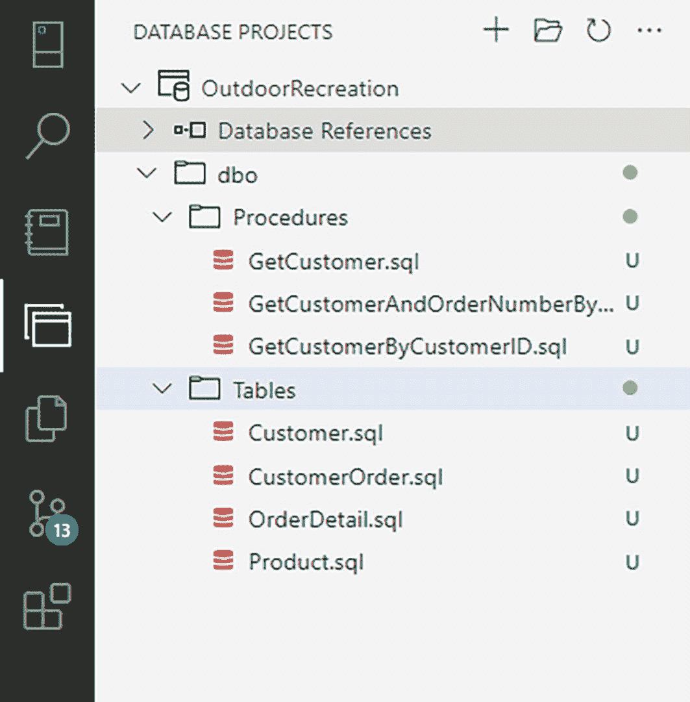
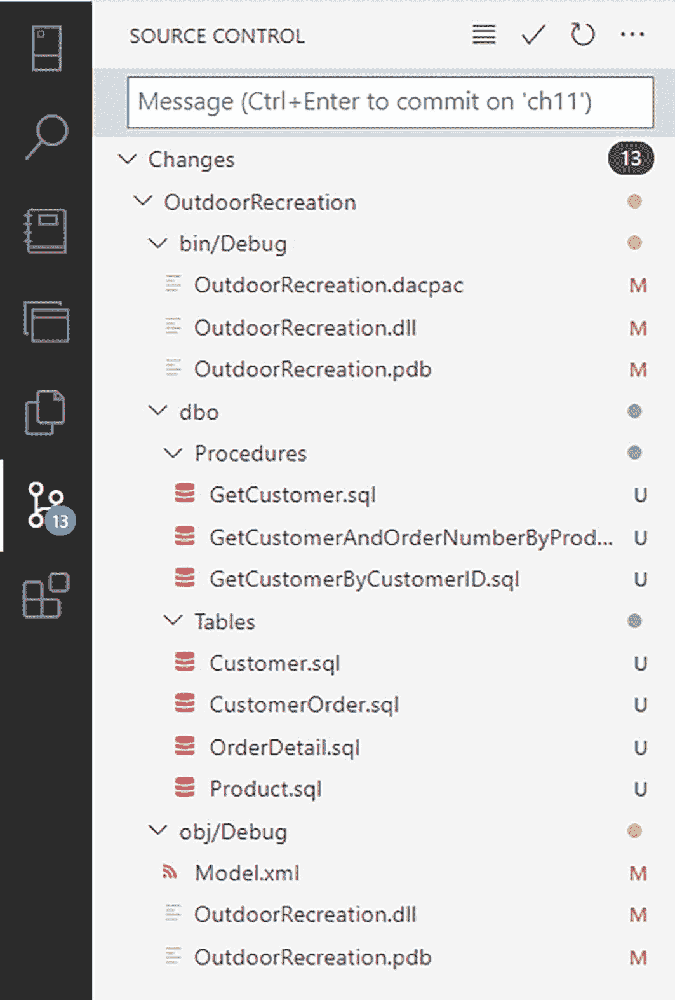
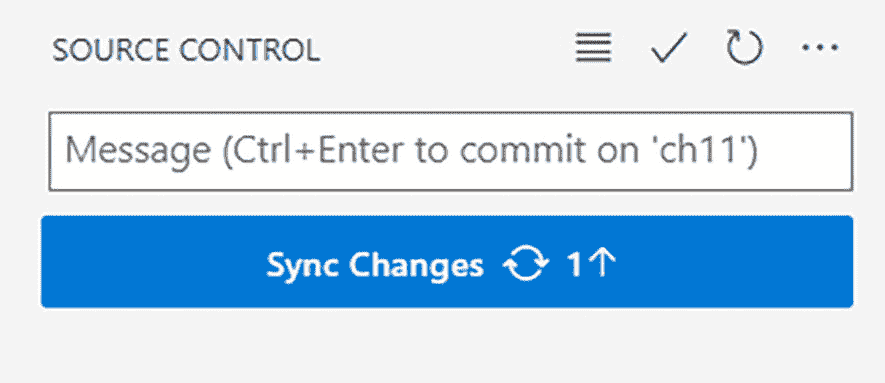
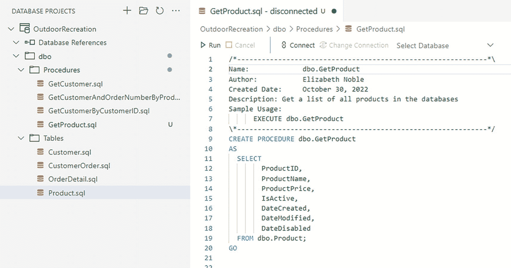
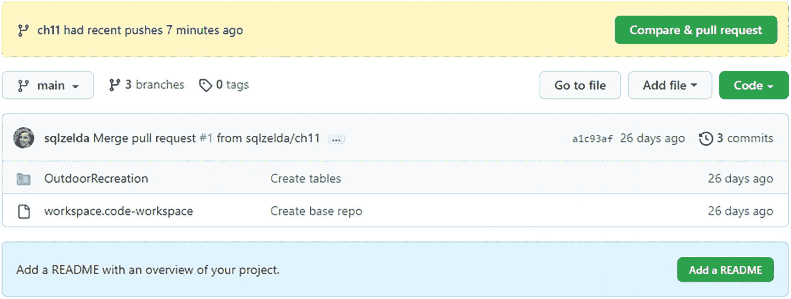

# 使用模式比较和源代码控制管理数据库项目

### 模式比较工具概述

一张标题为“模式比较”的页面截图。它显示了源和目标列表。下方显示了比较详细信息。

**图 10-7**

**模式比较窗口**

图 10-7 中的顶部菜单栏显示了模式比较中可用的众多选项。使用此选项可以将本地存储库中缺少的代码添加到源代码控制。两个最有用的选项是 `Apply` 和 `Options`。`Apply` 获取源下列出的所有项目并对目标执行中心的操作（本例中为 `Add`）。例如，存在于 `OutdoorRecreation` 数据库中的 SQL 表 `dbo.Customer` 将被添加到 `OutdoorRecreation` 本地存储库。源代码控制是用于管理更改的工具，而存储库是存储更改的位置。`Options` 让你控制哪些项目将被比较，从而在此次模式比较中被修改。图 10-7 包括添加一些用户定义类型和队列。如果你想排除它们，可以选择 `options` 并导航到 `Include Object Types` 选项卡。取消选中 `Queues` 和 `User-Defined Types (CLR)` 的复选框会将这些对象从比较中移除，如果你在移除它们之后应用更改，它们将不会被添加到本地存储库中。如果你将队列和用户定义类型排除在比较之外，这些对象将不会被添加到你的存储库中。如果你后来决定想将它们添加到存储库，你将需要再次比较源和目标。一旦你选择了 `Apply`，你会得到确认是否要进行这些更改的选项。

### 数据库项目窗口

现在更改已应用，你可以在图 10-8 所示的 **数据库项目** 窗口中看到它们。

一张数据库项目的截图，显示了一个下拉列表。它从上到下依次呈现了 outdoor recreation 文件夹、数据库引用、d b o、procedures 和 tables 文件夹。

**图 10-8**

**包含新对象的数据库项目窗口**

图 10-8 显示了一个名为 `dbo` 的文件夹，用于 dbo 架构。在 `dbo` 文件夹下有两个子文件夹，一个用于 `Procedures`，一个用于 `Tables`。在每个文件夹中，是各自架构/对象类型组中存在的每个数据库对象的单独脚本。

在左侧栏，源代码控制图标还显示有 13 个挂起的更改。在图 10-9 中，你可以看到以树状查看的更改。

一张源代码控制的截图，显示了一个选项列表。主要显示 changes、outdoor recreation、bin 或 debug、d b o、procedures、tables，最后是 object 或 debug options。

**图 10-9**

**以树状显示的源代码控制更改**

### 提交更改

为了提交更改，在你看到文本 *Message (Ctrl+Enter to commit on 'ch11')* 的文本框中键入一条消息。要提交消息，可以选择右上角的复选框或使用 `Ctrl+Enter`。一个弹出窗口会询问，*would you like to stage all your changes and commit them directly?* 一旦你选择是，更改将在本地提交。

源代码控制窗口将更新。之前显示的所有对象将不再列出。相反，你会在文本框下方看到一个蓝色按钮，用于向提交添加消息。在图 10-10 中，该按钮显示了一个可以同步到 GitHub 存储库的提交。

一张标题为“源代码控制”的页面截图，显示了一个水平栏，内容为：message open parenthesis c t r l plus enter to commit on c h 1 1 parenthesis close。下方高亮显示了 sync changes 按钮。

**图 10-10**

**同步更改**

在选择此按钮之前，更改仅存储在你的本地机器上。为了允许这些更改保存在中央存储库中，你需要同步这些更改。这也将允许任何其他有权访问此存储库的人看到与 *ch11* 分支相关的更改。

### 添加存储过程

如果你在此分支上有需要执行的额外任务，可以创建额外的对象。通过右键单击 `Procedures` 文件夹，你可以选择 **添加存储过程**。这将打开一个带有如何创建存储过程模板的窗口。名为 `GetProduct.sql` 的新文件也将被添加到左侧的数据库项目窗口中，如图 10-11 所示。

一张截图，左侧显示了数据库项目的列表，并高亮显示了 product dot s q l 选项。右侧显示了名称、作者、创建日期、描述和用法示例的详细信息。

**图 10-11**

**添加存储过程**

图 10-11 右侧显示了创建存储过程 `dbo.GetProduct` 的 T-SQL 代码。为了保存此更改，你应该在本地提交更改。这应该像保存文件一样快，只是多了一步，即包含更改内容的描述。一旦你完成了在存储库分支内的工作，你应该将更改同步到 GitHub，以便其他开发人员如果正在处理同一分支，可以拉取你所做的任何更改。

### 同步与推送操作

注意

当使用 GitHub 进行同步时，GitHub 上当前分支的任何更改都会在本地更新。这被称为 *pull first*。然后，像创建存储过程这样的更改会在 GitHub 上更新。这被称为 *push*。同步（Sync）是先拉取（pull）后推送（push）。

### 创建拉取请求

如果你已经完成了 *ch11* 分支的所有必要更改，你可以通过拉取请求（pull request）将更改合并到 *main* 分支。拉取请求非常有用，尤其是在团队中工作时，因为它们允许其他人轻松地看到分支中所做的更改。作为解决拉取请求的一部分，还可以添加各种批准和验证，但这超出了本书的范围。

创建拉取请求可以通过 Azure Data Studio 上的终端或访问 github.com 上的存储库来完成。当我去到 GitHub 上的 ProTSQL2022 存储库时，我可以看到为 *ch11* 分支推送的新更改，如图 10-12 所示。

一张显示存储库页面的截图。主要显示：Compare & Pull request 按钮、go-to file、add a file 和 code 按钮。在右下角，显示：Add a readme 按钮。

**图 10-12**

**显示更改的 GitHub.com 存储库**

要创建拉取请求，请选择 `Compare & pull request` 按钮。这将打开一个拉取请求。你可以选择将分支 *ch11* 合并到 github.com 上存在的任何分支。对于你选择合并到的任何分支，GitHub 将运行快速检查以查看该分支是否可以合并。

对于此示例，我将把 *ch11* 合并到 *main* 分支。这将获取 *ch11* 中的所有更改并将其添加到 *main* 分支。在创建拉取请求之前，如果我向下滚动，可以查看更改的文件。一旦我准备好创建拉取请求，我可以选择 `Create pull request` 按钮。

提示

在许多组织中，拉取请求被用作代码审查过程的一部分。

一旦创建了拉取请求，GitHub 将运行额外的验证以确认没有合并冲突。此拉取请求将保持打开状态，直到被合并。在我的示例中，一旦代码被合并，所有更改都将添加到 main 分支。代码合并后，任何人拉取 *main* 分支的副本也将拥有来自 *ch11* 分支的更新更改。

实施源代码控制是让数据库项目更易于管理的重要一步。在您的公司内部推动一项源代码控制倡议。主动联系其他部门，建立流程，确保每个人都能舒适地实施源代码控制。您也已经了解了将数据库添加到源代码控制的初始步骤。这是一段旅程的开始，途中可能会遇到一些小波折，但从长远来看能为您节省时间。既然您已经实施了源代码控制，就为管理 T-SQL 代码的下一步做好了准备。下一章将重点介绍可用于测试 T-SQL 代码并确认您是否符合各种编码标准的多种方法。

