# 第 11 章：测试

当您需要编写或修改一些 T-SQL 代码时，您可能会忍不住直接开始写代码。在许多情况下，必要的数据库代码足够简单，无需进行额外分析。但最终，所查询的数据或 T-SQL 代码会变得足够复杂，以至于您希望确保自己的代码能按预期工作。在这些时候，您可能需要测试您的 T-SQL 变更。虽然您可以随时开始测试 T-SQL 代码，但在处理复杂场景之前，尽早养成某些习惯可能会对您有所帮助。

您可能已经准备好开始测试代码，但不知道从哪里开始。您将进行的测试类型取决于您想要实现的目标。您可以实施测试以确认单个功能是否按预期工作。也可以测试两个或多个代码段之间的交互。这种类型的测试在尝试确认对 T-SQL 代码进行变更所产生的下游影响时也很有用。您还可以测试以确保您编写的代码符合编码标准。虽然任何类型的测试都很有价值，但最显著的好处来自于将这三者结合起来使用。

## 单元测试

您接到了下一个任务，并准备开始编写一些 T-SQL。您还希望对代码实施功能性测试。当您测试单个代码段时，这被称为 `单元测试`。了解什么是单元测试以及为什么应该使用它们，可以帮助提高您的 T-SQL 代码质量。单元测试非常有益，因为它能让您快速、轻松地验证 T-SQL 代码的准确性。让我们开始为 SQL Server 编写您的第一个单元测试。本节将介绍创建第一个单元测试的过程。这包括设计测试用例、编写单元测试、确认单元测试是否正常工作，以及更新您的代码以使单元测试产生正确的结果。

单元测试的概念很简单。您想要对 T-SQL 代码进行单个变更。单元测试允许您测试并确认单个代码段的功能。使用单元测试的一种常见方法是创建一个会失败的测试用例，例如在执行 `dbo.GetCustomer` 时，期望非活跃客户的数量为零。这将会失败，因为该存储过程当前的代码选择了所有客户。然后您编写 T-SQL 代码，运行单元测试，并重复此过程直到单元测试通过。这就是 `测试驱动设计`。无论您是在实现新功能还是在解决 T-SQL 中的错误，单元测试都能帮助验证您的代码。

创建单元测试时，您需要与通常着手编写 T-SQL 代码时不同的思考方式。您创建单元测试是为了确认您正在编写的代码能按预期工作。为了验证您的 T-SQL 代码是否按预期工作，您希望您的单元测试显示通过。在创建单元测试时，您第一次执行它应该失败。从一个失败的单元测试开始，表明期望的功能尚不存在。

运行单元测试有许多不同的实现方式。单元测试可以在 `Visual Studio` 内部编写。您也可以使用免费的第三方单元测试框架，该框架在 T-SQL 中创建数据库对象。另一个选项是使用付费的第三方工具来创建和运行您的单元测试。每种选择都有其优缺点。

决定如何实施单元测试的另一个因素在于您希望如何运行测试。如果您还没有机会开发一种自动化的方法来管理代码和部署，您可能会决定更喜欢手动运行单元测试。但是，如果您有一个自动化的构建和部署流水线，您可能会发现自动化单元测试更容易。开销最小、最简单的方法是手动运行单元测试。这可以通过存储过程或图形用户界面来执行。

您可以使用单元测试来验证数据库架构的几乎所有内容。这些单元测试大多是用于测试数据库对象（如存储过程、视图和函数）的功能性。我可能有偏见，但我希望您的存储过程数量远多于视图或查询。如果您现在还没有任何单元测试，请不要担心。您可以在需要时创建单元测试。这可能意味着您的单元测试没有完全的代码覆盖率，但它可以防止您花费时间去实现那些不经常修改的代码的单元测试。


在编写第一个单元测试之前，你需要了解将要开发的功能。现在让我们修改存储过程 `dbo.GetCustomer`，使其仅显示处于活动状态的客户。当我最初开始对 T-SQL 代码进行单元测试时，我会手动运行测试。在这个例子中，让我们查找当前非活动的客户。你可以创建一个单元测试来检查非活动记录。如果你的单元测试发现任何非活动记录，它将失败。如果你的单元测试没有发现任何非活动记录，它将成功或通过。让我们运行如清单 11-1 所示的查询来查找任何非活动的客户。

```sql
SELECT CustomerID,
FirstName,
LastName,
IsActive
FROM dbo.Customer
WHERE IsActive = 0;
```
**清单 11-1**
查找非活动客户

运行此查询时，你可能会得到如表 11-1 所示的结果。

**表 11-1**
非活动客户

| CustomerID | FirstName | LastName | IsActive |
| --- | --- | --- | --- |
| 12 | Selena | Tiesto | False |
| 27 | Ian | West | False |

一旦你获得了表 11-1 中的结果，你就知道哪些记录会受到 `dbo.GetCustomer` 更改的影响，以返回活动客户而非所有客户。未修改的存储过程如清单 11-2 所示。

```sql
/*-------------------------------------------------------------*\
Name:             dbo.GetCustomer
Author:           Elizabeth Noble
Created Date:     2022-10-30
Description:      Get a list of all customers in the databases
Sample Usage:
EXECUTE dbo.GetCustomer;
\*-------------------------------------------------------------*/
CREATE OR ALTER PROCEDURE dbo.GetCustomer
AS
SELECT
CustomerID,
FirstName,
LastName,
Address,
City,
PostalCode,
Country,
IsActive,
DateCreated,
DateModified,
DateDisabled
FROM dbo.Customer;
```
**清单 11-2**
原始存储过程

执行此存储过程时，你期望看到表中的所有客户都被返回。执行此存储过程后，你得到的记录如表 11-2 所示。

**表 11-2**
所有客户示例

| CustomerID | FirstName | LastName | IsActive |
| --- | --- | --- | --- |
| 1 | Myra | Acharya | True |
| 2 | Jose | Gomez | True |
| 12 | Selena | Tiesto | False |
| 27 | Ian | West | False |
| 401409 | Stacy | Alexander | True |
| 401407 | Karim | Khalil | True |
| 401405 | Marty` | Bethel | True |

你可以在表 11-2 中看到，执行存储过程时，活动和非活动客户都被返回了。这样，你就创建了一个基本的单元测试（清单 11-1 中的查询），并确认当运行清单 11-2 中的存储过程时，由于非活动记录也包含在结果集中，该测试失败了。

下一步是找出如何让单元测试通过。对于此示例，更改很简单。让我们在存储过程的末尾添加一行，只返回活动客户，如清单 11-3 所示。

```sql
/*-------------------------------------------------------------*\
Name:             dbo.GetCustomer
Author:           Elizabeth Noble
Created Date:     2022-10-30
Description:      Get a list of all active customers in the databases
Sample Usage:
EXECUTE dbo.GetCustomer;
\*-------------------------------------------------------------*/
CREATE OR ALTER PROCEDURE dbo.GetCustomer
AS
SELECT
CustomerID,
FirstName,
LastName,
Address,
City,
PostalCode,
Country,
IsActive,
DateCreated,
DateModified,
DateDisabled
FROM dbo.Customer
WHERE IsActive = 1;
```
**清单 11-3**
修改后的存储过程

创建此存储过程后，你可以执行它以确认新功能是否按预期工作。在这种情况下，你希望验证 CustomerID 2 和 5 不再被返回。根据前面的代码，你期望清单 11-3 的结果集与表 11-3 所示的内容匹配。

**表 11-3**
活动客户示例

| CustomerID | FirstName | LastName | IsActive |
| --- | --- | --- | --- |
| 1 | Myra | Acharya | True |
| 2 | Jose | Gomez | True |
| 401409 | Stacy | Alexander | True |
| 401407 | Karim | Khalil | True |
| 401405 | Marty` | Bethel | True |

你已经确认，对清单 11-3 所做的更改已正确地从结果集中移除了非活动客户。这就是 T-SQL 代码通常的测试方式。在更改前后执行并比较结果是测试代码更改的有效方法，但这需要付出可重复性的代价。构建一组单元测试集合可以让你在每次部署时重新测试更改，以确保功能不会从一个软件版本到下一个版本丢失。

这种测试代码的方法是一个很好的起点，但可能难以始终如一地遵循。你可能有一些可以存储不同状态数据的表。例如，如果你想查找有关促销产品订单频率的信息，测试结果的逻辑会变得更加复杂。这就是使用第三方工具可能有所帮助的地方。

为你的数据寻找单独的示例集可能既耗时又容易出错。此外，你可能会花更多时间尝试找到正确的测试用例，而不是编写或测试 T-SQL 代码。另一个挑战是，由于手动在数据库中查找已有的测试数据需要花费时间和精力，你可能会跳过重要的测试用例。然而，使用 T-SQL 在你的数据中查找特定的测试用例并不是你唯一的选择。你可以手动插入测试数据并对你插入的记录执行测试。这种方法允许你为正在测试的代码确定最佳场景。在大多数情况下，这些示例数据不会集中保存。你可能仍然需要在每次测试新功能时重写特定的示例。

有不同类型的单元测试工具可供你使用。单元测试可以通过向数据库添加额外的 T-SQL 对象来处理。另一个选择是付费购买可以帮助管理单元测试的第三方工具。另一个选项是使用 Visual Studio 来创建和管理单元测试。虽然所有这些选项都是有效的并且各有其优点，但我想重点介绍通过 Visual Studio 原生创建单元测试可以完成什么。图 11-1 展示了在 Visual Studio 中创建单元测试的第一步。

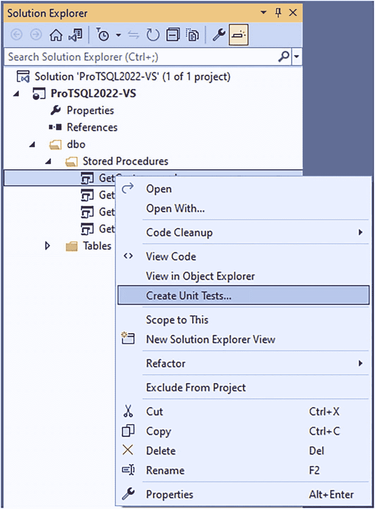

**图 11-1**
创建单元测试

选择创建单元测试的选项后，Visual Studio 将引导你完成创建第一个单元测试的过程。图 11-2 中的对话框将会打开。

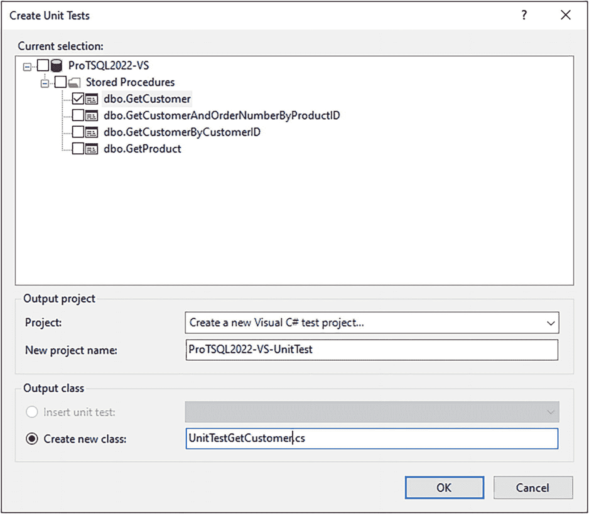

**图 11-2**
“创建单元测试”对话框


窗口顶部区域允许你选择用于创建单元测试的对象。在本例中，我们将为 `dbo.GetCustomer` 存储过程创建一个新的单元测试。这也是你为这个数据库项目创建的第一个单元测试。你可以选择创建一个新的 Visual C# 测试项目。不过，你无需了解 C# 即可在 Visual Studio 中开始创建自己的单元测试。为这个新项目命名并创建一个新类。今后，你可以将这个类复用于其他单元测试。

在对话框窗口上点击“确定”后，你会看到另一个弹出窗口，如图 11-3 所示。

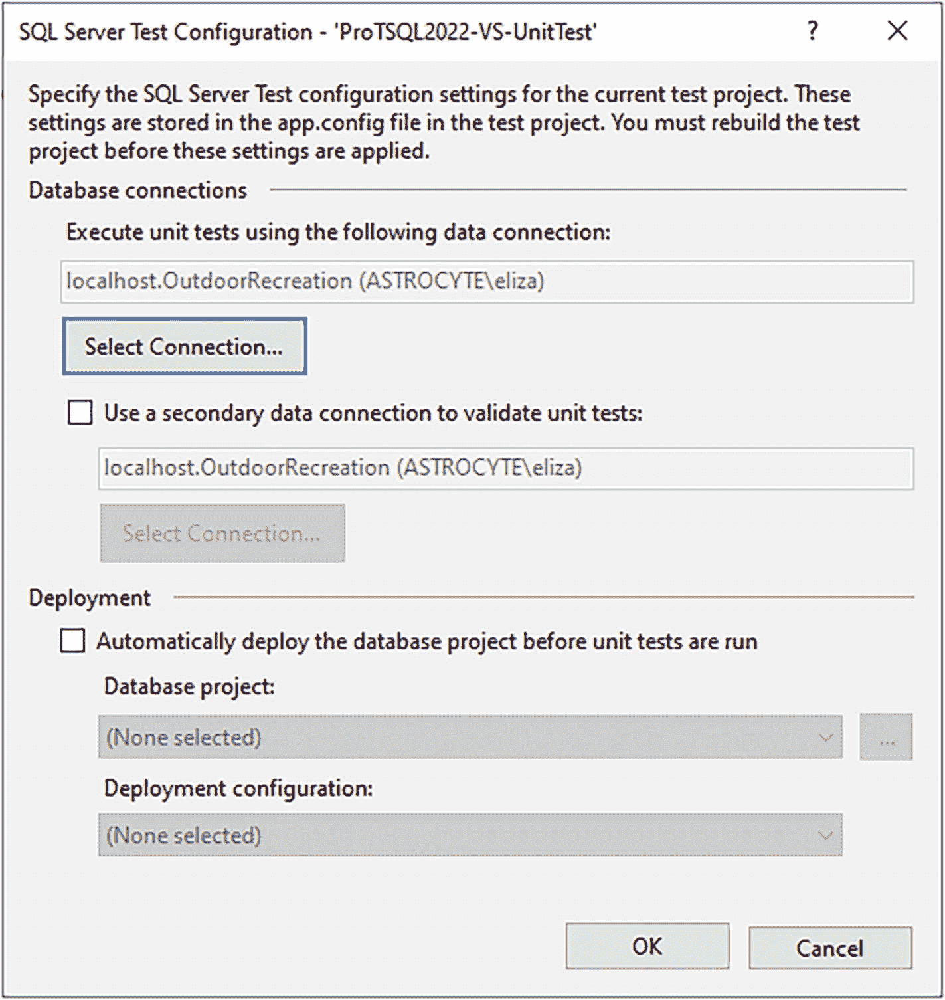

Pro T SQL 2022 VS 单元测试的 SQL Server 测试配置屏幕截图。一个“选择连接”按钮被高亮显示。“确定”和“取消”按钮位于右下角。

## 图 11-3

### 设置连接字符串

这里可以设置几个选项。其中大部分涉及选择用于执行单元测试的数据源。选择预存在的 `Menu` 数据库来运行单元测试。你可以选择在运行单元测试之前自动部署数据库。但是，我们仅在单元测试通过时才部署数据库。

设置好连接字符串并配置好其他设置后，Visual Studio 会向现有解决方案中添加一个新项目。你可以在图 11-4 中看到你的数据库项目与单元测试项目一起的样子。

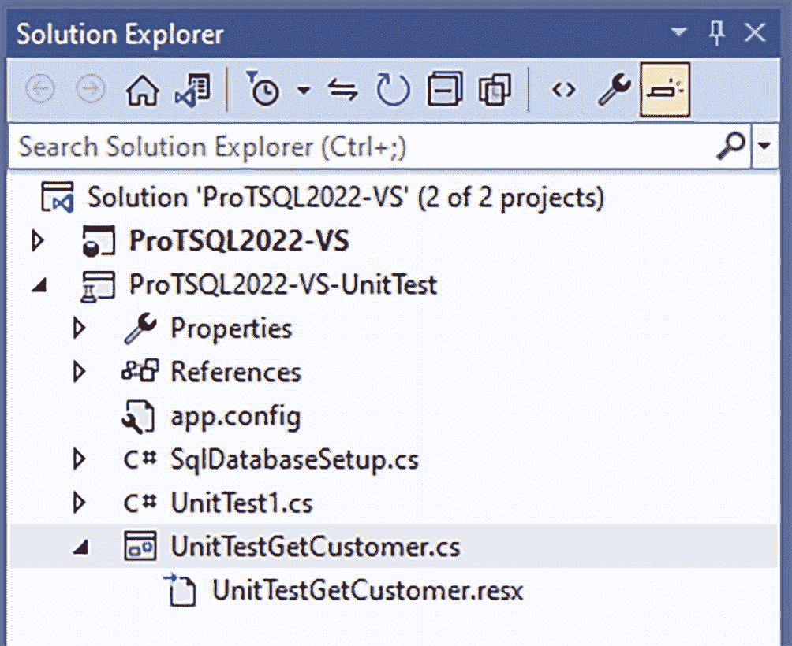

Pro T SQL 2022 VS 项目的解决方案资源管理器窗口屏幕截图。“单元测试 GetCustomer.cs”选项被高亮显示。“确定”和“取消”按钮位于右下角。

## 图 11-4

### 源代码管理中的单元测试

在图 11-4 中，原始 `ProTSQL2022-VS` 项目中的对象均未被更改。你可以看到为单元测试项目创建的所有对象都已准备好检入源代码管理。创建单元测试项目后，Visual Studio 中将打开一些附加窗口。其中一个窗口允许你设置测试条件。默认情况下，会配置一个“结果不确定” (`Inconclusive`) 的测试条件。你可以保留或移除此测试条件。图 11-5 显示了可用测试条件的下拉列表。

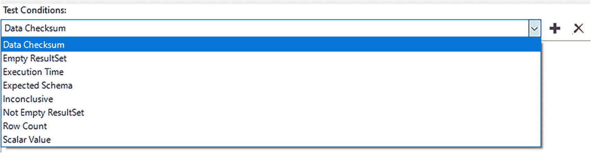

测试条件窗口的屏幕截图。下拉菜单列出了：数据校验和 (`Data checksum`)、空结果集 (`empty result set`)、执行时间 (`execution time`)、预期架构 (`expected schema`)、结果不确定 (`inconclusive`)、非空结果集 (`not empty result set`)、行数 (`row count`) 和标量值 (`scalar value`)。

## 图 11-5

### 可用的单元测试选项

在开始创建单元测试之前，让我们通过表 11-4 来定义这些条件各自的目的。

#### 表 11-4

#### 单元测试条件

| 测试条件 | 描述 |
| --- | --- |
| `数据校验和` | 计算单元测试的 `CheckSum`。如果 `CheckSum` 与原始单元测试匹配，则测试通过。仅当结果集中返回的数据将保持不变时，才应使用此条件。 |
| `空结果集` | 检查是否返回了任何数据。如果没有返回数据，则测试通过。 |
| `执行时间` | 检查查询的总体执行时间。如果查询在指定时间内完成，则测试通过。 |
| `预期架构` | 检查返回对象的架构。如果列和数据类型与预期架构匹配，则测试通过。 |
| `结果不确定` | 此条件由系统创建作为占位符，应在创建第一个单元测试后将其移除。 |
| `非空结果集` | 检查是否返回了任何数据。如果返回了数据，则测试通过。 |
| `行数` | 检查返回的行数。如果返回的行数与预期计数匹配，则测试通过。 |
| `标量值` | 检查返回的值。如果返回的值与预期值匹配，则测试通过。 |

你需要创建一个单元测试来验证 `dbo.GetCustomer` 存储过程是否没有返回非活动客户。与你之前编写的类似手动单元测试一样，你要确认存储过程 `dbo.GetCustomer` 没有返回任何非活动客户。你可以通过选择 `空结果集` 条件来实现这一点。你可以在图 11-6 中看到这个测试条件。

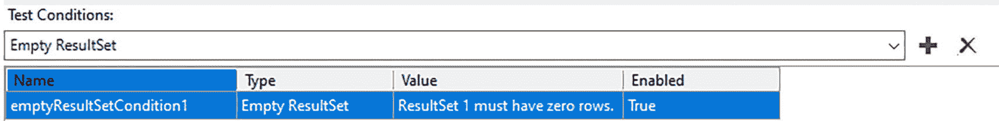

测试条件窗口的屏幕截图。它显示：名称，空结果集条件 1；类型，空结果集；值，结果集 1 必须有零行；已启用，是。

## 图 11-6

### 用于检查空结果集的单元测试

现在你已经创建了测试条件，你需要为这个单元测试编写一些 T-SQL 代码。选择 `空结果集` 作为测试条件。为了让这个单元测试在运行时通过，单元测试内部的 T-SQL 代码必须不返回任何结果。

在你修改存储过程后，你不希望返回任何非活动客户。在这种情况下，一个通过的测试用例就是没有返回非活动客户。这也与图 11-6 中创建的测试条件相符。清单 11-4 展示了该单元测试的代码。

```sql
-- 针对 dbo.GetCustomer 的数据库单元测试
-- 创建表变量以保存结果
DECLARE @CustomerList TABLE
(
    CustomerID      INT,
    FirstName       VARCHAR(40),
    LastName        VARCHAR(100),
    [Address]       VARCHAR(100),
    City            VARCHAR(100),
    PostalCode      VARCHAR(20),
    Country         VARCHAR(75),
    IsActive        BIT,
    DateCreated     DATETIME2(2),
    DateModified    DATETIME2(2),
    DateDisabled    DATETIME2(2)
);
-- 将 dbo.GetCustomer 的结果插入表变量
INSERT INTO @CustomerList
(
    CustomerID,
    FirstName,
    LastName,
    [Address],
    City,
    PostalCode,
    Country,
    IsActive,
    DateCreated,
    DateModified,
    DateDisabled
)
EXECUTE [dbo].[GetCustomer];
-- 获取非活动客户的数量
---- 如果没有非活动客户，单元测试将通过
---- 如果有非活动客户，单元测试将失败
SELECT CustomerID
FROM @CustomerList
WHERE IsActive = 0;
```

#### 清单 11-4
#### 运行单元测试的代码

你首先创建一个表变量。单元测试的下一部分将存储过程 `dbo.GetCustomer` 的结果插入该表变量。最后一步是从表变量中仅选择非活动的记录。将上述代码添加到 `UnitTestGetCustomer.cs` 并保存文件后，你就可以运行你的第一个单元测试了。你可以转到 `测试` 菜单来运行单元测试，如图 11-7 所示。

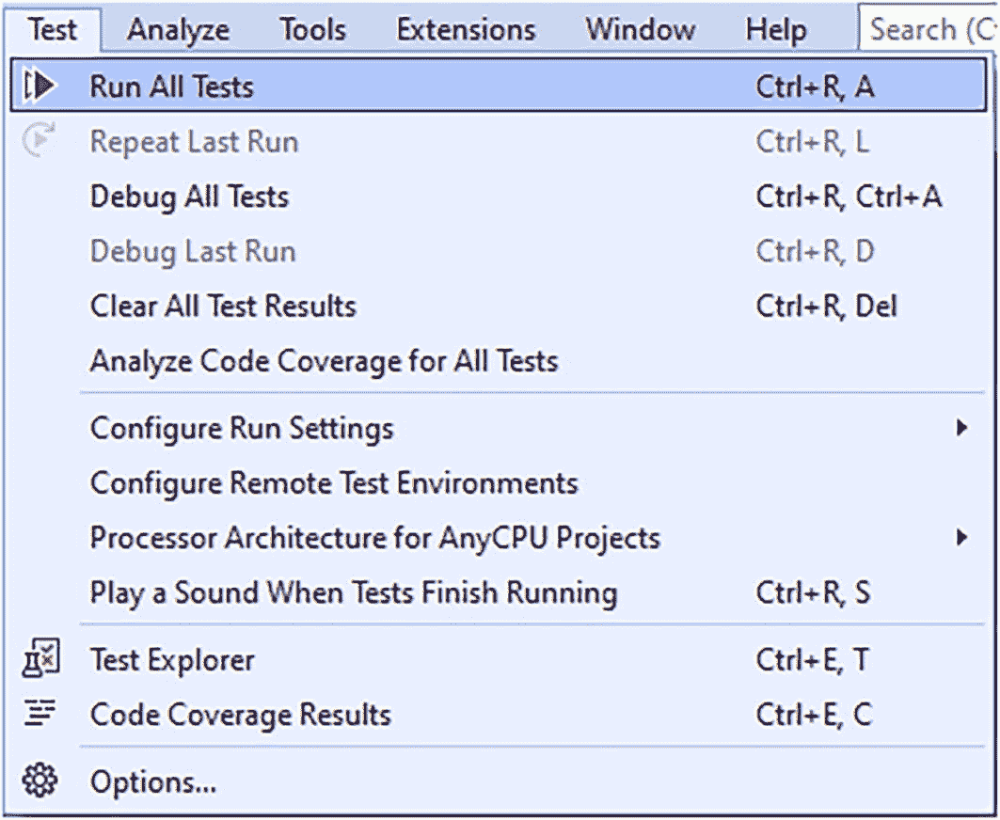


### 手动运行单元测试

一张截图高亮显示了测试选项下的运行测试选项。主菜单包括测试、分析、工具、扩展、窗口和帮助等选项。

**图 11-7**

你正在对单元测试使用测试驱动设计，并且在更改原始存储过程之前，你正在测试这个单元测试。在此场景中，你预期单元测试会失败。你可以在图 11-8 中看到运行此单元测试的结果。

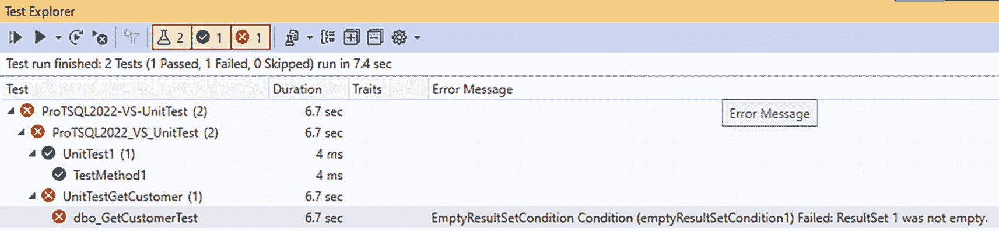

测试资源管理器窗口的截图。它显示测试运行已完成两个测试，1 个通过，1 个失败，0 个跳过，耗时 7.4 秒。

**图 11-8**

原始存储过程仍返回非活跃客户。这导致单元测试失败。一旦你使用清单 11-3 中的 T-SQL 代码更新存储过程 `dbo.GetCustomer` 并重复单元测试，你将得到图 11-9 中的结果。

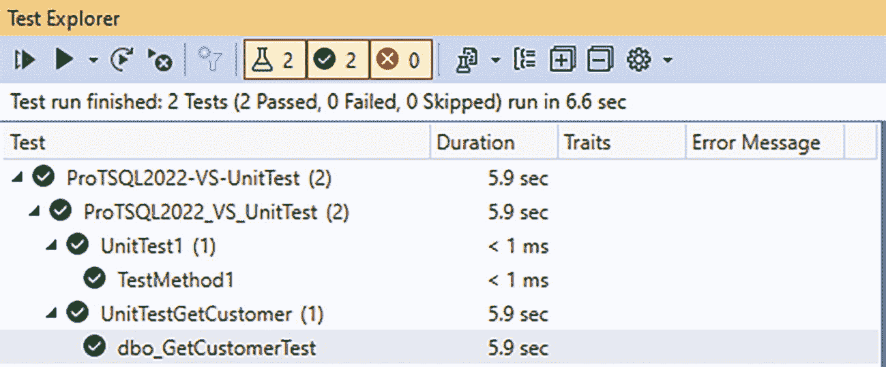

测试资源管理器窗口的截图。它显示测试运行已完成两个测试，2 个通过，0 个失败，0 个跳过，耗时 6.6 秒。

**图 11-9**

既然单元测试已成功运行，你可以确信你的新 T-SQL 代码按预期工作。数据库项目还有其他可用的单元测试选项。我建议你研究几种替代方案，并与同事合作确定哪种方法最适合你的环境。

## 集成测试

虽然知道单个数据库代码按预期工作是好的，但大多数 T-SQL 代码并非孤立存在。关系设计的本质意味着数据库中的项目是相互关联的。我们通常考虑表之间的关系。然而，存储过程访问的是表中存在的数据。如果你想验证数据的插入，可以运行单元测试。这将确认你期望插入的数据确实已被插入。

当有多种方式访问数据库中的相同数据时，可能会出现问题。通常，这些查询是在不同时期编写的。这可能导致查询中的逻辑略有不同。我还见过这样的情况：公司内不同业务部门对相同数据有不同的计算方法。如果一个业务部门的计算被另一个业务部门重用，可能会导致看似不准确的结果。

这就提出了一个问题：如何在多个不同的数据库对象中保持你的 T-SQL 代码和查询结果的一致性。这就是集成测试可以发挥作用的地方。`集成测试` 这个术语用于表示旨在与多个代码片段协同工作的测试。如果你正在使用应用程序插入数据，并希望验证数据是否被正确插入，这可以被视为集成测试。你正在测试应用程序连接到 SQL Server 的能力以及将数据插入数据库的 T-SQL 代码。

这只是集成测试可以应用的一个场景。我发现自己经常遇到的情况是，处理两个旨在返回大致相同信息的存储过程。有时，对底层表或其中一个存储过程中的代码进行更改，可能会导致这两个存储过程返回不同的结果。不幸的是，这些结果差异通常直到 T-SQL 代码部署后很久才会被发现。这会导致对应用程序的整体信心丧失。

虽然理想情况下这些相互关联的存储过程应有文档记录，或者最好重构为单个存储过程，但这并非总是可行。拥有多个相似代码版本是有成本的，但让多个流程依赖同一段代码也有成本。在本章的剩余部分，我们将假设无法重写 T-SQL 代码来消除这种依赖关系。

就像测试数据库代码的单元测试一样，你可以通过使用 T-SQL 查询手动开始集成测试。你集成的最关键因素是理解你的环境如何协同工作。有时这是偶然发现的，比如当某些东西崩溃时。其他时候，你可能是一个主题专家，已经了解这些交互。无论哪种方式，为了开始集成测试，你首先至少需要有两个测试对象。

你可以从测试数据的插入以及同一张表的数据查询开始。你也可以使用集成测试来比较两个查询的结果。如果你有一个返回所有值的查询和另一个搜索特定值的查询，就可能发生这种情况。虽然这两个存储过程不会匹配每条记录，但对于特定记录它们可能有匹配的结果。这种类型的集成测试将确认返回列中的值彼此一致。


如果你开始修改一个用于选择数据的存储过程，你可能希望同时测试该数据的插入和选择操作。例如，你可能正在更新存储过程 `dbo.GetCustomer` 以使其仅返回活跃客户。你可以通过为非活跃客户创建一个单元测试，以及为活跃客户创建一个单元测试，来对此存储过程进行单元测试。你也可以使用集成测试来确认在创建新客户后，此存储过程是否仍能返回预期结果。现在看来，这种测试可能显得微不足道，但随着应用程序的发展和成熟，它们可能会变得越来越有用。通常，业务需要答案的速度比能够提供答案的速度更快。这有时会导致数据库对象以非原始设计意图的方式被使用。

此集成测试包括向 `dbo.Customer` 表中插入一个新客户。插入记录后，你将执行 `dbo.GetCustomerAndOrderNumberByProductID` 存储过程，以验证新客户是否被返回。用于向 `dbo.Customer` 表插入记录的存储过程如代码清单 11-5 所示。

```sql
/*-------------------------------------------------------------*\
Name:             dbo.InsertCustomer
Author:           Elizabeth Noble
Created Date:     2022-10-30
Description:      Used to create a customer
Sample Usage:
EXECUTE dbo.InsertCustomer
'Elizabeth',
'Noble',
'123 Main Steet',
'Some City',
'00000',
'United States',
1,
GETDATE(),
GETDATE(),
GETDATE();
\*------------------------------------------------------------*/
CREATE OR ALTER PROCEDURE dbo.InsertCustomer
@FirstName      VARCHAR(40),
@LastName       VARCHAR(100),
@Address        VARCHAR(100),
@City           VARCHAR(100),
@PostalCode     VARCHAR(20),
@Country        VARCHAR(75),
@IsActive       BIT,
@DateCreated    DATETIME2(2),
@DateModified   DATETIME2(2),
@DateDisabled   DATETIME2(2)
AS
INSERT INTO dbo.Customer
(
FirstName,
LastName,
[Address],
City,
PostalCode,
Country,
IsActive,
DateCreated,
DateModified,
DateDisabled
)
VALUES
(
@FirstName,
@LastName,
@Address,
@City,
@PostalCode,
@Country,
@IsActive,
@DateCreated,
@DateModified,
@DateDisabled
);
```
代码清单 11-5
向 `dbo.Customer` 表插入记录

既然你知道了将如何向数据库添加客户，你应该确定集成测试所需的其他存储过程。代码清单 11-6 显示了用于创建客户订单的存储过程的 T-SQL 代码。

```sql
/*-------------------------------------------------------------*\
Name:             dbo.InsertCustomerOrder
Author:           Elizabeth Noble
Created Date:     2022-10-30
Description:      Used to create the header for a customer order
Sample Usage:
EXECUTE dbo.InsertCustomerOrder
3,
99999,
'2022-10-31',
NULL;
\*------------------------------------------------------------*/
CREATE OR ALTER PROCEDURE dbo.InsertCustomerOrder
@CustomerID     INT,
@OrderNumber    VARCHAR(15),
@OrderDate      DATETIME2(2),
@ShipDate       DATETIME2(2)
AS
INSERT INTO dbo.CustomerOrder
(
CustomerID,
OrderNumber,
OrderDate,
ShipDate,
IsActive,
DateCreated,
DateModified,
DateDisabled
)
SELECT
@CustomerID,
@OrderNumber,
@OrderDate,
@ShipDate,
1,
SYSDATETIME() AS DateCreated,
SYSDATETIME() AS DateModified,
NULL AS DateDisabled;
```
代码清单 11-6
向 `dbo.CustomerOrder` 表插入记录

此代码在 `dbo.CustomerOrder` 表中创建一条记录。一旦在 `dbo.CustomerOrder` 表中创建了记录，你就可以向 `dbo.OrderDetail` 表中插入数据。用于创建订单详细信息的存储过程在代码清单 11-7 中。

```sql
/*-------------------------------------------------------------*\
Name:             dbo.InsertOrderDetail
Author:           Elizabeth Noble
Created Date:     2022-10-30
Description:      Used to create line items for the order detail
Sample Usage:
EXECUTE dbo.InsertOrderDetail
111111,
1,
599.00,
1;
\*------------------------------------------------------------*/
CREATE OR ALTER PROCEDURE dbo.InsertOrderDetail
@CustomerOrderID     INT,
@ProductID           INT,
@ProductPrice        DECIMAL(6,2),
@QuantitySold        INT
AS
INSERT INTO dbo.OrderDetail
(
CustomerOrderID,
ProductID,
ProductPrice,
QuantitySold,
IsActive,
DateCreated,
DateModified,
DateDisabled
)
SELECT
@CustomerOrderID,
@ProductID,
@ProductPrice,
@QuantitySold,
1,
SYSDATETIME() AS DateCreated,
SYSDATETIME() AS DateModified,
NULL AS DateDisabled;
```
代码清单 11-7
向 `dbo.OrderDetail` 表插入记录

你使用上述存储过程来创建一个客户并为此客户填充订单信息。

下一步是回顾你将用于集成测试的存储过程。在代码清单 11-8 中，你可以看到存储过程 `dbo.GetCustomerAndOrderNumberByProductID`。

```sql
/*-------------------------------------------------------------*\
Name:             dbo.GetCustomerAndOrderNumberByProductID
Author:           Elizabeth Noble
Created Date:     2022-10-30
Description:      Get customer and products ordered for an order number
Sample Usage:
EXECUTE dbo.GetCustomerAndOrderNumberByProductID 1;
\*-------------------------------------------------------------*/
CREATE OR ALTER PROCEDURE dbo.GetCustomerAndOrderNumberByProductID
@ProductID    INT
AS
SELECT
cus.CustomerID,
cus.FirstName,
cus.LastName,
ord.OrderNumber,
ord.OrderDate,
prd.ProductName,
SUM(dtl.QuantitySold) AS QuantitySold,
dtl.ProductPrice
FROM dbo.Customer cus
INNER JOIN dbo.CustomerOrder ord
ON cus.CustomerID = ord.CustomerID
INNER JOIN dbo.OrderDetail dtl
ON ord.CustomerOrderID = dtl.CustomerOrderID
INNER JOIN dbo.Product prd
ON prd.ProductID = dtl.ProductID
WHERE prd.ProductID = @ProductID
GROUP BY cus.FirstName,
cus.LastName,
ord.OrderNumber,
ord.OrderDate,
prd.ProductName,
dtl.ProductPrice
ORDER BY cus.FirstName, cus.LastName;
```
代码清单 11-8
按产品选择客户和订单

为了执行集成测试，你需要编写一些代码，以便能够插入客户数据。之后，运行第二个存储过程。你可以将这些结果插入到一个临时表中，然后验证在 `dbo.InsertCustomer` 中创建的客户是否存在于存储过程 `dbo.GetCustomerAndOrderNumberByProductID` 返回的结果中。在代码清单 11-9 的示例中，你还需要向订单中添加一些产品，以便 `dbo.GetCustomerAndOrderNumberByProductID` 存储过程能够查询出一些结果。


```sql
-- 声明后续要使用的变量
DECLARE @Customer       INT;
DECLARE @Product        INT = 1;
DECLARE @CustomerOrder  INT;
-- 创建客户 ID 1
EXECUTE dbo.InsertCustomer        @FirstName = 'Elizabeth',
@LastName = 'Noble',
@Address = '123 Main Steet',
@City = 'Some City',
@PostalCode = '00000',
@County = 'United States',
@IsActive = 1,
@DateCreated = GETDATE(),
@DateModified = GETDATE(),
@DateDisabled = NULL;
-- 为客户 ID 1 创建订单
EXECUTE dbo.InsertCustomerOrder
@CustomerID = @Customer,
@OrderNumber = 99999,
@OrderDate = '2022-10-31',
@ShipDate = NULL;
-- 获取最近插入的记录
SELECT @CustomerOrder = SCOPE_IDENTITY();
-- SELECT TOP 1 * FROM dbo.CustomerOrder ORDER BY 1 DESC;
-- DELETE FROM dbo.CustomerOrder WHERE CustomerOrderID = 802820
-- DBCC CHECKIDENT(CustomerOrder, NORESEED)
-- DBCC CHECKIDENT(CustomerOrder, RESEED, 802819)
-- 为客户 ID 1 的订单号 10050 添加订单详情
EXECUTE dbo.InsertOrderDetail
@CustomerOrderID = @CustomerOrder,
@ProductID = 1,
@ProductPrice = 599.00,
@QuantitySold = 1;
-- 声明表变量来存储下面的结果
DECLARE @OrderInfo TABLE
(
CustomerID      INT,
FirstName       VARCHAR(50),
LastName        VARCHAR(100),
OrderNumber     VARCHAR(15),
OrderDate       DATETIME2(2),
ProductName     VARCHAR(25),
QuantitySold    INT,
ProductPrice    DECIMAL(6,2)
);
-- 查找订购了 ProductID 1 的客户和订单
INSERT INTO @OrderInfo (CustomerID, FirstName, LastName, OrderNumber, OrderDate, ProductName, QuantitySold, ProductPrice)
EXECUTE dbo.GetCustomerAndOrderNumberByProductID @Product;
-- 通过确认为客户 ID 1 返回了结果来验证存储过程的集成
SELECT FirstName, LastName, OrderNumber
FROM @OrderInfo
WHERE CustomerID = @Customer;
```

### Listing 11-9: 手动集成测试

在确定应该对哪些内容进行集成测试时，请考虑与您正在编写的 T-SQL 代码相关的任何依赖关系。

有些 T-SQL 代码比其他代码更明显地需要集成测试。最需要集成测试的场景之一涉及返回相同数据的不同数据库对象。这可以是两个不同的存储过程。集成测试也用于比较函数和存储过程之间，或视图和函数之间的结果。虽然这些数据库对象可能在结果集中返回不同的列或列的顺序不同，但可以比较相同的列。

其他时候，您可能有一些 T-SQL 代码，其中一个数据库对象依赖于前一步骤中处理的数据。您可能有一个更新表中值的存储过程。一个视图或存储过程可能只返回特定的值子集。使用集成测试可以让您执行第一个存储过程来更新表中的查找值。根据所需的测试，您可以执行存储过程并确认记录出现。除非该记录不应再出现，否则您可以使用集成测试来确认该记录不再出现。

这种情况常见的一个场景是，当您希望从应用程序中软删除或禁用一条数据记录时。您可以使用一组 T-SQL 来禁用该记录。然后可能有一个或多个数据库对象需要进行测试，以确认被禁用的记录不再显示。创建一种将所有集成测试场景集中管理并确保其可重复的方法，将是未来保护您应用程序的关键。现在对代码进行集成测试可以确认您当前版本的 T-SQL 代码能够通过。然而，未来实现集成测试的自动化和重复执行，将使您能够持续验证新的错误没有被引入到您的 T-SQL 代码中。

根据系统的设计和复杂性，您可能有在一个应用程序中输入并发送到或被另一个应用程序使用的数据。在整个业务活动中，这些数据最终可能存在于不同的数据库或不同的表中。这可能涉及您业务中数据的不同阶段。这也包括在事务型数据库和数据仓库之间使用集成测试。以这种方式使用集成测试可以确保在您的应用程序中输入的数据在迁移到数据仓库时保持一致。

有更优雅的方法可以帮助进行集成测试。然而，我发现其中大多数方法都参考了单元测试。在集成测试中使用这些工具的唯一区别在于测试的编写方式。这意味着您可以像前面章节所示，使用 Visual Studio 中的单元测试功能。还有其他工具可用于单元测试和集成测试，但本书不涉及这些内容。

## 负载测试

使用 SQL Server 的另一个方面是快速处理大型数据集。很容易期望功能上正确的 T-SQL 代码也能表现良好。然而，情况并非总是如此。虽然您可以使用执行计划来很好地了解查询的相对性能，但这并不能保证代码在高负载下也能表现良好。如果您想了解 T-SQL 代码在压力下的性能表现，则需要进行负载测试。

负载测试带来了一些非常特殊的问题。一个挑战是负载测试环境和生产环境之间的硬件通常不同。除了硬件差异之外，较低级环境（如开发、测试环境）中存在的数据通常也有所不同。这可能是从较低级环境中数据量较少，到较低级环境中数据被清理过并具有不同的统计信息不等。其他差异可能包括在较低级环境中输入的数据与生产环境不匹配。在许多情况下，这些差异无法解决。

除非您拥有完全相同的硬件和完全相同的生产数据库，否则您的负载测试无法与生产环境完全匹配。尽管如此，对您的 T-SQL 代码进行负载测试仍然是有益的。即使无法创建完美的负载测试环境，您仍然可以在负载测试环境中比较 T-SQL 代码的相对性能。下一步是弄清楚如何实施负载测试。一个简单但不太可靠的方法是创建 T-SQL 脚本来生成虚拟负载测试数据。这种方法会让您对性能有一个大致的了解，但如果没有对现有生产数据进行大量分析，它将无法准确反映生产性能。

有几种可用于负载测试的第三方工具，其中许多是免费的。这些工具应该使开始负载测试更简单。然而，您面临着同样的问题，即测试不能准确反映生产活动。虽然实施负载测试是开发 T-SQL 代码时的一个重要方面，但进行负载测试所需的步骤超出了本书的范围。


## 静态代码分析

创建格式化和开发 T-SQL 编码标准只是编写 T-SQL 代码的开始。在第 3 章中，我讨论了标准化你的 T-SQL 代码。T-SQL 编码标准在第 9 章中有所涵盖。这些标准只有在被遵循时才是有用的。很多时候，标准很长且难以记住。确保这些标准被遵循，有比试图记住所有规则更好的方法。*静态代码分析*可以用来确认你的标准正在被遵循。

如前所述，标准化你和你的同事编写 T-SQL 的方式是有好处的。这可以使代码更易于阅读，并节省调试 T-SQL 代码问题的时间。不幸的是，如果签入源代码管理的 T-SQL 代码不符合格式化标准，标准化的好处就无法实现。这是静态代码分析可以帮助的一种情况。

静态代码分析允许你阻止不符合你 T-SQL 编码标准的代码进入生产环境。一旦你的代码被保存并签入源代码管理，你就可以在部署数据库代码之前验证其是否符合你的标准。虽然有强制执行 T-SQL 格式化的选项，但主要选项是一个第三方工具。

除了将静态代码分析用于数据库代码格式化标准化之外，你还可以将其用于你的数据库编码标准。Visual Studio 2017 中内置了此功能。你可以通过从“属性”菜单中选择“代码分析”选项来找到图 11-10 中的窗口。

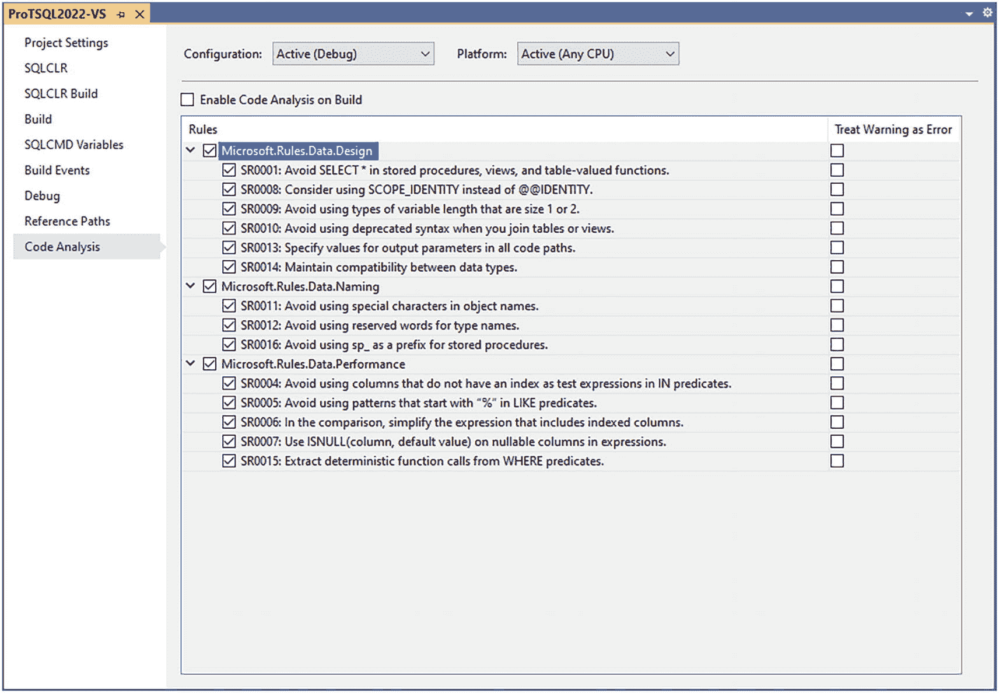

一张截图展示了`Pro T Q S L 2022 V S`项目的代码分析。配置被选择为活动、调试。平台被选择为活动、任何`C P U`。多条规则在复选框中被勾选。

图 11-10

数据库项目中的代码分析

你可以选择在每次构建数据库项目时运行代码分析。你还可以选择哪些项目应作为代码分析的一部分包含进来。这些选项包括最佳实践和可能影响 T-SQL 代码性能的项目。此外，还可以选择将其中一些规则升级为错误并失败，而不是发送警告消息。

静态代码分析的好处在于，它自动化了确保 T-SQL 代码符合你业务编码标准的过程。这可以让代码被拒绝的感觉不那么个人化；代码是作为整个构建过程的一部分被审查和拒绝的。构建过程也会以一致的方式传达警告或错误消息。

将你的数据库代码纳入源代码管理只是问题的一半。真正的挑战可能出现在尝试部署仅保存在源代码管理中的数据库变更时。确定你希望如何部署代码将帮助你决定使用什么方法来保存你的 T-SQL 代码。从源代码管理部署 T-SQL 代码将在第 13 章中进一步讨论。

## 部署

在开发软件的过程中，总会有需要实现新功能的时候。关于新功能的一个普遍问题是如何以不影响当前性能的方式实现它。对于当今的许多企业来说，让应用程序全天候运行的需求至关重要。这造成了一种情况，任何形式的停机或当前功能的损失都可能极其昂贵。虽然使用的部署方法可以帮助最小化与新功能相关的整体风险，但在编写新代码时，还有其他选项可以使用。

一个经常出现的问题与软件开发的方式与代码部署的方式之间的关联有关。在许多项目中，实现新功能所需的时间大于部署 T-SQL 代码的频率。确定如何管理源代码管理可以减轻其中一些风险。T-SQL 代码可以通过不同的方式部署。了解这些方法以及使用它们的最佳时机将有助于改进你的数据库部署。在用户如何与数据库代码交互方面也有选择。

### 方法论

每个开发环境都是不同的。在决定如何部署 T-SQL 代码之前，更好地了解你公司的开发处理方式会有所帮助。你需要知道你公司有多少数据库开发人员，以及有多少不同的开发团队使用 SQL Server。另一个你想知道的因素是这些开发团队如何编写和部署代码。收集所有这些信息使你能够确定最适合你环境部署 T-SQL 代码的方法。

在使用 SQL Server 时，与代码问题相关的风险通常比应用程序代码更大。当有多个个人访问相同的 T-SQL 代码时，这些风险会加剧。如果你处在一个你是唯一数据库开发人员的环境中，发生合并冲突问题的机会可能较少。如果有多个数据库开发人员或团队编写 T-SQL 代码，那么有不止一个人处理相同数据库代码的可能性就更大。虽然其中一些可以通过源代码管理来管理，但注意数据库代码如何部署也很重要。


### 部署类型

确定部署方法的部分包括了解你当前用于部署数据库代码的流程。目前，你的业务可能有手动部署的脚本。根据你的组织结构，你可能有一个环境，其中这些脚本可以随时部署到特定环境，或者你可能有一些关于这些 T-SQL 脚本可以在一周的哪几天部署的条件。了解谁在开发数据库代码、如何编码和管理变更以及你的部署频率，可以帮助你确定基于迁移的方法还是基于状态的方法更适合你。

如果你只能在某些特定日期部署到各种环境，这被称为`门控部署`。你可能在版本控制系统中使用数据库项目。第 11 章涵盖了分支和合并的主题。你的公司可能只为你数据库项目使用一个分支。所有个人的开发工作都在同一个地方完成。另一方面，你的公司可能利用`分支`。这是你的开发人员使用主代码库的副本并对该副本进行更改的地方。有些公司可能直接从一个分支部署。如果你的数据库代码不是设计为可以在任何时间点部署，这可能特别有用。其他公司，特别是那些编写代码以在任何时间点部署的公司，可能会选择在所有工作完成后将所有分支合并回 master 或主分支。在这种情况下，所有部署都来自主分支。

有时团队管理其工作流的方式取决于其部署的频率。对于许多公司来说，目标是能够频繁部署。然而，这并不意味着每个公司都准备好接受那种频率的部署。对于以更接近看板风格编写代码的开发团队来说，代码部署到生产环境可能没有固定模式。其他团队可能有固定的节奏或冲刺周期来部署他们的代码。这些冲刺周期可以从几周到几个月不等。如果你的公司仍在决定发布代码的频率，我建议避免过长的冲刺周期，因为这通常意味着一次部署的变更更多。这会增加部署出现问题的风险。

你还想了解平均每次部署的数据库变更量。你可能会发现平均每个冲刺部署的数据库变更并不多。如果是这种情况，请确保你最终不会进行包含大量数据库变更的部署。当一次部署中发生多个数据库变更时，不仅出现错误的风险更大，而且根据你的部署方法，一个 T-SQL 代码的变更可能会覆盖另一个变更。

在介绍两种主要的数据库代码部署方法之前，还有一个额外因素你应该考虑。虽然我们都希望每次数据库部署都能按预期工作，但有时你可能需要撤销或回滚部署中的一个或多个数据库变更。如果你还没有回滚策略，现在是开始考虑一个可靠的回滚策略的好时机。当需要回滚时，并不是开始弄清楚如何快速有效地回滚你的 T-SQL 代码的好时机。拥有一个可以重复执行此操作的方法可以显著提高你对部署的信心。你的公司可能会使用回滚脚本来简化需要恢复到先前版本数据库代码的情况。如果你使用版本控制，你可以选择恢复到数据库代码的不同版本。在此基础上，如果你使用持续集成，你可能有一个预先打包的先前数据库代码版本，可以在几分钟内部署到你的生产数据库。

#### 基于迁移的部署

这最终引导我们考虑数据库部署常用的部署方法。一种方法包括将所有要一起部署的脚本打包在一起。这被认为是`基于迁移的方法`；另一个选项是采用源代码管理中存在的所有内容，并将其视为你数据库的真实来源。使用这种方法时，你部署到的任何数据库都将被覆盖，以匹配源代码管理中存在的数据库对象。这通常被称为`基于状态的部署`。

现在你了解了基于迁移的部署方法是什么，你可以开始确定它是否最适合你的部署。使用基于迁移方法的主要好处之一是，你可以精确控制部署到数据库的内容。这种部署方法通常涉及将所有要部署的脚本保存在一个位置，这些脚本通常以某种方式命名，以便可以按特定顺序部署。这可以使你的部署易于管理。你可以快速找到保存脚本的文件夹，并确切知道部署了什么内容。

如果你使用这种部署方法，我建议你有一个单独的文件夹来跟踪需要部署的回滚脚本以及这些回滚脚本应部署的顺序。如果你需要在部署当晚回滚，或者需要一次性回滚几个部署，这将帮助你快速找到需要回滚的代码。基于迁移的部署方法有一些限制。主要挑战之一是如果你需要回滚特定的代码片段。根据你的源代码管理方式，这可能不像查看该数据库对象的历史记录并从源代码管理恢复先前版本那么简单。

基于迁移的部署方法可以手动设置。你和你的团队可以编写你的 T-SQL 代码文件，并按数字顺序保存。这实际上包括在 SQL Server Management Studio 中创建一个脚本，并使用特定的命名约定保存文件。这个命名约定包括指定部署顺序，例如在文件名前加上步骤号以指示部署顺序。

你可能会创建一个名为`001_20230620_DB232_ActiveProduct.sql`的文件。然而，你可能随后收到请求，要求对同一存储过程进行额外修改。在这种情况下，你需要从存储过程`dbo.GetProduct`中删除日期列。在清单 12-1 中，你可以找到 T-SQL 代码。

```
PRINT N'Altering [dbo].[GetProduct]...';
GO
/*-------------------------------------------------------------*\
Name:             dbo.GetProduct
Author:           Elizabeth Noble
Created Date:     2022-10-30
Description:      Get a list of all products in the databases
Updated Date:     2023-05-23
Description:      Add feature flag. If feature flag is enabled, only
Show active products. Otherwise, show all products.
Updated Date:     2023-06-20
Description:      Remove the feature flag. Leave only the new logic.
The stored procedure now only returns active products.
Updated Date:     2023-06-21
Description:      Remove dates.
The stored procedure now only returns active products.
Sample Usage:
EXECUTE dbo.GetProduct;
\*-------------------------------------------------------------*/
CREATE OR ALTER PROCEDURE dbo.GetProduct
AS
SELECT
ProductID,
ProductName,
ProductPrice,
IsActive
FROM dbo.Product
WHERE IsActive = 1;
```
清单 12-1
基于迁移部署的示例脚本


完成对数据库代码的修改后，您可以将此代码保存为 SQL 脚本。保存此代码的文件名为 `002_20230620_DB232_RemoveDates.sql`。为了确保部署顺利进行，您可以将两个文件放在同一个文件夹中。图 12-1 显示了这两个文件在文件文件夹中的显示方式。

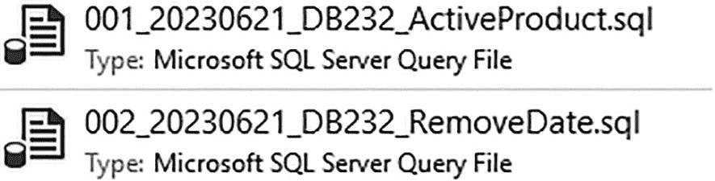

截图显示了活动产品和删除日期的 SQL 文件名。它还进一步显示文件类型为 Microsoft SQL Server 查询文件。

图 12-1

基于迁移的文件列表

您创建的第一个脚本以 001 开头。这是按文件名排序的第一个脚本。这也是下次部署时应运行的第一个脚本。您创建的第二个脚本以 002 开头。这些文件被专门命名，以便在下次软件发布时按文件名升序运行。手动编写 `T-SQL` 脚本并保存并非基于迁移的部署中唯一可用的方法。第三方工具可以帮助您管理此过程。

基于迁移的部署有许多支持者。开发任何数据库代码的一个主要挑战是，当多个开发人员基于同一个代码库工作时，如何管理代码的维护。在第 11 章中，我介绍了分支和合并。这是确保所有为数据库项目开发 `T-SQL` 代码的人员都能以限制多个开发人员处理同一数据库对象时产生不一致的方式工作。如果您与不习惯使用源代码控制的团队合作，采用基于迁移的方法可能更合理。基于迁移的部署过程更适合处理对数据库数据的多次更改。这可以是数据清理的一部分，或与重构数据库对象有关。使用基于迁移的部署方法的另一个优点是，更容易精确选择将要部署的数据库对象。如果您频繁更改数据库，最终可能会得到许多脚本，这可能会增加部署所需的时间。

由于这些因素，在某些情况下，您可能会发现基于迁移的部署比基于状态的部署更有效。较小的开发团队可能会发现基于迁移的方法更容易使用。如果您为数据库使用源代码控制，您仍然需要确保您的团队同步他们的开发数据库代码。对于开发团队较少的环境，情况也可能如此。如果您团队不在同一天进行频繁部署，或者有较大的维护窗口可用于部署，那么基于迁移的部署方法也可能很适合您。

使用基于迁移的方法时，您需要牢记的一个风险涉及在源代码控制之外发生的数据库更改。您可能会遇到需要立即将更改部署到生产环境的情况。通常，这些更改在没有部署到较低环境或未签入源代码控制的情况下就被部署到生产环境。如果您需要部署热修复或补丁，而此代码最终未进入您的源代码控制，您的环境可能会变得不同步。虽然未来的部署不会覆盖您的更改，但您可能会发现环境之间存在不一致的行为。为了解决这个问题，任何手动进行的热修复都应添加回源代码控制，以便您的开发环境与生产环境保持同步。

#### 基于状态的迁移

基于状态的推出涉及将整个数据库架构从一个环境复制到另一个环境。部署 `T-SQL` 代码时，基于迁移的部署并非唯一可用的选择。数据库部署的另一个流行选项涉及使用数据库架构的来源，并更新目标环境以具有相同的数据库架构。这被称为 `基于状态的方法`。通常，这与源代码控制一起使用，但这并非总是必要。其概念是，在部署完成后，目标数据库将与源数据库或源代码控制相似。此方法不需要源代码控制，但通过源代码控制更容易管理。

在使用基于迁移的方法时，每个更改都单独保存在其自己的脚本文件中，而对于基于状态的部署则不是这样。在基于状态的部署中，对同一数据库对象可能有多个更改，但只有一组 `T-SQL` 代码被部署到目标数据库实例。这个单一的 `T-SQL` 脚本将所有更改合并为一个净更改。如果数据库对象在源代码控制中，或者源数据库与目标不同，则会在目标实例上运行更改脚本。我也喜欢这一点，因为我知道一旦部署完成，数据库将处于什么状态。部署完成后，目标实例中的数据库应具有与源位置相同的数据库对象。

使用与基于迁移方法相同的示例，我将逐步介绍其作为基于状态部署的一部分是如何处理的。第一步涉及进入源代码控制并确保您拥有最新版本。获得最新版本后，您可以打开存储过程 `dbo.GetProduct`。进行这些更改后，您可以将这些更改签入源代码控制。

假设其他人正在修改代码以匹配清单 12-1 中的 `T-SQL` 代码。如果另一个开发人员想要更改此过程，他们需要确保使用的是最新的副本。他们通过检查源代码控制中是否有其他开发人员的任何签入来实现。在此示例中，他们将找到您所做的更改。如果他们跳过此步骤，您的代码更改可能会丢失，或者可能出现合并冲突。然后，他们可以更改 `dbo.GetProduct` 存储过程。然后可以将这些更改合并回主分支。当部署此代码时，源位置将包含两个更改。这些更改将仅显示活动产品并删除日期列。不是一次部署一个更改，而是将存储过程 `dbo.GetProduct` 部署到目标实例一次。对存储过程的单个更新将包含这两个更改。


当与众多开发者或不同的开发团队协作时，采用基于状态的部署方法可能带来显著优势。这源于整个数据库项目中可能发生的频繁变更。虽然基于状态的迁移适用于有少量或大量变更的数据库项目，但这种方法在管理频繁变更方面表现更佳。这是因为，使用迁移方法时，众多开发者的大量变更意味着部署流程需要更多步骤；而在基于状态的方法下，需要更改的文件则更少。采用基于状态的方法，你的部署过程会更快，也更不容易因某人输错文件名而导致代码部署出现问题。使用基于状态的方法，你可以确信，在部署完成后，源位置的任何变更都将同步到目标位置。这也意味着，如果生产环境中有许多未纳入源代码控制的变更，这些变更将在下一次部署时被覆盖。如果你的团队执行频繁更新（尤其是全天持续进行），你可能会发现基于状态的方法部署耗时更少。至少，这通常是因为在频繁部署的情况下，基于状态方法所需部署的变更通常更少。

使用基于状态方法最大的挑战之一，在于如何部署数据操作变更。这些数据变更可能涉及管理配置表、管理功能开关、添加默认值，或纠正因先前缺陷而受影响的数据。基于状态的方法非常适合比较整个数据库架构。然而，在更改数据库内部数据方面存在局限性。在大多数情况下，这是通过在部署后可能执行的手动脚本来完成的。如果你使用源代码控制，可以通过 `预部署` 和 `后部署` 脚本来管理这些变更。如果你使用源代码控制，那么 `预部署` 和 `后部署` 脚本各只有一个。这可能会使数据变更的过程变得有些复杂，因为你需要编写 `T-SQL` 代码，使其能够运行一次后便被忽略，或者你需要进入源代码控制并频繁更改你的 `预部署` 或 `后部署` 脚本。

### 开发风格

数据库开发团队有几种不同的方式来管理工作流程。所采用的方法论会影响应该选择哪种类型的部署方法。

### 看板

我第一份需要持续编写数据库代码的工作没有严格的时间表。目标是尽快做出更改并部署。这通常是因为我在创建 SQL Server 报表服务 (SSRS) 报告。通常，这种类型的开发可以被称为看板。看板指的是一种管理变更请求的方法。其高层概念是存在一个持续的工作队列。请求进入待办事项列表，然后逐个处理，直到完成。

### Scrum

Scrum 代码开发方法比看板更具结构性。Scrum 包括几个步骤，例如确保工作项定义明确、估算完成特定工作项所需时间，以及确定工作项何时完成。为了确定代码预期何时完成并可部署，组织会确定他们打算以多高的频率部署代码。这段时间长度被称为 `Sprint 或冲刺周期`。每个 Sprint 预计包含可完成的固定数量工作。利用估算值，工作项根据其优先级被添加到 Sprint 中，直到估算的工作量与 Sprint 的预期工作量相匹配。这是一个高层定义，并非关于如何为你的数据库团队实施 Scrum 或看板的深度指南。对于这些部署，Sprint 中的所有用户故事都应作为该 Sprint 的一部分部署。虽然有一些方法可以在不改变功能的情况下部署 Sprint 内的所有内容，但我们的代码通常并非那样编写。

如果你的业务正在尝试做到能在任何时间点部署变更，请考虑改变你开发数据库代码的方式。这种改变可能涉及你对解决方案的思考方式以及你编写代码的方式。使用功能开关等概念将会帮助你。本质上，你希望以这样一种方式编写你的 `T-SQL` 代码：它可以在任何时间点部署，而你的应用程序不会崩溃。然而，达到这一点需要几个基本步骤。首先是了解你公司如何开发其 `T-SQL` 代码。如果你有许多开发者为单个应用程序编写 `T-SQL` 代码，与每个开发者负责不同应用程序的情况相比，你可能需要以不同方式处理部署。这将帮助你确定哪种部署方法最适合你。


### 特性标志

你可能会遇到这样的情况：需要对一个应用程序进行修改，而这将涉及许多不同的用户故事。换句话说，你可能在重构一个需要数月时间才能完成的应用程序。与此同时，你知道你的业务可能每两周就部署一次数据库代码。问题就变成了：如何开发 T-SQL 代码，既能确保代码在现有数据库结构中有效工作，又能保证这些数据库变更在准备好之前不会进入生产环境。

这不仅是许多数据库开发人员，也是许多软件开发人员问过自己的问题。问题的核心在于如何编写可以随时开启或关闭的数据库代码。一种试图处理这个问题的方法是使用**特性标志**。特性标志是一种以编程方式启用或禁用功能的方法。它们不是 SQL Server 的特定功能，而是实现 T-SQL 代码的一种方法。理想情况下，特性标志用于允许代码尽快部署，同时能精细控制功能何时启用。使用特性标志的初衷是让它们只存在有限的时间，因为它们的目的只是在启用功能之前允许代码部署。高层次的过程如下：

1.  向数据库添加一个处于禁用状态的特性标志。
2.  更新存储过程，使用 `IF ((SELECT IsActive FROM dbo.FeatureFlag WHERE FeatureFlagID = <FeatureFlagID>) = 1)... EXISTS...`
3.  从数据库表中启用该特性。
4.  更新存储过程，移除 `IF… EXISTS`，仅使用新逻辑。
5.  从数据库表中禁用或删除该特性标志。

实现特性标志的方法有很多。目标始终如一：创建可以配置为在不同场景下工作的数据库代码和数据库对象。

使用特性标志时，你可以随意启用或禁用新功能。这种管理数据库代码的方法可以让你编写代码，将代码部署到生产环境，并在业务选定的后续时间启用新功能。除了能够精确控制何时启用新功能外，你还能获得一个额外好处：通过更新数据库中的一个值，几乎可以即时回滚变更。在完全采用特性标志之前，你需要打好一些基础。例如，你应该养成对数据库代码进行单元测试的习惯。对于特性标志，你需要在特性标志启用时进行单元测试，也需要在特性标志禁用时进行单元测试，以确认你的应用程序使用的是预先存在的数据库逻辑。

我建议你等到完全为数据库实施了源代码管理之后，再采用特性标志。这样建议的原因之一是管理特性标志需要额外的工作。当你为数据库对象创建特性标志时，你需要创建一些额外的逻辑，以允许你的应用程序使用预先存在的 T-SQL 代码或新的数据库代码。这既需要纪律性，也需要明确的流程来确定何时从代码中移除特性标志。虽然特性标志对于存储过程、函数或视图等数据库对象非常有效，但它们并不是你开发的所有内容的解决方案。有些变更，例如对数据库列的修改，无法被开启和关闭。为了管理对数据库对象的这类变更，我将在本节末尾讨论一些解决方案。

当为你的 T-SQL 代码使用特性标志时，你有几种选项来确定在任何给定时间哪些特性标志是启用的。关于特性和数据库，我听过两种主要的解决方案被提出。第一种可能更偏向于应用程序代码。它包括在配置文件中提供特性标志的值。第二种选项更偏向于基于 T-SQL 的解决方案。这个解决方案涉及创建一个表来存储特性标志及其当前状态（如启用或禁用）。每种选项都有其优缺点。使用应用程序代码来管理特性标志可能更容易实现和管理。然而，数据库管理员可能更难支持这些特性标志。如果你将特性标志值保存在数据库中，你需要有纪律地管理这些特性标志并移除它们。最终很容易得到一张堆满了已弃用特性标志的表。缺点是只有有权访问数据库表的用户才能确认每个特性标志关联的值。

当你部署数据库代码时，可以将特性标志部署为禁用状态。一旦你准备好启用新功能，就可以将特性标志设置为启用。你需要定义一个流程来确定何时完全切换到新功能。当你准备好完全在新功能下运行时，移除之前的 T-SQL 代码。同时，在这个过程中移除任何对特性标志的引用。这种方法的挑战是，很容易跳过移除先前数据库代码的流程。如果你的 T-SQL 代码没有定期清理，这会大大降低你代码未来的可维护性。

如果你需要更新一个存储过程以使用新逻辑，你可以使用特性标志，以便在想要的时候部署这个变更。参考清单 12-2，你可以找到未经修改的原始存储过程。

```
/*-------------------------------------------------------------*\
Name:             dbo.GetProduct
Author:           Elizabeth Noble
Created Date:     2022-10-30
Description:      Get a list of all products in the databases
Sample Usage:
EXECUTE dbo.GetProduct;
\*-------------------------------------------------------------*/
CREATE OR ALTER PROCEDURE dbo.GetProduct
AS
SELECT
ProductID,
ProductName,
ProductPrice,
IsActive,
DateCreated,
DateModified,
DateDisabled
FROM dbo.Product;
GO
Listing 12-2
原始存储过程
```

这个存储过程提取了关于所有产品的各种信息。在这段 T-SQL 代码中，存储过程没有区分活跃和不活跃的产品。它返回了所有产品的信息。你可能会发现这个存储过程本应该只返回活跃的产品。你需要更新这个存储过程，使其只返回活跃产品，并排除 `IsActive` 列。移除这个列可以防止这个代码变更在部署后立即被启用。

在这种情况下，你需要使用像特性标志这样的机制，以赋予你灵活性来创建存储过程的这些变更，并控制这些变更何时对应用程序可用。使用特性标志时，你需要一种方法来确定某个特性标志是启用还是禁用。这就是你和数据库代码将知道在给定时间应执行哪段 T-SQL 代码的方式。一个选项是创建一个表来存储有关特性标志的信息。你可以创建一个如清单 12-3 所示的表。

```
CREATE TABLE dbo.FeatureFlag
(
FeatureFlagID     SMALLINT,
IsActive          BIT,
DateCreated       DATETIME2,
DateModified      DATETIME2
);
Listing 12-3
创建特性标志表
```


