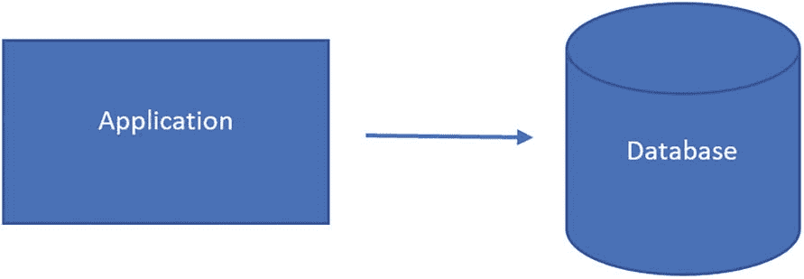
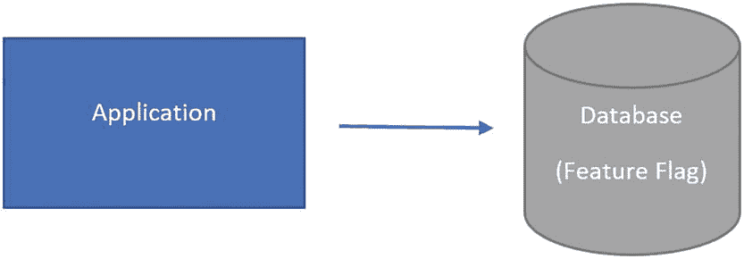
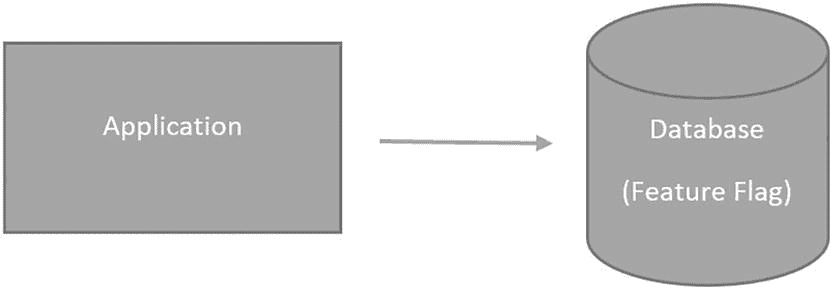
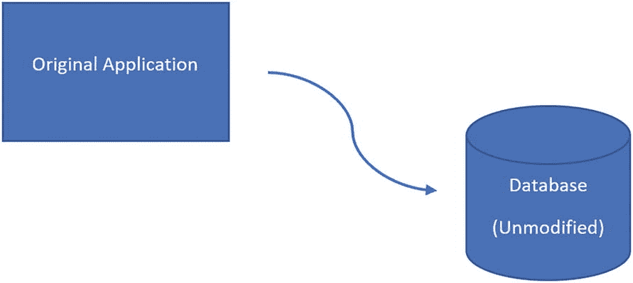
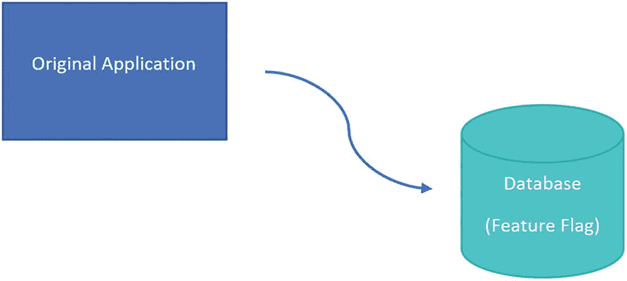
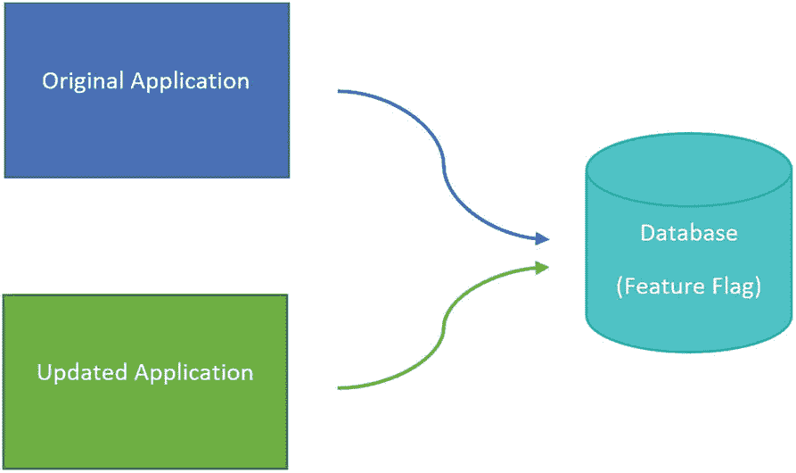
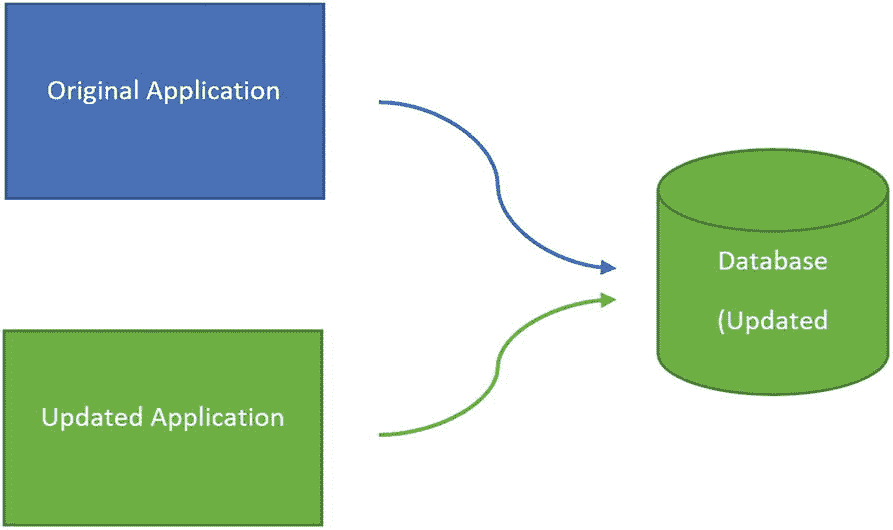
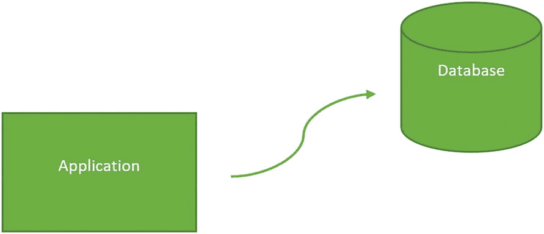

# 功能标志在数据库开发中的使用

## 功能标志表简介

这个表格很简单，包含一个整数形式的功能标志 ID、一个指示功能标志是否启用的值、一个功能标志的创建日期，以及一个功能标志值最后更新的日期。这个表格允许你存储有关启用了哪些功能标志的信息。

要使用此功能标志表，你需要将此功能标志的信息输入到清单 12-3 中创建的表中。清单 12-4 中的`INSERT`语句展示了向`dbo.FeatureFlag`表插入数据。

```
INSERT INTO dbo.FeatureFlag
(
FeatureFlagID,
IsActive,
DateCreated,
DateModified
)
VALUES (947,0,SYSDATETIME(),SYSDATETIME());
Listing 12-4
插入功能标志记录
```

## 插入功能标志记录

你已经为功能标志 947 插入了一条记录。在插入时，该功能标志是禁用的。目标是现有的存储过程在功能标志添加后继续返回与之前相同的结果。

## 修改存储过程以使用功能标志

在清单 12-5 的存储过程中，你添加逻辑以使存储过程能够根据功能标志 947 是禁用还是启用返回不同的结果。

```
/*-------------------------------------------------------------*\
Name:             dbo.GetProduct
Author:           Elizabeth Noble
Created Date:     2022-10-30
Description:      Get a list of all products in the databases
Updated Date:     2023-05-20
Description:      Add feature flag. If feature flag is enabled, only
Show active products. Otherwise, show all products.
Sample Usage:
EXECUTE dbo.GetProduct;
\*-------------------------------------------------------------*/
CREATE OR ALTER PROCEDURE dbo.GetProduct
AS
IF ((SELECT IsActive FROM dbo.FeatureFlag WHERE FeatureFlagID = 947) = 1)
BEGIN
SELECT
ProductID,
ProductName,
ProductPrice,
DateCreated,
DateModified,
DateDisabled
FROM dbo.Product
WHERE IsActive = 1;
END
ELSE
BEGIN
SELECT
ProductID,
ProductName,
ProductPrice,
IsActive,
DateCreated,
DateModified,
DateDisabled
FROM dbo.Product;
END;
Listing 12-5
带功能标志的存储过程
```

此查询的第一部分现在仅在功能标志 947 启用时返回结果。在任何其他情况下，存储过程都返回第二个查询的结果。功能标志的原始状态是禁用的。当功能标志被禁用时，将返回所有产品。

## 启用功能标志

一旦此代码部署到生产环境，你将准备好启用新功能。此时，运行清单 12-6 中的 T-SQL 代码将启用该功能标志。

```
UPDATE dbo.FeatureFlag
SET   IsActive = 1,
DateModified = GETDATE()
WHERE FeatureFlagID = 947;
Listing 12-6
启用功能标志
```

启用此功能标志将导致存储过程`dbo.GetProduct`现在仅返回活跃产品。

## 移除功能标志并更新最终逻辑

一旦你确信新代码按预期工作且没有业务需求回滚，请更新存储过程，使其仅返回新数据库代码的结果。移除功能标志还可以防止此存储过程在功能标志被错误更新时返回不准确的结果。清单 12-7 中的 T-SQL 代码展示了`dbo.GetProduct`存储过程的最终状态。

```
/*-------------------------------------------------------------*\
Name:             dbo.GetProduct
Author:           Elizabeth Noble
Created Date:     2022-10-30
Description:      Get a list of all products in the databases
Updated Date:     2023-05-20
Description:      Add feature flag. If feature flag is enabled, only
Show active products. Otherwise, show all products.
Updated Date:     2023-06-20
Description:      Remove the feature flag. Leave only the new logic.
The stored procedure now only returns active products.
Sample Usage:
EXECUTE dbo.GetProduct;
\*-------------------------------------------------------------*/
CREATE OR ALTER PROCEDURE dbo.GetProduct
AS
SELECT
ProductID,
ProductName,
ProductPrice,
DateCreated,
DateModified,
DateDisabled
FROM dbo.Product
WHERE IsActive = 1;
Listing 12-7
最终的存储过程
```

存储过程`dbo.GetProduct`中的数据库代码已更新。在任何代码更改之前，此存储过程返回所有产品。创建功能标志后，存储过程被更新为包含根据功能标志状态返回所有产品或仅活跃产品的逻辑。当更改得到确认后，你可以移除功能标志的逻辑。这将使存储过程保持原样，只包含更新后的 T-SQL 代码。你可以通过将`IsActive`设置为 FALSE 来清理`dbo.FeatureFlag`表，或者删除功能标志 ID 为 947 的行。

## 版本控制与持续部署的思考

你管理源代码控制中的分支和合并的方式，可能决定了你需要多频繁地部署未完成的数据库代码。你可能会发现自己正处于开发数据库代码但在下一次部署前尚未完成的情况。通常，以可以在完成时部署的方式编写代码是最简单的。然而，随着向敏捷软件开发的转变，以可以在任何时间点部署的方式编写 T-SQL 代码变得越来越重要。这正是功能标志真正价值的体现。


## 自动化部署

处理数据库部署的方式多种多样。您可以使用不同的工具来自动化数据库部署，并采用不同的部署策略。确定为数据库部署采用何种方法，取决于您试图预防或解决的问题类型。这些问题可能包括：在部署过程中未能更新代码、在部署过程中覆盖代码、防止部署不需要的代码，或提高部署速度。这些部署策略取决于所部署的 `T-SQL` 代码类型。其他部署数据库代码的方法涉及以某种方式部署数据库，帮助您在更改部署到包括生产环境在内的所有其他环境之前，在开发阶段发现问题是关键。

有多种方法可以使用 `SQL Server Management Studio`、`Visual Studio` 或 `PowerShell` 来简化和自动化部署 `T-SQL` 代码。如果您希望在不将数据库纳入源代码控制的情况下实现数据库部署自动化，则需要采取一些额外步骤来保护您的数据库。`SSDT` 允许所有对象以 `CREATE` 开头。在部署代码时，`SSDT` 会判断一个对象应使用 `CREATE` 还是 `ALTER`。如果您想使用 `DML` 更改数据库中的数据，则需要使用预部署或后部署脚本。这样做时，您的 `T-SQL` 代码应编写成允许多次运行。这可能不是您当前使用的方法，但您应该考虑如果有人意外再次尝试部署相同的脚本会发生什么。编写脚本时，应确保无论执行多少次都能成功运行。如果您已经在使用源代码控制，那么您的源代码控制应该为您管理此功能。

当作为基于迁移的部署的一部分部署 `T-SQL` 代码时，如果您不使用源代码控制，流程可能会有所不同。对于基于迁移的部署，您通常有一组需要运行的脚本来完成部署。在不使用源代码控制时，最复杂的步骤有时是确切地确定应该部署什么。当您准备好部署 `T-SQL` 代码时，理想情况下，脚本将保存在同一个文件夹中。此时，您可以手动运行所有这些迁移脚本，或者确定如何实现运行脚本的自动化。如果您选择手动运行脚本，则必须打开每个脚本，并确保连接到正确的 `SQL Server` 实例。还有其他选项可用于提高部署这些迁移脚本的一致性和速度。您可以使用批处理文件或 `PowerShell` 来帮助自动执行这些部署。代码清单 12-8 包含了运行保存在文件夹 `C:\Deploy` 中的所有 `SQL` 脚本文件所需的 `PowerShell`。

```
Invoke-DbaQuery -SQLInstance localhost -Database OutdoorRecreation -File "C:\Deploy\*.sql"
代码清单 12-8
用于运行 SQL 脚本的 PowerShell
```

此代码表示，`C:\Deploy` 文件夹中扩展名为 `.sql` 的所有文件都应在 `localhost` `SQL Server` 上的 `OutdoorRecreation` 数据库中执行。

提示

此代码使用 `PowerShell` 模块 `dbatools` 执行。该模块是一个由 `SQL Server` 社区构建的开源项目。更多详情，请访问 [`https://dbatools.io/`](https://dbatools.io/)。

如果您使用的是基于状态的迁移方法并且未使用源代码控制，也可以使用 `PowerShell` 实现自动化。这些 `DACPAC` 可以从已有的数据库和 `SQL Server` 实例生成。根据您选择处理 `DACPAC` 的方式，您可以将目标数据库更新为匹配 `DACPAC` 中的代码，或者基于 `DACPAC` 与目标数据库之间的差异创建一个脚本文件。一旦找到从您的解决方案或工作区生成的 `DACPAC` 文件，您就可以运行代码清单 12-9 所示的 `PowerShell` 代码。

```
Publish-DbaDacPackage -SQLInstance localhost -Database OutdoorRecreation -Path C:\temp\OutdoorRecreation.dacpac
代码清单 12-9
用于比较 DACPAC 的 PowerShell
```

此 `PowerShell` 也来自 `dbatools` 模块。它不是执行 `C:\temp` 文件夹中的所有 `SQL Server` 文件，而是将 `DACPAC` 文件中的架构与 `localhost` 服务器上 `OutdoorRecreation` 数据库的架构进行比较。此 `PowerShell` 命令包含一些额外的开关，例如 `-GenerateDeploymentReport` 或 `-ScriptOnly`。`-GenerateDeploymentReport` 会创建一个 `XML` 文件，显示对数据库所做的更改。`-ScriptOnly` 选项会输出一个可以手动执行的 `SQL Script` 文件。根据您选择处理 `DACPAC` 的方式，您可以将目标数据库更新为匹配 `DACPAC` 中的代码，或者基于 `DACPAC` 与目标数据库之间的差异创建一个脚本文件。

实现完全自动化部署的最简单方法是使用第三方工具。然而，这并非您唯一的选择。如果您对基于迁移的部署感兴趣，至少有一个免费的第三方工具可用：`DbUp`。虽然此工具可能有助于管理基于迁移的部署，但本书不会涵盖 `DbUp`。请注意，如果您打算使用基于迁移的部署和源代码控制，您将需要一个扩展程序或类似 `DbUp` 的其他工具。

如果您的数据库已纳入源代码控制并且您正在使用基于状态的迁移，那么有几种替代方案来部署数据库更改。您可以选择直接从 `Visual Studio` 将更改部署到目标数据库实例。虽然您仍然是手动部署代码，但这可以显著节省时间，因为您不必打开多个文件并单独执行每个文件。但是，如果不使用第三方工具来进一步自动化部署，您将需要创建 `PowerShell` 脚本来生成 `DACPAC` 或 `SQL script` 文件，并将这些文件部署到目标实例。

在上一节关于部署方法的内容中，我介绍了基于迁移和基于状态的部署。在部署修改数据的更改时，例如使用数据操作语言（`DML`）查询，您需要确保不会意外地多次修改数据。虽然我们可能希望确保每个脚本都能以无法多次更新数据的方式编写，但有时可能无法编写脚本来防止这种情况发生。如果发生这种情况，您可以使用类似于功能标志（feature flags）的概念。即创建一个表来记录数据修改脚本何时已运行。脚本首次完成时，可以更新该表并添加一个值，表明所有记录都已更新。例如，如果您想将产品价格提高 10%，您的 `T-SQL` 代码应编写成不会在每次部署数据库项目时都更新产品价格。该脚本还可以检查以确保该值在脚本运行之前不存在于表中。该表也可以在 `T-SQL` 脚本整体通过或失败时进行检查和填充，或者在更新完成时记录每个单独的记录。


你可能还会发现，有时数据库代码已准备好部署，但业务尚未准备好启用新功能。本章前面已经介绍过，特性开关如何帮助你控制应用程序使用数据库代码的当前状态还是未来状态。有一种部署方法可以在这些情况下提供帮助。其最大优势在于，你可以在不使用这些新 T-SQL 代码的情况下部署数据库代码。根据所更改的数据库对象，管理起来可能相对容易或困难。

当你想要部署 T-SQL 代码更改，但尚未准备好将这些更改发布到生产环境时，可以使用一种部署方法来帮助你。这种部署方法被称为 *暗部署*。此方法使用特性开关或类似概念。你部署 T-SQL 代码，使得数据库代码继续按原有方式运行。当你准备好启用新功能时，可以启用特性开关。这会切换数据库代码的工作方式，使其使用新功能而非原始数据库代码。

## 暗部署步骤

应用程序和数据库的初始状态如图 12-2 所示。



图 12-2：未修改的应用程序和数据库

暗部署的下一步是通过部署 SQL 脚本来更新数据库。如果你使用特性开关，此时应将其禁用。图 12-3 中的数据库已用新的数据库代码更新。



图 12-3：部署数据库更改

部署带有特性开关的 T-SQL 代码后，你现在就可以部署应用程序了。一旦你部署应用程序并启用特性开关，你的应用程序和数据库将处于相同状态，如图 12-4 所示。



图 12-4：部署应用程序并启用特性开关

这些步骤可以让你以“暗”的方式部署数据库更改。

## 蓝绿部署

数据库部署涉及许多风险。这些风险可能涉及不再按预期工作的 T-SQL 代码或应用程序代码。也存在代码看似有效但实际不符合预期的风险。在某些情况下，这个问题可能只是表面性的。其他时候，数据库代码中的缺陷可能会对保存在数据库中的数据质量产生负面影响。这可能包括以导致数据无法再使用的方式更改数据。为避免这类情况，可以使用不同的部署方法来保护数据库和应用程序。

一种潜在的部署方法是将一组硬件替换为装有更新软件的另一组硬件。这种部署方法被称为 *蓝绿部署*。这对应用程序效果很好，但当涉及数据库时会更加困难。如果你的应用程序仅使用数据库读取数据，你可以直接使用蓝绿方法。然而，由于该概念是完全替换代码，这对于需要允许写入活动的数据库效果不佳。

有一种改进的蓝绿方法可用于数据库。在这种方法中，你仍然有两组应用程序：原始应用程序和新应用程序。当用户连接到原始应用程序时，你部署那些可以更新并仍允许原始应用程序按预期工作的脚本。如果你使用特性开关，你部署使用了特性开关的数据库对象。一旦你准备好开始使用新的应用程序代码，你可以更新存储过程，开始为新的应用程序代码使用特性开关。在你确信对应用程序和数据库代码的更新按预期工作后，可以移除特性开关。此时，你已完全过渡到新的应用程序代码，并且所有特性开关都将从 T-SQL 代码中移除。

### 蓝绿部署步骤

你的蓝绿部署的初始状态如图 12-5 所示。



图 12-5：未修改的应用程序和数据库

在部署前，应用程序和数据库均未修改。蓝绿数据库部署的下一步是部署那些将对原始或新应用程序都有效的数据库更改。图 12-6 显示数据库已应用了一些更改。



图 12-6：部署数据库更改

原始应用程序将继续连接到已修改的数据库。蓝绿部署方法基于替换代码而非覆盖代码的概念。为了遵循此部署方法，你需要搭建新应用程序所需的硬件和软件。图 12-7 显示了数据库和更新后的应用程序的状态。



图 12-7：部署新应用程序

在特性开关就位的情况下，两个应用程序继续以与原始应用程序相同的方式运行。既然应用程序代码已准备就绪，就可以在数据库中启用特性开关了。图 12-8 显示了更新后的应用程序连接到更新后的数据库。



图 12-8：移除特性开关

更新后的应用程序和数据库已启动并运行，原始应用程序已停用。新的状态将如图 12-9 所示。



图 12-9：移除原始应用程序

移除原始应用程序信息即完成蓝绿部署过程。重申一下，蓝绿部署的过程如下：

1.  从未修改的应用程序和数据库开始。
2.  向数据库添加一个特性开关。


3.  使用新的 `功能标志` 部署更新后的应用程序。
    1.  未修改的应用程序可以继续如常工作。

2.  由于 `功能标志`，修改后的应用程序将使用新功能。

4.  移除未修改的应用程序。

5.  更新剩余的应用程序代码，使其在不使用 `功能标志` 的情况下具备相同功能。

6.  移除 `功能标志`。

这种部署方法让你能够管理和控制如何部署及启用新的数据库代码。

虽然影响数据质量是一个问题，但与数据库代码变更相关的性能问题也同样令人担忧。在某些情况下，数据库对象的添加或修改可能导致性能严重下降。根据应用程序的配置方式，这可能会导致应用程序失败。可以采用一些部署策略，帮助在潜在的性能问题对最终用户可见之前就识别它们。

你可能还希望在让所有人使用新的 `T-SQL` 代码之前对其进行测试。通过使用一个单独的应用了 `T-SQL` 代码变更的数据库，你可以大致了解 `T-SQL` 代码的性能情况。由于目前 `SQL Server` 的特性，你只能在这个辅助数据库上测试读事务。当你使用这种方法时，你采用的是 `金丝雀部署方法`。其概念是应用程序将同时连接到两个数据库。第二个数据库仅执行读事务。借助额外的硬件，你可以让大部分事务发送到原始数据库，只有一小部分活动发送到第二个数据库。随着你对新的 `T-SQL` 代码信心的增加，可以逐步增加发送到第二个数据库的活动量。

在设计可部署的代码时，你需要从最开始就着手。你必须了解团队的架构、开发周期以及代码何时部署到各个环境中。目标是编写可维护且易于管理的 `T-SQL` 代码。你可以选择基于迁移的方法来部署 `T-SQL` 代码，这样可以精确控制部署到各个环境的内容。或者，你也可以选择基于状态的方法，控制部署后数据库应处的状态。你还需要确定如何处理尚未准备好部署的代码开发。通过使用分支与合并策略，你可以将开发中的代码与将要部署的代码分开管理。还有一种选择是使用 `功能标志`，这样你可以在任何时间点部署代码，并控制新功能的启用时机。无论你选择哪种方法，都需要确定一个清晰可定义的、可重复执行的部署策略。

