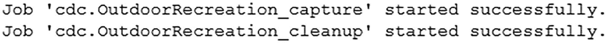
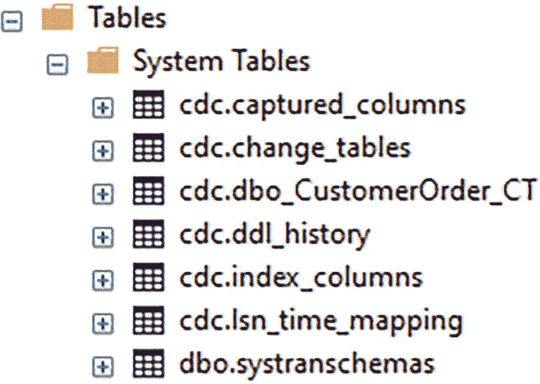

# 变更数据捕获详解

### 概念与权衡

如果需要了解比“哪一行或哪一列被更改”以及“该记录自实施变更跟踪以来发生了多少次更改”更多的信息，您可能需要考虑 **变更数据捕获**。与 **变更跟踪** 类似，使用 **变更数据捕捕获** 也有其优缺点。

最大的好处是 **变更数据捕获** 将捕获与已更改数据记录相关的详细信息。

-   对于插入的数据，您将能够准确识别向表中添加了什么。
-   同样，您将能够确定被删除数据记录的所有列。
-   更新数据时，您将能够访问更新前后的数据。

缺点包括：

-   对表的每次更改都要求至少有一条记录被写入跟踪表。
-   另一个缺点是，为每个被跟踪的表都会创建两个 **SQL Server Agent** 作业。
-   随着您在 **变更数据捕获** 下管理的表数量增加，所使用的资源量也会增加。这可能会导致与 **变更数据捕获** 相关的性能开销变得非常严重，以至于阻止您实施该功能。

### 启用变更数据捕获

如果决定使用 **变更数据捕获**，您可以更新数据库中的一个表来使用它。在此之前，您需要允许在您的数据库上运行 **变更数据捕获**。您可以通过运行代码清单 14-6 中的 **T-SQL** 代码来按数据库启用 **变更数据捕获**。

```sql
USE OutdoorRecreation;
GO
EXECUTE sys.sp_cdc_enable_db;
GO
```
*代码清单 14-6 在 Menu 数据库上启用数据库跟踪*

### 在特定表上启用

现在您已经启用了 **变更数据捕获**，需要选择一个表，您只关心记录何时发生变化。让我们在表 `dbo.CustomerOrder` 上实施 **变更数据捕获**。在此表上启用 **变更数据捕获** 之前，您需要确保此实例上正在运行 **SQL Server Agent**。在代码清单 14-7 中，您可以找到在此表上实施 **变更数据捕获** 所需的数据库代码。

```sql
USE OutdoorRecreation;
GO
EXECUTE sys.sp_cdc_enable_table
    @source_schema = 'dbo',
    @source_name = 'CustomerOrder',
    @role_name = NULL;
GO
```
*代码清单 14-7 在 dbo.CustomerOrder 表上启用数据库跟踪*

您至少需要指定表架构、表名以及可以访问此数据的数据库角色。如果将角色名指定为 `NULL`，则 **变更数据捕获** 记录的信息将对所有人可访问。一旦此表启用了 **变更数据捕获**，您将能够在 **SQL Server Agent** 中找到新创建的作业。**T-SQL** 代码（代码清单 14-7）完成后，您会收到一条消息。您可以在图 14-1 中查看此消息的示例。



*图 14-1 显示已创建的 SQL Server Agent 作业的消息*

启用 **变更数据捕获** 的过程还会在 `cdc` 架构中创建多个系统表。在图 14-2 中，您可以找到为管理 **变更数据捕获** 而创建的系统表。



*图 14-2 为变更数据捕获创建的系统表*

### 跟踪更改

您将用于跟踪 `dbo.CustomerOrder` 上更改的表是 `cdc.dbo_CustomerOrder_CT` 表。

如果您在空表上实施 **变更数据捕获**，您将能够跟踪数据记录何时更改，同时也能够跟踪自表创建以来发生了多少次更改。代码清单 14-8 包含一个向 `dbo.CustomerOrder` 插入记录的脚本。

```sql
INSERT INTO dbo.CustomerOrder
(
    CustomerID,
    OrderNumber,
    OrderDate,
    IsActive,
    DateCreated,
    DateModified
)
VALUES
(
    3,
    'T15493',
    SYSDATETIME(),
    1,
    SYSDATETIME(),
    SYSDATETIME()
);
```
*代码清单 14-8 将客户订单插入 dbo.CustomerOrder*

当向现有表添加 **变更数据捕获** 时，情况会有所不同。如果您向现有表添加 **变更数据捕获**，您仍然能够跟踪数据记录何时发生变化，但您只能确定自实施 **变更数据捕获** 以来发生了多少次数据修改。

之前在代码清单 14-8 中，您在 `dbo.CustomerOrder` 表上启用了 **变更数据捕获**。如果您假设该表为空，然后向其中插入一些记录，您将能够确定这些记录是何时添加的。执行代码清单 14-9 中的查询将显示 **变更数据捕获** 表中的记录。

```sql
SELECT
    __$start_lsn,
    __$end_lSN,
    __$seqval,
    __$operation,
    __$update_mask,
    CustomerOrderID,
    CustomerID,
    OrderNumber,
    OrderDate,
    ShipDate,
    IsActive,
    DateCreated,
    DateModified,
    DateDisabled,
    __$command_id
FROM cdc.dbo_CustomerOrder_CT;
```
*代码清单 14-9 查询 dbo.CustomerOrder 的变更数据捕获表*

您可以在表 14-4 中检查已跟踪的数据记录信息的子集。

*表 14-4 dbo.CustomerOrder 的变更跟踪输出*

| __$start_lsn | __$operation | CustomerOrderID | CustomerOrder |
| --- | --- | --- | --- |
| 0x000000AF0001FA500005 | 2 | 802821 | T15493 |

虽然记录的信息看起来不多，但保存在此表中的信息可能非常有用。`__$operation` 列指示了在此表上发生的操作。`__$operation` 告诉您执行了哪种类型的活动。在此案例中，`__$operation` 列中的值 `2` 表示一条记录被插入到表中。`cdc.dbo_CustomerOrder_CT` 中的 `CustomerOrderID`、`CustomerID` 和 `DateCreated` 列是插入的部分值。

执行代码清单 14-10 中的代码会更新表中的一条记录，使您能够检查变更跟踪表中的差异。

```sql
UPDATE dbo.CustomerOrder
SET OrderNumber = 'T-15493',
    DateModified = GETDATE()
WHERE CustomerOrderID = 802821;
```
*代码清单 14-10 更新 dbo.CustomerOrder 中的客户订单*

在此查询中，您正在将订单号从 `T15493` 更改为 `T-15493`。要查找此更新的结果，您可以重新运行代码清单 14-9 中的 **T-SQL**。表 14-5 显示了该查询的结果。

*表 14-5 dbo.CustomerOrder 的变更跟踪输出*

| __$start_lsn | __$operation | CustomerOrderID | CustomerOrder |
| --- | --- | --- | --- |
| 0x000000AF0001FA500005 | 2 | 802821 | T15493 |
| 0x000000AF0001FC300003 | 3 | 802821 | T15493 |
| 0x000000AF0001FC300003 | 4 | 802821 | T-15493 |


### 变更数据捕获输出

表 `cdc.dbo_CustomerOrder_CT` 中将有两个条目具有相同的起始 LSN `0x000000AF0001FC300003`。这两行都与从清单 14-10 执行的更新相关。表中第一行 `__$start_lsn` 为 `0x000000AF0001FC300003` 的行具有 `__$operation` 为 `3`。此操作类型用于表示表中更新前的值。第二行 `__$start_lsn` 为 `0x000000AF0001FC300003` 的行具有 `__$operation` 为 `4`。此操作值表示该行中的值是更新完成后的值。在本例中，`CustomerOrderID` 保持不变。但是，`CustomerOrder` 发生了变化。`__$operation` 为 `3` 且 `CustomerOrder` 为 `T15493` 的行是 `CustomerOrder` 的旧值；`__$operation` 为 `4` 且 `CustomerOrder` 为 `T-15493` 的行是新值。

我已经介绍了如何在启用了变更数据捕获的表中插入和更新数据。最后要检查的操作是从表中删除记录。清单 14-11 中的代码删除了从清单 14-8 添加的记录。

```sql
DELETE FROM dbo.CustomerOrder
WHERE CustomerOrderID = 802821;
```
清单 14-11
删除 dbo.CustomerOrder 中的客户订单

删除此记录后，可以执行清单 14-10 中的 T-SQL 来确定跟踪表中是否有新添加的记录。此查询的结果如表 14-6 所示。

表 14-6

 dbo.CustomerOrder 的变更跟踪输出

| __$start_lsn | __$operation | CustomerOrderID | CustomerOrder |
| --- | --- | --- | --- |
| 0x000000AF0001FA500005 | 2 | 802821 | T15493 |
| 0x000000AF0001FC300003 | 3 | 802821 | T15493 |
| 0x000000AF0001FC300003 | 4 | 802821 | T-15493 |
| 0x000000B0000003A00008 | 1 | 802821 | T-15493 |

表中的最后一条记录是为了跟踪清单 14-11 中的删除操作而添加的。`__$operation` 为 `1` 用于表示该记录正在跟踪对表执行的删除操作。

如果表已存在并且您启用了变更数据捕获，您将无法找到原始数据记录的条目，直到它们被更新。一旦这些记录被修改，它们将出现在 `cdc.dbo_CustomerOrder_CT` 表中。虽然变更数据捕获在设置和实现上可能很简单，但在将表添加到变更数据捕获时应谨慎。添加到变更数据捕获的每个表都会导致创建两个 SQL Server Agent 作业。由于跟踪这些表上的更改，还会产生大量的日志记录。这两者都可能导致 SQL Server 使用额外的资源。

您可以使用变更跟踪、变更数据捕获或数据库触发器来跟踪数据修改。所有这些选项都有其自身的优点和局限性。在为组织选择合适的选项时，您需要考虑需要记录的数据类型以及您愿意为跟踪这些更改所承担的性能开销。如果您需要更好的性能，通常必须选择较少的功能。您想要收集的信息越多，或者您想要自定义记录数据修改的程度越高，都将导致硬件利用率增加和潜在的性能开销。

## 错误处理

本节讨论如何编写 T-SQL 代码，以便在遇到错误时能按预期（甚至优雅地）运行。一种解决方案是使用 `TRY…CATCH` 块。这是编写 T-SQL 代码时的一种流行方法。但是，它确实需要对未设计为能优雅处理 SQL Server 错误的应用程序进行一些潜在的修改。另一个不太稳健的选择是创建数据库表来记录历史信息以及日志活动。这可能在防止应用程序崩溃方面帮助不大，但它可能有助于显示问题开始发生的时间。

除了记录数据修改外，记录数据库中发生的某些类型的错误也可能对您有益。虽然可能会发生特定于 SQL Server 的错误，但这并不是本节的重点。也有一些错误是由于应用程序与数据库交互而产生的。其中许多错误可以作为应用程序开发的一部分在 SQL Server 外部记录。但是，您可能会发现某些问题需要从 SQL Server 内部访问。

在考虑错误处理时，您需要考虑如何记录该信息以及应用程序如何处理错误。在 SQL Server 内部更常见的选项之一是使用 `TRY...CATCH` 块。这段代码封装了尝试执行 T-SQL 代码并在尝试失败时执行特定操作的能力。如果代码成功，则 T-SQL 代码将按预期执行。清单 14-12 展示了一个 `TRY…CATCH` 块。

```sql
CREATE PROCEDURE dbo.CustomerOrderInsert
@CustomerID INT,
@OrderNumber VARCHAR(15),
@OrderDate DATETIME2(2),
@ShipDate DATETIME2(2),
@IsActive BIT,
@DateCreated DATETIME2(2),
@DateModified DATETIME2(2),
@DateDisabled DATETIME2(2)
AS
BEGIN TRY
BEGIN TRANSACTION;
INSERT INTO dbo.CustomerOrder
(
CustomerID,
OrderNumber,
OrderDate,
ShipDate,
IsActive,
DateCreated,
DateModified,
DateDisabled
)
VALUES
(
@CustomerID,
@OrderNumber,
@OrderDate,
@ShipDate,
@IsActive,
@DateCreated,
@DateModified,
@DateDisabled
);
COMMIT TRANSACTION;
END TRY
BEGIN CATCH
ROLLBACK TRANSACTION;
END CATCH;
```
清单 14-12
用于插入客户订单的 Try…Catch 块

如果没有错误，此代码块将插入一条记录。但是，如果遇到错误，事务将回滚。有一些方法可以将此功能与您的应用程序代码集成，以便用户知道事务出错。使用此方法的目标是防止应用程序崩溃或防止最终用户期望事务正确保存。

您还可以在 `CATCH` 块中添加错误处理，以提供有关失败原因的更多信息。您可以更新清单 14-12 中的存储过程以包含错误输出，如清单 14-13 所示。

```sql
CREATE OR ALTER PROCEDURE dbo.CustomerOrderInsert
@CustomerID INT,
@OrderNumber VARCHAR(15),
@OrderDate DATETIME2(2),
@ShipDate DATETIME2(2),
@IsActive BIT,
@DateCreated DATETIME2(2),
@DateModified DATETIME2(2),
@DateDisabled DATETIME2(2)
AS
BEGIN TRY
BEGIN TRANSACTION;
INSERT INTO dbo.CustomerOrder
(
CustomerID,
OrderNumber,
OrderDate,
ShipDate,
IsActive,
DateCreated,
DateModified,
DateDisabled
)
VALUES
(
@CustomerID,
@OrderNumber,
@OrderDate,
@ShipDate,
@IsActive,
@DateCreated,
@DateModified,
@DateDisabled
);
COMMIT TRANSACTION;
END TRY
BEGIN CATCH
SELECT ERROR_NUMBER() AS ErrorNumber,
ERROR_SEVERITY() AS ErrorSeverity,
ERROR_STATE() AS ErrorState,
ERROR_PROCEDURE() AS ErrorProcedure,
ERROR_MESSAGE() AS ErrorMessage;
ROLLBACK TRANSACTION;
END CATCH;
```
清单 14-13
用于插入客户订单并包含错误信息的 Try…Catch 块

现在，如果插入失败有原因，用户将收到一条包含失败信息的消息。这使用户可以选择更正问题并重试该操作。


## 1. 代码执行与错误处理

例如，如果你执行了代码清单 14-4 中的 T-SQL 代码，你将创建一个插入操作会失败的情景。

```sql
ALTER TABLE [dbo].[CustomerOrder] WITH CHECK
ADD CONSTRAINT [FK_CustomerOrder_Customer]
FOREIGN KEY([CustomerID])
REFERENCES [dbo].[Customer] ([CustomerID]);
DECLARE @Date DATETIME2(2) = CAST(SYSDATETIME() AS DATETIME2(2))
EXEC dbo.CustomerOrderInsert
    @CustomerID = 50000000,
    @OrderNumber = 12345,
    @OrderDate = @Date,
    @ShipDate = NULL,
    @IsActive = 1,
    @DateCreated = @Date,
    @DateModified = @Date,
    @DateDisabled = NULL;
```
**代码清单 14-14**
执行带有 TRY…CATCH 和错误消息的存储过程

此代码将会失败，因为 `CustomerID` 50000000 在表 `dbo.Customer` 中不存在。此失败源于外键约束。代码清单 14-4 中查询的输出结果如表 14-7 所示。

**表 14-7**

来自 TRY…CATCH 的错误输出

| 错误编号 | 错误级别 | 错误状态 | 错误过程 | 错误消息 |
| --- | --- | --- | --- | --- |
| 547 | 16 | 0 | dbo.CustomerOrderInsert | INSERT 语句与 FOREIGN KEY 约束"FK_CustomerOrder_Customer"冲突。该冲突发生于数据库"OutdoorRecreation"，表"dbo.Customer"，列'CustomerID'。 |

该表确认插入操作因外键约束而未执行。然后用户可以修正值以提供一个有效的 `CustomerID`，或者用户可能决定不需要此更改。

## 2. 状态追踪与错误日志

你可能会发现你的应用程序能够毫无问题地写入或更新数据库中的数据。然而，你可能有一个进程负责将数据从一个系统发送到另一个系统。可能存在基础设施问题或数据类型不一致，这些都可能导致数据从一个数据库对象发送到另一个时失败。你需要确定应如何处理这些错误。你仍然希望有一种方法来处理这些失败，但你可能还需要更即时的报告，表明这些记录未能发送或接收。当今业务要求持续的正常运行状态和成功的交互。你可以通过记录尝试处理数据时失败的方式来控制你响应这些问题的有效性。

存储需要通过系统移动的信息的数据库表通常在数据表中存储一个状态类型列。无论何种进程更新记录状态，都可能在更新记录状态或将记录状态更新为失败状态时出现问题。当表中数据量不大时，查找这些失败的记录可能很容易。通常需要搜索那些在指定时间段内状态未改变，或者处于失败或错误状态的记录。

根据你如何使用客户订单信息，你可能希望记录每个客户订单的准备时间。你可能有一个应用程序，允许你指示客户订单何时开始和完成。此信息可以通过客户订单状态来记录。你需要创建一个表来指示客户订单历史状态。一个信息示例可以在表 14-8 中找到。

**表 14-8**

`dbo.CustomerOrderHistoryStatus` 表中的数据

| 客户订单历史状态 ID | 客户订单历史状态名称 | 是否有效 | 创建日期 | 修改日期 |
| --- | --- | --- | --- | --- |
| 1 | 已开始 | True | 2023-02-12 | 2023-02-13 |
| 2 | 已完成 | True | 2023-02-13 | 2023-02-13 |
| 3 | 已取消 | True | 2023-02-13 | 2023-02-13 |
| 4 | 错误 | True | 2023-02-13 | 2023-02-13 |

此表包含当有人开始准备客户订单时可用的状态。为了记录每次客户订单准备的实例，你需要创建一个表来存储有关每个客户订单何时准备的信息。有几种方式可以记录这一点。就本章而言，让我们在每次客户订单开始时创建一条记录。一旦客户订单开始，该订单最终可能处于已完成、已取消或错误状态。用于存储客户订单历史的查询可以在代码清单 14-5 中找到。

```sql
CREATE TABLE dbo.CustomerOrderHistory
(
    CustomerOrderHistoryID        INT           NOT NULL,
    CustomerOrderID               INT           NOT NULL,
    CustomerOrderHistoryStatusID  TINYINT       NOT NULL,
    DateCreated                   DATETIME2(2)  NOT NULL,
    DateModified                  DATETIME2(2)      NULL,
    CONSTRAINT PK_CustomerOrderHistory_CustomerOrderHistoryID
        PRIMARY KEY CLUSTERED (CustomerOrderHistoryID),
    CONSTRAINT FK_CustomerOrderHistory_CustomerOrder
        FOREIGN KEY (CustomerOrderID)
        REFERENCES dbo.CustomerOrder(CustomerOrderID),
    CONSTRAINT FK_CustomerOrderHistory_CustomerOrderHistoryStatus
        FOREIGN KEY (CustomerOrderHistoryStatusID)
        REFERENCES dbo.CustomerOrderHistoryStatus(CustomerOrderHistoryStatusID)
);
```
**代码清单 14-15**
创建 `dbo.CustomerOrderHistory` 表

此表可以存储每个客户订单开始的唯一时间。存储在此表中的数据示例可以在表 14-9 中找到。

**表 14-9**

`dbo.CustomerOrderHistory` 表中的数据

| 客户订单历史 ID | 客户订单 ID | 客户订单历史状态 ID | 创建日期 | 修改日期 |
| --- | --- | --- | --- | --- |
| 1 | 1 | 2 | 2023-02-13 | 2023-02-13 |
| 2 | 1 | 3 | 2023-02-13 | 2023-02-13 |
| 3 | 3 | 4 | 2023-02-13 | 2023-02-13 |
| 4 | 4 | 1 | 2023-02-13 | 2023-02-13 |

表 14-9 中的记录指示了已开始的客户订单及其各种状态。第一条记录是 `CustomerOrderID` 为 1 的订单，状态为已完成。第二条记录是 `CustomerOrderID` 为 1 的订单，状态为已取消。第三条记录是 `CustomerOrderID` 为 3 的订单，状态为错误。显示的最后一条记录是 `CustomerOrderID` 为 4 的订单，状态为已开始。

当任何记录出现错误时，这些记录在 `dbo.CustomerOrderHistory` 表中的 `CustomerOrderHistoryStatusID` 将为 4。最初，此表中的数据量不会很大，因此很容易在该表中找到最近的错误记录。然而，随着时间的推移，此表将增长到相当大的规模。这可能导致 `SQL Server` 为了查找任何最近的错误记录而需要搜索许多记录。如果你预计 `dbo.CustomerOrderHistory` 表会增长到难以搜索的大小，你可能需要以不同的方式实现错误日志记录。在其他场景中，你可能希望保留所有处于错误状态的有错误记录，但你也希望能够解决最近出错记录的问题。

在这两种场景中，创建一个专门用于记录最近错误记录的表可能是有益的。在创建此表之前，你可能还需要考虑如何长期管理此表。与 `dbo.CustomerOrderHistory` 表不同，你希望确保此新表不会变得太大。你还希望仅在此表中保留最近的错误记录。在表中保持少量记录可以使表易于搜索。此新表的目标仅是提醒用户任何最近的错误记录。考虑到此表的目的，你还需要设计一个进程来定期清除该表中的数据。


如果您选择为错误记录创建额外的日志表，最终可能会创建一个类似于代码清单 14-16 中的表。

```
CREATE TABLE dbo.CustomerOrderHistoryLog
(
CustomerOrderHistoryLogID INT             NOT NULL,
CustomerOrderHistoryID    INT             NOT NULL,
DateCreated               DATETIME2(2)    NOT NULL,
DateModified              DATETIME2(2)    NULL,
CONSTRAINT PK_CustomerOrderHistoryLog_CustomerOrderHistoryLogID
PRIMARY KEY CLUSTERED (CustomerOrderHistoryLogID),
CONSTRAINT FK_CustomerOrderHistoryLog_CustomerOrderHistoryID
FOREIGN KEY (CustomerOrderHistoryID)
REFERENCES dbo.CustomerOrderHistory(CustomerOrderHistoryID)
);
Listing 14-16
创建 dbo.CustomerOrderHistoryLog 表
```

`dbo.CustomerOrderHistory`表上的任何错误都可以在代码清单 14-16 的表中插入一条对应的记录。在表 14-9 中，有一条关于`CustomerOrderHistoryID` 2 的错误记录。如果您在该错误记录创建之前就已经建立了代码清单 14-16 中的表，您可能会发现一条类似于表 14-10 中的条目。

表 14-10

`dbo.CustomerOrderHistoryLog` 表内的数据

| CustomerOrder HistoryLogID | CustomerOrder HistoryID | DateCreated | DateModified |
| --- | --- | --- | --- |
| 1 | 2 | 2023-02-13 | 2023-02-13 |

一旦在`dbo.CustomerOrderHistoryLog`表中有了记录，您就可以根据此表中是否存在记录来生成警报。一种选择是设置一个每 15 分钟执行一次的存储过程。该存储过程的目的可能是，如果在`dbo.CustomerOrderHistoryLog`表中发现任何记录，就生成一封电子邮件。如果您选择此方法来创建警报，请确保定期从此表中清除数据。在这种情况下，您还需要一个存储过程来定期删除此表中的数据。

无论您选择哪种方法来实现应用程序与 SQL Server 之间的错误日志记录，您都应确保这些错误被记录在某个可以被多方访问的地方。最难排查的问题之一就是没有可用的日志。记录与 SQL Server 相关错误的目标是让您组织内的相关人员能够快速发现问题所在，从而高效地解决问题。您可能会选择在应用程序层面实现大部分错误处理。但是，对于需要立即纠正的错误，或许可以从 SQL Server 内部生成自动报告。

作为应用程序开发的一部分，您需要考虑您的组织需要哪种类型的日志记录。在盗窃风险较高的行业中，跟踪数据何时发生修改以及由谁修改可能更为重要。所需的信息将决定您为数据修改实现何种类型的日志记录。您还需要考虑如何管理与数据库相关的错误。这些错误并非 SQL Server 特有的错误，而是由于为您的应用程序编写的 T-SQL 代码执行而产生的错误。在确定了如何管理应用程序的日志记录后，您可能还需要考虑如何设计可重用的 T-SQL 代码。

