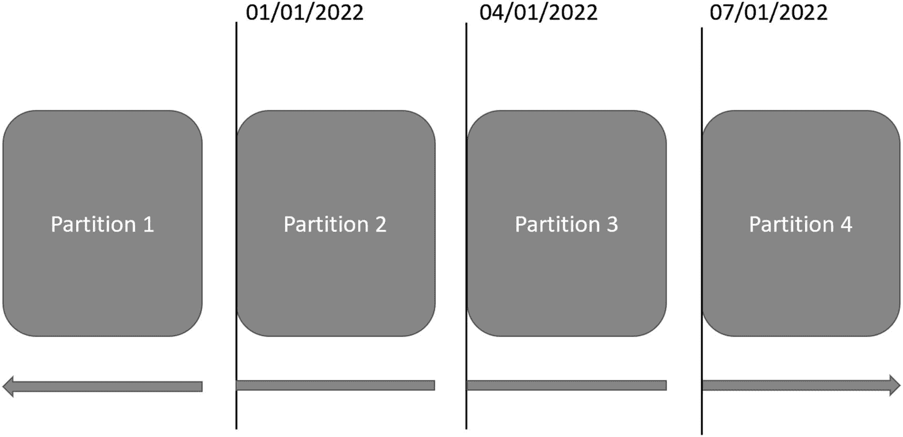
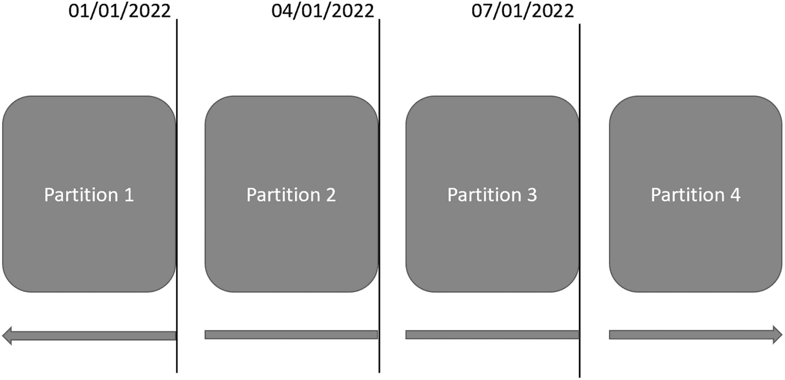

# 16. 管理数据增长

数据库初次创建时，在一段时间内，其中的表会保持较小的尺寸。根据表中存储数据的性质或已过去的时间，你可能会遇到这样的情况：自表首次创建以来，一个或多个表已经经历了显著的数据增长。管理表中存储数据的相对“年龄”或整体数据存储方式，可能存在多种动机。本章将重点介绍如何以可长期管理的方式组织你的数据。尽管许多公司在管理数据时也以提升性能为目标，但这并非本章的重点。

SQL Server 提供了将你的数据分离或排序到不同组或类别的功能。在管理数据增长方面，数据通常是按日期排序的。你不仅限于按特定日期组织数据，但出于本章的目的，这将作为我们的重点。你首先要弄清楚如何组织数据，不仅包括数据如何分组，还包括数据如何存储。建立对数据进行排序和存储的功能后，你就可以开始将数据移入你创建的各个组中。数据分组有多种选项，存储数据的方式也可以不同。这使你能够设计一个解决方案，既能支持近期数据的高事务吞吐量，又能让旧数据以支持报表的方式设计。

## 分区

在检查你的某个数据库表时，你可能会发现该表已经增长到难以管理的尺寸。大表很难管理。你的索引很大，大到无法进行碎片整理。统计信息没有足够的步骤来构建可靠的执行计划。从该表中删除旧行可能会产生锁，这些锁甚至会影响到全新的行。糟透了！

按某个值组织这些数据的过程称为分区。分区允许我们将一个大表变成许多更小的表，每个小表都更易于管理。这些小表甚至可以存储在不同的磁盘上，这样你就不会把宝贵的 SSD 空间浪费在那些没人读取但法律部门又不允许删除的、年代久远的行上。本节的剩余部分将介绍分区表所需的步骤。

首先，你要在表增长到那种规模之前就识别出应该进行分区的表。不过，即使表已经变得非常大，你仍然可以对其进行分区。无论哪种情况，你都需要识别出一个你希望更好地管理归档数据或维护索引的表。从概念上讲，你需要思考如何访问这些数据。理想情况下，聚集索引包含的值不常更改，这样表就不会频繁重新排列。此外，在实施分区时，你需要选择一个在访问这些数据时始终会使用的列。

### 分区基础

要通过分区表来实施分区，你需要创建几个其他数据库对象来对表进行分区。分区的第一步是弄清楚你想如何一致地访问你的数据。你将使用 `dbo.CustomerOrderHistory` 表。出于本章的目的，该表代表了过去两年内 `CustomerOrders` 的使用信息。你可能出于法律、用户体验或其他原因，决定开始归档部分历史信息。由于这是一个历史表，你将选择基于 `DateCreated` 对数据进行分区（即组织或排序）。选择如何对数据进行分区引出了必须做出的下一个决定。

一旦决定了如何排序数据，你还需要具体决定哪些数据将被分组排序在一起。被一起排序的数据组称为范围。在选择分区范围时，需要考虑的一个因素是每个范围内数据的访问频率。对于大多数应用程序而言，这意味着近期数据访问频繁，而年代久远的数据访问较少。如果你有五年的客户订单历史数据，保留这么长时间的数据可能有业务原因，但对于日常操作，你通常可能只按日、周、月或年访问信息。

了解数据的总体访问模式，就能确定你需要对数据进行分区的范围。一旦确定了范围，就需要决定如何存储数据。在任何 SQL Server 安装中，每个数据库都有一个主数据文件。该文件包含存储在数据库中的对象和数据，文件扩展名为`.mdf`。此数据文件存在于一个主文件组中。你也可以向数据库添加其他文件和文件组。文件可以添加到主文件组或其他文件组，并且每个文件组可以存在于不同的驱动器上。使用文件组可以让你选择数据的存储方式，从而带来好处。

你可以将更频繁使用的数据存放在更快存储设备上的文件组中。也可以将较少使用的数据存放在较慢存储设备上的文件组中。这可以让你以节省成本的方式改变数据存储方式。文件组作为数据如何排序的逻辑结构来运作。当你使用没有任何额外文件组的数据库时，你将只有一个名为`primary`的文件组。创建这些文件组的 T-SQL 代码如代码清单 16-1 所示。

```sql
ALTER DATABASE OutdoorRecreation
ADD FILEGROUP CustomerOrderHistory2021;
ALTER DATABASE OutdoorRecreation
ADD FILEGROUP CustomerOrderHistory2022Q1;
ALTER DATABASE OutdoorRecreation
ADD FILEGROUP CustomerOrderHistory2022Q2;
ALTER DATABASE OutdoorRecreation
ADD FILEGROUP CustomerOrderHistory2022Q3;
代码清单 16-1
创建文件组
```

在此示例中，有四个不同的文件组。第一个文件组将保存 2022 年之前的客户订单历史。接下来的两个文件组分别用于 2022 日历年的前两个季度。第三个文件组专为 2022 年第三季度设计。创建文件组后，你需要创建文件组将使用的任何文件。对于本章中的示例，你将为每个文件组创建一个文件。你可以使用代码清单 16-2 中的 T-SQL 来创建这些文件。


#### 将文件组添加到 OutdoorRecreation 数据库

查看这段 T-SQL 代码，您正在修改 `OutdoorRecreation` 数据库并向其中添加文件。创建文件时，您需要指定逻辑名称、文件名和文件路径、文件大小以及与该文件关联的文件组。

文件组和文件决定了数据的保存位置。您必须配置如何将数据保存到这些文件和文件组中。在数据可以存储到文件组之前，需要在 T-SQL 中创建几种不同的数据库对象。您已经确定了数据的排序方式，现在只需要发出 T-SQL 命令，以便 SQL Server 也知道如何排序这些数据。第一步是创建一个函数，告诉 SQL Server 如何对分区进行数据排序。这种类型的函数称为 *分区函数*。在清单 16-3 中，您可以找到创建分区函数的 T-SQL 代码。

```sql
CREATE PARTITION FUNCTION CustomerOrderHistoryFunc(DATETIME2(2))
AS RANGE RIGHT FOR VALUES
(
'2022-01-01',
'2022-04-01',
'2022-07-01'
);
```
**清单 16-3**
创建分区函数

在清单 16-3 中，您将函数的范围指定为 `RIGHT`。该范围与作为分区函数一部分提供的值直接相关。对于右侧范围，这表示在分隔分区时，该值位于边界右侧。当使用清单 16-3 中的 T-SQL 代码时，任何早于 2022 年 1 月 1 日的值都将放入第一个分区。第二个分区将包含从 2022 年 1 月 1 日开始直到 2022 年 4 月 1 日的所有值。然而，从 2022 年 4 月 1 日到 2022 年 7 月 1 日之前的任何数据将存在于第三个分区中。根据分区函数当前的设计，所有在 2022 年 7 月 1 日或之后创建的数据都将放入第四个分区。使用右侧分区时数据存储方式的示例如图 16-1 所示。



一个水平块列表，展示了具有右侧范围的 4 个分区。1. 分区 1。2. 分区 2，2022 年 1 月 1 日。3. 分区 3，2022 年 1 月 4 日。4. 分区 4，2022 年 1 月 7 日。

**图 16-1**
使用右侧范围的分区

创建分区函数时的另一个选项是将范围指定为 `LEFT`。如果您指定了左侧范围或未指定左或右，则第一个分区将包含任何直到并 *包括* 2022 年 1 月 1 日的值。在图 16-2 中，您可以找到如果您使用左侧范围，数据在分区中的存储方式。



一个水平块列表，展示了具有左侧范围的 4 个分区。1. 分区 1，2022 年 1 月 1 日。2. 分区 2，2022 年 1 月 4 日。3. 分区 3，2022 年 1 月 7 日。4. 分区 4。

**图 16-2**
使用左侧范围的分区

对于您正在使用的数据，数据类型是 `DATETIME2(7)`。如果您使用左侧范围，任何发生在 2022 年 1 月 1 日午夜之后 1/10 微秒的数据都将进入第二个分区。您现在可以理解，在创建分区函数时，了解您的数据和数据类型是多么重要。

创建分区函数是有帮助的。分区函数让 SQL Server 知道如何将数据分隔到不同的段中。但是，您还需要指示 SQL Server 应该如何使用该分区函数。这时就需要创建分区方案。分区方案将特定的分区函数映射到文件组。您可以在清单 16-4 中找到创建分区方案的 T-SQL 代码。

```sql
CREATE PARTITION SCHEME CustomerOrderHistoryRange
AS PARTITION CustomerOrderHistoryFunc TO
(
CustomerOrderHistory2021,
CustomerOrderHistory2022Q1,
CustomerOrderHistory2022Q2,
CustomerOrderHistory2022Q3
);
```
**清单 16-4**
创建分区方案

分区方案有一个特定的名称，并引用了要使用的分区函数。分区函数和分区方案之间的一个区别是，分区函数指定了三个值，而分区方案有四个值。由于您在分区函数中指定的范围是右侧的，所有早于分区函数中指定的第一个日期的值都将放入第一个文件组中。回顾清单 16-3 和清单 16-4 中的 T-SQL 代码，您可以确定分区函数中指定的第一个值与 2022 年第一季度的开始日期相关。

您希望在所有 T-SQL 代码中使用分区列的原因在于 SQL Server 使用分区的方式。一旦对数据进行了分区，SQL Server 将以与非分区表不同的方式搜索分区数据。实施分区后，SQL Server 将使用分区来确定表的哪一部分包含查询请求的数据。如果您按日期搜索记录，SQL Server 将能非常快速地知道要访问哪个分区来查找数据。但是，如果您没有指定日期，并且您想要关于特定 `CustomerOrder` 的信息，SQL Server 将搜索每个分区以查找您请求的信息。在数据库中实施分区时，选择一个良好分区的列非常重要。如果您选择的列不是查询中频繁或几乎总是使用的部分，您可能会因拥有分区而产生额外的性能开销。

通常建议您不应主要为了提高性能而实施分区。虽然总体目标是简化随时间推移对数据的管理，但您可以实现一些功能以增加提高性能的可能性。其中一种方法涉及如何对分区表进行索引。您需要创建与表分区类似分段的索引。这些索引称为 *对齐分区索引*。对齐分区索引可以是聚集的，也可以是非聚集的。


#### Listing 16-3 与 16-4 中的分区函数与方案

作为示例，`Listing 16-3`中的分区函数基于`DATETIME2`创建了一个范围。`Listing 16-4`中的分区方案则使用`Listing 16-3`中的函数，将指定范围内的数据分配到指定的文件组。当创建或修改表以使用该分区方案时，数据将被保存在指定的文件组中。数据最终进入哪个分区将由分区函数决定。正如我将在下面的`Listing 16-6`中讨论的，分区方案将使用`DateCreated`列来确定数据最终进入哪个分区。`DateCreated`列因此就是分区列。既然你想使用`DateCreated`列作为分区列，就需要确保数据按`DateCreated`列排序。这可以通过创建一个使用`DateCreated`列的聚集索引来实现。这个新索引可以被称为分区对齐索引或对齐索引。

#### 对齐分区索引的要求

根据对齐分区索引是否唯一，有不同的要求。然而，总体结果是相同的。两种类型的对齐分区索引都包含对分区列的引用。对于唯一的对齐聚集或非聚集索引，分区列必须是索引的一部分。另一方面，当创建非唯一对齐索引时，不必指定分区列。如果分区列不是对齐索引的一部分，`SQL Server`会添加一个对分区列的引用作为索引的一部分。

#### 非对齐分区索引

还有一种可能性是创建使用与其表不同分区的索引。这些被称为*非对齐分区索引*。创建非对齐分区索引只应在有限的情况下进行。这些场景包括：希望在非分区表上创建分区索引；需要检查分区列之外的列的唯一性；或者希望使用不同于分区列的列将一个分区表连接到另一个分区表。

> **注意：** 如果创建索引时未指定分区，该索引将默认为对齐索引。

#### 分区的目标与分区消除

最终，使用分区的目标是减少`SQL Server`在尝试读取或更新数据时访问的记录数量。你可以编写查询，使`SQL Server`能够快速确定哪些分区包含请求的数据，并忽略所有其他分区。当`SQL Server`生成执行计划时忽略特定分区，这被称为*分区消除*。`SQL Server`可以将一个非常大的表视为许多较小的表。通过这样做，`SQL Server`只需要与分区表的一个子集进行交互。这是你通过分区提高性能的最佳机会。然而，为了让你的查询利用分区消除，你需要在查询中引用分区列。否则，`SQL Server`将不知道要访问哪个分区。

#### 添加新分区的示例

之前，你创建了新的文件组并将其添加到当前数据库。你还创建了一个新的分区函数和方案。在`Listing 16-5`中，你可以参考用于添加新分区的`T-SQL`代码。

```sql
ALTER DATABASE OutdoorRecreation
ADD FILEGROUP CustomerOrderHistory2022Q4;
ALTER DATABASE OutdoorRecreation
ADD FILE
(
NAME = CustomerOrderHistoryFG2022Q4,
FILENAME = 'D:\SQLData\CustomerOrderHistoryFG2022Q4.ndf',
SIZE = 50MB
)
TO FILEGROUP CustomerOrderHistory2022Q4;
ALTER PARTITION SCHEME CustomerOrderHistoryRange
NEXT USED CustomerOrderHistory2022Q4;
ALTER PARTITION FUNCTION CustomerOrderHistoryFunc()
SPLIT RANGE ('2022-10-01');
```
`Listing 16-5`
向现有分区添加新分区

为了创建一个新分区，你需要获取现有的分区函数并在指定点拆分现有分区。在运行`Listing 16-5`中的`T-SQL`代码之前，分区函数中的最后一个范围包括所有在 2022 年 7 月 1 日及之后的数据。对最后一个分区执行的`SPLIT RANGE`代码将 2022 年 7 月 1 日开始的最后一个分区拆分为两个分区。根据`Listing 16-5`中提供的日期 2022 年 10 月 01 日进行分割。之前的分区被拆分为两个分区。这两个分区中的第一个包括所有从 2022 年 7 月 1 日开始，到但不包括 2022 年 10 月 1 日的日期。第二个分区涵盖 2022 年 10 月 1 日及之后的所有日期。

#### 分区逻辑总结

前面的大部分数据库代码遵循了本章前面展示的相同逻辑。你创建一个新的文件组并将文件添加到数据库。你还需要更改分区方案，让`SQL Server`知道下一个应作为分区方案一部分使用的文件组。一旦完成，你就可以更新分区函数。这将允许`SQL Server`根据新的规范将数据保存在正确的文件组中。如果你忘记了并需要在以后对数据进行分区，请更新分区方案和函数。`SQL Server`会将数据移动到正确的分区。

#### 关于分区性能的注意事项

几乎每次有人讨论分区时，他们也会特别说明分区不一定是用来提高性能的。有很多原因可能导致分区无法提高性能，其中一些原因是分区可能没有得到正确实施。在考虑分区时，你需要专注于将使用哪个数据列来对数据进行分区。这被称为*分区列*。你需要了解你的分区列，因为这个分区列将决定你今后如何编写`T-SQL`代码。


