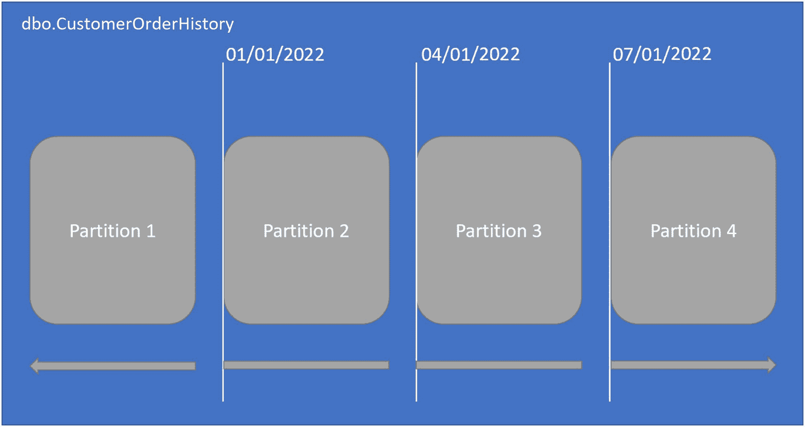
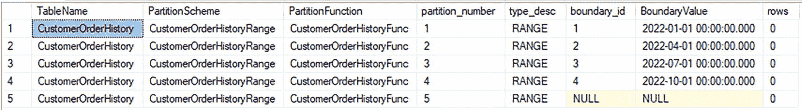
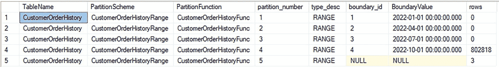
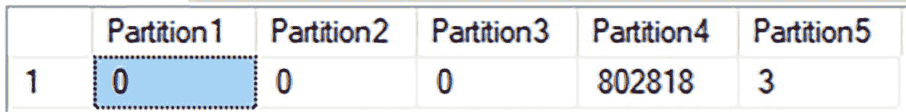
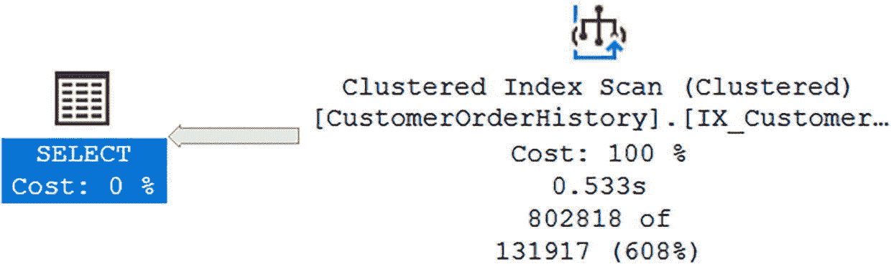

# 分区表

### 创建分区表

虽然你已经创建了文件组、文件、分区函数和分区方案，但这些分区逻辑尚未应用到数据库中的任何数据。你可以选择创建新表或对现有表进行分区。在本例中，让我们从创建一个在新建时即被分区的表开始。你可以参考清单 16-6 中的 T-SQL 来创建分区表。

```sql
CREATE TABLE dbo.CustomerOrderHistory
(
CustomerOrderHistoryID        BIGINT    IDENTITY(1,1)   NOT NULL,
CustomerOrderID               INT                       NOT NULL,
CustomerOrderHistoryStatusID  TINYINT                   NOT NULL,
DateCreated                   DATETIME2(2)              NOT NULL,
DateModified                  DATETIME2(2)                  NULL,
CONSTRAINT PK_CustomerOrderHistory_CustomerOrderHistoryID
PRIMARY KEY NONCLUSTERED
(CustomerOrderHistoryID, DateCreated),
CONSTRAINT FK_CustomerOrderHistory_CustomerOrder
FOREIGN KEY (CustomerOrderID)
REFERENCES dbo.CustomerOrder(CustomerOrderID),
CONSTRAINT FK_CustomerOrderHistory_CustomerOrderHistoryStatus
FOREIGN KEY (CustomerOrderHistoryStatusID)
REFERENCES dbo.CustomerOrderHistoryStatus
(CustomerOrderHistoryStatusID)
) ON CustomerOrderHistoryRange (DateCreated);
```

**清单 16-6** 创建分区表

在此代码中，最后一行指示表应创建在清单 16-4 的分区方案上。这就是表被分区的方式。表上的分区方案使用分区函数将数据分类到各个分区。

一旦清单 16-6 中的分区表创建完成，其结构将与图 16-3 在概念上相似。



一个水平块状列表展示了 4 个分区。1. 分区 1。2. 分区 2，2022 年 1 月 1 日。3. 分区 3，2022 年 1 月 4 日。4. 分区 4，2022 年 1 月 7 日。

**图 16-3** 分区表数据结构

在分区表内部，你可以清晰地识别每个分区。你还可以确定分区函数上的正确范围是如何将数据分解到每个分区中的。你可以通过运行清单 16-7 中的查询来确认表的分区方式。

```sql
SELECT tbl.[name] AS TableName,
sch.[name] AS PartitionScheme,
fnc.[name] AS PartitionFunction,
prt.partition_number,
fnc.[type_desc],
rng.boundary_id,
rng.[value] AS BoundaryValue,
prt.[rows]
FROM sys.tables tbl
INNER JOIN sys.indexes idx
ON tbl.[object_id] = idx.[object_id]
INNER JOIN sys.partitions prt
ON idx.[object_id] = prt.[object_id]
AND idx.index_id = prt.index_id
INNER JOIN sys.partition_schemes AS sch
ON idx.data_space_id = sch.data_space_id
INNER JOIN sys.partition_functions AS fnc
ON sch.function_id = fnc.function_id
LEFT JOIN sys.partition_range_values AS rng
ON fnc.function_id = rng.function_id
AND rng.boundary_id = prt.partition_number
WHERE tbl.[name] = 'CustomerOrderHistory'
AND idx.[type] <= 1
ORDER BY prt.partition_number;
```

**清单 16-7** 查看分区表的分区信息

此查询显示表名、表使用的分区方案、表使用的分区函数、分区号、用于分区数据的值以及每个分区中的行数。图 16-4 显示了来自清单 16-7 查询的结果。



一个包含 9 列 6 行的表格。列分别描绘了表名、分区方案、分区函数、分区号、type_desc、boundary_id、边界值和行数。

**图 16-4** 分区表的数据

上述结果是在分区表创建后立即获取的。你可以确认使用的分区方案是 `CustomerOrderHistoryRange`，分区函数是 `CustomerOrderHistoryFunc`。上述边界值与创建分区函数时在清单 16-3 中指定的范围相匹配。查看图 16-4 中 `rows` 列的值，你可以确认所有值都是 0。这是因为表中还没有数据行。

### 向分区表插入数据并验证

你从一个预先存在的表向分区表插入了数据。执行与清单 16-7 相同的查询，你可以确定数据是如何存储在分区中的。在图 16-5 中，你可以找到每个分区的行数。



一个包含 9 列 6 行的表格。列分别描绘了表名、分区方案、分区函数、分区号、type_desc、boundary_id、边界值和行数。

**图 16-5** 添加到分区表的数据

在图 16-4 中，你可以验证在向 `dbo.CustomerOrderHistory` 表添加任何数据之前每个分区的行数。图 16-5 显示了表完全填充后每个分区的行数。第四个分区有 802,818 行。虽然你知道分区中的实际行数，但可能仍想确认表是否按预期对数据进行分区。清单 16-8 显示了一个按日期范围统计记录数量的查询。

```sql
SELECT
SUM(
CASE WHEN DateCreated < '2022-01-01'
THEN 1
ELSE 0
END
) AS Partition1,
SUM(
CASE WHEN DateCreated >= '2022-01-01'
AND DateCreated < '2022-04-01'
THEN 1
ELSE 0
END
) AS Partition2,
SUM(
CASE WHEN DateCreated >= '2022-04-01'
AND DateCreated < '2022-07-01'
THEN 1
ELSE 0
END
) AS Partition3,
SUM(
CASE WHEN DateCreated >= '2022-07-01'
AND DateCreated < '2022-10-01'
THEN 1
ELSE 0
END
) AS Partition4,
SUM(
CASE WHEN DateCreated >= '2022-10-01'
THEN 1
ELSE 0
END
) AS Partition5
FROM dbo.CustomerOrderHistory;
```

**清单 16-8** 确认行数的查询

查询中的第一列返回创建日期在 2022 年 1 月 1 日之前的记录计数。假设分区函数按预期对数据进行分区，图 16-5 中第一个分区显示的行数应与清单 16-8 中第一列返回的值相匹配。清单 16-8 的查询结果如图 16-6 所示。



一个包含 6 列 2 行的表格。列分别描绘了分区 1、分区 2、分区 3、分区 4 和分区 5。分区 1、2、3、4 和 5 下的值分别为 0、0、0、802818 和 3。

**图 16-6** 显示行数的查询结果

图 16-6 中的每一列都显示了每个日期范围内的记录数量。第一列代表创建日期在 2022 年 1 月 1 日之前的记录数。第二列是从 2022 年 1 月 1 日开始直到但不包括 2022 年 4 月 1 日的创建日期的记录数。第三列对创建日期为 2022 年 4 月 1 日直到 2022 年 7 月 1 日的记录遵循类似的模式。最后一列适用于 2022 年 10 月 1 日或之后创建的所有记录。将这五列的值与图 16-5 中的 `rows` 列进行比较，可以帮助你确认你的分区函数是否按预期工作。在你的例子中，图 16-5 中 `rows` 列的值确实对应于图 16-6 中的列值。这证实了你的数据正按预期进行分区。


你已验证数据正被正确排序到相应的分区中。但尚未确认是否存在任何数据，其值与你的范围分区的确切日期完全匹配。你可以运行一个查询来验证这一点，例如代码清单 16-9 中的查询，它会显示与分区函数指定日期和时间完全匹配的记录数量。

```sql
SELECT COUNT(*)
FROM dbo.CustomerOrderHistory
WHERE DateCreated = '2022-08-01';
```

代码清单 16-9
用于确认范围函数的查询

运行上述查询后，你会得到 14,720 条返回结果。这让你知道你的分区函数正按预期工作。如果返回零条结果，你可能无法确定日期和时间为 2022 年 8 月 1 日 12:00:00:00.000 的记录最终会落在哪个分区。然而，由于你的分区按日期和时间分组显示了正确的计数，你知道它正在按预期工作。

之前，你创建了一个空的已分区表。一旦对表进行了分区，你就准备好管理该表随时间推移的增长了。这种管理数据增长的过程不是一次性的，而是未来需要持续维护的事情。对于此表，你需要在未来添加分区。此过程将类似于代码清单 16-5 所示的过程。向现有分区表添加分区并不是你唯一可能需要对表进行分区的时候。你也可能发现自己处于一种情况：最初并未打算对表进行分区，但由于各种原因，你现在需要对其进行分区。在代码清单 16-10 中，你可以参考将非分区表更改为分区表所需的 T-SQL 代码。

```sql
ALTER TABLE dbo.CustomerOrderHistory
DROP CONSTRAINT PK_CustomerOrderHistory_CustomerOrderHistoryID
WITH (MOVE TO CustomerOrderHistoryRange(DateCreated));
ALTER TABLE dbo.CustomerOrderHistory
ADD CONSTRAINT PK_CustomerOrderHistory_CustomerOrderHistoryID
PRIMARY KEY NONCLUSTERED (CustomerOrderHistoryID, DateCreated);
CREATE CLUSTERED INDEX IX_CustomerOrderHistory_DateCreated
ON dbo.CustomerOrderHistory (DateCreated)
ON CustomerOrderHistoryRange (DateCreated);
```

代码清单 16-10
向现有表添加分区

在实现分区之前，表中的所有数据都按主键排序。在本例中，主键是 `CustomerOrderHistoryID`。然而，一旦对表进行了分区，你希望表按创建日期进行分段。这需要更改表中数据的存储方式。为了让 SQL Server 更新数据的存储方式，你需要删除原始的聚集键。如果主键是聚集的，那么你也需要删除主键。此时，你可以创建一个新的非聚集主键以及创建日期。将创建日期作为聚集索引键上的分区列的一部分是分区表所必需的。完成此操作后，你可以在创建日期上创建一个聚集索引。此索引将在分区方案上创建。当索引在分区方案上创建时，它被称为*对齐索引*。

**注意**

请注意，向分区表添加非对齐主键将阻碍你轻松地将分区移入和移出该表。这个概念被称为*分区切换*，将在第 17 章中详细讨论。

如果你现有非分区表中的所有数据都存在于新表的一个分区内，你可以选择轻松地将数据从非分区表移动到分区表。代码清单 16-11 显示了完成此任务所需的 T-SQL 代码。

```sql
ALTER TABLE dbo.CustomerOrderHistory
WITH CHECK ADD CONSTRAINT CK_CustomerOrderHistory_MinDateCreated
CHECK
(
DateCreated IS NOT NULL
AND DateCreated >= '2021-08-01'
);
ALTER TABLE dbo.CustomerOrderHistory
WITH CHECK ADD CONSTRAINT CK_CustomerOrderHistor_MaxDateCreated
CHECK
(
DateCreated IS NOT NULL
AND DateCreated < '2023-01-01'
);
ALTER TABLE dbo.CustomerOrderHistory SWITCH PARTITION 1
TO dbo.CustomerOrderHistoryArchive;
```

代码清单 16-11
将分区表中的所有数据切换到非分区表

要从非分区表切换数据，这些表需要使用相同的文件组，并且需要验证非分区表中的数据是否可以存在于你将在分区表上使用的分区内。你首先需要在分区列上创建与分区范围相匹配的约束。一旦创建了约束，你就可以将非分区表中的所有数据切换到分区表上指定的分区中。

如果你有两个分区表，你可能想将一个分区从一个表移动到另一个表。这个过程可以称为分区切换。实现此操作所需的 T-SQL 代码比代码清单 16-11 中的代码简单。代码清单 16-12 显示了将分区从当前表切换到新的存档表的数据库代码。

```sql
ALTER TABLE dbo.CustomerOrderHistory SWITCH
PARTITION 1
TO dbo.CustomerOrderHistoryArchive
PARTITION 1;
```

代码清单 16-12
从分区表切换到另一个分区表

在此示例中，你将 2021 年第四季度的记录从 `dbo.CustomerOrderHistory` 表移动到 `dbo.CustomerOrderHistoryArchive` 表。为了将一个表中的分区切换到另一个不同分区表的分区中，你必须为每个表指定分区。目标表中的分区也必须为空，此 T-SQL 代码才能执行。这种方法是一种特别直接且简单的方法，用于管理数据随时间推移的增长。如果你创建一个特定的数据管理计划，并将数据从你的主 OLTP 表移动到存档表，你就可以保留所有数据，同时让你的高事务性表仅保留与业务最相关的数据。

既然我们已经介绍了如何对新建和现有表进行分区，接下来让我们确定分区对查询执行意味着什么。数据通常按每个事务发生的顺序记录。这可能对应于特定的时间段，但情况并非总是如此。此外，尽管数据以特定顺序记录，但业务往往出于某些原因希望根据特定的日期范围分析数据。你可能想要查找特定日期范围内开始的 `CustomerOrders`。通过执行代码清单 16-13 中的查询，你可以在 `dbo.CustomerOrderHistory` 表中搜索此信息。

```sql
SELECT CustomerOrderHistoryID,
CustomerOrderID,
CustomerOrderHistoryStatusID,
DateCreated
FROM dbo.CustomerOrderHistory
WHERE DateCreated BETWEEN '2022-10-07' AND '2022-10-09';
```

代码清单 16-13
分区表之前的数据访问

在针对特定日期范围查询 `dbo.CustomerOrderHistory` 表之后，你还可以查看 SQL Server 如何执行该 T-SQL 代码来找到我请求的数据。图 16-7 中的执行计划显示了数据是如何被检索的。



一幅带有符号的图表描绘了数据检索的执行计划。文本显示了聚集索引扫描，成本 100%，0.533 秒，131917 行中的 802818 行，以及选择操作成本 0%。符号代表一个表和聚集索引扫描。

图 16-7
未分区表的执行计划


