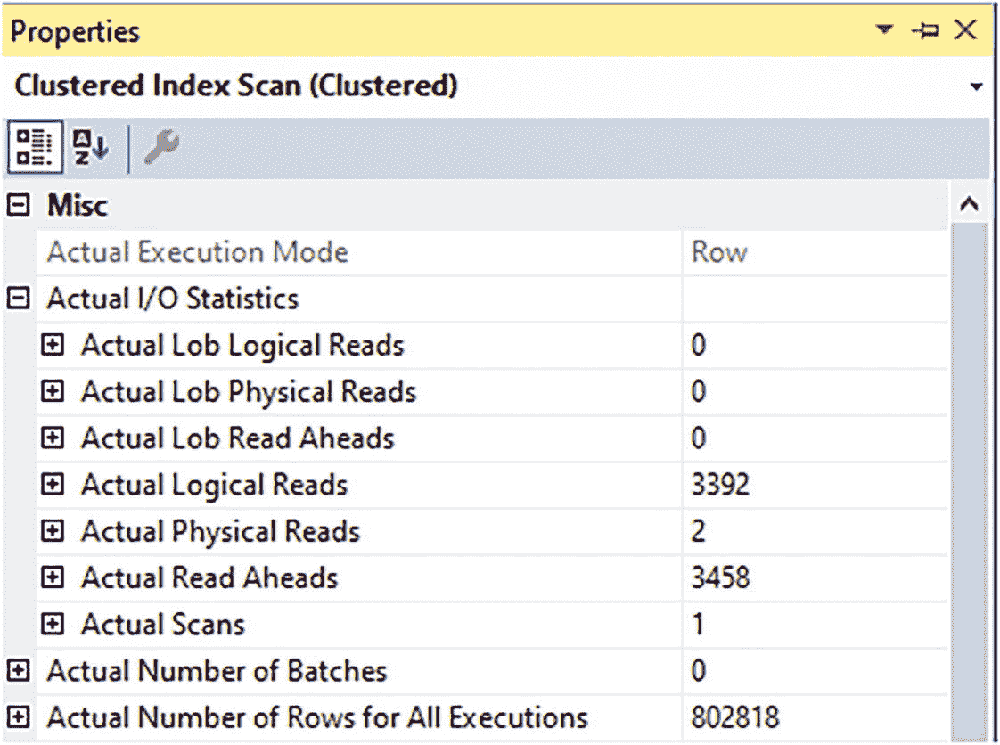
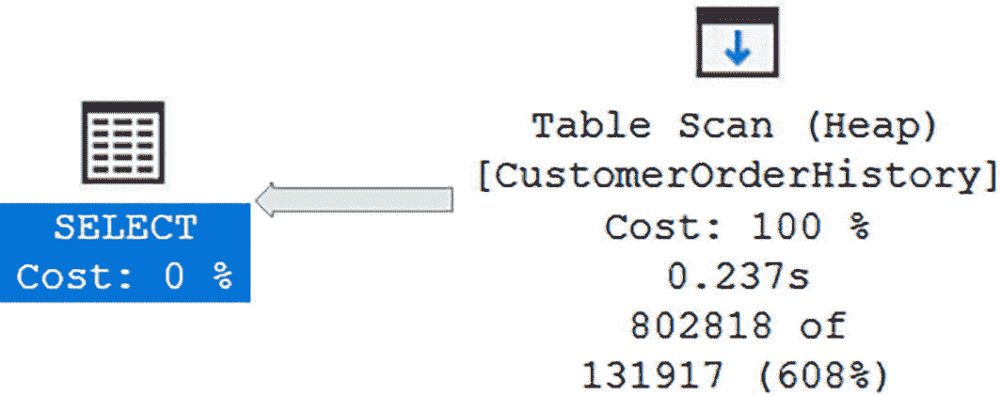
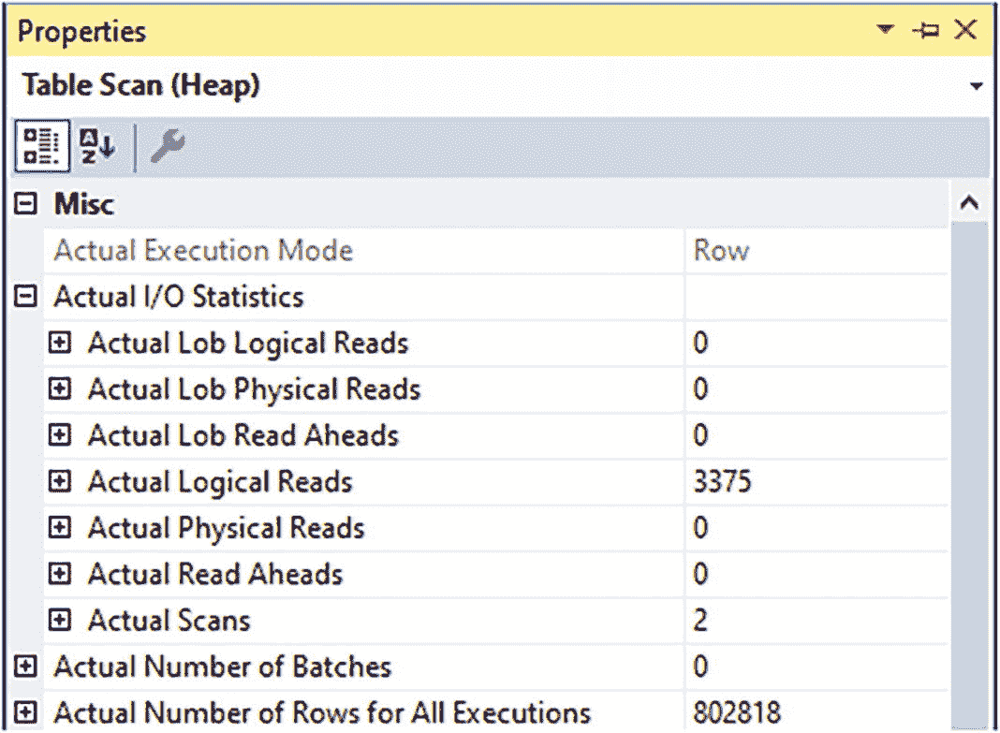
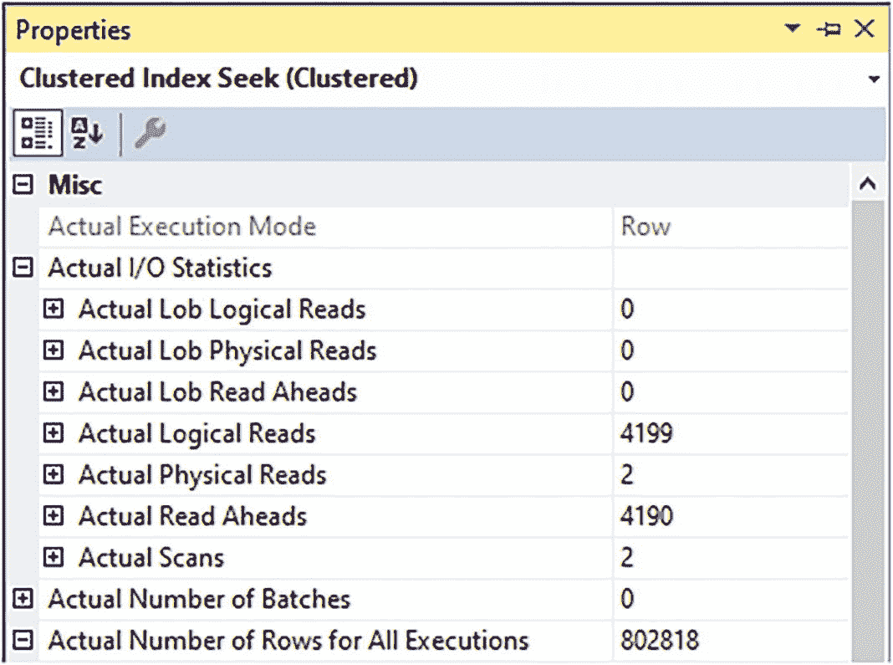
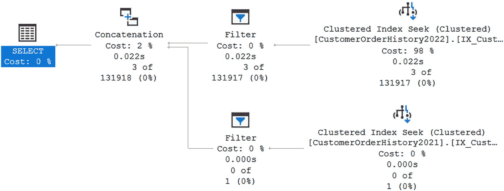
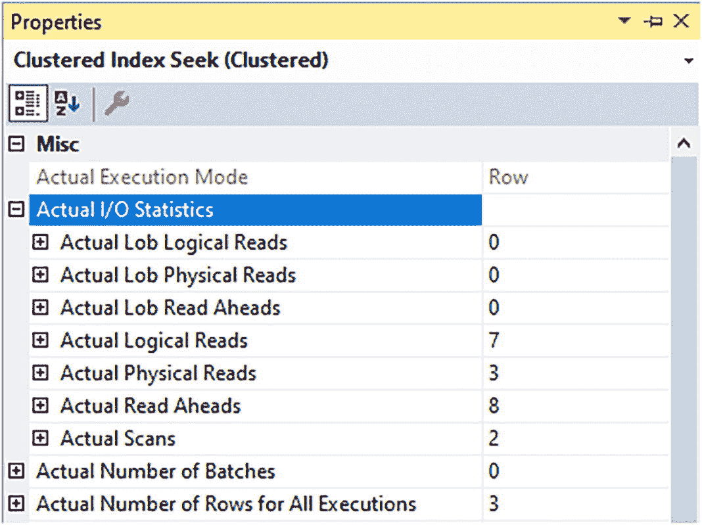
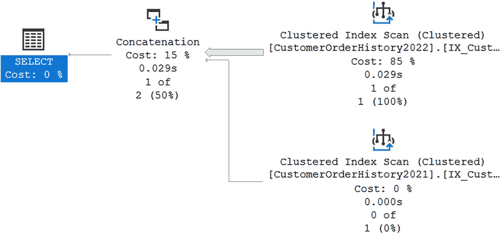
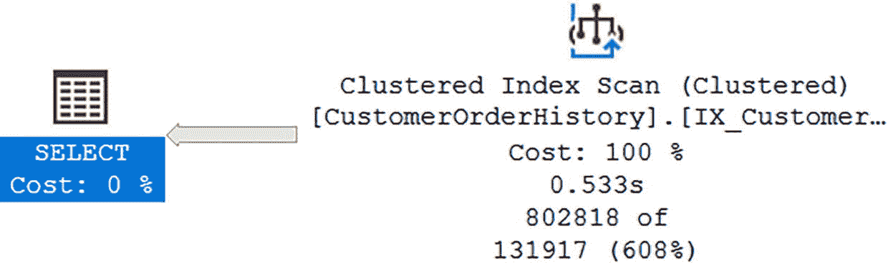
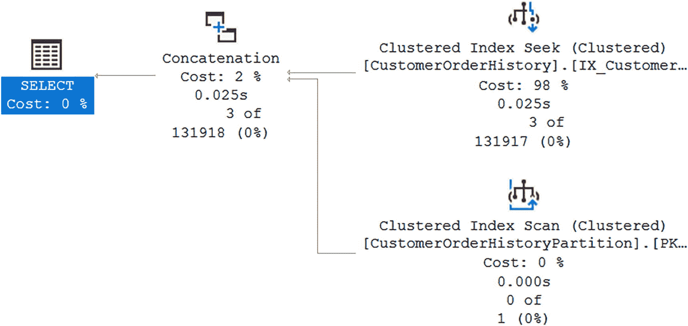
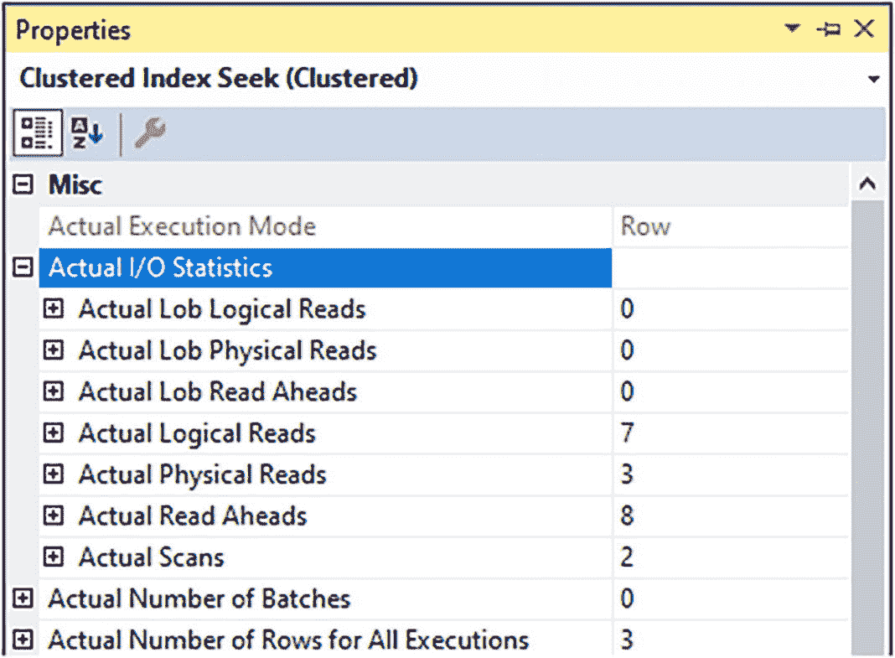

# SQL Server 表分区与索引查询性能分析

### 初始查询：非分区表
`dbo.CustomerOrderHistory` 表在执行查询时未进行分区，且表按聚集主键（即 `CustomerOrderHistoryID`）排序。虽然数据可能按记录创建顺序存储，但 SQL Server 无法根据表的配置得知这一点。为确保 SQL Server 能基于创建日期检索所有数据，它需要检查表中的每条记录。这在执行计划中体现为聚集索引扫描操作。图 16-8 显示了与清单 16-3 中查询相关的一些属性。



图 16-8：与聚集索引扫描相关的读取操作

本次查询返回的总记录数为 802,818 条，本地读取总数为 3,392 次。这代表了为确定满足查询条件的记录数而访问的总页数。

### 分区表性能对比
前述数值代表了 SQL Server 在非分区表上执行查询的方式。你可以对比清单 16-13 中的查询在非分区表和分区表上的性能。你可以为 `dbo.CustomerOrderHistory` 表添加分区，并将结果与前面的非分区表进行对比。首先需要删除现有的主键，并添加一个新的非聚集主键，如清单 16-10 所示。由于该表不再有聚集索引，如果你尝试重新运行清单 16-13 的查询，将会得到如图 16-9 所示的执行计划。



图 16-9：分区表上无分区键聚集索引的情况

如果忘记在包含分区范围的分区列上添加新的聚集索引，最终会得到一个堆表。这种情况下，结果是需要进行全表扫描来查找符合指定日期条件的任何记录。虽然你可能预期此示例与前一示例的逻辑读取次数相同，但图 16-10 显示了一个不同的结果。



图 16-10：分区表上无分区键聚集索引的查询读取情况

在第一个示例中，图 16-8 显示了需要 3,392 次逻辑读取才能找到 `dbo.CustomerOrderHistory` 中符合指定日期范围的所有记录。对表进行分区并用 `CustomerOrderHistoryID` 和 `DateCreated` 替换原始主键后，逻辑读取次数从 3,392 次下降到 3,375 次，如图 16-10 所示。尽管逻辑读取次数显著下降，但在分区表的分区列上执行需要全表扫描的查询并不是理想的做法。关键点在于确保分区表上有一个能够利用分区列的聚集索引。

### 正确使用分区表：利用聚集索引与分区消除
为了更好地利用分区表，需要在分区表上包含一个聚集索引。这包括拥有一个按分区列与分区方案对齐的聚集索引。完成此操作后，就可以运行清单 16-3 中的 T-SQL 代码。你将得到如图 16-11 所示的执行计划。


图 16-11：分区表上在分区键上有聚集索引的情况

你可以验证 SQL Server 现在使用聚集索引查找来定位正确的数据。还可以检查此操作的属性，以确定包含分区键的聚集索引带来的实际影响。你可以在图 16-12 中看到 I/O 统计信息和返回的行数。



图 16-12：分区表上在分区键上有聚集索引的查询读取情况

最初在非分区表上运行此查询时，有 3,392 次逻辑读取。在分区表上但没有聚集索引的情况下，逻辑读取次数下降到 3,375 次。虽然较低的逻辑读取次数不能完全确定性能会更好，但你可以确认，在分区列上具有聚集索引的分区表上查询时，SQL Server 将读取更少的数据。现在分区表上有了聚集索引，总逻辑读取次数从 3,375 次下降到 4,190 次，如图 16-12 所示。

正确创建分区表只是提升性能挑战的一部分。主要的方法是编写包含允许分区消除条件的 T-SQL 代码。清单 16-14 中的代码是一个未将分区列指定为条件的 T-SQL 代码示例。

```sql
SELECT CustomerOrderHistoryID,
       CustomerOrderID,
       CustomerOrderHistoryStatusID,
       DateCreated
FROM dbo.CustomerOrderHistory
WHERE CustomerOrderID = 401408
  AND CustomerOrderHistoryStatusID = 1;
```

*清单 16-14：未使用分区列访问数据*

因此，该查询将在表的所有分区上执行。即使对指定的列存在索引，查询仍需要分别搜索每个分区中的数据，以确认返回了所有请求的数据。一旦确定了分区列，就应将其包含在所有查询中，以便利用分区表。对于清单 16-15 的查询，你需要在 WHERE 子句中包含 `DateCreated`。为了避免访问所有分区，你还需要为该值指定一个实际的日期范围，例如 `DateCreated BETWEEN '2022-10-07' AND '2022-10-09'`。


## 分区视图

你可以通过创建分区表，将单个表拆分为多个段。反之，你也可以选择将几个较小的表组合在一起，使它们像一个大表一样运作。以这种方式联接的表可以是分区的，也可以不是。与创建分区表类似，你也可以选择创建一个分区视图。

与分区表一样，你不应期望使用分区视图就必然意味着未来使用此数据库对象的查询能获得更好的性能。但是，存在一些设计原则可能让你实现性能提升。使用分区表时，有*分区消除*的概念。在分区视图中也能找到类似的概念。清单 16-15 展示了两个彼此具有相同架构的表。

```sql
CREATE TABLE dbo.CustomerOrderHistory2021
(
CustomerOrderHistoryID       BIGINT    IDENTITY(1,1)   NOT NULL,
CustomerOrderID              INT                       NOT NULL,
CustomerOrderHistoryStatusID TINYINT                   NOT NULL,
DateCreated                  DATETIME2(2)              NOT NULL,
DateModified                 DATETIME2(2)                  NULL,
CONSTRAINT PK_CustomerOrderHistory2021_CustomerOrderHistoryID
PRIMARY KEY NONCLUSTERED (CustomerOrderHistoryID, DateCreated),
CONSTRAINT FK_CustomerOrderHistory2021_CustomerOrder
FOREIGN KEY (CustomerOrderID)
REFERENCES dbo.CustomerOrder(CustomerOrderID),
CONSTRAINT FK_CustomerOrderHistory2021_CustomerOrderHistoryStatus
FOREIGN KEY (CustomerOrderHistoryStatusID)
REFERENCES dbo.CustomerOrderHistoryStatus
(CustomerOrderHistoryStatusID)
);
CREATE CLUSTERED INDEX IX_CustomerOrderHistory2021_DateCreated
ON dbo.CustomerOrderHistory2021 (DateCreated)
ON CustomerOrderHistoryRange (DateCreated);
CREATE TABLE dbo.CustomerOrderHistory2022
(
CustomerOrderHistoryID        BIGINT    IDENTITY(1,1)    NOT NULL,
CustomerOrderID               INT                        NOT NULL,
CustomerOrderHistoryStatusID  TINYINT                    NOT NULL,
DateCreated                   DATETIME2(2)               NOT NULL,
DateModified                  DATETIME2(2)                   NULL,
CONSTRAINT PK_CustomerOrderHistory2022_CustomerOrderHistoryID
PRIMARY KEY NONCLUSTERED (CustomerOrderHistoryID, DateCreated),
CONSTRAINT FK_CustomerOrderHistory2022_CustomerOrder
FOREIGN KEY (CustomerOrderID)
REFERENCES dbo.CustomerOrder(CustomerOrderID),
CONSTRAINT FK_CustomerOrderHistory2022_CustomerOrderHistoryStatus
FOREIGN KEY (CustomerOrderHistoryStatusID)
REFERENCES dbo.CustomerOrderHistoryStatus
(CustomerOrderHistoryStatusID)
);
CREATE CLUSTERED INDEX IX_CustomerOrderHistory2022_DateCreated
ON dbo.CustomerOrderHistory2022 (DateCreated)
ON CustomerOrderHistoryRange (DateCreated);
```

清单 16-15 为分区视图创建表

虽然这些表都位于同一分区方案上，但没有任何限制来规定哪些类型的数据可以存储在这些表中。第一个表旨在存储 2022 年的数据，第二个表用于存储 2021 年的数据。但是，你需要向这些表添加约束，以确保正确的记录存在于每个表中。在清单 16-16 中，你可以找到将添加到两个表的约束。

```sql
ALTER TABLE dbo.CustomerOrderHistory2022
WITH CHECK ADD CONSTRAINT CK_CustomerOrderHistory2022_MinDateCreated
CHECK
(
DateCreated IS NOT NULL
AND DateCreated >= '2022-01-01'
);
ALTER TABLE dbo.CustomerOrderHistory2022
WITH CHECK ADD CONSTRAINT CK_CustomerOrderHistory2022_MaxDateCreated
CHECK
(
DateCreated IS NOT NULL
AND DateCreated = '2021-01-01'
);
ALTER TABLE dbo.CustomerOrderHistory2021
WITH CHECK ADD CONSTRAINT CK_CustomerOrderHistory2021_MaxDateCreated
CHECK
(
DateCreated IS NOT NULL
AND DateCreated < '2022-01-01'
);
```

清单 16-16 向表中添加约束

现在，2022 年的表有一个约束，只允许 `DateCreated` 从 2022 年 1 月 1 日开始，直到但不包括 2023 年 1 月 1 日的记录。2021 年的表上也有一个逻辑类似的约束，以便只有在 2021 年创建的记录才能存储在此表中。

现在你有了适用于两个不同日期范围的表，并且已经向这些表应用了约束。下一步是创建一个分区视图。创建分区视图的过程相对简单，包括在底层表的每个 `SELECT` 语句之间添加一个 `UNION ALL`。创建分区视图的示例可以在清单 16-17 中找到。

```sql
CREATE VIEW dbo.vwCustomerOrderHistory
WITH SCHEMABINDING
AS
-- 从当前的读/写表中选择数据
SELECT CustomerOrderHistoryID,
CustomerOrderID,
CustomerOrderHistoryStatusID,
DateCreated,
DateModified
FROM dbo.CustomerOrderHistory2022
UNION ALL
-- 从分区表中选择数据
SELECT CustomerOrderHistoryID,
CustomerOrderID,
CustomerOrderHistoryStatusID,
DateCreated,
DateModified
FROM dbo.CustomerOrderHistory2021;
```

清单 16-17 创建分区视图

请注意，分区视图内使用的两个 `SELECT` 语句的列列表顺序相同。这是创建分区视图的要求。在创建分区视图时，还必须指定表的完整列列表。一旦分区视图创建完成，你可能想检查查询分区视图是如何工作的。

回到清单 16-13，你查询了 `dbo.CustomerOrderHistory` 表中 2022 年 10 月 7 日至 2022 年 10 月 9 日期间的数据。你可以对分区视图查询相同的日期范围，如清单 16-18 所示。

```sql
DECLARE @StartDate  DATETIME2(2) = '2022-10-07';
DECLARE @EndDate    DATETIME2(2) = '2022-10-09';
SELECT CustomerOrderHistoryID,
CustomerOrderID,
CustomerOrderHistoryStatusID,
DateCreated,
DateModified
FROM dbo.vwCustomerOrderHistory
WHERE DateCreated > @StartDate
AND DateCreated <= @EndDate;
```

清单 16-18 使用分区列访问数据

清单 16-13 和清单 16-18 中的 T-SQL 代码非常相似。这显示了改用分区视图而不是当前表名进行查询是多么容易。然而，你真正感兴趣的是确认使用分区视图后执行计划有何变化。图 16-13 显示了运行清单 16-18 中的查询所产生的执行计划。



图 16-13 分区视图的执行计划

与本章前面提到的分区表类似，分区视图的执行计划也使用了聚集索引查找。即使分区视图包含了 2022 年和 2021 年的表，你也可以从执行计划中确定，在查找清单 16-18 中的查询结果时，`SQL Server` 仅从 `dbo.CustomerOrderHistory2022` 表返回结果。`dbo.CustomerOrderHistory` 的百分比为 0%。你也可以在图 16-14 中检查聚集索引查找的属性。




### 查询分区视图的执行计划

一张截图展示了与聚集索引查找相关的属性。它列出了 10 个属性。实际逻辑读取数为 7。实际物理读取数为 3。实际预读数为 8。实际扫描数为 2。所有执行的实际行数为 3。

**图 16-14**
在分区键上带有聚集索引的查询分区视图的读取操作

根据返回的行数，你可以确定 2021 表中的数据与本章前面提到的分区表不同。你还可以确定，相对逻辑读取数较低，并且其趋势与本章前面的分区表相似。

清单 16-18 中执行的 T-SQL 代码访问了基于每个表中分区列和为每个表指定的约束的分区视图。你看到 SQL Server 在查询数据时能够快速确定要访问哪个表。有时你可能想要运行一个不包含分区列的查询，就像清单 16-19 中的那个一样。

```sql
SELECT CustomerOrderHistoryID,
CustomerOrderID,
CustomerOrderHistoryStatusID,
DateCreated
FROM dbo.vwCustomerOrderHistory
WHERE CustomerOrderID = 401408
AND CustomerOrderHistoryStatusID = 1;
-- Listing 16-19
-- 访问数据而不使用分区列
```

此查询搜索具有特定状态的特定`CustomerOrder`。然而，没有任何迹象表明这些记录存在于索引视图中的特定表中。由于 SQL Server 无法在查询中排除某些日期范围，因此你会得到如图 16-15 所示的执行计划。



带有符号的文本描绘了一个包含分区视图的执行计划。文本显示了 2 个聚集索引扫描，成本分别为 85%和 0%，耗时分别为 0.029 秒和 0.000 秒，行数比分别为 1 of 1 和 0 of 1，一个连接操作，以及一个 Select 操作成本为 0%。符号包括一个表、一个连接和一个聚集索引扫描。

**图 16-15**
分区视图的执行计划

你可以确定，在此执行计划中，SQL Server 必须访问包含 2021 数据的表和包含 2022 数据的表。在此示例中，你可以确定此请求在访问的表数量方面没有带来任何好处。

使用分区视图可以帮助你将多个表组合成一个数据库对象。通过访问这个单一的数据库对象，你可以简化跨多个范围的 T-SQL 代码。你还了解到，使用分区视图在限制访问的表数量方面可能是有益的，但如果你不在查询中使用分区列，你仍然需要访问视图中包含的所有表。分区表将一个表拆分成多个段，而分区视图将表组合成一个数据库对象，你可能会发现结合使用两者的优势。

## 混合工作负载

公司使用数据库多年，可能积累了大量的数据。通常，这些公司可能会从这些数据中生成报告。在许多情况下，这些公司可能没有优先构建数据仓库。对于这些情况，一个数据库通常需要同时执行两项任务。第一个角色是继续存储事务性数据。然而，第二个角色也是充当用于分析处理的数据仓库。在许多情况下，事务处理所需的数据库设计与分析处理的最佳设计并不匹配。虽然你的公司可能愿意在将来转向数据仓库，但你可能会发现自己处于需要实施能够适应这种混合工作负载的设计的情况。

通过将分区和非分区表与分区视图结合使用，你可以给自己额外的灵活性。使用分区视图将允许你使用单一的数据库对象和名称来访问用于特定目的的任何数据。在此示例中，让我们继续处理作为启动`CustomerOrders`的结果而记录的数据。由于分区视图允许你将多个表组合在一起，因此你可以研究如何创建这些表。使用多个表的一个优势是每个表可以使用不同的索引。这种索引的差异可以改变数据的存储和访问方式。你还可以选择将某些表设为只读，这可以表明你不打算向这些表添加数据。

你将创建一个分区视图来访问所有`CustomerOrder`历史数据。第一个表仅用于保存要归档的所有较旧数据。你也可以对这个表进行分区，以便在基于表的分区键进行搜索时允许分区消除。在清单 16-20 中，你可以参考创建归档数据分区表所需的 T-SQL。

```sql
CREATE TABLE dbo.CustomerOrderHistoryPartition
(
CustomerOrderHistoryID         BIGINT          NOT NULL,
CustomerOrderID                INT             NOT NULL,
CustomerOrderHistoryStatusID   TINYINT         NOT NULL,
DateCreated                    DATETIME2(2)    NOT NULL,
DateModified                   DATETIME2(2)        NULL,
CONSTRAINT PK_CustomerOrderHistoryPartition_CustomerOrderHistoryID
PRIMARY KEY (CustomerOrderHistoryID, DateCreated),
CONSTRAINT FK_CustomerOrderHistoryPartition_CustomerOrderID
FOREIGN KEY (CustomerOrderID)
REFERENCES dbo.CustomerOrder(CustomerOrderID),
CONSTRAINT FK_CustomerOrderHistoryParition_CustomerOrderHistoryStatusID
FOREIGN KEY (CustomerOrderHistoryStatusID)
REFERENCES dbo.CustomerOrderHistoryStatus
(CustomerOrderHistoryStatusID)
)
ON CustomerOrderHistoryRange (DateCreated);
-- Listing 16-20
-- 为归档数据创建分区表
```

这个分区表的创建方式与本章中已包含的许多分区表类似。与本章前面创建的分区表一样，该表也是在分区方案`CustomerOrderHistoryRange`上创建的。现在你有了一个分区表，你想要为应用程序当前正在积极使用的数据创建一个非分区表。在清单 16-21 中创建的表是非分区表的一个示例。


### 创建活跃数据表

```sql
CREATE TABLE dbo.CustomerOrderActive
(
    CustomerOrderHistoryID         BIGINT             NOT NULL,
    CustomerOrderID                INT                NOT NULL,
    CustomerOrderHistoryStatusID   TINYINT            NOT NULL,
    DateCreated                    DATETIME2(2)       NOT NULL,
    DateModified                   DATETIME2(2)           NULL,
    CONSTRAINT PK_CustomerOrderActive_CustomerOrderHistoryID
        PRIMARY KEY (CustomerOrderHistoryID),
    CONSTRAINT FK_CustomerOrderActive_CustomerOrderID
        FOREIGN KEY (CustomerOrderID)
        REFERENCES dbo.CustomerOrder(CustomerOrderID),
    CONSTRAINT FK_CustomerOrderActive_CustomerOrderHistoryStatusID
        FOREIGN KEY (CustomerOrderHistoryStatusID)
        REFERENCES
            dbo.CustomerOrderHistoryStatus(CustomerOrderHistoryStatusID)
);
```
**清单 16-21**  
创建活跃数据表

此表的创建未指定 `CustomerOrderHistoryRange` 分区方案。此表将成为在数据库 `PRIMARY` 文件组上创建的标准表。

一旦基础表创建完成，就可以创建一个允许你访问这两个表的数据库对象。这将与上一节中创建的分区视图相同。清单 16-22 提供了创建分区视图所需的 T-SQL 代码。

```sql
CREATE VIEW dbo.vwCustomerOrderHistory_PT
AS
    -- 从当前的读/写表中选择数据
    SELECT CustomerOrderHistoryID,
           CustomerOrderID,
           CustomerOrderHistoryStatusID,
           DateCreated,
           DateModified
    FROM dbo.CustomerOrderActive
    UNION ALL
    -- 从分区表中选择数据
    SELECT CustomerOrderHistoryID,
           CustomerOrderID,
           CustomerOrderHistoryStatusID,
           DateCreated,
           DateModified
    FROM dbo.CustomerOrderHistoryPartition;
```
**清单 16-22**  
创建分区视图

此分区视图允许你将最新且高度活跃的数据保存在未分区的表中。此表可以专门构建索引以实现最佳的写入速度。分区视图中包含的任何其他表可以根据其使用情况进行索引。上一分区视图中包含的分区表可能仅包含非活动数据。因此，可以预期这些数据未来仅供读取。了解这一点后，你可以使用不同的策略来索引此表。

现在让我们确定 SQL Server 在查询非分区表时的行为。清单 16-23 中的查询显示了如何在 `dbo.CustomerOrderHistory` 表中查找特定日期范围内的所有记录。

```sql
DECLARE @StartDate  DATETIME2(2) = '2022-10-07';
DECLARE @EndDate    DATETIME2(2) = '2022-10-09';
SELECT CustomerOrderHistoryID,
       CustomerOrderID,
       CustomerOrderHistoryStatusID,
       DateCreated,
       DateModified
FROM dbo.CustomerOrderHistory
WHERE DateCreated > @StartDate
  AND DateCreated <= @EndDate;
```
**清单 16-23**  
在分区表和视图分区前访问数据

此查询将在非分区表上运行。在查询执行时，此表按原始主键（即 `CustomerOrderHistoryID`）排序。因此，清单 16-23 中查询的执行计划如图 16-16 所示。


*图 16-16*  
非分区表的执行计划

基于 清单 16-16 中的执行计划，你可以确认 SQL Server 使用 `clustered index scan`（聚集索引扫描）来查找相关记录。这是因为没有包含 `DateCreated` 的索引。由于表未按日期分区，SQL Server 还需要遍历整个表才能找到满足 清单 16-23 中查询条件的数据记录。

运行此查询后，你可以查看执行计划中操作符的其他信息。具体来说，你需要确定此查询执行的逻辑读次数和返回的行数。使用图 16-17，你可以识别逻辑读次数和行数。


*图 16-17*  
与聚集索引扫描相关的读操作

你可以看到此查询返回了 802,818 行，逻辑读的总页数为 3,392。你将把这些值与包含分区和非分区表的分区视图的性能进行比较。

之前，在 清单 16-22 中，你创建了一个分区视图，其中包含一个用于所有 2021 年数据记录的分区表和一个用于所有 2022 年数据记录的非分区表。为了比较分区视图与非分区表的性能差异，你可以运行 清单 16-24 中的查询。

```sql
DECLARE @StartDate  DATETIME2(2) = '2022-10-07';
DECLARE @EndDate    DATETIME2(2) = '2022-10-09';
SELECT CustomerOrderHistoryID,
       CustomerOrderID,
       CustomerOrderHistoryStatusID,
       DateCreated,
       DateModified
FROM dbo.vwCustomerOrderHistory_PT
WHERE DateCreated > @StartDate
  AND DateCreated <= @EndDate;
```
**清单 16-24**  
在分区表中使用分区列访问数据

此查询搜索与 清单 16-23 中的查询相同的数据记录。但是，此查询访问的是分区视图，而不是非分区表。该分区视图由一个包含 2021 年全部数据的分区表和一个包含 2022 年数据的非分区表组成。在图 16-18 中，你可以看到此查询生成的执行计划。


*图 16-18*  
分区视图的执行计划

需要注意的重要一点是，此执行计划使用了 `clustered index seek`（聚集索引查找）而不是 `clustered index scan`（聚集索引扫描）。这让你知道 SQL Server 能够高效地确定查找相关数据记录的位置，而无需遍历表中的全部或大部分记录。另一个突出的点是，`clustered index seek` 是在分区表 `dbo.CustomerOrderHistory` 上执行的。你还可以查找与 `clustered index seek` 相关的属性以获取更多信息。在图 16-19 中，你可以看到逻辑读次数和返回的记录数。




