# 18. 实施安全特性

在数据库内管理和控制对敏感数据的访问变得越来越重要。本章介绍了您可以用来改善对敏感数据的治理和访问的各种方法。第一节解释了数据发现和分类如何帮助您管理数据资产中的敏感数据。下一节使用动态数据屏蔽来防止用户查看特定列中的敏感数据。第三节介绍如何使用行级安全性来阻止用户访问表中的整行数据。本章最后介绍了如何使用账本来跟踪对数据库和表的更改。

## 数据发现与分类

本节将指导您如何搜索、分类和标记敏感数据，并向您展示如何使用内置报表查看有关所有敏感数据的高层信息。

随着数据资产变得越来越大，管理公司数据库中所有不同类型的数据变得越来越困难。对数据治理的关注已成为组织数据管理中日益重要的部分。这就是 SQL Server 内置的数据发现和分类可以帮助您轻松找到包含敏感数据的数据字段的地方。一旦识别出来，您可以选择信息类型和敏感度标签来标记每个列。如果您还想将其他列标记为敏感列，可以选择将列添加到数据分类中。使用内置报表，您可以快速浏览您拥有的敏感数据类型以及这些敏感数据的重要性。

### SQL Server 中的数据发现与分类

从 SQL Server 2019 开始，您可以使用系统目录视图来查看所有列。这些视图使您能够在一个地方管理和查看所有敏感数据。

如果您不确定如何开始使用数据发现和分类，可以允许 SQL Server 推荐那些看起来包含敏感数据的列。图 18-1 展示了如何使用 `Object Explorer` 开始对数据进行分类的过程。

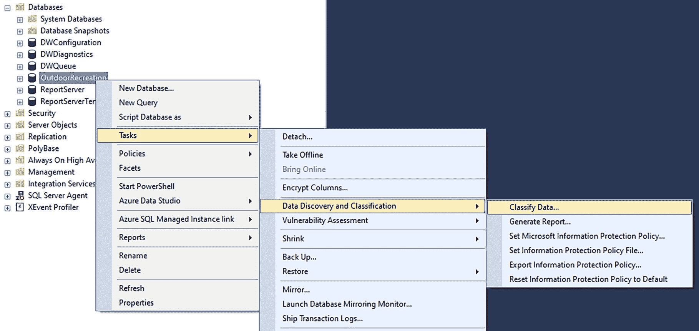

图 18-1 本地数据分类

您需要找到要进行分类的数据库。右键单击数据库名称，然后选择“任务” ➤ “数据发现和分类” ➤ “分类数据”。选择后，SQL Server 将扫描数据库并打开“数据分类”窗口。图 18-2 显示了一个灰色框中的消息，提示“我们已找到 6 个具有分类建议的列。单击此处查看它们”。

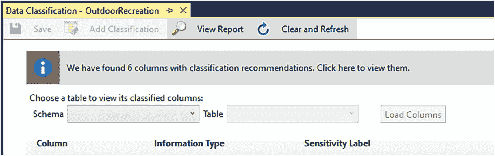

图 18-2 数据分类输出

单击灰色框的任意位置将更新“数据分类”窗口中的视图。现在出现了一个新的部分，以一个灰色条开始。该灰色条显示“6 个具有分类建议的列（单击以最小化）”。图 18-3 展示了数据分类窗口上的这个附加部分。

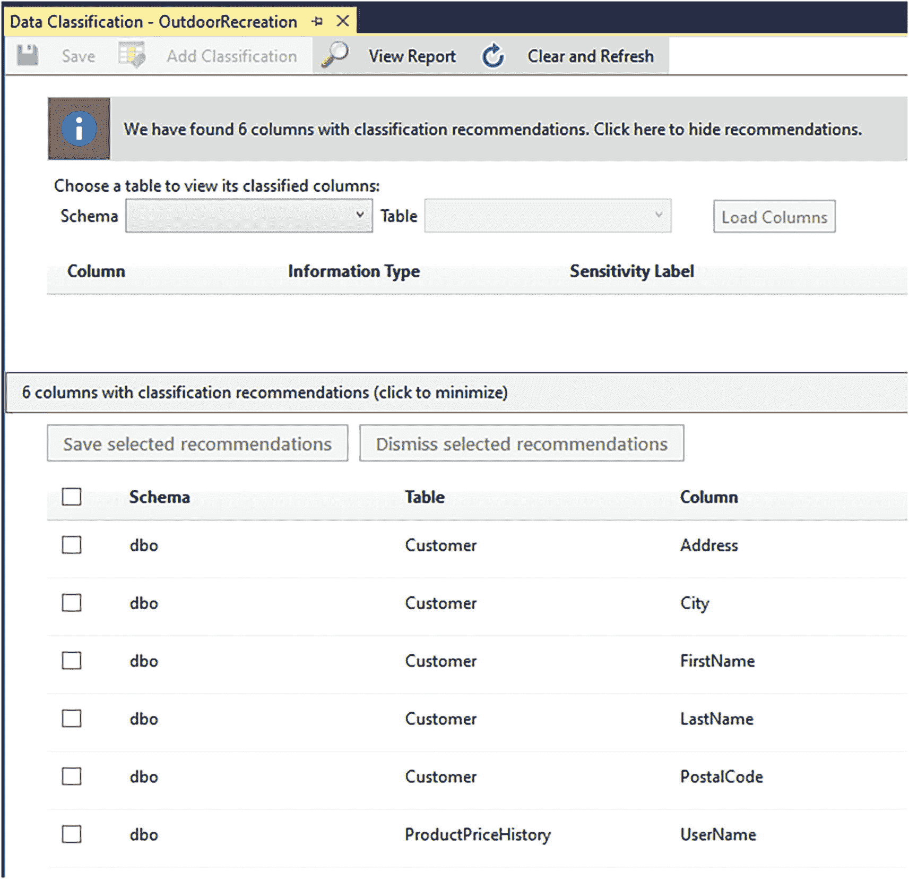

图 18-3 数据分类结果

图 18-3 显示了已识别的六个列以及它们所属的架构和表。“数据分类”窗口还有两列带有下拉菜单。第一列是“信息类型”。可用选项如下：

*   网络
*   联系人信息
*   凭证
*   信用卡
*   银行
*   金融
*   其他
*   姓名
*   国民身份证
*   社会安全号码
*   健康
*   出生日期
*   [不适用]

除了各种信息类型外，还有各种可用的敏感度标签，如图 18-4 所示。

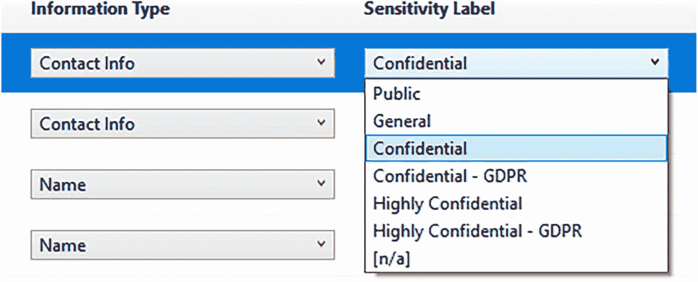

图 18-4 可用的敏感度标签

一旦确认了信息类型和敏感度标签，您可以选择表中左侧的复选框来标记任意多列进行更新。图 18-5 显示了为 `dbo.Customer.Address` 列选中的复选框。

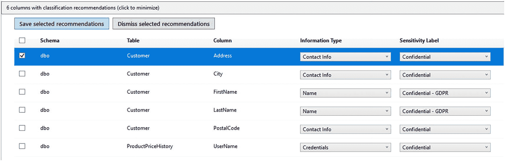


### 查看分类建议

一张包含 6 列分类建议的截图。顶部有两个选项卡，用于保存和忽略选定的建议。一个 6 列 7 行的表格展示了勾选框、架构、表、列、信息类型和敏感度标签。

#### 图 18-5：选择对特定列进行数据分类

勾选复选框后，您可以选择 **保存选定的建议** 或 **忽略选定的建议**。在此示例中，保存第一列（`dbo.Customer` 表中的 `Address`）的建议。这仅是示例；您可以选择保存一个或多个建议的列。

> **注意**
>
> 敏感度标签在 Microsoft 365 合规中心管理。如果您需要不同的标签，或者您的组织已配置了不同的敏感度标签，您需要使用 **设置 Microsoft 信息保护策略** 选项来访问此配置。但是，使用 Microsoft 365 合规中心超出了本书的范围。

### 查看已分类的数据

保存此信息后，数据分类窗口的顶部区域将更新。您可以参考图 18-6，其中列 `Address` 现在显示在窗口的上部。

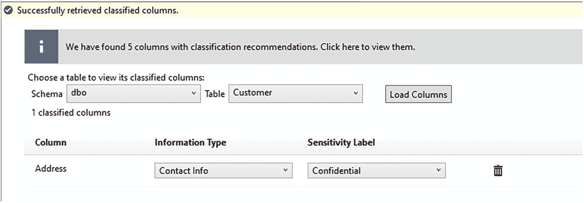

一张展示已分类数据的截图。顶部有一条信息。下方是用于输入架构、表和加载列的选项卡。一个 3 列 2 行的表格展示了 1 个已分类列、信息类型和敏感度标签。

#### 图 18-6：查看已分类的数据

这表明 `dbo.Customer` 表中的 `Address` 列现已被标记为敏感数据，并关联了信息类型和标签。

### 添加未建议的分类列

如果您想为 `dbo.Customer` 表添加一个 SQL Server 未建议分类的列，可以选择数据分类窗口左上角附近的“添加分类”选项。图 18-7 中突出了“添加分类”按钮。

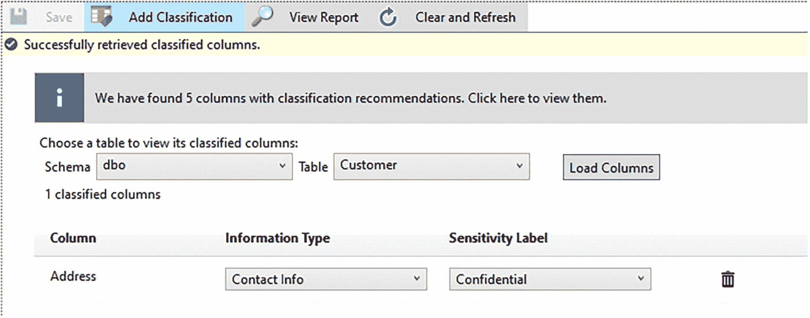

一张展示检索到的分类数据的截图。顶部面板有 4 个选项，其中“添加分类”被高亮显示。下方是用于输入架构、表和加载列的选项卡。一个表格展示了 1 个已分类列、信息类型和敏感度标签。

#### 图 18-7：打开添加数据分类的窗口

一旦您选择“添加分类”，屏幕右侧将打开一个新窗口。这就是“添加分类”窗口，如图 18-8 所示。

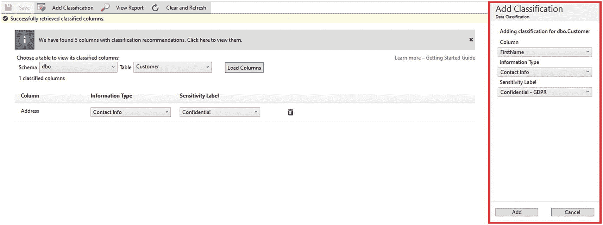

一张展示检索到的分类数据的截图。顶部面板有 4 个选项。下方是用于输入架构、表和加载列与表的选项卡。右侧面板展示了一个用于添加分类的窗口，其中包含列、信息类型和敏感度标签的下拉菜单。

#### 图 18-8：向分类添加列

此窗口继承了主数据分类窗口中引用的架构和表。在此示例中，这是 dbo 架构和 `Customer` 表。在“添加分类”窗口中，您可以选择表中的任何列，以及信息类型和敏感度标签。确认这些值后，可以选择底部的“添加”按钮。此按钮将把新分类的列添加到主数据分类窗口中。

### 查看 SQL 数据分类报告

在向数据发现和分类添加列后，您可以在 SQL 数据分类报告中查看您的敏感数据、敏感度标签和信息类型，如图 18-9 所示。

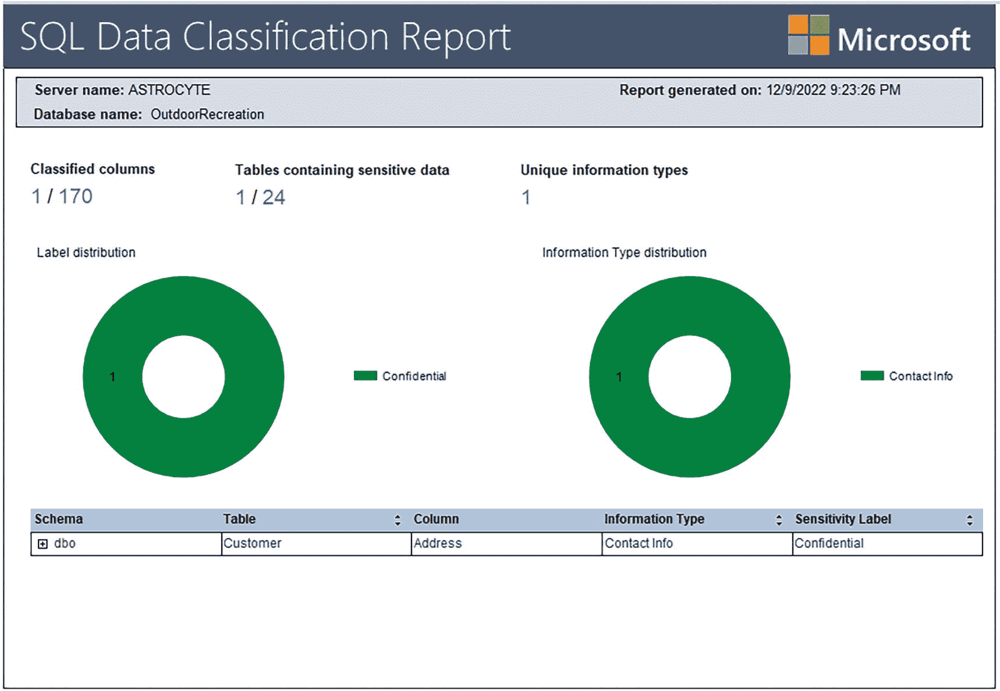

一张 SQL 数据分类报告的截图。顶部面板显示了服务器和数据库名称以及报告的日期和时间。有两个标签和信息类型分布的环形图。已分类的列为 1/170，包含敏感数据的表为 1/24。

#### 图 18-9：SQL 数据分类报告

如果您不确定如何访问此报告，请参阅上面的图 18-1。可以通过右键单击数据库名称并选择“任务” ➤ “数据发现和分类” ➤ “生成报告”来访问此报告。报告显示了服务器名称、数据库名称和报告生成日期。

SQL 数据分类报告还显示了已分类列占总列数的计数、包含敏感数据的表占总表数的计数以及唯一信息类型的计数。由于您只添加了一列，已分类列的计数是 170 个总列中的 1 列。同样，24 个表中只有 1 个表包含敏感数据，并且只有一个唯一信息类型。还有两个图表以可视化方式显示了敏感度标签和信息类型的分布情况。对于此示例，两者均为绿色，仅显示一个“机密”标签和一个“联系信息”敏感度类型。报告的最后一部分显示了所有被分类为具有敏感数据的列。

### 查看列属性中的敏感度

如果您打开 `dbo.Customer` 表中 `Address` 列的列属性，图 18-10 显示 `Address` 列的敏感度标签为“机密”。

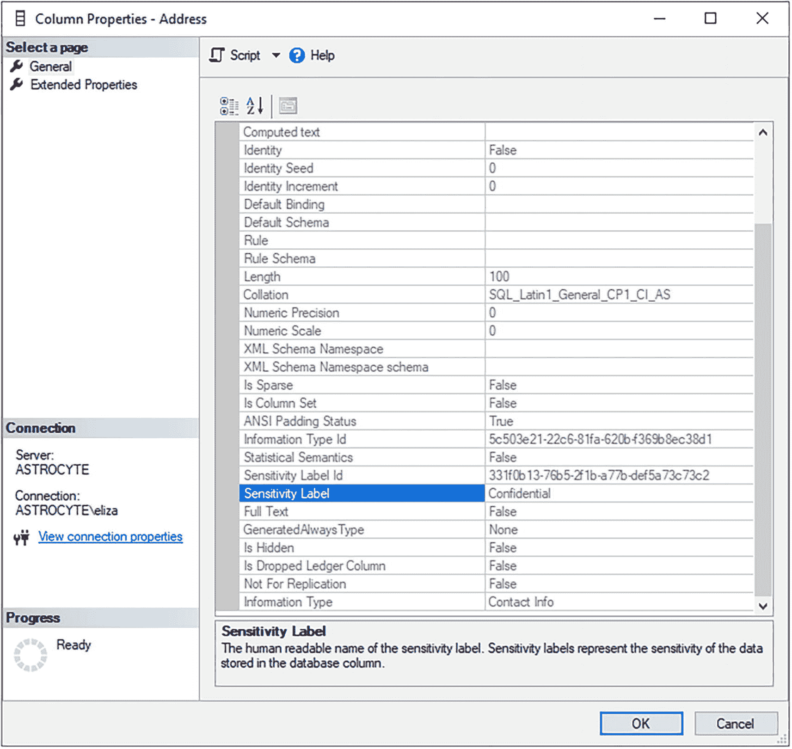

一张列属性“地址”窗口的截图。左侧面板显示了“选择页面”、“常规”和“扩展属性”选项以及连接详细信息。右侧面板展示了一个 2 列 27 行的表格。其中一个“敏感度标签”被选中。

#### 图 18-10：在列属性中查看敏感度

此敏感度标签与您在数据分类窗口以及 SQL 数据分类报告中看到的信息一致。您还可以查询系统目录视图以查找所有具有敏感度标签的列及其信息类型。清单 18-1 显示了您可以运行的查询，用于查找所有包含敏感数据的列。

```sql
SELECT
sch.[name] AS SchemaName,
obj.[name] AS TableName,
col.[name] AS ColumnName,
sc.[information_type] AS InformationType,
sc.[label] AS SensitivityLabel
FROM sys.sensitivity_classifications sc
INNER JOIN sys.objects obj
ON obj.[object_id] = sc.major_id
INNER JOIN sys.columns col
ON col.[object_id] = sc.major_id
AND col.column_id = sc.minor_id
INNER JOIN sys.schemas sch
ON obj.[schema_id] = sch.[schema_id];
```
**清单 18-1：查找标识为敏感数据的列**

此查询的结果包括架构名称、表名、列名、信息类型和敏感度标签。表 18-1 显示了清单 18-1 中查询的这些值。

#### 表 18-1：查看标记为敏感的列

| 架构名称 | 表名 | 列名 | 信息类型 | 敏感度级别 |
| --- | --- | --- | --- | --- |
| dbo | Customer | Address | Contact Info | Confidential |

如前所述，`Customer` 表中的 `Address` 列的敏感度标签为“机密”。查询还显示 `Customer` 表位于 dbo 架构中，`Address` 列的信息类型为“联系信息”。


### 在 Azure 中的数据发现与分类

虽然数据发现与分类功能在 Azure SQL 数据库、Azure SQL 托管实例和 Azure Synapse Analytics 中同样可用，但其实施与管理是在 Azure 门户中进行的。

要访问或设置数据发现与分类功能，请导航至 SQL 数据库（或其他 Azure SQL 资源）。在“安全性”下，你会找到一个名为“数据发现和分类”的部分，如图 18-11 所示。

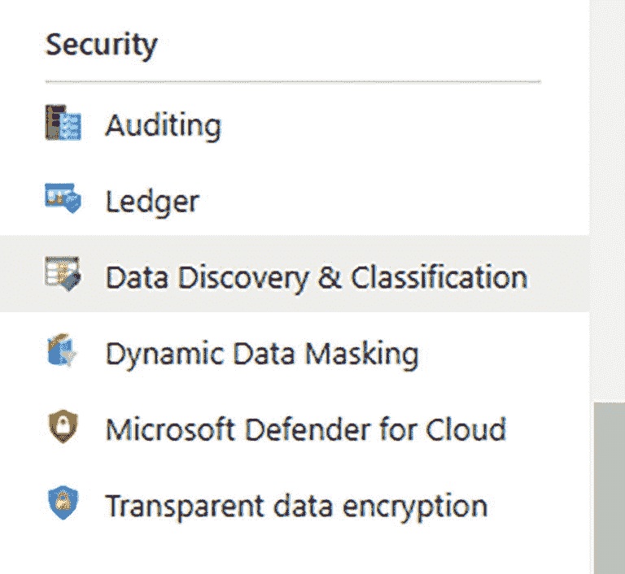
图 18-11：在 Azure 中访问“数据发现和分类”部分

SQL Server 和 Azure 支持相同的两种保护策略，但在 Azure 中选择和管理保护策略比在 SQL Server 上更简单。图 18-12 展示了如何通过单击“配置”来管理或更改保护策略。

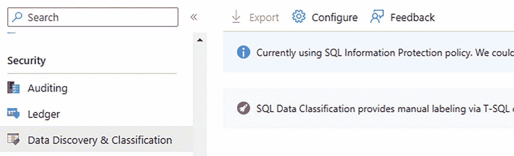
图 18-12：访问保护策略

除了管理保护策略外，添加数据分类标签也在 Azure 门户中进行管理。通过选择“分类”选项卡，如图 18-13 所示，你可以对敏感数据进行分类和标记。

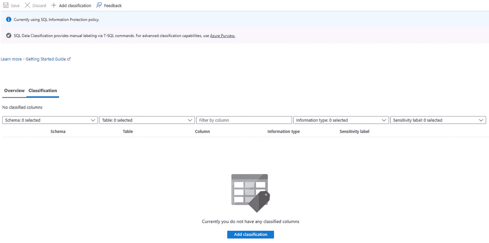
图 18-13：添加数据分类

识别、标记、分类和报告敏感数据，是改进与安全性相关的数据治理的有效第一步。此外，一旦识别出所有敏感列，你就可以开始就如何处理这些数据（与用户访问相关）做出决策。在接下来的章节中，我将讨论如何根据用户权限来混淆列或完全隐藏行。

## 动态数据屏蔽

在动态数据屏蔽部分，我将概述动态数据屏蔽的目的、类型和实施方法。屏蔽允许我们在向某些用户展示数据时部分混淆数据。这与加密数据不同。例如，对于一个不允许访问实际电子邮件地址的用户，屏蔽电子邮件地址可能会将 `ENoble@MyWebsite.com` 转换为 `EN***@**ite.com`。对于同一用户，可能只显示政府 ID 号码的最后四位数字。我还将介绍在尝试实施动态数据屏蔽时可能遇到的一些挑战。

正如前一节所讨论的，你的数据库中可能包含具有不同敏感级别的信息的数据列。在许多情况下，你可能不希望所有用户都能直接访问这些数据。有些情况下，你不能限制对整个表的访问，因为用户需要能够访问其中的某些列。通过使用动态数据屏蔽，你可以授予对整个表的访问权限，但限制敏感列中可返回的内容。通过对表中的列使用函数，你可以为任何包含敏感数据的列指定要实施的屏蔽类型。可用的屏蔽类型如下：

*   默认：`default()`
*   电子邮件：`email()`
*   随机：`random([起始范围], [结束范围])`
*   自定义：`partial(前缀, [填充], 后缀)`
*   日期时间：`datetime("<时间间隔")`

使用默认数据屏蔽时，SQL Server 根据列的数据类型使用特定的默认值。电子邮件数据屏蔽函数显示电子邮件地址的首字母和末尾的 .com（针对任何以 .com 结尾的字符串）。随机数据屏蔽函数允许你指定一个范围，显示的值将是随机返回的。如果你想创建自己的屏蔽逻辑，可以使用自定义屏蔽函数。部分屏蔽允许你选择在屏蔽的开头和结尾处保留原始数据类型的多少个字符不被屏蔽。中间的填充用于指示你希望实施的首选屏蔽。

SQL Server 2022 引入了使用日期时间屏蔽函数的功能。此函数旨在屏蔽数据，以显示所选列的年、月、日、小时、分钟或秒。日期时间函数支持的数据类型包括 `DATETIME`、`DATETIME2`、`DATE`、`TIME`、`DATETIMEOFFSET` 或 `SMALLDATETIME`。为了指定列的屏蔽方法，你需要在日期时间屏蔽函数中为时间间隔使用以下值：

*   年：使用“Y”作为时间间隔。
*   月：使用“M”作为时间间隔。
*   日：使用“D”作为时间间隔。
*   小时：使用“h”作为时间间隔。
*   分钟：使用“m”作为时间间隔。
*   秒：使用“s”作为时间间隔。

要创建一个具有动态数据屏蔽功能的表，清单 18-2 包含在 Address 列上使用屏蔽函数的 T-SQL。

```
CREATE TABLE [dbo].Vendor             NOT NULL,
[CompanyName]      VARCHAR(100)                     NOT NULL,
[Address]          VARCHAR(100)
MASKED WITH (FUNCTION = 'partial(1, "xxxx", 2)')
NOT NULL,
[City]             VARCHAR(100)                     NOT NULL,
[PostalCode]       VARCHAR(20)                          NULL,
[Country]          VARCHAR(75)                      NOT NULL,
[EmailAddress]     VARCHAR(100)
MASKED WITH (FUNCTION = 'email()')
NOT NULL,
[IsActive]         BIT
CONSTRAINT DF_Vendor_IsActive    DEFAULT 1    NOT NULL,
[DateCreated]      DATETIME2(2)
CONSTRAINT DF_Vendor_DateCreated DEFAULT GETDATE()
NOT NULL,
[DateModified]     DATETIME2(2)
CONSTRAINT DF_Vendor_DateModified DEFAULT GETDATE()
NOT NULL,
[DateDisabled]     DATETIME2(2)                         NULL,
CONSTRAINT [PK_Vendor] PRIMARY KEY CLUSTERED ([VendorID] ASC)
);
清单 18-2：创建具有动态数据屏蔽功能的表
```


此表包含两列经过屏蔽的数据。第一列是 `dbo.Vendor` 表上的 `Address` 列。该列使用了 `partial()` 函数。开头的数字 1 表示第一个字符将保持不屏蔽。紧随第一个未屏蔽字符之后的将是填充的 `xxxx`。当 `Address` 列被屏蔽时，其末尾将显示最后两个未屏蔽的字符。

为了演示动态数据屏蔽的工作原理，你应该向 `dbo.Vendor` 表添加一些数据。如果你已创建 `dbo.Vendor` 表，可以使用清单 18-3 中的 T-SQL 代码向该表插入一条新记录。

```sql
INSERT INTO dbo.Vendor
(CompanyName, [Address], City, PostalCode, Country, EmailAddress)
VALUES
(
'Kayak Unlimited',
'567 3rd Street',
'Somewhere',
'10005',
'United States',
'sales@kayakutld.com'
);
清单 18-3
向供应商表添加数据
```

现在你已将供应商 Kayak Unlimited 添加到 `dbo.Vendor` 表，可以查询数据以确认新供应商是否已添加。执行清单 18-4 中的查询，你可以查看未屏蔽的数据。

```sql
SELECT CompanyName,
[Address],
EmailAddress
FROM dbo.Vendor;
清单 18-4
查询供应商表
```

清单 18-4 的查询结果如表 18-2 所示。

表 18-2

查看未屏蔽的供应商信息

| 公司名称 | 地址 | 电子邮件地址 |
| --- | --- | --- |
| Kayak Unlimited | 567 3rd Street | sales@kayakutld.com |

参考该表，你可以识别出地址是 567 3^(rd) Street，电子邮件地址是 sales@kayakutld.com。既然已确认数据未被屏蔽，你可以测试拥有不同权限的用户可能看到的数据。

清单 18-5 包含用于创建新用户、授予权限并以该用户身份执行查询的 T-SQL 代码。

```sql
CREATE USER TestDynamicMasking WITHOUT LOGIN;
GRANT SELECT ON SCHEMA::dbo TO TestDynamicMasking;
-- 为测试进行模拟:
EXECUTE AS USER = 'TestDynamicMasking';
SELECT CompanyName,
[Address],
EmailAddress
FROM dbo.Vendor;
REVERT;
清单 18-5
创建用户以测试动态数据屏蔽
```

你创建了用户 TestDynamicMasking，但未将该用户与登录关联。你已授予该用户在 dbo 架构上选择数据的权限。执行访问公司名称、地址和电子邮件地址的查询后，你可以看到表 18-3 中显示的结果。

表 18-3

查看被屏蔽的供应商信息

| 公司名称 | 地址 | 电子邮件地址 |
| --- | --- | --- |
| Kayak Unlimited | 5xxxxet | sXXX@XXXX.com |

该表显示地址为 `5xxxxet`，电子邮件地址为 `sXXX@XXXX.com`。虽然该用户拥有 SELECT 权限，但他们没有 UNMASK 权限。因此，这证实了数据如你所预期的那样被屏蔽了。如果你授予此登录 UNMASK 权限并重新运行清单 18-5 中的示例，用户将能够看到未屏蔽的数据。

在 SQL Server 2022 中，还可以为给定用户实现细粒度的解除屏蔽。这允许用户查看 `GRANT UNMASK` 语句中指定的特定未屏蔽数据。清单 18-6 中的代码授予 TestGranularUnmasking 用户对 `EmailAddress` 列的 UNMASK 权限。

```sql
CREATE USER TestGranularUnmasking WITHOUT LOGIN;
GRANT SELECT ON SCHEMA::dbo TO TestGranularUnmasking;
GRANT UNMASK ON dbo.Vendor(EmailAddress) TO TestGranularUnmasking;
-- 为测试进行模拟:
EXECUTE AS USER = 'TestGranularUnmasking';
SELECT CompanyName,
[Address],
EmailAddress
FROM dbo.Vendor;
REVERT;
清单 18-6
创建用户以测试细粒度解除屏蔽
```

此 T-SQL 代码表明 TestGranularUnmasking 用户应能解除 `dbo.Vendor` 表上 EmailAddress 列的屏蔽。表 18-4 显示了清单 18-6 查询返回的结果。

表 18-4

查看细粒度解除屏蔽的供应商信息

| 公司名称 | 地址 | 电子邮件地址 |
| --- | --- | --- |
| Kayak Unlimited | 5xxxxet | sales@kayakutld.com |

查询结果中的 EmailAddress 是 `sales@kayakutld.com`，证实该列已被解除屏蔽。正如预期，`Address` 列仍然被屏蔽，值为 `5xxxxet`。在 SQL Server 2022 中，你可以使用 `GRANT UNMASK ON` T-SQL 代码为数据库、架构、表或列实现细粒度解除屏蔽。

到目前为止，我只介绍了如何在创建新表时使用动态数据屏蔽。然而，更常见的情况是，你可能希望在现有表中添加新列或对现有表中的列实施动态数据屏蔽。清单 18-7 提供了使用 `datetime()` 屏蔽函数屏蔽客户出生日期数据的 T-SQL 代码。

```sql
ALTER TABLE dbo.Customer
ADD DateOfBirth DATETIME2(2)
MASKED WITH (FUNCTION = 'datetime("Y")')
NULL;
清单 18-7
向具有动态数据屏蔽的表中添加列
```

此代码将向 `dbo.Customer` 表创建一个名为 `DateOfBirth` 的新列。同时，`DateOfBirth` 列也将被配置为使用日期时间屏蔽函数。此 T-SQL 将导致任何未被授予数据库、架构、表或列 UNMASK 权限的用户只能看到出生日期中的年份。

在使用数据发现和分类识别出包含敏感数据的列后，你可以决定如何对这些列实施动态数据屏蔽。此外，也可以向现有表添加一个配置为动态数据屏蔽的新列。清单 18-8 包含将现有列更改为使用动态数据屏蔽所需的 T-SQL 代码。

```sql
ALTER TABLE dbo.CustomerOrder
ALTER COLUMN OrderNumber
ADD MASKED WITH (FUNCTION = 'default()');
清单 18-8
修改现有列以实现动态数据屏蔽
```

`dbo.CustomerOrder` 表中的现有列 `OrderNumber` 应更新为使用 `default()` 屏蔽函数。但是，由于该列上存在预先存在的依赖项，因此无法修改 `OrderNumber` 列。返回的错误消息如图 18-14 所示。

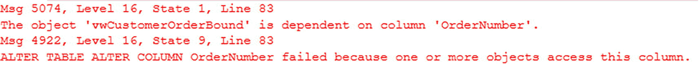

一张显示错误消息的截图。消息的最后一行显示：表更改列 OrderNumber 失败，因为一个或多个对象访问了此列。

图 18-14

错误消息：表具有外键

错误消息指出：*对象 ‘viewCustomerOrderBound’ 依赖于列 ‘OrderNumber’。ALTER TABLE ALTER COLUMN OrderNumber 失败，因为一个或多个对象访问了此列。* 第一个错误消息是由于视图 `dbo.vwCustomerOrderBound` 上的架构绑定引起的。第二个错误消息在列存在任何依赖项（包括非聚集索引）时都会发生。一个可能的解决方案是暂时从视图 `dbo.vwCustomerOrderBound` 中移除架构绑定，如清单 18-9 所示。

```sql
CREATE OR ALTER VIEW dbo.vwCustomerOrderBound
AS
SELECT cus.FirstName,
cus.LastName,
cus.FirstName + ' ' + cus.LastName AS FullName,
ord.CustomerOrderID,
ord.OrderNumber,
ord.OrderDate,
ord.ShipDate
FROM dbo.CustomerOrder ord
INNER JOIN dbo.Customer cus
ON ord.CustomerID = cus.CustomerID;
清单 18-9
暂时移除架构绑定
```


一旦架构绑定被移除，你就可以重新运行清单 18-8 中的 T-SQL 代码。代码将成功执行，并且 `OrderNumber` 列今后将使用默认的动态数据屏蔽。列更新后，你可以如清单 18-10 所示，将架构绑定添加回视图 `dbo.vwCustomerOrderBound`。

```sql
CREATE OR ALTER VIEW dbo.vwCustomerOrderBound
WITH SCHEMABINDING
AS
SELECT cus.FirstName,
       cus.LastName,
       cus.FirstName + ' ' + cus.LastName AS FullName,
       ord.CustomerOrderID,
       ord.OrderNumber,
       ord.OrderDate,
       ord.ShipDate
FROM dbo.CustomerOrder ord
INNER JOIN dbo.Customer cus
    ON ord.CustomerID = cus.CustomerID;
清单 18-10
将架构绑定添加回视图
```

本节展示了如何配置列以使用动态数据屏蔽，包括可用于屏蔽数据的各种类型的函数。本节还包含了如何创建表、添加列或修改现有列以使用动态数据屏蔽的示例。下一个合乎逻辑的步骤是考虑，如果你想实现行级加密的概念，该怎么做。

## 行级安全

在本节中，你将了解行级安全的定义。你还将通过一个示例学习如何设置行级安全，并探索创建安全策略时可以使用的不同功能类型。

SQL Server 不提供在列级别屏蔽数据的能力。然而，行级安全允许你定义谁可以看到哪些行，超越 `WHERE` 子句所指示的范围。由于行级安全定义的此行限制将适用于可能作为针对数据库执行的查询的一部分的任何 `WHERE` 子句，因此它也将限制用户修改数据的能力。

首先，让我们看看在实现行级安全之前查询的结果。清单 18-11 显示了 `dbo.Customer` 表中按国家/地区统计的所有客户数量。

```sql
SELECT Country, COUNT(*) AS CustomerCount
FROM dbo.Customer
GROUP BY Country;
清单 18-11
查看当前按国家/地区统计的客户
```

查询结果如图 18-5 所示。

表 18-5：按国家/地区统计的客户数

| 国家/地区 | 客户数量 |
| --- | --- |
| 埃及 | 1 |
| 印度 | 200702 |
| 墨西哥 | 200704 |
| 葡萄牙 | 1 |
| 美国 | 1 |

此查询返回五个国家/地区，每个国家/地区有不同的客户数量。现在你已经知道了实现行级安全之前的客户分布情况，你可以检查一下实现行级安全后会发生什么。可以使用一个表值函数来确定某一行是否有资格被查看，方法是返回 1 或 0。1 表示用户可以查看该行，0 则阻止用户查看该行。清单 18-12 显示了一个基于提供的国家/地区管理行级安全的函数。

```sql
CREATE FUNCTION dbo.TVF_SecuritySalesIndia(@Country AS VARCHAR(25))
RETURNS TABLE
WITH SCHEMABINDING
AS
RETURN SELECT 1 AS tvf_region_result
       WHERE @Country = 'India' OR USER_NAME() = 'dbo';
清单 18-12
为行级安全创建函数
```

此函数将导致任何非 `dbo` 的用户仅在国家/地区是 `India` 时返回值 1。`dbo` 用户仍将能够查看所有客户，无论其国家/地区如何。

创建表值函数后，你需要一种方法来管理行级安全是开启还是关闭。这是通过创建安全策略来完成的。创建安全策略时，有三个选项。你可以指定 `FILTER PREDICATE`、`BLOCK PREDICATE` 或两者兼有。筛选器谓词用于确定可以访问哪些数据。此筛选器适用于 `SELECT`、`UPDATE` 和 `DELETE` 操作。块谓词可以与函数结合使用，以阻止特定用户修改指定的列。本章后面将展示一个 `BLOCK PREDICATE` 的示例。在你创建清单 18-12 中函数的示例中，你可以在此函数上创建一个安全策略。清单 18-13 显示了一个使用筛选器谓词的安全策略。

```sql
CREATE SECURITY POLICY CountryFilter
ADD FILTER PREDICATE dbo.TVF_SecuritySalesIndia(Country)
ON dbo.Customer
WITH (STATE=ON);
清单 18-13
为行级安全创建筛选安全策略
```

此安全策略将 `dbo.Customer` 表中的国家/地区传递给清单 18-12 中创建的函数。`dbo` 用户仍将能够看到所有客户，如表 18-6 所示，使用的是清单 18-11 中的 T-SQL 代码。

这些结果与表 18-5 中的结果相同，正如预期的那样。这表明当前用户不受新安全策略的影响。

表 18-6：当前用户按国家/地区统计的客户数


### 行级安全实现

| 国家/地区 | 客户数量 |
| --- | --- |
| 埃及 | 1 |
| 印度 | 200702 |
| 墨西哥 | 200704 |
| 葡萄牙 | 1 |
| 美国 | 1 |

### 测试行级安全策略

一旦此安全策略就位，所有其他用户将只能看到印度的客户信息。要为所有其他用户测试新的安全策略，请创建一个用户并重新运行相同的查询，如清单 18-14 所示。

```sql
CREATE USER TestRowLevel WITHOUT LOGIN;
GRANT SELECT ON SCHEMA::dbo TO TestRowLevel;
-- impersonate for testing:
EXECUTE AS USER = 'TestRowLevel';
SELECT Country, COUNT(*) AS CustomerCount
FROM dbo.Customer
GROUP BY Country;
REVERT;
-- 清单 18-14
-- 为测试用户查看当前按国家/地区分布的客户数量
```

新用户 `TestRowLevel` 已创建，但未关联登录账户。授予该用户的唯一权限是能够在 `dbo` 架构中的对象上选择数据。然后，`T-SQL` 代码执行与清单 18-11 中相同的查询。该查询的结果如表 18-7 所示。

**表 18-7**
**当前用户按国家/地区统计的客户数量**

| 国家/地区 | 客户数量 |
| --- | --- |
| 印度 | 200702 |

返回的唯一结果是针对印度客户的。这证实了安全策略正在按预期工作。检查清单 18-13 的执行计划，你看到了一个如何在安全策略中使用 `FILTER PREDICATE` 来防止用户更新数据的例子。然而，你可能希望阻止某些用户更新数据库中的数据，即使他们可以访问这些数据。这时就需要使用 `BLOCK PREDICATE`。

> **注意**
> 除非修改现有的安全策略，否则无法向已具有谓词的表添加谓词。或者，在创建安全策略时，可以在同一表上拥有多个谓词，包括一个过滤器和一个阻止器。

清单 18-15 展示了一个 `BLOCK PREDICATE`，它将阻止除 `dbo` 外的任何用户更新非印度的任何客户数据。

```sql
CREATE SECURITY POLICY CountryBlock
ADD BLOCK PREDICATE dbo.TVF_SecuritySalesIndia(Country)
ON dbo.Customer
WITH (STATE=ON);
-- 清单 18-15
-- 为行级安全创建阻止安全策略
```

该安全策略将允许任何非 `dbo` 用户查看 `dbo.Customer` 表中的所有数据。然而，这些相同的用户将无法修改任何国家不是印度的数据。清单 18-16 展示了此阻止谓词如何工作的示例。

```sql
GRANT SELECT ON SCHEMA::dbo TO TestRowLevel;
GRANT UPDATE ON SCHEMA::dbo TO TestRowLevel;
-- impersonate for testing:
EXECUTE AS USER = 'TestRowLevel';
UPDATE Customer
SET DateDisabled = GETDATE();
REVERT;
-- 清单 18-16
-- 为测试用户更新数据
```

此查询试图为用户 `TestRowLevel` 的所有记录更新 `DateDisabled`。该用户已被授予更新记录的权限。但是，由于存在阻止谓词，当尝试更新所有记录时，用户将收到如图 18-15 所示的错误。

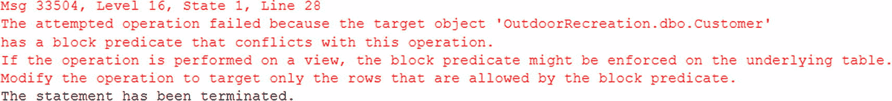

一段文本呈现了一个错误消息。消息的第二行写着，尝试的操作失败，因为目标对象 outdoor recreation dot d b o dot customer 具有一个与此操作冲突的阻止谓词。

**图 18-15**
**带有阻止谓词的错误消息**

该消息表明，由于阻止谓词安全策略，此用户无法修改表 `dbo.Customer` 上的数据。

### 管理安全策略

如果你想暂时禁用清单 18-13 中创建的安全策略，可以执行清单 18-17 中的 `T-SQL` 代码。

```sql
ALTER SECURITY POLICY CountryFilter
WITH (STATE=OFF);
-- 清单 18-17
-- 禁用安全策略
```

此代码会禁用安全策略。指出安全策略可以被禁用，意味着可能需要采取额外措施来确认没有人篡改过安全策略。

> **提示**
> 如果安全策略被禁用，行级安全将无法按预期阻止用户查看或更新数据。

如前所述，每个表只能有一个策略。但是，该策略可以为同一个表包含一个过滤器谓词和一个阻止谓词。不支持每个表有多个修改数据的谓词。这些谓词也可以使用不同的表值函数。如果用户受到 `FILTER PREDICATE` 的影响，即使他们被限制了可以 `SELECT`、`UPDATE` 或 `DELETE` 的数据，他们也能够插入任何数据。类似地，如果用户有 `BLOCK PREDICATE` 但没有过滤器谓词，即使他们不能修改数据，他们也能看到所有数据。但是，这些用户被阻止对数据进行任何更改，包括插入、更新和删除。虽然你在表值函数中看到 `RETURN` 的值为 1，但任何非 `NULL` 值都会对行级安全产生相同的结果。当没有匹配时，函数返回 `NULL` 并实施安全策略。

使用表值函数时，始终要谨慎。例如，应避免在表值函数内进行多表连接。还需要确保函数内的查询不会因转换或计算问题而返回 `NULL`。还值得注意的是，执行计划不会包含表值函数的操作符。相反，你将在其中一个操作符上看到列出的谓词，如图 18-16 所示。

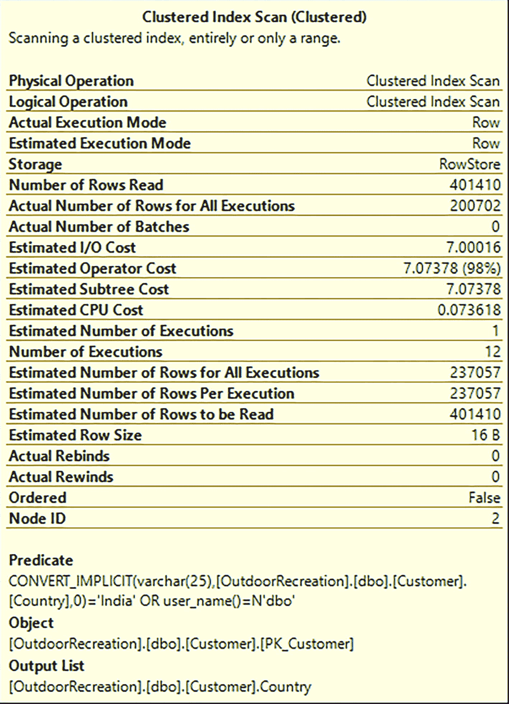

一个聚集索引扫描的截图。它描绘了一个包含 22 个属性的列表。列表底部在标题“谓词”、“对象”和“输出列表”下有代码。

**图 18-16**
**执行计划中的谓词**

本节介绍了行级安全的目的以及如何实现此类安全的示例。该示例还展示了当为行级安全设置了过滤器谓词时，结果有何不同。另外还给出了一个如何根据需要禁用行级安全的示例。


## Ledger（账本表）

如前所述，有时您需要监控用户修改数据库数据的行为。SQL Server 2022 引入了一种通过 ledger 表（账本表）来验证数据库中所存储数据完整性的方法。这些 ledger 表通过对每笔交易进行哈希处理，并使用该交易的哈希值来哈希下一笔交易，从而创建一个区块链。这种对每笔交易进行哈希处理的方法会为后续的每笔交易重复进行。本节将讨论可用的 ledger 表类型。您将看到如何设置这两种 ledger 表的示例，以及将现有表迁移到 ledger 表的过程。本节最后将介绍如何验证 ledger 表是否被篡改。

第一种 ledger 表是**只可追加 ledger 表**。该表的功能正如其名；它只允许向表中插入数据，无法更新或删除数据。如果您需要记录用户交互（如访问应用程序、表格或门禁读卡器），这会非常有用。清单 18-18 中的 T-SQL 代码创建了一个只可追加 ledger 表，用于记录用户访问应用程序的时间。

```
CREATE TABLE dbo.SystemAccess
(
SystemAccessID      BIGINT     IDENTITY(1,1)      NOT NULL,
UserID              INT                           NOT NULL,
IsActive            BIT
CONSTRAINT DF_SystemAccess_IsActive         DEFAULT 1
NOT NULL,
DateCreated         DATETIME2(2)
CONSTRAINT DF_SystemAccess_DateCreated DEFAULT
SYSDATETIME()
NOT NULL
)
WITH (LEDGER = ON (APPEND_ONLY = ON));
Listing 18-18
创建一个只可追加 Ledger 表
```

创建此表为只可追加 ledger 表的部分是 `CREATE TABLE` 语句的最后一行。最后一行使用 `LEDGER = ON` 启用了 ledger 功能。表创建中的只可追加部分由 `APPEND_ONLY = ON` 指定。

现在您已经创建了一个只可追加 ledger 表，可以插入一些数据来查看 ledger 表功能是如何工作的。清单 18-19 中的 T-SQL 模拟了用户尝试登录应用程序时会发生的情况。

```
INSERT INTO dbo.SystemAccess (UserID)
VALUES (1001);
Listing 18-19
向只可追加 Ledger 表添加数据
```

该查询将一个 `UserID` 插入到 `dbo.SystemAccess` 表中。既然已经插入了一条记录，您就可以查询数据是如何记录在 `dbo.SystemAccess` 表中的。请注意，由于 `table dbo.SystemAccess` 是一个只可追加 ledger 表，表中会有两个额外的可用列。列 `ledger_start_transaction_id` 和 `ledger_start_sequence_number` 会为只可追加 ledger 表自动生成。清单 18-20 中的查询查看了 `dbo.SystemAccess` 表中的数据。

```
SELECT SystemAccessID,
UserID,
ledger_start_transaction_id,
ledger_start_sequence_number
FROM dbo.SystemAccess;
Listing 18-20
查看只可追加 Ledger 表中的数据
```

`ledger_start_transaction_id` 列是系统生成的，包含插入记录的事务 ID。`ledger_start_sequence_number` 是事务内的序列号。Ledger 信息如表 18-8 所示。

表 18-8

查看系统访问记录

| System Access ID | User ID | Ledger Start Transaction ID | Ledger Start Sequence Number |
| --- | --- | --- | --- |
| 1 | 1001 | 120017 | 0 |

插入操作的事务 ID 为 120017。插入操作的序列号为 0。

既然您已经向 `dbo.SystemAccess` 插入了一条数据记录，让我们看看尝试更新 `dbo.SystemAccess` 中的记录时会发生什么。清单 18-21 显示了更新 `dbo.SystemAccess` 表上 `DateCreated` 的 T-SQL 代码。

```
UPDATE dbo.SystemAccess
SET DateCreated = GETDATE()
WHERE SystemAccessID = 1;
Listing 18-21
尝试更新只可追加 Ledger 表
```

当你尝试更新记录时，会得到图 18-17 中的错误消息。

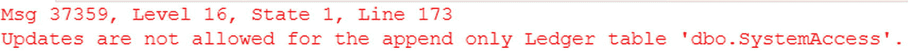

一条文本显示错误消息。文本内容为：消息 37359，级别 16，状态 1，第 173 行，不允许对只可追加 ledger 表 d b o dot system access 进行更新。

图 18-17

尝试更新只可追加 ledger 表时的错误消息

正如预期的那样，任何用户都无法更新 `dbo.SystemAccess` 表，包括 `dbo` 和 `sysadmin` 角色成员。当尝试执行清单 18-9 中的更新操作时，你会得到错误 *“Updates are not allowed for the append only Ledger table ‘dbo.SystemAccess.’”*。现在我已经讨论了只可追加 ledger 表的用途，接下来我将介绍如何设置可更新 ledger 表。

**可更新 ledger 表**允许您跟踪数据插入的时间，这与只可追加 ledger 表类似。只可追加和可更新 ledger 表都是系统版本控制表。由于可更新 ledger 表使用系统版本控制，任何修改记录的先前版本都存储在历史表中。此外，可更新 ledger 表会记录数据在表中更新或删除的时间。更新操作被记录为删除现有数据的删除操作，以及为列中新值进行的插入操作。创建可更新表的 T-SQL 代码在清单 18-22 中。

```
CREATE TABLE dbo.ApplicationRule(
ApplicationRuleID                                 INT          NOT NULL,
ApplicationRuleDescription                        VARCHAR(50)  NOT NULL,
IsActive BIT
CONSTRAINT DF_ApplicationRule_IsActive      DEFAULT (1)  NOT NULL,
DateCreated [datetime]
CONSTRAINT DF_ApplicationRule_DateCreated   DEFAULT (GETDATE())
NOT NULL,
DateModified [datetime]
CONSTRAINT DF_ApplicationRule_DateModified  DEFAULT (GETDATE())
NULL,
CONSTRAINT PK_ApplicationRule_ApplicationRuleID
PRIMARY KEY CLUSTERED (ApplicationRuleID ASC)
)
WITH
(
SYSTEM_VERSIONING = ON (HISTORY_TABLE =
dbo.ApplicationRuleHistory),
LEDGER = ON
);
Listing 18-22
创建一个可更新 Ledger 表
```

在清单 18-4 中，您指定了一个历史表及其名称。如果您没有指定名称，SQL Server 仍然会创建一个历史表。该表是创建可更新 ledger 表时隐式创建的。创建可更新 ledger 表的代码与清单 18-18 中的 T-SQL 类似。查询的最后几行是创建可更新 ledger 表所需的 T-SQL 代码。相同的命令 `LEDGER = ON` 启用了 ledger 功能。`The SYSTEM_VERSIONING = (HISTORY_TABLE = dbo.ApplicatinRuleHistory)` 创建了将用于记录 ledger 历史的表。清单 18-23 包含查找创建可更新 ledger 表时所创建对象的 T-SQL 代码。

```
SELECT
ts.[name] + '.' + t.[name] AS ledger_table_name,
hs.[name] + '.' + h.[name] AS history_table_name,
vs.[name] + '.' + v.[name] AS ledger_view_name
FROM sys.tables AS t
INNER JOIN sys.tables AS h
ON h.[object_id] = t.history_table_id
INNER JOIN sys.views v
ON v.[object_id] = t.ledger_view_id
INNER JOIN sys.schemas ts
ON ts.[schema_id] = t.[schema_id]
INNER JOIN sys.schemas hs
ON hs.[schema_id] = h.[schema_id]
INNER JOIN sys.schemas vs
ON vs.[schema_id] = v.[schema_id]
WHERE t.[name] = 'ApplicationRule';
Listing 18-23
查看可更新 Ledger 对象
```


### 账本表实现

此查询将为可更新账本表 `ApplicationRule` 生成账本表、历史表和账本视图。账本视图是一个系统创建的视图，它结合了可更新账本表和历史表的数据。创建的表和视图的名称如下：

*   `dbo.ApplicationRule`
*   `dbo.ApplicationRuleHistory`
*   `dbo.ApplicationRule_Ledger`

由于表已经创建，你现在可以修改表 `dbo.ApplicationRule` 中的数据。为了添加和修改数据，你可以执行清单 18-24 中的查询。

```
INSERT INTO dbo.ApplicationRule (ApplicationRuleDescription)
VALUES ('Show only active customers');
UPDATE dbo.ApplicationRule
SET IsActive = 0,
DateModified = GETDATE()
WHERE ApplicationRuleDescription = 'Show only active customers';
清单 18-24
在 ApplicationRule 表中添加和修改数据
```

这些查询在 `dbo.ApplicationRule` 表中创建一条记录并停用该应用程序规则。要查看为可更新账本表记录的信息，清单 18-25 中的查询包含了你需要的 T-SQL 代码。

```
SELECT trn.commit_time AS CommitTime,
trn.principal_name AS UserName,
app.ApplicationRuleDescription,
app.IsActive,
app.ledger_operation_type_desc AS ActionType
FROM dbo.ApplicationRule_Ledger app
INNER JOIN sys.database_ledger_transactions trn
ON app.ledger_transaction_id = trn.transaction_id
ORDER BY trn.commit_time;
清单 18-25
查看账本历史信息
```

此查询使用视图 `dbo.ApplicationRule_Ledger` 来查找为可更新账本表记录的信息。该查询显示了查询运行的时间、谁执行了查询、`dbo.ApplicationRule` 表中的列以及执行的操作类型。由于可更新账本表是系统版本控制的，用户无法修改历史表中的数据。表 18-9 显示了清单 18-23 的结果。

表 18-9
查看系统访问记录

| 提交时间 | 用户名 | 应用程序规则描述 | 是否激活 | 操作类型 |
| --- | --- | --- | --- | --- |
| 2023-05-01 | Enoble | 仅显示活跃客户 | 1 | 插入 |
| 2023-05-01 | Enoble | 仅显示活跃客户 | 1 | 删除 |
| 2023-05-01 | Enoble | 仅显示活跃客户 | 0 | 插入 |

此表中的第一条记录显示了新应用程序规则插入表的时间。操作类型显示为插入。第二行和第三行对应于 `IsActive` 列从 True (1) 更新为 False (0) 的情况。第二行显示了删除，因为 `IsActive` 为 1 的记录被删除。第三行显示了插入，其中 `IsActive` 被设置为 False (0)。这种记录粒度级别与第 15 章讨论的某些跟踪方式类似。

请注意，我没有给你一个如何向现有表添加账本表功能的示例。这是因为无法向现有表添加账本功能。为了向现有表实现账本表，你需要新建一个账本表。清单 18-26 展示了为 `dbo.Product` 表创建一个新的可更新账本表。

```
CREATE TABLE dbo.Product_LedgerTable(
ProductID         INT      IDENTITY(1,1)      NOT NULL,
ProductName       VARCHAR(25)                 NOT NULL,
ProductPrice      DECIMAL(6, 2)               NOT NULL,
IsActive          BIT
CONSTRAINT DF_Product_LedgerTable_IsActive DEFAULT (1)
NOT NULL,
DateCreated       DATETIME2(2)
CONSTRAINT DF_Product_LedgerTable_DateCreated
DEFAULT (GETDATE())
NOT NULL,
DateModified      DATETIME2(2)
CONSTRAINT DF_Product_LedgerTable_DateModified
DEFAULT (SYSDATETIME())
NOT NULL,
DateDisabled      DATETIME2(2)                    NULL,
CONSTRAINT PK_Product_LedgerTable PRIMARY KEY CLUSTERED (ProductID ASC)
)
WITH
(
SYSTEM_VERSIONING = ON,
LEDGER = ON
);
清单 18-26
创建一个新的可更新账本表
```

一旦创建了可更新账本表，你就可以使用系统存储过程 `sys.sp_copy_data_in_batches` 将数据从原始表复制到新的账本表。此代码的示例如清单 18-27 所示。

```
EXECUTE sp_copy_data_in_batches
@source_table_name = N'Product' ,
@target_table_name = N'Product_Ledger';
清单 18-27
将数据从 Product 复制到 Product_Ledger
```

你将源表指定为原始表，目标表是新创建的可更新账本表。

使用账本表的好处是能够验证是否有人篡改了账本表。要检查篡改，你首先需要生成账本摘要。执行清单 18-28 中的 T-SQL 将给出验证篡改所需的 JSON。

```
EXECUTE sp_generate_database_ledger_digest;
清单 18-28
查找账本摘要
```

一旦执行了 JSON，你需要复制该 JSON 以传递给下一个系统存储过程。要检查篡改，你可以执行清单 18-29 中的 T-SQL 代码。

```
EXECUTE sp_verify_database_ledger N'
{
"database_name":"OutdoorRecreation",
"block_id":0,
"hash":"0xE32AE537398CB3F1276C7BA16AF359C8E0365CB6AAE9617AEA40B54D61EAC865",
"last_transaction_commit_time":"2022-12-09T23:40:44.9700000",
"digest_time":"2022-12-11T22:24:06.7619426"
}';
清单 18-29
检查账本表是否被篡改
```

如果没有发生篡改，上面的查询将返回结果 “Ledger verification successfully verified up to block 0”。如果你使用的是 Azure SQL，你可以使用清单 18-30 中的查询来检查篡改。

```
DECLARE @digest_locations NVARCHAR(MAX) =
(
SELECT *
FROM sys.database_ledger_digest_locations
FOR JSON AUTO, INCLUDE_NULL_VALUES
);
SELECT @digest_locations as digest_locations;
BEGIN TRY
EXEC sys.sp_verify_database_ledger_from_digest_storage @digest_locations;
SELECT 'Ledger verification succeeded.' AS Result;
END TRY
BEGIN CATCH
THROW;
END CATCH
清单 18-30
检查 Azure SQL 数据库账本表是否被篡改
```

如果你想随时间跟踪数据库的更改，SQL Server 2022 引入了为 SQL Server 创建账本数据库的功能。创建 SQL Server 账本数据库的代码见清单 18-31。

```
CREATE DATABASE OutdoorRecreated_Ledger
WITH LEDGER = ON;
清单 18-31
创建 SQL Server 账本数据库
```

如果你使用的是 Azure SQL 数据库，可以在 Azure 门户中创建数据库时在 `Security` 表中配置账本。其他选项包括 PowerShell 和 Azure CLI。也可以使用清单 18-32 中的 T-SQL。

```
CREATE DATABASE OutdoorRecreated_Ledger
(
EDITION = 'GeneralPurpose',
SERVICE_OBJECTIVE='GP_Gen5_2',
MAXSIZE = 2 GB
)
WITH LEDGER = ON;
清单 18-32
创建 SQL Server 账本数据库
```

与 SQL Server 账本数据类似，Azure SQL 数据库账本数据库必须只包含账本表。如果未指定，创建的任何表都将默认为可更新账本表。

