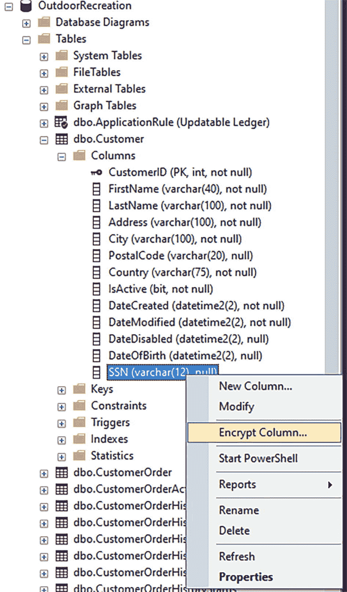
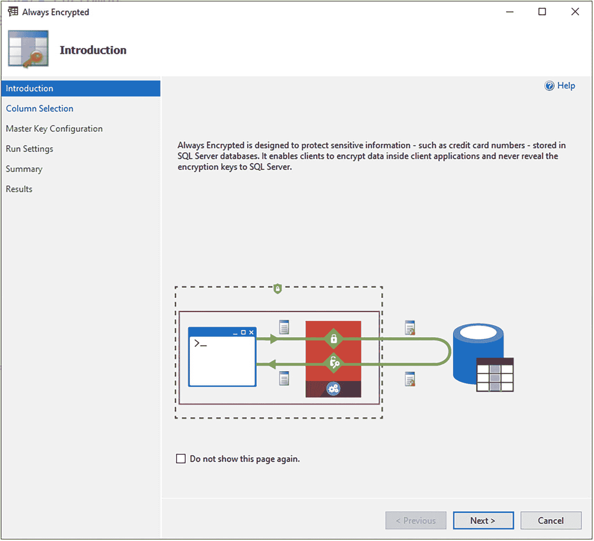
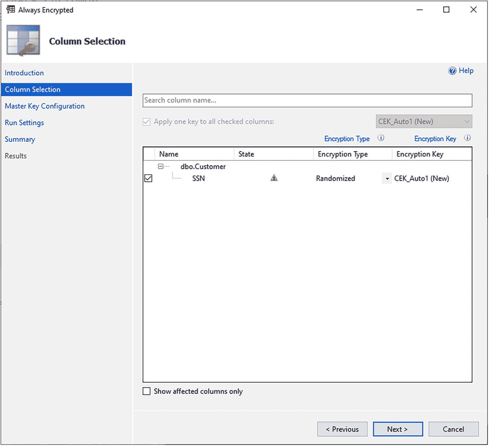
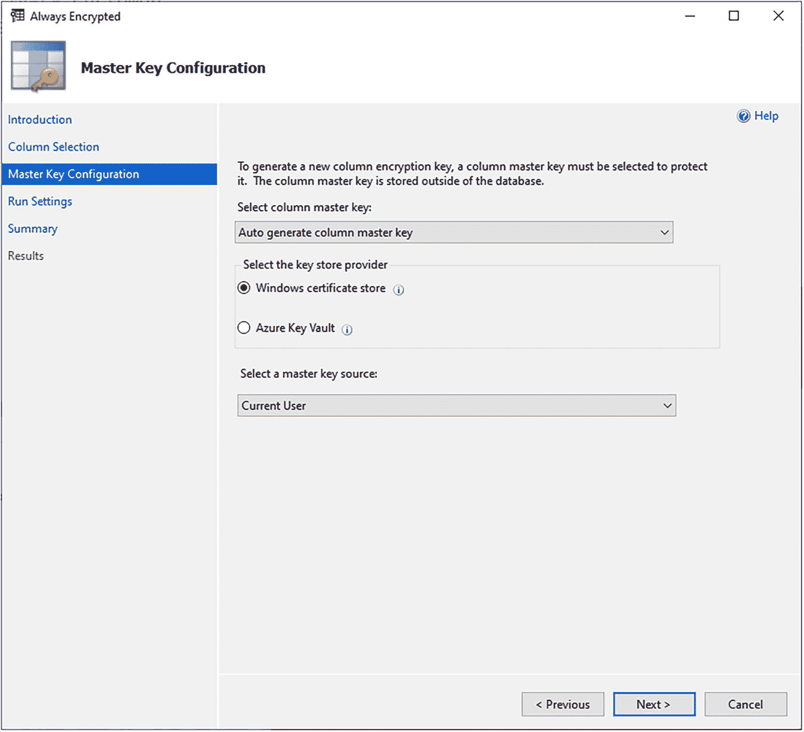
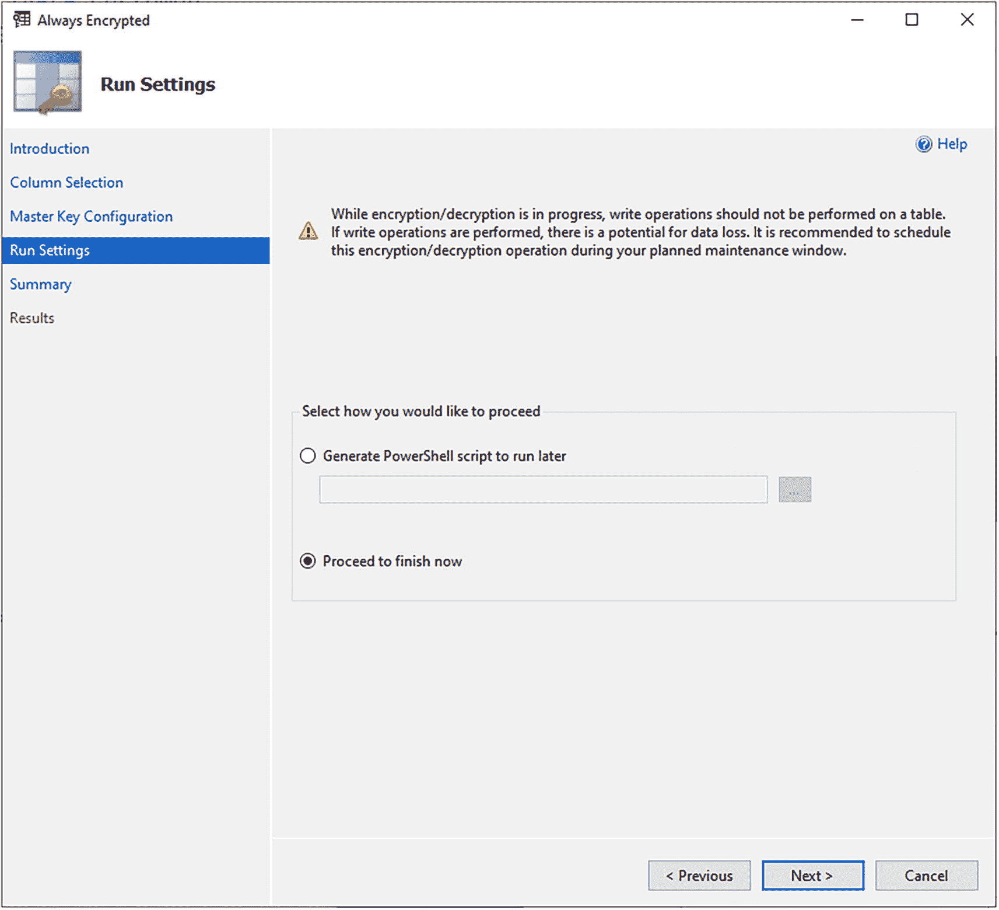
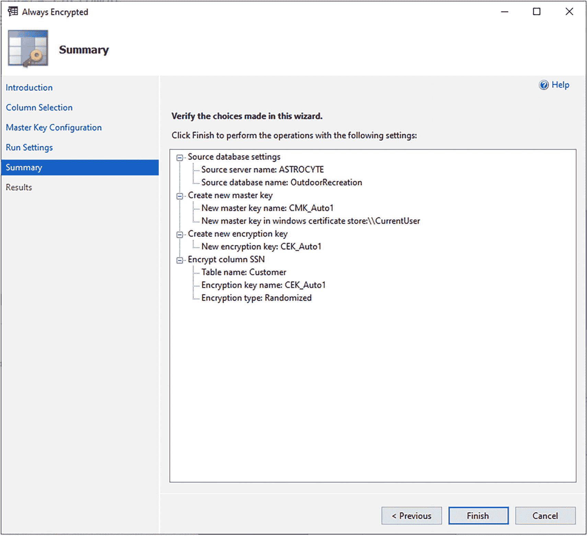
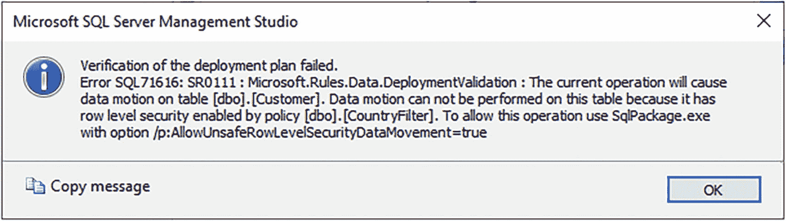
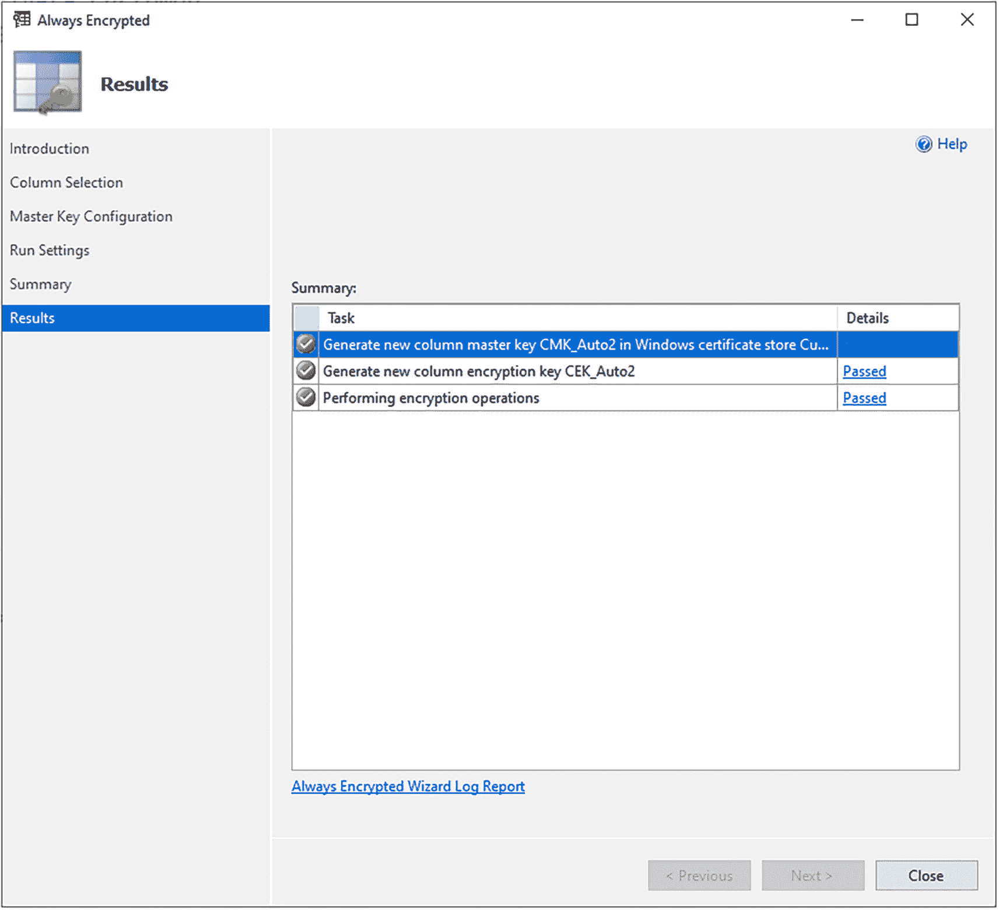
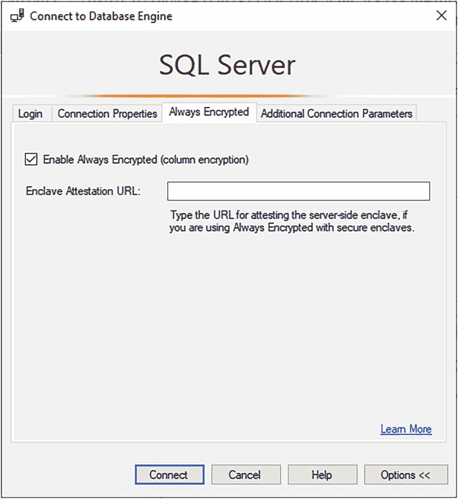
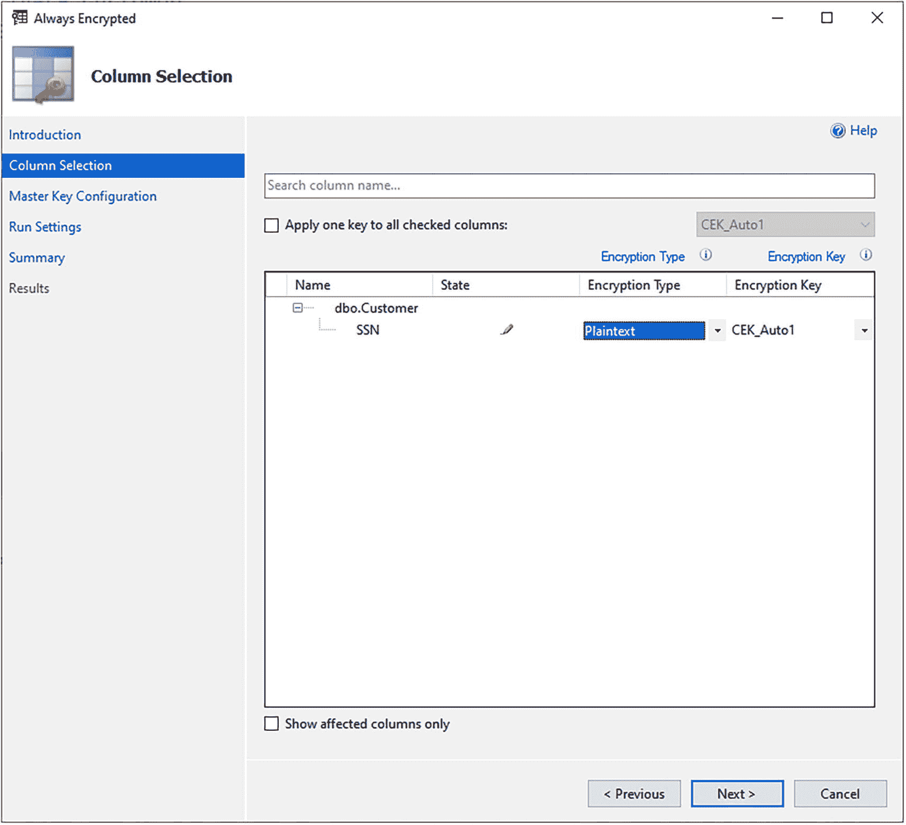

# 19. 实现加密

继第 18 章介绍管理安全功能的方法之后，本章将重点介绍如何为数据库实现加密。本章第一节将介绍如何使用 Always Encrypted 来确保你最敏感的数据在静态和传输过程中保持加密。第二节将指导你如何为数据库实现静态的透明数据加密 (TDE)。本章的目标是在安全访问数据的概念基础上，再赋予你根据需要加密数据的能力。


## 始终加密

在第 18 章中，我介绍了如何使用动态数据屏蔽来防止用户访问敏感数据。本节将介绍如何使用**始终加密**来确保您的敏感数据在静态存储和传输过程中都得到加密。我将讨论可用的加密类型及其相关限制。本节还将包括如何实现始终加密以及如何从始终加密中删除列的示例。最后，本节将简要概述如何轮换用于始终加密的密钥。

**始终加密**允许您在维护数据库的个人与访问数据的应用程序之间实现职责分离。借助始终加密，应用程序可以轻松访问加密数据，而数据库管理员无法查看这些数据，这使得这种加密形式对信用卡号、社会安全号码或国民身份证等最敏感的数据尤其具有吸引力。

在实现始终加密之前，让我们先了解一下可用的两种加密类型。第一种加密类型是**确定性加密**。使用此加密类型时，相同的明文值将具有相同的加密值。因此，确定性加密可能容易受到暴力攻击。确定性加密的优点是管理员可以允许用户对加密列进行搜索、分组、索引和联接。另一种可用的加密类型是**随机化加密**。这种加密类型更安全。但是，您将无法在 `JOIN…ON`、`WHERE` 或 `GROUP BY` 子句或索引中使用这些列。

> **注意**
> 您需要在连接字符串中更新 `Column Encryption Setting = enabled` 作为连接字符串的一部分。

在启用始终加密之前，您应该查询现有表，以了解在实现始终加密之前查询如何返回数据。清单 19-1 包含查找所有在美国的客户及其社会安全号码（缩写为 `SSN`）的查询。

```sql
SELECT CustomerID, SSN
FROM dbo.Customer
WHERE Country = 'United States';
```
**清单 19-1**
**创建主密钥和证书**

执行此查询后，您可以在表 19-1 中查看结果。

**表 19-1**

**始终加密前查看列**

| CustomerID | SSN |
| --- | --- |
| 401405 | 123-45-6789 |

在此示例中，我创建了一个完全虚构的社会安全号码 123-45-6789。如表 19-1 所示，您可以读取实际的社会安全号码。

要设置始终加密，请导航到对象资源管理器中的数据库。您可以展开 `Tables` 文件夹并导航到要加密的列。在此示例中，您将加密 `SSN` 列。通过右键单击 `dbo.Customer` 表中的 `SSN` 列，您可以选择“加密列”选项，如图 19-1 所示。



**图 19-1**

**选择要加密的列**

选择“加密列”选项将打开始终加密向导。向导的第一个屏幕是“简介”。始终加密向导中的简介步骤指出：“*始终加密旨在保护存储在 SQL Server 数据库中的敏感信息（例如信用卡号）。它使客户端能够在客户端应用程序内加密数据，并且永远不会向 SQL Server 泄露加密密钥。*” 请参阅图 19-2。



**图 19-2**

**选择要加密的列**

简介屏幕上还有一个图示，以图形方式显示了上述陈述。查看此屏幕后，您可以选择“下一步”。“列选择”是向导中的第二个屏幕。如图 19-3 所示，您可以使用此屏幕选择列名、加密类型和加密密钥。



**图 19-3**

**选择列和加密类型**

如图 19-3 所示，选择 `SSN` 列。加密类型的选项有明文、确定性或随机化。选择对社会安全号码使用随机化。由于这是您要加密的第一列，您只有选择新加密密钥 `CEK_Auto1` 的选项。图 19-3 中的警告消息如图 19-4 所示。


**图 19-4**

**排序规则更改警告**

此警告消息表明，始终加密会将 `SSN` 列的排序规则方法从 `SQL_Latin1_General_CP1_CI_AS` 更改为 `Latin1_General_BIN2`。

现在您已选择列，选择“下一步”将带您进入“主密钥配置”。请参阅图 19-5。



**图 19-5**

**主密钥配置屏幕**

在此屏幕上，您可以指定列主密钥、密钥存储提供程序和主密钥源。在此示例中，选择“自动生成列主密钥”、“Windows 证书存储”和“当前用户”。此处选择 Windows 证书存储，但请注意，我建议在生产环境中使用 Azure Key Vault。

现在您已为始终加密配置了主密钥，可以选择“下一步”进入“运行设置”屏幕。如图 19-6 所示，您可以选择生成稍后运行的 PowerShell 脚本，或者现在实现始终加密。



**图 19-6**

**运行设置**

有一个警告指出“*在加密/解密过程中，不应在表上执行写入操作。如果执行写入操作，则可能导致数据丢失。建议在计划的维护窗口期间安排加密/解密操作*”。由于我是在开发环境中运行，我可以选择现在运行。

选择“下一步”后，您将能够在始终加密向导的“摘要”屏幕上验证始终加密配置。图 19-7 显示了当前设置的摘要。




### 始终加密概述

### 总结页面与初始错误

一个总结页面的截图描绘了 4 个要点。它们依次是：源数据库设置、创建新的主密钥、创建新的加密密钥以及加密 SSN 列。下方高亮显示了完成按钮。

图 19-7
始终加密的总结

在审查完摘要配置后，你可以选择下一步。然而，图 19-8 显示了我尝试完成始终加密实施时看到的错误消息。



一个标题为 Microsoft SQL Server Management Studio 的对话框左侧显示 I 符号，内容为“验证部署计划字段”。下方提供了复制消息选项和一个“确定”按钮。

图 19-8
包含行级安全策略的表的错误

错误消息指出“*由于策略 [dbo].[CountryFilter] 启用了行级安全，因此无法在此表上执行数据移动。*”这引用的是在第 18 章中设置的行级安全。我从表中删除了行级安全，并重试为 SSN 列添加始终加密，如图 19-9 所示。



一个结果页面的截图描绘了摘要列表。它显示了名为“任务”和“详细信息”的列，并高亮显示列表中的第一个选项。下方显示了上一步、下一步和关闭按钮。

图 19-9
成功的始终加密列

### 成功加密与数据查看

添加始终加密后，“结果”屏幕会显示状态。在此示例中，你已成功生成新的列主密钥、生成新的列加密密钥并执行了加密操作。

你现在可以执行清单 19-1 中的相同查询。使用当前连接执行此查询的结果如表 19-2 所示。

表 19-2
查看始终加密后的列

| 客户 ID | SSN |
| --- | --- |
| 401405 | 0x01C0716043E1D97311AA2A0C456CA358359B9A4882D2B80FC1A95718BB31066F165150E252F3582003B543F4B37A7C3DE7A9310F487CFDDD3969DC05AC76B0B2BE |

很明显，`SSN` 列现在已被加密。如前所述，只要你有权限访问先前生成的加密密钥，仍然可以通过更新的连接字符串访问数据。图 19-10 展示了可以在 SSMS 中配置的始终加密选项。



一个标题为 SQL Server 的截图高亮显示了始终加密选项。它勾选了“启用始终加密”按钮，并在“enclave 证明 URL”选项前呈现一个空白栏。下方高亮显示了“连接”按钮。

图 19-10
配置始终加密连接

### 配置始终加密连接

在启用始终加密的情况下连接到 SQL Server 实例后，你可以重新运行清单 19-1 中的查询。运行此查询的结果如表 19-3 所示。

表 19-3
启用始终加密后查看列

| CustomerID | SSN |
| --- | --- |
| 401405 | XXX-XXX-XXXX |

如表所示，启用始终加密允许你以未加密形式访问 `SSN` 列中的数据。

### 移除加密与密钥轮换

如果你发现不再希望或需要在列上使用始终加密，可以导航到列加密设置，如图 19-1 所示。打开始终加密向导后，导航到如图 19-11 所示的列选择屏幕。



一个列选择页面的截图显示了名为“名称”、“状态”、“加密类型”和“加密密钥”的列，并高亮显示了“明文”加密类型。下方高亮显示了“下一步”按钮。

图 19-11
移除加密密钥

通过选择加密类型为“明文”，该列将不再受始终加密影响。

使用始终加密的另一个考虑是需要轮换加密密钥。以下是轮换主密钥的步骤概述：

1.  创建一个新的列主密钥。
2.  使用新的列主密钥加密现有列的加密密钥。
3.  使用新的列主密钥更新应用程序。
4.  清理旧的列主密钥。

本节介绍了始终加密的用途。解释了确定性和随机化加密密钥。你为一个列设置了始终加密，并确认加密按预期工作。本节还指出了如何从列中移除始终加密。最后一部分概述了如何更新用于加密的主密钥的高层流程。


