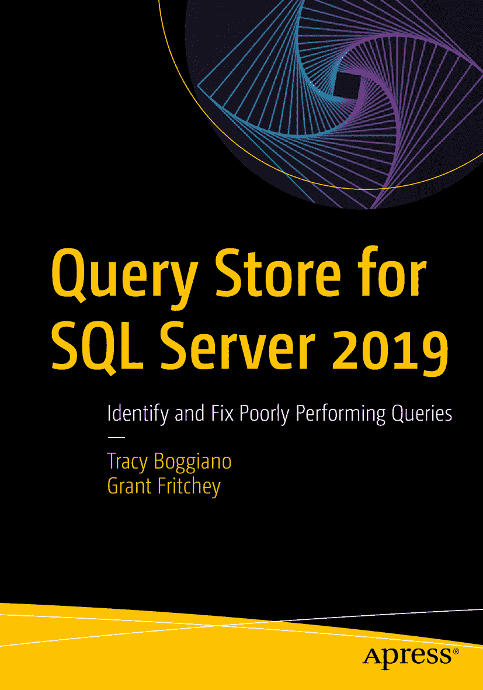

ISBN 978-1-4842-5003-7 e-ISBN 978-1-4842-5004-4 [`doi.org/10.1007/978-1-4842-5004-4`](https://doi.org/10.1007/978-1-4842-5004-4) © Tracy Boggiano and Grant Fritchey 2019
本作品受版权法保护。出版者保留所有权利，无论涉及材料的全部或部分，具体包括翻译权、转载权、图表重用权、朗诵权、广播权、缩微胶片或其他物理方式的复制权，以及信息存储与检索、电子改编、计算机软件方面的传播权，或任何目前已知或未来开发的类似或不同方法的使用权。
本书中可能出现商标名称、标识和图像。我们仅在编辑意义上，并以商标所有者的利益为目的使用这些名称、标识和图像，并非每次出现都附带商标符号，绝无侵犯商标权的意图。
本书中对商品名称、商标、服务标识及类似术语的使用，即使未特别标识，也不应被视为表达意见，判断其是否受专有权保护。
尽管本书中的建议和信息在出版时被认为是真实准确的，但作者、编辑和出版商均不对可能出现的错误或遗漏承担任何法律责任。出版商对本出版物所含材料不作任何明示或暗示的保证。
本书由 Springer Science+Business Media New York (地址：美国纽约州纽约市 Spring 街 233 号 6 层，邮编：10013。电话：1-800-SPRINGER，传真：(201) 348-4505，邮箱：orders-ny@springer-sbm.com，或访问网站：www.springeronline.com) 向全球图书贸易行业发行。Apress Media, LLC 是一家位于加利利福尼亚州的有限责任公司，其唯一成员（所有者）是 Springer Science + Business Media Finance Inc (SSBM Finance Inc)。SSBM Finance Inc 是一家特拉华州公司。

*谨以此书献给我的叔叔埃尔登。七年级时，他为我购买了人生中前两本关于 MS-DOS 和 QBasic 的计算机书籍，点燃了我对计算机工作的热情。在我撰写第一本技术书籍之际，我认为必须感谢他，若没有他对我早期计算机学习的贡献，我可能无法坚持自己投身计算机领域的梦想。*

*—Tracy Boggiano*

## 引言

本书介绍的是内置于 SQL Server 2019 中的 **查询存储** 功能，以及它如何帮助你识别数据库中性能不佳的查询并加以修复。自 SQL Server 2016 起，查询存储功能就已包含在 SQL Server 中，并在后续的每个新版本中逐步增加功能，使其在捕获的信息内容和方式上都变得更为出色。本书面向的是希望了解查询存储工作原理、最佳实施方法以及如何有效利用其解决问题的 SQL Server 数据库管理员（DBA）。查询存储以汇总形式向你展示数据库中曾经运行和当前正在运行的内容。

第 1 章介绍了在没有查询存储的情况下如何进行故障排除和收集统计数据，从而使你理解为什么查询存储是 SQL Server 的一个重要新特性。第 2 章概述了查询存储的工作原理，并深入探讨了其架构细节，涵盖了数据的捕获方式和存储位置。第 3 章介绍了如何配置查询存储以及包括跟踪标志在内的最佳配置实践。第 4 章介绍了 SQL Server Management Studio 中为查询存储提供的六份报告，以及如何利用它们获取所需信息。第 5 章深入阐述了查询存储目录视图中有哪些可用数据。

第 6 章涵盖了查询存储的不同用例，包括用它来展示数据库的正常性能表现、对查询性能和性能回退的查询进行故障排除、为数据库建立基线，以及测试升级到不同版本的 SQL Server。第 7 章开始展示查询存储的真正威力，说明如何识别性能不佳的查询以及强制执行计划以稳定性能涉及哪些因素。第 8 章展示了我们最强大的功能——**自动计划回退纠正**，即查询存储自动为你强制执行计划。该章还介绍了将等待统计信息捕获到类别中的功能。第 9 章向你展示了排除查询存储本身问题、等待统计信息和扩展事件的技术。第 10 章向你介绍了两个社区工具 dbatools 和 sp_blitzQueryStore，它们有助于配置查询存储和从其中提取数据。

### 关于作者与关于技术审校者

### 关于作者

### 关于技术审校者

## 1. 什么是查询存储？

当在 SQL Server 数据库上启用**查询存储**功能时，它会保存针对该数据库运行的工作负载的查询和统计信息的汇总聚合数据。这些数据可用于帮助你建立性能基线、对性能问题进行故障排除，以及稳定数据库性能。在本章中，我们将回顾在查询存储功能发布之前所使用的技术，包括 Profiler/服务器端跟踪、扩展事件、DMV（动态管理视图）、计划指南和 `sp_whoisactive`。然后，我们将了解查询存储如何以及为何成为完成这些活动的变革者。

查询存储就像是你 SQL Server 的飞行记录仪。它在内存中存储持续时间、读取次数、写入次数、CPU 使用率等统计数据以及查询计划，然后根据启用查询存储时设置的配置（默认为 1 小时）对这些信息进行聚合。在指定的时间段（默认是 15 分钟）后，这些数据会被持久化到磁盘上的目录视图中，供你通过查询或 SQL Server Management Studio (SSMS) 的内置报告进行查看。随着 SQL Server 2017 的发布，我们还能利用自动计划修正和等待统计信息聚合的强大功能——更多内容将在第 8 章介绍。

这正是查询存储真正威力的体现。在此之前，这些数据只有通过各种其他方法捕获才能获得，而这些方法被证明要慢得多且使用起来非常繁琐。为了更好地理解查询存储在底层的工作原理，我们将探讨这些其他方法：

1.  查询存储的实用性
2.  不使用查询存储技术的故障排除
3.  查询存储：变革者

### 查询存储的实用性

查询存储可以通过多种方式帮助你管理数据库。在本节中，我们将讨论如何利用它来帮助你建立数据库基线、对性能问题进行故障排除以及稳定性能。

#### 建立性能基线

任何数据库专业人员工作的一个关键部分是能够为其数据库服务器建立性能基线，而这并非易事。在本章的这部分内容中，我们将讨论为何要以及如何为你的数据库服务器建立基线，及其与查询存储的关系。查询存储能够捕获所有针对你的数据库执行过的查询并记录运行时统计信息，这使得收集所需的基线信息变得更加容易。


### 查询存储与性能基线

#### 什么是基线？

在讨论查询存储如何为您提供基线之前，我们先来谈谈基线是什么。基线是通过在服务器上运行工作负载并收集多个领域的度量指标来建立的，目的是确定随时间推移是否有任何显著变化。SQL Server 中值得关注的领域包括但不限于：CPU 利用率、内存 clerk 使用情况、读写次数（物理和逻辑）、查询执行时间等。为了准确测量服务器的整体活动情况，应在高峰时段和非高峰时段分别采集基线。拥有基线后，您将能更好地隔离性能问题并识别瓶颈。

#### 查询存储如何提供基线

查询存储将针对启用该功能的数据库运行的查询数据，聚合到您配置时预定义的时间间隔中。这些数据通过几种不同的报告进行展示。一个例子是图 1-1 中的“总体资源消耗”报告，它默认显示过去一个月的持续时间、执行次数、CPU 时间和逻辑读取量的图表。这份报告最适合查看数据库的基线。

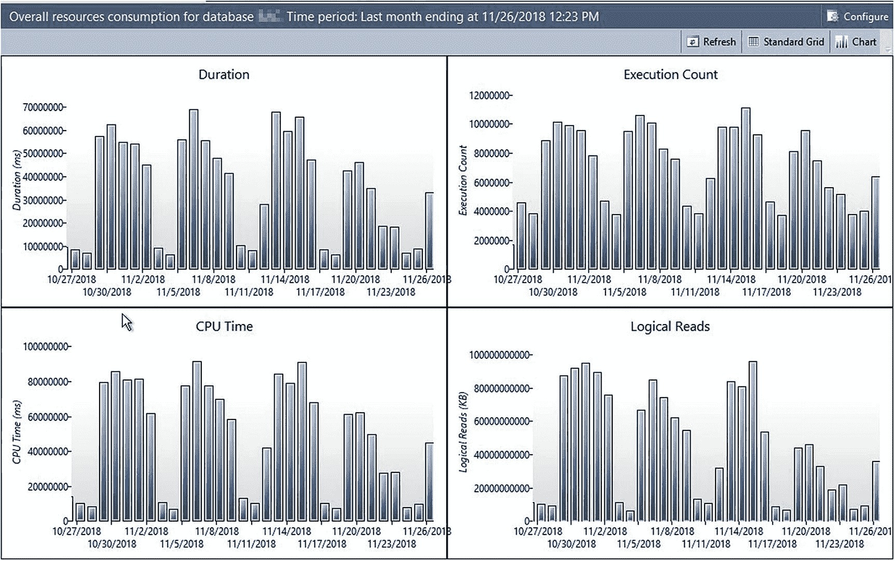

图 1-1：总体资源消耗报告

#### 目录视图

从查询存储收集的所有数据都存储在多个目录视图中。聚合的运行时统计数据存储在 `sys.query_store_runtime_stats` 中。目录视图 `sys.query_store_query_text` 存储了针对数据库执行过的唯一查询文本值，而 `sys.query_context_settings` 视图则存储了存储在 `sys.query_store_query_text` 视图中的查询所对应的设置，例如在 `SET ANSI_NULLS ON` 或 `SET QUOTED_IDENTIFERS ON` 等设置下执行的查询。`sys.query_store_query` 视图存储了基于文本和上下文设置唯一执行的所有查询，以便您跟踪它们。`sys.query_store_plan` 目录视图存储了已执行查询的估计计划以及以 XML 格式存储的编译时统计信息。`sys.query_store_runtime_stats_interval` 视图则存储了数据被存储的时间间隔。

关于目录视图的更多细节将在第 5 章讨论。

#### 稳定性能

下一份用于查看基线的报告是“退化查询”报告，它会向您显示性能已退化的查询。对于每一个这样的查询，您都应该研究其性能下降的原因。默认情况下，该报告会显示特定查询在过去一个月中每个查询计划的执行表现。

从“退化查询”报告或“消耗最大的查询”报告中，您可以轻松地根据其执行表现来判断哪些计划应该被强制执行。强制执行计划是指，您根据报告中看到的性能表现，决定采用某个执行计划，并指定 SQL Server 引擎今后都使用该计划。在查询存储出现之前，您必须使用计划指南，这些将在本章后面讨论。当您注意到计划退化时，就应该强制执行一个计划。计划退化是指 SQL Server 查询计划优化器为之前运行正常的查询编译了一个新的执行计划，但该计划的性能比之前的计划差。当手动强制执行一个计划时，您需要意识到，对于该查询，今后将不再使用任何其他执行计划。此外，如果发生索引更改或表架构更改，被强制的计划可能会开始失效，导致 SQL Server 查询优化器在每次执行该查询时都需要采取额外步骤来获取执行计划。这些报告提供了一个按钮来强制执行计划，但您也可以出于变更管理的目的，使用 T-SQL 通过存储过程 `sys.sp_force_plan` 来强制执行计划。

“高变异度”报告显示了哪些查询在性能上表现不稳定，这为您指明了哪些查询有时表现不同，可能需要进行调整以保持性能的一致性。

SSMS 中有一份“强制计划报告”，您可以通过它来跟踪和验证任何被强制执行的计划是否按预期运行。

#### 提示

较旧的查询计划将根据您设置的查询计划保留策略从查询存储中删除，因此您可能希望单独记录任何强制执行计划的预期未来性能表现。

更详细的报告讨论将在第 4 章进行。

### 不使用查询存储的故障排除技术

如果不使用查询存储，有几种技术可以用来排除与查询性能不佳相关的问题。这里我们将讨论使用 `SQL Server Profiler` 通过应用程序在服务器上运行跟踪、通过使用 `SQL Server Profiler` 创建脚本来运行服务器端跟踪到文件、使用 `Extended Events`、从 DMV 中提取信息、使用名为 `sp_whoisactive` 的社区存储过程，以及使用等待统计信息。

#### SQL Server Profiler

`SQL Server Profiler` 是一个常用工具，用于收集应用程序执行时刻服务器上正在运行的信息。图 1-2 展示了它的用户界面。`SQL Server Profiler` 用于在短时间内快速捕获数据。它附带了用于帮助捕获数据的模板，并允许您将数据保存到文件或数据库中的表中以便后续分析。运行 `SQL Server Profiler` 需要具有 `ALTER TRACE` 权限。

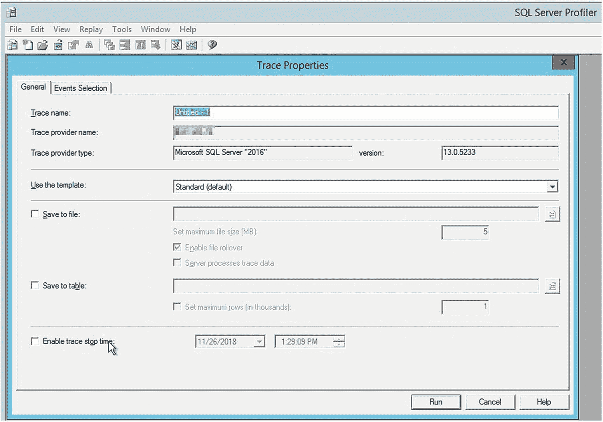

图 1-2：SQL Server Profiler 屏幕

#### 注意

截至 SQL Server 2017，SQL Profiler 和服务器端跟踪已被弃用，并处于维护模式。它们将在未来版本的 SQL Server 中被移除，建议使用 `Extended Events` 和 `SSMS XEvent Profiler`。

`SQL Server Profiler` 通常用于以下用例：

*   查找运行缓慢的查询及其问题区域。
*   逐步排查有问题的查询以找到根本原因。
*   捕获导致问题的一系列事件，以便在测试系统上重放来重现问题。
*   捕获数据以与性能计数器进行比较来诊断问题。
*   捕获基线工作负载以进行调优。`SQL Server Profiler` 文件可以与数据库引擎优化顾问一起使用，以推荐用于调优捕获的工作负载的索引和统计信息。

#### 注意

数据库引擎优化顾问推荐的索引和统计信息仅针对您提供的工作负载是理想的。请评估这些推荐，不要盲目应用。


#### SQL Server Profiler 概念

要使用 SQL Server Profiler，理解其中的术语会很有帮助：

*   **事件** 是在数据库引擎中发生的操作。

*   **事件类** 是要跟踪的事件类型。它包含该事件的所有数据；有多个数据列供您选择。

*   **事件类别** 定义了在 SQL Server Profiler 中事件的分组方式。

*   **数据列** 包含捕获到的事件类数据。每个事件类都有预定义的可用数据列。并非所有数据列都适用于所有事件类。

*   **模板** 是为特定故障排除场景预选了事件类的预定义跟踪。模板预定义了要使用的事件、数据列和筛选器。

*   **跟踪** 是 SQL Server Profiler 运行以捕获选定事件类、数据列和筛选器的操作。

*   **筛选器** 是一种根据您在数据列上指定的条件获取数据子集的方法。

图 1-3 显示了在 SQL Server Profiler 用户界面中应用筛选器的屏幕。

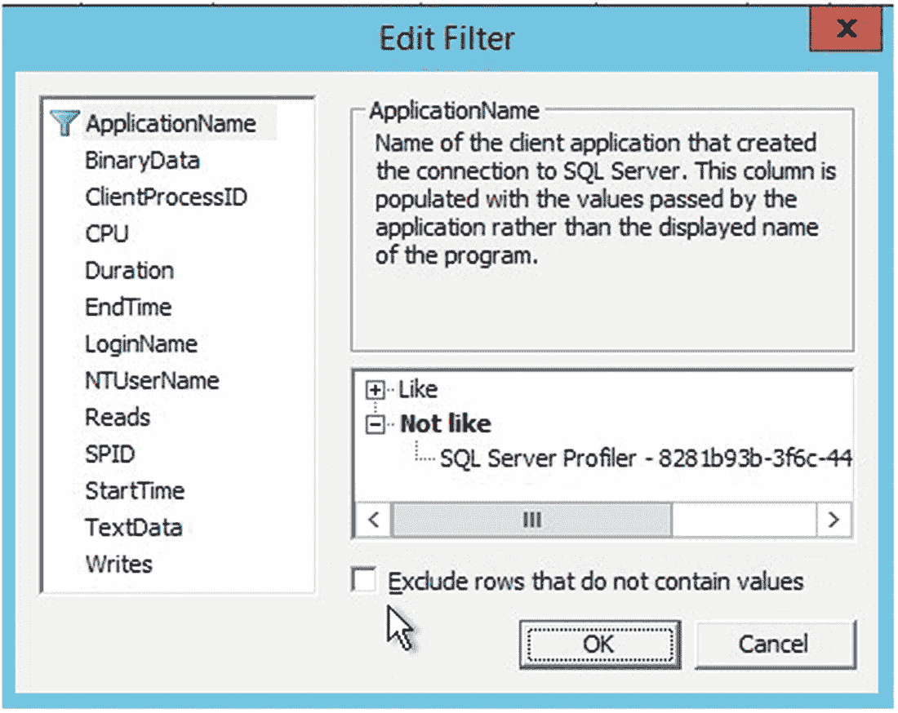

图 1-3 SQL Server Profiler 筛选器屏幕

#### 与性能相关的 SQL Server Profiler 事件类

用于收集与查询性能相关数据的不同事件类如下：

*   **Performance Event Category** 下：
    *   **Auto Stats** 在索引或列的统计信息自动更新时发生。当优化器加载要使用的统计信息时也会发生。

*   **Performance Statistics** 用于获取正在执行的查询、存储过程和触发器的性能统计信息。六个事件子类在系统中构建了这些操作的生命周期。使用这些子类以及以下 DMV，您可以获取任何查询、存储过程或触发器的性能历史记录：`sys.dm_exec_query_stats`、`sys.dm_exec_procedure_stats` 和 `sys.dm_exec_trigger_stats`。

*   **Showplan All** 在执行 SQL 语句时发生。它包含在 Showplan XML Statistics Profile 或 Showplan XML 事件类中的信息子集。

*   **Showplan All for Query Compile** 在编译 SQL 语句时发生。当您想要识别 Showplan 运算符时，会使用此类事件。这是 Showplan XML for Query Compile 事件类中的信息子集。

*   **Showplan Statistics Profile** 在执行 SQL 语句时发生。这是 Showplan XML Statistics Profile 事件类中的信息子集。

*   **Showplan Text** 在执行 SQL 语句时发生。这是 Showplan All、Showplan XML Statistics Profile 或 Showplan XML 事件类中可用信息的一个子集。

*   **Showplan Text (Unencoded)** 与 Showplan Text 事件类相同，只是数据被格式化为文本而不是二进制数据。

*   **Showplan XML** 在执行 SQL 语句时发生。当您想要识别 Showplan 运算符时，会使用此类事件。此事件类中的数据是一个定义的 XML 文档。

*   **Showplan XML for Query Compile** 在编译 SQL 语句时发生。当您想要识别 Showplan 运算符时，会使用此类事件。

*   **Showplan XML Statistics Profile** 在编译 SQL 语句时发生。当您想要识别 Showplan 运算符时，会使用此类事件。此类事件记录完整的编译时数据。

> **提示** 对于所有 Showplan 事件类，请限制其使用数量，因为它们可能导致显著的性能开销。Showplan Text 或 Showplan Text (Unencoded) 是对性能影响最小的事件类，但仍应谨慎使用。

*   **Plan Guide Successful** 需要满足三个条件此事件才会触发：
    1.  计划指南定义中的批处理或模块必须与正在执行的批处理或模块匹配。
    2.  计划指南定义中的查询必须与正在执行的查询匹配。
    3.  编译后的查询必须遵循计划指南中的提示。

*   **Plan Guide Unsuccessful** 在计划指南未能成功生成执行计划时发生。此事件触发需要满足三个条件：
    1.  计划指南定义中的批处理或模块必须与正在执行的批处理或模块匹配。
    2.  计划指南定义中的查询必须与正在执行的查询匹配。
    3.  编译后的查询未遵循计划指南中的提示。

> **注意** 本章后面将详细介绍如何使用计划指南。

*   **Stored Procedures Event Category** 下：
    *   **SP:Completed** 在存储过程完成执行时发生。

*   **SP:Starting** 在存储过程开始执行时发生。

*   **SP:StmtCompleted** 在存储过程内的 T-SQL 语句完成执行时发生。

*   **SP:StmtStarting** 在存储过程内的 T-SQL 语句开始执行时发生。

*   **T-SQL Event Category** 下：
    *   **SQL:BatchCompleted** 在 T-SQL 批处理完成执行时发生。

*   **SQL:BatchStarting** 在 T-SQL 批处理开始执行时发生。

*   **SQL:StmtCompleted** 在 T-SQL 语句完成执行时发生。

*   **SQL:StmtStarting** 在 T-SQL 语句开始执行时发生。

在图 1-4 中，您可以看到 SQL Profiler 的跟踪属性屏幕。

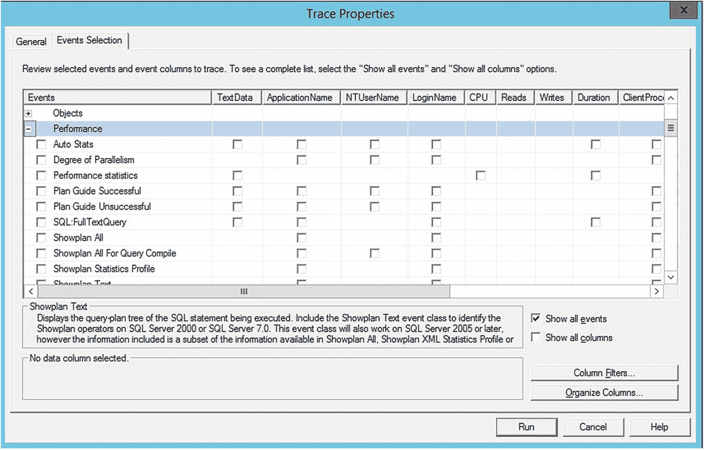

图 1-4 SQL Server Profiler 事件类屏幕

##### 服务器端跟踪

服务器端跟踪是一种无需运行 SQL Server Profiler 应用程序即可运行 SQL Server Profiler 会话的方法。这比运行 SQL Profiler 更受推荐。您使用系统存储过程来指定跟踪要捕获的所有事件、数据列和筛选器。您使用 SQL Profiler 为服务器端跟踪创建脚本：打开 SQL Server Profiler，指定要捕获的事件和列，然后转到“文件”菜单，选择“导出”➤“脚本跟踪定义”➤“适用于 SQL Server 2005 – 2016”（图 1-5 显示了选择该菜单项的示例）。

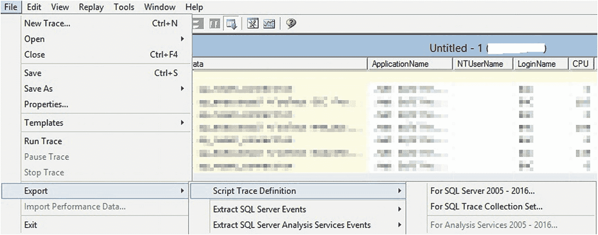

图 1-5 从 SQL Server Profiler 脚本化服务器端跟踪定义

服务器端跟踪被视为维护模式，这意味着它们计划在未来版本的 SQL Server 中移除。因此，您应该尝试切换到 Extended Events，我们将在接下来讨论。

用于创建服务器端跟踪的系统存储过程列表如下：

*   `sp_trace_create` – 创建跟踪。
*   `sp_trace_generated_event` – 在 SQL Server 中创建用户定义的事件。
*   `sp_trace_setevent` – 向跟踪添加和删除数据列。您必须指定事件编号。完整列表可在线查看：[`https://docs.microsoft.com/en-us/sql/relational-databases/system-stored-procedures/sp-trace-setevent-transact-sql?view=sql-server-2017`](https://docs.microsoft.com/en-us/sql/relational-databases/system-stored-procedures/sp-trace-setevent-transact-sql?view=sql-server-2017)。
*   `sp_trace_set_filter` – 将筛选器应用于跟踪。
*   `sp_trace_setstatus` – 根据您指定的跟踪 ID 启动或停止跟踪。您可以查询 `sys.traces` 来查找您的 ID。


###### 与查询存储相比，SQL Server Profiler 或服务器端跟踪的缺点

与查询存储相比，使用 SQL Profiler 或服务器端跟踪来获取基线数据有几个缺点：数据不会自动为您聚合，除非您自己编写查询或使用第三方工具。运行 SQL Server Profiler 应用程序本身在高工作负载下可能对系统造成很大的性能影响；如果您不打算使用扩展事件（我们接下来会讨论），您应该运行服务器端跟踪。由于您可能需要长时间运行其中一种工具来捕获所有事件，SQL Server Profiler 应用程序中的文件或数据可能会变得相当大，并且需要花费时间处理数据以获取所需信息。查询存储会自动捕获您的所有查询并为您进行聚合，无需任何额外进程，并且在大多数系统上对性能的影响极小。

##### 扩展事件

扩展事件在 SQL Server 2008 中引入，是比服务器端跟踪更轻量级的替代方案。扩展事件可以为您提供比 SQL Server Profiler 和服务器端跟踪更深入的数据库引擎洞察。在图 1-6 中，您可以看到在最新版本的 SSMS 中，树状结构“XEvent Profiler”下有两个内置的扩展事件。需要注意的一点是，一旦启动一个会话，即使您关闭 SSMS，它们也不会停止运行，您必须手动停止会话。您可以在退出 SSMS 之前，通过点击工具栏上的红色停止按钮来停止 XEvent Profiler 会话。

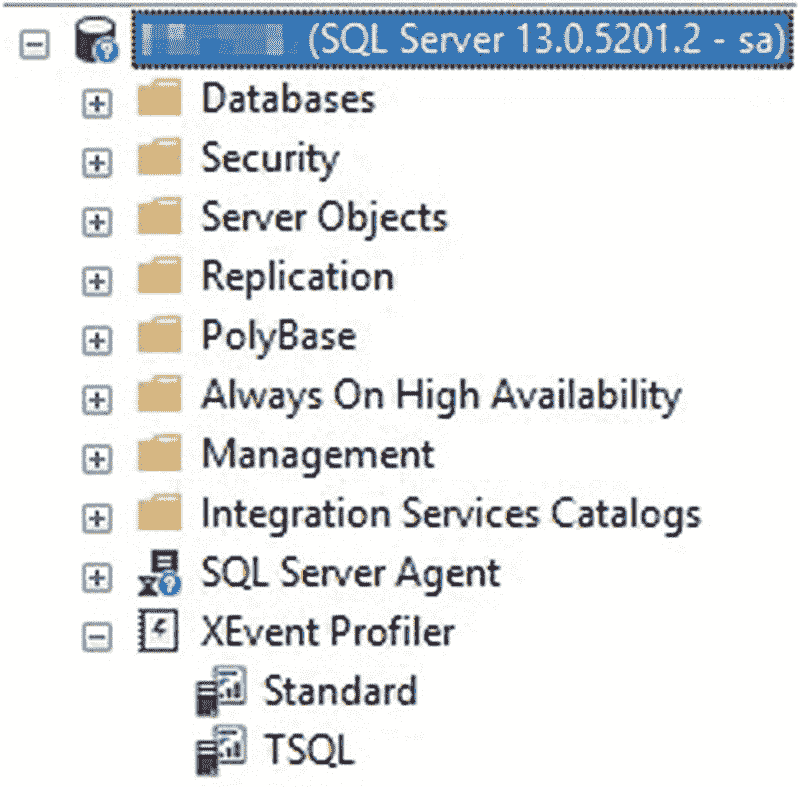

图 1-6

SSMS 中的 XEvent Profiler

会话定义可以在您的 SSMS 安装路径中找到，例如 `C:\Program Files (x86)\Microsoft SQL Server\140\Templates\sql\xevent`。在图 1-7 中，您可以找到提供的扩展事件会话列表。T-SQL 模板“捕获客户端提交给 SQL Server 的所有 Transact-SQL 语句及其发出时间。用于调试客户端应用程序。” 标准模板是“创建跟踪的通用起点。捕获所有运行的存储过程和 Transact-SQL 批处理。用于监视一般的数据库服务器活动。”

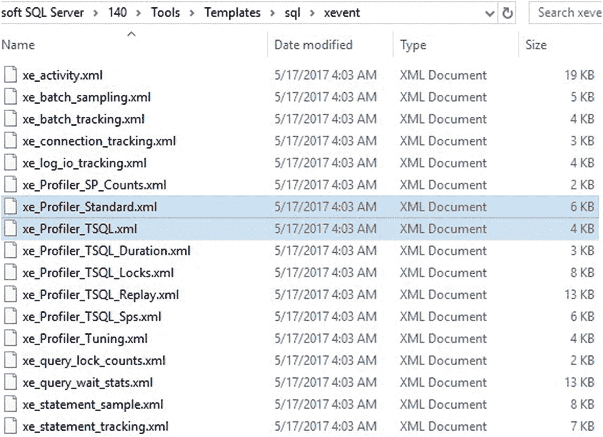

图 1-7

SSMS 附带的扩展事件模板的目录

###### 扩展事件概念

要使用扩展事件，理解用于定义它们的术语会很有帮助。

*   **包** 包含用于获取和处理扩展事件会话数据的对象。包可以包含以下内容：
    *   **事件** 是您想要在 SQL Server 执行路径中监控的节点。它们可以是异步或同步的。要获取与 SQL Server Profiler 中的事件类相对应的事件列表，您可以执行清单 1-1 中所示的查询。

```
USE MASTER;
GO;
SELECT DISTINCT
tb.trace_event_id,
te.[name] AS 'Event Class',
em.package_name AS 'Package',
em.xe_event_name AS 'XEvent Name',
tca.[name] AS 'Profiler Category'
FROM (sys.trace_events te
LEFT OUTER JOIN sys.trace_xe_event_map em
ON te.trace_event_id =
em.trace_event_id)
LEFT OUTER JOIN sys.trace_event_bindings tb
ON em.trace_event_id = tb.trace_event_id
INNER JOIN sys.trace_categories tca
ON tca.category_id = te.category_id
WHERE tb.trace_event_id IS NOT NULL
AND tca.[name] in ('Stored Procedures',
'TSQL',
'Performance')
ORDER BY tb.trace_event_id;
```
清单 1-1
用于获取 SQL Profiler 事件对应扩展事件列表的代码

与 SQL Server Profiler 类似的注意事项依然存在，捕获大量事件，特别是执行计划，可能导致性能问题。以下是一个您可能希望在扩展事件会话中捕获的常见事件列表。

*   `Sp_statement_completed` 在存储过程中的语句完成执行时被捕获。
*   `Sql_statement_completed` 在 SQL 语句完成执行时被捕获。
*   `Query_post_compilation_showplan` 在 SQL 语句编译后发生，并以 XML 格式返回估计的计划。

*   **目标** 告诉会话数据存储的位置。
*   **操作** 告诉包在特定事件发生时应采取的操作，例如捕获堆栈转储或获取执行计划。
*   **类型** 是字节串在一起的类型以及数据的长度和特征，以便能够解释数据。不同类型如下：
    *   `event`
    *   `action`
    *   `target`
    *   `pred_source`
    *   `pred_compare`
    *   `type`
*   **谓词** 类似于 `WHERE` 子句，用于帮助过滤捕获的事件。
*   **映射** 是一个表格，让您知道内部值的含义。
*   **目标** 提供存储会话数据的地方。
*   **事件计数器** 用于同步地统计您为会话指定的所有已发生事件。
*   **事件文件** 异步地将所有会话事件数据从内存写入磁盘。
*   **事件配对** 异步地确定配对事件是否在匹配的集合中发生以进行捕获。
*   **Windows 事件跟踪 (ETW)** 同步地将事件与 Windows 或应用程序事件数据关联起来。
*   **直方图** 用于统计指定的事件，并以异步方式发生。
*   **环形缓冲区** 以先进先出 (FIFO) 的方式异步地将数据保存在内存中。
*   **引擎** 通过支持事件定义、处理事件数据、管理扩展事件服务和对象，以及维护会话列表并管理对列表的访问，来实现扩展事件。
*   **会话** 通过设置包含事件的会话来收集解决问题所需的信息。这通过允许您指定操作、目标和谓词，将所有内容整合在一起，为您提供解决问题所需的数据。

###### 与查询存储相比，扩展事件的缺点

扩展事件的一些缺点与 SQL Server Profiler 类似，即除非您只处理单列，否则数据不会被聚合。它必须在您测量的整个工作负载期间运行，这会导致文件变得相当大，并且需要花费时间处理数据。

###### 与扩展事件相比，SQL Server Profiler 和服务器端跟踪的缺点

SQL Server Profiler 和服务器端跟踪会处理发生的每个事件，以缩小到您指定的特定事件范围，这可能导致性能下降。由于性能影响以及扩展事件的轻量级特性，建议您使用扩展事件。同时请记住，SQL Server Profiler 和服务器端跟踪正逐渐被弃用。


##### 轻量级显示计划跟踪标志

从 SQL Server 2014 开始，引入了跟踪标志 7412，允许通过 `sys.dm_exec_query_statistics_xml` DMV 访问当前正在运行的查询的实际执行计划。也可以通过活动监视器访问此数据：右键单击任何正在运行的进程，然后选择“显示实时执行计划”。SQL Server 2016 SP1 对其进行了改进，使其更加轻量级。到目前为止，此方法比使用 SQL Server Profiler、服务器端跟踪、扩展事件和查询存储捕获估计计划要轻量得多。因此，建议您为 SQL Server 实例打上补丁并启用此跟踪标志。在 SQL Server 2019 中，默认启用。还有一个新的查询提示 `query_plan_profile`，可在 SQL Server 2017 CU11 和 SQL Server 2017 CU3 中在查询级别启用。启用此跟踪标志的开销估计约为 2% 的 CPU 性能影响。图 1-8 展示了如何在活动监视器中通过右键单击任何当前运行的进程来显示实时执行计划。

#### 注意

有关性能影响的更多信息，请参阅 SQL Server Tiger Team 的这篇博客文章：[`https://bit.ly/2DKR7qg`](https://bit.ly/2DKR7qg) 另外，您只能在查询运行时查看其计划。

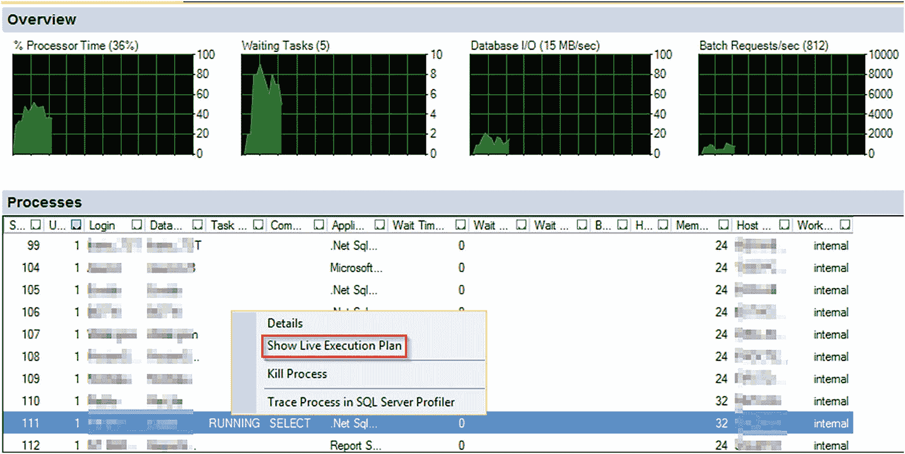

图 1-8：在活动监视器中显示实时执行计划

##### sys.dm_exec_query_plan_stats

在 SQL Server 2019 中，引入了 DMF（动态管理函数），它允许您检索查询的最后一个实际执行计划。这是对上述轻量级显示计划跟踪标志的补充，但您不必在查询运行时就能捕获其执行计划。它需要您开启跟踪标志 2451。然后，您可以运行清单 1-2 中的代码，在 `last_actual_exec_plan` 列中查看执行计划。

```
SELECT er.session_id,
er.start_time,
er.status,
er.command,
st.text,
qp.query_plan AS cached_plan,
qps.query_plan AS last_actual_exec_plan
FROM sys.dm_exec_requests AS er
OUTER APPLY sys.dm_exec_query_plan(er.plan_handle) qp
OUTER APPLY sys.dm_exec_sql_text(er.sql_handle) st
OUTER APPLY sys.dm_exec_query_plan_stats(er.plan_handle) qps
WHERE session_id > 50
AND status IN ('running', 'suspended');
GO
```

清单 1-2：用于检索正在运行的进程的最后一个实际执行计划的查询

##### DMV

动态管理视图（DMV）在 SQL Server 2005 中引入，使得排查 SQL Server 问题变得更加容易。有几个与性能相关的 DMV，但只有少数几个与针对 SQL Server 正在运行的查询有关。我们将在下面讨论这些 DMV：

*   `sys.dm_exec_cached_plans` 存储每个查询执行时的估计执行计划，直到缓存将其清除。
*   `sys.dm_exec_connections` 包含有关到 SQL Server 所有连接的信息。对于 Azure SQL Database，它返回到 SQL Database 的连接。它包含与 `sys.dm_exec_requests` 和 `sys.dm_exec_sessions` 的关系。
*   `sys.dm_exec_cursors` 包含有关 SQL Server 上数据库中打开的游标的信息。
*   `sys.dm_exec_query_stats` 包含计划缓存中计划的聚合性能数据。当查询因任何原因从计划缓存中清除时，其数据也随之清除。与 `sys.dm_exec_requests` 类似，此 DMV 包含 `query_hash` 和 `query_plan_hash` 字段。`query_hash` 字段允许您查找具有相同逻辑的查询。`query_plan_hash` 字段允许您查找具有相似执行计划的查询。
*   `sys.dm_exec_procedure_stats` 包含 SQL Server 中缓存的存储过程的聚合性能数据。与上述 DMV 类似，当存储过程的计划因任何原因从缓存中清除时，其数据也随之清除。
*   `sys.dm_exec_query_memory_grants` 存储所有已请求并正在等待内存授权，或已被授予内存授权的查询的信息。
*   `sys.dm_exec_query_plan` 包含为提供的 `plan_handle` 批处理生成的 Showplan（XML 格式）。
*   `sys.dm_exec_query_stats` 包含 SQL Server 中缓存的查询计划的聚合性能数据。在计划从缓存中移除之前，它针对计划中的每个查询语句包含一行。此 DMV 包含性能信息，包括 `execution_count`、`worker_time`、`physical_reads`、`logical_writes`、`clr_time`、`elapsed_time`、`rows` 和 `dop`。这些数据以总计、最后值、最小值和最大值的形式提供。它还包含有关内存授权、线程、列存储索引使用和 tempdb 溢出的信息。`query_hash` 字段可用于识别具有相同逻辑的查询并将数据聚合在一起。`query_plan_hash` 字段用于识别相似的查询计划并汇总具有相似计划的查询的成本。
*   `sys.dm_exec_requests` 显示在 SQL Server 上运行的每个请求。此 DMV 包含性能信息，包括 `cpu_time`、`reads`、`writes`、`logical_reads`、`row_count`、`wait_time` 和 `wait_type`。`query_hash` 字段可用于识别具有相似逻辑的查询并将数据聚合在一起。`query_plan_hash` 字段用于识别相似的查询计划并汇总具有相似计划的查询的成本。`statement_context_id` 字段是 `sys.query_context_settings` DMV 的外键。
*   `sys.dm_exec_sessions` 为到 SQL Server 的每个会话包含一行。它包含有关该会话当前正在运行的内容以及该会话正在使用的资源的信息。
*   `sys.dm_exec_sql_text` 包含由 `sql_handle` 字段唯一标识的 SQL 批处理的文本。`sql_handle` 字段可用于从以下 DMV 获取信息：
    *   `sys.dm_exec_query_stats`
    *   `sys.dm_exec_requests`
    *   `sys.dm_exec_cursors`
    *   `sys.dm_exec_xml_handles`
    *   `sys.dm_exec_query_memory_grants`
    *   `sys.dm_exec_connections`
*   `plan_handle` 字段可用于从计划缓存中唯一标识批处理的查询计划，并从以下 DMV 获取信息：
    *   `sys.dm_exec_cached_plans`
    *   `sys.dm_exec_query_stats`
    *   `sys.dm_exec_requests`
*   `sys.dm_exec_xml_handles` 包含使用 `sp_xml_preparedocument` 时打开的活动句柄的信息。

###### DMV 的缺点

与查询存储相比，使用 DMV 有一些缺点。一是数据不会持久化到磁盘；它只存在于内存中。因此，如果重新启动 SQL Server，用于故障排除的数据就会丢失。二是计划缓存是分配内存的，为了给新计划腾出空间，计划会根据需要从缓存中清除，因此您会失去查看自服务器启动以来在服务器上运行过的所有内容的能力。最后，您必须自己构建一个系统，将数据持久化到磁盘并对其进行分析，以便随着时间的推移从数据中获得最大价值。


### sp_whoisactive

`sp_whoisactive` 是由 Adam Machanic 编写的一个非常有用的存储过程，用于从多个 DMV 中捕获信息。该过程以及关于如何使用的几篇博客文章可以在 [`http://WhoIsActive.com`](http://whoisactive.com) 找到。这个存储过程将上面讨论的 DMV 全部结合到一个过程中，并提供参数以便你能够取回不同的信息。这对于获取当前系统上正在运行的进程的估计计划非常有用。一个有用的技巧是定期（例如每分钟）将此数据捕获到表中，这样你就能捕获到可进行故障排除的长运行查询。该网站博客系列的第 25 篇文章描述了如何将数据捕获到表中。在列表 1-3 中，你会找到一些推荐参数的代码，用于捕获查询文本和 XML 格式的执行计划，以及其他有用的信息，包括我们接下来要讨论的等待统计信息：

```sql
EXEC dbo.sp_WhoIsActive
@get_plans = 1,
@get_full_inner_text = 1,
@format_output = 0,
@get_task_info = 2,
@destination_table = 'DBA.dbo.WhoIsActiveOutput';
```
**列表 1-3**
**运行 sp_whoisactive 到表中以进行故障排除的推荐参数**

还有其他几个参数你可能觉得有用，可以探索所有文章并自己决定哪些对你最有益。有一个 `@help` 参数可以打印出所有参数的文档。

#### 等待统计信息

等待统计信息提供了另一种排查 SQL Server 问题的方法。等待统计信息在 SQL Server 2005 中引入，为我们提供了一种全新的故障排除方式。等待统计信息本质上告诉你数据库引擎在试图工作时正在等待什么。等待统计信息分为两类：信号等待和资源等待。当 SQL Server 等待一个线程变得可用时，这被认为是一个信号等待；这通常表明服务器上的 CPU 使用率很高。其他等待被认为是资源等待，例如等待页面锁。有数百种资源等待。可以从 DMV `sys.dm_os_wait_stats` 中查询等待统计信息。有了这些信息，你可以判断查询正在等待什么才能执行。你无法通过单个查询来判断，但随着查询存储（Query Store）的引入，你将会看到它会按查询进行累积。

#### 提示

有一个在线库解释了所有可用的等待类型，可以在 SQLskills 的以下网址找到： [`www.sqlskills.com/help/waits/`](http://www.sqlskills.com/help/waits/) 。一个自 SQL Server 启动以来显示每种等待统计信息使用百分比的查询可以在 Paul Randal 的博客上找到： [`https://bit.ly/2wsQHQE`](https://bit.ly/2wsQHQE) 。

### 在查询存储技术之前稳定性能

在 SQL Server 2016 引入查询存储之前，有几种方法可以稳定查询计划的性能。一种方法是使用计划指南和查询的 `USE PLAN` 提示。第二种是尽可能保持统计信息更新，以确保优化器拥有最佳数据来创建计划。另一种是执行 `UPDATE STATISTICS`，希望 SQL Server 在下次执行时能创建更好的查询计划。然后，你还可以重新编译存储过程或函数，看看 SQL Server 是否会生成更好的计划。最后，你可以从缓存中移除一个计划，以便下次执行查询时创建一个新计划，看看是否创建了更好的计划。

#### 计划指南/USE PLAN 提示

当你无法或不想更改查询时，计划指南用于稳定查询的性能。计划指南通过使用查询提示或固定查询计划来影响优化器。第三方应用程序可以从计划指南的使用中受益，因为你无法更改查询。要使用计划指南，你需要指定要优化的 T-SQL，并为该特定查询提供查询提示，SQL Server 将匹配 T-SQL 文本并在执行该语句时使用这些提示。使用查询上的 `OPTION` 子句来指定计划指南。

计划指南有不同的类型：

*   OBJECT 计划指南

    这种类型的计划指南匹配对象类型，例如存储过程、标量用户定义函数、多语句表值用户定义函数和 DML 触发器。

*   SQL 计划指南

    这种类型的计划指南根据你提供的 T-SQL 匹配查询。它们必须以正确的格式参数化。它们必须精确到空格。它们适用于独立的 T-SQL 和批处理。

*   TEMPLATE 计划指南

    这种类型的计划指南匹配参数化为特定形式的独立查询。它们用于覆盖数据库的 `PARAMETERIZATION` 选项。它们可以在以下情况下创建：
    *   当数据库的 `PARAMETERIZATION` `SET` 选项设置为 `FORCED`，但你希望查询使用简单参数化的规则进行编译时。

    *   以及当你想要相反的效果时，数据库的 `PARAMETERIZATION` `SET` 选项是 `SIMPLE`，而你要使用强制参数化时。

计划指南匹配发生在数据库级别。对于基于 SQL 或 TEMPLATE 的计划指南，SQL Server 将参数 `@module_or_batch` 和 `@params` 与查询逐字符匹配。

当你创建一个计划指南时，它将从计划缓存中移除当前计划。当你为批处理创建一个 OBJECT 或 SQL 计划指南时，SQL Server 会移除具有相同哈希值的查询计划。当你创建一个 TEMPLATE 计划指南时，SQL Server 会移除该数据库计划缓存中所有的单语句批处理。

创建计划指南后，你使用 `OPTION` 子句来指定 `USE PLAN` 参数以指定查询提示。

列表 1-4 是原始查询：

```sql
SELECT count(*) AS Total
FROM Sales.SalesOrderHeader h
INNER JOIN Sales.SalesOrderDetail d
ON h.SalesOrderID = d.SalesOrderID
GO
```
**列表 1-4**
**用于 USE PLAN 的 SELECT 语句**

列表 1-5 是指定了 `USE PLAN` 查询提示的相同查询：

```sql
SELECT count(*) AS Total
FROM Sales.SalesOrderHeader h
INNER JOIN Sales.SalesOrderDetail d
ON h.SalesOrderID = d.SalesOrderID
OPTION (USE PLAN N'

...

')
GO
```
**列表 1-5**
**一个 USE PLAN 示例**

#### 更新统计信息

如果你知道表或索引中的数据已经发生大量更改，使用 `UPDATE STATISTICS` 来更新表或索引的统计信息可以帮助提高性能。请注意，更新统计信息确实会重新编译引用该表或索引的所有计划，因此除非必要，否则你不想过于频繁地执行此操作。在 SQL Server 2014 之前，必须更新表中 20% 的数据才会触发自动更新统计信息，除非你使用了在 SQL Server 2008 SP1 中引入的跟踪标志 2371 来降低这个比例；20% 对于大型表（如数据仓库表）来说并不理想。在 SQL Server 2016 中，此跟踪标志默认是开启的。

要更新表的统计信息，请使用列表 1-6。

```sql
USE DATABASE;
GO
UPDATE STATISTICS SchemaName.TableName;
GO
```
**列表 1-6**
**为表执行 UPDATE STATISTICS**

要更新特定索引的统计信息，请使用列表 1-7。

```sql
USE DATABASE;
GO
UPDATE STATISTICS SchemaName.TableName IndexName;
GO
```
**列表 1-7**
**为索引执行 UPDATE STATISTICS**


##### 重新编译存储过程

当你能识别出某个存储过程、触发器或函数由于**参数嗅探**或其他问题而性能不佳时，你可以使用 `sp_recompile` 在该对象下次执行时重新编译。参数嗅探发生在生成的执行计划对于某一种工作负载是最优的，但对于基于查询所用参数的所有工作负载并非最优的情况下。运行此过程将有效地从计划缓存中移除当前计划，以便在查询下次执行时编译一个新计划。当然，根据传入的参数，新计划也可能与旧计划相同。

##### 从计划缓存中移除计划

你可以查询 `sys.dm_exec_cached_plans` 和 `sys.dm_exec_sql_text` 来获取一个 `plan_handle`，然后使用以下代码从缓存中移除一个不属于存储过程、函数或触发器的特定计划。

首先，在清单 1-8 中，你选择需要查找的、属于你查询的文本：

```sql
SELECT cp.plan_handle, st.text
FROM sys.dm_exec_cached_plans AS cp
CROSS APPLY sys.dm_exec_sql_text(cp.plan_handle) AS st
WHERE st.text LIKE N'%/* MyTable %';
```
**清单 1-8** 查找你所需 SQL 文本的计划句柄

然后，将计划句柄复制并粘贴到清单 1-9 提供的代码中的 `DBCC FREEPROCCACHE` 存储过程里：

```sql
DBCC FREEPROCCACHE (<plan_handle>);
```
**清单 1-9** `DBCC FREEPROCCACHE` 用于从计划缓存中移除 SQL 文本计划

### 查询存储：改变游戏规则者

查询存储改变了你对有问题的查询计划进行故障排除的方式，因为现在所有信息都会被收集、存储在磁盘上，并随时间持久保存，以便为你提供性能趋势。它提供了你在定义的保留期内使用过的所有估算计划，这使得你可以轻松高效地通过图形界面来对查询进行故障排除。查询存储改变了你对性能进行故障排除、为系统建立基线以及显著稳定 SQL Server 性能的方式。

#### 收集哪些信息

查询存储收集每个已运行查询的运行时统计信息及其估算计划。在 SQL Server 2019 中，针对每个查询以及你指定的时间间隔，会收集并聚合以下数据：

*   执行次数
*   持续时间
*   CPU 时间
*   逻辑读取
*   逻辑写入
*   物理读取
*   CLR 时间
*   DOP（并行度）
*   内存消耗
*   行计数

每项统计信息均以总计、平均值、最大值、最小值和标准偏差的形式提供。有关收集哪些数据的更多信息将在第 4 章和第 5 章中讨论。

#### 查询存储为我们提供哪些信息：用例

除了收集性能信息外，查询存储还有不同的用例。它们包括：

*   查找并修复性能回退的查询
*   查找并识别资源消耗最大的查询
*   A/B 测试
*   在升级 SQL Server 时稳定性能
*   查找并识别即席工作负载以便进行改进

这些将在第 6 章中更详细地讨论。

### 自动计划修正

SQL Server 2017 引入了自动计划修正，它将根据计划回退情况自动强制或取消强制计划。因此，你不再需要手动强制计划，尽管在必要时你仍然可以这样做。第 8 章将更详细地讨论此功能的工作原理。

#### 等待统计信息

SQL Server 2017 引入了等待统计信息，这些信息按 23 个不同类别（例如缓冲区和 CPU）为每个查询收集。第 8 章提供了每个类别包含哪些等待统计信息的详细列表。第 8 章将更详细地讨论此功能。

### 结论

查询存储提供了一种自动化且简便的方法来收集在 SQL Server 上运行的查询的性能信息。使用查询存储除了查看性能信息外，还有几种用例。从 SQL Server 2017 开始，它提供了自动计划修正和等待统计信息收集，这些是无价的新工具。本书的其余部分将更详细地介绍查询存储，以便你能从中获得最大收益。

## 2. 查询存储概述与架构

为了使查询存储能够收集和维护查询性能的基线，它需要一个架构，该架构对 SQL Server 的整体性能影响最小。本章将回顾查询存储如何操作以收集数据。我们还将介绍构成查询存储的各种数据集。这些信息应能使你既能理解查询存储在做什么，又能确信它以对你数据库尽可能安全的方式执行这些操作。

### 查询存储如何工作

虽然我们将在本章后面详细讨论收集的数据，但如果先快速概述一下所收集的数据类型，会更容易理解查询存储的工作原理。定义查询存储数据有三个基本数据集：

*   **查询和计划信息**：关于查询本身以及查询优化器从该查询派生的执行计划的数据。
*   **查询运行时信息**：关于查询运行多快、被调用了多少次，以及来自查询执行的其他与性能相关的信息。
*   **查询等待统计信息**：此信息涵盖在服务器上执行单个查询期间发生的各种等待。

定义了这些核心数据集后，我们现在可以继续确定这些信息的确切来源以及收集方式。我们将在本章后面更详细地介绍所有三个数据集。我们将使用这些数据集作为描述查询存储收集数据方式的架构，因为这些数据集有助于定义查询存储所采用的方法。这就是为什么在我们讨论它们从哪里来之前，先确立这些数据集是什么很重要的原因。

了解查询存储工作原理的另一个重要细节是，这是一个数据库级别的设置。它不是在服务器级别控制的，而是在你的系统中逐个数据库控制的。这是一个重要的细节，因为查询存储捕获的信息是写入到每个单独的数据库中，而不是一个中心位置。


#### 收集查询与计划信息

当查询提交到 SQL Server 时，它会经历一系列处理过程。这些过程确保查询书写正确、查询引用的数据库对象确实存在，最重要的是，确保查询经过优化以快速运行。图 2-1 展示了这一过程的概览：

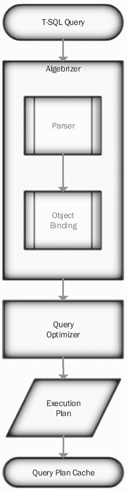

图 2-1

生成执行计划的基本过程

我们当然从 `T-SQL` 查询开始。只有数据操作语言 (`DML`) 查询才会被 `查询存储` 捕获。这些是用于 `SELECT`、`UPDATE`、`DELETE` 或 `INSERT` 数据的查询。用于操作数据结构的数据定义语言 (`DDL`) 查询则不会被捕获到 `查询存储` 中。当查询首次到达 SQL Server 时，它会经过一个名为 `代数化器` 的内部过程。该过程会做很多事情，但我们最关心的两点是：它在 `解析器` 中验证语法是否正确，并通过 `对象绑定` 确保查询中的对象确实存在于数据库中。`代数化器` 还会收集大量信息，这些信息连同查询一起传递给 `查询优化器`。

`查询优化器` 是基于您提供的查询以及数据库中的表、索引、统计信息和约束，来确定高效检索或修改数据方式的进程。查询优化过程本身的结果是一个 `执行计划`，该计划会被写入一个称为 `计划缓存` 的内存空间。

除了一个我们稍后会讲到的例外情况，`查询存储` 不会以任何方式干扰此过程。`查询存储` 所做的是捕获创建 `执行计划` 的进程的输出。如图 2-2 所示，这张图展示了 `查询存储` 如何与查询优化过程并行工作：

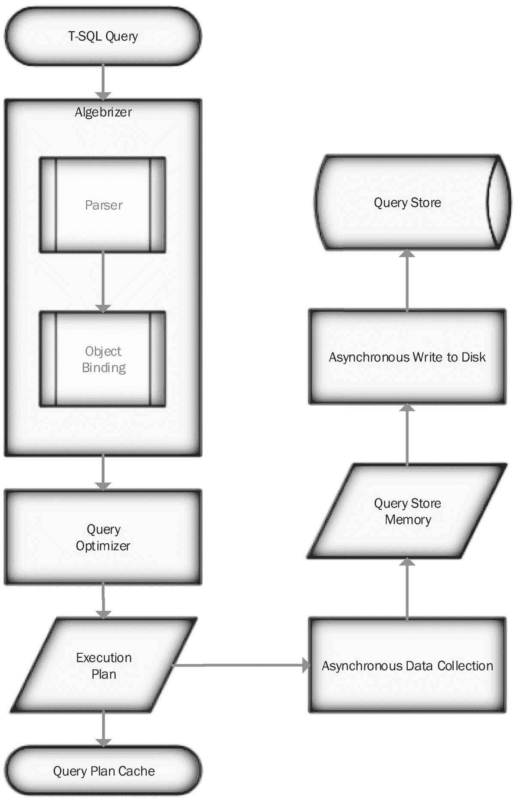

图 2-2

为查询存储捕获执行计划和查询的过程

在 `查询优化器` 完成工作并生成 `执行计划` 后，一个异步进程会捕获该查询和 `执行计划` 以供 `查询存储` 使用。它将其输出到内存中的一个临时存储空间。内存中存储的查询信息会定期通过另一个异步进程写入数据库。微软将此描述为以最小延迟发生。其目标是确保 `查询存储` 的数据收集过程不会干扰 `查询优化器` 的正常处理。

我之前提到的例外情况是，捕获查询和查询计划的异步进程还会检查是否存在 `计划强制`。我们将在第 7 章详细讨论这一点。`计划强制` 是 `查询存储` 确实会干扰正常优化过程的唯一情况。如果对一个查询设置了 `计划强制`，那么将使用被强制的计划，而不是 `查询优化器` 生成的计划。该计划也会被写入 `计划缓存`。

至此，检索查询和查询计划的核心处理就完成了。信息是按单个查询捕获的，而不是按 `存储过程` 或 `批处理`。如果查询是某个对象的一部分，则会连同该对象的 ID 一起捕获查询信息。我们将在本章名为“查询存储收集的数据”的部分详细介绍具体捕获了哪些内容。

#### 收集查询运行时信息和等待统计信息

运行时数据的收集比查询和查询计划数据的收集稍微直接一些。所有关于运行时统计信息和等待统计信息的收集都发生在查询和查询计划已被捕获之后。查询执行，然后 `查询存储` 进程才发生，如图 2-3 所示：

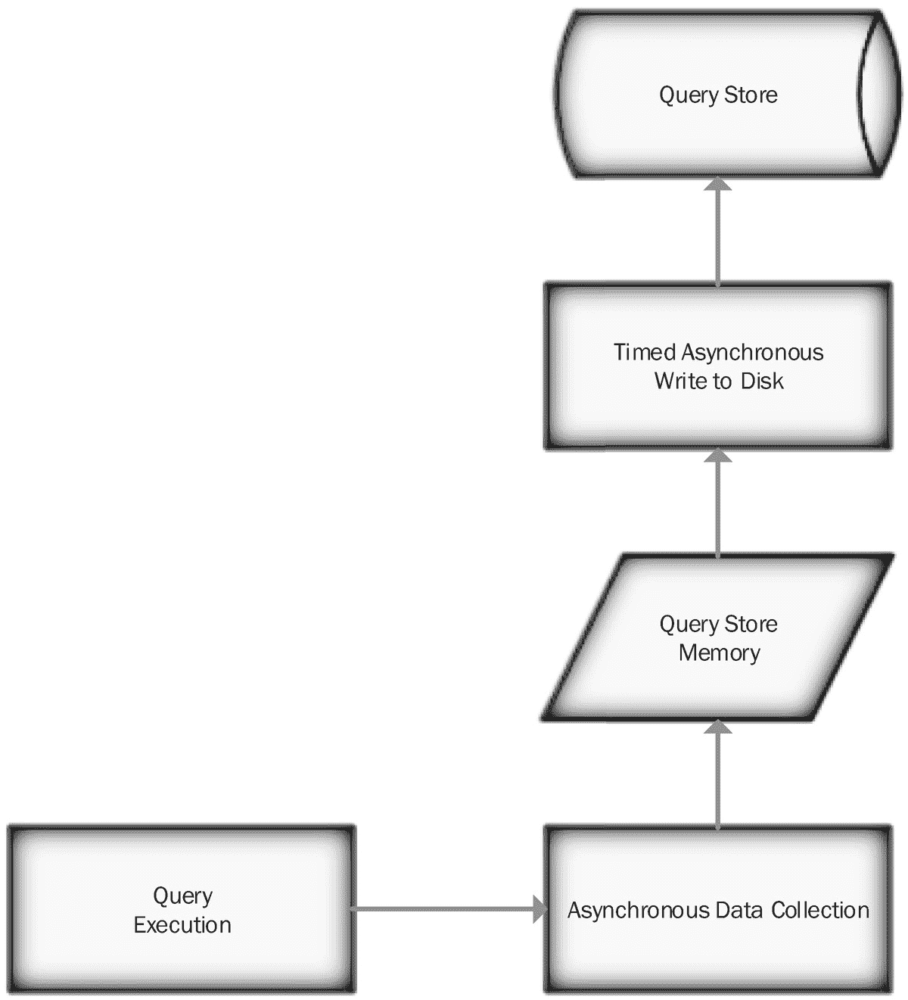

图 2-3

为查询存储捕获运行时指标的过程

此数据收集过程与查询和查询计划数据收集过程之间只有一个根本区别。那就是定时异步写入磁盘的方式。数据不是以最小延迟的进程处理，而是在内存中存储和聚合一段时间。默认是 15 分钟。您可以控制此设置，我们将在第 3 章详细讨论。

诸如查询运行了多长时间以及执行期间经历的等待等信息被写入内存。这些数据在内存中聚合。当该信息被写入磁盘时，它会根据另一个设置（收集间隔）重新聚合。默认情况下，此间隔为 60 分钟。这种聚合为您提供的是比较两个不同时间段的能力，以便您可以看到查询的性能是否随时间推移而变化。我们将在“收集的数据”部分更详细地讨论这一点。

#### 数据收集通用说明

`查询存储` 与 SQL Server 中的所有其他进程协同工作。因此，例如，如果一个查询正在重新编译，并且它生成的 `执行计划` 与 `查询存储` 中已有的计划相同，则只会更新使用统计信息，不发生其他事情。但是，如果此次重新编译产生了一个新的 `执行计划`，那么该计划将像旧计划一样被捕获到 `查询存储` 中。

在使用 `三部分命名` 的 `跨数据库查询` 的情况下，无论检索或修改的数据位于何处，查询都将从发起调用的数据库进行记录。这一点很重要，因此您知道在涉及多个数据库时应在哪里查找 `查询存储` 信息。您不会在两个数据库中都看到该查询。

因为 `查询存储` 中的所有数据收集都是异步写入磁盘的，所以如果数据尚未刷新到磁盘，就有可能丢失数据。有一个命令可以手动强制执行此操作，

```
sys.sp_query_store_flush_db
```

执行该命令将强制当前内存中的任何内容立即写入磁盘。这确保了在受控故障转移、关闭或任何可能导致数据从内存中删除的事件发生之前，您可以保留这些数据。


### 查询存储收集的数据

正如本章开头所述，定义查询存储收集的数据本质上包含三组信息：查询与计划数据、运行时数据以及等待统计信息。正如你在前一节所见，运行时数据和等待统计信息的收集方式相同，那么为何要将它们分开呢？原因很简单，本书的重点是 SQL Server 2019，但查询存储功能自 SQL Server 2016 起便已实现。2016 版与 2017 版之间的一个变化，就是在数据收集中添加了等待统计信息。因此，我们将其分开讲解，是为了让那些只接触运行时信息的读者，也能从本书中获得与同时查看运行时数据和等待统计信息的读者同样多的收获。此外，你需要计划以与查询运行时数据略有不同的方式来查询等待统计信息，但我们将在第 5 章详细讨论这一点。

关于显示查询存储信息的系统视图，必须说明一点：这些系统视图中显示的信息是**合并**了存储在磁盘和内存中的信息，但并未进行**聚合**。正如你从本章前面内容所知，数据首先写入内存，然后最终写入磁盘。在这个时间间隔内，运行时数据会在这两个地方分别聚合，但在某些目录视图中会显示为单独的行。你无需手动合并这些数据，SQL Server 会为你完成。然而，你也无法将它们分开，因为这是在系统层面完成的。

让我们从关于查询本身和查询计划所收集的数据开始。

#### 查询与查询计划信息

正如我们之前所述，查询存储所收集信息的基础是查询本身。你可能提交一个包含五条或十条语句的批处理，但这些语句中的每一条（假设它们都是数据操作语句）在查询存储中都将被视为单独的查询。暴露查询存储可用信息的目录视图如图 2-4 所示：

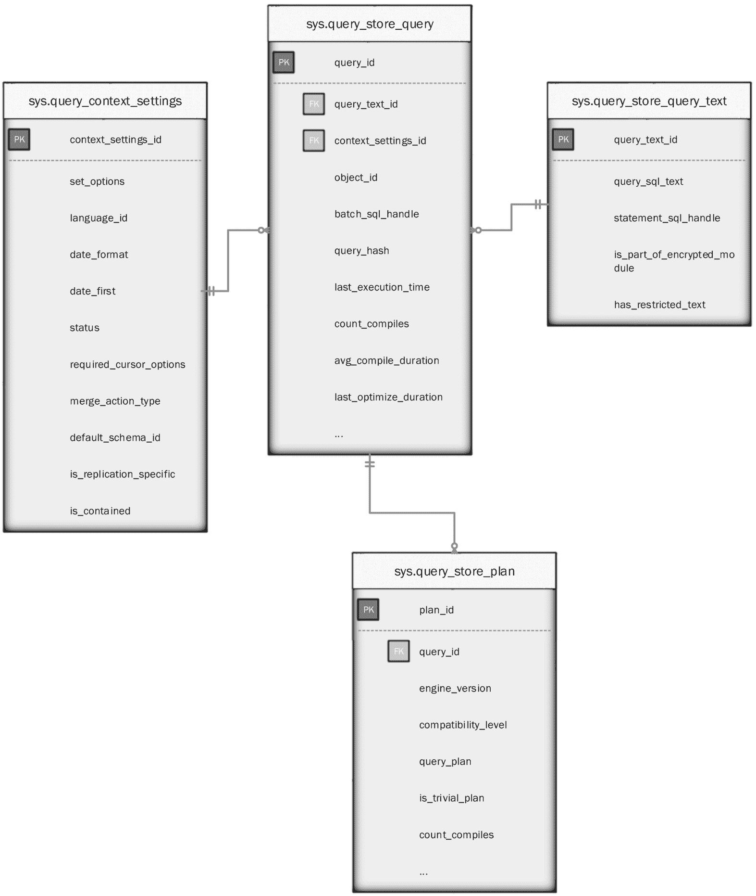

图 2-4：包含查询和查询计划信息的目录视图

只有四个目录视图会公开存储在查询和查询计划上的信息。在顶部中央，你可以看到 `sys.query_store_query`。在图中，仅展示了其 30 列中的一小部分作为可用信息的示例。每个查询都具有一些属性，这些属性可能对该查询是唯一的，也可能不是。这些属性就是位于 `sys.query_store_query` 左右两侧的表：`sys.query_store_context_settings` 和 `sys.query_store_query_text`。这些属性可以创建一次，然后被多个查询重用。这包括查询文本。如果其他属性发生变化，但查询文本保持不变，那么 `sys.query_store_query` 中的多个查询可能会拥有相同的 `query_text_id` 值（`query_id` 是主键）。存储在 `sys.query_store_plan` 中的查询计划通过 `query_id` 上的外键直接与查询关联。任何给定的查询都可能拥有多个计划。诸如参数探测等情况会导致一个给定的查询拥有多个有效的执行计划。图 2-4 中所示的 `sys.query_store_plan` 表也仅包含了其 23 个可用列中的一部分示例。

我们将在第 5 章详细讲解如何查询这些表。然而，值得指出的是，某些信息可能有点误导性。如果你查看图 2-4 中所示的 `sys.query_store_query` 和 `sys.query_store_plan`，两者都有一个名为 `count_compiles` 的列。虽然这些值的标签相同，但它们实际上分别代表了一个查询或一个计划的一次编译或重新编译事件的结果差异。每次查询被编译或重新编译时，该值都会相应地更新。然而，该编译事件可能产生也可能不产生相同的计划。如果编译出一个不同的计划，那么该计划将更新其自身独特的 `count_compiles` 值，而不是更新与该查询关联的每一个计划。类似这样的细节我们将在全书中陆续探讨。

存储在 `sys.query_store_plan` 中的数据行实际上充当了所收集运行时数据的驱动器。现在让我们来看一下这些信息。

#### 运行时信息

运行时数据实际上基于两个不同的值进行聚合：上一节提到的 `plan_id` 以及我们之前讨论过的运行时间隔（默认为 60 分钟）。图 2-5 展示了所捕获的信息：

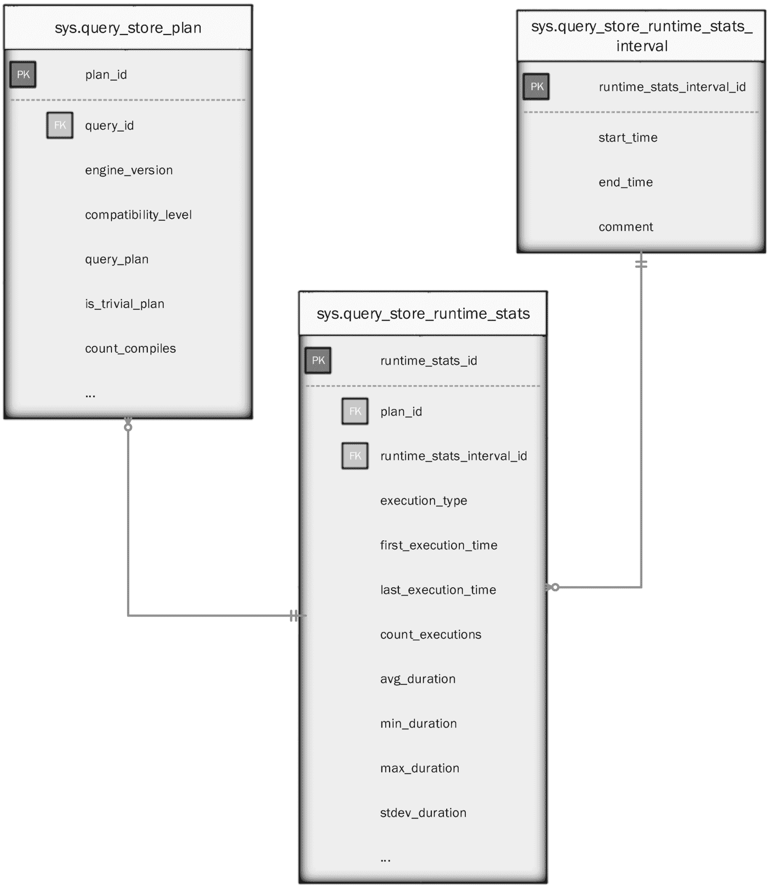

图 2-5：包含运行时信息的目录视图

这个模型看起来简化了不少，但它掩盖了一些值得注意的复杂性。首先，`sys.query_store_runtime_stats` 目录视图仅显示了构成该视图的 58 列中的一小部分。其中许多数据的布局类似于你看到的持续时间值：平均值、最小值、最大值和标准差。这对于诸如 CPU 时间、行数、内存等有趣的数据同样适用。

处理运行时数据时需要记住的第二件最重要的事情是，它根据运行时间隔被拆分为多个聚合。因为你不太可能在整点开启查询存储，所以 `sys.query_store_runtime_stats_interval` 系统视图将包含每个间隔的 `start_time` 和 `end_time`。虽然这些间隔时长是恰当的（默认为 60 分钟），但开始和结束时间并不会与时钟时间完全吻合。

另一件需要记住的事情是，处理此信息时需要考虑多个时间值。除了运行时间隔，还有刷新到磁盘的时间（默认为 15 分钟）。这意味着对于任何给定的 `plan_id`，磁盘上可能跨多个时间间隔存在数据，同时内存中也可能存在数据。

此外，`execution_type` 也会影响收集的信息。此列有三个值：

*   0 – 成功执行
*   3 – 用户中止执行
*   4 – 导致执行中止的异常或错误

在查询因任何原因被中止的情况下，运行时数据仍会被收集。但是，它会被聚合成给定 `plan_id` 和给定 `runtime_stats_interval_id` 的一个单独值。鉴于这一点，以及内存和磁盘之间可能存在多行运行时数据的事实，当你开始针对此数据编写自己的查询时，你需要基于 `plan_id`、`execution_type` 和 `runtime_stats_interval_id` 进行聚合。


## 3. 配置查询存储

与任何 SQL Server 功能一样，最大化其潜力都需要针对您的特定环境对功能进行调整。通用的建议是从默认设置开始，然后将其与广泛认可的最佳实践进行比较，并在必要时根据您的用例进行调整。社区内通常存在一套针对偏离 Microsoft 默认值的典型情况的、被广泛接受的最佳实践。有时，那些看起来“愚蠢”的默认设置之所以如此设定，并非因为 Microsoft 无视其产品或用户群，而是出于向后兼容性的原因。

在本章中，我们将讨论实施和配置查询存储功能的步骤。我们将涵盖本地部署和 Azure SQL 数据库平台即服务 (PaaS) 产品中的默认配置。我们将详细分解所有查询存储配置选项以及与配置相关的查询存储目录视图（有关所有查询存储相关目录视图的列表，请参阅第 5 章）。

之后，我们将深入探讨配置查询存储的最佳实践。我们将讨论参数化及其设置如何影响查询存储，以及重命名对象带来的影响。我们还将重点介绍用于改进恢复时间的跟踪标志，以及适用于 2016 和 2017 版本的、与性能相关的重要补丁。

对于那些利用内存中 OLTP 功能的读者，我们将涵盖查询存储与本机编译存储过程的结合使用。我们还将讨论 SQL 2017 中引入的一项激动人心的新功能，称为自动计划回归修正 (APRC)。我们将介绍其含义以及如何启用或禁用它。

本章最后将讨论各种查询存储错误状态，以及作为 DBA 如何维护查询存储的详细信息。

### 等待统计

我们将等待统计信息与运行时信息分开，只是因为使用本书的某些读者可能仍在使用 SQL Server 2016。图 2-6 展示了为等待统计信息收集的信息布局：

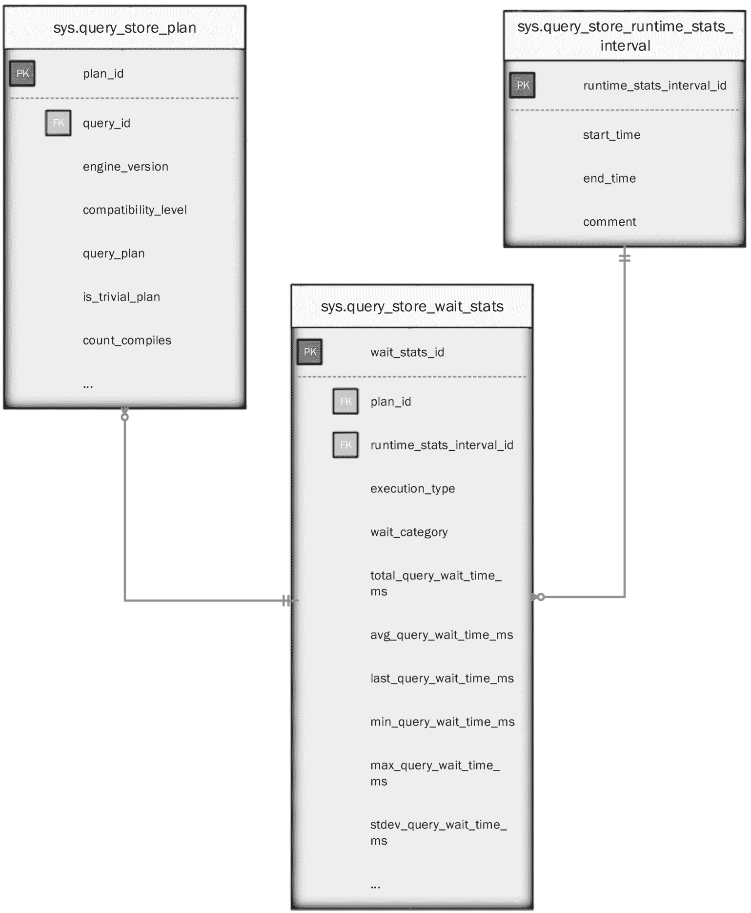

图 2-6: 目录视图包含等待统计信息

与运行时信息一样，等待统计信息按运行时间间隔进行聚合。同样，与运行时信息类似，等待统计信息依赖于刷新到磁盘的间隔（默认为 15 分钟），因此会在两个位置进行聚合。再次与运行时信息类似，`execution_type` 也会影响等待统计信息的聚合。最后，等待统计信息还多了一层复杂性。在跨时间间隔和 `execution_types` 聚合数据时，必须考虑一个 `wait_category`。我们将在第 5 章更详细地介绍所有这些内容。

您还可以看到数据的模式类似，存储了最小值、最大值、最新值、平均值和标准差。然而，只有等待时间是唯一有趣的值。为了节省空间，我在图 2-6 中省略了几个描述性列。那里的其余信息是等待统计数据的重要数据。

### 关于查询存储的信息

实际上，我们还应该提到一个最终的目录视图，尽管其代表的具体细节将在第 3 章介绍。该视图是 `sys.database_query_store_options`。虽然它确实包含了一些关于查询存储的收集信息，但它不是本章的重点。

### 总结

收集查询存储数据方法论的主要驱动因素，是以尽可能不干扰的方式进行。从信息存储到内存和磁盘的异步调用清楚地表明了这一点。但是，一旦数据存储到磁盘，它就与数据库共存，并且无论该数据库去往何处，都将可用，直到它被另一个进程（如自动清理）移除，或者由您手动删除信息。在第 3 章中，我们将最终开始启动、停止和控制查询存储。

### 查询存储默认设置

在本节中，我们将查看 SQL Server 中查询存储的默认配置选项。SQL Server 中的默认选项并不总是您环境的最佳配置设置，但更改它们确实需要仔细考虑。需要注意的一个重要点是，在撰写本文时，查询存储在 2016、2017 和 2019 版本的本地产品中默认是禁用的。然而，在 Microsoft 平台即服务 (PaaS) 产品 Azure SQL 数据库中，它是默认启用的。对于 Azure SQL 数据库托管实例（一种托管的基础设施即服务 (IaaS) 产品），查询存储是受支持的，但默认情况下也是禁用的。

要启用查询存储，请在清单 3-1 中运行以下 T-SQL 命令：

```sql
ALTER DATABASE [] SET QUERY_STORE=ON;
```
清单 3-1: 在数据库上启用查询存储的 T-SQL

要在您的实例上的所有数据库上启用查询存储，您可以运行清单 3-2 中的代码：

```sql
DECLARE @SQL NVARCHAR(MAX) = N'';
SELECT @SQL += REPLACE(N'ALTER DATABASE [{{DBNAME}}] SET QUERY_STORE=ON ',
'{{DBName}}', [name])
FROM sys.databases
WHERE state_desc = 'ONLINE'
AND [name] NOT IN ('master', 'tempdb')
ORDER BY [name];
EXEC (@SQL);
```
清单 3-2: 在所有数据库上开启查询存储

查询存储无法在 `master` 或 `tempdb` 系统数据库中启用。在 *model* 数据库中启用查询存储实际上并不会捕获 *model* 数据库中的任何查询存储数据，但此配置更改将反映在从该时间点创建的新数据库中。在 `msdb` 系统数据库中，查询存储的行为将与用户数据库中的查询存储没有区别。表 3-1 列出了 Azure SQL 数据库和常规本地 SQL Server 的选项。

表 3-1: 查询存储的配置选项

| **配置名称** | **选项** | **描述** | **默认值** |
| --- | --- | --- | --- |
| `OPERATION_MODE` | `OFF`, `READ_WRITE`, `READ_ONLY` | 查询存储的操作模式 | `OFF` (SQL 2016 和 2017)，Azure SQL 数据库为 `READ_WRITE` |
| `CLEANUP_POLICY(STALE_QUERY_THRESHOLD_DAYS)` | `BIGINT` | 指定 `CLEAN_UP` 策略（0 表示永不） | 30 天（Azure SQL 数据库基本版为 7 天） |
| `DATA_FLUSH_INTERVAL_SECONDS` | `BIGINT` | 缓冲查询存储数据刷新的间隔频率 | 900（15 分钟） |
| `MAX_STORAGE_SIZE_MB` | `BIGINT` | 查询存储的最大大小（MB） | 100 (SQL Server 2016 和 2017)，1000 (SQL Server 2019)，（SQL Azure 数据库高级版为 1024，SQL Azure 数据库基本版为 10） |
| `INTERVAL_LENGTH_MINUTES` | `1`, `5`, `10`, `15`, `30`, `60`, 或 `1440` | 统计信息的聚合间隔 | 60 |
| `SIZE_BASED_CLEANUP_MODE` | `AUTO`, `OFF` | 接近容量时尝试清理 | `AUTO` |
| `QUERY_STORE_CAPTURE_MODE` | `AUTO`, `ALL`, `CUSTOM`, `NONE` | 查询捕获行为 | `AUTO` (SQL Server 2016 和 2017)，`ALL` (SQL Server 2019)，`ALL` (Azure SQL 数据库) |
| `MAX_PLANS_PER_QUERY` | `INT` | 每个查询保留多少个不同的执行计划 | 200。SQL Server 2016 中不可用 |
| `WAIT_STATISTICS_CAPTURE_MODE` | `ON`, `OFF` | 指定是否捕获查询的等待统计信息 | 在 SQL Server 2017 和 2019 以及 Azure SQL 数据库中为 `ON`。SQL Server 2016 中不可用 |


### 配置选项

查询存储有许多可配置选项，需要进行适当设置，才能以对数据库最有益的方式收集数据。本节将解释这些选项，并为您提供有关最佳设置以及如何设置这些选项的建议。首先，我们将逐一介绍所有选项及其含义，并查看如何更改它们的代码。然后，我们将了解图形界面中提供了哪些选项以及如何在那里更改选项。

#### OPERATION_MODE

此设置用于配置查询存储的操作模式。查询存储以只读或读写模式运行。在只读模式下，现有数据将保留在查询存储中，但不会捕获新的查询。如果查询存储达到容量上限，它将从 `READ_WRITE` 模式更改为 `READ_ONLY` 模式。如果希望捕获新查询（通常都需要），则必须监控以确保查询存储的 `OPERATION_MODE` 设置正确。设置此选项的 T-SQL 语法见清单 3-3。

```sql
ALTER DATABASE [] SET QUERY_STORE ( OPERATION_MODE = READ_WRITE );
```
清单 3-3
设置查询存储操作模式的 T-SQL

查询存储有实际状态和期望状态的概念。当期望状态是 `READ_WRITE`，但实际状态是 `READ_ONLY` 时，将有一个关联的原因，该原因会显示在目录视图 `sys.database_query_store_options` 的 `readonly_reason` 列下。与查询存储关联的目录视图将在第 5 章中介绍。默认设置为 `READ_WRITE`。

#### CLEANUP_POLICY (STALE_QUERY_THRESHOLD_DAYS)

查询存储的数据存储天数是可配置的。查询存储设置 `SIZE_BASED_CLEANUP_MODE` 和 `QUERY_STORE_CAPTURE_MODE` 也会影响存储在查询存储中的数据，因此即使查询未超过陈旧阈值，也可能不被存储。`STALE_QUERY_THREHOLD_DAYS` 的默认值为 30 天（如果使用 Azure SQL 数据库基本版，则为 7 天）。配置此设置的 T-SQL 见清单 3-4。

```sql
ALTER DATABASE [] SET QUERY_STORE ( CLEANUP_POLICY = ( STALE_QUERY_THRESHOLD_DAYS =  ) );
```
清单 3-4
设置 STALE_QUERY_THRESHOLD_DAYS 的 T-SQL

#### DATA_FLUSH_INTERVAL_SECONDS

如第 2 章所述，出于性能考虑，查询存储将缓冲数据，并在可配置的间隔异步写入磁盘。此间隔称为*数据刷新间隔*，以秒为单位指定。正如在最佳实践部分将更详细讨论的那样，此选项需要仔细考虑，因为它可能对查询存储的性能产生重大影响。熟悉 SQL Server 中间接检查点和目标恢复间隔的人员将能够理解为查询存储设置数据刷新间隔所涉及的权衡取舍。较短的刷新间隔将导致在查询存储数据刷新到磁盘时出现更剧烈的 I/O 峰值。这可能导致 I/O 子系统性能下降。较长的数据刷新间隔应允许 SQL Server 在更长的时间范围内分散 I/O 负载，代价是在系统故障时丢失更多数据（因为更多查询存储数据将保留在易失性内存中）。默认刷新间隔为 900 秒（15 分钟）。配置此设置的 T-SQL 见清单 3-5。

```sql
ALTER DATABASE [] SET QUERY_STORE ( DATA_FLUSH_INTERVAL_SECONDS =  );
```
清单 3-5
设置 DATA_FLUSH_INTERVAL_SECONDS 的 T-SQL

#### MAX_STORAGE_SIZE_MB

此设置以 MB 为单位确定单个数据库的查询存储数据的最大存储大小。对于活动量即使中等的数据库，1000 MB 的默认设置也相当小。如果达到此阈值，查询存储的状态将从 `READ_WRITE` 更改为 `READ_ONLY`。即使 `SIZE_BASED_CLEANUP_MODE` 设置为 `AUTO`（稍后会详细介绍），查询存储仍然可能达到最大容量，尤其是在高活动期间。根据您通过 `STALE_QUERY_THRESHOLD_DAYS` 值设置的期望历史保留期，为您的环境适当设置查询存储的最大存储大小至关重要。配置此设置的 T-SQL 见清单 3-6：

```sql
ALTER DATABASE [] SET QUERY_STORE ( MAX_STORAGE_SIZE_MB =  );
```
清单 3-6
设置 MAX_STORAGE_MAX_MB 的 T-SQL

#### INTERVAL_LENGTH_MINUTES

`INTERVAL_LENGTH_MINUTES` 是一个重要的设置，因为它决定了将数据聚合到哪个间隔以便后续查看。您只能从 1、5、10、14、60 和 1440 分钟的值中进行选择。默认值为 60 分钟。间隔越小，占用的磁盘空间越多，但您将获得更精细的数据。配置此设置的 T-SQL 见清单 3-7。

```sql
ALTER DATABASE [] SET QUERY_STORE ( INTERVAL_LENGTH_MINUTES =  );
```
清单 3-7
设置 INTERVAL_LENGTH_MINUTES 的 T-SQL

#### SIZE_BASED_CLEANUP_MODE

`SIZE_BASED_CLEANUP_MODE` 的默认值为 `AUTO`，这意味着它将根据 `MAX_STORAGE_SIZE_MB` 和 `CLEANUP_POLICY` 设置自动清理数据。另一个选项是将其设置为 `OFF`。此设置旨在告诉查询存储，如果先达到 `MAX_STORAGE_SIZE_MB` 值，则在达到 `CLEANUP_POLICY` 设置指定的天数之前自动清理数据。因此，如果您将查询存储设置为保留 30 天的数据，并在第 28 天达到了最大大小 2 GB，它将从此时间点开始清除数据。配置此设置的 T-SQL 见清单 3-8。

```sql
ALTER DATABASE [] SET QUERY_STORE ( SIZE_BASED_CLEANUP_MODE =  );
```
清单 3-8
设置 SIZE_BASED_CLEANUP_MODE 的 T-SQL


#### QUERY_STORE_CAPTURE_MODE

`QUERY_STORE_CAPTURE_MODE` 的默认值对于本地 SQL Server 和 Azure SQL Database 都是 `ALL`。另一个选项是 `NONE`，它指示查询存储仅不捕获新查询，但仍继续为已被查询存储捕获的查询捕获运行时统计信息。第三个选项 `AUTO` 告知 SQL Server 不捕获那些占用大量资源或不经常执行的查询。配置此设置的 T-SQL 位于代码清单 3-9。

```
ALTER DATABASE [] SET QUERY_STORE ( QUERY_STORE_CAPTURE_MODE = [] );
代码清单 3-9
用于设置 QUERY_STORE_CAPTURE_MODE 的 T-SQL
```

对于 `QUERY_STORE_CAPTURE_MODE` 的 `CUSTOM` 选项，有三个选项可用于控制数据的存储方式。此选项是在 SQL Server 2019 中引入的，以帮助控制为临时工作负载捕获的数据。`STALE_CAPTURE_POLICY_THRESHOLD` 接受一个以天或小时为单位的数字（从 1 小时到 7 天），查询必须在接下来的三个选项之一上超过该阈值，其数据才会被捕获。在 `CUSTOM` 模式下控制将捕获什么数据并以 OR 方式运行的三个选项如下：

*   `EXECUTION_COUNT` – 指定查询在时间段内必须执行的次数。
*   `TOTAL_COMPILE_CPU_TIME_MS` – 指定查询在时间段内必须使用的总 CPU 编译时间。
*   `TOTAL_EXECUTION_CPU_TIME_MS` – 指定查询在时间段内必须使用的总 CPU 执行时间。

配置 `CUSTOM` 设置的 T-SQL 位于代码清单 3-10。

```
ALTER DATABASE []
SET QUERY_STORE = ON
(
QUERY_CAPTURE_MODE = CUSTOM,
QUERY_CAPTURE_POLICY = (
STALE_CAPTURE_POLICY_THRESHOLD = 24 HOURS,
EXECUTION_COUNT = 30,
TOTAL_COMPILE_CPU_TIME_MS = 1000,
TOTAL_EXECUTION_CPU_TIME_MS = 100
)
);
代码清单 3-10
用于为 CUSTOM 模式设置 QUERY_STORE_CAPTURE_MODE 的 T-SQL
```

#### MAX_PLANS_PER_QUERY

`MAX_PLANS_PER_QUERY` 的默认值是 200 个计划。此设置在 SQL Server 2016 中不可用。这个数字看起来可能很大，但在某些系统上，每个查询可能有数千个计划，因此 200 是一个良好的起点。然而，此设置越高，如果您有大量查询具有大量计划，所需的磁盘空间就越多。如果您注意到达到了该限制，可以运行代码清单 3-11 中的代码来查看当前计划缓存中每个查询的最大查询计划数，并用它来决定您希望将此设置为何值。

```
SELECT query_hash,
COUNT (DISTINCT query_plan_hash) distinct_plans
FROM sys.dm_exec_query_stats
GROUP BY query_hash
ORDER BY distinct_plans DESC;
代码清单 3-11
用于查找缓存中每个查询的计划数量的 T-SQL
```

配置此设置的 T-SQL 位于代码清单 3-12。

```
ALTER DATABASE [] SET QUERY_STORE ( MAX_PLANS_PER_QUERY =  ) ;
代码清单 3-12
用于设置 MAX_PLANS_PER_QUERY 的 T-SQL
```

#### WAIT_STATISTICS_CAPTURE_MODE

`WAIT_STATISTICS_CAPTURE_MODE` 的默认值是 `ON`。此设置在 SQL Server 2016 中不可用。此设置的唯一其他选项是 `OFF`。等待统计信息在第 9 章中有更多讨论。配置此设置的 T-SQL 位于代码清单 3-13。

```
ALTER DATABASE [] SET QUERY_STORE ( WAIT_STATISTICS_CAPTURE_MODE =  );
代码清单 3-13
用于设置 WAIT_STATISTICS_CAPTURE_MODE 的 T-SQL
```

#### 使用 GUI 更改配置

默认情况下，本地 SQL Server 数据库的查询存储是关闭的，而 Azure SQL Database 的查询存储默认是打开的。要查看属性并进行更改，您需要连接到 SQL Server 实例，右键单击您的数据库，然后单击“属性”。从那里，在属性窗口的左侧单击“查询存储”链接。参见图 3-1 以查看属性窗口的示例。

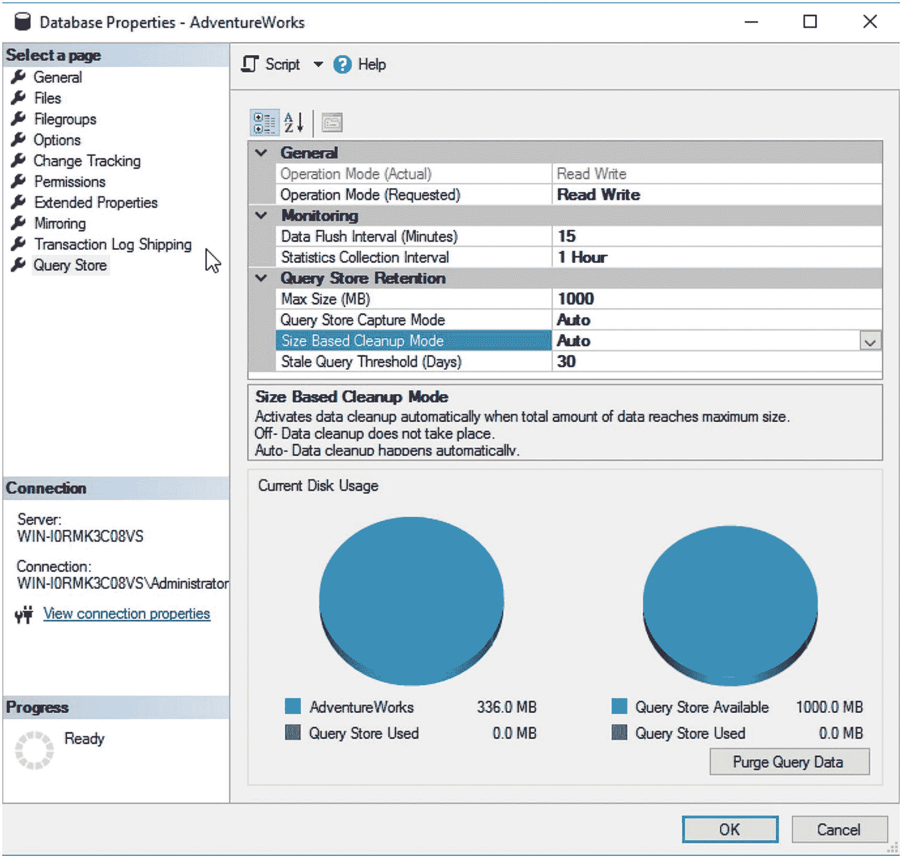

图 3-1
查询存储属性窗口

#### 注意

您无法在 GUI 中更改或查看 `MAX_PLANS_PER_QUERY` 或 `WAIT_STATISTICS_CAPTURE_MODE` 选项，也无法查看随 `CUSTOM QUERY_STORE_CAPTURE_MODE` 设置一起提供的三个选项。

您可以在左侧的饼图上看到数据库占用的空间以及查询存储占用的空间。在右侧的饼图上，您可以看到查询存储中已使用和可用的空间。您还可以使用“清除查询数据”按钮从查询存储中清除所有数据。

### 查询存储配置目录视图

有一个目录视图保存着查询存储的设置：`sys.database_query_store_options`。有关目录视图的更多信息，请参见第 5 章。您可以使用 `sys.database_query_store_options` 目录视图来查看数据库中查询存储的设置。要查看查询存储的配置设置，请使用代码清单 3-14 中的查询。

```
SELECT *
FROM sys.database_query_store_options
代码清单 3-14
用于查看查询存储选项的 T-SQL
```

我们将在本章后面的“维护查询存储”部分中查看其他一些查询。

### 查询存储配置最佳实践

第一个应该与默认值不同地配置的设置是 `MAX_STORAGE_SIZE_MB`。这里的默认设置太小，无法捕获 30 天甚至更长时间的工作负载。一般准则是从 2048 MB 开始，如果您必须保留更长的保留期或有较大的临时工作负载，再据此向上调整。请记住，此数据存储在 `PRIMARY` 文件组中，因此如果您正在进行部分还原，这将影响您的恢复时间，因此您不希望将大小设置得太高。

下一个本地 SQL Server 应该更改的设置是 `QUERY_STORE_CAPTURE_MODE`。此设置应从 `ALL` 更改为 `AUTO`，除非您需要捕获那些占用资源很少或执行次数很少的查询。捕获无关紧要的查询只会给查询存储带来更多工作，并占用查询存储中更多的磁盘空间。因此，在将此设置保留为 `ALL` 之前，请考虑这些因素。

`SIZE_BASED_CLEANUP_MODE` 的推荐设置是将其保留为 `AUTO`，因为如果由于无法清理数据而达到 `MAX_STORAGE_SIZE_MB`，则 `OPERATION_MODE` 将自动切换到 `READ_ONLY` 模式，使您处于无法收集新数据的状态。

下一个您可能考虑更改的设置是 `INTERVAL_LENGTH_MINUTES`。推荐设置是默认的 60，除非您需要更精细级别的数据。在这种情况下，建议低至 15，因为在合适的硬件上处理每秒 60,000 个事务的系统能够跟上该数据的聚合。如果您的工作负载更多是临时查询，而不是存储过程或参数化工作负载，那么您会希望将此设置保持较高，因为它会写入更多数据。

`WAIT_STATISTICS_CAPTURE_MODE` 的推荐设置是 `ON`，因为它为您的查询提供了更多的故障排除洞察。将此设置为 `OFF` 会削弱您使用查询存储中内置的强大功能的能力，该功能可用于查看是哪些查询导致了服务器上由您的数据库引起的哪些等待统计信息。


#### 参数化与查询存储

当讨论查询存储的 `QUERY_STORE_CAPTURE_MODE` 设置时，我们已经稍微触及了这个主题。让我们更深入地探讨其含义。首先，我们来讨论**参数化查询**和**即席查询**之间的区别。参数化查询以存储过程、函数、触发器或通过 `sp_executesql` 的形式传入。其参数化特性在于，传入的每个变量都具有预定义的数据类型，SQL Server 在每次查询调用时都会使用该数据类型。例如，请参见清单 3-15 中的代码，我们在其中查询 `Customer` 表的 `LastName`，但将数据类型固定为 20 个字符。

```sql
CREATE PROCEDURE dbo.GetName
@LastName VARCHAR(20)
AS
SET NOCOUNT ON;
SELECT FirstName,
LastName
FROM dbo.Customer
WHERE LastName = @LastName;
GO
EXEC dbo.GetName @LastName = 'Boggiano';
```

清单 3-15: 演示参数化调用 SQL Server 的存储过程

那么，这意味着每次调用此过程时，它都会在查询存储中被汇总为每个运行时区间一条记录，因为它总是将变量定义为 `VARCHAR(20)`。现在，如果使用即席查询做同样的事情，请参见清单 3-16。

```sql
SELECT FirstName,
LastName
FROM dbo.Customer
WHERE LastName = 'Boggiano';
```

清单 3-16: 即席查询的 T-SQL

当此查询编译时，它将 `LastName` 变量存储为八个字符，但如果你用 `LastName` 为 Smith 运行相同的查询，它将存储变量为五个字符的查询，这会在查询存储中为你提供每个运行时区间两条记录。数据没有被聚合，因此使得优化和排查同一类型的查询变得更加困难。即席查询还会由于必须跟踪的独特查询数量而导致查询存储的大小膨胀。

#### “删除并创建”与“更改”的影响

查询存储存储在数据库内执行的存储过程、触发器和函数的 `object_id`。通过更改 (`ALTER`) 这些对象，你可以保留对象的 `object_id`；如果你使用“删除并创建” (`DROP` and `CREATE`) 方法，你将不再拥有相同的 `object_id`，因此未来的数据将无法再被聚合在一起。所以，如果你进行更改以尝试提高性能，并决定去比较查询存储中之前的运行时区间与当前的性能，你将无法在查询存储报告中查看结果，而必须查询目录视图。在 SQL Server 2017 中，引入了语法 “`CREATE OR ALTER`”，因此你可以避免编写 `DROP`/`CREATE` 操作的需要。

#### 数据库重命名的影响

在执行计划中，所有对象都引用为三部分名称 `database.schema.object`，因为你有可能进行跨数据库查询。重命名数据库将导致计划强制 (`plan forcing`)失败，从而导致每次执行时使用那些强制计划的所有查询重新编译。

#### 使用跟踪标志减少恢复时间

默认情况下，如果数据库启用了查询存储，则在查询存储加载完成之前，所有查询都会被阻止在数据库中运行。这正是跟踪标志 7752 发挥作用的地方。默认情况下，此行为在 Azure SQL Database 中是开启的，但在本地 (`on-premise`) 版本中，你可以启用此跟踪标志，让查询存储异步加载，并且在后台处于只读状态直到完全加载，因此查询可以在查询存储加载时处理，但你将不会捕获这些查询。如果你在 SQL Server 实例重启后注意到等待统计信息 `QDS_LOADDB` 很高，你就可以判断你的系统是否存在此问题。由于这是 Azure SQL Database 的默认行为，它很可能成为本地产品的默认行为，因此我们可能希望现在就启用它，并享受更快的 SQL Server 实例启动时间带来的好处。这也对故障转移 (`failovers`) 产生相同的效果。

跟踪标志 7745 控制你的 SQL Server 实例是否在关闭时花时间将所有查询存储数据刷新到磁盘。根据你设置的 `DATA_FLUSH_INTERVAL_SECONDS` 和/或实例上启用了查询存储的数据库数量，这可能花费相当长的时间，你可能不愿意等待。这里的建议是启用此跟踪标志，因为如果你告诉 SQL Server 关机；你不想等待数据刷新到磁盘，你希望尽快让你的 SQL Server 实例重新启动并运行。

### 查询存储与内存优化表

内存优化表是完全存储在内存中的表。因此，在跟踪针对内存优化表执行的查询时，查询存储跟踪有限数量的指标，因为这些表存储在内存中。由于表完全驻留在内存中，查询存储不跟踪 I/O 和使用的查询内存。然而，它确实跟踪其他指标，如持续时间、CPU 时间、并行度和行数。如果你使用内存优化表，在查看第 4 章讨论的报告时，请记住这一点。

### 为原生编译存储过程配置查询存储

与内存优化表类似，查询存储对原生编译存储过程的处理方式也不同。默认情况下，查询存储为原生编译存储过程存储查询计划和查询文本，并在目录视图 `sys.query_store_plan` 中用一个标志标记这些过程。但是，默认情况下，运行时统计信息不存储在 `sys.query_store_runtime_stats` 目录视图中。要捕获运行时统计信息，必须使用过程 `sys.sp_xtp_control_query_exec_stats`。此过程可用于在实例级别捕获所有原生编译过程的统计信息，或仅捕获你需要排查的特定过程。收集这些统计信息存在相关的性能开销。清单 3-17 展示了如何设置原生编译存储过程以捕获运行时统计信息。

```sql
DECLARE @dbid INT = DB_ID('');
DECLARE @object_id INT = OBJECT_ID('');
EXEC sys.sp_xtp_control_query_exec_stats
@new_collection_value = 1,
@database_id = @dbid,
@xtp_object_id = @object_id;
```

清单 3-17: 设置查询存储以捕获原生编译存储过程的运行时统计信息

清单 3-18 展示了如何捕获实例上所有原生编译存储过程的统计信息。

```sql
EXEC sys.sp_xtp_control_query_exec_stats
@new_collection_value = 1;
```

清单 3-18: 设置查询存储以捕获实例上所有原生编译存储过程的运行时统计信息

要关闭统计信息收集，请运行清单 3-16 或 3-17 中的相同代码，并将参数 `@new_collection_value` 更改为 0。

#### 注意

如果 SQL Server 实例被关闭或重启，这些设置会重置为不捕获统计信息。如果你需要持久地收集统计信息，你将需要设置一个启动存储过程或一个在启动时运行的 SQL Agent 作业。


### 启用与禁用自动计划回归纠正（APRC）

要启用自动计划回归纠正（APRC），您可以运行清单 3-19 中的代码来针对单个数据库，或运行清单 3-20 中的代码来为所有查询存储已启用且处于 `READ_WRITE` 状态的数据库启用它。关于 APRC 是什么及其工作原理，在第 9 章有更深入的讨论。

```sql
DECLARE @SQL NVARCHAR(MAX) = N''
SELECT @SQL += REPLACE(N'ALTER DATABASE [{{DBNAME}}] SET AUTOMATIC_TUNING ( FORCE_LAST_GOOD_PLAN = ON ',
'{{DBName}}', [name])
FROM sys.databases
WHERE state_desc = 'ONLINE'
AND is_query_store_on = 1
ORDER BY [name];
EXEC (@SQL);
-- 清单 3-20
-- 用于在数据库在线且查询存储已启用的情况下启用 APRC 的 T-SQL
```

```sql
ALTER DATABASE []
SET AUTOMATIC_TUING ( FORCE_LAST_GOOD_PLAN = ON );
-- 清单 3-19
-- 用于启用 APRC 的 T-SQL
```

要关闭查询存储，我们运行相同的查询，但将 `ON` 替换为 `OFF`，如上面代码清单所示，即清单 3-21 和 3-22。

```sql
DECLARE @SQL NVARCHAR(MAX) = N'';
SELECT @SQL += REPLACE(N'ALTER DATABASE [{{DBNAME}}] SET AUTOMATIC_TUNING ( FORCE_LAST_GOOD_PLAN = OFF ',
'{{DBName}}', [name])
FROM sys.databases
WHERE state_desc = 'ONLINE'
AND is_query_store_on = 1
ORDER BY [name];
EXEC (@SQL);
-- 清单 3-22
-- 用于在数据库在线且查询存储已启用的情况下禁用 APRC 的 T-SQL
```

```sql
ALTER DATABASE []
SET AUTOMATIC_TUNING ( FORCE_LAST_GOOD_PLAN = OFF );
-- 清单 3-21
-- 用于禁用 APRC 的 T-SQL
```

### 维护查询存储

配置好查询存储后，有些项目您可能需要密切关注。有时查询存储的状态会从 `READ_WRITE` 变为 `READ_ONLY` 或 `ERROR`，您需要知道这种情况何时发生并进行纠正。您还需要监控空间使用情况，以确定是否在您需要的时间段内捕获了正确数量的数据，并确保不会空间耗尽。您还需要知道是否有任何您强制的执行计划失败以及如何追踪它们。您可能还需要从查询存储中移除执行计划和查询。最后，您可能需要重置等待统计信息。

#### 监控期望状态与实际状态

首先，要维护查询存储，您需要确保查询存储的 `desired_state`（期望状态）和 `actual_state`（实际状态）匹配。您可以运行清单 3-23 中的代码在单个数据库中检查，或运行清单 3-24 中的代码检查实例上所有启用了查询存储的数据库。

```sql
DECLARE @SQL NVARCHAR(MAX) = N'';
SELECT @SQL += REPLACE(REPLACE(N'USE [{{DBName}}];
SELECT
"{{DBName}}" database_name,
actual_state_desc,
desired_state_desc
FROM {{DBName}}.sys.database_query_store_options
WHERE desired_state_desc  actual_state_desc '
,'{{DBName}}', [name])
,'"', "")
FROM sys.databases
WHERE is_query_store_on = 1
ORDER BY [name];
EXEC (@SQL);
-- 清单 3-24
-- 用于在所有数据库上检查查询存储的期望状态与实际状态的 T-SQL
```

```sql
SELECT DB_NAME() database_name,
actual_state_desc,
desired_state_desc
FROM sys.database_query_store_options
WHERE desired_state_desc  actual_state_desc
-- 清单 3-23
-- 用于检查查询存储的期望状态与实际状态的 T-SQL
```

##### 查询存储的只读状态

查询存储可能在不通知的情况下从 `READ_WRITE` 状态进入 `READ_ONLY` 状态，原因有多种。原因以位图形式存储在 `sys.query_store_options` 目录视图中的 `readonly_reason` 字段中。在表 3-2 中，您可以找到原因列表。

**表 3-2 查询存储只读状态原因**

| readonly_reason 位图 | 描述 |
| --- | --- |
| 1 | 数据库处于只读模式 |
| 2 | 数据库处于单用户模式 |
| 4 | 数据库处于紧急模式 |
| 8 | 数据库是辅助副本（Always On 和 Azure SQL 数据库异地复制） |
| 65536 | 达到 `MAX_STORAGE_SIZE_MB` 设置的限制 |
| 131072 | 不同语句的数量已达到内存限制。在这种情况下，您应考虑从查询存储中移除查询或升级服务层级。适用于 Azure SQL 数据库 |
| 262144 | 已达到内存中大小限制。在内存空间释放之前，项目将持久保存到磁盘。查询存储将暂时处于只读模式。适用于 Azure SQL 数据库 |
| 524288 | 数据库已达到磁盘大小限制，因此查询存储无法再增长。适用于 Azure SQL 数据库 |

##### 如何修复处于错误状态的查询存储

从 SQL Server 2017 开始，查询存储可以进入错误状态。当您依赖手动执行计划强制或自动计划回归纠正时，这可能会导致潜在的性能问题。这是一种罕见的竞争条件，可能在您不知情的情况下发生。建议的修复方法是首先尝试将查询存储关闭（`OFF`）并将其置于 `READ_WRITE` 模式。如果这不起作用，则磁盘上的持久化数据已损坏，因此我们运行 `sys.sp_query_store_consistency_check`。最后，清除查询存储中的所有数据。在清单 3-25 中，您可以找到针对所有查询存储处于 `ERROR` 状态的数据库运行以修复 `ERROR` 状态的代码。

```sql
DECLARE @SQL AS NVARCHAR(MAX) = N'';
SELECT @SQL += REPLACE(N'USE [{{DBName}}]
--尝试更改为 READ_WRITE
IF EXISTS (SELECT * FROM sys.database_query_store_options
WHERE actual_state=3)
BEGIN
BEGIN TRY
ALTER DATABASE [{{DBName}}] SET QUERY_STORE =
OFF
ALTER DATABASE [{{DBName}}] SET QUERY_STORE =
READ_WRITE
END TRY
BEGIN CATCH
SELECT
ERROR_NUMBER() AS ErrorNumber
,ERROR_SEVERITY() AS ErrorSeverity
,ERROR_STATE() AS ErrorState
,ERROR_PROCEDURE() AS ErrorProcedure
,ERROR_LINE() AS ErrorLine
,ERROR_MESSAGE() AS ErrorMessage;
END CATCH;
END
--运行 sys.sp_query_store_consistency_check
IF EXISTS (SELECT * FROM sys.database_query_store_options
WHERE actual_state=3)
BEGIN
BEGIN TRY
EXEC
[{{DBName}}].sys.sp_query_store_consistency_check
ALTER DATABASE [{{DBName}}] SET QUERY_STORE =
ON
ALTER DATABASE [{{DBName}}] SET QUERY_STORE
(OPERATION_MODE = READ_WRITE)
END TRY
BEGIN CATCH
SELECT
ERROR_NUMBER() AS ErrorNumber
,ERROR_SEVERITY() AS ErrorSeverity
,ERROR_STATE() AS ErrorState
,ERROR_PROCEDURE() AS ErrorProcedure
,ERROR_LINE() AS ErrorLine
,ERROR_MESSAGE() AS ErrorMessage;
END CATCH;
END
--运行清除查询存储
IF EXISTS (SELECT * FROM sys.database_query_store_options
WHERE actual_state=3)
BEGIN
BEGIN TRY
ALTER DATABASE [{{DBName}}] SET QUERY_STORE
CLEAR
ALTER DATABASE [{{DBName}}] SET QUERY_STORE
(OPERATION_MODE = READ_WRITE)
END TRY
BEGIN CATCH
SELECT
ERROR_NUMBER() AS ErrorNumber
,ERROR_SEVERITY() AS ErrorSeverity
,ERROR_STATE() AS ErrorState
,ERROR_PROCEDURE() AS ErrorProcedure
,ERROR_LINE() AS ErrorLine
,ERROR_MESSAGE() AS ErrorMessage
END CATCH;
END
'
,'{{DBName}}', [name])
FROM sys.databases
WHERE is_query_store_on = 1;
EXEC (@SQL);
-- 清单 3-25
-- 用于修复实例上所有数据库错误状态的 T-SQL
```

#### 提示

由于潜在的性能影响，建议将上述代码设置为 SQL Server Agent 作业定期运行，这样当查询存储处于 `ERROR` 状态时，您就不会措手不及。


##### 监控空间使用情况

如果如本章前面讨论的那样，将 `CLEANUP_POLICY` 设置为 `AUTO`，您将需要自行监控空间使用情况，以确保查询存储不会切换到只读模式。默认情况下，查询存储将在容量达到 90% 时，清理数据至 80% 容量。如果您的 `MAX_STORAGE_SIZE_MB` 大小设置过低，且有大量事务通过，则查询存储有可能增长到超过指定的最大大小。在代码清单 3-26 中，您将找到用于监控实例上某个数据库空间使用情况的代码（当该数据库容量达到 90% 时）。

```sql
USE [];
GO
SELECT current_storage_size_mb,
max_storage_size_mb,
FROM sys.database_query_store_options
WHERE CAST(CAST(current_storage_size_mb AS
DECIMAL(21, 2)) / CAST(max_storage_size_mb AS
DECIMAL(21, 2)) * 100 AS DECIMAL(4, 2)) >= 90
AND size_based_cleanup_mode_desc = 'OFF';
```
代码清单 3-26 用于检查查询存储是否达到 90% 容量的 T-SQL 代码

#### 提示

您会希望将此代码放入一个 SQL Agent 作业中，并添加在查询存储接近容量时向您发送电子邮件警报的代码，以便您可以处理。

##### 如何清除查询存储

您可能会发现需要手动清除查询存储中的数据。您可以使用代码清单 3-27 和 3-28 中的两种方法之一来执行此操作。

```sql
USE [];
GO
EXEC sys.sp_query_store_flush_db;
```
代码清单 3-28 用于清除查询存储中所有数据的存储过程

```sql
ALTER DATABASE [] SET QUERY_STORE CLEAR ALL;
```
代码清单 3-27 用于清除查询存储中所有数据的 T-SQL

##### 计划强制失败

计划强制可能因多种原因而失败，例如计划中的索引被更改或删除、尝试写入索引时正在进行联机索引重建，或提示冲突。跟踪失败的计划很重要，这样您才能知道强制计划后是否获得了预期的性能提升。有两种方法可以跟踪强制计划。第一种是使用 T-SQL。您可以查询目录视图 `sys.query_store_plan` 来查看最后的失败原因和失败计数，如代码清单 3-29 所示。

```sql
SELECT plan_id,
force_failure_count,
last_force_failure_reason
FROM sys.query_store_plan
```
代码清单 3-29 查询具有失败强制计划的计划

由于上述方法仅显示最后一次强制计划的原因，然后递增计数器，并且是针对每个数据库的，您可能希望设置一个扩展事件会话来跟踪跨 SQL Server 实例的失败计划强制，并设置一个 SQL Agent 作业进行查询和发送警报。在代码清单 3-30 中，您将找到一个可以设置来捕获失败计划强制的扩展事件会话。

```sql
CREATE EVENT SESSION [QueryStore_Forcing_Plan_Failure]
ON SERVER
ADD EVENT qds.query_store_plan_forcing_failed
ADD TARGET package0.ring_buffer WITH
(
MAX_MEMORY=4096 KB,
EVENT_RETENTION_MODE=ALLOW_SINGLE_EVENT_LOSS,
MAX_DISPATCH_LATENCY=30 SECONDS,
MAX_EVENT_SIZE=0 KB,
MEMORY_PARTITION_MODE=NONE,
TRACK_CAUSALITY=OFF,
STARTUP_STATE=ON
);
```
代码清单 3-30 用于捕获失败强制计划的扩展事件会话

##### 移除计划和查询

有时您可能希望从查询存储中移除某个计划。您可以使用存储过程 `sys.sp_query_store_remove_plan` 从查询存储中移除任何计划。运行此过程时，它还会移除与该计划关联的运行时统计信息。它要求对数据库具有 `EXECUTE` 权限，对查询存储目录视图具有 `DELETE` 权限。有关如何从查询存储中移除计划的示例，请参见代码清单 3-31。

```sql
EXECUTE sys.sp_query_store_remove_plan @plan_id = ;
```
代码清单 3-31 用于从查询存储中移除查询的存储过程

类似地，有时您可能希望从查询存储中移除某个查询，例如当您有多个即席查询占用查询存储空间时。您可以使用存储过程 `sys.sp_query_store_remove_query` 从查询存储中移除任何查询。运行此过程时，它也会移除运行时统计信息。它要求对数据库具有 `EXECUTE` 权限，对查询存储目录视图具有 `DELETE` 权限。有关如何通过填写 `query_id` 从查询存储中移除查询的示例，请参见代码清单 3-32。

```sql
EXECUTE sys.sp_query_store_remove_query @query_id = ;
```
代码清单 3-32 用于从查询存储中移除查询的存储过程

##### 重置计划的统计信息

存储过程 `sys.sp_query_store_reset_exec_stats` 清除给定计划的运行时统计信息，但将计划保留在查询存储中。它要求对数据库具有 `EXECUTE` 权限，对查询存储目录视图具有 `DELETE` 权限。有关如何通过填写 `plan_id` 重置查询存储中计划的统计信息的示例，请参见代码清单 3-33。

```sql
USE [];
GO
EXECUTE sys.sp_query_store_reset_exec_stats @plan_id = ;
```
代码清单 3-33 用于重置计划统计信息的查询

### 结论

在本章中，我们了解了查询存储的所有配置选项和推荐设置。我们讨论了参数化查询与即席查询对查询存储的影响。然后我们讨论了对存储过程、函数和触发器使用删除和创建过程对查看这些对象统计信息的影响。我们讨论了如何通过使用跟踪标志来减少 SQL Server 实例的关闭和启动时间。我们介绍了如何捕获本机编译存储过程的数据。最后，我们讨论了维护查询存储的各种方法。

## 4. 标准查询存储报告

SQL Server Management Studio (SSMS) 有七个内置的查询存储报告。这些报告使我们能够通过图形界面快速查看性能数据、排查性能问题，并将数据转换为网格视图。在本章中，我们将探讨如何与这些报告交互，以及它们如何相互补充和协同工作。报告列表可以在对象资源管理器中数据库下方找到，如图 4-1 所示：

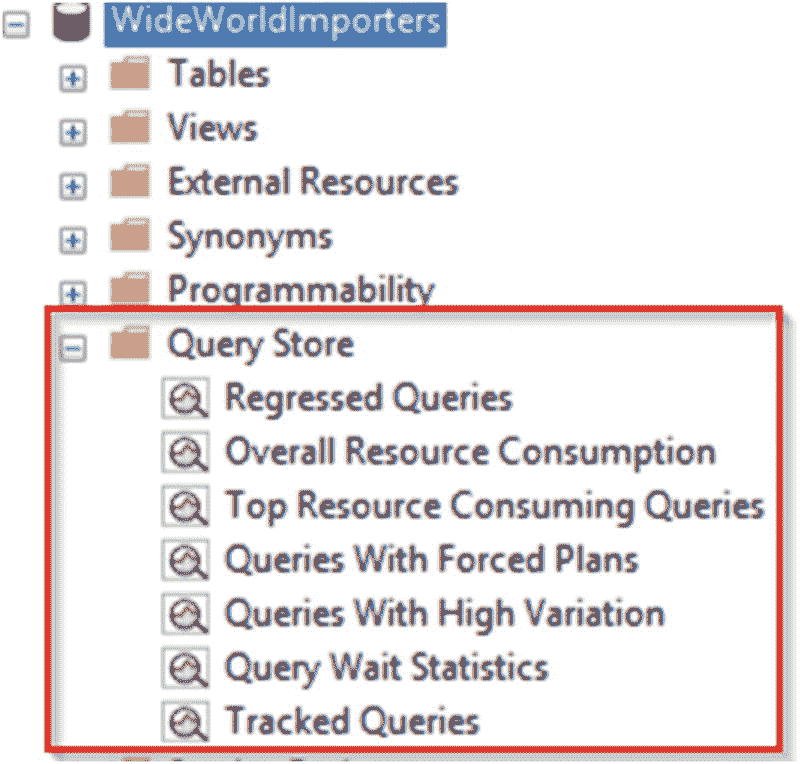

图 4-1 对象资源管理器中查询存储报告视图


### 性能回退查询报告

我们首先要查看的是**性能回退查询报告**。此报告显示了在指定时间段内，哪些查询的性能开始下降。您可以在这些报告中执行多项导航操作，但首先让我们看一下图 4-2 中的这份报告。

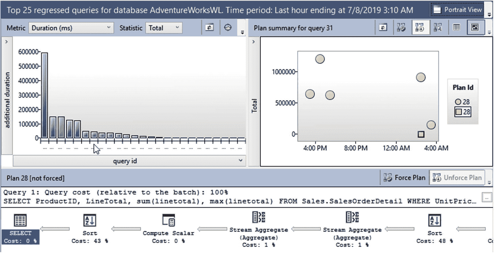
图 4-2

性能回退查询报告

左侧的每个柱条代表一个不同的查询，它可能是一个`存储过程`、`触发器`、`用户定义函数`的一部分，也可能是该时间段内执行的`即席查询`。报告的默认时间段是最近一小时。如果您点击任意柱条，底部的`查询计划`将切换显示该查询的`估计计划`。如果您将鼠标悬停在任意柱条上，它将显示该柱条所代表的每个查询的统计数据，如图 4-3 所示。

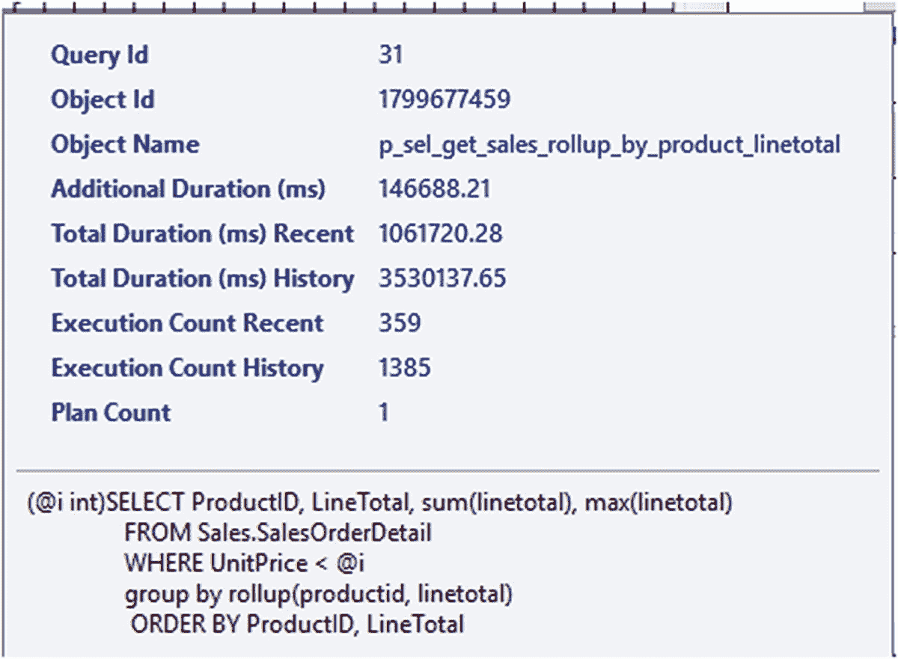
图 4-3

性能回退查询报告 - 悬停在柱条上显示的统计数据

在左上角窗格的左侧，您可以通过点击默认为`附加持续时间`的柱条来控制显示的回退类型。其他选项如图 4-4 所示：

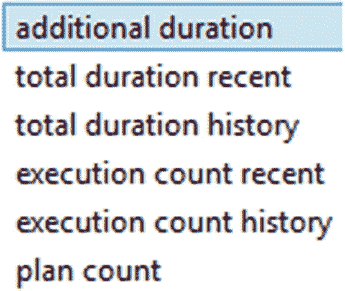
图 4-4

用于回退类型的其他选项

在任何显示`查询计划`的报告的底部窗格中，您会看到一个右上角带有三个点的框；一旦点击此框，它将获取`查询文本`并将其放入`查询编辑器`窗口中，如图 4-5 所示。


图 4-5

在查询编辑器窗口中打开查询文本的按钮

此外，在底部窗格中，有两个按钮，如图 4-6 所示，它们允许您根据在窗格中高亮显示和展示的计划来`强制`和`取消强制`计划。


图 4-6

性能回退查询报告的强制和取消强制计划按钮

您还将看到在报告时间段内，`存储过程`、`函数`、`触发器`或`即席查询`生成的`估计计划`。与在 `SQL Server Management Studio (SSMS)` 的`查询编辑器`窗口中运行`估计计划`或`实际计划`类似，您可以将鼠标悬停在每个计划运算符上以查看详细的统计数据、警告以及大部分工作发生位置的百分比。您可以右键单击该计划，获得与在 `SSMS` 的`查询编辑器`窗口中相同的选项，如图 4-7 所示。

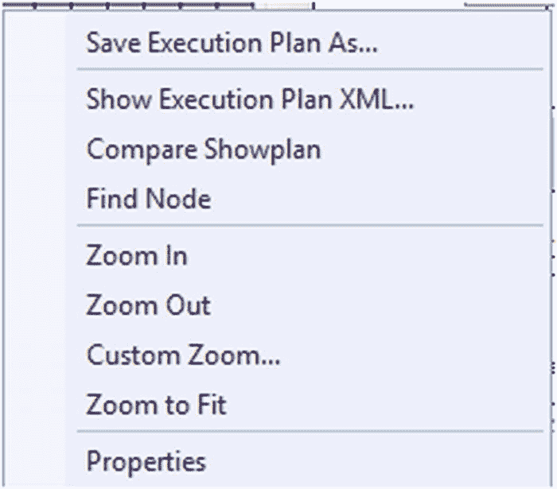
图 4-7

性能回退查询报告的计划选项

#### 注意

底部窗格在所有显示`查询计划`的报告中功能相同。


### 总体资源消耗报告

**总体资源消耗报告**默认显示数据库在过去一个月内消耗的资源。该报告默认以总量显示四类性能指标：持续时间（毫秒）、执行次数、CPU 时间（毫秒）以及逻辑读取（千字节）。下图 4-8 展示了一个报告示例：


*图 4-8：总体资源消耗报告*

如果您双击图表中显示的任何柱条，将自动打开我们接下来要讨论的下一份报告，即**资源消耗最高的查询**报告。如果您将鼠标悬停在任何柱条上，您将看到该柱条对应时间段的统计信息列表，如图 4-9 所示。

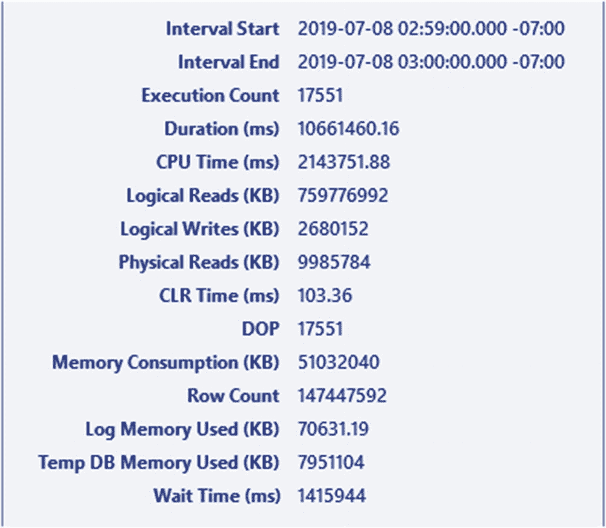
*图 4-9：总体资源消耗报告悬停统计信息*

在屏幕的右上角，您有四个按钮可用于控制报告。您可以在图 4-10 中查看这些按钮的特写图片：


*图 4-10：总体资源消耗报告按钮*

`刷新`按钮允许您刷新屏幕上的报告。`标准网格`按钮允许您以网格视图查看数据；有关示例，请参见图 4-11、4-12 和 4-13。

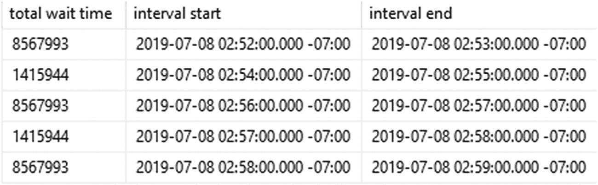
*图 4-13：总体资源消耗报告标准网格视图*

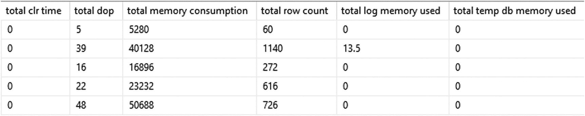
*图 4-12：总体资源消耗报告标准网格视图*

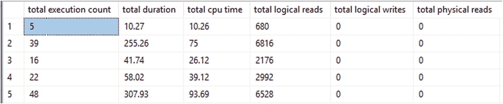
*图 4-11：总体资源消耗报告标准网格视图*

`标准网格`视图包含的列比带有图表的标准视图要多得多。您可以单击任何列的列标题，它会对列进行排序，并显示一个箭头指示数据排序的方式。默认情况下，它按`间隔开始日期和时间`排序。

`图表`按钮允许您在处于`标准网格视图`时切换回`图表视图`。

最后，`配置`按钮允许您控制`图表视图`上的项目以及`标准视图`或`图表视图`中显示的`时间间隔`。图 4-14 显示了`配置`按钮下可用的选项。

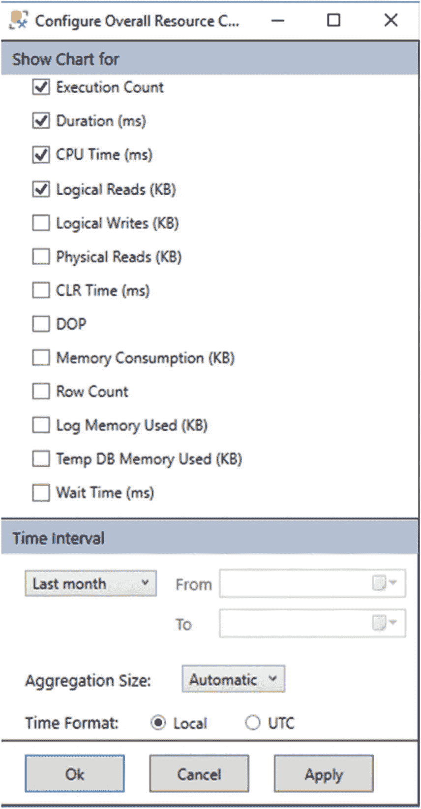
*图 4-14：总体资源消耗报告的配置按钮选项*

在屏幕的上半部分，如 `SSMS` 中的图 4-14 所示，向您展示了可在`图表视图`中显示的所有可用指标。您也可以使用它从视图中删除任何项目。

图 4-14 中屏幕的下半部分同时适用于`图表视图`和`标准网格视图`。您可以将`时间间隔`从默认的“上个月”更改为图 4-15 中所示的值，以查看不同的时间段。

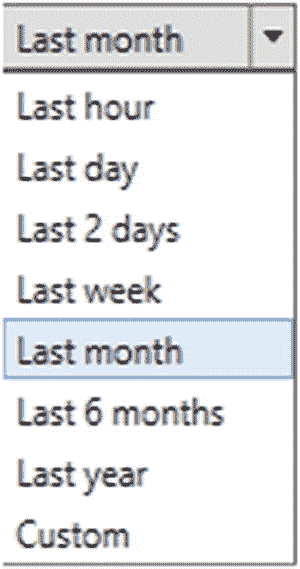
*图 4-15：总体资源消耗报告的配置时间间隔下拉菜单*

当您从下拉框中选择`自定义`时，`起始`和`结束`框将不再灰显，您可以通过键入或从日历中选择来编辑日期。接下来，有一个`聚合大小`下拉框，您可以在其中指定用于查看的数据聚合间隔。下拉框中的值如图 4-16 所示。

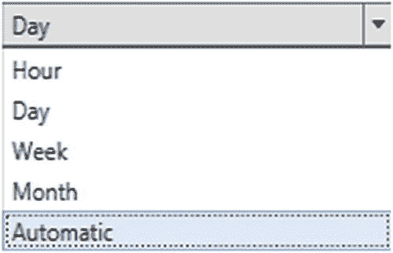
*图 4-16：聚合大小下拉菜单*

最后，您可以选择数据是按您的`本地时区`时间显示，还是按 `UTC` 时区显示。

#### 提示
这是验证您的系统是否达到您所建立的预期基线，以及查看服务器上是否发生异常情况的最佳报告。


### 资源消耗最大的查询报告

默认情况下，“资源消耗最大的查询报告”显示过去一小时内总持续时间排名前 25 的查询。在图 4-17 中，你可以看到此报告的示例。与我们讨论过的其他报告一样，报告顶部有许多可供查看的选项。
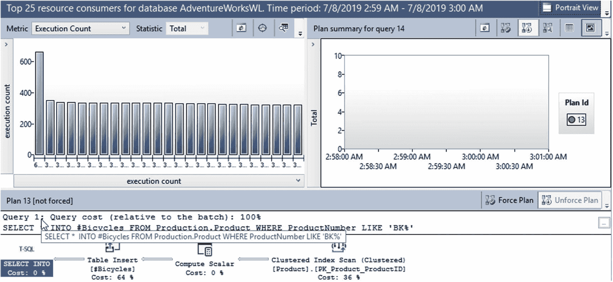
图 4-17 资源消耗最大的报告

在右上角，我们有三个按钮来控制整个报告，如图 4-18 所示。`纵向视图`按钮会将三个独立窗格堆叠在一起，而不是将两个窗格并排放在顶部，一个放在底部。`配置`按钮的功能与我们在上一个报告中看到的相同；请参阅图 4-14。

图 4-18 资源消耗最大的报告按钮

当我们查看图 4-19 时，可以看到以下按钮，它们用于控制屏幕的左上角。

图 4-19 资源消耗最大的报告选项栏

首先，有一个下拉菜单，用于选择你想查看前 25 个查询的度量标准：
* `执行次数`
* `持续时间 (ms)`（默认）
* `CPU 时间 (ms)`
* `逻辑读取 (KB)`
* `逻辑写入 (KB)`
* `物理读取 (KB)`
* `CLR 时间 (ms)`
* `并行度 (DOP)`
* `内存消耗 (KB)`
* `行数`
* `日志内存使用量 (KB)`
* `Tempdb 内存使用量 (KB)`
* `等待时间 (ms)`

然后，你可以将统计信息从按总计改为以下值：
* `平均值`
* `最大值`
* `最小值`
* `标准差`
* `总计`（默认）

`刷新`按钮将刷新报告到指定的当前时间段。接下来，有一个按钮可以让你跳转到“跟踪查询报告”以查看高亮显示的查询。带有放大镜图标的按钮会获取所选查询的文本，并在新查询窗口中弹出供你查看。`网格视图`按钮将为你提供查看每个查询的额外指标。有关`网格视图`样子的示例，请参见图 4-20、4-21、4-22 和 4-23。
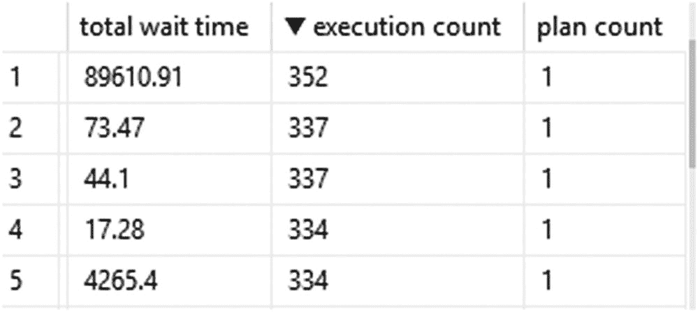
图 4-23 资源消耗最大的报告附加网格视图
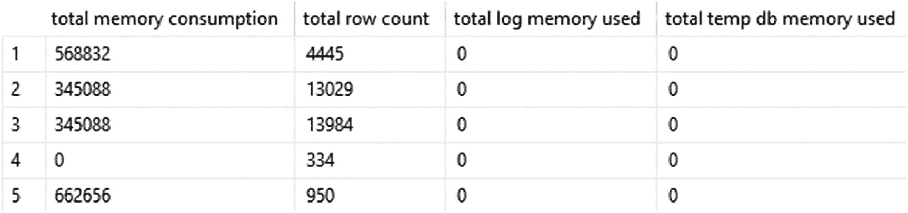
图 4-22 资源消耗最大的报告附加网格视图
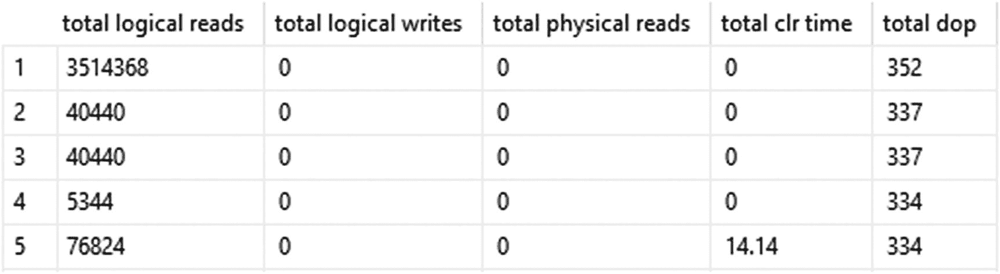
图 4-21 资源消耗最大的报告附加网格视图
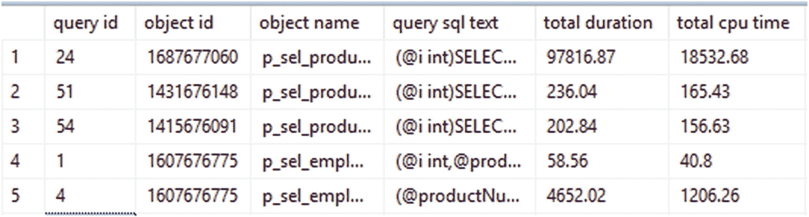
图 4-20 资源消耗最大的报告附加网格视图

在此视图中，列将根据你选择的统计信息而变化；例如，该图基于总计，但如果你选择`平均值`，视图将显示平均值。上图中通常包含的列如下：
* `查询 _id`
* `对象 _id`
* `对象名称`
* `查询 _sql 文本`
* `持续时间`
* `CPU 时间`
* `逻辑读取`
* `逻辑写入`
* `物理读取`
* `CLR 时间`
* `并行度 (DOP)`
* `内存消耗`
* `行数`
* `日志内存使用量`
* `Temp db 内存使用量`
* `等待时间`
* `执行次数`
* `计划数`


### 顶级资源消耗报告

### 常规网格视图与图表视图

`常规网格视图`按钮显示的列数要少得多，如图 4-24 所示。`常规网格视图`专注于您在图表中正在查看的度量值和统计信息，而不是显示所有度量值。请注意，这两种视图都允许您在不返回`图表视图`的情况下，更改视图内要查看数据的度量值和统计信息。

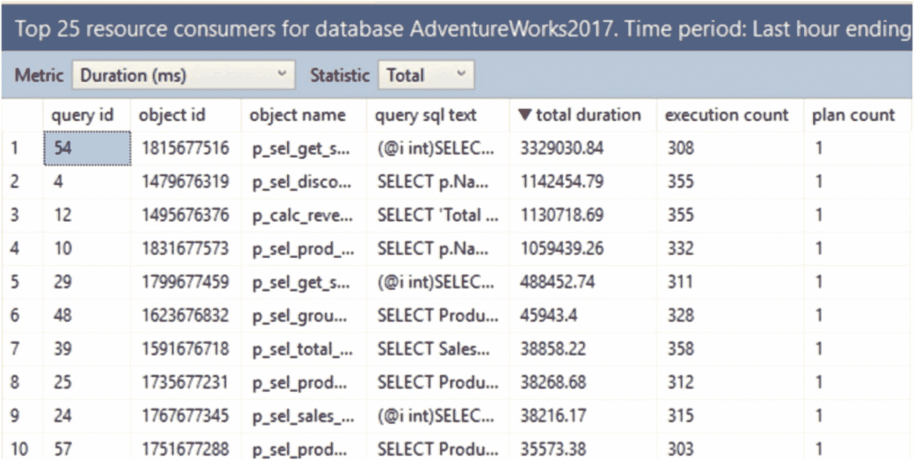

*图 4-24 顶级资源消耗常规网格视图*

`图表视图`按钮可让您在进入任意一个`网格视图`后返回到`图表视图`。

### 更改坐标轴选项

您还可以在窗格的`图表视图`上更改图表 y 轴和 x 轴的显示内容。对于 x 轴，您有图 4-25 所示的选项可用；对于 y 轴，您有图 4-26 所示的选项可用。

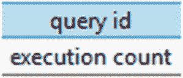

*图 4-26 顶级资源消耗图表视图 y 轴选项*

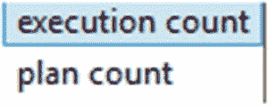

*图 4-25 顶级资源消耗图表视图 x 轴选项*

### 查询与计划交互

屏幕右侧显示与每个查询关联的计划及其 ID；当您单击查询时，屏幕的这一侧会随之调整，同时屏幕底部会显示查询计划。

此外，在第一个窗格中，如果您将鼠标`悬停在`任何查询的条形图上，它会显示有关该查询和您当前所选计划的详细信息，如图 4-27 所示。

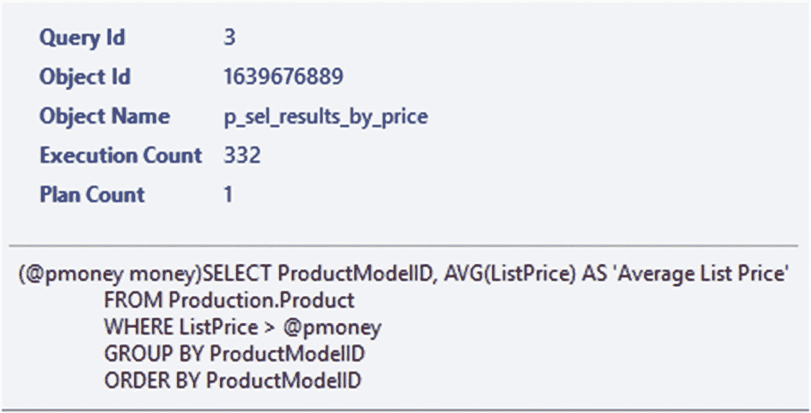

*图 4-27 顶级资源消耗报告查询 ID 数据*

### 左侧窗格分组依据选项

在左侧窗格的左侧，您可以更改数据的分组方式。您可以使用从顶部下拉菜单中选择的任意度量值（`duration`、`CPU`、`logical reads` 等）、`执行次数`和`计划次数`，如图 4-28 所示。这里最有用的是`计划次数`，因此您可以找到具有多个计划的查询，这将帮助您识别可能可以强制执行计划的查询。

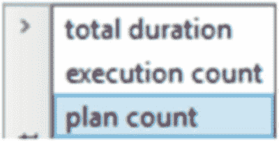

*图 4-28 顶级资源消耗报告左侧窗格分组依据下拉菜单*

### 左侧窗格控件（纵向模式）

在`纵向模式`下的左侧窗格中，有一系列按钮，用于控制您可以对所选查询显示的计划执行的操作。图 4-29 向您展示了这些按钮，我们将逐一解释每个按钮的功能。


*图 4-29 顶级资源消耗报告右侧窗格按钮*

您已经熟悉了`刷新`按钮，因为它只是刷新您所在的当前报告。下一个按钮`强制执行计划`，无论窗格中高亮显示的是哪个计划。下一个按钮会告诉您计划未被强制执行，或者如果之前已被强制执行过，则会`取消强制执行计划`。再下一个按钮允许您`比较两个计划`，方法是在下面的窗格中单击两个点并按住`Ctrl`键。图 4-30 展示了比较计划的示例外观。计划运算符的差异在计划图中以红色高亮显示。在该图旁边，您会看到如图 4-31 所示的内容，其中更详细地显示了每个操作花费时间的差异。

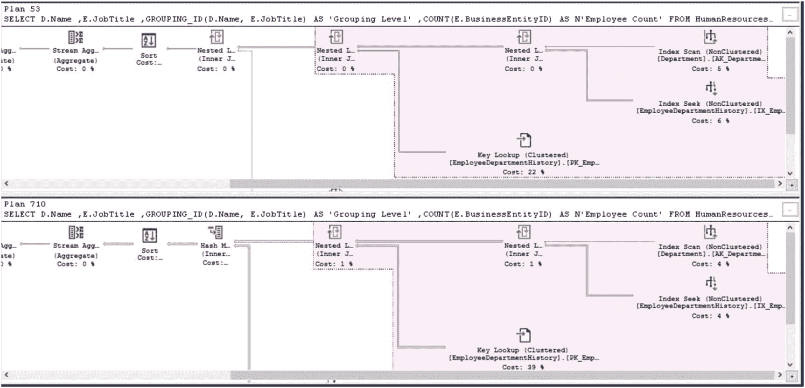

*图 4-30 顶级资源消耗报告比较计划运算符差异*

图 4-31 中看到的差异以黄色高亮显示了不等号。

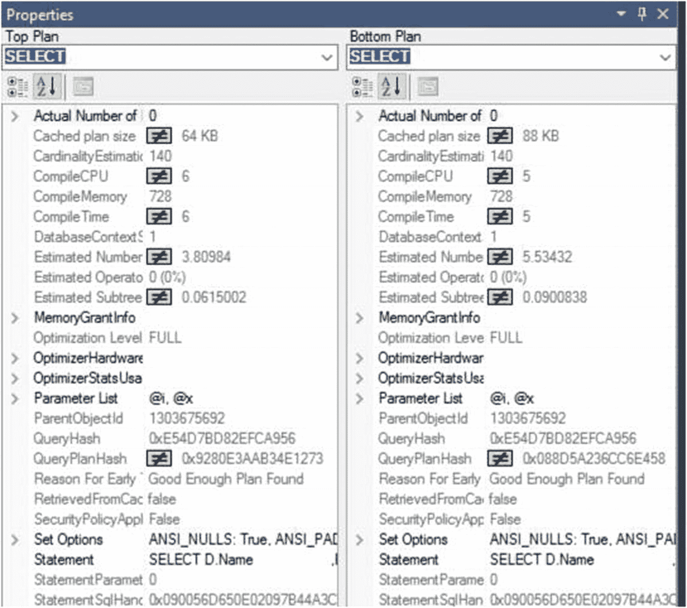

*图 4-31 顶级资源消耗报告比较报告详情*

下一个按钮在`网格视图`中显示计划的数据，如图 4-32 所示。最后一个按钮将窗格恢复为`图表视图`。

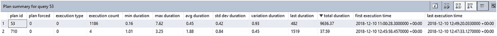

*图 4-32 顶级资源消耗报告计划数据的网格视图*

### 右侧窗格交互与图标

在右侧窗格中，当处于`图表视图`时，您可以将鼠标`悬停在`计划上以获取有关该计划的数据。此窗格中会出现三种类型的图标。一个内部为空的点代表`未强制执行的计划`，一个带有勾选标记的点代表`已强制执行的计划`，一个正方形代表查询`执行失败`。这些指标根据您在报告左上角选择的度量值而变化；例如，如果您选择了`CPU 时间`，您将看到`CPU`而不是`持续时间`。在图 4-33 中，您可以看到当您在窗格中将鼠标`悬停在`某个图标上时，该图标所代表时间段的统计信息示例。

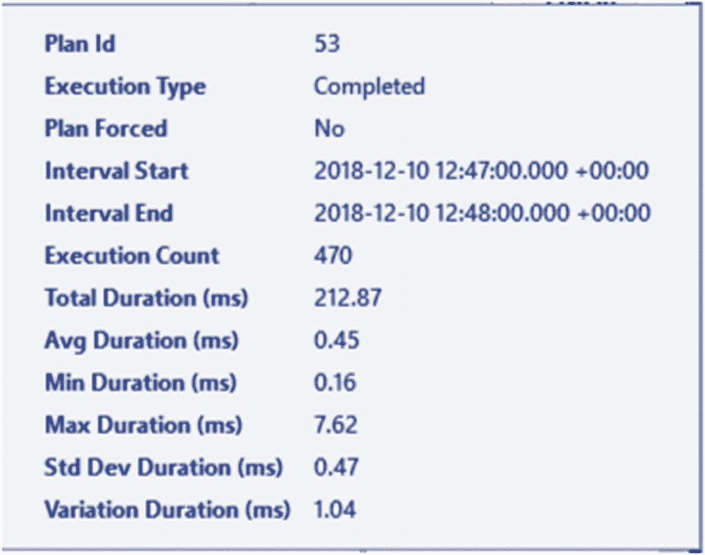

*图 4-33 顶级资源消耗报告悬停查看查询计划详情*

### 强制计划查询报告

### 报告概述

`强制计划查询`报告显示了数据库上已被强制执行的查询计划。此报告可用于回查以确保在强制执行计划后仍能看到相同的性能改进，或者查看数据库上强制执行了哪些计划。示例报告如图 4-34 所示：

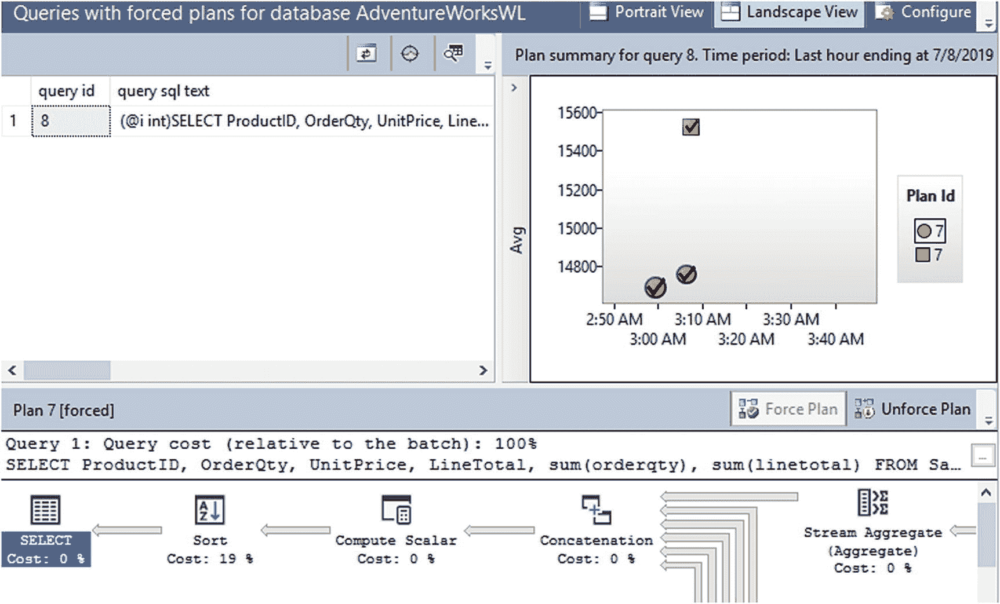

*图 4-34 强制计划查询报告*

### 报告按钮

此报告中的配置选项没有那么多，但让我们探索一下可用的按钮。左侧窗格中的三个按钮我们很熟悉；第一个是`刷新`按钮。第二个是`在跟踪查询报告中打开此查询`。最后一个是`在查询编辑器窗口中打开查询文本`。

右侧窗格最顶部有与`顶级资源消耗查询`报告相同的按钮。一个是将报告置于`横向模式`，这会堆叠窗格。另一个是将其改回默认的`纵向模式`。然后是`配置`按钮，它看起来与图 4-34 中`顶级资源消耗`报告中的按钮相同。在那下面，您有右侧窗格的`刷新`按钮。有一个按钮用于`强制执行计划`，一个按钮用于`取消强制执行计划`。最后是用于`比较计划`的按钮。

### 底部窗格选项

在底部窗格中，显示了从右上窗格中高亮显示的计划 ID 对应的计划，以及用于`强制执行`或`取消强制执行`所选计划的按钮，如图 4-34 所示。在图表的左侧，您可以更改用于显示点的统计信息，默认为`平均值`；其他选项请参见图 4-35。

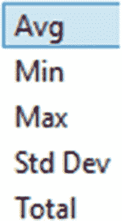

*图 4-35 强制计划查询报告 y 轴选项*

与在`顶级资源消耗查询`报告中一样，您有相同的选项来查看查询计划。


### 高变化率查询报告

“高变化率查询”报告可以指示存在参数化问题的查询。参数化发生在查询使用一个值执行时被参数化，然后使用不同的值再次执行，但由于数据分布，执行不同的计划可能更合适。例如，如果你要执行一个查询，查找蒙大拿州（MO）的所有居民，它会根据一个小数据集的统计信息生成一个搜索计划，而如果你搜索加利福尼亚州（CA）的所有居民，则会不同。高变化率查询报告的示例如图 4-36 所示。

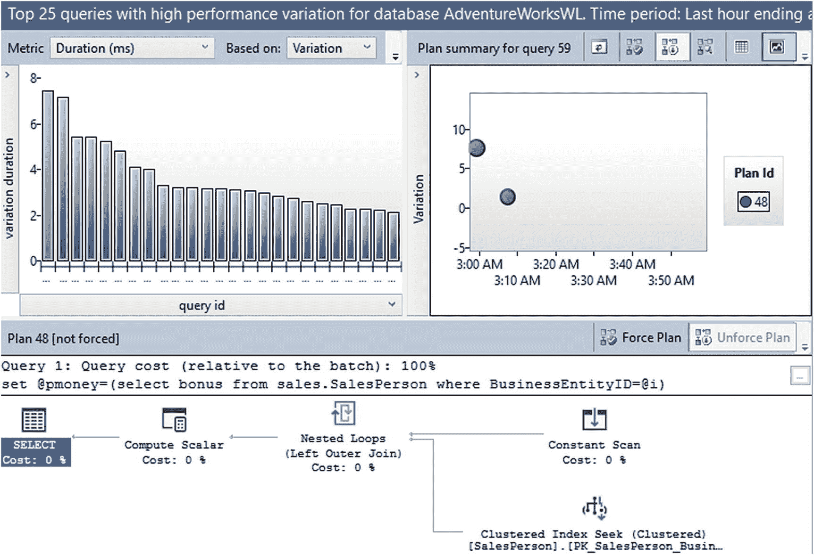

*图 4-36 高变化率报告*

该报告与“资源消耗最高查询报告”有少许不同：在 `统计信息` 下拉菜单下，你只有两个选项：`变化率` 和 `标准偏差`，并且没有 `配置` 按钮。当你将鼠标悬停在柱状图上时，获得的信息更有限，因为它只显示你所选指标的 `变化率` 和 `标准偏差`，如图 4-37 所示。

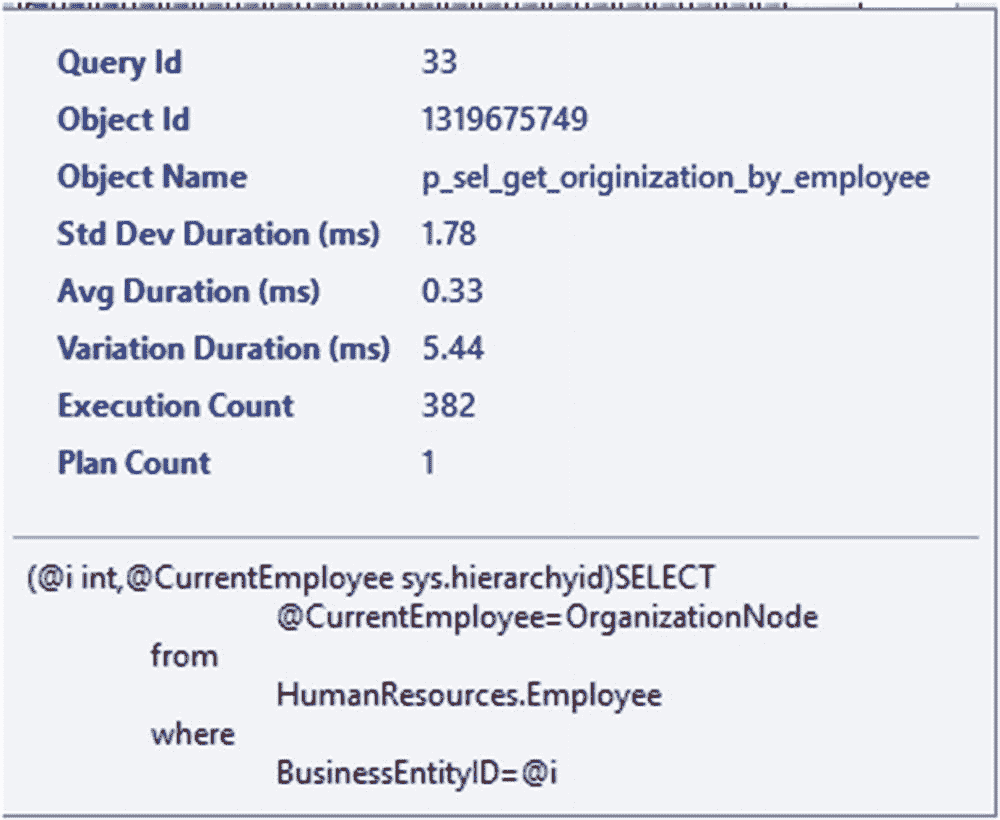

*图 4-37 高变化率查询摘要信息*

你可以在左侧窗格中选择用于显示值的统计信息；选项如图 4-38 和 4-39 所示。

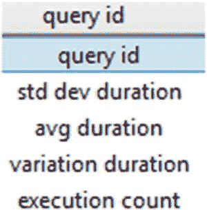

*图 4-39 高变化率查询 X 轴选项*

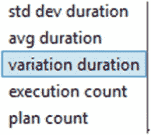

*图 4-38 高变化率查询 Y 轴选项*

当你将鼠标悬停在数据点上时，会根据为查询计划选择的指标接收信息，如图 4-40 所示。

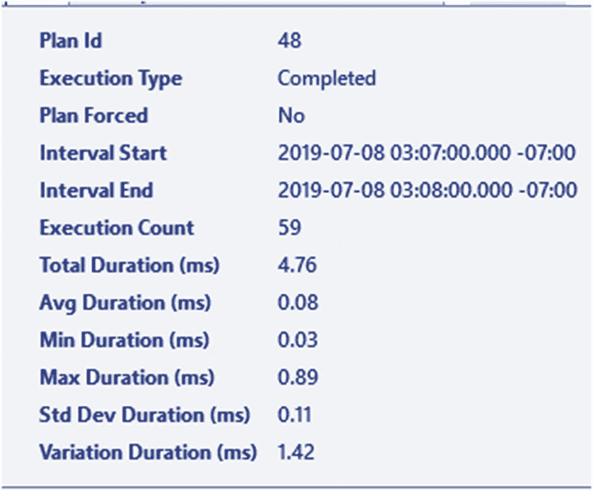

*图 4-40 高变化率查询计划摘要信息*

你还可以通过在左侧选择选项来控制右侧窗格的 Y 轴，如图 4-41 所示。

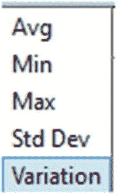

*图 4-41 高变化率报告计划摘要 Y 轴选项*

### 查询等待统计信息报告

添加到 `SSMS` 的最新报告是查询等待统计信息报告。当你最初打开该报告时，会看到一个按类别显示总等待时间的报告。查询存储将所有等待统计信息分组为 23 个类别，例如 `CPU`、`内存`、`缓冲区 IO` 等。等待统计信息是排查 `SQL Server` 性能问题的一种久经考验且可靠的方法，也是 `SQL Server 2017` 中查询存储的新增实用功能。每个等待统计信息类别在第 9 章中有详细说明。该报告的示例如图 4-42 所示。

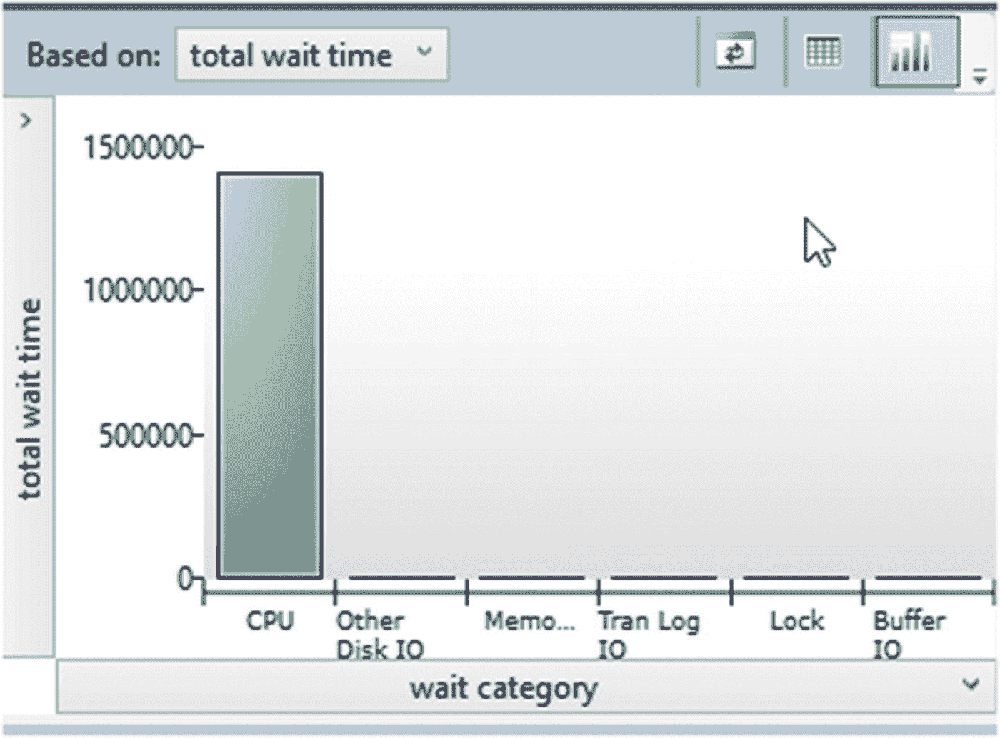

*图 4-42 查询等待统计信息报告类别*

该报告默认像所有其他报告一样按总计显示等待统计信息，但你可以在顶部和左侧选择更改选项，如图 4-43 所示。

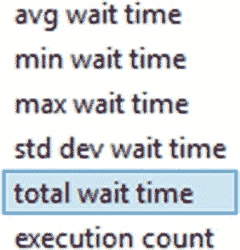

*图 4-43 查询等待统计信息报告类别报告选项*

在图表视图的底部，你还可以将图表的 X 轴更改为下拉菜单中的选项之一，如图 4-44 所示。

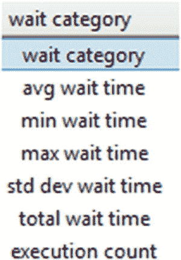

*图 4-44 查询等待统计信息报告类别 X 轴选项*

在屏幕顶部，有三个熟悉的按钮。第一个是 `刷新` 按钮，第二个是 `标准网格` 按钮（其外观如图 4-45 和 4-46 所示），最后一个是切换回图表视图的按钮。

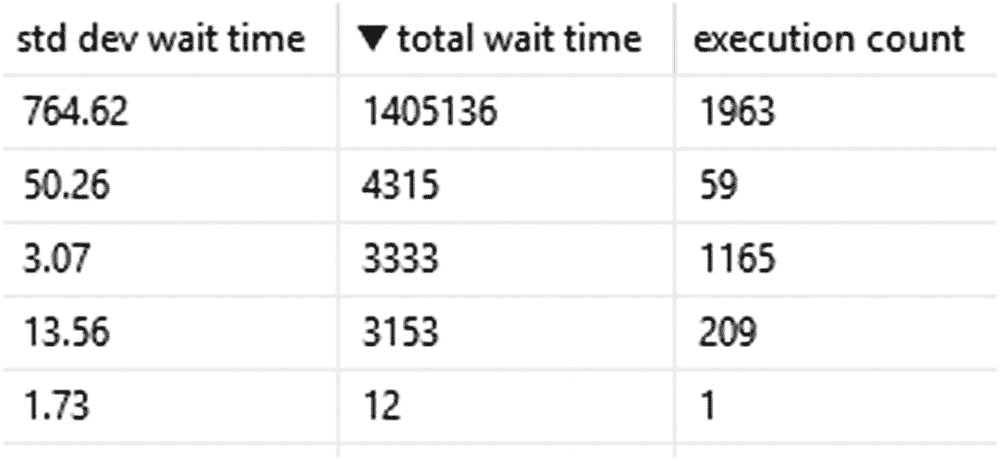

*图 4-46 查询等待统计信息报告类别网格视图*

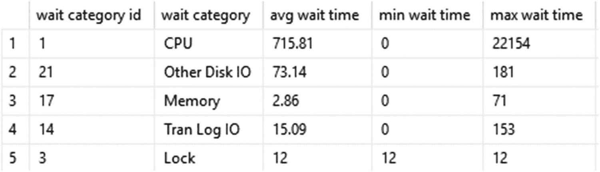

*图 4-45 查询等待统计信息报告类别网格视图*

一旦你点击图表中显示的某个类别柱状图，就会显示一个向下钻取的报告，其中包含该类别资源消耗最高的前五个查询，如图 4-47 所示。这使你能够基于等待统计信息所显示的瓶颈位置来排查查询。如果你看到较高的 `CPU` 等待出现在报告首位，那么你可以向下钻取，查看消耗 `CPU` 最多的前五个查询，然后对这些查询进行调优，或者查看是否可以强制使用一个资源消耗更少的执行计划。

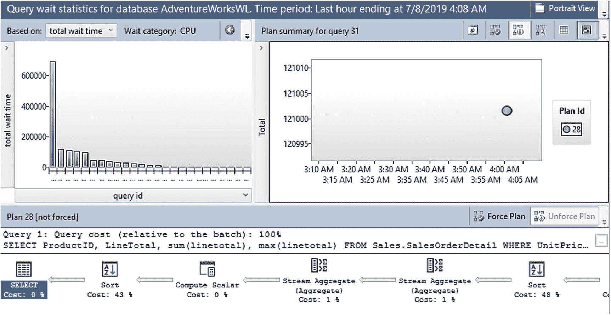

*图 4-47 查询等待统计信息按类别排名前五的报告*

顶部的下拉菜单提供了一些统计信息，可用于控制哪些前五个查询显示在报告中，如图 4-48 所示。

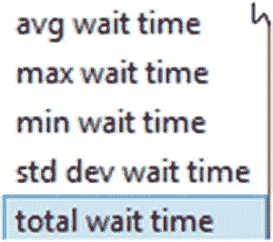

*图 4-48 查询等待统计信息前五个查询统计信息*

其右侧是一组按钮，除了绿色箭头外，其他的现在我们应该都很熟悉了。绿色箭头将我们带回我们向下钻取自的查询等待统计信息类别报告。

与其他图表视图一样，你可以更改显示的 Y 轴和 X 轴属性；此屏幕上可用的选项参见图 4-49 和 4-50。

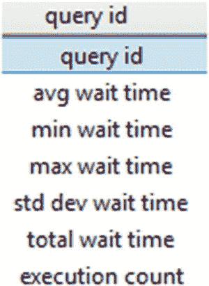

*图 4-50 查询等待统计信息按类别前五 X 轴选项*


*图 4-49 查询等待统计信息前五类别 Y 轴选项*

在右侧窗格中，有常见的虚线图，表示不同时间段内的不同执行计划。顶部的按钮与“资源消耗最高查询报告”（见图 4-13）中的相同。你还可以将 Y 轴从默认的总计更改为下拉菜单中的不同统计信息，如图 4-51 所示。

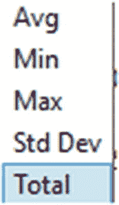

*图 4-51 查询等待统计信息按类别前五计划 Y 轴选项*


### 跟踪查询报告

跟踪查询报告用于显示您正在跟踪的特定查询的运行时统计信息，并查看该查询的所有执行计划。跟踪查询报告的示例可参见图 4-52。当您之前已通过 `查询 ID` 识别出想要监视并观察其性能随时间变化情况的查询时，此报告最为有用。

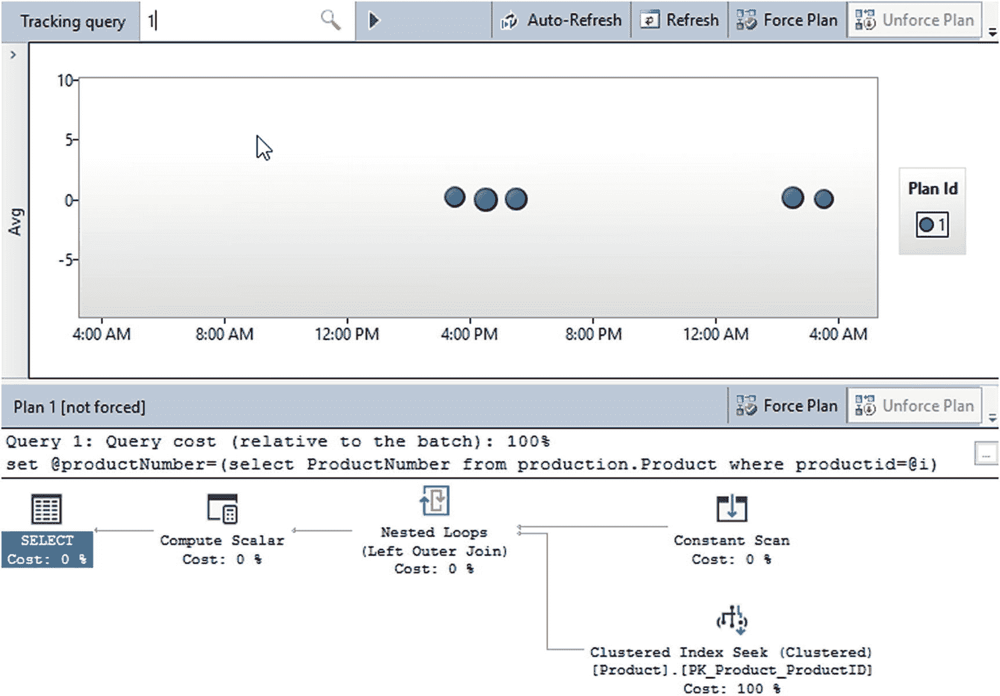

图 4-52 跟踪查询报告

在左上角，您有两种方法来查找想要跟踪的查询。一种是在白色框中输入 `查询 ID`，然后点击绿色箭头以加载数据。默认情况下，数据涵盖最近一天。另一种是点击放大镜图标，此时将弹出一个窗口，其中已加载存储在 `查询存储` 中的所有查询，如图 4-53 所示。

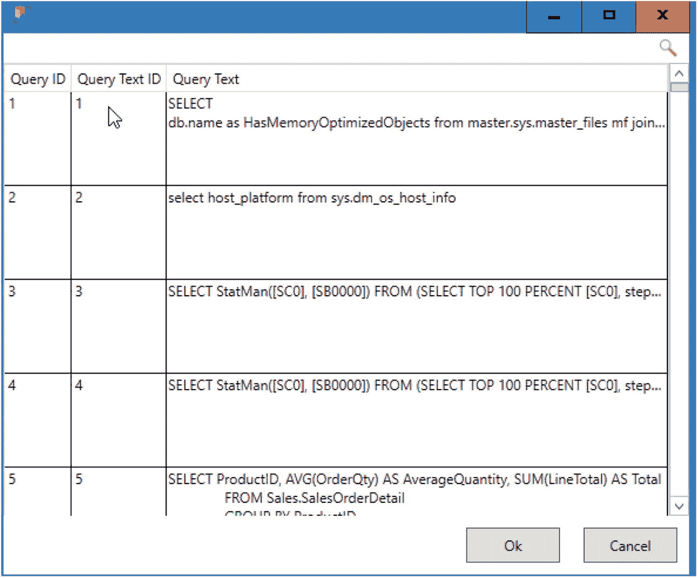

图 4-53 跟踪查询报告放大镜视图

从这里，您可以选择一个查询进行跟踪，然后点击“确定”，之后您需要点击绿色箭头以在报告中加载数据。将鼠标悬停在数据点上，会显示基于您配置为显示的指标（默认为持续时间）的特定时间段内的统计信息，如图 4-54 所示。

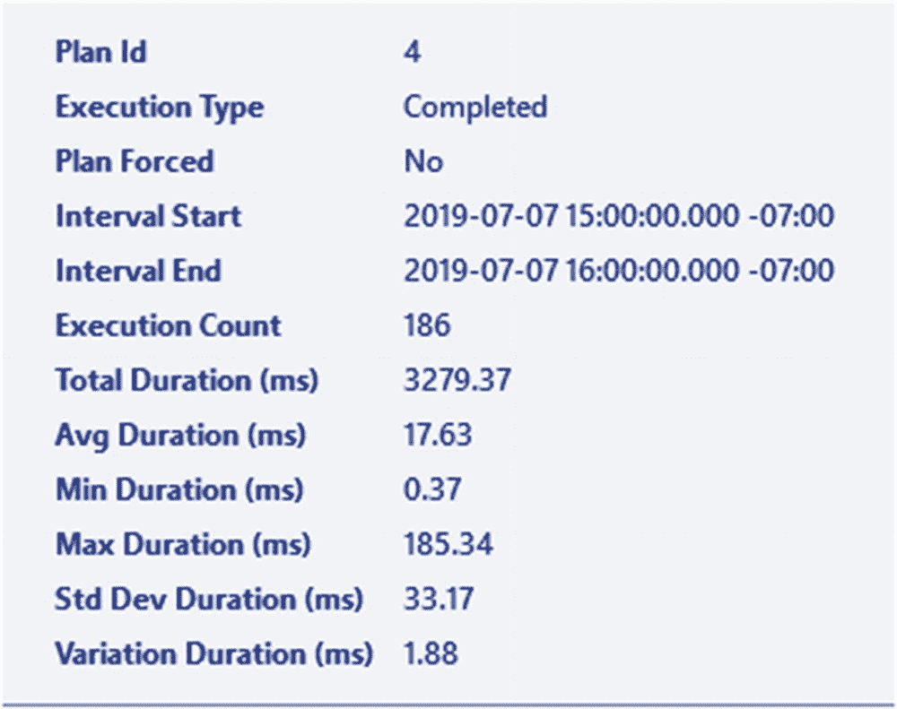

图 4-54 跟踪查询报告统计详情

在顶部，您会看到几个我们之前未见过的新按钮。第一个是 `自动刷新` 按钮，顾名思义，它将每 5 秒自动刷新一次报告。`自动刷新` 设置可在 `配置` 按钮下进行配置。在该屏幕中，还有一个我们未见过的可配置设置，即可以在此处更改要跟踪的查询。

### 结论

在本章中，我们探讨了 `退化查询`、`总体资源消耗`、`前资源消耗查询`、`具有强制计划的查询`、`高差异查询`、`查询等待统计信息` 和 `跟踪查询` 报告，以及它们如何相互作用。我们探索了所有可用的选项，以更改屏幕上报告的数据，以及如何配置每个报告以满足您的需求。这些报告对于快速解决 SQL Server 实例上 `查询存储` 的问题至关重要。

## 5. 查询存储目录视图

`查询存储` 为 SQL Server 引入了八个新的目录视图，用于存储您查询数据以通过 `查询存储` 排查 SQL Server 问题和检查 `查询存储` 配置所需的所有信息。您需要 `VIEW DATABASE STATE` 权限才能查询这些目录视图。在本章中，您将找到所有目录视图及其列的描述，然后是我们在第 4 章讨论的标准 `查询存储` 报告背后的查询示例。

### sys.database_query_store_options

包含指示 `查询存储` 设置选项的目录视图是 `sys.database_query_store_options`。此目录视图返回为 `查询存储` 配置设置的所有可用选项。此目录视图与其他任何目录视图没有关系。有时您需要检查所有已启用 `查询存储` 的数据库的配置；您可以使用清单 5-1 中的查询，为每个启用了 `查询存储` 的数据库返回一个包含所有设置的结果集。

```sql
DECLARE @SQL NVARCHAR(MAX) = '';
SELECT @SQL += REPLACE(REPLACE('
USE [{{DBName}}];
SELECT "{{DBName}}",
*
FROM sys.database_query_store_options; '
,'{{DBName}}', [name])
,' " ','' '')
FROM sys.databases
WHERE is_query_store_on = 1;
EXEC (@SQL);
```
清单 5-1 检查 SQL Server 实例上所有数据库的查询存储选项

表 5-1 显示了 `sys.database_query_store_options` 目录视图中所有列的列名、数据类型和描述。需要密切关注的重要列是 `actual_state_desc`；如果 `desired_state` 是 `READ_WRITE`，您需要确保它保持在 `READ_WRITE` 状态，而不是由于空间不足或 `ERROR` 而切换到 `READ_ONLY`。要更好地理解这些列的选项，请参阅第 3 章。

表 5-1 sys.database_query_store_options 的列列表和描述


### Query Store 配置与状态

| 列名 | 数据类型 | 描述 |
| --- | --- | --- |
| `desired_state` | `smallint` | 显示 Query Store 的期望状态。这些是用户可以设置的唯一有效值。有效值如下：`0 = OFF` `1 = READ_ONLY` `2 = READ_WRITE` |
| `desired_state_desc` | `nvarchar(60)` | 提供 Query Store 期望状态的描述。有效值如下：`OFF` `READ_ONLY` `READ_WRITE` |
| `actual_state` | `smallint` | 显示 Query Store 的实际状态。注意这里有一个在期望状态中没有的附加值 `ERROR`。有效值如下：`0 = OFF` `1 = READ_ONLY` `2 = READ_WRITE` `3 = ERROR` |
| `actual_state_desc` | `nvarchar(60)` | 提供 Query Store 实际状态的描述。有效值如下：`OFF` `READ_ONLY` `READ_WRITE` `ERROR` |
| `readonly_reason` | `int` | 当数据库处于 `READ_ONLY` 模式但期望状态是 `READ_WRITE` 时，此列中存储一个位图来指示原因。有效值如下：`1` – 数据库已被置于只读模式。`2` – 数据库已被置于单用户模式。`4` – 数据库已被置于紧急模式。`8` – 数据库是辅助副本。这适用于可用性组和 Azure SQL 数据库地理复制数据库，因为所有辅助副本本质上都是数据库的只读副本。`65536` – 已达到 `MAX_STORAGE_SIZE_MB` 中指定的最大大小限制。`46410` – 在 Azure SQL 数据库中，内部内存中可以存储的查询数量存在限制，这表示您已达到该限制。您可以升级到更高的服务层以获得更高的限制，或者从 Query Store 中删除不再需要的查询，该操作使用存储过程 `sys.sp_query_store_remove_query`。`262144` – 在 Azure SQL 数据库中，在数据持久化到磁盘之前，可能会达到内存中保存数据量的限制。在此期间，Query Store 将暂时置于 `READ_ONLY` 模式。`524288` – 在 Azure SQL 数据库中，数据库空间已用完。要解决这些情况中的任何一种，请参阅第 3 章 3 关于配置 Query Store 的内容。 |
| `current_storage_size_mb` | `bigint` | 告诉您 Query Store 当前使用的大小（以 MB 为单位）。 |
| `flush_interval_seconds` | `bigint` | 告诉您 Query Store 将数据持久化到磁盘的频率。默认为 900 秒（15 分钟）。 |
| `interval_length_minutes` | `bigint` | 告诉 Query Store 将统计信息汇总到哪些时间间隔中。有效值如下：1、5、10、15、30、60 和 1440 分钟。默认值为 60 分钟。 |
| `max_storage_size_mb` | `bigint` | 告诉 Query Store 它可以使用的最大磁盘空间量。 |
| `stale_query_threshold_days` | `bigint` | 查询保留在 Query Store 中的天数。默认值为 30 天。如果将该值设置为 0，则会禁用保留策略。对于 Azure SQL 数据库基本版，默认值为 7 天。 |
| `max_plans_per_query` | `bigint` | Query Store 将为每个查询保留的最大执行计划数。达到最大数量后，Query Store 将不再捕获该查询的计划。如果将该值设置为 0，则没有限制。适用于 SQL Server 2017 及更高版本。 |
| `query_capture_mode` | `smallint` | Query Store 的捕获模式。有效值如下：`1 = ALL` – 捕获所有查询。（SQL Server 2016 及更高版本的默认值）`2 = AUTO` – 根据使用模式捕获查询。（Azure SQL 数据库的默认值）`3 = NONE` – 告诉 Query Store 停止捕获新查询。但是，Query Store 继续为已在 Query Store 中的查询收集统计信息。`4 = CUSTOM` – 告诉 Query Store 使用自定义配置选项来确定要存储哪些查询（仅适用于 SQL Server 2019）。 |
| `query_capture_mode_desc` | `nvarchar(60)` | Query Store 捕获模式的描述。有效值如下：`ALL` `AUTO` `CUSTOM`（仅适用于 SQL Server 2019）`NONE` |
| `capture_policy_execution_count` | `int` | 在捕获模式为 `CUSTOM` 时，查询被捕获前所需的执行次数（仅适用于 SQL Server 2019）。 |
| `capture_policy_total_compile_cpu_time_ms` | `bigint` | 在捕获模式为 `CUSTOM` 时，查询被捕获前所需的总 CPU 编译时间（毫秒）（仅适用于 SQL Server 2019）。 |
| `capture_policy_total_execution_cpu_time_ms` | `bigint` | 在捕获模式为 `CUSTOM` 时，查询被捕获前所需的总 CPU 执行时间（毫秒）（仅适用于 SQL Server 2019）。 |
| `capture_policy_state_threshold_hours` | `int` | 在捕获模式为 `CUSTOM` 时，查询收集数据以确定是否应捕获查询统计信息的时间长度（仅适用于 SQL Server 2019）。 |
| `size_based_cleanup_mode` | `smallint` | 告诉 Query Store 在接近最大大小时是否清理 Query Store。有效值如下：`0 = OFF` – 不自动清理。`1 = AUTO` – 当达到最大大小的 90% 时自动清理。这是默认值。最不常用和最旧的查询会被首先删除，直到达到大约 80% 的可用空间。 |
| `size_based_cleanup_mode_desc` | `nvarchar(60)` | 基于大小的清理的描述。有效值如下：`OFF` `AUTO` |
| `wait_stats_capture_mode` | `smallint` | 告诉 Query Store 是否捕获等待统计信息。有效值如下：`0 = OFF` `1 = ON` 适用于 SQL Server 2017 及更高版本。 |
| `wait_stats_capture_mode_desc` | `nvarchar(60)` | 描述是否捕获等待统计信息。有效值如下：`OFF` `ON`（默认值）适用于 SQL Server 2017 及更高版本。 |
| `actual_state_additional_info` | `nvarchar(8000)` | 关于 Query Store 如何最终处于当前状态的附加信息。通常在状态不是预期状态时填充。 |


### sys.query_context_settings

`sys.query_context_settings` 目录视图保存查询存储中查询运行时所使用的上下文设置，例如 `ANSI_NULLS` 或 `QUOTED_IDENTIFIER`。如果相同的查询使用了不同的上下文设置，你会在查询存储中得到不同的执行计划。`set_options` 字段存储了一个位掩码，用于告诉我们查询运行时使用了哪些选项。有两种方法可以查看查询的设置选项。第一种是使用动态管理函数 `sys.dm_exec_plan_attributes()` 并传入 `plan_handle`。此方法仅当执行计划仍在计划缓存中时才有效。在清单 5-2 中，你可以通过 `WHERE` 子句中的 `<value>` 占位符缩小选择范围，从而检索特定查询的 `plan_handle` 或 `context_settings_id`。

```sql
SELECT
q.query_id,
qt.query_sql_text,
qs.plan_handle,
q.context_settings_id
FROM sys.query_store_query q
INNER JOIN sys.dm_exec_query_stats qs
ON q.last_compile_batch_sql_handle =
qs.sql_handle
INNER JOIN sys.query_store_query_text qt
ON q.query_text_id = qt.query_text_id
INNER JOIN sys.query_context_settings cs
ON cs.context_settings_id = q.context_settings_id
WHERE qt.query_sql_text LIKE '%%'
ORDER BY q.query_id
清单 5-2
从缓存中检索计划句柄的查询
```

然后，复制你想要查看设置选项的查询的计划句柄，并替换清单 5-3 中的 `<plan_handle>`。

```sql
SELECT *
FROM sys.dm_exec_plan_attributes(<plan_handle>)
WHERE attribute = 'set_options'
清单 5-3
检索计划句柄的 SET 选项
```

第二种方法是创建一个函数，然后你可以从目录视图中查询一条记录，并使用清单 5-2 中返回的 `context_settings_id` 作为 `@SetOptions` 值，以查看所使用的设置选项，如清单 5-4 所示。

```sql
CREATE FUNCTION fn_QueryStoreSetOptions (@SetOptions as int)
RETURNS VARCHAR(MAX)
AS
BEGIN
DECLARE @Result VARCHAR(MAX)=",
@SetOptionFound INT
DECLARE @SetOptionsList TABLE
(
[Value] INT,
[Option] VARCHAR(60)
)
INSERT INTO @SetOptionsList
VALUES
(1,'ANSI_PADDING'),
(2,'Parallel Plan'),
(4, 'FORCEPLAN'),
(8, 'CONCAT_NULL_YIELDS_NULL'),
(16, 'ANSI_WARNINGS'),
(32, 'ANSI_NULLS'),
(64, 'QUOTED_IDENTIFIER'),
(128, 'ANSI_NULL_DFLT_ON'),
(256, 'ANSI_NULL_DFLT_OFF'),
(512, 'NoBrowseTable'),
(1024, 'TriggerOneRow'),
(2048, 'ResyncQuery'),
(4096,'ARITH_ABORT'),
(8192,'NUMERIC_ROUNDABORT'),
(16384,'DATEFIRST'),
(32768,'DATEFORMAT'),
(65536,'LanguageID'),
(131072,'UPON'),
(262144,'ROWCOUNT')
SELECT TOP 1 @SetOptionFound = ISNULL([Value], -1),
@Result = ISNULL([Option] , '') + '; '
FROM @SetOptionsList
WHERE [Value]  -1 THEN
dbo.fn_QueryStoreSetOptions(@SetOptions –
@SetOptionFound)
ELSE ''
END
END
GO
清单 5-4
用于检索已执行查询的 SET 选项的函数
```

接下来，我们需要查询 `sys.query_context_settings` 目录视图，并将 `set_options` 列 `CAST` 为 `INT` 值，以解析 `SET` 选项，如清单 5-5 所示。你可以在图 5-1 中看到结果输出的示例。

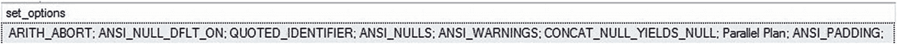

图 5-1
SET 选项查询结果

```sql
SELECT dbo.fn_QueryStoreSetOptions(CAST(set_options as int))
FROM sys.query_context_settings
清单 5-5
返回已执行查询的 SET 选项的查询
```

表 5-2 显示了 `sys.query_context_settings` 目录视图中所有列的名称、数据类型和描述。

表 5-2
sys.query_context_settings 的列列表和描述

| 列名 | 数据类型 | 描述 |
| --- | --- | --- |
| `context_settings_id` | `bigint` | 主键。此值用于 Showplan XML 查询中以供参考 |
| `set_options` | `varbinary(8)` | 反映 `SET` 选项的位掩码。位掩码的值通过以下方式计算：1 – `ANSI_PADDING`2 – Parallel Plan4 – `FORCEPLAN`8 – `CONCAT_NULL_YIELDS_NULL`16 – `ANSI_WARNINGS`32 – `ANSI_NULLS`64 – `QUOTED_IDENTIFIER`128 – `ANSI_NULL_DFLT_ON`256 – `ANSI_NULL_DFLT_OFF`512 – NoBrowseTable1024 – TriggerOneRow2048 – ResyncQuery4096 – `ARITH_ABORT`8192 – `NUMERIC_ROUNDABORT`16384 – `DATEFIRST`32768 – `DATEFORMAT`65536 – LanguageID131072 – `UPON`262144 – `ROWCOUNT` |
| `language_id` | `smallint` | 语言的 ID。可通过查询 `sys.languages` 表在线查找更多信息 |
| `date_format` | `smallint` | 日期格式。有关更多信息，请参阅 `SET DATEFORMAT` 命令 |
| `date_first` | `smallint` | 一周的第一天的值。有关更多信息，请参阅 `SET DATEFIRST` 命令 |
| `status` | `varbinary(2)` | 位掩码字段，指示执行查询的类型或上下文。值可以是以下十六进制标志的任意组合：0x0 – 常规查询（无特定标志）0x1 – 通过游标 API 的存储过程之一执行的查询 0x2 – 用于通知的查询 0x4 – 内部查询 0x8 – 未使用全局参数化的自动参数化查询 0x10 – 游标提取刷新查询 0x20 – 在游标更新请求中使用的查询 0x40 – 打开游标时返回初始结果集（游标自动提取）0x80 – 加密查询 0x100 – 在行级别安全谓词上下文中的查询 |
| `required_cursor_options` | `int` | 为游标指定的选项 |
| `acceptable_cursor_options` | `int` | SQL Server 可能隐式转换游标以支持语句执行的选项 |
| `merge_action_type` | `smallint` | 使用了 `MERGE` 语句触发器执行计划。有效值如下：0 – 无触发器或作为 `DELETE` 操作执行。1 – `INSERT` 计划。2 – `UPDATE` 计划。3 – 除 `INSERT` 或 `UPDATE` 操作外的 `DELETE` 计划 |
| `default_schema_id` | `int` | 默认架构的 ID，用于解析未完全限定的名称 |
| `is_replication_specific` | `bit` | 用于复制 |
| `is_contained` | `varbinary(1)` | 1 表示包含的数据库 |

### sys.query_store_plan

`sys.query_store_plan` 目录视图存储查询存储中每个查询关联的查询计划。此目录视图中最重要的列是 `query_plan` 列，因为它显示了为查询存储的执行计划。你可以将其复制粘贴到你选择的编辑器中，保存为 `.sqlplan` 扩展名，并使用 SSMS 打开以查看图形化的执行计划。另外两个有趣的列是 `engine_version` 和 `compatibility_level` 列。`engine_version` 列让我们知道捕获查询计划时运行的 SQL Server 确切版本。这对于排查因升级导致的计划回归很有用。`compatibility_level` 列告诉查询是在哪个兼容级别下运行的。这在升级时也很有用，特别是当从低于 SQL Server 2014 的兼容级别升级到 SQL Server 2014 及以上时，因为 SQL Server 2014 中进行了基数估计器 (CE) 的更改。表 5-3 显示了 `sys.query_store_plan` 目录视图中所有列的名称、数据类型和描述。

表 5-3
sys.query_store_plan 的列列表和描述


#### 注意事项

使用 `datetimeoffset` 数据类型进行查询时，你需要指定数据生成时所在的时区，才能看到其生成时的数据，因为此数据类型中的所有数据均以 **UTC** 时间存储。

### sys.query_store_query

所有已执行查询的度量指标都存储在此目录视图中。目录视图中的数据存储在 SQL 语句级别。批处理在目录视图中被拆分为多个语句，以便更好地进行故障排除。目录视图中的大多数列是用于编译和绑定语句执行计划的指标。此目录视图中值得注意的是 `object_id` 列。此列允许你将语句关联回其存储过程、函数或触发器。表 5-4 展示了 `sys.query_store_query` 目录视图中所有列的名称、数据类型和描述。

**表 5-4: sys.query_store_query 的列列表与描述**

| 列名 | 数据类型 | 描述 |
| --- | --- | --- |
| `query_id` | `bigint` | 主键 |
| `query_text_id` | `bigint` | 指向 `sys.query_store_query_text` 的外键。参见表 5-5 |
| `context_settings_id` | `bigint` | 指向 `sys.query_context_settings` 的外键。参见表 5-2 |
| `object_id` | `bigint` | 数据库对象的 ID。对于即席查询，值将为 0 |
| `batch_sql_handle` | `varbinary(64)` | 该查询所属的语句批处理的 ID。仅当查询引用临时表或表变量时才会填充 |
| `query_hash` | `binary(8)` | 查询的 MD5 哈希值（包括优化器提示） |
| `is_internal_query` | `bit` | 该查询是内部生成的 |
| `query_paramterization_type` | `tinyint` | 参数化种类：0 – 无，1 – 用户，2 – 简单，3 – 强制 |
| `query_paramterization_type_desc` | `nvarchar(60)` | 参数化类型的文本描述 |
| `initial_compile_start_time` | `datetimeoffset` | 初始编译开始时间 |
| `last_compile_start_time` | `datetimeoffset` | 上次编译开始时间 |
| `last_execution_time` | `datetimeoffset` | 上次执行时间 |
| `last_compile_batch_sql_handle` | `varbinary(64)` | 该查询的上次 SQL 批处理句柄。可与 `sys.dm_exec_sql_text` 结合使用以获取批处理的完整文本 |
| `last_compile_batch_offset_start` | `bigint` | 上次编译批处理行起始偏移量 |
| `last_compile_batch_offset_end` | `bigint` | 上次编译批处理行结束偏移量 |
| `count_compiles` | `bigint` | 编译次数 |
| `avg_compile_duration` | `float` | 平均编译时长（微秒） |
| `last_compile_duration` | `bigint` | 上次编译时长（微秒） |
| `avg_bind_duration` | `float` | 平均绑定时长（微秒） |
| `last_bind_duration` | `bigint` | 上次绑定时长（微秒） |
| `avg_bind_cpu_time` | `float` | 平均绑定 CPU 时间（微秒） |
| `last_bind_cpu_time` | `bigint` | 上次绑定 CPU 时间（微秒） |
| `avg_optimize_duration` | `float` | 平均优化时长（微秒） |
| `last_optimize_duration` | `bigint` | 上次优化时长（微秒） |
| `avg_optimize_cpu_time` | `float` | 平均优化 CPU 时间（微秒） |
| `last_optimize_cpu_time` | `bigint` | 上次优化 CPU 时间（微秒） |
| `avg_compile_memory_kb` | `float` | 平均编译内存（KB） |
| `last_compile_memory_kb` | `bigint` | 上次编译内存（KB） |
| `max_compile_memory_kb` | `bigint` | 最大编译内存（KB） |
| `is_clouddb_internal_query` | `bit` | 在本地实例上始终为 0 |

（续表）

| 列名 | 数据类型 | 描述 |
| --- | --- | --- |
| `plan_id` | `bigint` | 主键 |
| `query_id` | `bigint` | 指向 `sys.query_store_query` 的外键。参见表 5-4 |
| `plan_group_id` | `bigint` | 计划组的 ID。通常为游标查询创建多个计划。同一组将包含填充和提取计划 |
| `engine_version` | `nvarchar(32)` | 编译计划所基于的 SQL Server 版本，格式为“主版本.次版本.生成.修订” |
| `compatibility_level` | `smallint` | 查询运行时数据库的兼容级别 |
| `query_plan_hash` | `varbinary(8)` | 查询计划的 MD5 哈希值 |
| `query_plan` | `nvarchar(max)` | 查询计划的 Showplan XML |
| `is_online_index_plan` | `bit` | 指示该计划是否用于在线索引重建期间 |
| `is_trivial_plan` | `bit` | 该计划是一个平凡计划 |
| `is_parallel_plan` | `bit` | 该计划是并行计划 |
| `is_forced_plan` | `bit` | 该计划是使用存储过程 `sys.sp_query_store_forced_plan` 标记的强制计划。计划强制不保证将使用此确切计划。查询会编译并将新编译的计划与强制的计划进行比较。如果匹配失败，`force_failure_count` 列会递增，`last_force_failure_reason` 列将记录原因 |
| `is_natively_compiled` | `bit` | 该计划包含原生编译的内存优化过程。有效值如下：0 – 假，1 – 真 |
| `force_failure_count` | `bigint` | 强制此计划失败的次数 |
| `last_force_failure_reason` | `int` | 上次计划强制失败的原因。有效值如下：0 – 无失败，8637 – ONLINE_INDEX_BUILD，8683 – INVALID_STARJOIN，8684 – TIME_OUT，8689 – NO_DB，8690 – HINT_CONFLICT，8691 – SETOPT_CONFLICT，8694 – DQ_NO_FORCING_SUPPORTED，8698 – NO_PLAN，8712 – NO_INDEX，8713 – VIEW_COMPILE_FAILED，<其他值> – GENERAL_FAILURE |
| `last_force_failure_reason_desc` | `nvarchar(128)` | 上次强制计划失败的描述。有效值如下：ONLINE_INDEX_BUILD – 查询尝试修改数据时，该表正在进行在线重建，INVALID_STARJOIN – 包含无效的 StarJoin，TIME_OUT – 优化器在允许的操作数内未能找到强制计划，HINT_CONFLICT – 查询提示冲突导致查询无法编译，DQ_NO_FORCING_SUPPORTED – 计划与使用分布式查询或全文操作冲突，NO_PLAN – 无法验证强制计划，因此查询处理器未生成查询计划，NO_INDEX – 计划中指定的索引不再存在，VIEW_COMPILE_FAILED – 计划中引用的索引视图存在问题，GENERAL_FAILURE – 一般强制错误 |
| `count_compiles` | `bigint` | 编译次数 |
| `initial_compile_start_time` | `datetimeoffset` | 初始编译开始时间 |
| `last_compile_start_time` | `datetimeoffset` | 上次编译开始时间 |
| `last_execution_time` | `datetimeoffset` | 上次执行时间 |
| `avg_compile_duration` | `float` | 平均编译时长 |
| `last_compiled_duration` | `bigint` | 上次编译时长 |
| `plan_forcing_type` | `int` | 计划强制类型：0 – NONE，1 – MANUAL，2 – AUTO |
| `plan_forcing_type_desc` | `nvarchar(60)` | `plan_forcing_type` 的文本描述：NONE – 无计划强制，MANUAL – 用户强制计划，AUTO – 自动调优强制计划 |


### sys.query_store_query_text

`sys.query_store_query_text` 目录视图包含 SQL 语句的查询文本，需要与 `sys.query_store_query` 目录视图联接以获取语句级别而非批处理级别的数据。使用 `sys.query_store_query` 中的 `object_id`，我们在清单 5-6 中通过用对象名替换占位符 `<object_name>` 来查询对象的所有语句。

```sql
SELECT *
FROM sys.query_store_query_text qt
INNER JOIN sys.query_store_query q
ON q.query_text_id = qt.query_text_id
INNER JOIN sys.objects o on o.object_id = q.object_id
WHERE o.name = ''
Listing 5-6
Retrieve statements for an object
```

表 5-5 显示了 `sys.query_store_query_text` 目录视图中所有列的名称、数据类型和描述。

表 5-5

sys.query_store_query_text 的列清单和描述

| 列名 | 数据类型 | 描述 |
| --- | --- | --- |
| `query_text_id` | `bigint` | 主键 |
| `query_sql_text` | `nvarchar(max)` | 用户提供的查询 SQL 文本 |
| `statement_sql_handle` | `varbinary(64)` | 查询的 SQL 句柄 |
| `is_part_of_encrypted_module` | `bit` | 指示查询是否属于加密模块的一部分 |
| `has_restricted_text` | `bit` | 指示查询文本是否包含密码或其他不可提及的词 |

### sys.query_store_wait_stats

`sys.query_store_wait_stats` 目录视图是在 SQL Server 2017 中引入到查询存储器的，它让我们能深入了解每个查询在执行时的等待情况。在清单 5-7 中，您可以看到通过为 `<object_name>` 替换值来收集的对象中语句的等待统计信息摘要。

```sql
SELECT *
FROM sys.query_store_query_text qt
INNER JOIN sys.query_store_query q
ON q.query_text_id = qt.query_text_id
INNER JOIN sys.objects o on o.object_id = q.object_id
INNER JOIN sys.query_store_plan p
ON p.query_id = q.query_id
INNER JOIN sys.query_store_wait_stats ws
ON ws.plan_id = p.plan_id
WHERE o.name = ''
Listing 5-7
Wait stats for statements in an object
```

下表 5-6 是 `sys.query_store_wait_stats` 目录视图中所有列的名称、数据类型和描述。

表 5-6

sys.query_store_wait_stats 的列清单和描述

| 列名 | 数据类型 | 描述 |
| --- | --- | --- |
| `wait_stats_id` | `bigint` | 行标识符，表示 `plan_id`、`runtime_stats_interval_id`、`execution_type` 和 `wait_category` 的等待统计信息。它仅在过去的运行时统计信息区间内唯一。对于当前活动的区间，可能存在代表刷到磁盘的一行统计信息的多行，以及可能仍在内存中数据的多行 |
| `plan_id` | `bigint` | 指向 `sys.query_store_plan` 的外键。请参考表 5-3 |
| `runtime_stats_interval_id` | `bigint` | 指向 `sys.query_store_runtime_stats_interval` 的外键。请参考表 5-8 |
| `wait_category` | `tinyint` | 表示等待时间聚合到的类别。请参考表 5-7 获取等待统计信息类型映射和有效值 |
| `wait_category_desc` | `nvarchar(128)` | 等待统计信息类别的描述。请参考表 5-7 获取等待统计信息类型映射和有效值 |
| `execution_type` | `tinyint` | 确定查询执行的类型。有效值如下：0 – 常规执行：成功 3 – 客户端中止执行 4 – 异常中止执行 |
| `execution_type_desc` | `nvarchar(128)` | execution_type 字段的文本描述。有效值如下：0 – 常规 3 – 中止 4 – 异常 |
| `total_query_wait_time_ms` | `bigint` | 聚合区间内的总 CPU 等待时间（毫秒） |
| `avg_query_wait_time_ms` | `float` | 聚合区间内每次执行的平均 CPU 等待持续时间（毫秒） |
| `last_query_wait_time_ms` | `bigint` | 聚合区间内最后一次 CPU 等待持续时间（毫秒） |
| `min_query_wait_time_ms` | `bigint` | 聚合区间内最小 CPU 等待时间（毫秒） |
| `max_query_wait_time_ms` | `bigint` | 聚合区间内最大 CPU 等待时间（毫秒） |
| `stdev_query_wait_time_ms` | `float` | 聚合区间内 CPU 等待时间的标准差（毫秒） |

等待统计信息分为 23 个类别，可以在表 5-7 中找到列表，其中列出了哪些等待统计信息属于每个类别。

表 5-7

等待统计信息类别映射表

| 等待统计信息 ID | 等待统计信息类别描述 | 该类别中包含的等待统计信息类型 |
| --- | --- | --- |
| 0 | 未知 | Unknown |
| 1 | CPU | `SOS_SCHEDULER_YIELD` |
| 2 | 工作线程 | `THREADPOOL` |
| 3 | 锁 | `LCK_M_%` |
| 4 | 闩锁 | `LATCH_%` |
| 5 | 缓冲区闩锁 | `PAGELATCH_%` |
| 6 | 缓冲区 I/O | `PAGEIOLATCH_%` |
| 7 | 编译^* | `RESOURCE_SEMAPHORE_QUERY_COMPILE` |
| 8 | SQL CLR | `CLR%`, `SQLCLR%` |
| 9 | 镜像 | `DBMIRROR%` |
| 10 | 事务 | `XACT%`, `DTC%`, `TRAN_MARKLATCH_%`, `MSQL_XACT_%`, `TRANSACTION_MUTEX` |
| 11 | 空闲 | `SLEEP_%`, `LAZYWRITER_SLEEP`, `SQLTRACE_BUFFER_FLUSH`, `SQLTRACE_INCREMENTAL_FLUSH_SLEEP`, `SQLTRACE_WAIT_ENTRIES`, `FT_IFTS_SCHEDULER_IDLE_WAIT`, `XE_DISPATCHER_WAIT`, `REQUEST_FOR_DEADLOCK_SEARCH`, `LOGMGR_QUEUE`, `ONDEMAND_TASK_QUEUE`, `CHECKPOINT_QUEUE`, `XE_TIMER_EVENT` |
| 12 | 抢占式 | `PREEMPTIVE_%` |
| 13 | Service Broker | `BROKER_%` (但不包括 `BROKER_RECEIVE_WAITFOR`) |
| 14 | 事务日志 I/O | `LOGMGR`, `LOGBUFFER`, `LOGMGR_RESERVE_APPEND`, `LOGMGR_FLUSH`, `LOGMGR_PMM_LOG`, `CHKPT`, `WRITELOGF` |
| 15 | 网络 I/O | `ASYNC_NETWORK_IO`, `NET_WAITFOR_PACKET`, `PROXY_NETWORK_IO`, `EXTERNAL_SCRIPT_NETWORK_IOF` |
| 16 | 并行 | `CXPACKET`, `EXCHANGE` |
| 17 | 内存 | `RESOURCE_SEMAPHORE`, `CMEMTHREAD`, `CMEMPARTITIONED`, `EE_PMOLOCK`, `MEMORY_ALLOCATION_EXT`, `RESERVED_MEMORY_ALLOCATION_EXT`, `MEMORY_GRANT_UPDATE` |
| 18 | 用户等待 | `WAITFOR`, `WAIT_FOR_RESULTS`, `BROKER_RECEIVE_WAITFOR` |
| 19 | 跟踪 | `TRACEWRITE`, `SQLTRACE_LOCK`, `SQLTRACE_FILE_BUFFER`, `SQLTRACE_FILE_WRITE_IO_COMPLETION`, `SQLTRACE_FILE_READ_IO_COMPLETION`, `SQLTRACE_PENDING_BUFFER_WRITERS`, `SQLTRACE_SHUTDOWN`, `QUERY_TRACEOUT`, `TRACE_EVTNOTIFF` |
| 20 | 全文搜索 | `FT_RESTART_CRAWL`, `FULLTEXT GATHERER`, `MSSEARCH`, `FT_METADATA_MUTEX`, `FT_IFTSHC_MUTEX`, `FT_IFTSISM_MUTEX`, `FT_IFTS_RWLOCK`, `FT_COMPROWSET_RWLOCK`, `FT_MASTER_MERGE`, `FT_PROPERTYLIST_CACHE`, `FT_MASTER_MERGE_COORDINATOR`, `PWAIT_RESOURCE_SEMAPHORE_FT_PARALLEL_QUERY_SYNC` |
| 21 | 其他磁盘 I/O | `ASYNC_IO_COMPLETION`, `IO_COMPLETION`, `BACKUPIO`, `WRITE_COMPLETION`, `IO_QUEUE_LIMIT`, `IO_RETRY` |
| 22 | 复制 | `SE_REPL_%`, `REPL_%`, `HADR_%` (但不包括 `HADR_THROTTLE_LOG_RATE_GOVERNOR`), `PWAIT_HADR_%`, `REPLICA_WRITES`, `FCB_REPLICA_WRITE`, `FCB_REPLICA_READ`, `PWAIT_HADRSIM` |
| 23 | 日志速率调节器 | `LOG_RATE_GOVERNOR`, `POOL_LOG_RATE_GOVERNOR`, `HADR_THROTTLE_LOG_RATE_GOVERNOR`, `INSTANCE_LOG_RATE_GOVERNOR` |

^(***) *当前不支持。*


### sys.query_store_runtime_stats

`sys.query_store_runtime_stats` 目录视图包含 Query Store 已存储的所有计划的运行时统计信息，并按 `runtime_stats_interval_id` 聚合。它收集的统计数据包括持续时间、CPU、逻辑 IO、物理 IO、CLR、DOP（并行度）、查询最大使用内存、行数的平均值、最后值、最小值、最大值和标准差，对于 Azure SQL Database 还包括日志字节数。除了等待统计信息目录视图外，这个目录视图是获取最多数据的地方。列表 5-8 将返回过去一小时内最后执行时间在过去一小时内按平均持续时间排名前 10 的查询。

```sql
SELECT TOP 10 sum(rs.count_executions * rs.avg_duration) avg_duration,
qt.query_sql_text,
q.query_id,
qt.query_text_id,
p.plan_id,
rs.last_execution_time
FROM sys.query_store_query_text AS qt
INNER JOIN sys.query_store_query AS q
ON qt.query_text_id = q.query_text_id
INNER JOIN sys.query_store_plan AS p
ON q.query_id = p.query_id
INNER JOIN sys.query_store_runtime_stats AS rs
ON p.plan_id = rs.plan_id
WHERE rs.last_execution_time > DATEADD(hour, -1, GETUTCDATE())
GROUP BY qt.query_sql_text,
q.query_id,
qt.query_text_id,
p.plan_id,
rs.last_execution_time
ORDER BY avg_duration DESC;
```
列表 5-8
过去一小时内按平均持续时间排名前 10 的查询

表 5-9 显示了 `sys.query_store_runtime_stats` 目录视图中所有列的名称、数据类型和描述。

表 5-9

sys.query_runtime_stats_interval 的列列表和描述

| 列名 | 数据类型 | 描述 |
| --- | --- | --- |
| runtime_stats_interval_id | bigint | 主键。 |
| start_time | datetimeoffset | 时间间隔的开始时间。 |
| end_time | datetimeoffset | 时间间隔的结束时间。 |
| comment | nvarchar(32) | 始终为 NULL。 |

表 5-8

sys.query_store_runtime_stats 的列列表和描述


### 查询存储运行时统计信息

`sys.query_store_runtime_stats` 系统视图记录查询计划在聚合时间间隔内的运行时执行统计信息。

| 列名 | 数据类型 | 描述 |
| --- | --- | --- |
| `runtime_stats_id` | `Bigint` | 表示运行时执行统计信息的行标识符，对应 `plan_id`、`execution_type` 和 `runtime_stats_interval_id`。它仅对过去的运行时统计信息间隔唯一。对于当前活动的间隔，可能有多行代表一行统计信息被刷新到磁盘，以及可能有多行数据仍保存在内存中。 |
| `plan_id` | `Bigint` | 指向 `sys.query_store_plan` 的外键，参考表 5-3。 |
| `runtime_stats_interval_id` | `Bigint` | 指向 `sys.query_store_runtime_stats_interval` 的外键，参考表 5-9。 |
| `execution_type` | `tinyint` | 确定查询执行的类型。有效值如下：`0` – 常规执行：成功；`3` – 客户端中止执行；`4` – 异常中止执行。 |
| `execution_type_desc` | `nvarchar(128)` | `execution_type` 字段的文本描述。有效值如下：`0` – 常规；`3` – 中止；`4` – 异常。 |
| `first_execution_time` | `datetimeoffset` | 查询计划在聚合间隔内的首次执行时间。 |
| `last_execution_time` | `datetimeoffset` | 查询计划在聚合间隔内的上次执行时间。 |
| `count_executions` | `bigint` | 查询计划在聚合间隔内的总执行次数。 |
| `avg_duration` | `float` | 查询计划在聚合间隔内的平均持续时间，单位为微秒。 |
| `last_duration` | `bigint` | 查询计划在聚合间隔内的上次持续时间，单位为微秒。 |
| `min_duration` | `bigint` | 查询计划在聚合间隔内的最小持续时间，单位为微秒。 |
| `max_duration` | `bigint` | 查询计划在聚合间隔内的最大持续时间，单位为微秒。 |
| `stdev_duration` | `float` | 查询计划在聚合间隔内持续时间的偏差，单位为微秒。 |
| `avg_cpu_time` | `float` | 查询计划在聚合间隔内的平均 CPU 时间，单位为微秒。 |
| `last_cpu_time` | `bigint` | 查询计划在聚合间隔内的上次 CPU 时间，单位为微秒。 |
| `min_cpu_time` | `bigint` | 查询计划在聚合间隔内的最小 CPU 时间，单位为微秒。 |
| `max_cpu_time` | `bigint` | 查询计划在聚合间隔内的最大 CPU 时间，单位为微秒。 |
| `stdev_cpu_time` | `float` | 查询计划在聚合间隔内 CPU 时间的偏差，单位为微秒。 |
| `avg_logical_io_reads` | `float` | 查询计划在聚合间隔内的平均逻辑 IO 读取次数，单位为 8KB 页。 |
| `last_logical_io_reads` | `bigint` | 查询计划在聚合间隔内的上次逻辑 IO 读取次数，单位为 8KB 页。 |
| `min_logical_io_reads` | `bigint` | 查询计划在聚合间隔内的最小逻辑 IO 读取次数，单位为 8KB 页。 |
| `max_logical_io_reads` | `bigint` | 查询计划在聚合间隔内的最大逻辑 IO 读取次数，单位为 8KB 页。 |
| `stdev_logical_io_reads` | `float` | 查询计划在聚合间隔内逻辑 IO 读取次数的偏差，单位为 8KB 页。 |
| `avg_logical_io_writes` | `float` | 查询计划在聚合间隔内的平均逻辑 IO 写入次数。 |
| `last_logical_io_writes` | `bigint` | 查询计划在聚合间隔内的上次逻辑 IO 写入次数。 |
| `min_logical_io_writes` | `bigint` | 查询计划在聚合间隔内的最小逻辑 IO 写入次数。 |
| `max_logical_io_writes` | `bigint` | 查询计划在聚合间隔内的最大逻辑 IO 写入次数。 |
| `stdev_logical_io_writes` | `float` | 查询计划在聚合间隔内逻辑 IO 写入次数的偏差。 |
| `avg_physical_io_reads` | `float` | 查询计划在聚合间隔内的平均物理 IO 读取次数，单位为 8KB 页。 |
| `last_physical_io_reads` | `bigint` | 查询计划在聚合间隔内的上次物理 IO 读取次数，单位为 8KB 页。 |
| `min_physical_io_reads` | `bigint` | 查询计划在聚合间隔内的最小物理 IO 读取次数，单位为 8KB 页。 |
| `max_physical_io_reads` | `bigint` | 查询计划在聚合间隔内的最大物理 IO 读取次数，单位为 8KB 页。 |
| `stdev_physical_io_reads` | `float` | 查询计划在聚合间隔内物理 IO 读取次数的偏差，单位为 8KB 页。 |
| `avg_clr_time` | `float` | 查询计划在聚合间隔内的平均 CLR 时间，单位为微秒。 |
| `last_clr_time` | `bigint` | 查询计划在聚合间隔内的上次 CLR 时间，单位为微秒。 |
| `min_clr_time` | `bigint` | 查询计划在聚合间隔内的最小 CLR 时间，单位为微秒。 |
| `max_clr_time` | `bigint` | 查询计划在聚合间隔内的最大 CLR 时间，单位为微秒。 |
| `stdev_clr_time` | `float` | 查询计划在聚合间隔内 CLR 时间的偏差，单位为微秒。 |
| `avg_dop_time` | `float` | 查询计划在聚合间隔内的平均 DOP（并行度），单位为微秒。 |
| `last_dop_time` | `bigint` | 查询计划在聚合间隔内的上次 DOP，单位为微秒。 |
| `min_dop_time` | `bigint` | 查询计划在聚合间隔内的最小 DOP，单位为微秒。 |
| `max_dop_time` | `bigint` | 查询计划在聚合间隔内的最大 DOP，单位为微秒。 |
| `stdev_dop_time` | `float` | 查询计划在聚合间隔内 DOP 的偏差，单位为微秒。 |
| `avg_query_max_used_memory` | `float` | 查询计划在聚合间隔内的平均内存授予量，单位为 8 KB 页。对于使用本机编译内存优化过程的查询，始终为 `0`。 |
| `last_query_max_used_memory` | `bigint` | 查询计划在聚合间隔内的上次内存授予量，单位为 8 KB 页。对于使用本机编译内存优化过程的查询，始终为 `0`。 |
| `min_query_max_used_memory` | `bigint` | 查询计划在聚合间隔内的最小内存授予量，单位为 8 KB 页。对于使用本机编译内存优化过程的查询，始终为 `0`。 |
| `max_query_max_used_memory` | `bigint` | 查询计划在聚合间隔内的最大内存授予量，单位为 8 KB 页。对于使用本机编译内存优化过程的查询，始终为 `0`。 |
| `stdev_query_max_used_memory` | `float` | 查询计划在聚合间隔内内存授予量的偏差，单位为 8 KB 页。对于使用本机编译内存优化过程的查询，始终为 `0`。 |
| `avg_rowcount` | `float` | 查询计划在聚合间隔内平均返回的行数。 |
| `last_rowcount` | `bigint` | 查询计划在聚合间隔内上次返回的行数。 |
| `min_rowcount` | `bigint` | 查询计划在聚合间隔内返回的最小行数。 |
| `max_rowcount` | `bigint` | 查询计划在聚合间隔内返回的最大行数。 |
| `stdev_rowcount` | `float` | 查询计划在聚合间隔内返回行数的偏差。 |
| `avg_log_bytes_used` | `float` | 查询计划在聚合间隔内平均使用的数据库日志字节数。**仅适用于 Azure SQL Database**。 |
| `last_log_bytes_used` | `bigint` | 查询计划在聚合间隔内上次使用的数据库日志字节数。**仅适用于 Azure SQL Database**。 |
| `min_log_bytes_used` | `bigint` | 查询计划在聚合间隔内使用的最小数据库日志字节数。**仅适用于 Azure SQL Database**。 |
| `max_log_bytes_used` | `bigint` | 查询计划在聚合间隔内使用的最大数据库日志字节数。**仅适用于 Azure SQL Database**。 |
| `stdev_log_bytes_used` | `float` | 查询计划在聚合间隔内使用的数据库日志字节数的偏差。**仅适用于 Azure SQL Database**。 |
| `avg_tempdb_space_used` | `float` | 查询平均使用的 tempdb 空间量。 |
| `last_tempdb_space_used` | `bigint` | 查询计划在聚合间隔内上次使用的 tempdb 空间量。 |
| `min_tempdb_space_used` | `bigint` | 查询计划在聚合间隔内使用的最小 tempdb 空间量。 |
| `max_tempdb_space_used` | `bigint` | 查询计划在聚合间隔内使用的最大 tempdb 空间量。 |
| `stdev_tempdb_space_used` | `float` | 查询计划在聚合间隔内使用的 tempdb 空间量的偏差。 |


## 6. Query Store 使用案例

Query Store 有多种不同的应用场景，本章将详细探讨这些用例。我们将讨论如何通过查看报告或目录视图，利用 Query Store 来确定数据库的正常工作负载，并观察与该基线相比的变化。为数据库建立基线是每位数据库管理员（DBA）的必备技能，而 Query Store 正是可为你提供数据库基线数据的工具。有时，你需要识别在之前的某个时间段内发生了什么。作为 DBA，你还必须排查性能不佳或性能回退的查询，Query Store 同样能为此提供所需数据。它可帮助你识别资源消耗最高的查询，从而了解如何提升 SQL Server 数据库的性能。在 SQL Server 升级到不同版本后，可以利用 Query Store 捕获查询，之后再更改每个数据库的兼容模式并修复任何回退的查询，从而稳定 SQL Server 数据库的升级过程。最后，我们将探讨如何使用 Query Store 跟踪临时工作负载并提升其性能。

### sys.query_store_runtime_stats_interval

`sys.query_store_runtime_stats_interval` 目录视图是最基础、最小的视图。它包含每个运行时统计间隔的开始和结束时间。统计信息收集间隔分为 1 分钟、5 分钟、10 分钟、15 分钟、30 分钟、1 小时和 1 天。有关如何配置此设置的更多信息，请参见第 3 章。表 5-9 展示了 `sys.query_store_runtime_stats_interval` 目录视图中所有列名、数据类型及其描述。

### 结论

要充分利用 Query Store，你需要理解各目录视图之间的关系，并根据不同的用例直接查询它们。所有关于 SQL Server 上运行情况的信息都包含在此处（取决于你的设置），并可根据你的规格进行自定义。数据已唾手可得，我们在第 4 章已探讨了如何以可视化方式查看这些数据，并将在第 10 章介绍一个用于检索数据的存储过程。

### 确定什么是正常工作负载

启用 Query Store 后，你会按照配置 Query Store 时指定的 `INTERVAL_LENGTH_MINUTES`（详见第 3 章）来收集数据。回顾一下这个配置选项：数据可以按 1、5、10、15、60 和 1440 分钟的间隔进行聚合。考虑到这些数据点，你可以让正常的工作负载在服务器上运行，然后查看第 4 章中讨论的报告，从图 6-1 所示的“整体资源消耗报告”开始。

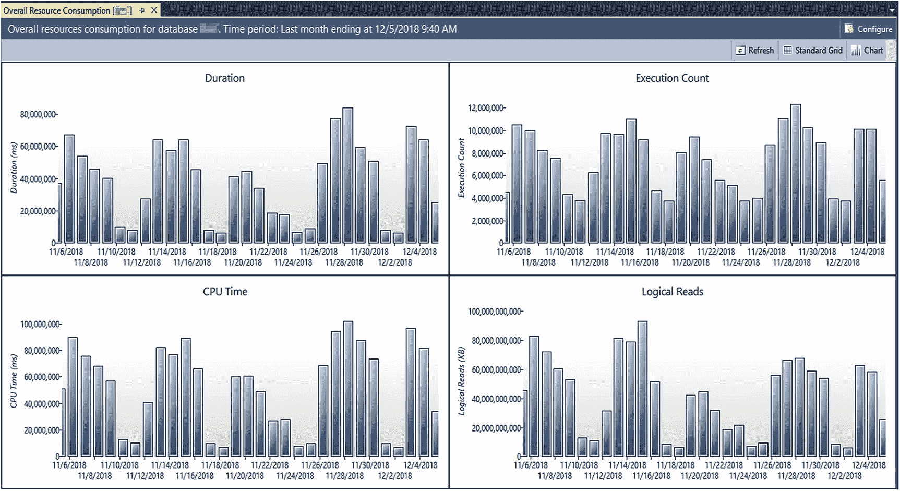

图 6-1：整体资源消耗报告

通过查看此报告，你可以确定数据库的正常工作负载是什么。从图 6-1 的报告中，你会注意到每周有两天活动量较低。这恰好对应周末，表明该数据库可能在周末活动较少、工作日活动较多的公司中使用。我们还可以注意到一种模式：在某些时段，持续时间和逻辑读取量高于正常水平。对于这些情况，你可以点击相应的柱状图，深入查看第 4 章讨论的“资源消耗最高的查询报告”，以诊断是哪些查询导致了这些异常模式，并判断这些工作负载是否需要你关注。

另一种获取数据的方式是查询第 5 章讨论的目录视图。清单 6-1 中的查询从目录视图中查询过去 10 天的数据，并按持续时间提取前 10 个查询。

```sql
SELECT TOP 10 qt.query_sql_text,
q.query_id,
so.name,
so.type,
SUM(rs.count_executions * rs.avg_duration)
AS 'Total Duration'
FROM sys.query_store_query_text qt
INNER JOIN sys.query_store_query q
ON qt.query_text_id = q.query_text_id
INNER JOIN sys.query_store_plan p
ON q.query_id = p.query_id
INNER JOIN sys.query_store_runtime_stats rs
ON p.plan_id = rs.plan_id
INNER JOIN sys.query_store_runtime_stats_interval rsi
ON rsi.runtime_stats_interval_id =
rs.runtime_stats_interval_id
INNER JOIN sysobjects so on so.id = q.object_id
WHERE rsi.start_time >= DATEADD(DAY, -10, GETUTCDATE())
GROUP BY qt.query_sql_text,
q.query_id,
so.name,
so.type
ORDER BY SUM(rs.count_executions * rs.avg_duration_time) DESC
```

清单 6-1：查询过去 10 天内按持续时间排序的顶级查询的 T-SQL

> **注意**
> 所有时间均以 UTC 时间存储，因此你需要调整查询以适应你的时区，才能使数据与你的时区完全匹配。

### 为查询建立基线

Query Store 使你能够为数据库中的查询建立基线。它将所有执行运行时统计信息存储在目录视图 `sys.query_store_runtime_stats` 中，因此你可以查询此视图，查看关于查询过去和当前执行情况的大量统计信息，以建立基线进行比较。但这并非你为服务器建立基线的唯一方式。

#### 什么是基线？

首先，我们来讨论基线是什么。基线是你在服务器上运行的工作负载，它为与同一工作负载的未来运行结果进行比较设定了一个起点。理论上，你会运行工作负载以对环境进行任何必要的更改（这些更改可能是代码或硬件更改），然后重新运行相同的工作负载，进行比较并查看哪些指标发生了变化。

#### 如何使用 Query Store 创建基线

在 Query Store 中建立基线涉及了解正在收集哪些数据以及何时收集。当你查看图 6-1 所示的“整体资源消耗报告”时，在开始工作负载以建立基线之前清空 Query Store 可能会很有帮助。第 3 章讨论了两种方法。一种是右键单击数据库，转到“属性”，然后选择“Query Store”选项卡。如图 6-2 所示，有一个“清除查询数据”选项，它将清除 Query Store 中的所有数据，以便你开始建立基线。请确保在运行工作负载之前，统计信息收集间隔足够短以收集你的数据，并且你无需在每个间隔之间等待太久才能运行下一个工作负载。

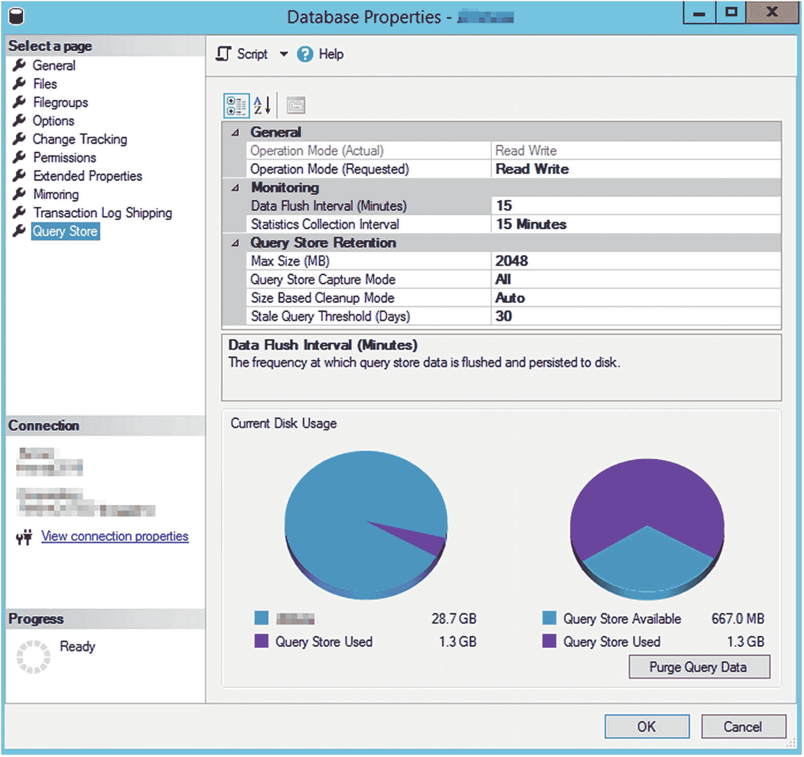

图 6-2：Query Store 的数据库属性

第二种方法是运行清单 6-2 中的存储过程。

```sql
USE []
GO
EXEC sys.sp_query_store_flush_db;
```

清单 6-2：清除 Query Store 中所有数据的存储过程

现在，我们有一个干净的起点来捕获工作负载数据。为了捕获工作负载以便日后重放，请打开 SQL Server Profiler，选择 `TSQL_Replay` 模板，并按照第 1 章讨论的方式创建服务器端跟踪。现在运行你的工作负载，让 Query Store 捕获工作负载中所有查询的数据，工作负载完成后停止跟踪。记下你运行基线工作负载的时间段以供将来比较。接下来，对要进行比较的代码或服务器进行更改。有关如何比较结果，请参阅下一节。


### 如何将工作负载与基线进行比较

将您的工作负载回溯比较的最佳方法是使用第 4 章中的报告。例如，如果您已将统计信息收集间隔设置为 15 分钟，那么您可以在下一个间隔之外运行您的工作负载，以收集用于比较的数据。确保您可以比较基线的基本步骤如下：

1.  运行您的工作负载以建立基线。
2.  应用您的更改。
3.  再次运行您的工作负载。
4.  通过查看 `Overall Resource Consumption Report`（总体资源消耗报告）并深入查看 `Top Consuming Resources Report`（资源消耗最多的报告）来比较结果，以检查可能受您更改影响的特定查询。
5.  然后，您可以决定是保留更改还是将其回滚。

### 查看昨晚发生了什么

一个常见的问题是，有人过来对你说，某某东西昨天凌晨 5 点运行得很慢，而如果没有启用任何跟踪，你根本不知道当时运行了什么。现在，借助 `Query Store`（查询存储），所有运行过的查询都会被记录下来，让你能够随时查看昨天运行了什么。通过查看 `Top Consuming Resources Report`（资源消耗最多的报告），您可以深入到特定的时间段，寻找当时运行缓慢的内容。您不仅可以识别哪些查询运行缓慢，还能看到是哪个查询导致了 CPU 尖峰或大量读取（如果有人抱怨 SAN 变慢了的话）。图 6-3 显示了您的配置选项，可根据您需要的时段以及您听到的问题指标来缩小范围，查看服务器上发生了什么。

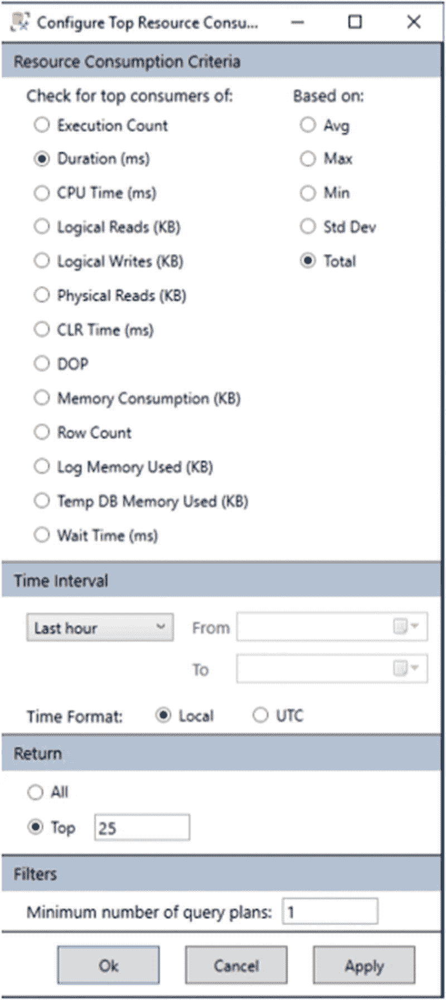

图 6-3. `Top Consuming Resources`（资源消耗最多的报告）配置屏幕。

### 故障排除回归查询

`Query Store`（查询存储）最强大的用例之一是能够识别性能已回归的查询。查询可能因各种原因导致性能回归，例如统计信息发生变化、数据基数发生变化、索引被创建、先前存在的索引可能被修改或删除等。在大多数情况下，`SQL Server` 中的 `Query Optimizer`（查询优化器）确实会选择更好的执行计划，但有时它不会，而 `Query Store` 提供了一种快速、简便的方法来查找这些查询。

#### 什么是回归查询？

回归查询是指由于系统上的更改（例如统计信息变化、数据基数变化、索引创建等）导致其性能发生变化的查询。这些更改导致生成了与之前不同的执行计划，而该计划的性能不如之前。在第 4 章中，我们探讨了 `Regressed Queries Report`（回归查询报告），它为您提供了一种快速识别回归查询的方法。

#### 查看计划变更

在 `Regressed Queries Report`（回归查询报告）中，您可以识别出具有两个计划的查询，并在顶部右窗格中选择两个计划后，使用右上角的 `compare plan`（比较计划）按钮。差异将以红色高亮显示，如图 6-4 所示。并且在图 6-5 中，您可以看到在计划中高亮显示的任何运算符之间有何差异。

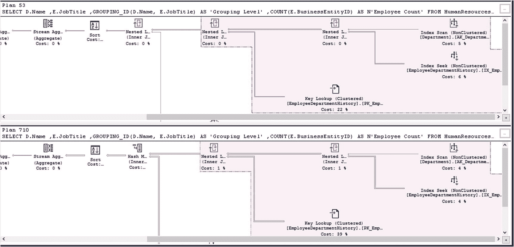

图 6-4. `Regressed Query`（回归查询）报告比较计划运算符差异。

图 4-24 中看到的差异用黄色高亮显示了一个不等于符号。

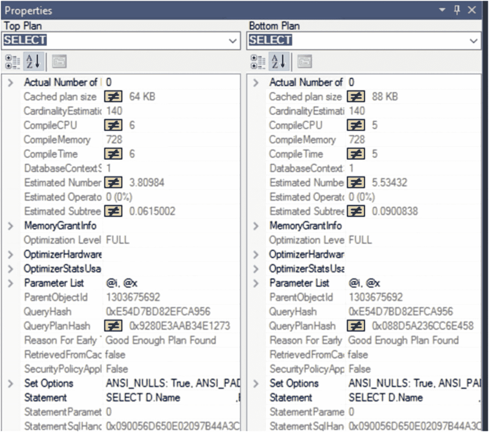

图 6-5. `Regressed Query`（回归查询）报告比较报告详情。

正如我们在第 4 章中所见，在查看具有多个计划的查询时，您可以从报告屏幕手动强制使用某个计划。如果您发现需要强制执行的计划，可以从报告中强制使用该计划并监控其性能。

### 识别资源消耗最多的查询

在第 4 章中，我们讨论了 `Top Consuming Resource Report`（资源消耗最多的报告），通过它您可以直观地看到在 `SQL Server` 数据库上哪些查询占用了最多的资源。在对 `SQL Server` 数据库上资源消耗最多的查询进行故障排除时，我们可以查看以下指标：

*   执行次数
*   持续时间（毫秒）（默认）
*   CPU 时间（毫秒）
*   逻辑读取（KB）
*   逻辑写入（KB）
*   物理读取（KB）
*   CLR 时间（毫秒）
*   DOP（并行度）
*   内存消耗（KB）
*   行数
*   日志内存使用量（KB）
*   Tempdb 内存使用量（KB）
*   等待时间（毫秒）

这些指标可以聚合为总计、平均值、最小值、最大值和标准差。在寻找资源消耗最多的查询时，总计是一个很好的起点。如果您看到 CPU 使用率很高，可以从查看 CPU 时间的总计开始。报告默认显示前 25 个查询及其执行计划。然后，您可以查看这些查询中是否有任何可以优化的地方，或者是否有可以强制执行的计划。

### 稳定 SQL Server 升级

`Query Store`（查询存储）的另一个巨大好处是帮助稳定 `SQL Server` 升级。每次 `SQL Server` 升级，由于查询优化器的更改，如果您更改了数据库的 `compatibility mode`（兼容性模式），都有可能导致查询回归。由于建议的最佳实践是在升级 `SQL Server` 时更改数据库的 `compatibility mode`（兼容性模式），以便您可以利用查询优化器增强功能和新的 `T-SQL` 函数，因此能够稳定 `SQL Server` 升级变得至关重要。此外，`SQL Server 2014` 对基数估算器进行了重大更改，在更改 `compatibility mode`（兼容性模式）时导致了一些查询回归。

#### 更改兼容性模式的影响

在 `SQL Server 2014` 之前，更改 `compatibility modes`（兼容性模式）不会影响查询优化器，因为 `compatibility mode`（兼容性模式）不会影响基数估算器，自 `SQL Server 7.0` 以来就没有发布过新的基数估算器。因此，通过更改 `compatibility modes`（兼容性模式）获得的唯一好处是查询优化器的任何增强以及新的 `T-SQL` 函数。

#### 基数估算变更解析

从 `SQL Server 2014` 版本开始，微软开始对基数估算器（`CE`）进行更改，这影响了查询估算返回行数的方式。在大多数情况下，查询在新 `CE` 下运行得更快，但一些查询出现了明显的性能回归。您唯一的办法是回滚 `compatibility mode`（兼容性模式）或使用跟踪标志来控制行为。

在 `SQL Server 2016` 中，微软引入了数据库范围配置，允许您在数据库级别控制 `MAXDOP`、`LEGACY_CARDINALITY ESTIMATION`、`PARAMETER_SNIFFING` 和 `QUERY_OPTIMIZER_HOTFIXES`。在此列表中，与我们讨论内容最相关的两个是 `LEGACY_CARDINALITY ESTIMATION` 和 `QUERY_OPTIMIZER_HOTFIXES`。如果您设置了 `LEGACY_CARDINALITY ESTIMATION`，无论数据库的 `compatibility level`（兼容级别）设置如何，它都将使用旧的 `CE`。这样做的好处是，您仍然可以在数据库中使用新的 `T-SQL` 函数，而不会出现查询回归。`QUERY_OPTIMIZER_HOTFIXES` 选项与设置跟踪标志 `4199` 相同，该标志激活通过新版本、补丁或 `CU` 引入引擎的所有查询优化器修复。在 `2016` 之前，您必须设置跟踪标志 `4199`，它适用于所有数据库，并且您没有简单的方法来故障排除和修复回归查询。


#### 使用查询存储测试和完成升级的过程

现在您已经了解了更改兼容性模式如何影响查询优化器和基数估算器，以及可能导致查询性能回退的原因，接下来让我们谈谈如何以最有效的方式升级 SQL Server，即使用查询存储在升级后稳定任何回退的查询。这一点在图 6-6 中得到了最佳说明。

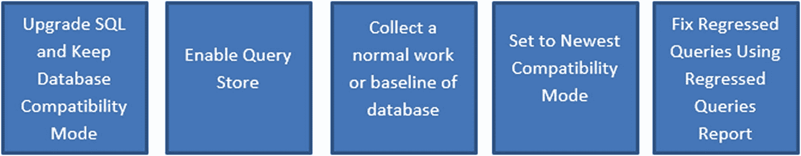

图 6-6 使用查询存储升级 SQL Server 的步骤

第一步是升级到 SQL Server 2016 或更高版本。接下来，您需要在数据库上启用查询存储。让您的工作负载在数据库上运行足够长的时间，以捕获良好的基线。然后，将数据库的兼容性模式设置为最新模式。最后，监控第 4 章中讨论的“性能回退查询”报告，查找您因性能回退而需要强制执行的查询计划。第 7 章涵盖了自动计划修正功能，从 SQL Server 2017 开始，查询存储会自动为您强制执行计划。详情请参见第 7 章。

### 查找和改进即席工作负载

最后，查询存储可用于查找您的即席查询并对其进行改进。如果您有大量即席查询，当您查看“消耗资源最多”报告时，您不会看到大量资源被执行次数大于一的查询所消耗。如果您的系统主要是即席工作负载，那么使用查询存储可能不是理想的方案，因为您发送的是不同的查询，它无法为您聚合数据或强制执行计划来帮助提高性能。当您的应用程序生成即席查询时，SQL Server 会花费时间为每一个执行的新查询进行编译，这会膨胀计划缓存，并消耗比查询已在计划缓存中时更多的资源。这也会导致查询存储膨胀，因为它将为每个查询存储不同的计划和聚合的运行时统计数据行。这还将导致清理查询存储的后台进程占用更多资源，以将空间维持在可以添加数据的水平。

除了使用“消耗资源最多”报告外，您还可以运行 T-SQL 来首先获取查询文本总数、查询总数和计划总数，然后比较 `query_hash` 和 `query_plan_hash` 以查找相似的即席查询，如清单 6-3 所示。

```sql
-- 总查询文本数
SELECT COUNT(*) AS CountQueryTextRows
FROM sys.query_store_query_text;
-- 总查询数
SELECT COUNT(*) AS CountQueryRows
FROM sys.query_store_query;
-- 总的不同查询哈希数（不同查询）
SELECT COUNT(DISTINCT query_hash) AS CountDifferentQueryRows
FROM  sys.query_store_query;
-- 总计划数
SELECT COUNT(*) AS CountPlanRows
FROM sys.query_store_plan;
-- 总的不同查询计划哈希数（不同计划）
SELECT COUNT(DISTINCT query_plan_hash) AS CountDifferentPlanRows
FROM sys.query_store_plan;
```

清单 6-3 用于检查即席工作负载的 T-SQL

如果您看到 `CountQueryRows` 和 `CountDifferentQueryRows` 或 `CountPlanRows` 和 `CountDifferentPlansRows` 之间存在差异，这表明有相似的查询在运行，如果您能控制应用程序代码，将它们编写为参数化形式（如存储过程）将会受益，这样它们就可以编译一次并存储在内存中，并在查询存储中高效存储。如果您无法管理应用程序代码，您还有两个其他选择。一是使用计划指南；清单 6-4 提供了计划指南的模板。

```sql
DECLARE @stmt nvarchar(max);
DECLARE @params nvarchar(max);
EXEC sp_get_query_template
N'',
@stmt OUTPUT,
@params OUTPUT;
EXEC sp_create_plan_guide
N'TemplateGuide1',
@stmt,
N'TEMPLATE',
NULL,
@params,
N'OPTION (PARAMETERIZATION FORCED)';
```

清单 6-4 用于实现 PARAMETERIZATION FORCED 计划指南的模板

或者，您可以使用清单 6-5 在数据库级别打开 `PARAMETERIZATION FORCED`。

```sql
ALTER DATABASE  SET PARAMETERIZATION FORCED;
```

清单 6-5 在数据库级别打开 PARATERIZATION FORCED

如果在清单 6-3 中，计数保持大致相同，那么您就不需要打开 `PARAMETERIZATION FORCED`。相反，您需要为查询存储启用 `optimize for ad hoc workloads` 并将 `QUERY_CAPTURE_MODE` 设置为 `AUTO`，而不是 `ALL`。参见清单 6-6 来设置这些选项。这将防止计划膨胀计划缓存，因为查询第一次执行时只会存储一个存根，在第二次执行时才会存储计划以供将来重用。`AUTO` 捕获模式将使查询存储不捕获那些消耗资源量微不足道的查询，以限制存储量。

```sql
EXEC sys.sp_configure N'show advanced options', N'1'
GO
RECONFIGURE WITH OVERRIDE
GO
EXEC sys.sp_configure N'optimize for ad hoc workloads', N'1'
GO
RECONFIGURE WITH OVERRIDE
GO
ALTER DATABASE [QueryStoreTest] SET QUERY_STORE CLEAR;
ALTER DATABASE [QueryStoreTest] SET QUERY_STORE = ON
(OPERATION_MODE = READ_WRITE, QUERY_CAPTURE_MODE = AUTO);
```

清单 6-6 为查询存储启用“优化即席工作负载”并将捕获模式设置为 AUTO

### 结论

在本章中，我们探讨了查询存储的几种用例。我们讨论了如何建立基线，以便您可以发现系统的正常性能并查看更改时发生的情况。然后我们讨论了如何查看昨晚或任何先前时间点发生的问题。接着我们讨论了什么是性能回退的查询，以及如何对它们进行故障排除并强制执行计划。之后，我们讨论了识别消耗资源最多的查询，以便您可以着手改进它们。接下来，我们研究了如何使用查询存储来稳定 SQL Server 的升级，以及为什么这是一个用于此目的的重要功能。最后，我们讨论了如何使用查询存储来改进您的即席工作负载。

## 7. 强制执行计划

虽然查询存储中收集的信息以及它告诉您有关系统性能的所有内容是您会更频繁使用的部分，但查询存储最强大的部分是强制执行计划的能力。计划强制执行是指编译或重新编译事件期间优化器所做的选择被您选择的计划所取代。查询存储在性能指标和执行计划之间提供了足够的信息，使您能够决定在某些情况下可以选择更优的执行计划。

本章将向您展示如何使用查询存储信息和报告来识别行为不良的执行计划。在识别出行为不良的计划后，我们将探讨如何使用查询存储中的信息来识别行为良好的计划（如果存在）。有了这些信息，我们就可以强制使用好的计划。

### 识别行为不佳的执行计划

执行计划（也称为查询计划或显示计划）是您洞察查询优化过程所做选择的窗口。它们展示了您的 `T-SQL`、索引、统计信息、表、列和约束如何构成您的数据库，以及数据库将如何利用这些结构来检索或修改存储其中的数据。阅读执行计划是一个非常深奥的话题。如需详细了解，您应阅读 Grant Fritchey（本书的合著者之一）所著的 *《执行计划》* 一书。在此，我们将探讨可能表明您的查询性能不佳的信息和报告。然后，我们将利用这些信息引导我们找到对应的执行计划。我们将介绍一些有助于您判断某个计划可能未能有效支持查询的标志，但不会涵盖阅读执行计划的所有细节。

首先，我们必须了解如何使用 `查询存储` 来识别那些既改变了其执行计划，又因此导致性能下降的查询。另一种识别性能不佳查询的方式是，当数据库的使用者提醒您存在性能问题时。但有了 `查询存储` 中的信息，我们可以采取更为主动的方式。

#### 识别性能回退的查询

当某个查询先前运行良好但现在表现不佳时，就发生了性能回退。有些查询可能从一开始就很糟糕，这类问题很容易识别和处理。有些查询随着系统中数据量的不断增加，性能会逐渐下降，这类问题也容易识别和处理。真正棘手的问题是那些原本运行良好，却突然（有时是间歇性地）变慢的查询。在 `查询存储` 出现之前，这类问题常常难以解决。

导致这些性能回退的原因多种多样。当您从早期版本的 `SQL Server` 迁移到后期版本时可能会遇到，这源于查询优化器工作方式的变化以及 `SQL Server` 2014 中引入的新的基数估算引擎。您也可能因为数据库统计信息不正确或过时而遇到性能回退。您还可能受到一个被称为“糟糕的参数探测”问题的困扰。

虽然不正确和过时的统计信息可能是查询性能回退最常见的原因，但讨论最多、也将在本章用作示例的问题，是糟糕的参数探测。让我们从解释什么是参数探测以及它如何有时引起问题开始。

当您有一个参数化查询时，无论是存储过程、来自 `ORM` 工具（如 `Entity Framework`）的参数化查询，还是 `sp_executesql` 中的参数，查询优化器在编译执行计划时都会使用传递给该参数的值。它获取这些确切的值，并用它们来查看所引用列或索引的统计信息，然后基于这些精确的值创建执行计划。这种对值的采样就是所谓的参数探测。大多数情况下，这是一种无害且通常非常有益的做法。然而，有时您会遇到这样一种情况：为一个特定的值创建的计划在紧接着的查询中执行得足够好。但是，所有其他使用同一个执行计划的查询却表现得非常糟糕。这种情况被称为糟糕的参数探测。

当您遇到一个原本运行良好的查询突然表现不佳的情况时，您可以利用 `查询存储` 中的信息来识别定义性能的查询指标，并查看查询在运行良好和运行不佳时的执行计划。您可以通过两种方式之一来实现。您可以针对 `查询存储` 中收集的数据运行 `T-SQL` 代码。或者，您可以使用 `回退查询` 报告。由于 `回退查询` 报告可能并不总是将给您带来问题的查询识别为回退查询，因此学会如何自己从 `查询存储` 数据中检索此信息是一个非常好的主意。

##### 从查询存储数据中识别回退查询

我们在第 2 章讨论了 `查询存储` 收集的信息。然后在第 5 章回顾了如何从 `查询存储` 目录视图中检索数据的基础知识。如果您不理解下面查询的操作，我建议您在进行本章之前，先回去复习那些章节。

首先，我们需要一个能够可靠地从中获取不同执行计划的查询。`Person.Address` 表中的数据分布使得在 `AdventureWorks` 数据库中，根据用于筛选 `City` 列的值，您可能会得到几种不同的执行计划。以下是我们将在本章剩余部分中用来探究行为的查询：

```sql
CREATE OR ALTER PROC [dbo].[AddressByCity] @City NVARCHAR(30)
AS
SELECT a.AddressID,
a.AddressLine1,
a.AddressLine2,
a.City,
sp.Name AS StateProvinceName,
a.PostalCode
FROM Person.Address AS a
JOIN Person.StateProvince AS sp
ON a.StateProvinceID = sp.StateProvinceID
WHERE a.City = @City;
GO
```

有了这个存储过程后，我们可以使用两个不同的值之一来执行查询，从而得到两个不同的执行计划。如果您在启用执行计划显示的情况下运行以下脚本，可以看到这两个计划。注意：出于测试目的，我们使用了一种清除过程缓存的简单方法。在生产系统上，这可能不是最佳方法：

```sql
EXEC dbo.AddressByCity @City = N'London';
ALTER DATABASE SCOPED CONFIGURATION CLEAR PROCEDURE_CACHE;
EXEC dbo.AddressByCity @City = N'Mentor';
```

这是参数探测导致不同执行计划的一个典型案例。每个计划都针对它返回的结果集进行了优化；对于值“London”返回 434 行，对于值“Mentor”返回 1 行。然而，每个计划都导致了对应相反数据集的糟糕性能。我这里的意思是，返回 434 行的计划在返回 434 行时运行得很快，但在仅返回少量行时，它的运行速度不如另一个计划快。反之亦然。事实上，当使用针对“Mentor”的计划来返回 434 行时，查询的运行速度会慢得多，以至于在 `回退查询` 报告中会被标记为回退查询。


### 回归查询报告

我们将在第 4 章详细讨论报告。不过，这里我们想展示`dbo.AddressByCity`存储过程在报告中的行为表现：

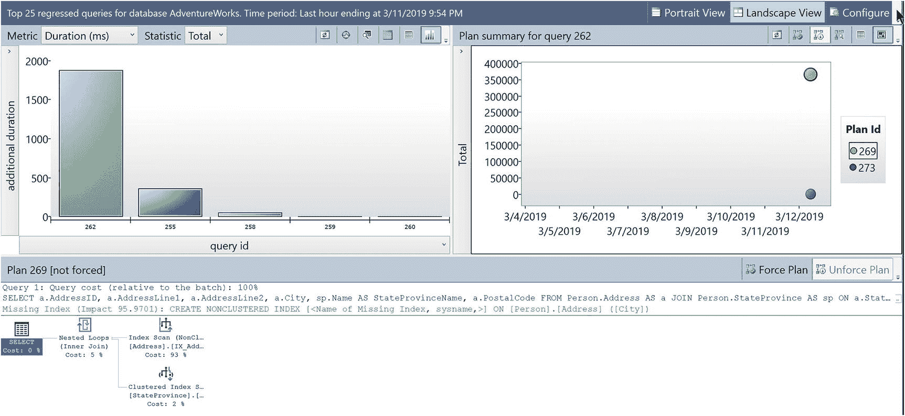

图 7-1

显示性能不佳的“回归查询”报告

左侧的第一个窗格是根据你所测量的指标（默认为持续时间）列出的查询。报告中的第二个窗格显示了查询执行速度和涉及的不同执行计划。点击其中一个点会改变底部窗格中显示的执行计划。将鼠标悬停在点上会显示它代表的执行次数、平均运行时长等信息。同样，有关使用报告的更多详细信息，请参见第 4 章。

你不能简单地运行上面的代码就得到一个回归查询。“回归查询”报告比较的是行为随时间的变化。因此，为了让报告生成，你必须在一段时间内多次运行代码。为了自己模拟这个场景，你可以运行以下脚本。你可能需要多次运行它才能使查询显示为回归查询，因为它需要在“查询存储”中有数据才能触发报告，并且必须显示出随时间推移的显著差异。不过，这个脚本会起作用：

```
--建立基线行为
EXEC dbo.AddressByCity @City = N'London';
GO 100
--从缓存中删除计划
ALTER DATABASE SCOPED CONFIGURATION CLEAR PROCEDURE_CACHE;
--编译一个新计划
EXEC dbo.AddressByCity @City = N'Mentor';
GO
--执行代码以显示查询回归
EXEC dbo.AddressByCity @City = N'London';
GO 100
```

你应该能在“回归查询”报告中看到该查询，并且它应该显示两个不同的执行计划，与图 7-1 相同。

#### 执行计划中的警示信号

回归查询行为是由执行计划的改变驱动的。本书没有篇幅涵盖阅读执行计划所需的所有知识。关于该主题的详细探讨，我们推荐 Grant Fritchey 的书*SQL Server 执行计划*（Redgate Press，2018）。但是，我们可以在执行计划中寻找一些警示信号作为快速指南。请理解，这些只会为你提供初步指导。你最终还是需要学习细节来阅读和理解执行计划中的信息。

以下是初次检查执行计划时需要关注的核心事项。

*   **First Operator**：关于计划本身的详细信息集合
*   **Most Costly Operator**：显示导致性能不佳最可能原因的最高估计成本
*   **Warnings and Errors**：优化过程中遇到的问题（如果有）
*   **Fat Pipes**：数据流的指示，更宽的管道显示更多的数据
*   **Scans**：指示大量数据移动
*   **Extra Operators**：你无法轻易解释其存在原因或功能的运算符
*   **Estimates vs. Actuals**：运算符的估计行数或执行次数与实际数量的比较

以下是你使用这些指南寻找的目标。我将使用给我们带来最大麻烦的执行计划，即值为“Mentor”的计划，如图 7-2 所示：

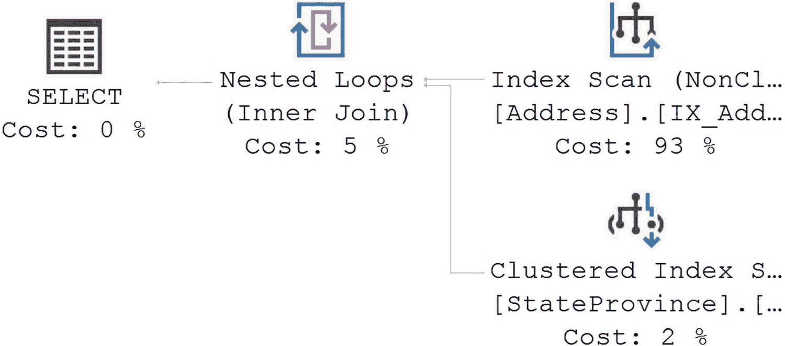

图 7-2

值为“Mentor”的执行计划

我们现在将按照这些路标来寻找有关此计划的信息。

##### First Operator

第一个运算符是任何计划最左边的那个。它通常会根据你的 T-SQL 执行的操作类型来标记：`SELECT`、`INSERT`、`UPDATE`和`DELETE`。右键单击该运算符并选择“属性”。你会看到类似图 7-3 的内容：

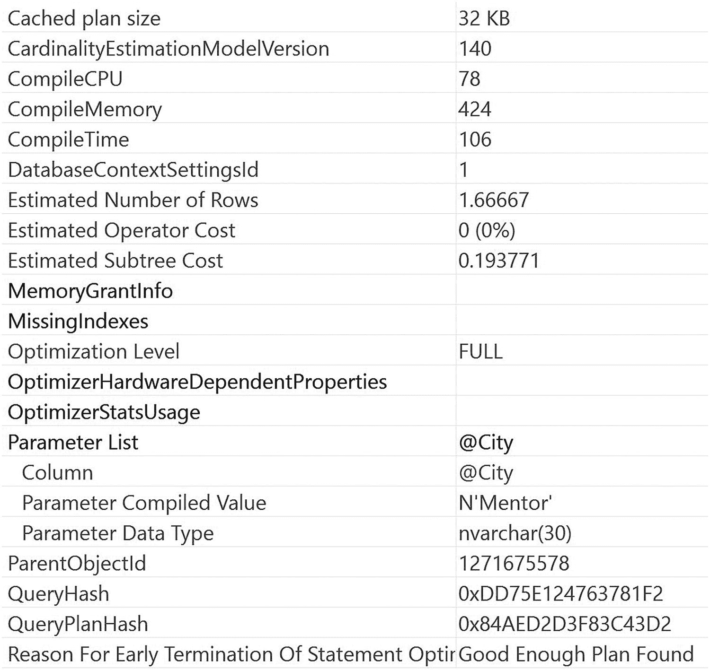

图 7-3

第一个运算符属性的部分列表

这只是通过执行计划的第一个运算符暴露的所有属性和信息的一部分。在查看计划回归时，你**很可能**会看到由数据或统计信息的变化，或参数嗅探引起的问题。在这种情况下，“参数列表”属性会显示用于编译执行计划的参数。你可以在图 7-3 中看到，此计划使用了值“Mentor”。

##### Most Costly Operator

图 7-2 中所示的计划非常简单且易于阅读。你可以快速发现`Index Scan`运算符占估计成本的 93%。这些成本是基于优化器内的计算，并不反映实际行为。然而，由于驱动成本的数字来源于你的代码、对象和统计信息中的行数，这是我们用来检查执行计划的一个值。高成本运算符可能指示问题所在。

##### Warnings and Errors

这些会显示为黄色警告标志或红色“X”。它们可能是影响执行计划行为的代码问题的指示器。在图 7-2 中没有这些。

##### Fat Pipes

连接运算符的箭头代表数据流。大管道反映大量数据流，而小管道代表少量数据流。寻找大管道以理解数据是如何移动的。你还需要寻找数据创建越来越多的过渡点，或者数据从磁盘移动后稍后被过滤的地方。这些可能是问题的强烈指标。

##### Scans

扫描（`Scan`）表示读取了整个表或索引以检索数据。这不一定是个问题；但是，它表明可能涉及大量 I/O，因此在评估执行计划时需要考虑。请注意，寻道（`Seek`），即扫描的反面，也可能根据计划的其余部分引起问题。像图 7-2 中的索引扫描（`Index Scan`）应该引导我们质疑该计划。我们有一个过滤到只有一行的数据集，但它却扫描了整个聚集索引来实现这一点。

##### Extra Operators

这个概念有点难以解释。如果你正在查看一个计划，但你无法解释某个运算符是什么，或者为什么使用某个运算符，那就应该引起你的注意。让我们看看图 7-4 中值为“London”的计划：

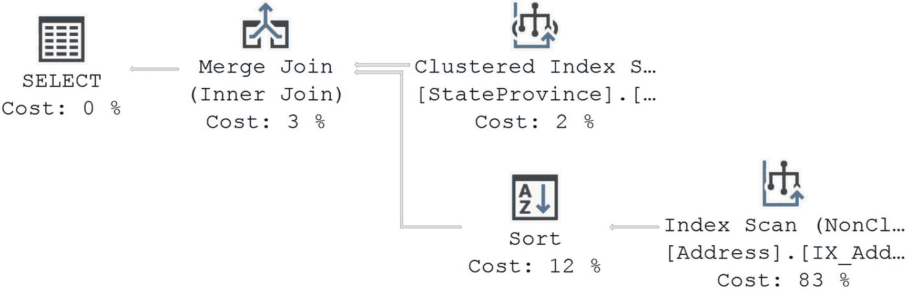

图 7-4

值为“London”的执行计划

在这个计划中，我们有一个`Index Scan`、一个`Clustered Index Scan`、一个`Merge Join`和一个`Sort`。当你考虑`dbo.AddressByCity`中的查询时，会注意到没有`ORDER BY`命令。因此，在这种情况下，`Sort`运算符是个谜，是一个额外的运算符。为什么我们有一个排序操作？答案是因为优化器认为对于较大的数据集，`Merge Join`更快。然而，`Merge Join`要求所有数据都是有序的。因此，添加了一个`Sort`运算符来满足`Merge Join`的需求。


#### 估计值与实际值

只有当你查看实际执行计划时，才能比较这些值。实际执行计划看起来与估计执行计划相同，但包含了额外的运行时指标。简而言之，要捕获实际执行计划，你必须执行查询。如果我们查看在使用“London”值执行查询后，“Mentor”值的执行计划，我们可以在图 7-5 中看到这个比较的实际应用：

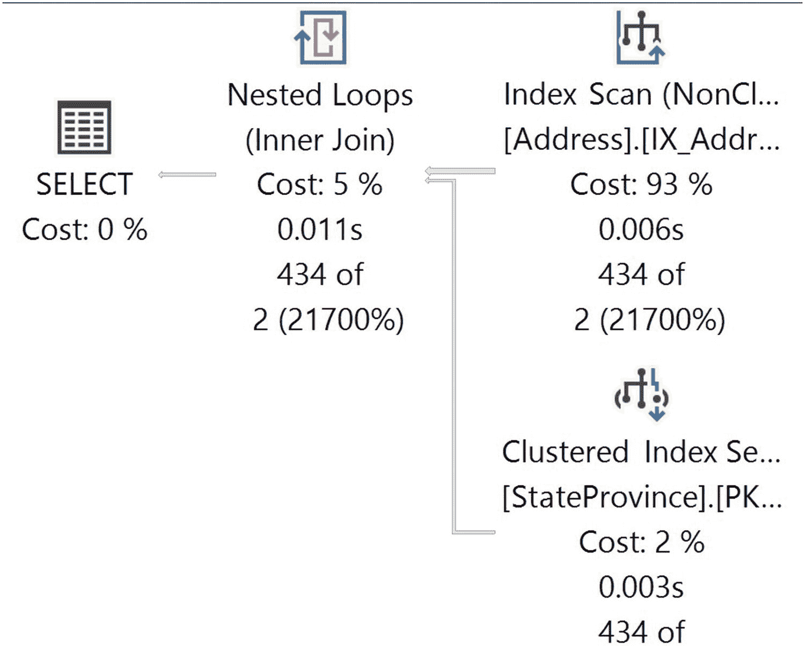

*图 7-5：估计值与实际值的比较*

这里我们看到的是估计值与实际值比较的一个例子，即每个运算符处理的行数。你可以看到，`嵌套循环`连接处理了 434 行，而它预期的只有 2 行。在这种情况下，估计行数是 2，但实际是 434。这种巨大的差异（21,700%）可能是导致性能不佳的一个指标。

即使有了这些查看执行计划的指南，你仍然需要深入了解属性，以便更好地理解执行计划的工作原理。不过，这些指引能帮你入门。为了评估一个计划是否更好，学习如何将一个计划与另一个计划进行比较是个好主意。

### 比较执行计划

从性能下降查询报告（以及其他查询存储报告）中，你可以轻松、快速地比较执行计划。是的，你可以通过点击各个节点来图形化地查看和比较计划。然而，有一个专门用于比较执行计划的工具，它能显示更多的细节和功能。

要使用此功能，你需要按住 Shift 键并单击两个执行计划（一次只能比较两个计划）。然后，点击报告工具栏，如图 7-6 所示：

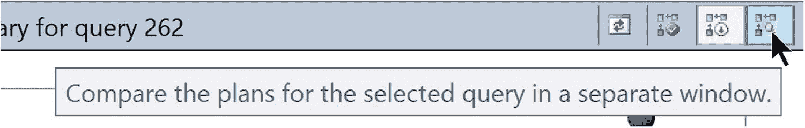

*图 7-6：用于比较两个执行计划的工具栏*

在选择两个计划后点击此按钮，将打开一个类似图 7-7 的新窗口：

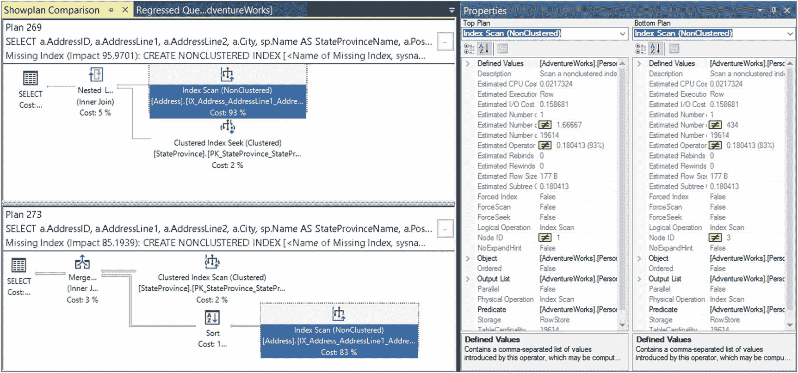

*图 7-7：正在比较的两个执行计划*

你在图 7-7 中看到的是左侧上下两个窗格中正在比较的两个执行计划。右侧显示的是所选运算符的两组属性。这些属性值也在进行比较。两个计划中运算符周围的阴影（在我的例子中是粉色）表示两个计划之间共有的运算符，甚至是运算符集。因此，在我们的计划中，对`Person.Address`表的索引扫描在两个计划中基本相同。其他运算符则不同。这些信息可用于帮助排查性能问题，要么是向你展示一个需要解决的常见问题（在本例中是扫描索引中的所有数据），要么是向你展示导致性能不佳的计划差异。

点击左侧窗格中的任何运算符都会改变右侧的属性值，使你能够进一步探索细节和差异。图 7-8 显示了共同`索引扫描`运算符的属性：

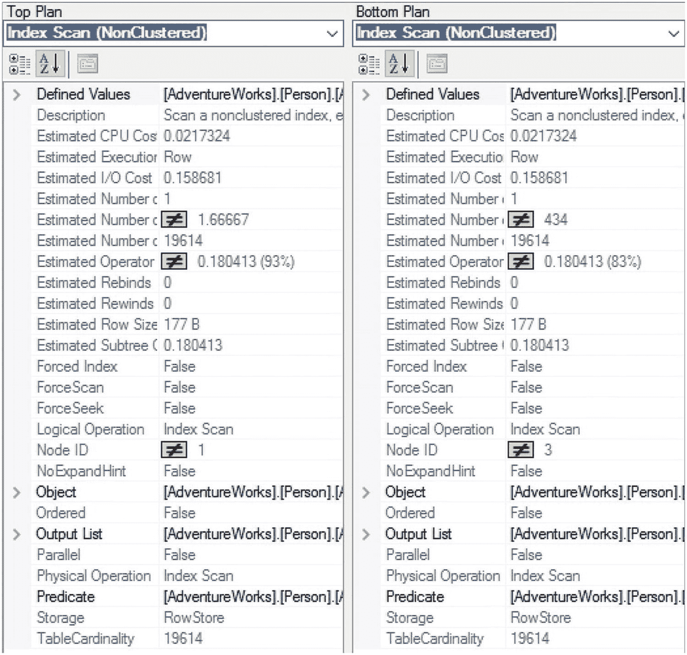

*图 7-8：两个执行计划中的共同运算符*

不匹配的属性值前面有黄色的“不等于”图标。你可以看到，总体而言，估计成本、行大小、对象信息等都是相同的。只有估计行数、节点 ID 和估计运算符百分比成本不同。实际上，百分比估计值之所以不同，仅仅是因为两个计划中的所有其他运算符都不同。

比较共同的运算符，尤其是在本例中是一个扫描操作，可以让你了解通过更改代码或结构可能在哪些地方提高查询性能。然而，使用计划强制的全部意义就在于避免修改代码或结构。你主要想比较计划，以便确保你选择强制的那个计划更有可能成功。

当你查看未标记为两个计划之间共同的运算符时，要比较这些运算符，你需要分别选择每一个。通常，这不会告诉你太多关于计划的信息，因为当不同计划中的不同运算符执行不同的功能时，比较它们用处不大。

你需要结合性能指标、等待统计信息以及从有问题的执行计划中收集的信息。除了这些信息，你还应考虑查询的重要性、被调用的频率以及其他有助于你确定哪个计划在最常见需求下表现更好的因素。

一旦你决定要强制执行哪个计划，你有多种选择来强制该计划。


### 强制与解除强制执行计划

无论出于何种原因，当一个计划出现性能回退时，最佳解决方案就是进行更改，无论是对代码、结构还是统计信息。然而，进行这些更改并非总是可行或可取。在这种情况下，我们就需要强制一个计划。在了解如何操作之前，关于计划强制，有几件事你应该知道。

计划强制覆盖了查询优化器的工作。当你选择强制一个计划时，该计划将一直被使用，直到你解除强制或使其失效。你只能强制一个对给定查询有效的计划。如果你对代码或结构进行了更改，例如删除索引之类操作，就会使该计划失效，从而无法再强制。

如果缓存中没有计划，查询优化器仍会生成一个计划。但是，如果你有一个强制计划，优化器生成的任何其他计划都将被丢弃。你有时可能会看到一种情况，即强制计划看起来与你最初强制的原始计划不同。因为优化器仍然会执行优化过程，如果生成了一个“本质等效”（微软术语）的计划，即一个在所有实际意图和目的上完全相同的计划，那么这个本质等效的计划将被使用。然而，在大多数情况下，你会看到你选择强制的那个确切计划。

长期以来，SQL Server 中一直有一个在行为上类似于查询存储中计划强制的功能，即**计划指南**。这是一种为查询应用查询提示甚至建议整个执行计划的方式，类似于计划强制。但是，它们非常难以使用且经常失败。这正是查询存储中的计划强制如此有吸引力的众多原因之一。如果你正在使用计划指南，计划强制会覆盖计划指南。尽管如此，你仍然会在扩展事件和执行计划本身中看到该指南已被应用的证据。

当你将一个计划标记为强制时，该信息会存储在查询存储的目录视图中。这意味着计划强制将能在重启、分离甚至群集环境中的故障转移后保留下来。这是因为计划被强制的事实已经随数据库持久化到磁盘上了。停止计划强制的唯一方法就是如前面所述使该计划失效，或者选择停止强制该计划。

由于数据和统计信息会随时间变化，建议你计划定期审查强制计划。你需要确保强制特定计划的原因在时间推移和事物变化后仍然成立。同样重要的是，要非常审慎地使用计划强制，只在绝对必要以解决性能回退时才使用。

#### 通过报告强制计划

选择强制一个计划从来都不困难。在查询存储报告中尤其简单。在右侧窗格中，你可以看到查询随时间变化的性能，并会显示查询的执行计划。可能有一个，也可能有几个。在图 7-9 中，你可以看到我有两个计划。它们列在图 7-9 右侧标有“Plan ID”的小框中：

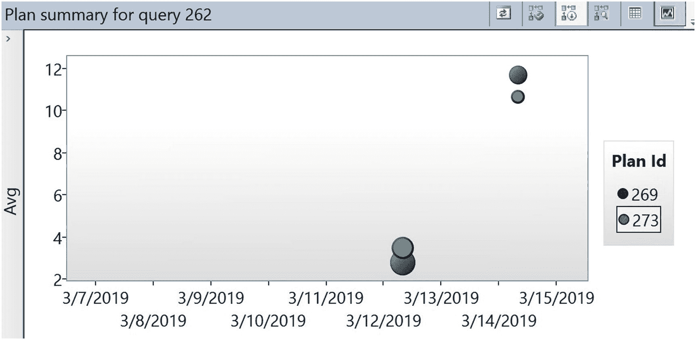

图 7-9

查询存储报告中的两个执行计划

一旦我们决定要强制哪一个计划，只需点击图 7-9 中右侧的那个 Plan ID 值，即 269 或 273。选中后，上方的工具栏中会出现一个用于强制计划的图标，如图 7-10 所示：

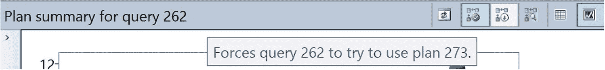

图 7-10

报告中的按钮，允许你强制计划

点击该按钮会打开一个确认窗口。你有机会选择不强制该计划。图 7-11 显示了该窗口：

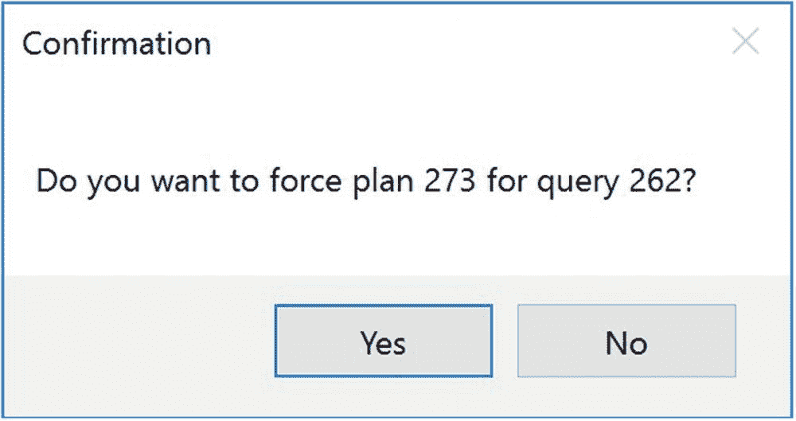

图 7-11

确认你希望强制一个计划

点击“是”按钮将立即强制该计划。点击“否”按钮当然会取消该过程。点击“是”后，该计划将被强制。以我的情况为例，我选择强制计划 273。执行此操作后，报告会用一个勾选标记来标记该计划。你可以在查询存储报告中立即看到这一点，如图 7-12 所示：

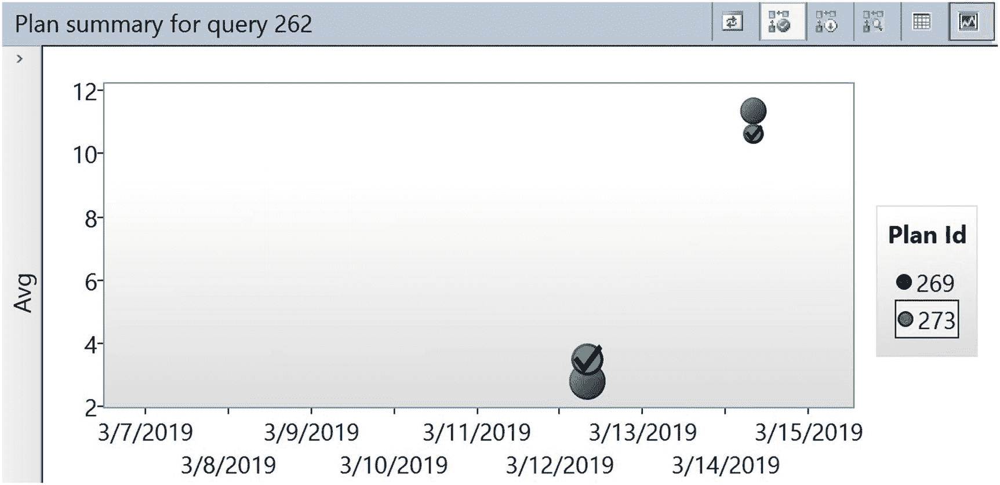

图 7-12

选择要强制的计划后的计划状态

你可以看到一个勾选标记已被放置在计划 273 上，并将一直保留，直到该计划的强制被移除。这是计划已被强制的即时指示。你还会看到，当计划被强制时，“强制计划”按钮显示为按下状态，而当计划未被强制时，该按钮则未被按下。

强制计划的另一种方式位于图 7-9 和 7-12 中我们一直在查看的窗格正下方。可以看到另一组按钮，如图 7-13 所示：


图 7-13

查询存储报告中的计划强制按钮

此按钮的工作方式与之前相同。选择你希望强制的计划并点击该按钮。将打开一个确认窗口，你可以确认强制该计划。

选择移除强制，或解除强制一个计划，非常简单。你必须使用图 7-13 中所示的按钮。当你选择了一个已被强制的计划时，“解除强制计划”按钮将被启用。然后，你就可以移除该查询的计划强制。系统将再次提示你确认正在解除该计划的强制。

#### 使用 T-SQL 强制计划

你也可以使用 T-SQL 以编程方式强制计划。通过 T-SQL 进行计划强制的实际功能极其简单。唯一的技巧是你需要掌握两条信息。你必须拥有查询存储中的 `query_id` 和 `plan_id`。正如你上面看到的，你可以使用查询存储报告来检索这些信息。你也可以按照第 5 章所述，使用 T-SQL 查询查询存储目录视图。通过 T-SQL，你可以检索 `query_id` 和 `plan_id`。有了这些信息，强制计划就很简单了：

```
EXEC sys.sp_query_store_force_plan 262,273;
```

由于我们现在是通过编程方式执行此操作，因此不需要确认。假设两个 ID 值都是准确的，并且所选计划是有效计划，则 `plan_id`（本例中为 273）将被强制用于 `query_id`（本例中为 262）。如果任一 ID 无效，你将收到错误提示。

通过编程方式解除强制计划也不难：

```
EXEC sys.sp_query_store_unforce_plan 262,273;
```

同样，通过 T-SQL 以编程方式强制和解除强制时，不需要确认。


#### 确定哪些计划已被强制

正如你在图 7-12 中所见，判断一个计划是否已被强制非常容易。甚至有一份报告会列出所有强制计划。我们将在第 4 章详细讨论这份报告。问题应该是，是否有办法以编程方式判断一个计划已被强制。答案当然是，有。你只需查询查询存储的目录视图：

```sql
SELECT qsq.query_id,
qsp.plan_id,
qsp.is_forced_plan
FROM sys.query_store_query AS qsq
JOIN sys.query_store_plan AS qsp
ON qsp.query_id = qsq.query_id
WHERE qsq.query_id = 262;
```

此查询的结果如图 7-14 所示：

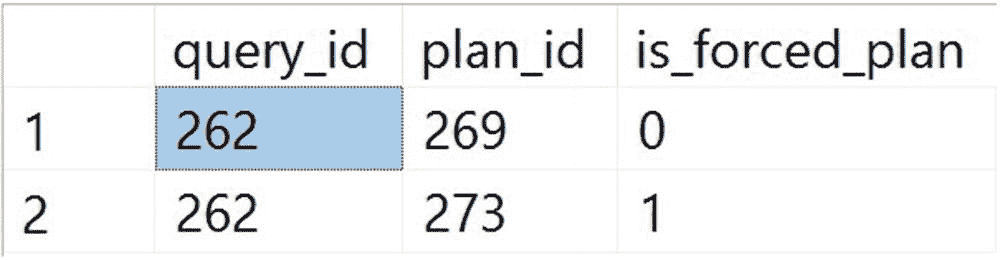

*图 7-14*
*以编程方式显示哪个查询计划被强制*

你可以快速看到 `plan_id` 为 273 的计划已被强制，因为其 `is_forced_plan` 值设置为 1，而另一个计划 269 则未被强制。

你也可以通过查看一些执行计划来判断一个计划是否被强制。如果计划尚未缓存，你只捕获估计计划时，在其上不会看到它。你不会在来自查询存储本身的计划上看到它。你几乎可以在任何其他计划上看到这一点。不过，你要找的东西有点隐蔽。我们需要进入第一个操作符的属性，并查找“使用计划”属性值，如图 7-15 所示：

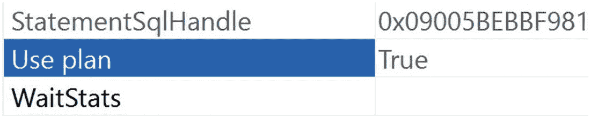

*图 7-15*
*第一个操作符中的“使用计划”属性*

这仅作为第一个操作符的属性可用。它在工具提示中不可见。你只会在已被强制的计划上看到这个。在任何其他计划上，你甚至看不到这个属性，因此不会出现值为 False 的“使用计划”。

### 结论

查询性能回退是一个真实存在的问题。解决它的最佳方法仍然是修改代码、结构或统计信息，以确保生成更合适的计划。然而，在必须时，你确实有能力强制执行某个执行计划。有很多方法可以监控计划强制的情况，以便在结构或代码更改或系统进行其他可能影响计划生成的更改时，可以酌情进行调整。如前所述，仅在必须使用此功能，并且有计划定期审查已强制计划的查询时才使用它。

## 8. 自动计划修正与等待统计信息

查询存储捕获和存储的信息开始为微软和你开启新的功能。首先，对于微软而言，能够识别出遭受性能回退的查询（如我们在第 7 章所述）意味着他们可以监控系统，并利用查询存储中的信息，自动强制一个计划来修复回退。这就是自动计划修正在发挥作用。其次，对于我们在查询存储信息中增加的等待统计信息，开启了额外的故障排除可能性。

本章探讨查询存储的附加功能，包括：

*   自动标记发生性能回退的查询的能力，以及支持此功能的新目录视图。
*   SQL Server 根据性能回退自动强制或取消强制计划的能力。
*   已添加到查询存储信息中的 23 个类别的等待统计信息。

### 自动计划修正

自动计划修正的概念完全建立在查询存储之上。如果没有查询存储收集的信息，SQL Server 和 Azure SQL Database 确定计划已发生回退的能力将无法实现。请记住，计划回退的核心是基于查询本身未发生变化的思想。代码更改总会导致行为变化。当你没有更改代码或数据库结构，但性能却下降时，这才是一种回退。查询存储使得识别回退变得更容易。

一旦识别出回退，自动计划修正的基本方法就很简单了。这个查询在旧计划下的表现更好。当启用自动计划修正时，SQL Server 可以自动强制该旧计划，即最后一个已知的良好计划。然后，系统的行为会再次观察一段时间。如果强制最后一个良好计划没有奏效，则可以自动取消强制。所有这些都在后台发生，无需用户、开发人员或 DBA 的实际干预。

这种行为使调优 SQL Server 的工作变得更加容易，因为你可以腾出时间来处理需要更多知识和理解的更困难的问题，而不是试图修复那些可以轻松自动化解决的简单问题。简单地选择最后一个表现良好的计划并应用它，是一种简单的调优方法，但它可以轻松解决大量问题。


#### 识别查询回归

我们可以从理解 SQL Server 如何识别回归查询以及它如何传达为何认为该查询已回归开始。幸运的是，所有这些功能都汇总在一个新的动态管理视图中：`sys.dm_db_tuning_recommendations`。

然而，在我们展示这个新 DMV 的行为之前，需要有一个查询能够可靠地提供可被识别为回归的行为。为此，我们将对标准的 AdventureWorks 数据库进行一些修改。Adam Machanic 有一个名为 BigAdventure 的脚本，它使用 AdventureWorks 中的一些表来创建一个更大的数据库。代码可在此处下载：[`http://dataeducation.com/thinking-big-adventure/`](http://dataeducation.com/thinking-big-adventure/)。首先运行 Adam 的脚本以创建必要的结构。在此基础上，我们将运行此脚本以创建一个存储过程并修改数据库：

```sql
CREATE INDEX ix_ActualCost ON dbo.bigTransactionHistory (ActualCost);
GO
--a simple query for the experiment
CREATE OR ALTER PROCEDURE dbo.ProductByCost (@ActualCost MONEY)
AS
SELECT bth.ActualCost
FROM dbo.bigTransactionHistory AS bth
JOIN dbo.bigProduct AS p
ON p.ProductID = bth.ProductID
WHERE bth.ActualCost = @ActualCost;
GO
--ensuring that Query Store is on and has a clean data set
ALTER DATABASE AdventureWorks SET QUERY_STORE = ON;
ALTER DATABASE AdventureWorks SET QUERY_STORE CLEAR;
GO
```

所有这些对于使我们能够创建一个包含将可靠地遭受回归的查询的负载都是必要的。做好这些准备后，为了看到回归发生，我们将运行以下脚本：

```sql
-- 1\. Establish a history of query performance
EXEC dbo.ProductByCost @ActualCost = 8.2205;
GO 30
-- 2\. Remove the plan from cache
DECLARE @PlanHandle VARBINARY(64);
SELECT  @PlanHandle = deps.plan_handle
FROM    sys.dm_exec_procedure_stats AS deps
WHERE   deps.object_id = OBJECT_ID('dbo.ProductByCost');
IF @PlanHandle IS NOT NULL
BEGIN
DBCC FREEPROCCACHE(@PlanHandle);
END
GO
-- 3\. Execute a query that will result in a different plan
EXEC dbo.ProductByCost @ActualCost = 0.0;
GO
-- 4\. Establish a new history of poor performance
EXEC dbo.ProductByCost @ActualCost = 8.2205;
GO 15
```

该脚本执行了一系列操作。我在代码的注释中放置了标记，以便我们可以回顾代码的每个部分以理解正在发生的事情。首先，在数字 1 处，我们必须建立查询的行为基线。需要执行多次才能确立查询的某种行为模式，并将数据捕获到查询存储中。接下来，在数字 2 处，我们通过获取 `plan_handle` 并使用 `FREEPROCCACHE` 仅从缓存中移除该计划，从而将其从计划缓存中移除。这意味着下一次执行将需要编译一个新计划。如果没有此步骤，即使我们使用不同的值执行查询，该计划在自然老化出缓存之前也会保持不变。通过强制将其从缓存中移除，我们为下一步做好了准备。在步骤 3 中，我们执行查询，但我们使用了一个不同的值，该值在统计信息中具有非常不同的数据分布。这导致执行计划发生更改。最后，在步骤 4 中，我们再次使用新的执行计划建立行为模式。

在我解释两个版本执行计划之间性能为何如此糟糕之前，让我们先通过如下查询 `sys.dm_db_tuning_recommendations` 来快速查看这是否导致了回归：

```sql
SELECT ddtr.type,
ddtr.reason,
ddtr.last_refresh,
ddtr.state,
ddtr.score,
ddtr.details
FROM sys.dm_db_tuning_recommendations AS ddtr;
```

结果应如图 8-1 所示：


**图 8-1** 调优建议 DMV 中的结果

原因很容易理解。如果我们查看使用值 `8.2205` 第一次执行存储过程时生成的执行计划，它看起来像这样：

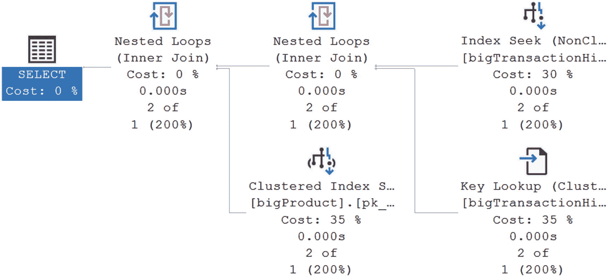
**图 8-2** `dbo.ProductByCost` 存储过程的原始执行计划

此查询可能存在调优机会，如计划中的键查找操作所示。然而，对于正在检索的数据集来说，该计划表现得足够好。估计行数为 1，实际行数为 2，非常接近，因此计划性能相当不错。在使用值 `0.0` 重新编译后，即使使用值 `8.2205` 执行，计划看起来像这样：

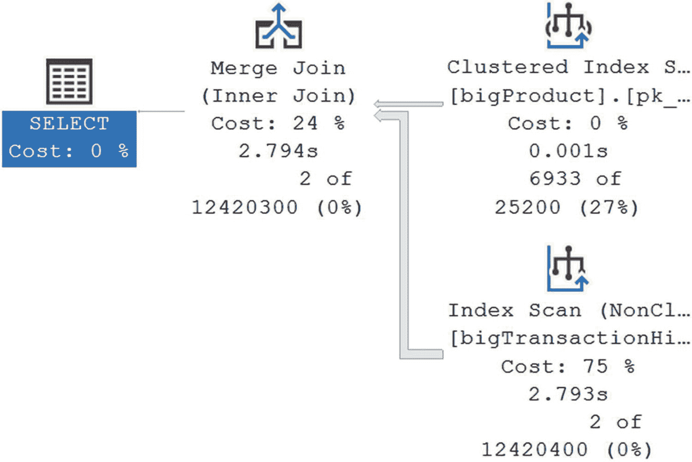
**图 8-3** 性能非常差的执行计划

发生此更改的原因是值 `0.0` 在计划中显示有 `12,420,400` 行，而不是我们最初处理的 2 行。这个不同的计划严重降低了性能，因为我们扫描了一个巨大的索引以仅检索两行，而不是简单的查找。通过多次执行查询，SQL Server 能够识别出回归，并将数据添加到 `sys.dm_db_tuning_recommendations` 中。让我们更仔细地查看图 8-4 中的该信息：


**图 8-4** 建议的调优建议

第一列告诉我们调优建议的类型，在本例中为 `FORCE_LAST_GOOD_PLAN`。Microsoft 未来可能会增加更多建议。下一列是建议的原因，内容如下：

> Average query CPU time changed from 0.16ms to 4909.41ms
> （查询平均 CPU 时间从 0.16 毫秒变为 4909.41 毫秒）

正如我们上面解释的，将执行计划从索引查找更改为扫描索引降低了性能。我们执行存储过程的次数足够多，以至于建立了平均值，其平均值从 `0.16ms` 增加到了 `4909.41ms`，这是一个巨大的跳跃。

下一列让我们知道建议上次更新的时间。由于系统内的事物会发生变化，你可以并且将会看到建议随时间发生的变化。

我们还有 `state` 列。这是 JSON 数据，向我们显示了建议的当前状态，如下所示：

```json
{"currentValue":"Active", "reason":"AutomaticTuningOptionNotEnabled"}
```

该建议处于活动状态，但尚未实施。原因很明确，我们尚未启用自动调优。最后，所有详细信息都显示在另一个 JSON 列中：

```json
{"planForceDetails":{"queryId":2, "regressedPlanId":2, "regressedPlanExecutionCount":15, "regressedPlanErrorCount":0, "regressedPlanCpuTimeAverage":4.909411600000000e+006,"regressedPlanCpuTimeStddev":1.181213221539555e+007, "recommendedPlanId": 1,"recommendedPlanExecutionCount":30, "recommendedPlanErrorCount": 0,"recommendedPlanCpuTimeAverage":1.622333333333333e+002, "recommendedPlanCpuTimeStddev":2.380063281138177e+002}, "implementationDetails":{"method":"TSql", "script":"exec sp_query_store_force_plan @query_id = 2, @plan_id = 1"}}
```

这非常难以阅读，因此我们将其整理成表格以便于查看：表 8-1 列出了上述 DMV 中 `details` 列的 JSON 数据中的各个列。

**表 8-1** 来自 JSON 数据的调优建议详情


### 调优推荐详情

| planForceDetails |   |
| --- | --- |
| queryID | 2: `query_id` 值来自查询存储 |
| regressedPlanID | 2: 问题计划的 `plan_id` 值，来自查询存储 |
| regressedPlanExecutionCount | 5: 回归计划被使用的次数 |
| regressedPlanErrorCount | 0: 当有值时，表示执行期间的错误数 |
| regressedPlanCpuTimeAverage | 4.909411600000000e+006: 该计划的平均 CPU 时间 |
| regressedPlanCpuTimeStddev | 1.181213221539555e+006: 该值的标准差 |
| recommendedPlanID | 1: 调优建议推荐的计划 ID |
| recommendedPlanExecutionCount | 30: 推荐计划被使用的次数 |
| recommendedPlanErrorCount | 0: 当有值时，表示执行期间的错误数 |
| recommendedPlanCpuTimeAverage | 1.622333333333333e+002: 该计划的平均 CPU 时间 |
| recommendedPlanCpuTimeStddev | 2.380063281138177e+002: 该值的标准差 |
| **实现详细信息** |   |
| Method | TSql: 值将始终为 T-SQL，直到创建了新类型的建议 |
| script | `exec sp_query_store_force_plan @query_id = 2, @plan_id = 1` |

这意味着您无需启用自动调优即可查看系统中需要哪些类型的建议更改。如果您愿意，可以通过使用如下 JSON 查询更直接地查询此信息：

```sql
WITH DbTuneRec
AS (SELECT ddtr.reason,
ddtr.score,
pfd.query_id,
pfd.regressedPlanId,
pfd.recommendedPlanId,
JSON_VALUE(ddtr.state,
'$.currentValue') AS CurrentState,
JSON_VALUE(ddtr.state,
'$.reason') AS CurrentStateReason,
JSON_VALUE(ddtr.details,
'$.implementationDetails.script') AS ImplementationScript
FROM sys.dm_db_tuning_recommendations AS ddtr
CROSS APPLY
OPENJSON(ddtr.details,
'$.planForceDetails')
WITH (query_id INT '$.queryId',
regressedPlanId INT '$.regressedPlanId',
recommendedPlanId INT '$.recommendedPlanId') AS pfd)
SELECT qsq.query_id,
dtr.reason,
dtr.score,
dtr.CurrentState,
dtr.CurrentStateReason,
qsqt.query_sql_text,
CAST(rp.query_plan AS XML) AS RegressedPlan,
CAST(sp.query_plan AS XML) AS SuggestedPlan,
dtr.ImplementationScript
FROM DbTuneRec AS dtr
JOIN sys.query_store_plan AS rp
ON rp.query_id = dtr.query_id
AND rp.plan_id = dtr.regressedPlanId
JOIN sys.query_store_plan AS sp
ON sp.query_id = dtr.query_id
AND sp.plan_id = dtr.recommendedPlanId
JOIN sys.query_store_query AS qsq
ON qsq.query_id = rp.query_id
JOIN sys.query_store_query_text AS qsqt
ON qsqt.query_text_id = qsq.query_text_id;
```

这些建议仅仅是建议。尽管 SQL Server 非常擅长基于查询存储捕获的行为生成这些建议，但在您启用自动调优之前，您可以根据需要手动在系统中使用这些建议。您需要了解 `sys.dm_db_tuning_recommendations` 的一点是，其中的信息不会持久化。在故障转移、重启或其他类型的停机中，这些数据将被重置。任何通过自动调优强制执行的计划将保持强制状态。但是，您将丢失有关该计划被强制执行的原因的历史记录。您可能需要定期将此信息捕获到其他位置以防万一。

### 启用自动调优

根据您使用的是 SQL Server 2019 还是 Azure SQL Database，启用自动调优的方式有所不同。如果您使用的是 SQL Server 2017 或更高版本，可以使用 T-SQL 来启用。如果您使用的是 Azure SQL Database，可以使用 T-SQL 或 Azure 门户。两者的 T-SQL 是相同的，您用来查看信息的所有其他查询也是相同的。我们将从 Azure 开始，以便您了解其外观。

#### 在 Azure SQL Database 中启用自动调优

在我们继续之前，请注意 Azure 更新得非常频繁。您在阅读本书后看到的 GUI 可能与此处显示的不同。但流程应该基本保持不变。

在门户中连接到数据库，然后滚动到页面底部，您应该会看到类似于图 8-5 的内容：

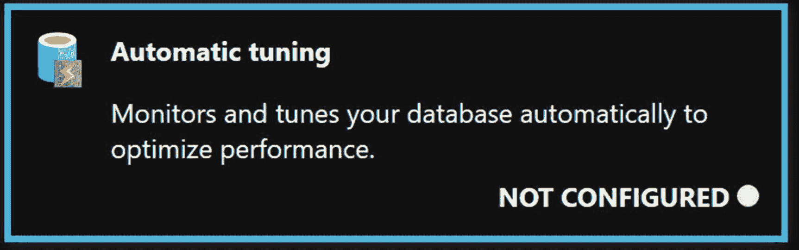

图 8-5

Azure 门户中的自动调优，当前未配置

如果您尚未启用自动调优，如您所见，它将在门户中显示为“未配置”。您可以单击此选项，它将打开一个新的边栏选项卡，如图 8-6 所示：

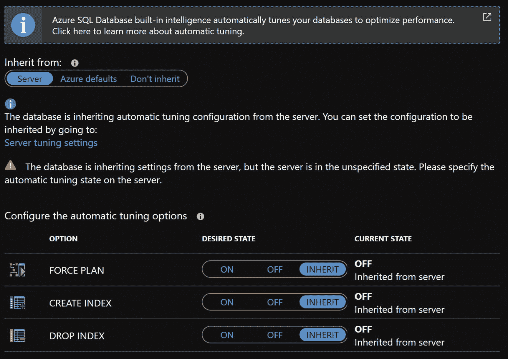

图 8-6

Azure 门户中数据库的自动调优设置

边栏选项卡上所有内容都解释得相当清楚。您可以从包含数据库的服务器继承设置、从 Azure 默认值继承，或者将设置更改为不从任何地方继承。您可以看到一个警告，表明虽然我们当前从服务器继承，但服务器本身尚未配置。我们可以更改那里的设置，但为了我们的目的，我们将在此处进行更改。您可以在屏幕底部看到，除了强制执行计划外，您还可以让 Azure SQL Database 创建或删除索引。索引功能与查询存储没有直接关系，因此我们在此不作介绍。要启用强制执行最后一个已知的良好计划，我们只需单击“开”，如图 8-7 所示：

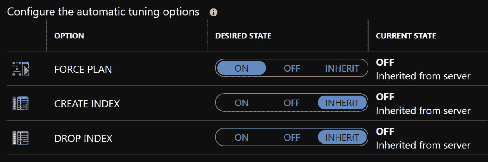

图 8-7

在 Azure SQL Database 中启用自动调优

要完成此过程，您将单击页面顶部的“应用”按钮。系统会提示您确认这确实是您想要执行的操作。单击“确定”后，自动调优即在您的数据库上启用。无需其他操作。

#### 使用 T-SQL 启用自动调优

在我撰写本文时，Management Studio 中没有用于启用自动查询调优的图形界面。相反，您必须使用 T-SQL 命令。您也可以在 Azure SQL Database 或 Azure 托管实例中使用相同的命令。命令如下：

```sql
ALTER DATABASE current SET AUTOMATIC_TUNING (FORCE_LAST_GOOD_PLAN = ON);
```

当然，您可以将我在此处使用的 `current` 默认值替换为适当的数据库名称。此命令一次只能在一个数据库上运行。如果您希望为实例上的所有数据库启用自动调优，您要么必须在创建其他数据库之前在 model 数据库中启用它，要么需要为服务器上的每个数据库将其设置为开。

目前 `automatic_tuning` 的唯一选项就是像我们这样启用强制执行最后一个良好计划。您可以使用以下命令禁用此功能：

```sql
ALTER DATABASE current SET AUTOMATIC_TUNING (FORCE_LAST_GOOD_PLAN = OFF);
```

就这么简单。无需其他操作，这不需要重启或对服务器本身进行更改。


#### 自动调优的工作原理

为了观察在启用自动调优及查询存储后的实际效果，我们只需重新运行上面的脚本。然而，为了确保测试能够成功运行，我们将清除查询存储和缓存，让一切从零开始。以下是更新后的脚本：

```
ALTER DATABASE SCOPED CONFIGURATION CLEAR PROCEDURE_CACHE;
GO
ALTER DATABASE AdventureWorks SET QUERY_STORE CLEAR;
GO
EXEC dbo.ProductByCost @ActualCost = 8.2205;
GO 30
--从缓存中移除该执行计划
DECLARE @PlanHandle VARBINARY(64);
SELECT  @PlanHandle = deps.plan_handle
FROM    sys.dm_exec_procedure_stats AS deps
WHERE   deps.object_id = OBJECT_ID('dbo.ProductByCost');
IF @PlanHandle IS NOT NULL
BEGIN
DBCC FREEPROCCACHE(@PlanHandle);
END
GO
--执行一个将产生不同执行计划的查询
EXEC dbo.ProductByCost @ActualCost = 0.0;
GO
--建立一个新的性能不佳的历史记录
EXEC dbo.ProductByCost @ActualCost = 8.2205;
GO 15
```

执行此脚本后，我们需要返回去查询 `sys.dm_db_tuning_recommendations`。图 8-8 展示了其中的数据现在如何变化：


图 8-8

自动调优已修复了性能回归问题

`CurrentState` 的值已变为 `Verifying`。它将像之前一样，在多次执行中测量性能。如果性能下降，它将取消强制执行该计划。此外，如果出现超时或执行中止等错误，该计划也将被取消强制执行。在这种情况下，您还会看到 `sys.dm_db_tuning_recommendations` 中的 `error_prone` 列的值变为 `Yes`。

如果您重启服务器，`sys.dm_db_tuning_recommendations` 中的信息将被删除。同样，任何已被强制的执行计划也将被删除。一旦查询再次出现性能回归，任何计划强制都将被自动重新启用。如果这成为问题，您始终可以手动强制该计划。

如果一个计划被强制执行后性能下降，它将被取消强制，如前所述。如果该查询再次出现性能下降，计划强制将被移除，并且该查询将被标记——至少在服务器重启之前（届时信息将被移除），它不会被再次强制执行。

### 查询存储等待统计信息

我们在本书中讨论过的查询存储为查询性能行为捕获的信息，改变了许多人进行监控和查询调优的方式。为特定查询添加等待统计信息进一步改变了这些方式。现在，您可以轻松地获取查询的等待统计信息。该信息使用您聚合查询的时间间隔（默认为 60 分钟）进行聚合。此外，由于等待类型众多，查询存储中的等待统计信息并未单独列出所有等待，而是将它们分组到等待类别中。如果您需要关于某个查询的、详细的单独等待统计信息，则需要使用其他机制来捕获数据。

#### 等待统计信息类别

关于这些类别没有太多可说的。您需要了解类别的划分方式，以便理解它们代表哪些等待。除此之外，没有与它们相关的附加功能。这纯粹是信息性的，以便您在查看查询存储中的等待统计信息时能够正确解读信息。

表 8-2 显示了微软发布的类别及相关等待类型。遵循他们的惯例，百分号 (`%`) 代表通配符。

表 8-2

查询存储等待统计信息类别及等待类型

| 整数值 | 等待类别 | 该类别包含的等待类型 |
| --- | --- | --- |
| 0 | 未知 | Unknown |
| 1 | CPU | SOS_SCHEDULER_YIELD |
| 2 | 工作线程 | THREADPOOL |
| 3 | 锁 | LCK_M_% |
| 4 | 闩锁 | LATCH_% |
| 5 | 缓冲区闩锁 | PAGELATCH_% |
| 6 | 缓冲区 I/O | PAGEIOLATCH_% |
| 7 | 编译^* | RESOURCE_SEMAPHORE_QUERY_COMPILE |
| 8 | SQL CLR | CLR%, SQLCLR% |
| 9 | 数据库镜像 | DBMIRROR% |
| 10 | 事务 | XACT%, DTC%, TRAN_MARKLATCH_%, MSQL_XACT_%, TRANSACTION_MUTEX |
| 11 | 空闲 | SLEEP_%, LAZYWRITER_SLEEP, SQLTRACE_BUFFER_FLUSH, SQLTRACE_INCREMENTAL_FLUSH_SLEEP, SQLTRACE_WAIT_ENTRIES, FT_IFTS_SCHEDULER_IDLE_WAIT, XE_DISPATCHER_WAIT, REQUEST_FOR_DEADLOCK_SEARCH, LOGMGR_QUEUE, ONDEMAND_TASK_QUEUE, CHECKPOINT_QUEUE, XE_TIMER_EVENT |
| 12 | 抢占式 | PREEMPTIVE_% |
| 13 | Service Broker | BROKER_% (但不包括 BROKER_RECEIVE_WAITFOR) |
| 14 | 事务日志 I/O | LOGMGR, LOGBUFFER, LOGMGR_RESERVE_APPEND, LOGMGR_FLUSH, LOGMGR_PMM_LOG, CHKPT, WRITELOG |
| 15 | 网络 I/O | ASYNC_NETWORK_IO, NET_WAITFOR_PACKET, PROXY_NETWORK_IO, EXTERNAL_SCRIPT_NETWORK_IOF |
| 16 | 并行 | CXPACKET, EXCHANGE |
| 17 | 内存 | RESOURCE_SEMAPHORE, CMEMTHREAD, CMEMPARTITIONED, EE_PMOLOCK, MEMORY_ALLOCATION_EXT, RESERVED_MEMORY_ALLOCATION_EXT, MEMORY_GRANT_UPDATE |
| 18 | 用户等待 | WAITFOR, WAIT_FOR_RESULTS, BROKER_RECEIVE_WAITFOR |
| 19 | 跟踪 | TRACEWRITE, SQLTRACE_LOCK, SQLTRACE_FILE_BUFFER, SQLTRACE_FILE_WRITE_IO_COMPLETION, SQLTRACE_FILE_READ_IO_COMPLETION, SQLTRACE_PENDING_BUFFER_WRITERS, SQLTRACE_SHUTDOWN, QUERY_TRACEOUT, TRACE_EVTNOTIFF |
| 20 | 全文搜索 | FT_RESTART_CRAWL, FULLTEXT GATHERER, MSSEARCH, FT_METADATA_MUTEX, FT_IFTSHC_MUTEX, FT_IFTSISM_MUTEX, FT_IFTS_RWLOCK, FT_COMPROWSET_RWLOCK, FT_MASTER_MERGE, FT_PROPERTYLIST_CACHE, FT_MASTER_MERGE_COORDINATOR, PWAIT_RESOURCE_SEMAPHORE_FT_PARALLEL_QUERY_SYNC |
| 21 | 其他磁盘 I/O | ASYNC_IO_COMPLETION, IO_COMPLETION, BACKUPIO, WRITE_COMPLETION, IO_QUEUE_LIMIT, IO_RETRY |
| 22 | 复制 | SE_REPL_%, REPL_%, HADR_% (但不包括 HADR_THROTTLE_LOG_RATE_GOVERNOR), PWAIT_HADR_%, REPLICA_WRITES, FCB_REPLICA_WRITE, FCB_REPLICA_READ, PWAIT_HADRSIM |
| 23 | 日志速率调节器 | LOG_RATE_GOVERNOR, POOL_LOG_RATE_GOVERNOR, HADR_THROTTLE_LOG_RATE_GOVERNOR, INSTANCE_LOG_RATE_GOVERNOR |

### 查看查询存储等待统计信息

有两种方法可以查看查询存储中查询的等待统计信息。您可以使用 T-SQL 来查询信息，或者，在 SQL Server Management Studio 18 中有一个报告。我们将从查询等待统计信息开始。


#### 查询等待统计信息

查询 `Query Store` 中的等待统计信息非常直接。最重要的一点是要记住，这些统计信息是按时间间隔聚合的。虽然在查询统计信息时可以省略这一点，但这样做就需要你自行聚合这些聚合数据，以获得有意义的信息。以下是一个示例查询，它查看本章前面使用的存储过程的等待统计信息：

```sql
SELECT qsws.wait_category_desc,
       qsws.total_query_wait_time_ms,
       qsws.avg_query_wait_time_ms,
       qsws.stdev_query_wait_time_ms
FROM   sys.query_store_query AS qsq
       JOIN sys.query_store_plan AS qsp
           ON qsp.query_id = qsq.query_id
       JOIN sys.query_store_wait_stats AS qsws
           ON qsws.plan_id = qsp.plan_id
       JOIN sys.query_store_runtime_stats_interval AS qsrsi
           ON qsrsi.runtime_stats_interval_id = qsws.runtime_stats_interval_id
WHERE  qsq.object_id = OBJECT_ID('dbo.ProductByCost');
```

你可以在图 8-9 中查看结果：

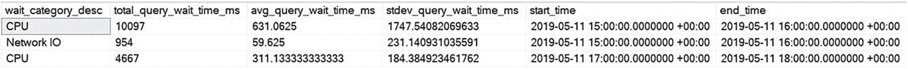

**图 8-9**
`dbo.ProductbyCost` 的等待统计信息

你可以看到存在两个具有不同等待统计信息的不同时间间隔。该查询经历的等待仅出现在 `CPU` 和 `Network I/O` 类别中。使用上一节的表格，这意味着所经历的等待可能是表 8-3 中的任何一个：

**表 8-3**
`dbo.ProductByCost` 经历的等待

| 网络 IO | `ASYNC_NETWORK_IO`, `NET_WAITFOR_PACKET`, `PROXY_NETWORK_IO`, `EXTERNAL_SCRIPT_NETWORK_IOF` |
| --- | --- |
| CPU | `SOS_SCHEDULER_YIELD` |

显然，这是一种快速简便地理解查询瓶颈的方法。不过，这只是一个总体的知识，而非详细信息。尽管如此，它在我们轻松识别需要关注的问题方面发挥了巨大作用。

##### 等待统计信息报告

第 4 章将详细介绍 `Query Store` 报告。这里我将只展示报告本身的一般行为。打开报告后，你会看到类似于图 8-10 的内容：

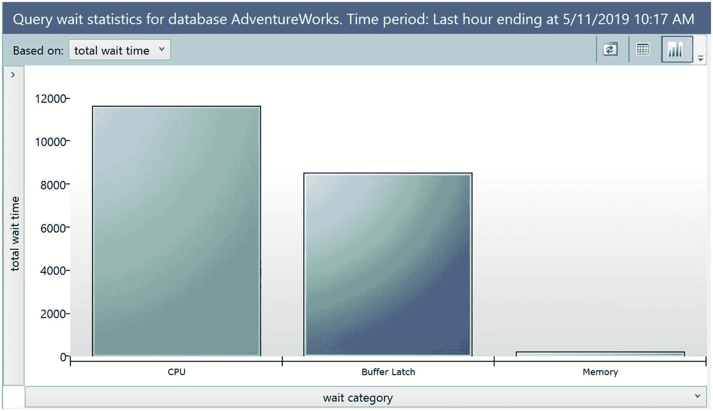

**图 8-10**
显示聚合信息的等待统计报告

当你首次打开报告时，只会显示该时间段内的聚合信息。你会看到所有查询以及给定类别中的各种等待。然后，如果你点击某个类别，例如你看到的 `CPU` 等待，视图将变为类似于图 8-11 的内容：

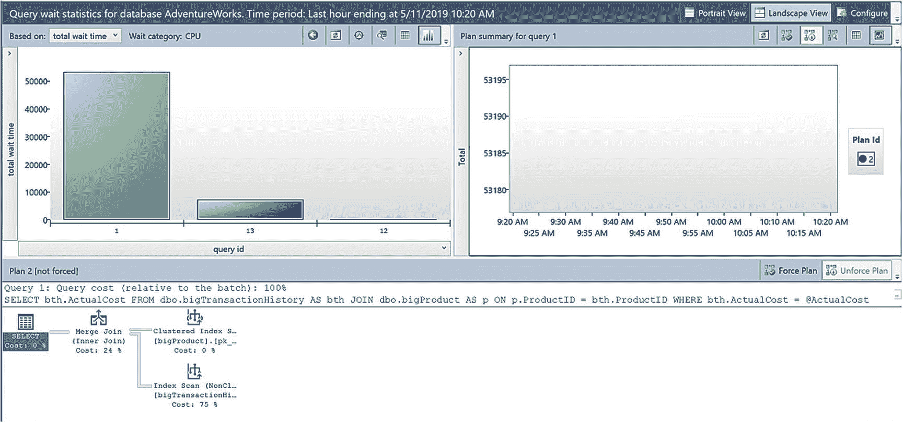

**图 8-11**
显示所有经历了所选等待的查询的报告

报告中现在显示的是左上方一系列经历了所选等待的查询。然后，该报告的运行方式与其他报告类似。选择一个查询会在右侧显示其随时间变化的各种查询计划。选择其中任何一个计划都会在屏幕底部窗格中显示完整的计划。在我们的实例中，你可以看到等待最多的查询是 `dbo.ProductByCost`。具体来说，它是我们本章开头原始示例中的那个糟糕的计划。

所有这些提供了一种不仅理解查询性能，而且理解影响查询的等待的方法。

### 结论

`Query Store` 支持许多有趣的场景，而自动调优以消除计划回归是其中更令人兴奋的功能之一。与所有其他功能一样，你应该监控你的系统以确保此行为对你有益。然而，大多数系统很可能会受益，从而让你腾出手来做其他工作。那项工作可能涉及使用现在与查询一起存储的等待统计信息，来更好地识别需要调优的查询。所有这些 `Query Store` 功能正在改变我们进行数据库监控和数据库调优的方式。

## 9. 使用查询存储进行故障排除

与 `SQL Server` 的任何其他方面一样，大多数时候，你可以直接打开 `Query Store` 而无需担心它。然而，与 `SQL Server` 的任何其他方面一样，事情也可能出错。有两个工具可以用来了解数据库上 `Query Store` 的情况：

*   `Query Store` 特定的等待统计信息
*   针对 `Query Store` 的 `Extended Events`

本章将探讨 `Query Store` 可能出现的一些常见问题，以及如何使用提供的工具来确保 `Query Store` 在你的系统上运行良好。

### Query Store Waits

正如我们前几章所描述的，Query Store 在设计上力求尽可能不引人注目。物理学中的观察者效应指出，对一个过程或物体的观察可能会影响该过程或物体的行为。类似地，在 SQL Server 中，无论数据收集多么轻量级，收集信息的行为本身都会给 SQL Server 实例增加一些额外负载。可能导致 Query Store 出现问题的潜在因素数量是巨大的。这与 SQL Server 中任何其他进程的情况相同：可用的内存量和 CPU；系统中事务的数量、大小和总量；磁盘和磁盘控制器的数量和速度；以及，坦白说，你的 T-SQL 语句中运行的代码。这些因素中的任何一个或全部，甚至更多，都可能改变 Query Store 的行为。

理解 Query Store 行为的第一种方法是使用等待统计信息。一般来说，等待统计信息始终是了解任何给定系统行为的通用最佳方式。如果你知道系统在等待什么，你就知道瓶颈在哪里。查看 Query Store 中的等待有两种方式：通过传统的动态管理视图 `sys.dm_os_wait_stats`，或者，在 Azure SQL Database 上，通过 `sys.dm_db_wait_stats`。你也可以使用 Extended Events 的 `wait_completed` 来查看等待，但这是一种非常细粒度的方法，通常不需要。我们将只关注 DMV。

在讨论查询 SQL Server 中的等待统计信息时，我建议你从 Paul Randal 的脚本开始。这些脚本的重要性在于它们消除了噪音，即那些毫无意义的等待统计信息。你可以在这里访问这些脚本：[`https://bit.ly/2wsQHQE`](https://bit.ly/2wsQHQE)。

Query Store 等待统计信息有一个通用的命名约定。它们总是以 “qds_” 开头。要查看仅来自 Query Store 的等待统计信息，你需要在清单 9-1 中运行此查询：

```sql
SELECT dows.wait_type,
dows.waiting_tasks_count,
dows.wait_time_ms,
dows.max_wait_time_ms,
dows.signal_wait_time_ms
FROM sys.dm_os_wait_stats AS dows
WHERE dows.wait_type LIKE 'qds_%';
```

清单 9-1 来自 Query Store 的等待统计信息

结果将类似于图 9-1：

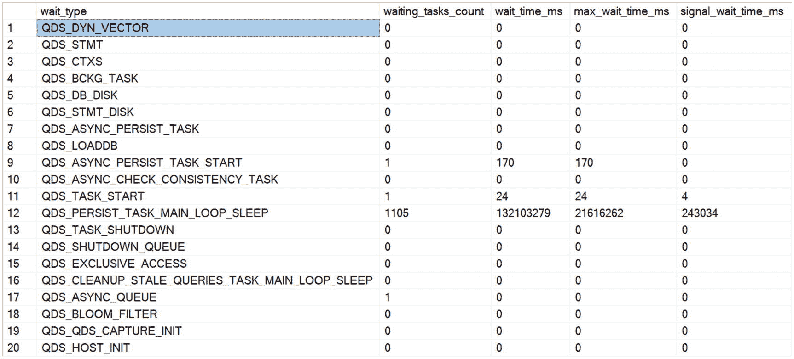

图 9-1 所有 Query Store 等待统计信息

当然，你的系统中各列的值会有所不同，但你应该看到类似的等待列表。你通常不会孤立地查看 Query Store 等待统计信息。相反，你会查询等待统计信息并查找系统上排名靠前的等待。当这些主要的等待是 Query Store 时，你可能正经历某种问题。

然而，只有少数几个 Query Store 等待你可以安全地忽略。Paul Randal 也维护了一个等待统计信息库（可访问此处：[`https://bit.ly/2ePzYO2`](https://bit.ly/2ePzYO2)）。根据他的文档，目前有三种等待在涉及 Query Store 时可以安全忽略：

```text
qds_async_queue
qds_cleanup_stale_queries_task_main_loop_sleep
qds_shutdown_queue
```

你不会简单地只查询 Query Store 的等待。相反，作为你系统上等待统计信息常规监控的一部分，你会查找上述等待，因为它们会表明 Query Store 本身及其操作正在导致你的系统出现问题。如果你在排名前 10 的等待中看到任何 “qds_*” 等待，你会希望理解那个等待统计信息是什么，然后深入研究为什么它会在你的系统中造成问题。我们在监控 Query Store 时深入调查的方法是使用 Extended Events。

### Extended Events and Query Store

Extended Events 是对你的系统中 Query Store 行为进行详细分析的最佳方法。Extended Events 是一个相当复杂的主题，我们不打算在本书中详细解释。要开始使用 Extended Events，我建议先阅读 Microsoft 的文档：[`https://bit.ly/2LfWMoj`](https://bit.ly/2LfWMoj)。一旦你熟悉了 Extended Events 的工作原理，你就可以更轻松地探索使用 Extended Events 监控 Query Store 的功能。

在撰写本文时，SQL Server 2019 中定义的 `qds`（Query Data Store）包内当前有 92 个事件。如果你想运行查询，可以轻松地列出它们，如清单 9-2 所示：

```sql
SELECT dxo.name,
dxo.description
FROM sys.dm_xe_packages AS dxp
JOIN sys.dm_xe_objects AS dxo
ON dxp.guid = dxo.package_guid
WHERE dxp.name = 'qds'
AND dxo.object_type = 'event';
```

清单 9-2 列出 Query Data Store Extended Events

另一种访问信息的方式是通过 SQL Server Management Studio 中的 Extended Events GUI，如图 9-2 所示：

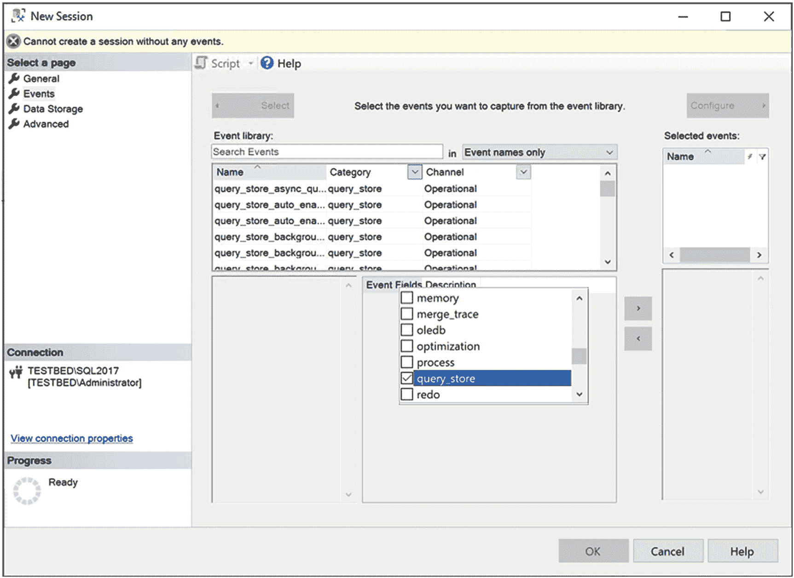

图 9-2 在 Extended Events 中仅选择 Query Store 事件

这里唯一的问题是，并非所有这些事件都是活动的。其中许多，甚至可能是大多数，只能通过 Microsoft 设置的特殊标志来访问。因此，虽然你可以看到它们，甚至将它们添加到某个会话中，但它们永远不会记录任何活动。

与其他 Extended Events 中的事件一样，Query Store 事件将具有一个名称、一个描述以及与事件关联的一组定义的列。因此，如果我们使用 Extended Events 来监控 Query Store 的行为，我们可能感兴趣的一个事件是 `query_store_size_retention_cleanup_finished` 事件。选择该事件后，我们就可以看到 Query Store 本身正在收集的信息，如图 9-3 所示：

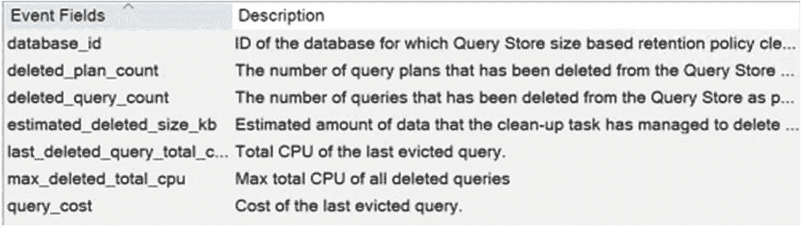

图 9-3 由 `query_store_execution_runtime_info` 捕获的信息

此事件中的信息代表了 Query Store 在查询完成其清理过程后捕获的数据。因此，通过这个事件，你可以观察和监控 Query Store 行为的那一部分。我们将看看几种你可以监控 Query Store 行为的不同方法，以及一些在这方面非常有帮助的特定事件。


#### 跟踪查询存储行为

通过捕获扩展事件，可以观察到构成查询存储的多个进程。我们已经看到一个在查询存储因空间不足而进行清理时触发的事件。您还可以观察一个对应的事件 `query_store_size_retention_cleanup_started`，以了解该事件何时开始。为了对查询存储行为进行一般性观察，清单 9-3 包含了一组事件，据我所知，在撰写本文时，这些事件会触发并产生有关查询存储标准行为的信息：

```sql
CREATE EVENT SESSION QueryStoreBehavior
ON SERVER
ADD EVENT qds.query_store_background_task_persist_finished,
ADD EVENT qds.query_store_background_task_persist_started,
ADD EVENT qds.query_store_capture_policy_evaluate,
ADD EVENT qds.query_store_capture_policy_start_capture,
ADD EVENT qds.query_store_database_out_of_disk_space,
ADD EVENT qds.query_store_db_cleared,
ADD EVENT qds.query_store_db_diagnostics,
ADD EVENT qds.query_store_db_settings_changed,
ADD EVENT qds.query_store_plan_removal,
ADD EVENT qds.query_store_size_retention_cleanup_finished,
ADD EVENT qds.query_store_size_retention_cleanup_started
ADD TARGET package0.event_file
(SET filename = N'C:\ExEvents\QueryStorePlanForcing.xel', max_rollover_files = (3))
WITH (TRACK_CAUSALITY = ON);
```

清单 9-3
产生关于查询存储标准行为信息的扩展事件会话

这些事件捕获了查询存储的部分行为。如果您创建此会话，启动它，并在 SSMS 中查看实时数据窗口，如果我们操作查询和查询存储本身，实际上可以看到部分事件触发。让我们执行几个命令来实际观察一下。首先，我们使用清单 9-4 中的代码清除查询存储：

```sql
ALTER DATABASE AdventureWorks SET QUERY_STORE CLEAR;
```

清单 9-4
清除查询存储

这将触发 `query_store_db_cleared` 事件，如图 9-4 所示：

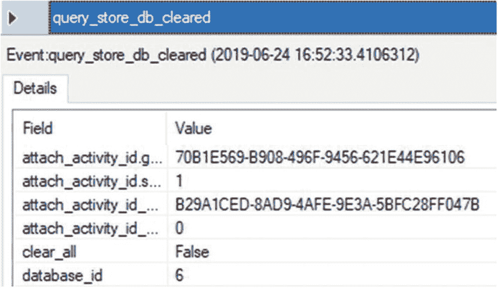

图 9-4
为给定数据库捕获的 `query_store_db_cleared` 事件

前四列用于管理扩展事件的因果关系跟踪，显示事件的独特分组及其发生的顺序。在此实例中，我们可以忽略这些。我们看到的是 `clear_all` 设置，它在 `QUERY_STORE CLEAR` 命令中定义，可以设置为清除 `ALL`。

为了查看下一个事件，我们将运行上一章清单 9-5 中的以下存储过程：

```sql
EXEC dbo.AddressByCity @City = N'London';
```

清单 9-5
调用存储过程

我们将得到以下两个相关事件，它们按触发顺序显示，如图 9-5 所示：

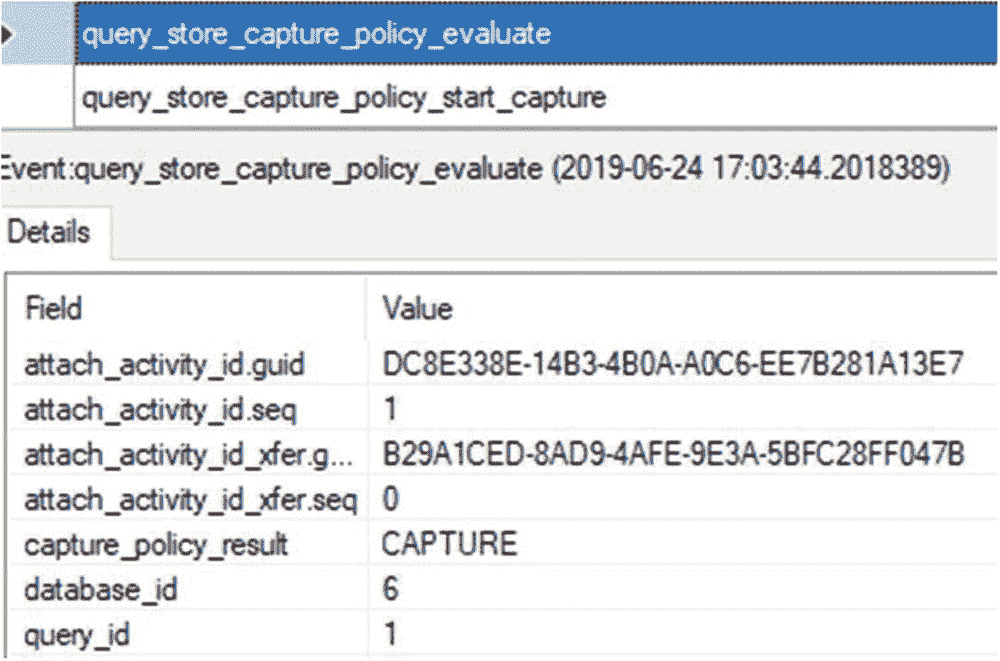

图 9-5
查询存储评估查询然后捕获它

我展示了 `query_store_capture_policy_evaluate` 事件的详细信息。您可以看到 `capture_policy_result` 显示了评估结果，在此例中是 `CAPTURE`。对于已评估但不会被捕获的查询，您也经常会看到 `UNDECIDED`。

您可能会看到一个间歇性事件，显示查询存储如何定期进行自我评估，如图 9-6 所示：

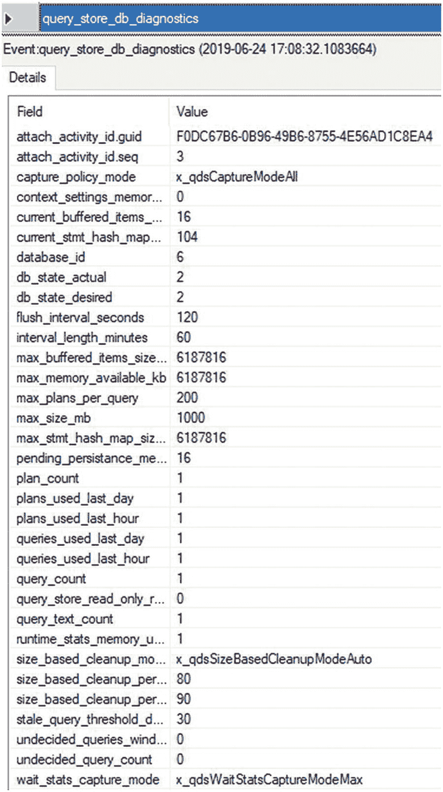

图 9-6
查询存储的设置和诊断信息

您可以看到查询存储的当前设置，例如每个查询的计划限制，当前设置为 200。您还可以看到由查询存储管理的计划和计划使用情况。这些数字显然会随时间变化，显示查询存储随时间推移的行为。

让我们再看一个实际发生的事件。运行清单 9-6 中的以下代码以从计划缓存中删除一个计划：

```sql
DECLARE @PlanID INT;
SELECT TOP 1
    @PlanID = qsp.plan_id
FROM    sys.query_store_query AS qsq
JOIN    sys.query_store_plan AS qsp
    ON qsp.query_id = qsq.query_id
WHERE   qsq.object_id = OBJECT_ID('dbo.AddressByCity');
EXEC sys.sp_query_store_remove_plan @plan_id = @PlanID;
```

清单 9-6
从缓存中删除一个计划

然后我们可以看到这个事件，如图 9-7 所示：

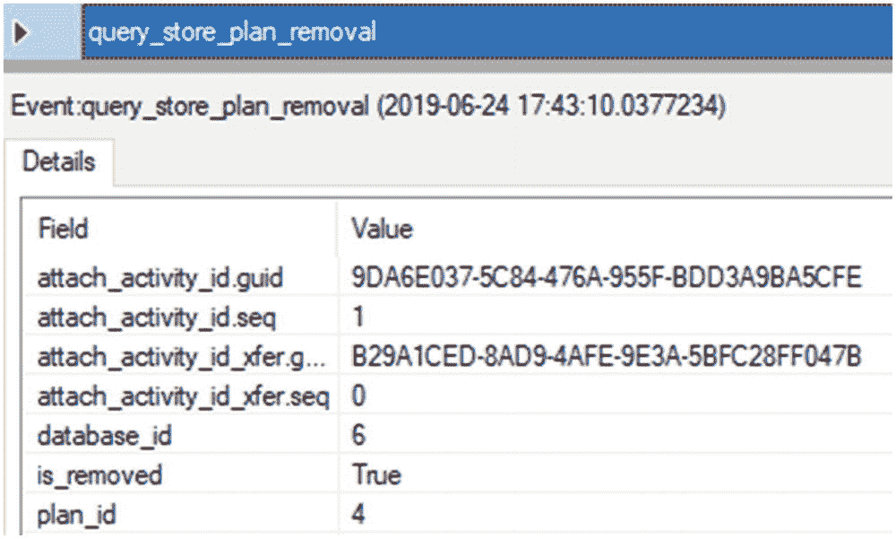

图 9-7
计划已从查询存储中移除

您可以看到数据库、计划被成功移除的事实以及被移除的计划。

所有这些事件都让您能很好地了解查询存储内部发生的情况，使您能够观察查询存储的行为方式。

### 结论

虽然在绝大多数情况下，您确实应该只看到查询存储的正常行为，但也有可能出现问题。了解如何监控查询存储本身，能确保您更有信心地确认查询存储是在支持并帮助您，而不是在损害您。等待统计信息将是确保查询存储行为良好的主要机制。您可以使用扩展事件深入挖掘该行为的细节，以准确了解系统如何工作。这些流程应能使您保护系统并更好地理解查询存储的行为。

## 10. 社区工具

已经开发了一些社区工具来帮助配置和收集查询存储中的数据。`dbatools` 是一个社区驱动的 PowerShell 模块，包含三个用于帮助配置查询存储的 cmdlet。First Responder Kit 包含一组存储过程，其中一个用于查询查询存储数据。在本章中，我们将介绍这些工具，了解它们如何帮助查看查询存储的选项、设置查询存储的选项以及收集查询存储中的数据。

### dbatools

`dbatools` 是一个开源 PowerShell 模块，目前开发有超过 400 个命令来帮助管理 SQL Server。目前有三个用于查询存储的命令：`Get-DbaDbQueryStoreOption`、`Set-DbaDbQueryStoreOption` 和 `Copy-DbaQueryStoreConfig`。通过使用 `dbatools`，您可以同时跨多个数据库和服务器检索和设置配置。有关 `dbatools` 的完整文档和信息可在 [`http://dbatools.io`](http://dbatools.io) 找到，并可以通过在 PowerShell 命令提示符下运行清单 10-1 中的代码，在任何装有 PowerShell 5 或更高版本的机器上安装。

```powershell
Install-Module dbatools
```

清单 10-1
安装 `dbatools`


好的，作为您的文档工程师兼翻译员，我已仔细阅读了格式要求。现在，我将为您翻译给定的技术文档，严格遵守所有格式规范。


### Get-DbaDbQueryStoreOption

我们将要探索的第一个 `dbatools` 命令是 `Get-DbaDbQueryStoreOption`。此命令用于检索数据库上已设置的查询存储选项。有几种运行此命令以返回数据的方式。清单 10-2 将返回指定服务器上除 `master` 和 `tempdb` 以外的所有数据库的查询存储选项（因为无法在这些数据库中使用查询存储）。清单 10-2 代码的运行结果如图 10-1 所示。

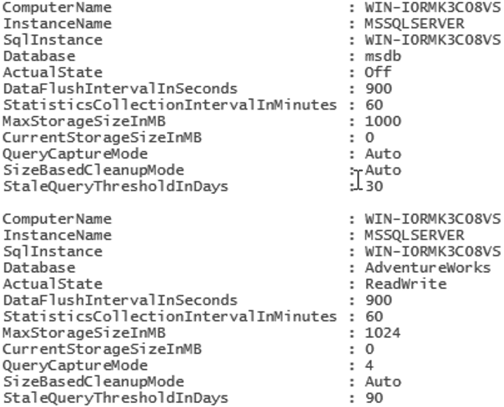

图 10-1

针对整个 SQL Server 实例运行 `Get-DbaDbQueryStoreOption` 的输出

```
Get-DbaDbQueryStoreOption -SqlInstance MyServer
```

清单 10-2

返回指定服务器上所有数据库的查询存储选项

要查看特定数据库的设置，可以运行清单 10-3 中的代码。结果显示在图 10-2 中。

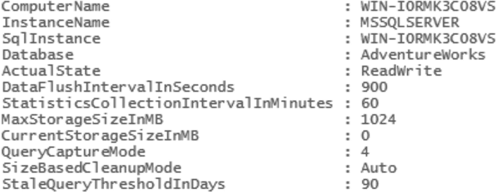

图 10-2

针对 `AdventureWorks` 数据库运行 `Get-DbaDbQueryStoreOption` 的输出

```
Get-DbaDbQueryStoreOption -SqlInstance MyServer
-Database AdventureWorks
```

清单 10-3

返回 `AdventureWorks` 数据库的所有查询存储选项

如果一台服务器上有多个数据库，结果可能难以阅读并且需要大量滚动查看，但有一个选项可以以表格格式获取这些数据。请参见清单 10-4 中的代码以了解如何实现这一点。清单 10-4 代码的部分运行结果如图 10-3 所示。

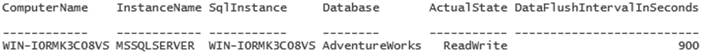

图 10-3

以表格格式显示的 `Get-DbaDbQueryStoreOption` 输出

```
Get-DbaDbQueryStoreOption -SqlInstance MyServer | Format-Table
-AutoSize -Wrap
```

清单 10-4

以表格格式返回查询存储设置

最后，您可以使用 `Get-DbaDbQueryStoreOption` 命令返回具有特定配置设置的所有数据库。在以下示例中，我们将返回查询存储的 `ActualState` 设置为 `ReadWrite` 的所有数据库，如清单 10-5 所示。清单 10-5 中代码的运行结果如图 10-4 所示。

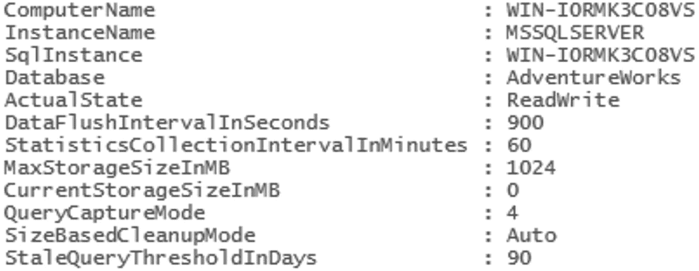

图 10-4

针对查询存储处于读写状态的数据库运行 `Get-DbaDbQueryStoreOption` 的输出

```
Get-DbaDbQueryStoreOption -SqlInstance MyServer | Where-Object
{$_.ActualState -eq "ReadWrite"}
```

清单 10-5

返回查询存储 `ActualState` 为 `ReadWrite` 的数据库

可以在 `dbatools` 网站 ([`https://dbatools.io`](https://dbatools.io)) 上找到此命令的更多参数。

### Set-DbaDbQueryStoreOption

我们将探索的第二个 `dbatools` 命令是 `Set-DbaDbQueryStoreOptions`。此命令用于在您指定的数据库上设置现有的查询存储选项。您可以根据需要使用该命令仅设置一个选项或设置所有选项。在清单 10-6 中，我们将为 SQL Server 实例上的所有数据库设置第 3 章中列出的最佳实践的查询存储选项。如果您还记得第 3 章的内容，此配置的唯一例外是如果您需要更大的查询存储空间或想要不同的收集间隔。

```
Set-DbaDbQueryStoreOption -SqlInstance MyServer -State ReadWrite
-FlushInterval 900 -CollectionInterval 60 -MaxSize 2048
-CaptureMode AUTO -CleanupMode Auto -StaleQueryThreshold 30
```

清单 10-6

使用 `Set-DbaDbQueryStoreOption` 将所有数据库的选项设置为最佳实践

发出清单 10-6 中的命令后，该命令会输出每个数据库的新设置，就像您之前从 `Get-DbaDbQueryStoreOption` 命令看到的那样。这些输出可以在图 10-5 中看到。

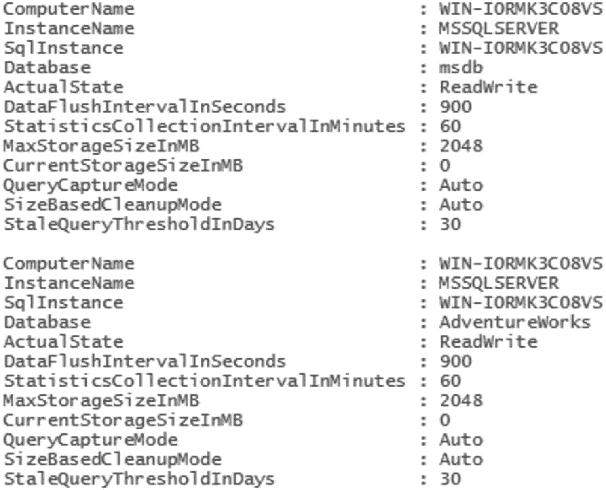

图 10-5

应用最佳实践后运行 `Set-DbaDbQueryStoreOption` 的输出

例如，如果需要，可以通过使用类似清单 10-6 中的代码来更改特定数据库的大小和统计信息收集间隔。此代码允许您以更精细的级别保留更多数据。清单 10-7 中代码的输出如图 10-6 所示。

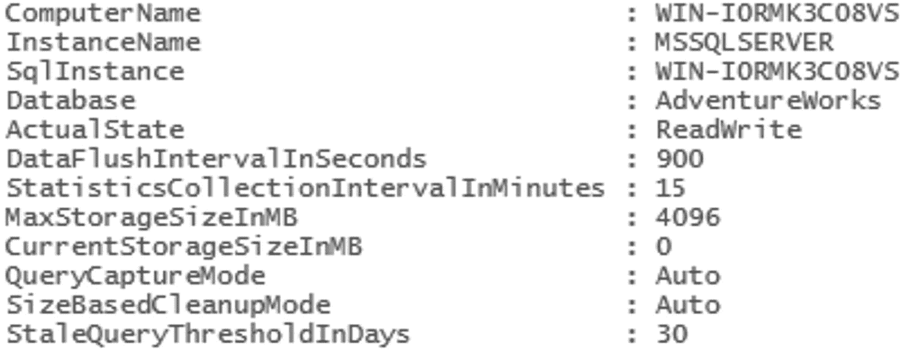

图 10-6

更改最大大小和收集间隔后运行 `Set-DbaDbQueryStoreOption` 的输出

```
Set-DbaDbQueryStoreOption -SqlInstance MyServer
-Database AdventureWorks -MaxSize 4096
-CollectionInterval 15
```

清单 10-7

使用 `Set-DbaDbQueryStoreOption` 更改 `AdventureWorks` 的大小和收集间隔

可以在 `dbatools` 网站 ([`https://dbatools.io`](https://dbatools.io)) 上找到此命令的更多参数。

### Copy-DbaQueryStoreConfig

我们将探索的最后一个命令是 `Copy-DbaQueryStoreConfig`。此命令可以复制同一服务器上数据库之间的查询存储选项，或者使用 `-AllDatabases` 参数将设置从一台服务器上的一个数据库复制到另一台服务器上的所有数据库。清单 10-8 将把选项从 `MyServerA` 上的 `AdventureWorks` 数据库复制到 `MyServerB` 上的所有数据库。

```
Copy-DbaDbQueryStoreOption -Source MyServerA
-SourceDatabase AdventureWorks -Destination MyServerB
-AllDatabases
```

清单 10-8

将查询存储选项从一个数据库复制到另一台服务器上的所有数据库

您还可以使用清单 10-9 中的代码将选项复制到目标数据库服务器上的一个特定数据库。

```
Copy-DbaDbQueryStoreOption -Source MyServerA
-SourceDatabase AdventureWorks -Destination MyServerB
-DestinationDatabase AdventuresWorksDW
```

清单 10-9

将查询存储选项从一个数据库复制到另一台服务器上的另一个特定数据库

### dbatools 总结

总之，我们介绍了 `dbatools` 中的三个 cmdlet，它们帮助您查看查询存储的配置以及配置查询存储。`Get-DbaDbQueryStoreOption` cmdlet 允许您查看为查询存储设置的选项。`Set-DbaDbQueryStoreOptions` cmdlet 允许您设置查询存储的选项。`Copy-DbaQueryStoreConfig` cmdlet 允许您在数据库和服务器之间复制配置。


### sp_BlitzQueryStore

`sp_BlitzQueryStore` 是由 Brent Ozar, ULTD. 开发的急救工具包的一部分，其网址为 [`http://FirstResponderKit.org`](http://firstresponderkit.org)。整个工具包可以从那里下载，或者如果您已安装 `dbatools`，也可以使用代码清单 10-10 中的代码进行安装。

```
Install-DbaFirstResponderKit -Server MyServer -Database master
清单 10-10
用于安装急救工具包的 PowerShell 命令
```

默认情况下，该过程会查看过去 7 天（默认）查询存储中的数据，找出每个指标下资源消耗最多的时间段，并找出每个指标下资源消耗最多的前三条查询（默认）。通过按每个时间段和每个指标进行分析，您可以从查询存储中获得更均衡和有针对性的数据分析。例如，它将找到过去 7 天中您进行逻辑读取最多的时间段，并返回该时间段内执行读取操作的前三条查询。然后，您可以深入研究，尝试找出如何在该时间段内提升这些查询的性能。

默认情况下，您只需指定想要查看数据的数据库即可执行该过程，它将返回过去 7 天每个指标的前 N 条查询。代码清单 10-11 展示了用于查看结果的 T-SQL 执行代码。图 10-7 和 10-8 展示了运行此存储过程时返回的部分列。

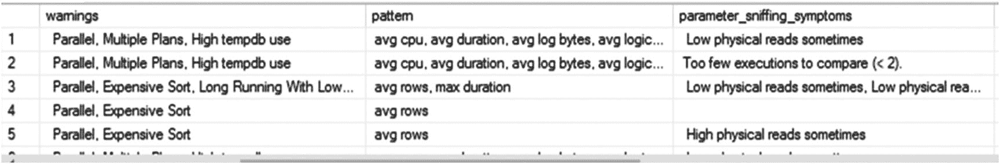

图 10-8
`sp_BlitzQueryStore` 结果集

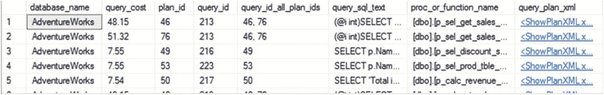

图 10-7
`sp_BlitzQueryStore` 结果集

```
EXEC sp_BlitzQueryStore @DatabaseName = 'AdventureWorks'
清单 10-11
为过去 7 天每个指标执行 sp_BlitzQueryStore 以获取前 N 条查询
```

您可以点击 `query_plan_xml` 列以调出查询计划进行查看和故障排查。它已为您完成了一些分析，提供了 `top_three_waits`、`missing_indexes` 和 `implicit_conversion_info`。其他返回的列如下所示：

*   `top_three_waits` – 括号内为总毫秒数
*   `missing_indexes` – 从查询计划中的缺失索引提示列出
*   `implicit_conversion_info` – 从查询计划中列出
*   `cached_execution_parameters`
*   `count_executions`
*   `count_compiles`
*   `total_cpu_time`
*   `avg_cpu_time`
*   `total_duration`
*   `avg_duration`
*   `total_logical_io_reads`
*   `avg_logical_io_reads`
*   `total_physical_io_reads`
*   `avg_physical_io_reads`
*   `total_logical_io_writes`
*   `avg_logical_io_writes`
*   `total_rowcount`
*   `avg_rowcount`
*   `total_query_max_used_memory`
*   `avg_query_max_used_memory`
*   `total_tempdb_space_used`
*   `avg_tempdb_space_used`
*   `total_log_bytes_used`
*   `avg_log_bytes_used`
*   `total_num_physical_io_reads`
*   `avg_num_physical_io_reads`
*   `first_execution_time`
*   `last_execution_time`
*   `last_force_failure_reason_desc`
*   `context_settings`

您可以在下面看到返回的结果，其中包含了对在该时间段内执行的查询的详细分析，包括是否发现执行计划存在问题、tempdb 使用率高、运行时间长但 CPU 使用率低的查询等，最后通过识别系统在每个指标下表现最差的时间段来总结。此输出的示例请参见图 10-9。这使您能够深入分析指定时间段内特定的性能不佳的时间点或有问题的查询。

#### 注意

使用 `@TOP` 参数可以返回多条（超过一条）查询。但请谨慎使用，因为此过程会通过查询计划进行大量处理。建议限制为 10。

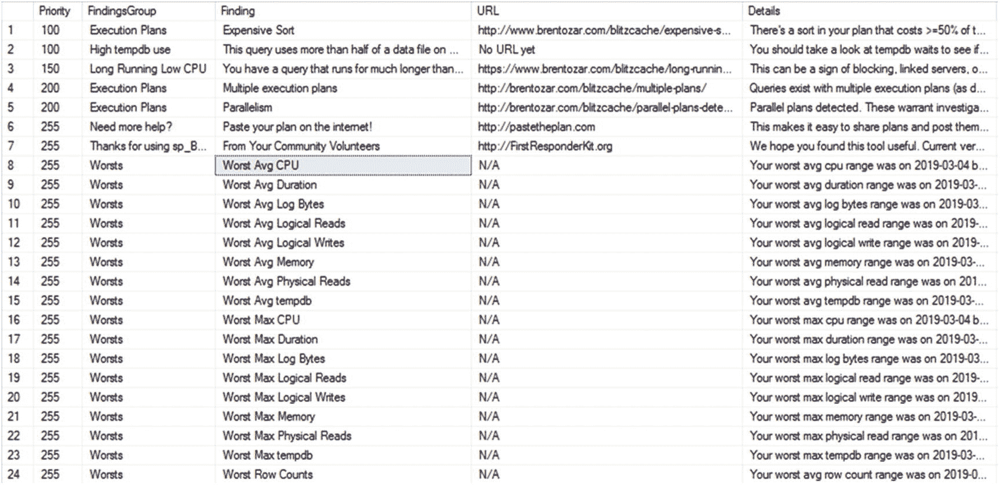

图 10-9
`sp_BlitzQueryStore` 时间段分析

运行此过程还有其他选项；我们将介绍一些重要的选项，以帮助您获取所需的数据。在代码清单 10-12 中，您可以通过指定 `@StateDate` 和 `@EndDate` 参数来指定输出中要返回的日期范围。

```
EXEC sp_BlitzQueryStore @DatabaseName = 'AdventureWorks',
@StartDate = '20170526', @EndDate = '20170527'
清单 10-12
为 sp_BlitzQueryStore 指定日期范围
```

如果您试图对特定的存储过程进行故障排查，可以专门查找该存储过程。在代码清单 10-13 中，您将找到如何通过指定 `@StoredProcName` 参数来返回存储过程 `MyStoredProcedure` 中的前 N 条语句的代码。

```
EXEC sp_BlitzQueryStore @DatabaseName = 'AdventureWorks',
@Top = 1, @StoredProcName = 'MyStoredProcedure'
清单 10-13
返回特定存储过程的前 N 条语句
```

您还可以通过指定 `@Failed` 参数来查看失败的查询。代码清单 10-14 是如何返回失败的前 N 条查询的示例。

```
EXEC sp_BlitzQueryStore @DatabaseName = 'AdventureWorks',
@Top = 1, @Failed = 1
清单 10-14
返回失败的前 N 条查询
```

回顾第 4 章，我们查看了网格视图中的许多报告，您可以在其中看到 `plan_ids` 和 `query_ids`。如果您想查看从这些报告中识别出的某个查询的 `sp_BlitzQueryStore` 数据，那么可以使用代码清单 10-15 和 10-16 中的代码从查询存储中提取数据。

```
EXEC sp_BlitzQueryStore @DatabaseName = 'AdventureWorks',
@QueryIdFilter = 2958
清单 10-16
按 query_id 返回数据
```

```
EXEC sp_BlitzQueryStore @DatabaseName = 'AdventureWorks',
@PlanIdFilter = 3356
清单 10-15
按 plan_id 返回数据
```

您可以指定的其他参数包括表 10-1 中所列的参数。

表 10-1
`sp_BlitzQueryStore` 参数

| 参数名称 | 数据类型 | 默认值 |
| --- | --- | --- |
| `@Help` | bit | 0 |
| `@MinimumExecutionCount` | int | NULL |
| `@DurationFilter` | decimal(38, 4) | NULL |
| `@ExportToExcel` | bit | 0 |
| `@HideSummary` | bit | 0 |
| `@SkipXML` | bit | 0 |
| `@Debug` | bit | 0 |
| `@ExpertMode` | bit | 0 |
| `@Version` | varchar(30) | NULL |
| `@VersionDate` | datetime | NULL |
| `@VersionCheckMode` | bit | 0 |

### 结论

社区工具证明能够增强我们使用查询存储的能力。`dbatools` 让我们能够轻松地跨多个数据库和服务器配置和检查查询存储的设置。`sp_BlitzQueryStore` 让您能够以不同于第 4 章所示报告的格式来提取查询存储中的数据，并且对于快速找出每个指标下的顶级查询以及每个指标下最繁忙的时间段非常有用。最后，它允许您跟踪您已确定需要进一步调查的存储过程、`query_id` 或 `plan_id` 的数据。

## 索引

### A

即席查询 AdventureWorks 数据库 自动计划修正 自动调优 参见自动调优 行为 能力 概念 回归 参见回归 自动计划回归修正 (APRC) 禁用 T-SQL 启用 T-SQL 自动调优 Azure 门户 CurrentState 值 性能回归 T-SQL 命令

### B

基准 目录视图 比较工作负载 返回 创建 定义 建立 整体资源消耗 性能


### C

`目录视图`、`查询存储`、`已编译的存储过程`、`配置选项` 每个查询的缓存捕获查询更改、`图形用户界面` (`GUI`)、`自定义` (`CUSTOM`) 模式 数据库重命名 数据清理 数据刷新间隔 删除/创建间隔 数据最大存储大小 操作模式 参数化 `过时查询阈值天数` (`STALE_QUERY_THRESHOLD_DAYS`) 跟踪标志 等待统计信息 `Copy-DbaQueryStoreConfig`、`数据库` CPU、查询

### D

`数据库`、`平台即服务 (PaaS)`、`数据库属性`、`数据定义语言 (DDL)`、`数据刷新间隔`、`数据操作语言 (DML)`、`dbatools` `Copy-DbaQueryStoreConfig`、`Get-DbaDbQueryStoreOption`、`Set-DbaDbQueryStoreOptions` 期望状态与实际状态 删除/创建与更改 (`Drop/create vs. alter`) `动态管理函数 (DMF)`、`动态管理视图 (DMVs)` 缺点 `query_plan_hash 字段`、`sp_whoisactive`、`sql_handle 字段`

### E

`错误状态` (`ERROR state`) 预估计划与实际计划 `Windows 事件跟踪 (ETW)` 执行计划/查询计划 比较 强制/取消强制 复选标记 强制执行（编程方式） 报告 T-SQL 退化查询识别 查询存储数据报告 警告信号 错误 预估与实际计划 `宽管道` (`fat pipes`)、`第一个操作符`、`成本最高的操作符`、`扫描`、`排序操作符`、`扩展事件` (`Extended events`) 数据库 评估和捕获信息 捕获 选择事件 跟踪行为 故障排除 概念 缺点 模板目录 `XEvent 分析器` (`XEvent profiler`)、`SQL Server Management Studio (SSMS)`

### F

`先进先出 (FIFO) 方法`、`FREEPROCCACHE` 过程

### G, H

游戏规则改变者、`查询存储` 自动计划修正 运行时统计信息 用例 等待统计信息 `Get-DbaDbQueryStoreOption`、`AdventureWorks`、`数据库`、`输出`、`ReadWrite` 表格格式

### I, J, K, L

`基础设施即服务 (IaaS)`

### M

`master 系统数据库`、`内存优化表`、`@module_or_batch`

### N

`命名约定`

### O

`OBJECT` 计划指南、`OPTION 子句`、`整体资源消耗` (`Overall Resource Consumption`) 报告按钮 配置按钮 选项 配置时间间隔 下拉菜单 悬停统计信息 标准网格视图

### P

`性能` 计划缓存，移除 计划指南/`USE PLAN` 提示 存储过程 `UPDATE STATISTICS`、`计划强制` (`Plan forcing`)、`计划句柄` (`Plan handle`) 用于检索的查询 设置选项 检索

### Q

`具有强制计划的查询` (`Queries with Forced Plan`) 报告 右/左窗格 `具有高变化的查询` (`Queries with High Variation`) 报告 高变化报告 参数化 摘要信息 `查询优化器` (`Query optimizer`)、`查询存储` (`Query Store`) 实际状态 异步过程 清除数据 配置 参见`配置选项` 数据收集 数据集 `DDL` 默认选项 期望状态 `DML` 执行计划 `execution_type` 对象资源管理器 报告 计划已移除 属性窗口 移除计划 运行时间间隔 运行时统计信息 设置和诊断 空间使用情况 `sys.database_query_store_options`、`sys.query_context_settings`、`sys.query_store_plan`、`sys.query_store_query`、`sys.query_store_query_text`、`sys.query_store_runtime_stats`、`sys.query_store_runtime_stats_interval`、`sys.query_store_wait_stats`、`T-SQL`、`wait_category` 等待统计信息 `查询等待统计信息` (`Query Wait Statistics`) 报告 类别 网格视图 前五名

### R

`只读状态` (`Read-only state`)、`退化查询` (`Regressed Queries`) 报告 强制/取消强制计划按钮 计划选项 类型 `退化查询` (`Regressed query`) 比较计划 比较报告 定义计划 `退化` (`Regression`) 自动调优 `dbo.ProductByCost` 存储过程 动态管理视图 执行计划 `FREEPROCCACHE`、`JSON 数据` 查询性能 存储过程 `sys.dm_db_tuning_recommendations` 调优建议 `DMV`、`运行时信息` (`Runtime information`)

### S

`Set-DbaDbQueryStoreOptions`、`AdventureWorks`、`数据库`、`输出` 大小和收集间隔 `SET` 选项 用于检索的函数 用于返回的查询 `sp_BlitzQueryStore` 日期范围参数 结果集 时间段分析 `SQL` 计划指南、`SQL Server Management Studio (SSMS)`、`SQL Server` 升级 兼容性级别 (CE) 测试过程 `标准网格视图` (`Standard Grid view`)、`sys.database_query_store_options` 目录视图 `SQL Server` `sys.query_context_settings` 目录视图 `sys.query_store_plan` 目录视图 `sys.query_store_query` 目录视图 `sys.query_store_query_text` 目录视图 `sys.query_store_runtime_stats` 目录视图 `sys.query_store_runtime_stats_interval` 目录视图 `sys.query_store_wait_stats` 目录视图 `sys.sp_force_plan`

### T

`tempdb 系统数据库`、`TEMPLATE` 计划指南、`资源消耗最高的查询报告` (`Top Resource Consuming Queries Report`) 按钮 列 配置屏幕 网格视图 悬停于查询计划 ID 数据 左窗格 指标选项栏 计划网格视图 计划操作符比较 报告详细信息 比较 右窗格 `SQL Server` 统计信息 `跟踪的查询报告` (`Tracked Queries Report`) 放大镜视图 统计信息详细信息 `故障排除` (`Troubleshooting`) `DMF`、`DMVs` 缺点 `sp_whoisactive`、`扩展事件` 参见`扩展事件，故障排除` 轻量级显示计划 跟踪标志 服务器端跟踪 `SQL Server Profiler` 概念 事件类 筛选器屏幕 用例 等待统计信息

### U, V

`USE PLAN 参数`

### W, X, Y, Z

`等待统计信息` 类别 映射表 查询 `dbo.ProductbyCost` 报告
