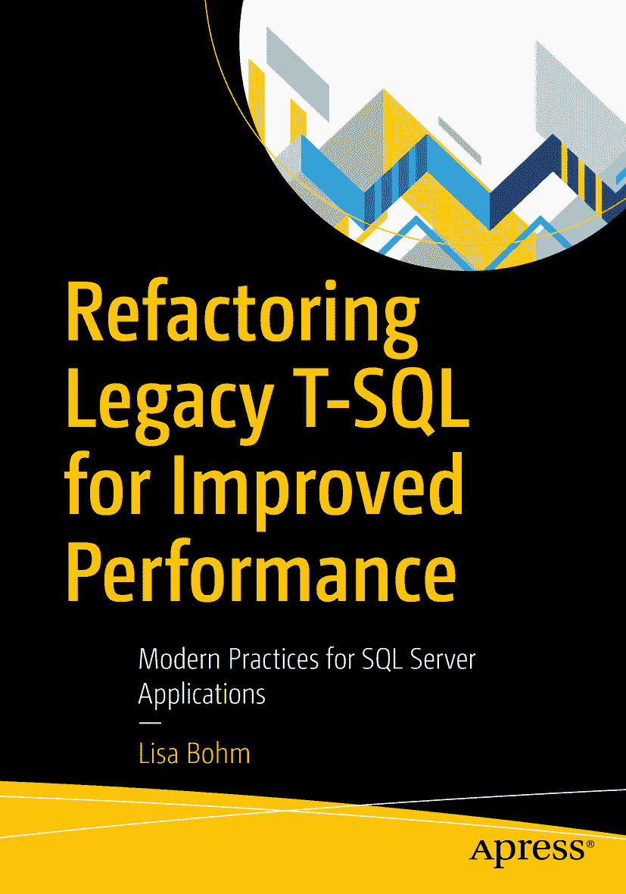

# 引言

ISBN 978-1-4842-5580-3 e-ISBN 978-1-4842-5581-0 [`doi.org/10.1007/978-1-4842-5581-0`](https://doi.org/10.1007/978-1-4842-5581-0) © Lisa Bohm 2020

本作品受版权保护。出版者保留所有权利，无论涉及材料的整体或部分，特别是翻译、转载、插图重用、朗诵、广播、缩微胶片或其他任何物理方式的复制，以及信息存储与检索、电子改编、计算机软件，或当前已知或未来开发的类似或相异方法。

本书中可能出现商标名称、标识和图像。我们仅以编辑方式并为商标所有者利益使用这些名称、标识和图像，无意侵犯商标权。在本出版物中使用商品名称、商标、服务标识及类似术语，即使未特别标识，也不应被视为表达任何关于其是否受专有权约束的意见。

尽管本书中的建议和信息在出版时被认为是真实和准确的，但作者、编辑或出版商均不对可能出现的任何错误或遗漏承担法律责任。出版商对本出版物所含材料不作任何明示或暗示的担保。

本书通过 Springer Science+Business Media New York 在全球图书行业发行，地址：233 Spring Street, 6th Floor, New York, NY 10013。电话：1-800-SPRINGER，传真：(201) 348-4505，电子邮件：orders-ny@springer-sbm.com，或访问网站：www.springeronline.com。

Apress Media, LLC 是一家位于加利福尼亚州的有限责任公司，其唯一成员（所有者）是 Springer Science + Business Media Finance Inc (SSBM Finance Inc)。SSBM Finance Inc 是一家特拉华州公司。

*本书献给 Allen White，他是我的朋友，帮助我成长为社区中有价值的一员，并教会我持续回馈和帮助他人是多么重要。*

什么是遗留代码？市面上流传着一些定义，但作为一个实用定义，我们将采用以下说法：

遗留代码是指不再由编写它的人员积极支持的代码。

我们为何采用这个定义？在软件开发中，良好的文档至关重要。开发者应当理解代码试图完成什么目标以及如何实现。当文档不存在或不够详尽，且原始程序员已无法联系以了解为何某事以特定方式编写时，修复问题可能成为一场噩梦。在某些情况下，甚至难以确定代码是否曾按预期工作，或者某人请求的功能变更是否符合原始程序员的意图。

## 一个令人唏嘘的故事

遗留代码是如何产生的？让我们来看这个故事。代码被编写出来解决一个问题——例如，有人每天将数据复制到 Excel 中，并通过手工操作生成图表添加到更大的报告中。一位开发者搭建了一个快速应用程序，自动从数据库提取数据并导出到 Excel 给用户，同时执行用户原本手工进行的计算。

然后，该用户培训了其继任者和部门中的另一个人如何查看此报告。其中一人说：“嘿，这太棒了！你能不能也把它用于提取另一个报告的数据，这样我们就能展示这些数字之间的对比？”另一个人喜欢这个额外功能，但希望代码以不同方式工作，或进行不同的统计计算，或需要在报告中增加一个字段。该用户的经理对功能很感兴趣，希望每周有一份总结报告供其审阅。代码结构开始变得像拼凑起来的东西，因为多个开发者随着时间的推移不断添加零碎的功能。通常，关于功能或代码选择的文档很少甚至没有——每个人只是在代码末尾添加一堆行来处理他们被要求开发的小部分。

很多时候，前端开发者不专精于 T-SQL，因此通常对 SQL Server 优化器没有深入了解。尤其是在“就在代码底部添加几行来处理额外功能”的情况下，对数据库的调用可能会呈指数级增长；在许多情况下，调用会反复抓取相同的数据。而且，哦，到现在为止，超过一半的公司正在以一种或多种方式使用这个应用程序。顺便说一句，这些用法中的绝大多数，都是任何曾接触过代码的人从未预料到的。

用户抱怨速度慢和性能差。更令人沮丧的是，所有使用相同数据库的其他关键业务应用程序，因为要与这个应用程序及其频繁的数据调用竞争资源和锁，也变得越来越慢。当然，每一位曾接触过这个应用程序的开发者都已离职或晋升，并且多年未曾看过代码，因此对这个在公司基础设施中肆虐的、拼凑起来的庞然大物，他们毫无印象。

### 恭喜你！

你继承了这样一类应用程序，否则你可能不会在这里读这本书。尽管你会遇到（可能很多次）想哭、想大喊或想咒骂的情况，但这也会给你带来一些无与伦比的机会，让你成为英雄，并完成一些看起来非常壮观的修复。不过请记住，当你真正修复了某个了不起的问题时，大多数人对此浑然不觉。而当你做了一些你认为显而易见、甚至人行道上的虫子都能搞定的事情时，你可能会收到如此多的祝贺和感谢，以至于你会怀疑自己是否真的做了什么神奇的事。这可能更多的是对一般生活/工作的观察，与遗留代码没有直接关系，但在遗留代码领域也很普遍。

## 本书宗旨

本书旨在帮助读者快速识别特定数据库对象中可能存在的性能问题。为此，我们需要做如下假设：

1.  硬件/硬件配置/虚拟机配置已被排除为性能问题根源。
2.  外部因素已被排除为问题根源（尽管我们都知道问题通常出在网络）。
3.  引发关注的数据库对象已被识别。

我们将从“问题已定位，接下来该怎么办？”这一点继续深入。我们的主要工作将是借助一些性能度量指标来查看代码，并学习用于识别问题区域的最佳实践。您应熟悉基本的 `T-SQL` 编码语法、技术以及更高级的查询方法。

我们将按对象类型涵盖大多数常见问题，也会为了趣味性介绍一些较少见的问题。一旦识别出对象内的这些问题区域，您就可以用相对较低的精力和成本来缓解性能问题。某些对象可能需要更深入的探究。在我们进行一些初步处理以缓解对象带来的直接痛苦之后，我们将讨论如何有效地进行深入探究。

我们还将讨论如何快速判断您想应用的修复是否正确。我们将介绍一些可用于度量性能的简单（且免费的工具），这样您就可以记录修改前后的指标，连同您肯定会添加的其他文档，以便下一位接手维护这个系统的可怜人（我是指下一个人）工作起来能更轻松！

## 本书不包含什么

魔法。本书不包含魔法，尽管有时它可能看起来能帮您施展魔法。但严肃地说，有时情况会糟糕到无法修复。这种情况非常罕见，我或我各个团队的成员几乎总能“搞定它”，但请意识到，确实有可能存在无法挽救的情况。更棒的是，您的老板也应该意识到这一点，并在您遇到这种情况时支持您。如果您没那么幸运，可能需要考虑换份工作，但这可能超出了本书的讨论范围。

这不是关于索引、统计信息或数据库维护的深入探讨。我希望您已经设置了这些。如果您没有，请找一本讨论这些内容的书并确保您在做这些工作！如果您不专门负责数据库管理，请与负责的人沟通，确保他们已打好这些基础。我们肯定会提及索引和统计信息，但其他地方有更完整的资料，因此我们的讨论更像是概述而非详尽信息。

这也并非识别有问题的硬件、外部因素或数据库对象的方法。我们在前文已经提到了假设条件。如果您跳过了那些，请至少回去阅读那些要点，以便我们在开始初步处理时保持认知一致。

## 工具

我们将使用 `Stack Overflow` 的数据转储。`Brent Ozar` 在他的网站 [`www.brentozar.com/archive/2015/10/how-to-download-the-stack-overflow-database-via-bittorrent/`](https://www.brentozar.com/archive/2015/10/how-to-download-the-stack-overflow-database-via-bittorrent/) 上提供了它，这些数据是他从优秀的 `Stack Overflow` 团队那里获得的。

我还会在本书文件中附带一个备份，以便大家起点一致。如果您想跟随示例操作，请确保在恢复数据库备份后运行数据库设置脚本（包含在本书文件中），以添加我们将在本书中使用的额外对象。

`SQL Server Management Studio (SSMS)` 将是首选的代码运行应用程序。它是微软提供的免费下载：[`https://docs.microsoft.com/en-us/sql/ssms/download-sql-server-management-studio-ssms`](https://docs.microsoft.com/en-us/sql/ssms/download-sql-server-management-studio-ssms)

`SentryOne Plan Explorer` 也是一个免费下载工具。我们将使用它来查看执行计划以及与计划相关的性能指标：[`www.sentryone.com/plan-explorer`](https://www.sentryone.com/plan-explorer)

最后一个工具是一个网站。您可以粘贴冗长的 `statistics IO/time` 输出，它会将其解析成方便易读的表格。它物有所值……嗯……比特币？如果您曾花费时间试图解读游标或循环的输出，您就会完全理解。但请注意，它对可以输入的数据量有限制，超过限制后将无法输出结果：[`http://statisticsparser.com/`](http://statisticsparser.com/)

## 无关紧要（多数情况下）的细节

我在 `Dell Latitude E7470` 笔记本电脑上使用 `SSMS 18` 运行示例。我使用 `Oracle VirtualBox` 设置了一个虚拟机。该虚拟机拥有单个 `vCPU` 和 `8 GB RAM`。我在 `Server 2016 Core` 上运行 `SQL Server 2016 SP2`。

## 开始吧！

现在我们已经把这些说清楚了，让我们打开第一个棘手对象的代码，去做些急救工作吧！

## 致谢

我要感谢所有信任我、鼓励我并推动我不断成长和学习的人。特别感谢 `Mindy Curnutt`、`Eric Blinn` 和 `Tim Tarbet`，他们向我展示了一个人在自己选择的岗位上可以有多么出色，并相信我也能变得同样优秀。

我不能漏掉为我工作的人。我带领着一支出色的、积极投入的团队，他们持续学习，并通过为非常困难的问题找到解决方案而不断激励着我。

还要感谢我的家人（包括我的 `#sqlfamily`），他们始终给予我支持、关爱，并在需要时毫不吝啬地给予拥抱和精神支持！

### 关于作者与技术评审

### 关于作者

### 关于技术评审

