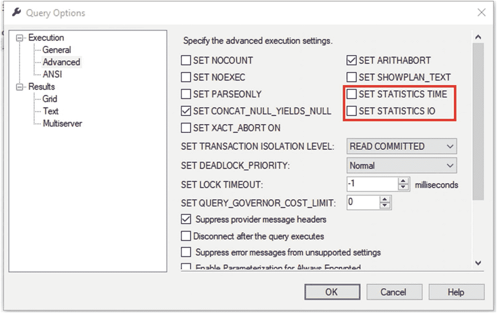
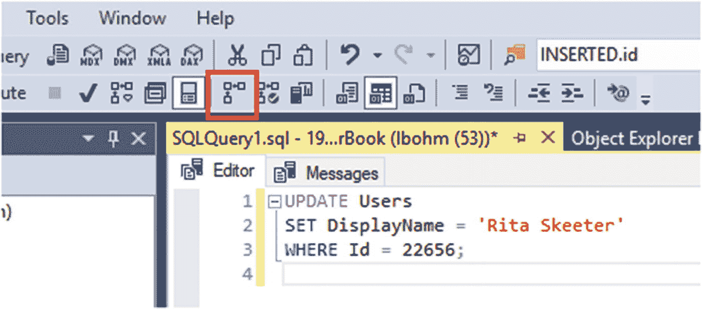
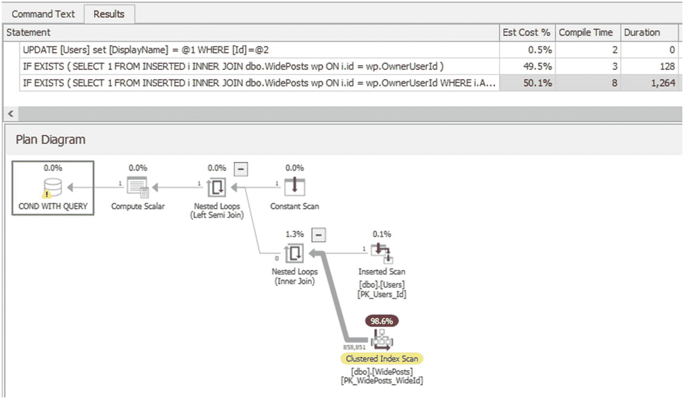
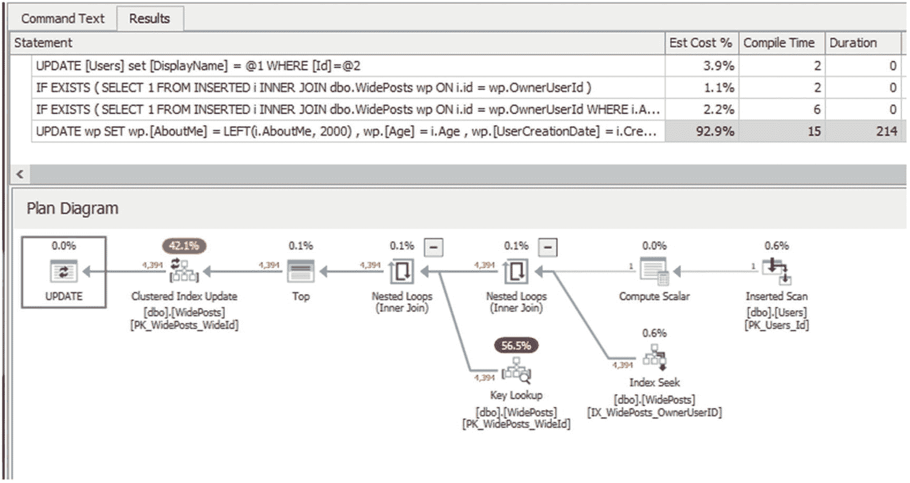

# 第一部分 万物皆慢

## 1. T-SQL 初步诊断

`DBA` 最害怕接到的电话是这样的：“应用程序里所有东西都慢！快修好它！”在许多情况下，数据库是遗留代码性能不佳的罪魁祸首之一。当您被找来处理其中一些问题时，您该怎么做？首先，您需要识别出有问题的代码。我们将假设您（或其他人）已经识别出了问题区域。一旦确认，我们需要通过回答以下问题来评估情况：

1.  确定情况的严重性：
    1.  用户是否无法使用系统？
    2.  所有用户是否都无法使用？
    3.  这是否正在导致业务损失金钱？

2.  确定相对工作量：
    1.  涉及多少行代码？
    2.  应用程序有多少区域调用了这些代码？
    3.  需要修改多少代码？

3.  识别代码中的问题区域：
    1.  哪些区域正在引发痛苦？

4.  如果可能，进行初步处理。

### 情况严重性

这只能通过从用户或用户经理那里收集信息来确定。我知道，我知道，这意味着您必须真正与人交谈。然而，这是判断您是否应该立即放下所有其他工作立即处理此事，还是可以等到您手头任务完成后再处理的绝佳指标。如果您还没有，您可能需要考虑制定一份书面的 `SLA`（服务级别协议），说明您或您的团队对特定事件做出反应的预期（或要求）速度。严重性应该是该文件的关键部分。


### 相对工作量

如果这是一个拥有数千行代码的对象，那就遗憾地摇摇头然后离开吧。开个玩笑！然而，光是理解正在发生什么就需要大量努力，更不用说实际修复性能问题所需的工作量了。这正是优秀文档发挥作用的地方，但如果你正在阅读本书，很可能没有那种唾手可得的帮助。

此外，你需要考虑质量保证（QA）的工作量。最好的情况是永远不要让未经测试的代码进入生产环境。所谓未经测试，我指的是没有通过严格 QA 流程的代码。在笔记本电脑上运行一次似乎是个好主意，但存在各种你可能没有意识到的奇怪场景，而 QA 专业人员会对此有更好的把握。

这段代码中存在多少确切的痛点？这将是我们可以进行何种分类处理以让用户满意（或至少让他们停止向你老板抱怨）的最大决定因素。然而，无论这些答案如何，如果代码已被确定为真正的问题，分类处理只是你的第一步。即使你通过索引或其他巧妙的巫术“修复”了它，也不要就此停止！务必充分记录代码并在必要时重写。

### 问题领域

“喂？Sam DBA？每次用户尝试更改他们的显示名称时，应用程序都会卡住几秒钟，这真的让每个人都很沮丧。”

了解代码问题的最佳方法是去运行一些导致问题的代码。有时，实际 SQL 代码之外的设置也会引发问题。应用程序连接字符串有时会设置 ANSI 设置，这可能导致 SQL 代码的运行方式与 SQL Server Management Studio（SSMS）中的运行方式截然不同。在本书中，我们假设这些可能性已被排除，并非我们所见问题的原因，但我想让你知道，如果你还没有检查这些可能性，你应该去检查一下。

这是你刚刚从呼叫者那里获得的非常有用的信息。但请注意，人们喜欢随意使用“总是”和“从不”这样的词。尽量获取细节：“当你说每次时，是 100% 的情况吗？是 90% 的情况吗？是任何时间都发生还是仅限于某些特定时间？” 记录这些答案，以便与工单/请求/投诉文档一起存档。

让我们去看看当用户尝试更改其显示名称时发生了什么。在接下来的部分中，我们将尝试更改以下用户的显示名称，以寻找问题所在。我们将使用 Jon Skeet（其 `Id` 为 22656）和 stic（其 `Id` 为 31996）。查询将针对 `dbo.Users` 表运行。

#### STATISTICS IO 和 STATISTICS TIME

`STATISTICS IO` 是衡量查询使用的 IO 资源量的指标，而 `STATISTICS TIME` 则测量查询运行时的 CPU 时间和已用时间，以及查询编译时间。如果你依赖 SSMS 右下角的数字来衡量查询时间，请停止这样做！它不准确——或者肯定不够准确。

#### 查询窗口设置

首先，打开 SSMS。连接到数据库并打开一个新的查询窗口，然后打开 `STATISTICS IO` 和 `STATISTICS TIME`。通过 UI 操作，选择“查询”菜单选项，然后选择“查询选项”，再选择“高级”。图 1-1 显示了“查询选项”的“高级”窗口。



图 1-1

SSMS 中的“查询选项高级”窗口

确保勾选`SET STATISTICS TIME`和`SET STATISTICS IO`两个复选框，然后点击确定。

如果你想完全使用脚本，只需在查询窗口中键入如清单 1-1 所示的代码。

```
SET STATISTICS TIME, IO ON;
Listing 1-1
用于打开 STATISTICS TIME 和 IO 的命令
```

然后点击执行（或按 Ctrl+E）。请注意，无论你以哪种方式设置 `STATISTICS TIME` 和 `IO` 为开启状态，它都只对该特定查询窗口或连接（SPID）生效。如果连接被重置（例如，重启 SSMS）或者你打开了另一个查询窗口，你将需要为新的查询窗口再次打开 `STATISTICS TIME` 和 `IO`。

#### 代码测试

接下来，我们想要更新一个用户名。所以，首先，我通过查询 `Users` 表找到了一个用户，并编写了一个快速查询来更改名称。我运行了两次，因为第一次运行通常包括编译时间。顺便说一下，这个用户的原始名字是“stic”。我们稍后会把它改回来。

```
UPDATE Users
SET DisplayName = 'stic in mud'
WHERE Id = 31996;
Listing 1-2
用于更新用户“stic”显示名称的代码
```

清单 1-3 显示了清单 1-2 中查询的 `STATISTICS IO` 和 `TIME` 输出样子。

```
SQL Server parse and compile time:
CPU time = 0 ms, elapsed time = 0 ms.
SQL Server parse and compile time:
CPU time = 0 ms, elapsed time = 0 ms.
Table 'Users'. Scan count 0, logical reads 3, physical reads 0, read-ahead reads 0, lob logical reads 0, lob physical reads 0, lob read-ahead reads 0.
SQL Server parse and compile time:
CPU time = 0 ms, elapsed time = 0 ms.
SQL Server Execution Times:
CPU time = 0 ms,  elapsed time = 0 ms.
Table 'WidePosts'. Scan count 1, logical reads 61083, physical reads 0, read-ahead reads 0, lob logical reads 0, lob physical reads 0, lob read-ahead reads 0.
SQL Server Execution Times:
CPU time = 110 ms,  elapsed time = 116 ms.
Table 'WidePosts'. Scan count 1, logical reads 305110, physical reads 0, read-ahead reads 0, lob logical reads 0, lob physical reads 0, lob read-ahead reads 0.
SQL Server Execution Times:
CPU time = 1141 ms,  elapsed time = 1142 ms.
SQL Server parse and compile time:
CPU time = 1141 ms, elapsed time = 1142 ms.
SQL Server Execution Times:
CPU time = 0 ms,  elapsed time = 0 ms.
SQL Server Execution Times:
CPU time = 0 ms,  elapsed time = 0 ms.
SQL Server Execution Times:
CPU time = 1266 ms,  elapsed time = 1270 ms.
Listing 1-3
SSMS STATISTICS TIME 和 IO 输出
```

有一种更好的方法来查看清单 1-3 中的输出。访问网站 [`http://statisticsparser.com/`](http://statisticsparser.com/) ，并将该输出粘贴到大的窗口中。点击“Parse”按钮，然后滚动到页面底部。你会得到一个漂亮的汇总表，让你一目了然地了解你需要知道的信息。这是网页上标记为“Totals”的部分。表 1-1 显示了在通过 Statistics Parser 网站处理清单 1-3 中显示的输出后，“Totals”部分的读取列。

表 1-1

清单 1-3 的 Statistics Parser 站点输出中的“Totals”部分读取列

| 表名 | 扫描计数 | 逻辑读取 | 物理读取 | 预读 |
| --- | --- | --- | --- | --- |
| 总计 | 2 | 366,195 | 0 | 0 |
| Users | 0 | 3 | 0 | 0 |
| WidePosts | 2 | 366,192 | 0 | 0 |

|   | CPU | 已用时间 |
| --- | --- | --- |
| SQL Server parse and compile time: | 00:00:01.141 | 00:00:01.142 |
| SQL Server Execution Times: | 00:00:02.532 | 00:00:02.539 |
| 总计 | 00:00:03.673 | 00:00:03.681 |

那么我们从表 1-1 中看到了什么？当我们使用 `STATISTICS` 输出来帮助查询调优时，我们主要关注逻辑读取。第一次运行查询时，如果你的数据不在内存中，你会看到较高的物理读取。在测试查询时，我通常忽略第一次运行，专注于第二次。这更接近生产环境中通常看到的情况，因为频繁调用的数据已经在内存中。此外，始终使用这种方法，我们可以确保我们是在进行公平的比较。


### 触发器导致的性能问题

我们发现在表 1-1 中有大量的页面读取，尤其是更新单行时。但这个 `WidePosts` 表是什么？我们并没有更新那个表…对吧？没有，我们正在更新的是 `dbo.Users` 表。不知何故，这个 `WidePosts` 表与 `Users` 表有关联。在 SSMS 中，`Users` 表周围有任何对象吗？外键约束？一个…等等，触发器？嗯，让我们看看这个触发器的定义，如代码清单 1-4 所示。

```sql
/*****************************************************************
对象描述：将用户更改推送到 WidePosts 表。
修订历史：
日期         名称             标签/PTS    描述
-----------  --------------   ----------   -------------------
2019.05.12   LBohm                         初始版本
*****************************************************************/
ALTER TRIGGER [dbo].[ut_Users_WidePosts] ON [dbo].[Users]
FOR UPDATE
AS
SET NOCOUNT ON;
IF EXISTS
(
SELECT 1
FROM INSERTED i
INNER JOIN dbo.WidePosts wp ON i.id = wp.OwnerUserId
)
BEGIN
IF EXISTS
(
SELECT 1
FROM INSERTED i
INNER JOIN dbo.WidePosts wp ON i.Id = wp.OwnerUserId
WHERE i.Age  wp.Age
OR i.CreationDate  wp.UserCreationDate
OR i.DisplayName  wp.DisplayName
OR i.DownVotes  wp.DownVotes
OR i.EmailHash  wp.EmailHash
OR i.[Location]  wp.[Location]
OR i.Reputation  wp.Reputation
OR i.UpVotes  wp.UpVotes
OR i.[Views]  wp.[Views]
OR i.WebsiteUrl  wp.WebsiteUrl
)
BEGIN
UPDATE wp
SET
wp.[AboutMe] = LEFT(i.AboutMe, 2000)
, wp.[Age] = i.Age
, wp.[UserCreationDate] = i.CreationDate
, wp.[DisplayName] = i.DisplayName
, wp.[DownVotes] = i.DownVotes
, wp.[EmailHash] = i.EmailHash
, wp.[LastAccessDate] = i.LastAccessDate
, wp.[Location] = i.[Location]
, wp.[Reputation] = i.Reputation
, wp.[UpVotes] = i.UpVotes
, wp.[Views] = i.[Views]
, wp.[WebsiteUrl] = i.WebsiteUrl
, wp.AccountID = i.AccountID
FROM dbo.WidePosts wp
INNER JOIN INSERTED i ON wp.OwnerUserId = i.Id
WHERE i.Age  wp.Age
OR i.CreationDate  wp.UserCreationDate
OR i.DisplayName  wp.DisplayName
OR i.DownVotes  wp.DownVotes
OR i.EmailHash  wp.EmailHash
OR i.[Location]  wp.[Location]
OR i.Reputation  wp.Reputation
OR i.UpVotes  wp.UpVotes
OR i.[Views]  wp.[Views]
OR i.WebsiteUrl  wp.WebsiteUrl;
END;
END;
GO
```

*代码清单 1-4* `ut_Users_WidePosts` 触发器的 `ALTER` 语句

哈。每次我们更新 `Users` 表时，它都会将更新发送到 `WidePosts` 表中所有 `OwnerUserID` 等于 `Users` 表 `id` 的记录。执行这个任务需要进行大量的读取。让我们再运行一个例子，这次我们将获取一个执行计划。

#### 执行计划

执行计划显示了 SQL Server 决定如何运行你的查询或语句。它展示了优化器选择的操作符。如果你从未看过它，可能会感到困惑。执行计划是 XML 数据，可以被解析成一个图表，显示 SQL Server 引擎使用哪些操作符来满足你的查询请求。（好吧，这说得像泥巴一样清楚，对吧？）当查询运行时，SQL Server 使用查询优化器来找出返回数据或执行请求的最佳方式。对于我们要从中获取数据或执行操作的每个表，SQL Server 将使用一个或多个操作符来访问该表。例如，如果我们需要从 `Posts` 表的大部分数据中获取数据，SQL Server 将执行“表扫描”——即，它将读取表的所有数据页——以找到要返回的数据。该计划还将显示 SQL Server 期望向下一个操作符推送多少行数据。

我首先快速扫视的是又粗又大的线（表示有大量数据，或推送至下一操作符的行数很多）。同时，我检查哪些操作符显示了最多的工作量。我使用 Plan Explorer 来帮助按每个操作完成的工作量对操作进行排序，这使我们能够轻松找到最昂贵的罪魁祸首。那么，我们如何获取这些信息呢？

在 SSMS 中，查询窗口上方有一个你可以点击的按钮。当你将鼠标悬停在它上面时，它会显示文本“获取实际执行计划”。此图标如图 1-2 所示，周围有一个方框。



*图 1-2* 在 SSMS 中开启实际执行计划


### 统计信息

实际执行计划本质上就是包含了统计信息的估算执行计划，因此它们通常差别不大。统计信息是 SQL Server 针对表中的列维护的元数据，用于指示数据分布情况。例如，在一本字典中，有大量单词以字母“st”开头。而以“zy”开头的单词则较少。这种数据的偏斜情况通过统计信息进行跟踪，这有助于查询优化器找到更优的执行计划。

我通常使用实际执行计划，因为它也是查看统计信息是否已过期并需要维护的一种简便方法。如果我们查询返回单行数据，而查询优化器却认为我们返回了 3,000 行，那么统计信息可能就需要维护了。

现在，让我们运行一个查询来更新另一个显示名称。

```
UPDATE Users
SET DisplayName = 'Rita Skeeter'
WHERE Id = 22656;
Listing 1-5
更新用户 ID 为 22656 的显示名称
```

我们的执行计划能告诉我们什么？让我们看一下运行清单 1-5 中的代码所生成的执行计划。如果你安装了 SentryOne Plan Explorer，你可以在 SSMS 中右键单击执行计划（在“结果”选项卡附近查找该选项卡），然后从出现的菜单中选择在 Plan Explorer 中打开该计划。

一旦你在 Plan Explorer 中查看执行计划，你会看到与图 1-3 中所示类似的内容。请确保你已点击“结果”选项卡中“语句”输出的第三行——我们希望查看的是所执行查询中开销最大（估计成本最高）部分的查询计划。



图 1-3

清单 1-5 中查询的初始执行计划

我们看到，大部分开销花费在对 `WidePosts` 进行的聚集索引扫描上，因为当 `Users` 表更新时，触发器会更新 `WidePosts` 表。

什么是聚集索引扫描？聚集索引是指表中所有数据都存储于其中的索引，其数据顺序由索引指定。每个表只能有一个聚集索引。如果一个表没有聚集索引，则它被视为堆。因此，扫描聚集索引相当于扫描整张表。

此外，该操作中读取了大量行。如果我们查看 `WidePosts` 表，会发现有 4,394 行数据包含与用户 `ID` 22656 对应的 `OwnerUserID`。这本身没问题，但我们却读取了超过 850,000 行。（我们可以在图 1-3 中看到 850,000 行；它是位于从聚集索引扫描出发的宽箭头正下方的数字。）这是一个我们需要解决的问题。

`STATISTICS IO` 和 `TIME` 的输出非常相似，如表 1-2 所示。

表 1-2

代码清单 1-5 对应的 Statistics Parser 网站输出的“总计”部分读取列

| 表 | 扫描计数 | 逻辑读取 | 物理读取 | 预读 |
| --- | --- | --- | --- | --- |
| `总计` | `3` | `341,935` | `2` | `0` |
| `Users` | `0` | `3` | `2` | `0` |
| `WidePosts` | `3` | `341,932` | `0` | `0` |
| `Workfile` | `0` | `0` | `0` | `0` |
| `Worktable` | `0` | `0` | `0` | `0` |

| | CPU | 已用时间 |
| --- | --- | --- |
| `SQL Server 解析和编译时间：` | `00:00:00.000` | `00:00:00.001` |
| `SQL Server 执行时间：` | `00:00:02.780` | `00:00:02.789` |
| `总计` | `00:00:02.780` | `00:00:02.790` |

### 尽可能进行故障排查

#### 是否存在索引？

答案是，在 `WidePosts` 表的 `OwnerUserID` 列上没有索引。如果我们能添加一个索引，也许就不需要扫描整张表来查找需要更改的记录了。从 `INSERTED`（触发器插入的表）到 `WidePosts` 的连接仅基于 `OwnerUserID`，因此我们只会索引这一列，如清单 1-6 中的索引创建语句所示。

```
IF NOT EXISTS (SELECT 1
FROM sys.indexes
WHERE object_id = OBJECT_ID('dbo.WidePosts')
AND name="ix_Posts_ownerUserID")
BEGIN
CREATE NONCLUSTERED INDEX IX_WidePosts_OwnerUserID
ON dbo.WidePosts (OwnerUserID);
END;
GO
Listing 1-6
在 WidePosts 表上创建索引的 CREATE 语句
```

让我们看看在运行将用户名改回去的查询时，情况是否发生了变化。我们将从第一个用户开始，其原始名称是“stic”，并使用清单 1-7 中所示的 update 语句。

```
UPDATE Users
SET DisplayName = 'stic'
WHERE Id = 31996;
Listing 1-7
重置用户 “stic” 的显示名称
```

在通过 statisticsparser.com 处理 `STATISTICS IO` 和 `TIME` 的输出后，我们看到的结果类似于表 1-3 所示的结果。

表 1-3

带索引的 `UPDATE` 操作的 `STATISTICS IO` 和 `TIME` 总计

| 表 | 扫描计数 | 逻辑读取 | 物理读取 | 预读 |
| --- | --- | --- | --- | --- |
| `总计` | `2` | `41` | `0` | `0` |
| `Users` | `0` | `3` | `0` | `0` |
| `WidePosts` | `2` | `38` | `0` | `0` |

| | CPU | 已用时间 |
| --- | --- | --- |
| `SQL Server 解析和编译时间：` | `00:00:00.000` | `00:00:00.000` |
| `SQL Server 执行时间：` | `00:00:00.000` | `00:00:00.000` |
| `总计` | `00:00:00.000` | `00:00:00.000` |

这看起来更像是我们预期看到的结果。不过，只有一行受到影响。那么，这如何适用于我们运行的第二个查询，即涉及更新约 4,400 行的查询呢？让我们通过运行清单 1-8 中的代码来看看。首先，如果尚未开启，请开启捕获实际执行计划的开关，这样我们也可以一起查看它。

```
UPDATE Users
SET DisplayName = 'Jon Skeet'
WHERE Id = 22656;
Listing 1-8
更新拥有大量 WidePosts 行的用户
```

`STATISTICS IO` 和 `TIME` 的输出如表 1-4 所示。

表 1-4

更新拥有大量 `WidePosts` 行的用户时的 `STATISTICS IO` 和 `TIME` 输出

| 表 | 扫描计数 | 逻辑读取 | 物理读取 | 预读 |
| --- | --- | --- | --- | --- |
| `总计` | `3` | `35,467` | `0` | `0` |
| `Users` | `0` | `9` | `0` | `0` |
| `WidePosts` | `3` | `35,458` | `0` | `0` |
| `Worktable` | `0` | `0` | `0` | `0` |

| | CPU | 已用时间 |
| --- | --- | --- |
| `SQL Server 解析和编译时间：` | `00:00:00.000` | `00:00:00.001` |
| `SQL Server 执行时间：` | `00:00:00.376` | `00:00:00.456` |
| `总计` | `00:00:00.376` | `00:00:00.457` |

表 1-4 中的输出比我们在表 1-3 中看到的逻辑读取多得多，因为我们找到的是 4,400 行而不是 1 行；这非常合理。当我们查看如图 1-4 所示的执行计划时，我们看到了索引如何影响了为完成此查询而选择的操作符。



图 1-4

索引后的用户名更改查询的执行计划

非常好！对于估计成本最高的那条线，我们不再看到聚集索引扫描了。此触发器中正在完成的工作，现在很大一部分是实际更新 `WidePosts` 表。存在一个 `Key Lookup`（键查找）；我们可以通过向索引添加包含列来消除它。然而，考虑到我们现在即使对于拥有大量记录的用户也能在亚秒级内完成操作，我们或许可以到此为止，因为我们已经消除了 SQL Server 正在做的大部分额外工作。

## 1. 索引

### 变更的风险级别

如果满足以下条件，索引变更属于低风险变更：

*   索引是窄索引（它包含的列很少，并且列的数据类型很小）。
*   表上的索引数量没有过多。

在此情况下，我们看到一个风险极低的代码变更（向一个仅有聚集索引和一个非聚集索引的表添加单列索引），如代码清单 1-6 所示，而其带来的收益却非常大。

### 万能答案…？

太好了！我们总是只要添加一个索引，一切就神奇地解决了，对吧？嗯，不对。有些情况下我们并不想添加索引，之前在讨论索引变更是否为低风险时我们简要提到过。也许你认为需要的索引超过十列。（提示：这是个坏主意。）也许该表已经有 30 个索引了。（提示：这是个更糟的主意。）

如果查询真的需要表中大量数据，聚集索引扫描并不是一个糟糕的选择。添加一个非常宽的索引会减慢写入速度，可能显著减慢。那么向一个已有 30 个索引的表再添加一个索引呢？相反，是否可以通过添加（或包含）单个列来使用某个现有索引？也许你需要切换索引列的顺序，因为它起始于一个 `基数` 非常低的列？所有数据库相关问题的答案永远是“视情况而定”。仔细评估你的具体情况，并利用你能收集到的所有信息来做决定。不要害怕尝试一些东西看看是否可行。不过请先在测试环境中操作！

对于那些不认识“`基数`”这个术语的人，它表示一个列可以包含的不同值的数量。例如，一个位（bit）列可以有三种不同的可能值。（好吧，你们这些反对 `NULL` 的人，嘘。这只是一个例子…）如果你允许它为 `NULL`（是的，是的，我第一次就听到了），这些值将是 0、1 或 `NULL`。假设我们有一个 1,000,000 行的表。每种值都会有很多行。另一方面，如果该列是 `datetime` 列，并且填充的是记录添加的日期/时间，那么每个值可能都不同。该位列将被称为具有“低”`基数`（该列包含许多等价值），而 `datetime` 列将被称为具有“高”`基数`（该列包含许多不同的值）。

### 索引之外的初步评估

还有哪些其他场景？我见过一些对象（通常是触发器和存储过程）更新了另一个表，但即使链接列上存在索引，它也无法使用。因为 `WHERE` 子句中有多个不等价的语句，可能无法使用索引，这可能导致阻塞。

#### 如果可能，查询应在键值上连接

为了最有效地利用外键等约束，最好让查询能在这些键值上进行连接。在这种情况下，我们还需要确保外键列也被索引，以帮助 SQL Server 快速找到所需数据。有时，这可以通过添加一个临时表来存储我们需要检查的数据，进行检查，然后使用该临时表中的键值连接回原表以执行更新或删除操作来辅助实现。

#### SARGability（可搜索参数性）

如果 `JOIN` 和 `WHERE` 子句语句允许使用索引，则该语句被称为“`可搜索参数化`”——即 `SARGable`（Search ARGument 的缩写）。我们将在本书后面更深入地讨论这一点，但现在只需知道，有时可以通过简单的重写使一个查询变得 `可搜索参数化`。

### 总结

初步评估也可以在任何对象类型上进行；对于这些示例，我们专注于触发器，但相同的逻辑适用于不同的对象——函数、存储过程、视图或任何其他 SQL Server 对象。索引通常是低风险的变更，并且可以非常有效地作为代码的临时修补措施。检查查询的连接是否在键值上，也可以通过利用外键约束来帮助提高性能。对查询进行小的重写，如果能让它们使用以前无法使用的索引，也可能非常有效。

一旦完成了初步评估，就该深入研究该对象，记录任何可能的问题区域，并为彻底重写进行评估。

