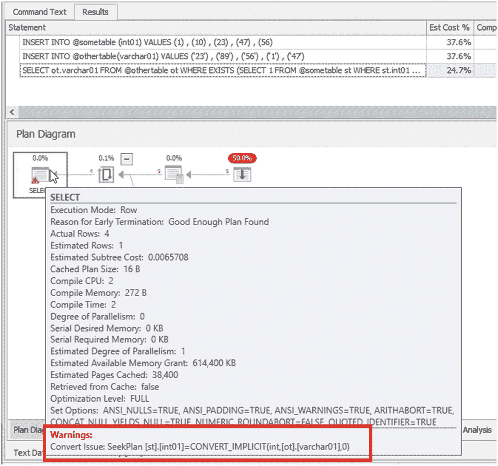
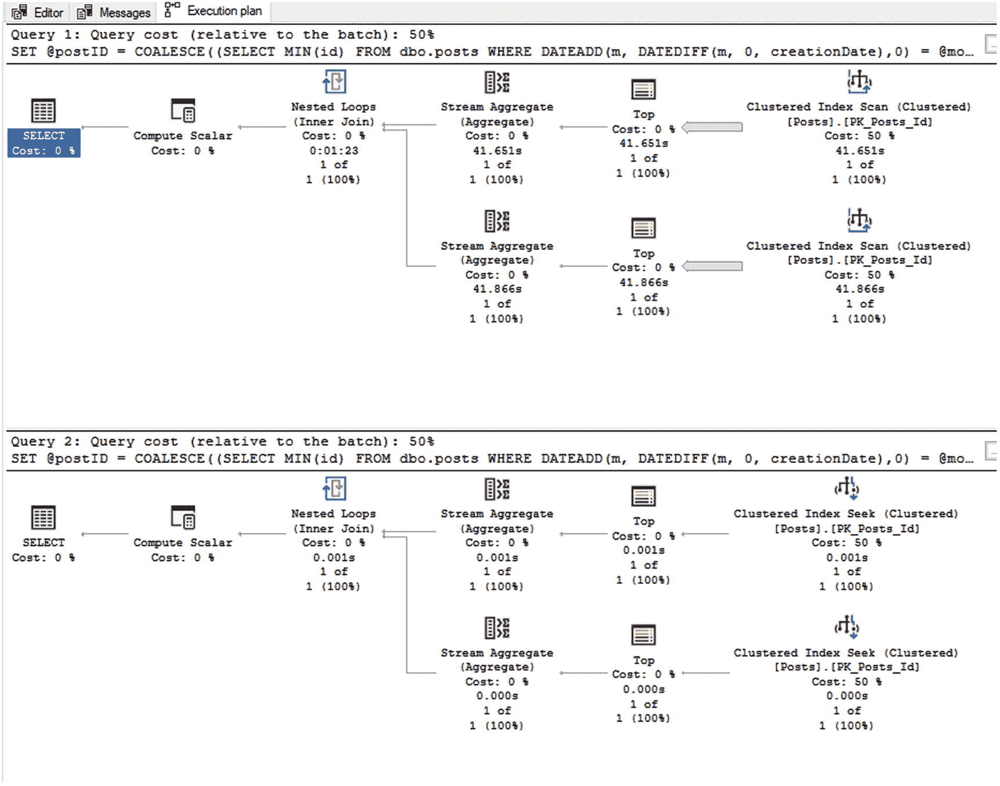

# 2. 文档

在着手重写之前，性能不佳的代码应该被彻底记录下来。很容易一开始就抓取并重写代码，结果却陷入嵌套的 `if` 语句、`while` 循环或对其他 SQL 对象的调用中。如果我们理解了所需的功能，我们就能判断当前代码应该被重构，还是应该直接从头开始。

## 整合现有文档

我们可以从代码开始。如果我们没有任何额外的文档，就需要从代码本身弄清楚功能。我们也绝对应该记录代码的初始状态，以供参考。希望你正在使用某种版本控制软件，但我们也希望这些信息能快速方便地访问。在本章中，我们将研究一个运行数天的报告存储过程，它用于计算一个月内某些数据的每日总和。我运行这个存储过程处理 2012 年 8 月的数据花了 45 分钟；如果你选择跟随本书并运行示例，请注意这一点。让我们看看这个存储过程的修改代码包含什么；我们可以在代码清单 2-1 中看到它。


### 清单 2-1：DailySummaryReportPerMonth 存储过程代码

```sql
/**************************************************************************
描述：  某月每日报告的数据
--测试调用：
-- EXECUTE dbo.DailySummaryReportPerMonth @monthYear = '20180801';
2019.05.26      LBohm          初始版本
**************************************************************************/
ALTER PROCEDURE [dbo].[DailySummaryReportPerMonth] @monthYear DATETIME
AS
BEGIN
/* 以防传入的不是月份的第一天 */
SET @monthYear = DATEADD(month, DATEDIFF(month, 0, @monthYear), 0);
DECLARE @postID           INT
, @dayOfMonth       TINYINT
, @numAnswers       INT
, @numUsers         INT
, @acceptedAnswerID INT
, @userID           INT
, @displayName      NVARCHAR(40)
, @isAccepted       BIT
, @userCtThisPost   SMALLINT
, @numUpvotes       SMALLINT;
CREATE TABLE #finalOutput
( monthyear                  DATETIME
, dayOfMonth                 TINYINT
, dayOfWeek                  TINYINT
, numPosts                   SMALLINT
, numResponses               SMALLINT
, numUsersResponded          SMALLINT
, highNumUsersSinglePost     SMALLINT
, userMostResponses          NVARCHAR(40) -- 显示名称
, percentagePosts            DECIMAL(8, 7)
, numHighestUpvotesOneAnswer SMALLINT
);
DECLARE @usersDay TABLE
( dayOfMonth          TINYINT
, userID              INT
, displayName         NVARCHAR(40)
, numPostsAnswered    SMALLINT
, numAcceptedAnsPosts SMALLINT
);
/* 获取时间段内第一个不是评论或回答的帖子 */
SET @postID = COALESCE(
(
SELECT MIN(Id)
FROM dbo.Posts
WHERE DATEADD(month, DATEDIFF(month, 0, creationDate), 0) = @monthYear
AND PostTypeId = 1
), 0);
/* 获取时间段内所有不是评论或回答的帖子 */
WHILE @postID > 0
BEGIN
SELECT @numAnswers = p.AnswerCount
, @acceptedAnswerid = p.AcceptedAnswerId
, @dayOfMonth = DATEPART(dd, p.CreationDate)
FROM dbo.Posts p
WHERE p.Id = @postID;
IF EXISTS
(
SELECT 1
FROM #finalOutput
WHERE dayOfMonth = @dayOfMonth
)
BEGIN
-- 更新
UPDATE fo
SET fo.numPosts = fo.numPosts + 1
, fo.numResponses = fo.numResponses + @numAnswers
FROM #finalOutput fo
WHERE fo.dayOfMonth = @dayOfMonth;
END;
ELSE
BEGIN
-- 插入
INSERT INTO #finalOutput
( monthYear
, dayOfMonth
, dayOfWeek
, numPosts
, numResponses
, numUsersResponded
, highNumUsersSinglePost
, userMostResponses
, numHighestUpvotesOneAnswer
)
VALUES
( @monthYear
, @dayOfMonth
, DATEPART(dw, DATEADD(dd, @dayOfMonth - 1, @monthYear))
, 1
, @numAnswers
, 0
, 0
, "
, 0
);
END;
/* 现在处理用户相关数据 */
SET @userCtThisPost = 0;
SET @userID = COALESCE(
(
SELECT MIN(p.ownerUserId)
FROM dbo.Posts p
WHERE p.ParentId = @postID
AND p.PostTypeId = 2
), 0);
WHILE @userID > 0
BEGIN
SET @isAccepted = COALESCE(
(
SELECT 1
FROM dbo.Posts p
WHERE p.OwnerUserId = @userID
AND p.ParentId = @postID
AND p.Id = @acceptedAnswerID
), 0);
SET @userCtThisPost = @userCtThisPost + 1;
SET @numUpvotes = COALESCE(
(
SELECT MAX(p.Score)
FROM dbo.Posts p
WHERE p.OwnerUserId = @userID
AND p.ParentId = @postID
), 0);
UPDATE fo
SET fo.numUsersResponded = fo.numUsersResponded + 1
, fo.numHighestUpvotesOneAnswer = CASE
WHEN @numUpvotes > fo.numHighestUpvotesOneAnswer
THEN @numUpvotes
ELSE fo.numHighestUpvotesOneAnswer
END
FROM #finalOutput fo
WHERE fo.dayOfMonth = @dayOfMonth;
/* 为后续计算向用户表添加记录 */
IF EXISTS
(
SELECT 1
FROM @usersDay
WHERE dayOfMonth = @dayOfMonth
AND userID = @userID
)
BEGIN
UPDATE ud
SET ud.numPostsAnswered = ud.numPostsAnswered + 1
, ud.numAcceptedAnsPosts = ud.numAcceptedAnsPosts + @isAccepted
FROM @usersDay ud
WHERE dayOfMonth = @dayOfMonth
AND userID = @userID;
END;
ELSE
BEGIN
INSERT INTO @usersDay
( dayOfMonth
, userID
, displayName
, numPostsAnswered
, numAcceptedAnsPosts
)
SELECT @dayOfMonth
, @userID
, u.DisplayName
, 1
, @isAccepted
FROM dbo.Users u
WHERE u.Id = @userID;
END;
SET @userID = COALESCE(
(
SELECT MIN(p.OwnerUserId)
FROM dbo.Posts p
WHERE p.ParentId = @postID
AND PostTypeId = 2
AND p.OwnerUserId > @userID
), 0);
END;
UPDATE fo
SET fo.highNumUsersSinglePost = CASE
WHEN @userCtThisPost > fo.highNumUsersSinglePost
THEN @userCtThisPost
ELSE fo.highNumUsersSinglePost
END
FROM #finalOutput fo
WHERE fo.dayOfMonth = @dayOfMonth;
/* 获取下一个帖子 ID */
SET @postID = COALESCE(
(
SELECT MIN(Id)
FROM dbo.Posts
WHERE DATEADD(month, DATEDIFF(month, 0, creationDate), 0) = @monthYear
AND PostTypeId = 1
AND Id > @postID
), 0);
END;
/* 最终的每日用户计算 */
UPDATE fo
SET fo.userMostResponses =
(
SELECT ud.displayName
FROM @usersDay ud
WHERE ud.dayOfMonth = fo.dayOfMonth
AND ud.numPostsAnswered =
(
SELECT MAX(udm.numPostsAnswered)
FROM @usersDay udm
WHERE ud.dayOfMonth = fo.dayOfMonth
)
)
, fo.percentagePosts = CASE
WHEN fo.numPosts = 0
THEN 0
ELSE CAST(
(
SELECT MAX(ud.numPostsAnswered)
FROM @usersDay ud
WHERE ud.dayOfMonth = fo.dayOfMonth
) / fo.numPosts AS DECIMAL(8, 7))
END
FROM #finalOutput fo;
SELECT *
FROM #finalOutput;
END;
```

### 功能文档

我们很幸运，能够了解这个报告应该做什么！我们有一份列出了需求的用户故事。请记住，这个数据库是 StackOverflow 数据库的备份，其中包含用户提出的编程问题、对这些问题的回答，以及针对初始帖子和回答的评论。

功能需求在此用户故事中给出：

对于给定月份的每一天，我需要知道

1.  发布了多少个问题？
2.  针对这些问题发布了多少个答案，不论日期？
3.  有多少个不同的用户回答了这些帖子？
4.  该月内，响应单个问题的不同用户的最高数量是多少？
5.  哪位用户响应了该月发布的最多问题？
6.  该用户响应了多少个问题？
7.  这占该月发布的问题总数的百分比是多少？
8.  其中有多少响应被标记为接受的答案？

能够接触到功能需求（在本例中是我们的用户故事）是一个极好的起点。当我们完成文档编写并开始重写此代码时，我们可以将其分解为更小的部分，不仅关注每个部分的性能，还要验证它是否满足功能需求。

### 统计信息与执行计划

在大多数情况下，`STATISTICS TIME and IO` 输出以及执行计划都应捕获并包含在文档中。然而，在这种情况下，如果不写成一本小说而不是代码文档，几乎不可能捕获这些信息。原始代码包含两个嵌套的 `while` 循环，这会导致笨拙的 `STATISTICS` 输出以及庞大的执行计划。`STATISTICS` 输出和执行计划都需要为循环的每个部分显示一个节，从而使输出过于庞大。

#### 编码（反）模式

以下是一个应仔细检查的编码模式清单，因为它们可能引发危险信号：

*   对单个表的多次调用
*   数据类型：参数与数据库字段之间的不匹配、字段宽度
*   子查询：数量和位置（查询的子句）
*   计算
*   临时表和表变量
*   循环和/或游标
*   CTE（公用表表达式）
*   使用的连接类型
*   `LIKE`、`NOT LIKE` 或 `NOT IN` 的使用
*   `DISTINCT`、`TOP` 或其他排序操作
*   对其他 SQL 对象（存储过程、视图、函数）的调用
*   其他异常情况


#### 对每个数据库表的调用次数

在文档的反模式部分，我喜欢以一个表格开始，列出被调用的每个数据库表的名称。随着代码的审阅，我们可以在每个表下添加一条额外的记录，这样就能一目了然地看到单个表被代码触达的频率。我还会包含每次调用所使用的筛选信息。我们也会记录对临时表和表变量的调用。表 2-1 展示了对代码清单 2-1 所示存储过程的表调用情况文档。

**表 2-1** 代码清单 2-1 的每个表的调用次数文档

| 表 | 操作 | 返回的列 | 筛选条件 |
| --- | --- | --- | --- |
| `dbo.Posts` | 选择 | `MIN(Id)` | `CreationDate`, `PostTypeId` |
| | 选择 | `AnswerCount`, `AcceptedAnswerId`, `CreationDate` | `Id` |
| | 选择 | `MIN(OwnerUserId)` | `ParentId`, `PostTypeId` |
| | 选择 | 1 | `OwnerUserId`, `ParentId`, `Id` |
| | 选择 | `MAX(Score)` | `OwnerUserId`, `ParentId` |
| | 选择 | `MIN(Id)` | `CreationDate`, `PostTypeId`, `Id` |
| | 选择 | `MIN(OwnerUserId)` | `ParentId`, `PostTypeId`, `OwnerUserId` |
| `#finalOutput` | 存在性检查 | | `dayOfMonth` |
| | 插入或更新 | 行 OR `numPosts`, `numResponses` | 单条记录 (`dayOfMonth`) |
| | 更新 | `numUsersResponded`, `numHighestUpvotesOneAnswer` | 单条记录 (`dayOfMonth`) |
| | 更新 | `highNumUsersSinglePost` | 单条记录 (`dayOfMonth`) |
| | 更新 | `userMostResponses`, `percentagePosts` | 单条记录 (`dayOfMonth`) |
| | 选择 | `*` | |
| `@usersDay` | 存在性检查 | | 单条记录 (`userID`/`dayOfMonth`) |
| | 插入或更新 | 行 OR `numPostsAnswered`, `numAcceptedAnsPosts` | 单条记录 (`userID`/`dayOfMonth`) |
| | 选择 | `displayName` | `dayOfMonth`, `numPostsAnswered` |
| | 选择 | `Max(numPostsAnswered)` | `dayOfMonth` |
| | 选择 | `Max(numPostsAnswered)` | `dayOfMonth` |
| `dbo.Users` | 选择 | `DisplayName` | 单条记录 (`Id`) |

一个立即引人注意的问题是，对临时表 `#finalOutput` 有数次更新操作，并且全部基于相同的筛选条件。此外，我们对数据库表 `dbo.Posts` 的选择查询也相当频繁。

#### 数据类型不匹配

在代码清单 2-1 的存储过程中，数据库字段的数据类型都与用于筛选条件的参数数据类型或临时表/表变量的字段数据类型相匹配。但这究竟为什么重要呢？让我们看几个场景。

##### 数据截断

假设我们有一个表，其中包含一个名为 `Field100` 的 `varchar(100)` 字段，而我们将这个数据提取到一个临时表的字段中（`Field40`），该字段被设置为 `varchar(40)` 数据类型。只要在我们要插入到临时表 `Field40` 字段的行中，`Field100` 的数据少于 40 个字符，那就没问题。然而，如果在待插入的任何记录中，`Field100` 包含超过 40 个字符的数据，我们将在插入时遇到字符串截断错误。我们来看一下代码清单 2-2，这是一个数据截断示例的第一部分。

```sql
DECLARE @sometable TABLE (somecol varchar(40));
DECLARE @othertable TABLE (othercol Varchar(100));
INSERT INTO @othertable(othercol)
VALUES ('blah')
, ('foo')
, ('short')
, ('uhhuh');
INSERT INTO @sometable (somecol)
SELECT othercol
FROM @othertable;
SELECT *
FROM @sometable;
```

**代码清单 2-2** 数据截断示例第一部分

当我们运行代码清单 2-2 中的代码时，会得到如表 2-2 所示的记录集。

**表 2-2** 数据截断示例第一部分的结果

| somecol |
| --- |
| blah |
| foo |
| short |
| uhhuh |

然而，如果我们运行代码清单 2-3 的代码（数据截断示例的第二部分），我们甚至看不到一个记录集。

```sql
DECLARE @sometable TABLE (somecol varchar(40));
DECLARE @othertable TABLE (othercol Varchar(100));
INSERT INTO @othertable(othercol)
VALUES ('blah')
, ('foo')
, ('short')
, ('uhhuh')
, ('nuhuh Im going to be over 40 characters ha');
INSERT INTO @sometable (somecol)
SELECT othercol
FROM @othertable;
SELECT *
FROM @sometable;
```

**代码清单 2-3** 数据截断示例第二部分

相反，在“消息”选项卡下，我们会看到以下内容：

```
(5 行受影响)
消息 8152，级别 16，状态 14，第 12 行
字符串或二进制数据将被截断。
语句已终止。
(0 行受影响)
```

**代码清单 2-4** 数据截断示例第二部分的结果

当你有几千行代码，然后需要找出发生截断的表和列时，没有什么比看到代码清单 2-4 所示的错误信息更令人沮丧的了。微软的出色团队在 SQL Server 2019 中为此错误信息添加了表名和列名，那一刻简直是天籁之音，阳光穿透云层。然而，在你将所有实例升级之前，你仍然不得不经历那痛苦的过程，用令人煎熬的方式找出导致截断的代码。


##### 隐式转换

微软关于数据类型转换的文档相当详尽，而且非常容易找到。就在他们的 `CAST` 和 `CONVERT` 联机丛书页面上：[`docs.microsoft.com/en-us/sql/t-sql/functions/cast-and-convert-transact-sql?view=sql-server-2017`](https://docs.microsoft.com/en-us/sql/t-sql/functions/cast-and-convert-transact-sql%253Fview%253Dsql-server-2017)。

那里有一张很大的图表，会告诉你哪些数据类型可以转换成其他哪些数据类型。图表上有些漂亮的点，指示了**隐式转换**发生的位置。图表很好，但有时非常难以理解。这到底意味着什么？

假设我们有一个整数字段（`int01`），并且需要将 `int01` 中的值与一个 varchar 字段（`varchar01`）进行比较。字段 `varchar01` 中包含一些整型值，但当然它们是以 varchars 形式存储的。清单 2-5 用一个代码示例说明了这一点。

```
DECLARE @sometable TABLE (int01 INT);
DECLARE @othertable TABLE (varchar01 varchar(8));
INSERT INTO @sometable (int01)
VALUES (1)
, (10)
, (23)
, (47)
, (56);
INSERT INTO @othertable(varchar01)
VALUES ('23')
, ('a89')
, ('56o')
, ('e1')
, ('47');
SELECT ot.varchar01
FROM @othertable ot
WHERE EXISTS (SELECT 1
FROM @sometable st
WHERE st.int01 = ot.varchar01);
Listing 2-5
隐式转换示例 第 1 部分
```

运行清单 2-5 中的代码后，我们的 `STATISTICS` 输出显示我们得到了一个转换错误。此错误如清单 2-6 所示。

```
Msg 245, Level 16, State 1, Line 21
Conversion failed when converting the varchar value 'a89' to data type int.
Listing 2-6
来自隐式转换示例 第 1 部分 的转换错误
```

如果我们改为运行清单 2-7 中的转换示例，我们可以在执行计划中看到转换的证据。（如果你没有打开执行计划，请别忘了切换显示它！）

```
DECLARE @sometable TABLE (int01 INT);
DECLARE @othertable TABLE (varchar01 varchar(8));
INSERT INTO @sometable (int01)
VALUES (1)
, (10)
, (23)
, (47)
, (56);
INSERT INTO @othertable(varchar01)
VALUES ('23')
, ('89')
, ('56')
, ('1')
, ('47');
SELECT ot.varchar01
FROM @othertable ot
WHERE EXISTS (SELECT 1
FROM @sometable st
WHERE st.int01 = ot.varchar01);
Listing 2-7
隐式转换示例 第 2 部分
```

一旦我们查看了清单 2-7 代码的执行计划（如图 2-1 所示），我们可以看到几个有趣的事情。



Figure 2-1
隐式转换的证据

在图 2-1 中，我们在 `SELECT` 运算符上看到一个带有感叹号的黄色三角形。如果我们将鼠标悬停在该运算符上，会出现一个弹出窗口，底部有一条警告。`varchar01` 列的值被转换为整数，以便与 `int01` 列的值进行比较。让我们重读上一句话并稍加强调：SQL Server 将**隐式转换 `VARCHAR01` 字段中的所有值**——整个表中的每一条记录。

为什么会发生这种情况？答案当然是，我们（这里的“我们”包括 SQL Server）无法知道记录是否与其他记录等价，除非我们能够比较这些值。我们必须进行表扫描或索引扫描，以便首先将 `varchar01` 字段中的**所有值**转换为整数，这样才能确定它们是否与 `int01` 字段中的值等价。这将导致扫描操作而非查找操作，从而带来扫描操作相应的性能开销。

##### 字段宽度

然后是数据类型宽度。我的意思是，为什么不把所有内容都设成 `nvarchar(max)` 来避免所有可能的截断错误这类事情呢？SQL Server 只会为字段中实际的字符数分配存储空间，所以这样应该没问题，对吧？嗯，将字段设置为不正确的数据类型或荒谬宽度的做法，有几个主要问题值得担忧。

一个严重的问题是，人们会滥用设置宽数据类型的做法。你应该将每个字段设置为只包含所需的数据。慎重地使用正确的数据类型和字段宽度，可以避免字段被用作“万能”字段的可能性，人们可以（并且将会）在其中存放各种随机数据。当然，他们随后又会想要在这些随机数据上进行搜索……

另一个问题是，SQL Server 使用一种称为“内存授权”的机制来确定运行查询所需的资源量。虽然 SQL Server 不会在 `nvarchar` 和 `varchar` 字段中存储“空”字符，但内存授权会假设一行的宽度是该行可能的最大宽度，而不是该行数据的实际宽度。具有宽 `varchar`、`text` 和 `image` 数据类型的字段将导致 SQL Server 对内存和 `tempdb` 空间（以及可能你的查询所需的其他资源）的估计变得非常臃肿。然后，你必须等到你的 SQL Server 能够找到满足这些授权所需的资源后，才能运行你的查询。我希望你和我第一次了解到这种情况时一样，觉得这很可怕……

所有这一切的结果是，数据类型**绝对重要**。当我们在后面讨论表和其他对象时，我们还会更多地涉及数据类型。但在清单 2-1 的代码示例中，编写这段代码的人非常仔细地检查了参数和临时对象的数据类型与数据库表的数据类型是否匹配，因此对于这个存储过程，没有数据类型方面的顾虑。

#### 子查询及其位置

SQL Server 现在（在大多数情况下）足够智能，可以将 `SELECT` 语句中的子查询转换为联接（join）。过去，它曾为返回记录集中的每一行运行一次每个子查询。真糟糕！然而，在我见过的很多情况下，会出现一个接一个的子查询，它们从几乎完全相同的表、相同的数据中调用几乎完全相同的信息。（看到了吗？这就是为什么我们想在调用表时捕获过滤数据。）例如，当我们查看前面表格中的 `@usersDay` 调用时，我们看到有两个聚合都基于相同的过滤条件（`dayofmonth`）。它们都是子查询，如果被查询优化器转换为联接，每个子查询都会被作为一个单独的联接来调用。对同一个表的多次调用，无论是联接中的调用还是子查询中的调用，都是初始重写项目的绝佳目标，因为组合这些调用通常相对简单，并且可以显著减少读取次数。

对于 `SELECT` 语句中的子查询，我们希望考虑将对同一表的调用组合起来，并将它们移动到某种联接中，通常是 `OUTER APPLY`。当它们在 `WHERE` 子句中时，我们希望研究如何将这些数据提取出来，并以某种方式将其用作联接，以减少对这些给定表的命中和读取次数。复杂的 `WHERE` 子句在优化器试图生成一个好的查询计划时，会让它“头疼”；尽可能简化这个逻辑将有助于它生成最佳计划。

在清单 2-1 的代码中，唯一的子查询是那些调用 `@usersDay` 并进行一些聚合的子查询。我们将在存储过程的文档中记录这一点。然后，当到了重写代码的时候，我们肯定会考虑合并这些子查询以减少命中次数。是的，即使对于临时表和表变量，我们也想这么做！


#### 计算

计算过程中可能存在许多容易出错的地方。除零错误、括号导致错误结果，甚至并行度抑制都可能在计算中发现。在 `WHERE` 子句中对列进行计算，就像我们在前面代码清单 2-7 示例中关于隐式转换所看到的那样，可能导致全表扫描；如果 `SQL Server` 需要确定某个字段中的值是否等同于根据另一个字段计算出的值，它就必须对每条记录执行计算以判断是否相等。

此存储过程中的大多数计算都非常简单，例如将一或一个整数加到某个列或变量上。简单的计算通常不容易出问题。结尾处有一个除法计算，但有一个检查以避免除零错误。如 `CASE` 语句所示（在代码清单 2-8 中再次展示），代码在执行计算前会显式检查除数是否不等于零。

```sql
CASE
WHEN fo.numPosts = 0
THEN 0
ELSE CAST(
(
SELECT MAX(ud.numPostsAnswered)
FROM @usersDay ud
WHERE ud.dayOfMonth = fo.dayOfMonth
) / fo.numPosts AS DECIMAL(8, 7))
END
```

代码清单 2-8：来自代码清单 2-1 的帖子百分比计算

我们还需要检查此代码调用的所有数据库对象以进行计算，特别是所有表和视图。这看起来有点过分；但有一个很好的理由。任何引用包含使用用户定义标量函数的计算列的表或视图，即使查询中未引用该列，也会导致串行计划。这是一种并行度抑制器。“但你不希望你的查询并行运行，那表明性能不佳！”

这并不完全正确。如果一个查询并行运行，这表明与该查询相关的成本高于并行度成本阈值（`SQL Server` 设置）。他们如何衡量这个成本？嗯，曾经有一个微软开发人员使用的计算机，一堆度量标准都绑定到这个任意的标准上。我和我的团队通常称这些单位为“Mysofts”，这通常向我们表明你可以将它们与其他……“东西”进行比较……但如何比较并不总是很清楚。但我跑题了。

如果你有一个重量级的查询，它完全并行运行是完全可以的。毕竟，你拥有多个 `CPU`，就是为了分散密集型操作的负载。如果一个查询将消耗一定数量的 Mysofts，你希望它并行运行，因为经过的时间会短得多，你的用户也更不容易抱怨。你不希望因为多年前开发人员的某个任意错误而阻止这种情况发生。所以，去检查你的表和视图，确保没有任何计算列使用了标量函数。在代码清单 2-1 中我们的代码情况下，没有这样的列。

#### 临时表和/或表变量

我们肯定需要记录我们正在记录的任何代码中出现的临时表和表变量：它们的宽度，我们在过程中对数据或定义进行的更改次数，以及我们认为每个表中会有多少行。更改临时表的定义，即使我们是在添加索引，也可能导致包含该临时表的存储过程重新编译。向临时表或表变量添加大量数据也可能导致包含的存储过程重新编译。

临时表和表变量之间到底有什么区别？主要区别在于临时表具有统计信息以及更广泛的索引支持，而表变量没有统计信息，并且只能以几种特定方式创建索引。我们在第 1 章简要讨论过统计信息；这里我们特指与索引相关的数据点，这些点指示了每个索引值之间的数据分布情况。这就是为什么许多人会推荐对少量数据使用表变量（在我看来，我采用 100 行或更少）。其他人对“少量”有不同的定义；你可能需要确定什么最适合你。推荐 100 行或更少的另一个原因是，优化器会假设表变量只有一行（同样，由于缺乏统计信息）。

在代码清单 2-1 的存储过程中，我们既有表变量也有临时表。首先创建临时表 `#finalOutput`，其中最多有 31 行（一个月中的每一天一行）。它主要由 `smallint` 列组成，尽管它有一个 `nvarchar(40)` 列、一个 `datetime` 列、一个 `decimal` 列和几个 `tinyint` 列。这个表相当窄——它只包含几列。

表变量 `@usersDay` 也很窄，但会有更多得多的行——每个在每一天回答问题的用户一行。`@usersDay` 中可能有数千行！

这两个对象 `@usersDay` 和 `#finalOutput` 的定义在创建后都不会更改。根据代码，数据将在两者中多次更改。这些更改将一次一行地发生（除了临时表的最后一次更新外，所有的添加和更新都在循环中）。

我们将把代码清单 2-9 中的信息添加到我们为代码清单 2-1 中的代码创建的文档中。

```
#finalOutput 临时表，窄            最大可能行数 -  31
插入：一次一行
更新：一次一行（最后一次更新除外）
@usersDay 表变量，窄          可能行数 - 数千
插入：一次一行
更新：一次一行
```

代码清单 2-9：代码清单 2-1 中代码的表变量和临时表文档


#### 循环与/或游标

清单 2-1 中存储过程的循环使用之处，正是其“闪光”所在；我指的是那种带着邪恶红光的“闪光”。该过程遍历一个月时间跨度内的每一个帖子，然后在此循环内部，又遍历每个回复该帖子的用户。通常，前端开发人员以过程化方式思考。事实上，大多数人都是以过程化方式思考的。“我做这个，然后做那个，再做这个，然后我取下一个，重复同样的事情。”关系型数据库本意是为批处理优化，但训练我们自己以批处理一切的方式思考是困难的，因为生活中真正以这种方式运作的事情少之又少。

随着我们深入探讨重写清单 2-1 中的代码，我们将更深入地讨论与循环相关的顾虑，但就文档记录而言，我们只想确保在看到任何逐行处理的地方都加以记录，比如前面提到的两个循环。你经常会听到 `RBAR` 这个缩写，用来描述使用逐行处理的代码。`RBAR` 这个缩写由杰夫·莫登（Jeff Moden）创造，代表“逐行痛苦处理”。

关于清单 2-1 代码的文档记录，首先我们会了解每月录入的帖子数量，这将指示第一个循环需要处理的记录数。我们使用清单 2-10 中的代码来实现这一点。

```sql
SELECT COUNT(1) as NumPosts
, DATEPART(year,CreationDate)
, DATEPART(m, CreationDate)
FROM dbo.Posts
WHERE PostTypeId = 1
GROUP BY DATEPART(year,CreationDate),DATEPART(m,CreationDate)
ORDER BY DATEPART(year,CreationDate),DATEPART(m,CreationDate);
```
清单 2-10
用于确定每月录入帖子数量的代码

对于清单 2-1 的文档记录，我们会记录以下内容：1) 有一个 `while` 循环遍历一个月内所有的问题帖子（大约 5 万到 15 万条），以及 2) 有第二个内部 `while` 循环，用于遍历每个回复帖子的用户（每个帖子大约有两个用户回复）。

#### 公用表表达式

清单 2-1 的代码中没有使用公用表表达式。我们在记录代码时会寻找它们，因为人们并不总是理解，每次引用一个 `CTE` 时，它都会重新运行 `CTE` 的评估代码。这可能导致后台执行的工作量远超人们的预期。我只在两种情况下使用 `CTE`：一是尝试限制视图结果集时，二是我的代码中需要使用递归时。本书代码中包含的存储过程 `sp_codeCallsCascade` 和 `sp_codeCalledCascade` 就是使用 `CTE` 进行递归的例子。然而，递归超出了本书的讨论范围。

#### 连接类型

清单 2-1 的代码中使用了标准的连接类型和语法。所谓标准的连接和语法，是指明确声明为 `INNER JOIN` 或 `LEFT OUTER JOIN` 或其他常用连接类型的连接。有些过去可接受的连接语法类型，在较新版本的 SQL Server 中会导致编译失败。

此外，对非标准连接理解不深的人可能会使用它们，导致结果集出现意外的后果，而这些后果可能不会被 `QA` 捕获。

#### LIKE, NOT LIKE, and NOT IN

`IN` 和 `LIKE` 操作符可能被误用并导致性能问题。通常它们各自都有更好的替代方案，这就是为什么我们要在任何重构的代码中记录它们的用法。在清单 2-1 的代码中，我们完全没有看到 `LIKE` 或 `NOT LIKE` 的使用，这是好事，因为使用 `LIKE` 或 `NOT LIKE` 会阻止查询使用索引。

在清单 2-1 的代码中也没有使用 `NOT IN`。我们为什么要检查这个操作符的使用？过去，使用 `EXISTS` 和 `NOT EXISTS` 代替 `IN` 和 `NOT IN` 有性能优势，但随着时间的推移和 SQL Server 新版本的发布，这种优势已经减弱。然而，`NOT IN` 和 `NOT EXISTS` 处理 `NULL` 值的方式不同——如果子查询的源数据包含 `NULL` 值，即使该值实际不存在，`NOT IN` 也会评估为 `FALSE`。`NOT EXISTS` 在结果集中处理 `NULL` 时不会有同样的问题；因此我们仍然建议使用 `NOT EXISTS` 而非 `NOT IN`。

#### DISTINCT, TOP, and Other Sorting Operations

排序在 SQL Server 中可能代价高昂。许多操作，如 `TOP` 和 `DISTINCT`，都需要进行一些排序，这就是为什么我们在发现它们时希望将其标识出来。`MIN` 和 `MAX` 也是排序操作，即使不存在显式的 `ORDER BY` 子句；我们需要对我们要求 `MIN` 或 `MAX` 的字段值进行排序，才能确定哪个是最高或最低值。

对于清单 2-1 代码中的每个循环，我们都在寻找所遍历表的 `MIN(Id)`。在这个案例中，我们看到：

*   在时间跨度内从 `Posts` 表获取 `MIN(Id)`
*   基于 `ParentId` 从 `Posts` 表获取 `MIN(OwnerUserId)`

除了这两个 `MIN()` 列之外，没有其他操作表明在底层进行了排序。

#### Calls to Other User-Defined SQL Objects

幸运的是，清单 2-1 中的存储过程没有调用其他 `SQL` 对象（除了 `dbo.Posts` 表）。我有一个自己写的存储过程，它基于 SQL Server 跟踪的依赖关系，可以告诉你哪些其他对象依赖于你的对象（在大多数情况下，这等同于被此对象调用的对象）。我没有让它跟踪表；它会显示存储过程和函数。我已将这个存储过程包含在本书中；它叫做 `sp_codeCallsCascade`。它使用系统目录视图来确定依赖关系。

你可以对你的代码使用这个存储过程，以查看你的对象调用了什么代码，然后那些对象又调用了什么对象，……嗯，以此类推。调用方式如清单 2-11 所示。

```sql
EXECUTE sp_codeCallsCascade @codeName='DailySummaryReportPerMonth', @rootSchema = 'dbo';
```
清单 2-11
`sp_codeCallsCascade` 的示例调用


#### WHERE 子句中的原生 SQL Server 函数

我们刚刚探讨了用户定义的 SQL 对象（包括函数）的调用。然而，我们还需要审视 WHERE 子句中使用的原生 SQL Server 函数。这种用法需要格外留意，因为如果函数操作的是表字段（即使是像 `ISNULL` 这样的简单函数），它可能会导致使用该函数的查询无法有效利用索引。这类似于我们讨论过的隐式转换问题：如果要检查两个值是否相等，就必须评估每条记录的值，以确定函数的输出是否与我们要比较的值匹配。

在代码清单 2-1 中，原生 SQL Server 函数出现在两个地方。它们出现在 `@postID` 的初始赋值以及 `@postID` 变量的后续赋值中。该查询针对大约一个月时间范围内的 150k 个帖子逐一执行。相关代码如清单 2-12 所示。

```sql
SET @postID = COALESCE((SELECT MIN(Id)
FROM dbo.Posts
WHERE  DATEADD(m, DATEDIFF(m, 0, CreationDate),0) = @monthYear
AND PostTypeId = 1)
,0);
```
**清单 2-12**
来自清单 2-1 的 WHERE 子句中的原生 SQL Server 函数

如果我们运行类似清单 2-12 的代码来获取执行计划，同时打开 `STATISTICS IO` 和 `TIME`，会发生什么？我们可以很容易地模拟一个测试示例，如清单 2-13 所示。

```sql
DECLARE @monthYear datetime = '20120801'
, @postID int;
SET @postID = COALESCE((SELECT MIN(Id)
FROM dbo.Posts
WHERE  DATEADD(m, DATEDIFF(m, 0, CreationDate),0) = @monthYear
AND PostTypeId = 1)
,0);
SET @postID = COALESCE((SELECT MIN(Id)
FROM dbo.Posts
WHERE  DATEADD(m, DATEDIFF(m, 0, CreationDate),0) = @monthYear
AND PostTypeId = 1
AND Id > @postID)
,0);
```
**清单 2-13**
WHERE 子句中原生 SQL Server 函数的模拟测试示例

我们可以通过查看清单 2-14 的输出来了解 `STATISTICS IO` 和 `TIME` 的情况。

```
SQL Server Execution Times:
CPU time = 0 ms,  elapsed time = 0 ms.
SQL Server parse and compile time:
CPU time = 15 ms, elapsed time = 16 ms.
SQL Server Execution Times:
CPU time = 0 ms,  elapsed time = 0 ms.
Table 'Posts'. Scan count 2, logical reads 4477272, physical reads 8, read-ahead reads 4496246, lob logical reads 0, lob physical reads 0, lob read-ahead reads 0.
(1 row affected)
SQL Server Execution Times:
CPU time = 43500 ms,  elapsed time = 83520 ms.
Table 'Posts'. Scan count 2, logical reads 12, physical reads 2, read-ahead reads 0, lob logical reads 0, lob physical reads 0, lob read-ahead reads 0.
(1 row affected)
SQL Server Execution Times:
CPU time = 0 ms,  elapsed time = 3 ms.
SQL Server parse and compile time:
CPU time = 0 ms, elapsed time = 0 ms.
SQL Server Execution Times:
CPU time = 0 ms,  elapsed time = 0 ms.
```
**清单 2-14**
运行清单 2-13 后的 STATISTICS IO 和 TIME 输出

哎呀！这是一个非常大的读取量，这使得初始调用非常痛苦。我们可以从清单 2-14 中 `Table 'Posts'` 的第一组读取数据中看到这一点；有 4,477,272 次逻辑读取和 4,496,256 次预读取。逻辑读取是从内存中访问的页面数。预读取是 SQL Server 尝试猜测需要哪些数据，并将这些数据（如果尚未存在）移入缓冲区缓存的操作。

我们必须读取每条记录的数据，以确定应用了 `DATEADD/DATEDIFF` 函数后的 `CreationDate` 是否等于 `@monthYear` 变量！由于 `Id` 过滤器（我们规定 `Id` 必须大于当前的 `@postID` 值），后续每次对 `Posts` 表的调用都会明显减轻痛苦。在清单 2-14 的第二行 `Table 'Posts'` 中，我们只看到 12 次逻辑读取，没有预读取。

当我们查看清单 2-14 代码的执行计划时，我们看到第一个查询有粗大的箭头线，而第二组查询的箭头线则合理得多。“粗大线条”指的是我们在计划右侧的聚集索引扫描运算符上看到的非常粗的箭头，这些箭头指向 TOP 运算符。第二个查询可以将 `Id` 用作寻求谓词（我们让 SQL Server 知道我们只想要大于当前 `@postID` 的 `Ids`）。这使得 SQL Server 可以使用索引寻道（Index Seek）而不是索引扫描（Index Scan）（请看每个计划的最右侧；上方计划显示了两个聚集索引扫描，而下方计划显示了两个聚集索引寻道）。



**图 2-2**
清单 2-14 中填充 @postID 的查询的执行计划

这里的重要信息是，在 WHERE 子句中针对列值使用任何类型的标量函数（无论是用户定义的还是 SQL Server 原生的）时都要小心！

## 索引

一旦我们记录了编码反模式，我们就应该寻找适用于相关查询的索引。我们是否有正确的索引？我们将使用执行计划来查看这些索引是否正在被我们正在检查的查询使用。如果没有，为什么？某些操作将不允许使用索引，其中一些我们已经在本章中讨论过。

#### 回到运行时数据

在将来自清单 2-1 的代码分解并开始查看其各个部分之前，我们无法在文档中对索引做太多处理。由于存在循环，要获得 `STATISTICS IO` 和 `TIME` 的聚合数据，或者获得一个稍微可读的执行计划，都是非常困难的。当我们进入重写阶段并开始提取运行时数据时，我们将能够像在清单 2-14 中那样更好地评估索引的使用情况。

### 总结

#### 整理我们的文档

当我们完成时，我们应该得到一份包含有价值信息的文档，这将有助于我们重写 SQL 对象。我们为清单 2-1 的代码整理的文档相当简单；问题很少，尽管存在的问题都相当大。清单 2-1 完整文档的示例如下。

## DailySummaryReportPerMonth: 文档

### 截至 2019.06.02 的代码


### SQL 存储过程文档：每日月度汇总报告

#### 存储过程代码

```sql
IF NOT EXISTS
(
SELECT 1
FROM sys.procedures
WHERE name = 'DailySummaryReportPerMonth'
)
BEGIN
DECLARE @SQL NVARCHAR(1200);
SET @sQL = N'/*************************************************************************    2019.05.26    LBohm            INITIAL STORED PROC STUB CREATE RELEASE
**************************************************************************/
CREATE PROCEDURE dbo.DailySummaryReportPerMonth
AS
SET NOCOUNT ON;
BEGIN
SELECT 1;
END;';
EXECUTE SP_EXECUTESQL @SQL;
END;
GO
/**************************************************************************
Description: Data for daily report for a month
--Test call:
-- EXECUTE dbo.DailySummaryReportPerMonth @monthYear = '20180801';
2019.05.26     LBohm          INITIAL RELEASE
**************************************************************************/
ALTER PROCEDURE [dbo].[DailySummaryReportPerMonth] @monthYear DATETIME
AS
/* in case the first day of the month not passed in */
SET @monthYear = DATEADD(month, DATEDIFF(month, 0, @monthYear), 0);
DECLARE @postID           INT
, @dayOfMonth       TINYINT
, @numAnswers       INT
, @numUsers         INT
, @acceptedAnswerID INT
, @userID           INT
, @displayName      NVARCHAR(40)
, @isAccepted       BIT
, @userCtThisPost   SMALLINT
, @numUpvotes       SMALLINT;
CREATE TABLE #finalOutput
( monthYear                  DATETIME
, dayOfMonth                 TINYINT
, dayOfWeek                  TINYINT
, numPosts                   SMALLINT
, numResponses               SMALLINT
, numUsersResponded          SMALLINT
, highNumUsersSinglePost     SMALLINT
, userMostResponses          NVARCHAR(40) -- DisplayName
, percentagePosts            DECIMAL(8, 7)
, numHighestUpvotesOneAnswer SMALLINT
);
DECLARE @usersDay TABLE
( dayOfMonth          TINYINT
, userID              INT
, displayName         NVARCHAR(40)
, numPostsAnswered    SMALLINT
, numAcceptedAnsPosts SMALLINT
);
/* get first post in the time period that isn't a comment or answer */
SET @postID = COALESCE(
(
SELECT MIN(Id)
FROM dbo.Posts
WHERE DATEADD(month, DATEDIFF(month, 0, CreationDate), 0) = @monthYear
AND postTypeId = 1
), 0);
/* get all posts in the time period that aren't comments or answers */
WHILE @postID > 0
BEGIN
SELECT @numAnswers = p.AnswerCount
, @acceptedAnswerid = p.AcceptedAnswerId
, @dayofmonth = DATEPART(dd, p.CreationDate)
FROM dbo.Posts p
WHERE p.Id = @postID;
IF EXISTS
(
SELECT 1
FROM #finalOutput
WHERE dayOfMonth = @dayOfMonth
)
BEGIN
-- update
UPDATE fo
SET fo.numPosts = fo.numPosts + 1
, fo.numResponses = fo.numResponses + @numAnswers
FROM #finalOutput fo
WHERE fo.dayOfMonth = @dayOfMonth;
END;
ELSE
BEGIN
-- insert
INSERT INTO #finalOutput
( monthYear
, dayOfMonth
, dayOfWeek
, numPosts
, numResponses
, numUsersResponded
, highNumUsersSinglePost
, userMostResponses
, numHighestUpvotesOneAnswer
)
VALUES
( @monthYear
, @dayOfMonth
, DATEPART(dw, DATEADD(dd, @dayOfMonth - 1, @monthYear))
, 1
, @numAnswers
, 0
, 0
, "
, 0
);
END;
/*  now the user stuff */
SET @userCtThisPost = 0;
SET @userID = COALESCE(
(
SELECT MIN(p.OwnerUserId)
FROM dbo.Posts p
WHERE p.ParentId = @postID
AND p.PostTypeId = 2
), 0);
WHILE @userID > 0
BEGIN
SET @isAccepted = COALESCE(
(
SELECT 1
FROM dbo.Posts p
WHERE p.OwnerUserId = @userID
AND p.ParentId = @postID
AND p.Id = @acceptedAnswerID
), 0);
SET @userCtThisPost = @userCtThisPost + 1;
SET @numUpvotes = COALESCE(
(
SELECT MAX(p.Score)
FROM dbo.Posts p
WHERE p.OwnerUserId = @userID
AND p.ParentId = @postID
), 0);
UPDATE fo
SET fo.numUsersResponded = fo.numUsersResponded + 1
, fo.numHighestUpvotesOneAnswer = CASE
WHEN @numUpvotes > fo.numHighestUpvotesOneAnswer
THEN @numUpvotes
ELSE fo.numHighestUpvotesOneAnswer
END
FROM #finalOutput fo
WHERE fo.dayOfMonth = @dayOfMonth;
/* add records to user table for later calculations */
IF EXISTS
(
SELECT 1
FROM @usersDay
WHERE dayOfMonth = @dayOfMonth
AND userID = @userID
)
BEGIN
UPDATE ud
SET ud.numPostsAnswered = ud.numPostsAnswered + 1
, ud.numAcceptedAnsPosts = ud.numAcceptedAnsPosts + @isAccepted
FROM @usersDay ud
WHERE dayOfMonth = @dayOfMonth
AND userID = @userID;
END;
ELSE
BEGIN
INSERT INTO @usersDay
( dayOfMonth
, userID
, displayName
, numPostsAnswered
, numAcceptedAnsPosts
)
SELECT @dayOfMonth
, @userID
, u.displayName
, 1
, @isAccepted
FROM dbo.Users u
WHERE u.Id = @userID;
END;
SET @userID = COALESCE(
(
SELECT MIN(p.OwnerUserId)
FROM dbo.Posts p
WHERE p.ParentId = @postID
AND p.PostTypeId = 2
AND p.OwnerUserId > @userID
), 0);
END;
UPDATE fo
SET
fo.highNumUsersSinglePost = CASE
WHEN @userCtThisPost > fo.highNumUsersSinglePost
THEN @userCtThisPost
ELSE fo.highNumUsersSinglePost
END
FROM #finalOutput fo
WHERE fo.dayOfMonth = @dayOfMonth;
/* get next post ID */
SET @postID = COALESCE(
(
SELECT MIN(Id)
FROM dbo.Posts
WHERE DATEADD(month, DATEDIFF(month, 0, CreationDate), 0) = @monthYear
AND PostTypeId = 1
AND Id > @postID
), 0);
END;
/* final day user calculations */
UPDATE fo
SET
fo.userMostResponses =
(
SELECT ud.displayName
FROM @usersDay ud
WHERE ud.dayOfMonth = fo.dayOfMonth
AND ud.numPostsAnswered =
(
SELECT MAX(udm.numPostsAnswered)
FROM @usersDay udm
WHERE ud.dayOfMonth = fo.dayOfMonth
)
)
, fo.percentagePosts = CASE
WHEN fo.numPosts = 0
THEN 0
ELSE CAST(
(
SELECT MAX(ud.numPostsAnswered)
FROM @usersDay ud
WHERE ud.dayOfMonth = fo.dayOfMonth
) / fo.numPosts AS DECIMAL(8, 7))
END
FROM #finalOutput fo;
SELECT *
FROM #finalOutput;
```

#### 功能需求

对于给定月份中的每一天，我需要了解：

*   发布了多少问题？
*   针对这些问题发布了多少答案（不考虑日期）？
*   有多少独立用户回答了这些帖子？
*   在该月份中，回答单个问题的独立用户最高数量是多少？
*   哪位用户回答了该月份中最多的问题？
*   该用户回答了多少个问题？
*   这占该月份发布的问题总数的百分比是多少？
*   这些回答中有多少被标记为接受的答案？

### 数据调用

| 表 | 操作 | 返回的列 | 过滤条件 |
| --- | --- | --- | --- |
| `dbo.posts` | `Select` | `MIN(Id)` | `CreationDate`, `PostTypeId` |
|   | `Select` | `AnswerCount`, `AcceptedAnswerId`, `CreationDate` | `Id` |
|   | `Select` | `MIN(OwnerUserId)` | `ParentId`, `PostTypeId` |
|   | `Select` | `1` | `OwnerUserId`, `ParentId`, `Id` |
|   | `Select` | `MAX(Score)` | `OwnerUserId`, `ParentId` |
|   | `Select` | `MIN(Id)` | `CreationDate`, `PostTypeId`, `Id` |
|   | `Select` | `MIN(OwnerUserId)` | `ParentId`, `PostTypeId`, `OwnerUserId` |
| `#finalOutput` | `Exists` |   | `dayOfMonth` |
|   | `Insert or update` | Row OR `numPosts`, `numResponses` | 单条记录 (`dayOfMonth`) |
|   | `Update` | `numUsersResponded`, `numHighestUpvotesOneAnswer` | 单条记录 (`dayOfMonth`) |
|   | `Update` | `highNumUsersSinglePost` | 单条记录 (`dayOfMonth`) |
|   | `Update` | `userMostResponses`, `percentagePosts` | 单条记录 (`dayOfMonth`) |
|   | `Select` | `*` |   |
| `@usersDay` | `Exists` |   | 单条记录 (`userID/dayOfMonth`) |
|   | `Insert or update` | Row OR `numPostsAnswered`, `numAcceptedAnsPosts` | 单条记录 (`userID/dayOfMonth`) |
|   | `Select` | `displayName` | `dayOfMonth`, `numPostsAnswered` |
|   | `Select` | `Max(numPostsAnswered)` | `dayOfMonth` |
|   | `Select` | `Max(numPostsAnswered)` | `dayOfMonth` |
| `dbo.Users` | `Select` | `DisplayName` | 单条记录 (`Id`) |

#### 编码（反）模式

#### 数据类型匹配

所有临时表、表变量和参数的数据类型都与数据库表中相应字段的数据类型相匹配。

#### 子查询

唯一的子查询出现在调用`@usersDay`以查找某些聚合值时（最后一次更新`#finalOutput`）。

#### 计算

大多数计算非常简单（向列或变量加一或一个整数）。最后有一个除法计算，但有检查以避免除零错误。


#### 临时表和/或表变量

*   `#finalOutput`临时表，可能的最大行数较少（约 31 行）
    *   插入：一次一行
    *   更新：一次一行（最后一次更新除外）

*   `@usersDay`表变量，可能的行数稍多（几千行）
    *   插入：一次一行
    *   更新：一次一行

#### 循环/游标

*   `While`循环遍历某个月的所有问题帖子（大约 50k 到 150k）
*   `While`循环处理每个用户对帖子的回复（大约两个用户）

###### 公用表表达式 (CTEs)

未使用。

#### 连接类型

使用了标准的连接类型，连接语法正确。

###### LIKE, NOT LIKE 和 NOT IN

未使用。

#### 排序操作

*   在时间范围内获取`Posts`表的`MIN(Id)`
*   根据`ParentId`获取`Posts`表的`MIN(OwnerUserId)`

#### 对其他用户定义 SQL 对象的调用

对`dbo.Posts`表的`Select`语句。

#### WHERE 子句中的原生 SQL 函数

两条设置`@postID`的语句都使用了`DATEADD/DATEDIFF`函数。

## 索引

目前无法确定。

