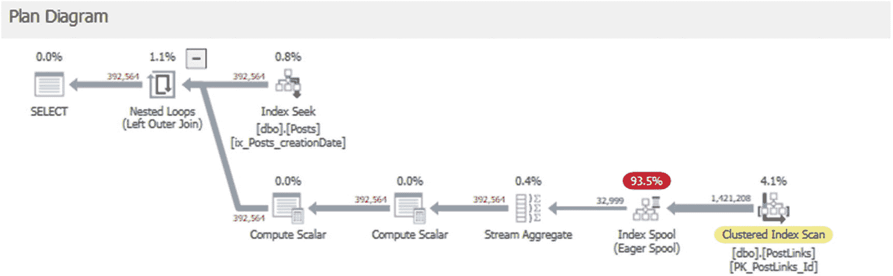
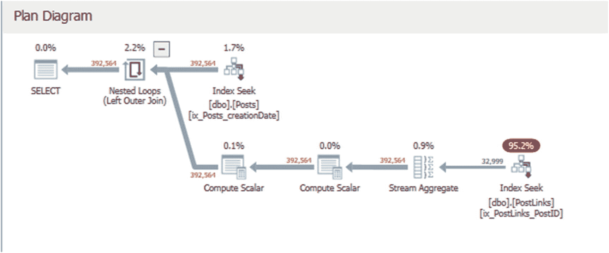

# 第二部分：数据库结构

## 3. 数据库表

在接下来的章节中，我们将研究一些不同的数据库对象，并找出每个对象常见的一些反模式。我们已经讨论了许多适用于代码的反模式，例如存储过程、函数、视图，甚至即兴的 SQL 语句。然而，每种对象类型都有其独特的陷阱。

在本章中，我们将更仔细地研究表。如果访问某个表的每段代码都很慢，那么就应该检查表的定义。我们具体要在该定义中寻找什么？第 2 章的信息并没有真正涵盖表，除了提到计算列。好吧，让我们从那里开始！

### 计算列

如果编码不够谨慎，计算可能会产生一些意外影响。确保你的表中没有任何计算列包含用户定义的标量函数。即使这些列没有出现在查询输出中，它们也可能导致查询无法并行运行。有时，聪明的（过于聪明的？）数据库管理员会在表中添加除数为零的列，以揪出那些在查询中使用`SELECT *`的“捣蛋”开发者。如果有人尝试对包含除数为零计算的列定义的表运行`SELECT *`查询，查询将失败并显示错误消息。这是一种确保良好习惯的“狡猾”方式，但教育编写代码的人比在数据库中埋设“地雷”更合适。

### 反规范化数据

如果你不熟悉规范化，你可能应该花点时间阅读相关内容。简单来说，规范化是一套关于关系数据库中的数据应该如何以及不应该如何……“关联”的规则实践。大多数人建议遵循到第三范式（3NF）。除了 3NF 之外还有更多的规范化级别，但 3NF 是当前大多数人建议遵守的标准可接受级别。

第一范式（1NF）规定，在任何给定的单元格中应该只有一个值。一种经常违反此规则的方式是在单个单元格中包含逗号分隔的值列表。1NF 还指出，不允许有重复的列组——例如，拥有`comment1`、`comment2`等列。此外，根据 1NF 的规则，任何数据值应该只存储在一个地方。最后，表中的所有行都应该是唯一的，并且具有主键。

主键是记录的唯一标识符。它不必是 GUID 数据类型；相反，每条记录的值必须是唯一的。这可以是单列，也可以是其集合值构成唯一键的多列组合。多列主键可能会引起关注，但我们将在本章后面讨论这一点。

第二范式（2NF）可能稍微难理解一些。记录中的每个非键值都需要完全依赖于键值。一个稍微不那么正式的说法是，确保表中的所有数据都直接与键相关。例如，你希望发帖用户的 ID 在`Posts`表中，但你不需要在`Posts`表中存储专门关于用户的信息；你只想存储关于帖子的信息。相反，我们应该有一个单独的表来存储用户信息（如昵称），并在`Posts`表中有一个用户 ID（在我们的数据库中是`OwnerUserID`），该 ID 指回`Users`表中的`id`。`OwnerUserID`将被视为外键，它指向`Users`表的主键（或 Id 字段）。正确设置的外键约束也能提高数据库性能。

3NF 类似，你需要将表中任何不直接依赖于键的字段移出该表。假设用户的最喜欢的颜色是`Posts`表中的一个列。最喜欢的颜色列应该移到`Users`表中，而不是留在`Posts`表中。颜色与帖子`ID`没有直接关系；它直接与用户相关。因此，它应该在一个具有与用户相关键的表中。

我们来编一个关于`dbo.WidePosts`表的故事。假设它是 StackOverflow 数据库的原始表，并且可能仍用于遗留报告。随着应用程序的增长，表被添加或更改。那么这个表发生了什么变化？

如果你去查看`WidePosts`表的定义（或列列表），你会看到……嗯，首先，它很宽（有很多列）。其次，`commentid1`、`commentid2`以及所有这些带数字的评论列是什么？看起来是评论信息的反规范化，而这正是它的本质。这样做的一个问题是你不能为每个帖子拥有超过五条评论，这有些限制。此外，很难区分不同的评论。这个表定义未能满足第一和第二范式的定义。

我们在这个`WidePosts`表中还有关于用户的信息，这导致该表未能满足第三范式的定义。我特意创建了这个表用于演示；它不是 StackOverflow 数据库中的标准表之一。


### 数据类型与字段大小

`WidePosts` 表中的大多数列都是整型数据类型，因此存储需求相对较低。然而，其中也有几个日期字段和一些大型的 `nvarchar` 字段：五个 `nvarchar(700)` 字段、一个 `nvarchar(max)` 字段、一个 `nvarchar(2000)` 字段以及几个较小的 `nvarchar` 字段。多个列与一些大型的 `varchar` 或 `nvarchar` 列的组合，可能使得每行的数据量相当可观。还记得上一章我们触及的查询中的内存授予吗？大量的内存授予需求可能会受到数据库表列数据类型和宽度选择的影响，并可能膨胀 SQL Server 认为运行查询所需的资源量。

这些列的大小有多少准确反映了列中包含的数据？让我们更仔细地查看 `WidePosts` 表中的数据值。`清单 3-1` 中的查询将找出几个列中值的最大长度。

**表 3-1**

`清单 3-1` 中查询的结果

| 字段 | AbtMe | body | CT1 | CT2 | CT3 | CT4 | CT5 | Title | Tags | WebURL |
| --- | --- | --- | --- | --- | --- | --- | --- | --- | --- | --- |
| 实际最大值长度 | 2000 | 34357 | 600 | 600 | 600 | 600 | 600 | 150 | 107 | 188 |
| 列定义长度 | 2000 | MAX | 700 | 700 | 700 | 700 | 700 | 250 | 150 | 200 |

```sql
SELECT MAX(LEN(AboutMe)) AS AbtMe
, MAX(LEN(Body)) AS body
, MAX(LEN(CommentText1)) AS CT1
, MAX(LEN(CommentText2)) AS CT2
, MAX(LEN(CommentText3)) AS CT3
, MAX(LEN(CommentText4)) AS CT4
, MAX(LEN(CommentText5)) AS CT5
, MAX(LEN(Title)) AS Title
, MAX(LEN(Tags)) AS Tags
, MAX(LEN(WebsiteURL)) AS WebURL
FROM dbo.WidePosts;
```

`清单 3-1`
查找 `WidePosts` 表中几个列的最大数据值长度的查询

`表 3-1` 中的第一行显示了指定列中数据值的最大长度。第二行显示了每个列定义的最大长度。看起来这个表的列大小设置是适合将要存储在其中的数据的。

### 已弃用的数据类型

较旧的表可能包含一些已不再有效的数据类型。例如，在撰写本书时，数据类型 `text`、`ntext` 和 `image` 已被弃用。Microsoft 建议改用 `varchar(max)`、`nvarchar(max)` 和 `varbinary(max)` 数据类型。

### 数据量有多少？

我们应该了解正在检查的表实际包含多少数据。记录的数量以及表中实际数据的大小，对于我们如何重写表，甚至是否需要重写，都可能产生很大影响。我们可以使用 SQL Server 的原生存储过程来获取此信息。调用 `sp_spaceused` 存储过程以查看 `WidePosts` 表中的数据量如 `清单 3-2` 所示。

**表 3-2**

`清单 3-2` 中 `sp_spaceused` 存储过程的结果

| 名称 | 行数 | 已分配空间 | 数据 | 索引大小 | 未使用空间 |
| --- | --- | --- | --- | --- | --- |
| dbo.WidePosts | 1090572 | 3336672 KB | 3292984 KB | 42032 KB | 1656 KB |
| 按 GB 计 | 1.09 | 3.34 | 3.29 | 0.04 | 0.001 |

```sql
EXEC sp_spaceused N'dbo.WidePosts';
GO
```

`清单 3-2`
调用 `sp_spaceused` 以查找 `WidePosts` 表中数据量的示例

`表 3-2` 显示了 `WidePosts` 表的行数以及一些数据大小。在现实世界中，一百万行并不算“大”，但对于您特定的服务器设置或数据库来说，这个记录数量可能是一个挑战。您应该了解表的相对大小及其内部数据。理解数据和索引的大小，在查看代码时将对您有所帮助，更容易理解为什么某些查询可能表现不佳。

### 数据偏斜/基数

基数涉及每行中有多少唯一数据。了解列中值的分布将帮助您找到次优的查询代码，并快速确定哪些索引可能有用。`清单 3-3` 将帮助我们查看 `WidePosts` 表中几个列的基数。

**表 3-3**

`清单 3-3` 中查询的结果

| numParentIDs | numViews | numPostIDs | numAnswerCounts |
| --- | --- | --- | --- |
| 279298 | 3756 | 1090572 | 108 |

```sql
SELECT COUNT(DISTINCT ParentId) as numParentIDs
, COUNT(DISTINCT [Views]) AS numViews
, COUNT(DISTINCT PostID) AS numPostIDs
, COUNT(DISTINCT AnswerCount) AS numAnswerCounts
FROM dbo.WidePosts;
```

`清单 3-3`
查找 `WidePosts` 表中某些列基数的查询

`表 3-3` 向我们显示，`AnswerCounts` 的基数相当低——没有很多唯一值。不过，`PostIDs` 有很多唯一值。您不必对表中的所有列都运行此操作，但我会密切关注应用程序中最常使用的列，以便对该数据的基数有良好的了解。

### 约束

许多表都有约束，而且约束的类型多种多样。希望您所有的表都有主键和聚集索引。如果没有，请添加它们！如果您运行 `清单 3-4` 中的命令，您可以看到针对某个表的约束，以及有关该表的其他各种信息。

**表 3-4**

`清单 3-4` 中存储过程调用的最后一个结果集（省略了部分列）

| 约束类型 | 约束名称 | 已启用状态 | 用于复制状态 | 约束键 |
| --- | --- | --- | --- | --- |
| FOREIGN KEY | Fk_WidePosts_PostID | Enabled | Is_For_Replication | PostID REFERENCES StackOverflowForBook.dbo.Posts (Id) |
| PRIMARY KEY (clustered) | PK_WidePosts_WideId | (n/a) | (n/a) | WideId |

```sql
sp_help wideposts
```

`清单 3-4`
为获取 `WidePosts` 表信息而调用 `sp_help` 的示例

如我们在 `表 3-4` 中所见，`sp_help` 命令返回的最后一个结果集列出了所有已定义的表约束。这里我们看到了 `WidePosts` 表上的主键和外键约束。


### 修改表定义

表的变更可能会很棘手，因为它对其他数据库对象或应用程序的影响程度不一。有些变更比其他变更更安全，有时也有一些方法可以缓解那些被认为是“不安全”的变更所带来的安全顾虑。如果你有一个可以修改的**数据访问层**，那就是最理想的情况了。所谓“拥有一个数据访问层”，是指对数据库的每一次调用都经过一个中间层。这个中间层可以由`.NET`对象、存储过程以及许多其他类型的代码组成。

拥有一个全面的数据访问层的好处在于，你可以对底层结构进行更改，并更新数据访问层。你不必担心代码可能会多次访问数据，因为任何访问都通过数据访问层进行。然而，如果你没有一个全面的数据访问层，你就必须担心对底层数据结构的更改将如何影响应用程序的数据调用，尤其是在没有专门指派开发人员与你合作处理这些性能问题的情况下。

处理表变更最安全的方法是用同名的**视图**替换该表，并更改底层结构。这看起来可能有点愚蠢——如果我们只是用一个定义与当前表大致相同的视图来替换表，那又有什么意义呢？随着我们发现越来越多的数据调用指向原来的宽表，我们可以修改这些调用，让它们指向更窄的或规范化的表。

有哪些类型的变更呢？嗯，我们可以规范化评论数据，并将其从定义帖子数据的表中移出。这将允许我们每篇帖子拥有超过五条评论。我们还可以分离出用户数据，这样我们就不会一遍又一遍地保存相同的字符串（例如，宽泛的“关于我”列）。这样还有一个额外的好处，就是让我们能够移除在第一章中处理过的有问题的触发器！

通过引用更小的表，我们可以在查询中省略一些“额外”的表（那些我们没有从中提取任何数据的表），这将有助于降低这些查询的内存授予量。我们也能更有效地进行索引。

让我们构建一个视图来模拟`WidePosts`表，从数据库中已经存在的较小表中调用数据。在你要处理的情况下，你的数据库中不太可能已经存在小的、规范化的表。我们在这里能看到它，只是因为我为了这个示例特意创建了`WidePosts`表。你很可能需要在进行一些有趣的查询以辅助数据迁移的同时，将大表中的数据拆分成你创建的更小的表。

请注意：我建议开始时使用不同的名称创建视图（不要与表名相同），并等待删除表，这样你可以测试视图的输出，看看它是否与表的选择结果匹配。清单 3-5 展示了这样一个视图的创建语句。

```sql
IF (NOT EXISTS (SELECT 1 FROM sys.views WHERE name = 'WidePostsView'))
BEGIN
EXECUTE('CREATE VIEW WidePostsView as SELECT 1 as t');
END;
GO
ALTER VIEW WidePostsView AS
SELECT
p.Id AS postID
, p.AcceptedAnswerId
, p.AnswerCount
, p.Body
, p.ClosedDate
, p.CommentCount
, p.CommunityOwnedDate
, p.CreationDate
, p.FavoriteCount
, p.LastActivityDate
, p.LastEditDate
, p.LastEditorDisplayName
, p.LastEditorUserId
, p.OwnerUserId
, p.ParentId
, p.PostTypeId
, p.Score
, p.Tags
, p.Title
, p.ViewCount
, u.AboutMe
, u.Age
, u.CreationDate AS UserCreationDate
, u.DisplayName
, u.DownVotes
, u.EmailHash
, u.LastAccessDate
, u.Location
, u.Reputation
, u.UpVotes
, u.Views
, u.WebsiteUrl
, u.AccountId
, c.CommentId1
, c.CommentCreationDate1
, c.CommentScore1
, c.CommentText1
, c.CommentUserId1
, c.CommentId2
, c.CommentCreationDate2
, c.CommentScore2
, c.CommentText2
, c.CommentUserId2
, c.CommentId3
, c.CommentCreationDate3
, c.CommentScore3
, c.CommentText3
, c.CommentUserId3
, c.CommentId4
, c.CommentCreationDate4
, c.CommentScore4
, c.CommentText4
, c.CommentUserId4
, c.CommentId5
, c.CommentCreationDate5
, c.CommentScore5
, c.CommentText5
, c.CommentUserId5
FROM dbo.Posts p
INNER JOIN dbo.Users u ON p.OwnerUserId = u.Id
OUTER APPLY (SELECT coms.PostId
, MAX(CASE WHEN theRowNum = 1 THEN coms.Id ELSE NULL END) AS CommentId1
, MAX(CASE WHEN theRowNum = 1 THEN coms.CreationDate ELSE NULL END) AS CommentCreationDate1
, MAX(CASE WHEN theRowNum = 1 THEN coms.Score ELSE NULL END) AS CommentScore1
, MAX(CASE WHEN theRowNum = 1 THEN coms.[Text] ELSE NULL END) AS CommentText1
, MAX(CASE WHEN theRowNum = 1 THEN coms.UserId ELSE NULL END) AS CommentUserID1
, MAX(CASE WHEN theRowNum = 2 THEN coms.Id ELSE NULL END) AS CommentId2
, MAX(CASE WHEN theRowNum = 2 THEN coms.CreationDate ELSE NULL END) AS CommentCreationDate2
, MAX(CASE WHEN theRowNum = 2 THEN coms.Score ELSE NULL END) AS CommentScore2
, MAX(CASE WHEN theRowNum = 2 THEN coms.[Text] ELSE NULL END) AS CommentText2
, MAX(CASE WHEN theRowNum = 2 THEN coms.UserId ELSE NULL END) AS CommentUserID2
, MAX(CASE WHEN theRowNum = 3 THEN coms.Id ELSE NULL END) AS CommentId3
, MAX(CASE WHEN theRowNum = 3 THEN coms.CreationDate ELSE NULL END) AS CommentCreationDate3
, MAX(CASE WHEN theRowNum = 3 THEN coms.Score ELSE NULL END) AS CommentScore3
, MAX(CASE WHEN theRowNum = 3 THEN coms.[Text] ELSE NULL END) AS CommentText3
, MAX(CASE WHEN theRowNum = 3 THEN coms.UserId ELSE NULL END) AS CommentUserID3
, MAX(CASE WHEN theRowNum = 4 THEN coms.Id ELSE NULL END) AS CommentId4
, MAX(CASE WHEN theRowNum = 4 THEN coms.CreationDate ELSE NULL END) AS CommentCreationDate4
, MAX(CASE WHEN theRowNum = 4 THEN coms.Score ELSE NULL END) AS CommentScore4
, MAX(CASE WHEN theRowNum = 4 THEN coms.[Text] ELSE NULL END) AS CommentText4
, MAX(CASE WHEN theRowNum = 4 THEN coms.UserId ELSE NULL END) AS CommentUserID4
, MAX(CASE WHEN theRowNum = 5 THEN coms.Id ELSE NULL END) AS CommentId5
, MAX(CASE WHEN theRowNum = 5 THEN coms.CreationDate ELSE NULL END) AS CommentCreationDate5
, MAX(CASE WHEN theRowNum = 5 THEN coms.Score ELSE NULL END) AS CommentScore5
, MAX(CASE WHEN theRowNum = 5 THEN coms.[Text] ELSE NULL END) AS CommentText5
, MAX(CASE WHEN theRowNum = 5 THEN coms.UserId ELSE NULL END) AS CommentUserID5
FROM (SELECT Id
, CreationDate
, Score
, [Text]
, UserId
, PostId
, ROW_NUMBER() OVER (PARTITION BY PostId ORDER BY CreationDate) AS theRowNum
FROM dbo.Comments com
WHERE com.PostId = p.Id) coms
WHERE coms.theRowNum <= 5
GROUP BY coms.PostId) c;
```

清单 3-5 `WidePostsView` 视图的创建语句

我们可以使用清单 3-6（视图数据）中的代码，与清单 3-7（表数据）中的代码进行对比，来测试视图的输出是否与表数据匹配。


#### 清单 3-6
从 `WidePostsView` 中选择前 100 条记录

```sql
SELECT TOP 100 postID
, AcceptedAnswerId
, AnswerCount
, Body
, ClosedDate
, CommentCount
, CommunityOwnedDate
, CreationDate
, FavoriteCount
, LastActivityDate
, LastEditDate
, LastEditorDisplayName
, LastEditorUserId
, OwnerUserId
, ParentId
, PostTypeId
, Score
, Tags
, Title
, ViewCount
, AboutMe
, Age
, UserCreationDate
, DisplayName
, DownVotes
, EmailHash
, LastAccessDate
, Location
, Reputation
, UpVotes
, Views
, WebsiteUrl
, AccountId
, CommentId1
, CommentCreationDate1
, CommentScore1
, CommentText1
, CommentUserId1
, CommentId2
, CommentCreationDate2
, CommentScore2
, CommentText2
, CommentUserId2
, CommentId3
, CommentCreationDate3
, CommentScore3
, CommentText3
, CommentUserId3
, CommentId4
, CommentCreationDate4
, CommentScore4
, CommentText4
, CommentUserId4
, CommentId5
, CommentCreationDate5
, CommentScore5
, CommentText5
, CommentUserId5
FROM WidePostsView
ORDER BY postID;
```

我们需要将执行 `清单 3-6` 的结果与执行 `清单 3-7` 的结果进行比较，后者从 `WidePosts` 表中选择前 100 条记录。

#### 清单 3-7
从表 `WidePosts` 中选择前 100 条记录

```sql
SELECT TOP 100 postID
, AcceptedAnswerId
, AnswerCount
, Body
, ClosedDate
, CommentCount
, CommunityOwnedDate
, CreationDate
, FavoriteCount
, LastActivityDate
, LastEditDate
, LastEditorDisplayName
, LastEditorUserId
, OwnerUserId
, ParentId
, PostTypeId
, Score
, Tags
, Title
, ViewCount
, AboutMe
, Age
, UserCreationDate
, DisplayName
, DownVotes
, EmailHash
, LastAccessDate
, Location
, Reputation
, UpVotes
, Views
, WebsiteUrl
, AccountId
, CommentId1
, CommentCreationDate1
, CommentScore1
, CommentText1
, CommentUserId1
, CommentId2
, CommentCreationDate2
, CommentScore2
, CommentText2
, CommentUserId2
, CommentId3
, CommentCreationDate3
, CommentScore3
, CommentText3
, CommentUserId3
, CommentId4
, CommentCreationDate4
, CommentScore4
, CommentText4
, CommentUserId4
, CommentId5
, CommentCreationDate5
, CommentScore5
, CommentText5
, CommentUserId5
FROM WidePosts
ORDER BY PostID;
```

我们应该看到 `清单 3-6` 和 `清单 3-7` 的查询结果完全一致。（请注意：`WidePosts` 表仅包含来自 `Posts` 和其他表的前 1,090,572 条记录。）我们可以使用某种差异比对工具来检查这两个结果集。我使用的是带有 `compare` 插件的 `Notepad++`，但市面上有很多可用的工具。

一旦确认输出匹配，我们就可以删除该表，并使用该表的名称创建视图。我们还应该删除在 `Users` 表上用于更新 `WidePosts` 表的触发器（我们在第 1 章中使用过它），并且应该清理在 `清单 3-5` 中创建的测试视图。清理代码位于 `清单 3-8` 中，而视图创建语句位于 `清单 3-9` 中。

#### 清单 3-8
用于清理 `WidePosts` 表及相关对象的代码

```sql
IF EXISTS (SELECT 1 FROM sys.tables WHERE name = 'WidePosts')
BEGIN
DROP TABLE WidePosts;
END;
GO
IF EXISTS
(
SELECT 1
FROM sys.triggers
WHERE name = 'ut_Users_WidePosts'
)
DROP TRIGGER ut_Users_WidePosts;
GO
IF EXISTS (SELECT 1 FROM sys.views WHERE name = 'WidePostsView')
BEGIN
DROP VIEW WidePostsView;
END;
GO
```

#### 清单 3-9
`WidePosts` 视图创建语句

```sql
IF NOT EXISTS (SELECT 1 FROM sys.views WHERE name = 'WidePosts')
BEGIN
EXECUTE('CREATE VIEW WidePosts as SELECT 1 as t');
END;
GO
ALTER VIEW WidePosts AS
SELECT
p.Id AS postID
, p.AcceptedAnswerId
, p.AnswerCount
, p.Body
, p.ClosedDate
, p.CommentCount
, p.CommunityOwnedDate
, p.CreationDate
, p.FavoriteCount
, p.LastActivityDate
, p.LastEditDate
, p.LastEditorDisplayName
, p.LastEditorUserId
, p.OwnerUserId
, p.ParentId
, p.PostTypeId
, p.Score
, p.Tags
, p.Title
, p.ViewCount
, u.AboutMe
, u.Age
, u.CreationDate AS UserCreationDate
, u.DisplayName
, u.DownVotes
, u.EmailHash
, u.LastAccessDate
, u.Location
, u.Reputation
, u.UpVotes
, u.Views
, u.WebsiteUrl
, u.AccountId
, c.CommentId1
, c.CommentCreationDate1
, c.CommentScore1
, c.CommentText1
, c.CommentUserId1
, c.CommentId2
, c.CommentCreationDate2
, c.CommentScore2
, c.CommentText2
, c.CommentUserId2
, c.CommentId3
, c.CommentCreationDate3
, c.CommentScore3
, c.CommentText3
, c.CommentUserId3
, c.CommentId4
, c.CommentCreationDate4
, c.CommentScore4
, c.CommentText4
, c.CommentUserId4
, c.CommentId5
, c.CommentCreationDate5
, c.CommentScore5
, c.CommentText5
, c.CommentUserId5
FROM dbo.Posts p
INNER JOIN dbo.Users u ON p.ownerUserID = u.id
OUTER APPLY (SELECT coms.PostId
, MAX(CASE WHEN theRowNum = 1 THEN coms.Id ELSE NULL END) AS CommentId1
, MAX(CASE WHEN theRowNum = 1 THEN coms.CreationDate ELSE NULL END) AS CommentCreationDate1
, MAX(CASE WHEN theRowNum = 1 THEN coms.Score ELSE NULL END) AS CommentScore1
, MAX(CASE WHEN theRowNum = 1 THEN coms.[Text] ELSE NULL END) AS CommentText1
, MAX(CASE WHEN theRowNum = 1 THEN coms.UserId ELSE NULL END) AS CommentUserID1
, MAX(CASE WHEN theRowNum = 2 THEN coms.Id ELSE NULL END) AS CommentId2
, MAX(CASE WHEN theRowNum = 2 THEN coms.CreationDate ELSE NULL END) AS CommentCreationDate2
, MAX(CASE WHEN theRowNum = 2 THEN coms.Score ELSE NULL END) AS CommentScore2
, MAX(CASE WHEN theRowNum = 2 THEN coms.[Text] ELSE NULL END) AS CommentText2
, MAX(CASE WHEN theRowNum = 2 THEN coms.UserId ELSE NULL END) AS CommentUserID2
, MAX(CASE WHEN theRowNum = 3 THEN coms.Id ELSE NULL END) AS CommentId3
, MAX(CASE WHEN theRowNum = 3 THEN coms.CreationDate ELSE NULL END) AS CommentCreationDate3
, MAX(CASE WHEN theRowNum = 3 THEN coms.Score ELSE NULL END) AS CommentScore3
, MAX(CASE WHEN theRowNum = 3 THEN coms.[Text] ELSE NULL END) AS CommentText3
, MAX(CASE WHEN theRowNum = 3 THEN coms.UserId ELSE NULL END) AS CommentUserID3
, MAX(CASE WHEN theRowNum = 4 THEN coms.Id ELSE NULL END) AS CommentId4
, MAX(CASE WHEN theRowNum = 4 THEN coms.CreationDate ELSE NULL END) AS CommentCreationDate4
, MAX(CASE WHEN theRowNum = 4 THEN coms.Score ELSE NULL END) AS CommentScore4
, MAX(CASE WHEN theRowNum = 4 THEN coms.[Text] ELSE NULL END) AS CommentText4
, MAX(CASE WHEN theRowNum = 4 THEN coms.UserId ELSE NULL END) AS CommentUserID4
, MAX(CASE WHEN theRowNum = 5 THEN coms.Id ELSE NULL END) AS CommentId5
, MAX(CASE WHEN theRowNum = 5 THEN coms.CreationDate ELSE NULL END) AS CommentCreationDate5
, MAX(CASE WHEN theRowNum = 5 THEN coms.Score ELSE NULL END) AS CommentScore5
, MAX(CASE WHEN theRowNum = 5 THEN coms.[Text] ELSE NULL END) AS CommentText5
, MAX(CASE WHEN theRowNum = 5 THEN coms.UserId ELSE NULL END) AS CommentUserID5
FROM (SELECT Id
, CreationDate
, Score
, [Text]
, UserId
, PostId
, ROW_NUMBER() OVER (PARTITION BY PostId ORDER BY CreationDate) AS theRowNum
FROM dbo.comments com
WHERE com.PostId = p.Id) coms
WHERE coms.theRowNum <= 5
GROUP BY coms.PostId) c;
```


### 概要

现在，`WidePosts` 表已经被拆分为更小的表并进行了规范化处理，这样，每当遇到引用原为表的 `WidePosts` 视图的性能不佳的代码时，我们就可以使用那些更小的表。不过，这种方法存在一个主要问题。如果插入或更新操作同时更改了多个基础表中的值，那么对原表（现在是一个视图）的插入、更新，尤其是删除操作可能会失败。

对插入、更新和删除操作的担忧使得这个方案成为只读表的绝佳解决方案，但对于事务性表来说则不那么理想。减轻由视图覆盖的事务性表数据更改的一种方法是在视图上使用 `INSTEAD OF` 触发器。请谨慎使用 `INSTEAD OF` 触发器，因为它们可能会变得异常混乱。我建议避免使用这些触发器。如果你有能力在应用程序中处理数据更改，我会选择在应用程序中进行这些更改。

## 4. 数据库视图

视图本质上就是一个保存起来的 `SELECT` 语句。它确实有一些局限性，虽然可以通过一些技巧来规避，但对于视图来说，“能做并不代表应该做”。视图可以像表一样被调用，一个视图也可以调用其他视图。视图的局限性如下：

*   除了 CTE（公用表表达式）外，`SELECT` 语句必须是视图定义中的第一条语句。
*   除非使用 `TOP` 语句或 `FOR XML`（我过去见过很多 `SELECT TOP 100%` 的用法），否则无法在视图定义中对数据进行排序。
*   视图不能有默认列值或约束。
*   视图不能调用临时表。

开发人员在使用视图时常常会陷入许多常见的坏习惯。让我们通过下面的例子来看一下其中一些。你可能会接到用户打来的臭名昭著的电话。“嘿，我们正试图运行这个查询。它只是想获取某个月份每个帖子的关联帖子数量，但已经跑了超过 5.5 小时了。你能查查是怎么回事吗？” 用户答应发给你一个查询，当你打开邮件时，看到的是代码清单 4-1 中的内容。

```sql
SELECT wp4.postID
, wp4.creationDate
, wp4.numLinkedPosts
FROM WidePostsPlusFour wp4
WHERE wp4.creationDate >='20120801'
AND wp4.creationDate < '20120901';
```

代码清单 4-1
使用关联帖子查询来查找关联帖子的数量

代码清单 4-1 中的代码需要执行 5.5 小时，这可能是你听过的最荒谬的事情。如此简单的查询怎么可能需要那么长时间？嗯……那个表名看起来不熟悉。好吧，原来它不是表，而是一个视图。行吧，那么，视图的定义是什么？当我们从 SSMS（SQL Server Management Studio）中提取 `ALTER VIEW` 语句时，看到的是代码清单 4-2 中的代码。

```sql
ALTER VIEW WidePostsPlusFour AS
SELECT wp3.*
, dbo.getNumLinkedPosts(wp3.postID) AS numLinkedPosts
FROM dbo.WidePostsPlusThree wp3
WHERE wp3.commentID IS NOT NULL;
```

代码清单 4-2
`WidePostsPlusFour` 的视图定义

这看起来几乎完全无害，除了可能存在的 `getNumLinkedPosts` 函数。等等，`WidePostsPlusThree` 是另一个视图吗？

### 嵌套

当多层视图调用其他多层视图时，嵌套就成了一个大问题。这种嵌套的做法通常会导致对相同表的多次调用，也可能导致优化器无法生成合理的查询计划。社区里的一些人对此做了一些研究；至少截至 SQL Server 2014，对于任何嵌套太深（超过五层）的视图，优化器最多只能生成一个“足够好”的计划。那么，代码清单 4-1 中的代码到底是什么原因导致了性能问题呢？嗯，我们在第 2 章讨论过的存储过程 `sp_codeCallsCascade` 可以查找指定对象调用的所有 SQL 对象。我们可以像代码清单 4-3 中所示的那样执行它，来查找我们的 `WidePostsPlusFour` 视图调用了哪些对象。

表 4-1
代码清单 4-3 中 `sp_codeCallsCascade` 示例的结果

| thisObjName | thisObjType | callingCode | Level |
| --- | --- | --- | --- |
| WidePostsPlusFour | VIEW | root | 0 |
| WidePostsPlusThree | VIEW | WidePostsPlusFour | 1 |
| WidePostsPlusTwo | VIEW | WidePostsPlusThree | 2 |
| WidePostsPlusOne | VIEW | WidePostsPlusTwo | 3 |
| WidePostsCh4 | VIEW | WidePostsPlusOne | 4 |
| getnumLinkedPosts | SQL_SCALAR_FUNCTION | WidePostsPlusFour | 1 |

```sql
EXECUTE sp_codeCallsCascade @codename = 'WidePostsPlusFour',@rootSchema='dbo';
```

代码清单 4-3
`sp_codeCallsCascade` 的示例调用

正如我们在表 4-1 中看到的，`WidePostsPlusFour` 视图包含了五层嵌套的视图！它还包含了标量函数 `getNumLinkedPosts`。那么，问题就来了，剩下的这些视图是什么样子的？尽管视图 `WidePostsPlusFour` 看起来代码量很小，但当你调用它时，真正运行的是整个视图级联！因此，例如，这个视图调用对于 SQL Server（以及查询优化器，你可以想象它可能会有点困惑！）来说，实际上看起来就像代码清单 4-4 中的代码。


#### 代码清单 4-4
`WidePostsPlusFour`的扩展代码，包含嵌套视图代码

```sql
SELECT wp4.postID
, wp4.creationDate
, wp4.numLinkedPosts
FROM (SELECT wp3.*
, dbo.getnumLinkedPosts(wp3.postID) AS numLinkedPosts
FROM (SELECT wp2.postID
, wp2.AcceptedAnswerId
, wp2.AnswerCount
, wp2.Body
, wp2.ClosedDate
, wp2.CommentCount
, wp2.CommunityOwnedDate
, wp2.CreationDate
, wp2.FavoriteCount
, wp2.LastActivityDate
, wp2.LastEditDate
, wp2.LastEditorDisplayName
, wp2.LastEditorUserId
, wp2.OwnerUserId
, wp2.ParentId
, wp2.PostTypeId
, wp2.Score
, wp2.Tags
, wp2.Title
, wp2.ViewCount
, wp2.AboutMe
, wp2.Age
, wp2.UserCreationDate
, wp2.DisplayName
, wp2.DownVotes
, wp2.EmailHash
, wp2.LastAccessDate
, wp2.[Location]
, wp2.Reputation
, wp2.UpVotes
, wp2.[Views]
, wp2.WebsiteUrl
, wp2.AccountId
, wp2.PostType
, wp2.voteType
, wp2.numVotes
, commentUnpivot.commentID
, commentUnpivot.commentCreationDate
, commentUnpivot.commentScore
, commentUnpivot.commentText
, commentUnpivot.commentUserID
FROM (SELECT wp1.postID
, wp1.AcceptedAnswerId
, wp1.AnswerCount
, wp1.Body
, wp1.ClosedDate
, wp1.CommentCount
, wp1.CommunityOwnedDate
, wp1.CreationDate
, wp1.FavoriteCount
, wp1.LastActivityDate
, wp1.LastEditDate
, wp1.LastEditorDisplayName
, wp1.LastEditorUserId
, wp1.OwnerUserId
, wp1.ParentId
, wp1.PostTypeId
, wp1.Score
, wp1.Tags
, wp1.Title
, wp1.ViewCount
, wp1.AboutMe
, wp1.Age
, wp1.UserCreationDate
, wp1.DisplayName
, wp1.DownVotes
, wp1.EmailHash
, wp1.LastAccessDate
, wp1.[Location]
, wp1.Reputation
, wp1.UpVotes
, wp1.[Views]
, wp1.WebsiteUrl
, wp1.AccountId
, wp1.CommentId1
, wp1.CommentCreationDate1
, wp1.CommentScore1
, wp1.CommentText1
, wp1.CommentUserId1
, wp1.CommentId2
, wp1.CommentCreationDate2
, wp1.CommentScore2
, wp1.CommentText2
, wp1.CommentUserId2
, wp1.CommentId3
, wp1.CommentCreationDate3
, wp1.CommentScore3
, wp1.CommentText3
, wp1.CommentUserId3
, wp1.CommentId4
, wp1.CommentCreationDate4
, wp1.CommentScore4
, wp1.CommentText4
, wp1.CommentUserId4
, wp1.CommentId5
, wp1.CommentCreationDate5
, wp1.CommentScore5
, wp1.CommentText5
, wp1.CommentUserId5
, wp1.PostType
, vty.[name] AS VoteType
, COUNT(wp1.voteUser) AS numVotes
FROM (SELECT wp.*
, pt.Type AS PostType
, vt.Userid AS voteUser
FROM (SELECT
p.Id AS postID
, p.AcceptedAnswerId
, p.AnswerCount
, p.Body
, p.ClosedDate
, p.CommentCount
, p.CommunityOwnedDate
, p.CreationDate
, p.FavoriteCount
, p.LastActivityDate
, p.LastEditDate
, p.LastEditorDisplayName
, p.LastEditorUserId
, p.OwnerUserId
, p.ParentId
, p.PostTypeId
, p.Score
, p.Tags
, p.Title
, p.ViewCount
, u.AboutMe
, u.Age
, u.CreationDate AS UserCreationDate
, u.DisplayName
, u.DownVotes
, u.EmailHash
, u.LastAccessDate
, u.Location
, u.Reputation
, u.UpVotes
, u.Views
, u.WebsiteUrl
, u.AccountId
, c.CommentId1
, c.CommentCreationDate1
, c.CommentScore1
, c.CommentText1
, c.CommentUserId1
, c.CommentId2
, c.CommentCreationDate2
, c.CommentScore2
, c.CommentText2
, c.CommentUserId2
, c.CommentId3
, c.CommentCreationDate3
, c.CommentScore3
, c.CommentText3
, c.CommentUserId3
, c.CommentId4
, c.CommentCreationDate4
, c.CommentScore4
, c.CommentText4
, c.CommentUserId4
, c.CommentId5
, c.CommentCreationDate5
, c.CommentScore5
, c.CommentText5
, c.CommentUserId5
FROM dbo.Posts p
INNER JOIN dbo.Users u ON p.OwnerUserId = u.Id
OUTER APPLY (SELECT coms.PostId
, MAX(CASE WHEN theRowNum = 1 THEN coms.Id ELSE NULL END) AS CommentId1
, MAX(CASE WHEN theRowNum = 1 THEN coms.CreationDate ELSE NULL END) AS CommentCreationDate1
, MAX(CASE WHEN theRowNum = 1 THEN coms.Score ELSE NULL END) AS CommentScore1
, MAX(CASE WHEN theRowNum = 1 THEN coms.[Text] ELSE NULL END) AS CommentText1
, MAX(CASE WHEN theRowNum = 1 THEN coms.UserId ELSE NULL END) AS CommentUserID1
, MAX(CASE WHEN theRowNum = 2 THEN coms.Id ELSE NULL END) AS CommentId2
, MAX(CASE WHEN theRowNum = 2 THEN coms.CreationDate ELSE NULL END) AS CommentCreationDate2
, MAX(CASE WHEN theRowNum = 2 THEN coms.Score ELSE NULL END) AS CommentScore2
, MAX(CASE WHEN theRowNum = 2 THEN coms.[Text] ELSE NULL END) AS CommentText2
, MAX(CASE WHEN theRowNum = 2 THEN coms.UserId ELSE NULL END) AS CommentUserID2
, MAX(CASE WHEN theRowNum = 3 THEN coms.Id ELSE NULL END) AS CommentId3
, MAX(CASE WHEN theRowNum = 3 THEN coms.CreationDate ELSE NULL END) AS CommentCreationDate3
, MAX(CASE WHEN theRowNum = 3 THEN coms.Score ELSE NULL END) AS CommentScore3
, MAX(CASE WHEN theRowNum = 3 THEN coms.[Text] ELSE NULL END) AS CommentText3
, MAX(CASE WHEN theRowNum = 3 THEN coms.UserId ELSE NULL END) AS CommentUserID3
, MAX(CASE WHEN theRowNum = 4 THEN coms.Id ELSE NULL END) AS CommentId4
, MAX(CASE WHEN theRowNum = 4 THEN coms.CreationDate ELSE NULL END) AS CommentCreationDate4
, MAX(CASE WHEN theRowNum = 4 THEN coms.Score ELSE NULL END) AS CommentScore4
, MAX(CASE WHEN theRowNum = 4 THEN coms.[Text] ELSE NULL END) AS CommentText4
, MAX(CASE WHEN theRowNum = 4 THEN coms.UserId ELSE NULL END) AS CommentUserID4
, MAX(CASE WHEN theRowNum = 5 THEN coms.Id ELSE NULL END) AS CommentId5
, MAX(CASE WHEN theRowNum = 5 THEN coms.CreationDate ELSE NULL END) AS CommentCreationDate5
, MAX(CASE WHEN theRowNum = 5 THEN coms.Score ELSE NULL END) AS CommentScore5
, MAX(CASE WHEN theRowNum = 5 THEN coms.[Text] ELSE NULL END) AS CommentText5
, MAX(CASE WHEN theRowNum = 5 THEN coms.UserId ELSE NULL END) AS CommentUserID5
FROM (SELECT Id
, CreationDate
, Score
, [Text]
, UserId
, PostId
, ROW_NUMBER() OVER (PARTITION BY PostId ORDER BY CreationDate) AS theRowNum
FROM dbo.comments com
WHERE com.postID = p.Id) coms
WHERE coms.theRowNum ='20120801'
AND wp4.creationDate < '20180901';
```

哇，这么多代码！我甚至没有粘贴每个`UNION ALL`语句对应的`WidePostsPlusTwo`的定义，只是留下了调用`WidePostsPlusTwo`视图的代码。大家真的需要理解嵌套视图在代码方面的作用，这就是为什么代码清单 4-4 在这里展示了视图代码。虽然`WidePostsPlusFour`的定义本身看起来很小，但当你深入挖掘一点时，你会发现它实际上做了相当多的工作。

### 多次表调用

当我们有一大块代码时，在开始尝试重写之前，我们需要做的第一件事是什么？完全正确——我们要先记录它！让我们开始记录表调用情况，如表 4-2 所示。与其从上到下开始，不如从“内部”——即`WidePostsPlusOne`——开始，然后从那里向“外”进行。

表 4-2
`WidePostsPlusFour`及其级联调用的表

| 表 | 操作 | 返回的列 | 过滤条件 |
| --- | --- | --- | --- |
|   |   | **WidePostsCh4:** |   |
| `dbo.Posts` | 选择 | 一堆 |   |
| `dbo.Users` | 选择 | 一堆 | `OwnerUserId` (连接) |
| `dbo.Comments` | 选择 | 透视 |   |
|   |   | **WidePostsPlusOne:** |   |
| `dbo.PostTypes` | 选择 | 类型 | `PostTypeId` (连接) |
| `dbo.Votes` | 选择 | 用户 ID | `PostId` (连接) |
|   |   | **WidePostsPlusTwo:** |   |
| `dbo.Votes` | 选择 | 投票类型 ID | `PostId` (连接) |
| `dbo.VoteTypes` | 选择 | 投票类型 | `VoteTypeId` (连接) |
|   | 分组依据 |   |   |
|   |   | **WidePostsPlusThree:** |   |
| `dbo.WidePostsPlusTwo` | 选择 | 一堆 | (x 6) |
|   | 逆透视 | 逆透视评论信息，每个帖子五行 |   |
|   |   | **WidePostsPlusFour:** |   |
| `dbo.WidePostsPlusThree` | 选择 | 一堆 | Where `commentID` IS NOT NULL |
| `dbo.getnumLinkedPosts()` | 函数 |   | `PostId` |

表 4-2 中有几个地方很突出：函数和多次访问`Votes`表。此外，还有一个透视和一个逆透视，这在性能方面可能很有趣。然而，仅凭表调用数据，我们还不足以开始着手重写。让我们去寻找一些额外的信息。


### 文档编制的附加要点

对于这些视图中的每一个连接，连接两侧的数据类型是否匹配？这里的答案是肯定的，因此我们将避免隐式转换问题。除了 `unpivot` 内部连接子查询外，这些定义中没有任何子查询。不过，这里确实存在一些聚合，但除此之外，没有任何其他可以勉强归类为计算的东西。由于它是一个视图，因此我们知道其中没有临时表或表变量。同样，也没有循环或游标。但请注意，视图调用的函数可以包含临时表、表变量、循环和/或游标！视图确实允许使用 CTE，但这里一个也没有。

我们在这些视图中看到的所有连接类型都相当标准，因此不足为奇。事实上，我们发现的唯一另一个需要注意的项目是函数的调用。

### 了解你的数据

让我们看看这些视图“中”有多少数据——或者，更准确地说，是被这些视图调用了多少数据。让我们使用清单 4-5 中的查询，简单地统计每个视图的记录数。我们还可以看看这些简单调用运行需要多长时间。

```sql
SELECT COUNT(1) FROM WidePostsCh4
WHERE postID < 1000000;
SELECT COUNT(1) FROM WidePostsPlusOne
WHERE postID < 1000000;
SELECT COUNT(1) FROM WidePostsPlusTwo
WHERE postID < 1000000;
SELECT COUNT(1) FROM WidePostsPlusThree
WHERE postID < 1000000;
SELECT COUNT(1) FROM WidePostsPlusFour
WHERE postID < 1000000;
```
**清单 4-5 用于查找嵌套视图所调用行数的查询**

这些查询的结果如表 4-3 所示。观察记录数如何变化很有趣。当存在 `GROUP BY` 子句时，记录数会减少；而当额外的、可能导致记录重复的信息被连接到数据集时，记录数会增加。

**表 4-3 由清单 4-5 中的代码确定的每个视图调用的记录数**

| 视图 | 记录数 |
| --- | --- |
| WidePosts | 704,857 |
| WidePostsPlusOne | 5,677,176 |
| WidePostsPlusTwo | 85,922 |
| WidePostsPlusThree | 443,670 |
| WidePostsPlusFour | 70,635 |

当我们通过 Statistics Parser 网站处理 `STATISTICS IO` 和 `TIME` 的输出时，我们得到的数据如表 4-4 所示。我们看到这些查询运行花了……七个半小时？天哪！我们还看到了大量的预读读取。预读读取到底是什么？

**表 4-4 来自清单 4-5 中代码的 `STATISTICS IO` 和 `TIME` 输出中的读取数据**

| 总计 | 扫描计数 | 逻辑读取 | 物理读取 | 预读读取 |
| --- | --- | --- | --- | --- |
| Comments | 16,302,351 | 154,066,055 | 16,455,998 | 0 |
| Posts | 1 | 357,188,473 | 229,179 | 288,642,683 |
| PostTypes | 14 | 28 | 2 | 0 |
| Users | 2 | 137,315,320 | 345,900 | 6,661,228 |
| Votes | 27 | 6,579,846 | 262,615 | 6,516,446 |
| VoteTypes | 13 | 26 | 13 | 0 |
| Workfile | 1,134 | 2,640,232 | 313,074 | 2,347,454 |
| Worktable | 80,694,535 | 357,874,423 | 3,206,059 | 9,079,996 |
|   |   | **CPU** | **已用时间** |   |
| SQL Server 解析和编译时间： | 0:00:10 | 0:00:13 |   |
| SQL Server 执行时间： | 2:33:26 | 7:28:15 |   |

当你要求 SQL Server 返回数据时，它会首先查看缓冲区缓存，看看你需要的数据是否在那里。如果不在，SQL Server 就会从磁盘获取。根据联机丛书（微软的在线文档），预读读取表示为查询放入缓存的页数。有大量数据正从磁盘移入内存！由函数引起的 IO 不会包含在 `STATISTICS IO` 输出中，因此运行此代码时，可能还有更多的读取发生，这些读取归因于该函数。

### 功能性检查

让我们回过头来，再次看一下原始查询，它再次显示在清单 4-6 中。我们想退一步，尝试确定该查询到底试图完成什么。

```sql
SELECT wp4.postID
, wp4.creationDate
, wp4.numLinkedPosts
FROM WidePostsPlusFour wp4
WHERE wp4.creationDate >='20120801'
AND wp4.creationDate < '20120901';
```
**清单 4-6 我们正在检查的原始查询**

如果我们对创建日期使用不同的时间范围运行清单 4-6 中的代码——比如从 20120801 到 20120802——它会在合理的时间内完成吗？如果我们只运行一小时内的帖子数据呢？可能不会——至少，在我的系统上，它无法在合理的时间内运行。如果你有出色的硬件可以让它运行得更快，那真得恭喜你！（我可能会有点羡慕。）

我们只要求三列数据，但通过所有这些视图，我们实际上拉取了多少数据？对于这样的查询，我们应该期待什么？让我们直接从 `Posts` 表中提取数据，除了链接帖子数量的数据。我们将使用清单 4-7 中的代码来完成此操作。

```sql
SELECT p.Id
, p.CreationDate
FROM dbo.Posts p
WHERE p.CreationDate >= '20120801'
AND p.CreationDate < '20120901';
```
**清单 4-7 直接从 `Posts` 表中提取数据**

清单 4-4 中的代码返回了 392,564 行，CPU 时间为 16 毫秒，运行时间为 864 毫秒。它扫描 `Posts` 表一次，并有 1074 次逻辑读取。为了满足清单 4-8 中原始查询的功能，我们真正剩下要做的就是添加链接帖子的数量。我们能轻松做到吗？当然可以——它是一个函数！让我们把它加进去，然后用清单 4-8 中的代码再试一次。

```sql
SELECT p.Id
, p.CreationDate
, dbo.getnumLinkedPosts(p.ID) AS numLinkedPosts
FROM dbo.Posts p
WHERE p.CreationDate >= '20120801'
AND p.CreationDate < '20120901';
```
**清单 4-8 向从 `Posts` 表提取的数据添加一个函数**

等等！（然后等啊，等啊，等啊……）是的，清单 4-8 中的代码运行了一段时间。事实上，我在 15 分钟后停止了它。为什么它运行了这么长时间？嗯，针对表字段的函数需要在每一行上执行一次。在这个返回集中，我们返回了 392,000 条记录。这对我来说听起来工作量巨大！有两种方法可以解决这个问题。我们可以将函数从标量函数改为表值函数，将帖子 `ID` 集合作为表值参数传入，并在一个集合中获取所有链接帖子数据；或者将函数的功能重写为查询的一部分。通常，如果函数可以合理地重写，我会始终选择第二种方案。例如，如果它有 6000 行或更多，我可能会重新考虑这个选择。`getNumLinkedPosts` 的函数定义如清单 4-9 所示。

```sql
ALTER FUNCTION dbo.getNumLinkedPosts (@postID int)
RETURNS int
AS
BEGIN
DECLARE @numPosts int;
SET @numPosts = COALESCE((SELECT COUNT(1)
FROM dbo.PostLinks
WHERE PostId = @postID),0);
RETURN @numPosts;
END;
GO
```
**清单 4-9 `getNumLinkedPosts` 函数的定义**

在清单 4-9 的定义中，我们正在获取每个帖子的数据聚合。我们如何将其作为更大型查询的一部分来完成呢？嗯，我们可以使用 `OUTER APPLY` 来连接到主查询。它具有子查询的所有过滤优势（它只调用所需的数据），但不会逐行运行。我们在清单 4-10 中看到了 `OUTER APPLY` 的样子。

#### 代码清单 4-10
使用 OUTER APPLY 替换 getNumLinkedPosts 函数

```sql
SELECT p.Id
, p.CreationDate
, nlp.numLinkedPosts
FROM dbo.Posts p
OUTER APPLY (SELECT COUNT(1) AS numLinkedPosts
FROM dbo.PostLinks pl
WHERE pl.PostId = p.Id) nlp
WHERE p.CreationDate >= '20120801'
AND p.CreationDate < '20120901';
```

代码清单 4-10 中的代码返回了 392,564 行，使用了 8094 毫秒的 CPU 时间和 8514 毫秒的已用时间。它扫描了 `Posts` 表一次，产生了 1074 次逻辑读取；扫描了 `PostLinks` 表一次，产生了 5824 次逻辑读取。此外，我们还看到了一个工作表，它为每一行执行了一次扫描，并产生了 530 万次逻辑读取。这是什么情况？既然我们终于让这段代码运行得足够快以获取执行计划了，那就让我们来看一下吧！该计划如图 4-1 所示。



##### 图 4-1
链接帖子数量查询的执行计划

观察图 4-1 中展示的执行计划，我们可以看到对 `PostLinks` 表的一次聚集索引扫描，然后是一个索引溢出盘（index spool），绝大部分工作都在这里进行。索引溢出盘会在谓词上创建一个临时索引，以便更高效地连接数据。无论如何，这大致就是索引溢出盘应该做的事情。但这里的性能看起来有点糟糕。嗯，我们正在基于 `PostId` 进行计数。如果我们为 `PostId` 添加一个非聚集索引，会有帮助吗？让我们试试看，使用代码清单 4-11 中的代码。

#### 代码清单 4-11
在 PostLinks 表的 PostID 列上创建索引

```sql
CREATE NONCLUSTERED INDEX ix_PostLinks_PostID ON dbo.PostLinks (PostId);
```

一旦我们创建了代码清单 4-11 中的索引，就可以再次运行代码清单 4-10 中的查询，并再次捕获执行计划。瞧！即使是捕获执行计划，代码清单 4-10 中的查询也只用了 3 秒。更精确地说，执行显示已用时间为 3315 毫秒，仅使用了 2765 毫秒的 CPU 时间。工作表的扫描次数实际上转移到了 `PostLinks` 表上，但在 `STATISTICS IO` 输出中，“扫描”一词实际上可以指查找（seek）或扫描（scan）。在添加了代码清单 4-11 中的索引后，代码清单 4-10 中查询的执行计划如图 4-2 所示。



##### 图 4-2
添加索引后的执行计划

观察图 4-2，我们看到了完全符合预期的结果：索引查找承担了大部分工作。我们干得不错！我们刚刚让一段原本要运行数小时的代码，现在只需…… 3 秒就能跑完。老实说，我们并没有做太多工作。实际上，我们所做的工作比调用视图所做的要少得多！

### 我们解决了哪些问题？

为什么它比原始视图调用快这么多？嗯，我们展示了后台实际运行了多少代码。调用一个视图，发现它包含了你需要的大部分字段，然后再创建第二个视图来添加一两个额外字段，这很容易。问题在于人们不断这样做，在视图之上叠加更多视图，以至于在实际运行的代码中，表被多次调用。由于视图定义看起来可能具有欺骗性的简单，对于不经意的观察者来说，并不明显视图调用背后实际发生了所有这些工作。

透视（Pivoting）和逆透视（Unpivoting）操作都涉及某种聚合。我编写这些视图的方式（至少截至 SQL Server 2014）与 SQL Server 引擎在底层处理它们的方式相同，即使你使用“官方”的 pivot 或 unpivot 语法也是如此。大型 `GROUP BY` 语句迫使 SQL Server 必须执行指定的分组，这几乎总是意味着需要一个工作表。然后，它还必须对数据进行排序（毕竟，除非数据已排序以便分组，否则无法进行分组）。排序在 SQL Server 中是一项相当昂贵的操作。如果已经存在一个按所需顺序排序的索引，则有可能避免排序操作，但如果你为了支持任何列上的任何排序顺序而创建索引，那么就可能遇到索引过多的问题，这会导致写入操作耗时极长。

此外，在整个过程中，我们改变获取记录的数量幅度相当大，如表 4-3 所示。在 `WidePostsPlusOne` 中，我们基于 `PostID` 连接了 `Votes` 表。在很多情况下，一个帖子肯定不止一个投票，因为我们看到记录数量几乎是 `WidePostsCh4` 记录数的三倍。然后，在 `WidePostsPlusTwo` 中，我们丢失了大量行。我猜测这是由于某个内连接过滤掉了记录。不过，数据量的最大爆炸将来自逆透视操作。当我们在 `WidePostsCh4` 中执行透视时，我们为每个帖子填充了最多五条评论。然后，当我们执行逆透视时，我们“假定”每个帖子有五条评论，即使可能并非每个帖子都有完整的五条评论。我们仍然最终为每个帖子创建了五条记录。接着，我们在 `WidePostsPlusFour` 中过滤掉了所有这些多余的行，但我们仍然完成了创建它们的工作。因此，我们的重写不仅速度大大提高，而且其中的数据也可能更准确！

### 筛选

在不降低视图实用性的情况下进行筛选可能是一个挑战。你不能将参数传递给视图。因此，如果你的结果集需要限制，你的选项要么是在视图中硬编码筛选器，要么是确保每个调用对象都包含一个良好的 `WHERE` 子句。`CTE`（公用表表达式）可以在视图定义中使用，这在某些筛选场景下可能很有用。

### 通过视图更新数据

对于单表视图来说，这很简单。对于多表视图来说，这就不容易了（或者在大多数情况下是不可能的）。插入（Insert）和删除（Delete）操作只对包含单表字段的视图有效。更新（Update）操作可以针对包含多个表的视图运行，但更新必须针对单个表中的列。之所以存在这些限制，是因为 SQL Server 的查询引擎并不总是能够明确地将视图中的一段数据追溯回原始表（你能想象尝试对 `WidePostsPlusFour` 执行更新操作吗？）。如果 SQL Server 无法追溯数据，它就无法通过视图更新数据。

### 其他限制

你不能基于临时表或表变量创建视图。如果想一下，这是合理的——视图定义是数据库中的永久对象，而临时表，即使是全局临时表，根据定义也不是永久的：它是……嗯，临时的。

你不能为列指定默认值或约束。你可以使用 `COALESCE`，这在一定程度上（算是）解决了默认值问题，但对于约束则没有变通办法。


### 为什么要使用视图？

所有这些限制和性能问题听起来真的很不幸。既然存在所有这些可能的陷阱和注意事项，为什么还有人会使用视图呢？嗯，正如我们在前一章讨论的那样，我们可以通过创建视图来开始拆分宽表，允许旧的调用引用该视图，然后开始分解表，这样我们将来修改或编写的任何代码都可以指向更小、更规范化的表。

此外，视图是非常出色的安全工具。我们可以确保视图的权限只授予适当的组。例如，人力资源部可能需要查看社会安全号码，但其他人不能也不应该能够查看。如果公司有多个部门，我们可以确保每个部门使用他们自己的视图，这样他们就无法访问其他部门的数据。

### 总结

希望您对围绕视图的常见陷阱有了更多了解，尤其是嵌套问题。我们还了解到它们可以用于安全目的，或者帮助我们将宽表分解成更小、更规范化的表。现在是时候看看其他类型的数据库对象，找到可以修复的代码，以使我们的应用程序性能更好！

