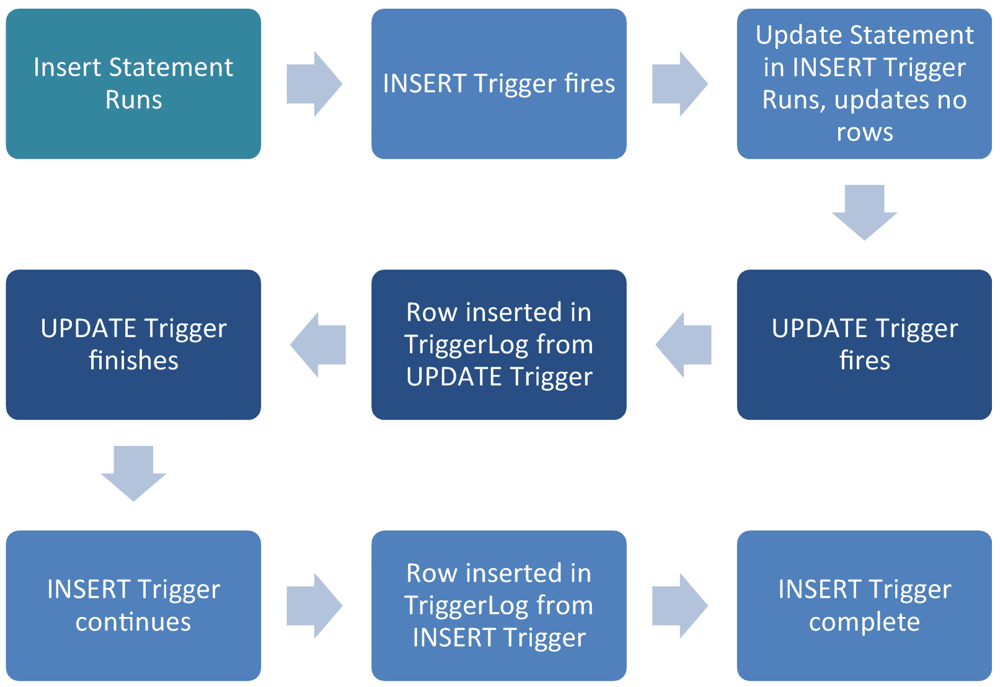
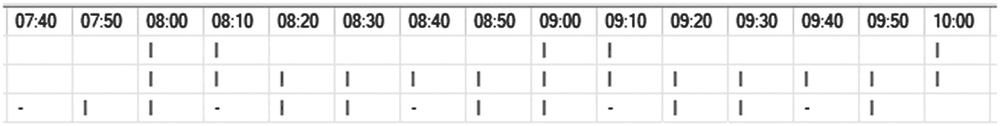

# 第三部分 CRUD 对象

## 5. 触发器

触发器是在数据更改时（或在某些情况下，模式更改时）运行的对象。它们可以针对表或视图运行，并且可以由插入、更新或删除操作触发。在视图上使用它们有一些注意事项（除了我个人的观点：请不要这样做）。

每个触发器都有两个表，可用于查询已更改的数据。有一个 `INSERTED` 表和一个 `DELETED` 表。如果在 INSERT 上触发触发器，`INSERTED` 表中将有记录，但 `DELETED` 表中没有。如果在 DELETE 上触发触发器，`DELETED` 表中将有记录，但 `INSERTED` 表中没有。如果在 UPDATE 语句上触发触发器，`INSERTED` 和 `DELETED` 表中都会有一个包含相同主键值的记录，因此您可以将这些记录连接在一起以查找已更改的数据。

### 基于视图的触发器

一个注意事项是基于视图的触发器必须是 INSTEAD OF 触发器，这意味着触发器中的操作将代替对对象（此处为视图）执行的原始操作发生。例如，INSTEAD OF 触发器将运行一些其他代码，而不是允许删除操作发生，初始删除将不会发生，除非它在该 INSTEAD OF 触发器中被编码。

INSTEAD OF 触发器是我们如果在更改表结构并使用覆盖它们的视图来处理遗留代码时会使用的。您仍然可以使用 INSTEAD OF 触发器来操作底层数据，从而对“视图”进行插入、更新和删除，从而使遗留应用程序代码能够针对新模式工作。

### 我们应该在什么时候使用触发器？

触发器似乎是执行业务逻辑的一种简单方法，但这种简单的答案可能很快失控。我没有找到很多触发器的良好用例；我发现的一个是使用临时的诊断触发器。我们可以使用诊断触发器来追踪难以追踪的、对数据进行更改的罪魁祸首。我相信还有其他一些用例，但在几乎所有情况下，触发器中的逻辑都可以通过数据访问层或应用程序以比使用触发器问题更少的方式处理。

### 触发器的常见问题

触发器代码可能非常难以调试。因此，数据完整性问题更容易在此处悄然出现。这在大多数类型的对象中都可能发生，但我发现完整性问题在触发器中更常见。让我们回到平常的工作日，那天我们过得很愉快。然后，我们收到用户 1010297 的案例工单，说他们所有的 `Reputation` 积分都消失了，他们对此非常愤怒。可能发生了什么？

首先，我们需要寻找可能导致 `Reputation` 积分更改的代码。当我们深入挖掘时，我们发现 `Users` 表上有一个触发器。当我们查看该触发器时，其功能似乎是：如果用户获得 5 的倍数个 `DownVotes`，并且他们的 `Reputation` 大于 0，他们的 `Reputation` 将减少 1。我们的触发器代码如代码清单 5-1 所示。

```sql
IF NOT EXISTS (SELECT 1 FROM  sys.triggers
WHERE name = 'iu_Users_DownVotes'
)
BEGIN
DECLARE @SQL nvarchar(1200);
SET @SQL = N'/**************************************************************************
2019.06.30   LBohm                  INITIAL TRIGGER STUB CREATE RELEASE
**************************************************************************/
CREATE TRIGGER dbo.iu_Users_DownVotes ON dbo.Users
FOR INSERT,UPDATE
AS
BEGIN
SET NOCOUNT ON;
IF NOT EXISTS (SELECT 1 FROM INSERTED)
RETURN;
END;';
EXECUTE SP_EXECUTESQL @SQL;
END;
GO
/**************************************************************************
Object Description: Reduces User Reputation after 5 DownVotes.
Revision History:
Date             Name             Label/PTS    Description
-----------      ---------------  ----------   ------------------------------
2019.06.30       LBohm                         Initial Release
**************************************************************************/
ALTER TRIGGER [dbo].[iu_Users_DownVotes] ON [dbo].[Users]
FOR INSERT,UPDATE
AS
BEGIN
SET NOCOUNT ON;
-- if the DownVote count divided by 5 has no remainder, subtract 1 from the Reputation
IF EXISTS (SELECT 1 FROM INSERTED i WHERE i.DownVotes > 0
AND i.DownVotes % 5 = 0
AND i.Reputation > 0)
BEGIN
UPDATE u
SET u.Reputation = u.Reputation - 1
FROM dbo.Users u
INNER JOIN INSERTED i ON u.Id = i.Id
WHERE i.Reputation > 0;
END;
INSERT INTO dbo.Triggerlog (id, thisDate, thisAction, descript)
SELECT u.Id, getdate(), 'Update', 'Update Reputation User table'
FROM dbo.Users u
INNER JOIN INSERTED i ON u.Id = i.Id
WHERE i.Reputation > 0;
END;
GO
```

代码清单 5-1 `iu_Users_DownVotes` 触发器定义

让我们用用户 763725 进行测试，该用户的 `Reputation` 值为 1，有 4 个 `DownVotes`。额外的 DownVote 应使该用户达到 5 个 `DownVotes`，并将其 `Reputation` 降低到 0。我们将使用代码清单 5-2 中的代码来测试当用户添加一个 DownVote 时会发生什么。

```sql
DECLARE @userID int = 763725;
SELECT Id, Reputation, DownVotes
FROM dbo.Users
WHERE Id = @userID;
UPDATE dbo.Users
SET DownVotes = DownVotes + 1
WHERE Id = @userID;
SELECT Id, Reputation, DownVotes
FROM dbo.Users
WHERE Id = @userID;
```

代码清单 5-2 向用户 763725 添加一个 DownVote

第一组结果（表 5-1）显示了用户的“之前”状态。我们看到用户的 `Reputation` 为 1，他们有 4 个 `DownVotes`。然后我们可以看到在添加 DownVote 之后运行的相同 SELECT 语句的结果（表 5-2）。

表 5-1 更新前用户 763725 的 `Reputation` 和 `DownVotes` 分数

| Id      | 声望值 | 反对票数 |
| ------- | ---------- | --------- |
| 763725  | 1          | 4         |

表 5-2 添加一个 DownVote 后用户 763725 的 `Reputation` 和 `DownVotes` 分数

| Id      | 声望值 | 反对票数 |
| ------- | ---------- | --------- |
| 763725  | 0          | 5         |


完美！表格 5-2 展示的结果正是我们想要的。`反对票`增加到 5，`声望值`降至 0。不过，我们刚刚测试的并不是唯一可能的情况。我们只是碰巧拥有一个可正常工作的生产环境恢复（在本例中是我们的示例数据库），因此我们还保留着用户 1010297 的初始数据。这将让我们能准确查看该用户的情况！他们有 14 张`反对票`，所以可能是某人增加了一张，但那样应该只会减少 1 点`声望值`，对吧？我们将使用清单 5-3 中的代码来测试用户 1010297 描述的场景。

```sql
DECLARE @userID int = 1010297;
SELECT Id, Reputation, DownVotes
FROM dbo.Users
WHERE Id = @userID;
UPDATE dbo.Users
SET DownVotes = DownVotes + 1
WHERE Id = @userID;
SELECT Id, Reputation, DownVotes
FROM dbo.Users
WHERE Id = @userID;
```

清单 5-3 为用户 1010297 添加一张反对票

我们可以在表 5-3 中看到“之前”的结果。该用户有 14 张`反对票`，`声望值`为 25。我们可以理解他们为什么不想失去所有那些`声望值`！我们也可以在表 5-4 中看到“之后”的结果。

表 5-4

添加一张反对票后，用户 1010297 的声望值和反对票分数

| Id | Reputation | DownVotes |
| --- | --- | --- |
| 1010297 | 0 | 15 |

表 5-3

更新前，用户 1010297 的声望值和反对票分数

| Id | Reputation | DownVotes |
| --- | --- | --- |
| 1010297 | 25 | 14 |

### 触发器递归

正如我们在表 5-4 中所看到的，该用户已经没有任何`声望值`了！等等，所有那些`声望值`去哪儿了？嗯，让我们再看一下实际的触发器逻辑，如清单 5-4 所示。

```sql
IF EXISTS (SELECT 1 FROM INSERTED i WHERE i.DownVotes > 0
AND i.DownVotes % 5 = 0
AND i.Reputation > 0)
BEGIN
UPDATE u
SET u.Reputation = u.Reputation - 1
FROM dbo.Users u
INNER JOIN INSERTED i ON u.Id = i.Id
WHERE i.Reputation > 0;
END;
```

清单 5-4 用于 iu_Users_DownVotes 的触发器逻辑

清单 5-4 中的代码实际在做什么？它正在更新`Users`表。是什么触发了这个触发器？是对`Users`表的一次`UPDATE`操作。嗯……我们正在`EXISTS`语句中查找`INSERTED`表中满足以下条件的任何记录：`反对票`大于 0、能被 5 整除且`声望值`大于 0。然后，对于任何满足上述条件且存在于`INSERTED`表中的记录，我们将其`声望值`减少 1。

这里有两个问题。一是我们正在运行一个`UPDATE`操作，这可能会再次触发该触发器本身。第二个问题在于逻辑本身。在前面的例子中，我们在调用触发器之前将表中的`反对票`从 14 更新为 15。触发器本身不会改变`反对票`的值，因此对于清单 5-3 所示的情况，`反对票`值（15）继续能被 5 整除，因为该值不会改变。

这意味着每次运行时`声望值`都会继续减少 1。我们还可以通过查询`Triggerlog`表（这是我专门为本书设置的一个表）看到，由清单 5-3 中的代码导致了触发器的多次运行。`Triggerlog`表在这里说明了一个问题，但对于任何经常使用触发器的数据库来说，添加这样的表可能是有用的。查询`Triggerlog`表的代码如清单 5-5 所示。

```sql
SELECT id, thisdate, thisaction, descript
FROM Triggerlog;
```

清单 5-5 查询 Triggerlog 表

如果我们查看清单 5-5 代码的查询结果，我们可以看到针对用户 ID 1010297 的多次触发。这些结果显示在表 5-5 中。如果你在`声望值`超过 32 点的用户上尝试此更新，触发器代码实际上会在 32 次递归后失败并抛出错误消息。

表 5-5 查询 Triggerlog 表的结果


| 标识符 | 日期 | 操作 | 描述 |
| --- | --- | --- | --- |
| 763725 | 8/21/19 15:03 | 更新 | 更新声誉用户表 |
| 1010297 | 8/21/19 15:05 | 更新 | 更新声誉用户表 |
| 1010297 | 8/21/19 15:05 | 更新 | 更新声誉用户表 |
| 1010297 | 8/21/19 15:05 | 更新 | 更新声誉用户表 |
| 1010297 | 8/21/19 15:05 | 更新 | 更新声誉用户表 |
| 1010297 | 8/21/19 15:05 | 更新 | 更新声誉用户表 |
| 1010297 | 8/21/19 15:05 | 更新 | 更新声誉用户表 |
| 1010297 | 8/21/19 15:05 | 更新 | 更新声誉用户表 |
| 1010297 | 8/21/19 15:05 | 更新 | 更新声誉用户表 |
| 1010297 | 8/21/19 15:05 | 更新 | 更新声誉用户表 |
| 1010297 | 8/21/19 15:05 | 更新 | 更新声誉用户表 |
| 1010297 | 8/21/19 15:05 | 更新 | 更新声誉用户表 |
| 1010297 | 8/21/19 15:05 | 更新 | 更新声誉用户表 |
| 1010297 | 8/21/19 15:05 | 更新 | 更新声誉用户表 |
| 1010297 | 8/21/19 15:05 | 更新 | 更新声誉用户表 |
| 1010297 | 8/21/19 15:05 | 更新 | 更新声誉用户表 |
| 1010297 | 8/21/19 15:05 | 更新 | 更新声誉用户表 |
| 1010297 | 8/21/19 15:05 | 更新 | 更新声誉用户表 |
| 1010297 | 8/21/19 15:05 | 更新 | 更新声誉用户表 |
| 1010297 | 8/21/19 15:05 | 更新 | 更新声誉用户表 |
| 1010297 | 8/21/19 15:05 | 更新 | 更新声誉用户表 |
| 1010297 | 8/21/19 15:05 | 更新 | 更新声誉用户表 |
| 1010297 | 8/21/19 15:05 | 更新 | 更新声誉用户表 |
| 1010297 | 8/21/19 15:05 | 更新 | 更新声誉用户表 |
| 1010297 | 8/21/19 15:05 | 更新 | 更新声誉用户表 |
| 1010297 | 8/21/19 15:05 | 更新 | 更新声誉用户表 |

从表 5-5 中我们可以看到，该触发器执行了非常多次。当我们在代码清单 5-2 中更新用户 763725 时，它触发了一次；但当我们在代码清单 5-3 中更新用户 1010297 时，它却触发了 25 次。如果我们仍不确定，可以修改 `iu_Users_DownVotes` 触发器中向 `Triggerlog` 表插入记录的语句，使其包含来自 `INSERTED` 表的声誉点数。这样你就能看到每次运行时 `Reputation` 都减少 1 点。

有什么方法可以阻止递归触发器行为吗？在数据库层面，有一个设置允许触发器递归触发，默认是关闭的。在某些情况下，人们可能希望启用递归触发器而开启此设置。在本例中，为了这些示例，我已将此数据库的该设置设为“开启”（准确地说，设为 1）。你可以使用代码清单 5-6 中的代码检查你的数据库是否启用了允许递归触发器的设置。

```
SELECT database_id, name, is_recursive_triggers_on
FROM sys.databases;
代码清单 5-6
检查是否允许递归触发器的代码
```

如果该设置已开启，并且我们需要保持其开启状态，我们仍然可以通过在触发器级别使用 `TRIGGER_NESTLEVEL()` 来防止递归。我们希望阻止此特定触发器调用自身。我们需要添加到触发器中的语法如代码清单 5-7 所示。有些情况下，我们可能希望阻止触发器被任何其他触发器调用；那样的话，你需要使用稍微不同的语法。

```
IF ((SELECT TRIGGER_NESTLEVEL(OBJECT_ID('iu_Users_DownVotes'),'AFTER','DML')) > 1)
BEGIN
RETURN;
END;
代码清单 5-7
添加 TRIGGER_NESTLEVEL() 以防止递归
```

我们应该将 `TRIGGER_NESTLEVEL()` 的代码添加在 `SET NOCOUNT ON;` 行之后，以及关于 `DownVotes` 计数的注释之前。我们需要测试这一点，但首先，让我们使用代码清单 5-8 中的代码恢复这位可怜用户的声誉。

```
DECLARE @userID int = 1010297;
UPDATE u
SET Reputation = 25
, DownVotes = 14
FROM dbo.Users u
WHERE Id = @userID;
代码清单 5-8
恢复用户 1010297 的声誉
```

一旦我们将代码清单 5-7 中的代码添加到我们的触发器中并运行 `ALTER` 语句，我们就可以再次运行代码清单 5-3 中的测试语句。“更新前”的结果，如表 5-6 所示，与表 5-3 中的结果相同。

表 5-6

用户 1010297 恢复后、更新前的声誉和 DownVotes 分数

| 标识符 | 声誉 | DownVotes |
| --- | --- | --- |
| 1010297 | 25 | 14 |

“更新后”的结果，如表 5-7 所示，则更符合我们的预期。`DownVotes` 值增加了 1，而 `Reputation` 仅减少了 1。这本身就表明 `TRIGGER_NESTLEVEL()` 成功地消除了递归，但我们也应该查看一下我们的 `Triggerlog` 表。使用代码清单 5-5 中的代码进行检查，你会发现在你第二次运行代码清单 5-3 中的代码时，该触发器只有一条记录。

表 5-7

用户 1010297 恢复后、更新 DownVotes 后的声誉和 DownVotes 分数

| 标识符 | 声誉 | DownVotes |
| --- | --- | --- |
| 1010297 | 24 | 15 |


### 触发器与多记录变更

这个触发器实际上还有另一个问题。你意识到可能是什么了吗？很多时候，人们会假设插入和更新操作每次只涉及单行。但这不一定成立。如果我们一次更新多个用户会怎样？好，首先让我们返回去，用清单 5-8 中的代码恢复用户 1010297 的 `Reputation` 值。然后，让我们尝试运行清单 5-9 中的代码，来一次性查看多个用户。查询结果如表 5-8 所示。

表 5-8

清单 5-9 中查询的结果

| Id | Reputation | DownVotes |
| --- | --- | --- |
| 1010297 | 25 | 14 |
| 1639596 | 1 | 3 |
| 2179513 | 5 | 3 |
| 2491405 | 1 | 3 |
| 2549795 | 31 | 3 |

```sql
DECLARE @theTable TABLE (id int);
INSERT INTO @theTable (id)
VALUES (1010297)
, (1639596)
, (2179513)
, (2491405)
, (2549795);
SELECT tb.id
, u.Reputation
, u.DownVotes
FROM @theTable tb
INNER JOIN dbo.Users u ON tb.id = u.Id;
清单 5-9
查看多个用户的 DownVotes 和 Reputation
```

表 5-8 展示了五个用户的数据。如果我们为每个人的 `DownVotes` 增加 1，那么 Id 为 1010297 的用户的 `Reputation` 应该减少 1，但其他人不应该减少（他们每人只有四个 `DownVotes`）。让我们使用清单 5-10 中的代码来看一下。

```sql
DECLARE @theTable TABLE (id int);
INSERT INTO @theTable (id)
VALUES (1010297)
, (1639596)
, (2179513)
, (2491405)
, (2549795);
SELECT tb.id
, u.Reputation
, u.DownVotes
FROM @theTable tb
INNER JOIN dbo.Users u ON tb.id = u.Id;
UPDATE u
SET DownVotes = u.DownVotes + 1
FROM dbo.Users u
INNER JOIN @theTable tb ON u.Id = tb.id;
SELECT tb.id
, u.Reputation
, u.DownVotes
FROM @theTable tb
INNER JOIN dbo.Users u ON tb.id = u.Id;
清单 5-10
更新多个用户的 DownVotes
```

我们在表 5-8 中看到了更新前的结果。更新后的结果如表 5-9 所示。

表 5-9

清单 5-10 代码的运行结果

| Id | Reputation | DownVotes |
| --- | --- | --- |
| 1010297 | 24 | 15 |
| 1639596 | 0 | 4 |
| 2179513 | 4 | 4 |
| 2491405 | 0 | 4 |
| 2549795 | 30 | 4 |

哦，不！这些人的 `Reputation` 都被减少了。当我们查看清单 5-1 中的 `EXISTS` 语句时，我们检查是否存在一条记录，其 `DownVotes` 能被 5 整除。然而，在实际的更新语句中，我们并没有检查相同的条件！如果我们使用清单 5-5 中的代码查看 `Triggerlog` 表，我们也会看到这些用户的每一条记录都在触发器中运行了。

如果我们使用清单 5-11 中的代码，修改清单 5-1 触发器中的更新语句，那么我们应该只更新 `EXISTS` 语句找到的相同记录，我们的结果应该会好很多。

```sql
UPDATE u
SET u.Reputation = u.Reputation - 1
FROM dbo.Users u
INNER JOIN INSERTED i ON u.Id = i.Id
WHERE i.Reputation > 0
AND i.DownVotes > 0
AND i.DownVotes % 5 = 0;
清单 5-11
测试 DownVotes 是否能被 5 整除的新更新语句
```

在我们用清单 5-11 中的代码修改清单 5-1 中的代码并进行测试之前，我们应该使用清单 5-12 中的代码恢复用户的 `Reputation` 分值。

```sql
DECLARE @theTable TABLE (id int, Reputation int, DownVotes int);
INSERT INTO @theTable (id, Reputation, DownVotes)
VALUES (1010297, 25, 14)
, (1639596, 1, 3)
, (2179513, 5, 3)
, (2491405, 1, 3)
, (2549795, 31, 3);
UPDATE u
SET Reputation = tb.Reputation
, DownVotes = tb.DownVotes
FROM dbo.Users u
INNER JOIN @theTable tb ON u.Id = tb.id;
清单 5-12
恢复多个用户的 Reputation 分值
```

接下来，我们将用清单 5-11 中的 `UPDATE` 语句替换清单 5-1 触发器中的 `UPDATE` 语句，并运行 `ALTER` 语句。然后我们将重新运行清单 5-10 中的代码，看看当我们更新这五个用户的 `DownVotes` 时会发生什么。更新前的结果应该与最初显示在表 5-8 中的结果相同。我们更新后的结果与之前不同，显示在表 5-10 中。

表 5-10

一次性更新多个用户 DownVotes 后的结果

| Id | Reputation | DownVotes |
| --- | --- | --- |
| 1010297 | 24 | 15 |
| 1639596 | 1 | 4 |
| 2179513 | 5 | 4 |
| 2491405 | 1 | 4 |
| 2549795 | 31 | 4 |

呼！一切都正常了。表 5-10 显示只有用户 1010297 的 `Reputation` 减少了，这正是我们想要的结果。但真的完全没问题了吗？让我们看一个我们不改变 `DownVotes` 数值的场景。首先请运行清单 5-12 中的代码，将我们的用户值重置回起始值。没有改变 `DownVotes` 值的代码如清单 5-13 所示。


### 检测值是否发生变化

```
DECLARE @theTable TABLE (id int);
INSERT INTO @theTable (id)
VALUES (1010297)
, (1639596)
, (22)
, (123);
SELECT tb.id
, u.Reputation
, u.DownVotes
, u.UpVotes
FROM @theTable tb
INNER JOIN dbo.Users u ON tb.id = u.Id;
UPDATE u
SET UpVotes = u.UpVotes + 1
, DownVotes = u.DownVotes
FROM dbo.Users u
INNER JOIN @theTable tb ON u.Id = tb.id;
SELECT tb.id
, u.Reputation
, u.DownVotes
, u.UpVotes
FROM @theTable tb
INNER JOIN dbo.Users u ON tb.id = u.Id;
代码清单 5-13
增加四个用户的升票数
```

代码清单 5-13 中查询语句执行前的结果如表 5-11 所示。我们看到有两个用户的 `DownVotes` 能被 5 整除，而另外两个则不能。不过，这应该无关紧要，因为我们反正没有修改 `DownVotes`，对吧？修改后的结果如表 5-12 所示。

表 5-12
代码清单 5-13 中代码执行后的结果

| id | Reputation | DownVotes | UpVotes |
| --- | --- | --- | --- |
| 1010297 | 25 | 14 | 162 |
| 1639596 | 1 | 3 | 12 |
| 22 | 12815 | 5 | 203 |
| 123 | 29211 | 40 | 420 |

表 5-11
代码清单 5-13 中代码执行前的结果

| Id | Reputation | DownVotes | UpVotes |
| --- | --- | --- | --- |
| 1010297 | 25 | 14 | 161 |
| 1639596 | 1 | 3 | 11 |
| 22 | 12816 | 5 | 202 |
| 123 | 29212 | 40 | 419 |

表 5-12 向我们揭示了另一个问题！最后两条记录的 `Reputation` 被减少了，但我们并没有更改 `DownVotes`。我们是在检查 `DownVotes` 是否被修改了吗？嗯，不，我们没有。我们只是检查它们是否能被 5 整除且大于零。不过，对于触发器，有一个 `UPDATE()` 函数可以用来确定这一点，对吧？首先，让我们用代码清单 5-14 中的代码来恢复用户数据。

```
DECLARE @theTable TABLE (id int, upvotes int, Reputation int);
INSERT INTO @theTable (id, upvotes, Reputation)
VALUES (1010297, 161, 25)
, (1639596,11,1)
, (22,203,12815)
, (123,420,29211);
UPDATE u
SET u.Reputation = t.Reputation
, u.UpVotes = t.upvotes
FROM dbo.Users u
INNER JOIN @theTable t ON u.Id = t.id;
代码清单 5-14
为四个用户恢复数据
```

然后我们想添加 `UPDATE()` 函数来检查 `DownVotes` 是否被更新了。如果 `DownVotes` 没有被更新，只是碰巧能被 5 整除，这应该能解决用户 `Reputation` 被减少的问题。我们可以在代码清单 5-15 中看到 `UPDATE` 函数的语法。

```
IF EXISTS (SELECT 1 FROM INSERTED i WHERE i.DownVotes > 0
AND i.DownVotes % 5 = 0
AND i.Reputation > 0
AND UPDATE(DownVotes))
BEGIN
UPDATE u
SET u.Reputation = u.Reputation - 1
FROM dbo.Users u
INNER JOIN INSERTED i ON u.Id = i.Id
WHERE i.Reputation > 0
AND i.DownVotes > 0
AND i.DownVotes % 5 = 0
AND UPDATE(DownVotes);
代码清单 5-15
需添加到代码清单 5-1 触发器中的 UPDATE 函数检查
```

一旦我们将这段代码放入代码清单 5-1 的触发器中，我们就可以重新运行代码清单 5-13 的代码。查看结果时，我们发现无论是修改前的还是修改后的 `SELECT` 语句，结果都完全一样！修改后的结果集与我们表 5-12 中看到的一样，显示最后两个用户的 `Reputation` 再次被减少了，尽管我们添加了 `UPDATE()` 语句。这是怎么回事？

嗯，在我们的 `UPDATE` 语句中，从技术上讲，我们更新了该值，尽管我们并没有 *改变* 它的值。这是一个人们经常忽视的重大“陷阱”。如果值是否真的改变很重要（我猜如果你把它放在触发器里，那它就是重要），我们需要检查值是否真的改变了。我们可以通过检查 `INSERTED` 和 `DELETED` 表中的值是否不同来实现。但这也是一个 `INSERT` 和 `UPDATE` 触发器，所以可能并非每条记录都有一个 `DELETED` 值——那个值可能是 `NULL`。我们该怎么做？实际上我们可以做得很优雅，这要感谢 Itzik Ben-Gan 教给了我代码清单 5-16 中展示的技术，它避免了通常用于空值处理的许多 `CASE` 语句，同时仍然能处理 `NULL` 与指定值不同的情况。

```
IF EXISTS (SELECT 1 FROM INSERTED i WHERE i.DownVotes > 0
AND i.DownVotes % 5 = 0
AND i.Reputation > 0
AND EXISTS (SELECT i.DownVotes EXCEPT SELECT d.DownVotes FROM DELETED d WHERE i.Id = d.Id) )
BEGIN
UPDATE u
SET u.Reputation = u.Reputation - 1
FROM dbo.Users u
INNER JOIN INSERTED i ON u.Id = i.Id
WHERE i.Reputation > 0
AND i.DownVotes > 0
AND i.DownVotes % 5 = 0
AND EXISTS (SELECT i.DownVotes EXCEPT SELECT d.DownVotes FROM DELETED d WHERE i.Id = d.Id) ;
代码清单 5-16
测试 INSERTED 和 DELETED 表中的值是否不同
```

代码清单 5-16 中的代码，当用于代码清单 5-1 的触发器中时，将找到所有在 `INSERTED` 表和 `DELETED` 表的 `DownVotes` 字段不匹配的记录。它不会去评估 `NULL`，但它以一种方式处理 `NULL`，使得 `NULL` 不被视为匹配集合的一部分，因此我们既能得到 `INSERT` 语句的记录，也能得到不匹配的 `UPDATE` 语句的记录。我们这里不进行测试，但如果我们插入一条用户记录，其 `DownVotes` 是 5 的倍数，这将在 `INSERT` 操作时将 `Reputation` 减少 1。让我们用代码清单 5-14 中的代码将这些人的声誉点数恢复，然后重新运行代码清单 5-13 的测试。

修改前的结果与我们表 5-11 中看到的一样，但我们修改后的结果看起来好多了，`Reputation` 没有被修改，如表 5-13 所示。

表 5-13
使用 INSERTED/DELETED 差异检查修改四个用户后的结果

| Id | Reputation | DownVotes | upvotes |
| --- | --- | --- | --- |
| 1010297 | 25 | 14 | 204 |
| 1639596 | 1 | 3 | 421 |
| 22 | 12816 | 5 | 163 |
| 123 | 29212 | 40 | 13 |

我们最终修订后的触发器在代码清单 5-17 中展示，包含了本章我们所做的所有修改。


```
IF NOT EXISTS
(SELECT 1 FROM sys.triggers
WHERE name = 'iu_Users_DownVotes'
)
BEGIN
DECLARE @SQL nvarchar(1200);
SET @SQL = N'/**************************************************************************
2019.06.30   LBohm                 初始触发器存根创建发布
**************************************************************************/
CREATE TRIGGER dbo.iu_Users_DownVotes ON dbo.Users
FOR INSERT,UPDATE
AS
BEGIN
SET NOCOUNT ON;
IF NOT EXISTS (SELECT 1 FROM INSERTED)
RETURN;
END;';
EXECUTE SP_EXECUTESQL @SQL;
END;
GO
/**************************************************************************
对象描述：在收到 5 次反对票后降低用户声望值。
修订历史：
日期         姓名             标签/PTS    描述
-----------  ---------------  ----------  -------------------------------
2019.06.30   LBohm                          初始发布
**************************************************************************/
ALTER TRIGGER [dbo].[iu_Users_DownVotes] ON [dbo].[Users]
FOR INSERT,UPDATE
AS
BEGIN
SET NOCOUNT ON;
IF ((SELECT TRIGGER_NESTLEVEL(OBJECT_ID('iu_Users_DownVotes'),'AFTER','DML')) > 1)
BEGIN
RETURN;
END;
-- 如果反对票计数除以 5 余数为零，则从声望值中减去 1
IF EXISTS (SELECT 1 FROM INSERTED i WHERE i.DownVotes > 0
AND i.DownVotes % 5 = 0
AND i.Reputation > 0
AND EXISTS (SELECT i.DownVotes EXCEPT SELECT d.DownVotes FROM DELETED d WHERE i.Id = d.Id) )
BEGIN
UPDATE u
SET u.Reputation = u.Reputation - 1
FROM dbo.Users u
INNER JOIN INSERTED i ON u.Id = i.Id
WHERE i.Reputation > 0
AND i.DownVotes > 0
AND i.DownVotes % 5 = 0
AND EXISTS (SELECT i.DownVotes EXCEPT
SELECT d.DownVotes
FROM DELETED d
WHERE i.Id = d.Id) ;
INSERT INTO dbo.Triggerlog (id, thisDate, thisAction, descript)
SELECT i.Id
, getdate()
, '用户反对票触发器已运行'
, 'DownVotes: ' + CAST(DownVotes as nvarchar(12)) + '; Reputation: ' + CAST(Reputation as nvarchar(12))
FROM INSERTED i
WHERE i.Reputation > 0;
END;
END;
GO
```
#### 代码清单 5-17 最终修订版 iu_Users_DownVotes 触发器

### 限制数据库必须完成的工作

您可能会问，为什么触发器中要有 `IF EXISTS` 语句，因为我们只是针对真正需要更新的记录运行更新。即使没有更新任何行，UPDATE 语句仍然可能触发。我们的原则是**最小化数据库的工作量**，因此这类检查非常重要。

让我们看看 `LinkTypes` 表。它上面有两个几乎不执行任何操作的触发器，这些触发器的名称清楚地说明了它们的功能（或没有功能）。在代码清单 5-18 所示的触发器中，`INSERT` 触发器包含一个 `UPDATE` 语句，该语句仅在记录满足 `WHERE 1 = 0` 条件时运行。

```
IF NOT EXISTS
(SELECT 1 FROM sys.triggers
WHERE name = 'i_LinkTypes_doNothing'
)
BEGIN
DECLARE @SQL nvarchar(1200);
SET @SQL = N'/**************************************************************************
2019.06.30   LBohm                  初始触发器存根创建发布
**************************************************************************/
CREATE TRIGGER dbo.i_LinkTypes_doNothing ON dbo.LinkTypes
FOR INSERT
AS
BEGIN
SET NOCOUNT ON;
IF NOT EXISTS (SELECT 1 FROM INSERTED)
RETURN;
END;';
EXECUTE SP_EXECUTESQL @SQL;
END;
GO
/**************************************************************************
对象描述：不执行任何操作。
修订历史：
日期         姓名             标签/PTS    描述
-----------  ---------------  ----------  -------------------------------
2019.06.30   LBohm                         初始发布
**************************************************************************/
ALTER TRIGGER [dbo].[i_LinkTypes_doNothing] ON [dbo].[LinkTypes]
FOR INSERT
AS
BEGIN
SET NOCOUNT ON;
UPDATE lt
SET lt.[type] = lt.[Type]
FROM dbo.linkTypes lt
INNER JOIN INSERTED i ON lt.Id = i.Id
WHERE 1 = 0;
INSERT INTO dbo.Triggerlog (id, thisDate, thisAction, descript)
VALUES (0
, getdate()
, 'LT 插入无操作触发器已运行'
, "
)
END;
GO
```
#### 代码清单 5-18 i_LinkTypes_doNothing 的创建语句

代码清单 5-18 中的触发器真正要做的，仅仅是在运行时向 `Triggerlog` 表插入一条记录。现在，为了证明 `UPDATE` 语句确实会运行（即使实际上没有更新任何数据），我们还有一个同样什么都不做的 `UPDATE` 触发器——嗯，除了也向 `Triggerlog` 表插入一条记录。我们可以在代码清单 5-19 中看到这个触发器的代码。

```
IF NOT EXISTS (SELECT 1 FROM sys.triggers
WHERE name = 'u_LinkTypes_doNothing'
)
BEGIN
DECLARE @SQL nvarchar(1200);
SET @SQL = N'/*************************************************************
2019.06.30   LBohm                  初始触发器存根创建发布
**************************************************************************/
CREATE TRIGGER dbo.u_LinkTypes_doNothing ON dbo.LinkTypes
FOR UPDATE
AS
BEGIN
SET NOCOUNT ON;
IF NOT EXISTS (SELECT 1 FROM INSERTED)
RETURN;
END;';
EXECUTE SP_EXECUTESQL @SQL;
END;
GO
/**************************************************************************
对象描述：不执行任何操作。
修订历史：
日期         姓名             标签/PTS    描述
-----------  ---------------  ----------  -------------------------------
2019.06.30   LBohm                         初始发布
**************************************************************************/
ALTER TRIGGER [dbo].[u_LinkTypes_doNothing] ON [dbo].[LinkTypes]
FOR UPDATE
AS
BEGIN
SET NOCOUNT ON;
INSERT INTO dbo.Triggerlog (id, thisDate, thisAction, descript)
VALUES (0
, getdate()
, 'LT 更新无操作触发器已运行'
, "
)
END;
GO
```
#### 代码清单 5-19 u_LinkTypes_doNothing 触发器的创建语句


我们向 `LinkTypes` 表运行一个简单的插入语句，如代码清单 5-20 所示。然后，我们将使用代码清单 5-5 中的代码检查 `Triggerlog` 表。执行此操作后，我们看到 `Triggerlog` 表中有两条记录，如表 5-14 所示。

**表 5-14**
插入 LinkTypes 表后，Triggerlog 表中的结果

| id | thisDate | thisAction | descript |
| --- | --- | --- | --- |
| 0 | 2019-06-30 9:27:24 | LT Update do-nothing Trigger Ran |   |
| 0 | 2019-06-30 9:27:24 | LT Insert Do Nothing Trigger Ran |   |

```
INSERT INTO linkTypes (Type)
VALUES ('TTest');
Listing 5-20
对 LinkTypes 表的简单插入
```

关于表 5-14 中的结果，有几点需要注意。`UPDATE` 触发器实际上在 `INSERT` 触发器插入其记录之前就插入了记录。这是因为 `UPDATE` 语句是在 `INSERT` 触发器内部运行的，因此当 `UPDATE` 语句运行时，`INSERT` 触发器尚未完成。由一次调用引起的所有内部触发器，都将在引发这些内部触发器被调用的外部触发器完成之前结束。流程示意图如图 5-1 所示。在我们使用代码清单 5-20 中代码的情况下，向 `Triggerlog` 的 `INSERT` 语句仅在所有由 `UPDATE` 语句引发的触发器（本例中为一个）完成之后才触发。此外，我们实际上并没有更新任何内容，但 `UPDATE` 语句仍然运行并触发了 `UPDATE` 触发器。



**图 5-1**
在 LinkTypes 表上插入操作引发的触发器流程

想象一个庞大、复杂的数据库，每个表上都有多个触发器。（我知道，这听起来像是一部糟糕的 1980 年代恐怖片，但请耐心听我说。）任何时候你修改任何表中的数据，都可能引发一连串非常令人不快的操作，导致真正的触发器风暴。

如果我们继续推演这个故事，会再次遇到某些触发器更新表的情况，这可能引发新一轮的更新触发器……如此反复……等等。我相信你明白我要表达的意思了。你也无法指定哪些触发器按何种顺序触发。对于任何表上的触发器，你可以指定一个第一个触发器和一个最后一个触发器，但除此之外，你无法决定它们的执行顺序。

如果这还不够糟糕的话，那么如果任何一个触发器中的任何代码执行失败，所有操作都将回滚。你不仅首先承担了运行所有这些触发器的性能开销，随后还可能因为它们全部回滚而承受额外的性能开销。这可能会使任何保存操作花费非常、非常长的时间。

### 总结
我们在本章学到的一个与触发器无直接关系的重要教训是测试不同场景的重要性。测试简单情况下你编写的代码功能正常，这既容易又显而易见。但测试所有边缘情况以确保你不会无意中引入问题，则不那么明显。请务必彻底编写测试用例，并确保代码通过所有这些测试！

就触发器而言，在几乎所有情况下，都有一种方法可以实现你想要的功能而无需使用触发器。使用触发器会引入潜在的性能问题，这些问题可能难以发现和排查。坚决说不！诊断性触发器可以使用，但我也建议硬编码一个时间限制，使它们在一个月后（或其他合理的时间框架，取决于你的应用程序）不再触发。

如果你拥有数据访问层和非规范化表，你可以使用数据访问层将数据更改传播到所有需要这些更改的表中。否则，业务逻辑确实应该由应用程序处理，而不是在数据库中处理。

但是，如果你不得不使用触发器，请确保你检查它们是否符合以下所有条件：
1.  它们只在真正需要时才执行工作。
2.  它们能正确处理同一条语句中更新、插入或删除多条记录的情况。
3.  递归触发已被正确处理（注意你的数据库级别设置和触发器级别设置）。

## 6. 存储过程
在第 2 章中，我们记录了一个用于为报表调用数据的存储过程。该过程名为 `dailySummaryReportByMonth`。让我们回顾一下第 2 章的文档；然后我们可以开始重写这个存储过程。当我们查看数据调用时，发现有六次调用 `dbo.Posts` 表。我们很有可能可以减少对该表的调用次数。该过程还同时使用了一个临时表和一个表变量。

### 临时表 vs. 表变量
关于使用表变量还是临时表存在很多争论。临时表在存储过程中可能导致过度的重新编译，这引发了一些担忧。在后续版本的 SQL Server 中，对临时表的更好处理消除了一些担忧，但有些问题依然存在。例如，临时表一旦创建，就不应更改其架构，即使是添加索引也不行。请在创建语句中一并添加索引。同样，临时表不应有命名约束。Paul White 有一篇非常好的文章 ([`https://sqlperformance.com/2017/05/sql-performance/sql-server-temporary-object-caching`](https://sqlperformance.com/2017/05/sql-performance/sql-server-temporary-object-caching))，详细讨论了与架构更改和命名约束相关的问题。

另外，请注意向临时表添加或从中删除大量数据；这应该会引起重新编译，就像从常规表中添加或删除大量数据会导致统计信息更新，进而引起调用这些表的存储过程重新编译一样。这里有一些关于重新编译的更多信息： [`www.mssqltips.com/sqlservertip/5308/understanding-sql-server-recompilations/`](http://www.mssqltips.com/sqlservertip/5308/understanding-sql-server-recompilations/)。

此外，一段时间以来，人们常说临时表存储在 tempdb 中，而表变量则不是，但这并不完全正确。两种结构都会存储在内存中，直到它们变得太大；然后都可能被写入磁盘。那么临时表与表变量的真正考虑因素是什么？嗯，表变量在可以创建的索引类型上是有限制的。此外，临时表有统计信息，而表变量没有。这可能会对它们的性能产生重大影响，具体取决于创建了哪种执行计划。因为优化器无法确定表变量的行数估计，我发现只在非常小的表（通常为 100 行或更少，通常更少）且数据在插入后变化不大的情况下使用它们是合理的。这是个人选择，但我发现作为一个通用规则，它效果相当好。

请注意，任何“通用规则”都意味着这些规则可能存在例外。在任何重新编码时，尝试尽可能多的不同组合总是最稳妥的做法，因为不能保证某个解决方案在每种独特情况下都是最优的。如果你曾问过 DBA 一个问题，请预期他们会回答“视情况而定”，因为在几乎所有情况下，事实确实如此。


#### 临时表

那么，我们来简单谈谈临时表。如果需要针对某个键列进行连接（join）操作，我通常会在定义临时表时，将该列设置为主键/聚集索引组合。我通常倾向于不添加非聚集索引。如果能通过编写更多、更小的代码片段，甚至是每次执行较少工作的存储过程来避免这一点，那是我的首选，但有时这并不可行。当遇到难以轻松拆分工作的代码时，我通常会尝试几种不同的重写排列组合，以找出每种情况下的最佳解决方案。

#### 表变量

在这里，`@usersDay` 表变量将为每个在特定日期对帖子做出响应的用户存储一条记录。这个表中的记录数将远远超过 100 条。这立即表明我们需要将其更改为临时表——如果我们最终确实需要它的话。一个需要了解的重要情况是，应用程序的其余部分如何影响 `tempdb`。该应用程序通常是对 `tempdb` 的重度用户，还是使用较轻？如果你的应用程序代码已经大量占用 `tempdb`，你可能需要警惕增加更多临时结构，这会加大 `tempdb` 的压力。

### 循环

我们在文档中看到两个循环。外层循环以 RBAR（逐行痛苦处理）方式处理某一天的每个帖子。内层循环以类似方式处理响应了该帖子的每个用户。这将成为你许多问题的根源。正如我们在第 2 章讨论的，SQL Server 旨在以批处理或分组方式处理数据，而不是以线性方式。同样如我们在第 2 章所讨论的，人们以线性方式思考。我们完成一个任务（向表添加一行）。然后执行另一个任务（修改该记录的一个值）。

许多前端开发人员被迫采用过程化的思维方式，因为许多应用程序也是以这种方式工作的。用户查看小的数据记录组，但通常一次只与单条记录交互。遗留代码或对 SQL Server 引擎不太熟悉的人编写的代码通常包含大量游标和循环。你能为性能做的最好的事情就是让它们“远远（**FAR**）离开”。

由于存在循环，获取性能数据变得极其困难。每次循环运行时，`STATISTICS IO` 和 `STATISTICS TIME` 都会输出一个独立的部分。每个循环中的每个查询也会有一个独立的 `执行计划`。这使得定位慢点变得困难。对于这样的代码，最好的办法是完全重写这个存储过程。

### 功能审查

这段代码执行了哪些功能？我们将某天的帖子数增加 1。我们查看该用户是否是某个特定帖子的被接受答案者。我们还将触达该特定帖子的用户计数增加 1。我们获取该特定用户针对此帖子的分数，并使用其中部分信息更新临时表 `#finalOutput`。然后，如果 `@usersDay` 表中不存在对应记录，我们就添加一条；如果存在，则更新该记录。而且我们为每一个帖子都在做所有这些事情。**真糟糕！**

### 从最简单的数据开始

当我重写代码时，我尝试从收集数据的基本构建块开始。这是我将需要用来获得所需输出的数据。我将从最简单的查询数据开始，然后逐层增加复杂性，直到获得所需的结果。对于 `dailySummaryReportByMonth` 存储过程，我们实际需要的数据如下：

1.  某天的帖子数量
2.  响应了该天发布的任何帖子的用户数量
3.  对该天发布的单个帖子响应的最高用户数
4.  该天对帖子响应次数最多的用户
5.  一个用户响应的帖子数量
6.  其中被标记为接受答案的数量
7.  该天的最高赞成票数

因此，我们首先为在期望时间范围内创建的每个帖子（问题是 `PostTypeId = 1`）进行初始选择。我们现在将输出限制为少量（单日），这将使初始比较更容易。我们可以使用清单 6-1 中的代码开始复制存储过程的输出。

```
SELECT CAST(p.CreationDate AS DATE) AS createDate
, p.Id
FROM dbo.Posts p
WHERE p.CreationDate >= '20120801'
AND p.CreationDate < '20120802'
AND p.PostTypeId = 1;
清单 6-1
单日的响应帖子
```

清单 6-1 中的代码给出了 5,574 条记录，并且我们在相对较短的返回时间内得到了结果。是时候开始为我们的响应帖子添加更多数据了。现在我们需要抓取所有的响应帖子。这些帖子的 `postTypeID` 为 2。我们可以添加 `Answer Count`（回答数）、帖子所有者以及这是否是接受的答案。我们还可以添加分数，这对应着赞成票。这些添加项显示在清单 6-2 的代码中，查询结果的部分数据展示在表 6-1 中。

表 6-1
清单 6-2 查询结果的前十条记录

| createDate | Id | Answer Count | Owner UserId | isAccepted | upvotes |
| --- | --- | --- | --- | --- | --- |
| 2012-08-01 | 11750763 | 2 | 1530410 | 0 | 5 |
| 2012-08-01 | 11750765 | 1 | 868718 | 1 | 2 |
| 2012-08-01 | 11750767 | 1 | 841828 | 1 | 1 |
| 2012-08-01 | 11750768 | 3 | 8670 | 0 | 0 |
| 2012-08-01 | 11750768 | 3 | 814048 | 0 | 1 |
| 2012-08-01 | 11750768 | 3 | 1137672 | 0 | 1 |
| 2012-08-01 | 11750770 | 3 | 592212 | 0 | 0 |
| 2012-08-01 | 11750770 | 3 | 862594 | 1 | 3 |
| 2012-08-01 | 11750770 | 3 | 1567222 | 0 | 0 |
| 2012-08-01 | 11750780 | 1 | 1487063 | 1 | 1 |

```
SELECT CAST(p.CreationDate AS DATE) AS createDate
, p.Id
, p.AnswerCount
, pUser.OwnerUserId
, CASE WHEN pUser.Id = p.AcceptedAnswerId THEN 1 ELSE 0 END AS isAccepted
, pUser.Score AS upvotes
FROM dbo.Posts p
LEFT OUTER JOIN dbo.Posts pUser ON p.Id = pUser.ParentId
AND pUser.PostTypeId = 2
WHERE p.CreationDate >= '20120801'
AND p.CreationDate < '20120802'
AND p.PostTypeId = 1
ORDER BY p.Id, pUser.OwnerUserId;
清单 6-2
单日响应帖子的扩展数据
```


### 以小的、易于测试的增量添加更多数据

我们在 `Table 6-1` 中看到的结果似乎相当直接和合理。现在，我们来看一下如何添加一些我们需要的聚合，以模仿原始存储过程的功能。我们想知道，对于一个用户，他们有多少个被接受的答案。我们将使用一个 `CASE` 语句，每当一个答案是被接受的答案时，我们将值设为 `1`，然后对这些 `1` 求和。如果答案不是被接受的答案，我们将值设为 `0`，因此总和仍然只反映被接受答案的数量。我们还需要知道一天内单个帖子收到的最高回复数，我们可以通过 `MAX()` 回答数量来获得。我们可以使用 `SUM()` 来告诉我们一天内的回答数量。我们使用的查询如 `Listing 6-3` 所示。

```sql
SELECT CAST(p.CreationDate AS DATE) AS createDate
, COUNT(p.Id) as numPosts
, SUM(p.AnswerCount) AS numResponses
, MAX(p.AnswerCount) AS maxNumAnswers
, pUser.OwnerUserId
, SUM(CASE WHEN pUser.Id = p.AcceptedAnswerId THEN 1 ELSE 0 END) AS isAccepted
, MAX(pUser.Score) AS upvotes
FROM dbo.Posts p
LEFT OUTER JOIN dbo.Posts pUser ON p.Id = pUser.ParentId
AND pUser.PostTypeId = 2
WHERE p.CreationDate >= '20120801'
AND p.CreationDate < '20120802'
AND p.PostTypeId = 1
GROUP BY CAST(p.CreationDate AS DATE), pUser.OwnerUserId
ORDER BY pUser.OwnerUserId;
```

Listing 6-3
为单日查询的回复帖子添加聚合

我们在 `Listing 6-3` 中使用了 `GROUP BY` 子句。`GROUP BY` 子句将按用户聚合数据。当我们运行查询时，会得到 `Table 6-2` 所示的结果集。

`Table 6-2`

运行 `Listing 6-3` 中的查询得到的前十个记录

| 创建日期 | 帖子数 | 回复数 | maxNum 回答数 | 所有者 用户 ID | 是否被接受 | 赞同票 |
| --- | --- | --- | --- | --- | --- | --- |
| 2012-08-01 | 361 | 64 | 3 | NULL | 0 | NULL |
| 2012-08-01 | 66 | 187 | 7 | 0 | 22 | 62 |
| 2012-08-01 | 1 | 2 | 2 | 16 | 1 | 2 |
| 2012-08-01 | 1 | 2 | 2 | 95 | 0 | 0 |
| 2012-08-01 | 1 | 2 | 2 | 343 | 0 | 0 |
| 2012-08-01 | 3 | 7 | 3 | 476 | 1 | 4 |
| 2012-08-01 | 1 | 1 | 1 | 492 | 1 | 3 |
| 2012-08-01 | 2 | 3 | 2 | 536 | 2 | 11 |
| 2012-08-01 | 1 | 2 | 2 | 549 | 1 | 3 |
| 2012-08-01 | 1 | 3 | 3 | 631 | 1 | 0 |

`Table 6-2` 中的数据是我们查询所需的数据吗？不完全是，但它将为我们提供建筑模块，以找到我们需要的数据。这个查询告诉我们

1.  在此日期内回复帖子的不同用户 ID 数量（每个用户 ID 有一条记录）
2.  哪个用户 ID 的回复数最多
3.  其中有多少回复是“被接受的”

看起来有一些“默认”的 `OwnerUserId` 可能可以忽略。值 `NULL` 和 `0` 似乎是“非真实或无效”的值，我们可以通过检查 `Users` 表中是否存在 ID 为 `0` 的用户来验证。如果我们运行 `Listing 6-4` 中的查询，将看到 `Users` 表中没有 ID 为 `0` 的用户。

```sql
SELECT * FROM users
WHERE Id = 0;
```

Listing 6-4
检查用户是否存在

我们也应该在最终查询输出中忽略这些值。如何去掉这些值呢？我们想要所有的 `ownerUserID`，除了那些匹配 `NULL` 或 `0` 值的。下面这行代码将为我们进行检查，并允许我们过滤掉这些值。如果你还没有用过 `EXCEPT` 或 `INTERSECT`，我强烈建议你试一试。

```sql
AND EXISTS (SELECT pUser.OwnerUserId EXCEPT (SELECT NULL UNION SELECT 0))
```

我们重写的下一步是移除这些不需要的用户 ID，然后对不同的分组进行聚合——有些按帖子，有些按天，有些按用户。我们该怎么做呢？

### 窗口函数

那是什么？Windows 上安装的东西？嗯，我想技术上说是“是的”，但在这种情况下，它们是 SQL Server 后续版本（有些是 2005 或更高版本，有些是 2012 或更高版本）中包含的函数。它们的作用是获取查询结果的一个“窗口”，并允许你在其上进行聚合。让我们看一个 `Listing 6-5` 中所示的例子。

```sql
SELECT p.Id
, CAST(p.CreationDate AS DATE) AS createDate
, p.AnswerCount
, pUser.Score
, COUNT(pUser.ParentId) OVER (PARTITION BY pUser.OwnerUserId) AS numPostsUser
, COUNT(pUser.OwnerUserId) OVER (PARTITION BY pUser.ParentId) AS numUsersPost
, pUser.ParentId
, pUser.OwnerUserId
, SUM(CASE WHEN pUser.Id = p.AcceptedAnswerId THEN 1 ELSE 0 END) OVER (PARTITION BY pUser.OwnerUserId) AS numAccepted
, u.DisplayName
, ROW_NUMBER() OVER (PARTITION BY pUser.OwnerUserId ORDER BY pUser.ParentId DESC) AS theUserRowNum
FROM dbo.Posts p
LEFT OUTER JOIN dbo.Posts pUser ON p.Id = pUser.ParentId
AND EXISTS (SELECT pUser.OwnerUserId EXCEPT (SELECT NULL UNION SELECT 0))
AND pUser.PostTypeId = 2
LEFT OUTER JOIN dbo.Users u ON pUser.OwnerUserId = u.Id
WHERE p.CreationDate >= '20120801'
AND p.CreationDate < '20120802'
AND p.PostTypeId = 1;
```

Listing 6-5
添加窗口函数

我们可以查看 `Table 6-3` 所示的结果集（它是 `Listing 6-5` 查询中列的一个子集），看看我们是否成功获取了所需的数据。我们是如何获得每个用户回复的帖子数的？我们使用了帖子 ID（在回复链接中它是父 ID）的计数，并按用户 ID 进行了分区。我们想要 `COUNT` `pUser.ParentId`，并且我们希望按 `pUser.OwnerUserId` 定义的字段进行分区，因此我们使用以下行：

```sql
COUNT(pUser.ParentId) OVER (PARTITION BY pUser.OwnerUserId) AS numPostsUser
```

当我们按 `OwnerUserId` 分区时，聚合的“窗口”是单个用户回复的帖子集合，窗口函数将为每个用户 ID 返回一个单独的聚合值。

`Table 6-3`

来自 `Listing 6-4` 查询结果的子集

| Id | 用户帖子数 | 帖子用户数 | ParentId | 所有者 用户 ID | 被接受数 |
| --- | --- | --- | --- | --- | --- |
| 11766266 | 1 | 3 | 11766266 | 9465 | 0 |
| 11758727 | 3 | 1 | 11758727 | 9475 | 3 |
| 11756598 | 3 | 1 | 11756598 | 9475 | 3 |
| 11755899 | 3 | 1 | 11755899 | 9475 | 3 |
| 11766893 | 2 | 4 | 11766893 | 9530 | 2 |
| 11762529 | 2 | 3 | 11762529 | 9530 | 2 |
| 11759414 | 1 | 3 | 11759414 | 9686 | 1 |
| 11764539 | 1 | 17 | 11764539 | 9732 | 0 |
| 11755196 | 1 | 2 | 11755196 | 9922 | 1 |
| 11763636 | 1 | 2 | 11763636 | 10397 | 1 |

我们将使用相同的“窗口”，即单个用户在一天内回复的帖子集合，来计算按用户 ID 统计的被接受回答数。不过，我们如何进行健全性检查呢？运行 `Listing 6-2` 中的查询，添加一个 `ORDER BY p.Id`（帖子 ID）。你可以目视统计有多少不同的用户回复了每个帖子。然后再次运行 `Listing 6-5` 中的代码，同样添加 `ORDER BY p.Id`。你可以将不含聚合的查询与包含聚合的查询进行目视对比，以验证整个查询的聚合是否正确：对于具有该用户的每条记录，你都能得到该用户回答的帖子数。对于回答一个帖子的用户数，你也会看到相同的情况。经常进行这样的健全性检查可以帮助你避免走上错误的编程道路，并在故障排除时节省时间！


### 避免行或数据重复

当然，由于我们连接了帖子回复表，每个帖子 `ID` 可能得到多条记录，并且每个帖子可能存在不止一条回复。我们在查询清单 6-5 中使用了 `ROW_NUMBER()` 函数来帮助处理此问题。`ROW_NUMBER()` 允许你根据选择的分区方式和排序方式，为每一行分配一个唯一的递增整数。这个 `ROW_NUMBER()` 将帮助我们过滤掉“多余”的行（那些可能导致数据倍增和结果错误的行）。

我们需要计算不重复用户数，因此我们可以像在清单 6-5 中所做的那样，为这些不重复用户分配行号，然后只需计算 `ROW_NUMBER()` 等于 1 的记录数即可。等等，这是什么意思？如果我们设置一个 `ROW_NUMBER`，按 `OwnerUserId` 分区，并按任意字段排序，那么每个新用户将只有一行（且仅有一行）的 `ROW_NUMBER()` 等于 1。因此，如果我们使用 `CASE` 语句，为 `theUserRowNum` 等于 1 的每一行赋值“1”，为所有其他行赋值“0”，然后对这些值求和，我们就能得到用户的不重复计数。这很酷，对吧？清单 6-6 也演示了这一点。

```sql
SELECT theInfo.Id -- 第二级
, theInfo.createDate
, theInfo.AnswerCount
, MAX(theInfo.Score) OVER () AS maxUpvotes
, MAX(theInfo.numPostsUser) OVER () AS maxPostsUser
, theInfo.numPostsUser
, theInfo.DisplayName
, MAX(theInfo.numUsersPost) OVER () AS maxNumUsersPost
, theInfo.numAccepted
, SUM(CASE WHEN theInfo.theUserRowNum = 1 THEN 1 ELSE 0 END) OVER () AS numDistinctUsers
, ROW_NUMBER() OVER (PARTITION BY ID ORDER BY numPostsUser DESC) AS theIDRow
FROM (SELECT p.Id -- 第一级 - 最内层
, CAST(p.CreationDate AS DATE) AS createDate
, p.AnswerCount
, pUser.Score
, COUNT(pUser.ParentId) OVER (PARTITION BY pUser.OwnerUserId) AS numPostsUser
, COUNT(pUser.OwnerUserId) OVER (PARTITION BY pUser.ParentId) AS numUsersPost
, pUser.ParentId
, pUser.OwnerUserId
, SUM(CASE WHEN pUser.Id = p.AcceptedAnswerId THEN 1 ELSE 0 END) OVER (PARTITION BY pUser.OwnerUserId) AS numAccepted
, u.DisplayName
, ROW_NUMBER() OVER (PARTITION BY pUser.OwnerUserId ORDER BY pUser.ParentId DESC) AS theUserRowNum
FROM dbo.Posts p
LEFT OUTER JOIN dbo.Posts pUser ON p.Id = pUser.ParentId
AND EXISTS (SELECT pUser.OwnerUserId EXCEPT (SELECT NULL UNION SELECT 0))
AND pUser.PostTypeId = 2
LEFT OUTER JOIN dbo.Users u ON pUser.OwnerUserId = u.Id
WHERE p.CreationDate >= '20120801'
AND p.CreationDate < '20120802'
AND p.PostTypeId = 1) theInfo;
```

#### 清单 6-6
添加带有额外 `ROW_NUMBER` 的外层查询

清单 6-6 中的代码为查询增加了第二级。这个外层包装器是我们执行额外聚合的地方，例如引用 `theUserRowNum` 的 `CASE` 语句，它为我们提供了来自内部查询的不重复用户计数。我们还在外层查询中添加了一个 `ROW_NUMBER`，但我们稍后会再详细讨论这样做的原因。

这个 `OVER()` 子句到底是什么意思？它是一种在集合上执行聚合的方式。如果未指定 `PARTITION`，则数据会在整个查询结果集上进行聚合。这也可以通过使用 `GROUP BY` 子句来完成，但我们需要查看一些明细行；我们需要为每个帖子获取响应最多的用户的正确 `DisplayName`，以便确定在当天的任何帖子中谁响应最多。如果我们使用 `GROUP BY` 子句，将丢失与获取所有这些显示名称以及每个用户的帖子数相关的明细级别。借助窗口函数，我们可以在不丢失该明细的情况下获得总体聚合值。我们将尽可能依赖 `MAX()` 值，因为额外或重复的行不会影响这些聚合（额外行会影响计数和求和，但不会影响 `MAX()` 和 `MIN()` 值）。我们可以在表 6-4 中看到清单 6-6 查询的一些结果。

#### 表 6-4
清单 6-6 代码的结果子集

| Id | Max Upvotes | Max Posts User | Display Name | Num Posts User | Num Accepted | Num Distinct Users | The ID Row |
| --- | --- | --- | --- | --- | --- | --- | --- |
| 11750763 | 1,179 | 25 | waldyr.ar | 2 | 0 | 5506 | 1 |
| 11750765 | 1,179 | 25 | Steve Koch | 1 | 1 | 5506 | 1 |
| 11750767 | 1179 | 25 | mwengler | 2 | 2 | 5506 | 1 |
| 11750768 | 1,179 | 25 | Annjawn | 5 | 1 | 5506 | 1 |
| 11750768 | 1,179 | 25 | Tom | 2 | 1 | 5506 | 2 |
| 11750768 | 1179 | 25 | DCookie | 1 | 0 | 5506 | 3 |
| 11750770 | 1,179 | 25 | nickb | 11 | 8 | 5506 | 1 |
| 11750770 | 1,179 | 25 | Miro Hudak | 6 | 2 | 5506 | 2 |
| 11750770 | 1179 | 25 | sriansri | 1 | 0 | 5506 | 3 |
| 11750780 | 1179 | 25 | Dustin | 8 | 2 | 5506 | 1 |

总体聚合值将在每一行中显示相同的值，正如我们在表 6-4 中的 `NumDistinctUsers`、`MaxPostsUser` 和 `MaxUpvotes` 列所看到的。这些列是找出响应数最多的用户的基础构件。我们可以将其用作过滤器在……你猜对了，下一级（或第 3 级，我们将添加）中。并且我们在第 2 级按帖子 ID 分区分配了 `ROW_NUMBER()`，因此我们可以轻松地仅为每个原始帖子抓取一行（这将通过排除连接导致的“额外”或倍增行，使我们的 `COUNT()` 和 `SUM()` 数据保持正确）。我们可以在清单 6-6 的代码中看到第 2 级的 `ROW_NUMBER()`。

清单 6-7 向我们介绍了向查询添加第三级。在这一级，我们将使用 `theIDRow` 等于 1 的过滤器。如果你查看清单 6-6 中的代码，会注意到我们按 `numPostsUser` `DESC` 对 `theIDRow` 进行排序。为什么我们选择这个 `ORDER BY` 子句？嗯，我们还需要知道用户回答的帖子数的最大值，而这将为我们提供该信息。使用 `numPostsUser` `DESC` 的 `ORDER BY` 意味着 `numPostsUser` 列中值最大的行将被赋予 `ROW_NUMBER()` 等于 1，这将在我们选择 `theIDRow` 等于 1 时，为我们提供该字段（`numPostsUser`）的期望值。并且，如果我们按创建日期进行分组，就可以添加更多日期，并有望得到我们想要的结果！我们稍后会尝试这样做。

#### 清单 6-7
### 使用聚合和 ROW_NUMBER() 进行带筛选的查询

```sql
SELECT COUNT(secInfo.Id) AS numPosts  -- 第三级 - 最外层
, secInfo.createDate
, SUM(secInfo.answerCount) AS numResponses
, MAX(secInfo.maxUpvotes) AS numHighestUpvotesOneAnswer
, MAX(secInfo.maxPostsUser) AS maxPostsuser
, MAX(CASE WHEN secInfo.maxPostsUser = secInfo.numPostsUser THEN secInfo.DisplayName ELSE NULL END) AS userMostPosts
, MAX(CASE WHEN secInfo.maxPostsUser = secInfo.numPostsUser THEN secInfo.numAccepted ELSE 0 END) AS numAccepted
, MAX(secInfo.numDistinctUsers) AS numUsersResponded
FROM (
SELECT theInfo.Id -- 第二级
, theInfo.createDate
, theInfo.AnswerCount
, MAX(theInfo.Score) OVER () AS maxUpvotes
, MAX(theInfo.numPostsUser) OVER () AS maxPostsUser
, theInfo.numPostsUser
, theInfo.DisplayName
, MAX(theInfo.numUsersPost) OVER () AS maxNumUsersPost
, theInfo.numAccepted
, SUM(CASE WHEN theInfo.theUserRowNum = 1 THEN 1 ELSE 0 END) OVER () AS numDistinctUsers
, ROW_NUMBER() OVER (PARTITION BY Id ORDER BY numPostsUser DESC) AS theIDRow
FROM (
SELECT p.Id -- 第一级 - 最内层
, CAST(p.CreationDate AS DATE) AS createDate
, p.AnswerCount
, pUser.Score
, COUNT(pUser.ParentId) OVER (PARTITION BY pUser.OwnerUserId) AS numPostsUser
, COUNT(pUser.OwnerUserId) OVER (PARTITION BY pUser.ParentId) AS numUsersPost
, pUser.ParentId
, pUser.OwnerUserId
, SUM(CASE WHEN pUser.Id = p.AcceptedAnswerId THEN 1 ELSE 0 END) OVER (PARTITION BY pUser.OwnerUserId) AS numAccepted
, u.DisplayName
, ROW_NUMBER() OVER (PARTITION BY pUser.OwnerUserId ORDER BY pUser.ParentId DESC) AS theUserRowNum
FROM dbo.Posts p
LEFT OUTER JOIN dbo.Posts pUser ON p.Id = pUser.ParentId
AND EXISTS (SELECT pUser.OwnerUserId EXCEPT (SELECT NULL UNION SELECT 0))
AND pUser.PostTypeId = 2
LEFT OUTER JOIN dbo.Users u ON pUser.OwnerUserId = u.Id
WHERE p.CreationDate >= '20120801'
AND p.CreationDate < '20120802'
AND p.PostTypeId = 1) theInfo
) secInfo
WHERE secInfo.theIDRow = 1
GROUP BY secInfo.createDate;
```

当我们运行清单 6-7 中的查询时，会得到表 6-5 所示的单行结果。它似乎包含了报告所需的大部分信息。不过，我们还是逐行分析一下从查询中得到了什么，因为健全性检查很有价值。

#### 表 6-5
##### 清单 6-7 中查询的输出

| 发帖数 | 创建日期 | 回复数 | 单答案最高赞同数 | 最大发帖用户 | 发帖最多的用户 | 已接受答案数 | 回复用户数 |
| --- | --- | --- | --- | --- | --- | --- | --- |
| 5574 | 2012-08-01 | 10,248 | 1,179 | 25 | Jon Skeet | 16 | 5506 |

### 我们是如何得到这个结果的？

让我们回顾一下清单 6-7 中代码的输出语句，并追踪它们，看看我们是如何得到最终查询的。

`COUNT(secInfo.Id) AS numPosts`

`numPosts` 这行代码获取一天的发帖数（嗯，在清单 6-7 的代码中，我们只是为单日运行查询）。另外，在最外层或第三级，我们按 `createDate` 分组，这是从 `creationDate` 列中提取出日期部分（去掉了时间）。那么，我们是如何避免原始帖子 `ID` 重复的呢？在第二级，我们按 `ID` 进行分区使用 `ROW_NUMBER()`。然后，在第三级或最外层查询中，我们的 `WHERE` 子句是：

`WHERE secInfo.theIDRow = 1`

由于我们按 ID 进行了分区，每个 ID 只能有一个 `ROW_NUMBER()` 为 1，因此这将仅提取每个帖子 ID 的单行数据。

`, secInfo.createDate`

`createDate` 是我们较简单的行之一。我们只是将帖子的 `creationDate` 强制转换为 `DATE` 数据类型，这会从日期时间中去除时间部分。然后我们就可以按该值分组，从而获得单日的信息。

`, SUM(secInfo.answerCount) AS numResponses`

`numResponses` 是 `answerCount` 的总和，即一天内每个帖子的回答数量之和。我们可以在第三级或最外层进行求和，因为在第三级我们只为该级别的每个 ID 提取一行，并且该行对于该 ID 的 `answerCount` 数值应该始终与其他行相同。

`, MAX(secInfo.maxUpvotes) AS numHighestUpvotesOneAnswer`

`numHighestUpvotesOneAnswer` 是 `MAX()` 的 `MAX()`。为什么是这样？我们希望外层查询按 `createDate` 分组，并且希望所有其他字段都是聚合值。在第二级，我们为每个 ID 找到 `maxUpvotes`。然后，在最外层或第三级，我们需要找到这些值的 `MAX()`，即每个 ID 的 `maxUpvotes` 中的总体最高值。

`, MAX(theInfo.numPostsUser) OVER () AS maxPostsUser`

`maxPostsUser` 是 `COUNT()` 的 `MAX()` 的 `MAX()`。`COUNT()` 计算用户 ID “拥有”具有 `ParentId` 的帖子（在我们的例子中，是回复）的次数。我们需要 `COUNT()` 来确定用户在一天内回复的帖子数量。然后我们取最大值，但不按任何内容分区；我们在整个集合上获取它。那么为什么我们还要在最外层查询中做 `MAX()` 呢？嗯，这有点取巧。我们既可以像这里一样使用 `MAX()` 得到相同的结果，也可以不使用 `MAX()`，而是直接引用第二级查询中的列 (`maxPostsUser`)，但那样我们也必须将同一列 (`maxPostsUser`) 添加到 `GROUP BY` 子句中。我更倾向于不向 `GROUP BY` 添加并非真正定义分组原因的额外列。不过，这只是个人偏好，因为我认为这样能使代码的意图更清晰。

`, MAX(CASE WHEN secInfo.maxPostsUser = secInfo.numPostsUser THEN secInfo.DisplayName ELSE NULL END) AS userMostPosts`

`userMostPosts` 列返回拥有最多帖子回复的用户的 `DisplayName`。我们知道 `maxPostsUser` 的值，但需要关联的名称。我们可以通过找出 `numPostsUser` 等于 `maxPostsUser` 的用户，并提取其 `DisplayName` 来实现。在这种情况下，我们稍微“黑客”了一下 `MAX` 以帮助我们获取想要的值。我们使用 `CASE` 语句来实现这一点，当我们的筛选条件不匹配时（即 `maxPostsUser` 不等于 `numPostsUser` 时），将列的值设置为 `NULL`。如果两者相等，我们将列的值设置为 `DisplayName`，这将被视为“大于” `NULL`，并成为 `userMostPosts` 列的 `MAX()` 值。

`, MAX(CASE WHEN secInfo.maxPostsUser = secInfo.numPostsUser THEN secInfo.numAccepted ELSE 0 END) AS numAccepted`

`numAccepted` 使用了一点与 `userMostPosts` 类似的“技巧”。我们需要找出拥有最多帖子的用户被标记为已接受的答案数量。我们再次使用带有 `CASE` 语句的 `MAX()`。

`, MAX(secInfo.numDistinctUsers) AS numUsersResponded`

`numUsersResponded` 也不一定非要是聚合值，但如果移除聚合，我们又必须将该列添加到 `GROUP BY` 中。我仍然更倾向于将其保留为聚合以保持可读性，并避免将其（及混淆）带入 `GROUP BY` 中。


### 但是性能如何呢？

以下是运行`清单 6-7`中查询时得到的`STATISTICS IO`和`TIME`输出（这里的“我们”是指我）：

```
SQL Server parse and compile time:
CPU time = 28 ms, elapsed time = 28 ms.
Warning: Null value is eliminated by an aggregate or other SET operation.
(1 row affected)
Table 'Worktable'. Scan count 9, logical reads 103516, physical reads 0, read-ahead reads 39, lob logical reads 0, lob physical reads 0, lob read-ahead reads 0.
Table 'Users'. Scan count 0, logical reads 28767, physical reads 0, read-ahead reads 0, lob logical reads 0, lob physical reads 0, lob read-ahead reads 0.
Table 'Posts'. Scan count 5575, logical reads 77880, physical reads 0, read-ahead reads 0, lob logical reads 0, lob physical reads 0, lob read-ahead reads 0.
SQL Server Execution Times:
CPU time = 359 ms,  elapsed time = 688 ms.
```

我们执行了大量的读取操作，涉及用户和帖子表，但这在预料之中。我们获取了 10,000 条回复和 5,500 个帖子，因此正在提取大量数据并进行聚合。我们无法从旧存储过程中获取有效信息，因为其中的循环导致输出过多，无法有效拼接。不过，这个查询运行得似乎非常快。

让我们尝试运行整个月的数据。我们将这段代码

```
WHERE p.CreationDate >= '20120801'
AND p.CreationDate < '20120802'
```

修改为

```
WHERE p.CreationDate >= '20120801'
AND p.CreationDate < '20120901'
```

并添加一个排序：

```
ORDER BY secInfo.createDate;
```

如果进行这些修改，我们会得到`清单 6-8`中的代码。让我们在开启`STATISTICS IO`和`TIME`的情况下运行该代码。

```
SELECT COUNT(secInfo.Id) AS numPosts  -- level three - outermost
, secInfo.createDate
, SUM(secInfo.AnswerCount) AS numResponses
, MAX(secInfo.maxUpvotes) AS numHighestUpvotesOneAnswer
, MAX(secInfo.maxPostsUser) AS maxPostsuser
, MAX(CASE WHEN secInfo.maxPostsUser = secInfo.numPostsUser THEN secInfo.DisplayName ELSE NULL END) AS userMostPosts
, MAX(CASE WHEN secInfo.maxPostsUser = secInfo.numPostsUser THEN secInfo.numAccepted ELSE 0 END) AS numAccepted
, MAX(secInfo.numDistinctUsers) AS numUsersResponded
FROM (
SELECT theInfo.Id -- level two
, theInfo.createDate
, theInfo.AnswerCount
, MAX(theInfo.Score) OVER () AS maxUpvotes
, MAX(theInfo.numPostsUser) OVER () AS maxPostsUser
, theInfo.numPostsUser
, theInfo.DisplayName
, MAX(theInfo.numUsersPost) OVER () AS maxNumUsersPost
, theInfo.numAccepted
, SUM(CASE WHEN theInfo.theUserRowNum = 1 THEN 1 ELSE 0 END) OVER () AS numDistinctUsers
, ROW_NUMBER() OVER (PARTITION BY Id ORDER BY numPostsUser DESC) AS theIDRow
FROM (
SELECT p.Id -- level one - innermost
, CAST(p.CreationDate AS DATE) AS createDate
, p.AnswerCount
, pUser.Score
, COUNT(pUser.ParentId) OVER (PARTITION BY pUser.OwnerUserId) AS numPostsUser
, COUNT(pUser.OwnerUserId) OVER (PARTITION BY pUser.ParentId) AS numUsersPost
, pUser.ParentId
, pUser.OwnerUserId
, SUM(CASE WHEN pUser.Id = p.AcceptedAnswerId THEN 1 ELSE 0 END) OVER (PARTITION BY pUser.OwnerUserId) AS numAccepted
, u.DisplayName
, ROW_NUMBER() OVER (PARTITION BY pUser.OwnerUserId ORDER BY pUser.ParentId DESC) AS theUserRowNum
FROM dbo.Posts p
LEFT OUTER JOIN dbo.Posts pUser ON p.Id = pUser.ParentId
AND EXISTS (SELECT pUser.OwnerUserId EXCEPT (SELECT NULL UNION SELECT 0))
AND pUser.PostTypeId = 2
LEFT OUTER JOIN dbo.Users u ON pUser.OwnerUserId = u.Id
WHERE p.CreationDate >= '20120801'
AND p.CreationDate < '20120901'
AND p.PostTypeId = 1) theInfo
) secInfo
WHERE secInfo.theIDRow = 1
GROUP BY secInfo.createDate
ORDER BY secInfo.createDate;
Listing 6-8
调整清单 6-6 中的查询以获取一个月内每天的数据
```

嘿，它在 1 分 36 秒内完成了！当我们查看运行`清单 6-8`中查询的`STATISTICS IO`和`TIME`输出时可以看到这一点！这比原始报告的 41 分钟要好得多。以下是`STATISTICS IO`和`TIME`输出：

```
SQL Server parse and compile time:
CPU time = 15 ms, elapsed time = 28 ms.
Warning: Null value is eliminated by an aggregate or other SET operation.
(30 rows affected)
Table 'Worktable'. Scan count 9, logical reads 2404707, physical reads 0, read-ahead reads 954, lob logical reads 0, lob physical reads 0, lob read-ahead reads 0.
Table 'Workfile'. Scan count 0, logical reads 0, physical reads 0, read-ahead reads 0, lob logical reads 0, lob physical reads 0, lob read-ahead reads 0.
Table 'Users'. Scan count 1, logical reads 44532, physical reads 0, read-ahead reads 44476, lob logical reads 0, lob physical reads 0, lob read-ahead reads 0.
Table 'Posts'. Scan count 2, logical reads 4918239, physical reads 10086, read-ahead reads 4238568, lob logical reads 0, lob physical reads 0, lob read-ahead reads 0.
SQL Server Execution Times:
CPU time = 62266 ms,  elapsed time = 96953 ms.
```

我们仍然在进行大量的读取操作，但同样，我们是在提取大量数据。然而，当我们检查输出时，遇到了一个问题。这个问题在`表 6-6`中有所展示。

`表 6-6`
`清单 6-8`中查询的输出

| 帖子数量 | 创建日期 | 回复数量 | 单个答案最高票数 | 最大用户发帖数 | 发帖最多用户 | 已采纳答案数 | 参与回答用户数 |
| --- | --- | --- | --- | --- | --- | --- | --- |
| 5574 | 2012-08-01 | 10,248 | 3810 | 536 | Jon Skeet | 364 | 57533 |
| 5600 | 2012-08-02 | 10,345 | 3810 | 536 | Jon Skeet | 364 | 57533 |
| 5153 | 2012-08-03 | 9525 | 3810 | 536 | Jon Skeet | 364 | 57533 |
| 2524 | 2012-08-04 | 4,505 | 3,810 | 536 | Jon Skeet | 364 | 57533 |
| 2572 | 2012-08-05 | 4,565 | 3810 | 536 | Jon Skeet | 364 | 57533 |
| 5082 | 2012-08-06 | 9201 | 3810 | 536 | Jon Skeet | 364 | 57533 |
| 5603 | 2012-08-07 | 9,985 | 3810 | 536 | Jon Skeet | 364 | 57533 |
| 5743 | 2012-08-08 | 10,510 | 3810 | 536 | Jon Skeet | 364 | 57533 |
| 5708 | 2012-08-09 | 10342 | 3810 | 536 | Jon Skeet | 364 | 57533 |
| 5135 | 2012-08-10 | 9360 | 3810 | 536 | Jon Skeet | 364 | 57533 |
| 2400 | 2012-08-11 | 4204 | 3810 | 536 | Jon Skeet | 364 | 57533 |
| 2554 | 2012-08-12 | 4483 | 3810 | 536 | Jon Skeet | 364 | 57533 |
| 5266 | 2012-08-13 | 9346 | 3810 | 536 | Jon Skeet | 364 | 57533 |
| 5566 | 2012-08-14 | 10154 | 3810 | 536 | Jon Skeet | 364 | 57533 |
| 5000 | 2012-08-15 | 8909 | 3810 | 536 | Jon Skeet | 364 | 57533 |
| 5547 | 2012-08-16 | 10009 | 3810 | 536 | Jon Skeet | 364 | 57533 |
| 5017 | 2012-08-17 | 9180 | 3810 | 536 | Jon Skeet | 364 | 57533 |
| 2667 | 2012-08-18 | 4822 | 3810 | 536 | Jon Skeet | 364 | 57533 |
| 2441 | 2012-08-19 | 4294 | 3810 | 536 | Jon Skeet | 364 | 57533 |
| 4903 | 2012-08-20 | 8721 | 3810 | 536 | Jon Skeet | 364 | 57533 |
| 5327 | 2012-08-21 | 9700 | 3810 | 536 | Jon Skeet | 364 | 57533 |
| 5580 | 2012-08-22 | 10060 | 3810 | 536 | Jon Skeet | 364 | 57533 |
| 5643 | 2012-08-23 | 10026 | 3810 | 536 | Jon Skeet | 364 | 57533 |
| 5035 | 2012-08-24 | 8869 | 3810 | 536 | Jon Skeet | 364 | 57533 |
| 2603 | 2012-08-25 | 4639 | 3810 | 536 | Jon Skeet | 364 | 57533 |
| 2551 | 2012-08-26 | 4421 | 3810 | 536 | Jon Skeet | 364 | 57533 |
| 5016 | 2012-08-27 | 9042 | 3810 | 536 | Jon Skeet | 364 | 57533 |
| 5476 | 2012-08-28 | 9877 | 3810 | 536 | Jon Skeet | 364 | 57533 |
| 5721 | 2012-08-29 | 10472 | 3810 | 536 | Jon Skeet | 364 | 57533 |
| 5763 | 2012-08-30 | 10488 | 3810 | 536 | Jon Skeet | 364 | 57533 |
| 4912 | 2012-08-31 | 9064 | 3810 | 536 | Jon Skeet | 364 | 57533 |

我们的总计是“总”计（在整个记录集上），而不是“按日”统计。这一点可以从`numHighestUpvotesOneAnswer`、`maxPostsUser`、`userMostPosts`、`NumAccepted`和`numUsersResponded`列中看出。让我们回到`清单 6-6`中第一级（最内层）的查询来审视一下：


```
SELECT p.Id
, CAST(p.CreationDate AS DATE) AS createDate
, p.AnswerCount
, pUser.Score
, COUNT(pUser.ParentId) OVER (PARTITION BY pUser.OwnerUserId) AS numPostsUser
, COUNT(pUser.OwnerUserId) OVER (PARTITION BY pUser.ParentId) AS numUsersPost
, pUser.ParentId
, pUser.OwnerUserId
, SUM(CASE WHEN pUser.Id = p.AcceptedAnswerId THEN 1 ELSE 0 END) OVER (PARTITION BY pUser.OwnerUserId) AS numAccepted
, u.DisplayName
, ROW_NUMBER() OVER (PARTITION BY pUser.OwnerUserId ORDER BY pUser.ParentId DESC) AS theUserRowNum
FROM dbo.posts p
LEFT OUTER JOIN dbo.Posts pUser ON p.Id = pUser.ParentId
AND EXISTS (SELECT pUser.OwnerUserId EXCEPT (SELECT NULL UNION SELECT 0))
AND pUser.PostTypeId = 2
LEFT OUTER JOIN dbo.Users u ON pUser.OwnerUserId = u.Id
WHERE p.CreationDate >= '20120801'
AND p.CreationDate < '20120901'
AND p.PostTypeId = 1
```

啊哈！我们有四行代码，除了其他分区条件外，还应该按日期进行分区。让我们加入日期分区，看看是否能解决我们的问题。修改后的查询，在第一层包含了日期分区，如代码清单 6-9 所示。清单中新增的日期分区用下划线标出。

#### 清单 6-9
```
SELECT COUNT(secInfo.Id) AS numPosts  -- 第三层 - 最外层
, secInfo.createDate
, SUM(secInfo.AnswerCount) AS numResponses
, MAX(secInfo.maxUpvotes) AS numHighestUpvotesOneAnswer
, MAX(secInfo.maxPostsUser) AS maxPostsuser
, MAX(CASE WHEN secInfo.maxPostsUser = secInfo.numPostsUser THEN secInfo.DisplayName ELSE NULL END) AS userMostPosts
, MAX(CASE WHEN secInfo.maxPostsUser = secInfo.numPostsUser THEN secInfo.numAccepted ELSE 0 END) AS numAccepted
, MAX(secInfo.numDistinctUsers) AS numUsersResponded
FROM (
SELECT theInfo.Id -- 第二层
, theInfo.createDate
, theInfo.AnswerCount
, MAX(theInfo.Score) OVER () AS maxUpvotes
, MAX(theInfo.numPostsUser) OVER () AS maxPostsUser
, theInfo.numPostsUser
, theInfo.DisplayName
, MAX(theInfo.numUsersPost) OVER () AS maxNumUsersPost
, theInfo.numAccepted
, SUM(CASE WHEN theInfo.theUserRowNum = 1 THEN 1 ELSE 0 END) OVER () AS numDistinctUsers
, ROW_NUMBER() OVER (PARTITION BY Id ORDER BY numPostsUser DESC) AS theIDRow
FROM (SELECT p.Id -- 第一层 - 最内层
, CAST(p.CreationDate AS DATE) AS createDate
, p.AnswerCount
, pUser.Score
, COUNT(pUser.ParentId) OVER (PARTITION BY CAST(p.CreationDate AS DATE), pUser.OwnerUserId) AS numPostsUser
, COUNT(pUser.OwnerUserId) OVER (PARTITION BY CAST(p.CreationDate AS DATE), pUser.ParentId) AS numUsersPost
, pUser.ParentId
, pUser.OwnerUserId
, SUM(CASE WHEN pUser.Id = p.AcceptedAnswerId THEN 1 ELSE 0 END) OVER (PARTITION BY CAST(p.CreationDate AS DATE), pUser.OwnerUserId) AS numAccepted
, u.DisplayName
, ROW_NUMBER() OVER (PARTITION BY CAST(p.CreationDate AS DATE), pUser.OwnerUserId ORDER BY pUser.ParentId DESC) AS theUserRowNum
FROM dbo.Posts p
LEFT OUTER JOIN dbo.Posts pUser ON p.Id = pUser.ParentId
AND EXISTS (SELECT pUser.OwnerUserId EXCEPT (SELECT NULL UNION SELECT 0))
LEFT OUTER JOIN dbo.Users u ON pUser.OwnerUserId = u.Id
WHERE p.CreationDate >= '20120801'
AND p.CreationDate < '20120901'
AND p.PostTypeId = 1) theInfo
) secInfo
WHERE secInfo.theIDRow = 1
GROUP BY secInfo.createDate
ORDER BY secInfo.createDate;
```
修改第一层或最内层查询以包含日期分区

我们在清单 6-9 中详述的对最内层的修改，是否足以让我们得到想要的最终输出呢？让我们运行一下清单 6-9 中的代码看看。当我们查看结果，如表 6-7 所示，我们发现我们更接近了，但仍然不完全正确。

在表 6-7 中，我们看到用户/帖子数据在每天仍然相同，并且每天只看到一行最高贡献用户。我们还需要修改什么？最初的报告输出也遇到了同样的问题，最终未能得出每天的正确结果。让我们看看清单 6-9 中代码的第二层，看看可能需要做哪些更改。看起来我们也可以在这一层为我们仍有问题的列添加日期分区，例如 `numHighestUpvotesOneAnswer`（源自 `MaxUpvotes` 列）、`maxPostsUser`、`maxNumUsersPost`、`numAccepted` 和 `numDistinctusers` 列。清单 6-10 代码中新增的日期分区用下划线标出。

#### 表 6-7
运行清单 6-9 代码的结果

| 帖子数 | 创建日期 | 回复数 | 单帖最高赞同数 | 最大帖子用户 | 最多帖子用户 | 已接受数 | 响应用户数 |
| --- | --- | --- | --- | --- | --- | --- | --- |
| 5574 | 2012-08-01 | 10,248 | 3,810 | 45 | NULL | 0 | 135617 |
| 5600 | 2012-08-02 | 10,345 | 3,810 | 45 | NULL | 0 | 135617 |
| 5153 | 2012-08-03 | 9525 | 3810 | 45 | NULL | 0 | 135617 |
| 2524 | 2012-08-04 | 4,505 | 3,810 | 45 | NULL | 0 | 135617 |
| 2572 | 2012-08-05 | 4,565 | 3,810 | 45 | NULL | 0 | 135617 |
| 5082 | 2012-08-06 | 9201 | 3810 | 45 | NULL | 0 | 135617 |
| 5603 | 2012-08-07 | 9,985 | 3,810 | 45 | NULL | 0 | 135617 |
| 5743 | 2012-08-08 | 10,510 | 3,810 | 45 | NULL | 0 | 135617 |
| 5708 | 2012-08-09 | 10342 | 3810 | 45 | NULL | 0 | 135617 |
| 5135 | 2012-08-10 | 9360 | 3810 | 45 | NULL | 0 | 135617 |
| 2400 | 2012-08-11 | 4204 | 3810 | 45 | NULL | 0 | 135617 |
| 2554 | 2012-08-12 | 4483 | 3810 | 45 | NULL | 0 | 135617 |
| 5266 | 2012-08-13 | 9346 | 3810 | 45 | NULL | 0 | 135617 |
| 5566 | 2012-08-14 | 10154 | 3810 | 45 | NULL | 0 | 135617 |
| 5000 | 2012-08-15 | 8909 | 3810 | 45 | NULL | 0 | 135617 |
| 5547 | 2012-08-16 | 10009 | 3810 | 45 | NULL | 0 | 135617 |
| 5017 | 2012-08-17 | 9180 | 3810 | 45 | NULL | 0 | 135617 |
| 2667 | 2012-08-18 | 4822 | 3810 | 45 | NULL | 0 | 135617 |
| 2441 | 2012-08-19 | 4294 | 3810 | 45 | NULL | 0 | 135617 |
| 4903 | 2012-08-20 | 8721 | 3810 | 45 | NULL | 0 | 135617 |
| 5327 | 2012-08-21 | 9700 | 3810 | 45 | NULL | 0 | 135617 |
| 5580 | 2012-08-22 | 10060 | 3810 | 45 | NULL | 0 | 135617 |
| 5643 | 2012-08-23 | 10026 | 3810 | 45 | NULL | 0 | 135617 |
| 5035 | 2012-08-24 | 8869 | 3810 | 45 | NULL | 0 | 135617 |
| 2603 | 2012-08-25 | 4639 | 3810 | 45 | NULL | 0 | 135617 |
| 2551 | 2012-08-26 | 4421 | 3810 | 45 | NULL | 0 | 135617 |
| 5016 | 2012-08-27 | 9042 | 3810 | 45 | NULL | 0 | 135617 |
| 5476 | 2012-08-28 | 9877 | 3810 | 45 | NULL | 0 | 135617 |
| 5721 | 2012-08-29 | 10472 | 3810 | 45 | Aghilas Yakoub | 6 | 135617 |
| 5763 | 2012-08-30 | 10488 | 3810 | 45 | NULL | 0 | 135617 |
```


### SQL 查询分析与结果验证

```sql
SELECT COUNT(secInfo.Id) AS numPosts  -- level three - outermost
, secInfo.createDate
, SUM(secInfo.AnswerCount) AS numResponses
, MAX(secInfo.maxUpvotes) AS numHighestUpvotesOneAnswer
, MAX(secInfo.maxPostsUser) AS maxPostsuser
, MAX(CASE WHEN secInfo.maxPostsUser = secInfo.numPostsUser THEN secInfo.DisplayName ELSE NULL END) AS userMostPosts
, MAX(CASE WHEN secInfo.maxPostsUser = secInfo.numPostsUser THEN secInfo.numAccepted ELSE 0 END) AS numAccepted
, MAX(secInfo.numDistinctUsers) AS numUsersResponded
FROM (SELECT theInfo.Id -- level two
, theInfo.createDate
, MAX(theInfo.AnswerCount) OVER (PARTITION BY theInfo.Id) AS answerCount
, MAX(theInfo.Score) OVER (PARTITION BY theInfo.createDate) AS maxUpvotes
, MAX(theInfo.numPostsUser) OVER (PARTITION BY theInfo.createDate) AS maxPostsUser
, theInfo.numPostsUser
, theInfo.DisplayName
, MAX(theInfo.numUsersPost) OVER (PARTITION BY theInfo.createDate) AS maxNumUsersPost
, theInfo.numAccepted
, SUM(CASE WHEN theInfo.theUserRowNum = 1 THEN 1 ELSE 0 END) OVER (PARTITION BY theInfo.createDate) AS numDistinctUsers
, ROW_NUMBER() OVER (PARTITION BY Id ORDER BY numPostsUser DESC) AS theIDRow
FROM (
SELECT p.Id
, CAST(p.CreationDate AS DATE) AS createDate
, p.AnswerCount
, pUser.Score
, COUNT(pUser.ParentId) OVER (PARTITION BY CAST(p.CreationDate AS DATE), pUser.OwnerUserId) AS numPostsUser
, COUNT(pUser.OwnerUserId) OVER (PARTITION BY CAST(p.CreationDate AS DATE), pUser.ParentId) AS numUsersPost
, pUser.ParentId
, pUser.OwnerUserId
, SUM(CASE WHEN pUser.Id = p.AcceptedAnswerId THEN 1 ELSE 0 END) OVER (PARTITION BY CAST(p.CreationDate AS DATE), pUser.OwnerUserId) AS numAccepted
, u.DisplayName
, ROW_NUMBER() OVER (PARTITION BY CAST(p.CreationDate AS DATE), pUser.OwnerUserId ORDER BY pUser.ParentId DESC) AS theUserRowNum
FROM dbo.Posts p
LEFT OUTER JOIN dbo.Posts pUser ON p.Id = pUser.ParentId
AND EXISTS (SELECT pUser.OwnerUserId EXCEPT (SELECT NULL UNION SELECT 0))
AND pUser.PostTypeId = 2
LEFT OUTER JOIN dbo.Users u ON pUser.OwnerUserId = u.Id
WHERE p.CreationDate >= '20120801'
AND p.CreationDate < '20120901'
AND p. PostTypeId = 1
) theInfo
) secInfo
WHERE secInfo.theIDRow = 1
GROUP BY secInfo.createDate
ORDER BY secInfo.createDate;
```

`代码清单 6-10` 基于 `代码清单 6-9` 的代码，并添加了 `createDate` 分区到第二层。

这种程度的分区是否有助于更正确地分布数据？当我们运行 `代码清单 6-10` 中的代码时，会看到如 `表 6-8` 所示的结果。

#### 表 6-8
运行 `代码清单 6-10` 中代码的结果

| 发帖数 | 创建日期 | 回复数 | 单个答案最高票数 | 发帖最多用户 | 用户最常发帖 | 已接受答案数 | 参与回复用户数 |
| --- | --- | --- | --- | --- | --- | --- | --- |
| 5574 | 2012-08-01 | 10,248 | 1,179 | 25 | Jon Skeet | 16 | 5506 |
| 5600 | 2012-08-02 | 10,345 | 483 | 28 | Jon Skeet | 21 | 5462 |
| 5153 | 2012-08-03 | 9525 | 370 | 33 | Jon Skeet | 19 | 5093 |
| 2524 | 2012-08-04 | 4,505 | 401 | 22 | Bergi | 11 | 2618 |
| 2572 | 2012-08-05 | 4,565 | 495 | 25 | Bergi | 9 | 2555 |
| 5082 | 2012-08-06 | 9201 | 3810 | 31 | Peter Lawrey | 13 | 5042 |
| 5603 | 2012-08-07 | 9,985 | 462 | 22 | Gordon Linoff | 4 | 5417 |
| 5743 | 2012-08-08 | 10,510 | 1,066 | 34 | Peter Lawrey | 13 | 5522 |
| 5708 | 2012-08-09 | 10342 | 508 | 41 | Peter Lawrey | 13 | 5540 |
| 5135 | 2012-08-10 | 9360 | 356 | 26 | Peter Lawrey | 12 | 5033 |
| 2400 | 2012-08-11 | 4204 | 446 | 19 | Mohammod Hossain | 3 | 2439 |
| 2554 | 2012-08-12 | 4483 | 887 | 16 | Nicholas Albion | 4 | 2572 |
| 5266 | 2012-08-13 | 9346 | 479 | 32 | Mike Brant | 6 | 5129 |
| 5566 | 2012-08-14 | 10154 | 628 | 38 | Darin Dimitrov | 21 | 5363 |
| 5000 | 2012-08-15 | 8909 | 482 | 29 | Darin Dimitrov | 22 | 4754 |
| 5547 | 2012-08-16 | 10009 | 628 | 26 | nandeesh | 19 | 5376 |
| 5017 | 2012-08-17 | 9180 | 594 | 27 | Darin Dimitrov | 19 | 4964 |
| 2667 | 2012-08-18 | 4822 | 182 | 31 | Hassan Boutougha | 5 | 2687 |
| 2441 | 2012-08-19 | 4294 | 455 | 24 | ronalchn | 10 | 2436 |
| 4903 | 2012-08-20 | 8721 | 238 | 23 | Gordon Linoff | 6 | 4845 |
| 5327 | 2012-08-21 | 9700 | 721 | 31 | Peter Lawrey | 15 | 5280 |
| 5580 | 2012-08-22 | 10060 | 430 | 37 | Jon Skeet | 17 | 5508 |
| 5643 | 2012-08-23 | 10026 | 594 | 28 | Jon Skeet | 17 | 5412 |
| 5035 | 2012-08-24 | 8869 | 316 | 24 | Alex Coleman | 7 | 4808 |
| 2603 | 2012-08-25 | 4639 | 513 | 19 | nneonneo | 11 | 2576 |
| 2551 | 2012-08-26 | 4421 | 1486 | 35 | TheHe | 15 | 2467 |
| 5016 | 2012-08-27 | 9042 | 1577 | 26 | Jon Hanna | 15 | 4929 |
| 5476 | 2012-08-28 | 9877 | 348 | 27 | Aghilas Yakoub | 4 | 5308 |
| 5721 | 2012-08-29 | 10472 | 2190 | 45 | Aghilas Yakoub | 6 | 5445 |
| 5763 | 2012-08-30 | 10488 | 611 | 38 | Peter Lawrey | 17 | 5531 |
| 4912 | 2012-08-31 | 9064 | 507 | 33 | Peter Lawrey | 17 | 4783 |

`表 6-8` 中的结果看起来好多了，但可能该进行另一轮合理性检查了。我可能只运行几天的数据来检查我们看到的“重复项”，例如 Peter Lawrey 在 8 月 8 日至 10 日是发帖最多的用户，以验证这些结果是否正确。我们以 8 月 8 日至 10 日为例，看看是否得到 Peter Lawrey 作为回复最多的用户。我们的结果显示在 `表 6-9` 的结果集中。

#### 表 6-9
针对 2012 年 8 月 8 日、9 日和 10 日运行 `代码清单 6-10` 中代码的结果

| 发帖数 | 创建日期 | 回复数 | 单个答案最高票数 | 发帖最多用户 | 用户最常发帖 | 已接受答案数 | 参与回复用户数 |
| --- | --- | --- | --- | --- | --- | --- | --- |
| 5743 | 2012-08-08 | 10510 | 1066 | 34 | Peter Lawrey | 13 | 5522 |
| 5708 | 2012-08-09 | 10,342 | 508 | 41 | Peter Lawrey | 13 | 5540 |
| 5135 | 2012-08-10 | 9,360 | 356 | 26 | Peter Lawrey | 12 | 5033 |

这三个查询运行的结果（如 `表 6-9` 所示）验证了我们运行 `代码清单 6-10` 中针对整个月的查询时得到的结果。我们的数字看起来更加正确了，而且运行时间几乎可以忽略不计——对于单日数据，`代码清单 6-10` 中的查询运行时间为 1 秒。对于一个月的数据，它运行大约一分半钟，而不是超过 40 分钟！


### 原始报告包含而我们仍缺失哪些数据？

我们尚未处理的列是 `DayofWeek`、`DayofMonth` 以及帖子百分比。遗憾的是，帖子百分比这一指标意义不大；它的值总是小到几乎可以忽略不计。以表 6-9 中 8 月 10 日的结果为例。该指标值将等于 `26/9360`，这会是一个极小的数字。然而，我们仍会将这一列纳入结果集，因为原始功能包含了该指标。

另外，为确保输出列的顺序和名称与原始报告一致，避免应用端或报表端可能出现的变更，我们需要检查这一点。原始输出中从未包含该最高活跃用户当天被采纳的答案数量，但它在规范中有定义，因此我们将其保留在最后一列，以防有人想将其加入报表。如果该列在报表中引发问题，我们可以在最终输出中随时将其注释掉。当我们为所有这些新增值添加完整代码后，就得到了清单 6-11 中的查询。

```sql
SELECT secInfo.createDate AS monthYear
, DATEPART(dd, secInfo.CreateDate) AS [dayOfMonth]
, DATEPART(dw, secInfo.createDate) AS [dayOfWeek]
, COUNT(secInfo.Id) AS numPosts
, SUM(secInfo.AnswerCount) AS numResponses
, MAX(secInfo.numDistinctUsers) AS numUsersResponded
, MAX(secInfo.maxPostsUser) AS highNumUsersSinglePost
, MAX(CASE WHEN secInfo.maxPostsUser = secInfo.numPostsUser THEN secInfo.DisplayName ELSE NULL END) AS userMostResponses
, CAST(MAX(secInfo.maxPostsUser)/COUNT(secInfo.Id) * 100 AS DECIMAL(8,7)) AS percentagePosts
, MAX(secInfo.maxUpvotes) AS numHighestUpvotesOneAnswer
, MAX(CASE WHEN secInfo.maxPostsUser = secInfo.numPostsUser THEN secInfo.numAccepted ELSE 0 END) AS numAccepted
FROM (
SELECT theInfo.Id
, theInfo.createDate
, theInfo.AnswerCount
, MAX(theInfo.Score) OVER (PARTITION BY theInfo.createDate) AS maxUpvotes
, MAX(theInfo.numPostsUser) OVER (PARTITION BY theInfo.createDate) AS maxPostsUser
, theInfo.numPostsUser
, theInfo.DisplayName
, MAX(theInfo.numUsersPost) OVER (PARTITION BY theInfo.createDate) AS maxNumUsersPost
, theInfo.numAccepted
, SUM(CASE WHEN theInfo.theUserRowNum = 1 THEN 1 ELSE 0 END) OVER (PARTITION BY theInfo.createDate) AS numDistinctUsers
, ROW_NUMBER() OVER (PARTITION BY Id ORDER BY numPostsUser DESC) AS theIDRow
FROM (
SELECT p.Id
, CAST(p.CreationDate AS DATE) AS createDate
, p.AnswerCount
, pUser.Score
, COUNT(pUser.ParentId) OVER (PARTITION BY CAST(p.CreationDate AS DATE), pUser.OwnerUserId) AS numPostsUser
, COUNT(pUser.OwnerUserId) OVER (PARTITION BY CAST(p.CreationDate AS DATE), pUser.ParentId) AS numUsersPost
, pUser.ParentId
, pUser.OwnerUserId
, SUM(CASE WHEN pUser.Id = p.AcceptedAnswerId THEN 1 ELSE 0 END) OVER (PARTITION BY CAST(p.CreationDate AS DATE), pUser.OwnerUserId) AS numAccepted
, u.DisplayName
, ROW_NUMBER() OVER (PARTITION BY CAST(p.CreationDate AS DATE), pUser.OwnerUserId ORDER BY pUser.ParentId DESC) AS theUserRowNum
FROM dbo.Posts p
LEFT OUTER JOIN dbo.Posts pUser ON p.Id = pUser.ParentId
AND EXISTS (SELECT pUser.OwnerUserId EXCEPT (SELECT NULL UNION SELECT 0))
AND pUser.PostTypeId = 2
LEFT OUTER JOIN dbo.Users u ON pUser.OwnerUserId = u.Id
WHERE p.CreationDate >= '20120801'
AND p.CreationDate < '20120901'
AND p.PostTypeId = 1
) theInfo
) secInfo
WHERE secInfo.theIDRow = 1
GROUP BY secInfo.createDate
ORDER BY secInfo.createDate;
```
清单 6-11：用于替换原始 `dailySummaryReportByMonth` 存储过程代码的最终代码。

### 没有缺失行——计数表！

我们需要将其放回存储过程的框架中。如果某天没有帖子怎么办？那样我们就会缺失行，并且可能会遇到除以零的错误。虽然这种情况不太可能发生，但我们可以使用数字表或计数表来确保每一天都有一行返回，无论是否有帖子。数字表就是一个简单的表，包含一个自增的整数列和一个主键/聚集索引，允许你以基于集合的方式进行“迭代”。本数据库中的计数表是 `dbo.Numbers`，包含 500 万行。

我们希望将清单 6-11 中的查询与 `Numbers` 表进行 `LEFT OUTER JOIN`，这样即使某行没有数据，我们也能确保每个日期都返回一行。然后我们需要确保按 `Numbers` 表中的记录进行分组，而不是清单 6-11 中的代码，因为如果在 `WHERE` 子句和 `GROUP BY` 中保留对 `LEFT OUTER JOIN` 的引用，它会被视为 `INNER JOIN`，我们仍然会丢失试图通过使用 `Numbers` 表来避免的那些行。让我们运行清单 6-12 中的代码。

```sql
SELECT COUNT(1) as numPosts
, CAST(CreationDate AS DATE) AS theDate
FROM dbo.Posts
WHERE CreationDate >= '20080715'
AND CreationDate < '20080816'
GROUP BY CAST(CreationDate AS DATE)
ORDER BY CAST(CreationDate AS DATE);
```
清单 6-12：针对没有帖子的日期范围的代码。

此查询的输出如表 6-10 所示。我们缺失了从 2008 年 7 月 15 日到 2008 年 7 月 31 日（表中 `creationdate` 的最小值）之间的日期。然而，我们可以使用 `Numbers` 表来显示这些日期，即使它们没有帖子。

**表 6-10**：来自清单 6-12 代码的结果

| numPosts | theDate |
| --- | --- |
| 6 | 2008-07-31 |
| 140 | 2008-08-01 |
| 94 | 2008-08-02 |
| 132 | 2008-08-03 |
| 326 | 2008-08-04 |
| 515 | 2008-08-05 |
| 504 | 2008-08-06 |
| 588 | 2008-08-07 |
| 448 | 2008-08-08 |
| 231 | 2008-08-09 |
| 188 | 2008-08-10 |
| 454 | 2008-08-11 |
| 553 | 2008-08-12 |
| 526 | 2008-08-13 |
| 633 | 2008-08-14 |
| 593 | 2008-08-15 |

```sql
DECLARE @numDays tinyint = DATEDIFF(dd, '20080715', '20080816');
SELECT COALESCE(numPosts,0) AS numPosts
, DATEADD(dd, n-1, '20080715') AS theDate
, num.n
FROM dbo.numbers num
LEFT OUTER JOIN (SELECT COUNT(1) as numPosts
, CAST(creationdate AS date) AS theDate
FROM dbo.Posts
WHERE CreationDate >= '20080715'
AND CreationDate < '20080816'
GROUP BY CAST(CreationDate AS DATE)
) postInfo ON DATEADD(dd, n-1, '20080715') = postInfo.theDate
WHERE num.n <= @numdays
ORDER BY num.n;
```
清单 6-13：使用 `Numbers` 表显示没有帖子的日期。

清单 6-13 中的代码展示了如何通过使用 `Numbers` 表，为每个日期生成一条记录，无论该日期是否有帖子。我们可能会得到 `numPosts` 等于 `0`，但这正是该天帖子数量的正确计数！我们可以在表 6-11 中看到结果。

**表 6-11**：来自清单 6-13 代码的结果。


| `numPosts` | `theDate` |
| --- | --- |
| 0 | 2008-07-15 0:00:00 |
| 0 | 2008-07-16 0:00:00 |
| 0 | 2008-07-17 0:00:00 |
| 0 | 2008-07-18 0:00:00 |
| 0 | 2008-07-19 0:00:00 |
| 0 | 2008-07-20 0:00:00 |
| 0 | 2008-07-21 0:00:00 |
| 0 | 2008-07-22 0:00:00 |
| 0 | 2008-07-23 0:00:00 |
| 0 | 2008-07-24 0:00:00 |
| 0 | 2008-07-25 0:00:00 |
| 0 | 2008-07-26 0:00:00 |
| 0 | 2008-07-27 0:00:00 |
| 0 | 2008-07-28 0:00:00 |
| 0 | 2008-07-29 0:00:00 |
| 0 | 2008-07-30 0:00:00 |
| 6 | 2008-07-31 0:00:00 |
| 140 | 2008-08-01 0:00:00 |
| 94 | 2008-08-02 0:00:00 |
| 132 | 2008-08-03 0:00:00 |
| 326 | 2008-08-04 0:00:00 |
| 515 | 2008-08-05 0:00:00 |
| 504 | 2008-08-06 0:00:00 |
| 588 | 2008-08-07 0:00:00 |
| 448 | 2008-08-08 0:00:00 |
| 231 | 2008-08-09 0:00:00 |
| 188 | 2008-08-10 0:00:00 |
| 454 | 2008-08-11 0:00:00 |
| 553 | 2008-08-12 0:00:00 |
| 526 | 2008-08-13 0:00:00 |
| 633 | 2008-08-14 0:00:00 |
| 593 | 2008-08-15 0:00:00 |

我们希望保留那段用于处理传入日期非月份第一天情况的调整代码，因此我们将在新版本中包含这些调整。加上存储过程包装代码和 `Numbers` 表代码后，我们新版本的 `DailySummaryReportPerMonth` 存储过程就完成了，如清单 6-14 所示。

```sql
ALTER PROCEDURE [dbo].[DailySummaryReportPerMonth] @monthyear DATETIME2
AS
/* 以防传入的不是月份的第一天 */
SET @monthyear = DATEADD(month, DATEDIFF(month, 0, @monthYear), 0);
DECLARE @enddate datetime2 = DATEADD(month, 1, @monthYear);
DECLARE @numDays tinyint = DATEDIFF(dd, @monthYear, @enddate);
SELECT  DATEADD(dd,num.n-1,@monthYear) AS monthYear
, DATEPART(dd, DATEADD(dd,num.n-1,@monthYear)) AS [dayOfMonth]
, DATEPART(dw, DATEADD(dd, num.n-1,@monthYear)) AS [dayOfWeek]
, COUNT(secInfo.Id) AS numPosts
, SUM(secInfo.AnswerCount) AS numResponses
, MAX(secInfo.numDistinctUsers) AS numUsersResponded
, MAX(secInfo.maxPostsUser) AS highNumUsersSinglePost
, MAX(CASE WHEN secInfo.maxPostsUser = secInfo.numPostsUser THEN secInfo.DisplayName ELSE NULL END) AS userMostResponses
, CAST(MAX(secInfo.maxPostsUser)/COUNT(secInfo.Id) * 100 AS DECIMAL(8,7)) AS percentagePosts
, MAX(secInfo.maxUpvotes) AS numHighestUpvotesOneAnswer
, MAX(CASE WHEN secInfo.maxPostsUser = secInfo.numPostsUser THEN secInfo.numAccepted ELSE 0 END) AS numAccepted
FROM dbo.Numbers num
LEFT OUTER JOIN (
SELECT theInfo.Id
, theInfo.createDate
, MAX(theInfo.AnswerCount) OVER (PARTITION BY theInfo.ID) AS answerCount
, MAX(theInfo.Score) OVER (PARTITION BY theInfo.createDate) AS maxUpvotes
, MAX(theInfo.numPostsUser) OVER (PARTITION BY theInfo.createDate) AS maxPostsUser
, theInfo.numPostsUser
, theInfo.DisplayName
, MAX(theInfo.numUsersPost) OVER (PARTITION BY theInfo.createDate) AS maxNumUsersPost
, theInfo.numAccepted
, SUM(CASE WHEN theInfo.theUserRowNum = 1 THEN 1 ELSE 0 END) OVER (PARTITION BY theInfo.createDate) AS numDistinctUsers
, ROW_NUMBER() OVER (PARTITION BY Id ORDER BY numPostsUser DESC) AS theIDRow
FROM (
SELECT p.Id
, CAST(p.CreationDate AS DATE) AS createDate
, p.AnswerCount
, pUser.Score
, COUNT(pUser.ParentId) OVER (PARTITION BY CAST(p.CreationDate AS DATE), pUser.OwnerUserId) AS numPostsUser
, COUNT(pUser.OwnerUserId) OVER (PARTITION BY CAST(p.CreationDate AS DATE), pUser.ParentId) AS numUsersPost
, pUser.ParentId
, pUser.OwnerUserId
, SUM(CASE WHEN pUser.Id = p.AcceptedAnswerId THEN 1 ELSE 0 END) OVER (PARTITION BY CAST(p.CreationDate AS DATE), pUser.OwnerUserId) AS numAccepted
, u.DisplayName
, ROW_NUMBER() OVER (PARTITION BY CAST(p.CreationDate AS DATE), pUser.OwnerUserId ORDER BY pUser.ParentId DESC) AS theUserRowNum
FROM dbo.Posts p
LEFT OUTER JOIN dbo.Posts pUser ON p.Id = pUser.ParentId
AND EXISTS (SELECT pUser.OwnerUserId EXCEPT (SELECT NULL UNION SELECT 0))
AND pUser.PostTypeId = 2
LEFT OUTER JOIN dbo.Users u ON pUser.OwnerUserId = u.Id
WHERE p.CreationDate >= @monthYear
AND p.CreationDate < @endDate
AND p.PostTypeId = 1
) theInfo
) secInfo ON secInfo.createDate = DATEADD(dd, num.n-1,@monthYear) -- n 从 1 开始，所以要减去 1 以从“常规”的第一天开始
AND secInfo.theIDRow = 1
GROUP BY num.n
ORDER BY num.n;
-- 清单 6-14
-- 最终版本，DailySummaryReportPerMonth 的替换代码
```

这次重写最终变得很简单。除了移除循环，我们还修复了几个其他问题，但性能提升几乎完全可以归因于移除了循环。另外，如果你注意到了，我们增加了一个 `@enddate` 参数，这样我们就能正确计算天数，以限制 `Numbers` 表的范围，并为任何给定的月份获取正确的天数。

### 我们还应该注意什么？

让我们看一个略有不同的例子。我们有一个存储过程，可以通过用户名或部分用户名来查找用户信息。假设我们想获取显示名称中包含文本“Joel”的任何用户的信息。让我们针对 `getUserInfoByName` 存储过程运行我们的文档化练习，看看我们能得到什么！

## GetUserInfoByName: 文档

### 截至 2019.07.07 的代码

```sql
IF NOT EXISTS
(
SELECT 1
FROM sys.procedures
WHERE name = 'getUserInfoByName'
)
BEGIN
DECLARE @SQL NVARCHAR(1200);
SET @SQL = N'/***************************************************************************
2019.07.07         LBohm        INITIAL STORED PROC STUB CREATE RELEASE
**************************************************************************/
CREATE PROCEDURE dbo.getUserInfoByName
AS
SET NOCOUNT ON;
BEGIN
SELECT 1;
END;';
EXECUTE SP_EXECUTESQL
@sQL;
END;
GO
/**************************************************************************
Description: Data for users by name
--Test call:
-- EXECUTE dbo.getUserInfoByName @theName = 'Joel';
2019.07.07         LBohm          INITIAL RELEASE
**************************************************************************/
ALTER PROCEDURE [dbo].[getUserInfoByName] @theName varchar(20)
AS
SELECT u.Id
, u.DisplayName
, u.AboutMe
, count(p.Id) AS numPosts
, (SELECT COUNT(v.Id) FROM Votes v
WHERE EXISTS (SELECT 1 FROM Posts vp
WHERE vp.Id = v.PostId
AND vp.OwnerUserId = u.Id)
AND v.VoteTypeId = 5) AS numfavVotes
, (SELECT COUNT(pc.Id)
FROM dbo.Posts pc
WHERE pc.OwnerUserId = u.Id
AND pc.PostTypeId = 2) AS numComments
, (SELECT MAX(CreationDate)
FROM dbo.Posts plastcom
WHERE plastcom.OwnerUserId = u.Id
AND plastcom.PostTypeId = 2) AS dateLastComment
, u.UpVotes
, u.DownVotes
, dbo.getlastBadgeUser(u.Id) AS latestBadge
FROM dbo.Users u
INNER JOIN dbo.Posts p on u.Id = p.OwnerUserId
WHERE u.[DisplayName] LIKE '%' + @theName + '%'
and p.PostTypeId = 1
GROUP BY u.ID, u.DisplayName, u.AboutMe, u.UpVotes, u.DownVotes;
```

### 功能要求

*   从 `Users` 表返回：
    `Id`, `DisplayName`, `AboutMe`, `UpVotes`, `DownVotes`
*   返回用户 `PostTypeId` 为 1 的帖子数量。
*   返回用户 `PostTypeId` 为 2 的帖子数量（即评论）。
*   返回最后一条评论帖子的日期。
*   返回用户收到的最新徽章名称。
*   根据输入内容在 `DisplayName` 中的位置进行筛选。


### 数据调用

| 表 | 操作 | 返回的列 | 筛选条件 |
| --- | --- | --- | --- |
| `dbo.Users` | `SELECT` | `Id`, `DisplayName`, `AboutMe`, `UpVotes`, `DownVotes` | `DisplayName LIKE %input%` |
| | | `GROUP BY Id, DisplayName, AboutMe, Upvotes, DownVotes` | |
| `dbo.Posts` | `SELECT` | `COUNT(Id)` | `OwnerUserId = User Id, PostTypeId = 1` |
| | `EXISTS` | | `OwnerUserId = User Id` |
| | `SELECT` | `COUNT(Id)` | `OwnerUserId = User Id, PostTypeId = 2` |
| | `SELECT` | `MAX(CreationDate)` | `OwnerUserId = User Id, PostTypeId = 2` |
| `dbo.Votes` | `SELECT` | `COUNT(Id)` | `Id = PostId` |
| 函数 | | `dbo.getLastBadgeUser(Id)` | |

### 可能的危险信号

#### 数据类型匹配

输入变量是 `varchar(20)`，而字段是 `nvarchar(40)`。

#### 子查询

在唯一数据调用的 `SELECT` 语句中存在三个子查询。它们都引用了 `Posts` 表。

#### 计算

不适用

#### 临时表和/或表变量

不适用

#### 循环/游标

不适用

#### 公共表表达式

不适用

#### 连接类型

标准

#### IN/NOT IN/LIKE

`WHERE` 子句中的 `LIKE` 同时使用了前导和尾随的 `%`。无法使用索引…

#### 排序操作

大型分组操作

#### 对其他用户定义 SQL 对象的调用

调用了函数 `dbo.getLastBadgeUser`

#### WHERE 子句中的原生 SQL 函数

不适用

### 此次调用的运行统计信息

我们需要找出此查询耗时过长的原因。让我们首先查看使用清单 6-15 中代码调用此存储过程时的 `STATISTICS IO` 和 `TIME` 信息。

```
SET STATISTICS IO,TIME ON;
GO
EXECUTE getUserInfoByName @theName = 'Joel';
清单 6-15
在开启 STATISTICS IO 和 TIME 的情况下执行存储过程
```

`STATISTICS IO` 和 `TIME` 在消息选项卡中的输出显示了相当显著的运行时间，以及大量的读取操作。任何操作运行 1 小时 18 分钟都显得过长，更不用说是一个相对简单的查询了。

```
SQL Server 解析和编译时间：
CPU 时间 = 31 毫秒，已用时间 = 32 毫秒。
SQL Server 执行时间：
CPU 时间 = 0 毫秒，已用时间 = 0 毫秒。
(666 行受影响)
表 'Posts'。扫描计数 1334，逻辑读取 141862，物理读取 6898，预读 25451，lob 逻辑读取 0，lob 物理读取 0，lob 预读 0。
表 'Workfile'。扫描计数 0，逻辑读取 0，物理读取 0，预读 0，lob 逻辑读取 0，lob 物理读取 0，lob 预读 0。
表 'Worktable'。扫描计数 0，逻辑读取 0，物理读取 0，预读 0，lob 逻辑读取 0，lob 物理读取 0，lob 预读 0。
表 'Votes'。扫描计数 666，逻辑读取 162302868，物理读取 0，预读 0，lob 逻辑读取 0，lob 物理读取 0，lob 预读 0。
表 'Users'。扫描计数 1，逻辑读取 44532，物理读取 0，预读 24519，lob 逻辑读取 0，lob 物理读取 0，lob 预读 0。
SQL Server 执行时间：
CPU 时间 = 4657469 毫秒，已用时间 = 4687108 毫秒。
```

最大的问题似乎是什么？通过连接和子查询对 `Posts` 表进行了多次调用，这令人担忧。为什么我们要反复查找该表中相同的一般性数据？我们可以看到对 `Posts` 表执行了多少次扫描。还有，对 `Votes` 表的读取次数多得离谱，这又怎么说？

### 函数和 STATISTICS IO 输出

不过，你注意到这里有什么奇怪的地方吗？在此输出中，我们没有看到任何针对 `Badges` 表的读取记录，然而我们的输出却包含了徽章信息。`STATISTICS IO` 输出不包括函数的工作！这一点一定要注意。你可以在分析器跟踪中捕获该信息（但现在还有谁用这个呢？）。你也可以使用扩展事件来捕获该信息，这通常是一种低开销（在影响服务器性能方面）的获取所需数据的方式。

### 制定行动计划

此存储过程的问题似乎在于读取了大量数据，尽管这些数据并未被返回。让我们看看能否通过以下方式减少读取的数据量：

1.  消除子查询
2.  消除函数
3.  消除 `LIKE` 语句中的前导 '%'

如果 `LIKE` 语句只有尾随的 '%' 而没有前导的 '%'，则可以使用索引。但是，如果有前导的 '%'，则无法使用索引。

#### 消除子查询吧！

我们确定 `Votes` 表有海量的读取操作。让我们尝试将调用 `Votes` 表的子查询改为 `LEFT OUTER JOIN` 语句。为了消除对 `Posts` 表的子查询，我们需要稍微巧妙地使用聚合和 `GROUP BY`。我们已经连接了 `Posts` 表，所以信息是可用的。我们需要 `PostTypeId = 2` 的帖子 ID 的 `COUNT()`，以及 `PostTypeId = 2` 的帖子 ID 的 `creationDate` 的 `MAX()`。这听起来像是我们需要一些 `CASE` 语句，因为在 `INNER JOIN` 中我们没有指定 `PostTypeId`。清单 6-16 显示了如我们刚才讨论的那样移除了子查询的修改后的查询。

```
DECLARE @theName NVARCHAR(40) = 'Joel';
SELECT u.Id
, u.DisplayName
, u.AboutMe
, SUM(CASE WHEN p.PostTypeId = 1 THEN 1 ELSE 0 END) AS numPosts
, SUM(CASE WHEN v.Id IS NOT NULL THEN 1 ELSE 0 END) AS numFavVotes
, SUM(CASE WHEN p.PostTypeId = 2 THEN 1 ELSE 0 END) AS numComments
, MAX(CASE WHEN p.PostTypeId = 2 THEN p.CreationDate ELSE '20000101' END) AS dateLastComment
, u.UpVotes
, u.DownVotes
, dbo.getlastBadgeUser(u.Id) AS latestBadge
FROM dbo.Users u
INNER JOIN dbo.Posts p ON u.Id = p.OwnerUserId
LEFT OUTER JOIN dbo.Votes v ON p.Id = v.PostId
AND v.VoteTypeId = 5
WHERE p.PostTypeId IN (1,2)
AND u.[DisplayName] LIKE '%' + @theName + '%'
GROUP BY u.Id
, u.DisplayName
, u.AboutMe
, u.UpVotes
, u.DownVotes
, dbo.getlastBadgeUser(u.Id);
清单 6-16
移除子查询后的 getUserInfoByName 查询
```

第一步是在开启 `STATISTICS IO` 和 `TIME` 的情况下运行此代码，看看我们在减少读取方面是否取得了进展。清单 6-16 中查询的 `STATISTICS IO` 和 `TIME` 输出（仍然针对 `@theName = 'Joel'` 运行）给出了有趣的结果：

```
SQL Server 解析和编译时间：
CPU 时间 = 15 毫秒，已用时间 = 18 毫秒。
SQL Server 执行时间：
CPU 时间 = 0 毫秒，已用时间 = 0 毫秒。
(920 行受影响)
表 'Worktable'。扫描计数 0，逻辑读取 0，物理读取 0，预读 0，lob 逻辑读取 0，lob 物理读取 0，lob 预读 0。
表 'Workfile'。扫描计数 2，逻辑读取 640，物理读取 15，预读 625，lob 逻辑读取 0，lob 物理读取 0，lob 预读 0。
表 'Posts'。扫描计数 2644，逻辑读取 142015，物理读取 0，预读 228392，lob 逻辑读取 0，lob 物理读取 0，lob 预读 0。
表 'Users'。扫描计数 1，逻辑读取 44532，物理读取 0，预读 30113，lob 逻辑读取 0，lob 物理读取 0，lob 预读 0。
表 'Votes'。扫描计数 1，逻辑读取 243698，物理读取 4，预读 243476，lob 逻辑读取 0，lob 物理读取 0，lob 预读 0。
SQL Server 执行时间：
CPU 时间 = 34746844 毫秒，已用时间 = 34809302 毫秒。
```

将此作为查询而非存储过程运行，显示了超过 9 小时的显著更长的运行时间，正如我们从输出中看到的。然而，我们确实大大减少了读取次数。减少读取是好事，但代价是增加了 8 小时的运行时间则不行。让我们看看是否可以进行其他更改来降低运行时间。

#### 移除函数！

下一步是查看函数中的代码，看我们是否能在查询中替换整个函数。创建该函数的代码如 **代码清单 6-17** 所示。

```
/**************************************************************************
  对象描述：获取用户 ID 对应的最新徽章
修订历史：
日期         名称             标签/PTS    描述
-----------  ---------------  ----------   ------------------------------
2019.07.07   LBohm                         初始版本
**************************************************************************/
CREATE FUNCTION dbo.getLastBadgeUser (@userID int)
RETURNS nvarchar(40)
AS
BEGIN
DECLARE @badgename nvarchar(40);
SET @badgename = COALESCE((SELECT TOP 1 [Name]
FROM dbo.Badges
WHERE userID = @userID
ORDER BY [Date] DESC),”);
RETURN @badgename;
END;
```
**代码清单 6-17**
`dbo.getLastBadgeUser` 的创建语句

我们应该能够使用带有徽章信息的 `OUTER APPLY`，并几乎原封不动地将代码从函数移到 `OUTER APPLY` 中，如 **代码清单 6-18** 所示。

```
OUTER APPLY (SELECT TOP 1 [Name] AS latestBadge
FROM dbo.Badges
WHERE userID = u.id
ORDER BY [Date] DESC) AS bInfo
```
**代码清单 6-18**
用于替换 `getLastBadgeUser` 函数的 `OUTER APPLY` 语句

#### 移除 LIKE 语句中开头的 %

这是我们将在 `getUserInfoByName` 查询中更改的最后一部分。正如我们之前讨论的，当 `LIKE` 语句中存在开头的 `%` 时，查询优化器无法使用索引。为什么会这样？嗯，如果我们思考一下索引是什么，这就完全说得通了。索引是以特定顺序显示的数据。如果前导列是 `varchar` 或类似数据类型，则顺序是按字母顺序排列的。如果我们知道短语的开头，就可以使用索引来查找与开头匹配的数据，因为我们确切地知道它在索引中的位置（由于索引的顺序）。然而，如果我们不知道开头，就仍然必须扫描整个索引，而不是能够使用有针对性的查找操作。

当我们把三项更改放在一起——移除子查询、移除函数以及移除 `LIKE` 语句中开头的 `%`——我们得到如 **代码清单 6-19** 所示的代码。

```
IF NOT EXISTS
(
SELECT 1
FROM sys.procedures
WHERE name = 'getUserInfoByName'
)
BEGIN
DECLARE @sQL NVARCHAR(1200);
SET @sQL = N'/**************************************************************************
2019.07.07         LBohm        初始存储过程桩创建版本
**************************************************************************/
CREATE PROCEDURE dbo.getUserInfoByName
AS
SET NOCOUNT ON;
BEGIN
SELECT 1;
END;';
EXECUTE SP_EXECUTESQL
@sQL;
END;
GO
/**************************************************************************
描述：按名称获取用户数据
--测试调用：
-- EXECUTE dbo.getUserInfoByName @theName = 'Joel';
2019.07.07         LBohm          初始版本
**************************************************************************/
ALTER PROCEDURE [dbo].[getUserInfoByName] @theName varchar(20)
AS
SELECT u.ID
, u.displayname
, u.aboutme
, SUM(CASE WHEN p.postTypeID = 1 THEN 1 ELSE 0 END) AS numPosts
, SUM(CASE WHEN v.id IS NOT NULL THEN 1 ELSE 0 END) AS numFavVotes
, SUM(CASE WHEN p.postTypeID = 2 THEN 1 ELSE 0 END) AS numComments
, MAX(CASE WHEN p.postTypeID = 2 THEN p.creationDate ELSE '20000101' END) AS dateLastComment
, u.upvotes
, u.downvotes
, binfo.latestBadge
FROM dbo.users u
INNER JOIN dbo.posts p ON u.id = p.ownerUserID
LEFT OUTER JOIN dbo.votes v ON p.ID = v.postID
AND v.VoteTypeId = 5
OUTER APPLY (SELECT TOP 1 [Name] AS latestBadge
FROM dbo.Badges
WHERE userID = u.id
ORDER BY [Date] DESC) AS bInfo
WHERE p.postTypeID IN (1,2)
AND u.[DisplayName] LIKE @theName + '%'
GROUP BY u.id
, u.displayname
, u.aboutme
, u.upvotes
, u.downvotes
, binfo.latestBadge;
```
**代码清单 6-19**
重写后的 `getUserInfoByName` 存储过程

我们需要测试此查询的输出以及 `STATISTICS IO` 和 `TIME`。通过运行 **代码清单 6-19** 中的代码更新存储过程定义后，我们可以重新运行 **代码清单 6-15** 中找到的对该过程的示例调用。然后我们可以查看结果，其子集如 **表 6-12** 所示。

**表 6-12**
针对 **代码清单 6-19** 中的过程运行 **代码清单 6-15** 得到的结果子集

| ID | 显示名称 | 发帖数 | 收藏票数 | 评论数 | 赞同票 | 反对票 | 最新徽章 |
| --- | --- | --- | --- | --- | --- | --- | --- |
| 673726 | Joel | 61 | 26 | 74 | 136 | 16 | 著名问题 |
| 1267542 | Joel | 0 | 0 | 5 | 11 | 0 | 分析型 |
| 1401298 | joel garringer | 0 | 0 | 1 | 0 | 0 | 教师 |
| 5416 | Joel Martinez | 352 | 297 | 758 | 1146 | 75 | [asp.​net](http://asp.net) |
| 371344 | Joel Spadin | 1 | 0 | 7 | 4 | 0 | 支持者 |
| 2456626 | Joel | 4 | 0 | 0 | 5 | 0 | 教师 |
| 1518500 | Joell Lapitan | 0 | 0 | 1 | 0 | 0 | NULL |
| 766590 | joelennon | 0 | 0 | 1 | 1 | 0 | 自传作者 |
| 2457739 | Joel | 1 | 0 | 0 | 0 | 0 | 学生 |
| 512776 | Joel R | 6 | 1 | 1 | 3 | 0 | 编辑 |

针对 **代码清单 6-19** 中的过程运行 **代码清单 6-15** 得到的 `STATISTICS IO` 和 `TIME` 输出显示读取次数减少了，尽管数字仍然相当高。但是，代码运行时间大约为一分钟（相比之前需要一小时运行，这是一个巨大的进步）：

```
SQL Server 解析和编译时间：
 CPU 时间 = 0 毫秒，占用时间 = 0 毫秒。
SQL Server 解析和编译时间：
 CPU 时间 = 0 毫秒，占用时间 = 0 毫秒。
(876 行受影响)
表 'Worktable'。扫描计数 42764，逻辑读取 24644589，物理读取 0，预读 0，lob 逻辑读取 0，lob 物理读取 0，lob 预读 0。
表 'Workfile'。扫描计数 0，逻辑读取 0，物理读取 0，预读 0，lob 逻辑读取 0，lob 物理读取 0，lob 预读 0。
表 'Badges'。扫描计数 1，逻辑读取 49649，物理读取 0，预读 0，lob 逻辑读取 0，lob 物理读取 0，lob 预读 0。
表 'Votes'。扫描计数 1，逻辑读取 243698，物理读取 0，预读 177026，lob 逻辑读取 0，lob 物理读取 0，lob 预读 0。
表 'Posts'。扫描计数 2458，逻辑读取 97205，物理读取 232，预读 43744，lob 逻辑读取 0，lob 物理读取 0，lob 预读 0。
表 'Users'。扫描计数 1，逻辑读取 3696，物理读取 125，预读 0，lob 逻辑读取 0，lob 物理读取 0，lob 预读 0。
SQL Server 执行时间：
 CPU 时间 = 59125 毫秒，占用时间 = 61267 毫秒。
SQL Server 执行时间：
 CPU 时间 = 59125 毫秒，占用时间 = 61267 毫秒。
```

在重写过程中，我尝试对 `Posts` 表和 `Votes` 表都使用 `CROSS APPLY`，但性能几乎和原始查询一样差。我决定之后尝试使用连接和 `GROUP BY` 子句，从而获得了我们所期望的性能提升。尽管我们可以讨论通用的最佳实践，但要记住的一点是，没有哪种方法在所有情况下都表现完美。尽可能多地尝试不同的场景将有助于您从代码中榨取出最佳性能。


### 总结

重写代码时真正有帮助的经验法则如下：

1.  彻底记录代码，以帮助定位需要重写的目标问题区域。
2.  尽可能消除循环和游标。
3.  尽量减少对任何表的调用次数。
4.  在添加更多临时结构之前，了解你的应用程序如何使用 `tempdb`。
5.  尝试几种重写代码的方法，看看哪种在每种情况下效果最好。

到目前为止做得不错！我们已经在这段代码上取得了一些性能进展。让我们看看在这段数据库代码中，还有什么其他狡猾的“小妖精”在等着我们。

## 7. 函数

函数有几种类型。有表值函数，你可以传入一个或一组值，并得到一个表值作为返回。还有标量值函数，你传入一个或一组值，并得到一个单一的返回值。

聚合函数是作用于一组值并返回单个值的函数。SQL Server 有几个内置的聚合函数：`COUNT()`、`MIN()`、`MAX()`、`SUM()`等。除了 `COUNT()` 之外，所有这些函数都会忽略 `NULL` 值。你也可以创建自己的用户定义聚合函数，但需要使用 `CLR` 程序集，这超出了本书的范围。

根据函数在代码中使用的位置，它们可能是性能问题的一大来源。几乎所有性能问题都将来自标量值函数；而表值函数按定义是作用于集合的，并且通常比标量值函数以更温和的方式使用。

### 标量函数

让我们看一个简单的例子。假设我们有一个将数字加一的函数。（别笑——我在实际场景中见过这个。是的，真的。）该函数的 `ALTER` 语句如清单 7-1 所示。

```sql
ALTER FUNCTION dbo.increment (@someint int)
RETURNS int
AS
BEGIN
RETURN(@someint + 1);
END;
GO
```
清单 7-1：标量值函数 `dbo.increment` 的 ALTER 语句

我们将运行一个查询来演示使用该函数。我们要运行的第一个查询如清单 7-2 所示。目前，我们将在此查询中将函数调用注释掉，以获取不使用函数时的基准数据。另外，在运行查询前请开启 `STATISTICS IO` 和 `TIME`。

```sql
SELECT p.Id
, p.Score
--    , dbo.increment(p.Score) AS oneAdded
FROM dbo.Posts p
WHERE p.Score = 320;
```
清单 7-2：列出分数为 320 的帖子的简单查询

清单 7-2 中查询的 `STATISTICS IO`/`TIME` 输出如下：

```
(62 rows affected)
Table 'Posts'. Scan count 1, logical reads 3, physical reads 0, read-ahead reads 0, lob logical reads 0, lob physical reads 0, lob read-ahead reads 0.
SQL Server Execution Times:
CPU time = 0 ms,  elapsed time = 0 ms.
SQL Server parse and compile time:
CPU time = 0 ms, elapsed time = 0 ms.
SQL Server Execution Times:
CPU time = 0 ms, elapsed time = 0 ms.
```

这个查询没有太多操作，这是可以预料的。它是一个非常简单的查询，并且 `WHERE` 子句是基于一个有索引的列。当我们通过取消注释添加函数行时，我们的 `STATISTICS IO`/`TIME` 输出完全没有变化：

```
(62 rows affected)
Table 'Posts'. Scan count 1, logical reads 3, physical reads 0, read-ahead reads 0, lob logical reads 0, lob physical reads 0, lob read-ahead reads 0.
SQL Server Execution Times:
CPU time = 0 ms,  elapsed time = 0 ms.
SQL Server parse and compile time:
CPU time = 0 ms, elapsed time = 0 ms.
SQL Server Execution Times:
CPU time = 0 ms, elapsed time = 0 ms.
```

### 查看函数引起的 `STATISTICS IO`

这根本说不通！现在，我想在这里提醒你注意一点：`STATISTICS IO` 不会显示函数的 I/O。我们在本书前面简要提到过这一点，但值得重申。为此，我们需要使用一个 `扩展事件`。我们可以使用 `探查器` 跟踪，但这已经相当过时了。另请注意，`扩展事件` 的持续时间默认以微秒为单位测量，而不是毫秒。

如果你运行了本书的数据库设置脚本，`事件会话` 应该已经存在于你的数据库中。如果没有，清单 7-3 展示了如何创建我们将要使用的会话。

```sql
CREATE EVENT SESSION [IO Patterns] ON SERVER
ADD EVENT sqlserver.sp_statement_completed(
ACTION(sqlserver.sql_text,sqlserver.tsql_stack)),
ADD EVENT sqlserver.sql_statement_completed(
ACTION(sqlserver.sql_text,sqlserver.tsql_stack))
ADD TARGET package0.event_file(SET filename=N'C:\SSdata\IOPatterns.xel');
```
清单 7-3：`事件会话` `IO Patterns` 的创建脚本

你需要将文件目标更改为你的服务器或计算机（运行 SQL Server 的地方）上存在的目录。要启动会话，请使用清单 7-4 中的代码。现在就开始会话吧。

```sql
ALTER EVENT SESSION [IO Patterns] ON SERVER
STATE = START;
GO
```
清单 7-4：启动 `事件会话`

让我们回去重新运行清单 7-2 中注释掉函数行的查询，以及未注释掉函数行的相同查询。首先，我们将运行函数被注释掉的查询。因此，启动会话，运行查询，然后使用清单 7-5 中的代码停止会话。

```sql
ALTER EVENT SESSION [IO Patterns] ON SERVER
STATE = STOP;
GO
```
清单 7-5：停止 `事件会话`

`扩展事件` 数据保存为 XML。为了查看它，我们可以使用 SQL Server 的 XML 解析能力以及一个内部函数，该函数允许我们读取 `扩展事件` 文件。我们可以使用清单 7-6 中的代码来查看我们用清单 7-4 启动的会话的结果。请务必将文件路径更改为与你环境中正确的文件路径匹配。

```sql
SELECT
event_data_XML.value ('(/event/data  [@name="duration"      ]/value)[1]', 'BIGINT'        ) AS duration,
event_data_XML.value ('(/event/data  [@name="cpu time"      ]/value)[1]', 'BIGINT'        ) AS cpu time,
event_data_XML.value ('(/event/data  [@name="physical reads"]/value)[1]', 'BIGINT'        ) AS physical reads,
event_data_XML.value ('(/event/data  [@name="logical reads" ]/value)[1]', 'BIGINT'        ) AS logical reads,
event_data_XML.value ('(/event/data  [@name="writes"        ]/value)[1]', 'BIGINT'        ) AS writes,
event_data_XML.value ('(/event/data  [@name="row count"     ]/value)[1]', 'BIGINT'        ) AS row count,
event_data_XML.value ('(/event/data  [@name="statement"     ]/value)[1]', 'NVARCHAR(4000)') AS [statement]
FROM (SELECT CAST(event_data AS XML) AS event_data_XML
FROM sys.fn_xe_file_target_read_file('c:\SSdata\IOPatterns*.xel', null, null, null) AS F
) AS E;
```
清单 7-6：查看 `扩展事件` 会话数据的代码

当我们查看在运行清单 7-2 中注释掉函数的查询时生成的 `事件会话` 文件时，我们得到如表 7-1 所示的结果集。

表 7-1：运行清单 7-2（无函数）后的 `扩展事件` 结果

| duration | cpu time | physical reads | logical reads | writes | row count | statement |
| --- | --- | --- | --- | --- | --- | --- |
| 190 | 0 | 0 | 3 | 0 | 62 | SELECT p.Id, p.Score --, dbo.increment(p.Score) AS oneAdded FROM dbo.Posts p WHERE p.Score = 320 |


### 性能分析

表 7-1 中的结果反映了相同查询的`STATISTICS IO`和`TIME`结果。记住，我们的扩展事件的`持续时间`是以微秒为单位的！当我们在查询中包含函数时，扩展事件的输出会是什么样子？让我们通过以下步骤来看看：

**表 7-2** 运行清单 7-2 中带函数的查询后扩展事件的结果

| duration | cpu time | physical reads | logical reads | writes | row count | statement |
| --- | --- | --- | --- | --- | --- | --- |
| 2 | 0 | 0 | 0 | 0 | 1 | `RETURN(@someint + 1)` |
| 1 | 0 | 0 | 0 | 0 | 1 | `RETURN(@someint + 1)` |
| 1 | 0 | 0 | 0 | 0 | 1 | `RETURN(@someint + 1)` |
| 1 | 0 | 0 | 0 | 0 | 1 | `RETURN(@someint + 1)` |
| 0 | 0 | 0 | 0 | 0 | 1 | `RETURN(@someint + 1)` |
| 0 | 0 | 0 | 0 | 0 | 1 | `RETURN(@someint + 1)` |
| 1 | 0 | 0 | 0 | 0 | 1 | `RETURN(@someint + 1)` |
| 1 | 0 | 0 | 0 | 0 | 1 | `RETURN(@someint + 1)` |
| 0 | 0 | 0 | 0 | 0 | 1 | `RETURN(@someint + 1)` |
| 1 | 0 | 0 | 0 | 0 | 1 | `RETURN(@someint + 1)` |
| 1 | 0 | 0 | 0 | 0 | 1 | `RETURN(@someint + 1)` |
| 1 | 0 | 0 | 0 | 0 | 1 | `RETURN(@someint + 1)` |
| 1 | 0 | 0 | 0 | 0 | 1 | `RETURN(@someint + 1)` |
| 0 | 0 | 0 | 0 | 0 | 1 | `RETURN(@someint + 1)` |
| 0 | 0 | 0 | 0 | 0 | 1 | `RETURN(@someint + 1)` |
| 1 | 0 | 0 | 0 | 0 | 1 | `RETURN(@someint + 1)` |
| 1 | 0 | 0 | 0 | 0 | 1 | `RETURN(@someint + 1)` |
| 1 | 0 | 0 | 0 | 0 | 1 | `RETURN(@someint + 1)` |
| 0 | 0 | 0 | 0 | 0 | 1 | `RETURN(@someint + 1)` |
| 0 | 0 | 0 | 0 | 0 | 1 | `RETURN(@someint + 1)` |
| 1 | 0 | 0 | 0 | 0 | 1 | `RETURN(@someint + 1)` |
| 0 | 0 | 0 | 0 | 0 | 1 | `RETURN(@someint + 1)` |
| 0 | 0 | 0 | 0 | 0 | 1 | `RETURN(@someint + 1)` |
| 1 | 0 | 0 | 0 | 0 | 1 | `RETURN(@someint + 1)` |
| 0 | 0 | 0 | 0 | 0 | 1 | `RETURN(@someint + 1)` |
| 1 | 0 | 0 | 0 | 0 | 1 | `RETURN(@someint + 1)` |
| 1 | 0 | 0 | 0 | 0 | 1 | `RETURN(@someint + 1)` |
| 0 | 0 | 0 | 0 | 0 | 1 | `RETURN(@someint + 1)` |
| 1 | 0 | 0 | 0 | 0 | 1 | `RETURN(@someint + 1)` |
| 1 | 0 | 0 | 0 | 0 | 1 | `RETURN(@someint + 1)` |
| 0 | 0 | 0 | 0 | 0 | 1 | `RETURN(@someint + 1)` |
| 0 | 0 | 0 | 0 | 0 | 1 | `RETURN(@someint + 1)` |
| 1 | 0 | 0 | 0 | 0 | 1 | `RETURN(@someint + 1)` |
| 0 | 0 | 0 | 0 | 0 | 1 | `RETURN(@someint + 1)` |
| 1 | 0 | 0 | 0 | 0 | 1 | `RETURN(@someint + 1)` |
| 1 | 0 | 0 | 0 | 0 | 1 | `RETURN(@someint + 1)` |
| 1 | 0 | 0 | 0 | 0 | 1 | `RETURN(@someint + 1)` |
| 0 | 0 | 0 | 0 | 0 | 1 | `RETURN(@someint + 1)` |
| 0 | 0 | 0 | 0 | 0 | 1 | `RETURN(@someint + 1)` |
| 0 | 0 | 0 | 0 | 0 | 1 | `RETURN(@someint + 1)` |
| 0 | 0 | 0 | 0 | 0 | 1 | `RETURN(@someint + 1)` |
| 0 | 0 | 0 | 0 | 0 | 1 | `RETURN(@someint + 1)` |
| 1 | 0 | 0 | 0 | 0 | 1 | `RETURN(@someint + 1)` |
| 0 | 0 | 0 | 0 | 0 | 1 | `RETURN(@someint + 1)` |
| 0 | 0 | 0 | 0 | 0 | 1 | `RETURN(@someint + 1)` |
| 0 | 0 | 0 | 0 | 0 | 1 | `RETURN(@someint + 1)` |
| 1 | 0 | 0 | 0 | 0 | 1 | `RETURN(@someint + 1)` |
| 0 | 0 | 0 | 0 | 0 | 1 | `RETURN(@someint + 1)` |
| 0 | 0 | 0 | 0 | 0 | 1 | `RETURN(@someint + 1)` |
| 0 | 0 | 0 | 0 | 0 | 1 | `RETURN(@someint + 1)` |
| 0 | 0 | 0 | 0 | 0 | 1 | `RETURN(@someint + 1)` |
| 0 | 0 | 0 | 0 | 0 | 1 | `RETURN(@someint + 1)` |
| 0 | 0 | 0 | 0 | 0 | 1 | `RETURN(@someint + 1)` |
| 0 | 0 | 0 | 0 | 0 | 1 | `RETURN(@someint + 1)` |
| 1 | 0 | 0 | 0 | 0 | 1 | `RETURN(@someint + 1)` |
| 1 | 0 | 0 | 0 | 0 | 1 | `RETURN(@someint + 1)` |
| 0 | 0 | 0 | 0 | 0 | 1 | `RETURN(@someint + 1)` |
| 0 | 0 | 0 | 0 | 0 | 1 | `RETURN(@someint + 1)` |
| 1 | 0 | 0 | 0 | 0 | 1 | `RETURN(@someint + 1)` |
| 0 | 0 | 0 | 0 | 0 | 1 | `RETURN(@someint + 1)` |
| 0 | 0 | 0 | 0 | 0 | 1 | `RETURN(@someint + 1)` |
| 1 | 0 | 0 | 0 | 0 | 1 | `RETURN(@someint + 1)` |
| 2925 | 0 | 0 | 5 | 0 | 124 | `SELECT p.Id, p.Score, dbo.increment(p.Score) AS oneAdded FROM dbo.Posts p WHERE p.Score = 320` |

1.  删除扩展事件文件。
2.  使用清单 7-4 中的代码启动扩展事件会话。
3.  运行清单 7-2 中的查询，且函数行**未**被注释掉。
4.  使用清单 7-5 中的代码停止扩展事件会话。
5.  使用清单 7-6 中的代码查看输出，结果如表 7-2 所示。

表 7-2 向我们展示的景象与表 7-1 或原始的`STATISTICS IO`和`TIME`输出大不相同。我们可以看到`duration`和`logical reads`存在差异。扩展事件认为`row count`翻了一倍。这些`RETURN`语句都是什么？它们是函数运行的结果：针对输出结果的每一行运行一次。哇！这累积起来会产生大量的额外工作。如果这是一个复杂得多的函数呢？嗯，我们稍后会讨论到。首先，让我们看看如果函数出现在`WHERE`子句中会发生什么。

### WHERE 子句中的标量值函数

我将在测试的`WHERE`子句中添加额外的限制条件，否则扩展事件中会返回过多的数据。让我们使用以下步骤：

1.  删除扩展事件文件。
2.  使用清单 7-4 中的代码启动扩展事件会话。
3.  运行清单 7-7 中的查询。
4.  使用清单 7-5 中的代码停止扩展事件会话。
5.  使用清单 7-6 中的代码查看输出，结果如表 7-2 所示。

```sql
SELECT p.Id
, p.Score
FROM dbo.Posts p
WHERE p.Score > 315
AND p.Score < 325
AND dbo.increment(p.Score) = 321;
```
*清单 7-7* 在`WHERE`子句中使用函数的查询

你可能会更常在实际场景中看到函数出现在`WHERE`子句中，例如“我想看看昨天发生了什么”，于是函数会将某列的值加一天，然后判断是否等于今天。这个查询运行了 9 分钟！这里发生了什么？如果我们查看扩展事件输出，会看到像表 7-3 第一行那样的`629 rows`，以及最后一行包含完整查询的单行。

**表 7-3** 显示清单 7-7 中查询数据的扩展事件结果

| duration | cpu time | physical reads | logical reads | writes | row count | Statement | NumRows |
| --- | --- | --- | --- | --- | --- | --- | --- |
| 1 | 0 | 0 | 0 | 0 | 1 | `RETURN(@someint + 1)` | 629 |
| 24790 | 15000 | 0 | 6 | 0 | 691 | `SELECT p.Id, p.Score FROM dbo.Posts p WHERE p.Score > 315 AND p.Score < 325 AND dbo.increment(p.Score) = 321` | 1 |

清单 7-7 中的查询结果集只显示返回了 62 行。为什么函数运行了 629 次？我们在这个查询中要求找出`score`的增量等于我们指定数值的情况。SQL Server 要确定`score`的增量是否等于另一个值，唯一的方法是首先计算`Posts`表中每条（是的，每一条）记录的增量。在本例中，我们将值限制为`score`在 315 到 325 之间的帖子数量，这就是为什么函数只运行了 629 次；只有 629 个帖子的`score`在 315 到 325 之间。我们现在要求服务器做大量的工作。

在大多数情况下，我们应该对参数使用函数，而不是对表列使用函数。这样，我们可以享受可能复杂的计算设置带来的好处，以便复用，但无需承担针对表中每条记录运行此函数的代价！


### SQL Server 原生函数

在“I want to see what happened yesterday”（我想看看昨天发生了什么）这种情况下，我们应该对参数使用函数，而不是对表列使用函数。我们可以看到，即使是 SQL Server 原生函数，如`DATEADD()`、`ISNULL()`和`COALESCE()`，也会导致查询必须对表中的每条记录进行计算。让我们使用清单 7-8 中的代码来看看这可能带来的差异。

```sql
DECLARE @date date;
SET @date='20120801';
SELECT p.Id
, p.Score
FROM dbo.Posts p
WHERE DATEADD(dd,1,CAST(p.CreationDate AS date)) = @date;
```
清单 7-8
在 WHERE 子句中使用日期函数的示例查询

我们期望从这个查询中得到什么样的数据？例如，在指定日期创建了多少帖子？如果我们考虑的是在去掉时间部分后，给日期加一天，然后这个值等于`2012.08.01`，那么我们谈论的是所有在`2012.07.31`到`2012.08.01`之间创建的帖子。首先，让我们使用清单 7-9 中的代码来看看我们期望得到多少帖子。

```sql
SELECT COUNT(1) AS numPosts
, CAST(p.CreationDate AS date) AS theDay
FROM dbo.Posts p
WHERE p.CreationDate > '20120731'
AND p.CreationDate < '20120801'
GROUP BY CAST(p.CreationDate AS date)
ORDER BY theDay;
```
清单 7-9
清单 7-8 查询结果集中预期的帖子数量

清单 7-9 的查询结果如表 7-4 所示。这些结果意味着当我们运行清单 7-8 的查询时，我们预期会输出 16,154 行。

表 7-4

运行清单 7-9 查询的结果

| numPosts | theDay |
| --- | --- |
| 16154 | 2012-07-31 |

如果我们启动事件会话并运行清单 7-8 中的查询，我们首先会看到预期的 16,154 条记录。我们在扩展事件会话输出中看不到“额外”的行（如表 7-5 所示），但我们确实看到了大量的逻辑读取。那么，我们该如何重写清单 7-8 中的代码，以从查询中移除 SQL Server 原生函数呢？

表 7-5

运行清单 7-8 查询的扩展事件会话结果

| duration | cpu time | physical reads | logical reads | writes | row count | statement |
| --- | --- | --- | --- | --- | --- | --- |
| 6307209 | 6297000 | 0 | 111,345 | 0 | 16154 | SELECT p.Id, p.Score FROM dbo.Posts p WHERE DATEADD(dd,1,CAST(p.CreationDate AS date)) = @date |

首先，我们需要创建开始日期和结束日期，并使用它们来查找`creationdates`的范围，或者这些时间点之间的任何日期。你的结束日期将变成你传入的日期，因为根据代码，你想要所有在传入日期的前一天创建的帖子。通过对参数使用`DATEADD()`函数，我们可以将其从查询本身中移除，如清单 7-10 所示。

```sql
DECLARE @date date
, @startdate date;
SET @date='20120801';
SET @startdate = DATEADD(dd,-1,@date);
SELECT p.Id
, p.Score
FROM dbo.Posts p
WHERE p.CreationDate >= @startdate
AND p.CreationDate < @date;
```
清单 7-10
将 DATEADD() 函数移到参数上，从查询中移除

让我们返回并清理：删除扩展事件文件并重新启动事件会话。然后，运行清单 7-10 中的代码。我们仍然得到了预期的 16,154 行结果，但表 7-6 中的扩展事件会话数据显示服务器的工作量有所减少。

表 7-6

运行清单 7-10 查询的扩展事件会话结果

| duration | cpu time | physical reads | logical reads | writes | row count | statement |
| --- | --- | --- | --- | --- | --- | --- |
| 5593747 | 5578000 | 0 | 29,771 | 0 | 16154 | SELECT p.Id, p.Score FROM dbo.Posts p WHERE p.CreationDate >= @startdate AND p.CreationDate < @date |

在表 7-6 中，我们看到从清单 7-8 的查询中移除`DATEADD()`函数，使时间减少了将近一秒，逻辑读取从超过 100,000 次减少到大约 30,000 次。现在我们知道，在 WHERE 子句中使用函数时要非常、非常小心，尤其是任何类型的标量值函数！


### 令人头疼的“庞大业务逻辑”函数

我们已经了解了一个非常简单的函数和一个原生的 SQL Server 函数。我想再向你指出几点需要注意的事项。首先，就是“庞大业务逻辑”函数——一个长达数千行、执行大量操作的函数。当你遇到这类函数时，应将其拆解，并尽可能在存储过程中以行内方式使用。`sp_codeCalledCascade` 在这里可以帮上忙，至少能帮你识别出哪些 SQL 对象在调用这些庞然大物。

这类函数中有一个变种是“大杂烩”函数。我将传入一个 ID 类型的值（可能是帖子 ID）和我想要获取的结果（某种标签），然后函数将返回该值。让我们看一下代码清单 7-11 中的示例函数。

```sql
ALTER FUNCTION dbo.andTheKitchenSink (@postID int, @value varchar(8))
RETURNS varchar(30)
AS
BEGIN
DECLARE @returnValue varchar(30)
, @numComments varchar(30)
, @numResponses varchar(30)
, @numResponders varchar(30)
, @numLinks varchar(30)
, @numVotes varchar(30)
;
SET @numComments = COALESCE((SELECT CAST(COUNT(1) AS varchar(30))
FROM dbo.Comments
WHERE PostId = @postID),'0');
SET @numResponses = COALESCE((SELECT CAST(COUNT(1) AS varchar(30))
FROM dbo.Posts
WHERE ParentId = @postID
AND PostTypeId = 2),'0');
SET @numResponders = COALESCE((SELECT CAST(COUNT(DISTINCT OwnerUserID) AS varchar(30))
FROM dbo.Posts
WHERE ParentId = @postID
AND PostTypeId = 2),'0');
SET @numLinks = COALESCE((SELECT CAST(COUNT(1) AS varchar(30))
FROM dbo.PostLinks
WHERE PostId = @postID),'0');
SET @numVotes = COALESCE((SELECT CAST(COUNT(1) AS varchar(30))
FROM dbo.Votes
WHERE PostId = @postID),'0');
SET @returnValue = CASE @value
WHEN 'COMMENT' THEN @numComments
WHEN 'RESPDR' THEN @numResponders
WHEN 'LINK' THEN @numLinks
WHEN 'VOTE' THEN @numVotes
ELSE @numResponses
END;
RETURN(@returnValue);
END;
GO
```
代码清单 7-11：`andTheKitchenSink` 函数的 `ALTER` 语句

你首先注意到的令人担忧的事情是什么？哦——对，那边那位——你举手了。没错！尽管我们只返回一个值，但实际上每次调用这个函数时，它都在完成获取所有值的工作！没人会真这么做，对吧？错。我确实不止一次在实际环境中遇到过这种类型的函数（更糟的是，它有大约 30 个值）。这类函数可能在一个 `SELECT` 语句中被多次调用。每当它在 `SELECT` 语句中出现一次，它就会去访问相关的表，并为每一行获取函数中的每一个值。这真的非常可怕，对 SQL Server 的性能简直是毁灭性的打击。当数据库中数据量很少时，这并不明显，但随着数据随时间增长，问题就会变得非常显著。让我们重置一下扩展事件会话，并运行代码清单 7-12 中的代码。

```sql
SELECT p.id AS postID
, p.Score
, dbo.andTheKitchenSink(649789,'COMMENT') AS numComments
, dbo.andTheKitchenSink(649789,'RESPONS') AS numResponses
, dbo.andTheKitchenSink(649789,'RESPDR') AS numResponders
, dbo.andTheKitchenSink(649789,'VOTE') AS numVotes
, p.ViewCount
FROM dbo.Posts p
WHERE p.Id = 649789;
```
代码清单 7-12：使用 `andTheKitchenSink` 函数的示例查询

查询返回一行结果，这符合预期。当我们查看表 7-7 中显示的扩展事件会话输出时，就能了解到为了返回这一行数据，后台发生的所有工作。我对语句进行了截断，以使表格更易读。

**表 7-7：** 运行代码清单 7-12 中的查询产生的扩展事件会话输出（语句已截断）

| duration | cpu time | physical reads | logical reads | writes | row count | statement |
| --- | --- | --- | --- | --- | --- | --- |
| 367 | 0 | 0 | 262 | 0 | 1 | SET `@numResponses` = ... |
| 99 | 0 | 0 | 6 | 0 | 1 | SET `@numComments` = ... |
| 1 | 0 | 0 | 0 | 0 | 1 | RETURN(`@returnValue`) |
| 126 | 0 | 0 | 6 | 0 | 1 | SET `@numVotes` = ... |
| 2 | 0 | 0 | 0 | 0 | 1 | SET `@returnValue` = ... |
| 561 | 0 | 0 | 262 | 0 | 1 | SET `@numResponders` = … |
| 59 | 0 | 0 | 6 | 0 | 1 | SET `@numComments` = ... |
| 61 | 0 | 0 | 6 | 0 | 1 | SET `@numLinks` = … |
| 449 | 0 | 0 | 262 | 0 | 1 | SET `@numResponses` = ... |
| 532 | 0 | 0 | 262 | 0 | 1 | SET `@numResponders` = ... |
| 1 | 0 | 0 | 0 | 0 | 1 | SET `@returnValue` = ... |
| 1 | 0 | 0 | 0 | 0 | 1 | RETURN(`@returnValue`) |
| 130 | 15000 | 0 | 6 | 0 | 1 | SET `@numComments` = ... |
| 132 | 0 | 0 | 6 | 0 | 1 | SET `@numVotes` = ... |
| 351 | 0 | 0 | 262 | 0 | 1 | SET `@numResponses` = ... |
| 88 | 0 | 0 | 6 | 0 | 1 | SET `@numLinks` = ... |
| 1 | 0 | 0 | 0 | 0 | 1 | SET `@returnValue` = ... |
| 1 | 0 | 0 | 0 | 0 | 1 | RETURN(`@returnValue`) |
| 124 | 0 | 0 | 6 | 0 | 1 | SET `@numVotes` = ... |
| 559 | 0 | 0 | 262 | 0 | 1 | SET `@numResponders` = ... |
| 57 | 0 | 0 | 6 | 0 | 1 | SET `@numLinks` = ... |
| 70 | 0 | 0 | 6 | 0 | 1 | SET `@numComments` = ... |
| 127 | 0 | 0 | 6 | 0 | 1 | SET `@numLinks` = ... |
| 310 | 0 | 0 | 262 | 0 | 1 | SET `@numResponses` = ... |
| 415 | 0 | 0 | 262 | 0 | 1 | SET `@numResponders` = ... |
| 1 | 0 | 0 | 0 | 0 | 1 | RETURN(`@returnValue`) |
| 165 | 0 | 0 | 6 | 0 | 1 | SET `@numVotes` = ... |
| 4 | 0 | 0 | 0 | 0 | 1 | SET `@returnValue` = ... |
| 6211 | 15000 | 0 | 2174 | 0 | 29 | `SELECT p.Id AS postID, p.Score, dbo.andTheKitchenSink(p.id,‘COMMENT’) AS numComments, dbo.andTheKitchenSink(p.id,‘RESPONS’) AS numResponses, dbo.andTheKitchenSink(p.id,‘RESPDR’) AS numResponders, dbo.andTheKitchenSink(p.id,‘VOTE’) AS numVotes, p.ViewCount FROM dbo.Posts p WHERE p.Id = 649789` |

从表 7-7 的数据中我们可以看到，对于查询中的四次调用，`andTheKitchenSink` 函数的每个数据片段都被获取了。如果我们返回的不止一行数据，那么最终输出的每一行记录都会显示出同样的情况。

想象一下，如果我们返回多行数据，要梳理这份扩展事件输出会有多困难！如果我们想看一些汇总指标，而不是每条单独的记录，可以使用代码清单 7-13 中所示的查询。

```sql
SELECT SUM(duration)/1000 AS totDurationms
, SUM(cpu time)/1000 AS totCPUms
, SUM(logical reads) AS totLogReads
FROM(
SELECT
event_data_XML.value ('(/event/data  [@name="duration"      ]/value)[1]', 'BIGINT'        ) AS duration,
event_data_XML.value ('(/event/data  [@name="cpu time"      ]/value)[1]', 'BIGINT'        ) AS cpu time,
event_data_XML.value ('(/event/data  [@name="physical reads"]/value)[1]', 'BIGINT'        ) AS physical reads,
event_data_XML.value ('(/event/data  [@name="logical reads" ]/value)[1]', 'BIGINT'        ) AS logical reads,
event_data_XML.value ('(/event/data  [@name="writes"        ]/value)[1]', 'BIGINT'        ) AS writes,
event_data_XML.value ('(/event/data  [@name="row count"     ]/value)[1]', 'BIGINT'        ) AS row count,
event_data_XML.value ('(/event/data  [@name="statement"     ]/value)[1]', 'NVARCHAR(4000)') AS [statement]
FROM (SELECT CAST(event_data AS XML) AS event_data_XML
FROM sys.fn_xe_file_target_read_file('c:\SSdata\IOPatterns*.xel', null, null, null) AS F
) AS E) q;
```
代码清单 7-13：查看扩展事件会话数据的汇总指标

如果我们针对存储表 7-7 结果的文件运行这个查询，我们就能更清楚地了解服务器实际在做的工作，如表 7-8 所示。

**表 7-8：** 表 7-7 中扩展事件会话数据的汇总指标


| `totDurationms` | `totCPUms` | `totLogReads` |
| --- | --- | --- |
| 11 | 30 | 4,346 |

即使这个查询在返回一条记录时并不特别消耗资源，但如果用于返回更大的结果集，它可能会变得非常“痛苦”。此外，为什么要让 SQL Server 做更多不必要的工作呢？善用你的能力，而不是滥用它们！让我们来看看如何重写 `andTheKitchenSink` 函数，以最小化我们所做的工作，只执行找到所需值所必需的那部分工作。

我们该怎么做？一种方法是，仅在传入了相应的 `@value` 标签时，才运行查找值的代码。我们可以通过使用 `CASE` 语句设置 `@returnValue`，并将获取 `@returnValue` 的查询运行建立在 `@value` 标签的值上来实现这一点。我们在清单 7-14 的代码中实现了这一点。

```sql
ALTER FUNCTION dbo.andTheKitchenSink (@postID int, @value varchar(8))
RETURNS varchar(30)
AS
BEGIN
DECLARE @returnValue varchar(30);
SET @returnValue = CASE @value
WHEN 'COMMENT' THEN COALESCE((SELECT CAST(COUNT(1) AS varchar(30))
FROM dbo.Comments
WHERE PostId = @postID),'0')
WHEN 'RESPDR' THEN COALESCE((SELECT CAST(COUNT(DISTINCT OwnerUserID) AS varchar(30))
FROM dbo.Posts
WHERE ParentId = @postID
AND PostTypeId = 2),'0')
WHEN 'LINK' THEN COALESCE((SELECT CAST(COUNT(1) AS varchar(30))
FROM dbo.PostLinks
WHERE PostId = @postID),'0')
WHEN 'VOTE' THEN COALESCE((SELECT CAST(COUNT(1) AS varchar(30))
FROM dbo.Votes
WHERE PostId = @postID),'0')
ELSE COALESCE((SELECT CAST(COUNT(1) AS varchar(30))
FROM dbo.Posts
WHERE ParentId = @postID
AND PostTypeId = 2),'0')
END;
RETURN(@returnValue);
END;
GO
```
**清单 7-14** 重写 `andTheKitchenSink` 以仅获取所需值

让我们使用清单 7-14 中的代码来更新我们的 `andTheKitchenSink` 函数，然后重置我们的 Extended Event 会话。再次运行清单 7-12 中的查询，我们将使用清单 7-6 中的代码查看表 7-9 中的 Extended Event 输出。

**表 7-9** 针对更新后的 `andTheKitchenSink` 函数运行清单 7-12 中的查询所得到的 Extended Event 会话输出

| Duration | cpu time | physical reads | logical reads | Writes | row count | Statement |
| --- | --- | --- | --- | --- | --- | --- |
| 1 | 0 | 0 | 0 | 0 | 1 | `RETURN(@returnValue)` |
| 278 | 0 | 0 | 6 | 0 | 1 | `SET @returnValue = ...` |
| 1 | 0 | 0 | 0 | 0 | 1 | `RETURN(@returnValue)` |
| 1 | 0 | 0 | 0 | 0 | 1 | `RETURN(@returnValue)` |
| 549 | 16000 | 0 | 262 | 0 | 1 | `SET @returnValue = ...` |
| 560 | 0 | 0 | 262 | 0 | 1 | `SET @returnValue = ...` |
| 1 | 0 | 0 | 0 | 0 | 1 | `RETURN(@returnValue)` |
| 343 | 0 | 0 | 6 | 0 | 1 | `SET @returnValue = ...` |
| 2213 | 16000 | 0 | 542 | 0 | 9 | `SELECT p.Id AS postID, p.Score, dbo.andTheKitchenSink(p.id,‘COMMENT’) AS numComments, dbo.andTheKitchenSink(p.id,‘RESPONS’) AS numResponses, dbo.andTheKitchenSink(p.id,‘RESPDR’) AS numResponders, dbo.andTheKitchenSink(p.id,‘VOTE’) AS numVotes, p.ViewCount FROM dbo.Posts p WHERE p.Id = 649789` |

我们可以从表 7-9 中清楚地看到，我们的 `CASE` 语句被调用了四次，而不是像表 7-7 中那样调用了 20 个不同的查询。我们将对 Extended Event 会话文件运行清单 7-13 中的代码来查看总计数据，这些数据展示在表 7-10 中。

**表 7-10** 表 7-9 中 Extended Event 会话数据的总计指标

| `totDurationms` | `totCPUms` | `totLogReads` |
| --- | --- | --- |
| 4 | 32 | 1,082 |

消除额外的工作确实在持续时间和总逻辑读取量上产生了巨大的差异！在这一点上，如果总是只返回单条记录，我会重写清单 7-12 中的查询，将功能从函数中移除并内联到查询中吗？可能不会。此外，如果通过 `andTheKitchenSink` 函数找到的每一片数据都调用的是同一个数据库表，我可能会重写查询。但这里的大部分数据来自不同的表。

#### 使用 `OUTER APPLY` 来联接聚合数据

此外，如果输出中有多行数据，我会将查找额外数据的代码移至 `JOIN` 或 `OUTER APPLY` 中。那会是什么样子？我们可以查看清单 7-15 中的代码，了解一种使用 `OUTER APPLY` 的方法。对于来自同一张表的数据片段，我们可以在同一个 `OUTER APPLY` 中合并这些指标。

```sql
SELECT p.Id AS postID
, p.Score
, com.numComments
, resp.numResponses
, resp.numResponders
, vote.numVotes
, p.ViewCount
FROM dbo.Posts p
OUTER APPLY (SELECT COUNT(1) AS numComments
FROM dbo.Comments c
WHERE c.PostId = p.Id) com
OUTER APPLY (SELECT COUNT(DISTINCT OwnerUserID) AS numResponders
, COUNT(Id) AS numResponses
FROM dbo.Posts resp
WHERE resp.PostTypeId = 2
AND p.Id = resp.ParentId) resp
OUTER APPLY (SELECT COUNT(1) AS numVotes
FROM dbo.Votes v
WHERE v.PostId = p.Id) vote
WHERE p.Id = 649789;
```
**清单 7-15** 使用 `OUTER APPLY` 查找额外的聚合数据

如果我们重置 Extended Event 会话，就可以运行清单 7-15 中的查询，看看这是否会对我们的查询运行指标产生影响。来自 Extended Event 会话的数据展示在表 7-11 中。

**表 7-11** 运行清单 7-15 中的查询所得到的 Extended Event 会话输出

| duration | cpu time | physical reads | logical reads | writes | row count | statement |
| --- | --- | --- | --- | --- | --- | --- |
| 576 | 0 | 0 | 149 | 0 | 1 | `SELECT p.Id AS postID, p.Score, com.numComments, respInfo.numResponses, respInfo.numResponders, vote.numVotes, p.ViewCount FROM dbo.Posts p OUTER APPLY (SELECT COUNT(1) AS numComments FROM dbo.Comments c WHERE c.PostId = p.Id) com OUTER APPLY (SELECT COUNT(DISTINCT resp.OwnerUserID) AS numResponders, COUNT(resp.Id) AS numResponses FROM dbo.Posts resp WHERE resp.PostTypeId = 2 AND p.Id = resp.ParentId) respInfo OUTER APPLY (SELECT COUNT(1) AS numVotes FROM dbo.Votes v WHERE v.PostId = p.Id) vote WHERE p.Id = 649789` |

请记住，这里的 `duration` 单位是微秒，与我们的总计查询不同，后者的 `duration` 单位是毫秒。清单 7-15 中的查询运行了大约半毫秒，且只使用了十分之一的读取量。对于一个返回许多 `post ID` 的查询，差异会有多大？请记住，我们现在使用的是清单 7-14 中“新”重写的 `kitchen sink` 函数。清单 7-16 中的代码将更新我们的查询以返回多行，而不是单行。


#### 随着返回行数增加的指标

```sql
SELECT p.Id AS postID
, p.Score
, dbo.andTheKitchenSink(649789,'COMMENT') AS numComments
, dbo.andTheKitchenSink(649789,'RESPONS') AS numResponses
, dbo.andTheKitchenSink(649789,'RESPDR') AS numResponders
, dbo.andTheKitchenSink(649789,'VOTE') AS numVotes
, p.ViewCount
FROM dbo.Posts p
WHERE p.Score = 320;
```
代码清单 7-16
调用 `andTheKitchenSink` 函数的查询，返回多行数据

从本书前面的内容我们已经知道，这将输出 62 行数据。如果我们查看扩展事件会话的总计数据（如表 7-12 所示），可以看到代码的运行时间仍然少于一秒。

表 7-12

代码清单 7-16 对应代码的扩展事件会话总计指标

| totDurationms | totCPUms | totLogReads |
| --- | --- | --- |
| 160 | 157 | 7,073 |

接下来，让我们重置扩展事件会话。我们应该尝试使用 `OUTER APPLY` 代码而不是 `andTheKitchenSink` 函数的查询版本，如代码清单 7-17 所示。然后，我们可以看看在输出更多行的情况下，我们的指标是否会有所不同。

```sql
SELECT p.Id AS postID
, p.Score
, com.numComments
, respInfo.numResponses
, respInfo.numResponders
, vote.numVotes
, p.ViewCount
FROM dbo.Posts p
OUTER APPLY (SELECT COUNT(1) AS numComments
FROM dbo.Comments c
WHERE c.PostId = p.Id) com
OUTER APPLY (SELECT COUNT(DISTINCT resp.OwnerUserID) AS numResponders
, COUNT(resp.Id) AS numResponses
FROM dbo.Posts resp
WHERE resp.PostTypeId = 2
AND p.Id = resp.ParentId) respInfo
OUTER APPLY (SELECT COUNT(1) AS numVotes
FROM dbo.Votes v
WHERE v.PostId = p.Id) vote
WHERE p.score = 320;
```
代码清单 7-17
使用 `OUTER APPLY` 针对多行查找额外的聚合数据

当我们在扩展事件会话文件上运行代码清单 7-13 中的代码时，我们得到了如表 7-13 所示的总计指标。与调用标量值函数相比，将信息收集代码直接内联在查询中，我们在指标上显示出显著的改进。随着返回记录数量的增加，这种改进变得更加显著。

表 7-13

代码清单 7-17 对应代码的扩展事件会话总计指标

| totDurationms | totCPUms | totLogReads |
| --- | --- | --- |
| 7 | 16 | 1,529 |

标量值函数是否有其用武之地呢？也许有。我一般不使用它们，但我能理解它们在哪些情况下可能有用。假设我每晚运行一个存储过程，根据是星期几或是否是节假日，给回复者发放奖金。确定是否是节假日、周末或工作日的计算可能有些复杂。我可以编写一个函数，传入一个日期，让它判断是哪种类型的日期，从而确定奖金的系数。我可以在存储过程的开头调用这个函数，将返回值保存在一个变量中，并用它来计算当天回答问题的每个人的正确奖金。

### 表值函数 (TVF)

表值函数有两种不同的类型：内联 TVF 和多语句 TVF。它们的语法略有不同，内联 TVF 中只能有一个 `SELECT` 语句。在多语句 TVF 中，你可以有更复杂的逻辑，但你也会因此遇到相应的性能损失。即使一个内联 TVF 和一个多语句 TVF 做着“相同的工作”，内联 TVF 的性能也会好得多。让我们看一下代码清单 7-18 中的多语句 TVF。

```sql
ALTER FUNCTION dbo.responderInfoMultiValue (@postID int)
RETURNS @userInfo TABLE
(DisplayName nvarchar(40)
, Reputation int
, WebsiteURL nvarchar(200)
)
AS
BEGIN
DECLARE @userList TABLE (ownerUserID int);
INSERT INTO @userList (ownerUserID)
SELECT p.OwnerUserId
FROM dbo.Posts p
WHERE p.ParentId = @postID
AND p.PostTypeId = 2;
INSERT INTO @userInfo (DisplayName, Reputation, WebsiteURL)
SELECT u.DisplayName
, u.Reputation
, u.WebsiteUrl
FROM dbo.Users u
INNER JOIN @userlist ul ON ul.OwnerUserId = u.Id;
RETURN
END;
GO
```
代码清单 7-18
`responderInfoMultiValue` 的 `ALTER` 语句

让我们回去重置扩展事件会话。然后，我们可以运行代码清单 7-19 中的代码，查看运行调用代码清单 7-18 中多语句 TVF 的代码的一些指标。

```sql
SELECT DisplayName
, Reputation
FROM dbo.responderInfoMultiValue(649789); --这里的数字是一个帖子 ID
```
代码清单 7-19
调用 `responderInfoMultiValue` 函数的查询

当我们运行代码清单 7-19 中的代码时，查询返回 31 条记录。如果我们使用代码清单 7-6 中的代码查看扩展事件会话数据，会得到如表 7-14 所示的结果。

表 7-14

运行代码清单 7-19 中查询得到的扩展事件会话输出

| duration | cpu time | physical reads | logical reads | writes | row count | statement |
| --- | --- | --- | --- | --- | --- | --- |
| 522 | 0 | 0 | 164 | 0 | 32 | `INSERT INTO @userList (OwnerUserId) SELECT p.OwnerUserId FROM dbo.Posts p WHERE p.ParentId = @postID AND p.PostTypeId = 2` |
| 712 | 0 | 0 | 131 | 0 | 31 | `INSERT INTO @userInfo (DisplayName, Reputation, WebsiteURL) SELECT u.DisplayName, u.Reputation, u.WebsiteUrl FROM dbo.Users u INNER JOIN @userlist ul ON ul.OwnerUserId = u.Id` |
| 1796 | 0 | 0 | 310 | 0 | 94 | `SELECT DisplayName, Reputation FROM dbo.responderInfoMultiValue(649789)` |

或者，这个函数也可以写成内联 TVF。语法稍有不同，如 `RETURNS TABLE` 语句所示，而不是定义要返回的整个表结构。此外，请注意代码清单 7-20 中的代码只有一个 `SELECT` 语句。

```sql
ALTER FUNCTION dbo.responderInfoInline (@postID int)
RETURNS TABLE
AS
RETURN SELECT u.DisplayName
, u.Reputation
, u.WebsiteUrl
FROM dbo.Users u
WHERE EXISTS (SELECT 1
FROM dbo.Posts p
WHERE p.ParentId = @postID
AND u.Id = p.OwnerUserId
AND p.PostTypeId = 2);
GO
```
代码清单 7-20
`responderInfoInline` 函数的 `ALTER` 语句

如果我们运行代码清单 7-19 中的代码，但改为调用内联版本的函数，并且使用与之前相同的帖子 ID，我们同样得到 31 行，但扩展事件的输出看起来有些不同，如表 7-15 所示。

表 7-15

运行代码清单 7-19 中的查询（针对内联函数）得到的扩展事件会话输出

| duration | cpu time | physical reads | logical reads | writes | row count | statement |
| --- | --- | --- | --- | --- | --- | --- |
| 1621 | 0 | 0 | 227 | 0 | 31 | `SELECT DisplayName, Reputation FROM dbo.responderInfoInline(649789)` |

就是这样——只有那一行，没有其他工作。SQL Server 实际上将函数代码内联（或将函数转换为原始查询的一部分）了。我们看到，与使用多语句 TVF 相比，使用内联版本的函数时间更短，物理读取更少。

如果你打算将多语句 TVF 改成内联 TVF，那么很可能没有理由不直接在存储过程（或你正在查看的任何对象）中内联代码，并完全移除该函数。


# 第四部分：糟粕与败笔

### 总结

函数确实是代码复用的一种方式（就像厨房水槽函数一样）。尽管代码复用在前端编程中非常出色，但在 SQL Server 中几乎总是个坏主意。请只为你需要完成的工作编写代码，并且只编写这部分工作。此外，请将你的业务逻辑从 SQL Server 执行的工作中剥离出来——但那是另一本书、另一个人在另一个时间讨论的另一个话题了！

## 8. 代理作业

SQL Server 代理允许你设置一个计划，在你选择的时间运行代码。这可能非常有用，但也可能导致一团乱麻。你听说过多少次应用程序或数据库周期性变慢，但当你上线查看时问题却消失了？你需要确定变慢是否存在真正的规律，然后你才能查看是否有作业与这些痛苦时段重合。

首先，让我们看看 SQL Server 代理应该为你完成什么。第一部分比开发更具管理性，但它如此重要，以至于每个从事数据库工作的人都应该意识到这些需求！然后，我们可以看看这些作业是如何悄悄潜入你的性能问题……甚至噩梦中的！

### 代理作业应该做什么

有些管理职责应该设置为代理作业，并在夜间或每周运行。这些对于数据库的维护和完整性，以及你的灾难恢复计划都很重要。贵公司确实有这样的计划，对吧？而且你们确实会演练该计划和任何相关的故障转移，对吧？抱歉，刚才走神了。回到 `SQL Server 代理`！

#### 好作业！

“好”作业应该针对每个数据库运行，包括你的系统数据库。请注意，这些建议基于 0-500 GB 范围的数据库。更大的数据库可能需要不同的策略。

1.  完整备份：应至少每 24 小时运行一次。根据业务及其需求，可能需要更频繁地运行。较大的数据库可能较少运行完整备份。
2.  事务日志备份：应至少每小时运行一次。同样，这取决于业务需求和服务器负载，但这是一个很好的起始建议。
3.  差异备份：可以根据需要运行，具体取决于业务需求和服务器负载。我认为这些是“可选”的，但其他两种备份类型是强制的。如果你的数据库非常大，并且每晚运行完整备份不可行，那么这些备份可能变为强制性的。
4.  损坏检查（或 `DBCC CHECKDB()`）：应至少每周运行一次，但理想情况下每 24 小时运行一次。
5.  索引和统计信息维护：也应至少每周运行一次，但同样，理想情况是每 24 小时运行一次。
6.  清理作业：修剪掉不需要的多余审计数据甚至操作数据。

与数据库相关的任何事情一样，你必须了解你的环境、软件和使用模式。在某些特定环境中，一些“好”作业可能并不需要，但可能大部分或全部都应该使用。这就引出了下一个，也可能是最关键的一点。

#### 我应该在何时运行作业？

你如何知道备份应该在何时运行？索引维护呢？还有每个经理都需要、否则世界就要终结的那份庞大的日常报告呢？

此外，某些作业在其他作业之前运行是有道理的。例如，最好在每晚的完整备份之前运行一次损坏检查和索引维护。如果你需要恢复到该备份，你会更有信心它可能没有损坏，并且索引维护是最新的，因此可以立即使用。在紧急情况下，这可以为你节省使环境重新上线的宝贵时间。然而，100% 确保备份有效的唯一方法是测试你的备份。理想情况下，你也将备份恢复到测试环境中进行验证，而这也可以通过作业实现自动化。

##### 了解你的环境……定期地

为了最佳地安排代理作业，了解围绕你环境的一些指标是必要的。一天中哪些时段 CPU 使用率最低？哪些时段访问系统的用户最少？`tempdb` 何时最不繁忙？磁盘写入量最低的时段呢？如果你有第三方监控解决方案，找到这些信息可能很简单。如果没有，你仍然可以使用自制解决方案来找到这些数据。网上有大量的博客文章和演示讨论如何为服务器建立基线，无论是通过 `PowerShell`、`扩展事件`、两者的某种组合，还是许多其他解决方案。

为什么标题提到“定期地”呢？嗯，随着数据增长和可能的使用模式变化，你服务器的基线和低谷时段也会随之变化。以前良性的作业可能因为数据库使用模式的转变而突然引起严重的性能问题。此外，可能有些作业只是偶尔出现。例如，月末、季末和年末报告运行得不够频繁，可能无法显现问题模式，但仍然可能困扰用户。

##### 了解你的作业及其背后的需求……定期地

你的作业安排在何时运行？它们运行多长时间？多久运行一次？作业实际满足什么业务需求？例如，你有一个客户需要每天获取最新的订单摘要。有一个作业调用一个存储过程来抓取并汇总这些数据，每 2 分钟运行一次。

问题的一部分在于，这个存储过程的运行时间开始超过 2 分钟，所以实际上它一直在运行。而且，它从时间开始之初就按天提取和聚合数据，直到时间结束（至少根据数据库标准）。此外，这个客户的业务只在 `上午 9:00` 到 `下午 5:00` 营业，并且周三和周日休息。

你可以进行的一些简单更改是：将作业间隔增加到每 5 分钟运行一次；将运行时间限制为每天从 `上午 9:00` 开始到 `下午 5:00` 结束；并设置它们在周三和周日不运行。

再次强调，随着时间（和数据量）的变化，曾经运行快速的作业可能突然无法快速运行。例如，你的损坏检查作业可能突然需要运行数小时。如果发生这种情况，那么采用不同的计划可能更好：

1.  运行索引维护。
2.  运行完整备份。
3.  将完整备份发送到你的测试服务器（或一个只读的报告辅助服务器）。
4.  还原数据库。
5.  在你的测试或辅助环境中运行损坏检查。

### 代理作业的常见问题

我们简要谈到了一个作业运行时间超过作业被调用之间的时间间隔，这可能导致作业几乎持续运行。我们在代理作业中还看到哪些其他问题？

### 作业重叠

随着服务器日益繁忙，通过计划作业运行的报告越来越多，突然间你还要为可扩展的应用程序进行数据导入和导出，作业便开始出现重叠。将作业设置为相同的计划非常容易，因为这是设置作业时最少需要执行的一步（创建一个新计划）。然而，让所有作业同时运行将对你的服务器性能造成严重影响。

我编写了一个存储过程，它会访问 `MSDB`（存储作业信息的位置），提取每天运行的作业（区别于每周或仅运行一次的作业），并创建一个基于文本的甘特图，显示作业运行的时间和时长（使用作业历史记录中运行时间的平均值）。每列代表一个十分钟的时间段，如果一个作业在该时间段内开始和结束，你会看到一个 `|` 标记。如果它持续超过该时间段，你会看到类似 `| - - - |` 的标记横跨相应的时间段列。

如果你已运行设置脚本，`SQL Server Agent` 正在运行，并且你的实例已运行超过一天，你应该会有一个包含我为此示例创建的四个模拟作业的作业历史记录。我们可以通过首先在调试模式下运行存储过程来确认。请使用清单 8-1 中的代码。

```
EXECUTE sp_jobOverlap @debug=1;
Listing 8-1
在调试模式下调用 Job Overlap 存储过程
```

让我们查看第一个结果集，如表 8-1 所示。我们想查看 `duration` 列中是否有任何值，这表明我们服务器上设置的作业至少运行过一次。由于所有 `duration` 列中都有数据，因此我们所有的作业至少运行过一次。为了便于阅读，时间已被截断。

表 8-1

Job Overlap 存储过程调试输出，第一个结果集

| 作业 ID | 作业名称 | 计划延迟时间 | 开始时间 | 结束时间 | 持续时间 |
| --- | --- | --- | --- | --- | --- |
| 1 | HourlyOne | 01:00:00 | 06:00:00 | 22:00:00 | 00:19:20 |
| 2 | syspolicy_purge_history | 23:59:00 | 02:00:00 | 23:59:59 | 00:00:02 |
| 3 | ShortOne | 00:02:00 | 08:00:00 | 20:00:00 | 00:00:59 |
| 4 | NightlyMaintenance | 23:59:00 | 22:00:00 | 23:59:59 | 01:12:39 |
| 5 | TooLong | 00:30:00 | 04:00:00 | 22:00:00 | 00:27:39 |

随着我们在输出中继续向下滚动，最后一个结果集显示了作业在一天中运行的实际分布情况。这些作业中有许多开始时间比 `SQL Server` 的默认一天开始时间稍晚，如表 8-1 中的 `startTime` 列所示。因此，你可能需要向右滚动一点，才能看到作业开始以 `|` 和 `–` 字符显示运行。图 8-1 显示了从上午 7:40 到 10:00 的时间段。



图 8-1

Job Overlap 存储过程输出

最终结果集的布局（如图 8-1 所示）使得识别有多个作业同时运行的十分钟时间段变得容易。有时你会遇到所有系统作业同时运行的“完美风暴”。重要的是找到任何重叠区域，并尝试分配作业（尤其是运行时间较长的作业），使它们永远不会与其他作业同时运行。一种方法是更改计划，使每个作业不是都在整点开始，而是让一个作业在整点开始，另一个作业在整点后 10 分钟开始，第三个作业在整点后 30 分钟开始，依此类推。另一种方法是与你的老板以及上级链沟通，了解那些每 2 分钟运行一次的作业是否真的需要每 2 分钟运行一次。每小时运行一次是否足够？或者如果数据用于每日两次的报告，你是否可以在每日报告运行前 30 分钟运行该作业？

你应该通过重新运行 Job Overlap 存储过程来定期重新检查作业分布。随着时间的推移，随着数据库中数据的增长，作业的运行时间会开始变长。这可能导致在之前没有问题的区域出现重叠。保持警觉是能够主动出击并在问题发生前解决它的关键，而不是等到老板站在你办公桌前！

### 总结

`SQL Server Agent` 是一个用于在预定时间调度代码运行的强大工具。然而，理解你的环境和作业非常重要。计划不周的作业时间安排，或者超出实际业务需求的作业，可能会导致整个环境变慢，有时还难以追踪。

## 9. 外部影响

存在一些调用 `SQL Server` 上代码或对象的地方，这些地方并不在 `SQL Server` 上。有时，公司使用多个 `SQL Server`，但随着时间的推移，需要不同服务器上的数据库相互“对话”。此外，可能并不总是有 `DBA`，因此应用程序开发者将 `SQL` 代码写入应用程序中，而不是仅仅调用 `SQL` 对象。

### 链接服务器

我们为什么使用链接服务器？有时，数据库可以放在不同的服务器上，因为它们通常具有不同的工作负载。硬件可能是专门为每组数据库的工作负载购买或设置的。也许数据库最初是由不同的部门开发的，每个部门都有权访问特定的 `SQL Server`。

无论情况如何，不可避免地会有人认为将来自两个服务器/数据库的数据合并到一个查询或许多查询中是个好主意。存在一些与性能无关的限制，可能需要代码更改。链接服务器不允许调用用户定义的表值函数或标量函数。根据你的代码中使用函数的频率，这可能需要大量的返工工作。

#### 安全性

通常，链接服务器是为了快速解决问题而设置的，安全性没有得到太多考虑。我们认为每台服务器本身是安全的，因此它们彼此共享没有问题。然而，事实并非如此。应在链接服务器属性页中设置本地服务器登录名，并且不应允许未明确定义的登录名进行连接。正确的设置可能很复杂，同时还要允许用户执行适当的任务。


#### 跨数据库表的查询

当使用跨链接服务器的查询时，调用数据库通常会使用 `WHERE` 子句对查询进行过滤。然而，有时 `SQL Server` 会直接从链接服务器抓取整张表，将其拉回本地，*然后*再应用 `WHERE` 子句进行过滤。查询的执行计划会清晰地显示出所有行是从链接服务器表返回的情况。有几项设置需要检查以帮助缓解此问题，但这超出了本书的范围。

早期版本的 `SQL Server` 在通过“合理的”安全模型读取链接服务器的统计信息方面存在问题。用户必须拥有非常高的权限才能获取这些统计信息。在没有关于返回多少记录的信息时，这使得优化器很难生成良好的查询计划。幸运的是，微软在 `SQL Server 2012 SP1` 中缓解了此问题，因此在较新的软件版本中，以较低权限级别查找统计信息不那么成问题了。

开发人员可以使用 `OPENQUERY` 函数来解决过滤问题，并确保过滤操作在远程服务器上正确发生，然后再传回所有行。使用 `OPENQUERY` 时，语句实际上是在链接服务器上运行的。而直接调用链接服务器表时，所有代码都在当前服务器上运行，而不是在链接服务器上运行，这至少在 `SQL Server 2017` 之前的版本中是这样。

新版本的行为似乎取决于将返回多少行、过滤列是否是连接两台服务器的数据列之一，以及过滤列是否位于远程服务器上。

#### 网络 I/O

因为我们是数据库专业人士，所以我们绝对知道问题的原因总是网络，对吧？说正经的，应用程序通过网络调用 `SQL Server`，而 `SQL Server` 又通过网络传回数据。还有多少其他应用程序正在网络上来回传输数据？任何机器上与该机器外部“通信”的代码都会使用网络。此外，您可能拥有的任何 `IoT` 设备也会占用一部分网络资源。我们只是又增加了一个可能导致性能问题或故障的点。

#### 我们如何解决这个问题？

如果两台服务器都是虚拟机（`VM`），那么停用其中一台虚拟机，并确保彼此交互的数据库位于同一台服务器的同一个实例上，可能是个好主意。这是最佳的长期解决方案，如果可行，我强烈建议采用此方法。

如果无法将链接的数据库移至同一台服务器，那么我们就得回到重构代码上来。这需要做一些研究，查看执行计划并花费时间先找出问题最严重的代码。执行计划应该能真正显示出在何处使用 `OPENQUERY` 会有所帮助；只需寻找那些被大量返回但不在查询最终输出中的行。

在链接服务器上创建存储过程，然后从本地服务器调用它们，是另一种可以用来强制代码在链接服务器上而非本地服务器上运行的策略。虽然对存储过程的调用在本地服务器上运行，但链接服务器上存储过程中的所有代码随后都会在链接服务器上运行。这种策略可以是一种有效的方式，将代码片段分离出来，以针对哪台服务器是运行该代码的最佳位置。

### 应用程序中的 SQL 代码调用

您听说过“`ORM`”这个术语吗？它的全称是对象关系映射（object-relational mapping），`ORM` 是开发人员用来简化 `SQL` 代码编写的工具。它们很受欢迎，因为开发人员可以更快地编写代码——工具会为您生成数据库代码，您无需编写“`CRUD`”（创建 `Create`、读取 `Read`、更新 `Update`、删除 `Delete`）`SQL`。它们可以生成参数化查询，这是一件好事。然而，我们经常在这些工具生成的 `SQL` 代码中看到性能问题。如果开发人员意识到这些众所周知的问题，大多数都可以避免。

#### 问题是什么？

要修复应用程序代码中的 `SQL` 性能问题，我们需要能够访问应用程序的源代码以及创建应用程序新构建的能力。如果应用程序代码的初始开发没有考虑一些目前众所周知的问题，那么该代码可能会在 `SQL Server` 上造成相当大的痛苦，并通过占用 `SQL Server` 上过多资源来影响其他应用程序。

#### ORM 在 .NET 端过滤数据

开发人员需要编写他们的 `.NET` 代码，以便在 `SQL Server` 端传回数据记录之前，对返回的数据集进行过滤。否则，`SQL Server` 将传回所有记录，然后在 `.NET` 端进行过滤。未过滤的查询检索以及将检索到的数据发送回应用程序是大量的工作，无论是数据库还是网络都不应该承担这些工作。开发人员还需要注意数据类型，因为使用不正确的类型可能导致隐式转换性能问题。此外，使用像 `UPPER(column)` 这样的约定进行过滤会使索引无法使用，从而再次导致性能问题。

#### ORM RBAR（逐行操作）

当应用程序需要一个父对象及其关联的子对象（想象一篇帖子及其所有关联的回复）时，开发人员需要注意所选 `ORM` 的延迟加载用法。这意味着首先检索父对象，然后逐个检索子对象。有很多策略可以在需要时避免此问题。有时，您可能不希望检索所有子对象，除非需要与之交互，所以延迟加载没问题。但在其他情况下，开发人员可以在代码中强制使用预加载。

此外，通过 `ORM` 插入数据会导致为添加的每一行执行单独的 `INSERT` 语句。这不仅对 `SQL Server` 来说工作量很大，还会导致您的事务日志变得臃肿。

#### 似曾相识

一些 `ORM` 可能会遇到与我们在数据库代码中看到的相同类型的问题。其中之一就是数据类型不匹配。如果在 `ORM` 中数据类型定义的值不正确，它生成的代码可能会导致与我们之前在书中讨论的相同的隐式转换。

返回过多列的情况也是如此。就像在您的查询中一样（并且*不要*像使用 `SELECT *` 那样），编写 `.NET` 代码的开发人员需要准确指定需要返回哪些列，这样才不会每次都拉回整条记录。

将所有条件都塞进一个 `.NET` 调用中非常诱人，但这只会生成一个带有非常复杂 `WHERE` 语句的查询。这将导致查询优化器无法制定出好的计划，从而出现次优的运行时性能。如果开发人员在进行调用时非常明确，并考虑传递一个 `WHERE` 子句会是什么样子来提供他们请求的数据，就可以避免这种情况。

#### 猜猜怎么着？使用存储过程！

现在所有的 `ORM` 都可以调用存储过程。即使在专注于缓解上述问题之后，仍然可能生成非常糟糕的 `SQL` 代码。这时，开发人员会将代码从应用程序中提取出来，改为调用存储过程。然后就轮到我们来编写那个优化的存储过程了。


### 动态 SQL

对象关系映射（ORM）在某些情况下可以生成动态 SQL。应用程序也可以被编写来生成动态 SQL。这样做的最大问题是，SQL Server 无法将查询的执行计划存储在计划缓存中；即使在代码中更改一个空格，也会导致 SQL Server 生成一个新的查询计划。每次运行都生成一个新计划，对于 SQL Server 所需完成的工作来说是昂贵的。此外，动态 SQL 代码的生成可能会导致一些非常复杂且次优的查询，具体取决于构建代码时的环境（变量多、NULL 值多，等等）。

对于 `WHERE` 子句中有多个条件的查询，动态 SQL 非常棒，但必须非常小心地编写，并且应该生成和测试所有不同的可能排列组合。

### 总结

从数据库实例外部发起的 SQL 调用可能会带来一些性能问题。链接服务器可以将您的数据库负载分散到不同的服务器上，这很好。然而，如果您的 SQL 编写不正确，这些链接服务器会存在一些固有的性能问题。

应用程序中的 SQL 代码，无论是由开发人员编写的还是由 ORM 生成的，都很难修复，因为我们需要开发人员来操作应用程序代码，或者将直接的 SQL 调用从应用程序中提取出来，改为让应用程序代码调用一个我们可以访问的存储过程。在第一种情况下，我们可以指导开发人员如何编写 SQL 代码。在第二种情况下，我们可以将代码写入一个存储过程，然后使用我们在本书前面章节中学到的策略来调整它！

感谢您与我一起踏上这段穿越数据库对象、外部影响和 T-SQL 代码世界的旅程。我希望您学到了一些处理您那遗留的庞然大物般应用程序的新策略。从被动应对策略转向主动策略的能力对我们任何人的理智都很重要，也是我们所有人都将继续努力追求的。祝您旅途顺利！

## 索引

### A, B, C

代理作业、备份、损坏检查、差异备份、灾难恢复计划、环境、好作业、索引和统计维护、重叠、输出、结果集、存储过程、清除作业、策略、事务日志备份
聚合函数 参见`函数和 TheKitchenSink`函数

### D, E

`DATEADD()`函数、数据库视图 参见视图、数据截断、灾难恢复计划
文档、编码模式、计算、清单、CTE、评估代码、数据库表、`IN`和`LIKE`运算符、连接类型和语法、循环/游标、本机 SQL 服务器函数、`NOT IN`和`NOT LIKE`、排序操作、子查询、临时表/变量、`TOP`和`DISTINCT`、用户定义的 SQL 对象、`WHERE`子句、每日摘要报告（按月）、计算、数据调用、数据类型、功能需求、连接语法、循环/游标、排序操作、源代码、子查询、临时表/变量、`WHERE`子句
数据类型、数据截断、隐式转换、宽度
执行计划、功能需求
`GetUserInfoByName`、数据调用、数据类型匹配、功能需求、源代码、子查询
索引、`STATISTICS TIME`和`IO`、存储过程代码

### F, G, H, I, J, K

函数、`alter`语句、大量业务逻辑 参见大量业务逻辑函数、`OUTER APPLY`、聚合数据和 TheKitchenSink 函数、度量指标、标量函数、SQL 服务器`DATEADD()`函数、日期函数、扩展事件会话、结果集、`STATISTICS IO`类、TVFs、`WHERE`子句

### L

链接服务器、网络`IO`、`OPENQUERY`函数、查询、安全、存储过程的使用

### M, N

大量业务逻辑函数、`alter`语句和 TheKitchenSink 函数、扩展事件会话、总计度量指标、查看总计度量指标

### O, P

对象关系映射

### Q, R

质量保证流程

### S

搜索参数化能力、标量函数、`alter`语句、`WHERE`子句
SQL 代码、既视感（Déjà Vu）、动态 SQL、对象关系映射、.NET 代码、RBAR、性能问题、存储过程、`STATISTICS IO`类
存储过程、聚合和`ROW_NUMBER()`、每日摘要报告（按月）代码、数据术语、检查存在性、每日摘要报告（按月）扩展数据、`GROUP BY`子句、响应帖子、结果集、小且可测试的增量、窗口函数
执行计划、函数`getUserInfoByName`代码、`LIKE`语句、子查询
函数`getUserInfoByName`代码、循环、输出语句、`OVER()`子句、性能
每日摘要报告（按月）代码、日期分区、第一级/最内层查询、查询输出、运行代码、`STATISTICS IO`和`TIME`、行/数据重复、行和序列表
运行`STATISTICS IO`输出

### T, U

表、基数、计算列、约束、数据类型和字段大小、已弃用的图像、规范化/反规范化、表定义的好处、清理代码、`create`语句、运行代码、选择
`WidePosts`视图语句、`WidePosts`表
表值函数、`alter`语句、扩展事件会话、内联和多语句、多语句`responderInfoMultiValue`
触发器、`DownVote`代码、流程、`INSTEAD OF`、`iu_Users_DownVotes`代码、`LinkTypes`表、多条记录、`DownVotes`和声望、声望代码、`update`选项、递归测试、`DownVotes`结果、`INSERTED`和`DELETED`函数、`iu_Users_DownVotes`触发器、恢复用户数据、`UPDATE()`函数、点赞、`Triggerlog`表、`TRIGGER_NESTLEVEL()`、`u_LinkTypes_doNothing`触发器、`UPDATE`语句、使用
基于视图的 T-SQL 分诊、索引键值、问题区域、代码测试、`CREATE`语句、执行计划、低风险更改、查询窗口设置、统计信息、`STATISTICS IO`和`TIME`、相对工作量、搜索参数化能力、严重性

### V

视图、过滤功能、检查执行计划、`getNumLinkedPosts`函数、`OUTER APPLY`、`PostLinks`表、`posts`表、拉取数据、源代码、限制、链接帖子、查询嵌套、文档查询、`sp_codeCallsCascade`、`STATISTICS IO`和`TIME`输出、表调用、`WidePostsPlusFour`代码、透视和逆透视代码、触发器、更新数据、使用`WidePostsPlusFour`代码

### W, X, Y, Z

窗口函数