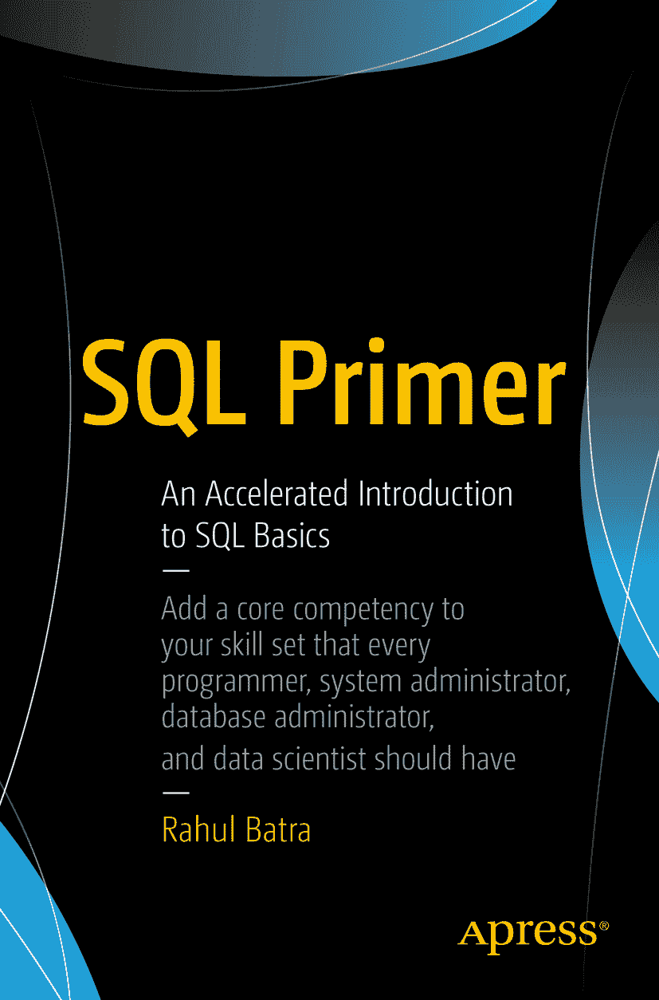

# SQL 入门：SQL 基础快速教程

拉胡尔·巴特拉

作者在本书中引用的任何源代码或其他补充材料，读者均可通过本书产品页面在 GitHub 上获取，地址为 [www.apress.com/9781484235751](http://www.apress.com/9781484235751)。更详细信息，请访问 [`www.apress.com/source-code`](http://www.apress.com/source-code)。

ISBN 978-1-4842-3575-1
e-ISBN 978-1-4842-3576-8
[`doi.org/10.1007/978-1-4842-3576-8`](https://doi.org/10.1007/978-1-4842-3576-8)
美国国会图书馆控制号：2018947350

© 拉胡尔·巴特拉 2018

本作品受版权保护。出版商保留所有权利，无论涉及材料的全部或部分，特别是翻译、转载、插图重用、朗诵、广播、缩微胶片或其他任何物理方式的复制，以及信息存储和检索、电子改编、计算机软件，或当前已知或未来开发的类似或不同方法的权利。书中可能出现商标名称、标识和图像。我们仅在编辑意义上并为了商标所有者的利益使用这些名称、标识和图像，无意侵犯商标权。本出版物中使用的商品名称、商标、服务标志和类似术语，即使未特别标识，也不应被视为表达关于其是否受专有权约束的意见。

虽然本书中的建议和信息在出版时被认为是真实和准确的，但作者、编辑或出版商均不对可能出现的任何错误或遗漏承担法律责任。出版商对本出版物所含材料不作任何明示或暗示的保证。

本书通过 Springer Science+Business Media New York 在全球图书行业发行，地址：233 Spring Street, 6th Floor, New York, NY 10013。电话：1-800-SPRINGER，传真：(201) 348-4505，电子邮件：orders-ny@springer-sbm.com，或访问 www.springeronline.com。

Apress Media, LLC 是一家加利福尼亚州有限责任公司，其唯一成员（所有者）是 Springer Science + Business Media Finance Inc (SSBM Finance Inc)。SSBM Finance Inc 是一家特拉华州公司。

献给我的父母。

## 前言

我在 2012 年底撰写了本书的前身文本并将其发布在互联网上，希望有人会觉得它有用。由于反响不错，我继续写作，最终有了这本书。随着时间的推移，本书经历了许多改动和增补，但核心目标始终如一——在假定读者没有`SQL`经验的前提下，对其进行简要介绍。

阅读本书后，读者应能识别所遇到的查询的各个部分，甚至能够自己编写简单的`SQL`语句和查询。然而，本书并非旨在作为参考手册或面向全职数据库管理员，因为它并未涵盖所有主题。

本书采用线性方式编写——您从第 1 章开始顺序阅读。由于包含大量示例，我希望读者能够跳转到特定主题并快速回顾。示例在`PostgreSQL`和`SQLite`中实现，但目标是尽可能保持`DBMS`实现无关性。

我鼓励您在阅读本书的过程中尝试修改语句和查询。同时，请务必查阅附录中的书籍推荐，以帮助您更深入地探索`SQL`和数据库的世界。

您的问题、评论、批评、鼓励和修正都备受欢迎，您可以通过电子邮件 `rhlbatra@hotmail.com` 联系我。

## 致谢

我很早就接触了计算机，大约在 12 岁左右。在那个年代，购买个人电脑是一件昂贵的事情。特别是在像印度这样的发展中国家，计算机革命很晚才普及到家庭层面。我要感谢我的父母和姐姐为我提供了`PC`。没有它，我肯定不会像现在这样对这个领域充满热情。感谢你们对我坚定不移的信念。

我的妻子不仅担任了本书初稿的编辑，还在我写作期间承担了照顾我们孩子的主要责任。感谢你的耐心和鼓励。

完成一本书很少是个人努力的成果。我感谢`Apress`团队与我合作使这本书得以完成。感谢乔纳森和吉尔给我这个机会并让我保持专注。感谢斯特凡和劳拉仔细审阅文稿，极大地改进了最终成品。

最后，感谢我的早期读者们，他们提出了改进建议并发现了错误——基思·汤普森、内森·亚当斯、保罗·吉尔博特、吉姆·诺和肖恩·法雷尔。

## 目录

## 第 1 章：SQL 简介
-   1 关系模型与 SQL
-   2 使用 SQL 的优势
-   4 SQL 命令分类
-   5 解释表
-   5 SQL 中的数据类型

## 第 2 章：准备好你的数据库
-   11 使用 PostgreSQL
-   12 使用 SQLite
-   14 创建你自己的数据库
-   16 创建表
-   17 插入数据
-   20 编写你的第一个查询

## 第 3 章：约束的好处
-   25 空值约束
-   26 选择性字段插入
-   28 检查约束
-   30 主键约束
-   32 唯一键约束
-   34 主键与唯一键的区别

## 第 4 章：表操作
-   37 删除表
-   37 从现有表创建新表
-   39 修改表
-   42 在 PostgreSQL 中显示表信息
-   43 在 SQLite 中显示表信息
-   45 在其他 DBMS 中显示表信息

## 第 5 章：编写基础查询
-   47 选择有限数量的列
-   47 对结果进行排序
-   49 使用字段缩写排序
-   50 按多个列排序
-   51 使用 WHERE 添加条件
-   53 组合条件

## 第 6 章：操作数据
-   57 从另一张表向表中插入数据
-   57 更新现有数据
-   60 从表中删除数据

## 第 7 章：组织你的数据
-   65 规范化
-   65 原子性
-   67 重复组
-   68 拆分表

## 第 8 章：用查询做更多事情
-   75 计算表中的记录数
-   75 在 COUNT 中使用 DISTINCT
-   77 列别名
-   79 SELECT 查询的执行顺序
-   82 使用 LIKE 操作符

## 第 9 章：计算字段
-   87 数学计算
-   87 字符串操作
-   89 字面值

## 第 10 章：聚合与分组
-   95 聚合函数
-   95 使用极值函数——MAX 和 MIN
-   98 数据分组
-   100 分组与聚合函数
-   103 HAVING 子句

## 第 11 章：理解连接
-   109 备选连接语法
-   111 解决连接列中的歧义
-   112 外连接
-   113 交叉连接
-   115 自连接
-   118 非等值连接

## 第 12 章：子查询
-   123 子查询的类型
-   124 子查询中的存在性测试
-   125 在 INSERT 语句中使用子查询
-   127 使用 ANY 和 ALL

## 第 13 章：集合操作
-   133 并集
-   133 交集
-   136 差集

## 第 14 章：视图
-   141 为什么需要视图？
-   141 创建视图
-   142 通过视图修改数据
-   145 删除视图

## 第 15 章：索引
-   151 创建索引
-   152 使用 EXPLAIN 查看索引工作情况
-   154 唯一索引
-   158 索引如何工作？
-   160 索引开销
-   161 删除索引

## 第 16 章：访问控制语句
-   165 在 PostgreSQL 中创建新用户
-   166 向用户授予权限
-   169 撤销权限

## 附录 A：延伸阅读
-   175

## 附录 B：数据库管理系统与工具
-   179 关系数据库管理系统
-   179 SQL 开发环境

## 附录 C：SQL 与关系数据库的历史
-   183 复杂文件导向系统的兴起
-   183 数据库系统的登场
-   184 关系模型的起源
-   185 查询语言的艰苦战役

186 索引

189 关于作者与关于技术审校者
-   关于作者
-   关于技术审校者

### 1. SQL 简介

现代社会由数据驱动。无论是在个人层面，比如一本写满笔记的笔记本；还是在国家层面，例如人口普查数据，它已经渗透到我们所有的工作流程中。始终存在一个日益增长的需求，即高效地存储和组织数据，以便从原始数据中提取有意义的信息。

数据库不过是组织化数据的集合。它不必是数字格式才能被称为数据库。电话目录就是一个很好的例子，它存储了个人和组织的联系号码数据。待办事项列表也是一种初级的数据库形式。随着对最普通流程收集的数据量也变得越来越大，数字数据库自 1960 年代诞生以来已变得日益重要。

用于管理数字数据库的软件被称为数据库管理系统（`DBMS`）。当你听到有人谈论 `PostgreSQL` 或 `MySQL` 时，他们指的就是一种 `DBMS`。数据库是当你使用 `DBMS` 软件来存储对你或你的组织有意义的某些主题的数据时所创建的东西。例如，你的公司可能使用 `PostgreSQL` 来存储手机的库存信息——这是你销售的产品。在这种情况下，你使用 `PostgreSQL` 作为 `DBMS` 创建了一个库存数据库。

#### 关系模型与 SQL

数据有无数种形态和规模，并且每种情境生成数据的方式都不同。银行记录账户余额生成的数据，与追踪家谱成员的数据是不同的。但为了让 `DBMS` 提供统一的数据管理和报告能力，我们必须遵循一种数据组织结构或数据模型。

最普遍的数据库组织模型是关系模型，由 E. F. Codd 博士在他 1970 年的开创性研究论文《大型共享数据库的关系模型》中提出。¹ 在这个模型中，待存储的数据以表格格式组织，包含行和列。表中的每一行代表一条独特的记录，列标题指定了所存储数据的类型。这与电子表格类似，第一行可以看作是列标题，随后的行存储实际数据。

一个数据库通常由多个表组成，每个表有不同的列标题。某些列可能在表之间是共通的，但这是我们将在本书后面讨论的主题。

**问题**

`关系型数据库`中的“关系”这个词是什么意思？

一个常见的误解是，“关系”这个词意味着表之间存在关联。关系（relation）是一个数学术语，大致相当于表本身。当与“数据库”一词结合使用时，我们意指这个特定的系统以表格方式排列数据。

这种误解可能源于 1980 年代的 `DBMS` `dBase` 中的 `set relation` 命令。该命令确实用于在表之间创建链接，但它与关系理论毫无关系。

`SQL` 代表结构化查询语言，它是与关系型数据库交互的事实标准。你将遇到的几乎所有数据库管理系统都会有一个 `SQL` 实现。`SQL` 由美国国家标准协会（`ANSI`）于 1986 年标准化，并经历了多次修订，最著名的是在 1992 年和 1999 年。然而，并非所有 `DBMS` 都严格遵循定义的标准，而是会移除一些特性并添加其他特性，以提供独特的功能集。尽管如此，标准化过程在数据库交互语言方面为供应商提供了统一的方向。

虽然 `SQL` 是一种计算机语言，但它不同于你可能听说过的其他编程语言，如 `Python` 或 `C`。这类编程语言是通用的，适用于从编程基本计算系统到高级模拟模型的各种任务。`SQL` 是一种特殊用途的查询语言，旨在用于与关系型数据库交互。除了这个上下文之外，它没有其他用途。

这并不意味着它是唯一存在的数据库查询语言。在 1980 年代，另一种来自 `Ingres` 的语言 `QUEL` 相当流行，但围绕 `SQL` 的标准化工作巩固了它的地位。近年来，我们看到在 `NoSQL` 的统称下开发了大量非关系型数据库。然而，它们的查询语言大多与 `SQL` 有相似之处，即使它们的数据模型与关系模型有显著不同。

#### 使用 SQL 的优势

*   它是标准化的——无论你选择哪种关系型数据库，它都会内置一个 `SQL` 查询解释器。`SQL` 的极大普及性使得任何与数据系统交互的人都值得花时间学习它。
*   它具有合理的类英语语法。使用 `SQL` 时，不必指定像 `C` 或 `Java` 这类编程语言的繁琐细节。它简洁、易于理解，并且易于编写数据库查询。它是声明式的，意味着你只需声明你想要实现什么，而不是详述实现结果的步骤。
*   它提供了一种统一的方式来查询和管理关系型数据库。许多数据库管理命令都是标准的 `SQL` 命令，使得技能迁移更加容易。
*   它是成熟的——`SQL` 已存在超过 35 年。虽然许多新功能已被添加，但 `SQL` 的核心基本保持不变。掌握一些基本的 `SQL` 概念和命令，你就能获得很多实用价值，并且它们在未来也将很好地为你服务。

#### SQL 命令分类

`SQL` 是一种用于与数据库交互的语言。它由许多命令组成，并有进一步的选项让你能够对数据库执行操作。虽然不同的 `DBMS` 提供的命令子集有所不同，但通常你会发现以下分类。

*   数据定义语言（`DDL`）：`CREATE TABLE`、`ALTER TABLE`、`DROP TABLE` 等。这些命令允许你创建或修改数据库结构。
*   数据操作语言（`DML`）：`INSERT`、`UPDATE`、`DELETE`。这些命令用于操作存储在数据库中的数据。
*   数据查询语言（`DQL`）：`SELECT`。用于从数据库中查询或选择数据子集。
*   数据控制语言（`DCL`）：`GRANT`、`REVOKE` 等。用于控制对数据库中数据的访问，常用于授予用户权限。
*   事务控制命令：`COMMIT`、`ROLLBACK` 等。用于将一组语句作为一个工作单元进行管理。

除此之外，你的数据库管理系统可能会提供其他命令集，以便更高效地工作或提供额外功能。但可以肯定地说，上述命令几乎存在于你遇到的所有 `DBMS` 中。

