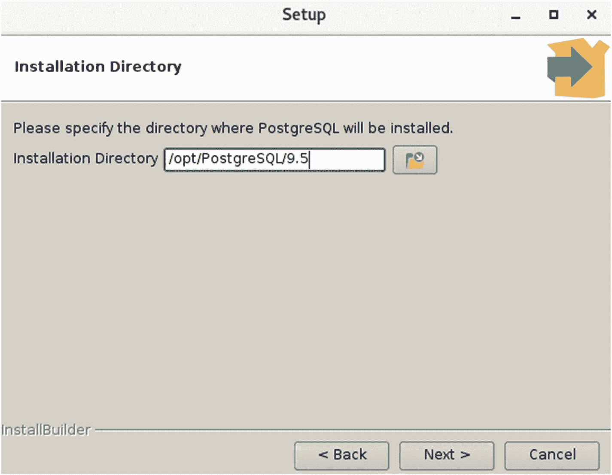

# 前言

#### 解释表

关系数据库中的表本质上是一个二维数据矩阵，其中列描述数据类型，行包含待存储的实际数据。请查看表 1-1 以了解数据库中表的可视化形式。

表 1-1

描述编程语言的表

| ID | 语言 | 作者 | 年份 |
| --- | --- | --- | --- |
| 1 | Fortran | Backus | 1955 |
| 2 | Lisp | McCarthy | 1958 |
| 3 | Cobol | Hopper | 1959 |

上表存储了关于编程语言的数据。它由四列（`id`、`language`、`author` 和 `year`）和三行组成。数据库中列的正式术语是**字段**，行被称为**记录**。

**注意**

本书中的示例表主要涉及编程语言、其作者以及创建年份。我们本可以使用数据库查询语言，但它们的数量要少得多。

自 20 世纪 50 年代和 60 年代以来，我们的计算机硬件和技术已经发生了很大变化，但那个时代的早期编程语言对今天的编程语言仍然有着持久的影响。Lisp——由约翰·麦卡锡于 1958 年构想²——至今仍以 Common Lisp、Scheme 和 Clojure 的形式存在。甚至 Fortran 在科学计算中仍然被定期使用。

示例表中有两点值得注意。第一点是 `id` 字段本身除了表示其在表中的顺序位置外，几乎不能提供任何关于编程语言的信息。第二点是，尽管我们可以通过查看字段名来理解它们，但我们还没有正式为它们分配数据类型，也就是说，我们还没有限制（至少目前还没有）一个字段应该包含字母、数字还是两者的组合。

这里的 `id` 字段充当了表中的**主键**。它使得表中的每条记录都是唯一的，其优势在后续章节中将变得更加清晰。但现在请思考一下，如果一种语言的创造者在同一年创造了两种语言；我们将很难精确地定位记录。`id` 字段通常是一个很好的主键，因为它保证是唯一的，但并不限制使用其他字段来达到此目的。

表的一个关键概念是它们本质上是概念性的，可能与实际存储数据的文件无关。当用户创建电子表格时，他们会将一个文件名与该电子表格关联起来，并将其放置在磁盘上的某个位置。但关系数据库对用户隐藏了所有这些细节。表在磁盘上的物理存储可能对应单个文件，或多个文件，甚至可能是多个表存储在单个文件中的关系。你的数据库管理系统有责任提供读写表的方法。

#### SQL 中的数据类型

就像编程语言一样，SQL 也有数据类型，用于定义其字段中将存储何种数据。在上面的表中，我们可以看到字段 `language` 和 `author` 必须存储英文字符。`id` 和 `year` 字段都存储整数。

你在后续章节中会遇到的常用数据类型如表 1-2 所示。

表 1-2

SQL 中的各种数据类型

| 字符类型 | `char`, `varchar` |
| --- | --- |
| 整数值 | `integer`, `smallint` |
| 小数 | `numeric`, `decimal` |
| 日期数据类型 | `date` |

一串字符通常存储在 `char` 或 `varchar` 中。前者在你指定字段时会保留你所需的空间，但如果你存储的值较短，剩余的空间就会被浪费。然而，`varchar` 代表可变长度字符，将精确占用字符串的长度，没有浪费。不过，你可以为这类字段分配的字符串值的最大长度是有限制的，这个限制在字段定义时指定。

```
char(12)
varchar(12)
```

如果你存储值 'McCarthy'（8 个字符长），`char` 会存储它但会浪费四个字符的空间。`varchar` 会精确地将其存储为八个字符，但这种动态性是以速度为代价的。尽管如此，速度差异非常小，以至于在大多数情况下，你会看到使用可变字符数据类型。

对于数值，我们主要分为两大类——`integer` 用于存储整数，`numeric` 用于存储带小数点的数值。它们所能存储的值的范围和限制因你选择的数据库管理系统而异。然而，一个好的经验法则是使用能够满足应用程序当前和可预见未来需求的最小数据类型。

例如，如果我要存储学生学号，使用 `smallint` 就很合适。在大多数实现中，这种数据类型允许的最大值为 32767，我预计这个数字在任何班级中都远大于学生人数。

小数点的指定更为复杂。我们使用 `numeric` 数据类型来固定数字可以有多大以及小数点后可以有多少位数字。

```
numeric(精度, 标度)
numeric(5, 2)
```

总位数由 `精度` 指定，小数点后的位数由 `标度` 表示。因此，在给定的示例中，我们将能够存储像 999.99 这样的数字，但不能再大。

由于数据类型因数据库管理系统的实现而异，我建议你手边常备你的数据库管理系统手册。每种实现都为你提供了许多其他类型可供使用，但出于我们的学习目的，以上这些应该足够了。

**脚注** 1

Codd, E. F.; “大型共享数据库的关系模型,” Communications of the ACM, vol 13, no 6, June 1970, [`https://www.seas.upenn.edu/~zives/03f/cis550/codd.pdf`](https://www.seas.upenn.edu/%7Ezives/03f/cis550/codd.pdf)

2

McCarthy, John; “符号表达式的递归函数及其机器计算，第一部分,” Communications of the ACM, vol 3, issue 4, April 1960, [`http://jmc.stanford.edu/articles/recursive/recursive.pdf`](http://jmc.stanford.edu/articles/recursive/recursive.pdf)

### 2. 准备你的数据库

学习 SQL 的最佳方法是在真实的关系数据库管理系统上练习编写命令。在本书中，SQL 将使用以下系统之一进行教授：PostgreSQL 或 SQLite。选择这些数据库管理系统的原因很简单——它们是免费且开源的，并且在大多数主要平台上可用。PostgreSQL 是一个功能齐全的企业级数据库管理系统，拥有庞大的社区。SQLite 是一个小型但健壮的系统，特别适合学习目的。如果你对软件安装不熟悉，请选择后者。

然而，任何你能接触到的关系数据库产品都应该能满足你的需求。在某些情况下，你可能已经在你的组织中拥有访问权限，但请务必申请将其用于学习目的的许可。不同供应商之间可能存在微小的不兼容性，因此，如果你在阅读本书时选择其他系统进行练习，最好手边备有该数据库供应商的用户手册。

由于本文主要以独立于产品的方式教授 SQL，而不是教授特定的数据库管理系统，因此有关安装和特定产品操作的细节将保持在最低限度。相反，重点放在几个特定的步骤上，这些步骤将帮助你尽快开始编写 SQL。


#### 使用 PostgreSQL

本书撰写时，PostgreSQL 的最新版本是 9.6。你并不一定需要最新版本；实际上，我在本文中使用的版本是 9.5。

你可以从 [`https://www.postgresql.org/download/`](https://www.postgresql.org/download/) 下载适用于你平台的 PostgreSQL 最新版本。为了最快、最简单的安装，我建议你从“二进制包”列表中选择你的平台。预编译的二进制文件意味着你可以像安装其他任何软件一样，通过图形化的分步安装程序下载并安装 PostgreSQL。

选择平台后，你可能仍然会看到多种安装方式。我建议选择来自 BigSQL 或 EnterpriseDB 等第三方供应商的图形化安装程序版本。我为我的 Fedora Linux 机器选择了 EnterpriseDB 安装程序，当我运行下载的文件时，一个友好的安装过程就会弹出，询问诸如安装目录之类的详细信息（图 2-1）。



**图 2-1**  
EnterpriseDB PostgreSQL 安装向导

系统还会询问其他一些细节，最重要的是端口号和密码。端口号的默认值 `5432` 应该就足够了。安装完成后，你的系统上将拥有一个名为 `postgres` 的用户以及一个可用的数据库安装。

你可以使用 `psql` 来快速验证一切是否顺利，这是一个用于与你的 PostgreSQL 安装交互的命令行实用程序。我在下面捕获了来自我系统的命令和输出（清单 2-1）。

```
[~]$ /opt/PostgreSQL/9.5/bin/psql -U postgres
psql.bin (9.5.8)
Type "help" for help.
postgres=#
```
**清单 2-1**  
启动 `psql` shell

如果你得到类似的输出，那么你就可以开始使用你的 PostgreSQL 安装了。如果没有，恐怕你得自己做一些排查了。你也可以选择 SQLite，它将在下一节讨论，其安装过程要容易得多。

#### 使用 SQLite

如果安装 PostgreSQL 看起来很困难，那么你很幸运。有一个非常可靠、免费的替代数据库供你练习。它叫做 SQLite，其创建者 D. Richard Hipp 将其慷慨地许可在公共领域。你可以从项目页面下载：[`https://www.sqlite.org/download.html`](https://www.sqlite.org/download.html)

和上一节一样，为了最快开始，你需要寻找与你操作系统对应的预编译二进制文件。SQLite 非常小巧；在大多数平台上，其核心引擎不到一兆字节！

如果你使用的是 Microsoft Windows，你需要查找标题为“Precompiled Binaries for Windows”的部分。下载 SQLite DLL zip 归档文件，名称类似于 `sqlite-dll-win32-x86-xxxxxxx.zip`，它包含了 SQLite 但没有交互方式。为此，你必须下载 SQLite shell，名称类似于 `sqlite-tools-win32-x86-xxxxxxx.zip`，这将允许我们通过命令行创建和查询 SQLite 数据库。

将这两个归档文件解压到同一个目录中，就完成了 SQLite 的安装。你的文件夹现在应该至少包含三个文件：

*   `sqlite3.dll`
*   `sqlite3.def`
*   `sqlite3.exe`

最后一个文件是用于与 SQLite 数据库交互的命令行 shell。

如果你使用的是 Linux 或 MacOS X 系统，很可能你已经安装了 SQLite。为了测试这一点，你可以尝试启动 SQLite shell `sqlite3`（清单 2-2）。

```
[~]$ sqlite3
SQLite version 3.13.0 2016-05-18 10:57:30
Enter ".help" for usage hints.
Connected to a transient in-memory database.
Use ".open FILENAME" to reopen on a persistent database.
sqlite>
```
**清单 2-2**  
启动 `sqlite3` shell

如果你得到如上所示的输出，那么你就拥有了运行 SQLite 所需的一切。或者，如果你收到错误消息，则意味着你需要自己安装它。你可以使用类似的平台预编译二进制方法，或者使用系统安装程序。

对于像 Red Hat Enterprise Linux、Scientific Linux 和 CentOS 这样的系统，你可以使用 `yum` 来安装 SQLite。

```
# yum install sqlite
```

在 Fedora Linux 系统上，你必须使用 `dnf`，如下所示。

```
# dnf install sqlite
```

如果你恰好使用基于 Debian 或 Ubuntu 的系统，你可以通过以下方式实现相同的结果。

```
$ sudo apt-get install sqlite3
```

安装完成后，你可以像之前一样通过启动 SQLite shell 来验证安装。

#### 创建你自己的数据库

像 PostgreSQL 这样的数据库管理系统允许你创建多个数据库。出于练习目的，建议创建你自己的数据库，这样你就可以自由地对其进行任何操作。

大多数数据库系统在提供数据库创建设施的方式上有所不同。PostgreSQL 通过提供多种方式来实现这一点，包括通过 `pgAdmin III` 图形化工具。然而，出于教学目的，我们将改用命令操作来创建我们的数据库。打开 `psql` shell 并输入如下命令（清单 2-3）。

```
CREATE DATABASE testdb;
```
**清单 2-3**  
在 PostgreSQL 中创建数据库

命令 `CREATE DATABASE` 用于创建一个数据库，该数据库将作为你表的容器。在上面显示的示例和输出中，我们创建了一个名为 `testdb` 的数据库供我们使用。你连接 `psql` 时使用的登录用户（在大多数情况下是 `postgres`）现在就是此数据库的所有者，并完全控制其中的实体。这类似于在操作系统中创建文件，创建者获得完全访问控制权，并可以选择授予其他用户和组特定的权限。

根据 SQL 标准的定义，允许以大小写不敏感的方式编写命令和关键字。在本书中，我们将在语句中使用大写字母来编写它们，这是一种被广泛接受的实践。

> **注意**
>
> 奇怪的是，SQL 标准并不包含 `CREATE DATABASE` 命令。在 1992 年的标准（恰当地命名为 SQL-92）中，有一个 `CREATE SCHEMA` 命令与前者接近但不完全相同。
>
> 然而在现代，像 MySQL 这样的数据库将这两个命令视为彼此的同义词。

如果你使用的是 SQLite，请启动命令 shell，你会看到一条打印版本信息的欢迎文本（清单 2-4）。这与我们之前在验证 SQLite 安装时看到的信息完全相同。

```
SQLite version 3.13.0 2016-05-18 10:57:30
Enter ".help" for usage hints.
Connected to a transient in-memory database.
Use ".open FILENAME" to reopen on a persistent database.
sqlite>
```
**清单 2-4**  
打开 SQLite shell

在这里，我们输入 `.open` 命令来创建 SQLite 数据库，或者在它已存在时打开它。

```
sqlite> .open testdb
```

在 Linux 系统上，你也可以简单地在 SQLite shell 命令后写上数据库名称，如下所示，这样你就能够打开指定的数据库。

```
sqlite3 testdb
```

有趣的是，这种调用方式不会创建 `testdb`，它只是在数据库存在时打开它。如果你不执行任何其他操作并关闭 shell（`Ctrl-D`），那么在 Linux 上你的机器上将不会有 `testdb` 文件。在 Windows 系统上，你将得到一个长度为 0 字节的空文件。


#### 表创建

我们已经探索了关系模型中表的概念。现在是时候使用标准的 SQL 命令 `CREATE TABLE` 来创建一个表了（参见清单 2-5）。

```sql
CREATE TABLE 
( ,
 ,
\. \. \.
 );
```
清单 2-5
CREATE TABLE 语句的通用语法

这是能为你创建一个表的最简单的有效语句，不包含任何额外选项。随着学习的深入，我们会进一步探讨子句和约束，但现在让我们使用这个通用语法来实际创建我们在第 1 章介绍的编程语言表（参见清单 2-6）。

```sql
CREATE TABLE proglang_tbl (
id        INTEGER,
language  VARCHAR(20),
author    VARCHAR(25),
year      INTEGER);
```
清单 2-6
创建编程语言表

我们必须在 PostgreSQL 的 `psql` shell 中输入此命令。注意，当我们启动 shell 时，光标等待的最后一行看起来像下面这样：

```
postgres=#
```

这实际上意味着我们连接到了名为 `postgres` 的数据库，这是 PostgreSQL 安装时出于管理目的内部使用的数据库。我们已经创建了我们自己的数据库。在创建表之前，让我们使用 `\c` 切换到那个数据库（参见清单 2-7）。

```
postgres=# \c testdb
You are now connected to database "testdb" as user "postgres".
testdb=#
```
清单 2-7
在 psql 中连接到不同的数据库

注意，最后一行的文本已经改变，指示了我们当前连接的数据库。现在你可以输入清单 2-6 中给出的建表语句，如果你没有遗漏任何重要的标点符号或拼错大写的关键字，你的表就会被创建，shell 将简单地回复：

```
CREATE TABLE
testdb=#
```

一个不成功的命令会产生一个带有有用解释的错误。为了实际看到这一点，让我们再次运行完全相同的建表命令。现在 shell 会响应：

```
ERROR:  relation "proglang_tbl" already exists
```

这个语句本身足够简单，因为它类似于清单 2-5 的通用语法。有趣的是字段所选的数据类型。为了简单起见，`id` 和 `year` 都被指定为 `INTEGER`，尽管有更好的替代方案。`language` 字段被分配了 20 个字符的空间来存储编程语言的名称，而 `author` 字段可以容纳 25 个字符来存储创建者的姓名。

最后的英文分号是 SQL 语句的分隔符，它标记着一个语句的结束。

如果你使用的是 SQLite，语句与清单 2-6 完全相同。唯一的区别是，由于 SQLite 数据库是一个特定的文件，并且你在打开 SQLite shell 时就已经打开了它，因此不需要切换数据库（参见清单 2-8）。

```
[~]$ sqlite3 testdb
SQLite version 3.13.0 2016-05-18 10:57:30
Enter ".help" for usage hints.
sqlite> CREATE TABLE proglang_tbl (
...> id        INTEGER,
...> language  VARCHAR(20),
...> author    VARCHAR(25),
...> year      INTEGER);
sqlite>
```
清单 2-8
在 SQLite 中创建编程语言表

注意，这里没有操作成功的消息。如果一切顺利，SQLite shell 只是继续运行。为了做些实验，如果我们尝试再次创建相同的表，我们会得到一个错误信息：

```
Error: table proglang_tbl already exists
```

这又是一个有帮助且更友好的错误消息。

#### 插入数据

我们刚刚创建的表是空的，所以我们现在的任务是向其中插入一些示例数据。为了以行的形式填充这些数据，我们使用 DML 命令 `INSERT`，其通用语法如下（参见清单 2-9）。

```sql
INSERT INTO 
VALUES ('Value1', 'Value2', ...);
```
清单 2-9
INSERT INTO TABLE 的通用语法

只要记住我们要插入行的表的结构，将一些示例值套用到这个通用语法中是非常简单的。为了像我们在第 1 章看到的那样向 `proglang_tbl` 填充行，我们需要使用三个如下的 `INSERT` 语句（参见清单 2-10）。

```sql
INSERT INTO proglang_tbl
VALUES (1, 'Fortran', 'Backus', 1955);
INSERT INTO proglang_tbl
VALUES (2, 'Lisp', 'McCarthy', 1958);
INSERT INTO proglang_tbl
VALUES (3, 'Cobol', 'Hopper', 1959);
```
清单 2-10
向 proglang_tbl 表插入数据

如果你没有从 `psql` 或 `sqlite3`（或你选择的 DBMS 的 SQL 接口）收到任何错误，那么你已经成功地向你的表中插入了三行数据。注意我们是如何仔细地将字段的顺序保持为与我们创建表时所使用的顺序一致的。这种严格的顺序限制可以被移除，我们稍后会看到如何实现这一点。

如果你在 `psql` 中运行了这三条语句，每条语句执行完毕后，你会收到一条类似下面的消息：

```
INSERT 0 1
```

表示成功。


#### 编写你的第一个查询

现在，让我们将注意力转向编写一个简单的查询，以验证我们之前操作的结果——我们创建了一个表并向其中插入了三行数据。为此，我们将使用一种名为 `SELECT` 的数据查询语言（DQL）命令。

查询就是一个 SQL 语句，它允许你检索数据库中包含的有用数据子集。你可能已经注意到，`INSERT` 和 `CREATE TABLE` 命令被称为语句，但使用 `SELECT` 进行的获取操作属于查询范畴。

在 SQL 环境中，你日常的大部分操作将涉及查询，因为数据库结构只需创建一次（仅在需要时修改），并且只有在新数据可用时才插入行。虽然一个典型的 `SELECT` 查询相当复杂，包含许多子句，但我们的旅程将从编写一个仅用于验证表内容的查询开始。一个简单查询的通用语法如下所示（见清单 2-11）。

```sql
SELECT  FROM ;
```
*清单 2-11*
*简单 SQL 查询的通用语法*

将其转化为我们的结果验证查询是一项简单的任务（见清单 2-12）。我们已经知道想要查询的表是 `proglang_tbl`，对于我们的选择，我们将使用 `* (星号)`，它将选择表中的所有行和字段。

```sql
SELECT * FROM proglang_tbl;
```

此查询的输出将是我们预期的矩阵格式的所有 (3) 行数据。如果你通过 `psql` 运行此命令，将会得到类似下面的输出。

```sql
testdb=# select * from proglang_tbl;
id | language |  author  | year
----+----------+----------+------
1 | Fortran  | Backus   | 1955
2 | Lisp     | McCarthy | 1958
3 | Cobol    | Hopper   | 1959
(3 rows)
testdb=#
```
*清单 2-12*
*在 psql 中验证表的内容*

SQLite 的输出一开始可能稍显杂乱，但让我们一步一步来优化它（见清单 2-13）。

```sql
sqlite> select * from proglang_tbl;
1|Fortran|Backus|1955
2|Lisp|McCarthy|1958
3|Cobol|Hopper|1959
sqlite>
```
*清单 2-13*
*在 sqlite3 中验证表的内容*

显然这不是最整洁的输出，但设置几个选项就能解决这个问题。第一个选项叫做：

```
.mode column
```

这将输出一个间距整齐的结果集，而不是我们之前看到的挤压在一起的样子（见清单 2-14）。

```sql
sqlite> .mode column
sqlite> select * from proglang_tbl;
1           Fortran     Backus      1955
2           Lisp        McCarthy    1958
3           Cobol       Hopper      1959
```
*清单 2-14*
*开启列模式*

啊，好多了！但这里还有改进的空间。我们看到输出中仍然缺少列标题，而拥有标题会很有帮助。于是我们开启 headers 选项，结果开始看起来相当整洁了（见清单 2-15）。

```sql
sqlite> .headers on
sqlite> select * from proglang_tbl;
id          language    author      year
----------  ----------  ----------  ----------
1           Fortran     Backus      1955
2           Lisp        McCarthy    1958
3           Cobol       Hopper      1959
```
*清单 2-15*
*在 sqlite3 中开启标题显示*

我建议你在学习过程中保持这些选项开启。这样输出结果会变得更容易一眼看清。

#### 约束条件的好处

关系型数据库作为数据存储和组织机制，其主导地位已经进入了第四个十年。其成功在很大程度上归功于数据模型的灵活性。很容易想象各种数据都能整齐地放入带有预定义列的表格结构中。

这种灵活性也延伸到了查询方面——在创建和填充表时，对于你能从表中查询什么几乎没有限制。你可能会尝试从一个你以前没有想到的角度，从表中产生全新的见解。为了实现这一切，关系型数据库期望你在设计表时，预先投入一定量的规范和思考。整洁、定义良好的数据类型表是成功的关键，而某些规则有助于你遵循这条良好数据库设计的道路。

约束是你在进行 SQL 操作时应用或遵守的规则。当你希望使数据库中的数据更有意义和/或更有结构时，它们非常有用。

##### 空值约束

考虑编程语言表的例子——每一个被创造出来的编程语言都必须有作者（无论是个人、两人还是委员会）。同样，它应该有一个被引入的年份，无论是它首次作为研究论文出现的年份，还是为其编写了可用编译器的年份。在这种情况下，以某种方式创建你的表，使得某些字段不接受 `NULL`（空）值，是有意义的。

空值并不意味着 `0`（零）或像 `''` 这样的空字符串。可以将其理解为“空”或“未定义”。如果你在填充表时没有捕获某人的年龄，你不能假设他们的年龄是 `0`。如果有人使用这些数据进行统计分析，这可能会产生严重的后果。在那里放置一个空值则合理得多。

现在我们修改之前的 `CREATE TABLE` 语句，以便可以对某些字段应用 `NULL` 约束（见清单 3-1）。

```sql
CREATE TABLE proglang_tblcopy (
id        INTEGER     NOT NULL,
language  VARCHAR(20) NOT NULL,
author    VARCHAR(25) NOT NULL,
year      INTEGER     NOT NULL,
standard  VARCHAR(10) NULL);
```
*清单 3-1*
*创建带有空值约束的表*

在这个表中，我们只允许 `standard` 字段有空值。其他每个字段都以 `NOT NULL` 选项结尾，这指定了该字段必须有一个值。在大多数数据库管理系统中，所有字段默认都是可为空的，因此你必须指定一个不可为空的字段。写 `NULL` 字词来指定一个可为空的字段是可选的。

如果我们尝试向这个表中插入一行数据，并在某个不可为空的字段（如 `year`）中使用 `NULL` 值，我们预期会收到一条错误信息。在 SQLite 和 PostgreSQL 中，我们都使用字面量 `null` 来表示空值，注意这里没有通常包围字符串的引号（见清单 3-2 和 3-3）。`Null` 不是一个字符串值，写 `'null'` 会产生一个实际长度为 4 的字符串，这显然不是空值。其他数据库管理系统可能以不同的方式表示空值，因此请查阅你的手册了解详细信息。

```sql
sqlite> INSERT INTO proglang_tblcopy
VALUES (1, 'Fortran', 'Backus', null, 'ANSI');
Error: NOT NULL constraint failed: proglang_tblcopy.year
```
*清单 3-2*
*在 SQLite 中插入空值*

```sql
testdb=# INSERT INTO proglang_tblcopy
VALUES (1, 'Fortran', 'Backus', null, 'ANSI');
ERROR:  null value in column "year" violates not-null constraint
DETAIL:  Failing row contains (1, Fortran, Backus, null, ANSI).
```
*清单 3-3*
*在 PostgreSQL 中插入空值*

我们看到，在这种情况下，我们实现了目标：创建了一个表，其中 `id`、`language`、`author` 和 `year` 字段对于任何行都不能为空，但新字段 `standard` 可以取空值。现在，我们尝试使用另一种 `INSERT` 语法向此表中插入新行。


#### 选择字段 INSERT

从我们上次接触`INSERT`语句开始，我们看到必须按照表创建时指定的顺序来提供要插入的数据。现在，我们将了解另一种变体，它允许我们克服这一限制，并通过根本不指定字段来处理插入其字段中包含 NULL 值的行（参见清单 3-4）。虽然这种方法最初可能看起来有些冗长，但其优势很快就超过了任何与语句长度相关的顾虑。

```
INSERT INTO table_name
(field1,
 field2,
 . . .
)
VALUES
(value1,
 value2,
 . . .
);
```
*清单 3-4 选择字段插入的通用语法*

由于我们在语句本身中指定了字段顺序，因此我们可以自由地在同一个语句中重新排序值序列，从而消除了第一个限制。此外，如果我们希望在一条记录的任何字段中输入空（NULL）值，只需在语句的第一部分不包含该字段的名称，即可轻松实现。只要这些字段没有附加`NOT NULL`约束，语句就可以在不指定任何您希望省略的字段的情况下正常运行。

我们现在为`proglang_tblcopy`表编写一些`INSERT`语句，尝试插入一些未被任何组织标准化的语言和一些已被标准化的语言（参见清单 3-5）。

```
INSERT INTO proglang_tblcopy
(id, language, author, year, standard)
VALUES
(1, 'Prolog', 'Colmerauer', '1972', 'ISO');

INSERT INTO proglang_tblcopy
(id, language, author, year)
VALUES
(2, 'Perl', 'Wall', '1987');

INSERT INTO proglang_tblcopy
(id, year, standard, language, author)
VALUES
(3, '1964', 'ANSI', 'APL', 'Iverson');
```
*清单 3-5 向 proglang_tblcopy 表插入新数据*

当您通过 SQL 界面运行此命令时，三行新数据将被插入表中。请注意第三行的顺序；它与我们创建表时使用的序列不同。此外，由于 Perl（行 id 2）尚未被国际机构标准化，因此我们在执行`INSERT`操作时不指定字段名本身。这确保了该行的`standard`字段填充为 null。

为了验证这些语句的结果（表 3-1）并确保正确的数据进入了正确的字段，我们像之前一样运行一个简单的查询。

**表 3-1 在 proglang_tblcopy 上运行查询的结果**

| id | language | author | year | standard |
| --- | --- | --- | --- | --- |
| 1 | Prolog | Colmerauer | 1972 | ISO |
| 2 | Perl | Wall | 1987 | |
| 3 | APL | Iverson | 1964 | ANSI |

```
SELECT * FROM proglang_tblcopy;
```

SQL 接口通常使用空格、问号（?）或有时甚至是单词'null'或'(null)'来显示空值。由于供应商之间没有标准化，每个实现可以自由选择其表示方式。

#### 检查约束

数据必须有意义，人们才能从中获得见解。关系数据库的一大优势是它们能够实现良好的数据结构、基于适当数据类型的存储和空值规则。检查约束更进一步，通过验证特定字段中允许的值来加强数据完整性。

它们允许您提供一个逻辑表达式，插入的值会根据该表达式进行测试，然后被接受或拒绝。例如，假设我们希望确保在我们的编程语言表中，语言创建年份不能小于或等于 1950（参见清单 3-6）。这将阻止有人输入像 190 这样的年份值，除非我们想捕捉罗马帝国时期创建的编程语言，否则这是有意义的！

```
CREATE TABLE proglang_constraints (
id        INTEGER     NOT NULL,
language  VARCHAR(20) NOT NULL,
author    VARCHAR(25) NOT NULL,
year      INTEGER     NOT NULL
            CHECK (year > 1950),
standard  VARCHAR(10) NULL);
```
*清单 3-6 为年份字段创建检查约束*

请注意年份字段的完整定义，它在`NOT NULL`约束之后定义了检查约束。我们用于测试的逻辑表达式是`year > 1950`，它禁止任何包含小于 1951 的年份值的行。让我们尝试输入这样一行来测试这个假设（参见清单 3-7）。

```
testdb=# INSERT INTO proglang_constraints
(id, language, author, year)
VALUES
(1, 'Short Code', 'Mauchly', 1949);
ERROR:  new row for relation "proglang_constraints" violates check constraint "proglang_constraints_year_check"
DETAIL:  Failing row contains (1, Short Code, Mauchly, 1949, null).
```
*清单 3-7 尝试违反检查约束*

虽然这是一个未被充分利用的功能，但检查约束非常有用。许多应用软件代码的目的是验证要插入的数据，而检查约束可以在这方面提供巨大帮助。


#### 主键约束

关系数据模型背后的数学概念是集合论。这个离散数学的分支处理无序的值包，这些包中的值可以被唯一标识，即不包含重复项。对于一个表而言，一个值是一条数据记录，而用记录中的一个键列来识别它是完美的方式。

主键通过强制某个字段的值唯一，从而至少以一种方式确保每条记录是唯一的。主键不一定限于一个字段；字段的组合也可以被定义为表的主键。在选择某个字段或其组合作为主键时，必须仔细考虑其逻辑含义。

通常，最佳的主键候选者并非我们直觉中的标识符。如果你存储的是关于人的数据，他们的名字是我们在现实生活中识别他们的方式。但在主键这个不容犯错的世界里，如果两个人都叫‘David Childs’会发生什么？

在我们的编程语言表中，`id`字段是应用主键约束的一个好选择。我们现在将修改`CREATE TABLE`语句来加入这个约束（参见代码清单 3-8）。

```
CREATE TABLE proglang_tbltmp (
id        INTEGER     NOT NULL  PRIMARY KEY,
language  VARCHAR(20) NOT NULL,
author    VARCHAR(25) NOT NULL,
year      INTEGER     NOT NULL,
standard  VARCHAR(10) NULL);
```
代码清单 3-8
包含主键的`CREATE TABLE`语句

ID 字段通常被选作主键。注意在这个特定的表中，`language`字段也可以工作，因为语言名称是唯一的。但是，如果我们有一个描述人的表，我们应该尝试找到一个逻辑上唯一的字段，比如他们的 SSN 号码或员工 ID 号码。

尽管主键的概念看起来自然且必要，但大多数数据库实现并没有真正强制执行它。这包括本书中用于示例的两个数据库——PostgreSQL 和 SQLite。你可以自由地创建一个没有任何主键的表（就像我们在本节之前所做的那样），并一遍又一遍地插入完全重复的数据。这不是理想的情况，但如果你愿意，仍然是允许的。

让我们在本章开头使用的`proglang_tblcopy`表中添加一些重复的行（参见代码清单 3-9）。

```
INSERT INTO proglang_tblcopy
(id, language, author, year)
VALUES
(2, 'Perl', 'Wall', '1987');
INSERT INTO proglang_tblcopy
(id, language, author, year)
VALUES
(2, 'Perl', 'Wall', '1987');
```
代码清单 3-9
在没有主键的表中插入重复数据

请注意，表中原本已有三条唯一的行，我们又添加了两条重复的行。`INSERT`语句的执行是静默的，表示成功。现在让我们验证表的内容（表 3-2）。

表 3-2
在`proglang_tblcopy`上运行查询的结果，显示重复的行

| id | 语言 | 作者 | 年份 | 标准 |
| --- | --- | --- | --- | --- |
| 1 | Prolog | Colmerauer | 1972 | ISO |
| 2 | Perl | Wall | 1987 |  |
| 3 | APL | Iverson | 1964 | ANSI |
| 2 | Perl | Wall | 1987 |  |
| 2 | Perl | Wall | 1987 |  |

```
SELECT * FROM proglang_tblcopy;
```

如果我们尝试在包含主键约束的表——`proglang_tbltmp`中添加重复记录，我们立刻会收到一个错误（代码清单 3-10）。

```
INSERT INTO proglang_tbltmp
(id, language, author, year)
VALUES
(2, 'Perl', 'Wall', '1987');
ERROR:  duplicate key value violates unique constraint "proglang_tbltmp_pkey"
DETAIL:  Key (id)=(2) already exists.
```
代码清单 3-10
尝试添加违反主键约束的重复记录

#### 唯一键约束

唯一键像主键一样，也用于使表中的每条记录唯一。一旦你定义了表的主键，任何你希望强制为唯一的其他字段都通过此约束来完成。经过深思熟虑的唯一性约束对于确保表中的数据健全大有帮助。

例如，在我们的数据库中，现在对`language`字段设置唯一键约束是有意义的（代码清单 3-11）。这将确保即使`id`字段不同，也不会有任何记录重复关于同一编程语言的信息。

```
CREATE TABLE proglang_tbluk (
id        INTEGER     NOT NULL  PRIMARY KEY,
language  VARCHAR(20) NOT NULL  UNIQUE,
author    VARCHAR(25) NOT NULL,
year      INTEGER     NOT NULL,
standard  VARCHAR(10) NULL);
```
代码清单 3-11
带有唯一键约束的编程语言表

我们现在将尝试插入两条关于 Prolog 语言的行，巧妙地更改`id`字段来测试我们的唯一约束（代码清单 3-12）。

```
testdb=# INSERT INTO proglang_tbluk
(id, language, author, year, standard)
VALUES
(1, 'Prolog', 'Colmerauer', 1972, 'ISO');
INSERT 0 1
testdb=# INSERT INTO proglang_tbluk
(id, language, author, year, standard)
VALUES
(2, 'Prolog', 'Colmerauer', 1972, 'ISO');
ERROR:  duplicate key value violates unique constraint "proglang_tbluk_language_key"
DETAIL:  Key (language)=(Prolog) already exists.
```
代码清单 3-12
在带有唯一键约束的表中插入重复数据

注意，我们在字段前写了`UNIQUE`这个词，并在表创建命令中省略了`KEY`。你可以根据需要为任意多的字段应用唯一约束。

我们将在第 15 章讨论索引时再次回顾唯一键和主键约束。

#### 主键与唯一键的区别

你可能已经注意到上述两种约束在用途上是相似的。然而，它们之间有一些区别。

1.  主键字段不能取`NULL`值，而具有唯一约束的字段可以。然而，由于约束的定义要求每个值必须是唯一的，因此只能有一条这样的记录。
2.  你被允许只为一个表定义一个主键约束，但你可以对任意多的字段应用唯一约束。

根据我的经验，这是任何涉及 SQL 的工作最喜欢的面试问题之一。考虑到这些约束对逻辑数据模型的重要性，这并不太不公平。只需记住将主键视为`NOT NULL UNIQUE`约束。

主键确保了一种区分表中行的逻辑方式。它是区分记录的最低标准。唯一约束通常作为附加规则添加，以在考虑业务或领域规则的同时确保数据健全。虽然没有它们也可以，但它们扮演着守门人的角色，只允许好的数据通过。

### 4. 表操作

表是关系世界中的基本存储容器。一个数据库通常包含许多表，每个表代表一个实体的集合。随着需求的发展，数据库中的表也会发展，数据库管理员（DBA）经常对单个表执行管理操作，比如删除它们或更改它们的定义。虽然典型的数据库用户没有被授予在大型生产数据库上执行此类操作的权限，但出于教学目的，熟悉它们仍然很重要。

你可能已经注意到，每当我们引入一个新概念时，我们都在不断创建新表。这产生了并非理想的后果，即我们的数据库中充斥着许多类似的表，每个表都保存着编程语言数据，但定义和约束略有不同。我们现在将着手删除不需要的表并修改现有的表以满足我们的需求。


#### 删除表

SQL 中删除表是通过`DROP TABLE`命令实现的。`DROP`实际上是一个顶级的 SQL 命令，与`CREATE`非常相似，它可以对多种数据库对象执行删除操作。要删除一个表，我们只需在命令后加上数据库对象类型——在本例中是`TABLE`。

我们现在将删除在之前的课程中创建的所有多余表（见清单 4-1）。请注意，删除表意味着删除该表及其内部的所有数据，且无法恢复。因此，在编写`DROP`命令时要格外小心。

```
DROP TABLE proglang_tbl;
DROP TABLE proglang_tblcopy;
DROP TABLE proglang_constraints;
DROP TABLE proglang_tbltmp;
清单 4-1
删除我们创建的临时表
```

如果没有返回错误，就意味着表已被删除。`DROP TABLE`通常只支持一次删除单个表，但有一些巧妙的方法可以用一条语句删除多个表。

要验证表是否确实已被删除，你有两种选择。一个简单的方法是针对该表编写任意查询，你会收到一个类似`Error: no such table: proglang_tbl`的错误。另一种方法是从数据库目录中获取当前存在的表的列表，这是 DBMS 内部用来跟踪用户创建的数据库、表和其他对象的一个数据库。在 SQLite 中查询目录以获取表列表极其简单（见清单 4-2）。

```
sqlite> .tables
proglang_tbluk
清单 4-2
在 SQLite 中列出存在的表
```

在 PostgreSQL 中做同样的事情稍微复杂一些，但它是针对目录数据库的一个`SELECT`查询（见清单 4-3）。

```
testdb=# SELECT table_name
FROM information_schema.tables
WHERE table_schema = 'public'
AND table_type = 'BASE TABLE';
table_name

proglang_tbluk
(1 row)
清单 4-3
在 PostgreSQL 中列出存在的表
```

如果这个查询对你来说显得复杂，那是因为它包含了我们尚未讲解的部分和语法。不过请放心，到查询章节结束时，这些语法就会变得完全合理了。目前我们可以推断，PostgreSQL 中的表数据存储在`information_schema.tables`这个目录表中。

#### 从现有表创建新表

你可能已经注意到我们删除了`proglang_tbl`表，现在我们手上只剩下`proglang_tbluk`表，它包含所有必要的约束和字段。后者的名称是在我们讨论唯一键约束时选择的，但现在将该表结构（以及任何相应数据）迁移回`proglang_tbl`这个名称似乎是合乎逻辑的。我们通过组合使用`CREATE TABLE`和`SELECT`命令来创建一个表的副本，并在此过程中学习一个新的子句——`AS`（见清单 4-4）。这个组合有一个特别容易记住的名字——CTAS，它在 SQL:2003 标准中被引入，但并非所有 DBMS 系统都实现了它，尤其是 Microsoft SQL Server。

```
CREATE TABLE <new_table_name>
AS
SELECT <column_list> FROM <existing_table_name>;
清单 4-4
从现有表创建新表的通用语法
```

由于我们的`proglang_tbluk`只包含一条记录，我们将向其中插入一些示例数据，以便稍后验证记录本身是否被复制。注意，我们显式地给出了字段名，否则第二行（不包含标准字段值）在 SQLite 中会产生类似这样的错误：

```
sqlite> INSERT INTO proglang_tbluk
VALUES
(2, 'Perl', 'Wall', 1987);
Error: table proglang_tbluk has 5 columns but 4 values were supplied
```

许多其他 DBMS，如 Ingres，也不会接受这种随意的插入数据方式。然而，PostgreSQL 会接受这样的语句，前提是它能够明确地插入数据——在本例中，由于省略的值只是最后一个可为空的字段，因此它是可以处理的。我建议尽可能显式地编写列名。我们将在清单 4-5 中遵循这一明智的建议。

```
INSERT INTO proglang_tbluk (id, language, author, year)
VALUES (2, 'Perl', 'Wall', '1987');
INSERT INTO proglang_tbluk (id, year, standard, language, author)
VALUES (3, '1964', 'ANSI', 'APL', 'Iverson');
清单 4-5
向 proglang_tbluk 表插入更多数据
```

为了创建现有表的精确副本，我们使用与之前所见相同的选择条件——`*`（星号）。这将从现有表中选择所有字段，并用它们以及任何记录来创建新表（见清单 4-6）。通过修改选择条件，也可以只使用旧表中字段的子集，我们稍后会看到这一点。

```
CREATE TABLE proglang_tbl
AS
SELECT * FROM proglang_tbluk;
清单 4-6
从现有表重新创建一个新表
```

如果你使用的是`psql`，你会看到提示符显示`SELECT 3`，这表明有多少行被选中并插入到新表中。我们现在运行一个简单的`SELECT`查询来看看我们的目标是否达成（见表 4-1）。

**表 4-1** 在`proglang_tbl`上运行的查询结果

| id | language | author | year | standard |
| --- | --- | --- | --- | --- |
| 1 | Prolog | Colmerauer | 1972 | ISO |
| 2 | Perl | Wall | 1987 |  |
| 3 | APL | Iverson | 1964 | ANSI |

```
SELECT * FROM proglang_tbl;
```

这两个表现在完全相同，但彼此之间没有任何关联。如果你删除其中任何一个表，另一个都不会受到影响。同样地，从现在起，在其中一个表中插入新数据也不会将数据插入到另一个表中。


#### 修改表

在创建表后，你仍然可以使用 `ALTER TABLE` 命令（代码清单 4-7）来修改其结构。所谓修改，是指你可以更改字段类型、大小，甚至添加或删除列。并非所有的数据库管理系统都支持 `ALTER TABLE` 的所有操作。为了绕过这些限制，人们经常将数据复制到具有新结构的新表中。虽然修改表不是一个你会经常使用的 SQL 命令（希望如此！），但你应该熟悉它。

在修改表时，有一些规则你必须遵守，这些规则通常会由你所使用的 DBMS 手册详细说明。现在，我们将看一个简单的例子，来修改 `proglang_tbl` 表中的 `author` 字段。

```
ALTER TABLE   ;
Listing 4-7
ALTER TABLE 命令的通用语法
```

为了保持我们的 `proglang_tbl` 不变，我们将对旧的 `proglang_tbluk` 表进行更改。我们希望 `author` 字段能容纳稍多一点的最大数据长度，即 30 个字符，而不是 25 个。在这种情况下，我们要选择的操作是 `ALTER COLUMN`，它将修改我们现有的字段（代码清单 4-8）。

```
ALTER TABLE proglang_tbluk
ALTER COLUMN author TYPE varchar(30);
Listing 4-8
修改 author 字段
```

如果你没有使用 SQLite，上面的查询在 PostgreSQL 中应该能安静地执行。不幸的是，SQLite 不支持修改列大小，但它愉快地支持添加新列。所以让我们增加另一个需求，向我们的表字段中添加一个可为空的 `current_status` 列（代码清单 4-9）。

```
ALTER TABLE proglang_tbluk
ADD COLUMN current_status VARCHAR(32) NULL;
Listing 4-9
添加一个新的 current_status 字段
```

在这种情况下，我们对 `ALTER TABLE` 命令使用了 `ADD COLUMN` 操作。不出所料，我们希望用这条语句向我们的 `proglang_tbluk` 中添加这个新的 32 字符长度的列。

##### ALTER TABLE 的多种形式

修改表是那种即使过了三十年，仍然存在差异的命令之一。例如，你已经看到 `ALTER COLUMN` 在 SQLite 中不起作用。另一个 DBMS Ingres 要求你只写 `ALTER`，这碰巧在 PostgreSQL 中也能正常工作。我们选择前者是为了更明确。另一方面，Oracle 走了一条完全不同的路，它使用 `MODIFY` 而不是 `ALTER COLUMN`。

类似地，在添加列时，在 PostgreSQL 或 SQLite 中你可以只写 `ADD <列名>`，并期望它能工作。

然而，在修改数据类型时，PostgreSQL 期望你在列名和新的数据类型说明之间写上 `TYPE`，而 Ingres 则不期望这样。

请务必随身携带你的 DBMS 手册！

#### 在 PostgreSQL 中显示表信息

如果你正在考虑使用数据库系统目录来获取表定义信息以验证你的 `ALTER TABLE` 结果，恭喜你！你确实想对了。和以前一样，查询可能看起来有点复杂，在本文的这个阶段可能难以完全掌握，但它的输出高度可读（代码清单 4-10）。

```
testdb=# SELECT column_name,
data_type,
character_maximum_length
FROM INFORMATION_SCHEMA.COLUMNS
WHERE table_name = 'proglang_tbluk';
column_name   |     data_type     | character_maximum_length
----------------+-------------------+--------------------------
id             | integer           |
language       | character varying |                       20
author         | character varying |                       30
year           | integer           |
standard       | character varying |                       10
current_status | character varying |                       32
(6 rows)
Listing 4-10
通过查询目录在 PostgreSQL 中查看字段信息
```

我们对 `author` 和 `current_status` 字段的修改似乎都得到了正确的反映。还有其他一些数据库可以使用这样的查询，但不幸的是，这也是一个不同 DBMS 实现差异很大的领域。

一个 PostgreSQL `psql` 特有的方法是使用 `\d+ <表名>`，默认情况下它会提供几乎相同的信息以及一些其他值（代码清单 4-11）。我个人更喜欢查询目录的代码清单 4-10 版本。

```
testdb=# \d+ proglang_tbluk;
Table "public.proglang_tbluk"
Column       |         Type          | Modifiers | Storage  |
---------------+-----------------------+-----------+----------+
id            | integer               |           | plain    |
language      | character varying(20) |           | extended |
author        | character varying(30) |           | extended |
year          | integer               |           | plain    |
standard      | character varying(10) |           | extended |
current_status | character varying(32) |           | extended |
Indexes:
"proglang_tbluk_pkey" PRIMARY KEY, btree (id)
"proglang_tbluk_language_key" UNIQUE CONSTRAINT, btree (language)
Listing 4-11
在 psql 中描述表的模式
```

#### 在 SQLite 中显示表信息

正如我们已经讨论过的，在撰写本文时，SQLite 不支持使用 `ALTER TABLE` 来修改表中列的大小。然而，它确实允许你添加一个新列，并且我们像在 PostgreSQL 中一样添加了 `current_status` 字段。现在让我们通过查看 SQLite shell 内部的表信息来验证这一点。

SQLite 有自己的特殊点语法命令，允许执行某些有用的数据库管理任务。我们已经见过用于创建和打开数据库的 `.open` 命令，以及用于列出表名的 `.tables` 命令。类似地，我们可以使用 `.schema` 命令来获取表信息（代码清单 4-12）。

```
sqlite> .schema proglang_tbluk
CREATE TABLE proglang_tbluk (
id             INTEGER     NOT NULL  PRIMARY KEY,
language       VARCHAR(20) NOT NULL  UNIQUE,
author         VARCHAR(25) NOT NULL,
year           INTEGER     NOT NULL,
standard       VARCHAR(10) NULL,
current_status VARCHAR(32) NULL);
Listing 4-12
在 SQLite 中显示模式信息
```

注意新列是如何被添加到末尾的，而 `author` 字段的长度仍然是 25 个字符。

#### 在其他 DBMS 中显示表信息

如果你没有在上述两种 DBMS 实现上进行练习，可能还有其他方法来验证表字段级别的信息。例如，Ingres 使用 `HELP TABLE <表名>` 命令，可以在它的 `isql` shell 中运行。

许多其他 DBMS，如 Oracle，使用 `DESCRIBE` 命令来查看表定义。虽然这个命令显示的信息可能因 DBMS 而异，但它们至少会显示字段名、其数据类型以及该字段是否允许 NULL 值。该命令的通用语法如下所示（代码清单 4-13）。

```
DESCRIBE ;
Listing 4-13
DESCRIBE 语句的通用语法
```

### 5. 编写基础查询

查询是一种 SQL 语句，用于从你的数据库中提取数据子集，并以可读的格式呈现。正如我们之前看到的，`SELECT` 命令用于在 SQL 中运行查询。你可以向查询中添加子句以获取经过筛选的、更有意义的结果。SQL 提供的灵活性是它作为查询语言取得成功的原因之一。虽然 `SELECT` 有一系列完整的附加功能，但在本章中，我们将只关注其中两个——`ORDER BY` 和 `WHERE`。

对于一个经过深思熟虑的模式，数据库管理任务很少且间隔很长，但使用查询检索有意义的结果是每个人例行都会做的事情。由于对数据库的大多数操作都涉及查询，因此详细理解它们非常重要。虽然本章只涉及在单个表上运行的查询，但你可以在一条语句中对多个表运行 `SELECT` 操作。

#### 选择有限数量的列

SQL 自始至终的意图是为日常用户提供一个易于使用的查询系统。他们不应该为了使其报告可读而求助于编程语言。实现这一点的一个主要功能是能够在输出中显示有限的列集合，而不是表中的所有字段。

我们在前几章验证结果时已经看到了如何从表中提取所有数据。但正如你可能在我们的一些目录查询中注意到的——我们也可以提取数据的一个子集。我们首先通过限制查询输出中显示的字段数量来进行测试，方法是指定字段名作为一个逗号分隔的列表，而不是 `*` 选择标准（清单 5-1）。

| language | year |
| --- | --- |
| Prolog | 1972 |
| Perl | 1987 |
| APL | 1964 |

```sql
SELECT language, year FROM proglang_tbl;
```

清单 5-1：从表中选择字段的子集

你可以看到，我们构建的查询指定了我们希望看到的字段，即 `language` 和 `year`。同时请注意，这个查询的结果本身就是一个有用的报告，用于查看编程语言创建的年代顺序。虽然这不是 SQL 或关系数据库管理系统强制执行的规则，但以这样的方式构建查询是有意义的：如果输出旨在供人阅读，其含义应该是不言自明的。这就是我们在查询中省略 `id` 字段的原因，因为它对读者来说没有内在意义，除非他们希望了解表中记录存储的顺序。

你可以自由决定输出中字段的顺序。`CREATE TABLE` 语句中字段的定位对你运行在该表上的任何 `SELECT` 查询都没有影响。实际上，你甚至可以在输出中自由地多次复制一个字段。这样做是否有意义是有争议的！但只要 `SELECT` 的逗号分隔列表中的字段名是有效的，它就会显示在输出中。

#### 对结果排序

你可能已经注意到，在我们之前的查询输出中，语言是按照我们插入它们的相同顺序打印出来的。但是，如果我们想按语言创建的年份对结果进行排序呢？如果我们希望查看几十年来编程语言的发展，按时间顺序排列可能更有意义。在这种情况下，我们借助 `ORDER BY` 子句。为了实现我们的目的，我们通过添加这个子句来修改查询（清单 5-2）。

| language | year |
| --- | --- |
| APL | 1964 |
| Prolog | 1972 |
| Perl | 1987 |

```sql
SELECT language, year FROM proglang_tbl ORDER BY year;
```

清单 5-2：ORDER BY 子句的用法

细心的读者会注意到，我们的 `ORDER BY` 子句输出是升序的。这是默认的排序方式，可以通过在希望排序的列后附加参数 `ASC` 来显式指定。要反转这个顺序，我们在 `ORDER BY` 子句中使用参数 `DESC`，如下所示（清单 5-3）。

| language | year |
| --- | --- |
| Perl | 1987 |
| Prolog | 1972 |
| APL | 1964 |

```sql
SELECT language, year FROM proglang_tbl ORDER BY year DESC;
```

清单 5-3：使用带 DESC 参数的 ORDER BY 子句

排序不仅限于数字字段。你也可以对基于字符的列进行排序。排序方法是从第一个字符开始按字母顺序排列，如果字符相同，则依次移动到下一个字符。这次让我们尝试按 `language` 字段对查询结果进行排序（清单 5-4）。

| language | year |
| --- | --- |
| APL | 1964 |
| Perl | 1987 |
| Prolog | 1972 |

```sql
SELECT language, year FROM proglang_tbl ORDER BY language;
```

清单 5-4：对基于字符的列使用 ORDER BY 子句

#### 使用字段缩写进行排序

SQL 中一个有用的快捷方式涉及使用整数缩写而不是完整的字段名对查询结果进行排序。缩写从 1 开始形成，它被赋予查询中指定的第一个字段；2 给第二个字段；依此类推。让我们重写我们的查询，使用字段缩写按年份降序排序输出（清单 5-5）。

| language | year |
| --- | --- |
| Perl | 1987 |
| Prolog | 1972 |
| APL | 1964 |

```sql
SELECT language, year FROM proglang_tbl ORDER BY 2 DESC;
```

清单 5-5：使用字段缩写按降序排序的 SELECT 查询

赋予 `ORDER BY` 子句的 `2` 参数表示按查询中指定的第二个字段排序，即 `year`。随着时间的推移，我意识到字段缩写最好在交互式查询数据库系统时使用。如果你正在将 SQL 嵌入编程语言中，使用字段缩写通常不是一个好主意。

#### 按多列排序

如果你希望按不止一列对结果进行排序怎么办？当排序列中的某些值相同时，这是一个合理的情景。例如，假设你有一个包含学生成绩和姓名的表。你想按成绩对学生进行排序，但很多学生都获得了 A 等级。因此，你应用第二个排序，按姓名对所有 A 等级学生进行字母排序，然后是 B 等级学生，依此类推。

让我们尝试使用我们的编程语言表来查看一个实际的例子。但为此，我们需要在其中插入更多行（清单 5-6）。

```sql
INSERT INTO proglang_tbl (id, language, author, year, standard)
VALUES (4, 'JOVIAL', 'Schwartz', 1959, 'US-DOD');

INSERT INTO proglang_tbl (id, language, author, year, standard)
VALUES (5, 'APT', 'Ross', 1959, 'ISO');
```

清单 5-6：向我们的表中插入更多语言

现在让我们按 `year` 和 `language` 对编程语言表进行排序，记住我们新插入的语言具有相同的创建年份（清单 5-7）。

| language | year |
| --- | --- |
| APT | 1959 |
| JOVIAL | 1959 |
| APL | 1964 |
| Prolog | 1972 |
| Perl | 1987 |

```sql
SELECT language, year FROM proglang_tbl ORDER BY year, language;
```

清单 5-7：按多列排序

你甚至可以对每一列使用不同的排序类型（清单 5-8）。

| language | year |
| --- | --- |
| Perl | 1987 |
| Prolog | 1972 |
| APL | 1964 |
| APT | 1959 |
| JOVIAL | 1959 |

```sql
SELECT language, year FROM proglang_tbl ORDER BY year DESC, language ASC;
```

清单 5-8：结合不同的排序类型

注意 `APT` 是如何排在 `JOVIAL` 之前的，因为我们为 `language` 字段指定了升序。

#### 使用 WHERE 设置条件

我们已经了解了如何通过限制查询的字段来选取表中数据的一个子集。现在，我们将学习如何使用条件来限制查询中检索的记录数量。`WHERE` 子句正是用于实现这一目的，并且它可以与显式的字段选择或排序子句结合使用，以提供有意义的输出。

为了使一个查询能够成功运行并从表中获取数据，它必须至少包含两个部分——`SELECT` 子句和 `FROM` 子句。¹ 在此之后，我们可以放置可选的 `WHERE` 条件，然后是排序子句。因此，如果我们想查看由 ANSI 标准化的编程语言（及其作者），我们的查询可以这样写（参见代码清单 5-9）。

| language | author |
| --- | --- |
| APL | Iverson |

```sql
SELECT language,
author
FROM proglang_tbl
WHERE standard = 'ANSI';
```
代码清单 5-9：使用 `WHERE` 条件

你可能已经注意到，我们构建的查询指定了语言和作者字段，但条件却是施加在一个完全不同的字段上——`standard`。因此我们可以肯定地说，虽然我们可以选择要显示的列，但我们的条件判断可以作用于记录的任意字段。

你绝非只能使用 `=`（等于）作为条件运算符。完全可以选择其他运算符，如 `<` 和 `>`。你还可以加入 `ORDER BY` 子句对输出进行排序。下面给出一个示例（代码清单 5-10）。

| language | author | year |
| --- | --- | --- |
| Prolog | Colmerauer | 1972 |
| Perl | Wall | 1987 |

```sql
SELECT language,
author,
year
FROM proglang_tbl
WHERE year > 1970
ORDER BY author;
```
代码清单 5-10：结合使用 `WHERE` 和 `ORDER BY`

请注意，输出仅显示了 1970 年之后开发的编程语言（至少根据我们的数据库）。此外，由于排序是基于 `varchar` 类型的字段完成的，因此排序是按字母顺序升序排列的。

#### 组合条件

如果我们只能使用 `WHERE` 子句指定一个条件，那将只能满足现实世界中的一小部分需求。然而，我们可以使用布尔运算符 `AND` 和 `OR` 来构造复杂的条件。

当我们希望结果集满足多个条件中的全部条件时，我们使用 `AND` 运算符（代码清单 5-11）。

| language | author | year |
| --- | --- | --- |
| Perl | Wall | 1987 |

```sql
SELECT language,
author,
year
FROM proglang_tbl
WHERE year > 1970 AND standard IS NULL;
```
代码清单 5-11：使用 `AND` 运算符组合条件

我们现在组合了两个条件，这意味着结果集中的任何一行都必须满足所提及的两个标准。在我们的例子中，只有一行满足——Perl。

一个值得注意的有趣点是我们对第二个条件的构造。我们通过指定 `IS NULL` 来表明 `standard` 字段应该是一个空值。这与 `standard = NULL` 的说法是不同的。如果我们尝试将后者写成条件，我们将得到一个空的结果。

虽然这看起来违反直觉，但实际上非常合理。空值应该表示未定义的值，而不是像无穷大、0 甚至复数那样精确的值。我们无法为空值合理化精确的等值运算符 `=`，因此 SQL 解释器使用 `IS NULL` 进行比较。

如果我们希望结果集满足我们条件中的任何一个，我们使用 `OR` 运算符。让我们在上面的例子中使用这个运算符，但意图不同。我们想要所有在 1970 年之后创建**或**没有标准化机构的语言（代码清单 5-12）。

| language | author | year |
| --- | --- | --- |
| Prolog | Colmerauer | 1972 |
| Perl | Wall | 1987 |

```sql
SELECT language,
author,
year
FROM proglang_tbl
WHERE year > 1970 OR standard IS NULL;
```
代码清单 5-12：使用 `OR` 运算符

Prolog 只满足第一个标准，即它在 1970 年之后创建，但实际上是由 ISO 标准化的。Perl 同时满足两个标准，因此也正确地显示出来。如果我们的表中有一种语言在 1970 年之前创建但没有标准化机构，它也会出现在这里的结果集中。

我们甚至可以通过组合 `AND` 和 `OR` 运算符来创建更复杂的查询。需要注意的是，不要使用这些运算符使过滤逻辑变得复杂或难以阅读。

#### 脚注

1 如果我们放弃“从表中查询”的要求，我们可以只写一个包含 `SELECT` 的查询。在你的 DBMS 中试试 `SELECT 1`，看看输出结果。

### 6. 操作数据

在本章中，我们将学习 SQL 的数据操作语言（DML）部分，它用于对关系型数据库内的数据进行更改。DML 的三个基本命令如下。

*   `INSERT` 用新数据填充表
*   `UPDATE` 更新现有数据
*   `DELETE` 从表中删除数据

我们已经看过一些关于 `INSERT` 语句的例子，包括简单插入、选择性字段插入和空值插入。因此，我们将专注于使用此语句的其他方式。


#### 从另一张表向表中插入数据

你可以通过结合使用 `INSERT` 和 `SELECT` 语句，从另一张表向目标表插入新记录。这与我们之前结合 `CREATE TABLE` 和 `SELECT` 来根据另一张表的行创建新表的方式非常相似。

由于查询会返回一些记录，将其与插入命令结合就能将这些记录输入到新表中。你甚至可以使用 `WHERE` 条件来限制或筛选你希望插入新表的记录。我们现在将创建一个名为 `stdlang_tbl` 的新表，它只包含两个字段——`language` 和 `standard`。我们将向其中插入 `proglang_tbl` 表中 `standard` 字段值非空的行（代码清单 6-1）。这也将演示我们首次使用布尔运算符——`NOT`。

```sql
CREATE TABLE stdlang_tbl
(language varchar(20),
standard varchar (10));
INSERT INTO stdlang_tbl
SELECT language,
standard
FROM proglang_tbl
WHERE standard IS NOT NULL;
```
代码清单 6-1
使用 `INSERT` 和 `SELECT` 有条件地将数据加载到另一张表

请注意，在这种情况下，我们必须先单独创建表，然后使用 `INSERT` 和 `SELECT` 向其中插入数据。`NOT` 会反转 `IS NULL` 的测试结果，也就是说，如果某个值是空值，正常情况下应返回 `true`，但加上 `NOT` 后，该条件会返回 `false`。

`NOT`、`NULL`、`True` 和 `False`

如果我们考虑布尔逻辑原理，与 `NULL` 最接近的类比是 `false` 值。然而，`NOT` 会反转布尔值：`true` 变为 `false`，`false` 变为 `true`。

使用 `IS NULL` 测试一个值是 SQL 的比较操作，对每个空值都返回 `true`。这正是我们在上面的例子中使用 `NOT` 所反转的内容。不要将这个比较的含义与 `NULL` 所紧密代表的布尔值混淆。

当你查看此表的内容时，会注意到它只选取了那些 `standard` 列确实有值的语言（表 6-1）。

表 6-1
我们新建的 `stdlang_tbl` 表的内容

| 语言 | 标准 |
| --- | --- |
| Prolog | ISO |
| APL | ANSI |
| JOVIAL | US-DOD |
| APT | ISO |

由 `INSERT INTO` 和 `SELECT` 填充的数据必须遵守在创建表时定义的约束。如果我们的 `stdlang_tbl` 将 `language` 定义为主键，那么除非遇到重复的 `language` 值，否则我们的插入语句都能正常运行（代码清单 6-2）。在当前情况下这不成问题，因为语言名称本身是唯一的。

```sql
DROP TABLE stdlang_tbl;
CREATE TABLE stdlang_tbl
(language varchar(20) PRIMARY KEY,
standard varchar (10));
INSERT INTO stdlang_tbl
SELECT language,
standard
FROM proglang_tbl
WHERE standard IS NOT NULL;
```
代码清单 6-2
`stdlang_tbl` 的一个修改后的定义，包含主键

如果我们以某种方式违反了约束会发生什么？例如，让我们创建一个新表 `standardizing_bodies`，它只包含一个字段——`name`。该表上唯一的约束是 `UNIQUE`。我们已经知道，`proglang_tbl` 中的 Prolog 和 APT 都是由 ISO 标准化的。让我们尝试用代码模拟这个过程（代码清单 6-3）。

```sql
CREATE TABLE standardizing_bodies
( name varchar(10) UNIQUE );
INSERT INTO standardizing_bodies
SELECT standard FROM proglang_tbl
WHERE standard IS NOT NULL;
ERROR:  duplicate key value violates unique constraint "standardizing_bodies_name_key"
DETAIL:  Key (name)=(ISO) already exists.
```
代码清单 6-3
在执行 `INSERT INTO … SELECT` 时违反 `UNIQUE` 约束

请注意，这个新表 `standardizing_bodies` 的内容将是空的。我们的 `INSERT` 操作是一个单一语句，而非一组独立的插入。因此，当约束被违反时，没有数据被插入。

#### 更新现有数据

要修改记录中的某些数据，我们使用 `UPDATE` 命令。虽然它不能添加或删除记录（这些职责委托给其他命令），但如果一条记录存在，它甚至可以一次性修改其多个字段的数据并应用条件。`UPDATE` 语句的一般语法如下（代码清单 6-4）。

```sql
UPDATE <table_name> SET
<column1> = <value1>,
<column2> = <value2>,
<column3> = <value3>
. . .
WHERE <condition>;
```
代码清单 6-4
`UPDATE` 命令的一般语法

现在让我们回到 `proglang_tbl` 表，并添加两行关于 Forth 和 Tcl 编程语言的新数据（代码清单 6-5）。

```sql
INSERT INTO proglang_tbl
(id, language, author, year, standard)
VALUES
(6, 'Forth', 'Moore', 1973, NULL);
INSERT INTO proglang_tbl
(id, language, author, year, standard)
VALUES
(7, 'Tcl', 'Ousterhout', 1988, NULL);
```
代码清单 6-5
在我们的编程语言表中填充更多数据

如果我们突然想给每种语言的创建年份加上 10 年怎么办？由于我们想将 `UPDATE` 逻辑应用到每一行，我们可以省略搜索条件（代码清单 6-6）。

```sql
UPDATE proglang_tbl SET
year = year + 10;
```
代码清单 6-6
对表的所有行执行 `UPDATE`

这个查询会将所有语言的创建年份增加 10。这里没有歧义，因为等号右侧的 `year + 10` 会先被计算，然后赋值给 `year` 字段。这对所有行都生效。要恢复到我们原始的日期，只需运行相同的查询，将 `SET` 的列改为 `year = year – 10`。

我们后来意识到 Forth 语言大约是在 1972 年创建的（而不是 1973 年），并且它实际上在 1994 年被 ANSI 标准化了。因此，我们现在通过编写更新查询来纠正错误，以反映这些数据（代码清单 6-7）。我们应该注意，必须包含一个仅针对 Forth 语言的搜索条件。

```sql
UPDATE proglang_tbl SET
year = 1972
WHERE language = 'Forth';
UPDATE proglang_tbl SET
standard = 'ANSI'
WHERE language = 'Forth';
```
代码清单 6-7
更新 Forth 语言的详细信息

我们本可以轻松地将多个字段的更新合并到一个语句中，从而为 DBMS 引擎省去再次查找该行的麻烦（代码清单 6-8）。

```sql
UPDATE proglang_tbl SET
year = 1972,
standard = 'ANSI'
WHERE language = 'Forth';
```
代码清单 6-8
在单个语句中更新多个字段

如果你正确输入了语句并且没有返回错误，那么目标记录的内容应该已被按预期修改。要验证结果，只需运行一个简单的查询，就像我们在前面的例子中看到的那样。


#### 从表中删除数据

你可以使用 `DELETE` 命令从表中删除记录。这意味着你可以根据条件选择要删除的记录，或者删除所有记录，但不能使用此语句删除记录中的特定字段。`DELETE` 语句的一般语法如下所示（见清单 6-9）。

```
DELETE FROM <表名>
WHERE <条件>;
清单 6-9
DELETE 的通用语法
```

虽然在 `DELETE` 语句中加入条件子句是可选的，但它几乎总是被使用——因为如果不使用它，将导致表中的所有记录被删除，这在实际中很少是真正需要的。幸运的是，我们有一个不再需要的备用表 `stdlang_tbl`，让我们尝试从中删除所有行（见清单 6-10）。

```
DELETE FROM stdlang_tbl;
清单 6-10
从表中删除所有记录
```

如果我们尝试查看此表的内容，将不会返回任何数据行。只会显示列标题。

| language | standard |

现在，我们编写完整的语句来删除表中对应于 Forth 的记录。同样，我们必须在 `WHERE` 子句中包含搜索条件（见清单 6-11 和表 6-2）。

**表 6-2** 记录删除后 `proglang_tbl` 的内容

| id | language | author | year | standard |
| --- | --- | --- | --- | --- |
| 1 | Prolog | Colmerauer | 1972 | ISO |
| 2 | Perl | Wall | 1987 |   |
| 3 | APL | Iverson | 1964 | ANSI |
| 4 | JOVIAL | Schwartz | 1959 | US-DOD |
| 5 | APT | Ross | 1959 | ISO |
| 7 | Tcl | Ousterhout | 1988 |   |

```
DELETE FROM proglang_tbl WHERE language = 'Forth';
清单 6-11
从 proglang_tbl 表中删除一条记录
```

你在 `DELETE` 语句中添加的 `WHERE` 子句时应始终小心。它们决不应该范围太广，以免最终删除了比你预期更多的数据。

### 7. 组织你的数据

由于这是一篇旨在向不熟悉 SQL 的人教授 SQL 的文章，我们的数据一直非常简单。你希望在数据库中存储的字段数量可能会比我们在前面章节看到的五列表更大。此外，对于将在表中存储的数据类型，我们隐含地做了一些假设。但在现实生活中，情况并非总是如此。

实际上，我们遇到的数据会很复杂，甚至是冗余的。这就是数据建模技术和数据库设计研究的用武之地。虽然建议读者参考关于此主题的更全面的论述，但我们将尝试研究一些良好的关系数据库设计原则，因为这些研究在学习用于多表的 SQL 语句时会派上用场。

#### 规范化

让我们假设我们有一个虚构机构的员工数据库，如下所示（表 7-1）。如果数据库结构没有经过建模，而是从原始信息集合中提取出来的，那么预计会出现冗余。

**表 7-1** 虚构公司的员工数据

| employee_id | name | skill | manager_id | location |
| --- | --- | --- | --- | --- |
| 1 | Socrates | Philosophy | (null) | Greece |
| 2 | Plato | Writing | 1 | Greece |
| 3 | Aristotle | Science | 2 | Greece |
| 4 | Descartes | Philosophy | (null) | France |
| 4 | Descartes | Philosophy | (null) | Netherlands |

我们可以看到笛卡尔有两行，因为他一生中在法国和荷兰都生活过。看起来不太优雅，对吧？如果以后我们决定希望将他归类为不同的技能，我们就必须更新他的两行，因为它们应该包含相同（主要）的技能。

如果有一个单独的技能表，并以某种方式让共享相同技能的记录引用此表，这不是更合理吗？这样，如果我们希望反映苏格拉底和笛卡尔都是西方哲学的思想家，只需在第二个表中重命名技能记录即可。

这种将原始数据库分解为逻辑表并消除冗余的过程称为**规范化**。甚至还有称为范式的规范化级别，它们规定了如何实现所需的设计。

有五种公认的范式，是认真的数据库管理员和开发人员所熟悉的。它们从第一范式 **1NF** 到第五范式 **5NF**。这些范式本质上是渐进的，这意味着一个符合 3NF 的设计同时也符合 1NF 和 2NF。由于这些范式的起源是基于学术研究，实际开发人员在大多数情况下通常将自己限制在 3NF 或 4NF。我们再次建议读者参考更全面的关于数据库设计和**规范化**的文本。我们将只是浅尝辄止地探索这些广阔的领域。

现在，让我们转向我们的编程语言数据，看看规范化的必要性如何体现出来。

#### 原子性

在我们看到的编程语言示例中，我们的假设始终是一种语言只有一位作者。但是有无数语言是由多人共同贡献核心设计的，他们理应在我们的表中被承认。我们将如何制作这样的记录呢？让我们以 BASIC 为例，它由 John Kemeny 和 Thomas Kurtz 设计。将此新记录添加到表中的最简单选项是将两位作者都放入作者字段（表 7-2）。

**表 7-2** 包含非原子字段值的记录

| id | language | author | year | standard |
| --- | --- | --- | --- | --- |
| 1 | Prolog | Colmerauer | 1972 | ISO |
| 2 | Perl | Wall | 1987 | (null) |
| 3 | APL | Iverson | 1964 | ANSI |
| 4 | Tcl | Ousterhout | 1988 | (null) |
| 5 | BASIC | Kemeny, Kurtz | 1964 | ANSI |

你可以立即看出，很难编写一个基于作者字段来检索此记录的查询。如果数据写为“Kemeny, Kurtz”或“Kurtz, Kemeny”甚至“Kemeny & Kurtz”，那么在查询的 `WHERE` 条件子句中放入正确的字符串将极其困难。毕竟，插入数据的人可能与查询它的人不同。

正确的解决方案是重新设计表结构，使所有字段值都是原子的。值的原子性意味着行与列的每个交点都必须包含一个单一的、不可分割的值。如果你的当前设计中包含一些非原子值的字段，你就需要开始考虑更改你的表结构了。

#### 重复组

另一个想到的简单（但最终是错误的）方法是将作者字段拆分为两部分——`author1` 和 `author2`。如果一种语言只有一位作者，则 `author2` 字段将包含空值（表 7-3）。你能发现这种设计决策将导致什么问题吗？

**表 7-3** 包含重复组的表

| id | language | author1 | author2 | year | standard |
| --- | --- | --- | --- | --- | --- |
| 1 | Prolog | Colmerauer | (null) | 1972 | ISO |
| 2 | Perl | Wall | (null) | 1987 | (null) |
| 3 | APL | Iverson | (null) | 1964 | ANSI |
| 4 | Tcl | Ousterhout | (null) | 1988 | (nul) |
| 5 | BASIC | Kemeny | Kurtz | 1964 | ANSI |

这对一种语言可以拥有的作者数量施加了人为的限制。对于少数作者来说，它似乎可以正常工作，但如果一种编程语言是由十几人或更多人组成的委员会设计的，并且我们确实希望将他们全部列入署名中呢？在数据库设计时，我们如何确定我们希望支持的作者数量？

这种设计被称为**重复组**，必须积极避免。它还带来一个不良影响，即在某些字段中出现过多的空值，这是糟糕的数据库设计的第一个迹象。


#### 拆分表格

我们最初设计的表格将语言和作者信息混杂在一起。这样想是很自然的，因为我们对数据的第一印象是所有字段构成了一个逻辑整体。对我们来说，所有数据都属于被描述的实体——编程语言。

但正如我们上面所看到的，在我们的数据中，语言的作者似乎是一个独立的实体。我们甚至还没有开始捕捉同一作者创造的多种语言，就已经迫切感到需要将语言和作者区分为不同的实体。

要解决上述问题，正确的设计是将表格拆分成两个——一个保存作者详情（表格 `7-5`），一个详细描述语言（表格 `7-4`）。

表格 `7-5`

一个保存作者详情的表格

| 作者 ID | 作者 | 语言 ID |
| --- | --- | --- |
| 1 | Colmerauer | 1 |
| 2 | Wall | 2 |
| 3 | Ousterhout | 4 |
| 4 | Iverson | 3 |
| 5 | Kemeny | 5 |
| 6 | Kurtz | 5 |

表格 `7-4`

一个保存编程语言详情的表格

| ID | 编程语言 | 年份 | 标准 |
| --- | --- | --- | --- |
| 1 | Prolog | 1972 | ISO |
| 2 | Perl | 1987 | (空) |
| 3 | APL | 1964 | ANSI |
| 4 | Tcl | 1988 | (空) |
| 5 | BASIC | 1964 | ANSI |

一旦你消除了字段的非原子性和重复组，并为你的表格分配了唯一的 `id`，你的表格结构就达到了第一范式。作者表中的 `language_id` 字段引用了语言表中的 `id` 字段，这被称为外键约束（`代码清单 7-1`）。

```
CREATE TABLE newlang_tbl
(id       INTEGER     NOT NULL PRIMARY KEY,
language VARCHAR(20) NOT NULL,
year     INTEGER     NOT NULL,
standard VARCHAR(10) NULL);
CREATE TABLE authors_tbl
(author_id   INTEGER     NOT NULL,
author      VARCHAR(25) NOT NULL,
language_id INTEGER REFERENCES newlang_tbl(id));
```

`代码清单 7-1`
创建新表格

请注意，在作者表中，我们使用关键字 `REFERENCES` 让 `language_id` 字段引用新的编程语言表的 `id` 字段，从而创建了一个外键约束。你只能将外键引用创建为主键或唯一键；否则在约束创建时，我们会收到一个类似下面的错误。

```
ERROR:  there is no unique constraint matching given keys for referenced table "newlang_tbl"
```

由于我们已经创建了一个指向 `language_id` 的引用，如果在作者表中插入一行，而该行引用的语言条目尚不存在，也会导致错误，这称为违反引用完整性（`代码清单 7-2`）。

```
INSERT INTO authors_tbl
(author_id, author, language_id)
VALUES
(5, 'Kemeny', 5)
ERROR:  insert or update on table "authors_tbl" violates foreign key constraint "authors_tbl_language_id_fkey"
DETAIL:  Key (language_id)=(5) is not present in table "newlang_tbl".
```

`代码清单 7-2`
一个违反引用完整性的例子

然而，如果按顺序操作，即先插入语言，然后再在作者表中插入相应的条目，一切就能正常工作（`代码清单 7-3`）。

```
INSERT INTO newlang_tbl
(id, language, year, standard)
VALUES
(5, 'BASIC', 1964, 'ANSI');
INSERT INTO authors_tbl
(author_id, author, language_id)
VALUES
(5, 'Kemeny', 5);
```

`代码清单 7-3`
在两张表中为 BASIC 创建条目

SQLite 中的引用完整性

如果你尝试在 SQLite 中运行 `代码清单 7-2`，尽管 `newlang_tbl` 中没有 `language_id` 为 5 的记录，你也不会收到错误。出于向后兼容的原因，SQLite 默认关闭了引用完整性检查。要为你的数据库启用它，请在命令行中运行以下 `pragma`。

```
PRAGMA foreign_keys = ON;
```

如果你现在违反引用完整性，我们就会收到熟悉的 `Error: FOREIGN KEY constraint failed` 错误信息。

引用完整性是良好关系型数据库设计的一个关键优势。由于它应用于相关联的实体，因此能确保这些实体的数据保持同步。在上面的例子中，这个约束确保了我们永远不会出现一个作者的数据，而其所创建的编程语言却没有在语言表中被捕获。

在设计数据库以解决业务问题时，决定如何运用引用完整性是一个重大决策。这主要需要与领域专家讨论，他们理解你试图捕捉的实体数据的业务逻辑。

用于填充完整表格的其他语句如下所示（`代码清单 7-4`）。

```
INSERT INTO newlang_tbl
(id, language, year,  standard)
VALUES
(1, 'Prolog', 1972, 'ISO');
INSERT INTO newlang_tbl
(id, language, year)
VALUES
(2, 'Perl', 1987);
INSERT INTO newlang_tbl
(id, language, year,  standard)
VALUES
(3, 'APL', 1964, 'ANSI');
INSERT INTO newlang_tbl
(id, language, year)
VALUES
(4, 'Tcl', 1988);
INSERT INTO authors_tbl
(author_id, author, language_id)
VALUES (6, 'Kurtz', 5);
INSERT INTO authors_tbl
(author_id, author, language_id)
VALUES (1, 'Colmerauer', 1);
INSERT INTO authors_tbl
(author_id, author, language_id)
VALUES (2, 'Wall', 2);
INSERT INTO authors_tbl
(author_id, author, language_id)
VALUES (3, 'Ousterhout', 4);
INSERT INTO authors_tbl
(author_id, author, language_id)
VALUES (4, 'Iverson', 3);
```

`代码清单 7-4`
完全填充新创建的表格

