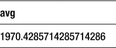
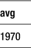
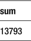
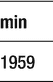
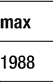
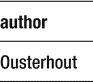
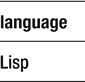
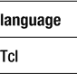
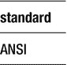

# 对规范化的追求

创建了关系模型，并进而提出规范化理论的人——科德博士（Dr. Codd）——是一位学术天才。虽然他当时在 IBM 工作，这显然不属于学术界，但整件事都带有一种数学纯粹性的气息。

但是，消除数据冗余的代价是速度。虽然可能存在许多高级范式（从 1NF 到 5NF，以及不太为人所知的博伊斯-科德范式），但我们不能过于拘泥地追求更高范式。数据库设计师的头脑中必须让常识占据上风。

在某些情况下，反规范化确实有加快访问速度的好处。事实上，许多流行的 NoSQL 数据库系统将冗余数据存储标榜为一项特性。这显然是以真理的一致性为代价的。但话说回来，当我们在网络上看似随机的点击被捕捉和分析，以决定最适合我们的保险提供商时，也许损失一点真实性是可以接受的。

尽管如此，如果 40 年的主导地位能说明什么问题的话，那就是除非你遇到了非常特殊的情况，否则科德（以及关系模型）总是对的。

### 8. 用查询做更多事情

SQL 这门语言是为数据库系统的终端用户而创建的。它碰巧也被程序员使用，但其目标始终是一种简单的、声明式的、类似英语的语言，让任何熟悉计算机和相关领域的人都能够从数据库系统中提取有意义的报告。这些报告功能是 SQL 查询的直接输出，因此从一开始，就有很多选项和子句可以与 `SELECT` 一起使用，以使输出更加清晰易读。

我们已经看了一些基本查询，如何对查询结果排序，以及如何对查询输出设置条件。现在让我们看看更多如何修改 `SELECT` 语句以适应我们不断增长的报告需求的例子。


#### 统计表中的记录数

有时我们只想知道表中存在多少条记录，而不实际输出这些记录的全部内容。这可以通过使用一个名为 `COUNT` 的 SQL 函数来实现。让我们先看看上次离开时 `proglang_tbl` 表的内容（表 8-1）。

**表 8-1**

来自第 6 章的 `proglang_tbl` 内容

| id | language | author | year | standard |
| --- | --- | --- | --- | --- |
| 1 | Prolog | Colmerauer | 1972 | ISO |
| 2 | Perl | Wall | 1987 |   |
| 3 | APL | Iverson | 1964 | ANSI |
| 4 | JOVIAL | Schwartz | 1959 | US-DOD |
| 5 | APT | Ross | 1959 | ISO |
| 7 | Tcl | Ousterhout | 1988 |   |

我们可以清楚地看到，使用表的最后一行（本例中为 7）的 id 显然不是一个好主意。虽然过去表中可能有 7 行，但我们实际上删除了 Forth 语言那一行。此外，我们不能总是依赖这样一个字段，特别是当我们可以插入一个 id 为 4711 而没有人抱怨时。显然，我们需要 `COUNT` 来拯救我们（代码清单 8-1）。

```sql
SELECT COUNT(*) FROM proglang_tbl;
```

**代码清单 8-1**
统计表中记录数的查询

返回的输出将是一个包含单个字段的单条记录，其值为 `6`。函数 `COUNT` 接受一个参数，即要计数的内容，我们提供了 `*`，这意味着整个记录。这样我们就达到了统计表中记录数的目的。

如果改为指定一个列来计数，会发生什么？如果该列有 null 值呢？让我们通过统计表中的 `standard` 字段来看看这种情况（代码清单 8-2）。

```sql
SELECT COUNT(standard) FROM proglang_tbl;
```

**代码清单 8-2**
统计表中 standard 字段非空值数量的查询

如果你猜这个查询的输出值是 `4`，那就对了。在六行中，有两条记录的 standard 值为 null，留下四种语言有标准。

#### 在 COUNT 中使用 DISTINCT

细心的读者可能已经注意到，标准化语言的数量是通过计算非空 standard 值的数量得出的。然而，结果集中包含了一个重复的标准机构值——APT 和 Prolog 都是 ISO。

有时，能够排除这样的重复项是很有用的。`DISTINCT` 子句允许我们只利用输入的非重复值，并且通常与 `COUNT` 结合使用。在看实际操作之前，让我们向表中添加另一行，以便清楚地展示使用 `DISTINCT` 的结果（代码清单 8-3）。

```sql
INSERT INTO proglang_tbl
(id, language, author, year, standard)
VALUES
(6, 'PL/I', 'IBM', 1964, 'ECMA');
```

**代码清单 8-3**
在编程语言表中插入新行

请注意我们为新行选择的新数据。有了 PL/I，我们现在有了第四个独特的标准机构——ECMA。PL/I 还与 APL 共享相同的诞生年份（1964 年），这给我们带来了一个重复的年份字段。现在让我们运行一个查询来检查表中有哪些不同的年份值（代码清单 8-4）。

```sql
SELECT DISTINCT year
FROM proglang_tbl;
```

**代码清单 8-4**
表中的不同年份值

| Year |
| --- |
| 1972 |
| 1988 |
| 1987 |
| 1964 |
| 1959 |

正如我们所期望的，1964 和 1959 都只出现了一次。`DISTINCT` 的一个常见用例是将其与 `COUNT` 函数结合使用，以输出表中唯一值的数量（代码清单 8-5）。对年份尝试同样的操作，我们得到了预期的结果 `5`。

```sql
SELECT COUNT (DISTINCT year)
FROM proglang_tbl;
> 5
```

**代码清单 8-5**
统计不同年份值的数量

在 `standard` 字段上使用 `DISTINCT` 产生的输出与我们最初猜想的略有不同（代码清单 8-6）。

```sql
SELECT DISTINCT standard
FROM proglang_tbl;
```

**代码清单 8-6**
列出不同的 standard 值

| standard |
| --- |
| (null) |
| ECMA |
| ANSI |
| ISO |
| US-DOD |

实际上，我们的输出得到了五行，包括 null 值，因为对于 `DISTINCT` 子句来说，它是一个独特的单独值。将其与 `COUNT` 结合使用则去掉了 null 行的重要性，得到值 `4`（代码清单 8-7）。

```sql
SELECT COUNT (DISTINCT standard)
FROM proglang_tbl;
> 4
```

**代码清单 8-7**
统计不同 standard 值的数量

#### 列别名

查询经常被直接用作报告，因为 SQL 提供了足够的功能来对存储在关系数据库管理系统（RDBMS）中的数据进行有意义的表示。允许这样做的特性之一是列别名，它允许你重命名结果输出中的列标题。创建列别名的一般语法如下（代码清单 8-8）。

```sql
SELECT column1 AS alias1,
       column2 AS alias2,
...
FROM table_name;
```

**代码清单 8-8**
创建列别名的一般语法

例如，我们希望输出编程语言表的几列。但我们不想将语言的作者称为 authors。想要这份报告的人希望他们被称为 creators。这可以通过使用下面的查询简单实现（代码清单 8-9）。

```sql
SELECT id,
       language,
       author creator
FROM proglang_tbl;
```

**代码清单 8-9**
出于报告目的将 author 字段重命名为 creator

| id | language | creator |
| --- | --- | --- |
| 1 | Prolog | Colmerauer |
| 2 | Perl | Wall |
| 3 | APL | Iverson |
| 4 | JOVIAL | Schwartz |
| 5 | APT | Ross |
| 7 | Tcl | Ousterhout |
| 6 | PL/I | IBM |

虽然创建列别名不会永久重命名字段，但它会在结果输出中显示出来。不同的实现对于是否允许在列列表以外的其他查询部分使用列别名有所不同。例如，让我们尝试在 PostgreSQL 的 `WHERE` 子句中使用列别名 `creator`（代码清单 8-10）。

```sql
SELECT id,
       language,
       author creator
FROM proglang_tbl WHERE creator = 'Ross';
ERROR:  column "creator" does not exist
LINE 4: FROM proglang_tbl WHERE creator = 'Ross';
```

**代码清单 8-10**
在 PostgreSQL 的 WHERE 子句中使用列别名

啊哈，PostgreSQL 明确告诉我们这是不行的。让我们看看 SQLite 是否稍微宽容一些（代码清单 8-11）。

```sql
sqlite> SELECT id,
       language,
       author creator
FROM proglang_tbl
WHERE creator="Ross";
id          language    creator
----------  ----------  ----------
5           APT         Ross
```

**代码清单 8-11**
在 SQLite 的 WHERE 子句中使用列别名

虽然 SQLite 确实允许这样做，但我并不真正喜欢在输出列重命名之外的任何地方使用列别名。我建议你也这样做，除非有非常强的可读性改进理由，并且你的实现允许它（而允许的实现非常少）。


#### SELECT 查询的执行顺序

查询并非从左向右求值；其各部分的求值遵循特定顺序，如下所示。

1.  `FROM` 子句
2.  `WHERE` 子句
3.  `GROUP BY` 子句
4.  `HAVING` 子句
5.  `SELECT` 子句
6.  `ORDER BY` 子句

`SELECT` 的求值顺序低于 `WHERE` 子句，这有一个有趣的推论。你能猜到是什么吗？

那就是 PostgreSQL、DB2 和 Microsoft SQL Server 等数据库管理系统无法在 `WHERE` 子句中使用列别名。在查询执行到使用所提供条件进行过滤的阶段之前，它尚未解析查询的列别名。

让我们通过在 PostgreSQL 中运行一个查询来测试这一点，我们在 `ORDER BY` 子句中使用列别名，这是唯一一个优先级较低的子句（清单 8-12）。

```sql
testdb=# SELECT id,
language,
author creator
FROM proglang_tbl
ORDER BY creator;
id | language |  creator
----+----------+------------
1 | Prolog   | Colmerauer
6 | PL/I     | IBM
3 | APL      | Iverson
7 | Tcl      | Ousterhout
5 | APT      | Ross
4 | JOVIAL   | Schwartz
2 | Perl     | Wall
(7 rows)
```

**清单 8-12**
在 `ORDER BY` 子句中使用列别名

我们的推理得到了正确输出的回报，不过我仍然建议在使用列别名时要经过适当的思考。

#### 使用 `LIKE` 操作符

在使用 `WHERE` 子句为查询设置条件时，我们已经看到了比较操作符 `=` 和 `IS NULL`。现在我们来看看 `LIKE` 操作符，它将帮助我们进行通配符比较。为了匹配，我们提供了两个通配符字符与 `LIKE` 一起使用。

-   `%` （百分号）用于匹配多个字符，包括单个字符和零个字符
-   `_` （下划线）用于精确匹配一个字符

我们将首先使用 `%` 字符进行通配符匹配。假设我们希望列出以字母 P 开头的语言（清单 8-13）。

| id | language | author | year | standard |
| --- | --- | --- | --- | --- |
| 1 | Prolog | Colmerauer | 1972 | ISO |
| 2 | Perl | Wall | 1987 |   |
| 6 | PL/I | IBM | 1964 | ECMA |

```sql
SELECT * FROM proglang_tbl
WHERE language LIKE 'P%';
```

**清单 8-13**
所有以 P 开头的语言

上面查询的输出是所有名称以大写字母 P 开头的语言记录。虽然我们没有这样的记录，但请注意，此结果集不会包含任何以小写字母 p 开头的语言。

我们可以看到，使用 `%` 通配符允许我们匹配多个字符，比如 `Perl` 中的 `erl`。但是，如果我们想限制要匹配的字符数量怎么办？如果我们的目标是编写一个查询，显示以字母 `l` 结尾但长度仅为三个字符的语言怎么办？第一个条件本可以使用模式 `%l` 来满足，但要在同一查询中满足这两个条件，我们使用 `_` 通配符。像 `%l` 这样的模式会返回 `Perl` 和 `Tcl`，但我们适当地修改模式以仅返回后者（清单 8-14）。

| id | language | author | year | standard |
| --- | --- | --- | --- | --- |
| 7 | Tcl | Ousterhout | 1988 |   |

```sql
SELECT * FROM proglang_tbl
WHERE language LIKE '__l';
```

**清单 8-14**
所有以 l 结尾且长度为 3 个字符的语言

请注意，结果中没有包含 `Perl`，因为我们明确使用了两个下划线来仅匹配两个字符。它也没有匹配 `APL` 或 `JOVIAL`，因为 SQL 数据区分大小写，且 `l` 不等于 `L`。

我们还可以将 `NOT` 与 `LIKE` 结合使用来否定或反转结果。如果我们在清单 8-14 的条件子句中使用 `NOT`，我们期望在结果中得到什么语言？包含 `Perl`、`APL` 和 `JOVIAL` 当然是正确的，但它们并不是整个结果集。任何不是以小写 `l` 结尾且长度不是三个字符的语言都会出现在输出中（清单 8-15）。

| id | language | author | year | standard |
| --- | --- | --- | --- | --- |
| 1 | Prolog | Colmerauer | 1972 | ISO |
| 2 | Perl | Wall | 1987 |   |
| 3 | APL | Iverson | 1964 | ANSI |
| 4 | JOVIAL | Schwartz | 1959 | US-DOD |
| 5 | APT | Ross | 1959 | ISO |
| 6 | PL/I | IBM | 1964 | ECMA |

```sql
SELECT * FROM proglang_tbl
WHERE language NOT LIKE '__l';
```

**清单 8-15**
结合使用 `NOT` 与 `LIKE`

使用 `LIKE` 时要小心；它的比较在数据库上计算成本高昂，尤其是涉及多个 `%` 通配符的比较。

#### 计算字段

我们已经了解了列别名，它允许我们在查询输出中重命名字段名称。但我们经常遇到需要更改字段值的情况。这就是计算字段概念的用武之地。

##### 数学计算

任何数字字段都可以由我们熟悉的数学操作符进行操作。我们可以相当轻松地进行加、减、乘、除，甚至求除法的余数。虽然不同实现支持的操作符有所不同，但下面列出的操作符应该在你遇到的任何关系数据库管理系统中都可用（表 9-1）。

**表 9-1**
SQL 中可用的数学操作符

| 操作 | 操作符 |
| --- | --- |
| 加法 | `+` |
| 减法 | `-` |
| 乘法 | `*` |
| 除法 | `/` |
| 余数 | `%` |

让我们以编程语言表为例，尝试找出该语言是在哪个十年间创建的。例如，`Prolog` 创建于 20 世纪 70 年代。让我们尝试从我们拥有的创建 `year` 中找出这个事实。一种方法是求年份除以 10 的余数，10 是一个十年包含的年数（清单 9-1）。这个值指定了自该十年开始以来过去了多少年。

| language | remain |
| --- | --- |
| Prolog | 2 |
| Perl | 7 |
| APL | 4 |
| JOVIAL | 9 |
| APT | 9 |
| Tcl | 8 |
| PL/I | 4 |

```sql
SELECT language,
(year % 10) remain
FROM proglang_tbl;
```

**清单 9-1**
使用余数运算

现在，如果我们将此值从创建 `year` 本身中减去，我们将得到编程语言创建的十年（清单 9-2）。

| language | decade |
| --- | --- |
| Prolog | 1970 |
| Perl | 1980 |
| APL | 1960 |
| JOVIAL | 1950 |
| APT | 1950 |
| Tcl | 1980 |
| PL/I | 1960 |

```sql
SELECT language,
year - (year % 10) decade
FROM proglang_tbl;
```

**清单 9-2**
找出语言的创建十年

另一种方法是将 `year` 除以 10，然后再乘以 10。这种方法稍微不那么直接，因为它依赖于 `integer` 数据类型的定义。由于整数不能存储小数点，除以 10 会静默地截掉余数。1972 年除以 10 将是 197，舍弃了 .2 部分。如果我们将此值乘以 10，我们将得到所需的十年值（清单 9-3）。

```sql
SELECT language,
(year / 10) * 10 decade
FROM proglang_tbl;
```

**清单 9-3**
使用替代计算找出语言的创建十年


### 10. 聚合与分组

SQL 在技术领域一直保持着突出地位，这得益于它能满足广泛的商业智能和分析请求。虽然数据库常被用于“大海捞针”，即缩小范围直至找到单行数据，但 SQL 的大量交互式应用都围绕着从一堆数据行中生成聚合洞察。

确实，基于 SQL 的系统相较于 NoSQL 数据存储解决方案的一个主要优势在于，前者中的分组与聚合操作非常直观。

#### 字符串操作

迄今为止，最常用的字符串操作是连接。它指的是拼接或组合字符串。然而，即使数值字段也可以被视为字符串，因此我们也可以对它们使用连接运算符 `||`。请参见下面的例子，我们修改了“年代”字段，为其添加一些字符（参见列表 9-4）。

| language | decade |
| --- | --- |
| Prolog | The 1970s |
| Perl | The 1980s |
| APL | The 1960s |
| JOVIAL | The 1950s |
| APT | The 1950s |
| Tcl | The 1980s |
| PL/I | The 1960s |

```sql
SELECT language,
'The '||((year/10)*10)||'s' decade
FROM proglang_tbl;
```
*列表 9-4*
使用字符串连接运算符

请注意，连接运算符在不同的实现中以不同的形式出现。PostgreSQL、SQLite 和 Oracle 使用所示的 `||` 符号，而 Ingres、MySQL 和 Microsoft SQL Server 则使用 `+` 表示连接。不过，它们的效果是相同的。

字符串连接运算符在各种编程语言中也有所不同。大多数 SQL 实现中使用的 `||` 字符，源自 IBM 的 PL/I——一种在 60 和 70 年代相当流行，但在现代已很少见的语言。

最后一个字符 `I` 实际上是罗马数字 1，它被特意设计出来，以弥合专注于业务流程的语言和迎合科学计算的语言之间日益扩大的差距。

另一个常见的字符串操作是子字符串，它只返回字符串字段值的一部分。例如，如果我们只需要获取每种编程语言的前两个字符，我们会使用 `SUBSTR` 函数。该函数的一般语法如下所示（参见列表 9-5）。

```sql
SELECT SUBSTR(, , ),
...
FROM ;
```
*列表 9-5*
子字符串的一般语法

起始位置是你希望开始提取的字符位置。与大多数编程语言不同，这里的字符串索引位置不是从 0 开始，而是从 1 开始。第三个参数“长度”指定结果中应包含多少个字符。对于编程语言的前两个字符，起始位置将是 1，长度将是 2（参见列表 9-6）。

| substr | year |
| --- | --- |
| Pr | 1972 |
| Pe | 1987 |
| AP | 1964 |
| JO | 1959 |
| AP | 1959 |
| Tc | 1988 |
| PL | 1964 |

```sql
SELECT SUBSTR(language, 1, 2),
year
FROM proglang_tbl;
```
*列表 9-6*
提取编程语言的前两个字符

有趣的是，一方面，PostgreSQL 在使用 `SUBSTRING` 代替 `SUBSTR` 时会给出相同的结果，因为它将它们视为别名。然而，SQLite 只能与 `SUBSTR` 一起使用。另一方面，Microsoft SQL Server 只能与 `SUBSTRING` 一起使用。请查阅你的数据库手册以了解你的实现期望使用哪个版本。

另一类经常派上用场的字符串操作是 `UPPER` 和 `LOWER`，它们分别将字符串值的大小写更改为大写和小写。这一点最好通过一个例子来说明（参见列表 9-7）。

| upper | lower |
| --- | --- |
| PROLOG | iso |
| PERL |   |
| APL | ansi |
| JOVIAL | us-dod |
| APT | iso |
| TCL |   |
| PL/I | ecma |

```sql
SELECT UPPER(language),
LOWER(standard)
FROM proglang_tbl;
```
*列表 9-7*
更改字段的大小写

#### 字面值

在某些情况下，需要将一个固定的字面值用作新列的值。就像列别名可以改变列标题以提高可读性一样，字面值改变记录的值。从某种意义上说，它们不是计算字段，而是插入到记录特定位置的固定字段。一个例子将有助于说明这一点——假设你希望明确语言的创建年份，不仅是作为一个数字，还要包含 `AD` 字符（参见列表 9-8）。

| language | year | AD |
| --- | --- | --- |
| Prolog | 1972 | AD |
| Perl | 1987 | AD |
| APL | 1964 | AD |
| JOVIAL | 1959 | AD |
| APT | 1959 | AD |
| Tcl | 1988 | AD |
| PL/I | 1964 | AD |

```sql
SELECT language,
year,
'AD'
FROM proglang_tbl;
```
*列表 9-8*
使用字面值

我们甚至可以以同样的方式使用数值字面值，省略此类值的引号。字面值的一个常见用途是当用户需要将数据库查询输出中的数据复制粘贴到另一个工具（如电子表格或文字处理器）中时。

#### 聚合函数

聚合函数用于从一个或多个表中计算汇总信息。我们已经见过用于计数匹配记录的 `COUNT` 聚合函数。类似地，SQL 中还有其他聚合函数，例如用于计算平均值的 `AVG`；用于计算总和的 `SUM`；以及用于找出最大值和最小值的极值函数 `MAX` 和 `MIN`。

计数和极值函数适用于所有数据类型，但像 `SUM` 和 `AVG` 这样的函数仅对数值类型有意义，因此只能与数值类型一起使用。

现在，让我们尝试对我们表中唯一有意义的数值型字段 `year` 使用 `AVG`（代码清单 10-1）。你可以将下面的查询视为找出我们表中所有编程语言记录的平均创建 `year` 值的一种方式。

```sql
SELECT AVG(year) FROM proglang_tbl;
```
**代码清单 10-1**
在我们的编程语言表中找出平均创建年份



我们可以看到结果是一个十进制数，在 PostgreSQL 中小数点后默认显示 16 位数字。在 SQLite 中，这个位数略降至 10 位，但对于除极少数情况外，这已经绰绰有余了。

虽然平均值被精确计算出来了，但有人可能会认为，像这样指定 `year` 的值并不实用。我们真正想要的是一个可读的 `year` 值，它看起来像一个实际的年份，具体来说是一个整数值。因此，我们将这个平均值转换为整数（代码清单 10-2）。

```sql
SELECT CAST(AVG(year) AS INTEGER)
FROM proglang_tbl;
```
**代码清单 10-2**
将值转换为整数



使用 `CAST` 进行数据类型转换仅适用于兼容的数据类型，如数值型和整型。如果你尝试将一个 `varchar` 转换为整数，DBMS（数据库管理系统）会如常地输出一条错误信息（代码清单 10-3）。

```sql
testdb=# SELECT CAST(language AS INTEGER)
FROM proglang_tbl;
ERROR:  invalid input syntax for integer: "Prolog"
```
**代码清单 10-3**
转换不兼容的类型

这里的一个例外是 SQLite，它会顺从地将 `varchar` 值转换为 0。这可能是因为其底层引擎实现而做出的最明智选择；不过，我要提醒你避免使用这类令人惊讶的转换操作。

让我们试试另一个常用的数值聚合函数——`SUM`。假设我们希望找出表中 `year` 值的总和——可以使用 `SUM` 以直接的方式编写查询（代码清单 10-4）。

```sql
SELECT SUM(year)
FROM proglang_tbl;
```
**代码清单 10-4**
使用 `SUM` 聚合函数



如前所述，如果我们在 `varchar` 字段上使用 `SUM`，PostgreSQL 会报错，而 SQLite 则会静默地给出值 0.0（代码清单 10-5）。

```sql
testdb=# SELECT SUM(language)
FROM proglang_tbl;
ERROR:  function sum(character varying) does not exist
LINE 1: SELECT SUM(language) FROM proglang_tbl;
^
HINT:  No function matches the given name and argument types. You might need to add explicit type casts.
```
**代码清单 10-5**
在 PostgreSQL 中的 `varchar` 字段上使用 `SUM`

#### 使用极值函数 – MAX 和 MIN

`MAX` 和 `MIN` 统称为极值函数，因为它们本质上是从一组列值中找出极值。它们最直观的应用是处理数字数据，但这些函数也可以应用于其他数据库类型。

这些函数相当容易理解和使用。我们先看 `MIN`。它查看一组特定的行，并找出作为参数提供给它的列的最小值。例如，在我们的表中，我们希望找出从哪一年开始有编程语言的记录，即最早的编程语言年份。分析手头的问题，我们看到，如果对表中 `year` 字段应用聚合函数 `MIN`，我们应该能得到所需的输出（代码清单 10-6）。

```sql
SELECT MIN(year)
FROM proglang_tbl;
```
**代码清单 10-6**
使用 `MIN` 极值聚合函数



我们的表中在 1959 年对应两种语言——APT 和 JOVIAL。但因为这是最小值，所以无论有多少语言具有相同的值，它都只返回一次结果。函数 `MAX` 类似，但它的结果将表示表中某一种语言被创建的最新年份（代码清单 10-7）。

```sql
SELECT MAX(year)
FROM proglang_tbl;
```
**代码清单 10-7**
使用 `MAX` 极值聚合函数



当然，你可以在一个查询中将它们组合起来，直接在单行中获得结果（代码清单 10-8）。

| max | min |
| --- | --- |
| 1988 | 1959 |

```sql
SELECT MAX(year),
MIN(year)
FROM proglang_tbl;
```
**代码清单 10-8**
同时使用 `MAX` 和 `MIN`

正如我们之前读到的，这些函数并不局限于数值类型。那么，让我们将查找 `MAX` `year` 值与 `MIN` `language` 值结合起来（代码清单 10-9）。

| max | min |
| --- | --- |
| 1988 | APL |

```sql
SELECT MAX(year),
MIN(language)
FROM proglang_tbl;
```
**代码清单 10-9**
混合使用 `MAX` 和 `MIN` 类型

找到的 `MIN` `language` 是 APL，因为它在字母顺序上排第一。请注意，APT 未被选中，因为在比较字母时 L < T。

我们在解读这个结果时需要小心。乍一看，它会给人一个误导性的印象，认为 1988 对应的是 APL，但事实并非如此。我们的查询只是给出了表中这两个字段的极值，而不论它们是否来自同一条记录。


#### 数据分组

`SELECT`查询中的`GROUP BY`子句用于根据字段值对记录进行分组。该子句位于`WHERE`条件之后。例如，在我们的示例表中，我们可以根据制定其标准的委员会对数据进行分组。在向表中插入另一条记录后，让我们看看此操作，以便分组的逻辑性质变得更加清晰（清单 10-10）。

| standard |
| --- |
| ECMA |
| ANSI |
| ISO |
| US-DOD |

```sql
INSERT INTO proglang_tbl
(id, language, author, year, standard)
VALUES
(8, 'Fortran', 'Backus', 1957, 'ANSI');
SELECT standard FROM proglang_tbl
WHERE standard IS NOT NULL
GROUP BY standard;
清单 10-10
按字段对记录进行分组
```

注意不同的标准是如何被分组为单个值的，无论它们在表中出现了多少次。让我们尝试将`language`列添加到上述查询的输出中（清单 10-11）。

```sql
SELECT standard,
language
FROM proglang_tbl
WHERE standard IS NOT NULL
GROUP BY standard;
ERROR:  column "proglang_tbl.language" must appear in the GROUP BY clause or be used in an aggregate function
清单 10-11
尝试将 language 添加到输出字段
```

数据库引擎为这个查询返回了一个错误。这是合理的，因为尽管分组子句将不同的标准归类在一起，但应该选择哪个`language`与之一起显示是模糊的。让我们按照错误信息的第一个建议，在`GROUP BY`子句中也包含`language`字段（清单 10-12）。

| standard | language |
| --- | --- |
| ECMA | PL/I |
| ANSI | APL |
| US-DOD | JOVIAL |
| ISO | Prolog |
| ISO | APT |
| ANSI | Fortran |

```sql
SELECT standard,
language
FROM proglang_tbl
WHERE standard IS NOT NULL
GROUP BY standard, language;
清单 10-12
将 language 添加到输出字段
```

这里需要注意的一个有趣规则是：`SELECT`子句中列出的列必须也出现在`GROUP BY`子句中。这引出了以下两个推论。

1.  你不能对一个不在`SELECT`列表中的列进行分组。
2.  你必须在分组子句中指定所有出现在`SELECT`列表中的列。

SQLite 中的裸露列

如果你在 SQLite 中尝试执行清单 10-11，你不会得到错误。这是因为 SQLite 中的裸露列特性，它允许一列在`SELECT`子句中不使用聚合函数而存在，同时可以不在`GROUP BY`子句中。

这与大多数 DBMS 系统非常不同，我建议你避免认真使用此特性，因为它涉及未定义的行为。不过，阅读 SQLite 网站上提供的详细信息是好的。

[`https://www.sqlite.org/lang_select.html`](https://www.sqlite.org/lang_select.html)

#### 分组与聚合函数

使用分组的另一种有用方式是将该操作与聚合函数结合。假设我们希望统计某个组织在我们的表中有多少个标准。这可以通过将`GROUP BY`子句与`COUNT`聚合函数结合来实现，如下所示（清单 10-13）。

| standard | count |
| --- | --- |
| <null> | 2 |
| ECMA | 1 |
| ANSI | 2 |
| ISO | 2 |
| US-DOD | 1 |

```sql
SELECT standard,
COUNT(*)
FROM proglang_tbl
GROUP BY standard;
清单 10-13
将 GROUP BY 与聚合函数结合使用
```

输出非常直观，无需进一步解释，但查询本身很有趣。注意`GROUP BY`子句只包含了`standard`。聚合函数是分组列归类的结果。

当与聚合函数明智地结合使用时，分组在 SQL 中才真正有意义。数据库的许多实用性和智能性都源于分析师在精心设计的模型上应用这些功能的组合。让我们再看一个例子，这次将`GROUP BY`与多个聚合函数结合使用。

假设我们希望找出同一年创建了多少种语言，以及这些语言中按字母顺序哪个排第一（清单 10-14）。我们可以立即看到，这里需要一个基于`year`的`GROUP BY`，同时需要几个不同的聚合函数。

| year | min | count |
| --- | --- | --- |
| 1972 | Prolog | 1 |
| 1957 | Fortan | 1 |
| 1988 | Tcl | 1 |
| 1987 | Perl | 1 |
| 1964 | APL | 2 |
| 1959 | APT | 2 |

```sql
SELECT year,
MIN(language),
COUNT(*)
FROM proglang_tbl
GROUP BY year;
清单 10-14
将 GROUP BY 与多个聚合函数结合使用
```

#### HAVING 子句

就像`WHERE`子句对查询的字段设置条件一样，`HAVING`子句对`GROUP BY`创建的组设置条件。它必须紧跟在`GROUP BY`之后，但在`ORDER BY`子句之前（清单 10-15）。

| language | standard | year |
| --- | --- | --- |
| APT | ISO | 1959 |
| JOVIAL | US-DOD | 1959 |
| APL | ANSI | 1964 |
| Fortran | ANSI | 1957 |
| PL/I | ECMA | 1964 |
| Prolog | ISO | 1972 |

```sql
SELECT language,
standard,
year
FROM proglang_tbl
GROUP BY standard,
year,
language
HAVING year < 1980;
清单 10-15
HAVING 子句演示
```

从输出中我们可以清楚地看到，Perl 和 Tcl 的记录被排除在外，因为它们不满足`HAVING`条件（即在 1980 年之前创建）。

你可能想知道为什么我们需要两个不同的过滤子句——`WHERE`和`HAVING`。`WHERE`子句不允许在其条件中使用聚合函数，而这正是`HAVING`子句的主要目标。例如，假设我们想检查哪些`standard`值在我们的表中出现超过一次。我们使用`GROUP BY`子句的初步尝试可能看起来像这样（清单 10-16）。

```sql
SELECT standard
FROM proglang_tbl
WHERE COUNT(standard) > 1
GROUP BY standard;
ERROR:  aggregate functions are not allowed in WHERE
清单 10-16
尝试在 WHERE 中使用聚合函数
```

正如我们所想，我们的 SQL 解释器不允许这种做法。相反，我们将在`HAVING`子句中使用相同的条件（清单 10-17）。

| standard |
| --- |
| ANSI |
| ISO |

```sql
SELECT standard
FROM proglang_tbl
GROUP BY standard
HAVING COUNT(standard) > 1;
清单 10-17
带有聚合函数的 HAVING 子句
```

它正确地返回了两个出现次数超过一次的`standard`值。有趣的是，如果我们将条件改为`COUNT(*)`，我们会得到一个额外的行（清单 10-18）。

| standard |
| --- |
| (null) |
| ANSI |
| ISO |

```sql
SELECT standard
FROM proglang_tbl
GROUP BY standard
HAVING COUNT(*) > 1;
清单 10-18
更改聚合函数的行为
```

现在，过滤条件不再局限于`standard`列的非空值。由于该字段中有多个包含`null`值的记录，它们也会被包含在结果中。


### 11. 理解连接

连接操作允许你在单个 `SELECT` 查询中从多个表中检索数据。两个表可以通过单个连接运算符进行连接，但其结果还可以再次与其他表连接。被连接的表之间必须存在相同或相似的列。

当你使用诸如规范化之类良好的设计原则来设计整个数据库系统时，我们通常需要使用连接来为用户的查询提供完整的视图。例如，我们在第 7 章中将编程语言表拆分为两个——一个保存作者详细信息（表 11-2），另一个保存语言本身的信息（表 11-1）。为了显示列出作者及其所创建编程语言的报告，我们将不得不使用连接。

表 11-2

`authors_tbl` 的内容

| author_id | author | language_id |
| --- | --- | --- |
| 1 | Colmerauer | 1 |
| 2 | Wall | 2 |
| 3 | Ousterhout | 4 |
| 4 | Iverson | 3 |
| 5 | Kemeny | 5 |
| 6 | Kurtz | 5 |

表 11-1

`newlang_tbl` 的内容

| id | language | year | standard |
| --- | --- | --- | --- |
| 1 | Prolog | 1972 | ISO |
| 2 | Perl | 1987 | (null) |
| 3 | APL | 1964 | ANSI |
| 4 | Tcl | 1988 | (null) |
| 5 | BASIC | 1964 | ANSI |

我们现在构造一个查询来显示所需的输出——所有作者及其开发的相应语言的列表（代码清单 11-1）。我们选择 `authors` 表的 `language_id` 字段作为连接列。这对应于 `languages` 表的 `id` 字段。

| author | language |
| --- | --- |
| Colmerauer | Prolog |
| Wall | Perl |
| Ousterhout | APL |
| Iverson | Tcl |
| Kemeny | BASIC |
| Kurtz | BASIC |

```sql
SELECT author, language
FROM authors_tbl, newlang_tbl
WHERE language_id = id;
```

代码清单 11-1
在我们的两个表上执行连接操作

我们查询的输出结合了来自两个表的列，为我们提供了更好的报告。`language_id = id` 被称为连接条件。由于连接条件中使用的运算符是相等运算符（`=`），因此这种连接被称为**等值连接**。另一个需要注意的重要事项是，参与连接条件的列并非我们选择出现在查询结果中的列。

请记住，连接表以查看结果集完全不会影响表本身。表的结构或数据本身不会发生任何物理变化。形成的隐式连接仅存在于连接查询执行期间。

#### 替代连接语法

你可能已经注意到，我们构建连接查询时没有使用太多特殊语法，而是使用了常规的 `FROM/WHERE` 组合。SQL-92 标准引入了 `JOIN` 关键字，允许我们构建连接查询。由于 `FROM/WHERE` 语法引入较早，它在连接中仍然相当流行。但现在大多数数据库供应商已经实现了大部分 SQL-92 标准，`JOIN` 语法也被广泛使用。下面是我们刚刚编写的查询的 `JOIN` 语法等效形式，用于显示哪位作者创建了哪种编程语言（代码清单 11-2）。

```sql
SELECT author, language
FROM authors_tbl JOIN newlang_tbl
ON language_id = id;
```

代码清单 11-2
使用 `JOIN`（SQL-92）语法重写我们的查询

请注意，我们使用 `JOIN` 关键字，而不是用逗号分隔两个表（从而使其成为列表）。参与连接条件的列前面加上 `ON` 关键字。在指定连接条件（`ON` 子句）之后，如果需要，可以使用 `WHERE` 子句来指定任何进一步的条件。

那些完全不匹配连接条件的行会被排除在外的连接类型被称为**内连接**。因此，我们可以在查询中选择性地使用完整的关键字 `INNER JOIN`，而不会影响结果集（代码清单 11-3）。

```sql
SELECT author, language
FROM authors_tbl INNER JOIN newlang_tbl
ON language_id = id;
```

代码清单 11-3
显式指定 `INNER JOIN`

#### 解决连接列中的歧义

在我们的示例中，连接条件字段具有不同的名称——`id` 和 `language_id`。但是，如果在我们的语言表中，我们将键字段命名为 `language_id` 呢？这将在连接条件中产生歧义，变成令人困惑的 `language_id = language_id`。为了解决这个问题，我们需要通过在该列前添加它所属的表名和一个 `.`（句点）来限定它（代码清单 11-4）。

| author | language |
| --- | --- |
| Ousterhout | Tcl |

```sql
CREATE TABLE languages_tbl
(language_id INTEGER, language VARCHAR(20));
INSERT INTO languages_tbl VALUES (4, 'Tcl');
SELECT author, language
FROM authors_tbl JOIN languages_tbl
ON language_id = language_id;
=> ERROR:  column reference "language_id" is ambiguous
SELECT author, language
FROM authors_tbl JOIN languages_tbl
ON authors_tbl.language_id = languages_tbl.language_id;
```

代码清单 11-4
通过限定列名来解决命名歧义

解决此类歧义的另一种方法是使用表别名来限定列。其概念是给表一个短名称，然后使用这个别名来限定列，而不是使用冗长、笨拙的表名（代码清单 11-5）。

```sql
SELECT author, language
FROM authors_tbl a JOIN newlang_tbl l
ON a.language_id = l.id;
```

代码清单 11-5
使用表别名

这里 `authors` 表被赋予别名 `a`，`languages` 表被赋予别名 `l`。无论是否存在名称歧义，通常都认为限定连接条件中的列名是一种良好的实践。


#### 外连接

既然我们在代码清单 11-3 中遇到了内连接，这让我们联想到外连接的存在。在这种连接中，结果集由满足连接条件的行以及**其中一个表**中不满足条件的行组成。如果我们希望结果集中包含第一个表中那些不满足条件的行，我们就使用`左外连接`。反之，当需要第二个表中的行时，我们则使用`右外连接`。

这起初听起来有点令人困惑，因此让我们通过一个例子来澄清这个概念。让我们向 `newlang_tbl` 表中添加一行关于 Lisp 编程语言的数据，但我们不会为此在 `authors` 表中创建任何条目（代码清单 11-6）。

```sql
INSERT INTO newlang_tbl
VALUES (6, 'Lisp', 1958, 'ANSI');
```

代码清单 11-6
添加新行以说明外连接

如果我们像代码清单 11-1 那样对两个表运行 `内连接` 查询，我们将得到与当时类似的输出。我们添加的这行新数据不会出现在结果集中。但是，让我们尝试一个 `左外连接`，我们明确希望尽管在 `authors` 表中没有对应条目，也要让这行新数据出现在结果中。这样，我们的第一个表必须是 `newlang_tbl`，查询将如下所示（代码清单 11-7）。

| 语言 (language) | 作者 (author) |
| --- | --- |
| Prolog | Colmerauer |
| Perl | Wall |
| APL | Ousterhout |
| Tcl | Iverson |
| BASIC | Kemeny |
| BASIC | Kurtz |
| Lisp | |

```sql
SELECT language, author
FROM newlang_tbl n LEFT OUTER JOIN authors_tbl a
ON n.id = a.language_id;
```

代码清单 11-7
左外连接示例

啊哈，成功了！`左外连接` 允许我们将 Lisp 这一行“偷偷”放入结果集，其作者值为 `null`。查看查询清单，如果你立即想到，只需交换连接表的顺序，我们就可以将其转换为 `右外连接`，那么你绝对正确（代码清单 11-8）。

```sql
SELECT language, author
FROM authors_tbl a RIGHT OUTER JOIN newlang_tbl n
ON n.id = a.language_id;
```

代码清单 11-8
右外连接示例

此查询的输出将与代码清单 11-7 中的完全相同。注意，我们在 `ON` 子句中指定的连接条件不需要任何顺序更改。由于所有的右外连接都可以写成左外连接（反之亦然），因此很少见到右外连接在实际中的许多应用。SQLite 甚至完全不支持右外连接，这倒也无妨。

#### 交叉连接

你可能会想，如果我们从查询中省略连接条件会发生什么。运行连接查询时，后台发生的事情是：首先，由参与连接的表生成所有可能的行组合。然后，选择满足连接条件的行进行输出（或进一步处理）。如果我们省略连接条件，作为输出我们将得到所有可能的记录组合（代码清单 11-9）。这被称为 `交叉连接` 或表的 `笛卡尔积`，通常用符号 `X` 表示。

| 作者 (author) | 语言 (language) |
| --- | --- |
| Colmerauer | Prolog |
| Colmerauer | Perl |
| Colmerauer | APL |
| Colmerauer | Tcl |
| Colmerauer | BASIC |
| Colmerauer | Lisp |
| Wall | Prolog |
| Wall | Perl |
| Wall | APL |
| Wall | Tcl |
| Wall | BASIC |
| Wall | Lisp |
| Ousterhout | Prolog |
| … | … |

```sql
SELECT author, language
FROM authors_tbl, newlang_tbl;
```

代码清单 11-9
显示我们表笛卡尔积的查询

这里的查询输出被截断了，但在你的计算机上运行时，结果集中应该得到 36 行，包含每个作者和语言的组合。重写此查询的另一种方法是实际使用 `JOIN` 关键字，并在前面加上 `CROSS` 参数，如下所示（代码清单 11-10）。

```sql
SELECT author, language
FROM authors_tbl CROSS JOIN newlang_tbl;
```

代码清单 11-10
使用 CROSS JOIN 重写我们的查询

注意这里没有 `ON` 子句，这意味着没有连接条件。

如果我们从 `newlang_tbl` 中选择多个列，比如同时选择 `language` 和 `year` 呢？组合的数量会从我们上面的交叉连接急剧增加吗？事实证明不会，结果集中的记录数量将与之前完全相同（代码清单 11-11）。笛卡尔积是参与连接的表之间的记录组合，而不是单个表记录单元内的组合。

| 作者 (author) | 语言 (language) | 年份 (year) |
| --- | --- | --- |
| Colmerauer | Prolog | 1972 |
| Colmerauer | Perl | 1987 |
| Colmerauer | APL | 1964 |
| … | … | … |

```sql
SELECT author, language, year
FROM authors_tbl CROSS JOIN newlang_tbl;
```

代码清单 11-11
从参与交叉连接的表中选择多列

交叉连接并不是你经常遇到的东西。当其中一张表很小（即只有几行）并且你需要将其所有值与一张更大的表进行组合时，它有一定的用处。然而，我建议不要在实际的生产数据库服务器上运行交叉连接，除非你真的理解为什么在该场景下需要它们。

#### 自连接

有时，一个表在其自身列内包含有意义的数据，但其中一个（或多个）字段引用了同一表中的另一个字段。例如，如果我们有一个表，用于记录哪些编程语言影响了其他编程语言，并通过语言 ID 表示影响关系，为了显示解析后的输出，我们必须将表与其自身连接。这也称为 `自连接`。请考虑下面创建的表，并密切关注插入的数据（代码清单 11-12）。

| id | 语言 (language) | 受影响于 (influenced_by) |
| --- | --- | --- |
| 1 | Fortran | |
| 2 | Pascal | 3 |
| 3 | Algol | 1 |

```sql
CREATE TABLE inflang_tbl (id INTEGER PRIMARY KEY,
language VARCHAR(20) NOT NULL,
influenced_by INTEGER);

INSERT INTO inflang_tbl (id, language)
VALUES (1, 'Fortran');

INSERT INTO inflang_tbl (id, language, influenced_by)
VALUES (2, 'Pascal', 3);

INSERT INTO inflang_tbl (id, language, influenced_by)
VALUES (3, 'Algol', 1);
```

代码清单 11-12
创建并填充我们的语言影响表

我们现在的目标是编写一个 `自连接` 查询，以显示哪种语言影响了哪一种，即解析 `influenced_by` 列（代码清单 11-13）。

| id | 语言 (language) | 被影响 (influenced) |
| --- | --- | --- |
| 3 | Algol | Pascal |
| 1 | Fortran | Algol |

```sql
SELECT l1.id,
       l1.language,
       l2.language AS influenced
FROM inflang_tbl l1, inflang_tbl l2
WHERE l1.id = l2.influenced_by;
```

代码清单 11-13
运行自连接查询

注意这里使用了表别名来限定连接条件列，并将其区分开，同时使用了 `AS` 关键字在输出中重命名列。

如果我们想使用另一种 SQL-92 的 `JOIN` 语法来进行自连接呢？事实证明，没有特殊的 `自连接` 关键字或子句，因为不需要。对于 SQL 查询解释器来说，你是在两个内容恰好完全相同的表上创建了一个 `内连接`。因此，我们可以使用熟悉的 `JOIN` 关键字重写代码清单 11-13 的查询，如下所示（代码清单 11-14）。

```sql
SELECT l1.id,
       l1.language,
       l2.language AS influenced
FROM inflang_tbl l1 JOIN inflang_tbl l2
ON l1.id = l2.influenced_by;
```

代码清单 11-14
使用 JOIN 运行自连接查询


#### 非等值连接

到目前为止我们看到的连接，其连接条件主要处理的是相等关系。虽然这是将表连接在一起的最常见方式，但我们绝不限于只使用相等条件。这次，让我们在 `newlang_tbl` 和 `authors_tbl` 表之间，对 `id` 和 `author_id` 字段设定另一个连接条件（清单 11-15）。

| id | author_id | author | language |
| --- | --- | --- | --- |
| 1 | 2 | Wall | Prolog |
| 1 | 3 | Ousterhout | Prolog |
| 2 | 3 | Ousterhout | Perl |
| 1 | 4 | Iverson | Prolog |
| 2 | 4 | Iverson | Perl |
| 3 | 4 | Iverson | APL |
| 1 | 5 | Kemeny | Prolog |
| 2 | 5 | Kemeny | Perl |
| 3 | 5 | Kemeny | APL |
| 4 | 5 | Kemeny | Tcl |
| 1 | 6 | Kurtz | Prolog |
| 2 | 6 | Kurtz | Perl |
| 3 | 6 | Kurtz | APL |
| 4 | 6 | Kurtz | Tcl |
| 5 | 6 | Kurtz | BASIC |

```
SELECT id,
author_id,
author,
language
FROM authors_tbl, newlang_tbl
WHERE id < author_id;
Listing 11-15
一个非等值连接
```

虽然结果在逻辑上不是最合理的，但它确实满足了我们的非等值连接条件，即每一行中 `id` 字段的值都小于对应的 `author_id` 字段值。我们还可以使用熟悉的 `AND` 运算符，在同一查询中自由地将此结果与等值条件混合（清单 11-16）。

| id | author_id | author | language |
| --- | --- | --- | --- |
| 3 | 4 | Iverson | APL |
| 5 | 6 | Kurtz | BASIC |

```
SELECT id,
author_id,
author,
language
FROM authors_tbl, newlang_tbl
WHERE id < author_id
AND id = language_id;
Listing 11-16
同时使用等值和非等值条件
```

现在的结果包含这样的记录：语言作者的 `author_id` 值大于他们所创建语言的 `id`。

## 12. 子查询

简而言之，子查询是作为更大语句一部分编写的查询。可以将其视为另一个 `SELECT` 语句内部的 `SELECT` 语句。内部 `SELECT` 的结果随后可以在外部查询中使用。让我们用一个简单的例子来说明。

考虑与连接章节中相同的源表——`authors_tbl` 和 `newlang_tbl`。我们将尝试编写一个查询（和一个子查询）来显示特定语言的作者（清单 12-1）。

```
SELECT author FROM authors_tbl
WHERE language_id IN
( SELECT id FROM newlang_tbl
WHERE language="Tcl");
Listing 12-1
一个简单的子查询示例


```

子查询 `SELECT id FROM newlang_tbl WHERE language='Tcl'` 从 `newlang_tbl` 中选取正确的语言 `id`，并将其传递给针对作者表的外部查询。这使我们免于使用语言 `id` 字段连接两个表的责任。

我们可以想象一下子查询已经解析为一个值的中间步骤。查询现在看起来像这样：`SELECT author FROM authors_tbl WHERE language_id IN (4)`。

在特定情况下采用哪种方法——连接、子查询或两者结合——主要取决于个人偏好。而在其他时候，一种方法显然是更优的选择。请记住，所有连接都可以改写为子查询，但反之则并非在所有情况下都成立。

##### 子查询的类型

我们可以大致将子查询分为三类。

1.  **标量子查询** 一种仅返回单行单列作为其输出的子查询。上一节中的示例，子查询返回 Tcl 的 `id`，就是一个标量子查询。
2.  **行子查询** 一种返回单行但多列的子查询。这是最不重要的子查询类型，因为大多数数据库管理系统不支持它，包括 SQLite。
3.  **表子查询** 表子查询可以返回多行，并且每行可以包含多列。本质上，它可以返回一个表本身来参与你的外部查询。

为了说明表子查询的用法，让我们举一个例子，我们希望显示所有在 1980 年之后创建了语言的编程语言作者（清单 12-2）。

| author | language |
| --- | --- |
| Wall | Perl |
| Ousterhout | Tcl |

```
SELECT author, language
FROM authors_tbl a,
(SELECT id, language
FROM newlang_tbl
WHERE year > 1980) n
WHERE a.language_id = n.id;
Listing 12-2
一个表子查询示例
```

仔细研究上面查询的 `FROM` 子句。我们的表子查询放在其中，它返回一组在 1980 年之后创建的语言。结果包含两行两列，其中一列，即 `language`，被选取用于最终输出。

##### 子查询中的存在性测试

关键字 `EXISTS` 测试子查询返回的行数是否存在。我们通常不关心子查询返回的列，只关心是否存在满足特定条件的行。让我们尝试使用 `EXISTS` 测试来显示在 `authors_tbl` 中有作者条目的语言（清单 12-3）。

| language | year |
| --- | --- |
| Prolog | 1972 |
| Perl | 1987 |
| APL | 1964 |
| Tcl | 1988 |
| BASIC | 1964 |

```
SELECT language,
year
FROM newlang_tbl
WHERE EXISTS (SELECT * FROM authors_tbl
WHERE newlang_tbl.id = language_id);
Listing 12-3
使用存在性测试
```

注意本例中的子查询 `WHERE` 子句。它有效地使用 `newlang_tbl.id` 引用了外部表的字段。对于满足此存在性测试的任何语言，外部查询都会将其加入结果集。

我们可以在存在性测试中添加 `NOT` 选项来查找结果的补集（清单 12-4）。

```
SELECT language,
year
FROM newlang_tbl
WHERE NOT EXISTS (SELECT * FROM authors_tbl
WHERE newlang_tbl.id = language_id);
Listing 12-4
在存在性测试中使用 NOT
```

| language | year |
| --- | --- |
| Lisp | 1958 |

回想一下，我们在上一章中从未在作者表中为 Lisp 放入相应的条目。

那么，到底是谁创造了 Lisp？

Lisp 是第二古老的编程语言，其主要方言至今仍被积极使用。John McCarthy 在 1958 年作为其研究的一部分创建了 Lisp，其他人也纷纷加入，帮助在当时的计算机上实现它。

McCarthy 普遍被认为是一位天才级的智者，深受同行钦佩。他是人工智能领域的先驱之一，甚至创造了这个术语。随着 Lisp 的创建，他在编程语言设计领域取得了巨大的飞跃。在过去的三十年里，Lisp 的特性正慢慢渗入主流编程语言。许多著名的技术专家仍然对已有数十年历史的 Lisp 方言——Common Lisp 和 Scheme——的设计感到惊叹。

尽管 McCarthy 于 2011 年去世，享年 84 岁，但他的遗产和工作仍然存在。


#### 在 INSERT 语句中使用子查询

我们甚至可以在其他 SQL 语句（如`INSERT`）中使用子查询。让我们尝试向表中添加一种新语言和一个新作者，并通过使用子查询来略微简化我们记忆 ID 号码的任务（参见列表 12-5）。

```
INSERT INTO newlang_tbl
(id, language, year, standard)
VALUES (7, 'Pascal', 1970, 'ISO');
列表 12-5
插入一种新的编程语言
```

现在，我们编程语言表更新后的内容如下所示（表 12-1）。

表 12-1

`newlang_tbl`的内容

| id | language | year | standard |
| --- | --- | --- | --- |
| 1 | Prolog | 1972 | ISO |
| 2 | Perl | 1987 |   |
| 3 | APL | 1964 | ANSI |
| 4 | Tcl | 1988 |   |
| 5 | BASIC | 1964 | ANSI |
| 6 | Lisp | 1958 | ANSI |
| 7 | Pascal | 1970 | ISO |

在向`authors_tbl`插入新条目时，我们既可以记住为 Pascal 使用的`language_id`是 7，也可以使用一个子查询。让我们看看后一种方法的例子（列表 12-6）。毕竟，章节的标题已经揭示了我们的方法！

```
INSERT INTO authors_tbl
(author_id, author, language_id)
VALUES (7, 'Wirth',
(SELECT id FROM newlang_tbl WHERE language="Pascal")
);
列表 12-6
使用子查询插入新作者
```

我们相信这应该会为 Wirth 先生设置正确的语言 ID，因为他创造了 Pascal。让我们通过查看表的内容来验证这一信念。

| author_id | author | language_id |
| --- | --- | --- |
| 1 | Colmerauer | 1 |
| 2 | Wall | 2 |
| 3 | Ousterhout | 4 |
| 4 | Iverson | 3 |
| 5 | Kemeny | 5 |
| 6 | Kurtz | 5 |
| 7 | Wirth | 7 |

你甚至可以使用子查询来控制你的`UPDATE`和`DELETE`语句。其逻辑与在`SELECT`和`INSERT`中使用子查询基本一致。

#### 使用 ANY 和 ALL

`ANY`运算符与算术比较运算符一起使用，可用于将列值与子查询生成的一个或多个类似值进行比较。例如，如果我们想显示所有语言但排除最古老的一种，我们可以结合使用`>`和`ANY`来实现（列表 12-7）。

| language |
| --- |
| Prolog |
| Perl |
| APL |
| Tcl |
| BASIC |
| Pascal |

```
SELECT language
FROM newlang_tbl
WHERE year > ANY (SELECT year FROM newlang_tbl);
列表 12-7
使用 ANY 运算符
```

只有`Lisp`的创建年份并不大于子查询返回的任何值列表中的任何一个值。显然，这是因为返回的最小值是`Lisp`本身的创建年份，因此它没有出现在最终结果中。

那么，如果我们把比较运算符反转为`< ANY`会怎样呢？结果将包括其年份值小于子查询返回的任何一个创建年份的所有语言（列表 12-8）。

| language |
| --- |
| Prolog |
| Perl |
| APL |
| BASIC |
| Lisp |
| Pascal |

```
SELECT language
FROM newlang_tbl
WHERE year < ANY (SELECT year FROM newlang_tbl);
列表 12-8
与<一起使用 ANY 运算符
```

我们注意到`Lisp`已经悄悄进入了结果集，而`Tcl`则明显缺席。这是因为`Tcl`的年份，即 1988 年，并不小于子查询返回的任何值。等于？当然，但不是明确地小于。

我们可以与`ANY`一起使用的另一个比较连词是`=`，但这很少见，因为它等同于使用`IN`，而后者要直观得多。

**SQLite 不支持 ANY 或 ALL 运算符**

如果你尝试在 SQLite 中运行上面的例子，你会得到如下的错误信息。

```
Error: near "SELECT": syntax error
```

SQLite 目前不支持这些关键字，但我们仍然可以使用现有的工具来实现相同的结果。让我们尝试重写列表 12-7，显示除最古老语言之外的所有语言。

```
SELECT language FROM newlang_tbl
WHERE year > (SELECT MIN(year) FROM newlang_tbl);
```

上面的查询很好地计算出了我们期望的结果集，并且相当易读。有些人，包括本作者本人，实际上更喜欢它而不是`ANY`语法。如果你对`<>`感到疑惑，它的意思是“不等于”。

`ALL`运算符的工作方式类似，但`WHERE`子句中的值必须对于子查询返回的所有值都成立（列表 12-9）。`ALL`的一个使用场景是查找与极值（如最小值和最大值）相关的数据。你当然也可以自由选择内置函数`MAX`和`MIN`来实现此目的。

```
SELECT language
FROM newlang_tbl
WHERE year <= ALL (SELECT year FROM newlang_tbl);
列表 12-9
使用 ALL 运算符
```



只有`Lisp`作为我们表中最古老的语言，会满足`ALL`标准，即其年份值小于或等于子查询中的所有值。同样，我们可以使用`ALL`来查找最新的语言（列表 12-10）。

```
SELECT language
FROM newlang_tbl
WHERE year >= ALL (SELECT year FROM newlang_tbl);
列表 12-10
与>=一起使用 ALL 运算符
```



### 13. 集合操作

集合论是离散数学的一个分支，处理对象的集合。集合论与关系数据库概念之间有大量的概念重叠。难怪查询的输出经常被称为结果集。

原始的集合理论操作，如并集、交集和差集，在各种实现中得到了越来越多的支持。我们现在将探索这些操作背后的理论以及如何在 SQL 中使用它们。


#### 并集

并集是一种将两个集合的元素组合起来的操作。假设我们有以下两个由一堆数字组成的集合（见代码清单 13-1）。

```
set1 = { 1, 3, 5 }
set2 = { 1, 2, 3 }
代码清单 13-1
包含数字的两个集合
```

得到的并集将是一个由所有这些元素组成的集合，每个元素恰好出现一次，即不允许重复（见代码清单 13-2）。请注意，集合的顺序无关紧要。可以将其视为一个元素的袋子，而不是一个有序的集合。

```
set1 UNION set2 = { 1, 3, 5, 2 }
代码清单 13-2
数学上的并集（UNION）操作
```

现在让我们看看如何在 SQL 中模拟并集操作。回顾一下我们在第 10 章最后使用的编程语言表及其数据（见表 13-1）。

表 13-1
`proglang_tbl` 表的内容

| id | 语言 (language) | 作者 (author) | 年份 (year) | 标准 (standard) |
| --- | --- | --- | --- | --- |
| 1 | Prolog | Colmerauer | 1972 | ISO |
| 2 | Perl | Wall | 1987 |   |
| 3 | APL | Iverson | 1964 | ANSI |
| 4 | JOVIAL | Schwartz | 1959 | US-DOD |
| 5 | APT | Ross | 1959 | ISO |
| 6 | PL/I | IBM | 1964 | ECMA |
| 7 | Tcl | Ousterhout | 1988 |   |
| 8 | Fortran | Backus | 1957 | ANSI |

如果我们想获取那些由 `ANSI` 或 `ISO` 标准化的语言的创建年份列表，我们可以使用 `UNION` 关键字来实现（见代码清单 13-3）。

| 年份 (year) |
| --- |
| 1959 |
| 1957 |
| 1964 |
| 1972 |

```
SELECT year FROM proglang_tbl
WHERE standard="ANSI"
UNION
SELECT year FROM proglang_tbl
WHERE standard="ISO";
代码清单 13-3
使用 UNION 操作符
```

由于我们的表中有四条记录的 `standard` 值为 `ANSI` 或 `ISO`，因此结果集中得到了预期的四行数据。请注意，这里没有需要处理的重复条目。但是，如果使用 `UNION` 操作时存在需要处理的重复条目会怎样呢（见代码清单 13-4）？

```
SELECT standard FROM proglang_tbl
WHERE language = 'Fortran'
UNION
SELECT standard FROM proglang_tbl
WHERE language = 'APL';
代码清单 13-4
使用 UNION 操作符消除重复值
```


我们在 `WHERE` 子句中指定的两种语言都是由 `ANSI` 标准化的。`UNION` 操作，就像在离散数学中一样，移除了重复的值，并输出单行作为结果。

还有另一个相关的 SQL 操作 `UNION ALL`，它会模拟组合操作但不会消除重复项（见代码清单 13-5）。使用这个操作的优点是性能提升，因为 SQL 引擎不必费心检查重复项。如果你构建的参与查询的方式确保没有重复值，那么使用 `UNION ALL` 将提高你的查询处理时间。

| 标准 (standard) |
| --- |
| ANSI |
| ANSI |

```
SELECT standard FROM proglang_tbl
WHERE language = 'Fortran'
UNION ALL
SELECT standard FROM proglang_tbl
WHERE language = 'APL';
代码清单 13-5
使用 UNION ALL 操作符
```

#### 交集

交集操作仅输出输入集合中的共同元素。如果我们将交集应用于上一节中的两个集合，我们会得到一个包含两个元素的结果集（见代码清单 13-6）。

```
set1 INTERSECTION set2 = { 1, 3 }
代码清单 13-6
数学上的交集（INTERSECTION）操作
```

与并集一样，每个共同值只显示一次。重复项会从最终结果集中移除。

将其转换为 SQL 非常简单；我们不是使用 `UNION`，而是使用关键字 `INTERSECT` 来获取共同元素（见代码清单 13-7）。

```
SELECT standard FROM proglang_tbl
WHERE year=1964
INTERSECT
SELECT standard FROM proglang_tbl
WHERE year=1957;
代码清单 13-7
在 SQL 中使用 INTERSECT
```



这里需要记住的一点是，`INTERSECT` 操作符会查找其前后两个查询之间完全相同的公共值。这意味着是整个记录的公共值，而不仅仅是部分字段的公共值。虽然在之前的例子中，我们的结果集只有一列需要返回——`standard`，但让我们看看当我们在结果列表中添加另一列时会发生什么（见代码清单 13-8）。

```
SELECT year, standard FROM proglang_tbl
WHERE year=1964
INTERSECT
SELECT year, standard FROM proglang_tbl
WHERE year=1957;
=> (0 rows)
代码清单 13-8
在结果中使用包含多列的 INTERSECT
```

输出结果是空，没有任何行。第一个查询会选择 `PL/I` 和 `APL` 的记录，而第二个查询会选择 `Fortran`。但这些语言的 (`year`, `standard`) 组合值都不同，因此给我们的是零结果。

请注意，虽然 `ANSI` SQL 标准规定了 `INTERSECT ALL` 操作符，但我尚未遇到实现它的数据库管理系统。`PostgreSQL` 会愉快地忽略你写的 `ALL` 子句，只是简单地返回一个 `INTERSECT` 结果。


