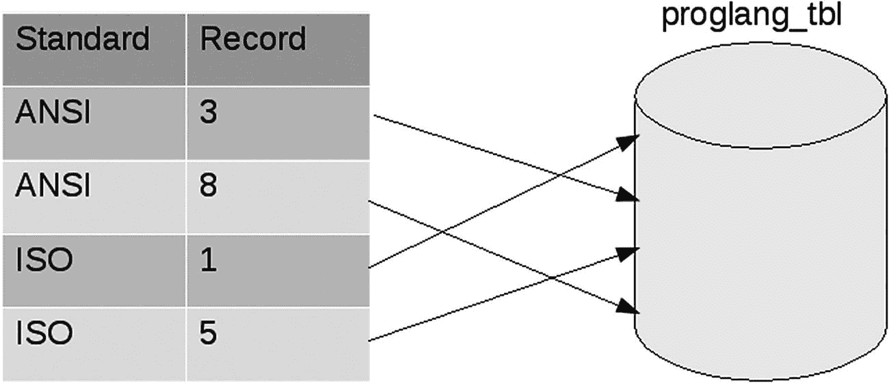

# 差集

集合之间的差集运算，写作 `set1 - set2`，表示所有在 `set1` 中但不在 `set2` 中的元素列表（参见代码清单 13-9）。如果某个元素仅存在于 `set2` 中，它不会被简单的差集运算所捕获。

```
set1 DIFFERENCE set2 = { 5 }
set2 DIFFERENCE set1 = { 2 }
Listing 13-9
数学的 DIFFERENCE 操作
```

让我们尝试使用熟悉的 `IN` 和 `NOT IN` 操作符来编写一个模拟此逻辑的 SQL 语句。但首先，我们需要向表中插入一行数据，以便观察差集运算的实际效果（参见代码清单 13-10）。

```
INSERT INTO proglang_tbl
(id, language, author, year, standard)
VALUES
(9, 'RPG', 'IBM', 1964, 'ISO');
Listing 13-10
为 RPG 插入新行
```

假设我们希望列出那些由 ISO 标准化而非由 ANSI 标准化的编程语言的创建年份（参见代码清单 13-11）。从源表中，我们发现有三种语言由 ISO 标准化，年份分别是 1972 年、1959 年和 1964 年。但由于在 1964 年，APL 语言被创建，并最终由 ANSI 标准化，理想情况下，我们得到的答案应该是 1972 年和 1959 年。

| year |
| --- |
| 1972 |
| 1959 |
| 1964 |

```
SELECT year FROM proglang_tbl
WHERE standard IN ('ISO')
AND standard NOT IN ('ANSI');
Listing 13-11
尝试用 IN 编写集合差集
```

哇，这是什么魔法！我们以为 1964 年会因为 ANSI 标准化而被排除。但显然情况并非如此。实际发生的情况是，首先扫描了 ISO 的行——得到三个值。然后，ANSI 的行被排除，但排除的范围是整张表，而不一定是第一次扫描的结果。因此，虽然 1964 年的 APL 被排除了，但新插入的 1964 年的 RPG 仍然保留了下来，这实际上使我们的第二个条件失效了。实现此目的的正确方法是使用差集运算符 `EXCEPT`，如下所示（参见代码清单 13-12）。

| year |
| --- |
| 1972 |
| 1959 |

```
SELECT year FROM proglang_tbl WHERE standard IN ('ISO')
EXCEPT
SELECT year FROM proglang_tbl WHERE standard IN ('ANSI');
Listing 13-12
使用 EXCEPT 的集合差集
```

瞧，这似乎得出了正确的答案！如果你使用的是 Oracle 系统，请用 `MINUS` 替换 `EXCEPT` 来获得完全相同的结果。

当我们在一个查询中编写多个 `SELECT` 语句，并使用集合理论运算符（如 `UNION`）将它们连接起来时，这样的语句被称为复合查询。需要注意的是，许多数据库管理系统限制将复合查询作为子查询使用。Sybase Adaptive Server Enterprise 就是这样一个流行的 DBMS，它不允许你在子查询中编写 `UNION`。

### 14. 视图

关系数据模型和 SQL 的一个美妙之处在于，查询的输出本身也是一个表，确切地说是一个关系。它可能只包含一列或一行，但它仍然是一个表。视图就是一个可以像表一样使用的查询。

你可以把它想象成一个虚拟表，为了查看者的方便，它存储了一个预先计算好的结果集。它并不像基础表那样真实存在，而是提供了一个不同的视角来查看数据，省去了处理繁琐细节的麻烦。

#### 为什么需要视图？

大多数生产数据库系统都会包含大量的表。由于领域的复杂性，其中一些表可能包含大量的字段。视图可以为临时数据库用户（即并非数据库系统所有部分的专家）提供帮助。他们有特定的、重复性的需求，而视图为他们提供了访问所需数据的一个更简单的接口。

视图带来的另一个优势是安全性。我们可以限制对基础表的访问，只提供包含特定用户组被允许查看的数据的视图。良好的数据库设计规则常常迫使敏感列与经常访问的字段放在一起。在这种情况下，如果你选择隐藏敏感列，视图可以有效地解决这个问题。

对于数据库设计者来说，视图提供了独立性。在合理的程度上，视图允许底层基础表改变其结构以适应不断变化的需求，而视图本身可以保持不变。在其他情况下，可以重新创建视图，其底层的查询可能不同，但它将以相同的格式包含相同的数据，从而为用户提供连续性。

#### 创建视图

创建视图的基本语法非常简单（参见代码清单 14-1）。实际上，它可能就像你所能做到的那样精简和自然。

```
CREATE VIEW <view_name> AS <select_statement>
Listing 14-1
视图创建的通用语法
```

现在让我们为自己创建一个视图——`language_chronology`，它将只有两个字段，即语言及其创建年份（参见代码清单 14-2）。

```
CREATE VIEW language_chronology AS
SELECT language, year
FROM proglang_tbl
ORDER BY year ASC;
Listing 14-2
创建一个 language_chronology 视图
```

请注意，我们如何在视图创建中显式添加了排序子句。对于 `CREATE VIEW` 查询部分允许的内容，限制非常少。现在让我们通过像查询表一样查询视图来验证结果（参见代码清单 14-3）。

| language | year |
| --- | --- |
| Fortran | 1957 |
| JOVIAL | 1959 |
| APT | 1959 |
| RPG | 1964 |
| APL | 1964 |
| PL/I | 1964 |
| Prolog | 1972 |
| Perl | 1987 |
| Tcl | 1988 |

```
SELECT * FROM language_chronology;
Listing 14-3
列出视图内容
```

我们还可以在视图创建的查询部分包含计算字段。我们必须记住的唯一一点是如何重命名计算字段列，否则无疑会导致清晰度下降。让我们根据第 9 章的十年查询重新创建一个视图（参见代码清单 14-4）。

| language | decade |
| --- | --- |
| Prolog | The 1970s |
| Perl | The 1980s |
| APL | The 1960s |
| JOVIAL | The 1950s |
| APT | The 1950s |
| Tcl | The 1980s |
| PL/I | The 1960s |
| Fortran | The 1950s |
| RPG | The 1960s |

```
CREATE VIEW language_decade AS
SELECT language,
'The '||((year/10)*10)||'s' decade
FROM proglang_tbl;
Listing 14-4
创建带有计算字段的视图
```

如果我们未能将列重命名为 `decade`，我们的 DBMS 系统会执行视图创建，但结果视图实际上将无法使用。PostgreSQL 可能会将列重命名为神秘的 `?column?`，而 SQLite 则会将整个表达式 `'The '||((year/10)*10)||'s'` 作为第二个字段的名称。不用说，我们最好重命名视图的字段。

另一种重命名字段的方法是在视图定义子句中指定，而不是在填充它的查询中指定（参见代码清单 14-5）。这种方法同样有效，并且可以说更清晰，因为它预先列出了所有字段。

| lang | era |
| --- | --- |
| APL | The 1960s |
| JOVIAL | The 1950s |
| APT | The 1950s |
| PL/I | The 1960s |
| Fortran | The 1950s |
| RPG | The 1960s |

```
CREATE VIEW language_era (lang, era) AS
SELECT language,
'The '||((year/10)*10)||'s'
FROM proglang_tbl
WHERE year < 1971;
Listing 14-5
在视图定义子句中重命名字段
```

如果你选择这种重命名列的方法，你必须指定视图中所有列的名称。请注意，重命名字段不会影响其数据类型或可空状态。


#### 通过视图修改数据

关于通过视图修改数据是否是个好主意，存在着广泛的不同意见。有些人倾向于将视图视为只读的内容列表，但大多数数据库管理系统（DBMS）都提供了一些通过视图修改数据的能力。

让我们首先尝试通过我们的 `language_chronology` 表（清单 14-6）对 `year` 列进行一次简单的更新。请记住，我们将 `year` 字段连同语言名称一起拉入了视图。

```sql
UPDATE language_chronology
SET year=1977
WHERE language="Fortran";
清单 14-6
通过行更新值
```

该语句在 PostgreSQL 中执行成功。现在，为了验证它是否真的产生了影响，让我们先验证视图的内容（清单 14-7）。

| language | year |
| --- | --- |
| Fortran | 1977 |

```sql
SELECT * FROM language_chronology
WHERE language="Fortran";
清单 14-7
检查我们修改后的视图内容
```

视图中一切似乎都符合预期。虽然我们隐约感觉到基表也应该被更新了，但让我们也验证一下这一点（清单 14-8）。

| id | language | author | year | standard |
| --- | --- | --- | --- | --- |
| 8 | Fortran | Backus | 1977 | ANSI |

```sql
SELECT * FROM proglang_tbl
WHERE language="Fortran";
清单 14-8
检查我们的基表内容
```

这也意味着，另一个依赖于 `proglang_tbl` 的视图 `language_era` 将不再包含 Fortran 的行，因为它的创建使用了条件 `WHERE year < 1971`。随着底层基表内容随时间变化，记录会在视图中移入移出。

##### SQLite 中的视图修改

如果你尝试在 SQLite 中执行此 `UPDATE` 命令，它会抛出一个类似这样的错误：

```sql
Error: cannot modify language_chronology because it is a view
```

SQLite 明确表示它不允许通过视图修改数据。我碰巧同意这个设计选择。

让我们尝试另一次数据修改，但这次我们将尝试更新视图 `language_era` 内部的计算字段（清单 14-9）。我们知道 `JOVIAL` 是在 `1959` 年创造的，因此我们希望四舍五入这个值，使其 `era` 变为 `The 1960s`。

```sql
UPDATE language_era SET era='The 1960s'
WHERE lang="JOVIAL";
> ERROR:  cannot update column "era" of view "language_era"
> DETAIL:  View columns that are not columns of their base relation are not updatable.
清单 14-9
尝试修改视图的计算字段
```

DBMS 拒绝了我们更新计算字段的请求，因为 `era` 在基表 `proglang_tbl` 中并不存在。如果我们想一想，这很合理，因为 SQL 解释器不知道要在基表中放入哪个 `year` 值。从 `1960` 到 `1969` 之间的任何值都会使 `era` 值变为 `The 1960s`。DBMS 不会尝试选择任何随机值，因为它的推理将是模糊不清的。

更改同一视图的 `lang` 字段则是完全明确的，因此是被允许的（清单 14-10）。

| id | language | author | year | standard |
| --- | --- | --- | --- | --- |
| 4 | Jovial | Schwartz | 1959 | US-DOD |

```sql
UPDATE language_era SET lang="Jovial"
WHERE lang="JOVIAL";
> UPDATE 1
SELECT * FROM proglang_tbl
WHERE id=4;
清单 14-10
修改视图非计算字段的查询
```

类似地，我们可以使用 `GROUP BY` 子句创建包含聚合列的视图，但不允许修改此类视图的内容（清单 14-11）。

| standard | count |
| --- | --- |
|   | 2 |
| ECMA | 1 |
| ANSI | 2 |
| ISO | 3 |
| US-DOD | 1 |

```sql
CREATE VIEW standards AS
SELECT standard, count(*)
FROM proglang_tbl
GROUP BY standard;
清单 14-11
创建包含聚合列的视图
```

我们从之前的经验中知道，添加新行或修改聚合列将是模糊的，因此不被允许。但是，如果我们尝试像处理 `JOVIAL` 那样仅更新 `standard` 字段值会怎样（清单 14-12）？更新会反映到包含该字段值的所有行吗？

```sql
UPDATE standards SET standard="IS"
WHERE standard="ISO";
> ERROR:  cannot update view "standards"
> DETAIL:  Views containing GROUP BY are not automatically updatable.
> HINT:  To enable updating the view, provide an INSTEAD OF UPDATE trigger or an unconditional ON UPDATE DO INSTEAD rule.
清单 14-12
尝试修改聚合视图中的字段值
```

该操作被禁止，但 PostgreSQL 给了我们一个提示，告诉我们如何实现这一目标。虽然我们不会介绍该技术，但知道在极少数需要它的情况下，它在某些数据库系统中是可用的，这很好。

##### 删除视图

要完全删除或移除一个视图，我们使用 `DROP VIEW` 命令。它与我们在第 4 章看到的 `DROP TABLE` 命令非常相似（清单 14-13）。

```sql
DROP VIEW standards;
清单 14-13
删除一个视图
```

请注意，你不能意外地使用 `DROP VIEW` 删除表，这让人松了一口气（清单 14-14）。

```sql
DROP VIEW proglang_tbl;
> ERROR:  "proglang_tbl" is not a view
> HINT:  Use DROP TABLE to remove a table.
清单 14-14
尝试删除视图（实为表）
```

### 15. 索引

长期以来，数据库一直是获取洞察的主要数据存储组件。随着企业越来越多地采用技术支持的工作流程，数据生成率已大幅增长。随着互联网和移动计算的采用，这一趋势加速发展。

在 20 世纪 90 年代，一个规模合适的关联数据库通常只有几百兆字节。如今，听到数据库系统达到几百千兆字节甚至几太字节的情况并不少见。作为一名专业人士，你经常会遇到包含数百万行的表。

到目前为止，我们已经学习了 SQL 中允许你执行操作和运行查询的部分，但我们还没有触及任何接近性能调优的内容。当你想在包含数百万条记录的表上运行查询时，认真考虑性能优化不是可选项。

最常见的性能优化技术之一是索引。索引允许 SQL 引擎在表中快速查找特定记录。这就像当你想知道单词 "wistful" 的含义时，直接跳到字典中的字母 W 一样。从 A 开始按顺序翻阅所有页面直到找到目标单词会相当繁琐。

本章中的许多命令都是特定于所使用的 DBMS 的。虽然索引的基本概念以及创建和删除索引的基本命令在不同产品之间保持相似，但无法回避的事实是，随着我们深入 SQL 之旅，基于供应商的差异会变得更加明显。


#### 创建索引

与 SQL 中的大多数语句一样，创建索引非常简单。你可以使用 `CREATE INDEX` 命令来完成这个操作（参见代码清单 15-1）。

```
CREATE INDEX  ON  ();
代码清单 15-1
CREATE INDEX 的通用语法
```

让我们在 `proglang_tbl` 表的 `language` 列上创建一个简单的索引（代码清单 15-2）。我们做一个合理的假设：将会有大量查询在 `WHERE` 子句中使用 `language` 字段，在其上创建索引将会提升性能。

```
CREATE INDEX language_idx ON proglang_tbl(language);
代码清单 15-2
在 proglang_tbl 上创建索引
```

如果此命令在 `psql` 中成功执行，你将不会收到错误，但也没有其他可视化的提示。我们可以通过列出表描述来验证索引创建尝试，就像在第 4 章中所做的那样。我们将使用稍紧凑的 `\d <表名>` 命令（代码清单 15-3）来替代详细的 `\d+ <表名>` 选项。

```
\d proglang_tbl;
Table "public.proglang_tbl"
Column  |         Type          | Modifiers
----------+-----------------------+-----------
id       | integer               |
language | character varying(20) |
author   | character varying(25) |
year     | integer               |
standard | character varying(10) |
Indexes:
"language_idx" btree (language)
代码清单 15-3
在 PostgreSQL 中验证索引创建
```

我们可以在输出的最末尾看到，有一个关于我们的索引 `language_idx` 的条目。在 SQLite 中运行相同的 `CREATE INDEX` 命令也会成功，并且有两种主要方法来验证创建。第一种是我们在第 4 章中见过的 `.schema` 命令（代码清单 15-4）。

```
sqlite> .schema proglang_tbl
CREATE TABLE proglang_tbl (
id        INTEGER     NOT NULL,
language  VARCHAR(20) NOT NULL,
author    VARCHAR(25) NOT NULL,
year      INTEGER     NOT NULL,
standard  VARCHAR(10) NULL);
CREATE INDEX language_idx ON proglang_tbl (language);
代码清单 15-4
使用 .schema 在 SQLite 中验证索引创建
```

这向我们展示了用于创建表及其相关实体（如索引）的 DDL 命令。另一种方法是使用 SQLite 的 `pragma` 来列出表上的所有索引（代码清单 15-5）。`pragma` 是 SQLite 提供的语句，用于查询其自身的元数据，例如索引信息。

```
sqlite> PRAGMA index_list(proglang_tbl);
seq         name          unique      origin      partial
----------  ------------  ----------  ----------  ----------
0           language_idx  0           c           0
代码清单 15-5
使用 pragma 在 SQLite 中验证索引创建
```

#### 使用 EXPLAIN 查看索引如何工作

我们现在已经看到我们创建的索引确实存在，但我们如何看到它在实际中发挥作用呢？在一个大表上，我们应该能够获得可测量的速度提升。`EXPLAIN` 命令将在这里帮助我们。但首先，让我们创建一个大表来运行启用索引的查询。

获得一个大表的快速而简单的方法是使用笛卡尔积或交叉连接。我们已经有包含 5 列 9 行的 `proglang_tbl`。对每个字段进行相互的笛卡尔积运算应该会产生 9 的 5 次方 = 59049 行（代码清单 15-6）。这无论如何都不算是一个巨大的表，但它将允许我们看到索引对查询执行的影响。

```
SELECT a.language,
b.author,
c.year,
d.standard,
e.id
INTO biglang_tbl
FROM proglang_tbl a, proglang_tbl b, proglang_tbl c, proglang_tbl d, proglang_tbl e;
SELECT count(*) FROM biglang_tbl;
count

代码清单 15-6
在 PostgreSQL 中使用交叉连接创建大表
```

现在我们有了一个填充好的表，让我们尝试使用 `EXPLAIN` 来分析查找所有 Fortran 行的查询时间（代码清单 15-7）。虽然这个命令不在 SQL 标准中，但大多数关系型数据库系统都实现了它。

```
EXPLAIN SELECT * FROM biglang_tbl WHERE language="Fortran";
QUERY PLAN

Seq Scan on biglang_tbl  (cost=0.00..1150.11 rows=6486 width=24)
Filter: ((language)::text = 'Fortran'::text)
(2 rows)
代码清单 15-7
在 PostgreSQL 中对查询使用 EXPLAIN
```

嗯，这里有一些输出，尽管还不完全清楚我们看到的是什么。`查询计划` 是 SQL 引擎将如何执行你的查询的术语。现在让我们将这个输出与在 `language` 字段上创建索引后的输出进行对比（代码清单 15-8）。

```
CREATE INDEX biglang_idx ON biglang_tbl (language);
EXPLAIN SELECT * FROM biglang_tbl WHERE language="Fortran";
QUERY PLAN

Bitmap Heap Scan on biglang_tbl  (cost=126.56..619.63 rows=6486 width=24)
Recheck Cond: ((language)::text = 'Fortran'::text)
->  Bitmap Index Scan on biglang_idx  (cost=0.00..124.94 rows=6486 width=0)
Index Cond: ((language)::text = 'Fortran'::text)
(4 rows)
代码清单 15-8
在 PostgreSQL 中创建索引后对查询使用 EXPLAIN
```

我们立即看到这个输出与前一个不同，它涉及到使用我们最近创建的索引。之前的输出提到了 `Seq Scan` 或顺序扫描，顾名思义，这涉及到按顺序遍历我们的记录。而当前的输出提到了 `Bitmap Heap Scan` 和 `Bitmap Index Scan`，听起来比完全的简单扫描快得多。这些特定扫描如何工作的细节超出了本文的范围，但我们可以查看输出中的另一个参数来大致了解我们索引在此情况下的效率。

两个计划都提到了一个类似 `cost=<第一个值>..<第二个值>` 的参数。第二个值是查询执行的估计总成本。这个值越小，查询执行的效率就越高。在没有索引的第一个输出中，这个值估计为 1150.11，而在创建索引后，我们将其降低到 619.63，这是我们的一大胜利。

虽然在 SQLite 中创建索引与其他数据库类似，但如果你尝试在其中执行代码清单 15-6，你会得到一个错误，内容类似于 `Error: near "INTO": syntax error`。在 SQLite 中创建 `biglang_tbl` 的支持方式是使用 `CREATE TABLE .. AS .. <查询>`（代码清单 15-9）。

```
CREATE TABLE biglang_tbl AS
SELECT a.language,
b.author,
c.year,
d.standard,
e.id
FROM proglang_tbl a, proglang_tbl b, proglang_tbl c,
proglang_tbl d, proglang_tbl e;
代码清单 15-9
在 SQLite 中创建 biglang_tbl
```

另外，我们不使用简单的 `EXPLAIN`（它初次使用时会给出庞大且相当难以理解的输出），而是使用更简洁的 `EXPLAIN QUERY PLAN` 语句，如下所示（代码清单 15-10）。

```
EXPLAIN QUERY PLAN SELECT * FROM biglang_tbl WHERE language="Fortran";
selectid    order       from        detail
----------  ----------  ----------  ---------------------------
0           0           0           SEARCH TABLE biglang_tbl USING INDEX biglang_idx (language=?)
代码清单 15-10
在 SQLite 中使用 EXPLAIN QUERY PLAN
```

虽然输出比 PostgreSQL 的小很多，但我们可以清楚地看到它将使用我们的索引来搜索表中 `language` 为 Fortran 的行。


#### 唯一索引

在创建索引时，我们可以选择指定关键字 `UNIQUE`，以创建一个只允许非重复值的索引（参见代码清单 15-11）。这使得索引在提升性能的同时，也承担了数据完整性的双重责任。

```
CREATE UNIQUE INDEX  ON  ()
代码清单 15-11
UNIQUE 索引创建的通用语法
```

然而，由于其隐含的数据完整性含义，我们不能在已知包含重复值的字段上使用这种索引。在我们新创建的 `biglang_tbl` 表中，由于我们的交叉连接条件，`ID` 字段实际上重复了很多次。在此字段上创建唯一索引将导致错误（参见代码清单 15-12）。

```
CREATE UNIQUE INDEX id_idx ON biglang_tbl (id);
ERROR:  could not create unique index "id_idx"
DETAIL:  Key (id)=(4) is duplicated.
代码清单 15-12
无法在包含重复值的字段上创建唯一索引
```

类似地，向一个具有唯一索引的字段中添加重复值也会导致错误，类似于 `ERROR: duplicate key value violates unique constraint "<index name>"`。

如果你记忆力超群，你会记得这与我们在第 3 章讨论唯一约束时在代码清单 3-12 中看到的错误相同。如果我们现在尝试描述涉及的表 `proglang_tbluk` 的结构，我们将看到 PostgreSQL 是如何以索引来定义这些约束的（参见代码清单 15-13）。

```
\d proglang_tbluk;
Table "public.proglang_tbluk"
Column     |          Type          | Modifiers
----------------+------------------------+-----------
id             | integer                | not null
language       | character varying(20)  | not null
author         | character varying(30)  | not null
year           | integer                | not null
standard       | character varying(10)  |
current_status | character varying(32)  |
Indexes:
"proglang_tbluk_pkey" PRIMARY KEY, btree (id)
"proglang_tbluk_language_key" UNIQUE CONSTRAINT, btree (language)
代码清单 15-13
描述一个同时包含主键和唯一索引的表
```

实际上，这也是我们在第 4 章的代码清单 4-11 中尝试过的，但当时我们并没有非常仔细地关注输出的 `INDEXES` 部分。

#### 索引如何工作？

对索引工作原理有一个高层概览，可以帮助用户编写有效、执行快速的查询。大多数 SQL 用户忽略了索引的概念性理解，但实际上它们并不难掌握。

在本章开头，我们将数据库索引比作在字典中查找单词。字典的字母排序特性使查找过程更加容易。同样地，书籍索引通过按字母顺序列出概念及其讨论的页码，使你能够查找书中讨论的概念。

这与实际的数据库索引非常相似。虽然底层细节因实现而异，但将其视为一个有序的查找表是很有帮助的。被索引字段的值经过排序存储，并带有指向基础表中实际记录位置的指针。

如果我们在 `proglang_tbl` 的 `standard` 字段上创建一个索引，该索引的简化表示如图 15-1 所示。SQL 解释器无需遍历整个表来查找 `standard` 字段为 `ANSI` 的两行。这种低效的全表遍历有时被称为全表扫描或顺序扫描。索引的目的就是为了避免这种扫描。



图 15-1

索引工作原理的可视化表示

当有人编写一个带有 `WHERE` 子句的查询，以查找特定的 `standard` 值时，这个索引会自动生效，而无需用户指定使用它。添加或删除具有不同该字段值的行也会自动更新索引，因此索引始终引用表中的最新数据。

#### 索引开销

尽管索引无需太多复杂命令就能为用户带来诸多好处，但有时用户会想为每一个可能的列都创建索引。毕竟，目前看起来索引创建似乎没有缺点。

然而，事实证明，就像世界上的其他事物一样，天下没有免费的午餐。如果一个有 N 个字段的表在每一列上都有索引，那么对于每一个 `INSERT`、`UPDATE` 或 `DELETE` 这样的 DML 语句，都必须保持这 N 个索引同步。这会使大型表的数据更改变得缓慢，有时令人烦恼，有时令人担忧。

过多索引带来的另一个严重开销是它们的存储需求。索引和表一样，会在磁盘上占用物理空间。尽管近年来存储变得便宜，但数据库管理员对服务器空闲空间的态度并不随意。

让我们检查一下磁盘如何受索引创建的影响。我们将重点关注 `biglang_tbl` 及其索引 `biglang_idx`。首先，让我们找出表及其相关对象占用的总空间（参见代码清单 15-14）。

```
SELECT pg_size_pretty(pg_total_relation_size('biglang_tbl'));
pg_size_pretty
----------------
4608 kB
(1 row)
代码清单 15-14
在 PostgreSQL 中显示表及其相关对象的总大小
```

函数 `pg_total_relation_size` 会返回表、其索引以及其他一些东西占用的磁盘空间。`pg_size_pretty` 用于将输出美化为更易读的单位（如 kB）而不是字节数。从这些函数名可以明显看出，它们是 PostgreSQL 特有的。如果你使用的是不同的产品，请查阅你的 DBMS 手册以获取查询数据库目录的命令。

现在，让我们找出表和索引各自占用了多少空间（参见代码清单 15-15）。这应该能让我们对索引的大小有一个相对的概念。

```
testdb=# SELECT pg_size_pretty(pg_relation_size('biglang_tbl'));
pg_size_pretty
----------------
3296 kB
(1 row)
testdb=# SELECT pg_size_pretty(pg_relation_size('biglang_idx'));
pg_size_pretty
----------------
1312 kB
(1 row)
代码清单 15-15
在 PostgreSQL 中显示表及其索引的大小
```

我们的索引大小大约是表大小的 39%！更不用说它占用了 `biglang_tbl` 总关联大小的 28%。请记住，我们这里讨论的只是一个字段上的单个索引。显然，我们需要在索引创建上有所节制。

一个好的经验法则是在查询中大量依赖主键和唯一索引。随着时间的推移，你会开始看到运行缓慢的查询模式。如果这些查询不常运行，也许我们可以忍受额外花费的时间。但如果运行缓慢的查询是定期执行的，并且 `WHERE` 子句中经常包含相同的未索引字段，那么它就是创建索引的完美候选。

##### SQLite 中的索引大小

你可能注意到我们只讨论了 PostgreSQL 中的索引大小。像 `pg_size_pretty`、`pg_total_relation_size` 和 `pg_relation_size` 这样的辅助函数是 PostgreSQL 特有的，不是 SQL 标准的一部分。

我还没找到一种在 SQLite 中计算索引大小的好方法。由于它是一个自包含的单文件数据库，你可以在创建索引前后验证文件大小，以获得一个粗略的估计。

#### 删除索引

如果你不再需要某个索引，SQL 提供了 `DROP INDEX` 命令来删除它。该命令的基本语法足够简单（见列表 15-16）。

```
DROP INDEX 
列表 15-16
DROP INDEX 的通用语法
```

请注意，这不会以任何方式改变底层表的数据（见列表 15-17）。你所做的仅仅是删除索引，因此查询时间可能会变慢。

```
DROP INDEX biglang_idx;
SELECT COUNT(*) FROM biglang_tbl;
count

(1 row)
列表 15-17
DROP INDEX 不会改变底层表的内容
```

### 16. 访问控制语句

由于其易用性、丰富的功能集和可靠性，基于 SQL 的关系数据库管理系统已成为各地企业可信的数据源。当大公司考虑存储关键数据时，他们心中唯一的问题是选择哪家关系型数据库管理系统供应商，而非选择何种数据存储。

当如此重要的数据被存储在系统中，并且数据库管理系统成为整个组织的中心数据存储时，某种程度的访问控制是绝对必要的。

访问控制指的是软件系统内的权限。当你登录到一台服务器，有时甚至是自己的电脑时，你已被授予访问系统资源的权限。通常，当你希望在自己的机器上安装新软件时，你需要 root 或管理员权限。这就是操作系统访问控制机制在发挥作用。

可以理解，关系型数据库也拥有非常强大的访问控制机制。虽然大多数系统在提供访问控制的方式上差异很大，但几乎所有供应商都提供了 `GRANT` 和 `REVOKE` 这两个数据控制语言命令。

##### SQLite 中的访问控制

权限真正在多用户系统中发挥作用，即当多个用户访问一个系统但权限不均等时。这在像 PostgreSQL、Sybase ASE 等客户端-服务器数据库系统中是典型情况。

SQLite 是一个基于单文件的系统，通常用于我们需要在有限约束或应用程序内嵌入简单数据库的场景。虽然它有一些条款允许一定程度的多用户访问，但它并非真正为多用户访问而设计。这并不意味着它不是一个有能力的数据库管理系统。我个人认为，如果在许多本应使用更昂贵、资源消耗更大的系统的地方改用 SQLite，世界会变得更好，但这将是另一次讨论的话题。

SQLite 作为基于单文件的系统，依赖于操作系统来授予或限制对其数据文件的访问。因此，它没有实现任何 `GRANT` 或 `REVOKE` 命令。本章的其余部分将重点介绍使用 PostgreSQL 示例的访问控制机制。

##### 在 PostgreSQL 中创建新用户

为了运行本书中的示例，我们一直使用用户 `postgres`。作为一个拥有所有权限的万能账户，它很好地服务了我们。回顾一下，我们过去常常通过 `-U` 选项指定用户名来启动 `psql` 会话，如下所示（见列表 16-1）。

```
/opt/PostgreSQL/9.5/bin/psql -U postgres
列表 16-1
使用 postgres 用户启动 psql 会话的命令
```

但这并不能准确反映真实世界的设置。通常你会有自己的用户账户，其权限将少于管理员账户。这对于你和数据库管理员来说都更安全，因为知道一个账户被入侵不会影响系统中的所有内容。

让我们通过 `psql` 在 PostgreSQL 中创建一个新用户（见列表 16-2），然后我们将继续指定该特定用户拥有的权限。

```
postgres=# CREATE USER primer with PASSWORD 'hunter2';
CREATE ROLE
postgres=#
列表 16-2
在 psql 中创建新用户
```

当你执行此命令时，一个名为 `primer` 的新用户被创建，密码为 `hunter2`，控制台显示消息 `CREATE ROLE`。由于会话是以 `postgres` 用户创建的，并且 `=#` 之前的文本仍然是 `postgres`，我们可以看到 `CREATE USER` 命令并没有直接切换到新用户，而是继续使用 `postgres` 进行同一会话。

##### hunter2 的传说

在社交网络流行之前，互联网中继聊天主导着即时通讯领域。人们连接到 IRC 服务器，加入一个或多个称为频道的聊天室，并与志同道合的人交谈。

如果某次对话特别有趣，人们会将其发布到网站 Bash.org 上。大约在 2004 年，有人发布了一段两个用户之间的有趣对话，其中第一个用户说服另一个用户，当他们在 IRC 中输入真实密码时，其他人只会看到 ******。这当然不是真的，但无论如何很有趣。对话是否真的发生过也无法验证，而讨论中的密码是 ‘hunter2’。

你可以在此处阅读 Bash.org 的条目：[`http://www.bash.org/?244321`](http://www.bash.org/?244321)

我们现在尝试验证该用户是否确实已创建（见列表 16-3）。像之前一样，`psql` 为我们提供了一个简短的命令来完成此操作——`\du`。

```
postgres=# \du
List of roles
Role name |                    Attributes                  | Member of
-----------+------------------------------------------------+
postgres  | Superuser, Create role, Create DB, Replication,|
| Bypass RLS                                     | {}
primer    |                                                | {}
列表 16-3
检查用户 primer 是否已创建
```

我们看到我们的用户确实已经创建，尽管其属性列表为空。别担心，我们稍后会处理这一点。

如果你想在不使用 `psql` 元命令的情况下验证相同的信息，我们可以查询内置的数据库目录信息（见列表 16-4）。

| usename | usesysid | usecreatedb | usesuper |
| --- | --- | --- | --- |
| postgres | 10 | t | t |
| primer | 41095 | f | f |

```
SELECT usename,
usesysid,
usecreatedb,
usesuper FROM pg_user;
列表 16-4
从数据库目录查询用户信息
```

#### 向用户授予权限

让我们尝试使用这个新创建的用户打开一个 psql 会话。我们将把值 `primer` 传递给 psql 的 `-U` 选项（参见清单 16-5）。

```
/opt/PostgreSQL/9.5/bin/psql -U primer
Password for user primer:
psql.bin: FATAL:  database "primer" does not exist
```
*清单 16-5 尝试使用我们新创建的用户登录*

除了用户之外，它还尝试打开新用户的默认数据库，该数据库的名称被假定与用户名相同。我们将通过明确声明我们要操作 `testdb` 数据库来补救这一点（参见清单 16-6）。

```
/opt/PostgreSQL/9.5/bin/psql -U primer -d testdb
Password for user primer:
psql.bin (9.5.8)
Type "help" for help.
testdb=> SELECT * FROM proglang_tbl;
ERROR:  permission denied for relation proglang_tbl
```
*清单 16-6 使用 primer 用户连接到 testdb*

成功登录了 `testdb` 数据库。但当我们在其中一个表上运行基本查询时，它立即给出了 `permission denied` 错误。回想起来，这似乎合乎逻辑，因为我们还没有授予 `primer` 任何特殊访问权限。我们不希望任何新用户能够立即访问我们精心创建的表。

我们将使用 `GRANT` 语句向我们新创建的用户授予特定权限。`GRANT` 的一般语法如下所示（参见清单 16-7）。

```
GRANT <privilege> ON <object> TO <user>;
```
*清单 16-7 GRANT 的一般语法*

我们最希望给予 `primer` 用户的权限是能够查询 `proglang_tbl` 表。这相当于授予该用户对该特定表的只读访问权限。我们以超级用户 `postgres` 的身份运行此语句，他将把权限授予其他用户（参见清单 16-8）。

```
GRANT SELECT ON proglang_tbl TO primer;
```
*清单 16-8 向 primer 授予 SELECT 权限*

现在我们可以作为 `postgres` 退出 psql 会话，并以用户 `primer` 重新打开 `testdb`。我们将尝试先查询然后更新表中的一行，以查看 `GRANT` 语句是否按预期工作（参见清单 16-9）。

```
testdb=> SELECT count(*) FROM proglang_tbl;
count
-------
    4
(1 row)
testdb=> UPDATE proglang_tbl SET year=1982 WHERE author="Ross";
ERROR:  permission denied for relation proglang_tbl
```
*清单 16-9 验证 primer 是否可以查询或更新表*

查询工作正常，但行更新没有成功，因此一切如预期般运作。您可能已经猜到，我们需要为第二条语句也 `GRANT` `UPDATE` 权限，它才能生效。

`SELECT` 和 `UPDATE` 并非用于细粒度访问控制的唯一可用权限。您还可以指定其他权限，如 `INSERT` 和 `DELETE`。最后，还有一个 `ALL` 权限，它会将特定数据库对象上的所有可用权限授予指定的用户。如果您希望一次指定多个权限，可以将它们列成一个清单（参见清单 16-10）。

```
GRANT SELECT, UPDATE, INSERT ON proglang_tbl TO primer;
```
*清单 16-10 一次授予多个权限*

授予权限通常在需要访问相关表或数据库对象的用户不是其创建者时进行。如果一个用户创建了一个表，他们默认拥有该表的所有权限。

大多数数据库管理系统中还有比我们介绍的四种基本权限更多的其他权限。然而，它们的使用通常对数据库管理员而非查询用户更有意义。请随时查阅您的数据库手册以了解有关支持权限的更多信息。

#### 撤销权限

`REVOKE` 命令与 `GRANT` 恰好相反。它允许您从用户那里移除对数据库对象的权限。其一般语法与 `GRANT` 类似，不同之处在于它使用 `FROM` 而不是 `TO`（参见清单 16-11）。

```
REVOKE <privilege> ON <object> FROM <user>;
```
*清单 16-11 REVOKE 的一般语法*

在第 14 章讨论视图时，我们曾提到视图如何通过提供仅包含您想向他人显示的字段的虚拟表来帮助保障数据安全。但如果用户也能查询基表，这个计划就会失败。在这里使用 `REVOKE` 是个好主意。我们将允许用户查询视图，但不允许查询底层表（参见清单 16-12）。这样，我们确保可用性不受影响，同时仍能在数据建模层面将所有有意义的字段组合在一起。

```
testdb=# GRANT SELECT ON language_decade TO primer;
testdb=# REVOKE SELECT ON proglang_tbl FROM primer;
```
*清单 16-12 撤销对基表的访问权限*

我们正在使用超级用户 `postgres` 运行这些命令。现在让我们以用户 `primer` 的身份登录，看看这些语句如何影响了我们的权限（参见清单 16-13）。

```
SELECT * FROM proglang_tbl;
ERROR:  permission denied for relation proglang_tbl
SELECT * FROM language_decade WHERE decade='The 1950s';
 language |   decade
----------+-----------
 Jovial   | The 1950s
 APT      | The 1950s
(2 rows)
```
*清单 16-13 检查用户 primer 的权限*

我们注意到用户可以查询视图，但不能查询基表。这实际上是大型数据库中非常常见的访问控制工作流程。在数据定义过程之后，会根据我们期望的数据查询方式创建不同的视图，然后撤销基表的权限以用于交互式查询。

虽然我们可以在 `GRANT` 和 `REVOKE` 中指定用户列表，但我们不能合理地假设数据库系统的用户列表会始终保持不变。大多数 DBMS 软件提供一个关键字 `PUBLIC` 来指代系统的所有当前和未来用户。这可以与我们的访问控制语句一起使用，以最大程度地减少日常访问管理的需求（参见清单 16-14）。

```
testdb=# GRANT ALL ON proglang_tbl TO PUBLIC;
testdb=# REVOKE DELETE ON proglang_tbl FROM PUBLIC;
```
*清单 16-14 在访问控制语句中使用 PUBLIC*

这两条连续语句将实现的效果是：首先向所有人开放 `proglang_tbl`，然后仅移除 `DELETE` 权限。其他权限如 `INSERT`、`UPDATE` 等将对系统的所有用户可用，而无需我们逐一列出。如果创建了新用户，这些访问控制级别也将适用于他们。

### 延伸阅读

本文始终旨在为没有 SQL 经验的人提供一个简短的教程式入门。但这并不意味着我们已经学习了关于 SQL 的全部知识。事实上，我们还远未达到。

虽然我很高兴您读到了本文的结尾，但为了公平起见，我应该为您提供一些指引，告诉您如何继续您的 SQL 学习之旅。以下是我认为值得一读的书籍清单。并非所有书籍都适合您，因此我附上了简短的描述，说明我对它们的感受，以帮助您决定。


#### 推荐的 SQL 书籍

1.  *实用 SQL 手册：使用 SQL 变体*（第 4 版，Addison-Wesley Professional，2001）作者：Judith S Bowman, Sandra L Emerson, Marcy Darnovsky：这也许是我读过的最好的 `SQL` 书籍，**无出其右**。行文清晰，篇幅适中，且专注于 `SQL` 在现实世界中的应用，而非过多晦涩的理论。唯一的不足是自 2001 年以来再未更新；但鉴于 `SQL` 的基础知识变化甚少，结合数据库手册一起使用，足以让你游刃有余。
2.  *SQL 入门：掌握关系数据库语言*（第 4 版，Addison-Wesley Professional，2006）作者：Rick F van der Lans：这是 `SQL` 参考书的**黄金标准**。这本厚重巨著涵盖了所有你想了解的 `SQL` 知识。行文有时略显枯燥，章节编排可能也不完全适合初学者，但我认为他们本就不是目标读者。如果你经常遇到网络论坛无法解决的问题，我推荐你手边常备此书。
3.  *SQL 查询必知必会：SQL 数据操作实战指南*（第 3 版，Addison-Wesley Professional，2014）作者：John L Viescas 和 Michael J Hernandez：如果你觉得当前文本节奏太快，这是一份详尽而细致的 `SQL` 教程。作者们一步步详细讲解了如何将用自然语言表述的需求转化为 `SQL` 查询。书中示例丰富，专为完全的初学者设计。这是一本广受欢迎且备受推崇的书，当之无愧。
4.  *SQL 可视化介绍*（第 2 版，Wiley，2001）作者：David Chappell 和 J Harvey Trimble Jr.：又是一本经典之作，虽然也有一段时间没有更新，但在今天同样实用。作为 `SQL` 的可视化教程入门读物，它直击要点，在大约 250 页内涵盖了一系列主题。很适合从图书馆借来，花上一个月时间通读。
5.  *数据库管理与设计*（第 2 版，Prentice Hall，1995）作者：Gary W Hansen 和 James V Hansen：数据库理论书籍世界中的**隐藏瑰宝**。如果你想了解数据库和 `SQL` 的理论基础，如果还能找到的话，这是值得一读的文本。它比那些更流行的同类书籍更清晰、更简明。遗憾的是，这个千禧年之后再无新版，但它依然在我的推荐列表中。不过，你需要能接受书中用于示例的过时软件。
6.  *SQL Cookbook：数据库开发人员的查询方案与技巧*（第 1 版，O’Reilly Media，2005）作者：Anthony Molinaro：一份出色的现实世界 `SQL` 查询示例合集。本书试图涵盖所有主流 `DBMS` 软件包，并对语句本身给出了精彩的解释。如果你是职场人士，并且经常需要编写那些不那么显而易见的查询，这将是一本极好的参考伴侣书。
7.  *SQL 的艺术*（第 1 版，O’Reilly Media，2006）作者：Stephane Faroult 和 Peter Robson：一种高级但有趣的视角，来看待 `SQL` 和关系数据库。效仿《孙子兵法》，这本书凝聚了关于应如何正确使用基于 `SQL` 的数据库的智慧。本书直接切入数据库设计、性能优化等主题的核心细节，因此假定读者已对 `SQL` 基础有深入了解。
8.  *SQL 反模式：避免数据库编程的陷阱*（第 1 版，Pragmatic Bookshelf，2010）作者：Bill Karwin：这是一门关于使用 `SQL` 时**不应做什么**的速成课程。在你积累了一些经验后，你会更加欣赏它，这是一本无论何时有空都值得浏览的好书。书不厚，大约 300 页，充满了关于如何避免糟糕的数据库设计和使用的实用建议。

### 数据库管理系统与工具

自 20 世纪 80 年代以来，关系数据库管理系统一直有相当多的选择。但自世纪之交以来，开源世界也有了充足的选择。事实上，一些最强大的 `RDBMS` 工具就是开源的。

以下是我推荐的一些优秀的 `RDBMS` 系统和工具列表。它偏向于免费和开源软件。由于这是单个人的观点列表，难免会遗漏一些好资源。尽管如此，我希望这能作为一个良好的起点。

#### 关系数据库管理系统

1.  `PostgreSQL` [`https://www.postgresql.org/`](https://www.postgresql.org/) 目前最优秀、功能最丰富开源数据库。当你需要为多个程序和用户选择一个 `RDBMS` 时，它应该是你的默认选择。其成熟度和安全性无出其右，且改进稳步进行。但对我来说，它最好的特性是它的文档。随附的用户手册既是出色的 `SQL` 参考，又简洁明了。
2.  `SQLite` [`https://sqlite.org/`](https://sqlite.org/) 一个轻量级、单文件、可嵌入的数据库。极其流行，各处都能获得大量帮助和文档。当你构建单用户系统或并发用户数较少时，它应该是你的 `RDBMS` 选择。其实际能力常被低估，它可以轻松处理大约 15–16GB 大小的数据库。
3.  `Firebird` [`http://firebirdsql.org/`](http://firebirdsql.org/) 开源 `DBMS` 世界中的隐藏瑰宝。虽然不如一些同行知名，但 `Firebird` 仍然是一个稳定、功能丰富且符合标准的 `RDBMS`。它从嵌入式小型数据库系统到大型企业级系统都扩展性良好。它始于 2000 年从 Borland 的 `Interbase` 分支而来，但现在这两个产品已经差异很大。
4.  `MariaDB` [`https://mariadb.org/`](https://mariadb.org/) `MySQL` 的社区开发分支，现在被视为寻找类似 `MySQL` 产品的默认选择。`MySQL` 周围有一个良好的生态系统，`MariaDB` 自动继承了这些，并且新功能正在定期添加。
5.  `HyperSQL` [`http://hsqldb.org/`](http://hsqldb.org/) 也称为 `HSQLDB`，这是一个流行、成熟的基于 `Java` 的关系数据库引擎。它既可以作为嵌入式数据库，也可以作为客户端/服务器模式的 `DBMS`。非常适合与 `JVM` 语言一起使用。可以把它看作 `Java` 世界中的 `SQLite` 替代品，而且和 `SQLite` 一样，它的功能可能远超你的预期。
6.  `H2` [`http://www.h2database.com`](http://www.h2database.com) 另一个小型、功能丰富的基于 `Java` 的数据库引擎，可用于嵌入式和客户端/服务器模式。它的设计目标与 `HSQLDB` 类似，但做出了不同的权衡取舍。无论如何，你都能免费获得一个优秀、小型、开源的数据库引擎。


#### SQL 开发环境

自从商业智能和数据分析领域兴起以来，对关系型数据库内存储数据进行探索性分析的需求急剧增长。因此，出现了一类新的工具，允许你以交互方式查询数据库，并以格式美观的方式查看结果。

就像关系数据库管理系统一样，这里的工具选择也令人眼花缭乱。有许多免费、开源的 SQL 工具可供使用。其中一些工具的付费版本提供了更多功能，但对于初学者来说，免费版本已经足够使用。

1.  DBeaver [`https://dbeaver.jkiss.org/`](https://dbeaver.jkiss.org/) 我最喜欢的 SQL 开发环境。它的功能如此丰富，以至于我惊讶地发现它最初只是一个业余项目。它可以连接到许多数据库系统，并提供了大量的功能。然而，所有这些优势是以速度和资源消耗为代价的。这么说吧，如果你的系统配置较旧，请先看看其他选择。
2.  DB Browser for SQLite [`http://sqlitebrowser.org/`](http://sqlitebrowser.org/) 如果你使用的是 SQLite，那么这是一个顶级的数据浏览器。它允许你编写查询，同样也能输出格式整齐的表格，但对于大多数基本操作，比如对某一列进行筛选，你根本不需要编写查询。它的浏览功能将表格转换成类似电子表格的抽象界面，允许对数值进行筛选。

### SQL 与关系数据库的历史

计算机在 20 世纪 40 年代末和 50 年代诞生之初是作为高级计算机器。但很快，企业就意识到了它们在自动化处理和记录保存方面的重要性。到了 20 世纪 60 年代，计算机越来越多地使用面向文件的系统来存储数据。

一个典型的工作流程是：所有相关数据存储为一个文件，然后一个应用程序专门操作这个文件以提供输出。这种操作通常在夜间完成，并且存在多个数据文件以及多个处理这些文件的应用程序，以支持不同的数据处理任务。

#### 复杂面向文件系统的兴起

早期的计算机使用磁带存储数据。这意味着数据访问仅限于对记录进行顺序扫描。你读取第一条记录，然后是下一条，以此类推，无法跳转或返回，除非从头开始读取过程。对于处理存储在多个文件中、以此种方式拆分的数据的应用程序，它们必须确保在实际处理开始之前，数据文件已按特定字段排序。这样做可以使从一个文件读取的记录与从其他文件读取的记录保持同步，从而能够一次性处理与该记录相关的所有完整信息。

随着存储技术的进步以及磁盘和磁带的发明，复杂的数据访问方法也随之出现。除了简单的顺序访问，索引顺序访问方法 (`ISAM`) 在 20 世纪 60 年代变得突出。IBM 开发了`ISAM`及其后继者虚拟存储访问方法 (`VSAM`)，作为面向文件的技术，为其大型机系统提供基于键的直接访问。

这些系统与 COBOL 和 PL/I 等编程语言一起使用。由于其集成的特性，它们在企业环境中变得流行并持续了相当长一段时间。然而，人们已经感觉到对更结构化方案的需求。

#### 数据库系统的登场

虽然随机访问技术确实提高了吞吐量，但它们从未解决当组织开始将多个流程转移到自动化数据处理系统时出现的另一类问题。

数据被分散在多个独立的文件中，没有集中化的逻辑结构。冗余的列增加了存储成本，并导致不同文件之间数据不一致的现实可能性。一个更严重的问题是数据控制，同形异义词变得不可避免。当同一个字段名在多个文件中用于截然不同的事物时，就产生了同形异义词，这使得对系统进行合理的理解成为一项艰巨的任务。

逻辑数据模型和数据库系统应运而生，旨在解决面向文件系统的部分缺陷。它们充当了集成、集中化的数据结构，在一定程度上遏制了冗余问题。伴随数据库管理系统出现的一个重要概念是数据字典，它为存储在数据库中的字段提供了含义。多亏了一个管理良好的数据字典，每个人突然都能访问受控的、有意义的记录集。

IBM 于 1966 年发布了信息管理系统 (`IMS`)，用于传奇的美国宇航局阿波罗计划。它是一种层次数据库，假设所有数据关系都可以组织成层次结构。虽然底层数据存储仍然是通过指针连接的文件，但`IMS`是数据建模上的一次飞跃，需要认真思考如何最好地将数据构建为层次结构。

20 世纪 60 年代末期兴起的另一种数据模型是网络数据模型。它允许你不仅以严格的层次结构表示数据，还可以表示实体相互引用的复杂网络。这为对业务流程中产生的数据进行建模提供了一种更自然的方式。这种模型最早的成功实现之一是集成数据存储 (`IDS`)，始于 1964 年。它对行业产生了巨大影响，其设计在很大程度上影响了网络模型标准——`CODASYL DBTG`标准。

#### 关系模型的起源

尽管取得了成功，但层次和网络模型在设计上存在一个固有缺陷。它们的建模是从程序员的视角出发的，程序员需要深入了解如何将多个实体相互连接。一旦设计完成，查询只能按照程序员的设想运行，几乎没有进一步灵活性的空间。

然而，科德博士在 1970 年提出的关系理论坚持不使用物理指针建立僵化的预定关系。他相信，通过理解数据领域，自然、逻辑的关系会显现出来，系统应该为灵活的查询做好准备。他的模型建立在健全的数学理论之上，而不是之前方案所依赖的复杂编程技巧之上。

关系数据库的诞生地是 IBM 在圣何塞的研究实验室，科德在 20 世纪 70 年代和 80 年代在此工作。IBM 提出了`SystemR`项目，作为关系数据库管理系统的原型，但在认识到其巨大价值后未能迅速推进。一家名为 Relational Software Inc.的公司在 1979 年借鉴 IBM 在`SystemR`上的研究，创建了第一个广泛应用的工业级关系数据库管理系统。Relational Software Inc.后来更名为甲骨文公司。

在 20 世纪 70 年代，另一个项目在学术环境中从`SystemR`汲取灵感。加州大学伯克利分校的迈克尔·斯通布雷克和尤金·张启动了自己的关系数据库管理系统研究项目，名为`Ingres`。它在 20 世纪 80 年代被证明是甲骨文最大的竞争对手。虽然`Ingres`如今不如当年普及，但该项目对整个数据库行业产生了极其深远的影响。许多早期参与该项目或阅读其易获取源代码的程序员，后来都为其他数据库系统做出了贡献。


#### 查询语言的艰苦奋战

在关系数据库的早期，SQL 并非占主导地位的查询语言。事实上，科德（Codd）曾为数据操作和查询提出了两种早期语言——`关系代数`和`关系演算`。顾名思义，它们是数学符号，而非旨在打造具有广泛吸引力的查询语言。

科德尝试创建真正查询语言的作品是`Alpha`，发表于他 1971 年的论文《基于关系演算的数据库子语言》中。然而，`SystemR`项目使用了一种名为`SEQUEL`的独立查询语言，该语言由唐·钱伯林（Don Chamberlin）和雷蒙德·博伊斯（Raymond Boyce）于 1973 年左右创建。这种语言最终被更名为`SQL`。

`Ingres`项目创建了他们自己的查询语言`QUEL`，其设计受到了`Alpha`的影响。然而，在 1980 年代，主要的数据库系统供应商，包括 IBM 和 Oracle，都在推广`SQL`，随着开创性的`Ingres`逐渐失宠，`QUEL`也缓慢消亡。到 1980 年代末，`SQL`已牢固地确立了其作为事实上的数据库查询语言的地位，并保持至今。

#### 索引和术语表

##### A
- **访问控制**：向用户授予权限，通用语法，`GRANT`
- **聚合函数**：`AVG`，转换值，整数，`COUNT`，`MAX`和`MIN`，`SUM`，`varchar`值
- `ALTER TABLE` 命令
- **美国国家标准学会 (ANSI)**：《SQL 艺术》
- **原子性**
- **原子性**

##### B
- **位图堆扫描**
- **位图索引扫描**

##### C
- **检查约束**
- **复合查询**
- **连接运算符**
- **约束**：检查 `NULL`（参见 `NULL 约束`），主键，关系数据库，可选字段 `INSERT`，唯一键
- `CREATE USER` 命令
- **交叉连接**

##### D
- **数据库和数据库管理员 (DBA)**
- 《数据库管理与设计》
- **数据库管理系统 (DBMS)**
- **数据控制语言 (DCL)**
- **数据定义语言 (DDL)**
- **数据字典**
- **数据操作语言 (DML)**：`DELETE` 命令，`INSERT` 和 `SELECT` 命令，`UPDATE` 命令
- **数据查询语言 (DQL)**
- **数据类型**
- **DB Browser for SQLite**
- **DBeaver**
- **反规范化**
- **差集运算**：`EXCEPT` 运算符，`IN` 和 `NOT IN` 运算符，数学

##### E
- **数据库系统的出现**
- **等值连接**
- **`EXPLAIN` 命令**：创建索引，PostgreSQL 查询，`EXPLAIN QUERY PLAN`，PostgreSQL 查询
- **面向文件系统**
- **Firebird**
- **外键约束**

##### G
- **关系模型的起源**
- **`GROUP BY` 子句**：添加语言，聚合函数，`COUNT`，多个标准分组记录，`SELECT` 子句
- **数据分组**（参见 `GROUP BY` 子句）

##### H
- **`HAVING` 子句**
- **H2 数据库**
- **层次数据库**
- **同义词**
- **HyperSQL**

##### I
- **索引顺序访问方法 (ISAM)**
- **索引**：`CREATE INDEX` 命令，数据库，`DROP INDEX` 命令，`pg_size_pretty` 函数，`pg_total_relation_size` 函数，`proglang_tbl` 存储语法，表与索引大小验证，PostgreSQL，SQLite，`pragma`，SQLite 模式可视化表示
- **信息管理系统 (IMS)**
- **Ingres**
- **内连接**
- **集成数据存储 (IDS)**
- **交集运算**：`INTERSECT ALL` 运算符，`INTERSECT` 关键字，多列，SQL 转换

##### J, K
- **连接**：列，消除歧义，交叉，等值连接，`FROM/WHERE` 语法，内连接，非等值连接，规范化，外连接，自连接，语法，表别名

##### L
- **`LIKE` 运算符**
- **字面值**
- **逻辑数据模型**

##### M
- **MariaDB**
- **数学计算**：创建十年，语言运算符，取余运算

##### N
- **网络数据模型**
- **非等值连接**
- **规范化**
- **`NULL` 约束**：`CREATE TABLE` 语句，错误信息，PostgreSQL，可选字段 `INSERT`，通用语法，`proglang_tblcopy` 表，SQLite，标准字段

##### O
- **数据组织**：原子性，规范化，重复组，表，外键约束，参照完整性
- **外连接**

##### P
- **PostgreSQL**：二进制包命令，`CREATE DATABASE`，DBMS 系统下载，最新版本，插入数据，安装目录，EnterpriseDB，端口号和密码，`psql` 命令及输出，创建表，表信息
- **主键约束**：`CREATE TABLE` 语句，定义，ID 字段，`proglang_tblcopy` 表，与唯一键对比
- **原始集合论运算**
- `PUBLIC` 关键字

##### Q
- **`QUEL`**
- **查询**：`AND` 运算符，列别名，记录计数，表，数据库管理，`DISTINCT` 与 `COUNT`，字段缩写，`LIKE` 运算符，字段数量，`ORDER BY` 子句，按多列排序，`OR` 运算符，`SELECT` 命令，`SELECT` 评估，`*`，选择标准，`WHERE` 条件
- **查询计划**

##### R
- **参照完整性**
- **关系代数**
- **关系演算**
- **关系数据库管理系统**：Firebird，H2，HyperSQL，MariaDB，PostgreSQL，SQLite
- **重复组**
- **结果集**

##### S
- **自连接**
- **顺序扫描**
- **集合论**
- **简单 SQL 查询**，通用语法
- **SQL 反模式**
- 《SQL 食谱》
- **SQLite**：列模式，DBMS 系统，DLL zip 压缩包下载，Fedora Linux 系统头文件，安装预编译二进制文件，shell `sqlite3`，创建表，表信息，`yum`
- 《SQL 查询入门》
- **SQL 变体**
- **字符串操作**：连接运算符，子字符串，`UPPER` 和 `LOWER`
- **结构化查询语言 (SQL)**：优势，命令分类，数据库，数据类型，DBMS，开发环境，关系模型，表
- **子查询**：`ALL` 运算符，`ANY` 运算符，存在性测试，`INSERT` 语句，类型，行子查询，标量子查询，表子查询
- **子字符串**
- **`SystemR` 项目**

##### T
- **表**：`ALTER TABLE` 命令，从现有表创建新表，DBA，DBMS，`DROP` 命令，PostgreSQL，SQLite
- **事务控制命令**

##### U
- `UNION` 关键字
- **并集运算**：重复值，消除，数学，编程语言，表，`UNION ALL` 运算符，用法
- **唯一索引**：创建，重复值
- **唯一键约束**

##### V, W, X, Y, Z
- **视图**：优势，计算字段，创建，数据修改，聚合列，基表，检查计算字段，字段值，修改后的视图，非计算字段，更新值，定义，`DROP VIEW` 命令，字段重命名，`language_chronology` 语法
- **虚拟存储访问方法 (VSAM)**
- **虚拟表**
