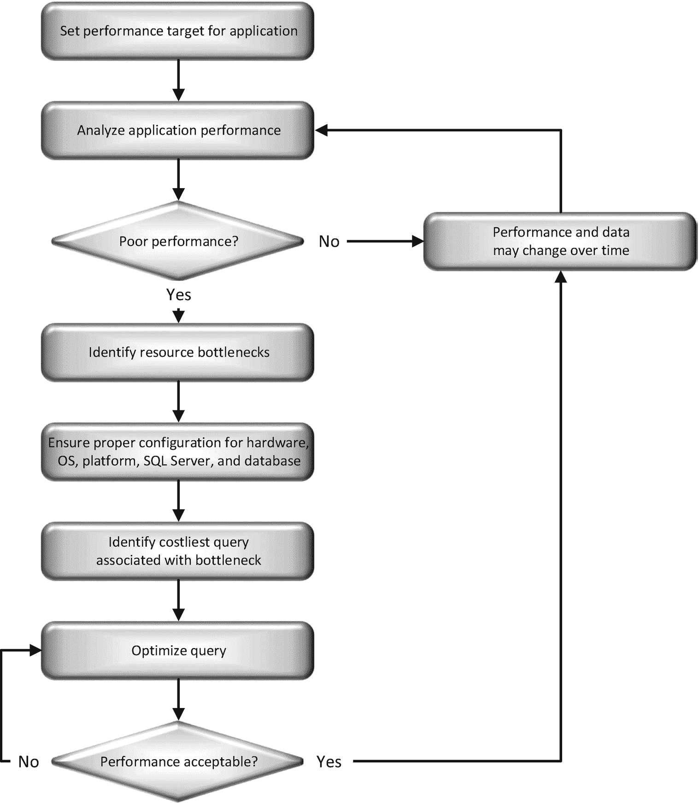

# SQL 查询性能调优

查询性能调优仍然是现代数据库维护和发展的一个基本方面。诚然，硬件性能在持续提升。对 SQL Server 的升级——尤其是针对优化器（负责确定查询的执行方式）和查询引擎（负责执行查询）的升级——本身就会带来更好的性能。此外，SQL Server 内置的自动化功能会为您处理查询调优的某些方面。与此同时，SQL Server 实例正被部署到虚拟机上，无论是本地部署还是托管环境，其硬件行为无法得到保证。数据库正在转向平台即服务系统，例如 Amazon RDS 和 Azure SQL Database。像 Entity Framework 这样的对象关系映射软件将为您生成大部分查询。尽管如此，您仍然需要处理基础的数据库设计和代码生成问题。简而言之，查询性能调优仍然是提高数据库管理系统性能的关键机制。查询性能调优的美妙之处在于，在许多情况下，对索引或 SQL 查询进行微小的改动，就能以极低的成本带来应用程序效率的大幅提升。在这些情况下，性能的提升可能比使用速度稍快的 CPU 或略微更好的优化器所带来的效果要高出几个数量级。

然而，对于粗心大意的人来说，这里存在许多陷阱。因此，需要一个经过验证的过程来确保您能正确识别并解决性能瓶颈。为了让您对磨练查询优化技能所需掌握的关键主题类型有所了解，以下列出了我在本书中涵盖的查询优化方面的一个简要列表：

*   识别有问题的 SQL 查询
*   分析查询执行计划
*   评估当前索引的有效性
*   利用查询存储来监视和修复查询
*   评估当前统计信息的有效性
*   理解参数嗅探及其故障修复
*   优化执行计划缓存
*   分析和最小化语句重编译
*   最小化阻塞和死锁
*   利用列存储存储机制
*   应用内存中表存储和过程执行
*   应用性能调优流程、工具和优化技术来优化 SQL 工作负载

在直接深入这些主题之前，让我们首先探讨一下我们为何要以这种方式进行性能调优。在本章中，我将讨论 SQL Server 数据库系统性能调优的基本概念。拥有一个可遵循的流程非常重要，这样您才能发现和识别性能问题、修复这些问题并记录您所做的改进。如果没有一个结构良好的流程，您就如同在黑暗中摸索，希望能命中目标。我将详细阐述主要的性能瓶颈，并展示设计一个对数据库友好的应用程序（即数据的使用者）以及如何优化数据库是多么重要。具体来说，我将涵盖以下主题：

*   性能调优流程
*   性能与成本
*   性能基线
*   调优工作应重点关注的方面
*   13 大 SQL Server 性能杀手

本书未涵盖的内容足以再写好几本书。正如书名所示，本书的重点是 T-SQL 查询性能调优。但是，为了让您清楚了解，以下内容将不涉及：

*   硬件选择
*   应用程序编码方法论
*   服务器配置（除非它影响查询调优）
*   SQL Server Integration Services
*   SQL Server Analysis Services
*   SQL Server Reporting Services
*   PowerShell
*   虚拟机（无论是 Azure 上的还是本地的）
*   Linux 上 SQL Server 的详细信息（尽管会提供少量信息）

## 性能调优流程

性能调优流程包括：识别性能瓶颈、对已识别的问题进行优先级排序、排查其原因、应用不同的解决方案、量化性能提升——然后不断重复整个过程。由于大多数时候并没有一个能解决所有性能问题的“银弹”，因此需要一点创造力。挑战在于缩小可能原因的范围，并评估不同解决方案的效果。您甚至可能在调优过程中撤销之前的修改。

### 核心流程

在调优过程中，您必须检查可能影响基于 SQL Server 应用程序性能的各种硬件和软件因素。在进行性能分析时，您应该自问以下几个基本问题：

*   同一服务器上是否运行着其他资源密集型应用程序？
*   硬件子系统的容量是否足以承受最大的工作负载？
*   SQL Server 的配置是否正确？
*   SQL Server 环境（无论是物理服务器、虚拟机还是平台）是否拥有足够的资源？或者我是否在处理配置问题，甚至是来自其他服务的资源争用？
*   SQL Server 与应用程序之间的网络连接是否足够？
*   数据库设计是否支持最快的数据检索（以及可更新数据库的修改操作）？
*   由 SQL 查询组成的工作负载是否经过优化以降低 SQL Server 的负载？
*   是哪些进程导致系统变慢？这反映在对各种等待状态、性能计数器和其他测量源的测量中。
*   该工作负载是否支持所需的并发级别？

如果这些因素中任何一项配置不当，整个系统的性能都可能受到影响。让我们简要审视一下这些因素。

在同一服务器上运行另一个资源密集型应用程序会限制 SQL Server 可用的资源。即使是一个作为服务运行的应用程序，也可能消耗大量的系统资源，从而限制了 SQL Server 可用的资源。当 SQL Server 必须等待其他服务的资源时，您的查询在检索或更新数据之前，也需要等待这些资源。

错误的硬件配置可能会阻碍 SQL Server 从可用资源中获得最大收益。需要考虑的主要硬件资源是处理器、内存、磁盘和网络。如果某个特定硬件资源的容量较小，那么它很快就会成为 SQL Server 的性能瓶颈。虽然本书不涉及硬件选择，但作为查询调优的一部分，您确实需要了解由于现有硬件而可能在何处遇到性能瓶颈。第 2、3 和 4 章详细介绍了其中一些硬件瓶颈。

您还应该审视 SQL Server 的配置，因为正确的配置对于优化应用程序至关重要。有一长串 SQL Server 配置定义了 SQL Server 安装的通用行为。这些配置可以使用系统存储过程`sp_configure`查看和修改，也可以通过系统视图`sys.configurations`直接查看。其中许多配置也可以通过`SQL Server Management Studio`进行交互式管理。

由于 SQL Server 配置适用于整个 SQL Server 安装，因此通常更倾向于使用标准配置。好消息是，通常您不需要修改这些配置中的绝大部分；默认设置在大多数情况下都是最佳的。实际上，一般建议是将大多数 SQL Server 配置保持为默认值。我将在本书中详细讨论一些配置参数，并对更改其中几个参数提出一些建议。

数据库选项也是如此。`model`数据库的默认设置对大多数系统来说是足够的。您可能需要将`autogrowth`设置从默认值调整，但许多其他属性，如`autoclose`或`autoshrink`，应该保持关闭状态，而其他属性，如自动创建统计信息，在大多数情况下应保持开启。

如果您在某个托管环境中运行，您可能与许多其他虚拟机或数据库共享一台服务器。在某些情况下，您可以与供应商或本地管理员合作，调整这些虚拟环境的设置，以帮助您的 SQL Server 实例运行得更好。但在许多情况下，您对系统的行为几乎没有或根本没有控制权。您需要与各个平台配合，确定何时达到该平台的限制，这些限制也可能导致性能问题。

SQL Server 与数据库应用程序之间的连接性差会损害应用程序性能。您应该问自己的问题之一是：网络连接有多好？例如，应用程序执行的查询可能经过高度优化，但用于提交此查询的网络连接可能会给整体性能增加相当大的开销。确保拥有带宽适当的最优网络配置将是系统设置的基本部分。如果您将环境托管在云端，这一点尤其重要。

在排除性能故障时，还应该分析数据库的设计。这不仅有助于您理解数据库的实体关系模型，还能理解查询为何以某种方式编写。尽管由于可能对数据库应用程序产生更广泛的影响，修改正在使用的数据库设计并非总是可行，但对数据库设计的良好理解有助于您朝着正确的方向努力，并理解解决方案的影响。这对于表中的主键、外键以及聚集索引尤其重要。

应用程序可能因为构建不佳的查询而变慢，查询可能无法使用索引，或者索引本身可能效率低下或缺失。如果任何查询未经过充分优化，它们会严重影响其他查询的性能。我将在第 8、9、12、13 和 14 章深入探讨索引优化。在这个阶段，下一个问题应该是：查询变慢是因为它本身资源消耗大，还是因为与其他查询的并发问题？您可以在第 21 章找到关于阻塞分析的深入信息。

当进程在服务器（即使是拥有多处理器的服务器）上运行时，有时一个进程会等待另一个进程完成。通过识别什么在等待以及是什么导致它等待，您可以对减速的根本原因有一个基本的了解。您可以通过 SQL Server 内的动态管理视图和性能监视器访问的操作系统计数器来实现这一点。我将在第 2 至 4 章以及第 21 章中介绍这些信息。

挑战在于找出哪个因素导致了性能瓶颈。例如，面对运行缓慢的 SQL 查询和硬件资源的高压，您可能会发现糟糕的数据库设计和未优化的查询工作负载都是罪魁祸首。在这种情况下，您必须进一步诊断症状，并将发现与可能的原因关联起来。由于性能调优可能耗时且成本高昂，理想情况下，您应该从一开始就采取预防性方法，为最佳性能而设计系统。

为加强预防性方法，在优化性能不佳的数据库时所学到的每一课，都应在实施新的数据库应用程序时被视为一项优化准则。在实施数据库应用程序时，还有一些经过验证的最佳实践值得考虑。我将在本书中详细介绍这些最佳实践，其中第 27 章专门概述了许多优化最佳实践。

请务必在数据库应用程序开发的早期阶段就将性能优化技术纳入考量。这样做将有助于您的数据库项目顺利上线，避免日后出现重大意外。

遗憾的是，我们很少能达到这一理想状态，并且常常发现数据库应用程序需要进行性能调优。因此，不仅了解如何提高基于`SQL Server`的应用程序性能很重要，掌握如何诊断性能不佳的原因也同样关键。

## 迭代过程

性能调优是一个迭代过程：您需要识别主要瓶颈、尝试解决它们、衡量更改的影响，然后返回第一步，直到性能达到可接受的水平。在应用解决方案时，应尽可能遵循一次只做一项更改的黄金法则。任何更改通常都会影响系统的其他部分，因此您必须重新评估每项更改对整个系统性能的影响。

例如，添加索引可能解决某个特定查询的性能问题，但也可能导致其他查询运行变慢，如第 8 章和第 9 章所述。因此，最好在测试环境中进行性能分析，以便将用户与您的诊断尝试和中间优化步骤隔离开。在这种情况下，一次评估一项更改也有助于根据各项更改的相对贡献，在生产服务器上按优先级安排其实现顺序。第 26 章解释了如何自动化测试数据库和查询性能，以协助此过程。

您可以持续解决那些被确定为最棘手的性能瓶颈，从而逐步提升系统性能。最初，您将能够解决重大的性能瓶颈并实现显著的性能改进，但随着迭代的进行，您的收益将逐渐减少。因此，为高效利用时间，首先量化性能目标（例如，将某个查询的执行时间减少 80%，且对服务器其他部分无不利影响）是值得的，然后朝着这些目标努力。

`SQL Server`应用程序的性能高度依赖于用户活动（或工作负载）的数量和分布以及数据量。工作负载和数据的数量和分布通常会随时间而变化，不同的数据可能导致`SQL Server`以不同方式执行`SQL`查询。适用于特定工作负载和数据的性能解决方案，可能会在一段时间后失去其有效性。因此，为确保持续保持最佳系统性能，您需要定期分析系统和应用程序性能。如图 1-1 所示，性能调优是一个永无止境的过程。

图 1-1：性能调优过程

您可以看到，优化开销最大的查询的步骤构成了一个复杂的过程，并且需要多次迭代来对查询内的性能问题进行故障排除以及一次应用一项更改。图 1-2 展示了优化开销最大查询所涉及的步骤。

图 1-2：优化开销最大的查询

从这个过程中可以看出，为确保正确调优给定查询的性能，需要做大量工作。在性能调优中，使用像这样的可靠流程至关重要，以便专注于已识别的主要问题。

话虽如此，保持对问题整体的更广阔视角也有帮助，因为您可能认为某个方面导致了性能瓶颈，而实际上是其他原因造成了问题。有时，您可能需要回头与业务方沟通，以识别需求中潜在的变化，从而找到让事情运行更快的方法。

