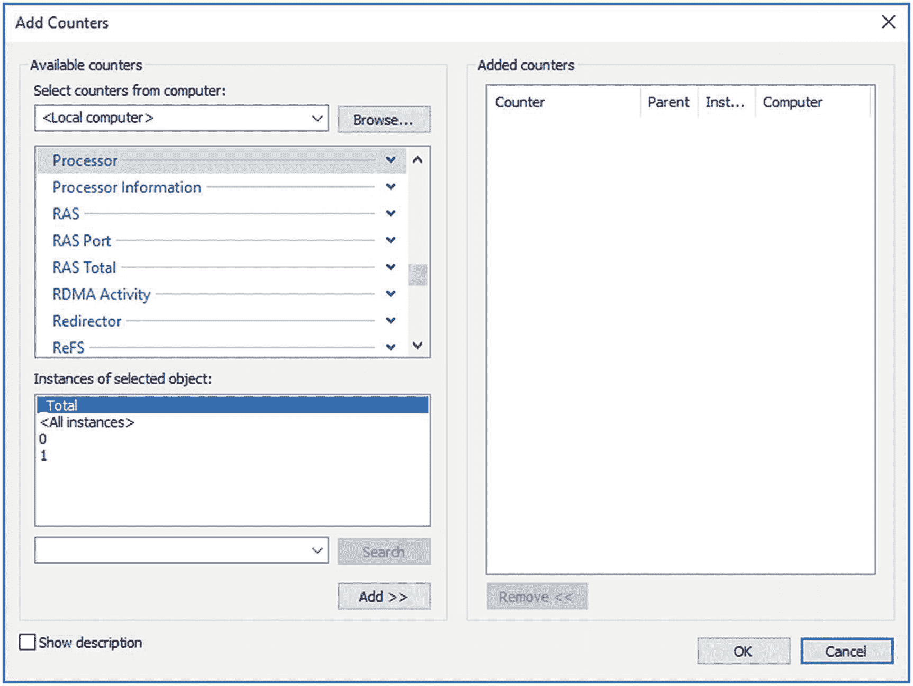

# 2. 内存性能分析

一个系统主要可以在三个地方直接影响 SQL Server 及其上运行的查询：内存、磁盘和 CPU。从本章开始，我们将依次探讨每个部分，首先是内存。SQL Server 中检索数据的查询必须首先将这些数据加载到内存中。对数据的任何更改首先被加载到内存中进行修改，然后再写入磁盘。许多其他操作也利用了系统内存的速度，例如在查询中使用 `ORDER BY` 子句对数据进行排序，在连接两个表时执行计算创建哈希表，以及通过内存 OLTP 表功能将表放入内存中。由于所有这些工作都是在系统的内存中完成的，因此理解内存是如何管理的非常重要。

在本章中，我将涵盖以下主题：

*   性能监视器工具的基础知识
*   一些用于观察系统行为的动态管理对象
*   硬件资源如何以及为何会成为瓶颈
*   观察和测量 SQL Server 和 Windows 内存使用情况的方法
*   观察和测量 Linux 内存使用情况的方法
*   内存瓶颈的可能解决方案


## 性能监视器工具

Windows Server 2016 提供了一个名为“性能监视器”的工具，它收集有关操作系统资源利用情况的详细信息。它允许你跟踪系统性能的几乎所有方面，包括内存、磁盘、处理器和网络。此外，SQL Server 2017 为性能监视器工具提供了扩展，用于跟踪 SQL Server 内的各种功能区域。

性能监视器通过捕获系统硬件和软件组件（例如处理器、进程、线程等）生成的性能数据来跟踪资源行为。系统组件生成的性能数据由一个性能对象表示。该性能对象提供了代表组件特定方面的计数器，例如 `Processor` 对象的 `% Processor Time`。请记住，在虚拟机中运行这些计数器时，许多情况下（具体取决于计数器类型）计数器测量的是虚拟机的性能，而非物理服务器。这意味着在虚拟机上收集的一些值可能无法准确反映物理现实。

一个系统组件可以有多个实例。例如，在一台拥有两个处理器的计算机中，`Processor` 对象将有两个实例，分别表示为实例 0 和 1。拥有多个实例的性能对象也可能包含一个名为 `Total` 的实例，用于表示所有实例的总值。例如，一台拥有两个处理器的计算机的处理器利用率可以通过以下性能对象、计数器和实例来确定（如图 2-1 所示）：


*图 2-1 添加性能监视器计数器*

*   *性能对象*: `Processor`
*   *计数器*: `% Processor Time`
*   *实例*: `_Total`

系统行为既可以通过图表形式实时跟踪，也可以捕获为文件（称为*数据收集器集*）用于离线分析。在生产服务器上，首选机制是使用文件。你希望将信息收集到文件中以便存储，并根据需要随时间传输。此外，将收集的数据写入文件比在活动内存中屏幕收集占用的资源更少。

要运行性能监视器工具，请在命令提示符下执行 `perfmon`，这将打开性能监视器套件。你也可以在桌面或开始菜单上右键单击“计算机”图标，展开“诊断”，然后展开“性能监视器”。你还可以转到开始屏幕并开始键入**性能监视器**；你会看到启动该应用程序的图标。这些方法中的任何一种都可以让你打开性能监视器实用程序。

你将在第 5 章学习如何设置各个计数器。既然我已经介绍了性能监视器的概念，我将介绍另一个收集指标的接口：动态管理视图。

##### 动态管理视图

为了立即获取以前只能在性能监视器中获得的大量数据快照，SQL Server 通过一组动态管理视图和动态管理函数在内部提供了一些相同的数据，以及许多不同的信息，这些统称为*动态管理视图*（文档过去指的是*对象*，但这已更改）。这些是捕获系统当前性能快照的极其有用的机制。我将在本书中介绍几个动态管理视图，但现在我将重点关注几个对于监控服务器性能和建立基线最重要的视图。

`sys.dm_os_performance_counters` 视图在查询中显示 SQL Server 计数器，允许你立即对数据应用 T-SQL 的全部功能。例如，这个简单的查询将返回 `Logins/sec` 的当前值：

```sql
SELECT  dopc.cntr_value,
        dopc.cntr_type
FROM    sys.dm_os_performance_counters AS dopc
WHERE   dopc.object_name =  'SQLServer:General Statistics'
  AND   dopc.counter_name =  'Logins/sec';
```

对于我的测试服务器，此查询返回值 46。对于你的服务器，如果你有命名实例，则需要在 `object_name` 比较中替换为相应的服务器名称，例如 `MSSQL$SQL1-General Statistics`。值得注意的是 `cntr_type` 列。该列告诉你正在读取的计数器类型（Microsoft 在 [`http://bit.ly/1mmcRaN`](http://bit.ly/1mmcRaN) 中有文档说明）。例如，前面的计数器返回值 272696576，这意味着该计数器是一个平均值。有的值是时间点的快照，有的是自服务器启动以来的累计值，等等。了解度量的含义是理解这些指标的重要组成部分。

有大量动态管理视图可用于收集有关服务器的信息。我在这里再介绍一个你会发现经常需要访问的视图，`sys.dm_os_wait_stats`。此动态管理视图显示 SQL Server 内各种资源上的聚合等待时间，这些时间是自 SQL Server 上次启动、上次发生故障转移或计数器重置以来收集的。等待时间是在工作完成后记录的，因此这些数字不反映任何活动线程。识别系统中发生的等待类型是开始识别瓶颈来源的最简单机制之一。你可以用各种方式对数据进行排序；第一个示例使用以下简单查询查看当前计数最长的等待：

```sql
SELECT TOP(10)
       dows.*
FROM   sys.dm_os_wait_stats AS dows
ORDER BY dows.wait_time_ms DESC;
```

图 2-2 显示了输出结果。


*图 2-2 sys.dm_os_wait_stats 的输出*

你不仅可以看到特定等待累积的累计时间，还可以看到它们发生的频率计数以及某些内容必须等待的最长时间。从这里，你可以识别等待类型并开始进行故障排除。最常见的等待类型之一是 I/O。如果你在前十大等待类型中看到 `ASYNC_IO_COMPLETION`、`IO_COMPLETION`、`LOGMGR`、`WRITELOG` 或 `PAGEIOLATCH`，你可能正在经历 I/O 争用，现在你知道从哪里开始着手了。前面的列表中包含了相当多基本上属于“噪音”的等待。一个常见的做法是排除它们。然而，这类等待有很多。处理这个问题的最简单方法是借助 Paul Randal 在这篇文章中的脚本：“等待统计，或者请告诉我哪里出了问题” ([`http://bit.ly/2wsQHQE`](http://bit.ly/2wsQHQE))。此外，你现在还可以在查询存储捕获的信息中看到各个查询的聚合等待统计信息，我们将在第 11 章介绍查询存储。你总是可以通过 MSDN 支持 ([`http://bit.ly/2vAWAfP`](http://bit.ly/2vAWAfP)) 直接向 Microsoft 查询有关更晦涩等待类型的信息。最后，Paul Randal 还维护着一个等待类型库（收集于 [`http://bit.ly/2ePzYO2`](http://bit.ly/2ePzYO2)）。

## 硬件资源瓶颈

通常，SQL Server 数据库性能会受到以下硬件资源的压力影响：

*   内存
*   磁盘 I/O
*   处理器
*   网络

超出硬件资源容量的压力会形成瓶颈。要解决系统的整体性能问题，你需要识别这些瓶颈，因为它们限制了整体系统性能。此外，当你清除一个瓶颈后，可能会发现还有其他瓶颈，因为一组不良行为会掩盖或限制其他组的行为。


