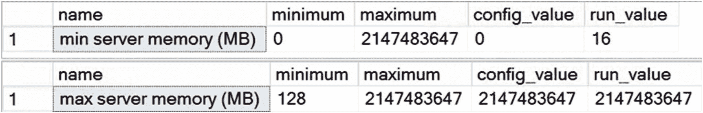
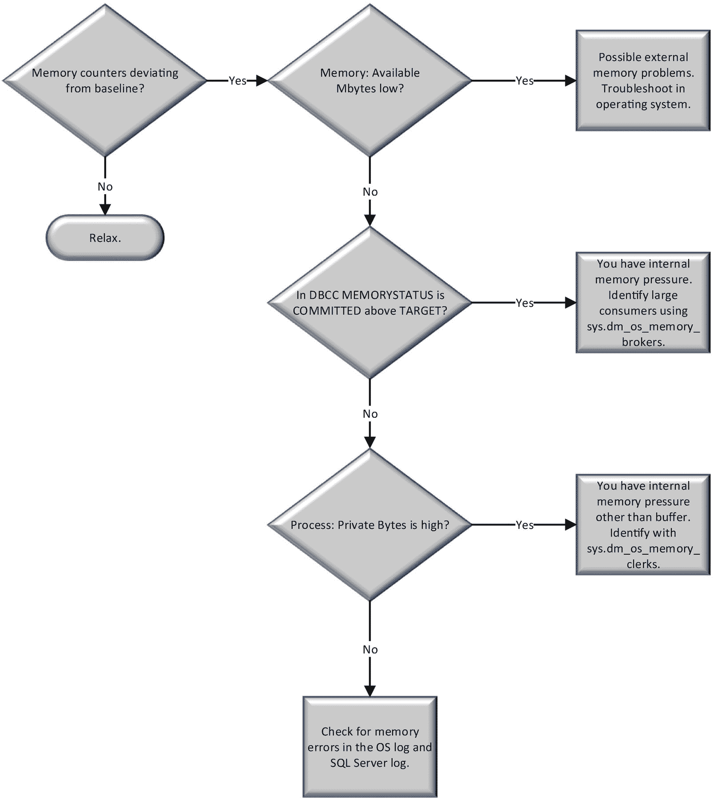

# SQL Server 内存管理

SQL Server 在一个称为 `缓冲池` 的大型内存池中管理数据库所需的内存，包括数据和查询执行计划的内存需求。过去，缓冲池由一组 8KB 的缓冲区来管理内存。如今，数据页和计划缓存页、空闲页等则使用多种页面分配方式。缓冲池通常是 SQL Server 内存中最大的部分。SQL Server 通过动态增长或缩减其内存池大小来管理内存。

您可以在 `SQL Server Management Studio (SSMS)` 中配置 SQL Server 的动态内存管理。转到“服务器属性”对话框的“内存”文件夹，如图 2-3 所示。


*图 2-3：SQL Server 内存配置*

## SQL Server 内存配置

动态内存范围通过两个配置属性控制：`最小值(MB)` 和 `最大值(MB)`。

*   `最小值(MB)`，也称为 `最小服务器内存`，作为内存池的下限值。一旦内存池达到与该下限值相同的大小，SQL Server 可以继续提交内存池中的页面，但不能将其缩减到小于该下限值。请注意，SQL Server 并非以 `最小服务器内存` 配置值启动，而是根据需要动态提交内存。
*   `最大值(MB)`，也称为 `最大服务器内存`，作为上限值以限制内存池的最大增长。这些配置设置立即生效，无需重启。在 Windows 上运行时，SQL Server 2017 Express 版的最低最大内存为 512MB，其他所有版本为 1GB。在 Linux 上的内存要求为 3.5GB。

Microsoft 建议对 SQL Server 使用动态内存配置，其中 `最小服务器内存` 设为 0，`最大服务器内存` 设置为在操作系统之外留出一些内存（假设计算机上运行单个实例）。分配给操作系统的内存量首先取决于操作系统类型，其次取决于所配置服务器的规模。

在 Windows 中，对于内存为 8GB 到 16GB 的小型系统，您应为操作系统预留大约 2GB 到 4GB 的内存。随着服务器内存量的增加，您需要为操作系统分配更多内存。一个常见的建议是，总系统内存在 32GB 以上时，每 16GB 额外内存预留 4GB。您需要根据自己系统的需求和内存分配情况进行调整。不应在运行 SQL Server 的同一服务器上运行其他内存密集型应用程序，但如果必须这样做，我建议您首先估算其他应用程序所需的内存量，然后配置 SQL Server 的 `最大服务器内存` 值，以防止其他应用程序导致 SQL Server 内存不足。在运行多个 SQL Server 实例的服务器上，您需要调整这些内存设置，以确保每个实例都有足够的值。只需确保为操作系统和外部进程预留了足够的内存。

在 Linux 中，一般指南是为操作系统预留大约 20% 的系统内存。操作系统需要内存来管理其各种资源以支持 SQL Server，因此将适用相同类型的处理需求。

无论操作系统如何，SQL Server 内部的内存大致可分为缓冲池内存（代表数据页和空闲页）和非缓冲内存（由线程、DLL、链接服务器等组成）。SQL Server 使用的大部分内存都用于缓冲池。但您可能会遇到缓冲池之外的分配，称为 `专用字节`，这可能导致内存压力，而在正常监控缓冲池过程中并不明显。如果您怀疑系统存在此问题，请检查 `Process: sqlservr: Private Bytes` 与 `SQL Server: Buffer Manager: Total pages` 的对比情况。

## 使用 sp_configure 管理内存配置

您也可以使用 `sp_configure` 系统存储过程来管理 `最小服务器内存` 和 `最大服务器内存` 的配置值。要查看这些参数的配置值，请执行 `sp_configure` 存储过程，如下所示：

```sql
EXEC sp_configure 'show advanced options', 1;
GO
RECONFIGURE;
GO
EXEC sp_configure  'min server memory';
EXEC sp_configure  'max server memory';
```

图 2-4 显示了运行这些命令的结果。


*图 2-4：SQL Server 内存配置属性*

请注意，`最小服务器内存` 设置的默认值是 0MB，而 `最大服务器内存` 设置的默认值是 2147483647MB。

您也可以使用 `sp_configure` 存储过程修改这些配置值。例如，要将 `最大服务器内存` 设置为 10GB，`最小服务器内存` 设置为 5GB，请执行以下语句集（下载中的 `setmemory.sql`）：

```sql
USE master;
EXEC sp_configure  'show advanced option',   1;
RECONFIGURE;
exec sp_configure  'min server memory (MB)',  5120;
exec sp_configure  'max server memory (MB)',  10240;
RECONFIGURE WITH OVERRIDE;
```

`最小服务器内存` 和 `最大服务器内存` 配置被归类为高级选项。默认情况下，`sp_configure` 存储过程不影响/不显示高级选项。如前所述，将 `show advanced option` 设置为 1，可使 `sp_configure` 存储过程能够影响/显示高级选项。

`RECONFIGURE` 语句更新由 `sp_configure` 设置的内存配置值。由于不建议对包含内存配置值的系统目录进行临时更新，因此使用 `OVERRIDE` 标志与 `RECONFIGURE` 语句一起以强制执行内存配置。如果您通过 Management Studio 进行内存配置，Management Studio 会在配置设置后自动执行 `RECONFIGURE WITH OVERRIDE` 语句。

另一种查看设置而不对其进行操作的方法是使用 `sys.configurations` 系统视图。您可以使用标准的 T-SQL 从 `sys.configurations` 中进行选择，而不必执行命令。

## 内存共享与专用服务器

您可能需要考虑 SQL Server 共享系统内存的情况。详细来说，设想一台同时运行 SQL Server 和 SharePoint 的计算机。这两个服务器都是内存消耗大户，因此会不断相互争夺内存。SQL Server 的动态内存行为允许它在某个时刻将内存释放给 SharePoint，又在 SharePoint 释放内存时将其夺回。您可以通过为 SQL Server 配置固定内存大小来避免这种动态内存管理的开销。然而，请记住，由于 SQL Server 是一个极其耗费资源的进程，强烈建议您使用专用的 SQL Server 生产机器。

## 用于内存压力的性能计数器

既然您已经从很高层面理解了 SQL Server 内存管理，现在让我们考虑可用于分析内存压力的性能计数器，如表 2-1 所示。

*表 2-1：用于分析内存压力的性能监视器计数器*


| `Memory:Available Bytes` | `Counter` | `Description` | `Values` |
| --- | --- | --- | --- |
| `Memory` | `Available Bytes` | 可用物理内存 | 取决于系统 |
| | `Pages/sec` | 硬页面错误速率 | 与基线对比 |
| | `Page Faults/sec` | 总页面错误速率 | 与其基线值对比以进行趋势分析 |
| | `Pages Input/sec` | 输入页面错误速率 | |
| | `Pages Output/sec` | 输出页面错误速率 | |
| | `Paging File %Usage Peak` | 内存分页文件中的峰值 | |
| | `Paging File: %Usage` | 内存分页文件的使用率 | |
| `SQLServer:Buffer Manager` | `Buffer cache hit ratio` | 从缓冲区缓存中获得服务的请求百分比 | 与其基线值对比以进行趋势分析 |
| | `Page Life Expectancy` | 页面在缓冲区缓存中停留的时间 | 与其基线值对比以进行趋势分析 |
| | `Checkpoint Pages/sec` | 由检查点写入磁盘的页数 | 与基线对比 |
| | `Lazy writes/sec` | 从缓冲区刷新的脏页（老化）速率 | 与基线对比 |
| `SQLServer:Memory Manager` | `Memory Grants Pending` | 等待内存授予的进程数 | 平均值 = 0 |
| | `Target Server Memory (KB)` | SQL Server 在该机器上可以拥有的最大物理内存 | 接近物理内存大小 |
| | `Total Server Memory (KB)` | 当前分配给 SQL 的物理内存 | 接近目标服务器内存 (KB) |
| `Process` | `Private Bytes` | 此进程已分配且无法与其他进程共享的内存大小（字节） | |

内存与磁盘 I/O 密切相关。即使你认为遇到的问题直接与内存相关，也应当收集 I/O 指标，以理解系统在这两种资源之间的行为表现。接下来，我将为你讲解这些计数器，以便你更好地理解其可能用途。

### `Available Bytes`
`Available Bytes` 计数器代表系统中可用的物理内存。你也可以查看 `Available Kbytes` 和 `Available Mbytes` 以获取相同的数据，但其精度较低。为了获得良好的性能，此计数器的值不应过低。如果 SQL Server 配置为动态内存使用，那么此值将由调用 Windows API 来控制，该 API 决定何时以及释放多少内存。如果此值在很长一段时间内都非常低，并且 SQL Server 内存没有变化，则表明服务器正承受严重的内存压力。

### `Pages/Sec` 和 `Page Faults/Sec`
要理解 `Pages/sec` 和 `Page Faults/sec` 计数器的重要性，首先需要了解页面错误（page fault）。当进程需要其`工作集`（即其在物理内存中的空间）中不存在的代码或数据时，就会发生`页面错误`。它可能导致`软页面错误`或`硬页面错误`。如果所请求的页面在物理内存的其他地方找到，则称为`软页面错误`。当进程需要其工作集中或物理内存其他地方都不存在的代码或数据，而必须从磁盘检索时，则会发生`硬页面错误`。

磁盘访问的速度对于机械硬盘来说在毫秒量级，对于固态硬盘（SSD）则可低至 0.1 毫秒，而内存访问的速度在纳秒量级。磁盘访问与内存访问之间这种巨大的速度差异，使得硬页面错误的影响与软页面错误相比非常显著。

`Pages/sec` 计数器表示为了解决硬页面错误而每秒从磁盘读取或写入磁盘的页数。`Page Faults/sec` 性能计数器表示系统处理的每秒总页面错误数——软页面错误加上硬页面错误。这些主要是负载的度量，并非性能问题的直接指标。

由 `Pages/sec` 指示的硬页面错误，不应持续高于正常水平。没有严格的数字可以表明存在问题，因为这些数字会因系统的内存量和类型以及磁盘访问速度的不同而在系统间存在很大差异。

如果 `Pages/sec` 计数器的值很高，可以将其分解为 `Pages Input/sec` 和 `Pages Output/sec` 来分析。

*   `Pages Input/sec`：应用程序只会在输入页面上等待，而不会在输出页面上等待。
*   `Pages Output/sec`：页面输出会给系统带来压力，但应用程序通常不会直接感受到这种压力。页面输出通常由应用程序需要写出到磁盘的脏页（dirty pages）表示。只有当磁盘负载成为问题时，`Pages Output/sec` 才是个问题。

另外，在 `Pages/sec` 值高的情况下，可以检查 `Process:Page Faults/sec` 以找出是哪个进程导致了过多的分页。`Process` 对象是提供系统上运行的进程性能数据的系统组件，每个进程由其相应的实例名称表示。

例如，SQL Server 进程由 `Process` 对象的 `sqlservr` 实例表示。此计数器的高数值通常意义不大，除非 `Pages/sec` 也很高。`Page Faults/sec` 在正常应用程序行为下可能数值范围很广，从每秒 0 到 1,000 都被认为是可接受的。整个数据集意味着，必须有一个基线来确定预期的正常行为。

### `Paging File %Usage` 和 `Page File %Usage`
Windows 系统中的所有内存并非物理机器的物理内存。Windows 会将那些并非立即处于活动状态的内存，在物理内存空间和分页文件之间交换进出。这些计数器用于了解这种操作在你的系统上发生的频率。作为系统性能的一般度量，这些计数器仅适用于 Windows 操作系统，而不直接适用于 SQL Server。然而，虚拟内存不足的影响会影响到 SQL Server。收集这些计数器是为了了解 SQL Server 上的内存压力是内部的还是外部的。如果是外部内存压力，你将需要深入 Windows 操作系统以确定可能的问题所在。

### `Buffer Cache Hit Ratio`
`缓冲区缓存`是数据页被读入的缓冲页池，它通常是 SQL Server 内存池中最大的部分。此计数器的值应尽可能高，特别是对于 OLTP（联机事务处理）系统——它们应该具有相当规律的数据访问模式，这与仓库或报告系统不同。对于大多数生产服务器，发现此计数器的值达到 99% 或更高是极其常见的。较低的 `Buffer cache hit ratio` 值表明很少有请求可以从缓冲区缓存中获得服务，其余请求则需从磁盘获得服务。

当这种情况发生时，要么是 SQL Server 仍在预热阶段，要么是缓冲区缓存的内存需求超过了可用于其增长的最大可用内存。如果缓存命中率持续较低，你可能需要考虑为系统增加更多内存，或者通过使用良好的索引和其他查询调优机制来减少内存需求——除非你处理的是包含大量即席查询（ad hoc queries）的报告系统。在处理报告系统时，持续看到缓存命中率变得极低是可能的。

这使得缓冲区缓存命中率成为一个了解系统行为某些方面的有趣数值，但它本身并不是一个能直接暗示潜在性能问题的指标。虽然这个数字代表了系统内一种有趣的行为，但它并不是用于精确定位问题的绝佳度量标准，而是显示了一种行为类型。关于此主题的更多详情，请阅读 Simple-Talk 上的文章“Great SQL Server Debates: Buffer Cache Hit Ratio”。
```
https://bit.ly/2rzWJv0
```


#### 页面预期寿命

`Page Life Expectancy`（页面预期寿命）指示一个页面在不被引用的情况下将在缓冲池中停留多久。通常，此计数器的数值较低意味着页面正从缓冲区中移除，这会降低缓存效率，并表明可能存在内存压力。在报表系统（与 OLTP 系统相对）上，此数值可能保持在较低的值，因为报表系统会访问更多数据。在夜间加载期间，看到 `Page Life Expectancy` 下降到非常低的水平也很常见。由于这取决于你拥有的可用内存量以及系统上运行的查询类型，因此没有适用于广泛受众的硬性数字标准。因此，你需要为你的系统建立一个基线并持续监控它。

如果你运行在具有非统一内存访问（NUMA）的机器上，你需要知道标准的 `Page Life Expectancy` 计数器是一个平均值。要查看特定度量，你需要使用 `Buffer Node:Page Life Expectancy` 计数器。

#### 检查点页数/秒

`Checkpoint Pages/sec` 计数器表示由检查点操作移动到磁盘的页数。这些数字应该相对较低，例如，对于大多数系统而言，应少于每秒 30 页。数值越高意味着缓存中被标记为脏的页越多。`脏页` 是指在缓冲区中被修改的页。当它被修改时，它会被标记为脏，并在下一个检查点期间写回磁盘。此计数器的较高值表明系统内发生了大量写入操作，可能预示着 I/O 问题。但是，如果你利用了间接检查点（它允许你控制检查点发生的时间以减少恢复间隔），你可能会看到不同的数字。在监控配置了间接检查点的数据库时，请将此考虑在内。关于 SQL Server 2016 及以上版本的检查点行为的更多信息，我建议你阅读 MSDN 上的文章“SQL Server 2016 中检查点行为的更改”（ [`https://bit.ly/2pdggk3`](https://bit.ly/2pdggk3) ）。

#### 惰性写入/秒

`Lazy writes/sec` 计数器记录了缓冲区管理器的惰性写入进程每秒写入的缓冲区数量。该进程通过系统进程移除缓冲池中陈旧的脏缓冲区，以释放内存供其他用途。一个陈旧的脏缓冲区是指包含更改并需要写入磁盘的缓冲区。此计数器的较高值可能表明存在 I/O 问题甚至内存问题。对于普通系统，`Lazy writes/sec` 值应持续低于 20。然而，与所有其他计数器一样，你必须将你的值与基线度量进行比较。

#### 待处理内存授予

`Memory Grants Pending` 计数器表示在 SQL Server 内存中等待内存授予的进程数量。如果此计数器的值很高，则说明 SQL Server 缺乏缓冲内存，这可能不仅仅是因为内存不足，还可能是由于统计信息过时导致行数估计不正确，从而引起内存授予过大等问题。在正常情况下，对于大多数生产服务器，此计数器的值应持续为 0。

另一种实时检索此值的方法是查询动态管理视图（DMV）`sys.dm_exec_query_memory_grants`。`grant_time` 列中的 `null` 值表示该进程仍在等待内存授予。这是一种可用于排查查询超时的方法，通过识别出查询（或某些查询）正在等待内存以便执行。

#### 目标服务器内存（KB）和服务器总内存（KB）

`Target Server Memory (KB)`（目标服务器内存）表示 SQL Server 愿意消耗的动态内存总量。`Total Server Memory (KB)`（服务器总内存）表示当前分配给 SQL Server 的内存量。如果系统专用于 SQL Server，则 `Total Server Memory (KB)` 计数器的值可能非常高。如果 `Total Server Memory (KB)` 远小于 `Target Server Memory (KB)`，则要么是 SQL Server 的内存需求较低，要么是 SQL Server 的 `max server memory`（最大服务器内存）配置参数设置得太低，要么是系统正处于预热阶段。预热阶段是指 SQL Server 启动后，数据库服务器在动态扩展其内存分配的过程中访问更多数据集，从而将更多数据页带入内存的时期。

你可以通过存在大量空闲页（通常为 5,000 页或更多）来确认 SQL Server 的低内存需求。此外，你可以通过查询 DMV `sys.dm_os_ring_buffers` 直接检查内存状态，该视图返回有关 SQL Server 内部内存分配的信息。我将在下一节更详细地介绍 `sys.dm_os_ring_buffers`。

## 其他的内存监控工具

虽然你可以从性能监视器计数器获得 SQL Server 内存行为的基础信息，但一旦你知道需要花时间研究内存使用情况，你将需要利用其他工具和工具集。以下是一些常用的参考点，用于识别 SQL Server 系统上的内存问题。其中一些工具仅用于内存 OLTP 管理。其中一些工具，尽管被大量 SQL Server 社区积极使用，但并未记录在 SQL Server 联机丛书中。这意味着它们绝对可能被更改或删除。

### DBCC MEMORYSTATUS

此命令深入 SQL Server 内存并读取当前的分配情况。它是一个瞬间的测量，一个快照。它提供了一组关于当前内存分配位置的度量。运行该命令的结果会以两个基本结果集的形式返回，如图 2-5 所示。


图 2-5

`DBCC MEMORYSTATUS` 的输出

第一个数据集显示基本的内存分配和事件计数。例如，`Available Physical Memory`（可用物理内存）是系统可用内存的一个度量，而 `Page Faults`（页面错误）只是一个已发生页面错误数量的计数。

第二个数据集显示了 SQL Server 内的不同内存管理器以及调用 `MEMORYSTATUS` 命令时它们消耗的内存量。

这些都可以用来理解系统中内存分配发生的位置。例如，在大多数系统的大部分时间里，主要的内存消费者是缓冲池。你可以将 `Target Committed`（目标提交量）值与 `Current Committed`（当前提交量）值进行比较，以了解你是否看到缓冲池面临压力。当 `Target Committed` 高于 `Current Committed` 时，你可能遇到了缓冲区缓存问题，需要找出当前执行的 SQL Server 进程中哪个进程使用了最多的内存。这可以使用动态管理对象 `sys.dm_os_performance_counters` 来完成。

剩余的数据集是 `DBCC MEMORYSTATUS` 产生的完整内存转储中的各种内存管理器、内存 clerk 和其他内存存储。它们仅在处理 SQL Server 管理的特定方面的狭窄情况下才具有意义，并且它们完全超出了本文档全面记录的范围。你可以在 MSDN 文章“如何使用 DBCC MEMORYSTATUS 命令”（ [`http://bit.ly/1eJ2M2f`](http://bit.ly/1eJ2M2f) ）中阅读更多内容。


##### 动态管理视图

SQL Server 中有大量与内存相关的 DMV。其中一些已随 SQL Server 2017 进行了更新，并且新增了一些。全面审视所有这些视图超出了本书的范围。在确定 SQL Server 中是否存在内存瓶颈时，有三个是最常用的。此外，当你需要监控内存中 OLTP 的内存使用情况时，另外两个也很有用。

#### `Sys.dm_os_memory_brokers`

虽然 SQL Server 中的大部分内存被分配给了缓冲池缓存，但其中的一些进程也会消耗内存。这些进程通过此 DMV 公开其内存分配情况。在有其他迹象表明存在内存瓶颈时，你可以使用此视图查看哪些进程可能正在从缓冲池缓存中抢占资源。

#### `Sys.dm_os_memory_clerks`

内存 clerk 是在 SQL Server 中分配内存的进程。观察这些进程的活动可以帮助你了解 SQL Server 内部是否存在内存分配问题，这些问题可能会抢占过程缓存所需的内存。如果性能监视器中“私有字节”计数器的值很高，你可以通过 DMV 确定系统的哪些部分正在被消耗。

如果你有一个使用内存中 OLTP 存储的数据库，可以使用 `sys.dm_db_xtp_table_memory_stats` 查看单个数据库对象的内存情况。但如果你想查看整个实例中这些对象的分配情况，则需要使用 `sys.dm_os_memory_clerks`。

#### `Sys.dm_os_ring_buffers`

此 DMV 在“联机丛书”中没有文档说明，因此它可能会被更改或移除。它在 SQL Server 2008R2 和 SQL Server 2012 之间发生了变化。我通常运行的查询在 SQL Server 2017 上似乎仍然有效，但你不能指望这一点。此 DMV 以 XML 格式输出。通常你可以肉眼阅读输出，但要实现对环形缓冲区的复杂读取，可能需要使用 XQuery。

环形缓冲区无非是对一个通知的记录响应。环形缓冲区保存在此 DMV 中，访问 `sys.dm_os_ring_buffers` 可以让你看到内存内部的变化。表 2-2 描述了与内存相关的主要环形缓冲区。

表 2-2
与内存相关的主要环形缓冲区

| **环形缓冲区** | **`ring_buffer_type`** | **用途** |
| --- | --- | --- |
| 资源监视器 | `RING_BUFFER_RESOURCE_MONITOR` | 随着内存分配的变化，此变化的通知会记录在此处。此信息有助于识别外部内存压力。 |
| 内存不足 | `RING_BUFFER_OOM` | 当你遇到内存不足问题时，它们会记录在此处，这样你就能判断哪种内存操作失败了。 |
| 内存代理 | `RING_BUFFER_MEMORY_BROKER` | 当 SQL Server 内部内存下降时，低内存通知将强制进程为缓冲区释放内存。这些通知记录在此处，使其成为衡量内部内存压力何时发生的有用指标。 |
| 缓冲池 | `RING_BUFFER_BUFFER_POOL` | 缓冲池本身内存不足的通知记录在此处。这只是内存压力的一个总体指示。 |

还有其他可用的环形缓冲区，但它们与内存分配问题无关。

#### `Sys.dm_db_xtp_table_memory_stats`

要查看你在内存中创建的表和索引的使用情况，可以查询此 DMV。输出会衡量为表和索引分配和使用的内存量。它只输出 `object_id`，因此你还需要查询系统视图 `sys.objects` 以获取表或索引的名称。此 DMV 在查询时输出当前连接到的数据库的信息。

#### `Sys.dm_xtp_system_memory_consumers`

此 DMV 显示用于管理内存中引擎内部结构的系统结构。通常你不需要直接处理它，但在排查内存问题时，了解你是直接处理系统内部发生的某些情况，还是仅仅处理加载到内存中的数据量，是很有帮助的。你在此处查找的主要指标是每个管理结构显示的已分配字节数和已使用字节数。

### 在 Linux 中监控内存

在 Linux 操作系统中，你不会有 Perfmon。然而，这并不意味着你无法观察服务器上的内存行为来了解系统是如何运行的。你可以在运行于 Linux 上的 SQL Server 2017 实例中查询 DMV `sys.dm_os_performance_counters` 和 `sys.dm_os_wait_stats`，以此方式观察内存行为。

可以通过 Linux 原生工具对 Linux 操作系统进行额外的监控。工具有很多，但常用的一个是 Grafana。它是开源的，网上有大量的文档可用。SQL Server 客户顾问团队有一个记录在案的监控 Linux 的方法，我推荐一下：[`http://bit.ly/2wi73bA`](http://bit.ly/2wi73bA) 。

### 内存瓶颈解决方案

当内存承受高压时（表现为大量的硬页错误），你可以使用图 2-6 所示的流程图来解决内存瓶颈。



图 2-6
内存瓶颈解决流程图

一些常见的内存瓶颈解决方案如下：

*   优化应用程序工作负载
*   为 SQL Server 分配更多内存
*   将内存中的表移回标准存储
*   增加系统内存
*   从 32 位处理器更改为 64 位处理器
*   启用 3GB 进程空间
*   压缩数据
*   处理碎片问题

当然，修复任何可能导致过度内存使用的查询问题始终是一个选择。让我们依次看看每一项。

### 优化应用程序工作负载

在大多数情况下，优化应用程序工作负载是最有效的解决方案，但由于此过程涉及的复杂性和挑战，它通常被最后考虑。要识别内存密集型查询，请使用扩展事件捕获所有 SQL 查询（你将在第 6 章学习如何使用）或使用查询存储（我们将在第 11 章介绍），然后按 `Reads` 列对输出进行分组。逻辑读取次数最多的查询通常最常导致内存压力，但两者之间并非线性相关。你也可以使用 `sys.dm_exec_query_stats`（一个为活动缓存中的查询收集查询指标的 DMV）来识别同样的事情。但是，由于此 DMV 基于缓存，它可能不如使用扩展事件捕获指标准确，尽管它会更快、更容易。在本书中，你将更详细地了解如何优化这些查询。

#### 为 SQL Server 分配更多内存

正如你在“SQL Server 内存管理”部分所学的，“最大服务器内存”配置可以限制 SQL Server 缓冲内存池的最大大小。如果 SQL Server 的内存需求超过了“最大服务器内存”值（你可以通过硬页错误的数量来判断），那么增加这个值将允许内存池增长。要从增加“最大服务器内存”值中获益，请确保系统中有足够的物理内存。

如果你使用的是内存中 OLTP 存储，你可能需要调整为内存中对象定义的资源池所分配的内存百分比。但这会从 SQL Server 实例的其他部分占用内存。


