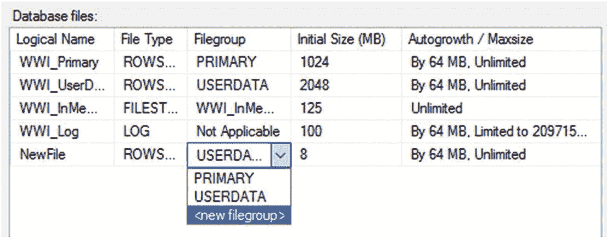

# 3. 磁盘性能分析

磁盘及其磁盘子系统（包括控制器、连接器和管理软件）是任何计算系统中最慢的部分之一。多年来，内存变得越来越快。CPU 也是如此。但是磁盘，除了我们最近在固态硬盘等技术上看到的一些显著改进外，变化并不大；磁盘仍然是大多数系统中速度最慢的部分之一。这意味着你需要能够监控你的磁盘以了解其行为。在本章中，你将探索以下领域：

*   使用系统计数器收集磁盘性能指标

*   使用其他机制收集磁盘行为信息

*   解决磁盘性能问题

*   处理 Linux 操作系统和磁盘 I/O 时的差异


## 磁盘瓶颈分析

SQL Server 可能有很高的 I/O 需求，由于磁盘速度相比内存和处理器速度慢得多，I/O 资源的争用会显著降低 SQL Server 性能。分析和解决任何 I/O 路径瓶颈都可以显著改善 SQL Server 性能。与任何性能指标一样，仅根据单个计数器或单次测量值来判断性能好坏会导致问题。在传统的 RAID 系统与现代磁盘虚拟化之间的现代磁盘和 I/O 管理系统方面，这一点尤其正确，因为测量 I/O 是一个复杂的主题。请计划使用多个指标来理解环境中 I/O 子系统的行为。尽管本章内容丰富，但仅涵盖基础知识。

现代系统中还有其他机制使得测量 I/O 更加困难。更多系统以虚拟化方式运行并共享资源，包括磁盘。这将导致更多的随机 I/O，因此在查看本章中的各项测量值时，您必须考虑到这一点。防病毒程序是 I/O 方面的常见问题，因此在开始使用我们将要讨论的 I/O 指标之前，请务必验证您是否遇到了此问题。您还可能看到作为 I/O 路径瓶颈的筛选驱动程序问题，所以这是另一个需要关注的点。

在我们讨论指标和解决方案之前，您需要了解检查点过程的工作原理。当 SQL Server 写入数据时，首先将其全部写入内存（我们将在第 4 章讨论内存问题）。内存中所有包含更改的页面被称为`脏页`。检查点过程根据内部度量标准和您的恢复间隔设置定期发生。检查点过程将`脏页`写入磁盘，并将所有更改记录到事务日志中。检查点过程是您在 SQL Server 中看到的写入 I/O 活动的主要驱动因素。

让我们看看如何衡量 I/O 子系统的行为。

### 磁盘计数器

要分析磁盘性能，您可以使用表 3-1 中所示的计数器。

表 3-1

用于分析 I/O 压力的性能监视器计数器

| 对象 (实例[,实例 N]) | 计数器 | 描述 | 值 |
| --- | --- | --- | --- |
| `PhysicalDisk`(数据磁盘, 日志磁盘) | `Disk Transfers/sec` | 磁盘上读/写操作的速率 | 最大值取决于 I/O 子系统 |
|   | `Disk Bytes/sec` | 每秒每磁盘传输到/从磁盘的数据量 | 最大值取决于 I/O 子系统 |
|   | `Avg. Disk Sec/Read` | 从磁盘读取的平均时间（毫秒） | 平均值 < 10 毫秒，但需与基线比较 |
|   | `Avg. Disk Sec/Write` | 写入磁盘的平均时间（毫秒） | 平均值 < 10 毫秒，但需与基线比较 |
| `SQLServer:Buffer Manager` | `Page reads/sec` | 读入缓冲区管理器的页数 | 与基线比较 |
|   | `Page writes/sec` | 写出缓冲区管理器的页数 | 与基线比较 |

`PhysicalDisk`计数器代表物理磁盘上的活动。`LogicalDisk`计数器代表在物理磁盘上创建的逻辑子单元（或分区）。如果您在物理磁盘上创建两个分区，例如 R: 和 S:，那么您可以使用逻辑磁盘计数器分别监控各个逻辑磁盘的活动。然而，由于磁盘瓶颈最终发生在物理磁盘上，而不是逻辑磁盘上，因此通常更倾向于使用`PhysicalDisk`计数器。

请注意，对于硬件独立磁盘冗余阵列（RAID）子系统（更多关于 RAID 的内容请参见“使用 RAID 阵列”部分），计数器将阵列视为单个物理磁盘。例如，即使您在 RAID 配置中有十个磁盘，它们在操作系统看来也只是一个物理磁盘，因此您将只有一组针对该 RAID 子系统的`PhysicalDisk`计数器。同样的道理也适用于存储区域网络（SAN）磁盘（具体请参见“使用 SAN 系统”部分）。您在许多更新的磁盘系统和虚拟磁盘中也会看到这种情况。因此，表 3-1 中显示的一些数字可能远低于（或远高于）您的系统实际能支持的值。

请将这些数字作为监控磁盘的一般指导原则，并根据技术不断发展的事实进行调整，因为随着硬件的改进，您可能会看到不同的性能表现。我们正越来越多地转向固态硬盘甚至 SSD 阵列，这使得磁盘 I/O 操作的速度提高了数个数量级。在没有采用 SSD 的地方，我们也在利用 iSCSI 接口。在使用这类硬件时，请记住这些数字更符合传统盘片式磁盘驱动器的情况，而这类驱动器正迅速被淘汰。

### 每秒磁盘传输数 (Disk Transfers/Sec)

`Disk Transfers/sec`监控磁盘上读写操作的速率。当今典型的硬盘驱动器对于顺序 I/O (IOPS) 每秒大约可以执行 180 次磁盘传输，对于随机 I/O 每秒大约 100 次。在随机 I/O 的情况下，`Disk Transfers/sec`较低，因为涉及更多的磁盘臂和磁头移动。OLTP 工作负载（主要用于单例操作、小型操作和随机访问的工作负载）通常受限于每秒磁盘传输数。因此，对于 OLTP 工作负载，您更多是受到磁盘每秒只能执行 100 次传输的限制，而不是其 1000MB 每秒的吞吐量规格的限制。

### 注意

SSD 的每秒 I/O 操作数 (IOPS) 可以在大约 5,000 到某些高端 SSD 系统的 500,000 之间。您对`Disk Transfers/sec`的监控需要相应地调整比例。有关此度量的详细信息，请咨询您的供应商。

由于磁盘固有的慢速特性，建议您尽可能保持每秒磁盘传输数较低。

### 每秒磁盘字节数 (Disk Bytes/Sec)

`Disk Bytes/sec`计数器监控在读写操作期间每秒传输到磁盘或从磁盘传输的字节数。一个转速为 7200RPM 的典型磁盘每秒可以传输大约 1000MB。通常，OLTP 应用程序不受磁盘子系统传输容量的限制，因为 OLTP 应用程序在单个数据库请求中访问少量数据。如果数据传输量超过了磁盘子系统的容量，那么磁盘子系统上就会开始出现积压，这反映在`Disk Queue Length`计数器上。

同样，对于 SSD 访问，这些数字可能会高得多，因为它主要只受限于驱动器到主机接口引起的延迟。

### 平均磁盘读取秒数和平均磁盘写入秒数 (Avg. Disk Sec/Read and Avg. Disk Sec/Write)

`Avg. Disk Sec/Read`和`Avg. Disk Sec/Write`跟踪从磁盘读取或写入磁盘平均所需的时间（以毫秒为单位）。了解磁盘处理接收到的写入和读取的速度如何，可以有力地指示问题所在。如果将数据移出或移入磁盘需要超过大约 10 毫秒的时间，您可能需要检查硬件和配置以确保一切正常运行。为了让事务日志表现良好，您需要获得更好的响应时间。

就衡量 I/O 系统性能而言，这些是单一最佳度量。`Sec/读取`或`Sec/写入`可能无法告诉您是哪个或哪些查询导致了问题。这些度量将绝对准确地告诉您 I/O 系统的行为方式，因此我会将它们与您收集的任何其他指标集一起包含在内。


### 缓冲区管理器页面读写

虽然如前所述，衡量 I/O 系统很重要，但你需要不止一个指标来展示 I/O 系统的运行状况。了解进出缓冲区管理器的页面，可以很好地指示你看到的 I/O 活动是否发生在 SQL Server 内部。当你试图证明存在 I/O 问题时，这是你希望添加到任何其他指标中的一项重要度量。

## 附加的 I/O 监控工具

就像所有其他工具一样，你需要用其他来源可用的数据来补充从性能监视器收集的信息。关于 I/O 和磁盘问题的真正有价值的信息都存在于 DMO 中。

### Sys.dm_io_virtual_file_stats

这是一个返回构成数据库的文件信息的函数。你可以像下面这样调用它：

```sql
SELECT  *
FROM    sys.dm_io_virtual_file_stats(DB_ID('AdventureWorks2017'), 2) AS divfs;
```

它会返回关于该文件的若干有趣的信息列。最有趣的是延迟数据，即用户等待不同 I/O 操作的时间。首先，`io_stall_read_ms`表示用户等待读操作的毫秒数。然后是`io_stall_write_ms`，它显示在此数据库文件中写操作必须等待的时间量。你还可以查看通用数值`io_stall`，它代表了对该文件所有 I/O 的等待总和。为了让这些数字有意义，你还会得到另一个值`sample_ms`，它显示了已测量的时间量。你可以将此值与其他值进行比较，以了解 I/O 问题在多大程度上阻碍了你的系统。此外，你可以将其缩小到特定文件，从而知道是日志还是特定的数据文件拖慢了速度。这是确定是否存在 I/O 瓶颈的一个极其有用的度量。它对于识别具体瓶颈帮助不大。请将此与等待统计信息以及前面提到的 Perfmon 指标结合使用。

### Sys.dm_os_wait_stats

这是一个有用的 DMO，它显示了系统上等待的汇总信息。要确定是否存在 I/O 瓶颈，你可以利用此 DMO 进行如下查询：

```sql
SELECT  *
FROM    sys.dm_os_wait_stats AS dows
WHERE   wait_type LIKE 'PAGEIOLATCH%';
```

你正在查看的是导致等待发生的各种 I/O 闩锁操作。与`sys.dm_io_virtual_file_stats`类似，你不会从此 DMO 获得具体的查询，但它确实能识别是否存在 I/O 瓶颈。像许多性能计数器一样，你不能仅仅在这里寻找一个数值。你需要将当前值与基线值进行比较，以得出当前情况。

前面展示的 WHERE 子句使用了`PAGEIOLATCH%`，但你还应该查找与其他 I/O 进程相关的等待，例如`WRITELOG`、`LOGBUFFER`和`ASYNC_IO_COMPLETION`。

当你运行此查询时，你会得到发生的等待次数以及总等待时间的汇总。你还会得到这些等待的最大值，这样你就知道最长的一次等待是多久，因为有可能单次等待就造成了大部分的等待时间。

别忘了，你可以在查询存储中查看等待统计信息。我们将在第 11 章详细讨论这些。

### 监控 Linux I/O

对于 I/O 监控，你只能局限于 SQL Server 内部机制，或者利用第 2 章提到的特定于 Linux 的监控工具。Linux 系统内的输入输出基本原理与 Windows 操作系统中的原理没有太大区别。主要区别仅在于如何在操作系统级别捕获磁盘行为。

## 磁盘瓶颈解决方案

一些常见的磁盘瓶颈解决方案如下：

*   优化应用程序工作负载
*   使用更快的 I/O 路径
*   使用 RAID 阵列
*   使用 SAN 系统
*   使用固态硬盘
*   正确对齐磁盘
*   增加系统内存
*   创建多个文件和文件组
*   将日志文件移动到单独的物理驱动器
*   使用分区表

现在我将逐一介绍这些解决方案。

### 优化应用程序工作负载

我无法充分强调优化应用程序工作负载在解决性能问题时的重要性。读取或写入次数最多的查询将是导致大量磁盘 I/O 的元凶。本书的剩余部分将更详细地介绍优化这些查询的策略。

### 使用更快的 I/O 路径

最高效的解决方案之一，并且是你在可能的情况下会采用的，就是使用每秒磁盘传输速度更快的驱动器、控制器和其他架构。但是，你不应该在没有进一步调查的情况下仅仅升级磁盘驱动器；你需要找出是什么给磁盘带来了压力。

### 使用 RAID 阵列

获得磁盘 I/O 并行性的一种方法是创建一个单一的驱动器池来为所有 SQL Server 数据库文件（事务日志文件除外）提供服务。这个池可以是一个单一的 RAID 阵列，在 Windows Server 2016 中表示为单个物理磁盘驱动器。驱动器池的有效性取决于 RAID 磁盘的配置。

在所有可用的 RAID 配置中，最常用的 RAID 配置如下（也如图 3-1 所示）：


图 3-1：RAID 配置

*   `RAID 0`：带区卷，无容错能力
*   `RAID 1`：镜像卷
*   `RAID 5`：带奇偶校验的带区卷
*   `RAID 1+0`：镜像带区卷

#### RAID 0

由于此 RAID 配置没有容错能力，你只能在数据可靠性不是问题的场景中使用它。阵列中任何磁盘的故障都会导致磁盘子系统中数据的完全丢失。因此，你不应将其用于构成数据库的任何数据文件或事务日志文件，可能的例外是名为`tempdb`的系统临时数据库。`RAID 0`中每个磁盘的 I/O 数量由以下等式表示：

```
每个磁盘的 I/O 数 = (读取次数 + 写入次数) / 阵列中的磁盘数
```

在此等式中，`读取次数`是对磁盘子系统的读请求次数，`写入次数`是对磁盘子系统的写请求次数。

#### RAID 1

`RAID 1`通过将数据磁盘镜像到单独的磁盘上，为关键数据提供高容错能力。它可以用于整个数据可以容纳在一个磁盘中的情况。用户数据库的数据库事务日志文件、操作系统文件以及 SQL Server 系统数据库（`master`和`msdb`）通常足够小，可以使用`RAID 1`。

`RAID 1`中每个磁盘的 I/O 数量由以下等式表示：

```
每个磁盘的 I/O 数 = (读取次数 + 2 X 写入次数) / 2
```


#### RAID 5

在许多情况下，RAID 5 是一个可接受的选择。它通过有效地仅使用一个额外磁盘来保存其他磁盘数据的计算奇偶校验信息，从而提供合理的容错能力，如图 3-1 所示。当 RAID 5 配置中出现磁盘故障时，I/O 性能会变得非常糟糕，尽管系统在故障驱动器下运行时仍然可用。

任何写入操作占总磁盘请求超过 10% 的数据都不适合使用 RAID 5。因此，请在只读卷或磁盘写入百分比低的卷上使用 RAID 5。

RAID 5 中每个磁盘的 I/O 数由以下公式表示：

```
每个磁盘的 I/O 数 = (读取次数 + 4 X 写入次数) / 阵列中的磁盘数量
```

如这个等式所示，RAID 5 磁盘子系统上的写入操作被放大了四倍。对于每个传入的写入请求，磁盘子系统上会有以下四个对应的 I/O 请求：

*   一个读取 I/O，用于从要修改内容的数据磁盘读取现有数据
*   一个读取 I/O，用于从相应的奇偶校验磁盘读取现有奇偶校验信息
*   一个写入 I/O，用于将新数据写入要修改内容的数据磁盘
*   一个写入 I/O，用于将新的奇偶校验信息写入相应的奇偶校验磁盘

因此，每个写入请求的四个 I/O 包括两个读取 I/O 和两个写入 I/O。

在 OLTP 数据库中，所有数据修改都会作为数据库事务的一部分立即写入事务日志文件，但数据文件本身的内容是通过批处理操作与事务日志文件内容异步同步的。此操作由 SQL Server 的内部进程 `检查点进程` 管理。此操作的频率可以通过使用 SQL Server 的 `恢复间隔（分钟）` 配置参数来控制。只需记住，检查点的时机可以通过 SQL Server 2012 中引入的间接检查点来控制。

由于高度事务性的 OLTP 数据库中事务日志文件持续进行写入操作，将事务日志文件放置在 RAID 5 阵列上会降低阵列的性能。虽然在可能的情况下，不应将事务日志文件放置在 RAID 5 阵列上，但数据文件可以放置在 RAID 5 上，因为对数据文件的写入操作是间歇性的，并且会批量处理以提高写入操作的效率。

#### RAID 6

RAID 6 是在 RAID 5 之上增加的一层。它在 RAID 5 的存储中添加了一个额外的奇偶校验块。这不会以任何方式对读取产生负面影响。这意味着，对于读取操作，其性能与 RAID 5 相同。额外的写入会带来额外开销，但并不算大。添加这个额外的奇偶校验块是因为如今 RAID 阵列变得如此之大，数据丢失在所难免。额外的奇偶校验块充当了防止这种情况的检查机制，以更好地确保您的数据安全。

#### RAID 1+0 (RAID 10)

RAID 1+0（也称为 RAID 10）配置通过镜像阵列中的每个数据磁盘，提供了高度的容错能力。它比 RAID 5 昂贵得多，因为需要两倍的数据磁盘数量来提供容错能力。当需要大容量卷来保存数据且超过 10% 的磁盘请求是写入时，应使用此 RAID 配置。由于 RAID 1+0 支持 `拆分寻道`（能够将读取操作分布到数据磁盘和镜像磁盘上，然后合并两个数据流），读取性能也非常出色。因此，在性能至关重要的任何地方都使用 RAID 1+0。

RAID 1+0 中每个磁盘的 I/O 数由以下公式表示：

```
每个磁盘的 I/O 数 = (读取次数 + 2 X 写入次数) / 阵列中的磁盘数量
```

### 使用 SAN 系统

尽管成本已经下降，但 SAN 在很大程度上仍然是大型企业系统的领域。SAN 可用于通过简单地提供更多的主轴和磁盘驱动器进行读写来提高存储子系统的性能。由于其规模、复杂性和成本，SAN 并不一定是所有情况下的良好解决方案。此外，根据数据量，`DAS`（直接附加存储）可以配置得运行更快。SAN 系统的主要优势并不体现在性能上，而是在可扩展性、可用性和维护性方面。

SAN 发展的另一个领域是使用互联网小型计算机系统接口 (`iSCSI`) 将设备连接到网络的 SAN 设备。由于 `iSCSI` 接口的工作方式，您可以使网络设备看起来像是本地附加存储。实际上，它的速度几乎与本地附加存储一样快，但您可以整合您的存储系统。

相反，通过转而使用本地磁盘并摆脱 SAN，您可能会获得性能提升。SAN 系统在设计上具有极高的冗余性。但是，这种冗余性给磁盘操作增加了很多开销，特别是 SQL Server 通常执行的那种操作：大量快速执行的小型写入。虽然从单个本地磁盘迁移到 SAN 可能是一种改进，但根据您的系统和您组合的磁盘子系统，您可能在 SAN 之外获得更好的性能。

### 使用固态硬盘

固态硬盘正在席卷磁盘性能领域。这些驱动器使用内存而不是旋转磁盘来存储信息。它们安静、功耗低且速度极快。然而，与硬盘驱动器 (HDD) 相比，它们也相当昂贵。在撰写本文时，HDD 的成本约为每 GB 0.03 美元，而 SSD 约为每 GB 0.90 美元。但这一成本被速度的提升所抵消，速度从大约每秒 100 次操作提高到每秒 5,000 次操作甚至更高。您还可以通过 SAN 或 RAID 将 SSD 放入阵列中，进一步提高性能优势。SSD 驱动器的写入操作次数是有限的，但到目前为止，其故障率并不高于 HDD。还有一些具有不同价格点和性能指标的混合解决方案。对于纯硬件解决方案，为 I/O 受限的系统实施 SSD 可能是您能做的最佳操作。

### 正确对齐磁盘

Windows Server 2016 在安装过程中会对磁盘进行对齐，因此现代服务器不应遇到此问题。但是，如果您使用的是旧服务器，这仍然是个问题。如果您要将卷从 Windows Server 2008 之前的系统迁移，也需要担心这个问题。您将需要重新格式化这些卷以正确设置对齐。数据存储在磁盘上的方式是一系列存储在磁道上的 `扇区`（也称为 `块`）。当由供应商确定的磁道大小包含的扇区数量与您写入的默认大小不同时，磁盘就是未对齐的。这意味着一个扇区会被正确写入，但下一个扇区将不得不跨越两个磁道。这可能使写入或读取磁盘所需的 I/O 量增加一倍以上。关键是对齐分区，以便为磁道存储正确数量的扇区。

### 增加系统内存

当物理内存不足时，系统开始将内存内容写回磁盘，并更频繁地读取较小的数据块，或者读取较大的块，这两种情况都会导致大量分页。系统内存越少，磁盘子系统的使用就越多。这可以通过使用上一节列举的内存瓶颈解决方案来解决。

### 创建多个文件和文件组

在 SQL Server 中，每个用户数据库由一个或多个数据文件以及通常一个事务日志文件组成。属于数据库的数据文件可以分组到一个或多个文件组中，用于管理和数据分配/放置的目的。例如，如果一个数据文件被放置在一个单独的文件组中，那么通过将该文件组设置为只读，可以集体控制对该文件组中所有表的写访问（事务日志文件不属于任何文件组）。

您可以从 SQL Server Management Studio 为数据库创建文件组，如图 3-2 所示。数据库的文件组在“数据库属性”对话框的“文件组”窗格中呈现。


图 3-2

文件组配置

在图 3-2 中，您可以看到为 `WideWorldImporters` 数据库定义了三个文件组。您可以将多个文件添加到分布在多个 I/O 路径上的多个文件组中，这样在将数据库对象也移动到这些不同的组中后，工作就可以跨组并行执行并利用分布式存储，实质上让多个磁盘主轴和多个 I/O 路径协同工作。但是，简单地通过单个磁盘控制器在多个磁盘（即使是不同的磁盘）上放置大量文件可能会导致更差的性能，而不是更好。

您可以在“数据库属性”对话框的“文件”窗口中，通过从下拉列表中选择来向文件组添加数据文件，如图 3-3 所示。



图 3-3

*数据文件配置*

您也可以通过编程方式执行此操作，如下所示：

```sql
ALTER DATABASE WideWorldImporters
ADD FILEGROUP Indexes;
ALTER DATABASE WideWorldImporters
ADD FILE
(
NAME = AdventureWorks2017_Data2,
FILENAME = 'c:\DATA\WWI_Index.ndf',
SIZE = 20GB,
FILEGROWTH = 10%
)
TO FILEGROUP Indexes;
```

通过将经常连接的表分隔到不同的文件组中，然后将文件组内的文件放置在不同的磁盘或 LUN 上，分离的 I/O 路径可以提高性能，当然前提是指向这些磁盘的路径配置正确且不过载（不要误以为更多的磁盘就自动意味着更多的 I/O；事情并非如此）。例如，考虑以下查询：

```sql
SELECT si.StockItemName,
s.SupplierName
FROM Warehouse.StockItems AS si
JOIN Purchasing.Suppliers AS s
ON si.SupplierID = s.SupplierID;
```

如果表 `Warehouse.StockItems` 和 `Purchasing.Suppliers` 被放置在各自包含一个文件的不同文件组中，磁盘可以从多个 I/O 路径读取，从而提升性能。

出于性能和恢复目的，建议如果要使用多个文件组，主文件组应仅用于系统对象，辅助文件组应仅用于用户对象。这种方法提高了从损坏中恢复的能力。如果主数据文件和日志文件完好无损，数据库的可恢复性会更高。仅对系统对象使用主文件组，并将所有用户相关对象存储在一个或多个辅助文件组上。

将数据库分散到多个文件中，即使在同一驱动器上，也使得将来将数据库文件移动到独立驱动器上更加容易。例如，要将用户数据库文件 (`WWI_Index.ndf`) 移动到新的磁盘子系统 (F:)，您可以按照以下步骤操作：

1.  分离用户数据库，如下所示：

    ```sql
    USE master;
    GO
    EXEC sp_detach_db 'WideWorldImporters';
    GO
    ```

2.  将数据文件 `WWI_Index.ndf` 复制到新磁盘子系统上的文件夹 `F:\Data\` 中。

3.  通过引用适当位置的文件重新附加用户数据库，如下所示：

    ```sql
    USE master;
    GO
    sp_attach_db 'WideWorldImporters',
    'R:\DATA\WWI_Primary.mdf',
    'R:\DATA\WWI_UserData.ndf',
    'F:\DATA\WWI_Indexes.ndf',
    'R:\DATA\WWI_InMemory.ndf',
    'S:\LOG\WWI_Log.1df ';
    GO
    ```

4.  要验证属于数据库的文件，请执行以下命令：

    ```sql
    USE WideWorldImporters;
    GO
    SELECT * FROM sys.database_files;
    GO
    ```

### 将日志文件移动到单独的物理磁盘

只要可能，SQL Server 事务日志文件应始终与所有其他 SQL Server 数据库文件位于单独的硬盘驱动器上。事务日志活动主要包括顺序写 I/O，与数据文件所需的非顺序（或随机）I/O 不同。将事务日志活动与其他非顺序磁盘 I/O 活动分离可以提高 I/O 性能，因为它允许包含日志文件的硬盘驱动器专注于顺序 I/O。但是，请记住，也存在随机的日志读取，并且数据读写也可以像事务日志一样是顺序的。只是事务日志写入具有强烈的顺序性倾向。

然而，为所有日志文件创建一个单一磁盘只会让您再次面临随机 I/O。如果这个特定的日志文件对任务至关重要，它可能需要自己的存储和路径以最大化性能。

从硬盘访问数据所需时间的主要部分花费在定位数据所需的磁盘主轴头的物理移动上。一旦数据被定位，数据就会以比物理移动快得多的电子方式读取。如果日志磁盘上只有顺序 I/O 操作，则日志磁盘的主轴头可以用最少的物理移动写入日志磁盘。但是，如果同一磁盘用于数据文件，则主轴头必须在写入日志文件之前移动到正确的位置。这增加了写入日志文件所需的时间，从而损害了性能。

即使是 SSD 磁盘，将数据与事务日志隔离也意味着工作将被分配到多个位置，从而提高性能。

此外，对于具有多个 OLTP 数据库的 SQL Server，事务日志文件应在不同的物理驱动器上彼此物理分离以提高性能。此要求的例外是只读数据库或数据库更改很少的数据库。由于只读数据库不进行在线更改，因此不在日志文件上执行写入操作。因此，对于只读数据库，不需要将日志文件放在单独的磁盘上。

作为一般经验法则，您应尽可能尝试将具有最高 I/O 的文件与其他具有高 I/O 的文件隔离。这将减少磁盘上的争用并可能提高性能。要识别那些使用最多 I/O 的文件，请参考 `sys.dm_io_virtual_file_stats`。


### 使用分区表

除了简单地将文件添加到文件组并让 SQL Server 在它们之间分配数据之外，还可以定义称为*分区*的数据水平分割，以便数据根据分区在多个文件之间划分。一组过滤后的数据是一个段（segment）；例如，如果按月分区，那么数据段就是任何给定的月份。创建分区会将该数据段移动到特定的文件组，并且仅移动到那个文件组。虽然分区主要是使数据管理更轻松的工具，但在某些情况下你可能会看到速度的提升，因为在针对定义良好的分区进行查询时，通过一个称为*分区消除（partition elimination）* 的过程，只会访问包含你感兴趣的数据分区的文件。如果你假设数据按月分区，那么每个月的数据文件可以在月份结束时设置为只读。这种只读状态意味着你将更快地恢复系统，并且你可以压缩存储，从而带来一些性能提升。请记住，分区主要是一个可管理性特性。虽然你在某些情况下可能会从中看到一些性能好处，但它不应被视为数据分区的一部分来指望。SQL Server 2017 最多支持 15,000 个分区（请记住，这是一个限制，而不是目标）。我再说一遍，分区绝对不是一个性能增强工具。

## 本章总结

本章重点介绍收集和解释有关磁盘行为的指标。请记住，每套硬件从根本上都可能是不同的，因此应用任何硬性的行为指标都可能是有问题的。你现在拥有了使用性能监视器和一些 `T-SQL` 命令来收集磁盘性能指标的工具。解决磁盘瓶颈的方法多种多样，但如果你正在处理与磁盘行为相关的瓶颈，就必须探索这些方法。

下一章将通过讨论 `CPU` 来完成对系统瓶颈的检查。

